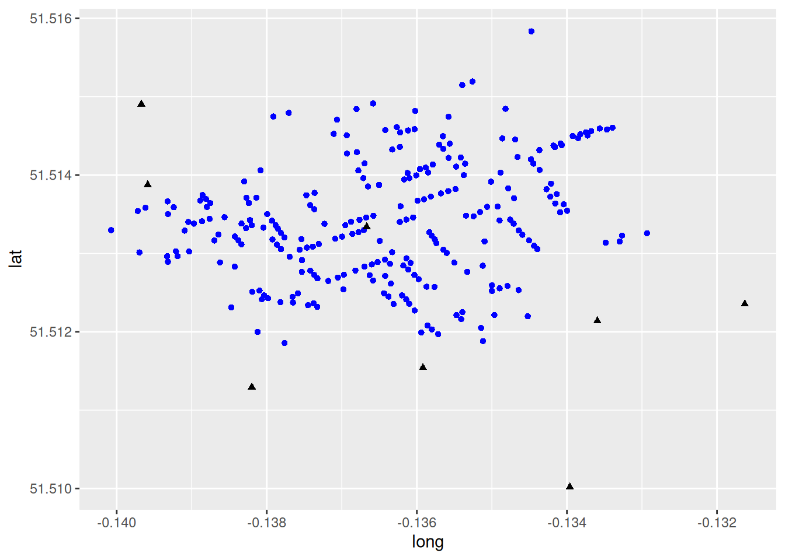

# Part II: Statistics and Maps {-}

<!-- -->

# Introduction to Mapping in `R` {#introduction-to-maps}

*NOTE*: The source files for this book are available with companion package [{isdas}](https://paezha.github.io/isdas/). The source files are in Rmarkdown format and packed as templates. These files allow you execute code within the notebook, so that you can work interactively with the notes. 

Spatial statistics is a sub-field of spatial analysis that has grown in relevance in recent years as a result of 1) the availability of information that is geo-coded, in other words, that has geographical references; and 2) the availability of software to analyze such information.

A key technology fueling this trend is that of Geographical Information Systems (GIS). GIS are, in simplest terms, digital mapping for the 21st century. In most cases, however, GIS go beyond cartographic functions to also enable and enhance our ability to analyze data.

There are many available packages for geographical information analysis. Some are very user friendly, and widely available in many institutional contexts, including open source alternatives such as [QGIS](https://qgis.org/en/site/), or commercial software such as ESRI's Arc software. Others are fairly specialized, such as Caliper's TransCAD, which implements many operations of interest for transportation engineering and planning. 

Others packages have the advantage of being more flexible and/or free.

Such is the case of the `R` statistical computing language. `R` has been adopted by many in the spatial analysis community, and a number of specialized libraries have been developed to support mapping and spatial data analysis functions.

The objective of this note is to provide an introduction to mapping in `R`. Maps are one of the fundamental tools of spatial statistics and spatial analysis, and `R` allows for many GIS-like functions.

In the previous reading/practice you created a simple proportional symbols map. In this reading/practice you will learn how to create more sophisticated maps in `R`.

## Learning Objectives

In this reading, you will:

1. Revisit how to install and load a package.
2. Learn how to invoke a data and view the data structure.
3. Learn how to easily create maps using `R`.
4. Think about how statistical maps help us understand patterns.

## Suggested Readings

- Bivand RS, Pebesma E, Gomez-Rubio V [-@Bivand2008] Applied Spatial Data Analysis with R, Chapters 2-3. Springer: New York
- Brunsdon C and Comber L [-@Brunsdon2015R] An Introduction to R for Spatial Analysis and Mapping, Chapter 3. Sage: Los Angeles

## Preliminaries

it is good practice to begin with a clean session to make sure that you do not have extraneous items there when you begin your work. The best practice is to restart the `R` session, which can be accomplished for example with `command/ctrl + shift + F10`. An alternative to _only_ purge user-created objects from memory is to use the `R` command `rm` (for "remove"), followed by a list of items to be removed:

``` r
# The function `ls()` lists all objects in the Environment, that is, your current workspace;
# `rm()` removes all objects listed in the argument `list = `
rm(list = ls())
```

## Packages

According to Wickham [-@wickham2015rpackages] packages are the basic units of reproducible code in the `R` multiverse.

Now that your workspace is clear, you can proceed to load a package. In this case, the package is the one used for this book/course, called `isdas`:

``` r
#The function 'library' is used to load the data we want to work with. 
# In this case, it is the isdas master package that we want to work with 
library(isdas) # Companion Package for Book An Introduction to Spatial Data Analysis and Statistics
```

```
## Warning: replacing previous import 'dplyr::lag' by 'stats::lag' when loading
## 'isdas'
```

```
## Warning: replacing previous import 'plotly::filter' by 'stats::filter' when
## loading 'isdas'
```

The package includes a few datasets that will be used throughout the book:

``` r
#The function `data` is used to check if a dataset is present within any loaded packages. 
# In this case, we are looking for `snow_deaths` and `snow_pumps`
data("snow_deaths")
data("snow_pumps")
```

## Exploring Dataframes and a Simple Proportional Symbols Map

If you correctly loaded the library, you can now access the dataframes in the package `isdas`. For this section, you will need two dataframes, namely `snow_pumps` and `snow_deaths`:

``` r
#The function `head` will display the first few rows of the dataframe, snow_deaths 
head(snow_deaths)
```

```
##         long      lat Id Count
## 0 -0.1379301 51.51342  1     3
## 1 -0.1378831 51.51336  2     2
## 2 -0.1378529 51.51332  3     1
## 3 -0.1378120 51.51326  4     1
## 4 -0.1377668 51.51320  5     4
## 5 -0.1375369 51.51318  6     2
```

These data are from the famous London cholera example by John Snow (not the one from Game of Thrones, but the British physician). John Snow is considered the father of spatial epidemiology, and his study mapping the outbreak is credited with helping find its cause.This study investigates the cholera outbreak of Soho, London, in 1854. 

The dataframe `snow_deaths` includes the geocoded addresses of cholera deaths in `long` and `lat`, and the number of deaths (the `Count`) recorded at each address, as well as unique identifiers for the addresses (`Id`).

A second dataframe `snow_pumps` includes the geocoded locations of water pumps in Soho:

``` r
head(snow_pumps)
```

```
##            long      lat  Id Count
## 01   -0.1366679 51.51334 251     1
## 1100 -0.1395862 51.51388 252     1
## 250  -0.1396710 51.51491 253     1
## 310  -0.1316299 51.51235 254     1
## 410  -0.1335944 51.51214 255     1
## 510  -0.1359191 51.51154 256     1
```

As in your previous reading, it is possible to map the cases using `ggplot2`. Begin by loading the package `tidyverse`:

``` r
#'Tidyverse' is a collection of R packages designed for data science used in everyday data analyses  
library(tidyverse) # Easily Install and Load the 'Tidyverse'
```

Now, you can create a blank `ggplot2` object from which you can render the points for deaths and the pumps.

``` r
#The function `ggplot` is used for data visualization - it creates a graph. 
# The function `geom_point` tells R you want to create a plot of points. 
# `data = snow_deaths` tells R you want to use the `snow_deaths` dataframe. 
# `aes` stands for aesthetics of your graph where `x = long` sets the x axis 
# to `long`, where `y = lat` sets the y axis to `lat`, where `color = blue` 
# colours the points blue and `shape = 16` assigns the shape of the points -
# in this case, `16` are circles and `17` are triangles  

ggplot() +
  geom_point(data = snow_deaths, aes(x = long, y = lat), color = "blue", shape = 16) +
  geom_point(data = snow_pumps, aes(x = long, y = lat), color = "black", shape = 17)
```



This map is a decent example of how to represent visually some contents in the dataframe. Here, information is displayed using different colours and symbols to represent pumps and deaths from the London Cholera Example. Though this map provides useful insights, it is not of the greatest quality. We will illustrate other ways of creating maps below, including interactive maps. 

## Improving on the Proportional Symbols Map

A package that extends the functionality of mapping in `R` is `leaflet`. A key feature of the `leaflet` package is the ability to make maps interactive for the user. We will see next how to enhance our proportional symbol map using this package. First you  need to load the package (you need to install it first if you have not already):

``` r
# 'Leaflet' is a package used for visualizing data on a map in R. 
if (!require("leaflet")) install.packages('leaflet')
library(leaflet) # Create Interactive Web Maps with the JavaScript 'Leaflet'
```

The first step is to create a `leaflet` object, which will be saved in `m` : 

``` r
# Here, we create a `leaflet` object and assign it to the variable, 'm'. 
# The `setView` function sets the view of the map where `lng = -0.136` 
# sets the longitutde, 'lat = 51.513' sets the latitude and the map zoom 
# is set to 16. The `|>` is a pipe operator that passes the output from 
# the left hand side of the operator to the first argument of the right 
# hand side of the operator. In this case we are telling `R` that we want 
# to center the map on the set longitude and latitude, with a zoom level 
# of 16, which corresponds roughly to a neighborhood 

m <- leaflet(data = snow_deaths) |> 
  setView(lng = -0.136, lat = 51.513, zoom = 16)
```

This map looks like this at this point:

``` r
m
```

```{=html}
<div class="leaflet html-widget html-fill-item" id="htmlwidget-f492e8cc303f03f458b5" style="width:672px;height:480px;"></div>
<script type="application/json" data-for="htmlwidget-f492e8cc303f03f458b5">{"x":{"options":{"crs":{"crsClass":"L.CRS.EPSG3857","code":null,"proj4def":null,"projectedBounds":null,"options":{}}},"setView":[[51.513,-0.136],16,[]]},"evals":[],"jsHooks":[]}</script>
```

The map is empty! This is because we have not yet added any geographical information to plot. We can begin by adding a basemap as follows:

``` r
# We are adding a basemap or background map of the study area 
# by means of the `addTiles` function to the 'm' variable 
m <- m |> addTiles()
m
```

```{=html}
<div class="leaflet html-widget html-fill-item" id="htmlwidget-bb4105e2d94c9a6a73a3" style="width:672px;height:480px;"></div>
<script type="application/json" data-for="htmlwidget-bb4105e2d94c9a6a73a3">{"x":{"options":{"crs":{"crsClass":"L.CRS.EPSG3857","code":null,"proj4def":null,"projectedBounds":null,"options":{}}},"setView":[[51.513,-0.136],16,[]],"calls":[{"method":"addTiles","args":["https://{s}.tile.openstreetmap.org/{z}/{x}/{y}.png",null,null,{"minZoom":0,"maxZoom":18,"tileSize":256,"subdomains":"abc","errorTileUrl":"","tms":false,"noWrap":false,"zoomOffset":0,"zoomReverse":false,"opacity":1,"zIndex":1,"detectRetina":false,"attribution":"&copy; <a href=\"https://openstreetmap.org/copyright/\">OpenStreetMap<\/a>,  <a href=\"https://opendatacommons.org/licenses/odbl/\">ODbL<\/a>"}]}]},"evals":[],"jsHooks":[]}</script>
```

The map now shows the neighborhood in Soho where the cholera outbreak happened. Now, at long last, we can add the cases of cholera deaths to the map. For this, we indicate the coordinates (preceded by `~`), and set an option for clustering by means of the `clusterOptions` in the following fashion:

``` r
# We are adding the cholera deaths to the map using 'group = Deaths'. 
# The '~' symbol tells R to use the same longitude and latitude values 
# used in the previous block of code and the 'clusterOptions = markerClusterOptions()'
# clusters a large number of markers on the map - in this case it is clusturing 
# number of deaths into icons with numbers  

m <- m |> 
  addMarkers(~long, 
             ~lat, 
             clusterOptions = markerClusterOptions(),
             group = "Deaths")
m
```

```{=html}
<div class="leaflet html-widget html-fill-item" id="htmlwidget-9b006dfc4486fd208f92" style="width:672px;height:480px;"></div>
<script type="application/json" data-for="htmlwidget-9b006dfc4486fd208f92">{"x":{"options":{"crs":{"crsClass":"L.CRS.EPSG3857","code":null,"proj4def":null,"projectedBounds":null,"options":{}}},"setView":[[51.513,-0.136],16,[]],"calls":[{"method":"addTiles","args":["https://{s}.tile.openstreetmap.org/{z}/{x}/{y}.png",null,null,{"minZoom":0,"maxZoom":18,"tileSize":256,"subdomains":"abc","errorTileUrl":"","tms":false,"noWrap":false,"zoomOffset":0,"zoomReverse":false,"opacity":1,"zIndex":1,"detectRetina":false,"attribution":"&copy; <a href=\"https://openstreetmap.org/copyright/\">OpenStreetMap<\/a>,  <a href=\"https://opendatacommons.org/licenses/odbl/\">ODbL<\/a>"}]},{"method":"addMarkers","args":[[51.51341771241721,51.5133613998342,51.5133170489738,51.5132621296606,51.51320397671766,51.51318355204854,51.51335918676924,51.51332803550294,51.51332295785953,51.51342667289707,51.51338118923545,51.5134623424476,51.51321592851835,51.51316944859251,51.51311647491117,51.51323961162387,51.51316442104322,51.51317818411652,51.51311119796137,51.51305543754319,51.51344133271014,51.51359242080411,51.51340233830832,51.51337957285638,51.51341078151107,51.51364145269945,51.51369342694989,51.51374487554566,51.5136761001242,51.51358965021902,51.51366307627471,51.51350231272456,51.51358256821044,51.51354131614605,51.51329754374774,51.51329052556387,51.51301333342936,51.51296475968319,51.51289325098754,51.51296415860528,51.51302483971293,51.51302667578982,51.51283096213334,51.51288456099817,51.512526461566,51.51246523224839,51.51242820172415,51.51241465023237,51.5125095595528,51.5123779695186,51.51244688426475,51.51249109034944,51.5123735237671,51.51233946581913,51.51236414351145,51.51231865923391,51.51254041922127,51.51264860016905,51.51269241028542,51.51295654926946,51.51276467861943,51.51278013527604,51.51272618217833,51.51268122125017,51.51291389409194,51.51304641730572,51.51307361992732,51.51308716531178,51.51312173006386,51.51318703807339,51.51321446506859,51.51324936702789,51.51327122982325,51.51330000532925,51.513159501803,51.51301590684736,51.51292126324469,51.51289012737031,51.51285949729033,51.51283044071621,51.51278171338225,51.51272899538871,51.51286848999706,51.51272270243459,51.51265441759925,51.51271292384934,51.51261513313285,51.51249092743264,51.51244900112296,51.51246467320608,51.51241314259408,51.5123580283144,51.51227148485825,51.51235510372067,51.51199097051281,51.51208253904073,51.51203084352937,51.51196971504504,51.51188160263239,51.51204982885617,51.51225014500682,51.51216174817519,51.51221224934735,51.51257280001735,51.51257531307455,51.51267178386899,51.51272652750651,51.51279375218358,51.51284594189756,51.51287947168274,51.51293878754134,51.51276526229672,51.5128439493493,51.51253200926634,51.5121976542315,51.51221473376273,51.51315355765666,51.51305600384666,51.51316542761858,51.51309782344348,51.51323808001884,51.51329311339476,51.51337922667152,51.51343059777332,51.51347464929984,51.51342159243502,51.51352809751089,51.51348138080801,51.51359396751432,51.51322690676794,51.51317979221965,51.51313203437916,51.51304780211037,51.51300598291723,51.51288250505248,51.51326976514285,51.51345852030295,51.513431301037,51.51340205260731,51.51259298504279,51.51258461888924,51.51255453029176,51.5125207793547,51.51313719824024,51.51322810549903,51.51315238694715,51.51325759227252,51.51354411471583,51.51362611470109,51.51363711464002,51.51352405667991,51.51381950324498,51.51372377799584,51.51370372597971,51.51383086096664,51.51391541451077,51.51359665484009,51.51403207703279,51.51389120739647,51.51375756145112,51.51406477280808,51.51414613344894,51.51420092441626,51.51422997525221,51.51431864339793,51.51437706649619,51.51435723249875,51.51438202273066,51.51440169141211,51.51452155528173,51.51449742659375,51.51447242637142,51.51450423997807,51.51454580841455,51.51456121915865,51.51459385926891,51.51458113025404,51.51460554848732,51.51583449225636,51.51519477684111,51.51514891015403,51.51481827631498,51.51484348413448,51.51491369086352,51.51449552611066,51.51474325335261,51.51446703439705,51.51445305759596,51.51484467633266,51.51438881292644,51.5143992425991,51.51433505463952,51.51422419385889,51.51422004961118,51.51414516118064,51.51410812003255,51.51435899183051,51.5143258278403,51.51454393525889,51.51456940986483,51.51458605850389,51.51461200201047,51.51457489310578,51.51450689223491,51.51427387406764,51.51429252940133,51.51405844150225,51.51414790466696,51.51396128952564,51.514026681852,51.514075625164,51.51409555006514,51.51413419648561,51.51403323570379,51.51399639474997,51.51395995460222,51.51394470995778,51.51382094313222,51.51399866431759,51.51379493407906,51.51376645100854,51.51372553149749,51.5136915654178,51.51367244286811,51.51360250450062,51.51348174946292,51.51345821338261,51.51342919446538,51.51340425401947,51.51335932157343,51.51337804142081,51.51385451142299,51.51387457063227,51.51356492294096,51.51361620652251,51.51374224320418,51.51391821424377,51.51377239729959,51.51350219576194,51.51371214423642,51.51364380840597,51.51371107231709,51.5140612381261,51.51474799283223,51.51479426454593,51.51452608110655,51.5147058764589,51.51231091735583,51.5119984599128,51.51185571922692],[-0.1379301040105579,-0.1378830800500428,-0.1378529103349022,-0.1378119539465468,-0.1377668262589499,-0.1375369414141935,-0.1382004782298668,-0.138045001181023,-0.1382761500158466,-0.1382234864361633,-0.1383370367519874,-0.1385627126745848,-0.1384255955698656,-0.1383784452037863,-0.1383371512875551,-0.1386454533749076,-0.1386979065880047,-0.137924280930384,-0.137864911517368,-0.1378114835552987,-0.1387619234445415,-0.138798841466148,-0.1390446856406468,-0.1389697692508521,-0.1388634237018181,-0.1387524959868673,-0.1388081587008321,-0.1388560265779974,-0.1388868653856594,-0.1392393588573417,-0.1393212734147908,-0.1393159960255428,-0.1396159577980448,-0.1397193110114353,-0.1400738115184647,-0.139094018235715,-0.1396971930026896,-0.1393270836930655,-0.1393173880531582,-0.1391868193783746,-0.1390359410345804,-0.1392091123357627,-0.1384270097195289,-0.1386240898223809,-0.1380957387304793,-0.1380345665320323,-0.1379835584087468,-0.1380648616738076,-0.1381937725996533,-0.1378176805835397,-0.1376558766641112,-0.1375842515908955,-0.1376503082803133,-0.1374496854023551,-0.1373759603453226,-0.1373271830603842,-0.1369798950825676,-0.1371804711124162,-0.1370522567056031,-0.1376952839807242,-0.1375329684053658,-0.1374190278996587,-0.137367685597074,-0.1373249004348332,-0.1375307207894701,-0.1375617093726394,-0.1374659630959686,-0.1373860691438224,-0.1373059054029778,-0.1370889217834771,-0.1369965076528271,-0.1368589670558428,-0.1367776315736409,-0.1367052132899802,-0.1364935414988748,-0.1363296093127997,-0.1364235543764399,-0.1365233540739429,-0.1365994647154983,-0.136698903900388,-0.1368186088929884,-0.1369727209821565,-0.1363585222268305,-0.1366299079131006,-0.1365844211899081,-0.1364225628273266,-0.1363451009708312,-0.1364374236608724,-0.1363772559361702,-0.1361968856969642,-0.1361415649341121,-0.1361016918536716,-0.1360301977547599,-0.1363097716936429,-0.135940418807579,-0.1358578338713982,-0.1358000713889291,-0.1357167614788101,-0.1351191996516594,-0.1351444133689913,-0.135393879321116,-0.1354091963214256,-0.1354721076710987,-0.1357654744744572,-0.1358712972509204,-0.1359756671666444,-0.1360329024564367,-0.1361151578261927,-0.136180249325612,-0.1360830077930622,-0.1361394512478726,-0.1353287128203069,-0.1351220948868352,-0.1346447073283835,-0.1345215440539724,-0.1349668923832399,-0.1350981336186865,-0.1343935755026069,-0.1345052475625174,-0.1344368007982337,-0.1345936026301562,-0.1346404763239215,-0.1347086850629805,-0.1347561936858376,-0.1352443844419359,-0.1348972976386763,-0.1351579281944781,-0.1353441643212859,-0.1350633811035345,-0.1358009505187718,-0.1357616103428892,-0.1357401956301966,-0.1356449385174512,-0.1356017121018641,-0.13550137997266,-0.1358321212604546,-0.1360488116871627,-0.1361396291066576,-0.1362278289879145,-0.1349993217492327,-0.1347929448430836,-0.1348961342911463,-0.1349999582267098,-0.1334828691770926,-0.1332652209146329,-0.1332961590966382,-0.1329335200338415,-0.133998061085642,-0.1340419100972016,-0.1341561254308052,-0.1340912676911419,-0.1342723070545012,-0.1342202796732342,-0.1347040774502676,-0.1347823322242995,-0.1350104805993825,-0.1349232065863144,-0.134884697385023,-0.1342123753015177,-0.1341352504619201,-0.1343641838065311,-0.1344467612645027,-0.1344794072842492,-0.1346578133805104,-0.1343672849039151,-0.1341786758732007,-0.1341598029829857,-0.1340687435401743,-0.1340851661121541,-0.1338214545677677,-0.1339223155737052,-0.1338498013889772,-0.1337252978757557,-0.1337453613672678,-0.1336757586204987,-0.1335635062201951,-0.1334665545049675,-0.1333929113289548,-0.1344741599914797,-0.1352590257036306,-0.1353953396441597,-0.1360222529869433,-0.1368041171713571,-0.1365833605937701,-0.1356529739035235,-0.1355779553518045,-0.134859650909087,-0.1346895847426915,-0.1348182725833898,-0.1357035563403374,-0.1355613517890016,-0.1356486901681356,-0.1354151862942671,-0.1355763578412227,-0.1353566777406011,-0.1354754136449822,-0.1362261136088358,-0.1363281321750193,-0.1362221477394775,-0.1361174495840607,-0.13603032610347,-0.1362665128337308,-0.1364213632351724,-0.1369345653257283,-0.1369308120448074,-0.136799217089535,-0.1367796044734222,-0.1366959118369551,-0.136712199114799,-0.1361232398979241,-0.1359583179160087,-0.1358826616141749,-0.1357877158982886,-0.1358494086119361,-0.1360082222238902,-0.136098773834616,-0.1361696075386008,-0.135485063868566,-0.1353740412263178,-0.1355818306400192,-0.1356790259879774,-0.1358144777615819,-0.1359046002803107,-0.1359921506976139,-0.1362168667561813,-0.1365787471258905,-0.1366750840012097,-0.1367643481611668,-0.1368769731575848,-0.1369529490293604,-0.1372304937966076,-0.1366505469590646,-0.136502664677893,-0.1373665913529404,-0.1374218873994636,-0.1374722560169205,-0.1383001159346683,-0.1373626648176361,-0.1379951194472032,-0.1381392585550613,-0.1382393440337714,-0.1382718166040143,-0.1380827979022508,-0.1379116830385965,-0.1377071094514468,-0.1371077405477678,-0.137064556384258,-0.138473542100727,-0.138123159327677,-0.1377621482705633],null,null,"Deaths",{"interactive":true,"draggable":false,"keyboard":true,"title":"","alt":"","zIndexOffset":0,"opacity":1,"riseOnHover":false,"riseOffset":250},null,null,{"showCoverageOnHover":true,"zoomToBoundsOnClick":true,"spiderfyOnMaxZoom":true,"removeOutsideVisibleBounds":true,"spiderLegPolylineOptions":{"weight":1.5,"color":"#222","opacity":0.5},"freezeAtZoom":false},null,null,{"interactive":false,"permanent":false,"direction":"auto","opacity":1,"offset":[0,0],"textsize":"10px","textOnly":false,"className":"","sticky":true},null]}],"limits":{"lat":[51.51185571922692,51.51583449225636],"lng":[-0.1400738115184647,-0.1329335200338415]}},"evals":[],"jsHooks":[]}</script>
```

The map now displays the locations of cholera deaths on the map. If you zoom in, the clusters will rearrange accordingly. Try it! The other information that we have available is the location of the water pumps, which we can add to the map above (notice that the Broad Street Pump is already shown in the basemap!):

``` r
m |> 
  addMarkers(data = snow_pumps, 
             ~long, 
             ~lat, 
             group = "Pumps")
```

```{=html}
<div class="leaflet html-widget html-fill-item" id="htmlwidget-8d6f3d3860d1d741d97a" style="width:672px;height:480px;"></div>
<script type="application/json" data-for="htmlwidget-8d6f3d3860d1d741d97a">{"x":{"options":{"crs":{"crsClass":"L.CRS.EPSG3857","code":null,"proj4def":null,"projectedBounds":null,"options":{}}},"setView":[[51.513,-0.136],16,[]],"calls":[{"method":"addTiles","args":["https://{s}.tile.openstreetmap.org/{z}/{x}/{y}.png",null,null,{"minZoom":0,"maxZoom":18,"tileSize":256,"subdomains":"abc","errorTileUrl":"","tms":false,"noWrap":false,"zoomOffset":0,"zoomReverse":false,"opacity":1,"zIndex":1,"detectRetina":false,"attribution":"&copy; <a href=\"https://openstreetmap.org/copyright/\">OpenStreetMap<\/a>,  <a href=\"https://opendatacommons.org/licenses/odbl/\">ODbL<\/a>"}]},{"method":"addMarkers","args":[[51.51341771241721,51.5133613998342,51.5133170489738,51.5132621296606,51.51320397671766,51.51318355204854,51.51335918676924,51.51332803550294,51.51332295785953,51.51342667289707,51.51338118923545,51.5134623424476,51.51321592851835,51.51316944859251,51.51311647491117,51.51323961162387,51.51316442104322,51.51317818411652,51.51311119796137,51.51305543754319,51.51344133271014,51.51359242080411,51.51340233830832,51.51337957285638,51.51341078151107,51.51364145269945,51.51369342694989,51.51374487554566,51.5136761001242,51.51358965021902,51.51366307627471,51.51350231272456,51.51358256821044,51.51354131614605,51.51329754374774,51.51329052556387,51.51301333342936,51.51296475968319,51.51289325098754,51.51296415860528,51.51302483971293,51.51302667578982,51.51283096213334,51.51288456099817,51.512526461566,51.51246523224839,51.51242820172415,51.51241465023237,51.5125095595528,51.5123779695186,51.51244688426475,51.51249109034944,51.5123735237671,51.51233946581913,51.51236414351145,51.51231865923391,51.51254041922127,51.51264860016905,51.51269241028542,51.51295654926946,51.51276467861943,51.51278013527604,51.51272618217833,51.51268122125017,51.51291389409194,51.51304641730572,51.51307361992732,51.51308716531178,51.51312173006386,51.51318703807339,51.51321446506859,51.51324936702789,51.51327122982325,51.51330000532925,51.513159501803,51.51301590684736,51.51292126324469,51.51289012737031,51.51285949729033,51.51283044071621,51.51278171338225,51.51272899538871,51.51286848999706,51.51272270243459,51.51265441759925,51.51271292384934,51.51261513313285,51.51249092743264,51.51244900112296,51.51246467320608,51.51241314259408,51.5123580283144,51.51227148485825,51.51235510372067,51.51199097051281,51.51208253904073,51.51203084352937,51.51196971504504,51.51188160263239,51.51204982885617,51.51225014500682,51.51216174817519,51.51221224934735,51.51257280001735,51.51257531307455,51.51267178386899,51.51272652750651,51.51279375218358,51.51284594189756,51.51287947168274,51.51293878754134,51.51276526229672,51.5128439493493,51.51253200926634,51.5121976542315,51.51221473376273,51.51315355765666,51.51305600384666,51.51316542761858,51.51309782344348,51.51323808001884,51.51329311339476,51.51337922667152,51.51343059777332,51.51347464929984,51.51342159243502,51.51352809751089,51.51348138080801,51.51359396751432,51.51322690676794,51.51317979221965,51.51313203437916,51.51304780211037,51.51300598291723,51.51288250505248,51.51326976514285,51.51345852030295,51.513431301037,51.51340205260731,51.51259298504279,51.51258461888924,51.51255453029176,51.5125207793547,51.51313719824024,51.51322810549903,51.51315238694715,51.51325759227252,51.51354411471583,51.51362611470109,51.51363711464002,51.51352405667991,51.51381950324498,51.51372377799584,51.51370372597971,51.51383086096664,51.51391541451077,51.51359665484009,51.51403207703279,51.51389120739647,51.51375756145112,51.51406477280808,51.51414613344894,51.51420092441626,51.51422997525221,51.51431864339793,51.51437706649619,51.51435723249875,51.51438202273066,51.51440169141211,51.51452155528173,51.51449742659375,51.51447242637142,51.51450423997807,51.51454580841455,51.51456121915865,51.51459385926891,51.51458113025404,51.51460554848732,51.51583449225636,51.51519477684111,51.51514891015403,51.51481827631498,51.51484348413448,51.51491369086352,51.51449552611066,51.51474325335261,51.51446703439705,51.51445305759596,51.51484467633266,51.51438881292644,51.5143992425991,51.51433505463952,51.51422419385889,51.51422004961118,51.51414516118064,51.51410812003255,51.51435899183051,51.5143258278403,51.51454393525889,51.51456940986483,51.51458605850389,51.51461200201047,51.51457489310578,51.51450689223491,51.51427387406764,51.51429252940133,51.51405844150225,51.51414790466696,51.51396128952564,51.514026681852,51.514075625164,51.51409555006514,51.51413419648561,51.51403323570379,51.51399639474997,51.51395995460222,51.51394470995778,51.51382094313222,51.51399866431759,51.51379493407906,51.51376645100854,51.51372553149749,51.5136915654178,51.51367244286811,51.51360250450062,51.51348174946292,51.51345821338261,51.51342919446538,51.51340425401947,51.51335932157343,51.51337804142081,51.51385451142299,51.51387457063227,51.51356492294096,51.51361620652251,51.51374224320418,51.51391821424377,51.51377239729959,51.51350219576194,51.51371214423642,51.51364380840597,51.51371107231709,51.5140612381261,51.51474799283223,51.51479426454593,51.51452608110655,51.5147058764589,51.51231091735583,51.5119984599128,51.51185571922692],[-0.1379301040105579,-0.1378830800500428,-0.1378529103349022,-0.1378119539465468,-0.1377668262589499,-0.1375369414141935,-0.1382004782298668,-0.138045001181023,-0.1382761500158466,-0.1382234864361633,-0.1383370367519874,-0.1385627126745848,-0.1384255955698656,-0.1383784452037863,-0.1383371512875551,-0.1386454533749076,-0.1386979065880047,-0.137924280930384,-0.137864911517368,-0.1378114835552987,-0.1387619234445415,-0.138798841466148,-0.1390446856406468,-0.1389697692508521,-0.1388634237018181,-0.1387524959868673,-0.1388081587008321,-0.1388560265779974,-0.1388868653856594,-0.1392393588573417,-0.1393212734147908,-0.1393159960255428,-0.1396159577980448,-0.1397193110114353,-0.1400738115184647,-0.139094018235715,-0.1396971930026896,-0.1393270836930655,-0.1393173880531582,-0.1391868193783746,-0.1390359410345804,-0.1392091123357627,-0.1384270097195289,-0.1386240898223809,-0.1380957387304793,-0.1380345665320323,-0.1379835584087468,-0.1380648616738076,-0.1381937725996533,-0.1378176805835397,-0.1376558766641112,-0.1375842515908955,-0.1376503082803133,-0.1374496854023551,-0.1373759603453226,-0.1373271830603842,-0.1369798950825676,-0.1371804711124162,-0.1370522567056031,-0.1376952839807242,-0.1375329684053658,-0.1374190278996587,-0.137367685597074,-0.1373249004348332,-0.1375307207894701,-0.1375617093726394,-0.1374659630959686,-0.1373860691438224,-0.1373059054029778,-0.1370889217834771,-0.1369965076528271,-0.1368589670558428,-0.1367776315736409,-0.1367052132899802,-0.1364935414988748,-0.1363296093127997,-0.1364235543764399,-0.1365233540739429,-0.1365994647154983,-0.136698903900388,-0.1368186088929884,-0.1369727209821565,-0.1363585222268305,-0.1366299079131006,-0.1365844211899081,-0.1364225628273266,-0.1363451009708312,-0.1364374236608724,-0.1363772559361702,-0.1361968856969642,-0.1361415649341121,-0.1361016918536716,-0.1360301977547599,-0.1363097716936429,-0.135940418807579,-0.1358578338713982,-0.1358000713889291,-0.1357167614788101,-0.1351191996516594,-0.1351444133689913,-0.135393879321116,-0.1354091963214256,-0.1354721076710987,-0.1357654744744572,-0.1358712972509204,-0.1359756671666444,-0.1360329024564367,-0.1361151578261927,-0.136180249325612,-0.1360830077930622,-0.1361394512478726,-0.1353287128203069,-0.1351220948868352,-0.1346447073283835,-0.1345215440539724,-0.1349668923832399,-0.1350981336186865,-0.1343935755026069,-0.1345052475625174,-0.1344368007982337,-0.1345936026301562,-0.1346404763239215,-0.1347086850629805,-0.1347561936858376,-0.1352443844419359,-0.1348972976386763,-0.1351579281944781,-0.1353441643212859,-0.1350633811035345,-0.1358009505187718,-0.1357616103428892,-0.1357401956301966,-0.1356449385174512,-0.1356017121018641,-0.13550137997266,-0.1358321212604546,-0.1360488116871627,-0.1361396291066576,-0.1362278289879145,-0.1349993217492327,-0.1347929448430836,-0.1348961342911463,-0.1349999582267098,-0.1334828691770926,-0.1332652209146329,-0.1332961590966382,-0.1329335200338415,-0.133998061085642,-0.1340419100972016,-0.1341561254308052,-0.1340912676911419,-0.1342723070545012,-0.1342202796732342,-0.1347040774502676,-0.1347823322242995,-0.1350104805993825,-0.1349232065863144,-0.134884697385023,-0.1342123753015177,-0.1341352504619201,-0.1343641838065311,-0.1344467612645027,-0.1344794072842492,-0.1346578133805104,-0.1343672849039151,-0.1341786758732007,-0.1341598029829857,-0.1340687435401743,-0.1340851661121541,-0.1338214545677677,-0.1339223155737052,-0.1338498013889772,-0.1337252978757557,-0.1337453613672678,-0.1336757586204987,-0.1335635062201951,-0.1334665545049675,-0.1333929113289548,-0.1344741599914797,-0.1352590257036306,-0.1353953396441597,-0.1360222529869433,-0.1368041171713571,-0.1365833605937701,-0.1356529739035235,-0.1355779553518045,-0.134859650909087,-0.1346895847426915,-0.1348182725833898,-0.1357035563403374,-0.1355613517890016,-0.1356486901681356,-0.1354151862942671,-0.1355763578412227,-0.1353566777406011,-0.1354754136449822,-0.1362261136088358,-0.1363281321750193,-0.1362221477394775,-0.1361174495840607,-0.13603032610347,-0.1362665128337308,-0.1364213632351724,-0.1369345653257283,-0.1369308120448074,-0.136799217089535,-0.1367796044734222,-0.1366959118369551,-0.136712199114799,-0.1361232398979241,-0.1359583179160087,-0.1358826616141749,-0.1357877158982886,-0.1358494086119361,-0.1360082222238902,-0.136098773834616,-0.1361696075386008,-0.135485063868566,-0.1353740412263178,-0.1355818306400192,-0.1356790259879774,-0.1358144777615819,-0.1359046002803107,-0.1359921506976139,-0.1362168667561813,-0.1365787471258905,-0.1366750840012097,-0.1367643481611668,-0.1368769731575848,-0.1369529490293604,-0.1372304937966076,-0.1366505469590646,-0.136502664677893,-0.1373665913529404,-0.1374218873994636,-0.1374722560169205,-0.1383001159346683,-0.1373626648176361,-0.1379951194472032,-0.1381392585550613,-0.1382393440337714,-0.1382718166040143,-0.1380827979022508,-0.1379116830385965,-0.1377071094514468,-0.1371077405477678,-0.137064556384258,-0.138473542100727,-0.138123159327677,-0.1377621482705633],null,null,"Deaths",{"interactive":true,"draggable":false,"keyboard":true,"title":"","alt":"","zIndexOffset":0,"opacity":1,"riseOnHover":false,"riseOffset":250},null,null,{"showCoverageOnHover":true,"zoomToBoundsOnClick":true,"spiderfyOnMaxZoom":true,"removeOutsideVisibleBounds":true,"spiderLegPolylineOptions":{"weight":1.5,"color":"#222","opacity":0.5},"freezeAtZoom":false},null,null,{"interactive":false,"permanent":false,"direction":"auto","opacity":1,"offset":[0,0],"textsize":"10px","textOnly":false,"className":"","sticky":true},null]},{"method":"addMarkers","args":[[51.51334111712639,51.51387599090975,51.51490557261042,51.51235402348188,51.51213887905363,51.51154231854453,51.51001934799945,51.51129522613041],[-0.136667876716997,-0.139586169059145,-0.1396710227002705,-0.13162985673562,-0.1335944114883848,-0.1359191476736321,-0.1339617361098091,-0.1381987680408448],null,null,"Pumps",{"interactive":true,"draggable":false,"keyboard":true,"title":"","alt":"","zIndexOffset":0,"opacity":1,"riseOnHover":false,"riseOffset":250},null,null,null,null,null,{"interactive":false,"permanent":false,"direction":"auto","opacity":1,"offset":[0,0],"textsize":"10px","textOnly":false,"className":"","sticky":true},null]}],"limits":{"lat":[51.51001934799945,51.51583449225636],"lng":[-0.1400738115184647,-0.13162985673562]}},"evals":[],"jsHooks":[]}</script>
```

An alternative and quicker way to run the same bit of code is by means of pipe operators (`|>`). These operators make writing code a lot faster, easier to read, and more intuitive! Recall that a pipe operator will take the output of the preceding function, and pass it on as the first argument of the next:

``` r
m_test <- leaflet () |> 
  setView(lng = -0.136, lat = 51.513, zoom = 16) |> 
  addTiles() |> 
  addMarkers(data = snow_deaths, 
             ~long, 
             ~lat, 
             clusterOptions = markerClusterOptions(), 
             group = "Deaths") |> 
  addMarkers(data = snow_pumps, 
             ~long, 
             ~lat, 
             group = "Pumps")
m_test
```

```{=html}
<div class="leaflet html-widget html-fill-item" id="htmlwidget-57a09eaa2bf2f0065fd7" style="width:672px;height:480px;"></div>
<script type="application/json" data-for="htmlwidget-57a09eaa2bf2f0065fd7">{"x":{"options":{"crs":{"crsClass":"L.CRS.EPSG3857","code":null,"proj4def":null,"projectedBounds":null,"options":{}}},"setView":[[51.513,-0.136],16,[]],"calls":[{"method":"addTiles","args":["https://{s}.tile.openstreetmap.org/{z}/{x}/{y}.png",null,null,{"minZoom":0,"maxZoom":18,"tileSize":256,"subdomains":"abc","errorTileUrl":"","tms":false,"noWrap":false,"zoomOffset":0,"zoomReverse":false,"opacity":1,"zIndex":1,"detectRetina":false,"attribution":"&copy; <a href=\"https://openstreetmap.org/copyright/\">OpenStreetMap<\/a>,  <a href=\"https://opendatacommons.org/licenses/odbl/\">ODbL<\/a>"}]},{"method":"addMarkers","args":[[51.51341771241721,51.5133613998342,51.5133170489738,51.5132621296606,51.51320397671766,51.51318355204854,51.51335918676924,51.51332803550294,51.51332295785953,51.51342667289707,51.51338118923545,51.5134623424476,51.51321592851835,51.51316944859251,51.51311647491117,51.51323961162387,51.51316442104322,51.51317818411652,51.51311119796137,51.51305543754319,51.51344133271014,51.51359242080411,51.51340233830832,51.51337957285638,51.51341078151107,51.51364145269945,51.51369342694989,51.51374487554566,51.5136761001242,51.51358965021902,51.51366307627471,51.51350231272456,51.51358256821044,51.51354131614605,51.51329754374774,51.51329052556387,51.51301333342936,51.51296475968319,51.51289325098754,51.51296415860528,51.51302483971293,51.51302667578982,51.51283096213334,51.51288456099817,51.512526461566,51.51246523224839,51.51242820172415,51.51241465023237,51.5125095595528,51.5123779695186,51.51244688426475,51.51249109034944,51.5123735237671,51.51233946581913,51.51236414351145,51.51231865923391,51.51254041922127,51.51264860016905,51.51269241028542,51.51295654926946,51.51276467861943,51.51278013527604,51.51272618217833,51.51268122125017,51.51291389409194,51.51304641730572,51.51307361992732,51.51308716531178,51.51312173006386,51.51318703807339,51.51321446506859,51.51324936702789,51.51327122982325,51.51330000532925,51.513159501803,51.51301590684736,51.51292126324469,51.51289012737031,51.51285949729033,51.51283044071621,51.51278171338225,51.51272899538871,51.51286848999706,51.51272270243459,51.51265441759925,51.51271292384934,51.51261513313285,51.51249092743264,51.51244900112296,51.51246467320608,51.51241314259408,51.5123580283144,51.51227148485825,51.51235510372067,51.51199097051281,51.51208253904073,51.51203084352937,51.51196971504504,51.51188160263239,51.51204982885617,51.51225014500682,51.51216174817519,51.51221224934735,51.51257280001735,51.51257531307455,51.51267178386899,51.51272652750651,51.51279375218358,51.51284594189756,51.51287947168274,51.51293878754134,51.51276526229672,51.5128439493493,51.51253200926634,51.5121976542315,51.51221473376273,51.51315355765666,51.51305600384666,51.51316542761858,51.51309782344348,51.51323808001884,51.51329311339476,51.51337922667152,51.51343059777332,51.51347464929984,51.51342159243502,51.51352809751089,51.51348138080801,51.51359396751432,51.51322690676794,51.51317979221965,51.51313203437916,51.51304780211037,51.51300598291723,51.51288250505248,51.51326976514285,51.51345852030295,51.513431301037,51.51340205260731,51.51259298504279,51.51258461888924,51.51255453029176,51.5125207793547,51.51313719824024,51.51322810549903,51.51315238694715,51.51325759227252,51.51354411471583,51.51362611470109,51.51363711464002,51.51352405667991,51.51381950324498,51.51372377799584,51.51370372597971,51.51383086096664,51.51391541451077,51.51359665484009,51.51403207703279,51.51389120739647,51.51375756145112,51.51406477280808,51.51414613344894,51.51420092441626,51.51422997525221,51.51431864339793,51.51437706649619,51.51435723249875,51.51438202273066,51.51440169141211,51.51452155528173,51.51449742659375,51.51447242637142,51.51450423997807,51.51454580841455,51.51456121915865,51.51459385926891,51.51458113025404,51.51460554848732,51.51583449225636,51.51519477684111,51.51514891015403,51.51481827631498,51.51484348413448,51.51491369086352,51.51449552611066,51.51474325335261,51.51446703439705,51.51445305759596,51.51484467633266,51.51438881292644,51.5143992425991,51.51433505463952,51.51422419385889,51.51422004961118,51.51414516118064,51.51410812003255,51.51435899183051,51.5143258278403,51.51454393525889,51.51456940986483,51.51458605850389,51.51461200201047,51.51457489310578,51.51450689223491,51.51427387406764,51.51429252940133,51.51405844150225,51.51414790466696,51.51396128952564,51.514026681852,51.514075625164,51.51409555006514,51.51413419648561,51.51403323570379,51.51399639474997,51.51395995460222,51.51394470995778,51.51382094313222,51.51399866431759,51.51379493407906,51.51376645100854,51.51372553149749,51.5136915654178,51.51367244286811,51.51360250450062,51.51348174946292,51.51345821338261,51.51342919446538,51.51340425401947,51.51335932157343,51.51337804142081,51.51385451142299,51.51387457063227,51.51356492294096,51.51361620652251,51.51374224320418,51.51391821424377,51.51377239729959,51.51350219576194,51.51371214423642,51.51364380840597,51.51371107231709,51.5140612381261,51.51474799283223,51.51479426454593,51.51452608110655,51.5147058764589,51.51231091735583,51.5119984599128,51.51185571922692],[-0.1379301040105579,-0.1378830800500428,-0.1378529103349022,-0.1378119539465468,-0.1377668262589499,-0.1375369414141935,-0.1382004782298668,-0.138045001181023,-0.1382761500158466,-0.1382234864361633,-0.1383370367519874,-0.1385627126745848,-0.1384255955698656,-0.1383784452037863,-0.1383371512875551,-0.1386454533749076,-0.1386979065880047,-0.137924280930384,-0.137864911517368,-0.1378114835552987,-0.1387619234445415,-0.138798841466148,-0.1390446856406468,-0.1389697692508521,-0.1388634237018181,-0.1387524959868673,-0.1388081587008321,-0.1388560265779974,-0.1388868653856594,-0.1392393588573417,-0.1393212734147908,-0.1393159960255428,-0.1396159577980448,-0.1397193110114353,-0.1400738115184647,-0.139094018235715,-0.1396971930026896,-0.1393270836930655,-0.1393173880531582,-0.1391868193783746,-0.1390359410345804,-0.1392091123357627,-0.1384270097195289,-0.1386240898223809,-0.1380957387304793,-0.1380345665320323,-0.1379835584087468,-0.1380648616738076,-0.1381937725996533,-0.1378176805835397,-0.1376558766641112,-0.1375842515908955,-0.1376503082803133,-0.1374496854023551,-0.1373759603453226,-0.1373271830603842,-0.1369798950825676,-0.1371804711124162,-0.1370522567056031,-0.1376952839807242,-0.1375329684053658,-0.1374190278996587,-0.137367685597074,-0.1373249004348332,-0.1375307207894701,-0.1375617093726394,-0.1374659630959686,-0.1373860691438224,-0.1373059054029778,-0.1370889217834771,-0.1369965076528271,-0.1368589670558428,-0.1367776315736409,-0.1367052132899802,-0.1364935414988748,-0.1363296093127997,-0.1364235543764399,-0.1365233540739429,-0.1365994647154983,-0.136698903900388,-0.1368186088929884,-0.1369727209821565,-0.1363585222268305,-0.1366299079131006,-0.1365844211899081,-0.1364225628273266,-0.1363451009708312,-0.1364374236608724,-0.1363772559361702,-0.1361968856969642,-0.1361415649341121,-0.1361016918536716,-0.1360301977547599,-0.1363097716936429,-0.135940418807579,-0.1358578338713982,-0.1358000713889291,-0.1357167614788101,-0.1351191996516594,-0.1351444133689913,-0.135393879321116,-0.1354091963214256,-0.1354721076710987,-0.1357654744744572,-0.1358712972509204,-0.1359756671666444,-0.1360329024564367,-0.1361151578261927,-0.136180249325612,-0.1360830077930622,-0.1361394512478726,-0.1353287128203069,-0.1351220948868352,-0.1346447073283835,-0.1345215440539724,-0.1349668923832399,-0.1350981336186865,-0.1343935755026069,-0.1345052475625174,-0.1344368007982337,-0.1345936026301562,-0.1346404763239215,-0.1347086850629805,-0.1347561936858376,-0.1352443844419359,-0.1348972976386763,-0.1351579281944781,-0.1353441643212859,-0.1350633811035345,-0.1358009505187718,-0.1357616103428892,-0.1357401956301966,-0.1356449385174512,-0.1356017121018641,-0.13550137997266,-0.1358321212604546,-0.1360488116871627,-0.1361396291066576,-0.1362278289879145,-0.1349993217492327,-0.1347929448430836,-0.1348961342911463,-0.1349999582267098,-0.1334828691770926,-0.1332652209146329,-0.1332961590966382,-0.1329335200338415,-0.133998061085642,-0.1340419100972016,-0.1341561254308052,-0.1340912676911419,-0.1342723070545012,-0.1342202796732342,-0.1347040774502676,-0.1347823322242995,-0.1350104805993825,-0.1349232065863144,-0.134884697385023,-0.1342123753015177,-0.1341352504619201,-0.1343641838065311,-0.1344467612645027,-0.1344794072842492,-0.1346578133805104,-0.1343672849039151,-0.1341786758732007,-0.1341598029829857,-0.1340687435401743,-0.1340851661121541,-0.1338214545677677,-0.1339223155737052,-0.1338498013889772,-0.1337252978757557,-0.1337453613672678,-0.1336757586204987,-0.1335635062201951,-0.1334665545049675,-0.1333929113289548,-0.1344741599914797,-0.1352590257036306,-0.1353953396441597,-0.1360222529869433,-0.1368041171713571,-0.1365833605937701,-0.1356529739035235,-0.1355779553518045,-0.134859650909087,-0.1346895847426915,-0.1348182725833898,-0.1357035563403374,-0.1355613517890016,-0.1356486901681356,-0.1354151862942671,-0.1355763578412227,-0.1353566777406011,-0.1354754136449822,-0.1362261136088358,-0.1363281321750193,-0.1362221477394775,-0.1361174495840607,-0.13603032610347,-0.1362665128337308,-0.1364213632351724,-0.1369345653257283,-0.1369308120448074,-0.136799217089535,-0.1367796044734222,-0.1366959118369551,-0.136712199114799,-0.1361232398979241,-0.1359583179160087,-0.1358826616141749,-0.1357877158982886,-0.1358494086119361,-0.1360082222238902,-0.136098773834616,-0.1361696075386008,-0.135485063868566,-0.1353740412263178,-0.1355818306400192,-0.1356790259879774,-0.1358144777615819,-0.1359046002803107,-0.1359921506976139,-0.1362168667561813,-0.1365787471258905,-0.1366750840012097,-0.1367643481611668,-0.1368769731575848,-0.1369529490293604,-0.1372304937966076,-0.1366505469590646,-0.136502664677893,-0.1373665913529404,-0.1374218873994636,-0.1374722560169205,-0.1383001159346683,-0.1373626648176361,-0.1379951194472032,-0.1381392585550613,-0.1382393440337714,-0.1382718166040143,-0.1380827979022508,-0.1379116830385965,-0.1377071094514468,-0.1371077405477678,-0.137064556384258,-0.138473542100727,-0.138123159327677,-0.1377621482705633],null,null,"Deaths",{"interactive":true,"draggable":false,"keyboard":true,"title":"","alt":"","zIndexOffset":0,"opacity":1,"riseOnHover":false,"riseOffset":250},null,null,{"showCoverageOnHover":true,"zoomToBoundsOnClick":true,"spiderfyOnMaxZoom":true,"removeOutsideVisibleBounds":true,"spiderLegPolylineOptions":{"weight":1.5,"color":"#222","opacity":0.5},"freezeAtZoom":false},null,null,{"interactive":false,"permanent":false,"direction":"auto","opacity":1,"offset":[0,0],"textsize":"10px","textOnly":false,"className":"","sticky":true},null]},{"method":"addMarkers","args":[[51.51334111712639,51.51387599090975,51.51490557261042,51.51235402348188,51.51213887905363,51.51154231854453,51.51001934799945,51.51129522613041],[-0.136667876716997,-0.139586169059145,-0.1396710227002705,-0.13162985673562,-0.1335944114883848,-0.1359191476736321,-0.1339617361098091,-0.1381987680408448],null,null,"Pumps",{"interactive":true,"draggable":false,"keyboard":true,"title":"","alt":"","zIndexOffset":0,"opacity":1,"riseOnHover":false,"riseOffset":250},null,null,null,null,null,{"interactive":false,"permanent":false,"direction":"auto","opacity":1,"offset":[0,0],"textsize":"10px","textOnly":false,"className":"","sticky":true},null]}],"limits":{"lat":[51.51001934799945,51.51583449225636],"lng":[-0.1400738115184647,-0.13162985673562]}},"evals":[],"jsHooks":[]}</script>
```

The above results in a much nicer map. Is this map informative? What does it tell you about the incidence of cholera and the location of the pumps?

## Some Simple Spatial Analysis

Despite the simplicity of this map, we can begin to do some spatial analysis. For instance, we could create a _heatmap_. You have probably seen heatmaps in many different situations before, as they are a popular visualization tool. Heatmaps are created based on a spatial analytical technique called _kernel analysis_. We will cover this technique in more detail later on. For the time being, it can be illustrated by taking advantage of the `leaflet.extras` package, which contains a heatmap function. Load the package as follows:

``` r
if (!require("leaflet.extras")) install.packages('leaflet.extras')
library(leaflet.extras) # Extra Functionality for 'leaflet' Package
```

Next, create a second leaflet object for this example, and call it `m2`. Notice that we are using the same `setView` parameters:

``` r
m2 <- leaflet(data = snow_deaths) |> 
  setView(lng = -0.136, 
          lat = 51.513, 
          zoom = 16) |> 
  addTiles()
```

Then, add the heatmap. The function used to do this is `addHeatmap`. We specify the coordinates and the variable for the intensity (i.e., each case in the dataframe is representative of `Count` deaths at the address). Two parameters are important here, the `blur` and the `radius`. If you are working with the R notebook version of the book, experiment changing these parameters:

``` r
# The 'addHeatmap' function is making a heat map. We specify the coordinates, 
# same as the block of code above. The 'intensity' function sets a numeric value, 
# the 'blur' specifies the amount of blur to apply and the 'radius' function sets
# the radius of each point on the heatmap 
m2 |> 
  addHeatmap(lng = ~long, 
             lat = ~lat, 
             intensity = ~Count,
             blur = 40, 
             max = 1, 
             radius = 25)
```

```{=html}
<div class="leaflet html-widget html-fill-item" id="htmlwidget-e1aaec141c9c2f34817f" style="width:672px;height:480px;"></div>
<script type="application/json" data-for="htmlwidget-e1aaec141c9c2f34817f">{"x":{"options":{"crs":{"crsClass":"L.CRS.EPSG3857","code":null,"proj4def":null,"projectedBounds":null,"options":{}}},"setView":[[51.513,-0.136],16,[]],"calls":[{"method":"addTiles","args":["https://{s}.tile.openstreetmap.org/{z}/{x}/{y}.png",null,null,{"minZoom":0,"maxZoom":18,"tileSize":256,"subdomains":"abc","errorTileUrl":"","tms":false,"noWrap":false,"zoomOffset":0,"zoomReverse":false,"opacity":1,"zIndex":1,"detectRetina":false,"attribution":"&copy; <a href=\"https://openstreetmap.org/copyright/\">OpenStreetMap<\/a>,  <a href=\"https://opendatacommons.org/licenses/odbl/\">ODbL<\/a>"}]},{"method":"addHeatmap","args":[[[51.51341771241721,-0.1379301040105579,3],[51.5133613998342,-0.1378830800500428,2],[51.5133170489738,-0.1378529103349022,1],[51.5132621296606,-0.1378119539465468,1],[51.51320397671766,-0.1377668262589499,4],[51.51318355204854,-0.1375369414141935,2],[51.51335918676924,-0.1382004782298668,2],[51.51332803550294,-0.138045001181023,2],[51.51332295785953,-0.1382761500158466,3],[51.51342667289707,-0.1382234864361633,2],[51.51338118923545,-0.1383370367519874,2],[51.5134623424476,-0.1385627126745848,1],[51.51321592851835,-0.1384255955698656,3],[51.51316944859251,-0.1383784452037863,1],[51.51311647491117,-0.1383371512875551,4],[51.51323961162387,-0.1386454533749076,1],[51.51316442104322,-0.1386979065880047,1],[51.51317818411652,-0.137924280930384,1],[51.51311119796137,-0.137864911517368,4],[51.51305543754319,-0.1378114835552987,3],[51.51344133271014,-0.1387619234445415,2],[51.51359242080411,-0.138798841466148,1],[51.51340233830832,-0.1390446856406468,2],[51.51337957285638,-0.1389697692508521,2],[51.51341078151107,-0.1388634237018181,2],[51.51364145269945,-0.1387524959868673,1],[51.51369342694989,-0.1388081587008321,1],[51.51374487554566,-0.1388560265779974,3],[51.5136761001242,-0.1388868653856594,1],[51.51358965021902,-0.1392393588573417,1],[51.51366307627471,-0.1393212734147908,1],[51.51350231272456,-0.1393159960255428,1],[51.51358256821044,-0.1396159577980448,2],[51.51354131614605,-0.1397193110114353,2],[51.51329754374774,-0.1400738115184647,1],[51.51329052556387,-0.139094018235715,1],[51.51301333342936,-0.1396971930026896,1],[51.51296475968319,-0.1393270836930655,1],[51.51289325098754,-0.1393173880531582,2],[51.51296415860528,-0.1391868193783746,8],[51.51302483971293,-0.1390359410345804,2],[51.51302667578982,-0.1392091123357627,1],[51.51283096213334,-0.1384270097195289,1],[51.51288456099817,-0.1386240898223809,1],[51.512526461566,-0.1380957387304793,1],[51.51246523224839,-0.1380345665320323,1],[51.51242820172415,-0.1379835584087468,4],[51.51241465023237,-0.1380648616738076,1],[51.5125095595528,-0.1381937725996533,1],[51.5123779695186,-0.1378176805835397,1],[51.51244688426475,-0.1376558766641112,1],[51.51249109034944,-0.1375842515908955,4],[51.5123735237671,-0.1376503082803133,1],[51.51233946581913,-0.1374496854023551,1],[51.51236414351145,-0.1373759603453226,1],[51.51231865923391,-0.1373271830603842,1],[51.51254041922127,-0.1369798950825676,1],[51.51264860016905,-0.1371804711124162,2],[51.51269241028542,-0.1370522567056031,1],[51.51295654926946,-0.1376952839807242,1],[51.51276467861943,-0.1375329684053658,1],[51.51278013527604,-0.1374190278996587,2],[51.51272618217833,-0.137367685597074,1],[51.51268122125017,-0.1373249004348332,1],[51.51291389409194,-0.1375307207894701,2],[51.51304641730572,-0.1375617093726394,2],[51.51307361992732,-0.1374659630959686,1],[51.51308716531178,-0.1373860691438224,2],[51.51312173006386,-0.1373059054029778,3],[51.51318703807339,-0.1370889217834771,1],[51.51321446506859,-0.1369965076528271,4],[51.51324936702789,-0.1368589670558428,15],[51.51327122982325,-0.1367776315736409,3],[51.51330000532925,-0.1367052132899802,4],[51.513159501803,-0.1364935414988748,5],[51.51301590684736,-0.1363296093127997,2],[51.51292126324469,-0.1364235543764399,1],[51.51289012737031,-0.1365233540739429,2],[51.51285949729033,-0.1365994647154983,1],[51.51283044071621,-0.136698903900388,1],[51.51278171338225,-0.1368186088929884,1],[51.51272899538871,-0.1369727209821565,1],[51.51286848999706,-0.1363585222268305,1],[51.51272270243459,-0.1366299079131006,1],[51.51265441759925,-0.1365844211899081,1],[51.51271292384934,-0.1364225628273266,1],[51.51261513313285,-0.1363451009708312,1],[51.51249092743264,-0.1364374236608724,1],[51.51244900112296,-0.1363772559361702,1],[51.51246467320608,-0.1361968856969642,1],[51.51241314259408,-0.1361415649341121,1],[51.5123580283144,-0.1361016918536716,2],[51.51227148485825,-0.1360301977547599,1],[51.51235510372067,-0.1363097716936429,1],[51.51199097051281,-0.135940418807579,4],[51.51208253904073,-0.1358578338713982,2],[51.51203084352937,-0.1358000713889291,1],[51.51196971504504,-0.1357167614788101,4],[51.51188160263239,-0.1351191996516594,4],[51.51204982885617,-0.1351444133689913,1],[51.51225014500682,-0.135393879321116,4],[51.51216174817519,-0.1354091963214256,1],[51.51221224934735,-0.1354721076710987,1],[51.51257280001735,-0.1357654744744572,2],[51.51257531307455,-0.1358712972509204,1],[51.51267178386899,-0.1359756671666444,2],[51.51272652750651,-0.1360329024564367,3],[51.51279375218358,-0.1361151578261927,1],[51.51284594189756,-0.136180249325612,4],[51.51287947168274,-0.1360830077930622,1],[51.51293878754134,-0.1361394512478726,1],[51.51276526229672,-0.1353287128203069,7],[51.5128439493493,-0.1351220948868352,3],[51.51253200926634,-0.1346447073283835,8],[51.5121976542315,-0.1345215440539724,1],[51.51221473376273,-0.1349668923832399,1],[51.51315355765666,-0.1350981336186865,5],[51.51305600384666,-0.1343935755026069,8],[51.51316542761858,-0.1345052475625174,2],[51.51309782344348,-0.1344368007982337,1],[51.51323808001884,-0.1345936026301562,1],[51.51329311339476,-0.1346404763239215,2],[51.51337922667152,-0.1347086850629805,1],[51.51343059777332,-0.1347561936858376,2],[51.51347464929984,-0.1352443844419359,2],[51.51342159243502,-0.1348972976386763,3],[51.51352809751089,-0.1351579281944781,1],[51.51348138080801,-0.1353441643212859,2],[51.51359396751432,-0.1350633811035345,2],[51.51322690676794,-0.1358009505187718,3],[51.51317979221965,-0.1357616103428892,1],[51.51313203437916,-0.1357401956301966,2],[51.51304780211037,-0.1356449385174512,1],[51.51300598291723,-0.1356017121018641,1],[51.51288250505248,-0.13550137997266,1],[51.51326976514285,-0.1358321212604546,1],[51.51345852030295,-0.1360488116871627,3],[51.513431301037,-0.1361396291066576,3],[51.51340205260731,-0.1362278289879145,3],[51.51259298504279,-0.1349993217492327,3],[51.51258461888924,-0.1347929448430836,1],[51.51255453029176,-0.1348961342911463,2],[51.5125207793547,-0.1349999582267098,1],[51.51313719824024,-0.1334828691770926,1],[51.51322810549903,-0.1332652209146329,1],[51.51315238694715,-0.1332961590966382,2],[51.51325759227252,-0.1329335200338415,1],[51.51354411471583,-0.133998061085642,1],[51.51362611470109,-0.1340419100972016,1],[51.51363711464002,-0.1341561254308052,2],[51.51352405667991,-0.1340912676911419,2],[51.51381950324498,-0.1342723070545012,1],[51.51372377799584,-0.1342202796732342,1],[51.51370372597971,-0.1347040774502676,1],[51.51383086096664,-0.1347823322242995,1],[51.51391541451077,-0.1350104805993825,1],[51.51359665484009,-0.1349232065863144,1],[51.51403207703279,-0.134884697385023,1],[51.51389120739647,-0.1342123753015177,5],[51.51375756145112,-0.1341352504619201,1],[51.51406477280808,-0.1343641838065311,1],[51.51414613344894,-0.1344467612645027,2],[51.51420092441626,-0.1344794072842492,2],[51.51422997525221,-0.1346578133805104,1],[51.51431864339793,-0.1343672849039151,1],[51.51437706649619,-0.1341786758732007,1],[51.51435723249875,-0.1341598029829857,1],[51.51438202273066,-0.1340687435401743,2],[51.51440169141211,-0.1340851661121541,2],[51.51452155528173,-0.1338214545677677,5],[51.51449742659375,-0.1339223155737052,1],[51.51447242637142,-0.1338498013889772,1],[51.51450423997807,-0.1337252978757557,1],[51.51454580841455,-0.1337453613672678,1],[51.51456121915865,-0.1336757586204987,4],[51.51459385926891,-0.1335635062201951,1],[51.51458113025404,-0.1334665545049675,2],[51.51460554848732,-0.1333929113289548,1],[51.51583449225636,-0.1344741599914797,1],[51.51519477684111,-0.1352590257036306,1],[51.51514891015403,-0.1353953396441597,1],[51.51481827631498,-0.1360222529869433,1],[51.51484348413448,-0.1368041171713571,3],[51.51491369086352,-0.1365833605937701,1],[51.51449552611066,-0.1356529739035235,1],[51.51474325335261,-0.1355779553518045,2],[51.51446703439705,-0.134859650909087,1],[51.51445305759596,-0.1346895847426915,1],[51.51484467633266,-0.1348182725833898,1],[51.51438881292644,-0.1357035563403374,1],[51.5143992425991,-0.1355613517890016,1],[51.51433505463952,-0.1356486901681356,2],[51.51422419385889,-0.1354151862942671,1],[51.51422004961118,-0.1355763578412227,1],[51.51414516118064,-0.1353566777406011,2],[51.51410812003255,-0.1354754136449822,3],[51.51435899183051,-0.1362261136088358,2],[51.5143258278403,-0.1363281321750193,1],[51.51454393525889,-0.1362221477394775,1],[51.51456940986483,-0.1361174495840607,1],[51.51458605850389,-0.13603032610347,1],[51.51461200201047,-0.1362665128337308,1],[51.51457489310578,-0.1364213632351724,2],[51.51450689223491,-0.1369345653257283,3],[51.51427387406764,-0.1369308120448074,3],[51.51429252940133,-0.136799217089535,1],[51.51405844150225,-0.1367796044734222,1],[51.51414790466696,-0.1366959118369551,3],[51.51396128952564,-0.136712199114799,1],[51.514026681852,-0.1361232398979241,1],[51.514075625164,-0.1359583179160087,1],[51.51409555006514,-0.1358826616141749,1],[51.51413419648561,-0.1357877158982886,2],[51.51403323570379,-0.1358494086119361,2],[51.51399639474997,-0.1360082222238902,4],[51.51395995460222,-0.136098773834616,5],[51.51394470995778,-0.1361696075386008,2],[51.51382094313222,-0.135485063868566,5],[51.51399866431759,-0.1353740412263178,5],[51.51379493407906,-0.1355818306400192,3],[51.51376645100854,-0.1356790259879774,3],[51.51372553149749,-0.1358144777615819,1],[51.5136915654178,-0.1359046002803107,5],[51.51367244286811,-0.1359921506976139,4],[51.51360250450062,-0.1362168667561813,4],[51.51348174946292,-0.1365787471258905,1],[51.51345821338261,-0.1366750840012097,4],[51.51342919446538,-0.1367643481611668,1],[51.51340425401947,-0.1368769731575848,3],[51.51335932157343,-0.1369529490293604,2],[51.51337804142081,-0.1372304937966076,1],[51.51385451142299,-0.1366505469590646,2],[51.51387457063227,-0.136502664677893,1],[51.51356492294096,-0.1373665913529404,1],[51.51361620652251,-0.1374218873994636,2],[51.51374224320418,-0.1374722560169205,3],[51.51391821424377,-0.1383001159346683,1],[51.51377239729959,-0.1373626648176361,1],[51.51350219576194,-0.1379951194472032,4],[51.51371214423642,-0.1381392585550613,2],[51.51364380840597,-0.1382393440337714,2],[51.51371107231709,-0.1382718166040143,1],[51.5140612381261,-0.1380827979022508,5],[51.51474799283223,-0.1379116830385965,3],[51.51479426454593,-0.1377071094514468,2],[51.51452608110655,-0.1371077405477678,3],[51.5147058764589,-0.137064556384258,2],[51.51231091735583,-0.138473542100727,1],[51.5119984599128,-0.138123159327677,1],[51.51185571922692,-0.1377621482705633,1]],null,null,{"minOpacity":0.05,"max":1,"radius":25,"blur":40}]}],"limits":{"lat":[51.51185571922692,51.51583449225636],"lng":[-0.1400738115184647,-0.1329335200338415]}},"evals":[],"jsHooks":[]}</script>
```

Lastly, you can also add markers for the pumps as follows:

``` r
m2 |> addHeatmap(lng = ~long, 
                  lat = ~lat, 
                  intensity = ~Count,
                  blur = 40, 
                  max = 1, 
                  radius = 25) |>
  addMarkers(data = snow_pumps, 
             ~long, 
             ~lat, 
             group = "Pumps")
```

```{=html}
<div class="leaflet html-widget html-fill-item" id="htmlwidget-17bfd1eddae76cff7304" style="width:672px;height:480px;"></div>
<script type="application/json" data-for="htmlwidget-17bfd1eddae76cff7304">{"x":{"options":{"crs":{"crsClass":"L.CRS.EPSG3857","code":null,"proj4def":null,"projectedBounds":null,"options":{}}},"setView":[[51.513,-0.136],16,[]],"calls":[{"method":"addTiles","args":["https://{s}.tile.openstreetmap.org/{z}/{x}/{y}.png",null,null,{"minZoom":0,"maxZoom":18,"tileSize":256,"subdomains":"abc","errorTileUrl":"","tms":false,"noWrap":false,"zoomOffset":0,"zoomReverse":false,"opacity":1,"zIndex":1,"detectRetina":false,"attribution":"&copy; <a href=\"https://openstreetmap.org/copyright/\">OpenStreetMap<\/a>,  <a href=\"https://opendatacommons.org/licenses/odbl/\">ODbL<\/a>"}]},{"method":"addHeatmap","args":[[[51.51341771241721,-0.1379301040105579,3],[51.5133613998342,-0.1378830800500428,2],[51.5133170489738,-0.1378529103349022,1],[51.5132621296606,-0.1378119539465468,1],[51.51320397671766,-0.1377668262589499,4],[51.51318355204854,-0.1375369414141935,2],[51.51335918676924,-0.1382004782298668,2],[51.51332803550294,-0.138045001181023,2],[51.51332295785953,-0.1382761500158466,3],[51.51342667289707,-0.1382234864361633,2],[51.51338118923545,-0.1383370367519874,2],[51.5134623424476,-0.1385627126745848,1],[51.51321592851835,-0.1384255955698656,3],[51.51316944859251,-0.1383784452037863,1],[51.51311647491117,-0.1383371512875551,4],[51.51323961162387,-0.1386454533749076,1],[51.51316442104322,-0.1386979065880047,1],[51.51317818411652,-0.137924280930384,1],[51.51311119796137,-0.137864911517368,4],[51.51305543754319,-0.1378114835552987,3],[51.51344133271014,-0.1387619234445415,2],[51.51359242080411,-0.138798841466148,1],[51.51340233830832,-0.1390446856406468,2],[51.51337957285638,-0.1389697692508521,2],[51.51341078151107,-0.1388634237018181,2],[51.51364145269945,-0.1387524959868673,1],[51.51369342694989,-0.1388081587008321,1],[51.51374487554566,-0.1388560265779974,3],[51.5136761001242,-0.1388868653856594,1],[51.51358965021902,-0.1392393588573417,1],[51.51366307627471,-0.1393212734147908,1],[51.51350231272456,-0.1393159960255428,1],[51.51358256821044,-0.1396159577980448,2],[51.51354131614605,-0.1397193110114353,2],[51.51329754374774,-0.1400738115184647,1],[51.51329052556387,-0.139094018235715,1],[51.51301333342936,-0.1396971930026896,1],[51.51296475968319,-0.1393270836930655,1],[51.51289325098754,-0.1393173880531582,2],[51.51296415860528,-0.1391868193783746,8],[51.51302483971293,-0.1390359410345804,2],[51.51302667578982,-0.1392091123357627,1],[51.51283096213334,-0.1384270097195289,1],[51.51288456099817,-0.1386240898223809,1],[51.512526461566,-0.1380957387304793,1],[51.51246523224839,-0.1380345665320323,1],[51.51242820172415,-0.1379835584087468,4],[51.51241465023237,-0.1380648616738076,1],[51.5125095595528,-0.1381937725996533,1],[51.5123779695186,-0.1378176805835397,1],[51.51244688426475,-0.1376558766641112,1],[51.51249109034944,-0.1375842515908955,4],[51.5123735237671,-0.1376503082803133,1],[51.51233946581913,-0.1374496854023551,1],[51.51236414351145,-0.1373759603453226,1],[51.51231865923391,-0.1373271830603842,1],[51.51254041922127,-0.1369798950825676,1],[51.51264860016905,-0.1371804711124162,2],[51.51269241028542,-0.1370522567056031,1],[51.51295654926946,-0.1376952839807242,1],[51.51276467861943,-0.1375329684053658,1],[51.51278013527604,-0.1374190278996587,2],[51.51272618217833,-0.137367685597074,1],[51.51268122125017,-0.1373249004348332,1],[51.51291389409194,-0.1375307207894701,2],[51.51304641730572,-0.1375617093726394,2],[51.51307361992732,-0.1374659630959686,1],[51.51308716531178,-0.1373860691438224,2],[51.51312173006386,-0.1373059054029778,3],[51.51318703807339,-0.1370889217834771,1],[51.51321446506859,-0.1369965076528271,4],[51.51324936702789,-0.1368589670558428,15],[51.51327122982325,-0.1367776315736409,3],[51.51330000532925,-0.1367052132899802,4],[51.513159501803,-0.1364935414988748,5],[51.51301590684736,-0.1363296093127997,2],[51.51292126324469,-0.1364235543764399,1],[51.51289012737031,-0.1365233540739429,2],[51.51285949729033,-0.1365994647154983,1],[51.51283044071621,-0.136698903900388,1],[51.51278171338225,-0.1368186088929884,1],[51.51272899538871,-0.1369727209821565,1],[51.51286848999706,-0.1363585222268305,1],[51.51272270243459,-0.1366299079131006,1],[51.51265441759925,-0.1365844211899081,1],[51.51271292384934,-0.1364225628273266,1],[51.51261513313285,-0.1363451009708312,1],[51.51249092743264,-0.1364374236608724,1],[51.51244900112296,-0.1363772559361702,1],[51.51246467320608,-0.1361968856969642,1],[51.51241314259408,-0.1361415649341121,1],[51.5123580283144,-0.1361016918536716,2],[51.51227148485825,-0.1360301977547599,1],[51.51235510372067,-0.1363097716936429,1],[51.51199097051281,-0.135940418807579,4],[51.51208253904073,-0.1358578338713982,2],[51.51203084352937,-0.1358000713889291,1],[51.51196971504504,-0.1357167614788101,4],[51.51188160263239,-0.1351191996516594,4],[51.51204982885617,-0.1351444133689913,1],[51.51225014500682,-0.135393879321116,4],[51.51216174817519,-0.1354091963214256,1],[51.51221224934735,-0.1354721076710987,1],[51.51257280001735,-0.1357654744744572,2],[51.51257531307455,-0.1358712972509204,1],[51.51267178386899,-0.1359756671666444,2],[51.51272652750651,-0.1360329024564367,3],[51.51279375218358,-0.1361151578261927,1],[51.51284594189756,-0.136180249325612,4],[51.51287947168274,-0.1360830077930622,1],[51.51293878754134,-0.1361394512478726,1],[51.51276526229672,-0.1353287128203069,7],[51.5128439493493,-0.1351220948868352,3],[51.51253200926634,-0.1346447073283835,8],[51.5121976542315,-0.1345215440539724,1],[51.51221473376273,-0.1349668923832399,1],[51.51315355765666,-0.1350981336186865,5],[51.51305600384666,-0.1343935755026069,8],[51.51316542761858,-0.1345052475625174,2],[51.51309782344348,-0.1344368007982337,1],[51.51323808001884,-0.1345936026301562,1],[51.51329311339476,-0.1346404763239215,2],[51.51337922667152,-0.1347086850629805,1],[51.51343059777332,-0.1347561936858376,2],[51.51347464929984,-0.1352443844419359,2],[51.51342159243502,-0.1348972976386763,3],[51.51352809751089,-0.1351579281944781,1],[51.51348138080801,-0.1353441643212859,2],[51.51359396751432,-0.1350633811035345,2],[51.51322690676794,-0.1358009505187718,3],[51.51317979221965,-0.1357616103428892,1],[51.51313203437916,-0.1357401956301966,2],[51.51304780211037,-0.1356449385174512,1],[51.51300598291723,-0.1356017121018641,1],[51.51288250505248,-0.13550137997266,1],[51.51326976514285,-0.1358321212604546,1],[51.51345852030295,-0.1360488116871627,3],[51.513431301037,-0.1361396291066576,3],[51.51340205260731,-0.1362278289879145,3],[51.51259298504279,-0.1349993217492327,3],[51.51258461888924,-0.1347929448430836,1],[51.51255453029176,-0.1348961342911463,2],[51.5125207793547,-0.1349999582267098,1],[51.51313719824024,-0.1334828691770926,1],[51.51322810549903,-0.1332652209146329,1],[51.51315238694715,-0.1332961590966382,2],[51.51325759227252,-0.1329335200338415,1],[51.51354411471583,-0.133998061085642,1],[51.51362611470109,-0.1340419100972016,1],[51.51363711464002,-0.1341561254308052,2],[51.51352405667991,-0.1340912676911419,2],[51.51381950324498,-0.1342723070545012,1],[51.51372377799584,-0.1342202796732342,1],[51.51370372597971,-0.1347040774502676,1],[51.51383086096664,-0.1347823322242995,1],[51.51391541451077,-0.1350104805993825,1],[51.51359665484009,-0.1349232065863144,1],[51.51403207703279,-0.134884697385023,1],[51.51389120739647,-0.1342123753015177,5],[51.51375756145112,-0.1341352504619201,1],[51.51406477280808,-0.1343641838065311,1],[51.51414613344894,-0.1344467612645027,2],[51.51420092441626,-0.1344794072842492,2],[51.51422997525221,-0.1346578133805104,1],[51.51431864339793,-0.1343672849039151,1],[51.51437706649619,-0.1341786758732007,1],[51.51435723249875,-0.1341598029829857,1],[51.51438202273066,-0.1340687435401743,2],[51.51440169141211,-0.1340851661121541,2],[51.51452155528173,-0.1338214545677677,5],[51.51449742659375,-0.1339223155737052,1],[51.51447242637142,-0.1338498013889772,1],[51.51450423997807,-0.1337252978757557,1],[51.51454580841455,-0.1337453613672678,1],[51.51456121915865,-0.1336757586204987,4],[51.51459385926891,-0.1335635062201951,1],[51.51458113025404,-0.1334665545049675,2],[51.51460554848732,-0.1333929113289548,1],[51.51583449225636,-0.1344741599914797,1],[51.51519477684111,-0.1352590257036306,1],[51.51514891015403,-0.1353953396441597,1],[51.51481827631498,-0.1360222529869433,1],[51.51484348413448,-0.1368041171713571,3],[51.51491369086352,-0.1365833605937701,1],[51.51449552611066,-0.1356529739035235,1],[51.51474325335261,-0.1355779553518045,2],[51.51446703439705,-0.134859650909087,1],[51.51445305759596,-0.1346895847426915,1],[51.51484467633266,-0.1348182725833898,1],[51.51438881292644,-0.1357035563403374,1],[51.5143992425991,-0.1355613517890016,1],[51.51433505463952,-0.1356486901681356,2],[51.51422419385889,-0.1354151862942671,1],[51.51422004961118,-0.1355763578412227,1],[51.51414516118064,-0.1353566777406011,2],[51.51410812003255,-0.1354754136449822,3],[51.51435899183051,-0.1362261136088358,2],[51.5143258278403,-0.1363281321750193,1],[51.51454393525889,-0.1362221477394775,1],[51.51456940986483,-0.1361174495840607,1],[51.51458605850389,-0.13603032610347,1],[51.51461200201047,-0.1362665128337308,1],[51.51457489310578,-0.1364213632351724,2],[51.51450689223491,-0.1369345653257283,3],[51.51427387406764,-0.1369308120448074,3],[51.51429252940133,-0.136799217089535,1],[51.51405844150225,-0.1367796044734222,1],[51.51414790466696,-0.1366959118369551,3],[51.51396128952564,-0.136712199114799,1],[51.514026681852,-0.1361232398979241,1],[51.514075625164,-0.1359583179160087,1],[51.51409555006514,-0.1358826616141749,1],[51.51413419648561,-0.1357877158982886,2],[51.51403323570379,-0.1358494086119361,2],[51.51399639474997,-0.1360082222238902,4],[51.51395995460222,-0.136098773834616,5],[51.51394470995778,-0.1361696075386008,2],[51.51382094313222,-0.135485063868566,5],[51.51399866431759,-0.1353740412263178,5],[51.51379493407906,-0.1355818306400192,3],[51.51376645100854,-0.1356790259879774,3],[51.51372553149749,-0.1358144777615819,1],[51.5136915654178,-0.1359046002803107,5],[51.51367244286811,-0.1359921506976139,4],[51.51360250450062,-0.1362168667561813,4],[51.51348174946292,-0.1365787471258905,1],[51.51345821338261,-0.1366750840012097,4],[51.51342919446538,-0.1367643481611668,1],[51.51340425401947,-0.1368769731575848,3],[51.51335932157343,-0.1369529490293604,2],[51.51337804142081,-0.1372304937966076,1],[51.51385451142299,-0.1366505469590646,2],[51.51387457063227,-0.136502664677893,1],[51.51356492294096,-0.1373665913529404,1],[51.51361620652251,-0.1374218873994636,2],[51.51374224320418,-0.1374722560169205,3],[51.51391821424377,-0.1383001159346683,1],[51.51377239729959,-0.1373626648176361,1],[51.51350219576194,-0.1379951194472032,4],[51.51371214423642,-0.1381392585550613,2],[51.51364380840597,-0.1382393440337714,2],[51.51371107231709,-0.1382718166040143,1],[51.5140612381261,-0.1380827979022508,5],[51.51474799283223,-0.1379116830385965,3],[51.51479426454593,-0.1377071094514468,2],[51.51452608110655,-0.1371077405477678,3],[51.5147058764589,-0.137064556384258,2],[51.51231091735583,-0.138473542100727,1],[51.5119984599128,-0.138123159327677,1],[51.51185571922692,-0.1377621482705633,1]],null,null,{"minOpacity":0.05,"max":1,"radius":25,"blur":40}]},{"method":"addMarkers","args":[[51.51334111712639,51.51387599090975,51.51490557261042,51.51235402348188,51.51213887905363,51.51154231854453,51.51001934799945,51.51129522613041],[-0.136667876716997,-0.139586169059145,-0.1396710227002705,-0.13162985673562,-0.1335944114883848,-0.1359191476736321,-0.1339617361098091,-0.1381987680408448],null,null,"Pumps",{"interactive":true,"draggable":false,"keyboard":true,"title":"","alt":"","zIndexOffset":0,"opacity":1,"riseOnHover":false,"riseOffset":250},null,null,null,null,null,{"interactive":false,"permanent":false,"direction":"auto","opacity":1,"offset":[0,0],"textsize":"10px","textOnly":false,"className":"","sticky":true},null]}],"limits":{"lat":[51.51001934799945,51.51583449225636],"lng":[-0.1400738115184647,-0.13162985673562]}},"evals":[],"jsHooks":[]}</script>
```

And everything together: 

``` r
m2_test <- leaflet(data = snow_deaths) |>
  setView(lng = -0.136, 
          lat = 51.513, 
          zoom = 16) |> 
  addTiles() |> 
  addHeatmap(lng = ~long,
             lat = ~lat, 
             intensity = ~Count,
             blur = 40, 
             max = 1, 
             radius = 25) |> 
  addMarkers(data = snow_deaths, 
             ~long, 
             ~lat, 
             clusterOptions = markerClusterOptions(), 
             group = "Deaths") |> 
  addMarkers(data = snow_pumps,
             ~long, 
             ~lat, 
             group = "Pumps")
m2_test
```

```{=html}
<div class="leaflet html-widget html-fill-item" id="htmlwidget-80a6f8251de4eed8ffb5" style="width:672px;height:480px;"></div>
<script type="application/json" data-for="htmlwidget-80a6f8251de4eed8ffb5">{"x":{"options":{"crs":{"crsClass":"L.CRS.EPSG3857","code":null,"proj4def":null,"projectedBounds":null,"options":{}}},"setView":[[51.513,-0.136],16,[]],"calls":[{"method":"addTiles","args":["https://{s}.tile.openstreetmap.org/{z}/{x}/{y}.png",null,null,{"minZoom":0,"maxZoom":18,"tileSize":256,"subdomains":"abc","errorTileUrl":"","tms":false,"noWrap":false,"zoomOffset":0,"zoomReverse":false,"opacity":1,"zIndex":1,"detectRetina":false,"attribution":"&copy; <a href=\"https://openstreetmap.org/copyright/\">OpenStreetMap<\/a>,  <a href=\"https://opendatacommons.org/licenses/odbl/\">ODbL<\/a>"}]},{"method":"addHeatmap","args":[[[51.51341771241721,-0.1379301040105579,3],[51.5133613998342,-0.1378830800500428,2],[51.5133170489738,-0.1378529103349022,1],[51.5132621296606,-0.1378119539465468,1],[51.51320397671766,-0.1377668262589499,4],[51.51318355204854,-0.1375369414141935,2],[51.51335918676924,-0.1382004782298668,2],[51.51332803550294,-0.138045001181023,2],[51.51332295785953,-0.1382761500158466,3],[51.51342667289707,-0.1382234864361633,2],[51.51338118923545,-0.1383370367519874,2],[51.5134623424476,-0.1385627126745848,1],[51.51321592851835,-0.1384255955698656,3],[51.51316944859251,-0.1383784452037863,1],[51.51311647491117,-0.1383371512875551,4],[51.51323961162387,-0.1386454533749076,1],[51.51316442104322,-0.1386979065880047,1],[51.51317818411652,-0.137924280930384,1],[51.51311119796137,-0.137864911517368,4],[51.51305543754319,-0.1378114835552987,3],[51.51344133271014,-0.1387619234445415,2],[51.51359242080411,-0.138798841466148,1],[51.51340233830832,-0.1390446856406468,2],[51.51337957285638,-0.1389697692508521,2],[51.51341078151107,-0.1388634237018181,2],[51.51364145269945,-0.1387524959868673,1],[51.51369342694989,-0.1388081587008321,1],[51.51374487554566,-0.1388560265779974,3],[51.5136761001242,-0.1388868653856594,1],[51.51358965021902,-0.1392393588573417,1],[51.51366307627471,-0.1393212734147908,1],[51.51350231272456,-0.1393159960255428,1],[51.51358256821044,-0.1396159577980448,2],[51.51354131614605,-0.1397193110114353,2],[51.51329754374774,-0.1400738115184647,1],[51.51329052556387,-0.139094018235715,1],[51.51301333342936,-0.1396971930026896,1],[51.51296475968319,-0.1393270836930655,1],[51.51289325098754,-0.1393173880531582,2],[51.51296415860528,-0.1391868193783746,8],[51.51302483971293,-0.1390359410345804,2],[51.51302667578982,-0.1392091123357627,1],[51.51283096213334,-0.1384270097195289,1],[51.51288456099817,-0.1386240898223809,1],[51.512526461566,-0.1380957387304793,1],[51.51246523224839,-0.1380345665320323,1],[51.51242820172415,-0.1379835584087468,4],[51.51241465023237,-0.1380648616738076,1],[51.5125095595528,-0.1381937725996533,1],[51.5123779695186,-0.1378176805835397,1],[51.51244688426475,-0.1376558766641112,1],[51.51249109034944,-0.1375842515908955,4],[51.5123735237671,-0.1376503082803133,1],[51.51233946581913,-0.1374496854023551,1],[51.51236414351145,-0.1373759603453226,1],[51.51231865923391,-0.1373271830603842,1],[51.51254041922127,-0.1369798950825676,1],[51.51264860016905,-0.1371804711124162,2],[51.51269241028542,-0.1370522567056031,1],[51.51295654926946,-0.1376952839807242,1],[51.51276467861943,-0.1375329684053658,1],[51.51278013527604,-0.1374190278996587,2],[51.51272618217833,-0.137367685597074,1],[51.51268122125017,-0.1373249004348332,1],[51.51291389409194,-0.1375307207894701,2],[51.51304641730572,-0.1375617093726394,2],[51.51307361992732,-0.1374659630959686,1],[51.51308716531178,-0.1373860691438224,2],[51.51312173006386,-0.1373059054029778,3],[51.51318703807339,-0.1370889217834771,1],[51.51321446506859,-0.1369965076528271,4],[51.51324936702789,-0.1368589670558428,15],[51.51327122982325,-0.1367776315736409,3],[51.51330000532925,-0.1367052132899802,4],[51.513159501803,-0.1364935414988748,5],[51.51301590684736,-0.1363296093127997,2],[51.51292126324469,-0.1364235543764399,1],[51.51289012737031,-0.1365233540739429,2],[51.51285949729033,-0.1365994647154983,1],[51.51283044071621,-0.136698903900388,1],[51.51278171338225,-0.1368186088929884,1],[51.51272899538871,-0.1369727209821565,1],[51.51286848999706,-0.1363585222268305,1],[51.51272270243459,-0.1366299079131006,1],[51.51265441759925,-0.1365844211899081,1],[51.51271292384934,-0.1364225628273266,1],[51.51261513313285,-0.1363451009708312,1],[51.51249092743264,-0.1364374236608724,1],[51.51244900112296,-0.1363772559361702,1],[51.51246467320608,-0.1361968856969642,1],[51.51241314259408,-0.1361415649341121,1],[51.5123580283144,-0.1361016918536716,2],[51.51227148485825,-0.1360301977547599,1],[51.51235510372067,-0.1363097716936429,1],[51.51199097051281,-0.135940418807579,4],[51.51208253904073,-0.1358578338713982,2],[51.51203084352937,-0.1358000713889291,1],[51.51196971504504,-0.1357167614788101,4],[51.51188160263239,-0.1351191996516594,4],[51.51204982885617,-0.1351444133689913,1],[51.51225014500682,-0.135393879321116,4],[51.51216174817519,-0.1354091963214256,1],[51.51221224934735,-0.1354721076710987,1],[51.51257280001735,-0.1357654744744572,2],[51.51257531307455,-0.1358712972509204,1],[51.51267178386899,-0.1359756671666444,2],[51.51272652750651,-0.1360329024564367,3],[51.51279375218358,-0.1361151578261927,1],[51.51284594189756,-0.136180249325612,4],[51.51287947168274,-0.1360830077930622,1],[51.51293878754134,-0.1361394512478726,1],[51.51276526229672,-0.1353287128203069,7],[51.5128439493493,-0.1351220948868352,3],[51.51253200926634,-0.1346447073283835,8],[51.5121976542315,-0.1345215440539724,1],[51.51221473376273,-0.1349668923832399,1],[51.51315355765666,-0.1350981336186865,5],[51.51305600384666,-0.1343935755026069,8],[51.51316542761858,-0.1345052475625174,2],[51.51309782344348,-0.1344368007982337,1],[51.51323808001884,-0.1345936026301562,1],[51.51329311339476,-0.1346404763239215,2],[51.51337922667152,-0.1347086850629805,1],[51.51343059777332,-0.1347561936858376,2],[51.51347464929984,-0.1352443844419359,2],[51.51342159243502,-0.1348972976386763,3],[51.51352809751089,-0.1351579281944781,1],[51.51348138080801,-0.1353441643212859,2],[51.51359396751432,-0.1350633811035345,2],[51.51322690676794,-0.1358009505187718,3],[51.51317979221965,-0.1357616103428892,1],[51.51313203437916,-0.1357401956301966,2],[51.51304780211037,-0.1356449385174512,1],[51.51300598291723,-0.1356017121018641,1],[51.51288250505248,-0.13550137997266,1],[51.51326976514285,-0.1358321212604546,1],[51.51345852030295,-0.1360488116871627,3],[51.513431301037,-0.1361396291066576,3],[51.51340205260731,-0.1362278289879145,3],[51.51259298504279,-0.1349993217492327,3],[51.51258461888924,-0.1347929448430836,1],[51.51255453029176,-0.1348961342911463,2],[51.5125207793547,-0.1349999582267098,1],[51.51313719824024,-0.1334828691770926,1],[51.51322810549903,-0.1332652209146329,1],[51.51315238694715,-0.1332961590966382,2],[51.51325759227252,-0.1329335200338415,1],[51.51354411471583,-0.133998061085642,1],[51.51362611470109,-0.1340419100972016,1],[51.51363711464002,-0.1341561254308052,2],[51.51352405667991,-0.1340912676911419,2],[51.51381950324498,-0.1342723070545012,1],[51.51372377799584,-0.1342202796732342,1],[51.51370372597971,-0.1347040774502676,1],[51.51383086096664,-0.1347823322242995,1],[51.51391541451077,-0.1350104805993825,1],[51.51359665484009,-0.1349232065863144,1],[51.51403207703279,-0.134884697385023,1],[51.51389120739647,-0.1342123753015177,5],[51.51375756145112,-0.1341352504619201,1],[51.51406477280808,-0.1343641838065311,1],[51.51414613344894,-0.1344467612645027,2],[51.51420092441626,-0.1344794072842492,2],[51.51422997525221,-0.1346578133805104,1],[51.51431864339793,-0.1343672849039151,1],[51.51437706649619,-0.1341786758732007,1],[51.51435723249875,-0.1341598029829857,1],[51.51438202273066,-0.1340687435401743,2],[51.51440169141211,-0.1340851661121541,2],[51.51452155528173,-0.1338214545677677,5],[51.51449742659375,-0.1339223155737052,1],[51.51447242637142,-0.1338498013889772,1],[51.51450423997807,-0.1337252978757557,1],[51.51454580841455,-0.1337453613672678,1],[51.51456121915865,-0.1336757586204987,4],[51.51459385926891,-0.1335635062201951,1],[51.51458113025404,-0.1334665545049675,2],[51.51460554848732,-0.1333929113289548,1],[51.51583449225636,-0.1344741599914797,1],[51.51519477684111,-0.1352590257036306,1],[51.51514891015403,-0.1353953396441597,1],[51.51481827631498,-0.1360222529869433,1],[51.51484348413448,-0.1368041171713571,3],[51.51491369086352,-0.1365833605937701,1],[51.51449552611066,-0.1356529739035235,1],[51.51474325335261,-0.1355779553518045,2],[51.51446703439705,-0.134859650909087,1],[51.51445305759596,-0.1346895847426915,1],[51.51484467633266,-0.1348182725833898,1],[51.51438881292644,-0.1357035563403374,1],[51.5143992425991,-0.1355613517890016,1],[51.51433505463952,-0.1356486901681356,2],[51.51422419385889,-0.1354151862942671,1],[51.51422004961118,-0.1355763578412227,1],[51.51414516118064,-0.1353566777406011,2],[51.51410812003255,-0.1354754136449822,3],[51.51435899183051,-0.1362261136088358,2],[51.5143258278403,-0.1363281321750193,1],[51.51454393525889,-0.1362221477394775,1],[51.51456940986483,-0.1361174495840607,1],[51.51458605850389,-0.13603032610347,1],[51.51461200201047,-0.1362665128337308,1],[51.51457489310578,-0.1364213632351724,2],[51.51450689223491,-0.1369345653257283,3],[51.51427387406764,-0.1369308120448074,3],[51.51429252940133,-0.136799217089535,1],[51.51405844150225,-0.1367796044734222,1],[51.51414790466696,-0.1366959118369551,3],[51.51396128952564,-0.136712199114799,1],[51.514026681852,-0.1361232398979241,1],[51.514075625164,-0.1359583179160087,1],[51.51409555006514,-0.1358826616141749,1],[51.51413419648561,-0.1357877158982886,2],[51.51403323570379,-0.1358494086119361,2],[51.51399639474997,-0.1360082222238902,4],[51.51395995460222,-0.136098773834616,5],[51.51394470995778,-0.1361696075386008,2],[51.51382094313222,-0.135485063868566,5],[51.51399866431759,-0.1353740412263178,5],[51.51379493407906,-0.1355818306400192,3],[51.51376645100854,-0.1356790259879774,3],[51.51372553149749,-0.1358144777615819,1],[51.5136915654178,-0.1359046002803107,5],[51.51367244286811,-0.1359921506976139,4],[51.51360250450062,-0.1362168667561813,4],[51.51348174946292,-0.1365787471258905,1],[51.51345821338261,-0.1366750840012097,4],[51.51342919446538,-0.1367643481611668,1],[51.51340425401947,-0.1368769731575848,3],[51.51335932157343,-0.1369529490293604,2],[51.51337804142081,-0.1372304937966076,1],[51.51385451142299,-0.1366505469590646,2],[51.51387457063227,-0.136502664677893,1],[51.51356492294096,-0.1373665913529404,1],[51.51361620652251,-0.1374218873994636,2],[51.51374224320418,-0.1374722560169205,3],[51.51391821424377,-0.1383001159346683,1],[51.51377239729959,-0.1373626648176361,1],[51.51350219576194,-0.1379951194472032,4],[51.51371214423642,-0.1381392585550613,2],[51.51364380840597,-0.1382393440337714,2],[51.51371107231709,-0.1382718166040143,1],[51.5140612381261,-0.1380827979022508,5],[51.51474799283223,-0.1379116830385965,3],[51.51479426454593,-0.1377071094514468,2],[51.51452608110655,-0.1371077405477678,3],[51.5147058764589,-0.137064556384258,2],[51.51231091735583,-0.138473542100727,1],[51.5119984599128,-0.138123159327677,1],[51.51185571922692,-0.1377621482705633,1]],null,null,{"minOpacity":0.05,"max":1,"radius":25,"blur":40}]},{"method":"addMarkers","args":[[51.51341771241721,51.5133613998342,51.5133170489738,51.5132621296606,51.51320397671766,51.51318355204854,51.51335918676924,51.51332803550294,51.51332295785953,51.51342667289707,51.51338118923545,51.5134623424476,51.51321592851835,51.51316944859251,51.51311647491117,51.51323961162387,51.51316442104322,51.51317818411652,51.51311119796137,51.51305543754319,51.51344133271014,51.51359242080411,51.51340233830832,51.51337957285638,51.51341078151107,51.51364145269945,51.51369342694989,51.51374487554566,51.5136761001242,51.51358965021902,51.51366307627471,51.51350231272456,51.51358256821044,51.51354131614605,51.51329754374774,51.51329052556387,51.51301333342936,51.51296475968319,51.51289325098754,51.51296415860528,51.51302483971293,51.51302667578982,51.51283096213334,51.51288456099817,51.512526461566,51.51246523224839,51.51242820172415,51.51241465023237,51.5125095595528,51.5123779695186,51.51244688426475,51.51249109034944,51.5123735237671,51.51233946581913,51.51236414351145,51.51231865923391,51.51254041922127,51.51264860016905,51.51269241028542,51.51295654926946,51.51276467861943,51.51278013527604,51.51272618217833,51.51268122125017,51.51291389409194,51.51304641730572,51.51307361992732,51.51308716531178,51.51312173006386,51.51318703807339,51.51321446506859,51.51324936702789,51.51327122982325,51.51330000532925,51.513159501803,51.51301590684736,51.51292126324469,51.51289012737031,51.51285949729033,51.51283044071621,51.51278171338225,51.51272899538871,51.51286848999706,51.51272270243459,51.51265441759925,51.51271292384934,51.51261513313285,51.51249092743264,51.51244900112296,51.51246467320608,51.51241314259408,51.5123580283144,51.51227148485825,51.51235510372067,51.51199097051281,51.51208253904073,51.51203084352937,51.51196971504504,51.51188160263239,51.51204982885617,51.51225014500682,51.51216174817519,51.51221224934735,51.51257280001735,51.51257531307455,51.51267178386899,51.51272652750651,51.51279375218358,51.51284594189756,51.51287947168274,51.51293878754134,51.51276526229672,51.5128439493493,51.51253200926634,51.5121976542315,51.51221473376273,51.51315355765666,51.51305600384666,51.51316542761858,51.51309782344348,51.51323808001884,51.51329311339476,51.51337922667152,51.51343059777332,51.51347464929984,51.51342159243502,51.51352809751089,51.51348138080801,51.51359396751432,51.51322690676794,51.51317979221965,51.51313203437916,51.51304780211037,51.51300598291723,51.51288250505248,51.51326976514285,51.51345852030295,51.513431301037,51.51340205260731,51.51259298504279,51.51258461888924,51.51255453029176,51.5125207793547,51.51313719824024,51.51322810549903,51.51315238694715,51.51325759227252,51.51354411471583,51.51362611470109,51.51363711464002,51.51352405667991,51.51381950324498,51.51372377799584,51.51370372597971,51.51383086096664,51.51391541451077,51.51359665484009,51.51403207703279,51.51389120739647,51.51375756145112,51.51406477280808,51.51414613344894,51.51420092441626,51.51422997525221,51.51431864339793,51.51437706649619,51.51435723249875,51.51438202273066,51.51440169141211,51.51452155528173,51.51449742659375,51.51447242637142,51.51450423997807,51.51454580841455,51.51456121915865,51.51459385926891,51.51458113025404,51.51460554848732,51.51583449225636,51.51519477684111,51.51514891015403,51.51481827631498,51.51484348413448,51.51491369086352,51.51449552611066,51.51474325335261,51.51446703439705,51.51445305759596,51.51484467633266,51.51438881292644,51.5143992425991,51.51433505463952,51.51422419385889,51.51422004961118,51.51414516118064,51.51410812003255,51.51435899183051,51.5143258278403,51.51454393525889,51.51456940986483,51.51458605850389,51.51461200201047,51.51457489310578,51.51450689223491,51.51427387406764,51.51429252940133,51.51405844150225,51.51414790466696,51.51396128952564,51.514026681852,51.514075625164,51.51409555006514,51.51413419648561,51.51403323570379,51.51399639474997,51.51395995460222,51.51394470995778,51.51382094313222,51.51399866431759,51.51379493407906,51.51376645100854,51.51372553149749,51.5136915654178,51.51367244286811,51.51360250450062,51.51348174946292,51.51345821338261,51.51342919446538,51.51340425401947,51.51335932157343,51.51337804142081,51.51385451142299,51.51387457063227,51.51356492294096,51.51361620652251,51.51374224320418,51.51391821424377,51.51377239729959,51.51350219576194,51.51371214423642,51.51364380840597,51.51371107231709,51.5140612381261,51.51474799283223,51.51479426454593,51.51452608110655,51.5147058764589,51.51231091735583,51.5119984599128,51.51185571922692],[-0.1379301040105579,-0.1378830800500428,-0.1378529103349022,-0.1378119539465468,-0.1377668262589499,-0.1375369414141935,-0.1382004782298668,-0.138045001181023,-0.1382761500158466,-0.1382234864361633,-0.1383370367519874,-0.1385627126745848,-0.1384255955698656,-0.1383784452037863,-0.1383371512875551,-0.1386454533749076,-0.1386979065880047,-0.137924280930384,-0.137864911517368,-0.1378114835552987,-0.1387619234445415,-0.138798841466148,-0.1390446856406468,-0.1389697692508521,-0.1388634237018181,-0.1387524959868673,-0.1388081587008321,-0.1388560265779974,-0.1388868653856594,-0.1392393588573417,-0.1393212734147908,-0.1393159960255428,-0.1396159577980448,-0.1397193110114353,-0.1400738115184647,-0.139094018235715,-0.1396971930026896,-0.1393270836930655,-0.1393173880531582,-0.1391868193783746,-0.1390359410345804,-0.1392091123357627,-0.1384270097195289,-0.1386240898223809,-0.1380957387304793,-0.1380345665320323,-0.1379835584087468,-0.1380648616738076,-0.1381937725996533,-0.1378176805835397,-0.1376558766641112,-0.1375842515908955,-0.1376503082803133,-0.1374496854023551,-0.1373759603453226,-0.1373271830603842,-0.1369798950825676,-0.1371804711124162,-0.1370522567056031,-0.1376952839807242,-0.1375329684053658,-0.1374190278996587,-0.137367685597074,-0.1373249004348332,-0.1375307207894701,-0.1375617093726394,-0.1374659630959686,-0.1373860691438224,-0.1373059054029778,-0.1370889217834771,-0.1369965076528271,-0.1368589670558428,-0.1367776315736409,-0.1367052132899802,-0.1364935414988748,-0.1363296093127997,-0.1364235543764399,-0.1365233540739429,-0.1365994647154983,-0.136698903900388,-0.1368186088929884,-0.1369727209821565,-0.1363585222268305,-0.1366299079131006,-0.1365844211899081,-0.1364225628273266,-0.1363451009708312,-0.1364374236608724,-0.1363772559361702,-0.1361968856969642,-0.1361415649341121,-0.1361016918536716,-0.1360301977547599,-0.1363097716936429,-0.135940418807579,-0.1358578338713982,-0.1358000713889291,-0.1357167614788101,-0.1351191996516594,-0.1351444133689913,-0.135393879321116,-0.1354091963214256,-0.1354721076710987,-0.1357654744744572,-0.1358712972509204,-0.1359756671666444,-0.1360329024564367,-0.1361151578261927,-0.136180249325612,-0.1360830077930622,-0.1361394512478726,-0.1353287128203069,-0.1351220948868352,-0.1346447073283835,-0.1345215440539724,-0.1349668923832399,-0.1350981336186865,-0.1343935755026069,-0.1345052475625174,-0.1344368007982337,-0.1345936026301562,-0.1346404763239215,-0.1347086850629805,-0.1347561936858376,-0.1352443844419359,-0.1348972976386763,-0.1351579281944781,-0.1353441643212859,-0.1350633811035345,-0.1358009505187718,-0.1357616103428892,-0.1357401956301966,-0.1356449385174512,-0.1356017121018641,-0.13550137997266,-0.1358321212604546,-0.1360488116871627,-0.1361396291066576,-0.1362278289879145,-0.1349993217492327,-0.1347929448430836,-0.1348961342911463,-0.1349999582267098,-0.1334828691770926,-0.1332652209146329,-0.1332961590966382,-0.1329335200338415,-0.133998061085642,-0.1340419100972016,-0.1341561254308052,-0.1340912676911419,-0.1342723070545012,-0.1342202796732342,-0.1347040774502676,-0.1347823322242995,-0.1350104805993825,-0.1349232065863144,-0.134884697385023,-0.1342123753015177,-0.1341352504619201,-0.1343641838065311,-0.1344467612645027,-0.1344794072842492,-0.1346578133805104,-0.1343672849039151,-0.1341786758732007,-0.1341598029829857,-0.1340687435401743,-0.1340851661121541,-0.1338214545677677,-0.1339223155737052,-0.1338498013889772,-0.1337252978757557,-0.1337453613672678,-0.1336757586204987,-0.1335635062201951,-0.1334665545049675,-0.1333929113289548,-0.1344741599914797,-0.1352590257036306,-0.1353953396441597,-0.1360222529869433,-0.1368041171713571,-0.1365833605937701,-0.1356529739035235,-0.1355779553518045,-0.134859650909087,-0.1346895847426915,-0.1348182725833898,-0.1357035563403374,-0.1355613517890016,-0.1356486901681356,-0.1354151862942671,-0.1355763578412227,-0.1353566777406011,-0.1354754136449822,-0.1362261136088358,-0.1363281321750193,-0.1362221477394775,-0.1361174495840607,-0.13603032610347,-0.1362665128337308,-0.1364213632351724,-0.1369345653257283,-0.1369308120448074,-0.136799217089535,-0.1367796044734222,-0.1366959118369551,-0.136712199114799,-0.1361232398979241,-0.1359583179160087,-0.1358826616141749,-0.1357877158982886,-0.1358494086119361,-0.1360082222238902,-0.136098773834616,-0.1361696075386008,-0.135485063868566,-0.1353740412263178,-0.1355818306400192,-0.1356790259879774,-0.1358144777615819,-0.1359046002803107,-0.1359921506976139,-0.1362168667561813,-0.1365787471258905,-0.1366750840012097,-0.1367643481611668,-0.1368769731575848,-0.1369529490293604,-0.1372304937966076,-0.1366505469590646,-0.136502664677893,-0.1373665913529404,-0.1374218873994636,-0.1374722560169205,-0.1383001159346683,-0.1373626648176361,-0.1379951194472032,-0.1381392585550613,-0.1382393440337714,-0.1382718166040143,-0.1380827979022508,-0.1379116830385965,-0.1377071094514468,-0.1371077405477678,-0.137064556384258,-0.138473542100727,-0.138123159327677,-0.1377621482705633],null,null,"Deaths",{"interactive":true,"draggable":false,"keyboard":true,"title":"","alt":"","zIndexOffset":0,"opacity":1,"riseOnHover":false,"riseOffset":250},null,null,{"showCoverageOnHover":true,"zoomToBoundsOnClick":true,"spiderfyOnMaxZoom":true,"removeOutsideVisibleBounds":true,"spiderLegPolylineOptions":{"weight":1.5,"color":"#222","opacity":0.5},"freezeAtZoom":false},null,null,{"interactive":false,"permanent":false,"direction":"auto","opacity":1,"offset":[0,0],"textsize":"10px","textOnly":false,"className":"","sticky":true},null]},{"method":"addMarkers","args":[[51.51334111712639,51.51387599090975,51.51490557261042,51.51235402348188,51.51213887905363,51.51154231854453,51.51001934799945,51.51129522613041],[-0.136667876716997,-0.139586169059145,-0.1396710227002705,-0.13162985673562,-0.1335944114883848,-0.1359191476736321,-0.1339617361098091,-0.1381987680408448],null,null,"Pumps",{"interactive":true,"draggable":false,"keyboard":true,"title":"","alt":"","zIndexOffset":0,"opacity":1,"riseOnHover":false,"riseOffset":250},null,null,null,null,null,{"interactive":false,"permanent":false,"direction":"auto","opacity":1,"offset":[0,0],"textsize":"10px","textOnly":false,"className":"","sticky":true},null]}],"limits":{"lat":[51.51001934799945,51.51583449225636],"lng":[-0.1400738115184647,-0.13162985673562]}},"evals":[],"jsHooks":[]}</script>
```

A heatmap (essentially a kernel density of spatial points; more on this in a later chapter) makes it very clear that most cases of cholera happend in the neighborhood of one (possibly contaminated) water pump! At the time, Snow noted with respect to this geographical pattern that:

> "It will be observed that the deaths either very much diminished, or ceased altogether, at every point where it becomes decidedly nearer to send to another pump than to the one in Broad street. It may also be noticed that the deaths are most numerous near to the pump where the water could be more readily obtained."

Snow's analysis helped to convince officials to close the pump, after which the cholera outbreak subsided. This illustrates how even some relatively simple spatial analysis can help to inform public policy and even save lives. You can read more about this case [here](https://en.wikipedia.org/wiki/1854_Broad_Street_cholera_outbreak).

In this practice you have learned how to implement some simple mapping and spatial statistical analysis using `R`. In future readings we will further explore the potential of `R` for both.

## Other Resources

For more information on the functionality of `leaflet`, please check [Leaflet for R](https://rstudio.github.io/leaflet/)

