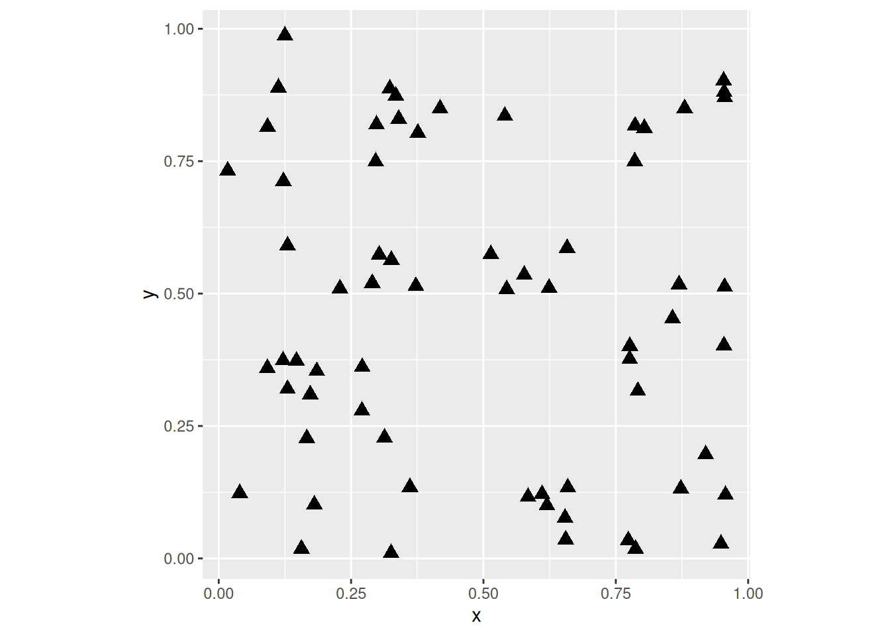
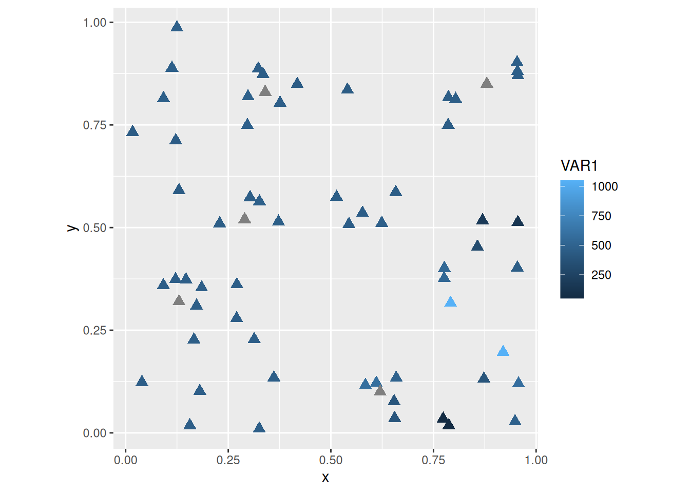
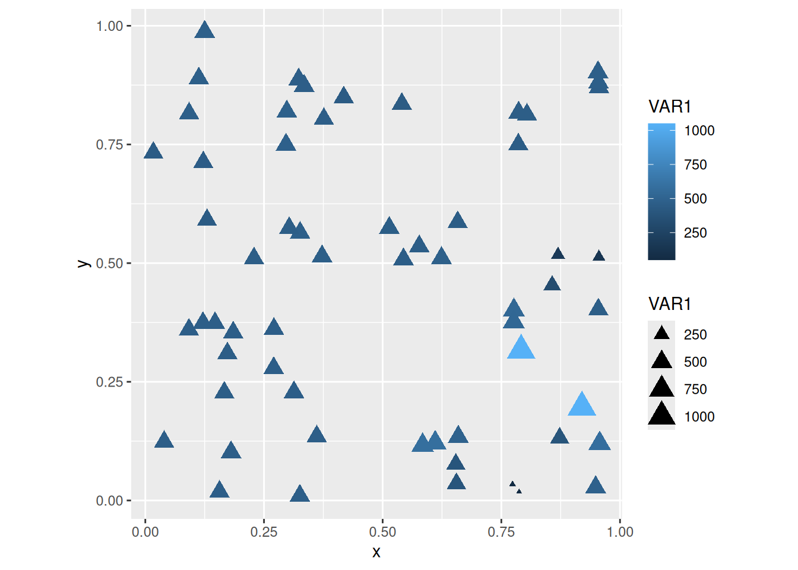
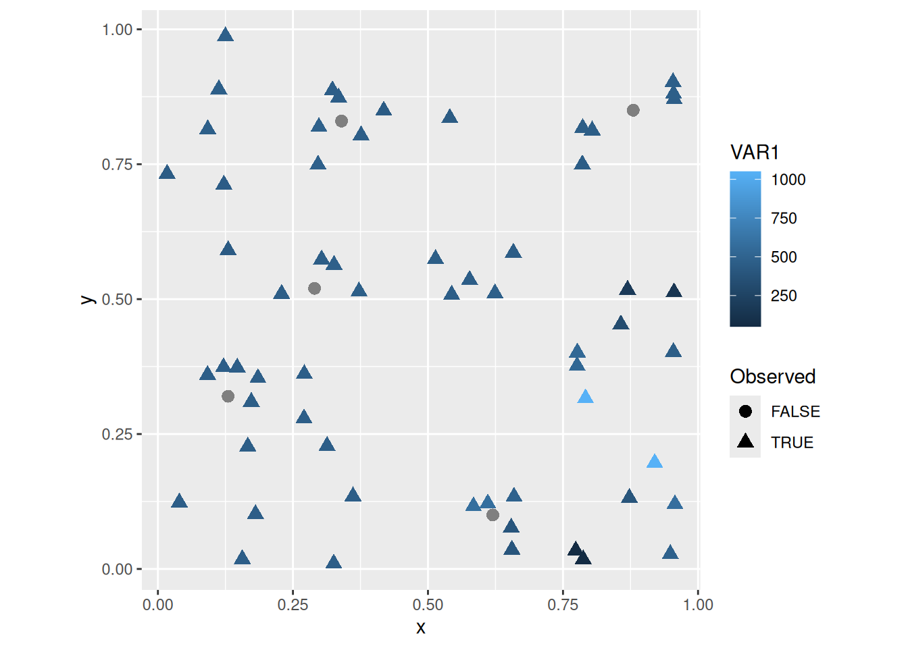
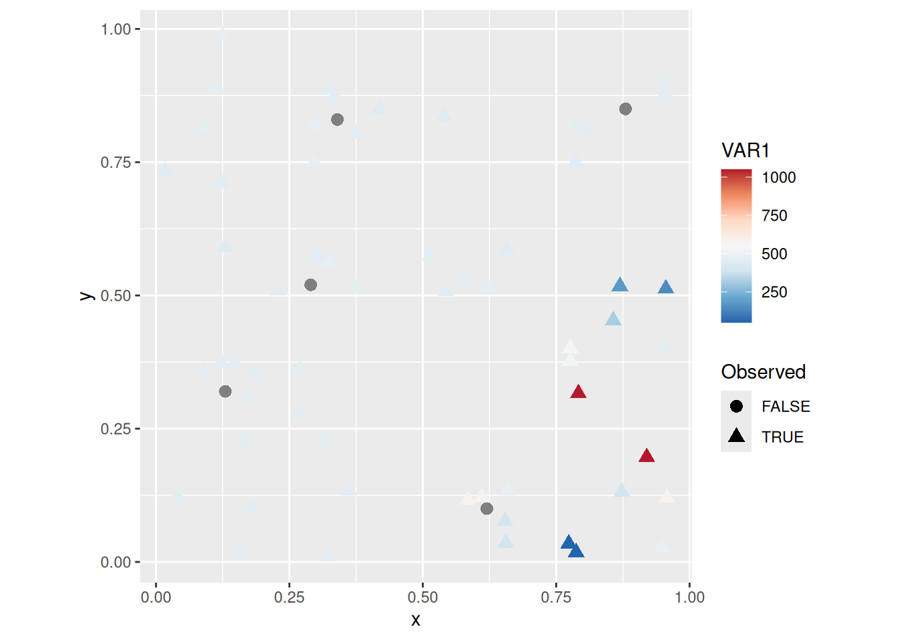
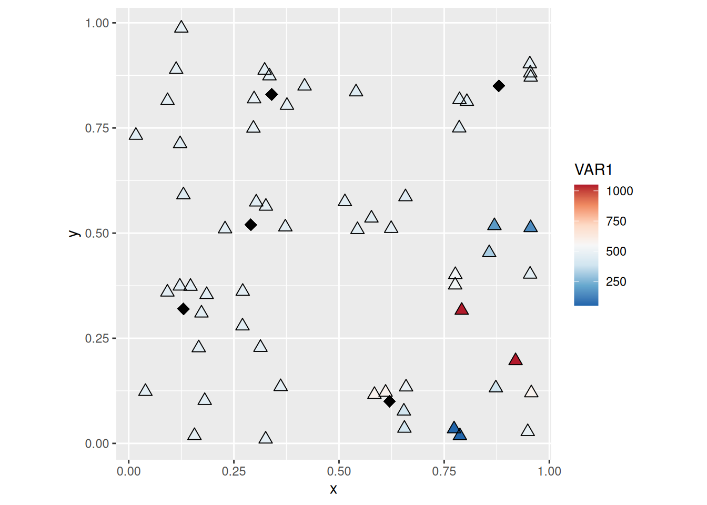

# Mapping in R: Continued {#mapping-continued}

*NOTE*: The source files for this book are available with companion package [{isdas}](https://paezha.github.io/isdas/). The source files are in Rmarkdown format and packed as templates. These files allow you execute code within the notebook, so that you can work interactively with the notes. 

In the preceding chapters, you were introduced to the following concepts:

1. Basic operations in `R`. These include arithmetic and logical operations, among others.
2. Data classes in `R`. Data can be numeric, characters, logical values, etc.
3. Data types in `R`. Ways to store data, for instance as vector, matrix, dataframes, etc.
4. Indexing. Ways to retrieve information from a data frame by referring to its location therein. 
5. Creating simple maps in `R`. 

Please review the previous practices if you need a refresher on these concepts.

## Learning Objectives

In this reading, you will learn:

1. How to quickly summarize the descriptive statistics of a dataframe.
2. More about _factors_.

Factors are a class of data that is used for categorical data. For instance, a parcel may be categorizes as developed or undeveloped; a plot of land may be zoned for commercial, residential, or industrial use; a sample may be mineral x or y. These are not quantities but rather reflect a quality of the entity that is being described.

3. How to subset a dataset.

Sometimes you want to work with only a subset of a dataset. This can be done using indexing with logical values, or using specialized functions.

4. More on the use of _pipe operators_.

A pipe operator allows you to pass the results of a function to another function. It makes writing instructions more intuitive and simple. You have already seen pipe operators earlier: they look like this `|>`.

5. You will add layers to a `ggplot` object to improve a map.

## Suggested Readings

- Bivand RS, Pebesma E, Gomez-Rubio V [-@Bivand2008] Applied Spatial Data Analysis with R, Chapters 2-3. Springer: New York.
- Brunsdon C and Comber L [-@Brunsdon2015R] An Introduction to R for Spatial Analysis and Mapping, Chapter 3. Sage: Los Angeles.
- O'Sullivan D and Unwin D [-@Osullivan2010] Geographic Information Analysis, 2nd Edition, Chapters 1-3. John Wiley & Sons: New Jersey.

## Preliminaries

As usual, it is good practice to begin with a clean session to make sure that you do not have extraneous items there when you begin your work. The best practice is to restart the `R` session, which can be accomplished for example with `command/ctrl + shift + F10`. An alternative to _only_ purge user-created objects from memory is to use the `R` command `rm` (for "remove"), followed by a list of items to be removed:

```r
rm(list = ls())
```

Note that `ls()` lists all objects currently on the workspace.

Load the libraries you will use in this activity:

```r
library(tidyverse) # Easily Install and Load the 'Tidyverse'
library(isdas) # Companion Package for Book An Introduction to Spatial Data Analysis and Statistics
```

```
## Warning: replacing previous import 'dplyr::lag' by 'stats::lag' when loading
## 'isdas'
```

```
## Warning: replacing previous import 'plotly::filter' by 'stats::filter' when
## loading 'isdas'
```

Now that your workspace is clear, you can proceed to invoke the sample dataset. You can do this by means of the function `data`.

```r
data("missing_df")
```

The dataframe `missing_df` includes $n = 65$ observations (Note: text between $ characters is mathematical notation in LaTeX). These observations are geocoded using a false origin and coordinates normalized to the unit-square (the extent of their values is between zero and one). The coordinates are `x` and `y`. 

In addition, there are three variables associated with the locations (VAR1, VAR2, VAR3). The variables are generic. Feel free to think of them as housing prices, concentrations in ppb of some contaminant or any other variable that will help clarify your understanding. Finally, a factor variable states whether the variables were measured for a location: if the status is "FALSE", the values of the variables are missing.

## Summarizing a Dataframe

Obtaining a set of descriptive statistics for a dataframe is very simple thanks to the function `summary`. For instance, the summary of `missing_df` is:

```r
# `summary()` reports basic descriptive statistics of columns in a data frame
summary(missing_df)
```

```
##        x                 y                VAR1             VAR2       
##  Min.   :0.01699   Min.   :0.01004   Min.   :  50.0   Min.   :  50.0  
##  1st Qu.:0.22899   1st Qu.:0.19650   1st Qu.: 453.3   1st Qu.: 570.1  
##  Median :0.41808   Median :0.50822   Median : 459.1   Median : 574.4  
##  Mean   :0.49295   Mean   :0.46645   Mean   : 458.8   Mean   : 562.1  
##  3rd Qu.:0.78580   3rd Qu.:0.74981   3rd Qu.: 465.4   3rd Qu.: 594.2  
##  Max.   :0.95719   Max.   :0.98715   Max.   :1050.0   Max.   :1050.0  
##                                      NA's   :5        NA's   :5       
##       VAR3         Observed 
##  Min.   :  50.0   FALSE: 5  
##  1st Qu.: 630.3   TRUE :60  
##  Median : 640.0             
##  Mean   : 638.1             
##  3rd Qu.: 646.0             
##  Max.   :1050.0             
##  NA's   :5
```

This function reports the minimum, maximum, mean, median, and quantile values of a numeric variable. When variables are characters or factors, their frequency is reported. For instance, in `missing_df`, there are five instances of `FALSE` and sixty instances of `TRUE`.

## Factors

A factor describes a category. You can examine the class of a variable by means of the function `class`. From the summary, it is clear that several variables are numeric. However, for `Observed`, it is not evident if the variable is  a `character` or `factor`. Use of `class` reveals that it is indeed a factor:

```r
class(missing_df$Observed)
```

```
## [1] "factor"
```

Factors are an important data type because they allow us to store information that is not measured as a quantity. For example, the quality of the cut of a diamond is categorized as Fair < Good < Very Good < Premium < Ideal. Sure, we could store this information as numbers from 1 to 5. However, the quality of the cut is not a quantity, and should not be treated like one.

In the dataframe `missing_df`, the variable `Observed` could have been coded as 1's (for missing) and 2's (for observed), but this does not mean that "observed" is twice the amount of "missing"! In this case, the numbers would not be quantities but labels. Factors in `R` allow us to work directly with the labels.

Now, you may be wondering what does it mean when the status of a datum's `Observed` variable is coded as `FALSE`. If you check the summary again, there are five cases of `NA` in the variables VAR1 through VAR3. `NA` essentially means that the value is missing. Likely, the five `NA` values correspond to the five missing observations. We can check this by subsetting the data.

## Subsetting Data

We subset data when we wish to work only with parts of a dataset. We can do this by indexing. For example, we could retrieve the part of the dataframe that corresponds to the `FALSE` values in the `Observed` variable:

```r
missing_df[missing_df$Observed == FALSE,]
```

```
##       x    y VAR1 VAR2 VAR3 Observed
## 61 0.34 0.83   NA   NA   NA    FALSE
## 62 0.29 0.52   NA   NA   NA    FALSE
## 63 0.13 0.32   NA   NA   NA    FALSE
## 64 0.62 0.10   NA   NA   NA    FALSE
## 65 0.88 0.85   NA   NA   NA    FALSE
```

Data are indexed by means of the square brackets `[` and `]`. The indices correspond to the rows and columns. The logical statement `missing_df$Observed == False` selects the rows that meet the condition, whereas leaving a blank for the columns simply means "all columns".

As you can see, the five `NA` values correspond, as anticipated, to the locations where `Observed` is `FALSE`.

Using indices is only one of many ways of subsetting data. Base R also has a subset command, that is implemented as follows:

```r
subset(missing_df, Observed == FALSE)
```

```
##       x    y VAR1 VAR2 VAR3 Observed
## 61 0.34 0.83   NA   NA   NA    FALSE
## 62 0.29 0.52   NA   NA   NA    FALSE
## 63 0.13 0.32   NA   NA   NA    FALSE
## 64 0.62 0.10   NA   NA   NA    FALSE
## 65 0.88 0.85   NA   NA   NA    FALSE
```

And the package `dplyr` (part of the `tidyverse`) has a function called `filter`:

```r
filter(missing_df, Observed == FALSE)
```

```
##      x    y VAR1 VAR2 VAR3 Observed
## 1 0.34 0.83   NA   NA   NA    FALSE
## 2 0.29 0.52   NA   NA   NA    FALSE
## 3 0.13 0.32   NA   NA   NA    FALSE
## 4 0.62 0.10   NA   NA   NA    FALSE
## 5 0.88 0.85   NA   NA   NA    FALSE
```

The three approaches give the same result, but `subset` and `filter` are somewhat easier to write. You could nest any of the above approaches as part of another function. For instance, if you wanted to do a summary of the selected subset of the data, you would:

```r
summary(filter(missing_df, Observed == FALSE))
```

```
##        x               y              VAR1          VAR2          VAR3    
##  Min.   :0.130   Min.   :0.100   Min.   : NA   Min.   : NA   Min.   : NA  
##  1st Qu.:0.290   1st Qu.:0.320   1st Qu.: NA   1st Qu.: NA   1st Qu.: NA  
##  Median :0.340   Median :0.520   Median : NA   Median : NA   Median : NA  
##  Mean   :0.452   Mean   :0.524   Mean   :NaN   Mean   :NaN   Mean   :NaN  
##  3rd Qu.:0.620   3rd Qu.:0.830   3rd Qu.: NA   3rd Qu.: NA   3rd Qu.: NA  
##  Max.   :0.880   Max.   :0.850   Max.   : NA   Max.   : NA   Max.   : NA  
##                                  NA's   :5     NA's   :5     NA's   :5    
##   Observed
##  FALSE:5  
##  TRUE :0  
##           
##           
##           
##           
## 
```

Or:

```r
summary(missing_df[missing_df$Observed == FALSE,])
```

```
##        x               y              VAR1          VAR2          VAR3    
##  Min.   :0.130   Min.   :0.100   Min.   : NA   Min.   : NA   Min.   : NA  
##  1st Qu.:0.290   1st Qu.:0.320   1st Qu.: NA   1st Qu.: NA   1st Qu.: NA  
##  Median :0.340   Median :0.520   Median : NA   Median : NA   Median : NA  
##  Mean   :0.452   Mean   :0.524   Mean   :NaN   Mean   :NaN   Mean   :NaN  
##  3rd Qu.:0.620   3rd Qu.:0.830   3rd Qu.: NA   3rd Qu.: NA   3rd Qu.: NA  
##  Max.   :0.880   Max.   :0.850   Max.   : NA   Max.   : NA   Max.   : NA  
##                                  NA's   :5     NA's   :5     NA's   :5    
##   Observed
##  FALSE:5  
##  TRUE :0  
##           
##           
##           
##           
## 
```

Nesting functions makes it difficult to read the code, since functions are evaluated from the innermost to the outermost function, whereas we are used to reading from left to right. Fortunately, R implements (as part of package `magrittr` which is required by `tidyverse`) a so-called _pipe operator_ that simplifies things and allows for code that is more intuitive to read.

## Pipe Operator

A pipe operator is written this way: `|>`. Its objective is to pass forward the output of a function to a second function, so that they can be chained to create more complex instructions that are still relatively easy to read.

For instance, instead of nesting the subsetting instructions in the `summary` function, you could do the subsetting first, and pass the results of that to the summary for further processing. This would look like this:

```r
# Remember, the pipe operator `|>` passes the value of the left-hand side 
# to the function on the right-hand side
subset(missing_df, Observed == FALSE) |> summary()
```

```
##        x               y              VAR1          VAR2          VAR3    
##  Min.   :0.130   Min.   :0.100   Min.   : NA   Min.   : NA   Min.   : NA  
##  1st Qu.:0.290   1st Qu.:0.320   1st Qu.: NA   1st Qu.: NA   1st Qu.: NA  
##  Median :0.340   Median :0.520   Median : NA   Median : NA   Median : NA  
##  Mean   :0.452   Mean   :0.524   Mean   :NaN   Mean   :NaN   Mean   :NaN  
##  3rd Qu.:0.620   3rd Qu.:0.830   3rd Qu.: NA   3rd Qu.: NA   3rd Qu.: NA  
##  Max.   :0.880   Max.   :0.850   Max.   : NA   Max.   : NA   Max.   : NA  
##                                  NA's   :5     NA's   :5     NA's   :5    
##   Observed
##  FALSE:5  
##  TRUE :0  
##           
##           
##           
##           
## 
```

The code above is read as "subset `missing_df` and pass the results to `summary`". Pipe operators make writing and reading code somewhat more natural.

## More on Visualization

Observations in the sample dataset are geo-referenced, and so they can be plotted. Since they are based on false origins and are normalized, we cannot map them to the surface of the Earth. However, we can still visualize their spatial distribution. This can be done by using `ggplot2`. For instance, for `missing_df`:

```r
# `coord_fixed()` forces the plot to use a ratio of 1:1 for the units 
# in the x- and y-axis; in this case, since the values we are mapping 
# to those axes are coordinates, we wish to represent them using the 
# same scale, i.e., one unit in x looks identical to one unit in y 
# (as an experiment, repeat the plot without fixing the coordinates) 
ggplot() + 
  geom_point(data = missing_df, 
             aes(x = x, 
                 y = y), 
             shape = 17, 
             size = 3) + 
  coord_fixed()
```



The above simply plots the coordinates, so that we can see the spatial distribution of the observations. (Notice the use of `coord_fixed` to maintain the aspect ratio of the plot to 1, i.e. the relationship between width and height). You have control of the `shape` of the markers, as well as their `size`. You can consult the shapes available [here](http://sape.inf.usi.ch/quick-reference/ggplot2/shape). Experiment with different shapes and sizes if you wish.

The dataframe `missing_df` includes more attributes that could be used in the plot. For instance, if you wished to create a thematic map showing `VAR1` you would do the following:

```r
ggplot() + 
  geom_point(data = missing_df,
             aes(x = x, 
                 y = y,
                 color = VAR1), 
             shape = 17, 
             size = 3) + 
  coord_fixed()
```



The `shape` and `size` assignments happen outside of `aes`, and so are applied equally to all observations. In some cases, you might want to let other aesthetic attributes vary with the values of a variable in the dataframe. For instance, if we let the sizes change with the value of the variable:

```r
ggplot() + 
  geom_point(data = missing_df, 
             aes(x = x, 
                 y = y, 
                 color = VAR1, 
                 size = VAR1), 
             shape = 17) + 
  coord_fixed()
```

```
## Warning: Removed 5 rows containing missing values (`geom_point()`).
```



Note how there is a warning, saying that five observations were removed because data were missing! These are likely the five locations where `Observed == FALSE`!

To make it more clear which observations are these, you could set the `shape` to vary according to the value of `Observed`, as follows:

```r
ggplot() + 
  geom_point(data = missing_df,
             aes(x = x, 
                 y = y, 
                 color = VAR1, 
                 shape = Observed), 
             size = 3) +
  coord_fixed()
```


Now it is easy to see the locations of the five observations that were `Observed == FALSE`!, which are labeled with gray circles. 

You can change the coloring scheme by means of `scale_color_distiller` (you can can check the different color palettes available [here](http://ggplot2.tidyverse.org/reference/scale_brewer.html)):

```r
ggplot() + 
  geom_point(data = missing_df, 
             aes(x = x,
                 y = y, 
                 color = VAR1,
                 shape = Observed),
             size = 3) +
  scale_color_distiller(palette = "RdBu") +
  coord_fixed()
```



You will notice maybe that with this coloring scheme some observations become very light and difficult to distinguish from the background. This can be solved in many different ways (for instance, by changing the color of the background!). A simple fix is to add a layer with hollow symbols, as follows:

```r
ggplot() + 
  geom_point(data = missing_df, 
             aes(x = x, 
                 y = y, 
                 color = VAR1), 
             shape = 17, 
             size = 3) +
  geom_point(data = missing_df, 
             aes(x = x, 
                 y = y), 
             shape = 2, 
             size = 3) +
  scale_color_distiller(palette = "RdBu") +
  coord_fixed()
```


Finally, you could try subsetting the data to have greater control of the appearance of your plot, for instance:

```r
ggplot() +
  geom_point(data = subset(missing_df, 
                           Observed == TRUE),
             aes(x = x, 
                 y= y, 
                 color = VAR1), 
             shape = 17, 
             size = 3) +
  geom_point(data = subset(missing_df, 
                           Observed == TRUE),
             aes(x = x, 
                 y= y), 
             shape = 2, 
             size = 3) +
  geom_point(data = subset(missing_df, 
                           Observed == FALSE),
             aes(x = x, 
                 y= y), 
             shape = 18, 
             size = 4) +
  scale_color_distiller(palette = "RdBu") +
  coord_fixed()
```



These are examples of creating and improving the aspect of simple symbol maps, which are often used to represent observations in space.

