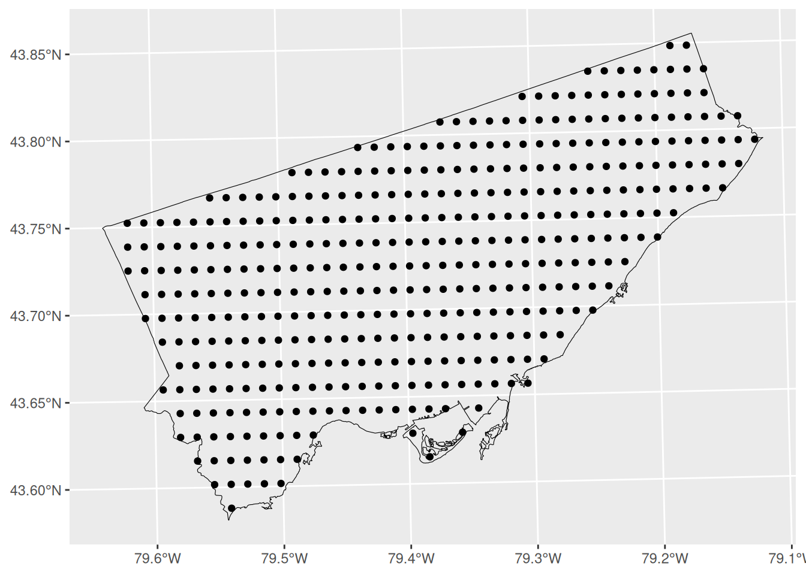
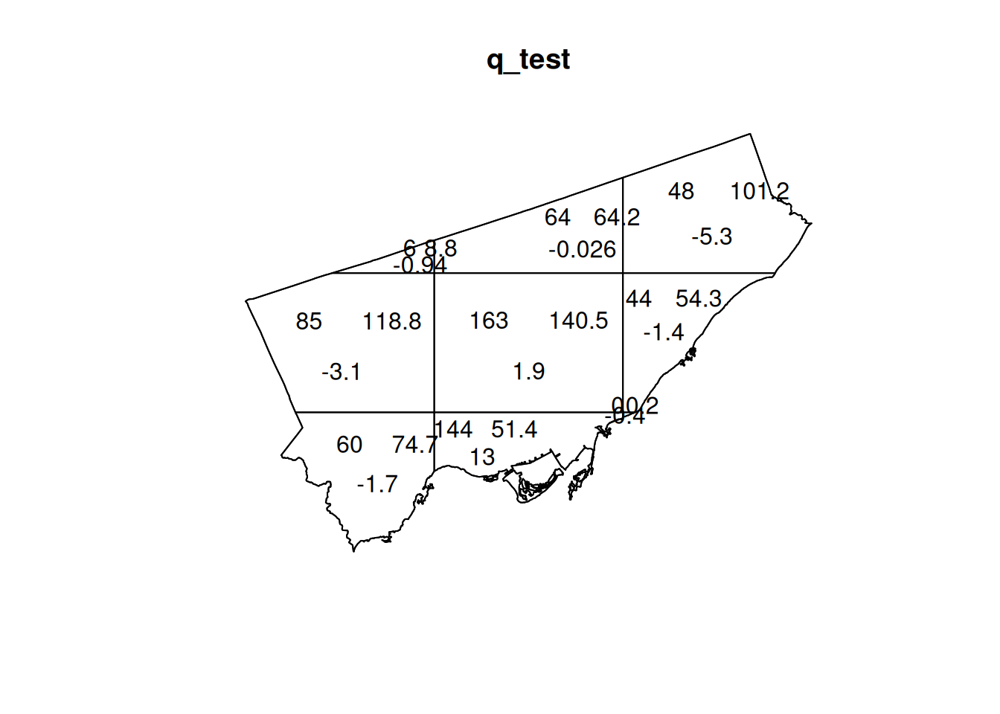

# Activity 4: Point Pattern Analysis I

*NOTE*: The source files for this book are available with companion package [{isdas}](https://paezha.github.io/isdas/). The source files are in Rmarkdown format and packed as templates. These files allow you execute code within the notebook, so that you can work interactively with the notes. 

## Practice questions

Answer the following questions:

1. What is a random process?
2. What is a deterministic process?
3. What is a stochastic process?
4. What is a pattern?
5. What is the usefulness of a null landscape?

## Learning objectives

In this activity, you will:

1. Use the concept of quadrats to analyze a real dataset.
2. Learn about a quadrat-based test for randomness in point patterns.
3. Learn how to use the p-value of a statistical test to make a decision.
4. Think about the distribution of events in a null landscape.
5. Think about ways to decide whether a landscape is random.

## Suggested reading

O'Sullivan D and Unwin D (2010) Geographic Information Analysis, 2nd Edition, Chapter 5. John Wiley & Sons: New Jersey.

## Preliminaries

It is good practice to begin with a clean session to make sure that you do not have extraneous items there when you begin your work. The best practice is to restart the `R` session, which can be accomplished for example with `command/ctrl + shift + F10`. An alternative to _only_ purge user-created objects from memory is to use the `R` command `rm` (for "remove"), followed by a list of items to be removed. To clear the workspace from _all_ objects, do the following:

``` r
rm(list = ls())
```

Note that `ls()` lists all objects currently on the workspace.

Load the libraries you will use in this activity. In addition to `tidyverse`, you will need `spatstat`, a package designed for the analysis of point patterns (you can learn about `spatstat` [here](https://cran.r-project.org/web/packages/spatstat/vignettes/getstart.pdf) and [here](http://spatstat.org/resources/spatstatJSSpaper.pdf)):

``` r
library(isdas) # Companion Package for Book An Introduction to Spatial Data Analysis and Statistics
```

```
## Warning: replacing previous import 'dplyr::lag' by 'stats::lag' when loading
## 'isdas'
```

```
## Warning: replacing previous import 'plotly::filter' by 'stats::filter' when
## loading 'isdas'
```

``` r
library(sf) # Simple Features for R
library(spatstat) # Spatial Point Pattern Analysis, Model-Fitting, Simulation, Tests
library(tidyverse) # Easily Install and Load the 'Tidyverse'
```

In the practice that preceded this activity, you learned about the concepts of intensity and density, about quadrats, and also how to create density maps. 
Begin by loading the data that you will use in this activity:

``` r
data("Fast_Food")
data("Gas_Stands")
data("Paez_Mart")
```

Next the geospatial files need to be read. For this example, the city boundary of Toronto is provided in two different formats, as a dataframe (which can be used to plot using `ggplot2`) and as a `SpatialPolygons` object, a format widely used in R for spatial analysis. The :

``` r
data("Toronto")
```

If you inspect your workspace, you will see that the following dataframes are there:

* `Fast_Food`
* `Gas_Stands`
* `Paez_Mart`

These are locations of a selection of fast food restaurants, and also of gas stands in Toronto (data are from 2008). Paez Mart on the other hand is a project to cover Toronto with convenience stores. The points are the planned locations of the stores.

Also, there should be an object of class `sf`. This dataframe contains the city boundary of Toronto:

``` r
class(Toronto)
```

```
## [1] "sf"         "data.frame"
```

Try plotting the following:

``` r
ggplot() +
  geom_sf(data = Toronto, color = "black", fill = NA, alpha = 1, size = .3) +
  geom_sf(data = Paez_Mart) +
  coord_sf()
```



As discussed in the preceding chapter, the package `spatstat` offers a very rich collection of tools to do point pattern analysis. To convert the three sets of events (i.e., the fast food establishments, gas stands, and Paez Mart) into `ppp` objects we first must define a region or _window_. To do this we take the `sf` and convert to an `owin` (a window object) for use with the package `spatstat` (this is done via `SpatialPolygons`, hence `as(x, "Spatial")`:

``` r
# `as.owin()` will take a "foreign" object (foreign to `spatstat`) and convert it into an `owin` object.`

Toronto.owin <- Toronto |> as.owin() # Requires `maptools` package
```

And, then convert the dataframes to `ppp` objects (this necessitates that we extract the coordinates of the events by means of `st_coordinates`): 

``` r
Fast_Food.ppp <- as.ppp(st_coordinates(Fast_Food), W = Toronto.owin)
Gas_Stands.ppp <- as.ppp(st_coordinates(Gas_Stands), W = Toronto.owin)
Paez_Mart.ppp <- as.ppp(st_coordinates(Paez_Mart), W = Toronto.owin)
```

These objects can now be used with the functions of the `spatstat` package. For instance, you can calculate the counts of events by quadrat by means of `quadrat.count`. The input must be a `ppp` object, and the number of quadrats on the horizontal (nx) and vertical (ny) direction (notice how I use the function `table` to present the frequency of quadrats with number of events):

``` r
q_count <- quadratcount(Fast_Food.ppp, nx = 3, ny = 3)
table(q_count)
```

```
## q_count
##   0   6  44  48  60  64  85 144 163 
##   1   1   1   1   1   1   1   1   1
```

As you see from the table, there is one quadrat with zero events, one quadrat with six events, one quadrat with forty-four events, and so on.

You can also plot the results of the `quadratcount()` function!

``` r
plot(q_count)
```


A useful function in the `spatstat` package is `quadrat.test`. This function implements a statistical test that compares the empirical distribution of events by quadrats to the distribution of events as expected under the hypothesis that the underlying process is _random_.

This is implemented as follows:

``` r
q_test <- quadrat.test(Fast_Food.ppp, nx = 3, ny = 3)
```

```
## Warning: Some expected counts are small; chi^2 approximation may be inaccurate
```

``` r
q_test
```

```
## 
## 	Chi-squared test of CSR using quadrat counts
## 
## data:  Fast_Food.ppp
## X2 = 213.74, df = 8, p-value < 2.2e-16
## alternative hypothesis: two.sided
## 
## Quadrats: 9 tiles (irregular windows)
```

The quadrat test reports a $p$-value which can be used to make a decision. The $p$-value is the probability that you will be mistaken if you reject the null hypothesis. To make a decision, you need to know what is the null hypothesis, and your own tolerance for making a mistake. In the case above, the $p$-value is very, very small (2.2e-16 = 0.00000000000000022). Since the null hypothesis is spatial randomness, you can reject this hypothesis and the probability that this decision is mistaken is vanishingly small.

Try plotting the results of `quadrat.test`:

``` r
plot(q_test)
```



Now that you have seen how to do some analysis using quadrats, you are ready for the next activity.

## Activity

**NOTE**: Activities include technical "how to" tasks/questions. Usually, these ask you to practice using the software to organize data, create plots, and so on in support of analysis and interpretation. The second type of questions ask you to activate your brainware and to think geographically and statistically.

::: {.infobox .software data-latex="{software}"}
**Activity Part I**
:::

1. Use `Fast_Food`, `Gas_Stands`, `Paez_Mart`, and `Toronto` to create density maps for the three point patterns. Select a quadrat size that you think is appropriate. 

2. Use `Fast_Food.ppp`, `Gas_Stands`, and `Paez_Mart`, and the function `quadratcount` to calculate the number of events per quadrat. Remember that you need to select the number of quadrats in the horizontal and vertical directions!

3. Use the function `table()` to examine the frequency of events per quadrat for each of the point patterns. 

::: {.infobox .brainware data-latex="{brainware}"}
**Activity Part II**
:::

4. Show your density maps to a fellow student. Did they select the same quadrat size? If not, what was their rationale for their size?

5. Again, use the function `table()` to examine the frequency of events per quadrat for each of the point patterns. What are the differences among these point patterns? What would you expect the frequency of events per quadrat to be in a null landscape?

6. Use `Fast_Food.ppp`, `Gas_Stands`, and `Paez_Mart`, and the function `quadrat.test` to calculate the test of spatial independence for these point patterns. What is your decision in each case? Explain.

