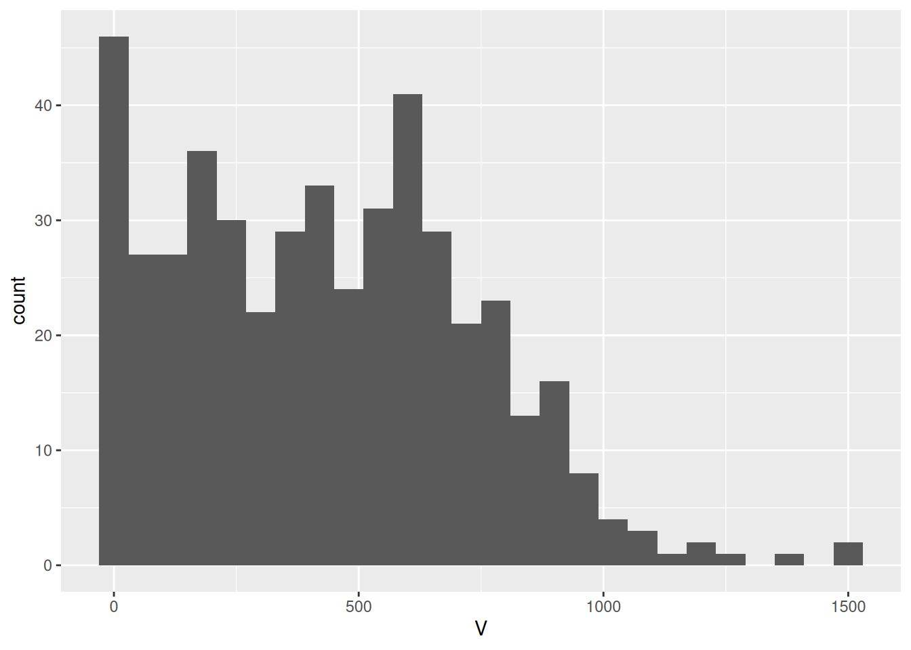
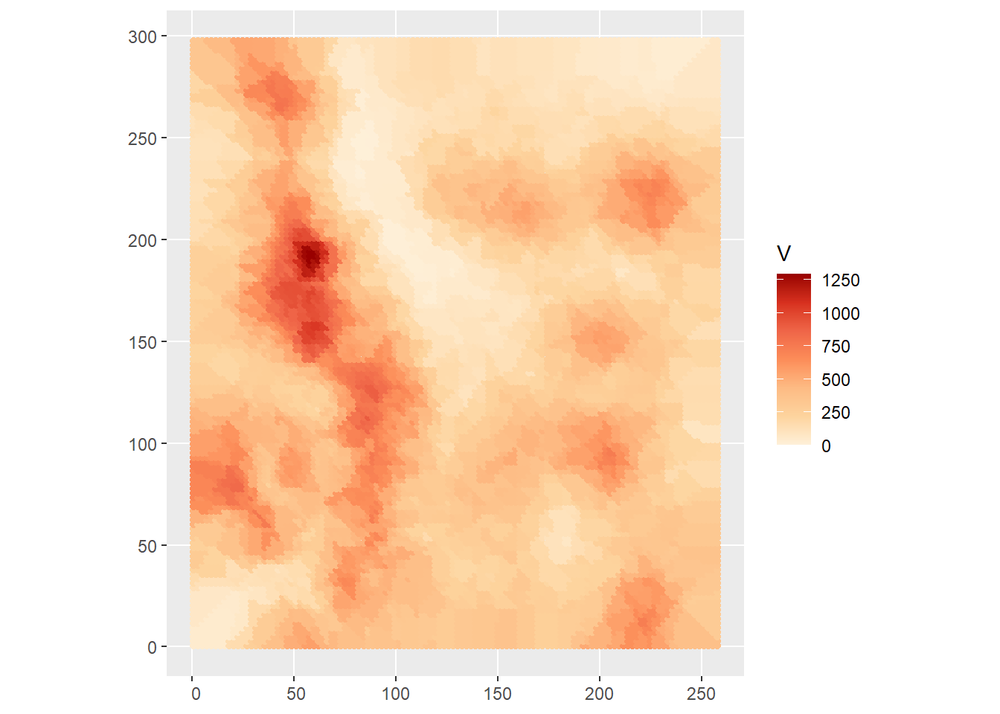
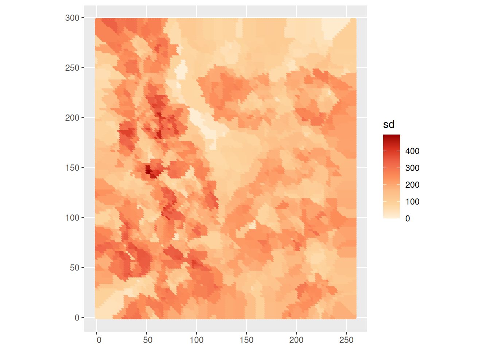
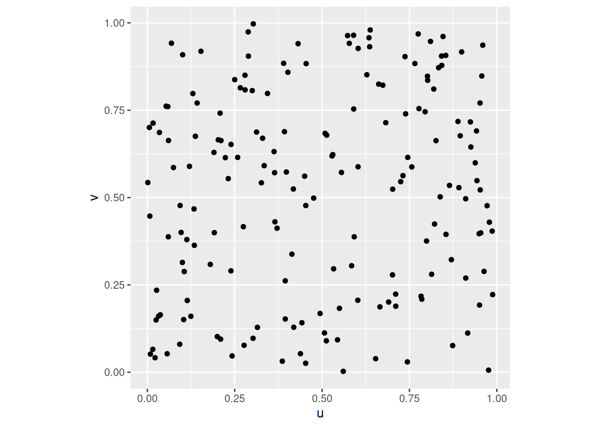
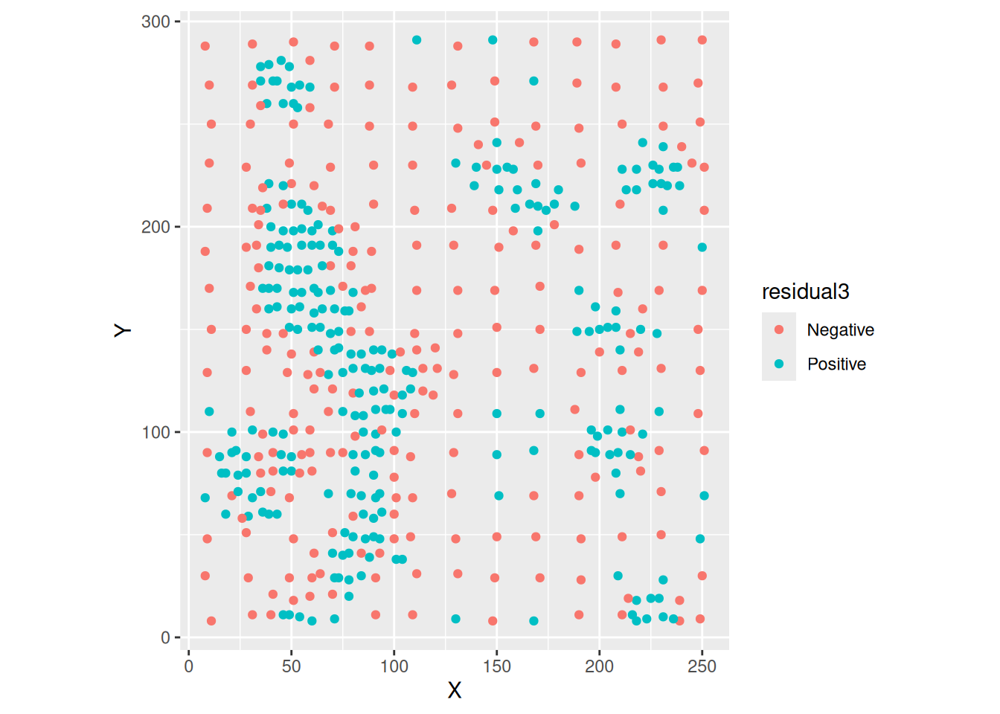

# Spatially Continuous Data II

*NOTE*: The source files for this book are available with companion package [{isdas}](https://paezha.github.io/isdas/). The source files are in Rmarkdown format and packed as templates. These files allow you execute code within the notebook, so that you can work interactively with the notes. 

Previously, you learned about the analysis of area data. Starting with this practice, you will be introduced to another type of spatial data: continuous data, also called fields. 

## Learning objectives

In the previous practice you were introduced to the concept of fields/spatially continuous data. Three different approaches were discussed that can be used to convert a set of observations of a field at discrete locations into a surface, namely tile-based approaches, inverse distance weighting (IDW), and $k$-point means. In this practice, you will learn:

1. About intervals of confidence for predictions.
2. Using trend surface analysis as an interpolation tool.
3. The difference between accuracy and precision in interpolation.

## Suggested readings

- Bailey TC and Gatrell AC [-@Bailey1995] Interactive Spatial Data Analysis, Chapters 5 and 6. Longman: Essex.
- Bivand RS, Pebesma E, and Gomez-Rubio V [-@Bivand2008] Applied Spatial Data Analysis with R, Chapter 8. Springer: New York.
- Brunsdon C and Comber L [-@Brunsdon2015R] An Introduction to R for Spatial Analysis and Mapping, Chapter 6, Sections 6.7 and 6.8. Sage: Los Angeles.
- Isaaks EH and Srivastava RM  [-@Isaaks1989applied] An Introduction to Applied Geostatistics, Chapter 4. Oxford University Press: Oxford.
- O'Sullivan D and Unwin D [-@Osullivan2010] Geographic Information Analysis, 2nd Edition, Chapters 9 and 10. John Wiley & Sons: New Jersey.

## Preliminaries

As usual, it is good practice to begin with a new session of `R` or at least to clear the working space to make sure that you do not have extraneous items there when you begin your work. The command in `R` to clear the workspace is `rm` (for "remove"), followed by a list of items to be removed. To clear the workspace from _all_ objects, do the following:

``` r
rm(list = ls())
```

Note that `ls()` lists all objects currently on the workspace.

Load the libraries you will use in this activity:

``` r
library(isdas)
library(plotly)
library(spatstat)
library(spdep)
library(tidyverse)
```

Begin by loading the data file that we will use in this chapter:

``` r
data("Walker_Lake")
```

You can verify the contents of the dataframe:

``` r
summary(Walker_Lake)
```

```
##       ID                  X               Y               V         
##  Length:470         Min.   :  8.0   Min.   :  8.0   Min.   :   0.0  
##  Class :character   1st Qu.: 51.0   1st Qu.: 80.0   1st Qu.: 182.0  
##  Mode  :character   Median : 89.0   Median :139.5   Median : 425.2  
##                     Mean   :111.1   Mean   :141.3   Mean   : 435.4  
##                     3rd Qu.:170.0   3rd Qu.:208.0   3rd Qu.: 644.4  
##                     Max.   :251.0   Max.   :291.0   Max.   :1528.1  
##                                                                     
##        U           T      
##  Min.   :   0.00   1: 45  
##  1st Qu.:  83.95   2:425  
##  Median : 335.00          
##  Mean   : 613.27          
##  3rd Qu.: 883.20          
##  Max.   :5190.10          
##  NA's   :195
```

We have already met this data set before: it contains a set of coordinates `X` and `Y` (units are meters; the origin is false), as well as two quantitative variables `V` and `U` (notice that there are missing observations in `U`), and a factor `T`.

## Uncertainty in the predictions

A common task in the analysis of spatially continuous data is to estimate the value of a variable at a location where it was not measured - or in other words, to spatially interpolate the variable. In Chapter \@ref(spatially-continuous-data-i), we introduced three methods for spatial interpolation based on a sample of observations.

The three algorithms that was saw before (i.e., Voronoi polygons, IDW, and $k$-point means) accomplish the task of providing spatial estimates. The values that we obtain with these methods are called _point estimates_. What is a point estimate? Recall the definition of a field that is the outcome of a purely spatial process:
$$
z_i = f(u_i, v_i) + \epsilon_i
$$

Accordingly, the prediction of the field at a new location is defined as a function of the estimated process and some random residual as follows:
$$
\hat{z}_p = \hat{f}(u_p, v_p) + \hat{\epsilon}_p
$$
The first part of the prediction ($\hat{f}(u_p, v_p)$) is the point estimate of the prediction, whereas the second part ($\hat{\epsilon}_p$) is the random part of the estimate.

The methods we saw in Chapter \@ref(spatially-continuous-data-i) can be used to estimate point estimates of the process. Unfortunately, they do not provide an estimate for the random element, so it is not possible to assess the uncertainty of the estimated values directly, since this depends on the distribution of the random term.

There are different ways in which at least some crude assessment of uncertainty can be attached to point estimates obtained from Voronoi polygons, IDW, or $k$-point means. For example, a very simple approach could be to use the sample variance to calculate intervals of confidence. This could be done as follows.

We know that the sample variance describes the inherent variability in the distribution of values of a variable in a sample. Consider for instance the distribution of the variable in the Walker Lake dataset:

``` r
ggplot(data = Walker_Lake, aes(V)) + 
  geom_histogram(binwidth = 60)
```



Clearly, there are no values of the variable less than zero, and values in excess of 1,000 are rare.

The standard deviation of the sample is:

``` r
sd(Walker_Lake$V)
```

```
## [1] 301.1554
```

The standard deviation is the average deviation from the mean. We could use this value to say that typical deviations from our point estimates are a function of this standard deviation (to what extent, it depends on the underlying distribution).

A problem with using this approach is that the distribution of the variable is not normal, and the distribution of $\hat{\epsilon}_p$ is unknown; the standard deviation is centered on the mean (meaning that it is a poor estimate for observations away from the mean); and in any case the standard deviation of the sample is too large for local point estimates if there is spatial pattern (since we know that the local mean will vary systematically).

There are other approaches to deal with non-normal variables, for instance Wilcox's test, but some of the other limitations remain.

``` r
wilcox.test(Walker_Lake$V, conf.int = TRUE, conf.level = 0.95)
```

```
## 
## 	Wilcoxon signed rank test with continuity correction
## 
## data:  Walker_Lake$V
## V = 100576, p-value < 2.2e-16
## alternative hypothesis: true location is not equal to 0
## 95 percent confidence interval:
##  418.7 475.6
## sample estimates:
## (pseudo)median 
##          447.2
```

As an alternative, the _local_ standard deviation could be used.

Consider the case of $k$-point means. The point estimate is based on the values of the $k$-nearest neighbors:
$$
\hat{z}_p = \frac{\sum_{i=1}^n{w_{pi}z_i}}{\sum_{i=1}^n{w_{pi}}}
$$

With:
$$
w_{pi} = \bigg\{\begin{array}{ll}
1 & \text{if } i \text{ is one of } kth \text{ nearest neighbors of } p \text{ for a given }k \\
0 & otherwise \\
\end{array}
$$

The standard deviation could be calculated also based in the values of the $k$-nearest neighbors, meaning that it would be based on the local mean. Here, we will interpolate the field using the Walker Lake data. First create a target grid for interpolation, and extract the coordinates of observations: 

``` r
# Create a prediction grid and convert to simple features:
target_xy = expand.grid(x = seq(0.5, 259.5, 2.2), 
                        y = seq(0.5, 299.5, 2.2)) |>
  st_as_sf(coords = c("x", "y"))

# Convert the `Walker_Lake` dataframe to a simple features object using as follows:
Walker_Lake.sf <- Walker_Lake |> 
  st_as_sf(coords = c("X", "Y"))
```

Interpolation using $k=5$ neighbors:

``` r
kpoint.5 <- kpointmean(source_xy = Walker_Lake.sf, 
                       target_xy = target_xy, 
                       z = V,  
                       k = 5) |>
  rename(V = z)
```

```
## projected points
```

We can plot the interpolated field now. These are the interpolated values:

``` r
ggplot() +
  geom_sf(data = kpoint.5, 
          aes(color = V)) +
  scale_color_distiller(palette = "OrRd", 
                       direction = 1)
```



In addition, we can plot the _local_ standard deviation:

``` r
ggplot() +
  geom_sf(data = kpoint.5, 
          aes(color = sd)) +
  scale_color_distiller(palette = "OrRd", 
                       direction = 1)
```



The local standard deviation indicates the typical deviation from the local mean. As expected, the local values of the standard deviation are usually lower than the standard deviation of the sample, and it tends to be larger for the tails, that is the locations where the values are rare - we have less information, hence greater uncertainty.

The local standard deviation is a crude estimator of the uncertainty because we do not know the underlying distribution. Other approaches based on bootstrapping (randomly sampling from the observed values of the variable) could be implemented, but they are beyond the scope of the present discussion.

The issue of assessing the level of uncertainty in the predictions with Voronoi polygons, IDW, and $k$-point means reflects the fact that these methods were not designed to deal explicitly with the random nature of predicting fields. Other methods deal with this issue more naturally. We will revisit two estimation methods that we covered before, and see how they can be applied to spatial interpolation.

## Trend surface analysis

Trend surface analysis is a form of multivariate regression that uses the coordinates of the observations to fit a surface to the data.

We can illustrate this technique by means of a simulated example. We will begin by simulating a set of observations, beginning with the coordinates in the square unit region:

``` r
# `n` is the number of observations to simulate
n <- 180

# Here we create a dataframe with these values: `u` and `v` will be the coordinates of our process
df <- data.frame(u = runif(n = n, min = 0, max = 1), 
                 v = runif(n = n, min = 0, max = 1))
```

Once we have simulated the coordinates for the example, we can plot their locations:

``` r
ggplot(data = df, aes(x = u, y = v)) + 
  geom_point() + 
  coord_equal()
```



We can now proceed to simulate a spatial process as follows:

``` r
# Use `mutate()` to create a new stochastic variable `z` that is a function of the coordinates and a random normal variable that we create with `rnorm()`; this random variable has a mean of zero and a standard deviation of 0.1.
df <- mutate(df, z = 0.5 + 0.3 * u + 0.7 * v + rnorm(n = n, mean = 0, sd = 0.1))
```

A 3D scatterplot can be useful to explore the data:

``` r
# Create a 3D scatterplot with the function `plot_ly()`. Notice that the way this function works is similar to `ggplot2`: the arguments are a dataframe, what should be plotted on the x-axis, the y-axis, the z-axis, and other aesthetics (aspects) of the plot. Here the color will be proportional to the values of `z`. The function `add_markers()` is similar to the family of `geom_` functions in `ggplot2`, but more general, since it will try to guess what you are trying to plot based on the inputs (in this case points). The function `layout()` is used to control other parts of the plot: here the `aspectratio` is selected so that the scale is identical for all three axes.
plot_ly(data = df, x = ~u, y = ~v, z = ~z, color = ~z) |> 
  add_markers() |> 
  layout(scene = list(
    aspectmode = "manual", aspectratio = list(x=1, y=1, z=1)))
```

```{=html}
<div class="plotly html-widget html-fill-item" id="htmlwidget-485f02632e3188a3dde5" style="width:672px;height:480px;"></div>
<script type="application/json" data-for="htmlwidget-485f02632e3188a3dde5">{"x":{"visdat":{"1daff979c126":["function () ","plotlyVisDat"]},"cur_data":"1daff979c126","attrs":{"1daff979c126":{"x":{},"y":{},"z":{},"color":{},"alpha_stroke":1,"sizes":[10,100],"spans":[1,20],"type":"scatter3d","mode":"markers","inherit":true}},"layout":{"margin":{"b":40,"l":60,"t":25,"r":10},"scene":{"aspectmode":"manual","aspectratio":{"x":1,"y":1,"z":1},"xaxis":{"title":"u"},"yaxis":{"title":"v"},"zaxis":{"title":"z"}},"hovermode":"closest","showlegend":false,"legend":{"yanchor":"top","y":0.5}},"source":"A","config":{"modeBarButtonsToAdd":["hoverclosest","hovercompare"],"showSendToCloud":false},"data":[{"x":[0.38690997217781842,0.29551396961323917,0.39299854403361678,0.35107503389008343,0.65124215953983366,0.81947620818391442,0.98067039111629128,0.50034789438359439,0.1857341390568763,0.52759023476392031,0.0012570503167808056,0.56549464468844235,0.424338408280164,0.068790029501542449,0.6721479669213295,0.61703440896235406,0.62450673547573388,0.45605295617133379,0.24729081150144339,0.72632938297465444,0.81673140334896743,0.98527656984515488,0.82895802659913898,0.78864651592448354,0.99277840694412589,0.79747929307632148,0.3790333061479032,0.49237434216775,0.26087512797676027,0.92151219374500215,0.90171865560114384,0.5314729621168226,0.95679829572327435,0.4639172803144902,0.92041835747659206,0.22444385197013617,0.76238844054751098,0.00094749382697045803,0.35295731644146144,0.24013315932825208,0.5692539035808295,0.48435734398663044,0.26226054318249226,0.22250588540919125,0.36253328155726194,0.70969499344937503,0.35015331138856709,0.40910299913957715,0.88094446528702974,0.18927163467742503,0.37575714313425124,0.99954834626987576,0.31609939993359149,0.52523940894752741,0.43055066326633096,0.70397563627921045,0.61084737512283027,0.027722592232748866,0.49798707361333072,0.34584554051980376,0.44756206893362105,0.37111516669392586,0.075966395437717438,0.33563236170448363,0.064719731686636806,0.85886311950162053,0.77219874621368945,0.4608579776249826,0.81162441545166075,0.94945941562764347,0.57297499780543149,0.70128699950873852,0.83499191678129137,0.40983375930227339,0.045669794315472245,0.62659601494669914,0.38175584841519594,0.78106574271805584,0.40356489713303745,0.59996271505951881,0.77474853373132646,0.94047476327978075,0.19220840535126626,0.093012024182826281,0.71210869797505438,0.19764284533448517,0.51266076532192528,0.40317787602543831,0.90682900021784008,0.63748157350346446,0.21311165811493993,0.18520157062448561,0.98532618791796267,0.55122134159319103,0.27290026610717177,0.87350656697526574,0.82898631249554455,0.44890216295607388,0.71237805089913309,0.11612949334084988,0.055989560438320041,0.10006144316866994,0.48981205793097615,0.14448373671621084,0.46489718020893633,0.56945560267195106,0.33645043172873557,0.05044474289752543,0.80646928399801254,0.31731271697208285,0.90919887251220644,0.66483964840881526,0.20223765284754336,0.24307790561579168,0.82014647405594587,0.20015523652546108,0.57513793651014566,0.7112965548876673,0.90651340945623815,0.84164035832509398,0.80019321292638779,0.3011828709859401,0.62084508291445673,0.66705919848755002,0.12668742705136538,0.41085828910581768,0.2004377709235996,0.20820852951146662,0.26333443867042661,0.20066385436803102,0.62218024046160281,0.21303948783315718,0.65894720912910998,0.79391424311324954,0.026785978581756353,0.16225943388417363,0.58088462799787521,0.058377909706905484,0.062969067366793752,0.4301454876549542,0.7252614488825202,0.63973748404532671,0.39117534598335624,0.073097169632092118,0.018257813761010766,0.78074389114044607,0.10109750321134925,0.92831218638457358,0.14253497240133584,0.80354001396335661,0.36924699833616614,0.025185733567923307,0.89036758826114237,0.23761928477324545,0.3081547215115279,0.9194176197052002,0.22630473435856402,0.60461226478219032,0.99977918644435704,0.13970832410268486,0.60361199639737606,0.88642243761569262,0.31878525880165398,0.20698341634124517,0.47460931446403265,0.92403163784183562,0.42449328303337097,0.48721410729922354,0.5667661817278713,0.48431785148568451,0.66670437972061336,0.83695559995248914,0.99822609615512192,0.24199633556418121,0.40140579035505652,0.44435984129086137,0.90912923053838313,0.81660751928575337,0.48389999591745436,0.81410467228852212],"y":[0.95210985653102398,0.62478829617612064,0.25727024162188172,0.60562840988859534,0.16128156683407724,0.8338094933424145,0.17691717552952468,0.81204167497344315,0.47139370557852089,0.13635766203515232,0.85834344103932381,0.021893939003348351,0.83251667860895395,0.4061986724846065,0.24225946399383247,0.027401980012655258,0.72647720947861671,0.95462635392323136,0.91543329949490726,0.70886159618385136,0.99093310046009719,0.98434824822470546,0.93923614430241287,0.7446810866240412,0.98751532984897494,0.56307151867076755,0.62987357168458402,0.74167516222223639,0.040090454276651144,0.50596362724900246,0.77325411513447762,0.65141270053572953,0.47656656173057854,0.67952135135419667,0.30225077900104225,0.83638629107736051,0.86413273308426142,0.44756248686462641,0.65069049154408276,0.00011801091022789478,0.68103233654983342,0.89414693787693977,0.044802339747548103,0.44819012703374028,0.53498417465016246,0.44279463868588209,0.40349890082143247,0.62920189904980361,0.12114443327300251,0.8272423786111176,0.72102288738824427,0.54180001839995384,0.81299120560288429,0.33514800108969212,0.08103660587221384,0.59239508584141731,0.17325266520492733,0.17221499350853264,0.46347168926149607,0.67010570503771305,0.87493005767464638,0.90099008707329631,0.22739216266199946,0.70431754691526294,0.99220624542795122,0.80733744241297245,0.90442058583721519,0.8971865801140666,0.34884315077215433,0.11881048488430679,0.24239499028772116,0.55927853169851005,0.98747441358864307,0.42079646373167634,0.92491430370137095,0.079399433685466647,0.1630045052152127,0.38176803407259285,0.58824600442312658,0.46565645327791572,0.42410662327893078,0.70894120982848108,0.32283153617754579,0.21014439780265093,0.45644173910841346,0.61820108094252646,0.81876549124717712,0.14077848079614341,0.64074428379535675,0.21709269937127829,0.023011562647297978,0.2430976084433496,0.9172594549600035,0.4364283736795187,0.14545006910338998,0.95659356680698693,0.43845002702437341,0.34637667215429246,0.32840781984850764,0.95061343209818006,0.82183334557339549,0.36512386100366712,0.94788028276525438,0.53656753175891936,0.92863563913851976,0.39759000670164824,0.35387061233632267,0.67001903895288706,0.39722263300791383,0.042897310107946396,0.274933215463534,0.19587630429305136,0.82158125005662441,0.021869010291993618,0.72520231176167727,0.86012044199742377,0.092576340073719621,0.12893176637589931,0.93764393054880202,0.068186044692993164,0.61134039983153343,0.64524777792394161,0.60508311633020639,0.25050442758947611,0.43941424693912268,0.30906534451059997,0.12130791996605694,0.15686867455951869,0.35052305832505226,0.85905464831739664,0.36066845641471446,0.35049566114321351,0.62178686680272222,0.38632822898216546,0.60414569149725139,0.83797166682779789,0.67679262184537947,0.54811222315765917,0.1360698826611042,0.59871212369762361,0.18356801057234406,0.50215339823625982,0.92902601766400039,0.45979595929384232,0.52382791717536747,0.51088734343647957,0.25970332697033882,0.42473308299668133,0.81638662912882864,0.014929510653018951,0.46755014033988118,0.53562267660163343,0.58288410399109125,0.21275143581442535,0.75792883476242423,0.019351308699697256,0.58535467670299113,0.93915951554663479,0.51937584090046585,0.039198458194732666,0.13322842586785555,0.42629005061462522,0.83364600571803749,0.36824476276524365,0.57268809922970831,0.1966044744476676,0.35353845870122313,0.38769951299764216,0.49468337162397802,0.15560593851841986,0.14311723271384835,0.32844855147413909,0.28816705313511193,0.93473207601346076,0.3367034774273634,0.13598361914046109,0.96528747514821589,0.1515271826647222,0.91075914329849184,0.93988013593479991],"z":[1.2253966732729797,0.94067646918038506,0.86880625685247026,1.0536313333573928,0.86599186550617535,1.2276830026548189,0.90475750843215641,1.4345333351826164,0.89302318670646286,0.81227437293651972,0.97298943031831842,0.65217656048725159,1.1578587734854664,0.64180348763698603,0.94442200473855609,0.61820508960393217,1.1201961731753316,1.1827707062294552,1.1982785023413489,1.1699955149825256,1.5518574690874474,1.1445691877751183,1.4129387379769234,1.2628203423276707,1.5309240625774616,1.1795402496263374,1.1087623426563922,1.1328031199899014,0.61151305048312088,1.1909761809652217,1.3250214184380058,1.1915520851661563,1.1087624122241893,1.2764600931081256,1.0905367710563802,1.0772877478366527,1.4141883344601358,0.95023633228111559,1.0546107566712359,0.52752605584447443,1.0791135760778385,1.2446310541296439,0.5945581454630533,0.97825375355961885,1.0858053668749634,1.0395538492547645,0.8887382495207129,1.1384015173246569,0.86747346795263824,0.94591853928352676,1.1472682924616171,1.3806937026410078,1.1612015895284256,0.89791098120360124,0.49167584765780359,1.2219419986604589,0.70775724650771499,0.5211022724136285,0.85599366058874271,1.078436430321454,1.297909445035611,1.4851934394048159,0.72092352233913581,1.113033590281638,1.3871921010320567,1.2039179178868693,1.2894296848166986,1.4050852598069636,1.0687122614440987,0.71451108075491288,0.89179153971422809,1.0128660359080264,1.4328867418313731,0.82635815601050888,1.0805651115555623,0.81814389176060198,0.7040151109751438,0.9814203599790623,0.88074093331487913,1.1289497018524413,1.0641055779587181,1.256652617100251,0.90680251367497811,0.82404513563533688,1.0165319420714989,0.95147001226178807,1.2104074783529428,0.66828614530152419,1.1862081109546285,0.72812386347516189,0.61556062266996681,0.74052285619152991,1.2698671989033896,0.94954738030035923,0.6973122313519301,1.4292428238685373,1.0209916118331388,0.88170205759328246,0.89460036002807486,1.1686684032071906,0.98241664108500604,0.82240633512192252,1.2866520011313523,0.90302804038491735,1.3865534511353306,1.0673965463797266,0.74862968179173039,1.1024740289918384,1.0157424178843426,0.61572684249360143,1.1401534318456306,0.93393330363883897,0.99964033849159262,0.605267956113829,1.4597924511111211,1.2192608218838619,0.67087155858874281,0.83304152069407156,1.5267500893900949,0.728108259232913,0.98932585862450761,0.78789198059717136,1.0979700664785876,0.85176520194071614,0.80991812941922137,0.79999087892480591,0.53133896622306875,0.69294872661494411,0.88456720073486272,1.0848986791245669,0.98518702548667403,0.78289309768574167,1.0164805904238963,0.91760016389221155,0.99145965583164619,0.92555021572002616,1.1152035714566673,0.84058930519151653,0.46781405699683953,1.0355603437268563,0.9023193754880896,1.134376627055705,1.3446752713699452,0.87448993175432432,0.95179594265363598,1.2855923012375212,0.88526063743792827,1.1207525125845648,1.3155442124084074,0.73599280126810163,0.92373080072084313,0.68992669923922256,1.1871150429610742,0.75663544653507953,1.1455602763364392,0.90810618535603238,0.97765463041484635,1.2372370368123164,1.1594629281065656,0.4854926684059464,0.87865213968042355,0.90299274058215229,1.1509787874756063,0.7762384079372151,1.2547024851270328,0.82706763761755386,0.79757847118314651,0.73749162619955611,1.0546292134786805,0.73518468587237085,0.91119468715077756,0.95038881015758259,1.018221533291072,1.1289846333519185,0.84321587231289652,0.58963402555608735,1.3289586410755534,0.8252732248467205,1.1935528119823147,1.2894071659110264],"type":"scatter3d","mode":"markers","marker":{"colorbar":{"title":"z","ticklen":2},"cmin":0.46781405699683953,"cmax":1.5518574690874474,"colorscale":[["0","rgba(68,1,84,1)"],["0.0416666666666667","rgba(70,19,97,1)"],["0.0833333333333334","rgba(72,32,111,1)"],["0.125","rgba(71,45,122,1)"],["0.166666666666667","rgba(68,58,128,1)"],["0.208333333333333","rgba(64,70,135,1)"],["0.25","rgba(60,82,138,1)"],["0.291666666666667","rgba(56,93,140,1)"],["0.333333333333333","rgba(49,104,142,1)"],["0.375","rgba(46,114,142,1)"],["0.416666666666667","rgba(42,123,142,1)"],["0.458333333333333","rgba(38,133,141,1)"],["0.5","rgba(37,144,140,1)"],["0.541666666666667","rgba(33,154,138,1)"],["0.583333333333333","rgba(39,164,133,1)"],["0.625","rgba(47,174,127,1)"],["0.666666666666667","rgba(53,183,121,1)"],["0.708333333333333","rgba(79,191,110,1)"],["0.75","rgba(98,199,98,1)"],["0.791666666666667","rgba(119,207,85,1)"],["0.833333333333333","rgba(147,214,70,1)"],["0.875","rgba(172,220,52,1)"],["0.916666666666667","rgba(199,225,42,1)"],["0.958333333333333","rgba(226,228,40,1)"],["1","rgba(253,231,37,1)"]],"showscale":false,"color":[1.2253966732729797,0.94067646918038506,0.86880625685247026,1.0536313333573928,0.86599186550617535,1.2276830026548189,0.90475750843215641,1.4345333351826164,0.89302318670646286,0.81227437293651972,0.97298943031831842,0.65217656048725159,1.1578587734854664,0.64180348763698603,0.94442200473855609,0.61820508960393217,1.1201961731753316,1.1827707062294552,1.1982785023413489,1.1699955149825256,1.5518574690874474,1.1445691877751183,1.4129387379769234,1.2628203423276707,1.5309240625774616,1.1795402496263374,1.1087623426563922,1.1328031199899014,0.61151305048312088,1.1909761809652217,1.3250214184380058,1.1915520851661563,1.1087624122241893,1.2764600931081256,1.0905367710563802,1.0772877478366527,1.4141883344601358,0.95023633228111559,1.0546107566712359,0.52752605584447443,1.0791135760778385,1.2446310541296439,0.5945581454630533,0.97825375355961885,1.0858053668749634,1.0395538492547645,0.8887382495207129,1.1384015173246569,0.86747346795263824,0.94591853928352676,1.1472682924616171,1.3806937026410078,1.1612015895284256,0.89791098120360124,0.49167584765780359,1.2219419986604589,0.70775724650771499,0.5211022724136285,0.85599366058874271,1.078436430321454,1.297909445035611,1.4851934394048159,0.72092352233913581,1.113033590281638,1.3871921010320567,1.2039179178868693,1.2894296848166986,1.4050852598069636,1.0687122614440987,0.71451108075491288,0.89179153971422809,1.0128660359080264,1.4328867418313731,0.82635815601050888,1.0805651115555623,0.81814389176060198,0.7040151109751438,0.9814203599790623,0.88074093331487913,1.1289497018524413,1.0641055779587181,1.256652617100251,0.90680251367497811,0.82404513563533688,1.0165319420714989,0.95147001226178807,1.2104074783529428,0.66828614530152419,1.1862081109546285,0.72812386347516189,0.61556062266996681,0.74052285619152991,1.2698671989033896,0.94954738030035923,0.6973122313519301,1.4292428238685373,1.0209916118331388,0.88170205759328246,0.89460036002807486,1.1686684032071906,0.98241664108500604,0.82240633512192252,1.2866520011313523,0.90302804038491735,1.3865534511353306,1.0673965463797266,0.74862968179173039,1.1024740289918384,1.0157424178843426,0.61572684249360143,1.1401534318456306,0.93393330363883897,0.99964033849159262,0.605267956113829,1.4597924511111211,1.2192608218838619,0.67087155858874281,0.83304152069407156,1.5267500893900949,0.728108259232913,0.98932585862450761,0.78789198059717136,1.0979700664785876,0.85176520194071614,0.80991812941922137,0.79999087892480591,0.53133896622306875,0.69294872661494411,0.88456720073486272,1.0848986791245669,0.98518702548667403,0.78289309768574167,1.0164805904238963,0.91760016389221155,0.99145965583164619,0.92555021572002616,1.1152035714566673,0.84058930519151653,0.46781405699683953,1.0355603437268563,0.9023193754880896,1.134376627055705,1.3446752713699452,0.87448993175432432,0.95179594265363598,1.2855923012375212,0.88526063743792827,1.1207525125845648,1.3155442124084074,0.73599280126810163,0.92373080072084313,0.68992669923922256,1.1871150429610742,0.75663544653507953,1.1455602763364392,0.90810618535603238,0.97765463041484635,1.2372370368123164,1.1594629281065656,0.4854926684059464,0.87865213968042355,0.90299274058215229,1.1509787874756063,0.7762384079372151,1.2547024851270328,0.82706763761755386,0.79757847118314651,0.73749162619955611,1.0546292134786805,0.73518468587237085,0.91119468715077756,0.95038881015758259,1.018221533291072,1.1289846333519185,0.84321587231289652,0.58963402555608735,1.3289586410755534,0.8252732248467205,1.1935528119823147,1.2894071659110264],"line":{"colorbar":{"title":"","ticklen":2},"cmin":0.46781405699683953,"cmax":1.5518574690874474,"colorscale":[["0","rgba(68,1,84,1)"],["0.0416666666666667","rgba(70,19,97,1)"],["0.0833333333333334","rgba(72,32,111,1)"],["0.125","rgba(71,45,122,1)"],["0.166666666666667","rgba(68,58,128,1)"],["0.208333333333333","rgba(64,70,135,1)"],["0.25","rgba(60,82,138,1)"],["0.291666666666667","rgba(56,93,140,1)"],["0.333333333333333","rgba(49,104,142,1)"],["0.375","rgba(46,114,142,1)"],["0.416666666666667","rgba(42,123,142,1)"],["0.458333333333333","rgba(38,133,141,1)"],["0.5","rgba(37,144,140,1)"],["0.541666666666667","rgba(33,154,138,1)"],["0.583333333333333","rgba(39,164,133,1)"],["0.625","rgba(47,174,127,1)"],["0.666666666666667","rgba(53,183,121,1)"],["0.708333333333333","rgba(79,191,110,1)"],["0.75","rgba(98,199,98,1)"],["0.791666666666667","rgba(119,207,85,1)"],["0.833333333333333","rgba(147,214,70,1)"],["0.875","rgba(172,220,52,1)"],["0.916666666666667","rgba(199,225,42,1)"],["0.958333333333333","rgba(226,228,40,1)"],["1","rgba(253,231,37,1)"]],"showscale":false,"color":[1.2253966732729797,0.94067646918038506,0.86880625685247026,1.0536313333573928,0.86599186550617535,1.2276830026548189,0.90475750843215641,1.4345333351826164,0.89302318670646286,0.81227437293651972,0.97298943031831842,0.65217656048725159,1.1578587734854664,0.64180348763698603,0.94442200473855609,0.61820508960393217,1.1201961731753316,1.1827707062294552,1.1982785023413489,1.1699955149825256,1.5518574690874474,1.1445691877751183,1.4129387379769234,1.2628203423276707,1.5309240625774616,1.1795402496263374,1.1087623426563922,1.1328031199899014,0.61151305048312088,1.1909761809652217,1.3250214184380058,1.1915520851661563,1.1087624122241893,1.2764600931081256,1.0905367710563802,1.0772877478366527,1.4141883344601358,0.95023633228111559,1.0546107566712359,0.52752605584447443,1.0791135760778385,1.2446310541296439,0.5945581454630533,0.97825375355961885,1.0858053668749634,1.0395538492547645,0.8887382495207129,1.1384015173246569,0.86747346795263824,0.94591853928352676,1.1472682924616171,1.3806937026410078,1.1612015895284256,0.89791098120360124,0.49167584765780359,1.2219419986604589,0.70775724650771499,0.5211022724136285,0.85599366058874271,1.078436430321454,1.297909445035611,1.4851934394048159,0.72092352233913581,1.113033590281638,1.3871921010320567,1.2039179178868693,1.2894296848166986,1.4050852598069636,1.0687122614440987,0.71451108075491288,0.89179153971422809,1.0128660359080264,1.4328867418313731,0.82635815601050888,1.0805651115555623,0.81814389176060198,0.7040151109751438,0.9814203599790623,0.88074093331487913,1.1289497018524413,1.0641055779587181,1.256652617100251,0.90680251367497811,0.82404513563533688,1.0165319420714989,0.95147001226178807,1.2104074783529428,0.66828614530152419,1.1862081109546285,0.72812386347516189,0.61556062266996681,0.74052285619152991,1.2698671989033896,0.94954738030035923,0.6973122313519301,1.4292428238685373,1.0209916118331388,0.88170205759328246,0.89460036002807486,1.1686684032071906,0.98241664108500604,0.82240633512192252,1.2866520011313523,0.90302804038491735,1.3865534511353306,1.0673965463797266,0.74862968179173039,1.1024740289918384,1.0157424178843426,0.61572684249360143,1.1401534318456306,0.93393330363883897,0.99964033849159262,0.605267956113829,1.4597924511111211,1.2192608218838619,0.67087155858874281,0.83304152069407156,1.5267500893900949,0.728108259232913,0.98932585862450761,0.78789198059717136,1.0979700664785876,0.85176520194071614,0.80991812941922137,0.79999087892480591,0.53133896622306875,0.69294872661494411,0.88456720073486272,1.0848986791245669,0.98518702548667403,0.78289309768574167,1.0164805904238963,0.91760016389221155,0.99145965583164619,0.92555021572002616,1.1152035714566673,0.84058930519151653,0.46781405699683953,1.0355603437268563,0.9023193754880896,1.134376627055705,1.3446752713699452,0.87448993175432432,0.95179594265363598,1.2855923012375212,0.88526063743792827,1.1207525125845648,1.3155442124084074,0.73599280126810163,0.92373080072084313,0.68992669923922256,1.1871150429610742,0.75663544653507953,1.1455602763364392,0.90810618535603238,0.97765463041484635,1.2372370368123164,1.1594629281065656,0.4854926684059464,0.87865213968042355,0.90299274058215229,1.1509787874756063,0.7762384079372151,1.2547024851270328,0.82706763761755386,0.79757847118314651,0.73749162619955611,1.0546292134786805,0.73518468587237085,0.91119468715077756,0.95038881015758259,1.018221533291072,1.1289846333519185,0.84321587231289652,0.58963402555608735,1.3289586410755534,0.8252732248467205,1.1935528119823147,1.2894071659110264]}},"frame":null},{"x":[0.00094749382697045803,0.99977918644435704],"y":[0.00011801091022789478,0.99220624542795122],"type":"scatter3d","mode":"markers","opacity":0,"hoverinfo":"none","showlegend":false,"marker":{"colorbar":{"title":"z","ticklen":2,"len":0.5,"lenmode":"fraction","y":1,"yanchor":"top"},"cmin":0.46781405699683953,"cmax":1.5518574690874474,"colorscale":[["0","rgba(68,1,84,1)"],["0.0416666666666667","rgba(70,19,97,1)"],["0.0833333333333334","rgba(72,32,111,1)"],["0.125","rgba(71,45,122,1)"],["0.166666666666667","rgba(68,58,128,1)"],["0.208333333333333","rgba(64,70,135,1)"],["0.25","rgba(60,82,138,1)"],["0.291666666666667","rgba(56,93,140,1)"],["0.333333333333333","rgba(49,104,142,1)"],["0.375","rgba(46,114,142,1)"],["0.416666666666667","rgba(42,123,142,1)"],["0.458333333333333","rgba(38,133,141,1)"],["0.5","rgba(37,144,140,1)"],["0.541666666666667","rgba(33,154,138,1)"],["0.583333333333333","rgba(39,164,133,1)"],["0.625","rgba(47,174,127,1)"],["0.666666666666667","rgba(53,183,121,1)"],["0.708333333333333","rgba(79,191,110,1)"],["0.75","rgba(98,199,98,1)"],["0.791666666666667","rgba(119,207,85,1)"],["0.833333333333333","rgba(147,214,70,1)"],["0.875","rgba(172,220,52,1)"],["0.916666666666667","rgba(199,225,42,1)"],["0.958333333333333","rgba(226,228,40,1)"],["1","rgba(253,231,37,1)"]],"showscale":true,"color":[0.46781405699683953,1.5518574690874474],"line":{"color":"rgba(255,127,14,1)"}},"z":[0.46781405699683953,1.5518574690874474],"frame":null}],"highlight":{"on":"plotly_click","persistent":false,"dynamic":false,"selectize":false,"opacityDim":0.20000000000000001,"selected":{"opacity":1},"debounce":0},"shinyEvents":["plotly_hover","plotly_click","plotly_selected","plotly_relayout","plotly_brushed","plotly_brushing","plotly_clickannotation","plotly_doubleclick","plotly_deselect","plotly_afterplot","plotly_sunburstclick"],"base_url":"https://plot.ly"},"evals":[],"jsHooks":[]}</script>
```

We can fit a trend surface to the data as follows. This is a regression model that uses the coordinates of the observations as covariates. In this case, the trend is linear:

``` r
trend.l <- lm(formula = z ~ u + v, data = df)
summary(trend.l)
```

```
## 
## Call:
## lm(formula = z ~ u + v, data = df)
## 
## Residuals:
##      Min       1Q   Median       3Q      Max 
## -0.33123 -0.06437 -0.00386  0.05922  0.25642 
## 
## Coefficients:
##             Estimate Std. Error t value Pr(>|t|)    
## (Intercept)  0.49753    0.01956   25.44   <2e-16 ***
## u            0.30936    0.02584   11.97   <2e-16 ***
## v            0.68417    0.02517   27.18   <2e-16 ***
## ---
## Signif. codes:  0 '***' 0.001 '**' 0.01 '*' 0.05 '.' 0.1 ' ' 1
## 
## Residual standard error: 0.09827 on 177 degrees of freedom
## Multiple R-squared:  0.8341,	Adjusted R-squared:  0.8322 
## F-statistic:   445 on 2 and 177 DF,  p-value: < 2.2e-16
```

Given a trend surface model, we can estimate the value of the variable $z$ at locations where it was not measured. Typically this is done by interpolating on a fine grid that can be used for visualization or further analysis, as shown next.

We will begin by creating a grid for interpolation. We will call the coordinates `x.p` and `y.p`. We generate these by creating a sequence of values in the domain of the data, for instance in the [0,1] interval:

``` r
u.p <- seq(from = 0.0, to = 1.0, by = 0.05)
v.p <- seq(from = 0.0, to = 1.0, by = 0.05)
```

For prediction, we want all combinations of `x.p` and `y.p`, so we expand these two vectors into a grid, by means of the function `expand.grid()`:

``` r
# The function `expand.grid()` creates a grid with all the combination of values of the inputs.
df.p <- expand.grid(u = u.p, v = v.p)
```

Notice that while `u.p` and `v.p` are vectors of size 21, the dataframe `df.p` contains `{r}21 * 21` observations, that is, all the combinations of `u.p` and `v.p`.

Once we have the coordinates for interpolation, the `predict()` function can be used in conjunction with the results of the estimation. When invoking the function, we indicate that we wish to obtain as well the standard errors of the fitted values (`se.fit = TRUE`), as well as the interval of the predictions at a 95% level of confidence:

``` r
preds <- predict(trend.l, newdata = df.p, se.fit = TRUE, interval = "prediction", level = 0.95)
```

The interval of confidence _of the predictions_ at the 95% level of confidence is given in the form of the lower (`lwr`) and upper (`upr`) bounds:

``` r
summary(preds$fit)
```

```
##       fit              lwr              upr        
##  Min.   :0.4975   Min.   :0.2998   Min.   :0.6953  
##  1st Qu.:0.8143   1st Qu.:0.6193   1st Qu.:1.0096  
##  Median :0.9943   Median :0.7998   Median :1.1888  
##  Mean   :0.9943   Mean   :0.7986   Mean   :1.1900  
##  3rd Qu.:1.1743   3rd Qu.:0.9791   3rd Qu.:1.3693  
##  Max.   :1.4911   Max.   :1.2935   Max.   :1.6887
```

These values indicate that the predictions of $z_p$ are, with 95% of confidence, in the following interval:
$$
CI_{z_p} = [z_{p_{lwr}}, z_{p_{upr}}].
$$

A convenient way to visualize the results of the analysis above, that is, to inspect the trend surface and the interval of confidence of the predictions, is by means of a 3D plot as follows.

First create matrices with the point estimates of the trend surface (`z.p`), and the lower and upper bounds (`z.p_l`, `z.p_u`):

``` r
z.p <- matrix(data = preds$fit[,1], nrow = 21, ncol = 21, byrow = TRUE)
z.p_l <- matrix(data = preds$fit[,2], nrow = 21, ncol = 21, byrow = TRUE)
z.p_u <- matrix(data = preds$fit[,3], nrow = 21, ncol = 21, byrow = TRUE)
```

The plot is created using the coordinates used for interpolation (`x.p` and `y.p`) and the matrices with the point estimates `z.p` and the upper and lower bounds. The type of plot in the package `plotly` is a _surface_:

``` r
trend.plot <- plot_ly(x = ~u.p, y = ~v.p, z = ~z.p, 
        type = "surface", colors = "YlOrRd") |> 
  add_surface(x = ~u.p, y = ~v.p, z = ~z.p_l, 
              opacity = 0.5, showscale = FALSE) |>
  add_surface(x = ~u.p, y = ~v.p, z = ~z.p_u, 
              opacity = 0.5, showscale = FALSE) |> 
  layout(scene = list(
    aspectmode = "manual", aspectratio = list(x = 1, y = 1, z = 1)))

trend.plot
```

```{=html}
<div class="plotly html-widget html-fill-item" id="htmlwidget-1e4bbd4ce08611751f77" style="width:672px;height:480px;"></div>
<script type="application/json" data-for="htmlwidget-1e4bbd4ce08611751f77">{"x":{"visdat":{"1daff27ac3958":["function () ","plotlyVisDat"]},"cur_data":"1daff27ac3958","attrs":{"1daff27ac3958":{"x":{},"y":{},"z":{},"colors":"YlOrRd","alpha_stroke":1,"sizes":[10,100],"spans":[1,20],"type":"surface"},"1daff27ac3958.1":{"x":{},"y":{},"z":{},"colors":"YlOrRd","alpha_stroke":1,"sizes":[10,100],"spans":[1,20],"type":"surface","opacity":0.5,"showscale":false,"inherit":true},"1daff27ac3958.2":{"x":{},"y":{},"z":{},"colors":"YlOrRd","alpha_stroke":1,"sizes":[10,100],"spans":[1,20],"type":"surface","opacity":0.5,"showscale":false,"inherit":true}},"layout":{"margin":{"b":40,"l":60,"t":25,"r":10},"scene":{"aspectmode":"manual","aspectratio":{"x":1,"y":1,"z":1},"xaxis":{"title":"u.p"},"yaxis":{"title":"v.p"},"zaxis":{"title":"z.p"}},"hovermode":"closest","showlegend":true,"legend":{"yanchor":"top","y":0.5}},"source":"A","config":{"modeBarButtonsToAdd":["hoverclosest","hovercompare"],"showSendToCloud":false},"data":[{"colorbar":{"title":"z.p<br />z.p_l<br />z.p_u","ticklen":2,"len":0.5,"lenmode":"fraction","y":1,"yanchor":"top"},"colorscale":[["0","rgba(255,255,204,1)"],["0.0416666666666667","rgba(255,249,189,1)"],["0.0833333333333333","rgba(255,243,175,1)"],["0.125","rgba(255,237,160,1)"],["0.166666666666667","rgba(255,230,146,1)"],["0.208333333333333","rgba(255,224,132,1)"],["0.25","rgba(254,217,118,1)"],["0.291666666666667","rgba(255,204,104,1)"],["0.333333333333333","rgba(255,191,90,1)"],["0.375","rgba(254,178,76,1)"],["0.416666666666667","rgba(254,166,71,1)"],["0.458333333333333","rgba(254,154,65,1)"],["0.5","rgba(253,141,60,1)"],["0.541666666666667","rgba(253,122,54,1)"],["0.583333333333333","rgba(253,102,48,1)"],["0.625","rgba(252,78,42,1)"],["0.666666666666667","rgba(244,64,37,1)"],["0.708333333333333","rgba(235,48,33,1)"],["0.75","rgba(227,26,28,1)"],["0.791666666666667","rgba(214,18,32,1)"],["0.833333333333334","rgba(202,9,35,1)"],["0.875","rgba(189,0,38,1)"],["0.916666666666667","rgba(168,0,38,1)"],["0.958333333333333","rgba(148,0,38,1)"],["1","rgba(128,0,38,1)"]],"showscale":true,"x":[0,0.050000000000000003,0.10000000000000001,0.15000000000000002,0.20000000000000001,0.25,0.30000000000000004,0.35000000000000003,0.40000000000000002,0.45000000000000001,0.5,0.55000000000000004,0.60000000000000009,0.65000000000000002,0.70000000000000007,0.75,0.80000000000000004,0.85000000000000009,0.90000000000000002,0.95000000000000007,1],"y":[0,0.050000000000000003,0.10000000000000001,0.15000000000000002,0.20000000000000001,0.25,0.30000000000000004,0.35000000000000003,0.40000000000000002,0.45000000000000001,0.5,0.55000000000000004,0.60000000000000009,0.65000000000000002,0.70000000000000007,0.75,0.80000000000000004,0.85000000000000009,0.90000000000000002,0.95000000000000007,1],"z":[[0.49753380902694661,0.51300176611178094,0.52846972319661523,0.54393768028144951,0.5594056373662839,0.57487359445111819,0.59034155153595247,0.60580950862078686,0.62127746570562115,0.63674542279045543,0.65221337987528971,0.66768133696012411,0.68314929404495839,0.69861725112979267,0.71408520821462695,0.72955316529946135,0.74502112238429563,0.76048907946912991,0.77595703655396431,0.79142499363879859,0.80689295072363287],[0.53174243965510692,0.54721039673994121,0.56267835382477549,0.57814631090960977,0.59361426799444417,0.60908222507927845,0.62455018216411273,0.64001813924894713,0.65548609633378141,0.67095405341861569,0.68642201050344998,0.70188996758828437,0.71735792467311865,0.73282588175795293,0.74829383884278722,0.76376179592762161,0.77922975301245589,0.79469771009729018,0.81016566718212457,0.82563362426695885,0.84110158135179314],[0.56595107028326719,0.58141902736810158,0.59688698445293586,0.61235494153777015,0.62782289862260454,0.64329085570743882,0.65875881279227311,0.6742267698771075,0.68969472696194178,0.70516268404677607,0.72063064113161035,0.73609859821644474,0.75156655530127903,0.76703451238611331,0.78250246947094759,0.79797042655578199,0.81343838364061627,0.82890634072545055,0.84437429781028495,0.85984225489511923,0.87531021197995351],[0.60015970091142745,0.61562765799626185,0.63109561508109613,0.64656357216593041,0.66203152925076481,0.67749948633559909,0.69296744342043337,0.70843540050526776,0.72390335759010205,0.73937131467493633,0.75483927175977061,0.77030722884460501,0.78577518592943929,0.80124314301427357,0.81671110009910786,0.83217905718394225,0.84764701426877653,0.86311497135361082,0.87858292843844521,0.89405088552327949,0.90951884260811378],[0.63436833153958783,0.64983628862442211,0.66530424570925639,0.68077220279409068,0.69624015987892507,0.71170811696375935,0.72717607404859363,0.74264403113342803,0.75811198821826231,0.77357994530309659,0.78904790238793088,0.80451585947276527,0.81998381655759955,0.83545177364243384,0.85091973072726812,0.86638768781210251,0.8818556448969368,0.89732360198177108,0.91279155906660547,0.92825951615143976,0.94372747323627404],[0.66857696216774809,0.68404491925258237,0.69951287633741677,0.71498083342225094,0.73044879050708533,0.74591674759191973,0.7613847046767539,0.77685266176158829,0.79232061884642269,0.80778857593125686,0.82325653301609125,0.83872449010092565,0.85419244718575982,0.86966040427059421,0.88512836135542838,0.90059631844026278,0.91606427552509717,0.93153223260993134,0.94700018969476574,0.96246814677960013,0.9779361038644343],[0.70278559279590835,0.71825354988074275,0.73372150696557703,0.74918946405041131,0.76465742113524571,0.78012537822007999,0.79559333530491427,0.81106129238974867,0.82652924947458295,0.84199720655941723,0.85746516364425152,0.87293312072908591,0.88840107781392019,0.90386903489875448,0.91933699198358876,0.93480494906842315,0.95027290615325744,0.96574086323809172,0.98120882032292611,0.99667677740776039,1.0121447344925947],[0.73699422342406873,0.75246218050890301,0.76793013759373729,0.78339809467857158,0.79886605176340597,0.81433400884824025,0.82980196593307454,0.84526992301790893,0.86073788010274321,0.8762058371875775,0.89167379427241178,0.90714175135724617,0.92260970844208046,0.93807766552691474,0.95354562261174902,0.96901357969658342,0.9844815367814177,0.99994949386625198,1.0154174509510865,1.0308854080359207,1.0463533651207551],[0.77120285405222899,0.78667081113706327,0.80213876822189767,0.81760672530673184,0.83307468239156623,0.84854263947640063,0.8640105965612348,0.87947855364606919,0.89494651073090359,0.91041446781573776,0.92588242490057215,0.94135038198540655,0.95681833907024072,0.97228629615507511,0.98775425323990929,1.0032222103247437,1.0186901674095781,1.0341581244944122,1.0496260815792466,1.065094038664081,1.0805619957489152],[0.80541148468038926,0.82087944176522365,0.83634739885005793,0.85181535593489222,0.86728331301972661,0.88275127010456089,0.89821922718939518,0.91368718427422957,0.92915514135906385,0.94462309844389813,0.96009105552873242,0.97555901261356681,0.99102696969840109,1.0064949267832355,1.0219628838680697,1.0374308409529041,1.0528987980377384,1.0683667551225726,1.083834712207407,1.0993026692922414,1.1147706263770756],[0.83962011530854963,0.85508807239338391,0.8705560294782182,0.88602398656305248,0.90149194364788687,0.91695990073272116,0.93242785781755544,0.94789581490238983,0.96336377198722412,0.9788317290720584,0.99429968615689268,1.0097676432417271,1.0252356003265612,1.0407035574113956,1.05617151449623,1.0716394715810642,1.0871074286658986,1.102575385750733,1.1180433428355672,1.1335112999204016,1.148979257005236],[0.87382874593670989,0.88929670302154418,0.90476466010637857,0.92023261719121274,0.93570057427604714,0.95116853136088153,0.9666364884457157,0.9821044455305501,0.99757240261538449,1.0130403597002187,1.0285083167850531,1.0439762738698875,1.0594442309547216,1.074912188039556,1.0903801451243902,1.1058481022092246,1.121316059294059,1.1367840163788931,1.1522519734637275,1.1677199305485619,1.1831878876333961],[0.90803737656487016,0.92350533364970455,0.93897329073453883,0.95444124781937312,0.96990920490420751,0.98537716198904179,1.0008451190738761,1.0163130761587105,1.0317810332435449,1.047248990328379,1.0627169474132132,1.0781849044980478,1.093652861582882,1.1091208186677162,1.1245887757525506,1.140056732837385,1.1555246899222191,1.1709926470070535,1.1864606040918879,1.2019285611767221,1.2173965182615565],[0.94224600719303053,0.95771396427786482,0.9731819213626991,0.98864987844753338,1.0041178355323677,1.0195857926172021,1.0350537497020365,1.0505217067868706,1.065989663871705,1.0814576209565394,1.0969255780413736,1.112393535126208,1.1278614922110424,1.1433294492958765,1.1587974063807107,1.1742653634655453,1.1897333205503795,1.2052012776352137,1.2206692347200483,1.2361371918048825,1.2516051488897166],[0.9764546378211908,0.99192259490602508,1.0073905519908595,1.0228585090756936,1.038326466160528,1.0537944232453624,1.0692623803301966,1.084730337415031,1.1001982944998654,1.1156662515846996,1.131134208669534,1.1466021657543684,1.1620701228392025,1.1775380799240369,1.1930060370088711,1.2084739940937055,1.2239419511785399,1.239409908263374,1.2548778653482084,1.2703458224330428,1.285813779517877],[1.0106632684493511,1.0261312255341855,1.0415991826190196,1.057067139703854,1.0725350967886884,1.0880030538735226,1.103471010958357,1.1189389680431914,1.1344069251280255,1.1498748822128599,1.1653428392976943,1.1808107963825285,1.1962787534673629,1.2117467105521973,1.2272146676370315,1.2426826247218659,1.2581505818067003,1.2736185388915344,1.2890864959763688,1.3045544530612032,1.3200224101460374],[1.0448718990775114,1.0603398561623458,1.07580781324718,1.0912757703320142,1.1067437274168488,1.122211684501683,1.1376796415865171,1.1531475986713517,1.1686155557561859,1.1840835128410201,1.1995514699258545,1.2150194270106889,1.2304873840955231,1.2459553411803574,1.2614232982651918,1.276891255350026,1.2923592124348604,1.3078271695196948,1.323295126604529,1.3387630836893634,1.3542310407741978],[1.0790805297056718,1.0945484867905062,1.1100164438753404,1.1254844009601745,1.1409523580450092,1.1564203151298433,1.1718882722146775,1.1873562292995121,1.2028241863843463,1.2182921434691805,1.2337601005540149,1.2492280576388493,1.2646960147236834,1.2801639718085178,1.2956319288933522,1.3110998859781864,1.3265678430630208,1.3420358001478552,1.3575037572326893,1.3729717143175237,1.3884396714023581],[1.113289160333832,1.1287571174186664,1.1442250745035007,1.1596930315883349,1.1751609886731693,1.1906289457580037,1.2060969028428379,1.2215648599276723,1.2370328170125067,1.2525007740973408,1.267968731182175,1.2834366882670096,1.2989046453518438,1.314372602436678,1.3298405595215124,1.3453085166063468,1.3607764736911809,1.3762444307760153,1.3917123878608497,1.4071803449456839,1.4226483020305183],[1.1474977909619923,1.1629657480468265,1.1784337051316609,1.1939016622164953,1.2093696193013295,1.2248375763861639,1.2403055334709983,1.2557734905558324,1.2712414476406668,1.2867094047255012,1.3021773618103354,1.3176453188951698,1.3331132759800042,1.3485812330648383,1.3640491901496725,1.3795171472345071,1.3949851043193413,1.4104530614041755,1.4259210184890101,1.4413889755738443,1.4568569326586784],[1.1817064215901525,1.1971743786749869,1.2126423357598211,1.2281102928446554,1.2435782499294898,1.259046207014324,1.2745141640991584,1.2899821211839928,1.305450078268827,1.3209180353536614,1.3363859924384958,1.3518539495233299,1.3673219066081643,1.3827898636929987,1.3982578207778329,1.4137257778626673,1.4291937349475017,1.4446616920323359,1.4601296491171702,1.4755976062020046,1.4910655632868388]],"type":"surface","frame":null},{"colorbar":{"title":"z.p<br />z.p_l<br />z.p_u","ticklen":2},"colorscale":[["0","rgba(255,255,204,1)"],["0.0416666666666667","rgba(255,249,189,1)"],["0.0833333333333333","rgba(255,243,175,1)"],["0.125","rgba(255,237,160,1)"],["0.166666666666667","rgba(255,230,146,1)"],["0.208333333333333","rgba(255,224,132,1)"],["0.25","rgba(254,217,118,1)"],["0.291666666666667","rgba(255,204,104,1)"],["0.333333333333333","rgba(255,191,90,1)"],["0.375","rgba(254,178,76,1)"],["0.416666666666667","rgba(254,166,71,1)"],["0.458333333333333","rgba(254,154,65,1)"],["0.5","rgba(253,141,60,1)"],["0.541666666666667","rgba(253,122,54,1)"],["0.583333333333333","rgba(253,102,48,1)"],["0.625","rgba(252,78,42,1)"],["0.666666666666667","rgba(244,64,37,1)"],["0.708333333333333","rgba(235,48,33,1)"],["0.75","rgba(227,26,28,1)"],["0.791666666666667","rgba(214,18,32,1)"],["0.833333333333334","rgba(202,9,35,1)"],["0.875","rgba(189,0,38,1)"],["0.916666666666667","rgba(168,0,38,1)"],["0.958333333333333","rgba(148,0,38,1)"],["1","rgba(128,0,38,1)"]],"showscale":false,"x":[0,0.050000000000000003,0.10000000000000001,0.15000000000000002,0.20000000000000001,0.25,0.30000000000000004,0.35000000000000003,0.40000000000000002,0.45000000000000001,0.5,0.55000000000000004,0.60000000000000009,0.65000000000000002,0.70000000000000007,0.75,0.80000000000000004,0.85000000000000009,0.90000000000000002,0.95000000000000007,1],"y":[0,0.050000000000000003,0.10000000000000001,0.15000000000000002,0.20000000000000001,0.25,0.30000000000000004,0.35000000000000003,0.40000000000000002,0.45000000000000001,0.5,0.55000000000000004,0.60000000000000009,0.65000000000000002,0.70000000000000007,0.75,0.80000000000000004,0.85000000000000009,0.90000000000000002,0.95000000000000007,1],"z":[[0.29979601606951445,0.31557492522270181,0.33132134542121072,0.34703513882560183,0.36271618309804809,0.37836437170275095,0.39397961416960636,0.40956183631961385,0.42511098045072659,0.4406270054830661,0.45610988706264699,0.47155961762300541,0.48697620640436667,0.50235967943023918,0.51771007944157221,0.53302746578886628,0.54831191428286996,0.56356351700473672,0.57878238207674282,0.59396863339489026,0.60912241032492009],[0.33430245995953367,0.3500822112612928,0.36582942684195746,0.38154396805801599,0.3972257118323021,0.41287455095710657,0.42849039436028902,0.44407316733286367,0.4596228117167418,0.47513928605153832,0.49062256567957896,0.50607264280848852,0.52148952653099279,0.53687324280181381,0.55222383437179712,0.56754136067965988,0.58282589770199777,0.59807753776243122,0.61329638930100305,0.62848257660515916,0.64363623950385618],[0.36877807511977312,0.38455862216225556,0.40030659155948656,0.41602184392368402,0.43170425549144259,0.44735371842933058,0.46297014110226248,0.47855344830310315,0.49410358144217381,0.50962049869555126,0.52510417511128649,0.54055460267291666,0.55597179031989152,0.57135576392479603,0.58670656622750084,0.60202425672663429,0.61730891152901446,0.63256062315793038,0.64777950032138998,0.66296566764167963,0.67811926534778888],[0.40322273616803295,0.41900403177967971,0.43475271272136784,0.45046863892238187,0.46615168598758439,0.48180174550527965,0.49741872531765469,0.51300254975223925,0.52855315981303952,0.54407051333022671,0.55955458506749456,0.57500536678645287,0.59042286726767124,0.60580711228825113,0.62115814455605545,0.6364760236009912,0.65176082562398552,0.66701264330454846,0.68223158556804908,0.69741777731405641,0.71257135910731195],[0.4376363316921264,0.45341832799874676,0.46916767756097988,0.48488423968792105,0.50056788940850039,0.51621851778138761,0.5318360321673038,0.54742035646216747,0.56297143128971738,0.57848921415248156,0.59397367954019831,0.60942481899504752,0.6248426411333019,0.64022717162326992,0.65557845311966223,0.67089654515477137,0.68618152398711241,0.70143348240841807,0.71665252951012248,0.73183879041069289,0.74699240594538452],[0.47201876450948466,0.48780141299776808,0.50355138766178931,0.51926854725447036,0.53495276628578114,0.5506039353344524,0.56622196132195535,0.58180676774715989,0.59735829488030157,0.61287649991512028,0.62836135707826557,0.64381285769531904,0.65923101021304231,0.67461584017771337,0.689967390169683,0.70528571969454412,0.72057090503155519,0.73582303904022228,0.75104223092617473,0.76622860596769815,0.78138230520451046],[0.50636995189531409,0.52215320347854965,0.53790375918975486,0.55362147729082634,0.56930623183078999,0.58495791295908983,0.60057642720102522,0.61616169769374118,0.63171366438139376,0.64723228416834166,0.66271753102945408,0.67816939607687832,0.69358788758286793,0.70897303095853581,0.72432486868865686,0.73964346022291316,0.75492888182422702,0.77018122637508257,0.78540060314297844,0.80058713750637889,0.81574097064275453],[0.54068982577806524,0.55647363086382862,0.57222472309259043,0.58794296030134929,0.60362821613711981,0.61928038037155231,0.63489935917761509,0.65048507536673483,0.66603746858500823,0.68155649546732922,0.69704212974851421,0.71249436233076469,0.72791320130706216,0.7432986719403567,0.75865081659867195,0.77396969464651599,0.78925538229324654,0.80450797239928995,0.819727574241357,0.83491431323803067,0.8500683306373169],[0.57497833290114508,0.59076264146070123,0.60651422526478616,0.62223294179245969,0.63791866434843503,0.65357128237878337,0.6691907017486447,0.68477684498033331,0.70032965145043957,0.71584907754477223,0.73133509677021524,0.74678769982283266,0.76220689461181457,0.77759270623912058,0.79294517693494082,0.80826436594936446,0.82355034940089877,0.83880322008274211,0.85402308722795484,0.86921007623490054,0.88436432835455481],[0.60923543494998278,0.62502019658913399,0.64077222667747702,0.65649138240376581,0.67217753679075898,0.68783057901176214,0.7034504146691487,0.7190369660332373,0.7345901722401309,0.75010998944734975,0.76559639094632981,0.78104936723111829,0.79646892602285213,0.8118550922498744,0.82720790798360622,0.84252743233056093,0.85781374128114174,0.87306692751612691,0.88828710017198298,0.90347438456638174,0.91862892188551559],[0.64346110864374095,0.65924627267484648,0.67499870347243185,0.69071825800309072,0.70640480906846892,0.72205824562239451,0.73767847304998302,0.7532654134071004,0.76881900561877725,0.78433920563540815,0.79982598654580206,0.81527933864641255,0.83069926946632988,0.84608580374788911,0.86143898338300373,0.8767588673056147,0.89204553134089193,0.90729906801208626,0.92251958630617559,0.93770721139967872,0.95286208434622655],[0.67765534579116293,0.69344086130604488,0.70919364701963561,0.72491355974486515,0.74060047212345825,0.75625427294339675,0.7718748674183894,0.78746217742772506,0.80301614171510249,0.81853671604526912,0.83402387331753314,0.84947760363546998,0.86489791433240981,0.88028482995255086,0.89563839218780961,0.91095865977079105,0.92624570832451469,0.94149963016979232,0.95672053409139624,0.97190854506438606,0.98706380394218862],[0.71181815331024589,0.72760396925368886,0.74335706393814194,0.75907729409155622,0.77476453225712705,0.79041866711083908,0.80603960374107397,0.82162726388865992,0.83718158614595795,0.85270252611381137,0.86819005651542502,0.88364416726649442,0.89906486550116316,0.9144521755536591,0.92980613889571051,0.94512681403012366,0.96041427634115539,0.97566861790257198,0.99088994724452384,1.0060783890806098,1.0212340839967089],[0.74594955321162471,0.76173561845517657,0.77748897608007883,0.79320948279800951,0.80889701111508217,0.82455144964921812,0.84017270340966821,0.85576069403706612,0.87131536000260867,0.88683665676518775,0.90232455688554336,0.91777905009675598,0.93320014333065449,0.94858786069998424,0.96394224343644119,0.97926334978494178,0.99455125485475993,1.0098060504284203,1.025027844729469,1.0402167621504843,1.0553729429429139],[0.78004958254576495,0.79583584596154222,0.81158942047789639,0.82731016285879755,0.84299794563463082,0.85865265741914309,0.87427420318865667,0.88986250452193272,0.90541749979928199,0.92093914435975377,0.93642741061546853,0.95188228812241182,0.96730378360727065,0.98269192095014735,0.99804674112325575,1.0133683020859685,1.0286566786368365,1.0439119622234649,1.0591342607113639,1.0743236981131234,1.0894804142794925],[0.81411829331425689,0.82990470384845871,0.84565844925515377,0.86137938641886547,0.87706738795536243,0.89272234252793259,0.9083441551260657,0.92393274730493313,0.93948805738427121,0.95501004060549732,0.97049866924612671,0.98595393269081177,1.0013758374585799,1.0167644071861033,1.0321196825671051,1.0474417212482638,1.0627305976822294,1.0779864029386321,1.0932092444741905,1.1083992458632632,1.123556546490408],[0.84815575234570562,0.86394225909154621,0.87969612950134779,0.89541722064798113,0.91110540529332718,0.9267605722036274,0.94238262642741688,0.95797148953443156,0.9735270998141019,0.98904941243247024,1.0045383995465986,1.0199940503757923,1.0354163712292126,1.050805385489715,1.066161133554008,1.0814836727294896,1.0967730770883786,1.1120294372799946,1.1272528603023035,1.1424434692340513,1.1576014029290382],[0.88216204113690699,0.89794859340667932,0.91370254311147736,0.92942374757969126,0.94511207977951406,0.96076742863312581,0.97638969929365915,0.99197881338334637,1.0075347091914659,1.0230573418309352,1.0385466833526149,1.0540027228166571,1.0694254663204674,1.0848149369831195,1.1001711748863059,1.1154942369721879,1.1307841968987431,1.1460411448534655,1.1612651873265147,1.1764564468446352,1.1916150616673771],[0.91613725566018445,0.93192380305617606,0.94767778659123958,0.9633990639156782,0.9790875082635303,0.99474300876534816,1.0103654707239815,1.0259548158517795,1.0415109824678364,1.0570339256541319,1.0725236173696422,1.0879800465217526,1.1034032189945409,1.1187931576337731,1.1341499021886916,1.1494735092109456,1.1647640519112625,1.1800216199747051,1.195246319335592,1.2104382719133957,1.2255976153111376],[0.95008150613794329,0.96586799862193684,0.9816219708289281,0.99734328079660051,1.0130318020835696,1.0286874240805217,1.0443100522846069,1.0598996085355132,1.0754560312118604,1.090979275386764,1.1064693129416627,1.121926132637733,1.1373497401444712,1.1527401580252716,1.16809742568009,1.1834215992455264,1.1987127514529199,1.2139709714452946,1.2291963645542152,1.2443890520378531,1.2595491707817714],[0.98399491678566231,0.99978130474676352,1.0155352208352793,1.0312565235406708,1.0469450868039307,1.0626008003268543,1.0782235698448375,1.0938133173616473,1.1093699813448106,1.124893516880487,1.1403838957869179,1.1558411066857865,1.1712651550310689,1.1866560630952012,1.2020138699126488,1.2173386311812122,1.2326304191216431,1.2478893222964007,1.2631154453886033,1.2783089089424471,1.2934698490665859]],"type":"surface","opacity":0.5,"frame":null},{"colorbar":{"title":"z.p<br />z.p_l<br />z.p_u","ticklen":2},"colorscale":[["0","rgba(255,255,204,1)"],["0.0416666666666667","rgba(255,249,189,1)"],["0.0833333333333333","rgba(255,243,175,1)"],["0.125","rgba(255,237,160,1)"],["0.166666666666667","rgba(255,230,146,1)"],["0.208333333333333","rgba(255,224,132,1)"],["0.25","rgba(254,217,118,1)"],["0.291666666666667","rgba(255,204,104,1)"],["0.333333333333333","rgba(255,191,90,1)"],["0.375","rgba(254,178,76,1)"],["0.416666666666667","rgba(254,166,71,1)"],["0.458333333333333","rgba(254,154,65,1)"],["0.5","rgba(253,141,60,1)"],["0.541666666666667","rgba(253,122,54,1)"],["0.583333333333333","rgba(253,102,48,1)"],["0.625","rgba(252,78,42,1)"],["0.666666666666667","rgba(244,64,37,1)"],["0.708333333333333","rgba(235,48,33,1)"],["0.75","rgba(227,26,28,1)"],["0.791666666666667","rgba(214,18,32,1)"],["0.833333333333334","rgba(202,9,35,1)"],["0.875","rgba(189,0,38,1)"],["0.916666666666667","rgba(168,0,38,1)"],["0.958333333333333","rgba(148,0,38,1)"],["1","rgba(128,0,38,1)"]],"showscale":false,"x":[0,0.050000000000000003,0.10000000000000001,0.15000000000000002,0.20000000000000001,0.25,0.30000000000000004,0.35000000000000003,0.40000000000000002,0.45000000000000001,0.5,0.55000000000000004,0.60000000000000009,0.65000000000000002,0.70000000000000007,0.75,0.80000000000000004,0.85000000000000009,0.90000000000000002,0.95000000000000007,1],"y":[0,0.050000000000000003,0.10000000000000001,0.15000000000000002,0.20000000000000001,0.25,0.30000000000000004,0.35000000000000003,0.40000000000000002,0.45000000000000001,0.5,0.55000000000000004,0.60000000000000009,0.65000000000000002,0.70000000000000007,0.75,0.80000000000000004,0.85000000000000009,0.90000000000000002,0.95000000000000007,1],"z":[[0.69527160198437876,0.71042860700086008,0.72561810097201973,0.74084022173729713,0.75609509163451971,0.77138281719948543,0.78670348890229858,0.80205718092195988,0.8174439509605157,0.83286384009784475,0.84831687268793243,0.86380305629724274,0.8793223816855501,0.89487482282934616,0.9104603369876817,0.92607886481005641,0.9417303304857213,0.9574146419335231,0.9731316910311858,0.98888135388270693,1.0046634911223458],[0.72918241935068018,0.74433858221858962,0.75952728080759346,0.77474865376120361,0.79000282415658618,0.80528989920145033,0.82060996996793645,0.83596311116503053,0.85134938095082102,0.86676882078569306,0.88222145532732099,0.89770729236808022,0.91322632281524452,0.92877852071409206,0.94436384331377732,0.95998223117558334,0.97563360832291401,0.99131788243214913,1.0070349450632461,1.0227846719287585,1.0385669231997301],[0.76312406544676126,0.7782794325739476,0.79346737734638517,0.80868803915185627,0.82394154175376655,0.83922799298554707,0.85454748448228379,0.86990009145111191,0.88528587248170976,0.90070486939800087,0.91615710715193421,0.93164259375997283,0.94716132028266653,0.96271326084743059,0.97829837271439435,0.99391659638492968,1.0095678557522181,1.0252520582929707,1.0409690952991799,1.0567188421485589,1.072501158612118],[0.79709666565482196,0.81225128421284398,0.82743851744082442,0.84265850540947895,0.85791137251394523,0.87319722716591852,0.888516161523212,0.90386825125829628,0.91925355536716458,0.93467211601964595,0.95012395845204667,0.96560909090275715,0.98112750459120734,0.99667917374029602,1.0122640556421603,1.0278820907668933,1.0435332029135675,1.0592172994026732,1.0749342713088412,1.0906839937325026,1.1064663261089156],[0.83110033138704931,0.84625424925009751,0.86144081385753291,0.8766601659002603,0.89191243034934975,0.90719771614613109,0.92251611592988347,0.93786770580468859,0.95325254514680724,0.96867067645371163,0.98412212523566345,0.99960689995048302,1.0151249919818972,1.0306763756615978,1.046261008334874,1.0618788304694335,1.0775297658067613,1.0932137215551241,1.1089305886230885,1.1246802418921866,1.1404625405271636],[0.86513515982601152,0.88028842550739661,0.89547436501304423,0.91069311959003152,0.92594481472838952,0.94122955984938705,0.95654744803155245,0.97189855577601669,0.98728294281254381,1.0027006519473933,1.0181517089539169,1.0336361225065323,1.0491538841584773,1.0647049683634751,1.0802893325411738,1.0959069171859814,1.1115576460186392,1.1272414261796404,1.1429581484633566,1.1587076875915021,1.1744899025243583],[0.89920123369650262,0.91435389628293584,0.9295392547413992,0.94475745080999629,0.96000861043970143,0.97529284348107015,0.99061024340880333,1.0059608870857562,1.021344834567772,1.0367621289504929,1.0522127962590488,1.0676968453812936,1.0832142680449723,1.0987650388389731,1.1143491152785208,1.1299664379139331,1.1456169304822879,1.1613005001011008,1.1770170375028737,1.1927664173091419,1.2085484983424348],[0.93329862107007222,0.94845073015397741,0.96363555209488416,0.97885322905579386,0.99410388738969213,1.0093876373249282,1.024704572688534,1.040054770669083,1.0554382916204783,1.0708551789078258,1.0863054587963092,1.1017891403837277,1.1173062155770987,1.1328566591134728,1.1484404286248262,1.1640574647466508,1.1797076912695887,1.1953910153332141,1.211107327660816,1.2268565028338108,1.2426383996041932],[0.9674273752033129,0.98257898081342532,0.99776331117900918,1.012980508821004,1.0282307004346973,1.0435139965740179,1.0588304913738249,1.0741802623118051,1.0895633700113676,1.1049798580867034,1.1204297530309291,1.1359130641479804,1.1514297835286669,1.1669798860710296,1.1825633295448776,1.1981800547001229,1.2138299854182573,1.2295130289060825,1.2452290759305384,1.2609780010932614,1.2767596631432756],[1.0015875344107956,1.0167386869413133,1.0319225710226387,1.0471393294660185,1.0623890892486942,1.0776719611973595,1.0929880397096416,1.1083374025152217,1.1237201104779968,1.1391362074404465,1.1545857201111351,1.1700686579960153,1.1855850133739501,1.2011347613165966,1.216717859752533,1.2323342495752472,1.2479838547943352,1.2636665827290183,1.279382324242831,1.2951309540181011,1.3109123308686357],[1.0357791219733583,1.0509298721119213,1.0661133554840045,1.0813297151230143,1.0965790782273048,1.1118615558430478,1.1271772425851279,1.1425262163976793,1.1579085383556709,1.1733242525087086,1.1887733857679832,1.2042559478370416,1.2197719311867927,1.2353213110749022,1.2509040456094562,1.2665200758565138,1.2821693259909053,1.2978517034893797,1.3135670993649586,1.3293153884411244,1.3450964296642454],[1.0700021460822569,1.0851525447370436,1.1003356731931215,1.1155516746375602,1.130800676428636,1.1460827897783663,1.1613981094730419,1.1767467136333751,1.1921286635156665,1.2075440033551681,1.222992760252573,1.238474944104305,1.2539905475770334,1.2695395461265611,1.2851218980609709,1.3007375446476581,1.3163864102636031,1.3320684025879939,1.3477834128360588,1.3635313160327378,1.3793119713246036],[1.1042565998194944,1.1194066980457202,1.1345895175309357,1.14980520154719,1.165053877551288,1.1803356568672445,1.1956506344066782,1.210998888428761,1.2263804803411318,1.2417954545429466,1.2572438383110014,1.2727256417296013,1.2882408576646007,1.3037894617817734,1.3193714126093905,1.3349866516446462,1.3506351035032829,1.3663166761115351,1.382031260939252,1.3977787332728344,1.4135589525264041],[1.1385424611744364,1.1536923101005532,1.1688748666453193,1.1840902740970571,1.1993386599496532,1.214620135585186,1.2299347959944047,1.2452827195366751,1.2606639677408014,1.2760785851478911,1.2915265991972038,1.30700802015566,1.3225228410914303,1.3380710378917688,1.3536525693249803,1.3692673771461488,1.3849153862459991,1.400596504842007,1.4163106247106276,1.4320576214592806,1.4478373548365193],[1.1728596930966166,1.1880093438505079,1.2031916835038226,1.2184068552925897,1.2336549866864253,1.2489361890715818,1.2642505574717364,1.2795981703081294,1.2949790892004487,1.3103933588096452,1.3258410067235995,1.3413220433863249,1.3568364620711344,1.3723842388979266,1.3879653328944863,1.4035796861014425,1.4192272237202432,1.4349078543032832,1.450621469985053,1.4663679467529622,1.4821471447562615],[1.2072082435844451,1.2223577472199123,1.2375399159828855,1.2527548929888426,1.2680028056220145,1.2832837652191127,1.2985978667906481,1.3139451887814497,1.3293257928717799,1.3447397238202226,1.3601870093492618,1.3756676600742452,1.3911816694761459,1.4067290139182913,1.4223096527069579,1.4379235281954679,1.4535705659311711,1.4692506748444367,1.4849637474785471,1.5007096602591432,1.5164882738016667],[1.2415880458093174,1.2567374532331455,1.2719194969930121,1.2871343200160472,1.3023820495403704,1.3176627967997385,1.3329766567456174,1.3483237078082719,1.3637040116982699,1.3791176132495699,1.3945645403051103,1.4100448036455855,1.4255583969618335,1.4411052968709999,1.4566854629763757,1.4722988379705624,1.4879453477813422,1.503624901759395,1.5193373929067544,1.5350826981446755,1.5508606786193573],[1.2759990182744367,1.2911483801743331,1.3063303446392034,1.3215450543406577,1.3367926363105043,1.3520732016265609,1.3673868451356959,1.382733645215678,1.3981136635772267,1.4135269451074257,1.4289735177554148,1.4444533924610414,1.4599665631268994,1.4755130066339162,1.4910926829003985,1.5067055349841849,1.5223514892272985,1.5380304554422448,1.553742327138864,1.5694869817904122,1.5852642811373392],[1.3104410650074794,1.3255904317811567,1.3407723624157619,1.3559869992609916,1.3712344690828084,1.3865148827506593,1.4018283349616942,1.4171749040035651,1.432554651557177,1.4479676225405498,1.4634138449947078,1.4788933300122666,1.4944060717091467,1.5099520472395829,1.5255312168543331,1.5411435240017479,1.5567888954710993,1.5724672415773255,1.5881784563861074,1.6039224179779721,1.6196989887498989],[1.3449140757860414,1.3600634974717161,1.3752454394343938,1.3904600436363901,1.4057074365190894,1.420987728691806,1.4363010146573896,1.4516473725761516,1.4670268640694732,1.4824395340642385,1.497885410679008,1.5133645051526066,1.5288768118155371,1.5444223081044051,1.560000954619255,1.5756126952234879,1.5912574571857627,1.6069351513630563,1.622645672423805,1.6383888991098354,1.6541646945355855],[1.3794179263946427,1.3945674526032104,1.4097494506843629,1.4249640621486401,1.440211413055049,1.4554916137017937,1.4708047583534793,1.4861509250063383,1.5015301751928434,1.5169425538268357,1.5323880890900736,1.5478667923608733,1.5633786581852598,1.5789236642907962,1.594501771643017,1.6101129245441224,1.6257570507733603,1.641434061768271,1.6571438528457372,1.6728863034615622,1.6886612775070917]],"type":"surface","opacity":0.5,"frame":null}],"highlight":{"on":"plotly_click","persistent":false,"dynamic":false,"selectize":false,"opacityDim":0.20000000000000001,"selected":{"opacity":1},"debounce":0},"shinyEvents":["plotly_hover","plotly_click","plotly_selected","plotly_relayout","plotly_brushed","plotly_brushing","plotly_clickannotation","plotly_doubleclick","plotly_deselect","plotly_afterplot","plotly_sunburstclick"],"base_url":"https://plot.ly"},"evals":[],"jsHooks":[]}</script>
```

In this way, we have not only an estimate of the underlying field, but also a measure of uncertainty for our predictions, since our estimated values are bound, with 95% confidence, between the lower and upper surfaces.

It is important to note that, although the confidence interval provides a measure of uncertainty, it does not provide an estimate of the prediction error $\hat{\epsilon}_p$. This quantity cannot be calculated directly, because we _do not know the true value of the field at location $p$_. We will revisit this point later.

For the time being, we will apply trend surface analysis to the Walker Lake dataset.

We will first calculate the polynomial terms of the coordinates, for instance to the 3rd degree (this can be done to any arbitrary degree, however keeping in mind the caveats discussed previously with respect to trend surface analysis):

``` r
Walker_Lake <- mutate(Walker_Lake,
                        X3 = X^3, X2Y = X^2 * Y, X2 = X^2, 
                        XY = X * Y,
                        Y2 = Y^2, XY2 = X * Y^2, Y3 = Y^3)
```

We can proceed to estimate the following models.

Linear trend surface model:

``` r
WL.trend1 <- lm(formula = V ~ X + Y, data = Walker_Lake)
summary(WL.trend1)
```

```
## 
## Call:
## lm(formula = V ~ X + Y, data = Walker_Lake)
## 
## Residuals:
##     Min      1Q  Median      3Q     Max 
## -576.05 -241.79   -4.77  201.48 1055.98 
## 
## Coefficients:
##             Estimate Std. Error t value Pr(>|t|)    
## (Intercept) 589.5289    34.5547  17.061  < 2e-16 ***
## X            -1.0082     0.1903  -5.297 1.82e-07 ***
## Y            -0.2980     0.1727  -1.726   0.0851 .  
## ---
## Signif. codes:  0 '***' 0.001 '**' 0.01 '*' 0.05 '.' 0.1 ' ' 1
## 
## Residual standard error: 292.1 on 467 degrees of freedom
## Multiple R-squared:  0.06338,	Adjusted R-squared:  0.05937 
## F-statistic:  15.8 on 2 and 467 DF,  p-value: 2.29e-07
```

Quadratic trend surface model:

``` r
WL.trend2 <- lm(formula = V ~ X2 + X + XY + Y + Y2, data = Walker_Lake)
summary(WL.trend2)
```

```
## 
## Call:
## lm(formula = V ~ X2 + X + XY + Y + Y2, data = Walker_Lake)
## 
## Residuals:
##     Min      1Q  Median      3Q     Max 
## -579.37 -220.93    3.96  200.66  997.30 
## 
## Coefficients:
##               Estimate Std. Error t value Pr(>|t|)    
## (Intercept) 320.484250  70.904832   4.520 7.86e-06 ***
## X2            0.001145   0.003191   0.359  0.71994    
## X            -0.325993   0.910872  -0.358  0.72059    
## XY           -0.006281   0.002244  -2.799  0.00534 ** 
## Y             3.737955   0.722097   5.177 3.37e-07 ***
## Y2           -0.011409   0.002188  -5.215 2.77e-07 ***
## ---
## Signif. codes:  0 '***' 0.001 '**' 0.01 '*' 0.05 '.' 0.1 ' ' 1
## 
## Residual standard error: 283.1 on 464 degrees of freedom
## Multiple R-squared:  0.1258,	Adjusted R-squared:  0.1164 
## F-statistic: 13.35 on 5 and 464 DF,  p-value: 3.571e-12
```

Cubic trend surface model:

``` r
WL.trend3 <- lm(formula = V ~ X3 + X2Y + X2 + X + XY + Y + Y2 + XY2 + Y3, 
                data = Walker_Lake)
summary(WL.trend3)
```

```
## 
## Call:
## lm(formula = V ~ X3 + X2Y + X2 + X + XY + Y + Y2 + XY2 + Y3, 
##     data = Walker_Lake)
## 
## Residuals:
##     Min      1Q  Median      3Q     Max 
## -564.19 -197.41    7.91  194.25  929.72 
## 
## Coefficients:
##               Estimate Std. Error t value Pr(>|t|)    
## (Intercept) -8.620e+00  1.227e+02  -0.070 0.944035    
## X3           1.533e-04  4.806e-05   3.190 0.001522 ** 
## X2Y          6.139e-05  3.909e-05   1.570 0.117000    
## X2          -6.651e-02  1.838e-02  -3.618 0.000330 ***
## X            9.172e+00  2.386e+00   3.844 0.000138 ***
## XY          -4.420e-02  1.430e-02  -3.092 0.002110 ** 
## Y            4.794e+00  2.040e+00   2.350 0.019220 *  
## Y2          -1.806e-03  1.327e-02  -0.136 0.891822    
## XY2          7.679e-05  2.956e-05   2.598 0.009669 ** 
## Y3          -4.170e-05  2.819e-05  -1.479 0.139759    
## ---
## Signif. codes:  0 '***' 0.001 '**' 0.01 '*' 0.05 '.' 0.1 ' ' 1
## 
## Residual standard error: 276.7 on 460 degrees of freedom
## Multiple R-squared:  0.1719,	Adjusted R-squared:  0.1557 
## F-statistic: 10.61 on 9 and 460 DF,  p-value: 5.381e-15
```

Inspection of the results of the three models above suggests that the cubic trend surface provides the best fit, with the highest adjusted coefficient of determination, even if the value is relatively low at approximately 0.16. Also, the cubic trend yields the smallest standard error, which implies that the intervals of confidence are tighter, and hence the degree of uncertainty is smaller.

We will compare two of these models to see how well they fit the data.

First, we create an interpolation grid. Summarize the information to ascertain the domain of the data:

``` r
summary(Walker_Lake[,2:3])
```

```
##        X               Y        
##  Min.   :  8.0   Min.   :  8.0  
##  1st Qu.: 51.0   1st Qu.: 80.0  
##  Median : 89.0   Median :139.5  
##  Mean   :111.1   Mean   :141.3  
##  3rd Qu.:170.0   3rd Qu.:208.0  
##  Max.   :251.0   Max.   :291.0
```

We can see that the spatial domain is in the range of [8,251] in X, and [8,291] in Y. Based on this information, we will generate the following sequence that then is expanded into a grid for prediction:

``` r
X.p <- seq(from = 0.0, to = 255.0, by = 2.5)
Y.p <- seq(from = 0.0, to = 295.0, by = 2.5)
df.p <- expand.grid(X = X.p, Y = Y.p)
```

To this dataframe we add the polynomial terms:

``` r
df.p <- mutate(df.p, X3 = X^3, X2Y = X^2 * Y, X2 = X^2, 
               XY = X * Y, 
               Y2 = Y^2, XY2 = X * Y^2, Y3 = Y^3)
```

The interpolated quadratic surface is then obtained as:

``` r
WL.preds2 <- predict(WL.trend2, newdata = df.p, se.fit = TRUE, interval = "prediction", level = 0.95)
```

Whereas the interpolated cubic surface is obtained as:

``` r
WL.preds3 <- predict(WL.trend3, newdata = df.p, se.fit = TRUE, interval = "prediction", level = 0.95)
```

The predictions are transformed into matrices for plotting.

Quadratic trend surface and lower and upper bounds of the predictions:

``` r
z.p2 <- matrix(data = WL.preds2$fit[,1], nrow = 119, ncol = 103, byrow = TRUE)
z.p2_l <- matrix(data = WL.preds2$fit[,2], nrow = 119, ncol = 103, byrow = TRUE)
z.p2_u <- matrix(data = WL.preds2$fit[,3], nrow = 119, ncol = 103, byrow = TRUE)
```

Cubic trend surface and lower and upper bounds of the predictions:

``` r
z.p3 <- matrix(data = WL.preds3$fit[,1], nrow = 119, ncol = 103, byrow = TRUE)
z.p3_l <- matrix(data = WL.preds3$fit[,2], nrow = 119, ncol = 103, byrow = TRUE)
z.p3_u <- matrix(data = WL.preds3$fit[,3], nrow = 119, ncol = 103, byrow = TRUE)
```

This is the quadratic trend surface with its confidence interval of predictions:

``` r
WL.plot2 <- plot_ly(x = ~X.p, y = ~Y.p, z = ~z.p2, 
        type = "surface", colors = "YlOrRd") |> 
  add_surface(x = ~X.p, y = ~Y.p, z = ~z.p2_l, 
              opacity = 0.5, showscale = FALSE) |>
  add_surface(x = ~X.p, y = ~Y.p, z = ~z.p2_u, 
              opacity = 0.5, showscale = FALSE) |> 
  layout(scene = list(
    aspectmode = "manual", aspectratio = list(x = 1, y = 1, z = 1)))
WL.plot2
```

```{=html}
<div class="plotly html-widget html-fill-item" id="htmlwidget-00d8a4cce4eb858c49e6" style="width:672px;height:480px;"></div>
<script type="application/json" data-for="htmlwidget-00d8a4cce4eb858c49e6">{"x":{"visdat":{"1daff5bd77941":["function () ","plotlyVisDat"]},"cur_data":"1daff5bd77941","attrs":{"1daff5bd77941":{"x":{},"y":{},"z":{},"colors":"YlOrRd","alpha_stroke":1,"sizes":[10,100],"spans":[1,20],"type":"surface"},"1daff5bd77941.1":{"x":{},"y":{},"z":{},"colors":"YlOrRd","alpha_stroke":1,"sizes":[10,100],"spans":[1,20],"type":"surface","opacity":0.5,"showscale":false,"inherit":true},"1daff5bd77941.2":{"x":{},"y":{},"z":{},"colors":"YlOrRd","alpha_stroke":1,"sizes":[10,100],"spans":[1,20],"type":"surface","opacity":0.5,"showscale":false,"inherit":true}},"layout":{"margin":{"b":40,"l":60,"t":25,"r":10},"scene":{"aspectmode":"manual","aspectratio":{"x":1,"y":1,"z":1},"xaxis":{"title":"X.p"},"yaxis":{"title":"Y.p"},"zaxis":{"title":"z.p2"}},"hovermode":"closest","showlegend":true,"legend":{"yanchor":"top","y":0.5}},"source":"A","config":{"modeBarButtonsToAdd":["hoverclosest","hovercompare"],"showSendToCloud":false},"data":[{"colorbar":{"title":"z.p2<br />z.p2_l<br />z.p2_u","ticklen":2,"len":0.5,"lenmode":"fraction","y":1,"yanchor":"top"},"colorscale":[["0","rgba(255,255,204,1)"],["0.0416666666666667","rgba(255,249,189,1)"],["0.0833333333333333","rgba(255,243,175,1)"],["0.125","rgba(255,237,160,1)"],["0.166666666666667","rgba(255,230,146,1)"],["0.208333333333333","rgba(255,224,132,1)"],["0.25","rgba(254,217,118,1)"],["0.291666666666667","rgba(255,204,104,1)"],["0.333333333333333","rgba(255,191,90,1)"],["0.375","rgba(254,178,76,1)"],["0.416666666666667","rgba(254,166,71,1)"],["0.458333333333333","rgba(254,154,65,1)"],["0.5","rgba(253,141,60,1)"],["0.541666666666667","rgba(253,122,54,1)"],["0.583333333333333","rgba(253,102,48,1)"],["0.625","rgba(252,78,42,1)"],["0.666666666666667","rgba(244,64,37,1)"],["0.708333333333333","rgba(235,48,33,1)"],["0.75","rgba(227,26,28,1)"],["0.791666666666667","rgba(214,18,32,1)"],["0.833333333333333","rgba(202,9,35,1)"],["0.875","rgba(189,0,38,1)"],["0.916666666666667","rgba(168,0,38,1)"],["0.958333333333333","rgba(148,0,38,1)"],["1","rgba(128,0,38,1)"]],"showscale":true,"x":[0,2.5,5,7.5,10,12.5,15,17.5,20,22.5,25,27.5,30,32.5,35,37.5,40,42.5,45,47.5,50,52.5,55,57.5,60,62.5,65,67.5,70,72.5,75,77.5,80,82.5,85,87.5,90,92.5,95,97.5,100,102.5,105,107.5,110,112.5,115,117.5,120,122.5,125,127.5,130,132.5,135,137.5,140,142.5,145,147.5,150,152.5,155,157.5,160,162.5,165,167.5,170,172.5,175,177.5,180,182.5,185,187.5,190,192.5,195,197.5,200,202.5,205,207.5,210,212.5,215,217.5,220,222.5,225,227.5,230,232.5,235,237.5,240,242.5,245,247.5,250,252.5,255],"y":[0,2.5,5,7.5,10,12.5,15,17.5,20,22.5,25,27.5,30,32.5,35,37.5,40,42.5,45,47.5,50,52.5,55,57.5,60,62.5,65,67.5,70,72.5,75,77.5,80,82.5,85,87.5,90,92.5,95,97.5,100,102.5,105,107.5,110,112.5,115,117.5,120,122.5,125,127.5,130,132.5,135,137.5,140,142.5,145,147.5,150,152.5,155,157.5,160,162.5,165,167.5,170,172.5,175,177.5,180,182.5,185,187.5,190,192.5,195,197.5,200,202.5,205,207.5,210,212.5,215,217.5,220,222.5,225,227.5,230,232.5,235,237.5,240,242.5,245,247.5,250,252.5,255,257.5,260,262.5,265,267.5,270,272.5,275,277.5,280,282.5,285,287.5,290,292.5,295],"z":[[320.48425012874253,319.67642380713346,318.88290946652916,318.10370710692973,317.33881672833519,316.58823833074541,315.85197191416052,315.13001747858044,314.42237502400519,313.72904455043476,313.05002605786922,312.38531954630849,311.73492501575265,311.09884246620157,310.47707189765538,309.86961331011395,309.2764667035774,308.69763207804567,308.13310943351883,307.58289876999675,307.04700008747955,306.52541338596717,306.01813866545962,305.52517592595694,305.04652516745904,304.58218638996601,304.13215959347781,303.69644477799449,303.27504194351593,302.86795109004225,302.4751722175734,302.09670532610937,301.73255041565022,301.38270748619584,301.0471765377464,300.72595757030172,300.41905058386192,300.12645557842689,299.84817255399673,299.5842015105714,299.3345424481509,299.09919536673527,298.87816026632441,298.67143714691844,298.47902600851728,298.30092685112101,298.1371396747295,297.98766447934287,297.85250126496106,297.73165003158408,297.62511077921192,297.53288350784464,297.45496821748219,297.39136490812456,297.34207357977175,297.30709423242382,297.28642686608072,297.28007148074244,297.28802807640903,297.3102966530804,297.34687721075665,297.39776974943766,297.46297426912355,297.54249076981432,297.63631925150986,297.74445971421028,297.86691215791552,298.00367658262559,298.15475298834048,298.32014137506025,298.49984174278484,298.69385409151425,298.90217842124849,299.12481473198761,299.3617630237315,299.61302329648026,299.87859555023385,300.15847978499232,300.45267600075562,300.76118419752373,301.08400437529667,301.42113653407444,301.77258067385702,302.13833679464449,302.51840489643678,302.91278497923389,303.32147704303588,303.74448108784264,304.18179711365428,304.63342512047075,305.09936510829203,305.5796170771182,306.07418102694913,306.58305695778495,307.10624486962558,307.6437447624711,308.19555663632144,308.76168049117655,309.34211632703659,309.9368641439014,310.54592394177104,311.16929572064555,311.80697948052489],[329.75783113238253,328.91074550284389,328.07797185431008,327.25951018678109,326.45536050025697,325.66552279473763,324.88999707022316,324.12878332671352,323.38188156420875,322.64929178270876,321.93101398221364,321.22704816272335,320.53739432423799,319.86205246675735,319.20102259028158,318.55430469481064,317.92189878034452,317.30380484688322,316.70002289442681,316.11055292297522,315.53539493252845,314.9745489230865,314.42801489464938,313.89579284721714,313.37788278078972,312.87428469536712,312.38499859094935,311.91002446753646,311.44936232512839,311.00301216372515,310.57097398332672,310.15324778393312,309.74983356554441,309.36073132816051,308.9859410717815,308.62546279640725,308.27929650203788,307.94744218867334,307.62989985631361,307.32666950495872,307.03775113460864,306.76314474526345,306.50285033692307,306.25686790958753,306.0251974632568,305.80783899793096,305.60479251360994,305.41605801029374,305.24163548798236,305.08152494667581,304.93572638637414,304.80423980707729,304.68706520878527,304.58420259149807,304.49565195521575,304.42141329993819,304.36148662566558,304.31587193239773,304.28456922013476,304.26757848887655,304.26489973862323,304.27653296937473,304.30247818113111,304.34273537389225,304.39730454765828,304.46618570242913,304.5493788382048,304.6468839549853,304.75870105277068,304.88483013156088,305.0252711913559,305.18002423215574,305.34908925396047,305.53246625676996,305.73015524058434,305.94215620540353,306.16846915122761,306.40909407805646,306.66403098589024,306.93327987472878,307.21684074457215,307.51471359542035,307.82689842727342,308.15339524013132,308.49420403399404,308.84932480886164,309.21875756473401,309.60250230161125,310.00055901949332,310.41292771838022,310.83960839827199,311.28060105916853,311.73590570106995,312.20552232397625,312.68945092788732,313.18769151280327,313.70024407872404,314.22710862564963,314.76828515358005,315.32377366251529,315.89357415245541,316.47768662340036,317.07611107535013],[338.88880084325513,338.00245590578692,337.13042294932353,336.27270197386503,335.42929297941134,334.60019596596248,333.78541093351845,332.98493788207924,332.1987768116449,331.4269277222154,330.66939061379071,329.92616548637085,329.19725233995587,328.48265117454571,327.78236199014037,327.09638478673986,326.42471956434423,325.76736632295336,325.12432506256738,324.49559578318622,323.88117848480988,323.28107316743842,322.69527983107173,322.12379847570992,321.56662910135293,321.02377170800082,320.49522629565348,319.98099286431102,319.48107141397338,318.99546194464057,318.52416445631263,318.06717894898946,317.62450542267118,317.19614387735777,316.78209431304919,316.38235672974537,315.99693112744643,315.62581750615232,315.26901586586303,314.92652620657861,314.59834852829903,314.28448283102421,313.98492911475427,313.69968737948921,313.42875762522891,313.1721398519735,312.92983405972291,312.70184024847714,312.48815841823625,312.28878856900013,312.10373070076889,311.93298481354248,311.77655090732094,311.63442898210417,311.50661903789228,311.39312107468521,311.29393509248303,311.20906109128561,311.13849907109307,311.08224903190535,311.04031097372246,311.01268489654439,310.9993708003712,311.00036868520277,311.01567855103923,311.04530039788057,311.08923422572667,311.14748003457765,311.2200378244334,311.30690759529404,311.40808934715955,311.52358308002982,311.65338879390498,311.79750648878496,311.95593616466977,312.12867782155939,312.3157314594539,312.51709707835323,312.73277467825744,312.96276425916642,313.20706582108022,313.4656793639989,313.73860488792241,314.02584239285073,314.32739187878394,314.64325334572192,314.97342679366477,315.31791222261245,315.67670963256495,316.04981902352233,316.43724039548448,316.83897374845151,317.25501908242336,317.68537639740009,318.13004569338159,318.58902697036802,319.06232022835917,319.54992546735525,320.0518426873561,320.56807188836183,321.09861307037238,321.64346623338776,322.20263137740795],[347.87715926136036,346.95155501596258,346.04026275156968,345.14328246818161,344.26061416579836,343.39225784441993,342.53821350404633,341.6984811446776,340.8730607663137,340.06195236895462,339.26515595260037,338.48267151725094,337.71449906290644,336.96063858956671,336.22109009723181,335.49585358590178,334.78492905557653,334.08831650625615,333.40601593794059,332.73802735062986,332.08435074432401,331.44498611902293,330.81993347472672,330.2091928114354,329.61276412914884,329.03064742786711,328.46284270759026,327.90934996831822,327.37016921005107,326.84530043278869,326.33474363653119,325.83849882127851,325.35656598703065,324.88894513378762,324.43563626154952,323.99663937031613,323.57195446008762,323.161581530864,322.76552058264514,322.38377161543116,322.016334629222,321.66320962401767,321.32439659981816,320.99989555662353,320.68970649443366,320.39382941324868,320.11226431306858,319.84501119389324,319.59207005572279,319.35344089855715,319.12912372239634,318.91911852724036,318.72342531308919,318.54204407994291,318.37497482780145,318.22221755666482,318.08377226653312,317.95963895740613,317.84981762928402,317.75430828216673,317.67311091605433,317.60622553094669,317.55365212684393,317.51539070374599,317.49144126165288,317.48180380056459,317.48647832048118,317.5054648214026,317.53876330332884,317.5863737662599,317.64829621019584,317.72453063513655,317.81507704108213,317.91993542803255,318.03910579598784,318.17258814494789,318.32038247491283,318.48248878588259,318.65890707785729,318.8496373508367,319.05467960482093,319.27403383981004,319.50770005580398,319.7556782528028,320.01796843080643,320.2945705898149,320.58548472982818,320.89071085084629,321.21024895286922,321.54409903589703,321.89226109992967,322.25473514496713,322.63152117100941,323.02261917805657,323.42802916610856,323.84775113516537,324.281785085227,324.73013101629351,325.19278892836479,325.66975882144101,326.16104069552193,326.6666345506078,327.18654038669843],[356.72290638669818,355.75804283337089,354.80749126104837,353.87125166973073,352.9493240594179,352.04170843010996,351.14840478180679,350.2694131145085,349.40473342821502,348.55436572292643,347.71830999864261,346.89656625536367,346.0891344930896,345.29601471182031,344.51720691155583,343.75271109229624,343.00252725404147,342.26665539679152,341.5450955205464,340.83784762530615,340.14491171107068,339.46628777784008,338.80197582561431,338.15197585439341,337.51628786417729,336.89491185496604,336.28784782675962,335.69509577955802,335.1166557133613,334.5525276281694,334.00271152398233,333.46720740080008,332.94601525862265,332.43913509745011,331.94656691728238,331.46831071811948,331.00436649996146,330.55473426280821,330.11941400665984,329.69840573151629,329.29170943737756,328.89932512424366,328.52125279211464,328.15749244099038,327.80804407087101,327.47290768175651,327.15208327364678,326.84557084654193,326.55337040044191,326.2754819353467,326.01190545125633,325.76264094817083,325.52768842609009,325.30704788501424,325.10071932494327,324.90870274587706,324.7309981478158,324.56760553075924,324.41852489470756,324.28375623966076,324.16329956561873,324.05715487258158,323.96532216054925,323.88780142952174,323.82459267949912,323.77569591048126,323.74111112246828,323.72083831546013,323.7148774894568,323.72322864445835,323.74589178046472,323.78286689747591,323.83415399549193,323.89975307451277,323.9796641345385,324.07388717556904,324.18242219760441,324.3052692006446,324.44242818468967,324.59389914973957,324.75968209579423,324.93977702285383,325.1341839309182,325.34290281998744,325.56593369006151,325.80327654114041,326.05493137322412,326.32089818631272,326.60117698040608,326.89576775550432,327.20467051160739,327.52788524871534,327.86541196682805,328.21725066594564,328.58340134606806,328.96386400719535,329.35863864932742,329.76772527246436,330.19112387660613,330.62883446175272,331.08085702790413,331.54719157506042,332.02783810322148],[365.42604221926865,364.42191935801179,363.43210847775975,362.45660957851254,361.49542266027015,360.54854772303264,359.61598476679995,358.69773379157209,357.79379479734905,356.90416778413089,356.0288527519175,355.16784970070898,354.32115863050541,353.48877954130654,352.67071243311256,351.86695730592334,351.077514159739,350.30238299455954,349.54156381038484,348.79505660721503,348.06286138505004,347.34497814388988,346.64140688373453,345.95214760458407,345.27720030643843,344.61656498929761,343.97024165316162,343.33823029803051,342.72053092390416,342.1171435307827,341.52806811866606,340.95330468755429,340.3928532374473,339.84671376834518,339.31488628024795,338.79737077315548,338.29416724706789,337.80527570198512,337.33069613790713,336.87042855483406,336.42447295276577,335.9928293317023,335.5754976916437,335.17247803258994,334.78377035454099,334.40937465749693,334.04929094145768,333.70351920642321,333.37205945239367,333.0549116793689,332.75207588734895,332.46355207633388,332.18934024632364,331.92944039731822,331.68385252931768,331.4525766423219,331.23561273633106,331.03296081134499,330.8446208673638,330.67059290438738,330.51087692241583,330.36547292144911,330.23438090148721,330.1176008625302,330.01513280457795,329.92697672763057,329.85313263168803,329.7936005167503,329.74838038281746,329.71747222988944,329.70087605796624,329.69859186704787,329.71061965713432,329.73695942822565,329.7776111803218,329.83257491342277,329.90185062752857,329.9854383226392,330.08333799875476,330.19554965587508,330.32207329400023,330.46290891313021,330.61805651326506,330.78751609440468,330.97128765654924,331.16937119969856,331.38176672385276,331.60847422901173,331.84949371517558,332.10482518234431,332.37446863051781,332.65842405969619,332.95669146987933,333.26927086106735,333.59616223326026,333.93736558645799,334.29288092066048,334.66270823586785,335.04684753208005,335.44529880929713,335.85806206751897,336.2851373067457,336.72652452697724],[373.98656675907176,372.94318458988533,371.91411440170373,370.899356194527,369.89890996835504,368.91277572318796,367.94095345902571,366.98344317586827,366.04024487371572,365.11135855256799,364.19678421242509,363.296521853287,362.4105714751538,361.53893307802542,360.68160666190187,359.83859222678313,359.00988977266923,358.1954992995602,357.39542080745593,356.60965429635655,355.83819976626199,355.08105721717232,354.3382266490874,353.60970806200737,352.89550145593216,352.19560683086183,351.51002418679627,350.83875352373559,350.18179484167973,349.5391481406287,348.91081342058249,348.29679068154115,347.69707992350465,347.11168114647296,346.54059435044616,345.98381953542412,345.44135670140696,344.91320584839463,344.39936697638711,343.89984008538443,343.41462517538662,342.94372224639363,342.48713129840547,342.04485233142213,341.61688534544362,341.20323034046999,340.80388731650118,340.41885627353719,340.04813721157802,339.69173013062374,339.34963503067428,339.02185191172964,338.70838077378983,338.40922161685484,338.12437444092473,337.85383924599944,337.59761603207903,337.35570479916339,337.12810554725263,336.91481827634669,336.71584298644558,336.53117967754929,336.36082834965782,336.20478900277124,336.06306163688947,335.93564625201253,335.82254284814042,335.72375142527318,335.63927198341071,335.56910452255312,335.51324904270041,335.47170554385247,335.4444740260094,335.43155448917111,335.43294693333769,335.44865135850915,335.47866776468538,335.52299615186649,335.58163652005248,335.65458886924324,335.74185319943882,335.84342951063928,335.95931780284457,336.08951807605462,336.2340303302696,336.39285456548942,336.56599078171405,336.75343897894345,336.95519915717773,337.17127131641689,337.40165545666082,337.64635157790963,337.90535968016326,338.17867976342177,338.46631182768505,338.7682558729532,339.08451189922619,339.41507990650399,339.75995989478668,340.11915186407413,340.49265581436646,340.88047174566361,341.28259965796559],[382.40448000610752,381.32183852899152,380.2535090328804,379.19949151777405,378.15978598367258,377.13439243057587,376.12331085848416,375.1265412673971,374.14408365731504,373.17593802823774,372.22210438016521,371.28258271309755,370.3573730270349,369.44647532197689,368.54988959792377,367.66761585487552,366.79965409283204,365.94600431179344,365.10666651175961,364.28164069273078,363.47092685470659,362.6745249976874,361.89243512167286,361.12465722666332,360.37119131265854,359.63203737965864,358.90719542766351,358.19666545667326,357.50044746668789,356.81854145770728,356.15094742973156,355.4976653827606,354.85869531679452,354.23403723183333,353.62369112787701,353.02765700492535,352.44593486297867,351.87852470203677,351.32542652209975,350.78664032316749,350.26216610524011,349.7520038683175,349.25615361239977,348.77461533748692,348.30738904357895,347.85447473067563,347.41587239877731,346.99158204788375,346.58160367799508,346.18593728911117,345.80458288123214,345.43754045435799,345.0848100084886,344.7463915436241,344.42228505976436,344.11249055690962,343.81700803505964,343.53583749421443,343.2689789343741,343.01643235553854,342.77819775770786,342.55427514088205,342.34466450506102,342.14936585024486,341.96837917643359,341.80170448362708,341.64934177182545,341.51129104102858,341.3875522912366,341.2781255224495,341.18301073466716,341.10220792788971,341.03571710211702,340.98353825734921,340.94567139358628,340.92211651082812,340.91287360907484,340.91794268832643,340.9373237485828,340.97101678984404,341.01902181211005,341.08133881538095,341.1579677996566,341.24890876493714,341.35416171122256,341.47372663851286,341.60760354680792,341.75579243610775,341.91829330641258,342.09510615772206,342.28623099003653,342.49166780335577,342.71141659767977,342.94547737300877,343.19385012934242,343.45653486668107,343.73353158502448,344.02484028437277,344.33046096472583,344.65039362608377,344.98463826844659,345.33319489181417,345.69606349618653],[390.67978196037586,389.55788117533029,388.45029237128961,387.35701554825368,386.27805070622264,385.21339784519648,384.16305696517509,383.12702806615857,382.10531114814694,381.09790621114007,380.10481325513797,379.12603228014086,378.16156328614852,377.21140627316106,376.27556124117837,375.35402819020055,374.4468071202275,373.55389803125934,372.67530092329605,371.81101579633753,370.96104265038389,370.12538148543501,369.30403230149102,368.49699509855191,367.70426987661756,366.92585663568809,366.16175537576339,365.41196609684357,364.67648879892863,363.95532348201846,363.24847014611316,362.55592879121275,361.8776994173171,361.21378202442634,360.56417661254034,359.92888318165922,359.30790173178298,358.7012322629115,358.10887477504491,357.53082926818308,356.96709574232614,356.41767419747407,355.88256463362677,355.36176705078435,354.85528144894681,354.36310782811404,353.88524618828603,353.42169652946302,352.97245885164466,352.53753315483129,352.11691943902269,351.71061770421898,351.31862795042002,350.94095017762595,350.57758438583676,350.22853057505233,349.89378874527279,349.57335889649801,349.26724102872811,348.97543514196309,348.69794123620284,348.43475931144746,348.18588936769697,347.95133140495125,347.73108542321029,347.52515142247432,347.33352940274301,347.15621936401669,346.99322130629514,346.84453522957847,346.71016113386656,346.59009901915954,346.48434888545728,346.39291073276001,346.3157845610674,346.25297037037978,346.20446816069693,346.17027793201885,346.15039968434576,346.14483341767743,346.15357913201387,346.1766368273552,346.2140065037014,346.26568816105237,346.33168179940822,346.41198741876883,346.50660501913444,346.6155346005047,346.73877616287996,346.87632970625987,347.02819523064477,347.19437273603444,347.37486222242899,347.5696636898283,347.7787771382325,348.00220256764158,348.23993997805542,348.49198936947414,348.75835074189763,349.039024095326,349.33400942975925,349.64330674519726,349.96691604164016],[398.81247262187679,397.65131252890171,396.50446441693146,395.37192828596602,394.25370413600541,393.14979196704968,392.06019177909872,390.98490357215263,389.92392734621137,388.87726310127499,387.84491083734343,386.82687055441664,385.82314225249479,384.83372593157776,383.8586215916655,382.89782923275811,381.95134885485555,381.01918045795782,380.10132404206496,379.19777960717687,378.30854715329366,377.43362668041527,376.57301818854171,375.72672167767303,374.89473714780917,374.07706459895013,373.27370403109592,372.48465544424653,371.70991883840202,370.94949421356233,370.20338156972747,369.47158090689743,368.75409222507221,368.05091552425188,367.36205080443642,366.68749806562573,366.02725730781992,365.38132853101888,364.74971173522272,364.13240692043138,363.52941408664486,362.94073323386323,362.36636436208641,361.80630747131437,361.26056256154726,360.72912963278492,360.21200868502746,359.70919971827476,359.22070273252695,358.74651772778401,358.28664470404584,357.84108366131255,357.40983459958409,356.99289751886045,356.59027241914163,356.20195930042769,355.82795816271857,355.46826900601428,355.12289183031487,354.79182663562023,354.47507342193046,354.17263218924552,353.8845029375654,353.61068566689011,353.35118037721969,353.10598706855404,352.87510574089328,352.65853639423739,352.45627902858627,352.26833364394003,352.09470024029855,351.93537881766201,351.79036937603024,351.65967191540329,351.54328643578123,351.44121293716398,351.35345141955156,351.28000188294402,351.2208643273413,351.17603875274341,351.14552515915034,351.12932354656209,351.12743391497872,351.13985626440012,351.16659059482646,351.20763690625756,351.26299519869349,351.33266547213429,351.41664772657992,351.51494196203038,351.62754817848565,351.75446637594581,351.89569655441073,352.05123871388054,352.22109285435516,352.40525897583467,352.603737078319,352.81652716180815,353.04362922630213,353.28504327180093,353.54076929830455,353.81080730581306,354.09515729432638],[406.80255199061037,405.60213258970572,404.41602516980589,403.24422973091089,402.08674627302076,400.94357479613547,399.81471530025499,398.70016778537934,397.59993225150851,396.51400869864256,395.44239712678143,394.38509753592513,393.3421099260737,392.3134342972271,391.29907064938533,390.29901898254838,389.31327929671625,388.34185159188894,387.38473586806651,386.44193212524891,385.51344036343613,384.59926058262818,383.6993927828251,382.81383696402679,381.94259312623336,381.08566126944476,380.24304139366103,379.41473349888207,378.60073758510799,377.80105365233874,377.01568170057436,376.24462172981475,375.48787374006002,374.74543773131012,374.01731370356509,373.30350165682484,372.60400159108946,371.9188135063589,371.24793740263317,370.59137327991226,369.94912113819618,369.32118097748497,368.70755279777859,368.10823659907703,367.52323238138035,366.95254014468844,366.39615988900141,365.8540916143192,365.32633532064182,364.81289100796931,364.31375867630157,363.82893832563872,363.35842995598068,362.90223356732753,362.46034915967914,362.03277673303563,361.619516287397,361.22056782276314,360.83593133913416,360.46560683651001,360.10959431489061,359.76789377427616,359.44050521466647,359.12742863606161,358.82866403846162,358.54421142186646,358.27407078627613,358.01824213169067,357.77672545810998,357.54952076553417,357.33662805396318,357.13804732339707,356.95377857383573,356.78382180527927,356.62817701772764,356.48684421118082,356.35982338563889,356.24711454110172,356.14871767756949,356.06463279504203,355.99485989351939,355.93939897300157,355.89825003348864,355.87141307498052,355.85888809747729,355.86067510097882,355.87677408548524,355.90718505099647,355.95190799751254,356.01094292503342,356.08428983355918,356.17194872308971,356.27391959362512,356.39020244516536,356.52079727771047,356.66570409126041,356.82492288581517,356.99845366137475,357.18629641793916,357.38845115550845,357.6049178740825,357.83569657366144,358.08078725424519],[414.65002006657659,413.41034135774237,412.18497462991297,410.97391988308846,409.77717711726876,408.59474633245389,407.42662752864385,406.27282070583863,405.13332586403828,404.00814300324276,402.89727212345207,401.8007132246662,400.71846630688526,399.65053137010909,398.59690841433775,397.55759743957123,396.53259844580953,395.52191143305271,394.52553640130071,393.54347335055354,392.57572228081119,391.62228319207372,390.68315608434108,389.7583409576132,388.84783781189026,387.95164664717208,387.06976746345879,386.20220026075032,385.34894503904667,384.51000179834784,383.68537053865384,382.87505125996472,382.07904396228042,381.29734864560095,380.52996530992641,379.77689395525658,379.03813458159163,378.31368718893151,377.60355177727621,376.90772834662579,376.22621689698019,375.55901742833942,374.90612994070347,374.26755443407234,373.64329090844609,373.03333936382461,372.43769980020807,371.85637221759629,371.28935661598933,370.73665299538726,370.19826135579001,369.67418169719758,369.16441401960998,368.66895832302725,368.18781460744935,367.72098287287628,367.26846311930808,366.83025534674465,366.4063595551861,365.99677574463237,365.60150391508347,365.22054406653939,364.85389619900019,364.50156031246581,364.16353640693626,363.83982448241153,363.53042453889162,363.2353365763766,362.95456059486639,362.68809659436101,362.43594457486046,362.19810453636478,361.97457647887393,361.7653604023879,361.57045630690669,361.38986419243031,361.22358405895881,361.07161590649213,360.93395973503033,360.8106155445733,360.70158333512109,360.60686310667376,360.52645485923125,360.46035859279357,360.40857430736077,360.37110200293279,360.34794167950963,360.3390933370913,360.34455697567779,360.3643325952691,360.3984201958653,360.44681977746632,360.5095313400721,360.58655488368288,360.67789040829837,360.78353791391879,360.90349740054398,361.037768868174,361.18635231680884,361.34924774644855,361.5264551570931,361.71797454874246,361.92380592139665],[422.35487684977539,421.07593883301161,419.8113127972527,418.56099874249861,417.32499666874935,416.10330657600491,414.8959284642653,413.70286233353056,412.52410818380065,411.35966601507556,410.2095358273553,409.07371762063991,407.95221139492941,406.84501715022367,405.75213488652275,404.67356460382666,403.60930630213545,402.55935998144906,401.5237256417675,400.50240328309076,399.4953929054189,398.50269450875186,397.52430809308964,396.56023365843225,395.61047120477969,394.675020732132,393.75388224048913,392.84705572985109,391.95454120021788,391.07633865158954,390.21244808396597,389.36286949734728,388.52760289173341,387.70664826712442,386.90000562352026,386.10767496092092,385.3296562793264,384.56594957873676,383.81655485915189,383.0814721205719,382.36070136299674,381.65424258642639,380.96209579086087,380.28426097630023,379.62073814274441,378.97152729019342,378.33662841864725,377.7160415281059,377.10976661856944,376.51780369003779,375.94015274251097,375.37681377598904,374.82778679047186,374.29307178595957,373.7726687624521,373.26657771994945,372.77479865845174,372.29733157795874,371.83417647847062,371.38533335998733,370.95080222250891,370.53058306603526,370.12467589056649,369.73308069610255,369.35579748264342,368.99282625018918,368.64416699873976,368.30981972829511,367.98978443885539,367.68406113042045,367.39264980299032,367.11555045656507,366.85276309114465,366.60428770672905,366.37012430331833,366.15027288091238,365.94473343951131,365.75350597911506,365.57659049972375,365.41398700133715,365.26569548395537,365.13171594757847,365.01204839220645,364.9066928178392,364.81564922447683,364.73891761211928,364.67649798076656,364.62839033041865,364.59459466107563,364.57511097273743,364.56993926540406,364.57907953907551,364.60253179375178,364.64029602943293,364.69237224611891,364.75876044380971,364.83946062250538,364.93447278220583,365.04379692291116,365.1674330446213,365.30538114733628,365.45764123105607,365.62421329578075],[429.91712234020684,428.59892501551354,427.29503967182501,426.00546630914135,424.73020492746258,423.46925552678857,422.22261810711944,420.99029266845514,419.77227921079566,418.568577734141,417.37918823849122,416.20411072384621,415.04334519020614,413.89689163757089,412.7647500659404,411.6469204753148,410.54340286569402,409.45419723707806,408.37930358946693,407.31872192286068,406.27245223725919,405.24049453266258,404.22284880907085,403.21951506648389,402.23049330490181,401.2557835243245,400.29538572475212,399.34929990618451,398.41752606862173,397.50006421206382,396.59691433651074,395.70807644196248,394.8335505284191,393.97333659588048,393.12743464434681,392.2958446738179,391.47856668429387,390.6756006757746,389.88694664826022,389.11260460175066,388.35257453624592,387.60685645174601,386.87545034825098,386.15835622576077,385.45557408427538,384.76710392379482,384.09294574431908,383.43309954584822,382.78756532838219,382.15634309192097,381.53943283646464,380.93683456201308,380.34854826856639,379.77457395612453,379.21491162468749,378.66956127425533,378.13852290482799,377.62179651640548,377.11938210898785,376.63127968257498,376.15748923716694,375.69801077276378,375.25284428936544,374.82198978697198,374.40544726558329,374.00321672519948,373.61529816582049,373.24169158744633,372.88239699007698,372.53741437371252,372.20674373835283,371.89038508399801,371.58833841064808,371.30060371830291,371.02718100696262,370.76807027662716,370.52327152729652,370.2927847589707,370.07660997164982,369.87474716533364,369.68719634002235,369.51395749571589,369.35503063241424,369.21041575011748,369.08011284882554,368.96412192853842,368.86244298925618,368.77507603097871,368.70202105370612,368.64327805743835,368.59884704217541,368.56872800791734,368.55292095466405,368.55142588241563,368.56424279117203,368.59137168093332,368.63281255169937,368.68856540347031,368.75863023624606,368.84300705002664,368.9416958448121,369.05469662060233,369.18200937739743],[437.33675653787094,435.97929990524807,434.63615525363002,433.3073225830168,431.99280189340845,430.69259318480488,429.40669645720618,428.13511171061231,426.87783894502331,425.63487816043909,424.40622935685974,423.19189253428522,421.99186769271557,420.80615483215075,419.6347539525907,418.47766505403553,417.33488813648518,416.20642319993971,415.092270244399,413.99242926986318,412.90690027633218,411.835683263806,410.77877823228471,409.73618518176818,408.70790411225653,407.6939350237497,406.69427791624776,405.70893278975058,404.73789964425828,403.7811784797708,402.83876929628815,401.91067209381032,400.99688687233737,400.09741363186924,399.212252372406,398.34140309394752,397.48486579649392,396.64264048004509,395.81472714460114,395.00112579016206,394.20183641672776,393.41685902429833,392.64619361287367,391.8898401824539,391.147798733039,390.42006926462886,389.70665177722361,389.00754627082318,388.32275274542758,387.6522712010368,386.9961016376509,386.35424405526982,385.72669845389356,385.11346483352213,384.51454319415558,383.92993353579379,383.35963585843695,382.80365016208486,382.26197644673766,381.73461471239523,381.22156495905767,380.72282718672494,380.23840139539703,379.76828758507401,379.3124857557558,378.87099590744242,378.44381804013386,378.03095215383013,377.63239824853127,377.24815632423719,376.87822638094798,376.52260841866365,376.18130243738409,375.85430843710941,375.54162641783955,375.24325637957452,374.95919832231431,374.68945224605898,374.43401815080847,374.19289603656279,373.96608590332193,373.75358775108589,373.55540157985473,373.3715273896284,373.20196518040689,373.04671495219026,372.90577670497839,372.77915043877141,372.66683615356925,372.56883384937191,372.4851435261794,372.41576518399177,372.36069882280896,372.31994444263097,372.29350204345781,372.28137162528952,372.28355318812606,372.30004673196743,372.33085225681361,372.37596976266468,372.43539924952051,372.50914071738123,372.59719416624677],[444.61377944276762,443.21706350221518,441.83465954266757,440.46656756412483,439.11278756658686,437.77331955005377,436.4481635145255,435.13731946000212,433.8407873864835,432.55856729396976,431.29065918246084,430.03706305195675,428.79777890245759,427.5728067339632,426.36214654647358,425.1657983399889,423.98376211450898,422.81603787003388,421.66262560656367,420.52352532409827,419.3987370226377,418.28826070218201,417.19209636273115,416.11024400428505,415.04270362684389,413.98947523040749,412.95055881497592,411.92595438054923,410.91566192712736,409.91968145471031,408.93801296329815,407.97065645289075,407.01761192348823,406.07887937509054,405.15445880769778,404.24435022130973,403.34855361592656,402.46706899154822,401.5998963481747,400.747035685806,399.90848700444218,399.08425030408318,398.27432558472901,397.47871284637966,396.6974120890352,395.93042331269555,395.17774651736067,394.43938170303073,393.71532886970556,393.00558801738526,392.31015914606974,391.62904225575909,390.96223734645332,390.30974441815232,389.6715634708562,389.0476945045649,388.43813751927848,387.84289251499683,387.26195949172006,386.69533844944812,386.14302938818099,385.60503230791869,385.08134720866127,384.57197409040862,384.07691295316084,383.59616379691789,383.12972662167982,382.67760142744652,382.23978821421809,381.81628698199449,381.40709773077572,381.01222046056182,380.63165517135269,380.26540186314844,379.91346053594907,379.57583118975447,379.25251382456474,378.94350844037979,378.64881503719977,378.36843361502451,378.10236417385408,377.85060671368853,377.61316123452781,377.39002773637191,377.18120621922083,376.98669668307463,376.80649912793325,376.6406135537967,376.48903996066497,376.35177834853812,376.22882871741604,376.12019106729883,376.02586539818645,375.94585171007895,375.88015000297622,375.82876027687837,375.79168253178534,375.76891676769719,375.76046298461381,375.76632118253531,375.78649136146157,375.82097352139272,375.86976766232874],[451.74819105489695,450.31221580641494,448.89055253893781,447.48320125246545,446.09016194699797,444.71143462253531,443.34701927907753,441.99691591662452,440.66112453517638,439.33964513473308,438.03247771529465,436.73962227686098,435.46107881943226,434.1968473430083,432.94692784758917,431.71132033317485,430.49002479976542,429.28304124736076,428.09036967596097,426.91201008556607,425.74796247617593,424.59822684779067,423.46280320041024,422.34169153403462,421.23489184866384,420.14240414429793,419.06422842093679,418.00036467858052,416.95081291722914,415.91557313688253,414.89464533754079,413.88802951920388,412.8957256818718,411.91773382554453,410.95405395022215,410.00468605590459,409.06963014259185,408.14888621028393,407.2424542589809,406.35033428868263,405.47252629938924,404.60903029110068,403.759846263817,402.92497421753808,402.10441415226404,401.29816606799483,400.50622996473044,399.72860584247087,398.96529370121618,398.21629354096632,397.48160536172128,396.76122916348106,396.05516494624572,395.36341271001515,394.68597245478946,394.0228441805686,393.37402788735267,392.73952357514145,392.11933124393511,391.51345089373359,390.92188252453695,390.34462613634508,389.78168172915809,389.23304930297593,388.69872885779859,388.17872039362607,387.67302391045843,387.18163940829561,386.70456688713762,386.24180634698445,385.7933577878361,385.35922120969263,384.93939661255399,384.53388399642017,384.14268336129123,383.76579470716706,383.40321803404777,383.05495334193324,382.72100063082371,382.40135990071894,382.09603115161894,381.80501438352383,381.52830959643347,381.26591679034806,381.01783596526747,380.7840671211917,380.56461025812075,380.35946537605463,380.16863247499339,379.99211155493691,379.82990261588532,379.68200565783854,379.5484206807966,379.42914768475953,379.32418666972728,379.23353763569986,379.15720058267726,379.09517551065949,379.04746241964659,379.01406130963852,378.99497218063527,378.99019503263685,378.9997298656433],[458.73999137425886,457.26475681784729,455.80383424244059,454.35722364803871,452.92492503464166,451.50693840224949,450.10326375086208,448.71390108047956,447.33885039110186,445.97811168272898,444.63168495536098,443.29957020899775,441.98176744363946,440.67827665928598,439.38909785593728,438.1142310335934,436.8536761922544,435.60743333192022,434.37550245259092,433.15788355426639,431.95457663694674,430.76558170063186,429.59089874532191,428.43052777101673,427.28446877771637,426.15272176542089,425.03528673413024,423.93216368384446,422.84335261456346,421.76885352628733,420.70866641901597,419.66279129274955,418.63122814748789,417.61397698323105,416.61103779997916,415.62241059773203,414.64809537648972,413.68809213625229,412.74240087701963,411.81102159879185,410.8939543015689,409.99119898535082,409.10275565013751,408.22862429592908,407.36880492272547,406.52329753052669,405.69210211933273,404.87521868914365,404.07264723995939,403.28438777177996,402.51044028460535,401.75080477843562,401.00548125327066,400.27446970911058,399.55777014595537,398.85538256380494,398.16730696265944,397.49354334251865,396.83409170338274,396.18895204525171,395.55812436812545,394.94160867200407,394.33940495688751,393.75151322277577,393.17793346966891,392.61866569756683,392.07370990646962,391.54306609637723,391.02673426728967,390.52471441920693,390.03700655212907,389.56361066605604,389.10452676098782,388.65975483692444,388.22929489386593,387.81314693181224,387.41131095076338,387.02378695071934,386.65057493168024,386.2916748936459,385.94708683661634,385.61681076059165,385.30084666557178,384.9991945515568,384.71185441854664,384.4388262665413,384.18011009554078,383.93570590554515,383.70561369655434,383.48983346856829,383.28836522158713,383.10120895561079,382.92836467063933,382.76983236667269,382.62561204371087,382.49570370175388,382.38010734080177,382.27882296085443,382.19185056191202,382.11919014397438,382.06084170704156,382.01680525111362,381.98708077619045],[465.58918040085348,464.07468653651233,462.57450465317606,461.08863475084468,459.61707682951806,458.15983088919631,456.71689692987934,455.28827495156725,453.87396495426003,452.47396693795758,451.08828090266002,449.71690684836722,448.35984477507941,447.01709468279626,445.6886565715181,444.3745304412447,443.07471629197607,441.78921412371233,440.51802393645346,439.26114573019936,438.01857950495014,436.7903252607058,435.57638299746623,434.37675271523153,433.19143441400161,432.02042809377656,430.86373375455639,429.72135139634099,428.59328101913047,427.47952262292472,426.38007620772385,425.29494177352785,424.22411932033663,423.16760884815028,422.12541035696881,421.09752384679211,420.0839493176203,419.08468676945324,418.09973620229107,417.12909761613378,416.17277101098125,415.2307563868336,414.30305374369073,413.38966308155273,412.49058440041961,411.60581770029125,410.73536298116778,409.87922024304908,409.03738948593525,408.2098707098263,407.39666391472213,406.59776910062283,405.81318626752829,405.04291541543876,404.28695654435387,403.54530965427398,402.81797474519885,402.10495181712849,401.40624087006313,400.72184190400242,400.0517549189467,399.39597991489575,398.75451689184956,398.12736584980831,397.51452678877183,396.91599970874029,396.33178460971351,395.7618814916915,395.20629035467442,394.66501119866217,394.13804402365474,393.62538882965214,393.12704561665436,392.64301438466146,392.17329513367338,391.71788786369007,391.27679257471169,390.85000926673808,390.43753793976941,390.03937859380551,389.65553122884637,389.28599584489217,388.93077244194274,388.58986101999818,388.26326157905851,387.9509741191236,387.65299864019357,387.36933514226831,387.09998362534793,386.84494408943237,386.6042165345217,386.37780096061579,386.16569736771476,385.96790575581849,385.78442612492717,385.61525847504066,385.46040280615898,385.31985911828212,385.19362741141003,385.08170768554282,384.98409994068049,384.90080417682299,384.8318203939703],[472.29575813468063,470.74200496240996,469.20256377114413,467.67743456088311,466.16661733162698,464.67011208337567,463.18791881612918,461.72003752988752,460.26646822465074,458.82721090041872,457.40226555719158,455.99163219496927,454.59531081375189,453.21330141353923,451.84560399433144,450.49221855612848,449.15314509893039,447.82838362273708,446.51793412754864,445.22179661336503,443.93997108018624,442.67245752801227,441.41925595684319,440.18036636667887,438.95578875751943,437.74552312936487,436.54956948221508,435.36792781607016,434.20059813093008,433.04758042679481,431.90887470366437,430.7844809615388,429.67439920041807,428.57862942030215,427.49717162119111,426.43002580308485,425.37719196598346,424.33867010988689,423.31446023479515,422.30456234070823,421.30897642762619,420.32770249554892,419.36074054447653,418.40809057440902,417.46975258534627,416.54572657728841,415.63601255023531,414.74061050418709,413.85952043914375,412.99274235510518,412.14027625207149,411.30212213004262,410.47827998901857,409.66874982899941,408.87353164998501,408.09262545197549,407.32603123497086,406.57374899897104,405.83577874397599,405.11212046998583,404.40277417700042,403.70773986501996,403.02701753404426,402.36060718407344,401.70850881510739,401.07072242714628,400.44724802018993,399.83808559423846,399.24323514929176,398.66269668534994,398.09647020241295,397.54455570048083,397.00695317955348,396.48366263963101,395.97468408071336,395.48001750280054,394.99966290589259,394.53362028998947,394.08188965509123,393.64447100119776,393.22136432830905,392.81256963642528,392.41808692554628,392.03791619567221,391.67205744680291,391.32051067893849,390.98327589207884,390.66035308622406,390.35174226137417,390.05744341752904,389.7774565546888,389.51178167285332,389.26041877202272,389.023367852197,388.80062891337604,388.59220195555997,388.39808697874872,388.2182839829423,388.05279296814069,387.90161393434397,387.76474688155201,387.642191809765,387.53394871898274],[478.85972457574042,477.26671209554019,475.68801159634484,474.12362307815425,472.57354654096855,471.03778198478767,469.51632940961161,468.00918881544044,466.51636020227409,465.0378435701125,463.57363891895585,462.12374624880397,460.68816555965702,459.26689685151479,457.85994012437743,456.46729537824496,455.08896261311725,453.72494182899442,452.37523302587641,451.03983620376323,449.71875136265487,448.41197850255139,447.11951762345274,445.8413687253589,444.5775318082699,443.32800687218571,442.09279391710641,440.87189294303192,439.66530394996227,438.47302693789743,437.29506190683747,436.13140885678234,434.98206778773203,433.84703869968655,432.72632159264595,431.61991646661016,430.52782332157921,429.45004215755307,428.38657297453176,427.33741577251533,426.30257055150372,425.28203731149694,424.27581605249497,423.28390677449784,422.30630947750558,421.34302416151814,420.39405082653553,419.45938947255775,418.53904009958484,417.63300270761675,416.74127729665344,415.86386386669506,415.00076241774144,414.15197294979271,413.3174954628488,412.49732995690965,411.6914764319755,410.89993488804612,410.1227053251215,409.35978774320176,408.61118214228685,407.87688852237682,407.15690688347155,406.45123722557116,405.7598795486756,405.08283385278492,404.420100137899,403.77167840401796,403.13756865114169,402.51777087927036,401.91228508840379,401.32111127854211,400.74424944968519,400.1816996018332,399.63346173498599,399.09953584914359,398.57992194430608,398.07462002047339,397.58363007764558,397.10695211582254,396.64458613500437,396.19653213519098,395.76279011638246,395.34336007857883,394.93824202177996,394.54743594598597,394.1709418511968,393.80875973741246,393.46088960463294,393.1273314528583,392.80808528208848,392.50315109232349,392.21252888356332,391.93621865580803,391.67422040905751,391.42653414331187,391.19315985857111,390.97409755483511,390.769347232104,390.57890889037765,390.40278252965618,390.24096814993959,390.09346575122777],[485.28107972403285,483.64880793590305,482.03084812877813,480.42720030265804,478.83786445754276,477.26284059343232,475.70212871032675,474.15572880822594,472.62364088713002,471.10586494703898,469.60240098795271,468.11324900987131,466.63840901279474,465.17788099672299,463.73166496165612,462.29976090759402,460.8821688345368,459.4788887424844,458.08992063143683,456.71526450139407,455.3549203523562,454.00888818432315,452.67716799729493,451.35975979127153,450.05666356625295,448.76787932223925,447.49340705923038,446.23324677722633,444.9873984762271,443.75586215623275,442.53863781724323,441.33572545925853,440.14712508227865,438.97283668630365,437.81286027133348,436.66719583736813,435.5358433844076,434.41880291245195,433.31607442150107,432.22765791155507,431.15355338261389,430.09376083467754,429.04828026774601,428.01711168181936,427.00025507689753,425.99771045298053,425.00947781006835,424.03555714816105,423.07594846725857,422.13065176736092,421.19966704846809,420.28299431058008,419.38063355369695,418.49258477781865,417.61884798294517,416.75942316907651,415.91431033621279,415.08350948435384,414.26702061349965,413.46484372365035,412.67697881480592,411.90342588696626,411.14418494013148,410.39925597430158,409.66863898947645,408.9523339856562,408.25034096284071,407.5626599210301,406.88929086022432,406.23023378042342,405.58548868162728,404.95505556383603,404.33893442704959,403.73712527126798,403.14962809649126,402.57644290271935,402.01756968995221,401.47300845818995,400.94275920743263,400.42682193768007,399.92519664893223,399.43788334118938,398.96488201445129,398.50619266871809,398.06181530398965,397.63174992026609,397.21599651754741,396.8145550958335,396.42742565512447,396.0546081954202,395.69610271672082,395.35190921902631,395.02202770233657,394.70645816665171,394.40520061197162,394.11825503829652,393.84562144562608,393.58729983396057,393.34329020329989,393.11359255364403,392.89820688499299,392.69713319734683,392.51037149070544],[491.55982357955793,489.88829248349862,488.23107336844407,486.58816623439441,484.95957108134962,483.3452879093096,481.74531671827447,480.15965750824409,478.5883102792186,477.03127503119799,475.48855176418215,473.96014047817118,472.4460411731651,470.94625384916378,469.46077850616734,467.98961514417579,466.53276376318888,465.09022436320697,463.66199694422983,462.24808150625756,460.84847804929007,459.46318657332745,458.09220707836971,456.73553956441674,455.39318403146865,454.06514047952544,452.751408908587,451.45198931865332,450.16688170972463,448.89608608180072,447.63960243488157,446.3974307689673,445.16957108405791,443.95602338015328,442.75678765725365,441.57186391535868,440.40125215446858,439.24495237458336,438.10296457570303,436.97528875782746,435.86192492095665,434.76287306509073,433.67813319022969,432.60770529637352,431.55158938352213,430.5097854516755,429.48229350083386,428.46911353099699,427.47024554216489,426.48568953433767,425.51544550751532,424.55951346169775,423.61789339688505,422.69058531307724,421.77758921027419,420.87890508847602,419.99453294768267,419.12447278789415,418.26872460911045,417.42728841133157,416.60016419455758,415.78735195878841,414.98885170402406,414.20466343026453,413.43478713750989,412.67922282576001,411.93797049501507,411.21103014527489,410.49840177653954,409.80008538880907,409.11608098208342,408.44638855636254,407.79100811164659,407.14993964793541,406.52318316522911,405.91073866352764,405.31260614283099,404.72878560313916,404.15927704445227,403.60408046677014,403.06319587009284,402.53662325442031,402.02436261975276,401.52641396608993,401.04277729343198,400.57345260177885,400.11843989113061,399.67773916148712,399.25135041284852,398.8392736452148,398.44150885858585,398.05805605296172,397.68891522834247,397.33408638472804,396.99356952211838,396.66736464051371,396.35547173991375,396.05789082031868,395.77462188172842,395.50566492414299,395.25101994756244,395.01068695198666,394.78466593741575],[497.69595614231559,495.98516573832671,494.28868731534266,492.60652087336342,490.93866641238907,489.28512393241948,487.64589343345477,486.02097491549495,484.41036837853989,482.81407382258971,481.23209124764429,479.66442065370381,478.11106204076816,476.57201540883727,475.04728075791127,473.53685808799008,472.04074739907372,470.55894869116224,469.09146196425553,467.6382872183537,466.19942445345669,464.7748736695645,463.36463486667719,461.96870804479465,460.58709320391699,459.21979034404416,457.8667994651762,456.52812056731301,455.2037536504547,453.89369871460121,452.59795575975255,451.31652478590877,450.04940579306981,448.79659878123567,447.55810375040642,446.33392070058193,445.12404963176232,443.92849054394748,442.74724343713751,441.58030831133243,440.42768516653211,439.28937400273668,438.16537481994607,437.05568761816028,435.96031239737931,434.87924915760323,433.81249789883191,432.76005862106547,431.72193132430391,430.69811600854712,429.68861267379521,428.69342132004806,427.71254194730579,426.74597455556841,425.79371914483579,424.85577571510805,423.93214426638519,423.0228247986671,422.12781731195389,421.24712180624545,420.38073828154188,419.5286667378432,418.69090717514928,417.86745959346018,417.05832399277597,416.26350037309658,415.48298873442201,414.71678907675232,413.9649014000874,413.22732570442736,412.50406198977214,411.7951102561218,411.10047050347623,410.42014273183554,409.75412694119962,409.10242313156857,408.46503130294241,407.84195145532101,407.23318358870461,406.63872770309285,406.05858379848598,405.49275187488399,404.94123193228683,404.40402397069442,403.88112799010696,403.37254399052426,402.87827197194645,402.3983119343734,401.93266387780528,401.48132780224194,401.04430370768341,400.62159159412977,400.21319146158095,399.81910331003695,399.43932713949778,399.07386294996354,398.72271074143407,398.38587051390937,398.06334226738954,397.7551260018746,397.46122171736442,397.18162941385913,396.91634909135871],[503.68947741230585,501.9394277003874,500.20368996947377,498.48226421956502,496.7751504506611,495.082348662762,493.40385885586772,491.73968102997827,490.0898151850937,488.45426132121395,486.83301943833902,485.22608953646892,483.63347161560375,482.0551656757433,480.49117171688772,478.94148973903697,477.40611974219109,475.88506172634999,474.37831569151376,472.88588163768236,471.40775956485584,469.94394947303408,468.49445136221721,467.05926523240515,465.63839108359792,464.23182891579552,462.83957872899799,461.46164052320529,460.09801429841741,458.74870005463436,457.41369779185612,456.09300751008277,454.78662920931424,453.49456288955054,452.21680855079171,450.95336619303771,449.70423581628853,448.46941742054418,447.24891100580464,446.04271657206999,444.85083411934011,443.6732636476151,442.51000515689492,441.36105864717962,440.22642411846908,439.10610157076343,438.0000910040626,436.90839241836659,435.83100581367546,434.7679311899891,433.71916854730762,432.68471788563096,431.66457920495918,430.65875250529217,429.66723778663004,428.69003504897273,427.7271442923203,426.77856551667264,425.84429872202986,424.9243439083919,424.01870107575877,423.12737022413046,422.25035135350703,421.38764446388836,420.53924955527464,419.70516662766568,418.88539568106154,418.07993671546228,417.28878973086785,416.51195472727824,415.74943170469345,415.00122066311349,414.2673216025384,413.54773452296814,412.8424594244027,412.15149630684209,411.47484517028636,410.81250601473545,410.16447884018942,409.53076364664821,408.91136043411177,408.30626920258015,407.71548995205342,407.1390226825315,406.57686739401447,406.0290240865022,405.49549275999482,404.97627341449231,404.47136604999457,403.98077066650171,403.50448726401362,403.04251584253041,402.59485640205202,402.16150894257851,401.74247346410976,401.3377499666459,400.94733845018686,400.5712389147327,400.20945136028331,399.8619757868388,399.52881219439905,399.20996058296419,398.9054209525342],[509.54038738952875,507.75107836968073,505.97608133083759,504.21539627299933,502.46902319616584,500.73696210033711,499.01921298551326,497.3157758516943,495.62665069888021,493.95183752707089,492.29133633626634,490.64514712646678,489.01326989767199,487.39570464988196,485.79245138309682,484.20351009731655,482.62888079254105,481.06856346877044,479.5225581260047,477.99086476424372,476.47348338348763,474.97041398373631,473.48165656498986,472.0072111272483,470.5470776705115,469.10125619477958,467.66974670005243,466.25254918633016,464.84966365361277,463.46109010190014,462.0868285311924,460.72687894148942,459.38124133279132,458.0499157050981,456.73290205840976,455.43020039272619,454.14181070804739,452.86773300437346,451.60796728170442,450.36251354004014,449.13137177938074,447.91454199972623,446.71202420107647,445.5238183834316,444.3499245467915,443.19034269115627,442.04507281652593,440.91411492290035,439.79746901027966,438.69513507866378,437.60711312805273,436.5334031584465,435.47400516984516,434.42891916224858,433.39814513565693,432.38168309007006,431.37953302548806,430.39169494191088,429.41816883933848,428.45895471777101,427.5140525772083,426.58346241765048,425.66718423909742,424.76521804154925,423.87756382500595,423.00422158946742,422.14519133493377,421.30047306140489,420.47006676888088,419.65397245736176,418.8521901268474,418.06471977733793,417.29156140883333,416.5327150213335,415.78818061483844,415.05795818934837,414.34204774486301,413.64044928138253,412.95316279890699,412.28018829743615,411.62152577697015,410.97717523750902,410.34713667905271,409.73141010160123,409.12999550515462,408.5428928897129,407.97010225527595,407.41162360184381,406.86745692941656,406.33760223799408,405.82205952757647,405.32082879816369,404.83391004975579,404.36130328235265,403.9030084959544,403.45902569056102,403.02935486617241,402.61399602278863,402.21294916040972,401.82621427903564,401.45379137866632,401.09568045930195,400.75188152094233],[515.24868607398435,513.42011774620687,511.60586139943405,509.80591703366616,508.0202846489031,506.24896424514492,504.49195582239156,502.74925938064297,501.02087491989931,499.30680244016042,497.60704194142636,495.92159342369717,494.25045688697287,492.59363233125333,490.95111975653867,489.32291916282878,487.70903055012377,486.10945391842358,484.52418926772822,482.95323659803773,481.39659590935207,479.85426720167123,478.32625047499522,476.81254572932403,475.31315296465772,473.82807218099623,472.35730337833957,470.90084655668772,469.45870171604071,468.03086885639857,466.61734797776126,465.21813908012876,463.83324216350115,462.46265722787831,461.1063842732604,459.76442329964726,458.43677430703895,457.12343729543551,455.82441226483684,454.53969921524305,453.26929814665408,452.01320905906999,450.77143195249067,449.54396682691623,448.33081368234662,447.13197251878182,445.94744333622191,444.77722613466676,443.6213209141165,442.47972767457111,441.35244641603049,440.23947713849475,439.14081984196378,438.05647452643768,436.98644119191647,435.93071983840002,434.88931046588846,433.86221307438177,432.84942766387985,431.85095423438275,430.86679278589054,429.89694331840309,428.94140583192052,428.00018032644277,427.07326680196991,426.16066525850181,425.26237569603859,424.37839811458025,423.50873251412668,422.65337889467793,421.81233725623406,420.98560759879501,420.17318992236079,419.37508422693145,418.59129051250687,417.82180877908718,417.06663902667231,416.32578125526226,415.59923546485714,414.88700165545674,414.18907982706122,413.50546997967052,412.83617211328465,412.18118622790365,411.54051232352754,410.91415040015613,410.30210045778966,409.70436249642796,409.12093651607114,408.55182251671914,407.99702049837197,407.45653046102962,406.93035240469214,406.4184863293595,405.92093223503167,405.43769012170867,404.96875998939055,404.51414183807725,404.07383566776878,403.64784147846512,403.2361592701663,402.83878904287235,402.45573079658323],[520.81437346567247,518.94654582996532,517.09303017526304,515.25382650156564,513.42893480887301,511.61835509718526,509.82208736650233,508.04013161682423,506.27248784815094,504.51915606048254,502.78013625381897,501.05542842816021,499.34503258350634,497.64894871985723,495.967176837213,494.2997169355736,492.64656901493902,491.00773307530926,489.38320911668438,487.77299713906427,486.17709714244904,484.59550912683864,483.02823309223311,481.47526903863235,479.93661696603647,478.41227687444541,476.90224876385923,475.40653263427782,473.92512848570129,472.45803631812959,471.0052561315627,469.56678792600064,468.14263170144346,466.73278745789111,465.33725519534363,463.95603491380092,462.58912661326309,461.23653029373003,459.89824595520184,458.57427359767848,457.26461322116,455.96926482564629,454.68822841113746,453.42150397763345,452.16909152513426,450.93099105363996,449.70720256315042,448.49772605366576,447.30256152518598,446.12170897771097,444.95516841124078,443.80293982577547,442.66502322131498,441.54141859785932,440.43212595540854,439.33714529396252,438.2564766135215,437.19011991408513,436.1380751956537,435.10034245822703,434.07692170180525,433.06781292638829,432.07301613197615,431.09253131856889,430.1263584861664,429.17449763476878,428.23694876437605,427.31371187498803,426.40478696660495,425.51017403922668,424.62987309285324,423.76388412748463,422.9122071431209,422.07484213976193,421.25178911740784,420.44304807605857,419.64861901571413,418.86850193637457,418.10269683803983,417.35120372070992,416.61402258438483,415.89115342906462,415.18259625474917,414.48835106143861,413.80841784913287,413.142796617832,412.49148736753591,411.8544900982447,411.23180480995831,410.62343150267674,410.02937017639999,409.44962083112813,408.88418346686109,408.33305808359887,407.79624468134148,407.27374326008896,406.76555381984127,406.27167636059841,405.79211088236036,405.32685738512714,404.8759158688988,404.43928633367528,404.01696877945653],[526.23744956459325,524.33036262095652,522.43758765832467,520.55912467669782,518.69497367607551,516.84513465645819,515.00960761784575,513.18839256023807,511.38148948363528,509.58889838803731,507.81061927344416,506.04665213985584,504.29699698727239,502.56165381569377,500.84062262511998,499.133903415551,497.44149618698685,495.76340093942758,494.09961767287314,492.45014638732351,490.81498708277871,489.19413975923874,487.58760441670364,485.99538105517337,484.41746967464792,482.85387027512729,481.30458285661149,479.76960741910057,478.24894396259447,476.74259248709319,475.25055299259679,473.77282547910517,472.30940994661842,470.86030639513649,469.4255148246595,468.00503523518722,466.59886762671982,465.20701199925725,463.82946835279949,462.46623668734657,461.11731700289852,459.78270929945529,458.46241357701683,457.15642983558331,455.86475807515455,454.58739829573068,453.32435049731163,452.0756146798974,450.84119084348799,449.62107898808347,448.41527911368377,447.22379122028889,446.04661530789883,444.8837513765136,443.73519942613325,442.60095945675772,441.48103146838707,440.37541546102125,439.28411143466019,438.20711938930401,437.14443932495266,436.09607124160613,435.06201513926442,434.04227101792759,433.03683887759559,432.0457187182684,431.06891053994605,430.10641434262857,429.15823012631586,428.22435789100803,427.30479763670508,426.39954936340689,425.50861307111359,424.63198875982511,423.76967642954145,422.92167608026261,422.0879877119886,421.26861132471947,420.46354691845522,419.67279449319574,418.89635404894113,418.1342255856913,417.38640910344634,416.65290460220621,415.93371208197095,415.22883154274047,414.53826298451486,413.86200640729407,413.20006181107811,412.55242919586703,411.91910856166072,411.30009990845929,410.69540323626268,410.10501854507089,409.52894583488398,408.9671851057019,408.41973635752464,407.8865995903522,407.36777480418459,406.86326199902186,406.37306117486389,405.89717233171086,405.4355954695626],[531.51791437074667,529.57156811918048,527.63953384861907,525.72181155906242,523.81840125051076,521.92930292296387,520.05451657642186,518.19404221088462,516.34787982635225,514.51602942282466,512.69849100030206,510.89526455878416,509.10635009827115,507.33174761876296,505.57145712025959,503.82547860276105,502.09381206626739,500.37645751077855,498.67341493629453,496.98468434281534,495.31026573034097,493.65015909887148,492.00436444840682,490.37288177894698,488.75571109049196,487.15285238304182,485.56430565659645,483.99007091115595,482.43014814672034,480.8845373632895,479.35323856086353,477.83625173944233,476.33357689902601,474.84521403961458,473.37116316120796,471.91142426380617,470.4659973474092,469.03488241201705,467.61807945762973,466.21558848424729,464.82740949186967,463.45354248049688,462.09398745012891,460.74874440076576,459.41781333240749,458.10119424505405,456.79888713870548,455.51089201336168,454.23720886902277,452.97783770568861,451.73277852335934,450.5020313220349,449.28559610171533,448.08347286240053,446.89566160409061,445.72216232678556,444.56297503048535,443.4180997151899,442.28753638089933,441.17128502761358,440.06934565533265,438.98171826405661,437.90840285378533,436.84939942451899,435.80470797625742,434.77432850900067,433.7582610227488,432.75650551750169,431.76906199325947,430.79593045002207,429.83711088778955,428.8926033065618,427.96240770633892,427.04652408712093,426.1449524489077,425.2576927916993,424.38474511549578,423.52610942029708,422.68178570610326,421.8517739729142,421.03607422073003,420.23468644955062,419.4476106593761,418.67484685020645,417.91639502204163,417.17225517488157,416.44242730872645,415.7269114235761,415.02570751943057,414.33881559628992,413.66623565415409,413.00796769302303,412.36401171289691,411.73436771377555,411.11903569565908,410.51801565854748,409.93130760244065,409.35891152733865,408.80082743324152,408.25705532014922,407.72759518806174,407.21244703697909,406.71161086690125],[536.65576788413273,534.67016232463686,532.69886874614599,530.74188714865988,528.79921753217855,526.87085989670209,524.95681424223051,523.05708056876381,521.17165887630188,519.30054916484471,517.44375143439242,515.60126568494502,513.77309191650249,511.95923012906474,510.15968032263186,508.37444249720375,506.60351665278051,504.84690278936216,503.10460090694858,501.37661100553976,499.66293308513593,497.96356714573687,496.27851318734258,494.60777120995317,492.95134121356864,491.30922319818887,489.68141716381399,488.06792311044399,486.46874103807875,484.88387094671839,483.3133128363628,481.75706670701209,480.21513255866626,478.68751039132519,477.17420020498912,475.6752019996577,474.19051577533116,472.72014153200951,471.26407926969262,469.8223289883806,468.39489068807347,466.98176436877111,465.58295003047363,464.19844767318091,462.82825729689307,461.47237890161006,460.13081248733192,458.80355805405856,457.49061560179007,456.1919851305264,454.90766664026756,453.6376601310136,452.38196560276447,451.1405830555201,449.91351248928061,448.700753904046,447.50230729981621,446.31817267659125,445.14835003437111,443.99283937315579,442.85164069294535,441.72475399373968,440.61217927553889,439.51391653834298,438.42996578215184,437.36032700696558,436.30500021278408,435.26398539960746,434.23728256743567,433.22489171626876,432.22681284610667,431.24304595694935,430.2735910487969,429.31844812164934,428.37761717550654,427.45109821036863,426.53889122623548,425.64099622310727,424.75741320098393,423.88814215986531,423.03318309975157,422.19253602064259,421.36620092253855,420.55417780543928,419.75646666934495,418.97306751425538,418.20398034017057,417.44920514709071,416.70874193501561,415.98259070394545,415.27075145388005,414.57322418481948,413.89000889676379,413.22110558971286,412.56651426366682,411.92623491862565,411.30026755458925,410.68861217155768,410.09126876953098,409.50823734850917,408.93951790849212,408.38511044947995,407.84501497147255],[541.65101010475132,539.626145237326,537.61559235090556,535.61935144548988,533.63742252107909,531.66980557767306,529.7165006152718,527.77750763387553,525.85282663348403,523.94245761409741,522.04640057571555,520.16465551833858,518.2972224419666,516.44410134659915,514.60529223223671,512.78079509887903,510.97060994652628,509.17473677517836,507.39317558483521,505.62592637549693,503.87298914716348,502.13436389983485,500.41005063351105,498.70004934819207,497.00436004387797,495.32298272056869,493.65591737826423,492.00316401696466,490.36472263666985,488.74059323737993,487.13077581909482,485.5352703818146,483.95407692553914,482.38719545026856,480.83462595600287,479.29636844274194,477.77242291048583,476.2627893592346,474.7674677889882,473.28645819974662,471.81976059150986,470.36737496427793,468.92930131805088,467.50553965282865,466.0960899686113,464.70095226539871,463.32012654319101,461.95361280198807,460.60141104179002,459.26352126259678,457.93994346440843,456.63067764722484,455.33572381104614,454.05508195587231,452.78875208170325,451.53673418853907,450.29902827637977,449.07563434522524,447.86655239507547,446.67178242593064,445.49132443779064,444.32517843065546,443.1733444045251,442.03582235939956,440.9126122952789,439.80371421216307,438.70912811005201,437.62885398894588,436.56289184884452,435.51124168974803,434.47390351165637,433.45087731456954,432.44216309848753,431.44776086341039,430.46767060933803,429.50189233627054,428.55042604420794,427.6132717331501,426.6904294030972,425.78189905404906,424.88768068600569,424.00777429896721,423.1421798929336,422.29089746790481,421.45392702388085,420.63126856086171,419.82292207884745,419.02888757783796,418.24916505783335,417.48375451883362,416.73265596083866,415.99586938384851,415.27339478786325,414.56523217288282,413.8713815389072,413.19184288593647,412.52661621397056,411.87570152300941,411.23909881305315,410.61680808410176,410.00882933615515,409.41516256921341,408.83580778327649],[546.50364103260267,544.43951685724778,542.38970466289766,540.35420444955241,538.33301621721205,536.32613996587656,534.33357569554585,532.3553234062199,530.39138309789882,528.44175477058263,526.50643842427132,524.58543405896478,522.67874167466312,520.78636127136622,518.9082928490742,517.04453640778706,515.19509194750469,513.35995946822709,511.53913896995448,509.73263045268664,507.94043391642356,506.16254936116536,504.39897678691204,502.64971619366361,500.91476758141994,499.19413095018103,497.48780629994701,495.79579363071787,494.1180929424936,492.45470423527411,490.80562750905938,489.17086276384964,487.55040999964456,485.94426921644447,484.35244041424914,482.7749235930587,481.21171875287308,479.66282589369229,478.12824501551631,476.60797611834516,475.10201920217889,473.61037426701739,472.13304131286077,470.67002033970903,469.22131134756205,467.78691433641995,466.36682930628263,464.96105625715018,463.56959518902261,462.1924461018998,460.82960899578188,459.48108387066873,458.14687072656051,456.82696956345706,455.52138038135848,454.23010318026468,452.95313796017581,451.69048472109176,450.44214346301248,449.20811418593809,447.98839688986851,446.78299157480376,445.59189824074383,444.41511688768878,443.25264751563856,442.10449012459316,440.97064471455258,439.85111128551682,438.74588983748595,437.6549803704599,436.57838288443867,435.51609737942226,434.46812385541074,433.43446231240404,432.41511275040216,431.4100751694051,430.41934956941293,429.44293595042552,428.48083431244305,427.53304465546535,426.59956697949247,425.68040128452446,424.77554757056123,423.88500583760288,423.0087760856494,422.14685831470069,421.29925252475687,420.46595871581781,419.64697688788368,418.84230704095432,418.05194917502979,417.27590329011014,416.51416938619536,415.76674746328536,415.03363752138017,414.31483956047987,413.61035358058439,412.92017958169373,412.24431756380795,411.58276752692694,410.93552947105081,410.30260339617951,409.68398930231297],[551.21366066768655,549.11027718440209,547.0212056821224,544.9464461608477,542.88599862057777,540.8398630613126,538.80803948305231,536.79052788579691,534.78732826954626,532.7984406343005,530.82386498005962,528.86360130682351,526.91764961459228,524.98600990336581,523.06868217314423,521.16566642392752,519.27696265571558,517.40257086850852,515.54249106230623,513.69672323710893,511.86526739291634,510.04812352972857,508.24529164754568,506.45677174636762,504.68256382619438,502.92266788702602,501.17708392886243,499.44581195170372,497.72885195554983,496.02620394040076,494.33786790625658,492.66384385311721,491.00413178098268,489.35873168985296,487.72764357972812,486.11086745060811,484.50840330249292,482.92025113538256,481.34641094927701,479.7868827441763,478.24166652008046,476.71076227698944,475.19417001490331,473.69188973382194,472.20392143374545,470.73026511467373,469.27092077660689,467.82588841954487,466.39516804348773,464.97875964843541,463.57666323438792,462.18887880134525,460.81540634930741,459.45624587827444,458.1113973882463,456.78086087922298,455.46463635120455,454.16272380419093,452.87512323818208,451.60183465317812,450.34285804917897,449.09819342618471,447.86784078419521,446.65180012321059,445.4500714432308,444.26265474425583,443.08955002628568,441.93075728932041,440.78627653335997,439.65610775840435,438.54025096445355,437.43870615150763,436.35147331956654,435.27855246863027,434.21994359869882,433.1756467097722,432.14566180185045,431.12998887493353,430.12862792902149,429.14157896411427,428.16884198021182,427.21041697731425,426.26630395542145,425.33650291453353,424.42101385465048,423.51983677577226,422.63297167789887,421.76041856103029,420.90217742516654,420.05824827030767,419.22863109645357,418.4133259036044,417.61233269176,416.82565146092043,416.05328221108573,415.29522494225591,414.55147965443086,413.82204634761058,413.10692502179523,412.40611567698471,411.71961831317901,411.04743293037814,410.38955952858208],[555.78106901000297,553.63842621878894,551.5100954085799,549.39607657937552,547.29636973117601,545.21097486398139,543.13989197779154,541.08312107260645,539.04066214842635,537.01251520525102,534.99868024308057,532.99915726191489,531.0139462617542,529.04304724259816,527.08646020444701,525.14418514730073,523.21622207115922,521.30257097602259,519.40323186189084,517.51820472876386,515.64748957664165,513.79108640552442,511.94899521541197,510.12121600630434,508.30774877820159,506.5085935311036,504.72375026501049,502.95321897992221,501.19699967583881,499.45509235276018,497.72749701068642,496.01421364961749,494.31524226955338,492.6305828704941,490.96023545243975,489.30420001539017,487.66247655934541,486.03506508430547,484.42196559027042,482.82317807724019,481.23870254521478,479.66853899419414,478.11268742417843,476.57114783516749,475.04392022716149,473.53100460016026,472.03240095416385,470.54810928917232,469.07812960518555,467.62246190220367,466.18110618022661,464.75406243925443,463.34133067928701,461.94291090032448,460.55880310236677,459.18900728541388,457.83352344946593,456.49235159452269,455.16549172058433,453.85294382765085,452.55470791572213,451.2707839847983,450.00117203487923,448.74587206596505,447.50488407805574,446.2782080711512,445.06584404525154,443.86779200035664,442.68405193646669,441.5146238535815,440.35950775170113,439.21870363082564,438.09221149095504,436.9800313320892,435.88216315422818,434.79860695737204,433.72936274152073,432.67443050667424,431.63381025283263,430.60750197999585,429.59550568816383,428.59782137733669,427.61444904751437,426.64538869869693,425.69064033088432,424.75020394407647,423.82407953827357,422.91226711347542,422.0147666696821,421.13157820689366,420.26270172511005,419.40813722433131,418.56788470455734,417.74194416578825,416.93031560802399,416.13299903126455,415.34999443550993,414.58130182076019,413.82692118701527,413.08685253427518,412.36109586253986,411.64965117180947,410.95251846208384],[560.20586605955214,558.02396396040854,555.85637384226982,553.70309570513587,551.56412954900691,549.43947537388271,547.32913317976329,545.23310296664874,543.15138473453908,541.08397848343407,539.03088421333405,536.99210192423891,534.96763161614854,532.95747328906305,530.96162694298232,528.98009257790648,527.0128701938354,525.0599597907692,523.12136136870788,521.19707492765133,519.28710046759966,517.39143798855287,515.51008749051084,513.6430489734737,511.79032243744132,509.95190788241382,508.12780530839115,506.31801471537329,504.52253610336032,502.74136947235218,500.97451482234885,499.22197215335035,497.48374146535667,495.75982275836787,494.05021603238396,492.35492128740481,490.67393852343048,489.00726774046103,487.35490893849635,485.71686211753661,484.09312727758163,482.48370441863148,480.8885935406862,479.30779464374575,477.74130772781007,476.18913279287932,474.65126983895334,473.12771886603224,471.61847987411596,470.12355286320451,468.64293783329788,467.17663478439613,465.7246437164992,464.2869646296071,462.86359752371982,461.45454239883742,460.0597992549599,458.67936809208709,457.31324891021916,455.96144170935611,454.62394648949783,453.30076325064442,451.9918919927959,450.69733271595214,449.41708542011321,448.15115010527916,446.89952677144993,445.66221541862552,444.43921604680594,443.23052865599124,442.03615324618136,440.8560898173763,439.69033836957612,438.53889890278066,437.40177141699013,436.27895591220442,435.17045238842354,434.07626084564754,432.99638128387636,431.93081370310995,430.87955810334842,429.84261448459176,428.81998284683988,427.81166319009287,426.81765551435069,425.83795981961333,424.8725761058808,423.92150437315314,422.98474462143031,422.0622968507123,421.15416106099912,420.26033725229075,419.38082542458727,418.51562557788861,417.66473771219478,416.82816182750582,416.00589792382164,415.19794600114233,414.40430605946784,413.62497809879818,412.85996211913334,412.10925812047338,411.37286610281825],[564.48805181633395,562.26689040926078,560.06004098319249,557.86750353812909,555.68927807407044,553.52536459101668,551.37576308896769,549.24047356792357,547.11949602788434,545.01283046884987,542.92047689082028,540.84243529379557,538.77870567777563,536.72928804276057,534.69418238875039,532.67338871574486,530.66690702374433,528.67473731274856,526.69687958275767,524.73333383377155,522.78410006579031,520.84917827881395,518.92856847284236,517.02227064787564,515.1302848039137,513.25261094095674,511.38924905900444,509.54019915805702,507.70546123811448,505.88503529917682,504.07892134124393,502.28711936431591,500.50962936839267,498.7464513534743,496.99758531956081,495.26303126665209,493.54278919474825,491.83685910384918,490.14524099395499,488.46793486506567,486.80494071718113,485.15625855030146,483.52188836442656,481.90183015955654,480.2960839356914,478.70464969283103,477.12752743097553,475.56471715012492,474.01621885027907,472.48203253143805,470.96215819360191,469.45659583677059,467.96534546094404,466.48840706612236,465.02578065230557,463.5774662194936,462.14346376768651,460.72377329688419,459.31839480708675,457.92732829829407,456.55057377050628,455.1881312237233,453.84000065794515,452.50618207317189,451.18667546940344,449.88148084663976,448.59059820488096,447.31402754412704,446.05176886437789,444.80382216563362,443.57018744789417,442.3508647111596,441.14585395542974,439.95515518070488,438.77876838698478,437.61669357426945,436.468930742559,435.33547989185342,434.21634102215273,433.11151413345681,432.02099922576571,430.94479629907948,429.88290535339803,428.83532638872146,427.8020594050497,426.78310440238283,425.77846138072073,424.7881303400635,423.81211128041116,422.85040420176358,421.90300910412077,420.96992598748295,420.0511548518499,419.14669569722162,418.25654852359821,417.38071333097969,416.51919011936604,415.67197888875717,414.83907963915306,414.02049237055394,413.21621708295947,412.42625377637,411.6506024507853],[568.6276262803483,566.36720556534556,564.12109683134781,561.88930007835484,559.67181530636663,557.46864251538318,555.27978170540473,553.10523287643105,550.94499602846236,548.7990711614982,546.66745827553905,544.55015737058488,542.44716844663537,540.35849150369074,538.28412654175099,536.2240735608159,534.17833256088579,532.14690354196046,530.12978650404011,528.12698144712442,526.13848837121361,524.16430727630768,522.20443816240652,520.25888102951023,518.32763587761883,516.41070270673208,514.50808151685032,512.61977230797345,510.74577508010134,508.88608983323405,507.04071656737159,505.20965528251401,503.39290597866125,501.59046865581331,499.80234331397025,498.02852995313202,496.26902857329856,494.52383917447003,492.79296175664626,491.07639631982732,489.37414286401327,487.68620138920403,486.01257189539962,484.35325438260003,482.70824885080526,481.07755530001543,479.46117373023031,477.85910414145008,476.27134653367472,474.69790090690412,473.13876726113847,471.59394559637758,470.06343591262151,468.54723820987027,467.04535248812391,465.55777874738237,464.08451698764571,462.62556720891382,461.18092941118681,459.75060359446462,458.33458975874726,456.93288790403471,455.54549803032705,454.17242013762416,452.81365422592614,451.46920029523301,450.13905834554464,448.82322837686115,447.52171038918243,446.23450438250859,444.96161035683963,443.70302831217543,442.45875824851612,441.22880016586157,440.01315406421196,438.81181994356712,437.62479780392715,436.45208764529195,435.29368946766169,434.14960327103626,433.01982905541558,431.90436682079974,430.80321656718877,429.71637829458263,428.64385200298136,427.58563769238492,426.54173536279325,425.51214501420645,424.49686664662454,423.49590026004739,422.50924585447513,421.53690342990768,420.57887298634506,419.63515452378726,418.70574804223435,417.79065354168625,416.88987102214298,416.00340048360454,415.13124192607097,414.27339534954217,413.42986075401825,412.60063813949915,411.78572750598488],[572.62458945159528,570.32490942866309,568.03954138673566,565.76848532581312,563.51174124589534,561.26930914698255,559.04118902907442,556.82738089217128,554.62788473627279,552.4427005613793,550.27182836749057,548.11526815460672,545.97301992272776,543.84508367185356,541.73145940198413,539.63214711311957,537.5471468052599,535.47645847840511,533.42008213255508,531.37801776770982,529.35026538386944,527.33682498103394,525.33769655920332,523.35288011837747,521.3823756585565,519.42618317974029,517.48430268192897,515.55673416512241,513.64347762932073,511.74453307452393,509.8599005007319,507.98957990794474,506.13357129616247,504.29187466538497,502.46449001561234,500.6514173468446,498.85265665908162,497.06820795232341,495.29807122657013,493.54224648182162,491.80073371807805,490.07353293533924,488.36064413360526,486.66206731287616,484.97780247315183,483.30784961443237,481.65220873671774,480.01087984000799,478.383862924303,476.7711579896029,475.17276503590767,473.58868406321722,472.01891507153158,470.46345806085083,468.92231303117489,467.39547998250379,465.88295891483756,464.38474982817615,462.90085272251952,461.43126759786782,459.97599445422088,458.53503329157877,457.10838410994154,455.69604690930919,454.2980216896816,452.91430845105879,451.54490719344096,450.18981791682791,448.84904062121961,447.5225753066162,446.21042197301767,444.91258062042391,443.62905124883503,442.35983385825102,441.10492844867179,439.86433502009743,438.63805357252784,437.42608410596313,436.2284266204033,435.04508111584835,433.87604759229805,432.72132604975275,431.58091648821221,430.45481890767644,429.34303330814566,428.24555968961965,427.16239805209841,426.09354839558205,425.03901072007056,423.9987850255639,422.97287131206201,421.96126957956506,420.96397982807287,419.98100205758556,419.01233626810301,418.05798245962546,417.11794063215257,416.19221078568455,415.28079292022142,414.38368703576316,413.50089313230967,412.63241120986095,411.77824126841716],[576.47894133007492,574.14000199921315,571.81537464935616,569.50505928050404,567.20905589265681,564.92736448581434,562.65998505997675,560.40691761514393,558.16816215131598,555.94371866849292,553.73358716667462,551.53776764586121,549.35626010605267,547.1890645472489,545.03618096945002,542.89760937265589,540.77334975686665,538.66340212208229,536.56776646830269,534.48644279552786,532.41943110375803,530.36673139299296,528.32834366323266,526.30426791447724,524.29450414672669,522.29905235998103,520.31791255424014,518.35108472950401,516.39856888577276,514.46036502304639,512.5364731413249,510.62689324060818,508.73162532089628,506.85066938218927,504.98402542448707,503.13169344778976,501.29367345209721,499.46996543740948,497.66056940372664,495.86548535104862,494.08471327937536,492.31825318870705,490.5661050790435,488.82826895038488,487.10474480273098,485.39553263608195,483.70063245043775,482.02004424579843,480.35376802216399,478.70180377953432,477.06415151790941,475.44081123728944,473.83178293767429,472.23706661906397,470.65666228145847,469.09056992485785,467.53878954926205,466.00132115467107,464.47816474108492,462.9693203085036,461.47478785692715,459.99456738635547,458.52865889678867,457.07706238822675,455.6397778606696,454.21680531411732,452.80814474856982,451.41379616402719,450.03375956048944,448.66803493795646,447.31662229642836,445.97952163590509,444.65673295638663,443.348256257873,442.05409154036425,440.77423880386027,439.50869804836123,438.25746927386695,437.02055248037755,435.79794766789303,434.58965483641316,433.39567398593829,432.21600511646818,431.05064822800296,429.89960332054255,428.76287039408697,427.64044944863622,426.53234048419029,425.43854350074923,424.35905849831306,423.29388547688166,422.24302443645502,421.20647537703337,420.18423829861644,419.17631320120438,418.18270008479715,417.2033989493948,416.23840979499721,415.2877326216045,414.35136742921668,413.42931421783362,412.52157298745544,411.62814373808203],[580.19068191578708,577.81248327699586,575.4485966192093,573.09902194242761,570.76375924665081,568.44280853187877,566.13616979811161,563.84384304534933,561.56582827359171,559.30212548283907,557.05273467309121,554.81765584434834,552.59688899661023,550.39043412987689,548.19829124414832,546.02046033942474,543.85694141570593,541.70773447299189,539.57283951128284,537.45225653057855,535.34598553087903,533.25402651218451,531.17637947449464,529.11304441780976,527.06402134212954,525.0293102474543,523.00891113378384,521.00282400111814,519.01104884945744,517.0335856788015,515.07043448915033,513.12159528050415,511.18706805286268,509.2668528062261,507.36094954059433,505.46935825596745,503.59207895234533,501.7291116297281,499.88045628811568,498.04611292750809,496.22608154790532,494.42036214930744,492.62895473171432,490.85185929512613,489.08907583954272,487.34060436496412,485.60644487139041,483.88659735882152,482.18106182725745,480.48983827669821,478.81292670714379,477.15032711859425,475.50203951104953,473.86806388450964,472.24840023897463,470.64304857444438,469.05200889091907,467.47528118839853,465.91286546688286,464.36476172637197,462.83096996686595,461.31149018836476,459.80632239086839,458.31546657437684,456.83892273889018,455.37669088440833,453.92877101093131,452.49516311845912,451.0758672069918,449.67088327652925,448.28021132707158,446.90385135861879,445.54180337117077,444.19406736472763,442.86064333928925,441.54153129485576,440.23673123142714,438.94624314900329,437.67006704758438,436.40820292717024,435.16065078776091,433.92741062935642,432.7084824519568,431.50386625556195,430.31356204017203,429.13756980578688,427.97588955240656,426.82852128003111,425.69546498866049,424.57672067829469,423.47228834893372,422.38216800057762,421.30635963322635,420.2448632468799,419.19767884153828,418.16480641720153,417.14624597386955,416.14199751154251,415.15206103022024,414.17643652990279,413.21512401059016,412.26812347228241,411.33543491497949],[583.759811208732,581.3423532620111,578.93920729629508,576.55037331158383,574.17585130787734,571.81564128517584,569.46974324347912,567.13815718278715,564.82088310310019,562.51792100441799,560.22927088674055,557.95493275006811,555.69490659440044,553.44919241973753,551.21779022607939,549.00070001342624,546.79792178177786,544.60945553113436,542.43530126149562,540.27545897286177,538.1299286652328,535.99871033860859,533.88180399298926,531.7792096283747,529.69092724476513,527.61695684216022,525.5572984205603,523.51195197996503,521.48091752037476,519.46419504178925,517.46178454420851,515.47368602763277,513.49989949206179,511.54042493749557,509.5952623639343,507.66441177137784,505.74787315982621,503.84564652927941,501.95773187973737,500.08412921120026,498.22483852366793,496.37985981714047,494.54919309161784,492.73283834710003,490.9307955835871,489.14306480107894,487.36964599957565,485.61053917907725,483.86574433958361,482.1352614810948,480.41909060361087,478.71723170713176,477.02968479165747,475.35644985718807,473.69752690372343,472.05291593126367,470.42261693980879,468.80662992935868,467.20495489991345,465.61759185147304,464.04454078403745,462.48580169760669,460.94137459218075,459.41125946775969,457.89545632434346,456.39396516193204,454.90678598052546,453.43391878012375,451.97536356072681,450.53112032233474,449.1011890649475,447.68556978856515,446.28426249318761,444.89726717881484,443.52458384544695,442.16621249308389,440.82215312172571,439.49240573137234,438.17697032202386,436.87584689368015,435.58903544634126,434.31653598000719,433.058348494678,431.81447299035364,430.58490946703415,429.36965792471943,428.1687183634096,426.98209078310458,425.80977518380439,424.65177156550908,423.50807992821854,422.37870027193287,421.26363259665203,420.16287690237601,419.07643318910482,418.00430145683856,416.94648170557707,415.90297393532035,414.87377814606856,413.85889433782154,412.8583225105794,411.87206266434208,410.90011479910959],[587.18632920890946,584.7296119542591,582.28720668061351,579.85911338797268,577.44533207633663,575.04586274570556,572.66070539607927,570.28986002745785,567.9333266398412,565.59110523322943,563.26319580762254,560.94959836302041,558.65031289942317,556.36533941683081,554.09467791524321,551.83832839466049,549.59629085508254,547.36856529650936,545.15515171894117,542.95605012237775,540.7712605068192,538.60078287226543,536.44461721871653,534.3027635461724,532.17522185463326,530.06199214409889,527.96307441456929,525.87846866604457,523.80817489852461,521.75219311200954,519.71052330649934,517.68316548199402,515.67011963849347,513.67138577599769,511.6869638945069,509.71685399402088,507.76105607453962,505.81957013606331,503.89239617859175,501.97953420212502,500.08098420666317,498.19674619220621,496.326820158754,494.47120610630662,492.62990403486413,490.80291394442645,488.9902358349936,487.19186970656557,485.40781555914236,483.6380733927241,481.88264320731054,480.14152500290186,478.41471877949806,476.70222453709908,475.00404227570493,473.3201719953156,471.65061369593116,469.99536737755147,468.35443304017667,466.72781068380669,465.11550030844154,463.51750191408127,461.93381550072581,460.36444106837513,458.80937861702932,457.2686281466884,455.74218965735224,454.23006314902096,452.73224862169451,451.24874607537288,449.77955551005607,448.32467692574414,446.88411032243704,445.45785570013476,444.0459130588373,442.64828239854467,441.26496371925691,439.89595702097398,438.54126230369593,437.2008795674227,435.87480881215424,434.56305003789066,433.2656032446319,431.98246843237797,430.71364560112892,429.45913475088469,428.21893588164528,426.9930489934107,425.78147408618094,424.58421115995606,423.401260214736,422.23262125052076,421.07829426731035,419.93827926510477,418.81257624390406,417.70118520370818,416.60410614451712,415.52133906633094,414.45288396914953,413.39874085297299,412.35890971780128,411.3333905636344,410.32218339047239],[590.47023591631955,587.97425935373963,585.49259477216447,583.02524217159407,580.57220155202856,578.13347291346781,575.70905625591206,573.29895157936107,570.90315888381485,568.52167816927363,566.15450943573705,563.80165268320548,561.46310791167866,559.13887512115662,556.82895431163956,554.53334548312716,552.25204863561976,549.985063769117,547.73239088361925,545.49402997912625,543.26998105563814,541.06024411315479,538.86481915167633,536.68370617120274,534.51690517173392,532.36441615326999,530.22623911581093,528.10237405935663,525.99282098390722,523.89757988946258,521.81665077602281,519.75003364358781,517.69772849215769,515.65973532173246,513.6360541323121,511.62668492389651,509.63162769648574,507.65088245007979,505.68444918467873,503.73232790028248,501.79451859689107,499.87102127450447,497.9618359331227,496.06696257274581,494.18640119337374,492.3201517950065,490.46821437764407,488.63058894128653,486.80727548593381,484.99827401158586,483.20358451824285,481.4232070059046,479.65714147457123,477.90538792424269,476.16794635491897,474.44481676660007,472.73599915928611,471.04149353297692,469.36129988767254,467.695418223373,466.04384854007827,464.40659083778843,462.78364511650341,461.17501137622321,459.58068961694784,458.00067983867734,456.43498204141162,454.88359622515077,453.34652238989474,451.8237605356436,450.31531066239722,448.82117277015573,447.34134685891905,445.87583292868726,444.42463097946023,442.98774101123809,441.56516302402076,440.15689701780826,438.76294299260064,437.38330094839785,436.01797088519982,434.66695280300667,433.3302467018184,432.00785258163489,430.69977044245627,429.40600028428247,428.12654210711349,426.86139591094934,425.61056169579007,424.37403946163562,423.15182920848599,421.94393093634119,420.75034464520127,419.57107033506611,418.40610800593583,417.25545765781044,416.11911929068981,414.99709290457406,413.88937849946313,412.79597607535703,411.71688563225575,410.6521071701593,409.60164068906772],[593.61153133096241,591.0762954604528,588.55537157094807,586.04875966244822,583.55645973495302,581.07847178846282,578.61479582297738,576.16543183849694,573.73037983502115,571.30963981255036,568.90321177108422,566.51109571062307,564.13329163116668,561.76979953271518,559.42061941526845,557.08575127882659,554.7651951233895,552.45895094895741,550.16701875552997,547.88939854310752,545.62609031168972,543.37709406127692,541.14240979186889,538.92203750346573,536.71597719606734,534.52422886967383,532.34679252428509,530.18366815990134,528.03485577652236,525.90035537414815,523.78016695277881,521.67429051241436,519.58272605305467,517.50547357469986,515.44253307734994,513.39390456100477,511.35958802566444,509.33958347132898,507.33389089799834,505.34251030567248,503.36544169435155,501.40268506403538,499.4542404147241,497.52010774641764,495.600287059116,493.69477835281918,491.80358162752725,489.92669688324008,488.0641241199578,486.21586333768039,484.38191453640775,482.56227771613999,480.75695287687705,478.96594001861894,477.18923914136565,475.42685024511724,473.67877332987371,471.94500839563489,470.225555442401,468.52041447017189,466.82958547894765,465.15306846872824,463.49086343951365,461.84297039130388,460.20938932409899,458.59012023789887,456.98516313270363,455.39451800851327,453.81818486532768,452.25616370314697,450.70845452197102,449.17505732179995,447.65597210263377,446.15119886447235,444.66073760731581,443.18458833116409,441.7227510360172,440.27522572187513,438.842012388738,437.42311103660563,436.01852166547803,434.62824427535537,433.25227886623748,431.89062543812446,430.54328399101627,429.2102545249129,427.89153703981441,426.58713153572069,425.29703801263184,424.02125647054783,422.75978690946863,421.51262932939431,420.27978373032482,419.06125011226015,417.85702847520031,416.66711881914534,415.49152114409515,414.33023545004983,413.18326173700933,412.05060000497366,410.93225025394281,409.8282124839169,408.7384866948957],[596.61021545283779,594.03572027439861,591.47553707696432,588.9296658605349,586.39810662511024,583.88085937069047,581.37792409727558,578.88930080486534,576.4149894934601,573.95499016305962,571.50930281366414,569.0779274452733,566.66086405788747,564.25811265150628,561.86967322613009,559.49554578175866,557.13573031839201,554.79022683603034,552.45903533467333,550.14215581432131,547.83958827497395,545.55133271663158,543.27738913929397,541.01775754296136,538.7724379276334,536.54143029331033,534.32473463999213,532.1223509676787,529.93427927637015,527.76051956606648,525.60107183676746,523.45593608847344,521.32511232118418,519.20860053489992,517.10640072962042,515.01851290534569,512.94493706207572,510.88567319981075,508.84072131855055,506.81008141829523,504.79375349904467,502.79173756079899,500.80403360355808,498.83064162732205,496.8715616320909,494.92679361786452,492.99633758464302,491.08019353242634,489.17836146121454,487.2908413710075,485.41763326180535,483.55873713360802,481.71415298641546,479.88388082022783,478.06792063504497,476.26627243086699,474.47893620769389,472.70591196552562,470.94719970436211,469.20279942420348,467.47271112504961,465.75693480690063,464.05547046975653,462.36831811361719,460.69547773848274,459.0369493443531,457.3927329312283,455.76282849910837,454.1472360479932,452.54595557788292,450.95898708877746,449.38633058067688,447.82798605358107,446.28395350749014,444.75423294240403,443.23882435832274,441.73772775524628,440.2509431331747,438.778470492108,437.32030983204606,435.87646115298895,434.44692445493666,433.03169973788926,431.63078700184667,430.24418624680891,428.87189747277603,427.51392067974791,426.17025586772468,424.84090303670627,423.52586218669273,422.22513331768397,420.93871642968008,419.66661152268102,418.40881859668679,417.16533765169737,415.93616868771284,414.72131170473313,413.52076670275824,412.33453368178823,411.16261264182299,410.00500358286263,408.86170650490703,407.73272140795632],[599.46628828194571,596.85253379557707,594.25309129021321,591.66796076585422,589.0971422225,586.54063566015066,583.9984410788062,581.4705584784665,578.95698785913169,576.45772922080164,573.97278256347658,571.50214788715618,569.04582519184078,566.60381447753014,564.17611574422426,561.76272899192327,559.36365422062715,556.97889143033581,554.60844062104934,552.25230179276775,549.91047494549093,547.58296007921899,545.26975719395182,542.97086628968952,540.686287366432,538.41602042417946,536.1600654629317,533.9184224826887,531.69109148345058,529.47807246521734,527.27936542798886,525.09497037176527,522.92488729654644,520.7691162023325,518.62765708912343,516.50050995691925,514.38767480571983,512.28915163552517,510.20494044633546,508.13504123815051,506.07945401097044,504.03817876479519,502.01121549962477,499.99856421545917,498.00022491229845,496.01619759014255,494.04648224899148,492.09107888884523,490.14998750970381,488.22320811156726,486.31074069443554,484.41258525830864,482.52874180318656,480.65921032906937,478.80399083595699,476.96308332384945,475.13648779274678,473.32420424264888,471.52623267355585,469.74257308546765,467.97322547838428,466.21818985230573,464.47746620723206,462.75105454316321,461.03895486009918,459.34116715803998,457.6576914369856,455.9885276969361,454.33367593789143,452.69313615985158,451.06690836281655,449.4549925467864,447.85738871176102,446.27409685774057,444.7051169847249,443.15044909271404,441.61009318170807,440.08404925170692,438.57231730271064,437.07489733471914,435.59178934773246,434.12299334175066,432.66850931677368,431.22833727280153,429.80247720983425,428.39092912787174,426.99369302691412,425.61076890696131,424.24215676801339,422.88785661007023,421.54786843313195,420.22219223719844,418.91082802226987,417.61377578834606,416.33103553542713,415.06260726351303,413.80849097260375,412.56868666269929,411.34319433379972,410.1320139859049,408.93514561901497,407.75258923312992,406.58434482824964],[602.17974981828638,599.52673602398806,596.88803421069474,594.26364437840607,591.65356652712239,589.05780065684348,586.47634676756934,583.90920485930019,581.35637493203581,578.81785698577619,576.29365102052157,573.78375703627171,571.28817503302662,568.80690501078641,566.33994696955108,563.88730090932052,561.44896683009483,559.02494473187403,556.61523461465799,554.21983647844672,551.83875032324033,549.47197614903882,547.11951395584219,544.78136374365022,542.45752551246323,540.14799926228102,537.8527849931038,535.57188270493123,533.30529239776354,531.05301407160073,528.8150477264428,526.59139336228964,524.38205097914124,522.18702057699772,520.0063021558592,517.83989571572533,515.68780125659634,513.55001877847212,511.42654828135289,509.31738976523837,507.22254323012874,505.14200867602392,503.07578610292398,501.02387551082882,498.98627689973853,496.96299026965306,494.95401562057242,492.95935295249666,490.97900226542572,489.01296355935955,487.06123683429826,485.12382209024184,483.2007193271902,481.29192854514343,479.39744974410149,477.51728292406438,475.65142808503219,473.79988522700478,471.96265434998213,470.13973545396436,468.33112853895148,466.53683360494335,464.75685065194,462.99117967994169,461.2398206889481,459.50277367895939,457.78003864997549,456.07161560199637,454.37750453502213,452.69770544905276,451.03221834408816,449.38104322012845,447.74418007717355,446.12162891522348,444.51338973427823,442.91946253433787,441.33984731540232,439.7745440774716,438.22355282054582,436.68687354462475,435.1645062497085,433.65645093579712,432.16270760289058,430.68327625098891,429.21815688009207,427.76734949019999,426.33085408131285,424.90867065343048,423.50079920655298,422.10723974068026,420.72799225581241,419.36305675194939,418.01243322909124,416.67612168723787,415.35412212638937,414.04643454654575,412.7530589477069,411.47399532987288,410.20924369304373,408.95880403721941,407.72267636239991,406.50086066858523,405.29335695577544],[604.75060006185959,602.05832695963181,599.38036583840881,596.71671669819057,594.06737953897732,591.43235436076884,588.81164116356535,586.20523994736652,583.61315071217257,581.0353734579835,578.47190818479919,575.92275489261965,573.38791358144522,570.86738425127533,568.36116690211043,565.86926153395041,563.39166814679515,560.92838674064467,558.47941731549918,556.04475987135834,553.62441440822249,551.21838092609141,548.8266594249651,546.44924990484378,544.08615236572712,541.73736680761544,539.40289323050843,537.0827316344064,534.77688201930914,532.48534438521676,530.20811873212926,527.94520506004653,525.69660336896868,523.4623136588956,521.24233592982739,519.03667018176407,516.84531641470551,514.66827462865183,512.50554482360292,510.35712699955889,508.22302115651968,506.10322729448535,503.99774541345579,501.90657551343111,499.82971759441125,497.76717165639621,495.71893769938606,493.68501572338073,491.66540572838016,489.66010771438448,487.66912168139368,485.69244762940764,483.73008555842648,481.78203546845015,479.84829735947869,477.92887123151201,476.0237570845502,474.13295491859321,472.25646473364111,470.39428652969377,468.54642030675132,466.71286606481362,464.89362380388081,463.08869352395288,461.29807522502972,459.52176890711144,457.75977457019792,456.01209221428928,454.27872183938553,452.55966344548654,450.85491703259243,449.16448260070314,447.48836014981873,445.82654967993909,444.17905119106433,442.54586468319434,440.92699015632923,439.32242761046899,437.73217704561358,436.156238461763,434.59461185891718,433.04729723707624,431.51429459624018,429.99560393640888,428.49122525758253,427.00115855976094,425.52540384294417,424.06396110713229,422.61683035232522,421.18401157852293,419.76550478572551,418.36130997393298,416.97142714314526,415.59585629336232,414.23459742458431,412.88765053681107,411.5550156300427,410.23669270427911,408.93268175952039,407.64298279576656,406.36759581301749,405.1065208112733,403.85975779053388],[607.17883901266532,604.44730660250798,601.73008617335552,599.02717772520782,596.33858125806501,593.66429677192696,591.00432426679379,588.35866374266539,585.72731519954186,583.11027863742333,580.50755405630946,577.91914145620046,575.34504083709635,572.785252198997,570.23977554190253,567.70861086581294,565.19175817072801,562.68921745664807,560.20098872357289,557.72707197150271,555.26746720043718,552.82217441037653,550.39119360132077,547.97452477326976,545.57216792622364,543.1841230601824,540.81039017514581,538.45096927111422,536.10586034808739,533.77506340606556,531.45857844504837,529.15640546503619,526.86854446602865,524.59499544802611,522.33575841102834,520.09083335503544,517.86022028004732,515.64391918606407,513.44193007308559,511.25425294111204,509.08088779014327,506.92183462017937,504.77709343122029,502.64666422326604,500.53054699631662,498.42874175037207,496.34124848543229,494.26806720149739,492.20919789856731,490.16464057664211,488.13439523572168,486.11846187580613,484.11684049689541,482.1295310989895,480.15653368208848,478.19784824619228,476.2534747913009,474.32341331741441,472.40766382453268,470.50622631265583,468.61910078178374,466.74628723191654,464.88778566305416,463.04359607519666,461.21371846834393,459.39815284249607,457.5968991976531,455.8099575338149,454.03732785098157,452.27901014915301,450.53500442832933,448.80531068851053,447.0899289296965,445.38885915188735,443.70210135508296,442.02965553928345,440.37152170448883,438.72769985069897,437.09818997791405,435.48299208613389,433.88210617535856,432.29553224558805,430.72327029682242,429.16532032906161,427.62168234230563,426.09235633655453,424.5773423118082,423.07664026806674,421.59025020533011,420.1181721235983,418.66040602287131,417.21695190314921,415.78780976443193,414.37297960671947,412.97246143001183,411.58625523430908,410.21436101961115,408.85677878591798,407.51350853322975,406.18455026154629,404.86990397086771,403.5695696611939,402.28354733252502],[609.46446667070381,606.6936749526169,603.93719521553487,601.19502745945761,598.46717168438522,595.7536278903176,593.05439607725498,590.36947624519712,587.69886839414403,585.0425725240957,582.40058863505237,579.77291672701381,577.15955679998024,574.56050885395121,571.97577288892717,569.40534890490801,566.84923690189362,564.30743687988411,561.77994883887936,559.26677277887961,556.76790869988452,554.28335660189441,551.81311648490896,549.3571883489285,546.91557219395281,544.48826801998189,542.07527582701596,539.67659561505479,537.2922273840984,534.92217113414688,532.56642686520013,530.22499457725837,527.89787427032138,525.58506594438927,523.28656959946193,521.00238523553946,518.73251285262177,516.47695245070895,514.23570402980101,512.00876758989784,509.79614313099955,507.59783065310603,505.41383015621739,503.24414164033362,501.08876510545463,498.94770055158051,496.82094797871122,494.70850738684675,492.6103787759871,490.52656214613233,488.45705749728234,486.40186482943727,484.36098414259698,482.33441543676156,480.32215871193091,478.32421396810514,476.34058120528425,474.37126042346813,472.41625162265689,470.47555480285047,468.54916996404887,466.6370971062521,464.73933622946015,462.85588733367308,460.98675041889084,459.13192548511341,457.29141253234081,455.4652115605731,453.6533225698102,451.85574556005213,450.07248053129888,448.30352748355051,446.54888641680691,444.80855733106819,443.08254022633429,441.37083510260527,439.67344195988102,437.99036079816165,436.32159161744715,434.66713441773743,433.02698919903253,431.40115596133251,429.78963470463725,428.19242542894688,426.60952813426138,425.04094282058071,423.48666948790481,421.94670813623384,420.42105876556764,418.90972137590626,417.41269596724976,415.92998253959809,414.46158109295118,413.00749162730921,411.567714142672,410.14224863903974,408.73109511641223,407.33425357478956,405.9517240141717,404.58350643455873,403.22960083595058,401.89000721834725,400.56472558174875],[611.60748303597495,608.79743200995847,606.00169296494687,603.22026590094003,600.45315081793808,597.70034771594101,594.9618565949487,592.23767745496116,589.52781029597861,586.83225511800083,584.15101192102793,581.4840807050598,578.83146147009654,576.19315421613805,573.56915894318445,570.95947565123583,568.36410434029176,565.78304501035268,563.21629766141848,560.66386229348905,558.12573890656449,555.60192750064471,553.0924280757298,550.59724063181966,548.11636516891451,545.64980168701413,543.19755018611852,540.75961066622779,538.33598312734193,535.92666756946085,533.53166399258453,531.1509723967132,528.78459278184664,526.43252514798496,524.09476949512805,521.77132582327602,519.46219413242886,517.16737442258648,514.88686669374897,512.62067094591623,510.36878717908837,508.13121539326534,505.90795558844712,503.69900776463373,501.50437192182522,499.32404806002154,497.15803617922268,495.00633627942864,492.86894836063948,490.74587242285514,488.63710846607563,486.54265649030094,484.46251649553113,482.39668848176609,480.34517244900599,478.30796839725065,476.28507632650019,474.2764962367545,472.28222812801368,470.3022720002777,468.33662785354659,466.38529568782025,464.44827550309878,462.52556729938215,460.61717107667033,458.72308683496334,456.84331457426123,454.97785429456394,453.12670599587148,451.28986967818383,449.46734534150102,447.65913298582308,445.86523261114996,444.08564421748167,442.3203678048182,440.56940337315962,438.8327509225058,437.11041045285685,435.40238196421285,433.70866545657356,432.02926092993908,430.36416838430949,428.71338781968473,427.07691923606478,425.45476263344972,423.84691801183948,422.25338537123406,420.67416471163347,419.10925603303775,417.55865933544681,416.02237461886074,414.50040188327949,412.99274112870307,411.49939235513153,410.02035556256482,408.55563075100292,407.10521792044585,405.66911707089366,404.24732820234624,402.8398513148037,401.44668640826603,400.06783348273314,398.70329253820506],[613.60788810847862,610.75857777453257,607.92357942159151,605.10289304965511,602.29651865872358,599.50445624879694,596.72670581987506,593.96326737195807,591.21414090504595,588.47932641913849,585.75882391423602,583.05263339033831,580.36075484744561,577.68318828555766,575.01993370467449,572.37099110479608,569.73636048592266,567.11604184805401,564.51003519119013,561.91834051533124,559.34095782047712,556.77788710662776,554.22912837378328,551.69468162194369,549.17454685110886,546.66872406127891,544.17721325245384,541.70001442463354,539.237127577818,536.78855271200746,534.35428982720168,531.93433892340067,529.52870000060454,527.1373730588133,524.76035809802693,522.39765511824532,520.04926411946849,517.71518510169653,515.39541806492957,513.08996300916726,510.79881993440983,508.52198884065723,506.2594697279095,504.01126259616655,501.77736744542847,499.55778427569521,497.35251308696684,495.16155387924323,492.9849066525245,490.8225714068106,488.67454814210157,486.54083685839731,484.42143755569793,482.31635023400338,480.22557489331365,478.14911153362874,476.08696015494877,474.03912075727351,472.00559334060313,469.98637790493763,467.98147445027689,465.99088297662104,464.01460348397001,462.0526359723238,460.10498044168241,458.17163689204591,456.25260532341423,454.34788573578737,452.45747812916534,450.58138250354818,448.7195988589358,446.87212719532829,445.03896751272561,443.22011981112774,441.41558409053476,439.62536035094661,437.84944859236327,436.08784881478476,434.34056101821113,432.60758520264233,430.88892136807829,429.18456951451913,427.49452964196485,425.81880175041533,424.1573858398707,422.51028191033095,420.87748996179596,419.2590099942658,417.65484200774051,416.06498600222005,414.48944197770442,412.9282099341936,411.38128987168761,409.8486817901865,408.33038568969027,406.82640157019881,405.33672943171223,403.86136927423041,402.40032109775348,400.95358490228136,399.52116068781407,398.10304845435166,396.69924820189408],[615.46568188821493,612.57711224633942,609.70285458546869,606.84290890560283,603.99727520674173,601.16595348888541,598.34894375203407,595.54624599618751,592.75786022134571,589.9837864275089,587.22402461467686,584.47857478284959,581.74743693202731,579.03061106220969,576.32809717339705,573.63989526558908,570.96600533878609,568.30642739298787,565.66116142819442,563.03020744440596,560.41356544162227,557.81123541984334,555.22321737906941,552.64951131930025,550.09011724053585,547.54503514277633,545.01426502602158,542.4978068902717,539.99566073552683,537.5078265617866,535.03430436905126,532.57509415732079,530.13019592659509,527.69960967687427,525.28333540815834,522.88137312044717,520.49372281374076,518.12038448803935,515.7613581433427,513.41664377965083,511.08624139696389,508.77015099528171,506.46837257460442,504.18090613493194,501.9077516762643,499.64890919860147,497.40437870194353,495.17416018629041,492.95825365164211,490.75665909799864,488.56937652536004,486.39640593372621,484.23774732309732,482.0934006934732,479.9633660448539,477.84764337723948,475.74623269062988,473.65913398502516,471.58634726042521,469.52787251683009,467.48370975423984,465.45385897265442,463.43832017207382,461.43709335249804,459.45017851392714,457.47757565636107,455.51928477979982,453.57530588424339,451.64563896969184,449.73028403614506,447.82924108360316,445.94251011206609,444.07009112153389,442.21198411200646,440.36818908348391,438.53870603596619,436.72353496945328,434.9226758839452,433.13612877944206,431.36389365594368,429.60597051345007,427.8623593519614,426.1330601714775,424.41807297199847,422.71739775352432,421.03103451605494,419.35898325959045,417.70124398413071,416.05781668967586,414.42870137622583,412.81389804378063,411.2134066923403,409.6272273219048,408.05535993247406,406.49780452404821,404.95456109662723,403.42562965021114,401.91101018479975,400.41070270039324,398.92470719699156,397.45302367459476,395.99565213320273,394.55259257281557],[617.180864375184,614.25303542537881,611.3395184565785,608.44031346878296,605.55542046199241,602.68483943620663,599.82857039142573,596.98661332764959,594.15896824487822,591.34563514311185,588.54661402235024,585.7619048825934,582.99150772384155,580.23542254609447,577.49364934935215,574.76618813361472,572.05303889888205,569.35420164515438,566.66967637243147,563.99946308071333,561.34356177000006,558.70197244029168,556.07469509158807,553.46172972388933,550.86307633719548,548.27873493150628,545.70870550682207,543.15298806314274,540.61158260046818,538.08448911879839,535.57170761813347,533.07323809847344,530.58908055981829,528.1192350021679,525.66370142552228,523.22247982988165,520.79557021524579,518.38297258161469,515.98468692898848,513.60071325736715,511.23105156675058,508.87570185713889,506.53466412853203,504.20793838092999,501.89552461433277,499.59742282874043,497.31363302415292,495.04415520057023,492.78898935799236,490.54813549641938,488.32159361585116,486.10936371628782,483.9114457977293,481.72783986017566,479.55854590362679,477.4035639280828,475.26289393354369,473.13653592000935,471.02448988747989,468.92675583595525,466.84333376543543,464.77422367592044,462.71942556741027,460.67893943990498,458.65276529340451,456.64090312790881,454.64335294341805,452.66011473993206,450.69118851745094,448.73657427597465,446.79627201550318,444.87028173603653,442.95860343757477,441.06123712011782,439.1781827836657,437.30944042821841,435.45501005377594,433.61489166033834,431.78908524790563,429.97759081647769,428.18040836605456,426.39753789663632,424.62897940822285,422.87473290081425,421.13479837441054,419.40917582901159,417.69786526461752,416.00086668122827,414.31818007884385,412.64980545746425,410.99574281708954,409.35599215771958,407.73055347935451,406.11942678199432,404.5226120656389,402.94010933028835,401.37191857594263,399.81803980260173,398.27847301026566,396.75321819893446,395.24227536860803,393.74564451928654,392.26332565096982],[618.7534355693856,615.78634731165084,612.83357103492108,609.89510673919597,606.97095442447585,604.06111409076038,601.16558573804991,598.28436936634421,595.41746497564338,592.56487256594733,589.72659213725615,586.90262368956996,584.09296722288843,581.29762273721178,578.51659023254001,575.74986970887289,572.99746116621077,570.25936460455353,567.53558002390105,564.82610742425345,562.13094680561062,559.45009816797256,556.78356151133949,554.13133683571118,551.49342414108764,548.8698234274691,546.26053469485521,543.66555794324631,541.08489317264218,538.51854038304282,535.96649957444845,533.42877074685885,530.90535390027401,528.39624903469405,525.90145615011897,523.42097524654878,520.95480632398335,518.50294938242268,516.06540442186702,513.642171442316,511.23325044376992,508.83864142622866,506.45834438969223,504.09235933416068,501.74068625963389,499.40332516611198,497.0802760535949,494.77153892208264,492.47711377157526,490.19700060207271,487.93119941357497,485.67971020608206,483.44253297959398,481.21966773411077,479.01111446963239,476.81687318615883,474.63694388369015,472.4713265622263,470.32002122176721,468.183027862313,466.06034648386361,463.95197708641911,461.85791966997937,459.77817423454451,457.71274078011447,455.66161930668926,453.62480981426893,451.60231230285342,449.59412677244268,447.60025322303682,445.62069165463583,443.65544206723962,441.70450446084828,439.76787883546177,437.84556519108014,435.93756352770328,434.04387384533129,432.16449614396413,430.29943042360185,428.44867668424433,426.61223492589164,424.79010514854383,422.98228735220084,421.18878153686268,419.40958770252939,417.64470584920093,415.89413597687724,414.15787808555842,412.43593217524449,410.72829824593532,409.03497629763103,407.35596633033163,405.69126834403698,404.04088233874717,402.40480831446223,400.78304627118212,399.17559620890682,397.58245812763641,396.00363202737077,394.43911790811001,392.88891576985407,391.35302561260295,389.83144743635665],[620.18339547081973,617.1770479051554,614.18501232049607,611.2072887168415,608.2438770941917,605.2947774525469,602.35998979190686,599.43951411227158,596.53335041364107,593.64149869601556,590.76395895939481,587.90073120377895,585.05181542916796,582.21721163556174,579.3969198229604,576.59093999136383,573.79927214077213,571.02191627118532,568.25887238260316,565.51014047502599,562.77572054845359,560.05561260288607,557.34981663832332,554.65833265476556,551.98116065221257,549.31830063066434,546.66975259012099,544.03551653058253,541.41559245204871,538.80998035451989,536.21868023799595,533.64169210247678,531.07901594796238,528.53065177445296,525.99659958194832,523.47685937044844,520.97143113995344,518.48031489046332,516.00351062197797,513.54101833449749,511.09283802802184,508.65896970255108,506.23941335808507,503.83416899462395,501.4432366121676,499.06661621071612,496.70430779026952,494.3563113508277,492.02262689239075,489.70325441495862,487.39819391853132,485.10744540310884,482.83100886869124,480.56888431527847,478.32107174287052,476.08757115146739,473.8683825410692,471.66350591167577,469.47294126328711,467.29668859590333,465.13474790952444,462.9871192041503,460.85380247978105,458.73479773641668,456.63010497405708,454.53972419270229,452.46365539235239,450.40189857300732,448.35445373466706,446.32132087733163,444.30250000100108,442.29799110567535,440.30779419135445,438.33190925803837,436.37033630572716,434.42307533442073,432.49012634411918,430.57148933482245,428.66716430653059,426.77715125924357,424.90145019296131,423.04006110768398,421.19298400341142,419.36021888014369,417.54176573788084,415.73762457662281,413.9477953963696,412.17227819712127,410.41107297887771,408.66417974163903,406.93159848540517,405.21332921017614,403.50937191595199,401.8197266027326,400.14439327051809,398.48337191930841,396.83666254910361,395.20426515990357,393.58617975170841,391.98240632451814,390.39294487833263,388.81779541315194,387.25695792897614],[621.47074407948662,618.42513720589272,615.39384231330382,612.37685940171968,609.37418847114031,606.38582952156594,603.41178255299633,600.45204756543149,597.50662455887152,594.57551353331633,591.65871448876612,588.75622742522069,585.86805234268013,582.99418924114434,580.13463812061343,577.28939898108729,574.45847182256603,571.64185664504953,568.83955344853803,566.05156223303129,563.27788299852932,560.51851574503223,557.77346047253991,555.04271718105258,552.32628587057002,549.62416654109222,546.93635919261931,544.26286382515127,541.603680438688,538.95880903322961,536.3282496087761,533.71200216532736,531.11006670288339,528.52244322144441,525.94913172101019,523.39013220158085,520.84544466315629,518.31506910573648,515.79900552932168,513.29725393391163,510.80981431950642,508.33668668610608,505.87787103371051,503.43336736231981,501.00317567193395,498.58729596255296,496.18572823417674,493.79847248680539,491.42552872043888,489.06689693507718,486.72257713072031,484.39256930736832,482.07687346502115,479.77548960367881,477.48841772334129,475.21565782400864,472.95720990568088,470.71307396835789,468.48325001203972,466.26773803672637,464.0665380424179,461.87965002911426,459.70707399681544,457.54880994552144,455.40485787523227,453.27521778594797,451.1598896776685,449.05887355039386,446.97216940412409,444.89977723885909,442.84169705459897,440.79792885134367,438.7684726290932,436.75332838784755,434.75249612760678,432.76597584837083,430.79376755013971,428.83587123291341,426.8922868966921,424.96301454147545,423.04805416726367,421.14740577405672,419.26106936185465,417.38904493065735,415.53133248046493,413.68793201127733,411.85884352309461,410.04406701591665,408.24360248974358,406.45744994457533,404.68560938041196,402.92808079725336,401.18486419509964,399.45595957395074,397.7413669338066,396.04108627466746,394.35511759653303,392.68346089940349,391.02611618327876,389.38308344815886,387.75436269404378,386.13995392093358,384.5398571288282],[622.61548139538604,619.53061521386257,616.4600610133441,613.4038187938304,610.36188855532157,607.33427029781751,604.32096402131833,601.32196972582403,598.3372874113345,595.36691707784985,592.41085872536996,589.46911235389496,586.54167796342495,583.62855555395959,580.72974512549899,577.8452466780434,574.97506021159256,572.1191857261465,569.27762322170543,566.45037269826912,563.63743415583758,560.83880759441104,558.05449301398914,555.28449041457225,552.52879979616,549.78742115875275,547.06035450235026,544.34759982695266,541.64915713255982,538.96502641917186,536.29520768678879,533.63970093541047,530.99850616503704,528.37162337566838,525.75905256730471,523.1607937399458,520.57684689359166,518.00721202824241,515.45188914389792,512.9108782405583,510.38417931822357,507.87179237689367,505.37371741656858,502.88995443724832,500.42050343893288,497.96536442162233,495.52453738531659,493.09802233001562,490.68581925571959,488.28792816242833,485.90434905014195,483.53508191886039,481.18012676858365,478.83948359931173,476.5131524110447,474.20113320378243,471.9034259775251,469.62003073227254,467.35094746802486,465.09617618478194,462.8557168825439,460.62956956131075,458.41773422108236,456.22021086185879,454.0369994836401,451.86810008642624,449.7135126702172,447.57323723501298,445.44727378081365,443.33562230761913,441.23828281542944,439.15525530424458,437.08653977406459,435.03213622488937,432.99204465671903,430.96626506955351,428.95479746339288,426.95764183823701,424.97479819408608,423.00626653093991,421.05204684879857,419.11213914766211,417.18654342753041,415.27525968840359,413.37828793028166,411.49562815316449,409.6272803570522,407.77324454194468,405.93352070784204,404.10810885474427,402.29700898265128,400.50022109156316,398.71774518147981,396.94958125240134,395.19572930432776,393.45618933725899,391.73096135119505,390.02004534613593,388.32344132208164,386.64114927903222,384.97316921698757,383.3195011359478,381.68014503591286],[623.61760741851799,620.49348192906518,617.38366842061703,614.28816689317387,611.20697734673536,608.14009978130184,605.08753419687309,602.04928059344911,599.02533897103012,596.0157093296159,593.02039166920645,590.03938598980199,587.07269229140229,584.12031057400736,581.18224083761731,578.25848308223203,575.34903730785175,572.45390351447622,569.57308170210547,566.70657187073959,563.8543740203786,561.01648815102237,558.19291426267102,555.38365235532444,552.58870242898274,549.80806448364592,547.04173851931387,544.28972453598669,541.55202253366429,538.82863251234687,536.11955447203422,533.42478841272634,530.74433433442334,528.07819223712511,525.42636212083187,522.78884398554339,520.16563783125969,517.55674365798086,514.96216146570691,512.38189125443773,509.81593302417343,507.2642867749139,504.72695250665925,502.20393021940947,499.69521991316446,497.20082158792434,494.72073524368903,492.25496088045855,489.80349849823295,487.36634809701218,484.94350967679617,482.53498323758504,480.14076877937885,477.76086630217731,475.3952758059807,473.04399729078892,470.70703075660202,468.38437620341995,466.07603363124264,463.78200304007021,461.5022844299026,459.23687780073982,456.98578315258192,454.74900048542884,452.52652979928052,450.31837109413715,448.12452436999854,445.94498962686481,443.77976686473585,441.62885608361182,439.49225728349256,437.36997046437818,435.26199562626857,433.16833276916384,431.08898189306393,429.0239429979689,426.97321608387864,424.93680115079326,422.91469819871276,420.90690722763702,418.91342823756611,416.93426122850008,414.96940620043887,413.01886315338248,411.08263208733092,409.1607130022843,407.25310589824238,405.35981077520535,403.48082763317313,401.6161564721458,399.76579729212324,397.92975009310555,396.10801487509275,394.30059163808471,392.50748038208155,390.72868110708316,388.96419381308965,387.21401850010102,385.47815516811715,383.75660381713817,382.04936444716395,380.35643705819467,378.67782165023016],[624.4771221488827,621.31373735150032,618.16466453512271,615.02990369974987,611.9094548453819,608.8033179720187,605.71149307966039,602.63398016830706,599.57077923795839,596.5218902886146,593.48731332027569,590.46704833294143,587.46109532661228,584.4694543012879,581.49212525696817,578.52910819365343,575.58040311134346,572.64601001003848,569.72592888973816,566.82015975044271,563.92870259215215,561.05155741486635,558.18872421858543,555.3402030033094,552.50599376903813,549.68609651577174,546.88051124351011,544.08923795225337,541.31227664200151,538.54962731275441,535.80128996451219,533.06726459727474,530.34755121104217,527.64214980581448,524.95106038159167,522.27428293837363,519.61181747616035,516.96366399495196,514.32982249474844,511.71029297554975,509.10507543735588,506.51416988016683,503.93757630398261,501.37529470880327,498.82732509462869,496.29366746145899,493.77432180929418,491.26928813813413,488.77856644797896,486.30215673882856,483.84005901068309,481.39227326354239,478.95879949740652,476.53963771227552,474.13478790814935,471.74425008502806,469.36802424291159,467.00611038179989,464.65850850169306,462.32521860259112,460.00624068449395,457.70157474740159,455.41122079131412,453.13517881623147,450.87344882215365,448.6260308090807,446.39292477701252,444.17413072594923,441.96964865589075,439.77947856683716,437.60362045878833,435.44207433174438,433.2948401857052,431.1619180206709,429.04330783664147,426.93900963361682,424.84902341159705,422.77334917058215,420.71198691057202,418.66493663156677,416.63219833356629,414.61377201657069,412.60965768057997,410.61985532559402,408.64436495161294,406.68318655863663,404.73632014666521,402.80376571569866,400.88552326573688,398.98159279677998,397.0919743088279,395.21666780188065,393.35567327593822,391.50899073100067,389.67662016706794,387.85856158414003,386.05481498221695,384.26538036129875,382.49025772138532,380.72944706247677,378.98294838457309,377.25076168767418,375.53288697178016],[625.19402558648017,621.9913814811681,618.80304935686081,615.62902921355851,612.46932105126098,609.32392486996832,606.19284066968044,603.07606845039743,599.97360821211919,596.88545995484594,593.81162367857746,590.75209938331375,587.70688706905503,584.67598673580096,581.65939838355177,578.65712201230747,575.66915762206804,572.69550521283327,569.73616478460349,566.79113633737848,563.86041987115834,560.94401538594298,558.0419228817326,555.154142358527,552.28067381632616,549.42151725513008,546.576672674939,543.74614007575269,540.92991945757126,538.12801082039459,535.34041416422281,532.5671294890559,529.80815679489376,527.0634960817365,524.33314734958412,521.61711059843651,518.91538582829367,516.22797303915581,513.55487223102273,510.89608340389441,508.25160655777097,505.62144169265235,503.00558880853862,500.40404790542971,497.81681898332556,495.24390204222635,492.68529708213191,490.14100410304235,487.61102310495761,485.09535408787769,482.5939970518026,480.10695199673239,477.63421892266695,475.17579782960638,472.7316887175507,470.30189158649978,467.88640643645374,465.48523326741258,463.09837207937619,460.72582287234462,458.36758564631793,456.02366040129601,453.69404713727897,451.37874585426675,449.07775655225942,446.79107923125684,444.51871389125915,442.26066053226629,440.0169191542783,437.78748975729508,435.57237234131674,433.37156690634322,431.18507345237452,429.01289197941065,426.85502248745166,424.7114649764975,422.58221944654815,420.46728589760363,418.36666432966399,416.28035474272917,414.20835713679912,412.15067151187401,410.10729786795366,408.07823620503814,406.06348652312755,404.06304882222173,402.07692310232073,400.10510936342462,398.14760760553327,396.2044178286468,394.27554003276521,392.36097421788838,390.46072038401644,388.57477853114926,386.70314865928697,384.84583076842955,383.0028248585769,381.17413092972913,379.35974898188618,377.55967901504806,375.77392102921476,374.00247502438634,372.24534100056269],[625.76831773131005,622.52641431806842,619.29882288583167,616.0855434345998,612.8865759643727,609.70192047515047,606.53157696693302,603.37554543972055,600.23382589351274,597.10641832830993,593.99332274411177,590.8945391409186,587.81006751873019,584.73990787754667,581.68406021736791,578.64252453819404,575.61530084002493,572.60238912286081,569.60378938670146,566.61950163154688,563.64952585739718,560.69386206425224,557.7525102521123,554.82547042097713,551.91274257084672,549.01432670172119,546.13022281360054,543.26043090648466,540.40495098037366,537.56378303526742,534.73692707116606,531.92438308806959,529.12615108597788,526.34223106489105,523.5726230248091,520.81732696573192,518.07634288765962,515.34967079059209,512.63731067452943,509.93926253947166,507.25552638541865,504.58610221237052,501.93099002032716,499.29018980928868,496.66370157925508,494.05152533022624,491.45366106220229,488.8701087751831,486.30086846916879,483.74594014415936,481.2053238001547,478.67901943715492,476.16702705515996,473.66934665416989,471.18597823418457,468.71692179520414,466.26217733722854,463.82174486025781,461.39562436429185,458.98381584933071,456.58631931537445,454.20313476242302,451.83426219047641,449.47970159953468,447.13945298959771,444.81351636066563,442.50189171273837,440.20457904581599,437.92157835989838,435.65288965498564,433.39851293107768,431.15844818817465,428.93269542627638,426.721254645383,424.52412584549438,422.3413090266107,420.17280418873179,418.01861133185776,415.8787304559886,413.75316156112416,411.6419046472646,409.54495971440986,407.46232676256,405.3940057917149,403.33999680187475,401.30029979303936,399.27491476520885,397.26384171838311,395.2670806525623,393.28463156774626,391.31649446393504,389.36266934112871,387.4231561993272,385.49795503853045,383.58706585873858,381.6904886599516,379.80822344216949,377.9402702053921,376.08662894961958,374.24729967485194,372.42228238108908,370.61157706833109,368.81518373657792],[626.19999858337258,622.91883586220138,619.65198512203506,616.39944636287373,613.16121958471695,609.93730478756515,606.72770197141824,603.5324111362761,600.35143228213883,597.18476540900633,594.03241051687883,590.89436760575597,587.77063667563812,584.66121772652491,581.5661107584167,578.48531577131325,575.41883276521457,572.36666174012089,569.32880269603197,566.30525563294782,563.29602055086866,560.30109744979416,557.32048632972453,554.35418719065979,551.40220003259992,548.46452485554482,545.54116165949449,542.63211044444915,539.73737121040858,536.85694395737278,533.99082868534197,531.13902539431592,528.30153408429464,525.47835475527825,522.66948740726673,519.87493204025998,517.09468865425811,514.32875724926112,511.57713782526884,508.83983038228143,506.11683492029891,503.40815143932122,500.71377993934834,498.03372042038029,495.36797288241712,492.71653732545872,490.07941374950519,487.45660215455649,484.84810254061267,482.25391490767362,479.67403925573944,477.10847558481009,474.55722389488557,472.02028418596592,469.49765645805104,466.98934071114104,464.49533694523592,462.01564516033557,459.55026535644009,457.09919753354944,454.66244169166362,452.23999783078261,449.83186595090643,447.43804605203513,445.05853813416866,442.693342197307,440.34245824145023,438.00588626659822,435.6836262727511,433.3756782599088,431.08204222807126,428.80271817723866,426.53770610741088,424.28700601858793,422.0506179107698,419.8285417839565,417.62077763814807,415.42732547334441,413.24818528954569,411.08335708675173,408.9328408649626,406.79663662417829,404.67474436439886,402.56716408562431,400.47389578785453,398.39493947108963,396.33029513532949,394.27996278057424,392.24394240682386,390.22223401407825,388.21483760233752,386.22175317160156,384.24298072187048,382.27852025314428,380.32837176542284,378.39253525870629,376.47101073299461,374.56379818828771,372.67089762458556,370.79230904188842,368.92803244019598,367.07806781950842,365.24241517982568],[626.48906814266775,623.16864611356709,619.8625360654712,616.5707379983802,613.29325191229395,610.03007780721259,606.78121568313622,603.5466655400644,600.32642737799756,597.12050119693561,593.92888699687842,590.75158477782611,587.58859453977857,584.43991628273602,581.30555000669813,578.18549571166511,575.07975339763698,571.98832306461361,568.91120471259512,565.84839834158151,562.79990395157267,559.76572154256871,556.74585111456952,553.7402926675752,550.74904620158577,547.7721117166011,544.80948921262132,541.86117868964629,538.92718014767615,536.00749358671089,533.1021190067504,530.21105640779479,527.33430578984405,524.47186715289808,521.623740496957,518.78992582202068,515.97042312808935,513.16523241516268,510.37435368324094,507.59778693232397,504.83553216241188,502.08758937350461,499.35395856560217,496.63463973870461,493.92963289281181,491.23893802792395,488.56255514404086,485.90048424116259,483.2527253192892,480.61927837842057,478.00014341855683,475.39532043969791,472.80480944184387,470.22861042499466,467.66672338915021,465.11914833431069,462.585885260476,460.06693416764608,457.56229505582104,455.07196792500082,452.59595277518542,450.13424960637491,447.68685841856916,445.25377921176835,442.8350119859723,440.43055674118108,438.04041347739474,435.66458219461316,433.30306289283646,430.95585557206459,428.6229602322976,426.30437687353538,424.00010549577803,421.71014609902551,419.43449868327787,417.17316324853499,414.926139794797,412.69342832206382,410.47502883033553,408.27094131961201,406.08116578989336,403.90570224117948,401.74455067347048,399.59771108676637,397.46518348106702,395.34696785637254,393.2430642126829,391.15347254999813,389.07819286831807,387.01722516764301,384.97056944797265,382.93822570930718,380.92019395164652,378.91647417499075,376.92706637933975,374.95197056469368,372.99118673105238,371.0447148784159,369.11255500678431,367.19470711615753,365.29117120653558,363.40194727791845,361.52703533030615],[626.63552640919556,623.27584507216523,619.93047571613988,616.59941834111919,613.28267294710349,609.98023953409256,606.69211810208651,603.41830865108523,600.15881118108882,596.9136256920973,593.68275218411054,590.46619065712866,587.26394111115167,584.07600354617944,580.90237796221209,577.7430643592495,574.59806273729168,571.46737309633886,568.3509954363908,565.24892975744763,562.16117605950922,559.08773434257569,556.02860460664704,552.98378685172315,549.95328107780415,546.93708728488991,543.93520547298056,540.94763564207597,537.97437779217637,535.01543192328154,532.07079803539148,529.14047612850629,526.22446620262599,523.32276825775045,520.4353822938798,517.56230831101402,514.70354630915301,511.85909628829683,509.02895824844552,506.21313218959898,503.41161811175732,500.62441601492048,497.85152589908853,495.0929477642614,492.34868161043903,489.6187274376216,486.90308524580894,484.20175503500116,481.51473680519814,478.8420305564,476.18363628860675,473.53955400181826,470.90978369603465,468.29432537125587,465.6931790274819,463.10634466471276,460.53382228294856,457.97561188218913,455.43171346243446,452.90212702368473,450.38685256593976,447.88589008919968,445.39923959346436,442.92690107873398,440.46887454500836,438.02515999228763,435.59575742057166,433.18066682986057,430.77988822015436,428.39342159145292,426.02126694375636,423.66342427706456,421.31989359137765,418.99067488669561,416.67576816301835,414.37517342034596,412.08889065867839,409.81691987801565,407.55926107835785,405.31591425970475,403.08687942205654,400.87215656541309,398.67174568977458,396.48564679514084,394.31385988151203,392.15638494888799,390.01322199726877,387.88437102665438,385.76983203704486,383.66960502844017,381.58369000084031,379.51208695424526,377.4547958886551,375.4118168040697,373.38314970048918,371.36879457791349,369.36875143634268,367.38302027577663,365.41160109621546,363.45449389765918,361.51169868010766,359.58321544356096,357.66904418801914],[626.63937338295591,623.24043273799612,619.85580407404109,616.48548739109106,613.12948268914568,609.78778996820529,606.46040922826955,603.14734046933881,599.84858369141284,596.56413889449163,593.29400607857542,590.03818524366397,586.79667638975729,583.56947951685561,580.35659462495869,577.15802171406654,573.97376078417926,570.80381183529676,567.64817486741924,564.5068498805465,561.37983687467852,558.26713584981542,555.1687468059572,552.08466974310375,549.01490466125517,545.95945156041148,542.91831044057244,539.89148130173839,536.87896414390912,533.88075896708483,530.8968657712652,527.92728455645045,524.97201532264057,522.03105806983547,519.10441279803536,516.1920795072399,513.29405819744943,510.41034886866362,507.54095152088274,504.68586615410669,501.84509276833546,499.01863136356911,496.20648193980753,493.40864449705089,490.62511903529901,487.85590555455195,485.10100405480978,482.36041453607243,479.63413699833984,476.92217144161219,474.22451786588931,471.54117627117131,468.87214665745813,466.21742902474978,463.57702337304625,460.95092970234759,458.33914801265382,455.74167830396482,453.15852057628064,450.58967482960128,448.0351410639268,445.49491927925715,442.96900947559232,440.45741165293231,437.96012581127718,435.47715195062688,433.00849007098134,430.55414017234068,428.1141022547049,425.68837631807389,423.27696236244776,420.87986038782651,418.49707039421003,416.12859238159842,413.77442634999159,411.43457229938963,409.10903022979255,406.79780014120024,404.50088203361281,402.21827590703026,399.94998176145242,397.69599959687946,395.45632941331132,393.23097121074807,391.01992498918969,388.82319074863608,386.64076848908735,384.47265821054339,382.3188599130043,380.17937359647004,378.05419926094061,375.94333690641599,373.84678653289632,371.76454814038141,369.69662172887126,367.64300729836611,365.60370484886568,363.57871438037012,361.56803589287938,359.57166938639347,357.58961486091243,355.62187231643617,353.66844175296478],[626.50060906394901,623.06240911105965,619.63852113917505,616.22894514829534,612.8336811384205,609.45272910955055,606.08608906168524,602.73376099482493,599.39574490896939,596.07204080411873,592.76264868027283,589.46756853743182,586.18680037559579,582.92034419476443,579.66819999493794,576.43036777611621,573.20684753829937,569.99763928148741,566.80274300568021,563.62215871087801,560.45588639708046,557.30392606428779,554.1662777125,551.04294134171698,547.93391695193884,544.83920454316558,541.75880411539708,538.69271566863347,535.64093920287462,532.60347471812065,529.58032221437156,526.57148169162724,523.5769531498878,520.59673658915312,517.63083200942344,514.67923941069853,511.74195879297838,508.81899015626311,505.91033350055267,503.01598882584705,500.13595613214625,497.27023541945033,494.41882668775924,491.58172993707296,488.75894516739157,485.95047237871495,483.1563115710432,480.37646274437628,477.61092589871419,474.85970103405697,472.12278815040452,469.400187247757,466.69189832611426,463.99792138547633,461.31825642584329,458.65290344721501,456.00186244959167,453.36513343297315,450.7427163973594,448.13461134275053,445.54081826914648,442.9613371765472,440.39616806495286,437.84531093436328,435.30876578477864,432.78653261619877,430.27861142862366,427.78500222205349,425.30570499648809,422.84071975192762,420.39004648837192,417.95368520582105,415.53163590427505,413.12389858373382,410.73047324419747,408.35135988566594,405.9865585081393,403.63606911161742,401.29989169610053,398.9780262615883,396.67047280808094,394.37723133557847,392.09830184408077,389.83368433358794,387.58337880409999,385.34738525561681,383.12570368813851,380.91833410166504,378.72527649619639,376.54653087173256,374.38209722827355,372.23197556581943,370.09616588437018,367.9746681839257,365.86748246448605,363.77460872605127,361.69604696862132,359.63179719219619,357.58185939677588,355.5462335823604,353.5249197489498,351.51791789654402,349.52522802514306],[626.21923345217465,622.74177419135572,619.27862691154155,615.82979161273238,612.39526829492797,608.97505695812833,605.56915760233369,602.17757022754381,598.8002948337587,595.43733142097835,592.088679989203,588.75434053843242,585.43431306866682,582.12859757990589,578.83719407214983,575.56010254539865,572.29732299965212,569.04885543491059,565.81469985117394,562.59485624844206,559.38932462671505,556.19810498599281,553.02119732627546,549.85860164756286,546.71031794985515,543.57634623315232,540.45668649745426,537.35133874276107,534.26030296907277,531.18357917638923,528.12116736471057,525.07306753403668,522.03927968436767,519.01980381570343,516.01463992804429,513.02378802138969,510.04724809574003,507.08502015109519,504.13710418745518,501.20350020482005,498.28420820318973,495.37922818256425,492.48856014294358,489.61220408432774,486.75016000671678,483.90242791011065,481.06900779450928,478.24989965991284,475.44510350632117,472.65461933373439,469.87844714215242,467.11658693157528,464.36903870200297,461.63580245343553,458.91687818587292,456.21226589931513,453.52196559376222,450.84597726921413,448.18430092567081,445.53693656313237,442.90388418159876,440.28514378107002,437.68071536154605,435.09059892302696,432.51479446551269,429.95330198900325,427.40612149349863,424.87325297899889,422.35469644550398,419.85045189301388,417.36051932152861,414.88489873104822,412.42359012157266,409.97659349310186,407.543908845636,405.1255361791749,402.72147549371869,400.33172678926729,397.95629006582078,395.59516532337909,393.24835256194217,390.91585178151007,388.59766298208285,386.29378616366046,384.00422132624294,381.72896846983019,379.46802759442232,377.22139870001934,374.98908178662111,372.77107685422777,370.5673839028392,368.3780029324555,366.20293394307669,364.04217693470264,361.89573190733347,359.76359886096907,357.64577779560955,355.54226871125491,353.45307160790503,351.37818648556004,349.31761334421986,347.27135218388457,345.23940300455399],[625.79524654763293,622.27852797888443,618.7761213911408,615.28802678440206,611.81424415866809,608.35477351393888,604.90961485021455,601.4787681674951,598.06223346578054,594.66001074507062,591.2721000053657,587.89850124666555,584.53921446897039,581.19423967227999,577.86357685659436,574.5472260219135,571.24518716823763,567.95746029556653,564.6840454039002,561.42494249323875,558.18015156358217,554.94967261493036,551.73350564728344,548.53165066064139,545.34410765500411,542.17087663037171,539.01195758674407,535.86735052412132,532.73705544250345,529.62107234189034,526.51940122228211,523.43204208367865,520.35899492608019,517.30025974948649,514.25583655389755,511.2257253393135,508.20992610573427,505.20843885315992,502.22126358159034,499.24840029102563,496.28984898146575,493.3456096529107,490.41568230536046,487.50006693881511,484.59876355327458,481.71177214873887,478.83909272520799,475.98072528268199,473.13666982116075,470.3069263406444,467.49149484113286,464.69037532262621,461.90356778512432,459.13107222862732,456.37288865313513,453.62901705864778,450.89945744516535,448.18420981268764,445.48327416121481,442.79665049074686,440.12433880128367,437.46633909282536,434.82265136537183,432.19327561892317,429.57821185347939,426.97746006904038,424.39102026560624,421.81889244317688,419.26107660175239,416.71757274133279,414.18838086191795,411.67350096350799,409.17293304610291,406.6866771097026,404.21473315430711,401.7571011799165,399.31378118653072,396.8847731741497,394.47007714277368,392.06969309240242,389.68362102303593,387.31186093467431,384.95441282731753,382.61127670096556,380.28245255561853,377.96794039127622,375.66774020793878,373.38185200560622,371.11027578427843,368.85301154395552,366.61005928463737,364.38141900632417,362.16709070901572,359.96707439271216,357.78137005741343,355.60997770311951,353.45289732983042,351.31012893754621,349.18167252626682,347.06752809599226,344.96769564672252,342.8821751784576,340.81096669119756],[625.22864835032385,621.67267047364589,618.13100457797259,614.60365066330428,611.09060872964073,607.59187877698196,604.10746080532817,600.63735481467916,597.18156080503491,593.74007877639565,590.31290872876116,586.90005066213143,583.50150457650659,580.11727047188663,576.74734834827143,573.39173820566111,570.05044004405568,566.72345386345501,563.4107796638591,560.11241744526808,556.82836720768194,553.55862895110067,550.30320267552418,547.06208838095245,543.83528606738571,540.62279573482374,537.42461738326654,534.24075101271433,531.07119662316677,527.91595421462421,524.77502378708641,521.64840534055338,518.53609887502535,515.43810439050196,512.35442188698357,509.28505136446995,506.22999282296121,503.18924626245723,500.16281168295814,497.15068908446386,494.15287846697441,491.16937983048979,488.20019317501004,485.24531850053512,482.30475580706502,479.37850509459975,476.46656636313935,473.56893961268372,470.68562484323297,467.81662205478705,464.961931247346,462.12155242090972,459.29548557547832,456.48373071105175,453.68628782763005,450.90315692521312,448.13433800380108,445.37983106339391,442.63963610399151,439.91375312559393,437.20218212820123,434.50492311181335,431.82197607643025,429.15334102205202,426.49901794867867,423.85900685631015,421.23330774494639,418.62192061458757,416.02484546523351,413.44208229688434,410.87363110953993,408.3194919032004,405.77966467786575,403.25414943353587,400.74294617021087,398.24605488789064,395.76347558657528,393.29520826626481,390.84125292695921,388.40160956865839,385.97627819136233,383.56525879507114,381.16855137978484,378.78615594550331,376.41807249222666,374.06430101995488,371.72484152868788,369.39969401842575,367.08885848916839,364.79233494091591,362.51012337366825,360.24222378742547,357.98863618218752,355.74936055795433,353.52439691472603,351.3137452525026,349.11740557128394,346.93537787107016,344.7676621518612,342.61425841365713,340.47516665645776,338.35038688026339,336.23991908507372],[624.51943886024742,620.92420167563978,617.34327647203702,613.77666324943903,610.22436200784603,606.68637274725779,603.16269546767433,599.65333016909574,596.15827685152203,592.67753551495309,589.21110615938903,585.75898878482985,582.32118339127544,578.89768997872591,575.48850854718114,572.09363909664125,568.71308162710625,565.34683613857601,561.99490263105054,558.65728110453006,555.33397155901434,552.0249739945034,548.73028841099745,545.44991480849626,542.18385318699984,538.9321035465083,535.69466588702164,532.47154020853975,529.26272651106274,526.06822479459061,522.88803505912324,519.72215730466064,516.57059153120304,513.4333377387502,510.31039592730218,507.20176609685899,504.10744824742068,501.02744237898719,497.96174849155852,494.91036658513468,491.87329665971566,488.85053871530152,485.84209275189221,482.84795876948772,479.86813676808805,476.9026267476932,473.95142870830324,471.0145426499181,468.09196857253778,465.18370647616234,462.28975636079167,459.41011822642588,456.54479207306491,453.69377790070877,450.8570757093575,448.03468549901106,445.22660726966944,442.43284102133271,439.65338675400073,436.88824446767364,434.13741416235132,431.40089583803388,428.67868949472131,425.97079513241351,423.2772127511106,420.59794235081245,417.93298393151917,415.28233749323078,412.64600303594716,410.02398055966842,407.41627006439455,404.82287155012546,402.24378501686118,399.67901046460179,397.12854789334722,394.59239730309741,392.07055869385255,389.56303206561245,387.06981741837728,384.59091475214689,382.12632406692131,379.67604536270062,377.24007863948469,374.81842389727365,372.41108113606742,370.01805035586608,367.6393315566695,365.27492473847781,362.92482990129093,360.58904704510894,358.26757616993171,355.96041727575937,353.66757036259185,351.38903543042909,349.12481247927121,346.87490150911822,344.6393025199701,342.41801551182675,340.21104048468817,338.01837743855452,335.84002637342564,333.6759872893017,331.52626018618253],[623.66761807740363,620.03312158486642,616.41293707333409,612.80706454280664,609.21550399328396,605.63825542476616,602.07531883725323,598.52669423074508,594.99238160524169,591.47238096074329,587.96669229724966,584.47531561476092,580.99825091327693,577.53549819279783,574.08705745332361,570.65292869485415,567.23311191738958,563.82760712092977,560.43641430547473,557.05953347102468,553.6969646175794,550.348707745139,547.01476285370336,543.6951299432726,540.38980901384673,537.09880006542562,533.82210309800939,530.55971811159793,527.31164510619135,524.07788408178965,520.85843503839271,517.65329797600066,514.46247289461337,511.28595979423096,508.12375867485349,504.97586953648073,501.84229237911285,498.72302720274979,495.61807400739156,492.5274327930382,489.45110355968961,486.38908630734591,483.34138103600702,480.30798774567296,477.28890643634378,474.28413710801942,471.29367976069989,468.31753439438518,465.35570100907529,462.40817960477028,459.4749701814701,456.55607273917474,453.6514872778842,450.76121379759854,447.88525229831765,445.02360278004164,442.17626524277051,439.34323968650415,436.52452611124266,433.720124516986,430.93003490373417,428.15425727148715,425.39279162024502,422.64563795000765,419.91279626077517,417.19426655254756,414.49004882532472,411.80014307910676,409.12454931389357,406.46326752968525,403.81629772648182,401.18363990428315,398.56529406308937,395.96126020290035,393.37153832371621,390.79612842553695,388.23503050836246,385.68824457219284,383.15577061702811,380.63760864286814,378.13375864971306,375.64422063756274,373.1689946064173,370.70808055627668,368.26147848714095,365.82918839901004,363.41121029188389,361.00754416576262,358.61819002064624,356.24314785653462,353.88241767342788,351.53599947132591,349.20389325022882,346.8860990101366,344.58261675104916,342.29344647296659,340.01858817588891,337.75804185981599,335.51180752474789,333.27988517068468,331.06227479762629,328.85897640557266,326.66998999452392],[622.67318600179237,618.99943020132559,615.33998638186381,611.69485454340668,608.06403468595454,604.44752680950717,600.84533091406456,597.25744699962684,593.6838750661941,590.12461511376603,586.57966714234283,583.04903115192451,579.53270714251107,576.0306951141024,572.5429950666985,569.06960700029958,565.61053091490544,562.16576681051606,558.73531468713145,555.31917454475183,551.91734638337698,548.52983020300712,545.15662600364192,541.79773378528159,538.45315354792615,535.12288529157547,531.80692901622967,528.50528472188864,525.21795240855249,521.94493207622122,518.68622372489472,515.44182735457309,512.21174296525635,508.99597055694437,505.79451012963727,502.607361683335,499.43452521803755,496.27600073374492,493.13178823045718,490.00188770817419,486.88629916689609,483.78502260662282,480.69805802735442,477.62540542909079,474.56706481183204,471.52303617557811,468.49331952032901,465.47791484608479,462.47682215284533,459.49004144061075,456.517572709381,453.55941595915607,450.61557118993596,447.68603840172079,444.77081759451039,441.86990876830475,438.98331192310411,436.11102705890823,433.25305417571712,430.4093932735309,427.58004435234955,424.76500741217296,421.96428245300126,419.17786947483432,416.40576847767232,413.64797946151509,410.90450242636274,408.17533737221515,405.4604842990725,402.75994320693462,400.07371409580162,397.40179696567338,394.74419181655003,392.1008986484315,389.47191746131784,386.85724825520896,384.25689103010495,381.67084578600577,379.09911252291147,376.54169124082193,373.99858193973728,371.46978461965739,368.95529928058238,366.45512592251225,363.96926454544695,361.49771514938641,359.04047773433081,356.59755230027997,354.16893884723402,351.75463737519283,349.35464788415652,346.96897037412504,344.59760484509837,342.24055129707659,339.89780973005963,337.5693801440475,335.25526253904019,332.95545691503776,330.66996327204015,328.39878161004731,326.14191192905935,323.89935422907627,321.67110851009795],[621.53614263341376,617.82312752501753,614.12442439762606,610.44003325123947,606.76995408585776,603.11418690148082,599.47273169810865,595.84558847574147,592.23275723437905,588.63423797402152,585.05003069466875,581.48013539632075,577.92455207897774,574.3832807426395,570.85632138730625,567.34367401297754,563.84533861965383,560.361315207335,556.89160377602093,553.43620432571174,549.99511685640732,546.56834136810778,543.15587786081312,539.75772633452323,536.37388678923821,533.00435922495797,529.6491436416826,526.30824003941211,522.98164841814639,519.66936877788555,516.37140111862948,513.08774544037828,509.81840174313197,506.56337002689042,503.32265029165382,500.09624253742197,496.88414676419495,493.68636297197281,490.50289116075544,487.33373133054295,484.17888348133533,481.03834761313249,477.91212372593446,474.80021181974132,471.702611894553,468.61932395036951,465.55034798719089,462.49568400501704,459.45533200384807,456.42929198368392,453.4175639445246,450.42014788637016,447.43704380922054,444.46825171307569,441.51377159793572,438.57360346380062,435.64774731067041,432.73620313854497,429.83897094742429,426.95605073730854,424.08744250819757,421.23314626009147,418.3931619929902,415.56748970689375,412.75612940180213,409.95908107771538,407.17634473463346,404.40792037255636,401.65380799148409,398.91400759141663,396.18851917235406,393.47734273429637,390.78047827724345,388.09792580119529,385.42968530615212,382.77575679211367,380.13614025908009,377.51083570705134,374.89984313602753,372.30316254600848,369.7207939369942,367.1527373089848,364.59899266198022,362.05955999598052,359.53443931098565,357.0236306069956,354.52713388401037,352.04494914202996,349.57707638105444,347.1235156010838,344.68426680211792,342.25932998415681,339.84870514720063,337.45239229124928,335.07039141630275,332.70270252236105,330.34932560942423,328.01026067749217,325.68550772656499,323.3750667566427,321.07893776772517,318.79712075981251,316.52961573290463],[620.25648797226779,616.50421355594199,612.76625112062106,609.04260066630491,605.33326219299352,601.63823570068712,597.95752118938549,594.29111865908862,590.63902810979664,587.00124954150942,583.3777829542272,579.76862834794974,576.17378572267717,572.59325507840936,569.02703641514643,565.47512973288826,561.93753503163498,558.41425231138658,554.90528157214294,551.41062281390418,547.93027603667019,544.4642412404412,541.01251842521685,537.5751075909975,534.15200873778281,530.7432218655731,527.34874697436817,523.96858406416811,520.60273313497282,517.25119418678241,513.91396721959677,510.59105223341612,507.28244922824018,503.98815820406912,500.70817916090294,497.44251209874153,494.191157017585,490.95411391743323,487.73138279828635,484.52296366014428,481.32885650300705,478.14906132687469,474.98357813174715,471.83240691762444,468.69554768450655,465.57300043239348,462.4647651612853,459.37084187118194,456.2912305620834,453.22593123398968,450.17494388690079,447.13826852081684,444.11590513573765,441.10785373166323,438.11411430859374,435.13468686652902,432.16957140546924,429.21876792541423,426.28227642636409,423.36009690831872,420.45222937127824,417.55867381524257,414.67943024021173,411.81449864618571,408.96387903316457,406.12757140114826,403.30557575013677,400.4978920801301,397.70452039112831,394.92546068313129,392.16071295613915,389.41027721015189,386.6741534451694,383.95234166119178,381.24484185821893,378.55165403625097,375.87277819528788,373.20821433532956,370.55796245637612,367.92202255842756,365.30039464148371,362.69307870554474,360.10007475061064,357.52138277668132,354.95700278375693,352.40693477183731,349.87117874092257,347.3497346910126,344.84260262210751,342.34978253420729,339.87127442731185,337.40707830142128,334.95719415653548,332.52162199265456,330.10036180977852,327.69341360790725,325.30077738704085,322.92245314717928,320.55844088832254,318.20874061047061,315.87335231362351,313.55227599778129,311.24551166294395],[618.83422201835447,615.04268829409898,611.26546655084849,607.50255678860276,603.75395900736191,600.01967320712583,596.29969938789463,592.59403754966831,588.90268769244676,585.22564981623009,581.56292392101818,577.91451000681127,574.28040807360912,570.66061812141174,567.05514015021924,563.46397416003151,559.88712015084877,556.3245781226708,552.77634807549759,549.24243000932927,545.72282392416582,542.21752982000703,538.72654769685323,535.24987755470431,531.78751939356016,528.33947321342089,524.90573901428638,521.48631679615664,518.0812065590319,514.69040830291192,511.31392202779676,507.95174773368649,504.60388542058104,501.27033508848035,497.95109673738466,494.64617036729368,491.35555597820758,488.0792535701263,484.81726314304984,481.56958469697821,478.33621823191146,475.11716374784953,471.91242124479243,468.72199072274009,465.54587218169269,462.38406562165011,459.23657104261235,456.10338844457942,452.98451782755131,449.87995919152809,446.78971253650963,443.71377786249604,440.65215516948729,437.60484445748341,434.5718457264843,431.55315897649007,428.54878420750072,425.55872141951613,422.58297061253643,419.62153178656155,416.67440494159143,413.74159007762626,410.82308719466585,407.91889629271031,405.02901737175955,402.15345043181367,399.29219547287266,396.44525249493643,393.61262149800507,390.79430248207854,387.99029544715683,385.20060039323994,382.42521732032793,379.66414622842075,376.91738711751839,374.18493998762085,371.46680483872819,368.7629816708403,366.07347048395741,363.39827127807916,360.7373840532058,358.09080880933732,355.4585455464736,352.84059426461477,350.23695496376081,347.64762764391168,345.07261230506731,342.51190894722788,339.96551757039322,337.43343817456338,334.91567075973842,332.41221532591823,329.92307187310291,327.44824040129242,324.98772091048681,322.54151340068603,320.10961787189007,317.69203432409893,315.28876275731261,312.89980317153118,310.52515556675451,308.16481994298272,305.81879630021581],[617.26934477167367,613.43855173948873,609.62207068830867,605.81990161813337,602.03204452896296,598.25849942079731,594.49926629363654,590.75434514748076,587.02373598232964,583.30743879818328,579.60545359504204,575.91778037290533,572.24441913177372,568.58536987164678,564.94063259252471,561.31020729440752,557.6940939772951,554.09229264118756,550.50480328608478,546.93162591198688,543.37276051889387,539.82820710680562,536.29796567572225,532.78203622564376,529.28041875657004,525.7931132685012,522.32011976143713,518.86143823537793,515.4170686903235,511.98701112627407,508.57126554322934,505.1698319411895,501.78271032015448,498.40990068012428,495.05140302109896,491.70721734307847,488.3773436460628,485.06178193005195,481.76053219504593,478.47359444104478,475.20096866804846,471.94265487605696,468.69865306507029,465.46896323508849,462.25358538611147,459.05251951813932,455.865765631172,452.6933237252095,449.53519380025188,446.39137585629908,443.2618698933511,440.1466759114079,437.04579391046963,433.95922389053618,430.88696585160756,427.82901979368376,424.78538571676484,421.75606362085068,418.74105350594141,415.74035537203696,412.75396921913739,409.78189504724259,406.82413285635266,403.88068264646751,400.95154441758723,398.03671816971178,395.1362039028412,392.2500016169754,389.37811131211447,386.52053298825842,383.67726664540714,380.84831228356074,378.03366990271911,375.23333950288236,372.44732108405049,369.67561464622338,366.91822018940115,364.17513771358375,361.44636721877123,358.73190870496353,356.0317621721606,353.34592762036254,350.67440504956926,348.01719445978085,345.37429585099733,342.74570922321863,340.13143457644475,337.53147191067569,334.94582122591146,332.37448252215211,329.81745579939758,327.27474105764787,324.74633829690299,322.23224751716293,319.73246871842775,317.24700190069746,314.77584706397192,312.31900420825122,309.87647333353539,307.44825443982438,305.03434752711814,302.63475259541678,300.24946964472031],[615.56185623222564,611.69180389211101,607.83606353300138,603.99463515489663,600.16751875779664,596.35471434170154,592.5562219066112,588.77204145252563,585.00217297944505,581.24661648736924,577.50537197629831,573.77843944623214,570.06581889717086,566.36751032911445,562.68351374206281,559.01382913601606,555.35845651097407,551.71739586693707,548.09064720390472,544.47821052187726,540.88008582085467,537.29627310083697,533.72677236182403,530.17158360381586,526.63070682681257,523.10414203081416,519.59188921582063,516.09394838183175,512.61031952884787,509.14100265686881,505.68599776589457,502.24530485592516,498.81892392696057,495.40685497900085,492.00909801204597,488.6256530260959,485.25652002115066,481.90169899721025,478.56118995427471,475.234992892344,471.92310781141811,468.62553471149704,465.3422735925808,462.07332445466943,458.81868729776289,455.57836212186118,452.35234892696428,449.14064771307227,445.94325848018508,442.76018122830271,439.59141595742517,436.43696266755251,433.29682135868461,430.17099203082159,427.0594746839634,423.96226931811009,420.8793759332616,417.81079452941788,414.75652510657903,411.71656766474507,408.69092220391587,405.67958872409156,402.68256722527201,399.69985770745734,396.73146017064755,393.77737461484253,390.83760104004239,387.91213944624707,385.00098983345657,382.1041522016709,379.22162655089011,376.35341288111414,373.49951119234299,370.65992148457667,367.83464375781523,365.02367801205855,362.22702424730676,359.44468246355984,356.67665266081775,353.92293483908043,351.18352899834798,348.45843513862036,345.74765325989756,343.05118336217959,340.36902544546649,337.70117950975828,335.04764555505483,332.4084235813562,329.78351358866246,327.17291557697354,324.57662954628938,321.99465549661011,319.42699342793571,316.87364334026614,314.33460523360134,311.80987910794147,309.29946496328637,306.80336279963615,304.32157261699075,301.85409441535018,299.40092819471442,296.9620739550835,294.53753169645745],[613.71175640001002,609.80244475196605,605.90744508492674,602.02675739889241,598.16038169386286,594.30831796983807,590.47056622681828,586.64712646480325,582.8379986837931,579.04318288378772,575.26267906478711,571.49648722679149,567.74460736980063,564.00703949381466,560.28378359883345,556.57483968485712,552.88020775188556,549.199887799919,545.5338798289572,541.88218383900016,538.24479983004801,534.62172780210062,531.01296775515812,527.41851968922049,523.83838360428763,520.27255950035965,516.72104737743655,513.18384723551821,509.66095907460476,506.15238289469613,502.65811869579233,499.17816647789334,495.71252624099918,492.2611979851099,488.8241817102255,485.40147741634587,481.99308510347112,478.59900477160113,475.21923642073602,471.85378005087574,468.50263566202028,465.16580325416965,461.84328282732389,458.53507438148296,455.24117791664685,451.96159343281556,448.69632092998916,445.44536040816757,442.20871186735076,438.98637530753888,435.77835072873177,432.58463813092953,429.40523751413212,426.24014887833954,423.08937222355178,419.9529075497689,416.83075485699089,413.7229141452176,410.62938541444919,407.55016866468566,404.48526389592689,401.43467110817301,398.398390301424,395.37642147567976,392.3687646309404,389.37541976720581,386.3963868844761,383.43166598275127,380.4812570620312,377.54516012231602,374.6233751636056,371.71590218590006,368.82274118919941,365.94389217350351,363.0793551388125,360.22913008512626,357.39321701244489,354.57161592076841,351.7643268100968,348.97134968042997,346.1926845317679,343.4283313641107,340.67829017745839,337.94256097181085,335.22114374716824,332.5140385035304,329.82124524089738,327.14276395926925,324.47859465864593,321.82873733902744,319.19319200041377,316.57195864280493,313.96503726620097,311.37242787060183,308.79413045600751,306.23014502241807,303.68047156983346,301.14511009825367,298.62406060767864,296.1173230981085,293.62489756954324,291.14678402198274,288.68298245542712],[611.71904527502716,607.77047431905362,603.83621534408485,599.91626835012084,596.01063333716183,592.11931030520759,588.24229925425811,584.37960018431352,580.53121309537369,576.69713798743885,572.87737486050878,569.07192371458359,565.28078454966317,561.50395736574751,557.74144216283685,553.99323894093095,550.25934770002982,546.53976844013368,542.83450116124231,539.14354586335571,535.46690254647399,531.80457121059703,528.15655185572507,524.52284448185787,520.90344908899544,517.29836567713789,513.70759424628523,510.13113479643732,506.5689873275943,503.0211518397561,499.48762833292278,495.96841680709423,492.46351726227056,488.97292969845171,485.49665411563774,482.03469051382854,478.58703889302421,475.15369925322466,471.73467159442998,468.32995591664019,464.93955221985516,461.56346050407501,458.20168076929968,454.85421301552918,451.5210572427635,448.20221345100271,444.89768164024667,441.60746181049558,438.33155396174925,435.06995809400775,431.82267420727112,428.58970230153932,425.37104237681228,422.16669443309019,418.97665847037285,415.80093448866046,412.63952248795283,409.49242246825008,406.3596344295521,403.241158371859,400.13699429517067,397.04714219948721,393.97160208480864,390.91037395113483,387.8634577984659,384.8308536268018,381.81256143614252,378.80858122648806,375.81891299783848,372.84355675019373,369.8825124835538,366.93578019791869,364.00335989328846,361.085251569663,358.18145522704242,355.29197086542672,352.41679848481579,349.55593808520973,346.70938966660856,343.87715322901215,341.05922877242051,338.25561629683381,335.46631580225187,332.69132728867487,329.93065075610264,327.18428620453528,324.4522336339727,321.73449304441499,319.03106443586211,316.34194780831405,313.66714316177081,311.00665049623251,308.36046981169892,305.72860110817021,303.11104438564632,300.50779964412737,297.91886688361319,295.34424610410383,292.78393730559924,290.23794048809958,287.70625565160469,285.18888279611474,282.68582192162955],[609.58372285727683,605.59589259337372,601.62237431047538,597.66316800858192,593.71827368769323,589.78769134780941,585.87142098893048,581.96946261105631,578.08181621418703,574.20848179832251,570.34945936346298,566.50474890960811,562.67435043675823,558.85826394491301,555.05648943407277,551.26902690423731,547.49587635540672,543.7370377875809,539.99251120075996,536.26229659494379,532.54639397013261,528.8448033263262,525.15752466352455,521.48455798172779,517.82590328093579,514.18156056114867,510.55152982236649,506.93581106458907,503.33440428781648,499.74730949204871,496.17452667728583,492.6160558435277,489.07189699077446,485.54205011902604,482.02651522828251,478.52529231854379,475.0383813898099,471.56578244208083,468.10749547535659,464.66352048963722,461.23385748492262,457.81850646121291,454.41746741850801,451.030740356808,447.65832527611275,444.30022217642238,440.95643105773684,437.62695192005611,434.31178476338027,431.01092958770926,427.72438639304301,424.45215517938163,421.19423594672514,417.95062869507342,414.72133342442658,411.50635013478455,408.30567882614741,405.1193194985151,401.94727215188755,398.78953678626488,395.64611340164703,392.51700199803406,389.40220257542586,386.30171513382254,383.21553967322404,380.14367619363037,377.08612469504158,374.04288517745755,371.0139576408784,367.99934208530408,364.99903851073458,362.01304691716996,359.04136730461016,356.08399967305513,353.14094402250498,350.21220035295971,347.29776866441921,344.39764895688359,341.51184123035284,338.64034548482687,335.78316172030577,332.94028993678944,330.11173013427799,327.29748231277142,324.49754647226962,321.7119226127727,318.94061073428054,316.18361083679326,313.44092292031087,310.71254698483324,307.99848303036049,305.29873105689256,302.61329106442946,299.94216305297118,297.28534702251778,294.64284297306926,292.01465090462546,289.40077081718653,286.80120271075248,284.21594658532325,281.64500244089879,279.08837027747927,276.54605009506452],[607.30578914675925,603.27869957492658,599.26592198409867,595.26745637427564,591.28330274545738,587.31346109764399,583.35793143083549,579.41671374503176,575.4898080402329,571.57721431643893,567.67893257364972,563.79496281186539,559.92530503108583,556.06995923131126,552.22892541254146,548.40220357477642,544.58979371801615,540.79169584226088,537.00790994751037,533.23843603376463,529.48327410102388,525.7424241492879,522.01588617855668,518.30366018883035,514.60574618010878,510.92214415239221,507.2528541056804,503.59787603997341,499.95720995527125,496.33085585157392,492.71881372888146,489.12108358719382,485.53766542651101,481.96855924683308,478.41376504815997,474.87328283049169,471.34711259382823,467.83525433816959,464.33770806351583,460.8544737698669,457.38555145722273,453.93094112558344,450.49064277494904,447.0646564053194,443.65298201669464,440.2556196090747,436.87256918245964,433.50383073684935,430.14940427224394,426.80928978864335,423.48348728604753,420.17199676445665,416.87481822387053,413.5919516642893,410.32339708571288,407.06915448814129,403.82922387157464,400.60360523601275,397.39229858145563,394.19530390790339,391.01262121535603,387.84425050381344,384.69019177327573,381.55044502374284,378.42501025521483,375.31388746769153,372.21707666117322,369.13457783565963,366.06639099115091,363.01251612764702,359.97295324514801,356.94770234365382,353.93676342316445,350.94013648367991,347.95782152520019,344.98981854772535,342.03612755125528,339.09674853579014,336.17168150132983,333.26092644787434,330.36448337542362,327.48235228397778,324.61453317353676,321.76102604410062,318.92183089566925,316.09694772824275,313.28637654182114,310.4901173364043,307.70817011199227,304.94053486858513,302.18721160618281,299.44820032478532,296.72350102439265,294.0131137050048,291.31703836662189,288.63527500924374,285.96782363287048,283.31468423750198,280.67585682313836,278.05134138977951,275.44113793742554,272.84524646607645,270.26366697573212],[604.88524414347421,600.81889526371197,596.76685836495449,592.729133447202,588.70572051045417,584.69661955471133,580.70183057997315,576.72135358623996,572.75518857351153,568.80333554178787,564.86579449106921,560.94256542135531,557.03364833264618,553.13904322494204,549.25875009824267,545.39276895254807,541.54109978785823,537.70374260417339,533.88069740149331,530.07196417981811,526.27754293914768,522.49743367948213,518.73163640082146,514.98015110316555,511.24297778651453,507.52011645086833,503.81156709622695,500.1173297225904,496.43740432995867,492.77179091833182,489.12048948770979,485.48350003809259,481.86082256948032,478.25245708187271,474.65840357527009,471.07866204967223,467.5132325050792,463.96211494149105,460.42530935890773,456.90281575732922,453.39463413675549,449.90076449718669,446.42120683862265,442.9559611610635,439.50502746450923,436.06840574895966,432.64609601441504,429.23809826087518,425.84441248834025,422.4650386968101,419.09997688628476,415.74922705676431,412.41278920824868,409.09066334073782,405.78284945423184,402.48934754873073,399.21015762423451,395.94527968074306,392.69471371825637,389.45845973677461,386.23651773629763,383.02888771682558,379.83556967835824,376.65656362089578,373.4918695444382,370.34148744898539,367.20541733453751,364.08365920109441,360.97621304865606,357.88307887722272,354.80425668679408,351.73974647737032,348.68954824895138,345.65366200153733,342.63208773512804,339.62482544972363,336.63187514532405,333.65323682192934,330.68891047953946,327.73889611815434,324.80319373777411,321.8818033383987,318.97472492002817,316.0819584826624,313.20350402630152,310.33936155094545,307.48953105659427,304.65401254324786,301.83280601090632,299.02591145956961,296.23332888923773,293.45505829991066,290.69109969158848,287.94145306427112,285.20611841795858,282.48509575265092,279.77838506834803,277.08598636505002,274.40789964275683,271.74412490146847,269.09466214118493,266.45951136190627,263.83867256363237],[602.32208784742193,598.21647965973011,594.12518345304306,590.04819922736101,585.98552698268361,581.9371667190112,577.90311843634345,573.88338213468069,569.87795781402269,565.88684547436958,561.91004511572123,557.94755673807776,553.99938034143929,550.06551592580536,546.14596349117642,542.24072303755236,538.34979456493306,534.47317807331865,530.610873562709,526.76288103310412,522.92920048450424,519.10983191690912,515.30477533031888,511.5140307247334,507.73759810015281,503.97547745657704,500.22766879400615,496.49417211244003,492.77498741187878,489.07011469232236,485.37955395377077,481.70330519622399,478.0413684196821,474.39374362414503,470.76043080961284,467.14142997608542,463.53674112356282,459.9463642520451,456.3702993615322,452.80854645202413,449.26110552352094,445.72797657602251,442.20915960952897,438.70465462404024,435.21446161955635,431.73858059607733,428.27701155360307,424.8297544921337,421.39680941166921,417.97817631220948,414.57385519375464,411.18384605630456,407.80814889985936,404.44676372441904,401.09969052998349,397.76692931655282,394.44848008412703,391.144342832706,387.8545175622898,384.57900427287848,381.31780296447192,378.07091363707025,374.8383362906734,371.62007092528142,368.41611754089422,365.2264761375119,362.05114671513445,358.89012927376177,355.74342381339392,352.61103033403094,349.49294883567279,346.38917931831946,343.29972178197102,340.22457622662733,337.16374265228853,334.11722105895456,331.08501144662546,328.06711381530113,325.06352816498168,322.07425449566711,319.0992928073573,316.13864310005226,313.19230537375222,310.26027962845689,307.34256586416643,304.43916408088086,301.55007427860005,298.67529645732412,295.81483061705302,292.96867675778674,290.13683487952528,287.3193049822687,284.51608706601695,281.72718113077002,278.95258717652791,276.19230520329074,273.44633521105828,270.7146771998307,267.99733116960795,265.29429712039007,262.60557505217696,259.93116496496873,257.27106685876527],[599.61632025860217,595.47145276298079,591.34089724836417,587.22465371475255,583.12272216214558,579.0351025905436,574.96179499994628,570.90279939035395,566.85811576176638,562.82774411418382,558.8116844476059,554.80993676203286,550.82250105746471,546.84937733390143,542.89056559134292,538.94606582978918,535.01587804924031,531.10000224969633,527.19843843115711,523.31118659362278,519.43824673709332,515.57961886156863,511.73530296704882,507.90529905353384,504.08960712102368,500.28822716951834,496.50115919901782,492.72840320952218,488.96995920103137,485.22582717354544,481.49600712706427,477.78049906158799,474.07930297711647,470.39241887364983,466.71984675118813,463.06158660973114,459.41763844927902,455.78800226983174,452.17267807138927,448.57166585395163,444.98496561751887,441.41257736209093,437.85450108766781,434.31073679424952,430.78128448183611,427.26614415042746,423.7653158000237,420.27879943062476,416.8065950422307,413.3487026348414,409.90512220845699,406.4758537630774,403.06089729870263,399.66025281533268,396.27392031296762,392.90189979160738,389.54419125125202,386.20079469190148,382.87171011355571,379.55693751621482,376.25647689987875,372.9703282645475,369.69849161022114,366.44096693689954,363.19775424458282,359.96885353327093,356.75426480296392,353.55398805366167,350.3680232853643,347.19637049807176,344.03902969178404,340.89600086650114,337.76728402222312,334.65287915894993,331.55278627668156,328.46700537541801,325.39553645515934,322.33837951590544,319.29553455765654,316.26700158041228,313.25278058417291,310.25287156893842,307.26727453470875,304.2959894814839,301.33901640926393,298.39635531804879,295.46800620783841,292.55396907863292,289.65424393043224,286.76883076323645,283.89772957704542,281.04094037185928,278.19846314767796,275.37029790450151,272.55644464232984,269.75690336116304,266.97167406100107,264.20075674184397,261.44415140369165,258.7018580465442,255.97387667040149,253.2602072752637,250.56084986113078],[596.76794137701495,592.583814573464,588.41399975091804,584.25849690937662,580.11730604884019,575.99042716930865,571.87786027078187,567.77960535325997,563.69566241674283,559.6260314612307,555.57071248672321,551.52970549322072,547.50301048072288,543.49062744923003,539.49255639874195,535.50879732925875,531.53935024078032,527.58421513330677,523.64339200683798,519.71688086137419,515.80468169691505,511.90679451346085,508.02321931101147,504.15395608956692,500.29900484912719,496.45836558969233,492.63203831126225,488.82002301383704,485.02231969741672,481.23892836200116,477.46984900759048,473.71508163418457,469.97462624178354,466.24848283038739,462.53665139999606,458.83913195060956,455.15592448222787,451.48702899485102,447.83244548847904,444.19217396311183,440.5662144187495,436.95456685539199,433.3572312730393,429.77420767169144,426.20549605134852,422.65109641201036,419.11100875367697,415.58523307634852,412.07376938002483,408.57661766470602,405.09377793039204,401.62525017708288,398.1710344047786,394.73113061347908,391.3055388031845,387.89425897389469,384.49729112560976,381.1146352583296,377.74629137205432,374.39225946678391,371.05253954251828,367.72713159925746,364.41603563700153,361.11925165575042,357.83677965550407,354.56861963626267,351.31477159802603,348.07523554079432,344.85001146456739,341.63909936934522,338.44249925512798,335.26021112191552,332.09223496970799,328.93857079850522,325.79921860830729,322.67417839911423,319.56345017092593,316.46703392374252,313.38492965756404,310.31713737239022,307.26365706822133,304.22448874505722,301.19963240289803,298.18908804174362,295.19285566159408,292.21093526244931,289.24332684430942,286.29003040717441,283.35104595104417,280.42637347591881,277.51601298179821,274.61996446868255,271.73822793657166,268.87080338546559,266.0176908153644,263.17889022626809,260.35440161817655,257.54422499108989,254.74836034500797,251.96680767993095,249.19956699585876,246.44663829279139,243.7080215707289],[593.77695120266048,589.55356509117996,585.34449096070443,581.14972881123356,576.96927864276756,572.80314045530645,568.6513142488501,564.51380002339863,560.39059777895204,556.28170751551011,552.18712923307316,548.10686293164099,544.04090861121381,539.98926627179139,535.95193591337375,531.92891753596086,527.92021113955298,523.92581672414985,519.9457342897515,515.97996383635814,512.02850536396954,508.09135887258572,504.16852436220677,500.26000183283264,496.3657912844634,492.48589271709898,488.62030613073932,484.76903152538455,480.93206890103465,477.10941825768953,473.30107959534928,469.50705291401391,465.72733821368331,461.96193549435753,458.21084475603669,454.47406599872062,450.75159922240937,447.04344442710294,443.34960161280139,439.67007077950467,436.00485192721277,432.35394505592569,428.7173501656435,425.09506725636606,421.48709632809357,417.89343738082584,414.31409041456294,410.74905542930492,407.19833242505172,403.66192140180328,400.13982235955973,396.63203529832106,393.13856021808721,389.65939711885812,386.19454600063398,382.7440068634146,379.3077797072001,375.88586453199048,372.47826133778563,369.0849701245856,365.70599089239039,362.34132364120006,358.99096837101456,355.65492508183388,352.33319377365808,349.02577444648705,345.7326671003209,342.45387173515951,339.18938835100306,335.93921694785138,332.70335752570458,329.4818100845626,326.27457462442544,323.08165114529311,319.90303964716566,316.73874013004297,313.58875259392516,310.45307703881224,307.33171346470414,304.2246618716008,301.13192225950235,298.05349462840871,294.98937897831991,291.93957530923598,288.90408362115687,285.88290391408259,282.87603618801313,279.88348044294855,276.90523667888874,273.94130489583381,270.9916850937837,268.05637727273847,265.13538143269801,262.22869757366243,259.33632569563167,256.45826579860579,253.59451788258465,250.74508194756842,247.90995799355701,245.08914602055043,242.28264602854867,239.49045801755173,236.71258198755967],[590.64334973553855,586.38070431612857,582.13237087772336,577.89834942032303,573.67863994392746,569.47324244853667,565.28215693415086,561.10538340076982,556.94292184839355,552.79477227702228,548.66093468665576,544.54140907729402,540.43619544893727,536.34529380158517,532.26870413523807,528.20642644989562,524.15846074555816,520.12480702222547,516.10546527989754,512.10043551857461,508.10971773825645,504.13331193894305,500.17121812063459,496.2234362833309,492.28996642703208,488.37080855173809,484.46596265744893,480.57542874416464,476.69920681188512,472.83729686061048,468.98969889034066,465.15641290107567,461.33743889281556,457.53277686556027,453.74242681930986,449.96638875406421,446.20466266982339,442.45724856658745,438.72414644435634,435.00535630313004,431.30087814290857,427.61071196369198,423.93485776548016,420.27331554827322,416.62608531207115,412.99316705687386,409.37456078268144,405.77026648949379,402.18028417731102,398.60461384613313,395.04325549596001,391.49620912679177,387.96347473862829,384.44505233146975,380.94094190531598,377.45114346016703,373.97565699602308,370.51448251288377,367.06762001074935,363.63506948961981,360.21683094949509,356.81290439037519,353.42328981226012,350.04798721514987,346.68699659904451,343.3403179639439,340.00795130984818,336.68989663675734,333.38615394467126,330.09672323359007,326.8216045035137,323.56079775444215,320.31430298637542,317.08212019931358,313.8642493932565,310.66069056820436,307.47144372415698,304.29650886111443,301.13588597907682,297.98957507804391,294.85757615801595,291.73988921899274,288.63651426097437,285.54745128396087,282.47270028795219,279.4122612729484,276.36613423894937,273.33431918595522,270.31681611396584,267.31362502298134,264.32474591300172,261.35017878402687,258.38992363605689,255.44398046909174,252.51234928313141,249.59503007817599,246.69202285422531,243.80332761127951,240.92894434933854,238.06887306840238,235.22311376847111,232.39166644954466,229.57453111162297],[587.36713697564937,583.06523224830983,578.77763950197505,574.50435873664514,570.24538995232001,566.00073314899976,561.77038832668427,557.55435548537366,553.35263462506794,549.16522574576697,544.99212884747089,540.83334393017969,536.68887099389337,532.55871003861171,528.44286106433503,524.34132407106313,520.2540990587961,516.18118602753384,512.12258497727635,508.07829590802385,504.04831881977611,500.03265371253326,496.03130058629517,492.04425944106197,488.07153027683358,484.11311309361002,480.16900789139129,476.23921467017738,472.3237334299684,468.42256417076419,464.5357068925648,460.6631615953703,456.80492827918056,452.9610069439957,449.13139758981572,445.31610021664056,441.51511482447017,437.72844141330472,433.95607998314404,430.19803053398817,426.45429306583719,422.72486757869098,419.00975407254964,415.30895254741313,411.6224630032815,407.95028544015463,404.29241985803264,400.64886625691548,397.01962463680314,393.40469499769563,389.80407733959305,386.21777166249524,382.64577796640219,379.08809625131408,375.54472651723074,372.01566876415234,368.5009229920787,365.00048920100994,361.51436739094595,358.04255756188684,354.58505971383249,351.14187384678308,347.71299996073844,344.29843805569863,340.89818813166369,337.51225018863363,334.14062422660834,330.78331024558787,327.44030824557228,324.11161822656152,320.79724018855558,317.49717413155446,314.21142005555816,310.93997796056681,307.68284784658022,304.44002971359839,301.2115235616215,297.99732939064938,294.7974472006822,291.61187699171978,288.44061876376225,285.28367251680947,282.14103825086158,279.01271596591852,275.89870566198033,272.79900733904691,269.71362099711837,266.64254663619465,263.5857842562757,260.54333385736169,257.51519543945244,254.50136900254807,251.50185454664853,248.51665207175381,245.54576157786397,242.58918306497893,239.64691653309873,236.71896198222336,233.80531941235282,230.90598882348715,228.02097021562631,225.15026358877029,222.29386894291909],[583.94831292299273,579.60714888772361,575.28029683345926,570.96775676019979,566.66952866794509,562.38561255669538,558.11600842645032,553.86071627721026,549.61973610897485,545.39306792174443,541.18071171551878,536.9826674902979,532.79893524608201,528.62951498287089,524.47440670066453,520.33361039946317,516.20712607926646,512.09495374007474,507.99709338188774,503.91354500470561,499.84430860852837,495.78938419335589,491.74877175918829,487.72247130602551,483.71048283386756,479.71280634271443,475.72944183256618,471.76038930342276,467.80564875528415,463.86522018815037,459.93910360202148,456.0272989968974,452.12980637277815,448.24662572966372,444.37775706755417,440.52320038644945,436.68295568634954,432.85702296725447,429.04540222916421,425.24809347207884,421.46509669599823,417.6964119009225,413.94203908685165,410.20197825378557,406.47622940172437,402.76479253066793,399.06766764061638,395.3848547315697,391.7163538035278,388.06216485649077,384.42228789045856,380.79672290543118,377.18546990140862,373.58852887839095,370.00589983637809,366.43758277537006,362.88357769536691,359.34388459636853,355.81850347837502,352.30743434138634,348.81067718540248,345.32823201042345,341.86009881644929,338.40627760347996,334.96676837151546,331.54157112055577,328.13068585060091,324.73411256165093,321.35185125370583,317.9839019267655,314.63026458082993,311.29093921589936,307.96592583197349,304.65522442905251,301.35883500713635,298.07675756622507,294.80899210631856,291.55553862741692,288.31639712952017,285.09156761262818,281.88105007674108,278.68484452185874,275.50295094798128,272.3353693551087,269.18209974324088,266.04314211237795,262.91849646251984,259.80816279366655,256.71214110581809,253.63043139897451,250.56303367313575,247.50994792830181,244.4711741644727,241.44671238164841,238.436562579829,235.44072475901444,232.45919891920468,229.49198506039974,226.53908318259968,223.60049328580445,220.67621537001398,217.76624943522845,214.87059548144768],[580.38687757756861,576.00645423436993,571.64034287217601,567.28854349098697,562.95105609080281,558.62788067162342,554.3190172334489,550.02446577627916,545.74422630011429,541.47829880495419,537.22668329079909,532.98937975764875,528.76638820550329,524.5577086343626,520.36334104422667,516.18328543509574,512.01754180696946,507.86611015984812,503.7289904937316,499.60618280861996,495.49768710451309,491.4035033814111,487.32363163931393,483.25807187822159,479.20682409813412,475.16988829905142,471.1472644809736,467.13895264390061,463.14495278783249,459.16526491276915,455.19988901871068,451.24882510565703,447.31207317360821,443.38963322256427,439.48150525252515,435.58768926349086,431.70818525546139,427.84299322843674,423.99211318241697,420.15554511740197,416.33328903339191,412.52534493038661,408.73171280838613,404.95239266739054,401.18738450739977,397.43668832841377,393.7003041304327,389.9782319134564,386.27047167748498,382.57702342251838,378.89788714855661,375.23306285559966,371.58255054364759,367.94635021270034,364.32446186275791,360.71688549382031,357.12362110588765,353.54466869895975,349.98002827303662,346.42969982811837,342.893683364205,339.3719788812964,335.86458637939268,332.37150585849383,328.89273731859976,325.4282807597105,321.97813618182613,318.54230358494658,315.12078296907185,311.71357433420195,308.32067768033687,304.94209300747673,301.57782031562135,298.22785960477074,294.89221087492507,291.57087412608422,288.26384935824819,284.97113657141699,281.69273576559067,278.42864694076917,275.17887009695244,271.94340523414058,268.72225235233361,265.51541145153135,262.32288253173408,259.14466559294158,255.9807606351539,252.83116765837104,249.69588666259307,246.57491764781986,243.46826061405153,240.37591556128808,237.2978824895294,234.2341613987756,231.18475228902656,228.14965516028249,225.12887001254316,222.12239684580865,219.13023566007902,216.15238645535422,213.18884923163424,210.23962398891913,207.3047107272088],[576.68283093937725,572.26314828824911,567.85777761812551,563.4667189290069,559.08997222089329,554.72753749378421,550.37941474768013,546.04560398258093,541.72610519848649,537.42091839539694,533.13004357331215,528.85348073223224,524.59122987215721,520.34329099308695,516.10966409502157,511.89034917796096,507.68534624190522,503.49465528685431,499.31827631280828,495.15620931976702,491.00845430773063,486.87501127669907,482.75588022667233,478.65106115765047,474.56055406963338,470.48435896262117,466.42247583661378,462.37490469161128,458.34164552761354,454.32269834462068,450.31806314263264,446.32773992164942,442.35172868167103,438.39002942269752,434.44264214472889,430.50956684776503,426.59080353180599,422.68635219685183,418.79621284290249,414.92038546995798,411.05887007801823,407.21166666708342,403.37877523715338,399.56019578822827,395.75592832030793,391.96597283339241,388.19032932748178,384.42899780257591,380.68197825867492,376.94927069577875,373.23087511388746,369.52679151300094,365.8370198931193,362.16156025424249,358.50041259637055,354.85357691950338,351.22105322364109,347.60284150878363,343.99894177493104,340.40935402208322,336.83407825024028,333.27311445940211,329.72646264956882,326.1941228207404,322.67609497291676,319.17237910609799,315.68297522028405,312.20788331547493,308.74710339167063,305.30063544887122,301.86847948707657,298.45063550628686,295.04710350650191,291.65788348772185,288.28297544994655,284.92237939317613,281.57609531741053,278.24412322264982,274.92646310889393,271.62311497614286,268.33407882439656,265.05935465365519,261.79894246391859,258.55284225518687,255.32105402745998,252.10357778073791,248.90041351502066,245.71156123030829,242.53702092660075,239.37679260389802,236.23087626220013,233.09927190150705,229.98197952181886,226.87899912313549,223.79033070545694,220.71597426878324,217.6559298131144,214.61019733845032,211.57877684479112,208.5616683321368,205.55887180048725,202.57038724984258,199.59621468020268],[572.83617300841843,568.37723104936072,563.93260107130766,559.50228307425948,555.08627705821618,550.68458302317765,546.297200969144,541.92413089611523,537.56537280409123,533.22092669307199,528.89079256305774,524.57497041404827,520.27346024604367,515.98626205904384,511.71337585304894,507.45480162805882,503.21053938407351,498.98058912109303,494.76495083911743,490.5636245381466,486.37661021818064,482.20390787921951,478.04551752126326,473.90143914431184,469.77167274836518,465.65621833342345,461.5550758994865,457.46824544655442,453.39572697462711,449.33752048370468,445.29362597378713,441.26404344487435,437.24877289696644,433.24781433006331,429.26116774416516,425.28883313927173,421.33081051538318,417.38709987249939,413.45770121062048,409.5426145297464,405.6418398298772,401.75537711101276,397.88322637315321,394.02538761629853,390.18186084044862,386.35264604560354,382.53774323176333,378.73715239892795,374.95087354709739,371.17890667627171,367.4212517864508,363.67790887763476,359.94887794982355,356.23415900301717,352.53375203721566,348.84765705241898,345.17587404862718,341.51840302584014,337.87524398405793,334.2463969232806,330.63186184350809,327.03163874474035,323.44572762697749,319.8741284902195,316.31684133446635,312.77386615971801,309.2452029659745,305.73085175323581,302.230812521502,298.74508527077296,295.2736700010488,291.81656671232952,288.373775404615,284.94529607790537,281.53112873220056,278.13127336750057,274.7457299838054,271.37449858111512,268.01757915942972,264.67497171874908,261.34667625907321,258.03269278040227,254.73302128273613,251.44766176607484,248.17661423041841,244.91987867576677,241.67745510212001,238.44934350947807,235.23554389784096,232.03605626720866,228.8508806175812,225.68001694895861,222.52346526134085,219.38122555472791,216.25329782911979,213.13968208451658,210.04037832091817,206.95538653832457,203.88470673673581,200.82833891615186,197.7862830765728,194.75853921799856,191.74510734042914],[568.84690378469236,564.34870251770485,559.86481323172234,555.39523592674459,550.93997060277184,546.49901725980362,542.07237589784052,537.66004651688218,533.2620291169286,528.87832369797979,524.50893026003598,520.15384880309693,515.81307932716277,511.48662183223348,507.17447631830896,502.87664278538927,498.59312123347439,494.3239116625644,490.06901407265923,485.82842846375888,481.60215483586336,477.39019318897266,473.19254352308684,469.00920583820584,464.84018013432967,460.68546641145832,456.54506466959185,452.41897490873021,448.30719712887338,444.20973133002138,440.12657751217421,436.05773567533191,432.00320581949444,427.96298794466179,423.93708205083402,419.92548813801108,415.92820620619295,411.94523625537965,407.97657828557118,404.02223229676753,400.08219828896875,396.15647626217481,392.24506621638568,388.34796815160138,384.46518206782196,380.59670796504736,376.74254584327753,372.90269570251257,369.0771575427525,365.2659313639972,361.46901716624677,357.68641494950123,353.91812471376045,350.16414645902455,346.42448018529342,342.69912589256717,338.9880835808458,335.29135325012919,331.60893490041747,327.94082853171057,324.28703414400849,320.64755173731123,317.02238131161886,313.41152286693125,309.81497640324858,306.23274192057067,302.66481941889759,299.11120889822939,295.57191035856602,292.0469237999074,288.53624922225367,285.03988662560482,281.55783600996079,278.09009737532153,274.63667072168721,271.19755604905765,267.77275335743298,264.36226264681306,260.96608391719815,257.58421716858794,254.21666240098256,250.86341961438202,247.52448880878634,244.19986998419549,240.88956314060948,237.59356827802833,234.311885396452,231.04451449588049,227.79145557631381,224.55270863775195,221.32827368019497,218.11815070364281,214.92233970809548,211.74084069355297,208.57365366001534,205.42077860748256,202.28221553595458,199.15796444543142,196.04802533591308,192.95239820739963,189.87108305989099,186.80407989338718,183.7513887078882],[564.71502326819882,560.17756269328174,555.65441409936966,551.14557748646246,546.65105285456002,542.17084020366246,537.70493953376968,533.25335084488165,528.81607413699862,524.39310941012036,519.98445666424686,515.59011589937836,511.21008711551463,506.84437031265571,502.49296549080162,498.15587264995236,493.83309179010797,489.52462291126841,485.23046601343367,480.95062109660375,476.68508816077872,472.43386720595845,468.19695823214317,463.9743612393325,459.76607622752681,455.57210319672589,451.39244214692985,447.22709307813864,443.07605599035224,438.93933088357073,434.81691775779399,430.70881661302212,426.61502744925508,422.53555026649292,418.47038506473558,414.41953184398307,410.38299060423537,406.36076134549251,402.35284406775452,398.3592387710213,394.37994545529295,390.41496412056944,386.4642947668508,382.52793739413693,378.60589200242794,374.69815859172377,370.80473716202442,366.92562771332996,363.06083024564026,359.21034475895544,355.37417125327545,351.55230972860028,347.74476018492999,343.95152262226452,340.17259704060382,336.407983439948,332.65768182029711,328.921692181651,325.2000145240097,321.49264884737318,317.79959515174153,314.12085343711476,310.45642370349282,306.8063059508757,303.1705001792634,299.54900638865593,295.94182457905333,292.34895475045556,288.77039690286261,285.20615103627449,281.65621715069119,278.12059524611277,274.59928532253923,271.09228737997046,267.59960141840645,264.12122743784744,260.65716543829313,257.20741541974371,253.7719773821992,250.35085132565945,246.9440372501245,243.55153515559442,240.1733450420692,236.80946690954877,233.4599007580332,230.12464658752248,226.80370439801658,223.4970741895155,220.20475596201931,216.92674971552793,213.66305545004133,210.41367316555966,207.17860286208276,203.95784453961068,200.75139819814348,197.55926383768113,194.38144145822358,191.2179310597709,188.06873264232306,184.93384620587997,181.81327175044177,178.70700927600845,175.61505878257989],[560.44053145893781,555.86381157609139,551.30140367424974,546.75330775341286,542.21952381358085,537.70005185475372,533.19489187693137,528.70404388011389,524.22750786430129,519.76528382949346,515.31737177569039,510.88377170289232,506.46448361109907,502.05950750031059,497.66884337052693,493.29249122174815,488.93045105397414,484.58272286720501,480.24930666144076,475.93020243668127,471.62541019292667,467.33492993017688,463.05876164843193,458.79690534769179,454.54936102795654,450.3161286892261,446.0972083315005,441.89259995477971,437.70230355906381,433.52631914435267,429.36464671064641,425.21728625794498,421.08423778624842,416.96550129555663,412.86107678586978,408.7709642571877,404.69516370951044,400.633675142838,396.58649855717044,392.55363395250771,388.5350813288498,384.53084068619671,380.5409120245485,376.56529534390512,372.60399064426656,368.65699792563282,364.72431718800397,360.80594843137987,356.90189165576066,353.01214686114628,349.13671404753671,345.27559321493197,341.42878436333217,337.59628749273713,333.77810260314686,329.97422969456153,326.18466876698108,322.40941982040533,318.64848285483447,314.90185787026849,311.16954486670727,307.45154384415093,303.74785480259942,300.05847774205279,296.38341266251086,292.72265956397388,289.07621844644171,285.44408930991438,281.82627215439186,278.22276697987422,274.63357378636135,271.05869257385336,267.49812334235025,263.95186609185191,260.41992082235845,256.90228753386975,253.39896622638597,249.90995689990697,246.43525955443289,242.9748741899636,239.52880080649908,236.09703940403946,232.67958998258464,229.27645254213471,225.88762708268962,222.51311360424933,219.15291210681386,215.80702259038321,212.47544505495745,209.15817950053651,205.85522592712039,202.56658433470909,199.29225472330268,196.03223709290108,192.78653144350432,189.5551377751124,186.33805608772528,183.13528638134304,179.94682865596562,176.77268291159302,173.61284914822525,170.46732736586236,167.33611756450424],[556.02342835690956,551.40744916613357,546.80578195636235,542.2184267275959,537.64538347983444,533.08665221307774,528.54223292732581,524.01212562257876,519.49633029883648,514.9948469560992,510.50767559436662,506.03481621363892,501.5762688139161,497.13203339519811,492.70210995748488,488.28649850077653,483.88519902507301,479.49821153037431,475.12553601668048,470.76717248399149,466.42312093230726,462.09338136162796,457.77795377195343,453.47683816328379,449.19003453561891,444.91754288895891,440.65936322330379,436.41549553865343,432.18593983500796,427.97069611236731,423.76976437073148,419.58314461010048,415.41083683047435,411.252841031853,407.10915721423657,402.97978537762498,398.86472552201815,394.7639776474162,390.67754175381907,386.60541784122677,382.54760590963929,378.50410595905669,374.47491798947885,370.4600420009059,366.45947799333783,362.47322596677452,358.50128592121609,354.54365785666243,350.60034177311371,346.67133767056976,342.75664554903062,338.85626540849637,334.970197248967,331.09844107044239,327.24099687292261,323.39786465640771,319.56904442089763,315.75453616639243,311.95433989289199,308.16845560039644,304.39688328890566,300.63962295841975,296.89667460893867,293.16803824046247,289.45371385299103,285.75370144652447,282.06800102106274,278.39661257660589,274.7395361131538,271.0967716307066,267.46831912926416,263.8541786088266,260.25435006939392,256.66883351096601,253.09762893354301,249.5407363371248,245.99815572171141,242.46988708730288,238.95593043389925,235.4562857615004,231.97095307010633,228.49993235971712,225.04322363033279,221.60082688195328,218.17274211457863,214.75896932820876,211.35950852284373,207.97435969848357,204.60352285512823,201.24699799277772,197.90478511143203,194.57688421109123,191.26329529175524,187.96401835342408,184.67905339609774,181.40840041977631,178.15205942445962,174.91003041014781,171.68231337684082,168.46890832453872,165.26981525324138,162.08503416294892,158.91456505366128],[551.46371396211384,546.80847546340829,542.16754894570749,537.54093440901158,532.92863185332044,528.33064127863418,523.74696268495268,519.17759607227617,514.62254144060444,510.08179878993747,505.55536812027538,501.04324943161811,496.54544272396572,492.06194799731816,487.59276525167536,483.13789448703744,478.69733570340441,474.27108890077614,469.85915407915274,465.46153123853418,461.07822037892043,456.70922150031151,452.35453460270747,448.01415968610826,443.68809675051386,439.37634579592429,435.0789068223396,430.79577982975968,426.52696481818464,422.27246178761447,418.03227073804908,413.80639166948851,409.59482458193281,405.39756947538194,401.21462634983595,397.04599520529479,392.89167604175839,388.75166885922692,384.62597365770023,380.51459043717836,376.41751919766136,372.33475993914914,368.26631266164179,364.21217736513927,360.17235404964163,356.14684271514875,352.13564336166075,348.13875598917764,344.15618059769929,340.18791718722582,336.23396575775712,332.2943263092933,328.3689988418343,324.45798335538018,320.56127984993088,316.67888832548635,312.81080878204676,308.95704121961194,305.11758563818199,301.29244203775687,297.48161041833657,293.6850907799211,289.9028831225105,286.13498744610467,282.38140375070373,278.6421320363076,274.9171723029163,271.20652455052982,267.51018877914828,263.8281649887715,260.1604531793995,256.50705335103243,252.86796550367015,249.24318963731272,245.63272575196012,242.03657384761235,238.45473392426942,234.88720598193134,231.33399002059815,227.79508604026972,224.27049404094609,220.76021402262737,217.26424598531347,213.78258992900439,210.31524585370016,206.86221375940073,203.42349364610618,199.99908551381645,196.58898936253155,193.19320519225153,189.81173300297627,186.44457279470589,183.09172456744034,179.75318832117961,176.42896405592376,173.1190517716727,169.8234514684265,166.54216314618512,163.27518680494862,160.02252244471688,156.78417006549003,153.560129667268,150.35040125005079],[546.76138827455088,542.06689046791564,537.38670464228539,532.7208307976598,528.0692689340392,523.43201905142337,518.8090811498123,514.20045522920623,509.60614128960486,505.02613933100838,500.46044935341672,495.90907135682988,491.37200534124798,486.84925130667085,482.34080925309854,477.84667918053105,473.36686108896845,468.90135497841061,464.45016084885765,460.01327870030951,455.59070853276626,451.18245034622777,446.78850414069416,442.40886991616537,438.04354767264147,433.69253741012233,429.35583912860807,425.03345282809858,420.72537850859402,416.43161617009423,412.15216581259926,407.88702743610918,403.63620104062397,399.39968662614353,395.17748419266798,390.96959374019724,386.77601526873127,382.59674877827024,378.43179426881397,374.28115174036259,370.14482119291597,366.02280262647423,361.91509604103737,357.82170143660528,353.74261881317807,349.67784817075562,345.62738950933812,341.59124282892537,337.56940812951746,333.56188541111442,329.56867467371626,325.58977591732287,321.6251891419343,317.67491434755061,313.73895153417175,309.81730070179765,305.90996185042854,302.01693498006421,298.13822009070464,294.27381718234994,290.42372625500013,286.58794730865509,282.76648034331492,278.95932535897953,275.16648235564901,271.38795133332337,267.6237322920025,263.87382523168651,260.13823015237534,256.416947054069,252.70997593676751,249.01731680047084,245.33896964517902,241.67493447089203,238.02521127760988,234.38980006533254,230.76870083406007,227.1619135837924,223.56943831452969,219.99127502627169,216.42742371901849,212.8778843927702,209.34265704752673,205.82174168328814,202.31513830005434,198.8228468978254,195.34486747660128,191.88120003638198,188.43184457716751,184.99680109895792,181.57606960175315,178.1696500855532,174.77754255035808,171.39974699616778,168.03626342298236,164.68709183080179,161.35223221962602,158.03168458945507,154.725448940289,151.43352527212775,148.15591358497133,144.89261387881973,141.64362615367295],[541.91645129422045,537.18269417965564,532.46324904609583,527.75811589354066,523.06729472199049,518.39078553144509,513.72858832190457,509.08070309336887,504.44712984583794,499.82786857931194,495.22291929379071,490.63228198927436,486.05595666576289,481.49394332325619,476.94624196175431,472.41285258125731,467.89377518176508,463.38900976327773,458.8985563257952,454.42241486931755,449.96058539384467,445.51306789937667,441.07986238591349,436.66096885345519,432.25638730200166,427.866117731553,423.49016014210918,419.12851453367017,414.78118090623599,410.44815925980663,406.12944959438221,401.82505190996255,397.53496620654772,393.25919248413771,388.99773074273264,384.75058098233234,380.51774320293686,376.2992174045462,372.09500358716042,367.90510175077941,363.72951189540333,359.56823402103203,355.4212681276656,351.28861421530394,347.17027228394716,343.0662423335952,338.97652436424812,334.90111837590581,330.84002436856838,326.79324234223577,322.76077229690799,318.74261423258508,314.73876814926695,310.74923404695369,306.77401192564525,302.8131017853417,298.86650362604297,294.93421744774901,291.01624325045998,287.11258103417572,283.22323079889628,279.34819254462172,275.48746627135199,271.64105197908702,267.80894966782699,263.99115933757173,260.1876809883214,256.39851462007579,252.62366023283508,248.86311782659919,245.11688740136813,241.38496895714192,237.66736249392054,233.96406801170397,230.27508551049226,226.6004149902854,222.94005645108336,219.29400989288615,215.66227531569382,212.04485271950631,208.44174210432359,204.85294347014573,201.27845681697269,197.71828214480453,194.17241945364117,190.64086874348266,187.12363001432897,183.62070326618016,180.13208849903612,176.65778571289695,173.19779490776261,169.7521160836331,166.32074924050846,162.90369437838865,159.5009514972736,156.11252059716352,152.73840167805818,149.37859473995766,146.03309978286202,142.70191680677121,139.38504581168522,136.0824867976041,132.79423976452782],[536.92890302112255,532.15588659862829,527.3971821571389,522.65278969665428,517.92270921717454,513.20694071869957,508.50548420122942,503.81833966476415,499.14550710930371,494.48698653484814,489.84277794139734,485.21288132895143,480.59729669751039,475.99602404707417,471.40906337764272,466.83641468921616,462.27807798179441,457.73405325537738,453.20434050996539,448.68893974555817,444.18785096215578,439.70107415975821,435.22860933836546,430.77045649797759,426.32661563859449,421.89708676021627,417.48186986284293,413.08096494647435,408.69437201111066,404.32209105675173,399.96412208339768,395.62046509104846,391.29112007970411,386.97608704936459,382.67536600002995,378.38895693170002,374.11685984437503,369.8590747380548,365.61560161273951,361.38644046842899,357.17159130512323,352.97105412282241,348.78482892152641,344.61291570123524,340.45531446194889,336.31202520366736,332.18304792639071,328.06838263011889,323.96802931485183,319.88198798058971,315.81025862733236,311.75284125507989,307.70973586383224,303.68094245358941,299.66646102435141,295.66629157611828,291.68043410889004,287.70888862266656,283.75165511744785,279.80873359323408,275.88012405002513,271.965826487821,268.0658409066217,264.18016730642722,260.30880568723762,256.45175604905285,252.60901839187287,248.78059271569774,244.96647902052746,241.166677306362,237.3811875732014,233.61000982104562,229.85314404989469,226.11059025974856,222.38234845060731,218.66841862247088,214.96880077533928,211.28349490921249,207.61250102409065,203.95581911997357,200.31344919686128,196.68539125475385,193.0716452936513,189.47221131355352,185.88708931446064,182.31627929637261,178.75978125928935,175.21759520321092,171.68972112813736,168.17615903406863,164.67690892100478,161.1919707889457,157.72134463789149,154.26503046784211,150.82302827879755,147.39533807075784,143.98195984372299,140.58289359769296,137.19813933266775,133.82769704864737,130.4715667456318,127.12974842362112,123.80224208261527],[531.79874345525741,526.98646772483357,522.18850397541462,517.40485220700043,512.63551241959112,507.88048461318664,503.13976878778698,498.41336494339214,493.70127308000212,489.00349319761699,484.32002529623668,479.65086937586119,474.99602543649058,470.3554934781248,465.72927350076378,461.11736550440764,456.51976948905633,451.9364854547099,447.36751340136823,442.81285332903144,438.27250523769948,433.74646912737239,429.23474499805008,424.73733284973264,420.25423268242002,415.78544449611223,411.33096829080927,406.89080406651118,402.46495182321792,398.05341156092948,393.65618327964586,389.27326697936712,384.90466266009315,380.55037032182406,376.21038996455985,371.88472158830041,367.5733651930459,363.27632077879611,358.99358834555119,354.7251678933111,350.47105942207588,346.23126293184544,342.00577842261987,337.79460589439918,333.59774534718326,329.41519678097222,325.24696019576595,321.09303559156456,316.95342296836805,312.8281223261763,308.71713366498943,304.62045698480733,300.53809228563011,296.47003956745777,292.4162988302902,288.37687007412751,284.3517532989697,280.34094850481665,276.34445569166849,272.36227485952509,268.39440600838657,264.44084913825293,260.50160424912406,256.57667134100006,252.66605041388084,248.76974146776649,244.887744502657,241.02005951855233,237.16668651545248,233.32762549335749,229.50287645226732,225.69243939218197,221.89631431310147,218.11450121502583,214.347000097955,210.59381096188901,206.85493380682783,203.13036863277154,199.42011543972012,195.72417422767347,192.04254499663162,188.37522774659467,184.72222247756255,181.0835291895352,177.45914788251281,173.84907855649516,170.25332121148239,166.67187584747438,163.10474246447126,159.55192106247301,156.01341164147954,152.48921420149094,148.97932874250716,145.48375526452821,142.00249376755409,138.53554425158487,135.08290671662044,131.64458116266084,128.22056758970606,124.81086599775617,121.41547638681104,118.03439875687079,114.66763310793536],[526.52597259662502,521.67443755827162,516.83721450092298,512.01430342457934,507.2057043292404,502.41141721490635,497.63144208157712,492.86577892925271,488.11442775793319,483.37738856761848,478.6546613583086,473.94624613000354,469.25214288270342,464.57235161640801,459.90687233111748,455.25570502683183,450.61884970355095,445.99630636127495,441.38807500000371,436.79415561973741,432.21454822047588,427.64925280221917,423.09826936496734,418.56159790872033,414.03923843347815,409.53119093924084,405.03745542600831,400.55803189378065,396.09292034255782,391.64212077233981,387.20563318312668,382.78345757491837,378.37559394771483,373.98204230151623,369.60280263632245,365.23787495213344,360.88725924894936,356.55095552677005,352.22896378559557,347.92128402542596,343.62791624626112,339.34886044810116,335.08411663094603,330.83368479479577,326.59756493965028,322.37575706550967,318.16826117237389,313.97507726024293,309.79620532911679,305.63164537899553,301.48139740987909,297.34546142176748,293.22383741466069,289.11652538855878,285.0235253434617,280.94483727936944,276.88046119628206,272.8303970941995,268.79464497312171,264.77320483304879,260.76607667398071,256.7732604959175,252.79475629885906,248.83056408280549,244.88068384775676,240.94511559371284,237.02385932067378,233.11691502863954,229.22428271761015,225.34596238758559,221.48195403856587,217.63225767055098,213.79687328354092,209.97580087753573,206.16904045253534,202.37659200853977,198.59845554554909,194.83463106356322,191.08511856258224,187.34991804260602,183.6290295036346,179.92245294566808,176.23018836870639,172.55223577274953,168.88859515779757,165.23926652385035,161.60424987090801,157.98354519897049,154.37715250803785,150.78507179810998,147.20730306918699,143.64384632126882,140.09470155435548,136.55986876844696,133.03934796354332,129.53313913964453,126.04124229675054,122.56365743486137,119.10038455397702,115.65142365409756,112.21677473522291,108.79643779735309,105.3904128404881],[521.11059044522494,516.21979609894197,511.34331373366393,506.48114334939066,501.63328494612222,496.79973852385859,491.98050408259979,487.17558162234587,482.38497114309678,477.6086726448525,472.84668612761305,468.09901159137848,463.36564903614874,458.64659846192387,453.94185986870377,449.2514332564885,444.5753186252781,439.91351597507253,435.26602530587178,430.63284661767585,426.01397991048475,421.40942518429853,416.81918243911713,412.24325167494055,407.68163289176886,403.13432608960193,398.60133126843988,394.08264842828265,389.57827756913025,385.08821869098273,380.61247179384003,376.15103687770215,371.7039139425691,367.27110298844087,362.85260401531758,358.448417023199,354.05854201208535,349.68297898197648,345.32172793287248,340.97478886477325,336.64216177767889,332.32384667158942,328.01984354650472,323.73015240242484,319.45477323934983,315.19370605727966,310.94695085621436,306.71450763615383,302.49637639709817,298.29255713904729,294.10304986200128,289.92785456596016,285.7669712509238,281.62039991689232,277.48814056386567,273.3701931918439,269.26655780082694,265.17723439081476,261.10222296180746,257.04152351380503,252.99513604680737,248.96306056081457,244.94529705582659,240.94184553184346,236.95270598886518,232.97787842689172,229.01736284592309,225.07115924595931,221.13926762700035,217.22168798904625,213.31842033209696,209.4294646561525,205.5548209612129,201.69448924727811,197.84846951434821,194.01676176242307,190.19936599150282,186.39628220158738,182.60751039267689,178.8330505647711,175.07290271787016,171.32706685197408,167.59554296708282,163.87833106319638,160.17543114031486,156.48684319843812,152.81256723756621,149.15260325769913,145.50695125883692,141.87561124097948,138.25858320412692,134.65586714827919,131.06746307343633,127.49337097959824,123.93359086676503,120.38812273493667,116.85696658411317,113.34012241429443,109.83759022548057,106.34937001767153,102.87546179086732,99.41586554506793,95.970581280273421],[515.55259700105762,510.62254334684519,505.70680167363747,500.80537198143463,495.91825427023667,491.04544854004348,486.18695479085517,481.34277302267168,476.51290323549301,471.69734542931917,466.89609960415021,462.10916575998601,457.33654389682675,452.57823401467226,447.83423611352265,443.1045501933778,438.3891762542379,433.68811429610275,429.00136431897243,424.32892632284694,419.67080030772632,415.02698627361053,410.39748422049956,405.78229414839348,401.18141605729215,396.59484994719571,392.02259581810409,387.46465367001736,382.92102350293538,378.39170531685829,373.87669911178602,369.37600488771858,364.88962264465596,360.41755238259822,355.9597941015453,351.5163478014972,347.08721348245399,342.67239114441554,338.27188078738197,333.88568241135323,329.51379601632931,325.15622160231021,320.81295916929599,316.4840087172866,312.16937024628203,307.86904375628228,303.58302924728741,299.31132671929731,295.05393617231209,290.81085760633175,286.58209102135618,282.36763641738548,278.16749379441956,273.98166315245851,269.81014449150234,265.65293781155094,261.51004311260442,257.38146039466278,253.26718965772588,249.16723090179386,245.08158412686666,241.01024933294431,236.95322652002679,232.91051568811409,228.88211683720624,224.86802996730322,220.86825507840504,216.88279217051169,212.91164124362319,208.95480229773952,205.01227533286067,201.08406034898667,197.17015734611755,193.2705663242532,189.38528728339372,185.51432022353902,181.65766514468919,177.81532204684424,173.98729093000412,170.17357179416882,166.37416463933832,162.58906946551267,158.81828627269189,155.06181506087589,151.31965583006479,147.59180858025849,143.87827331145701,140.17905002366041,136.49413871686863,132.82353939108168,129.16725204629955,125.52527668252225,121.89761329974982,118.28426189798222,114.68522247721944,111.10049503746151,107.53007957870838,103.97397610096013,100.4321846042167,96.904705088478096,93.391537553744314,89.892682000015412,86.408138427291334],[509.851992264123,504.88267930198094,499.92767832084371,494.9869893207113,490.06061230158377,485.14854726346101,480.25079420634313,475.36735313023007,470.49822403512189,465.64340692101848,460.80290178791995,455.97670863582624,451.16482746473741,446.36725827465335,441.58400106557417,436.81505583749981,432.06042259043028,427.32010132436557,422.59409203930574,417.88239473525073,413.18500941220054,408.50193607015518,403.83317470911464,399.17872532907899,394.53858793004815,389.91276251202214,385.30124907500095,380.70404761898465,376.1211581439731,371.55258064996644,366.99831513696461,362.45836160496765,357.93272005397546,353.42139048398815,348.92437289500572,344.44166728702805,339.97327366005527,335.51919201408731,331.07942234912417,326.65396466516586,322.24281896221237,317.84598524026376,313.46346349931997,309.09525373938101,304.74135596044687,300.40177016251755,296.07649634559311,291.7655345096735,287.46888465475877,283.18654678084874,278.91852088794371,274.66480697604339,270.42540504514795,266.20031509525734,261.9895371263716,257.79307113849063,253.61091713161463,249.44307510574336,245.28954506087695,241.15032699701536,237.02542091415859,232.9148268123067,228.81854469145961,224.73657455161737,220.66891639277995,216.61557021494738,212.57653601811964,208.55181380229675,204.54140356747868,200.54530531366547,196.56351904085705,192.59604474905348,188.64288243825479,184.70403210846086,180.77949375967182,176.8692673918876,172.97335300510827,169.09175059933369,165.22446017456406,161.37148173079919,157.53281526803912,153.70846078628395,149.89841828553355,146.10268776578803,142.32126922704737,138.55416266931149,134.8013680925805,131.06288549685434,127.33871488213299,123.62885624841647,119.93330959570477,116.25207492399795,112.58515223329596,108.93254152359879,105.29424279490644,101.670256047219,98.060581280536297,94.465218494858476,90.884167690185478,87.317428866517361,83.765002023854009,80.226887162195538,76.703084281541891],[504.00877623442085,499.00020396434923,494.00594367528242,489.0259953672205,484.06035904016335,479.10903469411107,474.17202232906362,469.24932194502105,464.34093354198325,459.44685711995032,454.56709267892222,449.70164021889894,444.8504997398806,440.01367124186697,435.19115472485822,430.38295018885435,425.58905763385525,420.80947705986097,416.04420846687157,411.29325185488699,406.55660722390724,401.83427457393236,397.12625390496225,392.43254521699703,387.75314851003662,383.0880637840811,378.43729103913034,373.80083027518447,369.17868149224341,364.57084469030718,359.97731986937578,355.39810702944925,350.83320617052755,346.28261729261067,341.74634039569867,337.22437547979143,332.71672254488908,328.22338159099161,323.7443526180989,319.27963562621102,314.82923061532802,310.39313758544984,305.97135653657642,301.56388746870789,297.17073038184424,292.79188527598541,288.4273521511314,284.07713100728222,279.74122184443786,275.41962466259838,271.11233946176367,266.81936624193384,262.54070500310888,258.2763557452887,254.02631846847339,249.79059317266291,245.56917985785731,241.3620785240565,237.16928917126052,232.99081179946938,228.82664640868308,224.67679299890159,220.54125157012496,216.42002212235317,212.31310465558619,208.22049916982408,204.14220566506677,200.07822414131431,196.0285545985667,191.99319703682391,187.97215145608595,183.96541785635287,179.97299623762456,175.99488659990112,172.03108894318251,168.08160326746878,164.14642957275981,160.22556785905573,156.31901812635653,152.42678037466209,148.54885460397244,144.68524081428771,140.8359390056078,137.00094917793271,133.18027133126247,129.37390546559709,125.58185158093653,121.80410967728079,118.04067975462988,114.29156181298379,110.55675585234258,106.83626187270619,103.13007987407462,99.438209856447884,95.760651819826023,92.097405764208958,88.448471689596744,84.813849595989353,81.193539483386843,77.587541351789099,73.995855201196235,70.418481031608195,66.855418843024978],[498.02294891195135,492.97511733395015,487.94159773695384,482.92239012096229,477.91749448597562,472.92691083199378,467.95063915901682,462.98867946704462,458.0410317560773,453.10769602611481,448.18867227715714,443.28396050920435,438.39356072225644,433.5174729163133,428.65569709137492,423.80823324744148,418.97508138451281,414.15624150258901,409.35171360167004,404.5614976817559,399.78559374284663,395.02400178494213,390.27672180804251,385.54375381214771,380.8250977972578,376.12075376337265,371.43072171049238,366.75500163861693,362.09359354774631,357.44649743788057,352.81371330901959,348.19524116116349,343.59108099431222,339.00123280846583,334.42569660362426,329.86447237978746,325.31756013695554,320.78495987512849,316.26667159430622,311.76269529448882,307.27303097567619,302.79767863786844,298.33663828106558,293.88990990526747,289.45749351047425,285.03938909668585,280.63559666390233,276.24611621212352,271.87094774134965,267.5100912515806,263.16354674281638,258.83131421505698,254.51339366830246,250.20978510255273,245.92048851780785,241.6455039140678,237.38483129133266,233.13847064960228,228.90642198887676,224.68868530915606,220.48526061044018,216.29614789272915,212.12134715602295,207.9608584003216,203.8146816256251,199.68281683193339,195.56526401924654,191.46202318756454,187.37309433688736,183.29847746721504,179.23817257854751,175.19217967088485,171.16049874422703,167.14312979857402,163.14007283392584,159.15132785028254,155.17689484764401,151.21677382601035,147.27096478538164,143.33946772575763,139.42228264713847,135.51940954952417,131.63084843291469,127.75659929731003,123.89666214271028,120.05103696911527,116.21972377652514,112.40272256493984,108.60003333435941,104.81165608478381,101.03759081621297,97.277837528647012,93.532396222085936,89.801266896529626,86.084449551978196,82.381944188431618,78.693750805889835,75.019869404352875,71.360299983820795,67.715042544293539,64.084097085771106,60.467463608253496,56.865142111740766],[491.8945102967146,486.80741941078384,481.73464050585795,476.67617358193689,471.63201863902066,466.6021756771093,461.58664469620271,456.585425696301,451.59851867740412,446.62592363951205,441.66764058262487,436.72366950674245,431.79401041186497,426.87866329799226,421.97762816512443,417.09090501326136,412.21849384240318,407.36039465254981,402.51660744370128,397.68713221585762,392.87196896901872,388.07111770318471,383.28457841835552,378.51235111453116,373.75443579171167,369.01083244989701,364.28154108908717,359.56656170928215,354.86589431048196,350.17953889268665,345.50749545589616,340.8497640001105,336.20634452532965,331.57723703155369,326.96244151878261,322.36195798701624,317.7757864362548,313.20392686649814,308.64637927774635,304.10314366999933,299.57422004325724,295.05960839751992,290.55930873278749,286.07332104905981,281.60164534633702,277.14428162461911,272.70122988390597,268.2724901241977,263.8580623454942,259.45794654779559,255.07214273110182,250.70065089541288,246.34347104072876,242.00060316704949,237.67204727437507,233.35780336270545,229.05787143204074,224.77225148238082,220.50094351372573,216.24394752607549,212.00126351943007,207.77289149378947,203.55883144915373,199.35908338552281,195.17364730289674,191.00252320127549,186.8457110806591,182.70321094104753,178.57502278244078,174.46114660483886,170.36158240824182,166.2763301926496,162.2053899580622,158.14876170447963,154.10644543190193,150.07844114032906,146.06474882976102,142.06536850019779,138.08030015163945,134.10954378408593,130.1530993975372,126.21096699199333,122.28314656745428,118.36963812392011,114.47044166139079,110.58555717986627,106.71498467934657,102.8587241598317,99.016775621321699,95.189139063816526,91.375814487316177,87.576801891820651,83.792101277330005,80.021712643844126,76.265635991363126,72.523871319887036,68.796418629415683,65.083277919949211,61.384449191487505,57.699932444030736,54.029727677578734,50.373834892131555,46.732254087689256],[485.62346038871038,480.49711019485011,475.38507198199466,470.28734575014403,465.20393149929822,460.1348292294573,455.08003894062119,450.03956063278986,445.01339430596346,440.00153996014183,435.00399759532507,430.02076721151315,425.0518488087061,420.09724238690382,415.15694794610641,410.23096548631383,405.31929500752608,400.42193650974315,395.53888999296504,390.67015545719181,385.81573290242341,380.97562232865982,376.14982373590107,371.33833712414719,366.54116249339813,361.75829984365384,356.98974917491449,352.23551048717991,347.4955837804502,342.76996905472532,338.05866631000526,333.36167554629003,328.67899676357968,324.01062996187409,319.35657514117349,314.71683230147755,310.09140144278655,305.48028256510031,300.88347566841901,296.30098075274248,291.73279781807076,287.17892686440393,282.63936789174187,278.11412090008469,273.60318588943232,269.10656285978484,264.62425181114213,260.1562527435043,255.70256565687129,251.26319055124313,246.83812742661979,242.42737628300128,238.03093712038762,233.64880993877878,229.2809947381748,224.92749151857564,220.58830027998138,216.2634210223919,211.95285374580726,207.65659845022745,203.37465513565246,199.10702380208232,194.85370444951701,190.61469707795655,186.39000168740091,182.17961827785012,177.98354684930416,173.80178740176302,169.63433993522676,165.48120444969527,161.34238094516866,157.21786942164687,153.10766987912996,149.01178231761781,144.93020673711055,140.86294313760811,136.8099915191105,132.77135188161776,128.74702422512985,124.73700854964676,120.74130485516847,116.75991314169508,112.79283340922646,108.84006565776272,104.90160988730383,100.97746609784974,97.06763428940053,93.172114461956085,89.290906615516519,85.424010750081777,81.571426865651858,77.73315496222682,73.909195039806605,70.099547098391213,66.304211137980644,62.523187158574927,58.756475160174062,55.004075142778021,51.265987106386802,47.542211051000407,43.832746976618893,40.137594883242144,36.456754770870276],[479.20979918793881,474.04418968614897,468.89289216536395,463.75590662558375,458.63323306680843,453.52487148903793,448.43082189227226,443.35108427651141,438.28565864175545,433.23454498800425,428.19774331525792,423.17525362351643,418.16707591277986,413.17321018304801,408.19365643432104,403.22841466659889,398.27748487988157,393.34086707416913,388.4185612494615,383.51056740575865,378.61688554306068,373.73751566136758,368.87245776067925,364.02171184099581,359.18527790231718,354.36315594464338,349.55534596797446,344.76184797231031,339.98266195765103,335.21778792399658,330.46722587134701,325.73097579970221,321.00903770906228,316.30141159942718,311.60809747079696,306.92909532317151,302.26440515655094,297.61402697093519,292.97796076632426,288.35620654271816,283.74876430011693,279.15563403852047,274.5768157579289,270.0123094583422,265.46211513976027,260.92623280218322,256.40466244561094,251.89740407004359,247.40445767548101,242.92582326192328,238.46150082937041,234.01149037782233,229.57579190727913,225.15440541774075,220.74733090920719,216.35456838167849,211.97611783515467,207.61197926963561,203.26215268512141,198.92663808161205,194.6054354591075,190.29854481760782,186.00596615711294,181.72769947762293,177.46374477913773,173.21410206165737,168.97877132518187,164.75775256971116,160.55104579524533,156.35865100178432,152.18056818932814,148.01679735787678,143.8673385074303,139.73219163798865,135.61135674955182,131.50483384211981,127.41262291569262,123.33472397027032,119.27113700585289,115.22186202244023,111.18689902003237,107.16624799862942,103.15990895823128,99.167881898837976,95.190166820449519,91.226763723065858,87.277672606687076,83.342893471313118,79.422426316943984,75.516271143579672,71.624427951220241,67.746896739865633,63.883677509515849,60.034770260170887,56.20017499183075,52.37989170449552,48.573920398165086,44.782261072839475,41.004913728518687,37.24187836520278,33.493154982891639,29.758743581585378,26.038644161283941],[472.65352669439989,467.44865788468047,462.25810105596594,457.08185620825617,451.91992334155128,446.77230245585122,441.63899355115598,436.51999662746562,431.41531168478002,426.32493872309931,421.24887774242347,416.18712874275241,411.13969172408622,406.10656668642486,401.08775362976832,396.0832525541166,391.09306345946976,386.11718634582769,381.15562121319056,376.20836806155819,371.27542689093065,366.35679770130798,361.45248049269009,356.56247526507707,351.68678201846888,346.82540075286556,341.97833146826707,337.14557416467335,332.32712884208456,327.52299550050054,322.7331741399214,317.95766476034703,313.19646736177754,308.44958194421292,303.71700850765313,298.99874705209811,294.29479757754802,289.6051600840027,284.92983457146221,280.26882103992659,275.62211948939574,270.98972991986977,266.37165233134863,261.76788672383236,257.17843309732086,252.60329145181424,248.04246178731245,243.4959441038155,238.96373840132338,234.44584467983611,229.94226293935364,225.45299317987605,220.97803540140328,216.51738960393533,212.07105578747223,207.63903395201396,203.22132409756057,198.81792622411197,194.4288403316682,190.05406642022928,185.69360448979521,181.34745454036596,177.01561657194154,172.69809058452194,168.39487657810719,164.10597455269729,159.83138450829222,155.571106444892,151.3251403624966,147.09348626110602,142.87614414072027,138.6731140013394,134.48439584296329,130.30998966559207,126.14989546922573,122.00411325386415,117.87264301950745,113.75548476615558,109.65263849380858,105.56410420246635,101.48988189212898,97.429971562796453,93.384373214468752,89.353086847145875,85.336112460827849,81.333450055514675,77.345099631206324,73.371061187902797,69.411334725604092,65.465920244310269,61.534817744021211,57.618027224737034,53.715548686457737,49.827382129183206,45.953527552913556,42.093984957648757,38.248754343388754,34.417835710133573,30.601229057883273,26.79893438663774,23.010951696397086,19.237280987161256,15.477922258930306],[465.95464290809349,460.71051479044451,455.4806986538004,450.26519449816112,445.06400232352667,439.87712212989703,434.70455391727228,429.54629768565229,424.40235343503718,419.2727211654269,414.1574008768215,409.05639256922086,403.96969624262516,398.89731189703423,393.83923953244812,388.79547914886689,383.76603074629043,378.75089432471884,373.75006988415214,368.7635574245902,363.79135694603315,358.83346844848086,353.88989193193345,348.96062739639092,344.04567484185316,339.14503426832027,334.25870567579216,329.38668906426898,324.52898443375057,319.68559178423698,314.85651111572827,310.04174242822444,305.24128572172538,300.45514099623114,295.68330825174178,290.92578748825724,286.18257870577759,281.4536819043027,276.73909708383269,272.03882424436745,267.35286338590709,262.6812145084516,258.02387761200089,253.38085269655502,248.75213976211401,244.13773880867782,239.53764983624646,234.95187284481995,230.38040783439828,225.82325480498145,221.28041375656943,216.75188468916227,212.23766760275993,207.73776249736244,203.25216937296977,198.78088822958196,194.32391906719903,189.88126188582086,185.45291668544755,181.03888346607906,176.63916222771542,172.2537529703566,167.88265569400264,163.5258703986535,159.18339708430921,154.85523575096971,150.5413863986351,146.24184902730531,141.95662363698034,137.68571022766019,133.42910879934493,129.18681935203449,124.95884188572887,120.74517640042808,116.54582289613217,112.36078137284102,108.19005183055475,104.03363426927331,99.8915286889968,95.763735089725003,91.650253471458058,87.551083834195964,83.466226177938694,79.395680502686304,75.339446808438709,71.297525095195965,67.269915362958045,63.256617611725005,59.257631841496732,55.272958052273339,51.302596244054769,47.346546416841022,43.404808570632156,39.477382705428056,35.564268821228836,31.665466918034468,27.780976995844952,23.910799054660203,20.054933094480333,16.213379115305287,12.386137117135064,8.5732070999696646,4.7745890638091453],[459.11314782901974,453.82976040344124,448.56068495886751,443.30592149529866,438.06547001273469,432.83933051117549,427.62750299062117,422.42998745107167,417.24678389252699,412.07789231498714,406.92331271845217,401.78304510292202,396.65708946839675,391.54544581487625,386.44811414236062,381.36509445084977,376.29638674034379,371.24199101084264,366.20190726234637,361.17613549485486,356.16467570836824,351.16752790288643,346.18469207840951,341.21616823493736,336.26195637247008,331.32205649100763,326.39646859054994,321.4851926710972,316.58822873264921,311.70557677520611,306.83723679876783,301.98320880333438,297.1434927889058,292.31808875548199,287.50699670306312,282.71021663164902,277.92774854123979,273.15959243183534,268.40574830343576,263.666216156041,258.94099598965113,254.23008780426602,249.53349159988576,244.85120737651036,240.18323513413978,235.52957487277402,230.89022659241311,226.26519029305706,221.65446597470583,217.05805363735942,212.47595328101787,207.90816490568113,203.35468851134925,198.81552409802219,194.29067166569999,189.78013121438261,185.2839027440701,180.8019862547624,176.33438174645951,171.88108921916148,167.44210867286827,163.01744010757992,158.60708352329638,154.2110389200177,149.82930629774381,145.46188565647481,141.10877699621062,136.76998031695126,132.44549561869678,128.13532290144707,123.83946216520224,119.55791340996223,115.29067663572704,111.03775184249673,106.79913903027119,102.57483819905053,98.364849348834696,94.169172479623739,89.987807591417607,85.820754684216297,81.668013758019782,77.529584812828119,73.405467848641337,69.295662865459377,65.200169863282213,61.118988842109957,57.052119801942467,52.999562742779801,48.961317664622015,44.937384567469053,40.927763451320914,36.932454316177655,32.951457162039219,28.98477198890555,25.032398796776818,21.09433758565288,17.170588355533738,13.261151106419476,9.366025838310037,5.4852125512054215,1.6187112451056862,-2.2334780799892258,-6.0713554240793712],[452.12904145717874,446.80639472367068,441.49805997116744,436.20403719966902,430.92432640917548,425.65892759968671,420.40784077120281,415.17106592372375,409.94860305724956,404.74045217178013,399.54661326731559,394.36708634385587,389.20187140140109,384.05096843995102,378.91437745950583,373.79209846006546,368.68413144162992,363.59047640419919,358.51113334777335,353.44610227235233,348.39538317793614,343.35897606452477,338.33688093211822,333.32909778071655,328.33562661031971,323.35646742092769,318.39162021254049,313.44108498515817,308.50486173878068,303.582950473408,298.67535118904016,293.78206388567719,288.90308856331899,284.03842522196567,279.18807386161723,274.35203448227355,269.53030708393476,264.72289166660079,259.92978823027164,255.15099677494732,250.38651730062784,245.6363498073132,240.9004942950034,236.17895076369842,231.4717192133983,226.778799644103,222.10019205581253,217.4358964485269,212.78591282224613,208.15024117697018,203.52888151269906,198.92183382943279,194.32909812717133,189.75067440591471,185.18656266566293,180.63676290641601,176.10127512817397,171.58009933093669,167.07323551470427,162.58068367947666,158.10244382525391,153.63851595203599,149.18890005982288,144.75359614861463,140.33260421841123,135.92592426921266,131.5335563010189,127.15550031382998,122.79175630764593,118.4423242824667,114.1072042382923,109.78639617512272,105.47990009295802,101.18771599179809,96.909843871643034,92.646283732492805,88.397035574347456,84.162099397206873,79.941475201071228,75.735162985940349,71.543162751814265,67.365474498693089,63.202098226576737,59.053033935465209,54.918281625358532,50.797841296256649,46.691712948159648,42.599896581067412,38.522392194980057,34.459199789897582,30.410319365819873,26.375750922747045,22.35549446067904,18.349549979615858,14.3579174795575,10.38059696050405,6.4175884224553386,2.4688918654115071,-1.4654927106274442,-5.3855653056616291,-9.2913259196909337,-13.182774552715415,-17.059911204735073],[445.00232379257028,439.64041775113265,434.29282369069983,428.9595416112719,423.64057151284879,418.33591339543051,413.04556725901705,407.76953310360841,402.50781092920465,397.26040073580566,392.02730252341161,386.80851629202232,381.60404204163791,376.41387977225833,371.23802948388357,366.07649117651363,360.92926485014857,355.79635050478828,350.67774814043287,345.57345775708228,340.48347935473652,335.40781293339563,330.34645849305957,325.29941603372828,320.26668555540186,315.24826705808033,310.24416054176356,305.25436600645168,300.27888345214461,295.31771287884237,290.37085428654501,285.43830767525242,280.52007304496476,275.61615039568187,270.72653972740386,265.85124104013062,260.99025433386225,256.14357960859877,251.31121686434003,246.49316610108616,241.68942731883712,236.90000051759293,232.12488569735356,227.36408285811905,222.61759199988936,217.88541312266449,213.16754622644447,208.46399131122931,203.77474837701897,199.09981742381345,194.43919845161278,189.79289146041694,185.16089645022592,180.54321342103975,175.93984237285844,171.35078330568194,166.77603621951033,162.21560111434351,157.66947799018152,153.13766684702438,148.62016768487206,144.11698050372459,139.62810530358195,135.15354208444415,130.69329084631119,126.24735158918304,121.81572431305972,117.39840901794128,112.99540570382766,108.60671437071886,104.23233501861489,99.872267647515741,95.526512257421473,91.195068848332028,86.877937420247406,82.575117973167664,78.286610507092689,74.012415022022594,69.752531517957379,65.506959994896931,61.275700452841335,57.058752891790533,52.856117311744612,48.667793712703514,44.493782094667324,40.334082457635873,36.188694801609302,32.057619126587554,27.940855432570629,23.838403719558585,19.750263987551364,15.676436236548909,11.616920466551392,7.5717166775586406,3.540824869570713,-0.47575495741230611,-4.4780228033905303,-8.4659786683639311,-12.439622552332452,-16.398954455296149,-20.34397437725508,-24.274682318209074,-28.191078278158301],[437.73299483519435,432.33182948582714,426.94497611746482,421.57243473010732,416.21420532375464,410.87028789840679,405.54068245406376,400.22538899072561,394.92440750839228,389.63773800706377,384.36538048674009,379.10733494742124,373.86360138910732,368.63417981179816,363.41907021549383,358.21827260019438,353.0317869658997,347.85961331260989,342.70175164032491,337.55820194904476,332.42896423876948,327.31403850949903,322.21342476123334,317.12712299397253,312.05513320771661,306.99745540246545,301.95408957821917,296.92503573497771,291.91029387274114,286.90986399150933,281.9237460912824,276.95194017206029,271.99444623384301,267.05126427663055,262.12239430042303,257.20783630522021,252.30759029102231,247.4216562578292,242.55003420564094,237.69272413445754,232.84972604427892,228.02103993510519,223.20666580693626,218.40660365977217,213.62085349361294,208.84941530845853,204.09228910430895,199.34947488116421,194.62097263902433,189.90678237788924,185.20690409775901,180.52133779863362,175.85008348051306,171.19314114339736,166.55051078728647,161.92219241218041,157.30818601807925,152.70849160498287,148.12310917289133,143.55203872180462,138.99528025172276,134.45283376264572,129.92469925457351,125.41087672750615,120.91136618144361,116.42616761638595,111.95528103233306,107.49870642928505,103.05644380724186,98.628493166203498,94.214854506170013,89.815527827141352,85.430513129117514,81.0598104120985,76.703419676084309,72.361340921074998,68.033574147070453,63.720119354070846,59.420976542076062,55.136145711086044,50.865626861100878,46.609419992120564,42.367525104145074,38.139942197174406,33.926671271208647,29.727712326247683,25.543065362291543,21.372730379340226,17.216707377393789,13.074996356452118,8.9475973165153277,4.8345102575833607,0.73573517965627389,-3.3487279172660465,-7.4188790331834866,-11.474718168096075,-15.516245322003869,-19.543460494906782,-23.556363686804929,-27.554954897698195,-31.539234127586639,-35.509201376470202,-39.464856644348998],[430.32105458505117,424.88062992775446,419.45451725146251,414.04271655617544,408.64522784189319,403.26205110861582,397.89318635634322,392.5386335850755,387.19839279481261,381.87246398555459,376.56084715730134,371.26354231005297,365.98054944380948,360.71186855857076,355.45749965433686,350.21744273110784,344.99169778888364,339.78026482766427,334.58314384744972,329.40033484824005,324.23183783003515,319.07765279283512,313.93777973663998,308.81221866144961,303.70096956726411,298.60403245408338,293.52140732190753,288.45309417073656,283.39909300057036,278.35940381140904,273.33402660325248,268.32296137610081,263.32620812995401,258.34376686481198,253.37563758067492,248.42182027754259,243.48231495541509,238.55712161429244,233.64624025417464,228.74967087506164,223.86741347695352,218.99946805985019,214.14583462375171,209.30651316865809,204.48150369456928,199.67080620148531,194.87442068940618,190.0923471583319,185.32458560826242,180.57113603919782,175.83199845113802,171.10717284408307,166.39665921803297,161.70045757298769,157.01856790894723,152.35099022591163,147.69772452388091,143.05877080285498,138.43412906283388,133.82379930381762,129.22778152580619,124.64607572879959,120.07868191279783,115.5256000778009,110.98683022380885,106.46237235082157,101.95222645883916,97.456392547861583,92.974870617888882,88.507660668920948,84.054762700957895,79.616176713999664,75.191902708046257,70.781940683097673,66.38629063915397,62.004952576215089,57.637926494281032,53.285212393351799,48.946810273427502,44.622720134507915,40.31294197659318,36.017475799683297,31.736321603778293,27.469479388878057,23.216949154982728,18.978730902092195,14.754824630206485,10.545230339325656,6.3499480294496493,2.1689777005784663,-1.9976806472878934,-6.1500270141494298,-10.288061400006086,-14.411783804857976,-18.521194228704985,-22.616292671547086,-26.697079133384449,-30.763553614216931,-34.815716114044591,-38.853566632867427,-42.877105170685439,-46.886331727498572,-50.881246303306938]],"type":"surface","frame":null},{"colorbar":{"title":"z.p2<br />z.p2_l<br />z.p2_u","ticklen":2},"colorscale":[["0","rgba(255,255,204,1)"],["0.0416666666666667","rgba(255,249,189,1)"],["0.0833333333333333","rgba(255,243,175,1)"],["0.125","rgba(255,237,160,1)"],["0.166666666666667","rgba(255,230,146,1)"],["0.208333333333333","rgba(255,224,132,1)"],["0.25","rgba(254,217,118,1)"],["0.291666666666667","rgba(255,204,104,1)"],["0.333333333333333","rgba(255,191,90,1)"],["0.375","rgba(254,178,76,1)"],["0.416666666666667","rgba(254,166,71,1)"],["0.458333333333333","rgba(254,154,65,1)"],["0.5","rgba(253,141,60,1)"],["0.541666666666667","rgba(253,122,54,1)"],["0.583333333333333","rgba(253,102,48,1)"],["0.625","rgba(252,78,42,1)"],["0.666666666666667","rgba(244,64,37,1)"],["0.708333333333333","rgba(235,48,33,1)"],["0.75","rgba(227,26,28,1)"],["0.791666666666667","rgba(214,18,32,1)"],["0.833333333333333","rgba(202,9,35,1)"],["0.875","rgba(189,0,38,1)"],["0.916666666666667","rgba(168,0,38,1)"],["0.958333333333333","rgba(148,0,38,1)"],["1","rgba(128,0,38,1)"]],"showscale":false,"x":[0,2.5,5,7.5,10,12.5,15,17.5,20,22.5,25,27.5,30,32.5,35,37.5,40,42.5,45,47.5,50,52.5,55,57.5,60,62.5,65,67.5,70,72.5,75,77.5,80,82.5,85,87.5,90,92.5,95,97.5,100,102.5,105,107.5,110,112.5,115,117.5,120,122.5,125,127.5,130,132.5,135,137.5,140,142.5,145,147.5,150,152.5,155,157.5,160,162.5,165,167.5,170,172.5,175,177.5,180,182.5,185,187.5,190,192.5,195,197.5,200,202.5,205,207.5,210,212.5,215,217.5,220,222.5,225,227.5,230,232.5,235,237.5,240,242.5,245,247.5,250,252.5,255],"y":[0,2.5,5,7.5,10,12.5,15,17.5,20,22.5,25,27.5,30,32.5,35,37.5,40,42.5,45,47.5,50,52.5,55,57.5,60,62.5,65,67.5,70,72.5,75,77.5,80,82.5,85,87.5,90,92.5,95,97.5,100,102.5,105,107.5,110,112.5,115,117.5,120,122.5,125,127.5,130,132.5,135,137.5,140,142.5,145,147.5,150,152.5,155,157.5,160,162.5,165,167.5,170,172.5,175,177.5,180,182.5,185,187.5,190,192.5,195,197.5,200,202.5,205,207.5,210,212.5,215,217.5,220,222.5,225,227.5,230,232.5,235,237.5,240,242.5,245,247.5,250,252.5,255,257.5,260,262.5,265,267.5,270,272.5,275,277.5,280,282.5,285,287.5,290,292.5,295],"z":[[-253.00180947897633,-253.06463225203936,-253.15476036127751,-253.27071520521019,-253.41103493225449,-253.57427554874698,-253.75901197924992,-253.9638390789226,-254.18737259794568,-254.42825009818421,-254.68513182246534,-254.95670151701034,-255.24166720772496,-255.53876193119419,-255.8467444213569,-256.16439975295606,-256.49053994296139,-256.82400451125318,-257.16366100193443,-257.50840546670429,-257.85716291178039,-258.20888770990115,-258.56256397897135,-258.91720592893824,-259.27185817849835,-259.62559604323934,-259.97752579682117,-260.32678490678603,-260.67254224657233,-261.01399828528298,-261.35038525673002,-261.68096730924015,-262.00504063767249,-262.32193359905,-262.63100681316132,-262.93165324944664,-263.22329830141393,-263.5053998497915,-263.77744831555412,-264.03896670390935,-264.28951064026108,-264.52866839911445,-264.75606092681409,-264.9713418589518,-265.17419753320883,-265.36434699833609,-265.54154201990889,-265.70556708342673,-265.85623939526323,-265.99340888190204,-266.11695818783494,-266.22680267242117,-266.32289040595396,-266.40520216509839,-266.47375142781254,-266.52858436778973,-266.56977984839119,-266.59744941598137,-266.611737292501,-266.61282036705711,-266.60090818623138,-266.57624294275786,-266.53909946213724,-266.48978518670629,-266.42864015660228,-266.35603698700709,-266.27238084098337,-266.17810939715838,-266.07369281144025,-265.95963367189501,-265.83646694584809,-265.70475991821172,-265.56511211998492,-265.41815524581079,-265.26455305942278,-265.1050012857545,-264.94022748844213,-264.7709909313935,-264.59808242305581,-264.42232414197412,-264.24456944219185,-264.0657026370111,-263.88663875960805,-263.70832329896871,-263.53173190959922,-263.35787009345262,-263.18777285251372,-263.02250431048441,-262.86315730203205,-262.71085292807913,-262.5667400756509,-262.4319949008343,-262.30782027346009,-262.19544518217924,-262.09612409868475,-262.01113629991482,-261.94178514717584,-261.88939732123686,-261.85532201257183,-261.84093006606759,-261.84761307966602,-261.87678245657537,-261.92986841086497],[-243.14322195072293,-243.25086952008775,-243.38575830422559,-243.54640693124827,-243.73135086746692,-243.93914352631248,-244.16835732924454,-244.41758471844315,-244.68543912128354,-244.97055586679852,-245.27159305451499,-245.58723237622485,-245.91617989140616,-246.25716675716018,-246.6089499136533,-246.9703127261771,-247.34006558503842,-247.71704646458483,-248.10012144274566,-248.48818518253893,-248.88016137704449,-249.27500315938818,-249.67169347931434,-250.06924544794566,-250.46670265234343,-250.8631394414839,-251.257661185264,-251.64940450813924,-252.03753749897533,-252.42125989867594,-252.7998032671124,-253.17243113085397,-253.53843911315033,-253.89715504757879,-254.24793907671943,-254.59018373717169,-254.9233140321715,-255.24678749301358,-255.56009423042372,-255.86275697696755,-256.15433112152272,-256.43440473677236,-256.70259860062504,-256.95856621238931,-257.20199380447804,-257.43260035034245,-257.65013756927749,-257.85438992866688,-258.04517464417648,-258.22234167833244,-258.38577373785876,-258.53538627007703,-258.67112745861039,-258.79297821856051,-258.90095219126681,-258.9950957386834,-259.0754879373489,-259.14224057185379,-259.19549812764473,-259.23543778294072,-259.26226939946542,-259.2762355116393,-259.27761131380583,-259.26670464499904,-259.24385597069949,-259.20943836095432,-259.16385746417768,-259.1075514758773,-259.04099110149741,-258.96467951249758,-258.87915229472873,-258.78497738810694,-258.68275501652482,-258.57311760688259,-258.45672969606352,-258.33428782462795,-258.20652041594309,-258.07418763942292,-257.938081256499,-257.79902444791128,-257.65787162085866,-257.51550819452524,-257.37285036246254,-257.23084483028822,-257.09046852714732,-256.95272828936356,-256.81866051471627,-256.6893307857722,-256.56583346072517,-256.44929123020819,-256.34085463858372,-256.2417015682542,-256.15303668558778,-256.076090847123,-256.01212046478446,-255.96240682893568,-255.9282553881925,-255.91099498503525,-255.91197704638222,-255.93257472842885,-255.97418201520924,-256.03821277050008,-256.12609974287091],[-233.45387589034681,-233.60626901130337,-233.7858388105879,-233.99110122865164,-234.22058913170406,-234.47285342141242,-234.74646409629867,-235.04001126464408,-235.35210610891653,-235.68138180193807,-236.02649437519665,-236.38612353987486,-236.75897346133263,-237.14377348792016,-237.53927883513012,-237.94427122621499,-238.35755949049911,-238.7779801207061,-239.20439779069471,-239.63570583507135,-240.07082669218926,-240.50871231209692,-240.94834453102339,-241.38873541401233,-241.828927567329,-242.26799442226957,-242.70504049199343,-243.13920160299131,-243.56964510278385,-243.99557004541617,-244.41620735628635,-244.83081997781295,-245.23870299739724,-245.63918375910436,-246.03162196042848,-246.4154097354596,-246.78997172572127,-247.15476513988222,-247.50927980349525,-247.8530381998512,-248.18559550297635,-248.50653960374029,-248.81549112997169,-249.11210346142445,-249.39606274036072,-249.66708787845789,-249.92493056068122,-250.1693752466918,-250.40023917029941,-250.61737233739638,-250.82065752274923,-251.01001026595043,-251.185378866772,-251.34674438009108,-251.49412061049509,-251.62755410660333,-251.74712415507747,-251.8529427742281,-251.94515470705301,-252.02393741348271,-252.08950106153787,-252.14208851703728,-252.18197533143308,-252.20946972727796,-252.22491258076724,-252.22867740073451,-252.22117030340877,-252.20282998218266,-252.17412767157492,-252.13556710450501,-252.08768446193989,-252.03104831390698,-251.96625955081146,-251.89395130393484,-251.81478885393562,-251.72946952612182,-251.63872257120477,-251.54330903020627,-251.4440215821312,-251.34168437298911,-251.2371528246976,-251.13131342237443,-251.02508347849334,-250.91941087235324,-250.81527376329689,-250.71368027610168,-250.61566815696131,-250.52230439848404,-250.43468483214298,-250.35393368663699,-250.2812031106526,-250.21767265855658,-250.16454873760574,-250.12306401531782,-250.09447678572906,-250.08007029334607,-250.08115201370646,-250.09905288956702,-250.13512652187586,-250.19074831481294,-250.26731457434528,-250.36624155990643,-250.48896448898648],[-223.93296904640738,-224.13002701092745,-224.35419676938659,-224.60399165632998,-224.87794201882622,-225.17459632682795,-225.49252223494875,-225.83030759547813,-226.18656142266428,-226.55991480849923,-226.9490217904231,-227.35256017153841,-227.7692322940847,-228.19776576706778,-228.63691414906577,-229.08545758735733,-229.5422034146136,-230.00598670448943,-230.47567078752621,-230.95014772884178,-231.42833876913761,-231.90919473059489,-232.39169638926086,-232.87485481555052,-233.35771168449838,-233.83933955739911,-234.31884213646953,-234.79535449415675,-235.26804327868928,-235.7361068974509,-236.19877567972316,-236.65531202030178,-237.10501050546009,-237.54719802267948,-237.98123385552259,-238.40650976497483,-238.82245005851934,-239.22851164816171,-239.62418409855599,-240.00898966632423,-240.38248333160368,-240.74425282278582,-241.09391863535387,-241.43113404565645,-241.75558512039032,-242.06699072249967,-242.36510251413341,-242.64970495723389,-242.92061531226346,-243.17768363551016,-243.42079277534708,-243.64985836774838,-243.86482883130344,-244.06568536190184,-244.25244192719265,-244.42514526085762,-244.58387485666975,-244.72874296224256,-244.85989457230659,-244.97750742128693,-245.08179197488533,-245.17299142030635,-245.25138165469872,-245.31727127132046,-245.37100154286509,-245.41294640132679,-245.44351241371123,-245.46313875284011,-245.47229716242572,-245.471491915537,-245.46125976550803,-245.4421698882856,-245.41482381514339,-245.3798553546427,-245.33793050265189,-245.28974733918972,-245.23603591079979,-245.17755809711826,-245.11510746024703,-245.04950907550199,-244.98161934206888,-244.91232577206256,-244.84254675645866,-244.77323130633715,-244.70535876786772,-244.63993850944706,-244.57800957940015,-244.52064033265856,-244.46892802484166,-244.42399837218693,-244.38700507581018,-244.35912930881096,-244.34157916479825,-244.33558906646743,-244.34241913294113,-244.36335450466936,-244.39970462478647,-244.4528024759361,-244.52400377170039,-244.61468610191065,-244.72624803126973,-244.86010815088116,-245.01770408246477],[-214.57970776376186,-214.82134845836453,-215.09003578121229,-215.38428054166224,-215.70261064751719,-216.04357221593369,-216.40573063547345,-216.78767157912858,-217.188001968371,-217.60535088846819,-218.03837045550455,-218.4857366357092,-218.94615001785979,-219.41833653966927,-219.90104816919813,-220.39306354244553,-220.89318855838445,-221.40025693278426,-221.91313071225147,-222.43070074997661,-222.95188714473113,-223.47563964469839,-224.00093801775319,-224.52679238982682,-225.05224355300157,-225.57636324498628,-226.09825440161558,-226.61705138400265,-227.13192018195673,-227.64205859525009,-228.14669639428683,-228.64509546168921,-229.13654991627641,-229.62038622086692,-230.09596327528033,-230.56267249587222,-231.01993788287115,-231.46721607673737,-231.90399640469781,-232.32980091855535,-232.74418442480544,-233.14673450803093,-233.53707154847984,-233.91484873466914,-234.27975207178656,-234.63150038660194,-234.96984532952683,-235.29457137440045,-235.60549581650758,-235.90246876927102,-236.18537315999106,-236.45412472493905,-236.70867200404439,-236.94899633534698,-237.17511184932005,-237.38706546310317,-237.58493687461322,-237.76883855644189,-237.93891574937339,-238.09534645529607,-238.23834142921095,-238.36814416997299,-238.48503090934037,-238.58931059883236,-238.68132489383663,-238.76144813434058,-238.8300873215893,-238.88768208991951,-238.93470467294168,-238.97165986318782,-238.9990849642769,-239.01754973458532,-239.02765632135373,-239.03003918409956,-239.02536500614843,-239.01433259304025,-238.99767275651834,-238.97614818275201,-238.95055328340266,-238.92171402809771,-238.89048775683455,-238.85776297080679,-238.82445910011074,-238.79152624676885,-238.75994490148349,-238.73072563253089,-238.7049087451901,-238.68356391011531,-238.66778975906357,-238.65871344641465,-238.65749017495199,-238.66530268440789,-238.68336070133574,-238.7129003489294,-238.75518351548556,-238.81149718029604,-238.88315269585132,-238.97148502535362,-239.07785193466424,-239.20363313794644,-239.35022939642306,-239.51906156983148,-239.71156962034183],[-205.39330737731257,-205.67944734077889,-205.99256855159723,-206.33117937358094,-206.69380535401797,-207.07899033501945,-207.48529751574239,-207.9113104653328,-208.35563408665143,-208.81689553104309,-209.29374506459885,-209.78485688653245,-210.28892990045227,-210.80468843945465,-211.33088294609064,-211.86629060838499,-212.40971595317427,-212.95999139813506,-213.51597776393629,-214.07656474802485,-214.64067136159781,-215.20724633135842,-215.77526846768359,-216.34374700084936,-216.91172188697124,-217.47826408531949,-218.04247580866189,-218.6034907482736,-219.16047427523409,-219.71262361960083,-220.25916802902259,-220.79936890831306,-221.33251994146769,-221.85794719755421,-222.37500922186928,-222.88309711368692,-223.38163459188081,-223.87007804964026,-224.34791659943767,-224.81467210934994,-225.26989923176825,-225.71318542546976,-226.14415097195911,-226.56244898692222,-226.96776542756919,-227.35981909657454,-227.73836164326019,-228.10317756259502,-228.45408419252072,-228.79093171004553,-229.11360312647821,-229.42201428211189,-229.71611384059457,-229.99588328315906,-230.26133690281887,-230.51252179856579,-230.74951786954136,-230.9724378090857,-231.18142709850008,-231.37666400029411,-231.55835955061968,-231.72675755052995,-231.88213455563067,-232.02479986362988,-232.15509549922257,-232.27339619568005,-232.38010937245292,-232.47567510802469,-232.56056610719429,-232.63528766189967,-232.7003776046277,-232.7564062534027,-232.8039763472741,-232.84372297117284,-232.8763134689446,-232.90244734331276,-232.92285614147045,-232.93830332495247,-232.94958412238833,-232.95752536369378,-232.96298529422074,-232.96685336734578,-232.97005001395235,-232.97352638723163,-232.97826408121108,-232.98527482140679,-232.99560012599017,-233.0103109358634,-233.03050721204721,-233.05731749880846,-233.09189845098018,-233.13543432397199,-233.18913642501656,-233.25424252426166,-233.33201622439282,-233.42374628755761,-233.53074591846047,-233.65435200261538,-233.79592429886532,-233.95684458541803,-234.13851575880437,-234.3423608853293,-234.56982220476669],[-196.37299259107482,-196.70354707191194,-197.06101726951772,-197.44390918069422,-197.85074606980766,-198.28006958047223,-198.73044079784739,-199.20044126140817,-199.68867392826468,-200.1937640873079,-200.71436022464388,-201.24913484095612,-201.79678522158952,-202.35603416029943,-202.9256306377336,-203.50435045583617,-204.09099682946214,-204.68440093658103,-205.28342242852329,-205.88694990178681,-206.49390133297271,-207.10322447846102,-207.7138972404619,-208.32492800110265,-208.93535592621754,-209.54425124051022,-210.15071547575087,-210.75388169365567,-211.3529146850762,-211.94701114709909,-212.53539983962105,-213.11734172293114,-213.69213007778347,-214.25909060940398,-214.81758153681864,-215.36699366884318,-215.9067504680134,-216.43630810368148,-216.95515549544132,-217.46281434798527,-217.95883917842991,-218.44281733708914,-218.9143690226004,-219.37314729225113,-219.81883806828182,-220.25116014087746,-220.66986516849039,-221.07473767607263,-221.4655950517257,-221.84228754220959,-222.2046982476881,-222.55274311601238,-222.88637093678767,-223.20556333539088,-223.51033476704629,-223.80073251099691,-224.07683666473974,-224.33876013823192,-224.58664864789921,-224.82068071022121,-225.04106763459157,-225.24805351509065,-225.44191522073902,-225.62296238373483,-225.79153738510939,-225.94801533717208,-226.09280406204766,-226.22634406554499,-226.34910850553138,-226.46160315391995,-226.56436635131945,-226.65796895332682,-226.74301426738782,-226.82013797908661,-226.89000806667082,-226.95332470256034,-227.01082014053429,-227.06325858724284,-227.1114360566379,-227.15618020587698,-227.19835015121106,-227.23883626233174,-227.2785599336255,-227.31847333075115,-227.35955911094248,-227.4028301154234,-227.44932903231677,-227.50012802843128,-227.5563283483209,-227.61905987903253,-227.68948067898475,-227.76877646946275,-227.85816008726493,-227.95887089709743,-228.07217416238888,-228.19936037328353,-228.34174453067146,-228.50066538522702,-228.67748463055136,-228.87358604965897,-229.09037461419689,-229.3292755359596,-229.59173327043271],[-187.51799784256991,-187.89288085613202,-188.29461397103739,-188.72170089446399,-189.17266268425794,-189.64603886085285,-190.14038846954804,-190.65429109302056,-191.18634781415858,-191.73518212951183,-192.29944081383246,-192.87779473636431,-193.46893962968761,-194.0715968120777,-194.68451386446134,-195.30646526317355,-195.93625296981975,-196.57270697963168,-197.21468582979014,-197.86107706923951,-198.51079769158014,-199.16279453265668,-199.81604463449469,-200.46955557725153,-201.12236578086299,-201.77354477806182,-202.42219346044055,-203.06744429921616,-203.70846154232879,-204.34444138948527,-204.97461214671625,-205.59823436198792,-206.21460094335544,-206.82303726110536,-207.42290123528426,-208.01358340995125,-208.59450701544085,-209.16512801986664,-209.72493517102771,-210.27345002982497,-210.81022699622895,-211.33485332877535,-211.84694915850014,-212.34616749816007,-212.83219424751837,-213.30474819540552,-213.76358101920232,-214.20847728232229,-214.6392544302015,-215.05576278524074,-215.45788554107116,-215.84553875645554,-216.2186713490587,-216.57726508926328,-216.92133459413526,-217.25092732157225,-217.56612356461267,-217.86703644579825,-218.15381191143422,-218.4266287255125,-218.68569846299692,-218.9312655021098,-219.16360701518374,-219.3830329575818,-219.5898860541206,-219.784541782362,-219.96740835207959,-220.13892668013318,-220.29957035992561,-220.44984562454579,-220.59029130264571,-220.72147876602855,-220.84401186786954,-220.95852687042839,-221.06569236105474,-221.16620915523106,-221.26081018534501,-221.35026037382931,-221.43535648926149,-221.51692698397028,-221.59583181165465,-221.67296222348273,-221.74924054111261,-221.82561990504325,-221.90308399669016,-221.98264673256369,-222.06535192892306,-222.15227293528039,-222.24451223513961,-222.34320101237722,-222.44949868169272,-222.56459238160801,-222.68969642853517,-222.82605173049853,-222.97492515917361,-223.13760887898195,-223.31541963209725,-223.50969797830965,-223.72180748884375,-223.95313389334569,-224.20508417942415,-224.47908564428963,-224.77658489821772],[-178.82756765259114,-179.24669203777069,-179.69260088815292,-180.16379569750302,-180.65879539232867,-181.17613744393907,-181.71437893061557,-182.27209754978207,-182.84789258027968,-183.44038579505104,-184.04822232472907,-184.67007147279628,-185.30462748314392,-185.9506102609962,-186.60676604830655,-187.27186805483711,-187.94471704624141,-188.62414189055653,-189.30900006458455,-189.9981781217075,-190.69059212272805,-191.38518803137185,-192.08094207610907,-192.77686107997715,-193.47198276009078,-194.16537599852927,-194.8561410862801,-195.54340994190261,-196.22634630655784,-196.90414591701244,-197.57603665820295,-198.24127869689767,-198.89916459795484,-199.54901942462698,-200.1902008243128,-200.82209910109873,-201.44413727638209,-202.05577113880508,-202.65648928466851,-203.24581314993384,-203.82329703485607,-204.38852812222717,-204.94112649014232,-205.48074512013784,-206.00706990147899,-206.51981963231265,-207.01874601832867,-207.50363366951012,-207.97430009548111,-208.43059569989452,-208.87240377423666,-209.29964049135344,-209.7122548989397,-210.11022891316111,-210.49357731251632,-210.86234773197316,-211.21662065734995,-211.55650941984482,-211.8821601905463,-212.19375197469469,-212.49149660539433,-212.77563873640952,-213.04645583361196,-213.30425816458092,-213.54938878578434,-213.78222352671412,-214.00317097027209,-214.2126724286411,-214.41120191381503,-214.59926610188757,-214.7774042901442,-214.9461883459345,-215.10622264624192,-215.25814400680542,-215.40262159959457,-215.54035685737301,-215.67208336404428,-215.79856672940844,-215.92060444691936,-216.03902573298387,-216.15469134630177,-216.26849338570844,-216.38135506495564,-216.49423046283096,-216.60810424700185,-216.72399136995659,-216.84293673540367,-216.96601483349662,-217.09432934325889,-217.22901270060527,-217.37122563037724,-217.52215664086179,-217.68302147929944,-217.85506254695838,-218.0395482724208,-218.23777244181565,-218.45105348483094,-218.68073371544938,-218.92817852648182,-219.19477553710817,-219.48193369279261,-219.79108231710848,-220.1236701151845],[-170.30095696042753,-170.76423443583292,-171.25423078293545,-171.76944535709441,-172.30839502741429,-172.86961528885075,-173.45166132419018,-174.05310901580009,-174.6725559072737,-175.3086221152858,-175.95995119216974,-176.62521093989932,-177.30309417631304,-177.99231945457097,-178.69163173695415,-179.39980302424181,-180.11563294199408,-180.83794928516187,-181.56560852251681,-182.29749626245888,-183.03252768180374,-183.76964791919863,-184.50783243483488,-185.24608733814898,-185.98344968520843,-186.71898774748075,-187.45180125367324,-188.1810216063169,-188.9058120747419,-189.62536796607031,-190.3389167758051,-191.04571831956946,-191.7450648474935,-192.43628114270689,-193.11872460533948,-193.79178532337971,-194.45488613168231,-195.10748266036114,-195.74906337373534,-196.37914960094309,-196.99729555926427,-197.60308837113627,-198.19614807577602,-198.77612763625649,-199.34271294281933,-199.89562281313982,-200.43460899018527,-200.95945613825216,-201.46998183768727,-201.96603657873851,-202.44750375491031,-202.91429965612855,-203.36637346195948,-203.80370723504689,-204.22631591487965,-204.63424731192038,-205.02758210206707,-205.40643382134948,-205.77094886069312,-206.12130646052043,-206.45771870488659,-206.7804305147846,-207.08971964018457,-207.38589665030571,-207.66930492155376,-207.94032062248976,-208.19935269512581,-208.4468428317868,-208.68326544670009,-208.9091276414195,-209.12496916312108,-209.33136235474694,-209.52891209590979,-209.71825573341295,-209.90006300017791,-210.07503592131911,-210.24390870604645,-210.40744762402733,-210.5664508647896,-210.7217483786996,-210.87420169801305,-211.02470373645269,-211.17417856573854,-211.32358116746934,-211.47389715873015,-211.62614248979173,-211.78136311225376,-211.9406346159916,-212.10506183327135,-212.27577840841667,-212.45394633144053,-212.64075543409507,-212.83742284683615,-213.0451924152689,-213.26533407470782,-213.49914318157181,-213.74793980043842,-214.01306794568529,-214.29589477678184,-214.59780974642985,-214.9202237009041,-215.26456793211804,-215.6322931811157],[-161.937431444666,-162.44477266421194,-162.97876726710325,-163.53791254407179,-164.12072337948263,-164.72573336340332,-165.35149585330794,-165.99658498533722,-166.65959663524433,-167.33914932936307,-168.03388510612047,-168.74247032879151,-169.46359645035261,-170.1959807314314,-170.9383669124847,-171.68952584144671,-172.44825605819517,-173.21338433726544,-173.98376619032115,-174.75828632994859,-175.53585909639236,-176.31542884888722,-177.09597032326923,-177.87648895756536,-178.65602118726798,-179.43363471200161,-180.20842873527698,-180.97953417901334,-181.7461138744855,-182.50736273132304,-183.26250788615317,-184.01080883244049,-184.75155753302926,-185.48407851685039,-186.20772896119905,-186.92189876093624,-187.62601058590889,-188.31951992782797,-189.00191513777509,-189.67271745545219,-190.33148103122193,-190.97779294191895,-191.61127320135256,-192.23157476634321,-192.83838353908516,-193.43141836654047,-194.01043103751715,-194.5752062780096,-195.12556174531034,-195.66134802133917,-196.18244860556314,-196.68877990781442,-197.18029124124587,-197.65696481559695,-198.11881573087214,-198.5658919714686,-198.99827440072363,-199.41607675578013,-199.81944564260709,-200.20856053093871,-200.58363374883493,-200.94491047649007,-201.29266873886161,-201.62721939660889,-201.94890613477889,-202.25810544859968,-202.55522662568063,-202.84071172384932,-203.1150355437947,-203.37870559561094,-203.63226205828619,-203.87627773110324,-204.11135797586633,-204.3381406488034,-204.55729602093419,-204.76952668563911,-204.97556745210585,-205.17618522328223,-205.37217885690859,-205.56437900816547,-205.75364795242007,-205.94087938652734,-206.12699820710071,-206.31296026414543,-206.49975208842278,-206.68839059090158,-206.87992273264268,-207.07542516346626,-207.27600382775665,-207.4827935357805,-207.69695749892117,-207.91968682726815,-208.15219998805401,-208.39574222348671,-208.65158492660453,-208.92102497385974,-209.20538401324183,-209.50600770685929,-209.82426492702848,-210.16154690505499,-210.51926633204835,-210.89885641128222,-211.30176986178691],[-153.73626782973002,-154.28758243756658,-154.86548510718933,-155.46847113722811,-156.09505349868363,-156.74376394687266,-157.41315408278422,-158.10179636377757,-158.80828506376781,-159.53123718325031,-160.26929330969898,-161.02111842905231,-161.7854026891564,-162.56086211618003,-163.3462392851423,-164.14030394581465,-164.94185360535369,-165.74971406911055,-166.56273994113513,-167.37981508595817,-168.19985305327498,-169.02179746720128,-169.84462238179214,-170.66733260453179,-171.48896398951297,-172.3085837020185,-173.12529045620863,-173.93821472760573,-174.74651894203311,-175.54939764264839,-176.34607763666361,-177.13581812331256,-177.91791080457728,-178.69167998013637,-179.45648262794691,-180.21170847181793,-180.95678003727141,-181.69115269693253,-182.41431470662411,-183.12578723327971,-183.82512437572689,-184.51191317932023,-185.18577364534627,-185.84635873604833,-186.49335437605492,-187.1264794509288,-187.74548580348198,-188.35015822843769,-188.94031446595142,-189.51580519443172,-190.07651402303964,-190.62235748417072,-191.15328502616109,-191.66927900638734,-192.1703546848662,-192.65656021838703,-193.12797665514779,-193.58471792979498,-194.02693085869942,-194.45479513523571,-194.8685233247632,-195.26836085893848,-195.6545860289246,-196.02750997699468,-196.38747668595602,-196.73486296576158,-197.07007843660307,-197.39356550771521,-197.70579935105627,-198.00728786896411,-198.29857165482025,-198.58022394569605,-198.85285056588521,-199.11708986017396,-199.37361261563439,-199.62312197067104,-199.86635330999667,-200.10407414415914,-200.33708397219056,-200.56621412590636,-200.79232759433671,-201.01631882673536,-201.23911351258045,-201.46166833694781,-201.68497070962309,-201.91003846629741,-202.13791954018802,-202.36969160242154,-202.60646166952841,-202.8493656764137,-203.09956801319726,-203.35826102435237,-203.62666446862301,-203.90602493825963,-204.19761523618558,-204.50273370979022,-204.82270354014906,-205.15887198557607,-205.51260957854259,-205.88530927514046,-206.27838555641551,-206.69327348106884,-207.13142768920687],[-145.69675417833838,-146.2919508630556,-146.91367051550259,-147.56040651346274,-148.23066998463662,-148.92299091838697,-149.63591922667268,-150.36802575412037,-151.11790323739183,-151.88416721421157,-152.66545688260641,-153.46043591108293,-154.26779320062764,-155.08624359955826,-155.91452857238073,-156.75141682392723,-157.59570488014492,-158.44621762699154,-159.30180880897348,-160.16136148891349,-161.02378847059009,-161.88803268592568,-162.75306754842313,-163.6178972745729,-164.48155717495302,-165.34311391674453,-166.20166575937594,-167.05634276499023,-167.90630698540355,-168.75075262719571,-169.58890619653704,-170.4200266253103,-171.24340538004935,-172.05836655515697,-172.86426695182155,-173.66049614399049,-174.44647653270044,-175.22166339000864,-175.98554489370258,-176.73764215390463,-177.47750923262214,-178.20473315723081,-178.91893392880525,-179.61976452615392,-180.30691090633894,-180.98009200239824,-181.63905971891802,-182.28359892603584,-182.91352745238521,-183.52869607742616,-184.12898852353629,-184.71432144817027,-185.28464443632544,-185.83993999348684,-186.38022353915403,-186.90554340098498,-187.41598080952514,-187.91164989342371,-188.39269767496643,-188.85930406569508,-189.31168186180588,-189.7500767389626,-190.17476724608315,-190.5860647975984,-190.98431366361012,-191.36989095730939,-191.74320661895371,-192.10470339562573,-192.45485681594118,-192.79417515880073,-193.12319941521849,-193.44250324219513,-193.75269290754409,-194.05440722451164,-194.34831747497833,-194.63512731996872,-194.9155726961377,-195.19042169685576,-195.46047443645756,-195.72656289617731,-195.98955075024855,-196.25033317060758,-196.509836608608,-196.76901855212469,-197.02886725639985,-197.29040144697524,-197.55466999303968,-197.8227515495235,-198.09575416627882,-198.37481486270258,-198.66109916618359,-198.9558006127948,-199.26014020870053,-199.57536585080487,-199.90275170524546,-200.24359754241618,-200.59922802730568,-200.97099196404622,-201.36026149369661,-201.76843124442206,-202.19691743338575,-202.64715691984009,-203.12060620908159],[-137.8181901701027,-138.45717671814913,-139.12262142711114,-139.81301582389216,-140.52686926163466,-141.26271003118671,-142.01908642154882,-142.79456772925732,-143.58774521687849,-144.39723302099213,-145.22166901023013,-146.05971559411086,-146.9100604835657,-147.77141740420313,-148.64252676347695,-149.52215627304656,-150.40910152771141,-151.30218654239189,-152.20026424869747,-153.102216952687,-154.00695675547075,-154.91342593834014,-155.82059731413818,-156.72747454659958,-157.6330924393896,-158.53651719657665,-159.43684665625528,-160.33321049902139,-161.22477043297573,-162.11072035690148,-162.99028650322293,-163.8627275623129,-164.7273347896712,-165.58343209744419,-166.43037613170367,-167.26755633685013,-168.09439500844252,-168.91034733569893,-169.71490143484942,-170.50757837445968,-171.28793219377724,-172.05554991508666,-172.81005155099399,-173.55109010749442,-174.278351583605,-174.99155496828268,-175.69045223527291,-176.37482833647198,-177.04450119431345,-177.69932169362181,-178.33917367331065,-178.96397391823024,-179.57367215140511,-180.16825102683197,-180.747726122941,-181.31214593675713,-181.86159187872641,-182.3961782681103,-182.91605232877765,-183.42139418516155,-183.91241685807506,-184.38936626001936,-184.85252118954287,-185.30219332414941,-185.73872721117954,-186.16250025603,-186.57392270700041,-186.97343763599702,-187.36152091425419,-187.73868118216865,-188.1054598122758,-188.46243086433753,-188.81020103144141,-189.14940957595695,-189.48072825412731,-189.80486122802216,-190.12254496352,-190.43454811293134,-190.74167138083038,-191.04474737160905,-191.34464041722737,-191.6422463835961,-191.93849245399076,-192.23433688786872,-192.53076875343987,-192.82880763232157,-193.12950329460415,-193.43393534264845,-193.743212821947,-194.0584737973943,-194.3808848933412,-194.711640795844,-195.05196371556451,-195.4031028098417,-195.76633356252438,-196.14295712023829,-196.53429958386374,-196.9417112541048,-197.36656583016509,-197.81025956067509,-198.27421034618203,-198.75985679266972,-199.26865721576917],[-130.09988736650558,-130.78257071476759,-131.49164776309931,-132.22560825619041,-132.98295984002891,-133.76222917302266,-134.56196298589248,-135.3807290903116,-136.21711733647601,-137.06974052000015,-137.93723523871688,-138.81826270013585,-139.71150948047216,-140.61568823630176,-141.52953837002508,-142.45182665043927,-143.38134778981492,-144.31692497895773,-145.25741038181212,-146.20168559121947,-147.14866204749262,-148.09728142150107,-149.04651596399185,-149.99536882287941,-150.94287433024681,-151.88809826079699,-152.83013806347913,-153.76812306799917,-154.70121466789578,-155.62860648183164,-156.54952449471517,-157.46322718022356,-158.36900560625048,-159.26618352475737,-160.15411744744603,-161.03219670862188,-161.89984351655215,-162.75651299456592,-163.60169321307961,-164.43490521366653,-165.25570302622572,-166.06367368023746,-166.85843721102475,-167.63964666187735,-168.40698808282144,-169.16018052675304,-169.89897604358356,-170.62315967298008,-171.33254943620898,-172.02699632752967,-172.70638430551242,-173.37063028458687,-174.01968412706134,-174.65352863578266,-175.27217954753979,-175.87568552724724,-176.46412816287204,-177.03762196101013,-177.59631434293613,-178.14038564089697,-178.67004909434343,-179.18555084572762,-179.68716993543006,-180.17521829530932,-180.65004074029923,-181.11201495741739,-181.56155149147247,-181.99909372669964,-182.42511786348228,-182.84013288925252,-183.24468054260291,-183.63933526956913,-184.02470417098795,-184.40142693976946,-184.77017578686207,-185.1316553546302,-185.48660261631204,-185.83578676016361,-186.18000905685324,-186.5201027086153,-186.85693267863536,-187.19139549909119,-187.52441905625091,-187.85696235098811,-188.19001523306031,-188.52459810747524,-188.86176161126127,-189.20258625895934,-189.54818205515522,-189.8996880723937,-190.25827199283651,-190.62512961206653,-191.00148430348537,-191.38858644181272,-191.78771278426734,-192.20016580809244,-192.62727300318778,-193.07038611872144,-193.53088036272095,-194.01015355378127,-194.50962522418342,-195.03073567388469,-195.57494497502552],[-122.54116946252896,-123.2674557500186,-124.02007168037875,-124.79750528343629,-125.59826256408388,-126.42086861298719,-127.26386866586756,-128.125829111342,-129.00533844752556,-129.90100818779774,-130.81147371633034,-131.73539509414144,-132.67145781660383,-133.61837352347408,-134.57488066264102,-135.53974510890134,-136.51176073917588,-137.48974996565443,-138.4725642284393,-139.45908444931229,-140.44822144829158,-141.43891632469069,-142.4301408044056,-143.42089755517645,-144.4102204715735,-145.39717493145145,-146.38085802560659,-147.36039876234895,-148.33495824867992,-149.30372984972843,-150.26593932806492,-151.22084496447013,-152.16773766168507,-153.10594103262372,-154.03481147447167,-154.95373823003939,-155.86214343767904,-156.75948217101518,-157.64524246966988,-158.51894536210904,-159.38014488165931,-160.22842807669042,-161.06341501587963,-161.88475878941614,-162.69214550692936,-163.48529429285952,-164.26395727992121,-165.02791960123676,-165.7769993816579,-166.5110477287115,-167.22994872355264,-167.9336194122248,-168.62200979747217,-169.29510283126939,-169.95291440817516,-170.59549335954125,-171.22292144854737,-171.83531336595695,-172.43281672642865,-173.01561206514447,-173.58391283445275,-174.13796540015232,-174.67804903698055,-175.20447592279675,-175.71759113088734,-176.21777261975188,-176.70543121966017,-177.18101061520593,-177.64498732301382,-178.09787066369404,-178.54020272706953,-178.97255832963856,-179.39554496317305,-179.80980273328839,-180.21600428676174,-180.61485472631637,-181.0070915115333,-181.39348434449812,-181.77483503873549,-182.15197736994651,-182.525776907004,-182.8971308216378,-183.26696767519553,-183.63624718083901,-184.00595993951458,-184.37712714801415,-184.75080027743917,-185.12806072037267,-185.51001940507422,-185.89781637502961,-186.29262033220652,-186.69562814241146,-187.10806430118527,-187.53118035873251,-187.96625430245848,-188.4145898957604,-188.87751597183058,-189.35638568132697,-189.85257569290241,-190.36748534571768,-190.90253575322151,-191.45916885764507,-192.03884643484628],[-115.1413725252192,-115.9111671438306,-116.70722780835189,-117.52804089977786,-118.37211084661038,-119.23796123509146,-120.12413586781832,-121.02919977073759,-121.9517401487347,-122.89036729023604,-123.84371542143384,-124.81044351091231,-125.78923602561485,-126.77880363923549,-127.77788389424023,-128.78524181884529,-129.79967050037038,-130.81999161647218,-131.84505592583713,-132.87374371996475,-133.90496523772691,-134.93766104441374,-135.97080237700948,-137.00339145744846,-138.03446177560937,-139.06307834380033,-140.08833792447268,-141.10936923288642,-142.12533311641761,-143.13542271217085,-144.1388635845172,-145.13491384414033,-146.12286425012121,-147.10203829654364,-148.07179228505038,-149.03151538471843,-149.98062968056678,-150.91859021194426,-151.8448850019883,-152.75903507927268,-153.66059449270318,-154.54915032065173,-155.42432267524947,-156.28576470269536,-157.13316258036576,-157.96623551144495,-158.78473571772361,-159.58844843114753,-160.37719188462927,-161.15081730256605,-161.909208891437,-162.65228383079102,-163.3799922648588,-164.09231729496366,-164.78927497282876,-165.47091429482151,-166.13731719709415,-166.78859855152598,-167.42490616229202,-168.04642076282761,-168.65335601287688,-169.24595849526139,-169.82450771192009,-170.38931607872075,-170.94072891846218,-171.47912445142805,-172.00491378278099,-172.51854088602124,-173.02048258166553,-173.51124851023752,-173.99138109859535,-174.46145551855687,-174.92207963671797,-175.37389395430228,-175.81757153581134,-176.25381792519647,-176.6833710482025,-177.10700109949528,-177.52551041311824,-177.93973331478821,-178.35053595448369,-178.75881611775105,-179.1655030141095,-179.57155704090923,-179.97796952097616,-180.38576241235046,-180.7959879884279,-181.20972848679872,-181.62809572509354,-182.05223068215759,-182.48330304289721,-182.92251070518444,-183.37107924724643,-183.83026135402781,-184.30133620108461,-184.78560879465186,-185.28440926662569,-185.79909212330813,-186.33103544689351,-186.88164004881031,-187.4523285741883,-188.04454455689108,-188.6597514247336],[-107.8998452195039,-108.71305286379476,-109.55246347275153,-110.41656184323767,-111.30385089071126,-112.21285275892558,-113.14210987782485,-114.09018596964791,-115.05566700346543,-116.03716209858698,-117.03330437745473,-118.04275176882101,-119.06418776215969,-120.09632211440749,-121.1378915102548,-122.18766017732304,-123.24442045765988,-124.30699333706741,-125.37422893385394,-126.44500694865042,-127.51823707698532,-128.59285938634002,-129.66784465943482,-130.74219470550247,-131.81494264131891,-132.88515314374467,-133.95192267552721,-135.01437968608684,-136.07168478898876,-137.12303091776073,-138.16764346168947,-139.20478038317555,-140.23373231818579,-141.25382266128497,-142.26440763668131,-143.26487635665615,-144.25465086869218,-145.23318619255292,-146.19997034850036,-147.15452437777685,-148.09640235640518,-149.02519140330185,-149.94051168362409,-150.84201640820709,-151.72939182987824,-152.60235723736668,-153.46066494745901,-154.30410029598005,-155.13248162811288,-155.94566028850056,-156.7435206115058,-157.52597991193318,-158.29298847645521,-159.04452955590875,-159.78061935856681,-160.50130704441847,-161.20667472042243,-161.89683743663369,-162.57194318303283,-163.23217288682093,-163.87774040987523,-164.50889254599105,-165.12590901747262,-165.72910247056041,-166.31881846912211,-166.8954354859635,-167.45936489104633,-168.01105093583755,-168.5509707329457,-169.07963423013086,-169.59758417771496,-170.10539608835069,-170.60367818804195,-171.09307135725101,-171.57424906086294,-172.04791726571938,-172.51481434437716,-172.97571096369143,-173.43140995677265,-173.8827461768185,-174.33058633127359,-174.77582879473414,-175.219403398976,-175.66227119845519,-176.10542420960451,-176.54988512223366,-176.99670698132894,-177.44697283754459,-177.90179536468429,-178.36231644248807,-178.82970670305974,-179.3051650393121,-179.78991807384477,-180.2852195867369,-180.79234990080084,-181.31261522292834,-181.84734694026105,-182.39790087002132,-182.96565646196996,-183.55201595259848,-184.15840347030661,-184.78626409100116,-185.43706284372178],[-100.81594902158395,-101.67247373755151,-102.55513890698955,-103.46242780599948,-104.39284189898251,-105.34490194775344,-106.31714906867057,-107.30814573780674,-108.31647674440137,-109.34075009304161,-110.3795978552032,-111.43167697096135,-112.49567000183356,-113.57028583586464,-114.65426034618304,-115.74635700438023,-116.84536745015237,-117.95011201873342,-119.05944022771882,-120.17223122493169,-121.28739419903172,-122.40386875460285,-123.52062525347162,-124.63666512402665,-125.75102114031176,-126.86275767265408,-127.9709709115848,-129.07478906677932,-130.1733725427224,-131.26591409276784,-132.35163895322421,-133.42980495905397,-134.49970264272508,-135.56065531770366,-136.61201914802109,-137.65318320529047,-138.68356951448754,-139.70263308975234,-140.709861961397,-141.70477719524865,-142.68693290538431,-143.65591626124899,-144.61134749008238,-145.55287987550878,-146.4801997530783,-147.39302650347906,-148.29111254406689,-149.17424331929817,-150.04223729057367,-150.89494592594133,-151.7322536900283,-152.5540780345126,-153.36036938936957,-154.15111115506522,-154.92631969579679,-155.68604433381381,-156.43036734478778,-157.15940395412406,-157.87330233405089,-158.57224360124462,-159.25644181468465,-159.92614397336854,-160.58163001344178,-161.22321280423506,-161.85123814263443,-162.46608474513459,-163.06816423687064,-163.65792113684302,-164.23583283849342,-164.80240958472046,-165.35819443635307,-165.9037632330444,-166.43972454547344,-166.96671961769152,-167.48542229837608,-167.99653895970732,-168.50080840251547,-168.99900174629943,-169.49192230265965,-169.98040543064315,-170.46531837245084,-170.94756006791778,-171.42806094614207,-171.90778269260448,-172.38771799009726,-172.86889023176474,-173.35235320454228,-173.83919074128204,-174.33051633985463,-174.82747274753433,-175.33123150899564,-175.84299247628792,-176.36398327919562,-176.89545875445651,-177.43870033237289,-177.99501537943928,-178.56573649570475,-179.15222076569967,-179.75584896187809,-180.37802469967471,-181.02017354341638,-181.68374206251195,-182.37019683751538],[-93.889058420248773,-94.788803653068612,-95.714627451373644,-96.665011632538892,-97.638456270535585,-98.63348080440835,-99.648625094594934,-100.68245042712903,-101.73354046597518,-102.80050215395858,-103.88196656293456,-104.97658969401732,-106.08305322884712,-107.20006523301225,-108.32636081287308,-109.46070272714621,-110.60188195470266,-111.74871822011846,-112.90006047858333,-114.05478736183642,-115.21180758683141,-116.37006032887757,-117.52851556101911,-118.68617436142677,-119.84206919058255,-120.99526414002651,-122.14485515442692,-123.28997022870669,-124.42976958193731,-125.56344580967237,-126.6902240163584,-127.8093619294105,-128.92014999649973,-130.02191146753876,-131.11400246280482,-132.19581202857557,-133.26676218159605,-134.32630794363121,-135.37393736729683,-136.40917155429213,-137.43156466709678,-138.44070393512152,-139.43620965623978,-140.41773519455523,-141.38496697519287,-142.33762447683262,-143.2754602226367,-144.19825977014955,-145.10584170068392,-145.99805760863831,-146.87479209111513,-147.73596273815252,-148.58152012380231,-149.41144779822724,-150.22576228091611,-151.02451305505173,-151.80778256299732,-152.57568620279812,-153.32837232552652,-154.06602223323489,-154.78885017720904,-155.49710335614662,-156.19106191382127,-156.87103893572117,-157.53738044408453,-158.19046539068802,-158.83070564667526,-159.45854598864355,-160.07446408014539,-160.67897044768915,-161.27260845025961,-161.85595424131532,-162.42961672215341,-162.99423748547031,-163.55049074788542,-164.09908327013596,-164.64075426359125,-165.17627528168055,-165.70645009477903,-166.23211454704028,-166.75413639362785,-167.27341511674655,-167.79088171884791,-168.30749849134497,-168.82425875715228,-169.34218658534223,-169.86233647620554,-170.38579301498964,-170.91367049260361,-171.44711249158547,-171.98729143565265,-172.53540810119455,-173.09269108910632,-173.66039625542373,-174.23980609928981,-174.83222910686061,-175.438999049865,-176.06147423762985,-176.70103672151913,-177.35909145086777,-178.03706537964695,-178.73640652326526,-179.45858296509675],[-87.118561106469429,-88.061429747173463,-89.030315740554443,-90.023699505965226,-91.04007978621587,-92.077974755370178,-93.135923074216464,-94.212484893466353,-95.306242804947146,-96.415802741258631,-97.539794824553667,-98.676874165276445,-99.825721611844415,-100.98504445240968,-102.15357706995144,-103.33008155207443,-104.51334825697234,-105.70219633711071,-106.89547422224081,-108.09206006342242,-109.29086213976996,-110.49081922967264,-111.69090094826169,-112.89010805290371,-114.08747271850768,-115.28205878442316,-116.47296197469177,-117.65931009339539,-118.84026319681192,-120.01501374405871,-121.18278672786158,-122.34283978704542,-123.49446330228807,-124.63698047663627,-125.76974740221738,-126.89215311452796,-128.00361963561903,-129.10360200743207,-130.19158831648247,-131.26709971101218,-132.32969041167638,-133.37894771675491,-134.41449200281363,-135.43597672167346,-136.44308839447456,-137.4355466035542,-138.41310398278796,-139.37554620697802,-140.32269198079683,-141.25439302773253,-142.17053407940881,-143.07103286558561,-143.95584010508088,-144.82493949777597,-145.67834771781452,-146.51611440802048,-147.33832217550378,-148.14508658835098,-148.93655617322793,-149.71291241365691,-150.47436974866258,-151.22117557141007,-151.95361022739456,-152.67198701167092,-153.37665216454604,-154.06798486508831,-154.74639722173924,-155.41233425924759,-156.06627390107928,-156.70872694638507,-157.34023704054994,-157.96138063827283,-158.57276695807366,-159.17503792704656,-159.76886811463032,-160.35496465409739,-160.93406715040942,-161.50694757303279,-162.07441013224832,-162.63729113744989,-163.19645883587066,-163.75281323014315,-164.30728587305305,-164.86083963782767,-165.41446846225926,-165.96919706495703,-166.52608063200381,-167.08620447228753,-167.65068363978969,-168.22066252111455,-168.79731438657967,-169.3818409032109,-169.9754716080372,-170.57946334013411,-171.19509962993698,-171.82369004442489,-172.46656948687257,-173.12509744998181,-173.80065722132122,-174.49465504014961,-175.20851920484756,-175.94369913035098,-176.70166435516785],[-80.503858151640145,-81.48975258271355,-82.501603879585048,-83.537891122959365,-84.597111782402976,-85.677782823415896,-86.778441762018929,-87.897647666920193,-89.033982109538556,-90.186050062371237,-91.352480746372976,-92.53192842819351,-93.723073168275675,-94.924621520953849,-96.135307187824139,-97.353891625763538,-98.579164611075896,-99.809944761321276,-101.04508001645581,-102.28344808096432,-103.52395682871293,-104.7655446722755,-106.00718089851699,-107.24786597222061,-108.48663180954941,-109.72254202312791,-110.95469214051155,-112.18220979778926,-113.40425491003782,-114.62001982030984,-115.82872942879925,-117.02964130377808,-118.22204577585694,-119.4052660170633,-120.5786581061771,-121.74161108170608,-122.89354698382101,-124.03392088650912,-125.16222092113844,-126.27796829256204,-127.38071728882204,-128.4700552854485,-129.54560274527717,-130.60701321464416,-131.65397331674518,-132.68620274287866,-133.70345424222273,-134.70551361072717,-135.69219967963141,-136.66336430405426,-137.6188923520258,-138.55870169427112,-139.48274319498091,-140.3910007037378,-141.28349104870068,-142.16026403107855,-143.02140242085773,-143.8670219536823,-144.69727132871208,-145.51233220722247,-146.31241921163758,-147.09777992462136,-147.86869488778541,-148.6254775994995,-149.36847451123094,-150.09806502175968,-150.81466146856189,-151.51870911557467,-152.21068613649589,-152.89110359270376,-153.56050540481129,-154.21946831681294,-154.86860185170679,-155.50854825742107,-156.13998244180539,-156.76361189539068,-157.38017660056175,-157.99044892573124,-158.59523350305102,-159.19536708814701,-159.7917184003162,-160.3851879415854,-160.97670779299176,-161.56724138641368,-162.15778325025519,-162.74935872726678,-163.34302366277518,-163.93986406158569,-164.5409957118294,-165.14756377403864,-165.76074233375527,-166.3817339160131,-167.01176896008053,-167.65210525289933,-168.30402731973754,-168.96884577064122,-169.64789660138103,-170.34254044768539,-171.05416179168793,-171.78416811964701,-172.53398903015511,-173.30507529222291,-174.09889785280222],[-74.044364174847487,-75.0731863147289,-76.127905608977358,-77.20699985769977,-78.308965313790623,-79.432317789240415,-80.575593708806309,-81.73735111112137,-82.916170597529913,-84.110656229149072,-85.319436372838368,-86.541164496932652,-87.774519917754219,-89.018208498055969,-90.270963298675042,-91.531545184787888,-92.798743388252547,-94.071376027604629,-95.348290587345559,-96.628364358209978,-97.910504840150452,-99.193650109799705,-100.47676915420266,-101.75886217260745,-103.03896084811652,-104.31612859098618,-105.58946075534857,-106.8580848311052,-108.12116061271672,-109.37788034657194,-110.62746885858417,-111.86918366361351,-113.10231505826789,-114.32618619857953,-115.54015316399921,-116.74360500909279,-117.93596380425913,-119.116684666732,-120.2852557830588,-121.44119842418354,-122.58406695419876,-123.7134488337573,-124.8289646190733,-125.93026795736603,-127.01704557953803,-128.08901729080367,-129.14593595992096,-130.18758750760594,-131.21379089464131,-132.22439811012362,-133.21929416022135,-134.19839705775144,-135.16165781280893,-136.10906042462091,-137.04062187472209,-137.95639212148831,-138.85645409598777,-139.74092369905117,-140.60994979938368,-141.46371423248399,-142.30243180006039,-143.12635026956838,-143.93575037342742,-144.7309458074044,-145.51228322758544,-146.28014224528783,-147.03493541919681,-147.7771082439474,-148.50713913429735,-149.22553940397609,-149.93285323822954,-150.62965765900708,-151.31656248168071,-151.99421026211905,-152.66327623287583,-153.32446822719561,-153.97852658947647,-154.62622407077708,-155.26836570790198,-155.90578868454497,-156.53936217292937,-157.16998715433886,-157.79859621689388,-158.42615332890131,-159.05365358607014,-159.68212293087629,-160.31261784233914,-160.94622499446939,-161.5840608816535,-162.22727140925133,-162.8770314477033,-163.53454434848226,-164.20104142026457,-164.87778136375391,-165.5660496636591,-166.26715793640835,-166.98244323228192,-167.7132672907469,-168.46101574791169,-169.22709729514821,-170.01294278808803,-170.82000430536795,-171.64975415667971],[-67.739507499554747,-68.811158846027638,-69.908648459152403,-71.030452915173726,-72.175067305548566,-73.341006342458229,-74.526805411534895,-75.731021571889016,-76.952234503741636,-78.189047404168093,-79.440087831651169,-80.704008500308873,-81.979488024824036,-83.265231617238442,-84.559971736901389,-85.862468694976826,-87.171511214998816,-88.485916951057732,-89.804532965258261,-91.126236166150022,-92.449933709872198,-93.774563365784616,-95.099093848377152,-96.422525117260989,-97.743888647043377,-99.062247668880843,-100.37669738549016,-101.68636516137025,-102.99041068996337,-104.28802613944333,-105.57843627877986,-106.86089858568289,-108.13470333798057,-109.39917368992991,-110.65366573490508,-111.8975685558483,-113.13030426480543,-114.351328032808,-115.56012811129608,-116.75622584621186,-117.93917568582663,-119.10856518329359,-120.26401499485775,-121.40517887457202,-122.53174366631777,-123.64342929383963,-124.7399887494521,-125.82120808199306,-126.88690638453954,-127.9369357823274,-128.97118142124691,-129.98956145722298,-130.99202704671416,-131.97856233849893,-132.94918446685108,-133.90394354613375,-134.84292266677903,-135.76623789254518,-136.674038258883,-137.56650577217067,-138.443855409506,-139.30633511868496,-140.15422581791927,-140.98784139478113,-141.80752870379729,-142.61366756204268,-143.40667074201843,-144.18698396103105,-144.95508586622151,-145.71148801432753,-146.45673484519352,-147.1914036479792,-147.91610451895224,-148.63148030968466,-149.33820656441526,-150.03699144527354,-150.72857564400681,-151.41373227879353,-152.09326677467197,-152.76801672606723,-153.43885173984359,-154.10667325727877,-154.77241435330933,-155.43703951136752,-156.10154437210224,-156.76695545425878,-157.43432984597518,-158.10475486474991,-158.77934768433801,-159.45925492684637,-160.14565221831936,-160.83974370613726,-161.54276153660015,-162.25596529111766,-162.98064137949996,-163.71810238892283,-164.4696863872374,-165.23675617940376,-166.02069851594877,-166.82292325249398,-167.64486245954572,-168.48796948191057,-169.35371794728735],[-61.588730300092436,-62.703111972560748,-63.843273894686263,-65.007691474280421,-66.194858695272785,-67.403289222395415,-68.631517452940102,-69.878099515687438,-71.141614217319784,-72.420663936841265,-73.713875468710569,-75.019900815565109,-76.337417931573668,-77.665131417591851,-79.00177316942154,-80.346102980583794,-81.696909101111146,-83.053008753946131,-84.413248610595133,-85.776505227751613,-87.141685446631413,-88.507726756802299,-89.873597626308424,-91.238297799894383,-92.600858567140165,-93.960343002305763,-95.315846177667083,-96.666495352105187,-98.01145013667724,-99.349902638860385,-100.68107758712307,-102.00423243742841,-103.31865746322558,-104.62367583043164,-105.91864365884874,-107.20295007140419,-108.47601723253723,-109.73730037699301,-110.98628783022241,-112.22250102151435,-113.44549449092733,-114.6548558910111,-115.85020598424848,-117.03119863707178,-118.19752081124506,-119.34889255332808,-120.48506698287565,-121.6058302799488,-122.71100167245322,-123.80043342374495,-124.87401082087638,-125.93165216379197,-126.97330875570253,-127.99896489481426,-129.00863786750585,-130.00237794298971,-130.98026836941801,-131.9424253713305,-132.88899814827164,-133.82016887433628,-134.73615269833584,-135.63719774420838,-136.52358511122787,-137.39562887350212,-138.25367607817464,-139.09810674168818,-139.9293338433867,-140.74780331567672,-141.55399402989485,-142.3484177769613,-143.13161924183675,-143.90417597072917,-144.6666983299354,-145.41982945513831,-146.16424518991425,-146.90065401215077,-147.62979694701028,-148.35244746502048,-149.06941136381977,-149.78152663203559,-150.48966329372229,-151.19472323174699,-151.89763998847422,-152.59937854206044,-153.30093505665116,-154.0033366047453,-154.70764085998326,-155.4149357586067,-156.12633912783951,-156.84299827945631,-157.56608956681964,-158.29681790370546,-159.03641624327787,-159.78614501562674,-160.54729152235615,-161.32116928678556,-162.10911735842831,-162.91249957051389,-163.73270374944809,-164.57114087524405,-165.42924419210874,-166.30846826853872,-167.2102880064632],[-55.591488738356134,-56.74850151899966,-57.931237448754814,-59.138170821135418,-60.367794565141025,-61.618621349087562,-62.88918463137577,-64.178039658303078,-65.483764409250625,-66.804960489772952,-68.140253973309882,-69.488296192412577,-70.847764480528326,-72.217362865529367,-73.595822716298358,-74.98190334378944,-76.374392558078966,-77.772107183000458,-79.173893530026021,-80.57862783310884,-81.985216646242293,-83.392597205523771,-84.799737757526714,-86.205637855795317,-87.609328627277364,-89.009873010495653,-90.406365967250622,-91.797934669613937,-93.183738663946542,-94.562970013639529,-95.934853422228457,-97.298646338495359,-98.653639045109799,-99.999154732318175,-101.3345495581267,-102.65921269636499,-103.97256637395674,-105.27406589865973,-106.5631996784723,-107.83948923383639,-109.10248920370066,-110.35178734643796,-111.58700453654683,-112.80779475798954,-114.01384509496052,-115.20487572079924,-116.38063988570161,-117.54092390380731,-118.68554714017478,-119.81436199808815,-120.92725390706647,-122.02414131188209,-123.10497566282328,-124.16974140736932,-125.21845598337677,-126.25116981380904,-127.26796630297224,-128.26896183415164,-129.25430576847839,-130.22418044478218,-131.17880118012522,-132.11841627063666,-133.04330699220554,-133.95378760051881,-134.85020532986175,-135.7329403900344,-136.60240596066399,-137.45904818213091,-138.30334614225546,-139.13581185782357,-139.95699024996804,-140.76745911235196,-141.56782907103525,-142.3587435348461,-143.14087863500913,-143.9149431527286,-144.68167843336045,-145.44185828575132,-146.19628886527119,-146.94580853901294,-147.69128773158417,-148.43362874987537,-149.1737655851515,-149.91266369077425,-150.65131973384234,-151.39076131901265,-152.13204668274886,-152.87626435624287,-153.62453279525459,-154.37799997512428,-155.13784294923653,-155.90526736924903,-156.68150696543375,-157.4678229855441,-158.26550359068051,-159.07586320671453,-159.90024182992101,-160.74000428557991,-161.59653943843205,-162.47125935401027,-163.36559841002327,-164.2810123571349,-165.21897732866796],[-49.747253091109087,-50.946797464918404,-52.172008848187374,-53.421360472985668,-54.693344264683162,-55.986471944904054,-57.299276081285939,-58.630311084166067,-59.978154150532021,-61.341406155781385,-62.718692494015613,-64.108663867774624,-65.509997028264593,-66.921395467277023,-68.34159006211803,-69.769339674980245,-71.203431708275161,-72.642682617534888,-74.085938383548353,-75.532074945456884,-76.979998596570454,-78.428646344700553,-79.876986238816642,-81.324017663849531,-82.768771605458767,-84.210310886572813,-85.647730377495122,-87.080157181341633,-88.50675079654701,-89.926703258139582,-91.339239259440205,-92.743616255797804,-94.139124551920418,-95.525087374308725,-96.900860930239048,-98.265834454686512,-99.619430246513957,-100.96110369518993,-102.29034329923411,-103.60667067751905,-104.9096405744952,-106.19884086033193,-107.47389252690169,-108.73444968046618,-109.98019953185189,-111.21086238483349,-112.42619162337564,-113.62597369831326,-114.81002811398014,-115.97820741522969,-117.1303971752194,-118.26651598426315,-119.38651543998969,-120.49038013897029,-121.57812766991924,-122.64980860849539,-123.70550651366761,-124.74533792554166,-125.76945236447159,-126.77803233121716,-127.77129330783828,-128.74948375894763,-129.71288513287709,-130.66181186224537,-131.59661136334375,-132.5176640336914,-133.42538324704333,-134.3202153450618,-135.20263962480487,-136.07316832110286,-136.93234658284371,-137.78075244210754,-138.61899677503635,-139.44772325325164,-140.26760828457878,-141.07936094176637,-141.88372287783818,-142.68146822665193,-143.47340348718802,-144.26036739003962,-145.04323074452685,-145.82289626481582,-146.60029837338413,-147.37640298013963,-148.15220723547259,-148.92873925549941,-149.70705781774194,-150.4882520254813,-151.27344093902315,-152.06377317212736,-152.8604264518724,-153.66460714025709,-154.47754971588802,-155.30051621415095,-156.13479562433525,-156.98170324226123,-157.84257997705146,-158.71879161080079,-159.61172801001715,-160.52280228784764,-161.45344991625751,-162.40512778749462,-163.37931322436123],[-44.055507868293489,-45.297484061989735,-46.565072129535793,-47.856744293147244,-49.17099152458502,-50.506324647212637,-51.861275384733233,-53.234397356739407,-54.624267021427045,-56.029484566021722,-57.448674745664619,-58.880487671662763,-60.323599550175174,-61.77671337253912,-63.23855955856601,-64.707896554245451,-66.183511385389465,-67.664220168828251,-69.14886858283387,-70.636332298502111,-72.125517373861612,-73.615360612511324,-75.104829888600648,-76.592924439979754,-78.078675131340219,-79.561144689164735,-81.039427910275435,-82.512651845757318,-83.979975961991386,-85.440592280503836,-86.893725498288347,-88.338633090215012,-89.774605395088031,-91.200965686861252,-92.61707023245782,-94.022308337587617,-95.416102381888379,-96.797907844654276,-98.167213322351529,-99.523540539050259,-100.86644435083832,-102.19551274521314,-103.51036683637523,-104.81066085728543,-106.09608214926925,-107.36635114989275,-108.62122137975257,-109.8604794287665,-111.08394494247148,-112.29147060877136,-113.48294214550782,-114.65827828915832,-115.81743078489637,-116.96038437818061,-118.08715680797263,-119.19779880161309,-120.29239407131968,-121.37105931220094,-122.43394420161138,-123.48123139961024,-124.51313655020823,-125.52990828303183,-126.53182821495329,-127.51921095117683,-128.4924040851962,-129.45178819697577,-130.39777684863554,-131.33081657685318,-132.25138688113196,-133.16000020701,-134.05720192322542,-134.94357029178059,-135.81971642978738,-136.68628426190833,-137.5439504621462,-138.39342438367413,-139.23544797533708,-140.07079568339924,-140.90027433705893,-141.72472301619689,-142.54501289978049,-143.36204709330127,-144.17676043358148,-144.99011926925516,-145.80312121519898,-146.61679487916695,-147.43219955886718,-148.25042490771443,-149.072590567492,-149.89984576616683,-150.73336887912376,-151.57436695211555,-152.42407518426813,-153.28375636953149,-154.15470029504195,-155.0382230949316,-155.93566655822218,-156.84839738954776,-157.77780642156915,-158.72530777808777,-159.69233798701339,-160.68035504251492,-161.69083741586098],[-38.515751922751406,-39.800059942593521,-41.10992574656882,-42.443820597379954,-43.800234561938169,-45.177677612504908,-46.574680674397541,-47.989796620397669,-49.421601212223436,-50.868693989632959,-52.329699107904446,-53.803266124619427,-55.288070736822135,-56.782815469772629,-58.286230318632875,-59.797073344530077,-61.314131226541178,-62.836219771213109,-64.362184381309021,-65.890900485509803,-67.421273930854738,-68.95224133971999,-70.482770433162216,-72.011860322454197,-73.538541770642496,-75.061877425943067,-76.580962028776469,-78.094922594214836,-79.602918571585747,-81.104141982933754,-82.597817542006396,-84.083202755375794,-85.559588007261937,-87.026296629566104,-88.482684958565017,-89.928142379657004,-91.362091361489718,-92.783987480732662,-94.193319438693038,-95.58960907090858,-96.972411350779453,-98.341314388236469,-99.695939424370067,-101.03594082288174,-102.36100605914135,-103.67085570757246,-104.96524342801246,-106.24395595162935,-107.50681306690274,-108.75366760611428,-109.98440543271607,-111.19894542988317,-112.39723949048494,-113.57927250864043,-114.74506237295884,-115.89465996149335,-117.02814913837074,-118.14564675199233,-119.2473026346313,-120.33329960318383,-121.40385346076795,-122.45921299878654,-123.49965999901337,-124.52550923518589,-125.53710847352187,-126.53483847151062,-127.5191129742592,-128.49037870760662,-129.44911536715267,-130.39583560227743,-131.33108499416437,-132.25544202677042,-133.1695180496215,-134.07395723124984,-134.96943650202257,-135.85666548505196,-136.73638641381694,-137.60937403506978,-138.47643549554232,-139.33841021092314,-140.19616971551704,-141.05061749096683,-141.90268877236792,-142.75335033007747,-143.60360022548991,-144.45446753902723,-145.30701206857964,-146.16232399662488,-147.02152352425134,-147.88576047032882,-148.75621383408151,-149.63409131935543,-150.52062881891356,-151.41708985714212,-152.32476498962308,-153.24497115810527,-154.17905099950241,-155.12837210764843,-156.09432624667477,-157.07832851499842,-158.08181645907439,-159.1062491362261,-160.15310612605708],[-33.127498551757071,-34.454038220249345,-35.806082669597799,-37.182102252104642,-38.580586177347413,-40.000043612395075,-41.439004728470309,-42.896021694214937,-44.369669615924977,-45.858547425334905,-47.36127871570568,-48.87651252715483,-50.402924082308232,-51.939215473503623,-53.4841163028903,-55.036384276882416,-56.59480575651213,-58.15819626531038,-59.725400956407157,-61.295295040593089,-62.866784177125567,-64.43880482909168,-66.010324585152489,-67.580342449506929,-69.147889101904696,-70.712027129533112,-72.271851232578172,-73.826488405238365,-75.375098093937879,-76.916872334444406,-78.451035869556733,-79.976846248979655,-81.493593912950757,-83.000602261130439,-84.497227708205287,-85.982859727600214,-87.456920884626186,-88.918866860328649,-90.368186467237138,-91.804401658147185,-93.227067528999498,-94.635772316850705,-96.030137393864948,-97.409817258180851,-98.77449952244524,-100.12390490072795,-101.45778719447003,-102.77593327804351,-104.07816308443182,-105.36432959147447,-106.63431880904466,-107.88804976746678,-109.12547450740544,-110.34657807139513,-111.55137849710536,-112.73992681237576,-113.91230703197783,-115.06863615600241,-116.20906416969382,-117.33377404449283,-118.4429817399764,-119.53693620631469,-120.61591938680147,-121.68024621994186,-122.73026464051532,-123.76635557896117,-124.7889329583694,-125.79844368828975,-126.79536765449961,-127.78021770381395,-128.75353962294332,-129.71591211034411,-130.66794673994048,-131.61028791552963,-132.54361281462116,-133.46863132039817,-134.38608594042921,-135.29675171070051,-136.20143608348405,-137.10097879750697,-137.99625172883532,-138.8881587208441,-139.77763539160549,-140.66564891699068,-141.55319778775419,-142.44131153884564,-143.33105044917852,-144.22350521008036,-145.11979656064574,-146.02107488822617,-146.92851979231102,-147.84333961008122,-148.76677090196364,-149.70007789556485,-150.64455188642825,-151.60151059414238,-152.57229747241939,-153.55828097186799,-154.56085375431331,-155.58143185764902,-156.62145381036271,-157.68237969504202,-158.76569016035415],[-27.890275590755664,-29.258946582268663,-30.653070477037886,-32.071116764870226,-33.511573844307804,-34.97295012190591,-36.453775057850635,-37.952600158080145,-39.467999913287713,-40.998572685396084,-42.542941542268295,-44.099755041600929,-45.667687965090522,-47.245442004112306,-48.831746398260293,-50.425358528221295,-52.025064464529237,-53.629679473840724,-55.238048484427509,-56.849046512634004,-58.461579052090201,-60.074582427498171,-61.687024114818996,-63.297903029705935,-64.90624978601636,-66.511126926230304,-68.111629125580066,-69.70688337167428,-71.296049121360852,-72.878318436542713,-74.452916100607354,-76.01909971709506,-77.576159792168141,-79.123419802394324,-80.660236249298237,-82.185998702072993,-83.700129829782441,-85.202085424319421,-86.691354415319324,-88.167458878161938,-89.629954036125014,-91.078428257686824,-92.512503049901852,-93.931833048710928,-95.336106006968862,-96.725042780912929,-98.098397315714578,-99.4559566307002,-100.79754080474504,-102.12300296228557,-103.43222926031791,-104.72513887668879,-106.00168399991094,-107.26184982067161,-108.50565452512785,-109.73314929002379,-110.94441827958605,-112.1395786440948,-113.31878051995386,-114.48220703101845,-115.6300742908694,-116.76263140565698,-117.88016047706378,-118.98297660487719,-120.07142788858278,-121.14589542733108,-122.20679331755571,-123.25456864745581,-124.28970148748743,-125.31270487593872,-126.32412479860022,-127.32454016147244,-128.31456275538517,-129.29483721134523,-130.26604094535776,-131.22888409140796,-132.18410942123126,-133.13249224944065,-134.07484032252273,-135.01199369016592,-135.94482455733237,-136.87423711544295,-137.80116735100199,-138.72658282995553,-139.65148245604928,-140.57689620142378,-141.50388480767651,-142.43353945560654,-143.3669814018607,-144.30536158070981,-145.2498601692015,-146.20168611396872,-147.16207661801195,-148.13229658582924,-149.11363802533072,-150.10741940505824,-151.1149849653201,-152.13770398195982,-153.1769699816017,-154.23419990735022,-155.31083323407699,-156.40833103259433,-157.52817498219804],[-22.803625499707209,-24.214327375022663,-25.650431439602016,-27.110406367475548,-28.592739791249983,-30.09593940044374,-31.618533986056036,-33.159074431546628,-34.716134650616823,-36.28831247238486,-37.874230474736578,-39.472536766800999,-41.081905721655971,-42.701038660507606,-44.328664489702078,-45.963540292050084,-47.604451874019162,-49.250214270439358,-50.899672208424988,-52.551700532268512,-54.20520459110196,-55.859120591146052,-57.512415914383553,-59.164089405504967,-60.813171628960788,-62.458725097956062,-64.09984447719205,-65.735656761140831,-67.365321429603114,-68.988030582260649,-70.603009053891526,-72.209514511869429,-73.806837537515605,-75.394301692813087,-76.97126357394319,-78.537112853031999,-80.091272309442388,-81.633197851873319,-83.162378532470086,-84.67833655407486,-86.180627271684443,-87.668839189108439,-89.142593951758272,-90.601546336419403,-92.045384238798988,-93.473828659563594,-94.88663368951552,-96.283586494490066,-97.66450730047768,-99.029249379416342,-100.37769903602282,-101.70977559596508,-103.02543139561294,-104.32465177352935,-105.60745506380147,-106.87389259124075,-108.12404866841234,-109.35804059438954,-110.57601865505399,-111.77816612470502,-112.96469926866149,-114.13586734648197,-115.29195261535142,-116.43327033312477,-117.5601687604385,-118.67302916124129,-119.77226580102308,-120.85832594195284,-121.93168983407088,-122.99287070160932,-124.04241472345046,-125.08090100666482,-126.10894155200469,-127.12718121016417,-128.13629762755306,-129.13700118026986,-130.13003489489847,-131.11617435469782,-132.09622758969061,-133.0710349491186,-134.04146895466528,-135.00843413281996,-135.97286682470207,-136.93573497164101,-137.89803787476706,-138.86080592685516,-139.82510031464119,-140.79201268982513,-141.76266480697279,-142.73820812654219,-143.71982338127384,-144.70872010421857,-145.70613611671467,-146.71333697468287,-147.73161537166885,-148.76229049714459,-149.8067073486751,-150.86623599665938,-151.94227080048051,-153.0362295750358,-154.14955270677092,-155.28370221850878,-156.44016078255021],[-17.86710544241862,-19.319737682221898,-20.797722597525194,-22.29952809213728,-23.823641076659328,-25.368568565870191,-26.932838722249357,-28.515001845822781,-30.113631310728806,-31.727324449112871,-33.35470338313371,-34.994415806046732,-36.645135713472541,-38.305564086105505,-39.974429525231017,-41.650488842532354,-43.332527605757605,-45.019360641892717,-46.70983249955259,-48.402817872353125,-50.097221985060628,-51.791980944347074,-53.486062055995262,-55.178464110396249,-56.868217638190572,-58.554385137878739,-60.236061277219846,-61.912373070200715,-63.582480031329965,-65.245574308969594,-66.900880799377433,-68.547657243077197,-70.185194305132427,-71.812815640830536,-73.429877948240346,-75.035771009029418,-76.629917718879767,-78.211774108761858,-79.780829358271603,-81.336605802160534,-82.878658931124846,-84.406577387847733,-85.919982959223375,-87.418530565617857,-88.90190824795593,-90.369837153348271,-91.822071519911788,-93.258398661357433,-94.678638951856556,-96.082645811625639,-97.470305693600039,-98.841538071499144,-100.19629542951742,-101.53456325380523,-102.85636002583823,-104.16173721770281,-105.45077928925957,-106.72360368707808,-107.98036084496619,-109.22123418585278,-110.44644012471139,-111.65622807214788,-112.85088043819985,-114.03071263583979,-115.19607308358906,-116.34734320659874,-117.48493743546987,-118.60930320202965,-119.72092093120216,-120.82030402805236,-121.90799885900861,-122.984584726207,-124.05067383382942,-125.1069112452505,-126.1539748297331,-127.19257519736175,-128.22345562083399,-129.24739194267875,-130.26519246640459,-131.2776978300443,-132.28578086049561,-133.29034640702423,-134.29233115225406,-135.29270339892571,-136.29246283068676,-137.29264024514316,-138.29429725739226,-139.29852597224453,-140.30644862334515,-141.31921717741136,-142.33801290182396,-143.36404589383835,-144.39855456972248,-145.44280511218346,-146.49809087450461,-147.56573173990159,-148.64707343469149,-149.74348679398196,-150.856366978702,-151.98713264294435,-153.13722505072917,-154.30810714147697,-155.50126254365637],[-13.080287359254157,-14.574749396590619,-16.094515831203012,-17.638053841097758,-19.203849657653905,-20.790409662056391,-22.396261427778995,-24.019954709302397,-25.660062377481268,-27.315181302171709,-28.983933182917895,-30.664965328664607,-32.356951387618324,-34.058592028516046,-35.768615574678506,-37.485778592338306,-39.208866434817196,-40.936693744205854,-42.668104912267154,-44.401974502324038,-46.137207633944229,-47.872740332244177,-49.607539843666984,-51.340604920081546,-53.070966073051295,-54.797685800109434,-56.519858784856865,-58.236612072669573,-59.947105223771189,-61.65053044538837,-63.346112704658879,-65.033109823915765,-66.710812559920555,-68.378544668556913,-70.035662956444071,-71.681557320863817,-73.315650779330952,-74.937399490076757,-76.546292764643567,-78.141853073723496,-79.723636047307878,-81.291230470139396,-82.84425827339669,-84.382374523466012,-85.905267408587861,-87.41265822409656,-88.904301356898031,-90.379984269767192,-91.839527485971644,-93.282784574661093,-94.709642137394837,-96.120019796107727,-97.513870182749088,-98.891178930758201,-100.2519646684753,-101.59627901451466,-102.92420657506062,-104.23586494298229,-105.53140469858607,-106.81100941176805,-108.07489564525224,-109.32331295853407,-110.55654391208566,-111.77490407130119,-112.97874200960365,-114.16843931005616,-115.34441056475805,-116.50710337123809,-117.65699832498484,-118.79460900718948,-119.92048196670987,-121.03519669519392,-122.13936559423695,-123.23363393338474,-124.31867979772164,-125.39521402373373,-126.46398012206112,-127.52575418571115,-128.5813447822328,-129.63159282831361,-130.67737144520095,-131.71958579330862,-132.75917288433209,-133.79710136914957,-134.83437129977028,-135.87201386355542,-136.91109108792722,-137.95269551377191,-138.99794983573884,-140.04800650765299,-141.10404731126732,-142.16728288662119,-143.23895222230271,-144.32032210397108,-145.41268651955659,-146.51736601963853,-147.63570703158859,-148.76908112617832,-149.91888423546987,-151.08653582094581,-152.27347799098607,-153.48117456696741,-154.71111009744897],[-8.4427580335941457,-9.9789492853126376,-11.540397925628781,-13.125570450055307,-14.732952452411723,-16.361049720313531,-18.00838927661664,-19.673520367021638,-21.355015394255929,-23.051470799455501,-24.761507891552924,-26.483773625647814,-28.216941331489124,-29.959711393336988,-31.710811882587336,-33.468999144658142,-35.233058341715605,-37.001803952902947,-38.774080233795644,-40.548761636851395,-42.324753194670052,-44.100990867893984,-45.876441859603688,-47.650104898061329,-49.421010489654464,-51.188221143880639,-52.950831572187894,-54.707968862465464,-56.458792630938774,-58.202495153190398,-59.938301475975095,-61.665469511459776,-63.383290115455054,-65.091087151156444,-66.788217539852212,-68.474071299993057,-70.148071575954248,-71.809674657759217,-73.458369992964037,-75.093680191834324,-76.715161026882356,-78.322401427755267,-79.915023472405267,-81.492682375394793,-83.055066474124942,-84.60189721370466,-86.132929131105527,-87.647949839184093,-89.146780011076032,-90.629273365403378,-92.095316652666497,-93.544829643118305,-94.97776511635891,-96.394108852810291,-97.793879627172316,-99.177129203883908,-100.54394233455344,-101.89443675724851,-103.22876319746968,-104.54710537056621,-105.84967998527986,-107.13673674803852,-108.40855836755111,-109.66546055918775,-110.90779204856005,-112.13593457364993,-113.35030288476185,-114.55134474151475,-115.73954090600836,-116.91540513124528,-118.07948414380928,-119.23235761974252,-120.374638152496,-121.5069712117571,-122.63003509190293,-123.74454084875811,-124.85123222327832,-125.95088555072181,-127.04430965381482,-128.13234571836529,-129.21586714972648,-130.2957794084698,-131.37301982358434,-132.44855738148317,-133.52339248906833,-134.59855670908053,-135.67511246594512,-136.75415272031421,-137.83680061050484,-138.9242090590443,-140.01756034254646,-141.11806562317724,-142.22696444000411,-143.34552415857786,-144.47503937716158,-145.61683128809528,-146.77224699288314,-147.94265876969206,-149.12946329207341,-150.33408079785818,-151.55795420732488,-152.80254818991085,-154.06934817891931],[-3.954119152413341,-5.5319390496223377,-7.1349706289994401,-8.7616797457866369,-10.410551396819415,-12.080090815072481,-13.768824510077366,-15.47530125442529,-17.19809301678356,-18.935795842052357,-20.687030679479903,-22.450444159719723,-24.224709321966316,-26.008526292442752,-27.800622915635472,-29.599755339775584,-31.404708558155448,-33.214296907948892,-35.027364528259568,-36.84278577918019,-38.659465623670712,-40.476339974100824,-42.292376005309507,-44.106572436037823,-45.917959780595766,-47.725600572598069,-49.528589562595869,-51.32605389139286,-53.117153240808136,-54.901079963603252,-56.677059194249523,-58.444348942161184,-60.202240168966966,-61.95005685133691,-63.687156030821427,-65.412927852099131,-67.126795590965344,-68.828215673328316,-70.516677686414141,-72.191704383312072,-73.85285168192604,-75.499708659326927,-77.13189754243092,-78.749073695861625,-80.350925607781505,-81.937174874408299,-83.507576183867513,-85.061917299951403,-86.600019046300019,-88.121735291438199,-89.626952935040094,-91.115591895722673,-92.587605100601024,-94.042978476767814,-95.481730944796823,-96.90391441429432,-98.309613781461508,-99.698946928558826,-101.07206472509597,-102.42915103050404,-103.77042269797914,-105.09612957911452,-106.40655452887552,-107.7020134104007,-108.98285509904127,-110.24946148498987,-111.50224747377251,-112.74166098381721,-113.96818294023791,-115.18232726390835,-116.38464085483326,-117.57570356875283,-118.75612818585546,-119.92656037040416,-121.0876786200219,-122.24019420331331,-123.38485108444388,-124.52242583323766,-125.65372751929607,-126.7795975885922,-127.9009097209377,-129.01856966668402,-130.13351506096666,-131.24671521377525,-132.35917087409484,-133.47191396634452,-134.58600729731648,-135.70254423181672,-136.82264833520185,-137.94747298101515,-139.07820092194589,-140.21604382236256,-141.3622417507101,-142.51806263011451,-143.68480164560174,-144.86378060641744,-146.05634726202311,-147.2638745704553,-148.4877599178505,-149.72942428807943,-150.99031138158477,-152.27188668268349,-153.57563647478077],[0.38601263865803048,-1.2333353789025523,-2.8778507058533478,-4.5459985983343358,-6.236263495711114,-7.9471501141831595,-9.6771844861865475,-11.424914945812816,-13.188913060677237,-14.967774510877121,-16.760119915860855,-18.564595610202332,-20.379874369422964,-22.204656087142325,-24.037668404960641,-25.87766729657551,-27.723437607731171,-29.573793553671635,-31.427579175830033,-33.283668759537932,-35.140967214571447,-36.998410420380537,-38.85496553785822,-40.70963128951189,-42.561438209895641,-44.409448868147592,-46.252758064454611,-48.09049300224126,-49.921813437842388,-51.745911809381255,-53.562013346530193,-55.369376162778394,-57.16729133178319,-58.955082949320172,-60.732108182290972,-62.497757306185918,-64.251453732331129,-65.992654026191303,-67.720847917925653,-69.435558306330449,-71.136341257234335,-72.822785997337405,-74.494514904425614,-76.151183494809516,-77.792480408780762,-79.418127394796329,-81.027879293040542,-82.621524018942978,-84.198882547155563,-85.759808896431707,-87.304190115774873,-88.831946272158802,-90.343030440048778,-91.837428692892672,-93.315160096672685,-94.776276705549378,-96.220863559554687,-97.649038684228515,-99.060953092019759,-100.45679078521079,-101.83676876004984,-103.20113701171488,-104.55017853965552,-105.88420935280158,-107.2035784740483,-108.50866794336685,-109.79989281881819,-111.07770117467862,-112.34257409581824,-113.59502566740514,-114.83560295894307,-116.06488600157627,-117.28348775753761,-118.49205408054343,-119.69126366587932,-120.88182798885396,-122.06449123023947,-123.24003018726057,-124.40925416863001,-125.57300487208556,-126.73215624282301,-127.88761431118439,-129.04031700790796,-130.19123395522047,-131.34136623201357,-132.49174611132764,-133.64343676834403,-134.79753195708099,-135.95515565398466,-137.11746166661612,-138.28563320565138,-139.46088241844018,-140.644449882412,-141.83760405666294,-143.04164069012791,-144.25788218481773,-145.4876769126912,-146.73239848484172,-147.99344497179527,-149.27223807385712,-150.57022224059403,-151.88886373870696,-153.22964966773361],[4.5780056854459872,2.9172300003599503,1.2313300149022552,-0.47815896810948288,-2.2097208690548769,-3.9618599241915717,-5.733101724057633,-7.5219941978243696,-9.3271085440389925,-11.14704010841092,-12.980409209463119,-14.825861913056883,-16.682070756935445,-18.54773542657631,-20.421583383758275,-22.30237044935825,-24.188881341974138,-26.079930174057722,-27.974360907287405,-29.871047768976837,-31.768895631333748,-33.666840355423574,-35.563849101696178,-37.458920608941639,-39.35108544353659,-41.239406220827959,-43.122977800477543,-45.000927457568082,-46.872415031231185,-48.736633052519267,-50.592806853200557,-52.4401946571042,-54.278087655590525,-56.105810068662777,-57.922719193181706,-59.728205439576016,-61.52169235838528,-63.302636657899484,-65.070528214097749,-66.824890074017674,-68.56527845361984,-70.291282731143497,-72.002525436876056,-73.698662240195915,-75.379381934670278,-77.044406421927306,-78.693490694947911,-80.326422821351912,-81.943023927188676,-83.543148181669494,-85.12668278320939,-86.693547947080901,-88.243696894910784,-89.777115846183335,-91.293824011845629,-92.793873590043404,-94.277349763944528,-95.744370701544653,-97.195087557275144,-98.629684475172496,-100.04837859329371,-101.45142004899856,-102.83909198464983,-104.21171055321452,-105.56962492317882,-106.91321728212597,-108.2429028382511,-109.55912981902429,-110.86237946614119,-112.15316602583505,-113.43203673355322,-114.69957179193784,-115.95638434097975,-117.20312041915179,-118.44045891426316,-119.66911150271312,-120.88982257575873,-122.10336915135792,-123.31056077008589,-124.51223937357707,-125.7092791638845,-126.90258644211463,-128.09309942464267,-129.28178803518466,-130.46965367096732,-131.65772894121392,-132.84707737614599,-134.03879310469097,-135.23400049908548,-136.43385378456844,-137.63953661237849,-138.852261594298,-140.07326979702481,-141.30383019470025,-142.54523907799756,-143.79881941823641,-145.06592018509605,-146.34791561659426,-147.64620444012814,-148.96220904350321,-150.29737459503417,-151.65316811196436,-153.03107747663836],[8.6222132801716498,6.9201102804187258,5.1929245967339739,3.4421920517432909,1.6694292065677701,-0.1238677309427203,-1.936223943627283,-3.7661869883194186,-5.6123277254926052,-7.4732411958974581,-9.3475474450322054,-11.233892296448175,-13.130948075053652,-15.037414281705082,-16.952018220503419,-18.873515580309686,-20.800690972090251,-22.732358423770052,-24.667361834340568,-26.604575389009824,-28.542903937224992,-30.481283335417061,-32.418680756332606,-34.354094966822686,-36.286556575949476,-38.21512825526338,-40.138904933075082,-42.057013964522866,-43.968615279200208,-45.872901508065411,-47.769098091314618,-49.656463368843447,-51.534288654877059,-53.401898298282276,-55.25864973002399,-57.103933499162395,-58.937173298722769,-60.757825982705299,-62.565381575436902,-64.359363274396401,-66.139327447576875,-67.904863626381029,-69.655594494972604,-71.391175876942157,-73.111296720069902,-74.815679079902793,-76.504078102790913,-78.176282008960584,-79.832112076130215,-81.471422624105912,-83.094101000727278,-84.700067569463954,-86.289275698891004,-87.861711754210205,-89.417395090912123,-90.956378050602268,-92.478745958955528,-93.984617125687464,-95.474142846363748,-96.947507405808835,-98.404928082795209,-99.846655155635062,-101.27297190822571,-102.68419463603061,-104.08067265140937,-105.46278828764389,-106.8309569009366,-108.18562686959103,-109.52727958951175,-110.85642946509915,-112.17362389454172,-113.47944324844366,-114.77450084065538,-116.05944289011632,-117.33494847244594,-118.60172945996283,-119.86053044874552,-121.11212867129416,-122.35733389329027,-123.59698829290392,-124.83196632104136,-126.06317454088492,-127.29155144503238,-128.51806724850655,-129.74372365587442,-130.96955360069285,-132.19662095547449,-133.42602021036396,-134.65887611870767,-135.89634330770929,-137.13960585238169,-138.38987681103129,-139.64839772055188,-140.91643804985586,-142.1952946098329,-143.4862909183073,-144.79077651855187,-146.11012625002547,-147.44573947012179,-148.79903922585106,-150.17147137453128,-151.56450365272985,-152.97962469288353],[12.518973620887664,10.77564353257651,9.007270956659795,7.2153921973848583,5.401524260852625,3.5671637641532925,1.713785898913784,-0.15715655098415482,-2.044234137975991,-3.9460416263365232,-5.8611988154981418,-7.7883513121757915,-9.726171252468589,-11.673357975231397,-13.628638648140964,-15.590768847977188,-17.558533096733413,-19.530745355239105,-21.506249476047969,-23.483919617380252,-25.462660619955045,-27.44140834856546,-29.419130000264204,-31.394824381032436,-33.367522152796369,-35.336286052644141,-37.300211086071386,-39.258424696056295,-41.210086909731331,-43.154390464374501,-45.090560914401749,-47.017856720988448,-48.935569325896665,-50.843023211027571,-52.739575945157185,-54.624618219254216,-56.497573871711438,-58.357899904758312,-60.20508649325609,-62.038656987008039,-63.858167907646362,-65.663208941092364,-67.453402926514855,-69.228405842639745,-70.987906792198089,-72.731627985225941,-74.459324721864732,-76.170785375232413,-77.865831374878667,-79.544317191256368,-81.206130321580758,-82.851191277372607,-84.479453573923081,-86.090903721834479,-87.685561220740396,-89.263478555224992,-90.824741192905833,-92.369467584566053,-93.897809166164052,-95.409950362471477,-96.906108592028659,-98.386534273036546,-99.851510829733797,-101.30135469874438,-102.73641533480713,-104.15707521523314,-105.56374984236834,-106.95688774326948,-108.33697046573218,-109.70451256974525,-111.06006161337098,-112.40419813199247,-113.73753560979361,-115.06072044227835,-116.37443188856747,-117.67938201214952,-118.97631560869877,-120.26601011952016,-121.5492755291134,-122.82695424530743,-124.09992096035512,-125.36908249133819,-126.63537759818689,-127.8997767775852,-129.16328203099562,-130.42692660501854,-131.6917747022801,-132.95892116102925,-134.22949110163029,-135.50463953813551,-136.78555095314562,-138.07343883419014,-139.3695451699009,-140.67513990430047,-141.99152034759288,-143.32001054191983,-144.66196058063849,-146.01874587978034,-147.39176640047242,-148.78244582124023,-150.19223065925894,-151.62258933979126,-153.07501121323185],[16.268609775093637,14.484152671642164,12.674691830540041,10.841764000398257,8.9868865967097236,7.1115566118693323,5.2172495796673957,3.3054185940058005,1.3774933813709822,-0.56512057360407653,-2.5210428503410185,-4.4889188632995456,-6.4674205829137463,-8.4552472077880338,-10.451125789577191,-12.453811812076992,-14.462089726147269,-16.474773442152014,-18.490706781674476,-20.50876389030168,-22.527849613315425,-24.546899836146054,-26.56488179146254,-28.580794334768484,-30.59366819037848,-32.602566169620331,-34.606583363102459,-36.604847308842523,-38.596518138027477,-40.580788700131393,-42.556884669068836,-44.524064632016575,-46.481620162480851,-48.428875879125712,-50.365189491826527,-52.289951836343221,-54.202586898946834,-56.102551832267295,-57.989336963563289,-59.862465796543745,-61.721495007808358,-63.566014438898208,-65.395647084882626,-67.210049080335807,-69.008909683489378,-70.79195125927464,-72.558929261899834,-74.309632217538251,-76.04388170763292,-77.761532353255518,-79.462471800886192,-81.146620709916249,-82.813932742101485,-84.464394553130205,-86.098025786402161,-87.714879069042013,-89.315040010106713,-90.898627200879559,-92.465792217069861,-94.016719622676646,-95.55162697520143,-97.070764831827717,-98.574416756120456,-100.06289932472441,-101.53656213347762,-102.99578780228302,-104.44099197801575,-105.87262333467424,-107.29116356991381,-108.69712739703391,-110.09106253142352,-111.47354967039848,-112.84520246530224,-114.2066674846709,-115.55862416720288,-116.90178476320716,-118.2368942631449,-119.56473031181815,-120.88610310670214,-122.2018552788669,-123.51286175487803,-124.82002959802463,-126.12429782717834,-127.42663721154764,-128.72805003956552,-130.02956986011878,-131.3322611943081,-132.6372192159244,-133.94556939881551,-135.25846712933037,-136.57709728204156,-137.90267375697704,-139.23643897662777,-140.57966334104907,-141.9336446394401,-143.29970741665801,-144.67920229321874,-146.07350523743821,-147.48401678849189,-148.91216122930263,-150.35938570832178,-151.82715930943579,-153.31697206940919],[19.871429647222044,18.045945424224215,16.195494742171718,14.321614757677025,12.425823260934635,10.509617586606851,8.5744735792394522,6.621844612950099,4.6531606649165269,2.6698274419879908,0.67322555956559427,-1.3352902282772448,-3.3543917486100554,-5.3827780807068848,-7.4191761797846993,-9.4623414549523659,-11.51105830299116,-13.564140599662664,-15.620432150299735,-17.678807101481311,-19.738170315633397,-21.797457710411777,-23.855636564743008,-25.911705793400984,-27.964696191986945,-30.013670654169687,-32.057724363018451,-34.095984958232748,-36.127612681035771,-38.151800498461512,-40.167774208713013,-42.174792529226352,-44.172147169015034,-46.159162886815238,-48.135197536492285,-50.099642101105644,-52.051920716964219,-53.99149068894053,-55.917842498245591,-57.83049980379127,-59.729019438210685,-61.612991399523764,-63.482038839376571,-65.335818048706528,-67.174018441619125,-68.996362538189601,-70.802605946834831,-72.592537346831591,-74.365978471483743,-76.122784092379277,-77.862842005100617,-79.58607301669133,-81.292430935106381,-82.981902560809885,-84.654507680614643,-86.310299063788648,-87.949362460387647,-89.571816601705223,-91.177813202658626,-92.767536965871102,-94.341205587131014,-95.899069761851933,-97.441413192078357,-98.9685525935231,-100.48083770204784,-101.97865127893118,-103.46240911420171,-104.93256002724257,-106.38958586380795,-107.83400148851882,-109.26635477184647,-110.68722657051325,-112.09723070018276,-113.49701389924104,-114.88725578240485,-116.26866878283477,-117.64199808136289,-119.00802152138903,-120.3675495079425,-121.72142488935043,-123.07052281990394,-124.41575060186779,-125.7580475051322,-127.09838456277663,-128.43776434077182,-129.77722068003283,-131.11781840900886,-132.46065302498812,-133.8068503422935,-135.15756610555059,-136.51398556622701,-137.87732302066661,-139.24882130788666,-140.62975126544671,-142.02141114177209,-143.42512596338349,-144.84224685557876,-146.27415031521787,-147.72223743438127,-149.18793307380918,-150.6726849851803,-152.17796288145502,-153.70525745469331],[23.327725949698447,21.461314300564595,19.569971975887029,17.655236504781101,15.718626018314694,13.761638161241649,11.785749058314423,9.7924123349173442,7.7830581915355879,5.7590925313849084,3.7218961403325466,1.6728239180814626,-0.38679584056433214,-2.4556621156735901,-4.5325017848305151,-6.6160701999876892,-8.7051517201555271,-10.798560201624468,-12.895139447482279,-14.993763618232265,-17.093337605350257,-19.192797369648702,-21.291110246319477,-23.387275218538662,-25.480323161499996,-27.56931705874149,-29.653352192590773,-31.731556310542373,-33.803089769330086,-35.867145658426466,-37.922949904650636,-39.969761359512518,-42.006871870877831,-44.033606340466122,-46.049322768648153,-48.053412287936908,-50.045299186505417,-52.024440923000554,-53.990328133850539,-55.942484634199104,-57.880467413530482,-59.803866626975491,-61.712305583227021,-63.605440729914278,-65.482961637223184,-67.344590980476028,-69.190084522314066,-71.01923109505816,-72.831852583752948,-74.627803910331068,-76.40697301926474,-78.169280865001269,-79.914681401416317,-81.643161573444843,-83.354741310982604,-85.049473525086341,-86.727444106428834,-88.388771925900528,-90.033608837178008,-91.662139681015276,-93.274582290943556,-94.871187499996779,-96.452239148014542,-98.01805408900276,-99.568982197964715,-101.10540637654918,-102.62774255678801,-104.13643970213406,-105.63197980493584,-107.11487787941951,-108.58568194918178,-110.04497302812649,-111.49336509371534,-112.93150505133195,-114.36007268849801,-115.77978061761451,-117.19137420584002,-118.59563149065769,-119.99336307962608,-121.38541203275531,-122.77265372589659,-124.15599569348876,-125.53637744896372,-126.91477028106914,-128.29217702434352,-129.66963180194568,-131.04819973902522,-132.4289766448108,-133.81308866158616,-135.20169187873438,-136.5959719100448,-137.99714343250548,-139.40644968483861,-140.82516192409406,-142.25457883867006,-143.69602591621424,-145.15085476494414,-146.62044238703402,-148.10619040283495,-149.60952422482717,-151.13189218036274,-152.67476458241555,-154.23963274774491],[26.637776177294199,24.730536569626565,22.798400552373209,20.842905992477881,18.865571328881742,16.867894485079773,14.851351836305071,12.817397231075688,10.767461066613464,8.7029494174524871,6.6252432163628328,4.5356974865583197,2.4356406239946864,0.32637372844135371,-1.7908300181128425,-3.9147259272681367,-6.0440983358569156,-8.177761095134656,-10.314558019271999,-12.453363294966721,-14.593081854009142,-16.732649710677265,-18.871034265832577,-21.007234579601231,-23.140281614514265,-25.26923845096303,-27.393200476809966,-29.511295552956312,-31.622684156640844,-33.726559504195393,-35.822147654942569,-37.9087075978656,-39.985531322629868,-42.051943876474184,-44.107303408435882,-46.151001202301586,-48.182461699622252,-50.201142514056698,-52.206534438243523,-54.198161444334005,-56.175580679248242,-58.138382455648127,-60.086190239548444,-62.01866063542451,-63.935483369594863,-65.836381272595304,-67.721110261188244,-69.589459320580431,-71.441250487356456,-73.276338833559521,-75.094612452291983,-76.895992445129309,-78.680432911579317,-80.447920940749498,-82.198476605312749,-83.932152957799644,-85.649036029175534,-87.349244829588997,-89.032931351116304,-90.70028057225619,-92.351510463858688,-93.986871996107595,-95.606649146106065,-97.211158905546313,-98.800751287876039,-100.37580933430615,-101.9367491179359,-103.4840197452005,-105.01810335378195,-106.53951510605134,-108.04880317704465,-109.54654873590732,-111.03336591967462,-112.50990179818757,-113.97683632888237,-115.4348823001269,-116.88478526171161,-118.32732344104903,-119.76330764357601,-121.1935811357954,-122.61901950934669,-124.04053052444908,-125.45905393101168,-126.87556126567449,-128.29105562300663,-129.70657139906649,-131.1231740055062,-132.54195955239368,-133.96405449792093,-135.39061526317636,-136.82282781017102,-138.26190718133864,-139.70909699876472,-141.16566892145511,-142.63292205900825,-144.11218234014189,-145.60480183460982,-147.11215802714787,-148.63565304221419,-150.17671281841939,-151.73678623169633,-153.31734416642439,-154.91987853391038],[29.80184258449583,27.853874237168611,25.881042207437758,23.88488466619367,21.866920328040351,19.828647364652284,17.77154237280206,15.697059396789655,13.606629004775073,11.501657418328136,9.3835256943153809,7.2535889580859703,5.1131756867603144,2.9635870413006842,0.80609624591352258,-1.3580519867582552,-3.5276419862879038,-5.7014876126696663,-7.8784327038425772,-10.057351484342234,-12.23714893693068,-14.416761139070559,-16.595155566126095,-18.771331363171612,-20.944319587284667,-23.113183422184306,-25.277018367050118,-27.434952401329724,-29.586146127307416,-31.72979289216164,-33.865118891194243,-35.99138325386707,-38.107878114220284,-40.21392866719566,-42.30889321232371,-44.392163186171501,-46.463163184887264,-48.52135097810492,-50.566217515410699,-52.597286926502875,-54.614116516104502,-56.616296754627683,-58.603451265505612,-60.575236810051081,-62.53134327062196,-64.47149363280721,-66.395443967278538,-68.302983411879154,-70.193934154456429,-72.068151416872752,-73.925523440560937,-75.765971473923628,-77.58944976180436,-79.395945537192858,-81.18547901525676,-82.958103389726659,-84.713904831590412,-86.453002489986147,-88.175548495117198,-89.881727962940772,-91.57175900131864,-93.245892717243748,-94.904413224696214,-96.547637652607477,-98.175916152344826,-99.789631904062389,-101.38920112119081,-102.97507305227555,-104.54772997929956,-106.10768721155944,-107.65549307409913,-109.1917288896326,-110.71700895282356,-112.23198049572181,-113.73732364309285,-115.23375135631187,-116.72200936443329,-118.20287608098408,-119.67716250497608,-121.14571210457336,-122.60940068180219,-124.06913621664484,-125.52585868881215,-126.98053987545455,-128.43418312303908,-129.88782309159126,-131.34252546948488,-132.79938665695022,-134.25953341646499,-135.72412248820484,-137.1943401687397,-138.67140185119257,-140.15655152511425,-141.65106123437624,-143.15623049144961,-144.67338564651118,-146.20387920990959,-147.74908912662886,-149.31041800150848,-150.88929227410978,-152.48716134227857,-154.10549663360905,-155.74579062421213],[32.820172165639747,30.831574026540579,28.818143373462931,26.78141864811505,24.722918809307544,22.644142247084233,20.546565751563662,18.431643536217052,16.300806315080195,14.15546043320262,11.996987049458653,9.8267413706647631,7.6460519358156489,5.4562199491014098,3.2585186602631211,1.0541927907307809,-1.1555419960861855,-3.3694995820723079,-5.5865238410099209,-7.8054890463263291,-10.025300241837499,-12.244893577353764,-14.463236611036905,-16.679328580385913,-18.89220064373535,-21.100916094121544,-23.304570547360072,-25.502292106139976,-27.693241501906414,-29.876612216263766,-32.051630583582096,-34.217555876438155,-36.373680375472759,-38.519329425182036,-40.653861477104783,-42.776668121802572,-44.887174110964565,-46.984837370906121,-49.069149008660133,-51.139633311789112,-53.195847742984711,-55.237382930443232,-57.263862654943637,-59.27494383447663,-61.270316507212556,-63.249703813516362,-65.212861977656189,-67.159580289776898,-69.089681088644738,-71.003019745596191,-72.899484650058639,-74.77899719693994,-76.641511776116317,-78.487015764178352,-80.315529518531207,-82.127106373868912,-83.921832640985713,-85.699827607808743,-87.461243542476495,-89.206265698215361,-90.935112319700352,-92.648034650516252,-94.345316941270198,-96.027276457835683,-97.694263489138166,-99.346661353831053,-100.98488640513023,-102.60938803302014,-104.22064866296506,-105.81918375019399,-107.40554176856506,-108.98030419293713,-110.54408547391847,-112.09753300379094,-113.64132707234609,-115.17618081130229,-116.70284012591378,-118.22208361232072,-119.73472245913104,-121.24160033167232,-122.74359323729749,-124.24160937008634,-125.73658893323426,-127.22950393738813,-128.72135797315354,-130.21318595597063,-131.70605384154169,-133.20105830997363,-134.69932641680401,-136.20201520907835,-137.71031130466719,-139.22543043303358,-140.74861693570233,-142.28114322473101,-143.82430919754523,-145.37944160657713,-146.94789338223597,-148.53104290784484,-150.13029324529668,-151.74707131032028,-153.38282699639353,-155.03903224651708,-156.71718007223365],[35.692996637562374,33.663867361962048,31.609935163300975,29.532738721694841,27.433797209420504,25.314609205794,23.176651666795465,21.02137894916109,18.850221888435044,16.664586930281303,14.46585531417054,12.255382308388675,10.034496495170288,7.8044991046157293,5.5666633959474439,3.3222340845466078,1.0724268131315284,-1.1815723346351206,-3.4386072798815803,-5.6975523554237952,-7.9573126756728243,-10.216824471427685,-12.475055391435944,-14.731004772611072,-16.983703880782173,-19.232216123840544,-21.47563723912242,-23.713095456835504,-25.943751641302242,-28.166799411753573,-30.381465244352057,-32.587008557082072,-34.782721779084113,-36.967930405951734,-39.141993042456647,-41.30430143409319,-43.454280488780228,-45.591388289982888,-47.715116102456648,-49.824988371742506,-51.920562718475878,-54.001429928500841,-56.067213939713611,-58.117571826484664,-60.152193782446034,-62.170803102353432,-64.173156163666306,-66.159042408419964,-68.12828432589265,-70.080737436503568,-72.016290277305359,-73.934864389371285,-75.83641430730313,-77.720927551022157,-79.588424619935893,-81.438958989504499,-83.272617110163139,-85.089518408491472,-86.889815290449235,-88.673693146432299,-90.441370357834217,-92.193098304730142,-93.929161374232763,-95.649876969000218,-97.355595515308153,-99.046700470028782,-100.72360832579329,-102.38676861354156,-104.03666390159839,-105.673809790343,-107.29875490147413,-108.9120808608032,-110.51440227344131,-112.10636669017856,-113.6886545637916,-115.261979193949,-116.82708665932307,-118.384755735456,-119.93579779687241,-121.48105670187283,-123.02140865839323,-124.55776206926839,-126.09105735519233,-127.62226675363166,-129.15239409191429,-130.68247453269379,-132.21357428996089,-133.74679031377423,-135.28324994186823,-136.82411051630856,-138.3705589633779,-139.9238113349013,-141.4851123092605,-143.05573465039265,-144.63697862313239,-146.23017136333618,-147.8366662013093,-149.45784193717066,-151.09510206690311,-152.74987395797461,-154.42360797356821,-156.11777654462412,-157.8338731890824],[38.420532424536304,36.350970354045444,34.256633356379552,32.139060318329371,29.99977059557682,27.84026292828753,25.662014411489508,23.466479519942368,21.255089186989608,19.029249936692281,16.790343068347966,14.539723892343886,12.278721016139002,10.008635679032977,7.7307411342726482,5.4462820769333575,3.156474115936021,0.86250328848166191,-1.4344743848704411,-3.7333333062990732,-6.0329786698471253,-8.332346795451258,-10.630405429761254,-12.926154015636826,-15.218623932200785,-17.506878707313945,-19.790014204311319,-22.067158784808043,-24.337473449349545,-26.600151957637763,-28.854420930015976,-31.09953993184854,-33.33480154236986,-35.55953140952829,-37.773088292281955,-39.974864091745189,-42.164283872516307,-44.340805875457249,-46.503921523117583,-48.653155418941481,-50.788065341310926,-52.908242233422698,-55.013310189918457,-57.102926441122577,-59.176781335665623,-61.234598322210047,-63.276133930917524,-65.301177755232459,-67.309552434483066,-69.301113637737046,-71.275750049275302,-73.233383355980834,-75.173968236872611,-77.097492354942517,-79.003976351390804,-80.893473842280855,-82.766071417573244,-84.621888642424665,-86.461078060575574,-88.28382519957654,-90.090348577541931,-91.880899711043867,-93.655763123698875,-95.415256354923429,-97.159729968276281,-98.889567558722149,-100.60518575810033,-102.30703423799679,-103.99559570916017,-105.67138591653094,-107.3349536288797,-108.98688062199261,-110.62778165426442,-112.25830443350162,-113.87912957366746,-115.49097054023741,-117.09457358277774,-118.69071765328925,-120.28021430880756,-121.86390759669825,-123.44267392102546,-125.01742188833236,-126.58909213112781,-128.15865710732874,-129.72712087388499,-131.29551883277827,-132.86491744757234,-134.43641392867914,-136.01113588549811,-137.59024094359791,-139.17491632511963,-140.76637839060953,-142.36587214052679,-143.97467067471865,-145.59407460822081,-147.22541144181702,-148.87003488587698,-150.52932413610233,-152.204683099926,-153.89753957244858,-155.60934436094334,-157.34157035713224,-159.09571155661484],[41.002980645275102,38.893083787352225,36.758438386797934,34.600583505989334,32.421038654589893,30.221302705829771,28.002852867602542,25.767143708073604,23.515606235296787,21.249647030122787,18.970647431507814,16.679962773163425,14.3789216703384,12.068825355389322,9.7509470606860305,7.4265314472863793,5.0967940777371723,2.7629209312839293,0.42606795971028077,-1.9126393180131345,-4.2521061841257506,-6.5912690553957418,-8.9290957832497497,-11.264585922600304,-13.596770971254273,-15.92471458176351,-18.247512747563405,-20.564293965204683,-22.874219374455947,-25.176482878007391,-27.470311242458592,-29.754964182228832,-32.029734427961785,-34.293947780952067,-36.546963155049639,-38.788172607440515,-41.017001359635856,-43.232907809936819,-45.435383538572296,-47.623953306639578,-49.79817504991064,-51.957639868495335,-54.101972013280431,-56.230828870000209,-58.343900941718289,-60.440911830431048,-62.521618218437425,-64.585809850046758,-66.633309514125472,-68.663973027919042,-70.677689222514232,-72.674379930237023,-74.65399997421423,-76.616537160260862,-78.562012271182766,-80.490479063520809,-82.402024266690546,-84.296767584408599,-86.174861698223367,-88.036492272906344,-89.881877963384682,-91.711270422835241,-93.524954311486454,-95.323247305610153,-97.106500106111184,-98.875096446061548,-100.62945309645238,-102.37001986936536,-104.09727961770704,-105.81174823056824,-107.51397462320961,-109.20454072060926,-110.88406143343195,-112.55318462522115,-114.21259106954676,-115.86299439577766,-117.50514102208592,-119.13981007422814,-120.76781328859653,-122.38999489796913,-124.00723149834511,-125.62043189519841,-127.23053692744173,-128.83851926735258,-130.44538319468313,-132.05216434314752,-133.65992941745782,-135.26977587907425,-136.88283159882644,-138.50025447456767,-140.12323201204492,-141.75298086718612,-143.39074634804894,-145.03780187472273,-146.69544839553578,-148.36501375800106,-150.04785203301549,-151.74534279094155,-153.45889032831076,-155.18992284403134,-156.9398915641284,-158.71026981421585,-160.50255203907795],[43.440527101801763,41.290393109771117,39.115535333210573,36.917492979597455,34.697785683754091,32.45791242478731,30.199350497864998,27.923554540528698,25.631955613031209,23.325960331976717,21.006950056373398,18.676280125032235,16.335279144098536,13.985248323374549,11.62746085997037,9.2631613677195901,6.8935653507122652,4.5198587192253399,2.1431973462678116,-0.23529333707529076,-2.6145187093668483,-4.9934152914769356,-7.370951046075561,-9.7461256458428807,-12.117970712280339,-14.48555002699004,-16.847959717261233,-19.204328417775855,-21.553817410208694,-23.895620742452138,-26.228965329151265,-28.553111035182269,-30.867350743656289,-33.171010409962719,-35.463449103320045,-37.744059037224702,-40.012265590133779,-42.267527317646227,-44.50933595738104,-46.737216427682085,-48.95072682121156,-51.149458394420947,-53.333035553822526,-55.501115839913496,-57.653389909530915,-59.789581517352758,-61.909447497183578,-64.012777743597212,-66.099395194442593,-68.169155814640249,-70.221948581640675,-72.257695472835621,-74.276351455153304,-76.277904476996184,-78.262375462612567,-80.229818308927747,-82.18031988478748,-84.11400003250435,-86.03101157152804,-87.93154030398955,-89.81580502180492,-91.684057514956407,-93.536582580496884,-95.373698031758977,-97.195754707179276,-99.003136478080705,-100.7962602546869,-102.57557598957283,-104.34156667768991,-106.09474835203059,-107.83567007393503,-109.56491391696818,-111.28309494323526,-112.99086117092986,-114.68889353184954,-116.37790581754746,-118.05864461272483,-119.73188921441238,-121.39845153542677,-123.05917599053657,-124.71493936371837,-126.36665065483868,-128.01525090404778,-129.66171299214261,-131.30704141511211,-132.95227203106128,-134.59847177768467,-136.24673835844783,-137.89819989563819,-139.55401454844042,-141.21537009421974,-142.88348347121126,-144.55960028085849,-146.2449942480888,-147.94096663787735,-149.6488456265281,-151.36998562618635,-153.10576656120679,-154.85759309511678,-156.6268938070516,-158.41512031668771,-160.22374635687231,-162.05426679332197],[45.733342269993727,43.543068423535374,41.328093910307189,39.089958052964334,36.830180583228639,34.550260559451658,32.251675339037774,29.93587960542061,27.604304449078654,25.258356501865251,22.899417123757075,20.528841640951441,18.147958634100519,15.758069275331422,13.360446712592761,10.956335499756165,8.5469510708281859,6.1334792565457974,3.717075841577298,1.2988661605023708,-1.1200552692880592,-3.5386250796470904,-5.9558113505795518,-8.3706138778846935,-10.782064411423789,-13.189226865874048,-15.591197505813057,-17.987105106945478,-20.376111095244482,-22.757409665742671,-25.130227882655845,-27.493825762472852,-29.84749634159391,-32.190565730031722,-34.522393152642621,-36.842370979278144,-39.149924745193061,-41.444513162974431,-43.725628127188315,-45.992794712876503,-48.2455711689596,-50.48354890754274,-52.70635249003908,-54.913639610966129,-57.1051010801948,-59.280460804360587,-61.439475768081081,-63.581936015547569,-65.707664632997194,-67.816517732496038,-69.908384437398581,-71.983186869779274,-74.040880140064473,-76.081452339021894,-78.104924532202745,-80.1113507568557,-82.100818021272971,-84.073446306451501,-86.029388569893626,-87.968830751297844,-89.891991779822717,-91.799123582541711,-93.690511093637497,-95.566472263812329,-97.427358069328818,-99.27355252002161,-101.10547266555341,-102.92356859912087,-104.72832345774697,-106.52025341822491,-108.29990768771461,-110.06786848792387,-111.82475103173499,-113.57120349107629,-115.30790695477179,-117.03557537503355,-118.75495550120587,-120.46682679930427,-122.17200135583795,-123.87132376434715,-125.56567099303709,-127.25595223183961,-128.94310871719347,-130.62811353279142,-132.31197138451512,-133.99571834774446,-135.6804215852161,-137.36717903358624,-139.05711905685666,-140.75140006482007,-142.45121009470199,-144.15776635420048,-145.8723147241609,-147.59612921917181,-149.3305114044349,-151.07678976732927,-152.83631904218885,-154.61047948690776,-156.40067611011756,-158.20833784780433,-160.03491668839524,-161.88188674550452,-163.75074327771455],[47.881581291623888,45.651264477696714,43.396268461712339,41.118132652107761,38.818376849765855,36.498500166169379,34.159979996432753,31.804271046904205,29.432804416814975,27.046986733253789,24.648199338563472,22.237797529089335,19.817109844063339,17.387437403271065,14.95005329203866,12.506201991969306,10.057098855777213,7.6039296244974821,5.1478499852839832,2.6899851679744415,0.23142957855964141,-2.2267535323221637,-4.6835323677577207,-7.1379068516888537,-9.5889088666833686,-12.03560246421614,-14.477084049298014,-16.912482541270037,-19.340959512532436,-21.761709306945818,-24.173959139584895,-26.57696917948158,-28.970032616935555,-31.35247571691184,-33.723657859987156,-36.082971572237966,-38.429842545407155,-40.763729648609228,-43.084124932776149,-45.390553628970679,-47.682574141626333,-49.959778037708531,-52.221790032712477,-54.468267974352329,-56.698902824719369,-58.913418641621831,-61.111572559746264,-63.293154772211551,-65.457988513017995,-67.605930040824489,-69.736868624417468,-71.850726530167549,-73.947459011699891,-76.027054301940439,-78.089533607624503,-80.134951106295944,-82.163393945748453,-84.174982245797878,-86.169869102207144,-88.148240592512764,-90.110315783438864,-92.056346739514936,-93.986618532442662,-95.901449250695464,-97.801190008754531,-99.686224955332648,-101.55697127984973,-103.41387921637147,-105.25743204414289,-107.08814608378617,-108.90657068815932,-110.71328822680852,-112.50891406287667,-114.29409652126469,-116.06951684677728,-117.83588915092241,-119.59396034596597,-121.34451006478957,-123.08835056503676,-124.82632661597853,-126.55931536647967,-128.28822619239514,-130.01400052168742,-131.73761163551251,-133.46006444349064,-135.1823952313527,-136.90567137913143,-138.63099104805326,-140.35948283428621,-142.09230538770203,-143.8306469938239,-145.57572511716177,-147.32878590417045,-149.09110364411396,-150.86398018618667,-152.64874431131295,-154.44675105713543,-156.2593809948122,-158.0880394563585,-159.93415571140258,-161.79918209238133,-163.68459306736395,-165.5918842598781],[49.885383967742086,47.615120661898914,45.320197954145556,43.002155309789714,40.662512571619345,38.302768878612596,35.924401639540633,33.528865561153225,31.117591730420372,28.691986750103297,26.253431926752455,23.803282510055851,21.342866982322562,18.873486396743601,16.396413762966404,13.91289347841132,11.424140803675414,8.9313413802975674,6.4356507891035335,3.9381941472996687,1.4400657424567953,-1.0576712984975529,-3.5539853071696825,-6.0478763403676794,-8.5383764174290491,-11.024549730073431,-13.505492826629279,-15.980334772438596,-18.448237288221435,-20.908394868128426,-23.360034879169348,-25.8024176436478,-28.234836506185388,-30.656617886850427,-33.067121321855893,-35.46573949321953,-37.851898248717475,-40.225056613399261,-42.584706793858572,-44.930374176391183,-47.261617320095866,-49.578027945914243,-51.879230922523902,-54.164884249938893,-56.434679041596382,-58.688339505638965,-60.925622926034862,-63.146319644105574,-65.350253040963366,-67.53727952128969,-69.707288498821754,-71.860202383837247,-73.995976572869608,-76.114599440808661,-78.216092335478663,-80.30050957471866,-82.367938445915229,-84.418499207882633,-86.452345094901489,-88.469662322674139,-90.470670095877836,-92.455620616931128,-94.424799095522246,-96.37852375837673,-98.31714585867644,-100.24104968447153,-102.1506525653561,-104.04640487661572,-105.92879003997791,-107.79832452003598,-109.65555781534192,-111.50107244310038,-113.33548391632547,-115.15944071225869,-116.97362423077681,-118.77874874145812,-120.57556131791171,-122.36484175791207,-124.14740248782709,-125.92408844976842,-127.6957769698447,-129.46337760584709,-131.22783197265539,-132.99011354361335,-134.75122742608619,-136.51221010939253,-138.27412918327559,-140.03808302507258,-141.80520045373066,-143.57664034883169,-145.35359123279233,-147.1372708144408,-148.92892549220414,-150.72982981518788,-152.54128590049709,-154.36462280521556,-156.2011958515584,-158.05238590380981,-159.91959859578094,-161.80426350766083,-163.7078332912767,-165.63178274295547,-167.57760782335629],[51.744874753246108,49.434761001303286,47.100005972692202,44.742149161128054,42.362710424489364,39.963188904050185,37.545061998617257,35.109784393255268,32.658787142076335,30.193476804363058,27.715234633116665,25.225415814956818,22.725348760152087,20.216334441420713,17.699645780041351,15.176527077692526,12.648193492371774,10.11583055666415,7.5805937365752243,5.043608029101847,2.505967596676328,-0.031264563397030543,-2.5670569164037715,-5.1004096564768133,-7.6303549435286868,-10.155957112730107,-12.676312858376946,-15.190551393956753,-17.697834590190837,-20.1973570927845,-22.68834642156969,-25.170063052674095,-27.641800485296017,-30.102885294602856,-32.552677172214999,-34.990568955670597,-37.415986648200374,-39.828389430079824,-42.227269662755134,-44.612152886869922,-46.982597815253769,-49.338196321861801,-51.678573427584922,-54.003387283780455,-56.312329154303825,-58.605123396749946,-60.881527443545451,-63.141331783461567,-65.384359944050118,-67.610468475432754,-69.819546935809342,-72.011517878978452,-74.186336844098037,-76.343992347843141,-78.484505879053188,-80.607931895889124,-82.714357825458023,-84.803904065789538,-86.876723989985635,-88.933003952293973,-90.972963295788418,-92.996854361272767,-95.00496249695442,-96.997606068366224,-98.975136467947948,-100.93793812362799,-102.88642850567749,-104.82105813104243,-106.74231056428687,-108.65070241421569,-110.54678332517165,-112.43113596194223,-114.30437598713172,-116.16715202980197,-118.02014564410536,-119.8640712565828,-121.69967610072644,-123.52774013735109,-125.349075959262,-127.16452867864552,-128.974975795565,-130.78132704588705,-132.58452422693051,-134.38554099907952,-136.18538266157918,-137.98508590070077,-139.78571850844128,-141.5883790699159,-143.39419661759007,-145.2043302505117,-147.01996871670934,-148.84232995695675,-150.67266060813427,-152.51223546447079,-154.36235689500938,-156.22435421571754,-158.09958301474933,-159.98942442947504,-161.89528437400929,-163.81859271610733,-165.76080240244949,-167.72338853149847,-169.70784737330007],[53.4601627525102,51.110294152530173,48.735800717055213,46.338221940148287,43.919077668366981,41.479867020480128,39.022067362098142,36.547133334898717,34.056495939918477,31.551561674179766,29.033711719740836,26.504301184096335,23.964658390701288,21.416084218260949,18.859851487320157,16.297204392574599,13.729357979248107,11.157497661809884,8.5827787832417926,6.0063262130300927,3.4292339820157167,0.85256495222324702,-1.722649480226778,-4.2954096510143245,-6.8647478642093347,-9.4297286014244719,-11.989448705370364,-14.543037539630177,-17.089657126425664,-19.628502264107055,-22.158800626053107,-24.679812842614183,-27.190832567676352,-29.691186531366952,-32.18023458036032,-34.65736970717785,-37.122018069818978,-39.573639002978439,-42.011725022054975,-44.43580182107462,-46.845428265589476,-49.240196381540613,-51.619731341005433,-53.983691445677835,-56.331768108861979,-58.663685836687648,-60.979202209187804,-63.278107861809644,-65.560226467857319,-67.825414722301048,-70.073562327314107,-72.304591979832708,-74.518459361365501,-76.715153130209501,-78.894694916164951,-81.057139317769838,-83.202573902007487,-85.331119206378276,-87.442928743149366,-89.538189005538072,-91.617119475508616,-93.679972632799945,-95.727033964729628,-97.758621976254517,-99.77508819969546,-101.77681720346902,-103.76422659909809,-105.73776704570582,-107.69792225112502,-109.64520896869311,-111.58017698872584,-113.50340912360321,-115.41552118532741,-117.31716195434996,-119.20901313839585,-121.09178931995416,-122.96623789103467,-124.83313897373705,-126.6933053251131,-128.54758222475687,-130.39684734349413,-132.24201059150585,-134.0840139441687,-135.9238312438581,-137.76246797593154,-139.6009610170737,-141.44037835417345,-143.28181877188484,-145.12641150702223,-146.97531586794491,-148.82972081709875,-150.69084451491403,-152.55993382328643,-154.43826376692641,-156.32713695091763,-158.22788293290307,-160.14185754840724,-162.07044218790651,-164.015043024379,-165.97709019020175,-167.95803690241269,-169.95935853552328,-171.98255164125112],[55.031341715952749,52.641813400503793,50.227674998666316,47.79046597715876,45.331706145167686,42.852894574510174,40.355508574721057,37.84100272273281,35.310807946625687,32.766330662709834,30.208951965029996,27.640026866213134,25.060883588433626,22.472822903140013,19.877117518068417,17.275011509968522,14.667719801387648,12.056427679777812,9.4422903571445431,6.8264325684037885,4.2099482065856364,1.593899992999809,-1.0206808195274562,-3.6327947122426849,-6.2414741367621218,-8.8457837239453738,-11.444820467190993,-14.037713881962645,-16.623626143324145,-19.201752203213573,-21.771319889141978,-24.331589985951496,-26.881856302205733,-29.421445722740032,-31.949718248822478,-34.466067027326631,-36.969918370244272,-39.460731765801711,-41.937999882376971,-44.401248566346567,-46.850036834917262,-49.283956864936556,-51.702633978595941,-54.105726626880426,-56.492926371540079,-58.863957866295493,-61.218578837914094,-63.556580067729215,-65.877785374101279,-68.18205159625353,-70.469268579844197,-72.739359164570033,-74.992279174027374,-77.228017407987636,-79.446595637178575,-81.648068600592239,-83.832524005274763,-86.000082528482949,-88.150897822029833,-90.285156518565827,-92.403078239481999,-94.504915604047369,-96.590954239330983,-98.66151279038138,-100.71694293007761,-102.7576293679918,-104.78398985753256,-106.79647520057756,-108.79556924872418,-110.78178890022832,-112.75568409162599,-114.71783778296856,-116.66886593553215,-118.60941748079705,-120.54017427942836,-122.46185106891966,-124.37519539850507,-126.28098754988412,-128.18004044223721,-130.07319951996817,-131.96134262154527,-133.8453798277709,-135.72625328776746,-137.60493702092054,-139.48243669299677,-141.35978936462004,-143.23806321027041,-145.11835720596173,-147.0018007837441,-148.88955345118711,-150.78280437401065,-152.68277192005939,-154.59070316284988,-156.50787334297223,-158.4355852856869,-160.37516877313521,-162.32797986966858,-164.29540019890953,-166.2788361712748,-168.27971816082606,-170.29949963046624,-172.3396562046658,-174.40168468908695],[56.458490037441265,54.029396656090512,51.575706238555199,49.098958196844023,46.600672277041213,44.082347479883879,41.545461036258757,38.991467437299207,36.421797518544849,33.837857597432617,31.241028663203451,28.63266561814828,26.014096568961804,23.386622166849861,20.751514994914032,18.110019001238129,15.463348976021393,12.812690071022303,10.159197359532868,7.5039954350469316,4.8481780467606086,2.192807770024956,-0.4610842901495289,-3.1124987644230941,-5.7604682551826727,-8.4040575451874702,-11.042363780648316,-13.674516630556013,-16.299678424028798,-18.917044267413189,-21.525842142824786,-24.125332989758022,-26.714810771346038,-29.293602526787481,-31.861068411401675,-34.416601725703458,-36.959628934831358,-39.489609679590558,-42.00603678030825,-44.508436234627197,-46.996367210296796,-49.469422033950877,-51.927226176789588,-54.369438238014141,-56.79574992679585,-59.20588604348336,-61.599604460693001,-63.976696104846837,-66.336984938661146,-68.680327945017154,-71.006615112573968,-73.315769423420193,-75.607746842989172,-77.882536312394848,-80.140159743277593,-82.380672015184473,-84.604160975434183,-86.810747441355716,-89.00058520471805,-91.173861038102132,-93.330794702897606,-95.471638958538051,-97.59667957252293,-99.706235330701929,-101.80065804723358,-103.88033257355636,-105.94567680564467,-107.99714168875482,-110.03521121879186,-112.06040243936474,-114.07326543352627,-116.07438330912601,-118.06437217663904,-120.04388111826455,-122.01359214702211,-123.97422015451485,-125.92651284595593,-127.87125066100577,-129.80924667890088,-131.74134650630236,-133.66842814624181,-135.59140184649243,-137.5112099256487,-139.42882657516105,-141.34525763553779,-143.26154034489764,-145.17874305804031,-147.09796493418514,-149.02033559152738,-150.94701472676434,-152.87919169776035,-154.81808506754254,-156.7649421078595,-158.72103826058031,-160.68767655527529,-162.66618698139769,-164.65792581356811,-166.66427488857607,-168.68664083282624,-170.72645423909671,-172.78516879162532,-174.86426033870697,-176.96522591217206],[57.741670752442928,55.273106454447429,52.779956465890905,50.263760116990852,47.726037065280366,45.168286216560432,42.591984700768762,39.998586902447187,37.389523545266229,34.766200829876198,32.129999624167795,29.482274704861538,26.824354049199655,24.157538175379159,21.483099530253071,18.802281922722614,16.116300001163495,13.426338773152679,10.733553165711442,8.0390676242296877,5.3439757482129835,2.6493399619636193,-0.043808781694906429,-2.7344712665437783,-5.4216802488325584,-8.1045006657452632,-10.782029818313958,-13.453397530591587,-16.117766286858796,-18.77433134859541,-21.42232085290243,-24.060995894006055,-26.689650589422627,-29.307612132300392,-31.914240831401571,-34.508930140113648,-37.091106675823198,-39.660230230915772,-42.215793776594182,-44.757323460647967,-47.284378600224898,-49.796551670598888,-52.293468290850058,-54.774787207304485,-57.240200275514894,-59.689432441486815,-62.122241722794342,-64.538419190148147,-66.937788949921753,-69.320208128063484,-71.685566855757088,-74.033788257125423,-76.36482843920129,-78.678676484324455,-80.975354445052176,-83.25491734160687,-85.517453161813023,-87.763082863410546,-89.991960378561032,-92.204272620300628,-94.400239490617594,-96.580113889772974,-98.744181726407191,-100.8927619279122,-103.02620645047779,-105.14490028815209,-107.24926148018756,-109.33974111587577,-111.41682333600454,-113.48102533000178,-115.53289732776466,-117.5730225850985,-119.60201736163236,-121.62053089000028,-123.62924533502013,-125.62887574153416,-127.62016996951195,-129.60390861495955,-131.58090491511484,-133.5520046363614,-135.51808594323052,-137.48005924682633,-139.4388670309512,-141.39548365418142,-143.35091512610052,-145.30619885587794,-147.26240337135607,-149.22062800679669,-151.18200255743602,-153.14768689899898,-155.11887057034244,-157.09677231741836,-159.08263959678584,-161.07774803695463,-163.08340085589634,-165.10092823314164,-167.13168663496941,-169.17705809129666,-171.23844942300025,-173.3172914185356,-175.415037958867,-177.5331650898957,-179.67317004175311],[58.880931536846447,56.372989954002264,53.840472317113495,51.28491784777043,48.707846089745431,46.110755830281505,43.495124076293678,40.862405085161527,38.214029449573218,35.551403235688326,32.875907173700739,30.188895899722411,27.491697247757088,24.785611590407257,22.071911226836619,19.351839816413076,16.626611856372278,13.897412201772454,11.165395625950623,8.4316864196503047,5.6973780269573808,2.96353271616033,0.23118128363910273,-2.4986772111060418,-5.2250756811769179,-7.9470792206117267,-10.663785287181668,-13.374323861454627,-16.077857583904688,-18.773581871797774,-21.460725017536333,-24.138548270097203,-26.806345901139139,-29.463445257296939,-32.109206800123616,-34.743024135071096,-37.364324030840862,-39.972566430368943,-42.56724445463658,-45.147884400436851,-47.714045733153966,-50.26532107554209,-52.801336193421946,-55.321749979145807,-57.826254433603935,-60.314574647486666,-62.786468782435406,-65.24172805265448,-67.680176707482133,-70.101672015352278,-72.506104249507871,-74.893396675760471,-77.263505542519681,-79.616420073250538,-81.95216246144804,-84.270787868149114,-86.572384421936363,-88.857073221319069,-91.125008339309261,-93.376376829942956,-95.611398736429351,-97.830327100540558,-100.03344797278976,-102.22108042287249,-104.39357654978278,-106.55132149094106,-108.69473342960856,-110.82426359978609,-112.94039628773584,-115.04364882918628,-117.13457160121891,-119.21374800776454,-121.28179445756996,-123.33936033342871,-125.3871279514043,-127.42581250871069,-129.45616201885139,-131.47895723255829,-133.49501154301089,-135.50517087376932,-137.51031354778809,-139.5113501358453,-141.50922328266654,-143.50490750898859,-145.49940898777572,-147.49376529276947,-149.48904511753983,-151.48634796318447,-153.48680379282803,-155.4915726510701,-157.50184424654981,-159.51883749582009,-161.54380002676135,-163.57800763981049,-165.62276372534905,-167.67939863566443,-169.74926900998884,-171.83375705122887,-173.93426975311263,-176.05223807662082,-178.18911607471875,-180.34637996457195,-182.52552714661493],[59.876304706397036,57.329078936008614,54.757285035605491,52.162462091520183,49.546129508752983,46.909785932561022,44.254908224948849,41.582950495744058,38.895343187714047,36.193492214991124,33.478778153887902,30.752555485023095,28.016151885524664,25.270867569956408,22.517974678486894,19.758716710727299,16.994308003579363,14.225933251359606,11.454747066416758,8.6818735784065666,5.9084060703635259,3.1354066496857058,0.36390595213777033,-2.4050971230186633,-5.1706356486535014,-7.9317748780237025,-10.687612427495992,-13.437278435549274,-16.17993569983139,-18.914779794000765,-21.641039166036421,-24.357975219647983,-27.064882380363656,-29.761088147813211,-32.445953135663899,-35.118871100603428,-37.779268961698676,-40.426606811393185,-43.06037791933727,-45.680108730179654,-48.28535885637416,-50.875721066993037,-53.450821273460065,-56.010318513056745,-58.553904930973999,-61.081305761620683,-63.592279309825187,-66.086616932499908,-68.564143021267398,-71.024714986478671,-73.468223242984607,-75.89459119795481,-78.303775240967752,-80.695764736529782,-83.070582019110304,-85.428282390716106,-87.768954120955812,-90.092718449483414,-92.399729590633399,-94.690174740002021,-96.964274082654697,-99.222280802572016,-101.46448109288269,-103.69119416635783,-105.90277226557669,-108.09960067210233,-110.28209771394017,-112.45071477047776,-114.6059362740441,-116.74827970714625,-118.87829559438762,-120.99656748798532,-123.10371194575828,-125.20037850036988,-127.28724961855977,-129.36504064902579,-131.43449975755806,-133.49640784796577,-135.55157846727803,-137.60085769364912,-139.64512400533806,-141.68528812909437,-143.72229286623036,-145.75711289462339,-147.79075454486144,-149.82425554871361,-151.85868475808951,-153.89514183263907,-155.93475689414004,-157.97869014582284,-160.02813145480366,-162.08429989581282,-164.14844325445301,-166.2218374882616,-168.30578614391936,-170.4016197290224,-172.51069503691906,-174.63439442322806,-176.7741250327615,-178.93131797572255,-181.10742745219341,-183.303929824097,-185.52232263400333],[60.727807216697784,58.141389804627465,55.530410471852292,52.896408142977975,50.240902059381369,47.565390701056231,44.871350763356645,42.160236188308318,39.433477249951693,36.69247969298317,33.938623923771388,31.173264252671174,28.397728186407335,25.613315769162682,22.821298970901012,20.022921121345007,17.219396387951292,14.41190929615243,11.601614290077123,8.7896353319196123,5.9770655380932567,3.1649668502861914,0.35436973952789685,-2.4537270586311024,-5.2583567797050819,-8.058584838494653,-10.853509011785718,-13.64225959733551,-16.423999550921508,-19.197924603180809,-21.963263357925825,-24.719277373567706,-27.465261229221142,-30.20054257701122,-32.924482182039583,-35.636473951399694,-38.335944953574312,-41.022355429474942,-43.695198796318437,-46.354001645466894,-48.998323735287443,-51.627757980018146,-54.241930435561017,-56.840500283044321,-59.423159810935999,-61.989634396413066,-64.539682486626248,-67.073095580427776,-69.589698211060977,-72.08934793024207,-74.571935293994954,-77.037383850534297,-79.485650130416047,-81.916723639118572,-84.330626852137868,-86.727415212619462,-89.107177131479943,-91.470033989903641,-93.816140144030101,-96.145682931584474,-98.458882680129818,-100.75599271655716,-103.03729937735602,-105.30312201914433,-107.55381302886525,-109.7897578329887,-112.01137490499144,-114.21911577031301,-116.41346500792565,-118.59494024757703,-120.76409216170464,-122.92150445094876,-125.06779382212278,-127.20360995743602,-129.3296354736957,-131.44658587015181,-133.55520946358513,-135.65628730918036,-137.75063310566486,-139.83909308314037,-141.92254587198249,-144.00190235113439,-146.07810547407689,-148.15213007072089,-150.22498262342856,-152.29770101535189,-154.37135424924702,-156.44704213492003,-158.52589494344681,-160.60907302632131,-162.69776639769822,-164.79319427792285,-166.89660459657637,-169.00927345331689,-171.1325045348546,-173.26762848648025,-175.41600223664932,-177.5790082732351,-179.75805387018113,-181.95457026341785,-184.17001177506143,-186.40585488508145,-188.6635972498043],[61.435440663744203,58.809923587509275,56.159849084063353,53.48675588994297,50.792163058164533,48.077568880295303,45.344449863401678,42.5942597615566,39.828428661362977,37.048362120758156,34.255440360183911,31.451017505038294,28.636420878182548,25.812950341141118,22.981877682521713,20.144446052079047,17.301869438762424,14.455332191019011,11.605988577564403,8.7549623867903392,5.903346562947263,3.0522028772193153,0.20256163179897158,-2.6445786049310982,-5.4882512339919458,-8.3275218340457968,-11.161488344116151,-13.989281222605086,-16.810063584375825,-19.6230313176344,-22.42741318229173,-25.222470891437297,-28.007499177500904,-30.781825844618652,-33.544811808660256,-36.295851126312527,-39.034371014543581,-41.759831861713451,-44.471727231523687,-47.169583860930175,-49.852961653078069,-52.521453666245009,-55.174686099707856,-57.812318277383383,-60.434042630016734,-63.039584676626134,-65.628703005844159,-68.201189257716294,-70.756868106464992,-73.295597244640931,-75.817267369027149,-78.321802168587283,-80.809158314681213,-83.279325453705951,-85.73232620224951,-88.168216144777602,-90.587083833804627,-92.989050792439116,-95.374271519112995,-97.742933494250053,-100.09525718855252,-102.43149607251854,-104.75193662673678,-107.05689835243254,-109.34673378167668,-111.62182848659234,-113.88260108683119,-116.12950325452454,-118.36301971583362,-120.5836682481708,-122.79199967208217,-124.98859783672003,-127.17407959776591,-129.34909478659512,-131.5143261694123,-133.67048939502013,-135.81833292982162,-137.95863797859641,-140.09221838953329,-142.21992054194391,-144.34262321503411,-146.46123743605773,-148.57670630613632,-150.69000480198758,-152.80213955177311,-154.91414858325106,-157.02710104239213,-159.14209688061487,-161.26026650878498,-163.38277041613003,-165.51079875223718,-167.64557087032676,-169.78833483003166,-171.94036685796027,-174.10297076438439,-176.27747731447005,-178.46524355255713,-180.66765207809806,-182.88611027198914,-185.12204947215963,-187.37692409743886,-189.65221071888612,-191.94940707795547],[61.999191284981407,59.33466593685614,56.645585939241414,53.933489814343602,51.199896402161471,48.446303782740188,45.674188253287866,42.885003359832808,40.08017898287892,37.261120476330234,34.429207858760037,31.585795055951166,28.732209193472045,25.869749937935921,22.999688885463343,20.123268995776812,17.241704070266451,14.356178272300554,11.467845687989666,8.5778299255804313,5.6872237516142832,2.797088761966279,-0.091544914119936038,-2.9776788789017701,-5.8603467017886715,-8.7386141276418812,-11.61157925956536,-14.478372717996763,-17.338157777869355,-20.190130485577356,-23.033519757425552,-25.867587461192102,-28.691628482383749,-31.504970776696041,-34.306975410137852,-37.097036588211722,-39.874581675477089,-42.63907120676015,-45.389998891200776,-48.12689161026583,-50.84930941078062,-53.556845493969377,-56.249126201417198,-58.925810998804195,-61.586592458185692,-64.231196239527321,-66.859381072130645,-69.470938736518519,-72.06569404727702,-74.643504837285718,-77.20426194369486,-79.747889195942321,-82.274343406035598,-84.783614361252603,-87.275724819351524,-89.750730506307377,-92.208720116530799,-94.649815315449473,-97.074170744274284,-99.481974026693422,-101.87344577718022,-104.24883961052512,-106.60844215213586,-108.95257304858524,-111.28158497780879,-113.59586365829659,-115.89582785654568,-118.18192939197445,-120.45465313843272,-122.71451702136994,-124.96207200965523,-127.19790210097909,-129.42262429969253,-131.63688858587983,-133.84137787438954,-136.03680796248773,-138.22392746473372,-140.40351773361692,-142.57639276443933,-144.74339908286612,-146.90541561352074,-149.06335352795156,-151.21815607024962,-153.37079835856457,-155.52228716072574,-157.67366064215491,-159.82598808423114,-161.98036957126135,-164.13793564420303,-166.29984691928973,-168.4672936697288,-170.64149536866353,-172.8237001916292,-175.01518447678427,-177.21725214125672,-179.43123405202493,-181.65848734983808,-183.90039472479242,-186.1583636422921,-188.4338255182642,-190.72823484265064,-193.04306825035911,-195.37982353905176],[62.419029960876856,59.715587130966583,56.987590714694306,54.236578993718922,51.464070570399031,48.671563290194285,45.860533218906653,43.032433674443951,40.188694312565076,37.330720265870355,34.459891335125576,31.577561231833897,28.685056870834387,25.783677711561836,22.874695146501153,19.959351935256223,17.038861682580887,14.114408358639594,11.187145859714406,8.2581976075289276,5.3286561853285548,2.3995830088350658,-0.5279919698143658,-3.4530705270352655,-6.3746864035541648,-9.2919055128198806,-12.203826123909607,-15.109579020739602,-18.008327639351705,-20.899268185001802,-23.781629730737791,-26.654674299092335,-29.517696928465739,-32.370025725717824,-35.211021906421252,-38.040079824171926,-40.856626990280688,-43.660124085109032,-46.450064962242948,-49.225976646626805,-51.987419327717646,-54.733986348641508,-57.46530419227031,-60.181032465067233,-62.880863879473168,-65.56452423554515,-68.231772402480601,-70.882400300595975,-73.516232884258557,-76.133128126199779,-78.732977003570227,-81.315703486029975,-83.881264526096345,-86.429650051904787,-88.960882962472795,-91.475019125482277,-93.972147377538533,-96.452389526783804,-98.915900357686894,-101.36286763775507,-103.79351212584913,-106.20808758171415,-108.60688077627202,-110.99021150214833,-113.35843258384341,-115.71192988688523,-118.05112232523334,-120.37646186613432,-122.68843353156262,-124.98755539530646,-127.27437857469693,-129.54948721590341,-131.81349847165831,-134.0670624701994,-136.31086227415926,-138.54561382806406,-140.77206589304149,-142.99099996727654,-145.20323019069832,-147.40960323232201,-149.61099815862201,-151.80832628126086,-154.00253098245707,-156.19458751623642,-158.38550278377409,-160.57631508101508,-162.76809381673343,-164.96193919918426,-167.15898188949336,-169.36038261993963,-171.56733177529577,-173.78104893542377,-176.00278237735267,-178.23380853512356,-180.47543141573885,-182.72898196964059,-184.99581741422162,-187.2773205089868,-189.57489878109686,-191.88998370016304,-194.22402980131932,-196.57851375575547,-198.95493338809081],[62.69491221702458,59.952642076274742,57.185817700008215,54.395977103121254,51.584638625707271,48.753299855564478,45.903436605524803,43.03650194527836,40.153925287162224,37.25711152517124,34.347440226283084,31.426264873016976,28.494912155994825,25.554681315156245,22.606843528144168,19.652641344299354,16.693288162598833,13.729967751814002,10.763833811105997,7.7960095692268396,4.8275874204679212,1.8596285954776022,-1.1068371349454083,-4.0708117249702127,-7.0313290896473291,-9.9874553134793587,-12.938288833488741,-15.882960598594309,-18.820634207061516,-21.750506023761432,-24.671805278914121,-27.583794149948517,-30.485767828053326,-33.377054570932046,-36.257015743221586,-39.125045845961608,-41.980572536444583,-44.823056639707715,-47.651992152855826,-50.466906243344624,-53.267359242275745,-56.052944633692448,-58.823289040789859,-61.578052209887062,-64.316926992936942,-67.039639329280249,-69.745948227280223,-72.435645746404759,-75.108556980255685,-77.764540040971099,-80.403486045364502,-83.025319103089032,-85.629996307053375,-88.217507726242218,-90.787876401030303,-93.341158341008281,-95.877442525274489,-98.39685090507362,-100.89953840860056,-103.38569294771747,-105.85553542626462,-108.30931974957508,-110.74733283474177,-113.16989462110644,-115.57735808038376,-117.97010922575299,-120.3485671191894,-122.71318387623757,-125.06444466735195,-127.40286771487604,-129.72900428464504,-132.04343867114721,-134.34678817509518,-136.63970307220455,-138.92286657190425,-141.19699476464046,-143.4628365563749,-145.72117358881826,-147.97282014387611,-150.21862303073704,-152.45946145397556,-154.6962468609961,-156.92992276710027,-159.16146455642115,-161.39187925693693,-163.62220528774367,-165.85351217675628,-168.08690024698649,-170.32350026954543,-172.56447308152542,-174.81100916693134,-177.06432819885038,-179.32567854110005,-181.5963367076281,-183.87760677801521,-186.1708197674954,-188.47733295000705,-190.79852913288994,-193.1358158819628,-195.49062469585414,-197.8644101286099,-200.25864885977035,-202.6748387112907],[62.826778226806596,60.045770309912086,57.240205799507862,54.411622417475542,51.561538216972849,48.691450505011176,45.802834819830309,42.897143962743144,39.975807083919449,37.040228821371784,34.091788492233491,31.131839335249083,28.161707803252625,25.182692904277701,22.196065589828436,19.203068188739849,16.20491388497237,13.202786237615214,10.197838741312694,7.1911944252910871,4.1839454891247669,1.1771529733620127,-1.8281535368763571,-4.83097617721603,-7.8303490401459612,-10.825338383796066,-13.815042815213474,-16.798593449947475,-19.775154049709954,-22.743921139842882,-25.704124108269298,-28.655025287558146,-31.595920021678467,-34.526136718954831,-37.445036892681287,-40.35201519078305,-43.246499415854828,-46.127950536833794,-48.995862693500612,-51.849763194933473,-54.689212512968311,-57.513804271653157,-60.323165233609984,-63.116955284151743,-65.894867413929092,-68.65662770081417,-71.401995291656817,-74.130762384480477,-76.84275421161567,-79.537829024198913,-82.215878078398987,-84.876825623658988,-87.520628893180287,-90.147278096801699,-92.756796416361851,-95.349240003563636,-97.924697980292422,-100.4832924412716,-103.02517845887235,-105.55054408982363,-108.05961038350483,-110.55263139143148,-113.02989417747733,-115.49171882831013,-117.93845846344584,-120.37049924425753,-122.78826038121292,-125.192194138535,-127.58278583542074,-129.96055384287899,-132.32604957517981,-134.67985747484568,-137.02259499003765,-139.35491254313308,-141.67749348921745,-143.99105406315539,-146.29634331383903,-148.5941430241532,-150.88526761513822,-153.1705640327782,-155.4509116157858,-157.72722194271216,-160.00043865666368,-162.27153726587085,-164.54152491831587,-166.81144014861047,-169.08235259528118,-171.35536268661878,-173.63160129323995,-175.91222934551467,-178.19843741402815,-180.49144525127502,-182.79250129281809,-185.10288211619314,-187.42389185590719,-189.75686157295161,-192.10314857734113,-194.46413570229697,-196.84123052881159,-199.23586455946963,-201.64949234055075,-204.08359053160717,-206.53965692189934],[62.814552814655826,59.994896002836413,57.150678535249881,54.283437814435842,51.394691581860229,48.485936840532304,45.558648832379731,42.614280070074756,39.654259422766359,36.67999125499523,33.692854617874559,30.694202491463898,27.685361077110201,24.667629138404777,21.642277389282413,18.610547927697098,15.573653713218846,12.53277808682617,9.4890743311136703,6.4436652690906158,3.3976428997103767,0.35206806825624426,-2.6920298303074333,-5.7336531169036107,-8.771836064711465,-11.805645108197723,-14.834179026647917,-17.856569104002915,-20.871979266774247,-23.879606201758861,-26.878679455239308,-29.868461515291074,-32.848247878776192,-35.817367104533901,-38.775180854221958,-41.721083922203661,-44.654504255800589,-47.57490296717765,-50.481774338045227,-53.374645818309034,-56.253078019717691,-59.116664705495452,-61.965032776874068,-64.797842257371599,-67.6147862755912,-70.415591047247574,-73.200015857055519,-75.96785304104958,-78.718927969829224,-81.453099033160754,-84.170257626294301,-86.870328138285856,-89.553267942551486,-92.21906738980249,-94.867749803454444,-97.499371477524164,-100.11402167697008,-102.71182264035565,-105.29292958465402,-107.85753071194114,-110.40584721765612,-112.93813330004218,-115.45467617030874,-117.95579606299299,-120.44184624592458,-122.91321302913093,-125.37031577195432,-127.81360688757695,-130.24357184408677,-132.6607291611474,-135.0656304012623,-137.45886015456199,-139.84103601597235,-142.21280855355189,-144.57486126673075,-146.92791053310623,-149.27270554240033,-151.61002821611476,-153.94069311136593,-156.26554730732539,-158.58547027264143,-160.9013737121652,-163.21420139126758,-165.52492893598901,-167.83456360723358,-170.14414404719366,-172.45473999616854,-174.76745197793173,-177.08341095179469,-179.40377792952444,-181.72974355528407,-184.06252764679277,-186.40337869594282,-188.75357332715396,-191.11441571181604,-193.48723693724037,-195.87339432863797,-198.2742707227394,-200.69127369179989,-203.12583471686645,-205.57940830933217,-208.0534710799804,-210.54952075489507],[62.658145459976367,59.799927963582263,56.917144050606225,54.011330777798548,51.084005550057213,48.136665043039216,45.170784180505166,42.187815166079076,39.189186568887976,36.176302462357171,33.150541615247107,30.113256733860112,27.065773754194879,24.009391182695595,20.945379484129603,17.874980515024163,14.799407001012241,11.719842056362268,8.6374387439134352,5.5533196735927959,2.4685766376582023,-0.61572971920918462,-3.6985701968499143,-6.7789473054936025,-9.8558955024278703,-12.928481401331055,-15.995803956101668,-19.056994620994033,-22.111217488827265,-25.157669408991069,-28.195580086933091,-31.224212166747748,-34.242861298444382,-37.250856191406911,-40.247558655497187,-43.232363631195653,-46.204699210100671,-49.1640266470489,-52.109840365048115,-55.041667954144202,-57.959070165277922,-60.861640900116697,-63.749007197775711,-66.620829219273446,-69.476800230497304,-72.316646584386376,-75.140127702963298,-77.947036059786626,-80.737197163315386,-83.510469541620012,-86.266744728793469,-89.005947253357135,-91.728034628883279,-94.432997346987293,-97.120858872778399,-99.79167564278697,-102.44553706531752,-105.08256552311354,-107.70291637814722,-110.30677797828275,-112.89437166549226,-115.46595178523467,-118.02180569654246,-120.56225378228976,-123.08764945904613,-125.59837918585708,-128.09486247121504,-130.57755187742333,-133.04693302148246,-135.50352457156089,-137.94787823804336,-140.38057875808198,-142.80224387250871,-145.21352429390043,-147.61510366452205,-150.00769850281017,-152.39205813699664,-154.76896462441027,-157.13923265493929,-159.50370943707969,-161.86327456494257,-164.21883986455157,-166.57134921770694,-168.92177836166672,-171.27113466285459,-173.62045686277884,-175.97081479433007,-178.32330906661178,-180.67907071645283,-183.03926082475948,-185.40507009587861,-187.77771839817103,-190.15845426403087,-192.54855434763601,-194.94932283878262,-197.36209083122435,-199.78821564403734,-202.22908009463077,-204.68609172214593,-207.16068196012418,-209.65430525747519,-212.16843814694533,-214.70457826047243],[62.357450301790436,59.460759642709036,56.539495114508782,53.595193401550205,50.629371547119376,47.643525876003764,44.639130971763279,41.617638708383424,38.580477335779619,35.529050618426254,32.464737026202215,29.388888976381281,26.302832125548775,23.207864710093759,20.105256933811461,16.996250401049906,13.882057593750574,10.763861390664943,7.6428146269632862,4.5200396924195729,1.3966281663157361,-1.7263595128093812,-4.8478943444507649,-7.9669790323530378,-11.08264822152762,-14.193968707930708,-17.30003962263936,-20.399992592327635,-23.492991877812074,-26.578234492391175,-29.654950301655958,-32.722402106399386,-35.779885710195344,-38.826729973160468,-41.862296853352518,-44.885981437195483,-47.897211960252946,-50.895449819613475,-53.880189579076728,-56.850958968262319,-59.807318876697934,-62.74886334386963,-65.675219546149265,-68.586047781444051,-71.481041452344584,-74.359927048474333,-77.222464128677871,-80.068445303612691,-82.897696219243926,-85.710075541666185,-88.505474943615866,-91.283819092960812,-94.045065643392377,-96.789205227472962,-99.516261452126344,-102.22629089658784,-104.91938311276607,-107.59566062789884,-110.25527894931889,-112.89842657107465,-115.52532498208745,-118.13622867545484,-120.73142515844313,-123.31123496264206,-125.87601165369,-128.4261418399031,-130.96204517907847,-133.48417438267023,-135.99301521646754,-138.48908649683767,-140.97294008152562,-143.44516085393627,-145.90636669975748,-148.35720847471384,-150.79836996217705,-153.23056781929745,-155.65455151025151,-158.0711032251474,-160.48103778307063,-162.88520251769194,-165.2844771438173,-167.67977360320236,-170.07203588791788,-172.46223983950961,-174.85139292216752,-177.24053396808654,-179.6307328931905,-182.02309038137105,-184.41873753539403,-186.81883549263227,-189.22457500379676,-191.63717597286802,-194.05788695646424,-196.48798462093634,-198.92877315553937,-201.38158364011019,-203.84777336577065,-206.32872510727952,-208.82584634578131,-211.34056844083204,-213.87434575074082,-216.42865470042636,-219.00499279618259],[61.91234614420182,58.977269138029783,56.017609126447724,53.034902394629398,50.030665599004692,47.006394689762033,43.963563888010526,40.903624717285197,37.828005088872942,34.738108440229553,31.635312925588323,28.520970657684188,25.396406999385135,22.262919903874035,19.121779301926495,15.974226534714148,12.821473830491186,9.6647038234407319,6.5050691129093821,3.3436918612071622,0.18166342812185121,-2.9799559597257712,-6.140137506567612,-9.2978841141006114,-12.452230618899648,-15.602244002487623,-18.747023575902062,-21.885701140555057,-25.017441127158691,-28.141440714436044,-31.256929929296803,-34.363171730102522,-37.459462074592352,-40.545129973982171,-43.619537534688902,-46.682079989069621,-49.732185716500283,-52.769316256050615,-55.792966311950124,-58.802663752960825,-61.797969606719676,-64.778478050025512,-67.743816395992269,-70.693645078908105,-73.627657637579432,-76.545580697860487,-79.447173955008282,-82.332230156424544,-85.200575085284129,-88.052067545477371,-90.886599348224536,-93.704095300651943,-96.504513196554058,-99.287843809494802,-102.05411088833324,-104.80337115519234,-107.53571430582235,-110.25126301223986,-112.95017292745717,-115.63263269205027,-118.29886394224286,-120.94912131911803,-123.58369247849885,-126.20289810097188,-128.80709190146035,-131.39666063768129,-133.97202411675528,-136.5336351991682,-139.08197979921306,-141.61757688097475,-144.14097844885055,-146.65276953152909,-149.15356815828852,-151.64402532640258,-154.124824958381,-156.59668384770566,-159.06035159166265,-161.51661050980874,-163.96627554655254,-166.41019415628,-168.84924616939497,-171.28434363760528,-173.71643065673783,-176.14648316532754,-178.57550871719309,-181.00454622619134,-183.4346656813093,-185.86696783026025,-188.30258382972966,-190.74267486043311,-193.18843170516266,-195.641074288021,-198.10185117308663,-200.57203902079783,-203.052942000413,-205.54589115697411,-208.05224373129988,-210.57338243163304,-213.11071465569279,-215.66567166201884,-218.23970768964455,-220.8342990253077,-223.45094301759264],[61.322696462771887,58.349319200723812,55.35134812231945,52.33031908651617,49.287748337399762,46.225131426582493,43.143942190215739,40.045631780310828,36.93162774984205,33.803333190909484,30.662125925061673,27.509357744709519,24.346353704419244,21.174411460738725,17.994800659095517,14.808762366209407,11.617508546369322,8.4222215798630486,5.2240538217823769,2.0241271993886585,-1.176467153813519,-4.3766692291638947,-7.5754504409774199,-10.771813893600324,-13.964794619264467,-17.153459788598525,-20.336908895625811,-23.514273919053494,-26.684719461619352,-29.847442869213182,-33.001674331457821,-36.146676965366055,-39.28174688364868,-42.406213249184475,-45.519438317102527,-48.62081746586648,-51.709779218685071,-54.785785256505619,-57.848330423781363,-60.896942728136366,-63.931183334978016,-66.950646558044241,-69.95495984679809,-72.943783771513552,-75.916812006828536,-78.87377131446874,-81.814421525777902,-84.738555524619414,-87.645999231146902,-90.536611586870606,-93.410284541377337,-96.266943040996409,-99.10654501963063,-101.92908139190979,-104.73457604874773,-107.52308585532626,-110.29470065145074,-113.04954325416384,-115.78776946242976,-118.50956806363541,-121.21516084158782,-123.9048025856174,-126.57878110033005,-129.23741721547901,-131.88106479536577,-134.51011074710135,-137.12497502699819,-139.72611064429066,-142.31400366131265,-144.88917318919459,-147.45217137807083,-150.00358340072432,-152.5440274285229,-155.07415459844162,-157.594648969893,-160.10622747003015,-162.60963982611941,-165.1056684835238,-167.59512850777833,-170.07886746918257,-172.55776530828689,-175.03273418060132,-177.5047182788087,-179.97469363073265,-182.44366787127035,-184.91267998648232,-187.38280002800616,-189.85512879595092,-192.33079748843056,-194.810967315894,-197.29682907843056,-199.78960270425569,-202.29053674761826,-204.80090784442359,-207.32202012392895,-209.85520457494579,-212.40181836507372,-214.96324411159674,-217.54088910279762,-220.13618446857606,-222.75058429941885,-225.38556471292748,-228.04262286730756],[60.588349411925947,57.576757242448139,54.540558781245977,51.481289433757865,48.400465005958495,45.299580626616716,42.180109724125828,39.043503057599423,35.891187801709975,32.724566684554929,29.545017177647765,26.353890736974449,23.152512093900782,19.942178594591837,16.724159586483552,13.49969585025076,10.26999907562697,7.036251379363307,3.7996048635560555,0.56118121252620767,-2.6779286735969663,-5.9166650104557448,-9.153999428087559,-12.388935238473891,-15.620507673882685,-18.847784097862473,-22.069864190719954,-25.28588011127988,-28.494996636691553,-31.696411282005442,-34.889354401193486,-38.073089271236881,-41.246912160851139,-44.410152385359652,-47.562172349166019,-50.70236757721392,-53.83016673675678,-56.945031650696819,-60.046457303680086,-63.133971842072071,-66.207136568866588,-69.265545934509134,-72.308827524551816,-75.336642044980863,-78.348683305994257,-81.344678204929721,-84.324386708982445,-87.287601838274782,-90.23414964977519,-93.163889222493708,-96.076712644312806,-98.97254500074132,-101.85134436581751,-104.71310179530991,-107.55784132230502,-110.38561995519717,-113.19652767803245,-115.99068745308739,-118.76825522549564,-121.52941992967112,-124.27440349720416,-127.00346086584091,-129.71687998908749,-132.41498184591262,-135.09812044995294,-137.76668285755636,-140.42108917393023,-143.06179255659458,-145.68927921526711,-148.30406840724027,-150.90671242724693,-153.49779659073351,-156.07793920940156,-158.64779155780684,-161.20803782974326,-163.7593950830701,-166.30261317158471,-168.83847466248051,-171.36779473786805,-173.89142107879195,-176.41023373011404,-178.92514494459522,-181.4370990044593,-183.94707201868596,-186.45607169425136,-188.96513707950078,-191.47533827782877,-193.98777612982155,-196.50358186202271,-199.02391670048189,-201.54997144726639,-204.08296601814493,-206.62414893968491,-209.17479680406302,-211.73621367994656,-214.30973047788382,-216.89670426873283,-219.49851755376233,-222.11657748518337,-224.75231503600418,-227.40718411825731,-230.08266064881377,-232.78024156218726],[59.709137833517161,56.659415343578416,53.585072433493337,50.487644027569218,47.368645467582496,44.229571434866443,41.071894926922141,37.897066288251381,34.706512294892718,31.5016352919464,28.283812383190252,25.054394671732098,21.814706550484516,18.566045041129655,15.309679180114358,12.046849450124114,8.7787672553955645,5.5066144391560101,2.2315428414209464,-1.0453261046603757,-4.322901739761619,-7.6001245104996542,-10.875966268600564,-14.149430538984802,-17.419552758646205,-20.68540048817556,-23.946073597758186,-27.200704429447569,-30.448457937475382,-33.688531808319112,-36.920156562202237,-40.142595637648014,-43.355145460656672,-46.557135500015761,-49.747928310194254,-52.92691956320715,-56.093538070773491,-59.247245798025347,-62.387537869956077,-65.513942571730581,-68.626021343909315,-71.723368773568495,-74.805612582232527,-77.872413611458626,-80.923465806852107,-83.958496201212256,-86.977264897447071,-89.979565051819179,-92.965222858019558,-95.934097532498811,-98.886081301409149,-101.82109938945155,-104.73911001084679,-107.64010436258377,-110.52410662003302,-113.39117393493825,-116.2413964357392,-119.07489723010633,-121.89183240950086,-124.69239105550542,-127.47679524760474,-130.24530007202509,-132.99819363117251,-135.73579705314592,-138.4584645007252,-141.16658317917347,-143.86057334211728,-146.54088829470402,-149.2080143931654,-151.86247103984658,-154.50481067269527,-157.1356187481307,-159.75551371615381,-162.36514698648875,-164.96520288447721,-167.55639859539281,-170.13948409577063,-172.71524207029529,-175.28448781272482,-177.84806910928455,-180.40686610289902,-182.96179113660014,-185.51378857438908,-188.06383459780744,-190.61293697642998,-193.16213481047134,-195.71249824367771,-198.26512814466582,-200.8211557548666,-203.38174230123923,-205.94807857193757,-208.52138445313767,-211.10290842527411,-213.6939270169878,-216.29574421514292,-218.90969082935771,-221.53712380958245,-224.17942551535975,-226.83800293553332,-229.51428685729957,-232.2097309836571,-234.92581099847382,-237.66402357857862],[58.68487926669286,55.597110262723277,52.484705069637016,49.349198102649439,46.192104212896425,43.014917609317081,39.819110835014953,36.606133797790108,33.377412854332533,30.134349947364399,26.878321794839849,23.610679130145286,20.332745992097557,17.045819063404906,13.75116705613766,10.450030142661149,7.1436194303889806,3.8331164786545742,0.51967285593082124,-2.7955902644096113,-6.1115824716385987,-9.4272444503816359,-12.741548280373536,-16.05349770512737,-19.362128371395102,-22.666508041263,-25.96573677871595,-29.25894711246508,-32.54530417680121,-35.824005832194302,-39.094282767309664,-42.355398584064687,-45.606649867292845,-48.847366240523456,-52.076910409328548,-55.294678193621678,-58.500098550232508,-61.692633587011869,-64.871778569657238,-68.037061922380417,-71.188045223466986,-74.324323196712896,-77.445523699651233,-80.551307709409969,-83.641369306977992,-86.71543566058142,-89.773267008804737,-92.814656644020374,-95.839430896627505,-98.847449120518945,-101.83860368014138,-104.81281993943418,-107.77005625286904,-110.7103039587447,-113.6335873748194,-116.5399637963003,-119.42952349613699,-122.30238972750385,-125.15871872828006,-127.99869972727652,-130.82255495188633,-133.63053963676668,-136.42294203309439,-139.20008341786797,-141.96231810265766,-144.71003344114285,-147.44364983469785,-150.1636207352276,-152.8704326443808,-155.56460510820023,-158.24669070620087,-160.91727503380423,-163.57697667697971,-166.2264471778895,-168.86637099025722,-171.49746542312727,-174.12048057160939,-176.73619923315289,-179.34543680782986,-181.94904118105728,-184.54789258713367,-187.1429034519208,-189.73501821295838,-192.32521311525932,-194.91449598100581,-197.50390595133638,-200.0945131983982,-202.68741860582918,-205.28375341582682,-207.88467884097611,-210.49138563901602,-213.10509364876128,-215.72705128542708,-218.35853499366107,-221.00084865664996,-223.65532295974333,-226.32331470713444,-229.00620609023838,-231.70540390653628,-234.42233872778695,-237.15846401666408,-239.91525519104505,-242.69420863536334],[57.515375959218431,54.389643447671119,51.239257351131528,48.065751547380501,44.870640370074057,41.655417530398609,38.42155509314432,35.170502506904313,31.903685687885627,28.622506156630038,25.328340226752744,22.022538244649468,18.706423878971009,15.381293458533946,12.048415357220961,8.7090294243212156,5.3643464586808705,2.0155477249541036,-1.336215489802612,-4.6898222810035577,-8.0441824947131408,-11.398237060993438,-14.750958294293127,-18.101350162749782,-21.448448528274412,-24.791321359264771,-28.129068917777204,-31.460823922951136,-34.785751692446411,-38.103050263611976,-41.411950496056988,-44.711716157245746,-48.001643992681807,-51.281063782191609,-54.549338383753309,-57.8058637662607,-61.050069032540364,-64.281416433879372,-67.499401377253093,-70.703552426370379,-73.893431297591178,-77.068632851697998,-80.22878508243258,-83.373549102643551,-86.502619128816832,-89.615722464692738,-92.712619484603806,-95.793103617099121,-98.857001329348691,-101.90417211275678,-104.93450847013895,-107.94793590475558,-110.94441291141959,-113.92393096983301,-116.88651454023693,-119.8322210613901,-122.76114095082812,-125.67339760728066,-128.56914741506284,-131.44857975018425,-134.31191698785369,-137.15941451098769,-139.99136071926483,-142.80807703819539,-145.60991792761365,-148.39727088892334,-151.17055647036665,-153.93022826950954,-156.67677293207498,-159.41071014618296,-162.13259263098905,-164.84300611864467,-167.54256932843737,-170.23193393190002,-172.91178450761549,-175.58283848437935,-178.24584607131862,-180.90159017350766,-183.55088629156575,-186.19458240366248,-188.83355882830944,-191.46872806627005,-194.10103461987455,-196.73145478799154,-199.36099643487449,-201.99069873107891,-204.62163186462305,-207.25489672055971,-209.89162452711969,-212.53297646659973,-215.18014324917965,-217.83434464788502,-220.49682899294993,-223.16887262388656,-225.8517792976312,-228.54687955121608,-231.25553001750836,-233.97911269266513,-236.71903415407314,-239.47672472768477,-242.25363760380935,-245.05124790059472,-247.87105167461527],[56.200414880434096,53.036801047940685,49.848514622462631,46.637088915578602,43.404037716197308,40.150854211952264,36.87900996495955,33.589953941646399,30.285111596146749,26.965884006557758,23.633647063179524,20.289750707683311,16.935518222019596,13.57224556573351,10.201200760246934,6.8236233185612036,3.4407237187541568,0.05368291956642679,-3.336348083679809,-6.7282486646334974,-10.12092893477859,-13.513330077464161,-16.904424648975464,-20.293216848512657,-23.678742758945305,-27.060070560186318,-30.436300717014433,-33.806566143136138,-37.170032343246248,-40.525897534805267,-43.873392751202346,-47.211781927922743,-50.540361973287929,-53.858462825272682,-57.165447495849378,-60.460712104244408,-63.74368590042576,-67.013831280079899,-70.270643792263002,-73.513652140849047,-76.74241818082487,-79.956536910413377,-83.155636459940354,-86.339378078284653,-89.507456117686388,-92.659598017617725,-95.795564288346782,-98.915148494762889,-102.01817724095639,-105.10451015597886,-108.17403988114302,-111.22669205914906,-114.26242532526169,-117.28123130068479,-120.28313458822453,-123.26819277025197,-126.23649640891767,-129.18816904849677,-132.12336721967813,-135.04228044554304,-137.94513124890875,-140.83217516064718,-143.70370072851853,-146.56002952598942,-149.40151616044324,-152.22854828011253,-155.04154657900222,-157.8409647989987,-160.62728972829439,-163.40104119518639,-166.16277205624078,-168.91306817774762,-171.6525484093213,-174.38186454843822,-177.10170129463836,-179.81277619204957,-182.51583955883802,-185.21167440212503,-187.90109631685084,-190.58495336701822,-193.26412594769346,-195.93952662609354,-198.61209996005419,-201.28282229212607,-203.95270151752243,-206.62277682411411,-209.29411840264709,-211.96782712535276,-214.64503419111452,-217.3269007353631,-220.01461740289358,-222.70940388181941,-225.41250839692373,-228.12520716071685,-230.8488037805763,-233.5846286204212,-236.33403811546714,-239.09841403871593,-241.87916271795513,-244.67771420218105,-247.49552137651506,-250.33405902484856,-253.19482283964271],[54.739767736026124,51.538353929126743,48.312246925064073,45.062979439991523,41.792064690333973,38.500995313896169,35.191242345275214,31.864254245285792,28.521455983902797,25.164248176019214,21.794006269142642,18.412079781987359,15.019791592769593,11.618437275884162,8.2092844855233125,4.7935723846953806,1.3725111180222029,-2.0527186733877443,-5.4809662967410304,-8.9111114138404446,-12.342064410678063,-15.772766732196146,-19.202191184083972,-22.629342203479382,-26.053256100435988,-29.473001272001852,-32.88767839073364,-36.29642056943635,-39.698393503887587,-43.092795595261691,-46.478858053919396,-49.855844986185502,-53.223053465676117,-56.579813590683671,-59.925488529065206,-63.25947455202089,-66.5812010580795,-69.890130588548573,-73.185758835614649,-76.467614644215189,-79.735260008729995,-82.988290065478054,-86.226333081927578,-89.449050443465921,-92.656136638497912,-95.847319242581932,-99.022358902229485,-102.18104931893936,-105.32321723395825,-108.44872241419307,-111.55745763963517,-114.64934869258252,-117.72435434888121,-120.78246637133884,-123.82370950539496,-126.84814147706038,-129.85585299308048,-132.8469677431973,-135.82164240432496,-138.78006664638434,-141.72246313947073,-144.64908756196519,-147.56022860912788,-150.45620800164579,-153.33738049353701,-156.20413387874657,-159.05688899569827,-161.89609972899996,-164.72225300742878,-167.53586879725805,-170.33750008991575,-173.12773288289736,-175.90718615279235,-178.67651181921195,-181.43639469834704,-184.18755244481542,-186.93073548040115,-189.66672690822725,-192.39634241084252,-195.12043013065806,-197.83987053110718,-200.55557623686525,-203.26849185141975,-205.97959375024175,-208.6898898477848,-211.4004193365061,-214.11225239609064,-216.8264898710479,-219.54426291485015,-222.26673259878595,-224.995089483725,-227.73055315301457,-230.47437170477031,-233.22782120187583,-235.99220507806979,-238.76885349857849,-241.5591226738465,-244.36439412502102,-247.18607389997408,-250.02559173878137,-252.88440018773065,-255.76397366110666,-258.66580745017961],[53.133190984815769,49.894057689236888,46.630209013208855,43.343177047743666,40.034474408542565,36.705593156794066,33.358003774210601,29.993154192022075,26.612468873428838,23.217347948824681,19.809166402914229,16.389273312684281,12.958991135048223,9.5196150428380406,6.0724123077161494,2.6186217284662234,-0.84054689695699381,-4.3039132573111374,-7.7703269736364291,-11.238668006310718,-14.707847025417436,-18.176805746282525,-21.644517232043086,-25.109986165114606,-28.572249089414754,-32.030374625189438,-35.483463658259211,-38.930649505478414,-42.37109805816192,-45.804007905190815,-49.228610437469285,-52.64416993534428,-56.04998364055507,-59.445381814216205,-62.82972778228168,-66.202417969873068,-69.562881925789213,-72.910582338456436,-76.245015044500519,-79.565709031063136,-82.872226432912555,-86.164162525328834,-89.441145713676292,-92.702837520505796,-95.948932570959641,-99.179158577179578,-102.39327632235501,-105.59107964497269,-108.77239542376316,-111.9370835637709,-115.08503698390427,-118.21618160625314,-121.33047634739597,-124.42791311184777,-127.50851678773108,-130.57234524468936,-133.61948933398764,-136.65007289068183,-139.66425273767061,-142.66221869136933,-145.64419356868859,-148.61043319491972,-151.5612264120698,-154.49689508711668,-157.41779411958646,-160.32431144778684,-163.21686805296224,-166.09591796056645,-168.9619482377808,-171.81547898633698,-174.65706332963578,-177.48728739308524,-180.30677027651484,-183.116164017458,-185.9161535440245,-188.70745661603212,-191.49082375299145,-194.26703814749106,-197.03691556246338,-199.80130421076672,-202.56108461545909,-205.31716944910113,-208.07050335037968,-210.82206271630605,-213.5728554682147,-216.32392078976085,-219.07632883510058,-221.83118040542342,-224.58960659201114,-227.35276838399943,-230.12185623904196,-232.89808961509931,-235.68271646162236,-238.47701266844729,-241.28228147078516,-244.09985280877117,-246.93108264012858,-249.77735220461187,-252.64006723901548,-255.52065714167668,-258.42057408554922,-261.34129207910166,-264.28430597447664],[51.3804258577768,48.103652677235573,44.802140372083045,41.47742037794535,38.131004681021523,34.764384738547506,31.379030453431142,27.976389202781775,24.557884919844582,21.124917228650474,17.678860630517534,14.221063741364674,10.752848578661769,7.2755098966971445,3.7903145687383812,0.29850101455008371,-3.1987213283454139,-6.7001724913561702,-10.204702421203365,-13.711191387794429,-17.218550355412617,-20.725721319074296,-24.231677607912388,-27.735424157453849,-31.235997752643016,-34.732467243455631,-38.223933734920251,-41.709530753334889,-45.188424390433738,-48.659813427216534,-52.122929439102506,-55.577036884030122,-59.021433175060679,-62.455448738991549,-65.878447062425096,-69.289824726674567,-72.689011432826874,-76.07547001821456,-79.448696465484772,-82.808219905382032,-86.153602614296403,-89.4844400075566,-92.800360629380975,-96.101026140327122,-99.386131303013542,-102.6554039668153,-105.90860505216597,-109.14552853503204,-112.36600143205186,-115.56988378676601,-118.75706865729535,-121.9274821057553,-125.08108318962707,-128.21786395523475,-131.33784943341647,-134.44109763739993,-137.52769956283555,-140.59777918986185,-143.65149348701925,-146.68903241675343,-149.71061894218576,-152.71650903475711,-155.70699168228487,-158.68238889690429,-161.64305572229591,-164.58938023953283,-167.5217835708122,-170.44071988026764,-173.34667637099,-176.24017327731485,-179.12176385136883,-181.99203434279815,-184.85160397053505,-187.70112488539417,-190.54128212222508,-193.37279354028306,-196.19640975041909,-199.01291402763422,-201.8231222074798,-204.62788256473812,-207.42807567276458,-210.22461424182535,-213.01844293472641,-215.8105381579885,-218.60190782679683,-221.39359110192515,-224.18665809682091,-226.98220955302423,-229.78137648209724,-232.58531977224504,-235.39522975782847,-238.21232574999954,-241.03785552673071,-243.87309478055914,-246.71934652243624,-249.57794044015156,-252.45023220989208,-255.33760275960606,-258.24145748296741,-261.16322540286995,-264.1043582835415,-267.06632969053339,-270.05063399803021],[49.481198379509351,46.166864014027396,42.827765238280108,39.465432801701127,36.081378031635154,32.677091753446689,29.254043264728011,25.813679363336064,22.357423428776201,18.886674556248863,15.402806742496409,11.907168122421922,8.4010802553054873,4.8858374593075951,1.3627061928360718,-2.1670755187515169,-5.7022986127213926,-9.2417834764972895,-12.784380394902655,-16.328969958895868,-19.874463437623945,-23.41980311564464,-26.963962597169825,-30.505947079193675,-34.044793595359693,-37.579571232402714,-41.109381320985108,-44.633357602711499,-48.150666375074024,-51.660506616038731,-55.162110089936107,-58.654741436273071,-62.137698243023124,-65.610311105901246,-69.071943675067246,-72.521992690638285,-75.959888008328335,-79.385092616470729,-82.797102645603672,-86.195447371742318,-89.579689214383563,-92.949423730225703,-96.304279603512839,-99.643918633847363,-102.96803572224121,-106.27635885610823,-109.56864909383125,-112.84470054946775,-116.10434037808568,-119.34742876215921,-122.57385889937723,-125.78355699215331,-128.97648223905941,-132.15262682833094,-135.31201593352955,-138.45470771137735,-141.58079330171063,-144.69039682943321,-147.78367540827924,-150.86081914613101,-153.92205115156628,-156.96762754124245,-159.99783744765602,-163.01300302674986,-166.01347946476665,-168.99965498368556,-171.97195084450357,-174.93082134756003,-177.87675382903001,-180.81026865264448,-183.73191919563158,-186.64229182780002,-189.54200588262177,-192.43171361910572,-195.31210017318756,-198.18388349730276,-201.04781428673766,-203.90467589130935,-206.7552842108563,-209.60048757297295,-212.44116659137137,-215.2782340032079,-218.11263448366856,-220.9453444360729,-223.77737175572435,-226.60975556571236,-229.44356592285192,-232.2799034919401,-235.11989918650755,-237.96471377424774,-240.81553744533335,-243.67358934185086,-246.54011704662798,-249.41639602978574,-252.3037290514049,-255.20344551878492,-258.11690079686002,-261.04547547045036,-263.99057455714899,-266.95362666978065,-269.93608312753054,-272.93941701500478,-275.9651221886752],[47.435219392410431,44.083401616115111,40.706792622951525,37.306922444757333,33.885301720064149,30.443420613828266,26.982747791188785,23.504729444987106,20.010788376569053,16.502323129196043,12.980707173203996,9.4472881418904535,5.9033871169608574,2.350297962225568,-1.2107132958656166,-4.7784090423789394,-8.3515806043455996,-11.929048739186442,-15.509664082854329,-19.092307559474762,-22.675890754309648,-26.259356251885151,-29.84167794113705,-33.421861289434105,-36.998943587327517,-40.57199416586343,-44.140114588273377,-47.702438817825168,-51.258133363583738,-54.806397405792325,-58.346462902534086,-61.877594679289075,-65.399090502944432,-68.910281141761857,-72.410530412743356,-75.89923521777871,-79.375825569889344,-82.839764610822499,-86.290548621179596,-89.727707024196434,-93.150802384225813,-96.559430400899487,-99.953219899883891,-103.33183282106853,-106.69496420495943,-110.04234217797972,-113.37372793731026,-116.68891573583255,-119.98773286766982,-123.27003965474938,-126.53572943474296,-129.78472855067491,-133.01699634241481,-136.23252514020675,-139.43134026031987,-142.61350000283255,-145.77909565149969,-148.92825147558108,-152.06112473344263,-155.17790567767304,-158.27881756139345,-161.36411664536217,-164.43409220541866,-167.48906653973415,-170.52939497526881,-173.55546587277234,-176.56770062958964,-179.5665536794678,-182.55251248849169,-185.52609754620738,-188.48786235092302,-191.43839338811324,-194.37831010078105,-197.30826485057082,-200.22894286835788,-203.14106219297912,-206.04537359670712,-208.9426604960106,-211.83373884609068,-214.71945701762331,-217.60069565409674,-220.47836750807693,-223.35341725470391,-226.22682128067368,-229.09958744694302,-231.97275482335817,-234.84739339340206,-237.72460372723901,-240.60551662123811,-243.49129270216696,-246.38312199426093,-249.28222344741243,-252.1898444247542,-255.10726014797285,-258.03577309875459,-260.97671237483854,-263.93143299925509,-266.90131518143107,-269.88776352896809,-272.89220620904081,-275.91609405851761,-278.96089964207272,-282.02811625775371],[45.242184583793573,41.852960222193701,38.438916337876208,35.001582213051847,31.542467766838286,28.063062474596222,24.564834341215374,21.049228928091225,17.517668433319841,13.971550824440556,10.412249022877063,6.8411101390570366,3.2594547570510031,-0.33142373257339841,-3.9302597530894445,-7.5358161166647051,-11.146884555726501,-14.762286212320419,-18.380872087192188,-22.00152345037975,-25.623152215126197,-29.244701276957244,-32.865144819770762,-36.483488590794195,-40.098770146260222,-43.71005906962796,-47.31645716416682,-50.91709862168193,-54.511150169128314,-58.097811194821759,-61.676313855905732,-65.245923168688307,-68.805937083402569,-72.355686544897935,-75.894535540697348,-79.421881137807134,-82.937153509590246,-86.439815953957577,-89.929364904061003,-93.405329932602854,-96.867273750815002,-100.31479220308222,-103.74751425812309,-107.16510199756931,-110.56725060271395,-113.95368834013061,-117.32417654679512,-120.67850961527569,-124.01651497948114,-127.33805310139496,-130.6430174591502,-133.93133453673317,-137.20296381553499,-140.4578977679015,-143.69616185276459,-146.91781451337062,-150.12294717705083,-153.31168425691487,-156.48418315527738,-159.64063426855955,-162.78126099334287,-165.90631973317988,-169.01609990569983,-172.11092394948218,-175.19114733009451,-178.25715854463141,-181.30937912401794,-184.34826363227063,-187.37429966184584,-190.3880078241325,-193.38994173408213,-196.38068798789652,-199.36086613263433,-202.33112862652467,-205.29216078871627,-208.24468073712728,-211.18943931299771,-214.12721999068901,-217.05883877122028,-219.98514405797607,-222.90701651296945,-225.82536889200355,-228.74114585702728,-231.65532376395151,-234.56891042415623,-237.4829448379005,-240.39849689782739,-243.31666706074884,-246.2385859858947,-249.16541413782215,-252.09834135219478,-255.03858636267881,-257.98739628724076,-260.94604607218218,-263.9158378923226,-266.89810050581241,-269.89418856215821,-272.9054818621504,-275.93338456850574,-278.97932436618083,-282.04475157146192,-285.1311381891154,-288.2399769170637],[42.901774516225487,39.47521942294361,36.023815024715645,32.549089821433654,29.052552981527128,25.535693260889161,21.999977975671072,18.446852028693229,14.877736989006053,11.294030223937511,7.6971040827829711,4.0883051311269583,0.46895343463779682,-3.1596581089555684,-6.7962643911149598,-10.439628668479941,-14.088543095191994,-17.74182921322506,-21.398338402451486,-25.056952292223514,-28.716583136278246,-32.376174152805561,-36.034699831522516,-39.691166209607104,-43.344611118337298,-46.994104402261883,-50.638748112716939,-54.277676677461329,-57.910057048181727,-61.535088827568529,-65.152004377622973,-68.760068910804705,-72.358580565576631,-75.946870467847759,-79.524302779752531,-83.090274737148434,-86.644216677145209,-90.185592056917528,-93.713897464983575,-97.22866262606658,-100.72945040058778,-104.21585677976873,-107.68751087725377,-111.14407491809402,-114.58524422586163,-118.01074720859805,-121.42034534422748,-124.81383316599823,-128.19103824844456,-131.55182119429617,-134.89607562268782,-138.22372815895989,-141.5347384262659,-144.82909903913804,-148.10683559909631,-151.36800669231116,-154.61270388926914,-157.84105174632066,-161.05320780891759,-164.24936261628659,-167.4297397072105,-170.59459562652546,-173.74421993186991,-176.87893520015842,-179.99909703317655,-183.10509406163465,-186.19734794693886,-189.27631337988129,-192.34247807536735,-195.39636276224962,-198.43852116724941,-201.46953999189685,-204.49003888134217,-207.50067038383372,-210.50211989958768,-213.4951056177149,-216.48037843981058,-219.45872188874995,-222.43095200118154,-225.39791720215192,-228.36049816025292,-231.31960762162862,-234.27619022114698,-237.23122226899989,-240.18571151096751,-243.14069686055996,-246.09724810123305,-249.0564655568661,-252.01947972869056,-254.98745089686793,-257.96156868493483,-260.94305158536412,-263.93314644453159,-266.9331279054353,-269.94429780657561,-272.967984535494,-276.00554233555158,-279.05835056465003,-282.12781290471287,-285.21535652088926,-288.32243116959819,-291.45050825470071,-294.60107983127625],[40.413654661355508,36.949843694305514,33.461152187736616,29.9491078258377,26.415218994370321,22.860973699172632,19.287838538441974,15.697257728562704,12.090652183005773,8.469418643657491,4.834928863727896,1.1885288412420323,-2.4684618980406867,-6.1347509695640383,-9.8090737521735036,-13.490193965077765,-17.176904201167872,-20.868026418359364,-24.562412390683107,-28.258944120894967,-31.956534216414752,-35.654126230423117,-39.350694969961637,-43.045246772883388,-46.736819755493457,-50.424484032708904,-54.107341912543632,-57.784528066693838,-61.455209678967549,-65.118586573261609,-68.773891322741122,-72.420389341832617,-76.05737896258222,-79.684191496880601,-83.300191285992469,-86.904775738769501,-90.497375359859973,-94.077453769166766,-97.644507713733674,-101.19806707317923,-104.73769485972275,-108.26298721378242,-111.77357339605499,-115.2691157769172,-118.74930982391948,-122.21388408807343,-125.66260018956342,-129.09525280344758,-132.51166964583888,-135.911711460991,-139.29527200964623,-142.6622780589305,-146.01268937401528,-149.34649871169654,-152.66373181597237,-155.96444741563494,-159.24873722382097,-162.51672593940236,-165.76857125002232,-169.00446383652508,-172.22462737844887,-175.42931856019004,-178.61882707737692,-181.79347564292004,-184.95361999214248,-188.09964888632055,-191.23198411389899,-194.35108048857649,-197.45742584338802,-200.55154101984112,-203.63397985110095,-206.70532913814384,-209.76620861773961,-212.81727092105439,-215.85920152160065,-218.8927186712034,-221.91857332258297,-224.93754903710476,-227.95046187618493,-230.95816027478929,-233.96152489541623,-236.96146846090591,-239.95893556437943,-242.9549024545766,-245.95037679482937,-248.94639739388947,-251.94403390680804,-254.94438650405937,-257.94858550710353,-260.9577909885889,-263.97319233541845,-266.99600777293347,-270.02748384851128,-273.06889487292682,-276.12154231789725,-279.18675416830973,-282.265884227725,-285.36031137586207,-288.4714387768949,-291.60069303752709,-294.74952331397299,-297.91940036714072,-301.11181556550139],[37.777475437531848,34.276482434530749,30.750576230298407,27.201283659212436,23.630112291651585,20.038549352061978,16.42806069071662,12.800089808936036,9.1560569373104954,5.4973581662801507,1.8253646282373666,-1.8585782698413595,-5.5531515643850753,-9.2570634051129446,-12.969049678213196,-16.687874584316546,-20.412331172847871,-24.141241834418111,-27.873458752976262,-31.607864319489181,-35.343371508950895,-39.078924222551109,-42.813497596837919,-46.54609828172272,-50.275764689163793,-54.001567214350814,-57.722608431196704,-61.43802326390761,-65.146979136374057,-68.848676101081878,-72.542346949198702,-76.227257303442968,-79.902705695286443,-83.568023627992147,-87.222575626920673,-90.865759278484575,-94.497005259064508,-98.11577735513481,-101.72157247578076,-105.3139206587237,-108.89238507089937,-112.45656200456841,-116.00608086986864,-119.5406041846478,-123.05982756234778,-126.56347969864078,-130.05132235744986,-133.52315035691356,-136.97879155579142,-140.4181068407305,-143.84099011475087,-147.24736828723599,-150.63720126564647,-154.01048194910629,-157.36723622394607,-160.70752296121361,-164.03143401610191,-167.33909422916884,-170.63066142916131,-173.90632643718357,-177.16631307188737,-180.41087815528363,-183.6403115187195,-186.85493600848588,-190.05510749045652,-193.24121485309206,-196.4136800080704,-199.57295788774206,-202.71953643853141,-205.85393660935006,-208.97671233400627,-212.08845050653957,-215.1897709483369,-218.28132636582194,-221.36380229744805,-224.43791704865987,-227.50442161343074,-230.56409958092274,-233.6177670257606,-236.66627238036108,-239.71049628770629,-242.75135143290913,-245.78978235187401,-248.82676521532591,-251.86330758644715,-254.90044815034406,-257.93925641354372,-260.98083237172028,-264.02630614384481,-267.0768375709705,-270.13361577787668,-273.19785869583507,-276.27081254479828,-279.35375127336789,-282.44797595496846,-285.55481413873235,-288.6756191536993,-291.81176936504062,-294.96466738114702,-298.13573921055774,-301.32643336786441,-304.53821992789528,-307.77258952767443],[34.992872251504991,31.454770005310138,27.891720495408435,24.30524967150734,20.696864255120204,17.068050657186859,13.420273949295733,9.7549768882819308,6.0735789937506297,2.3774756778877872,-1.3319625732698341,-5.0533909680908664,-8.7854911282755666,-12.526971759719686,-16.276569276709324,-20.033048380938226,-23.795202596927993,-27.561854765507064,-31.33185749706206,-35.104093586323188,-38.877476390485185,-42.650950172481885,-46.42349041125226,-50.194104080837803,-53.961829900144551,-57.725738555191242,-61.484932895643283,-65.238548107403517,-68.985751862999734,-72.725744451462788,-76.457758889352533,-80.181061014534748,-83.894949564259548,-87.598756239038494,-91.291845753756547,-94.973615877394934,-98.64349746267726,-102.30095446688642,-105.9454839650345,-109.57661615649823,-113.19391436616905,-116.79697504109254,-120.38542774350788,-123.95893514112498,-127.51719299541185,-131.05993014858888,-134.58690850996504,-138.09792304217513,-141.59280174781213,-145.07140565687814,-148.53362881540806,-151.97939827555484,-155.40867408735204,-158.82144929230412,-162.21774991888702,-165.59763497997204,-168.96119647211884,-172.30855937661488,-175.63988166207224,-178.95535428832204,-182.25520121128136,-185.53967938839611,-188.80907878420112,-192.06372237546105,-195.30396615529492,-198.53019913561832,-201.74284334716231,-204.94235383626653,-208.1292186575738,-211.30395886168327,-214.46712847675377,-217.61931448298401,-220.76113677882455,-223.89324813771731,-227.01633415409071,-230.13111317727839,-233.23833623196799,-236.33878692372934,-239.43328132811359,-242.52266786176926,-245.60782713396122,-248.68967177684544,-251.76914625280841,-254.84722663713939,-257.92492037428673,-261.00326600591609,-264.08333286898124,-267.16622076200645,-270.25305957778244,-273.34500890068887,-276.44325756687761,-279.54902318558027,-282.66355161985081,-285.78811642510459,-288.92401824388872,-292.07258415539468,-295.23516697832531,-298.41314452583617,-301.60791881139517,-304.82091520454935,-308.0535815357407,-311.30738714948518,-314.58382190541943],[32.059465544533737,28.484325777297272,24.884203310667885,21.260623174041484,17.615091205788985,13.949092970420338,10.26409272926162,6.5615324644143129,2.8428309555624764,-0.89061709100576536,-4.6374418619848257,-8.3962992062207604,-12.165871354603041,-15.944867591936372,-19.732024882184078,-23.526108448561104,-27.325912310059266,-31.130259776045705,-34.938003900650415,-38.748027898695682,-42.559245524962989,-46.370601418611557,-50.181071414586029,-53.989662823841741,-57.795414684222919,-61.597397983809401,-65.394715858530276,-69.186503765808652,-72.971929635979336,-76.750194003169099,-80.520530117292992,-84.282204038770828,-88.034514717509182,-91.776794057648999,-95.508406969509508,-99.228751410104167,-102.93725841354251,-106.63339211256095,-110.31664975236527,-113.98656169789865,-117.64269143557954,-121.28463557048696,-124.91202381990189,-128.52451900404333,-132.12181703476745,-135.70364690293229,-139.2697706650564,-142.81998342983439,-146.35411334500168,-149.87202158497092,-153.37360233959674,-156.85878280435361,-160.32752317214414,-163.77981662688967,-167.21568933898141,-170.63520046261021,-174.038442134913,-177.42553947682245,-180.79665059542083,-184.15196658754587,-187.49171154431804,-190.81614255619598,-194.12554971809664,-197.42025613404905,-200.70061792078184,-203.96702420957416,-207.21989714563733,-210.45969188421884,-213.68689658255539,-216.90203238673701,-220.10565341246951,-223.2983467186649,-226.48073227271277,-229.65346290623256,-232.81722426003154,-235.97273471694007,-239.12074532113132,-242.26203968247432,-245.39743386441705,-248.52777625384306,-251.65394741129234,-254.77685989990403,-257.89745809138401,-261.01671794727997,-264.13564677380873,-267.25528294846447,-270.37669561661755,-273.5009843563098,-276.62927880945426,-279.76273827765419,-282.90255128088518,-286.04993507730609,-289.20613514252011,-292.37242460665118,-295.5501036476785,-298.74049883955024,-301.94496245369317,-305.16487171264794,-308.4016279946851,-311.6566559883953,-314.93140279640841,-318.22733698756349,-321.54594759704355],[28.976860843217651,25.364754180356272,21.727628037933528,18.067006488585321,14.384394452436482,10.681276613809132,6.9591163913401033,3.2193549612936749,-0.53658966636407968,-4.3073235197535951,-8.0914774855418727,-11.8877080790528,-15.694698165146292,-19.5111576311308,-23.335824013080014,-27.167463077037269,-31.004869356674135,-34.84686664904666,-38.692308470151033,-42.540078472031723,-46.3890908232313,-50.238290554390233,-54.086653870828854,-57.93318843393871,-61.776933613212577,-65.616960710725266,-69.45237315985969,-73.282306700042682,-77.105929529224795,-80.922442435794892,-84.731078911579402,-88.53110524752708,-92.321820613627438,-96.102557124552902,-99.872679892463054,-103.63158706834071,-107.37870987317069,-111.11351262020889,-114.83549272951848,-118.54418073588835,-122.23914029117844,-125.91996816206631,-129.5862942241053,-133.23778145293159,-136.87412591338818,-140.49505674726765,-144.10033616030131,-147.6897594089603,-151.26315478755532,-154.82038361606294,-158.36134022902968,-161.88595196584242,-165.394179162581,-168.88601514560173,-172.36148622693543,-175.82065170151088,-179.26360384614941,-182.69046792020845,-186.10140216768218,-189.49659782050099,-192.87627910270277,-196.2407032350813,-199.59016043984684,-202.92497394477004,-206.24549998620557,-209.5521278103306,-212.84527967185795,-216.12541082942255,-219.39300953676337,-222.64859702876538,-225.89272750134791,-229.12598808412878,-232.34899880472119,-235.56241254345844,-238.76691497727677,-241.96322451142828,-245.15209219762801,-248.33430163719265,-251.51066886766313,-254.68204223135888,-257.84930222425788,-261.01336132356045,-264.17516379224355,-267.33568545889233,-270.49593347105605,-273.65694602036058,-276.81979203759317,-279.98557085596929,-283.15541184079188,-286.33047398373083,-289.51194545996185,-292.70104314644743,-295.89901209968019,-299.10712499126498,-302.32668149978974,-305.55900765751198,-308.80545515049005,-312.06740057089314,-315.34624462035765,-318.64341126339093,-321.96034682998686,-325.2985190667863,-328.65941613630321],[25.744648815391315,22.095644758867479,18.421583128037696,14.723987001493697,11.004360345161672,7.2641869285503162,3.5049292943068622,-0.27197221913081648,-4.0651004022030293,-7.8730620468414827,-11.694488767826556,-15.528037773854862,-19.372392589433957,-23.226263728858839,-27.088389323631532,-30.95753570480656,-34.832497941813813,-38.712100339403264,-42.595196894403671,-46.480671714043524,-50.367439397616067,-54.254445383297139,-58.140666261935451,-62.025110059645726,-65.90681649102379,-69.784857184797318,-73.658335883697987,-77.526388620321598,-81.388183870702733,-85.242922687295334,-89.089838813006111,-92.928198777878265,-96.75730197997251,-100.57648075193509,-104.38510041468686,-108.1825593196034,-111.96828888049697,-115.7417535966436,-119.50245106803533,-123.24991200396812,-126.98370022601102,-130.70341266633136,-134.40867936228381,-138.09916344810063,-141.77456114445158,-145.434601746574,-149.0790476116016,-152.70769414565393,-156.32036979117765,-159.91693601496343,-163.49728729719152,-167.0613511217922,-170.60908796833928,-174.14049130562267,-177.65558758698592,-181.15443624743591,-184.63712970247332,-188.1037933485203,-191.55458556475173,-194.9896977160746,-198.4093541569253,-201.81381223549107,-205.20336229789109,-208.57832769178663,-211.93906476881887,-215.28596288520532,-218.61944439976071,-221.93996466853366,-225.24801203518916,-228.5441078161939,-231.82880627979813,-235.10269461773913,-238.3663929085244,-241.62055407109443,-244.86586380759047,-248.10304053390337,-251.33283529661105,-254.55603167485771,-257.7734456656753,-260.98592555119217,-264.19435174612954,-267.39963662394143,-270.60272431991376,-273.80459050950731,-277.00624216019969,-280.2087172550589,-283.4130844862724,-286.62044291684299,-289.83192160867054,-293.04867921524908,-296.27190353722983,-299.5028110391346,-302.74264632554946,-305.99268157518333,-309.25421593124628,-312.52857484668755,-315.81710938292474,-319.12119546081408,-322.44223306273386,-325.78164538479291,-329.1408779383404,-332.52139760011676,-335.92469161058068],[22.362405331428477,18.676572232442254,14.965642180915552,11.231137223250698,7.4745603343437779,3.6973943333747457,-0.098899147204519977,-3.9128806396818163,-7.7431337665108231,-11.588266113762643,-15.446910053394049,-19.317723515295143,-23.199390710220882,-27.090622804854092,-30.990158550356341,-34.896764865879732,-38.809237378585749,-42.726400921808249,-46.647109993046342,-50.570249173530101,-54.494733511136701,-58.41950886845575,-62.343552237825293,-66.265872025158046,-70.185508304377151,-74.101533044268706,-78.013050309535174,-81.919196437809887,-85.819140194360727,-89.712082906167439,-93.597258577018579,-97.473933985224335,-101.34140876548906,-105.19901547643042,-109.04611965518097,-112.8821198604366,-116.70644770526405,-120.51856788090981,-124.31797817278687,-128.10420946975142,-131.87682576771431,-135.63542416855995,-139.37963487527941,-143.10912118415808,-146.82357947478124,-150.52273919856123,-154.20636286641161,-157.87424603613323,-161.52621729999913,-165.16213827296474,-168.78190358185395,-172.38544085581088,-175.9727107182282,-179.54370678030608,-183.09845563632018,-186.6370168606104,-190.15948300623643,-193.66597960517709,-197.15666516987881,-200.63173119589794,-204.09140216530761,-207.53593555047195,-210.96562181772799,-214.3807844304381,-217.78177985081754,-221.16899753986388,-224.54285995465671,-227.90382254221635,-231.2523737290544,-234.58903490547254,-237.9143604036023,-241.22893746811297,-244.53338621844705,-247.8283596013797,-251.11454333263634,-254.39265582623671,-257.66344811018047,-260.92770372702864,-264.18623861788001,-267.43990098819256,-270.68957115385285,-273.93616136585013,-277.18061561187676,-280.4239093931397,-283.66704947464575,-286.91107360719599,-290.15705021931569,-293.40607807734148,-296.65928591188515,-299.91783200891285,-303.18290376369566,-306.45571719592277,-309.73751642431483,-313.0295730991304,-316.33318579102792,-319.64967933483092,-322.9804041268394,-326.32673537444566,-329.69007229693295,-333.07183727648578,-336.4734749585914,-339.89645130118686,-343.34225257209482],[18.829691531303297,15.107096562401807,11.359364011499679,7.588014853778418,3.7945510353713416,-0.019545611303783517,-3.8528143991242132,-7.7038167649427578,-11.571137195779556,-15.453384103121152,-19.349190646118586,-23.257215504628221,-27.176143603201467,-31.104686787257037,-35.041584452786992,-38.985604131059972,-42.935542029864678,-46.89022353291864,-50.848503659127402,-54.809267483425174,-58.771430520971933,-62.733939076501997,-66.695770560634685,-70.655933774969242,-74.613469167772564,-78.567449062066544,-82.516977857894062,-86.461192210521801,-90.399261186301885,-94.330386397877078,-98.253802120371859,-102.16877539016292,-106.07460608776921,-109.97062700635195,-113.85620390725126,-117.73073556392893,-121.59365379562445,-125.44442349196572,-129.28254262971166,-133.10754228273674,-136.91898662630115,-140.71647293657725,-144.49963158634466,-148.26812603768349,-152.02165283243869,-155.75994158115191,-159.48275495108953,-163.18988865392907,-166.8811714335925,-170.55646505465131,-174.21566429165506,-177.85869691966838,-181.48552370623588,-185.09613840491869,-188.69056775048711,-192.2688714557803,-195.8311422101753,-199.37750567954549,-202.90812050751271,-206.42317831773715,-209.92290371691433,-213.40755429808473,-216.87742064379302,-220.33282632856236,-223.77412792008482,-227.20171497846047,-230.61601005274429,-234.01746867400107,-237.40657934399258,-240.7838635185559,-244.14987558466885,-247.50520283012725,-250.85046540469574,-254.18631627152865,-257.51344114759581,-260.83255843178449,-264.14441911929418,-267.44980670087659,-270.74953704542668,-274.04445826437632,-277.33545055629202,-280.62342603004322,-283.90932850485967,-287.19413328557175,-290.47884691129639,-293.7645068758103,-297.0521813178438,-300.34296867951826,-303.63799733115559,-306.93842516070373,-310.24543912604116,-313.56025476845832,-316.88411568566232,-320.21829296270408,-323.5640845593017,-326.92281465211352,-330.29583293061569,-333.68451384535069,-337.09025580743605,-340.51448033837221,-343.95863116933754,-347.42417328934027,-350.91259194177564],[15.146053897780007,11.386763024386482,7.6022927217479719,3.7941628538874284,-0.036125700485172274,-3.8870921330899364,-7.7572767382201846,-11.645241892098738,-15.549572979834807,-19.46887927058583,-23.401794741691333,-27.346978852727034,-31.303117270567554,-35.268922546688032,-39.243134748048192,-43.22452204301112,-47.211881243836842,-51.204038307364897,-55.199848795565856,-59.19819829768943,-63.198002815771417,-67.198209115295697,-71.197795042813027,-75.195769812333651,-79.191174262300365,-83.183081084941819,-87.170595029782362,-91.152853083063917,-95.129024624795989,-99.0983115651199,-103.05994846162071,-107.01320261918454,-110.95737417393508,-114.89179616273736,-118.81583457969725,-122.72888842102117,-126.63038971954273,-130.51980357015771,-134.396628147341,-138.26039471585852,-142.11066763571068,-145.94704436228585,-149.76915544262562,-153.57666450864008,-157.36926826803915,-161.14669649367863,-164.90871201194813,-168.65511069076445,-172.38572142765616,-176.10040613836514,-179.79905974631663,-183.48161017324321,-187.1480183311777,-190.79827811596584,-194.4324164023754,-198.05049304081649,-201.65260085561499,-205.23886564471673,-208.80944618062949,-212.36453421234341,-215.90435446790127,-219.42916465722374,-222.93925547472429,-226.43495060118209,-229.91660670427268,-233.38461343708724,-236.83939343390205,-240.28140230239944,-243.7111286114577,-247.12909387358155,-250.53585252095672,-253.93199187406265,-257.3181321017023,-260.69492617124718,-264.06305978783342,-267.42325132118373,-270.77625171866873,-274.12284440316762,-277.4638451542329,-280.80010197101188,-284.13249491533554,-287.46193593333629,-290.78936865392234,-294.11576816240517,-297.4421407475453,-300.76952362026725,-304.09898460227515,-307.43162178280505,-310.76856314174432,-314.11096613736885,-317.46001725696914,-320.81693152867155,-324.18295199280652,-327.55934913123298,-330.94742025310171,-334.34848883561915,-337.76390381847898,-341.19503885073232,-344.64329148900345,-348.11008234609392,-351.59685418917843,-355.10507098696996,-358.63621690541572],[11.311024336095443,7.515102287466334,3.6939577791839611,-0.15089047675735401,-4.0179427086796977,-7.9057191707810262,-11.812761175839,-15.737632075236547,-19.678918186694546,-23.635229670295871,-27.605201353569555,-31.587493506567171,-35.580792568015909,-39.583811823767405,-43.595292038878483,-47.614002044769677,-51.638739282990173,-55.668330307201416,-59.701631245048816,-63.737528221641753,-67.774937746402543,-71.812807065069137,-75.850114478653438,-79.885869631161427,-83.919113767882493,-87.948919966038147,-91.974393339567541,-95.994671219797397,-100.00892331371097,-104.01635184149802,-108.0161916550199,-112.00771033877771,-115.99020829492281,-119.96301881379139,-123.92550813138985,-127.87707547519489,-131.81715309957389,-135.74520631206354,-139.66073349168266,-143.56326610038639,-147.4523686887029,-151.32763889652568,-155.18870744996491,-159.03523815509516,-162.86692788936432,-166.68350659136189,-170.48473724957478,-174.27041589069114,-178.04037156794038,-181.79446634989301,-185.53259531007166,-189.25468651765948,-192.96070102951921,-196.65063288367406,-200.32450909432748,-203.98238964843455,-207.62436750376878,-211.25056858836012,-214.86115180111085,-218.45630901333186,-222.03626507086767,-225.60127779641698,-229.15163799158302,-232.68766943812159,-236.20972889778682,-239.71820611010457,-243.21352378733803,-246.69613760584167,-250.16653619292879,-253.6252411083164,-257.0728068191388,-260.50982066745996,-263.93690282914656,-267.35470626289987,-270.76391664818607,-274.16525231073649,-277.55946413423834,-280.94733545677593,-284.32968195052683,-287.70735148317368,-291.08122395944019,-294.4522111411186,-297.82125644392192,-301.18933470945672,-304.55745195059143,-307.9266450684708,-311.29798153942033,-314.67255906997497,-318.05150521827437,-321.43597698008011,-324.82716033769339,-328.22626977008684,-331.63454772261264,-335.05326403470235,-338.48371532405105,-341.92722432585833,-345.38513918580134,-348.85883270552245,-352.34970153954828,-355.85916534269393,-359.38866586716802,-362.93966600876433,-366.51364880171661],[7.3241202605115632,3.4916305001356704,-0.36612589767241843,-4.2476314147671701,-8.1513874270835913,-12.075915290624494,-16.019757374719347,-19.981478042716617,-23.959664580489289,-27.952928073327371,-31.95990423197793,-35.979254168755574,-40.009665124797152,-44.049851149674055,-48.098553734687755,-52.154542401287245,-56.216615246129209,-60.283599444384265,-64.354351712954326,-68.42775873531167,-72.502737549716358,-76.578235902588744,-80.653232568834369,-84.726737640922295,-88.79779278851845,-92.865471490461346,-96.928879240851074,-100.98715373099606,-105.03946500893107,-109.08501561818116,-113.12304071740562,-117.15280818250608,-121.173618692736,-125.18480580229129,-129.18573599880483,-133.17580875011157,-137.15445654058249,-141.12114489826905,-145.07537241402872,-149.01667075374144,-152.94460466465432,-156.8587719768276,-160.75880360058625,-164.6443635208102,-168.51514878883188,-172.37088951263428,-176.211348845982,-180.03632297703984,-183.84564111697142,-187.63916548893906,-191.4167913178556,-195.17844682117379,-198.92409320092929,-202.65372463718319,-206.36736828294477,-210.06508426058565,-213.74696565968804,-217.41313853620375,-221.0637619127304,-224.69902777964569,-228.31916109677024,-231.92441979516389,-235.51509477858895,-239.09150992411094,-242.65402208123459,-246.20302106890534,-249.73892966964252,-253.26220361999822,-256.77333159647003,-260.27283519593027,-263.76126890956334,-267.23922008924455,-270.70730890521986,-274.16618829388949,-277.61654389443191,-281.05909397294755,-284.49458933273854,-287.92381320928899,-291.34758114845613,-294.76674086633028,-298.18217208917793,-301.59478637184066,-305.00552689292329,-308.41536822507464,-311.82531607863871,-315.23640701693421,-318.64970814140815,-322.06631674490887,-325.48735993132419,-328.9139941998468,-332.34740499215604,-335.78880620083544,-339.23943963739663,-342.70057445833453,-346.17350654771838,-349.65955785489541,-353.16007568599866,-356.67643194804793,-360.21002234457262,-363.76226552182356,-367.33460216479716,-370.92849404247181,-374.54542300184335],[3.1848446881253949,-0.68415061642360797,-4.5784578465891173,-8.4965607208664551,-12.436961804373368,-16.398183595254523,-20.37876955848094,-24.37728510720558,-28.392318532037052,-32.422481878803296,-36.466411775550341,-40.522770209695295,-44.590245256393359,-48.667551759326557,-52.753431965230334,-56.846656113586562,-60.946022982999636,-65.050360395848145,-69.15852568286914,-73.269406109382544,-77.381919264901796,-81.495013417902499,-85.607667837542238,-89.718893084124261,-93.827731270103527,-97.933256293416719,-102.03457404490371,-106.13082259155976,-110.22117233732962,-114.30482616311355,-118.38101954761601,-122.449020670621,-126.5081305002256,-130.55768286551029,-134.59704451606802,-138.62561516975421,-142.64282754995759,-146.64814741362898,-150.64107357123982,-154.6211378997769,-158.58790534981102,-162.54097394761209,-166.47997479321214,-170.40457205525144,-174.31446296337174,-178.20937779885571,-182.08907988413569,-185.95336557173437,-189.8020642331245,-193.6350382479294,-197.45218299381474,-201.2534268373588,-205.03873112611257,-208.80809018199977,-212.56153129613494,-216.29911472506967,-220.02093368841236,-223.72711436769532,-227.41781590629569,-231.09323041015244,-234.75358294894789,-238.39913155735974,-242.03016723591639,-245.647013950928,-249.25002863288557,-252.83960117266645,-256.41615441480627,-259.98014414703346,-263.53205908519737,-267.07242085264807,-270.60178395306684,-274.12073573567488,-277.62989635168532,-281.12991870080157,-284.62148836649897,-288.10532353877306,-291.5821749229691,-295.05282563326557,-298.51809106931705,-301.97881877452545,-305.43588827435036,-308.89021089304038,-312.34272954711798,-315.79441851393176,-319.24628317355206,-322.69935972227915,-326.15471485601392,-329.61344542174021,-333.07667803537464,-336.54556866425276,-340.02130217254779,-343.50509182794991,-346.998178767985,-350.50183142441017,-354.01734490419472,-357.54604032567988,-361.08926410861375,-364.64838721686556,-368.2248043527577,-371.81993310209202,-375.43521302910926,-379.07210472078998,-382.732088780097],[-1.1073136596816084,-5.012753667419247,-8.9435519612329699,-12.898193540037482,-16.875182200714562,-20.873041624913526,-24.890316413381811,-28.925573067968912,-32.977400921667254,-37.044413017243414,-41.125246935198902,-45.21856557196736,-49.323057869405829,-53.437439496767581,-57.560453486475183,-61.690870825104298,-65.827491001093847,-69.969142510761628,-74.114683324278758,-78.263001313301174,-82.413014641996938,-86.563672123238234,-90.713953541739215,-94.862869945934392,-99.009463910381214,-103.15280977047422,-107.29201383122449,-111.4262145518461,-115.55458270785101,-119.67632153232523,-123.79066683800892,-127.89688712176303,-131.99428365295205,-136.08219054721815,-140.15997482706763,-144.22703647062764,-148.28280844987501,-152.32675675956864,-156.35838043805859,-160.37721158107774,-164.38281534954842,-168.37478997238162,-172.35276674516354,-176.3164100255687,-180.26541722625939,-184.19951880597171,-188.11847825941123,-192.02209210651847,-195.91018988159288,-199.78263412269428,-203.63932036167614,-207.48017711513154,-211.30516587646764,-215.11428110925772,-218.90755024194482,-222.68503366391258,-226.44682472286462,-230.19304972338557,-233.92386792649359,-237.63947154992206,-241.34008576880251,-245.02596871635194,-248.6974114841002,-252.35473812112417,-255.99830563168996,-259.62850397063323,-263.24575603574249,-266.85051765634108,-270.44327757719822,-274.02455743683026,-277.59491173918832,-281.15492781766488,-284.70522579028193,-288.24645850486843,-291.77931147296351,-295.30450279112858,-298.82278304829396,-302.33493521770151,-305.84177453196583,-309.34414833971431,-312.84293594222862,-316.3390484084685,-319.83342836681823,-323.32704977187052,-326.82091764453321,-330.3160677837314,-333.81356644796,-337.31451000494621,-340.82002454768104,-344.33126547509966,-347.84941703571127,-351.37569183251969,-354.91133028761948,-358.45760006491463,-362.01579544948021,-365.58723668217056,-369.17326924817871,-372.77526311836698,-376.39461194231308,-380.03273219216646,-383.69106225655753,-387.37106148398959,-391.07420917531681],[-5.5528802477576846,-9.4947054754719602,-13.461936382704721,-17.453059293574597,-21.466579280334599,-25.501021250548774,-29.554930981934604,-33.626876105007113,-37.715447033874511,-41.819257845733887,-45.936947109791959,-50.067178666511722,-54.208642358229156,-58.360054712323063,-62.520159578241305,-66.687728719792744,-70.861562364204815,-75.040489709521808,-79.223369391988626,-83.409089915110258,-87.596570042119424,-91.784759153613379,-95.972637572136421,-100.15921685549449,-104.34354006058464,-108.52468197951606,-112.70174934977445,-116.87388104016793,-121.04024821425105,-125.20005447289498,-129.3525359776238,-133.49696155629925,-137.6326327926746,-141.7588841012975,-145.87508278917443,-149.98062910555797,-154.07495628115089,-158.15753055796336,-162.22785121099093,-166.28545056281695,-170.32989399217598,-174.36077993744732,-178.3777398959806,-182.38043842008432,-186.36857311044184,-190.34187460765156,-194.30010658251467,-198.24306572563114,-202.17058173678856,-206.08251731456818,-209.97876814651551,-213.85926290016164,-217.72396321510769,-221.57286369632072,-225.40599190871762,-229.22340837304995,-233.02520656302977,-236.81151290357468,-240.5824867699738,-244.33832048771978,-248.07923933267421,-251.80550153116974,-255.51739825958765,-259.21525364287368,-262.89942475139674,-266.5703015954785,-270.22830711685998,-273.87389717630242,-277.50756053645091,-281.12981883902376,-284.74122657532735,-288.34237104902354,-291.93387233002238,-295.51638319829988,-299.09058907638723,-302.65720794921356,-306.21699026992439,-309.77071885025441,-313.31920873396228,-316.86330705180518,-320.40389285647376,-323.9418769358698,-327.47820160307936,-331.01384046135104,-334.54979814238152,-338.08711001617593,-341.62684187075325,-345.17008955995675,-348.71797861764225,-352.27166383652531,-355.83232881000174,-359.40118543528934,-362.97947337628432,-366.56845948459301,-370.16943717726457,-373.7837257698427,-377.41266976345128,-381.05763808474455,-384.72002327768075,-388.40124064621943,-392.10272734720741,-395.82594143288338,-399.57236084262911],[-10.152394609268185,-14.130546963186703,-18.13415338260188,-22.161701562641724,-26.211697895580642,-30.282668558370005,-34.373160547971224,-38.481742664624221,-42.607006443388627,-46.747567034493045,-50.902064033215595,-55.069162260176427,-59.247552493084243,-63.435952151108552,-67.633105933169134,-71.83778641154521,-76.048794582295045,-80.264960374052748,-84.485143116838799,-88.708231972566693,-92.933146328970906,-97.158836158710869,-101.38428234542118,-105.60849697848585,-109.83052361831926,-114.04943753391683,-118.2643459144324,-122.47438805650711,-126.67873552904655,-130.87659231711092,-135.06719494653277,-139.24981259084097,-143.42374716201215,-147.588333386523,-151.74293886811517,-155.88696413863278,-160.01984269822378,-164.14104104613892,-168.25005870329545,-172.34642822770888,-176.4297152238255,-180.49951834672629,-184.55546930210073,-188.59723284282302,-192.62450676289313,-196.6370218894391,-200.63454207340158,-204.6168641794643,-208.58381807571192,-212.53526662343882,-216.47110566745846,-220.39126402719546,-224.29570348877621,-228.18441879826275,-232.05743765610833,-235.91482071284577,-239.75666156595059,-243.58308675775334,-247.39425577420775,-251.19036104425368,-254.97162793944722,-258.73831477345834,-262.49071280097604,-266.22914621548352,-269.953972145308,-273.66558064727303,-277.36439469722222,-281.05087017660833,-284.7254958542793,-288.38879336252626,-292.04131716638983,-295.68365452515798,-299.31642544492547,-302.94028262102051,-306.55591136904127,-310.16402954319119,-313.76538744053937,-317.36076768977733,-320.95098512299734,-324.53688662896201,-328.11935098629453,-331.69928867497788,-335.27764166451436,-338.85538317706994,-342.4335174238999,-346.01307931333918,-349.59513412862884,-353.18077717384938,-356.77113338623604,-360.36735691317296,-363.97063065218322,-367.58216575227362,-371.20320107504023,-374.83500261400059,-378.47886287069309,-382.13610018617055,-385.80805802661621,-389.49610422192052,-393.20163015619539,-396.92604990933376,-400.67079934889375,-404.43733517175065,-408.22713389515377],[-14.906410218958285,-18.920833026870127,-22.960759237202069,-27.024677962928308,-31.111096962053921,-35.218543725466134,-39.345566512739538,-43.490735336008129,-47.652642892237168,-51.829905444417591,-56.021163652395899,-60.2250833542127,-64.4403562989786,-68.665700832450625,-72.899862536592082,-77.141614824508224,-81.389759492238795,-85.643127228966932,-89.900578087271924,-94.161001915099689,-98.42331875117128,-102.68647918557349,-106.94946468729671,-111.21128790049391,-115.47099291123254,-119.72765548650148,-123.98038328722248,-128.2283160569873,-132.47062578821249,-136.70651686737199,-140.93522620092062,-145.1560233234805,-149.36821048981244,-153.57112275203849,-157.76412802353127,-161.94662713081885,-166.11805385480443,-170.27787496252404,-174.42559023061517,-178.56073246159104,-182.68286749395816,-186.79159420714319,-190.88654452212711,-194.9673833986194,-199.03380882953263,-203.08555183345254,-207.12237644572815,-211.14407970873742,-215.15049166181791,-219.14147533127868,-223.1169267208461,-227.07677480282598,-231.02098151019328,-234.94954172975872,-238.86248329648777,-242.75986698898294,-246.64178652607183,-250.50836856437411,-254.35977269665574,-258.19619145070732,-262.01785028841914,-265.82500760465632,-269.6179547254676,-273.39701590509821,-277.16254832120444,-280.91494206760507,-284.65462014383201,-288.38203844068005,-292.09768572088569,-295.80208359400137,-299.49578648446152,-303.17938159177714,-306.85348884172936,-310.51876082736658,-314.17588273855722,-317.82557227877976,-321.46857956778678,-325.10568702871348,-328.73770925816012,-332.36549287772158,-335.98991636539813,-339.6118898652793,-343.23235497385861,-346.85228450130728,-350.4726822060112,-354.09458250066047,-357.71905012816853,-361.34717980570099,-364.9800958350973,-368.61895167798798,-372.26492949393747,-375.91923963997783,-379.58312012995077,-383.25783605213434,-386.94467894370564,-390.64496612067842,-394.36003996205352,-398.09126714703723,-401.84003784430922,-405.60776485246936,-409.39588269094725,-413.20584664083538,-417.0391317352944],[-19.815494357195007,-23.866132401001437,-27.942324092367471,-32.042560009998624,-36.165349324406861,-40.309220886057801,-44.47272426161669,-48.654430718404683,-52.85293415738289,-57.066851995178013,-61.294825995852989,-65.535523053284408,-69.787635925165148,-74.04988391978651,-78.321013536871419,-82.599799063843193,-86.885043128999996,-91.175577213147108,-95.470262121305609,-99.767988416162495,-104.06767681497513,-108.36827855166763,-112.66877570587747,-116.96818150071738,-121.26554057102067,-125.55992920382744,-129.85045555285114,-134.13625982864778,-138.41651446617033,-142.69042427136742,-146.95722654843462,-151.21619120928619,-155.46662086676724,-159.70785091306971,-163.93924958476327,-168.16021801579092,-172.37019027972269,-176.5686334224921,-180.75504748678406,-184.92896552916841,-189.08995363101712,-193.23761090416497,-197.37156949221753,-201.49149456833175,-205.59708433023252,-209.68806999315905,-213.76421578136279,-217.82531891871577,-221.87120961891242,-225.90175107568689,-229.91683945339457,-233.9164038782385,-237.9004064303561,-241.86884213691076,-245.82173896626591,-249.75915782325183,-253.68119254546502,-257.58796990047972,-261.47964958376997,-265.35642421708769,-269.21851934696554,-273.06619344294654,-276.89973789507746,-280.71947701013426,-284.52576800597956,-288.31900100338351,-292.09959901457637,-295.86801792772974,-299.62474648649817,-303.3703062636875,-307.10525162805072,-310.83016970314515,-314.54568031712535,-318.2524359422797,-321.95112162306009,-325.64245489129485,-329.3271856672194,-333.00609614490156,-336.68000066059204,-340.34974554248009,-344.01620894028872,-347.68030063311051,-351.34296181384423,-355.00516484856678,-358.66791300915116,-362.33224017742594,-365.99921051916158,-369.66991812617118,-373.34548662481421,-377.02706874922103,-380.71584587757093,-384.41302752980363,-388.11985082518817,-391.83757989824039,-395.56750527154878,-399.3109431841599,-403.06923487427446,-406.84374581511827,-410.63586490298849,-414.44700359661033,-418.27859500710497,-422.13209293804209,-426.00897087523674],[-24.880227964396568,-28.967027513050652,-33.079431818769194,-37.215932974926886,-41.375041612402583,-45.555287987983888,-49.75522302102695,-53.973419278471113,-58.208471908512479,-62.458999523446437,-66.723645032364971,-71.001076424563848,-75.289987504667806,-79.589098580614291,-83.897157105763256,-88.21293827650095,-92.535245586804933,-96.862911341307381,-101.19479712847146,-105.52979425553394,-109.8668241469212,-114.2048387078687,-118.54282065499177,-122.87978381557173,-127.21477339731456,-131.54686623033535,-135.87517098310298,-140.1988283540615,-144.51701124060759,-148.82892488707603,-153.13380701333995,-157.43092792559105,-161.71959061081208,-165.99913081640676,-170.26891711639257,-174.52835096550672,-178.77686674250998,-183.01393178392118,-187.23904640933875,-191.45174393945069,-195.65159070776156,-199.83818606700356,-204.01116239112559,-208.17018507369221,-212.31495252344985,-216.44519615775533,-220.56068039448814,-224.66120264300224,-228.7465932946036,-232.81671571297193,-236.87146622487575,-240.91077411146091,-244.93460160032879,-248.94294385854619,-252.93582898666659,-256.91331801376953,-260.87550489346376,-264.82251650072408,-268.75451262937031,-272.67168598992703,-276.57426220753467,-280.46249981951473,-284.33669027212636,-288.19715791598082,-292.0442599995161,-295.87838665986328,-299.69996091037297,-303.5094386239993,-307.30730851167391,-311.09409209473989,-314.87034367044339,-318.63665026942203,-322.39363160406435,-326.1419400065505,-329.88226035532551,-333.61530998870109,-337.34183860421672,-341.06262814234844,-344.77849265309169,-348.49027814390928,-352.1988624074786,-355.90515482764579,-359.61009616195349,-363.31465829907961,-367.01984398950901,-370.72668654773565,-374.43624952429155,-378.14962634589642,-381.86793992202576,-385.59234221622432,-389.32401378050679,-393.06416325123638,-396.81402680491635,-400.57486757239565,-404.3479750100604,-408.134664226675,-411.93627526463558,-415.75417233451412,-419.58974300190357,-423.44439732571448,-427.31956694723806,-431.21670412945866,-435.13728074629125],[-30.101205485451487,-34.224114328255496,-38.372679857029084,-42.545395729819802,-46.740774086822853,-50.957346639005891,-55.193665705149613,-59.448305197390027,-63.719861555561351,-68.00695463083207,-72.308228519314298,-76.622352346489038,-80.948021003444069,-85.283955836057146,-89.628905288377837,-93.981645501570654,-98.340980869871771,-102.70574455509325,-107.07479896127256,-111.44703617112305,-115.82137834597194,-120.19677809091723,-124.57221878694111,-128.94671489173567,-133.3193122109941,-137.68908814191269,-142.05515189063362,-146.41664466533899,-150.7727398466709,-155.12264313712552,-159.46559269102352,-163.80085922661681,-168.1277461218441,-172.4455894951937,-176.7537582730771,-181.05165424506185,-185.33871210824708,-189.61439950200884,-193.87821703427335,-198.12969830041584,-202.36840989581299,-206.59395142301338,-210.80595549442211,-215.00408773132358,-219.18804676000775,-223.35756420568617,-227.51240468482285,-231.65236579643442,-235.77727811284353,-239.88700517030549,-243.98144345985429,-248.06052241865149,-252.12420442204956,-256.17248477651356,-260.20539171348071,-264.22298638416351,-268.22536285524245,-272.21264810531693,-276.18500202192467,-280.14261739886609,-284.0857199335058,-288.01456822365333,-291.92945376356045,-295.83070093850284,-299.71866701734621,-303.59374214243371,-307.45634931605787,-311.30694438271905,-315.14601600630397,-318.97408564125305,-322.79170749671744,-326.59946849264645,-330.39798820668011,-334.18791881066107,-337.9699449955192,-341.7447838832253,-345.51318492445188,-349.27592978052832,-353.0338321882266,-356.78773780586488,-360.53852403917676,-364.28709984535124,-368.03440551362166,-371.78141242074389,-375.52912275969339,-379.2785692398852,-383.03081475722439,-386.78695203228125,-390.54810321490987,-394.31541945363347,-398.09008042815827,-401.87329384341194,-405.66629488355414,-409.47034562447124,-413.28673440333989,-417.11677514393409,-420.96180663645225,-424.82319177075476,-428.70231672203579,-432.60059008809344,-436.51944197752539,-440.46032304834807,-444.42470349672658],[-35.479034703746493,-39.638002183960452,-43.822679052388025,-48.031560582824795,-52.26316047482976,-56.516011942530838,-60.788668752008618,-65.079706207335789,-69.387722085559858,-73.71133752110984,-78.049197840300224,-82.399973346757577,-86.762360058761089,-91.135080399616641,-95.516883842307323,-99.906547509772963,-104.30287673226258,-108.70470556328155,-113.11089725572469,-117.52034469983835,-121.93197082469629,-126.34472896490422,-130.75760319427121,-135.16960862819064,-139.57979169648058,-143.98723038842076,-148.39103447171277,-152.7903456870651,-157.18433792007602,-161.5722173520553,-165.95322259138453,-170.32662478697046,-174.69172772530231,-179.04786791256629,-183.39441464321879,-187.73077005636378,-192.05636918121661,-196.37067997287642,-200.67320333956627,-204.96347316243452,-209.24105630894576,-213.50555264082323,-217.7565950174361,-221.99384929545954,-226.21701432556506,-230.42582194683121,-234.62003697949865,-238.79945721661966,-242.96391341509002,-247.11326928648009,-251.24742148801045,-255.36629961395636,-259.4698661876912,-263.55811665451461,-267.63107937533982,-271.68881562125171,-275.73141956887548,-279.7590182964301,-283.77177178027068,-287.76987289166254,-291.75354739345323,-295.7230539362497,-299.67868405363436,-303.6207621558907,-307.54964552163835,-311.46572428671345,-315.36942142955979,-319.261192752336,-323.14152685686679,-327.01094511451436,-330.87000162897073,-334.71928319091126,-338.55940922338982,-342.39103171678789,-346.21483515207757,-350.03153641109446,-353.84188467246474,-357.64666129177493,-361.4466796645255,-365.24278507036144,-369.03585449702905,-372.82679644247548,-376.61655069346739,-380.40608807908302,-384.1964101974076,-387.98854911375128,-391.78356702869581,-395.58255591428241,-399.3866371166601,-403.19696092353587,-407.0147060947906,-410.84107935467301,-414.67731484402952,-418.52467353109239,-422.38444257942302,-426.2579346716999,-430.14648728813756,-434.05146193844303,-437.97424334634445,-441.91623858587161,-445.87887616872683,-449.86360508226062,-453.87189377774962],[-41.014336564417476,-45.20931361313535,-49.430053478509535,-53.675053102232255,-57.942827794379639,-62.231912322348307,-66.540861948545171,-70.868253416886489,-75.212685888389956,-79.572781826327514,-83.947187831598569,-88.334575429141807,-92.733641806363607,-97.143110504692459,-101.56173206549079,-105.98828463166785,-110.42157450642605,-114.86043667065348,-119.30373526054484,-123.75036400708296,-128.19924663906011,-132.64933725134267,-137.0996206401112,-141.54911260681246,-145.9968602325626,-150.44194212473695,-154.88346863746386,-159.32058206771791,-163.75245682868501,-168.17829960202948,-172.59734947066283,-177.00887803356346,-181.41218950415237,-185.80662079367823,-190.19154158100815,-194.56635437016644,-198.93049453690207,-203.28343036550484,-207.62466307702613,-211.95372684999631,-216.27018883466729,-220.57364916173663,-224.86374094644975,-229.14013028890349,-233.40251627130897,-237.65063095290316,-241.88423936313046,-246.10313949364667,-250.30716228962956,-254.4961716408132,-258.67006437259187,-262.82877023747699,-266.9722519071147,-271.10050496501219,-275.2135579000464,-279.31147210076512,-283.39434185042018,-287.46229432260873,-291.51548957732581,-295.55412055716818,-299.57841308336026,-303.58862585120755,-307.58505042450975,-311.56801122840761,-315.53786554006268,-319.49500347650525,-323.43984797891937,-327.37285479256758,-331.29451244148953,-335.20534219704712,-339.10589803931975,-342.99676661029559,-346.87856715773523,-350.75195146852747,-354.61760379029784,-358.47624073996883,-362.3286111979204,-366.17549618634285,-370.01770873032717,-373.85609370019068,-377.6915276334945,-381.52491853517017,-385.35720565414408,-389.18935923481638,-393.02238024173278,-396.85730005577716,-400.69518014019729,-404.5371116747886,-408.38421515656057,-412.23763996524025,-416.09856389198569,-419.96819262973429,-423.84775922365321,-427.73852348022768,-431.64177133359732,-435.55881416784098,-439.49098809401107,-443.43965318083576,-447.40619263814006,-451.39201195217515,-455.3985379722136,-459.42721794793272,-463.47951851730102],[-46.707744986450052,-50.938684156696809,-55.195440250036484,-59.476511929288222,-63.780416167304338,-68.105689335994555,-72.450888244272676,-76.814591124980836,-81.19539857105417,-85.591934421390079,-90.002846597065684,-94.426807888713711,-98.862516696021657,-103.30869772045116,-107.76410261240369,-112.22751057415888,-116.69772892001129,-121.17359359510806,-125.65396965456006,-130.13775170444757,-134.62386430639242,-139.11126234739339,-143.59893137664568,-148.08588791107434,-152.57117971131555,-157.05388602987387,-161.53311783316343,-166.00801799912875,-170.47776149210654,-174.94155551655643,-179.39863965125591,-183.84828596550278,-188.28979911882834,-192.72251644566967,-197.14580802639369,-201.55907674601474,-205.96175834188125,-210.35332144154972,-214.73326759200006,-219.1011312812841,-223.45647995362799,-227.79891401895236,-232.12806685769692,-236.44360482177598,-240.74522723242126,-245.03266637559977,-249.30568749562576,-253.56408878752154,-257.8077013886076,-262.03638936973948,-266.25004972653926,-270.44861237089788,-274.63204012296467,-278.80032870376328,-282.95350672851265,-287.09163570066096,-291.21481000657218,-295.32315691074041,-299.41683655133693,-303.49604193582854,-307.56099893633905,-311.6119662843563,-315.64923556432484,-319.6731312055889,-323.68401047209295,-327.68226344917343,-331.66831302670994,-335.64261487784131,-339.60565743238158,-343.55796184401049,-347.50008195024304,-351.43260422412538,-355.35614771653735,-359.27136398792419,-363.17893702821726,-367.07958316365244,-370.97405094913057,-374.86312104472449,-378.7476060748744,-382.62835046878075,-386.5062302804514,-390.38215298683201,-394.25705726240778,-398.13191272864572,-402.00771967662303,-405.88550876117324,-409.76634066487588,-413.6513057302206,-417.54152355828296,-421.43814257227274,-425.34233954434364,-429.25531908409448,-433.17831308724783,-437.11258014304735,-441.05940489900252,-445.02009738169102,-448.99599227243334,-452.98844813677454,-456.99884660683279,-461.02859151572443,-465.07910798343175,-469.15184145365231,-473.24825668135827],[-52.559906663264883,-56.826762164259208,-61.119489323532378,-65.436588579339514,-69.776578620680255,-74.137997476356986,-78.51940355313269,-82.919376623035816,-87.336518760061608,-91.769455226723267,-96.216835311085561,-100.67733311508027,-105.14964829505408,-109.63250675563961,-114.12466129815897,-118.62489222487943,-123.13200790053497,-127.64484527260606,-132.16227035191918,-136.68317865518026,-141.20649561110321,-145.73117693182166,-150.25620895129521,-154.78060893243764,-159.30342534468684,-163.823738113741,-168.34065884516389,-172.85333102354684,-177.36093018888272,-181.86266409177733,-186.35777282908577,-190.84552896151541,-195.32523761469207,-199.79623656513553,-204.2578963125344,-208.70962013965652,-213.1508441611702,-217.58103736259022,-221.99970163050205,-226.4063717751514,-230.80061554642106,-235.18203364415524,-239.55025972371601,-243.90496039759984,-248.24583523386593,-252.57261675206496,-256.88507041728712,-261.18299463287974,-265.46622073231958,-269.73461297065091,-273.9880685158405,-278.22651744032453,-282.44992271296144,-286.65828019153207,-290.85161861586334,-295.02999960158445,-299.19351763445479,-303.34230006513826,-307.47650710422909,-311.59633181726775,-315.70200011941847,-319.7937707694141,-323.87193536230211,-327.93681832046491,-331.98877688231653,-336.02820108801188,-340.05551376143933,-344.07117048770112,-348.07565958521855,-352.06950207153841,-356.05325162184818,-360.02749451914599,-363.99284959495253,-367.94996815938725,-371.89953391937149,-375.8422628836729,-379.77890325343822,-383.71023529682134,-387.63707120625799,-391.56025493689532,-395.48066202464395,-399.39919938228411,-403.31680507202225,-407.23444805287647,-411.15312790123812,-415.07387450295658,-418.99774771527785,-422.92583699697803,-426.85926100503968,-430.79916715624142,-434.74673115206195,-438.70315646534033,-442.66967378718806,-446.64754043271171,-450.63803970418257,-454.64248021038077,-458.66219514093996,-462.69854149464243,-466.75289926073958,-470.8266705525175,-474.92127869249339,-479.03816724879164,-483.17879902244249],[-58.571480851436888,-62.874208582965366,-67.202863286443062,-71.555947230950267,-75.931980876115517,-80.329503961151602,-84.747076543174785,-89.183279984843011,-93.636717891552507,-98.106016998635027,-102.58982800917511,-107.0868263832362,-111.59571307943565,-116.11521524994652,-120.64408689012305,-125.18110944406271,-129.72509236750267,-134.27487364953578,-138.82932029469708,-143.3873287670242,-147.94782539774474,-152.50976675826774,-157.07214000018774,-161.63396316401059,-166.19428545832568,-170.75218751113209,-175.30678159502003,-179.85721182788689,-184.40265435083899,-188.94231748489744,-193.47544186809228,-198.00130057447984,-202.51919921657895,-207.02847603266378,-211.52850196030533,-216.01868069748946,-220.49844875258623,-224.96727548438236,-229.42466313332608,-233.87014684507039,-238.30329468733521,-242.72370766104495,-247.13101970662666,-251.52489770629455,-255.90504148306957,-260.27118379722549,-264.62309034077373,-268.96055973054314,-273.28342350033199,-277.59154609254824,-281.88482484968461,-286.1631900059063,-290.4266046789611,-294.67506486255627,-298.90859941927636,-303.12727007405169,-307.33117140811419,-311.52043085331911,-315.69520868663352,-319.85569802453347,-324.00212481698082,-328.13474784058269,-332.25385869047409,-336.35978177038993,-340.45287428033623,-344.53352620119142,-348.60216027551553,-352.65923198376646,-356.70522951506905,-360.74067373160779,-364.76611812565886,-368.78214876820573,-372.78938424803061,-376.7884756001032,-380.78010622204033,-384.76499177734382,-388.74388008407675,-392.71755098758609,-396.68681621582635,-400.65251921580074,-404.61553496959152,-408.57676978841891,-412.5371610831312,-416.49767710951016,-420.45931668675183,-424.42310888747238,-428.39011269758458,-432.36141664439077,-436.33813839125457,-440.32142429723046,-444.31244894006369,-448.3124146010166,-452.32255071002646,-456.34411324976799,-460.3783841172712,-464.42667044183293,-468.49030385806657,-472.57063973304787,-476.66905634665216,-480.78695402431424,-484.92575422160996,-489.08689856022318,-493.27184781505991],[-64.743139147206705,-69.081696734047,-73.446237133733121,-77.835264502635596,-82.247301126602679,-86.680888509912506,-91.134588413700897,-95.606983843880926,-100.09667998879212,-104.6023051070016,-109.12251136587054,-113.65597563166006,-118.20140021210631,-122.75751355252908,-127.32307088666249,-131.89685484350707,-136.47767601159018,-141.06437346210913,-145.65581523250074,-150.2508987720247,-154.84855135101111,-159.44773043543478,-164.04742402851866,-168.64665098106889,-173.24446127225275,-177.83993626252732,-182.4321889204071,-187.02036402474664,-191.60363834418217,-196.18122079534652,-200.75235258143363,-205.31630731264642,-209.87239111001543,-214.41994269402585,-218.95833345943731,-223.48696753762511,-228.00528184771053,-232.5127461376926,-237.00886301672563,-241.49316797962803,-245.96522942463946,-250.42464866538148,-254.8710599379059,-259.30413040365329,-263.72356014907132,-268.12908218258048,-272.52046242950229,-276.89749972549942,-281.26002580900945,-285.60790531308623,-289.94103575699239,-294.25934753782167,-298.56280392236295,-302.85140103934577,-307.1251678721427,-311.38416625193912,-315.62849085130665,-319.85826917805639,-324.07366156917703,-328.27486118459569,-332.462094000435,-336.63561880136984,-340.7957271716233,-344.94274348407123,-349.07702488686181,-353.19896128688742,-357.30897532938206,-361.40752237285017,-365.49509045847032,-369.57220027304828,-373.63940510453608,-377.6972907890659,-381.74647564839108,-385.78761041656009,-389.82137815460175,-393.84849415192917,-397.86970581313284,-401.88579252876724,-405.89756552869932,-409.90586771653517,-413.91157348360628,-417.91558850095635,-421.91884948774612,-425.92232395446092,-429.92700991929394,-433.93393559606159,-437.94415905200543,-441.95876783384114,-445.9788785604203,-450.00563648040134,-454.0402149933517,-458.08381513274838,-462.13766500939658,-466.20301921385237,-470.28115817651252,-474.3733874841256,-478.48103715158061,-482.60546084794998,-486.74803507588911,-490.9101583036479,-495.09325004909795,-499.29874991536326,-503.52811657781956],[-71.075565250458055,-75.44991207679027,-79.850298031864156,-84.275229216878529,-88.723229800596471,-93.19284310815209,-97.682632659525268,-102.1911831576935,-106.71710142668081,-111.25901729992233,-115.81558445953965,-120.38548122729151,-124.96741130811961,-129.56010448733832,-134.16231728264938,-138.77283355226365,-143.39046506051284,-148.01405200241089,-152.64246348869329,-157.27459799292444,-161.909383762299,-166.54577919380165,-171.18277317741166,-175.81938540805112,-180.45466666797694,-185.08769908131802,-189.71759634243909,-194.34350391980104,-198.9645992369534,-203.58009183226989,-208.18922349899753,-212.79126840714639,-217.38553320870568,-221.97135712761713,-226.5481120358877,-231.11520251716536,-235.67206591904471,-240.21817239530878,-244.75302493925221,-249.27615940916507,-253.78714454699514,-258.28558199114116,-262.77110628425862,-267.24338487689909,-271.70211812773289,-276.14703930103946,-280.5779145620794,-284.99454297089937,-289.39675647504652,-293.78441990160837,-298.15743094892116,-302.51572017822321,-306.85925100546524,-311.188019693417,-315.50205534414647,-319.80141989187973,-324.0862080961794,-328.35654753531719,-332.61259859964446,-336.85455448470179,-341.08264118373825,-345.29711747924551,-349.49827493304758,-353.68643787441431,-357.86196338560842,-362.02524128420288,-366.17669410144208,-370.31677705585741,-374.44597802127873,-378.56481748832056,-382.67384851836152,-386.77365668896817,-390.86486002965677,-394.9481089468261,-399.02408613663829,-403.09350648456405,-407.15711695026209,-411.21569643640771,-415.27005564003792,-419.32103688494243,-423.36951393357992,-427.41639177697596,-431.46260640102241,-435.5091245275712,-439.55694332870564,-443.60709011255511,-447.66062197901635,-451.71862544375176,-455.7822160288423,-459.85253781850412,-463.93076297829975,-468.01809123632569,-472.11574932491067,-476.22499038142013,-480.34709330684723,-484.48336208095702,-488.63512503285506,-492.80373406597221,-496.99056383658171,-501.19701088511874,-505.42449271972293,-509.6744468516016,-513.9483297819985],[-77.569454715858512,-81.979551959594573,-86.41574506980254,-90.876542151112574,-95.360469312997452,-99.866071758366331,-104.39191482202546,-108.93658495900269,-113.49869068294748,-118.07686345500872,-122.66975852377692,-127.27605571704407,-131.89446018628348,-136.52370310489471,-141.16254232137464,-145.80976296869096,-150.46417803122574,-155.12462887074008,-159.78998571287781,-164.4591480957842,-169.13104528245952,-173.80463663850099,-178.47891197691047,-183.15289187165672,-187.825627941687,-192.49620310707866,-197.16373181900718,-201.82736026519251,-206.48626655245232,-211.13966086797029,-215.78678562083945,-220.42691556540791,-225.05935790790249,-229.68345239776232,-234.29857140505601,-238.90411998530487,-243.49953593297499,-248.08428982484168,-252.65788505436689,-257.21985785817037,-261.76977733560568,-266.30724546239389,-270.83189709919418,-275.34339999593192,-279.84145479262816,-284.32579501742055,-288.79618708238138,-293.25243027768749,-297.69435676461683,-302.1218315677844,-306.53475256696288,-310.93305048876368,-315.31668889838602,-319.68566419157889,-324.04000558688659,-328.37977511818883,-332.70506762747164,-337.01601075770577,-341.31276494563565,-345.59552341421949,-349.86451216439457,-354.11998996576909,-358.36224834578485,-362.59161157681979,-366.80843666063834,-371.01311330953058,-375.20606392341489,-379.38774356211258,-383.55863991194212,-387.71927324571323,-391.87019637513799,-396.0119945946181,-400.14528561530079,-404.270719488243,-408.38897851546125,-412.50077714759112,-416.60686186682904,-420.70801105377541,-424.80503483675648,-428.89877492215265,-432.99010440422899,-437.07992755292321,-441.16917957802207,-445.25882636812878,-449.34986420281115,-453.44331943630658,-457.54024815115679,-461.64173578015505,-465.74889669499271,-469.86287376002662,-473.98483784961144,-478.11598732749087,-482.25754748679429,-486.41076994925083,-490.57693202231309,-494.75733601297134,-498.95330849714753,-503.16619954366979,-507.39738189196521,-511.64825008275056,-515.9202195411591,-520.21472561191501,-524.53322254635304],[-84.225514690872672,-88.671325357833496,-93.143288996759225,-97.63991577537081,-102.15973380273641,-106.70129021758225,-111.26315222667233,-115.84390809324589,-120.44216807571087,-125.05656531698571,-129.68575668506213,-134.32842356553175,-138.9832726069663,-143.64903642018129,-148.32447423253842,-153.0083724985459,-157.69954546811391,-162.39683571390702,-167.09911461929647,-171.80528282848303,-176.51427066039469,-181.22503848800693,-185.93657708475138,-190.64790793969303,-195.35808354316384,-200.06618764453287,-204.77133548378521,-209.47267399856014,-214.16938200827605,-218.86067037693823,-223.54578215618858,-228.22399271011614,-232.89460982330206,-237.55697379352205,-242.21045751048109,-246.85446652189512,-251.48843908817997,-256.1118462269493,-260.72419174845686,-265.32501228306421,-269.91387730173875,-274.4903891305363,-279.05418295994394,-283.60492684989958,-288.14232173123878,-292.66610140424348,-297.17603253491302,-301.67191464949735,-306.15358012777614,-310.62089419548954,-315.07375491626789,-319.51209318333383,-323.93587271118724,-328.34509002741186,-332.7397744646799,-337.11998815296124,-341.48582601187502,-345.83741574306009,-350.17491782236698,-354.49852549161437,-358.80846474958014,-363.10499434183413,-367.38840574895283,-371.65902317258951,-375.91720351880684,-380.16333637801466,-384.39784400078793,-388.62118126877863,-392.83383565986617,-397.03632720663313,-401.22920844718283,-405.41306436726319,-409.58851233259111,-413.75620201022167,-417.91681527774062,-422.07106611901474,-426.21970050516933,-430.36349625942546,-434.5032629043726,-438.63984149021843,-442.77410440251037,-446.90695514779895,-451.03932811567699,-455.17218831560706,-459.30653108693855,-463.44338178049588,-467.58379541012539,-471.72885627259086,-475.87967753422049,-480.03740078273319,-484.20319554270662,-488.37825875319055,-492.56381420602725,-496.76111194350347,-500.97142761404194,-505.19606178472884,-509.43633920957734,-513.69360805254951,-517.96923906448228,-522.26462471321747,-526.58117826638693,-530.92033282647913,-535.28354031799802],[-91.044463640382276,-95.525952598248466,-100.03365194639025,-104.56607397632388,-109.12174885668105,-113.69922572115973,-118.29707370675482,-122.91388294224339,-127.54826548711236,-132.19885622130982,-136.86431368637903,-141.54332087870677,-146.23458599576236,-150.93684313634913,-155.6488529560022,-160.36940327879068,-165.09730966686249,-169.83141594916339,-174.57059471082459,-179.31374774477518,-184.05980646717535,-188.80773229830862,-193.55651701058696,-198.30518304534183,-203.05278380008014,-207.79840388787568,-212.54115937056264,-217.28019796737192,-222.01469924063377,-226.74387476013356,-231.46696824767668,-236.18325570337396,-240.89204551511563,-245.59267855265603,-250.28452824767413,-254.96700066112419,-259.63953453913285,-264.30160135863895,-268.95270536391206,-273.59238359502262,-278.22020590927298,-282.83577499653438,-287.43872638936864,-292.02872846874709,-296.60548246611415,-301.16872246247181,-305.71821538510289,-310.25376100246973,-314.77519191777412,-319.28237356158161,-323.77520418385586,-328.25361484567935,-332.71756941086471,-337.1670645376019,-341.60212967020982,-346.02282703100559,-350.42925161222411,-354.82153116786787,-359.19982620528714,-363.56432997623597,-367.91526846707234,-372.25290038771294,-376.57751715888088,-380.88944289712168,-385.18903439699693,-389.47668110979748,-393.75280511805482,-398.01786110506379,-402.27233631856672,-406.51675052768371,-410.75165597211412,-414.97763730256912,-419.19531151134061,-423.40532785184917,-427.60836774595776,-431.80514467778431,-435.99640407269669,-440.18292316011815,-444.36551081873449,-448.54500740264126,-452.72228454694448,-456.89824495128073,-461.07382213970777,-465.2499801953835,-469.42771346844285,-473.60804625546649,-477.79203244894012,-481.98075515510232,-486.17532627859805,-490.37688607237868,-494.58660265132119,-498.80567146808653,-503.03531474978996,-507.27678089412558,-511.53134382366363,-515.80030229713566,-520.08497917662032,-524.38672064966784,-528.70689540552519,-533.04689376477666,-537.4081267618642,-541.79202518013119,-546.20003853921276],[-98.027031057673241,-102.54416506962917,-107.08756714720761,-111.65575176745796,-116.24725121961086,-120.86061669259357,-125.49441931303579,-130.14725113373572,-134.81772607275798,-139.50448080353647,-144.2061755965268,-148.92149511312812,-153.6491491527388,-158.38787335395267,-163.13642985102359,-167.89360788683553,-172.65822438371146,-177.42912447347805,-182.20518198826858,-186.98529991361045,-191.76841080538298,-196.55347717227085,-201.33949182536088,-206.1254781965423,-210.91049062738432,-215.69361463014889,-220.47396712260121,-225.25069663824866,-230.02298351362538,-234.79004005420427,-239.55111068048279,-244.30547205575147,-249.05243319700776,-253.79133557042951,-258.5215531727718,-263.24249259999613,-267.95359310438459,-272.65432664133107,-277.34419790694363,-282.0227443675268,-286.68953628195169,-291.34417671785502,-295.98630156254535,-300.61557952942553,-305.23171216067794,-309.8344338268879,-314.42351172421928,-318.99874586968076,-323.55996909496463,-328.1070470392624,-332.63987814140216,-337.15839363157994,-341.66255752289419,-346.15236660282295,-350.6278504247158,-355.08907129931117,-359.53612428621307,-363.96913718520557,-368.38827052720842,-372.79371756461472,-377.1857042606855,-381.56448927760579,-385.93036396274715,-390.28365233261042,-394.624711053856,-398.95392942077353,-403.27172932846133,-407.57856524093864,-411.87492415333799,-416.16132554726687,-420.4383213383669,-424.70649581503335,-428.9664655672027,-433.21887940405554,-437.4644182594277,-441.70379508366466,-445.93775472060952,-450.16707376835922,-454.39256042238378,-458.61505429955861,-462.83542624162362,-467.05457809655206,-471.27344247627911,-475.49298248922514,-479.71419144602851,-483.93809253689432,-488.16573847896717,-492.39821113213748,-496.63662108171468,-500.88210718641369,-505.13583609014722,-509.39900169615328,-513.67282460204763,-517.95855149445549,-522.25745450195905,-526.57083050518679,-530.90000040297775,-535.24630833366928,-539.6111208506901,-543.99582605178603,-548.40183266135671,-552.83056906556669,-557.28348230006225],[-105.17395716157245,-109.72670491956382,-114.30577861898229,-118.90969498516358,-123.53698849002922,-128.18621243908075,-132.85594000910532,-137.54476523654972,-142.25130395672261,-146.97419469418594,-151.71209950487048,-156.46370477061839,-161.22772194700866,-166.00288826545841,-170.78796739071254,-175.58175003495194,-180.3830545298365,-185.19072735788927,-190.00364364469488,-194.82070761344403,-199.64085300340014,-204.46304345390502,-209.28627285555558,-214.10956567021174,-218.93197722148716,-223.75259395738613,-228.57053368672894,-233.38494579099626,-238.19501141320075,-242.99994362535779,-247.79898757609999,-252.59142061993589,-257.37655242960921,-262.15372509297077,-266.92231319571954,-271.68172389131871,-276.43139695933485,-281.17080485338954,-285.89945273985279,-290.61687852834541,-295.32265289505449,-300.01637929980154,-304.69769399773713,-309.36626604647302,-314.02179730939201,-318.6640224558123,-323.29270895861669,-327.90765708988761,-332.5086999150227,-337.09570328574006,-341.66856583231373,-346.22721895531276,-350.7716268170505,-355.30178633288489,-359.817727162442,-364.31951170077002,-368.80723506936209,-373.28102510692213,-377.74104235968093,-382.18748007100146,-386.62056416994841,-391.04055325843035,-395.44773859645716,-399.84244408498751,-404.2250262457797,-408.59587419759072,-412.95540962800584,-417.30408676011518,-421.64239231319175,-425.97084545646197,-430.28999775499813,-434.60043310670108,-438.90276766928429,-443.19764977610936,-447.48575983967038,-451.76781024147141,-456.0445452069859,-460.31674066434516,-464.58520408535344,-468.85077430738789,-473.11432133470623,-477.37674611764896,-481.63898030820133,-485.90198599035455,-490.16675538369117,-494.43431051861671,-498.70570288164959,-502.98201302919779,-507.26435016826224,-511.5538517025301,-515.85168274236321,-520.15903557722322,-524.47712910913992,-528.80720824589071,-533.15054325264327,-537.5084290609019,-541.88218453370882,-546.27315168616053,-550.68269486044039,-555.11219985470711,-559.56307300533695,-564.0367402221907,-568.53464597675975],[-112.48599257954828,-117.07432473706672,-121.68904085493892,-126.3286599705408,-130.99171880161333,-135.67677283265061,-140.38239735222345,-145.10718844118486,-149.84976391190776,-154.60876419889894,-159.38285320131627,-164.17071907807866,-168.97107499641038,-173.78265983480043,-178.60423884147951,-183.43460424962763,-188.27257585061898,-193.11700152670028,-197.96675774455741,-202.82075001129806,-207.67791329441093,-212.53721240730687,-217.3976423620694,-222.25822869105633,-227.11802773900376,-231.97612692727864,-236.83164499192128,-241.68373219709434,-246.53157052554275,-251.37437384762751,-256.21138807047356,-261.04189126872291,-265.86519379834675,-270.68063839492254,-275.4876002577256,-280.28548712094027,-285.07373931323127,-289.85182980686261,-294.61926425748959,-299.37558103568841,-304.12035125122225,-308.85317877098424,-313.57370023148678,-318.28158504670535,-322.97653541201714,-327.65828630490785,-332.32660548305705,-336.98129348033927,-341.62218360121761,-346.24914191393441,-350.86206724284193,-355.46089116014321,-360.04557797725028,-364.6161247359002,-369.17256119910041,-373.71494984190912,-378.24338584199234,-382.75799706982946,-387.25894407837416,-391.74642009191143,-396.22065099378824,-400.68189531262203,-405.13044420653409,-409.56662144488462,-413.99078338692067,-418.40331895668692,-422.80464961348184,-427.19522931707667,-431.57554448685755,-435.94611395398152,-440.3074889055805,-444.66025281998463,-449.00502139188012,-453.34244244625609,-457.6731958399435,-461.99799334949205,-466.31757854408636,-470.63272664214708,-474.94424435022762,-479.25296968276785,-483.55977176123815,-487.86555059116836,-492.17123681553517,-496.47779144295816,-500.78620554914096,-505.09749994998526,-509.41272484480965,-513.73295942810705,-518.05931146829448,-522.39291685193632,-526.73493909195372,-531.08656879837963,-535.44902311028159,-539.82354508753122,-544.21140306119128,-548.61388994137712,-553.03232248155393,-557.46804049835293,-561.92240604611845,-566.39680254554287,-570.89263386590164,-575.41132336057592,-579.95431285572852],[-119.96389801661741,-124.58778722092461,-129.23811848958678,-133.91341323675402,-138.61221049013466,-143.33306797668746,-148.07456315947923,-152.8352942256422,-157.61388102557157,-162.40896596369441,-167.21921484132497,-172.04331765228193,-176.87998933209821,-181.72797046179198,-186.58602792728328,-191.45295553566342,-196.32757458960805,-201.20873442131438,-206.09531288741448,-210.986216826369,-215.88038247990033,-220.7767758800544,-225.67439320350888,-230.57226109476073,-235.4694369598339,-240.36500923214402,-245.2580976121526,-250.14785328242073,-255.0334590996568,-259.91412976531615,-264.78911197628372,-269.65768455712725,-274.51915857536699,-279.37287744116225,-284.21821699276074,-289.0545855690109,-293.88142407017165,-298.69820600820577,-303.50443754767633,-308.29965753830845,-313.08343754021314,-317.85538184270968,-322.61512747761316,-327.36234422779404,-332.09673463174784,-336.81803398484709,-341.52601033788244,-346.2204644934294,-350.90123000051904,-355.56817314801094,-360.22119295701577,-364.86022117263167,-369.48522225520577,-374.09619337125793,-378.69316438413796,-383.27619784442425,-387.84538898000233,-392.40086568569552,-396.94278851225977,-401.47135065447674,-405.98677793802688,-410.48932880474979,-414.97929429583439,-419.4569980324228,-423.92279619303542,-428.37707748717406,-432.82026312438103,-437.2528067779831,-441.67519454267341,-446.08794488503275,-450.49160858602272,-454.88676867442905,-459.2740403501723,-463.65407089634596,-468.02753957878929,-472.39515753194866,-476.75766762972899,-481.11584433999661,-485.47049356133999,-489.822452440669,-494.1725891701841,-498.52180276222589,-502.8710228004843,-507.22120916602921,-511.57335173660817,-515.92847005765316,-520.28761298343557,-524.6518582868207,-529.02231223608453,-533.40010913728975,-537.78641084074638,-542.18240621013388,-546.58931055291578,-551.00836501074889,-555.4408359086674,-559.88801406191703,-564.35121403941696,-568.83177338294661,-573.33105178128812,-577.85043019869238,-582.39130995720245,-586.95511177253047,-591.54327474337276],[-127.60844390993731,-132.26786483363685,-136.95378595205455,-141.66473112180597,-146.39924174571303,-151.15587785770589,-155.93321915912634,-160.72986600635386,-165.54444034988489,-170.37558662518484,-175.22197259581259,-180.08229014948461,-184.95525604789265,-189.83961263123189,-194.73412847851375,-199.63759902485219,-204.54884713700562,-209.46672364854294,-214.39010785606922,-219.31790797800744,-224.24906157748268,-229.18253595088498,-234.11732848372094,-239.05246697537342,-243.98700993440298,-248.92004684601756,-253.85069841333291,-258.77811677402821,-263.70148569397969,-268.62002073942642,-273.53296942918922,-278.43961136842677,-283.33925836536582,-288.23125453240232,-293.11497637291347,-297.98983285507552,-302.85526547391828,-307.71074830279804,-312.55578803540391,-317.38992401935735,-322.21272828239898,-327.02380555209254,-331.82279326991636,-336.6093616005416,-341.3832134370349,-346.14408440265635,-350.89174284985569,-355.62598985700788,-360.34665922335427,-365.0536174625588,-369.7467637952152,-374.42603014057613,-379.0913811077105,-383.74281398622674,-388.38035873663392,-393.00407798034735,-397.61406698927686,-402.21045367487329,-406.79339857643885,-411.36309484844406,-415.91976824652829,-420.46367711179266,-424.99511235293198,-429.51439742568647,-434.02188830902759,-438.51797347743036,-443.00307386852,-447.47764284531559,-451.94216615223473,-456.39716186395725,-460.84318032618842,-465.2808040873017,-469.71064781978237,-474.13335823033873,-478.5496139574912,-482.96012545539924,-487.36563486263668,-491.76691585457792,-496.16477347801532,-500.56004396659131,-504.95359453558694,-509.34632315458771,-513.73915829651264,-518.13305866148107,-522.5290128739739,-526.92803915174022,-531.33118494490418,-535.73952654373238,-540.15416865354143,-544.57624393525475,-549.00691251014723,-553.44736142737133,-557.89880409291072,-562.36247965867756,-566.83965237055122,-571.3316108742481,-575.83966747801696,-580.36515737127513,-584.90943779842632,-589.4738871872521,-594.05990423141736,-598.66890692680761,-603.30233156159386],[-135.42041006899234,-140.11533944085602,-144.83682710483362,-149.58339942663196,-154.35360025030718,-159.14599198227927,-163.95915662698854,-168.79169677410437,-173.64223653740441,-178.50942244563265,-183.39192428582322,-188.28843589974463,-193.19767593426548,-198.1183885465847,-203.0493440653882,-207.98933960910745,-212.93719966254974,-217.89177661325391,-222.85195124899701,-227.81663321793627,-232.78476145291711,-237.75530456151796,-242.7272611834253,-247.69966031675165,-252.67156161491835,-257.6420556557199,-262.61026418418464,-267.57534033082601,-272.53646880685915,-277.49286607793198,-282.44378051787987,-287.38849254398508,-292.32631473517091,-297.25659193451946,-302.17870133745112,-307.09205256685095,-311.99608773637328,-316.89028150309787,-321.77414111065173,-326.64720642385043,-331.50904995585074,-336.3592768887425,-341.19752508844533,-346.02346511470796,-350.8368002269458,-355.63726638658579,-360.42463225652011,-365.19869919820434,-369.95930126687244,-374.70630520526936,-379.43961043624108,-384.15914905444953,-388.86488581741992,-393.55681813605543,-398.2349760646938,-402.89942229070937,-407.55025212360044,-412.18759348343781,-416.81160688847956,-421.42248544169547,-426.0204548158797,-430.60577323696157,-435.17873146506008,-439.7396527727671,-444.28889292007437,-448.82684012529791,-453.35391503129011,-457.87057066616632,-462.37729239771045,-466.87459788056265,-471.36303699523353,-475.84319177792628,-480.31567634009633,-484.78113677661702,-489.24025106136924,-493.69372892901868,-498.14231174170106,-502.58677233928069,-507.02791487181452,-511.46657461280842,-515.9036177518218,-520.3399411649458,-524.77647216165508,-529.21416820651416,-533.65401661420924,-538.09703421636937,-542.5442669986387,-546.99678970647915,-551.45570541819598,-555.92214508370216,-560.39726702758685,-564.88225641508711,-569.37832467962653,-573.88670891065578,-578.40867120060625,-582.94549794986119,-587.49849912876061,-592.069007495763,-596.65837777102979,-601.26798576483202,-605.89922746034313,-610.55351805054181,-615.23229092914153],[-143.40058530132711,-148.13100193627878,-152.88803486787941,-157.6702130384603,-162.47608280038116,-167.30420899905693,-172.15317600787148,-177.02158871487762,-181.90807346139223,-186.81127893277898,-191.72987700189884,-196.66256352586339,-201.60805909688594,-206.56510974815393,-211.53248761577606,-216.50899155796407,-221.4934477327061,-226.48471013527376,-231.48166109697331,-236.48321174661532,-241.4883024362216,-246.49590313252452,-251.50501377584749,-256.51466460796325,-261.52391647054253,-266.53186107580314,-271.53762125095966,-276.5403511580646,-281.53923649080332,-286.53349464978498,-291.52237489783397,-296.50515849675082,-301.48115882697164,-306.44972149150408,-311.41022440547601,-316.36207787257513,-321.30472464960565,-326.23764000033248,-331.16033173972079,-336.07234026962408,-340.97323860690517,-345.86263240492008,-350.74015996922026,-355.60549226827766,-360.45833293995679,-365.29841829440829,-370.12551731397707,-374.93943165066526,-379.73999562161646,-384.52707620302209,-389.30057302279056,-394.06041835224119,-398.80657709703598,-403.53904678747767,-408.25785756825326,-412.96307218762178,-417.65478598599111,-422.33312688375474,-426.99825536819878,-431.65036447922046,-436.28967979353683,-440.91645940699732,-445.53099391454566,-450.13360638731655,-454.72465234628601,-459.3045197318292,-463.87362886848086,-468.43243242412473,-472.98141536278217,-477.52109489010627,-482.05202039062613,-486.57477335573407,-491.08996730134169,-495.59824767408554,-500.10029174490211,-504.59680848874251,-509.08853844915438,-513.57625358640439,-518.06075710777941,-522.54288327866334,-527.02349721295411,-531.50349464135479,-535.98380165604999,-540.46537443026125,-544.94919891115887,-549.43629048461071,-553.92769361024261,-558.42448142529838,-562.92775531580946,-567.43864445360794,-571.95830529775139,-576.48792105898815,-581.02870112593337,-585.58188045170959,-590.14871889987739,-594.73050054858118,-599.32853295193809,-603.94414635781004,-608.57869288124675,-613.2335456330045,-617.91009780272918,-622.60976169653895,-627.3339677289357]],"type":"surface","opacity":0.5,"frame":null},{"colorbar":{"title":"z.p2<br />z.p2_l<br />z.p2_u","ticklen":2},"colorscale":[["0","rgba(255,255,204,1)"],["0.0416666666666667","rgba(255,249,189,1)"],["0.0833333333333333","rgba(255,243,175,1)"],["0.125","rgba(255,237,160,1)"],["0.166666666666667","rgba(255,230,146,1)"],["0.208333333333333","rgba(255,224,132,1)"],["0.25","rgba(254,217,118,1)"],["0.291666666666667","rgba(255,204,104,1)"],["0.333333333333333","rgba(255,191,90,1)"],["0.375","rgba(254,178,76,1)"],["0.416666666666667","rgba(254,166,71,1)"],["0.458333333333333","rgba(254,154,65,1)"],["0.5","rgba(253,141,60,1)"],["0.541666666666667","rgba(253,122,54,1)"],["0.583333333333333","rgba(253,102,48,1)"],["0.625","rgba(252,78,42,1)"],["0.666666666666667","rgba(244,64,37,1)"],["0.708333333333333","rgba(235,48,33,1)"],["0.75","rgba(227,26,28,1)"],["0.791666666666667","rgba(214,18,32,1)"],["0.833333333333333","rgba(202,9,35,1)"],["0.875","rgba(189,0,38,1)"],["0.916666666666667","rgba(168,0,38,1)"],["0.958333333333333","rgba(148,0,38,1)"],["1","rgba(128,0,38,1)"]],"showscale":false,"x":[0,2.5,5,7.5,10,12.5,15,17.5,20,22.5,25,27.5,30,32.5,35,37.5,40,42.5,45,47.5,50,52.5,55,57.5,60,62.5,65,67.5,70,72.5,75,77.5,80,82.5,85,87.5,90,92.5,95,97.5,100,102.5,105,107.5,110,112.5,115,117.5,120,122.5,125,127.5,130,132.5,135,137.5,140,142.5,145,147.5,150,152.5,155,157.5,160,162.5,165,167.5,170,172.5,175,177.5,180,182.5,185,187.5,190,192.5,195,197.5,200,202.5,205,207.5,210,212.5,215,217.5,220,222.5,225,227.5,230,232.5,235,237.5,240,242.5,245,247.5,250,252.5,255],"y":[0,2.5,5,7.5,10,12.5,15,17.5,20,22.5,25,27.5,30,32.5,35,37.5,40,42.5,45,47.5,50,52.5,55,57.5,60,62.5,65,67.5,70,72.5,75,77.5,80,82.5,85,87.5,90,92.5,95,97.5,100,102.5,105,107.5,110,112.5,115,117.5,120,122.5,125,127.5,130,132.5,135,137.5,140,142.5,145,147.5,150,152.5,155,157.5,160,162.5,165,167.5,170,172.5,175,177.5,180,182.5,185,187.5,190,192.5,195,197.5,200,202.5,205,207.5,210,212.5,215,217.5,220,222.5,225,227.5,230,232.5,235,237.5,240,242.5,245,247.5,250,252.5,255,257.5,260,262.5,265,267.5,270,272.5,275,277.5,280,282.5,285,287.5,290,292.5,295],"z":[[893.97030973646133,892.41747986630628,890.92057929433577,889.47812941906966,888.08866838892482,886.75075221023781,885.46295580757101,884.22387403608354,883.03212264595606,881.88633919905374,880.78518393820377,879.72734060962739,878.71151723923026,877.73644686359739,876.80088821666766,875.9036263731839,875.04347335011619,874.21926866734452,873.42987986897208,872.67420300669778,871.95116308673948,871.25971448183554,870.59884130989053,869.96755778085208,869.36490851341637,868.78996882317142,868.24184498377679,867.71967446277495,867.22262613360419,866.74990046536755,866.30072969187677,865.87437796145889,865.470141468973,865.08734857144168,864.72535988865411,864.38356839005007,864.06139946913777,863.75831100664527,863.47379342354759,863.2073697250521,862.95859553656283,862.72705913258505,862.51238145946286,862.31421615278873,862.13224955024339,861.96620070057816,861.81582136936788,861.68089604211241,861.56124192518541,861.4567089450702,861.36717974625878,861.29256968811046,861.23282684091828,861.18793198134745,861.15789858735604,861.14277283263732,861.14263358055268,861.15759237746624,861.18779344531913,861.23341367321791,861.29466260774461,861.37178244163317,861.46504800038429,861.57476672633493,861.70127865962195,861.84495641542765,862.00620515681442,862.18546256240961,862.38319878812126,862.59991642201544,862.83615043141776,863.09246810124023,863.36946896248196,863.66778470978602,863.98807910688583,864.33104787871503,864.69741858890984,865.08795050137815,865.5034344245671,865.94469253702164,866.41257819278519,866.90797570515997,867.43180010732203,867.98499688825768,868.56854170247277,869.18344005192034,869.83072693858549,870.51146648616964,871.22675152934062,871.97770316902063,872.76547029223502,873.5912290550707,874.45618232735842,875.36155909774914,876.30861383793592,877.29862582485703,878.33289841981878,879.41275830358995,880.53955466664502,881.71465835387039,882.93946096320815,884.21537389786647,885.54382737191474],[902.658884215488,901.07236052577559,899.54170201284569,898.06542730481044,896.6420718679808,895.27018911578773,893.94835146969081,892.67515137187024,891.4492022497011,890.26913943221598,889.13362101894222,888.04132870167155,886.99096853988215,885.98127169067493,885.01099509421647,884.07892211579838,883.1838631457274,882.32465615835122,881.50016723159933,880.70929102848936,879.95095124210138,879.22410100556112,878.52772326861304,877.86083114237999,877.22246821392287,876.61170883221814,876.02765836716276,875.46945344321216,874.93626214923211,874.42728422612618,873.9417512337659,873.47892669872022,873.03810624423909,872.61861770389987,872.21982122028248,871.84110932998624,871.48190703624732,871.14167187036026,870.81989394305094,870.51609598688492,870.22983339073994,869.9606942272992,869.70829927447119,869.47230203156437,869.2523887309917,869.04827834620437,868.85972259649736,868.6865059492543,868.52844562014116,868.38539157168407,868.2572265106071,868.14386588423167,868.04525787618093,867.96138340155665,867.89225610169831,867.83792233855979,867.79846118867999,867.77398443664924,867.76463656791429,867.77059476069383,867.79206887671194,867.82930145038881,867.88256767606799,867.9521753927836,868.03846506601599,868.14180976581258,868.26261514058729,868.40131938584796,868.55839320703876,868.73433977561933,868.92969467744047,869.14502585241848,869.38093352444571,869.63805012042258,869.91704017723214,870.21860023543502,870.54345871839837,870.89237579553583,871.26614322827947,871.66558419736884,872.09155311000291,872.54493538536599,873.02664721700944,873.53763531055085,874.0788765951354,874.65137790708684,875.25617564418428,875.8943353889947,876.56695149971188,877.27514666696857,878.02007143512765,878.80290368659121,879.62484808772774,880.48713549507556,881.39102232055916,882.33778985454228,883.32874354564058,884.36521223633451,885.44854735354238,886.58012205345949,887.76133032012012,888.9935860173008,890.27832189357116],[911.23147757685706,909.61118082287726,908.04668470923502,906.53650517638175,905.07917509052675,903.67324535333739,902.31728596333551,901.0098870288025,899.74965973220628,898.53523724636887,897.36527560277807,896.2384545126165,895.15347814124436,894.10907583701157,893.10400281541092,892.13704079969466,891.20699861918752,890.31271276661278,889.45304791582953,888.62689740144378,887.83318366180902,887.07085864697376,886.33890419316685,885.63633236543217,884.96218577003492,884.31553783827121,883.69549308330033,883.10118733161335,882.53178793073062,881.98649393469736,881.46453626891162,880.96517787579182,880.48771384273959,880.03147151381995,879.5958105865268,879.18012319495028,878.78383398061419,878.40640015218685,878.0473115352213,877.70609061300843,877.38229255957435,877.07550526578871,876.78534935948028,876.51147822040286,876.25357799081848,876.01136758240489,875.78459868012703,875.57305574364614,875.37655600677192,875.1949494753967,875.02811892428701,874.87597989303538,874.73848068141388,874.61560234429942,874.50735868627964,874.41379625597369,874.33499434004352,874.27106495679936,874.22215284923914,874.18843547729341,874.17012300898273,874.16745831012599,874.18071693217553,874.21020709768345,874.25626968284564,874.31927819649559,874.39963875486205,874.49779005133792,874.61420332044167,874.74938229509303,874.90386315625892,875.07821447396668,875.27303713862148,875.48896428150476,875.72666118327516,875.98682516924055,876.27018549011257,876.57750318691274,876.90957093864608,877.26721289132195,877.65128446685799,878.06267215037224,878.50229325433816,878.97109565805476,879.47005752086477,880.00018696754546,880.56252174429085,881.15812884370894,881.78810409727294,882.45357173368166,883.15568390162161,883.8956201554596,884.67458690245246,885.49381681011801,886.35456817249224,887.25812423408206,888.20579247042474,889.19890382427752,890.238811896588,891.32689209153659,892.46454071509004,893.65317402668188,894.89422724380233],[919.6872875691281,918.03313704285256,916.43472227252596,914.8905565926932,913.39917035042299,911.95911201566787,910.5689492430414,909.22726988483328,907.93268295529174,906.68381954640847,905.47933369562384,904.31790320604023,903.19823041989753,902.11904294620126,901.07909434352939,900.07716475916095,899.11206152576665,898.18261971700167,897.28770266340734,896.42620243010151,895.59704025778569,894.79916696864075,894.03156333871425,893.29324043842132,892.58323994279613,891.90063441313328,891.24452755164998,890.6140544307932,890.00838169879148,889.42670776302828,888.86826295278547,888.33230966285873,887.81814247952138,887.32508829025471,886.85250637862168,886.39978850560715,885.96635897869464,885.55167470988977,885.15522526384621,884.7765328971866,884.41515259004768,884.07067207082116,883.74271183499013,883.43092515890351,883.13499810925759,882.85464954899703,882.58963114027051,882.33972734502038,882.10475542370909,881.88456543262441,881.67904022013977,881.48809542222909,881.31167945748189,881.14977352178767,881.00239158279555,880.86958037418731,880.75141938973593,880.64802087705482,880.55952983087468,880.48612398562045,880.42801380699393,880.38544248219978,880.35868590838663,880.34805267881245,880.35388406617085,880.37655400245603,880.4164690546736,880.4740683956453,880.54982376908333,880.64423944805685,880.75785218589976,880.89123115855864,881.04497789730772,881.21972621070779,881.4161420946275,881.63492362908551,881.87680086062551,882.14253566888351,882.43292161596162,882.74878377717539,883.0909785517108,883.46039345168265,883.85794686806662,884.28458781194274,884.74129562948065,885.2290796890768,885.74897903905651,886.30206203435114,886.88942593058005,887.512196443981,888.17152727566952,888.86859959874528,889.60462150681701,890.38082742258052,891.19847746515825,892.05885677500009,892.96327479524052,893.91306450852312,894.90958162843003,895.95420374479272,897.0483294223136,898.19337725209675,899.39078485586163],[928.02552053715817,926.33743412510626,924.70501830330909,923.12678388112363,921.601258766353,920.12698907615368,918.70254019908703,917.32649780814563,915.99746882480099,914.71408233432112,913.47499045278983,912.27886914643659,911.12441900403905,910.01036596330982,908.9354619923098,907.89848572703795,906.89824306646733,905.9335677263673,905.00332175334427,904.10639600058892,903.24171056687248,902.40821520037855,901.60488966898174,900.83074409861365,900.0848192813562,899.36618695491836,898.67395005513481,898.00724294311863,897.36523160867932,896.74711385158889,896.15211944225143,895.57951026328942,895.02858043352171,894.49865641576707,893.98909710984503,893.49929393211119,893.02867088279413,892.57668460235379,892.14282441801743,891.72661238158798,891.32760329956056,890.94538475651825,890.57957713270912,890.2298336166499,889.89584021352857,889.57731575011496,889.2740118768204,888.98571306748431,888.71223661739145,888.45343263996438,888.20918406250371,887.97940662128076,887.76404885622458,887.56309210537552,887.37655049920659,887.20447095485724,887.04693317024476,886.90404961796037,886.77596553878857,886.66285893461759,886.56494056044835,886.48245391513615,886.41567523043886,886.3649134578759,886.33051025283487,886.31283995530316,886.31230956652587,886.32935872083976,886.36445965185521,886.41811715210451,886.49086852520634,886.58328352953708,886.69596431233754,886.82954533312511,886.98469327522548,887.16210694417828,887.36251715172716,887.58668658404122,887.835409652782,888.10951232757679,888.40985194842301,888.73731701651445,889.09282696194714,889.47733188674374,889.89181228160646,890.33727871481165,890.81477149163834,891.3253602827408,891.87014371987573,892.45024895742336,893.06683119816671,893.72107318183862,894.4141846349919,895.14740168082062,895.92198620762167,896.7392251946867,897.60042999450616,898.50693557028239,899.46009968787644,900.46130206145187,901.51194345223132,902.61344471995233,903.7672458267848],[936.24539181584987,934.52328605680248,932.85678550711668,931.24439853060608,929.68465067455827,928.17608578108479,926.71726704934235,925.30677804847699,923.94322368134954,922.62523109930487,921.35145056843385,920.12055628795042,918.93124716146303,917.78224752206779,916.67230781231569,915.6002052202316,914.56474427265221,913.56475738725408,912.59910538470604,911.66667796245497,910.76639413169789,909.89720261913817,909.0580822351526,908.2480422100175,907.4661224998481,906.71139406391467,905.98295911498508,905.27995134433468,904.60153612304248,903.94691068116617,903.3153042663547,902.7059782834217,902.11822641636229,901.55137473424452,901.00478178236517,900.47783865999781,899.96996908601659,899.4806294536105,899.00930887525192,898.55552921901813,898.11884513729979,897.69884408887435,897.29514635524652,896.90740505210215,896.53530613665112,896.17856841156845,895.83694352617556,895.5102159754415,895.19820309730812,894.90075506878338,894.61775490117611,894.34911843477971,894.09479433324191,893.85476407779549,893.62904196145428,893.41767508320959,893.22074334220349,893.03835943177569,892.87066883322768,892.71784980906887,892.58011339545135,892.45770339342812,892.35089635860504,892.26000158869033,892.1853611083784,892.12734965094114,892.08637463582897,892.06287614152529,892.05732687282921,892.0702321216786,892.10212972056024,892.15358998749844,892.22521566154273,892.31764182762413,892.43153582958826,892.56759717015825,892.7265573965276,892.90917997023087,893.11626011989779,893.34862467544394,893.60713188222121,893.89267119360625,894.20616304048247,894.54855857604093,894.9208393943095,895.32401722080385,895.75913357369564,896.22725939388692,896.72949464239832,897.26696786349703,897.84083571201586,898.45228244336431,899.10251936477516,899.79278424639642,900.52434069091328,901.29847746047358,902.11650775978137,902.97976847435109,903.88961936302542,904.84744220401228,905.85463989384232,906.91263549882069,908.02287125872112],[944.3461261092184,942.58991625168255,940.88924607292518,939.24262156974828,937.64856600651774,936.10562102684821,934.61234771589875,933.16732761314472,931.76916367569606,930.41648119244383,929.10792864949406,927.84217854753012,926.61792817189712,925.43390031635022,924.2888439615374,923.18153490940244,922.11077637480059,921.07539953570142,920.07426404343516,919.10625849449991,918.17030086549676,917.26533891280565,916.39035053863677,915.54434412511739,914.72635883808186,913.93546490223389,913.17076384934342,912.43138874112685,911.71650436843561,911.02530742835643,910.35702668078602,909.71092308601351,909.08628992479271,908.48245290234991,907.89877023771101,907.33463273969141,906.78946387082738,906.26271980047068,905.75388944821555,905.26249451875412,904.78808952920315,904.33026182987646,903.8886316194114,903.4628519550954,903.05260875916906,902.65762082181743,902.2776398014928,901.91245022314706,901.56186947488175,901.22574780345712,900.9039683090366,900.59644693947166,900.30313248436732,900.02400656910049,899.75908364889574,899.50841100299579,899.27206872889781,899.0501697365587,898.84285974240447,898.65031726291454,898.47275360748267,898.31041287018923,898.16357192005466,898.0325403892773,897.91766065888828,897.81930784119709,897.73788975832849,897.67384691609141,897.62765247235279,897.59981219902625,897.59086443672027,897.60138004103169,897.63196231940663,897.68324695742876,897.75590193334619,897.85062741957859,897.96815566990506,898.10925089097577,898.27470909674287,898.4653579443634,898.68205655008865,898.92569528361037,899.19719553931463,899.49750948286032,899.82761977148175,900.18853924640223,900.58131059574487,901.00700598631818,901.46672666267636,901.96160251186632,902.49279159230639,903.061479625282,903.66887944759151,904.31623042394097,905.00479781775903,905.73587211918993,906.51076832912383,907.33082519823506,908.19740442012471,909.11188977780716,910.07568624292981,911.09021902728682,912.15693258636384],[952.32695785478495,950.53655791411506,948.8016320367982,947.12068393001209,945.4922346516031,943.9148237220046,942.38701018651636,940.90737362781476,939.47451512878865,938.0870581859873,936.74364957416287,935.44296016255942,934.1836856837574,932.96454745603148,931.78429306030887,930.64169697292459,929.53556115548383,928.46471560321856,927.42801885330937,926.42435845470106,925.45265140099332,924.51184452803147,923.60091487784041,922.71887003057816,921.86474840618007,921.0376195373791,920.23658431576757,919.46077521256268,918.70935647570457,917.98152430489984,917.27650700617937,916.59356512750912,915.93199157694448,915.29111172477201,914.67028349103828,914.06889741980194,913.4863767413982,912.92217742394018,912.3757882152272,911.84673067615995,911.33455920670917,910.83886106541036,910.35925638329968,909.89539817313391,909.44697233467627,909.01369765675679,908.59532581675694,908.1916413780898,907.80246178619166,907.42763736346308,907.06705130353544,906.72061966517151,906.3882913660359,906.07004817651148,905.76590471366399,905.47590843539149,905.20013963473195,904.93871143422712,904.69176978018243,904.45949343658958,904.24209397841264,904.03981578387391,903.85293602530578,903.68176465807153,903.52664440698777,903.38795074961615,903.26609189573048,903.16150876219035,903.07467494239881,903.00609666944479,902.95631277198004,902.92589462180797,902.91544607210358,902.92560338512681,902.95703514822731,903.0104421768873,903.08655740349468,903.18614575048218,903.31000398642709,903.45896056365837,903.63387543587476,903.83563985424462,904.06517614042582,904.32343743491754,904.61140741913528,904.93010000958941,905.28055902253891,905.6638578074959,906.08109884796477,906.53341332782134,907.02196066176577,907.54792798831954,908.11252962389472,908.71700647651608,909.36262541785845,910.05067861234409,910.78248280214621,911.55937854705519,912.38272941829541,913.25392114551323,914.17436071631732,915.14547542791797,916.16871189059077],[960.18713157334287,958.36245438843127,956.59318563073214,954.87782679401039,953.21489680477396,951.60293313433203,950.04049286096574,948.52615368209922,947.05851487657355,945.63619821733118,944.25784883500501,942.922136033078,941.62775405544096,940.37342280731832,939.15788853066329,937.97992443523822,936.83833128669642,935.7319379530752,934.65960191117665,933.62020971438255,932.61267742349582,931.63595100224188,930.68900667909111,929.77085127708096,928.8805225133259,928.01708926990545,927.17965183780689,926.36734213558975,925.57932390441511,924.81479288104936,924.07297695042928,923.35313627932317,922.65456343258904,921.97658347347965,921.31855404939347,920.67986546441716,920.05994073994805,919.45823566462809,918.87423883475833,918.3074716863,917.75748851950834,917.22387651717531,916.70625575739587,916.20427922170654,915.71763279937261,915.24603528854072,914.78923839490074,914.34702672843616,913.91921779877043,913.50566200955711,913.10624265228205,912.72087589979139,912.34951079977975,911.99212926841301,911.64874608418984,911.31940888207782,911.00419814789552,910.70322721284083,910.41664224800252,910.14462225862087,909.88737907780001,909.64515735930445,909.4182345690059,909.20692097448341,909.01155963220492,908.83252637166277,908.67022977575812,908.52511115667448,908.39764452640532,908.2883365610445,908.19772655787733,908.12638638425358,908.07492041715648,908.04396547232545,908.03419072172937,908.04629759813258,908.08101968543815,908.13912259344613,908.22140381561087,908.32869256833874,908.46184961032952,908.62176704041883,908.80936807235844,909.02560678493569,909.27146784581828,909.54796620749426,909.85614677367255,910.19708403450602,910.57188166901881,910.981672113125,911.42761609166678,911.91090211293067,912.43274592415742,912.99438992661499,913.5971025488858,914.2421775770988,914.93093344094177,915.66471245439766,916.44488001027707,917.27282372776017,918.14995255231111,919.07769580750301,920.05750219846482],[967.92590220418106,966.06685949363634,964.26315961679836,962.51330192902651,960.81580329942517,959.16919922295006,957.57204488238767,956.0229161601053,954.52041059969645,953.06314831783584,951.64977286685667,950.27895204873266,948.94937868130262,947.65977131772649,946.40887492028514,945.19546148975803,944.01833065170513,942.87631020107756,941.76825660664667,940.69305547681256,939.64962198839112,938.63690128002918,937.6538688119183,936.69953069349503,935.77292398082682,934.87311694538107,933.99920931586507,933.15033249480996,932.32564975154594,931.52435639319492,930.7456799152601,929.98888013336432,929.25324929763792,928.53811219121064,927.84282621421232,927.16678145463118,926.50940074732216,925.8701397223989,925.24848684418077,924.64396344180591,924.05612373255394,923.48455483886278,922.92887679994885,922.38874257888529,921.8638380659138,921.3538820787096,920.85862636024012,920.37785557480174,919.9113873027411,919.45907203430647,919.02079316300205,918.5964669787536,918.18604266112766,917.78950227276778,917.40686075316285,917.03816591277575,916.68349842750422,916.34297183337799,916.01673252132287,915.70495973176094,915.40786554874751,915.12569489327564,914.85872551531543,914.60726798408587,914.3716656759932,914.15229475959791,913.94956417691242,913.76391562026151,913.59582350387268,913.44579492929961,913.31436964371824,913.20211999007097,913.10965084797022,913.03759956421959,912.98663587174042,912.95746179564708,912.95081154514958,912.96745138991537,913.00817951947215,913.07382588418636,913.16525201631373,913.28335082957688,913.42904639569599,913.60329369626959,913.80707834838313,914.04141630230686,914.30735350964073,914.60596556026019,914.93835728643126,915.30566233247737,915.70904268841184,916.14968818598663,916.62881595565761,917.14766984302992,917.70751978341809,918.30966113324121,918.95541395707642,919.6461222693016,920.38315322938615,921.16789629003165,922.00176229751321,922.8861825437441,923.82260776976841],[975.54253542588674,973.64903784362332,971.81081760671509,970.02637200589356,968.29421592552421,966.61288295567419,964.98092645381791,963.39692055609589,961.85946113826139,960.36716672664818,958.91867935968332,957.51266540064171,956.14781630250002,954.82284932588561,953.5365082112553,952.2875638065434,951.07481465162766,949.89708752104332,948.75323792645418,947.64215058044647,946.56273982326456,945.51395001414357,944.49475588891937,943.50416288561894,942.54120743973476,941.60495725089118,940.69451152259899,939.80900117677743,938.94758904470154,938.10947003600052,937.29387128730195,936.50005229207,935.72730501314936,934.97495397947068,934.24235636832918,933.52890207458586,932.83401376808774,932.15714694054577,931.49778994304143,930.85546401527677,930.22972330761422,929.62015489688883,929.02637879690974,928.44804796449728,927.88484830184586,927.33649865591735,926.80275081551997,926.28338950664806,925.77823238659403,925.28713003727785,924.80996595816623,924.3466565590918,923.89715115320723,923.46143195025206,923.03951405023042,922.63144543753992,922.23730697551764,921.85721240130647,921.49130832087542,921.13977420395872,920.80282237861616,920.48069802504233,920.17367916819455,919.88207666873211,919.60623421170214,919.34652829233255,919.10336819823283,918.87719598723061,918.66848646001472,918.47774712667933,918.30551816621255,918.15237237789734,918.01891512353779,917.90578425936201,917.81365005638941,917.74321510800075,917.69521422338357,917.67041430548568,917.66961421204758,917.69364459824953,917.74336773945879,917.81967733253055,917.92349827407793,918.05578641410648,918.21752828337731,918.40974079285922,918.63347090361322,918.88979526545927,919.17981982278172,919.50467938584734,919.86553716603953,920.26358427344758,920.70003917530425,921.17614711381748,921.69317948202547,922.25243315638056,922.85522978487211,923.50291502960886,924.1968577629068,924.93844921607183,925.72910208021335,926.57024955860516,927.46334437027735],[983.03630796288326,981.10826515305132,979.23543436701527,977.41631090340502,975.6494077332211,973.93325661178051,972.26640914007191,970.64743777545482,969.07493679184438,967.54752318973578,966.06383755660318,964.6225448783847,963.22233530292692,961.86192485639822,960.54005611381785,959.25549882495716,958.00705049697274,956.79353693521603,955.61381274373662,954.46676178706525,953.35129761489736,952.26636385134873,951.21093455047435,950.18401451975819,949.18463961329348,948.21187699636266,947.26482538312621,946.3426152491063,945.44440902012639,944.56940123934407,943.71681871397129,942.885920643242,942.07599872913806,941.28637727133832,940.51641324779973,939.76549638233109,939.03304920045468,938.31852707479561,937.62141826117659,936.94124392653134,936.27755816968727,935.62994803599906,934.99803352675326,934.38146760419295,933.77993619294716,933.19315817857796,932.62088540389811,932.06290266363021,931.51902769793014,930.98911118520618,930.47303673461965,929.97072087856588,929.4821130653811,929.00719565244185,928.54598389976491,928.09852596413953,927.66490289376395,927.24522862328422,926.83964996907162,926.44834662450046,926.0715311549302,925.70944899201731,925.36237842692503,925.0306306019263,924.71454949982854,924.41451193058469,924.13092751438626,923.86423866046835,923.61492054078906,923.38348105768614,923.17046080454111,922.97643301842561,922.80200352363306,922.6478106649497,922.51452522944783,922.40285035553165,922.31352142791434,922.24730595714345,922.20500344225115,922.187445215053,922.19549426457888,922.23004504008281,922.292023231043,922.38238552253495,922.50211932434468,922.65224247216292,922.83380289920729,923.04787827660414,923.29557562088394,923.57803086695185,923.8964084049278,924.25190057928501,924.64572714876726,925.07913470562539,925.55339605278232,926.06980953762786,926.62969834123703,927.23440972192407,927.88531421216021,928.58380476803757,929.33129587060171,930.12922257855371,930.97903953200012],[990.40650787788923,988.44382852907881,986.53629611000792,984.6824039984599,982.88066332213532,981.12960407039679,979.42777615520322,977.77375042118149,976.16611960499313,974.60349924436264,973.08452853731706,971.6078711523628,970.17221599048639,968.77627790000565,967.41879834542624,966.09854603158055,964.81431748441582,963.56493758988972,962.34926009250853,961.166168055095,960.01457428142794,958.89342170342934,957.80168373460242,956.7383645914374,955.70249958451245,954.69315538100852,953.70943024035421,952.75045422469248,951.81538938583935,950.90342993037484,950.01380236446903,949.14576562000479,948.29861116351617,947.47166308940587,946.66427819886212,945.87584606583232,945.10578909135324,944.35356254748217,943.61865461200637,942.90058639504844,942.19891195861555,941.51321833008365,940.84312551052699,940.18828647875443,939.54838719182771,938.92314658278508,938.31231655621252,937.71568198224759,937.13306068952409,936.56430345750175,936.0092940085583,935.46794900014834,934.94021801726922,934.42608356540597,933.92556106405823,933.43869884088394,932.96557812642868,932.5063130493412,932.06105063190762,931.62997078566968,931.21328630682365,930.81124287103307,930.42411902721619,930.05222618980349,929.69590862889697,929.35554345768776,929.03154061643318,928.72434285221595,928.43442569365197,928.16229741964162,927.90849902119908,927.67360415532528,927.45821908983339,927.2629826379698,927.088566081615,926.93567308179354,926.80503957516032,926.69743365508589,926.613655435905,926.55453689885167,926.52094171815929,926.51376506576457,926.5339333930209,926.58240418780315,926.66016570535351,926.7682366712138,926.90766595457285,927.07953221036087,927.28494348843014,927.52503680817745,927.80097769699171,928.11395969094588,928.46520379620415,928.85595790967068,929.28749619748328,929.76111843003559,930.27814927231645,930.83993752845788,931.44785533951892,932.10329733366461,932.80767972805825,933.56243938195223,934.36903280064303],[997.65243485051633,995.65502674917616,993.7127007707611,991.82394844217492,989.98727911655988,988.2012210847638,986.46432263578777,984.7751530661676,983.13230363846981,981.53438848927408,979.98004548721258,978.46793704180322,976.99675086397792,975.56520067934491,974.1720268953577,972.81599722367616,971.49590725909945,970.21058101654808,968.95887142763127,967.73966079840829,966.55186122998907,965.39441500366524,964.26629493227983,963.16650467956742,962.09407904919317,961.04808424522571,960.02761810575953,959.03181031139047,958.05982257021924,957.11084878102906,956.1841151762444,955.27888044623785,954.3944358465094,953.53010528920515,952.68524542039722,951.85924568448593,951.05152837703031,950.26154868724814,949.48879473136981,948.73278757796106,947.99308126626909,947.26926281857868,946.56095224749595,945.8678025590159,945.18949975215583,944.52576281587233,943.87634372391108,943.24102742816842,942.61963185107788,942.0120078774637,941.41803934623999,940.83764304225633,940.27076868853783,939.71739893908102,939.17754937231598,938.65126848526779,938.13863768838246,937.63977130092121,937.15481654675341,936.68395355031157,936.22739533240895,935.78538780554686,935.35820976827381,934.94617289809344,934.54962174234606,934.16893370642902,933.80451903864139,933.45682081088967,933.1263148944081,932.81350992959369,932.51894728898151,932.24320103233356,931.98687785273751,931.75061701256277,931.5350902680525,931.34100178127642,931.16908801811303,931.02011763087273,930.89489132412996,930.79424170227639,930.71903309727213,930.67016137502787,930.64855371881924,930.65516838810368,930.690994451091,930.75705148939846,930.85438927311657,930.98408740460582,931.14725492935918,931.345029912271,931.57857897769202,931.84909681167869,932.1578056248926,932.50595457467296,932.89481914486851,933.32570048210493,933.79992468726255,934.31884206104542,934.88382630265721,935.49627366072832,936.15760203580624,936.86925003387432,937.63267597056404],[1004.7734004422475,1002.7411705252637,1000.7639582703594,998.84025342222401,996.96856362684582,995.14741554263242,993.37535590030484,991.65095251153616,989.97279522652263,988.33949684087838,986.74969395243636,985.20204776870628,983.69524486590331,982.22799790060321,980.79904627520648,979.40715675851038,978.05112406278522,976.72977137883709,975.44195087061007,974.18654413094578,972.96246260015698,971.76864794911307,970.60407242856127,969.46773918641577,968.35868255475987,967.27596830829634,966.21869389597464,965.18598864750038,964.17701395641234,963.19096344137324,962.22706308729153,961.28457136784414,960.36277935092517,959.46101078849586,958.57862219225808,957.71500289651692,956.86957510953994,956.0417939546561,955.23114750228183,954.43715679399065,953.65937585968118,952.89739172883412,952.15082443677215,951.41932702678514,950.70258554889938,950.00031905601077,949.31227959803073,948.63825221462639,947.97805492706414,947.33153872960327,946.69858758081421,946.07911839512644,945.47308103484852,944.88045830282692,944.30126593585101,943.73555259883483,943.18339987974593,942.64492228517986,942.12026723641145,941.60961506568742,941.11317901245877,940.63120521917745,940.16397272622407,939.71179346545728,939.27501225181084,938.85400677230223,938.44918757174014,938.06099803435995,937.68991436054489,937.33644553772683,937.00113330449881,936.68455210689649,936.38730904575618,936.11004381398834,935.85342862254117,935.61816811377923,935.40499926094071,935.21469125228157,935.04804535847018,934.90589478174093,934.78910448527927,934.69857100126296,934.63522221596031,934.60001713024485,934.59394559387408,934.61802801185581,934.67331502121806,934.76088713650211,934.88185436229378,935.03735577113753,935.22855904519531,935.45665998005006,935.72288194910334,936.0284753270746,936.37471687118295,936.76290905867154,937.19437937943985,937.6704795826563,938.19258487634818,938.76209307911063,939.38042372322445,940.04901710864715,940.76933330751899],[1011.7687283480642,1009.701582754449,1007.6893907657138,1005.730640411686,1003.8238376972577,1001.9675077130947,1000.1601956949186,998.40046803134624,996.68691322049256,995.01814277573726,993.39279208125208,991.80952119805488,990.26701562151902,988.76398699140054,987.29917375558819,985.87134178887914,984.47928496819384,983.12182570572213,981.79781544156663,980.50613509750883,979.24569549356693,978.01543772905472,976.81433352986789,975.64138556374655,974.49562772526133,973.37612539226643,972.28197565555843,971.21230752344741,970.1662821029347,969.14309275914911,968.14196525466127,967.16215787025158,966.20296150866147,965.26369978280479,964.34372908986722,963.44243867265891,962.55925066953216,961.69362015411161,960.84503516601922,960.01301673372109,959.19711889054361,958.39692868485679,957.61206618533765,956.84218448217553,956.08696968499976,955.34614091825063,954.61945031464256,953.90668300729817,953.20765712106902,952.52222376348209,951.85026701569211,951.19170392374303,950.54648449037882,949.91459166757409,949.29604134988756,948.69088236867105,948.09919648710434,947.52109839595062,946.95673570986878,946.40628896404064,945.86997161081467,945.34803001598971,944.84074345430304,944.34842410361398,943.87141703720908,943.41010021358761,942.96488446301987,942.53621347009903,942.12456375145007,941.73044462768303,941.35439818862096,940.9969992507622,940.65885530587843,940.34060645958527,940.04292535865989,939.7665171058253,939.51211916066279,939.28050122525769,939.07246511313497,938.88884459999554,938.73050525471217,938.59834424901487,938.4932901442512,938.41630265358276,938.36837237795623,938.35052051416346,938.36379853330573,938.40928782796607,938.48809932640415,938.60137307210584,938.7502777670386,938.93601027700913,939.15979509755812,939.42288377889042,939.72655430841087,940.07211044951714,940.46088103540126,940.89421921672135,941.37350166213002,941.9001277107883,942.47551847614466,943.1011159004305,943.77838175950376],[1018.6377546350132,1016.5355987566604,1014.4883328862275,1012.4944434047088,1010.5524347406063,1008.6608304801621,1006.8181744259734,1005.0230316039866,1003.2739892190875,1001.5696575597021,999.90867085202308,998.28968806463422,996.71139366447937,995.17249832525204,993.67173958941862,992.207882485195,990.77972009990117,989.38607411119369,988.02579527775902,986.69776389109688,985.40089019007883,984.13411473999508,982.89640877782995,981.68677452551765,980.5042454729371,979.34788663239624,978.21679476634631,977.11009859004753,976.02695895087595,974.96656898593596,973.92815425959884,972.91097288254809,971.9143156138648,970.93750594763264,969.97990018549467,969.0408874965276,968.11988996575042,967.21636263251207,966.32979351995004,965.45970365663788,964.60564709148161,963.76721090285309,962.94401520288352,962.13571313777152,961.3419908848939,960.56256764743466,959.79719564718448,959.04566011608927,958.30777928706163,957.58340438449864,956.87241961487962,956.17474215775314,955.49032215735019,954.81914271499397,954.16121988240775,953.51660265595865,952.88537297179948,952.26764570180887,951.66356865016223,951.07332255029473,950.49712106195079,949.9352107679515,949.38787117023628,948.85541468467261,948.33818663405941,947.83656523868012,947.3509616036979,946.88181970261246,946.42961635594077,945.99486120420647,945.5780966742675,945.17989793794209,944.80087286182595,944.44166194714262,944.10293825839381,943.78540733953059,943.48980711629804,943.21690778336176,942.96751167476566,942.7424531162261,942.54259825772158,942.3688448847987,942.22212220697645,942.10339062160529,942.01364145151115,941.95389665473385,941.9252085046694,941.92865923890804,941.96536067508032,942.03645379203135,942.14310827466784,942.28652202086153,942.46792060883968,942.68855672354687,942.94970954053917,943.25268406605164,943.59881043198016,943.9894431446271,944.42596028618664,944.9097626680873,945.44227293545885,946.02493462216478,946.65921115602021],[1025.3798279680216,1023.2425664994894,1021.1601319576328,1019.1310091393151,1017.1537009599946,1015.2267295634246,1013.348637379549,1011.517988130607,1009.7333677856691,1007.9933854640449,1006.2966742881767,1004.6418921868164,1003.0277226494386,1001.4528754329795,999.91608722212936,998.41612224450978,996.95177284216868,995.52186000090785,994.12523383903579,992.7607740571832,991.4273903508788,990.12402278760374,988.84964215007858,987.60325024753593,986.38388019675165,985.19059667458646,984.02249614378775,982.87870705377577,981.75839001811573,980.66073797033539,979.58497629972135,978.53036296867458,977.49618861316162,976.48177662774708,975.48648323663963,974.5096975521202,973.55084162167168,972.60937046505751,971.68477210253968,970.77656757536056,969.88431095954297,969.00758937400349,968.14602298389912,967.29926500006525,966.46700167532913,965.64895229842,964.84486918612447,964.05453767426729,963.27777610803173,962.51443583206049,961.7644011807165,961.02758946880442,960.30395098299653,959.59346897412991,958.89615965047756,958.21207217202834,957.54128864574136,956.88392412167104,956.24012658979836,955.6100769773243,954.99398914612607,954.39210988999912,953.80471893124763,953.23212891611195,952.67468540845994,952.13276688109715,951.60678470398557,951.09718312859195,950.60443926752509,950.12906306854472,949.67159728197316,949.2326174204627,948.8127317100176,948.41258103109988,948.03283884859479,947.6742111293438,947.33743624590397,947.02328486513011,946.73255982013313,946.46609596411031,946.22476000450627,946.00945031591743,945.82109673011951,945.66066030156878,945.52913304669778,945.4275376553162,945.35692717241045,945.31838464863495,945.31302275779296,945.34198337962471,945.406437146234,945.50758295053367,945.64664741512343,945.82488432008222,946.04357398822253,946.30402262643611,946.60756162186453,946.95554679173017,947.349357585794,947.79039624054724,948.28008688438968,948.81987459322841,949.41122439610263],[1031.9943098232909,1029.8218468105761,1027.7041482133418,1025.6396973076889,1023.6269955580186,1021.6645637261461,1019.7509429284293,1017.8846956409412,1016.0644066529214,1014.2886839689568,1012.5561596605232,1010.8654906676958,1009.2153595519924,1007.6044752014571,1006.0315734892192,1004.4954178868696,1002.9948000341045,1001.5285402661581,1000.0954881006257,998.69452268533041,997.324553208932,995.98451927601445,994.67339124840407,993.39017055448971,992.13388996831497,990.9036138602072,989.69843842069758,988.5174918594613,987.35993458098335,986.22495933861728,985.1117913686719,984.01968850610967,982.94794128339834,981.89587301400422,980.86283986195872,979.8482308988747,978.85146814972813,977.87200662865882,976.90933436597913,975.96297242751621,975.03247492734681,974.1174290349162,973.21745497746383,972.33220603861423,971.46136855391751,970.60466190406157,969.76183850640246,968.93268380539632,968.11701626244417,967.31468734559394,966.52558151947255,965.74961623575825,964.98674192442616,964.23694198594274,963.50023278450453,962.77666364236177,962.06631683518549,961.36930758838105,960.68578407417715,960.01592740924946,959.35995165257805,958.71810380316003,958.09066379714091,957.47794450385163,956.88029172017809,956.29808416261517,955.73173345629766,955.18168412022601,954.64841354784221,954.13243198204486,953.63428248366256,953.15454089234868,952.69381577878221,952.25274838701444,951.83201256572283,951.43231468708746,951.0543935519388,950.6990202797756,950.36699818219847,950.05916261825416,949.77638083014358,949.51955175770217,949.28960583002754,949.08750473260079,948.91424114821427,948.770838470012,948.65835048492943,948.57786102581872,948.53048359055049,948.51736092639908,948.53966457803904,948.59859439751949,948.69537801462513,948.8312702660935,949.00755258222716,949.22553232952055,949.48654210802272,949.79193900226392,950.14310378469816,950.54144007076036,950.98837342477736,951.48535041615787,952.03383762545604],[1038.48057468961,1036.2728135778884,1034.1197549936619,1032.0198807543052,1029.9716909337894,1027.9737049711598,1026.0244627268532,1024.1225254869041,1022.2664769152766,1020.454923954796,1018.6864976773177,1016.9598540839559,1015.2736748563509,1013.6266680600907,1012.017568801536,1010.4451398394032,1008.9081721525635,1007.4054854655926,1005.9359287336806,1004.4983805885665,1003.0917497472039,1001.7149753849021,1000.3670274747055,999.0469070947845,997.75364670562135,996.48631039875625,995.24399411885702,994.02582586084702,992.83096584379746,991.65860666326193,990.50797342368719,989.37832385248817,988.26894839733586,987.17917030814306,986.10834570518705,985.05586363474526,984.02114611356296,983.00364816340493,982.00285783688719,981.01829623570859,980.04951752234911,979.09610892621936,978.15769074519289,977.23391634337327,976.32447214588547,975.42907763140943,974.54748532310737,973.67948077852373,972.82488257897148,971.98354231884866,971.15534459525816,970.34020699823782,969.53808010183945,968.74894745622601,967.97282558088614,967.20976395900266,966.45984503293903,965.72318420074021,964.9999298134785,964.29026317320654,963.59439853120989,962.91258308618649,962.2450969819098,961.59225330386812,960.95439807429932,960.33191024498058,959.72520168705512,959.13471717712048,958.56093437872892,958.00436381838904,957.46554885508544,956.94506564227697,956.44352308126031,955.96156276473232,955.49985890931214,955.05911827573709,954.64008007537643,954.24351586165949,953.87022940496149,953.5210565494358,953.19686505024595,952.89855438959717,952.62705556994047,952.38333088268939,952.1683736507581,951.98320794321921,951.82888826036321,951.70649918743777,951.61715501535195,951.56199932664356,951.54220454503024,951.55897144690118,951.61352863315176,951.70713195981773,951.8410639260419,952.01663301798055,952.23517300736239,952.49804220351439,952.80662265780052,953.16231931955576,953.56655914275098,954.02079014279525,954.52648040306224],[1044.8380102579504,1042.5948539382539,1040.4063389332441,1038.2709456622738,1036.1871728681531,1034.1535387249455,1032.1685818934398,1030.2308625243472,1028.3389632094954,1026.4914898814836,1024.6870726624654,1022.9243666628844,1021.2020527311585,1019.5188381554392,1017.8734573187063,1016.2646723085643,1014.6912734832068,1013.1520799950995,1011.6459402739936,1010.1717324709489,1008.7283648650797,1007.3147762347754,1005.9299361951671,1004.5728455036215,1003.2425363350475,1001.9380725287946,1000.6585498089046,999.40309597945929,998.17087109673639,996.96106761985357,995.77291054153648,994.60565750061005,993.45859887775214,992.33105787600937,991.22239058750927,990.13198604774834,989.05926627877739,988.00368632253821,986.96473426554599,985.94193125604284,984.93483151468376,983.94302233974872,982.96612410780358,982.00379027066913,981.05570734948571,980.12159492659043,979.20120563585897,978.29432515209351,977.40077217996645,976.5203984429661,975.65308867271574,974.79876059897572,973.95736494056382,973.12888539736139,972.31333864351211,971.51077432183979,970.72127503945478,969.94495636444321,969.18196682347093,968.43248790006044,967.69673403323623,966.9749526161637,966.26742399433761,965.57446146281325,964.89641126189724,964.23365257065814,963.58659749753724,962.95569106728351,962.34141120336267,961.74426870492584,961.16480721735752,960.60360319535698,960.06126585744403,959.53843713071296,959.03579158460229,958.55403635238463,958.09391103902158,957.65618761397957,957.24167028753948,956.85119536909497,956.48563110587941,956.1458775005251,955.83286610581797,955.54755979498532,955.29095250581918,955.06406895692896,954.86796433439736,954.70372394711239,954.57246284905557,954.4753254268312,954.41348495075658,954.38814308785788,954.40052937516384,954.45190065175018,954.543540448052,954.67675833104863,954.85288920401479,955.07329255965203,955.33935168552921,955.6524728209049,956.01408426415992,956.42563543023016,956.88859585762339],[1051.0660175997059,1048.7873684545198,1046.5633001371414,1044.3922917282755,1042.2728406974884,1040.2034640102806,1038.1826991826724,1036.2091052833721,1034.2812638837986,1032.3977799564491,1030.5572827222784,1028.758426447936,1026.9998911938651,1025.2803835143998,1023.5986371111364,1021.9534134409516,1020.3435022801496,1018.7677222462901,1017.2249212793295,1015.7139770837525,1014.2337975334253,1012.7833210409218,1011.3615168931069,1009.9673855547637,1008.5999589420553,1007.2583006676064,1005.9415062589724,1004.6487033522419,1003.379051862492,1002.1317441327753,1000.9060050632856,999.70109222229507,998.51629594041424,997.35093938967066,996.20437864884411,995.07600275644234,993.96523375263621,992.87152671141303,991.79436976414058,990.73328411567218,989.68782405404977,988.65757695480352,987.64216328076918,986.64123657828281,985.6544834705403,984.68162364883972,983.72240986235943,982.77662790704926,981.84409661414861,980.92466783877603,980.01822644896197,979.12469031543128,978.24401030237482,977.37617025937516,976.52118701459108,975.67911036923158,974.85002309328331,974.03404092238998,973.23131255571138,972.44201965452316,971.66637684124942,970.90463169855389,970.15706476804837,969.42398954810267,968.70575249018384,968.00273299307207,967.31534339424331,966.64402895763487,965.98926785694448,965.35157115355059,964.73148276806592,964.12957944448499,963.54647070580597,962.98279879995698,962.4392386347879,961.91649770082938,961.41531598046618,960.93646584211115,960.48075191791622,960.04901096350716,959.64211169818066,959.26095462396415,958.90647182189434,958.57962672384986,958.28141385823449,958.01285856779896,957.77501669787,957.56897425325269,957.39584702207833,957.25678016487905,957.15294776719691,957.08555235406573,957.05582436475368,957.06502158620276,957.11442854368079,957.20535584723427,957.33913949263319,957.51714011560648,957.74074219828776,958.01135322693506,958.33040280014109,958.69934168691657,959.1196408342131],[1057.1640113339633,1054.8497712817261,1052.5900523458654,1050.3833323264885,1048.2281074764899,1046.1228936078596,1044.0662271453552,1042.0566661276096,1040.092791155967,1038.1732062915451,1036.2965399012028,1034.461445453275,1032.6666022640843,1030.9107161963834,1029.1925203110097,1027.5107754731393,1025.8642709146302,1024.2518247540186,1022.6722844758052,1021.1245273707251,1019.6074609387306,1018.1200232564546,1016.6611833109421,1015.2299413014409,1013.8253289110538,1012.4464095500371,1011.0922785725226,1009.7620634684118,1008.454924032166,1007.1700525101734,1005.9066737283473,1004.6640452015481,1003.4414572263837,1002.2382329588861,1001.0537284785065,999.88733283981014,998.73846811319629,997.60658941589872,996.49118493446485,995.39177593983845,994.30791679611207,993.23919496393876,992.18523099953268,991.14567855011308,990.12022434658229,989.10858819415466,988.11052296158869,987.12581456959992,986.15428197897108,985.19577717879895,984.250185175252,983.31742398114693,982.39744460657903,981.49023105077538,980.59580029527046,979.71420229844034,978.84551999135306,977.98986927483952,977.14739901760458,976.31829105514714,975.50276018917555,974.70105418714525,973.91345378147548,973.14027266793346,972.38185750260527,971.63858789680785,970.91087640922694,970.19916853449718,969.50394268737637,968.82571018159422,968.16501520239638,967.52243477173215,966.89857870497394,966.29408955798988,965.709642563334,965.14594555425083,964.60373887513845,964.0837952770554,963.58691979680657,963.11394961808526,962.66575391311505,962.24323366317947,961.84732145639941,961.47898126108112,961.1392081729341,960.829028134434,960.54949762460035,960.30170331744364,960.08676170735055,959.90581869968094,959.760049164875,959.65065645440563,959.57887187694951,959.54595413320999,959.55318870789586,959.60188721743577,959.69338671210949,959.82904893138425,960.01025951136853,960.23842714343414,960.51498268321291,960.8413782093412,961.21908603151121],[1063.1314197841859,1060.7814903226811,1058.4860230898378,1056.2434946619005,1054.0524001303268,1051.9112542072971,1049.8185922784444,1047.772971402879,1045.7729712608214,1043.8171950493474,1041.9042703269397,1040.0328498077165,1038.2016121063602,1036.409262434913,1034.6545332527239,1032.936184870957,1031.2530060131462,1029.6038143333822,1027.9874568937694,1026.4028106028575,1024.8487826167857,1023.3243107049136,1021.8283635817315,1020.3599412068503,1018.9180750548774,1017.5018283569691,1016.1102963158426,1014.7426062959962,1013.3979179908728,1012.0754235686458,1010.7743477982849,1009.4939481575004,1008.2335149241202,1006.9923712524012,1005.7698732357179,1004.5654099570122,1003.3784035283301,1002.208309120703,1001.0546149855711,999.91684246887667,998.79454601889086,997.68731318876689,996.59476463474994,995.51655411089257,994.45236846107639,993.40192760904608,992.36498454711591,991.341325324124,990.33076903314736,989.33316779942163,988.34840676883732,987.3764040973191,986.41711094132575,985.47051144963575,984.53662275652266,983.61549497634985,982.70721119954942,981.81188748987938,980.92967288279078,980.06074938466156,979.20533197258976,978.36366859437135,977.53604016821782,976.72276058170155,975.92417668934922,975.14066830823583,974.37264821086251,973.62056211453569,972.88488866639636,972.16613942318224,971.4648588247378,970.7816241602228,970.1170455259047,969.47176577335574,968.84646044681449,968.24183770841069,967.65863824989162,967.09763518943555,966.55963395208119,966.04547213225294,965.55601933681555,965.09217700704676,964.65487821788292,964.24508745275637,963.86380035231616,963.51204343530731,963.19087378986808,962.9013787334967,962.64467543994851,962.42191053133024,962.23425963368618,962.08292689439679,961.96914445976199,961.89417191119151,961.85929565849551,961.86582828884991,961.91510787010554,962.00849720722249,962.14738305072785,962.33317525624318,962.56730589427457,962.85122830962882,963.18641613000477],[1068.9676851247041,1066.5819673733356,1064.2506538336338,1061.9722199134105,1059.7451595965949,1057.5679865479194,1055.4392351646757,1053.357461575644,1051.3212445875072,1049.3291865792692,1047.3799143453887,1045.472079888503,1043.6043611627811,1041.7754627690783,1039.984116603197,1038.2290824586578,1036.5091485854932,1034.8231322066461,1033.1698799936225,1031.5482685031163,1029.957204576343,1028.3956257028703,1026.8625003507427,1025.3568282647047,1023.877640734336,1022.4240008338968,1020.9950036356631,1019.5897763985158,1018.2074787335121,1016.8473027481291,1015.5084731708353,1014.190247457594,1012.8919158818541,1011.6128016095327,1010.3522607604322,1009.1096824574796,1007.8844888651142,1006.6761352180813,1005.4841098418317,1004.3079341656544,1003.1471627296075,1002.0013831862414,1000.8702162980383,999.75331593143096,998.65036904818317,997.56109569485488,996.48524899100084,995.42261511668198,994.37301329980414,993.33629580372315,992.31234791549161,991.30108793505383,990.3024671656209,989.31646990539866,988.34311344076593,987.38244804093517,986.43455695405862,985.49955640467579,984.57759559233136,983.66885669112003,982.77355484985333,981.8919381924693,981.02428781824187,980.17091780127885,979.33217518872391,978.50843999701954,977.70012520550972,976.90767674660128,976.13157349163055,975.37232723151783,974.6304826512237,973.90661729695614,973.20134153501226,972.51529850107454,971.84916403871966,971.20364662583495,970.57948728758299,969.97745949449131,969.3983690441986,968.84305392533201,968.31238416194583,967.80726163690724,967.32861989258106,966.87742390712344,966.4546698446801,966.06138477774971,965.69862637997289,965.36748258759133,965.06907122782866,964.80453961245973,964.57506409484688,964.38184958876627,964.22612904738185,964.10916290078376,964.03223845057573,963.99666922007737,964.00379425880203,964.05497739997929,964.15160647001471,964.29509244892165,964.48686858090684,964.72838943446709,965.0211299115316],[1074.6722635174137,1072.250658258361,1069.8834001104301,1067.5689633671341,1065.3058409574728,1063.0925455497618,1060.9276106024022,1058.8095913616917,1056.737065807011,1054.7086355439146,1052.7229266458426,1050.7785904453463,1048.8743042758724,1047.0087721652933,1045.1807254824921,1043.3889235384227,1041.6321541431612,1039.9092341205414,1038.2190097820353,1036.5603573615963,1034.9321834132174,1033.3334251729964,1031.7630508875063,1030.2200601102918,1028.7034839683004,1027.2123854000547,1025.7458593673555,1024.3030330422744,1022.8830659711721,1021.4851502174398,1020.1085104846132,1018.7524042214742,1017.4161217106924,1016.0989861425144,1014.8003536749462,1013.5196134818174,1012.2561877900515,1011.0095319074067,1009.7791342418811,1008.5645163139167,1007.3652327624621,1006.1808713458904,1005.0110529386998,1003.8554315248527,1002.7136941885435,1001.5855611031118,1000.4707855187535,999.36915374960802,998.28048516073409,997.20463215541577,996.14148016317199,995.0909476287751,994.05298600251353,993.02757973186647,992.01474625469064,991.01453599394915,990.02703235394836,989.05235171797335,988.09064344715534,987.14208988032419,986.20690633454183,985.28534110593762,984.37767547040039,983.4842236836173,982.60533297987365,981.74138356896924,980.89278863053153,980.05999430494069,979.24347968001723,978.44375677254709,977.66137050366285,976.89689866702781,976.15095188870191,975.4241735775131,974.71723986468601,974.03085953142534,973.36577392308641,972.72275684851638,972.10261446308516,971.50618513388531,970.9343392855244,970.38797922489334,969.86803894325692,969.37548389397671,968.91131074415159,968.47654709843846,968.07225119330076,967.69951155993044,967.35944665408772,967.05320445111238,966.78196200438947,966.54692496557641,966.34932706494533,966.19042955024941,966.0715205825893,965.99391458783657,965.95895156226584,965.96799633115711,966.02243775925149,966.12368791208155,966.27318116735592,966.47237327573885,966.72274037055263],[1080.2446252390778,1077.787032957332,1075.3837316470554,1073.0331945403179,1070.7339135624893,1068.4844004351939,1066.2831877260692,1064.1288298454519,1062.0199039903307,1059.9550110361022,1057.9327763768683,1055.951850715169,1054.0109108022102,1052.1086601297836,1050.2438295751954,1048.4151780006378,1046.6214928085228,1044.8615904543822,1043.1343169190047,1041.4385481415325,1039.7731904152747,1038.137180748043,1036.529487188807,1034.9491091224977,1033.3950775347741,1031.8664552485652,1030.3623371341741,1028.881850294717,1027.4241542286284,1025.9884409709366,1024.5739352149626,1023.1798944160553,1021.8056088789227,1020.4504018300654,1019.1136294767598,1017.7946810539811,1016.4929788605918,1015.207978286061,1013.9391678289078,1012.6860691080051,1011.4482368678034,1010.2252589784719,1009.0167564318831,1007.8223833342986,1006.6418268965451,1005.4748074223971,1004.3210782958195,1003.1804259676468,1002.0526699422131,1000.9376627643719,999.83529000728038,998.74547026125265,997.66815512391724,996.60332919184566,995.55101005375218,994.51124828529544,993.48412744544453,992.4697640743052,991.46830769223129,990.47994079998261,989.50487887961935,988.54337039575375,987.59569679671813,986.66217251513092,985.74314496728357,984.83899455069502,983.95013463912051,983.0770115742223,982.22010465305823,981.37992611045865,980.55702109531182,979.75196763969757,978.96537661975799,978.19789170711454,977.45018930959259,976.72297849994072,976.01700093118279,975.33303073717639,974.67187441690226,974.0343707009531,973.42139039864924,972.83383622415681,972.27264259995343,971.73877543594699,971.23323188252766,970.75704005581167,970.31125873332121,969.89697701833722,969.51531397116537,969.16741820556558,968.85446744861633,968.57766806231632,968.3382545252723,968.13748887286988,967.97666009439854,967.85708348567857,967.78009995583261,967.74707528695535,967.7593993455547,967.81848524477789,967.92576845659005,968.08270587323932,968.29077481752768],[1085.6842547996384,1083.1905757219204,1080.7511324800619,1078.3643972962786,1076.0288611423312,1073.7430348415833,1071.5054501177378,1069.3146605903878,1067.169242717729,1065.0677966869869,1063.0089472533025,1060.9913445279831,1059.0136647171878,1057.0746108122535,1055.172913232992,1053.3073304253926,1051.4766494152675,1049.6796863194468,1047.9152868162028,1046.1823265766307,1044.4797116587597,1042.8063788661887,1041.1612960730668,1039.5434625172445,1037.951909063413,1036.3856984380554,1034.8439254379939,1033.325717114313,1031.830232933394,1030.3566649167631,1028.9042377614137,1027.4722089422162,1026.059868797975,1024.6665406026434,1023.2915806231451,1021.9343781651894,1020.5943556084146,1019.2709684321144,1017.9637052327553,1016.6720877344072,1015.3956707931584,1014.1340423965057,1012.8868236586502,1011.6536688125523,1010.4342651995378,1009.2283332571726,1008.0356265060534,1006.8559315360981,1005.6890679928434,1004.5348885641934,1003.3932789679893,1002.2641579407093,1001.1474772275263,1000.0432215738992,998.95140871878971,997.87208938953813,996.80534729836268,995.7512991403712,994.71009459291872,993.6819163160643,992.66697995381878,991.66553413580846,990.67786047890559,989.70427358831466,988.74512105752899,987.80078346651339,986.87167437738765,985.95824032682924,985.0609608143418,984.18034828546342,983.31694810893191,982.47133854674985,981.64413071602917,980.83596854143218,980.04752869696188,979.27952053579133,978.53268600676529,977.80779955614844,977.1056680131386,976.42713045761673,975.7730580685502,975.1443539514305,974.54195294307988,973.96682139213237,973.41995691346472,972.90238811483096,972.415174293939,971.95940510420382,971.53620018740867,971.14670877152025,970.79210923192375,970.47360861437187,970.19244211799037,969.94987253672923,969.7471896577249,969.58570961510952,969.46677419790467,969.39175011074462,969.36202818628988,969.37902254834205,969.44416972481099,969.55892770986543,969.72477497477405],[1090.9906510519379,1088.4607851845067,1085.9851010632183,1083.5620699507756,1081.1901819140892,1078.8679469254212,1076.593895910089,1074.3665817408737,1072.1845801794939,1070.0464907657076,1067.9509376547928,1065.8965704043312,1063.8820647113669,1061.9061231011601,1059.9674755688729,1058.064880175632,1056.1971236005149,1054.3630216500683,1052.5614197270552,1050.7911932601569,1049.0512480964121,1047.3405208581976,1045.6579792665696,1044.002622432801,1042.3734811199383,1040.7696179761977,1039.1901277419995,1037.6341374324161,1036.1008064967746,1034.5893269571202,1033.0989235272,1031.6288537135861,1030.1784079004988,1028.7469094198391,1027.3337146078841,1025.9382128500315,1024.5598266149293,1023.1980114792472,1021.852256144292,1020.5220824456017,1019.2070453565765,1017.9067329871471,1016.6207665784037,1015.3488004940484,1014.0905222094505,1012.8456522990339,1011.6139444226358,1010.3951853114241,1009.1891947538787,1007.9958255822812,1006.8149636600835,1005.6465278704609,1004.4904701062826,1003.3467752616676,1002.2154612252253,1001.0965788750088,999.99021207514488,998.89647767403483,997.81552550395168,996.74753838179186,995.69273211067321,994.65135548199873,993.62369027754221,992.61005127104113,991.6107862287131,990.62627590804743,989.65693405415129,988.70320739286376,987.76557561978439,986.84455138429348,985.94068026757452,985.05454075358421,984.18674419184867,983.3379347509001,982.50878936110553,981.70001764557719,980.91236183779415,980.14659668450872,979.40352933245276,978.68399919731462,977.98887781339931,977.31906866234942,976.6755069792606,976.05915953448994,975.47102438943182,974.91213062450811,974.38353803760936,973.88633681121303,973.42164714640762,972.99061886206289,972.59443095740289,972.23429113627401,971.91143529143892,971.62712694728384,971.38265665939105,971.17934136950907,971.01852371455175,970.9015712883529,970.82987585504395,970.80485251304208,970.82793880880217,970.90059379964782,971.02429706518228],[1096.1633272932504,1093.5971744586104,1091.0851503668359,1088.6257253702295,1086.2173886783689,1083.8586494583228,1081.548037881314,1079.2841061159843,1077.0654292686295,1074.8906062709843,1072.7582607163099,1070.6670416447232,1068.6156242788506,1066.6027107110294,1064.6270305434095,1062.6873414824045,1060.7824298890469,1058.9111112868675,1057.0722308289962,1055.2646637262237,1053.4873156378076,1051.7391230268347,1050.0190534819662,1048.326106007401,1046.6593112828887,1045.0177318956166,1043.400462545771,1041.8066302275502,1040.2353943873786,1038.6859470610234,1037.1575129912837,1035.6493497278643,1034.1607477110028,1032.6910303403597,1031.2395540306211,1029.8057082552125,1028.3889155794445,1026.9886316843626,1025.6043453824966,1024.2355786266417,1022.8818865127389,1021.5428572778444,1020.2181122941228,1018.9073060597124,1017.6101261872602,1016.3262933908361,1015.055561471881,1013.7977173047668,1012.5525808224774,1011.3200050028518,1010.0998758557633,1008.8921124115366,1007.6966667108361,1006.5135237961962,1005.3427017052866,1004.1842514659469,1003.0382570929485,1001.9048355863822,1000.7841369314924,999.67634409971993,998.58167305064171,997.50037273442786,996.43272509437213,995.37904506897985,994.33968059303015,993.31501259696256,992.305455003867,991.31145472329308,990.33349164101855,989.37207860385809,988.42776139852242,987.5011187234677,986.59276215261832,985.70333608977148,984.83351771243656,983.98401690379683,983.15557617142076,982.34897055129466,981.56500749569057,980.80452674333537,980.06840017029538,979.35753161994535,978.67285671035768,978.01534261740358,977.38598783183738,976.78582188860878,976.21590506663142,975.67732805723256,975.17121159950693,974.69870608080601,974.26099110061921,973.85927499612728,973.49479432775752,973.16881332311596,972.88262327774646,972.63754191123735,972.43491267730064,972.27610402654523,972.16250862079642,972.09554249794746,972.07664418648619,972.10727376900013,972.18891189415672],[1101.2018113590211,1098.5992712315424,1096.05080796933,1093.5548910621901,1091.1100089086649,1088.71466991531,1086.3674035423116,1084.0667612956076,1081.8113176658915,1079.5996710150855,1077.430444411053,1075.302286411491,1073.2138717980956,1071.1639022622417,1069.151107043524,1067.1742435226288,1065.2320977700901,1063.323485052565,1061.4472502983247,1059.6022685237135,1057.7874452223621,1056.0017167189719,1054.2440504895042,1052.5134454496124,1050.8089322131536,1049.1295733226079,1047.474463453208,1045.8427295925621,1044.2335311975185,1042.6460603299795,1041.0795417733329,1039.5332331311192,1038.0064249095008,1036.4984405850446,1035.0086366592764,1033.5364027013884,1032.0811613804449,1030.6423684883384,1029.2195129547044,1027.8121168549233,1026.4197354122721,1025.0419569952292,1023.6784031108491,1022.3287283950727,1020.992620600755,1019.6698005841331,1018.3600222903784,1017.0630727388173,1015.7787720083252,1014.5069732233384,1013.2475625408531,1012.000459138716,1010.7656152054399,1009.5430159317118,1008.3326795036891,1007.1346570981158,1005.9490328792185,1004.7759239972772,1003.6154805886961,1002.46788577733,1001.3333556767601,1000.2121393931363,999.10451902814157,998.01080968156316,996.93135945288645,995.86654944126224,994.81679374312387,993.78253944667074,992.76426662235872,991.76248830847624,990.77775049081356,989.81063207537113,988.86174485297897,987.9317334546439,987.02127529637085,986.13108051214522,985.26189187370221,984.41448469565512,983.5896667244906,982.78827800989654,982.0111907568355,981.25930915672814,980.53356919607904,979.83493844083409,979.16441579473917,978.52303122993453,977.91184548801766,977.33194974978801,976.78446527189192,976.27054298860071,975.7913630769616,975.34813448360774,974.94209441153953,974.57450776525502,974.24666655266435,973.9598892423096,973.71552007449861,973.51492832507518,973.35950752066367,973.25067460436856,973.18986905106124,973.17855193155424,973.21820492514314],[1106.10564570921,1103.4666178496745,1100.8816161414131,1098.3491092584554,1095.8675848334083,1093.4355505557899,1091.0515352165996,1088.7140896992978,1086.4217879175849,1084.1732277005797,1081.9670316261677,1079.8018478034783,1077.6763506055891,1075.5892413537058,1073.5392489541755,1071.5251304898081,1069.5456717670718,1067.5996878207961,1065.6860233780953,1063.8035532832623,1061.9511828854288,1060.1278483908159,1058.3325171814056,1056.5641881018892,1054.8218917167167,1053.1046905390936,1051.4116792337204,1049.74198479507,1048.0947667029427,1046.4692170570206,1044.8645606920811,1043.2800552754986,1041.7149913885939,1040.1686925933502,1038.640515485949,1037.129849738516,1035.6361181304142,1034.1587765703425,1032.6973141104465,1031.2512529535682,1029.8201484547042,1028.4035891176643,1027.00119658786,1025.6126256420766,1024.2375641760216,1022.875733190361,1021.5268867758975,1020.1908120984663,1018.8673293840577,1017.5562919046099,1016.2575859648397,1014.9711308904148,1013.6968790177052,1012.434815685274,1011.184959227208,1009.9473609683189,1008.7221052211719,1007.50930928484,1006.3091234452049,1005.1217309765664,1003.9473481442428,1002.7862242077929,1001.6386414244016,1000.5049150519239,999.38539335099631,998.28045758556743,997.19052202112709,996.11603391984454,995.05747353175991,994.01535408110544,992.99022174676315,991.98265563580389,990.99326774897975,990.02270293698496,989.07163884622912,988.14078585281095,987.23088698331435,986.34271782099802,985.47708639588495,984.63483305721672,983.81683032667661,983.02398273075437,982.25722661056921,981.51752990745058,980.80589192252876,980.12334304857859,979.4709444723361,978.84978784550106,978.2609949226395,977.70571716420943,977.18513530295115,976.70045887191554,976.25292569244118,975.84380132044851,975.47437844948331,975.14597626901752,974.85993977661622,974.61763904267821,974.42046842658681,974.26984574323933,974.16721137908121,974.11402735693559,974.11177634910314],[1110.8743875076239,1108.1987713967173,1105.5771319233204,1103.0079369912421,1100.4896735110833,1098.0208484976233,1095.5999901133409,1093.2256486582626,1090.8963975065265,1088.610833990278,1086.3675802316764,1084.1652839239764,1082.0026190627987,1079.8782866288379,1077.7910152233794,1075.7395616581066,1073.722711500767,1071.7392795783469,1069.7881104394614,1067.8680787777264,1065.9780898179079,1064.1170796666779,1062.2840156298194,1060.4778964977236,1058.6977528010304,1056.9426470382409,1055.2116738771138,1053.5039603316363,1051.8186659163171,1050.1549827795179,1048.5121358174961,1046.8893827707766,1045.2860143044215,1043.7013540737194,1042.1347587767386,1040.5856181951467,1039.0533552246259,1037.5374258961465,1036.0373193893042,1034.5525580388507,1033.0826973354826,1031.6273259218824,1030.186065584945,1028.7585712450359,1027.3445309430799,1025.9436658261882,1024.555730132477,1023.1805111756578,1021.8178293299018,1020.4675380154252,1019.1295236851638,1017.8037058128366,1016.4900368826384,1015.1885023807193,1013.8991207885551,1012.6219435782322,1011.3570552096112,1010.1045731292616,1008.8646477709912,1007.6374625577289,1006.4232339044484,1005.2222112217554,1004.0346769196875,1002.8609464112174,1001.7013681148662,1000.5563234557851,999.42622686457503,998.31152577306329,997.21270060617405,996.13026476897221,995.06476462788601,994.01677948505153,992.98692154465084,991.97583587005852,990.98420033053742,990.01272553617196,989.06215475965985,988.13326384352979,987.22686109129063,986.343787140975,985.48491481948054,984.65114897607316,983.84342629337652,983.06271507413146,982.31001500198556,981.58635687454455,980.89280230690599,980.23044340388014,979.60040239911245,979.00383125932001,978.44191125188354,977.91585247405862,977.4268933421132,976.97630003875418,976.5653659172649,976.19541086086133,975.86778059586027,975.58384595736948,975.34500210631791,975.15266769679829,975.0082839928308,974.91331393383598,974.8692411482823],[1115.5076086946274,1112.7953037653947,1110.1369271954477,1107.530946162793,1104.9758468988093,1102.4701357846816,1100.0123403938837,1097.6010104808961,1095.2347189165739,1092.9120625707728,1090.6316631430373,1088.3921679423115,1086.192250616803,1084.0306118352478,1081.905979920967,1079.8171114401935,1077.7627917462482,1075.741835481223,1073.7530870368796,1071.7954209765419,1069.867742419777,1067.9689873917014,1066.0981231387584,1064.2541484128169,1062.4360937254401,1060.6430215741616,1058.8740266425816,1057.1282359760771,1055.4048091348709,1053.70293832619,1052.021848517172,1050.3607975301502,1048.7190761218858,1047.0960080482628,1045.4909501159004,1043.9032922220799,1042.3324573843167,1040.7779017608418,1039.2391146631976,1037.7156185620761,1036.2069690874687,1034.7127550241182,1033.2325983032033,1031.7661539911098,1030.3131102760788,1028.8731884534441,1027.4461429101118,1026.0317611088569,1024.6298635729472,1023.240303871532,1021.8629686061706,1020.4977773987982,1019.1446828813639,1017.8036706873071,1016.474759444968,1015.1580007729606,1013.8534792774697,1012.5613125513642,1011.2816511749502,1010.0146787181243,1008.7606117436102,1007.5196998109035,1006.2922254804761,1005.0785043177224,1003.8788848960653,1002.6937487985679,1001.5235106173294,1000.3686179498789,999.22955139170472,998.10682452399817,997.00098389561697,995.91260899820918,994.84231223336997,993.79073887064533,992.75856699511928,991.74650744327812,990.75530372576202,989.78573193557827,988.83860064027579,987.91475075654216,987.01505540562459,986.14041974793713,985.29178079517499,984.47010719821662,983.67639900907125,982.9116874151,982.17703444372501,981.4735326358325,980.80230468607192,980.16450304826833,979.56130950417446,978.99393469382994,978.46361760582272,977.97162502581193,977.51925094172805,977.10781590415036,976.73866634045032,976.41317382139948,976.13273427906029,975.89876717491529,975.71271461734409,975.57604042772368,975.49022915461319],[1120.0048960536001,1117.2558017228905,1114.5605887427887,1111.9177236088062,1109.3256919147639,1106.7829994482763,1104.2881732321998,1101.8397625122345,1099.4363396911085,1097.0765012099575,1094.758868377714,1092.4820881494775,1090.2448338549975,1088.0458058785334,1085.8837322914815,1083.7573694392595,1081.6655024840341,1079.6069459049481,1077.5805439575774,1075.5851710943791,1073.6197323479532,1071.6831636789429,1069.7744322904277,1067.8925369106701,1066.0365080460576,1064.2054082060879,1062.3983321022088,1060.6144068223098,1058.8527919826165,1057.1126798587106,1055.3932954973479,1053.6938968106947,1052.0137746545618,1050.3522528921446,1048.7086884447317,1047.0824713307734,1045.4730246946451,1043.8798048263702,1042.3023011735049,1040.7400363463148,1039.1925661173118,1037.6594794161435,1036.1403983207622,1034.6349780457299,1033.1429069284479,1031.6639064140252,1030.1977310394332,1028.7441684175287,1027.3030392214471,1025.8741971698107,1024.4575290131197,1023.0529545216272,1021.6604264749329,1020.2799306534592,1018.9114858319058,1017.5551437747117,1016.2109892334853,1014.8791399462939,1013.5597466386383,1012.2529930258679,1010.9590958167241,1009.6783047176351,1008.4109024373096,1007.1572046911178,1005.9175602046715,1004.6923507159523,1003.4819909752649,1002.286928742228,1001.1076447789417,999.94465283840827,998.79849964721154,997.6697648813938,996.55906113440608,995.4670338759355,994.39436140035923,993.34175476350219,992.30995770631978,991.29974656407035,990.31193015948008,989.34734967835698,988.40687852605413,987.49142216314317,986.60191791861303,985.73933477887704,984.90467315083697,984.09896459723348,983.32327154249219,982.57868694726506,981.86633394986904,981.18736547283163,980.54296379276661,979.93434007183987,979.36273384911874,978.82941249015437,978.33567059320956,977.88282935062443,977.47223586390305,977.10526241121238,976.78330566610396,976.50778586640854,976.28014593240459,976.10185053352984,975.974385103087],[1124.3658512715176,1121.5798669704395,1118.8477183135392,1116.1678711560585,1113.5388104948333,1110.9590415628379,1108.4270908696039,1105.9415071877229,1103.5008624858617,1101.1037528089205,1098.748799106148,1096.4346480081977,1094.1599725542633,1091.9234728705687,1089.7238768016,1087.5599404955885,1085.4304489458264,1083.3342164894873,1081.2700872656753,1079.236935634483,1077.23366655887,1075.2592159512064,1073.3125509863312,1071.3926703829852,1069.4986046554784,1067.6294163374257,1065.7842001793781,1063.9620833221395,1062.1622254475287,1060.3838189083076,1058.6260888389472,1056.8882932488618,1055.1697230996804,1053.4697023680726,1051.7875880955894,1050.1227704269088,1048.4746726378262,1046.8427511542504,1045.2264955634068,1043.6254286183853,1042.0391062370893,1040.4671174965899,1038.9090846238032,1037.3646629833531,1035.8335410634018,1034.3154404601669,1032.8101158617742,1031.3173550320159,1029.8369787945319,1028.3688410178472,1026.9128286016357,1025.4688614645149,1024.0368925335995,1022.6169077359821,1021.2089259922365,1019.8129992119691,1018.4292122913813,1017.057683112733,1015.6985625455343,1014.3520344492163,1013.0183156769748,1011.6976560804034,1010.3903385144673,1009.096678842305,1007.8170259392678,1006.5517616955482,1005.3013010166724,1004.0660918210683,1002.8466150338497,1001.6433845758909,1000.456947347196,999.28788320350543,998.13680492500771,997.00435817596554,995.89122145400211,994.79810602772216,993.72575586129096,992.67494752453274,991.64649008704873,990.64122499481209,989.66002592763448,988.70379863586754,987.77348075464647,986.87004159396099,985.99448190279622,985.14783360557112,984.33115950907813,983.54555297812294,982.79213757806247,982.07206668243975,981.38652304394418,980.73671832694413,980.12389259988458,979.54931378589174,979.01427706999129,978.52010426142908,978.06814310966638,977.65976657273995,977.29637203678612,976.97938048567585,976.71023561985146,976.4904029236302,976.32136868041721],[1128.5900909940099,1125.767116197424,1122.9979326722382,1120.2810056745925,1117.6148196438521,1114.9978792962165,1112.4287106641218,1109.90586208166,1107.4279051164458,1104.9934354485767,1102.6010736975013,1100.2494661977935,1097.9372857249741,1095.6632321726634,1093.4260331824614,1091.2244447280652,1089.0572516552197,1086.9232681791686,1084.8213383413454,1082.750336427081,1080.7091673461521,1078.6967669780083,1076.7121024835428,1074.7541725852632,1072.822007817723,1070.9146707500611,1069.0312561824635,1067.1708913183552,1065.3327359140712,1063.515982407735,1061.719856029018,1059.9436148914101,1058.1865500685685,1056.4479856562689,1054.7272788214127,1053.02381983949,1051.3370321218276,1049.6663722338897,1048.0113299058357,1046.3714280364618,1044.7462226915966,1043.1353030979403,1041.5382916332787,1039.9548438139227,1038.3846482801637,1036.8274267804584,1035.2829341549916,1033.7509583191927,1032.2313202477137,1030.7238739593079,1029.2285065029787,1027.7451379457,1026.2737213619369,1024.8142428251374,1023.3667214012838,1021.9312091445365,1020.5077910949277,1019.0965852779968,1017.6977427061933,1016.3114473817989,1014.9379163010624,1013.5773994591615,1012.2301798555459,1010.8965734991453,1009.5769294128552,1008.2716296366464,1006.9810892285801,1005.7057562629327,1004.446111824574,1003.2026699986724,1001.9759778547314,1000.7666154238955,999.5751956683971,998.40236444195318,997.24880043984888,996.11521513739285,995.00235271535746,993.91098997096742,992.84193621293548,991.79603313899918,990.77415469435437,989.77720690934336,988.80612771470396,987.86188673266338,986.94548504211298,986.05795491609331,985.20035952978549,984.373792637208,983.57937821480698,982.81827007014329,982.09165141389292,981.40073439340608,980.74675958611181,980.13099545110617,979.55473773732433,979.01930884677711,978.52605715142329,978.07635626235606,977.67160425010138,977.313222814965,977.00265640651298,976.74137129144697,976.53085456930421],[1132.6772468752506,1129.8171811303312,1127.0108636477935,1124.2567591248192,1121.553351481788,1118.899144954958,1116.2926651348671,1113.7324599506865,1111.2171006009637,1108.7451824314073,1106.3153257605413,1103.9261766542268,1101.5764076502062,1099.2647184339578,1096.9898364672604,1094.75051757099,1092.5455464637457,1090.3737372579785,1088.2339339153677,1086.1250106632256,1084.0458723737611,1081.9954549080389,1079.9727254265092,1077.976682667962,1076.0063571987744,1074.0608116342921,1072.1391408341783,1070.2404720735149,1068.3639651914339,1066.5088127189874,1064.6742399879438,1062.8595052221322,1061.063899612913,1059.2867473802894,1057.5274058211221,1055.7852653458401,1054.0597495049824,1052.3503150068395,1050.6564517273903,1048.9776827136723,1047.3135641816464,1045.6636855095517,1044.0276692276752,1042.4051710053959,1040.7958796362809,1039.1995170219582,1037.6158381554085,1036.0446311042519,1034.4857169945381,1032.9389499954777,1031.4042173054863,1029.8814391398359,1028.3705687201539,1026.8715922659239,1025.3845289880935,1023.9094310848081,1022.4463837392359,1020.9955051193723,1019.5569463796487,1018.1308916641017,1016.7175581107882,1015.317195857068,1013.9300880453039,1012.5565508284628,1011.1969333750311,1009.851617872592,1008.5210195293404,1007.2055865727466,1005.9058002445061,1004.6221747908522,1003.3552574472325,1002.1056284162887,1000.873900838012,999.66072075087493,998.46676704268702,997.29275138984735,996.13941818361309,995.00754444194183,993.89793970540927,992.81144591564953,991.74893727471567,990.7113200837141,989.69953255902021,988.71454462434986,987.75735767693004,986.82900432598376,985.93054810173248,985.06308313310387,984.22773379233456,983.42565430466323,982.65802832132874,981.92606845411342,981.23101576971499,980.57413924227478,979.9567351624662,979.38012650160886,978.84566222938201,978.35471658380334,977.90868829227009,977.50899974258755,977.15709610307067,976.85444439096273,976.60253248860818],[1136.6269656230188,1133.7297085769073,1130.8861581767374,1128.0947785998828,1125.354053285223,1122.6624860249078,1120.0186020017761,1117.4209487726621,1114.8680971980382,1112.3586423186562,1109.8912041800133,1107.4644286056616,1105.0769879205091,1102.7275816254123,1100.4149370244718,1098.1378098065488,1095.89498458261,1093.6852753805802,1091.5075260994508,1089.3606109244295,1087.2434347049639,1085.1549332974851,1083.0940738747393,1081.0598552035776,1079.0513078930626,1077.067494614744,1075.107510296933,1073.1704822947677,1071.2555705378418,1069.3619676571134,1067.4888990927784,1065.635623184733,1063.8014312472019,1061.9856476290522,1060.1876297612487,1058.4067681928516,1056.6424866168859,1054.8942418873521,1053.1615240285771,1051.4438562380396,1049.7407948837331,1048.0519294970595,1046.3768827621832,1044.7153105026946,1043.0669016663735,1041.4313783087675,1039.8084955762265,1038.1980416889764,1036.5998379247362,1035.0137386033116,1033.4396310725426,1031.8774356958984,1030.3271058419541,1028.788627875912,1027.2620211532619,1025.7473380156098,1024.2446637886305,1022.7541167820398,1021.2758482914028,1019.8100426015444,1018.356916991237,1016.9167217387926,1015.4897401281088,1014.076288454649,1012.6767160307726,1011.2914051897615,1009.9207712878185,1008.5652627032468,1007.225360831951,1005.9015800783316,1004.5944678405771,1003.3046044892915,1002.0326033383254,1000.7791106066184,999.54480536978951,998.33039950015768,997.1366375938012,995.96429688322041,994.81418713409687,993.68715052460061,992.58406150563746,991.50582664039041,990.4533844214568,989.42770506385943,988.42979027216575,987.46067297993216,986.52141705967131,985.61311700152805,984.7368975588488,983.89391335883715,983.08534847650571,982.3124159701614,981.57635737669762,980.87844216502697,980.21996714603893,979.60225583755823,979.026657782857,978.49454782139458,978.00732531056462,977.56641329737738,977.17325763915062,976.82932607245175,976.5361072297178],[1140.4389090392622,1137.5043604658499,1134.6234783420525,1131.7947263636233,1129.0165875244611,1126.2875652074754,1123.6061842210397,1120.970991781272,1118.380558440608,1115.8334789633222,1113.3283731488473,1110.8638866038982,1108.4386914645738,1106.0514870697293,1103.7010005870411,1101.385987593289,1099.1052326104668,1096.8575495994037,1094.6417824126534,1092.456805208436,1090.3015228274712,1088.1748711345513,1086.0758173267295,1084.003360209987,1081.9565304462499,1079.9343907726061,1077.9360361945517,1075.9605941550644,1074.007224681277,1072.0751205104673,1070.1635071970516,1068.2716432022048,1066.3988199676892,1064.544361975406,1062.7076267941313,1060.8880051148337,1059.0849207759059,1057.2978307795772,1055.5262253007095,1053.7696276891052,1052.0275944663972,1050.2997153185065,1048.5856130846018,1046.8849437434096,1045.19739639766,1043.5226932573898,1041.8605896227402,1040.2108738668294,1038.5733674192065,1036.947924750325,1035.3344333573996,1033.7328137519514,1032.1430194492716,1030.5650369599625,1028.9988857836574,1027.4446184049407,1025.90232029143,1024.3721098939081,1022.8541386483339,1021.3485909794787,1019.855684305883,1018.3756690457475,1016.9088286233111,1015.4554794751979,1014.0159710561463,1012.5906858434678,1011.180039339508,1009.7844800713239,1008.4044895867111,1007.0405824456582,1005.6933062062277,1004.3632414038027,1003.0510015225668,1001.7572329580244,1000.482614969296,999.22785961987006,997.99371170542122,996.78094866725405,995.59038048986849,994.42284958109349,993.27923063318144,992.16043046321477,991.06738783112326,990.00107323359111,988.96248867208078,987.95266739319254,986.97267359955254,986.02360212940982,985.10657810312875,984.22275653476163,983.37332190690893,982.55948770710017,981.78249592396764,981.04361650153328,980.34414675000164,979.68541071151412,979.06875847942808,978.49556546977476,977.96723164368143,977.48518067967359,977.05085909492618,976.66573531470215,976.33129868939591],[1144.1127540564805,1141.1408138823494,1138.2225014078786,1135.3562798844569,1132.540631896592,1129.7740604518881,1127.0550900165558,1124.3822674966927,1121.7541631658123,1119.1693715392821,1116.6265121965234,1114.1242305519963,1111.6611985761342,1109.2361154675418,1106.8477082778738,1104.4947324909265,1102.1759725575591,1099.8902423881359,1097.63638580424,1095.4132769514588,1093.2198206750736,1091.0549528605152,1088.9176407404518,1086.8068831703881,1084.7217108746377,1082.6611866645289,1080.62440563067,1078.6104953110789,1076.6186158369424,1074.6479600577345,1072.6977536473696,1070.767255193025,1068.8557562682063,1066.962581491578,1065.0870885730151,1063.228668348278,1061.3867448036376,1059.5607750917234,1057.7502495397946,1055.9546916515599,1054.1736581036189,1052.406738737513,1050.6535565483114,1048.9137676705882,1047.1870613625747,1045.4731599892029,1043.7718190046808,1042.0828269351814,1040.4060053621479,1038.741208906652,1037.0883252151739,1035.4472749471047,1033.8180117642005,1032.2005223221495,1030.5948262643515,1029.0009762179307,1027.4190577919449,1025.8491895776765,1024.2915231508355,1022.7462430754206,1021.2135669089333,1019.6937452085572,1018.1870615378573,1016.6938324734781,1015.2144076112579,1013.7491695710996,1012.2985339998784,1010.8629495715925,1009.4428979838974,1008.0388939500924,1006.6514851855667,1005.2812523876361,1003.9288092076438,1002.5948022141262,1001.2799108457814,999.98484735291868,998.71035672599919,997.45721660982474,996.22623720187084,995.01826113320737,993.83416333039986,992.67485085673752,991.54126273109193,990.43436972267159,989.35517411990963,988.3047094716926,987.28404029912122,986.29426177598657,985.33649937613654,984.41190848591975,983.521673979909,982.66700975813228,981.84915824308041,981.06938983480882,980.32900232251666,979.62932025106102,978.97169424095785,978.35750026052324,977.78813884893236,977.26503428910814,976.78963372950216,976.36340625400067,975.98784189936816],[1147.6481927702421,1144.6387610997981,1141.6829198504183,1138.7791318654906,1135.9258793548202,1133.1216649837447,1130.3650129077187,1127.6544697526242,1124.988605541284,1122.366014566848,1119.7853162139154,1117.2451557284135,1114.7442049374108,1112.2811629201819,1109.8547566319435,1107.4637414818048,1105.1069018665469,1102.7830516619315,1100.4910346732909,1098.2297250472047,1095.998027646099,1093.7948783876291,1091.6192445507215,1089.4701250501503,1087.3465506815173,1085.24758433849,1083.1723212041391,1081.1198889181628,1079.0894477217853,1077.0801905820399,1075.0913432971302,1073.1221645844919,1071.1719461531386,1069.2400127618064,1067.3257222643608,1065.4284656438613,1063.5476670366165,1061.6827837474993,1059.8333062577203,1057.9987582261917,1056.1786964855464,1054.3727110338048,1052.5804250226122,1050.8014947429065,1049.0356096087933,1047.2824921403476,1045.5418979459862,1043.8136157049862,1042.097467150651,1040.3933070545688,1038.7010232123223,1037.020536430955,1035.3518005184214,1033.694802275186,1032.0495614880615,1030.4161309263159,1028.7945963400052,1027.1850764604226,1025.5877230024855,1024.0027206688171,1022.4302871552059,1020.8706731570653,1019.3241623764399,1017.7910715290425,1016.2717503507347,1014.7665816027952,1013.2759810752526,1011.8003975874901,1010.3403129852616,1008.8962421331883,1007.4687329017415,1006.0583661476435,1004.665755686558,1003.2915482568708,1001.9364234732988,1000.6010937690025,999.2863043248143,997.99283298413366,996.72149015199022,995.47311867671078,994.2485937125864,993.04882256188216,991.87474449448814,990.72733054348396,989.60758327484018,988.51653652947175,987.45525513582811,986.42483459119728,985.42640070990228,984.46110923656875,983.53014542266408,982.63472356453235,981.77608650119078,980.9555050701988,980.17427751998173,979.43372887706062,978.73521026673291,978.08009818585856,977.46979372651845,976.90572174945225,976.38933000633915,975.92208821013924,975.50548705291249],[1151.0449324681204,1147.9979096079537,1145.00444138534,1142.0629902711644,1139.1720381343584,1136.3300873301696,1133.5356617338441,1130.7873077199984,1128.0835950881469,1125.4231179350741,1122.8044954749125,1120.2263728079593,1117.6874216394108,1115.1863409493353,1112.7218576153168,1110.2927269893087,1107.8977334303206,1105.5356907946432,1103.2054428853646,1100.9058638629876,1098.6358586189886,1096.3943631141797,1094.1803446837525,1091.9928023108835,1089.8307668707666,1087.6933013469393,1085.5795010217294,1083.4884936426315,1081.4194395663794,1079.3715318824457,1077.3439965176494,1075.3360923235005,1073.3471111478648,1071.3763778924615,1069.423250557662,1067.4871202759787,1065.5674113355847,1063.6635811951271,1061.7751204910342,1059.901553038449,1058.0424358268569,1056.197359011388,1054.3659459007349,1052.5478529425275,1050.7427697069515,1048.950418869329,1047.1705561923013,1045.4029705081894,1043.6474837020378,1041.9039506957793,1040.1722594338858,1038.4523308708049,1036.7441189604124,1035.0476106476431,1033.3628258623926,1031.6898175157176,1030.0286714982913,1028.3795066810035,1026.7424749175314,1025.1177610486286,1023.5055829078267,1021.9061913281594,1020.3198701494662,1018.746936225753,1017.1877394320234,1015.642662669926,1014.1121218714925,1012.5965660001759,1011.0964770483249,1009.6123700301653,1008.1447929692939,1006.6943268796148,1005.2615857385895,1003.8472164516015,1002.4518988061726,1001.0763454147038,999.72130164435384,998.3875455326056,997.07588768701794,995.78717116760072,994.52227135020507,993.28209576927009,992.06758393822747,990.87970714582502,989.71946822660129,988.58790130371506,987.48607150231578,986.41507463163225,985.37603683394809,984.37011419864643,983.39849233951679,982.46238593354701,981.56303821945926,980.70172045430354,979.87973132647812,979.0983963236306,978.35906705397838,977.66312051969589,977.011958341134,976.40700593077315,975.84971161596536,975.3415457096844,974.88399952868963],[1154.3026956553449,1151.2179821378527,1148.1867889919558,1145.2075783507103,1142.2788317751754,1139.3990513418557,1136.5667606755192,1133.7805059276466,1131.0388567010164,1128.3404069210947,1125.6837756551113,1123.0676078798526,1120.4905751993626,1117.9513765138718,1115.4487386413921,1112.9814168935225,1110.5481956070964,1108.1478886333687,1105.7793397865105,1103.4414232532192,1101.1330439652854,1098.853137936987,1096.6006725691852,1094.3746469220068,1092.174091957982,1089.998070757503,1087.8456787084319,1085.7160436716695,1083.6083261244553,1081.5217192831205,1079.4554492069883,1077.4087748850411,1075.3809883069453,1073.3714145199392,1071.3794116730601,1069.4043710500946,1067.4457170925937,1065.5029074142162,1063.5754328076009,1061.6628172448991,1059.7646178730304,1057.8804250046571,1056.0098621057939,1054.1525857809161,1052.3082857563422,1050.4766848626082,1048.6575390164764,1046.8506372031534,1045.0558014592241,1043.2728868567312,1041.5017814887776,1039.7424064569386,1037.9947158607217,1036.2586967892348,1034.5343693151508,1032.8217864909998,1031.1210343477478,1029.4322318955428,1027.7555311264614,1026.0911170190022,1024.4392075440153,1022.8000536716845,1021.1739393791129,1019.5611816579927,1017.9621305217718,1016.3771690116608,1014.8067132007591,1013.251212195502,1011.7111481335714,1010.1870361773385,1008.6794245018391,1007.1888942762188,1005.7160596375127,1004.2615676555621,1002.8260982878028,1001.4103643226031,1000.0151113097531,998.64111747666561,997.2891936287773,995.96018303259109,994.65496127974632,993.37443613046241,992.11954733464847,990.89126642894428,989.69059650791917,988.51857196763149,987.37625821973324,986.26475137429236,985.18517788950112,984.13869418644754,983.126486227143,982.14976905402102,981.20978628916725,980.30780959158733,979.44513807087992,978.62309765576276,977.84304041598944,977.10634383629599,976.4144100411404,975.7686649691334,975.17055749620783,974.62155850674299,974.12315991204582],[1157.4212200774291,1154.298716683737,1151.2297009344584,1148.2126346587029,1145.2459991418657,1142.3282962122735,1139.4580492731527,1136.6338042802042,1133.8541306652673,1131.1176222067725,1128.4228978478532,1125.7686024631603,1123.1534075755731,1120.5760120241298,1118.0351425846234,1115.5295545444114,1113.058032233067,1110.6193895105844,1108.2124702149026,1105.8361485705573,1103.4893295603101,1101.1709492616244,1098.8799751498639,1096.6154063701031,1094.3762739794192,1092.1616411615319,1089.9706034156202,1087.8022887211323,1085.6558576803523,1083.5305036404579,1081.4254527967519,1079.3399642786958,1077.2733302203296,1075.2248758165954,1073.1939593670236,1071.179972308181,1069.1823392362162,1067.2005179207629,1065.2339993114074,1063.2823075378478,1061.3449999048075,1059.4216668826984,1057.5119320949539,1055.6154523028863,1053.7319173888541,1051.8610503384457,1050.0026072223332,1048.1563771783594,1046.322182394372,1044.4998780922335,1042.6893525133764,1040.8905269062036,1039.1033555155584,1037.3278255744308,1035.5639572979881,1033.8118038799612,1032.0714514913379,1030.3430192812559,1028.6266593799191,1026.9225569032847,1025.2309299592139,1023.5520296547002,1021.8861401037235,1020.2335784352152,1018.5946948005428,1016.9698723798601,1015.3595273865981,1013.7641090693021,1012.1840997099549,1010.6200146178534,1009.0724021180412,1007.5418435332325,1006.0289531580911,1004.5343782246665,1003.0587988577245,1001.6029280186401,1000.1675114364677,998.75332752473435,997.36118728245208,995.99193417778463,994.64644401275825,993.32562476735552,992.0304164212871,990.76179075170353,989.52075110507167,988.30833214141705,987.12559954911376,985.97364972839159,984.85360944172862,983.76663542930055,982.71391398767696,981.69666050998126,980.71611898576384,979.77356145889655,978.87028744185022,978.00762328480187,977.18692149809988,976.40956002672851,975.6769414755272,974.99049228405715,974.35166185016419,973.76192160144285,973.22276401400359],[1160.400258740036,1157.2398665222568,1154.1329307804658,1151.0779130729547,1148.0732944409128,1145.1175764942968,1142.2092824429874,1139.3469580735136,1136.5291726718401,1133.7545198929165,1131.0216185778695,1128.329113519882,1125.6756761799593,1123.060005353911,1120.4808277919969,1117.9368987727867,1115.4270026328702,1112.9499532541331,1110.5045945103566,1108.089800674969,1105.7044767917855,1103.3475590106168,1101.0180148896247,1098.7148436663088,1096.4370764990022,1094.1837766807421,1091.9540398273443,1089.7469940414974,1087.5618000546467,1085.3976513483967,1083.2537742571171,1081.129428053385,1079.0239050178411,1076.936530494982,1074.8666629363456,1072.8136939324941,1070.7770482351161,1068.7561837705275,1066.7505916457612,1064.7597961483796,1062.7833547410742,1060.8208580520413,1058.8719298620599,1056.9362270891206,1055.0134397713944,1053.1032910492454,1051.2055371469423,1049.3199673546296,1047.4464040110738,1045.5847024876111,1043.7347511736693,1041.8964714641561,1040.0698177489471,1038.2547774046341,1036.4513707886213,1034.659651235603,1032.8797050563735,1031.1116515388599,1029.3556429512007,1027.6118645466222,1025.8805345697997,1024.1619042643174,1022.4562578807833,1020.7639126850701,1019.0852189661036,1017.4205600425373,1015.7703522675868,1014.1350450312368,1012.5151207589515,1010.9110949059598,1009.32351594612,1007.7529653542908,1006.2000575810806,1004.6654400187713,1003.1497929571542,1001.6538295279478,1000.1782956364063,998.72396987867012,997.29166344334703,995.88221999576444,994.49651554327534,993.13545827995972,991.79998840901271,990.49107794108147,989.20973046677136,987.95698090152268,986.73389520103751,985.54157004542299,984.38113249021649,983.25373958246382,982.16057794003518,981.10286329239375,980.08183998106438,979.09878041810452,978.15498450093992,977.25177898200286,976.39051679170223,975.57257631336131,974.79936060887314,974.07229659396626,973.39283416211879,972.76244525633115,972.18262288814628],[1163.239579926329,1160.0412002291921,1156.8962474171253,1153.8031828100136,1150.7604872355796,1147.7666621145072,1144.8202304908168,1141.9197380077719,1139.0637538298283,1136.250871511322,1133.4797098127826,1130.7489134659236,1128.0571538885113,1125.4031298504447,1122.7855680925011,1120.2032238992999,1117.6548816281229,1115.1393551953067,1112.6554885219803,1110.2021559409593,1107.7782625666546,1105.3827446298656,1103.0145697793396,1100.6727373519902,1098.3562786136463,1096.0642569721995,1093.7957681649859,1091.5499404222128,1089.3259346082034,1087.1229443421882,1084.9401961003298,1082.7769493006126,1080.632496372177,1078.5061628106168,1076.3973072207036,1074.3053213479316,1072.2296301002198,1070.1696915610332,1068.1249969951275,1066.0950708480436,1064.0794707404168,1062.0777874580913,1060.0896449389631,1058.114700257403,1056.152643607043,1054.2031982826386,1052.2661206616492,1050.3412001861104,1048.4282593453004,1046.5271536596381,1044.6377716661764,1042.7600349059885,1040.8938979136763,1039.0393482091608,1037.1964062918498,1035.3651256372034,1033.5455926956568,1031.7379268937893,1029.942280637561,1028.1588393173677,1026.3878213146027,1024.6294780093417,1022.8840937886969,1021.1519860553267,1019.4335052355066,1017.7290347861087,1016.0389911997645,1014.3638240074138,1012.7040157773813,1011.0600821100461,1009.4325716271072,1007.8220659543761,1006.2291796969633,1004.6545604056597,1003.0988885332414,1001.5628773793771,1000.0472730227392,998.55285423886983,997.0804324022937,995.63085137131111,994.20498735385809,992.80374875276971,991.42807598873969,990.07894129923466,988.75734851158279,987.46433278843733,986.20096034378912,984.96832812769685,983.76756347789501,982.59982373644903,981.46629582964181,980.36819580929819,979.30676835380018,978.28328622708477,977.29904969398672,976.35538589036219,975.4536481465168,974.59521526256924,973.78149073450254,973.01390192978442,972.29389921159816,971.62295501088397,971.00256284558168],[1165.9389672120365,1162.7025016939306,1159.5194350650099,1156.3882284384827,1153.307362458668,1150.2753383853994,1147.2906791236492,1144.351930198658,1141.457660677082,1138.60646403486,1135.7969589726952,1133.0277901801996,1130.2976290499141,1127.6051743425398,1124.9491528048295,1122.3283197417077,1119.7414595442538,1117.1873861752665,1114.6649436141865,1112.1730062631925,1109.7104793163278,1107.2762990935289,1104.8694333414455,1102.4888815029371,1100.1336749571274,1097.802877231876,1095.4955841905189,1093.2109241946705,1090.9480582448766,1088.7061801008392,1086.4845163829016,1084.2823266564278,1082.0989035006523,1079.9335725635237,1077.7856926040004,1075.6546555231957,1073.539886385709,1071.4408434324014,1069.3570180858233,1067.2879349494183,1065.2331518015685,1063.1922595854705,1061.1648823957664,1059.1506774627801,1057.1493351351428,1055.1605788615161,1053.1841651720624,1051.2198836602258,1049.2675569653345,1047.3270407564562,1045.3982237178718,1043.4810275364646,1041.5754068912529,1039.6813494452294,1037.7988758395938,1035.9280396904096,1034.0689275876375,1032.2216590964342,1030.3863867605398,1028.5632961075053,1026.7526056554448,1024.9545669209306,1023.1694644275789,1021.3976157148068,1019.6393713461725,1017.895114916641,1016.1652630580513,1014.4502654419896,1012.7506047792044,1011.0667968146365,1009.399390317056,1007.7489670622494,1006.1161418086115,1004.5015622639486,1002.9059090422239,1001.3298956089131,999.77426821358245,998.2398058082324,996.7273199498992,995.23765468594775,993.77168642044239,992.33032375992661,990.91450733690897,989.52520960930656,988.16343463406906,986.83021781317825,985.52662561019804,984.2537552355401,983.01273429860407,981.80472042495842,980.63090083674444,979.49249189450825,978.39073859870928,977.32691404919433,976.30231886099955,975.31828053490858,974.37615278129078,973.47731479584809,972.62317048601346,971.81514764688745,971.0546970857431,970.34329169430271,969.68242546816577],[1168.4982194784441,1165.2235701319114,1162.0022932900197,1158.8328498903918,1155.7137204233647,1152.643406015708,1149.6204294595282,1146.6433361866593,1143.7106951890482,1140.8210998858442,1137.9731689380906,1135.1655470120759,1132.3969054925519,1129.6659431471612,1126.9713867435348,1124.3119916206144,1121.686542215853,1119.0938525500055,1116.5327666712881,1114.0021590607298,1111.5009350005707,1109.0280309075786,1106.58241463318,1104.163085732288,1101.7690757027085,1099.3994481969944,1097.0532992085803,1094.7297572340176,1092.4279834130743,1090.1471716484409,1087.8865487067171,1085.6453743023219,1083.4229411658991,1081.2185750987433,1079.0316350147045,1076.8615129709688,1074.707634189047,1072.5694570672404,1070.4464731857781,1068.3382073057574,1066.2442173629499,1064.164094457466,1062.0974628401921,1060.0439798968623,1058.0033361305409,1055.9752551432234,1053.9594936172095,1051.9558412968081,1049.9641209708857,1047.9841884566881,1046.0159325853015,1044.0592751890522,1042.1141710910672,1040.1806080971612,1038.2586069901402,1036.3482215265449,1034.4495384357911,1032.562677421595,1030.6877911655056,1028.8250653322939,1026.9747185768874,1025.1370025524625,1023.3122019192481,1021.5006343535159,1019.7026505561706,1017.9186342602844,1016.1490022368482,1014.3942042979439,1012.6547232964781,1010.9310751215413,1009.2238086883945,1007.5335059220156,1005.8607817330694,1004.2062839850994,1002.5706934516754,1000.9547237621664,999.35912133474437,997.78466529516618,996.23216737982375,994.70247182149512,993.1964552161794,991.71502636935088,990.25912611992203,988.82972714017035,987.42783370984819,986.0544814626694,984.71073710334622,983.39769809333882,982.11649230347689,980.86827763161352,979.65424158349595,978.47560081505208,977.33360063433952,976.22951446144737,975.16464324470439,974.14031483162319,973.15788329310089,972.21872819949976,971.32425384735154,970.47588843556446,969.67508319016338,968.92331143676245,968.22206762014571],[1170.9171509235289,1167.6042200952447,1164.3446370135005,1161.1368624708182,1157.9793768323759,1154.8706811190666,1151.8092980357226,1148.7937729448022,1145.8226747860526,1142.8945969428701,1140.0081580562455,1137.1620027873687,1134.3548025300943,1131.5852560746193,1128.8520902238347,1126.1540603639064,1123.4899509907436,1120.8585761940708,1118.2587801008781,1115.6894372800807,1113.1494531102412,1110.6377641122299,1108.1533382487171,1105.6951751923825,1103.2623065647276,1100.8537961473548,1098.468740067553,1096.1062669600042,1093.7655381063835,1091.4457475545832,1089.1461222192479,1086.8659219652545,1084.6044396757136,1082.3610013060149,1080.1349659253767,1077.9257257472955,1075.7327061502283,1073.5553656897744,1071.3931961035523,1069.2457223099061,1067.1125024014982,1064.9931276347797,1062.8872224162631,1060.7944442864455,1058.7144839021641,1056.6470650180968,1054.591944468048,1052.5489121465921,1050.5177909915772,1048.4984369679246,1046.4907390530841,1044.4946192244479,1042.510032448944,1040.5369666749752,1038.5754428267896,1036.6255148013124,1034.6872694673893,1032.7608266673333,1030.8463392205933,1028.9439929293012,1027.0540065853725,1025.1766319787894,1023.3121539066052,1021.4608901821523,1019.6231916438671,1017.7994421630729,1015.9900586499931,1014.1954910572026,1012.416222379653,1010.6527686503366,1008.9056789305937,1007.1755352939892,1005.4629528026283,1003.7685794747046,1002.0930962420155,1000.4372168961144,998.80168802170249,997.18728891581031,995.59483149125481,994.02516016280435,992.47915171443549,990.95771514601483,989.46179149769262,987.99235365026584,986.55040609972343,985.13698470417035,983.75315640130111,982.40001889458131,981.0787003062984,979.79035879563708,978.53618213996242,977.31738727750962,976.13521980972234,974.99095346152774,973.88588949790096,972.82135609514626,971.79870766540864,970.81932413304276,969.88461016157635,968.99599433014419,968.15492825842307,967.3628856792601,966.62136145837201],[1173.1955910714139,1169.8442814816985,1166.5462965207626,1163.3000968659508,1160.1041627855418,1156.9569952211837,1153.8571168154722,1150.8030728849735,1147.7934323392094,1144.826788546326,1141.9017601463477,1139.0169918130762,1136.1711549658598,1133.3629484325711,1130.5910990652615,1127.85436231006,1125.1515227329592,1122.4813945032224,1119.8428218361814,1117.234679397257,1114.6558726690571,1112.1053382834359,1109.5820443203975,1107.0849905757418,1104.6132087993294,1102.1657629058377,1099.7417491598449,1097.340296337055,1094.9605658634414,1092.6017519340364,1090.2630816130561,1087.9438149169896,1085.6432448822366,1083.3606976188103,1081.0955323515664,1078.847141450357,1076.6149504504365,1074.3984180643924,1072.1970361867902,1070.0103298926722,1067.8378574309586,1065.6792102137547,1063.5340128024739,1061.4019228916334,1059.2826312911041,1057.1758619075217,1055.0813717255035,1052.998950789241,1050.9284221849714,1048.8696420247607,1046.8224994319633,1044.7869165286538,1042.7628484252584,1040.7502832125451,1038.7492419560645,1036.759778693066,1034.7819804318415,1032.8159671533876,1030.8618918152074,1028.9199403569987,1026.9903317079204,1025.073317795046,1023.1691835525578,1021.2782469311585,1019.4008589071104,1017.5374034902484,1015.688297730235,1013.853991720267,1012.0349685973674,1010.2317445383292,1008.4448687503124,1006.6749234550249,1004.9225238653488,1003.1883181532127,1001.4729874074403,999.77724558024408,998.10183942096796,996.44754839562756,994.81518459073231,993.20559259982201,991.61964939110214,990.05826415450463,988.52237812646797,987.01296439068517,985.53102765303788,984.07760398890582,982.65376056102571,981.26059530605392,979.89923658799194,978.57084281663265,977.27660202920151,976.01773143339665,974.79547691006326,973.61111247379017,972.46593968977891,971.36128704540874,970.29850927501332,969.27898663648693,968.30412413846102,967.37535071692173,966.4941183602964,965.66190118219902,964.8801944412121],[1175.333384780326,1171.9435995422202,1168.6071174681815,1165.3223991497723,1162.0879247861103,1158.9021952657126,1155.7637331934648,1152.6710838630181,1149.6228161751424,1146.6175235027479,1143.6538245034924,1140.7303638810304,1137.8458130961299,1134.9988710290049,1132.1882645943301,1129.4127493105025,1126.6711098248063,1123.9621603962078,1121.284745337553,1118.6377394190035,1116.0200482345695,1113.4306085336116,1110.8683885192172,1108.3323881153283,1105.8216392045124,1103.3352058382443,1100.8721844215352,1098.4317038737256,1096.0129257672163,1093.6150444458676,1091.2372871247539,1088.8789139729079,1086.5392181806287,1084.2175260128818,1081.9131968502434,1079.62562321879,1077.3542308102649,1075.0984784937823,1072.8578583202741,1070.631895520803,1068.420148499803,1066.2222088242393,1064.0377012096067,1061.8662835036198,1059.7076466683698,1057.561514761665,1055.4276449181916,1053.3058273310689,1051.1958852342968,1049.0976748865348,1047.0110855565688,1044.9360395107694,1042.8724920027621,1040.8204312654725,1038.7798785056366,1036.7508879007974,1034.7335465987489,1032.727974719307,1030.7343253582344,1028.7527845930681,1026.783571490532,1024.8269381151554,1022.8831695386402,1020.9525838494598,1019.0355321620953,1017.1323986252594,1015.2436004283722,1013.3695878054993,1011.5108440358858,1009.6678854401539,1007.8412613711614,1006.0315541984546,1004.2393792851766,1002.465384956228,1000.7102524564136,998.97469589724165,997.2594621909775,995.56533097050328,993.89311449346246,992.24365752912558,990.61783722635778,989.01656296101419,987.44077616105687,985.89145010764207,984.36958971039007,982.8762312550316,981.4124421215995,979.97932047132019,978.57799490036177,977.20962405859564,975.87539623154544,974.57652888372081,973.31426816157659,972.08988835437708,970.90469131131636,969.7600058133188,968.65718689802713,967.59761513659953,966.58269586105098,965.61385834100997,964.69255490891339,963.82026003283022,962.99846933628828],[1177.330392249215,1173.9020348871663,1170.5269608890376,1167.2036307895205,1163.9305247458278,1160.7061436189813,1157.5290100002094,1154.3976691827629,1151.3106900796715,1148.2666660881737,1145.2642159017196,1142.3019842706208,1139.3786427125688,1136.4928901743717,1133.6434536463826,1130.8290887311809,1128.0485801681698,1125.3007423158106,1122.5844195932768,1119.8984868833627,1117.2418498984975,1114.6134455117531,1112.0122420547364,1109.4372395842552,1106.8874701196469,1104.3619978526312,1101.859919331537,1099.3803636217058,1096.9224924438574,1094.4855002921433,1092.0686145335726,1089.6710954904493,1087.2922365073946,1084.931364004477,1082.5878375179097,1080.2610497297101,1077.9504264876546,1075.6554268167924,1073.3755429237176,1071.1103001947258,1068.8592571889155,1066.6220056272286,1064.3981703783429,1062.1874094422719,1059.9894139324533,1057.8039080570293,1055.6306490999687,1053.4694274025919,1051.3200663460125,1049.1824223349108,1047.0563847830249,1044.9418761006318,1042.8388516842656,1040.7472999088154,1038.667242122106,1036.5987326419761,1034.5418587558129,1032.4967407224296,1030.4635317761076,1028.4424181325494,1026.4336189964315,1024.4373865701732,1022.4540060634622,1020.4837957030243,1018.5271067420413,1016.5843234685633,1014.6558632121846,1012.7421763481905,1010.8437462983086,1008.9610895271323,1007.0947555332135,1005.245326833757,1003.4134189417766,1001.5996803345142,999.80479241184639,998.02946944335133,996.27445850263825,994.54053938748166,992.82852452424936,991.13925885505307,989.47361970600127,987.83251663488534,986.21689125658509,984.62771704444401,983.06599910582759,981.53277393005442,980.02910910686751,978.55610301360412,977.11488446921169,975.70661235327179,974.33247518820122,972.99369068282795,971.69150523557937,970.42719339556083,969.20205727987764,968.01742594561324,966.87465471498285,965.77512445227057,964.72024079128789,963.71143331222356,962.75015466690479,961.8378796516588,960.97610422714445],[1179.1864890231836,1175.7194634913756,1172.3057031982453,1168.9436686500776,1165.6318399889942,1162.3687180737206,1159.1528255054509,1155.9827075991197,1152.8569333006151,1149.7740960506549,1146.7328145962369,1143.7317337507425,1140.7695251039027,1137.8448876829987,1134.9565485667526,1132.1032634534856,1129.2838171852004,1126.4970242293116,1123.7417291198135,1121.01680685971,1118.3211632865682,1115.6537354030838,1113.0134916745426,1110.3994322950773,1107.8105894246005,1105.2460273982829,1102.7048429104202,1100.1861651745003,1097.6891560612444,1095.2130102163578,1092.7569551596721,1090.3202513673157,1087.9021923384862,1085.5021046483514,1083.1193479885317,1080.7533151965649,1078.403432275682,1076.0691584061585,1073.7499859494405,1071.4454404461717,1069.1550806091816,1066.8784983124251,1064.6153185767937,1062.3651995536443,1060.1278325068324,1057.9029417939528,1055.6902848474324,1053.4896521560424,1051.3008672473343,1049.12378667143,1046.9582999865295,1044.804329746431,1042.6618314902926,1040.5307937347895,1038.411237968761,1036.3032186503681,1034.2068232067177,1032.1221720358399,1030.0494185108359,1027.9887489859541,1025.9403828042682,1023.9045723065816,1021.881602841102,1019.8717927733624,1017.8754934958022,1015.8930894363501,1013.9249980652771,1011.9716698995292,1010.0335885036706,1008.1112704865059,1006.205265492378,1004.3161561860744,1002.4445582301995,1000.5911202538149,998.75652381107318,996.94148332851523,995.14674603963294,993.37309190524149,991.62133351814612,989.89231599053289,988.18691682246515,986.5060457498098,984.8506445698855,983.22168694307652,981.62017816862783,980.0471549328106,978.50368502762217,976.99086703817738,975.50982999694179,974.06173300296336,972.64776480427054,971.26914334163735,969.92711525194386,968.62295532941891,967.3579659431058,966.133476408972,964.9508423151716,963.81144479907448,962.71668977479578,961.66800711009046,960.66684975163901,959.71469279790392,958.81303251893121],[1180.9015659978577,1177.3957766982276,1173.9432361961017,1170.5424049974176,1167.1917632556178,1163.8898118519332,1160.6350734207533,1157.4260933204005,1154.261440549838,1151.1397086120439,1148.0595163249595,1145.0195085810906,1142.0183570569818,1139.054760873928,1136.1274472113842,1133.235171874655,1130.376719818516,1127.5509056284989,1124.7565739616211,1121.9925999483967,1119.2578895579845,1116.5513799283601,1113.872039663403,1111.218869098793,1108.5909005386002,1105.9871984644369,1103.4068597190144,1100.8490136659157,1098.312822327362,1095.7974805017038,1093.3022158623201,1090.8262890395611,1088.3689936873129,1085.9296565357026,1083.5076374314049,1081.1023293669411,1078.7131585003106,1076.3395841662077,1073.9810988800318,1071.6372283358089,1069.3075313990907,1066.9916000958183,1064.6890595980694,1062.3995682075379,1060.1228173375275,1057.8585314941686,1055.6064682574936,1053.36641826295,1051.138205183842,1048.9216857151398,1046.7167495590165,1044.5233194124085,1042.341350956824,1040.1708328505608,1038.0117867234185,1035.8642671739353,1033.7283617690948,1031.6041910463969,1029.4919085181091,1027.3917006774486,1025.3037870063795,1023.2284199846408,1021.1658850995502,1019.1165008560645,1017.0806187865045,1015.0586234592867,1013.0509324859343,1011.0579965255699,1009.080299286027,1007.1183575206423,1005.1727210197322,1003.2439725956763,1001.3327280604769,999.43963619458555,997.5653787057272,995.71067017639098,993.87625799858654,992.06292229441374,990.27147582092437,988.50276385771224,986.75766407560332,985.03708638477849,983.34197276061445,981.67329704548661,980.03206472475267,978.41931267509688,976.83610888340854,975.28355213434133,973.76277166470993,972.27492678287342,970.82120645127782,969.4028288303532,968.02104078199545,966.67711733091505,965.37236108219543,964.10810159347977,962.88569470029256,961.70652179310991,960.57198904491031,959.48352658807062,958.44258763962875,957.45064757409637,956.50920294319076],[1182.4755294228185,1178.9308812227978,1175.4394670711758,1171.9997475012333,1168.6102027037841,1165.2693336070106,1161.9756629013787,1158.7277360099556,1155.524122004661,1152.3634144691848,1149.2442323094824,1146.1652205129267,1143.1250508573432,1140.1224225712836,1137.1560629470116,1134.2247279077774,1131.3272025310339,1128.4623015293291,1125.6288696906577,1122.8257822801031,1120.0519454046357,1117.3062963429452,1114.5878038422065,1111.895468383665,1109.2283224189373,1106.5854305788835,1103.9658898569014,1101.3688297684553,1098.7934124886085,1096.2388329692992,1093.7043190380389,1091.1891314796692,1088.6925641027537,1086.2139437921282,1083.7526305490605,1081.3080175204241,1078.8795310182109,1076.4666305306471,1074.068808726111,1071.6855914509786,1069.316537722457,1066.9612397173939,1064.6193227579804,1062.2904452952018,1059.9742988908079,1057.6706081985194,1055.379130945104,1053.0996579118946,1050.8320129172519,1048.5760528003989,1046.3316674069943,1044.0987795767342,1041.8773451332154,1039.6673528762092,1037.4688245764432,1035.2818149729098,1033.1064117726551,1030.9427356529354,1028.7909402655641,1026.6512122431918,1024.5237712072092,1022.4088697768856,1020.3067935792897,1018.2178612594704,1016.1424244903066,1014.0808679813704,1012.0336094860704,1010.0010998062844,1007.9838227936095,1005.982295346302,1003.9970674008977,1002.0287219174478,1000.0778748572287,998.14517515172065,996.23130466158864,994.33697812432615,992.46294308916765,990.60997983781238,988.77890128944091,986.97055288845684,985.1858124733285,983.42559012485856,981.69082799216915,979.98250009464596,978.30161209805556,976.64920106302191,975.02633516402489,973.43411337707857,971.87366513423308,970.34614994305775,968.85275696927272,967.39470458072265,965.97323985092385,964.58963802046651,963.24520191461136,961.94126131549945,960.67917228748229,959.46031645418236,958.28610022601629,957.15795397704608,956.07733117017438,955.04570742987175,954.0645795618002],[1183.9083009041983,1180.3246991542203,1176.7943184024371,1173.315619236839,1169.8870819113422,1166.5072074252098,1163.174518547555,1159.887560787244,1156.6449033087374,1153.4451397945986,1150.2868892555862,1147.1687967894095,1144.0895342893741,1141.0478011042737,1138.0423246510068,1135.0718609814894,1132.1351953055228,1129.2311424713484,1126.3585474056736,1123.5162855150052,1120.7032630501467,1117.9184174357472,1115.1607175667962,1112.4291640739543,1109.7227895596079,1107.0406588065161,1104.3818689608902,1101.745549691721,1099.1308633281262,1096.5370049764529,1093.9632026188167,1091.4087171947117,1088.8728426672708,1086.3549060756934,1083.8542675752983,1081.3703204666003,1078.9024912147383,1076.4502394605172,1074.0130580242642,1071.5904729036222,1069.1820432663405,1066.787361439053,1064.4060528929597,1062.0377762272619,1059.682223151131,1057.3391184649156,1055.0082200412321,1052.6893188065023,1050.3822387234427,1048.0868367749345,1045.8030029496367,1043.5306602296378,1041.2697645803717,1039.0203049429517,1036.7823032290187,1034.5558143181192,1032.3409260575727,1030.1377592647073,1027.9464677312922,1025.7672382299088,1023.6002905219465,1021.4458773668387,1019.304284532085,1017.1758308035353,1015.0608679953477,1012.9597809589609,1010.8729875903495,1008.8009388347695,1006.744118688126,1004.7030441940281,1002.6782654355284,1000.6703655204767,998.67996055934793,996.70769963434122,994.75426475847644,992.82037082335637,990.90676553419428,989.01422933065066,987.14357529196207,985.29564902478955,983.47132853216442,981.6715240618604,979.89717793247155,978.14926433544838,976.42878911129947,974.73678949814325,973.07433385077957,971.44252132842769,969.84248154928287,968.2753742100424,966.7423886685707,965.24474348789477,963.78368593976347,962.36049146604546,960.97646309631148,959.63293082001451,958.33125091177533,957.07280520838322,955.85900033624307,954.69126688813299,953.57105854829058,952.4998511650108,951.47914177012433],[1185.1998174065302,1181.5771679573381,1178.0077281607169,1174.4899586864485,1171.0223398770004,1167.6033728265716,1164.2315804052239,1160.9055082284158,1157.6237255724768,1154.3848262367565,1151.1874293533645,1148.0301801455798,1144.9117506361606,1141.8308403069095,1138.7861767109739,1135.776516039452,1132.8006436439687,1129.8573745169465,1126.9455537313647,1124.064056841833,1121.2117902488458,1118.3876915281007,1115.5907297267747,1112.8199056286489,1110.0742519899727,1107.3528337479297,1104.6547482035526,1101.9791251808942,1099.3251271642348,1096.6919494150548,1094.0788200704546,1091.4850002246608,1088.9097839951894,1086.3524985751892,1083.8125042734218,1081.2891945432752,1078.7819960021357,1076.2903684423886,1073.8138048352375,1071.3518313284712,1068.9040072392377,1066.4699250428112,1064.049210358271,1061.6415219319442,1059.2465516193829,1056.8640243665927,1054.4936981911478,1052.1353641637588,1049.7888463907996,1047.4540019982178,1045.1307211171977,1042.818926871862,1040.5185753692435,1038.2296556916822,1035.9521898917346,1033.6862329896242,1031.4318729731749,1029.1892308001263,1026.9584604026404,1024.7397486937534,1022.5333155754533,1020.3394139480015,1018.1583297200381,1015.990381818955,1013.8359222009424,1011.6953358600481,1009.5690408355246,1007.4574882166635,1005.3611621442527,1003.28057980772,1001.2162914369626,999.1688802877859,997.13896261981881,995.12718766569537,993.13423759023362,991.16082743827587,989.20770506979136,987.27565108078636,985.36547870849904,983.47803371931229,981.61419427775786,979.77487079493972,977.9610057546605,976.17357351549617,974.41358008703037,972.68206287843259,970.98009041754528,969.30876203862999,967.66920753692318,966.0625867881497,964.49008933116636,962.95293391192513,961.45236798698511,959.9896671848561,958.56613472350955,957.18310078247657,955.84192182803554,954.54397989010363,953.29068178955777,952.08345831485326,950.9237633469545,949.81307293176292,948.75288429940952],[1186.3500312539256,1182.688240473723,1179.0796497095748,1175.5227197398904,1172.0159310208978,1168.5577847653535,1165.146803966343,1161.7815343664865,1158.4605453730958,1155.1824309200115,1151.9458102770391,1148.7493288080675,1145.5916586790927,1142.4714995175118,1139.3875790241614,1136.3386535396737,1133.323508566813,1130.3409592505204,1127.3898508174602,1124.4690589768879,1121.5774902847179,1118.7140824726616,1115.8778047443393,1113.0676580402505,1110.2826752734968,1107.5219215381171,1104.7844942918823,1102.0695235153598,1099.3761718490243,1096.7036347101416,1094.0511403911139,1091.417950140918,1088.8033582312132,1086.2066920086336,1083.6273119347329,1081.0646116149628,1078.5180178180242,1075.9869904868538,1073.4710227424325,1070.9696408815535,1068.4824043696012,1066.0089058293295,1063.5487710265591,1061.1016588536424,1058.6672613114697,1056.2453034907312,1053.8355435530686,1051.4377727126857,1049.0518152189213,1046.6775283402089,1044.3148023497918,1041.9635605134813,1039.623759079687,1037.295387271874,1034.9784672835374,1032.6730542757141,1030.3792363769867,1028.0971346858641,1025.826903275359,1023.5687291995068,1021.3228325015172,1019.089466223162,1016.8689164149545,1014.66150214659,1012.467575517063,1010.2875216637935,1008.121758770043,1005.9707380698121,1003.8349438493631,1001.7148934444245,999.61113723207779,997.52425861625375,995.45487400569914,993.40363278320751,991.37121726484236,989.35834264781772,987.36575694563714,985.39424090903231,983.4446079311831,981.51770393564914,979.61440724538522,977.73562843116952,975.88231013772736,974.05542688579578,972.25598484833904,970.48502159909845,968.74360583164423,967.03283704707383,965.3538452085121,963.70779036055865,962.09586221185236,960.51927967894642,958.97929038972097,957.47717014461318,956.01422233400456,954.59177731018235,953.21119171237888,951.87384774350073,950.5811523972759,949.33453663468526,948.1354545086939,946.98538223646756,945.88581721844071],[1187.3589101306388,1183.6578849221219,1180.0100518056286,1176.4138716948275,1172.8678251847177,1169.3704136300425,1165.9201601687973,1162.5156106911541,1159.1553347543463,1155.8379264442406,1152.5620051845249,1149.3262164945809,1146.1292326972798,1142.9697535780583,1139.8465069967478,1136.7582494537369,1133.7037666121241,1130.681873777593,1127.6914163377942,1124.7312701630726,1121.8003419703937,1118.8975696523589,1116.0219225732044,1113.1724018336677,1110.3480405066189,1107.5479038453154,1104.7710894661236,1102.0167275075228,1099.2839807671598,1096.5720448186944,1093.880148110105,1091.2075520451008,1088.5535510492105,1085.9174726220635,1083.2986773773277,1080.6965590716902,1078.1105446242182,1075.5400941273549,1072.9847008507511,1070.4438912390551,1067.917224904721,1065.4042946168208,1062.9047262867784,1060.4181789518757,1057.944344757303,1055.4829489374692,1053.0337497972032,1050.596538693417,1048.1711400177333,1045.7574111805029,1043.355242596577,1040.964557673125,1038.5853127997254,1036.2174973408844,1033.8611336310717,1031.516276972294,1029.1830156341598,1026.8614708563232,1024.5517968531187,1022.2541808201424,1019.9688429424599,1017.6960364040517,1015.4360473980465,1013.1891951372155,1010.9558318641377,1008.7363428603767,1006.5311464539373,1004.3406940242073,1002.1654700035158,1000.0059918743699,997.86281016137275,995.73650841674169,993.62770319829542,991.53704403869756,989.46521340468757,987.41292664496359,985.38093192531528,983.37001014955229,981.3809748647036,979.41467214892316,977.47198048047028,975.55381058609453,973.66110526710804,971.79483920138841,969.95601871952329,968.1456815532822,966.36489655457422,964.61476338304976,962.89641216048631,961.21100309011445,959.55972603905013,957.94380008202393,956.36447300463851,954.82302076443102,953.32074690808247,951.85898194318872,950.43908266309836,949.0624314234301,947.73043536899581,946.44452560999889,945.20615634652131,944.0168039404864,942.87796593446365],[1188.2264370810676,1184.4860848983731,1180.7989185983931,1177.1633992565216,1173.5780076313824,1170.0412452429812,1166.5516353959642,1163.1077241483058,1159.7080812259651,1156.351300884246,1153.0360027167799,1149.7608324132116,1146.5244624668171,1143.3255928334131,1140.1629515430354,1137.0352952659618,1133.9414098347356,1130.8801107239246,1127.8502434893992,1124.8506841689659,1121.880339646211,1118.9381479794465,1116.0230786976431,1113.1341330652499,1110.2703443177813,1107.4307778700381,1104.6145314988059,1101.8207355018421,1099.0485528349245,1096.2971792286896,1093.5658432869502,1090.8538065681173,1088.1603636513055,1085.4848421886402,1082.8266029452229,1080.185039828147,1077.5595799058951,1074.9496834193787,1072.3548437858153,1069.7745875965663,1067.2084746099993,1064.6560977403519,1062.1170830435262,1059.5910897006509,1057.0778100001935,1054.5769693193311,1052.0883261052145,1049.6116718566959,1047.1468311070189,1044.6936614078991,1042.2520533153611,1039.8219303776191,1037.4032491252292,1034.9959990636696,1032.6002026684366,1030.2159153826756,1027.8432256173032,1025.4822547535034,1023.1331571474162,1020.7961201367667,1018.4713640491177,1016.1591422113604,1013.8597409599843,1011.5734796516073,1009.3007106731725,1007.0418194511501,1004.7972244590164,1002.5673772222115,1000.3527623197072,998.15389738125134,995.97133307928129,993.80565311443752,991.65747419353318,989.52744599877781,987.41625114697865,985.32460513738545,983.25325628677922,981.20298565034466,979.17460692680891,977.16896634627392,975.18694253911508,973.22944638427578,971.29742083523684,969.39184072190892,967.51371252665444,965.66407413262516,963.84399454257743,962.05457356631734,960.29694147492057,958.57225861988127,956.88171501535408,955.2265298816842,953.6079511484528,952.02725491531828,950.48574486899042,948.98475165476032,947.52563220108323,946.10976899583261,944.73856931295177,943.41346438837138,942.13590854420761,940.90737826042982,939.72937119336461],[1188.9526105092161,1185.1728393748269,1181.4462496296583,1177.7713025371741,1174.1464790443574,1170.5702808596413,1167.0412314759592,1163.5578771392384,1160.1187877628754,1156.7225577889337,1153.367806996971,1150.0531812615891,1146.7773532599276,1143.5390231304609,1140.336919084582,1137.1697979725359,1134.0364458053737,1130.9356782346476,1127.8663409916426,1124.8273102879666,1121.8174931793694,1118.8358278946666,1115.8812841316662,1112.9528633219852,1110.0495988666444,1107.1705563443061,1104.3148336939942,1101.4815613741105,1098.6699024995182,1095.8790529584235,1093.1082415107373,1090.3567298695491,1087.6238127672884,1084.9088180080917,1082.2111065078284,1079.5300723231855,1076.8651426711308,1074.215777940025,1071.5814716935693,1068.9617506687191,1066.3561747686199,1063.7643370515498,1061.1858637167852,1058.6204140882428,1056.0676805966677,1053.5273887610788,1050.9992971701081,1048.4831974638009,1045.9789143163803,1043.4863054203963,1041.0052614726324,1038.5357061620521,1036.0775961600152,1033.6309211129187,1031.195703637351,1028.771999317777,1026.3598967067121,1023.9595173272643,1021.5710156778654,1019.1945792389392,1016.8304284811884,1014.4788168751106,1012.1400309012947,1009.814390060966,1007.5022468861955,1005.203986949106,1002.9200288693495,1000.6508243190572,998.39685802439021,996.15864776276089,993.93674435471564,991.73173164940647,989.5442265025149,987.37487874541648,985.22437114431568,983.09341934801512,980.98277182291793,978.89320977380362,976.82554704886127,974.78063002740225,972.75933748863235,970.7625804598058,968.79130204204364,966.84647721206386,964.92911259802827,963.04024622769452,961.1809472470336,959.35231560746411,957.55548171985151,955.79160607342362,954.06187881776759,952.36751930610353,950.70977559806454,949.0899239202588,947.50926808295833,945.96913885132915,944.47089326971093,943.01591393755632,941.60560823576157,940.2414075022557,938.92476615586838,937.65716076765875,936.44008907908085],[1189.5374441776387,1185.7181626992806,1181.952059832422,1178.237597054856,1174.573255526584,1170.9575371675608,1167.3889656805782,1163.8660875196083,1160.3874728041465,1156.9517161802896,1153.5574376294635,1150.203283225886,1146.8879258439883,1143.6100658171574,1140.3684315492724,1137.1617800806112,1133.9888976097834,1130.8485999734212,1127.7397330854133,1124.6611733375134,1121.6118279631801,1118.5906353665382,1115.5965654183447,1112.628619720856,1109.685831843482,1106.7672675310841,1103.8720248867664,1100.9992345309661,1098.1480597386167,1095.3176965561122,1092.5073738997576,1089.7163536373314,1086.9439306543395,1084.189432906478,1081.4522214597559,1078.7316905196756,1076.0272674507964,1073.3384127879444,1070.6646202402596,1068.0054166892091,1065.3603621816178,1062.7290499187104,1060.1111062420714,1057.5061906173814,1054.913995616696,1052.3342468999799,1049.7667031965352,1047.2111562868847,1044.6674309856146,1042.1353851256044,1039.6149095440041,1037.105928070252,1034.6083975163556,1032.1223076695924,1029.6476812877206,1027.1845740967156,1024.7330747909878,1022.2933050359651,1019.865419472858,1017.4496057253548,1015.0460844079291,1012.6551091353712,1010.2769665330886,1007.9119762476546,1005.5604909570043,1003.2228963796279,1000.8996112820224,998.59108748360643,996.29780985822947,994.02029633134123,991.75909787181058,989.51479847732844,987.28801515224529,985.07939787664577,982.8896295653783,980.71942601570913,978.5695358421973,976.44074039733243,974.33385367641654,972.24972220511449,970.18922490804994,968.15327295677127,966.14280959536961,964.15880994199438,962.20228076447529,960.27426022823363,958.37581761464889,956.50805300802756,954.67209694932762,952.86911005478225,951.10028259759883,949.36683405092094,947.67001259028359,946.01109455384517,944.39138385873389,942.81221137192813,941.27493423417707,939.78093513557656,938.33162154153126,936.92842486796803,935.57279960482879,934.26622238702134,933.01019101220754],[1189.9809672058682,1186.1220845934363,1182.3163795293758,1178.5623137320285,1174.8583685990347,1171.2030462849361,1167.5948707239299,1164.0323885981084,1160.5141702517126,1157.0388105521424,1153.6049296986321,1150.2111739796781,1146.8562164804418,1143.5387577414881,1140.2575263703322,1137.0112796073704,1133.7988038478484,1130.6189151216022,1127.4704595323497,1124.3523136583667,1121.2633849164088,1118.2026118907534,1115.1689646292634,1112.161444908355,1109.1790864687541,1106.2209552239096,1103.2861494428985,1100.3737999096379,1097.4830700601688,1094.6131560997474,1091.7632871014216,1088.9327250877241,1086.120765097055,1083.3267352362743,1080.5499967209548,1077.7899439046919,1075.046004298797,1072.3176385836314,1069.6043406127806,1066.9056374111897,1064.2210891683155,1061.5502892272839,1058.8928640709669,1056.2484733058277,1053.6168096443075,1050.9975988864626,1048.390599901491,1045.795604609709,1043.2124379654838,1040.640957941547,1038.0810555150492,1035.5326546556503,1032.9957123158674,1030.4702184238367,1027.9561958785748,1025.4537005477644,1022.9628212680104,1020.4836798474549,1018.016431070567,1015.561262704854,1013.1183955091764,1010.6880832432794,1008.2706126780849,1005.8663036062186,1003.4755088521807,1001.0986142814993,998.7360388081338,996.38823439933071,994.05568607706482,991.73891191512405,989.43846303083944,987.15492357038079,984.88891068648013,982.64107450737527,980.41209809569887,978.20269739597711,976.01362116933763,973.8456509139653,971.69960076978964,969.57631740582542,967.47667988854721,965.40159952961744,963.3520197112548,961.32891568748505,959.33329435948315,957.36619402319434,955.42868408739241,953.52186476033273,951.64686670314109,949.80485064809614,947.99700697997082,946.22455527862689,944.48874382109364,942.79084904141212,941.13217494658454,939.51405248705316,937.93783888021085,936.40491688556222,934.91669403026799,933.47460178393987,932.08009468171122,930.7346493947723,929.43976374774218],[1190.283224068311,1186.3846501508594,1182.5392544309343,1178.7454988936393,1175.0018651988808,1171.3068557588608,1167.6589947607476,1164.0568291348504,1160.498929468833,1156.9838908687,1153.5103337674736,1150.0769046826354,1146.6822769235623,1143.3251512503157,1140.004256485252,1136.7183500790309,1133.466218632675,1130.2466783774132,1127.0585756140842,1123.9007871139361,1120.7722204826773,1117.6718144896599,1114.5985393640844,1111.5513970601205,1108.529421492819,1105.5316787466816,1102.5572672587314,1099.6053179778869,1096.6749945024139,1093.7654931971833,1090.876043292415,1088.0059069655381,1085.1543794077415,1082.3207888767283,1079.5044967371355,1076.7048974900031,1073.9214187926232,1071.153521470033,1068.4006995193376,1065.6624801079925,1062.9384235670996,1060.2281233807016,1057.5312061719942,1054.8473316872962,1052.1761927785606,1049.5175153851283,1046.8710585153619,1044.2366142287299,1041.614007618834,1039.0030967978123,1036.4037728824783,1033.8159599824849,1031.239615190741,1028.6747285762315,1026.1213231793308,1023.5794550096297,1021.0492130462264,1018.5307192403658,1016.0241285202426,1013.5296287977192,1011.0474409766355,1008.577818962325,1006.1210496718801,1003.6774530446431,1001.2473820523284,998.83122270811509,996.42939407397887,994.04234826546394,991.67057045302488,989.31457885900522,986.97492474924024,984.65219241821796,982.34699916665124,980.05999527025551,977.79186393845998,975.54332126171039,973.31511614596889,971.10803023294591,968.92287780454717,966.76050566996105,964.62179303376229,962.50765134335506,960.41902411404124,958.35688672995389,956.32224621907096,954.31614100048876,952.33964060212202,950.39384534698274,948.47988600618157,946.59892341681143,944.75214806287659,942.94077961746473,941.1660664443931,939.4292850576096,937.7317395366947,936.07476089688271,934.45970641211181,932.88795888972174,931.36092589553141,929.88003892816914,928.44675254168101,927.06254341560725,925.728909371903],[1190.4442745915844,1186.5059198344184,1182.620745632772,1178.787214264763,1175.0038076772341,1171.2690285631738,1167.5814013843428,1163.9394733394274,1160.3418152782583,1156.7870225628228,1153.2737158759876,1149.8005419790084,1146.3661744190508,1142.9693141880812,1139.6086903345958,1136.283060529759,1132.9912115896109,1129.7319599550624,1126.5041521314688,1123.3066650896042,1120.1384066298938,1116.9983157117895,1113.8853627501703,1110.7985498806624,1107.7369111957541,1104.6995129535758,1101.6854537611746,1098.6938647340994,1095.7239096340627,1092.7747849864058,1089.8457201790523,1086.9359775445707,1084.0448524269304,1081.1716732344557,1078.3158014804408,1075.4766318128111,1072.6535920341607,1069.8461431134274,1067.0537791903917,1064.2760275741314,1061.5124487364828,1058.7626363014942,1056.0262170317869,1053.3028508126745,1050.592230634807,1047.8940825760574,1045.2081657832746,1042.5342724544828,1039.8722278220121,1037.2218901369988,1034.5831506556124,1031.9559336272955,1029.3401962852495,1026.7359288393134,1024.1431544713257,1021.5619293329892,1018.9923425461895,1016.4345162056499,1013.8886053837413,1011.354798137193,1008.8333155153844,1006.3244115698308,1003.828373364406,1001.3455209857781,998.87620755346256,996.42081922883278,993.97977522235624,991.55352779825614,989.14256227572946,986.74739702578484,984.36858346269253,982.0067060289748,979.66238217279295,977.33626231652431,975.02902981525415,972.74140090384731,970.47412463119576,968.22798278018445,966.00378977185392,963.80239255218771,961.62467045989888,959.47153507353835,957.3439300362129,955.24283085615252,953.16924468133993,951.12421004638645,949.10879658981867,947.12410473992759,945.17126536732962,943.25143940239502,941.36581741570876,939.51561915976549,937.70209307012829,935.9265157243326,934.19019125688556,932.49445072877859,930.84065145002648,929.23017625385023,927.66443272124252,926.14485235478799,924.67288970076606,923.25002141872915,921.87774529793762],[1190.464193951256,1186.4859694731558,1182.5609296128323,1178.6875369677464,1174.864273796431,1171.0896430958783,1167.3621696241594,1163.6804008686029,1160.0429079600594,1156.448286533988,1152.8951575392762,1149.3821679958642,1145.9079917024044,1142.4713298953066,1139.0709118606351,1135.705495500436,1132.3738678551397,1129.0748455837675,1125.8072754037248,1122.5700344920024,1119.3620308496465,1116.1822036313747,1113.0295234422219,1109.9029926031112,1106.8016453872219,1103.7245482290207,1100.6707999077928,1097.6395317074798,1094.6299075545926,1091.6411241359285,1088.6724109977697,1085.723030628192,1082.7922785240573,1079.8794832442049,1076.9840064502928,1074.1052429366835,1071.2426206506993,1068.3956007045049,1065.5636773798108,1062.7463781265224,1059.9432635563885,1057.1539274326337,1054.3779966564891,1051.6151312514735,1048.8650243461893,1046.1274021563515,1043.4020239666752,1040.6886821131943,1037.987201966509,1035.2974419163852,1032.6192933580728,1029.9526806806284,1027.2975612574678,1024.6539254393019,1022.0217965495469,1019.4012308822194,1016.7923177022777,1014.1951792482853,1011.6099707372152,1009.0368803711438,1006.4761293455097,1003.9279718585565,1001.3926951214934,998.87061936885766,996.36209786847894,993.86751693038468,991.387295913917,988.92188723225831,986.47177635349658,984.03748179729519,981.61955512615782,979.21858093021501,976.8351768043924,974.46999331674874,972.12371396671392,969.79705513188549,967.49076600198543,965.20562849851524,962.94245717859155,960.70209912138591,958.48543379554621,956.29337290592412,954.12686021789023,951.98687135748514,949.87441358561296,947.79052554446582,945.73627697434324,943.7127683990185,941.7211307778033,939.76252512246447,937.83814207716523,935.94920145962476,934.09695176173545,932.28266960791677,930.50765916955856,928.7732515339726,927.08080402636938,925.43169948347963,923.82734547755865,922.26917348965344,920.75863803115703,919.29721571285268,917.88640426082463],[1190.3430726679217,1186.3248902585369,1182.359898227744,1178.4465595187921,1174.5833567267837,1170.768793176062,1167.0013939428654,1163.2797068235709,1159.6023032490507,1155.9677791458803,1152.3747557452984,1148.8218803410036,1145.3078269969967,1141.8312972068334,1138.3910205057464,1134.9857550372083,1131.6142880755865,1128.2754365066126,1124.968047267447,1121.6909977481632,1118.4431961565028,1115.2235818477848,1112.0311256218499,1108.8648299889276,1105.7237294063057,1102.6068904876622,1099.5134121868959,1096.4424259582611,1093.3930958945766,1090.3646188452324,1087.3562245156763,1084.3671755500022,1081.3967675982199,1078.4443293697132,1075.5092226743441,1072.5908424525928,1069.6886167960574,1066.802006959575,1063.9305073661535,1061.0736456058382,1058.2309824295703,1055.4021117390173,1052.5866605732942,1049.7842890934194,1046.9946905652805,1044.2175913418164,1041.4527508450496,1038.6999615485392,1035.9590489607438,1033.2298716097339,1030.5123210296024,1027.8063217488711,1025.1118312811118,1022.4288401179399,1019.757371724465,1017.097482537217,1014.4492619645009,1011.8128323890598,1009.1883491728661,1006.5760006637838,1003.9760082037852,1001.3886261383291,998.81414182644812,996.25287565101632,993.70518102860342,991.17144441825462,988.65208532846236,986.14755632153037,983.65834301445864,981.18496407541613,978.7279712147872,976.28794916972402,973.86551568105881,971.46132146136802,969.07605015291699,966.71041827414206,964.36517515327523,962.04110284764511,959.73901604714035,957.45976196025629,955.20422018110446,952.97330253570851,950.76795290586847,948.5891470288426,946.43789227105458,944.31522737401247,942.2222221706071,940.15997726994192,938.12962370884566,936.13232256822459,934.16926455242572,932.24166952980988,930.35078603277123,928.49789071548742,926.68428776775477,924.91130828332689,923.18030958127997,921.49267447902321,919.84981051569775,918.25314912484498,916.70414475537473,915.20427394003332,913.75503431075856],[1190.081016602559,1186.0227887400024,1182.0177587085743,1178.0643898239146,1174.1611650427367,1170.3065880402528,1166.4991842329041,1162.7375017467043,1159.0201123317379,1155.3456122235305,1151.7126229522037,1148.1197921004837,1144.5657940117849,1141.0493304497181,1137.5691312104882,1134.1239546897473,1130.7125884055536,1127.3338494791562,1123.9865850753845,1120.6696728044644,1117.3820210871145,1114.1225694847949,1110.8902889970018,1107.6841823274788,1104.5032841212378,1101.3466611742354,1098.2134126175479,1095.1026700778498,1092.0135978159576,1088.9453928451696,1085.897285031077,1082.8685371744727,1079.8584450789308,1076.8663376045674,1073.8915767094411,1070.9335574799748,1067.9917081517331,1065.0654901218038,1062.154397953987,1059.2579593779024,1056.3757352830773,1053.5073197089982,1050.6523398320364,1047.8104559500996,1044.9813614657783,1042.1647828686955,1039.3604797176963,1036.5682446234384,1033.7879032318863,1031.019314209135,1028.2623692279208,1025.5169929561114,1022.7831430473983,1020.060810134344,1017.3500178238721,1014.650822695218,1011.9633143002904,1009.2876151663271,1006.6238808006606,1003.9722996973394,1001.333093345285,998.70651623759488,996.09285588153523,993.49243280869598,990.90560058471533,988.33274581790965,985.77428816607573,983.23068034066796,980.70240810747555,978.18999028286544,975.69397872458285,973.21495831603272,970.75354694290286,968.31039546091756,965.88618765344904,963.48164017764725,961.09750249768888,958.73455680368193,956.39361791471219,954.07553316445012,951.78118226770164,949.51147716622245,947.26736185208358,945.04981216683052,942.8598355746534,940.69847090774692,938.56678808203515,936.46588778140972,934.39690110863626,932.36098920108782,930.35934280947515,928.39318183777903,926.46375484261762,924.57233849034162,922.72023697020632,920.90878136204833,919.13932895698974,917.41326252978934,915.73198956159138,914.09694141195212,912.5095724391806,910.97135906819551,909.48379880529058],[1189.678146951064,1185.5797868197392,1181.5346336558339,1177.5411511741747,1173.5978227183314,1169.7031523381156,1165.8556658124185,1162.0539116177051,1158.2964618426881,1154.5819130499117,1150.9088870851431,1147.2760318356468,1143.6820219385556,1140.1255594406859,1136.6053744112623,1133.120225509113,1129.6689005059841,1126.2502167676923,1122.8630216948909,1119.5061931252703,1116.1786396990424,1112.8793011895864,1109.6071488011344,1106.3611854353835,1103.1404459289079,1099.943997263231,1096.7709387493901,1093.6204021887977,1090.4915520121656,1087.3835853982168,1084.295732373861,1081.2272558974598,1078.1774519267528,1075.145649472955,1072.1312106424839,1069.1335306676965,1066.1520379279689,1063.1861939623705,1060.2354934751309,1057.2994643350121,1054.3776675696513,1051.4696973558468,1048.5751810067131,1045.6937789565384,1042.8251847441286,1039.9691249953382,1037.1253594054242,1034.2936807217884,1031.4739147276057,1028.665920226766,1025.8695890304903,1023.0848459459044,1020.3116487668027,1017.5499882667494,1014.7998881946035,1012.0614052724879,1009.3346291961531,1006.6196826376151,1003.9167212498868,1001.225933673544,998.5475415448102,995.88179950476876,993.2289952092425,990.58944933881821,987.96351560841913,985.35158077576205,982.75406464796777,980.17142008552196,977.60413300271784,975.05272236364033,972.51774017268644,969.99977145854507,967.49943425049435,965.01737954580778,962.55429126699528,960.11088620753867,957.68791396472409,955.28615685810814,952.90642983209989,950.54958034108483,948.21648821546682,945.9080655069539,943.62525631137282,941.36903656725872,939.14041382843016,936.94042700874377,934.77014609718685,932.63067184147269,930.52313539828651,928.44869794834415,926.4085502744374,924.40391230066939,922.43603259111808,920.50618780622221,918.61568211523991,916.76584656321313,914.95803839096072,913.19364030672546,911.47405970822638,909.8007278540033,908.17509898308958,906.5986493822229,905.07287639998776],[1189.1346002378759,1184.996021746568,1180.9106610336257,1176.8769822400923,1172.8934691218817,1168.9586261273814,1165.0709794204406,1161.2290778490474,1157.4314938602279,1153.6768243618817,1149.9636915324606,1146.2907435795532,1142.6566554485939,1139.0601294830344,1135.4998960374473,1131.9747140451127,1128.4833715417421,1125.0246861470469,1121.5975055059357,1118.2007076911475,1114.8332015691774,1111.4939271313651,1108.1818557920258,1104.8959906555051,1101.6353667540359,1098.3990512582459,1095.1861436621589,1091.9957759444821,1088.8271127079529,1085.6793512984616,1082.5517219056305,1079.4434876464729,1076.3539446336995,1073.2824220301884,1070.2282820910696,1067.1909201948065,1064.1697648646075,1061.16427778142,1058.1739537896976,1055.1983208970641,1052.2369402689269,1049.2894062190239,1046.3553461968181,1043.4344207725837,1040.5263236209585,1037.6307815036682,1034.7475542520565,1031.8764347499869,1029.017248917613,1026.1698556964448,1023.3341470360693,1020.5100478828158,1017.6975161705873,1014.8965428140133,1012.1071517040078,1009.3293997057525,1006.5633766590529,1003.8092053809517,1001.0670416704128,998.33707431482321,995.61952509799028,992.91464880924411,990.22273325319054,987.54409925958305,984.87910069272311,982.22812445972158,979.59159051689096,976.96995187346579,974.36369459177968,971.77333778296327,969.19943359715069,966.64256720712513,964.1033567842544,961.58245346551337,959.08054131031474,956.59833724581142,954.13659099926997,951.69608501605342,949.27763436169676,946.88208660649934,944.51032169101154,942.16325177074361,939.84182103837838,937.54700552173927,935.27981285572366,933.04128202639208,930.83248308538191,928.65451683280241,926.50851446676734,924.39563719772582,922.31707582576701,920.27405027910663,918.2678091119933,916.29962896033226,914.370813953381,912.48269507995099,910.6366295076416,908.83399985373705,907.07621340652008,905.36470129589031,903.70091761233437,902.08633847345425,900.52246103745506],[1188.4505283085689,1184.2716461088314,1180.1459941628282,1176.0720370651202,1172.0482590097336,1168.0731648678989,1164.1452812112229,1160.2631572805922,1156.4253659013341,1152.6305043453513,1148.8771951411304,1145.1640868326854,1141.4898546886502,1137.8532013628601,1134.2528575078786,1130.6875823430319,1127.1561641785856,1123.6574208977886,1120.1902003985451,1116.7533809965339,1113.3458717916255,1109.9666129994625,1106.6145762500823,1103.2887648554665,1099.9882140478824,1096.711991190879,1093.4591959647632,1090.2289605283595,1087.0204496588171,1083.8328608711868,1080.66542451944,1077.517403880558,1074.3880952232571,1071.27682786286,1068.1829642037703,1065.105899770932,1062.0450632315981,1058.9999164086712,1055.969954286797,1052.9547050123415,1049.9537298882979,1046.9666233651121,1043.9930130283362,1041.0325595839563,1038.0849568421704,1035.1499317003161,1032.2272441255889,1029.3166871381109,1026.4180867948508,1023.5313021748184,1020.6562253658961,1017.7927814535931,1014.9409285119473,1012.1006575967274,1009.2719927410201,1006.4549909532193,1003.6497422173713,1000.8563694957528,998.07502873349711,995.30590886501841,992.5492318219068,989.80525254190866,987.07425897853011,984.35657211073965,981.65254595217414,978.96256755918125,976.28705703696858,973.62646754305615,970.98128528716143,968.3520295265771,965.73925255603604,963.14353969098443,960.56550924312387,958.00581248701042,955.4651336164377,952.94418968926493,950.44373055928986,947.9645387937054,945.50742957462262,943.07325058308572,940.66288186395673,938.27723566999646,935.91725628342874,933.58391981323325,931.27823396638621,929.00123779123294,926.75400139116778,924.53762560677717,922.35324166460464,920.20201079069977,918.08512378712976,916.00380056966367,913.95928966486861,911.9528676649212,909.98583863848899,908.05953349612025,906.17530930867304,904.33454857741583,902.53865845455971,900.78906991311328,899.08723686510859,897.43463522741717,895.83276193455231],[1187.6260983212901,1183.4068278261543,1179.2408017131747,1175.1264850580442,1171.0623625189855,1167.0469394146658,1163.0787427475843,1159.1563221732388,1155.2782509155907,1151.4431266295401,1147.6495722113091,1143.8962365577897,1140.1817952760694,1136.504951344466,1132.864435726533,1129.2590079395841,1125.6874565793837,1122.1485998027035,1118.6412857695286,1115.1643930467098,1111.7168309749204,1108.2975400007776,1104.9054919760074,1101.5396904255299,1098.1991707863397,1094.8830006190269,1091.590279793777,1088.3201406526434,1085.0717481498582,1081.8442999718984,1078.6370266389877,1075.4491915896492,1072.2800912498833,1069.1290550884778,1065.9954456599012,1062.8786586361687,1059.7781228289991,1056.6933002035248,1053.6236858847392,1050.5688081578069,1047.5282284632885,1044.5015413882602,1041.4883746542466,1038.4883891028046,1035.5012786795396,1032.5267704172511,1029.564624418847,1026.6146338405895,1023.6766248761701,1020.7504567420394,1017.8360216643493,1014.933244867801,1012.0420845666151,1009.1625319577809,1006.2946112166683,1003.4383794950215,1000.5939269212802,997.76137660311463,994.94088463198614,992.13264008947749,989.33686505507308,986.5538146149994,983.78377687166255,981.02707295316122,978.28405702227553,975.55511628426859,972.84067099276672,970.14117445291754,967.45711302095253,964.78900609921709,962.13740612565891,959.50289855669701,956.88610184233255,954.28766739228945,951.70827953190962,949.14865544646671,946.60954511249554,944.09173121468098,941.59602904678104,939.12328639502084,936.67438340232513,934.25023241172562,931.85177778722368,929.47999571036075,927.13589395071187,924.82051160849142,922.53491882744549,920.28021647619107,918.05753579615907,915.86803801430847,913.71291391879333,911.59338339578949,909.51069492573174,907.46612503726101,905.46097771724124,903.4965837752909,901.57430016136027,899.69550923499173,897.86161798502917,896.07405719866892,894.33428057890967,892.64376380961914,891.00400356762646],[1186.6614927368919,1182.401750139928,1178.1952676940905,1174.040510984164,1169.9359651590125,1165.8801360096973,1161.8715509931142,1157.9087602014636,1153.9903372780557,1150.1148802801677,1146.2810124898458,1142.4873831737036,1138.7326682929247,1135.0155711647999,1131.3348230772594,1127.6891838579381,1124.0774423994219,1120.4984171423775,1116.9509565183321,1113.4339393539133,1109.9462752383924,1106.486904856396,1103.0548002876574,1099.6489652756904,1096.2684354672474,1092.9122786244138,1089.5795948111754,1086.2695165562423,1082.9812089939062,1079.7138699846369,1076.4667302170992,1073.2390532932109,1070.0301357978055,1066.8393073544121,1063.6659306686031,1060.5094015602917,1057.3691489863077,1054.2446350545017,1051.1353550305716,1048.0408373387288,1044.9606435572591,1041.8943684099586,1038.8416397543601,1035.8021185675916,1032.775498930642,1029.7615080117375,1026.7599060494626,1023.7704863361899,1020.7930752023182,1017.8275320017405,1014.8737490989033,1011.9316518577464,1009.001198632741,1006.0823807621863,1003.1752225638402,1000.2797813329098,997.39614734234522,994.52444384532032,991.66482707971431,988.81748627433831,985.98264365658542,983.16055446111261,980.35150693909691,977.55582236753662,974.77385505800225,972.00599236417304,969.25265468742327,966.5142954796579,963.79140124252581,961.08449152206947,958.39411889780411,955.720868965151,953.06536031007977,950.42824447475255,947.81020591289291,945.21196193354513,942.6342626318193,940.07789080516443,937.54366185365279,935.03242366270115,932.54505646660823,930.08247269123558,927.64561677412314,925.23546496028382,922.85302507189976,920.4993362501092,918.17546866705982,915.88252320638912,913.62163111029486,911.39395359136176,909.20068140732906,907.0430343970113,904.92226097562389,902.8396375878142,900.79646811676923,898.79408324783833,896.83383978521488,894.91711992031389,893.04533045061658,891.21990194788157,889.44228787478278,887.71396364919758,886.03642565555924],[1185.5569093076092,1181.256611602364,1177.0095914441206,1172.8143149550983,1168.6692678016416,1164.572956272563,1160.5239083030729,1156.5206744445786,1152.5618287808725,1148.6459697914129,1144.7717211625848,1140.937732547992,1137.1426802789845,1133.3852680267451,1129.6642274173914,1125.9783186016339,1122.3263307806269,1118.7070826897159,1115.1194230418446,1111.5622309324272,1108.0344162075278,1104.5349197972091,1101.0627140159195,1097.6168028317961,1094.1962221067508,1090.8000398091808,1087.4273562011424,1084.0773040017752,1080.7490485287392,1077.4417878193831,1074.1547527333159,1070.8872070380023,1067.6384474789456,1064.4078038359726,1061.1946389670609,1057.9983488411046,1054.8183625609304,1051.6541423778249,1048.5051836987641,1045.3710150874563,1042.2511982602618,1039.1453280779629,1036.0530325343016,1032.9739727421261,1029.9078429179228,1026.8543703654318,1023.8133154589856,1020.7844716271331,1017.7676653370448,1014.7627560801246,1011.7696363591881,1008.7882316774959,1005.8185005298607,1002.8604343959844,999.91405773610836,996.97942798899135,994.05663557216894,991.14580388437059,988.24708930991142,985.36068122480128,982.48680200424883,979.62570703117058,976.77768470524529,973.9430564519829,971.12217673121791,968.31543304435411,965.52324593963363,962.74606901462221,959.98438891504316,957.23872532901623,954.50963097569718,951.79769158723741,949.10352588292426,946.42778553429059,943.77115511991974,941.13435206860663,938.51812658947881,935.92326158761034,933.35057256362074,930.80090749567944,928.27514670229789,925.77420268423964,923.29901994383499,920.85057477995258,918.42987505684573,916.03795994507004,913.67589963264379,911.34479500461964,909.04577728922857,906.78000766876733,904.54867685341549,902.35300461619863,900.19423928735114,898.07365720638518,895.99256213023671,893.95228459593818,891.95418123635682,889.99963404764947,888.09004960720313,886.22685824097016,884.41151313925968,882.64548942021975,880.93028314042454],[1184.3125610641014,1179.9716260639434,1175.6839876187796,1171.4481124170311,1167.2624866697897,1163.125617189422,1159.0360324138114,1154.9922833765308,1150.9929446234464,1147.0366150764612,1143.1219188452749,1139.2475059882163,1135.4120532233346,1131.6142645910852,1127.852872070046,1124.1266361472153,1120.4343463445157,1116.7748217032067,1113.1469112279656,1109.549494292442,1105.9814810081189,1102.4418125583466,1098.9294614994092,1095.4434320305077,1091.9827602345108,1088.5465142913326,1085.1337946657509,1081.7437342714725,1078.3754986131919,1075.02828590837,1071.7013271903959,1068.3938863947551,1065.1052604297684,1061.8347792334109,1058.5818058176553,1055.3457363017274,1052.1259999355957,1048.9220591149465,1045.7334093888358,1042.5595794611377,1039.400131186839,1036.2546595641627,1033.1227927234347,1030.0041919135335,1026.8985514866995,1023.8055988824046,1020.7250946109174,1017.6568322371268,1014.6006383651231,1011.5563726239582,1008.5239276549446,1005.5032291007827,1002.494235596737,999.49693876401125,996.51136320541195,993.53756650331002,990.57563921985616,987.62570489932523,984.68792007240631,981.76247426218049,978.84958999146522,975.94952279113227,973.06256120894204,970.18902681836084,967.32927422677244,964.483691082409,961.65269807927575,958.8367489592589,956.03633051055101,953.25196256144898,950.48419796851908,947.7336225980514,945.00085529966009,942.28654787082178,939.59138501107623,936.9160842645515,934.26139594941378,931.62810307278414,929.01702122960307,926.42899848387333,923.86491523066093,921.32568403718301,918.81224946127554,916.32558784548871,913.8667070850363,911.43664636778874,909.03647588449223,906.66729650737796,904.33023943532953,902.02646580377768,899.75716625751727,897.52356048466197,895.32689670999468,893.16845114602597,891.04952740013334,888.97145583623569,886.93559288954884,884.94332033307455,882.99604449460026,881.09519542312228,879.24222600376208,877.43861102041114,875.68584616553062],[1182.9286763006828,1178.5470226590712,1174.2186861766329,1169.942134137214,1165.7158533243899,1161.5383511003556,1157.4081564305141,1153.3238208540508,1149.2839194009907,1145.2870514564411,1141.3318415728936,1137.4169402316352,1133.5410245544485,1129.7027989669393,1125.9009958149152,1122.1343759353676,1118.4017291836753,1114.7018749187293,1111.0336624477363,1107.395971432499,1103.7877122590098,1100.2078263722101,1096.6552865777903,1093.129097312888,1089.6282948875564,1086.1519476988437,1082.6991564193063,1079.2690541617496,1075.8608066219513,1072.4736122010854,1069.106702109513,1065.7593404535585,1062.4308243068381,1059.1204837676444,1055.8276820038345,1052.5518152866082,1049.2923130144945,1046.0486377288012,1042.8202851217143,1039.6067840381716,1036.407696472553,1033.2226175611772,1030.0511755715124,1026.8930318889461,1023.7478810018833,1020.6154504858821,1017.4955009874542,1014.3878262080982,1011.2922528890608,1008.2086407972492,1005.1368827126544,1002.0769044175746,999.02866468785578,995.99215528630566,992.96740095836356,989.95445943004052,986.95342140808191,983.96441058222956,980.98758362939782,978.02313021950749,975.0712730226536,972.1322677172177,969.20640299845957,966.29400058706642,963.39541523705611,960.51103474237391,957.6412799414436,954.78660471887281,951.94749600343891,949.12447376141517,946.31809098422946,943.52893366937724,940.75762079344827,938.00480427605339,935.27116893338382,932.55743242005713,929.86434515785754,927.19269024990786,924.54328337875734,921.91697268681639,919.31463863751878,916.73719385553989,914.18558294436696,911.66078227947128,909.16379977530642,906.69567462432951,904.25747700622526,901.85030776550366,899.47529805563659,897.13360894791276,894.82643100320183,892.55498380485096,890.32051545097613,888.12430200446067,885.96764689904342,883.85188029995061,881.77835841762658,879.74846277321888,877.7635994145993,875.82519808184372,873.93471132123966,872.0936135470721,870.30340005061123],[1181.4054985585317,1176.9830457897406,1172.6139323634084,1168.2966261885231,1164.0296146493833,1159.8114056848005,1155.6405288130625,1151.5155361029394,1147.4350030912306,1143.3975296475419,1139.4017407871697,1135.4462874331264,1131.5298471284991,1127.6511247004555,1123.8088528773333,1120.0017928603488,1116.2287348515472,1112.4884985396861,1108.779933545806,1105.1019198302845,1101.4533680632053,1097.8332199598938,1094.2404485834877,1090.6740586164021,1087.1330866025548,1083.6166011621917,1080.1237031811334,1076.6535259762343,1073.2052354388088,1069.7780301577391,1066.3711415239279,1062.9838338177233,1059.6154042808639,1056.2651831744647,1052.9325338244796,1049.61685265603,1046.3175692179148,1043.0341461985604,1039.7660794345925,1036.5128979131528,1033.2741637690094,1030.0494722774429,1026.838451843817,1023.6407639906828,1020.4561033431826,1017.2841976134582,1014.1248075846991,1010.9777270953916,1007.842783024267,1004.7198352763691,1001.6087767706065,998.50953342906894,995.42206416833528,992.34636089292007,989.28244849094619,986.23038483205687,983.19026076751732,980.16220013238319,977.14635974955343,974.14292943544319,971.15213200696337,968.17422328940484,965.20949212477512,962.25826038005175,959.32088295476092,956.39774778721039,953.48927585864465,950.59592119451725,947.71817086200974,944.85654496285383,942.01159662045006,939.18391196020673,936.37411008195306,933.58284302322272,930.81079571212547,928.05868590847888,925.32726413179375,922.61731357465851,919.92965000000584,917.26512162069378,914.62460895978029,912.00902468982622,909.4193134495182,906.85645163586776,904.32144717020935,901.81533923619804,899.33919798799002,896.89412422677481,894.48124904383405,892.10173342830365,889.75676783783706,887.44757173039511,885.17539305542834,882.94150770277315,880.74721890764067,878.59385661016609,876.48277676807243,874.41536062111436,872.39301390608625,870.41716602132544,868.48926913978551,866.61079726993523,864.78324526391725],[1179.7432866066745,1175.2799551069866,1170.8699866939196,1166.5118499318478,1162.2040328345718,1157.9450439448556,1153.7334133597913,1149.5676937022695,1145.4464610390455,1141.368315746088,1137.3318833220792,1133.3358151510997,1129.3787892156799,1125.4595107615319,1121.5767129153874,1117.729157257482,1113.9156343502937,1110.1349642252303,1106.3859968290128,1102.6676124315491,1098.978721997122,1095.3182675207481,1091.6852223315605,1088.0785913650857,1084.4974114062682,1080.9407513050839,1077.4077121665614,1073.8974275169985,1070.4090634481295,1066.9418187409542,1063.4949249708916,1060.0676465958804,1056.6592810289817,1053.2691586969931,1049.8966430865171,1046.5411307788663,1043.2020514751282,1039.8788680126349,1036.5710763740342,1033.2782056900701,1029.9998182371326,1026.7355094305508,1023.4849078145426,1020.247675049666,1017.0235058985393,1013.8121282105376,1010.6133029060945,1007.4268239611765,1004.252518392422,1001.0902462433714,997.93990057214569,994.80140744086032,991.67472590699629,988.55984801687794,985.45679880134321,982.36563627362011,979.28645142935875,976.21936824869761,973.16454370017732,970.12216774624358,967.09246335001751,964.07568648294023,961.07212613282888,958.08210431181897,955.10597606359102,952.14412946921789,949.19698565089698,946.26499877276183,943.34865603790308,940.44847768065665,937.5650169531491,934.69886010502637,931.85062635522104,929.02096785454751,926.21056963785554,923.42014956440016,920.65045824503261,917.90227895475391,915.17642752911524,912.47375224289897,909.79513366946048,907.14148451906613,904.51374945452153,901.91290488234768,899.33995871772981,896.79595012144171,894.28194920693056,891.7990567157367,889.34840365942216,886.93115092619212,884.54848885040724,882.20163674321975,879.89184238260214,877.62038146109148,875.38855698963891,873.1976986560345,871.04916213646482,868.94432835887835,866.88460271694885,864.87141423357025,862.90621467297035,860.99047760070039,859.12569739094511],[1177.9423144205107,1173.4380254899047,1168.9871249315734,1164.5880819960837,1160.2393853560907,1155.9395441862293,1151.6870891889084,1147.4805735662703,1143.31857393881,1139.1996912113266,1135.1225513870777,1131.0858063311612,1127.0881344842958,1123.1282415283217,1119.2048610048309,1115.3167548884658,1111.4627141164924,1107.6415590763354,1103.852140052817,1100.0933376368962,1096.36406309772,1092.663258719846,1088.9898981074862,1085.3429864576347,1081.7215608039351,1078.124690233122,1074.5514760758583,1071.0010520737478,1067.4725845242835,1063.9652724054311,1060.4783474815208,1057.0110743920598,1053.5627507250215,1050.1327070761211,1046.7203070955184,1043.3249475233301,1039.9460582152706,1036.583102159673,1033.2355754870757,1029.9030074734937,1026.5849605384242,1023.281030238565,1019.9908452581606,1016.7140673968133,1013.4503915555349,1010.1995457217394,1006.9612909538096,1003.7354213658029,1000.5217641127872,997.32017937723697,994.13056035684076,990.95283325401238,987.78695726732371,984.63292458500996,981.49076038063311,978.3605228109152,975.24230301569241,972.13622511986841,969.04244623717761,965.96115647550232,962.89257894342006,959.83696975758846,956.79461805050403,953.76584597810938,950.75100872664746,947.75049451809718,944.76472461345577,941.79415331306257,938.83926795309242,935.90058889727652,932.97866952284278,930.07409619960015,927.18748826102058,924.31949796611275,921.47081045081256,918.64214366755527,915.83424831162745,913.04790773284617,910.28393783104991,907.54318693383289,904.82653565490716,902.13489673142931,899.46921483858534,896.8304663796946,894.21965925006089,891.63783257277316,889.08605640464668,886.5654314104786,884.07708850379936,881.62218845230268,879.2019214461609,876.81750662746072,874.47019157902992,872.16125177098934,869.89198996341997,867.663735563621,865.47784393652694,863.33569566695769,861.23869577250628,859.18827286599765,857.18587826661701,855.23298505897026,853.33108709952944],[1176.0028711576438,1171.457547021992,1166.9656380652182,1162.5256142554845,1158.1359649542596,1153.7951999965869,1149.5018507173274,1145.2544709236399,1141.0516378141783,1136.8919528456818,1132.7740425478137,1128.6965592872766,1124.6581819823655,1120.6576167692695,1116.6935976215393,1112.7648869242407,1108.8702760044052,1105.0085856194537,1101.1786664053388,1097.3793992861861,1093.6096958472576,1089.8684986730791,1086.1547816525872,1082.46755025315,1078.8058417653183,1075.1687255201391,1071.5553030808437,1067.9647084106998,1064.3961080187723,1060.8487010853046,1057.3217195683796,1053.8144282934775,1050.3261250274854,1046.8561405386654,1043.4038386440188,1039.9686162454359,1036.5499033559377,1033.1471631172717,1029.7598918100396,1026.3876188574768,1023.0299068239361,1019.6863514090495,1016.3565814384833,1013.040258852127,1009.7370786904864,1006.4467690799852,1003.1690912178036,999.90383935682371,996.65084079116832,993.40995584276493,990.1810778492852,986.96413315375355,983.75908109603938,980.56591400638717,977.38465720106558,974.21536898015347,971.05814062740535,967.91309641208125,964.78039359254683,961.66022242139104,958.55280615173479,955.4584010443366,952.37729637503594,949.30981444200381,946.25631057220062,943.21717312637588,940.19282350187473,937.18371613244392,934.19033848416871,931.21321104659478,928.25288731803062,925.30995378395062,922.38502988735797,919.47876798989682,916.59185332244272,913.72500392383256,910.87897056633869,908.05453666643007,905.2525181793078,902.47376347564762,899.71915319893776,896.9896001017446,894.28604885920765,891.60947585802342,888.96088895914829,886.34132723242874,883.75186066134745,881.19358981606899,878.66764549296227,876.17518831879511,873.71740831780255,871.29552443987745,868.91078404815198,866.56446236431327,864.25786187004724,861.99231166309323,859.76916676648148,857.58980738963874,855.45563814016657,853.36808718524003,851.328605361727,849.3386652343022,847.39976010101282],[1173.9252611307602,1169.3388249645536,1164.8058322830746,1160.3247538041119,1155.8940796085481,1151.5123202210225,1147.1780076366456,1142.8896962940214,1138.6459639950542,1134.4454127722045,1130.286669704049,1126.1683876801592,1122.0892461164653,1118.0479516223995,1114.0432386212351,1110.0738699251392,1106.1386372665399,1102.2363617874821,1098.365894488712,1094.5261166402674,1090.7159401553913,1086.9343079296095,1083.1801941468198,1079.4526045542498,1075.7505767081318,1072.0731801919253,1068.4195168088997,1064.7887207508602,1061.1799587447613,1057.5924301789191,1054.0253672104773,1050.4780348557438,1046.9497310649515,1043.43978678295,1039.9475659972622,1036.4724657748948,1033.0139162892101,1029.5713808381192,1026.1443558547742,1022.7323709118773,1019.3349887206602,1015.951805125508,1012.5824490951391,1009.2265827111853,1005.8839011549394,1002.5541326929754,999.23703866226879,995.93241345538786,992.64008450624169,989.35991227681347,986.09179024523621,982.83564489549644,979.59143570898527,976.35915515804834,973.13882870161774,969.93051478293978,966.73430482934566,963.55032325394507,960.37872745905247,957.2197078410893,954.07348779663698,950.94032372924801,947.82050505655161,944.71435421712727,941.6222266765426,938.54451093189209,935.48162851410109,932.43403398718579,929.40221494360264,926.38669199474066,923.38801875555123,920.40678182223644,917.44360074185465,914.49912797263494,911.57404883372624,908.66908144304671,905.78497664183612,902.92251790445619,900.08252123192597,897.26583502762981,894.47333995358099,891.70594876558243,888.96460612558326,886.25028838949436,883.56400336869547,880.9067900634459,878.27971836638847,875.68388873433537,873.12043182651644,870.59050810748863,868.09530741291576,865.63604847646388,863.21397841609974,860.83037217812455,858.48653193735822,856.18378645195094,853.92349037140912,851.70702349652345,849.5357899900107,847.41121753682728,845.3347564532595,843.30787874407395,841.33207710719273],[1171.709803777293,1167.0821797269095,1162.5080289434818,1157.9858229271176,1153.5140525093875,1149.0912289343987,1144.7158848859999,1140.3865754613703,1136.1018790914598,1131.8603984089405,1127.6607610645165,1123.5016204926037,1119.3816566275339,1115.2995765715782,1111.254115216198,1107.2440358180329,1103.2681305312244,1099.3252208977469,1095.4141582974721,1091.5338243597528,1087.6831313383259,1083.8610224513814,1080.066472188636,1076.2984865872677,1072.5561034785549,1068.8383927070463,1065.1444563240777,1061.4734287574081,1057.8244769587243,1054.1968005307162,1050.5896318353859,1047.0022360851924,1043.4339114185987,1039.883988961514,1036.3518328760724,1032.8368403981317,1029.3384418648016,1025.8561007332567,1022.3893135920152,1018.9376101658004,1015.5005533150332,1012.0777390309356,1008.6687964271518,1005.2733877287328,1001.8912082592509,998.52198642674739,995.16548370914677,991.82149463969699,988.48984679293244,985.17040077158288,981.86305019478289,978.56772168787325,975.28437487400697,972.01300236771658,968.75362977052214,965.50631566859374,962.27115163241842,959.04826221834617,955.83780497182886,952.63997043209338,949.45498213792257,946.28309663415234,943.12460347842136,939.97982524764416,936.84911754360621,933.7328689970177,930.63150126928531,927.5454690512006,924.47526005766917,921.42139501754366,918.38442765754542,915.36494467920443,912.36356572767113,909.38094335119354,906.41776294998806,903.4747427131656,900.55263354232113,897.65221896033017,894.77431500384114,891.9197700979006,889.08946491110009,886.28431218958417,883.50525656822049,880.75327435720112,878.029373302306,875.33459231704546,872.67000118487533,870.03670022967469,867.43581995267505,864.86852063403819,862.33599189730046,859.8394522349347,857.38014849331694,854.9593553154449,852.57837453981938,850.23853455398148,847.94118960129254,845.68771903965398,843.47952655098959,841.31803930044828,839.20470704444926,837.1410011868536,835.12841378274049],[1169.356833625593,1164.6879468331185,1160.0725645421724,1155.5091590685663,1150.9962220265379,1146.5322654102501,1142.1158226215043,1137.7454494439171,1133.4197249640174,1129.1372524399183,1124.8966601184106,1120.6966020014686,1116.535758563333,1112.4128374194481,1108.3265739486587,1104.2757318701738,1100.2591037768843,1096.2755116267062,1092.3238071936698,1088.4028724805312,1084.51162009471,1080.6489935893874,1076.8139677716044,1073.0055489792144,1069.2227753285224,1065.4647169344455,1061.7304761049975,1058.0191875118746,1054.3300183388849,1050.6621684099252,1047.0148702981608,1043.3873894180178,1039.7790241015427,1036.189105660626,1032.6169984365326,1029.0620998381139,1025.5238403700184,1022.0016836521488,1018.4951264315491,1015.0036985878377,1011.5269631332337,1008.0645162081557,1004.6159870733003,1001.1810380990441,997.75936475293793,994.35069558599275,990.95479221839355,987.57144932519793,984.20049462251939,980.8417888546112,977.49522578221581,974.16073217245912,970.83826779051265,967.52782539317218,964.22943072443604,960.9431425130964,957.66905247228999,954.40728530088847,951.15799868653505,947.92138331007436,944.69766285104413,941.4870939938412,938.28996643409346,935.10660288471161,931.93735908101894,928.78262378429133,925.64281878297402,922.5183988907653,919.40985194070015,916.31769877428655,913.24249322468904,910.18482209288447,907.14530511564237,904.12459492412904,901.12337699185673,898.14236957065066,895.18232361323112,892.24402268096344,889.32828283526385,886.43595251109798,883.56791237096445,880.72507513770324,877.90838540443576,875.11881941990146,872.3573848474324,869.62512049578038,866.92309601999659,864.25241159055508,861.61419752891618,859.00961390772818,856.43985011389395,853.90612437275479,851.40968323168818,848.95180100146899,846.53377915381441,844.15694567361152,841.82265436442106,839.53228410596216,837.28723806240851,835.08894284046403,832.93884759634284,830.83842309095326,828.78916069276613],[1166.866700257312,1162.1564768849294,1157.4997906757876,1152.8951147955095,1148.3409416737156,1143.8357840859603,1139.3781761819703,1134.9666744604253,1130.5998586907349,1126.2763327824591,1121.9947256032051,1117.753691745997,1113.5519122472638,1109.3880952567238,1105.260976660566,1101.1693206594214,1097.111920302714,1093.0875979810553,1089.0952058783942,1085.1336263856974,1081.2017724779594,1077.2985880563692,1073.4230482574758,1069.5741597311894,1065.7509608894693,1061.9525221275048,1058.177946019209,1054.4263674887877,1050.6969539601316,1046.9889054857267,1043.3014548567403,1039.633867695891,1035.9854425346507,1032.3555108762821,1028.7434372461464,1025.1486192306554,1021.5704875061901,1018.008505859225,1014.4621711988452,1010.931013562772,1007.4145961179413,1003.9125151566134,1000.4244000889266,996.94991343272829,993.48875080146047,990.04064089079543,986.60534546465601,983.18265934118097,979.77241037912984,976.37445946514947,972.98870050226014,969.61506039984511,966.25349906536519,962.90400939794438,959.56661728391305,956.24138159431925,952.92839418435597,949.62777989458084,946.33969655374085,943.06433498294052,939.80191900083128,936.55270542942412,933.31698410006629,930.09507785904873,926.88734257224496,923.69416712811585,920.5159734383393,917.35321643526561,914.2063840653193,911.07599727741194,907.96261000535185,904.86680914317844,901.78921451227893,898.73047881907655,895.69128760202511,892.67235916656898,889.67444450668165,886.698327211525,883.74482335572395,880.81478137169529,877.90908190242089,875.02863763301366,872.17439309937845,869.34732447223973,866.54843931478001,863.77877631210572,861.03940497074382,858.33142528636859,855.6559673779509,853.01419108654397,850.40728553692725,847.83646866037247,845.30298667683223,842.80811353490799,840.35315030802428,837.93942454531384,835.56828957581592,833.24112376470202,830.95932972036292,828.72433345133788,826.53758347221833,824.40054985783274,822.31472324520496],[1164.2397682656992,1159.4881355206514,1154.7900740013199,1150.1440577579979,1145.5485800691708,1141.0021545239003,1136.5033160505968,1132.0506218924261,1127.642652529782,1123.2780125504798,1118.9553314684817,1114.6732644921567,1110.4304932432051,1106.2257264275227,1102.0577004593952,1097.9251800405166,1093.8269586954086,1089.7618592648996,1085.7287343593762,1081.7264667735687,1077.7539698646719,1073.810187895619,1069.8940963453499,1066.0047021879054,1062.141044142192,1058.302192894228,1054.487251293679,1050.6953545264478,1046.9256702650625,1043.1773987985537,1039.449773143481,1035.7420591377108,1032.0535555184924,1028.3835939863382,1024.7315392561327,1021.0967890968573,1017.4787743612353,1013.8769590065499,1010.290840107813,1006.7199478644015,1003.1638456012067,999.62212976527439,996.0944299188435,992.58040872962397,989.07976195908407,985.59221844944386,982.11754011001244,978.65552190342464,975.20599183227353,971.76881092656095,968.34387323232204,964.93110580170969,961.53046868475735,958.14195492296949,954.76559054482232,951.40143456318674,948.04957897462282,944.71014876041784,941.38330188918371,938.06922932075167,934.76815501103886,931.48033591749117,928.2060620046434,924.94565624926008,921.69947464446057,918.46790620216018,915.25137295309014,912.05032994358987,908.86526522830241,905.69669985782684,902.5451878603219,899.41131621598629,896.29570482327085,893.19900645561711,890.12190670745383,887.06512392811442,884.02940914228668,881.01554595554023,878.02435044342667,875.05667102259383,872.11338830230704,869.19541491472228,866.30369532222585,863.43920560010724,860.60295319281454,857.79597664201367,855.01934528465813,852.27415891927228,849.56154743864693,846.88267042716177,844.23871672096845,841.63090392929882,839.06047791520677,836.52871223410762,834.03690752854845,831.58639087772076,829.17851510032744,826.81465800952412,824.49622161877846,822.22463129763776,820.00133487654375,817.82780170001263,815.70552162768104],[1161.476417209496,1156.6833033696307,1151.9437961911681,1147.2563706447118,1142.6195208918914,1138.0317613681968,1133.4916278123021,1128.9976782421056,1124.5484938779232,1120.1426800134673,1115.7788668354312,1111.4557101926621,1107.1718923160488,1102.9261224903964,1098.717137679668,1094.5437031070787,1090.4046127916199,1086.2986900426592,1082.2247879143265,1078.1817896214441,1074.1686089187931,1070.1841904455332,1066.2275100366089,1062.2975750029755,1058.3934243824774,1054.514129163194,1050.6587924810547,1046.8265497934826,1043.0165690308127,1039.2280507271714,1035.460228132474,1031.7123673071401,1027.9837672010763,1024.2737597184237,1020.5817097695017,1016.9070153113232,1013.2491073779983,1009.607450102263,1005.9815407293233,1002.3709096241223,998.77512027307853,995.19376928127099,991.62648636598055,988.07293434742621,984.53280913746448,981.00583972695301,977.49178817241034,973.99044958253148,970.50165210505133,967.02525691438291,963.56115820038076,960.10928315851936,956.66959198170139,953.24207785384783,949.82676694535041,946.4237184103996,943.03302438613252,939.65480999348165,936.28923333952946,932.9364855211137,929.59679062935459,926.27040575471096,922.95762099209969,919.65875944554989,916.37417723178999,913.10426348209944,909.84944034168939,906.61016296580749,903.38691951169017,900.18023112542744,896.99065192272542,893.81876896249594,890.66520221212875,887.53060450324301,884.41566147664616,881.32109151516852,878.24764566298313,875.19610752995936,872.16729317954514,869.1620509986235,866.18126154773495,863.22583739001846,860.29672289718008,857.3948940307672,854.52135809699689,851.67715347336309,848.8633493052364,846.08104517065863,843.3313707115426,840.61548522949181,837.9345772444816,835.28986401467114,832.68259101566343,830.11403137758236,827.5854852784073,825.09827929208643,822.65376569004627,820.25332169482772,817.89834868470109,815.59027134825726,813.33053678812587,811.12061357314622,808.9619907385013],[1158.5770415621032,1153.7423760020038,1148.9613538834753,1144.2324511338818,1139.5541628330986,1134.9250042968038,1130.3435121063601,1125.8082450855036,1121.3177852242682,1116.8707385507737,1112.4657359516882,1108.1014339423348,1103.7765153875739,1099.4896901747136,1095.2396958398276,1091.0252981489589,1086.8452916357801,1082.6985000973464,1078.5837770496541,1074.5000061447481,1070.4461015511704,1066.4210082995617,1062.4237025952425,1058.4531920996039,1054.5085161821394,1050.5887461449233,1046.6929854213383,1042.8203697508118,1038.9700673312941,1035.1412789511739,1031.3332381022778,1027.545211075555,1023.7764970409941,1020.0264281132679,1016.2943694045364,1012.579719065782,1008.8819083179894,1005.2004014744148,1001.5346959551213,997.88432229489763,994.24884414560393,990.6278582739177,987.02099455539224,983.42791596566371,979.84831856957533,976.28193150891934,972.72851698942713,969.18787026757013,965.65981963765876,962.14422641966951,958.64098494814914,955.15002256248454,951.67129959875547,948.20480938331798,944.75057822820338,941.30866542834008,937.8791632605496,934.4621969841894,931.05792484325343,927.66653806967224,924.2882608874836,920.92335051748137,917.57209718187596,914.23482410843781,910.91188753352174,907.6036767033047,904.31061387249974,901.03315429974157,897.77178623876944,894.52703092446814,891.299442552757,888.08960825325403,884.89814805357207,881.72571483404465,878.57299427160808,875.44070477151422,872.32959738547834,869.24045571481713,866.17409579707146,863.13136597456048,860.11314674326263,857.12035058037782,854.15392174888336,851.21483607736423,848.30410071336973,845.42275384852576,842.57186441361944,839.75253174186639,836.96588519856937,834.21308377539845,831.4953156475292,828.81379769192438,826.16977496507616,823.56452013858984,820.99933289105309,818.47553925472357,815.99449091565941,813.55756446603004,811.16616060747162,808.82170330449173,806.52563888708426,804.27943510188982,802.08458011142261],[1155.5420506556857,1150.6657638733896,1145.8431586274091,1141.0727118391524,1136.3529195426931,1131.682297968523,1127.059384573995,1122.4827390206706,1117.95094409899,1113.4626066008859,1109.016358141138,1104.610855928443,1100.2447834873085,1095.9168513320292,1091.6257975941076,1087.3703886045978,1083.1494194329302,1078.9617143838541,1074.8061274541988,1070.6815427511929,1066.5868748741291,1062.5210692611831,1058.4831025032047,1054.4719826263076,1050.4867493450879,1046.5264742882734,1042.5902611985957,1038.6772461086509,1034.786597494473,1030.9175164085163,1027.0692365936875,1023.2410245800296,1019.4321797656037,1015.6420344830556,1011.8699540533066,1008.1153368277319,1004.3776142201438,1000.6562507298186,996.95074395674806,993.26062461022821,989.58545651182817,985.92483659371533,982.27839489324413,978.64579454464706,975.02673176859389,971.42093586032172,967.82816917696448,964.24822712464152,960.6809381457997,957.12616370722969,953.58379828911154,950.05376937537574,946.53603744559587,943.03059596856224,939.53747139761788,936.05672316776997,932.58844369451947,929.13275837428785,925.68982558625044,922.25983669531422,918.84301605591554,915.43962101624152,912.04994192241134,908.67430212208637,905.31305796690788,901.96659881309313,898.63534701945707,895.31975794204834,892.02031992453169,888.73755428337404,885.47201528682558,882.22429012662337,878.99499888127525,875.78479446972165,872.59436259410347,869.42442167031209,866.27572274492502,863.14904939708663,860.04521762382888,856.96507570727999,853.90950406216143,850.87941506192692,847.87575284186255,844.89949307742904,841.95164273610408,839.0332398009557,836.14535296417114,833.28908128875344,830.46555383660223,827.67592926121176,824.92139536323327,822.20316860718833,819.52249359766324,816.88064251336687,814.27891449750905,811.71863500303959,809.20115509137543,806.72785068337316,804.30012176141088,801.91939152159762,799.58710547528256,797.30473049920613,795.07375383382657],[1152.3718686198704,1147.4538922641773,1142.5896368230347,1137.7775802500396,1133.0162195702962,1128.3040719646247,1123.6396758005731,1119.0215916104291,1114.4484030166468,1109.9187176052965,1105.4311677483358,1100.9844113756544,1096.5771326980075,1092.2080428820775,1087.8758806790265,1083.579413008006,1079.3174354961779,1075.088772976876,1070.892279947599,1066.7268409895778,1062.5913711506889,1058.4848162935223,1054.4061534104158,1050.3543909072819,1046.3285688580443,1042.3277592314887,1038.3510660923178,1034.3976257781646,1030.4666070542976,1026.5572112476957,1022.6686723621482,1018.8002571759649,1014.9512653238502,1011.1210293644218,1007.3089148348124,1003.5143202937177,999.7366773542044,995.97545070751926,992.23013813907494,988.50027053772783,984.78541189938869,981.08515932594196,977.39914302037869,973.72702627898434,970.06850548134423,966.42331007887049,962.7912025824769,959.17197854996425,955.56546657360536,951.971528268356,948.39005826104005,944.82098418080136,941.26426665103259,937.71989928293419,934.18790867078167,930.66835438891508,927.16132899039383,923.66695800719697,920.18539995177071,916.71684631967162,913.2615215929726,909.81968324403806,906.39162173920488,902.97766054183535,899.57815611414492,896.19349791713114,892.82410840787338,889.47044303339203,886.13299022019896,882.81227135859558,879.5088407807134,876.22328573122195,872.95622632956338,869.70831552251332,866.48023902579678,863.27271525343349,860.08649523342342,856.92236250832741,853.78113301924441,850.66365497163213,847.57080868137734,844.50350639946907,841.46269211359993,838.44934132497679,835.46446079860641,832.50908828528986,829.58429221355243,826.69117134973078,823.83085442443655,821.00449972363617,818.21329464260054,815.45845520101898,812.74122551761184,810.06287724263802,807.4247089467558,804.82804546478872,802.27423719303692,799.76465933889244,797.30071112163853,794.88381492346014,792.51541538984407,790.19697847872737,787.92999045793294],[1149.0669343146822,1144.1072012130453,1139.201229655419,1134.347498666621,1129.5445063005188,1124.7907707246945,1120.0848312520247,1115.4252493193633,1110.8106094137293,1106.23951994661,1101.7106140771562,1097.222550485224,1092.7740140953656,1088.3637167529987,1083.9903978541161,1079.6528249299863,1075.3497941883975,1071.0801310130682,1066.8426904229029,1062.6363574928364,1058.4600477380286,1054.3127074632139,1050.1933140790113,1046.1008763870202,1042.0344348355077,1037.9930617474954,1033.9758615230264,1029.9819708173673,1026.0105586968702,1022.0608267741778,1018.1320093244149,1014.2233733839578,1010.3342188333255,1006.4638784656794,1002.6117180423596,998.77713633682788,994.95956516832348,991.15846942647465,987.37334708804008,983.60372922689442,979.8491800182976,976.10929673842224,972.38370976004796,968.67208254525463,964.97411163588743,961.28952664248777,957.61809023232229,953.95959811706848,950.31387904064809,946.68079476763285,943.06024007257224,939.4521427305308,935.85646350905313,932.27319616170053,928.70236742324323,925.14403700652042,921.59829760090906,918.06527487228254,914.54512746426281,911.03804700050978,907.5442580877193,904.06401831893163,900.59761827669161,897.14538153552235,893.70766466311579,890.28485721957202,886.87738175394611,883.48569379730293,880.11028185140424,876.7516673720869,873.41040474632871,870.08708126192596,866.78231706864267,863.49676512963367,860.23111116186851,856.98607356423463,853.7624033319313,850.56088395571044,847.38233130446702,844.22759348963268,841.09755070977417,837.99311507376069,834.91523040082222,831.86487199578914,828.84304639777815,825.8507911005662,822.88917424288343,819.95929426685143,817.06227954279177,814.1992879586528,811.3715064723126,808.58015062506195,805.82646401460772,803.11171772600096,800.43720971895971,797.80426417014235,795.21423076902511,792.66848396615023,790.16842217263547,787.71546690998105,785.31106190936555,782.95667215979722,780.65378290467106],[1145.6277012573573,1140.6261454443534,1135.678393022604,1130.7829241280865,1125.9382378820908,1121.1428534763368,1116.3953112051181,1111.6941734446571,1107.0380255800633,1102.4254768804942,1097.8551613232894,1093.3257383680245,1088.8358936815741,1084.3843398154131,1079.9698168365016,1075.5910929132026,1071.2469648577758,1066.9362586270611,1062.657829783029,1058.4105639149293,1054.1933770247977,1050.005215878118,1045.8450583214408,1041.7119135687767,1037.6048224585686,1033.5228576830445,1029.4651239917296,1025.4307583708651,1021.418930200461,1017.4288413906581,1013.4597264990421,1009.5108528304986,1005.5815205211516,1001.6710626078659,997.77884508474756,993.90426694800294,990.04676023046545,986.20579002703118,982.38085451217489,978.57148495066247,974.7772457024945,970.99773422305907,967.23258105939794,963.48144984342116,959.74403728283869,956.02007315050616,952.30932027281347,948.61157451767724,944.92666478262618,941.25445298340196,937.59483404342984,933.94773588444252,930.31311941847287,926.69097854136658,923.08134012789128,919.48426402845712,915.89984306739029,912.32820304263623,908.76950272670274,905.22393386858016,901.69172119631128,898.17312241981654,894.66842823350964,891.17796231816976,887.70208134147219,884.2411749565083,880.79566579755431,877.3660094722926,873.95269454960135,870.55624254198551,867.17720788163047,863.8161778890161,860.47377273294501,857.15064538078866,853.84748153768351,850.56499957335222,847.30395043516512,844.0651175460016,840.84931668541424,837.65739585255028,834.49023510924042,831.34874640161752,828.23387335858956,825.14659106546787,822.08790581101346,819.05885480615041,816.06050587258301,813.0939570995472,810.1603364669304,807.26080143300851,804.39653848507214,801.56876265124765,798.77871697186538,796.02767192878423,793.31692483115489,790.64779915618408,788.02164384356536,785.43983254234968,782.90376280916155,780.4148552568023,777.97455265244685,775.58431896480818,773.24563835983326],[1142.0546375426591,1137.0111942890319,1132.0215974570669,1127.0843283347713,1122.1978871504662,1117.3607941583496,1112.5715906711994,1107.8288400403985,1103.1311285836675,1098.4770664610896,1093.8652885001939,1089.2944549710317,1084.7632523123302,1080.2703938099412,1075.8146202289217,1071.3947004006916,1067.0094317668006,1062.6576408809101,1058.3381838706655,1054.0499468611758,1049.7918463618639,1045.5628296184673,1041.361874931998,1037.1879919464623,1033.0402219071493,1028.9176378912805,1024.8193450127951,1020.74448060302,1016.692214368938,1012.6617485307394,1008.6523179402852,1004.6631901820765,1000.6936656582649,996.74307765918638,992.81079242084763,988.89620917072489,984.99876016318581,981.11791070576714,977.25315917748765,973.40403704030234,969.57010884473937,965.75097223069247,961.94625792427166,958.1556297315517,954.37878452998018,950.61545225814666,946.86539590453833,943.12841149584301,939.40432808529022,935.69300774145051,931.99434553784658,928.30826954366137,924.63474081575782,920.9737533921591,917.32533428706859,913.68954348744137,910.06647395105097,906.45625160592738,902.85903535097293,899.2750170574983,895.70442157134823,892.1475067152212,888.60456329072065,885.0759150796024,881.56191884362033,878.06296432230056,874.57947422790608,871.11190423679159,867.66074297627006,864.22651200605878,860.80976579329194,857.41109168003368,854.03110984215039,850.67047323834356,847.32986754807916,844.01001109708875,840.71165476905935,837.43558190207557,834.18260816831469,830.95358143545945,827.74938160823331,824.57092044842898,821.41914137175911,818.29501921983046,815.19956000551133,812.13380062994656,809.09880856946165,806.09568153059149,803.12554707147592,800.18956218787616,797.28891286209364,794.42481357310089,791.59850676625035,788.81126228097332,786.06437673496498,783.35917286342487,780.69699881203019,778.07922738242314,775.50725522913058,772.98250200696759,770.50640946814258,768.08044050844956,765.70607816212203],[1138.3482257563253,1133.2628315985858,1128.2313280402877,1123.2521975632862,1118.323941543516,1113.4450813369799,1108.6141593130073,1103.8297398349471,1099.0904101886717,1094.3947814594712,1089.7414893580935,1085.1291949968522,1080.5565856168846,1076.0223752677616,1071.5253054407856,1067.0641456574049,1062.6376940142763,1058.2447776865704,1053.8842533911893,1049.5550078116048,1045.2559579860776,1040.9860516610279,1036.744267611361,1032.529615929546,1028.3411382852487,1024.1779081573081,1020.0390310398241,1015.9236446241049,1011.8309189581853,1007.7600565855905,1003.7102926649799,999.68089507225477,995.67116448666889,991.68043446241791,987.70807148713516,983.75347502865498,979.81607757134884,975.89534464326789,971.99077483526969,968.10189981323424,964.22828432440872,960.36952619885312,956.52525634689266,952.69513875340726,948.87887046972912,945.07618160384141,941.28683530950866,937.51062777489574,933.74738821116625,929.99697884148247,926.25929489075725,922.53426457644332,918.8218491005764,915.12204264321758,911.43487235737609,907.76039836542361,904.0987137569424,900.44994458788403,896.81424988084632,893.19182162620689,889.58288478378643,885.98769728464458,882.40655003254392,878.83976690454995,875.28770475016722,871.75075338834131,868.22933560159152,864.72390712646984,861.23495663947404,857.76300573747619,854.30860891166094,850.87235351390359,847.45485971444987,844.05678044970023,840.67880135883297,837.32164070794875,833.98604930034935,830.67281037151929,827.38273946731556,824.11668430382838,820.87552460732434,817.6601719326452,814.47156945839549,811.31069175722428,808.17854453947552,805.07616436846774,802.00461834564817,798.96500376386507,795.95844772700616,792.98610673426413,790.04916622731844,787.14884009875266,784.28637016007838,781.46302556779028,778.68010220595795,775.93892202392863,773.24083232783505,770.58720502469703,767.97943581804418,765.41894335412735,762.90716831794271,760.44557247846888,758.03563768270169],[1134.5089628812593,1129.3815556518334,1124.3080843100338,1119.2870325743556,1114.316903009917,1109.3962181148618,1104.5235213541619,1099.6973781409699,1094.9163767658943,1090.179129274763,1085.4842722956223,1080.8304678158893,1076.2164039107188,1071.6407954237934,1067.1023846018484,1062.5999416843651,1058.1322654499484,1053.6981837209769,1049.2965538281876,1044.9262630369003,1040.5862289366285,1036.2753997958478,1031.9927548837159,1027.7373047605361,1023.5080915387629,1019.3041891163334,1015.1247033840874,1010.9687724090202,1006.8355665950764,1002.7242888231563,998.63417457196442,994.56449202128488,990.51454213921443,986.48365875483387,982.47120861773601,978.47659144577642,974.49923996234349,970.53861992438829,966.59423014238223,962.66560249331201,958.75230192774848,954.8539264719617,950.9701072259835,947.10050835845414,943.24482709901565,939.40279372895043,935.57417157069074,931.75875697675951,927.9563793186295,924.1669009759238,920.39021732630829,916.62625673636126,912.87498055363346,909.13638310004887,905.41049166672178,901.69736651020401,897.99710085010395,894.3098208679537,890.63568570713062,886.97488747357352,883.32765123696481,879.6942350319822,876.07492985915405,872.4700596847905,868.87998143938273,865.3050850138078,861.74579325260152,858.20256194349224,854.6758798023294,851.16626845246287,847.67428239757419,844.20050898688453,840.74556837160685,837.31011345144464,833.89482980987339,830.50043563688837,827.12768163783505,823.7773509268917,820.45025890371335,817.14725311170127,813.86921307631542,810.61705012180437,807.39170716469073,804.19415848232279,801.02540945477108,797.88649627833581,794.77848564891792,791.70247441350125,788.6595891880022,785.65098593975665,782.67784953293767,779.74139323523559,776.84285818417595,773.98351281151611,771.16465222422539,768.38759754064506,765.65369518052296,762.96431610772834,760.32085502458381,757.72472951689122,755.1773791488913,752.6802645075644,750.23486619587334],[1130.5373601960791,1125.3678790539827,1120.2523801599723,1115.1893485129624,1110.1772879098346,1105.2147220322386,1100.300195480921,1095.4322747577321,1090.6095491956644,1085.8306318374841,1081.0941602636926,1076.398797370724,1071.7432321004351,1067.1261801220789,1062.5463844680785,1058.0026161250089,1053.4936745813097,1049.0183883332984,1044.5756153511461,1040.1642435065087,1035.7831909635543,1031.431406535155,1027.1078700060257,1022.8115924245994,1018.5416163654348,1014.2970161639259,1010.0768981250842,1005.8804007081234,1001.7066946885554,997.5549832994667,993.42450235359684,989.31452034780727,985.22433855146221,981.15329108020399,977.10074495653885,973.06610015859383,969.04878965834575,965.04827945055365,961.06406857356762,957.09568912312034,953.14270626013433,949.20471821352044,945.28135627886513,941.3722848138425,937.47720123111526,933.59583598941924,929.72795258346014,925.87334753317839,922.03185037287335,918.20332364060516,914.38766286822704,910.58479657233215,906.79468624632761,903.01732635378676,899.25274432315246,895.50100054380857,891.76218836345879,888.03643408668756,884.32389697451299,880.62476924466841,876.93927607228557,873.26767559058146,869.61025889108578,865.96735002287551,862.33930599021676,858.72651674794508,855.12940519384915,851.54842715725226,847.9840713829235,844.43685950937925,840.9073460405707,837.39611830989043,833.90379643536039,830.43103326480934,826.97851430977641,823.54695766682346,820.13711392488017,816.74976605718894,813.38572929636427,810.04585099103315,806.73101044247755,803.4421187196574,800.18011845095657,796.94598359096801,793.74071916059961,790.56536095877641,787.4209752439931,784.30865838397722,781.22953647171971,778.18476490615558,775.17552793579398,772.20303816363901,769.26853601178505,766.37328914413592,763.51859184576711,760.70576435753276,757.93615216462581,755.21112523790873,752.53207722695925,749.90042460392635,747.31760575744113,744.78508003600643,742.30432674047665],[1126.4339431656333,1121.2223286276549,1116.0647437312041,1110.9596748004003,1105.9056269074963,1100.9011249600562,1095.9447147357973,1091.0349638652349,1086.1704627624772,1081.3498255047207,1076.5716906611729,1071.8347220722962,1067.1376095804274,1062.4790697129442,1057.8578463192953,1053.2727111632889,1048.7224644721532,1044.2059354439318,1039.7219827148701,1035.2694947884729,1030.8473904279726,1026.4546190139672,1022.0901608690003,1017.7530275508781,1013.4422621164977,1009.1569393579682,1004.8961660127754,1000.6590809497274,996.44485533237867,992.25269276160031,988.08182939891662,983.93153407218915,979.80110836517144,975.68988669241071,971.59723636091394,967.52255761993342,963.46528370017177,959.42488084363936,955.40084832533182,951.39271846783231,947.40005664987552,943.42246130984074,939.45956394507766,935.5110291078945,931.57655439897496,927.65587045891721,923.7487409585226,919.85496258839089,915.97436504830989,912.10681103686079,908.25219624158899,904.41044933002559,900.58153194177203,896.76543868179499,892.96219711501135,889.17186776217295,885.39454409699192,881.63035254438535,877.87945247964274,874.14203622825676,870.41832906608875,866.70858921947161,863.01310786478643,859.33220912697925,855.66625007641846,852.01562072342631,848.38074400974347,844.76207579613117,841.16010484523463,837.5753527987722,834.00837414805005,830.45975619673027,826.93011901472289,823.4201153820037,819.93043072110413,816.46178301695306,813.01492272269627,809.59063265006841,806.18972784282801,802.81305543173244,799.46149446947197,796.13595574394878,792.83738156824859,789.56674554562051,786.32505230776076,783.11333722467452,779.93266608438103,776.78413474072318,773.66886872755708,770.58802283759837,767.54278066424251,764.53435410470752,761.56398282288967,758.63293367039523,755.74250006427314,752.89400132006745,750.08878193890177,747.32821084743057,744.61368058961204,741.94660646940554,739.32842564365785,736.76059616460816,734.24459597163752],[1122.1992513230873,1116.9454452954537,1111.7457172953266,1106.5985550178334,1101.5024648552494,1096.4559729845255,1091.4576264026227,1086.5059939097819,1081.5996670410616,1076.7372609466915,1071.9174152219489,1067.1387946874543,1062.4000901209165,1057.7000189415048,1053.0373258481388,1048.4107834130982,1043.8191926324412,1039.2613834348012,1034.7362151501998,1030.2425769405497,1025.7793881935854,1021.3455988819668,1016.9401898893281,1012.5621733050534,1008.2105926895571,1003.8845233118346,999.58307236103997,995.30537913381397,991.05061519906246,986.81798454184559,982.60672368799578,978.41610181104193,974.2454208229608,970.09401545022899,965.96125329658832,961.84653489388279,957.74929374226008,953.66899634097126,949.60514221093354,945.55726391016242,941.52492704310407,937.50773026483967,933.50530528105844,929.51731684463482,925.54346274956879,921.58347382298814,917.63711391583377,913.70417989278917,909.7845016219394,905.87794196457833,901.9843967655197,898.1037948441882,894.23609798671021,890.38130093914754,886.53943140195361,882.71055002566118,878.89475040774585,875.09215909053819,871.30293555999174,867.52727224504656,863.76539451725853,860.01756069029784,856.28406201885332,852.56522269640845,848.86139985129012,845.17298354032198,841.50039673934771,837.84409532982011,834.20456808058691,830.58233662393945,826.97795542491815,823.39201174281118,819.82512558371332,816.27794964295254,812.75116923612723,809.24550221744084,805.76169888396225,802.30054186438315,798.8628459907959,795.44945815196274,792.06125712650726,788.69915339441218,785.36408892518,782.05703694097645,778.77900165305709,775.5310179697567,772.31415117431629,769.12949657081651,765.97817909649257,762.86135289872846,759.78020087504729,756.73593417445613,753.72979165855077,750.76303932084875,747.83696966288858,744.95290102572312,742.1121768755354,739.31616504221608,736.5662569098771,733.86386655841113,731.21042985537656,728.60740349764842,726.05626400247627],[1117.8338381431859,1112.5377839536868,1107.2958571286172,1102.1065467809515,1096.9683606686949,1091.8798262827345,1086.8394918826448,1081.8459274805605,1076.8977257734459,1071.9935030242925,1067.1318998929466,1062.3115822174489,1057.5312417469099,1052.7895968270868,1048.0853930399428,1043.4174037985831,1038.7844308990475,1034.1853050305192,1029.6188862455774,1025.0840643921681,1020.5797595090121,1016.1049221861965,1011.6585338927116,1007.2396072727104,1002.8471864122603,998.48034707835006,994.13819693190169,989.81987571650666,985.52455542458176,981.25144044260094,976.99976767701878,972.76880666245756,968.55785965367807,964.36626170280238,960.19338072320318,956.03861754140848,951.9014059383212,947.78121268097789,943.67753754601563,939.58991333594781,935.51790588928088,931.46111408544152,927.41916984541069,923.39173812889794,919.37851692881588,915.37923726375004,911.39366316904966,907.4215916870927,903.46285285721649,899.51730970573033,895.58485823636033,891.66542742141257,887.75897919386193,883.86550844051908,879.98504299634953,876.11764363995565,872.2634040901653,868.42245100359798,864.59494397301978,860.781075526221,856.98107112509229,853.19518916449852,849.4237209704886,845.66699079730756,841.92535582261189,838.19920614022021,834.48896474966455,830.79508754173969,827.11806327918225,823.45841357154438,819.81669284326051,816.19348829384194,812.5894198490696,809.00514010199208,805.44133424247752,801.89871997400439,798.37804741632567,794.88009899257622,791.40568929935648,787.95566495826097,784.53090444729037,781.13231791053397,777.76084694448548,774.41746435931611,771.10317391341152,767.81901001946198,764.56603742038089,761.3453508333339,758.15807456016046,755.00536206249103,751.88839549989007,748.80838522938961,745.76656926483145,742.76421269449361,739.80260705555315,736.88306966402388,734.00694289890646,731.17559343940741,728.3904114542064,725.65280974190307,722.96422282192725,720.32610597537143,717.73993423539605],[1113.3382709062967,1107.9999133368328,1102.7157333769383,1097.4842216053182,1092.3038871924853,1087.1732589889045,1082.0908865612414,1077.0553411768171,1072.0652167365927,1067.1191306571948,1062.2157247026864,1057.3536657669442,1052.5316466076611,1047.7483865331283,1043.0026320430684,1038.2931574249053,1033.6187653069369,1028.9782871699683,1024.3705838190208,1019.7945458167815,1015.2490938805076,1010.7331792441232,1006.2457839872658,1001.7859213330481,997.3526359163036,992.94500402407209,988.56213381006728,984.20316548484493,979.86727148335831,975.55365661155588,971.26155817363315,966.99024608150455,962.73902294801519,958.50722416535677,954.29421797009923,950.09940549618545,945.92222081718523,941.76213097903258,937.61863602441201,933.49126900989359,929.37959601684906,925.28321615711343,921.20176157429228,917.13489744154231,913.08232195658866,909.04376633467029,905.01899480003908,901.00780457656651,897.01002587794733,893.02552189791572,889.05418880082709,885.09595571288423,881.15078471422476,877.21867083201198,873.29964203460941,869.39375922684712,865.50111624632211,861.62183986060813,857.75608976517924,853.90405858178758,850.0659718569658,846.24208806025672,842.43269858170731,838.63812772809331,834.85873271727758,831.09490367003025,827.34706359858137,823.61566839110276,819.9012067912488,816.20420037182544,812.52520350158568,808.86480330408676,805.22361960748344,801.60230488406376,798.0015441782798,794.42205502195998,790.86458733533948,787.32992331248636,783.81887728965148,780.33229559502342,776.87105637832576,773.43606941865085,770.02827590889763,766.648648215143,763.29818960925991,759.97793397307669,756.68894547236414,753.43231819893515,750.20917577914929,747.02067094713686,743.86798508107722,740.75232770090997,737.67493592590426,734.63707389057595,731.64003211751356,728.68512684576353,725.77369931352644,722.90711499402835,720.08676278356643,717.31405414086589,714.59042217704769,711.9173206956815,709.29622318258259],[1108.7131305528374,1103.3324158723619,1098.0059299109607,1092.7321647620083,1087.5096310563836,1082.336859050874,1077.2123996648361,1072.1348254652089,1067.1027316001882,1062.1147366820703,1057.1694836199463,1052.2656404031127,1047.4019008361936,1042.5769852271267,1037.7896410292719,1033.0386434390157,1028.3227959503351,1023.6409308678628,1018.9919097800619,1014.374623994169,1009.7879949346105,1005.230974506622,1000.7025454268187,996.2017215224821,991.72754800131793,987.27910169344136,982.85549126732133,978.45585742140179,974.07937305307951,969.72524340668929,965.39270620210436,961.08103174551616,956.78952302390758,952.51751578468225,948.26437860185786,944.02951293017145,939.81235314838364,935.61236659301358,931.42905358365965,927.26194744100951,923.11061449856822,918.97465410906761,914.85369864645679,910.74741350430008,906.65549709134416,902.57768082494567,898.51372912298439,894.4634393948138,890.42664203174036,886.40320039744347,882.39301081869166,878.39600257663108,874.41213789886274,870.44141195245356,866.4838528379571,862.53952158445293,858.60851214554964,854.69095139622209,850.78699913029027,846.89684805827847,843.02072380532718,839.15888490875818,835.31162281483034,831.47926187415487,827.66215933517014,823.86070533500674,820.07532288701577,816.30646786415082,812.55462897734401,808.82032774793834,805.1041184731796,801.40658818370594,797.72835659190548,794.07007602995839,790.43243137630998,786.81613996927194,783.22195150638345,779.65064792812075,776.10304328447933,772.57998358292184,769.08234661612573,765.61104176793731,762.16700979589893,758.75122258868873,755.36468289679135,752.00842403470097,748.68350955294954,745.39103287825674,742.13211692009804,738.90791364201823,735.71960359603202,732.56839541850263,729.45552528593328,726.38225632917295,723.3498780046076,720.3597054210021,717.41307862075189,714.51136181442939,711.65594256762756,708.84823093925695,706.08965857060855,703.38167772466693,700.72576027534683],[1103.9590115276965,1098.535887525512,1093.1670441713068,1087.8509751231284,1082.5861925211721,1077.371228076405,1072.2046341076084,1067.0849845269183,1062.0108757741687,1056.9809277005284,1051.993784402109,1047.048115004392,1042.142614398465,1037.2760039302054,1032.4470320436633,1027.6544748800029,1022.8971368334605,1018.173851065848,1013.4834799812033,1008.8249156622394,1004.1970802702835,999.59892641043371,995.02943746367202,990.48762788769091,985.97254348818308,981.48326166234529,977.01889161631948,972.57857455828776,968.16148386889222,963.76682525062893,959.39383685781888,955.04178940871373,950.70998628125233,946.39776359392295,942.104490273137,937.8295681084619,933.57243179699708,929.33254897811844,925.10942025975237,920.90257923727381,916.71159250605945,912.53605966865825,908.37561333747499,904.22991913379406,900.09867568390553,895.98161461302084,891.87850053760428,887.7891310566722,883.7133367425472,879.65098113148497,875.60196071451901,871.5662049288112,867.54367614971397,863.53436968369238,859.53831376218352,855.55556953640007,851.58623107302253,847.63042535065006,843.68831225682038,839.7600845853342,835.84596803355612,831.94622119929534,828.06113557680385,824.19103555135734,820.33627839182145,816.49725424053941,812.67438609980354,808.86812981411447,805.07897404735888,801.30744025397701,797.55408264312018,793.81948813473775,790.1042763064695,786.40909933015814,782.73464189673382,779.08162112816706,775.45078647513037,771.84291959895336,768.25883423640789,764.69937604581196,761.16542243289928,757.657882354859,754.17769610092421,750.72583504785098,747.30330138861473,743.91112783263043,740.55037727580316,737.22214243870303,733.92754547118466,730.66773752177073,727.44389827016789,724.25723542130333,721.10898415933707,718.0004065601554,714.93279096093499,711.90745128544972,708.92572632389817,705.98897896614073,703.09859538737135,700.25598418538812,697.46257546878894,694.71981989559026,692.02918766195717],[1099.0765216142613,1093.6109376336276,1088.1996870032172,1082.8412649968257,1077.5341853140121,1072.2769811689041,1067.0682063275826,1061.9064360941202,1056.7902682455642,1051.7183239163437,1046.6892484327736,1041.7017120984799,1036.7544109317423,1031.8460673558661,1026.9754308438348,1022.1412785185883,1017.3424157103752,1012.5776764727013,1007.8459240584612,1003.1460513579012,998.4769813000953,993.83766721964901,989.22709319037131,984.64427432765592,980.08825706132063,975.55811938064517,971.05297105333125,966.5719538200874,962.11424156651185,957.67904047391426,953.26558915067631,948.8731587457047,944.50105304548856,940.14860855621441,935.81519457233844,931.5002132329646,927.20309956730841,922.92332153046868,918.66038003066865,914.41380894905672,910.18317515309752,905.9680785045141,901.76815186267584,897.58306108425791,893.41250501993159,889.25621550877565,885.11395737103055,880.98552839974877,876.87075935182611,872.76951393883269,868.68168881798931,864.60721358357102,860.54605075895142,856.49819578943016,852.46367703592023,848.44255576950673,844.43492616681488,840.4409153060634,836.46068316360765,832.49442261071272,828.54235941022637,824.60475221275556,820.68189255188247,816.77410483789083,812.88174634940003,809.00520722224644,805.14491043487385,801.30131178944066,797.47489988777181,793.66619610122927,789.8757545335053,786.10416197527525,782.35203784959276,778.62003414683954,774.90883534798763,771.21915833487242,767.5517522861204,763.90739855731795,760.28691054396575,756.69113352570844,753.12094449029223,749.57725193566478,746.06099564859255,742.57314645815336,739.11470596243316,735.68670622674153,732.29020945166053,728.92630760923112,725.59612204560267,722.30080304848184,719.04152937774961,715.81950775765495,712.63597232904385,709.49218406014882,706.38943011453125,703.32902317486958,700.31230072137839,697.34062426376477,694.41537852575664,691.537970581384,688.70982894234896,685.93240259600225,683.20715999362028],[1094.0662817576676,1088.5581887296785,1083.1044824803555,1077.7036599513908,1072.3542364528605,1067.054746752161,1061.8037461116994,1056.5998112753919,1051.4415414042564,1046.3275589615646,1041.2565105482158,1036.227067689149,1031.2379275717703,1026.2878137375085,1021.3754767277258,1016.4996946853315,1011.659273913528,1006.8530493932034,1002.0798852605523,997.33867524655784,992.62834308001186,987.947842855781,983.29615937004587,978.67230842425306,974.07533709951895,969.5043240032187,964.95837948948042,960.43664585527927,955.93829751380065,951.4625411467091,947.00861583691619,942.57579318340026,938.16337739958203,933.7707053967107,929.39714685365311,925.04210427443331,920.7050130348008,916.38534141904495,912.08259064821732,907.79629490084824,903.52602132718948,899.27137005793895,895.03197420834181,890.80749987849504,886.59764615060953,882.40214508392251,878.22076170787818,874.05329401413246,869.89957294786313,865.75946239880432,861.63285919235,857.51969308101195,853.41992673643608,849.33355574212976,845.26060858696974,841.20114665950405,837.15526424298423,833.12308851100772,829.10477952356928,825.10053022326576,821.11056643132167,817.13514684304255,813.17456302222786,809.2291393940186,805.29923323557614,801.38523466393099,797.48756662026688,793.60668484984672,789.74307787670978,785.89726697221829,782.06980611645145,778.26128195139756,774.47231372481701,770.70355322359887,766.95568469536852,763.22942475704838,759.52552228901857,755.84475831346936,752.18794585549165,748.55592978540267,744.94958664076364,741.36982442650628,737.81758239155693,734.29383078031549,730.79957055732791,727.33583310347785,723.90367988201331,720.50420207272964,717.13852017263628,713.80778356146016,710.51317003035967,707.25588527227194,704.03716233236423,700.85826101712155,697.72046726068402,694.62509244712999,691.57347268751209,688.56696805055856,685.60696174609416,682.69485926037032,679.83208744265937,677.02009354263885,674.26034419827727],[1088.9289258768999,1083.3782763545807,1077.8820677173644,1072.4387986280694,1067.0469860595488,1061.7051663837117,1056.4118964094723,1051.1657543696726,1045.9653408572476,1040.8092797110951,1035.6962188522918,1030.6248310714707,1025.5938147683191,1020.6018946442989,1015.6478223498112,1010.7303770871358,1005.8483661705675,1001.0006255452531,996.18602026630356,991.40344493979933,986.65182412736192,981.93011271599039,977.23729625487999,972.57239126095544,967.93444549485321,963.32253820907772,958.73578037004313,954.17331485569412,949.63431663036704,945.11799289852183,940.62358323893591,936.15035972090709,931.69762700396655,927.26472242255136,922.8510160570288,918.45591079241274,914.07884236605196,909.71927940550268,905.37672345774502,901.05070901083059,896.74080350898578,892.4466073621312,888.16775395070636,883.90390962662559,879.65477371112092,875.42007849015909,871.19958920805448,866.99310405982919,862.80045418280395,858.62150364783406,854.45614945054183,850.3043215028182,846.16598262481227,842.04112853754793,837.92978785624405,833.83202208434875,829.74792560822607,825.67762569236993,821.62128247495184,817.57908896343861,813.5512710299538,809.53808740598549,805.53982967597801,801.55682226927581,797.58942244982336,793.63802030295687,789.70303871855617,785.78493336975987,781.88419268638222,778.00133782210298,774.13692261443691,770.29153353643039,766.46578963896309,762.66034248248047,758.87587605691374,755.11310668849865,751.37278293213626,747.65568544789926,743.96262686022817,740.29445159832289,736.65203571619179,733.03628669078023,729.44814319657337,725.88857485503843,722.35858195725268,718.85919515804949,715.39147514000831,711.9565122456188,708.5554260759568,705.18936505423176,701.85950595259749,698.56705338065285,695.31323923412049,692.09932210224383,688.92658663253258,685.79634285156442,682.70992544065962,679.66869296536345,676.67402705779386,673.72733155106744,670.83003156516645,667.98357254378823,665.18941924190517],[1083.6651006653801,1078.0718488579496,1072.5330926708073,1067.0473325422088,1061.6130871611535,1056.2288945564439,1050.8933131348431,1045.6049226683792,1040.3623252310476,1035.1641460853616,1030.009034519386,1024.8956646350523,1019.8227360887076,1014.7889747849841,1009.7931335252042,1004.833992611635,999.91036040901076,995.02107386481157,990.16499898986399,985.34103130087419,980.5480962265558,975.78514947904273,971.05117739229433,966.3451972292246,961.66625745927115,957.01343800813243,952.38585048137202,947.78263836358155,943.20297719475343,938.64607472549392,934.11117105265782,929.59753873695263,925.10448290400404,920.63134133033191,916.177484515625,911.74231574265093,907.32527112607818,902.92581965142131,898.54346320526599,894.1777365978578,889.82820757907962,885.49447684877566,881.17617806230805,876.87297783217309,872.58457572642999,868.31070426462952,864.05112891186195,859.80564807147437,855.57409307694377,851.35632818331442,847.15225055855285,842.9617902750955,838.78491030180055,834.62160649644909,830.47190759886803,826.33587522468633,822.21360385966364,818.10522085446382,814.0108864196809,809.93079362085541,805.86516837315185,801.81426943530278,797.77838840235563,793.75784969669303,789.75301055672901,785.76426102261826,781.79202391824936,777.83675482872457,773.89894207246493,769.9791066670175,766.07780228756951,762.19561521711933,758.33316428718763,754.49110080789364,750.67010848615894,746.87090333075093,743.0942335428166,739.34087939050983,735.61165306626617,731.90739852523302,728.22899130332064,724.5773383133095,720.95337761740609,717.3580781746283,713.7924395613677,710.2574916634735,706.75429433819181,703.28393704429891,699.84753843877695,696.44624593840479,693.081235244661,689.75370983038488,686.46490038668776,683.21606422867615,680.00848465862146,676.84347028530385,673.72235429835678,670.64649369656274,667.61726846917293,664.63608072947363,661.70435379998207,658.82353124882241,655.9950758770251],[1078.2754653796828,1072.6395671869273,1067.0582199281305,1061.5299258723728,1056.053205479283,1050.6265984880736,1045.2486649558609,1039.9179862453032,1034.6331659617963,1029.3928308406721,1024.195631585015,1019.0402436548886,1013.9253680089105,1008.8497317992533,1003.8120890212714,998.81122111906234,993.84593754836328,988.91507629826697,984.01750437330861,979.15211823752566,974.31784422214582,969.51363889857817,964.73848941841698,959.99141382216862,955.27146131842198,950.57771253517637,945.90927974502188,941.26530706585618,936.64497063878525,932.04747878483033,927.47207214202149,922.91802378441514,918.38463932452987,913.87125700064007,909.37724775031677,904.90201527154557,900.44499607269677,896.00565951255703,891.58350783157448,887.17807617540211,882.78893261175995,878.41567814157247,874.05794670526666,869.71540518505662,865.3877534039633,861.07472412226059,856.77608303195996,852.4916287498902,848.22119280984953,843.96463965424573,839.72186662557203,835.49280395799315,831.27741476925701,827.07569505307094,822.88767367201956,818.71341235103296,814.5530056713435,810.40658106480578,806.27429880838736,802.15635201856412,798.05296664529806,793.96440146519615,789.89094807339325,785.83293087362472,781.79070706589607,777.76466663108624,773.75523231175487,769.76285958836002,765.78803665002647,761.83128435893877,757.89315620737295,753.97423826631268,750.07514912454019,746.19653981702493,742.33909374138398,738.50352656111909,734.69058609429328,730.90105218625354,727.13573656495441,723.39548267739906,719.68116550566981,715.99369136098676,712.33399765419836,708.70305264108617,705.10185514084651,701.53143422609537,697.99284888274565,694.48718763809939,691.01556815552055,687.5791367940634,684.17906813147329,680.8165644490125,677.49285517661838,674.2091962969655,670.96686970708402,667.76718253627098,664.61146641913922,661.50107672276488,658.43739172702305,655.42181175734902,652.45575826931793,649.54067288461431,646.67801637814375],[1072.7606916160485,1067.0821046627455,1061.458124484298,1055.8872552370767,1050.3680192069294,1044.8989578981345,1039.4786330718282,1034.105627733923,1028.7785470727586,1023.4960193469022,1018.256696723715,1013.0592560694579,1007.9023996918675,1002.784856036263,997.70538033637899,992.66275522121578,987.65579127930073,982.68332758183101,977.74423216624382,972.83740248179868,967.96176579882558,963.1162795832995,958.29993183844317,953.51174141506294,948.75075829232605,944.01606383068952,939.30677099866784,934.62202457511557,929.961001328669,925.32291017596094,920.70699232018524,916.11252137154497,911.53880345107052,906.98517727924718,902.45101425083465,897.93571849720797,893.4387269374887,888.95950931967582,884.49756825292343,880.05243923205012,875.62369065529549,871.21092383628115,866.81377301105874,862.43190534106907,858.06502091275979,853.71285273455123,849.37516673176515,845.05176174006385,840.74246949788517,836.447154638283,832.16571468051973,827.89808002168934,823.64421392858071,819.40411252992317,815.17780480908948,810.96535259726488,806.76685056702127,802.58242622616945,798.41223991169807,794.25648478353446,790.11538681780121,785.98920479917297,781.87823031187315,777.78278772877763,773.70323419803412,769.63995962653553,765.59338665951555,761.56397065547878,757.55219965560377,753.55859434669605,749.58370801670799,745.6281265017717,741.6924681236402,737.77738361636239,733.88355604096682,730.01170068686679,726.16256495865241,722.33692824687864,718.53560178141242,714.7594284658594,711.00928269155122,707.28607012953171,703.59072749896166,699.9242223103264,696.28755258181889,692.68174652725577,689.10786221387843,685.56698718840266,682.06023806968005,678.58876010636891,675.15372669803685,671.7563388781607,668.39782475754578,665.07943892674814,661.80246181616462,658.56819901254346,655.37798053077415,652.23316003992875,649.13511404266285,646.08524100722616,643.08496045149047,640.13571197857959,637.23895426386946],[1067.1214630743607,1061.4001467446906,1055.7334935057718,1050.120009458803,1044.5582187725477,1039.0466647721396,1033.5839109775588,1028.1685420917827,1022.7991649388355,1017.474409352152,1012.1929290138539,1006.9534022457002,1001.7545327526325,996.59505031996491,991.47371146539922,986.38930004714666,981.34062782953845,976.32653500758897,971.34589069203344,966.39759335643623,961.4805712479922,956.59378276368591,951.73621679349662,946.90689303234649,942.10486226249259,937.32920660806326,932.57903976342391,927.8535071970349,923.15178633244602,918.47308670803102,913.81665011703672,909.18175072947338,904.56769519733007,899.97382274454878,895.39950524313622,890.84414727674027,886.30718619295578,881.78809214556577,877.28636812786465,872.80154999814272,868.33320649834752,863.88093926687804,859.44438284638977,855.02320468743403,850.61710514868139,846.2258174944111,841.84910788988407,837.48677539514642,833.13865195774588,828.80460240476964,824.48452443455392,820.17834860833716,815.88603834207015,811.60758989852241,807.34303237976212,803.09242772001539,798.85587067884467,794.6334888345217,790.42544257739803,786.23192510301396,782.05316240461855,777.88941326470376,773.74096924509342,769.60815467505756,765.49132663685862,761.39087494806972,757.30722213993522,753.24082343098655,749.1921666950534,745.16177242275057,741.15019367545653,737.15801603073783,733.18585751811088,729.23436854397414,725.30423180448997,721.39616218512913,717.51090664555011,713.64924408842842,709.81198521080114,705.99997233645763,702.21407922785681,698.45521087602435,694.72430326685185,691.02232312219121,687.35026761412621,683.7091640507856,680.10006953206664,676.52407057363143,672.98228269756112,669.47584998807179,666.00594461072569,662.57376629361966,659.18054176908254,655.82752417447932,652.51599241080362,649.2472504578202,646.02262664463478,642.84347287467801,639.71116380422336,636.62709597370576,633.59268689126509,630.60937406810865,627.67861400547997],[1061.3584753092878,1055.5943907811622,1049.8850260815184,1044.2288893149864,1038.6245065910389,1033.0704231125849,1027.5652042144309,1022.1074363516047,1016.6957280377558,1011.3287107340328,1006.0050396890267,1000.723394730529,995.48248101001343,990.28102970087923,985.1177986516235,979.99157299521369,974.9011657160321,969.84541817583977,964.82320060028042,959.83341252749938,954.87498322049692,949.94687204487036,945.04806881362151,940.17759410071903,935.33449952511035,930.51786800687273,925.72681399718158,920.96048368375682,916.21805517341625,911.49873865334359,906.80177653263172,902.12644356562896,897.4720469585618,892.83792646086977,888.22345444262123,883.62803595933735,879.05110880548455,874.49214355783795,869.95064360985953,865.42614519816902,860.91821742212016,856.42646225743374,851.95051456476915,847.49004209405155,843.0447454853022,838.61435826665877,834.19864685019331,829.7974105260829,825.41048145560524,821.03772466337557,816.67903802916658,812.33435227958944,808.00363097984359,803.68687052567782,799.3841001356368,795.09538184359974,790.82081049155317,786.56051372246748,782.31465197308705,778.0834184663704,773.86703920325465,769.6657729533481,765.47991124409236,761.3097783478654,757.15573126643176,753.01815971208157,748.89748608473315,744.79416544420769,740.70868547682369,736.64156645539094,732.59336119162163,728.56465497991735,724.55606553142525,720.56824289720225,716.60186937926505,712.65765942824919,708.73635952635107,704.83874805417099,700.96563514003537,697.11786249032457,693.29630319930334,689.50186153690993,685.73547271293069,681.99810261596906,678.29074752559268,674.61443379603907,670.97021750984993,667.35918409981844,663.78244793763611,660.24115188765973,656.73646682424373,653.26959111113217,649.84175004145436,646.45419523693909,643.1082040050394,639.80507865274535,636.54614575597896,633.33275538356816,630.16628027494028,627.04811497081209,623.97967489631662,620.96239539617807,617.99773072173161],[1055.4724354682935,1049.6655457475338,1043.9134329607487,1038.2146072756589,1032.5675968013329,1026.9709486764968,1021.4232301079147,1015.9230293588256,1010.4689566876377,1005.0596452372694,999.69375187571222,994.3699579885581,989.08697022437855,983.84352119398886,978.63837012475119,973.47030347117357,968.33813548316607,963.24070873339338,958.17689460522661,953.14559374286659,948.1457364652415,943.17628314532658,938.23622455655345,933.3245821879874,928.44040852996011,923.58278733184056,918.75083383361425,913.94369497291996,909.16054956917651,904.40060848638882,899.66311477619911,894.9473438026962,890.25260335046141,885.57823371727022,880.92360779282808,876.28813112485022,871.67124197375301,867.07241135714992,862.49114308529488,857.92697378854916,853.37947293788034,848.84824285934417,844.33291874342763,839.83316865006896,835.34869351010343,830.87922712381317,826.42453615719728,821.98442013650595,817.55871144151865,813.14727529797585,808.75000976950741,804.36684574933645,799.99774695196254,795.64270990496937,791.30176394102955,786.97497119011246,782.66242657183773,778.36425778784383,774.0806253139815,769.81172239206921,765.55777502088506,761.31904194599883,757.0958146479868,752.88841732850256,748.69720689360861,744.52257293371486,740.36493769939625,736.22475607230467,732.10251553031969,727.99873610602367,723.91397033752014,719.84880321055698,715.80385209085102,711.77976664545736,707.77722875196173,703.79695239423097,699.83968354339027,695.90620002266098,691.9973113546323,688.11385858951189,684.25671411284725,680.42678143118906,676.62499493412986,672.85231963113245,669.10975086154622,665.39831397619537,661.71906398892645,658.07308519650303,654.46149076525353,650.8854222828968,647.34604927401028,643.84456867764425,640.38220428564046,636.96020614028589,633.57984989000329,630.24243610187875,626.94928952992552,623.70175833810549,620.50121327725583,617.34904681521834,614.24667221962466,611.19552259296347,608.19704985973851],[1049.46406201626,1043.6143319705463,1037.8194362771183,1032.0778872274914,1026.3882149902979,1020.7489686992355,1015.1587174912993,1009.6160514952662,1004.1195827706233,998.66794619731832,993.25980031689483,987.89382812573967,982.56873782132209,977.28326350244515,972.03616582464429,966.82623261198842,961.65227942662568,956.51315009750169,951.4077172097476,946.33488255629254,941.2935775532967,936.28276362104384,931.30143253194547,926.34860672733339,921.42333960471456,916.52471577716244,911.65185130651162,906.80389391199253,901.9800231559359,897.17945060812667,892.40141999037064,887.64520730277832,882.91012093324025,878.19550175151039,873.500723189268,868.82519130746721,864.16834485223467,859.52965530050938,854.90862689656058,850.30479668045894,845.71773450950684,841.14704307357533,836.59235790522644,832.05334738543149,827.5297127456347,823.02118806683825,818.52754027632477,814.04856914255697,809.58410726873615,805.13402008542812,800.69820584259662,796.27659560132406,791.86915322542302,787.47587537308345,783.09679148862426,778.73196379436263,774.3814872825335,770.04548970713915,765.72413157553001,761.41760613946008,757.12613938528739,752.84999002292852,748.5894494731067,744.34484185236761,740.11652395527244,735.90488523311228,731.71034776841861,727.53336624448616,723.37442790905743,719.23405253125236,715.11279235077041,711.01123201832274,706.92998852620121,702.86971112782646,698.83108124506134,694.81481236202399,690.82164990408194,686.85237110065873,682.90778483044028,678.98873144752179,675.09608258700916,671.23074094853951,667.3936400561704,663.58574399305951,659.80804710934194,656.06157370159826,652.34737766231433,648.66654209772855,645.02017891248602,641.40942835953797,637.83545855376167,634.2994649478178,630.80266976882172,627.34632141446741,623.93169380732513,620.56008570612676,617.23281997295055,613.95124279534673,610.71672286256251,607.53065049518216,604.39443672764742,601.30951234330189,598.27732686178069],[1043.3340844464731,1037.4414808389902,1031.6037692591394,1025.8194641839702,1020.0870979027134,1014.405221604296,1008.7724064153477,1003.187244388667,997.64834944231802,992.15435824973508,986.70393108137375,981.29575259863293,975.92853260091124,970.60100672680232,965.31193711056017,960.06011299506872,954.84435130265092,949.66349716513344,944.51642441464969,939.40203603672683,934.31926458724433,929.26707257488681,924.244452810741,919.25042872669644,914.28405466432207,909.34441613588001,904.43063005913541,899.54184496759535,894.6772411977945,889.83603105520535,885.0174589603256,880.22080157644552,875.44536792056283,870.69049945885536,865.95557018807813,861.23998670419235,856.54318825948064,851.86464680933648,847.20386704986799,842.56038644737998,837.93377526074323,833.32363655759457,828.72960622524261,824.15135297709026,819.58857835531967,815.04101673051639,810.50843529884423,805.99063407731182,801.48744589761145,796.99873639893462,792.5244040201095,788.06437999133209,783.6186283257008,779.18714581069366,774.76996199966027,770.36713920333909,765.9787724813342,761.60498963342945,757.24595119054482,752.90185040507322,748.57291324027597,744.25939835833765,739.96159710663028,735.67983350165423,731.41446421007038,727.16587852616806,722.93449834504577,718.72077813072269,714.52520487833112,710.34829806947891,706.19060961980745,702.05272381771215,697.93525725312929,693.83885873523968,689.76420919787915,685.71202159139295,681.68304075962442,677.67804330067042,673.69783741000094,669.74326270449137,665.81519002588163,661.91452122214503,658.04218890521656,654.19915618351683,650.38641636768421,646.60499264792361,642.85593774137988,639.14033350794307,635.45929053292286,631.81394767503423,628.20547157818964,624.63505614562735,621.1039219749631,617.6133157528219,614.16450960778616,610.75880042048436,607.39750908975532,604.08197975393637,600.8135789664567,597.59369482506145,594.42373605415094,591.30513103988926,588.23932681792292],[1037.0832429777595,1031.1477345004528,1025.2671759265831,1019.4400839814858,1013.6649931370825,1007.9404566988749,1002.2650478436499,996.63736060785436,991.05601082679698,985.51963702503974,980.02690125851348,974.57648990906011,969.16711443225904,963.79751205952687,958.46644645560878,953.17270833268572,947.91511602241735,942.69251600732696,937.50378341299916,932.34782246262444,927.22356689546643,922.12998035086673,917.06605671942248,912.03082046299357,907.02332690519347,902.04266249402667,897.08794503831325,892.15832391953427,887.25298028070188,882.37112719383174,877.51200980755652,872.67490547638477,867.85912387305996,863.0640070854331,858.28892969920309,853.5332988678332,848.79655437089002,844.07816866199494,839.37764690751817,834.6945270170803,830.02837966686866,825.37880831670475,820.74544922173891,816.12797143958312,811.52607683361998,806.93950007316789,802.36800863110966,797.8114027795275,793.26951558381927,788.74221289570301,784.22939334545254,779.73098833363724,775.24696202257041,770.77731132760982,766.32206590838155,761.88128815993389,757.45507320376009,753.04354887856391,748.64687573057608,744.26524700315952,739.89888862537919,735.54805919914349,731.21304998446249,726.89418488229455,722.59182041439817,718.30634569953008,714.03818242527609,709.7877848147258,705.55563958715243,701.34226591178231,697.14821535368799,692.97407181077006,688.82045144074209,684.68800257696557,680.57740563193465,676.4893729871535,672.42464886809535,668.38400920289178,664.36826146334704,660.37824448683796,656.41482827762241,652.47891378604095,648.57143266407866,644.69334699572721,640.84564900056853,637.02936070900864,633.24553360756568,629.4952482526478,625.7796138512557,622.09976780707677,618.45687523047286,614.85212841090538,611.28674625040435,607.76197365674693,604.27908089510083,600.83936289697078,597.44413852539878,594.09474979548088,590.79256104940112,587.53895808531774,584.33534723960702,581.18315442212997,578.08382410437798],[1030.7122882375877,1024.7338455439492,1018.810410772674,1012.9405029611381,1007.1226588270827,1001.3554338550016,995.63740333346573,989.96716334332814,984.34333169696174,978.76454882887322,973.2294786382206,967.73680928392264,962.28525393320388,956.87355146455297,951.50046712620076,946.1647931513271,940.86534933130656,935.60098354838556,930.37057226925015,925.17302100100778,920.0072647111474,914.87226821307968,909.76702651888843,904.6905651609311,899.64194048394393,894.6202399092939,889.62458217302117,884.65411753928879,879.70802799084117,874.78552739803968,869.88586166800928,865.00830887539166,860.1521793761583,855.31681590588653,850.50159366385185,845.70592038423831,840.92923639571086,836.17101467053328,831.4307608643611,826.70801334777047,822.0023432305245,817.31335437951634,812.64068343125837,807.98399979972612,803.34300568029664,798.71743605045583,794.10705866788328,789.51167406645345,784.93111555062933,780.36524918865325,775.81397380487761,771.27722097150547,766.75495499994872,762.24717293194453,757.75390453050034,753.27521227067427,748.8111913301326,744.3619695793542,739.92770757129313,735.50859853023439,731.10486833952473,726.71677552778181,722.34461125312691,717.98869928492002,713.64939598240835,709.32709026963653,705.02220360590309,700.73518995097925,696.46653572425112,692.21675975687572,687.98641323598497,683.77607963990909,679.58637466333425,675.41794613124955,671.27147390048594,667.14766974759311,663.04727724175575,658.97107160139456,654.91985953306289,650.89447905120051,646.89579927727777,642.92472021682465,638.9821725128179,635.06911717387686,631.18654527570538,627.33547763420518,623.51696444869458,619.73208491366677,615.98194679753851,612.26768598687443,608.59046599459543,604.95147743073494,601.35193743436002,597.79308906534231,594.2762006547448,590.80256511268283,587.37349919262135,583.99034271119183,580.65445772273858,577.36722764795377,574.13005635611307,570.94436720059741,567.81160200756983],[1024.221980930975,1018.200576668266,1012.2342384319217,1006.3214876360921,1000.4608633084856,994.65092317606081,988.89024470188485,983.17742607308969,977.51108714007069,971.88987030725468,966.31244137595615,960.77749033999362,955.28373213490045,949.82990734169402,944.41478284629488,939.03715245579428,933.69583747286788,928.38968722971276,923.11757958296118,917.87842137107373,912.67114883577256,907.49472800910394,902.34815506774532,897.23045665619384,892.14069018047326,887.07794407399933,882.04133803723357,877.03002325273701,872.0431825772182,867.08003071213216,862.13981435436403,857.22181232848163,852.32533570200496,847.44972788509358,842.5943647159952,837.758654533558,832.94203823804116,828.1439893414074,823.36401400821956,818.60165108820308,813.85647214146877,809.12808145733607,804.4161160676199,799.72024575519094,795.04017305854438,790.37563327305315,785.72639444950744,781.09225739048327,776.4730556450113,771.86865550195137,767.27895598241389,762.70388883149724,758.14341850954838,753.5975421830874,749.06628971546377,744.54972365725632,740.0479392363502,735.56106434756896,731.0892595416683,726.63271801343012,722.19166558853465,717.76636070882171,713.35709441548022,708.96419032965207,704.58800462985789,700.22892602559932,695.8873757264189,691.56380740564305,687.25870715796532,682.9725934499661,678.70601706260732,674.45956102467449,670.23384053608834,666.02950287994213,661.84722732207536,657.68772499693432,653.5517387784239,649.44004313441042,645.3534439634825,641.29277841254975,637.25891467381268,633.25275175961201,629.27521925363772,625.32727703695969,621.40991498732524,617.52415265016634,613.67103887975486,609.85165144895541,606.06709662604464,602.3185087170848,598.60704957238613,594.93390805562808,591.30029947427397,587.70746496998061,584.1566708677824,580.64920798292508,577.18639088432758,573.76955711376957,570.40006636003318,567.07929958736906,563.80865811782053,560.5895626670997,557.42345233390267],[1017.6130914950779,1011.5487003359021,1005.5394333334542,999.58381434434978,993.68038477141067,987.82770464856685,982.02435367716043,976.26893221357068,970.5600622082942,964.89638809679616,959.27657764263586,953.69932273352924,948.16334013116852,942.6673721757486,937.21018744628088,931.79058137787945,926.40737683730276,921.0594246581195,915.74560413693496,910.46482349217194,905.21602028695565,899.99816181767619,894.81024546984008,889.65129904283003,884.5203810452067,879.41658096217816,874.33901949686003,869.28684878693161,864.25925259826886,859.25544649711117,854.27467800227919,849.3162267189316,844.37940445529534,839.46355532376606,834.5680558277212,829.69231493533675,824.83577414164279,819.99790751999558,815.17822176408401,810.37625622152973,805.59158292007328,800.82380658727845,796.07256466462343,791.33752731677964,786.61839743681355,781.91491064798538,777.22683530274458,772.55397247946644,767.89615597739225,763.25325231018564,758.62516069844082,754.01181306141007,749.41317400816229,744.82924082830618,740.26004348235074,735.70564459171123,731.16613942829758,726.64165590356026,722.13235455680183,717.63842854249287,713.16010361627241,708.69763811924179,704.25132296009588,699.82148159457483,695.4084700016499,691.01267665579644,686.63452249463944,682.27446088119814,677.93297755989011,673.61059060539492,669.3078503634182,665.02533938233319,660.76367233462531,656.52349592700284,652.30548879798607,648.11036140173451,643.93885587682212,639.79174589862305,635.66983651393002,631.57396395638511,627.50499544126956,623.46382893816872,619.45139292000181,615.46864608688816,611.51657706330866,607.59620406701197,603.7085745481229,599.85476479690738,596.03587951868269,592.25305137437181,588.50744048524984,584.80023390046904,581.13264502601351,577.50591301379495,573.92130210969276,570.38010095942354,566.88362187123585,563.43320003454721,560.03019269376136,556.67597827665986,553.37195547690715,550.1195422903894,546.9201750052772],[1010.886399739381,1004.7789984125103,998.7267793397632,992.72826888684654,986.78201089781646,980.88656777909284,975.04052153511611,969.24247475555558,963.49105155418897,957.78489845976014,952.12268525930335,946.5031057945871,940.92487871248011,935.38674817018102,929.88748449637592,924.42588480949621,919.00077359434908,913.6110032384737,908.25545452964684,902.93303711602584,897.64268993045607,892.38338158051602,887.15411070589198,881.95390630469672,876.78182803035156,871.6369664606508,866.51844334062298,861.42541180078138,856.35705655234142,851.31259406095069,846.29127270044467,841.29237288810566,836.31520720285698,831.3591204877805,826.42348993829717,821.50772517729138,816.61126831841784,811.73359401875632,806.87420952193361,802.0326546927655,797.20850204440853,792.40135675895294,787.61085670231785,782.83667243425225,778.07850721417162,773.33609700350291,768.60921046513806,763.89764896053271,759.2012465449211,754.5198699610479,749.85341863175904,745.20182465171683,740.56505277844599,735.94310042285019,731.33599763926679,726.74380711507013,722.16662415975895,717.6045766934036,713.05782523426217,708.52656288530466,704.01101531932522,699.51144076225296,695.0281299742071,690.56140622777934,686.11162528296154,681.67917535806987,677.26447709595618,672.86798352473647,668.49018001219417,664.13158421296964,659.79274600757356,655.47424743220904,651.1767025983313,646.90075760081402,642.64709041353785,638.41641077116867,634.20946003584197,630.02701104742232,625.86986795596658,621.73886603498045,617.6348714740235,613.55878114918698,609.51152236994528,605.49405260086291,601.50735915662653,597.55245886886473,593.63039772322168,589.74225046515971,585.88912017298344,582.07213779660628,578.29246166061762,574.55127693025383,570.84979503893896,567.18925307612369,563.57091313423916,559.9960616136691,556.46600848475282,552.9820865059495,549.54565039741988,546.15807596943569,542.82075920516991,539.53511529760146,536.30257764044359],[1004.0426944714295,997.89226179178763,991.79706937080437,985.75564615081112,979.76653848416754,973.82831121628851,967.93954872055792,962.09885588502857,956.3048590510175,950.5562069038881,944.85157131650158,939.18964814596939,933.56915798450495,927.9888468652955,922.44748692444978,916.9438770201798,911.47684331047344,906.0452397906023,900.64794879187275,895.28388144309542,889.9519780962919,884.65120871819477,879.38057324912745,874.13910193086247,868.92585560507075,863.7399259839699,858.58043589477472,853.44653949953772,848.33742249194404,843.25230227260306,838.19042810433893,833.15108124895244,828.13357508687966,823.13725522112804,818.16149956682591,813.20571842766026,808.26935456043577,803.35188322891736,798.45281224807013,793.5716820197473,788.7080655608122,783.86156852462045,779.03182921672374,774.21851860559377,769.4213403290953,764.64003069737896,759.87435869278943,755.12412596732906,750.38916683814125,745.6693482814178,740.9645699250666,736.27476404040726,731.59989553310186,726.93996193345311,722.29499338614778,717.66505263944509,713.05023503375287,708.45066848946465,703.86651349386659,699.2979630868557,694.74524284514928,690.20861086459649,685.68835774014133,681.1848065429183,676.69831279390371,672.22926443347228,667.77808178615919,663.34521751984789,658.93115659855994,654.53641622794817,650.16154579254192,645.80712678373334,641.47377271743426,637.16212904028089,632.8728730232101,628.60671364117275,624.36439143771645,620.14667837310799,615.9543776546343,611.78832354767906,607.64938116614042,603.53844624072144,599.45644486360652,595.40433320801742,591.38309722112444,587.39375228879521,583.43734287065558,579.51494210394958,575.62765137470888,571.77659985476487,567.96294400317561,564.18786703068918,560.45257832592119,556.75831284199353,553.10633044246742,549.49791520548706,545.93437468516913,542.41703912937623,538.94726065315763,535.52641236726959,532.15588746135825,528.83709824154175,525.57147512232177]],"type":"surface","opacity":0.5,"frame":null}],"highlight":{"on":"plotly_click","persistent":false,"dynamic":false,"selectize":false,"opacityDim":0.20000000000000001,"selected":{"opacity":1},"debounce":0},"shinyEvents":["plotly_hover","plotly_click","plotly_selected","plotly_relayout","plotly_brushed","plotly_brushing","plotly_clickannotation","plotly_doubleclick","plotly_deselect","plotly_afterplot","plotly_sunburstclick"],"base_url":"https://plot.ly"},"evals":[],"jsHooks":[]}</script>
```

And, this is the cubic trend surface with its confidence interval of predictions:

``` r
WL.plot3 <- plot_ly(x = ~X.p, y = ~Y.p, z = ~z.p3, 
        type = "surface", colors = "YlOrRd") |> 
  add_surface(x = ~X.p, y = ~Y.p, z = ~z.p3_l, 
              opacity = 0.5, showscale = FALSE) |>
  add_surface(x = ~X.p, y = ~Y.p, z = ~z.p3_u, 
              opacity = 0.5, showscale = FALSE) |> 
  layout(scene = list(
    aspectmode = "manual", aspectratio = list(x = 1, y = 1, z = 1)))
WL.plot3
```

```{=html}
<div class="plotly html-widget html-fill-item" id="htmlwidget-760a3f8ca9c1b06f53e4" style="width:672px;height:480px;"></div>
<script type="application/json" data-for="htmlwidget-760a3f8ca9c1b06f53e4">{"x":{"visdat":{"1daff737e0d20":["function () ","plotlyVisDat"]},"cur_data":"1daff737e0d20","attrs":{"1daff737e0d20":{"x":{},"y":{},"z":{},"colors":"YlOrRd","alpha_stroke":1,"sizes":[10,100],"spans":[1,20],"type":"surface"},"1daff737e0d20.1":{"x":{},"y":{},"z":{},"colors":"YlOrRd","alpha_stroke":1,"sizes":[10,100],"spans":[1,20],"type":"surface","opacity":0.5,"showscale":false,"inherit":true},"1daff737e0d20.2":{"x":{},"y":{},"z":{},"colors":"YlOrRd","alpha_stroke":1,"sizes":[10,100],"spans":[1,20],"type":"surface","opacity":0.5,"showscale":false,"inherit":true}},"layout":{"margin":{"b":40,"l":60,"t":25,"r":10},"scene":{"aspectmode":"manual","aspectratio":{"x":1,"y":1,"z":1},"xaxis":{"title":"X.p"},"yaxis":{"title":"Y.p"},"zaxis":{"title":"z.p3"}},"hovermode":"closest","showlegend":true,"legend":{"yanchor":"top","y":0.5}},"source":"A","config":{"modeBarButtonsToAdd":["hoverclosest","hovercompare"],"showSendToCloud":false},"data":[{"colorbar":{"title":"z.p3<br />z.p3_l<br />z.p3_u","ticklen":2,"len":0.5,"lenmode":"fraction","y":1,"yanchor":"top"},"colorscale":[["0","rgba(255,255,204,1)"],["0.0416666666666666","rgba(255,249,189,1)"],["0.0833333333333333","rgba(255,243,175,1)"],["0.125","rgba(255,237,160,1)"],["0.166666666666667","rgba(255,230,146,1)"],["0.208333333333333","rgba(255,224,132,1)"],["0.25","rgba(254,217,118,1)"],["0.291666666666667","rgba(255,204,104,1)"],["0.333333333333333","rgba(255,191,90,1)"],["0.375","rgba(254,178,76,1)"],["0.416666666666667","rgba(254,166,71,1)"],["0.458333333333333","rgba(254,154,65,1)"],["0.5","rgba(253,141,60,1)"],["0.541666666666667","rgba(253,122,54,1)"],["0.583333333333333","rgba(253,102,48,1)"],["0.625","rgba(252,78,42,1)"],["0.666666666666667","rgba(244,64,37,1)"],["0.708333333333333","rgba(235,48,33,1)"],["0.75","rgba(227,26,28,1)"],["0.791666666666667","rgba(214,18,32,1)"],["0.833333333333333","rgba(202,9,35,1)"],["0.875","rgba(189,0,38,1)"],["0.916666666666667","rgba(168,0,38,1)"],["0.958333333333333","rgba(148,0,38,1)"],["1","rgba(128,0,38,1)"]],"showscale":true,"x":[0,2.5,5,7.5,10,12.5,15,17.5,20,22.5,25,27.5,30,32.5,35,37.5,40,42.5,45,47.5,50,52.5,55,57.5,60,62.5,65,67.5,70,72.5,75,77.5,80,82.5,85,87.5,90,92.5,95,97.5,100,102.5,105,107.5,110,112.5,115,117.5,120,122.5,125,127.5,130,132.5,135,137.5,140,142.5,145,147.5,150,152.5,155,157.5,160,162.5,165,167.5,170,172.5,175,177.5,180,182.5,185,187.5,190,192.5,195,197.5,200,202.5,205,207.5,210,212.5,215,217.5,220,222.5,225,227.5,230,232.5,235,237.5,240,242.5,245,247.5,250,252.5,255],"y":[0,2.5,5,7.5,10,12.5,15,17.5,20,22.5,25,27.5,30,32.5,35,37.5,40,42.5,45,47.5,50,52.5,55,57.5,60,62.5,65,67.5,70,72.5,75,77.5,80,82.5,85,87.5,90,92.5,95,97.5,100,102.5,105,107.5,110,112.5,115,117.5,120,122.5,125,127.5,130,132.5,135,137.5,140,142.5,145,147.5,150,152.5,155,157.5,160,162.5,165,167.5,170,172.5,175,177.5,180,182.5,185,187.5,190,192.5,195,197.5,200,202.5,205,207.5,210,212.5,215,217.5,220,222.5,225,227.5,230,232.5,235,237.5,240,242.5,245,247.5,250,252.5,255,257.5,260,262.5,265,267.5,270,272.5,275,277.5,280,282.5,285,287.5,290,292.5,295],"z":[[-8.6200536251010593,13.897374954980359,35.597773660335228,56.495514031787181,76.604967610159832,95.940505936276793,114.51650055096175,132.34732299503827,149.44734480932996,165.83093753466045,181.51247271185343,196.5063218817325,210.82685658512128,224.48844836284337,237.50546875572238,249.89228930458199,261.66328155024576,272.83281703353731,283.41526729528039,293.42500387629849,302.87639831741535,311.78382215945442,320.16164694323953,328.02424420959426,335.38598549934204,342.26124235330673,348.66438631231182,354.60978891718099,360.11182170873781,365.18485622780599,369.84326401520906,374.10141661177073,377.97368555831457,381.47444239566414,384.61805866464323,387.41890590607534,389.8913556607842,392.04977946959332,393.90854887332637,395.48203541280702,396.78461062885879,397.83064606230539,398.63451325397045,399.21058374467759,399.57322907525042,399.73682078651245,399.71573041928764,399.52432951439903,399.17698961267092,398.68808225492637,398.07197898198945,397.34305133468331,396.51567085383215,395.60420908025901,394.62303755478808,393.58652781824242,392.50905141144608,391.40497987522247,390.28868475039542,389.17453757778821,388.07690989822493,387.01017325252872,385.98869918152354,385.02685922603268,384.13902492688044,383.33956782488963,382.64285946088421,382.06327137568792,381.61517511012426,381.31294220501718,381.17094420118974,381.2035526394659,381.42513906066915,381.85007500562347,382.49273201515166,383.36748163007837,384.48869539122643,385.87074483942001,387.5280015154824,389.47483696023733,391.72562271450829,394.29473031911925,397.19653131489349,400.44539724265496,404.05569964322672,408.04181005743339,412.41810002609736,417.19894109004304,422.39870479009369,428.03176266707351,434.11248626180532,440.65524711511353,447.67441676782141,455.18436676075225,463.19946863473001,471.73409393057841,480.80261418912096,490.41940095118139,500.5988257575832,511.35526014914944,522.70307566670544,534.65664385107289,547.23033624307618],[3.3529647374972504,25.596303031820824,47.024529982496219,67.652017130347033,87.493136016196928,106.56225818086949,124.87375516518838,142.44199850997722,159.28135975605963,175.40621044425916,190.83092211539955,205.56986631030438,219.63741456979724,233.04793843470185,245.81580944584172,257.95539914404054,269.48107907012189,280.40722076490931,290.7481957692267,300.51837562389744,309.73213186974527,318.40383604759381,326.54785969826668,334.17857436258743,341.31035158137968,347.95756289546716,354.1345798456735,359.85577397282213,365.13551681773691,369.98817992124123,374.42813482415903,378.46975306731355,382.12740619152879,385.41546573762798,388.34830324643519,390.94029025877376,393.20579831546735,395.15919895733964,396.81486372521414,398.18716415991474,399.29047180226473,400.13915819308789,400.7475948732079,401.13015338344837,401.30120526463281,401.27512205758495,401.06627530312829,400.68903654208657,400.15777731528351,399.48686916354251,398.69068362768752,397.78359224854137,396.77996656692881,395.69417812367266,394.54059845959699,393.33359911552486,392.08755163228045,390.81682755068726,389.53579841156903,388.25883575574892,387.00031112405088,385.77459605729854,384.59606209631562,383.47908078192518,382.43802365495173,381.48726225621823,380.64116812654828,379.91411280676618,379.32046783769488,378.87460476015821,378.59089511497979,378.48371044298347,378.56742228499263,378.8564021818309,379.36502167432144,380.10765230328923,381.09866560955658,382.35243313394761,383.88332641728573,385.705717000395,387.83397642409881,390.28247622922078,393.0655879565843,396.19768314701344,399.69313334133136,403.56631008036237,407.83158490492917,412.50332935585584,417.59591497396622,423.12371330008369,429.10109587503166,435.54243423963442,442.46209993471535,449.87446450109763,457.7938994796051,466.2347764110616,475.21146683629053,484.73834229611572,494.82977433136034,505.50013448284824,516.76379429140411,528.63512529784975,541.12849904300981],[15.299497632205508,37.27114545527629,58.429600465777263,78.789234204532022,98.364418212364214,117.16952403009743,135.21892319855536,152.52698725856155,169.10808775093969,184.97659621651331,200.14688419610619,214.63332323054186,228.4502848606439,241.61214062723599,254.13326207114173,266.02802073318486,277.31078815418886,287.99593587497731,298.09783543637394,307.63085837920249,316.60937624428635,325.04776057244925,332.96038290451492,340.3616147813068,347.26582774364857,353.68739333236391,359.64068308827638,365.14006855220964,370.19992126498727,374.8346127674331,379.05851460037047,382.88599830462312,386.33143542101465,389.40919749036874,392.13365605350896,394.51918265125892,396.5801488244424,398.33092611388281,399.78588606040404,400.95940020482942,401.86584008798275,402.51957725068746,402.93498323376753,403.12642957804621,403.10828782434749,402.89492951349473,402.50072618631179,401.94004938362161,401.22727064624883,400.37676151501614,399.40289353074797,398.32003823426743,397.14256716639835,395.88485186796419,394.56126387978867,393.18617474269541,391.77395599750804,390.33897918505028,388.89561584614574,387.4582375216176,386.04121575229038,384.65892207898668,383.3257280425309,382.05600518374609,380.8641250434568,379.76445916248537,378.77137908165622,377.89925634179309,377.1624624837188,376.57536904825827,376.15234757623398,375.90776960846995,375.85600668578968,376.01143034901736,376.38841213897581,377.00132359648899,377.86453626238062,378.99242167747423,380.39935138259375,382.09969691856202,384.10782982620344,386.4381216463413,389.10494391979955,392.1226681874017,395.50566598997034,399.26830886833125,403.42496836330565,407.99001601571894,412.97782336639358,418.40276195615428,424.2792033258234,430.62151901622605,437.44408056818503,444.76125952252363,452.58742742006558,460.93695580163529,469.82421620805582,479.26358018015088,489.26941925874354,499.85610498465797,511.03800889871883,522.82950254174807,535.24495745456954],[27.2156358817764,48.917993048099454,69.809075932931052,89.903256077094824,109.21490502141435,127.75839430671327,145.54809547381527,162.59838006354391,178.92361961672285,194.53818567417559,209.456449776726,223.69278346519752,237.26155828041379,250.17714576319852,262.45391745437519,274.1062448947676,285.14849962519929,295.59505318649377,305.46027711947482,314.75854296496607,323.50422226379112,331.71168655677349,339.39530738473695,346.56945628850519,353.24850480890149,359.44682448674979,365.17878686287361,370.45876347809639,375.30112587324209,379.72024558913427,383.73049416659626,387.34624314645208,390.58186406952512,393.45172847663883,395.97020790861734,398.15167390628386,400.0104980104623,401.56105176197593,402.81770670164866,403.7948343703041,404.50680630876565,404.9679940578572,405.19276915840226,405.19550315122433,404.99056757714737,404.59233397699461,404.01517389158994,403.27345886175698,402.38156042831929,401.35385013210021,400.20469951392403,398.94848011461357,397.59956347499315,396.17232113588608,394.68112463811593,393.14034552250632,391.56435532988127,389.96752560106376,388.36422787687798,386.76883369814732,385.1957146056954,383.65924214034567,382.17378784292225,380.75372325424797,379.41341991514741,378.16724936644357,377.02958314896006,376.01479280352072,375.1372498709494,374.41132589206956,373.85139240770417,373.47182095867799,373.28698308581357,373.31125032993526,373.55899423186622,374.04458633243053,374.78239817245134,375.78680129275301,377.07216723415809,378.65286753749109,380.54327374357524,382.75775739323421,385.31069002729163,388.21644318657155,391.4893884118967,395.14389724409187,399.19434122397962,403.65509189238378,408.54052079012848,413.86499945803695,419.64289943693257,425.88859226763986,432.61644949098178,439.84084264778198,447.5761432788637,455.83672292505167,464.63695312716868,473.99120542603816,483.91385136248488,494.41926247733085,505.52181031140128,517.23586640551866,529.57580230050712],[39.097470308962627,60.532936633043015,81.159047206710298,100.99017357078809,120.04068726610001,138.32495983346973,155.85736281372084,172.65226774767694,188.72404617616175,204.08706963999873,218.75570968001173,232.74433783702415,246.06732565185976,258.73904466534208,270.77386641829486,282.18616245154158,292.99030430590597,303.20066352221153,312.83161164128217,321.8975202039411,330.41276075101234,338.39170482331929,345.84872396168566,352.79818970693492,359.25447359989101,365.23194718137722,370.74498199221728,375.80794957323491,380.43522146525373,384.6411692090972,388.44016434558904,391.84657841555293,394.87478295981253,397.5391495191912,399.85404963451276,401.83385484660084,403.49293669627929,404.84566672437126,405.9064164717006,406.68955747909098,407.2094612873662,407.48049943734935,407.5170434698644,407.33346492573509,406.94413534578513,406.36342627083729,405.60570924171657,404.68535579924526,403.61673748424789,402.41422583754746,401.09219239996816,399.66500871233308,398.14704631546641,396.55267675019121,394.89627155733194,393.19220227771109,391.45484045215301,389.69855762148109,387.93772532651923,386.1867151080906,384.45989850701932,382.77164706412856,381.1363323202425,379.56832581618414,378.08199909277755,376.69172369084595,375.41187115121329,374.25681301470314,373.24092082213912,372.37856611434501,371.68412043214431,371.17195531636031,370.85644230781702,370.75195294733805,370.87285877574629,371.23353133386684,371.84834216252187,372.73166280253616,373.89786479473258,375.36131967993509,377.13639899896697,379.23747429265222,381.67891710181425,384.47509896727684,387.64039142986326,391.18916603039798,395.13579430970373,399.4946478086045,404.28009806792357,409.50651662848537,415.18827503111254,421.33974481662938,427.97529752585967,435.10930469962602,442.75613787875312,450.93016860406368,459.6457684163824,468.91730885653209,478.75916146533694,489.18569778361984,500.21128935220531,511.850307711916,524.11712440357564],[50.941091736516874,72.112067032859628,92.475605109867658,112.04607750836456,130.83785576917398,148.86531143311947,166.14281604102479,182.68474113371349,198.50545825200916,213.61933893673543,228.040754728716,241.78407716877442,254.86367779773434,267.29392815641938,279.08919978565319,290.26386422625944,300.83229301906158,310.80885770488328,320.20792982454833,329.04388091888023,337.33108252870272,345.08390619483924,352.31672345811359,359.04390585934925,365.27982493936992,371.0388522389992,376.33535929906071,381.18371766037802,385.59829886377491,389.59347445007495,393.18361596010163,396.38309493467875,399.20628291462987,401.66755144077837,403.78127205394833,405.56181629496314,407.02355570464641,408.18086182382183,409.04810619331283,409.63966035394338,409.96989584653687,410.05318421191691,409.9038969909073,409.53640572433136,408.96508195301294,408.20429721777583,407.26842305944353,406.17183101883921,404.92889263678717,403.5539794541105,402.06146301163307,400.46571485017841,398.78110651057062,397.02200953363263,395.20279546018861,393.33783583106162,391.4415021870758,389.52816606905452,387.61219901782158,385.70797257420037,383.82985827901484,381.99222767308794,380.20945229724401,378.49590369230634,376.86595339909906,375.33397295844497,373.91433391116806,372.62140779809226,371.46956616004064,370.47318053783755,369.64662247230592,369.00426350426966,368.56047517455204,368.32962902397747,368.32609659336879,368.56424942355011,369.05845905534483,369.82309702957684,370.87253488706943,372.22114416864633,373.88329641513104,375.87336316734775,378.20571596611899,380.89472635226974,383.95476586662255,387.40020605000205,391.24541844323062,395.50477458713243,400.19264602253139,405.32340429025135,410.91142093111506,416.97106748594695,423.51671549557005,430.56273650080811,438.12350204248509,446.21338366142396,454.84675289844949,464.03798129438388,473.80144039005188,484.15150172627642,495.10253684388204,506.66891728369148,518.86501458652799],[62.742590987191839,83.651475070302041,103.75484046515585,123.06705871257692,141.60250135338882,159.37553992841524,176.40054597847978,192.69189104440605,208.26394666701768,223.13108438713829,237.30767574559155,250.80809228320098,263.64670554079032,275.83788705918317,287.39600837920312,298.33544104167373,308.67055658741879,318.41572655726173,327.58532249202636,336.19371593253618,344.25527841961491,351.78438149408612,358.79539669677348,365.30269556850044,371.32064965009079,376.86363048236825,381.94600960615611,386.58215856227838,390.78644889155834,394.57325213481988,397.95693983288652,400.95188352658187,403.57245475672948,405.83302506415316,407.74796598967635,409.33164907412277,410.59844585831621,411.56272788307996,412.23886668923785,412.64123381761351,412.78420080903044,412.68213920431236,412.34942054428285,411.8004163697658,411.04949822158437,410.11103764056253,408.99940616752366,407.72897534329149,406.31411670868988,404.76920180454186,403.10860217167175,401.34668935090269,399.49783488305843,397.57641030896269,395.59678716943921,393.57333700531103,391.52043135740257,389.45244176653699,387.38373977353803,385.32869691922895,383.30168474443417,381.3170747899764,379.38923859668006,377.5325477053683,375.76137365686509,374.09008799199336,372.53306225157741,371.10466797644085,369.81927670740663,368.6912599852995,367.73498935094216,366.96483634515846,366.39517250877225,366.04036938260714,365.91479850748584,366.03283142423356,366.40883967367279,367.05719479662758,367.99226833392112,369.22843182637769,370.78005681482045,372.66151484007304,374.88717744295951,377.47141616430326,380.42860254492723,383.77310812565639,387.519304447313,391.68156305072159,396.27425547670509,401.31175326608803,406.80842795969312,412.77865109834488,419.23679422286648,426.19722887408108,433.67432659281275,441.68245891988511,450.23599739612223,459.34931356234705,469.03677895938341,479.31276512805471,490.19164360918546,501.68778594359793,513.81556367211692],[74.498058883740214,95.147251568122911,114.99284409532758,134.04920800617785,152.33071484149738,169.8517361421097,186.62664344883851,202.66980830250745,217.99560224394008,232.61839681396006,246.55256355339108,259.81247400305659,272.41249970378038,284.36701219638604,295.69038302169719,306.39698372053738,316.50118583373029,326.01736090209954,334.95988046646869,343.34311606766158,351.18143924650167,358.4892215438125,365.28083450041788,371.57064965714142,377.37303855480661,382.70237273423714,387.57302373625663,391.99936310168863,395.99576237135688,399.57659308608493,402.75622678669652,405.54903501401515,407.96938930886449,410.03166121206812,411.7502222644498,413.139444006833,414.2136979800415,414.98735572489875,415.47478878222847,415.69036869285429,415.64846699759983,415.36345523728846,414.84970495274456,414.12158768479065,413.19347497425144,412.07973836194964,410.79474938870987,409.35287959535458,407.76850052270851,406.05598371159419,404.22970070283617,402.30402303725759,400.29332225568231,398.21196989893389,396.07433750783582,393.8947966232119,391.68771878588552,389.46747553668064,387.2484384164207,385.04497896592932,382.87146872603006,380.74227923754665,378.67178204130261,376.67434867812165,374.76435068882768,372.95615961424352,371.26414699519364,369.7026843725011,368.28614328698984,367.02889527948366,365.94531189080573,365.04976466177959,364.35662513322944,363.88026484597879,363.63505534085067,363.63536815866934,363.89557484025795,364.43004692644053,365.25315595804079,366.3792734758818,367.82277102078729,369.59802013358149,371.71939235508734,374.20125922612931,377.05799228752954,380.30396308011382,383.95354314470364,388.02110402212355,392.52101725319687,397.46765437874848,402.87538693960005,408.75858647657668,415.13162453050171,422.00887264219784,429.40470235248978,437.33348520220056,445.80959273215416,454.84739648317458,464.4612679960843,474.66557881170712,485.47470047086813,496.90300451438947,508.96486248309486],[86.203586248914704,106.59548734907496,126.1857068231355,144.98861621192003,163.01858705625219,180.28999089695549,196.81719927485372,212.61458373077031,227.696515805529,242.07736703995349,255.7715089748672,268.79331315109391,281.15715110945723,292.87739439078075,303.96841453588809,314.44458308560291,324.32027158074879,333.60985156214934,342.32769457062818,350.4881721470091,358.10565583211559,365.19451716677128,371.76912769179972,377.84385894802472,383.4330824762697,388.55116981735841,393.21249251211441,397.43142210136142,401.22233012592284,404.59958812662273,407.57756764428422,410.1706402197313,412.39317739378731,414.25955070727611,415.78413170102112,416.9812919158461,417.86540289257476,418.45083617203062,418.75196329503717,418.78315580241821,418.5587852349974,418.09322313359826,417.40084103904445,416.49601049215937,415.39310303376732,414.10649020469094,412.65054354575466,411.03963459778157,409.28813490159575,407.41041599802071,405.42084942787994,403.33380673199673,401.16365945119549,398.92477912629937,396.63153729813206,394.29830550751694,391.93945529527804,389.56935820223896,387.2023857692231,384.85290953705396,382.53530104655562,380.26393183855146,378.05317345386499,375.91739743331965,373.87097531774009,371.92827864794884,370.10367896476964,368.41154780902644,366.86625672154298,365.48217724314276,364.27368091464928,363.25513927688627,362.44092387067695,361.84540623684609,361.48295791621553,361.36795044961059,361.51475537785365,361.93774424176934,362.65128858218071,363.6697599399115,365.00752985578498,366.67896987062574,368.69845152525647,371.0803463605011,373.83902591718311,376.98886173612692,380.54422535815513,384.5194883240917,388.92902217476012,393.78719845098431,399.10838869358787,404.90696444339449,411.19729724122766,417.99375862791067,425.31072014426769,433.16255333112179,441.56362972929759,450.5283208796177,460.07099832290601,470.20603359998569,480.947798251682,492.31066381881686,504.30900184221423],[97.855263905467979,117.99227323591083,137.32951947133236,155.88137415255622,173.66220882040602,190.68639501570541,206.96830427927802,222.52230815194739,237.36277817453723,251.50408588787116,264.96060283277274,277.74670055006567,289.87675058057363,301.36512446512,312.2261937445287,322.47432995962311,332.12390465122701,341.18928936016391,349.68485562725749,357.62497499333148,365.02401899920937,371.89635918571486,378.25636709367149,384.11841426390305,389.49687223723294,394.40611255448493,398.86050675648261,402.87442638404951,406.4622429780095,409.6383280791859,412.41705322840255,414.81278996648302,416.83990983425082,418.51278437252967,419.84578512214324,420.8532836239151,421.54965141866899,421.94926004722834,422.06648105041688,421.91568596905825,421.51124634397598,420.86753371599389,419.99891962593523,418.91977561462426,417.64447322288396,416.18738399153824,414.56287946141094,412.78533117332501,410.86911066810484,408.82858948657355,406.67813916955492,404.43213125787258,402.10493729235031,399.71092881381134,397.26447736308006,394.77995448097897,392.27173170833237,389.75418058596415,387.24167265469742,384.74857945535592,382.28927252876355,379.8781234157434,377.52950365711968,375.25778479371542,373.07733836635492,371.00253591586142,369.04774898305834,367.22734910876954,365.5557078338187,364.04719669902971,362.71618724522574,361.5770510132304,360.64415954386754,359.93188437796084,359.45459705633328,359.22666911980963,359.26247210921264,359.57637756536622,360.18275702909398,361.09598204121932,362.33042414256607,363.90045487395815,365.82044577621855,368.10476839017156,370.76779425664017,373.82389491644852,377.28744191041977,381.17280677937822,385.49436106414657,390.26647630554919,395.50352404440929,401.21987582155094,407.4299031777976,414.14797765397248,421.38847079089942,429.16575412940227,437.49419921030443,446.38817757443002,455.8620607626018,465.93022031564362,476.6070277743803,487.90685467963368,499.84407257222807],[109.44918267615276,129.33370005138326,148.4203728626708,166.72357265083906,184.25767095671162,201.0370393211121,217.07604928486418,232.38907238879142,246.99048017371746,260.89464418046583,274.11593594986033,286.66872702272451,298.56738893988216,309.82629324215657,320.45981147037151,330.48231516535066,339.90817586791763,348.75176511889595,357.02745445910938,364.74961542938149,371.93261957053596,378.59083842339629,384.73864352878616,390.39040642752923,395.56049866044907,400.26329176836936,404.51315729211365,408.32446677250556,411.71159175036888,414.68890376652712,417.27077436180377,419.47157507702275,421.30567745300749,422.7874530305815,423.93127335056869,424.75150995379238,425.26253438107659,425.47871817324466,425.41443287112014,425.08405001552694,424.50194114728845,423.68247780722839,422.64003153617034,421.38897387493807,419.94367636435487,418.31851054524486,416.52784795843138,414.58606014473759,412.50751864498807,410.3065950000057,407.99766075061456,405.59508743763791,403.1132466018995,400.566509784223,397.96924852543231,395.33583436635047,392.68063884780156,390.01803351060886,387.36238989559638,384.72807954358746,382.12947399540604,379.58094479187525,377.09686347381898,374.69160158206085,372.37953065742482,370.17502224073405,368.09244787281199,366.14617909448287,364.35058744656965,362.72004446989706,361.26892170528737,360.01159069356504,358.96242297555318,358.13579009207632,357.54606358395694,357.20761499201956,357.13481585708706,357.34203771998392,357.84365212153284,358.65403060255807,359.78754470388316,361.25856596633173,363.08146593072718,365.27061613789311,367.84038812865333,370.80515344383207,374.17928362425158,377.97715021073617,382.21312474410945,386.90157876519589,392.05688381481792,397.69341143379961,403.8255331629648,410.46762054313643,417.63404511513852,425.33917841979508,433.59739199792949,442.42305739036465,451.83054613792547,461.8342297814342,472.44847986171629,483.68766791959331,495.56616549588995],[120.98143338372171,140.61585861824491,159.45435781990355,177.51130252952123,194.80106428792158,211.33801463592826,227.13652511436482,242.21096726405491,256.57571262582218,270.24513274049025,283.23359914888266,295.55548339182315,307.22515701013549,318.25699154464291,328.66535853616926,338.46462952553821,347.66917605357327,356.29336966109798,364.35158188893638,371.85818427791162,378.8275483688476,385.27404570256783,391.21204781989604,396.65592626165591,401.62005256867076,406.11879828176433,410.1665349417604,413.77763408948255,416.9664672657542,419.74740601139928,422.13482186724116,424.14308637410358,425.78657107281015,427.07964750418449,428.03668720905023,428.67206172823103,429.00014260255051,429.03530137283218,428.79190957989977,428.28433876457689,427.52696046768733,426.53414623005415,425.32026759250175,423.89969609585319,422.28680328093253,420.4959606885626,418.54153985956822,416.43791233477197,414.19944965499786,411.84052336106964,409.37550499381069,406.8187660940448,404.18467820259559,401.48761286028662,398.74194160794173,395.96203598638397,393.16226753643764,390.35700779892585,387.56062831467278,384.78750062450121,382.05199626923587,379.36848678969949,376.7513437267159,374.2149386211089,371.77364301370221,369.44182844531906,367.23386645678352,365.16412858891863,363.24698638254864,361.49681137849694,359.9279751175871,358.5548491406426,357.39180498848719,356.45321420194506,355.75344832183839,355.30687888899263,355.12787744422997,355.23081552837459,355.63006468225024,356.33999644668017,357.37498236248842,358.74939397049837,360.47760281153381,362.57398042641847,365.05289835597517,367.92872814102884,371.2158413224015,374.92860944091854,379.08140403740208,383.68859665267632,388.764558827565,394.32366210289189,400.38027801948044,406.94877811815428,414.04353393973662,421.67891702505182,429.86929891492275,438.62905115017395,447.97254527162829,457.91415282010905,468.4682453364411,479.64919436144726,491.47137143595108],[132.44810685092753,151.83483975924852,170.42756516578328,188.24065461135547,205.28847963678868,221.5854117829065,237.14582259053267,251.98408360049069,266.11456635360435,279.55164239069694,292.30968325259249,304.40306048011433,315.84614561408637,326.65331019533187,336.83892576467474,346.41736386293849,355.40299603094678,363.81019380952307,371.65332873949131,378.9467723616749,385.7048962168974,391.9420718459827,397.67267078975425,402.91106458903556,407.67162478465048,411.96872291742261,415.81673052817553,419.23001915773261,422.22296034691783,424.80992563655479,427.00528656746684,428.82341468047792,430.2786815164115,431.38545861609111,432.1581175203404,432.61102976998325,432.75856690584317,432.61510046874366,432.19500199950824,431.5126430389609,430.58239512792522,429.41862980722436,428.03571861768233,426.4480331001227,424.6699447953693,422.7158252442452,420.60004598757467,418.33697856618079,415.9409945208875,413.42646539251808,410.80776272189695,408.09925804984658,405.31532291719162,402.47032886475523,399.57864743336114,396.65465016383251,393.71270859699388,390.76719427366805,387.83247873467946,384.92293352085068,382.05293017300613,379.23684023196921,376.48903523856353,373.82388673361237,371.25576625794048,368.79904535237,366.46809555772535,364.27728841483048,362.24099546450822,360.37358824758297,358.68943830487757,357.20291717721619,355.92839640542235,354.88024753031954,354.07284209273149,353.52055163348172,353.23774769339394,353.2388018132919,353.53808553399909,354.14997039633903,355.08882794113543,356.36902970921204,358.00494724139236,360.01095207850034,362.40141576135858,365.19070983079263,368.39320582762394,372.02327529267694,376.09528976677581,380.62362079074404,385.62263990540447,391.10671865158196,397.09022857009887,403.5875412017794,410.61302808744728,418.18106076792577,426.30601078403885,435.00224967661046,444.28414898646366,454.16608025442127,464.6624150213093,475.7875248279492,487.5557812151647],[143.84529390052293,162.98673429714677,181.33608572306269,198.90771971909444,215.71600782606555,231.77532158479963,247.10003253612044,261.70451222085148,275.60313217981638,288.81026395383878,301.3402790837423,313.20754911035061,324.42644557448745,335.01134001697613,344.97660397864047,354.33660900030412,363.1057266227906,371.29832838692357,378.9287858335266,386.01147050342354,392.56075393743782,398.59100767639313,404.11660326111303,409.1519122324213,413.71130613114121,417.80915649809691,421.45983487411155,424.67771280000892,427.47716181661281,429.8725534647466,431.87825928523392,433.50865081889856,434.77809960656418,435.70097718905413,436.2916551071923,436.56450490180225,436.53389811370755,436.21420628373176,435.61980095269848,434.76505366143186,433.66433595075472,432.3320193614914,430.78247543446491,429.03007571049932,427.08919173041801,424.97419503504477,422.69945716520346,420.27934966171688,417.72824406540946,415.06051191710424,412.29052475762535,409.43265412779596,406.50127156844019,403.51074862038121,400.47545682444331,397.4097677214491,394.32805285222292,391.24468375758818,388.17403197836865,385.13046905538772,382.12836652946936,379.18209594143696,376.30602883211407,373.5145367423242,370.8219912128917,368.24276378463918,365.79122599839093,363.48174939497045,361.32870551520125,359.34646589990723,357.54940208991155,355.95188562603835,354.56828804911089,353.41298089995314,352.50033571938792,351.84472404823981,351.46051742733175,351.3620873974881,351.56380549953167,352.08004327428688,352.92517226257633,354.11356400522482,355.65959004305506,357.57762191689096,359.88203116755625,362.58718933587534,365.70746796267014,369.25723858876529,373.25087275498402,377.70274200215084,382.62721787108831,388.03867190262082,393.95147563757189,400.38000061676411,407.33861838102234,414.84170047116959,422.90361842802992,431.53874379242677,440.76144810518366,450.58610290712386,461.02707973907201,472.09875014185064,483.81548565628361],[155.16908535526065,174.06763305469232,192.17601031449456,209.50858867549084,226.07973967850495,241.90383486436039,256.99524577388081,271.36834394788991,285.03750092721128,298.01708825266832,310.32147746508502,321.96504010528486,332.96214771409154,343.32717183232836,353.07448400081933,362.21845576038788,370.7734586518576,378.75386421605225,386.17404399379541,393.04836952591069,399.39121235322165,405.21694401655202,410.53993605672548,415.37456001456536,419.73518743089562,423.63618984653965,427.09193880232124,430.11680583906389,432.72516249759133,434.93138031872718,436.74983084329489,438.1948856121183,439.2809161660208,440.02229404582624,440.43339079235818,440.52857794644024,440.32222704889608,439.82870964054916,439.06239726222321,438.03766145474208,436.76887375892898,435.27040571560781,433.55662886560202,431.64191474973563,429.54063490883163,427.26716088371421,424.83586421520693,422.26111644413282,419.55728911131615,416.7387537575803,413.81988192374882,410.81504515064535,407.73861497909388,404.60496294991759,401.42846060394049,398.22347948198569,395.00439112487726,391.78556707343864,388.58137886849369,385.4061980508655,382.27439616137838,379.20034474085531,376.19841533012033,373.2829794699968,370.46840870130899,367.76907456487925,365.19934860153217,362.77360235209136,360.50620735738028,358.41153515822282,356.50395729544192,354.79784530986171,353.3075707423057,352.04750513359778,351.03202002456067,350.27548695601939,349.79227746879633,349.59676310371583,349.70331540160106,350.12630590327592,350.88010614956386,351.97908768128917,353.43762203927417,355.27008076434419,357.49083539732129,360.11425747903002,363.15471855029335,366.62659015193566,370.54424382477987,374.92205110964989,379.77438354736921,385.1156126787622,390.96011004465157,397.32224718586099,404.21639564321458,411.65692695753575,419.65821266964815,428.23462432037553,437.40053345054133,447.17031160096872,457.55833031248272,468.57896112590498,480.24657558206047],[166.41557203789327,185.07362685463792,202.94342976283141,220.03935230329739,236.37576601685947,251.9670424443413,266.82755312656644,280.97166960435862,294.41376341854146,307.16820610993841,319.24936921937331,330.6716242876696,341.44934285565114,351.59689646414131,361.12865665396384,370.05899496594242,378.40228294090059,386.17289211966181,393.38519404304998,400.05356025188871,406.19236228700146,411.81597168921195,416.93875999934392,421.57509875822086,425.73935950666635,429.44591378550393,432.70913313555747,435.54338909765045,437.9630532126065,439.98249702124946,441.61609206440249,442.87820988288973,443.78322201753434,444.34550000916016,444.57941539859104,444.49933972665031,444.11964453416164,443.45470136194854,442.51888175083508,441.32655724164437,439.89209937520047,438.22987969232639,436.35426973384659,434.27964104058401,432.02036515336272,429.59081361300582,427.00535796033756,424.27836973618111,421.42422048136018,418.45728173669852,415.39192504301991,412.24252194114746,409.02344397190524,405.74906267611664,402.43374959460562,399.09187626819516,395.73781423770953,392.3859350439721,389.05061022780643,385.7462113300362,382.48710989148526,379.28767745297677,376.16228555533468,373.12530573938244,370.19110954594407,367.37406851584262,364.68855418990211,362.14893810894597,359.76959181379806,357.56488684528176,355.5491947442207,353.73688705143877,352.1423353077592,350.77991105400605,349.66398583100249,348.80893117957237,348.22911864053935,347.93891975472735,347.95270606295952,348.28484910605931,348.94972042485085,349.96169156015776,351.33513405280371,353.08441944361147,355.22391927340556,357.76800508300983,360.73104841324675,364.1274208049407,367.97149379891511,372.27763893599405,377.06022775700046,382.33363180275887,388.11222261409205,394.41037173182366,401.24245069677778,408.62283104977786,416.56588433164734,425.0859820832103,434.19749584528989,443.91479715870952,454.25225756429398,465.22424860286583,476.84514181524844],[177.58084477117353,196.00080651973616,213.63443489082601,230.49610142526672,246.60017766388191,261.96103514749518,276.59304541693012,290.5105800130105,303.72801047655969,316.25970834840155,328.12004516935968,339.32339248025761,349.88412182191917,359.81660473516763,369.13521276082679,377.85431743972038,385.98829031267195,393.55150292050502,400.55832680404342,407.02313350411055,412.96029456153025,418.38418151712591,423.30916591172138,427.74961928614016,431.71991318120587,435.23441913774224,438.30750869657277,440.95355339852108,443.18692478441085,445.0219943950658,446.47313377130945,447.55471445396535,448.28110798385717,448.66668590180865,448.72581974864335,448.47288106518477,447.92224139225681,447.08827227068281,445.98534524128655,444.62783184489166,443.03010362232169,441.20653211440026,439.17148886195099,436.93934540579772,434.52447328676374,431.94124404567276,429.20402922334875,426.32720036061488,423.32512899829499,420.21218667721269,417.00274493819154,413.71117532205523,410.35184936962736,406.93913862173156,403.48741461919155,400.01104890283062,396.52441301347272,393.04187849194125,389.57781687906038,386.14659971565322,382.76259854254334,379.4401849005547,376.19373033051045,373.03760637323444,369.98618456955097,367.05383646028253,364.25493358625329,361.60384748828699,359.11494970720707,356.80261178383745,354.6812052590015,352.76510167352262,351.06867256822466,349.60628948393145,348.39232396146616,347.44114754165287,346.76713176531496,346.3846481732761,346.30806830635998,346.55176370539021,347.13010591119018,348.05746646458374,349.3482169063945,351.01672877744676,353.07737361856232,355.54452297056662,358.43254837428213,361.75582137053362,365.5287135001434,369.76559630393558,374.48084132273425,379.68882009736279,385.40390416864506,391.64046507740375,398.41287436446339,405.73550357064715,413.62272423677911,422.08890790368241,431.14842611218114,440.81565040309806,451.10495231725844,462.03070339548384,473.60727517859902],[188.66099437785417,206.84526287273985,224.2451165212311,240.87492686415158,256.74906544232482,271.8819037965747,286.28781346772445,299.98116599659807,312.97633292401889,325.28768579081066,336.92959613779703,347.9164355058017,358.26257543564816,367.98238746816003,377.09024314416098,385.60051400447469,393.52757158992461,400.88578744133446,407.68953309952798,413.95318010532867,419.69109999956027,424.91766432304621,429.64724461661029,433.89421242107625,437.67293927726723,440.99779672600727,443.88315630811985,446.34338956442866,448.3928680357572,450.04596326292932,451.31704678676834,452.22049014809824,452.77066488774227,452.98194254652429,452.86869466526798,452.44529278479672,451.7261084459343,450.7255131895044,449.45787855633029,447.93757608723638,446.17897732304539,444.19645380458149,442.00437707266798,439.61711866812891,437.04905013178757,434.31454300446757,431.42796882699298,428.40369914018663,425.25610548487282,421.99955940187471,418.64843243201625,415.21709611612107,411.71992199501273,408.17128160951455,404.58554650045096,400.97708820864443,397.36027827491949,393.74948824009954,390.15908964500807,386.60345403046858,383.09695293730516,379.65395790634096,376.28884047840006,373.0159721943055,369.84972459488159,366.8044692209516,363.89457761333881,361.13442131286729,358.53837186036066,356.12080079664253,353.89607966253629,351.8785799988658,350.08267334645444,348.52273124612651,347.21312523870449,346.16822686501291,345.40240766587516,344.93003918211463,344.76549295455538,344.9231405240206,345.41735343133433,346.26250321731953,347.47296142280049,349.06309958860129,351.04728925554394,353.43990196445344,356.25530925615271,359.50788267146618,363.21199375121643,367.38201403622742,372.03231506732311,377.17726838532735,382.8312455310633,389.00861804535435,395.72375746902435,402.99103534289736,410.82482320779633,419.23949260454555,428.24941507396841,437.86896215688739,448.11250539412862,458.9944163265132,470.52906649486567],[199.65211168068785,217.60308673640162,234.77156547679937,251.17191944270465,266.81852017494106,281.72573921433241,295.90794810170217,309.37951837787398,322.15482158367143,334.24822925991822,345.67411294743795,356.4468441870543,366.58079451959082,376.09033548587115,384.98983862671884,393.29367548295767,401.01621759541115,408.17183650490301,414.77490375225682,420.83979087829613,426.38086942384456,431.4125109297259,435.94908693676359,440.00496898578143,443.59452861760286,446.73213737305161,449.43216679295131,451.70898841812567,453.57697378939798,455.05049444759237,456.143921933532,456.87162778804077,457.24798355194213,457.28736076605975,457.00413097121736,456.41266570823848,455.52733651794682,454.36251494116613,452.93257251871961,451.2518807914314,449.33481130012456,447.1957355856232,444.8490251887506,442.30905165033079,439.59018651118691,436.70680131214306,433.67326759402272,430.50395689764906,427.21324076384627,423.81549073343763,420.32507834724709,416.75637514609781,413.12375267081399,409.44158246221878,405.72423606113614,401.98608500838935,398.24150084480226,394.50485511119848,390.79051934840174,387.11286509723533,383.4862638985233,379.92508729308918,376.443706821756,373.05649402534789,369.7778204446891,366.62205762060194,363.60357709391076,360.73675040543912,358.03594909601082,355.51554470644948,353.18990877757824,351.07341285022096,349.18042846520149,347.52532716334343,346.12248048546974,344.98625997240492,344.13103716497216,343.57118360399551,343.32107083029791,343.39507038470344,343.80755380803527,344.57289264111813,345.70545842477429,347.21962269982828,349.12975700710302,351.45023288742351,354.19542188161176,357.37969553049163,361.01742537488741,365.12298295562272,369.71073981352072,374.79506748940526,380.39033752410018,386.51092145842841,393.17119083321427,400.38551718928113,408.16827206745262,416.53382700855235,425.49655355340417,435.07082324283078,445.27100761765763,456.11147821870674,467.60660658680195],[210.55028750242724,228.2703689334742,245.20987258028342,261.38316998367861,276.80463268448335,291.48863222352117,305.4495401416159,318.70172797959106,331.25956727827025,343.13742957847711,354.34968642103524,364.91070934676833,374.83486989649992,384.13653961105376,392.83009003125335,400.92989269792236,408.45031915188451,415.40574093396327,421.81052958498225,427.67905664576523,433.02569365713583,437.86481215991739,442.21078369493387,446.07797980300882,449.48077202496569,452.43353190162827,454.95063097382024,457.04644078236493,458.73533286808629,460.03167877180789,460.94985003435306,461.50421819654582,461.70915479920956,461.57903138316789,461.12821948924454,460.37109065826331,459.32201643104725,457.9953683484207,456.40551795120655,454.56683678022921,452.49369637631168,450.20046828027796,447.70152403295117,445.01123517515578,442.14397324771454,439.11410979145165,435.93601634719073,432.62406445575482,429.19262565796822,425.6560714946541,422.02877350663618,418.32510323473821,414.5594322197839,410.74613200259665,406.89957412400031,403.03413012481826,399.16417154587401,395.30406992799163,391.46819681199463,387.67092373870628,383.92662224895076,380.24966388355125,376.65442018333124,373.15526268911469,369.76656294172568,366.5026924819868,363.37802285072235,360.40692558875571,357.60377223691052,354.98293433601083,352.55878342687959,350.34569105034086,348.35802874721804,346.6101680583352,345.11648052451483,343.89133768658212,342.94911108535956,342.30417226167145,341.97089275634096,341.96364411019169,342.29679786404728,342.98472555873155,344.04179873506837,345.48238893388134,347.3208676959934,349.57160656222862,352.2489770734104,355.36735077036303,358.94109919390922,362.98459388487328,367.51220638407835,372.53830823234898,378.07727097050747,384.14346613937818,390.75126527978466,397.91503993255071,405.64916163849932,413.96800193845507,422.88593237324085,432.4173244836802,442.57654981059795,453.37797989481595,464.8359862771589],[221.35161266582506,238.84320028671019,255.55612865443601,271.50476930982614,286.70349379370418,301.16667364689374,314.90868041021844,327.94388562450195,340.28666083056788,351.95137756923987,362.95240738134146,373.30412180769639,383.02089238912822,392.11709066646057,400.60708818051711,408.50525647212135,415.82596708209701,422.58359155126772,428.79250142045709,434.46706823048879,439.62166352218628,444.27065883637351,448.42842571387365,452.10933569551082,455.32776032210825,458.09807113448971,460.4346396734789,462.35183747989925,463.86403609457443,464.98560705832841,465.73092191198435,466.11435219636604,466.15026945229715,465.8530452206013,465.23705104210211,464.31665845762296,463.10623900798811,461.62016423402036,459.87280567654409,457.8785348763825,455.65172337435939,453.20674271129803,450.55796442802273,447.71976006535635,444.70650116412304,441.53255926514606,438.21230590924938,434.76011263725638,431.1903509899908,427.51739250827626,423.75560873293625,419.91937120479452,416.02305146467495,412.08102105340043,408.10765151179561,404.11731438068307,400.124381200887,396.14322351323102,392.18821285853886,388.27372077763357,384.41411881133956,380.62377850047972,376.91707138587816,373.30836900835828,369.81204290874393,366.4424646278585,363.2140057065256,360.14103768556896,357.23793210581221,354.51906050807918,351.99879443319304,349.69150542197764,347.61156501525682,345.77334475385419,344.19121617859253,342.87955083029664,341.85272024978923,341.1250959778946,340.71104955543615,340.62495252323725,340.88117642212177,341.49409279291331,342.47807317643549,343.84748911351198,345.61671214496602,347.80011381162234,350.41206565430321,353.46693921383246,356.97910603103418,360.96293764673288,365.43280560174992,370.40308143691118,375.88813669303897,381.90234291095697,388.4600716314892,395.57569439545898,403.26358274369068,411.53810821700682,420.41364235623217,429.90455670218876,440.02522279570246,450.79001217759486,462.21329638869003],[232.05217799363399,249.31767161886239,265.80642452200982,281.53280824389998,296.51119432535637,310.75595430720261,324.28145973026238,337.10208213535935,349.23219306331714,360.68616405495919,371.47836665110935,381.62317239259113,391.13495282022814,400.02807947484416,408.3169238972626,416.01585762830717,423.13925220880157,429.70147917956939,435.71691008143415,441.19991645521952,446.16486984174918,450.62614178184685,454.59810381633599,458.09512748604021,461.13158433178319,463.72184589438859,465.88028371467999,467.62126933348105,468.95917429161523,469.90837012990647,470.48322838917818,470.69812061025402,470.56741833395762,470.10549310111242,469.32671645254254,468.24545992907105,466.876095071522,465.23299342071869,463.33052651748494,461.18306590264422,458.80498311702053,456.21064970143686,453.41443719671753,450.43071714368557,447.27386108316512,443.95824055597922,440.49822710295206,436.90819226490692,433.20250758266758,429.39554459705738,425.50167484890073,421.53526987902001,417.51070122824018,413.44234043738379,409.34455904727508,405.23172859873745,401.11822063259456,397.01840668967009,392.94665831078754,388.91734703677065,384.94484440844303,381.04352196662813,377.22775125214997,373.51190380583148,369.91035116849741,366.43746488097014,363.1076164840739,359.93517751863226,356.93451952546906,354.12001404540774,351.50603261927199,349.10694678788519,346.93712809207125,345.0109480726536,343.34277827045543,341.94699022630169,340.83795548101443,340.03004557541863,339.53763205033698,339.37508644659385,339.55678030501201,340.09708516641552,341.01037257162807,342.31101406147377,344.01338117677489,346.13184545835668,348.68077844704101,351.67455168365331,355.12753670901537,359.05410506395265,363.46862828928738,368.3854779258441,373.81902551444603,379.7836425959166,386.29370071107945,393.36357140075847,401.00762620577757,409.2402366669599,418.07577432512915,427.52861072110852,437.61311739572324,448.34366588979464,459.73462774414793],[242.64807430860674,259.68987375268352,275.95685100575764,291.46337760865282,306.22382510219256,320.2525650272006,333.56396892450056,346.17240833491599,358.09225479927051,369.33787985838785,379.92365505309158,389.86395192420525,399.17314201255266,407.8655968589573,415.9556880042428,423.45778698923277,430.38626535475083,436.75549464162066,442.57984639066581,447.87369214271013,452.65140343857706,456.92735181909006,460.71590882507314,464.03144599734975,466.88833487674333,469.30094700407773,471.28365392017645,472.85082716586328,474.01683828196155,474.79605880929518,475.2028602886877,475.25161426096264,474.95669226694366,474.33246584745439,473.39330654331854,472.15358589535975,470.62767544440158,468.82994673126768,466.77477129678147,464.47652068176689,461.94956642704744,459.2082800734467,456.26703316178828,453.14019723289596,449.84214382759313,446.38724448670359,442.78987075105124,439.06439416145889,435.22518625875091,431.2866185837504,427.26306267728143,423.16889008016733,419.01847233323213,414.82618097729886,410.60638755319167,406.3734636017337,402.14178066374888,397.92571028006103,393.73962399149349,389.59789333886965,385.51488986301365,381.50498510474876,377.58255060489876,373.76195790428721,370.05757854373809,366.48378406407426,363.05494600611962,359.78543591069837,356.68962531863349,353.7818857707494,351.0765888078684,348.58810597081526,346.33080880041297,344.3190688374857,342.56725762285646,341.08974669734954,339.90090760178794,339.01511187699577,338.44673106379599,338.21013670301318,338.31970033547032,338.7897935019908,339.63478774339899,340.86905460051861,342.50696561417197,344.56289232518429,347.05120627437765,349.98627900257736,353.38248205060529,357.25418695928641,361.6157652694435,366.4815885219009,371.86602825748224,377.78345601700983,384.24824334130892,391.27476177120224,398.87738284751367,407.07047811106719,415.86841910268555,425.28557736319283,435.33632443341338,446.03503185416929,457.39607116628531],[253.13539243349601,269.95589751092615,286.00349892843207,301.29256822683732,315.83747694696552,329.65259662964036,342.75229881568549,355.15095504592449,366.86293686118097,377.9026158022786,388.2843634100409,398.02255122529158,407.13155078885427,415.62573364155259,423.51947132421014,430.82713537765056,437.56309734269752,443.74172876017451,449.37740117090527,454.48448611571337,459.07735513542252,463.17037977085624,466.77793156283815,469.91438205219202,472.59410277974121,474.83146528630965,476.64084111272081,478.03660179979835,479.03311888836578,479.64476391924688,479.88590843326517,479.77092397124437,479.31418207400804,478.53005428237975,477.43291213718311,476.03712717924196,474.35707094937976,472.40711498842029,470.20163083718677,467.75499003650344,465.0815641271933,462.19572465008036,459.11184314598813,455.84429115574039,452.40744022016042,448.8156618800723,445.0833276762994,441.22480914966502,437.25447784099339,433.18670529110733,429.03586304083154,424.81632263098908,420.54245560240355,416.22863349589824,411.88922785229749,407.53861021242437,403.191152117103,398.86122510715654,394.56320072340895,390.31145050668351,386.12034599780412,382.00425873759428,377.97756026687767,374.0546221264778,370.24981585721872,366.57751299992344,363.0520850954158,359.68790368451948,356.49934030805821,353.50076650685594,350.70655382173527,348.13107379352061,345.7886979630357,343.69379787110375,341.86074505854793,340.30391106619305,339.03766743486193,338.07638570537847,337.43443741856606,337.12619411524838,337.16602733624939,337.56830862239281,338.34740951450118,339.51770155339932,341.09355627991033,343.08934523485863,345.51943995906623,348.39821199335751,351.74003287855641,355.55927415548706,359.87030736497172,364.68750404783498,370.02523574490033,375.89787399699082,382.31979034493065,389.30535632954309,396.86894349165254,405.02492337208156,413.78766751165466,423.17154745119416,433.19093473152628,443.86020089347159,455.19371747785533],[263.51022319105448,280.11183371634303,295.94245911278574,311.01647092120612,325.3482406824279,338.95213993727464,351.84254022657001,364.03381309113763,375.54033007180107,386.37646270938399,396.55658254470995,406.09506111860264,415.0062699718859,423.30458064538294,431.00436467991767,438.11999361631354,444.66583899539432,450.65627235798343,456.1056652449048,461.02838919698178,465.43881575503821,469.35131645989753,472.78026285238349,475.7400264733198,478.24497886352981,480.30949156383735,481.94793611506594,483.1746840580393,484.00410693358083,484.45057628251448,484.52846364566363,484.25214056385215,483.63597857790336,482.69434922864082,481.44162405688883,479.89217460347027,478.06037240920921,475.96058901492887,473.60719596145344,471.01456478960603,468.19706704021058,465.16907425409028,461.94495797206946,458.53908973497107,454.96584108361924,451.23958355883713,447.37468870144892,443.38552805227744,439.28647315214721,435.09189554188129,430.81616676230362,426.47365835423739,422.07874185850653,417.64578881593468,413.18917076734556,408.72325925356222,404.26242581540907,399.82104199370929,395.4134793292867,391.05410936296448,386.75730363556693,382.5374336879172,378.40887106083915,374.38598729515581,370.48315393169196,366.71474251127017,363.09512457471442,359.63867166284831,356.35975531649569,353.2727470764803,350.39201848362495,347.73194107875406,345.30688640269113,343.13122599625967,341.21933140028273,339.58557415558494,338.24432580298912,337.2099578833197,336.49684193739949,336.11934950605269,336.09185213010255,336.4287213503726,337.14432870768724,338.25304574286952,339.76924399674249,341.70729501013147,344.08157032385793,346.90644147874741,350.19628001562205,353.96545747530627,358.22834539862333,362.99931532639766,368.29273879945208,374.12298735861054,380.5044325446961,387.45144589853317,394.97839896094501,403.09966327275515,411.82961037478776,421.18261180786521,431.17303911281283,441.81526383045298,453.12365750160961],[273.7686574040348,290.15377319168681,305.76982238157143,320.63117651451199,334.75220713133234,348.14728577285604,360.8307839799067,372.81707329330794,384.12052525388344,394.7555114024567,404.73640327985146,414.07757242689132,422.79339038439986,430.89822869320074,438.40645889411763,445.33245252797411,451.69058113559373,457.49521625780022,462.76072943541715,467.50149220926824,471.73187612017699,475.46625270896698,478.71899351646204,481.50447008348561,483.83705395086139,485.73111665941303,487.20102974996422,488.2611647633384,488.92589324035919,489.20958672185054,489.12661674863568,488.69135486153846,487.91817260138242,486.82144150899097,485.4155331251884,483.71481899079737,481.73367064664262,479.48645963354681,476.98755749233419,474.2513357638278,471.29216598885205,468.12441970822965,464.76246846278502,461.22068379334144,457.51343724072257,453.65510034575175,449.66004464925328,445.5426416920501,441.31726301496616,436.99828015882514,432.60006466445043,428.13698807266582,423.6234219242948,419.07373776016124,414.50230712108862,409.92350154790051,405.35169258142054,400.80125176247248,396.28655063187972,391.82196073046612,387.42185359905517,383.10060077847061,378.87257380953588,374.75214423307472,370.75368358991091,366.89156342086773,363.18015526676879,359.63383066843824,356.2669611666991,353.09391830237564,350.1290736162909,347.38679864926883,344.88146494213248,342.62744403570673,340.63910747081354,338.9308267882779,337.51697352892268,336.41191923357229,335.63003544304956,335.18569369817806,335.09326553978161,335.36712250868493,336.02163614570992,337.07117799168077,338.5301195874215,340.41283247375634,342.73368819150721,345.50705828149836,348.74731428455402,352.46882774149816,356.68597019315268,361.41311318034275,366.66462824389174,372.45488692462277,378.79826076335934,385.70912130092563,393.20184007814515,401.29078863584186,409.99033851483864,419.31486125595887,429.27872840002794,439.89631148786754,451.18198206030183],[283.90678589518973,300.07780675971037,315.48167955754184,330.13277582950775,344.04546711643167,357.23412495913732,369.71312089844838,381.4968264751883,392.59961323018081,403.03585270424952,412.81991643821806,421.96617597291004,430.48900284914924,438.40276860775907,445.72184478956314,452.46060293538517,458.63341458604873,464.25465128237749,469.33868456519514,473.89988597532522,477.95262705359136,481.51127934081717,484.59021437782633,487.20380370544257,489.36641886448911,491.09243139579007,492.39621284016863,493.29213473844879,493.79456863145401,493.91788606000779,493.67645856493402,493.08465768705605,492.15685496719772,490.90742194618247,489.35073016483403,487.50115116397626,485.37305648443231,482.98081766702626,480.33880625258132,477.46139378192146,474.36295179586989,471.05785183525097,467.56046544088741,463.88516415360357,460.04631951422266,456.05830306356853,451.93548634246469,447.69224089173474,443.34293825220237,438.90194996469091,434.38364757002455,429.80240260902633,425.17258662252067,420.5085711513301,415.82472773627944,411.13542791819117,406.45504323788953,401.7979452361983,397.17850545394077,392.61109543194038,388.11008671102138,383.68985083200681,379.36475933572086,375.14918376298635,371.0574956546281,367.10406655146852,363.30326799433158,359.66947152404123,356.21704868142109,352.96037100729461,349.91381004248512,347.0917373278167,344.5085244041129,342.17854281219729,340.11616409289303,338.33575978702481,336.85170143541507,335.67836057888854,334.83010875826795,334.32131751437714,334.1663583880399,334.37960292008023,334.97542265132108,335.96818912258624,337.37227387469949,339.20204844848513,341.47188438476496,344.19615322436397,347.38922650810525,351.06547577681374,355.23927257131101,359.9249884324222,365.13699490097042,370.88966351777884,377.1973658236717,384.07447335947256,391.5353576660051,399.59439028409247,408.26594275455909,417.56438661822722,427.50409341592257,438.09943468846666,449.36478197668396],[293.92069948727197,309.88002524316613,325.07412146344961,339.51735968894582,353.22411146047841,366.20874831887119,378.48564180494759,390.0691634595313,400.97368482344604,411.2135774375152,420.80321284256263,429.75696257941183,438.08919818888648,445.81429121181026,452.9466131890066,459.5005356612993,465.49043016951191,470.93066825446806,475.83562145699142,480.21966131790555,484.09715937803423,487.48248717820093,490.39001625922918,492.8341181619428,494.82916442716532,496.3895265957205,497.52957620843176,498.26368480612291,498.60622392961739,498.57156511973892,498.17407991731113,497.4281398631577,496.34811649810217,494.94838136296812,493.24330599857927,491.24726194575925,488.97462074533155,486.43975393812002,483.65703306494811,480.64082966663966,477.40551528401778,473.96546145790666,470.33503972912951,466.52862163851046,462.56057872687262,458.44528253503989,454.19710460383601,449.83041647408402,445.35958968660844,440.79899578223205,436.16300630177875,431.46599278607238,426.72232677593649,421.94637981219444,417.15252343567028,412.35512918718706,407.56856860756898,402.80721323763942,398.08543461822211,393.41760429014028,388.81809379421816,384.30127467127892,379.88151846214669,375.57319670764412,371.39068094859607,367.34834272582509,363.46055358015531,359.74168505241045,356.20610868341367,352.86819601398975,349.74231858496069,346.84284793715102,344.1841556113842,341.78061314848458,339.64659208927418,337.79646397457827,336.24460034521917,335.00537274202117,334.09315270580811,333.52231177740339,333.30722149763017,333.46225340731274,334.00177904727457,334.94016995833931,336.29179768132991,338.07103375707095,340.29224972638519,342.96981713009717,346.11810750902964,349.75149240400674,353.8843433558518,358.53103190538883,363.70592959344151,369.42340796083283,375.69783854838687,382.54359289692707,389.97504254727733,398.00655904026127,406.65251391670211,415.92727871742329,425.84522498325003,436.4207242550039,447.6681480735092],[303.80648900303419,319.55651946480702,334.54323892204752,348.78101891557907,362.28423098622557,375.06724667481029,387.1444375221572,398.53017506908975,409.2388308564316,419.28477642500638,428.68238331563765,437.44602306914919,445.59006722636445,453.12888732810717,460.0768549152009,466.44834152846931,472.25771870873592,477.51935799682445,482.2476309335587,486.45690905976198,490.1615639162581,493.37596704387062,496.1144899834232,498.39150427573958,500.22138146164298,501.61849308195747,502.5972106775065,503.17190578911351,503.35694995760241,503.16671472379682,502.61557162852006,501.71789221259604,500.48804801684827,498.9404105821003,497.08935144917621,494.94924215889898,492.53445425209281,489.85935926958075,486.93832875218686,483.78573424073454,480.41594727604763,476.84333939894941,473.08228215026406,469.14714707081458,465.05230570142521,460.81212958291877,456.4409902561199,451.95325926185092,447.36330814093679,442.68550843420041,437.93423168246562,433.12384942655581,428.26873320729516,423.38325456550649,418.48178504201383,413.57869617764089,408.68835951321137,403.82514658954864,399.00342894747655,394.23757812781849,389.54196567139809,384.93096311903918,380.41894201156538,376.02027388979991,371.7493302945673,367.62048276669009,363.64810284699246,359.84656207629769,356.23023199543007,352.81348414521301,349.61069006646972,346.63622130002403,343.90444938669964,341.42974586732026,339.22648228270896,337.30903017369059,335.69176108108707,334.38904654572372,333.41525810842285,332.78476731000831,332.51194569130445,332.61116479313478,333.09679615632234,333.9832113216911,335.28478183006428,337.01587922226668,339.19087503912021,341.82414082144953,344.93004811007813,348.52296844583014,352.61727336952788,357.2273344219962,362.36752314405817,368.05221107653722,374.29576976025749,381.11257073604224,388.51698554471562,396.52338572710062,405.14614282402141,414.3996283763006,424.29821392476344,434.85627101023204,446.08817117353055],[313.56024526522907,329.10338024738559,343.88512275608815,357.91984433216015,371.22191651642544,383.80571084970734,395.68559887282976,406.8759521266162,417.39114215189022,427.24554048947562,436.45351868019588,445.0294482648747,452.98770078433569,460.3426477794024,467.10866079089845,473.30011135964764,478.93137102647358,484.01681133219961,488.57080381764956,492.60772002364718,496.14193149101584,499.18780976057923,501.75972637316107,503.87205286958493,505.53916079067454,506.77542167725329,507.59520707014508,508.01288851017324,508.04283753816151,507.69942569493372,506.99702452131316,505.95000555812391,504.57274034618905,502.87960042633227,500.88495733937776,498.60318262614851,496.04864782746864,493.23572448416132,490.17878413705051,486.89219832695954,483.39033859471255,479.6875764811324,475.79828352704351,471.73683127326899,467.51759126063257,463.15493502995787,458.66323412206862,454.05686007778831,449.35018443794098,444.55757874334932,439.69341453483804,434.77206335323007,429.80789673934947,424.81528623401914,419.80860337806371,414.80221971230571,409.81050677756969,404.8478361146789,399.92857926445697,395.06710776772752,390.27779316531422,385.57500699804069,380.97312080673061,376.48650613220713,372.12953451529489,367.91657749681639,363.86200661759597,359.98019341845702,356.28550944022311,352.79232622371819,349.51501530976532,346.46794823918913,343.66549655281182,341.12203179145814,338.85192549595075,336.86954920711474,335.18927446577226,333.82547281274759,332.79251578886442,332.10477493494625,331.77662179181652,331.82242790029875,332.25656480121734,333.09340403539557,334.34731714365648,336.0326756668245,338.1638511457225,340.75521512117479,343.82113913400445,347.37599472503553,351.43415343509116,356.00998680499561,361.11786637557213,366.77216368764425,372.98725028203569,379.77749769957018,387.15727748107145,395.14096116736278,403.74292029926795,412.97752641761014,422.85915106321471,433.40216577690319,444.62094209949964],[323.17805909660927,338.51669841365464,353.09586378832427,366.92992676144178,380.03325887383085,392.42023166631503,404.10521667971807,415.1025854548634,425.42670953257476,435.09196045367577,444.11270975899009,452.50332898934124,460.278189685553,467.45166338844882,474.03812163885237,480.05193597758739,485.50747794547743,490.41911908334595,494.80123093201689,498.66818503231366,502.03435292505986,504.91410615107935,507.32181625119557,509.27185476623225,510.7785932370129,511.85640320436113,512.5196562091005,512.78272379205487,512.65997749404778,512.16578885590275,511.3145294184435,510.12057072249348,508.59828430887683,506.76204171841641,504.62621449193637,502.20517417026031,499.51329229421151,496.56494040461428,493.37449004229131,489.95631274806715,486.32478006276466,482.49426352720803,478.47913468222038,474.29376506862593,469.95252622724786,465.46978969890978,460.85992702443576,456.13730974464875,451.31630940037292,446.41129753243166,441.4366456816486,436.40672538884746,431.33590819485187,426.23856564048532,421.12906926657155,416.02179061393383,410.93110122339658,405.87137263578256,400.85697639191625,395.90228403262029,391.02166709871904,386.22949713103594,381.54014567039479,376.96798425761841,372.52738443353178,368.23271773895692,364.09835571471871,360.13866990164018,356.36803184054531,352.80081307225782,349.45138513760088,346.3341195773981,343.46338793247332,340.8535617436504,338.51901255175204,336.47411189760345,334.73323132202688,333.31074236584595,332.22101656988536,331.47842547496845,331.09734062191774,331.09213355155782,331.47717580471226,332.26683892220507,333.47549444485833,335.11751391349753,337.20726886894511,339.75913085202507,342.78747140356086,346.30666206437638,350.33107437529475,354.87507987714042,359.95305011073685,365.57935661690681,371.76837093647453,378.53446461026357,385.89200917909807,393.85537618380056,402.43893716519551,411.65706366410603,421.52412722135711,432.05449937777007,443.26255167416969],[332.6560213199275,347.79256478636671,362.17155284150851,375.80735702617659,388.71434888119455,400.90689994738597,412.39938176557467,423.20616587658401,433.3416238212377,442.82012714035943,451.65604737477275,459.86375606530146,467.45762475276894,474.45202497799886,480.86132828181502,486.69990620504086,491.98213028850006,496.7223720730164,500.93500309941322,504.63439490851431,507.83491904114334,510.55094703812375,512.79685044027951,514.58700078843367,515.93576962341047,516.85752848603317,517.36664891712542,517.47750245751104,517.20446064801342,516.56189502945631,515.56417714266354,514.22567852845827,512.56077072766448,510.58382528110548,508.30921372960506,505.75130761398719,502.92447847507503,499.84309785369237,496.52153729066265,492.97416832680989,489.21536250295742,485.25949135992903,481.12092643854805,476.81403927963851,472.35320142402355,467.75278441252743,463.02715978597342,458.1906990851848,453.2577738509857,448.2427556241995,443.16001594565,438.0239263561607,432.84885839655544,427.64918360765728,422.43927353029051,417.23349970527812,412.04623367344453,406.89184697561262,401.78471115260646,396.7391977452495,391.76967829436546,386.89052434077746,382.11610742531013,377.46079908878608,372.93897087202981,368.56499431586428,364.35324096111293,360.3180823486004,356.47389001914934,352.83503551358416,349.41589037272792,346.23082613740428,343.29421434843687,340.62042654664981,338.2238342728657,336.11880906790941,334.3197224726033,332.84094602777247,331.69685127423924,330.90180975282766,330.47019300436165,330.4163725696647,330.75471998956027,331.49960680487175,332.66540455642303,334.26648478503876,336.31721903154039,338.83197883675325,341.82513574150016,345.31106128660548,349.30412701289214,353.81870446118381,358.86916517230492,364.46988068707782,370.63522254632687,377.37956229087592,384.71727146154797,392.66272159916741,401.23028424455731,410.43433093854071,420.28923322194316,430.80936263558607,442.00909072029418],[341.99022275793652,356.92707018827457,371.10828073839366,384.54822594911735,397.26127736126932,409.26180651567313,420.56418495315233,431.18278421453073,441.13197584063187,450.42613137227943,459.07962235029692,467.106820315508,474.52209680873636,481.33982337080556,487.57437154253932,493.2401128647611,498.35141887829462,502.92266112396339,506.96821114259126,510.50244047500178,513.53972066201845,516.09442324446513,518.18091976316509,519.81358175894229,521.00678077262035,521.77488834502242,522.13227601697281,522.09331532929446,521.67237782281143,520.88383503834746,519.74205851672571,518.26141979877036,516.45629042530436,514.34104193715189,511.93004587513656,509.23767378008148,506.27829719281101,503.06628765414803,499.61601670491677,495.94185588594047,492.05817673804307,487.97935080204775,483.71974961877862,479.29374472905891,474.71570767371281,470.00000999356303,465.16102322943414,460.21311892214896,455.17066861253181,450.04804384140579,444.85961614959496,439.61975707792243,434.34283816721239,429.04323095828795,423.73530699197318,418.43343780909129,413.15199495046625,407.90534995692121,402.70787436928049,397.57393972836746,392.51791757500558,387.55417945001813,382.69709689422945,377.96104144846277,373.36038465354204,368.90949805029038,364.62275317953163,360.51452158208951,356.59917479878766,352.89108437044979,349.40462183789936,346.15415874195975,343.15406662345498,340.41871702320884,337.96248148204381,335.79973154078527,333.94483874025536,332.4121746212785,331.21611072467795,330.37101859127768,329.89126976190101,329.79123577737136,330.08528817851294,330.78779850614956,331.91313830110369,333.47567910420003,335.4897924562614,337.96984989811222,340.93022297057507,344.38528321447507,348.34940217063416,352.8369513798778,357.86230238302818,363.43982672090954,369.58389593434481,376.3088815641587,383.62915515117379,391.55908823621496,400.11305236010435,409.30541906366614,419.15055988772502,429.66284637310326,440.85665006062442],[351.17675423338898,365.91630544213098,379.90213830173235,393.14862435301671,405.67013513680763,417.48104219392883,428.59571706520381,439.02853129145632,448.79385641350996,457.90606397218824,466.37952550831494,474.22861256271364,481.46769667620782,488.11114938962123,494.1733422437776,499.66864677950048,504.61143453761332,509.0160770589398,512.89694588430382,516.26841255452871,519.1448486104382,521.54062559285603,523.47011504260558,524.94768850051059,525.98771750739468,526.60457360408157,526.81262833139465,526.62625323015789,526.05981984119444,525.12769970532861,523.84426436338333,522.22388535618268,520.28093422454981,518.0297825093088,515.48480175128327,512.66036349129649,509.57083927017254,506.23060062873441,502.65401910780656,498.85546624821188,494.84931359077444,490.64993267631741,486.27169504566507,481.72897223964054,477.03613579906767,472.20755726476978,467.257608177571,462.20066007829445,457.05108450776407,451.82325300680327,446.53153711623611,441.19030837688558,435.81393832957593,430.41679851512998,425.01326047437226,419.6176957481257,414.24447587721443,408.90797240246201,403.62255686469172,398.40260080472729,393.26247576339267,388.21655328151087,383.27920489990623,378.46480215940181,373.78771660082157,369.26231976498923,364.90298319272767,360.72407842486137,356.73997700221349,352.96505046560799,349.41367035586836,346.10020821381806,343.03903558028077,340.24452399608055,337.73104500204033,335.51297013898375,333.60467094773492,332.02051896911775,330.77488574395471,329.88214281307035,329.35666171728781,329.21281399743145,329.46497119432456,330.1275048487899,331.21478650165193,332.7411876937349,334.72107996586067,337.16883485885432,340.09882391353887,343.5254186707383,347.46299067127597,351.92591145597555,356.92855256566099,362.48528554115506,368.61048192328201,375.31851325286584,382.62375107072933,390.54056691769665,399.08333233459126,408.26641886223604,418.10419804145681,428.61104141307476,439.80132051791429],[360.21170656903752,374.75636137068852,388.54921635427729,401.60464306062732,413.93701303056235,425.560697804906,436.49006892448182,446.73949793011349,456.32335636262462,465.25601576283884,473.55184767157971,481.22522362967101,488.29051517793619,494.76209385719898,500.65433120828294,505.98159877201175,510.75826808920903,514.99871070069833,518.71729814730338,521.92840196984776,524.64639370915529,526.88564490604915,528.6605271013533,529.98541183589134,530.87467065048679,531.34267508596326,531.40379668314438,531.07240698285386,530.36287752591534,529.28957985315242,527.8668855053885,526.10916602344753,524.03079294815302,521.64613782032859,518.96957218079774,516.01546757038443,512.79819552991182,509.33212760020405,505.63163532208415,501.71109023637638,497.58486388390395,493.26732780549048,488.77285354195976,484.11581263413541,479.31057662284104,474.37151704890005,469.31300545313661,464.14941337637345,458.89511235943519,453.56447394314455,448.17186966832617,442.73167107580241,437.25824970639826,431.76597710093631,426.26922480024064,420.78236434513462,415.31976727644212,409.89580513498674,404.524849461592,399.2212717970815,393.99944368227904,388.87373665800811,383.85852226509229,378.9681720443553,374.21705753662087,369.61955028271228,365.19002182345349,360.942843699668,356.89238745217921,353.05302462181163,349.43912674938741,346.06506537573165,342.94521204166648,340.09393828801745,337.52561565560603,335.25461568525731,333.29530991779455,331.66206989404174,330.36926715482167,329.43127324095832,328.86245969327541,328.67719805259691,328.88985985974563,329.51481665554576,330.56643998082086,332.05910137639501,334.00717238309062,336.42502454173211,339.32702939314299,342.72755847814744,346.64098333756783,351.08167551222925,356.0640065429543,361.60234797056648,367.71107133589021,374.40454817974876,381.6971500429654,389.60324846636411,398.13721499076905,407.31342115700238,417.14623850588964,427.65003857825229,438.83919291491566],[369.09117058763491,383.44332879669997,397.04560571878108,409.912372894702,422.05800186528609,433.49686417135717,444.24333135373882,454.31177495325477,463.7165665107284,472.47207756698356,480.59267966284381,488.09274433913282,494.98664313667393,501.28874759629116,507.01342925880778,512.1750596650478,516.78801035583456,520.86665287199185,524.42535875434305,527.47849954371191,530.04044678092214,532.12557200679737,533.74824676216122,534.92284258783707,535.66373102464877,535.98528361342005,535.90187189497431,535.42786741013515,534.57764169972654,533.36556630457164,531.80601276549442,529.91335262331813,527.7019574188671,525.18619869296424,522.38044798643318,519.29907684009822,515.95645679478241,512.36695939130948,508.5449561705031,504.50481867318712,500.26091844018458,495.82762701231974,491.21931593041586,486.45035673529674,481.53512096778582,476.48798016870688,471.32330587888356,466.05546963913935,460.69884299029798,455.26779747318272,449.77670462861778,444.23993599742653,438.67186312043259,433.08685753845924,427.49929079233101,421.92353442287038,416.37395997090175,410.86493897724864,405.41084298273432,400.02604352818287,394.72491215441778,389.52182040226234,384.43113981254083,379.46724192607599,374.64449828369266,369.9772804262131,365.47995989446156,361.16690822926205,357.05249697143756,353.15109766181223,349.47708184120938,346.04482105045258,342.86868683036545,339.96305072177205,337.34228426549487,335.02075900235934,333.01284647318755,331.33291821880385,329.99534578003158,329.01450069769498,328.40475451261659,328.18047876562053,328.35604499753038,328.94582474917058,329.9641895613637,331.42551097493407,333.34416053070436,335.73450976949903,338.6109302321413,341.98779345945508,345.87947099226392,350.30033437139184,355.26475513766161,360.78710483189712,366.88175499492218,373.56307716756055,380.8454428906357,388.74322370497129,397.27079115139111,406.44251677071759,416.27277210377667,426.77592869138977,437.96635807438156],[377.81123711193379,391.97329854291797,405.38739721799658,418.06790467799328,430.02919246373159,441.28563211603523,451.85159517572788,461.74145318363304,470.96957768057433,479.55034020737543,487.49811230486011,494.82726551385173,501.55217137517394,507.68720142965066,513.24672721810498,518.24512028136121,522.69675216024245,526.61599439557233,530.01721852817479,532.91479609887347,535.32309864849162,537.25649771785311,538.72936484778154,539.75607157910076,540.35098945263383,540.5284900092048,540.30294478963708,539.68872533475451,538.70020318538047,537.35174988233894,535.65773696645317,533.63253597854714,531.29051845944412,528.64605594996783,525.71351999094213,522.50728212319029,519.04171388753628,515.33118682480335,511.39007247581554,507.23274238139606,502.87356808236899,498.32692111955754,493.60717303378567,488.72869536587677,483.70585965665452,478.55303744694243,473.28460027756444,467.91491968934372,462.45836722310446,456.92931441966971,451.34213281986354,445.71119396450922,440.05086939443106,434.37553065045165,428.69954927339541,423.03729680408549,417.40314478334585,411.81146475199989,406.27662825087168,400.81300682078415,395.43497200256115,390.15689533702675,384.99314836500423,379.95810262731686,375.06612966478917,370.33160101824387,365.76888822850515,361.39236283639616,357.21639638274098,353.25536040836346,349.52362645408641,346.03556606073403,342.80555076912958,339.84795212009749,337.17714165446012,334.80749091304187,332.7533714366665,331.02915476615749,329.64921244233835,328.62791600603208,327.9796369980632,327.71874695925561,327.85961743043214,328.41661995241651,329.40412606603246,330.8365073121044,332.72813523145447,335.09338136490709,337.94661725328575,341.30221443741488,345.17454445811683,349.57797885621625,354.52688917253619,360.03564694789992,366.11862372313163,372.79019103905483,380.0647204364937,387.95658345627106,396.48015163921065,405.64979652613573,415.47988965787164,425.98480257523983,437.17890681906488],[386.36799696468699,400.34236143209523,413.57068167467639,426.06732923325399,437.84667564865163,448.92309246169282,459.31095121320141,469.02462344400089,478.0784806949149,486.48689450676704,494.26423642038088,501.42487797658038,507.98319071618891,513.95354618003,519.35031590892754,524.18787144370469,528.48058432518553,532.24282609419345,535.48896829155228,538.23338245808543,540.49044013461662,542.27451286196958,543.59997218096771,544.48118963243485,544.9325367571945,544.96838509607028,544.60310618988581,543.8510715794647,542.72665280563047,541.2442214092074,539.4181489310181,537.26280691188708,534.79256689263741,532.02180041409281,528.96487901707712,525.63617424241363,522.0500576309264,518.22090072343872,514.16307506077442,509.89095218375689,505.41890363321011,500.7613009499571,495.93251567482213,490.9469193486284,485.81888351219993,480.56277970635978,475.19297947193235,469.72385434974035,464.1697758806082,458.54511560535906,452.86424506481654,447.14153579980439,441.39135935114689,435.62808725966642,429.86609106618738,424.11974231153295,418.40341253652741,412.73147328199383,407.11829608875627,401.57825249763778,396.12571404946243,390.77505228505362,385.54063874523536,380.43684497083041,375.4780425026637,370.67860288155765,366.05289764833628,361.61529834382338,357.38017650884251,353.36190368421791,349.57485141077188,346.0333912293288,342.75189468071233,339.74473330574591,337.02627864525289,334.61090224005795,332.51297563098359,330.74687035885387,329.32695796449241,328.26760998872305,327.58319797236902,327.28809345625399,327.39666798120174,327.92329308803653,328.88234031758066,330.28818121065865,332.15518730809356,334.49773015070991,337.33018127932979,340.66691223477835,344.52229455787847,348.9106997894545,353.84649947032898,359.34406514132638,365.41776834326981,372.08198061698317,379.35107350329014,387.23941854301427,395.76138727697912,404.93135124600792,414.76368199092548,425.27275105255399,436.47292997171769],[394.75754096864699,408.54660828698456,421.59154991157328,433.90673738323676,445.50654224279867,456.40533603108258,466.61749028891217,476.15737655711098,485.03936637650281,493.27783128791106,500.88714283215944,507.88167255007176,514.27579198247133,520.08387267018213,525.32028615402737,529.9994039748309,534.13559767341633,537.74323879060739,540.83669886722737,543.43034944410044,545.53856206204966,547.17570826189888,548.35615958447192,549.09428757059209,549.40446376108321,549.3010596967689,548.79844691847268,547.91099696701838,546.65308138322905,545.03907170792922,543.08333948194172,540.80025624609061,538.20419354119929,535.30952290809148,532.13061588759092,528.681844020521,524.97757884770556,521.03219190996799,516.86005474813237,512.47553890302163,507.89301591546007,503.12685732627085,498.19143467627788,493.10111950630449,487.8702833571748,482.51329776971158,477.0445342847396,471.47836444308155,465.82915978556161,460.11129185300274,454.33913218622945,448.52705232606456,442.68942381333227,436.84061818885584,430.99500699345913,425.16696176796552,419.37085405319885,413.62105538998276,407.93193731914084,402.31787138149639,396.79322911787403,391.37238206909592,386.06970177598669,380.89955977936961,375.87632762006865,371.01437683890697,366.3280789767083,361.83180557429637,357.53992817249491,353.46681831212766,349.626847534018,346.03438737898898,342.70380938786548,339.64948510147076,336.88578606062748,334.42708380615994,332.2877498788917,330.48215581964695,329.0246731692485,327.92967346852032,327.21152825828591,326.88460907936945,326.96328747259355,327.46193497878238,328.39492313875945,329.77662349334963,331.62140758337438,333.94364694965833,336.75771313302522,340.07797767429901,343.91881211430251,348.29458799386015,353.21967685379519,358.70845023493047,364.77527967809084,371.43453672409913,378.70059291377953,386.58781978795554,395.11058888745066,404.28327175308794,414.12023992569249,424.63586494608643,435.84451835509373],[402.97595994656666,416.58212993033845,429.44609275143983,441.58221995069431,453.00488306892561,463.72845364695718,473.76730322561292,483.13580334571623,491.84832554809071,499.91924137356006,507.36292236294804,514.19374005707812,520.42606599677413,526.07427172285941,531.15272877615757,535.67580869749247,539.65788302768772,543.11332330756647,546.05650107795304,548.5017878796707,550.46355525354306,551.95617474039386,552.99401788104683,553.59145621632535,553.76286128705294,553.52260463405344,552.88505779815057,551.86459232016784,550.47557974092877,548.73239160125695,546.64939944197636,544.24097480391026,541.52148922788251,538.50531425471661,535.20682142523606,531.6403822802647,527.82036836062616,523.76115120714394,519.47710236064177,514.98259336194315,510.29199575187175,505.41968107125138,500.38002086090535,495.18738666165763,489.85615001433138,484.40068245975078,478.83535553873912,473.17454079211984,467.43260976071707,461.62393398535409,455.7628850068545,449.86383436604183,443.94115360374036,438.00921426077281,432.08238787796375,426.17504599613574,420.3015601561134,414.47630189871961,408.71364276477863,403.02795429511309,397.43360803054816,391.94497551190602,386.57642828001121,381.3423378756865,376.25707583975668,371.33501371304419,366.59052303637338,362.03797535056754,357.69174219645066,353.5661951148461,349.67570564657763,346.03464533246824,342.65738571334208,339.55829833002389,336.75175472333501,334.25212643410043,332.0737850031436,330.23110197128864,328.73844887935826,327.61019726817608,326.8607186785664,326.50438465135335,326.55556672735878,327.02863644740762,327.93796535232298,329.29792498292989,331.12288688004912,333.42722258450641,336.22530363712508,339.53150157872892,343.3601879501407,347.72573429218505,352.6425121456852,358.12489305146403,364.18724855034623,370.84395018315479,378.1093694907139,385.99787801384656,394.523847293377,403.70164887012766,413.54565428492424,424.07023507858844,435.28976279194438],[411.01934472119854,424.44501718490966,437.1304010170287,449.08986775837928,460.33778894978497,470.88853613206936,480.75648084605609,489.95599463256895,498.50144903243137,506.40721558646709,513.6876658354995,520.35717132035256,526.43010358184972,531.92083416081459,536.84373459807091,541.21317643444206,545.04353121075201,548.34917046782414,551.14446574648207,553.44378858754953,555.26151053185026,556.61200312020765,557.5096378934453,557.96878639238707,558.00382015785635,557.62911073067676,556.85902965167236,555.70794846166609,554.19023870148214,552.32027191194379,550.11241963387499,547.58105340809902,544.74054477543996,541.60526527672073,538.18958645276552,534.50787984439773,530.57451699244109,526.40386943771932,522.01030872105559,517.40820638327421,512.6119339651982,507.63586300765149,502.49436505145752,497.20181163744036,491.772574306423,486.22102459922951,480.5615340566834,474.80847421960812,468.97621662882773,463.07913282516506,457.1315943494447,451.14797274248934,445.14263954512347,439.12996629817025,433.12432454245339,427.14008581879659,421.19162166802312,415.29330363095698,409.4595032484217,403.70459206124076,398.04294161023813,392.4889234362372,387.05690908006153,381.76127008253462,376.61637798448095,371.6366043267227,366.83632065008476,362.22989849538999,357.83170940346258,353.65612491512547,349.71751657120319,346.0302559125189,342.60871447989587,339.46726381415834,336.62027545612881,334.0821209466331,331.86717182649249,329.98979963653176,328.46437591757467,327.30527221044451,326.52686005596456,326.143510994959,326.16959656825111,326.6194883166653,327.50755778102399,328.84817650215172,330.65571602087158,332.94454787800737,335.7290436143827,339.02357477082114,342.84251288814642,347.20022950718248,352.1110961687524,357.58948441368011,363.6497657827889,370.30631181690279,377.57349405684539,385.46568404344032,393.99725331751074,403.18257341988021,413.03601589137384,423.57195227281329,434.80475410502299],[418.88378611529544,432.131360873451,444.64056553109288,456.42577162904445,467.50135070812962,477.88167430917179,487.5811139729949,496.61404124042224,504.99482765227754,512.73784474938441,519.85746407256659,526.36805716264746,532.2839955604511,537.61965080680068,542.38939444252003,546.60759800843277,550.28863304536242,553.44687109413258,556.09668369556709,558.25244239048948,559.92851871972334,561.13928422409231,561.89911044441988,562.22236892153001,562.12343119624586,561.61666880939163,560.71645330179035,559.43715621426611,557.79314908764206,555.79880346274251,553.46849088039028,550.81658288140977,547.85745100662393,544.60546679685649,541.07500179293174,537.28042753567252,533.23611556590311,528.95643742444645,524.45576465212673,519.74846878976712,514.84892137819179,509.77149395822369,504.53055807068716,499.14048525640527,493.61564705620202,487.97041501090052,482.21916066132519,476.37625554829879,470.45607121264572,464.47297919518871,458.44135103675239,452.3755582781597,446.28997246023465,440.19896512380018,434.11690780968087,428.05817205869999,422.03712941168078,416.06815140944695,410.16560959282276,404.34387550263136,398.61732067969649,393.00031666484119,387.50723499888983,382.15244722266601,376.95032487699319,371.91523950269453,367.06156264059427,362.40366583151587,357.9559206162827,353.73269853571946,349.74837113064791,346.01730994189313,342.55388651027806,339.37247237662734,336.4874390817626,333.9131581665095,331.66400117169007,329.75433963812998,328.19854510665039,327.01098911807662,326.20604321323151,325.79807893293969,325.8014678180233,326.23058140930721,327.09979124761395,328.42346887376897,330.21598582859343,332.49171365291261,335.26502388754943,338.55028807332849,342.36187775107237,346.71416446160526,351.62151974575067,357.09831514433165,363.1589221981726,369.81771244809676,377.08905743492772,384.98732869948964,393.52689778260549,402.72213622509867,412.58741556779444,423.13710735151449,434.385583117083],[426.56537495161007,439.63725181871501,451.9726771163846,463.58602238544245,474.49165916671205,484.70395900101715,494.23729342918136,503.1060339920283,511.32455223038158,518.907219685065,525.86840789690177,532.2224884067158,537.98383275533058,543.16681248356997,547.78579913225758,551.85516424221669,555.38927935427125,558.40251600924478,560.90924574796088,562.92384011124318,564.46067063991529,565.53410887480084,566.15852635672354,566.34829462650703,566.11778522497468,565.48136969295058,564.45341957125754,563.04830640072021,561.2804017221614,559.16407707640531,556.71370400427497,553.94365404659459,550.86829874418743,547.50200963787722,543.85915826848782,539.95411617684226,535.80125490376474,531.41494599007854,526.8095609766076,521.99947140417532,516.99904881360533,511.82266474572111,506.48469074134675,500.99949834130535,495.3814590864211,489.64494451751705,483.80432617541726,477.8739756009449,471.86826433492394,465.8015639181782,459.68824589153087,453.54268179580538,447.3792431718262,441.21230156041594,435.05622850239934,428.92539553859899,422.83417420983932,416.79693605694342,410.82805262073521,404.94189544203766,399.15283606167554,393.47524602047162,387.92349685924967,382.51196011883349,377.25500734004697,372.16701006371278,367.26233983065549,362.5553681816981,358.06046665766485,353.79200679937907,349.76436014766421,345.99189824334417,342.48899262724228,339.27001484018234,336.34933642298756,333.74132891648276,331.46036386149035,329.5208127988343,327.93704726933817,326.72343881382631,325.89435897312103,325.46417928804681,325.44727129942765,325.85800654808656,326.71075657484676,328.01989292053315,329.79978712596773,332.06481073197574,334.82933527937951,338.10773230900327,341.91437336167053,346.26362997820553,351.16987369943081,356.6474760661705,362.71080861924838,369.37424289948802,376.65215044771264,384.55890280474637,393.10887151141299,402.31642810853492,412.1959441369379,422.76179113744308,434.02834065087563],[434.06020205289508,446.95878084345452,459.12282659565693,470.56671085032599,481.30480514828514,491.35148103035829,500.72111003736887,509.42806371014041,517.48671358949662,524.91143121626124,531.71658813125782,537.91655587531,543.5257059892416,548.5584100138758,553.02903949003633,556.95196595854713,560.3415609602315,563.21219603591317,565.57824272641585,567.45407257256318,568.85405711517865,569.79256789508588,570.28397645310861,570.34265433007045,569.98297306679513,569.21930420410581,568.0660192828268,566.53748984378092,564.64808742779257,562.41218357568494,559.84414982828173,556.95835772640646,553.76917881088309,550.29098462253501,546.5381467021856,542.52503659065917,538.26602582877865,533.77548595736812,529.06778851725073,524.15730504925079,519.05840709419135,513.78546619289614,508.35285388618883,502.77494171489332,497.06610121983294,491.24070394183127,485.31312142171225,479.29772520029894,473.20888681841552,467.06097781688544,460.86836973653243,454.64543411817948,448.40654250265123,442.16606643077029,435.93837744336133,429.73784708124685,423.57884688525144,417.47574839619801,411.44292315491089,405.49474270221287,399.64557857892862,393.90980232588061,388.30178548389341,382.83589959378986,377.52651619639454,372.38800683253015,367.43474304302066,362.68109636868968,358.14143835036106,353.83014052885801,349.76157444500438,345.95011163962431,342.4101236535405,339.15598202757678,336.20205830255713,333.56272401930551,331.25235071864432,329.28530994139811,327.67597322839043,326.43871212044525,325.58789815838492,325.13790288303431,325.10309783521649,325.49785455575568,326.33654458547414,327.63353946519726,329.40321073574694,331.6599299379485,334.41806861262432,337.69199830059813,341.49609054269416,345.84471687973604,350.75224885254687,356.23305800195016,362.30151586876985,368.9719939938297,376.25886391795319,384.17649718196435,392.73926532668634,401.96153989294203,411.85769242155698,422.44209445335309,433.72911752915434],[441.36435824190301,454.09203877042205,466.08710479166234,477.36392784644767,487.93687947560159,497.82033121994766,507.02865462030951,515.57622121751081,523.47740255237522,530.74657016572621,537.39809559838761,543.44635039118305,548.90570608493579,553.79053422047002,558.11520633860891,561.89409398017619,565.14156868599559,567.87200199689062,570.09976545368511,571.83923059720235,573.10476896826628,573.9107521077002,574.27155155632806,574.20153885497348,573.71508554445984,572.82656316561099,571.55034325925033,569.90079736620157,567.89229702728846,565.53921378333428,562.85591917516319,559.85678474359838,556.5561820294638,552.96848257358261,549.10805791677876,544.989279599876,540.62651916369771,536.03414814906773,531.22653809680924,526.21806054774652,521.02308704270274,515.65598912250152,510.1311383279666,504.46290619992186,498.66566427919042,492.75378410659619,486.74163722296299,480.64359516911384,474.4740294858729,468.24731171406358,461.97781339450961,455.67990606803426,449.36796127546199,443.05635055761542,436.75944545531911,430.49161750939578,424.26723826066973,418.10067924996423,412.00631201810296,405.99850810590965,400.09163905420809,394.30007640382132,388.63819169557343,383.12035647028802,377.76094226878894,372.57432063189896,367.5748631004426,362.77694121524297,358.1949265171238,353.84319054690928,349.73610484542223,345.88804095348621,342.31337041192575,339.02646476156428,336.04169554322419,333.37343429773034,331.03605256590578,329.04392188857514,327.41141380656074,326.15289986068666,325.28275159177656,324.8153405406544,324.76503824814347,325.14621625506726,325.9732461022495,327.26049933051479,329.02234748068491,331.27316209358446,334.02731471003716,337.29917687086697,341.10312011689626,345.45351598895007,350.36473602785111,355.85115177442327,361.92713476949029,368.60705655387568,375.90528866840293,383.83620265389624,392.41417005117836,401.65356240107292,411.56875124440541,422.17410812199705,433.48400457467227],[448.47393434138684,461.03311642237043,472.86160252715388,483.97376419656047,494.38397297141398,504.1066003925381,513.15601800075638,521.54659733689255,529.29270994177,536.40872735621247,542.90902112104368,548.80796277708725,554.11992386516681,558.85927592610585,563.04039050072811,566.67763912985697,569.7853933543164,572.37802471492989,574.46990475252096,576.07540500791322,577.20889702193062,577.88475233539646,578.11734248913456,577.92103902396843,577.3102134807217,576.29923740021798,574.90248232328076,573.13431979073425,571.00912134340126,568.5412585221062,565.7451028676719,562.63502592092277,559.22539922268163,555.53059431377267,551.56498273501938,547.34293602724551,542.87882573127456,538.18702338793003,533.28190053803576,528.17782872241514,522.88917948189203,517.43032435728981,511.81563488943243,506.05948261914313,500.17623908724607,494.18027583456421,488.08596440192173,481.90767633014178,475.65978316004845,469.356656432465,463.01266768821552,456.64218846812292,450.25959031301124,443.87924476370426,437.51552336102549,431.18279764579819,424.89543915884656,418.66781944099398,412.51431003306385,406.44928247587995,400.48710831026642,394.64215907704596,388.92880631704276,383.36142157108009,377.95437637998231,372.72204228457218,367.67879082567367,362.83899354411062,358.21702198070631,353.8272476762848,349.68404217166915,345.8017770076836,342.19482372515102,338.87755386489596,335.86433896774065,333.16955057451077,330.80756022602793,328.7927394631165,327.13945982660056,325.86209285730348,324.97501009604844,324.49258308365972,324.42918336096051,324.79918246877492,325.61695194792571,326.89686333923743,328.65328818353277,330.90059802163626,333.65316439437066,336.92535884256057,340.73155290702869,345.08611812859954,350.00342604809629,355.4978482063421,361.58375614416104,368.2755214023768,375.58751552181303,383.53411004329337,392.12967650764165,401.38858645568013,411.32521142823475,421.95392296612692,433.2890926101814],[455.38502117409905,467.77810462205235,479.44241062488368,490.39231072341681,500.64217645847503,510.20637937088213,519.09929100146201,527.33528289103788,534.92872658043359,541.89399361047276,548.24545552197878,553.99748385577561,559.16445015268675,563.76072595353571,567.80068279914633,571.298692230342,574.26912578794645,576.7263550127833,578.68475144567628,580.15868662744879,581.16253209892466,581.71065940092728,581.81744007428074,581.4972456598083,580.76444769833347,579.63341773068021,578.11852729767168,576.23414794013206,573.99465119888453,571.41440861475292,568.50779172856085,565.28917208113228,561.77292121328992,557.9734106658583,553.9050119796608,549.58209669552059,545.01903635426208,540.23020249670799,535.22996666368272,530.03270039600943,524.65277523451221,519.10456272001397,513.40243439333904,507.56076179531055,501.59391646675266,495.51626994848834,489.34219378134179,483.086059506136,476.76223866369537,470.38510279484296,463.96902344040251,457.52837214119756,451.07752043805249,444.63083987178953,438.20270198323362,431.80747831320753,425.45954040253531,419.17325979204043,412.96300802254677,406.84315663487752,400.82807716985656,394.93214116830745,389.16972017105417,383.55518571891935,378.10290935272803,372.82726261330259,367.7426170414675,362.86334417804562,358.20381556386116,353.77840273973788,349.6014772464988,345.68741062496764,342.05057441596853,338.70534016032514,335.66607939886018,332.94716367239789,330.56296452176184,328.5278534877761,326.85620211126377,325.56238193304796,324.6607644939532,324.16572133480327,324.09162399642105,324.45284401962994,325.2637529452544,326.53872231411844,328.29212366704411,330.53832854485586,333.29170848837771,336.56663503843328,340.37747973584499,344.73861412143799,349.66440973603522,355.1692381204598,361.26747081553594,367.97347936208729,375.30163530093762,383.26631017291027,391.88187551882891,401.16270287951647,411.12316379579852,421.77762980849639,433.14047245843483],[462.09370956279247,474.32309419222048,485.82561990760496,496.6156582497693,506.70758075953745,516.11575897773287,524.85456444517899,532.9383687026999,540.38154329111876,547.19845975125963,553.40348962394569,559.01100445000077,564.03537577024872,568.49097512551259,572.39217405661668,575.75334410438404,578.58885680963863,580.91308371320406,582.74039635590373,584.08516627856147,584.96176502200092,585.38456412704568,585.36793513451937,584.92624958524527,584.0738790200478,582.82519497974954,581.19456900517503,579.19637263714731,576.84497741649045,574.15475488402751,571.1400765805829,567.81531404697944,564.19483882404131,560.29302245259191,556.12423647345474,551.70285242745388,547.04324185541225,542.15977629815427,537.06682729650277,531.77876639128215,526.30996512331535,520.67479503342656,514.88762766243894,508.96283455117646,502.91478724046272,496.75785727112105,490.50641618397538,484.17483551984907,477.77748681956598,471.32874162394961,464.84297147382347,458.33454791001145,451.81784247333729,445.30722670462387,438.81707214469583,432.36175033437598,425.95563281448841,419.6130911258565,413.34849680930392,407.1762214056543,401.11063645573142,395.16611350035868,389.35702408035991,383.69773973655828,378.20263200977831,372.88607244084284,367.76243257057553,362.84608393980022,358.1513980893406,353.69274656002085,349.48450089266345,345.54103262809213,341.87671330713118,338.50591447060452,335.44300765933451,332.70236441414585,330.29835627586158,328.24535478530589,326.55773148330184,325.24985791067292,324.33610560824332,323.83084611683705,323.7484509772766,324.10329173038599,324.90973991698894,326.18216707791009,327.93494475397114,330.18244448599671,332.93903781481038,336.21909628123643,340.03699142609707,344.40709479021717,349.34377791441977,354.86141233952839,360.97436960636696,367.69702125575884,375.04373882852809,383.02889386549805,391.66685790749244,400.97200249533387,410.95869916984856,421.64131947185734,433.03423494218475],[468.59609033021962,480.6641759556274,492.00732119806997,502.63989759837096,512.57627669735382,521.8308300358425,530.41792915466033,538.35194559463105,545.64725089657838,552.31821660132573,558.37921424969682,563.84461538251526,568.72879154060479,573.04611426478903,576.81095509589136,580.03768557473575,582.74067724214547,584.93430163894448,586.63293030595605,587.85093478400415,588.60268661391217,588.90255733650395,588.76491849260276,588.20414162303257,587.23459826861711,585.87065997017942,584.12669826854369,582.01708470453309,579.55619081897169,576.75838815268287,573.63804824649026,570.20954264121758,566.48724287768835,562.48552049672628,558.21874703915455,553.70129404579779,548.94753305747849,543.97183561502129,538.78857325924901,533.41211753098582,527.85683997105491,522.13711212028022,516.26730551948515,510.26179170949371,504.134942231129,497.90112862521505,491.57472243257553,485.17009519403348,478.70161845041321,472.18366374253787,465.63060261123144,459.05680659731706,452.47664724161905,445.90449608496021,439.35472466816509,432.84170453205638,426.37980721745839,419.98340426519439,413.66686721608835,407.44456761096308,401.33087699064345,395.34016689595194,389.48680886771308,383.78517444674958,378.24963517388619,372.89456258994539,367.73432823575126,362.78330365212776,358.05586037989821,353.56636995988634,349.32920393291539,345.35873383980964,341.66933122139216,338.275367618487,335.19121457191699,332.431243622507,330.00982631107962,327.94133417845859,326.24013876546809,324.92061161293162,323.99712426167247,323.48404825251413,323.39575512628056,323.74661642379596,324.55100368588245,325.82328845336536,327.57784226706661,329.82903666781152,332.59124319642217,335.87883339372354,339.70617880053794,344.08765095769024,349.0376214060035,354.57046168630126,360.70054333940686,367.44223790614467,374.80991692733767,382.81795194381027,391.48071449638508,400.81257612588604,410.8279083731378,421.54108277896228,432.96647088418433],[474.88825429913345,486.7974407350261,497.98360531903182,508.4611195919743,518.24435509467708,527.34768336796401,535.78547595265854,543.5721043895843,550.72194021956489,557.24935498342404,563.16872022198515,568.49440747607218,573.2407882865084,577.42223419411778,581.05311673972358,584.14780746414988,586.72067790821984,588.78609961275731,590.35844411858602,591.45208296652936,592.08138769741106,592.26072985205485,592.00448097128424,591.32701259592272,590.24269626679393,588.76590352472203,586.91100591053009,584.69237496504184,582.12438222908077,579.22139924347107,575.99779754903568,572.46794868659867,568.64622419698321,564.54699562101348,560.18463449951298,555.57351237330488,550.72800078321336,545.6624712700617,540.39129537467375,534.928844637873,529.28949060048319,523.4876048033276,517.53755878723041,511.45372409301473,505.25047226150446,498.94217483352315,492.5432033498945,486.06792935144199,479.53072437898948,472.94595997336023,466.3280076753781,459.69123902586676,453.05002556564983,446.41873883555081,439.81175037639343,433.24343172900103,426.72815443419768,420.28029003280665,413.9142100656519,407.64428607355683,401.48488959734516,395.45039217784034,389.55516535586611,383.81358067224585,378.24000966780409,372.84882388336337,367.65439485974741,362.67109413778041,357.91329325828565,353.39536376208741,349.13167719000853,345.13660508287234,341.42451898150324,338.00979042672509,334.90679095936036,332.12989212023342,329.69346545016776,327.61188248998758,325.89951478051591,324.57073386257582,323.63991127699165,323.12141856458749,323.02962726618631,323.37890892261157,324.18363507468689,325.45817726323708,327.21690702908427,329.47419591305243,332.24441545596528,335.54193719864747,339.38113268192114,343.77637344661071,348.74203103353932,354.29247698353072,360.4420828374092,367.20522013599759,374.59626042011985,382.62957523059947,391.31953610826065,400.68051459392552,410.72688222841987,421.47301055256526,432.93327110718633],[480.96629229228631,492.71897935316878,503.75056309324282,514.07541505333199,523.70790677425975,532.66240979685006,540.95329566192618,548.59493591031207,555.60170208283103,561.98796572030687,567.76809836356324,572.95647155342363,577.56745683071176,581.61542573625138,585.11474981086576,588.07980059537886,590.52494963061429,592.46456845739544,593.91302861654606,594.88470164888986,595.39395909525035,595.45517249645104,595.082713393316,594.29095332666839,593.09426383733182,591.50701646613049,589.54358275388722,587.21833424142631,584.54564246957102,581.5398789791451,578.21541531097193,574.58662300587582,570.66787360467947,566.47353864820707,562.01798967728234,557.31559823272835,552.38073585536938,547.22777408602883,541.87108446552998,536.32503853469666,530.60400783435284,524.72236390532157,518.69447828842704,512.53472252449239,506.25746815434172,499.87708671879795,493.40794975868562,486.86442881482742,480.26089542804766,473.61172113916973,466.93127748901736,460.23393601841349,453.53406826818298,446.84604577914865,440.18424009213425,433.56302274796315,426.99676528745943,420.4998392514467,414.08661618074848,407.77146761618803,401.56876509858955,395.4928801687762,389.55818436757181,383.7790492357999,378.16984631428465,372.74494714384866,367.51872326531623,362.50554621951119,357.7197875472566,353.17581878937631,348.88801148669404,344.87073718003342,341.13836741021782,337.70527371807134,334.58582764441667,331.79440073007868,329.34536451588008,327.2530905426446,325.53195035119631,324.19631548235884,323.26055747695523,322.7390478758096,322.64615821974542,322.99626004958657,323.80372490615576,325.08292433027759,326.84822986277527,329.11401304447259,331.89464541619293,335.20449851876026,339.05794389299751,343.46935307972944,348.4530976197791,354.02354905396965,360.19507892312538,366.98205876806958,374.39886012962586,382.4598545486183,391.17941356586994,400.57190872220394,410.65171155844598,421.43319361541751,432.93072643394282],[486.82629513243131,498.42488263280876,509.30428534345617,519.47887480519682,528.96302255885462,537.77110014525329,545.91747910521622,553.41653097956714,560.28262730912957,566.53013963472733,572.17343949718372,577.22689843732269,581.70488799596797,585.6217797139426,588.99194513207078,591.82975579117601,594.14958323208157,595.96579899561129,597.29277462258892,598.1448816538383,598.5364916301827,598.48197609244539,597.99570658145092,597.09205463802209,595.78539180298299,594.09008961715699,592.02051962136784,589.59105335643903,586.81606236319453,583.70991818245773,580.28699235505212,576.56165642180144,572.54828192352943,568.26124040105958,563.7149033952154,558.92364244682085,553.90182909669943,548.66383488567465,543.22403135457,537.59679004420957,531.79648249541663,525.8374802490149,519.73415484582779,513.50087782667947,507.15202073239288,500.70195510379222,494.16505248170114,487.55568440694242,480.88822242034064,474.17703806271885,467.43650287490101,460.68098839771039,453.92486617197108,447.18250773850633,440.46828463814018,433.7965684116956,427.1817305999968,420.63814274386681,414.18017638413005,407.82220306160946,401.5785943171291,395.46372169151255,389.49195672558324,383.67767096016433,378.03523593608048,372.57902319415473,367.32340427521046,362.28275072007244,357.47143406956275,352.90382586450596,348.59429764572559,344.55722095404525,340.80696733028822,337.35790831527822,334.224415449839,331.4208602747949,328.96161433096825,326.86104915918332,325.1335363002633,323.79344729503316,322.85515368431493,322.3330270089329,322.24143880971076,322.59476062747217,323.40736400304053,324.69362047723968,326.46790159089278,328.74457888482442,331.53802389985668,334.86260817681477,338.73270325652118,343.16268067980064,348.16691198747588,353.75976872037074,359.95562241930867,366.76884462511379,374.21380687860926,382.30488072061917,391.05643769196689,400.48284933347514,410.59848718596982,421.41772279027231,432.95492768720698],[492.46435364232076,503.91124139669819,514.64086289242391,524.66758967032138,534.00579327121432,542.66984523592635,550.67411710528097,558.03298042010204,564.76080672121316,570.87196754943761,576.38083444559948,581.30177895052202,585.64917260502921,589.4373869499442,592.68079352609107,595.3937638742932,597.59066953537422,599.28588205015785,600.49377295946772,601.22871380412732,601.5050761249604,601.33723146279067,600.73955135844142,599.72640735273683,598.31217098649995,596.51121380055451,594.33790733572459,591.80662313283312,588.9317327327044,585.72760767616148,582.20861950402855,578.38913975712842,574.28353997628574,569.90619170232344,565.27146647606526,560.39373583833503,555.28737132995593,549.96674449175225,544.44622686454704,538.74018998916426,532.86300540642719,526.82904465716001,520.65267928218577,514.34828082232855,507.93022081841156,501.4128708112587,494.81060234169377,488.13778695053975,481.40879617862089,474.63800156676029,467.83977465578221,461.02848698650962,454.21851009976677,447.42421553637678,440.65997483716353,433.94015954295048,427.2791411945613,420.69129133281979,414.19098149854972,407.79258323257386,401.51046807571703,395.35900756880164,389.35257325265241,383.50553666809196,377.83226935594513,372.34714285703421,367.06452871218369,361.99879846221688,357.16432364795725,352.57547581022959,348.246626489856,344.19214722766037,340.42640956446706,336.96378504109953,333.81864519838052,331.00536157713441,328.53830571818486,326.43184916235589,324.70036345046992,323.35822012335126,322.41979072182352,321.89944678671054,321.81155985883572,322.17050147902245,322.99064318809457,324.28635652687638,326.07201303619036,328.36198425686035,331.17064172971021,334.51235699556446,338.40150159524489,342.85244706957673,347.87956495938312,353.49722680548678,359.71980414871246,366.56166852988309,374.03719148982321,382.16074456935553,390.94669930930411,400.40942725049212,410.5632999337443,421.4226888998827,433.00196568973183],[497.87655864470764,509.17414646759016,519.75638656289925,529.63765047145841,538.83230973409161,547.35473589162211,555.21930048487366,562.44037505466986,569.03233114183456,575.00954028719093,580.38637403156304,585.17720391577427,589.39640148064848,593.05833826700893,596.17738581567949,598.76791566748363,600.84429936324523,602.42090844378765,603.51211444993464,604.13228892250993,604.29580340233679,604.0170294302394,603.31033854704071,602.19010229356502,600.67069221063548,598.76647983907583,596.49183671970991,593.861134393361,590.88874440085283,587.58903828300924,583.97638758065352,580.06516383460962,575.86973858570093,571.40448337475118,566.68376974258433,561.72196923002298,556.53345337789187,551.13259372701407,545.53376181821341,539.75132919231316,533.79966739013753,527.69314795250955,521.4461424202533,515.07302233419205,508.58815923514993,502.00592466394983,495.34069016141603,488.6068272683716,481.81870752564078,474.99070247404677,468.13718365441321,461.2725226075637,454.41109087432244,447.56725999551207,440.75540151195696,433.98988696448055,427.28508789390639,420.65537584105823,414.11512234675911,407.67869895183367,401.36047719710496,395.17482862339654,389.13612477153231,383.25873718233561,377.55703739663005,372.04539695523943,366.73818739898718,361.64978026869767,356.79454710519366,352.18685944929882,347.84108884183706,343.77160682363228,339.99278493550759,336.51899471828665,333.36460771279326,330.54399545985126,328.0715295002837,325.96158137491466,324.22852262456746,322.88672479006635,321.95055941223427,321.43439803189483,321.35261218987233,321.71957342699017,322.54965328407104,323.85722330193994,325.65665502141934,327.96231998333377,330.78858972850639,334.14983579776077,338.06042973192069,342.53474307180977,347.58714735825185,353.23201413207011,359.48371493408814,366.35662130512981,373.86510478601917,382.02353691757918,390.84628924063412,400.34773329600603,410.54224062452118,421.44418276700088,433.06793126426919],[503.05900096234438,514.20968866823705,524.64694717763462,534.3851480313607,543.43866277023892,551.82186293509289,559.54912006674658,566.63480570602303,573.0932913937462,578.93894867073971,584.18614907782717,588.84926415583209,592.94266544557831,596.48072448788923,599.47781282358847,601.94830199350008,603.90656353844702,605.36696899925334,606.34388991674268,606.85169783173831,606.9047642850644,606.51746081754402,605.70415897000134,604.47923028325965,602.85704629814245,600.85197855547381,598.47839859607677,595.75067796077542,592.68318819039291,589.29030082575377,585.5863874076806,581.5858194769977,577.30296857452822,572.75220624109602,567.94790401752505,562.90443344463824,557.63616606325991,552.15747341421297,546.48272703832185,540.6262984764096,534.60255926930006,528.42588095781662,522.11063508278335,515.6711931850233,509.12192680536077,502.47720748461859,495.75140676362105,488.95889618319137,482.11404728415368,475.23123160733087,468.32482069354717,461.40918608362591,454.498699318391,447.60773193866555,440.75065548527402,433.9418414990389,427.19566152078443,420.52648709133462,413.94868975151257,407.47664104214186,401.12471250404661,394.90727567805004,388.8387021049756,382.93336332564706,377.20563088088909,371.66987631152364,366.34047115837507,361.23178696226705,356.35819526402304,351.7340676044675,347.37377552442268,343.29169056471278,339.50218426616163,336.01962816959326,332.85839381583003,330.03285274569691,327.55737650001652,325.44633661961313,323.71410464531004,322.37505211793064,321.4435505782991,320.93397156723904,320.86068662557398,321.23806729412695,322.08048511372203,323.40231162518364,325.2179183693338,327.54167688699692,330.38795871899708,333.77113540615778,337.70557848930173,342.20565950925334,347.28575000683634,352.96022152287367,359.24344559818951,366.14979377360748,373.69363758995087,381.88934858804396,390.75129830870958,400.29385829277112,410.5314000810539,421.47829521437984,433.14891523357301],[508.00777141798397,519.01395882139184,529.30863555938288,538.90617317278065,547.82094320240935,556.06731718909202,563.6596666736524,570.61236319691432,576.93977829970117,582.65628352283682,587.77625040714463,592.31405049344835,596.28405532257159,599.70063643533808,602.57816537257122,604.93101367509485,606.77355288373246,608.12015453930769,608.98519018264437,609.38303135456579,609.32804959589589,608.83461644745773,607.91710345007584,606.58988214457327,604.86732407177351,602.76380077250053,600.29368378757772,597.47134465782892,594.31115492407753,590.82748612714749,587.03470980786187,582.94719750704508,578.57932076552004,573.94545112411038,569.05996012364051,563.93721930493302,558.59160020881257,553.03747437610195,547.28921334762526,541.36118866420577,535.26777186666754,529.02333449583364,522.64224809252812,516.1388841975745,509.52761435179656,502.82281009601752,496.03884297106151,489.19008451775153,482.29090627691193,475.35567978936564,468.39877659593674,461.43456823744862,454.47742625472534,447.54172218858986,440.64182757986623,433.79211396937785,427.00695289794885,420.30071590640222,413.68777453556169,407.1825003262511,400.79926481929431,394.55243955551435,388.45639607573554,382.52550592078069,376.77414063147398,371.21667174863859,365.86747081309858,360.74090936567774,355.85135894719951,351.21319109848685,346.84077736036426,342.74848927365514,338.95069837918294,335.46177621777133,332.29609433024348,329.46802425742436,326.99193754013623,324.88220571920317,323.15320033544901,321.81929292969738,320.89485504277167,320.3942582154952,320.33187398869222,320.72207390318636,321.57922949980053,322.91771231935905,324.75189390268531,327.09614579060315,329.9648395239355,333.37234664350666,337.3330386901398,341.86128720465922,346.97146372788825,352.67793980064999,358.99508696376853,365.93727675806747,373.51888072437043,381.75427040350104,390.6578173362829,400.24389306353896,410.52686912609465,421.52111706477172,433.24100842039439],[512.718960834379,523.58304774980684,533.73754253089658,543.1968167184715,551.97524185335533,560.08718947637146,567.54703112834409,574.36913835009636,580.56788268245191,586.15763566623446,591.15276884226785,595.56765375137547,599.41666193438095,602.71416493210791,605.47453428538006,607.71214153502092,609.44135822185422,610.67655588670334,611.43210607039248,611.72238031374457,611.56175015758356,610.96458714273308,609.94526281001708,608.51814870025839,606.69761635428119,604.4980373129091,601.93378311696563,599.01922530727427,595.76873542465887,592.19668500994305,588.31744560395032,584.14538874750428,579.6948859814288,574.98030884654702,570.01602888368313,564.81641763366042,559.39584663730238,553.76868743543321,547.94931156887583,541.95209057845454,535.79139600499229,529.48159938931326,523.03707227224061,516.47218619459852,509.80131269721016,503.03882332089927,496.19908960648979,489.29648309480461,482.34537532666809,475.36013784290344,468.35514218433445,461.34475989178458,454.34336250607771,447.3653215680373,440.42500861848703,433.53679519825033,426.71505284815123,419.97415310901306,413.32846752165972,406.79236762691409,400.38022496560075,394.10641107854235,387.98529750656371,382.03125579048748,376.25865747113778,370.68187408933761,365.31527718591144,360.17323830168272,355.27012897747454,350.62032075411082,346.23818517241529,342.13809377321178,338.33441809732312,334.84152968557373,331.67380007878666,328.84560081778642,326.37130344339539,324.26527949643787,322.54190051773793,321.2155380481185,320.30056362840321,319.81134879941612,319.7622651019804,320.16768407692035,321.0419772650589,322.39951620722013,324.25467244422674,326.62181751690395,329.515322966074,332.94956033256119,336.93890115718847,341.49771698078081,346.64037934416069,352.38125978815174,358.73472985357802,365.71516108126315,373.33692501203052,381.61439318670398,390.56193714610714,400.19392843106266,410.52473858239614,421.56873914092961,433.34030164748691],[517.18866003428184,527.91304627623515,537.92975891492847,547.25316949118542,555.89764954582938,563.87757061968455,571.20730425357408,577.90122198832171,583.97369536475117,589.43909592368595,594.31179520594981,598.60616475236623,602.33657610375906,605.51740080095146,608.16301038476763,610.28777639603084,611.90607037556504,613.03226386419317,613.68072840273942,613.86583553202729,613.60195679288051,612.9034637261226,611.78472787257715,610.2601207730678,608.34401396841849,606.05077899945206,603.39478740699315,600.39041073186411,597.05202051489005,593.39398829689333,589.43068561869848,585.17648402112854,580.64575504500738,575.8528702311587,570.8122011204058,565.53811925357263,560.04499617148258,554.34720341495961,548.45911252482688,542.39509504190858,536.16952250702775,529.79676646100825,523.2911984446738,516.66718999884813,509.93911266435447,503.12133798201688,496.22823749265876,489.2741827371035,482.27354525617517,475.24069659069704,468.19000828149314,461.13585186938644,454.09259889520138,447.07462089976099,440.09628942388912,433.17197600840927,426.31605219414507,419.54288952192024,412.86685953255875,406.30233376688335,399.86368376571863,393.56528106988731,387.42149722021344,381.44670375752088,375.65527222263336,370.06157415637392,364.67998109956648,359.52486459303424,354.61059617760162,349.95154739409202,345.5620897833287,341.45659488613524,337.64943424333563,334.15497939575374,330.98760188421227,328.16167324953551,325.69156503254709,323.59164877407062,321.87629601492949,320.5598782959471,319.6567671579478,319.1813341417548,319.14795078819196,319.57098863808221,320.46481923224985,321.84381411151895,323.722344816712,326.1147828886526,329.03549986816552,332.49886729607397,336.51925671320095,341.11103966037052,346.28858767840677,352.06627230813217,358.45846509037148,365.47953756594762,373.14386127568469,381.46580776040605,390.4597485609354,400.14005521809548,410.52109927271221,421.61725226560668,433.44288573760389],[521.41295984044564,532.0000452234292,541.88137553423121,551.07132231367518,559.58425710258484,567.43455144178347,574.63657687209525,581.20470493434345,587.15330716935182,592.49675511794385,597.24942032094316,601.42567431917337,605.03988865345855,608.10643486462186,610.63968449348693,612.65400908087747,614.16378016761712,615.1833692945296,615.7271480024383,615.80948783216718,615.4447603245394,614.64733702037915,613.4315894605096,611.81188918575447,609.80260773693749,607.41811665488251,604.67278748041235,601.58099175435154,598.15710101752313,594.4154868107513,590.37052067485877,586.03657415067028,581.42801877900843,576.5592261006974,571.44456765656105,566.09841498742219,560.53513963410535,554.76911313743335,548.81470703823061,542.68629287732006,536.39824219552588,529.96492653367102,523.40071743257988,516.71998643307552,509.93710507598178,503.06644490212216,496.12237745232056,489.11927426740033,482.07150688818535,474.9934468554988,467.89946571016492,460.80393499300658,453.7212262448482,446.66571100651277,439.6517608188243,432.69374722260642,425.80604175868245,419.00301596787608,412.29904139101149,405.70848956891166,399.24573204240016,392.92514035230096,386.76108603943806,380.76794064463388,374.96007570871342,369.35186277249915,363.95767337681525,358.79187906248586,353.86885137033352,349.20296184118251,344.8085820158563,340.7000834351789,336.89183763997323,333.39821617106321,330.23359056927217,327.41233237542508,324.94881313034381,322.85740437485271,321.15247764977573,319.84840449593628,318.95955645415773,318.50030506526355,318.48502187007807,318.92807840942493,319.84384622412665,321.24669685500805,323.15100184289184,325.57113272860261,328.52146105296265,332.01635835679718,336.07019618092829,340.69734606618101,345.91217955337805,351.72906818334332,358.16238349690025,365.22649703487269,372.93578033808433,381.3046049473586,390.34734240351912,400.07836424738912,410.51204201979385,421.66274726155467,433.54485151349655],[525.38795107562282,535.84013541414174,545.58848321155756,554.64736600869355,563.03115534637368,570.75422276542145,577.83093980666024,584.27567801091391,590.10280891900618,595.32670407176045,599.96173501000044,604.02227327454989,607.52269040623207,610.47735794587129,612.90064743429025,614.80693041231348,616.21057842076391,617.12596300046528,617.56745569224177,617.5494280369162,617.08625157531299,616.19229784825507,614.88193839656662,613.16954476107094,611.06948848259162,608.59614110195241,605.76387415997692,602.58705919748888,599.08006775531146,595.25727137426907,591.13304159518464,586.72174995888236,582.03776800618505,577.0954672779169,571.90921931490175,566.49339565796265,560.86236784792368,555.03050742560822,549.01218593184012,542.82177490744266,536.47364589324002,529.98217043005491,523.36172005871197,516.62666632003402,509.79138075484531,502.87023490396894,495.87760030822892,488.8278485084486,481.73535104545192,474.61447946006223,467.4796052931033,460.34510008539837,453.22533537777184,446.13468271104648,439.0875136260467,432.09819966359521,425.18111236451659,418.35062326963401,411.62110391977126,405.00692585575143,398.52246061839924,392.18207974853692,386.00015478698884,379.99105727457891,374.16915875213061,368.54883076046696,363.14444484041189,357.9703725327891,353.04098537842231,348.37065491813564,343.9737526927517,339.86465024309439,336.05771910998777,332.56733083425559,329.40785695672037,326.59366901820664,324.13913855953797,322.05863712153808,320.3665362450302,319.07720747083795,318.20502233978522,317.76435239269597,317.76956917039297,318.23504421370029,319.17514906344138,320.60425526044088,322.5367343455207,324.9869578595052,327.96929734321844,331.49812433748411,335.5878103831248,340.25272702096532,345.50724579182884,351.36573823653833,357.84257589591823,364.9521303107918,372.70877302198318,381.12687557031552,390.22080949661273,400.00494634169718,410.49365764639504,421.70131495152742,433.64228979791892],[529.10972456256627,539.42940767112577,549.04717276966016,557.9773913989934,566.234435099949,573.83267541335044,580.78648388002159,587.11023204078606,592.81829143646712,597.92503360788874,602.44483009587441,606.39205244124798,609.78107218483274,612.62626086745252,614.94199002993071,616.74263121309116,618.04255595775771,618.85613580475331,619.19774229490224,619.08174696902779,618.52252136795369,617.53443703250343,616.1318655035011,614.32917832176963,612.14074702813321,609.58094316341499,606.66413826843905,603.40470388402855,599.81701155100768,595.91543281019949,591.71433920242805,587.22810226851675,582.47109354928955,577.45768458556927,572.20224691818032,566.71915208794621,561.02277163569011,555.1274771022363,549.04764002840773,542.79763195502858,536.39182442292213,529.84458897291222,523.17029714582213,516.38332048247617,509.49803052369714,502.52879881030924,495.48999688313609,488.39599628300073,481.26116855072735,474.09988522713934,466.9265178530606,459.75543796931407,452.60101711672434,445.47762683611433,438.399638668308,431.38142415412852,424.4373548344002,417.58180224994612,410.82913794159003,404.19373345015572,397.68996031646702,391.33219008134699,385.13479428561936,379.11214447010786,373.27861217563691,367.64856894302864,362.23638631310746,357.05643582669688,352.12308902462087,347.45071744770325,343.05369263676664,338.94638613263487,335.14316947613224,331.65841420808243,328.50649186930804,325.70177400063363,323.25863214288228,321.19143783687838,319.51456262344453,318.24237804340493,317.38925563758306,316.96956694680313,316.99768351188771,317.48797687366124,318.45481857294629,319.91258015056866,321.87563314734979,324.35834910411381,327.37509956168458,330.94025606088667,335.06819014254177,339.7732733474752,345.06987721650978,350.97237329046925,357.49513311017711,364.65252821645731,372.45893015013291,380.92871045202833,390.0762406629666,399.91589232377123,410.46203697526727,421.72904615827605,433.73129141362239],[532.5743711240284,542.76395281713326,552.25353503129168,561.05748930732705,569.19018718606333,576.66600020832379,583.49929991493218,589.7044578467121,595.29584554448752,600.28783454908148,604.69479640131794,608.53110264202041,611.81112481201262,614.54923445211818,616.75980310316083,618.45720230596373,619.65580360135107,620.36997853014611,620.61409863317249,620.40253545125415,619.74966052521427,618.66984539587691,617.17746160406534,615.28688069060354,613.01247419631488,610.36861366202288,607.36967062855138,604.03001663672387,600.3640232273641,596.38606194129579,592.11050431934223,587.55172190232724,582.72408623107469,577.64196884640762,572.31974128914987,566.77177510012541,561.01244182015762,555.05611299007023,548.91716015068641,542.60995484283046,536.14886860732554,529.54827298499561,522.82253951666394,515.98603974315449,509.05314520529043,502.03822744389595,494.95565799979443,487.8198084138092,480.64505022676434,473.44575497948318,466.23629421278946,459.03103946750656,451.84436228445884,444.69063420446901,437.5842267683613,430.5395115169589,423.57085999108574,416.69264373156557,409.91923427922177,403.26500317487773,396.74432195935731,390.37156217348445,384.16109535808255,378.127293053975,372.28452680198592,366.64716814293814,361.22958861765602,356.04615976696306,351.11125313168276,346.43924025263874,342.04449267065428,337.94138192655402,334.14427956116054,330.6675571152976,327.52558612978919,324.73273814545917,322.3033847031304,320.25189734362709,318.59264760777228,317.34000703639083,316.50834717030489,316.11203955033886,316.16545571731626,316.68296721206087,317.67894557539586,319.16776234814569,321.1637890711325,323.68139728518162,326.73495853111518,330.33884434975806,334.50742628193308,339.25507586846419,344.59616465017535,350.54506416788922,357.1161459624301,364.32378157462153,372.18234254528704,380.70620041525081,389.90972672533564,399.80729301636484,410.41327082916393,421.74203170455439,433.80794718336085],[535.77798158276221,545.83986167491764,555.20366081920497,563.88375055644769,571.89450242746955,579.25028797309392,585.96547873414477,592.05444625144548,597.5315620658198,602.4111977180911,606.70772474908335,610.43551469962017,613.60893911052494,616.24236952262129,618.35017747673294,619.94673451368374,621.04641217429696,621.66358199939634,621.81261552980538,621.50788430634827,620.7637598698476,619.59461376112813,618.01481752101267,616.03874269032531,613.68076080988942,610.95524342052875,607.87656206306656,604.45908827832727,600.71719360713359,596.66524959030983,592.31762776867924,587.68869968306581,582.79283687429268,577.6444108831837,572.25779325056283,566.64735551725289,560.82746922407853,554.81250591186244,548.61683712142872,542.25483439360096,535.74086926920279,529.0893132890576,522.31453799398935,515.43091492482131,508.45281562237773,501.39461162748137,494.2706744809567,487.09537572362649,479.88308689631526,472.64817953984573,465.40502519504241,458.1679954027282,450.95146170372709,443.76979563886266,436.63736874895864,429.56855257483835,422.57771865732582,415.67923853724415,408.88748375541729,402.21682585266899,395.68163636982285,389.29628684770205,383.07514882713053,377.0325938489317,371.18299345393041,365.54071918294835,360.12014257680994,354.93563517633925,350.00156852235943,345.33231415569492,340.94224361716806,336.84572844760294,333.05714018782351,329.59085037865384,326.46123056091619,323.68265227543498,321.26948706303381,319.23610646453687,317.59688202076654,316.366185272547,315.55838776070232,315.18786102605588,315.26897660943121,315.81610605165167,316.8436208935409,318.36589267592399,320.39729293962228,322.95219322546052,326.044965074262,329.68998002685134,333.90160962405116,338.69422540668529,344.08219891557781,350.0799016915513,356.7017052754303,363.9619812080382,371.87510103019872,380.45543628273549,389.7173585064719,399.67523924223076,410.34345003083843,421.73636241311533,433.8683479298868],[538.71664676152011,548.65322506723135,557.89364095615247,566.45226596910754,574.34347164692008,581.58162953041358,588.18111116041177,594.15628807773828,599.52153182321672,604.29121393767059,608.47970596192386,612.10137943679979,615.1706059031219,617.70175690171448,619.70920397340046,621.20731865900393,622.21047249934793,622.73303703525653,622.78938380755358,622.39388435706223,621.56091022460646,620.30483295100953,618.6400240770954,616.5808551436877,614.14169769160958,611.33692326168511,608.18090339473781,604.6880096315914,600.87261351306915,596.74908657999515,592.33180037319255,587.63512643348554,582.67343630169717,577.46110151865128,572.01249362517183,566.34198416208199,560.46394467020571,554.39274669036604,548.14276176338751,541.72836143009295,535.16391723130653,528.46380070785131,521.64238340055158,514.71403685023029,507.69313259771184,500.59404218381894,493.43113714937596,486.2187890352061,478.97136938213328,471.70324973098093,464.42880162257273,457.16239659773203,449.91840619728328,442.71120196204902,435.55515543285372,428.46463815052044,421.45402165587313,414.5376774897353,407.72997719293124,401.04529230628322,394.49799437061569,388.1024549267521,381.87304551551654,375.8241376777317,369.970102954222,364.32531288581094,358.90413901332181,353.72095287757855,348.79012601940457,344.12602997962358,339.74303629905955,335.65551651853565,331.87784217887548,328.42438482090284,325.30951598544095,322.54760721331456,320.15303004534616,318.14015602235969,316.52335668517901,315.31700357462751,314.5354682315288,314.19312219670672,314.30433701098468,314.88348421518674,315.94493535013567,317.50306195665581,319.57223557557035,322.16682774770379,325.3012100138784,328.98975391491871,333.24683099164787,338.08681278489018,343.52407083546905,349.57297668420762,356.24790187192974,363.56321793945904,371.53329642761935,380.17250887723412,389.49522682912726,399.51582182412147,410.24866540304197,421.70812910671077,433.90858447595195],[541.3864574830551,551.20013381682691,560.31956626488716,568.7591263680597,576.53318566716791,583.65611570303543,590.1422880164863,596.00607414834349,601.26184563943116,605.92397403057248,610.00683086259164,613.5247876763118,616.49221601255681,618.92348741215005,620.8329734159156,622.2350455646764,623.14407539925685,623.57443446047989,623.54049428916983,623.05662642614948,622.13720241224325,620.79659378827421,619.0491720950663,616.90930887344302,614.39137566422801,611.50974400824475,608.27878544631733,604.71287151926867,600.82637376792309,596.63366373310362,592.14911295563445,587.38709297633864,582.36197533604025,577.08813157556256,571.57993323572953,565.85175185736477,559.91795898129158,553.79292614833389,547.49102489931511,541.02662677505919,534.41410331638917,527.66782606412937,520.80216655910272,513.83149634213373,506.77018695404496,499.63260993566087,492.4331368278049,485.18613917130017,477.90598850697103,470.60705637564058,463.30371431813273,456.01033387527082,448.7412865878789,441.51094399678027,434.33367764279876,427.22385906675754,420.19585980948068,413.26405141179146,406.44280541451474,399.74649335847232,393.18948678448862,386.78615723338748,380.55087624599253,374.49801536312668,368.64194612561437,362.99704007427874,357.57766874994377,352.39820369343317,347.47301644557012,342.81647854717835,338.44296153908147,334.36683696210378,330.60247635706787,327.16425126479783,324.06653322611703,321.32369378185001,318.95010447281925,316.9601368398487,315.36816242376256,314.18855276538386,313.43567940553646,313.12391388504375,313.26762774472945,313.88119252541799,314.97897976793149,316.57536101309472,318.68470780173061,321.32139167466335,324.49978417271598,328.23425683671269,332.53918120747664,337.42892882583214,342.91787123260247,349.02037996861088,355.75082657468113,363.12358259163705,371.15301956030225,379.85350902150049,389.23942251605524,399.32513158478935,410.12500776852823,421.65342260809371,433.9247476443104],[543.7835045701197,553.47667874645708,562.47752756816158,570.80042257605646,578.45973531096536,585.46983731371233,591.84510012512055,597.59989528601363,602.74859433721542,607.30556881954965,611.28519027383959,614.7018302409092,617.56986026158188,619.90365187668124,621.71757662703101,623.02600605345481,623.84331169677625,624.18386509781885,624.06203779740633,623.49220133636254,622.48872725551064,621.06598709567459,619.23835239767789,617.02019470234438,614.42588555049747,611.46979648296053,608.16629904055787,604.52976476411231,600.57456519444816,596.31507187238867,591.76565633875748,586.94069013437843,581.85454480007479,576.52159187667064,570.95620290498903,565.17274942585425,559.18560298008924,553.00913510851854,546.65771735196472,540.1457212512521,533.48751834720395,526.69748018064422,519.7899782923962,512.77938422328396,505.68006951413054,498.50640570576002,491.2727643389959,483.99351695466146,476.68303509358111,469.35569029657773,462.02585410447523,454.70789805809716,447.41619369826731,440.16511256580907,432.96902620154628,425.84230614630223,418.79932394090099,411.85445112616617,405.02205924292082,398.31651983198924,391.75220443419494,385.34348459036107,379.10473184131149,373.05031772786992,367.19461379086033,361.55199157110565,356.13682260942994,350.96347844665627,346.04633062360892,341.39975068111198,337.03811015998792,332.97578060106059,329.22713354515372,325.80654053309206,322.72837310569719,320.00700280379431,317.65680116820602,315.69213973975729,314.1273900592704,312.97692366756951,312.25511210547779,311.97632691382012,312.15493963341919,312.80532180509795,313.94184496968126,315.57888066799308,317.73080044085555,320.4119758290924,323.63677837352827,327.4195796149869,331.77475109429088,336.71666435226439,342.25969092973116,348.41820236751437,355.20657020643807,362.63916598732555,370.73036125100077,379.49452753828746,388.94603639000866,399.09925934698765,409.96856795005021,421.56833374001758,433.91292825771427],[545.90387884546658,555.47895067887475,564.36361568872826,572.57224541585072,580.11921140106551,587.01888518519661,593.28563830906739,598.93384231350149,603.97786873932273,608.43208912735463,612.31087501842057,615.62859795334452,618.39962947294975,620.63834111806023,622.35910442949955,623.57629094809113,624.30427221465879,624.55741977002594,624.35010515501642,623.69669991045396,622.6115755771616,621.10910369596365,619.20365580768328,616.90960345314443,614.24131817317038,611.21317150858522,607.83953500021187,604.13478018887474,600.11327861539689,595.78940182060239,591.17752134531429,586.29200873035688,581.14723551655322,575.75757324472715,570.13739345570264,564.3010676903026,558.26296748935147,552.03746439367205,545.63892994408866,539.08173568142433,532.38025314650326,525.5488538801485,518.60190942318422,511.5537913164336,504.41887110072071,497.21152031686859,489.94611050570154,482.6370132080425,475.29859996471583,467.94524231654441,460.59131180435236,453.25117996896302,445.93921835120034,438.66979849188772,431.457291931849,424.31607021190734,417.26050487288671,410.30496745561072,403.46382950090322,396.75146254958725,390.18223814248654,383.77052782042517,377.53070312422665,371.47713559471435,365.6241967727118,359.98625819904305,354.57769141453116,349.41286796000077,344.50615937627435,339.87193720417633,335.52457298452964,331.47843825815892,327.74790456588676,324.34734344853712,321.29112644693362,318.59362510190022,316.26921095426007,314.33225554483693,312.79713041445473,311.67820710393687,310.98985715410686,310.74645210578808,310.96236349980506,311.65196287698086,312.82962177813886,314.50971174410302,316.70660431569684,319.43467103374417,322.70828343906828,326.5418130724928,330.94963147484168,335.94611018693843,341.54562074960711,347.7625347036701,354.61122358995192,362.10605894927608,370.2614123224663,379.09165525034643,388.6111592737393,398.83429593346875,409.77543677035965,421.44895332523402,433.86921713891536],[547.74367113184849,557.20304043683245,565.9739214493402,574.07068571019522,581.50770476022092,588.29935014024136,594.45999339107971,600.00400605355981,604.94575966850539,609.29962577673984,613.07997591908691,616.30118163637053,618.97761446941342,621.12364595904012,622.753647646074,623.88199107133858,624.52304777565723,624.69118929985416,624.40078718475252,623.66621297117615,622.50183819994879,620.92203441189361,618.94117314783489,616.5736259485958,613.83376435499986,610.73595990787112,607.29458414803264,603.52400861630883,599.43860485352252,595.05274440049811,590.38079879805821,585.43713958702745,580.23613830822865,574.79216650248611,569.11959571062323,563.23279747346328,557.14614333183056,550.87400482654789,544.43075349843969,537.830760888329,531.08839853703967,524.21803798539531,517.23405077421955,510.15080844433601,502.98268253656852,495.74404459174002,488.44926615067516,481.11271875419641,473.74877394312847,466.37180325829434,458.99617824051785,451.63627043062223,444.3064513694319,437.02109259776961,429.79456565645989,422.64124208632541,415.57549342819067,408.61169122287856,401.76420701121327,395.04741233401779,388.47567873211676,382.06337774633272,375.82488091748985,369.77455978641137,363.92678589392204,358.29593078084429,352.89636598800183,347.74246305621836,342.84859352631815,338.22912893912468,333.89844083546086,329.87090075615049,326.16088024201798,322.78275083388644,319.75088407257891,317.07965149891999,314.7834246537326,312.8765750778411,311.37347431206854,310.28849389723814,309.63600537417443,309.43038028370086,309.68599016664092,310.41720656381767,311.63840101605524,313.36394506417838,315.60821024900849,318.38556811137022,321.71039019208746,325.59704803198406,330.05991317188278,335.11335715260782,340.77175151498284,347.04946779983101,353.96087754797622,361.52035230024245,369.74226359745245,378.64098298043081,388.23088199000102,398.52633216698536,409.54170505220969,421.29137218649572,433.78970511066774],[549.29897225201796,558.64503884308306,567.30453567275003,575.29183428184251,582.62130621118422,589.30732300159889,595.36425619391002,600.80647732894136,605.64835794751627,609.90426959045851,613.58858379859169,616.71567211273941,619.29990607372554,621.35565722237322,622.89729709950677,623.93919724594912,624.49572920252433,624.5812645100558,624.21017470936738,623.39683134128222,622.15560594662475,620.50087006621777,618.44699524088537,616.00835301145082,613.19931491873831,610.03425250357088,606.52753730677273,602.69354086916678,598.54663473157734,594.10119043482746,589.3715795197412,584.37217352714197,579.1173439978536,573.62146247269936,567.89890049250312,561.9640295980887,555.83122133027905,549.51484722989858,543.02927883777033,536.38888769471828,529.60804534156591,522.70112331913697,515.68249316825472,508.56652642974336,501.36759464442594,494.10006935312651,486.77832209666872,479.41672441587559,472.02964785157144,464.63146394457931,457.23654423572339,449.85926026582683,442.51398357571395,435.21508570620745,427.97693819813139,420.81391259230929,413.74038042956533,406.77071325072234,399.91928259660415,393.20046000803461,386.6286170258378,380.2181251908363,373.98335604385409,367.93868112571499,362.09847197724332,356.47710013926132,351.08893715259308,345.94835455806276,341.06972389649354,336.46741670870949,332.15580453553343,328.14925891778921,324.4621513963009,321.10885351189245,318.10373680538612,315.46117281760655,313.19553308937714,311.32118916152194,309.85251257486391,308.80387487022688,308.18964758843435,308.02420227031075,308.32191045667855,309.09714368836194,310.36427350618453,312.13767145097052,314.43170906354214,317.26075788472383,320.63918945533931,324.58137531621253,329.1016870081661,334.21449607202487,339.93417404861168,346.2750924787498,353.25162290326341,360.87813686297602,369.16900589871159,378.13860155129339,387.80129536154516,398.17145887028971,409.26346361835283,421.09168114655574,433.67048299572309],[550.56587302872799,559.80103672037887,568.3515491817102,576.23178195354546,583.45610657670818,590.0388945920223,595.99451754031111,601.33734696239844,606.08175439910781,610.24211139126305,613.83278947968734,616.86816020520473,619.36259510863874,621.33046573081265,622.78614361255086,623.7440002946762,624.21840731801285,624.22373622338409,623.77435855161343,622.88464584352494,621.56896963994177,619.84170148168823,617.71721290958726,615.20987546446293,612.33406068713862,609.10414011843773,605.53448529918455,601.63946777020192,597.43345907231401,592.93083074634433,588.14595433311661,583.09320137345412,577.78694340818083,572.24155197812013,566.47139862409563,560.49085488693117,554.31429230745039,547.95608242647677,541.43059678483382,534.7522069233454,527.93528438283511,520.99420070412646,513.94332742804295,506.79703609540866,499.5696982470468,492.27568542378123,484.92936916643544,477.54512101583288,470.13731251279756,462.72031519815289,455.30850061272247,447.91624029732992,440.5579057927992,433.24786863995337,426.0005003796166,418.83017255261183,411.75125669976313,404.77812436189436,397.92514707982923,391.20669639439069,384.63714384640264,378.23086097668875,372.00221932607309,365.96559043537803,360.13534584542867,354.52585709704761,349.15149573105901,344.02663328828652,339.16564130955339,334.58289133568348,330.29275490750007,326.30960356582756,322.64780885148889,319.32174230530791,316.34577546810789,313.73427988071336,311.50162708394703,309.66218861863251,308.23033602559434,307.22044084565567,306.64687461963968,306.52400888837047,306.86621519267129,307.68786507336688,309.00333007127904,310.82698172723275,313.17319158205117,316.05633117655839,319.4907720515771,323.4908857479316,328.07104380644535,333.24561776794224,339.02897917324538,345.43549956317895,352.47955047856613,360.17550346023086,368.53773004899654,377.58060178568689,387.31849021112555,397.76576686613532,408.93680329154188,420.84597102816701,433.50764161683469],[551.54046428473112,560.66712489147312,569.11105279897356,576.88661954805661,584.00819667954556,590.49015573426391,596.34686825303561,601.59270577668417,606.24203984603298,610.309242001906,613.8086837851265,616.75473673651868,619.16177239690546,621.04416230711104,622.41627800795868,623.29249104027224,623.68717294487499,623.61469526259111,623.08942953424355,622.12574730065671,620.73802010265354,618.94061948105809,616.74791697669366,614.17428413038419,611.23409248295309,607.94171357522418,604.31151894802053,600.35788014216678,596.09516869848539,591.53775615780091,586.7000140609365,581.59631394871599,576.24102736196267,570.64852584150037,564.83318092815318,558.8093641627438,552.59144708609665,546.19380123903488,539.63079816238246,532.91680939696266,526.06620648359944,519.09336096311608,512.01264437633654,504.8384282640842,497.58508416718308,490.26698362645612,482.89849818272756,475.49399937682068,468.06785874955932,460.63444784176687,453.20813819426718,445.80330134788363,438.43430884344019,431.1155322217603,423.86134302366747,416.68611278998526,409.60421306153785,402.6300153791484,395.7778912836402,389.06221231583754,382.49735001656427,376.09767592664286,369.87756158689774,363.8513785381524,358.03349832123092,352.43829247695612,347.08013254615162,341.9733900696416,337.13243658824967,332.57164364279959,328.30538277411438,324.34802552301778,320.71394343033342,317.41750803688592,314.47309088349721,311.89506351099186,309.69779746019361,307.89566427192625,306.50303548701248,305.53428264627661,305.00377729054202,304.9258909606329,305.3149951973723,306.18546154158372,307.5516615340909,309.4279667157187,311.82874862728858,314.76837880962518,318.26122880355246,322.32167014989392,326.96407438947284,332.20281306311341,338.05225771163845,344.52677987587191,351.64075109663776,359.40854291475904,367.84452687105994,376.96307450636397,386.77855736149485,397.30534697727518,408.55781489453028,420.5503326540823,433.29727179675564],[552.21883684277998,561.23939417911799,569.579137347293,577.25243788812872,584.27366734244879,590.6571972510767,596.41739915483618,601.56864459455085,606.12530511104433,610.10175224514046,613.51235753766241,616.37149252943402,618.69352876127891,620.49283777402093,621.78379110848323,622.58076030548989,622.89811690586407,622.75023245042985,622.15147848001072,621.1162265354302,619.65884815751212,617.79371488707977,615.5351982649571,612.89766983196751,609.89550112893494,606.54306369668257,602.85472907603412,598.84486880781367,594.52785443284415,589.91805749194987,585.02984952595375,579.87760207568022,574.47568668195208,568.83847488559354,562.98033822742821,556.91564824827913,550.65877648897083,544.22409449032591,537.6259737931689,530.87878593832284,523.9969024666118,516.99469491885884,509.88653483588837,502.68679375852309,495.40984322758743,488.07005478390442,480.68179996829826,473.25945032159188,465.8173773846097,458.36995269817453,450.93154780311067,443.51653424024107,436.13928355039025,428.81416727438091,421.55555695303781,414.37782412718298,407.29534033764116,400.32247712523565,393.47360603079096,386.76309859512901,380.20532635907443,373.81466086345097,367.60547364908211,361.59213625679138,355.78902022740215,350.2104971017385,344.8709384206237,339.78471572488172,334.96620055533617,330.4297644528101,326.18977895812782,322.26061561211282,318.65664595558837,315.39224152937834,312.48177387430587,309.93961453119607,307.78013504087062,306.01770694415438,304.66670178187064,303.74149109484324,303.25644642389511,303.22593930985045,303.6643412935332,304.58602391576676,306.00535871737395,307.9367172391793,310.39447102200597,313.39299160667815,316.94665053401854,321.06981934485179,325.77686958000049,331.08217278028962,337.00010048654178,343.54502423958036,350.73131558022976,358.57334604931305,367.08548718765451,376.28211053607697,386.17758763540496,396.78629002646039,408.1225892500695,420.20085684705384,433.03546435823739],[552.59708152562735,561.51393540606637,569.75189364942094,577.32532779651456,584.24860938817073,590.53610996521331,596.20220106846568,601.26125423875158,605.72764101689484,609.61573294371851,612.93990156004691,615.71451840670329,617.95395502451152,619.67258295429463,620.88477373687692,621.60489891308134,621.84733002373264,621.62643860965318,620.95659621166737,619.85217437059828,618.32754462727007,616.39707852250615,614.07514759713035,611.37612339196562,608.31437744783648,604.90428130556575,601.16020650597773,597.09652458989535,592.72760709814293,588.06782557154372,583.13155155092136,577.93315657709957,572.48701219090208,566.80748993315206,560.90896134467346,554.8057979662899,548.51237133882523,542.04305300310261,535.412214499946,528.63422737017891,521.72346315462471,514.6942933941076,507.56108962945063,500.33822340147799,493.04006625101272,485.68098971887883,478.27536534590007,470.83756467289936,463.38195924070124,455.92292059012834,448.47482026200521,441.05202979715494,433.66892073640128,426.33986462056777,419.07923299047872,411.9013973869566,404.82072935082562,397.85160042290971,391.00838214403228,384.3054460550166,377.75716369668635,371.3779066098657,365.18204633537812,359.18395441404653,353.39800238669523,347.83856179414761,342.52000417722763,337.45670107675869,332.66302403356406,328.15334458846775,323.94203428229338,320.04346465586485,316.47200725000511,313.2420336055381,310.3679152632871,307.86402376407688,305.7447306487299,304.02440745807002,302.71742573292107,301.83815701410686,301.40097284245041,301.42024475877599,301.91034430390675,302.88564301866683,304.36051244387914,306.34932412036807,308.86644958895664,311.92626039046883,315.5431280657279,319.73142415555759,324.50552020078186,329.87978774222444,335.86859832070837,342.4863234770574,349.74733475209524,357.66600368664564,366.25670182153254,375.53380069757878,385.51167185560854,396.20468683644464,407.62721718091262,419.79363442983419,432.71831012403294],[552.67128915602575,561.48683939507112,569.62541252811013,577.10138009596653,583.92911363946405,590.12298469942607,595.69736481667655,600.66662553203889,605.04513838633682,608.8472749203936,612.08740667503344,614.77990519107959,616.93914200935581,618.57948867068546,619.71531671589264,620.36099768580061,620.53090312123311,620.23940456301364,619.50087355196592,618.32968162891393,616.74020033468059,614.7468012100901,612.36385579596572,609.6057356331313,606.48681226241058,603.0214572246266,599.22404206060378,595.10893831116493,590.69051751713448,585.98315121933535,581.00121095859186,575.75906827572692,570.27109471156473,564.55166180692845,558.61514110264193,552.47590413952889,546.14832245841285,539.64676760011753,532.98561110546621,526.17922451528307,519.24197937039116,512.18824721161468,505.03239957977667,497.78880801570131,490.47184406021177,483.09587925413194,475.67528513828546,468.22443325349559,460.75769514058652,453.2894423403813,445.834046393704,438.40587884137767,431.01931122422684,423.68871508307427,416.42846195874409,409.25292339205959,402.17647092384516,395.21347609492341,388.37831044611835,381.68534551825377,375.14895285215351,368.78350398864052,362.60337046853863,356.62292383267163,350.85653562186377,345.31857737693741,340.02342063871686,334.98543694802549,330.21899784568711,325.73847487252618,321.55823956936473,317.69266347702717,314.15611813633711,310.9629750881187,308.12760587319423,305.66438203238846,303.58767510652467,301.91185663642671,300.65129816291778,299.82037122682158,299.43344736896182,299.50489813016264,300.04909505124675,301.08040967303833,302.61321353636077,304.66187818203849,307.24077515089363,310.36427598375082,314.04675222143322,318.30257540476549,323.14611707456987,328.59174877167078,334.65384203689194,341.3467684110563,348.68489943498804,356.68260664951055,365.35426159544755,374.71423581362291,384.77690084485988,395.55662822998141,407.06778950981328,419.32475622517671,432.34189991689647],[552.4375505567283,561.15419696888466,569.19578480611335,576.57668560923776,583.31127091908161,589.4139122764683,594.89898122222189,599.78084929716545,604.07388804212314,607.79246899791815,610.95096370537419,613.56374370531512,615.64518053856477,617.20964574594586,618.27151086828303,618.8451474463991,618.94492702111825,618.58522113326399,617.78040132365959,616.54483913312902,614.89290610249577,612.83897377258381,610.39741368421608,607.58259737821709,604.4088963954099,600.89068227661778,597.04232656266515,592.87820079437506,588.41267651257147,583.66012525807776,578.63491857171778,573.35142799431503,567.82402506669314,562.06708132967572,556.09496832408627,549.92205759074886,543.56272067048656,537.03132910412342,530.34225443248272,523.50986819638854,516.54854193666381,509.47264719413295,502.29655550961894,495.03463842394598,487.70126747793705,480.31081421241635,472.87765016820731,465.41614688613328,457.94067590701837,450.46560877168548,443.00531702095913,435.57417219566236,428.1865458366189,420.85680948465239,413.59933468058676,406.42849296524508,399.35865587945119,392.40419496402905,385.57948175980204,378.89888780759355,372.37678464822739,366.02754382252726,359.86553687131709,353.90513533541946,348.16071075565924,342.64663467285925,337.37727862784334,332.36701416143524,327.63021281445845,323.1812461277367,319.0344856420935,315.20430289835269,311.70506943733744,308.55115679987182,305.7569365267791,303.33678015888347,301.3050592370077,299.67614530197608,298.46440989461234,297.68422455573989,297.3499608261817,297.47599024676219,298.07668435830487,299.1664147016337,300.75955281757103,302.87047024694198,305.51353853056901,308.70312920927677,312.45361382388785,316.77936391522644,321.69475102411627,327.21414669138107,333.3519224578439,340.12244986432893,347.54010045165921,355.61924576065894,364.37425733215139,373.81950670696028,383.96936542590913,394.83820502982144,406.4403970595223,418.79031305583317,431.90232455957869],[551.89195655048729,560.51209895026,568.45910130618336,575.74733515908076,582.39117204977583,588.4049835190923,593.80314110785389,598.600016356884,602.80998080700624,606.44740599904458,609.52666347382228,612.0621247721632,614.06816143489061,615.5591450028287,616.54944701680051,617.05343901763035,617.08549254614081,616.65997914315665,615.79127034950056,614.49373770599709,612.78175275346905,610.6696870327404,608.17191208463464,605.30279944997574,602.07672066958685,598.50804728429193,594.61115083491427,590.40040286227827,585.89017490720641,581.09483851052323,576.02876521305188,570.70632655561633,565.14189407903973,559.34983932414593,553.34453383175901,547.14034914270189,540.75165679779866,534.1928283378727,527.47823530374785,520.6222492362474,513.6392416761953,506.54358416441482,499.34964824173011,492.07180544896431,484.72442732694145,477.32188541648469,469.8785512584181,462.4087963935649,454.92699236274927,447.44751070679428,439.98472296652363,432.55300068276119,425.16671539633069,417.84023864805528,410.58794197875881,403.42419692926478,396.3633750403975,389.41984785297956,382.60798690783514,375.94216374578775,369.43674990766169,363.10611693427944,356.96463636646507,351.0266797450422,345.30661861083536,339.81882450466679,334.57766896736035,329.59752353974011,324.89275976262968,320.47774917685314,316.36686332323296,312.57447374259345,309.11495197575806,306.00266956355114,303.25199804679471,300.87730896631388,298.89297386293163,297.31336427747203,296.15285175075815,295.42580782361347,295.1466040368623,295.32961193132826,295.98920304783451,297.13974892720455,298.79562111026223,300.97119113783219,303.68083055073635,306.93891088979876,310.7598036958434,315.15788050969479,320.14751287217484,325.74307232410831,331.95893040631847,338.80945865962872,346.30902862486278,354.47201184284449,363.3127798543976,372.84570420034549,383.08515642151212,394.0455080587202,405.74113065279414,418.18639574455756,431.39567487483373],[551.0305979600555,559.55663616194954,567.41145285107245,574.60941956824797,581.16490785429949,587.09228925005073,592.40593529632531,597.1202175339472,601.24950750373932,604.80817674652553,607.81059680313001,610.27113921437581,612.20417552108665,613.62407726408651,614.54521598419842,614.98196322224635,614.9486905190538,614.4597694154445,613.52957145224218,612.17246817027012,610.40283111035251,608.23503181331216,605.68344181997361,602.76243267116001,599.48637590769454,595.86964307040171,591.92660570010457,587.67163533762709,583.11910352379232,578.28338179942466,573.17884170534694,567.81985478238357,562.22079257135761,556.39602661309289,550.35992844841292,544.12686961814143,537.71122166310226,531.12735612411836,524.38964454201425,517.51245845761287,510.51016941173816,503.39714894521353,496.18776859886299,488.89639991350958,481.53741442997762,474.12518368908997,466.67407923167099,459.19847259854379,451.71273533053221,444.23123896845976,436.7683550531504,429.33845512542729,421.95591072611415,414.63509339603462,407.3903746760131,400.23612610687201,393.18671922943531,386.25652558452703,379.45991671297088,372.8112641555897,366.32493945320789,360.01531414664851,353.89675977673585,347.98364788429285,342.29035001014347,336.83123769511116,331.62068248001987,326.67305590569305,322.00272951295409,317.62407484262707,313.55146343553514,309.79926683250238,306.38185657435218,303.31360420190805,300.60888125599331,298.28205927743295,296.34750980704894,294.81960438566568,293.71271455410704,293.04121185319616,292.81946782375678,293.06185400661263,293.78274194258722,294.99650317250462,296.71750923718776,298.96013167746071,301.73874203414664,305.06771184806996,308.9614126600535,313.4342160109212,318.5004934414967,324.17461649260417,330.47095670506633,337.40388561970713,344.9877747773503,353.23699571881934,362.165919984938,371.78891911653,382.12036465441838,393.17462813942711,404.96608111238038,417.509095114101,430.81804168541294],[549.84956560818569,558.28389942670606,566.04893026353375,573.15902965949249,579.62856915540544,585.47192029209646,590.70345461038937,595.33754365110747,599.38855895507481,602.87087206311435,605.79885451605037,608.18687785470593,610.04931361990532,611.4005333524716,612.25490859322872,612.62681088299996,612.53061176260951,611.9806827728803,610.99139545463652,609.57712134870133,607.75223199589891,605.53109893705232,602.92809371298563,599.95758786452211,596.63395293248573,592.97156045769952,588.98478198098815,584.68798904317407,580.0955531850816,575.22184594753423,570.08123887135559,564.6881034973693,559.05681136639907,553.20173401926809,547.13724299680041,540.87770983981977,534.43750608914934,527.83100328561318,521.07257297003446,514.17658668323725,507.15741596604494,500.02943235928132,492.80700740376966,485.50451264033404,478.13631960979785,470.71679985298471,463.26032491071828,455.78126632382197,448.29399563311983,440.81288437943499,433.35230410359162,425.92662634641306,418.55022264872269,411.23746455134432,404.00272359510222,396.86037132081896,389.82477926931841,382.91031898142467,376.13136199796151,369.50227985975175,363.03744410761931,356.75122628238836,350.65799792488201,344.77213057592365,339.1079957763373,333.67996506694658,328.50240998857493,323.58970208204636,318.95621288818393,314.61631394781176,310.58437680175336,306.87477299083218,303.50187405587184,300.48005153769594,297.82367697712817,295.54712191499272,293.66475789211205,292.1909564493107,291.14008912741195,290.5265274672401,290.36464300961751,290.66880729536848,291.45339186531663,292.73276826028604,294.52130802109929,296.83338268858114,299.68336380355407,303.08562290684273,307.05453153927027,311.60446124166009,316.74978355483614,322.50487001962239,328.88409217684176,335.90182156731811,343.57242973187493,351.91028821133631,360.92976854652539,370.64524227826661,381.0710809473822,392.2216560946967,404.11133926103429,416.75450198721757,430.16551581407037],[548.34495031763026,556.68997956728231,564.36762436631977,571.39225625556651,577.77824677584613,583.53996746798202,588.69178987279838,593.24808553111802,597.22322598376525,600.63158277156322,603.48752743533555,605.80543151590655,607.59966655409949,608.8846040907373,609.67461566664463,609.98407282264441,609.82734709956071,609.21881003821682,608.17283317943645,606.70378806404347,604.82604623286102,602.55397922671341,599.90195858642323,596.88435585281536,593.51554256671272,589.80989026893872,585.78177050031752,581.44555480167242,576.81561471382736,571.90632177760551,566.73204753383061,561.30716352332649,555.6460412869169,549.7630523654251,543.67256829967459,537.38896063048969,530.92660089869332,524.29986064510967,517.5231114105618,510.61072473587376,503.57707216186884,496.436525229371,489.20345547920368,481.89223445219062,474.51723368915526,467.09282473092162,459.63337911831297,452.15326839215271,444.66686409326502,437.188537762473,429.73266094060034,422.31360516847099,414.94574198690896,407.6434429367369,400.4210795587789,393.2930233938585,386.27364598279985,379.37731886642587,372.61841358556029,366.01130168102662,359.57035469364945,353.30994416425131,347.24444163365615,341.38821864268755,335.75564673216996,330.36109744292565,325.21894231577903,320.34355289155337,315.74930071107235,311.45055731516055,307.46169424464023,303.79708304033551,300.47109524307024,297.49810239366838,294.89247603295217,292.6685877017465,290.84080894087452,289.42351129116008,288.4310662934268,287.87784548849783,287.77822041719713,288.1465626203489,288.99724363877584,290.3446350133018,292.20310828475061,294.58703499394659,297.51078668171152,300.98873488887017,305.03525115624626,309.66470702466398,314.89147403494547,320.72992372791538,327.19442764439708,334.29935732521409,342.05908431119002,350.48798014314838,359.60041636191369,369.41076450830832,379.93339612315714,391.18268274728206,403.17299592150874,415.91870718665945,429.43418808355767],[546.51284291114257,554.77096740643105,562.36362598218329,569.30519017922325,575.6100315383743,581.29252160046053,586.36703190630465,590.84793399673117,594.74959941256327,598.0863996946249,600.872706383739,603.12289102073021,604.85132514642112,606.07238030163614,606.80042802719845,607.04983986393199,606.83498735265994,606.17024203420658,605.06997544939463,603.54855913904873,601.62036464399171,599.29976350504774,596.60112726303987,593.53882745879241,590.12723563312829,586.3807233268717,582.31366208084592,577.94042343587478,573.27537893278156,568.33290011239058,563.12735851552463,557.67312568300792,551.98457315566395,546.07607247431599,539.96199517978835,533.65671281290383,527.17459691448676,520.53001902536039,513.73735068634846,506.81096343827443,499.76522882196241,492.61451837823529,485.37320364791736,478.05565617183191,470.67624749080267,463.24934914565284,455.78933267720697,448.31056962628764,440.8274315337195,433.35428994032526,425.90551638692932,418.49548241435457,411.13855956342508,403.84911937496406,396.64153338979617,389.53017314874387,382.52941019263091,375.65361606228157,368.9171622985196,362.33442044216736,355.9197620340496,349.68755861498971,343.6521817258112,337.82800290733758,332.22939370039279,326.87072564580012,321.76637028438319,316.93069915696628,312.37808380437224,308.12289576742478,304.17950658694815,300.56228780376557,297.2856109587002,294.36384759257635,291.81136924621717,289.64254746044674,287.87175377608844,286.51335973396579,285.5817368749025,285.09125673972255,285.0562908692491,285.49121080430552,286.41038808571614,287.82819425430489,289.75900085089381,292.21717941630823,295.2171014913705,298.77313861690504,302.89966233373502,307.61104418268451,312.92165570457632,318.84586844023568,325.39805393048459,332.59258371614703,340.44382933804684,348.9661623370082,358.17395425385371,368.08157662940778,378.70340100449391,390.05379891993471,402.1471419165556,414.99780153517895,428.62014931662827],[544.34933421147457,552.52295376690461,560.03302593387696,566.89392225321535,573.12001426574295,578.72567351228395,583.72527153366173,588.13317987069979,591.96377006422199,595.23141365505171,597.95048218401303,600.13534719192899,601.80038021962389,602.9599528079209,603.62843649764318,603.82020282961548,603.54962334466018,602.83106958360202,601.67891308726405,600.10752539647001,598.13127805204351,595.76454259480806,593.02169056558762,589.91709350520557,586.46512295448542,582.68015045425091,578.57654754532564,574.16868576853358,569.47093666469766,564.49767177464241,559.26326263919032,553.78208079916612,548.06849779539266,542.13688516869399,536.00161445989374,529.67705720981485,523.17758495928206,516.5175692491182,509.71138162014734,502.77339361319252,495.71797676907812,488.559502628627,481.31234273266347,473.99086862201057,466.60945183749254,459.18246391993216,451.72427641015418,444.24926084898095,436.77178877723753,429.30623173574611,421.86696126533087,414.46834890681583,407.1247662010245,399.85058468878009,392.66017591090633,385.56791140822708,378.58816272156588,371.73530139174636,365.02369895959185,358.46772696592654,352.08175695157377,345.88016045735679,339.87730902409976,334.08757419262594,328.52532750375991,323.20494049832371,318.14078471714203,313.34723170103774,308.83865299083556,304.62942012735886,300.73390465143012,297.16647810387411,293.94151202551387,291.07337795717416,288.57644743967654,286.46509201384634,284.75368322050639,283.4565926004812,282.58819169459315,282.16285204366665,282.19494518852497,282.69884266999242,283.68891602889192,285.179536806047,287.18507654228171,289.71990677842012,292.79839905528473,296.43492491369949,300.64385589448847,305.43956353847551,310.83641938648333,316.84879497933611,323.49106185785757,330.77759156287124,338.72275563520014,347.3409256156686,356.64647304510044,366.65376946431871,377.37718641414705,388.8310954354086,401.02986806892892,413.98787585552992,427.71949033603511],[541.85051504137959,549.94202947145618,557.37191504415341,564.15454330029479,570.3042857807045,575.83551402620537,580.76259957762159,585.09991397577642,588.86182876149405,592.0627154755972,594.71694565891039,596.83889085225655,598.44292259645999,599.54341243234364,600.15473190073158,600.29125254244718,599.96734589831431,599.19738350915645,597.99573691579735,596.37677765906017,594.35487727976931,591.94440731874761,589.15973931681935,586.01524481480783,582.52529535353654,578.70426247382932,574.56651771650991,570.12643262240135,565.39837873232818,560.39672758711322,555.13585072758065,549.63011969455351,543.89390602885612,537.94158127131152,531.78751696274367,525.44608464397584,518.93165585583233,512.25860213913597,505.44129503471095,498.4941060833807,491.43140682596857,484.26756880329879,477.0169635561943,469.69396262547957,462.31293755197726,454.88825987651171,447.43430113990655,439.96543288298443,432.49602664657039,425.04045397148695,417.61308639855821,410.22829546860766,402.90045272245936,395.64392970093616,388.4730979448621,381.40232899506094,374.4459943923564,367.61846567757152,360.93411439153016,354.40731207505638,348.05243026897358,341.88384051410503,335.91591435127435,330.16302332130562,324.63953896502289,319.35983282324844,314.33827643680655,309.58924134652085,305.12709909321546,300.96622121771378,297.12097926083874,293.60574476341429,290.43488926626475,287.62278431021315,285.18380143608266,283.1323121846977,281.48268809688165,280.24930071345824,279.44652157525076,279.0887222230827,279.19027419777802,279.76554904016126,280.82891829105432,282.39475349128173,284.47742618166677,287.09130790303442,290.25077019620613,293.97018460200655,298.2639226612593,303.1463559147889,308.63185590341737,314.73479416796937,321.46954224926804,328.85047168813713,336.89195402540037,345.60836080188136,355.01406355840362,365.1234338357911,375.95084317486709,387.51066311645485,399.81726520137983,412.88502097046313,426.72830196452952],[539.01247622360984,547.02428534283808,554.37638413576553,561.08314414321535,567.1589369060116,572.61813396497769,577.47510686093744,581.74422713471404,585.43986632713177,588.57639597901357,591.1681876311834,593.22961282446511,594.77504309968231,595.81884999765782,596.37540505921618,596.45907982518042,596.08424583637475,595.26527463362231,594.01653775774662,592.35240674957197,590.2872531499213,587.83544849961868,585.0113643394875,581.82937221035161,578.30384365303451,574.44915020835947,570.27966341715069,565.80975482023143,561.05379595842555,556.02615837255632,550.74121360344793,545.21333319192331,539.45688867880676,533.48625160492134,527.31579351109087,520.95988593813934,514.43290042688977,507.74920851816626,500.923181752792,493.9691916715912,486.90160981538691,479.73480772500312,472.48315694126325,465.16102900499118,457.7827954570102,450.36282783814409,442.91549768921669,435.45517655105112,427.99623596447123,420.55304747030078,413.13998260936376,405.77141292248291,398.46170995048232,391.22524523418554,384.07639031441676,377.02951673199863,370.09899602775511,363.29919974251021,356.64449941708756,350.14926659231014,343.82787280900192,337.69468960798656,331.76408853008815,326.05044111612943,320.5681189069345,315.33149344332696,310.35493626613015,305.65281891616848,301.23951293426467,297.12938986124277,293.33682123792642,289.87617860513933,286.76183350370479,284.00815747444665,281.62952205818806,279.64029879575389,278.05485922796629,276.88757489564966,276.15281733962763,275.86495810072392,276.03836871976159,276.68742073756459,277.82648569495655,279.46993513276175,281.63214059180234,284.32747361290342,287.57030573688746,291.375008504579,295.75595345680097,300.72751213437732,306.30405607813145,312.49995682888812,319.32958592746945,326.80731491469942,334.94751533140186,343.76455871840039,353.27281661651875,363.48666056658055,374.42046210940919,386.08859278582793,398.50542413666187,411.68532770273293,425.64267502486553],[535.83130858091818,543.76581220380331,551.04252403146552,557.675815604729,563.68005846441679,569.06962415135331,573.85888420636138,578.06221017026519,581.69397358388778,584.76854598805335,587.30029892358539,589.30360393130741,590.7928325520428,591.78235632661563,592.28654679584929,592.31977550056763,591.89641398159381,591.0308337797519,589.73740643586518,588.03050349075772,585.92449648525269,583.43375696017415,580.57265645634516,577.35556651458978,573.79685867573153,569.91090448059424,565.71207547000085,561.2147431847759,556.43327916574219,551.38205495372415,546.07544208954459,540.52781211402782,534.75353656799712,528.76698699227575,522.58253492768813,516.2145519150572,509.67740949520726,502.98547920896135,496.15313259714344,489.1947412005768,482.12467656008539,474.95731021649266,467.70701371062268,460.38815858329809,453.01511637534355,445.60225862758199,438.1639568808373,430.71458267593306,423.26850755369338,415.84010305494104,408.44374072049999,401.09379209119362,393.80462870784669,386.59062211128145,379.46614384232208,372.44556544179221,365.54325845051557,358.77359440931554,352.15094485901574,345.68968134044002,339.40417539441233,333.30879856175528,327.41792238329305,321.74591839984936,316.30715815224841,311.11601318131255,306.18685502786599,301.53405523273244,297.17198533673553,293.11501688069944,289.37752140544643,285.97387045180102,282.91843556058672,280.2255882726277,277.90970012874624,275.98514266976684,274.46628743651314,273.36750596980909,272.70316981047762,272.48765049934235,272.73531957722702,273.46054858495614,274.6777090633521,276.40117255323906,278.64531059544066,281.42449473078096,284.75309650008268,288.64548744416953,293.11603910386549,298.17912301999439,303.84911073337997,310.14037378484528,317.06728371521382,324.64421206530966,332.88553037595642,341.80561018797761,351.41882304219695,361.73954047943818,372.78213404052457,384.5609752662794,397.09043569752799,410.38488687509135,424.45870033979503],[532.30310293605748,540.16270087710427,547.36642555400681,553.9286485075886,559.86374127867339,565.186075408085,569.91002243664661,574.04995390518252,577.62024135451531,580.63525632546975,583.10937035886855,585.05695499553599,586.49238177629513,587.43002224197016,587.88424793338436,587.86943039136122,587.39994115672471,586.49015177029821,585.15443377290558,583.40715870537019,581.26269810851591,578.73542352316611,575.83970649014475,572.58991855027523,569.00043124438093,565.08561611328605,560.85984469781351,556.33748853878774,551.53291917703154,546.46050815336923,541.13462700862397,535.5696472836197,529.77994051917983,523.77987825612809,517.58383203528808,511.20617339748333,504.66127388353777,497.96350503427448,491.12723839051779,484.16684549309065,477.09669788281718,469.9311671005205,462.68462468702501,455.37144218315342,448.00599112973021,440.60264306757824,433.17576953752189,425.73974208038408,418.30893223698854,410.89771154815924,403.52045155472024,396.19152379749374,388.92529981730451,381.73615115497563,374.63844935133164,367.64656594719492,360.77487248338963,354.03774050073963,347.44954154006848,341.02464714219946,334.77742884795623,328.72225819816271,322.87350673364273,317.24554599521929,311.85274752371635,306.70948285995729,301.8301235447662,297.22904111896634,292.92060712338144,288.91919309883514,285.23917058615103,281.89491112615309,278.90078625966413,276.27116752750834,274.02042647050899,272.16293462949062,270.71306354527582,269.68518475868831,269.0936698105524,268.95289024169125,269.27721759292848,270.08102340508759,271.37867921899266,273.18455657546752,275.51302701533444,278.37846207941863,281.79523330854221,285.7777122435304,290.34027042520546,295.49727939439191,301.26311069191291,307.65213585859254,314.67872643525374,322.35725396272068,330.70208998181675,339.7276060333657,349.44817365819068,359.87816439711634,371.0319497909656,382.92390138056163,395.56839070672964,408.97978931029098,423.17246873207074],[528.42395011178019,536.21104218549362,543.34417952614137,549.83773367454683,555.70607617153371,560.9635785579253,565.6246123745459,569.70354916221834,573.21476046176679,576.17261781401476,578.59149275978587,580.48575683990339,581.86978159519163,582.75793856647374,583.16459929457346,583.10413532031419,582.59091818452009,581.63931942801401,580.26371059162057,578.47846321616248,576.29794884246394,573.73653901134821,570.80860526363927,567.52851914016014,563.91065218173537,559.96937592918766,555.71906192334131,551.17408170501938,546.34880681504603,541.25760879424456,535.91485918343869,530.33492952345205,524.53219135510835,518.52101621923077,512.31577565664338,505.93084120816997,499.38058441463352,492.67937681685845,485.84158995566753,478.88159537188528,471.81376460633436,464.65246919983929,457.41208069322295,450.10697062730958,442.75151054292257,435.36007198088515,427.94702648202195,420.52674558715557,413.11360083710986,405.72196377270853,398.36620593477608,391.06069886413445,383.8198141016083,376.6579231880213,369.58939766419718,362.62860907095859,355.78992894913017,349.08772883953503,342.5363802829973,336.15025482034002,329.94372399238699,323.93115933996211,318.12693240388893,312.54541472499039,307.20097784409114,302.10799330201411,297.28083263958291,292.73386739762196,288.48146911695409,284.53800933840301,280.91785960279259,277.63539145094666,274.70497642368815,272.14098606184126,269.95779190622903,268.16976549767611,266.79127837700509,265.83670208504014,265.32040816260468,265.25676815052265,265.6601535896171,266.5449360207121,267.92548698463105,269.81617802219813,272.23138067423628,275.18546648156922,278.6928069850207,282.76777372541477,287.42473824357427,292.67807208032292,298.5421467764848,305.03133387288386,312.16000491034259,319.94253142968552,328.39328497173614,337.52663707731739,347.35695928725391,357.8986231423691,369.16600018348566,381.1734619514279,393.93537998702055,407.46612583108475,421.78007102444593],[524.18994093083904,531.90692695172447,538.97187677062243,545.39916192835653,551.20315396575029,556.39822442362743,560.99874484281167,565.01908676412609,568.47362172839507,571.37672127644169,573.74275694908988,575.58610028716305,576.92112283148504,577.76219612287946,578.12369170216971,578.0199811101794,577.46543588773261,576.47442757565227,575.06132771476246,573.2405078458869,571.02633950984898,568.43319424747244,565.47544359958079,562.16745910699797,558.52361231054715,554.55827475105207,550.28581796933645,545.72061350622391,540.87703290253819,535.76944769910267,530.4122294367412,524.81974965627717,519.00637989853453,512.98649170433646,506.77445661450685,500.38464616986948,493.83143191124771,487.12918537946547,480.29227811534588,473.33508165971296,466.2719675533902,459.11730733720123,451.88547255196966,444.59083473851933,437.24776543767382,429.8706361902565,422.47381853709089,415.07168401900088,407.67860417681044,400.30895055134272,392.97709468342111,385.69740811386947,378.48426238351209,371.35202903317156,364.31507960367202,357.38778563583691,350.58451867049041,343.9196502484557,337.40755191055598,331.06259519761545,324.89915165045795,318.93159280990642,313.1742902167847,307.64161541191652,302.34793993612641,297.30763533023617,292.53507313507066,288.04462489145271,283.85066214020685,279.96755642215669,276.40967927812505,273.19140224893567,270.32709687541285,267.83113469838031,265.7178872586602,264.00172609707738,262.69702275445536,261.81814877161798,261.37947568938819,261.39537504858993,261.88021839004671,262.84837725458272,264.31422318302077,266.29212771618495,268.7964623948983,271.84159875998637,275.44190835226993,279.61176271257466,284.36553338172337,289.71759190054013,295.68230980984811,302.27405865047149,309.50720996323309,317.39613528895711,325.9552061684667,335.19879414258628,345.14127075213855,355.79700753794828,367.18037604083827,379.30574780163124,392.18749436115354,405.83998726022583,420.27759803967342],[519.59716621598659,527.24644599854923,534.24560811020228,540.60902409177015,546.35106548407578,551.48610382794345,556.02851066419612,559.99265753365808,563.39291597715237,566.24365753550296,568.55925374953335,570.35407616006705,571.6424963079279,572.43888573393951,572.75761597892517,572.61305858370918,572.01958508911446,570.99156703596509,569.54337596508446,567.68938341729643,565.44396093342425,562.8214800542919,559.83631232072264,556.50282927354067,552.8354024535688,548.84840340163169,544.55620365855202,539.97317476515377,535.11368826226067,529.99211569069644,524.62282859128402,519.02019850484794,513.19859697221136,507.17239553419768,500.95596573163107,494.56367910533476,488.00990719613281,481.30902154484818,474.47539369230492,467.52339517932666,460.46739754673712,453.32177233535941,446.10089108601784,438.81912533953545,431.49084663673642,424.13042651844364,416.75223652548181,409.37064819867334,402.00003307884242,394.65476270681279,387.34920862340817,380.09774236945162,372.91473548576721,365.81455951317821,358.81158599250915,351.92018646458263,345.15473247022237,338.52959555025268,332.05914724549712,325.75775909677827,319.63980264492068,313.71964943074784,308.01167099508348,302.53023887875065,297.28972462257366,292.30449976737532,287.58893585397993,283.15740442321146,279.02427701589261,275.20392517284768,271.71072043489971,268.55903434287313,265.76323843759087,263.33770425987666,261.29680335055389,259.65490725044731,258.42638750037906,257.62561564117345,257.26696321365444,257.36480175864563,257.93350281696996,258.98743792945129,260.54097863691334,262.60849648018075,265.20436300007509,268.34294973742192,272.03862823304314,276.3057700277642,281.158746662407,286.61192967779641,292.67969061475503,299.37640101410784,306.71643241667721,314.71415636328743,323.38394439476156,332.74016805192355,342.79719887559747,353.56940840660639,365.07116818577447,377.31684975392386,390.32082465188068,404.09746442046605,418.66114060050506],[514.64171678997593,522.22569014872056,529.16146436763415,535.46341098754056,541.14590154926339,546.22330759362649,550.71000066145302,554.62035229356707,557.96873403079189,560.76951741395135,563.03707398386882,564.78577528136839,566.02999284727298,566.78409822240701,567.06246294759353,566.8794585636565,566.24945661141908,565.18682863170545,563.70594616533913,561.82118075314327,559.54690393594217,556.89748725455877,553.88730224981737,550.53072046254124,546.84211343355378,542.83585270367917,538.52630981374045,533.92785630456194,529.05486371696634,523.92170359177805,518.54274746982037,512.93236689191713,507.10493339889143,501.07481853156753,494.85639383076881,488.46403083731872,481.91210109204133,475.21497613575968,468.38702750929798,461.4426267534792,454.39614540912783,447.26195501706661,440.05442711811969,432.78793325311051,425.47684496286274,418.13553378820023,410.77837126994615,403.41972894892427,396.07397836595868,388.75549106187225,381.47863857748905,374.25779245363236,367.10732423112677,360.0416054507948,353.07500765346055,346.22190237994715,339.49666117107938,332.91365556767983,326.48725711057205,320.23183734058046,314.16176779852856,308.29142002523906,302.63516556153638,297.20737594824391,292.02242272618594,287.09467743618495,282.43851161906525,278.06829681565011,273.99840456676316,270.24320641322925,266.81707389587029,263.73437855551026,261.00949193297345,258.65678556908381,256.69063100466326,255.1253997805369,253.97546343752788,253.25519351646039,252.97896155815693,253.16113910344177,253.81609769313866,254.9582088680711,256.60184416906293,258.76137513693709,261.45117331251743,264.68561023662892,268.47905745009291,272.84588649373416,277.80046890837673,283.35717623484402,289.53038001395873,296.33445178654597,303.78376309342832,311.8926854754294,320.67559047337329,330.14684962808337,340.32083448038327,351.21191657109728,362.83446744104776,375.20285863105858,388.33146168195526,402.2346481345586,416.92678952969368],[509.31968347555966,516.84075022499087,523.71553636567023,529.95841343842028,535.58375298406543,540.60592654342872,545.03930565733435,548.89826186660548,552.19716671206595,554.95039173453927,557.17230847484927,558.87728847381914,560.07970327227326,560.79392441103437,561.03432343092686,560.81527187277368,560.15114127739889,559.05630318562612,557.54512913827898,555.63199067618075,553.3312593401555,550.6573066710265,547.62450420961761,544.24722349675244,540.53983607325449,536.51671347994738,532.19222725765496,527.58074894720062,522.69665008940797,517.55430222510063,512.16807689510256,506.55234564023692,500.7214800013279,494.68985151919844,488.47183173467255,482.08179218857407,475.53410442172617,468.84313997495269,462.0232703890772,455.08886720492347,448.05430196331491,440.93394620507519,433.74217147102814,426.493349301997,419.20185123880628,411.88204882227825,404.54831359323754,397.21501709250714,389.89653086091175,382.60722643927363,375.36147536841713,368.17364918916559,361.05811944234352,354.02925766877314,347.10143540927908,340.28902420468438,333.60639559581358,327.06792112348893,320.68797232853518,314.48092075177527,308.46113793403373,302.64299541613315,297.04086473889726,291.66911744315036,286.54212506971595,281.67425915941732,277.07989125307773,272.77339289152161,268.76913561557211,265.08149096605365,261.72483048378848,258.71352570960102,256.06194818431487,253.78446944875424,251.89546104374102,250.40929451010044,249.34034138865542,248.70297322023038,248.51156154564791,248.78047790573197,249.52409384130607,250.75678089319462,252.49291060222021,254.74685450920691,257.53298415497881,260.86567108035939,264.75928682617115,269.22820293323883,274.28679094238549,279.94942239443554,286.23046883021158,293.14430179053846,300.70529281623857,308.92781344813585,317.82623522705404,327.41492969381767,337.70826838924887,348.72062285417206,360.46636462941075,372.95986525578832,386.21549627412941,400.24762922525605,415.07063564999254],[503.62715709549025,511.08771705011372,517.9039149270634,524.09012226716231,529.66071061123466,534.63005150010349,539.0125164745931,542.82247707552631,546.07430484372753,548.78237132001982,550.96104804522724,552.62470656017285,553.78771840568083,554.46445512257446,554.66928825167781,554.41658933381382,553.72072990980666,552.59608152047963,551.05701570665656,549.11790400916107,546.79311796881666,544.0970291264473,541.04400902287591,537.64842919892681,533.92466119542325,529.88707655318899,525.55004681304752,520.92794351582256,516.03513820233798,510.88600241341703,505.49490768988346,499.87622557256077,494.04432760227297,488.01358531984323,481.79837026609522,475.41305398185318,468.87200800793983,462.18960388517962,455.38021315439545,448.45820735641161,441.43795803205109,434.33383672213824,427.1602149674959,419.93146430894825,412.66195628731862,405.36606244343079,398.05815431810868,390.75260345217509,383.46378138645412,376.20605966176959,368.99380981894529,361.84140339880383,354.76321194216968,347.77360698986649,340.88696008271791,334.11764276154679,327.48002656717722,320.98848304043327,314.65738372213843,308.50110015311566,302.5340038741889,296.77046642618222,291.22485934991903,285.91155418622225,280.84492247591652,276.03933575982512,271.50916557877122,267.26878347357899,263.33256098507184,259.7148696540736,256.43008102140766,253.49256662789776,250.9166980143674,248.71684672164031,246.90738429053965,245.50268226189019,244.51711217651439,243.96504557523656,243.86085399887986,244.21890898826837,245.05358208422524,246.37924482757467,248.21026875913981,250.56102541974474,253.44588635021216,256.87922309136673,260.87540718403125,265.44881016903014,270.61380358718634,276.38475897932392,282.7760478862665,289.80204184883758,297.47711240786077,305.81563110415937,314.83196947855731,324.54049907187846,334.95559142494608,346.09161807858402,357.96295057361624,370.58396045086499,383.96901925115594,398.13249851531077,413.0887697841539],[497.56022847252024,504.96268144684109,511.72269087456607,517.85462829651919,523.37286525352351,528.29177328640321,532.62572393598157,536.38908874308231,539.59623924852906,542.26154699314543,544.39938351775504,546.02412036318185,547.15012907024879,547.79178117978017,547.96344823259903,547.67950176952945,546.9543133313947,545.80225445901885,544.23769669322496,542.27501157483721,539.92857064467876,537.21274544357379,534.14190751234514,530.7304283918171,526.99267962281283,522.94303274615652,518.59585930267133,513.96553083318099,509.06641887850907,503.91289497947946,498.51933067691533,492.90009751164092,487.06956702447917,481.0421107562542,474.8321002477897,468.4539070399087,461.92190267343545,455.25045868919307,448.45394662800561,441.54673803069642,434.54320443808939,427.45771739100792,420.30464843027579,413.09836909671634,405.85325093115341,398.58366547441091,391.30398426731182,384.02857885067999,376.77182076533967,369.5480815521135,362.37173275182556,355.25714590529941,348.21869255335929,341.27074423682785,334.42767249652906,327.70384887328674,321.11364490792465,314.67143214126594,308.39158211413434,302.28846636735369,296.37645644174785,290.66992387813985,285.18324021735344,279.93077700021234,274.92690576754086,270.18599806016147,265.72242541889813,261.55055938457468,257.6847714980151,254.13943330004287,250.92891633148093,248.06759213315314,245.56983224588333,243.45000821049581,241.72249156781282,240.40165385865879,239.5018666238571,239.03750140423216,239.02292974060612,239.47252317380372,240.40065324464825,241.82169149396378,243.7500094625737,246.19997869130094,249.18597072096946,252.72235709240402,256.82350934642653,261.50379902386118,266.77759766553191,272.65927681226293,279.16320800487637,286.30376278419709,294.09531269104838,302.55222926625328,311.68888405063598,321.51964858502021,332.05889441022924,343.32099306708716,355.32031609641723,368.07123503904239,381.58812143578831,395.8853468274765,410.97728275493114],[491.11498842940284,498.46173423792601,505.16795503093152,511.24802234924357,516.71630773368531,521.58718272508054,525.87501886425287,529.59418769202614,532.75906074922364,535.3840095766692,537.48340571518622,539.07162070559866,540.16302608872979,540.7719934054038,540.91289419644363,540.60010000267334,539.84798236491622,538.67091282399633,537.08326292073684,535.09940419596171,532.73370819049433,530.00054644515876,526.91429050077795,523.4893118981762,519.73998217817643,515.68067288160296,511.32575554927894,506.68960172202827,501.78658294067435,496.6310707460409,491.23743667895161,485.62005228023025,479.79328909069989,473.77151865118464,467.56911250250818,461.20044218549356,454.67987924096531,448.02179520974602,441.24056163266016,434.35055005053107,427.36613200418236,420.30167903443731,413.17156268211983,405.9901544880542,398.77182599306309,391.53094873797022,384.28189426360012,377.03903411077494,369.81673982031936,362.62938293305683,355.49133498981115,348.41696753140536,341.42065209866348,334.51676023240884,327.71966347346586,321.04373336265735,314.50334144080693,308.11285924873857,301.88665832727611,295.83911021724259,289.98458645946187,284.33745859475778,278.91209816395406,273.7228767078733,268.78416576734048,264.11033688317843,259.71576159621088,255.6148114472619,251.82185797715454,248.35127272671252,245.21742723675948,242.43469304811981,240.01744170161601,237.98004473807214,236.33687369831148,235.1023001231589,234.29069555343654,233.91643152996869,233.99387959357909,234.53741128509137,235.56139814532867,237.08021171511496,239.10822353527385,241.65980514662897,244.74932809000381,248.39116390622246,252.59968413610773,257.38926032048425,262.77426400017464,268.76906671600307,275.38804000879293,282.64555541936852,290.55598448855267,299.13369875716921,308.39306976604121,318.34846905599352,329.0142681678492,340.40483864243197,352.53455202056523,365.41777984307203,379.06889365077791,393.50226498450434,408.73226538507572],[484.28752778889043,491.58096624612074,498.23579821891195,504.26639524808803,509.68712887447214,514.512370638888,518.75649208215964,522.43386474511021,525.55886016856357,528.1458498933431,530.20920546027287,531.76329841017605,532.82250028387671,533.40118262219823,533.51371696596379,533.17447485599791,532.39782783312353,531.1981474381646,529.58980521194462,527.58717269528711,525.20462142901602,522.45652295395473,519.35724881092699,515.92117054075641,512.16265968426626,508.09608778228079,503.73582637562299,499.09624700511699,494.1917212115859,489.03662053585418,483.64531651874444,478.03218070108119,472.21158462368726,466.19789982738683,460.00549785300353,453.64875024136063,447.1420285332822,440.49970426959123,433.73614899111209,426.86573423866793,419.90283155308248,412.86181247517948,405.75704854578208,398.60291130571449,391.41377229579996,384.20400305686275,376.98797512972567,369.78006005521246,362.59462937414759,355.44605462735342,348.34870735565448,341.31695909987388,334.36518140083604,327.50774579936365,320.75902383628045,314.13338705241063,307.64520698857768,301.3088551856049,295.13870318431611,289.14912252553449,283.35448475008491,277.76916139878961,272.40752401247278,267.28394413195792,262.41279329806935,257.80844305162952,253.48526493346264,249.45763048439244,245.73991124524252,242.34647875683663,239.29170455999815,236.58996019555013,234.25561720431722,232.30304712712325,230.74662150479003,229.6007118781431,228.87968978800518,228.59792677520056,228.76979438055196,229.40966414488287,230.53190760901805,232.15089631378089,234.28100179999433,236.93659560848187,240.13204928006792,243.88173435557667,248.20002237582992,253.1012848816523,258.59989341386699,264.71021951329897,271.44663472077025,278.82351057710548,286.85521862312783,295.55613039966045,304.94061744752776,315.02305130755337,325.81780352056057,337.33924562737332,349.60174916881442,362.61968568570785,376.4074267188787,390.97934380914865,406.34980849734166],[477.07393737373593,484.31646829417832,490.92231126126057,496.9058378158054,502.28141949863698,507.06342785057865,511.26623441245448,514.90421072508741,517.99172832930162,520.54315876592045,522.57287357576774,524.095244299667,525.12464247844184,525.67543965291588,525.76200736391286,525.39871715225604,524.59994055876962,523.38004912427664,521.75341438960129,519.73440789556662,517.3374011829967,514.57676579271492,511.46687326554513,508.02209514231038,504.25680296383524,500.18536827094243,495.82216260445637,491.18155750519975,486.27792451399711,481.12563517167143,475.73906101904686,470.13257359694643,464.32054444619433,458.31734510761373,452.13734712202847,445.7949220302624,439.30444137313856,432.68027669148137,425.93679952611353,419.08838141785969,412.14939390754233,405.1342085359862,398.05719684401396,390.93273037244973,383.77518066211769,376.59891925384011,369.4183176884415,362.24774750674538,355.1015802495757,347.9941874577554,340.93994067210815,333.95321143345802,327.04837128262898,320.2397917604435,313.54184440772588,306.96890076529996,300.53533237398915,294.25551077461694,288.14380750800694,282.21459411498267,276.48224213636865,270.96112311298725,265.66560858566265,260.61007009521859,255.80887918247902,251.27640738826676,247.02702625340578,243.07510731871935,239.43502212503199,236.1211422131671,233.14783912394773,230.52948439819738,228.28044957674024,226.41510620040071,224.94782581000027,223.89297994636411,223.26494015031551,223.07807796267832,223.34676492427593,224.08537257593127,225.30827245846922,227.02983611271338,229.26443507948647,232.02644089961188,235.33022511391437,239.19015926321777,243.62061488834365,248.63596353011735,254.25057672936225,260.47882602690186,267.33508296355967,274.83371908015965,282.98910591752497,291.81561501647946,301.32761791784662,311.5394861624502,322.46559129111404,334.12030484466163,346.51799836391649,359.67304338970132,373.59981146284224,388.31267412416071,403.82600291448023],[469.47030800669165,476.66433120485146,483.22358498072936,489.16244087514849,494.4952704289326,499.23644518290507,503.40033667788998,507.00131645471049,510.05375605419073,512.57202701715391,514.57050088442361,516.06354919682406,517.0655434951783,517.59085532030986,517.6538562130429,517.2689177142006,516.45041136460691,515.21270870508522,513.57018127645915,511.53720061955255,509.12813827518863,506.3573657841917,503.23925468738469,499.78817652559155,496.01850283963608,491.94460517034128,487.58085505853143,482.94162404502987,478.04128367066028,472.89420547624604,467.51476100261129,461.91732179057902,456.11625938097353,450.12594531461804,443.96075113233599,437.63504837495145,431.16320858328777,424.55960329816872,417.83860406041771,411.01458241085885,404.10190989031503,397.11495803961043,390.06809839956895,382.9757025110132,375.85214191476751,368.71178815165518,361.56901276250062,354.43818728812641,347.33368326935687,340.26987224701514,333.26112576192543,326.32181535491065,319.46631256679484,312.7089889384016,306.06421601055524,299.5463653240779,293.16980841979387,286.94891683852723,280.89806212110147,275.03161580833967,269.36394944106598,263.9094345601037,258.68244270627679,253.6973454204084,248.9685142433226,244.51032071584268,240.33713637879259,236.46333277299607,232.90328143927593,229.67135391845659,226.78192175136132,224.24935647881421,222.08802964163817,220.31231278065741,218.93657743669473,217.97519515057536,217.44253746312097,217.35297591515643,217.72088204750492,218.5606274009906,219.88658351643608,221.71312193466611,224.05461419650385,226.92543184277281,230.33994641429649,234.31252945189863,238.85755249640317,243.98938708863341,249.72240476941306,256.07097707956586,263.04947555991475,270.6722717512846,278.9537371944981,287.90824343037923,297.55016199975103,307.89386444343825,318.95372230226383,330.74410711705116,343.27939042862454,356.57394377780611,370.64213870542198,385.49834675229374,401.15693945924522],[461.47273051051036,468.62064580089293,475.13571020007123,481.03229524886967,486.32477248811108,491.02751345861964,495.15488970121868,498.72127275673205,501.74103416598302,504.22854546979568,506.19817820899311,507.66430392439952,508.64129415683806,509.1435204471328,509.1853543361068,508.78116736458418,507.94533107338799,506.69221700334265,505.03619669527109,502.99164168999755,500.57292352834509,497.79441375113754,494.67048389919853,491.2155055133519,487.44385013442087,483.36988930322951,479.00799456060093,474.37253744735932,469.47788950432772,464.33842227233026,458.96850729219011,453.38251610473139,447.59482025077727,441.61979127115171,435.47180070667827,429.16522009818044,422.71442098648203,416.1337749124063,409.43765341677698,402.64042804041821,395.75647032415304,388.80015180880565,381.78584403519869,374.72791854415664,367.64074687650287,360.53870057306148,353.43615117465521,346.34747022210797,339.28702925624407,332.26919981788615,325.30835344785828,318.41886168698397,311.61509607608753,304.91142815599153,298.32222946752017,291.86187155149673,285.54472594874562,279.38516420008943,273.39755784635236,267.59627842835778,261.99569748693,256.61018656289195,251.45411719706715,246.54186093027954,241.88778930335332,237.50627385711107,233.41168613237676,229.61839766997389,226.14078001072653,222.99320469545864,220.19004326499271,217.74566726015291,215.67444822176287,213.99075769064689,212.70896720762676,211.84344831352769,211.4085725491733,211.41871145538676,211.88823657299179,212.83151944281133,214.26293160567025,216.19684460239148,218.64762997379898,221.62965926071558,225.15730400396524,229.24493574437315,233.90692602276033,239.15764637995198,245.01146835677105,251.4827634940425,258.58590333258803,266.33525941323296,274.74520327679966,283.83010646411265,293.60434051599418,304.08227697326981,315.27828737676168,327.20674326729454,339.88201618569099,353.31847767277486,367.53049926937069,382.53245251630051,398.33870895438929],[453.07729570794504,460.18150290505514,466.65477774203953,472.51149175972205,477.76601649892609,482.43272350047562,486.52598430519402,490.06017045390502,493.04965348743201,495.5088049465989,497.45199637222925,498.89359930514655,499.84798528617478,500.3295258561372,500.35259255585731,499.93155692615926,499.08079050786614,497.8146648418018,496.1475514687902,494.09382192965438,491.66784776521843,488.88400051630538,485.75665172373976,482.30017292834458,478.52893567094338,474.45731149236013,470.09967193341799,465.47038853494126,460.58383283775288,455.45437638267714,450.09639071053681,444.52424736215653,438.75231787835907,432.79497379996849,426.66658666780842,420.38152802270213,413.95416940547392,407.39888235694673,400.73003841794463,393.96200912929089,387.10916603180925,380.18588066632344,373.20652457365679,366.18546929463389,359.13708637007727,352.07574734081049,345.01582374765854,337.97168713144345,330.95770903298967,323.98826099312032,317.07771455266015,310.24044125243142,303.4908126332582,296.84320023596445,290.31197560137423,283.9115102703098,277.65617578359547,271.56034368205496,265.63838550651246,259.90467279779057,254.37357709671289,249.05946994410397,243.97672288078718,239.13970744758524,234.5627951853229,230.26035763482332,226.2467663369099,222.5363928324067,219.14360866213701,216.08278536692478,213.36829448759306,211.01450756496649,209.03579613986756,207.44653175312089,206.26108594554876,205.49383025797636,205.1591362312264,205.27137540612239,205.84491932348828,206.89413952414804,208.43340754892495,210.47709493864227,213.03957323412442,216.13521397619456,219.77838870567575,223.98346896339308,228.76482629016834,234.13683222682664,240.11385831419102,246.71027609308499,253.94045710433204,261.81877288875694,270.35959498718228,279.57729494043167,289.48624428932851,300.1008145746971,311.43537733736139,323.50430411814386,336.32196645786871,349.90273589735943,364.26098397744067,379.41108223893411,395.36740222266474],[444.28009442174834,451.34299334009074,457.7768784293861,463.5961212304577,468.81509328412972,473.44816613122498,477.50971131256802,481.01410036898142,483.97570484128983,486.40889627031601,488.32804619688432,489.74752616181769,490.68170770594043,491.14496237007552,491.15166169504721,490.71617722167844,489.85288049079355,488.57614304321555,486.90033641976856,484.83983216127569,482.40900180856124,479.62221690244809,476.49384898376059,473.03826959332156,469.26985027195542,465.20296256048516,460.85197799973497,456.23126813052784,451.35520449368795,446.23815863003858,440.89450208040375,435.33860638560651,429.58484308647098,423.64758372382045,417.54119983847886,411.28006297126956,404.87854466301627,398.35101645454267,391.71184988667227,384.97541650022913,378.15608783603597,371.26823543491713,364.32623083769636,357.34444558519675,350.33725121824193,343.31901927765597,336.30412130426248,329.30692883888469,322.34181342234609,315.423146595471,308.5652998990829,301.78264487400475,295.08955306106066,288.50039600107414,282.02954523486937,275.69137230326919,269.50024874709709,263.4705461071776,257.61663592433388,251.95288973938955,246.49367909316788,241.25337552649319,236.24635058018873,231.48697579507802,226.98962271198479,222.76866287173277,218.83846781514524,215.21340908304671,211.90785821625946,208.93618675560833,206.31276624191628,204.05196821600737,202.16816421870442,200.67572579083208,199.58902447321293,198.92243180667185,198.69031933203109,198.90705859011518,199.58702112174785,200.74457846775238,202.39410216895192,204.54996376617055,207.22653480023268,210.43818681196092,214.19929134217864,218.52421993171038,223.42734412137941,228.92303545200934,235.02566546442324,241.74960569944551,249.10922769789988,257.11890300060941,265.79300314839782,275.14589968208873,285.19196414250621,295.94556807047343,307.42108300681377,319.63288049235155,332.59533206791059,346.32280927431282,360.82968365238423,376.13032674294618,392.23911008682398],[435.07721747467269,442.10120792875273,448.49810308486428,454.28227448383029,459.46809366647472,464.06993217362117,468.10216154609338,471.57915332471475,474.51527905030912,476.92491026369987,478.82241850571086,480.22217531716569,481.13855223888805,481.58592081170116,481.57865257642902,481.13111907389509,480.2576918449231,478.97274243033661,477.29064237095906,475.22576320761459,472.7924764811263,470.00515373231821,466.87816650201347,463.42588633103639,459.66268476021025,455.60293333035816,451.26100358230457,446.65126705687243,441.78809529488603,436.68585983716821,431.35893222454348,425.82168399783467,420.08848669786602,414.17371186546063,408.09173104144247,401.85691576663515,395.48363758186184,388.98626802794718,382.37917864571352,375.67674097598524,368.89332655958634,362.04330693733954,355.14105365006878,348.20093823859781,341.23733224375059,334.26460720635009,327.29713466722018,320.34928616718435,313.43543324706707,306.56994744769065,299.76720030987934,293.04156337445681,286.40740818224731,279.87910627407314,273.4710291907586,267.19754847312743,261.07303566200346,255.11186229820964,249.3283999225697,243.73702007590782,238.35209429904762,233.18799413281192,228.2590911180248,223.57975679550998,219.16436270609165,215.02728039059218,211.18288138983598,207.64553724464611,204.42961949584685,201.54949968426206,199.01954935071467,196.85414003602807,195.06764328102656,193.67443062653444,192.68887361337329,192.12534378236808,191.99821267434208,192.3218518301195,193.11063279052325,194.37892709637708,196.14110628850483,198.41154190773045,201.20460549487723,204.53466859076832,208.4161027362278,212.86327947207985,217.89057033914685,223.51234687825286,229.74298063022184,236.59684313587843,244.08830593604387,252.23174057154358,261.04151858320074,270.53201151183828,280.7175908982806,291.61262828335111,303.23149520787422,315.58856321267228,328.69820383856927,342.57478862638868,357.23268911695527,372.68627685109118,388.94992336962071],[425.46475568947085,432.45223749379363,438.81454253122604,444.56604234259157,449.72110846871362,454.29411245041649,458.299425828523,461.75142014385722,464.66446693724276,467.05293774950314,468.93120412146197,470.31363759394321,471.2146097077698,471.64849200376608,471.62965602275517,471.1724733055612,470.29131539300721,469.00055382591722,467.31456014511457,465.24770589142321,462.81436260566647,460.02890182866827,456.90569510125187,453.4591139642414,449.70352995845974,445.65331462473142,441.32283950387921,436.72647613672734,431.8785960640991,426.7935708268185,421.48577196570852,415.96957102159348,410.25933953529636,404.3694490476413,398.31427109945179,392.10817723155117,385.76553898476357,379.30072789991203,372.72811551782058,366.06207337931312,359.31697302521246,352.50718599634286,345.64708383352769,338.75103807759098,331.83342026935554,324.90860194964534,317.99095465928485,311.09484993909632,304.23465932990405,297.42475437253177,290.67950660780321,284.01328757654142,277.44046881957047,270.97542187771364,264.63251829179535,258.4261296026383,252.37062735106622,246.48038307790353,240.76976832397349,235.25315463009895,229.94491353710418,224.85941658581305,220.01103531704894,215.414141271635,211.08310599039567,207.03230101415386,203.27609788373366,199.8288681399589,196.70498332365253,193.9188149756385,191.48473463674054,189.41711384778205,187.73032414958675,186.43873708297895,185.55672418878078,185.09865700781688,185.07890708091077,185.51184594888593,186.41184515256612,187.79327623277527,189.6705107303361,192.05792018607349,194.96987614080967,198.42075013536953,202.42491371057554,206.99673840725222,212.15059576622264,217.90085732831074,224.26189463433991,231.24807922513412,238.8737826415163,247.1533764243112,256.10123211434177,265.73172125243127,276.05921537940378,287.09808603608315,298.86270476329241,311.36744310185588,324.62667259259683,338.65476477633797,353.46609119390519,369.07502338611994,385.4959328938063],[415.43879988889569,422.39217285796633,428.7222875912247,434.44351562949475,439.57022851359955,444.11679778436348,448.09759498260962,451.52699164916191,454.41935932484364,456.78906955047876,458.65049386689043,460.01800381490295,460.90597093533938,461.32876676902367,461.30076285677922,460.83633073942997,459.94984195779909,458.65566805271044,456.96818056498785,454.90175103545448,452.47075100493453,449.68955201425098,446.57252560422813,443.13404331568921,439.3884766894576,435.35019726635761,431.03357658721228,426.45298619284557,421.62279762408065,416.55738242174181,411.2711121266521,405.7783582796356,400.09349242151535,394.23088609311554,388.20491083525968,382.02993818877115,375.72033969447392,369.29048689319126,362.75475132574678,356.12750453296445,349.42311805566766,342.65596343468047,335.84041221082543,328.99083592492718,322.12160611780911,315.24709433029511,308.38167210320807,301.5397109773719,294.73558249361059,287.98365819274733,281.29830961560583,274.69390830300983,268.18482579578335,261.78543363474921,255.51010336073136,249.37320651455332,243.38911463703937,237.57219926901234,231.9368319512962,226.49738422471432,221.26822763009113,216.26373370824899,211.49827400001232,206.98622004620461,202.74194338765017,198.77981556517125,195.11420811959226,191.75949259173626,188.73004052242788,186.04022345249064,183.70441292274745,181.73698047402195,180.15229764713808,178.96473598291982,178.18866702218941,177.83846230577194,177.92849337449059,178.47313176916941,179.48674903063124,180.9837166996997,182.97840631719896,185.48518942395276,188.51843756078404,192.0925222685164,196.22181508797394,200.92068755998116,206.20351122535988,212.08465762493449,218.57849829952875,225.69940478996682,233.46174863707097,241.87990138166606,250.96823456457525,260.74111972662172,271.21292840862952,282.39803215142251,294.31080249582351,306.96561098265727,320.37682915274684,334.55882854691527,349.52598070598788,365.29265717078636,381.87322948213512],[404.99544089569974,411.91710484402302,418.21742908761269,423.91078516729203,429.01154462388513,433.53407899821502,437.49275983110579,440.90195866338092,443.77604703586417,446.12939648937856,447.97637856474864,449.33136480279734,450.20872674434872,450.62283593022607,450.58806390125312,450.11878219825348,449.22936236205089,447.93417593346879,446.24759445333126,444.18398946246123,441.75773250168277,438.98319511181933,435.87474883369475,432.44676520813243,428.71361577595627,424.68967207798931,420.38930565505592,415.8268880479792,411.0167907975831,405.97338544469085,400.71104353012652,395.24413659471344,389.58703617927546,383.75411382463591,377.75974107161858,371.61828946104731,365.3441305337451,358.95163583053636,352.45517689224408,345.869125259692,339.20785247370458,332.48573007510424,325.7171296047149,318.91642260336062,312.09798061186507,305.27617517105125,298.46537782174323,291.6799601047644,284.93429356093907,278.24274973108993,271.61970015604072,265.07951637661552,258.63656993363816,252.30523236793147,246.09987522031963,240.03487003162581,234.12458834267466,228.38340169428864,222.82568162729149,217.46579968250751,212.31812740076009,207.39703632287285,202.71689798966895,198.29208394197212,194.13696572060712,190.2659148663962,186.69330292016321,183.43350142273209,180.50088191492648,177.90981593757033,175.67467503148669,173.80983073749917,172.32965459643174,171.24851814910789,170.58079293635092,170.34085049898522,170.54306237783373,171.20180011372065,172.33143524746856,173.94633931990211,176.06088387184457,178.68944044412012,181.84638057755149,185.54607581296204,189.80289769117655,194.63121775301886,200.0454075393111,206.05983859087769,212.68888244854156,219.94691065312827,227.84829474545927,236.40740626635966,245.63861675665237,255.55629775716102,266.17482080870877,277.50855745212039,289.57187922821902,302.37915767782806,315.94476434177159,330.28307076087162,345.40844847595486,361.33526902784229,378.0779039573581],[394.13076953263612,401.02312427471713,407.29605784314322,412.96394177873685,418.04114762232291,422.5420469147241,426.4810111967646,429.87241200926769,432.73062089305699,435.07000938895646,436.90494903778949,438.24981138037981,439.11896795755092,439.5267903101261,439.48764997892999,439.01591850478508,438.12596742851599,436.83216829094533,435.14889263289746,433.09051199519598,430.67139791866407,427.90592194412591,424.8084556124046,421.39337046432416,417.6750380407081,413.66782988237975,409.38611753016323,404.8442725248816,400.05666640735905,395.03767071841884,389.80165699888477,384.36299678958028,378.73606163132945,372.93522306495504,366.97485263128129,360.86932187113217,354.63300232533072,348.28026553470045,341.82548304006571,335.28302638224937,328.66726710207519,321.9925767403671,315.27332683794896,308.52388893564353,301.75863457427516,294.99193529466692,288.23816263764343,281.51168814402695,274.82688335464184,268.19811981031194,261.63976905186075,255.16620262011145,248.79179205588775,242.53090890001363,236.39792469331326,230.40721097660878,224.57313929072473,218.91008117648471,213.43240817471246,208.15449182623126,203.09070367186462,198.25541525243671,193.66299810877092,189.32782378169043,185.26426381201964,181.48668974058148,178.00947310820004,174.84698545569881,172.01359832390096,169.52368325363102,167.39161178571214,165.63175546096818,164.25848582022218,163.28617440429775,162.7291927540191,162.60191241021028,162.91870491369332,163.69394180529321,164.9419946258331,166.67723491613663,168.91403421702751,171.66676406932936,174.94979601386569,178.77750159146046,183.16425234293661,188.12441980911876,193.67237553082896,199.82249104889274,206.58913790413249,213.9866876373718,222.02951178943499,230.73198190114556,240.10846951332701,250.17334616680228,260.94098340239577,272.42575276093135,284.64202578323159,297.60417401012114,311.32656898242362,325.82358224096129,341.10958532655968,357.19894978004095,374.10604714222916],[382.84087662245656,389.70632197280099,395.9542646805678,401.59907628658141,406.65512833166508,411.13679235664279,415.05843990233802,418.4344425095743,421.27917171917488,423.6069990719642,425.43229610876529,426.769434370402,427.63278539769794,428.03672073147675,427.9956119125618,427.52383048177705,426.6357479799459,425.34573594789219,423.66816592643954,421.61740945641134,419.2078380786312,416.4538233339232,413.36973676311027,409.96994990701671,406.26883430646558,402.28076150228105,398.02010303528618,393.50123044630516,388.73851527616091,383.74632906567797,378.53904335567904,373.13102968698843,367.53665960042929,361.77030463682547,355.84633633700105,349.77912624177861,343.58304589198247,337.27246682843656,330.86176059196362,324.36529872338781,317.79745276353265,311.17259425322237,304.50509473327941,297.80932574452811,291.09965882779193,284.39046552389493,277.69611737366023,271.03098591791127,264.40944269747251,257.84585925316651,251.35460712581755,244.95005785624903,238.64658298528548,232.45855405374891,226.40034260246387,220.48632017225384,214.7308583039428,209.14832853835412,203.75310241631087,198.55955147863745,193.58204726615736,188.83496131969389,184.33266518007053,180.08953038811148,176.1199284846407,172.43823101048054,169.05880950645519,165.99603551338839,163.26428057210421,160.87791622342581,158.8513140081767,157.19884546718004,155.93488214126069,155.07379557124159,154.62995729794613,154.61773886219805,155.05151180482142,155.94564766664007,157.31451798847638,159.17249431115488,161.53394817549884,164.41325112233278,167.82477469247942,171.78289042676192,176.30196986600515,181.39638455103238,187.0805060226669,193.36870582173208,200.27535548905166,207.81482656545052,216.00149059175033,224.8497191087763,234.3738836573516,244.58835577829882,255.50750701244294,267.14570890060668,279.51733298361466,292.63675080228938,306.5183338974557,321.17645380993565,336.62548208055478,352.87979025013487,369.95374985950025],[371.12185298791485,377.9627887610269,384.18814042264012,389.81227951357869,394.84957757466532,399.31440614672465,403.22113677057894,406.5841409870535,409.41779033697082,411.73645636115498,413.55451060042901,414.88632459561745,415.74626988754312,416.14871801703021,416.10804052490198,415.63860895198229,414.75479483909476,413.47096972706242,411.80150515670994,409.76077266886,407.36314380433703,404.62299010396379,401.55468310856457,398.1725943589629,394.49109539598197,390.52455776044604,386.28735299317816,381.79385263500251,377.05842822674191,372.09545130922095,366.9192934232625,361.54432610969076,355.98492090932876,350.25544936300048,344.37028301152969,338.34379339573985,332.19035205645423,325.9243305344969,319.56010037069126,313.11203310586154,306.59450028083052,300.02187343642208,293.4085241134598,286.76882385276809,280.11714419516926,273.46785668148755,266.83533285254737,260.23394424917103,253.67806241218267,247.18205888240607,240.76030520066519,234.42717290778273,228.19703354458272,222.08425865188906,216.1032197705257,210.26828844131501,204.5938362050814,199.09423460264861,193.78385517484037,188.67706946247984,183.78824900639063,179.13176534739671,174.72199002632192,170.57329458398908,166.7000505612225,163.11662949884533,159.83740293768142,156.87674241855461,154.2490194822883,151.96860566970599,150.04987252163187,148.50719157888886,147.35493438230105,146.60747247269148,146.27917739088446,146.38442067770336,146.93757387397181,147.95300852051309,149.4450961581515,151.42820832771019,153.91671657001302,156.92499242588303,160.46740743614487,164.55833314162135,169.21214108313643,174.44320280151362,180.26588983757665,186.69457373214891,193.7436260260539,201.42741826011616,209.76032197515769,218.7567087120043,228.43095001147799,238.79741741440284,249.87048246160202,261.66451669390028,274.19389165211976,287.47297887708567,301.51614990962048,316.33777629054794,331.95222956069256,348.37388126087694,365.61710293192471],[358.96978945176306,365.78861546214796,371.99377589211281,377.59964228248066,382.6205861740757,387.07097910772109,390.9651926242409,394.31759826445818,397.14256756919701,399.454472079281,401.26768333553366,402.59657287877826,403.45551224983933,403.85887298953958,403.82102663870307,403.35634473815355,402.47919882871417,401.20396045120901,399.54500114646146,397.51669245529501,395.13340591853375,392.40951307700072,389.35938547152023,385.9973946429152,382.33791213200993,378.39530947962731,374.18395822659176,369.71822991372602,365.01249608185464,360.08112827180054,354.9384980243878,349.59897688043952,344.07693638078001,338.38674806623226,332.54278347762045,326.5594141557674,320.45101164149764,314.23194747563429,307.91659319900134,301.5193203524218,295.0545004767198,288.53650511271883,281.97970580124274,275.39847408311471,268.80718149915867,262.22019959019798,255.65189989705681,249.1166539605581,242.6288333215258,236.2028095207836,229.85295409915506,223.59363859746367,217.43923455653328,211.40411351718728,205.50264702024981,199.74920660654379,194.15816381689308,188.7438901921214,183.52075727305271,178.50313660051006,173.70539971531718,169.14191815829804,164.8270634702759,160.77520719207439,157.00072086451758,153.51797602842862,150.34134422463126,147.48519699394922,144.96390587720634,142.79184241522546,140.98337814883075,139.55288461884618,138.51473336609502,137.88329593140043,137.6729438555866,137.89804867947737,138.57298194389568,139.71211518966561,141.32981995761043,143.44046778855432,146.05843022332056,149.19807880273265,152.87378506761456,157.09992055879002,161.8908568170815,167.26096538331456,173.22461779831065,179.79618560289509,186.99004033789083,194.82055354412125,203.30209676241077,212.4490415335822,222.27575939845985,232.79662189786688,244.02600057262669,255.97826696356333,268.66779261150089,282.10894905726184,296.31610784167117,311.30364050555045,327.08591858972568,343.67731363501935,361.09219718225427],[346.38077683675419,353.17989289891705,359.36726191173841,364.95725541604088,369.96424495264921,374.40260206238588,378.28669828607576,381.63090516454099,384.44959423860689,386.75713704909549,388.56790513683154,389.89627004263787,390.75660330733899,391.1632764717574,391.13066107671784,390.67312866304314,389.80505077155749,388.54079894308381,386.89474471844653,384.88125963846869,382.51471524397414,379.80948307578677,376.7799346747297,373.44044158162689,369.80537533730188,365.88910748257808,361.7060095582795,357.27045310522919,352.59680966425174,347.69945077616973,342.59274798180741,337.29107282198805,331.80879683753591,326.16029156927368,320.35992855802562,314.42207934461493,308.36111546986626,302.19140847460181,295.927329899646,289.58325128582248,283.17354417395484,276.71258010486633,270.21473061938076,263.6943672583219,257.16586156251367,250.64358507277905,244.14190932994165,237.67520587482568,231.25784624825474,224.90420199105176,218.62864464404072,212.44554574804539,206.36927684388968,200.41420947239669,194.59471517438988,188.92516549069342,183.41993196213116,178.09338612952558,172.95989953370133,168.03384371548145,163.32959021569036,158.86151057515076,154.6439763346865,150.69135903512142,147.01803021727983,143.63836142198375,140.5667241900577,137.81749006232519,135.40503057961052,133.34371728273686,131.64792171252714,130.33201540980565,129.41036991539579,128.89735677012175,128.807347514806,129.15471369027364,129.95382683734681,131.21905849685049,132.96478020960762,135.20536351644125,137.95517995817568,141.22860107563508,145.03999840964241,149.40374350102081,154.3342078905946,159.84576311918784,165.95278072762324,172.66963225672441,180.01068924731521,187.99032324021994,196.62290577626175,205.9228083962638,215.90440264105007,226.58206005144416,237.97015216826992,250.08305053235051,262.93512668451012,276.54075216557226,290.91429851636008,306.07013727769697,322.02263999040815,338.78617819531564,356.37512343324329],[333.35090596564032,340.13271189408658,346.30468930426923,351.881209737012,356.87664473313794,361.30536583347157,365.18174457883595,368.52015251005491,371.33496116795197,373.64054209335109,375.45126682707507,376.78150690994858,377.6456338827943,378.05801928643666,378.03303466169859,377.58505154940406,376.72844149037678,375.47757602544038,373.84682669541803,371.85056504113413,369.50316260341151,366.81899092307435,363.81242154094616,360.49782599785021,356.88957583461047,353.00204259205066,348.84959781099394,344.44661303226457,339.80745979668546,334.94650964508099,329.87813411827398,324.61670475708888,319.17659310234853,313.57217069487706,307.81780907549808,301.92787978503526,295.91675436431177,289.79880435415134,283.58840129537805,277.29991672881567,270.94772219528681,264.54618923561588,258.10968939062627,251.65259420114205,245.18927520798627,238.73410395198221,232.30145197395484,225.90569081472631,219.56119201512121,213.28232711596263,207.08346765807482,200.97898518228078,194.98325122940423,189.1106373402688,183.37551505569888,177.79225591651686,172.37523146354681,167.13881323761302,162.09737277953866,157.26528163014677,152.65691133026155,148.28663342070695,144.16881944230613,140.31784093588237,136.7480694422602,133.47387650226244,130.50963365671305,127.86971244643644,125.56848441225463,123.62032109499216,122.03959403547231,120.84067477451947,120.03793485295637,119.64574581160707,119.67847919129463,120.15050653284459,121.07619937707796,122.46992926481983,124.34606773689336,126.71898633412286,129.60305659733092,133.01265006734195,136.96213828497957,141.46589279106718,146.53828512642804,152.19368683188623,158.44646944826513,165.31100451638872,172.80166357708072,180.93281817116383,189.71883983946213,199.17410012280004,209.31297056200026,220.14982269788675,231.69902807128267,243.974958223013,256.99198469389967,270.76447902476752,285.30681275643929,300.63335742973857,316.75848458549081,333.69656576451757,351.46197250764271],[319.87626766117478,326.64316327040956,332.80214889245838,338.3675960681461,343.35387633829532,347.77536124373069,351.6464223252749,354.98143112375226,357.79475917998604,360.1007780348001,361.91385922901759,363.24837430346292,364.11869479895881,364.53919225632933,364.5242382163982,364.08820421998917,363.24546180792538,362.01038252103081,360.39733790012906,358.42069948604342,356.09483881959795,353.43412744161606,350.45293689292168,347.165638714338,343.58660444668863,339.73020563079763,335.61081380748823,331.24280051758433,326.64053730190909,321.81839570128687,316.7907472565405,311.57196350849432,306.17641599797139,300.61847626579583,294.91251585279082,289.0729062997799,283.11401914758733,277.05022593703654,270.89589820895071,264.66540750415368,258.37312536346928,252.03342332772132,245.66067293773267,239.26924573432734,232.87351325832901,226.48784705056164,220.12661865184816,213.80419960301253,207.53496144487872,201.3332757182697,195.21351396400939,189.19004772292129,183.27724853582993,177.48948794355761,171.84113748692835,166.34656870676599,161.0201531438945,155.87626233913682,150.92926783331689,146.19354116725799,141.68345388178477,137.41337751771982,133.39768361588676,129.65074371710989,126.18692936221305,123.02061209201861,120.16616344735098,117.63795496903333,115.45035819788984,113.61774467474459,112.15448594041993,111.07495353574006,110.39351900152883,110.12455387861019,110.28242970780627,110.88151802994219,111.93619038584086,113.46081831632671,115.46977336222244,117.97742706435156,120.99815096353893,124.54631660060727,128.63629551638007,133.28245925168119,138.49917934733401,144.30082734416317,150.70177478299081,157.71639320464135,165.3590541499384,173.64412915970604,182.58598977476663,192.19900753594504,202.49755398406455,213.49600065994821,225.20871910442008,237.65008085830402,250.83445746242307,264.77622045760165,279.48974138466281,294.9893917844297,311.28954319772765,328.40456716537824,346.3488352282061],[305.95295274611033,312.70733785063817,318.85573149905838,324.41250523219605,329.39203059087379,333.80867911591554,337.67682234814515,341.0108318283859,343.82507909746141,346.13393569619518,347.95177316541162,349.29296304593311,350.1718768785845,350.60288620418908,350.60036256356977,350.17867749755089,349.35220254695582,348.13530925260807,346.54236915533147,344.58775379594965,342.28583471528668,339.65098345416504,336.69757155340938,333.43997055384295,329.89255199628906,326.06968742157193,321.98574837051473,317.65510638394147,313.09213300267515,308.31119976754019,303.32667821935968,298.15293989895758,292.80435634715718,287.29529910478192,281.64013971265621,275.85324971160327,269.94900064244632,263.94176404600944,257.84591146311618,251.67581443459062,245.44584450125546,239.17037320393467,232.86377208345181,226.54041268063139,220.21466653629591,213.9009051912692,207.61350018637563,201.36682306243779,195.17524536027986,189.05313862072535,183.01487438459822,177.07482419272145,171.24735958591913,165.54685210501475,159.98767329083239,154.58419468419481,149.35078782592598,144.30182425684961,139.45167551778968,134.81471314956923,130.40530869301199,126.23783368894192,122.32665967818264,118.68615820155719,115.33070079988977,112.27465901400319,109.53240438472199,107.11830845287,105.0467427592705,103.33207884474609,101.98868825012164,101.03094251622076,100.47321318386616,100.32987179388238,100.61528988709222,101.34383900432056,102.52989068638954,104.18781647412368,106.33198790834626,108.97677652988148,112.13655387955203,115.82569149818198,120.05856092659531,124.8495337056155,130.21298137606527,136.16327547876961,142.71478755455132,149.88188914423438,157.67895178864205,166.12034702859819,175.22044640492641,184.99362145845043,195.45424372999389,206.61668476038017,218.49531609043265,231.10450926097587,244.45863581283254,258.57206728682706,273.45917522378227,289.13433116452154,305.61190664987032,322.90627322065018,341.03180241768598],[291.57705204319916,298.32132645752495,304.46152794682234,310.01202805191485,314.9871983136261,319.40141027277946,323.26903547019913,326.60444544670827,329.42201174313072,331.73610590028977,333.56109945900948,334.91136396011325,335.8012709444248,336.24519195276753,336.25749852596527,335.85256220484166,335.0447545302203,333.8484470429247,332.27801128377871,330.3478187936056,328.07224111322944,325.46564978347351,322.54241634516177,319.31691233911715,315.8035093061643,312.01657878712581,307.97049232282609,303.67962145408825,299.15833772173619,294.42101266659358,289.48201782948394,284.35572475123058,279.05650497265765,273.59873003458853,267.99677147784701,262.26500084325642,256.41778967164032,250.46950950382279,244.43453188062756,238.32722834287745,232.16197043139653,225.95312968700853,219.7150776505373,213.46218586280577,207.20882586463813,200.96936919685749,194.75818740028842,188.58965201575359,182.47813458407671,176.43800664608182,170.48363974259263,164.62940541443231,158.88967520242471,153.2788206473931,147.8112132901623,142.5012246715545,137.36322633239354,132.41158981350384,127.66068665570901,123.12488839983143,118.81856658669597,114.75609275712577,110.95183845194458,107.42017521197602,104.17547457804369,101.23210809097043,98.604447291581209,96.306863720699198,94.35372891914767,92.759414427750698,91.538291787331445,90.704732538713984,90.273108222721248,90.257790380177539,90.673150551905906,91.533560278731329,92.853391101475722,94.64701456096293,96.928802198017934,99.713125553463442,103.01435616812273,106.8468655828201,111.22502533837883,116.16320697562253,121.67578203537494,127.7771220584599,134.48159858570045,141.80358315792114,149.75744731594432,158.35756260059406,167.61830055269479,177.55403271306966,188.17913062254217,199.50796582193595,211.55490985207439,224.33433425378109,237.86061056788071,252.14811033519595,267.21120509655054,283.06426639276776,299.72166576467237,317.19777475308695,335.50696489883501],[276.74465637519438,283.48121991382334,289.61562905850246,295.16225535005503,300.13547032930455,304.54964553707498,308.41915251418959,311.75836280147212,314.58164793974652,316.90337946983584,318.73792893256405,320.09966786875486,321.0029678192318,321.46220032481813,321.49173692633804,321.1059491646148,320.31920858047215,319.14588671473371,317.60035510822286,315.6969853017639,313.45014883617978,310.87421725229456,307.9835620909314,304.79255489291427,301.31556719906712,297.56697055021243,293.56113648717519,289.31243655077805,284.83524228184518,280.14392522119982,275.25285690966615,270.1764088880671,264.92895269722675,259.52485987796837,253.97850197111592,248.30425051749273,242.51647705792311,236.62955313322993,230.65785028423682,224.61574005176794,218.51759397664671,212.3777835996965,206.21068046174094,200.03065610360386,193.85208206610957,187.6893298900801,181.55677111634031,175.46877728571314,169.43971993902323,163.48397061709289,157.61590086074631,151.84988221080738,146.20028620809978,140.68148439344657,135.30784830767152,130.0937494915986,125.05355948605131,120.20164983185327,115.55239206982753,111.1201577407985,106.91931838559003,102.9642455450246,99.269310759926384,95.848885571119354,92.717341519427464,89.889050145672854,87.378382990680279,85.199711595273129,83.367407500275135,81.895842246510028,80.799387374800972,80.092414425971924,79.789294940845821,79.904400460248098,80.452102525000214,81.446772675927264,82.902782453851501,84.834503399598702,87.25630705399044,90.182564957850786,93.627648652004041,97.605929677274048,102.13177957448329,107.21956988445561,112.88367214801519,119.13845790598646,125.99829869919051,133.47756606845314,141.59063155459705,150.351866698447,159.77564304082443,169.87633212255537,180.66830548446205,192.16593466736799,204.38359121209726,217.33564665947392,231.03647255032081,245.50044042546187,260.74192182572085,276.77528829192056,293.61491136488621,311.27516258544006,329.77041349440628],[261.45185656484807,268.18310904228576,274.31412565685139,279.85927794936902,284.83293746066215,289.24947573155441,293.1232643028693,296.46867471543055,299.30007851006133,301.63184722758649,303.47835240882807,304.85396559461094,305.77305832575803,306.2500021430933,306.29916858744014,305.9349291996225,305.17165552046356,304.02371909078738,302.50549145141724,300.6313441431771,298.41564870689012,295.87277668338061,293.01709961347115,289.86298903798672,286.42481649774982,282.71695353358473,278.75377168631451,274.54964249676334,270.11893750575439,265.47602825411161,260.63528628265834,255.61108313221877,250.41779034361576,245.06977945767346,239.58142201521525,233.96708955706526,228.24115362404632,222.41798575698238,216.51195749669705,210.53744038401453,204.50880595975752,198.44042576475005,192.34667133981577,186.24191422577871,180.14052596346164,174.05687809368851,168.00534215728379,162.00028969506968,156.05609224787054,150.18712135650992,144.40774856181207,138.73234540459936,133.17528342569619,127.75093416592597,122.47366916611304,117.35785996707989,112.41787810965047,107.66809513464875,103.12288258289857,98.796611995222861,94.703654912445586,90.858382875390021,87.275167424880919,83.968380101740195,80.952392446793169,78.241576000862324,75.85030230477139,73.792942899344894,72.08386932540509,70.737453123776845,69.768065835282869,69.190079000747801,69.017864160994122,69.265792856845906,69.948236629126882,71.079567018660896,72.674155566271338,74.746373812781712,77.310593299015409,80.381185565797182,83.972522153948944,88.098974604295449,92.774914457660543,98.014713254867274,103.83274253673926,110.24337384410035,117.26097871777404,124.89992869858452,133.17459532735393,142.09935014490748,151.68856469206764,161.95661050965907,172.91785913850526,184.58668211942859,196.97745099325402,210.10453730080496,223.98231258290423,238.62514838037669,254.04741623404482,270.26348768473247,287.28773427326439,305.13452754046227,323.81823902715121],[245.69474343491368,252.42308466566487,258.55310856462222,264.09918667261036,269.07569053045165,273.49699167897086,277.37746165899102,280.731472011336,283.57339427682882,285.91759999629369,287.77846071055455,289.17034796043401,290.10763328675671,290.60468823034603,290.67588433202491,290.33559313261776,289.59818617294775,288.47803499383849,286.98951113611417,285.14698614059773,282.96483154811335,280.45741889948408,277.63911973553422,274.52430559708682,271.12734802496584,267.46261855999467,263.54448874299703,259.38733011479667,255.00551421621685,250.41341258808188,245.62539677121453,240.65583830643885,235.51910873457899,230.2295795964576,224.80162243289874,219.24960878472598,213.58791019276316,207.83089819783402,201.99294434076148,196.08842016236974,190.1316972034823,184.13714700492312,178.11914110751502,172.09205105208218,166.07024837944806,160.06810463043678,154.0999913458711,148.18028006657505,142.32334233337275,136.54354968708708,130.85527366854171,125.27288581856055,119.81075767796767,114.48326078758566,109.30476668823883,104.28964692075044,99.452273025944805,94.807016544644512,90.368249017674088,86.150341985856699,82.167666990016528,78.434595570976512,74.965499269560041,71.774749626591642,68.876718182894592,66.285776479292508,64.016296056608894,62.082648455666799,60.499205217291205,59.280337882304821,58.440417991531717,57.99381708579449,57.95490670591812,58.33805839272577,59.15764368704049,60.428034129686353,62.163601261487088,64.378716623266428,67.087751755847762,70.305078200054254,74.045067496710544,78.322091186639568,83.150520810665398,88.544727909610629,94.519084024300128,101.08796069555729,108.26572946420515,116.066761871067,124.50542945696793,133.59610376273076,143.35315632917877,153.79095869713603,164.92388240742639,176.76629900087244,189.33258001829881,202.6370970005288,216.69422148838612,231.51832502269428,247.12377914427736,263.52495539395716,280.7362253125608,298.77196044090817,317.64653231982504],[229.4694078081435,236.19723760671309,242.32866860456772,247.87807234253069,252.85982036142593,257.28828420207674,261.17783540530729,264.54284551194087,267.39768606280097,269.75672859871133,271.63434466049557,273.04490578897753,274.00278352498071,274.52234940932829,274.61797498284454,274.30403178635277,273.59489136067691,272.50492524664014,271.04850498506642,269.24000211677878,267.09378818260188,264.6242347233582,261.84571327987237,258.77259539296767,255.41925260346738,251.80005645219524,247.92937847997518,243.82159022763051,239.49106323598528,234.95216904586255,230.21927919808627,225.30676523348046,220.22899869286761,215.00035111707234,209.63519404691795,204.14789902322798,198.55283758682674,192.86438127853671,187.09690163918197,181.26477020958646,175.38235853057392,169.4640381429673,163.52418058759037,157.5771574052672,151.63734013682165,145.7191003230763,139.83680950485547,134.00483922298235,128.23756101828155,122.54934643157566,116.95456700368857,111.46759427544373,106.10279978766573,100.87455508117705,95.797231696801873,90.885201175363363,86.152835057686161,81.614504884592861,77.284582196907422,73.177438535453462,69.30744544105471,65.6889744545349,62.336397116716967,59.264084968425436,56.486409550483813,54.017742403714806,51.872455068942713,50.064919086991495,48.609505998683971,47.520587344845353,46.812534666296983,46.49971950386373,46.596513398369439,47.117287890637613,48.076414521491301,49.48826483175435,51.367210362250262,53.727622653804133,56.583873247237307,59.950333683374538,63.841375503039671,68.271370247056211,73.254689456247661,78.805704671436956,84.938787433448624,91.668309283106964,99.008641761233775,106.97415640865358,115.57922476619001,124.83821837466701,134.76550877490786,145.37546750773595,156.68246611397581,168.70087613444946,181.44506910998166,194.92941658139625,209.16829008951629,224.17606117516527,239.96710137916796,256.5557822423458,273.95647530552549,292.18355210952757,311.25138419517714],[212.77194050729054,219.50165868818328,225.63689659944009,231.1920257818831,236.18141777633707,240.61944412362482,244.5204763645711,247.89888603999805,250.76904469073042,253.14532385759117,255.04209508140423,256.47372990299345,257.45459986318201,257.99907650279363,258.12153136265215,257.83633598358119,257.15786190640415,256.10048067194475,254.67856382102639,252.90648289447324,250.79860943310825,248.36931497775595,245.63297106923869,242.60394924838158,239.29662105600733,235.72535803293931,231.90453172000207,227.84851365801819,223.57167538781209,219.08838845020739,214.4130243860269,209.55995473609505,204.54355104123533,199.37818484227091,194.07822768002643,188.65805109532425,183.13202662898868,177.51452582184311,171.81992021471194,166.06258134841767,160.25688076378424,154.4171900016355,148.55788060279554,142.69332410808704,136.83789205833392,131.00595599436014,125.2118874569893,119.47005798704458,113.79483912534999,108.2006024127287,102.70171939000534,97.312561598002105,92.047500577543815,86.920907869453231,81.947155014555165,77.140613553671756,72.515655027627531,68.086650977245881,63.867972943351106,59.873992466765571,56.119081088313465,52.617610348818516,49.383951789104572,46.432476949995021,43.777557372313368,41.433564596882889,39.414870164527883,37.735845616072538,36.410862492338765,35.454292334151432,34.880506682333703,34.703877077709876,34.938775061102547,35.599572173335901,36.700639955232873,38.256349947619128,40.281073691315896,42.78918272714759,45.795048595938852,49.313042838511933,53.357536995690907,57.942902608299505,63.083511217161686,68.793734363100839,75.0879435869399,81.980510429503283,89.485806431614719,97.618203134097371,106.39207207777451,115.82178480347102,125.92171285200902,136.70622776421317,148.18970108090696,160.38650434291401,173.31100909105714,186.977586866161,201.40060920904932,216.59444766054457,232.57347376147118,249.35205905265229,266.94457507491302,285.36539336907481,304.62888547596208],[195.59843235510675,202.33243873282845,208.47388337199186,214.03713781342071,219.03657359793817,223.48656226636842,227.4014753595344,230.79568441826052,233.68356098336983,236.07947659568617,237.99780279603328,239.45291112523455,240.45917312411348,241.03096033349425,241.18264429419992,240.92859654705467,240.28318863288132,239.26079209250463,237.87577846674697,236.14251929643308,234.07538612238568,231.68875048542895,228.99698392638629,226.0144579860812,222.75554420533774,219.23461412497943,215.46603928582931,211.4641912287118,207.24344149445005,202.81816162386792,198.20272315778868,193.41149763703629,188.45885660243448,183.35917159480641,178.12681415497582,172.77615582376666,167.32156814200221,161.77742265050665,156.15809089010304,150.4779444016151,144.75135472586635,138.99269340368124,133.2163319758821,127.43664198329327,121.66799496673855,115.92476246704155,110.2213160250252,104.5720271815137,98.991267477330894,93.493408453299537,88.092821650244048,82.803878608987702,77.640950870354573,72.618409975167651,67.75062746425067,63.051974878427359,58.536823758522019,54.219545645357357,50.114512079756992,46.236094602545109,42.598664754545439,39.216594076580691,36.104254109475505,33.276016394052476,30.746252471136586,28.529333881549974,26.639632166117281,25.091518865661328,23.89936552100653,23.077543672976617,22.640424862394866,22.602380630084212,22.97778251686907,23.781002063573283,25.026410811019446,26.728380300032086,28.901282071434935,31.559487666051496,34.717368624704591,38.389296488218065,42.589642797416104,47.332779093122554,52.633076916160803,58.504907807353675,64.962643307525241,72.020654957500142,79.69331429810029,87.994992870150099,96.940062214473755,106.54289387189488,116.8178593832356,127.77933028932091,139.4416781309742,151.81927444901851,164.92649078427837,178.77769867757672,193.38726966973741,208.76957530158393,224.93898711394036,241.90987664762906,259.6966154434765,278.31357504230323,297.77512698493365],[177.94497417434582,184.68566856340158,190.83571974497704,196.40949925989605,201.42137864898223,205.88572945305941,209.81692321295088,213.22933146948083,216.13732576347252,218.55527763574923,220.49755862713528,221.97854027845358,223.01259413052844,223.61409172418325,223.79740460024141,223.57690429952675,222.96696236286255,221.98195033107288,220.63623974498159,218.94420214541151,216.92020907318681,214.57863206913066,211.93384267406748,209.0002124288203,205.79211287421253,202.32391555106847,198.60999200021126,194.66471376246466,190.50245237865215,186.13757938959782,181.58446633612505,176.85748475905712,171.97100619921775,166.93940219743092,161.7770442945199,156.49830403130898,151.11755294862098,145.64916258727965,140.10750448810893,134.50695019193267,128.86187123957393,123.18663917185631,117.49562552960379,111.8032018536403,106.12373968478852,100.47161056387256,94.861186031716556,89.306837629143274,83.822936896976557,78.423855376040649,73.123964607158712,67.937636131154022,62.879241488850653,57.963152221071937,53.203739868642288,48.615375972384186,44.212432073121818,40.009279711678801,36.020290428879548,32.259835765546313,28.742287262503169,25.482016460573732,22.493394900582302,19.790794123351475,17.388585669705662,15.301141080467687,13.542831896461848,12.128029658512105,11.071105907441165,10.386432184072987,10.088380029231416,10.191320983740184,10.709626588422452,11.657668384102067,13.049817911602076,14.900446711747577,17.223926325360821,20.034628293265882,23.346924156286263,27.175185455246265,31.533783730969049,36.437090524277664,41.899477375996071,47.935315826948795,54.55897741795809,61.78483368984871,69.627256183443251,78.100616439566124,87.219285999040494,96.997636402690432,107.45003919133899,118.59086590581046,130.43448808692824,142.99527727551549,156.28760501239628,170.32584283839435,185.12436229433274,200.69753492103632,217.05973225932735,234.22532585002932,252.20868723396734,271.02418795196377,290.68619954484257]],"type":"surface","frame":null},{"colorbar":{"title":"z.p3<br />z.p3_l<br />z.p3_u","ticklen":2},"colorscale":[["0","rgba(255,255,204,1)"],["0.0416666666666666","rgba(255,249,189,1)"],["0.0833333333333333","rgba(255,243,175,1)"],["0.125","rgba(255,237,160,1)"],["0.166666666666667","rgba(255,230,146,1)"],["0.208333333333333","rgba(255,224,132,1)"],["0.25","rgba(254,217,118,1)"],["0.291666666666667","rgba(255,204,104,1)"],["0.333333333333333","rgba(255,191,90,1)"],["0.375","rgba(254,178,76,1)"],["0.416666666666667","rgba(254,166,71,1)"],["0.458333333333333","rgba(254,154,65,1)"],["0.5","rgba(253,141,60,1)"],["0.541666666666667","rgba(253,122,54,1)"],["0.583333333333333","rgba(253,102,48,1)"],["0.625","rgba(252,78,42,1)"],["0.666666666666667","rgba(244,64,37,1)"],["0.708333333333333","rgba(235,48,33,1)"],["0.75","rgba(227,26,28,1)"],["0.791666666666667","rgba(214,18,32,1)"],["0.833333333333333","rgba(202,9,35,1)"],["0.875","rgba(189,0,38,1)"],["0.916666666666667","rgba(168,0,38,1)"],["0.958333333333333","rgba(148,0,38,1)"],["1","rgba(128,0,38,1)"]],"showscale":false,"x":[0,2.5,5,7.5,10,12.5,15,17.5,20,22.5,25,27.5,30,32.5,35,37.5,40,42.5,45,47.5,50,52.5,55,57.5,60,62.5,65,67.5,70,72.5,75,77.5,80,82.5,85,87.5,90,92.5,95,97.5,100,102.5,105,107.5,110,112.5,115,117.5,120,122.5,125,127.5,130,132.5,135,137.5,140,142.5,145,147.5,150,152.5,155,157.5,160,162.5,165,167.5,170,172.5,175,177.5,180,182.5,185,187.5,190,192.5,195,197.5,200,202.5,205,207.5,210,212.5,215,217.5,220,222.5,225,227.5,230,232.5,235,237.5,240,242.5,245,247.5,250,252.5,255],"y":[0,2.5,5,7.5,10,12.5,15,17.5,20,22.5,25,27.5,30,32.5,35,37.5,40,42.5,45,47.5,50,52.5,55,57.5,60,62.5,65,67.5,70,72.5,75,77.5,80,82.5,85,87.5,90,92.5,95,97.5,100,102.5,105,107.5,110,112.5,115,117.5,120,122.5,125,127.5,130,132.5,135,137.5,140,142.5,145,147.5,150,152.5,155,157.5,160,162.5,165,167.5,170,172.5,175,177.5,180,182.5,185,187.5,190,192.5,195,197.5,200,202.5,205,207.5,210,212.5,215,217.5,220,222.5,225,227.5,230,232.5,235,237.5,240,242.5,245,247.5,250,252.5,255,257.5,260,262.5,265,267.5,270,272.5,275,277.5,280,282.5,285,287.5,290,292.5,295],"z":[[-603.49475756394145,-577.57466602291436,-552.74672050666834,-528.97869350612848,-506.23904330404923,-484.49694327886408,-463.72230405877463,-443.88578883258987,-424.95882220607575,-406.9135930548743,-389.72305186864583,-373.36090310767491,-357.80159310486795,-343.02029404503395,-328.9928845418666,-315.6959273132955,-303.10664442989003,-291.20289058060956,-279.96312476700268,-269.36638080232905,-259.39223695712519,-250.02078505836425,-241.23259931626109,-233.0087051214266,-225.330548025859,-218.17996309435188,-211.53914478841665,-205.39061752276297,-199.71720701469872,-194.5020125294003,-189.7283801087039,-185.37987685773038,-181.44026635209599,-177.89348521848035,-174.72362093276223,-171.9148908726014,-169.45162265507889,-167.31823578465958,-165.49922463217388,-163.9791427615969,-162.74258861804572,-161.77419258750376,-161.05860543627034,-160.580488135932,-160.32450307773286,-160.27530667854944,-160.41754337920293,-160.73584103459666,-161.21480769408652,-161.83902976963748,-162.59307158863464,-163.46147632776274,-164.42876832410957,-165.47945675963422,-166.59804071533972,-167.76901559195153,-168.97688089457495,-170.20614937975472,-171.44135756448759,-172.66707759811663,-173.86793049956464,-175.02860076404113,-176.13385234511554,-177.16854601983243,-178.11765814625062,-178.96630082434513,-179.6997434724567,-180.30343583232252,-180.76303241594189,-181.06441840697846,-181.19373702783548,-181.13741838068916,-180.88220976638559,-180.41520747881577,-179.72389006387277,-178.796153020931,-177.6203449105675,-176.18530481446078,-174.48040107162956,-172.49557118882865,-170.22136279157064,-167.6489754453454,-164.77030313377372,-161.5779771312616,-158.06540895204103,-154.22683299519861,-150.05734843668711,-145.55295984484599,-140.71061591668968,-135.52824564951993,-130.00479117844372,-124.14023642783297,-117.93563064723435,-111.39310583399651,-104.51588699114836,-97.308294135655956,-89.775734965605807,-81.924687121909415,-73.762669047573013,-65.298198561658864,-56.54073843091237,-47.500628442930292,-38.189003761346157],[-588.6603883985598,-563.08423784915442,-538.59679594234353,-515.165710722575,-492.75932986440284,-471.34672995001864,-450.89773843149578,-431.38294860714086,-412.7737280239229,-395.04222077977909,-378.16134424206155,-362.10478072340686,-346.84696466606806,-332.36306588260283,-318.62896938715119,-305.62125232959596,-293.31715851683106,-281.69457097300324,-270.73198295562798,-260.40846780825166,-250.70364799399584,-241.59766361877053,-233.07114071883774,-225.10515955527075,-217.68122312798346,-210.78122609461104,-204.38742425467575,-198.48240473717226,-193.04905700986734,-188.07054481112618,-183.530279089766,-179.4118920251446,-175.69921218820338,-172.37624089432711,-169.42712979044154,-166.83615971159179,-164.58772083612399,-162.66629416340697,-161.05643433360939,-159.74275380528189,-158.70990840327545,-157.94258424674371,-157.42548606458621,-157.14332690359709,-157.0808192327537,-157.22266744549125,-157.55356176040885,-158.05817351965277,-158.72115188320049,-159.52712191643428,-160.46068406774083,-161.50641503243003,-162.64886999901228,-163.87258627386888,-165.16208828053351,-166.50189393026642,-167.87652236127008,-169.27050304482447,-170.66838625775762,-172.05475492203379,-173.41423781376977,-174.73152414568841,-175.99137952877874,-177.17866332075243,-178.27834737062017,-179.27553617032578,-180.15548842567733,-180.90364005974072,-181.50562866217854,-181.94731939756508,-182.21483238427476,-182.29457155283887,-182.17325498843502,-181.83794675607959,-181.27609019877076,-180.47554268789224,-179.42461179119533,-178.11209280613122,-176.52730758479834,-174.66014455066727,-172.50109977615176,-170.04131895342988,-167.27264004828714,-164.1876363777468,-160.7796597966672,-157.04288361621246,-152.97234480839381,-148.56398497617397,-143.81468948893615,-138.72232409980592,-133.28576827647169,-127.50494439349256,-121.38084185512486,-114.9155351477537,-108.11219476525662,-100.9750899149318,-93.50958190251805,-85.722107119213149,-77.620148618341545,-69.212195380810726,-60.50768853206705,-51.516953992361891,-42.251121317715729],[-574.06020963360675,-548.82372508232868,-524.67249177777774,-501.57403891186709,-479.49660906706964,-458.40918741770457,-438.28152345586727,-419.0841455947384,-400.78836908467395,-383.36629773863757,-366.79082000472101,-351.03559994678648,-336.07506370199394,-321.88438197864917,-308.43944914189592,-295.71685941064055,-283.69388065891752,-272.34842628061,-261.65902553970619,-251.60479279049474,-242.16539591441659,-233.3210242835973,-225.052356526045,-217.34052833458975,-210.16710053117714,-203.5140275702849,-197.36362664005884,-191.69854749724709,-186.50174315205714,-181.75644150151754,-177.44611799463803,-173.55446939942209,-170.06538873040159,-166.96294138562274,-164.2313425337212,-161.85493578469288,-159.81817317201444,-158.10559646873412,-156.70181985589187,-155.59151395801928,-154.75939125737568,-154.19019289595008,-153.86867687196343,-153.77960763563271,-153.90774708722176,-154.23784697889005,-154.75464272051943,-155.44284858855985,-156.28715433593948,-157.27222320030626,-158.38269130720619,-159.60316846440281,-160.91824034327357,-162.31247204321602,-163.77041303518587,-165.27660348092769,-166.81558192512665,-168.37189435862223,-169.93010465195897,-171.47480635990206,-172.99063589908161,-174.46228710262704,-175.87452715742228,-177.21221393146942,-178.46031470059501,-179.60392628540905,-180.62829661077268,-181.51884770104294,-182.26120012475411,-182.84119890205932,-183.24494088694928,-183.45880363368769,-183.46947575285935,-183.26398875649841,-182.82975038365578,-182.15457938704049,-181.22674174762199,-180.034988266808,-178.5685934645395,-176.81739568585829,-174.77183828765237,-172.42301174091631,-169.76269644145088,-166.7834059731548,-163.47843051260861,-159.84188000147299,-155.86872664448697,-151.55484621596787,-146.89705757773874,-141.89315972752507,-136.54196561130146,-130.84333184834389,-124.7981834374819,-118.40853244143119,-111.67748958836131,-104.60926769186796,-97.209175778852853,-89.483602836419607,-81.439990150777987,-73.086791319801421,-64.433419181848706,-55.490179120380276,-46.268188477961644],[-559.68629584823577,-534.78514594336571,-510.96577537215558,-488.19560002685694,-466.44276283844067,-445.67616285448628,-425.86547668745084,-406.98117270971875,-388.99451845439683,-371.87758174110866,-355.60322608579418,-340.14510097494394,-325.47762759031679,-311.57598056260383,-298.41606631430943,-285.97449852576693,-274.22857122593018,-263.15622997336806,-252.73604155441996,-242.94716258618382,-233.76930737302007,-225.18271532746479,-217.16811823051478,-209.70670757261723,-202.7801021856871,-196.37031634821034,-190.45972852004263,-185.03105084080579,-180.06729950573697,-175.55176611528145,-171.46799007946629,-167.79973214492287,-164.53094910116812,-161.64576971313369,-159.12847191880599,-156.96346132396576,-155.13525102022089,-153.62844274767292,-152.42770941944008,-151.51777902181414,-150.88341990087525,-150.50942744388709,-150.38061216163089,-150.48178917596056,-150.79776911521986,-151.31335041873137,-152.01331305029737,-152.88241361956574,-153.90538190917334,-155.06691880479946,-156.35169562466223,-157.74435484456154,-159.22951221432902,-160.7917602615334,-162.41567317846688,-164.08581308886914,-165.78673769149879,-167.50300927856091,-169.2192051281163,-170.91992927095373,-172.58982563392254,-174.21359256342714,-175.7759987345745,-177.26190045331788,-178.65626036073559,-179.94416755028567,-181.11085911029153,-182.14174310497407,-183.02242300784314,-183.7387236010216,-184.27671835287225,-184.62275828389534,-184.76350232695683,-184.68594918216542,-184.37747065883264,-183.82584648643206,-183.01930056298983,-181.94653859232074,-180.59678704055671,-178.95983331689462,-177.02606705297876,-174.78652231922388,-172.2329205742945,-169.35771409541206,-166.15412958193872,-162.61621156263271,-158.73886516829072,-154.51789775653594,-149.95005879527099,-145.03307732703894,-139.76569625026218,-134.14770256770464,-128.179952670967,-121.86439165664535,-115.20406561013272,-108.20312575277029,-100.86682333382294,-93.201494167491774,-85.214531774058798,-76.914348189874602,-68.310321668935899,-59.412730713212682,-50.23267414096199],[-545.53107823702112,-520.9608835013953,-497.46898711765868,-475.02269715880493,-453.59006223964616,-433.13990042724959,-413.64182037355312,-395.06623507046112,-377.38436870996645,-360.56825719109145,-344.59074285360589,-329.42546403794512,-315.04684007415688,-301.43005229282886,-288.55102163044074,-276.38638337301757,-264.91345954759947,-254.11022943293557,-243.95529862065155,-234.42786701738225,-225.50769613811747,-217.17507600218414,-209.41079190649771,-202.19609131642636,-195.51265108308581,-189.34254516725332,-183.66821302437677,-178.47242878231367,-173.73827132330592,-169.44909536413837,-165.58850361322385,-162.14032007029539,-159.08856452323215,-156.41742828709238,-154.11125122244505,-152.15450006339347,-150.53174808005866,-149.22765609559752,-148.22695487388376,-147.51442889068147,-147.0749014983366,-146.89322149163689,-146.95425108044759,-147.2428552729603,-147.74389267184398,-148.44220768422804,-149.32262414524484,-150.36994035383645,-151.56892551859517,-152.90431761070232,-154.36082262040344,-155.92311521306596,-157.57584078061103,-159.30361888409703,-161.09104808339225,-162.92271215030576,-164.78318766215966,-166.65705297369198,-168.52889856626547,-170.38333877470171,-172.20502489357563,-173.97865966650073,-175.68901316372938,-177.32094005526073,-178.85939828847143,-180.28946918101553,-181.5963789412092,-182.76552162924457,-183.78248357314527,-184.63306925324326,-185.30332866787757,-185.77958619073917,-186.04847092654529,-186.09694856618364,-185.91235473475956,-185.48242981572378,-184.7953552210152,-183.83979106040664,-182.60491514258928,-181.08046321530827,-179.25677032168284,-177.12481311406054,-174.67625292498747,-171.90347934662282,-168.79965401496861,-165.35875423343663,-161.57561600169146,-157.44597594076976,-152.96651152506746,-148.13487894716792,-142.9497478546499,-137.41083211151886,-131.51891565423034,-125.27587243758535,-118.68467940424176,-111.74942136909857,-104.47528669293234,-96.868552635552362,-88.936559334432388,-80.687671457203351,-72.131226731247239,-63.277470765148678,-54.1374778464874],[-531.5873630764803,-507.34370398738849,-484.17485856156014,-462.04803243158608,-440.93118509911733,-420.79305863713944,-401.60319847249406,-383.33196667297216,-365.95054824502631,-349.43095100619576,-333.74599963278763,-318.86932450075051,-304.77534593882467,-291.43925450082713,-278.83698784110805,-266.9452047464315,-255.74125684111732,-245.20315844231061,-235.30955500044541,-226.03969051778728,-217.37337429649517,-209.29094732782454,-201.77324859650611,-194.80158153942489,-188.35768086572563,-182.4236799165127,-176.98207871638573,-172.01571284607979,-167.50772324531789,-163.4415270374418,-159.80078945225534,-156.5693969105555,-153.73143132281638,-151.27114564518871,-149.17294072816367,-147.42134348672164,-146.00098641533879,-144.8965884666959,-144.09293730915522,-143.57487297492042,-143.32727290814245,-143.3350384199789,-143.58308255570154,-144.05631937727156,-144.73965466334437,-145.61797802739051,-146.67615645347757,-147.89902924826612,-149.2714044069138,-150.77805638986115,-152.40372530689109,-154.13311750445303,-155.95090755199607,-157.84174162302372,-159.79024226674079,-161.78101456656589,-163.7986536823903,-165.82775377433853,-167.8529183068639,-169.85877173333228,-171.82997256275894,-173.75122781204431,-175.60730884885726,-177.38306863218702,-179.06346035943426,-180.63355753066821,-182.07857544219627,-183.38389412278275,-184.53508272649987,-185.51792539614991,-186.31844861024717,-186.92295002439522,-187.31802881432611,-187.49061752249742,-187.42801540265668,-187.11792324675253,-186.54847966558674,-185.70829877815845,-184.58650924427849,-183.17279455016569,-181.45743442688132,-179.43134724604079,-177.08613319581355,-174.4141179923086,-171.40839682680394,-168.06287818765549,-164.3723271273459,-160.33240747023621,-155.93972237611803,-151.19185258977996,-146.08739161947466,-140.62597699993455,-134.80831671183029,-128.63620975344691,-122.11255979701906,-115.24138081745178,-108.02779356169924,-100.47801173999238,-92.59931687256983,-84.400020824609385,-75.88941521349102,-67.077707080863775,-57.975940488949163],[-517.84834712616782,-493.92677197388991,-471.07652732969422,-449.26472163655944,-428.45923032928147,-408.62872429142726,-389.7426902570117,-371.77144360525517,-354.68613407781072,-338.45874500453573,-323.06208665849778,-308.46978437615314,-294.65626207746254,-281.59672180611591,-269.2671198848995,-257.64414024825356,-246.70516547563489,-236.42824600750288,-226.7920679823572,-217.77592008969884,-209.35965979119817,-201.5236792215909,-194.2488710424895,-187.51659448680687,-181.30864179907121,-175.60720524765026,-170.39484485879751,-165.65445699936112,-161.3692439148237,-157.52268431183006,-154.0985050593257,-151.08065406958332,-148.45327440953383,-146.20067968367732,-144.30733072221074,-142.75781360165172,-141.53681901996964,-140.62912304387777,-140.0195692423199,-139.69305221719719,-139.63450253985758,-139.82887309976189,-140.26112686992809,-140.91622609219178,-141.77912288395316,-142.8347512668683,-144.06802061687785,-145.46381053401012,-147.00696712957949,-148.68230072769808,-150.47458497745578,-152.36855737172948,-154.34892116832236,-156.40034870910239,-158.50748613294849,-160.65495947869204,-162.82738217483461,-165.00936391367105,-167.18552090850147,-169.34048753392528,-171.45892935069537,-173.52555751829487,-175.52514460018614,-177.44254176857612,-179.26269741739088,-180.97067719395289,-182.55168546140845,-183.99108820520064,-185.27443739760326,-186.38749683438363,-187.31626945682154,-188.04702617028988,-188.56633616719762,-188.86109875690596,-188.91857669794553,-188.72643101807569,-188.27275729500775,-187.54612335444614,-186.53560832206864,-185.23084294152397,-183.62205104104112,-181.70009199619477,-179.45650399532548,-176.88354786657942,-173.97425117121566,-170.72245220654378,-167.12284349368605,-163.17101425060901,-158.86349127040091,-154.19777753970305,-149.1723878444912,-143.78688052248185,-138.04188443670478,-131.9391201673223,-125.48141435368751,-118.67270607176613,-111.51804411000353,-104.02357401664648,-96.19651384071102,-88.045117584254967,-79.578625531487091,-70.807200825066786,-61.74185192383527],[-504.30763003601055,-480.70366250228744,-458.16754894275897,-436.66630570973155,-416.16772903930087,-396.64042322952827,-378.0538206342917,-360.37819394512587,-343.58466131352066,-327.64518492135107,-312.53256363978551,-298.22042043004996,-284.68318513590037,-271.8960733006798,-259.8350616143868,-248.4768605610335,-237.79888479614084,-227.77922174066464,-218.39659883269974,-209.63034983344807,-201.46038054024859,-193.86713421781565,-186.83155701980218,-180.33506363678066,-174.35950337392921,-168.8871268321904,-163.90055334041216,-159.38273926283642,-155.31694728613314,-151.68671677272857,-148.4758352522324,-145.66831111006871,-143.24834752169727,-141.20031767184776,-139.5087412907211,-138.15826253293932,-137.13362921992643,-136.4196734622235,-136.00129367478229,-135.86343799544028,-135.99108911440999,-136.36925052062406,-136.98293416908484,-137.81714957190644,-138.85689431444666,-140.08714599680519,-141.49285559992984,-143.05894227469787,-144.77028955151974,-146.61174296736749,-148.56810910655162,-150.62415605119133,-152.76461523705876,-154.97418471042687,-157.23753378167862,-159.53930907178716,-161.86414194835777,-164.19665734872439,-166.52148398865353,-168.82326595646646,-171.08667569388177,-173.29642836653272,-175.43729762891979,-177.49413279042221,-179.45187739089147,-181.29558919615062,-183.01046162531907,-184.58184662319701,-185.99527899171642,-187.23650219462331,-188.29149564880964,-189.14650351383511,-189.78806498792409,-190.20304611371466,-190.37867308996323,-190.30256707585801,-189.96278046213979,-189.34783456736449,-188.44675869792172,-187.24913048624722,-185.74511739254058,-183.92551922066775,-181.78181145826323,-179.30618920392453,-176.4916113904664,-173.33184495225146,-169.82150851674794,-165.95611512589898,-161.73211341249817,-157.14692657159236,-152.1989883789056,-146.8877754197685,-141.21383460642147,-135.17880498281295,-128.78543274926454,-122.03757839039781,-114.94021476509801,-107.49941502424548,-99.722329267750865,-91.617148944236135,-83.193058140813605,-74.460171111494276,-65.42945565322816],[-490.95922386450025,-467.66837027200569,-445.44190564973127,-424.24675918544943,-404.05065258803666,-384.82212795721728,-366.53056734641916,-349.14620451483984,-332.64012944394494,-316.98428624721612,-302.15146513261163,-288.11528908797254,-274.85019595369488,-262.33141652762856,-250.53494931743762,-239.43753251835375,-229.01661375190008,-219.25031805587804,-210.11741456948221,-201.5972823112844,-193.66987540310134,-186.31568805027467,-179.51571954920786,-173.25143955649253,-167.50475382080521,-162.25797054900966,-157.49376755150899,-153.19516028871425,-149.34547092034205,-145.92829844187918,-142.92748997773066,-140.32711328799002,-138.11143053523909,-136.26487334896837,-134.77201921793971,-133.61756923480618,-132.7863272123945,-132.26318018703597,-132.03308032104167,-132.08102821372682,-132.39205762815601,-132.95122163891847,-133.74358020466121,-134.75418916774368,-135.96809068217891,-137.37030506996274,-138.94582410492978,-140.67960572243106,-142.55657015235386,-144.56159747236103,-146.6795265776824,-148.8951555633891,-151.1932435148268,-153.55851370181443,-155.97565817231504,-158.42934374163053,-160.90421937370678,-163.38492495193589,-165.85610143784737,-168.30240241733941,-170.70850703555533,-173.05913432316015,-175.33905891855119,-177.53312819242586,-179.62628078301452,-181.60356655212291,-183.45016797375672,-185.15142296845812,-186.69284919733934,-188.06016983002343,-189.23934080007007,-190.21657955972393,-190.97839534270287,-191.51162093892185,-191.803445978198,-191.84145171063392,-191.61364725923164,-191.10850730468633,-190.31501114295287,-189.22268303233182,-187.82163371811663,-186.10260298858731,-184.05700307592963,-181.67696266893807,-178.95537125087344,-175.88592341528323,-172.4631627450467,-168.6825247656206,-164.54037840318017,-160.03406529316305,-155.16193619645156,-149.92338369143283,-144.31887022371967,-138.34995051541682,-132.01928726744455,-125.33065903740339,-118.28895914832793,-110.90018448763874,-103.17141309798342,-95.110769549754934,-86.727377225206055,-78.031296841247297,-69.0334507947573],[-477.79755983962423,-454.81531603303324,-432.89401242935446,-412.00049578708411,-392.10241774710107,-373.16826236816576,-355.16736523941876,-338.06992468948954,-321.84700568979656,-306.47053710148225,-291.9133029439991,-278.14892837180713,-265.15186103734783,-252.89734849672647,-241.36141228254644,-230.52081922894615,-220.35305058963957,-210.83626944281525,-201.94928682889253,-193.67152701980575,-185.98299227277732,-178.86422737826882,-172.29628427150993,-166.26068694004897,-160.73939682630117,-155.71477889413256,-151.1695685020257,-147.08683920217464,-143.44997156473539,-140.24262310918533,-137.44869941002491,-135.05232643165357,-133.03782413685946,-131.38968140474566,-130.09253228681104,-129.13113362408956,-128.4903440435105,-128.1551043477964,-128.11041931008731,-128.34134088193468,-128.83295282121304,-129.57035674476242,-130.53865960909928,-131.72296262126673,-133.10835158078163,-134.67988865263271,-136.42260557039015,-138.32149826766971,-140.36152293545723,-142.5275935021827,-144.8045805328768,-147.17731154336127,-149.63057272514845,-152.14911207663721,-154.71764393628558,-157.32085491374858,-159.94341121547279,-162.56996736202802,-165.18517629541549,-167.77370087583171,-170.32022676880212,-172.80947672522018,-175.22622625860629,-177.55532072578154,-179.78169381903928,-181.89038747976025,-183.86657324507416,-185.69557504056638,-187.36289343295937,-188.85423135699585,-190.15552133022805,-191.25295416779215,-192.13300920628876,-192.78248604124212,-193.18853777595285,-193.33870577047441,-193.22095586753784,-192.82371605697108,-192.13591552111905,-191.14702498031778,-189.84709822913561,-188.22681472029848,-186.27752301342105,-183.99128485942697,-181.36091963848457,-178.38004880915133,-175.04313995926276,-171.34554997511623,-167.28356676540886,-162.85444889124324,-158.05646236508727,-152.88891379214721,-147.3521789404337,-141.44772574479418,-135.1781306802925,-128.54708738729022,-121.55940640097771,-114.2210048390661,-106.53888494033708,-98.521100430989009,-90.176709831817789,-81.515716012284145,-72.548991550307903],[-464.81749251611211,-442.13935034444569,-420.51872033137204,-399.92237133527453,-380.3178891632806,-361.6737037505614,-343.95910780686586,-327.1442674730755,-311.20022560724652,-296.09889836966789,-281.81306580288066,-268.31635710872524,-255.58323131378421,-243.58895399051596,-232.30957066715348,-221.72187751801027,-211.80338987974562,-202.53230909059164,-193.88748810032126,-185.84839625025563,-178.39508357598004,-171.50814494142008,-165.16868427209147,-159.3582791179623,-154.05894574262982,-149.25310490540636,-144.92354847633919,-141.05340700098969,-137.62611831173211,-134.6253972651532,-132.03520667055272,-129.83972946229335,-128.02334215853097,-126.57058964041488,-125.46616127892565,-124.69486843088771,-124.24162332112058,-124.0914193240273,-124.2293126549319,-124.64040547909497,-125.3098304443713,-126.22273664184974,-127.36427699746457,-128.71959709638259,-130.27382544093945,-132.01206514196303,-133.91938704248355,-135.98082427203991,-138.18136822910344,-140.5059659885211,-142.93951913033999,-145.46688398599059,-148.07287329751489,-150.74225928542666,-153.45977812085579,-156.21013579790713,-158.97801540265345,-161.74808577591506,-164.5050115679287,-167.233464684213,-169.91813712333834,-172.54375520892427,-175.09509521994232,-177.55700042527923,-179.91439953041169,-182.15232654591466,-184.25594208921319,-186.21055613243078,-188.00165221017244,-189.61491310145379,-191.03624799957862,-192.25182118224097,-193.2480821913407,-194.01179752750608,-194.53008385788104,-194.79044272687122,-194.78079674791132,-194.48952723934582,-193.90551324880653,-193.0181718873875,-191.81749986700328,-190.29411610093007,-188.43930518821605,-186.24506155687328,-183.70413398817891,-180.81007018475282,-177.55726097832877,-173.94098369950638,-169.95744415193633,-165.60381654834515,-160.8782806772777,-155.78005547967416,-150.30942812657054,-144.46777760717367,-138.25759176522502,-131.68247666662114,-124.74715714921336,-117.45746740373227,-109.82033047031223,-101.84372561549782,-93.536642686506696,-84.909022728276454,-75.971684397399883],[-452.01430149896242,-429.6357548773708,-408.31131734429448,-388.00768416865344,-368.69237932315718,-350.33378228926938,-332.90114622584571,-316.36460806700074,-300.69519119003002,-285.86480134240639,-271.8462165411002,-258.61307166123891,-246.13983841805464,-234.40180141966573,-223.3750309318475,-213.03635295251144,-203.36331714575573,-194.33416313524862,-185.92778560617467,-178.12369861541004,-170.90199946207633,-164.24333242593377,-158.12885263970475,-152.54019032368382,-147.45941557700326,-142.86900388967643,-138.75180251292096,-135.09099780207231,-131.87008362640529,-129.07283092310928,-126.68325845822653,-124.68560484526148,-123.06430186213424,-121.80394909888304,-120.88928996178868,-120.30518905412725,-120.0366109493828,-120.06860036922063,-120.38626377572325,-120.97475238512629,-121.8192466084721,-122.90494192309382,-124.21703617758567,-125.74071833183859,-127.46115863274622,-129.36350022533827,-131.43285219828073,-133.65428406197094,-136.01282165674746,-138.49344448816356,-141.08108448573222,-143.76062618114634,-146.51690830169275,-149.33472677445184,-152.1988391369124,-155.09397034989058,-158.00482000908903,-160.91607095234082,-163.8123992604954,-166.67848565108073,-169.49902826524379,-172.25875685007651,-174.94244834015279,-177.53494384398971,-180.02116704303398,-182.38614401265431,-184.61502447634405,-186.69310450581349,-188.60585068068593,-190.33892572198596,-191.87821561325296,-193.20985822175425,-194.32027342958071,-195.19619478012334,-195.82470263916775,-196.19325886122476,-196.2897429403547,-196.10248961006255,-195.62032783848406,-194.83262114238221,-193.72930911594636,-192.30095003748335,-190.53876437821378,-188.4346789921313,-185.98137171378158,-183.17231603164828,-180.0018254385501,-176.46509698719854,-172.55825349955808,-168.27838379373088,-163.62358020356771,-158.59297257616032,-153.18675784395771,-147.40622418528591,-141.25376871433849,-134.73290758489412,-127.84827735761723,-120.60562647588563,-113.01179572721401,-105.07468664381247,-96.803216923510377,-88.207262136558029,-79.297583228040537],[-439.38369091464756,-417.30024145156835,-396.26752698643219,-376.25217328110875,-357.22164623101071,-339.14427828133273,-321.98928610943085,-305.72678016118215,-290.3277667029497,-275.76414309703631,-262.00868703052123,-249.03504042881087,-236.81768876978663,-225.33193648577503,-214.55387910202455,-204.46037271501507,-195.02900136434613,-186.23804280037473,-178.06643309798204,-170.4937305162631,-163.50007895558633,-157.06617131814289,-151.17321303626278,-145.80288599469742,-140.93731303887409,-136.5590232307618,-132.65091798732681,-129.19623821340474,-126.17853252089446,-123.58162660923108,-121.3895938677951,-119.58672724898776,-118.15751245083271,-117.08660243988402,-116.35879333865955,-115.9590016965434,-115.8722431588825,-116.08361254564795,-116.578265348375,-117.34140065197965,-118.35824548635651,-119.6140406112691,-121.09402773689641,-122.78343818140371,-124.66748296601435,-126.73134434726268,-128.96016878535187,-131.33906134684861,-133.85308153928378,-136.48724057465159,-139.22650005826944,-142.05577209905863,-144.95992083698894,-147.92376538330274,-150.93208416913473,-153.96962069837076,-157.02109070101386,-160.07119068399192,-163.10460787721883,-166.10603157387339,-169.06016586519064,-171.95174377164159,-174.76554277408712,-177.4864017503491,-180.09923932454529,-182.58907363841962,-184.94104355563383,-187.14043131151431,-189.17268662182863,-191.02345226470146,-192.67859114954109,-194.12421488557453,-195.34671386006556,-196.33278883215138,-197.06948404218093,-197.54422182805894,-197.74483872897525,-197.65962304256237,-197.27735378347251,-196.58734096906124,-195.57946713075893,-194.24422991724708,-192.57278561718027,-190.55699338443225,-188.18945989727382,-185.4635841242229,-182.37360180352556,-178.91462917039183,-175.08270538695359,-170.87483304522237,-166.28901602480829,-161.32429389693704,-155.98077197739207,-150.2596460471521,-144.16322068552648,-137.6949201019716,-130.85929031606548,-123.66199152735413,-116.10977954546837,-108.21047522349153,-99.972920960929457,-91.406923522388126,-82.523182657715154],[-426.92178681835503,-405.1289490009641,-384.38350482226684,-364.65201438409338,-345.90188901463995,-328.10141728523729,-311.21978220153414,-295.22707017868879,-280.09427248238035,-265.79327986173791,-252.29687112007309,-239.57869636839786,-227.6132556889483,-216.37587390502898,-205.84267211288966,-195.99053658410679,-186.79708559571452,-178.24063469233056,-170.30016083154862,-162.95526581229649,-156.18613933675243,-149.97352201047579,-144.29866854313764,-139.14331137385147,-134.48962491072621,-130.32019054379367,-126.61796256380143,-123.36623509623058,-120.54861014008702,-118.1489667841754,-116.15143165942328,-114.54035067405493,-113.30026206872515,-112.41587082081742,-111.87202442073152,-111.65369003788828,-111.74593309011891,-112.13389722692568,-112.80278573458133,-113.73784436906413,-114.92434562125248,-116.34757441752396,-117.99281525786148,-119.84534079264029,-121.89040183847936,-124.11321883277299,-126.49897472583422,-129.03280930890503,-131.69981497565828,-134.48503391425174,-137.37345672645915,-140.35002247000006,-143.39962011985961,-146.50709144423189,-149.65723529070067,-152.83481327847181,-156.02455689284437,-159.21117597876014,-162.37936863109888,-165.51383248050547,-168.59927737484401,-171.62043945791652,-174.56209664877701,-177.40908552682339,-180.14631962973567,-182.7588091732278,-185.23168220333821,-187.55020719353439,-189.69981710004629,-191.66613488944483,-193.43500055232738,-194.99249961581734,-196.32499316519255,-197.41914938098387,-198.26197659203393,-198.84085783684071,-199.14358691467226,-199.15840589387659,-198.87404402712502,-198.27975800138455,-197.36537342374572,-196.12132741220864,-194.53871212266978,-192.6093189990836,-190.32568348275464,-187.68112985858522,-184.66981585081322,-181.28677650844759,-177.527966841801,-173.39030258712006,-168.87169838787906,-163.97110259094103,-158.68852776644974,-153.02507597568246,-146.9829577358804,-140.56550357078868,-133.77716699664853,-126.6235177828338,-119.1112243516082,-111.24802425016719,-103.04268174714372,-94.504931780880327,-85.645409721749729],[-414.62513272859894,-393.11843866563015,-372.65583310751924,-353.20381410289679,-334.7297416732402,-317.2018634229463,-300.58933123765212,-284.86220970157035,-269.99147693519996,-255.94901859705402,-242.70761581061373,-230.24092777450846,-218.52346979386266,-207.53058743767775,-197.2384274844926,-187.62390626951878,-178.66467599363068,-170.33908950024073,-162.62616397197644,-155.50554394658872,-148.95746400168576,-142.9627114113988,-137.50258903541038,-132.55887866212578,-128.11380499321012,-124.15000042619522,-120.65047076516407,-117.59856196647365,-114.97792800674119,-112.7724999436191,-110.96645622589318,-109.5441942978328,-108.4903035332112,-107.78953952668292,-107.42679976400677,-107.38710068766989,-107.65555617058209,-108.21735740747783,-109.05775423129472,-110.16203785995845,-111.5155250775515,-113.10354385267931,-114.91142039589198,-116.92446765718455,-119.12797526386737,-121.5072008983945,-124.04736311509885,-126.73363559412991,-129.55114283029314,-132.4849572539249,-135.52009778040991,-138.64152978452864,-141.83416649548485,-145.08287180827591,-148.37246450702185,-151.68772389603612,-155.01339683476891,-158.33420617334616,-161.63486058624602,-164.90006580271717,-168.11453723382658,-171.26301399754078,-174.33027434491072,-177.30115249226776,-180.16055686621979,-182.89348977013492,-185.4850684825808,-187.92054779976235,-190.18534403519072,-192.26506049047975,-194.14551441110194,-195.81276543988065,-197.25314557874555,-198.45329066545997,-199.40017336637027,-200.08113767828701,-200.4839349220332,-200.59676119642427,-200.40829624410748,-199.90774365912023,-199.08487233978212,-197.93005905897513,-196.43433198650337,-194.58941495448147,-192.38777220624769,-189.82265331168469,-186.88813786712586,-183.579179526161,-179.89164882928947,-175.82237421626877,-171.3691805167266,-166.53092412416333,-161.30752396875818,-155.69998731905525,-149.71042936624963,-143.34208548286807,-136.59931500649213,-129.48759538585074,-122.01350554856475,-114.18469741460808,-106.00985459420775,-97.498637479338583,-88.661614168128608],[-402.49068348007586,-381.26568720640739,-361.08151376412593,-341.90460251277352,-323.70226517757152,-306.44271104893386,-290.09506318935945,-274.62936629900929,-260.01658696021588,-246.22860702143475,-233.2382108965021,-221.01906754958179,-209.54570791388767,-198.79349845706872,-188.73861156157398,-179.35799333752283,-170.6293294312685,-162.5310093371985,-155.04208966512692,-148.14225676228398,-141.81178903838332,-136.03151929525626,-130.78279731948919,-126.04745295761279,-121.80775985868797,-118.04640003855542,-114.74642939333643,-111.8912442667837,-109.46454915644722,-107.45032562705688,-105.83280248568707,-104.59642726181897,-103.72583902609637,-103.20584257399349,-103.02138399460779,-103.15752764001138,-103.59943450687996,-104.33234203923189,-105.34154535888712,-106.61237992854632,-108.13020565105194,-109.8803924073481,-111.84830703477161,-114.0193017465798,-116.3787039929224,-118.91180776285535,-121.60386632635533,-124.44008641471049,-127.40562383705787,-130.48558053028989,-133.66500303903513,-136.92888242197222,-140.26215558039286,-143.64970800471406,-147.07637793456672,-150.5269619282177,-153.98622183739297,-157.43889318413318,-160.86969493707755,-164.26334068561118,-167.60455121155655,-170.87806845956953,-174.06867090904944,-177.16119035219111,-180.14053008467545,-182.99168451740093,-185.69976021944979,-188.24999840408412,-190.62779887080393,-192.8187454172255,-194.80863273454497,-196.58349479942262,-198.12963477297757,-199.43365641394149,-200.48249700754025,-201.2634618039574,-201.76425994990609,-201.97304188338552,-201.87843814466675,-201.46959953539289,-200.73623853183517,-199.66867182727231,-198.25786384157243,-196.49547099288742,-194.37388647642859,-191.88628523830891,-189.02666876822923,-185.78990926349218,-182.17179263890006,-178.16905977334744,-173.77944529582919,-169.0017131231233,-163.83568787140041,-158.28228117802058,-152.34351189236003,-146.02251903103053,-139.32356634960536,-132.25203736695437,-124.81441969695953,-117.01827760329144,-108.87221180321893,-100.38580571212538,-91.569557545670818],[-390.51579758227484,-369.5680789341838,-349.65795988131572,-330.75182421497266,-312.81693812596836,-295.82147499292751,-279.73453110208976,-264.52613296981741,-250.16723700625323,-236.6297222968152,-223.88637729140208,-211.91088118344538,-200.67778073648151,-190.1624632786536,-180.3411265390979,-171.19074594770689,-162.6890399639646,-154.81443394367483,-147.54602299619467,-140.86353423062269,-134.74728873822193,-129.17816361089962,-124.13755425216641,-119.6073371978963,-115.56983362938087,-112.00777373054956,-108.90426201457228,-106.24274372213881,-104.00697237418865,-102.18097854543271,-100.74903991132214,-99.695652609847855,-99.005503950383741,-98.663446494406969,-98.654473527069115,-98.963695933994018,-99.576320494111258,-100.47762959660014,-101.6529623879332,-103.08769735342156,-104.76723633645224,-106.67698999764366,-108.80236471537938,-111.12875092849907,-113.64151292132465,-116.32598005060959,-119.16743941343117,-122.15112995446606,-125.26223801052015,-128.48589428963305,-131.80717228155993,-135.21108809598246,-138.682601724432,-142.2066197216684,-145.76799930216328,-149.35155384741785,-152.94205982013312,-156.52426508176109,-160.08289861070466,-163.60268161942429,-167.06834006992273,-170.46461858852734,-173.77629578251958,-176.9882009629406,-180.08523227978668,-183.05237627769185,-185.87472888200512,-188.53751782680479,-191.02612653765459,-193.32611948270306,-195.42326900580991,-197.30358365455049,-198.95333801393474,-200.35910405318788,-201.50778398764425,-202.3866446503057,-202.98335335754996,-203.28601524030591,-203.28321199532951,-202.96404199041973,-202.31816163200199,-201.33582787288742,-200.00794170164789,-198.32609241240533,-196.28260240447366,-193.87057220486759,-191.08392534309888,-187.91745263689671,-184.36685537007173,-180.42878676037196,-176.10089102733536,-171.38183927970971,-166.27136135175334,-160.77027263118111,-154.88049484308408,-148.60506968921464,-141.94816419673549,-134.9150666119167,-127.5121716896798,-119.74695428699454,-111.62793027404206,-103.16460393802396,-94.367401274778331],[-378.6982282656237,-358.02339633931825,-338.38298593167201,-319.74332814461309,-302.07164615087737,-285.33607957345663,-269.50569972537829,-254.55051640022009,-240.44147696930924,-227.15045857779057,-214.65025424278758,-202.91455364695594,-191.91791939414497,-181.63575945462799,-172.04429647909586,-163.12053460653249,-154.8422243339113,-147.18782595759893,-140.13647203918794,-133.6679292935346,-127.76256024503061,-122.40128495021941,-117.56554304117543,-113.23725630475195,-109.39879197788309,-106.03292690846246,-103.1228127047076,-100.65194197306346,-98.604115725294093,-96.963412019114742,-95.714155883180695,-94.840890566141468,-94.328350140470491,-94.16143348455779,-94.32517966087255,-94.80474470355648,-95.585379825394739,-96.652411051525007,-97.991220285291831,-99.587227810181844,-101.42587623069016,-103.49261585408323,-105.7728915143627,-108.25213083911353,-110.91573395939133,-113.74906466225701,-116.73744298504022,-119.86613924986216,-123.1203695363879,-126.48529259024968,-129.94600816404062,-133.4875567873346,-137.09492096178877,-140.75302777712744,-144.44675294367221,-148.16092623713905,-151.88033835166124,-155.58974915748166,-159.27389736044347,-162.9175115613649,-166.50532271456592,-170.02207798622152,-173.45255601481722,-176.78158357775635,-179.99405367001765,-183.07494500266381,-186.00934293081434,-188.78246182234045,-191.37966887986619,-193.78650942948838,-195.98873368980014,-197.97232503405871,-199.723529756456,-201.22888835009798,-202.4752682991965,-203.44989838067875,-204.140404460615,-204.53484675797762,-204.62175853189297,-204.39018612813788,-203.82973029562476,-202.93058865348331,-201.68359915346548,-200.08028434032428,-198.11289616401456,-195.77446104173924,-193.05882480486184,-189.96069709548874,-186.47569470061677,-182.60038322879512,-178.33231644667728,-173.67007250248832,-168.61328617299142,-163.1626761834687,-157.3200665708805,-151.0884009940138,-144.47174884720579,-137.47530201304193,-130.10536110170472,-122.36931007794283,-114.27557827823415,-105.8335889769059,-97.053693875234558],[-367.03611338932933,-346.62980959834982,-327.25479688197998,-308.87735629255553,-291.46467026009606,-274.9848465680999,-259.40693312288414,-244.7009242253738,-230.8377591180834,-217.78931361430085,-205.52838562540478,-194.02867539020377,-183.26476118154136,-173.21207122423425,-163.84685250840624,-155.1461371266609,-147.08770670503452,-139.6500554385035,-132.81235218374457,-126.55440200617539,-120.85660752600069,-115.69993035965859,-111.06585290908959,-106.9363407117533,-103.29380552931917,-100.12106932226573,-97.4013292310525,-95.118123661751781,-93.255299554736609,-91.796980898857612,-90.727538540160879,-90.031561323245683,-89.693828594529748,-89.699284089632954,-90.033011221564038,-90.680209782112343,-91.626174065575412,-92.856272421507072,-94.355928241346589,-96.110602382439993,-98.105777031977141,-100.3269410125921,-102.75957653078285,-105.38914736876887,-108.20108851992751,-111.18079726745827,-114.31362570542865,-117.58487470083247,-120.97978929474783,-124.48355554015222,-128.08129877341435,-131.75808331602133,-135.49891360267753,-139.28873673163935,-143.11244643296664,-146.9548884504099,-150.80086733284116,-154.63515463157705,-158.44249850060089,-162.20763469759476,-165.91529898483924,-169.55024093041709,-173.09723911172432,-176.54111772503927,-179.86676460675034,-183.05915067372439,-186.10335079212052,-188.98456608563686,-191.68814769550869,-194.19962200548849,-196.50471734525934,-198.58939218509897,-200.43986483283851,-202.04264464096269,-203.38456472675477,-204.45281620132721,-205.23498389379341,-205.71908354424869,-205.89360042320618,-205.74752931507771,-205.27041577872745,-204.45239856842028,-203.2842530631475,-201.75743551074174,-199.86412784501061,-197.59728277886774,-194.95066881404159,-191.91891473831595,-188.49755310487734,-184.68306210585621,-180.47290516486555,-175.86556748313149,-170.86058868323818,-165.45859060697552,-159.66129924357438,-153.47155969693733,-146.89334305136384,-139.93174397162221,-132.59296788238555,-124.88430662163375,-116.81410155992018,-108.39169332883847,-99.627357512252956],[-355.52796437603348,-335.38586512540985,-316.27197636827327,-298.15253151237823,-280.99467428522888,-264.76648231406449,-249.43698143666597,-234.97615146967814,-221.35492422327303,-208.54517458332094,-196.51970548908821,-185.25222762038055,-174.71733457742033,-164.89047429371817,-155.74791737052658,-147.26672296436857,-139.42470279937891,-132.20038381596299,-125.57296990834624,-119.52230314723323,-114.02882483097375,-109.07353665991968,-104.63796228441959,-100.70410943725699,-97.254432826239793,-94.271797931967171,-91.739445829261058,-89.64095912805999,-87.960229110392447,-86.681424124023749,-85.788959280127074,-85.267467491544721,-85.101771879525188,-85.276859569926216,-85.777856894509455,-86.59000600880853,-87.698642934938903,-89.089177035391344,-90.74707192216556,-92.657827804352564,-94.806965276401172,-97.180010548610881,-99.762482120891264,-102.53987890034796,-105.49766976285156,-108.62128455827889,-111.8961065586775,-115.30746634808577,-118.84063715222709,-122.48083160575942,-126.21319995422596,-130.02282968737256,-133.89474660006448,-137.81391727671956,-141.76525299498041,-145.73361504432978,-149.70382145551758,-153.66065513705911,-157.58887341568493,-161.47321897848337,-165.29843221558673,-169.04926496359423,-172.71049565146359,-176.26694585232508,-179.70349824650799,-183.00511600294152,-186.15686358792618,-189.14392901196516,-191.95164752671525,-194.56552678507609,-196.97127347772846,-199.15482145888677,-201.10236137237547,-202.80037178607876,-204.23565183805192,-205.39535539071085,-206.26702668018612,-206.83863743561079,-207.09862542741712,-207.03593438403084,-206.64005519219364,-205.90106826691175,-204.80968694218086,-203.35730169262945,-201.53602494859894,-199.33873621255572,-196.75912712292279,-193.79174604240984,-190.43204167207654,-186.6764051103483,-182.52220968928634,-177.96784783034298,-173.01276407119337,-167.65748332729066,-161.90363337081919,-155.75396044075467,-149.21233684686308,-142.28375940440736,-134.97433754249028,-127.29126997486526,-119.24280891512149,-110.83821096482967,-102.0876740084251],[-344.17265432835848,-324.29047332509253,-305.43347409323684,-287.56784457173404,-270.66069159748645,-254.68006409981615,-239.59496696677621,-225.37536632705837,-211.99218705171342,-199.41730331033625,-187.62352302123065,-176.5845670189679,-166.27504373021429,-156.6704201038977,-147.74698948851182,-139.48183709086288,-131.85280358960176,-124.83844741565719,-118.41800615193273,-112.57135744764486,-107.27897978935562,-102.52191342170022,-98.281721666324586,-94.540452847762481,-91.280602999825874,-88.485079495385662,-86.137165715940966,-84.22048685475886,-82.718976928306802,-81.61684705480053,-80.898555045602109,-80.548776344558803,-80.552376341853119,-80.894384082200077,-81.559967381995818,-82.534409366046759,-83.803086431508348,-85.351447644492794,-87.164995573207079,-89.229268560384241,-91.529824436955153,-94.052225678343461,-96.782026004306204,-99.704758422862369,-102.80592471846643,-106.07098638420081,-109.48535699731929,-113.03439603700417,-116.70340414268327,-120.47761981072352,-124.34221752678184,-128.28230733058786,-132.28293580949332,-136.32908851676831,-140.40569381040183,-144.49762810811671,-148.58972255441199,-152.66677109582582,-156.71353996115846,-160.71477854424313,-164.65523168789764,-168.51965336901958,-172.29282178627199,-175.95955585352812,-179.50473310403913,-182.91330901216986,-186.17033774138343,-189.26099432885161,-192.17059831848928,-194.88463885519832,-197.38880125348084,-199.66899505311136,-201.71138357302016,-203.50241497161892,-205.02885481719898,-206.27782016537145,-207.23681513141679,-207.89376793337283,-208.23706936631891,-208.25561264898028,-207.9388345600359,-207.27675775273599,-206.2600341020833,-204.87998889837786,-203.12866565387588,-200.99887123530283,-198.48422097376613,-195.5791833352099,-192.2791236592879,-188.58034639300269,-184.48013515891432,-179.97678990784459,-175.06966031534944,-169.75917449291268,-164.04686200313199,-157.93537009801469,-151.42847204688849,-144.53106639207903,-137.24916597367866,-129.58987560709807,-121.56135738592184,-113.17278272461641,-104.43427045574521],[-332.96940547170936,-313.34289569229486,-294.73859259234723,-277.12264059509215,-260.46211123820382,-244.7250259952782,-229.8803697136172,-215.89809542838924,-202.74912137207446,-190.405321026688,-178.83950706921098,-168.02541004263861,-157.93765255066978,-148.55171972756921,-139.84392667992739,-131.7913835372197,-124.37195868595694,-117.56424070005147,-111.34749941949502,-105.70164657185592,-100.60719627732846,-96.045225728673131,-91.997336292691784,-88.445615239953611,-85.372598274283973,-82.761233002833023,-80.594843461104801,-78.857095784804471,-77.53196510140674,-76.60370369857759,-76.056810513638311,-75.876001977758051,-76.046184240196851,-76.552426791326411,-77.379937498081631,-78.514039061649498,-79.940146904341248,-81.643748490545022,-83.610384085180954,-85.825628952076272,-88.275076993970572,-90.944325835375821,-93.818963349126136,-96.884555627148643,-100.12663639563732,-103.53069787448777,-107.08218308042359,-110.76647957281455,-114.5689146406649,-118.47475192873713,-122.46918950022166,-126.53735933285748,-130.66432824492409,-134.83510024717521,-139.03462031649656,-143.24777958700366,-147.45942195436419,-151.65435208944143,-155.81734485789144,-159.93315614312559,-163.98653507107895,-167.96223763649203,-171.84504173189367,-175.61976358214611,-179.27127558920108,-182.78452559359135,-186.14455756100392,-189.33653370401305,-192.34575805048274,-195.15770147119019,-197.75802817965598,-200.13262371678587,-202.26762443149005,-204.14944846567016,-205.76482824751992,-207.10084449062111,-208.14496168745131,-208.88506507414399,-209.30949902829394,-209.40710684261001,-209.16727179390261,-208.57995939853669,-207.63576071166358,-206.32593648759996,-204.6424619722805,-202.57807204527978,-200.12630636836252,-197.28155412969448,-194.03909789819937,-190.39515602148992,-186.34692291470117,-181.89260649787076,-177.03146194887859,-171.76382085034948,-166.09111472655769,-160.01589189510582,-153.54182650389805,-146.67371859332167,-139.41748402387566,-131.7801331483189,-123.76973719213544,-115.39538144346824,-106.6671045487617],[-321.91777605666095,-302.54273139301552,-284.1869735031691,-266.81660503247207,-250.39866359866335,-234.90114425495346,-220.29301251699536,-206.5442087294,-193.62564460470111,-181.50919279448397,-170.1676703534639,-159.57481693743478,-149.70526853986831,-140.5345275238256,-132.03892964958152,-124.1956087372688,-116.98245954066016,-110.37809934512995,-104.36182874159977,-98.913591970096434,-94.01393717236158,-89.643976843238192,-85.785348725665813,-82.420177354071427,-79.531036415677249,-77.100912068571631,-75.113167328994223,-73.551507617851939,-72.399947537631874,-71.642778935233707,-71.26454029343347,-71.249987483335929,-71.584065901942097,-72.251884012518758,-73.238688300513331,-74.529839654045816,-76.110791175286295,-77.967067427082839,-80.084245117854664,-82.447935226848529,-85.043766571261131,-87.85737081629992,-90.874368928966305,-94.08035907607109,-97.460905966729285,-101.0015316392587,-104.68770769204423,-108.50484895749531,-112.43830861772369,-116.47337476005748,-120.59526836993967,-124.78914275824127,-129.04008441952158,-133.33311531737053,-137.65319659266868,-141.98523369048297,-146.31408290134476,-150.62455931293823,-154.90144616870515,-159.12950563061895,-163.29349094436452,-167.37816000639572,-171.3682903337816,-175.24869543940554,-179.00424261684969,-182.61987214115595,-186.08061789348744,-189.37162941944729,-192.47819543227854,-195.38576877324675,-198.07999284201099,-200.54672950947054,-202.77208852427378,-204.74245842148628,-206.44453893767331,-207.86537493034911,-208.99239179111783,-209.81343233032976,-210.31679509631277,-210.49127407362755,-210.32619968185691,-209.81148096854332,-208.93764885655173,-207.69590026675047,-206.07814289100673,-204.07704033770233,-201.68605731204167,-198.89950442622717,-195.7125821605199,-192.12142341567534,-188.12313401155723,-183.715830397329,-178.89867374800798,-173.67189953333286,-168.03684156189956,-161.99594943122457,-155.55279825853302,-148.71208953434217,-141.4796419384308,-133.86237099318112,-125.86825650997054,-117.5062969170188,-108.78644974721647],[-311.01764684314378,-291.88990344858217,-273.77858346031059,-256.64974927650832,-240.47040577119839,-225.20852241540967,-210.83304591261395,-197.31390413895866,-184.62200223452294,-172.729211716919,-161.60835348785156,-151.23317558161483,-141.57832646669181,-132.61932466194645,-124.33252537126532,-116.69508477819699,-109.68492257792212,-103.28068325996855,-97.461696593147281,-92.2079377054921,-87.499987097369058,-83.31899087594536,-79.64662145409784,-76.465038916699825,-73.75685322191498,-71.505087374451762,-69.693141681399709,-68.304759178899246,-67.323992299167742,-66.735170831867208,-66.522871221126138,-66.671887229306151,-67.167201990512808,-67.993961470546651,-69.1374493451803,-70.583063305065309,-72.316292792973002,-74.322698177240568,-76.587891364054883,-79.097517850386737,-81.837240218877298,-84.792723075631216,-87.949619431651968,-91.293558528434914,-94.810135108021086,-98.484900127533706,-102.30335291788435,-106.2509347859102,-110.31302405873595,-114.47493256861657,-118.72190357595917,-123.03911112768952,-127.41166084759442,-131.82459215486091,-136.26288190669447,-140.71144946074276,-145.15516315303898,-149.57884818742275,-153.96729593282396,-158.30527462550799,-162.57754147431689,-166.76885616813848,-170.8639957862494,-174.84777111379248,-178.70504436640493,-182.42074832985782,-185.97990692240057,-189.36765718924369,-192.56927274010877,-195.57018864189479,-198.35602777906149,-200.91262869410571,-203.22607491929045,-205.28272580824427,-207.06924887193378,-208.57265361742765,-209.78032687944284,-210.68006962342565,-211.2601351844711,-211.50926888810238,-211.41674897639314,-210.97242873546838,-210.16677968755533,-208.99093567190596,-207.43673759361377,-205.49677856713464,-203.16444912201763,-200.43398207180149,-197.30049657353885,-193.76004082546467,-189.80963276503462,-185.44729804047552,-180.67210443844272,-175.48419186133708,-169.88479686428752,-163.8762706885052,-157.46208967036898,-150.64685687078787,-143.43629376419284,-135.83722085858625,-127.85752619474744,-119.50612080093396,-110.79288036453556],[-300.2692072776648,-281.38464463445558,-263.51369972690884,-246.62239603825293,-230.67770668135768,-215.64757619612953,-201.50093281408874,-188.20769199478627,-175.73875209294596,-164.06598303867963,-153.16220891070384,-143.00118525917173,-133.55757199532115,-124.80690261399951,-116.7255504561673,-109.29069265503995,-102.48027234433243,-96.272959642351793,-90.648111863088957,-85.585733346272661,-81.066435243336002,-77.071395546010706,-73.582319598966421,-70.581401297672926,-68.05128513730881,-65.975029247878865,-64.336069524411016,-63.118184938826346,-62.305464101426765,-61.882273124540802,-61.833224828307664,-62.143149318490316,-62.797065958255359,-63.780156749670823,-65.077741136006239,-66.675252232451271,-68.558214490384557,-70.712222798612686,-73.122923023846454,-75.775993991975781,-78.657130911254001,-81.752030238257078,-85.046375987302554,-88.525827483880107,-92.176008562444963,-95.982498208717629,-99.930822646288448,-104.0064488669575,-108.19477960373945,-112.48114974496309,-116.85082418730644,-121.28899712506359,-125.78079277239317,-130.31126751484805,-134.86541348612195,-139.42816356574588,-143.98439779342823,-148.51895119592257,-153.01662302269574,-157.46218738733899,-161.84040531255823,-166.1360381777456,-170.33386256950109,-174.41868653707627,-178.37536725642906,-182.18883010843081,-185.84408917857354,-189.32626918729375,-192.62062886153944,-195.71258575936315,-198.58774255993444,-201.23191483121809,-203.63116028643935,-205.77180953804304,-207.64049835389244,-209.22420141454256,-210.51026756221938,-211.48645652115431,-212.14097705475967,-212.46252650720066,-212.44033165476071,-212.0641907653802,-211.32451673237495,-210.21238111001924,-208.71955883392798,-206.83857335759217,-204.56274187772681,-201.88622025515531,-198.80404716509452,-195.31218693127369,-191.40757041351935,-187.08813322964909,-182.35285050207438,-177.20176723031807,-171.63602330659694,-165.65787211737313,-159.27069161503005,-152.47898670697248,-145.28838180168657,-137.7056023800601,-129.73844453307265,-121.39573153071512,-112.68725666724265],[-289.67294146413406,-271.0274831938126,-253.3928956623015,-236.73516458067724,-221.02123209925338,-206.21901830088137,-192.29743311657063,-179.22637948150606,-166.97674860236782,-155.52040822875517,-144.83018481747314,-134.87984045354068,-125.64404535083355,-117.0983467027487,-109.2191345930716,-101.98360561269811,-95.369724761747136,-89.35618615111747,-83.922372954342904,-79.048317000911538,-74.714658346872227,-70.902605108025796,-67.593893795560518,-64.770750353631399,-62.415852063005957,-60.512290444238715,-59.043535267595246,-57.993399754739414,-57.34600703864794,-57.085757932916749,-57.197300049182559,-57.665498291420363,-58.475406748040939,-59.612241996662704,-61.061357831874261,-62.808221422964778,-64.838390906214045,-67.137494414743514,-69.691210547856144,-72.485250281192293,-75.505340318648564,-78.737207886843976,-82.166566972787564,-85.779106005334711,-89.560476980858709,-93.496286033385218,-97.572085449133112,-101.77336712503711,-106.08555747035058,-110.49401374990936,-114.98402186706255,-119.54079558368898,-124.14947717417874,-128.79513950975144,-133.46278956911169,-138.13737337118164,-142.80378232558854,-147.44686099671435,-152.05141627748066,-156.60222796965104,-161.08406076829914,-165.48167764920527,-169.77985465929271,-173.96339711177092,-178.01715718936964,-181.92605296085702,-185.67508881787353,-189.24937734085881,-192.63416260439629,-195.81484493348603,-198.77700712292682,-201.50644213190594,-203.98918226486745,-206.21152984743765,-208.16008940237418,-209.82180132475656,-211.18397704766949,-212.23433567887156,-212.96104207508915,-213.35274630296203,-213.39862441389772,-213.08842043349932,-212.41248943433772,-211.36184152301439,-209.92818652832,-208.10397912626922,-205.88246407973236,-203.25772120508879,-200.2247096060496,-196.77931063595651,-192.91836896550012,-188.63973104436184,-183.94228015498294,-178.82596716732951,-173.29183601901019,-167.34204286999363,-160.97986782104471,-154.20971804623525,-147.03712117957377,-139.46870782138518,-131.51218209908041,-123.17627933630882,-114.47071005988641],[-279.22961401865723,-260.81922845566316,-243.41702611489995,-226.98895589800611,-211.5019296172282,-196.92384320564469,-183.2235883068077,-170.37105507459364,-158.33712706555923,-147.09366912651177,-136.61350917443525,-126.87041473948955,-117.83906509942807,-109.49501977992702,-101.81468413393799,-94.775272647615793,-88.354770553388903,-82.53189426453423,-77.286051081835296,-72.597298562765218,-68.446303887941497,-64.814303508844546,-61.683063315174991,-59.034839519785635,-56.852340423701321,-55.118689193091427,-53.817387753859236,-52.932281887373506,-52.447527592409415,-52.347558763166546,-52.617056220899826,-53.240918126862312,-54.204231796523743,-55.492246929118323,-57.090350262111713,-58.9840416569632,-61.15891162028089,-63.600620262958387,-66.294877698934329,-69.22742588466366,-72.384021900121979,-75.750422672036734,-79.31237114001118,-83.055583866137681,-86.965740088639905,-91.028472219884804,-95.229357788862956,-99.553912827859222,-103.98758670258684,-108.5157583845218,-113.12373416359901,-117.79674679883612,-122.5199561038682,-127.27845096387011,-132.05725277990325,-136.84132033646864,-141.61555608789956,-146.3648138593569,-151.07390795848158,-155.72762369434201,-160.31072930113271,-164.80798926516212,-169.2041790549701,-173.48410125595751,-177.63260311258676,-181.63459548303075,-185.47507321294904,-189.13913693685652,-192.61201631708963,-195.87909473161051,-198.92593542260113,-201.73830911779515,-204.30222313555532,-206.60395198252604,-208.63006944901991,-210.36748220173445,-211.80346486561575,-212.92569657618338,-213.72229897006133,-214.1818755641649,-214.29355245260678,-214.04702022420366,-213.4325769720416,-212.44117222925541,-211.06445162157826,-209.29480197679777,-207.12539657380842,-204.55024014927636,-201.56421320827098,-198.1631151069306,-194.34370529136487,-190.10374198888667,-185.44201755754636,-180.35838961050064,-174.85380694683192,-168.93032924450176,-162.59113940968723,-155.84054743615536,-148.68398461554784,-141.12798696196569,-133.18016677949964,-124.8491714164328,-116.14462842044588],[-268.94025588898165,-250.76095643741581,-233.58721281926705,-217.38493791887549,-202.1210136707175,-187.7633120087666,-174.28070615406455,-161.64307308332195,-149.82128807162491,-138.78721222134351,-128.51367388232995,-118.97444484064113,-110.14421210929265,-101.99854609945822,-94.513865888023361,-87.667402230880612,-81.437158903538943,-75.801872883731903,-70.740973826373704,-66.234543220644355,-62.263273562967697,-58.808427828648064,-55.851799479171348,-53.375673201637596,-51.362786541334344,-49.796292557820777,-48.659723608720697,-47.936956343358588,-47.612177969988466,-47.669853845264925,-48.094696422379116,-48.871635584549438,-49.985790382944515,-51.422442192299513,-53.167009293153058,-55.205022886504196,-57.522104544526883,-60.103945099557336,-62.93628497271186,-66.004895943025417,-69.295564357805063,-72.794075784832614,-76.486201107078898,-80.357684060579004,-84.39423021608917,-88.581497404994082,-92.905087589705204,-97.350540178433903,-101.90332678377393,-106.54884742400714,-111.27242816543696,-116.05932020346842,-120.89470037953276,-125.76367313042124,-130.65127386613204,-135.54247377202256,-140.4221860308952,-145.27527346070701,-150.08655756386298,-154.84082898458462,-159.52285937161946,-164.117414644608,-168.60926966368697,-172.98322430342205,-177.22412093381485,-181.31686331293531,-185.24643689752281,-188.99793057969254,-192.55655985944026,-195.90769146390471,-199.03686942511706,-201.92984262800786,-204.57259383961616,-206.95137022836184,-209.05271537872039,-210.86350280123202,-212.37097093021714,-213.56275959129272,-214.4269479074897,-214.9520935958144,-215.12727358504685,-214.94212585982717,-214.38689240509802,-213.45246308819014,-212.130420272771,-210.41308390905704,-208.29355678785009,-205.76576958190918,-202.82452522710878,-199.46554211812565,-195.68549551001479,-191.48205642930458,-186.85392730827573,-181.8008734666297,-176.32374947942657,-170.42451939349326,-164.10626969182761,-157.37321386315733,-150.23068741865666,-142.6851322173361,-134.74406902326228,-126.41605732859324,-117.71064164235997],[-258.80615021022783,-240.85399550260331,-223.90482986710037,-207.92453080190199,-192.87995066971098,-178.7389374095041,-165.47034554673894,-153.04403835618871,-141.43088208066479,-130.60273312662071,-120.53241914925292,-111.19371491053573,-102.56131374861798,-94.610795440741697,-87.318591178294582,-80.661946305157244,-74.618881401923829,-69.168152231027591,-64.28920899295241,-59.962155282727963,-56.167707079572267,-52.887152051337864,-50.102309409489578,-47.795490509726335,-45.949460357858584,-44.547400149908412,-43.572870949279263,-43.009778581810053,-42.842339811241345,-43.055049842597043,-43.632651188862098,-44.560103926697309,-45.822557359435848,-47.405323099885095,-49.293849581230347,-51.473698001310254,-53.930519703461641,-56.650034995810188,-59.618013410095159,-62.820255400747556,-66.242575484789427,-69.870786823156322,-73.690687244096125,-77.688046709364301,-81.848596223916616,-86.158018189706297,-90.601938203959776,-95.165918301993202,-99.835451644158354,-104.59595864600988,-109.43278455015212,-114.33119843762699,-119.27639367606304,-124.25348980124568,-129.24753582826872,-134.24351498808727,-139.22635088508514,-144.18091507128889,-149.09203603308936,-153.94450958682165,-158.72311068028853,-163.41260659831613,-167.99777157167307,-172.46340279015271,-176.79433782226027,-180.97547344572297,-184.99178589483921,-188.82835253247333,-192.4703749560735,-195.90320354839628,-199.11236348441992,-202.08358220606016,-204.8028183755348,-207.25629231626857,-209.43051794682913,-211.31233620815811,-212.88894997697457,-214.14796044820224,-215.07740495624597,-215.66579618827814,-215.90216272203935,-215.77609079528634,-215.27776718350509,-214.39802302622172,-213.12837839971951,-211.46108738472572,-209.38918332140099,-206.90652388052808,-204.00783550935057,-200.6887567333718,-196.94587971253657,-192.7767893628631,-188.18009926485354,-183.15548349048652,-177.70370339497424,-171.82662834203529,-165.5272492676101,-158.8096839428656,-151.67917277988801,-144.14206404007564,-136.20578736331731,-127.87881464277712,-119.17060743140348],[-248.8288182601471,-231.09991213600557,-214.37148931325697,-198.6093923836325,-183.78044429954576,-169.85246887239964,-156.79430153081165,-144.57579120362095,-133.16779424056028,-122.54216129999259,-112.67171812348704,-103.53024108656331,-95.092428368743356,-87.333867528668463,-80.231000205507655,-73.76108459956572,-67.902156315679917,-62.632988084829208,-57.933048814033782,-53.782462353246729,-50.161966311308902,-47.052871201603523,-44.437020151986928,-42.29674937285364,-40.614849541657975,-39.374528231569172,-38.559373485830406,-38.153318617435446,-38.140608295489756,-38.505765964699378,-39.233562632389976,-40.308987047912012,-41.717217291895679,-43.443593787184966,-45.473593739163505,-47.792807010241745,-50.386913431295909,-53.241661551616971,-56.342848828216177,-59.676303255038363,-63.227866432555572,-66.983378078303417,-70.928661979025946,-75.049513385216187,-79.3316878488464,-83.760891505022641,-88.322772798098413,-93.00291565245584,-97.786834087732984,-102.65996827773967,-107.60768205169035,-112.61526183576012,-117.66791703229779,-122.7507818334584,-127.84891846547737,-132.9473218594319,-138.03092574408799,-143.08461015641922,-148.09321036555696,-153.04152720638751,-157.91433881970232,-162.69641379677518,-167.37252572744416,-171.92746915221545,-176.34607692052572,-180.61323895905963,-184.71392245580705,-188.63319346733635,-192.35623995835363,-195.86839628394193,-199.15516912572662,-202.20226489339916,-204.99561860235661,-207.52142423634649,-209.76616660076508,-211.71665466715905,-213.36005640230798,-214.68393506545527,-215.67628694448797,-216.32558048553165,-216.62079675008215,-216.55147110885571,-216.10773605144448,-215.2803649550882,-214.06081661385394,-212.44128028086993,-210.41472092061116,-207.97492430541564,-205.1165415205673,-201.83513236571127,-198.12720705798665,-193.9902655552952,-189.4228337285972,-184.42449552261974,-178.99592015841768,-173.13888335314664,-166.85628146745819,-160.15213744520895,-153.0315973905345,-145.50091664110727,-137.56743425103792,-129.23953489956853,-120.52659739847854],[-239.01000556942512,-221.50049689061342,-204.98902697012221,-189.44140383097709,-174.82442104189295,-161.10587802707499,-148.25459059840273,-136.24039258491086,-125.03412948151623,-114.60764505435196,-104.93376182926835,-95.986256358459002,-87.739830112857362,-80.170076789539223,-73.253446757903646,-66.967209299271644,-61.289413224523571,-56.198846385649119,-51.674994531263565,-47.697999894387635,-44.248619843873314,-41.308185879213909,-38.858563202265088,-36.882111058598014,-35.361644005629785,-34.28039423401043,-33.621975042675899,-33.370345546045542,-33.509776673675333,-34.024818507809528,-34.900268992325664,-36.121144037107172,-37.672649034566348,-39.540151799517616,-41.70915693954521,-44.16528166018395,-46.894233007321873,-49.881786548077685,-53.113766490791932,-56.576027244514421,-60.254436418393141,-64.134859261477402,-68.203144543645465,-72.445111878485591,-76.846540489049744,-81.393159417328945,-86.070639178141676,-90.864584857813725,-95.760530657587651,-100.74393588118465,-105.8001823653014,-110.91457335118798,-116.07233379477805,-121.25861211221485,-126.45848335707177,-131.65695382513343,-136.83896708233578,-141.98941141139483,-147.09312867279306,-152.13492457621157,-157.09958035913235,-161.97186587028023,-166.73655405672872,-171.37843685491572,-175.88234248739809,-180.23315416892842,-184.41583022720437,-188.41542564545165,-192.21711503558561,-195.80621705207102,-199.16822025747689,-202.28881045097847,-205.15389947045526,-207.74965547708598,-210.06253472819611,-212.0793148392026,-213.78712952849469,-215.1735048295061,-216.22639674172171,-216.93423027633668,-217.28593983226801,-217.27101081367516,-216.8795223704949,-216.10219110817326,-214.93041557131835,-213.35632125787697,-211.37280586541374,-208.97358440883119,-206.15323377964455,-202.90723624092084,-199.23202127010984,-195.12500507543842,-190.58462702223926,-185.61038211611015,-180.2028486035789,-174.36370967225747,-168.0957681664413,-161.40295318684548,-154.29031742137806,-146.76402406489871,-138.83132223718263,-130.5005099070612,-121.780883483043],[-229.35166823552413,-212.05775055381946,-195.75948843655101,-180.42265554314605,-166.01401595971885,-152.50134434596117,-139.85343626768514,-128.04010959934828,-117.03219792705045,-106.80153689688586,-97.320944441662334,-88.564195786316418,-80.505994084003248,-73.12193747547002,-66.388483297979008,-60.282910100152321,-54.783278048426098,-49.868388241506466,-45.517741382940756,-41.71149619979974,-38.43042793828198,-35.655887215184691,-33.36975945784252,-31.554425124234854,-30.192720859326528,-29.267901713046399,-28.763604519230057,-28.663812512975142,-28.952821245732252,-29.615205842659066,-30.635789634880439,-31.999614189930298,-33.69191075640822,-35.69807313345342,-38.003631971669961,-40.594230509381703,-43.455601746279626,-46.573547055434915,-49.933916234112303,-53.522588993633178,-57.325457888609662,-61.328412686050797,-65.51732617506957,-69.878041418099485,-74.396360444634354,-79.058034388478916,-83.848755069356514,-88.754148019405022,-93.759766954684892,-98.851089691278617,-104.01351550493166,-109.23236393252262,-114.4928750129576,-119.78021096443354,-125.07945929442985,-130.37563733833468,-135.65369822228985,-140.89853824574294,-146.09500567928734,-151.22791097374886,-156.28203837707781,-161.24215895650264,-166.09304502453347,-170.8194859687901,-175.4063054871807,-179.83838023170279,-184.10065986590035,-188.17818854279841,-192.05612781177234,-195.71978096416188,-199.15461882840162,-202.3463070257219,-205.28073469696096,-207.94404470937786,-210.3226653493349,-212.40334350195224,-214.17317931202024,-215.61966231107988,-216.73070898333339,-217.49470172728371,-217.90052915036239,-217.93762760960743,-217.59602388223072,-216.86637881508204,-215.74003176104793,-214.2090455628819,-212.2662517904904,-209.90529587607989,-207.12068172293823,-203.90781528817519,-200.26304655838777,-196.18370925105302,-191.66815748540859,-186.71579857715443,-181.3271210248422,-175.50371667655099,-169.24829599841689,-162.5646953178067,-155.45787489010468,-147.93390664644016,-139.99995052773045,-131.66421840529728,-122.93592473630184],[-219.8559594821927,-202.77387057384817,-186.68511540123018,-171.55543334175496,-157.35155878367254,-144.04124113619343,-131.59325498914961,-119.97740131532788,-109.16450065399067,-99.126379227578582,-89.835848930740724,-81.266682097156718,-73.39358190031362,-66.192149184123991,-59.63884645211715,-53.710959673317632,-48.386558491616313,-43.644455355620266,-39.464164019246937,-35.825857800876406,-32.710327931397842,-30.098942269441409,-27.973604615577983,-26.316714816279841,-25.111129812753916,-24.34012575905831,-23.987361307860169,-24.036842140334784,-24.472886798617878,-25.280093864499008,-26.443310516214297,-27.947602485898756,-29.778225433107536,-31.920597744439306,-34.360274765426425,-37.082924468163526,-40.074304556405195,-43.320241008863036,-46.806608060931126,-50.519309624980622,-54.444262149465033,-58.567378917334622,-62.874555784511301,-67.35165835941342,-71.984510624644372,-76.758885001972999,-81.660493861589998,-86.674982476355694,-91.787923421315554,-96.984812418239187,-102.25106562429011,-107.57201836326152,-112.93292529709259,-118.31896203471331,-123.71522817464518,-129.10675177729433,-134.47849526252355,-139.81536272794381,-145.10220868342844,-150.32384819767992,-155.46506845324831,-160.51064170725289,-165.44533965616262,-170.2539492043386,-174.9212896375808,-179.43223120463233,-183.77171511136339,-187.92477493413355,-191.87655946047914,-195.61235696665881,-199.11762094257273,-202.37799727492842,-205.37935289906983,-208.10780592834578,-210.54975726697683,-212.69192370777432,-214.52137250941723,-216.02555743882453,-217.19235625216106,-218.01010957254141,-218.46766110317077,-218.55439909084527,-218.26029892592538,-217.57596673052706,-216.49268374620669,-215.00245128541712,-213.09803595712003,-210.77301481590985,-208.02182001594826,-204.83978247614357,-201.2231739821504,-197.16924706500112,-192.67627190743275,-187.74356943956309,-182.37153969895257,-176.56168445022104,-170.31662299144921,-163.64010002434748,-156.53698443939095,-149.01325787290068,-141.07599193794232,-132.73331312202635,-123.99435448835249],[-210.52521650107275,-193.65123778174524,-177.7683322546448,-162.84220498211556,-148.83956033174945,-135.72812187634588,-123.476642407729,-112.05490496577198,-101.43371582867996,-91.584890423243451,-82.481233100038025,-74.096511683968913,-66.405427660355201,-59.38358279565557,-53.007442924012594,-47.25429955949653,-42.102229922032336,-37.530055894669886,-33.517302362727037,-30.044155322539609,-27.091420089812459,-24.640479885319451,-22.673255029046118,-21.172162932775791,-20.120079045378816,-19.500298874342207,-19.296501181013127,-19.492712425192963,-20.073272516679594,-21.022801916650565,-22.326170120045845,-23.968465540837315,-25.934966815019834,-28.21111553083108,-30.782490391926899,-33.634782816604115,-36.753773974501314,-40.125313261267081,-43.735298211255099,-47.569655848270941,-51.614325474552913,-55.855242898480753,-60.278326101795756,-64.869462347401907,-69.614496728962081,-74.499222163556396,-79.509370828534998,-84.630607043442922,-89.848521597465663,-95.148627522313291,-100.51635730981286,-105.93706157278734,-111.39600914705869,-116.87838863172732,-122.36931136421788,-127.85381582607215,-133.31687347506863,-138.74339599907529,-144.11824398705829,-149.42623701295543,-154.65216512865879,-159.7808017631628,-164.79691802599831,-169.68529841440073,-174.43075792516481,-179.01816057383996,-183.43243932567179,-187.65861744447028,-191.68183126725415,-195.48735441391295,-199.06062344216286,-202.38726495847231,-205.45312419525641,-208.2442950631808,-210.74715168462899,-212.94838140991294,-214.83501931132275,-216.39448414117766,-217.6146157282397,-218.48371377168166,-218.99057797279158,-219.1245494211305,-218.87555312347354,-218.2341415299299,-217.19153887167727,-215.73968607828374,-213.87128598923971,-211.57984851389574,-208.8597353265223,-205.70620360890075,-202.11544827249679,-198.0846420069397,-193.61197241302239,-188.6966753891532,-183.33906385334274,-177.5405508024844,-171.30366564180213,-164.63206266573775,-157.53052054385086,-150.00493166860815,-142.06228026373401,-133.71060823928883,-124.95896791920131],[-201.36194760674101,-184.69240343917897,-169.01173303879989,-154.28560701375119,-140.48069928914532,-127.56470692380492,-115.50636000547348,-104.27542253347355,-93.84268524192305,-84.17995132856845,-75.260016039762604,-67.05664102671318,-59.544524337127086,-52.699266844494616,-46.497335848637761,-40.916026509206006,-35.933421701350596,-31.528350812006465,-27.680347927680486,-24.369609801520596,-21.57695392944413,-19.28377701265515,-17.472014037069926,-16.124098158989341,-15.22292155052844,-14.75179732757033,-14.694422656932375,-15.03484311760667,-15.757418372920142,-16.846789195811084,-18.287845877703376,-20.065698042283202,-22.165645878453802,-24.573152801511128,-27.273819547845619,-30.253359705917319,-33.497576684659407,-36.99234211956599,-40.723575716381049,-44.677226532290717,-48.839255694771964,-53.195620558566475,-57.732260301620954,-62.435082961124749,-67.289953910979762,-72.282685782087015,-77.399029826744822,-82.624668728189818,-87.94521085589713,-93.346185966727376,-98.813042351340073,-104.33114542460373,-109.88577775795534,-115.46214055097187,-121.04535653870664,-126.62047433081136,-132.17247417803162,-137.6862751614392,-143.14674379975634,-148.53870407036277,-153.84694884007939,-159.05625270259389,-164.15138622042849,-169.11713157063701,-173.93829959491467,-178.59974825646776,-183.08640250774357,-187.38327557489714,-191.47549166652999,-195.34831011567525,-198.98715096505288,-202.37762200607375,-205.50554728177991,-208.35699706250495,-210.91831930040763,-213.17617256465013,-215.11756045271778,-216.72986746460509,-218.00089631504767,-218.91890664407623,-219.47265506745799,-219.65143648550094,-219.44512654068336,-218.84422508109725,-217.83990044721463,-216.42403435353219,-214.58926708387241,-212.32904265925481,-209.63765357034333,-206.51028459272982,-202.94305512346205,-198.93305939229856,-194.47840381297556,-189.57824065054695,-184.23279709389215,-178.44339874166599,-172.21248644022216,-165.54362535913947,-158.44150516041816,-150.911930118339,-142.96179808577006,-134.59906728665226,-125.83271004989888],[-192.3688197320289,-175.90007663785224,-160.41806875943178,-145.88843201380917,-132.27780937091825,-119.55387061434647,-107.68532214530609,-96.641907745871265,-86.394401261193593,-76.914592171741788,-68.1752650113865,-60.150173551009004,-52.814010615571874,-46.142374340009383,-40.111731600006522,-34.699379281202482,-29.883403977377952,-25.642640636917577,-21.956630608936052,-18.805579477003334,-16.170315010160493,-14.032245508258256,-12.373318771700497,-11.175981884367616,-10.423141962609407,-10.098127992399327,-10.184653850646782,-10.666782584840462,-11.528892007196987,-12.755641644872412,-14.331941076115754,-16.242919673122174,-18.473897765357492,-21.010359231966618,-23.837925528176925,-26.942331148134485,-30.309400525060141,-33.92502636878055,-37.775149440398593,-41.845739763922154,-46.122779274946765,-50.592245906869209,-55.240099115515477,-60.052266843383904,-65.014633924950772,-70.113031934549724,-75.333230478269627,-80.660929931057922,-86.081755619815453,-91.581253452726457,-97.144886994406249,-102.75803598573168,-108.40599630644249,-114.07398137785998,-119.74712500236359,-125.41048563568222,-131.04905208758464,-136.64775064631539,-142.19145362205194,-147.66498930486705,-153.05315333314752,-158.34072146914519,-163.51246377934791,-168.55316021861199,-173.44761761845814,-178.18068808160291,-182.73728878650672,-187.10242320752297,-191.26120375788321,-195.19887586421049,-198.90084348234791,-202.3526960647863,-205.54023698973907,-208.44951346062629,-211.06684788216285,-213.37887071504542,-215.37255480508372,-217.03525117405508,-218.35472624825172,-219.31920048603195,-219.91738834729733,-220.13853952505013,-219.97248133159235,-219.40966209885346,-218.44119541335283,-217.05890496084152,-215.25536970345399,-213.02396905288015,-210.35892763673974,-207.25535918213546,-203.70930896101265,-199.71779415745698,-195.27884142912967,-190.39152084595293,-185.05597530204375,-179.27344441563514,-173.04628186117532,-166.3779650236184,-159.27309583359704,-151.73739164077017,-143.77766501853216,-135.40179147376665,-126.61866416685393],[-183.54864628651262,-167.27711207241248,-151.99023508159684,-137.65361621325133,-124.23386688634156,-111.69862877182061,-100.01658353279834,-89.157453495258949,-79.091994215193324,-69.791979918851041,-61.230182776968491,-53.38034693704941,-46.217158185356595,-39.716210047052584,-33.853967063025038,-28.607725908841076,-23.95557494779905,-19.876352738345759,-16.349605947847976,-13.355547060950812,-10.875012212247611,-8.8894194201312757,-7.3807274515919516,-6.3313955062963032,-5.7243438723234021,-5.5429156750747097,-5.7708398147626667,-6.392195166041347,-7.3913760953630572,-8.7530593370338465,-10.462172257320276,-12.503862526849389,-14.863469214631891,-17.526495311903432,-20.47858169035726,-23.705482496902164,-27.193041985586206,-30.927172786565734,-34.893835611735597,-39.079020396762303,-43.468728879568118,-48.048958615758067,-52.805688431900649,-57.724865317954254,-62.792392760378675,-67.994120517580541,-73.315835839274996,-78.743256131112275,-84.262023065511585,-89.857698139112586,-95.515759676572998,-101.22160127972631,-106.96053172030315,-112.71777627367294,-118.47847949030802,-124.2277094010783,-129.95046315196885,-135.63167406353341,-141.25622011029839,-146.80893381550231,-152.27461355697051,-157.63803628063454,-162.88397161917305,-167.99719741446529,-172.9625166440112,-177.7647757530915,-182.38888439616403,-186.8198365927766,-191.04273330493845,-195.04280644437836,-198.80544431922453,-202.31621853020044,-205.5609123262559,-208.52555042834308,-211.1964303275978,-213.56015506010067,-215.6036674544099,-217.31428583968534,-218.67974119110897,-219.6882156749387,-220.32838253740221,-220.5894472592492,-220.46118987052085,-219.93400828747559,-218.99896249507827,-217.64781935351056,-215.87309775545992,-213.66811380219605,-211.0270256006599,-207.94487721113563,-204.41764119621865,-200.44225913770953,-196.01667940044678,-191.139891333104,-185.81195500876498,-180.0340255264212,-173.8083708232063,-167.13838189181132,-160.02857426447719,-152.48457962134324,-144.51312641400597,-136.12200847226785,-127.3200406897414],[-174.90437539761035,-158.8264982053546,-143.73126042618264,-129.58422753243281,-116.35197872063259,-104.00212664271828,-92.503327109856627,-81.825279697453198,-71.93872022295227,-62.815406078453861,-54.428095383824768,-46.750520888615199,-39.757359498095184,-33.424198234898768,-27.727497377311465,-22.644551441621275,-18.153448601994796,-14.233029069247323,-10.862842881208962,-8.023107493347311,-5.6946654995427934,-3.8589427598511747,-2.497907164821072,-1.5940282243866477,-1.1302376333020447,-1.0898909341676699,-1.4567303729461401,-2.2148490200111155,-3.3486562117877838,-4.8428443534530743,-6.6823571115604636,-8.8523590163779318,-11.338206486859121,-14.125420286070835,-17.19965941132682,-20.546696420890498,-24.152394197661806,-28.002684149554284,-32.083545846051379,-36.38098809060557,-40.881031428894175,-45.569692093427648,-50.432967385463428,-55.456822495595816,-60.627178764658424,-65.929903386718308,-71.350800555879061,-76.87560405840361,-82.489971311246109,-88.179478847570238,-93.929619249129303,-99.7257995246581,-105.55334093261195,-111.3974802457995,-117.24337245469229,-123.07609490556092,-128.88065286904157,-134.64198653442514,-140.3449794248184,-145.97446822846746,-151.51525404190966,-156.95211502129376,-162.26982043913722,-167.45314614499102,-172.48689142989633,-177.35589729613997,-182.04506613551189,-186.53938282105469,-190.82393721896324,-194.88394812879034,-198.70478866125814,-202.27201306357438,-205.57138500204235,-208.58890731062348,-211.31085321175669,-213.72379901179636,-215.81465826758159,-217.57071741246233,-218.97967281922354,-220.02966926320528,-220.70933973110004,-221.00784649881899,-220.91492337495538,-220.4209189741581,-219.51684084663577,-218.19440024556525,-216.4460572630029,-214.26506600667881,-211.64551942482586,-208.58239331406662,-205.07158896703095,-201.10997383269955,-196.69541947514932,-191.8268360275332,-186.50420225081939,-180.72859022475461,-174.50218362647325,-167.8282884956235,-160.71133535021897,-153.15687151161762,-145.17154252740528,-136.76306165480389,-127.94016649115906],[-166.43907855074025,-150.55134583947756,-135.64429448202287,-121.68345403987507,-108.63537074700753,-96.467627267735793,-85.148852391616344,-74.648721599436499,-64.937949477226653,-55.988274965341645,-47.772440412879689,-40.264165369860791,-33.438115996058968,-27.269870901025683,-21.735884158874114,-16.813446167285406,-12.480642945808881,-8.7163143960160596,-5.5000119770754736,-2.8119561859545001,-0.63299417245559653,1.0554422339888561,2.2713778562607558,3.0323346724183011,3.3553713378100838,3.2571216057563106,2.7538315523133861,1.8613955325184861,0.59539081350658307,-1.0288891555237569,-2.9964028649336569,-5.2923302772338729,-7.9020437831949266,-10.811080588959499,-14.005116538115203,-17.469941370335391,-21.19143541680171,-25.155547731946626,-29.348275660894956,-33.755645842191484,-38.363696645795699,-43.158462046851469,-48.125956936221712,-53.252163869233073,-58.52302125436745,-63.924412983800607,-69.442159507641804,-75.062010353534788,-80.769638092865875,-86.550633754303135,-92.390503684700093,-98.274667856647397,-104.18845962112357,-110.11712690289801,-116.045834835547,-121.95966983226697,-127.84364508811632,-133.68270750894794,-139.46174606213333,-145.1656015442727,-150.77907776143172,-156.28695411808326,-161.67399961182093,-166.92498823210269,-172.02471576265191,-176.95801798875414,-181.70979031237994,-186.2650087798321,-190.60875252829953,-194.72622765920971,-198.60279254744455,-202.22398459612964,-205.57554844664617,-208.64346565247911,-211.41398582324467,-213.87365924142006,-216.00937094860745,-217.80837629014781,-219.25833789621521,-220.3473640636376,-221.06404848513858,-221.39751125093761,-221.33744102113513,-220.87413823548826,-219.99855918955296,-218.70236076218413,-216.97794552872261,-214.81850693651091,-212.21807415469578,-209.1715561386689,-205.67478437162453,-201.72455366246407,-197.31866029225756,-192.45593671276896,-187.13628191316144,-181.3606864886155,-175.1312513718114,-168.45119913060404,-161.32487669896472,-153.75774840036564,-145.75637815053,-137.32839979713418,-128.48247467432685],[-158.1559396424114,-142.45487711094501,-127.73259714584532,-113.95459284566329,-101.08737667970598,-89.09850030021471,-77.956564255689671,-67.631218544400326,-58.093154989940274,-49.314092430592211,-41.266755697173323,-33.924849315757569,-27.263026817697551,-21.256856474536562,-15.882784203951474,-11.118094318319436,-6.9408687126808672,-3.3299450159823891,-0.26487416015004328,2.2741222431062624,4.3061943871205131,5.8499063395706798,6.9232774666961632,7.5438230246926423,7.7285937668073075,7.4942144457144195,6.8569211170145081,5.8325971716108143,4.4368080427349241,2.6848345479777436,0.59170483827358566,-1.8277750651997167,-4.5589921584019066,-7.587498773289326,-10.898986331830315,-14.479260536557035,-18.314217997678384,-22.389824296140318,-26.692093481908159,-31.207069006984511,-35.920806093122849,-40.819355534742613,-45.88874893808611,-51.114985398123792,-56.484019615048567,-61.981751452368826,-67.594016938597065,-73.306580714326401,-79.105129926101483,-84.975269567955195,-90.902519270786001,-96.872311538995291,-102.86999143296265,-108.88081769510285,-114.88996531644267,-120.88252953995823,-126.84353129630642,-132.75792406721223,-138.61060217155017,-144.38641046923738,-150.07015547834828,-155.64661790148773,-161.10056655828828,-166.41677372208466,-171.58003186014571,-176.57517177845136,-181.38708217366116,-186.00073059670865,-190.40118583412158,-194.57364171470874,-198.50344235044292,-202.1761088210668,-205.57736731193228,-208.69317871363324,-211.50976968981468,-214.01366521582645,-216.19172258536742,-218.03116687438882,-219.51962784107428,-220.64517822703567,-221.39637340761078,-221.76229231768559,-221.73257955330945,-221.29748851794022,-220.44792544496579,-219.17549408461878,-217.47254079324944,-215.33219970574277,-212.74843760772694,-209.71609805311027,-206.23094419510426,-202.28969971605522,-197.89008715468384,-193.03086284078836,-187.71184756001128,-181.93395198856297,-175.6991958643498,-169.01071980227795,-161.87278862372364,-154.29078506026008,-146.27119271690367,-137.82156724775746,-128.95049481360769],[-150.05824445792416,-134.540414913858,-119.99952790021496,-106.40103943889034,-93.711427376694644,-81.898211279473912,-70.929962191108189,-60.776303200899292,-51.40790180576181,-42.796455063419501,-34.914668515475228,-27.736229820624999,-21.235777983918751,-15.388869002711317,-10.171938678080664,-5.5622632655127973,-1.5379185634359374,1.9222620350567468,4.8387300716383379,7.2312647426015246,9.1190154779229715,10.520544102020949,11.453866346469567,11.936492526894426,11.98546723264792,11.617407909018425,10.848542238048367,9.6947442459921831,8.1715690835006853,6.2942864392020965,4.0779125589560863,1.537240852055902,-1.3131289275227118,-4.4587629317502433,-7.8853669044782464,-11.578761303862393,-15.524857861108444,-19.709637574799331,-24.119130139974459,-28.739394811407578,-33.556502701025465,-38.556520509968834,-43.725495696383291,-49.049443080509207,-54.514332889008472,-60.106080240639812,-65.810536075422306,-71.613479529204824,-77.500611755203522,-83.457551193518839,-89.469830288950391,-95.522893656665303,-101.60209769440627,-107.69271163909349,-113.7799200648289,-119.84882681858983,-125.88446038927657,-131.8717807053489,-137.79568735605994,-143.64102923131065,-149.39261557543546,-155.03522845078999,-160.55363660785218,-165.93261075965808,-171.15694025974113,-176.2114511842999,-181.08102582098331,-185.7506235684599,-190.20530325260029,-194.43024686667002,-198.41078474413018,-202.13242217339382,-205.5808674639095,-208.74206147207661,-211.60220859340603,-214.14780922374626,-216.36569368699884,-218.24305761904054,-219.76749878732676,-220.92705531218576,-221.71024523882852,-222.10610738794094,-222.10424338691291,-221.69486075271254,-220.86881686062753,-219.61766359004167,-217.93369238873692,-215.809979440559,-213.24043055762763,-210.21982534771303,-206.74386013046274,-202.80918899375604,-198.41346229503063,-193.55536182405433,-188.2346317561113,-182.45210444154958,-176.20972000358933,-169.51053865657207,-162.3587446176191,-154.75964047279706,-146.7196308816151,-138.24619456827975,-129.34784366137137],[-142.14937058347874,-126.81137276544388,-112.44853563788513,-99.026277476897803,-86.511040599147918,-74.870311365510474,-64.072630012842069,-54.08759126141274,-44.885836688577797,-36.43903986906605,-28.719885264765935,-21.702041808052968,-15.360132067993732,-9.6696978231575486,-4.6071627924865197,-0.14979320033228305,3.7243432238334435,7.0364192841293516,9.8068909384749077,12.055540108614537,13.801517348030075,15.063384089731699,15.859154243886337,16.206334957351714,16.121966383688914,15.622660343478401,14.724637781154456,13.443764946603324,11.795588247834189,9.7953677356709932,7.4581091929991317,4.7985948101260192,1.8314124345990876,-1.4290166111836697,-4.9684111477960187,-8.7726051930156927,-12.827524452146235,-17.119164243559567,-21.633568858530225,-26.356812354758517,-31.274980783483215,-36.374155850710281,-41.640400013662486,-47.059743014099865,-52.618169850516608,-58.301610191457598,-64.095929232189746,-69.986919996805341,-75.960297087440722,-82.001691881773809,-88.096649179253973,-94.230625295748155,-100.38898760540877,-106.5570155277116,-112.71990295675113,-118.86276212913509,-124.97062892615827,-131.02846960548925,-137.0211889573327,-142.93363988002534,-148.75063437025699,-154.45695592366144,-160.03737334230556,-165.47665594671304,-170.75959019136138,-175.87099768413447,-180.79575461187551,-185.51881257593669,-190.02522084330394,-194.30015002044729,-198.32891715827941,-202.09701229737129,-205.5901264626948,-208.79418111630673,-211.69535907443645,-214.28013689192204,-216.53531871169946,-218.44807156949139,-220.00596213379765,-221.19699484802675,-222.00965142492373,-222.43293162253053,-222.45639520548241,-222.0702049647316,-221.26517063244938,-220.03279348621305,-218.36531138741583,-216.25574394264413,-213.69793741366391,-210.68660893154743,-207.21738949404335,-203.28686514325466,-198.89261563459388,-194.03324981975788,-188.70843687893375,-182.9189324541548,-176.66659866106244,-169.9544168956615,-162.78649231203542,-155.16804883323323,-147.10541357788657,-138.60598964681867,-129.67821632377149],[-134.43277776091583,-119.27124511944675,-105.08314893952718,-91.833869032673988,-79.489811233490798,-68.018427540288769,-57.388226046580485,-47.568771614501202,-38.5306782845567,-30.245594425975924,-22.686181614401335,-15.826088184626769,-9.6399183511355204,-4.1031977232599957,0.80766403082668603,5.1154126927950756,8.8419905729650736,12.008578630625834,14.635639177562894,16.742958772001202,18.349690970192569,19.474398657012443,20.135095725094857,20.349287914302636,20.134012659971631,19.505877829725705,18.48109925513802,17.075536986607631,15.304730217929205,13.183930841712709,10.728135608403363,7.952116870688883,4.8704519018650672,1.4975507817053995,-2.152317153191234,-6.0649982953798371,-10.226431188405854,-14.622624383514449,-19.239635730210352,-24.063553100012541,-29.080476543279019,-34.276501879626039,-39.63770572309113,-45.150131943735857,-50.799779567786629,-56.572592118651528,-62.454448401167156,-68.431154731281993,-74.488438612993662,-80.611943863838974,-86.787227189530086,-92.999756207535711,-99.234908918538451,-105.47797462380987,-111.71415628566535,-117.92857432739652,-124.10627186838354,-130.2322213896241,-136.29133282459884,-142.26846307036624,-148.14842691398235,-153.91600936985679,-159.55597942441113,-165.05310518548617,-170.39217043523047,-175.5579925867159,-180.53544204618174,-185.30946298455365,-189.86509552356824,-194.1874993434156,-198.26197872006401,-202.07400900125174,-205.6092645302665,-208.85364802588668,-211.7933214249507,-214.41473819065345,-216.70467708450644,-218.65027739255117,-220.23907558650041,-221.45904338749688,-222.29862718367519,-222.74678873213782,-222.79304705081262,-222.42752137533182,-221.64097502009577,-220.42485994052197,-218.77136174473236,-216.67344484725197,-214.12489739467048,-211.12037552359857,-207.65544643528688,-203.72662968963408,-199.33143603551855,-194.46840300632948,-189.13712642203973,-183.3382868555795,-177.07367004607613,-170.34618017990317,-163.15984491853123,-155.51981103660052,-147.43232955166468,-138.90472928597228,-129.94537790721972],[-126.91199869198249,-111.92359813403732,-97.906966810590177,-84.827445305631159,-72.651401980698893,-61.346253279823941,-50.880473787503263,-41.223596993833269,-32.346207764666019,-24.219927524718287,-16.817393144050698,-10.112230479210098,-4.0790234651771016,1.3067204119358848,6.0686075044104655,10.22939757368033,13.811044937614611,16.834740663884077,19.320955349575001,21.289482093016659,22.759479324069389,23.74951321347919,24.27759943027263,24.361244058602892,24.01748352224547,23.262923396413271,22.11377601314905,20.585896788696346,18.694819219452143,16.455788507780312,13.883793790630079,10.993598952913771,7.7997720144202276,4.3167130839848369,0.55868087806902622,-3.4601821968951754,-7.7258263978039849,-12.224272432707494,-16.941590682080346,-21.86388185280839,-26.977259064752502,-32.267831370408999,-37.721688708849058,-43.324888295683763,-49.06344245123546,-54.923307869337577,-60.890376329240439,-66.950466852941872,-73.089319309893995,-79.292589470514542,-85.545845509227036,-91.834565956952076,-98.144139102089468,-104.45986383813471,-110.76695195516345,-117.05053187164026,-123.29565380228109,-129.48729635720622,-135.61037456727377,-141.64974933042754,-147.59023827406065,-153.41662802888368,-159.11368791051103,-164.66618500603869,-170.05890066413116,-175.27664838865604,-180.30429313752546,-185.12677203014749,-189.72911646858694,-194.09647567910974,-198.21414168207423,-202.06757569897582,-205.64243600564566,-208.92460723990678,-211.90023117018541,-214.55573892829329,-216.87788470456661,-218.85378089635134,-220.47093469109183,-221.71728605249228,-222.58124706197151,-223.05174254732782,-223.11825190570408,-222.77085199795965,-222.00026095598423,-220.79788270272513,-219.15585193642607,-217.06707927535638,-214.52529619717518,-211.52509933793988,-208.06199364024116,-204.13243375872088,-199.73386304571801,-194.86474935192615,-189.52461678938431,-183.71407252031537,-177.43482755958672,-170.68971051606502,-163.48267315488795,-155.81878664536157,-147.70422737498859,-139.14625126632404,-130.15315563676052],[-119.59063029791366,-104.77206089951869,-90.923649882077257,-78.010697800056676,-65.999534516696713,-54.857539700456869,-44.553153036031006,-35.055875106679991,-26.336259948867337,-18.365900290536047,-11.11740646697092,-4.5643799690429887,1.3186174766512977,6.5560984626594063,11.171687330620898,15.188159792728243,18.62748413769998,21.510863488862242,23.858778652837827,25.691031163425123,27.026786185792048,27.884615000703548,28.282536837075668,28.238059863765898,27.768221188451207,26.889625743047418,25.618483961809829,23.970648180498983,21.961647703242079,19.606722498467661,16.920855496974923,13.91880347423978,10.615126505892476,7.0242159902419417,3.1603212351584489,-0.96242539119475623,-5.3299847450607558,-9.9283886260044483,-14.743718928880526,-19.762088228071548,-24.969621793834676,-30.352441041269685,-35.896648413119919,-41.588313698200125,-47.413461787700385,-53.358061871877339,-59.408018079717692,-65.549161564001452,-71.767244033845429,-78.047932736280018,-84.37680688770439,-90.739355555268617,-97.120976987328731,-103.50697939121,-109.88258315559654,-116.23292451405342,-122.54306064544676,-128.79797620649748,-134.9825912913422,-141.08177081287124,-147.08033530077199,-152.96307311163866,-158.71475404723498,-164.32014437799648,-169.76402327011652,-175.03120061602641,-180.10653626971646,-184.97496069006655,-189.62149699705083,-194.0312844472748,-198.18960333660857,-202.08190133854669,-205.69382128717695,-209.01123041300821,-212.0202510381593,-214.70729273424467,-217.05908594139197,-219.0627170397529,-220.70566485532572,-221.97583856931493,-222.8616169842486,-223.35188908003448,-223.4360957686041,-223.10427272617272,-222.34709414692975,-221.15591722064028,-219.52282708878232,-217.44068197911258,-214.90315815687092,-211.90479426218656,-208.44103452814528,-204.50827029314513,-200.10387913598026,-195.22626087437249,-189.8748695801421,-184.05024068016036,-177.75401213598889,-170.98893863175766,-163.7588976553447,-156.06888633891424,-147.92500793852611,-139.33444688607563,-130.30543144714403],[-112.47232543919341,-97.820317130234116,-84.136912079194531,-71.38736997478037,-59.537981126990076,-48.556087182075089,-38.410091512940767,-29.069460243924482,-20.504714913721386,-12.687417790965355,-5.5901508397885209,0.81351070641665046,6.5490292601668898,11.64093944769138,16.112885566484124,19.987661246332209,23.287250704426697,26.032871060047228,28.245015245511354,29.943495116455324,31.147484425304015,31.875561376634664,32.145750531919703,31.975563873945816,31.382040878308317,30.381787471119424,28.991013778878482,27.225570598781928,25.100984536079864,22.632491769894841,19.835070420625584,16.723471501164795,13.312248440968347,9.6157851770024081,5.6483228089970225,1.4239848186321069,-3.0431991465139845,-7.7392709229459342,-12.650322913920377,-17.762478603972454,-23.061874505101741,-28.534643535138002,-34.166899829506633,-39.944724988239216,-45.854155760532592,-51.881173169462727,-58.011693079517727,-64.231558209501202,-70.526531592995696,-76.88229148805874,-83.284427737122428,-89.718439577255765,-96.169734900043636,-102.62363095941282,-109.06535652480301,-115.48005547623853,-121.85279183710952,-128.16855623990193,-134.41227381973073,-140.56881353040092,-146.62299887784729,-152.5596200662074,-158.36344755248109,-164.01924700670656,-169.51179567580965,-174.82590015074669,-179.94641553816223,-184.8582660395158,-189.54646694232389,-193.99614802975287,-198.1925784161441,-202.1211928169318,-205.76761926172225,-209.11770825871326,-212.1575634169875,-214.87357353011379,-217.25244611972607,-219.28124243080413,-220.94741386101572,-222.23883979408077,-223.14386679132974,-223.6513490758615,-223.75069021947326,-223.43188591322996,-222.68556766771246,-221.50304724803215,-219.87636160128824,-217.79831797985469,-215.26253890266315,-212.26350652845514,-208.79660594032066,-204.85816676037507,-200.44550242854592,-195.55694639190648,-190.19188436346451,-184.3507817250732,-178.03520507240404,-171.24783683576243,-163.99248186484385,-156.27406484490763,-148.09861742340058,-139.47325397708926,-130.4061350470709],[-105.56078509960673,-91.072097324381559,-77.550512761196956,-64.96124936700312,-53.270556818123794,-42.445737470539825,-32.455156955799453,-23.268245373248192,-14.855490084792109,-7.1884211296572857,-0.23959025968929382,6.0174554432222749,11.608204461378705,16.557215407640228,20.888154497994378,24.623835241253687,27.786259733964243,30.396661023776801,32.475546076029104,34.042738944938947,35.117423811872641,35.718187608239532,35.863061989575385,35.569564470374871,34.854738566525384,33.735192824069941,32.227138639966824,30.346426802953602,28.108582701027331,25.528840156937576,22.622173864847809,19.403330410451758,15.886857863685123,12.087133938161287,8.0183927148683551,3.694749929872728,-0.86977317304479129,-5.6612274234264532,-10.665714737523103,-15.869368563160037,-21.258335755842836,-26.818759886624321,-32.536765982959423,-38.398446704437333,-44.389849955743841,-50.496967939538195,-56.705727651996142,-63.00198282367279,-69.371507307984416,-75.799989919097243,-82.273030720306735,-88.77613876318037,-95.2947312768232,-101.81413430568642,-108.31958479339312,-114.79623410920271,-121.22915301295126,-127.60333805372534,-133.9037193971086,-140.11517007568676,-146.22251665758824,-152.21055132822357,-158.06404538105193,-163.76776411415506,-169.30648313060112,-174.66500604203867,-179.82818357652832,-184.78093409336589,-189.50826550931919,-193.99529864232682,-198.22729198003958,-202.18966788151641,-205.86804022072317,-209.24824347996218,-212.31636329976715,-215.05876848881712,-217.4621444927426,-219.51352831392029,-221.20034486511611,-222.51044472764875,-223.43214326917285,-223.95426105667195,-224.06616547628721,-223.75781344265073,-223.01979504589701,-221.84337794398596,-220.22055226095375,-218.14407569787136,-215.60751850251961,-212.6053078760429,-209.13277132060136,-205.18617835197063,-200.76277991644378,-195.86084476404153,-190.47969194252528,-184.61971849228274,-178.28242134496747,-171.47041236384837,-164.1874254169885,-156.4383143521992,-148.22904075226154,-139.56665039745837,-130.45923745689424],[-98.859751038051172,-84.531171394854539,-71.168249335203882,-58.736160192746127,-47.201111908124744,-36.530366261189897,-26.692249698317823,-17.656154716844867,-9.3925328149745155,-1.872880027322708,4.9302839502537381,11.043442081675721,16.492110847951039,21.300874797965548,25.493424023711327,29.092593867961341,32.120406249833195,34.598112069111608,36.546234221997906,37.984610827881511,38.932438328058879,39.408314172678388,39.430278861413512,39.015857146594612,38.182098244982171,36.945614936413449,35.322621454636192,33.328970098175205,30.980186507606732,28.291503570547434,25.27789392750924,21.954101060925495,18.334668956560563,14.433970331500291,10.266233426370036,5.8455673616082322,1.1859860588175479,-3.6985692713190019,-8.7942090731847884,-14.087075821491339,-19.563325827409471,-25.209112476053406,-31.010570896578542,-36.953804066785551,-43.024870354657196,-49.209772499557687,-55.494448035943151,-61.864761162321486,-68.306496057866752,-74.805351648585145,-81.346937824224256,-87.916773106305868,-94.500283766747373,-101.08280439557439,-107.64957991528519,-114.18576903854375,-120.67644916507828,-127.10662271306194,-133.46122487980574,-139.72513282641518,-145.88317628112964,-151.9201495564169,-157.82082497553722,-163.56996770522113,-169.15235199228437,-174.55277880343652,-179.75609486910599,-184.74721313382838,-189.51113461742642,-194.03297169282882,-198.29797278773486,-202.29154851828355,-205.99929926326541,-209.40704418694696,-212.50085171705678,-215.26707148158192,-217.69236770346527,-219.76375404563231,-221.46862988970872,-222.79481801977914,-223.73060366718073,-224.26477485305782,-224.38666394172373,-224.08619028922203,-223.35390383734449,-222.18102946318004,-220.55951184768077,-218.48206057330071,-215.94219510044616,-212.93428920515595,-209.45361438661189,-205.49638167336792,-201.0597811728984,-196.14201862189378,-190.74234810725022,-184.86110004310217,-178.49970341162242,-171.66070120966504,-164.3477579953738,-156.5656584052158,-148.32029551950296,-139.61864800063955,-130.4687450199566],[-92.37299891106494,-78.201341773756837,-64.993950346350232,-52.715956426004539,-41.333525097748634,-30.813876265004296,-21.125295733976941,-12.23713681481388,-4.1198134497039973,3.2552141094214448,9.9154600669910451,15.887439325597597,21.196698290614336,25.867849391494588,29.924608547497996,33.389834882852142,36.28557207399956,38.633090787304013,40.452931737651284,41.764948965594613,42.588352992303271,42.941753567178012,42.843201772465932,42.310231292650201,41.359898694034882,40.008822592170986,38.273221611988106,36.168951068161732,33.711538311877689,30.916216705167471,27.797958195907654,24.371504475781421,20.651396710440849,16.652003836129666,12.387549420486607,7.8721370874390004,3.1197745072923908,-1.8556040464181933,-7.0401165718765242,-12.419913644732674,-17.981160154368581,-23.710018471148373,-29.592633045914454,-35.615116443649697,-41.763536813766109,-48.02390679981238,-54.382173891523735,-60.824212222031633,-67.335815812741771,-73.902693267874156,-80.510463919963286,-87.144655426803411,-93.790702819395392,-100.43394899949919,-107.05964668441652,-113.65296179575205,-120.19897828806552,-126.68270441271875,-133.08908041174004,-139.40298763633609,-145.6092590847087,-151.69269135418426,-157.63805800325031,-163.43012432002899,-169.05366349485416,-174.49347419604533,-179.73439954951857,-184.7613475245945,-189.55931273003904,-194.11339962599942,-198.40884715887199,-202.43105482711957,-206.16561018646684,-209.59831780248481,-212.71522965713058,-215.50267701298679,-217.94730373448687,-220.03610105888521,-221.75644380080718,-223.09612796239225,-224.04340970587526,-224.58704562643328,-224.71633423971235,-224.42115857010202,-223.69202969201041,-222.52013103658823,-220.8973632301624,-218.81638917760807,-216.27067904401144,-213.25455472106864,-209.76323329127274,-205.7928689235722,-201.34059255019861,-196.40454858737274,-190.98392787514956,-185.07899592690114,-178.69111550092498,-171.82276244027548,-164.47753367795917,-156.66014627947732,-148.3764264004767,-139.63328708111396,-130.43869388767132],[-86.104331868585064,-72.086436992846245,-59.031469046273571,-46.904515358376045,-35.671697024087962,-25.300190758768963,-15.758240265094059,-7.0151580752169593,0.95868112012271922,8.1918546306125108,14.711912404084501,20.545403171672547,25.717905184179472,30.254060690165261,34.177613380206935,37.511448099219706,40.277632206584713,42.497458039816138,44.191486009828736,45.379587923376789,46.080990190115358,46.314316627604285,46.097630627296212,45.448476488217125,44.383919762898586,42.920586492526581,41.074701235639736,38.862123817531369,36.298384746224883,33.398719256027903,30.178099951642366,26.651268035092698,22.832763104703758,18.736951520430694,14.378053333307776,9.7701677790038275,4.927297336665788,-0.1366296453262521,-5.4077377551657264,-10.872184753956617,-16.516143242241242,-22.325783757180034,-28.287259301626364,-34.386691307043236,-40.610157032744837,-46.943678404314369,-53.373212294178529,-59.884642247239753,-66.463771654160837,-73.096318374389625,-79.767910810322519,-86.464085433189041,-93.170285760311856,-99.87186278242666,-106.55407683877627,-113.20210093677269,-119.80102551220261,-126.33586462529229,-132.79156358746468,-139.1530080133972,-145.40503429299463,-151.5324414782088,-157.52000458021752,-163.35248927336374,-169.01466800339335,-174.49133749892246,-179.76733768661109,-184.82757201221955,-189.65702917140948,-194.24080625577005,-198.56413332095121,-202.61239938477883,-206.37117986367565,-209.82626545535891,-212.96369247437485,-215.7697746443157,-218.23113634619426,-220.33474731605099,-222.0679587760859,-223.41854097195483,-224.37472207390687,-224.92522838065344,-225.05932574169623,-224.76686208579179,-224.03831090974711,-222.86481554229204,-221.23823395195075,-219.15118381523484,-216.59708750198968,-213.57021656826623,-210.06573527406044,-206.07974256427315,-201.60931186753828,-196.65252798075869,-191.2085202197909,-185.27749093180989,-178.8607383864769,-171.9606729960035,-164.58082576419906,-156.725847838086,-148.40150003960298,-139.61463129658352,-130.37314497847217],[-80.057574625086659,-66.190305741837335,-53.284677441661984,-41.305731640691533,-30.219544297883317,-19.993247620429429,-10.595041738345117,-1.994196811683878,5.8389534167586135,12.933025596264429,19.315607258424279,25.01328284841577,30.051664377764268,34.455425845676814,38.248340650041428,41.453321286739765,44.092460713995706,46.18707483470746,47.757745622321522,48.824364483588965,49.406175513715993,49.521818355558025,49.18937042448681,48.426388304456623,47.249948158872826,45.676685032449654,43.722830947787543,41.404251723365178,38.736482458476985,35.734761645889421,32.41406388504447,28.789131177989702,24.874502797238392,20.68454371987616,16.23347162571747,11.53538245955508,6.6042745587551508,1.4540713478845646,-3.9013573980357705,-9.4481757205666099,-15.172563074792834,-21.060697356606511,-27.098739361562366,-33.272818677258442,-39.569021011752966,-45.973376960906762,-52.471852217685637,-59.050339226403025,-65.694650284565228,-72.390512094505198,-79.123561766291573,-85.879344272591879,-92.643311355229912,-99.400821882221408,-106.13714365305975,-112.83745664912635,-119.48685772523811,-126.07036673768346,-132.57293410358841,-138.97944978620353,-145.27475370069646,-151.44364753531715,-157.47090798336637,-163.34130138226226,-169.03959975711746,-174.55059826761385,-179.8591340584934,-184.95010651567657,-189.80849893170068,-194.41940158579007,-198.76803624529066,-202.83978209621228,-206.62020311110768,-210.09507686219763,-213.25042478632702,-216.07254390567448,-218.5480400038814,-220.66386225096755,-222.40733926177143,-223.76621656116185,-224.72869541449336,-225.28347296320743,-225.41978358258859,-225.1274413509035,-224.39688348598617,-223.21921456622692,-221.58625130747419,-219.49056761515419,-216.9255395718111,-213.88538995423164,-210.36523180166409,-206.36111047801182,-201.87004358744764,-196.89005801628082,-191.42022328655355,-185.4606803218054,-179.01266464667344,-172.07852297432146,-164.6617220847312,-156.7668488690382,-148.39960041731911,-139.56676306674501,-130.27617941076801],[-74.236568007938388,-60.516811406213321,-47.757460824340455,-35.923511807968111,-24.98099402570972,-14.896993850661488,-5.6396663676581511,2.8217622306339081,10.517000845049211,17.474707239844747,23.722508366543593,29.287026264292081,34.193908613824874,38.46786308867388,42.132694721259554,45.211345579166505,47.725936125179942,49.697807711107771,51.147565728298105,52.095123005832079,52.559743109823899,52.56008325367884,52.114236579407248,51.239773614226806,49.953782745002286,48.272909585836487,46.213395141870933,43.791112695448419,41.021603359782716,37.920110260616298,34.501611318505752,30.780850613795451,26.77236832343192,22.490529223908993,17.949549758189846,13.163523666678088,8.1464461835516886,2.9122368002173289,-2.525239402467264,-8.1521518520552263,-13.954686012031857,-19.919026339391849,-26.031340673490945,-32.277766058119028,-38.644395999329163,-45.117269161929812,-51.682359507742547,-58.325567878646325,-65.032715027156314,-71.789536096800532,-78.581676553866885,-85.394689571289405,-92.214034864505493,-99.025078978143085,-105.81309702139765,-112.56327584902897,-119.26071868404523,-125.89045117745928,-132.43742889997111,-138.88654626016773,-145.22264684378882,-151.43053516887983,-157.49498985219054,-163.40077818301467,-169.13267210177202,-174.67546558198728,-180.01399341583999,-185.13315140513561,-190.01791796124144,-194.65337711913423,-199.02474297215537,-203.11738553508877,-206.91685804369945,-210.40892569859352,-213.5795958599943,-216.41514969744333,-218.90217529426207,-221.02760220043177,-222.77873741905813,-224.14330280023398,-225.10947380155687,-225.66591955616576,-225.80184416654367,-225.50702911480266,-224.77187664731997,-223.58745395282045,-221.94553790790474,-219.83866011220783,-217.26015187666184,-214.20418876267763,-210.66583419780875,-206.64108161514713,-202.12689448056148,-197.12124348545262,-191.62314009540711,-185.63266555995625,-179.15099440955805,-172.1804113976184,-164.72432079349613,-156.78724690330358,-148.37482469587553,-139.49377944872339,-130.1518944100996],[-68.645163984536964,-55.069827085965926,-42.453712784176105,-30.761769288832397,-19.95997881806818,-10.015380581581098,-0.89608314530198641,7.4287328600256615,14.988820672045563,21.812880941304911,27.928581869991376,33.362584964490907,38.140575475532614,42.287296666042607,45.826587120813315,48.781420389839809,51.173946335620144,53.025533631389976,54.356812930414549,55.187720294817609,55.537540535160701,55.424950168702367,54.868059754776937,53.884455410137434,52.491239345631016,50.705069298589933,48.542196763217817,46.018503944529471,43.149539380537703,39.950552192822215,36.436524937895683,32.622205041265943,28.522134803270205,24.150679970930582,19.522056873686324,14.650358123106344,9.5495768779461514,4.2336296763694463,-1.28362216296307,-6.9883525697215418,-12.866752180182971,-18.905011225309636,-25.089303849826706,-31.405773864231719,-37.840521932279387,-44.379594196877179,-51.008972347522558,-57.714565132363418,-64.482201317691931,-71.297624097208313,-78.146486952706482,-85.014350967041082,-91.886683589282313,-98.7488588510098,-105.5861590316739,-112.38377777002154,-119.12682461771288,-125.80033103054211,-132.38925779214765,-138.87850386479533,-145.25291666176753,-151.49730373614136,-157.59644588124081,-163.5351116388905,-169.29807321265338,-174.87012378459849,-180.23609623562982,-185.38088327109494,-190.28945895505257,-194.94690165821953,-199.33841842604511,-203.44937077441068,-207.26530192101364,-210.77196546024845,-213.95535548818305,-216.80173818172364,-219.29768483197,-221.43010632570122,-223.1862890605488,-224.55393226823975,-225.52118670589181,-226.07669465718129,-226.2096311627887,-225.90974637229095,-225.16740887710063,-223.97364984560727,-222.32020773692727,-220.19957331821735,-217.60503465218522,-214.53072165615799,-210.97164976216447,-206.92376212952917,-202.38396977860742,-197.35018892803134,-191.82137473060436,-185.79755051771605,-179.27983158270973,-172.27044246479295,-164.77272664229076,-156.7911475137202,-148.3312795440973,-139.39978848936312,-130.00439969076206],[-63.287221169537361,-49.85323109645708,-37.377330705885015,-25.824419900399903,-15.160432284278386,-5.3523585734100152,3.6317406580928946,11.822731933422006,19.250414516167893,25.943533709096869,31.929800789225396,37.23591859585656,41.887611842015758,45.909661285847392,49.325940972466583,52.159457834557202,54.432393018607968,56.166144380568653,57.381369668126013,58.098029975431018,58.335433119150821,58.112276641718722,57.44669019844423,56.356277129829891,54.858155059193336,52.968995388941494,50.705061596931728,48.0822462578152,45.116106733533229,41.82189949272265,38.214613031161207,34.308999374972245,30.119604155540969,25.660795250350134,20.94678998756342,15.991680914493031,10.809460131357241,5.414042192194529,-0.18071442528548687,-5.9609872796521586,-11.912971354971319,-18.022861879605898,-24.276838575756642,-30.66105134166844,-37.161607369029696,-43.764559698529411,-50.455897216716323,-57.221536097300373,-64.04731268975172,-70.918977857605,-77.822192768198306,-84.742526134776426,-91.665452910958834,-98.576354436591771,-105.46052003299292,-112.30315004465569,-119.08936032358827,-125.80418815174835,-132.43259959648537,-138.95949829357539,-145.36973565238418,-151.6481224778899,-157.77944200481841,-163.74846433993002,-169.53996230956119,-175.13872871084607,-180.52959496654364,-185.69745118503863,-190.62726762877668,-195.30411759600509,-199.71320172214507,-203.8398737081925,-207.66966748411295,-211.18832581500271,-214.3818303566286,-217.23643316451518,-219.73868965673449,-221.87549302460695,-223.63411007725796,-225.00221849494091,-225.96794545182081,-226.51990755093095,-226.64725199184619,-226.33969886462791,-225.58758443130137,-224.38190521800595,-222.7143626965464,-220.5774082829717,-217.96428832286165,-214.86908866809762,-211.28677837834442,-207.21325200285867,-202.64536981559854,-197.58099529058637,-192.01902901726731,-185.95943817026046,-179.40328056817066,-172.35272228671732,-164.81104773782641,-156.7826610948257,-148.2730779412845,-139.28890605461703,-129.83781431222212],[-58.166600813273817,-44.870902952411711,-32.532211750670172,-21.115377829461522,-10.58628501495275,-0.91187419981463336,7.939843503907241,15.999783361212167,23.29779234533521,29.862662170616545,35.722149005499546,40.902998879460711,45.430977850965519,49.33090606941812,52.626694937896332,55.341386661302977,57.497195543287376,59.115550472408017,60.217138111658642,60.821946374418644,60.949307833220132,60.617942765013936,59.84600158772389,58.651106487798529,57.050392077517245,55.060544954254397,52.697842062224481,49.978187780865028,46.917149683451157,43.529992925266583,39.831713233135133,35.837068477819798,31.560608818089918,27.01670541059741,22.219577683354714,17.183319172964843,11.921921927044082,6.4492994737576055,0.77930836031021045,-5.0742317382886313,-11.097519339580344,-17.27675390340903,-23.598120012179947,-30.047772983526102,-36.611825917898045,-43.276338184045358,-50.027305345558148,-56.850650531635722,-63.73221725499593,-70.657763679382583,-77.612958338472595,-84.583377307190005,-91.55450282549873,-98.511723373772611,-105.44033519783,-112.32554528076264,-119.15247575779193,-125.90616976966658,-132.57159874953948,-139.13367113792651,-145.57724252027623,-151.88712718186798,-158.04811107524131,-164.04496619613519,-169.8624663649656,-175.48540441216988,-180.89861076722241,-186.08697345278767,-191.03545948713008,-195.72913769953749,-200.15320296496378,-204.2930018651781,-208.13405978432309,-211.66210944660452,-214.8631209027393,-217.72333296939394,-220.22928612193539,-222.36785683493997,-224.12629335678093,-225.49225289371554,-226.45384016483035,-226.99964727143788,-227.11879480253788,-226.80097407122889,-226.0364903449381,-224.81630689451652,-223.13208964314924,-220.97625214528762,-218.34200056822328,-215.22337828436662,-211.61530961110896,-207.51364215783542,-202.91518715730581,-197.81775707275597,-192.22019968494703,-186.12242777796178,-179.52544346252478,-172.43135610570755,-164.84339278146956,-156.76590012384213,-148.20433646052334,-139.16525313636441,-129.65626401072257],[-53.287163272251121,-40.126719835854146,-27.92224932344277,-16.638552100679703,-6.2414610527087007,3.302134077465098,12.024273105725229,19.955921621124958,27.126975983531338,33.566276070565209,39.301624750242809,44.35981309032195,48.766650368114597,52.54699801008951,55.724806664274411,58.323155686322025,60.364294398937432,61.869684561680401,62.860043562066835,63.35538790810881,63.375076666073369,62.937854544837023,62.061894379612227,60.764838813030906,59.063841010887018,56.975604283519488,54.51642051236206,51.702207305014781,48.548543821794851,45.070705232606315,41.28369577557271,37.2022803986805,32.841014973068695,28.214275072004398,23.336283313295326,18.221135265284943,12.882823917905171,7.3352627207491423,1.5923071900745072,-4.3322249138803954,-10.424534838601403,-16.670825520237827,-23.057285694839265,-29.570075441757126,-36.195313161707134,-42.919063992452379,-49.727329665287925,-56.606039805520822,-63.54104467989481,-70.518109393474958,-77.522909537848477,-84.541028291723023,-91.557954974065808,-98.559085048959389,-105.52972158033094,-112.45507813375627,-119.32028312163516,-126.11038558729939,-132.81036242302463,-139.40512701658361,-145.87953932086248,-152.21841734125184,-158.40655003597959,-164.42871162532163,-170.26967730663966,-175.91424037349753,-181.34723073856566,-186.55353486166342,-191.51811708594789,-196.22604238689621,-200.66250054016399,-204.81283171553724,-208.66255350478076,-212.19738939108936,-215.40329866676598,-218.26650780343272,-220.77354327524353,-222.91126582977211,-224.6669061932588,-226.02810218611722,-226.98293721070235,-227.51998005576189,-227.62832594021631,-227.29763869243493,-226.51819392940496,-225.28092306266882,-223.57745791412697,-221.40017567439213,-218.74224387912869,-215.59766501462144,-211.96132029296734,-207.82901206027896,-203.19750421920151,-198.06455996136452,-192.42897601834358,-186.29061255419299,-179.65041774234192,-172.51044599923472,-164.87386879192439,-156.74497690312273,-148.12917303176016,-139.03295363706229,-129.46387900654901],[-48.652764962387209,-35.624553548629478,-23.551330026229266,-12.397843532360184,-2.1298748516605883,7.285738744177138,15.881089458844258,23.687194780689765,30.734002125331131,37.050401276760681,42.664243601464477,47.602367043805543,51.890625963112939,55.553924938109844,58.616255737833285,61.100736736031536,63.029654124966328,64.424504362034895,65.306037356808019,65.694299975559034,65.60867950432521,65.067946769442301,64.090298666196418,62.693399891756712,60.894423718122766,58.710091674765295,56.15671203941713,53.250217059488591,50.006198846381153,46.439943900994081,42.566466241474927,38.400539114162029,33.956725276168413,29.249405843513841,24.2928077025108,19.101029484527658,13.688066105625239,8.0678318730894034,2.2541821608075452,-3.7390663450335069,-9.8981168292177699,-16.20917495986555,-22.658432930920299,-29.232054936566101,-35.916164080051203,-42.696830719854461,-49.560062256385663,-56.491794362423832,-63.477883660273164,-70.504101848201117,-77.556131278067369,-84.619561985285998,-91.679890171339025,-98.722518138085093,-105.73275567209896,-112.69582287630482,-119.59685444527111,-126.42090537977811,-133.15295813567479,-139.7779312016915,-146.28068910074046,-152.64605380942044,-158.85881759086158,-164.90375723681581,-170.76564971588016,-176.42928922603517,-181.87950565112089,-187.10118442250388,-192.07928778884173,-196.79887749848263,-201.2451389004936,-205.40340647143358,-209.25919077562196,-212.79820686656046,-216.0064041361556,-218.86999761610201,-221.37550073203329,-223.50975950534769,-225.2599881897159,-226.61380631864023,-227.55927712667653,-228.08494728952871,-228.17988790665771,-227.83373662377579,-227.03674076111076,-225.77980127605554,-224.05451734536081,-221.853231301932,-219.16907360438609,-215.99600745365512,-212.3288726004202,-208.16342781044892,-203.49639137308588,-198.32547895263315,-192.64943799541226,-186.4680778197,-179.78229443524253,-172.59408906815963,-164.90657931117977,-156.72400178440728,-148.05170518503223,-138.89613263268024,-129.26479228745478],[-44.267255795483379,-31.36826794996216,-19.42333109820197,-8.3971421802273198,1.7445712739015562,11.035025778915042,19.5063673787065,27.189667027887481,34.114924857999654,40.311082293001505,45.806040986783501,50.626687588292384,54.798923391379731,58.347697991284008,61.297046142964859,63.670127094292525,65.489265746123351,66.775995068957059,67.551099280294011,67.834657356580692,67.646086517899676,67.004185381792922,65.927176534614432,64.432748314634978,62.538095640974348,60.259959756653984,57.61466678306931,54.618165007412358,51.286060844579879,47.633653431260313,43.675967822822145,39.427786773612752,34.90368108890641,30.118038542258091,25.085091355894633,19.818942244249683,14.333589022143428,8.6429477796805259,2.7608746258754309,-3.2988139974547721,-9.5223224307333112,-15.895858340670316,-22.405616694266655,-29.037765164536836,-35.778430970384022,-42.613689153541998,-49.529552295764915,-56.511961679474894,-63.546779894875215,-70.619784896121871,-77.716665508518588,-84.823018387930233,-91.924346432701327,-99.006058647395832,-106.053471456659,-113.0518114665432,-119.9862196697261,-126.84175709029017,-133.60341186313525,-140.25610774271894,-146.78471403568346,-153.17405695209118,-159.40893237039217,-165.4741200119999,-171.35439902232656,-177.03456495638648,-182.49944816852712,-187.7339336074495,-192.72298201933523,-197.4516525635263,-201.90512684665259,-206.06873438224989,-209.92797948355252,-213.46856959709822,-216.67644508378191,-219.53781045179574,-222.03916704218392,-224.1673471621371,-225.90954965334288,-227.25337687220372,-228.18687304511559,-228.69856394477125,-228.77749781206131,-228.41328742211954,-227.59615316179168,-226.31696694882822,-224.5672967799199,-222.33945164492252,-219.6265264880202,-216.42244683306922,-212.72201262013408,-208.52094072385609,-203.81590554269326,-198.60457696276865,-192.88565491316041,-186.65889964386628,-179.92515677692029,-172.6863761098532,-164.9456230941048,-156.70708187531267,-147.97604877432042,-138.75891511442524,-129.06313836881429],[-40.134477099207857,-27.361716879335972,-15.542118342610365,-4.6403252694725552,5.3779892113650476,14.546096707979814,22.896198547966378,30.45942070968988,37.265817690852828,43.344384278664506,48.72307419274955,53.428824603770408,57.487585581569078,60.924353590970554,63.763208226456186,66.027351454631912,67.739148712496444,68.920171287365861,69.591239478946363,69.772466114133294,69.483300049670902,68.742569356382774,67.568523931003142,65.978877327786677,63.990847642216863,61.621197313625885,58.886271742790086,55.80203664504063,52.384114079585856,48.647817112140501,44.60818308096259,40.28000544658039,35.677864213167368,30.816154915187781,25.709116166829631,20.370855774309689,14.815375412560911,9.0565938684029561,3.1083688522841157,-3.0154826198096316,-9.3011652733861183,-15.73488805142506,-22.302848020171837,-28.99121570645616,-35.786121868913256,-42.673645705993749,-49.639804503921198,-56.67054472780751,-63.751734558947874,-70.86915788091386,-78.008509716454796,-85.155393116456594,-92.295317501300872,-99.413698454014025,-106.49585896357598,-113.52703211580109,-120.49236522828903,-127.37692542517664,-134.16570664681564,-140.84363808911621,-147.39559406714557,-153.8064052977108,-160.06087159606443,-166.14377598257875,-172.03990019620636,-177.73404161280308,-183.21103156778941,-188.45575508425389,-193.4531720092312,-198.18833956250671,-202.64643630377867,-206.81278752512998,-210.67289207645149,-214.21245063141242,-217.41739540063196,-220.27392129654459,-222.76851855080582,-224.88800677956107,-226.61957048420118,-227.95079596482094,-228.86970961013179,-229.3648175104928,-229.42514631954623,-229.04028526409724,-228.20042917086289,-226.89642234198334,-225.11980306830736,-222.86284851996732,-220.11861969750214,-216.88100606356062,-213.14476940535144,-208.90558640186418,-204.16008928858349,-198.90590392725107,-193.14168450146383,-186.86714397320401,-180.08307935448727,-172.79139077658908,-164.99509328210814,-156.69832022851119,-147.90631718251439,-138.62542520979042,-128.86305253107975],[-36.25826002067879,-23.60874256478985,-11.911544540724435,-1.1312556152072375,8.7665066220386052,17.815070169600745,26.04669307202164,33.492557878304865,40.182775091677513,46.146394574820647,51.411423880221491,56.004852506094608,59.952681128377094,63.279954923141645,66.01080016654771,68.168463377081252,69.775352343945428,70.853078463480415,71.422499880361443,71.503765000680346,71.116356008923731,70.279132079724263,69.010372027957374,67.327816187187409,65.248707346943206,62.789830614064499,59.967552092873916,56.797856303637332,53.296382279151317,49.478458295855262,45.359135209049668,40.953218372107131,36.27529812736077,31.339778862099024,26.160906627087002,20.752795317645223,15.129451418801636,9.3047973166568454,3.292693178102013,-2.8930425994242341,-9.2386143671775471,-15.730231633263429,-22.354092900493697,-29.096370935591381,-35.943199472053436,-42.880661349523962,-49.894778092797424,-56.971500933662924,-64.096703278607606,-71.256174625023334,-78.435615927961521,-85.620636418729077,-92.796751875732923,-99.949384347021805,-107.0638633229683,-114.12542835657621,-121.1192331279758,-128.03035094891476,-134.84378170241882,-141.54446021241699,-148.11726603795671,-154.54703468676996,-160.81857024332243,-166.91665940720134,-172.82608693863659,-178.53165250917931,-184.01818895698295,-189.2705819477157,-194.27379104376905,-199.01287218604659,-203.47300159407968,-207.63950109136226,-211.49786486349439,-215.03378765670539,-218.2331944234129,-221.08227141936351,-223.56749875331718,-225.67568438478924,-227.39399955774155,-228.71001564783683,-229.61174238752534,-230.08766741630473,-230.12679708248197,-229.71869839712889,-228.85354201013365,-227.52214604176419,-225.7160205605453,-223.42741244904914,-220.64935034324407,-217.37568926813424,-213.60115452283475,-209.32138429240007,-204.53297038263497,-199.23349638915175,-193.42157252524305,-187.0968662474416,-180.26012773652093,-172.91320921961392,-165.05907706130137,-156.70181551405869,-147.84662100798982,-138.49978588347011,-128.66867053512294],[-32.642424413538038,-20.113174516550544,-8.5354483527349885,2.1262194687128613,11.906268023799157,20.838082987486928,28.953980542966406,36.285201345063456,42.861913530128163,48.713223736755367,53.867195105669225,58.350871256762616,62.190305290517699,65.410592924316234,68.035908946608288,70.089546249405885,71.593956778718848,72.570793820689801,73.040955116309419,73.024626368216104,72.541324768316258,71.609942234179698,70.248788095170198,68.475631016063858,66.30773998668019,63.761924241109114,60.85457199991265,57.601687953608348,54.018929426359591,50.121641175523109,45.924888796081859,41.443490709405978,36.692048723734274,31.684977159588811,26.436530537432986,20.960829827531825,15.271887263534722,9.3836297219534117,3.3099206697303316,-2.9354193183299913,-9.3385934712268863,-15.885811162335813,-22.563271679606487,-29.357149426932324,-36.253580558958447,-43.238651052100863,-50.298386214884772,-57.418741640772055,-64.585595606504285,-71.78474291861653,-79.001890210191902,-86.222652689197673,-93.43255233885651,-100.61701756957319,-107.76138432092176,-114.8508986112526,-121.87072053155742,-128.80592967946575,-135.64153202861439,-142.36246822824023,-148.95362332767047,-155.39983792049748,-161.68592070360103,-167.79666244686848,-173.71685137040129,-179.43128992720995,-184.92481299079566,-190.18230744860409,-195.18873320395164,-199.92914559064616,-204.38871920598092,-208.55277316893773,-212.40679781113795,-215.93648280809208,-219.12774675740542,-221.96676820853708,-224.44001814517634,-226.53429391592482,-228.23675460143926,-229.5349577960074,-230.41689776832203,-230.8710449494227,-230.88638667493905,-230.45246908331802,-229.55944004115025,-228.19809293044835,-226.35991109039918,-224.03711265716265,-221.22269548964232,-217.91048180653377,-214.09516209066578,-209.77233774108129,-204.9385618724782,-199.59137757682345,-193.72935287537155,-187.35211150358975,-180.46035859023027,-173.05590021933858,-165.14165580563292,-156.72166217537472,-147.80106823333023,-138.38611911870424,-128.48412881607072],[-29.290778208218171,-16.878828905743603,-5.4176537053861011,5.1282687726785525,14.793435384286681,23.611290753842127,31.614210612056581,38.833495242004005,45.299372028125049,51.041006072902519,56.08651784838537,60.463006878169494,64.196580493806437,67.312386772283162,69.834650833325327,71.786713752608762,73.191073426134039,74.069426799281018,74.442712949408929,74.331156581785876,73.75431156416937,72.731104184942978,71.279875873046649,69.41842516509098,67.164048746120898,64.533581425883881,61.543434942501221,58.209635510652902,54.547860052205692,50.573471064159548,46.301550092319417,41.746929789684941,36.924224546606183,31.847859685700655,26.532099218693588,20.991072165080823,15.238797434113621,9.2892072723143428,3.1561692787768152,-3.146493009896858,-9.6049809638881243,-16.205503133393904,-22.934258951427523,-29.777423867641915,-36.721135915365608,-43.75148371456487,-50.854495913790288,-58.016132074248446,-65.222274999014587,-72.458724510045784,-79.711192675087489,-86.965300485848104,-94.206575987951624,-101.42045386223958,-108.5922764560014,-115.7072962617649,-122.75067984035741,-129.70751318418627,-136.56280851605072,-143.30151251839663,-149.90851598774339,-156.36866490911177,-162.66677294564863,-168.78763533930805,-174.71604421938338,-180.43680531687534,-185.93475608406953,-191.19478522026651,-196.2018536062165,-200.94101665142472,-205.39744805994729,-209.55646502146629,-213.40355483513719,-216.92440297372701,-220.10492259471982,-222.93128550302492,-225.38995456644091,-227.46771757973136,-229.15172256570474,-230.42951449161262,-231.28907336609075,-231.71885366519439,-231.70782501543488,-231.24551403642289,-230.32204721537681,-228.92819464972632,-227.05541445193859,-224.69589756203817,-221.84261265791207,-218.48935079114398,-214.630769307148,-210.26243453304954,-205.38086263615884,-199.98355797128875,-194.06904814864936,-187.63691496835133,-180.68782028611668,-173.22352580204836,-165.24690570541395,-156.76195106932937,-147.77376487667868,-138.28854657956856,-128.31356515617517],[-26.207117264910721,-13.90950842773475,-2.5619696659518922,7.8710773064811974,17.42418822495506,26.130867922093216,34.023553070913295,41.133605091353616,47.491312217423342,53.125899690323195,58.065547043708875,62.33741147442106,65.967656339416862,68.981483881660893,71.403171359439625,73.256109830718856,74.562844923311445,75.345119000018371,75.623914203453523,75.419495936479734,74.751456400045186,73.638757870136146,72.099775449255617,70.152339075338887,67.813774612425163,65.100943883107334,62.030283533118563,58.617842643887911,54.879319029945691,50.830094175228396,46.485266776025469,41.859684869073476,36.967976531480417,31.824579145228768,26.443767223258646,20.839678796955127,15.026340366523073,9.0176904164702592,2.8276014985308393,-3.5300991160499962,-10.041610213629156,-16.693138844291298,-23.470883957506317,-30.361021468685749,-37.349690758728514,-44.422982609215296,-51.566928576231817,-58.76749180594561,-66.010559294913719,-73.281935597790493,-80.56733798453422,-87.852393048529905,-95.122634766171586,-102.36350400753804,-109.56034949681424,-116.6984302201497,-123.76291927775401,-130.73890917624749,-137.61141855665653,-144.36540035303528,-150.98575137650482,-157.45732331958595,-163.7649351760648,-169.89338707227682,-175.82747550661168,-181.55200999522731,-187.05183112332122,-192.31183000288115,-197.31696913942687,-202.05230471185507,-206.50301027097203,-210.65440186343938,-214.4919645885974,-218.00138059566495,-221.16855852798733,-223.97966441900553,-226.42115404119431,-228.47980670396396,-230.14276048914371,-231.39754890266931,-232.23213890812724,-232.63497029127154,-232.59499628410379,-232.10172535202275,-231.14526401736225,-229.71636055684792,-227.80644936862927,-225.40769575613956,-222.51304082093588,-219.11624609460273,-215.21193747108714,-210.79564792578776,-205.86385842734251,-200.41403636364203,-194.44467071719043,-187.95530313923416,-180.9465539905267,-173.42014234355804,-165.37889888169548,-156.82677059090827,-147.76881612621366,-138.21119075473337,-128.16111983726989],[-23.395225708568205,-11.20900264950626,0.027809197998863056,10.350845927124169,19.794723236428354,28.393007409745792,36.178197441825887,43.181717383220189,49.433917904635791,54.964086046990133,59.800462122496469,63.970262757913133,67.499709117489829,70.414059404457021,72.737644811174391,74.493908165007838,75.705444596096299,76.394043631693535,76.580732197512361,76.285818078008447,75.528933453730247,74.329078194132194,72.70466263832941,70.673549644098216,68.253095727212212,65.460191149209436,62.311298842328483,58.822492086098464,55.009490871365983,50.887696904912787,46.472227221720914,41.777946382853543,36.819497245248272,31.611330295897005,26.167731547244557,20.502848993536873,14.630717629573041,8.5652830341101662,2.3204235203050985,-4.0900291447971995,-10.652270450382048,-17.352505281107256,-24.176931485864088,-31.111724877332108,-38.143025664315587,-45.256926319441504,-52.439460885135475,-59.67659572094874,-66.954221695191109,-74.258147823521199,-81.5740963566098,-88.887699318310865,-96.184496494931182,-103.44993487528905,-110.66936954026659,-117.8280659996397,-124.91120397304906,-131.90388261121711,-138.79112715288119,-145.55789701249961,-152.18909529358342,-158.669579722604,-164.98417499875256,-171.11768655547888,-177.05491573063074,-182.78067634319154,-188.27981267596545,-193.53721886509919,-198.53785969893448,-203.26679283026408,-207.70919240752687,-211.85037413163815,-215.67582174587307,-219.17121496628562,-222.32245885933685,-225.11571467143744,-227.53743211172736,-229.57438308421473,-231.21369685809941,-232.44289665519466,-233.24993762047933,-233.62324612541903,-233.55176033330486,-233.02497193093109,-232.03296890094589,-230.56647917361062,-228.61691495506903,-226.1764174810769,-223.23790189027454,-219.79510184930797,-215.84261349364675,-211.37593817315349,-206.39152341130762,-200.88680140275022,-194.860224287525,-188.31129535470632,-181.24059524644554,-173.64980216017545,-165.54170498687353,-156.92020828286371,-147.7903279581833,-138.15817658313779,-128.03093727327251],[-20.858876745086832,-8.7810888402748333,2.34790197375969,12.563790479946988,21.901253405753209,30.393919711902299,38.074352077648882,44.974038661955205,51.123394144123267,56.551769011250826,61.28746605718402,65.357763082002634,68.788940826406474,71.606315235919624,73.834273220634145,75.496311152898443,76.615075424429506,77.212404462902896,77.309371684059442,76.926328927124814,76.082949987885627,74.798273924376304,73.090747864596096,70.978269093862423,68.478226241544348,65.607539423265962,62.382699225618694,58.819804446445573,54.934598525325441,50.742504616464544,46.258659270324756,41.497944701378856,36.47501962788283,31.20434867583333,25.700230343765156,19.976823528007799,14.048172609820426,7.928231106679732,1.6308838901518357,-4.8300320275423019,-11.440708136830153,-18.187346503344315,-25.056143270032294,-32.033273589956821,-39.104877991697151,-46.257050179811813,-53.475826273234816,-60.747175484596596,-68.056992243400202,-75.39108976568798,-82.735195072308329,-90.074945457244667,-97.395886406631234,-104.68347096819741,-111.92306056991538,-119.09992728569819,-126.19925754510268,-133.20615728322105,-140.10565852631419,-146.88272740833088,-153.52227361323514,-160.00916123816478,-166.32822107275501,-172.46426429059716,-178.40209754969055,-184.12653949990147,-189.62243869678309,-194.87469292264041,-199.86826991730925,-204.58822952269736,-209.01974724658623,-213.14813925235353,-216.95888878200674,-220.43767401998116,-223.57039740438131,-226.34321639039558,-228.74257566726931,-230.7552408250782,-232.36833346030573,-233.56936769940262,-234.34628810671302,-234.68750892688547,-234.58195459161971,-234.01910139583549,-232.98902021853712,-231.48242012824085,-229.49069267142579,-227.00595659454018,-224.02110269548439,-220.52983843897255,-216.5267319019656,-212.00725454083249,-206.9678221919653,-201.40583363350697,-195.31970594970016,-188.70890585368431,-181.57397604285029,-173.91655558731975,-165.73939329188875,-157.04635293073125,-147.84240923887637,-138.13363356197465,-127.92716812314018],[-18.601833957658414,-6.6295332844282484,4.3945400744229346,14.506140453846911,23.740006656271248,32.129831526111047,39.708242771903656,46.506794121748953,52.555965819282505,57.885173428970461,62.522783914912338,66.49613798021096,69.831577698137153,72.55447852608529,74.689284863570947,76.259548391954354,77.287968512547195,77.796434278435981,77.806067291514523,77.337265108275119,76.409744764763218,75.042586092110128,73.25427454886028,71.062743344911382,68.485414674356207,65.539239911223149,62.240738653376184,58.606036526147363,54.650901679107847,50.39077992719956,45.840828501768215,41.015948388295783,35.930815236261196,30.599908832997585,25.037541137976064,19.257882877037559,13.274988697930439,7.1028208894570071,0.75527166670644874,-5.7538159754190019,-12.410628838845355,-19.201365528396195,-26.112219887465471,-33.129365864312604,-40.238943810774003,-47.427048215759442,-54.679716876311318,-61.982921509161315,-69.322559805667652,-76.684448932739485,-84.054320481859349,-91.417816867675015,-98.760489176824422,-106.06779646677762,-113.32510651353948,-120.51769800613113,-127.63076418488777,-134.64941791984154,-141.55869822483749,-148.34357820260016,-154.98897441578129,-161.47975767906064,-167.80076526771779,-173.93681453869556,-179.87271796105949,-185.59329955388876,-191.08341273097415,-196.32795955320785,-201.31191139111775,-206.02033100158326,-210.43839602419507,-214.55142390388801,-218.34489824721129,-221.80449661967043,-224.9161197908129,-227.66592243179946,-230.04034526691305,-232.02614867534123,-233.61044773239701,-234.78074866958286,-235.52498672022011,-235.83156530117844,-235.68939646112563,-235.08794250107849,-234.01725864339573,-232.46803659015518,-230.43164877061645,-227.90019302979738,-224.86653745581191,-221.32436498234745,-217.26821733468648,-212.69353781339873,-207.59671233010943,-201.97510802587078,-195.82710871662573,-189.1521463246321,-181.95072737291491,-174.22445354609488,-165.97603526033129,-157.20929714352337,-147.92917431086335,-138.14169833731239,-127.85397188460252],[-16.627853082121533,-4.7580930756968201,6.1639654265929948,16.174137151518494,25.307224000965789,33.596983889330431,41.076110879819339,47.776225712140445,53.727875732865073,58.960543198944151,63.502660918273591,67.381634212497374,70.623868230197559,73.254799697523936,75.298932263008851,76.779874669434889,77.720381064501566,78.142392840768025,78.067081471702522,77.514891882999109,76.505585965513546,75.058285897546625,73.191516999395503,70.923249892070544,68.270941774930179,65.251576674038233,61.881704544642957,58.177479137805562,54.154694563281737,49.828820498856203,45.215036010831682,40.328261961838734,35.183191990916271,29.794322057389763,24.175978544756845,18.342344923962742,12.307486977389544,6.0853765858454381,-0.31008591888416959,-6.8650508336543226,-13.565699594073749,-20.398226714263956,-27.348823156296589,-34.403661130213777,-41.548880326287417,-48.770575581795583,-56.054785984984733,-63.387485419094673,-70.754574549261349,-78.14187425488285,-85.535120509541912,-92.919960709970042,-100.28195145474183,-107.60655777253385,-114.87915379884953,-122.08502489920625,-129.20937123589965,-136.23731277471188,-143.15389572729737,-149.94410042456593,-156.5928506161697,-163.08502419126626,-169.40546531604343,-175.53899798408884,-181.47044097656806,-187.18462423027756,-192.66640661298595,-197.90069510694082,-202.87246540301317,-207.56678390948059,-211.96883118090864,-216.0639267737231,-219.83755553581432,-223.27539533758306,-226.36334625108964,-229.08756118207418,-231.43447795632198,-233.39085285681051,-234.94379560092648,-236.08080573738141,-236.78981042981684,-237.05920357803518,-236.87788620777224,-236.23530803545077,-235.12151008483988,-233.52716819754437,-231.44363723819959,-228.86299574778775,-225.77809074433321,-222.18258230920208,-218.07098752951356,-213.43872329311546,-208.28214735306369,-202.59859699487333,-196.38642455387787,-189.64502894448935,-182.37488228129632,-174.57755059805379,-166.25570760968901,-157.41314042034537,-148.05474606373105,-138.18651777757452,-127.81551996886719],[-14.940684260001831,-3.1705183913504698,7.6524281759927817,17.564031375742275,26.599157210229237,34.79162982789569,42.174210951131158,48.77858975420861,54.63538220704811,59.77413885726844,64.223360014332798,68.010517319228711,71.162080724804923,73.703549969880555,75.659489699312417,77.053567458004977,77.908593865583725,78.246564357245916,78.088701952819861,77.455500588684458,76.366768614709258,74.841672120137105,72.898777807915849,70.5560951863431,67.831117890141513,64.740863980484733,61.301915105435228,57.530454429192673,53.44230326091315,49.052956332202143,44.377615687113803,39.431223160149898,34.228491426694177,28.783933617054458,23.111891490069524,17.226562165530027,11.142023416667826,4.8722575250096725,-1.5688262997925904,-8.1673709327952793,-14.909551777469119,-21.781558639301466,-28.76957902918798,-35.859782897381365,-43.038308799529545,-50.291251496957329,-57.604650993765063,-64.964483013537006,-72.356650918412413,-79.76697907306766,-87.181207655682613,-94.584988917382191,-101.96388489086576,-109.30336654810395,-116.58881440606001,-123.80552057851287,-130.93869227117438,-137.97345671656706,-144.89486754448666,-151.6879125834742,-158.33752308849728,-164.82858439010857,-171.14594796064148,-177.2744448936146,-183.19890079335659,-188.90415207298247,-194.37506366014617,-199.5965481114925,-204.55358613826445,-209.23124854708027,-213.61471960130575,-217.68932180960496,-221.44054214897534,-224.85405972966635,-227.91577490861727,-230.61183985619158,-232.92869057771691,-234.85308038632246,-236.3721148164924,-237.47328795812189,-238.14452017833213,-238.37419718232513,-238.15121034463999,-237.46499821783573,-236.30558909625688,-234.66364447770053,-232.5305032249405,-229.89822618180307,-226.7596409445635,-223.10838642861495,-218.93895680287773,-214.24674429059326,-209.02808025585898,-203.28027391175118,-197.00164790011388,-190.19156990759672,-182.85047940067335,-174.97990848832632,-166.58249585990421,-157.66199270307965,-148.22325948944427,-138.27225252997476,-127.81599925637403],[-13.544074767804204,-1.8705552450936693,8.8561839121898629,18.672080632857387,27.612065995106832,35.710031521457154,42.998807875543093,49.510154068292877,55.274756194055499,60.322234671419096,64.681158952644182,68.379068683534342,71.442500335911063,73.897018391857273,75.767250227343197,77.076923918233206,77.848908270294146,78.105254453617022,77.867238698583606,77.155405583361357,75.989611510794361,74.389068034661818,72.372384751283789,69.957611522197794,67.162279837282881,64.003443165471367,60.497716172504511,56.661312712411473,52.510082522081348,48.059546566867539,43.324931000158358,38.321199711674581,33.06308544841329,27.565119498998797,21.84165993715817,15.906918423397087,9.7749855660654248,3.4598548441136927,-3.0245549058124652,-9.6643784354719173,-16.445784462427127,-23.35495747762161,-30.378080982892357,-37.501322159037272,-44.710817965838487,-51.992662676062537,-59.332896845915116,-66.71749772463545,-74.132371105930247,-81.563344623738317,-88.996162494380428,-96.416481706584023,-103.80986966011358,-111.16180325293033,-118.45766941589306,-125.68276709315353,-132.82231066552811,-139.86143481339946,-146.78520081508316,-153.57860427617868,-160.22658428521811,-166.71403399096948,-173.025812597053,-179.14675877012246,-185.0617054586977,-190.75549612083023,-196.21300236007596,-201.41914297072583,-206.35890439476395,-211.01736259456345,-215.37970634674423,-219.43126196374669,-223.15751945041097,-226.54416010292755,-229.57708555678926,-232.24244828850317,-234.5266835725979,-236.41654289046721,-237.89912878055031,-238.96193110979118,-239.5928647338468,-239.78030849761683,-239.51314550787265,-238.78080458551108,-237.57330277576739,-235.88128876000053,-233.6960869720059,-231.0097421747314,-227.81506419954644,-224.10567248963332,-219.87604002179808,-215.1215361074029,-209.83846749405109,-204.02411710632055,-197.6767796782367,-190.79579344475258,-183.38156697765976,-175.43560017721472,-166.96049836932389,-157.95997841519363,-148.4388657223534,-138.4030810598922,-127.85961613352981],[-12.441772221008137,-0.861948717230689,9.7714904137584426,19.494545854631838,28.342214707136009,36.348456981932259,43.546173541820167,49.96719461414034,55.642277898169482,60.601115244834318,64.872346873014408,68.48358210277695,71.461425624816002,73.831508381339631,75.618522201392466,76.846257408572114,77.537642697549927,77.7147866546062,77.399020374269071,76.61094069726596,75.37045366320649,73.69681783392025,71.608687199758947,69.124153431354785,66.260787283348691,63.035678994782415,59.465477563492186,55.566428799418077,51.354412084726732,46.844975787484145,42.053371290847736,36.994585611792672,31.683372592715841,26.134282656269875,20.361691118858062,14.379825061701013,8.2027887605783008,1.8445876765385947,-4.6808489897225627,-11.359647177263696,-18.17796827606071,-25.121990868672128,-32.177893902014262,-39.331841289718568,-46.569967946324311,-53.878367255200885,-61.2430799725513,-68.650084570092019,-76.085289019029176,-83.534524017765989,-90.983537665373206,-98.417991582296565,-105.8234584790585,-113.1854211729061,-120.48927305148516,-127.72031998175493,-134.8637836615224,-141.90480641024192,-148.82845739512629,-155.6197402881923,-162.26360234966285,-168.7449449331906,-175.04863540866728,-181.15952049895162,-187.06244102768312,-192.74224807643895,-198.18382055075307,-203.37208415598337,-208.29203178552154,-212.92874532536212,-217.26741888044563,-221.29338342931811,-224.99213291436809,-228.34935177498096,-231.35094393021615,-233.9830632157578,-236.23214527666858,-238.08494091251941,-239.52855086446294,-240.5504620243143,-241.13858503327344,-241.28129322212504,-240.96746282503733,-240.18651437494418,-238.92845515942759,-237.18392258143848,-234.94422822871621,-232.20140240885473,-228.94823885344101,-225.1783392343163,-220.88615706797111,-216.06704051069698,-210.71727346825037,-204.8341143606624,-198.41583179735869,-191.46173633243347,-183.97220738811723,-175.94871436025528,-167.39383085799443,-158.31124098658427,-148.70573656370732,-138.58320417297728,-127.95060101013485],[-11.637528251122831,-0.1484466605839998,10.394603915273251,20.027687639810438,28.785868555958928,36.703176248555451,43.812583011514675,50.145991644418814,55.734232910011769,60.60707163282791,64.793220403803275,68.320359869883305,71.215164625086004,73.503333774362886,75.209625308582531,76.357893503502964,76.971128633825174,77.071498372237443,76.680390320361312,75.818455191917224,74.505650236943666,72.761282558819858,70.604052032618256,68.052093583921874,65.123018631671016,61.83395553717753,58.201588934452047,54.242197844922998,49.971692502891301,45.405649837220722,40.55934757020691,35.447796906861186,30.085773797340948,24.487848762449175,18.668415277324243,12.641716712045536,6.4218718301760873,0.022898847504166042,-6.5412619462570092,-13.256727000180263,-20.109649747097706,-27.08620227944175,-34.172558455403305,-41.354878435725254,-48.619294652232668,-55.951899209854389,-63.338732724360682,-70.765774598308155,-78.218934737728262,-85.684046711930534,-93.146862358420378,-100.59304783439399,-108.00818111557618,-115.37775094239316,-122.68715721261208,-129.92171281873595,-137.06664692762263,-144.10710969907393,-151.02817843954563,-157.81486518671818,-164.45212572046887,-170.92486999581786,-177.21797399371417,-183.31629298610846,-189.20467621255784,-194.8679829666919,-200.29110009212764,-205.45896088885661,-210.35656543263053,-214.96900231137306,-219.28147178402946,-223.27931036838106,-226.94801686506241,-230.27327982509212,-233.24100646749321,-235.83735305172019,-238.0487567064211,-239.86196871111446,-241.26408922038701,-242.24260341075245,-242.7854190179616,-242.88090521678959,-242.51793277572193,-241.68591539491268,-240.37485210683786,-238.57537058464112,-236.27877116281985,-233.47707132817249,-230.16305038560375,-226.3302939431972,-221.97323779413438,-217.08721069987979,-211.6684755003858,-205.71426789413994,-199.22283214557586,-192.19345289217353,-184.62648214180314,-176.52336047663533,-167.88663141815192,-158.71994786423403,-149.02806949036534,-138.81685001960005,-128.09321331702614],[-11.135102654067737,0.26619611941555377,10.721774897582463,20.267762016672123,28.939289345928387,36.770457100146473,43.794310208356023,50.042825372539028,55.54690785397031,60.336396970654732,64.440079271529953,67.885708365278674,70.700030417487937,72.908814383616232,74.536886111417857,75.608165520528928,76.145706144903784,76.171736402598071,75.707702034519798,74.774309227425874,73.391568005314298,71.578835536632482,69.354859061949014,66.73781819773717,63.745366416794013,60.39467154477245,56.702455145706608,52.685030697682578,48.358340483403026,43.737991139825567,38.839287826766281,33.677266986872269,28.266727679056316,22.622261474855122,16.758280912504915,10.689046507264152,4.4286923188924447,-2.0087499214674835,-8.6093281222064206,-15.359148577249357,-22.244356144862309,-29.251115857730269,-36.365595963591545,-43.573952396594905,-50.862314680307691,-58.216773263999926,-65.623368294279771,-73.068079824471283,-80.536819464169753,-88.015423471287932,-95.489647288542187,-102.9451615258339,-110.36754938929153,-117.74230555700615,-125.05483650063763,-132.29046225126353,-139.43441960701284,-146.47186677935133,-153.38788947426667,-160.16750840422333,-166.79568822653096,-173.2573479038366,-179.53737248271409,-185.62062628689591,-191.49196752249986,-197.13626429365411,-202.53841202818398,-207.68335231442529,-212.55609315173149,-217.14173061871657,-221.42547196464466,-225.39266013048746,-229.02879970685149,-232.31958433605723,-235.25092556490836,-237.80898315283264,-239.98019683689574,-241.75131955024438,-243.10945208361886,-244.04207917011263,-244.53710696106361,-244.58290184527277,-244.16833054419658,-243.28280139182129,-241.91630667907054,-240.05946590830285,-237.70356976325729,-234.84062455323692,-231.46339683716531,-227.56545787316634,-223.14122747270278,-218.18601676533103,-212.69606930170607,-206.66859983971074,-200.10183007347075,-192.99502047995725,-185.34849737617458,-177.16367420571601,-168.44306601156313,-159.19029600825195,-149.41009314718826,-139.10827958100117,-128.2917469831699],[-10.938268008078694,0.37821321212038583,10.749243402865886,20.211015727961012,28.798730732949025,36.546560285724809,43.487623124334618,49.653971155736485,55.076585549644051,59.785381614530479,63.809221422536893,67.175933160126647,69.912336215607411,72.04427106712842,73.596633100118197,74.593409556637198,75.057718896864344,75.011851931668957,74.477314162501216,73.474868838702491,72.024580311568229,70.145857328141574,67.857495965371186,65.177721956692608,62.12423220840617,58.714235342569737,54.964491136944503,50.891348761133145,46.510783732006871,41.838433531213923,36.889631843571237,31.679441387854922,26.222685321430049,20.533977207669523,14.627749540630361,8.5182808252804989,2.2197212140822558,-4.2538832978547134,-10.88856811622145,-17.670428726750174,-24.585600807852302,-31.620241774964938,-38.760513755737065,-45.992567996040066,-53.302530697587031,-60.676490288608022,-68.100486129538069,-75.560498655973902,-83.042440961242619,-90.53215182082397,-98.015390160522998,-105.47783096983079,-112.9050626612439,-120.2825858755985,-127.59581373265866,-134.83007352539215,-141.97060985557613,-149.00258920769346,-155.91110595749348,-162.68118981119761,-169.29781467113321,-175.74590892361346,-182.01036714517488,-188.07606322381787,-193.92786489271123,-199.55064967485612,-204.92932223844105,-210.0488331640156,-214.89419912608594,-219.45052449319661,-223.70302435191633,-227.63704896122823,-231.23810964450701,-234.49190612632157,-237.38435532055422,-239.90162157447588,-242.03014837022312,-243.75669148021296,-245.06835356610719,-245.95262020153007,-246.39739728647771,-246.39104980571938,-245.92244186402058,-244.98097790714843,-243.55664500887502,-241.6400560700053,-239.22249373539472,-236.29595478851314,-232.85319473011162,-228.88777218776971,-224.3940927366595,-219.3674516391232,-213.80407493240892,-207.70115821139206,-201.05690236815275,-193.8705454653828,-186.14238983901117,-177.87382345123132,-169.06733445318952,-159.72651787264653,-149.85607332231751,-139.46179263622213,-128.55053639111856],[-11.050814759261812,0.18382147823581363,10.473233876016707,19.853681039584217,28.360433002809714,36.027734274604654,42.888778543501076,48.975694194330686,54.319539688140026,58.950307796374204,62.896937657418221,66.187333631530464,68.848389962769716,70.906020307721519,72.38519125529433,73.30995903478231,73.703508686851251,73.588195050772811,72.985584998604281,71.916500421139631,70.401061540002729,68.45873018430359,66.108352728343107,63.368202438739559,60.256021025068094,56.789059227908638,52.984116312379228,48.857578364228516,44.425455309847507,39.703416601559525,34.70682552584185,29.45077210507111,23.950104573535555,18.219459416139102,12.273289963897014,6.125893544284736,-0.2085628128886583,-6.716018111901235,-13.382494566983837,-20.194076214724305,-27.13688896050769,-34.197082057137209,-41.360811014613546,-48.614221940877087,-55.943437314131302,-63.334543188031546,-70.773577831551336,-78.246521805651469,-85.739289478996511,-93.237721984872849,-100.72758162116173,-108.19454769476863,-115.62421381128888,-123.00208660998908,-130.31358594339025,-137.54404649996314,-144.6787208676667,-151.70278403539862,-158.60133932883878,-165.35942577680913,-171.96202690404999,-178.39408094636838,-184.64049248438698,-190.68614549267249,-196.51591780180553,-202.11469697198635,-207.46739757798196,-212.55897990661924,-217.37447006945877,-221.89898153474479,-226.11773808405434,-230.01609820012573,-233.57958089302895,-236.79389297186515,-239.64495776843347,-242.11894531743718,-244.20230399461923,-245.88179360930553,-247.14451994091746,-247.97797069964469,-248.3700528792246,-248.3091314541926,-247.78406935454603,-246.78426862697034,-245.29971266313061,-243.32100934143347,-240.83943488874223,-237.84697822224229,-234.33638547884499,-230.30120437988325,-225.73582801263279,-220.63553753763,-214.99654325274759,-208.81602336265217,-202.09215971752127,-194.82416970017636,-187.01233335932949,-178.65801481252066,-169.76367688039358,-160.33288786990732,-150.37031940425794,-139.88173420853792,-128.8739628093744],[-11.47655677285843,-0.32078454267843881,9.8899495339230725,19.1919700744902,27.620617372269407,35.210209527098641,41.994016284485269,48.004243748058002,53.272029024021435,57.827443792978215,61.699505778843331,64.916197090270316,67.504488440788577,69.490368303719606,70.898876121434682,71.754138760833371,72.079409484066559,71.897108782085297,71.228866496080741,70.095564726228417,68.51738109702103,66.513832012925377,64.103815596585946,61.305654054136198,58.137135258333387,54.615553380476285,50.75774843664874,46.580144643207746,42.098787501074639,37.329379548700445,32.287314740145462,26.98771141791542,21.445443860549858,15.675172392842001,9.6913720523931488,3.5083598103146869,-2.8596796533972793,-9.39866961767882,-16.094618428537615,-22.933598044524501,-29.90172401691018,-36.985136902564477,-44.169985108343496,-51.442409166611526,-58.788527442344105,-66.194423272923757,-73.64613354229482,-81.129638691461594,-88.630854167469749,-96.135623312935024,-103.62971169791621,-111.09880289550557,-118.52849570190853,-125.90430280111804,-133.21165087352091,-140.43588214701236,-147.56225738844472,-154.57596033258113,-161.46210354516705,-168.20573571635651,-174.79185038053936,-181.20539605865406,-187.43128781935354,-193.45442025592274,-199.25968187662488,-204.83197090717886,-210.15621250525953,-215.21737738828551,-220.0005018771858,-224.4907093602659,-228.67323318259855,-232.53344096741375,-236.0568603766061,-239.22920631750128,-242.03640960225277,-244.46464706436541,-246.50037313365107,-248.1303528660124,-249.34169641754897,-250.12189494311315,-250.45885788723297,-250.34095161977029,-249.75703934931767,-248.69652222360037,-247.1493814975853,-245.10622161599952,-242.55831401715284,-239.49764141880814,-235.91694229417874,-231.80975518667753,-227.17046244600272,-221.99433289579895,-216.27756286530735,-210.01731493532498,-203.21175366424734,-195.86007747542976,-187.96254580582945,-179.52050054186964,-170.5363807065969,-161.01372931810988,-150.95719131927524,-140.37250148969895,-129.26646129972721],[-12.21933734820243,-1.1394386919583894,8.9955662642702237,18.222068673163335,26.575479814168261,34.09019228694217,40.799552962711232,46.73584687033167,51.930291083648285,56.41303761026245,60.213184253353006,63.358792421578528,65.8769108909853,67.793604571313494,69.133987391558321,69.922258491330354,70.181740981300436,69.934922614508196,69.203497787818947,68.008410367428837,66.369896902480491,64.307529855715302,61.840260538998791,58.986461494348191,55.763968107703363,52.190119283358854,48.281797041972368,44.055464934850306,39.527205192174051,34.712754543511096,29.62753866576918,24.28670522725065,18.705155507013956,12.8975745768455,6.8784600391286403,0.66214931814465672,-5.7371544948158544,-12.305358240468649,-19.028455731776376,-25.892506232362507,-32.883614370335295,-39.987911485380209,-47.191538407738847,-54.480629668538711,-61.841299141719162,-69.259627118514857,-76.721648815980586,-84.213344321423847,-91.720629974750636,-99.229351190709565,-106.72527672276198,-114.19409436991259,-121.62140812727739,-128.99273678050264,-136.29351394342353,-143.50908953761052,-150.6247327117195,-157.62563619792451,-164.49692210216466,-171.2236491245834,-177.79082120633598,-184.18339759899737,-190.3863043530651,-196.3844472225976,-202.16272598378384,-207.7060501662508,-212.99935619709078,-218.02762595895456,-222.77590676494401,-227.22933275445934,-231.37314771543021,-235.19272933938748,-238.67361491645937,-241.80152847737048,-244.56240938873952,-246.9424424060752,-248.92808918568232,-250.5061212517578,-251.66365440807135,-252.38818457425577,-252.66762501455332,-252.49034491133943,-251.84520921641194,-250.72161968937075,-249.10955700390036,-246.99962376887481,-244.38308827147898,-241.25192870352771,-237.59887757964361,-233.41746599666089,-228.70206731776409,-223.44793979271822,-217.65126754796279,-211.30919929843844,-204.41988404871211,-196.98250296664742,-188.99729653177633,-180.46558598667673,-171.38978805788508,-161.77342186882095,-151.62110694714568,-140.93855123975368,-129.73252809706241],[-13.283035695256558,-2.2760097169606297,7.7862260555330067,16.940129782212011,25.221184407856072,32.663857896565901,39.301575273279809,45.166701661257093,50.290535390617947,54.703310183198028,58.434205387610746,61.51136323935998,63.961912147820954,65.811995058859566,67.086802003277171,67.810606012237031,68.006801657180063,67.697945550078998,66.905798217463825,65.651366836446527,63.954948391489324,61.836172875880266,59.314046221269564,56.40699269182403,53.132896526674472,49.509142655419396,45.552656346892377,41.2799416815825,36.707118763423182,31.849959607679466,26.723922658781362,21.344185905711356,15.725678573335017,9.8831113763689018,3.8310053288244035,-2.41628089382084,-8.8445250395303674,-15.439616809692666,-22.187534831273865,-29.074325068016719,-36.086080667800275,-43.20892324386557,-50.428985588353214,-57.732395817432291,-65.10526294807994,-72.533663907297694,-80.0036319750796,-87.501146662858616,-95.012125029308947,-102.52241443539452,-110.01778674032386,-117.48393393970724,-124.90646524667574,-132.27090561610106,-139.56269571134902,-146.76719331227923,-153.86967616250035,-160.85534625326818,-167.70933554089027,-174.41671309413789,-180.9624936679902,-187.33164770008727,-193.50911272652752,-199.4798062141864,-205.22863980747638,-210.7405349884686,-216.00044015045916,-220.99334908639224,-225.70432089493607,-230.11850130839053,-234.22114544786717,-237.9976420121771,-241.43353890746101,-244.51457032458035,-247.22668527046312,-249.55607755771075,-251.48921725353944,-253.01288358420607,-254.11419928417661,-254.78066636992696,-255.00020330609118,-254.76118351618186,-254.05247517079579,-252.86348216261035,-251.18418614901691,-249.00518950942001,-246.31775902460936,-243.11387003971629,-239.38625081986299,-235.12842674849639,-230.33476395270941,-225.00051186791097,-219.12184417681726,-212.69589747608745,-205.7208069398597,-198.19573816535399,-190.12091430485702,-181.49763751475052,-172.32830369063026,-162.61640941359428,-152.36655001274937,-141.58440765963519,-130.27672845850373],[-14.671573870499856,-3.7344082595654982,6.2580299599186446,15.34226637258655,23.553856216265672,30.927343636356795,37.49623279548257,43.292970040211685,48.348936208966506,52.694448091946811,56.358768019551803,59.370120554196433,61.755715285387396,63.541774773297107,64.753566746382489,65.415439728782985,65.550861349177239,65.182458660925931,64.332059880968018,63.020737029919019,61.268849026655062,59.096084856280299,56.521506490198021,53.563591290683917,50.240273679930738,46.568985895088076,42.566697686709858,38.249954848583684,33.634916492660068,28.73739100411467,23.572870629040949,18.15656466126984,12.50343120586399,6.6282075053213703,0.54543882087250495,-5.7304941342051734,-12.185349209241394,-18.80499827687629,-25.57540413691504,-32.482598860125677,-39.5126635689968,-46.651709652992565,-53.885861416586806,-61.201240159156782,-68.583949686624578,-76.020063255427942,-83.49561194998671,-90.996574495222546,-98.508868505896658,-106.01834317454257,-113.51077339958653,-120.97185535490564,-128.38720350157081,-135.74234904192593,-143.02273981547978,-150.21374163539332,-157.30064106365995,-164.26864962247691,-171.10290943879949,-177.78850031871286,-184.31044824809612,-190.6537353160947,-196.80331105819766,-202.744105216219,-208.4610419132469,-213.93905524259378,-219.16310627092963,-224.1182014570864,-228.78941248939145,-233.16189754573332,-237.22092398180837,-240.95189245395773,-244.34036248357796,-247.37207947004555,-250.03300315824657,-252.30933756488974,-254.18756236452492,-255.65446573126138,-256.69717862526505,-257.30321050374442,-257.46048642397835,-257.15738549043004,-256.38278057874601,-255.12607924583068,-253.3772657068011,-251.12694372586833,-248.3663802286631,-245.08754939772069,-241.28317696058451,-236.94678432100619,-232.07273211821376,-226.65626272747903,-220.69354113804701,-214.18169356308152,-207.11884305247355,-199.50414129553593,-191.33779572001657,-182.62109092045574,-173.35640338752074,-163.5472084661298,-153.19807845025429,-142.31467073290361,-130.9037049779036],[-16.388924169769098,-5.5185943059375404,4.4070305911263858,13.424543889053894,21.569573691041796,28.876741089101643,35.379630319952867,41.110770038817918,46.10162480480551,50.382595794734129,53.983029724813946,56.93123495540965,59.254503776944034,60.97913991877931,62.130490381990739,62.732980766348305,62.810153337295787,62.384707156653349,61.478539678435141,60.112789286339421,58.307878320607074,56.083556207958168,53.458942368560315,50.452568628164499,47.082420911545569,43.365980035446796,39.320261455529021,34.961853852826266,30.306956471327453,25.371415139980172,20.170756930184893,14.720223414134921,9.0348025006500166,3.1292588338627638,-2.9818372533577531,-9.2840822346555569,-15.763213334305419,-22.405083918372384,-29.195640330025753,-36.120900165735975,-43.166931989261229,-50.319836480804838,-57.565729019453613,-64.890723697787791,-72.280918768355093,-79.722383522406858,-87.201146601890628,-94.703185746093084,-102.21441897457174,-109.72069720804421,-117.20779832874609,-124.66142268146405,-132.06719001597003,-139.4106378710257,-146.67722139946358,-153.85231463320537,-160.92121318640125,-167.86913839430076,-174.68124288496682,-181.34261758061831,-187.83830012521656,-194.15328473496891,-200.27253346868076,-206.18098891542036,-211.86358829768056,-217.30527898919519,-222.49103544768741,-227.40587756413458,-232.03489043144475,-236.36324553679225,-240.3762233830567,-244.05923754573968,-247.39786017229613,-250.37784893071995,-252.98517541336281,-255.20605500000732,-257.02697818096027,-258.43474333595458,-259.4164909577309,-259.95973929979385,-260.0524214156589,-259.68292354143483,-258.8401247543157,-257.51343781600855,-255.69285108176479,-253.36897132199107,-250.53306726395073,-247.17711361537494,-243.29383527966576,-238.87675141353481,-233.92021891259293,-228.41947483885355,-222.37067722719456,-215.77094362665122,-208.61838664888154,-200.91214571262566,-192.652414092676,-183.84046030877852,-174.47864282873792,-164.57041701645977,-154.1203332358395,-143.13402503217588,-131.61818636078391],[-18.439116975433762,-7.6325850952127894,2.2292241589791502,11.18297223272566,19.264360607262688,26.508088030925023,32.947819699544993,38.616167615198719,43.544681227098067,47.763847378002083,51.30309853885035,54.190828307445031,56.454413167638563,58.120239547556821,59.213735273192697,59.759404582277398,59.780865938254692,59.300891961928187,58.341450875979604,56.923748932924468,55.068273368475957,52.794835488721333,50.122613560180071,47.070195226479655,43.655619223864619,39.896416210290568,35.80964855960633,31.411949003770587,26.719558032539226,21.748359982124157,16.513917762397227,11.031506186810475,5.3161438807352397,-0.61737624713373407,-6.7544579789483805,-13.080674211228256,-19.581740828139914,-26.243492022835994,-33.051857063965144,-39.992838504048052,-47.052491826497317,-54.216906528530217,-61.472188637892316,-68.804444662108097,-76.199766969740836,-83.644220603883639,-91.123831528681421,-98.624576310135751,-106.13237323267526,-113.63307485305978,-121.11246199304367,-128.55623917195408,-135.95003147988467,-143.27938289168753,-150.52975602130954,-157.68653331539622,-164.73501968443446,-171.66044656915972,-178.44797743947112,-185.08271472277409,-191.54970815851362,-197.83396457573588,-203.92045909075551,-209.79414772253733,-215.43998142412016,-220.842921529357,-225.98795661536184,-230.86012078231636,-235.44451335360185,-239.7263200005201,-243.69083529704812,-247.32348671097532,-250.60986003827463,-253.53572628745508,-256.08707001973971,-258.25011914892025,-260.01137620145084,-261.35765103235394,-262.27609498555228,-262.75423647786124,-262.78001797368211,-262.34183430195105,-261.4285722476543,-260.0296513266826,-258.13506562446435,-255.73542654518167,-252.82200627898396,-249.38678174900303,-245.422478747946,-240.92261591536067,-235.88154814149971,-230.2945089123665,-224.15765103383785,-217.46808509185064,-210.22391492241536,-202.42426928200905,-194.0693288289425,-185.16034745352306,-175.69966693406468,-165.69072385250229,-155.13804768385296,-144.047248984661,-132.42499665364392],[-20.826249054993923,-10.080463484511256,-0.27945795677555907,8.6134972786376238,16.634177529490444,23.817359850193839,30.196791225181414,35.805167990533619,40.674125608385452,44.834237824466641,48.315024195172896,51.144964960882135,53.35152226058608,54.961166723165206,55.999408527154742,56.490832088470256,56.459133609939045,55.927160803966899,54.916954177258276,53.449789342034592,51.546219889902545,49.226120431319146,46.508729464737485,43.412691794630405,39.956100266591193,36.156536630694291,32.031111381538949,27.596502455265636,22.868992690735126,17.86450598449494,12.59864208756062,7.0867100069440312,1.3437599866391565,-4.6153859480272104,-10.776104891889986,-17.123945411433169,-23.644601346931381,-30.32388706366828,-37.14771414937286,-44.102069554525315,-51.172995172200842,-58.346568854560587,-65.608886863728173,-72.946047755574909,-80.344137695703239,-87.789217207655042,-95.267309353959263,-102.76438935111082,-110.26637561981516,-117.75912227195954,-125.22841303563911,-132.65995661934386,-140.03938351598629,-147.35224424694917,-154.58400904574444,-161.72006898026228,-168.74573851198517,-175.64625948998696,-182.40680657709942,-189.01249410530227,-195.44838435726501,-201.6994972710109,-207.75082156495625,-213.58732728107572,-219.19397974465636,-224.55575494004995,-229.65765630290474,-234.48473293062688,-239.02209921407763,-243.25495589480994,-247.16861255326779,-250.74851153425806,-253.98025331647494,-256.8496233326984,-259.34262024636365,-261.44548568815338,-263.14473545296306,-264.42719215254107,-265.28001931213879,-265.69075689008224,-265.64735818698449,-265.13822809580398,-264.15226262472089,-262.67888960126123,-260.70811043780515,-258.23054280501805,-255.23746402039563,-251.72085491361025,-247.67344387841337,-243.08875076231101,-237.96113018022112,-232.2858137672003,-226.05895080886404,-219.27764660751876,-211.93999785909597,-204.045124233129,-195.59319526844121,-186.58545162482704,-177.02421967062565,-166.91291834319401,-156.2560572000919,-145.05922458995195,-133.32906492024648],[-23.554492307779128,-12.866386767299332,-3.1231580908497563,5.7119919307218652,13.67491281118123,20.80046049614657,27.122464528144633,32.673706509147678,37.485908986471827,41.589733799870714,45.014788880333072,47.789642478493192,49.941843816558162,51.497949196033005,52.483552648661544,52.923320284633178,52.841027565904369,52.259598809634781,51.201148304303615,49.68702249671594,47.737842780105552,45.373548480709132,42.613439701781203,39.476219739597241,35.980036835498822,32.142525071502519,27.980844254711201,23.511718668070216,18.751474592344039,13.716076526971165,8.4211620562454073,2.8820753224304099,-2.886100920479862,-8.8685146892687499,-15.050515600042331,-21.417627147390135,-27.955520435078711,-34.64998935684423,-41.486927224467991,-48.452304839747796,-55.532150006940924,-62.712528482632933,-69.979526360612624,-77.319233890068745,-84.717730726214313,-92.161072613152669,-99.635279499433182,-107.12632508720054,-114.62012781613907,-122.10254328354847,-129.55935810178795,-136.97628519413735,-144.33896052972284,-151.63294129769827,-158.84370552029765,-165.95665310381065,-172.95710832593454,-179.83032375744176,-186.56148561566653,-193.13572054701916,-199.53810383560017,-205.75366903504869,-211.76741902103123,-217.5643384622727,-223.12940770874025,-228.44761809650197,-233.50398866986046,-238.28358432258352,-242.77153536129521,-246.95305849534992,-250.81347925859967,-254.3382558693134,-257.5130045349344,-260.3235262081742,-262.75583479995004,-264.79618685262614,-266.43111267363128,-267.64744892447726,-268.43237265317265,-268.77343674859111,-268.65860678311475,-268.07629919436209,-267.01542073754928,-265.46540911649339,-263.41627467300799,-260.85864298084363,-257.78379815106103,-254.18372661027246,-250.0511610613749,-245.37962427798374,-240.16347231894923,-234.39793667841042,-228.07916481065155,-221.20425838869625,-213.77130857300216,-205.77942748415029,-197.22877499426073,-188.12057987994598,-178.45715431968239,-168.24190067604076,-157.47930948445247,-146.1749475817083,-134.33543535587097],[-26.628102955926352,-15.994595941641364,-6.3061016318722523,2.474246716939092,10.382373129901453,17.453212959368898,23.720679010662593,29.217639023701281,33.975903648370718,38.026223959499589,41.398297506481867,44.120781876992169,46.221314767760418,47.726539591815481,48.6621357052544,49.052852402210419,48.922545899840088,48.294218611947713,47.190060087372444,45.631489065004416,43.639196169575939,41.233186839920108,38.432824143405696,35.256871186348576,31.723532880178823,27.85049686712523,23.654973447366729,19.153734382361677,14.363150476821829,9.2992278649760465,3.9776429458971734,-1.5862240718504381,-7.377257043601162,-13.380573197766239,-19.581493891185573,-25.965516815667911,-32.518289656932097,-39.225585204658728,-46.073277910913419,-53.047321893505739,-60.133730380785892,-67.318556594682207,-74.587876069393928,-81.927770403865111,-89.32431244694061,-96.763552914825368,-104.23150844110222,-111.71415106004241,-119.19739912426428,-126.6671096579384,-134.10907214670317,-141.50900376525783,-148.85254604325877,-156.12526296970805,-163.31264053548563,-170.40008771313416,-177.37293887243402,-184.21645762982615,-190.9158421293123,-197.45623175217986,-203.82271525278151,-210.00034031766347,-215.9741245456043,-221.72906784662126,-227.25016625868864,-232.5224271818247,-237.53088603025242,-242.26062430452305,-246.69678908673336,-250.82461396315682,-254.6294413796918,-258.09674643631865,-261.21216212714728,-263.96150603240096,-266.33080846766154,-268.30634209358266,-269.8746529858679,-271.02259316019547,-271.73735453972483,-272.00650434332124,-271.81802186037908,-271.16033656257457,-270.02236748360644,-268.39356377444199,-266.26394631331254,-263.62415021614606,-260.46546805390471,-256.77989353790065,-252.56016538246058,-247.79981099601446,-242.49318958704691,-236.63553420062726,-230.22299212530265,-223.25266303013279,-215.72263410943958,-207.63201143078595,-198.98094660301069,-189.7706578097235,-180.00344419426574,-169.68269254023744,-158.81287517343753,-147.39953802303739,-135.4492778286658],[-30.051431175131597,-19.469425424224937,-9.8326068131931379,-1.1040400720771686,6.7522735613508758,13.771349286787427,19.987183807120346,25.432731807512596,30.139892998268579,34.139508775950503,37.46136750275366,40.134217385493116,42.18578594648875,43.642805113055829,44.531041004401231,44.875327559274751,44.699603220128324,44.026949966003258,42.879634063716026,41.279147982794711,39.246252992122436,36.801022024175609,33.96288245519429,30.750658506209561,27.182613020319536,23.276488416105963,19.049546655750191,14.518608099645235,9.7000891474646096,4.6100385892621034,-0.73582739038022282,-6.3220915962790514,-12.133603623162799,-18.155449091364858,-24.372920328756209,-30.771488504392551,-37.336777215392772,-44.054537525951787,-50.910624455799052,-57.890974914670437,-64.981587079193787,-72.168501208874829,-79.437781898414585,-86.775501764306625,-94.167726564401562,-101.60050174987867,-109.05984044966976,-116.53171288790867,-124.00203723530166,-131.45667189549414,-138.88140922749329,-146.26197070505401,-153.58400351361792,-160.83307858499285,-167.99469006944884,-175.05425624440585,-181.99712185833567,-188.8085619080411,-195.47378684706968,-201.9779492227604,-208.30615173930136,-214.44345674425284,-220.37489713625297,-226.08548869212024,-231.56024381223989,-236.78418668400997,-241.74236986415548,-246.4198922818843,-250.80191866605168,-254.87370040066804,-258.62059781412364,-262.02810390824305,-265.08186953363946,-267.76773001754754,-270.07173324923718,-271.98016922595076,-273.4796010588413,-274.55689743322699,-275.1992665103723,-275.39429124846885,-275.12996610819249,-274.39473509262706,-273.17753105204037,-271.46781616044467,-269.25562344260237,-266.53159919659635,-263.28704611788822,-259.5139668854776,-255.20510791914677,-250.35400295863491,-244.95501605109399,-239.00338346270763,-232.49525395467214,-225.42772678409432,-217.79888670852557,-209.60783519125965,-200.85471692634854,-191.54074073142505,-181.66819379762472,-171.24044824460765,-160.26195891102822,-148.7382513233336,-136.67589883507873],[-33.828931159839499,-23.29531320524211,-13.707094950513124,-5.0272726967307335,2.7802271959325253,9.750500134550407,15.917627278922964,21.314650996700948,25.973560951871036,29.925289890221734,33.199718127260553,35.82568572221021,37.831011329972966,39.242516755263978,40.086056283581911,40.386549927078477,40.168019795038617,39.453628874718333,38.265721585520623,36.625865545417582,34.554894061300502,32.072948923205558,29.199523145277681,25.953503353378323,22.353211570251574,18.4164461941441,14.160522005951634,9.6023090736767927,4.7582704515795058,-0.35550140456837198,-5.7232495649079738,-11.329518938186993,-17.159123999404187,-23.197117951914834,-29.428763335745998,-35.839504088092326,-42.414939057848869,-49.140796973275656,-56.00291286019484,-62.987205907285158,-70.079658774795291,-77.266298343239214,-84.533177899137627,-91.866360755567996,-99.251905306010713,-106.67585151072853,-114.12420881553601,-121.58294550335313,-129.03797947928024,-136.47517049014164,-143.88031377945947,-151.23913517868999,-158.53728763527471,-165.76034917769533,-172.89382231723272,-179.92313488566214,-186.83364230758713,-193.61063130569147,-200.23932503679089,-206.70488965632285,-212.99244230881015,-219.08706054190799,-224.9737931419167,-230.63767238911845,-236.06372773196694,-241.2370008800338,-246.14256231661767,-250.76552923306309,-255.09108488799114,-259.10449939578604,-262.79115194966499,-266.13655448536412,-269.12637679177141,-271.74647307449737,-273.98290997725002,-275.82199606365822,-277.25031275866291,-278.25474674338494,-278.82252379020957,-278.94124401525079,-278.59891851299261,-277.78400732228914,-276.48545865356328,-274.69274928346721,-272.39592599497888,-269.58564790737756,-266.25322950138917,-262.39068409951579,-257.9907675100556,-253.04702148527343,-247.55381657991251,-241.50639392595662,-234.90090536419251,-227.73445129380644,-220.00511551986091,-211.71199629738447,-202.85523269320441,-193.43602531640812,-183.45665041019294,-172.92046625726886,-161.83191083402227,-150.19648966182916,-138.02075285378697],[-37.965171616477164,-27.476811438164304,-17.934101120821424,-9.299968729436614,-1.5382656974453539,5.3861838630838292,11.507546046912125,16.858951565691996,21.472480860326755,25.379158988991207,28.608959302267749,31.190814891673995,33.152636803403198,34.521338039164107,35.322862414809492,35.582217409583563,35.323510209676215,34.569986225330126,33.344069437818007,31.667404008569292,29.560896655747001,27.04475937216796,24.138552121827843,20.861225209811437,17.231161071897645,13.266215275647141,8.9837565644760389,4.4007058103616146,-0.46642623006675876,-5.6015024369160074,-10.988724186516947,-16.612597593149871,-22.457901163899578,-28.509654887116085,-34.753090766952596,-41.173624810487865,-47.756830469641159,-54.488413537198596,-61.354188494458583,-68.340056307056329,-75.4319836652449,-82.615983665052909,-89.878097927246131,-97.204380151646319,-104.58088110512278,-111.99363504226943,-119.4286475584459,-126.87188487539402,-134.3092645600035,-141.72664767704765,-149.10983237674145,-156.44454891788803,-163.71645612711626,-170.91113929440178,-178.01410950459064,-185.01080440421157,-191.88659040236598,-198.62676630408208,-205.21656837413292,-211.64117682911262,-217.88572375544612,-223.93530245110964,-229.77497818909529,-235.38980040113091,-240.76481628082439,-245.88508580625506,-250.73569818301661,-255.30178970982007,-259.56856306990511,-263.52130805258099,-267.14542371018348,-270.42644195638053,-273.35005261199859,-275.90212990415733,-278.06876042331288,-279.83627254051936,-281.19126728364489,-282.12065066599104,-282.61166745354836,-282.65193634746373,-282.22948654589521,-281.33279563374384,-279.95082872938013,-278.07307879386423,-275.68960797985784,-272.79108986389696,-269.36885236655183,-265.41492111980784,-260.92206298954198,-255.88382940309742,-250.29459906783546,-244.14961959653482,-237.4450474804292,-230.1779857717558,-222.34651875674689,-213.94974281942558,-204.98779261956707,-195.46186163865156,-185.37421609022448,-174.72820115128951,-163.52823845518498,-151.77981380031582,-139.48945407966966],[-42.464846677039986,-32.018597457183319,-22.518285275854396,-13.926770256525401,-6.2078289544393783,0.67379517978531567,6.7523535663885923,12.061065840738138,16.632103968005254,20.496586212000921,23.684579976113014,26.225112505713923,28.14618844409938,29.474813261786267,30.237021626012051,30.457909838140267,30.161671536644349,29.371635938407849,28.110307967926246,26.39940969999293,24.25992261466763,21.712130232275399,18.775660759962307,15.469529439356734,11.812180336908227,7.8215273645041634,3.5149943581520802,-1.0904459228152064,-5.9782339840179475,-11.132187054966948,-16.536463881225359,-22.175530895516431,-28.034129799943912,-34.097246580812111,-40.350081969280325,-46.778023354918446,-53.36661815476748,-60.101548637457142,-66.968608200015751,-73.953679093953042,-81.042711596836341,-88.221704625679251,-95.47668778889954,-102.79370487423523,-110.15879877072518,-117.55799782357406,-124.97730362138668,-132.40268021579249,-139.82004477389142,-147.21525966418972,-154.57412597677921,-161.88237847844499,-169.12568200317668,-176.28962927824477,-183.35974018559619,-190.32146245790642,-197.16017380815856,-203.86118549123375,-210.40974729564812,-216.79105396335876,-222.99025303548149,-228.99245412183927,-234.78273959253625,-240.34617669021918,-245.66783106232879,-250.73278171348306,-255.52613737908121,-260.03305432231457,-264.23875555783491,-268.12855150641019,-271.68786208576887,-274.90224024345684,-277.75739693771175,-280.23922757190905,-282.33383988687672,-284.02758331303619,-285.30707978067289,-286.15925598129127,-286.57137706571132,-286.53108175485556,-286.02641882669866,-285.04588492711434,-283.57846363292481,-281.61366567180073,-279.14157017533819,-276.15286680809618,-272.63889857626828,-268.59170507448721,-264.00406587794191,-258.86954372920013,-253.18252710522245,-246.93827168028861,-240.13294012580798,-232.76363960946719,-224.82845627572112,-216.32648590964186,-207.25785990982058,-197.62376562720488,-187.42646007021051,-176.66927593748187,-165.35661892439941,-153.49395526421881,-141.08778851601721],[-47.332787223766559,-36.925485213525462,-27.464443781769091,-18.912455513235045,-11.233222237839868,-4.3914066637204314,1.6473282512201877,6.9162915575021771,11.447747409768112,15.272908094790637,18.421936016753534,20.923953632731241,22.807060331009779,24.098355270275079,24.82396524284718,25.009076684629235,24.677971023475607,23.85406263220284,22.559938729038777,20.817400644331883,18.647505945714215,16.070610983214465,13.106413479995922,9.7739948529198273,6.0918619996582493,2.0779883356474329,-2.2501460951410763,-6.8755155764421261,-11.781510853806253,-16.951902532149234,-22.370805801313963,-28.022646537014225,-33.892128810669533,-39.964203830656743,-46.224040329031141,-52.656996401377853,-59.248592802810606,-65.984487699943998,-72.850452876603185,-79.832351389904318,-86.916116672872874,-94.087733079823067,-101.33321787110384,-108.63860463442978,-115.98992814069896,-123.37321063293166,-130.77444954761023,-138.17960666826986,-145.57459871159529,-152.94528934656944,-160.27748264730923,-167.55691798019967,-174.76926632575066,-181.90012803533068,-188.93503202255243,-195.85943638869315,-202.65873048109961,-209.31823838316529,-215.82322383414123,-222.15889657684011,-228.31042013121703,-234.26292099191585,-240.00149924811979,-245.51124062451163,-250.77722994278599,-255.78456600395975,-260.51837789266665,-264.96384270566296,-269.10620470782521,-272.93079591992262,-276.42305814330712,-279.56856642719879,-282.35305398438504,-284.7624385606232,-286.78285026172705,-288.40066083989757,-289.60251443712673,-290.37535977808363,-290.70648379752765,-290.58354667749416,-289.99461825696108,-288.92821576089352,-287.37334277607977,-285.31952937747076,-282.75687328036781,-279.67608186025643,-276.0685148429942,-271.92622742292667,-267.24201351526881,-262.00944879145015,-256.22293308241728,-249.87773166536647,-242.97001487500813,-235.49689540234397,-227.45646256405132,-218.84781274618183,-209.67107515030011,-199.92743190220358,-189.61913152769318,-178.74949476189602,-167.32291164430637,-155.34482886746764,-142.82172639937221],[-52.573972613731598,-42.202437119955221,-32.777521374834237,-24.261950942091403,-16.619353190427887,-9.8143101110340467,-3.8123988447055126,1.4197794705110027,5.9145817550900119,9.7033150537135953,12.816237643453974,15.282568181395391,17.130501885301669,18.387232763839279,19.078980956052305,19.231024297856152,18.867733301339513,18.012608806578442,16.688321641949528,14.916753704916005,12.719039948809041,10.115610830716946,7.1262348402249245,3.7700607877127368,0.065659583997558002,-3.9689347098297958,-8.3161847422909432,-12.9590107853669,-17.88075281608451,-23.065133853893144,-28.496224620493422,-34.15840957119724,-40.036354332715348,-46.114974571004495,-52.379406304079509,-58.814977668073141,-65.40718214002186,-72.141653217485327,-79.004140552929073,-85.980487539558794,-93.056610344742808,-100.21847838715928,-107.45209625412684,-114.74348705616933,-122.07867721652894,-129.44368269405908,-136.82449663859126,-144.20707847843477,-151.57734444011265,-158.92115950073025,-166.2243307735049,-173.47260232698676,-180.6516514383494,-187.74708628088672,-194.74444504550621,-201.62919649565453,-208.38674195469571,-215.00241872443848,-221.46150493317964,-227.74922581147234,-233.8507613937519,-239.75125564404425,-245.43582700425691,-250.88958036400197,-256.09762045151263,-261.04506664601331,-265.71706921280327,-270.09882696333113,-274.17560634354061,-277.93276195473572,-281.35575851200974,-284.43019424576016,-287.14182575189739,-289.47659429575583,-291.42065357332558,-292.96039893092745,-294.08249804066088,-294.7739230234306,-295.02198400392251,-294.81436407201159,-294.13915561248143,-292.98489794903446,-291.34061622902686,-289.19586145161031,-286.54075151354357,-283.36601311339905,-279.66302431577299,-275.42385753204917,-270.64132262310568,-265.30900977187139,-259.42133171011506,-252.9735648146434,-245.96188851406203,-238.38342236960113,-230.23626011418821,-221.51949985524925,-212.2332695719092,-202.37874697018469,-191.9581727050703,-180.97485594147997,-169.43317121277198,-157.33854555236564,-144.69743492708392],[-58.193542789930177,-47.854576290536102,-38.462623520710963,-29.980343662753398,-22.371290006702679,-15.599963966235123,-9.6318567782761875,-4.433479475600393,0.027618108482442949,3.7828384222315208,6.8625364051799806,9.2960278268957381,11.111604749780213,12.336557131185032,12.997199621308255,13.118902669842328,12.726127121349123,11.842461552546524,10.490661680671451,8.6926912479848397,6.4697638611772845,3.8423853343274459,0.83039614908727799,-2.5469862947758202,-6.271125911767399,-10.323926871673962,-14.687793433110528,-19.345590817355287,-24.280607239255914,-29.476517185834609,-34.917346011400923,-40.587435900039623,-46.471413231810061,-52.554157377454999,-58.820770937399914,-65.25655143401724,-71.846964461098423,-78.577618290963414,-85.434239937327334,-92.402652670674058,-99.468754982274902,-106.61850099289046,-113.83788230250133,-121.11291127793982,-128.42960577595534,-135.77397529995727,-143.13200858932345,-150.48966264077018,-157.83285316170429,-165.14744645583085,-172.41925274141386,-179.63402090265464,-186.77743467450313,-193.83511026102923,-200.79259538715115,-207.63536978320957,-214.34884710147668,-220.9183782633915,-227.32925623601051,-233.56672223601942,-239.61597335956725,-245.46217163631701,-251.0904545063409,-256.4859467189537,-261.63377365317314,-266.51907606025526,-271.12702622965008,-275.44284558067585,-279.45182368319905,-283.1393387115009,-286.49087933626976,-289.49206806006686,-292.12868600163387,-294.38669913373366,-296.25228597775987,-297.71186675575808,-298.75213399663681,-299.3600845877242,-299.52305325530932,-299.22874744782854,-298.46528358266124,-297.22122460152781,-295.48561875985928,-293.24803955168312,-290.49862664313008,-287.22812765408543,-283.42794058839894,-279.09015666807812,-274.20760327579268,-268.77388665269672,-262.7834339352824,-256.23153404605392,-249.11437687918891,-241.42909014520654,-233.17377315994287,-224.34752678516662,-214.95047865422015,-204.98380274992684,-194.44973234842001,-183.35156530671378,-171.6936606597871,-159.48142551086818,-146.72129125281407],[-64.196810762748214,-53.887199160031173,-44.525029162210558,-36.07289433873143,-28.494274409411105,-21.753590471385678,-15.816247887161239,-10.648667400535942,-6.2183052217665136,-2.4936629499935634,0.55571171673523168,2.9592324903426288,4.7452892172819929,5.9412688331730124,6.5735816009632799,6.6676917409762382,6.2481516270785278,5.3386387956828685,3.9619950899078731,2.1402673370055254,-0.10525096901824327,-2.7539774374944272,-5.785998396392074,-9.1820266853821977,-12.92335990514789,-16.991839353263572,-21.369809834685839,-26.040080498200382,-30.985886818718541,-36.190853818702976,-41.63896059975707,-47.314506237102933,-53.202077074787724,-59.286515447623572,-65.552889846583241,-71.98646653733465,-78.572682636373429,-85.297120645526775,-92.145484443157272,-99.103576728908763,-106.15727791813555,-113.2925264819844,-120.49530072935352,-127.75160202744024,-135.04743945823748,-142.36881590901999,-149.70171559553523,-157.03209301719517,-164.34586334404298,-171.62889423561001,-178.86699909196551,-186.04593173731968,-193.15138253645233,-200.16897594407203,-207.0842694869209,-213.88275417814111,-220.54985636307515,-227.07094099537869,-233.43131634205815,-239.6162401158939,-245.6109270336658,-251.40055779870488,-256.97028950655624,-262.30526747296381,-267.39063848398359,-272.21156546877739,-276.75324359648005,-281.00091779946865,-284.93990172630185,-288.55559812843455,-291.83352068551642,-294.75931727443322,-297.31879468718137,-299.49794480193418,-301.28297221009825,-302.66032329950576,-303.61671678989751,-304.13917571116713,-304.21506080720508,-303.83210533811643,-302.97845124078992,-301.64268659173774,-299.81388429642357,-297.48164190540194,-294.63612242910199,-291.26809598947398,-287.36898210763388,-282.93089238167238,-277.94667325780904,-272.40994854091048,-266.31516122732285,-259.65761417438068,-252.43350904772467,-244.63998291098949,-236.27514174431406,-227.33809010098344,-217.82895603845122,-207.74891039491524,-197.10017943015464,-185.88604981475657,-174.11086494105359,-161.78001154828246,-148.89989570979685],[-70.589275442593646,-60.305788464205079,-50.970203837292729,-42.54505042325718,-34.993735013686205,-28.280598779631646,-22.370961362918592,-17.231153152895217,-12.828536471481584,-9.1315165206680149,-6.1095430333153899,-3.7331036151423405,-1.9737097788759002,-0.80387665668308728,-0.197097340199889,-0.12781274420012778,-0.57137782532561232,-1.5040249155554193,-2.9028248549540194,-4.745646532559249,-7.0111153703988975,-9.678571215173406,-12.728026036374899,-16.14012176919357,-19.896088585984671,-23.977703831374356,-28.36725181327256,-33.047484604826764,-38.001583980419412,-43.213124581720649,-48.666038387145647,-54.34458053934992,-60.2332965701886,-66.316991050387344,-72.580697681652794,-79.00965084164568,-85.589258586826247,-92.305077114329322,-99.142786681417192,-106.08816897948185,-113.12708595874136,-120.24546009955918,-127.42925612648963,-134.66446416161847,-141.93708431437994,-149.23311270570872,-156.53852892505262,-163.83928491936217,-171.12129531366946,-178.37042916323065,-185.5725031374111,-192.713276135596,-199.77844533534341,-206.75364367285425,-213.62443875558694,-220.37633320657534,-226.9947664396862,-233.46511786478237,-239.77271152151769,-245.90282214035125,-251.84068262933232,-257.57149298531823,-263.08043062854171,-268.352662159869,-273.37335654066447,-278.12769969588925,-282.60091054188132,-286.77825844116336,-290.64508208749982,-294.18680982522898,-297.38898140751957,-300.2372711984944,-302.71751282401607,-304.81572527511781,-306.51814046641294,-307.81123224906941,-308.68174687385346,-309.11673489396247,-309.10358448962251,-308.63005618626624,-307.68431892521363,-306.25498742961548,-304.33116078863469,-301.90246215887402,-298.95907945350615,-295.49180685593393,-291.4920869557123,-286.95205325954902,-281.86457277932567,-276.22328834208128,-270.0226602040795,-263.25800648283285,-255.9255418482017,-248.02241383765141,-239.54673608337697,-230.49761766269222,-220.87518771100821,-210.68061437276816,-199.91611711447905,-188.58497139072,-176.6915046445676,-164.24108264440133,-151.24008521561404],[-77.376634800836314,-67.116026558620945,-57.803813145388233,-49.402459762900776,-41.875301057922002,-35.186598803567335,-29.301587207415992,-24.186506365608238,-19.808624566434787,-16.136250282955643,-13.138734785330826,-10.78646635455209,-9.0508570958128303,-7.9043233377800561,-7.3202605695258853,-7.2730138153905273,-7.7378442846871849,-8.6908930622762455,-10.109142531370821,-11.970376144446163,-14.25313708419435,-16.936686285786323,-20.000960225566587,-23.426528820434669,-27.194553727084667,-31.286747281041926,-35.685332272091273,-40.373002714928191,-45.332885741431653,-50.548504713391594,-56.003743631430495,-61.682812896742178,-67.570216466707166,-73.650720432951459,-79.909323040612719,-86.331226160032088,-92.901808216466634,-99.606598579389754,-106.4312534101831,-113.36153296533246,-120.38328035130752,-127.48240172701406,-134.64484794982405,-141.85659766161388,-149.1036418118241,-156.37196961521499,-163.64755594266245,-170.91635014393995,-178.16426630191989,-185.37717491804096,-192.54089602910102,-199.64119375556345,-206.66377228154238,-213.59427326651496,-220.41827468859492,-227.12129111896093,-233.68877542673511,-240.10612191337134,-246.35867087538338,-252.43171459412054,-258.31050475127154,-263.9802612688934,-269.42618257301262,-274.63345728025445,-279.58727730751036,-284.27285240535593,-288.67542611669683,-292.7802931629883,-296.57281826119822,-300.03845637542997,-303.1627744076801,-305.93147433243189,-308.33041777954895,-310.34565206903869,-311.96343769952261,-313.17027728939422,-313.95294596546478,-314.29852318799931,-314.19442599320575,-313.62844362396413,-312.5887735065686,-311.0640585150162,-309.04342544447616,-306.51652459154184,-303.47357031025012,-299.90538237919077,-295.80342797594153,-291.15986401020962,-285.96757951627808,-280.22023774854529,-273.91231756140064,-267.03915358679308,-259.5969746505715,-251.58293979326902,-242.99517118438291,-233.83278314378333,-224.09590641289037,-213.78570675547962,-202.90439691808422,-191.45524094812038,-179.442549859873,-166.87166766043742,-153.74894680559544],[-84.564799332037978,-74.32380904933882,-65.031736535906873,-56.650984533288408,-49.144816476256437,-42.477415414270581,-36.613930548523513,-31.520511878761226,-27.164333643205396,-23.513607375730317,-20.537585500088881,-18.206556436082451,-16.491832212645363,-15.365729573846465,-14.801545531680176,-14.773528269915687,-15.256844241250519,-16.22754223004597,-17.662515078800766,-19.539459701254373,-21.83683593105286,-24.533824684038564,-27.610285845720341,-31.046716234191194,-34.824207933151229,-38.924407239953155,-43.329474429686115,-48.022044498028094,-52.985189012657656,-58.202379174963028,-63.657450170263644,-69.334566865220836,-75.218190895208181,-81.293049171573273,-87.54410382865052,-93.956523622579084,-100.51565678814802,-107.20700535567346,-114.01620092700369,-120.92898190792124,-127.93117219317946,-135.00866130004192,-142.1473859462422,-149.33331306866063,-156.5524242795808,-163.79070175801866,-171.03411557429456,-178.2686124466058,-185.48010592889426,-192.65446802969439,-199.77752226190728,-206.83503812360948,-213.81272700999057,-220.69623955644681,-227.47116441266519,-234.12302844732017,-240.63729838274958,-246.9993838587377,-253.1946419243435,-259.2083829566003,-265.02587800488618,-270.63236755989703,-276.01307174637373,-281.15320193916818,-286.03797380273704,-290.65262175483406,-294.98241485591006,-299.01267412654738,-302.72879129602507,-306.11624898580556,-309.16064233221584,-311.8477020527514,-314.16331896010695,-316.09356992706455,-317.62474530351881,-318.74337778397296,-319.43627271955449,-319.69053986257654,-319.49362652371951,-318.83335211151882,-317.69794401071658,-316.07607473968949,-313.95690030715446,-311.3300996642547,-308.18591511944089,-304.51519354987306,-300.30942820398161,-295.5608008450306,-290.26222393486967,-284.40738250044126,-277.9907752633568,-271.00775454535346,-263.45456439071006,-255.32837627193271,-246.6273216692158,-237.35052073975123,-227.49810622306529,-217.07124166709798,-206.07213301124352,-194.50403253223556,-182.37123415234169,-169.67905913278787,-156.43383123463457],[-92.159905785683918,-81.935258704092234,-72.660081387923356,-64.296715476370196,-56.808354282598202,-50.159102961475867,-44.314026286092769,-39.23918450139081,-34.901657917207103,-31.2695610487051,-28.312047212373955,-25.999304545046584,-24.302544437112488,-23.193983365198164,-22.646819079974421,-22.635202057079255,-23.134203058555727,-24.119777583236441,-25.568727910950997,-27.458663370470958,-29.767959387145424,-32.475715795140331,-35.561714832354482,-39.00637917437507,-42.790730307723095,-46.896347492382176,-51.305327519143702,-56.000245428511903,-60.96411632442306,-66.180358387536671,-71.632757168838339,-77.305431224396386,-83.182799135781181,-89.249547947539668,-95.490603042704834,-101.89109946929437,-108.43635472468185,-115.11184300031471,-121.90317088620623,-128.79605453263667,-135.77629826540471,-142.82977465046235,-149.94240600380857,-157.10014734279724,-164.28897077558418,-171.49485132603843,-178.70375419210001,-185.90162343619221,-193.07437210680371,-200.207873790794,-207.28795559625007,-214.30039256590715,-221.23090352117515,-228.06514833675794,-234.78872664570531,-241.38717797454774,-247.84598330793415,-254.15056808197824,-260.28630660534975,-266.23852790704518,-271.99252300975706,-277.5335536278883,-282.84686228948067,-287.91768388173807,-292.7312586203127,-297.27284644317228,-301.52774283057124,-305.48129605341455,-309.11892585301973,-312.4261435559207,-315.38857362775582,-317.99197667036572,-320.22227386581562,-322.06557286998225,-323.50819515639773,-324.53670480798246,-325.13793874990165,-325.29903841064322,-325.00748279033019,-324.25112290478489,-323.01821756059587,-321.29747039999938,-319.07806813425771,-316.34971986003757,-313.10269732453878,-309.32787597140521,-305.016776560366,-300.1616071088323,-294.75530485314482,-288.79157787076224,-282.26494594272879,-275.17078016871596,-267.50534077571695,-259.26581248744696,-250.45033674655485,-241.05804000834587,-231.08905725604791,-220.54454982754635,-209.42671659651114,-197.73879752213122,-185.48506857686687,-172.67082708672376,-159.302366579298],[-100.16833113025041,-89.956739607064264,-80.695197344517624,-72.345986403119696,-64.872231230543662,-58.237960079711797,-52.408154033568167,-47.348784078142216,-43.026836864347672,-39.410329949487618,-36.468317414292869,-34.170886814826076,-32.489148456059525,-31.3952179711913,-30.862193163764346,-30.864126024008669,-31.375990771753436,-32.373648710348789,-33.833810603134452,-35.733997209351742,-38.052498542502292,-40.768332342950259,-43.861202189442565,-47.311455612069494,-51.10004251262103,-55.208474147491359,-59.618782883294273,-64.313482896029257,-69.275531950627624,-74.488294368719153,-79.935505267997769,-85.601236136234945,-91.469861786288845,-97.526028724992841,-103.75462495810609,-110.14075124520798,-116.66969381213096,-123.32689852391894,-130.09794651808187,-136.96853129580444,-143.92443726753754,-150.95151974883311,-158.0356864022267,-165.16288012123698,-172.31906335304296,-179.49020385702426,-186.66226189696874,-193.82117886538856,-200.95286733890117,-208.0432025640925,-215.07801537357284,-222.04308653214457,-228.92414251305615,-235.7068527043059,-242.37682804482642,-248.9196210902262,-255.32072750755026,-261.56558899835466,-267.63959764921128,-273.52810170867883,-279.21641278977711,-284.68981449711396,-289.93357247804613,-294.93294589763298,-299.67320033762257,-304.13962212032413,-308.31753405888026,-312.19231263617564,-315.74940661527978,-318.97435708488035,-321.8528189435101,-324.37058382634689,-326.51360447788011,-328.26802057254531,-329.62018598339307,-330.55669749567164,-331.06442495768226,-331.1305428550063,-330.74256328600507,-329.8883703058417,-328.55625559291661,-326.73495537500537,-324.4136885322074,-321.58219576949375,-318.23077972285444,-314.35034582928608,-309.93244375179438,-304.96930910594847,-299.45390518410125,-293.37996431726765,-286.74202845300533,-279.53548846106253,-271.75662160796503,-263.40262656842071,-254.47165526742174,-244.96284077461655,-234.87632040514995,-224.21325312250133,-212.97583029346231,-201.16727881836971,-188.79185565663693,-175.85483279441883,-162.36247176351424],[-108.59670670636967,-98.394871514224519,-89.143690858993182,-80.805388919232541,-73.343022707137152,-66.720544738813373,-60.902853314132983,-55.855830820217136,-51.546370676299262,-47.942393693103554,-45.012854729447668,-42.727740596582862,-41.058060192104449,-39.975827845788558,-39.454040835407,-39.46665198704369,-39.988538216991458,-40.99546580549179,-42.464053120436802,-44.37173143486018,-46.696704408268033,-49.417906730532991,-52.514962359666811,-55.968142722255948,-59.758325188282186,-63.866952080743033,-68.275990434970652,-72.967892682658714,-77.925558401115779,-83.132297238744059,-88.571793102850165,-94.228069675109396,-100.0854573029535,-106.12856130130945,-112.34223168813452,-118.71153436860817,-125.22172377632711,-131.8582169750444,-138.60656922110053,-145.45245098444809,-152.38162642482541,-159.37993331896911,-166.43326443463513,-173.52755034739732,-180.64874369667251,-187.78280487798321,-194.91568916911996,-202.03333528846417,-209.12165538428985,-216.16652645431395,-223.15378319508818,-230.0692122810616,-236.89854807322786,-243.62746975727737,-250.24159991108127,-256.7265045012058,-263.06769430796589,-269.2506277783765,-275.2607153061997,-281.08332493823002,-286.70378950594807,-292.1074151817968,-297.27949145955279,-302.20530255862741,-306.87014025259555,-311.25931812281601,-315.35818723864008,-319.15215326636849,-322.62669500972015,-325.76738438507039,-328.5599078349702,-330.99008918336096,-333.04391393531284,-334.70755502281577,-335.96739999600311,-336.81007965587992,-337.22249811999052,-337.19186430606248,-336.70572481032139,-335.75199814641144,-334.31901029733956,-332.39553151616758,-329.97081429084164,-327.0346323641869,-323.57732067120151,-319.58981602202152,-315.06369831988548,-309.99123205883586,-304.36540779570328,-298.1799832349709,-291.42952350390533,-284.10944012920606,-276.2160281565192,-267.74650078165575,-258.6990207893665,-249.07272802438024,-238.86776205342926,-228.08527911982685,-216.72746244849361,-204.79752493404601,-192.29970324336273,-179.23924239253574,-165.62236992202907],[-117.45193251910212,-107.25654435930721,-98.012439903227687,-89.681787324311472,-82.227577811283936,-75.613689489992566,-69.804938963012432,-64.767120852715038,-60.467035941999143,-56.872508667165278,-53.952394831716106,-51.676580482073348,-50.015972921419348,-48.942484841780072,-48.429012532929278,-48.449409085411389,-48.978453449199037,-49.991816143911365,-51.46602234514944,-53.378412997659893,-55.707104532392918,-58.430947693133021,-61.529485910699918,-64.982913599830852,-68.77203469631354,-72.878221700144707,-77.283375444419676,-81.969885769253608,-86.920593245006785,-92.118752059078531,-97.547994155171352,-103.1922946927142,-109.03593887668939,-115.06349019391132,-121.25976008051629,-127.60977903655794,-134.09876919684831,-140.71211836218174,-147.4353554915005,-154.25412765318106,-161.15417843213646,-168.12132778869523,-175.14145336499007,-182.20047323475922,-189.28433009288898,-196.37897688156272,-203.47036385052655,-210.54442704958285,-217.58707825196143,-224.58419630771891,-231.52161992663366,-238.38514189034072,-245.16050469354002,-251.83339761417585,-258.38945521239771,-264.81425725801637,-271.09333008600231,-277.2121493794524,-283.15614437929833,-288.91070351998655,-294.46118149034942,-299.79290771901799,-304.89119628393314,-309.74135724584596,-314.32870940614146,-318.63859448986216,-322.65639275537774,-326.36754003276485,-329.75754619350755,-332.81201505453578,-335.51666571980627,-337.85735536243283,-339.82010344968546,-341.39111741176737,-342.5568197530223,-343.30387660077895,-343.6192276822751,-343.49011771356857,-342.90412917586445,-341.8492164437863,-340.31374121646638,-338.28650918550568,-335.75680785341899,-332.71444539171387,-329.1497903988045,-325.05381238416521,-320.4181227661328,-315.23501612626251,-309.49751141312174,-303.19939273275781,-296.33524930223655,-288.90051407708802,-280.89150049424552,-272.30543670046143,-263.1404965642339,-253.3958266994116,-243.07156866407627,-232.16887544281474,-220.68992127854585,-208.63790389672079,-196.01703816535769,-182.83254026473799,-169.09060150612379],[-126.74119161185092,-116.54893285288654,-107.30860878063368,-98.982333627151093,-91.533034559642601,-84.924516850588475,-79.121516679410661,-74.089741922266512,-69.795901499759907,-66.207724017575799,-63.293966554074473,-61.024414525573491,-59.369873599235007,-58.302154630858695,-57.794052586216253,-57.819320365606927,-58.352638397292537,-59.369580801191319,-60.84657885366596,-62.760882410920544,-65.090519875054497,-67.814257215398982,-70.911556489856025,-74.362534247727865,-78.147920137531287,-82.249015991008832,-86.647655607937452,-91.326165425420868,-96.267326219770723,-101.45433595861039,-106.87077389496255,-112.50056597346969,-118.32795160102137,-124.33745181954254,-130.51383890705733,-136.84210742401854,-143.30744671488623,-149.89521486971989,-156.59091414680478,-163.38016785478374,-170.24869869117884,-177.18230853332869,-184.16685967748492,-191.18825752190725,-198.23243469017109,-205.28533659143903,-212.33290841504822,-219.3610835573719,-226.35577347947009,-233.30285899453162,-240.18818298447593,-246.99754454534786,-253.71669456128916,-260.33133270693202,-266.82710587801444,-273.18960804994333,-279.40438156389143,-285.45691983989764,-291.33267151632936,-297.01704601500069,-302.4954205312647,-307.75314844849834,-312.77556917661127,-317.54801941451683,-322.05584583692473,-326.28441920630621,-330.21914991142717,-333.84550493438473,-337.14902624857893,-340.11535065036537,-342.73023102726006,-344.97955906524521,-346.84938939695337,-348.32596519097376,-349.39574518014456,-350.04543212312217,-350.26200268861146,-350.03273874496642,-349.34526002925702,-348.18755815883435,-346.54803193465,-344.41552386862554,-341.77935784682074,-338.62937781558537,-334.95598734887551,-330.75018992111097,-326.00362967097749,-320.70863239721018,-314.8582464775418,-308.4462833466921,-301.46735710884707,-293.91692279510585,-285.79131270786047,-277.0877702234269,-267.80448035339725,-257.94059629666833,-247.4962611510548,-236.47262389962998,-224.87184874686125,-212.69711685819902,-199.95261955941169,-186.64354208422651,-172.7760370260213],[-136.47196445623501,-126.27951110861466,-117.03966297765669,-108.71448261101966,-101.26683515397576,-94.660454761652659,-88.859998662506769,-83.831089199724829,-79.54034439515101,-75.955397750391626,-73.044908123595974,-70.778560601589106,-69.127059330306281,-68.062113277392996,-67.556415885161186,-67.583619535534353,-68.118305696466109,-69.135951556396378,-70.612893883712559,-72.526290775397115,-74.854081885851315,-77.574947655436233,-80.668267990211291,-84.114080780753625,-87.893040589566795,-91.986377783774174,-96.375858342702429,-101.04374452849009,-105.97275657176692,-111.14603549347078,-116.54710715752407,-122.15984762704096,-127.96844987845583,-133.95739191308485,-140.11140629365991,-146.41545112397415,-152.85468248251067,-159.41442831549512,-166.08016379088895,-172.83748811211842,-179.6721027886436,-186.56979135949092,-193.51640056550582,-200.49782296613114,-207.4999809968312,-214.50881246379561,-221.51025747313025,-228.49024679235663,-235.43469164259307,-242.32947492028757,-249.1604438477504,-255.91340405204062,-262.5741150719125,-269.12828729262503,-275.56158030839606,-281.8596027122378,-288.00791331278617,-293.99202377764459,-299.7974027026537,-305.40948110646286,-310.81365934979044,-315.99531547885692,-320.93981499267522,-325.63252203417994,-330.05881200555007,-334.20408560854503,-338.0537843111573,-341.59340724238655,-344.80852951733311,-347.68482199508912,-350.20807247188759,-352.36420831159433,-354.13932051471329,-355.51968922545018,-356.491810673842,-357.04242554627172,-357.15854877263337,-356.82750071159376,-356.03693970662209,-354.77489597425779,-353.02980677217477,-350.79055277749137,-348.04649558512347,-344.7875162113221,-341.00405445848469,-336.68714896350775,-331.8284777130342,-326.42039876470676,-320.45599086392201,-313.92909359059206,-306.83434661048261,-299.16722754132672,-290.92408787625004,-282.10218633733757,-272.69971896255822,-262.71584516215853,-252.15070891919288,-241.00545425691314,-229.2822340575899,-216.9842112980034,-204.11555177150001,-190.68140740071749,-176.6878893139974],[-146.65204328332561,-136.45606722154594,-127.21338397840327,-118.88600687333417,-111.43674123427002,-104.82925204271976,-99.028119255988372,-93.998881102622477,-89.70806586967251,-86.123212875244803,-83.212883448463117,-80.946662824681653,-79.29515391120708,-78.22996389331837,-77.723684637787073,-77.749867817021482,-78.282995626790637,-79.298447908992102,-80.772466422360594,-82.682116931830308,-85.005249714394381,-87.720459007893282,-90.807041860957099,-94.244956778433107,-98.014782497846909,-102.09767717916287,-106.47533824252287,-111.12996304661817,-116.04421056378436,-121.20116417638371,-126.58429569225336,-132.17743065447502,-137.96471500206417,-143.93058312289213,-150.05972732789252,-156.33706876587473,-162.74772979076465,-169.27700778743844,-175.91035045818148,-182.63333256896124,-189.43163415283431,-196.29102016674619,-203.19732159753181,-210.13641801288207,-217.09422155333527,-224.05666236181048,-231.00967544776995,-237.93918898369554,-244.83111403210569,-251.67133570186945,-258.44570573295164,-265.1400365090409,-271.74009649770824,-278.23160711784556,-284.60024103415356,-290.83162187840833,-296.9113253971459,-302.82488202532602,-308.55778088544378,-314.09547521151887,-319.42338919740996,-324.52692626900193,-329.39147877998766,-334.00243913123461,-338.34521231408633,-342.40522987835925,-346.16796532622664,-349.61895093362466,-352.74379600113946,-355.52820653651349,-357.95800637082527,-360.01915970989512,-361.69779512144669,-362.98023095680446,-363.85300220323927,-364.30288875924634,-364.31694511982573,-363.8825314518848,-362.98734603093271,-361.6194589989077,-359.76734738889866,-357.41993134528957,-354.56661144710313,-351.19730701754531,-347.30249527369358,-342.87325113641032,-337.90128748175289,-332.3789955710381,-326.29948534735752,-319.65662523172648,-312.44508099261714,-304.66035319895207,-296.29881269980126,-287.35773350540671,-277.83532237581721,-267.73074435778642,-257.04414345087264,-245.77665753358804,-233.93042664437849,-221.50859369494162,-208.51529670020045,-194.95565164543063,-180.83572518166511],[-157.28954627201711,-147.08671771358718,-137.83788395686486,-129.50501175376803,-122.05084903140005,-115.43899375738363,-109.63395051473378,-104.60117505109031,-100.30710729411123,-96.719193504491841,-93.805898371517515,-91.536707946349452,-89.882124359860995,-88.813653290074967,-88.303785134822078,-88.325970813761728,-88.854593075775824,-89.864934127802599,-91.333140333685606,-93.236184660135905,-95.551827474374477,-98.25857622674215,-101.33564448321596,-104.76291070863198,-108.5208771422362,-112.59062905346792,-116.95379461777446,-121.59250560973857,-126.48935907369997,-131.62738010003756,-136.98998580801418,-142.56095061310901,-148.32437283769974,-154.26464270830257,-160.36641176996903,-166.61456373842174,-172.99418680274465,-179.49054738555543,-186.08906536327203,-192.77529074605985,-199.53488181505446,-206.35358471327567,-213.21721448610015,-220.11163756705685,-227.02275570494947,-233.9364913287252,-240.83877434706403,-247.71553038023592,-254.55267042233999,-261.33608193254582,-268.05162135436331,-274.68510806230665,-281.22231973552584,-287.6489891581075,-293.95080244578639,-300.11339869879885,-306.12237108053296,-311.9632693215666,-317.62160364860529,-323.08285013780335,-328.33245749196453,-333.35585524120916,-338.13846336684765,-342.66570334846665,-346.92301063452771,-350.89584853716519,-354.56972355224048,-357.93020210608961,-360.9629287306434,-363.65364566870392,-365.98821391096214,-367.95263566574306,-369.53307826132277,-370.71589947878044,-371.48767431053852,-371.83522313577794,-371.74564129854843,-371.20633006727701,-370.20502894529136,-368.72984929046663,-366.76930918789765,-364.31236950213304,-361.34847101461787,-357.86757252717655,-353.86018978322625,-349.31743502460495,-344.23105696314121,-338.59348090216429,-332.39784869408084,-325.6380581659231,-318.30880158590401,-310.4056026810722,-301.92485165024493,-292.86383754891517,-283.22077735582286,-272.99484096685092,-262.18617130394784,-250.79589867869311,-238.82614851614585,-226.28004152954543,-213.16168544540164,-199.47615741670791,-185.2294763343665],[-168.39293150003823,-158.17992175056247,-148.9216202503809,-140.57995005376449,-133.11760432178733,-126.49811639178449,-120.68591759552453,-115.64638305904566,-111.34586594841721,-107.75172081007281,-104.83231679256767,-102.55704163150915,-100.89629733525123,-99.821488530981924,-99.305004424612321,-99.320195299105194,-99.841344429872379,-100.8436362375632,-102.30312143222835,-104.19667983214106,-106.50198146844707,-109.19744651568817,-112.26220451982772,-115.67605333103734,-119.41941808897076,-123.47331055410842,-127.81928903015051,-132.43941907944225,-137.31623519576999,-142.4327035663847,-147.77218602733967,-153.31840529283119,-159.05541151972653,-164.96755025245596,-171.03943178047518,-177.25590193020253,-183.60201430529094,-190.06300398297185,-196.62426266970959,-203.27131531618392,-209.98979818950596,-216.76543839927001,-223.58403487338757,-230.43144077950035,-237.29354738792438,-244.15626937247225,-251.00553154601869,-257.82725702824428,-264.60735684354415,-271.33172094760266,-277.9862106815599,-284.55665265303833,-291.02883404353611,-297.38849934183588,-303.62134850314135,-309.71303653366613,-315.64917450033602,-321.41533196522516,-326.99704084426503,-332.37980068975378,-337.54908539619805,-342.49035132909273,-347.1890468764002,-351.63062342269825,-355.80054774625501,-359.68431583960785,-363.26746815454146,-366.53560627267359,-369.47441100302183,-372.06966190793014,-374.30725825844263,-376.17324141949632,-377.65381866403777,-378.7353884131569,-379.40456689637574,-379.64821622212105,-379.45347384287277,-378.80778339221729,-377.69892686178241,-376.11505807436276,-374.04473739520438,-371.47696760589542,-368.40123084434163,-364.80752648939017,-360.68640983951116,-356.02903140116348,-350.82717656381317,-345.0733053948594,-338.76059223894242,-331.88296475234461,-324.43514194493935,-316.41267073995812,-307.81196049694825,-298.63031487698709,-288.8659603636662,-278.51807069095287,-267.58678637299124,-256.07322848483591,-243.9795058113466,-231.30871446865729,-218.06492911378939,-204.25318489823803,-189.87944939540159],[-179.97101055227165,-169.74449502418952,-160.4734095064772,-152.11963643862271,-144.6458170744454,-138.01542273578514,-132.19281386112846,-127.14328704969432,-122.83311053700254,-119.22954872695959,-116.30087654842862,-114.01638450374105,-112.34637533674515,-111.26215327384318,-110.73600678858509,-110.74118581438233,-111.25187428611218,-112.24315883481404,-113.69099439456039,-115.57216741074586,-117.8642572674064,-120.54559648025929,-123.59523013373428,-126.99287497568042,-130.71887852360243,-134.75417848170486,-139.08026271897199,-143.67913001500722,-148.53325174221692,-153.62553461994452,-158.9392846479123,-164.45817230248292,-170.1661990593343,-176.04766528974676,-182.08713956439141,-188.26942938789813,-194.57955337916133,-201.00271490599016,-207.52427717799071,-214.12973979819645,-220.8047167716739,-227.53491596792981,-234.30612003318549,-241.10416874834857,-247.91494282861225,-254.72434916097694,-261.51830747645545,-268.28273845429987,-275.00355325610644,-281.66664448820529,-288.2578785911445,-294.7630896554532,-301.16807466311229,-307.45859015433427,-313.62035031933294,-319.63902651478622,-325.50024820465808,-331.18960532501683,-336.69265207241506,-341.99491211537804,-347.08188522855642,-351.93905534916235,-356.55190005543852,-360.9059014670878,-364.98655856784285,-368.77940095062399,-372.27000398599512,-375.44400541485879,-378.2871233664232,-380.78517580238019,-382.92410138784169,-384.68998178873881,-386.0690653940062,-387.04779245871123,-387.61282166119963,-387.75105806305646,-387.44968245498455,-386.69618206427879,-385.47838259016589,-383.78448152144574,-381.60308267638004,-378.92323188713874,-375.73445373002869,-372.02678917775359,-367.79083402078675,-363.01777787118533,-357.69944352367168,-351.8283264052917,-345.39763379655017,-338.40132345362929,-330.83414120370401,-322.69165702404587,-313.97029905171405,-304.66738490565308,-294.78114963892767,-284.31076957819664,-273.25638125339708,-261.61909457670538,-249.40099940033156,-236.60516457218148,-223.23562862183883,-209.29738125161055,-194.79633488311219],[-192.0329616697552,-181.78962318061429,-172.5024413832017,-164.13326140096819,-156.64467566811572,-150.00009634364073,-144.16381557384625,-139.10105377090736,-134.77799631464609,-131.16181927815865,-128.22070492556509,-125.92384783420846,-124.24145255809003,-123.14472377906895,-122.60584989286497,-122.59798095374174,-123.09520186030375,-124.07250161002014,-125.5057393863608,-127.37160817345284,-129.64759652213638,-132.31194902062202,-135.34362595456867,-138.72226257666159,-142.42812834565905,-146.44208643989964,-150.74555380079107,-155.32046191778647,-160.14921852775763,-165.21467036816819,-170.50006709476588,-175.98902645018279,-181.66550074953125,-187.51374473227065,-193.51828481599227,-199.66388977682607,-205.93554287258189,-212.3184154181547,-218.79784181778086,-225.35929605517777,-231.98836964018801,-238.67075100897995,-245.39220637403105,-252.13856201977364,-258.89568803985094,-265.64948351221267,-272.38586310875297,-279.09074513670953,-285.75004100959859,-292.34964614596663,-298.87543229467371,-305.31324128581264,-311.6488802066084,-317.86811800185626,-323.95668349852519,-329.90026485422754,-335.68451042920708,-341.29503108148674,-346.71740388475666,-351.93717726855925,-356.939877580342,-361.71101706898082,-366.23610328949587,-370.50064992883097,-374.49018905277001,-378.19028477428071,-381.58654834377671,-384.66465466194916,-387.41036021581488,-389.80952243844831,-391.84812049234461,-393.51227747542271,-394.78828404713818,-395.66262346989447,-396.12199805767784,-396.15335701942877,-395.74392567879681,-394.88123604434361,-393.55315869466347,-391.74793593092795,-389.45421613471331,-386.66108925120386,-383.35812329669284,-379.53540176426145,-375.18356177234932,-370.29383276725866,-364.85807555224449,-358.86882137263569,-352.31931073835597,-345.20353161250284,-337.51625653772646,-329.25307821172964,-320.41044296047698,-310.98568149401774,-300.97703626736461,-290.38368471004355,-279.20575753583194,-267.44435130252612,-255.10153436435451,-242.18034535153424,-228.68478332711186,-214.61978881557729,-199.99121497510703],[-204.58834231112439,-194.3248746650977,-185.01829167062863,-176.63040465159679,-169.12376054302922,-162.4617154374597,-156.60849604078976,-151.52924917191513,-147.19007968381152,-143.55807738160297,-140.60133366537752,-138.2889487341198,-136.59103025591469,-135.47868444323763,-134.92400047613592,-134.90002919586061,-135.38075695247142,-136.34107543701305,-137.75674826653494,-139.6043750222683,-141.86135337084795,-144.50583982815209,-147.51670965700265,-150.87351632515652,-154.55645088962189,-158.54630161802953,-162.82441410788056,-167.37265212001751,-172.17335930359042,-177.20932195579451,-182.46373293051511,-187.92015678522597,-193.56249623477476,-199.37495996349151,-205.34203183307551,-211.44844151245269,-217.67913654693768,-224.01925587718335,-230.45410481326456,-236.96913146549753,-243.54990463101683,-250.18209313345142,-256.85144661209546,-263.54377775654876,-270.24494598278858,-276.94084254687584,-283.61737709294016,-290.26046563257682,-296.8560199533253,-303.38993845441644,-309.84809840841268,-316.21634964774637,-322.48050967543782,-328.62636019948638,-334.63964509053233,-340.50606976244831,-346.21130197550667,-351.74097406176134,-357.08068657222248,-362.2160133453832,-367.13250799665195,-371.8157118282777,-376.25116315943671,-380.42440807626872,-384.32101260179991,-387.92657628587096,-391.22674721530484,-394.20723844463362,-396.85384584761891,-399.15246738950805,-401.08912381934192,-402.6499807805676,-403.82137233652361,-404.58982590495134,-404.94208859226148,-404.86515491371665,-404.34629587964696,-403.37308942008087,-401.93345211040037,-400.01567214853355,-397.60844351936476,-394.7009012642103,-391.28265775189891,-387.34383982295947,-382.87512664921735,-377.86778811755175,-372.3137235083459,-366.20550019624272,-359.53639205316961,-352.30041718147515,-344.49237454885963,-336.1078790373399,-327.14339435693262,-317.59626321248766,-307.4647340513136,-296.74798366229027,-285.44613484720196,-273.560268345591,-261.09242816963786,-248.04561949978097,-234.42379830977484,-220.23185193619406,-205.47556988637336],[-217.64710098654075,-207.36021284027788,-198.03093468860038,-189.6210477906402,-182.09305713838137,-175.41026610292568,-169.5368390589814,-164.43785208824863,-160.07933210936562,-156.42828498418157,-153.45271330680396,-151.12162469502198,-149.40503147677737,-148.27394270201262,-147.70034941768972,-147.65720412657504,-148.11839531379871,-149.05871787427509,-150.45384021323457,-152.28026872523048,-154.51531028728471,-157.1370333318963,-160.12422799746457,-163.45636578880283,-167.11355911980434,-171.07652105471817,-175.32652551415259,-179.84536816704559,-184.615328190257,-189.61913104301703,-194.83991237380991,-200.26118315209374,-205.86679609607575,-211.64091345022598,-217.56797615183325,-223.63267441436915,-229.81991974624452,-236.11481841647566,-242.50264637339035,-248.96882561859763,-255.49890203568498,-262.07852467130783,-268.69342646526547,-275.32940642565552,-281.97231324511165,-288.60803035432713,-295.22246240944827,-301.80152321040919,-308.3311250477866,-314.79716947626866,-321.18553951326993,-327.48209326161435,-333.67265895549838,-339.74303142916165,-345.67897000782034,-351.46619782048742,-357.09040253430919,-362.53723851003372,-367.79233037818335,-372.84127803547585,-377.66966306101688,-382.26305655181318,-386.60702837719964,-390.68715785186009,-394.4890458272298,-397.99832820117592,-401.20069084591285,-404.08188595410661,-406.62774980294387,-408.82422193554498,-410.65736575835604,-412.11339055196368,-413.17867489095727,-413.8397914658816,-414.08353329676686,-413.89694132296893,-413.26733334785331,-412.1823343089435,-410.62990783423629,-408.59838903310253,-406.07651845526482,-403.05347713335766,-399.51892260321858,-395.46302577097731,-390.8765084668529,-385.75068149211381,-380.07748292767815,-373.84951643019349,-367.06008919431235,-359.70324920834173,-351.7738213751378,-343.26744201171653,-334.18059118070664,-324.51062224609097,-314.25578798657193,-303.41526254496182,-291.98915844420981,-279.97853786359065,-267.3854173461865,-254.21276510546954,-240.4644901189838,-226.14542224547461,-211.26128268224397],[-231.21958821251428,-220.90600722332022,-211.5507548031585,-203.11558609893791,-195.56296795309788,-188.85615461281873,-182.95925149404127,-177.83726706716482,-173.45615318163209,-169.78283435276569,-166.785226695245,-164.43224730524491,-162.69381497058612,-161.54084312991688,-160.9452260129475,-160.87981887965316,-161.31841324231937,-162.2357079054625,-163.60727659938743,-165.40953291744404,-167.6196931981018,-170.21573792350551,-173.17637213820626,-176.48098532686407,-180.10961112896092,-184.04288721265345,-188.26201557919779,-192.74872352407283,-197.48522544089872,-202.45418561936441,-207.63868215826585,-213.0221720891488,-218.58845778444373,-224.32165470606469,-230.20616053570865,-236.22662571623272,-242.36792542402043,-248.6151329849227,-254.9534947407501,-261.36840636920044,-267.84539065717206,-274.37007672547929,-280.9281807018005,-287.50548783809734,-294.08783606857446,-300.66110100439892,-307.21118236172663,-313.72399182005358,-320.18544230839507,-326.58143871729646,-332.89787003512527,-339.12060290748406,-345.23547661888358,-351.2282994960417,-357.08484673231067,-362.79085963281784,-368.33204627992427,-373.69408361858325,-378.86262096114717,-383.82328491114288,-388.56168570548778,-393.06342497463947,-397.31410492016789,-401.29933890930806,-405.00476348609266,-408.41605179871817,-411.51892844277916,-414.29918571993448,-416.74270131126946,-418.83545736413805,-420.56356099038533,-421.91326617252969,-422.87099707253822,-423.42337273507189,-423.55723317337981,-423.25966682108026,-422.51803932672885,-421.3200236599572,-419.65363148791698,-417.50724576830521,-414.86965449020113,-411.73008547585312,-408.07824213513618,-403.90434003928533,-399.19914415144137,-393.95400651820955,-388.16090418868816,-381.81247708518185,-374.90206550317691,-367.42374686733729,-359.37237131583561,-350.74359562803124,-341.53391495151948,-331.74069172544603,-321.36218113970529,-310.39755241675425,-298.84690515722389,-286.71127995583527,-273.99266247418791,-260.69398015608203,-246.81909079351612,-232.37276220172816,-217.36064234351045],[-245.31656642483551,-234.97304367552044,-225.58855689188829,-217.12483927676942,-209.54432355426013,-202.81021870020913,-196.88657481209691,-191.7383361512442,-187.33138264379079,-183.63256033679988,-180.60970147115847,-178.23163495486779,-176.46818810196669,-175.29018054792175,-174.66941126697873,-174.57863960593295,-174.99156121743033,-175.88277972916626,-177.22777492778596,-179.00286817180302,-181.1851856798072,-183.75262027127974,-186.68379206966063,-189.95800861245073,-193.55522475225973,-197.45600267655277,-201.64147232282107,-206.0932924201864,-210.79361234801473,-215.72503496674705,-220.87058054565085,-226.21365188609809,-231.7380007170176,-237.42769542081328,-243.26709013300524,-249.24079524661641,-255.33364934261846,-261.53069256012702,-267.81714141423902,-274.17836506508206,-280.59986303856624,-287.06724439723564,-293.56620835833382,-300.08252635547763,-306.6020255401163,-313.11057371901563,-319.59406572431612,-326.03841121313144,-332.42952389411988,-338.75331217896803,-344.99567125714589,-351.14247659270086,-357.17957884215048,-363.09280019278037,-368.86793212079408,-374.49073456885674,-379.94693654258299,-385.22223812553341,-390.30231391222003,-395.1728178585895,-399.8193895494037,-404.22766188191929,-408.38327016524636,-412.27186263477472,-415.87911238106096,-419.19073069255455,-422.19248181144667,-424.87019910175638,-427.2098026283968,-429.19731814532645,-430.81889748993876,-432.0608403793384,-432.9096176020854,-433.35189559607022,-433.37456239932487,-432.96475495546395,-432.10988774894543,-430.79768273704758,-429.01620053526563,-426.75387280021516,-423.99953573896642,-420.74246465553517,-416.97240942380813,-412.67963075106195,-407.85493706723776,-402.48972184197589,-396.57600109394639,-390.10645081518578,-383.07444398706673,-375.47408681446359,-367.30025375117327,-358.54862083352475,-349.21569678152355,-339.29885126938507,-328.79633971195926,-317.70732386274801,-306.03188747601166,-293.77104625317941,-280.92675127639222,-267.50188513346734,-253.5002499633157,-238.92654670290244,-223.78634489998728],[-259.9492186763365,-249.57253336691645,-240.15557557683508,-231.66006094500608,-224.04839234495353,-217.28373759008718,-211.33009537099747,-206.15234942383483,-201.71631118515984,-197.98875140215068,-194.93742133643104,-192.53106432595132,-190.73941855519445,-189.53321193355214,-188.88414999998474,-188.76489776423614,-189.14905636621575,-190.01113539065307,-191.32652161831732,-193.07144493193539,-195.22294202783337,-197.75881851600434,-200.65760992394314,-203.89854205486267,-207.46149108994189,-211.32694376791517,-215.47595792397209,-219.89012362385824,-224.55152508822135,-229.44270356646251,-234.54662128840016,-239.84662659554982,-245.32642033144828,-250.97002355172174,-256.76174659920156,-262.68615957684335,-268.72806424119301,-274.87246733127893,-281.10455534175651,-287.40967074462719,-293.7732896606002,-300.18100097892028,-306.61848692307376,-313.07150505897516,-319.52587174193161,-325.96744699868168,-332.38212084106215,-338.75580100823493,-345.07440213487098,-351.32383634314266,-357.49000525682277,-363.55879343617511,-369.51606323262956,-375.34765106247994,-381.03936509898688,-386.57698438237855,-391.94625934725639,-397.13291376690836,-402.12264811398404,-406.90114433693986,-411.45407205158904,-415.76709614705408,-419.82588580535526,-423.61612493384541,-427.12352400964141,-430.33383333511267,-433.23285770333166,-435.8064724721238,-438.04064104486224,-439.92143375544049,-441.43504815372569,-442.56783068619166,-443.30629976419686,-443.63717020930619,-443.54737906102071,-443.02411272701056,-442.05483544926915,-440.62731905115891,-438.72967391994462,-436.35038116668227,-433.47832589003269,-430.10283145231733,-426.21369465460589,-421.80122167258833,-416.8562645860527,-411.37025830184905,-405.33525763307034,-398.74397425579537,-391.58981321929821,-383.86690863634374,-375.57015812771215,-366.69525554019071,-357.23872140118158,-347.19793051728789,-336.57113607085898,-325.35748951986614,-313.55705556561816,-301.17082142305105,-288.20069961341108,-274.6495235030535,-260.52103483897122,-245.81986258549966,-230.55149245093639],[-275.12915593686978,-264.71612032857047,-255.26348303321595,-246.73294671276449,-239.08688889179689,-232.28844058616528,-226.30155326435943,-221.09105410696907,-216.62268978841098,-212.86315922194683,-209.78013588223985,-207.34228044999315,-205.51924461314854,-204.2816669126795,-203.60116154286061,-203.45030101130294,-203.80259353814972,-204.63245603160101,-205.91518342297127,-207.62691508273781,-209.74459897294719,-212.24595412372253,-215.10943195465086,-218.31417689728642,-221.83998671402264,-225.66727285208134,-229.77702111978459,-234.15075292584032,-238.77048728116108,-243.61870372652572,-248.67830631804406,-253.93258877545532,-259.3652008755173,-264.96011615365416,-270.70160096125829,-276.57418491320249,-282.56263274978369,-288.65191762921052,-294.82719586046517,-301.07378308164778,-307.37713188549208,-313.72281089133844,-320.09648526132202,-326.48389865761027,-332.8708566371331,-339.24321148018078,-345.58684844945265,-351.88767347648206,-358.13160227277956,-364.30455086350139,-370.39242754186967,-376.38112624295428,-382.25652133574118,-388.00446383265376,-393.61077901585179,-399.06126547973383,-404.34169558908991,-409.43781735235211,-414.33535770932792,-419.02002723273972,-423.47752624280974,-427.69355233405349,-431.65380931335983,-435.34401754834255,-438.74992572484359,-441.85732401231178,-444.65205863553365,-447.12004785083172,-449.24729932426146,-451.01992890848237,-452.42418081373921,-453.44644916664959,-454.07330094807799,-454.29150029817959,-454.08803417249453,-453.45013932752374,-452.36533060738191,-450.82143049450883,-448.80659987690501,-446.30936997148603,-443.31867532775732,-439.82388781767509,-435.81485149605248,-431.28191819084384,-426.21598365386717,-420.60852406980973,-414.45163268457645,-407.73805627315392,-400.46123112238695,-392.61531815565615,-384.19523677503105,-375.19669694288734,-365.61622897041104,-355.45121042645644,-344.69988952883671,-333.36140433378148,-321.43579700083183,-308.92402238317254,-295.82795018099193,-282.15035990174408,-267.89492790019085,-253.06620582657627,-237.66958989658633],[-290.86842280510541,-280.4158873968579,-270.92439517328751,-262.35564060624313,-254.67198060244641,-247.83651399909706,-241.81314950094907,-236.5666619908543,-232.06273740670667,-228.26800659763342,-225.15006874913661,-222.67750510114445,-220.81988377688822,-219.54775659795337,-218.83264878634395,-218.64704245304165,-218.9643547494511,-219.75891151829001,-221.00591722840522,-222.68142191776371,-224.7622858038726,-227.22614215403428,-230.05135894135844,-233.21699974814146,-236.70278431729162,-240.48904909587895,-244.55670806305386,-248.88721408789144,-253.46252102110293,-258.26504668800715,-263.27763691836725,-268.48353072139821,-273.86632669107155,-279.40995070739353,-285.09862498321161,-290.91683849293349,-296.84931880893669,-302.88100536305774,-308.99702414403407,-315.1826638368583,-321.42335340637851,-327.70464112495915,-334.01217504231465,-340.33168489463333,-346.64896544959356,-352.9498612837744,-359.22025298907056,-365.44604480505416,-371.61315367459343,-377.707499720491,-383.71499814130613,-389.621552524903,-395.41304957857875,-401.07535527486846,-406.5943124122814,-411.95573959033095,-417.14543159822699,-422.14916121661327,-426.95268243164719,-431.54173506065058,-435.90205078844076,-440.01936061337028,-443.87940370193985,-447.46793765074608,-450.7707501543282,-453.77367207726536,-456.4625919285379,-458.82347173571395,-460.84236431581519,-462.50543193875785,-463.79896637788534,-464.70941034020655,-465.22338026642603,-465.32769048745809,-465.00937871976532,-464.25573287624843,-463.05431916240593,-461.39301141871533,-459.26002165952366,-456.64393174575855,-453.53372611325278,-449.91882546013039,-445.78912127517594,-441.1350110641597,-435.94743410250089,-430.21790751019398,-423.93856240853427,-417.1021798778612,-409.70222639147767,-401.73288835341168,-393.18910531743006,-384.06660141248676,-374.36191444684607,-364.07242211101982,-353.19636465037377,-341.73286333418514,-329.6819340119248,-317.0444950227909,-303.82236871457542,-290.01827583660327,-275.63582210247955,-260.67947627539525,-245.15453921487972],[-307.17950143604321,-296.68436034789454,-287.15087599798539,-278.54073964613474,-270.81629253556082,-263.94060619399909,-257.8775512930182,-252.59185496460623,-248.04914673682731,-244.21599347300594,-241.05992387914443,-238.54944328231295,-236.6540394806035,-235.34418052649107,-234.59130533453947,-234.36780800628503,-234.64701674490777,-235.4031681948826,-236.6113779917282,-238.24760824829946,-240.28863264028564,-242.71199968754684,-245.49599476203105,-248.61960128897238,-252.06246154728274,-255.80483741836292,-259.82757138058048,-264.11204799969829,-268.64015612359884,-273.39425195275504,-278.35712312571144,-283.51195393118161,-288.84229173478394,-294.33201468865144,-299.96530077566553,-305.72659822659534,-311.60059733750961,-317.5722037061862,-323.62651289948701,-329.74878655854445,-335.92442994480837,-342.13897092730065,-348.37804040961134,-354.62735419405101,-360.87269627977275,-367.09990359148662,-373.2948521354507,-379.44344457970601,-385.53159925584987,-391.5452405800815,-397.47029089161327,-403.29266370694785,-408.99825838879349,-414.57295622864297,-420.00261794220103,-425.27308257693983,-430.37016783108618,-435.27967178331983,-439.98737603239158,-444.47905024576585,-448.74045811627207,-452.75736472559277,-456.51554531325303,-460.00079544959385,-463.19894261096249,-466.09585915505352,-468.67747669391872,-470.92980186160878,-472.83893347258777,-474.39108106598826,-475.57258482924499,-476.3699368926184,-476.76980398342016,-476.75905142520696,-476.3247684626989,-475.45429488738034,-474.13524893159638,-472.35555639002428,-470.10348091661297,-467.36765543196259,-464.13711456057911,-460.4013279990138,-456.15023469441405,-451.37427768817872,-446.06443945101159,-440.21227750351568,-433.80996008054046,-426.85030155775667,-419.32679731569249,-411.23365766991776,-402.56584044704016,-393.31908173536146,-383.48992428782924,-373.07574300467877,-362.0747668760705,-350.48609672326756,-338.30971804335604,-325.54650824027783,-312.19823751748856,-298.26756271845443,-283.75801343414219,-268.67396975505096,-253.02063113211227],[-324.07531348502459,-313.53451001664735,-303.95593990489601,-295.3012963564554,-287.53291012063858,-280.61383052956376,-274.50789522108414,-269.17978841124318,-264.59508784715604,-260.72030079628166,-257.52288961144836,-254.97128755254937,-253.03490564748029,-251.68413143983116,-250.89032050352444,-250.62578160973032,-250.86375641406596,-251.57839449713913,-252.74472454349268,-254.33862238697532,-256.33677658805925,-258.71665214352902,-261.45645286370291,-264.53508288868534,-267.93210775454713,-271.627715363623,-275.60267716105272,-279.83830977245941,-284.31643731549184,-289.01935456067486,-293.92979108451533,-299.03087652975563,-304.30610706374642,-309.73931310573892,-315.31462837711467,-321.01646031475104,-326.82946187654932,-332.73850475921711,-338.72865404143363,-344.7851442601675,-350.89335692394889,-357.03879946403032,-363.20708562242555,-369.38391727456815,-375.55506768364648,-381.7063661833821,-387.82368428604769,-393.89292321271421,-399.90000284303471,-405.83085208226987,-411.67140064361223,-417.40757224423822,-423.02527921379624,-428.51041851429102,-433.84886917045981,-439.02649110984521,-444.02912541176954,-448.84259596439995,-453.45271252899238,-457.84527521028906,-462.00608033187996,-465.9209277151682,-469.57562936035413,-472.95601952762252,-476.04796621638286,-478.83738404007715,-481.31024849351331,-483.45261160905579,-485.25061899707191,-486.69052826480163,-487.75872880620079,-488.44176295308648,-488.72634847509607,-488.59940241224911,-488.0480662192241,-487.0597321945321,-485.62207116042066,-483.72306135031454,-481.3510184496397,-478.49462672270909,-475.14297114270812,-471.28557042339241,-466.91241082971203,-462.01398061983923,-456.58130494292368,-450.60598098511355,-444.08021312092126,-436.99684778796052,-429.34940776063411,-421.13212545289684,-412.33997483244013,-402.96870147933328,-393.01485027268609,-382.4757901406565,-371.34973526419094,-359.63576208553127,-347.33382144142467,-334.44474512126726,-320.97024614537452,-306.91291207165307,-292.27619067372439,-277.06436739314142,-261.28253405558576],[-341.56921986905695,-330.97975219493537,-321.35305174036523,-312.65081898643211,-304.83537956347243,-297.86976595890155,-291.71778803998586,-286.34409222679312,-281.71420941571853,-277.79459198108441,-274.55264036854476,-271.95671993892483,-269.97616882632155,-268.58129764291505,-267.7433818990545,-267.43464801560526,-267.62825379111598,-268.29826415393597,-269.4196229835411,-270.96812173002274,-272.92036549952957,-275.25373720939069,-277.94636035206736,-280.97706084391132,-284.32532837429892,-287.97127761412116,-291.89560959042797,-296.07957348666082,-300.50492908546028,-305.15391003347349,-310.00918807475722,-315.05383837095764,-320.27130600220033,-325.64537372210248,-331.16013102319755,-336.79994455496387,-342.54942992515907,-348.39342490599722,-354.31696405947309,-360.30525479059281,-366.34365483310614,-372.41765116930151,-378.51284038334495,-384.61491044626712,-390.70962392992902,-396.78280264691477,-402.82031371326309,-408.80805703108069,-414.73195418838321,-420.5779387738354,-426.3319481044216,-431.97991636441964,-437.50776915432425,-442.90141944859886,-448.14676496127072,-453.22968691848621,-458.13605023712921,-462.85170510858018,-467.36248998656572,-471.65423597793051,-475.71277263495017,-479.52393514760229,-483.07357293393909,-486.3475596264077,-489.33180445158894,-492.01226500035625,-494.37496138487029,-496.40599177804211,-498.09154933007358,-499.41794045533823,-500.3716044810642,-500.93913464697471,-501.10730044201205,-500.86307126044653,-500.19364135478202,-499.08645605681852,-497.52923923072717,-495.51002191282021,-493.01717208163541,-490.03942548869861,-486.56591746464005,-482.58621559695644,-478.0903531543388,-473.06886310797768,-467.5128125723304,-461.41383745647079,-454.76417708220413,-447.55670848680029,-439.78498008663632,-431.44324433371344,-422.52648895051493,-413.03046628099241,-402.95172024774058,-392.28761035924197,-381.03633216834328,-369.19693354615913,-356.76932610698339,-343.75429110256732,-330.15347910143134,-315.9694027840967,-301.20542222152176,-285.86572206473488,-269.95528016107096],[-359.67501815004846,-349.03394510602266,-339.3561243867241,-330.60326922991203,-322.73770571539012,-315.72245506425406,-309.52130489260935,-304.09886922444707,-299.42063733407372,-295.45301171730034,-292.16333567931918,-289.519911175179,-287.49200764735485,-286.04986267699917,-285.16467530502246,-284.80859289076602,-284.95469236450981,-285.57695670021246,-286.65024739116029,-288.15027365771766,-290.05355905662202,-292.33740609831057,-294.97985941496336,-297.95966795932304,-301.25624665424721,-304.84963785648426,-308.72047294598644,-312.8499343045678,-317.21971790506677,-321.81199669435819,-326.6093849204035,-331.59490352482834,-336.7519466979017,-342.06424967196324,-347.51585781191591,-353.09109704697005,-358.77454567608868,-364.55100757013463,-370.40548678626487,-376.32316360436027,-382.2893719909132,-388.28957849261724,-394.30936255965236,-400.33439829718958,-406.35043764272962,-412.34329496644818,-418.29883309158282,-424.20295073200748,-430.04157134435434,-435.80063339237205,-441.46608202151128,-447.02386214207002,-452.45991291947848,-457.76016367052671,-462.91053116446221,-467.89691832797666,-472.70521435307467,-477.3212962067721,-481.73103154143428,-485.92028300440188,-489.87491394532685,-493.58079551937806,-497.0238151841711,-500.18988658789499,-503.06496084568528,-505.63503920072628,-507.88618706588136,-509.80454944078144,-511.37636769813844,-512.58799773157705,-513.42592945537137,-513.87680764396441,-513.92745409603174,-513.56489110380721,-512.77636620339706,-511.54937817556856,-509.87170425887166,-507.73142852764738,-505.1169713763245,-502.01712003805062,-498.4210600500495,-494.31840755968949,-489.69924234403732,-484.55414139132574,-478.8742128651769,-472.65113024147252,-465.87716637343863,-458.54522720291459,-450.64888479520653,-442.18240933171546,-433.140799649472,-423.51981187060881,-413.31598561895021,-402.52666727678968,-391.1500296944522,-379.18508773068152,-366.63170897574173,-353.49061899433389,-339.76340042503421,-325.45248529017726,-310.56113990801055,-295.09344186054636,-279.05424855794604],[-378.40693735259617,-367.71138426143136,-357.97951368334714,-349.17305723423738,-341.25434719166037,-334.18639930458642,-327.93298470416858,-322.45869069079527,-317.72897043850946,-313.71018188800554,-310.36961629026632,-307.67551701371053,-305.59708933944785,-304.10450204467622,-303.16888161712995,-302.76229995825827,-302.85775642420379,-303.42915502638414,-304.45127757199305,-305.89975347309871,-307.75102689480025,-309.98232185108213,-312.57160579412675,-315.49755218077075,-318.73950244012963,-322.27742771010162,-326.09189065835494,-330.1640076558233,-334.4754115279128,-339.00821507060084,-343.74497548516899,-348.66865985631432,-353.76261177347624,-359.01051917406187,-364.39638346951699,-369.90449000049,-375.51937985528878,-381.22582307616119,-387.0087932702171,-392.85344363585227,-398.74508441096862,-404.66916174595372,-410.61123800197936,-416.55697347357466,-422.49210953342066,-428.40245319678166,-434.27386310277438,-440.09223690971476,-445.84350010196306,-451.51359620596213,-457.08847841345062,-462.55410261013657,-467.8964218083446,-473.10138198237394,-478.15491930539508,-483.04295878680387,-487.7514143088963,-492.26619006168221,-496.57318337447816,-500.65828894273898,-504.5074044483124,-508.1064375710198,-511.44131438907323,-514.49798916543011,-517.26245551665181,-519.72075896021533,-521.85901083542649,-523.66340359210903,-525.12022743997068,-526.21588834993236,-526.93692739667461,-527.27004142900034,-527.20210505133207,-526.720193895482,-525.8116091566892,-524.46390336152353,-522.66490732751208,-520.4027582648996,-517.66592895974475,-514.44325796414932,-510.7239807037214,-506.49776139409232,-501.7547256371904,-496.48549354389036,-490.68121320240823,-484.33359428134736,-477.4349415226236,-469.97818784271556,-461.95692672109783,-453.36544351276859,-444.1987452781384,-434.45258867912332,-424.12350544635035,-413.20882488034488,-401.70669281141556,-389.6160864107427,-376.93682422151471,-363.66957076651977,-349.8158350904165,-335.37796261399535,-320.35911971701785,-304.76327052845238,-288.59514549016581],[-397.77963004187723,-387.02679451853044,-377.238010493155,-368.37503370335287,-360.4002085370812,-353.27655126751142,-346.96782254211428,-341.43858887305021,-336.6542731415351,-332.58119435977903,-329.18659712681381,-326.43867136776419,-324.30656306080186,-322.76037673459928,-321.77117056517136,-321.31094491885062,-321.35262518242746,-321.87003969679301,-322.83789357122168,-324.23173910569426,-326.02794349203532,-328.20365440406283,-330.73676402501474,-333.60587199915028,-336.79024773518927,-340.26979243324718,-344.02500115489033,-348.03692520835205,-352.28713507803877,-356.7576840892018,-361.43107296502365,-366.2902154040745,-371.31840478091078,-376.49928205113872,-381.81680492424539,-387.25521835250561,-392.79902637197893,-398.43296532166551,-404.14197845896899,-409.91119198342676,-415.72589247593407,-421.57150575716474,-427.43357716635978,-433.29775325990181,-439.1497649280019,-444.9754119271654,-450.76054882583719,-456.49107236058262,-462.1529102003044,-467.73201111620864,-473.21433655549612,-478.58585361702887,-483.83252942743263,-488.94032691628149,-493.89520198911191,-498.68310209705817,-503.2899662018566,-507.70172613486989,-511.90430934859751,-515.88364305891821,-519.62565977600968,-523.11630422153496,-526.34154162926109,-529.2873674257977,-531.93981828751748,-534.28498456903651,-536.3090240977142,-537.99817732756833,-539.3387838445866,-540.31730021370925,-540.92031915553503,-541.13459003805838,-540.94704066527561,-540.34480034020874,-539.31522417456654,-537.84591861076365,-535.92476811413246,-533.53996298364302,-530.68002821812911,-527.33385336161643,-523.49072323567634,-519.14034944851596,-514.27290254959507,-508.87904467473527,-502.94996249983797,-496.47740029139266,-489.45369280896057,-481.87179777890231,-473.72532762011292,-465.00858006182762,-455.71656725142657,-445.84504290746395,-435.39052703114407,-424.35032764955338,-412.72255902808536,-400.50615575969152,-387.70088211729058,-374.30733604558407,-360.3269471724235,-345.76196824068825,-330.61545940210203,-314.89126487711383,-298.5939815717303],[-417.80816150537328,-406.99531917588399,-397.14682974476671,-388.22447891857712,-380.19062925547416,-373.00830373563463,-366.64125874524882,-361.05404619450178,-356.21206475475947,-352.08160043156863,-348.62985688419451,-345.82497605783283,-343.63604981196067,-342.03312330983181,-340.98719098323534,-340.47018590750747,-340.45496341890669,-340.91527978436352,-341.82576669670516,-343.16190232070187,-344.89997956027446,-347.01707215798035,-349.49099917696913,-352.30028835501844,-355.42413876154603,-358.84238313283436,-362.53545020885372,-366.48432734751293,-370.67052364919903,-375.07603378608542,-379.6833026968493,-384.47519127791622,-389.43494317690192,-394.54615277221296,-399.79273440445775,-405.1588929100601,-410.62909549492701,-416.18804497581175,-421.82065440888471,-427.51202311861891,-433.24741413517575,-439.01223304477912,-444.79200825489318,-450.57237267413427,-456.33904680562938,-462.07782325178528,-467.77455262809247,-473.41513088345857,-478.98548802465575,-484.47157824264201,-489.8593714387402,-495.13484614888137,-500.28398386432832,-505.29276474744825,-510.14716474117552,-514.83315407084672,-519.33669713700067,-523.64375379764101,-527.74028203822684,-531.61224202740937,-535.2456015561803,-538.62634285771162,-541.74047080467403,-544.57402248026483,-547.11307811849292,-549.34377340848391,-551.25231315655446,-552.82498629862971,-554.04818225405211,-554.90840860997503,-555.39231012320909,-555.48668902347504,-555.17852659842163,-554.45500603632024,-553.3035364969013,-551.71177837415701,-549.6676697069438,-547.15945368360997,-544.17570717551166,-540.70537022086842,-536.7377763647836,-532.26268374316237,-527.27030677755056,-521.7513483244087,-515.69703209591057,-509.09913513998731,-501.95002013510839,-494.24266722026209,-485.97070504321948,-477.12844067078538,-467.71088796415063,-457.71379398151953,-447.13366293012245,-435.96777715198743,-424.21421459423368,-411.87186218719694,-398.94042453476447,-385.42042731342076,-371.313214782405,-356.62094082974488,-341.34655302043802,-325.49376917595328,-309.06704610032591]],"type":"surface","opacity":0.5,"frame":null},{"colorbar":{"title":"z.p3<br />z.p3_l<br />z.p3_u","ticklen":2},"colorscale":[["0","rgba(255,255,204,1)"],["0.0416666666666666","rgba(255,249,189,1)"],["0.0833333333333333","rgba(255,243,175,1)"],["0.125","rgba(255,237,160,1)"],["0.166666666666667","rgba(255,230,146,1)"],["0.208333333333333","rgba(255,224,132,1)"],["0.25","rgba(254,217,118,1)"],["0.291666666666667","rgba(255,204,104,1)"],["0.333333333333333","rgba(255,191,90,1)"],["0.375","rgba(254,178,76,1)"],["0.416666666666667","rgba(254,166,71,1)"],["0.458333333333333","rgba(254,154,65,1)"],["0.5","rgba(253,141,60,1)"],["0.541666666666667","rgba(253,122,54,1)"],["0.583333333333333","rgba(253,102,48,1)"],["0.625","rgba(252,78,42,1)"],["0.666666666666667","rgba(244,64,37,1)"],["0.708333333333333","rgba(235,48,33,1)"],["0.75","rgba(227,26,28,1)"],["0.791666666666667","rgba(214,18,32,1)"],["0.833333333333333","rgba(202,9,35,1)"],["0.875","rgba(189,0,38,1)"],["0.916666666666667","rgba(168,0,38,1)"],["0.958333333333333","rgba(148,0,38,1)"],["1","rgba(128,0,38,1)"]],"showscale":false,"x":[0,2.5,5,7.5,10,12.5,15,17.5,20,22.5,25,27.5,30,32.5,35,37.5,40,42.5,45,47.5,50,52.5,55,57.5,60,62.5,65,67.5,70,72.5,75,77.5,80,82.5,85,87.5,90,92.5,95,97.5,100,102.5,105,107.5,110,112.5,115,117.5,120,122.5,125,127.5,130,132.5,135,137.5,140,142.5,145,147.5,150,152.5,155,157.5,160,162.5,165,167.5,170,172.5,175,177.5,180,182.5,185,187.5,190,192.5,195,197.5,200,202.5,205,207.5,210,212.5,215,217.5,220,222.5,225,227.5,230,232.5,235,237.5,240,242.5,245,247.5,250,252.5,255],"y":[0,2.5,5,7.5,10,12.5,15,17.5,20,22.5,25,27.5,30,32.5,35,37.5,40,42.5,45,47.5,50,52.5,55,57.5,60,62.5,65,67.5,70,72.5,75,77.5,80,82.5,85,87.5,90,92.5,95,97.5,100,102.5,105,107.5,110,112.5,115,117.5,120,122.5,125,127.5,130,132.5,135,137.5,140,142.5,145,147.5,150,152.5,155,157.5,160,162.5,165,167.5,170,172.5,175,177.5,180,182.5,185,187.5,190,192.5,195,197.5,200,202.5,205,207.5,210,212.5,215,217.5,220,222.5,225,227.5,230,232.5,235,237.5,240,242.5,245,247.5,250,252.5,255,257.5,260,262.5,265,267.5,270,272.5,275,277.5,280,282.5,285,287.5,290,292.5,295],"z":[[586.25465031373938,605.36941593287509,623.9422678273387,641.96972156970276,659.44897852436895,676.37795515141761,692.75530516069807,708.58043482266635,723.85351182473562,738.57546812419514,752.74799729235269,766.37354687113998,779.4553062751105,791.99719077072064,804.00382205331141,815.48050592245954,826.43320753038154,836.86852464768413,846.79365935756346,856.21638855492597,865.14503359195589,873.58842937727309,881.55589320274021,889.05719354061512,896.10251902454308,902.70244780096527,908.86791741304023,914.61019535712489,919.94085043217433,924.87172498501229,929.41490813912196,933.5827100812719,937.38763746872519,940.84237000980863,943.95973826204863,946.75270268475208,949.23433397664735,951.41779472384621,953.31632237882661,954.94321358721095,956.31180987576329,957.43548471211454,958.32763194421125,959.00165562528719,959.4709612282337,959.74894825157435,959.8490042177782,959.78450006339472,959.56878691942836,959.21519427949022,958.73702955261354,958.14757899712936,957.46011003177387,956.68787492015224,955.84411582491589,954.94207122843636,953.99498371746711,953.01610913019965,952.01872706527843,951.01615275369306,950.02175029601449,949.04894726909856,948.11125070816263,947.2222644718978,946.3957080000115,945.64543647412438,944.98546239422512,944.42997858369836,943.9933826361904,943.69030281701282,943.53562543021496,943.54452365962095,943.73248788772389,944.11535749006271,944.70935409417609,945.53111628108775,946.59773569302035,947.9267944933008,949.53640410259436,951.4452451093033,953.67260822058722,956.23843608358391,959.16336576356071,962.46877161657153,966.17680823849446,970.3104531100654,974.89354848888183,979.95084202493206,985.50802549687705,991.59177098366695,998.22976370205436,1005.45073065806,1013.2844641828772,1021.761839355501,1030.9148242606084,1040.7764819968129,1051.3809633438477,1062.7634890242721,1074.9603205627395,1088.0087188599578,1101.9468897643233,1116.8139161450761,1132.6496762474985],[595.36631787355429,614.27684391279615,632.645855907336,650.46974498326915,667.74560189679664,684.47124631175757,700.64524876187261,716.26694562709531,731.3364475360421,745.8546416682974,759.82318847286058,773.24451334401567,786.12179380566249,798.45894275200658,810.26058827883469,821.53205061767699,832.27931665707479,842.50901250282186,852.22837449408144,861.44521905604654,870.16791173348633,878.40533571395815,886.16686011537104,893.46230828044554,900.30192629074281,906.69635188554537,912.65658394602269,918.19395268281653,923.32009064534122,928.04690465360864,932.386548738084,936.35139815977163,939.95402457126102,943.20717236958308,946.12373628331193,948.7167402291393,950.99931746705875,952.98469207808625,954.68616178403772,956.11708212511144,957.29085200780492,958.22090063291944,958.92067581100196,959.40363367049383,959.68322976201932,959.77291156066121,959.68611236666538,959.43624660382591,959.03670651376751,958.50086024351936,957.84205132311581,957.07359952951276,956.20880313286989,955.26094252121425,954.24328519972755,953.16909216131614,952.05162562583098,950.90415814619905,949.73998308089563,948.57242643353163,947.41486006187154,946.28071626028554,945.18350372141003,944.13682488460279,943.15439468052364,942.2500606827623,941.43782467877395,940.73186567327309,940.14656433756829,939.69652891788155,939.39662261423427,939.26199243880581,939.30809955842028,939.55075111974134,940.00613354741358,940.6908472944707,941.62194301030854,942.8169590740265,944.2939604193698,946.07157855145726,948.16905262434943,950.60627141187138,953.40381596145573,956.58300267177367,960.16592647932998,964.17550377693715,968.63551461825216,973.57064368788565,979.00651943686853,984.96975069997325,991.48796002653501,998.5898128727614,1006.3050417245556,1014.664464149949,1023.6999937244668,1033.4446427370549,1043.9325155750992,1055.1987917114445,1067.2796972810622,1080.2124643465072,1094.0352771148753,1108.7872045880613,1124.5081194037352],[604.65920489801783,623.36601599288122,641.53169270933233,659.15250732093114,676.22544549179804,692.74823547789947,708.71936985297793,724.13812011186155,739.00454458655338,753.31949017166426,767.08458839693333,780.30224640787014,792.97563342328181,805.10866323312121,816.70597328417944,827.77290087701022,838.31545696729518,848.34029803056455,857.85469641245413,866.86650954889978,875.38414840298924,883.41654542849574,890.97312233507478,898.06375789720335,904.69875601847434,910.88881423501266,916.64499281661165,921.97868460166637,926.90158568203174,931.42566703638374,935.56314719537897,939.32646600866838,942.72825957243094,945.78133636636016,948.49865464073912,950.89330108721072,952.97847082089925,954.76744869649974,956.27359197669989,957.51031436767812,958.49107143334118,959.229347397325,959.73864333949848,960.03246679172514,960.12432273591673,960.02770600587951,959.75609509314302,959.32294735580308,958.74169562843713,958.02574623033854,957.18847836870214,956.24324493293761,955.20337467607033,954.08217577914434,952.89294079476326,951.64895296631857,950.36349392014267,949.04985272872273,947.7213363442504,946.39128140313733,945.07306740366244,943.78013126060046,942.52598324248402,941.32422429896155,940.18856478750854,939.13284461037983,938.17105477408518,937.31736038462918,936.58612509219165,935.99193699857585,935.54963603941724,935.27434285062759,935.18148912443871,935.28684945453313,935.6065746616074,936.15722658001846,936.95581427238324,938.01983162175645,939.367296229727,941.01678952298232,942.98749794005926,945.29925503359891,947.97258428104999,951.0287423479582,954.48976249254929,958.37849773813548,962.71866337109827,967.53487824740569,972.85270431052595,978.69868363983369,985.10037226294821,992.08636988079593,999.68634457385201,1007.9310514864785,1016.8523444284924,1026.4831792951386,1036.8576081949645,1048.0107631967214,1059.9788286682651,1072.7990012891173,1086.5094369792864,1101.1491842038763,1116.7581033871006],[614.11756761178856,632.6211320395646,650.58392723801762,668.00211218104664,684.87257288126932,701.19295146791285,716.96166763508131,732.17793283680658,746.84175768784246,760.95395308945979,774.51612563924618,787.53066790533899,800.00074415114432,811.93027208900082,823.32390122305981,834.18698831530219,844.52557047632877,854.34633634635566,863.65659579336966,872.46424851611596,880.77775190060231,888.60608844101171,895.95873299998868,902.84562014962762,909.27711180349002,915.26396532170997,920.81730224578985,925.94857779699851,930.66955125222114,934.99225729354998,938.92897841265881,942.49221843782698,945.69467724021843,948.54922666641141,951.06888773604067,953.26680913653354,955.15624704114543,956.75054627162478,958.06312282273734,959.10744776242234,959.8970325184066,960.44541555960154,960.76615047843541,960.87279547840922,960.77890426951467,960.49801837272059,960.04366083347725,959.42933134307964,958.66850276581192,957.77461906899987,956.76109465251034,955.64131507378875,954.42863916431531,953.1364025333055,951.77792245469868,950.36650413388179,948.91544835126138,947.43806048068836,945.94766088187225,944.45759666724837,942.98125484531329,941.53207684411848,940.123574420419,938.76934696181388,937.48310019103042,936.27866628317281,935.17002540821159,934.17132871201557,933.29692274974195,932.56137538516077,931.97950316828064,931.56640020125133,931.33746849858403,931.308449842036,931.49545912256508,931.91501915129311,932.58409690789244,933.52014117782676,934.74112150887288,936.26556839187674,938.11261454012924,940.30203710569231,942.85430062887781,945.79060046855511,949.13290640573211,952.90400605081641,957.12754761625001,961.8280815413035,967.03110037552801,972.76307624311289,979.05149512412731,985.92488710298437,993.41285165293061,1001.5460769522093,1010.3563521678601,1019.8765716028736,1030.1407295881604,1041.1839050195681,1053.0422344990286,1065.7528731445364,1079.3539422917383,1093.8844635242499,1109.3842787419762],[623.72601885494646,642.0267567674814,659.78708153107925,677.00304430038113,693.67143677184617,709.78982009418905,725.35654600099474,740.37077056581506,754.83246106229001,768.74239647108891,782.1021622136293,794.91413971199336,807.18149137787634,818.90814162351307,830.0987544670304,840.75870827610072,850.8940681594114,860.51155647735868,869.61852190321588,878.22290742526445,886.33321764014215,893.95848564882272,901.10823982986904,907.79247073029615,914.0215982828679,919.80643953000776,925.15817700881132,930.08832792878343,934.60871425381333,938.73143378233272,942.46883230440199,945.83347690140124,948.83813044285716,951.49572732547472,953.81935049147057,955.82220975659516,957.51762147261729,958.91898954434009,960.03978781728495,960.89354384886337,961.49382407306894,961.85422036633554,961.98833802017634,961.90978512443053,961.63216336341429,961.16906022590263,960.53404262867798,959.74065195232697,958.80240048709095,957.7327692857973,956.54520742033969,955.25313263773205,953.8699334115438,952.40897238447951,950.88359119805614,949.30711670572794,947.69286856646568,946.05416821665415,944.40434921930387,942.75676899088285,941.1248219076142,939.52195379475779,937.96167780421433,936.45759168762902,935.02339647402653,933.67291656270743,932.42012124363578,931.2791476586508,930.26432521742345,929.39020148193322,928.67156953216613,928.12349682345985,927.76135554217933,927.60085446085975,927.65807228625215,927.94949248345745,928.492039546059,929.30311666547891,930.40064473205439,931.8031025751784,933.52956831961683,935.59976169936499,938.03408712861597,940.85367728117649,944.08043687469512,947.73708629423254,951.84720462109885,956.43527155797869,961.52670766091455,967.14791220413872,973.32629791687498,980.09032174477761,987.46951070594969,995.49448183683739,1004.1969551617481,1013.6097585772259,1023.7668235256972,1034.7031703486166,1046.4548822651063,1059.059067024443,1072.553805435658,1086.9780861889808,1102.3717266536387],[633.46954654951412,651.56783805310772,669.12606878129543,686.14018744831515,702.6068966374653,718.52368150337838,733.88883055454357,748.70144894039913,762.96146474904458,776.66962887966656,789.82750909021968,802.43747883829928,814.50270153429335,826.0271108136659,837.01538741241438,847.47293319895039,857.40584287924048,866.82087385207717,875.72541464954202,884.1274523555478,892.03553935390062,899.45875971750297,906.40669551273322,912.88939325812339,918.91733074446552,924.50138439451109,929.6527973145071,934.38314816683578,938.70432097286766,942.6284759375917,946.16802137245861,949.335586779913,952.14399715207605,954.6062485267455,956.73548483606032,958.54497607664791,960.04809782463167,961.25831211433956,962.18914969578088,962.85419368280714,963.26706460121613,963.44140684381273,963.39087653751608,963.12913082593423,962.66981856937025,962.02657246294211,961.21300257236464,960.2426912859446,959.12918968048814,957.88601529808216,956.52665133015716,955.06454720480986,953.51312057313726,951.88576069028898,950.19583318711807,948.45668622868914,946.68165805654189,944.88408591244752,943.07731634250706,941.27471688173296,939.48968912078863,937.73568315822013,936.02621344334534,934.3748760167997,932.79536715763243,931.30150344755816,929.90724326453233,928.62670971896728,927.47421504658109,926.46428647182506,925.61169355485902,924.93147703293448,924.43897916343019,924.14987557045242,924.08020858939426,924.24642209385274,924.66539777627645,925.35449283731214,926.33157901841741,927.61508288745836,929.22402725714346,931.17807358073628,933.49756512805152,936.20357069684815,939.31792856004904,942.86329028765954,946.86316401380714,951.34195664450112,956.32501442118087,961.83866117028265,967.91023348170484,974.56811197182844,981.84174770297045,989.76168275506313,998.35956388198929,1007.6681481402998,1017.7212993585982,1028.5539743287602,1040.2021976526735,1052.7030242771623,1066.0944889012551,1080.4155416482467,1095.7059696620051],[643.33352910055157,661.22972211449394,678.58620826000595,695.39883906171326,711.66423303605904,727.37980414825779,742.54378221397133,757.15522569406721,771.21402741184602,784.72091377881225,797.67743814968094,810.08596894255504,821.94967315904319,833.2724959244822,844.05913664330569,854.31502233160109,864.04627865047246,873.2596991220264,881.96271296640998,890.1633519547712,897.87021663042799,905.09244220976313,911.8396644360364,918.12198562380775,923.94994109925278,929.33446621238681,934.28686407110968,938.81877412391782,942.94214169794031,946.66918858146983,950.01238472509874,952.98442112274711,955.5981839229928,957.86672981198365,959.80326270156343,961.42111174989725,962.73371073660201,963.75457881003763,964.49730262079561,964.97551985242421,965.20290415791851,965.19315150838656,964.95996795849373,964.51705883172338,963.87811932712191,963.0568265479933,962.06683295192511,960.92176122059311,959.63520054695925,958.22070433678186,956.69178932079922,955.06193607353487,953.34459093443922,951.55316932702772,949.70106047182685,947.8016334893141,945.86824488963975,943.91424744674509,941.95300045557747,939.99788137238318,938.06229883956371,936.15970709824774,934.3036217935462,932.50763717931272,930.78544473112106,929.15085317793955,927.61780996456332,926.20042415808234,924.91299081241652,923.77001680498256,922.7862481587058,921.9766988606068,921.35668118474211,920.9418375221203,920.74817371291715,920.79209386654281,921.09043664235332,921.66051294770136,922.52014498991093,923.68770659427935,925.18216467068203,927.02312167634091,929.23085888124456,931.82638019518595,934.83145626107012,938.26866845785662,942.161452388312,946.53414035205219,951.4120022238111,956.82128407187906,962.78924376387749,969.34418271917161,976.51547288243773,984.33357791548451,992.83006753931295,1002.0376239115363,1011.990038902248,1022.7222011413405,1034.2700717594778,1046.6706478403644,1059.9619127498581,1074.1827727122627,1089.3729792680692],[653.30374780349098,670.99816563853324,688.15323713341411,704.7647217220873,720.82915872229569,736.34389551374761,751.30710753196877,765.71781055014083,779.57586580140082,792.88197854927125,805.63769074656773,817.8453684361632,829.50818454346108,840.63009769345194,851.21582765778112,861.27082800210826,870.80125646360148,879.81394354486372,888.31635976563712,896.31658196877129,903.82325903325193,910.84557730544066,917.39322602063794,923.47636295106349,929.10558048354244,934.29187230066464,939.04660081292536,943.38146546621374,947.30847202884684,950.83990294489843,953.98828882562543,956.76638113809895,959.18712613942625,961.26364009598399,963.00918581962071,964.43715054660538,965.56102518000944,966.394384912021,966.95087123923918,967.24417538114881,967.28802310960964,967.09616099520099,966.68234407457396,966.06032494148781,965.24384426294955,964.24662272070441,963.08235437734959,961.76470146540703,960.30729059693681,958.72371039055588,957.0275105122239,955.23220212570652,953.35125974842344,951.39812450829459,949.38620879735026,947.32890231821102,945.23957952012881,943.13160842208572,941.01836082149498,938.91322388832509,936.82961314594195,934.78098684162603,932.78086171152495,930.84283014666551,928.98057876854682,927.20790842463771,925.53875561570635,923.98721536819926,922.5675655656961,921.29429275359064,920.18211943042115,919.2460328373943,918.50131525438292,917.96357580567224,917.64878377166451,917.57330339319674,917.75393014265569,918.20792842024548,918.95307061400331,920.00767743801089,921.39065943411515,923.12155948783072,925.22059616843785,927.70870765618315,930.60759596552543,933.93977111247909,937.72859480615523,941.99832317014602,946.77414791889191,952.08223532908937,957.94976225810569,964.40494837292181,971.47708366742495,979.19655026720864,987.59483745424404,996.70454879479894,1006.5594002294063,1017.1942079905946,1028.6448652599195,1040.9483065676504,1054.14245908255,1068.2661801402733,1083.3591806194179],[663.36639636232962,680.85934497015558,697.81331929600231,714.22399160928944,730.08782670054097,745.40210975112825,760.16496589612655,774.37537197638039,788.03316105500289,801.13902032712315,813.69448308234598,825.70191539016037,837.16449817260934,848.08620530919006,858.4717783892138,868.32669868955963,877.65715691339767,886.47002118017667,894.77280371073857,902.57362660530259,909.88118706733258,916.70472238381717,923.05397493280725,928.93915745254196,934.37091877334456,939.36031018372648,943.91875257573781,948.05800449143703,951.79013117218778,955.12747469512465,958.08262526629915,960.66839372745267,962.89778532281366,964.78397476352052,966.34028261998196,967.58015306649838,968.51713299754397,969.16485253109727,969.53700691111601,969.6473398185633,969.50962809815087,969.13766790611498,968.54526228275017,967.74621015206242,966.7542967497136,965.58328547934457,964.2469111964391,962.75887491799426,961.13283995554536,959.38242946840251,957.52122543344228,955.5627690273825,953.52056241721777,951.40807195441312,949.23873276857921,947.02595475666442,944.7831299642628,942.5236413564138,940.26087297629351,938.00822149144733,935.77910912866651,933.58699800026307,931.4454058262811,929.36792305906511,927.3682314184947,925.46012384802066,923.657525903296,921.97451858651107,920.42536264042531,919.024524316309,917.78670262936862,916.72685811349652,915.86024308405672,915.20243341261403,914.76936181062911,914.5773526098551,914.64315801493899,914.983995788225,915.61758830731424,916.56220291215482,917.83669342968665,919.46054272983883,921.45390612644258,923.83765538994021,926.63342308523966,929.86364688753702,933.55161346135696,937.72150141380394,942.39842275270041,947.60846219513166,953.37871358362736,959.7373125782218,966.71346470617505,974.33746777123815,982.64072755597999,991.65576569964696,1001.4162186069232,1011.9568262468741,1023.3134097437954,1035.5228367497264,1048.6229737285701,1062.6526244788811,1077.6514544791858],[673.50808765056013,690.7998625048549,707.55305137201913,723.76324409219649,739.42683538791312,754.54105239957664,769.10397379797473,783.11454099338437,796.57256203887096,809.47870887722456,821.83450860954463,833.64232947193841,844.90536219849514,855.62759742696653,865.81379977160384,875.46947914819236,884.60085989209358,893.21484816314307,901.31899808340745,908.92147700646865,916.03103027119607,922.65694574969848,928.80901845885296,934.49751546785501,939.7331413007671,944.52700400310243,948.89058201499097,952.83569197027373,956.37445752075439,959.51927926755707,962.28280586683002,964.67790636461962,966.71764380536115,968.41525014980493,969.78410253109746,970.83770087191976,971.58964688084848,972.05362444225307,972.24338141092107,972.17271282005117,971.85544550916507,971.30542417675019,970.53649886096969,969.56251385051519,968.39729802654961,967.05465663570919,965.54836449321203,963.89216061431966,962.09974427166685,960.18477247532974,958.16085887198665,956.04157405910644,953.84044730984908,951.57096970425982,949.24659866244565,946.88076387570652,944.48687463213753,942.07832853395632,939.66852160481039,937.2708597865435,934.89877182632927,932.56572355670698,930.28523357284564,928.07089031321243,925.93637055174918,923.89545931148314,921.96207121119085,920.15027325810547,918.47430910059677,916.94862475505533,915.58789582067948,914.40705619425296,913.42132829402385,912.64625479716381,912.09773188861936,911.7920440100936,911.74590008596306,911.97647118770351,912.501429579307,913.33898906275635,914.50794651426781,916.02772446821473,917.91841456585814,920.20082163977008,922.89650815176492,926.02783864204844,929.61802378010225,933.69116353387267,938.27228889370201,943.38740150234162,949.06351045390579,955.32866543524915,962.21198529602884,969.74368105273913,977.95507226209133,986.87859564609471,996.54780482158662,1006.9973599879261,1018.2630064655407,1030.3815410622763,1043.3907653805784,1057.3294253715515,1072.2371366947641],[683.71585786841763,700.80675044721227,717.35946605671359,733.36951663695265,748.8332310767039,763.74778239278567,778.11120637659428,791.92241225065834,805.1811859546815,817.8881867305995,830.04493770260137,841.65381115417426,852.7180091935486,863.24154047482909,873.22919360789649,882.68650784871159,891.61974161558089,900.03583932838353,907.94239701854008,915.34762710901862,922.26032271705196,928.68982178821261,934.64597132966378,940.13909197302075,945.17994306352796,949.77968844214502,953.94986306056649,957.70234054600087,961.04930181246982,964.00320479820743,966.57675539416027,968.78287961633885,970.63469706454589,972.14549570157783,973.32870798006297,974.19788833847247,974.76669208327371,975.04885567051656,975.05817839717224,974.80850551014885,974.3137127389482,973.58769225630658,972.64434006980525,971.49754484625873,970.16117816964925,968.64908623245276,966.97508295934631,965.15294456151514,963.19640551907958,961.1191559885325,958.93484063156916,956.65705886126648,954.2993665013139,951.87527885387271,949.39827517172034,946.88180453060806,944.33929309825658,941.78415279713272,939.22979135912146,936.68962377138791,934.17708511415049,931.70564479267478,929.28882216758029,926.94020358940088,924.67346084526139,922.50237102738276,920.44083783483711,918.50291432139647,916.70282710331173,915.05500204124792,913.57409141015341,912.27500256937105,911.17292814244706,910.28337771165866,909.62221102579497,909.20567271091033,909.05042846208539,909.17360267931372,909.59281749187221,910.32623309250357,911.39258927476953,912.81124803359353,914.60223704967041,916.78629383265957,919.38491024548557,922.42037707241695,925.91582822683199,929.89528412097866,934.38369364015523,939.40697407873699,944.9920483069136,951.16687834727338,957.96049445250014,965.40301869344648,973.52568199550205,982.36083350621129,991.94194114507241,1002.3035821844616,1013.4814227461632,1025.5121851783663,1038.4336024099393,1052.2843585674632,1067.1040153891797],[693.9771682664059,710.86747211386069,727.22003298410152,743.0302892276959,758.29450789900034,773.00981156112596,787.17419645457539,800.78654259511063,813.84661644167431,826.35506682338689,838.31341483886558,849.7240384448852,860.59015243832562,870.91578450895156,880.70574800418603,889.96561200358792,898.70166925290232,906.92090245744453,914.63094938404743,921.84006717123327,928.55709619977154,934.79142383106944,940.55294827949683,945.85204284699557,950.69952071434477,955.10660045320515,959.08487239644182,962.64626598103746,965.8030181579137,968.56764294590789,970.95290219270885,972.97177759346869,974.63744400775454,975.96324410725197,976.96266437988913,977.64931251058931,978.03689615448388,978.13920311488505,977.97008293552278,977.54342991428007,976.87316754384676,975.97323438320211,974.85757136258917,973.54011052354497,972.03476519461128,970.35542160246348,968.51593191741722,966.53010873151493,964.41172096674313,962.1744912103029,959.83209447335366,957.39815836923594,954.88626470688394,952.30995249502507,949.68272235279585,947.01804232265852,944.32935508196431,941.63008655019257,938.93365588984102,936.25348690008309,933.60302080371548,930.99573042947554,928.44513579358454,925.96482108620751,923.56845307043841,921.26980090329243,919.08275738991108,917.02136168365075,915.09982344578316,913.33254847897979,911.73416584842721,910.31955650303939,909.10388340655504,908.10262318401351,907.33159928284454,906.80701663921002,906.54549782881463,906.56412066681173,906.88045720298453,907.51261403574256,908.47927384092327,909.79973797848015,911.49397000128147,913.5826398449683,916.08716842573199,919.02977231370596,922.4335080833531,926.32231586903561,930.72106157436224,935.65557709908353,941.15269785869771,947.24029678194415,953.94731388291859,961.30378042159441,969.34083659381167,978.09074163499781,987.58687518746274,997.86372877623353,1008.9568862704706,1020.9029922840306,1033.7397075963927,1047.5056508594525,1062.2403260999426],[704.27990461650256,720.96992097006546,737.1226573179988,752.73348250381969,767.79860550458807,782.31510184714568,796.28093129049626,809.69494736216348,822.55689941015839,834.86742787843014,846.62805353570616,857.8411613890396,868.50997999795936,878.63855687643877,888.23173063137403,897.29510044089204,905.83499342623963,913.85843041942087,921.37309057696461,928.3872752396129,934.90987138938112,940.95031501010828,946.51855461577134,951.6250151727686,956.28056260817505,960.49646906560702,964.28437904367786,967.65627652886997,970.62445321473012,973.20147788234067,975.40016700272872,977.23355660994366,978.71487548365576,979.85751967206625,980.67502837934035,981.18106123650989,981.38937697056883,981.31381348313528,980.96826934739147,980.3666867299014,979.52303574220696,978.45130022571789,977.16546497226113,975.67950438164917,974.0073725567529,972.16299483575312,970.16026076050116,968.01301847921013,965.73507058105884,963.3401713596877,960.84202550206328,958.25428819875174,955.59056667137224,952.86442311281326,950.08937903585706,947.27892102603573,944.44650789500156,941.60557923132797,938.76956534657779,935.95189861557469,933.16602621120296,930.42542423558007,927.74361325121413,925.13417521757378,922.6107718404262,920.18716434315957,917.87723467108458,915.69500814117532,913.65467755084501,911.77062875986735,910.05746775929629,908.53004924000697,907.2035066709102,906.0932838927904,905.21516822764397,904.58532509502243,904.22033411576308,904.13722666914623,904.35352485147064,904.88728176173936,905.75712301302974,906.98228933567111,908.58268009996505,910.57889754143298,912.99229141999103,915.8450037858081,919.16001345877339,922.96117975574566,927.27328492050515,932.1220746267104,937.53429583561729,943.53773120010101,950.16122911758976,957.43472845071096,965.38927686042098,974.0570416378232,983.47131188414323,993.66649088057511,1004.6780775183956,1016.542635732334,1029.297751003548,1042.9819731782866,1057.6347450880446],[714.61237461940095,731.10241759525763,747.05567626839229,762.46745382228221,777.3339046667711,791.65206045483649,805.41984727377508,818.63609462039176,831.30053684201312,843.41380776941548,854.9774292875577,865.99379458909902,876.46614683792313,886.39855393898119,895.7958800701706,904.66375458471498,913.00853884129572,920.8372914661777,928.15773249860183,934.97820681914357,941.30764721162814,947.15553736326206,952.53187506536369,957.44713583869407,961.91223717300863,965.93850353998755,969.53763231202447,972.72166069624836,975.50293377331263,977.8940737136686,979.90795022989118,981.55765231185205,982.85646128185351,983.81782519892568,984.45533463511606,984.78269984149279,984.81372931753401,984.56230979438919,984.0423876399783,983.26795169192792,982.25301752276187,981.01161314050682,979.55776612679131,977.90549221363892,976.06878529931532,974.06160890286253,971.89788905624118,969.59150863233879,967.15630310647725,964.60605774846022,961.95450624170985,959.21533072559191,956.40216325673998,953.52858868499425,950.60814893958729,947.65434872137007,944.68066259729017,941.70054349393649,938.72743258783612,935.77477059128091,932.85601043378279,929.98463134079043,927.17415431300515,924.43815901147173,921.79030205551908,919.24433674250622,916.81413420012007,914.51370598347535,912.35722813044879,910.35906668925929,908.53380473215043,906.89627086789403,905.46156926341428,904.24511118089015,903.26264803080971,902.53030593332028,902.06462176933576,901.88258068885284,902.00165502618836,902.43984454995825,903.21571794889837,904.34845542265828,905.85789220877996,907.76456283286552,910.0897458178672,912.8555085303359,916.08475177615355,919.80125368597817,924.02971235176904,928.7957865914218,934.12613413005568,940.04844639618273,946.59147904159352,953.78507720921061,961.66019449792509,970.24890451312785,979.58440385270842,989.70100536768734,1000.6341205619756,1012.4202300644149,1025.0968412252878,1038.7024320645817,1053.276381034317],[724.9633034391203,741.25370477501485,757.00785373650831,772.22099145387847,786.88922103025016,801.00953315166714,814.57982278541374,827.59889759735017,840.06647878962258,851.98319510239071,863.35057074078372,874.17100798507818,884.44776522204575,894.18493110233453,903.38739548613125,912.06081779029455,920.21159329734587,927.84681793234517,934.97425195956725,941.60228299841015,947.739888708129,953.39659944450284,958.58246114886128,963.30799869125644,967.58417985500137,971.42238011927452,974.83434836980655,977.83217364460143,980.42825300192385,982.63526058107345,984.46611791248301,985.93396552206946,987.05213586525281,987.8341276183354,988.29358134872314,988.44425658055036,988.30001026837431,987.87477668857616,987.18254875574121,986.2373607694426,985.05327259540945,983.64435528389492,982.02467812709597,980.20829715665582,978.20924508153064,976.04152266582287,973.7190915455127,971.2558684823955,968.66572105292539,965.9624647690855,963.1598616279075,960.27162008581934,957.31139645367261,954.29279770811104,951.22938571490283,948.1346828600075,945.02217908452349,941.90534032022344,938.79761832323334,935.71246190444822,932.66332955658334,929.66370347925135,926.72710500515132,923.86711143226137,921.09737426883771,918.43163889989341,915.88376568564513,913.46775250394512,911.19775874995128,909.08813080692539,907.15342900198584,905.40845605960408,903.868287063357,902.54830093265559,901.4642134154916,900.63211159032585,900.06848985962586,899.79028740385593,899.81492704730954,900.16035546567207,900.84508463890984,901.88823442155353,903.30957606505171,905.12957648316979,907.36944300089021,910.05116826974472,913.19757496771263,916.83235983003237,920.9801364788492,925.66647643556848,930.91794761146502,936.76214948168774,943.22774405806126,950.34448169077723,958.14322065267879,966.65593939793962,975.91574034578844,985.95684402660186,996.81457244964736,1008.5253206165455,1021.1265152191731,1034.6565597311485,1049.1547653322496],[735.32182755586246,751.41294091568329,766.96837328978881,781.98330711936831,796.45379721129052,810.37679593761641,823.75016944249228,836.5727055077266,848.84411379729886,860.56501924131157,871.73694933524871,882.36231612492099,892.44439362518995,901.98729138535134,910.99592486950166,919.47598326940761,927.43389531306968,934.87679357652212,941.81247775122688,948.2493772660614,954.1965136123863,959.66346267368021,964.66031731817702,969.19765047405451,973.28647887202067,976.93822760956323,980.1646956644513,982.9780224620846,985.39065558166021,987.41531966955586,989.064986614492,990.3528470275985,991.29228306116511,991.89684259231376,992.18021479178992,992.15620709331199,991.83872357520318,991.24174476312896,990.37930886055733,989.26549441183511,987.91440440145288,986.34015179200082,984.55684650246485,982.57858382774782,980.41943429964783,978.09343498886699,975.61458224703051,972.99682588707265,970.25406479977823,967.40014400368693,964.44885312507495,961.41392630426708,958.30904352420339,955.14783335694733,951.94387712377795,948.71071446460803,945.46185031281198,942.21076327207743,938.97091539269036,935.75576334568359,932.57877099452708,929.45342336552312,926.39324201971885,923.41180183095594,920.52274917656359,917.73982154908617,915.076868599254,912.54787462197601,910.1669824984001,907.94851910778902,905.90702222298637,904.05726890230017,902.4143053884959,900.99347852195365,899.81046866954523,898.88132416310214,898.2224972309848,897.85088139284017,897.78385027058584,898.03929774751145,898.63567938153687,899.59205494758783,900.92813194717985,902.6643098801103,904.82172502323965,907.42229540432857,910.48876559472274,914.04475087337357,918.11478023673021,922.72433764533548,927.89990080983011,933.66897672864104,940.0601330995845,947.10302464166784,954.82841328591553,963.2681811305863,972.45533501290004,982.42400153337496,993.20941138753938,1004.8478719207105,1017.3767269318068,1030.834302917857,1045.2598411761678],[745.67748712462185,761.56969197365606,776.92682966296775,791.74402706550609,806.01729345373224,819.74354528791787,832.92062193595007,845.54729299583846,857.62325795937261,869.14913899361829,880.1264676301214,890.55766614396066,900.44602438031984,909.79567274898886,918.61155206075148,926.89938082714764,934.66562058930845,941.9174397846848,948.6626766042815,954.90980123884378,960.66787786128248,965.94652664515138,970.75588607560917,975.10657577017662,979.00965999179266,982.47661200603397,985.51927940771782,988.14985051918097,990.38082194301035,992.22496733556432,993.69530745394104,994.80508151777849,995.56771991809808,995.99681829802421,996.10611302435586,995.90945806436355,995.42080327862482,994.65417413796581,993.62365287050625,992.34336104320482,990.82744358109562,989.09005422644418,987.14534243928142,985.00744174009446,982.69045949485212,980.20846814195511,977.57549786012873,974.80553067569576,971.91249600711012,968.91026764405842,965.81266215794301,962.63343874009297,959.38630046368667,956.08489696513152,952.74282854054638,949.37365165307915,945.99088584707852,942.60802206564358,939.23853236882542,935.89588105073074,932.59353715500947,929.34498838963668,926.16375644354048,923.06341370940947,920.05760141888868,917.16004919825696,914.38459605451169,911.74521280337876,909.25602595206874,906.93134305037802,904.78567952381286,902.83378700159574,901.09068315038405,899.57168302105083,898.29243191057662,897.26893973361143,896.51761688817987,896.05531158685812,895.89934860804942,896.06756940120022,896.57837345438236,897.4507608020549,898.70437551443683,900.35954996729879,902.4373496415983,904.95961814600082,907.94902209166321,911.4290953779639,915.42428237035847,919.95997936824313,925.06257367280386,930.75947947443524,937.07916968904351,944.05120278598861,951.70624357201086,960.07607683050901,969.19361267029376,979.09288241928152,989.80902391404209,1001.3782550931907,1013.837834908559,1027.2260107289917,1041.5819516319764],[756.02021702133209,771.71392208479801,786.87321897413426,801.49318187291624,815.56977703552707,829.09988716660609,842.08132666082724,854.51284839341622,866.39414281734707,877.72583015941188,888.50944651838165,898.74742465855934,908.44307026544129,917.60053439094804,926.22478276741776,934.32156261548187,941.89736751376051,948.95940084026779,955.51553823824383,961.57428950419194,967.14476024415114,972.23661359631183,976.86003227439596,981.02568114690439,984.74467053241756,988.02852036047693,990.8891253209473,993.33872110192078,995.38985179680844,997.05533854497344,998.34824945671744,999.28187086233788,999.86967991595498,1000.1253185776063,1000.0625689914085,999.69533027314992,999.03759671726334,998.10343743053386,996.90697739795246,995.4623799846546,993.78383087678094,991.88552346324627,989.7816456596986,987.48636817537135,985.01383422296647,982.37815067119209,979.59338063902624,976.67353753023542,973.63258050613354,970.48441139399915,967.24287302807306,963.92174901957674,960.53476495181417,957.09559099615649,953.61784594457413,950.11510265442791,946.60089490150017,943.08872563768068,939.5920766504596,936.12441962230207,932.6992285891763,929.32999379890339,926.03023697161734,922.81352796636736,919.69350285978089,916.68388344456707,913.79849815749196,911.05130444807503,908.45641260058756,906.02811102277337,903.78089301487273,901.72948503179032,899.88887644936494,898.27435084235094,896.90151877660549,895.78635211070457,894.94521979236538,894.39492512220681,894.15274444100373,894.23646717617908,894.66443715829337,895.45559508812244,896.62952199906647,898.20648351752686,900.2074746751025,902.65426497064618,905.56944331716727,908.97646243842109,912.89968220304968,917.3644113012499,922.3969465813235,928.02460927314303,934.27577723511808,941.17991227417747,948.7675815089292,957.07047167980852,966.12139526279839,975.95428722213296,986.60419124964153,998.10723439171761,1010.5005890664913,1023.8224216299323,1038.1118268649659],[766.34033675070509,781.83598307115312,796.79792783557878,811.22119517796477,825.10171060997823,838.43632499676471,851.22282932628855,863.45996098112175,875.14740228542632,886.28577213413723,896.87661152028068,906.92236376431242,916.42635022072295,925.39274219597655,933.82652976184386,941.73348809257618,949.12014189585682,955.99372844830953,962.3621596882582,968.23398376276759,973.61834637368975,978.52495221911045,982.96402678261677,986.94627868331622,990.48286276452495,993.58534406836895,996.26566281695511,998.53610049800318,1000.4092471335325,1001.8979697940424,1003.0153824072249,1003.7748168993272,1004.1897956984139,1004.2740056217524,1004.0412731639988,1003.5055411985893,1002.680847101469,1001.5813023038393,1000.2210732787858,998.6143639653028,996.77539963222625,994.7184121838385,992.45762690828406,990.0072506694305,987.38146154230139,984.59439989174439,981.66016089347409,978.59278849613065,975.40627082244032,972.11453700702748,968.73145546790852,965.27083360821689,961.74641894430556,958.1719016560769,954.56091855523891,950.92705846718854,947.28386902244574,943.64486485397401,940.02353719740438,936.43336489206536,932.88782678188591,929.40041551659544,925.98465275523631,922.65410577573505,919.42240549612848,916.30326591492826,913.31050497994204,910.45806689651511,907.7600458875304,905.2307114183875,902.88453490041582,900.7362178855409,898.80072176324143,897.09329896764962,895.62952569769425,894.42533614613706,893.49705822373767,892.86145075223976,892.53574208380201,892.5376700844846,892.88552339479793,893.5981838506566,894.69516991269609,896.1966809103983,898.1236418592166,900.4977485537147,903.34151257726512,906.67830579929921,910.5324038546521,914.9290280171017,919.89438479190699,925.455702461942,931.64126373143858,938.48043352383229,946.00368091000291,954.2425940754996,963.22988718626902,972.99939798872697,983.58607498919389,995.02595310729532,1007.3561167952355,1020.6146497662519,1034.8405706858568],[776.62853938088801,791.9266029923582,806.69172152884016,820.91887147973546,834.60393965419553,847.74374676110688,860.33606171989777,872.37960742886025,883.87405877981359,894.82003374027522,905.2190783311587,915.07364631391715,924.38707437042012,933.1635535158257,941.40809743303328,949.12650836021328,956.32534110314793,963.01186568388948,969.19402907831068,974.88041643876363,980.08021214524547,984.80316097975447,989.05952967428732,992.86006904327462,996.21597687617123,999.13886173522371,1001.6407077769015,1003.7338406927898,1005.430894846565,1006.7447816676395,1007.6886593488332,1008.2759038846364,1008.5200814779444,1008.4349223362619,1008.0342958729985,1007.3321873253351,1006.3426757970334,1005.0799137322327,1003.5581078245787,1001.791501364811,999.79435802902458,997.5809471091668,995.1655301867936,992.56234925065951,989.7856162582807,986.84950414118225,983.76813925305896,980.55559525959541,977.22588846816348,973.79297459506756,970.27074696749833,966.67303615684898,963.01361103963222,959.30618128191281,955.56440124298103,951.8018752939663,948.03216454726567,944.26879499304232,940.52526703967419,936.81506645589593,933.15167671348831,929.54859273069678,926.01933601812607,922.57747123055447,919.23662412995941,916.01050096691506,912.91290928937087,909.95778018947658,907.15919200053622,904.53139545709769,902.08884033148763,899.84620355956849,897.8184188668115,896.02070790274911,894.46861288708158,893.17803076387509,892.1652488509053,891.44698195895376,891.04041094009904,890.96322260441423,891.23365092028826,891.8705193843748,892.8932844123176,894.32207956039213,896.17776034058579,898.48194933701302,901.25708126974359,904.52644758313591,908.31424005989493,912.64559288009491,917.54662245744305,923.04446429504094,929.16730601220831,935.94441560604696,943.40616393038852,951.58404030585609,960.51066012386173,970.21976328131746,980.74620228897197,992.12591894222567,1004.3959085363174,1017.5941707544616,1031.759646562743],[786.87587966000865,801.97687389851285,816.54573140210891,830.57738319138639,844.06767918489481,857.01341139360363,869.41232778721314,881.26313757606226,892.56550871284912,903.32005844881598,913.52833778391357,923.19281063436074,932.31682850847073,940.90460143681889,948.96116584954598,956.49235003510557,963.50473775379578,970.00563051819267,976.00300899284684,981.50549390862238,986.52230683372818,991.06323109444725,995.13857309407194,998.75912423878412,1001.9361236440424,1004.6812217643651,1007.0064450628988,1008.9241618145574,1010.4470491174557,1011.5880611714574,1012.3603988695709,1012.7774807372909,1012.8529152464474,1012.6004745234027,1012.0340694662,1011.1677262812927,1010.0155644474846,1008.5917761125336,1006.9106069262953,1004.9863383131492,1002.833271185674,1000.4657111009395,997.89795486035166,995.14427855357508,992.21892704671245,989.13610491449299,985.90996881581805,982.55462131151694,979.08410612266493,975.51240482727599,971.85343499265434,968.12104974017689,964.32903873884322,960.49113062356923,956.6209968339931,952.73225686948285,948.83848495618599,944.95321812228781,941.08996567823624,937.26222009951027,933.48346931057677,929.76721036997901,926.12696455802825,922.57629387024463,919.128818921527,915.79823826788686,912.59834915443457,909.54306969998947,906.64646253011369,903.92275987135667,901.38639011986697,899.05200589706669,896.93451360353379,895.0491044793273,893.41128717438403,892.03692182596478,890.94225563099531,890.14395988916203,889.6591684771912,889.50551769545473,889.70118740427938,890.2649433385626,891.21618045495427,892.57496712540183,894.36208994380786,896.59909885854745,899.30835228237254,902.51306176287483,906.2373357213562,910.50622168646851,915.34574636241416,920.78295278166695,926.84593370142738,933.56386031482657,940.96700526611039,949.08675888893265,957.95563753426984,967.60728282609261,978.07645068614306,989.39898901147558,1001.6118029773268,1014.7528070798062,1028.8608632331252],[797.0737614589774,811.97823893001964,826.35144163636687,840.18825708289205,853.48449988891662,866.23693460968343,878.44328917414191,890.10225969910789,901.21350749870874,911.77764913660644,921.79624037142969,931.27175482782081,940.20755819112605,948.60787867725753,956.47777447445264,963.82309879383411,970.65046310356001,976.96719905919031,982.78131958236327,988.10147948229496,992.93693596082676,997.29750929236684,1001.1935439253638,1004.635870212034,1007.6357669378503,1010.2049247916102,1012.3554108904648,1014.0996344517666,1015.4503136846372,1016.4204439583905,1017.0232672919947,1017.2722431982661,1017.181020908112,1016.7634129935512,1016.0333704031667,1015.0049589197915,1013.6923370473853,1012.1097353319824,1010.2714371201508,1008.1917607573647,1005.8850432280117,1003.3656252382495,1000.6478377425613,997.74598991451978,994.67435856196755,991.44717898644626,988.07863728632765,984.58286410262838,980.97392980600011,977.26584112285195,973.47253919802313,969.60789909089749,965.68573070140451,961.71978112194279,957.72373841104672,953.71123678447861,949.6958632195533,945.69116546878161,941.71066147946658,937.76785021666683,933.87622388796501,930.04928156974825,926.30054423619367,922.64357119380907,919.09197792619591,915.65945535553169,912.35979052915172,909.20688874127757,906.2147971014208,903.39772956200568,900.77009341819996,898.3465172925562,896.14188061563254,894.17134461097737,892.45038478843071,890.99482494322456,889.82087264948018,888.94515622498125,888.38476312896796,888.15727973579772,888.28083240392664,888.77412973136779,889.65650585491971,890.9479646105475,892.66922432583033,894.84176296199314,897.48786326244453,900.63065749700104,904.29417131623018,908.50336614939522,913.28417949327593,918.66356234955902,924.66951297777064,931.33110604218268,938.67851614871665,946.74303469662277,955.55707891545319,965.15419192724153,975.56903267413395,986.83735459053594,998.99597198358197,1012.0827132230575,1026.1363600370576],[807.21392467387443,821.92247889838256,836.10067551468433,849.74336024977765,862.84631380304847,875.40627430935467,887.42095036599653,898.88902539923197,909.81015420324206,920.18495251125967,930.01498045964706,939.30272078584528,948.05155256497369,956.26572124174027,963.95030565806712,971.11118271573434,977.75499025016188,983.88908862837127,989.52152152293138,994.66097625551674,999.31674404951571,1003.4986804814183,1007.2171663758121,1010.4830693487709,1013.3077061691639,1015.702806076727,1017.6804751693471,1019.2531619495785,1020.433624101555,1021.234896553824,1021.6702608708089,1021.7532160052613,1021.4974504358295,1020.9168157074275,1020.0253013871504,1018.8370114447653,1017.3661420640894,1015.6269608896182,1013.6337877114177,1011.4009765903822,1008.942899425356,1006.2739309631934,1003.4084352525429,1000.360753541863,997.1451936219155,993.77602061266589,990.26744919414671,986.63363728041304,982.88868113522551,979.04661192755827,975.12139372450247,971.12692291857593,967.07702908598583,962.98547727196819,958.86597169905201,954.73216089395032,950.59764422884246,946.47597987306028,942.38069415169207,938.32529230835826,934.32327067039182,930.38813021589317,926.53339154357911,922.77261124797997,919.11939970432582,915.58744026930447,912.19050990572669,908.94250124084397,905.85744606954552,902.94954031474549,900.23317045774775,897.72294145110106,895.43370612509966,893.38059609645768,891.57905418338623,890.04486832504813,888.7942069946937,887.84365608432131,887.21025722390482,886.9115474796539,886.96560035279754,887.39106797252498,888.20722434334971,889.43400946778775,891.09207411935063,893.20282498807092,895.78846986079702,898.87206243138189,902.47754626173048,906.62979733424822,911.35466455044423,916.67900744113081,922.63073026297252,929.23881156735251,936.53332824451741,944.5454729736291,953.30756395356036,962.8530457564766,973.21648014380185,984.43352571956677,996.54090537679735,1009.5763606253574,1023.5785920797871],[817.2884317101358,831.80169847043453,845.78558131717477,859.2348857301829,872.14535966512949,884.51371567469039,896.337643543985,907.6158142308077,918.34787595688488,928.53444332147615,938.17708030793335,947.27827803219793,955.84142804440035,963.87079194505168,971.37146801968561,978.34935553349806,984.8111172633171,990.76414078031758,996.21649893495783,1001.1769099369188,1005.6546973682141,1009.6597504176578,1013.2024845797741,1016.2938030210839,1018.9450587813974,1021.1680179470711,1022.9748239068413,1024.3779627784959,1025.3902300758994,1026.024698670361,1026.2946880876566,1026.213735171795,1025.795566138529,1025.0540700353063,1024.0032736195465,1022.6573176635493,1021.0304346917326,1019.1369281540811,1016.9911530384284,1014.6074979233936,1012.000368473264,1009.1841723757919,1006.1733057236282,1002.9821408399157,999.62501554834193,996.1162238876783,992.47000827048316,988.70055308524024,984.82197974072278,980.84834315083117,976.7936296576222,972.67175638966773,968.49657205240146,964.28185914665733,960.04133761128946,955.7886698855915,951.53746738724499,947.30129840173583,943.09369737964187,938.92817563887502,934.81823346992519,930.77737364332711,926.8191163200047,922.95701536674801,919.20467608084232,915.5757743297047,912.08407711323218,908.74346455828265,905.56795335622519,902.57172165560667,899.76913542253203,897.17477628114693,894.80347084536186,892.67032155045172,890.79073898902971,889.1804757498137,887.85566174916676,886.83284103418259,886.12901002160322,885.76165711859915,885.74880364889191,886.109045980254,886.86159871655764,888.0263387787046,889.62385015343443,891.67546903685184,894.20332904015004,897.23040605851656,900.78056233065172,904.87858913643879,909.55024749497807,914.82230613614547,920.72257592824337,927.27993985531873,934.52437755414883,942.48698334759138,951.19997665367407,960.69670361495105,971.0116287875021,982.18031576097451,994.23939565780006,1007.2265225878771,1021.1803153202462],[827.28965365977376,841.6083120671417,855.39861795248032,868.65533788066523,881.37418804621348,893.55185607067881,905.18601326722876,916.27531817706154,926.81941223654803,936.81890845744761,946.27537400012375,955.19130749637702,963.57011193909295,971.41606390476545,978.73427981600264,985.53067988766702,991.81195033512108,997.58550435831864,1002.8594423528986,1007.6425117402362,1011.9440667534125,1015.7740284658057,1019.1428453037333,1022.0614542443125,1024.5412428643685,1026.5940123755536,1028.231941754543,1029.467553054905,1030.3136779685883,1030.7834256895699,1030.8901521196349,1030.6474304461947,1030.069023114062,1029.1688552069525,1027.9609892497838,1026.4596014393919,1024.6789593088029,1022.6334008284705,1020.3373149467534,1017.8051235711878,1015.0512649916752,1012.0901787464377,1008.9362919314415,1005.6040069538222,1002.1076907296834,998.46166532639188,994.68020004918628,990.77750497151237,986.76772590803387,982.66494082872566,978.48315771191369,974.23631383353836,969.93827648940623,965.60284514671741,961.24375502081307,956.87468207287031,952.50924942424638,948.16103518334114,943.84358168126914,939.57040611326795,935.35501258369209,931.21090555358001,927.15160469117939,923.1906611273879,919.34167511981298,915.61831513097115,912.03433832800238,908.60361251299037,905.34013949453083,902.25807991232375,899.37177952718434,896.69579698872622,894.24493309182162,892.03426153056239,890.07916115445789,888.39534972571244,886.99891916819763,885.90637228779372,885.13466092955866,884.70122551930604,884.62403591496582,884.9216334661254,885.61317414774942,886.71847259575827,888.25804682741295,890.25316337785512,892.72588252544267,895.69910321265013,899.19660719633862,903.24310188188622,907.86426121076602,913.08676388244442,918.93832810097854,925.44774194753916,932.64488839598914,940.56076391443946,949.22748953692007,958.67831325248278,968.94760255126209,980.07082599579053,992.08452275869831,1005.0262591916211,1018.9345716704619],[837.21025627220365,851.33502957718622,864.93254042544436,877.99751760970116,890.52564636191801,902.5135898465935,913.95900107638408,924.860526068122,935.21779911013471,945.03143103366858,954.30299137717611,963.03498530732327,971.23082611963332,978.89480408915017,986.03205238130681,992.6485106686464,998.75088703293454,1004.3466186667179,1009.4438318251772,1014.051301419448,1018.1784105872262,1021.8351105259597,1025.0318808284846,1027.7796905206026,1030.0899599647287,1031.9745237630648,1033.4455947675237,1034.5157292814163,1035.1977935193663,1035.5049313766178,1035.4505335464539,1035.0482080144973,1034.3117519508057,1033.2551250146446,1031.8924240822512,1030.2378594045595,1028.3057321994993,1026.1104136818371,1023.6663255325245,1020.9879218088479,1018.0896722963527,1014.9860473033033,1011.6915038983576,1008.2204735920176,1004.5873514623038,1000.8064867248887,996.89217474763973,992.85865050913731,988.72008350028295,984.49057406755969,980.18415119596341,975.81477172902055,971.39632102276835,966.94261503007397,962.46740381128893,957.98437646698267,953.50716748842956,949.0493645216593,944.62451754124004,940.24614943058327,935.92776796640942,931.68287920614648,927.52500227836447,923.46768557792029,919.52452436919145,915.70917980259242,912.03539935141112,908.51703867773529,905.16808493779445,902.00268153823731,899.03515435550867,896.28003943044359,893.75211214913247,891.46641791885111,889.43830434400127,887.68345490131242,886.21792410551484,885.0581741460162,884.22111296118828,883.72413369931814,883.58515549346089,883.82266545086918,884.45576172575761,885.50419750637593,886.98842570316299,888.9296440737819,891.34984046274678,894.27183776808556,897.71933817515765,901.71696611895277,906.29030935180549,911.46595740504733,917.27153664276648,923.73574101657505,930.88835754572892,938.7602854718449,947.38354797733496,956.79129531791898,967.01779820925105,978.09843033330299,990.06963889913629,1002.9689023120438,1016.8346741804901],[847.04318580903669,860.9748419750839,874.38038522998363,887.25450755702161,899.59286385009159,911.39209312391927,922.64983010370452,933.36470802497024,943.53635352592084,953.16537453501087,962.25334205087142,970.80276668530962,978.8170707977265,986.30055699544516,993.2583737130642,999.69647851838613,1005.6215997254864,1011.0411968292892,1015.9634202122256,1020.3970705134157,1024.3515579951243,1027.8368621904788,1030.8634920708278,1033.4424469306707,1035.5851781526794,1037.3035519846717,1038.6098134341964,1039.516551364271,1040.0366648553174,1040.1833308831822,1039.9699733507678,1039.4102335009743,1038.5179417309191,1037.3070908214831,1035.7918105917797,1033.9863439849157,1031.9050245891456,1029.5622555970108,1026.9724902040971,1024.1502134485065,1021.1099254918618,1017.8661263425387,1014.4333020217859,1010.8259121733448,1007.0583791170852,1003.1450783470218,999.10033047379238,994.9383946113287,990.67346320699153,986.31965831390357,981.89102930364811,977.40155201688879,972.86512934890948,968.29559326653032,963.70670825246214,959.11217617285092,954.52564256367862,949.9607043317535,945.43091886636307,940.94981455822278,936.53090272317547,932.18769092917569,927.93369772641176,923.78246878193022,919.7475944218429,915.84272858596773,912.0816092016122,908.47807998493897,905.04611367993175,901.79983674619973,898.75355550757138,895.92178377342861,893.31927194378113,890.96103760692063,888.86239763480603,887.03900177578407,885.50686773644588,884.28241773396053,883.3825164865973,882.82451059291918,882.62626922868662,882.80622606436418,883.38342227468377,884.37755047442784,885.80899937097729,887.69889887376803,890.06916534333834,892.94254659800436,896.34266622448149,900.29406666055809,904.82225043398694,909.95371885373106,915.71600735948721,922.13771664605838,929.24853859417533,937.07927596344689,945.66185474169743,955.0293280043403,965.21587012466603,976.25676019842012,988.18835361134484,1001.0480407933661,1014.8741923738138],[856.78165486352555,870.52100692374802,883.73545574616628,896.41965729676713,908.56923659167433,920.18080864650892,931.25198976395973,941.78140000238454,951.76865771851703,961.21436709637396,970.12009956745521,978.48836999946479,986.32260848706562,993.62712852307868,1000.4070922660366,1006.6684735534792,1012.4180192425628,1017.663209392668,1022.4122167403566,1026.6738658564554,1030.4575923190362,1033.7734021850499,1036.6318319976297,1039.0439095255233,1041.021115395665,1042.5753457492617,1043.7188760255842,1044.4643259556044,1044.8246258292234,1044.8129840847428,1044.4428562570015,1043.7279153108648,1042.6820233791489,1041.3192049182358,1039.6536212903115,1037.6995467780228,1035.47134603519,1032.9834529757973,1030.250351102608,1027.2865552763046,1024.1065949258407,1020.724998700646,1017.156280565338,1013.4149273375999,1009.5153876698344,1005.4720624750739,1001.2992967973772,997.01137312660194,992.62250615699077,988.14683898847125,983.59844076899446,978.99130577561323,974.33935393140575,969.65643275481011,964.95632073747265,960.25273214639674,955.55932324603316,950.88969993598585,946.25742680030726,941.67603756486517,937.15904696005578,932.71996398716578,928.37230658798035,924.12961771871028,920.00548283100693,916.01354876458549,912.16754405783342,908.48130068451337,904.96877722626755,901.6440834918842,898.52150659503843,895.61553850230985,892.94090506238456,890.51259652533099,888.34589955726869,886.45643075038856,884.86017162065548,883.57350507533511,882.61325331910598,881.99671715062118,881.74171658030718,881.8666326744526,882.39045049964716,883.33280300486877,884.71401563543077,886.55515142319894,888.87805624062048,891.70540384210358,895.06074024516806,898.96852692613913,903.45418222171838,908.54412024008229,914.26578649515875,920.64768938829536,927.71942657620025,935.51170518734739,944.05635478638226,953.38633194367981,963.53571525206087,974.53968965218269,986.43451898976241,999.25750583860099,1013.0469377893784],[866.41912821629626,879.96703443221736,892.99130771119542,905.48656863306019,917.44841264216211,928.87343075912463,939.75922059105335,950.10438849436821,959.908543793528,969.17228597663348,977.89718578052816,986.08576104883412,993.74144820134688,1000.8685700969561,1007.4723010086964,1013.5586293620959,1019.1343188193957,1024.2068682246766,1028.7844708600699,1032.8759734022519,1036.4908349120885,1039.6390861390792,1042.3312893763359,1044.5784990612055,1046.3922232811447,1047.7843863138232,1048.7672923042924,1049.3535901600371,1049.5562397264462,1049.3884792901906,1048.8637944459022,1047.9958883518893,1046.7986533931323,1045.2861442640856,1043.4725524795826,1041.3721823191081,1038.9994282076473,1036.3687535349718,1033.4946709144688,1030.3917238822166,1027.0744700368846,1023.5574656210551,1019.8552515446243,1015.9823408509935,1011.953207626767,1007.7822773555438,1003.4839187161996,999.07243682569504,994.56206792603189,989.96697551441071,985.30124791508342,980.57889729073861,975.81386009065341,971.01999893225866,966.21110591229638,961.400907343369,956.60306991150787,951.83120825038623,947.09889392804246,942.4196658424587,937.8070420230847,933.27453283639443,928.83565559480382,924.50395056975253,920.29299841139482,916.21643897910315,912.28799158882407,908.52147668506871,904.93083894693359,901.5301718388223,898.33374361735935,895.35602480610828,892.61171714893408,890.11578405090904,887.88348251224704,885.93039655553935,884.2724721391487,882.92605353964973,881.90792117309161,881.23533080829475,880.9260541046483,880.99842038155589,881.47135949614972,882.36444566960392,883.69794205984806,885.49284582925907,887.77093339964142,890.55480552342715,893.86793172950684,897.73469362503215,902.18042645159233,907.23145820685545,912.91514555296988,919.25990564356096,926.29524291548921,934.05176981411978,942.56122035704129,951.85645539706684,961.97145842793088,972.94132079267683,984.8022152128442,997.59135666324119,1011.3469497784646],[875.9493087906053,889.3066726307768,902.14173482543333,914.44908104795286,926.2242773323967,937.46389057181432,948.16549927647111,958.32769545685335,967.95007854434073,977.03324227894382,985.57875548387881,993.58913761631266,1001.0678299374147,1008.0191630874733,1014.4483217873046,1020.361307318861,1025.7648983686272,1030.6666107492283,1035.0746564493329,1038.9979024005411,1042.4458292933405,1045.428490722762,1047.9564728983091,1050.0408551120236,1051.693171123007,1052.9253715860757,1053.7497876261205,1054.179095637782,1054.2262833718128,1053.9046173545669,1053.2276116750163,1052.2089981641598,1050.8626979842738,1049.2027946398496,1047.243508417919,1044.9991722625387,1042.4842090862332,1039.7131105199396,1036.7004171023173,1033.4606999089574,1030.0085436219806,1026.3585310405683,1022.525229033113,1018.5231759317542,1014.3668703701115,1010.0707615649384,1005.6492410422356,1001.1166358080325,996.48720296361489,991.77512576443837,986.99451112136649,982.15938854222031,977.2837105109968,972.38135430149669,967.46612522160478,962.55176128404332,957.65193929922737,952.78028238577701,947.9503688944709,943.17574274184256,938.46992515033071,933.8464277928565,929.31876734090542,924.90048141662965,920.60514595111545,916.44639395269246,912.43793569099898,908.59358030425039,904.92725883879984,901.45304873137832,898.18519974525725,895.13816137177741,892.32661170798019,889.76548781926272,887.47001759266664,885.45575308138859,883.73860533385255,882.33488069095051,881.26131852221681,880.53513035542414,880.1740403337152,880.19632690945321,880.62086565387915,881.46717302587933,882.75545090116691,884.50663161451894,886.74242321205611,889.48535454776516,892.75881978857615,896.58712181578233,900.99551392816898,906.01023916528641,911.65856647974147,917.96882289790824,924.97042072248905,932.69387875228699,941.17083642960108,950.4340597799345,960.51743798907046,971.45596947632748,983.2857363774674,996.0438664533749,1009.7684815974778],[885.36612376264361,898.53389371792264,911.18075454677069,923.30125735386059,934.89093878955464,945.946341359705,956.46502395783887,966.44556349463767,975.88754854666581,984.79156596170355,993.15918134724848,1000.9929143371414,1008.2962094839634,1015.0734035664368,1021.3296900356083,1027.0710812544464,1032.3043691154785,1037.037084552341,1041.2774563952973,1045.0343699590148,1048.3173256939931,1051.1363981813727,1053.5021957046563,1055.4258205910626,1056.9188304796555,1057.9932006427327,1058.6612874608768,1058.9357931301552,1058.8297316617709,1058.3563962196149,1057.5293278292127,1056.3622854820942,1054.86921765232,1053.0642352363504,1050.9615859234179,1048.5756300007047,1045.9208175957449,1043.0116673573061,1039.8627465753746,1036.4886527406488,1032.9039965439224,1029.1233863158934,1025.1614139080862,1021.0326420157375,1016.7515929435455,1012.3327388151486,1007.7904932270133,1003.1392043471112,998.39314945833348,993.56653094604803,988.67347372859854,983.72802412888291,978.74415018448178,973.73574339318543,968.71662189021481,963.70053505300109,958.70116952912895,953.73215668295995,948.80708145662561,943.93949264145215,939.14291455657042,934.43086013235211,929.81684539751836,925.3144053701526,920.93711135446165,916.69858964684227,912.61254165664172,908.69276544873196,904.95317871667623,901.40784319658667,898.07099053267871,894.95704960577473,892.08067533540191,889.45677896438679,887.10055983170014,885.02753863440944,883.25359217254845,881.79498956119801,880.66842988149244,879.89108122627363,879.48062107610349,879.45527791679081,879.83387397991942,880.63586895258345,881.881404461035,883.59134908487204,885.78734360330395,888.49184611288138,891.72817658676627,895.5205603696736,899.89417002069933,904.87516482971932,910.49072724371297,916.76909534992376,923.73959047652795,931.43263889278455,939.87978652463744,949.1137055544466,959.16819175176909,970.07815139311083,981.8795766798969,994.60950866260134,1008.3059868313824],[894.66371087537914,907.64288012655288,920.10259411956804,932.03736959549929,943.44271372210801,954.31514424073316,964.65219979883454,974.4524413525163,983.71544556952585,992.44179117760473,1000.6330391912079,1008.2917079169193,1015.4212435895411,1022.0259874314677,1028.111139861609,1033.682722510234,1038.7475386254262,1043.3131323875393,1047.3877475817671,1050.9802860168284,1054.1002660205686,1056.7577812914321,1058.9634603384015,1060.7284267011023,1062.0642601061475,1062.9829586851129,1063.4969023534809,1063.6188174279973,1063.3617425417592,1062.7389959015718,1061.7641439202075,1060.4509712468468,1058.8134522117371,1056.8657236956644,1054.6220594308802,1052.096845737356,1049.3045586964297,1046.2597427628198,1042.9769908154376,1039.4709256472529,1035.7561828945245,1031.8473954059089,1027.7591790521656,1023.5061199773766,1019.1027632926814,1014.5636032135337,1009.9030746413034,1005.1355461897747,1000.2753146566563,995.33660093967762,990.33354739623167,985.28021664484402,980.19059180606848,975.07857817974809,969.95800635501087,964.84263674889098,959.74616556917886,954.68223219696824,949.66442798450021,944.70630646424786,939.82139496580874,935.02320763805756,930.32525987515373,925.74108414636225,921.28424723124033,916.96836886343135,912.80714178812627,908.81435323999926,905.00390785007107,901.38985199133026,897.9863995738574,894.80795930053046,891.8691633938347,889.18489780267748,886.7703338950663,884.64096163777106,882.81262425722684,881.30155436662483,880.1244115318118,879.29832123293909,878.84091515908563,878.77037274893678,879.10546386135127,879.86559242482554,881.07084087389399,882.74201513295941,884.90068985357118,887.56925354958639,890.77095320593855,894.52993786138609,898.8713005841721,903.8211181734207,909.40648783001848,915.65555995131012,922.59756611749594,930.26284125830284,938.68283892151283,947.89013851614152,957.9184433792193,968.80256852352159,980.57841697161678,993.28294367646936,1006.9541061768903],[903.83640499806575,916.62801095039731,928.9016768780175,940.65188523998972,951.87411350621119,962.56485416753969,972.72162489545428,982.34296974438939,991.42845233525441,999.97864197213744,1007.9950936313346,1015.4803227281727,1022.4377755177863,1028.8717959257351,1034.7875895371958,1040.1911854028399,1045.0893962482055,1049.4897776035471,1053.4005863044295,1056.8307387508798,1059.7897692554347,1062.2877887583718,1064.3354441419083,1065.9438783341643,1067.1246913579946,1067.8899024491031,1068.2519133418059,1068.2234727989237,1067.8176424442408,1067.0477639411938,1065.9274275496657,1064.4704420834396,1062.6908062837163,1060.6026816187432,1058.2203665156994,1055.5582720283264,1052.6308989420272,1049.452816317159,1046.0386414707646,1042.4030213968615,1038.5606156255512,1034.5260805214302,1030.3140550220685,1025.9391478175312,1021.41592597207,1016.7589049890991,1011.9825403204583,1007.1012203206536,1002.1292606463792,997.0809001010507,991.97029792348008,986.81153251910632,981.61860163151732,976.40542395128921,971.18584215859153,965.97362739547691,960.78248516345604,955.62606264178623,950.51795742198942,945.47172765441485,940.50090360325953,935.61900060728908,930.83953344462157,926.17603210126413,921.64205894466488,917.25122730521309,913.01722147042665,908.95381809831258,905.07490905805446,901.39452570755839,897.92686461837138,894.68631475884786,891.68748614597985,888.94523997476347,886.47472023106445,884.29138678934487,882.41104998992796,880.84990668138153,879.62457770151696,878.75214675509676,878.25020062697286,878.13687064558803,878.43087528295132,879.15156374282617,880.31896034841407,881.95380949381718,884.07762086964283,886.71271461213428,889.88226595709841,893.6103489050937,897.92197832341867,902.84314982475667,908.40087667348917,914.62322288138216,921.53933156764219,929.17944757853843,937.57493329379679,946.7582764967774,956.76308915959964,967.62409600023295,979.37711171339242,992.05900586823282,1005.7076546096014],[912.87872496785076,925.48384866600713,937.57260885810956,949.13945368814893,960.17983060536471,970.69020626420354,980.66807653813657,990.11196754868456,999.02142865569988,1007.3970183676199,1015.2402841166679,1022.5537368093962,1029.3408210127709,1035.6058815748979,1041.3541274115678,1046.5915931184975,1051.3250989972589,1055.5622100125495,1059.3111941313346,1062.580980431597,1065.3811173106888,1067.7217310710316,1069.6134851142574,1071.067539933797,1072.0955140601682,1072.7094460825053,1072.9217578438024,1072.7452188855086,1072.1929121990684,1071.2782013273077,1070.0146988468125,1068.4162362532027,1066.4968352641195,1064.2706805494486,1061.7520938944936,1058.955509799197,1055.8954525148465,1052.5865145187358,1049.0433364268683,1045.2805883446947,1041.3129526561017,1037.1551082511155,1032.8217161931259,1028.327406826683,1023.6867683270974,1018.9143366930959,1014.024587183677,1009.0319272000318,1003.9506906129939,998.79513353591983,993.57943154228508,988.31767832655851,983.0238858062105,977.71198566198723,972.3958323129624,967.08920732232355,961.80582522949749,956.55934080399925,951.36335771644167,946.23143862241,941.17711665544414,936.21390832618454,931.35532782581072,926.61490273320442,922.00619112680795,917.54280010381842,913.23840571112714,909.10677429419297,905.16178527168108,901.41745534512893,897.88796415389959,894.58768138610844,891.531195355818,888.73334305534195,886.20924168870965,883.97432168788043,882.04436120679259,880.4355220794132,879.16438721614918,878.24799939782235,877.7039014073672,877.5501774159934,877.80549551212266,878.48915122750964,879.62111187498112,881.22206146575354,883.31344592096104,885.91751823160439,889.05738315360009,892.75704095037736,897.04142961504874,901.93646491889081,907.46907754434437,913.66724647146339,920.56002769990675,928.17757730821609,936.55116778326078,945.71319650113105,955.69718521303344,966.53776939308023,978.27067634664763,990.93269106543835,1004.5616089550299],[921.78536074481599,934.20512618055602,946.11016574735447,957.4948931350059,968.35472535026997,978.68610253361692,988.48649785443718,997.75441839370046,1006.4893979671723,1014.6919828542461,1022.363711382922,1029.5070882860553,1036.1255546929995,1042.2234545588926,1047.8059982652037,1052.8792240532296,1057.4499578797686,1061.5257722134031,1065.1149442222872,1068.2264137412162,1070.8697413477548,1073.0550668247533,1074.7930682397764,1076.0949218307719,1076.9722628515019,1077.4371474994969,1077.5020160232211,1077.1796570833144,1076.4831734247509,1075.425948902116,1074.0216168884804,1072.2840300891783,1070.2272317747597,1067.8654284421682,1065.212963909441,1062.2842948466862,1059.0939677444831,1055.656597319974,1051.9868463605494,1048.0994070050435,1044.0089834625799,1039.7302761695473,1035.2779673855405,1030.6667082293957,1025.9111071566617,1021.0257198798871,1016.025040733018,1010.9234954809367,1005.7354355747675,1000.4751338530165,995.15678168799241,989.79448757620855,984.40227717075186,978.99409475284449,973.58380613918791,968.18520302108061,962.81200873091586,957.47788543141269,952.19644272294033,946.98124766452577,941.84583620463741,936.80372601861018,931.86843075061302,927.05347565934767,922.37241466815635,917.83884882189227,913.46644615465061,909.26896297423309,905.26026657088846,901.45435935929845,897.86540446382764,894.50775275753699,891.39597136511293,888.54487363853991,885.96955061161975,883.68540393516469,881.70818028830695,880.05400725268851,878.73943062469107,877.78145312599281,877.19757445400887,877.00583259069481,877.22484626017467,877.87385839218882,878.97278040885635,880.5422371063222,882.60361185005365,885.17909174271904,888.29171235662932,891.9654015490247,896.22502179859771,901.09641041675707,906.60641689888416,912.78293659167991,919.65493976567257,927.2524951011635,935.60678652615297,944.75012229186768,954.71593514195627,965.53877243234376,977.25427509754934,989.89914444315684,1003.5110958797302],[930.55116090729871,942.78673423125224,954.50928019699393,965.71317780321317,976.39381310149042,986.54759895706081,996.17198485278368,1005.2654576523807,1013.8275342826504,1021.8587473057089,1029.3606243370741,1036.3356622292747,1042.7872968889196,1048.7198695325917,1054.138590117622,1059.0494986112981,1063.459424689047,1067.3759463809013,1070.807348117622,1073.7625785644273,1076.2512085720048,1078.283389521853,1079.8698122960229,1081.0216670600416,1081.7506040119069,1082.0686952192395,1081.9883976405954,1081.5225174051106,1080.68417540665,1079.4867742540157,1077.9439666071046,1076.0696249197586,1073.8778126030916,1071.3827566178952,1068.5988215010434,1065.540484828331,1062.2223141146251,1058.6589451513996,1054.8650617814048,1050.8553771102963,1046.6446161553158,1042.2474999315086,1037.6787309763472,1032.9529803139774,1028.0848758605225,1023.0889922719634,1017.9798422360368,1012.7718692093366,1007.4794416004114,1002.1168483990919,996.69829625164175,991.23790798058474,985.74972254730767,980.24769645477841,974.74570658702555,969.25755448142297,963.79697202938814,958.37762860081261,953.01313958752053,947.71707636123278,942.50297764198308,937.38436227366992,932.37474340442964,927.48764407076396,922.73661418584345,918.13524893402905,913.69720857542984,909.43623966604707,905.36619770075833,901.5010711878349,897.85500716476668,894.44233816569147,891.27761065047002,888.37561490417033,885.75141641315258,883.42038871976411,881.39824775145883,879.70108761166284,878.34541780831489,877.34820188142191,876.72689737253052,876.49949705629115,876.6845713266531,877.30131159719463,878.36957453608022,879.9099269107096,881.94369076486271,884.4929885918782,887.58078810102234,891.23094610104567,895.46825094554049,900.31846290024066,905.80835170445289,911.96573050974712,918.8194852918881,926.39959875075624,934.73716764244671,943.86441243356103,953.81467813637926,964.62242518220535,976.32320922608551,988.95364885654612,1002.5513803156171],[939.17112051038021,951.22370915824843,962.76502951758994,973.78942556923789,984.2922518138048,994.26989300389107,1003.7197738842541,1012.640359862525,1021.0311495763419,1028.892660333602,1036.2264073866886,1043.0348779647529,1049.3215009357045,1055.090612906354,1060.347421499235,1065.0979664715635,1069.349079268284,1073.1083415294904,1076.3840430041976,1079.1851392586977,1081.5212095092309,1083.4024148558374,1084.8394571471549,1085.8435386644978,1086.4263227775909,1086.5998956934843,1086.3767293940368,1085.7696458355504,1084.791782466124,1083.4565591017117,1081.7776461902267,1079.7689344839437,1077.44450613352,1074.8186072118392,1071.9056216722415,1068.7200467432826,1065.2764697606588,1061.5895464361724,1057.6739805633667,1053.5445051595543,1049.2158650443062,1044.7028008548732,1040.0200344994719,1035.1822560497078,1030.2041120736876,1025.1001954114654,1019.8850363944039,1014.5730955097997,1009.1787575117205,1003.716326978452,998.20002531630007,992.64398920874476,987.06227050916527,981.46883757457624,975.87757803709883,970.30230300924927,964.75675271866055,959.2546035675332,953.80947661204175,948.43494745707062,943.14455756209281,937.95182695468804,932.87026834918152,927.91340266909901,923.09477597358955,918.42797778957924,913.92666085317433,909.60456226556892,905.47552607042041,901.55352726110527,897.85269722739736,894.3873506516685,891.17201386451507,888.22145466853806,885.55071363651803,883.17513688618442,881.1104103277429,879.37259537200032,877.97816607578568,876.94404768700292,876.28765653352866,876.02694117776036,876.18042473138507,876.76724819230867,877.80721462714314,879.3208339777193,881.32936821836893,883.85487653201017,886.92026010723134,890.54930608596533,894.76673011245225,899.59821685014208,905.07045774551921,911.21118522890379,918.04920245502831,925.61440760453092,933.93781169619365,943.05154880435339,952.98887754289854,963.78417267361465,975.4729057297493,988.09161362274745,1001.6778543278712],[947.64036932698434,959.51122106954506,970.87262377553543,981.71888599894078,992.04533001793584,1001.8483115661039,1011.1252295362594,1019.874526585455,1028.0956816127821,1035.7891950919879,1042.9565682245866,1049.6002768417759,1055.723740930473,1061.3312905949588,1066.4281291951665,1071.0202943290305,1075.1146172523659,1078.7186812576342,1081.8407794643135,1084.4898724095183,1086.6755457687759,1088.4079684837902,1089.6978515267565,1090.5564074892563,1090.9953111476912,1091.0266611263082,1090.6629427527178,1089.9169921789405,1088.8019618230487,1087.3312871718679,1085.5186549735968,1083.3779728401521,1080.9233402721338,1078.1690211142563,1075.1294174454811,1071.8190449057179,1068.2525094595146,1064.4444855964316,1060.4096959676003,1056.1628924581194,1051.7188386953144,1047.0922939933419,1042.2979987351077,1037.3506611928526,1032.2649457890584,1027.0554627994379,1021.7367594997438,1016.3233127578843,1010.8295230724625,1005.2697100582884,999.65810937876245,994.00887112426688,988.33605963490572,982.65365476513239,976.97555458706711,971.31557952862681,965.68747794209639,960.10493309841286,954.581571602331,949.13097322374301,943.76668214083452,938.50221959140094,933.35109792960793,928.32683608665184,923.44297643522373,918.71310305925522,914.15086143218446,909.76997950870145,905.58429023664826,901.60775549722621,897.8544914828019,894.33879552223198,891.075174363467,888.07837392211536,885.36341050226247,882.94560349191227,880.84060952954883,879.06445813017012,877.63358874820835,876.56488924065138,875.87573567583809,875.58403341132703,875.70825933735887,876.26750515023116,877.28152148179709,878.77076266688255,880.75643187919002,883.26052630809863,886.30588198348551,889.91621778362332,894.11617808278788,898.93137341160855,904.38841841580734,910.51496631018597,917.33973893735902,924.89255145872096,933.20433063305359,942.30712558165203,952.23410990417722,963.01957400363347,974.69890650925618,987.30856375991186,1000.8860264345944],[955.95416048803418,967.64456241344669,978.82739430516949,989.49692880634859,999.64845523260487,1009.278299329901,1018.3838329694406,1026.9634747136583,1035.0166822302322,1042.5439375411638,1049.5467260771986,1056.0275104700042,1061.9896999610016,1067.4376162413901,1072.3764564669289,1076.8122541169473,1080.7518382926414,1084.2027919772308,1087.1734097115302,1089.6726550741555,1091.7101182965548,1093.2959742898088,1094.4409413126832,1095.1562404687659,1095.4535561843563,1095.3449977877815,1094.843062284632,1093.9605984015184,1092.7107719529515,1091.1070325713822,1089.1630818288172,1086.892842769415,1084.3104308655934,1081.4301264051423,1078.2663483132969,1074.8336294113774,1071.1465931122129,1067.2199315518826,1063.0683851571598,1058.7067236482349,1054.1497284767158,1049.4121766993931,1044.5088262887775,1039.454402881842,1034.263587968717,1028.9510085232237,1023.531228077121,1018.0187392396979,1012.4279576639891,1006.7732174603086,1001.068768057159,995.32877250877652,989.56730724778811,983.79836328060969,978.03584882246525,972.293593368198,966.58535319451403,960.92481828891346,955.32562070041502,949.80134430726548,944.36553599717979,939.0317182562751,933.81340316379431,928.72410779084191,923.77737100278921,918.98677166656807,914.36594826579653,909.92861992842484,905.68860887328935,901.65986428346503,897.85648761548055,894.2927593541076,890.98316722237712,887.94243585542063,885.18555794449958,882.72782685374,880.5848707063908,878.77268792944164,877.30768423471227,876.2067110006783,875.48710500171046,875.16672940967646,875.26401596632218,875.79800819305296,876.78840546707193,878.25560774888345,880.22076069547143,882.70580083582763,885.73350042074617,889.32751148726697,893.51240860022949,898.31372965018431,903.75801399984789,909.87283718262984,916.68684126934318,924.22975993681371,932.53243719937041,941.62683870651517,951.54605447386598,962.32429190654148,973.99685800191492,986.6001296893071,1000.1715113845144],[964.10785953554478,975.61913697162186,986.62478264872493,997.11903274705196,1007.0971428175571,1016.5554075941291,1025.4911707069155,1033.9028252358328,1041.7898060861216,1049.1525751777124,1055.9926004230695,1062.3123294299139,1068.1151588112457,1073.4053999202554,1078.1882417562665,1082.4697117133044,1086.2566347680563,1089.5565916311152,1092.3778763160562,1094.729453516235,1096.6209161199656,1098.062443141217,1099.0647582953975,1099.6390894079582,1099.7971288072986,1099.5509948223926,1098.9131944792866,1097.8965874687249,1096.5143514391225,1094.7799486545362,1092.7070940456792,1090.3097246730204,1087.6019706141669,1084.5981272827225,1081.3126291823023,1077.7600250970863,1073.9549547189308,1069.9121267104283,1065.6462982031917,1061.1722557308708,1056.5047975968664,1051.6587176772455,1046.6487906598968,1041.4897587214391,1036.1963196437114,1030.7831163718704,1025.2647280160754,1019.6556622985661,1013.9703494475357,1008.2231375386634,1002.428289284495,996.59998027107895,990.75229864044331,984.89924621664841,979.05474107237023,973.2326215322297,967.44665160853322,961.71052786465145,956.03788770110737,950.44231905946356,944.9373715394446,939.53656892529978,934.25342311831071,929.10144947345771,924.09418353965907,919.24519920453974,914.56812824640792,910.07668129784372,905.78467022702284,901.70603194440093,897.85485364359818,894.24539948600329,890.8921387386165,887.80977537368108,885.0132791364847,882.51791808402731,880.33929259165461,878.49337081696603,876.99652559979086,875.86557276338783,875.11781076474358,874.77106162039229,874.84371300802695,875.35476141275547,876.32385614961174,877.77134405047855,879.71831455334768,882.18664487475553,885.1990448819771,888.77910121056811,892.95132009538565,897.74116830042533,903.17511144605419,909.28064894371641,916.08634466070373,923.62185235487254,931.91793484577761,941.00647582997112,950.92048321047764,961.69408280051539,973.36250128675215,985.96203740493434,999.5300203974964],[972.09693390032123,983.43044928367726,994.26032993427236,1004.5807749556488,1014.3870052762645,1023.6752835436126,1032.4429238832204,1040.6882924660372,1048.4107998706245,1055.6108862363537,1062.2900001864741,1068.45057246133,1074.0959851476182,1079.2305373243405,1083.8594078742226,1087.988616134397,1091.6249809849401,1094.7760789005915,1097.4502014213258,1099.6563124324975,1101.4040055857777,1102.7034621383943,1103.565409440421,1104.0010802578797,1104.0221730830649,1103.6408135523352,1102.8695170652963,1101.7211526773399,1100.2089083194637,1098.3462573846855,1096.1469267087939,1093.6248659641421,1090.7942184784026,1087.6692934851917,1084.2645398100094,1080.5945209926579,1076.6738918459905,1072.5173764502379,1068.1397475820856,1063.5558075779559,1058.7803706314219,1053.8282465252719,1048.7142257992982,1043.4530663553899,1038.0594815018544,1032.5481294390988,1026.9336041887891,1021.2304279684211,1015.453045012859,1009.615816843849,1003.7330189878398,997.81883914164405,991.88737678465327,985.95264423543404,980.02856914973563,974.12899845618301,968.2677037253228,962.45838796726287,956.71469385290334,951.05021335379217,945.47849879591172,940.01307532326439,934.66745476797519,929.45515092472738,924.38969622870309,919.48465983774531,914.75366712115283,910.21042055923988,905.86872205952545,901.74249669692097,897.84581788653657,894.19293399843161,890.79829642370123,887.67658910039336,884.84275950566371,882.31205111701252,880.10003733998383,878.22265689210406,876.6962506224761,875.53759973307479,874.76396535075764,874.39312937785894,874.44343652341513,874.93383738604314,875.88393242267557,877.31401659434505,879.24512443048002,881.69907519657374,884.69851778639304,888.26697488935531,892.42888590675557,897.20964800812101,902.63565463253542,908.73433065141455,915.53416332168911,923.06472807535511,931.35670811728005,940.44190674345271,950.35325125264058,961.12478731255749,972.79166266436278,985.39009911390633,998.95735187141736],[979.91694281406967,991.07409451234594,1001.7296667000709,1011.8778207349867,1021.5137420154072,1030.6336599838542,1039.234857958832,1047.3156737422573,1054.875491993133,1061.9147293678348,1068.4348134098991,1074.438156133348,1079.9281231888958,1084.9089994367589,1089.3859516775265,1093.3649892171979,1096.8529228668913,1099.8573229041358,1102.3864764526593,1104.4493446723645,1106.0555200914166,1107.2151843584529,1107.9390666449535,1108.2384028857082,1108.1248960088028,1107.6106772753049,1106.7082688224264,1105.4305474819289,1103.7907099274498,1101.8022391898139,1099.4788725677813,1096.8345709526934,1093.8834895786488,1090.6399502048966,1087.1184147336594,1083.3334602643608,1079.2997555839524,1075.0320390924526,1070.5450981627837,1065.8537499342929,1060.9728235398668,1055.9171437671575,1050.7015161550369,1045.3407135269103,1039.8494639629207,1034.2424402132588,1028.5342505548401,1022.7394310934029,1016.8724395127322,1010.9476502721512,1004.9793512527588,998.98174185206756,992.96893252587802,986.9549457753119,980.95371857611281,974.97910624653514,969.04488774951983,963.16477242438316,957.35240814297822,951.62139088528806,945.98527572964997,940.45758925334383,935.05184334008527,929.78155039204512,924.66023994534771,919.70147668952359,914.91887989306406,910.32614423896848,905.93706207586933,901.76554709188622,897.82565941957523,894.13163218115756,890.69789948325092,887.53912586956142,884.6702372379616,882.10645322494111,879.86332105507961,877.95675084575134,876.40305234709842,875.21897308417999,874.42173785138675,874.02908948840991,874.059330841529,874.53136778334601,875.46475312767734,876.87973123375104,878.79728304460264,881.23917124846935,884.22798518876277,887.7871850782044,891.94114499618809,896.71519406646519,902.13565512609523,908.22988010842118,915.02628127527896,922.55435735034825,930.84471353091794,939.92907429464071,949.8402878772464,960.61232128343056,972.28024471347544,984.88020434984765,998.4493825579375],[987.56352766413602,998.54574875687672,1009.0285031722964,1019.0059138035589,1028.4731295669148,1037.4263455423231,1045.8628129049432,1053.7808395985578,1061.1797827453199,1068.0600337961059,1074.422997408205,1080.2710649980584,1085.6075838617967,1090.4368226903998,1094.7639342336884,1098.5949157916384,1101.9365681355775,1104.7964533878637,1107.182852318359,1109.1047214504852,1110.571650309638,1111.5938190925892,1112.1819569883523,1112.3473013387115,1112.1015577899777,1111.4568615561755,1110.4257398873769,1109.0210758148328,1107.2560732263937,1105.1442233110979,1102.6992724001466,1099.9351912225002,1096.8661455865099,1093.5064684940489,1089.8706336901669,1085.9732306490644,1081.8289409959352,1077.4525163636715,1072.8587576834257,1068.0624959083632,1063.0785741704897,1057.9218313710683,1052.6070872057846,1047.1491286263465,1041.5626977406289,1035.8624811536856,1030.0631007520017,1024.1791059331717,1018.2249672828416,1012.2150717001954,1006.1637189725918,1000.0851197991465,993.99339526219092,987.9025777446418,981.82661329046402,975.7793654045945,969.77462028806212,963.82609350351095,957.94743806606925,952.15225395444156,946.45409903733344,940.86650141080008,935.40297314291047,930.07702542315315,924.90218511532441,919.8920127141414,915.06012170749273,910.42019934794985,905.98602883889794,901.77151294217379,897.79069901539242,894.05780548794007,890.58724978475107,887.39367770625131,884.49199427092583,881.89739602361897,879.62540480748714,877.69190299021977,876.11317012517679,874.90592101514949,874.08734512991725,873.67514730823143,873.68758964966787,874.14353447150495,875.06248816978928,876.46464578158827,878.37093599666787,880.80306631120345,883.7835679534295,887.3358401416051,891.48419315862793,896.25388964604508,901.67118343438017,907.76335513867048,914.55874366053649,922.08677265455549,930.37797094150142,939.46398578939591,949.37758794135721,960.15266725367042,971.82421782554047,984.42831156085845,998.00205920897099],[995.03240279777265,1005.8411598209464,1016.1526200019041,1025.960867006283,1035.2610122772692,1044.0492153405405,1052.3226938622411,1060.079724414114,1067.3196349436594,1074.0427899572408,1080.2505694065662,1085.9453422298302,1091.1304354436602,1095.8100996158157,1099.9894714756622,1103.6745343434141,1106.8720769828483,1109.5896514079423,1111.8355301032566,1113.6186630521097,1114.9486349062879,1115.8356225766925,1116.2903534759446,1116.3240646015379,1115.9484626113449,1115.1756850117984,1114.0182625525044,1112.4890828988655,1110.6013556361331,1108.3685786435894,1105.8045058659334,1102.9231164998992,1099.7385856073461,1096.2652561610853,1092.5176125263022,1088.5102553782135,1084.2578780553613,1079.7752443474437,1075.0771677165817,1070.17849195131,1065.0940732531353,1059.8387637562014,1054.4273964812267,1048.8747717254705,1043.1956448909013,1037.4047157530001,1031.5166191726648,1025.5459172535398,1019.507092946725,1013.4145451042855,1007.2825849822918,1001.1254341933111,994.95722410739199,988.79199669967534,982.64370684188611,976.52622603413397,970.45334757278397,964.43879314960225,958.49622087709554,952.63923473485329,946.88139543191789,941.23623268064489,935.7172588782978,930.33798419361847,925.11193305692018,920.0526620537164,915.17377922356673,910.4889647675268,906.01199316930911,901.75675673682576,897.737290572083,893.96779897822444,890.46268331272665,887.23657129506034,884.30434777529968,881.68118696690431,879.3825861418552,877.42440077914762,875.82288114787275,874.59471029338283,873.7570433787414,873.32754831339639,873.32444757613712,873.76656110947101,874.67335012693252,876.06496163311965,877.96227340791995,880.38693915125339,883.36143342242383,886.90909593913614,891.05417472562954,895.8218675181929,901.23836075081181,907.33086535582652,914.12764852692408,921.65806050797482,929.95255539549316,939.04270487999372,948.96120380826062,959.74186643124563,971.41961221810254,984.03044017303023,997.61139069506919],[1002.3193467817197,1012.9561384403628,1023.0978594654019,1032.738553492952,1041.8732934678999,1050.4982021403521,1058.61046227665,1066.2083175417015,1073.2910650536178,1079.8590406219885,1085.9135976637463,1091.4570807514092,1096.4927946932203,1101.0249699782808,1105.0587253465969,1108.6000281676243,1111.6556532342911,1114.233140504919,1116.3407522545324,1117.9874300309796,1119.1827517507404,1119.9368892146967,1120.2605662755805,1120.1650178461809,1119.6619499004685,1118.7635005881746,1117.4822025566909,1115.8309465519042,1113.8229463513348,1111.4717050682009,1108.7909828533516,1105.7947660129571,1102.4972375530351,1098.9127491569234,1095.0557945983992,1090.9409845909468,1086.5830230724562,1081.99668492414,1077.196795122499,1072.1982093235647,1067.0157958792402,1061.6644192862727,1056.1589250690531,1050.5141260980438,1044.7447903460811,1038.8656300850698,1032.8912925256436,1026.8363519022291,1020.7153030055913,1014.5425561644072,1008.3324336767237,1002.0991676913371,995.85689953825272,989.61968050644077,983.40147406623475,977.21615953284504,971.07753716678621,964.999334706426,958.99521532754807,953.07878702469054,947.26361340918811,941.56322591928131,935.99113743838188,930.56085731857252,925.28590780769446,920.17984187982438,915.25626247060165,910.52884312055244,906.01135003129843,901.71766554109331,897.66181302745304,893.85798324551911,890.32056211102849,887.06415993613678,884.10364212460763,881.45416132970536,879.13119107320358,877.15056081690318,875.52849246844721,874.28163829068831,873.42712016780172,872.98257016134335,872.96617226489104,873.3967052363073,874.29358635142876,875.67691588166986,877.56752205015209,879.9870061662815,882.95778757694529,886.5031480039205,890.64727476193775,895.41530227104522,900.83335119168248,906.92856442321909,913.72913911912269,921.26435378791166,929.56458947279475,938.66134393955008,948.58723775770136,959.37601114106008,971.06251042733697,983.68266313006973,997.27344059648863],[1009.4201941219671,1019.886549974975,1029.8601171335022,1039.3348983679014,1048.3059270698182,1056.7692879671513,1064.7221275144534,1072.1626549177095,1079.0901347972613,1085.5048725033903,1091.4081930818759,1096.802414847758,1101.6908184701667,1106.0776124045203,1109.967895434972,1113.3676170133817,1116.2835360042061,1118.7231783698126,1120.6947942595307,1122.2073148993711,1123.2703096185573,1123.8939432941584,1124.0889344463494,1123.8665141739912,1123.2383860831351,1122.2166873293165,1120.8139508676832,1119.0430689826867,1116.9172581507228,1114.4500252743176,1111.6551353147183,1108.5465803406807,1105.1385500043948,1101.4454034505429,1097.4816426610419,1093.2618872358589,1088.8008506090632,1084.113317698806,1079.214123989992,1074.1181360488026,1068.8402334688858,1063.3952922497176,1057.7981696083716,1052.0636902265255,1046.2066339350247,1040.2417248385912,1034.1836218833612,1028.0469108697848,1021.8460979130925,1015.5956043529887,1009.3097631135535,1003.0028165135016,996.68891552606613,990.38212048682135,984.09640324685392,977.84565076783497,971.64367015480263,965.50419512188989,959.44089388585849,953.46737848216083,947.59721549838014,941.84393822029938,936.22106018656655,930.74209014886674,925.42054843577421,920.269984719891,915.30399718950957,910.53625312773704,905.98051090373656,901.65064338232241,897.5606627594824,893.72474683229893,890.15726671202424,886.87281598850518,883.8862413524688,881.21267467913526,878.86756657178194,876.86672135703714,875.22633351421678,873.96302550868768,873.09388698342661,872.63651524318095,872.60905694139433,873.03025085077979,873.91947156356389,875.29677392650706,877.18293796835383,879.5995140231272,882.56886769140442,886.11422421357634,890.25971175437803,895.03040301757414,900.45235452473844,906.55264280459073,913.3593966517866,920.90182452982685,929.21023611603005,938.31605692234916,948.25183488012715,959.05123775626794,970.74904027987009,983.38109990934311,996.98432026743376],[1016.3308274478048,1026.6283065684863,1036.4353340109642,1045.7458708138367,1054.5549097350738,1062.8584962123041,1070.6537389587234,1077.9388111553239,1084.7129432456593,1090.9764083506029,1096.7305013036469,1101.9775122683291,1106.7206958439947,1110.9642364994311,1114.7132111002984,1117.9735492194304,1120.7519918419287,1123.0560490017897,1124.8939568153235,1126.2746343099586,1127.2076403859767,1127.703131193615,1127.7718181589862,1127.4249268492417,1126.6741568301416,1125.5316426372906,1124.0099159553765,1122.1218690773105,1119.8807196967418,1117.2999770725683,1114.3934095922739,1111.1750137518129,1107.6589845628946,1103.8596873935553,1099.7916312444531,1095.4694434611683,1090.9078458815688,1086.1216324168424,1081.1256480648885,1075.934769355179,1070.5638862248672,1065.0278853266523,1059.3416347696375,1053.5199702950586,1047.5776828892492,1041.5295078365148,1035.3901152146798,1029.1741018359448,1022.8959846353752,1016.5701955087832,1010.2110776011118,1003.8328830455755,997.44977215292818,991.07581404926555,984.72498875986037,978.41119073561777,972.14823381802194,965.94985763780619,959.82973544220215,953.80148334544174,947.87867099730136,942.07483366483848,936.4034857231602,930.87813555199375,925.51230183605719,920.31953126864391,915.31341765946331,910.50762244945713,905.91589663704144,901.55210412180259,897.43024647303719,893.56448913145164,889.96918905266023,886.65892380061246,883.64852209748756,880.95309583361291,878.58807353626628,876.56923528947254,874.91274908764365,873.63520859374466,872.75367225707919,872.28570372627848,872.24941346912931,872.66350148191054,873.5473009364058,874.92082257222285,876.80479959504191,879.22073278758307,882.19093547927503,885.73857795290951,889.88773079229134,894.66340659484661,900.09159938851417,906.19932100496112,913.01463357359717,920.56667721645726,928.88569194684271,938.0030327096689,947.95117645464632,958.76372011123215,970.47536834385858,983.12191001445115,996.7401823737639],[1023.0471701636361,1033.1773597792956,1042.8194891504138,1051.9674766922847,1060.6162734271998,1068.7618842166557,1076.4013785886759,1083.5328921222447,1090.1556193972119,1096.269799529842,1101.8766952976375,1106.9785668183258,1111.5786406925463,1115.6810754530597,1119.2909240895219,1122.4140943408067,1125.0573073694441,1127.2280553572964,1128.9345584898097,1130.1857217292413,1130.991091715943,1131.3608140814131,1131.3055914076253,1130.8366420238958,1129.9656597951134,1128.7047750230856,1127.0665165557139,1125.0637751761194,1122.7097683253742,1120.0180061975075,1117.0022592336566,1113.6765270330334,1110.0550086915221,1106.1520745736834,1101.9822395205395,1097.5601374932994,1092.9004976520068,1088.0181218676275,1082.9278636661902,1077.6446086040555,1072.1832560740402,1066.5587025429065,1060.7858262214563,1054.8794731691385,1048.8544448355826,1042.7254870417999,1036.5072804038939,1030.2144322020197,1023.8614696969987,1017.4628348964843,1011.0328807718712,1004.5858689263288,998.13596871342202,991.69725780482213,985.2837242046769,978.90926970729572,972.58771479405505,966.33280496477494,960.15821849841359,954.07757563772384,948.10444919259248,942.25237655713431,936.53487313625703,930.96544717833763,925.55761601184099,920.32492368512226,915.2809600102571,910.43938101342883,905.81393079610757,901.41846481287052,897.26697457306182,893.3736137744678,889.75272587752784,886.41887312815606,883.3868670357258,880.67180030987356,878.28908025518842,876.25446361624404,874.5840928563124,873.29453384112503,872.40281488366736,871.92646708673192,871.88356589627688,872.29277374999401,873.17338367132243,874.54536361900023,876.42940135562299,878.84694954529414,881.82027073006691,885.37248176762887,889.52759723880604,894.31057125380221,899.74733700173795,905.8648433009505,912.69108731998415,920.25514255461985,928.58718106867855,937.71848894066113,947.68147381035874,958.50966339588354,970.23769385920014,982.9012869443543,996.53721490432611],[1029.5651795715041,1039.5296936850116,1049.0085927424902,1057.9957516227464,1066.4860784924563,1074.4755363366894,1081.9611540432975,1088.9410280040761,1095.4143152428608,1101.3812190932299,1106.8429684324026,1111.8017914394329,1116.2608847905954,1120.2243791380833,1123.6973016442848,1126.6855362666192,1129.1957824102915,1131.2355124905848,1132.8129288742607,1133.9369206024137,1134.6170202355211,1134.8633611058299,1134.6866352127395,1134.0980519534151,1133.1092978431993,1131.7324973481877,1129.9801749250992,1127.8652183409044,1125.4008433260656,1122.6005596001983,1119.4781382970727,1116.0475808066537,1112.3230890449358,1108.3190371573228,1104.0499446578224,1099.5304510041565,1094.7752916076647,1089.7992752764608,1084.6172630903745,1079.2441487067044,1073.6948400964784,1067.9842427117087,1062.1272440848848,1056.1386998626372,1050.033421276024,1043.8261640502424,1037.5316187566748,1031.1644026100985,1024.7390527135681,1018.2700207529499,1011.7716691424262,1005.2582686214375,998.74399730263349,992.24294116941962,985.7690960207467,979.33637085986481,972.9585927229823,966.64951294310754,960.42281484391674,954.29212285826225,948.27101306599559,942.37302514608814,936.61167573867647,931.00047321352815,925.55293384262654,920.28259937593612,915.2030560210211,910.32795482885001,905.67103348983551,901.24613954577217,897.06725502470272,893.1485225067388,889.50427262925109,886.14905303945875,883.09765880096461,880.36516425800073,877.96695635664605,875.91876941580244,874.23672133174341,872.93735118825543,872.03765822922014,871.55514213146148,871.50784449227353,871.91439141769388,872.79403706377525,874.1667079433189,876.05304776429557,878.47446251323117,881.45316543685578,885.01222150851572,889.17559089234862,893.96817083895269,899.4158353622056,905.5454719599752,912.38501455396329,919.96347173919048,928.31094935560031,937.45866632789603,947.43896267072932,958.2852985312494,970.03224314675231,982.71545263903852,996.37163565603998],[1035.8808404668521,1045.6813184628984,1054.9986796843373,1063.8267545423246,1072.1604072134421,1079.9955574946971,1087.3291921704113,1094.1593668543856,1100.4851993190071,1106.3068553362355,1111.6255280398859,1116.4434117804717,1120.7636713888373,1124.5904076980703,1127.9286200992401,1130.78416682908,1133.163723609855,1135.0747411856985,1136.5254022273434,1137.524578009682,1138.0817852047066,1138.2071430765054,1137.9113313152723,1137.2055487036282,1136.1014727706893,1134.6112205569175,1132.7473105854206,1130.5226261125522,1127.9503797119366,1125.0440792309141,1121.8174951464289,1118.2846293381047,1114.4596852892628,1110.3570397215963,1105.9912156657183,1101.3768569676058,1096.5287042297609,1091.4615721854498,1086.1903285045132,1080.7298740297026,1075.0951244432076,1069.3009933638352,1063.3623768760872,1057.2941394930726,1051.1111015557537,1044.8280280713607,1038.4596189939675,1032.0205009501237,1025.5252204121398,1018.9882383211101,1012.4239261610787,1005.8465634849226,999.27033689161158,992.70934045352828,986.17757759156314,979.68896439477476,973.25733438059797,966.89644469090558,960.61998371876848,954.44158016051085,948.37481348768495,942.43322583388954,936.63033529194968,930.97965061785544,925.49468733900153,920.18898526564919,915.07612740610591,910.16976028778038,905.48361568798077,901.03153377994488,896.82748770096828,892.88560955052344,889.22021782668207,885.84584630880909,882.77727439309558,880.02955888478255,877.61806724652979,875.55851229602615,873.86698833711773,872.56000869710647,871.65454462789012,871.16806550982847,871.11858027406879,871.52467993101493,872.40558105912089,873.78117006876619,875.67204801011928,878.0995756413397,881.08591841392024,884.65409096556118,888.82800063790273,893.63248945749456,899.09337393461692,905.23748194782013,912.0926858946093,919.68793120380508,928.05325922671659,937.21982345720244,947.21989798072036,958.08687702593704,969.85526449644271,982.56065240171404,996.23968719284483],[1041.9901592096594,1051.6282644481748,1060.7858036281477,1069.4565617473554,1077.6353578464027,1085.3180672141295,1092.5016330621975,1099.184068632308,1105.3644507489034,1111.0429058443492,1116.2205894687022,1120.8996602584316,1125.0832492836594,1128.7754256268258,1131.9811589716901,1134.7062799040179,1136.9574385472329,1138.7420620800835,1140.0683116107707,1140.9450388141909,1141.3817426767846,1141.3885266373441,1140.9760563621453,1140.1555183488802,1138.9385795157909,1137.3373478998114,1135.3643345599869,1133.0324167594874,1130.3548024806651,1127.3449963124008,1124.0167667368994,1120.3841148337619,1116.4612444121205,1112.2625335765379,1107.8025077288471,1103.0958140059015,1098.1571971519836,1093.0014768241731,1087.6435263290957,1082.09825278996,1076.3805787434985,1070.5054251672495,1064.4876959384164,1058.3422637262433,1052.0839573204364,1045.7275503985027,1039.2877517350569,1032.7791968560578,1026.2164411406607,1019.6139543728447,1012.9861167443263,1006.3472163094189,999.71144789159587,993.09291344051871,986.50562383732824,979.96350214505264,973.48038830015696,967.07004524057686,960.74616646508537,954.5223850185796,948.41228389787557,942.42940787286955,936.58727671851,930.89939985386206,925.37929238568677,920.04049255531118,914.89658058912585,909.96119895469894,905.24807402621389,900.77103916454269,896.54405921867874,892.58125645627911,888.89693793154333,885.50562429834031,882.42208007516035,879.66134536583183,877.23876903564155,875.17004333625675,873.47123996416406,872.15884752587954,871.24981036840381,870.76156871482658,870.71210002207943,871.11996145007663,872.00433329829775,873.38506322678211,875.28271103302473,877.71859370409936,880.71483040419696,884.29438699175216,888.48111958765912,893.29981663747071,898.77623882700584,904.93715612422011,911.81038113280431,919.42479785794455,927.81038490592516,936.99823207155805,947.02054921647107,957.91066631344609,969.70302353421107,982.43315029758003,996.13763227865365],[1047.8891582728011,1057.3665766718309,1066.3660315112529,1074.8812614183616,1082.9070391434188,1090.4391941411682,1097.4746245780907,1104.0112997285005,1110.04825377321,1115.5855720296099,1120.6243706278237,1125.1667706103533,1129.2158673781109,1132.7756963392112,1135.8511955428821,1138.4481660031856,1140.5732303389832,1142.2337902801148,1143.4379835168797,1144.1946403018446,1144.5132401505416,1144.4038689312119,1143.8771765834945,1142.9443356618174,1141.6170008609638,1139.9072696484775,1137.8276441008647,1135.3909940174296,1132.6105213666065,1129.499726104299,1126.0723733915984,1122.3424622298076,1118.3241955236269,1114.0319515782103,1109.4802570322408,1104.6837612269637,1099.6572120098472,1094.4154329711318,1088.9733021116072,1083.3457319404743,1077.5476510028652,1071.5939868374217,1065.4996503651464,1059.2795217114781,1052.9484374641149,1046.5211793695144,1040.0124644711448,1033.4369366925312,1026.8091598678375,1020.1436122222383,1013.454682303669,1006.7566663667102,1000.0637672084476,993.3900944551558,986.749666297678,980.15641267242017,973.62417988403877,967.16673666519296,960.79778166823121,954.53095238338665,948.37983547804697,942.35797855190492,936.47890330335701,930.75612010334339,925.20314397393304,919.83351197029674,914.66080196626092,909.69865284528055,904.96078610036693,900.46102884814616,896.2133382636066,892.23182744317933,888.53079270427588,885.12474232914997,882.02842675967236,879.25687024703313,876.82540395619856,874.74970051879836,873.04581001958468,871.7301973903003,870.81978117018673,870.33197357403151,870.28472178596519,870.696550369747,871.58660465340108,872.97469490729986,874.8813410896903,877.32781788185662,880.33619967637514,883.92940511630718,888.1312407108511,892.96644297474836,898.46071845551319,904.64078092619411,911.5343849340245,919.17035481018388,927.57860816677658,936.79017283885673,946.83719617742986,957.75294557025381,969.57179906781516,982.32922502926795,996.06174978451349],[1053.5738712691784,1062.8923098793623,1071.7354385690239,1080.0969486294753,1087.9715653604967,1095.3550710534337,1102.244317355864,1108.6372279801785,1114.5327927703806,1119.9310541575703,1124.8330870212076,1129.2409729365531,1133.1577697345258,1136.5874772338457,1139.5349999313689,1142.0061073587467,1144.0073927351282,1145.5462304689258,1146.6307329885208,1147.269707313437,1147.4726117147602,1147.2495127568791,1146.6110429621058,1145.5683592953362,1144.1331026273688,1142.3173583025191,1140.1336179082314,1137.5947423211369,1134.7139260848712,1131.5046631595008,1127.9807140701614,1124.1560744729909,1120.0449451493014,1115.6617034337164,1111.0208760784442,1106.1371135535637,1101.0251657819658,1095.6998593071351,1090.1760758920573,1084.46873254805,1078.5927629930375,1072.5631005396297,1066.3946624141981,1060.1023355088887,1053.7009635691024,1047.2053358193946,1040.6301770309101,1033.990139033443,1027.2997936749337,1020.5736272307289,1013.8260362642709,1007.0713249400603,1000.3237037888159,993.59728992376336,986.90610870600096,980.2640968559225,973.68510700683555,967.18291369618169,960.77122078924708,954.46367032994306,948.27385281320153,942.21531887374465,936.30159238654562,930.54618497507442,924.96261192454358,919.56440949866692,914.36515365999719,909.37848019552871,904.618106250967,900.09785327867871,895.83167140575711,891.83366522973142,888.11812104994783,884.69953554244751,881.59264588494409,878.81246133599245,876.37429626833978,874.29380465041299,872.58701596148865,871.27037251494221,870.3607681495389,869.87558823060238,869.83275088046014,870.25074933033579,871.14869525328982,872.54636289936002,874.46423380930798,876.92354183193811,879.94631811160571,883.55543564728691,887.77465295265426,892.62865626868256,898.1430996973736,904.34464253900489,911.26098302802927,918.92088757748229,927.35421456235622,936.59193160350401,946.66612526089898,957.61000201470438,969.45787941158596,982.24516628912852,996.00833107022572],[1059.0403384589526,1068.2015240316373,1076.8901038316835,1085.0997208433168,1092.8250517524616,1100.0618303566544,1106.8068603116544,1113.0580181759178,1118.8142477675012,1124.0755468652851,1128.8429472739008,1133.1184892356919,1136.9051911192812,1140.2070152481706,1143.0288306588923,1145.37637350041,1147.2562057078826,1148.6756725070068,1149.6428592317434,1150.1665478695888,1150.2561736855228,1149.9217822187602,1149.1739868956372,1148.0239274573,1146.4832293620775,1144.5639642892102,1142.2786118424881,1139.6400225289067,1136.6613820681723,1133.3561770732958,1129.7381621301458,1125.821328294247,1121.6198730158608,1117.1481714991523,1112.4207494976054,1107.452257545553,1102.2574466244264,1096.8511452618336,1091.2482380617123,1085.4636456642784,1079.5123061352465,1073.409157784625,1067.1691234162631,1060.8070960100526,1054.3379258393295,1047.7764090264291,1041.1372775395484,1034.4351906340435,1027.6847277410334,1020.9003828056985,1014.0965600770247,1007.2875713499038,1000.4876346596037,993.71087442761586,986.97132305690684,980.28292397361679,973.65953611140105,967.11493983386481,960.66284429000359,954.31689619724273,948.09069004659409,941.99777972468291,936.05169154788302,930.26593870460124,924.65403710282135,919.22952262132492,914.005969764518,908.99701172243397,904.21636183916394,899.67783649460273,895.3953794058192,891.38308735545706,887.65523735512807,884.22631525157601,881.11104578221511,878.32442408421775,875.88174865730184,873.79865577443627,872.09115532639294,870.77566807507355,869.86906427628935,869.38870361472061,869.35247637159091,869.77884571860818,870.68689099944345,872.09635182188583,874.02767273938503,876.5020482496393,879.54146777987444,883.16876026361911,887.40763784218575,892.28273814647821,897.81966453210225,904.04502355472664,910.98645888544365,918.67268078052007,927.13349014020901,936.39979612187562,946.50362621909471,957.47812768683775,969.35755919032681,982.17727158861885,995.9736768407605],[1064.2846027379626,1073.2902802888857,1081.8261061059393,1089.8856738921829,1097.4636105554305,1104.5556000700003,1111.1583966295859,1117.2698280508339,1122.8887904421572,1128.015235170863,1132.6501491501549,1136.7955294322035,1140.4543530401911,1143.6305429063605,1146.3289307092805,1148.5552173256972,1150.3159315336065,1151.6183875260986,1152.4706417218267,1152.8814492890579,1152.8602207369086,1152.4169788700742,1151.5623163522787,1150.3073540787209,1148.6637005187677,1146.6434121566931,1144.2589551299291,1141.5231681406858,1138.4492266973348,1135.0506087262411,1131.3410615822261,1127.3345704761755,1123.0453283309666,1118.4877070715947,1113.6762303516953,1108.6255477163118,1103.3504101994758,1097.8656473546685,1092.1861457163336,1086.3268286911079,1080.3026378781806,1074.1285158190421,1067.8193901777468,1061.3901593535727,1054.8556795286195,1048.2307531532824,1041.5301188728004,1034.7684428980185,1027.9603118233033,1021.1202268940443,1014.2625997255669,1007.4017494744419,1000.5519014622807,993.72718725110371,986.94164616837804,980.20922827884044,973.54379879936073,966.95914395233581,960.46897825256463,954.08695322221024,947.8266675283694,941.70167853796806,935.7255152851925,929.91169284742932,924.27372812674378,918.82515703521722,913.57955308397254,908.55054737732178,903.75185001517616,899.19727290847254,894.90075401380909,890.87638299460366,887.13842831664635,883.70136578579104,880.57990853439935,877.78903846078776,875.34403912196842,873.26053007416624,871.55450264740102,870.24235712957682,869.34094132142855,868.86759040591596,868.84016805368583,869.27710865948279,870.19746057238217,871.6209301448838,873.56792638181685,876.05960591928147,879.11791800621745,882.76564909668218,887.02646658971241,891.92496117634209,897.48668717097848,903.7382001185033,910.70709088132605,918.42201532517674,926.91271864242651,936.21005328179547,946.34598939888872,957.35361670938437,969.26713662263114,982.1218435651241,995.95409447786858],[1069.3027061082191,1078.1546374786378,1086.5395204422084,1094.4508984462409,1101.8833474575274,1108.8325003007189,1115.2950602415794,1121.2688047727038,1126.752580615871,1131.7462909751084,1136.2508760640465,1140.2682878965747,1143.8014602770286,1146.8542748605867,1149.431524080868,1151.5388716638677,1153.1828113685274,1154.3706245169351,1155.1103368032218,1155.4106748010227,1155.2810225257185,1154.7313783500786,1153.7723125205393,1152.4149254761155,1150.67080713266,1148.5519972614816,1146.0709470627935,1143.2404820106431,1140.0737660263603,1136.5842670216887,1132.7857238401511,1128.6921146154095,1124.3176265579714,1119.6766271762162,1114.7836369339857,1109.6533033445812,1104.30037649972,1098.7396860314548,1092.986119505176,1087.0546022422918,1080.9600785719365,1074.717494511905,1068.3417818798955,1061.8478438369061,1055.2505418653002,1048.5646841844873,1041.805015607411,1034.9862088410239,1028.1228572337186,1021.2294689722062,1014.320462729722,1007.4101647666203,1000.5128074835166,993.64252942613916,986.8133767400634,980.03930607251198,973.33418891753286,966.71181740010388,960.18591149414806,953.77012766908581,947.47806895945109,941.3232964522806,935.31934218745073,929.479723466883,923.81795856958763,918.34758387077477,913.08217236476276,908.03535359301895,903.22083498034692,898.6524245838699,894.34405526089245,890.30981026284758,886.56395026314658,883.12094182663202,879.99548732725293,877.20255631828149,874.75741835551594,872.67567726817845,870.97330686415683,869.66668804551205,868.77264729624562,868.30849648675235,868.29207391760076,868.74178649880764,869.67665292900597,871.11634770138699,873.08124571949759,875.59246725559842,878.67192292699974,882.3423583016347,886.62739767324695,891.5515864695974,897.140431674978,903.42043956266457,910.41914994588069,918.16516607032793,926.68817919108278,936.01898680623685,946.18950346449014,957.23276303020066,969.18291128394947,982.07518776660572,995.94589584733785],[1074.0906866311452,1082.7906490482433,1091.0264150880225,1098.7914769693032,1106.0803585583712,1112.8886402085659,1119.212972797844,1125.0510819195028,1130.4017632395726,1135.2648700557083,1139.6412940830712,1143.5329404589454,1146.9426979056489,1149.8744049261059,1152.3328128329267,1154.3235463340102,1155.8530623187421,1156.9286074113718,1157.5581747839769,1157.7504606519301,1157.5148208108419,1156.861227516024,1155.8002269538379,1154.34289750876,1152.5008089904395,1150.285982951053,1147.710854194514,1144.7882335550598,1141.5312720029365,1137.9534261188919,1134.0684249664257,1129.8902383808465,1125.4330466866891,1120.7112118495802,1115.7392500648555,1110.5318057827931,1105.1036271689795,1099.4695429977769,1093.6444409769442,1087.6432475019426,1081.4809088392024,1075.1723737384921,1068.7325774754015,1062.1764273257631,1055.5187894744715,1048.774477361653,1041.9582414693652,1035.084760552033,1028.1686343136093,1021.224377534008,1014.2664156467363,1007.3090817688551,1000.3666151834944,993.4531612741597,986.58277290907301,979.76941327280542,973.02696014157357,966.36921159780422,959.80989317899423,953.36266645551973,947.04113903194195,940.85887596650514,934.829412603989,928.96626881779071,923.28296465815572,917.79303740471039,912.51006002294378,907.44766102586937,902.61954574379081,898.03951900670427,893.72150924532411,889.6795940178572,885.92802697026821,882.48126623770793,879.35400429372885,876.56119925167491,874.11810761882407,872.04031849822343,870.34378922519181,869.04488241487729,868.16040438348296,867.70764488836096,867.70441811061846,868.16910477761644,869.12069529122857,870.5788336904958,872.56386223381423,875.09686633573983,878.19971953653408,881.89512811877751,886.20667491479708,891.1588617720106,896.77715006140727,903.08799852893662,910.11889770256835,917.89839998222624,926.45614445930357,935.82287544156759,946.03045360339411,957.1118586465326,969.10118234982451,982.03361091453939,995.94539558242855],[1078.6445758640471,1087.1943605024326,1095.2828489280589,1102.9034811625982,1110.0507278177572,1116.7201154604541,1122.9082411284417,1128.6127769487559,1133.8324658715028,1138.5671095543703,1142.8175494251161,1146.5856419164402,1149.8742288161384,1152.687103610619,1155.0289746265703,1156.9054256977693,1158.3228750050066,1159.2885326594292,1159.8103575251848,1159.8970137074739,1159.5578270678614,1158.8027420704523,1157.64227921054,1156.0874932315005,1154.1499322958625,1151.8415982422503,1149.1749080309169,1146.1626564563157,1142.8179801852002,1139.1543231625265,1135.1854034145749,1130.9251812686443,1126.3878290011085,1121.5877019200593,1116.5393108849171,1111.2572962628956,1105.7564033208218,1100.0514590502387,1094.1573504237783,1088.0890040812719,1081.8613674447888,1075.4893912626867,1068.9880135836142,1062.3721451622332,1055.6566562990929,1048.8563651175757,1041.9860272810824,1035.060327153682,1028.0938704072255,1021.1011780775159,1014.0966820715048,1007.0947221267031,1000.1095442231041,993.15530044691786,986.24605030443718,979.39576348336175,972.61832405801624,965.92753613413061,959.33713092825269,952.86077527648558,946.51208156712073,940.30461909186579,934.25192681081899,928.3675275270416,922.66494346759328,917.15771326913432,911.85941036766008,906.78366279351803,901.94417437453853,897.35474735171033,893.02930641331,888.98192415452036,885.22684797022384,881.77852838860576,878.65164885220645,875.86115695086676,873.42229710727815,871.3506447102784,869.66214168320187,868.37313346409792,867.50040736101118,867.06123222828091,867.0733993884453,867.55526469828396,868.52579162629138,870.00459517186619,872.01198641334395,874.56901742222772,877.69752622435124,881.42018142521715,885.76052604653592,890.74302004459719,896.3930808995068,902.73712157903299,909.80258509390342,917.61797477576147,926.21287932828966,935.6179916306653,945.86512021597559,956.98719231150358,969.01824731974489,981.9934196456386,995.94890984402207],[1082.960396780099,1091.3618073261944,1099.3048694110728,1106.782969896823,1113.7905249938046,1120.3230061755871,1126.3769551962241,1131.9499891589971,1137.0407966478508,1141.6491259572231,1145.7757664491369,1149.4225240345763,1152.5921917253481,1155.2885161382733,1157.5161607605178,1159.2806667071231,1160.5884116227378,1161.4465673016934,1161.8630565259302,1161.8465095502011,1161.4062205994078,1160.5521046843755,1159.2946549900162,1157.6449010437223,1155.614367831658,1153.2150359961392,1150.4593032180346,1147.3599468636626,1143.9300879554603,1140.1831565093621,1136.1328582687549,1131.7931428547602,1127.1781733448495,1122.302297286207,1117.1800191462926,1111.8259742005348,1106.2549038556499,1100.4816324064636,1094.5210452241772,1088.3880683744496,1082.097649664438,1075.6647411187671,1069.1042828853315,1062.4311885726072,1055.6603320208769,1048.8065355102381,1041.8845594085624,1034.9090932626082,1027.8947483353186,1020.8560515919114,1013.8074411367846,1006.7632631024698,999.73776999099732,992.74512046703956,985.79938060122458,978.91452656101387,972.10444874565394,965.3829573609288,958.76378942883866,952.26061722693953,945.88705815194589,939.65668600231265,933.58304367494054,927.67965727184651,921.96005161363314,916.43776715780132,911.12637832141991,906.03951320922556,901.19087474989828,896.59426324487174,892.26360033549122,888.21295439548771,884.45656735639795,881.0088829735389,877.88457653917635,875.09858604739475,872.6661448114935,870.60281552926654,868.92452578375264,867.6476049566935,866.7888225184472,866.36542764101989,866.39519005970237,866.89644208294703,867.88812161911619,869.38981605199945,871.42180675409099,874.00511397717253,877.16154180342744,880.91372277715504,885.28516176720802,890.30027853422621,895.98444839533954,902.36404029393771,909.46645149526432,917.32013804294934,925.95464003065592,935.40060067130628,945.68977808914633,956.85504872328943,968.93040122210209,981.95091973289982,995.95275555807279],[1087.0341621719244,1095.2890133930732,1103.0885109638396,1110.4259876325943,1117.2958040707088,1123.693375361242,1129.615186541299,1135.0587981435228,1140.0228427463348,1144.5070135687001,1148.5120461397794,1152.0396940430051,1155.0926996840872,1157.6747609686008,1159.7904947020329,1161.4453974475457,1162.6458044975825,1163.3988475374501,1163.712411504122,1163.5950910731522,1163.0561471417022,1162.105463616786,1160.7535047651759,1159.0112733349545,1156.8902696182399,1154.4024515898404,1151.5601962270798,1148.3762620913403,1144.8637532314715,1141.0360844526829,1136.9069479813197,1132.4902815456576,1127.8002378850092,1122.8511556937347,1117.6575320027164,1112.2339959982801,1106.5952842770457,1100.7562175345597,1094.7316786855781,1088.5365924143096,1082.1859061536575,1075.6945724933732,1069.0775330179176,1062.3497035756595,1055.525960981744,1048.6211311574618,1041.6499787092553,1034.62719795056,1027.5674053695116,1020.4851335451478,1013.3948265141681,1006.3108365895258,999.24742263127655,992.21874976911477,985.23889057506176,978.32182768376663,971.48145785700899,964.73159748818284,958.08598954196134,951.55831192391986,945.16218727475518,938.9111941838438,932.81887981730006,926.89877395635915,921.16440444289788,915.62931403011316,910.30707863780674,905.21132701329384,900.35576180061366,895.75418202231788,891.42050697958302,887.36880157755104,883.61330308346987,880.16844932521656,877.04890833685363,874.26960945577684,871.84577587239312,869.79295862786535,868.1270720478019,866.86443058951272,866.02178706709583,865.61637220169666,865.66593542326791,866.18878682452942,867.20384013701641,868.73065656264589,870.7894892515867,873.40132816805954,876.5879450296809,880.37193794310247,884.7767752890843,889.82683833433066,895.54746196629264,901.96497286222848,909.10672431707951,917.00112686902526,925.67767378048734,935.16696036024496,945.50069605452677,956.71170819745305,968.8339363007799,981.9024157865249,995.95325013096078],[1090.8618735386706,1098.9719898588021,1106.6297938920552,1113.8285633292739,1120.5626021760988,1126.8272678392141,1132.6189872170767,1137.9352627365088,1142.7746693428062,1147.136843479022,1151.0224650860796,1154.4332336257335,1157.3718390791478,1159.8419288105888,1161.8480711132531,1163.3957161767764,1164.4911551367966,1165.1414777888167,1165.3545294734949,1165.1388675698395,1164.503717967591,1163.4589318308272,1162.0149429118319,1160.1827256274755,1157.9737540695862,1155.3999620857207,1152.4737045369654,1149.2077198144489,1145.6150936756558,1141.7092244448759,1137.5037896087742,1133.0127138276275,1128.2501383748449,1123.2303920115496,1117.9679632989278,1112.4774743483606,1106.7736560078456,1100.8713244825192,1094.785359387085,1088.5306832283873,1082.1222423170711,1075.5749891081603,1068.9038659712508,1062.1237903918845,1055.2496416063527,1048.2962486727192,1041.2783799811568,1034.2107342067734,1027.107932707959,1019.9845133728952,1012.8549259163131,1005.7335286278258,998.63458657230512,991.5722712418019,984.56066165753782,977.61374691950959,970.74543020035776,963.96953417935799,957.29980791179446,950.74993512855167,944.33354396060452,938.06421808319146,931.95550927483976,926.02095138708421,920.2740757216751,914.72842781326722,909.39758561701058,904.29517910199786,899.43491125319338,894.83058048605267,890.4961044795142,886.44554543420747,882.69313676340244,879.253311224257,876.14073049602143,873.37031620980429,870.95728243094095,868.91716958968163,867.26587984832827,866.01971388281731,865.1954090434881,864.81017884302901,864.88175369871442,865.42842283064056,866.46907718704279,868.02325323158561,870.1111773850987,872.75381086539028,875.97289461301148,879.7909939283071,884.23154237574931,889.31888443603168,895.07831630549776,901.53612415776195,908.71961909572576,916.65716793650438,925.3782188904961,934.91332112339524,945.29413713156612,956.55344682291718,968.72514218386482,981.84421143525628,995.94671164331544],[1094.439520456275,1102.4067345400101,1109.9247237679695,1116.9867098419754,1123.5869389878399,1129.7207096628053,1135.3843892178079,1140.5754204514201,1145.2923190608499,1149.5346630252604,1153.3030749542504,1156.5991984058714,1159.4256691302189,1161.7860821319532,1163.6849553729962,1165.1276908593186,1166.1205337765682,1166.6705302610112,1166.7854843169362,1166.4739143207225,1165.7450094862593,1164.6085866068108,1163.075047335084,1161.1553362161162,1158.8608996465089,1156.203645898162,1153.1959063146014,1149.8503977627947,1146.1801864025224,1142.198652818432,1137.9194585463651,1133.3565140149694,1128.5239479155432,1123.4360780071147,1118.107383359606,1112.55247803517,1106.7860862062016,1100.8230187078261,1094.678151022596,1088.3664026955578,1081.9027181785391,1075.3020491033851,1068.5793379847555,1061.7495033539508,1054.8274263259464,1047.8279386023569,1040.7658119133791,1033.6557489018669,1026.5123754525432,1019.3502344690121,1012.1837811006665,1005.0273794208613,997.8953005568693,990.8017222711776,983.76072999272401,976.78631929568269,969.89239982252889,963.0928006473174,956.40127707449426,949.8315188681521,943.397159906458,937.11178925608067,930.98896366181373,925.04222144725804,919.28509782335527,913.73114160275168,908.39393331938163,903.28710475419257,898.42435986958208,893.81949715670225,889.48643340125591,885.43922887457438,881.69211395745833,878.25951720432226,875.1560948542982,872.39676179394326,869.99672397270172,867.97151226698554,866.3370177812493,865.10952856439428,864.30576770670052,863.94293276587211,864.0387364500674,864.61144846054458,865.67993836616847,867.26371934601775,869.38299259420364,872.05869213240135,875.31252972014249,879.16703949066004,883.6456218710141,888.77258626997786,894.5731919365096,901.07368630706719,908.30134007350955,916.2844781175944,925.05250537669076,934.63592663254997,945.06635915608524,956.37653710205905,968.60030653500655,981.77260998867735,995.92945952289688],[1097.7630804304351,1105.5892317775701,1112.9692913043618,1119.8964238064141,1126.364816629984,1132.3697080240945,1137.9074043973762,1142.9752874115375,1147.5718119142161,1151.696495745859,1155.3499024544578,1158.5336179248193,1161.250221881633,1163.5032551635818,1165.2971835940261,1166.6373591966485,1167.5299794252824,1167.9820449987742,1168.0013168561572,1167.5962726762168,1166.7760633396501,1165.5504696521202,1163.9298595927698,1161.9251463053117,1159.5477470073538,1156.8095429579503,1153.7228405930146,1150.3003339127667,1146.5550681843215,1142.5004050053913,1138.1499887613331,1133.517714497058,1128.6176972171049,1123.4642426211385,1118.071819277867,1112.4550322375508,1106.628598081634,1100.6073214072546,1094.4060727443266,1088.0397679032519,1081.5233487520347,1074.8717654224065,1068.0999599454849,1061.2228513183284,1054.255322003484,1047.212205864178,1040.1082775381451,1032.9582432531986,1025.7767330875442,1018.5782946774819,1011.377388374619,1004.1883838539864,997.02555817362577,989.90309528526336,982.83508699473145,975.8355353698264,968.91835659240564,962.09738625073578,955.38638606749112,948.79905205837326,942.34902411615053,936.04989701499005,929.91523283032586,923.95857477014022,918.19346241447249,912.63344836112401,907.2921162769411,902.18310035555965,897.32010618414574,892.71693302324491,888.38749750530815,884.34585875864525,880.60624496424441,877.18308135297264,874.09101964981971,871.34496896987548,868.96012816726193,866.95201963303771,865.3365245306768,864.12991944776331,863.34891442953187,863.01069234338331,863.1329495029662,863.7339374553261,864.83250580444405,866.44814590869589,868.60103524787382,871.3120822070606,874.60297096945988,878.49620614830542,883.01515671918946,888.18409873915834,894.02825625849812,900.57383974674462,907.84808126805103,915.87926555531055,924.69675605092414,934.33101490902902,944.81361589463927,956.17724907536979,968.45571618789052,981.68391558096403,995.89781569704348],[1100.8285192316084,1108.5154527839691,1115.759472714306,1122.553686011091,1128.8922200574118,1134.7702516510813,1140.1840248789977,1145.1308587722565,1149.6091457417976,1153.618341828351,1157.1589498013514,1160.2324961156864,1162.841502688754,1164.9894543989719,1166.6807631356264,1167.9207291530001,1168.7155004025994,1169.0720304388196,1168.9980354175948,1168.5019506361159,1167.5928869954828,1166.2805877078868,1164.5753855158614,1162.4881606432773,1160.0302996560069,1157.2136553741607,1154.0505079471473,1150.5535271770843,1146.7357361547724,1142.6104762550776,1138.1913735246642,1133.4923064841175,1128.5273753581459,1123.3108727414055,1117.8572557030991,1112.1811193306271,1106.2971717108385,1100.220210346622,1093.96510000647,1087.5467520049831,1080.9801049129951,1074.28010669681,1067.4616982869672,1060.5397985777927,1053.5292908597394,1046.4450106870795,1039.3017351838873,1032.1141737913608,1024.8969604594577,1017.6646472854831,1010.4316996017553,1003.2124925137749,996.02130888949773,988.87233879938708,981.77968040597398,974.75734230068065,967.81924728479532,960.97923759068772,954.25108153874362,947.6484816250661,941.18508403481474,934.8744895761082,928.73026602978564,922.76596191094222,916.9951216390748,911.43130211481343,906.08809070260907,900.97912462025624,896.11811173774367,891.51885278951124,887.19526500564598,883.1614071687095,879.43150610362409,876.01998460809136,872.94149083021875,870.21092909806657,867.84349220241961,865.85469512893405,864.26041022845743,863.07690380444967,862.32087408353686,862.00949051883254,862.16043435527422,862.79194036130457,863.92283960121722,865.5726030869223,867.76138610620978,870.51007297648448,873.84032191803135,877.77460967914544,882.33627547694255,887.54956374293386,893.43966508224571,900.0327547711654,907.35602803138454,915.43773123362439,924.30718810168423,933.9948199146437,944.53215864512799,955.9518519311066,968.28765876426723,981.57443479655933,995.84810622517648],[1103.6317917111969,1111.1813564739286,1118.2912305560146,1124.9544622561725,1131.1651179285827,1136.9183116941686,1142.2102239553237,1147.0381096347319,1151.400297134739,1155.2961790498941,1158.7261956679993,1161.6918122706211,1164.1954911987073,1166.2406595883804,1167.8316736111969,1168.9737799764544,1169.6730753740842,1169.9364644580569,1169.7716168942802,1169.1869239251741,1168.1914548366008,1166.794913652172,1165.0075963255365,1162.8403486530237,1160.3045250869118,1157.4119485932235,1154.1748716670159,1150.6059385920917,1146.7181490105208,1142.5248228497426,1138.039566640944,1133.2762412512984,1128.2489310441977,1122.9719144752917,1117.459636127694,1111.7266801867218,1105.7877453527626,1099.657621189988,1093.3511659084784,1086.8832855776607,1080.2689147696085,1073.5229986316031,1066.6604763882378,1059.6962662742244,1052.6452518997871,1045.5222700511335,1038.3420999288446,1031.119453827197,1023.8689692573423,1016.6052025169691,1009.3426237085738,1002.0956132077863,994.87845958238904,987.70535896175795,980.5904158555129,973.54764541921327,966.59097716406404,959.73426010680396,952.99126935534366,946.37571412527552,939.90124718221239,933.58147570493975,927.42997356474007,921.46029501685052,915.68598980091929,910.12061964845896,904.77777619667063,899.67110030950676,894.8143028084495,890.22118661705406,885.90567032474917,881.88181317656108,878.16384149614248,874.76617654957681,871.70346385661537,868.9906039540956,866.6427846129078,864.67551450477561,863.10465830783085,861.94647323017034,861.21764691778594,860.93533669697297,861.11721008107861,861.78148644667147,862.9469797544001,864.63314215443029,866.86010827488701,869.64873994386687,873.02067104091634,876.99835211239792,881.60509431691889,886.86511219249678,892.80356465717023,899.44659357072874,906.82135909906242,914.95607103695841,923.8800151634548,933.62357363032072,944.21823832399923,955.69661610030994,968.09242477593284,981.44047877816206,995.77666341176098],[1106.1688430978979,1113.5828907773425,1120.5605150619003,1127.094704698266,1133.1794639656596,1138.8098431013136,1143.9819574783373,1148.6929964502783,1152.9412228551482,1156.725964210129,1160.0475966327667,1162.9075225016074,1165.3081428250266,1167.2528252272773,1168.7458683904911,1169.7924637149554,1170.3986548810053,1170.5712959172017,1170.318008303298,1169.6471375644501,1168.5677097462581,1167.0893880992389,1165.2224302464956,1162.9776460597773,1160.3663564266387,1157.4003530546979,1154.0918594277396,1150.4534930020773,1146.4982287097885,1142.2393638175777,1137.6904841757469,1132.8654318804611,1127.7782743638884,1122.4432749203438,1116.8748646720019,1111.0876159746708,1105.096217262248,1098.9154493275801,1092.560163037223,1086.0452584779232,1079.3856655332534,1072.5963258896845,1065.6921764722579,1058.6881343108805,1051.599082839035,1044.4398596272795,1037.225245554303,1029.9699554184842,1022.6886299928299,1015.3958295258949,1008.1060286908098,1000.8336129838693,993.59287657335904,986.39802159839576,979.26315891663205,972.2023102987356,965.22941206668975,958.35832017217388,951.60281671067912,944.97661786657864,938.49338328417116,932.16672685978278,926.01022895034077,920.03744999443541,914.26194554278015,908.69728269610005,903.35705794983403,898.25491644652038,893.40457263833559,888.81983236380722,884.51461634417092,880.50298510600919,876.79916533751873,873.41757768585455,870.37286600220727,867.67992803938807,865.35394760332508,863.41042815485582,861.8652278509378,860.73459600472188,860.0352109311757,859.78421912881868,859.999275727964,860.69858611127438,861.90094858275825,863.62579792614133,865.89324965232754,868.72414468798218,872.14009420286845,876.16352421232125,880.81771952326824,886.12686651792751,892.11609418957175,898.81151276089952,906.24024912950188,914.43047829928321,923.41144987491646,933.21350862266979,943.8681080403486,955.40781583749867,967.86631021096377,981.27836581734755,995.67982840003106],[1108.4356107730546,1115.7159944334462,1122.5632659508635,1128.9703536801831,1134.9311988011652,1140.4407864810628,1145.4951657383153,1150.0914589148624,1154.2278617457805,1157.9036350557651,1161.1190891185674,1163.8755616941917,1166.175390715702,1168.0218825385964,1169.4192765959901,1170.3727072267475,1170.8881633648161,1170.9724466992839,1170.6331288383303,1169.8785079379088,1168.7175651888097,1167.1599214943808,1165.2157946159709,1162.8959570142183,1160.2116945714106,1157.1747663431322,1153.7973654557809,1150.092081239944,1146.0718626675121,1141.7499831423486,1137.1400066797969,1132.255755498875,1127.1112790421903,1121.7208244320645,1116.0988083666484,1110.2597904566423,1104.2184480013134,1097.9895522014986,1091.5879458070615,1085.028522196503,1078.3262058870803,1071.495934474561,1064.5526420026649,1057.511243763081,1050.3866225277288,1043.1936162155328,1035.9470069963877,1028.6615118351797,1021.351774478693,1014.0323588879717,1006.7177441182466,999.42232064789607,992.16038815714251,984.94615475630928,977.79373766254753,970.71716532302094,963.73038098167308,956.84724768593333,950.0815547291038,943.44702552374042,936.95732690114278,930.6260798321166,924.46687156449673,918.49326917351755,912.71883452199165,907.15714062836366,901.82178944204827,896.72643102694235,891.88478415556187,887.31065831783326,883.01797714996792,879.02080329004093,875.33336466758783,871.9700822346573,868.94559914495687,866.27481138587461,863.97289986484213,862.05536394648436,860.53805642983593,859.43721994525515,858.76952473803055,858.55210778961134,858.80261320738236,859.53923378941249,860.7807536411176,862.5465916857504,864.85684586959326,867.73233781527608,871.19465762246978,875.26620845418768,879.97025047919692,885.33094366699231,891.37338885227791,898.12366640221353,905.60887173378171,913.85714684304151,922.89770692622892,932.76086109874666,943.47802615716762,955.08173228728288,967.60561960445034,981.08442442804255,995.55395424669791],[1110.4280265236989,1117.5765992650154,1124.2954147226876,1130.5773400446483,1136.4162523102127,1141.8070704525871,1146.7457758310284,1151.2294223529111,1155.2561371299626,1158.8251126962114,1161.9365918238409,1164.5918459535123,1166.793148214022,1168.5437419481996,1169.8478055928356,1170.7104146846723,1171.1375016857307,1171.1358142424624,1170.7128724166851,1169.876925353668,1168.6369077851882,1167.00239670365,1164.9835684877539,1162.5911567108485,1159.8364108198582,1156.7310558352574,1153.2872531906301,1149.5175628034249,1145.4349064461319,1141.0525324687942,1136.3839819090026,1131.4430560139049,1126.243785189763,1120.8003993879179,1115.1272999311768,1109.2390327813964,1103.1502632469933,1096.8757521280861,1090.430333296672,1083.8288927094532,1077.0863488515483,1070.2176346100921,1063.2376805776271,1056.1613997860534,1049.0036738726667,1041.7793406804374,1034.5031832951154,1027.1899205219297,1019.8541988046693,1012.5105855896563,1005.1735641367184,997.85752977862671,990.57678762972955,983.34555174364323,976.1779457189798,969.08800475116368,962.08967912755566,955.19683916232418,948.42328156691315,941.78273725150984,935.2888805527308,928.95533988277407,922.79570979562118,916.82356446643735,911.05247258120062,905.49601363467104,900.16779563614978,895.08147422392926,890.25077319090076,885.68950642532968,881.41160127222747,877.43112332190594,873.76230263301136,870.41956139743922,867.41754305377503,864.7711428540315,862.4955398851821,860.6062305420046,859.11906344062947,858.05027575259817,857.41653092668093,857.23495774972685,857.52319067792178,858.29941134547107,859.58239112836736,861.39153460605735,863.74692372295749,866.66936240454356,870.18042132873848,874.30248249258307,879.05878314664324,884.47345859580889,890.57158328582466,897.37920951141314,904.92340299606633,913.23227450808167,922.33500659557831,932.26187444918787,943.04425983990632,954.7146570370503,967.30666959386372,980.85499690296615,995.39540947770956],[1112.1420192718401,1119.1606329312599,1125.7528874333102,1131.9115879308276,1137.6305464272616,1142.9046144817407,1147.7297045122768,1152.1028005895898,1156.021959700977,1159.486304509498,1162.4960086445392,1165.0522755419445,1167.15731181154,1168.8142960528892,1170.0273439716702,1170.801470573665,1171.1425501347544,1171.0572745664945,1170.5531107201512,1169.6382570992032,1168.321600382455,1166.6126720977736,1164.521605730487,1162.0590945007038,1159.2363500001939,1156.0650618416703,1152.5573584410408,1148.7257690259221,1144.5831869410733,1140.1428343027874,1135.418228039324,1130.4231473426094,1125.1716025472938,1119.6778054463998,1113.9561410478482,1108.0211407727802,1101.8874570944927,1095.5698396156836,1089.0831125813531,1082.4421538249085,1075.661875145559,1068.7572041158955,1061.7430673194017,1054.634375018524,1047.4460072546904,1040.1928013823156,1032.8895410392524,1025.5509465563866,1018.1916668090731,1010.8262725128969,1003.4692509658272,996.13500223823769,988.83783681154148,981.59197466534522,974.41154581215585,967.31059227777212,960.30307152465878,953.40286131484413,946.62376600829145,939.9795242922479,933.48381833689371,927.15028437264209,920.99252468476118,915.02412102155245,909.25864941318434,903.70969639935288,898.39087666526211,893.31585208685135,888.49835218775104,883.95219601198244,879.6913154178111,875.72977979932512,872.08182224301277,868.76186712671245,865.7845591675615,863.16479392371627,860.91774975135218,859.0589212135111,857.60415393027813,856.56968085024494,855.9721599107155,855.82871303823833,856.15696642122975,856.97509196223496,858.30184978813645,860.15663166194156,862.55950509909019,865.53125794417906,869.09344311022505,873.26842312205838,878.07941403813027,883.55052825145265,889.70681559127445,896.57430206382014,904.18002548476352,912.55206717070462,921.71957877508294,931.71280327980151,942.5630890924142,954.30289615577306,966.96579295905906,980.58644335300369,995.20058212497599],[1113.5735182784642,1120.4640221579884,1126.9316079496621,1132.969018052459,1138.5699984462804,1143.7293322021123,1148.4428615388019,1152.7074993106567,1156.5212309000462,1159.8831075376918,1162.7932320863601,1165.2527383076326,1167.2637645924615,1168.8294230802858,1169.9537650237094,1170.6417431807804,1170.8991719384758,1170.7326857921621,1170.1496967289577,1169.1583509897839,1167.767485616677,1165.9865851294562,1163.8257386194155,1161.2955974975712,1158.4073340909285,1155.1726012420932,1151.6034930348769,1147.7125067409856,1143.5125060599012,1139.0166857052045,1134.2385373753855,1129.1918171351156,1123.8905142236458,1118.3488212999705,1112.5811061293332,1106.6018847121613,1100.4257958543226,1094.0675771764149,1087.5420425593902,1080.8640610239545,1074.0485370417309,1067.110392276925,1060.0645487581,1052.9259134805359,1045.7093644404179,1038.4297381027634,1031.1018183054221,1023.7403266017577,1016.3599140446242,1008.9751544140718,1001.6005388908181,994.25047217695646,986.93927006465697,979.68115845281284,972.49027381071835,965.38066508697852,958.36629706104873,951.46105513403063,944.67875155478475,938.03313307697363,931.53789004246812,925.20666688656809,919.05307406081351,913.09070136970763,907.33313271854047,901.79396227053417,896.48681201287104,891.42535073255635,886.62331440462833,882.09452799672908,877.85292869544583,873.91259056097329,870.28775061734586,866.99283638559677,864.04249486643198,861.45162297718457,859.23539944456263,857.40931814978444,855.98922291565168,854.99134371562559,854.43233427255279,854.32931099886605,854.69989321037997,855.56224452167794,856.93511530198566,858.83788603590392,861.29061139281862,864.31406476197151,867.9297829565952,872.16011073017944,877.0282446808618,882.55827604658145,888.77523181474112,895.7051134870203,903.37493275449094,911.81274325289519,921.0476674861103,931.10991793162907,942.03081128024553,953.84277471885491,966.57934314679108,980.2751462293113,994.96588424380423],[1114.7184568205851,1121.4826964435301,1127.8275016826738,1133.7455514563028,1139.2305248031321,1144.2771352199725,1148.8811534945567,1153.0394199089496,1156.7498467820542,1160.0114123709841,1162.8241471664496,1165.1891136031541,1167.108380168725,1168.5849908398591,1169.6229307073349,1170.2270885770415,1170.4032172559248,1170.1578921529449,1169.4984687481258,1168.4330394093963,1166.9703899683634,1165.1199564032963,1162.8917819207691,1160.2964746768466,1157.3451663342353,1154.0494716132707,1150.421448961589,1146.4735624394107,1142.2186448940795,1137.6698624783812,1132.8406805516661,1127.7448309905708,1122.3962809265845,1116.8092029205516,1110.997946578982,1104.9770116134421,1098.7610223420172,1092.3647036305656,1085.8028582710219,1079.0903457941056,1072.2420627142965,1065.2729242056739,1058.1978472080764,1051.0317349638935,1043.7894629865989,1036.4858664627666,1029.1357290898159,1021.7537733519496,1014.354652236847,1006.9529423954643,999.56313874695479,992.19965053016131,984.87679880245651,977.60881538591377,970.40984325994702,963.29393839870647,956.27507305069832,949.36714045737074,942.58396100682603,935.93928981839326,929.44682575359741,923.12022184910359,916.97309716750965,911.01905006241327,905.27167285501969,899.74456792060414,894.45136518443087,889.4057410281398,884.62143860912988,880.11228959697223,875.89223733225822,871.97536141441662,868.37590372572924,865.10829589886396,862.18718823448762,859.62748007370396,857.44435162680838,855.6532972549669,854.27016019441203,853.31116870330561,852.79297359904558,852.73268713805533,853.14792317046658,854.05683847808018,855.47817517501971,857.43130401607846,859.93626841739706,863.01382894742278,866.68550799270861,870.9736342429851,875.90138657308012,881.49283682610667,887.77299092366275,894.7678276458837,902.50433433885132,911.01053872169155,920.31553588392308,930.44950948936321,941.44374614114167,953.33064181878444,966.14369927942585,979.9175153277647,994.68775691053747],[1115.5727763396276,1122.2125922388204,1128.4364997970035,1134.2371137595853,1139.6080453389691,1144.543937402007,1149.0404881013164,1153.0944638165627,1156.7037023681182,1159.8671075196262,1162.5846358037948,1164.8572766935895,1166.6870271050698,1168.0768611644257,1169.0306961055485,1169.5533550904509,1169.6505276668245,1169.3287284982616,1168.5952549255016,1167.4581438434345,1165.9261283097098,1164.0085942375272,1161.7155374679651,1159.0575214661978,1156.0456358410759,1152.6914558485928,1149.0070030063616,1145.0047069179448,1140.6973683822853,1136.0981238440741,1131.2204112251411,1126.077937164488,1120.684645684848,1115.054688296332,1109.2023955423515,1103.1422499892942,1096.8888606590492,1090.4569389021194,1083.8612757085443,1077.1167204538951,1070.2381610780858,1063.2405056954481,1056.1386656353684,1048.9475399136411,1041.6820011354826,1034.3568828318089,1026.9869682308763,1019.5869804676551,1012.1715742333892,1004.755328867637,997.35274289476354,989.97823000631604,982.64611649007202,975.37064010576796,968.16595040671325,961.04611050562949,954.02510028229517,947.11682102982263,940.33510153584859,933.69370559448134,927.20634094467982,920.88666963073854,914.74831978087832,908.80489880047867,903.07000797730416,897.5572584971311,892.28028886943139,887.25278376418873,882.48849426240383,878.00125952433677,873.80502988090029,869.91389135471309,866.34209161802823,863.10406739481391,860.2144733135201,857.68821221522478,855.54046691863698,853.78673343855314,852.44285564736015,851.52506135979911,851.04999980885384,851.03478046497366,851.49701313126297,852.45484922335481,853.92702411381845,855.93290038666146,858.49251180726924,861.62660776659322,865.3566979052024,869.70509656286993,874.69496663270377,880.35036232591028,886.69627027478964,893.75864831887145,901.56446123393027,910.14171257858334,919.51947175148359,929.72789527786995,940.79824128237306,952.76287606117273,965.65527164732725,979.50999327510885,994.36267569964468],[1116.1324310593334,1122.6496576000122,1128.754543895976,1134.4396398650681,1139.6984880433924,1144.5256596447018,1148.9167790125966,1152.8685373217668,1156.3786964841456,1159.4460842729065,1162.0705816975569,1164.25310365328,1165.9955738334156,1167.3008948414608,1168.1729143736356,1168.6163882695255,1168.6369411506009,1168.2410252876375,1167.4358782608335,1166.2294799024939,1164.630508942972,1162.6482997168707,1160.2927992288896,1157.5745248272387,1154.5045226872667,1151.0943272685618,1147.3559218750111,1143.3017004186577,1138.9444304642789,1134.2972176118735,1129.3734712582714,1124.1868717663442,1118.751339060374,1113.0810026586346,1107.1901731487164,1101.0933151072993,1094.8050214635682,1088.3399893040601,1081.7129971161135,1074.9388834671081,1068.0325271171018,1061.00882856318,1053.8826930146383,1046.6690147989962,1039.3826631996126,1032.0384697263657,1024.6512168213383,1017.2356280017726,1009.8063594426451,1002.3779930010807,994.96503068453342,987.58189056414062,980.24290413404651,972.96231511673409,965.75427971361614,958.6328682993053,951.6120685572273,944.70579005351283,937.9278702455581,931.29208192123087,924.81214206450591,918.50172214334486,912.37445981593112,906.44397205191092,900.72386966610168,895.22777326315133,889.96933059289631,884.96223531753299,880.22024719321405,875.75721367013216,871.58709291650302,867.72397827295799,864.18212414451727,860.97597333739782,858.12018584712837,855.62966910262958,853.51960966768297,851.80550639635294,850.50320503194939,849.62893422974378,849.19934297137854,849.23153932327136,849.74313047183409,850.75226394448214,852.27766989663337,854.33870431074138,856.95539291330806,860.14847556945074,863.93945086156737,868.35062049888484,873.40513313822316,879.12702712357213,885.54127157382572,892.67380516550679,900.55157187234317,909.20255283867414,918.65579348207621,928.94142484638883,940.09067816440665,952.13589154553574,965.1105076841427,979.04906149589056,993.98715663918438],[1116.3933930713133,1122.7898573119064,1128.7775911802037,1134.3490791523488,1139.4977942761184,1144.2182351242475,1148.505951089852,1152.357556869747,1155.7707370845337,1158.7442420444131,1161.2778756926486,1163.3724767506287,1165.0298940559419,1166.2529570336494,1167.045442176491,1167.4120363368188,1167.3582975556151,1166.8906140752545,1166.0161621053276,1164.7428628366883,1163.0793391293585,1161.0348722358767,1158.6193588635883,1155.8432688275229,1152.7176034997531,1149.2538552213446,1145.4639678088283,1141.3602982581015,1136.9555797244216,1132.2628858371113,1127.2955963913419,1122.0673644463827,1116.5920848495939,1110.8838641977177,1104.9569922413868,1098.8259147347731,1092.5052077297144,1086.0095533121362,1079.3537167779164,1072.5525252452903,1065.6208477012901,1058.5735764803667,1051.4256101741669,1044.1918379722797,1036.8871254345549,1029.5263016962954,1022.1241481081222,1014.6953883126426,1007.2546797601696,999.81660666563539,992.39567440856968,985.00630537752397,977.66283625974256,970.37951677613762,963.17050986087838,956.04989328408237,949.03166271535702,942.12973622524544,935.35796022107547,928.73011681331673,922.25993260835708,915.96108892364941,909.84723342146424,903.93199315801576,898.22898904553313,892.75185172586112,887.51423885541567,882.52985380267023,877.81246576083299,873.37593127979721,869.23421722278385,865.40142515418006,861.89181716570317,858.71984314810254,855.90016951482198,853.44770938221404,851.37765420766857,849.70550688215894,848.44711626675303,847.6187131532879,847.23694761714819,847.31892771451794,847.88225945703948,848.94508797304707,850.52613973585221,852.64476570551051,855.32098519052943,858.57553018974386,862.42988992171149,866.90635518941417,872.0280621617726,877.81903508097162,884.30422732653142,891.50956018476472,899.46195858749729,908.18938299919751,917.72085655022465,928.08648643976653,939.31747857011328,951.44614432987009,964.50589842388445,978.5312466588914,993.55776264316728],[1116.351657886315,1122.6291784804478,1128.5016200783036,1133.9614011439853,1139.0019244658938,1143.6176150258379,1147.8039461599585,1151.5574548462728,1154.875747060225,1157.7574942028582,1160.2024216319051,1162.2112903203599,1163.7858726363411,1164.9289231881721,1165.6441456151315,1165.9361561319647,1165.8104445581698,1165.2733334844427,1164.3319361512386,1162.9941135400295,1161.2684311079706,1159.1641155322422,1156.6910117718462,1153.8595407022981,1150.6806575324863,1147.1658111727593,1143.3269046886817,1139.1762569455423,1134.7265655240683,1129.9908709674551,1124.9825224032902,1119.7151445707145,1114.2026062728364,1108.4589902665093,1102.4985645957795,1096.335755371183,1089.9851209943704,1083.4613278259258,1076.7791272935031,1069.9533344373017,1062.9988078902379,1055.9304312908303,1048.7630961275813,1041.5116860145035,1034.1910623982183,1026.8160516977564,1019.4014338787094,1011.9619324637281,1004.5122059815064,997.06684085630604,989.6403457398344,982.24714728683034,974.90158737514639,967.61792177042275,960.41032023469438,953.29286807750259,946.27956914734705,939.38435026063917,932.62106706477107,926.00351133154368,919.54541967699413,913.26048370370859,907.16236156198772,901.26469092676166,895.58110338794336,890.12524025289736,884.91076976094621,879.95140571115599,875.26092750610269,870.85320161573929,866.74220446678555,862.94204676411914,859.46699925128098,856.33151991724492,853.55028265581097,851.13820738213235,849.11049160766652,847.48264346996461,846.27051620677366,845.49034405459292,845.15877953959637,845.29293211329468,845.91040806592741,847.02935162686776,848.66848713272736,850.84716210988347,853.58539107829085,856.90389983736168,860.82416994195444,865.36848301713042,870.55996449423526,876.4226262785611,882.98140778099514,890.26221466398283,898.29195456756577,907.09856899674764,916.71106047013222,927.1595139557902,938.47511155841516,950.69013937775276,963.83798543831983,977.95312760136528,993.07111041888459],[1116.0032504491769,1122.1636365924783,1127.9226363480966,1133.2726016449983,1138.2068642853833,1142.7197747512423,1146.8067292529965,1150.4641858434363,1153.6896705303643,1156.4817743878266,1158.8401426942914,1160.7654571227479,1162.2594119787959,1163.3246854343438,1163.9649066420427,1164.1846195439302,1163.9892441109812,1163.3850356718051,1162.3790429111823,1160.9790650445652,1159.1936086044575,1157.0318442097655,1154.5035636302705,1151.6191374056034,1148.3894732314702,1144.825975285225,1140.9405046278562,1136.7453407897062,1132.2531446222388,1127.4769224775355,1122.4299917603346,1117.125947883982,1111.5786326510656,1105.8021040714464,1099.8106076243894,1093.6185489672591,1087.2404680904133,1080.691014916214,1073.9849263392721,1067.1370047048572,1060.1620977227258,1053.0750798142099,1045.8908348911991,1038.6242405664673,1031.290153795602,1023.9033979514843,1016.4787513328167,1009.0309371085536,1001.5746147002492,994.12437260429806,986.6947226558093,979.30009573543498,971.95483891993877,964.67321407661325,957.4693979009412,950.35748339614008,943.3514827925145,936.46533190388368,929.71289591783489,923.10797661615891,916.66432102165936,910.39563146755631,904.3155770859953,898.437806712682,892.77596320545456,887.34369917558433,882.15469413181154,877.22267303843478,872.56142629020337,868.18483110816555,864.10687436189619,860.34167682457439,856.90351886797544,853.8068676044727,851.06640548232895,848.69706033870295,846.71403691154558,845.13284980670187,843.96935790958764,843.23980022148271,842.96083308827792,843.14956877399595,843.82361531208096,845.00111754377986,846.70079922442483,848.9420060445392,851.74474937295167,855.12975048312524,859.11848497133042,863.73322701605048,868.99709306211378,874.93408444093484,881.56912836059973,888.92811661769588,897.03794129843766,905.92652665233641,915.62285624057154,926.15699438736772,937.56010090090933,949.86443798626135,963.10336825273396,977.31134272886879,992.52387784672987],[1115.3442316153676,1121.3892820408596,1127.0366796466119,1132.2787093542838,1137.1086313007429,1141.5207206035357,1145.5102953193709,1149.0737334066373,1152.2084796168606,1154.913043309853,1157.1869882186493,1159.0309151893916,1160.4464388943525,1161.4361594693135,1162.0036299651197,1162.1533204322557,1161.8905793809276,1161.2215932808099,1160.1533446870205,1158.6935695040938,1156.8507138292157,1154.6338907507441,1152.0528374186777,1149.1178726504959,1145.8398552887147,1142.2301434853839,1138.3005550533167,1134.0633289936718,1129.5310882841613,1124.7168039911699,1119.6337607519126,1114.2955236590558,1108.7159065693802,1102.908941849817,1096.8888515680014,1090.6700201301037,1084.266968365735,1077.6943290579293,1070.9668239153025,1064.0992419832423,1057.1064194912765,1050.0032211342927,1042.8045227860791,1035.5251956444515,1028.1800918080353,1020.7840312854776,1013.3517904384216,1005.8980918599461,998.43759569037343,990.98489237231411,983.55449684662472,976.16084419056187,968.8182866989041,961.54109240817024,954.34344506337516,947.23944552602325,940.24311462137098,933.36839742232223,926.62916896683203,920.03924140531728,913.61237257440598,907.36227599338429,901.30263227999922,895.4471019827721,889.80933982776332,884.40301037869085,879.24180511049894,874.33946089777828,869.70977992084431,865.36665099364473,861.3240723189374,857.59617567718192,854.19725205616533,851.1417787283965,848.44444778244974,846.12019611257665,844.18423686763731,842.65209235553743,841.53962839239068,840.86309007631928,840.63913895360474,840.88489152940713,841.61795905597023,842.85648850761959,844.61920462339242,846.92545286434142,849.79524309290264,853.24929373585621,857.30907613996999,861.9968587703388,867.33575083570281,873.34974485311932,880.06375758694992,887.5036687155017,895.69635649456029,904.66972960299267,914.45275427473302,925.07547574781051,936.56903299946703,948.96566569244851,962.29871223751013,976.60259788783719,991.9128118293296],[1114.3707050868711,1120.3022071129776,1125.839830567149,1130.9757929463985,1135.7032820945451,1140.016496947836,1143.9106764252961,1147.3821172620032,1150.4281817011831,1153.0472960342818,1155.2389410125488,1157.0036351552153,1158.3429119544232,1159.2592919316462,1159.7562504400748,1159.8381820372169,1159.5103621760418,1158.7789068848347,1157.650731028305,1156.1335056674836,1154.2356149651428,1151.9661130178242,1149.3346809357731,1146.3515844383603,1143.0276321850406,1139.3741350203109,1135.4028662752664,1131.1260232377645,1126.5561898775031,1121.7063008909538,1116.5896071136704,1111.2196423334688,1105.6101915269342,1099.7752605332148,1093.7290471727283,1087.4859138138447,1081.0603613875401,1074.4670048481025,1067.720550076984,1060.8357722266001,1053.8274955010866,1046.7105743715551,1039.4998762241262,1032.210265439825,1024.8565889062202,1017.4536629613974,1010.0162617714233,1002.5591071428664,995.09685977213633,987.64411193341255,980.21538160676982,972.82510804773176,965.48764879901614,958.21727814461451,951.02818700568423,943.93448427703129,936.95019960229683,930.08928758532625,923.36563343472244,916.79306003821637,910.38533646333474,904.15618788087136,898.11930690796169,892.28836636806636,886.67703346592157,881.29898537648694,876.16792624807954,871.29760562117917,866.70183826575931,862.39452544135679,858.3896775853151,854.70143843562209,851.34411059532158,848.33218254543749,845.68035711250286,843.40358139487512,841.51707814874908,840.03637862988285,838.97735688008902,838.35626543822468,838.18977244321331,838.49500008116706,839.28956430937933,840.59161576640281,842.41988174899961,844.79370910303055,847.73310783577131,851.2587952114061,855.392240039125,860.15570680432643,865.57229922788611,871.66600276672375,878.46172549173048,885.98533669771768,894.26370251622347,903.3247177182086,913.19733281306731,923.9115754769889,935.4985652822852,947.99052065552314,961.42075697232281,975.8236747073388,991.23473660604441],[1113.0788248050296,1118.8985534405022,1124.3282181415132,1129.3599686220791,1133.9869198606505,1138.2031938468624,1142.0039494256439,1145.3854010234181,1148.3448271627249,1150.8805697483922,1152.992025145857,1154.6796280764033,1155.9448293312548,1156.7900682626953,1157.2187409512985,1157.2351648789404,1156.8445408618256,1156.0529129197803,1154.8671266804377,1153.2947868417475,1151.3442141451151,1149.0244022454685,1146.3449748042863,1143.3161430774662,1139.9486642218799,1136.2538005024307,1132.2432795451059,1127.9292557505187,1123.3242729563271,1118.4412284152309,1113.2933381374764,1107.8941036325182,1102.2572800731837,1096.3968458969875,1090.3269738527069,1084.0620034956351,1077.6164151316921,1071.0048052085917,1064.2418631511493,1057.3423496374835,1050.3210763129989,1043.192886939547,1035.972639977861,1028.6751926021691,1021.3153861466656,1013.9080329842501,1006.4679048385166,999.00972253039845,991.54814716110172,984.09777273299028,976.67312020994677,969.28863301840602,961.95867398978794,954.69752374449945,947.51938051702132,940.43836142092232,933.46850515200094,926.6237761271525,919.91807005608734,913.36522094267161,906.9790095125154,900.77317306347152,894.76141673599307,888.95742620079545,883.37488176202055,878.02747387504655,872.92892007924547,868.09298334724133,863.53349185358945,859.26436016711341,855.29961187233721,851.65340362641064,848.34005065843667,845.37405371805676,842.7701274792671,840.54323040350027,838.70859606270938,837.28176591827469,836.27862354458443,835.71543027678945,835.60886225005311,835.97604878213269,836.83461203186744,838.2027078426122,840.09906765126607,842.5430413098843,845.55464062737383,849.15458339311522,853.36433759215834,858.20616546286283,863.70316698248394,869.87932229468424,876.75953251598867,884.36965827707945,892.73655527126152,901.88810599892236,911.85324681650332,922.6619893253951,934.34543507505214,946.93578251102394,960.46632507885693,974.97143940549472,990.4865625278992],[1111.4648027977189,1117.1745199080749,1122.4980278053874,1127.4274081257208,1131.9557024694859,1136.0769551699959,1139.7862441130642,1143.0797003782636,1145.9545175980284,1148.4089520112477,1150.4423142286278,1152.0549537340153,1153.2482371252036,1154.0245210557155,1154.3871207812042,1154.3402751455865,1153.8891087670652,1153.0395921064851,1151.7985000228095,1150.1733693451729,1148.1724559195075,1145.804691521374,1143.0796409658997,1140.0074596911052,1136.5988520423921,1132.8650304434527,1128.8176756020855,1124.468897867979,1119.8311998330239,1114.917440242657,1109.7407992686522,1104.3147451792054,1098.6530024305926,1092.7695211957657,1086.678448338525,1080.3940998370358,1073.9309346571135,1067.3035300735569,1060.5265584366621,1053.614765380597,1046.5829494704221,1039.4459432850008,1032.2185959337271,1024.9157570057719,1017.5522619513462,1010.1429188951893,1002.7024968830954,995.24571556271098,987.78723630011427,980.34165473371036,972.92349476690231,965.54720400066321,958.22715060673477,950.97762164161566,943.81282280090181,936.74687961288396,929.79384006969622,922.96767869372286,916.28230203651037,909.7515556071088,903.38923222661288,897.2090818057153,891.22482254237798,885.45015353721249,879.8987688249058,874.58437282095724,869.52069718412827,864.72151909624893,860.20068096234627,855.97211153536966,852.04984847094443,848.44806231850646,845.18108195567504,842.26342147260777,839.70980851217405,837.53521406981372,835.75488375362772,834.38437050028551,833.43956873535728,832.93674995730635,832.8925997121803,833.3242559105621,834.24934841908657,835.68603983529238,837.65306732625197,840.16978537779812,843.25620926172496,846.93305898281312,851.22180341541605,856.14470428072968,861.72485955065235,867.98624579283785,874.95375889480704,882.6532525241447,891.11157359850904,900.35659395602545,910.41723733664992,921.32350071233861,933.1064689430525,945.7983216923717,959.43233151696415,974.0428520550189,989.66529528690046],[1109.5249174779431,1115.1263710183205,1120.3455098245295,1125.1743472277931,1129.6058510019955,1133.6339871743739,1137.253751842142,1140.461191750866,1143.2534145200584,1145.6285894856369,1147.585940172853,1149.1257294229758,1150.2492381786617,1150.9587388926766,1151.2574644681317,1151.1495735707608,1150.6401130793813,1149.7349783632371,1148.4408719972698,1146.7652614509054,1144.7163362141846,1142.3029647582971,1139.5346516664376,1136.4214952157809,1132.9741456423797,1129.2037642778075,1125.1219837091123,1120.7408690818015,1116.0728806386601,1111.13083756479,1105.92788319082,1100.4774515913882,1094.793235604146,1088.8891562854151,1082.7793338116776,1076.4780598310629,1069.9997712654954,1063.3590255619047,1056.5704773896675,1049.6488567809104,1042.608948710357,1035.4655741118145,1028.2335723290551,1020.927784999596,1013.5630413706883,1006.1541450475194,998.71586217426761,991.26291104907273,983.80995317429029,976.37158574345176,968.96233556630091,961.59665443297558,954.28891591803529,947.0534136245094,939.9043608675571,932.85589179671638,925.92206395511698,919.11686227347968,912.45420449628318,905.94794803715536,899.61189826041254,893.45981818572454,887.50543961315577,881.76247566632765,876.24463475217613,870.96563593669737,865.93922573718874,861.1791963327023,856.6994051957488,852.51379614952771,848.63642185612798,845.08146774200623,841.86327736750263,838.99637924704666,836.49551512571679,834.37566971584602,832.6521018939759,831.34037735350353,830.45640270132503,830.01646097741559,830.03724856403437,830.53591343578887,831.5300946825048,833.03796321335517,835.07826352236862,837.67035636185824,840.83426213096504,844.59070474100918,848.96115566739036,853.96787783926197,859.63396895318783,865.98340372587245,873.04107452457924,880.83282973326118,889.38550912949631,898.72697546446625,908.88614135864213,919.89299055346441,931.77859249891981,944.57510921401126,958.3157933379498,973.03497630101174,988.76804559231664],[1107.2555223905383,1112.7504457102118,1117.8669881791566,1122.5970946698676,1126.9336587502278,1130.8705675562642,1134.4027346270987,1137.5261214424052,1140.2377485365164,1142.5356971513238,1144.4191024374877,1145.88813922602,1146.9440013763619,1147.5888756686543,1147.8259111528016,1147.6591848002613,1147.0936642307242,1146.1351682086781,1144.7903255272911,1143.0665328214045,1140.971911779433,1138.5152661567861,1135.7060389318576,1132.5542698900185,1129.0705538715742,1125.265999876156,1121.1521911783086,1116.7411465767325,1112.0452828723123,1107.0773786472553,1101.8505393989158,1096.3781640666766,1090.6739129781922,1084.7516772318918,1078.6255495255296,1072.3097964353419,1065.8188321467433,1059.1671936351163,1052.3695172938899,1045.4405170065093,1038.3949636588782,1031.2476660892305,1024.0134534730012,1016.7071591410279,1009.3436058301688,1001.9375923661761,994.50388177924629,987.05719085316946,979.61218110927985,972.18345122652238,964.78553089890443,957.43287613135271,950.13986597464157,942.92080069957058,935.78990141002191,928.76131109393259,921.84909711064734,915.0672551125848,908.4297143987269,901.95034469713187,895.64296437354733,889.52135006325875,883.59924772357999,877.89038510488399,872.40848563878603,867.16728374299885,862.18054154347351,857.46206701562528,853.02573354772608,848.88550093077743,845.05543778027709,841.54974539614204,838.38278306746383,835.56909482860056,833.12343767211541,831.06081122202158,829.39648886739451,828.1460503513938,827.3254158036741,826.95088119475645,827.03915517867085,827.60739727468467,828.67325731965798,830.2549160990568,832.37112703634148,835.04125878691252,838.28533854347324,842.12409581428551,846.57900638389356,851.67233610756148,857.42718412578392,863.86752501434921,871.01824930918769,878.90520176497057,887.55521662380283,896.99614908791295,907.25690211106803,918.36744755152813,930.35884066941662,943.2632269089504,957.11383988721218,971.94498952263461,987.79203928493007],[1104.653055403146,1110.0431666273175,1115.0588699034033,1119.6920415694917,1123.9355006821218,1127.7830549705864,1131.2295347112122,1134.2708152457267,1136.9038290058929,1139.1265679985277,1140.9380777558849,1142.338443771938,1143.3287714316043,1143.9111604035002,1144.0886744131781,1143.8653072481504,1143.2459457729094,1142.236330655297,1140.8430154281209,1139.0733244341395,1136.9353101302668,1134.4377101593172,1131.5899045355693,1128.4018732343548,1124.8841544258903,1121.0478035495937,1116.9043533869346,1112.4657752581011,1107.7444414400293,1102.7530888801366,1097.5047842609988,1092.0128904556971,1086.2910344012148,1080.353076407609,1074.2130809133673,1067.8852886919467,1061.3840905107118,1054.7240022409912,1047.9196414164974,1040.9857052366881,1033.9369500115597,1026.7881720446885,1019.5541899519204,1012.2498284138475,1004.8899033609609,997.48920859111354,990.06250381953555,982.6245041621446,975.18987105320673,967.77320459853991,960.38903736543068,953.05182961022365,945.77596594422334,938.57575343807912,931.4654211643192,924.45912117713146,917.57093092794423,910.81485711484652,904.20484096348741,897.75476493680014,891.47846087078528,885.38971953363659,879.50230160578053,873.82995007888007,868.38640407255764,863.18541406847862,858.24075856251272,853.56626213686002,849.17581495526269,845.08339368564236,841.30308385554463,837.84910364659731,834.73582913455687,831.97782098129426,829.58985258403766,827.58693968509044,825.98437144180048,824.7977429514948,824.0429892189801,823.73642054476909,823.89475929990226,824.53517803770376,825.67533887351954,827.33343403996548,829.52822749691722,832.2790974419529,835.60607952767964,839.52991054705865,844.07207229606252,849.2548352647691,855.10130174330982,861.6354478584035,868.88216398024156,876.86729285953163,885.6176647722433,895.16112886758674,905.5265798360482,916.74397894288461,928.84436841308411,941.85987811189329,955.82372344676128,970.77019342850326,986.73462787839685],[1101.7140483369681,1107.0010498318316,1111.9176548761243,1116.4556712815352,1120.6078433674827,1124.3678990159192,1127.7305846056024,1130.6916885330179,1133.248054169507,1135.3975832001561,1137.1392303444172,1138.4729904771216,1139.3998791575968,1139.9219075401754,1140.0420525872973,1139.7642234418604,1139.0932247430592,1138.0347175935005,1136.5951788080142,1134.7818589987207,1132.6027399783829,1130.0664918961727,1127.1824304574961,1123.9604745229699,1120.4111043311436,1116.5453205450826,1112.3746042842515,1107.9108782699066,1103.1664691840197,1098.1540713181862,1092.8867115694693,1087.3777158243347,1081.640676759157,1075.6894230759162,1069.5379901841325,1063.2005923345068,1056.6915962058074,1050.0254959438744,1043.2168896500859,1036.2804573158242,1029.2309401993646,1022.0831216418601,1014.8518093196599,1007.5518189309028,1000.1979593150886,992.8050190050426,985.38775421134437,977.96087823977473,970.53905234268836,963.13687800537627,955.76889066849321,948.44955488744131,941.19326092931124,934.0143228075558,926.92697775409306,919.94538712799022,913.08363875936675,906.35575072667211,899.77567656510109,893.35731190364049,887.11450252812597,881.06105386776335,875.21074190283912,869.57732549181901,864.17456011673676,859.01621304663513,854.1160799198874,849.48800274734913,845.14588933952268,841.10373416206698,837.37564062501656,833.97584481184504,830.91874065481284,828.21890656280289,825.8911335067296,823.95045456548451,822.41217593186752,821.29190937284511,820.60560613132748,820.36959224715361,820.60060526264647,821.31583226253929,822.5329491787445,824.27016126692274,826.54624463348364,829.38058865815833,832.79323911805363,836.80494177381661,841.4371861268778,846.71224899862364,852.653237517854,859.28413103239814,866.62982138509983,874.71615091471358,883.56994746043847,893.21905556721481,903.69236301074238,915.01982169030134,927.2324618786738,940.36239877716639,954.44283030608426,969.50802507351636,985.59329951466884],[1098.4351370319546,1103.6207149594507,1108.4399460585269,1112.8845697119079,1116.9472553614141,1120.6216506816195,1123.9024175943703,1126.7852568136641,1129.2669217571597,1131.3452227607177,1133.0190225904767,1134.2882242688618,1135.1537522226172,1135.6175277286764,1135.6824395831868,1135.352310855644,1134.6318625184108,1133.5266746658781,1132.0431459602905,1130.1884518653228,1127.9705021557313,1125.3978981231267,1122.4798898350118,1119.2263337471722,1115.6476509185104,1111.754786032428,1107.5591673896754,1103.0726680038988,1098.3075679024837,1093.276517711307,1087.9925035821559,1082.4688135054264,1076.719005037764,1070.756874464171,1064.5964274063222,1058.251850883059,1051.7374868249244,1045.0678070418246,1038.2573896412305,1031.3208968934664,1024.2730545404297,1017.1286325442802,1009.9024272731876,1002.6092451218749,995.26388756547112,987.88113764588502,980.47574789057978,973.06242966412128,965.65584395325732,958.27059358646011,950.92121688889995,943.62218277367742,936.38788726988378,929.23265148764654,922.17072101989606,915.21626678005191,908.38338727436644,901.68611230717079,895.13840811692785,888.75418394072176,882.54730000472262,876.53157693823346,870.7208066092021,865.12876437955697,859.76922277939957,854.65596659994844,849.80280940615012,845.22361147099582,840.93229913475398,836.94288559345637,833.26949312196712,829.92637673767035,826.92794931109961,824.28880812951411,822.02376291826795,820.14786532263952,818.6764398492146,817.62511626076162,817.00986341131443,816.84702449863335,817.15335369884951,817.94605413246427,819.24281709154866,821.0618624344022,823.42198002564783,826.34257206621487,829.84369611847364,833.94610858657666,838.67130836046658,844.0415802740572,850.08003796373828,856.81066564314165,864.25835823469993,872.44895921924785,881.40929548349436,891.16720836411582,901.75158000958572,913.19235411064074,925.52054999212419,938.76826901839217,952.96869224748161,968.15606828241107,984.36569031792851],[1094.8130718400375,1099.8988958091516,1104.6224601731042,1108.9754360785303,1112.9504180405129,1116.5409732527669,1119.7416787021798,1122.5481467587447,1124.9570400632069,1126.9660766390384,1128.574026217304,1129.7806987881327,1130.5869263869799,1130.9945390937833,1131.0063361743373,1130.6260532310448,1129.858326159364,1128.708652630698,1127.1833517454231,1125.2895224237557,1123.0350010291809,1120.4283186505286,1117.4786584054507,1114.1958130705088,1110.590143291573,1106.6725365827283,1102.4543672822065,1097.9474575996771,1093.1640398601589,1088.1167200254051,1082.8184425533943,1077.2824566400541,1071.5222838741163,1065.5516873255776,1059.3846420802392,1053.0353072268279,1046.5179992989083,1039.8471671709156,1033.0373684057936,1026.1032470508269,1019.0595128779137,1011.9209220647315,1004.702259313692,997.41832140626548,990.08390219096793,982.71377900403968,975.32270052248987,967.92537604970516,960.53646623422321,953.17057522246478,945.8422442462936,938.56594664615693,931.35608433033281,924.22698567044438,917.19290483298505,910.2680225461288,903.46644830062633,896.80222398315209,890.28932894012746,883.94168646979267,877.77317174022005,871.79762113103379,866.02884299687321,860.48062985111164,855.16677196900673,850.10107241028322,845.29736346218237,840.76952450506406,836.53150130381323,832.59732672938708,828.98114291576871,825.69722485827378,822.76000545937495,820.1841020278398,817.984344235771,816.17580353587164,814.773824037655,813.79405483607138,813.25248377875778,813.16547264850897,813.54979372512935,814.42266767516799,815.80180269864218,817.70543483826054,820.15236932833045,823.16202282703534,826.75446633659317,830.95046857063744,835.77153947669058,841.23997356374321,847.37889262080512,854.21228734230249,861.76505730111444,870.06304863112678,879.1330887002191,889.0030169740603,899.70171119407496,911.25910792338982,923.70621645719575,937.07512505414525,951.39899842922614,966.71206546248527,983.04959612856146],[1090.8447285387181,1095.8324513606321,1100.4620388170993,1104.7250941132384,1108.6141368859398,1112.1226536674694,1115.2451361192348,1117.977107687514,1120.315139488785,1122.2568563408825,1123.8009339220666,1124.9470880686122,1125.6960572188707,1126.0495789839727,1126.0103617783275,1125.5820523822185,1124.7692002388208,1123.5772192128966,1122.0123474615987,1120.0816059917809,1117.7927564050303,1115.1542582626694,1112.1752264391994,1108.8653887746391,1105.2350442841862,1101.2950221376,1097.0566415805208,1092.531672935263,1087.7322997890942,1082.6710824531724,1077.3609227547076,1071.8150302080708,1066.046889597013,1060.0702299894851,1053.898995198294,1047.5473156946573,1041.029481977263,1034.359919396388,1027.5531644307075,1020.623842413379,1013.5866467036167,1006.4563193000818,999.24763289283885,991.9753743512739,984.65432964607282,977.29927020408707,969.92494069556847,962.5460482537942,955.17725312751236,947.83316076687515,940.52831534362144,933.27719470618399,926.0942067702008,918.9936873445879,911.98989939294029,905.09703372958029,898.32921114913938,891.70048598814515,885.22485111676008,878.91624435858967,872.78855633639739,866.85563974165211,861.13132002610564,855.62940751405222,850.3637109345816,845.3480523739554,840.59628364922253,836.12230410522,831.94007983824861,828.06366435072357,824.50722064201898,821.28504474132819,818.41159068853744,815.90149696866968,813.76961440419711,812.03103550719095,810.70112528958362,809.79555352452724,809.33032844448769,809.32183185203542,809.78685560679207,810.74263943627977,812.20690999896635,814.19792110417063,816.73449496513479,819.83606432806891,823.52271528080814,827.81523049963653,832.73513264138865,838.30472753028039,844.54714672491866,851.48638898123158,859.14736005227417,867.55591018738141,876.73886861265453,886.72407419481442,897.54040141409769,909.21778070310143,921.78721215188705,935.28077154074435,949.73160764670649,965.17392978467046,981.64298459536406],[1086.5271196557396,1091.4183772106239,1095.9556600021738,1100.1305036967753,1103.9353532059913,1107.3636143196072,1110.4096930771721,1113.0690235098141,1115.3380845445367,1117.2144069762153,1118.6965714823132,1119.7841986874027,1120.477932284846,1120.779416197604,1120.6912667150032,1120.2170404827891,1119.3611991547532,1118.1290714397273,1116.5268132011302,1114.561366190261,1112.2404159211342,1109.5723491253693,1106.5662111614492,1103.2316636941614,1099.5789429074794,1095.6188184676159,1091.3625534122452,1086.8218651067496,1082.0088873783275,1076.9361339135421,1071.616462983882,1066.0630435467101,1060.2893227550921,1054.3089948990521,1048.1359717922933,1041.7843546120473,1035.2684071950762,1028.6025307896402,1021.801240261213,1014.8791417485577,1007.8509117663471,1000.7312777505419,993.53500004313946,986.27685531350062,978.97162141417175,971.63406366981894,964.2789225985739,956.92090306561659,949.57466486928013,942.25481476019502,934.97589989412563,927.75240271910297,920.59873729728508,913.5292470616871,906.55820400757079,899.69980931785835,892.96819542154435,886.37742948367065,879.94151832513546,873.67441477039665,867.59002542105839,861.70221985341152,856.02484123828674,850.57171838201293,845.35667918793331,840.39356553871039,835.69624960062652,831.27865155208588,827.15475873961043,823.33864626561797,819.84449901310654,816.68663511294505,813.87953085956678,811.43784708037651,809.37645696283482,807.71047534079219,806.45528943788486,805.62659106043054,805.24041022483652,805.31315019478541,805.861623890901,806.9030916197961,808.45530004990644,810.53652233783225,813.16559928051799,816.36198133510027,820.14577130908049,824.53776747845507,829.5595068400828,835.23330814704298,841.58231431192735,848.63053369358215,856.40287970836255,864.92520812891883,874.22435135357443,884.32814885002892,895.26547290149506,907.06624871541635,919.76146789924212,933.38319426974374,947.96456094806774,963.53975770839975,980.14400760038234],[1081.8574061936833,1086.6538174173963,1091.1004501101024,1095.1887729171726,1098.9111562889548,1102.260925298287,1105.2324001676116,1107.8209251166231,1110.0228863064938,1111.8357197741891,1113.2579103242838,1114.2889823813414,1114.9294838092442,1115.1809636809749,1115.0459449391346,1114.527892829457,1113.6311799214986,1112.3610484568326,1110.7235706887286,1108.7256078013706,1106.3747679230753,1103.6793636784005,1100.6483696594098,1097.2913801373697,1093.61856728311,1089.640640117188,1085.3688043697719,1080.8147233944908,1075.9904802500173,1070.9085410374491,1065.5817195601342,1060.0231433550316,1054.2462211304983,1048.2646116341396,1042.0921939656171,1035.7430393427105,1029.2313843241045,1022.5716054890047,1015.778195571525,1008.8657410465172,1001.8489011629985,994.7423884212925,987.56095049036617,980.31935356239035,973.03236714225443,965.71475027045949,958.38123917848361,951.04653637628326,943.72530117202996,936.43214162447475,929.181607928483,921.98818723425143,914.86629990060294,907.83029718247633,900.89446035242736,894.07300125554889,887.38006429685447,880.82972985979814,874.43601915432373,868.21290049263325,862.17429699080901,856.33409569452238,850.70615812732967,845.30433226048979,840.1424659038845,835.23442151838321,830.59409245093377,826.23542059463136,822.17241547706692,818.41917478119422,814.98990630375033,811.89895135678069,809.16080961784428,806.79016543392345,804.8019155826521,803.21119849200124,802.03342491571664,801.28431005635139,800.97990712023636,801.13664227889512,801.77135099875875,802.90131568517666,804.54430456715272,806.71861172548449,809.44309813857842,812.73723358665688,816.62113921595881,821.11563051951748,826.24226043985914,832.02336224155943,838.48209173803252,845.64246838773533,853.52941470091866,862.16879332045994,871.58744106093479,881.813199111416,892.87493853267574,904.80258011237925,917.62710758716582,931.38057320359712,946.0960945766825,961.80784182148284,978.55101398647128],[1076.8329097410494,1081.5360767405177,1085.8936962520515,1089.8971705395938,1093.5387959748336,1096.8118170530925,1099.7104680929449,1102.2300032088115,1104.3667153156493,1106.1179450468471,1107.4820805445186,1108.4585491207426,1109.0478017947662,1109.2512916908836,1109.0714472405455,1108.511641075705,1107.5761554334485,1106.2701448187058,1104.5995965958864,1102.5712901043767,1100.1927548191338,1097.4722280077256,1094.4186122701481,1091.0414332882806,1087.3507980582763,1083.3573538315686,1079.0722479484205,1074.5070887117565,1069.6739074180718,1064.5851216360359,1059.253499801606,1053.6921271805136,1047.914373234466,1041.933860415852,1035.7644344067451,1029.4201358111654,1022.9151733045508,1016.2638982408688,1009.4807807154817,1002.5803870805209,995.57735890890467,988.48639340304089,981.32222524455756,974.09960988193382,966.83330825356791,959.53807294451371,952.22863577579847,944.91969682578451,937.6259148835278,930.36189933437811,923.14220347824812,915.98131928098587,908.89367355919012,901.89362559857545,894.99546620570936,888.21341819257827,881.5616382931039,875.0542205103693,868.70520089308093,862.52856373957002,856.53824922763465,850.74816246858336,845.17218398413547,839.82418160525435,834.71802379260498,829.86759437908995,825.28680873580561,820.98963136371913,816.99009491434322,813.30232064360825,809.94054030384677,806.91911947926883,804.25258237026355,801.95563803124219,800.04320806524197,798.5304557759589,797.43281677394771,796.7660310281849,796.54617634660508,796.78970325929254,797.51347126527344,798.73478638791698,800.47143996429963,802.74174857009689,805.56459495308764,808.95946981480415,812.94651424074118,817.54656253455573,822.78118516056361,828.67273144156775,835.24437159570562,842.52013762713091,850.52496251166599,859.28471704147819,868.82624361405101,879.17738617280202,890.36701543271784,902.42504845827102,915.38246160724157,929.27129581829035,944.12465320804586,959.97668396138033,976.86256255279909],[1071.4511249537286,1076.0626332602587,1080.3328590163374,1084.2531388730561,1087.8156956318803,1091.0136934715927,1093.8412808363473,1096.2936215515886,1098.3669149092216,1100.0584055900331,1101.3663843737193,1102.2901806300031,1102.8301475940798,1102.9876414119758,1102.7649949023923,1102.1654869266513,1101.1933081925349,1099.8535242452763,1098.1520363234054,1096.0955406813166,1093.6914869066516,1090.9480356903891,1087.8740164421438,1084.4788850832358,1080.7726822959944,1076.7659924596414,1072.4699034607809,1067.8959675298456,1063.0561632233944,1057.9628586455369,1052.6287759795241,1047.0669573822245,1041.2907322793337,1035.3136860873101,1029.1496303787737,1022.812574501041,1016.3166986522531,1009.676328415886,1002.9059107519481,996.01999144173192,989.03319398223766,981.96019992626088,974.81573066434532,967.6145306453368,960.37135203287471,953.10094079588157,945.81802423175259,938.53729992154535,931.27342611695121,924.04101355914918,916.85461872985616,909.72873853492729,902.67780642079174,895.71618992380502,888.85818965235671,882.11803970123469,875.50990949742959,869.04790707624522,862.74608378633502,856.61844042212522,850.6789347820436,844.94149065106933,839.4200082063943,834.1283758454083,829.08048343581663,824.29023698842764,819.77157475402248,815.53848474662664,811.60502369644553,807.98533743658174,804.69368272833174,801.74445053022873,799.15219071591616,796.9316382452148,795.09774079117756,793.66568782328613,792.65094114292629,792.06926686164024,791.9367688049648,792.26992331465317,793.0856154092404,794.40117624688708,796.23442181470318,798.60369274489142,801.52789512952631,805.02654217220743,809.11979647569638,813.82851271973266,819.17428043218172,825.17946649955832,831.86725699985584,839.26169787205583,847.38773386344621,856.27124511930822,865.93908070142868,876.41908824474035,887.74013888834338,899.93214655208328,913.02608057738712,927.05397071648656,942.04890344336548,958.045008578904,975.07743527810464],[1065.7097323876342,1070.2311513578873,1074.4155855864249,1078.2543070162956,1081.7394655207331,1084.8641453524381,1087.6224092348816,1090.00933063906,1092.0210149685397,1093.6546105069588,1094.9083100688254,1095.7813443415062,1096.2739679193735,1096.3874390162434,1096.123993805398,1095.486816283259,1094.4800044881149,1093.1085338335931,1091.3782182414038,1089.2956696822337,1086.8682566597563,1084.104062102321,1081.0118410610653,1077.6009785528277,1073.8814478316103,1069.8637693236874,1065.5589704186152,1060.9785462711889,1056.1344217374376,1051.0389145406796,1045.7046997409764,1040.1447755626318,1034.3724306191471,1028.4012125628958,1022.2448981772322,1015.9174649214631,1009.4330639336972,1002.8059944927154,996.05067993742841,989.18164504087463,982.21349483492008,975.16089488157502,968.03855298704116,960.86120235505109,953.64358617668677,946.40044365453059,939.14649745967631,931.89644262072215,924.66493684434886,917.4665922674576,910.31596864106223,903.22756794619477,896.21583044206204,889.29513214651001,882.4797837486451,875.78403095314889,869.22205625553556,862.80798214731431,856.55587574978631,850.47975487505869,844.59359551282796,838.911340741598,833.44691106324854,828.21421616029374,823.22716807574625,818.49969581621212,814.04576137967751,809.87937721031267,806.01462508353006,802.46567642531477,799.24681407048138,796.37245546480062,793.85717731578279,791.71574169610949,789.96312360203865,788.61453996638693,787.68548012156771,787.19173770242674,787.14944397083468,787.57510253387363,788.4856254145102,789.89837041754299,791.83117971378215,794.30241954147596,797.33102089544514,800.93652104074204,805.13910564856542,809.95965130727132,815.41976811038944,821.54184196660708,828.34907621383218,835.86553205122709,844.11616723029852,853.12687237015803,862.92450418464887,873.53691483273269,884.99297653146664,897.32260050694254,910.55674930731357,924.72744146880473,939.86774751614416,956.01177629935432,973.19465072547632],[1059.6066116596421,1064.039495034473,1068.1397232072513,1071.8985044613878,1075.3079165252925,1078.3609642537285,1081.0516249359216,1083.3748817496605,1085.3267460648822,1086.904269436294,1088.1055462157033,1088.9297077657493,1089.3769092732723,1089.4483101485876,1089.1460489624133,1088.4732138207373,1087.4338090145197,1086.0327187102689,1084.2756683728444,1082.1691845363696,1079.720553465183,1076.937779176104,1073.8295412271225,1070.4051526167871,1066.6745180834375,1062.6480930442478,1058.3368433706491,1053.7522061589848,1048.9060516227803,1043.8106462054734,1038.4786169893337,1032.9229174572026,1027.1567946481068,1021.1937577353208,1015.0475480456291,1008.7321105310192,1002.2615666983972,995.65018899888173,988.91237667550342,982.0626330663946,975.11554435967219,968.08575979588863,960.98797331406377,953.83690663772222,946.64729379795028,939.43386709115543,932.21134446986275,924.99441836548976,917.79774594255855,910.63594078415463,903.52356600872326,896.47512881837417,889.50507647886934,882.62779373133264,875.85760163552663,869.20875784427562,862.69545830834898,856.33184041084849,850.1319875299356,844.10993502860572,838.27967767019527,832.65517845840895,827.25037890092074,822.07921069600104,817.15560884219133,812.4935261717128,808.10694930911859,804.0099160575121,800.21653421550729,796.74100182885502,793.59762888119906,790.80086042867151,788.36530118278097,786.30574154518297,784.63718509614557,783.37487753571202,782.53433707233785,782.13138624793669,782.18218518036394,782.70326619414686,783.71156979722593,785.22448194524611,787.25987251502386,789.83613488479978,792.97222649025775,796.68771019163569,801.00279624815698,805.93838465117813,811.51610751662736,817.75837118055142,824.6883975789865,832.33026442553012,840.70894362767683,849.85033730760745,859.78131071646533,870.52972125577037,882.12444274858876,894.59538404034356,907.97350095921468,922.29080063426443,937.58033716142882,953.8761976294461,971.21347757574688],[1053.139854909819,1057.4857415415804,1061.5033329737307,1065.1837750294644,1068.5190742252007,1071.5021566920466,1074.1269147128428,1076.3882413689817,1078.2820539803324,1079.8053071624165,1080.9559964206346,1081.7331532564344,1082.1368327803989,1082.1680948182429,1081.8289794636078,1081.1224779819115,1080.0524999074976,1078.623837106375,1076.8421255026901,1074.7138050918286,1072.246078789085,1069.446870591948,1066.3247834675744,1062.8890573157041,1059.1495273016837,1055.1165828045148,1050.8011271809321,1046.2145385082622,1041.3686314358295,1036.2756202466715,1030.9480832077525,1025.3989282673833,1019.6413601425827,1013.6888488263469,1007.5550995346575,1001.2540241053003,994.79971385471242,988.20641389485593,981.48849890922793,974.66045038525704,967.73683529934442,960.73228625040088,953.66148303780642,946.53913568008966,939.37996887118072,932.19870787174409,925.0100658337459,917.82873255703066,910.66936467718938,903.54657728440122,896.47493697321624,889.46895632335725,882.54308981166264,875.71173115517411,868.98921208522609,862.38980255214142,855.92771235990494,849.6170942299475,843.47204829297573,837.50662800766929,831.734847505056,826.17069035747625,820.82811977131928,815.72109020308403,810.86356039887573,806.26950785809311,801.95294472283535,797.92793509533226,794.20861378651011,790.80920649947882,787.74405145221215,785.02762244385167,782.67455336874139,780.69966418131105,779.11798831309886,777.94480154025916,777.19565229556486,776.88639341297767,777.03321528482343,777.65268040128456,778.76175922875268,780.37786736725127,782.51890390714311,785.20329088121844,788.45001367957673,792.2786622610264,796.70947295564144,801.76337060833521,807.46201076260365,813.82782152703919,820.88404470489729,828.65477569956442,837.16500163696571,846.4406370712536,856.50855656427132,867.39662335485798,879.13371326418644,891.74973292184461,905.27563134887237,919.74340390365126,935.18608759009908,951.63774675108516,969.13344822931788],[1046.3077805331559,1050.5681952924488,1054.5047039104445,1058.1083911079809,1061.3711932798722,1064.2859586626332,1066.8464951110018,1069.0476059515656,1070.8851145758103,1072.355878580546,1073.4577943639094,1074.1897931443805,1074.5518293939963,1074.5448626710299,1074.1708338078001,1073.4326363615914,1072.3340841760951,1070.8798758317898,1069.0755566901535,1066.9274791616042,1064.4427617531387,1061.6292473805702,1058.4954613634447,1055.0505694589958,1051.3043362353935,1047.2670840342671,1042.9496527280564,1038.3633604389115,1033.5199653524173,1028.4316287308795,1023.1108792069321,1017.5705784182892,1011.8238880281699,1005.8842381627671,999.76529728676178,993.48094352981911,987.04523747095891,980.47239638327744,973.77676993843329,966.97281736835612,960.07508608048943,953.09819172243476,946.05679969183643,938.96560808769664,931.83933209981956,924.69268983371865,917.54038956898307,910.39711844968292,903.27753260595512,896.1962487063048,889.16783694046637,882.20681543282319,875.32764608643311,868.54473185764493,861.87241546115706,855.32497950514767,848.91664805591245,842.66158963121211,836.57392162136364,830.66771613701053,824.95700728249437,819.4557998538628,814.17807946080598,809.13782407217525,804.34901698527074,799.82566121970581,795.5817953373828,791.63151069085325,787.98897010308372,784.66842798225491,781.68425187565128,779.05094546676048,776.7831730192961,774.89578527078368,773.40384677639827,772.32266470071067,771.66781905053267,771.45519433599986,771.70101263888205,772.42186805664744,773.63476247753431,775.35714262542615,777.60693829323066,780.40260165926134,783.76314755236751,787.70819449784074,792.2580063370533,797.433534169067,803.25645831186932,809.74922992456595,816.93511186984813,824.83821832903527,833.48355261076688,842.89704252040588,853.1055725822481,864.13701233324628,876.02023983827598,888.78515951686961,902.46271332434412,917.08488430153386,932.68469150255135,949.29617533504518,966.95437240825845],[1039.1089471436337,1043.2854020167672,1047.1423673059762,1050.6708681534167,1053.8627720884087,1056.7108504455218,1059.2088273893482,1061.3514169875632,1063.1343489727292,1064.5543839837956,1065.6093191831401,1066.2979852084741,1066.6202354464162,1066.5769286118111,1066.1699055898503,1065.40196145241,1064.2768135009674,1062.7990661205192,1060.9741731560528,1058.808398448457,1056.3087750928796,1053.4830639113336,1050.3397115642119,1046.8878086632526,1043.1370481918932,1039.0976844881739,1034.7804930003572,1030.1967309860891,1025.3580992919483,1020.2767053212112,1014.9650272732204,1009.4358797173929,1003.7023805482359,997.77791935422897,991.67612722277806,985.41084799511088,978.9961109787065,972.44610512025633,965.77515463891723,958.99769611752208,952.1282570481676,945.18143582805396,938.17188320136461,931.11428514326337,924.02334718257794,916.91378016033468,909.80028742196998,902.69755344164139,895.62023387761496,888.58294705812273,881.60026689742369,874.68671724196588,867.85676764664584,861.12483058110911,854.50526006593691,848.01235173838199,841.66034434713799,835.46342267540911,829.43572189141423,823.59133332535816,817.94431167190908,812.50868361732137,807.29845789059971,802.32763673844977,797.61022882426778,793.1602635520095,788.99180681646544,785.11897818216778,781.55596949383164,778.31706492179353,775.41666244623275,772.8692967839753,770.68966376115645,768.89264613386013,767.49334085678254,766.50708779682236,765.9494998839242,765.83649468531917,766.1843273810149,767.0096251078229,768.32942262578877,770.16119924433758,772.5229169252151,775.43305945503937,778.91067255144742,782.97540473308334,787.64754874460073,792.94808328321528,798.89871472292737,805.52191847639938,812.84097957283484,820.88003196363172,829.66409599696124,839.21911342917917,849.57197926692379,860.75056966149305,872.78376500967761,885.70146735660364,899.53461115071138,914.31516637398192,930.0761330674809,946.85152629900631,964.67635068200468],[1031.5421677273903,1035.6361631160103,1039.4151112591358,1042.869979416972,1045.9925676833593,1048.7755716560528,1051.2126327165704,1053.2983763336813,1055.0284390082652,1056.399484632695,1057.4092111474338,1058.0563484453819,1058.3406485057806,1058.2628687400543,1057.8247495076207,1057.0289867162121,1055.8792003637675,1054.379899812177,1052.536446510979,1050.3550148148552,1047.8425514649582,1045.006734232808,1041.855930158064,1038.3991537489596,1034.6460254571239,1030.6067306872021,1026.2919795561725,1021.7129675773774,1016.8813374097713,1011.8091417834046,1006.5088076872304,1000.9931018845722,995.27509780450805,989.36814384361287,983.28583310149111,977.041974564969,970.65056574929122,964.12576679985705,957.48187605465455,950.73330706528452,943.8945670731315,936.98023693658047,930.00495250503252,922.9833874357106,915.93023744967832,908.86020602410622,901.78799151843032,894.72827573268012,887.69571389677799,880.70492609008625,873.77049009080474,866.90693565502954,860.12874022540291,853.45032606926043,846.88605884612161,840.45024760419926,834.15714620545714,828.02095617855537,822.05583099890441,816.27588179494558,810.69518447980806,805.3277883075807,800.18772585368708,795.28902441918649,790.64571885930218,786.27186583703815,782.1815595033936,778.38894860631626,774.90825503117321,771.75379377598767,768.93999436495562,766.48142370366679,764.39281037883859,762.68907040410954,761.38533441125662,760.49697628293529,760.03964321833712,760.029287216836,760.48219795630496,761.41503703203409,762.84487350868005,764.78922072095054,767.26607423843961,770.29395088561807,773.89192867913198,778.07968751076783,782.87755036540614,788.30652481873983,794.38834450924537,801.14551022305591,808.60133016908139,816.77995895567199,825.70643471011851,835.40671370988105,845.90770182135486,857.23728197091987,869.42433680695262,882.49876565441593,896.49149481987558,911.43448027959573,927.36070178210412,944.30414742513676,962.29978783080765],[1023.6065239349922,1027.6195501694174,1031.3219953873067,1034.7047708437556,1037.7596108091361,1040.4791364909438,1042.8569075734003,1044.8874617605252,1046.5663429168631,1047.8901185603631,1048.8563875761747,1049.4637790923664,1049.711943493769,1049.6015365540545,1049.1341976446438,1048.3125229377299,1047.1400344649314,1045.621145827515,1043.7611252827298,1041.5660568569688,1039.0428000628299,1036.1989487257438,1033.0427893581796,1029.58325945652,1025.8299060382003,1021.792844684865,1017.4827193112557,1012.9106628391362,1008.0882589205125,1003.0275048244328,997.74077557624491,992.24078941702726,986.54057463340746,980.6534377938483,974.59293341613306,968.37283508196219,962.00710800779621,955.5098830760752,948.8954323273897,942.17814591176284,935.37251049575502,928.49308912134211,921.55450251230366,914.571411824027,907.55850283304358,900.53047156318371,893.50201134584358,886.48780131246974,879.50249631794077,872.56071829395955,865.67704903195397,858.86602439520357,852.14212996005642,845.51979808610474,839.01340641514616,832.63727779863598,826.40568165319326,820.33283674356232,814.43291539232325,808.72004911556769,803.2083356837752,797.91184760722592,792.8446420455075,788.02077214101644,783.45429977678725,779.1593097595088,775.14992542919754,771.44032569757826,768.04476351778158,764.97758578838534,762.25325469499239,759.88637049236581,757.89169572942058,756.28418091800916,755.07899164411981,754.29153711673166,753.93750014472789,754.03286852581334,754.59396782284102,755.63749549208239,757.18055631431628,759.24069906279021,761.83595432166783,764.98487334410299,768.706567810156,773.02075031095137,777.94777534646948,783.50868057991579,789.72522804150378,796.61994491892779,804.21616351090063,812.5380598546019,821.61069046861007,831.46002658132477,842.11298514289092,853.59745584880579,865.94232333879904,879.17748367910247,893.33385419428328,908.44337569143966,924.53900612023904,941.65470474260621,959.82540595145326],[1015.3013804553476,1019.234919533068,1022.8623656394059,1026.1745760880665,1029.163221127902,1031.8208491130385,1034.1409393045467,1036.1179426602293,1037.7473111823397,1039.0255165582078,1039.950058947843,1040.5194668492088,1040.7332890111159,1040.5920793710097,1040.0973759763106,1039.2516748089638,1038.0583993788796,1036.5218668876223,1034.6472516932031,1032.4405467334718,1029.908523492177,1027.0586910202951,1023.8992544573772,1020.439073434371,1016.6876206814421,1012.6549411119792,1008.3516116074074,1003.7887016864765,998.97773520714668,993.93065321868755,988.65977805577006,983.17777874468266,977.49763777396333,971.63261926718337,965.59623858401505,959.40223336655765,953.06453604091871,946.59724777880524,940.01461392014926,933.331000855242,926.56087436325083,919.7187794031629,912.81932135287764,905.87714869230081,898.90693712665495,891.92337514675091,884.94115102357318,877.97494123514127,871.03940032416222,864.14915218547367,857.31878278264173,850.56283429335735,843.89580068341047,837.33212470908029,830.88619634775318,824.57235265648171,818.40487905808561,812.39801205425283,806.56594336499711,800.92282549377978,795.48277871760047,790.25989950148471,785.26827033698873,780.52197100467288,776.03509126089432,771.82174494977176,767.89608554171764,764.27232310047816,760.96474268109785,757.98772416158204,755.35576351109262,753.08349549725995,751.18571783436221,749.67741677263791,748.57379412657042,747.89029573646587,747.64264135267365,747.84685592519679,748.51930227275273,749.6767150943391,751.33623627255383,753.51545140096664,756.23242744728611,759.50575143950721,763.35457003323279,767.79862978453173,772.8583179137363,778.55470330122887,784.90957740638828,791.94549474558312,799.68581250464683,808.15472879632466,817.3773190046561,827.37956958760435,838.18840863840967,849.83173243761519,862.33842716468234,875.73838488433307,890.06251288268243,905.34273540682466,921.61198686418015,938.90419557011887,957.25425719966927],[1006.6263994055804,1010.4819269661201,1014.0358691473853,1017.2790315786802,1020.2030224869252,1022.800319108895,1025.0643217546935,1026.9893958491543,1028.5709024957691,1029.8052182777915,1030.6897451350178,1031.2229112359205,1031.4041638080823,1031.2339549007952,1030.7137210380192,1029.8458576833245,1028.6336893863122,1027.0814364170697,1025.1941786256307,1022.9778171906263,1020.4390348481039,1017.5852551200726,1014.4246009942383,1010.9658534428264,1007.2184101099873,1003.1922444444905,998.89786550731151,994.34627864223489,989.54894716153899,984.51775516780719,979.26497160661097,973.80321562271024,968.14542327418781,962.30481564400611,956.29486837654485,950.1292826572444,943.8219576462343,937.38696437138947,930.83852108231599,924.1909700640889,917.45875590781634,910.65640523417005,903.79850786564339,896.89969944332677,889.97464548433231,883.03802687649579,876.10452680757066,869.18881912672532,862.3055581367272,855.46936981566887,848.69484446750903,841.99653080095425,835.38893143640712,828.88649984077131,822.50363868991326,816.25469965849265,810.1539846367931,804.21574837406388,798.4542025477931,792.88352125827851,787.51784794788568,782.37130374448077,777.45799722872482,772.7920356251999,768.38753741773337,764.25864638972939,760.41954709082927,756.88448173167876,753.66776850902681,750.78382136361324,748.24717117331693,746.07248838365047,744.27460707676642,742.86855047851907,741.86955790058857,741.29311311100787,741.15497412131754,741.47120437183275,742.2582052876686,743.53275016701195,745.31201934918442,747.61363659295228,750.45570657487792,753.85685339285874,757.83625993094029,762.41370790766746,767.6096183913279,773.44509252121247,779.94195212436568,787.12277986234892,795.01095848257035,803.63070868441389,813.00712504265152,823.16620936101413,834.13490075911943,845.94110172886076,858.61369933494132,872.18258068225771,886.67864173472844,902.13378855078076,918.58093000541055,936.05396110289985,954.58773605323881],[997.58155466226731,1001.3605422091332,1004.8424690408553,1008.0180915585173,1010.8789581716973,1013.4174769435527,1015.6269709130344,1017.5017213903369,1019.036999744158,1020.2290883742511,1021.0752916913871,1021.5739380125681,1021.7243733267467,1021.5269479008505,1020.9829966832974,1020.0948144281439,1018.8656264128051,1017.2995555608265,1015.4015867125897,1013.1775287146768,1010.6339749257273,1007.7782626652298,1004.6184320634609,1001.1631847069159,997.42184241476639,993.40430642862566,989.12101725028128,984.58291532007286,979.8014026919825,974.7883058300207,969.55583962367041,964.11657269766192,958.48339407265689,952.66948121817472,946.68826952679615,940.55342322897707,934.27880776029178,927.87846358726256,921.36658149382265,914.75747932758748,908.06558020325929,901.3053921594319,894.49148926458724,887.63849416806397,880.76106209204636,873.87386626110117,866.99158476633966,860.12888886188819,853.30043269191378,846.52084444693298,839.80471894855805,833.16661166212373,826.62103413684918,820.18245087327284,813.86527761774425,807.68388108368492,801.65258009927834,795.78564818113307,790.09731753339076,784.60178447171677,779.31321627161833,774.24575944062804,769.41354941408554,764.83072167450462,760.51142429487766,756.46983190666697,752.72016109369395,749.27668721354246,746.15376264844451,743.36583648779049,740.92747564430636,738.85338740545922,737.15844342062019,735.85770512276235,734.96645058080082,734.50020277488011,734.47475928164727,734.90622334965667,735.81103633606494,737.20601146445824,739.10836884957087,741.53577171743655,744.50636372872248,748.03880728828437,752.15232269484466,756.86672795091476,762.20247901419816,768.18071022765957,774.82327461603734,782.15278368199472,790.19264627564974,798.96710604757448,808.5012769284848,818.82117601026926,829.95375313462478,841.92691642995271,854.76955297745747,868.5115437372998,883.18377182957215,898.81812324761756,915.44747908801082,933.10569841767051,951.82759096927771],[988.16714604980848,991.87106342951984,995.28245913931426,998.39204301275754,1001.1913060585991,1003.6725893261106,1005.829140479953,1007.6551583494141,1009.1458259437985,1010.2973326054494,1011.1068861052984,1011.5727155761554,1011.6940662305398,1011.4711868281223,1010.9053108483805,1009.9986322926217,1008.754276991374,1007.1762702332235,1005.2695014636613,1003.0396867310449,1000.4933294842435,997.63768025524405,994.48069569167228,991.03099734001034,987.29783052115135,983.2910235861832,979.02094779219897,974.49847799542977,969.73495432186132,964.74214494352123,959.53221006131844,954.11766717238015,948.5113576807305,942.72641489453372,936.77623344048834,930.67444011596399,924.43486619169244,918.071521171938,911.59856801476553,905.0302998119887,898.38111792638983,891.66551158263655,884.89803890775102,878.09330941691121,871.26596794056763,864.43067998931542,857.60211855348018,850.79495233497971,844.02383540956112,837.30339831804054,830.64824058557497,824.07292466832632,817.59197132709255,811.21985642760592,804.97100916724912,798.85981172790548,792.9006003546117,787.10766785959129,781.49526755119768,776.077618587232,770.8689127521468,765.88332265770714,761.13501136687228,756.63814344087587,752.40689740982805,748.45547966750769,744.798139791425,741.44918728956213,738.42300977549917,735.73409257368519,733.39703975645705,731.42659661378696,729.83767355559894,728.64537144462008,727.86500835491734,727.51214774732182,727.60262804752961,728.15259360561583,729.17852700655385,730.69728268986603,732.72612182229557,735.28274835003856,738.38534613618594,742.05261706420936,746.30381995917412,751.15881014456727,756.63807941386096,762.76279615203327,769.55484529313833,777.03686774585674,785.23229886004594,794.16540544440431,803.86132077939544,814.34607700215861,825.64663417308191,837.79090526969594,850.80777629559486,864.72712064400764,879.57980682163952,895.39769862337596,912.2136468573774,930.06147175828062,948.97593529863673],[978.38381329143772,982.0141314386085,985.35647842560627,988.40152038834856,991.14069356955758,993.56627438821454,995.6714372577361,997.45030038580751,998.89796002014555,1000.0105137888299,1000.785073922065,1001.2197712371038,1001.3137508239487,1001.0671603914341,1000.4811322271186,999.55775969561216,998.30006915397416,996.71198810450073,994.79831033889081,992.56465875706351,990.0174464718126,987.16383673932683,984.01170218721722,980.5695837473022,976.84664964088324,972.85265471008711,968.59790034026241,964.09319517540064,959.34981679093619,954.3794744557664,949.19427308759271,943.80667848225812,938.22948387827751,932.47577790172772,926.55891392371234,920.49248085229715,914.29027537278114,907.96627564404457,901.5346164541977,895.00956583556786,888.40550313691506,881.7368985494785,875.01829408281742,868.26428598622158,861.48950861165451,854.70861971457475,847.93628718950515,841.18717723777308,834.47594396542229,827.81722040978252,821.22561099364134,814.71568540626936,808.30197391081242,801.99896407769882,795.82109894378061,789.78277659691776,783.89835118568533,778.18213535380244,772.648404098848,767.3114000547688,762.18534019771823,757.28442397483843,752.6228428557381,748.2147913066425,744.07447918746925,740.21614557240025,736.65407399486787,733.40260911813778,730.47617483287479,727.8892937830708,725.656608321416,723.79290289449466,722.31312785690125,721.23242471137269,720.56615276907758,720.32991722009149,720.53959859854024,721.21138361965859,722.36179735671953,724.00773671416698,726.16650513889351,728.85584849413567,732.0939919994446,735.89967811531426,740.29220522186426,745.2914669072012,750.91799164243537,757.19298257661478,764.13835713602555,771.77678605860115,780.13173143585789,789.22748327267743,799.08919401025298,809.74291039130912,821.21560198108375,833.53518559519364,846.73054482942928,860.83154384049203,875.86903449488977,891.87485599040053,908.8818260656991,926.92372295392261,946.0352573101178],[968.2325496175439,971.79074357362379,975.06552519276363,978.04751999609641,980.72811231909122,983.09951656523333,985.15483625465765,986.8881110682297,988.29435232311653,989.36956750487252,990.1107746240076,990.51600726450067,990.584311251847,990.31573389409539,989.71130674644508,988.77302282395249,987.50380914314417,985.90749541670471,983.98877966035525,981.75319140113788,979.20705310473454,976.35744036851111,973.21214135854348,969.77961590432869,966.06895460501869,962.0898382464643,957.85249777929846,953.36767506477042,948.64658455693507,943.70087605678214,938.54259864568189,933.18416588164348,927.6383223219932,921.91811141965684,916.03684482695394,910.00807313016253,903.84555802982277,897.56324597539106,891.17524325812212,884.69579256269526,878.13925097582432,871.520069448664,864.85277370908341,858.15194661963562,851.43221197716252,844.70821975031072,837.9946327517423,831.30611474235377,824.65731996539012,818.06288410882917,811.53741669486601,805.0954948956761,798.7516587748878,792.52040795436153,786.41619970595946,780.45344846800378,774.64652678610753,769.00976767798625,763.55746842183999,758.30389576784057,753.26329257228565,748.44988585403576,743.87789627298037,739.56154903046865,735.51508619188212,731.75278043178696,728.2889502023952,725.13797632625642,722.31432001422513,719.83254230964224,717.70732495926597,715.95349271067516,714.58603703445056,713.62014126730674,713.07120716923782,712.95488288347701,713.28709228237119,714.0840656748652,715.3623718418321,717.13895135371899,719.43115111043505,722.25676002579746,725.63404575776008,729.58179236067451,734.11933870665996,739.26661748942286,745.04419458532959,751.47330850307719,758.57590960481514,766.37469872837289,774.89316478257399,784.15562082633699,794.18723807836807,805.01407723925763,816.66311644371922,829.16227510005933,842.54043281986026,856.82744259694766,872.0541373651788,888.25232905410405,905.45479927495819,923.69528081169244,943.00842916757051],[957.71471491466832,961.20226712621627,964.41097074433731,967.33141397413101,969.95493233144589,972.27368105692631,974.2806953785223,975.96993879005595,977.33633975299585,978.37581742208704,979.08529714309566,979.46271657501245,979.50702335348592,979.21816524202245,978.59707371798856,977.64564191729585,976.36669782019555,974.76397350580453,972.84207123923989,970.60642708627552,968.06327267939878,965.21959568846842,962.0830994807892,958.66216239069502,954.9657969585902,951.00360944446174,946.78575987136344,942.32292281039679,937.62624908007945,932.70732849952412,927.57815380612396,922.25108582415965,916.73881995038982,911.0543540059216,905.21095748999437,899.22214226038329,893.10163465654682,886.86334907502783,880.5213630017081,874.08989350195338,867.5832751672533,861.01593951542463,854.40239584058986,847.75721350882986,841.09500569543479,834.43041456000253,827.77809785607337,821.15271697253206,814.56892640454362,808.04136465229965,801.58464654630882,795.2133569983107,788.94204617717935,782.78522610935408,776.75736870345293,770.87290519873522,765.14622703709267,759.59168815819498,754.2236087173784,749.05628022583414,744.10397211265672,739.3809397083686,734.90143364963694,730.67971070505394,726.7300460220514,723.06674679524178,719.70416735668709,716.65672568872594,713.9389213600233,711.56535488529994,709.55074850869801,707.90996840978278,706.65804832965955,705.81021461237765,705.38191265357011,705.38883474382487,705.84694928843965,706.77253137762375,708.18219467161623,710.09292455323771,712.52211248571098,715.48759149586942,719.00767268165168,723.1011826177853,727.78750150435962,733.08660186932343,739.01908759757828,745.60623301609985,752.87002171645929,760.83318474340388,769.51923772122711,778.95251642928224,789.15821027518018,800.16239305061538,811.9920502922505,824.67510251125691,838.24042350306127,852.71785290710488,868.13820215926592,884.53325297140555,901.93574748822141,920.37936931584704,939.89871469410753],[946.83204828695409,950.2504521871515,953.39457251590886,956.25496367875417,958.82291569235986,961.090527730909,963.05076958194763,964.69753114602213,966.02566035775317,967.03099010391293,967.71035486623555,968.0615979253547,968.08357003100093,967.77612047729804,967.14008152593988,966.17724709982519,964.89034663066093,963.2830148911379,961.35975857995481,959.1259203599883,956.58764097952201,953.75182003607961,950.62607587413186,947.21870504308231,943.53864168158589,939.59541713892168,935.39912009423688,930.96035739002252,926.29021575707429,921.4002245742364,916.30231977704011,911.00880900460743,905.53233805343234,899.88585868949247,894.08259785613495,888.13602830393233,882.05984065984615,875.86791694617716,869.57430555464703,863.19319767722061,856.73890519267786,850.22584000629558,843.66849483901501,837.08142546208501,830.47923437312716,823.87655590985094,817.28804279803489,810.72835413091889,804.21214477769058,797.75405621922857,791.36870880974311,785.07069546331184,778.87457676460326,772.7948775032645,766.84608463158372,761.04264664507832,755.39897438566948,749.92944326705856,744.64839692190321,739.57015227034287,734.70900600943321,730.07924252307112,725.69514321208055,721.57099724424688,717.7211137242449,714.15983528356162,710.90155309066768,707.96072328174284,705.35188481219552,703.08967872892003,701.18886886260566,699.66436393834533,698.53124110112572,697.80477085033431,697.5004433740304,697.63399626912337,698.22144362759059,699.27910646110706,700.82364442670337,702.87208880395394,705.4418766593908,708.55088611597637,712.21747262418864,716.46050610620216,721.29940881549021,726.754193720579,732.8455031834992,739.59464766054055,747.02364410527741,755.15525370170747,764.01301849917502,773.62129646134849,784.0052943798886,795.19109804129334,807.20569897451765,820.07701705009083,833.83391815144148,848.50622609976233,864.12472798887882,880.72117208087684,898.32825743115995,916.97961445794795,936.70977575022278],[935.58667989006688,938.9374437645738,942.018486472826,944.82033235560152,947.33422948653276,949.55222431836785,951.4672243074632,953.073048617165,954.36446724775965,955.33722914274358,955.98807997787128,956.3147704525785,956.31605597645603,955.99168868109177,955.34240269509587,954.36989360288214,953.07679297122706,951.46663877669312,949.54384250615749,947.31365363582051,944.78212212435221,941.95605948589775,938.84299894050503,935.45115507463322,931.7893833838242,927.86714001397286,923.69444196733616,919.28182799449769,914.64032035396622,909.78138758661817,904.71690842258545,899.45913691297278,894.02066885763577,888.4144095826905,882.65354310707414,876.75150272590395,870.72194302923981,864.57871336774429,858.33583277139303,852.00746632344124,845.60790298912457,839.15153489674549,832.65283806775096,826.12635459188493,819.586676243429,813.04842953472303,806.52626220356183,800.03483113152538,793.58879169083821,787.20278851783587,780.89144771157999,774.66937045654163,768.55112806856494,762.55125846353621,756.68426404831996,750.96461103357501,745.40673016809535,740.02501889427651,734.83384492428877,729.84755123649597,725.08046249165125,720.54689286840926,716.26115531775145,712.23757223600887,708.49048755626495,705.03428025803316,701.88337929517536,699.05227994200504,696.55556155735655,694.4079067659959,692.62412205601754,691.21915978965603,690.2081416231473,689.60638332868245,689.42942100794005,689.69303868192367,690.41329723564468,691.60656468827472,693.28954774945714,695.47932461021117,698.19337890190593,701.44963473882297,705.26649273844771,709.66286688855735,714.65822210101589,720.27261225874292,726.52671852429944,733.44188763598368,741.04016987009402,749.34435629658424,758.37801489995934,768.16552507888093,778.73210997762635,790.10386604182474,802.3077891318253,815.37179647208848,829.32474366721158,844.19643597811432,860.01763302952884,876.82004611657044,894.63632729843516,913.5000495155133,933.44567704675251],[923.98114188602267,927.26579302115431,930.28527862663532,933.03009693101967,935.4914578583963,937.66135873759049,939.53264806619279,941.0990773962468,942.35534165884587,943.29710845095667,943.92103696890808,944.22478739052065,944.2070215852641,943.86739607343168,943.20654816638319,942.22607620573945,940.92851478543434,939.31730579163013,937.3967660362805,935.17205219438142,932.64912368605007,929.83470407507912,926.73624148766567,923.36186849011779,919.72036180356463,915.82110217780962,911.67403469575675,907.28962973453122,902.67884476940219,897.85308717170392,892.82417812188066,887.60431773312484,882.20605145951549,876.64223784461205,870.92601765175982,865.07078440546252,859.09015636375295,852.99794993412638,846.8081545400421,840.53490894084541,834.19247900508174,827.79523693521196,821.35764194056196,814.89422235474115,808.4195591936018,801.94827114995701,795.49500102160994,789.07440356970494,782.70113480490454,776.38984269939999,770.1551593232067,764.01169440357489,757.97403030666294,752.05671844083508,746.27427708109042,740.64119061420467,735.17191020418659,729.88085587763442,724.78242002854984,719.89097234210578,715.22086613686849,710.78644612494099,706.60205758954089,702.68205697955091,699.04082392065231,695.69277464268566,692.65237682289455,689.93416584458487,687.55276247049051,685.52289192961177,683.8594044154396,682.57729699214099,681.6917369033298,681.21808627531539,681.17192820299181,681.56909420162754,682.42569300142247,683.75814065365819,685.58319190713223,687.91797280118772,690.78001440655248,694.18728762712328,698.15823895442099,702.71182704132696,707.86755993263057,713.64553275658523,720.06646564393463,727.15174159863068,734.92344399780734,743.40439334777716,752.6181828683591,762.58921242055885,773.34272023361962,784.90481182833435,797.30248547624512,810.56365348145528,824.71715852624413,839.79278428697978,855.82125950690806,872.83425471147598,890.86437077433243,909.94511859235945,930.11088920999703],[912.01837835611616,915.23846746369361,918.19793550042675,920.88725875079342,923.29761302053601,925.42095036715227,927.2500639697688,928.77864117135402,930.00130497969474,930.91364452350206,931.51223512530862,931.79464877476494,931.75945586755529,931.40621912079507,930.73548059037591,929.74874270474106,928.44844419818389,926.83793178004703,924.92142831862202,922.70399825407128,920.19151088663023,917.39060211742844,914.30863515155295,910.95366060815115,907.33437642148067,903.46008786065408,899.34066794480896,894.98651848471559,890.40853194138572,885.61805425690909,880.62684878219875,875.44706140027586,870.09118692171467,864.5720368105674,858.90270828400139,853.09655481668688,847.16715807124206,841.12830126842971,834.99394400499511,828.77819852271341,822.49530742913987,816.15962286846741,809.78558713958637,803.38771475776173,796.98057595608884,790.57878162298005,784.1969696722258,777.84979284258407,771.55190792436224,765.31796641089329,759.16260657329553,753.10044695726242,747.14608130095894,741.31407487331796,735.61896223219185,730.07524640189047,724.69739946967661,719.49986460075945,714.49705947129735,709.70338111888304,705.1332122099268,700.80092872333319,696.72090904985862,692.90754450653947,689.37525126558137,686.13848369707944,683.21174912487277,680.60962399462926,678.34677145290607,676.43796033531078,674.89808556088337,673.74218992837734,672.98548730799814,672.64338721928436,672.73152078191413,673.26576802115312,674.26228650310134,675.73754126668723,677.70833600905235,680.19184546846088,683.20564893362825,686.76776479021908,690.89668599376728,695.6114163331963,700.93150732009383,706.87709550574834,713.46893999047666,720.72845984796322,728.67777114122816,737.33972315679125,746.73793343009754,756.89682107912483,767.84163790552407,779.59849666515856,792.1943958545246,805.65724030877402,820.015856863811,835.30000430271446,851.54037678927079,868.76859999294447,887.01721913429731,906.31967823193759,926.71028991527271],[899.70175399868606,902.85885990773556,905.75987336175183,908.39525308129828,910.75614502154417,912.83446007754856,914.62294002154727,916.11521167133935,917.30582954513193,918.19030747175088,918.76513979446622,919.02781293287717,918.97680815311207,918.6115964462108,917.93262643278115,916.94130620421447,915.63997998206651,914.03190043271468,912.12119741857543,909.91284390402222,907.41261966702928,904.62707339923645,901.56348370978651,898.22981948353868,894.63469998331914,890.78735502951042,886.69758553894849,882.3757246590269,877.83259969203959,873.0794949690362,868.12811580148116,862.99055361253841,857.67925232739105,852.20697608331341,846.58677830478314,840.83197217640316,834.95610253636767,828.97291920535201,822.89635175965793,816.74048575293455,810.51954038753877,804.24784763436287,797.9398327985391,791.60999652762985,785.27289825858963,778.94314109980496,772.63535814475847,766.36420021425999,760.14432502462842,753.99038777968212,747.91703318484156,741.93888888201764,736.07056030428942,730.32662694959515,724.72164007284357,719.27012179591054,713.98656563504539,708.88543844518199,703.98118378061781,699.28822667145585,694.82097981515858,690.59385118249372,686.62125303712878,682.91761236806519,679.49738273406751,676.37505751914989,673.56518459803362,671.08238241019046,668.94135744064192,667.15692310492966,665.74402003456555,664.71773775767178,664.09333776725452,663.88627796652656,664.11223847663325,664.78714878689493,665.92721622095087,667.54895568381232,669.6692206443895,672.30523529538539,675.47462781711056,679.19546465353187,683.48628568736603,688.3661401759507,693.85462328072072,699.97191299017538,706.73880719905196,714.17676066507806,722.30792151917501,731.15516695575582,740.74213767724541,751.0932706120808,762.23382936931068,774.1899318371843,786.98857427969915,800.65765123647418,815.22597049046431,830.72326233825436,847.18018238273669,864.6283070719129,883.10012123442652,902.62899691625614,923.24916290734859],[887.03506142909043,890.13079602984681,892.97494603133271,895.5579571771566,897.87095007354446,899.90579881799636,901.65519796064973,903.11271776374087,904.2728479833338,905.13103061433719,905.68368221306309,905.92820654185937,905.86299837031754,905.48743932105765,904.80188667000016,903.80765600640473,902.50699863206137,900.90307453681714,898.99992173363421,896.80242267463711,894.31626840352055,891.54792103205261,888.50457506146961,885.19411800497232,881.62509070660076,877.80664769522514,873.74851786081399,869.46096569372321,864.95475328651139,860.2411032616061,855.33166275676342,850.23846857337048,844.97391356983167,839.55071436321805,833.98188038657077,828.28068433640897,822.46063403467633,816.53544572122939,810.51901878669753,804.42541195082902,798.26882088800301,792.06355729920779,785.82402942822569,779.56472401887299,773.30018970972492,767.04502186271918,760.81384882220391,754.62131960135764,748.48209299333928,742.41082810495209,736.4221763110661,730.53077462839724,724.7512405075795,719.09816804268326,713.58612559751657,708.22965484812346,703.04327124094186,698.04146586605134,693.23870874490729,688.64945353187818,684.28814362883372,680.16921971193733,676.3071286697251,672.71633395145693,669.41132732462313,666.40664204031816,663.71686740497762,661.35666475657172,659.34078484280246,657.68408659797456,656.40155731398249,655.50833419909111,655.01972731581031,654.95124388594434,655.31861394667897,656.13781733616486,657.42511198016098,659.19706344275619,661.47057569359754,664.26292303124899,667.59178308686137,671.47527081403905,675.93197334924309,680.98098560207484,686.64194640599771,692.93507502734894,699.8812077936791,707.50183456162267,715.81913469967105,724.85601221285253,734.63612958488386,745.18393985978821,756.52471643039883,768.68457994721678,781.69052170970201,795.57042285573323,810.35306862649691,826.06815695682667,842.74630062855647,860.41902223078716,879.11874119993149,898.87875226787662,919.73319473195829],[874.02252689150373,877.05854031190779,879.84745106693219,882.37969671007284,884.6463772296986,886.63933454465598,888.35122044134732,889.77555288427084,890.90676089296812,891.74021839821296,892.27226766715557,892.50023302137095,892.42242566573782,892.03814050348842,891.3476458382745,890.35216686272497,889.05386380989171,887.45580560413941,885.56193979596264,883.37705950497491,880.90676803033148,878.1574417209813,875.13619163168198,871.85082442637577,868.30980292962022,864.52220667013057,860.49769270870604,856.24645699606799,851.77919646457531,847.10707202119431,842.24167257733507,837.19498022385937,831.97933663638685,826.60741077657053,821.09216793890562,815.44684017944633,809.68489815221733,803.82002437070332,797.86608790528919,791.83712052261319,785.74729426917156,779.61090049897621,773.44233034338924,767.25605662024486,761.06661717886982,754.88859967748931,748.7366277896474,742.62534883656133,736.56942284274692,730.58351301265463,724.68227762649144,718.88036335376762,713.19239998342823,707.63299656965467,702.216738992606,696.95818893343994,691.87188426301407,686.97234084362094,682.27405574306522,677.79151186031345,673.53918396183269,669.53154612762182,665.78308060582901,662.30828807469811,659.12169931041558,656.23788825920622,653.67148651170032,651.43719917711235,649.54982215411053,648.02426079425925,646.87554995254823,646.11887541763451,645.76959671186853,645.84327124781316,646.35567982357713,647.32285343371109,648.76110136535738,650.68704054064119,653.11762605555953,656.07018285268543,659.56243844949825,663.61255662577059,668.2391719519336,673.46142501540476,679.29899817325077,685.77215162711377,692.90175957993517,700.70934619370348,709.2171210233663,718.44801355459981,728.42570642281964,739.17466683862608,750.72017569193042,763.08835375489173,776.30618435452254,790.40153184174733,805.40315514768622,821.3407156931828,838.2447789076765,856.14680862213879,875.07915363182428,895.07502578156914,916.16846901254974],[860.66881418643197,863.64680017554122,866.38213411499032,868.86525034624481,871.08723319416993,873.03989726814905,874.71585632139738,876.10858056755046,877.21244261632035,878.02275241267762,878.53578174427253,878.74877901982268,878.6599751190671,878.26858117612733,877.57477918721554,876.57970633551463,875.28543390585207,873.69494162435001,871.81208820817392,869.64157885182726,867.1889303126452,864.46043419213595,861.46311894389385,858.20471107480091,854.69359594541697,850.93877851878779,846.94984435493086,842.73692110125444,838.31064068728915,833.68210239515474,828.86283694504368,823.86477170731587,818.70019712923749,813.38173444458812,807.9223047178973,802.33509926158081,796.63355145335584,790.83130997264607,784.94221346796064,778.98026666208034,772.95961789810178,766.89453812669365,760.79940133309321,754.68866640125873,748.5768604119919,742.47856337164683,736.40839436813133,730.3809991511323,724.41103913389634,718.51318181426723,712.70209261310583,706.99242812856255,701.39883080499305,695.9359250155361,690.61831455754407,685.46058156013703,680.4772868031888,675.68297144702638,671.09216017204665,666.71936572736286,662.57909488745213,658.68585581564196,655.0541668331058,651.69856659183256,648.63362564981742,645.87395944639923,643.43424267527928,641.32922505215504,639.57374847313804,638.18276555900832,637.17135957884693,636.55476574456225,636.3483938651118,636.56785234570316,637.22897351269933,638.34784023923487,639.94081383929938,642.02456318922168,644.61609502459385,647.73278534766416,651.39241186458719,655.6131873535619,660.41379384338063,665.81341745708994,671.83178374704198,678.48919331548859,685.80655747892149,693.80543369466295,702.50806042488659,711.93739106681176,722.11712652868903,733.0717459804722,744.82653525675335,757.40761233941475,770.84194930026501,785.15739004221541,800.38266314399766,816.54738909120158,833.68208116893027,851.81813930229555,870.98783616391461,891.22429492593108,912.56145812092484],[846.97902661472074,849.90072810121887,852.58419121859879,855.01985225519343,857.19878504196288,859.11278199267258,860.75442382682274,862.11713784210428,863.19524486727869,863.98399525145464,864.47959442910451,864.67921874177125,864.58102229899634,864.18413572601776,863.48865767840471,862.49564000897533,861.20706745499308,859.62583267871389,857.75570744632716,855.60131067332952,853.1680740018395,850.46220551029023,847.4906520906452,844.26106096465878,840.78174075004677,837.06162243079245,833.11022053368174,828.93759476598609,824.55431232700062,819.97141106889808,815.20036364983207,810.25304279419311,805.14168775097801,799.87887202108584,794.47747240754518,788.95063942888157,783.31176912464196,777.57447627318186,771.75256903482773,765.86002502819656,759.91096884346393,753.91965099353047,747.90042830205709,741.86774572612558,735.83611961056977,729.82012237075912,723.83436860061533,717.89350260285357,712.01218733877579,706.20509479528971,700.48689776723631,694.87226305343688,689.37584606518863,684.01228684614296,678.79620750268589,673.74221104400499,668.86488163107049,664.17878623369745,659.69847769478952,655.43849920073478,651.41339015677113,647.63769346594825,644.12596421011597,640.89277973110291,637.9527511099692,635.3205360418018,633.01085310305609,631.03849740774558,629.41835764788209,628.16543451235532,627.29486047676653,626.82192095458208,626.76207679708432,627.13098812594092,627.94453947747786,629.21886623185389,630.97038229296334,633.21580897587796,635.97220504767051,639.25699785430345,643.08801545060601,647.48351963198331,652.46223974503312,658.04340712957378,664.2467900164022,671.09272867331424,678.60217055646933,686.79670518512955,695.69859841534196,705.3308257427118,715.71710421657542,726.88192249865142,738.85056854969662,751.64915437951367,765.30463725069899,779.8448366871412,795.29844660723313,811.69504188202063,829.06507861346415,847.439887441118,866.85165922025317,887.33342247406597,908.91901210988817],[832.9587067388843,835.82592152626512,838.45926886960967,840.84919233165283,842.98676062437573,844.86374931684327,846.47271135796791,847.80703624946511,848.86099796937617,849.62979197367179,850.10956178965387,850.29741585979286,850.19143539983497,849.7906741036071,849.09515056310431,848.10583428084078,846.82462613701148,845.25433414161296,843.39864525576945,841.26209401121821,838.85002859575627,836.16857500835886,833.2245998231358,830.02567203808496,826.5800244242306,822.8965147341105,818.98458707642203,814.85423371625416,810.51595751789398,805.98073520963726,801.25998161718621,796.36551498383528,791.30952347135826,786.10453291501767,780.76337588899503,775.29916212441583,769.7252503106854,764.05522130166526,758.30285274099606,752.4820951153323,746.60704924007075,740.69194517914775,734.75112259837499,728.79901255043148,722.8501206888252,716.91901190778833,711.0202964050053,705.1686171642308,699.37863885512866,693.66503814800956,688.04249544150503,682.52568800154074,677.12928451025959,671.86794102377019,666.75629833774838,661.80898075998709,657.04059628901882,652.4657381978692,648.0989880219139,643.95491994964391,640.04810661498323,636.39312628955531,633.00457147305917,629.89705887959099,627.08524081737812,624.58381795894127,622.40755349808808,620.57128868937571,619.08995976465599,617.97861621994787,617.25244046412763,616.92676881856369,617.01711385384829,617.53918804589807,618.508928728863,619.94252431619122,621.85644175370135,624.26745515935306,627.19267559333093,630.64958188880712,634.65605245806114,639.23039797023557,644.3913947756696,650.15831892719893,656.55098062093066,663.58975884758536,671.29563601061443,679.69023222893429,688.79583900057219,698.63545185917496,709.23280160887248,720.61238367526448,732.79948506259336,745.82020836098684,759.70149220494091,774.47112754721672,790.15776908375562,806.79094114795589,824.40103738998607,843.01931357201101,862.67787284664337,883.40964294655123,905.24834480072104],[818.61383376633546,821.42842031944883,824.01346159585955,826.3594139149734,828.45734643824198,830.29902346840754,831.87697570322393,833.18456024832881,834.21600945967566,834.96646891472301,835.43202500031032,835.60972275313406,835.49757469731628,835.09456149565574,834.40062527071154,833.41665646347155,832.14447508586363,830.58680719349275,828.74725736129312,826.63027789127523,824.24113542182579,821.58587554502697,818.6712859747081,815.50485874525839,812.09475186118198,808.44975076087474,804.57922990593681,800.49311475982881,796.20184437703733,791.71633478608328,787.04794331657604,782.20843399178921,777.20994408363686,772.06495190610792,766.7862459057518,761.38689509342601,755.88022084974216,750.27977012720805,744.5992900646288,738.85270402353319,733.05408905206104,727.21765477855183,721.35772373483314,715.48871310772392,709.62511791637291,703.78149561260079,697.97245210129381,692.21262917797219,686.51669338091745,680.89932625552342,675.37521602888842,669.95905069295748,664.66551249480995,659.50927383288081,654.50499455806596,649.66732067870339,645.01088446844699,640.55030597595783,636.30019593524912,632.2751600753088,628.48980482743627,624.95874442844786,621.69660941760503,618.71805652474586,616.0377799466529,613.67052400815589,611.63109720376679,609.93438761476443,608.59537969550638,607.62917242126775,607.05099878796534,606.87624665169187,607.12048089277062,607.79946688508244,608.92919524637966,610.52590783907726,612.60612498337218,615.18667383525565,618.28471787079911,621.9177874047997,626.10381105612885,630.86114805380191,636.20862125653264,642.16555073419966,648.75178773207415,655.98774880768644,663.89444989590618,672.49354002022176,681.80733432758655,691.85884608104948,702.67181719928772,714.2707468860807,726.68091784690182,739.9284195456886,754.04016791441552,769.04392089347402,784.96828915477431,801.84274134466443,819.69760318337012,838.56404977486886,858.47409051906152,879.4605460796015,901.55701694830032],[803.95081836717725,806.71470163779793,809.25330688222732,811.55710879800358,813.61718274433451,815.42528755183605,816.97393743331077,818.25646277079136,819.26705981997031,820.00082960318787,820.45380645307478,820.62297681969744,820.50628906581187,820.10265505026348,819.41194434243425,818.43497192542065,817.17348023701209,815.63011637027364,813.80840521404582,811.7127192620452,809.34824576101676,806.72095180659403,803.83754793260414,800.70545067753392,797.33274455214428,793.72814377598024,789.90095409835908,785.86103497185968,781.61876230353698,777.18499197101562,772.5710242572228,767.78856932850442,762.8497138559469,757.76688885860369,752.55283882956985,747.22059219113851,741.78343311326614,736.25487471984741,730.64863369964098,724.9786063326876,719.25884593853709,713.50354174922472,707.72699920757043,701.94362168974874,696.16789365008844,690.41436518550199,684.69763801675299,679.03235288380392,673.43317835266305,667.91480103141953,662.49191719346129,657.17922580614072,651.99142296343223,646.9431977212804,642.04922933450541,637.32418589414738,632.78272436415136,628.43949201617397,624.30912926118037,620.40627387627012,616.74556662493933,613.34165826865683,610.20921796728237,607.36294306542015,604.81757026127855,602.58788815398111,600.68875116448226,599.13509482425411,597.94195242464821,597.12447301823522,596.69794076134201,596.6777955844201,597.07965517353716,597.9193382421538,599.21288906715495,600.97660325676179,603.22705471014388,605.98112371919478,609.25602615162245,613.06934364117319,617.43905469510321,622.38356661069133,627.92174807151378,634.07296227009203,640.85710037628803,648.29461514035393,656.40655438585304,665.2145941109103,674.74107087664686,685.00901311971063,696.04217098215645,707.86504420754966,720.50290760816426,733.9818335661729,748.32871099352985,763.57126014306471,779.73804263961335,796.85846608760892,814.96278261335885,834.08208071929994,854.24826986684388,875.494057266602,897.85291644208996],[788.97649475209073,791.69167198418734,794.18577723713872,796.4493093301943,798.47335573295754,800.24967580024827,801.77077326118308,803.02995770957125,804.02139510827476,804.74014755115138,805.18220271888038,805.34449361823329,805.22490930902882,804.82229740158778,804.1364591535712,803.16813801295996,801.9190024481901,800.39162388180227,798.58945050471561,796.51677769856042,794.17871573680668,791.58115537492074,788.73073187778732,785.63478797131268,782.30133614586475,778.73902068320604,774.95707972654895,770.96530766577564,766.77401806693888,762.39400733693765,757.83651928060101,753.11321067814708,748.23611798577974,743.21762524075154,738.07043323419703,732.80753000003892,727.44216265598334,721.98781062267881,716.45816023917507,710.86708078665697,705.22860192766677,699.55689256452729,693.86624111812398,688.17103722648835,682.48575486147899,676.82493686124849,671.2031808758876,665.63512672361003,660.13544515496619,654.71882802280766,649.39997985598416,644.19361083500428,639.11443116814178,634.17714686661679,629.39645691761325,624.78705185391289,620.36361371890064,616.1408174255846,612.13333350811149,608.35583226400843,604.82298928510056,601.54949237469634,598.5500498482121,595.83940021390265,593.43232322979065,591.34365233213646,589.58828842994876,588.18121505889098,587.13751488659966,586.47238755966248,586.20116888032476,586.3393512982268,586.90260569901375,587.9068044673553,589.36804579660543,591.30267921082782,593.72733225700233,596.65893831574601,600.11476546753829,604.11244633805256,608.67000883050855,613.80590763476107,619.53905638191668,625.88886028944262,632.87524911488845,640.51871020639294,648.84032140516115,657.8617835192025,667.60545204906043,678.09436780561737,689.35228601789777,701.40370348610577,714.27388329309247,727.98887654759039,742.5755405966421,758.06155311484497,774.47542145676539,791.84648664875192,810.20492140030422,829.58172153594637,850.00869028905504,871.51841496172028,894.1442355415976],[773.69810985406491,776.36665630268715,778.81826923472079,781.04347743836922,783.03338655343862,784.77976264175345,786.27510517115059,787.51270913346343,788.4867162817045,789.1921557030671,789.62497413846506,789.78205661473999,789.66123807301756,789.26130675819832,788.58200018371815,787.62399450656096,786.38888814463178,784.87918044650928,783.09824618666835,781.05030661152489,778.74039770664808,776.17433629624168,773.35868452510408,770.30071321265905,767.0083645099711,763.49021423497129,759.75543420927625,755.81375487244225,751.67542840650333,747.35119256528105,742.85223536909939,738.19016079603045,733.37695557533743,728.42495716707481,723.34682299349754,718.15550097267806,712.86420139216898,707.48637015037104,702.03566338510257,696.52592350248426,690.9711566143236,685.38551138849175,679.78325931410075,674.17877638141488,668.58652617520647,663.02104437953039,657.49692469152558,652.02880614174512,646.63136181860887,641.31928899472337,636.10730065305756,631.01011841118941,626.04246684202963,621.21906918959212,616.55464447846009,612.06390601561509,607.7615612832443,603.66231322099861,599.78086289598593,596.13191355850199,592.73017608118664,589.59037577885908,586.72726060583864,584.15561072696778,581.89024945790425,579.94605556941929,578.33797694947816,577.08104561565392,576.19039406893444,575.681272978121,575.56907018167192,575.8693309909554,576.59777977526653,577.77034280452438,579.40317232010545,581.51267179765216,584.11552235766544,587.22871027014173,590.86955548808419,595.05574113136095,599.8053438267217,605.1368647917177,611.0692615295427,617.62197997830629,624.81498693182675,632.66880251968473,641.20453250199489,650.44390009939434,660.40927704130047,671.12371347616624,682.6109663468286,694.89552579314045,708.00263910397894,721.95833170301842,736.78942461902625,752.52354786398564,769.18914912342996,786.8154971554934,805.43267930105969,825.07159252980352,845.7639274883727,867.54214507988081,890.43944519001104]],"type":"surface","opacity":0.5,"frame":null}],"highlight":{"on":"plotly_click","persistent":false,"dynamic":false,"selectize":false,"opacityDim":0.20000000000000001,"selected":{"opacity":1},"debounce":0},"shinyEvents":["plotly_hover","plotly_click","plotly_selected","plotly_relayout","plotly_brushed","plotly_brushing","plotly_clickannotation","plotly_doubleclick","plotly_deselect","plotly_afterplot","plotly_sunburstclick"],"base_url":"https://plot.ly"},"evals":[],"jsHooks":[]}</script>
```

Alas, these models are not very reliable estimates of the underlying field. As can be seen from the plots, the confidence intervals are extremely wide, and in both cases include negative numbers in the lower bound. The uncertainty associated with these predictions is quite substantial.

Another question, however, is whether the point estimates are accurate. To get a sense of whether this is the case we can add the observations to the plot:

``` r
WL.plot3 |>
  add_markers(data = Walker_Lake, x = ~X, y = ~Y, z = ~V, 
              color = ~V, opacity = 0.7, showlegend = FALSE)
```

```{=html}
<div class="plotly html-widget html-fill-item" id="htmlwidget-cf30cf0251b0fd2511a8" style="width:672px;height:480px;"></div>
<script type="application/json" data-for="htmlwidget-cf30cf0251b0fd2511a8">{"x":{"visdat":{"1daff737e0d20":["function () ","plotlyVisDat"],"1daff1b2a4678":["function () ","data"]},"cur_data":"1daff1b2a4678","attrs":{"1daff737e0d20":{"x":{},"y":{},"z":{},"colors":"YlOrRd","alpha_stroke":1,"sizes":[10,100],"spans":[1,20],"type":"surface"},"1daff737e0d20.1":{"x":{},"y":{},"z":{},"colors":"YlOrRd","alpha_stroke":1,"sizes":[10,100],"spans":[1,20],"type":"surface","opacity":0.5,"showscale":false,"inherit":true},"1daff737e0d20.2":{"x":{},"y":{},"z":{},"colors":"YlOrRd","alpha_stroke":1,"sizes":[10,100],"spans":[1,20],"type":"surface","opacity":0.5,"showscale":false,"inherit":true},"1daff1b2a4678":{"x":{},"y":{},"z":{},"colors":"YlOrRd","alpha_stroke":1,"sizes":[10,100],"spans":[1,20],"type":"scatter3d","mode":"markers","color":{},"opacity":0.69999999999999996,"showlegend":false,"inherit":true}},"layout":{"margin":{"b":40,"l":60,"t":25,"r":10},"scene":{"aspectmode":"manual","aspectratio":{"x":1,"y":1,"z":1},"xaxis":{"title":"X.p"},"yaxis":{"title":"Y.p"},"zaxis":{"title":"z.p3"}},"hovermode":"closest","showlegend":true,"legend":{"yanchor":"top","y":0.5}},"source":"A","config":{"modeBarButtonsToAdd":["hoverclosest","hovercompare"],"showSendToCloud":false},"data":[{"colorbar":{"title":"z.p3<br />z.p3_l<br />z.p3_u<br />V","ticklen":2,"len":0.5,"lenmode":"fraction","y":1,"yanchor":"top"},"colorscale":[["0","rgba(255,255,204,1)"],["0.0416666666666667","rgba(255,249,189,1)"],["0.0833333333333333","rgba(255,243,175,1)"],["0.125","rgba(255,237,160,1)"],["0.166666666666667","rgba(255,230,146,1)"],["0.208333333333333","rgba(255,224,132,1)"],["0.25","rgba(254,217,118,1)"],["0.291666666666667","rgba(255,204,104,1)"],["0.333333333333333","rgba(255,191,90,1)"],["0.375","rgba(254,178,76,1)"],["0.416666666666667","rgba(254,166,71,1)"],["0.458333333333333","rgba(254,154,65,1)"],["0.5","rgba(253,141,60,1)"],["0.541666666666667","rgba(253,122,54,1)"],["0.583333333333333","rgba(253,102,48,1)"],["0.625","rgba(252,78,42,1)"],["0.666666666666667","rgba(244,64,37,1)"],["0.708333333333333","rgba(235,48,33,1)"],["0.75","rgba(227,26,28,1)"],["0.791666666666667","rgba(214,18,32,1)"],["0.833333333333333","rgba(202,9,35,1)"],["0.875","rgba(189,0,38,1)"],["0.916666666666667","rgba(168,0,38,1)"],["0.958333333333333","rgba(148,0,38,1)"],["1","rgba(128,0,38,1)"]],"showscale":true,"x":[0,2.5,5,7.5,10,12.5,15,17.5,20,22.5,25,27.5,30,32.5,35,37.5,40,42.5,45,47.5,50,52.5,55,57.5,60,62.5,65,67.5,70,72.5,75,77.5,80,82.5,85,87.5,90,92.5,95,97.5,100,102.5,105,107.5,110,112.5,115,117.5,120,122.5,125,127.5,130,132.5,135,137.5,140,142.5,145,147.5,150,152.5,155,157.5,160,162.5,165,167.5,170,172.5,175,177.5,180,182.5,185,187.5,190,192.5,195,197.5,200,202.5,205,207.5,210,212.5,215,217.5,220,222.5,225,227.5,230,232.5,235,237.5,240,242.5,245,247.5,250,252.5,255],"y":[0,2.5,5,7.5,10,12.5,15,17.5,20,22.5,25,27.5,30,32.5,35,37.5,40,42.5,45,47.5,50,52.5,55,57.5,60,62.5,65,67.5,70,72.5,75,77.5,80,82.5,85,87.5,90,92.5,95,97.5,100,102.5,105,107.5,110,112.5,115,117.5,120,122.5,125,127.5,130,132.5,135,137.5,140,142.5,145,147.5,150,152.5,155,157.5,160,162.5,165,167.5,170,172.5,175,177.5,180,182.5,185,187.5,190,192.5,195,197.5,200,202.5,205,207.5,210,212.5,215,217.5,220,222.5,225,227.5,230,232.5,235,237.5,240,242.5,245,247.5,250,252.5,255,257.5,260,262.5,265,267.5,270,272.5,275,277.5,280,282.5,285,287.5,290,292.5,295],"z":[[-8.6200536251010593,13.897374954980359,35.597773660335228,56.495514031787181,76.604967610159832,95.940505936276793,114.51650055096175,132.34732299503827,149.44734480932996,165.83093753466045,181.51247271185343,196.5063218817325,210.82685658512128,224.48844836284337,237.50546875572238,249.89228930458199,261.66328155024576,272.83281703353731,283.41526729528039,293.42500387629849,302.87639831741535,311.78382215945442,320.16164694323953,328.02424420959426,335.38598549934204,342.26124235330673,348.66438631231182,354.60978891718099,360.11182170873781,365.18485622780599,369.84326401520906,374.10141661177073,377.97368555831457,381.47444239566414,384.61805866464323,387.41890590607534,389.8913556607842,392.04977946959332,393.90854887332637,395.48203541280702,396.78461062885879,397.83064606230539,398.63451325397045,399.21058374467759,399.57322907525042,399.73682078651245,399.71573041928764,399.52432951439903,399.17698961267092,398.68808225492637,398.07197898198945,397.34305133468331,396.51567085383215,395.60420908025901,394.62303755478808,393.58652781824242,392.50905141144608,391.40497987522247,390.28868475039542,389.17453757778821,388.07690989822493,387.01017325252872,385.98869918152354,385.02685922603268,384.13902492688044,383.33956782488963,382.64285946088421,382.06327137568792,381.61517511012426,381.31294220501718,381.17094420118974,381.2035526394659,381.42513906066915,381.85007500562347,382.49273201515166,383.36748163007837,384.48869539122643,385.87074483942001,387.5280015154824,389.47483696023733,391.72562271450829,394.29473031911925,397.19653131489349,400.44539724265496,404.05569964322672,408.04181005743339,412.41810002609736,417.19894109004304,422.39870479009369,428.03176266707351,434.11248626180532,440.65524711511353,447.67441676782141,455.18436676075225,463.19946863473001,471.73409393057841,480.80261418912096,490.41940095118139,500.5988257575832,511.35526014914944,522.70307566670544,534.65664385107289,547.23033624307618],[3.3529647374972504,25.596303031820824,47.024529982496219,67.652017130347033,87.493136016196928,106.56225818086949,124.87375516518838,142.44199850997722,159.28135975605963,175.40621044425916,190.83092211539955,205.56986631030438,219.63741456979724,233.04793843470185,245.81580944584172,257.95539914404054,269.48107907012189,280.40722076490931,290.7481957692267,300.51837562389744,309.73213186974527,318.40383604759381,326.54785969826668,334.17857436258743,341.31035158137968,347.95756289546716,354.1345798456735,359.85577397282213,365.13551681773691,369.98817992124123,374.42813482415903,378.46975306731355,382.12740619152879,385.41546573762798,388.34830324643519,390.94029025877376,393.20579831546735,395.15919895733964,396.81486372521414,398.18716415991474,399.29047180226473,400.13915819308789,400.7475948732079,401.13015338344837,401.30120526463281,401.27512205758495,401.06627530312829,400.68903654208657,400.15777731528351,399.48686916354251,398.69068362768752,397.78359224854137,396.77996656692881,395.69417812367266,394.54059845959699,393.33359911552486,392.08755163228045,390.81682755068726,389.53579841156903,388.25883575574892,387.00031112405088,385.77459605729854,384.59606209631562,383.47908078192518,382.43802365495173,381.48726225621823,380.64116812654828,379.91411280676618,379.32046783769488,378.87460476015821,378.59089511497979,378.48371044298347,378.56742228499263,378.8564021818309,379.36502167432144,380.10765230328923,381.09866560955658,382.35243313394761,383.88332641728573,385.705717000395,387.83397642409881,390.28247622922078,393.0655879565843,396.19768314701344,399.69313334133136,403.56631008036237,407.83158490492917,412.50332935585584,417.59591497396622,423.12371330008369,429.10109587503166,435.54243423963442,442.46209993471535,449.87446450109763,457.7938994796051,466.2347764110616,475.21146683629053,484.73834229611572,494.82977433136034,505.50013448284824,516.76379429140411,528.63512529784975,541.12849904300981],[15.299497632205508,37.27114545527629,58.429600465777263,78.789234204532022,98.364418212364214,117.16952403009743,135.21892319855536,152.52698725856155,169.10808775093969,184.97659621651331,200.14688419610619,214.63332323054186,228.4502848606439,241.61214062723599,254.13326207114173,266.02802073318486,277.31078815418886,287.99593587497731,298.09783543637394,307.63085837920249,316.60937624428635,325.04776057244925,332.96038290451492,340.3616147813068,347.26582774364857,353.68739333236391,359.64068308827638,365.14006855220964,370.19992126498727,374.8346127674331,379.05851460037047,382.88599830462312,386.33143542101465,389.40919749036874,392.13365605350896,394.51918265125892,396.5801488244424,398.33092611388281,399.78588606040404,400.95940020482942,401.86584008798275,402.51957725068746,402.93498323376753,403.12642957804621,403.10828782434749,402.89492951349473,402.50072618631179,401.94004938362161,401.22727064624883,400.37676151501614,399.40289353074797,398.32003823426743,397.14256716639835,395.88485186796419,394.56126387978867,393.18617474269541,391.77395599750804,390.33897918505028,388.89561584614574,387.4582375216176,386.04121575229038,384.65892207898668,383.3257280425309,382.05600518374609,380.8641250434568,379.76445916248537,378.77137908165622,377.89925634179309,377.1624624837188,376.57536904825827,376.15234757623398,375.90776960846995,375.85600668578968,376.01143034901736,376.38841213897581,377.00132359648899,377.86453626238062,378.99242167747423,380.39935138259375,382.09969691856202,384.10782982620344,386.4381216463413,389.10494391979955,392.1226681874017,395.50566598997034,399.26830886833125,403.42496836330565,407.99001601571894,412.97782336639358,418.40276195615428,424.2792033258234,430.62151901622605,437.44408056818503,444.76125952252363,452.58742742006558,460.93695580163529,469.82421620805582,479.26358018015088,489.26941925874354,499.85610498465797,511.03800889871883,522.82950254174807,535.24495745456954],[27.2156358817764,48.917993048099454,69.809075932931052,89.903256077094824,109.21490502141435,127.75839430671327,145.54809547381527,162.59838006354391,178.92361961672285,194.53818567417559,209.456449776726,223.69278346519752,237.26155828041379,250.17714576319852,262.45391745437519,274.1062448947676,285.14849962519929,295.59505318649377,305.46027711947482,314.75854296496607,323.50422226379112,331.71168655677349,339.39530738473695,346.56945628850519,353.24850480890149,359.44682448674979,365.17878686287361,370.45876347809639,375.30112587324209,379.72024558913427,383.73049416659626,387.34624314645208,390.58186406952512,393.45172847663883,395.97020790861734,398.15167390628386,400.0104980104623,401.56105176197593,402.81770670164866,403.7948343703041,404.50680630876565,404.9679940578572,405.19276915840226,405.19550315122433,404.99056757714737,404.59233397699461,404.01517389158994,403.27345886175698,402.38156042831929,401.35385013210021,400.20469951392403,398.94848011461357,397.59956347499315,396.17232113588608,394.68112463811593,393.14034552250632,391.56435532988127,389.96752560106376,388.36422787687798,386.76883369814732,385.1957146056954,383.65924214034567,382.17378784292225,380.75372325424797,379.41341991514741,378.16724936644357,377.02958314896006,376.01479280352072,375.1372498709494,374.41132589206956,373.85139240770417,373.47182095867799,373.28698308581357,373.31125032993526,373.55899423186622,374.04458633243053,374.78239817245134,375.78680129275301,377.07216723415809,378.65286753749109,380.54327374357524,382.75775739323421,385.31069002729163,388.21644318657155,391.4893884118967,395.14389724409187,399.19434122397962,403.65509189238378,408.54052079012848,413.86499945803695,419.64289943693257,425.88859226763986,432.61644949098178,439.84084264778198,447.5761432788637,455.83672292505167,464.63695312716868,473.99120542603816,483.91385136248488,494.41926247733085,505.52181031140128,517.23586640551866,529.57580230050712],[39.097470308962627,60.532936633043015,81.159047206710298,100.99017357078809,120.04068726610001,138.32495983346973,155.85736281372084,172.65226774767694,188.72404617616175,204.08706963999873,218.75570968001173,232.74433783702415,246.06732565185976,258.73904466534208,270.77386641829486,282.18616245154158,292.99030430590597,303.20066352221153,312.83161164128217,321.8975202039411,330.41276075101234,338.39170482331929,345.84872396168566,352.79818970693492,359.25447359989101,365.23194718137722,370.74498199221728,375.80794957323491,380.43522146525373,384.6411692090972,388.44016434558904,391.84657841555293,394.87478295981253,397.5391495191912,399.85404963451276,401.83385484660084,403.49293669627929,404.84566672437126,405.9064164717006,406.68955747909098,407.2094612873662,407.48049943734935,407.5170434698644,407.33346492573509,406.94413534578513,406.36342627083729,405.60570924171657,404.68535579924526,403.61673748424789,402.41422583754746,401.09219239996816,399.66500871233308,398.14704631546641,396.55267675019121,394.89627155733194,393.19220227771109,391.45484045215301,389.69855762148109,387.93772532651923,386.1867151080906,384.45989850701932,382.77164706412856,381.1363323202425,379.56832581618414,378.08199909277755,376.69172369084595,375.41187115121329,374.25681301470314,373.24092082213912,372.37856611434501,371.68412043214431,371.17195531636031,370.85644230781702,370.75195294733805,370.87285877574629,371.23353133386684,371.84834216252187,372.73166280253616,373.89786479473258,375.36131967993509,377.13639899896697,379.23747429265222,381.67891710181425,384.47509896727684,387.64039142986326,391.18916603039798,395.13579430970373,399.4946478086045,404.28009806792357,409.50651662848537,415.18827503111254,421.33974481662938,427.97529752585967,435.10930469962602,442.75613787875312,450.93016860406368,459.6457684163824,468.91730885653209,478.75916146533694,489.18569778361984,500.21128935220531,511.850307711916,524.11712440357564],[50.941091736516874,72.112067032859628,92.475605109867658,112.04607750836456,130.83785576917398,148.86531143311947,166.14281604102479,182.68474113371349,198.50545825200916,213.61933893673543,228.040754728716,241.78407716877442,254.86367779773434,267.29392815641938,279.08919978565319,290.26386422625944,300.83229301906158,310.80885770488328,320.20792982454833,329.04388091888023,337.33108252870272,345.08390619483924,352.31672345811359,359.04390585934925,365.27982493936992,371.0388522389992,376.33535929906071,381.18371766037802,385.59829886377491,389.59347445007495,393.18361596010163,396.38309493467875,399.20628291462987,401.66755144077837,403.78127205394833,405.56181629496314,407.02355570464641,408.18086182382183,409.04810619331283,409.63966035394338,409.96989584653687,410.05318421191691,409.9038969909073,409.53640572433136,408.96508195301294,408.20429721777583,407.26842305944353,406.17183101883921,404.92889263678717,403.5539794541105,402.06146301163307,400.46571485017841,398.78110651057062,397.02200953363263,395.20279546018861,393.33783583106162,391.4415021870758,389.52816606905452,387.61219901782158,385.70797257420037,383.82985827901484,381.99222767308794,380.20945229724401,378.49590369230634,376.86595339909906,375.33397295844497,373.91433391116806,372.62140779809226,371.46956616004064,370.47318053783755,369.64662247230592,369.00426350426966,368.56047517455204,368.32962902397747,368.32609659336879,368.56424942355011,369.05845905534483,369.82309702957684,370.87253488706943,372.22114416864633,373.88329641513104,375.87336316734775,378.20571596611899,380.89472635226974,383.95476586662255,387.40020605000205,391.24541844323062,395.50477458713243,400.19264602253139,405.32340429025135,410.91142093111506,416.97106748594695,423.51671549557005,430.56273650080811,438.12350204248509,446.21338366142396,454.84675289844949,464.03798129438388,473.80144039005188,484.15150172627642,495.10253684388204,506.66891728369148,518.86501458652799],[62.742590987191839,83.651475070302041,103.75484046515585,123.06705871257692,141.60250135338882,159.37553992841524,176.40054597847978,192.69189104440605,208.26394666701768,223.13108438713829,237.30767574559155,250.80809228320098,263.64670554079032,275.83788705918317,287.39600837920312,298.33544104167373,308.67055658741879,318.41572655726173,327.58532249202636,336.19371593253618,344.25527841961491,351.78438149408612,358.79539669677348,365.30269556850044,371.32064965009079,376.86363048236825,381.94600960615611,386.58215856227838,390.78644889155834,394.57325213481988,397.95693983288652,400.95188352658187,403.57245475672948,405.83302506415316,407.74796598967635,409.33164907412277,410.59844585831621,411.56272788307996,412.23886668923785,412.64123381761351,412.78420080903044,412.68213920431236,412.34942054428285,411.8004163697658,411.04949822158437,410.11103764056253,408.99940616752366,407.72897534329149,406.31411670868988,404.76920180454186,403.10860217167175,401.34668935090269,399.49783488305843,397.57641030896269,395.59678716943921,393.57333700531103,391.52043135740257,389.45244176653699,387.38373977353803,385.32869691922895,383.30168474443417,381.3170747899764,379.38923859668006,377.5325477053683,375.76137365686509,374.09008799199336,372.53306225157741,371.10466797644085,369.81927670740663,368.6912599852995,367.73498935094216,366.96483634515846,366.39517250877225,366.04036938260714,365.91479850748584,366.03283142423356,366.40883967367279,367.05719479662758,367.99226833392112,369.22843182637769,370.78005681482045,372.66151484007304,374.88717744295951,377.47141616430326,380.42860254492723,383.77310812565639,387.519304447313,391.68156305072159,396.27425547670509,401.31175326608803,406.80842795969312,412.77865109834488,419.23679422286648,426.19722887408108,433.67432659281275,441.68245891988511,450.23599739612223,459.34931356234705,469.03677895938341,479.31276512805471,490.19164360918546,501.68778594359793,513.81556367211692],[74.498058883740214,95.147251568122911,114.99284409532758,134.04920800617785,152.33071484149738,169.8517361421097,186.62664344883851,202.66980830250745,217.99560224394008,232.61839681396006,246.55256355339108,259.81247400305659,272.41249970378038,284.36701219638604,295.69038302169719,306.39698372053738,316.50118583373029,326.01736090209954,334.95988046646869,343.34311606766158,351.18143924650167,358.4892215438125,365.28083450041788,371.57064965714142,377.37303855480661,382.70237273423714,387.57302373625663,391.99936310168863,395.99576237135688,399.57659308608493,402.75622678669652,405.54903501401515,407.96938930886449,410.03166121206812,411.7502222644498,413.139444006833,414.2136979800415,414.98735572489875,415.47478878222847,415.69036869285429,415.64846699759983,415.36345523728846,414.84970495274456,414.12158768479065,413.19347497425144,412.07973836194964,410.79474938870987,409.35287959535458,407.76850052270851,406.05598371159419,404.22970070283617,402.30402303725759,400.29332225568231,398.21196989893389,396.07433750783582,393.8947966232119,391.68771878588552,389.46747553668064,387.2484384164207,385.04497896592932,382.87146872603006,380.74227923754665,378.67178204130261,376.67434867812165,374.76435068882768,372.95615961424352,371.26414699519364,369.7026843725011,368.28614328698984,367.02889527948366,365.94531189080573,365.04976466177959,364.35662513322944,363.88026484597879,363.63505534085067,363.63536815866934,363.89557484025795,364.43004692644053,365.25315595804079,366.3792734758818,367.82277102078729,369.59802013358149,371.71939235508734,374.20125922612931,377.05799228752954,380.30396308011382,383.95354314470364,388.02110402212355,392.52101725319687,397.46765437874848,402.87538693960005,408.75858647657668,415.13162453050171,422.00887264219784,429.40470235248978,437.33348520220056,445.80959273215416,454.84739648317458,464.4612679960843,474.66557881170712,485.47470047086813,496.90300451438947,508.96486248309486],[86.203586248914704,106.59548734907496,126.1857068231355,144.98861621192003,163.01858705625219,180.28999089695549,196.81719927485372,212.61458373077031,227.696515805529,242.07736703995349,255.7715089748672,268.79331315109391,281.15715110945723,292.87739439078075,303.96841453588809,314.44458308560291,324.32027158074879,333.60985156214934,342.32769457062818,350.4881721470091,358.10565583211559,365.19451716677128,371.76912769179972,377.84385894802472,383.4330824762697,388.55116981735841,393.21249251211441,397.43142210136142,401.22233012592284,404.59958812662273,407.57756764428422,410.1706402197313,412.39317739378731,414.25955070727611,415.78413170102112,416.9812919158461,417.86540289257476,418.45083617203062,418.75196329503717,418.78315580241821,418.5587852349974,418.09322313359826,417.40084103904445,416.49601049215937,415.39310303376732,414.10649020469094,412.65054354575466,411.03963459778157,409.28813490159575,407.41041599802071,405.42084942787994,403.33380673199673,401.16365945119549,398.92477912629937,396.63153729813206,394.29830550751694,391.93945529527804,389.56935820223896,387.2023857692231,384.85290953705396,382.53530104655562,380.26393183855146,378.05317345386499,375.91739743331965,373.87097531774009,371.92827864794884,370.10367896476964,368.41154780902644,366.86625672154298,365.48217724314276,364.27368091464928,363.25513927688627,362.44092387067695,361.84540623684609,361.48295791621553,361.36795044961059,361.51475537785365,361.93774424176934,362.65128858218071,363.6697599399115,365.00752985578498,366.67896987062574,368.69845152525647,371.0803463605011,373.83902591718311,376.98886173612692,380.54422535815513,384.5194883240917,388.92902217476012,393.78719845098431,399.10838869358787,404.90696444339449,411.19729724122766,417.99375862791067,425.31072014426769,433.16255333112179,441.56362972929759,450.5283208796177,460.07099832290601,470.20603359998569,480.947798251682,492.31066381881686,504.30900184221423],[97.855263905467979,117.99227323591083,137.32951947133236,155.88137415255622,173.66220882040602,190.68639501570541,206.96830427927802,222.52230815194739,237.36277817453723,251.50408588787116,264.96060283277274,277.74670055006567,289.87675058057363,301.36512446512,312.2261937445287,322.47432995962311,332.12390465122701,341.18928936016391,349.68485562725749,357.62497499333148,365.02401899920937,371.89635918571486,378.25636709367149,384.11841426390305,389.49687223723294,394.40611255448493,398.86050675648261,402.87442638404951,406.4622429780095,409.6383280791859,412.41705322840255,414.81278996648302,416.83990983425082,418.51278437252967,419.84578512214324,420.8532836239151,421.54965141866899,421.94926004722834,422.06648105041688,421.91568596905825,421.51124634397598,420.86753371599389,419.99891962593523,418.91977561462426,417.64447322288396,416.18738399153824,414.56287946141094,412.78533117332501,410.86911066810484,408.82858948657355,406.67813916955492,404.43213125787258,402.10493729235031,399.71092881381134,397.26447736308006,394.77995448097897,392.27173170833237,389.75418058596415,387.24167265469742,384.74857945535592,382.28927252876355,379.8781234157434,377.52950365711968,375.25778479371542,373.07733836635492,371.00253591586142,369.04774898305834,367.22734910876954,365.5557078338187,364.04719669902971,362.71618724522574,361.5770510132304,360.64415954386754,359.93188437796084,359.45459705633328,359.22666911980963,359.26247210921264,359.57637756536622,360.18275702909398,361.09598204121932,362.33042414256607,363.90045487395815,365.82044577621855,368.10476839017156,370.76779425664017,373.82389491644852,377.28744191041977,381.17280677937822,385.49436106414657,390.26647630554919,395.50352404440929,401.21987582155094,407.4299031777976,414.14797765397248,421.38847079089942,429.16575412940227,437.49419921030443,446.38817757443002,455.8620607626018,465.93022031564362,476.6070277743803,487.90685467963368,499.84407257222807],[109.44918267615276,129.33370005138326,148.4203728626708,166.72357265083906,184.25767095671162,201.0370393211121,217.07604928486418,232.38907238879142,246.99048017371746,260.89464418046583,274.11593594986033,286.66872702272451,298.56738893988216,309.82629324215657,320.45981147037151,330.48231516535066,339.90817586791763,348.75176511889595,357.02745445910938,364.74961542938149,371.93261957053596,378.59083842339629,384.73864352878616,390.39040642752923,395.56049866044907,400.26329176836936,404.51315729211365,408.32446677250556,411.71159175036888,414.68890376652712,417.27077436180377,419.47157507702275,421.30567745300749,422.7874530305815,423.93127335056869,424.75150995379238,425.26253438107659,425.47871817324466,425.41443287112014,425.08405001552694,424.50194114728845,423.68247780722839,422.64003153617034,421.38897387493807,419.94367636435487,418.31851054524486,416.52784795843138,414.58606014473759,412.50751864498807,410.3065950000057,407.99766075061456,405.59508743763791,403.1132466018995,400.566509784223,397.96924852543231,395.33583436635047,392.68063884780156,390.01803351060886,387.36238989559638,384.72807954358746,382.12947399540604,379.58094479187525,377.09686347381898,374.69160158206085,372.37953065742482,370.17502224073405,368.09244787281199,366.14617909448287,364.35058744656965,362.72004446989706,361.26892170528737,360.01159069356504,358.96242297555318,358.13579009207632,357.54606358395694,357.20761499201956,357.13481585708706,357.34203771998392,357.84365212153284,358.65403060255807,359.78754470388316,361.25856596633173,363.08146593072718,365.27061613789311,367.84038812865333,370.80515344383207,374.17928362425158,377.97715021073617,382.21312474410945,386.90157876519589,392.05688381481792,397.69341143379961,403.8255331629648,410.46762054313643,417.63404511513852,425.33917841979508,433.59739199792949,442.42305739036465,451.83054613792547,461.8342297814342,472.44847986171629,483.68766791959331,495.56616549588995],[120.98143338372171,140.61585861824491,159.45435781990355,177.51130252952123,194.80106428792158,211.33801463592826,227.13652511436482,242.21096726405491,256.57571262582218,270.24513274049025,283.23359914888266,295.55548339182315,307.22515701013549,318.25699154464291,328.66535853616926,338.46462952553821,347.66917605357327,356.29336966109798,364.35158188893638,371.85818427791162,378.8275483688476,385.27404570256783,391.21204781989604,396.65592626165591,401.62005256867076,406.11879828176433,410.1665349417604,413.77763408948255,416.9664672657542,419.74740601139928,422.13482186724116,424.14308637410358,425.78657107281015,427.07964750418449,428.03668720905023,428.67206172823103,429.00014260255051,429.03530137283218,428.79190957989977,428.28433876457689,427.52696046768733,426.53414623005415,425.32026759250175,423.89969609585319,422.28680328093253,420.4959606885626,418.54153985956822,416.43791233477197,414.19944965499786,411.84052336106964,409.37550499381069,406.8187660940448,404.18467820259559,401.48761286028662,398.74194160794173,395.96203598638397,393.16226753643764,390.35700779892585,387.56062831467278,384.78750062450121,382.05199626923587,379.36848678969949,376.7513437267159,374.2149386211089,371.77364301370221,369.44182844531906,367.23386645678352,365.16412858891863,363.24698638254864,361.49681137849694,359.9279751175871,358.5548491406426,357.39180498848719,356.45321420194506,355.75344832183839,355.30687888899263,355.12787744422997,355.23081552837459,355.63006468225024,356.33999644668017,357.37498236248842,358.74939397049837,360.47760281153381,362.57398042641847,365.05289835597517,367.92872814102884,371.2158413224015,374.92860944091854,379.08140403740208,383.68859665267632,388.764558827565,394.32366210289189,400.38027801948044,406.94877811815428,414.04353393973662,421.67891702505182,429.86929891492275,438.62905115017395,447.97254527162829,457.91415282010905,468.4682453364411,479.64919436144726,491.47137143595108],[132.44810685092753,151.83483975924852,170.42756516578328,188.24065461135547,205.28847963678868,221.5854117829065,237.14582259053267,251.98408360049069,266.11456635360435,279.55164239069694,292.30968325259249,304.40306048011433,315.84614561408637,326.65331019533187,336.83892576467474,346.41736386293849,355.40299603094678,363.81019380952307,371.65332873949131,378.9467723616749,385.7048962168974,391.9420718459827,397.67267078975425,402.91106458903556,407.67162478465048,411.96872291742261,415.81673052817553,419.23001915773261,422.22296034691783,424.80992563655479,427.00528656746684,428.82341468047792,430.2786815164115,431.38545861609111,432.1581175203404,432.61102976998325,432.75856690584317,432.61510046874366,432.19500199950824,431.5126430389609,430.58239512792522,429.41862980722436,428.03571861768233,426.4480331001227,424.6699447953693,422.7158252442452,420.60004598757467,418.33697856618079,415.9409945208875,413.42646539251808,410.80776272189695,408.09925804984658,405.31532291719162,402.47032886475523,399.57864743336114,396.65465016383251,393.71270859699388,390.76719427366805,387.83247873467946,384.92293352085068,382.05293017300613,379.23684023196921,376.48903523856353,373.82388673361237,371.25576625794048,368.79904535237,366.46809555772535,364.27728841483048,362.24099546450822,360.37358824758297,358.68943830487757,357.20291717721619,355.92839640542235,354.88024753031954,354.07284209273149,353.52055163348172,353.23774769339394,353.2388018132919,353.53808553399909,354.14997039633903,355.08882794113543,356.36902970921204,358.00494724139236,360.01095207850034,362.40141576135858,365.19070983079263,368.39320582762394,372.02327529267694,376.09528976677581,380.62362079074404,385.62263990540447,391.10671865158196,397.09022857009887,403.5875412017794,410.61302808744728,418.18106076792577,426.30601078403885,435.00224967661046,444.28414898646366,454.16608025442127,464.6624150213093,475.7875248279492,487.5557812151647],[143.84529390052293,162.98673429714677,181.33608572306269,198.90771971909444,215.71600782606555,231.77532158479963,247.10003253612044,261.70451222085148,275.60313217981638,288.81026395383878,301.3402790837423,313.20754911035061,324.42644557448745,335.01134001697613,344.97660397864047,354.33660900030412,363.1057266227906,371.29832838692357,378.9287858335266,386.01147050342354,392.56075393743782,398.59100767639313,404.11660326111303,409.1519122324213,413.71130613114121,417.80915649809691,421.45983487411155,424.67771280000892,427.47716181661281,429.8725534647466,431.87825928523392,433.50865081889856,434.77809960656418,435.70097718905413,436.2916551071923,436.56450490180225,436.53389811370755,436.21420628373176,435.61980095269848,434.76505366143186,433.66433595075472,432.3320193614914,430.78247543446491,429.03007571049932,427.08919173041801,424.97419503504477,422.69945716520346,420.27934966171688,417.72824406540946,415.06051191710424,412.29052475762535,409.43265412779596,406.50127156844019,403.51074862038121,400.47545682444331,397.4097677214491,394.32805285222292,391.24468375758818,388.17403197836865,385.13046905538772,382.12836652946936,379.18209594143696,376.30602883211407,373.5145367423242,370.8219912128917,368.24276378463918,365.79122599839093,363.48174939497045,361.32870551520125,359.34646589990723,357.54940208991155,355.95188562603835,354.56828804911089,353.41298089995314,352.50033571938792,351.84472404823981,351.46051742733175,351.3620873974881,351.56380549953167,352.08004327428688,352.92517226257633,354.11356400522482,355.65959004305506,357.57762191689096,359.88203116755625,362.58718933587534,365.70746796267014,369.25723858876529,373.25087275498402,377.70274200215084,382.62721787108831,388.03867190262082,393.95147563757189,400.38000061676411,407.33861838102234,414.84170047116959,422.90361842802992,431.53874379242677,440.76144810518366,450.58610290712386,461.02707973907201,472.09875014185064,483.81548565628361],[155.16908535526065,174.06763305469232,192.17601031449456,209.50858867549084,226.07973967850495,241.90383486436039,256.99524577388081,271.36834394788991,285.03750092721128,298.01708825266832,310.32147746508502,321.96504010528486,332.96214771409154,343.32717183232836,353.07448400081933,362.21845576038788,370.7734586518576,378.75386421605225,386.17404399379541,393.04836952591069,399.39121235322165,405.21694401655202,410.53993605672548,415.37456001456536,419.73518743089562,423.63618984653965,427.09193880232124,430.11680583906389,432.72516249759133,434.93138031872718,436.74983084329489,438.1948856121183,439.2809161660208,440.02229404582624,440.43339079235818,440.52857794644024,440.32222704889608,439.82870964054916,439.06239726222321,438.03766145474208,436.76887375892898,435.27040571560781,433.55662886560202,431.64191474973563,429.54063490883163,427.26716088371421,424.83586421520693,422.26111644413282,419.55728911131615,416.7387537575803,413.81988192374882,410.81504515064535,407.73861497909388,404.60496294991759,401.42846060394049,398.22347948198569,395.00439112487726,391.78556707343864,388.58137886849369,385.4061980508655,382.27439616137838,379.20034474085531,376.19841533012033,373.2829794699968,370.46840870130899,367.76907456487925,365.19934860153217,362.77360235209136,360.50620735738028,358.41153515822282,356.50395729544192,354.79784530986171,353.3075707423057,352.04750513359778,351.03202002456067,350.27548695601939,349.79227746879633,349.59676310371583,349.70331540160106,350.12630590327592,350.88010614956386,351.97908768128917,353.43762203927417,355.27008076434419,357.49083539732129,360.11425747903002,363.15471855029335,366.62659015193566,370.54424382477987,374.92205110964989,379.77438354736921,385.1156126787622,390.96011004465157,397.32224718586099,404.21639564321458,411.65692695753575,419.65821266964815,428.23462432037553,437.40053345054133,447.17031160096872,457.55833031248272,468.57896112590498,480.24657558206047],[166.41557203789327,185.07362685463792,202.94342976283141,220.03935230329739,236.37576601685947,251.9670424443413,266.82755312656644,280.97166960435862,294.41376341854146,307.16820610993841,319.24936921937331,330.6716242876696,341.44934285565114,351.59689646414131,361.12865665396384,370.05899496594242,378.40228294090059,386.17289211966181,393.38519404304998,400.05356025188871,406.19236228700146,411.81597168921195,416.93875999934392,421.57509875822086,425.73935950666635,429.44591378550393,432.70913313555747,435.54338909765045,437.9630532126065,439.98249702124946,441.61609206440249,442.87820988288973,443.78322201753434,444.34550000916016,444.57941539859104,444.49933972665031,444.11964453416164,443.45470136194854,442.51888175083508,441.32655724164437,439.89209937520047,438.22987969232639,436.35426973384659,434.27964104058401,432.02036515336272,429.59081361300582,427.00535796033756,424.27836973618111,421.42422048136018,418.45728173669852,415.39192504301991,412.24252194114746,409.02344397190524,405.74906267611664,402.43374959460562,399.09187626819516,395.73781423770953,392.3859350439721,389.05061022780643,385.7462113300362,382.48710989148526,379.28767745297677,376.16228555533468,373.12530573938244,370.19110954594407,367.37406851584262,364.68855418990211,362.14893810894597,359.76959181379806,357.56488684528176,355.5491947442207,353.73688705143877,352.1423353077592,350.77991105400605,349.66398583100249,348.80893117957237,348.22911864053935,347.93891975472735,347.95270606295952,348.28484910605931,348.94972042485085,349.96169156015776,351.33513405280371,353.08441944361147,355.22391927340556,357.76800508300983,360.73104841324675,364.1274208049407,367.97149379891511,372.27763893599405,377.06022775700046,382.33363180275887,388.11222261409205,394.41037173182366,401.24245069677778,408.62283104977786,416.56588433164734,425.0859820832103,434.19749584528989,443.91479715870952,454.25225756429398,465.22424860286583,476.84514181524844],[177.58084477117353,196.00080651973616,213.63443489082601,230.49610142526672,246.60017766388191,261.96103514749518,276.59304541693012,290.5105800130105,303.72801047655969,316.25970834840155,328.12004516935968,339.32339248025761,349.88412182191917,359.81660473516763,369.13521276082679,377.85431743972038,385.98829031267195,393.55150292050502,400.55832680404342,407.02313350411055,412.96029456153025,418.38418151712591,423.30916591172138,427.74961928614016,431.71991318120587,435.23441913774224,438.30750869657277,440.95355339852108,443.18692478441085,445.0219943950658,446.47313377130945,447.55471445396535,448.28110798385717,448.66668590180865,448.72581974864335,448.47288106518477,447.92224139225681,447.08827227068281,445.98534524128655,444.62783184489166,443.03010362232169,441.20653211440026,439.17148886195099,436.93934540579772,434.52447328676374,431.94124404567276,429.20402922334875,426.32720036061488,423.32512899829499,420.21218667721269,417.00274493819154,413.71117532205523,410.35184936962736,406.93913862173156,403.48741461919155,400.01104890283062,396.52441301347272,393.04187849194125,389.57781687906038,386.14659971565322,382.76259854254334,379.4401849005547,376.19373033051045,373.03760637323444,369.98618456955097,367.05383646028253,364.25493358625329,361.60384748828699,359.11494970720707,356.80261178383745,354.6812052590015,352.76510167352262,351.06867256822466,349.60628948393145,348.39232396146616,347.44114754165287,346.76713176531496,346.3846481732761,346.30806830635998,346.55176370539021,347.13010591119018,348.05746646458374,349.3482169063945,351.01672877744676,353.07737361856232,355.54452297056662,358.43254837428213,361.75582137053362,365.5287135001434,369.76559630393558,374.48084132273425,379.68882009736279,385.40390416864506,391.64046507740375,398.41287436446339,405.73550357064715,413.62272423677911,422.08890790368241,431.14842611218114,440.81565040309806,451.10495231725844,462.03070339548384,473.60727517859902],[188.66099437785417,206.84526287273985,224.2451165212311,240.87492686415158,256.74906544232482,271.8819037965747,286.28781346772445,299.98116599659807,312.97633292401889,325.28768579081066,336.92959613779703,347.9164355058017,358.26257543564816,367.98238746816003,377.09024314416098,385.60051400447469,393.52757158992461,400.88578744133446,407.68953309952798,413.95318010532867,419.69109999956027,424.91766432304621,429.64724461661029,433.89421242107625,437.67293927726723,440.99779672600727,443.88315630811985,446.34338956442866,448.3928680357572,450.04596326292932,451.31704678676834,452.22049014809824,452.77066488774227,452.98194254652429,452.86869466526798,452.44529278479672,451.7261084459343,450.7255131895044,449.45787855633029,447.93757608723638,446.17897732304539,444.19645380458149,442.00437707266798,439.61711866812891,437.04905013178757,434.31454300446757,431.42796882699298,428.40369914018663,425.25610548487282,421.99955940187471,418.64843243201625,415.21709611612107,411.71992199501273,408.17128160951455,404.58554650045096,400.97708820864443,397.36027827491949,393.74948824009954,390.15908964500807,386.60345403046858,383.09695293730516,379.65395790634096,376.28884047840006,373.0159721943055,369.84972459488159,366.8044692209516,363.89457761333881,361.13442131286729,358.53837186036066,356.12080079664253,353.89607966253629,351.8785799988658,350.08267334645444,348.52273124612651,347.21312523870449,346.16822686501291,345.40240766587516,344.93003918211463,344.76549295455538,344.9231405240206,345.41735343133433,346.26250321731953,347.47296142280049,349.06309958860129,351.04728925554394,353.43990196445344,356.25530925615271,359.50788267146618,363.21199375121643,367.38201403622742,372.03231506732311,377.17726838532735,382.8312455310633,389.00861804535435,395.72375746902435,402.99103534289736,410.82482320779633,419.23949260454555,428.24941507396841,437.86896215688739,448.11250539412862,458.9944163265132,470.52906649486567],[199.65211168068785,217.60308673640162,234.77156547679937,251.17191944270465,266.81852017494106,281.72573921433241,295.90794810170217,309.37951837787398,322.15482158367143,334.24822925991822,345.67411294743795,356.4468441870543,366.58079451959082,376.09033548587115,384.98983862671884,393.29367548295767,401.01621759541115,408.17183650490301,414.77490375225682,420.83979087829613,426.38086942384456,431.4125109297259,435.94908693676359,440.00496898578143,443.59452861760286,446.73213737305161,449.43216679295131,451.70898841812567,453.57697378939798,455.05049444759237,456.143921933532,456.87162778804077,457.24798355194213,457.28736076605975,457.00413097121736,456.41266570823848,455.52733651794682,454.36251494116613,452.93257251871961,451.2518807914314,449.33481130012456,447.1957355856232,444.8490251887506,442.30905165033079,439.59018651118691,436.70680131214306,433.67326759402272,430.50395689764906,427.21324076384627,423.81549073343763,420.32507834724709,416.75637514609781,413.12375267081399,409.44158246221878,405.72423606113614,401.98608500838935,398.24150084480226,394.50485511119848,390.79051934840174,387.11286509723533,383.4862638985233,379.92508729308918,376.443706821756,373.05649402534789,369.7778204446891,366.62205762060194,363.60357709391076,360.73675040543912,358.03594909601082,355.51554470644948,353.18990877757824,351.07341285022096,349.18042846520149,347.52532716334343,346.12248048546974,344.98625997240492,344.13103716497216,343.57118360399551,343.32107083029791,343.39507038470344,343.80755380803527,344.57289264111813,345.70545842477429,347.21962269982828,349.12975700710302,351.45023288742351,354.19542188161176,357.37969553049163,361.01742537488741,365.12298295562272,369.71073981352072,374.79506748940526,380.39033752410018,386.51092145842841,393.17119083321427,400.38551718928113,408.16827206745262,416.53382700855235,425.49655355340417,435.07082324283078,445.27100761765763,456.11147821870674,467.60660658680195],[210.55028750242724,228.2703689334742,245.20987258028342,261.38316998367861,276.80463268448335,291.48863222352117,305.4495401416159,318.70172797959106,331.25956727827025,343.13742957847711,354.34968642103524,364.91070934676833,374.83486989649992,384.13653961105376,392.83009003125335,400.92989269792236,408.45031915188451,415.40574093396327,421.81052958498225,427.67905664576523,433.02569365713583,437.86481215991739,442.21078369493387,446.07797980300882,449.48077202496569,452.43353190162827,454.95063097382024,457.04644078236493,458.73533286808629,460.03167877180789,460.94985003435306,461.50421819654582,461.70915479920956,461.57903138316789,461.12821948924454,460.37109065826331,459.32201643104725,457.9953683484207,456.40551795120655,454.56683678022921,452.49369637631168,450.20046828027796,447.70152403295117,445.01123517515578,442.14397324771454,439.11410979145165,435.93601634719073,432.62406445575482,429.19262565796822,425.6560714946541,422.02877350663618,418.32510323473821,414.5594322197839,410.74613200259665,406.89957412400031,403.03413012481826,399.16417154587401,395.30406992799163,391.46819681199463,387.67092373870628,383.92662224895076,380.24966388355125,376.65442018333124,373.15526268911469,369.76656294172568,366.5026924819868,363.37802285072235,360.40692558875571,357.60377223691052,354.98293433601083,352.55878342687959,350.34569105034086,348.35802874721804,346.6101680583352,345.11648052451483,343.89133768658212,342.94911108535956,342.30417226167145,341.97089275634096,341.96364411019169,342.29679786404728,342.98472555873155,344.04179873506837,345.48238893388134,347.3208676959934,349.57160656222862,352.2489770734104,355.36735077036303,358.94109919390922,362.98459388487328,367.51220638407835,372.53830823234898,378.07727097050747,384.14346613937818,390.75126527978466,397.91503993255071,405.64916163849932,413.96800193845507,422.88593237324085,432.4173244836802,442.57654981059795,453.37797989481595,464.8359862771589],[221.35161266582506,238.84320028671019,255.55612865443601,271.50476930982614,286.70349379370418,301.16667364689374,314.90868041021844,327.94388562450195,340.28666083056788,351.95137756923987,362.95240738134146,373.30412180769639,383.02089238912822,392.11709066646057,400.60708818051711,408.50525647212135,415.82596708209701,422.58359155126772,428.79250142045709,434.46706823048879,439.62166352218628,444.27065883637351,448.42842571387365,452.10933569551082,455.32776032210825,458.09807113448971,460.4346396734789,462.35183747989925,463.86403609457443,464.98560705832841,465.73092191198435,466.11435219636604,466.15026945229715,465.8530452206013,465.23705104210211,464.31665845762296,463.10623900798811,461.62016423402036,459.87280567654409,457.8785348763825,455.65172337435939,453.20674271129803,450.55796442802273,447.71976006535635,444.70650116412304,441.53255926514606,438.21230590924938,434.76011263725638,431.1903509899908,427.51739250827626,423.75560873293625,419.91937120479452,416.02305146467495,412.08102105340043,408.10765151179561,404.11731438068307,400.124381200887,396.14322351323102,392.18821285853886,388.27372077763357,384.41411881133956,380.62377850047972,376.91707138587816,373.30836900835828,369.81204290874393,366.4424646278585,363.2140057065256,360.14103768556896,357.23793210581221,354.51906050807918,351.99879443319304,349.69150542197764,347.61156501525682,345.77334475385419,344.19121617859253,342.87955083029664,341.85272024978923,341.1250959778946,340.71104955543615,340.62495252323725,340.88117642212177,341.49409279291331,342.47807317643549,343.84748911351198,345.61671214496602,347.80011381162234,350.41206565430321,353.46693921383246,356.97910603103418,360.96293764673288,365.43280560174992,370.40308143691118,375.88813669303897,381.90234291095697,388.4600716314892,395.57569439545898,403.26358274369068,411.53810821700682,420.41364235623217,429.90455670218876,440.02522279570246,450.79001217759486,462.21329638869003],[232.05217799363399,249.31767161886239,265.80642452200982,281.53280824389998,296.51119432535637,310.75595430720261,324.28145973026238,337.10208213535935,349.23219306331714,360.68616405495919,371.47836665110935,381.62317239259113,391.13495282022814,400.02807947484416,408.3169238972626,416.01585762830717,423.13925220880157,429.70147917956939,435.71691008143415,441.19991645521952,446.16486984174918,450.62614178184685,454.59810381633599,458.09512748604021,461.13158433178319,463.72184589438859,465.88028371467999,467.62126933348105,468.95917429161523,469.90837012990647,470.48322838917818,470.69812061025402,470.56741833395762,470.10549310111242,469.32671645254254,468.24545992907105,466.876095071522,465.23299342071869,463.33052651748494,461.18306590264422,458.80498311702053,456.21064970143686,453.41443719671753,450.43071714368557,447.27386108316512,443.95824055597922,440.49822710295206,436.90819226490692,433.20250758266758,429.39554459705738,425.50167484890073,421.53526987902001,417.51070122824018,413.44234043738379,409.34455904727508,405.23172859873745,401.11822063259456,397.01840668967009,392.94665831078754,388.91734703677065,384.94484440844303,381.04352196662813,377.22775125214997,373.51190380583148,369.91035116849741,366.43746488097014,363.1076164840739,359.93517751863226,356.93451952546906,354.12001404540774,351.50603261927199,349.10694678788519,346.93712809207125,345.0109480726536,343.34277827045543,341.94699022630169,340.83795548101443,340.03004557541863,339.53763205033698,339.37508644659385,339.55678030501201,340.09708516641552,341.01037257162807,342.31101406147377,344.01338117677489,346.13184545835668,348.68077844704101,351.67455168365331,355.12753670901537,359.05410506395265,363.46862828928738,368.3854779258441,373.81902551444603,379.7836425959166,386.29370071107945,393.36357140075847,401.00762620577757,409.2402366669599,418.07577432512915,427.52861072110852,437.61311739572324,448.34366588979464,459.73462774414793],[242.64807430860674,259.68987375268352,275.95685100575764,291.46337760865282,306.22382510219256,320.2525650272006,333.56396892450056,346.17240833491599,358.09225479927051,369.33787985838785,379.92365505309158,389.86395192420525,399.17314201255266,407.8655968589573,415.9556880042428,423.45778698923277,430.38626535475083,436.75549464162066,442.57984639066581,447.87369214271013,452.65140343857706,456.92735181909006,460.71590882507314,464.03144599734975,466.88833487674333,469.30094700407773,471.28365392017645,472.85082716586328,474.01683828196155,474.79605880929518,475.2028602886877,475.25161426096264,474.95669226694366,474.33246584745439,473.39330654331854,472.15358589535975,470.62767544440158,468.82994673126768,466.77477129678147,464.47652068176689,461.94956642704744,459.2082800734467,456.26703316178828,453.14019723289596,449.84214382759313,446.38724448670359,442.78987075105124,439.06439416145889,435.22518625875091,431.2866185837504,427.26306267728143,423.16889008016733,419.01847233323213,414.82618097729886,410.60638755319167,406.3734636017337,402.14178066374888,397.92571028006103,393.73962399149349,389.59789333886965,385.51488986301365,381.50498510474876,377.58255060489876,373.76195790428721,370.05757854373809,366.48378406407426,363.05494600611962,359.78543591069837,356.68962531863349,353.7818857707494,351.0765888078684,348.58810597081526,346.33080880041297,344.3190688374857,342.56725762285646,341.08974669734954,339.90090760178794,339.01511187699577,338.44673106379599,338.21013670301318,338.31970033547032,338.7897935019908,339.63478774339899,340.86905460051861,342.50696561417197,344.56289232518429,347.05120627437765,349.98627900257736,353.38248205060529,357.25418695928641,361.6157652694435,366.4815885219009,371.86602825748224,377.78345601700983,384.24824334130892,391.27476177120224,398.87738284751367,407.07047811106719,415.86841910268555,425.28557736319283,435.33632443341338,446.03503185416929,457.39607116628531],[253.13539243349601,269.95589751092615,286.00349892843207,301.29256822683732,315.83747694696552,329.65259662964036,342.75229881568549,355.15095504592449,366.86293686118097,377.9026158022786,388.2843634100409,398.02255122529158,407.13155078885427,415.62573364155259,423.51947132421014,430.82713537765056,437.56309734269752,443.74172876017451,449.37740117090527,454.48448611571337,459.07735513542252,463.17037977085624,466.77793156283815,469.91438205219202,472.59410277974121,474.83146528630965,476.64084111272081,478.03660179979835,479.03311888836578,479.64476391924688,479.88590843326517,479.77092397124437,479.31418207400804,478.53005428237975,477.43291213718311,476.03712717924196,474.35707094937976,472.40711498842029,470.20163083718677,467.75499003650344,465.0815641271933,462.19572465008036,459.11184314598813,455.84429115574039,452.40744022016042,448.8156618800723,445.0833276762994,441.22480914966502,437.25447784099339,433.18670529110733,429.03586304083154,424.81632263098908,420.54245560240355,416.22863349589824,411.88922785229749,407.53861021242437,403.191152117103,398.86122510715654,394.56320072340895,390.31145050668351,386.12034599780412,382.00425873759428,377.97756026687767,374.0546221264778,370.24981585721872,366.57751299992344,363.0520850954158,359.68790368451948,356.49934030805821,353.50076650685594,350.70655382173527,348.13107379352061,345.7886979630357,343.69379787110375,341.86074505854793,340.30391106619305,339.03766743486193,338.07638570537847,337.43443741856606,337.12619411524838,337.16602733624939,337.56830862239281,338.34740951450118,339.51770155339932,341.09355627991033,343.08934523485863,345.51943995906623,348.39821199335751,351.74003287855641,355.55927415548706,359.87030736497172,364.68750404783498,370.02523574490033,375.89787399699082,382.31979034493065,389.30535632954309,396.86894349165254,405.02492337208156,413.78766751165466,423.17154745119416,433.19093473152628,443.86020089347159,455.19371747785533],[263.51022319105448,280.11183371634303,295.94245911278574,311.01647092120612,325.3482406824279,338.95213993727464,351.84254022657001,364.03381309113763,375.54033007180107,386.37646270938399,396.55658254470995,406.09506111860264,415.0062699718859,423.30458064538294,431.00436467991767,438.11999361631354,444.66583899539432,450.65627235798343,456.1056652449048,461.02838919698178,465.43881575503821,469.35131645989753,472.78026285238349,475.7400264733198,478.24497886352981,480.30949156383735,481.94793611506594,483.1746840580393,484.00410693358083,484.45057628251448,484.52846364566363,484.25214056385215,483.63597857790336,482.69434922864082,481.44162405688883,479.89217460347027,478.06037240920921,475.96058901492887,473.60719596145344,471.01456478960603,468.19706704021058,465.16907425409028,461.94495797206946,458.53908973497107,454.96584108361924,451.23958355883713,447.37468870144892,443.38552805227744,439.28647315214721,435.09189554188129,430.81616676230362,426.47365835423739,422.07874185850653,417.64578881593468,413.18917076734556,408.72325925356222,404.26242581540907,399.82104199370929,395.4134793292867,391.05410936296448,386.75730363556693,382.5374336879172,378.40887106083915,374.38598729515581,370.48315393169196,366.71474251127017,363.09512457471442,359.63867166284831,356.35975531649569,353.2727470764803,350.39201848362495,347.73194107875406,345.30688640269113,343.13122599625967,341.21933140028273,339.58557415558494,338.24432580298912,337.2099578833197,336.49684193739949,336.11934950605269,336.09185213010255,336.4287213503726,337.14432870768724,338.25304574286952,339.76924399674249,341.70729501013147,344.08157032385793,346.90644147874741,350.19628001562205,353.96545747530627,358.22834539862333,362.99931532639766,368.29273879945208,374.12298735861054,380.5044325446961,387.45144589853317,394.97839896094501,403.09966327275515,411.82961037478776,421.18261180786521,431.17303911281283,441.81526383045298,453.12365750160961],[273.7686574040348,290.15377319168681,305.76982238157143,320.63117651451199,334.75220713133234,348.14728577285604,360.8307839799067,372.81707329330794,384.12052525388344,394.7555114024567,404.73640327985146,414.07757242689132,422.79339038439986,430.89822869320074,438.40645889411763,445.33245252797411,451.69058113559373,457.49521625780022,462.76072943541715,467.50149220926824,471.73187612017699,475.46625270896698,478.71899351646204,481.50447008348561,483.83705395086139,485.73111665941303,487.20102974996422,488.2611647633384,488.92589324035919,489.20958672185054,489.12661674863568,488.69135486153846,487.91817260138242,486.82144150899097,485.4155331251884,483.71481899079737,481.73367064664262,479.48645963354681,476.98755749233419,474.2513357638278,471.29216598885205,468.12441970822965,464.76246846278502,461.22068379334144,457.51343724072257,453.65510034575175,449.66004464925328,445.5426416920501,441.31726301496616,436.99828015882514,432.60006466445043,428.13698807266582,423.6234219242948,419.07373776016124,414.50230712108862,409.92350154790051,405.35169258142054,400.80125176247248,396.28655063187972,391.82196073046612,387.42185359905517,383.10060077847061,378.87257380953588,374.75214423307472,370.75368358991091,366.89156342086773,363.18015526676879,359.63383066843824,356.2669611666991,353.09391830237564,350.1290736162909,347.38679864926883,344.88146494213248,342.62744403570673,340.63910747081354,338.9308267882779,337.51697352892268,336.41191923357229,335.63003544304956,335.18569369817806,335.09326553978161,335.36712250868493,336.02163614570992,337.07117799168077,338.5301195874215,340.41283247375634,342.73368819150721,345.50705828149836,348.74731428455402,352.46882774149816,356.68597019315268,361.41311318034275,366.66462824389174,372.45488692462277,378.79826076335934,385.70912130092563,393.20184007814515,401.29078863584186,409.99033851483864,419.31486125595887,429.27872840002794,439.89631148786754,451.18198206030183],[283.90678589518973,300.07780675971037,315.48167955754184,330.13277582950775,344.04546711643167,357.23412495913732,369.71312089844838,381.4968264751883,392.59961323018081,403.03585270424952,412.81991643821806,421.96617597291004,430.48900284914924,438.40276860775907,445.72184478956314,452.46060293538517,458.63341458604873,464.25465128237749,469.33868456519514,473.89988597532522,477.95262705359136,481.51127934081717,484.59021437782633,487.20380370544257,489.36641886448911,491.09243139579007,492.39621284016863,493.29213473844879,493.79456863145401,493.91788606000779,493.67645856493402,493.08465768705605,492.15685496719772,490.90742194618247,489.35073016483403,487.50115116397626,485.37305648443231,482.98081766702626,480.33880625258132,477.46139378192146,474.36295179586989,471.05785183525097,467.56046544088741,463.88516415360357,460.04631951422266,456.05830306356853,451.93548634246469,447.69224089173474,443.34293825220237,438.90194996469091,434.38364757002455,429.80240260902633,425.17258662252067,420.5085711513301,415.82472773627944,411.13542791819117,406.45504323788953,401.7979452361983,397.17850545394077,392.61109543194038,388.11008671102138,383.68985083200681,379.36475933572086,375.14918376298635,371.0574956546281,367.10406655146852,363.30326799433158,359.66947152404123,356.21704868142109,352.96037100729461,349.91381004248512,347.0917373278167,344.5085244041129,342.17854281219729,340.11616409289303,338.33575978702481,336.85170143541507,335.67836057888854,334.83010875826795,334.32131751437714,334.1663583880399,334.37960292008023,334.97542265132108,335.96818912258624,337.37227387469949,339.20204844848513,341.47188438476496,344.19615322436397,347.38922650810525,351.06547577681374,355.23927257131101,359.9249884324222,365.13699490097042,370.88966351777884,377.1973658236717,384.07447335947256,391.5353576660051,399.59439028409247,408.26594275455909,417.56438661822722,427.50409341592257,438.09943468846666,449.36478197668396],[293.92069948727197,309.88002524316613,325.07412146344961,339.51735968894582,353.22411146047841,366.20874831887119,378.48564180494759,390.0691634595313,400.97368482344604,411.2135774375152,420.80321284256263,429.75696257941183,438.08919818888648,445.81429121181026,452.9466131890066,459.5005356612993,465.49043016951191,470.93066825446806,475.83562145699142,480.21966131790555,484.09715937803423,487.48248717820093,490.39001625922918,492.8341181619428,494.82916442716532,496.3895265957205,497.52957620843176,498.26368480612291,498.60622392961739,498.57156511973892,498.17407991731113,497.4281398631577,496.34811649810217,494.94838136296812,493.24330599857927,491.24726194575925,488.97462074533155,486.43975393812002,483.65703306494811,480.64082966663966,477.40551528401778,473.96546145790666,470.33503972912951,466.52862163851046,462.56057872687262,458.44528253503989,454.19710460383601,449.83041647408402,445.35958968660844,440.79899578223205,436.16300630177875,431.46599278607238,426.72232677593649,421.94637981219444,417.15252343567028,412.35512918718706,407.56856860756898,402.80721323763942,398.08543461822211,393.41760429014028,388.81809379421816,384.30127467127892,379.88151846214669,375.57319670764412,371.39068094859607,367.34834272582509,363.46055358015531,359.74168505241045,356.20610868341367,352.86819601398975,349.74231858496069,346.84284793715102,344.1841556113842,341.78061314848458,339.64659208927418,337.79646397457827,336.24460034521917,335.00537274202117,334.09315270580811,333.52231177740339,333.30722149763017,333.46225340731274,334.00177904727457,334.94016995833931,336.29179768132991,338.07103375707095,340.29224972638519,342.96981713009717,346.11810750902964,349.75149240400674,353.8843433558518,358.53103190538883,363.70592959344151,369.42340796083283,375.69783854838687,382.54359289692707,389.97504254727733,398.00655904026127,406.65251391670211,415.92727871742329,425.84522498325003,436.4207242550039,447.6681480735092],[303.80648900303419,319.55651946480702,334.54323892204752,348.78101891557907,362.28423098622557,375.06724667481029,387.1444375221572,398.53017506908975,409.2388308564316,419.28477642500638,428.68238331563765,437.44602306914919,445.59006722636445,453.12888732810717,460.0768549152009,466.44834152846931,472.25771870873592,477.51935799682445,482.2476309335587,486.45690905976198,490.1615639162581,493.37596704387062,496.1144899834232,498.39150427573958,500.22138146164298,501.61849308195747,502.5972106775065,503.17190578911351,503.35694995760241,503.16671472379682,502.61557162852006,501.71789221259604,500.48804801684827,498.9404105821003,497.08935144917621,494.94924215889898,492.53445425209281,489.85935926958075,486.93832875218686,483.78573424073454,480.41594727604763,476.84333939894941,473.08228215026406,469.14714707081458,465.05230570142521,460.81212958291877,456.4409902561199,451.95325926185092,447.36330814093679,442.68550843420041,437.93423168246562,433.12384942655581,428.26873320729516,423.38325456550649,418.48178504201383,413.57869617764089,408.68835951321137,403.82514658954864,399.00342894747655,394.23757812781849,389.54196567139809,384.93096311903918,380.41894201156538,376.02027388979991,371.7493302945673,367.62048276669009,363.64810284699246,359.84656207629769,356.23023199543007,352.81348414521301,349.61069006646972,346.63622130002403,343.90444938669964,341.42974586732026,339.22648228270896,337.30903017369059,335.69176108108707,334.38904654572372,333.41525810842285,332.78476731000831,332.51194569130445,332.61116479313478,333.09679615632234,333.9832113216911,335.28478183006428,337.01587922226668,339.19087503912021,341.82414082144953,344.93004811007813,348.52296844583014,352.61727336952788,357.2273344219962,362.36752314405817,368.05221107653722,374.29576976025749,381.11257073604224,388.51698554471562,396.52338572710062,405.14614282402141,414.3996283763006,424.29821392476344,434.85627101023204,446.08817117353055],[313.56024526522907,329.10338024738559,343.88512275608815,357.91984433216015,371.22191651642544,383.80571084970734,395.68559887282976,406.8759521266162,417.39114215189022,427.24554048947562,436.45351868019588,445.0294482648747,452.98770078433569,460.3426477794024,467.10866079089845,473.30011135964764,478.93137102647358,484.01681133219961,488.57080381764956,492.60772002364718,496.14193149101584,499.18780976057923,501.75972637316107,503.87205286958493,505.53916079067454,506.77542167725329,507.59520707014508,508.01288851017324,508.04283753816151,507.69942569493372,506.99702452131316,505.95000555812391,504.57274034618905,502.87960042633227,500.88495733937776,498.60318262614851,496.04864782746864,493.23572448416132,490.17878413705051,486.89219832695954,483.39033859471255,479.6875764811324,475.79828352704351,471.73683127326899,467.51759126063257,463.15493502995787,458.66323412206862,454.05686007778831,449.35018443794098,444.55757874334932,439.69341453483804,434.77206335323007,429.80789673934947,424.81528623401914,419.80860337806371,414.80221971230571,409.81050677756969,404.8478361146789,399.92857926445697,395.06710776772752,390.27779316531422,385.57500699804069,380.97312080673061,376.48650613220713,372.12953451529489,367.91657749681639,363.86200661759597,359.98019341845702,356.28550944022311,352.79232622371819,349.51501530976532,346.46794823918913,343.66549655281182,341.12203179145814,338.85192549595075,336.86954920711474,335.18927446577226,333.82547281274759,332.79251578886442,332.10477493494625,331.77662179181652,331.82242790029875,332.25656480121734,333.09340403539557,334.34731714365648,336.0326756668245,338.1638511457225,340.75521512117479,343.82113913400445,347.37599472503553,351.43415343509116,356.00998680499561,361.11786637557213,366.77216368764425,372.98725028203569,379.77749769957018,387.15727748107145,395.14096116736278,403.74292029926795,412.97752641761014,422.85915106321471,433.40216577690319,444.62094209949964],[323.17805909660927,338.51669841365464,353.09586378832427,366.92992676144178,380.03325887383085,392.42023166631503,404.10521667971807,415.1025854548634,425.42670953257476,435.09196045367577,444.11270975899009,452.50332898934124,460.278189685553,467.45166338844882,474.03812163885237,480.05193597758739,485.50747794547743,490.41911908334595,494.80123093201689,498.66818503231366,502.03435292505986,504.91410615107935,507.32181625119557,509.27185476623225,510.7785932370129,511.85640320436113,512.5196562091005,512.78272379205487,512.65997749404778,512.16578885590275,511.3145294184435,510.12057072249348,508.59828430887683,506.76204171841641,504.62621449193637,502.20517417026031,499.51329229421151,496.56494040461428,493.37449004229131,489.95631274806715,486.32478006276466,482.49426352720803,478.47913468222038,474.29376506862593,469.95252622724786,465.46978969890978,460.85992702443576,456.13730974464875,451.31630940037292,446.41129753243166,441.4366456816486,436.40672538884746,431.33590819485187,426.23856564048532,421.12906926657155,416.02179061393383,410.93110122339658,405.87137263578256,400.85697639191625,395.90228403262029,391.02166709871904,386.22949713103594,381.54014567039479,376.96798425761841,372.52738443353178,368.23271773895692,364.09835571471871,360.13866990164018,356.36803184054531,352.80081307225782,349.45138513760088,346.3341195773981,343.46338793247332,340.8535617436504,338.51901255175204,336.47411189760345,334.73323132202688,333.31074236584595,332.22101656988536,331.47842547496845,331.09734062191774,331.09213355155782,331.47717580471226,332.26683892220507,333.47549444485833,335.11751391349753,337.20726886894511,339.75913085202507,342.78747140356086,346.30666206437638,350.33107437529475,354.87507987714042,359.95305011073685,365.57935661690681,371.76837093647453,378.53446461026357,385.89200917909807,393.85537618380056,402.43893716519551,411.65706366410603,421.52412722135711,432.05449937777007,443.26255167416969],[332.6560213199275,347.79256478636671,362.17155284150851,375.80735702617659,388.71434888119455,400.90689994738597,412.39938176557467,423.20616587658401,433.3416238212377,442.82012714035943,451.65604737477275,459.86375606530146,467.45762475276894,474.45202497799886,480.86132828181502,486.69990620504086,491.98213028850006,496.7223720730164,500.93500309941322,504.63439490851431,507.83491904114334,510.55094703812375,512.79685044027951,514.58700078843367,515.93576962341047,516.85752848603317,517.36664891712542,517.47750245751104,517.20446064801342,516.56189502945631,515.56417714266354,514.22567852845827,512.56077072766448,510.58382528110548,508.30921372960506,505.75130761398719,502.92447847507503,499.84309785369237,496.52153729066265,492.97416832680989,489.21536250295742,485.25949135992903,481.12092643854805,476.81403927963851,472.35320142402355,467.75278441252743,463.02715978597342,458.1906990851848,453.2577738509857,448.2427556241995,443.16001594565,438.0239263561607,432.84885839655544,427.64918360765728,422.43927353029051,417.23349970527812,412.04623367344453,406.89184697561262,401.78471115260646,396.7391977452495,391.76967829436546,386.89052434077746,382.11610742531013,377.46079908878608,372.93897087202981,368.56499431586428,364.35324096111293,360.3180823486004,356.47389001914934,352.83503551358416,349.41589037272792,346.23082613740428,343.29421434843687,340.62042654664981,338.2238342728657,336.11880906790941,334.3197224726033,332.84094602777247,331.69685127423924,330.90180975282766,330.47019300436165,330.4163725696647,330.75471998956027,331.49960680487175,332.66540455642303,334.26648478503876,336.31721903154039,338.83197883675325,341.82513574150016,345.31106128660548,349.30412701289214,353.81870446118381,358.86916517230492,364.46988068707782,370.63522254632687,377.37956229087592,384.71727146154797,392.66272159916741,401.23028424455731,410.43433093854071,420.28923322194316,430.80936263558607,442.00909072029418],[341.99022275793652,356.92707018827457,371.10828073839366,384.54822594911735,397.26127736126932,409.26180651567313,420.56418495315233,431.18278421453073,441.13197584063187,450.42613137227943,459.07962235029692,467.106820315508,474.52209680873636,481.33982337080556,487.57437154253932,493.2401128647611,498.35141887829462,502.92266112396339,506.96821114259126,510.50244047500178,513.53972066201845,516.09442324446513,518.18091976316509,519.81358175894229,521.00678077262035,521.77488834502242,522.13227601697281,522.09331532929446,521.67237782281143,520.88383503834746,519.74205851672571,518.26141979877036,516.45629042530436,514.34104193715189,511.93004587513656,509.23767378008148,506.27829719281101,503.06628765414803,499.61601670491677,495.94185588594047,492.05817673804307,487.97935080204775,483.71974961877862,479.29374472905891,474.71570767371281,470.00000999356303,465.16102322943414,460.21311892214896,455.17066861253181,450.04804384140579,444.85961614959496,439.61975707792243,434.34283816721239,429.04323095828795,423.73530699197318,418.43343780909129,413.15199495046625,407.90534995692121,402.70787436928049,397.57393972836746,392.51791757500558,387.55417945001813,382.69709689422945,377.96104144846277,373.36038465354204,368.90949805029038,364.62275317953163,360.51452158208951,356.59917479878766,352.89108437044979,349.40462183789936,346.15415874195975,343.15406662345498,340.41871702320884,337.96248148204381,335.79973154078527,333.94483874025536,332.4121746212785,331.21611072467795,330.37101859127768,329.89126976190101,329.79123577737136,330.08528817851294,330.78779850614956,331.91313830110369,333.47567910420003,335.4897924562614,337.96984989811222,340.93022297057507,344.38528321447507,348.34940217063416,352.8369513798778,357.86230238302818,363.43982672090954,369.58389593434481,376.3088815641587,383.62915515117379,391.55908823621496,400.11305236010435,409.30541906366614,419.15055988772502,429.66284637310326,440.85665006062442],[351.17675423338898,365.91630544213098,379.90213830173235,393.14862435301671,405.67013513680763,417.48104219392883,428.59571706520381,439.02853129145632,448.79385641350996,457.90606397218824,466.37952550831494,474.22861256271364,481.46769667620782,488.11114938962123,494.1733422437776,499.66864677950048,504.61143453761332,509.0160770589398,512.89694588430382,516.26841255452871,519.1448486104382,521.54062559285603,523.47011504260558,524.94768850051059,525.98771750739468,526.60457360408157,526.81262833139465,526.62625323015789,526.05981984119444,525.12769970532861,523.84426436338333,522.22388535618268,520.28093422454981,518.0297825093088,515.48480175128327,512.66036349129649,509.57083927017254,506.23060062873441,502.65401910780656,498.85546624821188,494.84931359077444,490.64993267631741,486.27169504566507,481.72897223964054,477.03613579906767,472.20755726476978,467.257608177571,462.20066007829445,457.05108450776407,451.82325300680327,446.53153711623611,441.19030837688558,435.81393832957593,430.41679851512998,425.01326047437226,419.6176957481257,414.24447587721443,408.90797240246201,403.62255686469172,398.40260080472729,393.26247576339267,388.21655328151087,383.27920489990623,378.46480215940181,373.78771660082157,369.26231976498923,364.90298319272767,360.72407842486137,356.73997700221349,352.96505046560799,349.41367035586836,346.10020821381806,343.03903558028077,340.24452399608055,337.73104500204033,335.51297013898375,333.60467094773492,332.02051896911775,330.77488574395471,329.88214281307035,329.35666171728781,329.21281399743145,329.46497119432456,330.1275048487899,331.21478650165193,332.7411876937349,334.72107996586067,337.16883485885432,340.09882391353887,343.5254186707383,347.46299067127597,351.92591145597555,356.92855256566099,362.48528554115506,368.61048192328201,375.31851325286584,382.62375107072933,390.54056691769665,399.08333233459126,408.26641886223604,418.10419804145681,428.61104141307476,439.80132051791429],[360.21170656903752,374.75636137068852,388.54921635427729,401.60464306062732,413.93701303056235,425.560697804906,436.49006892448182,446.73949793011349,456.32335636262462,465.25601576283884,473.55184767157971,481.22522362967101,488.29051517793619,494.76209385719898,500.65433120828294,505.98159877201175,510.75826808920903,514.99871070069833,518.71729814730338,521.92840196984776,524.64639370915529,526.88564490604915,528.6605271013533,529.98541183589134,530.87467065048679,531.34267508596326,531.40379668314438,531.07240698285386,530.36287752591534,529.28957985315242,527.8668855053885,526.10916602344753,524.03079294815302,521.64613782032859,518.96957218079774,516.01546757038443,512.79819552991182,509.33212760020405,505.63163532208415,501.71109023637638,497.58486388390395,493.26732780549048,488.77285354195976,484.11581263413541,479.31057662284104,474.37151704890005,469.31300545313661,464.14941337637345,458.89511235943519,453.56447394314455,448.17186966832617,442.73167107580241,437.25824970639826,431.76597710093631,426.26922480024064,420.78236434513462,415.31976727644212,409.89580513498674,404.524849461592,399.2212717970815,393.99944368227904,388.87373665800811,383.85852226509229,378.9681720443553,374.21705753662087,369.61955028271228,365.19002182345349,360.942843699668,356.89238745217921,353.05302462181163,349.43912674938741,346.06506537573165,342.94521204166648,340.09393828801745,337.52561565560603,335.25461568525731,333.29530991779455,331.66206989404174,330.36926715482167,329.43127324095832,328.86245969327541,328.67719805259691,328.88985985974563,329.51481665554576,330.56643998082086,332.05910137639501,334.00717238309062,336.42502454173211,339.32702939314299,342.72755847814744,346.64098333756783,351.08167551222925,356.0640065429543,361.60234797056648,367.71107133589021,374.40454817974876,381.6971500429654,389.60324846636411,398.13721499076905,407.31342115700238,417.14623850588964,427.65003857825229,438.83919291491566],[369.09117058763491,383.44332879669997,397.04560571878108,409.912372894702,422.05800186528609,433.49686417135717,444.24333135373882,454.31177495325477,463.7165665107284,472.47207756698356,480.59267966284381,488.09274433913282,494.98664313667393,501.28874759629116,507.01342925880778,512.1750596650478,516.78801035583456,520.86665287199185,524.42535875434305,527.47849954371191,530.04044678092214,532.12557200679737,533.74824676216122,534.92284258783707,535.66373102464877,535.98528361342005,535.90187189497431,535.42786741013515,534.57764169972654,533.36556630457164,531.80601276549442,529.91335262331813,527.7019574188671,525.18619869296424,522.38044798643318,519.29907684009822,515.95645679478241,512.36695939130948,508.5449561705031,504.50481867318712,500.26091844018458,495.82762701231974,491.21931593041586,486.45035673529674,481.53512096778582,476.48798016870688,471.32330587888356,466.05546963913935,460.69884299029798,455.26779747318272,449.77670462861778,444.23993599742653,438.67186312043259,433.08685753845924,427.49929079233101,421.92353442287038,416.37395997090175,410.86493897724864,405.41084298273432,400.02604352818287,394.72491215441778,389.52182040226234,384.43113981254083,379.46724192607599,374.64449828369266,369.9772804262131,365.47995989446156,361.16690822926205,357.05249697143756,353.15109766181223,349.47708184120938,346.04482105045258,342.86868683036545,339.96305072177205,337.34228426549487,335.02075900235934,333.01284647318755,331.33291821880385,329.99534578003158,329.01450069769498,328.40475451261659,328.18047876562053,328.35604499753038,328.94582474917058,329.9641895613637,331.42551097493407,333.34416053070436,335.73450976949903,338.6109302321413,341.98779345945508,345.87947099226392,350.30033437139184,355.26475513766161,360.78710483189712,366.88175499492218,373.56307716756055,380.8454428906357,388.74322370497129,397.27079115139111,406.44251677071759,416.27277210377667,426.77592869138977,437.96635807438156],[377.81123711193379,391.97329854291797,405.38739721799658,418.06790467799328,430.02919246373159,441.28563211603523,451.85159517572788,461.74145318363304,470.96957768057433,479.55034020737543,487.49811230486011,494.82726551385173,501.55217137517394,507.68720142965066,513.24672721810498,518.24512028136121,522.69675216024245,526.61599439557233,530.01721852817479,532.91479609887347,535.32309864849162,537.25649771785311,538.72936484778154,539.75607157910076,540.35098945263383,540.5284900092048,540.30294478963708,539.68872533475451,538.70020318538047,537.35174988233894,535.65773696645317,533.63253597854714,531.29051845944412,528.64605594996783,525.71351999094213,522.50728212319029,519.04171388753628,515.33118682480335,511.39007247581554,507.23274238139606,502.87356808236899,498.32692111955754,493.60717303378567,488.72869536587677,483.70585965665452,478.55303744694243,473.28460027756444,467.91491968934372,462.45836722310446,456.92931441966971,451.34213281986354,445.71119396450922,440.05086939443106,434.37553065045165,428.69954927339541,423.03729680408549,417.40314478334585,411.81146475199989,406.27662825087168,400.81300682078415,395.43497200256115,390.15689533702675,384.99314836500423,379.95810262731686,375.06612966478917,370.33160101824387,365.76888822850515,361.39236283639616,357.21639638274098,353.25536040836346,349.52362645408641,346.03556606073403,342.80555076912958,339.84795212009749,337.17714165446012,334.80749091304187,332.7533714366665,331.02915476615749,329.64921244233835,328.62791600603208,327.9796369980632,327.71874695925561,327.85961743043214,328.41661995241651,329.40412606603246,330.8365073121044,332.72813523145447,335.09338136490709,337.94661725328575,341.30221443741488,345.17454445811683,349.57797885621625,354.52688917253619,360.03564694789992,366.11862372313163,372.79019103905483,380.0647204364937,387.95658345627106,396.48015163921065,405.64979652613573,415.47988965787164,425.98480257523983,437.17890681906488],[386.36799696468699,400.34236143209523,413.57068167467639,426.06732923325399,437.84667564865163,448.92309246169282,459.31095121320141,469.02462344400089,478.0784806949149,486.48689450676704,494.26423642038088,501.42487797658038,507.98319071618891,513.95354618003,519.35031590892754,524.18787144370469,528.48058432518553,532.24282609419345,535.48896829155228,538.23338245808543,540.49044013461662,542.27451286196958,543.59997218096771,544.48118963243485,544.9325367571945,544.96838509607028,544.60310618988581,543.8510715794647,542.72665280563047,541.2442214092074,539.4181489310181,537.26280691188708,534.79256689263741,532.02180041409281,528.96487901707712,525.63617424241363,522.0500576309264,518.22090072343872,514.16307506077442,509.89095218375689,505.41890363321011,500.7613009499571,495.93251567482213,490.9469193486284,485.81888351219993,480.56277970635978,475.19297947193235,469.72385434974035,464.1697758806082,458.54511560535906,452.86424506481654,447.14153579980439,441.39135935114689,435.62808725966642,429.86609106618738,424.11974231153295,418.40341253652741,412.73147328199383,407.11829608875627,401.57825249763778,396.12571404946243,390.77505228505362,385.54063874523536,380.43684497083041,375.4780425026637,370.67860288155765,366.05289764833628,361.61529834382338,357.38017650884251,353.36190368421791,349.57485141077188,346.0333912293288,342.75189468071233,339.74473330574591,337.02627864525289,334.61090224005795,332.51297563098359,330.74687035885387,329.32695796449241,328.26760998872305,327.58319797236902,327.28809345625399,327.39666798120174,327.92329308803653,328.88234031758066,330.28818121065865,332.15518730809356,334.49773015070991,337.33018127932979,340.66691223477835,344.52229455787847,348.9106997894545,353.84649947032898,359.34406514132638,365.41776834326981,372.08198061698317,379.35107350329014,387.23941854301427,395.76138727697912,404.93135124600792,414.76368199092548,425.27275105255399,436.47292997171769],[394.75754096864699,408.54660828698456,421.59154991157328,433.90673738323676,445.50654224279867,456.40533603108258,466.61749028891217,476.15737655711098,485.03936637650281,493.27783128791106,500.88714283215944,507.88167255007176,514.27579198247133,520.08387267018213,525.32028615402737,529.9994039748309,534.13559767341633,537.74323879060739,540.83669886722737,543.43034944410044,545.53856206204966,547.17570826189888,548.35615958447192,549.09428757059209,549.40446376108321,549.3010596967689,548.79844691847268,547.91099696701838,546.65308138322905,545.03907170792922,543.08333948194172,540.80025624609061,538.20419354119929,535.30952290809148,532.13061588759092,528.681844020521,524.97757884770556,521.03219190996799,516.86005474813237,512.47553890302163,507.89301591546007,503.12685732627085,498.19143467627788,493.10111950630449,487.8702833571748,482.51329776971158,477.0445342847396,471.47836444308155,465.82915978556161,460.11129185300274,454.33913218622945,448.52705232606456,442.68942381333227,436.84061818885584,430.99500699345913,425.16696176796552,419.37085405319885,413.62105538998276,407.93193731914084,402.31787138149639,396.79322911787403,391.37238206909592,386.06970177598669,380.89955977936961,375.87632762006865,371.01437683890697,366.3280789767083,361.83180557429637,357.53992817249491,353.46681831212766,349.626847534018,346.03438737898898,342.70380938786548,339.64948510147076,336.88578606062748,334.42708380615994,332.2877498788917,330.48215581964695,329.0246731692485,327.92967346852032,327.21152825828591,326.88460907936945,326.96328747259355,327.46193497878238,328.39492313875945,329.77662349334963,331.62140758337438,333.94364694965833,336.75771313302522,340.07797767429901,343.91881211430251,348.29458799386015,353.21967685379519,358.70845023493047,364.77527967809084,371.43453672409913,378.70059291377953,386.58781978795554,395.11058888745066,404.28327175308794,414.12023992569249,424.63586494608643,435.84451835509373],[402.97595994656666,416.58212993033845,429.44609275143983,441.58221995069431,453.00488306892561,463.72845364695718,473.76730322561292,483.13580334571623,491.84832554809071,499.91924137356006,507.36292236294804,514.19374005707812,520.42606599677413,526.07427172285941,531.15272877615757,535.67580869749247,539.65788302768772,543.11332330756647,546.05650107795304,548.5017878796707,550.46355525354306,551.95617474039386,552.99401788104683,553.59145621632535,553.76286128705294,553.52260463405344,552.88505779815057,551.86459232016784,550.47557974092877,548.73239160125695,546.64939944197636,544.24097480391026,541.52148922788251,538.50531425471661,535.20682142523606,531.6403822802647,527.82036836062616,523.76115120714394,519.47710236064177,514.98259336194315,510.29199575187175,505.41968107125138,500.38002086090535,495.18738666165763,489.85615001433138,484.40068245975078,478.83535553873912,473.17454079211984,467.43260976071707,461.62393398535409,455.7628850068545,449.86383436604183,443.94115360374036,438.00921426077281,432.08238787796375,426.17504599613574,420.3015601561134,414.47630189871961,408.71364276477863,403.02795429511309,397.43360803054816,391.94497551190602,386.57642828001121,381.3423378756865,376.25707583975668,371.33501371304419,366.59052303637338,362.03797535056754,357.69174219645066,353.5661951148461,349.67570564657763,346.03464533246824,342.65738571334208,339.55829833002389,336.75175472333501,334.25212643410043,332.0737850031436,330.23110197128864,328.73844887935826,327.61019726817608,326.8607186785664,326.50438465135335,326.55556672735878,327.02863644740762,327.93796535232298,329.29792498292989,331.12288688004912,333.42722258450641,336.22530363712508,339.53150157872892,343.3601879501407,347.72573429218505,352.6425121456852,358.12489305146403,364.18724855034623,370.84395018315479,378.1093694907139,385.99787801384656,394.523847293377,403.70164887012766,413.54565428492424,424.07023507858844,435.28976279194438],[411.01934472119854,424.44501718490966,437.1304010170287,449.08986775837928,460.33778894978497,470.88853613206936,480.75648084605609,489.95599463256895,498.50144903243137,506.40721558646709,513.6876658354995,520.35717132035256,526.43010358184972,531.92083416081459,536.84373459807091,541.21317643444206,545.04353121075201,548.34917046782414,551.14446574648207,553.44378858754953,555.26151053185026,556.61200312020765,557.5096378934453,557.96878639238707,558.00382015785635,557.62911073067676,556.85902965167236,555.70794846166609,554.19023870148214,552.32027191194379,550.11241963387499,547.58105340809902,544.74054477543996,541.60526527672073,538.18958645276552,534.50787984439773,530.57451699244109,526.40386943771932,522.01030872105559,517.40820638327421,512.6119339651982,507.63586300765149,502.49436505145752,497.20181163744036,491.772574306423,486.22102459922951,480.5615340566834,474.80847421960812,468.97621662882773,463.07913282516506,457.1315943494447,451.14797274248934,445.14263954512347,439.12996629817025,433.12432454245339,427.14008581879659,421.19162166802312,415.29330363095698,409.4595032484217,403.70459206124076,398.04294161023813,392.4889234362372,387.05690908006153,381.76127008253462,376.61637798448095,371.6366043267227,366.83632065008476,362.22989849538999,357.83170940346258,353.65612491512547,349.71751657120319,346.0302559125189,342.60871447989587,339.46726381415834,336.62027545612881,334.0821209466331,331.86717182649249,329.98979963653176,328.46437591757467,327.30527221044451,326.52686005596456,326.143510994959,326.16959656825111,326.6194883166653,327.50755778102399,328.84817650215172,330.65571602087158,332.94454787800737,335.7290436143827,339.02357477082114,342.84251288814642,347.20022950718248,352.1110961687524,357.58948441368011,363.6497657827889,370.30631181690279,377.57349405684539,385.46568404344032,393.99725331751074,403.18257341988021,413.03601589137384,423.57195227281329,434.80475410502299],[418.88378611529544,432.131360873451,444.64056553109288,456.42577162904445,467.50135070812962,477.88167430917179,487.5811139729949,496.61404124042224,504.99482765227754,512.73784474938441,519.85746407256659,526.36805716264746,532.2839955604511,537.61965080680068,542.38939444252003,546.60759800843277,550.28863304536242,553.44687109413258,556.09668369556709,558.25244239048948,559.92851871972334,561.13928422409231,561.89911044441988,562.22236892153001,562.12343119624586,561.61666880939163,560.71645330179035,559.43715621426611,557.79314908764206,555.79880346274251,553.46849088039028,550.81658288140977,547.85745100662393,544.60546679685649,541.07500179293174,537.28042753567252,533.23611556590311,528.95643742444645,524.45576465212673,519.74846878976712,514.84892137819179,509.77149395822369,504.53055807068716,499.14048525640527,493.61564705620202,487.97041501090052,482.21916066132519,476.37625554829879,470.45607121264572,464.47297919518871,458.44135103675239,452.3755582781597,446.28997246023465,440.19896512380018,434.11690780968087,428.05817205869999,422.03712941168078,416.06815140944695,410.16560959282276,404.34387550263136,398.61732067969649,393.00031666484119,387.50723499888983,382.15244722266601,376.95032487699319,371.91523950269453,367.06156264059427,362.40366583151587,357.9559206162827,353.73269853571946,349.74837113064791,346.01730994189313,342.55388651027806,339.37247237662734,336.4874390817626,333.9131581665095,331.66400117169007,329.75433963812998,328.19854510665039,327.01098911807662,326.20604321323151,325.79807893293969,325.8014678180233,326.23058140930721,327.09979124761395,328.42346887376897,330.21598582859343,332.49171365291261,335.26502388754943,338.55028807332849,342.36187775107237,346.71416446160526,351.62151974575067,357.09831514433165,363.1589221981726,369.81771244809676,377.08905743492772,384.98732869948964,393.52689778260549,402.72213622509867,412.58741556779444,423.13710735151449,434.385583117083],[426.56537495161007,439.63725181871501,451.9726771163846,463.58602238544245,474.49165916671205,484.70395900101715,494.23729342918136,503.1060339920283,511.32455223038158,518.907219685065,525.86840789690177,532.2224884067158,537.98383275533058,543.16681248356997,547.78579913225758,551.85516424221669,555.38927935427125,558.40251600924478,560.90924574796088,562.92384011124318,564.46067063991529,565.53410887480084,566.15852635672354,566.34829462650703,566.11778522497468,565.48136969295058,564.45341957125754,563.04830640072021,561.2804017221614,559.16407707640531,556.71370400427497,553.94365404659459,550.86829874418743,547.50200963787722,543.85915826848782,539.95411617684226,535.80125490376474,531.41494599007854,526.8095609766076,521.99947140417532,516.99904881360533,511.82266474572111,506.48469074134675,500.99949834130535,495.3814590864211,489.64494451751705,483.80432617541726,477.8739756009449,471.86826433492394,465.8015639181782,459.68824589153087,453.54268179580538,447.3792431718262,441.21230156041594,435.05622850239934,428.92539553859899,422.83417420983932,416.79693605694342,410.82805262073521,404.94189544203766,399.15283606167554,393.47524602047162,387.92349685924967,382.51196011883349,377.25500734004697,372.16701006371278,367.26233983065549,362.5553681816981,358.06046665766485,353.79200679937907,349.76436014766421,345.99189824334417,342.48899262724228,339.27001484018234,336.34933642298756,333.74132891648276,331.46036386149035,329.5208127988343,327.93704726933817,326.72343881382631,325.89435897312103,325.46417928804681,325.44727129942765,325.85800654808656,326.71075657484676,328.01989292053315,329.79978712596773,332.06481073197574,334.82933527937951,338.10773230900327,341.91437336167053,346.26362997820553,351.16987369943081,356.6474760661705,362.71080861924838,369.37424289948802,376.65215044771264,384.55890280474637,393.10887151141299,402.31642810853492,412.1959441369379,422.76179113744308,434.02834065087563],[434.06020205289508,446.95878084345452,459.12282659565693,470.56671085032599,481.30480514828514,491.35148103035829,500.72111003736887,509.42806371014041,517.48671358949662,524.91143121626124,531.71658813125782,537.91655587531,543.5257059892416,548.5584100138758,553.02903949003633,556.95196595854713,560.3415609602315,563.21219603591317,565.57824272641585,567.45407257256318,568.85405711517865,569.79256789508588,570.28397645310861,570.34265433007045,569.98297306679513,569.21930420410581,568.0660192828268,566.53748984378092,564.64808742779257,562.41218357568494,559.84414982828173,556.95835772640646,553.76917881088309,550.29098462253501,546.5381467021856,542.52503659065917,538.26602582877865,533.77548595736812,529.06778851725073,524.15730504925079,519.05840709419135,513.78546619289614,508.35285388618883,502.77494171489332,497.06610121983294,491.24070394183127,485.31312142171225,479.29772520029894,473.20888681841552,467.06097781688544,460.86836973653243,454.64543411817948,448.40654250265123,442.16606643077029,435.93837744336133,429.73784708124685,423.57884688525144,417.47574839619801,411.44292315491089,405.49474270221287,399.64557857892862,393.90980232588061,388.30178548389341,382.83589959378986,377.52651619639454,372.38800683253015,367.43474304302066,362.68109636868968,358.14143835036106,353.83014052885801,349.76157444500438,345.95011163962431,342.4101236535405,339.15598202757678,336.20205830255713,333.56272401930551,331.25235071864432,329.28530994139811,327.67597322839043,326.43871212044525,325.58789815838492,325.13790288303431,325.10309783521649,325.49785455575568,326.33654458547414,327.63353946519726,329.40321073574694,331.6599299379485,334.41806861262432,337.69199830059813,341.49609054269416,345.84471687973604,350.75224885254687,356.23305800195016,362.30151586876985,368.9719939938297,376.25886391795319,384.17649718196435,392.73926532668634,401.96153989294203,411.85769242155698,422.44209445335309,433.72911752915434],[441.36435824190301,454.09203877042205,466.08710479166234,477.36392784644767,487.93687947560159,497.82033121994766,507.02865462030951,515.57622121751081,523.47740255237522,530.74657016572621,537.39809559838761,543.44635039118305,548.90570608493579,553.79053422047002,558.11520633860891,561.89409398017619,565.14156868599559,567.87200199689062,570.09976545368511,571.83923059720235,573.10476896826628,573.9107521077002,574.27155155632806,574.20153885497348,573.71508554445984,572.82656316561099,571.55034325925033,569.90079736620157,567.89229702728846,565.53921378333428,562.85591917516319,559.85678474359838,556.5561820294638,552.96848257358261,549.10805791677876,544.989279599876,540.62651916369771,536.03414814906773,531.22653809680924,526.21806054774652,521.02308704270274,515.65598912250152,510.1311383279666,504.46290619992186,498.66566427919042,492.75378410659619,486.74163722296299,480.64359516911384,474.4740294858729,468.24731171406358,461.97781339450961,455.67990606803426,449.36796127546199,443.05635055761542,436.75944545531911,430.49161750939578,424.26723826066973,418.10067924996423,412.00631201810296,405.99850810590965,400.09163905420809,394.30007640382132,388.63819169557343,383.12035647028802,377.76094226878894,372.57432063189896,367.5748631004426,362.77694121524297,358.1949265171238,353.84319054690928,349.73610484542223,345.88804095348621,342.31337041192575,339.02646476156428,336.04169554322419,333.37343429773034,331.03605256590578,329.04392188857514,327.41141380656074,326.15289986068666,325.28275159177656,324.8153405406544,324.76503824814347,325.14621625506726,325.9732461022495,327.26049933051479,329.02234748068491,331.27316209358446,334.02731471003716,337.29917687086697,341.10312011689626,345.45351598895007,350.36473602785111,355.85115177442327,361.92713476949029,368.60705655387568,375.90528866840293,383.83620265389624,392.41417005117836,401.65356240107292,411.56875124440541,422.17410812199705,433.48400457467227],[448.47393434138684,461.03311642237043,472.86160252715388,483.97376419656047,494.38397297141398,504.1066003925381,513.15601800075638,521.54659733689255,529.29270994177,536.40872735621247,542.90902112104368,548.80796277708725,554.11992386516681,558.85927592610585,563.04039050072811,566.67763912985697,569.7853933543164,572.37802471492989,574.46990475252096,576.07540500791322,577.20889702193062,577.88475233539646,578.11734248913456,577.92103902396843,577.3102134807217,576.29923740021798,574.90248232328076,573.13431979073425,571.00912134340126,568.5412585221062,565.7451028676719,562.63502592092277,559.22539922268163,555.53059431377267,551.56498273501938,547.34293602724551,542.87882573127456,538.18702338793003,533.28190053803576,528.17782872241514,522.88917948189203,517.43032435728981,511.81563488943243,506.05948261914313,500.17623908724607,494.18027583456421,488.08596440192173,481.90767633014178,475.65978316004845,469.356656432465,463.01266768821552,456.64218846812292,450.25959031301124,443.87924476370426,437.51552336102549,431.18279764579819,424.89543915884656,418.66781944099398,412.51431003306385,406.44928247587995,400.48710831026642,394.64215907704596,388.92880631704276,383.36142157108009,377.95437637998231,372.72204228457218,367.67879082567367,362.83899354411062,358.21702198070631,353.8272476762848,349.68404217166915,345.8017770076836,342.19482372515102,338.87755386489596,335.86433896774065,333.16955057451077,330.80756022602793,328.7927394631165,327.13945982660056,325.86209285730348,324.97501009604844,324.49258308365972,324.42918336096051,324.79918246877492,325.61695194792571,326.89686333923743,328.65328818353277,330.90059802163626,333.65316439437066,336.92535884256057,340.73155290702869,345.08611812859954,350.00342604809629,355.4978482063421,361.58375614416104,368.2755214023768,375.58751552181303,383.53411004329337,392.12967650764165,401.38858645568013,411.32521142823475,421.95392296612692,433.2890926101814],[455.38502117409905,467.77810462205235,479.44241062488368,490.39231072341681,500.64217645847503,510.20637937088213,519.09929100146201,527.33528289103788,534.92872658043359,541.89399361047276,548.24545552197878,553.99748385577561,559.16445015268675,563.76072595353571,567.80068279914633,571.298692230342,574.26912578794645,576.7263550127833,578.68475144567628,580.15868662744879,581.16253209892466,581.71065940092728,581.81744007428074,581.4972456598083,580.76444769833347,579.63341773068021,578.11852729767168,576.23414794013206,573.99465119888453,571.41440861475292,568.50779172856085,565.28917208113228,561.77292121328992,557.9734106658583,553.9050119796608,549.58209669552059,545.01903635426208,540.23020249670799,535.22996666368272,530.03270039600943,524.65277523451221,519.10456272001397,513.40243439333904,507.56076179531055,501.59391646675266,495.51626994848834,489.34219378134179,483.086059506136,476.76223866369537,470.38510279484296,463.96902344040251,457.52837214119756,451.07752043805249,444.63083987178953,438.20270198323362,431.80747831320753,425.45954040253531,419.17325979204043,412.96300802254677,406.84315663487752,400.82807716985656,394.93214116830745,389.16972017105417,383.55518571891935,378.10290935272803,372.82726261330259,367.7426170414675,362.86334417804562,358.20381556386116,353.77840273973788,349.6014772464988,345.68741062496764,342.05057441596853,338.70534016032514,335.66607939886018,332.94716367239789,330.56296452176184,328.5278534877761,326.85620211126377,325.56238193304796,324.6607644939532,324.16572133480327,324.09162399642105,324.45284401962994,325.2637529452544,326.53872231411844,328.29212366704411,330.53832854485586,333.29170848837771,336.56663503843328,340.37747973584499,344.73861412143799,349.66440973603522,355.1692381204598,361.26747081553594,367.97347936208729,375.30163530093762,383.26631017291027,391.88187551882891,401.16270287951647,411.12316379579852,421.77762980849639,433.14047245843483],[462.09370956279247,474.32309419222048,485.82561990760496,496.6156582497693,506.70758075953745,516.11575897773287,524.85456444517899,532.9383687026999,540.38154329111876,547.19845975125963,553.40348962394569,559.01100445000077,564.03537577024872,568.49097512551259,572.39217405661668,575.75334410438404,578.58885680963863,580.91308371320406,582.74039635590373,584.08516627856147,584.96176502200092,585.38456412704568,585.36793513451937,584.92624958524527,584.0738790200478,582.82519497974954,581.19456900517503,579.19637263714731,576.84497741649045,574.15475488402751,571.1400765805829,567.81531404697944,564.19483882404131,560.29302245259191,556.12423647345474,551.70285242745388,547.04324185541225,542.15977629815427,537.06682729650277,531.77876639128215,526.30996512331535,520.67479503342656,514.88762766243894,508.96283455117646,502.91478724046272,496.75785727112105,490.50641618397538,484.17483551984907,477.77748681956598,471.32874162394961,464.84297147382347,458.33454791001145,451.81784247333729,445.30722670462387,438.81707214469583,432.36175033437598,425.95563281448841,419.6130911258565,413.34849680930392,407.1762214056543,401.11063645573142,395.16611350035868,389.35702408035991,383.69773973655828,378.20263200977831,372.88607244084284,367.76243257057553,362.84608393980022,358.1513980893406,353.69274656002085,349.48450089266345,345.54103262809213,341.87671330713118,338.50591447060452,335.44300765933451,332.70236441414585,330.29835627586158,328.24535478530589,326.55773148330184,325.24985791067292,324.33610560824332,323.83084611683705,323.7484509772766,324.10329173038599,324.90973991698894,326.18216707791009,327.93494475397114,330.18244448599671,332.93903781481038,336.21909628123643,340.03699142609707,344.40709479021717,349.34377791441977,354.86141233952839,360.97436960636696,367.69702125575884,375.04373882852809,383.02889386549805,391.66685790749244,400.97200249533387,410.95869916984856,421.64131947185734,433.03423494218475],[468.59609033021962,480.6641759556274,492.00732119806997,502.63989759837096,512.57627669735382,521.8308300358425,530.41792915466033,538.35194559463105,545.64725089657838,552.31821660132573,558.37921424969682,563.84461538251526,568.72879154060479,573.04611426478903,576.81095509589136,580.03768557473575,582.74067724214547,584.93430163894448,586.63293030595605,587.85093478400415,588.60268661391217,588.90255733650395,588.76491849260276,588.20414162303257,587.23459826861711,585.87065997017942,584.12669826854369,582.01708470453309,579.55619081897169,576.75838815268287,573.63804824649026,570.20954264121758,566.48724287768835,562.48552049672628,558.21874703915455,553.70129404579779,548.94753305747849,543.97183561502129,538.78857325924901,533.41211753098582,527.85683997105491,522.13711212028022,516.26730551948515,510.26179170949371,504.134942231129,497.90112862521505,491.57472243257553,485.17009519403348,478.70161845041321,472.18366374253787,465.63060261123144,459.05680659731706,452.47664724161905,445.90449608496021,439.35472466816509,432.84170453205638,426.37980721745839,419.98340426519439,413.66686721608835,407.44456761096308,401.33087699064345,395.34016689595194,389.48680886771308,383.78517444674958,378.24963517388619,372.89456258994539,367.73432823575126,362.78330365212776,358.05586037989821,353.56636995988634,349.32920393291539,345.35873383980964,341.66933122139216,338.275367618487,335.19121457191699,332.431243622507,330.00982631107962,327.94133417845859,326.24013876546809,324.92061161293162,323.99712426167247,323.48404825251413,323.39575512628056,323.74661642379596,324.55100368588245,325.82328845336536,327.57784226706661,329.82903666781152,332.59124319642217,335.87883339372354,339.70617880053794,344.08765095769024,349.0376214060035,354.57046168630126,360.70054333940686,367.44223790614467,374.80991692733767,382.81795194381027,391.48071449638508,400.81257612588604,410.8279083731378,421.54108277896228,432.96647088418433],[474.88825429913345,486.7974407350261,497.98360531903182,508.4611195919743,518.24435509467708,527.34768336796401,535.78547595265854,543.5721043895843,550.72194021956489,557.24935498342404,563.16872022198515,568.49440747607218,573.2407882865084,577.42223419411778,581.05311673972358,584.14780746414988,586.72067790821984,588.78609961275731,590.35844411858602,591.45208296652936,592.08138769741106,592.26072985205485,592.00448097128424,591.32701259592272,590.24269626679393,588.76590352472203,586.91100591053009,584.69237496504184,582.12438222908077,579.22139924347107,575.99779754903568,572.46794868659867,568.64622419698321,564.54699562101348,560.18463449951298,555.57351237330488,550.72800078321336,545.6624712700617,540.39129537467375,534.928844637873,529.28949060048319,523.4876048033276,517.53755878723041,511.45372409301473,505.25047226150446,498.94217483352315,492.5432033498945,486.06792935144199,479.53072437898948,472.94595997336023,466.3280076753781,459.69123902586676,453.05002556564983,446.41873883555081,439.81175037639343,433.24343172900103,426.72815443419768,420.28029003280665,413.9142100656519,407.64428607355683,401.48488959734516,395.45039217784034,389.55516535586611,383.81358067224585,378.24000966780409,372.84882388336337,367.65439485974741,362.67109413778041,357.91329325828565,353.39536376208741,349.13167719000853,345.13660508287234,341.42451898150324,338.00979042672509,334.90679095936036,332.12989212023342,329.69346545016776,327.61188248998758,325.89951478051591,324.57073386257582,323.63991127699165,323.12141856458749,323.02962726618631,323.37890892261157,324.18363507468689,325.45817726323708,327.21690702908427,329.47419591305243,332.24441545596528,335.54193719864747,339.38113268192114,343.77637344661071,348.74203103353932,354.29247698353072,360.4420828374092,367.20522013599759,374.59626042011985,382.62957523059947,391.31953610826065,400.68051459392552,410.72688222841987,421.47301055256526,432.93327110718633],[480.96629229228631,492.71897935316878,503.75056309324282,514.07541505333199,523.70790677425975,532.66240979685006,540.95329566192618,548.59493591031207,555.60170208283103,561.98796572030687,567.76809836356324,572.95647155342363,577.56745683071176,581.61542573625138,585.11474981086576,588.07980059537886,590.52494963061429,592.46456845739544,593.91302861654606,594.88470164888986,595.39395909525035,595.45517249645104,595.082713393316,594.29095332666839,593.09426383733182,591.50701646613049,589.54358275388722,587.21833424142631,584.54564246957102,581.5398789791451,578.21541531097193,574.58662300587582,570.66787360467947,566.47353864820707,562.01798967728234,557.31559823272835,552.38073585536938,547.22777408602883,541.87108446552998,536.32503853469666,530.60400783435284,524.72236390532157,518.69447828842704,512.53472252449239,506.25746815434172,499.87708671879795,493.40794975868562,486.86442881482742,480.26089542804766,473.61172113916973,466.93127748901736,460.23393601841349,453.53406826818298,446.84604577914865,440.18424009213425,433.56302274796315,426.99676528745943,420.4998392514467,414.08661618074848,407.77146761618803,401.56876509858955,395.4928801687762,389.55818436757181,383.7790492357999,378.16984631428465,372.74494714384866,367.51872326531623,362.50554621951119,357.7197875472566,353.17581878937631,348.88801148669404,344.87073718003342,341.13836741021782,337.70527371807134,334.58582764441667,331.79440073007868,329.34536451588008,327.2530905426446,325.53195035119631,324.19631548235884,323.26055747695523,322.7390478758096,322.64615821974542,322.99626004958657,323.80372490615576,325.08292433027759,326.84822986277527,329.11401304447259,331.89464541619293,335.20449851876026,339.05794389299751,343.46935307972944,348.4530976197791,354.02354905396965,360.19507892312538,366.98205876806958,374.39886012962586,382.4598545486183,391.17941356586994,400.57190872220394,410.65171155844598,421.43319361541751,432.93072643394282],[486.82629513243131,498.42488263280876,509.30428534345617,519.47887480519682,528.96302255885462,537.77110014525329,545.91747910521622,553.41653097956714,560.28262730912957,566.53013963472733,572.17343949718372,577.22689843732269,581.70488799596797,585.6217797139426,588.99194513207078,591.82975579117601,594.14958323208157,595.96579899561129,597.29277462258892,598.1448816538383,598.5364916301827,598.48197609244539,597.99570658145092,597.09205463802209,595.78539180298299,594.09008961715699,592.02051962136784,589.59105335643903,586.81606236319453,583.70991818245773,580.28699235505212,576.56165642180144,572.54828192352943,568.26124040105958,563.7149033952154,558.92364244682085,553.90182909669943,548.66383488567465,543.22403135457,537.59679004420957,531.79648249541663,525.8374802490149,519.73415484582779,513.50087782667947,507.15202073239288,500.70195510379222,494.16505248170114,487.55568440694242,480.88822242034064,474.17703806271885,467.43650287490101,460.68098839771039,453.92486617197108,447.18250773850633,440.46828463814018,433.7965684116956,427.1817305999968,420.63814274386681,414.18017638413005,407.82220306160946,401.5785943171291,395.46372169151255,389.49195672558324,383.67767096016433,378.03523593608048,372.57902319415473,367.32340427521046,362.28275072007244,357.47143406956275,352.90382586450596,348.59429764572559,344.55722095404525,340.80696733028822,337.35790831527822,334.224415449839,331.4208602747949,328.96161433096825,326.86104915918332,325.1335363002633,323.79344729503316,322.85515368431493,322.3330270089329,322.24143880971076,322.59476062747217,323.40736400304053,324.69362047723968,326.46790159089278,328.74457888482442,331.53802389985668,334.86260817681477,338.73270325652118,343.16268067980064,348.16691198747588,353.75976872037074,359.95562241930867,366.76884462511379,374.21380687860926,382.30488072061917,391.05643769196689,400.48284933347514,410.59848718596982,421.41772279027231,432.95492768720698],[492.46435364232076,503.91124139669819,514.64086289242391,524.66758967032138,534.00579327121432,542.66984523592635,550.67411710528097,558.03298042010204,564.76080672121316,570.87196754943761,576.38083444559948,581.30177895052202,585.64917260502921,589.4373869499442,592.68079352609107,595.3937638742932,597.59066953537422,599.28588205015785,600.49377295946772,601.22871380412732,601.5050761249604,601.33723146279067,600.73955135844142,599.72640735273683,598.31217098649995,596.51121380055451,594.33790733572459,591.80662313283312,588.9317327327044,585.72760767616148,582.20861950402855,578.38913975712842,574.28353997628574,569.90619170232344,565.27146647606526,560.39373583833503,555.28737132995593,549.96674449175225,544.44622686454704,538.74018998916426,532.86300540642719,526.82904465716001,520.65267928218577,514.34828082232855,507.93022081841156,501.4128708112587,494.81060234169377,488.13778695053975,481.40879617862089,474.63800156676029,467.83977465578221,461.02848698650962,454.21851009976677,447.42421553637678,440.65997483716353,433.94015954295048,427.2791411945613,420.69129133281979,414.19098149854972,407.79258323257386,401.51046807571703,395.35900756880164,389.35257325265241,383.50553666809196,377.83226935594513,372.34714285703421,367.06452871218369,361.99879846221688,357.16432364795725,352.57547581022959,348.246626489856,344.19214722766037,340.42640956446706,336.96378504109953,333.81864519838052,331.00536157713441,328.53830571818486,326.43184916235589,324.70036345046992,323.35822012335126,322.41979072182352,321.89944678671054,321.81155985883572,322.17050147902245,322.99064318809457,324.28635652687638,326.07201303619036,328.36198425686035,331.17064172971021,334.51235699556446,338.40150159524489,342.85244706957673,347.87956495938312,353.49722680548678,359.71980414871246,366.56166852988309,374.03719148982321,382.16074456935553,390.94669930930411,400.40942725049212,410.5632999337443,421.4226888998827,433.00196568973183],[497.87655864470764,509.17414646759016,519.75638656289925,529.63765047145841,538.83230973409161,547.35473589162211,555.21930048487366,562.44037505466986,569.03233114183456,575.00954028719093,580.38637403156304,585.17720391577427,589.39640148064848,593.05833826700893,596.17738581567949,598.76791566748363,600.84429936324523,602.42090844378765,603.51211444993464,604.13228892250993,604.29580340233679,604.0170294302394,603.31033854704071,602.19010229356502,600.67069221063548,598.76647983907583,596.49183671970991,593.861134393361,590.88874440085283,587.58903828300924,583.97638758065352,580.06516383460962,575.86973858570093,571.40448337475118,566.68376974258433,561.72196923002298,556.53345337789187,551.13259372701407,545.53376181821341,539.75132919231316,533.79966739013753,527.69314795250955,521.4461424202533,515.07302233419205,508.58815923514993,502.00592466394983,495.34069016141603,488.6068272683716,481.81870752564078,474.99070247404677,468.13718365441321,461.2725226075637,454.41109087432244,447.56725999551207,440.75540151195696,433.98988696448055,427.28508789390639,420.65537584105823,414.11512234675911,407.67869895183367,401.36047719710496,395.17482862339654,389.13612477153231,383.25873718233561,377.55703739663005,372.04539695523943,366.73818739898718,361.64978026869767,356.79454710519366,352.18685944929882,347.84108884183706,343.77160682363228,339.99278493550759,336.51899471828665,333.36460771279326,330.54399545985126,328.0715295002837,325.96158137491466,324.22852262456746,322.88672479006635,321.95055941223427,321.43439803189483,321.35261218987233,321.71957342699017,322.54965328407104,323.85722330193994,325.65665502141934,327.96231998333377,330.78858972850639,334.14983579776077,338.06042973192069,342.53474307180977,347.58714735825185,353.23201413207011,359.48371493408814,366.35662130512981,373.86510478601917,382.02353691757918,390.84628924063412,400.34773329600603,410.54224062452118,421.44418276700088,433.06793126426919],[503.05900096234438,514.20968866823705,524.64694717763462,534.3851480313607,543.43866277023892,551.82186293509289,559.54912006674658,566.63480570602303,573.0932913937462,578.93894867073971,584.18614907782717,588.84926415583209,592.94266544557831,596.48072448788923,599.47781282358847,601.94830199350008,603.90656353844702,605.36696899925334,606.34388991674268,606.85169783173831,606.9047642850644,606.51746081754402,605.70415897000134,604.47923028325965,602.85704629814245,600.85197855547381,598.47839859607677,595.75067796077542,592.68318819039291,589.29030082575377,585.5863874076806,581.5858194769977,577.30296857452822,572.75220624109602,567.94790401752505,562.90443344463824,557.63616606325991,552.15747341421297,546.48272703832185,540.6262984764096,534.60255926930006,528.42588095781662,522.11063508278335,515.6711931850233,509.12192680536077,502.47720748461859,495.75140676362105,488.95889618319137,482.11404728415368,475.23123160733087,468.32482069354717,461.40918608362591,454.498699318391,447.60773193866555,440.75065548527402,433.9418414990389,427.19566152078443,420.52648709133462,413.94868975151257,407.47664104214186,401.12471250404661,394.90727567805004,388.8387021049756,382.93336332564706,377.20563088088909,371.66987631152364,366.34047115837507,361.23178696226705,356.35819526402304,351.7340676044675,347.37377552442268,343.29169056471278,339.50218426616163,336.01962816959326,332.85839381583003,330.03285274569691,327.55737650001652,325.44633661961313,323.71410464531004,322.37505211793064,321.4435505782991,320.93397156723904,320.86068662557398,321.23806729412695,322.08048511372203,323.40231162518364,325.2179183693338,327.54167688699692,330.38795871899708,333.77113540615778,337.70557848930173,342.20565950925334,347.28575000683634,352.96022152287367,359.24344559818951,366.14979377360748,373.69363758995087,381.88934858804396,390.75129830870958,400.29385829277112,410.5314000810539,421.47829521437984,433.14891523357301],[508.00777141798397,519.01395882139184,529.30863555938288,538.90617317278065,547.82094320240935,556.06731718909202,563.6596666736524,570.61236319691432,576.93977829970117,582.65628352283682,587.77625040714463,592.31405049344835,596.28405532257159,599.70063643533808,602.57816537257122,604.93101367509485,606.77355288373246,608.12015453930769,608.98519018264437,609.38303135456579,609.32804959589589,608.83461644745773,607.91710345007584,606.58988214457327,604.86732407177351,602.76380077250053,600.29368378757772,597.47134465782892,594.31115492407753,590.82748612714749,587.03470980786187,582.94719750704508,578.57932076552004,573.94545112411038,569.05996012364051,563.93721930493302,558.59160020881257,553.03747437610195,547.28921334762526,541.36118866420577,535.26777186666754,529.02333449583364,522.64224809252812,516.1388841975745,509.52761435179656,502.82281009601752,496.03884297106151,489.19008451775153,482.29090627691193,475.35567978936564,468.39877659593674,461.43456823744862,454.47742625472534,447.54172218858986,440.64182757986623,433.79211396937785,427.00695289794885,420.30071590640222,413.68777453556169,407.1825003262511,400.79926481929431,394.55243955551435,388.45639607573554,382.52550592078069,376.77414063147398,371.21667174863859,365.86747081309858,360.74090936567774,355.85135894719951,351.21319109848685,346.84077736036426,342.74848927365514,338.95069837918294,335.46177621777133,332.29609433024348,329.46802425742436,326.99193754013623,324.88220571920317,323.15320033544901,321.81929292969738,320.89485504277167,320.3942582154952,320.33187398869222,320.72207390318636,321.57922949980053,322.91771231935905,324.75189390268531,327.09614579060315,329.9648395239355,333.37234664350666,337.3330386901398,341.86128720465922,346.97146372788825,352.67793980064999,358.99508696376853,365.93727675806747,373.51888072437043,381.75427040350104,390.6578173362829,400.24389306353896,410.52686912609465,421.52111706477172,433.24100842039439],[512.718960834379,523.58304774980684,533.73754253089658,543.1968167184715,551.97524185335533,560.08718947637146,567.54703112834409,574.36913835009636,580.56788268245191,586.15763566623446,591.15276884226785,595.56765375137547,599.41666193438095,602.71416493210791,605.47453428538006,607.71214153502092,609.44135822185422,610.67655588670334,611.43210607039248,611.72238031374457,611.56175015758356,610.96458714273308,609.94526281001708,608.51814870025839,606.69761635428119,604.4980373129091,601.93378311696563,599.01922530727427,595.76873542465887,592.19668500994305,588.31744560395032,584.14538874750428,579.6948859814288,574.98030884654702,570.01602888368313,564.81641763366042,559.39584663730238,553.76868743543321,547.94931156887583,541.95209057845454,535.79139600499229,529.48159938931326,523.03707227224061,516.47218619459852,509.80131269721016,503.03882332089927,496.19908960648979,489.29648309480461,482.34537532666809,475.36013784290344,468.35514218433445,461.34475989178458,454.34336250607771,447.3653215680373,440.42500861848703,433.53679519825033,426.71505284815123,419.97415310901306,413.32846752165972,406.79236762691409,400.38022496560075,394.10641107854235,387.98529750656371,382.03125579048748,376.25865747113778,370.68187408933761,365.31527718591144,360.17323830168272,355.27012897747454,350.62032075411082,346.23818517241529,342.13809377321178,338.33441809732312,334.84152968557373,331.67380007878666,328.84560081778642,326.37130344339539,324.26527949643787,322.54190051773793,321.2155380481185,320.30056362840321,319.81134879941612,319.7622651019804,320.16768407692035,321.0419772650589,322.39951620722013,324.25467244422674,326.62181751690395,329.515322966074,332.94956033256119,336.93890115718847,341.49771698078081,346.64037934416069,352.38125978815174,358.73472985357802,365.71516108126315,373.33692501203052,381.61439318670398,390.56193714610714,400.19392843106266,410.52473858239614,421.56873914092961,433.34030164748691],[517.18866003428184,527.91304627623515,537.92975891492847,547.25316949118542,555.89764954582938,563.87757061968455,571.20730425357408,577.90122198832171,583.97369536475117,589.43909592368595,594.31179520594981,598.60616475236623,602.33657610375906,605.51740080095146,608.16301038476763,610.28777639603084,611.90607037556504,613.03226386419317,613.68072840273942,613.86583553202729,613.60195679288051,612.9034637261226,611.78472787257715,610.2601207730678,608.34401396841849,606.05077899945206,603.39478740699315,600.39041073186411,597.05202051489005,593.39398829689333,589.43068561869848,585.17648402112854,580.64575504500738,575.8528702311587,570.8122011204058,565.53811925357263,560.04499617148258,554.34720341495961,548.45911252482688,542.39509504190858,536.16952250702775,529.79676646100825,523.2911984446738,516.66718999884813,509.93911266435447,503.12133798201688,496.22823749265876,489.2741827371035,482.27354525617517,475.24069659069704,468.19000828149314,461.13585186938644,454.09259889520138,447.07462089976099,440.09628942388912,433.17197600840927,426.31605219414507,419.54288952192024,412.86685953255875,406.30233376688335,399.86368376571863,393.56528106988731,387.42149722021344,381.44670375752088,375.65527222263336,370.06157415637392,364.67998109956648,359.52486459303424,354.61059617760162,349.95154739409202,345.5620897833287,341.45659488613524,337.64943424333563,334.15497939575374,330.98760188421227,328.16167324953551,325.69156503254709,323.59164877407062,321.87629601492949,320.5598782959471,319.6567671579478,319.1813341417548,319.14795078819196,319.57098863808221,320.46481923224985,321.84381411151895,323.722344816712,326.1147828886526,329.03549986816552,332.49886729607397,336.51925671320095,341.11103966037052,346.28858767840677,352.06627230813217,358.45846509037148,365.47953756594762,373.14386127568469,381.46580776040605,390.4597485609354,400.14005521809548,410.52109927271221,421.61725226560668,433.44288573760389],[521.41295984044564,532.0000452234292,541.88137553423121,551.07132231367518,559.58425710258484,567.43455144178347,574.63657687209525,581.20470493434345,587.15330716935182,592.49675511794385,597.24942032094316,601.42567431917337,605.03988865345855,608.10643486462186,610.63968449348693,612.65400908087747,614.16378016761712,615.1833692945296,615.7271480024383,615.80948783216718,615.4447603245394,614.64733702037915,613.4315894605096,611.81188918575447,609.80260773693749,607.41811665488251,604.67278748041235,601.58099175435154,598.15710101752313,594.4154868107513,590.37052067485877,586.03657415067028,581.42801877900843,576.5592261006974,571.44456765656105,566.09841498742219,560.53513963410535,554.76911313743335,548.81470703823061,542.68629287732006,536.39824219552588,529.96492653367102,523.40071743257988,516.71998643307552,509.93710507598178,503.06644490212216,496.12237745232056,489.11927426740033,482.07150688818535,474.9934468554988,467.89946571016492,460.80393499300658,453.7212262448482,446.66571100651277,439.6517608188243,432.69374722260642,425.80604175868245,419.00301596787608,412.29904139101149,405.70848956891166,399.24573204240016,392.92514035230096,386.76108603943806,380.76794064463388,374.96007570871342,369.35186277249915,363.95767337681525,358.79187906248586,353.86885137033352,349.20296184118251,344.8085820158563,340.7000834351789,336.89183763997323,333.39821617106321,330.23359056927217,327.41233237542508,324.94881313034381,322.85740437485271,321.15247764977573,319.84840449593628,318.95955645415773,318.50030506526355,318.48502187007807,318.92807840942493,319.84384622412665,321.24669685500805,323.15100184289184,325.57113272860261,328.52146105296265,332.01635835679718,336.07019618092829,340.69734606618101,345.91217955337805,351.72906818334332,358.16238349690025,365.22649703487269,372.93578033808433,381.3046049473586,390.34734240351912,400.07836424738912,410.51204201979385,421.66274726155467,433.54485151349655],[525.38795107562282,535.84013541414174,545.58848321155756,554.64736600869355,563.03115534637368,570.75422276542145,577.83093980666024,584.27567801091391,590.10280891900618,595.32670407176045,599.96173501000044,604.02227327454989,607.52269040623207,610.47735794587129,612.90064743429025,614.80693041231348,616.21057842076391,617.12596300046528,617.56745569224177,617.5494280369162,617.08625157531299,616.19229784825507,614.88193839656662,613.16954476107094,611.06948848259162,608.59614110195241,605.76387415997692,602.58705919748888,599.08006775531146,595.25727137426907,591.13304159518464,586.72174995888236,582.03776800618505,577.0954672779169,571.90921931490175,566.49339565796265,560.86236784792368,555.03050742560822,549.01218593184012,542.82177490744266,536.47364589324002,529.98217043005491,523.36172005871197,516.62666632003402,509.79138075484531,502.87023490396894,495.87760030822892,488.8278485084486,481.73535104545192,474.61447946006223,467.4796052931033,460.34510008539837,453.22533537777184,446.13468271104648,439.0875136260467,432.09819966359521,425.18111236451659,418.35062326963401,411.62110391977126,405.00692585575143,398.52246061839924,392.18207974853692,386.00015478698884,379.99105727457891,374.16915875213061,368.54883076046696,363.14444484041189,357.9703725327891,353.04098537842231,348.37065491813564,343.9737526927517,339.86465024309439,336.05771910998777,332.56733083425559,329.40785695672037,326.59366901820664,324.13913855953797,322.05863712153808,320.3665362450302,319.07720747083795,318.20502233978522,317.76435239269597,317.76956917039297,318.23504421370029,319.17514906344138,320.60425526044088,322.5367343455207,324.9869578595052,327.96929734321844,331.49812433748411,335.5878103831248,340.25272702096532,345.50724579182884,351.36573823653833,357.84257589591823,364.9521303107918,372.70877302198318,381.12687557031552,390.22080949661273,400.00494634169718,410.49365764639504,421.70131495152742,433.64228979791892],[529.10972456256627,539.42940767112577,549.04717276966016,557.9773913989934,566.234435099949,573.83267541335044,580.78648388002159,587.11023204078606,592.81829143646712,597.92503360788874,602.44483009587441,606.39205244124798,609.78107218483274,612.62626086745252,614.94199002993071,616.74263121309116,618.04255595775771,618.85613580475331,619.19774229490224,619.08174696902779,618.52252136795369,617.53443703250343,616.1318655035011,614.32917832176963,612.14074702813321,609.58094316341499,606.66413826843905,603.40470388402855,599.81701155100768,595.91543281019949,591.71433920242805,587.22810226851675,582.47109354928955,577.45768458556927,572.20224691818032,566.71915208794621,561.02277163569011,555.1274771022363,549.04764002840773,542.79763195502858,536.39182442292213,529.84458897291222,523.17029714582213,516.38332048247617,509.49803052369714,502.52879881030924,495.48999688313609,488.39599628300073,481.26116855072735,474.09988522713934,466.9265178530606,459.75543796931407,452.60101711672434,445.47762683611433,438.399638668308,431.38142415412852,424.4373548344002,417.58180224994612,410.82913794159003,404.19373345015572,397.68996031646702,391.33219008134699,385.13479428561936,379.11214447010786,373.27861217563691,367.64856894302864,362.23638631310746,357.05643582669688,352.12308902462087,347.45071744770325,343.05369263676664,338.94638613263487,335.14316947613224,331.65841420808243,328.50649186930804,325.70177400063363,323.25863214288228,321.19143783687838,319.51456262344453,318.24237804340493,317.38925563758306,316.96956694680313,316.99768351188771,317.48797687366124,318.45481857294629,319.91258015056866,321.87563314734979,324.35834910411381,327.37509956168458,330.94025606088667,335.06819014254177,339.7732733474752,345.06987721650978,350.97237329046925,357.49513311017711,364.65252821645731,372.45893015013291,380.92871045202833,390.0762406629666,399.91589232377123,410.46203697526727,421.72904615827605,433.73129141362239],[532.5743711240284,542.76395281713326,552.25353503129168,561.05748930732705,569.19018718606333,576.66600020832379,583.49929991493218,589.7044578467121,595.29584554448752,600.28783454908148,604.69479640131794,608.53110264202041,611.81112481201262,614.54923445211818,616.75980310316083,618.45720230596373,619.65580360135107,620.36997853014611,620.61409863317249,620.40253545125415,619.74966052521427,618.66984539587691,617.17746160406534,615.28688069060354,613.01247419631488,610.36861366202288,607.36967062855138,604.03001663672387,600.3640232273641,596.38606194129579,592.11050431934223,587.55172190232724,582.72408623107469,577.64196884640762,572.31974128914987,566.77177510012541,561.01244182015762,555.05611299007023,548.91716015068641,542.60995484283046,536.14886860732554,529.54827298499561,522.82253951666394,515.98603974315449,509.05314520529043,502.03822744389595,494.95565799979443,487.8198084138092,480.64505022676434,473.44575497948318,466.23629421278946,459.03103946750656,451.84436228445884,444.69063420446901,437.5842267683613,430.5395115169589,423.57085999108574,416.69264373156557,409.91923427922177,403.26500317487773,396.74432195935731,390.37156217348445,384.16109535808255,378.127293053975,372.28452680198592,366.64716814293814,361.22958861765602,356.04615976696306,351.11125313168276,346.43924025263874,342.04449267065428,337.94138192655402,334.14427956116054,330.6675571152976,327.52558612978919,324.73273814545917,322.3033847031304,320.25189734362709,318.59264760777228,317.34000703639083,316.50834717030489,316.11203955033886,316.16545571731626,316.68296721206087,317.67894557539586,319.16776234814569,321.1637890711325,323.68139728518162,326.73495853111518,330.33884434975806,334.50742628193308,339.25507586846419,344.59616465017535,350.54506416788922,357.1161459624301,364.32378157462153,372.18234254528704,380.70620041525081,389.90972672533564,399.80729301636484,410.41327082916393,421.74203170455439,433.80794718336085],[535.77798158276221,545.83986167491764,555.20366081920497,563.88375055644769,571.89450242746955,579.25028797309392,585.96547873414477,592.05444625144548,597.5315620658198,602.4111977180911,606.70772474908335,610.43551469962017,613.60893911052494,616.24236952262129,618.35017747673294,619.94673451368374,621.04641217429696,621.66358199939634,621.81261552980538,621.50788430634827,620.7637598698476,619.59461376112813,618.01481752101267,616.03874269032531,613.68076080988942,610.95524342052875,607.87656206306656,604.45908827832727,600.71719360713359,596.66524959030983,592.31762776867924,587.68869968306581,582.79283687429268,577.6444108831837,572.25779325056283,566.64735551725289,560.82746922407853,554.81250591186244,548.61683712142872,542.25483439360096,535.74086926920279,529.0893132890576,522.31453799398935,515.43091492482131,508.45281562237773,501.39461162748137,494.2706744809567,487.09537572362649,479.88308689631526,472.64817953984573,465.40502519504241,458.1679954027282,450.95146170372709,443.76979563886266,436.63736874895864,429.56855257483835,422.57771865732582,415.67923853724415,408.88748375541729,402.21682585266899,395.68163636982285,389.29628684770205,383.07514882713053,377.0325938489317,371.18299345393041,365.54071918294835,360.12014257680994,354.93563517633925,350.00156852235943,345.33231415569492,340.94224361716806,336.84572844760294,333.05714018782351,329.59085037865384,326.46123056091619,323.68265227543498,321.26948706303381,319.23610646453687,317.59688202076654,316.366185272547,315.55838776070232,315.18786102605588,315.26897660943121,315.81610605165167,316.8436208935409,318.36589267592399,320.39729293962228,322.95219322546052,326.044965074262,329.68998002685134,333.90160962405116,338.69422540668529,344.08219891557781,350.0799016915513,356.7017052754303,363.9619812080382,371.87510103019872,380.45543628273549,389.7173585064719,399.67523924223076,410.34345003083843,421.73636241311533,433.8683479298868],[538.71664676152011,548.65322506723135,557.89364095615247,566.45226596910754,574.34347164692008,581.58162953041358,588.18111116041177,594.15628807773828,599.52153182321672,604.29121393767059,608.47970596192386,612.10137943679979,615.1706059031219,617.70175690171448,619.70920397340046,621.20731865900393,622.21047249934793,622.73303703525653,622.78938380755358,622.39388435706223,621.56091022460646,620.30483295100953,618.6400240770954,616.5808551436877,614.14169769160958,611.33692326168511,608.18090339473781,604.6880096315914,600.87261351306915,596.74908657999515,592.33180037319255,587.63512643348554,582.67343630169717,577.46110151865128,572.01249362517183,566.34198416208199,560.46394467020571,554.39274669036604,548.14276176338751,541.72836143009295,535.16391723130653,528.46380070785131,521.64238340055158,514.71403685023029,507.69313259771184,500.59404218381894,493.43113714937596,486.2187890352061,478.97136938213328,471.70324973098093,464.42880162257273,457.16239659773203,449.91840619728328,442.71120196204902,435.55515543285372,428.46463815052044,421.45402165587313,414.5376774897353,407.72997719293124,401.04529230628322,394.49799437061569,388.1024549267521,381.87304551551654,375.8241376777317,369.970102954222,364.32531288581094,358.90413901332181,353.72095287757855,348.79012601940457,344.12602997962358,339.74303629905955,335.65551651853565,331.87784217887548,328.42438482090284,325.30951598544095,322.54760721331456,320.15303004534616,318.14015602235969,316.52335668517901,315.31700357462751,314.5354682315288,314.19312219670672,314.30433701098468,314.88348421518674,315.94493535013567,317.50306195665581,319.57223557557035,322.16682774770379,325.3012100138784,328.98975391491871,333.24683099164787,338.08681278489018,343.52407083546905,349.57297668420762,356.24790187192974,363.56321793945904,371.53329642761935,380.17250887723412,389.49522682912726,399.51582182412147,410.24866540304197,421.70812910671077,433.90858447595195],[541.3864574830551,551.20013381682691,560.31956626488716,568.7591263680597,576.53318566716791,583.65611570303543,590.1422880164863,596.00607414834349,601.26184563943116,605.92397403057248,610.00683086259164,613.5247876763118,616.49221601255681,618.92348741215005,620.8329734159156,622.2350455646764,623.14407539925685,623.57443446047989,623.54049428916983,623.05662642614948,622.13720241224325,620.79659378827421,619.0491720950663,616.90930887344302,614.39137566422801,611.50974400824475,608.27878544631733,604.71287151926867,600.82637376792309,596.63366373310362,592.14911295563445,587.38709297633864,582.36197533604025,577.08813157556256,571.57993323572953,565.85175185736477,559.91795898129158,553.79292614833389,547.49102489931511,541.02662677505919,534.41410331638917,527.66782606412937,520.80216655910272,513.83149634213373,506.77018695404496,499.63260993566087,492.4331368278049,485.18613917130017,477.90598850697103,470.60705637564058,463.30371431813273,456.01033387527082,448.7412865878789,441.51094399678027,434.33367764279876,427.22385906675754,420.19585980948068,413.26405141179146,406.44280541451474,399.74649335847232,393.18948678448862,386.78615723338748,380.55087624599253,374.49801536312668,368.64194612561437,362.99704007427874,357.57766874994377,352.39820369343317,347.47301644557012,342.81647854717835,338.44296153908147,334.36683696210378,330.60247635706787,327.16425126479783,324.06653322611703,321.32369378185001,318.95010447281925,316.9601368398487,315.36816242376256,314.18855276538386,313.43567940553646,313.12391388504375,313.26762774472945,313.88119252541799,314.97897976793149,316.57536101309472,318.68470780173061,321.32139167466335,324.49978417271598,328.23425683671269,332.53918120747664,337.42892882583214,342.91787123260247,349.02037996861088,355.75082657468113,363.12358259163705,371.15301956030225,379.85350902150049,389.23942251605524,399.32513158478935,410.12500776852823,421.65342260809371,433.9247476443104],[543.7835045701197,553.47667874645708,562.47752756816158,570.80042257605646,578.45973531096536,585.46983731371233,591.84510012512055,597.59989528601363,602.74859433721542,607.30556881954965,611.28519027383959,614.7018302409092,617.56986026158188,619.90365187668124,621.71757662703101,623.02600605345481,623.84331169677625,624.18386509781885,624.06203779740633,623.49220133636254,622.48872725551064,621.06598709567459,619.23835239767789,617.02019470234438,614.42588555049747,611.46979648296053,608.16629904055787,604.52976476411231,600.57456519444816,596.31507187238867,591.76565633875748,586.94069013437843,581.85454480007479,576.52159187667064,570.95620290498903,565.17274942585425,559.18560298008924,553.00913510851854,546.65771735196472,540.1457212512521,533.48751834720395,526.69748018064422,519.7899782923962,512.77938422328396,505.68006951413054,498.50640570576002,491.2727643389959,483.99351695466146,476.68303509358111,469.35569029657773,462.02585410447523,454.70789805809716,447.41619369826731,440.16511256580907,432.96902620154628,425.84230614630223,418.79932394090099,411.85445112616617,405.02205924292082,398.31651983198924,391.75220443419494,385.34348459036107,379.10473184131149,373.05031772786992,367.19461379086033,361.55199157110565,356.13682260942994,350.96347844665627,346.04633062360892,341.39975068111198,337.03811015998792,332.97578060106059,329.22713354515372,325.80654053309206,322.72837310569719,320.00700280379431,317.65680116820602,315.69213973975729,314.1273900592704,312.97692366756951,312.25511210547779,311.97632691382012,312.15493963341919,312.80532180509795,313.94184496968126,315.57888066799308,317.73080044085555,320.4119758290924,323.63677837352827,327.4195796149869,331.77475109429088,336.71666435226439,342.25969092973116,348.41820236751437,355.20657020643807,362.63916598732555,370.73036125100077,379.49452753828746,388.94603639000866,399.09925934698765,409.96856795005021,421.56833374001758,433.91292825771427],[545.90387884546658,555.47895067887475,564.36361568872826,572.57224541585072,580.11921140106551,587.01888518519661,593.28563830906739,598.93384231350149,603.97786873932273,608.43208912735463,612.31087501842057,615.62859795334452,618.39962947294975,620.63834111806023,622.35910442949955,623.57629094809113,624.30427221465879,624.55741977002594,624.35010515501642,623.69669991045396,622.6115755771616,621.10910369596365,619.20365580768328,616.90960345314443,614.24131817317038,611.21317150858522,607.83953500021187,604.13478018887474,600.11327861539689,595.78940182060239,591.17752134531429,586.29200873035688,581.14723551655322,575.75757324472715,570.13739345570264,564.3010676903026,558.26296748935147,552.03746439367205,545.63892994408866,539.08173568142433,532.38025314650326,525.5488538801485,518.60190942318422,511.5537913164336,504.41887110072071,497.21152031686859,489.94611050570154,482.6370132080425,475.29859996471583,467.94524231654441,460.59131180435236,453.25117996896302,445.93921835120034,438.66979849188772,431.457291931849,424.31607021190734,417.26050487288671,410.30496745561072,403.46382950090322,396.75146254958725,390.18223814248654,383.77052782042517,377.53070312422665,371.47713559471435,365.6241967727118,359.98625819904305,354.57769141453116,349.41286796000077,344.50615937627435,339.87193720417633,335.52457298452964,331.47843825815892,327.74790456588676,324.34734344853712,321.29112644693362,318.59362510190022,316.26921095426007,314.33225554483693,312.79713041445473,311.67820710393687,310.98985715410686,310.74645210578808,310.96236349980506,311.65196287698086,312.82962177813886,314.50971174410302,316.70660431569684,319.43467103374417,322.70828343906828,326.5418130724928,330.94963147484168,335.94611018693843,341.54562074960711,347.7625347036701,354.61122358995192,362.10605894927608,370.2614123224663,379.09165525034643,388.6111592737393,398.83429593346875,409.77543677035965,421.44895332523402,433.86921713891536],[547.74367113184849,557.20304043683245,565.9739214493402,574.07068571019522,581.50770476022092,588.29935014024136,594.45999339107971,600.00400605355981,604.94575966850539,609.29962577673984,613.07997591908691,616.30118163637053,618.97761446941342,621.12364595904012,622.753647646074,623.88199107133858,624.52304777565723,624.69118929985416,624.40078718475252,623.66621297117615,622.50183819994879,620.92203441189361,618.94117314783489,616.5736259485958,613.83376435499986,610.73595990787112,607.29458414803264,603.52400861630883,599.43860485352252,595.05274440049811,590.38079879805821,585.43713958702745,580.23613830822865,574.79216650248611,569.11959571062323,563.23279747346328,557.14614333183056,550.87400482654789,544.43075349843969,537.830760888329,531.08839853703967,524.21803798539531,517.23405077421955,510.15080844433601,502.98268253656852,495.74404459174002,488.44926615067516,481.11271875419641,473.74877394312847,466.37180325829434,458.99617824051785,451.63627043062223,444.3064513694319,437.02109259776961,429.79456565645989,422.64124208632541,415.57549342819067,408.61169122287856,401.76420701121327,395.04741233401779,388.47567873211676,382.06337774633272,375.82488091748985,369.77455978641137,363.92678589392204,358.29593078084429,352.89636598800183,347.74246305621836,342.84859352631815,338.22912893912468,333.89844083546086,329.87090075615049,326.16088024201798,322.78275083388644,319.75088407257891,317.07965149891999,314.7834246537326,312.8765750778411,311.37347431206854,310.28849389723814,309.63600537417443,309.43038028370086,309.68599016664092,310.41720656381767,311.63840101605524,313.36394506417838,315.60821024900849,318.38556811137022,321.71039019208746,325.59704803198406,330.05991317188278,335.11335715260782,340.77175151498284,347.04946779983101,353.96087754797622,361.52035230024245,369.74226359745245,378.64098298043081,388.23088199000102,398.52633216698536,409.54170505220969,421.29137218649572,433.78970511066774],[549.29897225201796,558.64503884308306,567.30453567275003,575.29183428184251,582.62130621118422,589.30732300159889,595.36425619391002,600.80647732894136,605.64835794751627,609.90426959045851,613.58858379859169,616.71567211273941,619.29990607372554,621.35565722237322,622.89729709950677,623.93919724594912,624.49572920252433,624.5812645100558,624.21017470936738,623.39683134128222,622.15560594662475,620.50087006621777,618.44699524088537,616.00835301145082,613.19931491873831,610.03425250357088,606.52753730677273,602.69354086916678,598.54663473157734,594.10119043482746,589.3715795197412,584.37217352714197,579.1173439978536,573.62146247269936,567.89890049250312,561.9640295980887,555.83122133027905,549.51484722989858,543.02927883777033,536.38888769471828,529.60804534156591,522.70112331913697,515.68249316825472,508.56652642974336,501.36759464442594,494.10006935312651,486.77832209666872,479.41672441587559,472.02964785157144,464.63146394457931,457.23654423572339,449.85926026582683,442.51398357571395,435.21508570620745,427.97693819813139,420.81391259230929,413.74038042956533,406.77071325072234,399.91928259660415,393.20046000803461,386.6286170258378,380.2181251908363,373.98335604385409,367.93868112571499,362.09847197724332,356.47710013926132,351.08893715259308,345.94835455806276,341.06972389649354,336.46741670870949,332.15580453553343,328.14925891778921,324.4621513963009,321.10885351189245,318.10373680538612,315.46117281760655,313.19553308937714,311.32118916152194,309.85251257486391,308.80387487022688,308.18964758843435,308.02420227031075,308.32191045667855,309.09714368836194,310.36427350618453,312.13767145097052,314.43170906354214,317.26075788472383,320.63918945533931,324.58137531621253,329.1016870081661,334.21449607202487,339.93417404861168,346.2750924787498,353.25162290326341,360.87813686297602,369.16900589871159,378.13860155129339,387.80129536154516,398.17145887028971,409.26346361835283,421.09168114655574,433.67048299572309],[550.56587302872799,559.80103672037887,568.3515491817102,576.23178195354546,583.45610657670818,590.0388945920223,595.99451754031111,601.33734696239844,606.08175439910781,610.24211139126305,613.83278947968734,616.86816020520473,619.36259510863874,621.33046573081265,622.78614361255086,623.7440002946762,624.21840731801285,624.22373622338409,623.77435855161343,622.88464584352494,621.56896963994177,619.84170148168823,617.71721290958726,615.20987546446293,612.33406068713862,609.10414011843773,605.53448529918455,601.63946777020192,597.43345907231401,592.93083074634433,588.14595433311661,583.09320137345412,577.78694340818083,572.24155197812013,566.47139862409563,560.49085488693117,554.31429230745039,547.95608242647677,541.43059678483382,534.7522069233454,527.93528438283511,520.99420070412646,513.94332742804295,506.79703609540866,499.5696982470468,492.27568542378123,484.92936916643544,477.54512101583288,470.13731251279756,462.72031519815289,455.30850061272247,447.91624029732992,440.5579057927992,433.24786863995337,426.0005003796166,418.83017255261183,411.75125669976313,404.77812436189436,397.92514707982923,391.20669639439069,384.63714384640264,378.23086097668875,372.00221932607309,365.96559043537803,360.13534584542867,354.52585709704761,349.15149573105901,344.02663328828652,339.16564130955339,334.58289133568348,330.29275490750007,326.30960356582756,322.64780885148889,319.32174230530791,316.34577546810789,313.73427988071336,311.50162708394703,309.66218861863251,308.23033602559434,307.22044084565567,306.64687461963968,306.52400888837047,306.86621519267129,307.68786507336688,309.00333007127904,310.82698172723275,313.17319158205117,316.05633117655839,319.4907720515771,323.4908857479316,328.07104380644535,333.24561776794224,339.02897917324538,345.43549956317895,352.47955047856613,360.17550346023086,368.53773004899654,377.58060178568689,387.31849021112555,397.76576686613532,408.93680329154188,420.84597102816701,433.50764161683469],[551.54046428473112,560.66712489147312,569.11105279897356,576.88661954805661,584.00819667954556,590.49015573426391,596.34686825303561,601.59270577668417,606.24203984603298,610.309242001906,613.8086837851265,616.75473673651868,619.16177239690546,621.04416230711104,622.41627800795868,623.29249104027224,623.68717294487499,623.61469526259111,623.08942953424355,622.12574730065671,620.73802010265354,618.94061948105809,616.74791697669366,614.17428413038419,611.23409248295309,607.94171357522418,604.31151894802053,600.35788014216678,596.09516869848539,591.53775615780091,586.7000140609365,581.59631394871599,576.24102736196267,570.64852584150037,564.83318092815318,558.8093641627438,552.59144708609665,546.19380123903488,539.63079816238246,532.91680939696266,526.06620648359944,519.09336096311608,512.01264437633654,504.8384282640842,497.58508416718308,490.26698362645612,482.89849818272756,475.49399937682068,468.06785874955932,460.63444784176687,453.20813819426718,445.80330134788363,438.43430884344019,431.1155322217603,423.86134302366747,416.68611278998526,409.60421306153785,402.6300153791484,395.7778912836402,389.06221231583754,382.49735001656427,376.09767592664286,369.87756158689774,363.8513785381524,358.03349832123092,352.43829247695612,347.08013254615162,341.9733900696416,337.13243658824967,332.57164364279959,328.30538277411438,324.34802552301778,320.71394343033342,317.41750803688592,314.47309088349721,311.89506351099186,309.69779746019361,307.89566427192625,306.50303548701248,305.53428264627661,305.00377729054202,304.9258909606329,305.3149951973723,306.18546154158372,307.5516615340909,309.4279667157187,311.82874862728858,314.76837880962518,318.26122880355246,322.32167014989392,326.96407438947284,332.20281306311341,338.05225771163845,344.52677987587191,351.64075109663776,359.40854291475904,367.84452687105994,376.96307450636397,386.77855736149485,397.30534697727518,408.55781489453028,420.5503326540823,433.29727179675564],[552.21883684277998,561.23939417911799,569.579137347293,577.25243788812872,584.27366734244879,590.6571972510767,596.41739915483618,601.56864459455085,606.12530511104433,610.10175224514046,613.51235753766241,616.37149252943402,618.69352876127891,620.49283777402093,621.78379110848323,622.58076030548989,622.89811690586407,622.75023245042985,622.15147848001072,621.1162265354302,619.65884815751212,617.79371488707977,615.5351982649571,612.89766983196751,609.89550112893494,606.54306369668257,602.85472907603412,598.84486880781367,594.52785443284415,589.91805749194987,585.02984952595375,579.87760207568022,574.47568668195208,568.83847488559354,562.98033822742821,556.91564824827913,550.65877648897083,544.22409449032591,537.6259737931689,530.87878593832284,523.9969024666118,516.99469491885884,509.88653483588837,502.68679375852309,495.40984322758743,488.07005478390442,480.68179996829826,473.25945032159188,465.8173773846097,458.36995269817453,450.93154780311067,443.51653424024107,436.13928355039025,428.81416727438091,421.55555695303781,414.37782412718298,407.29534033764116,400.32247712523565,393.47360603079096,386.76309859512901,380.20532635907443,373.81466086345097,367.60547364908211,361.59213625679138,355.78902022740215,350.2104971017385,344.8709384206237,339.78471572488172,334.96620055533617,330.4297644528101,326.18977895812782,322.26061561211282,318.65664595558837,315.39224152937834,312.48177387430587,309.93961453119607,307.78013504087062,306.01770694415438,304.66670178187064,303.74149109484324,303.25644642389511,303.22593930985045,303.6643412935332,304.58602391576676,306.00535871737395,307.9367172391793,310.39447102200597,313.39299160667815,316.94665053401854,321.06981934485179,325.77686958000049,331.08217278028962,337.00010048654178,343.54502423958036,350.73131558022976,358.57334604931305,367.08548718765451,376.28211053607697,386.17758763540496,396.78629002646039,408.1225892500695,420.20085684705384,433.03546435823739],[552.59708152562735,561.51393540606637,569.75189364942094,577.32532779651456,584.24860938817073,590.53610996521331,596.20220106846568,601.26125423875158,605.72764101689484,609.61573294371851,612.93990156004691,615.71451840670329,617.95395502451152,619.67258295429463,620.88477373687692,621.60489891308134,621.84733002373264,621.62643860965318,620.95659621166737,619.85217437059828,618.32754462727007,616.39707852250615,614.07514759713035,611.37612339196562,608.31437744783648,604.90428130556575,601.16020650597773,597.09652458989535,592.72760709814293,588.06782557154372,583.13155155092136,577.93315657709957,572.48701219090208,566.80748993315206,560.90896134467346,554.8057979662899,548.51237133882523,542.04305300310261,535.412214499946,528.63422737017891,521.72346315462471,514.6942933941076,507.56108962945063,500.33822340147799,493.04006625101272,485.68098971887883,478.27536534590007,470.83756467289936,463.38195924070124,455.92292059012834,448.47482026200521,441.05202979715494,433.66892073640128,426.33986462056777,419.07923299047872,411.9013973869566,404.82072935082562,397.85160042290971,391.00838214403228,384.3054460550166,377.75716369668635,371.3779066098657,365.18204633537812,359.18395441404653,353.39800238669523,347.83856179414761,342.52000417722763,337.45670107675869,332.66302403356406,328.15334458846775,323.94203428229338,320.04346465586485,316.47200725000511,313.2420336055381,310.3679152632871,307.86402376407688,305.7447306487299,304.02440745807002,302.71742573292107,301.83815701410686,301.40097284245041,301.42024475877599,301.91034430390675,302.88564301866683,304.36051244387914,306.34932412036807,308.86644958895664,311.92626039046883,315.5431280657279,319.73142415555759,324.50552020078186,329.87978774222444,335.86859832070837,342.4863234770574,349.74733475209524,357.66600368664564,366.25670182153254,375.53380069757878,385.51167185560854,396.20468683644464,407.62721718091262,419.79363442983419,432.71831012403294],[552.67128915602575,561.48683939507112,569.62541252811013,577.10138009596653,583.92911363946405,590.12298469942607,595.69736481667655,600.66662553203889,605.04513838633682,608.8472749203936,612.08740667503344,614.77990519107959,616.93914200935581,618.57948867068546,619.71531671589264,620.36099768580061,620.53090312123311,620.23940456301364,619.50087355196592,618.32968162891393,616.74020033468059,614.7468012100901,612.36385579596572,609.6057356331313,606.48681226241058,603.0214572246266,599.22404206060378,595.10893831116493,590.69051751713448,585.98315121933535,581.00121095859186,575.75906827572692,570.27109471156473,564.55166180692845,558.61514110264193,552.47590413952889,546.14832245841285,539.64676760011753,532.98561110546621,526.17922451528307,519.24197937039116,512.18824721161468,505.03239957977667,497.78880801570131,490.47184406021177,483.09587925413194,475.67528513828546,468.22443325349559,460.75769514058652,453.2894423403813,445.834046393704,438.40587884137767,431.01931122422684,423.68871508307427,416.42846195874409,409.25292339205959,402.17647092384516,395.21347609492341,388.37831044611835,381.68534551825377,375.14895285215351,368.78350398864052,362.60337046853863,356.62292383267163,350.85653562186377,345.31857737693741,340.02342063871686,334.98543694802549,330.21899784568711,325.73847487252618,321.55823956936473,317.69266347702717,314.15611813633711,310.9629750881187,308.12760587319423,305.66438203238846,303.58767510652467,301.91185663642671,300.65129816291778,299.82037122682158,299.43344736896182,299.50489813016264,300.04909505124675,301.08040967303833,302.61321353636077,304.66187818203849,307.24077515089363,310.36427598375082,314.04675222143322,318.30257540476549,323.14611707456987,328.59174877167078,334.65384203689194,341.3467684110563,348.68489943498804,356.68260664951055,365.35426159544755,374.71423581362291,384.77690084485988,395.55662822998141,407.06778950981328,419.32475622517671,432.34189991689647],[552.4375505567283,561.15419696888466,569.19578480611335,576.57668560923776,583.31127091908161,589.4139122764683,594.89898122222189,599.78084929716545,604.07388804212314,607.79246899791815,610.95096370537419,613.56374370531512,615.64518053856477,617.20964574594586,618.27151086828303,618.8451474463991,618.94492702111825,618.58522113326399,617.78040132365959,616.54483913312902,614.89290610249577,612.83897377258381,610.39741368421608,607.58259737821709,604.4088963954099,600.89068227661778,597.04232656266515,592.87820079437506,588.41267651257147,583.66012525807776,578.63491857171778,573.35142799431503,567.82402506669314,562.06708132967572,556.09496832408627,549.92205759074886,543.56272067048656,537.03132910412342,530.34225443248272,523.50986819638854,516.54854193666381,509.47264719413295,502.29655550961894,495.03463842394598,487.70126747793705,480.31081421241635,472.87765016820731,465.41614688613328,457.94067590701837,450.46560877168548,443.00531702095913,435.57417219566236,428.1865458366189,420.85680948465239,413.59933468058676,406.42849296524508,399.35865587945119,392.40419496402905,385.57948175980204,378.89888780759355,372.37678464822739,366.02754382252726,359.86553687131709,353.90513533541946,348.16071075565924,342.64663467285925,337.37727862784334,332.36701416143524,327.63021281445845,323.1812461277367,319.0344856420935,315.20430289835269,311.70506943733744,308.55115679987182,305.7569365267791,303.33678015888347,301.3050592370077,299.67614530197608,298.46440989461234,297.68422455573989,297.3499608261817,297.47599024676219,298.07668435830487,299.1664147016337,300.75955281757103,302.87047024694198,305.51353853056901,308.70312920927677,312.45361382388785,316.77936391522644,321.69475102411627,327.21414669138107,333.3519224578439,340.12244986432893,347.54010045165921,355.61924576065894,364.37425733215139,373.81950670696028,383.96936542590913,394.83820502982144,406.4403970595223,418.79031305583317,431.90232455957869],[551.89195655048729,560.51209895026,568.45910130618336,575.74733515908076,582.39117204977583,588.4049835190923,593.80314110785389,598.600016356884,602.80998080700624,606.44740599904458,609.52666347382228,612.0621247721632,614.06816143489061,615.5591450028287,616.54944701680051,617.05343901763035,617.08549254614081,616.65997914315665,615.79127034950056,614.49373770599709,612.78175275346905,610.6696870327404,608.17191208463464,605.30279944997574,602.07672066958685,598.50804728429193,594.61115083491427,590.40040286227827,585.89017490720641,581.09483851052323,576.02876521305188,570.70632655561633,565.14189407903973,559.34983932414593,553.34453383175901,547.14034914270189,540.75165679779866,534.1928283378727,527.47823530374785,520.6222492362474,513.6392416761953,506.54358416441482,499.34964824173011,492.07180544896431,484.72442732694145,477.32188541648469,469.8785512584181,462.4087963935649,454.92699236274927,447.44751070679428,439.98472296652363,432.55300068276119,425.16671539633069,417.84023864805528,410.58794197875881,403.42419692926478,396.3633750403975,389.41984785297956,382.60798690783514,375.94216374578775,369.43674990766169,363.10611693427944,356.96463636646507,351.0266797450422,345.30661861083536,339.81882450466679,334.57766896736035,329.59752353974011,324.89275976262968,320.47774917685314,316.36686332323296,312.57447374259345,309.11495197575806,306.00266956355114,303.25199804679471,300.87730896631388,298.89297386293163,297.31336427747203,296.15285175075815,295.42580782361347,295.1466040368623,295.32961193132826,295.98920304783451,297.13974892720455,298.79562111026223,300.97119113783219,303.68083055073635,306.93891088979876,310.7598036958434,315.15788050969479,320.14751287217484,325.74307232410831,331.95893040631847,338.80945865962872,346.30902862486278,354.47201184284449,363.3127798543976,372.84570420034549,383.08515642151212,394.0455080587202,405.74113065279414,418.18639574455756,431.39567487483373],[551.0305979600555,559.55663616194954,567.41145285107245,574.60941956824797,581.16490785429949,587.09228925005073,592.40593529632531,597.1202175339472,601.24950750373932,604.80817674652553,607.81059680313001,610.27113921437581,612.20417552108665,613.62407726408651,614.54521598419842,614.98196322224635,614.9486905190538,614.4597694154445,613.52957145224218,612.17246817027012,610.40283111035251,608.23503181331216,605.68344181997361,602.76243267116001,599.48637590769454,595.86964307040171,591.92660570010457,587.67163533762709,583.11910352379232,578.28338179942466,573.17884170534694,567.81985478238357,562.22079257135761,556.39602661309289,550.35992844841292,544.12686961814143,537.71122166310226,531.12735612411836,524.38964454201425,517.51245845761287,510.51016941173816,503.39714894521353,496.18776859886299,488.89639991350958,481.53741442997762,474.12518368908997,466.67407923167099,459.19847259854379,451.71273533053221,444.23123896845976,436.7683550531504,429.33845512542729,421.95591072611415,414.63509339603462,407.3903746760131,400.23612610687201,393.18671922943531,386.25652558452703,379.45991671297088,372.8112641555897,366.32493945320789,360.01531414664851,353.89675977673585,347.98364788429285,342.29035001014347,336.83123769511116,331.62068248001987,326.67305590569305,322.00272951295409,317.62407484262707,313.55146343553514,309.79926683250238,306.38185657435218,303.31360420190805,300.60888125599331,298.28205927743295,296.34750980704894,294.81960438566568,293.71271455410704,293.04121185319616,292.81946782375678,293.06185400661263,293.78274194258722,294.99650317250462,296.71750923718776,298.96013167746071,301.73874203414664,305.06771184806996,308.9614126600535,313.4342160109212,318.5004934414967,324.17461649260417,330.47095670506633,337.40388561970713,344.9877747773503,353.23699571881934,362.165919984938,371.78891911653,382.12036465441838,393.17462813942711,404.96608111238038,417.509095114101,430.81804168541294],[549.84956560818569,558.28389942670606,566.04893026353375,573.15902965949249,579.62856915540544,585.47192029209646,590.70345461038937,595.33754365110747,599.38855895507481,602.87087206311435,605.79885451605037,608.18687785470593,610.04931361990532,611.4005333524716,612.25490859322872,612.62681088299996,612.53061176260951,611.9806827728803,610.99139545463652,609.57712134870133,607.75223199589891,605.53109893705232,602.92809371298563,599.95758786452211,596.63395293248573,592.97156045769952,588.98478198098815,584.68798904317407,580.0955531850816,575.22184594753423,570.08123887135559,564.6881034973693,559.05681136639907,553.20173401926809,547.13724299680041,540.87770983981977,534.43750608914934,527.83100328561318,521.07257297003446,514.17658668323725,507.15741596604494,500.02943235928132,492.80700740376966,485.50451264033404,478.13631960979785,470.71679985298471,463.26032491071828,455.78126632382197,448.29399563311983,440.81288437943499,433.35230410359162,425.92662634641306,418.55022264872269,411.23746455134432,404.00272359510222,396.86037132081896,389.82477926931841,382.91031898142467,376.13136199796151,369.50227985975175,363.03744410761931,356.75122628238836,350.65799792488201,344.77213057592365,339.1079957763373,333.67996506694658,328.50240998857493,323.58970208204636,318.95621288818393,314.61631394781176,310.58437680175336,306.87477299083218,303.50187405587184,300.48005153769594,297.82367697712817,295.54712191499272,293.66475789211205,292.1909564493107,291.14008912741195,290.5265274672401,290.36464300961751,290.66880729536848,291.45339186531663,292.73276826028604,294.52130802109929,296.83338268858114,299.68336380355407,303.08562290684273,307.05453153927027,311.60446124166009,316.74978355483614,322.50487001962239,328.88409217684176,335.90182156731811,343.57242973187493,351.91028821133631,360.92976854652539,370.64524227826661,381.0710809473822,392.2216560946967,404.11133926103429,416.75450198721757,430.16551581407037],[548.34495031763026,556.68997956728231,564.36762436631977,571.39225625556651,577.77824677584613,583.53996746798202,588.69178987279838,593.24808553111802,597.22322598376525,600.63158277156322,603.48752743533555,605.80543151590655,607.59966655409949,608.8846040907373,609.67461566664463,609.98407282264441,609.82734709956071,609.21881003821682,608.17283317943645,606.70378806404347,604.82604623286102,602.55397922671341,599.90195858642323,596.88435585281536,593.51554256671272,589.80989026893872,585.78177050031752,581.44555480167242,576.81561471382736,571.90632177760551,566.73204753383061,561.30716352332649,555.6460412869169,549.7630523654251,543.67256829967459,537.38896063048969,530.92660089869332,524.29986064510967,517.5231114105618,510.61072473587376,503.57707216186884,496.436525229371,489.20345547920368,481.89223445219062,474.51723368915526,467.09282473092162,459.63337911831297,452.15326839215271,444.66686409326502,437.188537762473,429.73266094060034,422.31360516847099,414.94574198690896,407.6434429367369,400.4210795587789,393.2930233938585,386.27364598279985,379.37731886642587,372.61841358556029,366.01130168102662,359.57035469364945,353.30994416425131,347.24444163365615,341.38821864268755,335.75564673216996,330.36109744292565,325.21894231577903,320.34355289155337,315.74930071107235,311.45055731516055,307.46169424464023,303.79708304033551,300.47109524307024,297.49810239366838,294.89247603295217,292.6685877017465,290.84080894087452,289.42351129116008,288.4310662934268,287.87784548849783,287.77822041719713,288.1465626203489,288.99724363877584,290.3446350133018,292.20310828475061,294.58703499394659,297.51078668171152,300.98873488887017,305.03525115624626,309.66470702466398,314.89147403494547,320.72992372791538,327.19442764439708,334.29935732521409,342.05908431119002,350.48798014314838,359.60041636191369,369.41076450830832,379.93339612315714,391.18268274728206,403.17299592150874,415.91870718665945,429.43418808355767],[546.51284291114257,554.77096740643105,562.36362598218329,569.30519017922325,575.6100315383743,581.29252160046053,586.36703190630465,590.84793399673117,594.74959941256327,598.0863996946249,600.872706383739,603.12289102073021,604.85132514642112,606.07238030163614,606.80042802719845,607.04983986393199,606.83498735265994,606.17024203420658,605.06997544939463,603.54855913904873,601.62036464399171,599.29976350504774,596.60112726303987,593.53882745879241,590.12723563312829,586.3807233268717,582.31366208084592,577.94042343587478,573.27537893278156,568.33290011239058,563.12735851552463,557.67312568300792,551.98457315566395,546.07607247431599,539.96199517978835,533.65671281290383,527.17459691448676,520.53001902536039,513.73735068634846,506.81096343827443,499.76522882196241,492.61451837823529,485.37320364791736,478.05565617183191,470.67624749080267,463.24934914565284,455.78933267720697,448.31056962628764,440.8274315337195,433.35428994032526,425.90551638692932,418.49548241435457,411.13855956342508,403.84911937496406,396.64153338979617,389.53017314874387,382.52941019263091,375.65361606228157,368.9171622985196,362.33442044216736,355.9197620340496,349.68755861498971,343.6521817258112,337.82800290733758,332.22939370039279,326.87072564580012,321.76637028438319,316.93069915696628,312.37808380437224,308.12289576742478,304.17950658694815,300.56228780376557,297.2856109587002,294.36384759257635,291.81136924621717,289.64254746044674,287.87175377608844,286.51335973396579,285.5817368749025,285.09125673972255,285.0562908692491,285.49121080430552,286.41038808571614,287.82819425430489,289.75900085089381,292.21717941630823,295.2171014913705,298.77313861690504,302.89966233373502,307.61104418268451,312.92165570457632,318.84586844023568,325.39805393048459,332.59258371614703,340.44382933804684,348.9661623370082,358.17395425385371,368.08157662940778,378.70340100449391,390.05379891993471,402.1471419165556,414.99780153517895,428.62014931662827],[544.34933421147457,552.52295376690461,560.03302593387696,566.89392225321535,573.12001426574295,578.72567351228395,583.72527153366173,588.13317987069979,591.96377006422199,595.23141365505171,597.95048218401303,600.13534719192899,601.80038021962389,602.9599528079209,603.62843649764318,603.82020282961548,603.54962334466018,602.83106958360202,601.67891308726405,600.10752539647001,598.13127805204351,595.76454259480806,593.02169056558762,589.91709350520557,586.46512295448542,582.68015045425091,578.57654754532564,574.16868576853358,569.47093666469766,564.49767177464241,559.26326263919032,553.78208079916612,548.06849779539266,542.13688516869399,536.00161445989374,529.67705720981485,523.17758495928206,516.5175692491182,509.71138162014734,502.77339361319252,495.71797676907812,488.559502628627,481.31234273266347,473.99086862201057,466.60945183749254,459.18246391993216,451.72427641015418,444.24926084898095,436.77178877723753,429.30623173574611,421.86696126533087,414.46834890681583,407.1247662010245,399.85058468878009,392.66017591090633,385.56791140822708,378.58816272156588,371.73530139174636,365.02369895959185,358.46772696592654,352.08175695157377,345.88016045735679,339.87730902409976,334.08757419262594,328.52532750375991,323.20494049832371,318.14078471714203,313.34723170103774,308.83865299083556,304.62942012735886,300.73390465143012,297.16647810387411,293.94151202551387,291.07337795717416,288.57644743967654,286.46509201384634,284.75368322050639,283.4565926004812,282.58819169459315,282.16285204366665,282.19494518852497,282.69884266999242,283.68891602889192,285.179536806047,287.18507654228171,289.71990677842012,292.79839905528473,296.43492491369949,300.64385589448847,305.43956353847551,310.83641938648333,316.84879497933611,323.49106185785757,330.77759156287124,338.72275563520014,347.3409256156686,356.64647304510044,366.65376946431871,377.37718641414705,388.8310954354086,401.02986806892892,413.98787585552992,427.71949033603511],[541.85051504137959,549.94202947145618,557.37191504415341,564.15454330029479,570.3042857807045,575.83551402620537,580.76259957762159,585.09991397577642,588.86182876149405,592.0627154755972,594.71694565891039,596.83889085225655,598.44292259645999,599.54341243234364,600.15473190073158,600.29125254244718,599.96734589831431,599.19738350915645,597.99573691579735,596.37677765906017,594.35487727976931,591.94440731874761,589.15973931681935,586.01524481480783,582.52529535353654,578.70426247382932,574.56651771650991,570.12643262240135,565.39837873232818,560.39672758711322,555.13585072758065,549.63011969455351,543.89390602885612,537.94158127131152,531.78751696274367,525.44608464397584,518.93165585583233,512.25860213913597,505.44129503471095,498.4941060833807,491.43140682596857,484.26756880329879,477.0169635561943,469.69396262547957,462.31293755197726,454.88825987651171,447.43430113990655,439.96543288298443,432.49602664657039,425.04045397148695,417.61308639855821,410.22829546860766,402.90045272245936,395.64392970093616,388.4730979448621,381.40232899506094,374.4459943923564,367.61846567757152,360.93411439153016,354.40731207505638,348.05243026897358,341.88384051410503,335.91591435127435,330.16302332130562,324.63953896502289,319.35983282324844,314.33827643680655,309.58924134652085,305.12709909321546,300.96622121771378,297.12097926083874,293.60574476341429,290.43488926626475,287.62278431021315,285.18380143608266,283.1323121846977,281.48268809688165,280.24930071345824,279.44652157525076,279.0887222230827,279.19027419777802,279.76554904016126,280.82891829105432,282.39475349128173,284.47742618166677,287.09130790303442,290.25077019620613,293.97018460200655,298.2639226612593,303.1463559147889,308.63185590341737,314.73479416796937,321.46954224926804,328.85047168813713,336.89195402540037,345.60836080188136,355.01406355840362,365.1234338357911,375.95084317486709,387.51066311645485,399.81726520137983,412.88502097046313,426.72830196452952],[539.01247622360984,547.02428534283808,554.37638413576553,561.08314414321535,567.1589369060116,572.61813396497769,577.47510686093744,581.74422713471404,585.43986632713177,588.57639597901357,591.1681876311834,593.22961282446511,594.77504309968231,595.81884999765782,596.37540505921618,596.45907982518042,596.08424583637475,595.26527463362231,594.01653775774662,592.35240674957197,590.2872531499213,587.83544849961868,585.0113643394875,581.82937221035161,578.30384365303451,574.44915020835947,570.27966341715069,565.80975482023143,561.05379595842555,556.02615837255632,550.74121360344793,545.21333319192331,539.45688867880676,533.48625160492134,527.31579351109087,520.95988593813934,514.43290042688977,507.74920851816626,500.923181752792,493.9691916715912,486.90160981538691,479.73480772500312,472.48315694126325,465.16102900499118,457.7827954570102,450.36282783814409,442.91549768921669,435.45517655105112,427.99623596447123,420.55304747030078,413.13998260936376,405.77141292248291,398.46170995048232,391.22524523418554,384.07639031441676,377.02951673199863,370.09899602775511,363.29919974251021,356.64449941708756,350.14926659231014,343.82787280900192,337.69468960798656,331.76408853008815,326.05044111612943,320.5681189069345,315.33149344332696,310.35493626613015,305.65281891616848,301.23951293426467,297.12938986124277,293.33682123792642,289.87617860513933,286.76183350370479,284.00815747444665,281.62952205818806,279.64029879575389,278.05485922796629,276.88757489564966,276.15281733962763,275.86495810072392,276.03836871976159,276.68742073756459,277.82648569495655,279.46993513276175,281.63214059180234,284.32747361290342,287.57030573688746,291.375008504579,295.75595345680097,300.72751213437732,306.30405607813145,312.49995682888812,319.32958592746945,326.80731491469942,334.94751533140186,343.76455871840039,353.27281661651875,363.48666056658055,374.42046210940919,386.08859278582793,398.50542413666187,411.68532770273293,425.64267502486553],[535.83130858091818,543.76581220380331,551.04252403146552,557.675815604729,563.68005846441679,569.06962415135331,573.85888420636138,578.06221017026519,581.69397358388778,584.76854598805335,587.30029892358539,589.30360393130741,590.7928325520428,591.78235632661563,592.28654679584929,592.31977550056763,591.89641398159381,591.0308337797519,589.73740643586518,588.03050349075772,585.92449648525269,583.43375696017415,580.57265645634516,577.35556651458978,573.79685867573153,569.91090448059424,565.71207547000085,561.2147431847759,556.43327916574219,551.38205495372415,546.07544208954459,540.52781211402782,534.75353656799712,528.76698699227575,522.58253492768813,516.2145519150572,509.67740949520726,502.98547920896135,496.15313259714344,489.1947412005768,482.12467656008539,474.95731021649266,467.70701371062268,460.38815858329809,453.01511637534355,445.60225862758199,438.1639568808373,430.71458267593306,423.26850755369338,415.84010305494104,408.44374072049999,401.09379209119362,393.80462870784669,386.59062211128145,379.46614384232208,372.44556544179221,365.54325845051557,358.77359440931554,352.15094485901574,345.68968134044002,339.40417539441233,333.30879856175528,327.41792238329305,321.74591839984936,316.30715815224841,311.11601318131255,306.18685502786599,301.53405523273244,297.17198533673553,293.11501688069944,289.37752140544643,285.97387045180102,282.91843556058672,280.2255882726277,277.90970012874624,275.98514266976684,274.46628743651314,273.36750596980909,272.70316981047762,272.48765049934235,272.73531957722702,273.46054858495614,274.6777090633521,276.40117255323906,278.64531059544066,281.42449473078096,284.75309650008268,288.64548744416953,293.11603910386549,298.17912301999439,303.84911073337997,310.14037378484528,317.06728371521382,324.64421206530966,332.88553037595642,341.80561018797761,351.41882304219695,361.73954047943818,372.78213404052457,384.5609752662794,397.09043569752799,410.38488687509135,424.45870033979503],[532.30310293605748,540.16270087710427,547.36642555400681,553.9286485075886,559.86374127867339,565.186075408085,569.91002243664661,574.04995390518252,577.62024135451531,580.63525632546975,583.10937035886855,585.05695499553599,586.49238177629513,587.43002224197016,587.88424793338436,587.86943039136122,587.39994115672471,586.49015177029821,585.15443377290558,583.40715870537019,581.26269810851591,578.73542352316611,575.83970649014475,572.58991855027523,569.00043124438093,565.08561611328605,560.85984469781351,556.33748853878774,551.53291917703154,546.46050815336923,541.13462700862397,535.5696472836197,529.77994051917983,523.77987825612809,517.58383203528808,511.20617339748333,504.66127388353777,497.96350503427448,491.12723839051779,484.16684549309065,477.09669788281718,469.9311671005205,462.68462468702501,455.37144218315342,448.00599112973021,440.60264306757824,433.17576953752189,425.73974208038408,418.30893223698854,410.89771154815924,403.52045155472024,396.19152379749374,388.92529981730451,381.73615115497563,374.63844935133164,367.64656594719492,360.77487248338963,354.03774050073963,347.44954154006848,341.02464714219946,334.77742884795623,328.72225819816271,322.87350673364273,317.24554599521929,311.85274752371635,306.70948285995729,301.8301235447662,297.22904111896634,292.92060712338144,288.91919309883514,285.23917058615103,281.89491112615309,278.90078625966413,276.27116752750834,274.02042647050899,272.16293462949062,270.71306354527582,269.68518475868831,269.0936698105524,268.95289024169125,269.27721759292848,270.08102340508759,271.37867921899266,273.18455657546752,275.51302701533444,278.37846207941863,281.79523330854221,285.7777122435304,290.34027042520546,295.49727939439191,301.26311069191291,307.65213585859254,314.67872643525374,322.35725396272068,330.70208998181675,339.7276060333657,349.44817365819068,359.87816439711634,371.0319497909656,382.92390138056163,395.56839070672964,408.97978931029098,423.17246873207074],[528.42395011178019,536.21104218549362,543.34417952614137,549.83773367454683,555.70607617153371,560.9635785579253,565.6246123745459,569.70354916221834,573.21476046176679,576.17261781401476,578.59149275978587,580.48575683990339,581.86978159519163,582.75793856647374,583.16459929457346,583.10413532031419,582.59091818452009,581.63931942801401,580.26371059162057,578.47846321616248,576.29794884246394,573.73653901134821,570.80860526363927,567.52851914016014,563.91065218173537,559.96937592918766,555.71906192334131,551.17408170501938,546.34880681504603,541.25760879424456,535.91485918343869,530.33492952345205,524.53219135510835,518.52101621923077,512.31577565664338,505.93084120816997,499.38058441463352,492.67937681685845,485.84158995566753,478.88159537188528,471.81376460633436,464.65246919983929,457.41208069322295,450.10697062730958,442.75151054292257,435.36007198088515,427.94702648202195,420.52674558715557,413.11360083710986,405.72196377270853,398.36620593477608,391.06069886413445,383.8198141016083,376.6579231880213,369.58939766419718,362.62860907095859,355.78992894913017,349.08772883953503,342.5363802829973,336.15025482034002,329.94372399238699,323.93115933996211,318.12693240388893,312.54541472499039,307.20097784409114,302.10799330201411,297.28083263958291,292.73386739762196,288.48146911695409,284.53800933840301,280.91785960279259,277.63539145094666,274.70497642368815,272.14098606184126,269.95779190622903,268.16976549767611,266.79127837700509,265.83670208504014,265.32040816260468,265.25676815052265,265.6601535896171,266.5449360207121,267.92548698463105,269.81617802219813,272.23138067423628,275.18546648156922,278.6928069850207,282.76777372541477,287.42473824357427,292.67807208032292,298.5421467764848,305.03133387288386,312.16000491034259,319.94253142968552,328.39328497173614,337.52663707731739,347.35695928725391,357.8986231423691,369.16600018348566,381.1734619514279,393.93537998702055,407.46612583108475,421.78007102444593],[524.18994093083904,531.90692695172447,538.97187677062243,545.39916192835653,551.20315396575029,556.39822442362743,560.99874484281167,565.01908676412609,568.47362172839507,571.37672127644169,573.74275694908988,575.58610028716305,576.92112283148504,577.76219612287946,578.12369170216971,578.0199811101794,577.46543588773261,576.47442757565227,575.06132771476246,573.2405078458869,571.02633950984898,568.43319424747244,565.47544359958079,562.16745910699797,558.52361231054715,554.55827475105207,550.28581796933645,545.72061350622391,540.87703290253819,535.76944769910267,530.4122294367412,524.81974965627717,519.00637989853453,512.98649170433646,506.77445661450685,500.38464616986948,493.83143191124771,487.12918537946547,480.29227811534588,473.33508165971296,466.2719675533902,459.11730733720123,451.88547255196966,444.59083473851933,437.24776543767382,429.8706361902565,422.47381853709089,415.07168401900088,407.67860417681044,400.30895055134272,392.97709468342111,385.69740811386947,378.48426238351209,371.35202903317156,364.31507960367202,357.38778563583691,350.58451867049041,343.9196502484557,337.40755191055598,331.06259519761545,324.89915165045795,318.93159280990642,313.1742902167847,307.64161541191652,302.34793993612641,297.30763533023617,292.53507313507066,288.04462489145271,283.85066214020685,279.96755642215669,276.40967927812505,273.19140224893567,270.32709687541285,267.83113469838031,265.7178872586602,264.00172609707738,262.69702275445536,261.81814877161798,261.37947568938819,261.39537504858993,261.88021839004671,262.84837725458272,264.31422318302077,266.29212771618495,268.7964623948983,271.84159875998637,275.44190835226993,279.61176271257466,284.36553338172337,289.71759190054013,295.68230980984811,302.27405865047149,309.50720996323309,317.39613528895711,325.9552061684667,335.19879414258628,345.14127075213855,355.79700753794828,367.18037604083827,379.30574780163124,392.18749436115354,405.83998726022583,420.27759803967342],[519.59716621598659,527.24644599854923,534.24560811020228,540.60902409177015,546.35106548407578,551.48610382794345,556.02851066419612,559.99265753365808,563.39291597715237,566.24365753550296,568.55925374953335,570.35407616006705,571.6424963079279,572.43888573393951,572.75761597892517,572.61305858370918,572.01958508911446,570.99156703596509,569.54337596508446,567.68938341729643,565.44396093342425,562.8214800542919,559.83631232072264,556.50282927354067,552.8354024535688,548.84840340163169,544.55620365855202,539.97317476515377,535.11368826226067,529.99211569069644,524.62282859128402,519.02019850484794,513.19859697221136,507.17239553419768,500.95596573163107,494.56367910533476,488.00990719613281,481.30902154484818,474.47539369230492,467.52339517932666,460.46739754673712,453.32177233535941,446.10089108601784,438.81912533953545,431.49084663673642,424.13042651844364,416.75223652548181,409.37064819867334,402.00003307884242,394.65476270681279,387.34920862340817,380.09774236945162,372.91473548576721,365.81455951317821,358.81158599250915,351.92018646458263,345.15473247022237,338.52959555025268,332.05914724549712,325.75775909677827,319.63980264492068,313.71964943074784,308.01167099508348,302.53023887875065,297.28972462257366,292.30449976737532,287.58893585397993,283.15740442321146,279.02427701589261,275.20392517284768,271.71072043489971,268.55903434287313,265.76323843759087,263.33770425987666,261.29680335055389,259.65490725044731,258.42638750037906,257.62561564117345,257.26696321365444,257.36480175864563,257.93350281696996,258.98743792945129,260.54097863691334,262.60849648018075,265.20436300007509,268.34294973742192,272.03862823304314,276.3057700277642,281.158746662407,286.61192967779641,292.67969061475503,299.37640101410784,306.71643241667721,314.71415636328743,323.38394439476156,332.74016805192355,342.79719887559747,353.56940840660639,365.07116818577447,377.31684975392386,390.32082465188068,404.09746442046605,418.66114060050506],[514.64171678997593,522.22569014872056,529.16146436763415,535.46341098754056,541.14590154926339,546.22330759362649,550.71000066145302,554.62035229356707,557.96873403079189,560.76951741395135,563.03707398386882,564.78577528136839,566.02999284727298,566.78409822240701,567.06246294759353,566.8794585636565,566.24945661141908,565.18682863170545,563.70594616533913,561.82118075314327,559.54690393594217,556.89748725455877,553.88730224981737,550.53072046254124,546.84211343355378,542.83585270367917,538.52630981374045,533.92785630456194,529.05486371696634,523.92170359177805,518.54274746982037,512.93236689191713,507.10493339889143,501.07481853156753,494.85639383076881,488.46403083731872,481.91210109204133,475.21497613575968,468.38702750929798,461.4426267534792,454.39614540912783,447.26195501706661,440.05442711811969,432.78793325311051,425.47684496286274,418.13553378820023,410.77837126994615,403.41972894892427,396.07397836595868,388.75549106187225,381.47863857748905,374.25779245363236,367.10732423112677,360.0416054507948,353.07500765346055,346.22190237994715,339.49666117107938,332.91365556767983,326.48725711057205,320.23183734058046,314.16176779852856,308.29142002523906,302.63516556153638,297.20737594824391,292.02242272618594,287.09467743618495,282.43851161906525,278.06829681565011,273.99840456676316,270.24320641322925,266.81707389587029,263.73437855551026,261.00949193297345,258.65678556908381,256.69063100466326,255.1253997805369,253.97546343752788,253.25519351646039,252.97896155815693,253.16113910344177,253.81609769313866,254.9582088680711,256.60184416906293,258.76137513693709,261.45117331251743,264.68561023662892,268.47905745009291,272.84588649373416,277.80046890837673,283.35717623484402,289.53038001395873,296.33445178654597,303.78376309342832,311.8926854754294,320.67559047337329,330.14684962808337,340.32083448038327,351.21191657109728,362.83446744104776,375.20285863105858,388.33146168195526,402.2346481345586,416.92678952969368],[509.31968347555966,516.84075022499087,523.71553636567023,529.95841343842028,535.58375298406543,540.60592654342872,545.03930565733435,548.89826186660548,552.19716671206595,554.95039173453927,557.17230847484927,558.87728847381914,560.07970327227326,560.79392441103437,561.03432343092686,560.81527187277368,560.15114127739889,559.05630318562612,557.54512913827898,555.63199067618075,553.3312593401555,550.6573066710265,547.62450420961761,544.24722349675244,540.53983607325449,536.51671347994738,532.19222725765496,527.58074894720062,522.69665008940797,517.55430222510063,512.16807689510256,506.55234564023692,500.7214800013279,494.68985151919844,488.47183173467255,482.08179218857407,475.53410442172617,468.84313997495269,462.0232703890772,455.08886720492347,448.05430196331491,440.93394620507519,433.74217147102814,426.493349301997,419.20185123880628,411.88204882227825,404.54831359323754,397.21501709250714,389.89653086091175,382.60722643927363,375.36147536841713,368.17364918916559,361.05811944234352,354.02925766877314,347.10143540927908,340.28902420468438,333.60639559581358,327.06792112348893,320.68797232853518,314.48092075177527,308.46113793403373,302.64299541613315,297.04086473889726,291.66911744315036,286.54212506971595,281.67425915941732,277.07989125307773,272.77339289152161,268.76913561557211,265.08149096605365,261.72483048378848,258.71352570960102,256.06194818431487,253.78446944875424,251.89546104374102,250.40929451010044,249.34034138865542,248.70297322023038,248.51156154564791,248.78047790573197,249.52409384130607,250.75678089319462,252.49291060222021,254.74685450920691,257.53298415497881,260.86567108035939,264.75928682617115,269.22820293323883,274.28679094238549,279.94942239443554,286.23046883021158,293.14430179053846,300.70529281623857,308.92781344813585,317.82623522705404,327.41492969381767,337.70826838924887,348.72062285417206,360.46636462941075,372.95986525578832,386.21549627412941,400.24762922525605,415.07063564999254],[503.62715709549025,511.08771705011372,517.9039149270634,524.09012226716231,529.66071061123466,534.63005150010349,539.0125164745931,542.82247707552631,546.07430484372753,548.78237132001982,550.96104804522724,552.62470656017285,553.78771840568083,554.46445512257446,554.66928825167781,554.41658933381382,553.72072990980666,552.59608152047963,551.05701570665656,549.11790400916107,546.79311796881666,544.0970291264473,541.04400902287591,537.64842919892681,533.92466119542325,529.88707655318899,525.55004681304752,520.92794351582256,516.03513820233798,510.88600241341703,505.49490768988346,499.87622557256077,494.04432760227297,488.01358531984323,481.79837026609522,475.41305398185318,468.87200800793983,462.18960388517962,455.38021315439545,448.45820735641161,441.43795803205109,434.33383672213824,427.1602149674959,419.93146430894825,412.66195628731862,405.36606244343079,398.05815431810868,390.75260345217509,383.46378138645412,376.20605966176959,368.99380981894529,361.84140339880383,354.76321194216968,347.77360698986649,340.88696008271791,334.11764276154679,327.48002656717722,320.98848304043327,314.65738372213843,308.50110015311566,302.5340038741889,296.77046642618222,291.22485934991903,285.91155418622225,280.84492247591652,276.03933575982512,271.50916557877122,267.26878347357899,263.33256098507184,259.7148696540736,256.43008102140766,253.49256662789776,250.9166980143674,248.71684672164031,246.90738429053965,245.50268226189019,244.51711217651439,243.96504557523656,243.86085399887986,244.21890898826837,245.05358208422524,246.37924482757467,248.21026875913981,250.56102541974474,253.44588635021216,256.87922309136673,260.87540718403125,265.44881016903014,270.61380358718634,276.38475897932392,282.7760478862665,289.80204184883758,297.47711240786077,305.81563110415937,314.83196947855731,324.54049907187846,334.95559142494608,346.09161807858402,357.96295057361624,370.58396045086499,383.96901925115594,398.13249851531077,413.0887697841539],[497.56022847252024,504.96268144684109,511.72269087456607,517.85462829651919,523.37286525352351,528.29177328640321,532.62572393598157,536.38908874308231,539.59623924852906,542.26154699314543,544.39938351775504,546.02412036318185,547.15012907024879,547.79178117978017,547.96344823259903,547.67950176952945,546.9543133313947,545.80225445901885,544.23769669322496,542.27501157483721,539.92857064467876,537.21274544357379,534.14190751234514,530.7304283918171,526.99267962281283,522.94303274615652,518.59585930267133,513.96553083318099,509.06641887850907,503.91289497947946,498.51933067691533,492.90009751164092,487.06956702447917,481.0421107562542,474.8321002477897,468.4539070399087,461.92190267343545,455.25045868919307,448.45394662800561,441.54673803069642,434.54320443808939,427.45771739100792,420.30464843027579,413.09836909671634,405.85325093115341,398.58366547441091,391.30398426731182,384.02857885067999,376.77182076533967,369.5480815521135,362.37173275182556,355.25714590529941,348.21869255335929,341.27074423682785,334.42767249652906,327.70384887328674,321.11364490792465,314.67143214126594,308.39158211413434,302.28846636735369,296.37645644174785,290.66992387813985,285.18324021735344,279.93077700021234,274.92690576754086,270.18599806016147,265.72242541889813,261.55055938457468,257.6847714980151,254.13943330004287,250.92891633148093,248.06759213315314,245.56983224588333,243.45000821049581,241.72249156781282,240.40165385865879,239.5018666238571,239.03750140423216,239.02292974060612,239.47252317380372,240.40065324464825,241.82169149396378,243.7500094625737,246.19997869130094,249.18597072096946,252.72235709240402,256.82350934642653,261.50379902386118,266.77759766553191,272.65927681226293,279.16320800487637,286.30376278419709,294.09531269104838,302.55222926625328,311.68888405063598,321.51964858502021,332.05889441022924,343.32099306708716,355.32031609641723,368.07123503904239,381.58812143578831,395.8853468274765,410.97728275493114],[491.11498842940284,498.46173423792601,505.16795503093152,511.24802234924357,516.71630773368531,521.58718272508054,525.87501886425287,529.59418769202614,532.75906074922364,535.3840095766692,537.48340571518622,539.07162070559866,540.16302608872979,540.7719934054038,540.91289419644363,540.60010000267334,539.84798236491622,538.67091282399633,537.08326292073684,535.09940419596171,532.73370819049433,530.00054644515876,526.91429050077795,523.4893118981762,519.73998217817643,515.68067288160296,511.32575554927894,506.68960172202827,501.78658294067435,496.6310707460409,491.23743667895161,485.62005228023025,479.79328909069989,473.77151865118464,467.56911250250818,461.20044218549356,454.67987924096531,448.02179520974602,441.24056163266016,434.35055005053107,427.36613200418236,420.30167903443731,413.17156268211983,405.9901544880542,398.77182599306309,391.53094873797022,384.28189426360012,377.03903411077494,369.81673982031936,362.62938293305683,355.49133498981115,348.41696753140536,341.42065209866348,334.51676023240884,327.71966347346586,321.04373336265735,314.50334144080693,308.11285924873857,301.88665832727611,295.83911021724259,289.98458645946187,284.33745859475778,278.91209816395406,273.7228767078733,268.78416576734048,264.11033688317843,259.71576159621088,255.6148114472619,251.82185797715454,248.35127272671252,245.21742723675948,242.43469304811981,240.01744170161601,237.98004473807214,236.33687369831148,235.1023001231589,234.29069555343654,233.91643152996869,233.99387959357909,234.53741128509137,235.56139814532867,237.08021171511496,239.10822353527385,241.65980514662897,244.74932809000381,248.39116390622246,252.59968413610773,257.38926032048425,262.77426400017464,268.76906671600307,275.38804000879293,282.64555541936852,290.55598448855267,299.13369875716921,308.39306976604121,318.34846905599352,329.0142681678492,340.40483864243197,352.53455202056523,365.41777984307203,379.06889365077791,393.50226498450434,408.73226538507572],[484.28752778889043,491.58096624612074,498.23579821891195,504.26639524808803,509.68712887447214,514.512370638888,518.75649208215964,522.43386474511021,525.55886016856357,528.1458498933431,530.20920546027287,531.76329841017605,532.82250028387671,533.40118262219823,533.51371696596379,533.17447485599791,532.39782783312353,531.1981474381646,529.58980521194462,527.58717269528711,525.20462142901602,522.45652295395473,519.35724881092699,515.92117054075641,512.16265968426626,508.09608778228079,503.73582637562299,499.09624700511699,494.1917212115859,489.03662053585418,483.64531651874444,478.03218070108119,472.21158462368726,466.19789982738683,460.00549785300353,453.64875024136063,447.1420285332822,440.49970426959123,433.73614899111209,426.86573423866793,419.90283155308248,412.86181247517948,405.75704854578208,398.60291130571449,391.41377229579996,384.20400305686275,376.98797512972567,369.78006005521246,362.59462937414759,355.44605462735342,348.34870735565448,341.31695909987388,334.36518140083604,327.50774579936365,320.75902383628045,314.13338705241063,307.64520698857768,301.3088551856049,295.13870318431611,289.14912252553449,283.35448475008491,277.76916139878961,272.40752401247278,267.28394413195792,262.41279329806935,257.80844305162952,253.48526493346264,249.45763048439244,245.73991124524252,242.34647875683663,239.29170455999815,236.58996019555013,234.25561720431722,232.30304712712325,230.74662150479003,229.6007118781431,228.87968978800518,228.59792677520056,228.76979438055196,229.40966414488287,230.53190760901805,232.15089631378089,234.28100179999433,236.93659560848187,240.13204928006792,243.88173435557667,248.20002237582992,253.1012848816523,258.59989341386699,264.71021951329897,271.44663472077025,278.82351057710548,286.85521862312783,295.55613039966045,304.94061744752776,315.02305130755337,325.81780352056057,337.33924562737332,349.60174916881442,362.61968568570785,376.4074267188787,390.97934380914865,406.34980849734166],[477.07393737373593,484.31646829417832,490.92231126126057,496.9058378158054,502.28141949863698,507.06342785057865,511.26623441245448,514.90421072508741,517.99172832930162,520.54315876592045,522.57287357576774,524.095244299667,525.12464247844184,525.67543965291588,525.76200736391286,525.39871715225604,524.59994055876962,523.38004912427664,521.75341438960129,519.73440789556662,517.3374011829967,514.57676579271492,511.46687326554513,508.02209514231038,504.25680296383524,500.18536827094243,495.82216260445637,491.18155750519975,486.27792451399711,481.12563517167143,475.73906101904686,470.13257359694643,464.32054444619433,458.31734510761373,452.13734712202847,445.7949220302624,439.30444137313856,432.68027669148137,425.93679952611353,419.08838141785969,412.14939390754233,405.1342085359862,398.05719684401396,390.93273037244973,383.77518066211769,376.59891925384011,369.4183176884415,362.24774750674538,355.1015802495757,347.9941874577554,340.93994067210815,333.95321143345802,327.04837128262898,320.2397917604435,313.54184440772588,306.96890076529996,300.53533237398915,294.25551077461694,288.14380750800694,282.21459411498267,276.48224213636865,270.96112311298725,265.66560858566265,260.61007009521859,255.80887918247902,251.27640738826676,247.02702625340578,243.07510731871935,239.43502212503199,236.1211422131671,233.14783912394773,230.52948439819738,228.28044957674024,226.41510620040071,224.94782581000027,223.89297994636411,223.26494015031551,223.07807796267832,223.34676492427593,224.08537257593127,225.30827245846922,227.02983611271338,229.26443507948647,232.02644089961188,235.33022511391437,239.19015926321777,243.62061488834365,248.63596353011735,254.25057672936225,260.47882602690186,267.33508296355967,274.83371908015965,282.98910591752497,291.81561501647946,301.32761791784662,311.5394861624502,322.46559129111404,334.12030484466163,346.51799836391649,359.67304338970132,373.59981146284224,388.31267412416071,403.82600291448023],[469.47030800669165,476.66433120485146,483.22358498072936,489.16244087514849,494.4952704289326,499.23644518290507,503.40033667788998,507.00131645471049,510.05375605419073,512.57202701715391,514.57050088442361,516.06354919682406,517.0655434951783,517.59085532030986,517.6538562130429,517.2689177142006,516.45041136460691,515.21270870508522,513.57018127645915,511.53720061955255,509.12813827518863,506.3573657841917,503.23925468738469,499.78817652559155,496.01850283963608,491.94460517034128,487.58085505853143,482.94162404502987,478.04128367066028,472.89420547624604,467.51476100261129,461.91732179057902,456.11625938097353,450.12594531461804,443.96075113233599,437.63504837495145,431.16320858328777,424.55960329816872,417.83860406041771,411.01458241085885,404.10190989031503,397.11495803961043,390.06809839956895,382.9757025110132,375.85214191476751,368.71178815165518,361.56901276250062,354.43818728812641,347.33368326935687,340.26987224701514,333.26112576192543,326.32181535491065,319.46631256679484,312.7089889384016,306.06421601055524,299.5463653240779,293.16980841979387,286.94891683852723,280.89806212110147,275.03161580833967,269.36394944106598,263.9094345601037,258.68244270627679,253.6973454204084,248.9685142433226,244.51032071584268,240.33713637879259,236.46333277299607,232.90328143927593,229.67135391845659,226.78192175136132,224.24935647881421,222.08802964163817,220.31231278065741,218.93657743669473,217.97519515057536,217.44253746312097,217.35297591515643,217.72088204750492,218.5606274009906,219.88658351643608,221.71312193466611,224.05461419650385,226.92543184277281,230.33994641429649,234.31252945189863,238.85755249640317,243.98938708863341,249.72240476941306,256.07097707956586,263.04947555991475,270.6722717512846,278.9537371944981,287.90824343037923,297.55016199975103,307.89386444343825,318.95372230226383,330.74410711705116,343.27939042862454,356.57394377780611,370.64213870542198,385.49834675229374,401.15693945924522],[461.47273051051036,468.62064580089293,475.13571020007123,481.03229524886967,486.32477248811108,491.02751345861964,495.15488970121868,498.72127275673205,501.74103416598302,504.22854546979568,506.19817820899311,507.66430392439952,508.64129415683806,509.1435204471328,509.1853543361068,508.78116736458418,507.94533107338799,506.69221700334265,505.03619669527109,502.99164168999755,500.57292352834509,497.79441375113754,494.67048389919853,491.2155055133519,487.44385013442087,483.36988930322951,479.00799456060093,474.37253744735932,469.47788950432772,464.33842227233026,458.96850729219011,453.38251610473139,447.59482025077727,441.61979127115171,435.47180070667827,429.16522009818044,422.71442098648203,416.1337749124063,409.43765341677698,402.64042804041821,395.75647032415304,388.80015180880565,381.78584403519869,374.72791854415664,367.64074687650287,360.53870057306148,353.43615117465521,346.34747022210797,339.28702925624407,332.26919981788615,325.30835344785828,318.41886168698397,311.61509607608753,304.91142815599153,298.32222946752017,291.86187155149673,285.54472594874562,279.38516420008943,273.39755784635236,267.59627842835778,261.99569748693,256.61018656289195,251.45411719706715,246.54186093027954,241.88778930335332,237.50627385711107,233.41168613237676,229.61839766997389,226.14078001072653,222.99320469545864,220.19004326499271,217.74566726015291,215.67444822176287,213.99075769064689,212.70896720762676,211.84344831352769,211.4085725491733,211.41871145538676,211.88823657299179,212.83151944281133,214.26293160567025,216.19684460239148,218.64762997379898,221.62965926071558,225.15730400396524,229.24493574437315,233.90692602276033,239.15764637995198,245.01146835677105,251.4827634940425,258.58590333258803,266.33525941323296,274.74520327679966,283.83010646411265,293.60434051599418,304.08227697326981,315.27828737676168,327.20674326729454,339.88201618569099,353.31847767277486,367.53049926937069,382.53245251630051,398.33870895438929],[453.07729570794504,460.18150290505514,466.65477774203953,472.51149175972205,477.76601649892609,482.43272350047562,486.52598430519402,490.06017045390502,493.04965348743201,495.5088049465989,497.45199637222925,498.89359930514655,499.84798528617478,500.3295258561372,500.35259255585731,499.93155692615926,499.08079050786614,497.8146648418018,496.1475514687902,494.09382192965438,491.66784776521843,488.88400051630538,485.75665172373976,482.30017292834458,478.52893567094338,474.45731149236013,470.09967193341799,465.47038853494126,460.58383283775288,455.45437638267714,450.09639071053681,444.52424736215653,438.75231787835907,432.79497379996849,426.66658666780842,420.38152802270213,413.95416940547392,407.39888235694673,400.73003841794463,393.96200912929089,387.10916603180925,380.18588066632344,373.20652457365679,366.18546929463389,359.13708637007727,352.07574734081049,345.01582374765854,337.97168713144345,330.95770903298967,323.98826099312032,317.07771455266015,310.24044125243142,303.4908126332582,296.84320023596445,290.31197560137423,283.9115102703098,277.65617578359547,271.56034368205496,265.63838550651246,259.90467279779057,254.37357709671289,249.05946994410397,243.97672288078718,239.13970744758524,234.5627951853229,230.26035763482332,226.2467663369099,222.5363928324067,219.14360866213701,216.08278536692478,213.36829448759306,211.01450756496649,209.03579613986756,207.44653175312089,206.26108594554876,205.49383025797636,205.1591362312264,205.27137540612239,205.84491932348828,206.89413952414804,208.43340754892495,210.47709493864227,213.03957323412442,216.13521397619456,219.77838870567575,223.98346896339308,228.76482629016834,234.13683222682664,240.11385831419102,246.71027609308499,253.94045710433204,261.81877288875694,270.35959498718228,279.57729494043167,289.48624428932851,300.1008145746971,311.43537733736139,323.50430411814386,336.32196645786871,349.90273589735943,364.26098397744067,379.41108223893411,395.36740222266474],[444.28009442174834,451.34299334009074,457.7768784293861,463.5961212304577,468.81509328412972,473.44816613122498,477.50971131256802,481.01410036898142,483.97570484128983,486.40889627031601,488.32804619688432,489.74752616181769,490.68170770594043,491.14496237007552,491.15166169504721,490.71617722167844,489.85288049079355,488.57614304321555,486.90033641976856,484.83983216127569,482.40900180856124,479.62221690244809,476.49384898376059,473.03826959332156,469.26985027195542,465.20296256048516,460.85197799973497,456.23126813052784,451.35520449368795,446.23815863003858,440.89450208040375,435.33860638560651,429.58484308647098,423.64758372382045,417.54119983847886,411.28006297126956,404.87854466301627,398.35101645454267,391.71184988667227,384.97541650022913,378.15608783603597,371.26823543491713,364.32623083769636,357.34444558519675,350.33725121824193,343.31901927765597,336.30412130426248,329.30692883888469,322.34181342234609,315.423146595471,308.5652998990829,301.78264487400475,295.08955306106066,288.50039600107414,282.02954523486937,275.69137230326919,269.50024874709709,263.4705461071776,257.61663592433388,251.95288973938955,246.49367909316788,241.25337552649319,236.24635058018873,231.48697579507802,226.98962271198479,222.76866287173277,218.83846781514524,215.21340908304671,211.90785821625946,208.93618675560833,206.31276624191628,204.05196821600737,202.16816421870442,200.67572579083208,199.58902447321293,198.92243180667185,198.69031933203109,198.90705859011518,199.58702112174785,200.74457846775238,202.39410216895192,204.54996376617055,207.22653480023268,210.43818681196092,214.19929134217864,218.52421993171038,223.42734412137941,228.92303545200934,235.02566546442324,241.74960569944551,249.10922769789988,257.11890300060941,265.79300314839782,275.14589968208873,285.19196414250621,295.94556807047343,307.42108300681377,319.63288049235155,332.59533206791059,346.32280927431282,360.82968365238423,376.13032674294618,392.23911008682398],[435.07721747467269,442.10120792875273,448.49810308486428,454.28227448383029,459.46809366647472,464.06993217362117,468.10216154609338,471.57915332471475,474.51527905030912,476.92491026369987,478.82241850571086,480.22217531716569,481.13855223888805,481.58592081170116,481.57865257642902,481.13111907389509,480.2576918449231,478.97274243033661,477.29064237095906,475.22576320761459,472.7924764811263,470.00515373231821,466.87816650201347,463.42588633103639,459.66268476021025,455.60293333035816,451.26100358230457,446.65126705687243,441.78809529488603,436.68585983716821,431.35893222454348,425.82168399783467,420.08848669786602,414.17371186546063,408.09173104144247,401.85691576663515,395.48363758186184,388.98626802794718,382.37917864571352,375.67674097598524,368.89332655958634,362.04330693733954,355.14105365006878,348.20093823859781,341.23733224375059,334.26460720635009,327.29713466722018,320.34928616718435,313.43543324706707,306.56994744769065,299.76720030987934,293.04156337445681,286.40740818224731,279.87910627407314,273.4710291907586,267.19754847312743,261.07303566200346,255.11186229820964,249.3283999225697,243.73702007590782,238.35209429904762,233.18799413281192,228.2590911180248,223.57975679550998,219.16436270609165,215.02728039059218,211.18288138983598,207.64553724464611,204.42961949584685,201.54949968426206,199.01954935071467,196.85414003602807,195.06764328102656,193.67443062653444,192.68887361337329,192.12534378236808,191.99821267434208,192.3218518301195,193.11063279052325,194.37892709637708,196.14110628850483,198.41154190773045,201.20460549487723,204.53466859076832,208.4161027362278,212.86327947207985,217.89057033914685,223.51234687825286,229.74298063022184,236.59684313587843,244.08830593604387,252.23174057154358,261.04151858320074,270.53201151183828,280.7175908982806,291.61262828335111,303.23149520787422,315.58856321267228,328.69820383856927,342.57478862638868,357.23268911695527,372.68627685109118,388.94992336962071],[425.46475568947085,432.45223749379363,438.81454253122604,444.56604234259157,449.72110846871362,454.29411245041649,458.299425828523,461.75142014385722,464.66446693724276,467.05293774950314,468.93120412146197,470.31363759394321,471.2146097077698,471.64849200376608,471.62965602275517,471.1724733055612,470.29131539300721,469.00055382591722,467.31456014511457,465.24770589142321,462.81436260566647,460.02890182866827,456.90569510125187,453.4591139642414,449.70352995845974,445.65331462473142,441.32283950387921,436.72647613672734,431.8785960640991,426.7935708268185,421.48577196570852,415.96957102159348,410.25933953529636,404.3694490476413,398.31427109945179,392.10817723155117,385.76553898476357,379.30072789991203,372.72811551782058,366.06207337931312,359.31697302521246,352.50718599634286,345.64708383352769,338.75103807759098,331.83342026935554,324.90860194964534,317.99095465928485,311.09484993909632,304.23465932990405,297.42475437253177,290.67950660780321,284.01328757654142,277.44046881957047,270.97542187771364,264.63251829179535,258.4261296026383,252.37062735106622,246.48038307790353,240.76976832397349,235.25315463009895,229.94491353710418,224.85941658581305,220.01103531704894,215.414141271635,211.08310599039567,207.03230101415386,203.27609788373366,199.8288681399589,196.70498332365253,193.9188149756385,191.48473463674054,189.41711384778205,187.73032414958675,186.43873708297895,185.55672418878078,185.09865700781688,185.07890708091077,185.51184594888593,186.41184515256612,187.79327623277527,189.6705107303361,192.05792018607349,194.96987614080967,198.42075013536953,202.42491371057554,206.99673840725222,212.15059576622264,217.90085732831074,224.26189463433991,231.24807922513412,238.8737826415163,247.1533764243112,256.10123211434177,265.73172125243127,276.05921537940378,287.09808603608315,298.86270476329241,311.36744310185588,324.62667259259683,338.65476477633797,353.46609119390519,369.07502338611994,385.4959328938063],[415.43879988889569,422.39217285796633,428.7222875912247,434.44351562949475,439.57022851359955,444.11679778436348,448.09759498260962,451.52699164916191,454.41935932484364,456.78906955047876,458.65049386689043,460.01800381490295,460.90597093533938,461.32876676902367,461.30076285677922,460.83633073942997,459.94984195779909,458.65566805271044,456.96818056498785,454.90175103545448,452.47075100493453,449.68955201425098,446.57252560422813,443.13404331568921,439.3884766894576,435.35019726635761,431.03357658721228,426.45298619284557,421.62279762408065,416.55738242174181,411.2711121266521,405.7783582796356,400.09349242151535,394.23088609311554,388.20491083525968,382.02993818877115,375.72033969447392,369.29048689319126,362.75475132574678,356.12750453296445,349.42311805566766,342.65596343468047,335.84041221082543,328.99083592492718,322.12160611780911,315.24709433029511,308.38167210320807,301.5397109773719,294.73558249361059,287.98365819274733,281.29830961560583,274.69390830300983,268.18482579578335,261.78543363474921,255.51010336073136,249.37320651455332,243.38911463703937,237.57219926901234,231.9368319512962,226.49738422471432,221.26822763009113,216.26373370824899,211.49827400001232,206.98622004620461,202.74194338765017,198.77981556517125,195.11420811959226,191.75949259173626,188.73004052242788,186.04022345249064,183.70441292274745,181.73698047402195,180.15229764713808,178.96473598291982,178.18866702218941,177.83846230577194,177.92849337449059,178.47313176916941,179.48674903063124,180.9837166996997,182.97840631719896,185.48518942395276,188.51843756078404,192.0925222685164,196.22181508797394,200.92068755998116,206.20351122535988,212.08465762493449,218.57849829952875,225.69940478996682,233.46174863707097,241.87990138166606,250.96823456457525,260.74111972662172,271.21292840862952,282.39803215142251,294.31080249582351,306.96561098265727,320.37682915274684,334.55882854691527,349.52598070598788,365.29265717078636,381.87322948213512],[404.99544089569974,411.91710484402302,418.21742908761269,423.91078516729203,429.01154462388513,433.53407899821502,437.49275983110579,440.90195866338092,443.77604703586417,446.12939648937856,447.97637856474864,449.33136480279734,450.20872674434872,450.62283593022607,450.58806390125312,450.11878219825348,449.22936236205089,447.93417593346879,446.24759445333126,444.18398946246123,441.75773250168277,438.98319511181933,435.87474883369475,432.44676520813243,428.71361577595627,424.68967207798931,420.38930565505592,415.8268880479792,411.0167907975831,405.97338544469085,400.71104353012652,395.24413659471344,389.58703617927546,383.75411382463591,377.75974107161858,371.61828946104731,365.3441305337451,358.95163583053636,352.45517689224408,345.869125259692,339.20785247370458,332.48573007510424,325.7171296047149,318.91642260336062,312.09798061186507,305.27617517105125,298.46537782174323,291.6799601047644,284.93429356093907,278.24274973108993,271.61970015604072,265.07951637661552,258.63656993363816,252.30523236793147,246.09987522031963,240.03487003162581,234.12458834267466,228.38340169428864,222.82568162729149,217.46579968250751,212.31812740076009,207.39703632287285,202.71689798966895,198.29208394197212,194.13696572060712,190.2659148663962,186.69330292016321,183.43350142273209,180.50088191492648,177.90981593757033,175.67467503148669,173.80983073749917,172.32965459643174,171.24851814910789,170.58079293635092,170.34085049898522,170.54306237783373,171.20180011372065,172.33143524746856,173.94633931990211,176.06088387184457,178.68944044412012,181.84638057755149,185.54607581296204,189.80289769117655,194.63121775301886,200.0454075393111,206.05983859087769,212.68888244854156,219.94691065312827,227.84829474545927,236.40740626635966,245.63861675665237,255.55629775716102,266.17482080870877,277.50855745212039,289.57187922821902,302.37915767782806,315.94476434177159,330.28307076087162,345.40844847595486,361.33526902784229,378.0779039573581],[394.13076953263612,401.02312427471713,407.29605784314322,412.96394177873685,418.04114762232291,422.5420469147241,426.4810111967646,429.87241200926769,432.73062089305699,435.07000938895646,436.90494903778949,438.24981138037981,439.11896795755092,439.5267903101261,439.48764997892999,439.01591850478508,438.12596742851599,436.83216829094533,435.14889263289746,433.09051199519598,430.67139791866407,427.90592194412591,424.8084556124046,421.39337046432416,417.6750380407081,413.66782988237975,409.38611753016323,404.8442725248816,400.05666640735905,395.03767071841884,389.80165699888477,384.36299678958028,378.73606163132945,372.93522306495504,366.97485263128129,360.86932187113217,354.63300232533072,348.28026553470045,341.82548304006571,335.28302638224937,328.66726710207519,321.9925767403671,315.27332683794896,308.52388893564353,301.75863457427516,294.99193529466692,288.23816263764343,281.51168814402695,274.82688335464184,268.19811981031194,261.63976905186075,255.16620262011145,248.79179205588775,242.53090890001363,236.39792469331326,230.40721097660878,224.57313929072473,218.91008117648471,213.43240817471246,208.15449182623126,203.09070367186462,198.25541525243671,193.66299810877092,189.32782378169043,185.26426381201964,181.48668974058148,178.00947310820004,174.84698545569881,172.01359832390096,169.52368325363102,167.39161178571214,165.63175546096818,164.25848582022218,163.28617440429775,162.7291927540191,162.60191241021028,162.91870491369332,163.69394180529321,164.9419946258331,166.67723491613663,168.91403421702751,171.66676406932936,174.94979601386569,178.77750159146046,183.16425234293661,188.12441980911876,193.67237553082896,199.82249104889274,206.58913790413249,213.9866876373718,222.02951178943499,230.73198190114556,240.10846951332701,250.17334616680228,260.94098340239577,272.42575276093135,284.64202578323159,297.60417401012114,311.32656898242362,325.82358224096129,341.10958532655968,357.19894978004095,374.10604714222916],[382.84087662245656,389.70632197280099,395.9542646805678,401.59907628658141,406.65512833166508,411.13679235664279,415.05843990233802,418.4344425095743,421.27917171917488,423.6069990719642,425.43229610876529,426.769434370402,427.63278539769794,428.03672073147675,427.9956119125618,427.52383048177705,426.6357479799459,425.34573594789219,423.66816592643954,421.61740945641134,419.2078380786312,416.4538233339232,413.36973676311027,409.96994990701671,406.26883430646558,402.28076150228105,398.02010303528618,393.50123044630516,388.73851527616091,383.74632906567797,378.53904335567904,373.13102968698843,367.53665960042929,361.77030463682547,355.84633633700105,349.77912624177861,343.58304589198247,337.27246682843656,330.86176059196362,324.36529872338781,317.79745276353265,311.17259425322237,304.50509473327941,297.80932574452811,291.09965882779193,284.39046552389493,277.69611737366023,271.03098591791127,264.40944269747251,257.84585925316651,251.35460712581755,244.95005785624903,238.64658298528548,232.45855405374891,226.40034260246387,220.48632017225384,214.7308583039428,209.14832853835412,203.75310241631087,198.55955147863745,193.58204726615736,188.83496131969389,184.33266518007053,180.08953038811148,176.1199284846407,172.43823101048054,169.05880950645519,165.99603551338839,163.26428057210421,160.87791622342581,158.8513140081767,157.19884546718004,155.93488214126069,155.07379557124159,154.62995729794613,154.61773886219805,155.05151180482142,155.94564766664007,157.31451798847638,159.17249431115488,161.53394817549884,164.41325112233278,167.82477469247942,171.78289042676192,176.30196986600515,181.39638455103238,187.0805060226669,193.36870582173208,200.27535548905166,207.81482656545052,216.00149059175033,224.8497191087763,234.3738836573516,244.58835577829882,255.50750701244294,267.14570890060668,279.51733298361466,292.63675080228938,306.5183338974557,321.17645380993565,336.62548208055478,352.87979025013487,369.95374985950025],[371.12185298791485,377.9627887610269,384.18814042264012,389.81227951357869,394.84957757466532,399.31440614672465,403.22113677057894,406.5841409870535,409.41779033697082,411.73645636115498,413.55451060042901,414.88632459561745,415.74626988754312,416.14871801703021,416.10804052490198,415.63860895198229,414.75479483909476,413.47096972706242,411.80150515670994,409.76077266886,407.36314380433703,404.62299010396379,401.55468310856457,398.1725943589629,394.49109539598197,390.52455776044604,386.28735299317816,381.79385263500251,377.05842822674191,372.09545130922095,366.9192934232625,361.54432610969076,355.98492090932876,350.25544936300048,344.37028301152969,338.34379339573985,332.19035205645423,325.9243305344969,319.56010037069126,313.11203310586154,306.59450028083052,300.02187343642208,293.4085241134598,286.76882385276809,280.11714419516926,273.46785668148755,266.83533285254737,260.23394424917103,253.67806241218267,247.18205888240607,240.76030520066519,234.42717290778273,228.19703354458272,222.08425865188906,216.1032197705257,210.26828844131501,204.5938362050814,199.09423460264861,193.78385517484037,188.67706946247984,183.78824900639063,179.13176534739671,174.72199002632192,170.57329458398908,166.7000505612225,163.11662949884533,159.83740293768142,156.87674241855461,154.2490194822883,151.96860566970599,150.04987252163187,148.50719157888886,147.35493438230105,146.60747247269148,146.27917739088446,146.38442067770336,146.93757387397181,147.95300852051309,149.4450961581515,151.42820832771019,153.91671657001302,156.92499242588303,160.46740743614487,164.55833314162135,169.21214108313643,174.44320280151362,180.26588983757665,186.69457373214891,193.7436260260539,201.42741826011616,209.76032197515769,218.7567087120043,228.43095001147799,238.79741741440284,249.87048246160202,261.66451669390028,274.19389165211976,287.47297887708567,301.51614990962048,316.33777629054794,331.95222956069256,348.37388126087694,365.61710293192471],[358.96978945176306,365.78861546214796,371.99377589211281,377.59964228248066,382.6205861740757,387.07097910772109,390.9651926242409,394.31759826445818,397.14256756919701,399.454472079281,401.26768333553366,402.59657287877826,403.45551224983933,403.85887298953958,403.82102663870307,403.35634473815355,402.47919882871417,401.20396045120901,399.54500114646146,397.51669245529501,395.13340591853375,392.40951307700072,389.35938547152023,385.9973946429152,382.33791213200993,378.39530947962731,374.18395822659176,369.71822991372602,365.01249608185464,360.08112827180054,354.9384980243878,349.59897688043952,344.07693638078001,338.38674806623226,332.54278347762045,326.5594141557674,320.45101164149764,314.23194747563429,307.91659319900134,301.5193203524218,295.0545004767198,288.53650511271883,281.97970580124274,275.39847408311471,268.80718149915867,262.22019959019798,255.65189989705681,249.1166539605581,242.6288333215258,236.2028095207836,229.85295409915506,223.59363859746367,217.43923455653328,211.40411351718728,205.50264702024981,199.74920660654379,194.15816381689308,188.7438901921214,183.52075727305271,178.50313660051006,173.70539971531718,169.14191815829804,164.8270634702759,160.77520719207439,157.00072086451758,153.51797602842862,150.34134422463126,147.48519699394922,144.96390587720634,142.79184241522546,140.98337814883075,139.55288461884618,138.51473336609502,137.88329593140043,137.6729438555866,137.89804867947737,138.57298194389568,139.71211518966561,141.32981995761043,143.44046778855432,146.05843022332056,149.19807880273265,152.87378506761456,157.09992055879002,161.8908568170815,167.26096538331456,173.22461779831065,179.79618560289509,186.99004033789083,194.82055354412125,203.30209676241077,212.4490415335822,222.27575939845985,232.79662189786688,244.02600057262669,255.97826696356333,268.66779261150089,282.10894905726184,296.31610784167117,311.30364050555045,327.08591858972568,343.67731363501935,361.09219718225427],[346.38077683675419,353.17989289891705,359.36726191173841,364.95725541604088,369.96424495264921,374.40260206238588,378.28669828607576,381.63090516454099,384.44959423860689,386.75713704909549,388.56790513683154,389.89627004263787,390.75660330733899,391.1632764717574,391.13066107671784,390.67312866304314,389.80505077155749,388.54079894308381,386.89474471844653,384.88125963846869,382.51471524397414,379.80948307578677,376.7799346747297,373.44044158162689,369.80537533730188,365.88910748257808,361.7060095582795,357.27045310522919,352.59680966425174,347.69945077616973,342.59274798180741,337.29107282198805,331.80879683753591,326.16029156927368,320.35992855802562,314.42207934461493,308.36111546986626,302.19140847460181,295.927329899646,289.58325128582248,283.17354417395484,276.71258010486633,270.21473061938076,263.6943672583219,257.16586156251367,250.64358507277905,244.14190932994165,237.67520587482568,231.25784624825474,224.90420199105176,218.62864464404072,212.44554574804539,206.36927684388968,200.41420947239669,194.59471517438988,188.92516549069342,183.41993196213116,178.09338612952558,172.95989953370133,168.03384371548145,163.32959021569036,158.86151057515076,154.6439763346865,150.69135903512142,147.01803021727983,143.63836142198375,140.5667241900577,137.81749006232519,135.40503057961052,133.34371728273686,131.64792171252714,130.33201540980565,129.41036991539579,128.89735677012175,128.807347514806,129.15471369027364,129.95382683734681,131.21905849685049,132.96478020960762,135.20536351644125,137.95517995817568,141.22860107563508,145.03999840964241,149.40374350102081,154.3342078905946,159.84576311918784,165.95278072762324,172.66963225672441,180.01068924731521,187.99032324021994,196.62290577626175,205.9228083962638,215.90440264105007,226.58206005144416,237.97015216826992,250.08305053235051,262.93512668451012,276.54075216557226,290.91429851636008,306.07013727769697,322.02263999040815,338.78617819531564,356.37512343324329],[333.35090596564032,340.13271189408658,346.30468930426923,351.881209737012,356.87664473313794,361.30536583347157,365.18174457883595,368.52015251005491,371.33496116795197,373.64054209335109,375.45126682707507,376.78150690994858,377.6456338827943,378.05801928643666,378.03303466169859,377.58505154940406,376.72844149037678,375.47757602544038,373.84682669541803,371.85056504113413,369.50316260341151,366.81899092307435,363.81242154094616,360.49782599785021,356.88957583461047,353.00204259205066,348.84959781099394,344.44661303226457,339.80745979668546,334.94650964508099,329.87813411827398,324.61670475708888,319.17659310234853,313.57217069487706,307.81780907549808,301.92787978503526,295.91675436431177,289.79880435415134,283.58840129537805,277.29991672881567,270.94772219528681,264.54618923561588,258.10968939062627,251.65259420114205,245.18927520798627,238.73410395198221,232.30145197395484,225.90569081472631,219.56119201512121,213.28232711596263,207.08346765807482,200.97898518228078,194.98325122940423,189.1106373402688,183.37551505569888,177.79225591651686,172.37523146354681,167.13881323761302,162.09737277953866,157.26528163014677,152.65691133026155,148.28663342070695,144.16881944230613,140.31784093588237,136.7480694422602,133.47387650226244,130.50963365671305,127.86971244643644,125.56848441225463,123.62032109499216,122.03959403547231,120.84067477451947,120.03793485295637,119.64574581160707,119.67847919129463,120.15050653284459,121.07619937707796,122.46992926481983,124.34606773689336,126.71898633412286,129.60305659733092,133.01265006734195,136.96213828497957,141.46589279106718,146.53828512642804,152.19368683188623,158.44646944826513,165.31100451638872,172.80166357708072,180.93281817116383,189.71883983946213,199.17410012280004,209.31297056200026,220.14982269788675,231.69902807128267,243.974958223013,256.99198469389967,270.76447902476752,285.30681275643929,300.63335742973857,316.75848458549081,333.69656576451757,351.46197250764271],[319.87626766117478,326.64316327040956,332.80214889245838,338.3675960681461,343.35387633829532,347.77536124373069,351.6464223252749,354.98143112375226,357.79475917998604,360.1007780348001,361.91385922901759,363.24837430346292,364.11869479895881,364.53919225632933,364.5242382163982,364.08820421998917,363.24546180792538,362.01038252103081,360.39733790012906,358.42069948604342,356.09483881959795,353.43412744161606,350.45293689292168,347.165638714338,343.58660444668863,339.73020563079763,335.61081380748823,331.24280051758433,326.64053730190909,321.81839570128687,316.7907472565405,311.57196350849432,306.17641599797139,300.61847626579583,294.91251585279082,289.0729062997799,283.11401914758733,277.05022593703654,270.89589820895071,264.66540750415368,258.37312536346928,252.03342332772132,245.66067293773267,239.26924573432734,232.87351325832901,226.48784705056164,220.12661865184816,213.80419960301253,207.53496144487872,201.3332757182697,195.21351396400939,189.19004772292129,183.27724853582993,177.48948794355761,171.84113748692835,166.34656870676599,161.0201531438945,155.87626233913682,150.92926783331689,146.19354116725799,141.68345388178477,137.41337751771982,133.39768361588676,129.65074371710989,126.18692936221305,123.02061209201861,120.16616344735098,117.63795496903333,115.45035819788984,113.61774467474459,112.15448594041993,111.07495353574006,110.39351900152883,110.12455387861019,110.28242970780627,110.88151802994219,111.93619038584086,113.46081831632671,115.46977336222244,117.97742706435156,120.99815096353893,124.54631660060727,128.63629551638007,133.28245925168119,138.49917934733401,144.30082734416317,150.70177478299081,157.71639320464135,165.3590541499384,173.64412915970604,182.58598977476663,192.19900753594504,202.49755398406455,213.49600065994821,225.20871910442008,237.65008085830402,250.83445746242307,264.77622045760165,279.48974138466281,294.9893917844297,311.28954319772765,328.40456716537824,346.3488352282061],[305.95295274611033,312.70733785063817,318.85573149905838,324.41250523219605,329.39203059087379,333.80867911591554,337.67682234814515,341.0108318283859,343.82507909746141,346.13393569619518,347.95177316541162,349.29296304593311,350.1718768785845,350.60288620418908,350.60036256356977,350.17867749755089,349.35220254695582,348.13530925260807,346.54236915533147,344.58775379594965,342.28583471528668,339.65098345416504,336.69757155340938,333.43997055384295,329.89255199628906,326.06968742157193,321.98574837051473,317.65510638394147,313.09213300267515,308.31119976754019,303.32667821935968,298.15293989895758,292.80435634715718,287.29529910478192,281.64013971265621,275.85324971160327,269.94900064244632,263.94176404600944,257.84591146311618,251.67581443459062,245.44584450125546,239.17037320393467,232.86377208345181,226.54041268063139,220.21466653629591,213.9009051912692,207.61350018637563,201.36682306243779,195.17524536027986,189.05313862072535,183.01487438459822,177.07482419272145,171.24735958591913,165.54685210501475,159.98767329083239,154.58419468419481,149.35078782592598,144.30182425684961,139.45167551778968,134.81471314956923,130.40530869301199,126.23783368894192,122.32665967818264,118.68615820155719,115.33070079988977,112.27465901400319,109.53240438472199,107.11830845287,105.0467427592705,103.33207884474609,101.98868825012164,101.03094251622076,100.47321318386616,100.32987179388238,100.61528988709222,101.34383900432056,102.52989068638954,104.18781647412368,106.33198790834626,108.97677652988148,112.13655387955203,115.82569149818198,120.05856092659531,124.8495337056155,130.21298137606527,136.16327547876961,142.71478755455132,149.88188914423438,157.67895178864205,166.12034702859819,175.22044640492641,184.99362145845043,195.45424372999389,206.61668476038017,218.49531609043265,231.10450926097587,244.45863581283254,258.57206728682706,273.45917522378227,289.13433116452154,305.61190664987032,322.90627322065018,341.03180241768598],[291.57705204319916,298.32132645752495,304.46152794682234,310.01202805191485,314.9871983136261,319.40141027277946,323.26903547019913,326.60444544670827,329.42201174313072,331.73610590028977,333.56109945900948,334.91136396011325,335.8012709444248,336.24519195276753,336.25749852596527,335.85256220484166,335.0447545302203,333.8484470429247,332.27801128377871,330.3478187936056,328.07224111322944,325.46564978347351,322.54241634516177,319.31691233911715,315.8035093061643,312.01657878712581,307.97049232282609,303.67962145408825,299.15833772173619,294.42101266659358,289.48201782948394,284.35572475123058,279.05650497265765,273.59873003458853,267.99677147784701,262.26500084325642,256.41778967164032,250.46950950382279,244.43453188062756,238.32722834287745,232.16197043139653,225.95312968700853,219.7150776505373,213.46218586280577,207.20882586463813,200.96936919685749,194.75818740028842,188.58965201575359,182.47813458407671,176.43800664608182,170.48363974259263,164.62940541443231,158.88967520242471,153.2788206473931,147.8112132901623,142.5012246715545,137.36322633239354,132.41158981350384,127.66068665570901,123.12488839983143,118.81856658669597,114.75609275712577,110.95183845194458,107.42017521197602,104.17547457804369,101.23210809097043,98.604447291581209,96.306863720699198,94.35372891914767,92.759414427750698,91.538291787331445,90.704732538713984,90.273108222721248,90.257790380177539,90.673150551905906,91.533560278731329,92.853391101475722,94.64701456096293,96.928802198017934,99.713125553463442,103.01435616812273,106.8468655828201,111.22502533837883,116.16320697562253,121.67578203537494,127.7771220584599,134.48159858570045,141.80358315792114,149.75744731594432,158.35756260059406,167.61830055269479,177.55403271306966,188.17913062254217,199.50796582193595,211.55490985207439,224.33433425378109,237.86061056788071,252.14811033519595,267.21120509655054,283.06426639276776,299.72166576467237,317.19777475308695,335.50696489883501],[276.74465637519438,283.48121991382334,289.61562905850246,295.16225535005503,300.13547032930455,304.54964553707498,308.41915251418959,311.75836280147212,314.58164793974652,316.90337946983584,318.73792893256405,320.09966786875486,321.0029678192318,321.46220032481813,321.49173692633804,321.1059491646148,320.31920858047215,319.14588671473371,317.60035510822286,315.6969853017639,313.45014883617978,310.87421725229456,307.9835620909314,304.79255489291427,301.31556719906712,297.56697055021243,293.56113648717519,289.31243655077805,284.83524228184518,280.14392522119982,275.25285690966615,270.1764088880671,264.92895269722675,259.52485987796837,253.97850197111592,248.30425051749273,242.51647705792311,236.62955313322993,230.65785028423682,224.61574005176794,218.51759397664671,212.3777835996965,206.21068046174094,200.03065610360386,193.85208206610957,187.6893298900801,181.55677111634031,175.46877728571314,169.43971993902323,163.48397061709289,157.61590086074631,151.84988221080738,146.20028620809978,140.68148439344657,135.30784830767152,130.0937494915986,125.05355948605131,120.20164983185327,115.55239206982753,111.1201577407985,106.91931838559003,102.9642455450246,99.269310759926384,95.848885571119354,92.717341519427464,89.889050145672854,87.378382990680279,85.199711595273129,83.367407500275135,81.895842246510028,80.799387374800972,80.092414425971924,79.789294940845821,79.904400460248098,80.452102525000214,81.446772675927264,82.902782453851501,84.834503399598702,87.25630705399044,90.182564957850786,93.627648652004041,97.605929677274048,102.13177957448329,107.21956988445561,112.88367214801519,119.13845790598646,125.99829869919051,133.47756606845314,141.59063155459705,150.351866698447,159.77564304082443,169.87633212255537,180.66830548446205,192.16593466736799,204.38359121209726,217.33564665947392,231.03647255032081,245.50044042546187,260.74192182572085,276.77528829192056,293.61491136488621,311.27516258544006,329.77041349440628],[261.45185656484807,268.18310904228576,274.31412565685139,279.85927794936902,284.83293746066215,289.24947573155441,293.1232643028693,296.46867471543055,299.30007851006133,301.63184722758649,303.47835240882807,304.85396559461094,305.77305832575803,306.2500021430933,306.29916858744014,305.9349291996225,305.17165552046356,304.02371909078738,302.50549145141724,300.6313441431771,298.41564870689012,295.87277668338061,293.01709961347115,289.86298903798672,286.42481649774982,282.71695353358473,278.75377168631451,274.54964249676334,270.11893750575439,265.47602825411161,260.63528628265834,255.61108313221877,250.41779034361576,245.06977945767346,239.58142201521525,233.96708955706526,228.24115362404632,222.41798575698238,216.51195749669705,210.53744038401453,204.50880595975752,198.44042576475005,192.34667133981577,186.24191422577871,180.14052596346164,174.05687809368851,168.00534215728379,162.00028969506968,156.05609224787054,150.18712135650992,144.40774856181207,138.73234540459936,133.17528342569619,127.75093416592597,122.47366916611304,117.35785996707989,112.41787810965047,107.66809513464875,103.12288258289857,98.796611995222861,94.703654912445586,90.858382875390021,87.275167424880919,83.968380101740195,80.952392446793169,78.241576000862324,75.85030230477139,73.792942899344894,72.08386932540509,70.737453123776845,69.768065835282869,69.190079000747801,69.017864160994122,69.265792856845906,69.948236629126882,71.079567018660896,72.674155566271338,74.746373812781712,77.310593299015409,80.381185565797182,83.972522153948944,88.098974604295449,92.774914457660543,98.014713254867274,103.83274253673926,110.24337384410035,117.26097871777404,124.89992869858452,133.17459532735393,142.09935014490748,151.68856469206764,161.95661050965907,172.91785913850526,184.58668211942859,196.97745099325402,210.10453730080496,223.98231258290423,238.62514838037669,254.04741623404482,270.26348768473247,287.28773427326439,305.13452754046227,323.81823902715121],[245.69474343491368,252.42308466566487,258.55310856462222,264.09918667261036,269.07569053045165,273.49699167897086,277.37746165899102,280.731472011336,283.57339427682882,285.91759999629369,287.77846071055455,289.17034796043401,290.10763328675671,290.60468823034603,290.67588433202491,290.33559313261776,289.59818617294775,288.47803499383849,286.98951113611417,285.14698614059773,282.96483154811335,280.45741889948408,277.63911973553422,274.52430559708682,271.12734802496584,267.46261855999467,263.54448874299703,259.38733011479667,255.00551421621685,250.41341258808188,245.62539677121453,240.65583830643885,235.51910873457899,230.2295795964576,224.80162243289874,219.24960878472598,213.58791019276316,207.83089819783402,201.99294434076148,196.08842016236974,190.1316972034823,184.13714700492312,178.11914110751502,172.09205105208218,166.07024837944806,160.06810463043678,154.0999913458711,148.18028006657505,142.32334233337275,136.54354968708708,130.85527366854171,125.27288581856055,119.81075767796767,114.48326078758566,109.30476668823883,104.28964692075044,99.452273025944805,94.807016544644512,90.368249017674088,86.150341985856699,82.167666990016528,78.434595570976512,74.965499269560041,71.774749626591642,68.876718182894592,66.285776479292508,64.016296056608894,62.082648455666799,60.499205217291205,59.280337882304821,58.440417991531717,57.99381708579449,57.95490670591812,58.33805839272577,59.15764368704049,60.428034129686353,62.163601261487088,64.378716623266428,67.087751755847762,70.305078200054254,74.045067496710544,78.322091186639568,83.150520810665398,88.544727909610629,94.519084024300128,101.08796069555729,108.26572946420515,116.066761871067,124.50542945696793,133.59610376273076,143.35315632917877,153.79095869713603,164.92388240742639,176.76629900087244,189.33258001829881,202.6370970005288,216.69422148838612,231.51832502269428,247.12377914427736,263.52495539395716,280.7362253125608,298.77196044090817,317.64653231982504],[229.4694078081435,236.19723760671309,242.32866860456772,247.87807234253069,252.85982036142593,257.28828420207674,261.17783540530729,264.54284551194087,267.39768606280097,269.75672859871133,271.63434466049557,273.04490578897753,274.00278352498071,274.52234940932829,274.61797498284454,274.30403178635277,273.59489136067691,272.50492524664014,271.04850498506642,269.24000211677878,267.09378818260188,264.6242347233582,261.84571327987237,258.77259539296767,255.41925260346738,251.80005645219524,247.92937847997518,243.82159022763051,239.49106323598528,234.95216904586255,230.21927919808627,225.30676523348046,220.22899869286761,215.00035111707234,209.63519404691795,204.14789902322798,198.55283758682674,192.86438127853671,187.09690163918197,181.26477020958646,175.38235853057392,169.4640381429673,163.52418058759037,157.5771574052672,151.63734013682165,145.7191003230763,139.83680950485547,134.00483922298235,128.23756101828155,122.54934643157566,116.95456700368857,111.46759427544373,106.10279978766573,100.87455508117705,95.797231696801873,90.885201175363363,86.152835057686161,81.614504884592861,77.284582196907422,73.177438535453462,69.30744544105471,65.6889744545349,62.336397116716967,59.264084968425436,56.486409550483813,54.017742403714806,51.872455068942713,50.064919086991495,48.609505998683971,47.520587344845353,46.812534666296983,46.49971950386373,46.596513398369439,47.117287890637613,48.076414521491301,49.48826483175435,51.367210362250262,53.727622653804133,56.583873247237307,59.950333683374538,63.841375503039671,68.271370247056211,73.254689456247661,78.805704671436956,84.938787433448624,91.668309283106964,99.008641761233775,106.97415640865358,115.57922476619001,124.83821837466701,134.76550877490786,145.37546750773595,156.68246611397581,168.70087613444946,181.44506910998166,194.92941658139625,209.16829008951629,224.17606117516527,239.96710137916796,256.5557822423458,273.95647530552549,292.18355210952757,311.25138419517714],[212.77194050729054,219.50165868818328,225.63689659944009,231.1920257818831,236.18141777633707,240.61944412362482,244.5204763645711,247.89888603999805,250.76904469073042,253.14532385759117,255.04209508140423,256.47372990299345,257.45459986318201,257.99907650279363,258.12153136265215,257.83633598358119,257.15786190640415,256.10048067194475,254.67856382102639,252.90648289447324,250.79860943310825,248.36931497775595,245.63297106923869,242.60394924838158,239.29662105600733,235.72535803293931,231.90453172000207,227.84851365801819,223.57167538781209,219.08838845020739,214.4130243860269,209.55995473609505,204.54355104123533,199.37818484227091,194.07822768002643,188.65805109532425,183.13202662898868,177.51452582184311,171.81992021471194,166.06258134841767,160.25688076378424,154.4171900016355,148.55788060279554,142.69332410808704,136.83789205833392,131.00595599436014,125.2118874569893,119.47005798704458,113.79483912534999,108.2006024127287,102.70171939000534,97.312561598002105,92.047500577543815,86.920907869453231,81.947155014555165,77.140613553671756,72.515655027627531,68.086650977245881,63.867972943351106,59.873992466765571,56.119081088313465,52.617610348818516,49.383951789104572,46.432476949995021,43.777557372313368,41.433564596882889,39.414870164527883,37.735845616072538,36.410862492338765,35.454292334151432,34.880506682333703,34.703877077709876,34.938775061102547,35.599572173335901,36.700639955232873,38.256349947619128,40.281073691315896,42.78918272714759,45.795048595938852,49.313042838511933,53.357536995690907,57.942902608299505,63.083511217161686,68.793734363100839,75.0879435869399,81.980510429503283,89.485806431614719,97.618203134097371,106.39207207777451,115.82178480347102,125.92171285200902,136.70622776421317,148.18970108090696,160.38650434291401,173.31100909105714,186.977586866161,201.40060920904932,216.59444766054457,232.57347376147118,249.35205905265229,266.94457507491302,285.36539336907481,304.62888547596208],[195.59843235510675,202.33243873282845,208.47388337199186,214.03713781342071,219.03657359793817,223.48656226636842,227.4014753595344,230.79568441826052,233.68356098336983,236.07947659568617,237.99780279603328,239.45291112523455,240.45917312411348,241.03096033349425,241.18264429419992,240.92859654705467,240.28318863288132,239.26079209250463,237.87577846674697,236.14251929643308,234.07538612238568,231.68875048542895,228.99698392638629,226.0144579860812,222.75554420533774,219.23461412497943,215.46603928582931,211.4641912287118,207.24344149445005,202.81816162386792,198.20272315778868,193.41149763703629,188.45885660243448,183.35917159480641,178.12681415497582,172.77615582376666,167.32156814200221,161.77742265050665,156.15809089010304,150.4779444016151,144.75135472586635,138.99269340368124,133.2163319758821,127.43664198329327,121.66799496673855,115.92476246704155,110.2213160250252,104.5720271815137,98.991267477330894,93.493408453299537,88.092821650244048,82.803878608987702,77.640950870354573,72.618409975167651,67.75062746425067,63.051974878427359,58.536823758522019,54.219545645357357,50.114512079756992,46.236094602545109,42.598664754545439,39.216594076580691,36.104254109475505,33.276016394052476,30.746252471136586,28.529333881549974,26.639632166117281,25.091518865661328,23.89936552100653,23.077543672976617,22.640424862394866,22.602380630084212,22.97778251686907,23.781002063573283,25.026410811019446,26.728380300032086,28.901282071434935,31.559487666051496,34.717368624704591,38.389296488218065,42.589642797416104,47.332779093122554,52.633076916160803,58.504907807353675,64.962643307525241,72.020654957500142,79.69331429810029,87.994992870150099,96.940062214473755,106.54289387189488,116.8178593832356,127.77933028932091,139.4416781309742,151.81927444901851,164.92649078427837,178.77769867757672,193.38726966973741,208.76957530158393,224.93898711394036,241.90987664762906,259.6966154434765,278.31357504230323,297.77512698493365],[177.94497417434582,184.68566856340158,190.83571974497704,196.40949925989605,201.42137864898223,205.88572945305941,209.81692321295088,213.22933146948083,216.13732576347252,218.55527763574923,220.49755862713528,221.97854027845358,223.01259413052844,223.61409172418325,223.79740460024141,223.57690429952675,222.96696236286255,221.98195033107288,220.63623974498159,218.94420214541151,216.92020907318681,214.57863206913066,211.93384267406748,209.0002124288203,205.79211287421253,202.32391555106847,198.60999200021126,194.66471376246466,190.50245237865215,186.13757938959782,181.58446633612505,176.85748475905712,171.97100619921775,166.93940219743092,161.7770442945199,156.49830403130898,151.11755294862098,145.64916258727965,140.10750448810893,134.50695019193267,128.86187123957393,123.18663917185631,117.49562552960379,111.8032018536403,106.12373968478852,100.47161056387256,94.861186031716556,89.306837629143274,83.822936896976557,78.423855376040649,73.123964607158712,67.937636131154022,62.879241488850653,57.963152221071937,53.203739868642288,48.615375972384186,44.212432073121818,40.009279711678801,36.020290428879548,32.259835765546313,28.742287262503169,25.482016460573732,22.493394900582302,19.790794123351475,17.388585669705662,15.301141080467687,13.542831896461848,12.128029658512105,11.071105907441165,10.386432184072987,10.088380029231416,10.191320983740184,10.709626588422452,11.657668384102067,13.049817911602076,14.900446711747577,17.223926325360821,20.034628293265882,23.346924156286263,27.175185455246265,31.533783730969049,36.437090524277664,41.899477375996071,47.935315826948795,54.55897741795809,61.78483368984871,69.627256183443251,78.100616439566124,87.219285999040494,96.997636402690432,107.45003919133899,118.59086590581046,130.43448808692824,142.99527727551549,156.28760501239628,170.32584283839435,185.12436229433274,200.69753492103632,217.05973225932735,234.22532585002932,252.20868723396734,271.02418795196377,290.68619954484257]],"type":"surface","frame":null},{"colorbar":{"title":"z.p3<br />z.p3_l<br />z.p3_u<br />V","ticklen":2},"colorscale":[["0","rgba(255,255,204,1)"],["0.0416666666666667","rgba(255,249,189,1)"],["0.0833333333333333","rgba(255,243,175,1)"],["0.125","rgba(255,237,160,1)"],["0.166666666666667","rgba(255,230,146,1)"],["0.208333333333333","rgba(255,224,132,1)"],["0.25","rgba(254,217,118,1)"],["0.291666666666667","rgba(255,204,104,1)"],["0.333333333333333","rgba(255,191,90,1)"],["0.375","rgba(254,178,76,1)"],["0.416666666666667","rgba(254,166,71,1)"],["0.458333333333333","rgba(254,154,65,1)"],["0.5","rgba(253,141,60,1)"],["0.541666666666667","rgba(253,122,54,1)"],["0.583333333333333","rgba(253,102,48,1)"],["0.625","rgba(252,78,42,1)"],["0.666666666666667","rgba(244,64,37,1)"],["0.708333333333333","rgba(235,48,33,1)"],["0.75","rgba(227,26,28,1)"],["0.791666666666667","rgba(214,18,32,1)"],["0.833333333333333","rgba(202,9,35,1)"],["0.875","rgba(189,0,38,1)"],["0.916666666666667","rgba(168,0,38,1)"],["0.958333333333333","rgba(148,0,38,1)"],["1","rgba(128,0,38,1)"]],"showscale":false,"x":[0,2.5,5,7.5,10,12.5,15,17.5,20,22.5,25,27.5,30,32.5,35,37.5,40,42.5,45,47.5,50,52.5,55,57.5,60,62.5,65,67.5,70,72.5,75,77.5,80,82.5,85,87.5,90,92.5,95,97.5,100,102.5,105,107.5,110,112.5,115,117.5,120,122.5,125,127.5,130,132.5,135,137.5,140,142.5,145,147.5,150,152.5,155,157.5,160,162.5,165,167.5,170,172.5,175,177.5,180,182.5,185,187.5,190,192.5,195,197.5,200,202.5,205,207.5,210,212.5,215,217.5,220,222.5,225,227.5,230,232.5,235,237.5,240,242.5,245,247.5,250,252.5,255],"y":[0,2.5,5,7.5,10,12.5,15,17.5,20,22.5,25,27.5,30,32.5,35,37.5,40,42.5,45,47.5,50,52.5,55,57.5,60,62.5,65,67.5,70,72.5,75,77.5,80,82.5,85,87.5,90,92.5,95,97.5,100,102.5,105,107.5,110,112.5,115,117.5,120,122.5,125,127.5,130,132.5,135,137.5,140,142.5,145,147.5,150,152.5,155,157.5,160,162.5,165,167.5,170,172.5,175,177.5,180,182.5,185,187.5,190,192.5,195,197.5,200,202.5,205,207.5,210,212.5,215,217.5,220,222.5,225,227.5,230,232.5,235,237.5,240,242.5,245,247.5,250,252.5,255,257.5,260,262.5,265,267.5,270,272.5,275,277.5,280,282.5,285,287.5,290,292.5,295],"z":[[-603.49475756394145,-577.57466602291436,-552.74672050666834,-528.97869350612848,-506.23904330404923,-484.49694327886408,-463.72230405877463,-443.88578883258987,-424.95882220607575,-406.9135930548743,-389.72305186864583,-373.36090310767491,-357.80159310486795,-343.02029404503395,-328.9928845418666,-315.6959273132955,-303.10664442989003,-291.20289058060956,-279.96312476700268,-269.36638080232905,-259.39223695712519,-250.02078505836425,-241.23259931626109,-233.0087051214266,-225.330548025859,-218.17996309435188,-211.53914478841665,-205.39061752276297,-199.71720701469872,-194.5020125294003,-189.7283801087039,-185.37987685773038,-181.44026635209599,-177.89348521848035,-174.72362093276223,-171.9148908726014,-169.45162265507889,-167.31823578465958,-165.49922463217388,-163.9791427615969,-162.74258861804572,-161.77419258750376,-161.05860543627034,-160.580488135932,-160.32450307773286,-160.27530667854944,-160.41754337920293,-160.73584103459666,-161.21480769408652,-161.83902976963748,-162.59307158863464,-163.46147632776274,-164.42876832410957,-165.47945675963422,-166.59804071533972,-167.76901559195153,-168.97688089457495,-170.20614937975472,-171.44135756448759,-172.66707759811663,-173.86793049956464,-175.02860076404113,-176.13385234511554,-177.16854601983243,-178.11765814625062,-178.96630082434513,-179.6997434724567,-180.30343583232252,-180.76303241594189,-181.06441840697846,-181.19373702783548,-181.13741838068916,-180.88220976638559,-180.41520747881577,-179.72389006387277,-178.796153020931,-177.6203449105675,-176.18530481446078,-174.48040107162956,-172.49557118882865,-170.22136279157064,-167.6489754453454,-164.77030313377372,-161.5779771312616,-158.06540895204103,-154.22683299519861,-150.05734843668711,-145.55295984484599,-140.71061591668968,-135.52824564951993,-130.00479117844372,-124.14023642783297,-117.93563064723435,-111.39310583399651,-104.51588699114836,-97.308294135655956,-89.775734965605807,-81.924687121909415,-73.762669047573013,-65.298198561658864,-56.54073843091237,-47.500628442930292,-38.189003761346157],[-588.6603883985598,-563.08423784915442,-538.59679594234353,-515.165710722575,-492.75932986440284,-471.34672995001864,-450.89773843149578,-431.38294860714086,-412.7737280239229,-395.04222077977909,-378.16134424206155,-362.10478072340686,-346.84696466606806,-332.36306588260283,-318.62896938715119,-305.62125232959596,-293.31715851683106,-281.69457097300324,-270.73198295562798,-260.40846780825166,-250.70364799399584,-241.59766361877053,-233.07114071883774,-225.10515955527075,-217.68122312798346,-210.78122609461104,-204.38742425467575,-198.48240473717226,-193.04905700986734,-188.07054481112618,-183.530279089766,-179.4118920251446,-175.69921218820338,-172.37624089432711,-169.42712979044154,-166.83615971159179,-164.58772083612399,-162.66629416340697,-161.05643433360939,-159.74275380528189,-158.70990840327545,-157.94258424674371,-157.42548606458621,-157.14332690359709,-157.0808192327537,-157.22266744549125,-157.55356176040885,-158.05817351965277,-158.72115188320049,-159.52712191643428,-160.46068406774083,-161.50641503243003,-162.64886999901228,-163.87258627386888,-165.16208828053351,-166.50189393026642,-167.87652236127008,-169.27050304482447,-170.66838625775762,-172.05475492203379,-173.41423781376977,-174.73152414568841,-175.99137952877874,-177.17866332075243,-178.27834737062017,-179.27553617032578,-180.15548842567733,-180.90364005974072,-181.50562866217854,-181.94731939756508,-182.21483238427476,-182.29457155283887,-182.17325498843502,-181.83794675607959,-181.27609019877076,-180.47554268789224,-179.42461179119533,-178.11209280613122,-176.52730758479834,-174.66014455066727,-172.50109977615176,-170.04131895342988,-167.27264004828714,-164.1876363777468,-160.7796597966672,-157.04288361621246,-152.97234480839381,-148.56398497617397,-143.81468948893615,-138.72232409980592,-133.28576827647169,-127.50494439349256,-121.38084185512486,-114.9155351477537,-108.11219476525662,-100.9750899149318,-93.50958190251805,-85.722107119213149,-77.620148618341545,-69.212195380810726,-60.50768853206705,-51.516953992361891,-42.251121317715729],[-574.06020963360675,-548.82372508232868,-524.67249177777774,-501.57403891186709,-479.49660906706964,-458.40918741770457,-438.28152345586727,-419.0841455947384,-400.78836908467395,-383.36629773863757,-366.79082000472101,-351.03559994678648,-336.07506370199394,-321.88438197864917,-308.43944914189592,-295.71685941064055,-283.69388065891752,-272.34842628061,-261.65902553970619,-251.60479279049474,-242.16539591441659,-233.3210242835973,-225.052356526045,-217.34052833458975,-210.16710053117714,-203.5140275702849,-197.36362664005884,-191.69854749724709,-186.50174315205714,-181.75644150151754,-177.44611799463803,-173.55446939942209,-170.06538873040159,-166.96294138562274,-164.2313425337212,-161.85493578469288,-159.81817317201444,-158.10559646873412,-156.70181985589187,-155.59151395801928,-154.75939125737568,-154.19019289595008,-153.86867687196343,-153.77960763563271,-153.90774708722176,-154.23784697889005,-154.75464272051943,-155.44284858855985,-156.28715433593948,-157.27222320030626,-158.38269130720619,-159.60316846440281,-160.91824034327357,-162.31247204321602,-163.77041303518587,-165.27660348092769,-166.81558192512665,-168.37189435862223,-169.93010465195897,-171.47480635990206,-172.99063589908161,-174.46228710262704,-175.87452715742228,-177.21221393146942,-178.46031470059501,-179.60392628540905,-180.62829661077268,-181.51884770104294,-182.26120012475411,-182.84119890205932,-183.24494088694928,-183.45880363368769,-183.46947575285935,-183.26398875649841,-182.82975038365578,-182.15457938704049,-181.22674174762199,-180.034988266808,-178.5685934645395,-176.81739568585829,-174.77183828765237,-172.42301174091631,-169.76269644145088,-166.7834059731548,-163.47843051260861,-159.84188000147299,-155.86872664448697,-151.55484621596787,-146.89705757773874,-141.89315972752507,-136.54196561130146,-130.84333184834389,-124.7981834374819,-118.40853244143119,-111.67748958836131,-104.60926769186796,-97.209175778852853,-89.483602836419607,-81.439990150777987,-73.086791319801421,-64.433419181848706,-55.490179120380276,-46.268188477961644],[-559.68629584823577,-534.78514594336571,-510.96577537215558,-488.19560002685694,-466.44276283844067,-445.67616285448628,-425.86547668745084,-406.98117270971875,-388.99451845439683,-371.87758174110866,-355.60322608579418,-340.14510097494394,-325.47762759031679,-311.57598056260383,-298.41606631430943,-285.97449852576693,-274.22857122593018,-263.15622997336806,-252.73604155441996,-242.94716258618382,-233.76930737302007,-225.18271532746479,-217.16811823051478,-209.70670757261723,-202.7801021856871,-196.37031634821034,-190.45972852004263,-185.03105084080579,-180.06729950573697,-175.55176611528145,-171.46799007946629,-167.79973214492287,-164.53094910116812,-161.64576971313369,-159.12847191880599,-156.96346132396576,-155.13525102022089,-153.62844274767292,-152.42770941944008,-151.51777902181414,-150.88341990087525,-150.50942744388709,-150.38061216163089,-150.48178917596056,-150.79776911521986,-151.31335041873137,-152.01331305029737,-152.88241361956574,-153.90538190917334,-155.06691880479946,-156.35169562466223,-157.74435484456154,-159.22951221432902,-160.7917602615334,-162.41567317846688,-164.08581308886914,-165.78673769149879,-167.50300927856091,-169.2192051281163,-170.91992927095373,-172.58982563392254,-174.21359256342714,-175.7759987345745,-177.26190045331788,-178.65626036073559,-179.94416755028567,-181.11085911029153,-182.14174310497407,-183.02242300784314,-183.7387236010216,-184.27671835287225,-184.62275828389534,-184.76350232695683,-184.68594918216542,-184.37747065883264,-183.82584648643206,-183.01930056298983,-181.94653859232074,-180.59678704055671,-178.95983331689462,-177.02606705297876,-174.78652231922388,-172.2329205742945,-169.35771409541206,-166.15412958193872,-162.61621156263271,-158.73886516829072,-154.51789775653594,-149.95005879527099,-145.03307732703894,-139.76569625026218,-134.14770256770464,-128.179952670967,-121.86439165664535,-115.20406561013272,-108.20312575277029,-100.86682333382294,-93.201494167491774,-85.214531774058798,-76.914348189874602,-68.310321668935899,-59.412730713212682,-50.23267414096199],[-545.53107823702112,-520.9608835013953,-497.46898711765868,-475.02269715880493,-453.59006223964616,-433.13990042724959,-413.64182037355312,-395.06623507046112,-377.38436870996645,-360.56825719109145,-344.59074285360589,-329.42546403794512,-315.04684007415688,-301.43005229282886,-288.55102163044074,-276.38638337301757,-264.91345954759947,-254.11022943293557,-243.95529862065155,-234.42786701738225,-225.50769613811747,-217.17507600218414,-209.41079190649771,-202.19609131642636,-195.51265108308581,-189.34254516725332,-183.66821302437677,-178.47242878231367,-173.73827132330592,-169.44909536413837,-165.58850361322385,-162.14032007029539,-159.08856452323215,-156.41742828709238,-154.11125122244505,-152.15450006339347,-150.53174808005866,-149.22765609559752,-148.22695487388376,-147.51442889068147,-147.0749014983366,-146.89322149163689,-146.95425108044759,-147.2428552729603,-147.74389267184398,-148.44220768422804,-149.32262414524484,-150.36994035383645,-151.56892551859517,-152.90431761070232,-154.36082262040344,-155.92311521306596,-157.57584078061103,-159.30361888409703,-161.09104808339225,-162.92271215030576,-164.78318766215966,-166.65705297369198,-168.52889856626547,-170.38333877470171,-172.20502489357563,-173.97865966650073,-175.68901316372938,-177.32094005526073,-178.85939828847143,-180.28946918101553,-181.5963789412092,-182.76552162924457,-183.78248357314527,-184.63306925324326,-185.30332866787757,-185.77958619073917,-186.04847092654529,-186.09694856618364,-185.91235473475956,-185.48242981572378,-184.7953552210152,-183.83979106040664,-182.60491514258928,-181.08046321530827,-179.25677032168284,-177.12481311406054,-174.67625292498747,-171.90347934662282,-168.79965401496861,-165.35875423343663,-161.57561600169146,-157.44597594076976,-152.96651152506746,-148.13487894716792,-142.9497478546499,-137.41083211151886,-131.51891565423034,-125.27587243758535,-118.68467940424176,-111.74942136909857,-104.47528669293234,-96.868552635552362,-88.936559334432388,-80.687671457203351,-72.131226731247239,-63.277470765148678,-54.1374778464874],[-531.5873630764803,-507.34370398738849,-484.17485856156014,-462.04803243158608,-440.93118509911733,-420.79305863713944,-401.60319847249406,-383.33196667297216,-365.95054824502631,-349.43095100619576,-333.74599963278763,-318.86932450075051,-304.77534593882467,-291.43925450082713,-278.83698784110805,-266.9452047464315,-255.74125684111732,-245.20315844231061,-235.30955500044541,-226.03969051778728,-217.37337429649517,-209.29094732782454,-201.77324859650611,-194.80158153942489,-188.35768086572563,-182.4236799165127,-176.98207871638573,-172.01571284607979,-167.50772324531789,-163.4415270374418,-159.80078945225534,-156.5693969105555,-153.73143132281638,-151.27114564518871,-149.17294072816367,-147.42134348672164,-146.00098641533879,-144.8965884666959,-144.09293730915522,-143.57487297492042,-143.32727290814245,-143.3350384199789,-143.58308255570154,-144.05631937727156,-144.73965466334437,-145.61797802739051,-146.67615645347757,-147.89902924826612,-149.2714044069138,-150.77805638986115,-152.40372530689109,-154.13311750445303,-155.95090755199607,-157.84174162302372,-159.79024226674079,-161.78101456656589,-163.7986536823903,-165.82775377433853,-167.8529183068639,-169.85877173333228,-171.82997256275894,-173.75122781204431,-175.60730884885726,-177.38306863218702,-179.06346035943426,-180.63355753066821,-182.07857544219627,-183.38389412278275,-184.53508272649987,-185.51792539614991,-186.31844861024717,-186.92295002439522,-187.31802881432611,-187.49061752249742,-187.42801540265668,-187.11792324675253,-186.54847966558674,-185.70829877815845,-184.58650924427849,-183.17279455016569,-181.45743442688132,-179.43134724604079,-177.08613319581355,-174.4141179923086,-171.40839682680394,-168.06287818765549,-164.3723271273459,-160.33240747023621,-155.93972237611803,-151.19185258977996,-146.08739161947466,-140.62597699993455,-134.80831671183029,-128.63620975344691,-122.11255979701906,-115.24138081745178,-108.02779356169924,-100.47801173999238,-92.59931687256983,-84.400020824609385,-75.88941521349102,-67.077707080863775,-57.975940488949163],[-517.84834712616782,-493.92677197388991,-471.07652732969422,-449.26472163655944,-428.45923032928147,-408.62872429142726,-389.7426902570117,-371.77144360525517,-354.68613407781072,-338.45874500453573,-323.06208665849778,-308.46978437615314,-294.65626207746254,-281.59672180611591,-269.2671198848995,-257.64414024825356,-246.70516547563489,-236.42824600750288,-226.7920679823572,-217.77592008969884,-209.35965979119817,-201.5236792215909,-194.2488710424895,-187.51659448680687,-181.30864179907121,-175.60720524765026,-170.39484485879751,-165.65445699936112,-161.3692439148237,-157.52268431183006,-154.0985050593257,-151.08065406958332,-148.45327440953383,-146.20067968367732,-144.30733072221074,-142.75781360165172,-141.53681901996964,-140.62912304387777,-140.0195692423199,-139.69305221719719,-139.63450253985758,-139.82887309976189,-140.26112686992809,-140.91622609219178,-141.77912288395316,-142.8347512668683,-144.06802061687785,-145.46381053401012,-147.00696712957949,-148.68230072769808,-150.47458497745578,-152.36855737172948,-154.34892116832236,-156.40034870910239,-158.50748613294849,-160.65495947869204,-162.82738217483461,-165.00936391367105,-167.18552090850147,-169.34048753392528,-171.45892935069537,-173.52555751829487,-175.52514460018614,-177.44254176857612,-179.26269741739088,-180.97067719395289,-182.55168546140845,-183.99108820520064,-185.27443739760326,-186.38749683438363,-187.31626945682154,-188.04702617028988,-188.56633616719762,-188.86109875690596,-188.91857669794553,-188.72643101807569,-188.27275729500775,-187.54612335444614,-186.53560832206864,-185.23084294152397,-183.62205104104112,-181.70009199619477,-179.45650399532548,-176.88354786657942,-173.97425117121566,-170.72245220654378,-167.12284349368605,-163.17101425060901,-158.86349127040091,-154.19777753970305,-149.1723878444912,-143.78688052248185,-138.04188443670478,-131.9391201673223,-125.48141435368751,-118.67270607176613,-111.51804411000353,-104.02357401664648,-96.19651384071102,-88.045117584254967,-79.578625531487091,-70.807200825066786,-61.74185192383527],[-504.30763003601055,-480.70366250228744,-458.16754894275897,-436.66630570973155,-416.16772903930087,-396.64042322952827,-378.0538206342917,-360.37819394512587,-343.58466131352066,-327.64518492135107,-312.53256363978551,-298.22042043004996,-284.68318513590037,-271.8960733006798,-259.8350616143868,-248.4768605610335,-237.79888479614084,-227.77922174066464,-218.39659883269974,-209.63034983344807,-201.46038054024859,-193.86713421781565,-186.83155701980218,-180.33506363678066,-174.35950337392921,-168.8871268321904,-163.90055334041216,-159.38273926283642,-155.31694728613314,-151.68671677272857,-148.4758352522324,-145.66831111006871,-143.24834752169727,-141.20031767184776,-139.5087412907211,-138.15826253293932,-137.13362921992643,-136.4196734622235,-136.00129367478229,-135.86343799544028,-135.99108911440999,-136.36925052062406,-136.98293416908484,-137.81714957190644,-138.85689431444666,-140.08714599680519,-141.49285559992984,-143.05894227469787,-144.77028955151974,-146.61174296736749,-148.56810910655162,-150.62415605119133,-152.76461523705876,-154.97418471042687,-157.23753378167862,-159.53930907178716,-161.86414194835777,-164.19665734872439,-166.52148398865353,-168.82326595646646,-171.08667569388177,-173.29642836653272,-175.43729762891979,-177.49413279042221,-179.45187739089147,-181.29558919615062,-183.01046162531907,-184.58184662319701,-185.99527899171642,-187.23650219462331,-188.29149564880964,-189.14650351383511,-189.78806498792409,-190.20304611371466,-190.37867308996323,-190.30256707585801,-189.96278046213979,-189.34783456736449,-188.44675869792172,-187.24913048624722,-185.74511739254058,-183.92551922066775,-181.78181145826323,-179.30618920392453,-176.4916113904664,-173.33184495225146,-169.82150851674794,-165.95611512589898,-161.73211341249817,-157.14692657159236,-152.1989883789056,-146.8877754197685,-141.21383460642147,-135.17880498281295,-128.78543274926454,-122.03757839039781,-114.94021476509801,-107.49941502424548,-99.722329267750865,-91.617148944236135,-83.193058140813605,-74.460171111494276,-65.42945565322816],[-490.95922386450025,-467.66837027200569,-445.44190564973127,-424.24675918544943,-404.05065258803666,-384.82212795721728,-366.53056734641916,-349.14620451483984,-332.64012944394494,-316.98428624721612,-302.15146513261163,-288.11528908797254,-274.85019595369488,-262.33141652762856,-250.53494931743762,-239.43753251835375,-229.01661375190008,-219.25031805587804,-210.11741456948221,-201.5972823112844,-193.66987540310134,-186.31568805027467,-179.51571954920786,-173.25143955649253,-167.50475382080521,-162.25797054900966,-157.49376755150899,-153.19516028871425,-149.34547092034205,-145.92829844187918,-142.92748997773066,-140.32711328799002,-138.11143053523909,-136.26487334896837,-134.77201921793971,-133.61756923480618,-132.7863272123945,-132.26318018703597,-132.03308032104167,-132.08102821372682,-132.39205762815601,-132.95122163891847,-133.74358020466121,-134.75418916774368,-135.96809068217891,-137.37030506996274,-138.94582410492978,-140.67960572243106,-142.55657015235386,-144.56159747236103,-146.6795265776824,-148.8951555633891,-151.1932435148268,-153.55851370181443,-155.97565817231504,-158.42934374163053,-160.90421937370678,-163.38492495193589,-165.85610143784737,-168.30240241733941,-170.70850703555533,-173.05913432316015,-175.33905891855119,-177.53312819242586,-179.62628078301452,-181.60356655212291,-183.45016797375672,-185.15142296845812,-186.69284919733934,-188.06016983002343,-189.23934080007007,-190.21657955972393,-190.97839534270287,-191.51162093892185,-191.803445978198,-191.84145171063392,-191.61364725923164,-191.10850730468633,-190.31501114295287,-189.22268303233182,-187.82163371811663,-186.10260298858731,-184.05700307592963,-181.67696266893807,-178.95537125087344,-175.88592341528323,-172.4631627450467,-168.6825247656206,-164.54037840318017,-160.03406529316305,-155.16193619645156,-149.92338369143283,-144.31887022371967,-138.34995051541682,-132.01928726744455,-125.33065903740339,-118.28895914832793,-110.90018448763874,-103.17141309798342,-95.110769549754934,-86.727377225206055,-78.031296841247297,-69.0334507947573],[-477.79755983962423,-454.81531603303324,-432.89401242935446,-412.00049578708411,-392.10241774710107,-373.16826236816576,-355.16736523941876,-338.06992468948954,-321.84700568979656,-306.47053710148225,-291.9133029439991,-278.14892837180713,-265.15186103734783,-252.89734849672647,-241.36141228254644,-230.52081922894615,-220.35305058963957,-210.83626944281525,-201.94928682889253,-193.67152701980575,-185.98299227277732,-178.86422737826882,-172.29628427150993,-166.26068694004897,-160.73939682630117,-155.71477889413256,-151.1695685020257,-147.08683920217464,-143.44997156473539,-140.24262310918533,-137.44869941002491,-135.05232643165357,-133.03782413685946,-131.38968140474566,-130.09253228681104,-129.13113362408956,-128.4903440435105,-128.1551043477964,-128.11041931008731,-128.34134088193468,-128.83295282121304,-129.57035674476242,-130.53865960909928,-131.72296262126673,-133.10835158078163,-134.67988865263271,-136.42260557039015,-138.32149826766971,-140.36152293545723,-142.5275935021827,-144.8045805328768,-147.17731154336127,-149.63057272514845,-152.14911207663721,-154.71764393628558,-157.32085491374858,-159.94341121547279,-162.56996736202802,-165.18517629541549,-167.77370087583171,-170.32022676880212,-172.80947672522018,-175.22622625860629,-177.55532072578154,-179.78169381903928,-181.89038747976025,-183.86657324507416,-185.69557504056638,-187.36289343295937,-188.85423135699585,-190.15552133022805,-191.25295416779215,-192.13300920628876,-192.78248604124212,-193.18853777595285,-193.33870577047441,-193.22095586753784,-192.82371605697108,-192.13591552111905,-191.14702498031778,-189.84709822913561,-188.22681472029848,-186.27752301342105,-183.99128485942697,-181.36091963848457,-178.38004880915133,-175.04313995926276,-171.34554997511623,-167.28356676540886,-162.85444889124324,-158.05646236508727,-152.88891379214721,-147.3521789404337,-141.44772574479418,-135.1781306802925,-128.54708738729022,-121.55940640097771,-114.2210048390661,-106.53888494033708,-98.521100430989009,-90.176709831817789,-81.515716012284145,-72.548991550307903],[-464.81749251611211,-442.13935034444569,-420.51872033137204,-399.92237133527453,-380.3178891632806,-361.6737037505614,-343.95910780686586,-327.1442674730755,-311.20022560724652,-296.09889836966789,-281.81306580288066,-268.31635710872524,-255.58323131378421,-243.58895399051596,-232.30957066715348,-221.72187751801027,-211.80338987974562,-202.53230909059164,-193.88748810032126,-185.84839625025563,-178.39508357598004,-171.50814494142008,-165.16868427209147,-159.3582791179623,-154.05894574262982,-149.25310490540636,-144.92354847633919,-141.05340700098969,-137.62611831173211,-134.6253972651532,-132.03520667055272,-129.83972946229335,-128.02334215853097,-126.57058964041488,-125.46616127892565,-124.69486843088771,-124.24162332112058,-124.0914193240273,-124.2293126549319,-124.64040547909497,-125.3098304443713,-126.22273664184974,-127.36427699746457,-128.71959709638259,-130.27382544093945,-132.01206514196303,-133.91938704248355,-135.98082427203991,-138.18136822910344,-140.5059659885211,-142.93951913033999,-145.46688398599059,-148.07287329751489,-150.74225928542666,-153.45977812085579,-156.21013579790713,-158.97801540265345,-161.74808577591506,-164.5050115679287,-167.233464684213,-169.91813712333834,-172.54375520892427,-175.09509521994232,-177.55700042527923,-179.91439953041169,-182.15232654591466,-184.25594208921319,-186.21055613243078,-188.00165221017244,-189.61491310145379,-191.03624799957862,-192.25182118224097,-193.2480821913407,-194.01179752750608,-194.53008385788104,-194.79044272687122,-194.78079674791132,-194.48952723934582,-193.90551324880653,-193.0181718873875,-191.81749986700328,-190.29411610093007,-188.43930518821605,-186.24506155687328,-183.70413398817891,-180.81007018475282,-177.55726097832877,-173.94098369950638,-169.95744415193633,-165.60381654834515,-160.8782806772777,-155.78005547967416,-150.30942812657054,-144.46777760717367,-138.25759176522502,-131.68247666662114,-124.74715714921336,-117.45746740373227,-109.82033047031223,-101.84372561549782,-93.536642686506696,-84.909022728276454,-75.971684397399883],[-452.01430149896242,-429.6357548773708,-408.31131734429448,-388.00768416865344,-368.69237932315718,-350.33378228926938,-332.90114622584571,-316.36460806700074,-300.69519119003002,-285.86480134240639,-271.8462165411002,-258.61307166123891,-246.13983841805464,-234.40180141966573,-223.3750309318475,-213.03635295251144,-203.36331714575573,-194.33416313524862,-185.92778560617467,-178.12369861541004,-170.90199946207633,-164.24333242593377,-158.12885263970475,-152.54019032368382,-147.45941557700326,-142.86900388967643,-138.75180251292096,-135.09099780207231,-131.87008362640529,-129.07283092310928,-126.68325845822653,-124.68560484526148,-123.06430186213424,-121.80394909888304,-120.88928996178868,-120.30518905412725,-120.0366109493828,-120.06860036922063,-120.38626377572325,-120.97475238512629,-121.8192466084721,-122.90494192309382,-124.21703617758567,-125.74071833183859,-127.46115863274622,-129.36350022533827,-131.43285219828073,-133.65428406197094,-136.01282165674746,-138.49344448816356,-141.08108448573222,-143.76062618114634,-146.51690830169275,-149.33472677445184,-152.1988391369124,-155.09397034989058,-158.00482000908903,-160.91607095234082,-163.8123992604954,-166.67848565108073,-169.49902826524379,-172.25875685007651,-174.94244834015279,-177.53494384398971,-180.02116704303398,-182.38614401265431,-184.61502447634405,-186.69310450581349,-188.60585068068593,-190.33892572198596,-191.87821561325296,-193.20985822175425,-194.32027342958071,-195.19619478012334,-195.82470263916775,-196.19325886122476,-196.2897429403547,-196.10248961006255,-195.62032783848406,-194.83262114238221,-193.72930911594636,-192.30095003748335,-190.53876437821378,-188.4346789921313,-185.98137171378158,-183.17231603164828,-180.0018254385501,-176.46509698719854,-172.55825349955808,-168.27838379373088,-163.62358020356771,-158.59297257616032,-153.18675784395771,-147.40622418528591,-141.25376871433849,-134.73290758489412,-127.84827735761723,-120.60562647588563,-113.01179572721401,-105.07468664381247,-96.803216923510377,-88.207262136558029,-79.297583228040537],[-439.38369091464756,-417.30024145156835,-396.26752698643219,-376.25217328110875,-357.22164623101071,-339.14427828133273,-321.98928610943085,-305.72678016118215,-290.3277667029497,-275.76414309703631,-262.00868703052123,-249.03504042881087,-236.81768876978663,-225.33193648577503,-214.55387910202455,-204.46037271501507,-195.02900136434613,-186.23804280037473,-178.06643309798204,-170.4937305162631,-163.50007895558633,-157.06617131814289,-151.17321303626278,-145.80288599469742,-140.93731303887409,-136.5590232307618,-132.65091798732681,-129.19623821340474,-126.17853252089446,-123.58162660923108,-121.3895938677951,-119.58672724898776,-118.15751245083271,-117.08660243988402,-116.35879333865955,-115.9590016965434,-115.8722431588825,-116.08361254564795,-116.578265348375,-117.34140065197965,-118.35824548635651,-119.6140406112691,-121.09402773689641,-122.78343818140371,-124.66748296601435,-126.73134434726268,-128.96016878535187,-131.33906134684861,-133.85308153928378,-136.48724057465159,-139.22650005826944,-142.05577209905863,-144.95992083698894,-147.92376538330274,-150.93208416913473,-153.96962069837076,-157.02109070101386,-160.07119068399192,-163.10460787721883,-166.10603157387339,-169.06016586519064,-171.95174377164159,-174.76554277408712,-177.4864017503491,-180.09923932454529,-182.58907363841962,-184.94104355563383,-187.14043131151431,-189.17268662182863,-191.02345226470146,-192.67859114954109,-194.12421488557453,-195.34671386006556,-196.33278883215138,-197.06948404218093,-197.54422182805894,-197.74483872897525,-197.65962304256237,-197.27735378347251,-196.58734096906124,-195.57946713075893,-194.24422991724708,-192.57278561718027,-190.55699338443225,-188.18945989727382,-185.4635841242229,-182.37360180352556,-178.91462917039183,-175.08270538695359,-170.87483304522237,-166.28901602480829,-161.32429389693704,-155.98077197739207,-150.2596460471521,-144.16322068552648,-137.6949201019716,-130.85929031606548,-123.66199152735413,-116.10977954546837,-108.21047522349153,-99.972920960929457,-91.406923522388126,-82.523182657715154],[-426.92178681835503,-405.1289490009641,-384.38350482226684,-364.65201438409338,-345.90188901463995,-328.10141728523729,-311.21978220153414,-295.22707017868879,-280.09427248238035,-265.79327986173791,-252.29687112007309,-239.57869636839786,-227.6132556889483,-216.37587390502898,-205.84267211288966,-195.99053658410679,-186.79708559571452,-178.24063469233056,-170.30016083154862,-162.95526581229649,-156.18613933675243,-149.97352201047579,-144.29866854313764,-139.14331137385147,-134.48962491072621,-130.32019054379367,-126.61796256380143,-123.36623509623058,-120.54861014008702,-118.1489667841754,-116.15143165942328,-114.54035067405493,-113.30026206872515,-112.41587082081742,-111.87202442073152,-111.65369003788828,-111.74593309011891,-112.13389722692568,-112.80278573458133,-113.73784436906413,-114.92434562125248,-116.34757441752396,-117.99281525786148,-119.84534079264029,-121.89040183847936,-124.11321883277299,-126.49897472583422,-129.03280930890503,-131.69981497565828,-134.48503391425174,-137.37345672645915,-140.35002247000006,-143.39962011985961,-146.50709144423189,-149.65723529070067,-152.83481327847181,-156.02455689284437,-159.21117597876014,-162.37936863109888,-165.51383248050547,-168.59927737484401,-171.62043945791652,-174.56209664877701,-177.40908552682339,-180.14631962973567,-182.7588091732278,-185.23168220333821,-187.55020719353439,-189.69981710004629,-191.66613488944483,-193.43500055232738,-194.99249961581734,-196.32499316519255,-197.41914938098387,-198.26197659203393,-198.84085783684071,-199.14358691467226,-199.15840589387659,-198.87404402712502,-198.27975800138455,-197.36537342374572,-196.12132741220864,-194.53871212266978,-192.6093189990836,-190.32568348275464,-187.68112985858522,-184.66981585081322,-181.28677650844759,-177.527966841801,-173.39030258712006,-168.87169838787906,-163.97110259094103,-158.68852776644974,-153.02507597568246,-146.9829577358804,-140.56550357078868,-133.77716699664853,-126.6235177828338,-119.1112243516082,-111.24802425016719,-103.04268174714372,-94.504931780880327,-85.645409721749729],[-414.62513272859894,-393.11843866563015,-372.65583310751924,-353.20381410289679,-334.7297416732402,-317.2018634229463,-300.58933123765212,-284.86220970157035,-269.99147693519996,-255.94901859705402,-242.70761581061373,-230.24092777450846,-218.52346979386266,-207.53058743767775,-197.2384274844926,-187.62390626951878,-178.66467599363068,-170.33908950024073,-162.62616397197644,-155.50554394658872,-148.95746400168576,-142.9627114113988,-137.50258903541038,-132.55887866212578,-128.11380499321012,-124.15000042619522,-120.65047076516407,-117.59856196647365,-114.97792800674119,-112.7724999436191,-110.96645622589318,-109.5441942978328,-108.4903035332112,-107.78953952668292,-107.42679976400677,-107.38710068766989,-107.65555617058209,-108.21735740747783,-109.05775423129472,-110.16203785995845,-111.5155250775515,-113.10354385267931,-114.91142039589198,-116.92446765718455,-119.12797526386737,-121.5072008983945,-124.04736311509885,-126.73363559412991,-129.55114283029314,-132.4849572539249,-135.52009778040991,-138.64152978452864,-141.83416649548485,-145.08287180827591,-148.37246450702185,-151.68772389603612,-155.01339683476891,-158.33420617334616,-161.63486058624602,-164.90006580271717,-168.11453723382658,-171.26301399754078,-174.33027434491072,-177.30115249226776,-180.16055686621979,-182.89348977013492,-185.4850684825808,-187.92054779976235,-190.18534403519072,-192.26506049047975,-194.14551441110194,-195.81276543988065,-197.25314557874555,-198.45329066545997,-199.40017336637027,-200.08113767828701,-200.4839349220332,-200.59676119642427,-200.40829624410748,-199.90774365912023,-199.08487233978212,-197.93005905897513,-196.43433198650337,-194.58941495448147,-192.38777220624769,-189.82265331168469,-186.88813786712586,-183.579179526161,-179.89164882928947,-175.82237421626877,-171.3691805167266,-166.53092412416333,-161.30752396875818,-155.69998731905525,-149.71042936624963,-143.34208548286807,-136.59931500649213,-129.48759538585074,-122.01350554856475,-114.18469741460808,-106.00985459420775,-97.498637479338583,-88.661614168128608],[-402.49068348007586,-381.26568720640739,-361.08151376412593,-341.90460251277352,-323.70226517757152,-306.44271104893386,-290.09506318935945,-274.62936629900929,-260.01658696021588,-246.22860702143475,-233.2382108965021,-221.01906754958179,-209.54570791388767,-198.79349845706872,-188.73861156157398,-179.35799333752283,-170.6293294312685,-162.5310093371985,-155.04208966512692,-148.14225676228398,-141.81178903838332,-136.03151929525626,-130.78279731948919,-126.04745295761279,-121.80775985868797,-118.04640003855542,-114.74642939333643,-111.8912442667837,-109.46454915644722,-107.45032562705688,-105.83280248568707,-104.59642726181897,-103.72583902609637,-103.20584257399349,-103.02138399460779,-103.15752764001138,-103.59943450687996,-104.33234203923189,-105.34154535888712,-106.61237992854632,-108.13020565105194,-109.8803924073481,-111.84830703477161,-114.0193017465798,-116.3787039929224,-118.91180776285535,-121.60386632635533,-124.44008641471049,-127.40562383705787,-130.48558053028989,-133.66500303903513,-136.92888242197222,-140.26215558039286,-143.64970800471406,-147.07637793456672,-150.5269619282177,-153.98622183739297,-157.43889318413318,-160.86969493707755,-164.26334068561118,-167.60455121155655,-170.87806845956953,-174.06867090904944,-177.16119035219111,-180.14053008467545,-182.99168451740093,-185.69976021944979,-188.24999840408412,-190.62779887080393,-192.8187454172255,-194.80863273454497,-196.58349479942262,-198.12963477297757,-199.43365641394149,-200.48249700754025,-201.2634618039574,-201.76425994990609,-201.97304188338552,-201.87843814466675,-201.46959953539289,-200.73623853183517,-199.66867182727231,-198.25786384157243,-196.49547099288742,-194.37388647642859,-191.88628523830891,-189.02666876822923,-185.78990926349218,-182.17179263890006,-178.16905977334744,-173.77944529582919,-169.0017131231233,-163.83568787140041,-158.28228117802058,-152.34351189236003,-146.02251903103053,-139.32356634960536,-132.25203736695437,-124.81441969695953,-117.01827760329144,-108.87221180321893,-100.38580571212538,-91.569557545670818],[-390.51579758227484,-369.5680789341838,-349.65795988131572,-330.75182421497266,-312.81693812596836,-295.82147499292751,-279.73453110208976,-264.52613296981741,-250.16723700625323,-236.6297222968152,-223.88637729140208,-211.91088118344538,-200.67778073648151,-190.1624632786536,-180.3411265390979,-171.19074594770689,-162.6890399639646,-154.81443394367483,-147.54602299619467,-140.86353423062269,-134.74728873822193,-129.17816361089962,-124.13755425216641,-119.6073371978963,-115.56983362938087,-112.00777373054956,-108.90426201457228,-106.24274372213881,-104.00697237418865,-102.18097854543271,-100.74903991132214,-99.695652609847855,-99.005503950383741,-98.663446494406969,-98.654473527069115,-98.963695933994018,-99.576320494111258,-100.47762959660014,-101.6529623879332,-103.08769735342156,-104.76723633645224,-106.67698999764366,-108.80236471537938,-111.12875092849907,-113.64151292132465,-116.32598005060959,-119.16743941343117,-122.15112995446606,-125.26223801052015,-128.48589428963305,-131.80717228155993,-135.21108809598246,-138.682601724432,-142.2066197216684,-145.76799930216328,-149.35155384741785,-152.94205982013312,-156.52426508176109,-160.08289861070466,-163.60268161942429,-167.06834006992273,-170.46461858852734,-173.77629578251958,-176.9882009629406,-180.08523227978668,-183.05237627769185,-185.87472888200512,-188.53751782680479,-191.02612653765459,-193.32611948270306,-195.42326900580991,-197.30358365455049,-198.95333801393474,-200.35910405318788,-201.50778398764425,-202.3866446503057,-202.98335335754996,-203.28601524030591,-203.28321199532951,-202.96404199041973,-202.31816163200199,-201.33582787288742,-200.00794170164789,-198.32609241240533,-196.28260240447366,-193.87057220486759,-191.08392534309888,-187.91745263689671,-184.36685537007173,-180.42878676037196,-176.10089102733536,-171.38183927970971,-166.27136135175334,-160.77027263118111,-154.88049484308408,-148.60506968921464,-141.94816419673549,-134.9150666119167,-127.5121716896798,-119.74695428699454,-111.62793027404206,-103.16460393802396,-94.367401274778331],[-378.6982282656237,-358.02339633931825,-338.38298593167201,-319.74332814461309,-302.07164615087737,-285.33607957345663,-269.50569972537829,-254.55051640022009,-240.44147696930924,-227.15045857779057,-214.65025424278758,-202.91455364695594,-191.91791939414497,-181.63575945462799,-172.04429647909586,-163.12053460653249,-154.8422243339113,-147.18782595759893,-140.13647203918794,-133.6679292935346,-127.76256024503061,-122.40128495021941,-117.56554304117543,-113.23725630475195,-109.39879197788309,-106.03292690846246,-103.1228127047076,-100.65194197306346,-98.604115725294093,-96.963412019114742,-95.714155883180695,-94.840890566141468,-94.328350140470491,-94.16143348455779,-94.32517966087255,-94.80474470355648,-95.585379825394739,-96.652411051525007,-97.991220285291831,-99.587227810181844,-101.42587623069016,-103.49261585408323,-105.7728915143627,-108.25213083911353,-110.91573395939133,-113.74906466225701,-116.73744298504022,-119.86613924986216,-123.1203695363879,-126.48529259024968,-129.94600816404062,-133.4875567873346,-137.09492096178877,-140.75302777712744,-144.44675294367221,-148.16092623713905,-151.88033835166124,-155.58974915748166,-159.27389736044347,-162.9175115613649,-166.50532271456592,-170.02207798622152,-173.45255601481722,-176.78158357775635,-179.99405367001765,-183.07494500266381,-186.00934293081434,-188.78246182234045,-191.37966887986619,-193.78650942948838,-195.98873368980014,-197.97232503405871,-199.723529756456,-201.22888835009798,-202.4752682991965,-203.44989838067875,-204.140404460615,-204.53484675797762,-204.62175853189297,-204.39018612813788,-203.82973029562476,-202.93058865348331,-201.68359915346548,-200.08028434032428,-198.11289616401456,-195.77446104173924,-193.05882480486184,-189.96069709548874,-186.47569470061677,-182.60038322879512,-178.33231644667728,-173.67007250248832,-168.61328617299142,-163.1626761834687,-157.3200665708805,-151.0884009940138,-144.47174884720579,-137.47530201304193,-130.10536110170472,-122.36931007794283,-114.27557827823415,-105.8335889769059,-97.053693875234558],[-367.03611338932933,-346.62980959834982,-327.25479688197998,-308.87735629255553,-291.46467026009606,-274.9848465680999,-259.40693312288414,-244.7009242253738,-230.8377591180834,-217.78931361430085,-205.52838562540478,-194.02867539020377,-183.26476118154136,-173.21207122423425,-163.84685250840624,-155.1461371266609,-147.08770670503452,-139.6500554385035,-132.81235218374457,-126.55440200617539,-120.85660752600069,-115.69993035965859,-111.06585290908959,-106.9363407117533,-103.29380552931917,-100.12106932226573,-97.4013292310525,-95.118123661751781,-93.255299554736609,-91.796980898857612,-90.727538540160879,-90.031561323245683,-89.693828594529748,-89.699284089632954,-90.033011221564038,-90.680209782112343,-91.626174065575412,-92.856272421507072,-94.355928241346589,-96.110602382439993,-98.105777031977141,-100.3269410125921,-102.75957653078285,-105.38914736876887,-108.20108851992751,-111.18079726745827,-114.31362570542865,-117.58487470083247,-120.97978929474783,-124.48355554015222,-128.08129877341435,-131.75808331602133,-135.49891360267753,-139.28873673163935,-143.11244643296664,-146.9548884504099,-150.80086733284116,-154.63515463157705,-158.44249850060089,-162.20763469759476,-165.91529898483924,-169.55024093041709,-173.09723911172432,-176.54111772503927,-179.86676460675034,-183.05915067372439,-186.10335079212052,-188.98456608563686,-191.68814769550869,-194.19962200548849,-196.50471734525934,-198.58939218509897,-200.43986483283851,-202.04264464096269,-203.38456472675477,-204.45281620132721,-205.23498389379341,-205.71908354424869,-205.89360042320618,-205.74752931507771,-205.27041577872745,-204.45239856842028,-203.2842530631475,-201.75743551074174,-199.86412784501061,-197.59728277886774,-194.95066881404159,-191.91891473831595,-188.49755310487734,-184.68306210585621,-180.47290516486555,-175.86556748313149,-170.86058868323818,-165.45859060697552,-159.66129924357438,-153.47155969693733,-146.89334305136384,-139.93174397162221,-132.59296788238555,-124.88430662163375,-116.81410155992018,-108.39169332883847,-99.627357512252956],[-355.52796437603348,-335.38586512540985,-316.27197636827327,-298.15253151237823,-280.99467428522888,-264.76648231406449,-249.43698143666597,-234.97615146967814,-221.35492422327303,-208.54517458332094,-196.51970548908821,-185.25222762038055,-174.71733457742033,-164.89047429371817,-155.74791737052658,-147.26672296436857,-139.42470279937891,-132.20038381596299,-125.57296990834624,-119.52230314723323,-114.02882483097375,-109.07353665991968,-104.63796228441959,-100.70410943725699,-97.254432826239793,-94.271797931967171,-91.739445829261058,-89.64095912805999,-87.960229110392447,-86.681424124023749,-85.788959280127074,-85.267467491544721,-85.101771879525188,-85.276859569926216,-85.777856894509455,-86.59000600880853,-87.698642934938903,-89.089177035391344,-90.74707192216556,-92.657827804352564,-94.806965276401172,-97.180010548610881,-99.762482120891264,-102.53987890034796,-105.49766976285156,-108.62128455827889,-111.8961065586775,-115.30746634808577,-118.84063715222709,-122.48083160575942,-126.21319995422596,-130.02282968737256,-133.89474660006448,-137.81391727671956,-141.76525299498041,-145.73361504432978,-149.70382145551758,-153.66065513705911,-157.58887341568493,-161.47321897848337,-165.29843221558673,-169.04926496359423,-172.71049565146359,-176.26694585232508,-179.70349824650799,-183.00511600294152,-186.15686358792618,-189.14392901196516,-191.95164752671525,-194.56552678507609,-196.97127347772846,-199.15482145888677,-201.10236137237547,-202.80037178607876,-204.23565183805192,-205.39535539071085,-206.26702668018612,-206.83863743561079,-207.09862542741712,-207.03593438403084,-206.64005519219364,-205.90106826691175,-204.80968694218086,-203.35730169262945,-201.53602494859894,-199.33873621255572,-196.75912712292279,-193.79174604240984,-190.43204167207654,-186.6764051103483,-182.52220968928634,-177.96784783034298,-173.01276407119337,-167.65748332729066,-161.90363337081919,-155.75396044075467,-149.21233684686308,-142.28375940440736,-134.97433754249028,-127.29126997486526,-119.24280891512149,-110.83821096482967,-102.0876740084251],[-344.17265432835848,-324.29047332509253,-305.43347409323684,-287.56784457173404,-270.66069159748645,-254.68006409981615,-239.59496696677621,-225.37536632705837,-211.99218705171342,-199.41730331033625,-187.62352302123065,-176.5845670189679,-166.27504373021429,-156.6704201038977,-147.74698948851182,-139.48183709086288,-131.85280358960176,-124.83844741565719,-118.41800615193273,-112.57135744764486,-107.27897978935562,-102.52191342170022,-98.281721666324586,-94.540452847762481,-91.280602999825874,-88.485079495385662,-86.137165715940966,-84.22048685475886,-82.718976928306802,-81.61684705480053,-80.898555045602109,-80.548776344558803,-80.552376341853119,-80.894384082200077,-81.559967381995818,-82.534409366046759,-83.803086431508348,-85.351447644492794,-87.164995573207079,-89.229268560384241,-91.529824436955153,-94.052225678343461,-96.782026004306204,-99.704758422862369,-102.80592471846643,-106.07098638420081,-109.48535699731929,-113.03439603700417,-116.70340414268327,-120.47761981072352,-124.34221752678184,-128.28230733058786,-132.28293580949332,-136.32908851676831,-140.40569381040183,-144.49762810811671,-148.58972255441199,-152.66677109582582,-156.71353996115846,-160.71477854424313,-164.65523168789764,-168.51965336901958,-172.29282178627199,-175.95955585352812,-179.50473310403913,-182.91330901216986,-186.17033774138343,-189.26099432885161,-192.17059831848928,-194.88463885519832,-197.38880125348084,-199.66899505311136,-201.71138357302016,-203.50241497161892,-205.02885481719898,-206.27782016537145,-207.23681513141679,-207.89376793337283,-208.23706936631891,-208.25561264898028,-207.9388345600359,-207.27675775273599,-206.2600341020833,-204.87998889837786,-203.12866565387588,-200.99887123530283,-198.48422097376613,-195.5791833352099,-192.2791236592879,-188.58034639300269,-184.48013515891432,-179.97678990784459,-175.06966031534944,-169.75917449291268,-164.04686200313199,-157.93537009801469,-151.42847204688849,-144.53106639207903,-137.24916597367866,-129.58987560709807,-121.56135738592184,-113.17278272461641,-104.43427045574521],[-332.96940547170936,-313.34289569229486,-294.73859259234723,-277.12264059509215,-260.46211123820382,-244.7250259952782,-229.8803697136172,-215.89809542838924,-202.74912137207446,-190.405321026688,-178.83950706921098,-168.02541004263861,-157.93765255066978,-148.55171972756921,-139.84392667992739,-131.7913835372197,-124.37195868595694,-117.56424070005147,-111.34749941949502,-105.70164657185592,-100.60719627732846,-96.045225728673131,-91.997336292691784,-88.445615239953611,-85.372598274283973,-82.761233002833023,-80.594843461104801,-78.857095784804471,-77.53196510140674,-76.60370369857759,-76.056810513638311,-75.876001977758051,-76.046184240196851,-76.552426791326411,-77.379937498081631,-78.514039061649498,-79.940146904341248,-81.643748490545022,-83.610384085180954,-85.825628952076272,-88.275076993970572,-90.944325835375821,-93.818963349126136,-96.884555627148643,-100.12663639563732,-103.53069787448777,-107.08218308042359,-110.76647957281455,-114.5689146406649,-118.47475192873713,-122.46918950022166,-126.53735933285748,-130.66432824492409,-134.83510024717521,-139.03462031649656,-143.24777958700366,-147.45942195436419,-151.65435208944143,-155.81734485789144,-159.93315614312559,-163.98653507107895,-167.96223763649203,-171.84504173189367,-175.61976358214611,-179.27127558920108,-182.78452559359135,-186.14455756100392,-189.33653370401305,-192.34575805048274,-195.15770147119019,-197.75802817965598,-200.13262371678587,-202.26762443149005,-204.14944846567016,-205.76482824751992,-207.10084449062111,-208.14496168745131,-208.88506507414399,-209.30949902829394,-209.40710684261001,-209.16727179390261,-208.57995939853669,-207.63576071166358,-206.32593648759996,-204.6424619722805,-202.57807204527978,-200.12630636836252,-197.28155412969448,-194.03909789819937,-190.39515602148992,-186.34692291470117,-181.89260649787076,-177.03146194887859,-171.76382085034948,-166.09111472655769,-160.01589189510582,-153.54182650389805,-146.67371859332167,-139.41748402387566,-131.7801331483189,-123.76973719213544,-115.39538144346824,-106.6671045487617],[-321.91777605666095,-302.54273139301552,-284.1869735031691,-266.81660503247207,-250.39866359866335,-234.90114425495346,-220.29301251699536,-206.5442087294,-193.62564460470111,-181.50919279448397,-170.1676703534639,-159.57481693743478,-149.70526853986831,-140.5345275238256,-132.03892964958152,-124.1956087372688,-116.98245954066016,-110.37809934512995,-104.36182874159977,-98.913591970096434,-94.01393717236158,-89.643976843238192,-85.785348725665813,-82.420177354071427,-79.531036415677249,-77.100912068571631,-75.113167328994223,-73.551507617851939,-72.399947537631874,-71.642778935233707,-71.26454029343347,-71.249987483335929,-71.584065901942097,-72.251884012518758,-73.238688300513331,-74.529839654045816,-76.110791175286295,-77.967067427082839,-80.084245117854664,-82.447935226848529,-85.043766571261131,-87.85737081629992,-90.874368928966305,-94.08035907607109,-97.460905966729285,-101.0015316392587,-104.68770769204423,-108.50484895749531,-112.43830861772369,-116.47337476005748,-120.59526836993967,-124.78914275824127,-129.04008441952158,-133.33311531737053,-137.65319659266868,-141.98523369048297,-146.31408290134476,-150.62455931293823,-154.90144616870515,-159.12950563061895,-163.29349094436452,-167.37816000639572,-171.3682903337816,-175.24869543940554,-179.00424261684969,-182.61987214115595,-186.08061789348744,-189.37162941944729,-192.47819543227854,-195.38576877324675,-198.07999284201099,-200.54672950947054,-202.77208852427378,-204.74245842148628,-206.44453893767331,-207.86537493034911,-208.99239179111783,-209.81343233032976,-210.31679509631277,-210.49127407362755,-210.32619968185691,-209.81148096854332,-208.93764885655173,-207.69590026675047,-206.07814289100673,-204.07704033770233,-201.68605731204167,-198.89950442622717,-195.7125821605199,-192.12142341567534,-188.12313401155723,-183.715830397329,-178.89867374800798,-173.67189953333286,-168.03684156189956,-161.99594943122457,-155.55279825853302,-148.71208953434217,-141.4796419384308,-133.86237099318112,-125.86825650997054,-117.5062969170188,-108.78644974721647],[-311.01764684314378,-291.88990344858217,-273.77858346031059,-256.64974927650832,-240.47040577119839,-225.20852241540967,-210.83304591261395,-197.31390413895866,-184.62200223452294,-172.729211716919,-161.60835348785156,-151.23317558161483,-141.57832646669181,-132.61932466194645,-124.33252537126532,-116.69508477819699,-109.68492257792212,-103.28068325996855,-97.461696593147281,-92.2079377054921,-87.499987097369058,-83.31899087594536,-79.64662145409784,-76.465038916699825,-73.75685322191498,-71.505087374451762,-69.693141681399709,-68.304759178899246,-67.323992299167742,-66.735170831867208,-66.522871221126138,-66.671887229306151,-67.167201990512808,-67.993961470546651,-69.1374493451803,-70.583063305065309,-72.316292792973002,-74.322698177240568,-76.587891364054883,-79.097517850386737,-81.837240218877298,-84.792723075631216,-87.949619431651968,-91.293558528434914,-94.810135108021086,-98.484900127533706,-102.30335291788435,-106.2509347859102,-110.31302405873595,-114.47493256861657,-118.72190357595917,-123.03911112768952,-127.41166084759442,-131.82459215486091,-136.26288190669447,-140.71144946074276,-145.15516315303898,-149.57884818742275,-153.96729593282396,-158.30527462550799,-162.57754147431689,-166.76885616813848,-170.8639957862494,-174.84777111379248,-178.70504436640493,-182.42074832985782,-185.97990692240057,-189.36765718924369,-192.56927274010877,-195.57018864189479,-198.35602777906149,-200.91262869410571,-203.22607491929045,-205.28272580824427,-207.06924887193378,-208.57265361742765,-209.78032687944284,-210.68006962342565,-211.2601351844711,-211.50926888810238,-211.41674897639314,-210.97242873546838,-210.16677968755533,-208.99093567190596,-207.43673759361377,-205.49677856713464,-203.16444912201763,-200.43398207180149,-197.30049657353885,-193.76004082546467,-189.80963276503462,-185.44729804047552,-180.67210443844272,-175.48419186133708,-169.88479686428752,-163.8762706885052,-157.46208967036898,-150.64685687078787,-143.43629376419284,-135.83722085858625,-127.85752619474744,-119.50612080093396,-110.79288036453556],[-300.2692072776648,-281.38464463445558,-263.51369972690884,-246.62239603825293,-230.67770668135768,-215.64757619612953,-201.50093281408874,-188.20769199478627,-175.73875209294596,-164.06598303867963,-153.16220891070384,-143.00118525917173,-133.55757199532115,-124.80690261399951,-116.7255504561673,-109.29069265503995,-102.48027234433243,-96.272959642351793,-90.648111863088957,-85.585733346272661,-81.066435243336002,-77.071395546010706,-73.582319598966421,-70.581401297672926,-68.05128513730881,-65.975029247878865,-64.336069524411016,-63.118184938826346,-62.305464101426765,-61.882273124540802,-61.833224828307664,-62.143149318490316,-62.797065958255359,-63.780156749670823,-65.077741136006239,-66.675252232451271,-68.558214490384557,-70.712222798612686,-73.122923023846454,-75.775993991975781,-78.657130911254001,-81.752030238257078,-85.046375987302554,-88.525827483880107,-92.176008562444963,-95.982498208717629,-99.930822646288448,-104.0064488669575,-108.19477960373945,-112.48114974496309,-116.85082418730644,-121.28899712506359,-125.78079277239317,-130.31126751484805,-134.86541348612195,-139.42816356574588,-143.98439779342823,-148.51895119592257,-153.01662302269574,-157.46218738733899,-161.84040531255823,-166.1360381777456,-170.33386256950109,-174.41868653707627,-178.37536725642906,-182.18883010843081,-185.84408917857354,-189.32626918729375,-192.62062886153944,-195.71258575936315,-198.58774255993444,-201.23191483121809,-203.63116028643935,-205.77180953804304,-207.64049835389244,-209.22420141454256,-210.51026756221938,-211.48645652115431,-212.14097705475967,-212.46252650720066,-212.44033165476071,-212.0641907653802,-211.32451673237495,-210.21238111001924,-208.71955883392798,-206.83857335759217,-204.56274187772681,-201.88622025515531,-198.80404716509452,-195.31218693127369,-191.40757041351935,-187.08813322964909,-182.35285050207438,-177.20176723031807,-171.63602330659694,-165.65787211737313,-159.27069161503005,-152.47898670697248,-145.28838180168657,-137.7056023800601,-129.73844453307265,-121.39573153071512,-112.68725666724265],[-289.67294146413406,-271.0274831938126,-253.3928956623015,-236.73516458067724,-221.02123209925338,-206.21901830088137,-192.29743311657063,-179.22637948150606,-166.97674860236782,-155.52040822875517,-144.83018481747314,-134.87984045354068,-125.64404535083355,-117.0983467027487,-109.2191345930716,-101.98360561269811,-95.369724761747136,-89.35618615111747,-83.922372954342904,-79.048317000911538,-74.714658346872227,-70.902605108025796,-67.593893795560518,-64.770750353631399,-62.415852063005957,-60.512290444238715,-59.043535267595246,-57.993399754739414,-57.34600703864794,-57.085757932916749,-57.197300049182559,-57.665498291420363,-58.475406748040939,-59.612241996662704,-61.061357831874261,-62.808221422964778,-64.838390906214045,-67.137494414743514,-69.691210547856144,-72.485250281192293,-75.505340318648564,-78.737207886843976,-82.166566972787564,-85.779106005334711,-89.560476980858709,-93.496286033385218,-97.572085449133112,-101.77336712503711,-106.08555747035058,-110.49401374990936,-114.98402186706255,-119.54079558368898,-124.14947717417874,-128.79513950975144,-133.46278956911169,-138.13737337118164,-142.80378232558854,-147.44686099671435,-152.05141627748066,-156.60222796965104,-161.08406076829914,-165.48167764920527,-169.77985465929271,-173.96339711177092,-178.01715718936964,-181.92605296085702,-185.67508881787353,-189.24937734085881,-192.63416260439629,-195.81484493348603,-198.77700712292682,-201.50644213190594,-203.98918226486745,-206.21152984743765,-208.16008940237418,-209.82180132475656,-211.18397704766949,-212.23433567887156,-212.96104207508915,-213.35274630296203,-213.39862441389772,-213.08842043349932,-212.41248943433772,-211.36184152301439,-209.92818652832,-208.10397912626922,-205.88246407973236,-203.25772120508879,-200.2247096060496,-196.77931063595651,-192.91836896550012,-188.63973104436184,-183.94228015498294,-178.82596716732951,-173.29183601901019,-167.34204286999363,-160.97986782104471,-154.20971804623525,-147.03712117957377,-139.46870782138518,-131.51218209908041,-123.17627933630882,-114.47071005988641],[-279.22961401865723,-260.81922845566316,-243.41702611489995,-226.98895589800611,-211.5019296172282,-196.92384320564469,-183.2235883068077,-170.37105507459364,-158.33712706555923,-147.09366912651177,-136.61350917443525,-126.87041473948955,-117.83906509942807,-109.49501977992702,-101.81468413393799,-94.775272647615793,-88.354770553388903,-82.53189426453423,-77.286051081835296,-72.597298562765218,-68.446303887941497,-64.814303508844546,-61.683063315174991,-59.034839519785635,-56.852340423701321,-55.118689193091427,-53.817387753859236,-52.932281887373506,-52.447527592409415,-52.347558763166546,-52.617056220899826,-53.240918126862312,-54.204231796523743,-55.492246929118323,-57.090350262111713,-58.9840416569632,-61.15891162028089,-63.600620262958387,-66.294877698934329,-69.22742588466366,-72.384021900121979,-75.750422672036734,-79.31237114001118,-83.055583866137681,-86.965740088639905,-91.028472219884804,-95.229357788862956,-99.553912827859222,-103.98758670258684,-108.5157583845218,-113.12373416359901,-117.79674679883612,-122.5199561038682,-127.27845096387011,-132.05725277990325,-136.84132033646864,-141.61555608789956,-146.3648138593569,-151.07390795848158,-155.72762369434201,-160.31072930113271,-164.80798926516212,-169.2041790549701,-173.48410125595751,-177.63260311258676,-181.63459548303075,-185.47507321294904,-189.13913693685652,-192.61201631708963,-195.87909473161051,-198.92593542260113,-201.73830911779515,-204.30222313555532,-206.60395198252604,-208.63006944901991,-210.36748220173445,-211.80346486561575,-212.92569657618338,-213.72229897006133,-214.1818755641649,-214.29355245260678,-214.04702022420366,-213.4325769720416,-212.44117222925541,-211.06445162157826,-209.29480197679777,-207.12539657380842,-204.55024014927636,-201.56421320827098,-198.1631151069306,-194.34370529136487,-190.10374198888667,-185.44201755754636,-180.35838961050064,-174.85380694683192,-168.93032924450176,-162.59113940968723,-155.84054743615536,-148.68398461554784,-141.12798696196569,-133.18016677949964,-124.8491714164328,-116.14462842044588],[-268.94025588898165,-250.76095643741581,-233.58721281926705,-217.38493791887549,-202.1210136707175,-187.7633120087666,-174.28070615406455,-161.64307308332195,-149.82128807162491,-138.78721222134351,-128.51367388232995,-118.97444484064113,-110.14421210929265,-101.99854609945822,-94.513865888023361,-87.667402230880612,-81.437158903538943,-75.801872883731903,-70.740973826373704,-66.234543220644355,-62.263273562967697,-58.808427828648064,-55.851799479171348,-53.375673201637596,-51.362786541334344,-49.796292557820777,-48.659723608720697,-47.936956343358588,-47.612177969988466,-47.669853845264925,-48.094696422379116,-48.871635584549438,-49.985790382944515,-51.422442192299513,-53.167009293153058,-55.205022886504196,-57.522104544526883,-60.103945099557336,-62.93628497271186,-66.004895943025417,-69.295564357805063,-72.794075784832614,-76.486201107078898,-80.357684060579004,-84.39423021608917,-88.581497404994082,-92.905087589705204,-97.350540178433903,-101.90332678377393,-106.54884742400714,-111.27242816543696,-116.05932020346842,-120.89470037953276,-125.76367313042124,-130.65127386613204,-135.54247377202256,-140.4221860308952,-145.27527346070701,-150.08655756386298,-154.84082898458462,-159.52285937161946,-164.117414644608,-168.60926966368697,-172.98322430342205,-177.22412093381485,-181.31686331293531,-185.24643689752281,-188.99793057969254,-192.55655985944026,-195.90769146390471,-199.03686942511706,-201.92984262800786,-204.57259383961616,-206.95137022836184,-209.05271537872039,-210.86350280123202,-212.37097093021714,-213.56275959129272,-214.4269479074897,-214.9520935958144,-215.12727358504685,-214.94212585982717,-214.38689240509802,-213.45246308819014,-212.130420272771,-210.41308390905704,-208.29355678785009,-205.76576958190918,-202.82452522710878,-199.46554211812565,-195.68549551001479,-191.48205642930458,-186.85392730827573,-181.8008734666297,-176.32374947942657,-170.42451939349326,-164.10626969182761,-157.37321386315733,-150.23068741865666,-142.6851322173361,-134.74406902326228,-126.41605732859324,-117.71064164235997],[-258.80615021022783,-240.85399550260331,-223.90482986710037,-207.92453080190199,-192.87995066971098,-178.7389374095041,-165.47034554673894,-153.04403835618871,-141.43088208066479,-130.60273312662071,-120.53241914925292,-111.19371491053573,-102.56131374861798,-94.610795440741697,-87.318591178294582,-80.661946305157244,-74.618881401923829,-69.168152231027591,-64.28920899295241,-59.962155282727963,-56.167707079572267,-52.887152051337864,-50.102309409489578,-47.795490509726335,-45.949460357858584,-44.547400149908412,-43.572870949279263,-43.009778581810053,-42.842339811241345,-43.055049842597043,-43.632651188862098,-44.560103926697309,-45.822557359435848,-47.405323099885095,-49.293849581230347,-51.473698001310254,-53.930519703461641,-56.650034995810188,-59.618013410095159,-62.820255400747556,-66.242575484789427,-69.870786823156322,-73.690687244096125,-77.688046709364301,-81.848596223916616,-86.158018189706297,-90.601938203959776,-95.165918301993202,-99.835451644158354,-104.59595864600988,-109.43278455015212,-114.33119843762699,-119.27639367606304,-124.25348980124568,-129.24753582826872,-134.24351498808727,-139.22635088508514,-144.18091507128889,-149.09203603308936,-153.94450958682165,-158.72311068028853,-163.41260659831613,-167.99777157167307,-172.46340279015271,-176.79433782226027,-180.97547344572297,-184.99178589483921,-188.82835253247333,-192.4703749560735,-195.90320354839628,-199.11236348441992,-202.08358220606016,-204.8028183755348,-207.25629231626857,-209.43051794682913,-211.31233620815811,-212.88894997697457,-214.14796044820224,-215.07740495624597,-215.66579618827814,-215.90216272203935,-215.77609079528634,-215.27776718350509,-214.39802302622172,-213.12837839971951,-211.46108738472572,-209.38918332140099,-206.90652388052808,-204.00783550935057,-200.6887567333718,-196.94587971253657,-192.7767893628631,-188.18009926485354,-183.15548349048652,-177.70370339497424,-171.82662834203529,-165.5272492676101,-158.8096839428656,-151.67917277988801,-144.14206404007564,-136.20578736331731,-127.87881464277712,-119.17060743140348],[-248.8288182601471,-231.09991213600557,-214.37148931325697,-198.6093923836325,-183.78044429954576,-169.85246887239964,-156.79430153081165,-144.57579120362095,-133.16779424056028,-122.54216129999259,-112.67171812348704,-103.53024108656331,-95.092428368743356,-87.333867528668463,-80.231000205507655,-73.76108459956572,-67.902156315679917,-62.632988084829208,-57.933048814033782,-53.782462353246729,-50.161966311308902,-47.052871201603523,-44.437020151986928,-42.29674937285364,-40.614849541657975,-39.374528231569172,-38.559373485830406,-38.153318617435446,-38.140608295489756,-38.505765964699378,-39.233562632389976,-40.308987047912012,-41.717217291895679,-43.443593787184966,-45.473593739163505,-47.792807010241745,-50.386913431295909,-53.241661551616971,-56.342848828216177,-59.676303255038363,-63.227866432555572,-66.983378078303417,-70.928661979025946,-75.049513385216187,-79.3316878488464,-83.760891505022641,-88.322772798098413,-93.00291565245584,-97.786834087732984,-102.65996827773967,-107.60768205169035,-112.61526183576012,-117.66791703229779,-122.7507818334584,-127.84891846547737,-132.9473218594319,-138.03092574408799,-143.08461015641922,-148.09321036555696,-153.04152720638751,-157.91433881970232,-162.69641379677518,-167.37252572744416,-171.92746915221545,-176.34607692052572,-180.61323895905963,-184.71392245580705,-188.63319346733635,-192.35623995835363,-195.86839628394193,-199.15516912572662,-202.20226489339916,-204.99561860235661,-207.52142423634649,-209.76616660076508,-211.71665466715905,-213.36005640230798,-214.68393506545527,-215.67628694448797,-216.32558048553165,-216.62079675008215,-216.55147110885571,-216.10773605144448,-215.2803649550882,-214.06081661385394,-212.44128028086993,-210.41472092061116,-207.97492430541564,-205.1165415205673,-201.83513236571127,-198.12720705798665,-193.9902655552952,-189.4228337285972,-184.42449552261974,-178.99592015841768,-173.13888335314664,-166.85628146745819,-160.15213744520895,-153.0315973905345,-145.50091664110727,-137.56743425103792,-129.23953489956853,-120.52659739847854],[-239.01000556942512,-221.50049689061342,-204.98902697012221,-189.44140383097709,-174.82442104189295,-161.10587802707499,-148.25459059840273,-136.24039258491086,-125.03412948151623,-114.60764505435196,-104.93376182926835,-95.986256358459002,-87.739830112857362,-80.170076789539223,-73.253446757903646,-66.967209299271644,-61.289413224523571,-56.198846385649119,-51.674994531263565,-47.697999894387635,-44.248619843873314,-41.308185879213909,-38.858563202265088,-36.882111058598014,-35.361644005629785,-34.28039423401043,-33.621975042675899,-33.370345546045542,-33.509776673675333,-34.024818507809528,-34.900268992325664,-36.121144037107172,-37.672649034566348,-39.540151799517616,-41.70915693954521,-44.16528166018395,-46.894233007321873,-49.881786548077685,-53.113766490791932,-56.576027244514421,-60.254436418393141,-64.134859261477402,-68.203144543645465,-72.445111878485591,-76.846540489049744,-81.393159417328945,-86.070639178141676,-90.864584857813725,-95.760530657587651,-100.74393588118465,-105.8001823653014,-110.91457335118798,-116.07233379477805,-121.25861211221485,-126.45848335707177,-131.65695382513343,-136.83896708233578,-141.98941141139483,-147.09312867279306,-152.13492457621157,-157.09958035913235,-161.97186587028023,-166.73655405672872,-171.37843685491572,-175.88234248739809,-180.23315416892842,-184.41583022720437,-188.41542564545165,-192.21711503558561,-195.80621705207102,-199.16822025747689,-202.28881045097847,-205.15389947045526,-207.74965547708598,-210.06253472819611,-212.0793148392026,-213.78712952849469,-215.1735048295061,-216.22639674172171,-216.93423027633668,-217.28593983226801,-217.27101081367516,-216.8795223704949,-216.10219110817326,-214.93041557131835,-213.35632125787697,-211.37280586541374,-208.97358440883119,-206.15323377964455,-202.90723624092084,-199.23202127010984,-195.12500507543842,-190.58462702223926,-185.61038211611015,-180.2028486035789,-174.36370967225747,-168.0957681664413,-161.40295318684548,-154.29031742137806,-146.76402406489871,-138.83132223718263,-130.5005099070612,-121.780883483043],[-229.35166823552413,-212.05775055381946,-195.75948843655101,-180.42265554314605,-166.01401595971885,-152.50134434596117,-139.85343626768514,-128.04010959934828,-117.03219792705045,-106.80153689688586,-97.320944441662334,-88.564195786316418,-80.505994084003248,-73.12193747547002,-66.388483297979008,-60.282910100152321,-54.783278048426098,-49.868388241506466,-45.517741382940756,-41.71149619979974,-38.43042793828198,-35.655887215184691,-33.36975945784252,-31.554425124234854,-30.192720859326528,-29.267901713046399,-28.763604519230057,-28.663812512975142,-28.952821245732252,-29.615205842659066,-30.635789634880439,-31.999614189930298,-33.69191075640822,-35.69807313345342,-38.003631971669961,-40.594230509381703,-43.455601746279626,-46.573547055434915,-49.933916234112303,-53.522588993633178,-57.325457888609662,-61.328412686050797,-65.51732617506957,-69.878041418099485,-74.396360444634354,-79.058034388478916,-83.848755069356514,-88.754148019405022,-93.759766954684892,-98.851089691278617,-104.01351550493166,-109.23236393252262,-114.4928750129576,-119.78021096443354,-125.07945929442985,-130.37563733833468,-135.65369822228985,-140.89853824574294,-146.09500567928734,-151.22791097374886,-156.28203837707781,-161.24215895650264,-166.09304502453347,-170.8194859687901,-175.4063054871807,-179.83838023170279,-184.10065986590035,-188.17818854279841,-192.05612781177234,-195.71978096416188,-199.15461882840162,-202.3463070257219,-205.28073469696096,-207.94404470937786,-210.3226653493349,-212.40334350195224,-214.17317931202024,-215.61966231107988,-216.73070898333339,-217.49470172728371,-217.90052915036239,-217.93762760960743,-217.59602388223072,-216.86637881508204,-215.74003176104793,-214.2090455628819,-212.2662517904904,-209.90529587607989,-207.12068172293823,-203.90781528817519,-200.26304655838777,-196.18370925105302,-191.66815748540859,-186.71579857715443,-181.3271210248422,-175.50371667655099,-169.24829599841689,-162.5646953178067,-155.45787489010468,-147.93390664644016,-139.99995052773045,-131.66421840529728,-122.93592473630184],[-219.8559594821927,-202.77387057384817,-186.68511540123018,-171.55543334175496,-157.35155878367254,-144.04124113619343,-131.59325498914961,-119.97740131532788,-109.16450065399067,-99.126379227578582,-89.835848930740724,-81.266682097156718,-73.39358190031362,-66.192149184123991,-59.63884645211715,-53.710959673317632,-48.386558491616313,-43.644455355620266,-39.464164019246937,-35.825857800876406,-32.710327931397842,-30.098942269441409,-27.973604615577983,-26.316714816279841,-25.111129812753916,-24.34012575905831,-23.987361307860169,-24.036842140334784,-24.472886798617878,-25.280093864499008,-26.443310516214297,-27.947602485898756,-29.778225433107536,-31.920597744439306,-34.360274765426425,-37.082924468163526,-40.074304556405195,-43.320241008863036,-46.806608060931126,-50.519309624980622,-54.444262149465033,-58.567378917334622,-62.874555784511301,-67.35165835941342,-71.984510624644372,-76.758885001972999,-81.660493861589998,-86.674982476355694,-91.787923421315554,-96.984812418239187,-102.25106562429011,-107.57201836326152,-112.93292529709259,-118.31896203471331,-123.71522817464518,-129.10675177729433,-134.47849526252355,-139.81536272794381,-145.10220868342844,-150.32384819767992,-155.46506845324831,-160.51064170725289,-165.44533965616262,-170.2539492043386,-174.9212896375808,-179.43223120463233,-183.77171511136339,-187.92477493413355,-191.87655946047914,-195.61235696665881,-199.11762094257273,-202.37799727492842,-205.37935289906983,-208.10780592834578,-210.54975726697683,-212.69192370777432,-214.52137250941723,-216.02555743882453,-217.19235625216106,-218.01010957254141,-218.46766110317077,-218.55439909084527,-218.26029892592538,-217.57596673052706,-216.49268374620669,-215.00245128541712,-213.09803595712003,-210.77301481590985,-208.02182001594826,-204.83978247614357,-201.2231739821504,-197.16924706500112,-192.67627190743275,-187.74356943956309,-182.37153969895257,-176.56168445022104,-170.31662299144921,-163.64010002434748,-156.53698443939095,-149.01325787290068,-141.07599193794232,-132.73331312202635,-123.99435448835249],[-210.52521650107275,-193.65123778174524,-177.7683322546448,-162.84220498211556,-148.83956033174945,-135.72812187634588,-123.476642407729,-112.05490496577198,-101.43371582867996,-91.584890423243451,-82.481233100038025,-74.096511683968913,-66.405427660355201,-59.38358279565557,-53.007442924012594,-47.25429955949653,-42.102229922032336,-37.530055894669886,-33.517302362727037,-30.044155322539609,-27.091420089812459,-24.640479885319451,-22.673255029046118,-21.172162932775791,-20.120079045378816,-19.500298874342207,-19.296501181013127,-19.492712425192963,-20.073272516679594,-21.022801916650565,-22.326170120045845,-23.968465540837315,-25.934966815019834,-28.21111553083108,-30.782490391926899,-33.634782816604115,-36.753773974501314,-40.125313261267081,-43.735298211255099,-47.569655848270941,-51.614325474552913,-55.855242898480753,-60.278326101795756,-64.869462347401907,-69.614496728962081,-74.499222163556396,-79.509370828534998,-84.630607043442922,-89.848521597465663,-95.148627522313291,-100.51635730981286,-105.93706157278734,-111.39600914705869,-116.87838863172732,-122.36931136421788,-127.85381582607215,-133.31687347506863,-138.74339599907529,-144.11824398705829,-149.42623701295543,-154.65216512865879,-159.7808017631628,-164.79691802599831,-169.68529841440073,-174.43075792516481,-179.01816057383996,-183.43243932567179,-187.65861744447028,-191.68183126725415,-195.48735441391295,-199.06062344216286,-202.38726495847231,-205.45312419525641,-208.2442950631808,-210.74715168462899,-212.94838140991294,-214.83501931132275,-216.39448414117766,-217.6146157282397,-218.48371377168166,-218.99057797279158,-219.1245494211305,-218.87555312347354,-218.2341415299299,-217.19153887167727,-215.73968607828374,-213.87128598923971,-211.57984851389574,-208.8597353265223,-205.70620360890075,-202.11544827249679,-198.0846420069397,-193.61197241302239,-188.6966753891532,-183.33906385334274,-177.5405508024844,-171.30366564180213,-164.63206266573775,-157.53052054385086,-150.00493166860815,-142.06228026373401,-133.71060823928883,-124.95896791920131],[-201.36194760674101,-184.69240343917897,-169.01173303879989,-154.28560701375119,-140.48069928914532,-127.56470692380492,-115.50636000547348,-104.27542253347355,-93.84268524192305,-84.17995132856845,-75.260016039762604,-67.05664102671318,-59.544524337127086,-52.699266844494616,-46.497335848637761,-40.916026509206006,-35.933421701350596,-31.528350812006465,-27.680347927680486,-24.369609801520596,-21.57695392944413,-19.28377701265515,-17.472014037069926,-16.124098158989341,-15.22292155052844,-14.75179732757033,-14.694422656932375,-15.03484311760667,-15.757418372920142,-16.846789195811084,-18.287845877703376,-20.065698042283202,-22.165645878453802,-24.573152801511128,-27.273819547845619,-30.253359705917319,-33.497576684659407,-36.99234211956599,-40.723575716381049,-44.677226532290717,-48.839255694771964,-53.195620558566475,-57.732260301620954,-62.435082961124749,-67.289953910979762,-72.282685782087015,-77.399029826744822,-82.624668728189818,-87.94521085589713,-93.346185966727376,-98.813042351340073,-104.33114542460373,-109.88577775795534,-115.46214055097187,-121.04535653870664,-126.62047433081136,-132.17247417803162,-137.6862751614392,-143.14674379975634,-148.53870407036277,-153.84694884007939,-159.05625270259389,-164.15138622042849,-169.11713157063701,-173.93829959491467,-178.59974825646776,-183.08640250774357,-187.38327557489714,-191.47549166652999,-195.34831011567525,-198.98715096505288,-202.37762200607375,-205.50554728177991,-208.35699706250495,-210.91831930040763,-213.17617256465013,-215.11756045271778,-216.72986746460509,-218.00089631504767,-218.91890664407623,-219.47265506745799,-219.65143648550094,-219.44512654068336,-218.84422508109725,-217.83990044721463,-216.42403435353219,-214.58926708387241,-212.32904265925481,-209.63765357034333,-206.51028459272982,-202.94305512346205,-198.93305939229856,-194.47840381297556,-189.57824065054695,-184.23279709389215,-178.44339874166599,-172.21248644022216,-165.54362535913947,-158.44150516041816,-150.911930118339,-142.96179808577006,-134.59906728665226,-125.83271004989888],[-192.3688197320289,-175.90007663785224,-160.41806875943178,-145.88843201380917,-132.27780937091825,-119.55387061434647,-107.68532214530609,-96.641907745871265,-86.394401261193593,-76.914592171741788,-68.1752650113865,-60.150173551009004,-52.814010615571874,-46.142374340009383,-40.111731600006522,-34.699379281202482,-29.883403977377952,-25.642640636917577,-21.956630608936052,-18.805579477003334,-16.170315010160493,-14.032245508258256,-12.373318771700497,-11.175981884367616,-10.423141962609407,-10.098127992399327,-10.184653850646782,-10.666782584840462,-11.528892007196987,-12.755641644872412,-14.331941076115754,-16.242919673122174,-18.473897765357492,-21.010359231966618,-23.837925528176925,-26.942331148134485,-30.309400525060141,-33.92502636878055,-37.775149440398593,-41.845739763922154,-46.122779274946765,-50.592245906869209,-55.240099115515477,-60.052266843383904,-65.014633924950772,-70.113031934549724,-75.333230478269627,-80.660929931057922,-86.081755619815453,-91.581253452726457,-97.144886994406249,-102.75803598573168,-108.40599630644249,-114.07398137785998,-119.74712500236359,-125.41048563568222,-131.04905208758464,-136.64775064631539,-142.19145362205194,-147.66498930486705,-153.05315333314752,-158.34072146914519,-163.51246377934791,-168.55316021861199,-173.44761761845814,-178.18068808160291,-182.73728878650672,-187.10242320752297,-191.26120375788321,-195.19887586421049,-198.90084348234791,-202.3526960647863,-205.54023698973907,-208.44951346062629,-211.06684788216285,-213.37887071504542,-215.37255480508372,-217.03525117405508,-218.35472624825172,-219.31920048603195,-219.91738834729733,-220.13853952505013,-219.97248133159235,-219.40966209885346,-218.44119541335283,-217.05890496084152,-215.25536970345399,-213.02396905288015,-210.35892763673974,-207.25535918213546,-203.70930896101265,-199.71779415745698,-195.27884142912967,-190.39152084595293,-185.05597530204375,-179.27344441563514,-173.04628186117532,-166.3779650236184,-159.27309583359704,-151.73739164077017,-143.77766501853216,-135.40179147376665,-126.61866416685393],[-183.54864628651262,-167.27711207241248,-151.99023508159684,-137.65361621325133,-124.23386688634156,-111.69862877182061,-100.01658353279834,-89.157453495258949,-79.091994215193324,-69.791979918851041,-61.230182776968491,-53.38034693704941,-46.217158185356595,-39.716210047052584,-33.853967063025038,-28.607725908841076,-23.95557494779905,-19.876352738345759,-16.349605947847976,-13.355547060950812,-10.875012212247611,-8.8894194201312757,-7.3807274515919516,-6.3313955062963032,-5.7243438723234021,-5.5429156750747097,-5.7708398147626667,-6.392195166041347,-7.3913760953630572,-8.7530593370338465,-10.462172257320276,-12.503862526849389,-14.863469214631891,-17.526495311903432,-20.47858169035726,-23.705482496902164,-27.193041985586206,-30.927172786565734,-34.893835611735597,-39.079020396762303,-43.468728879568118,-48.048958615758067,-52.805688431900649,-57.724865317954254,-62.792392760378675,-67.994120517580541,-73.315835839274996,-78.743256131112275,-84.262023065511585,-89.857698139112586,-95.515759676572998,-101.22160127972631,-106.96053172030315,-112.71777627367294,-118.47847949030802,-124.2277094010783,-129.95046315196885,-135.63167406353341,-141.25622011029839,-146.80893381550231,-152.27461355697051,-157.63803628063454,-162.88397161917305,-167.99719741446529,-172.9625166440112,-177.7647757530915,-182.38888439616403,-186.8198365927766,-191.04273330493845,-195.04280644437836,-198.80544431922453,-202.31621853020044,-205.5609123262559,-208.52555042834308,-211.1964303275978,-213.56015506010067,-215.6036674544099,-217.31428583968534,-218.67974119110897,-219.6882156749387,-220.32838253740221,-220.5894472592492,-220.46118987052085,-219.93400828747559,-218.99896249507827,-217.64781935351056,-215.87309775545992,-213.66811380219605,-211.0270256006599,-207.94487721113563,-204.41764119621865,-200.44225913770953,-196.01667940044678,-191.139891333104,-185.81195500876498,-180.0340255264212,-173.8083708232063,-167.13838189181132,-160.02857426447719,-152.48457962134324,-144.51312641400597,-136.12200847226785,-127.3200406897414],[-174.90437539761035,-158.8264982053546,-143.73126042618264,-129.58422753243281,-116.35197872063259,-104.00212664271828,-92.503327109856627,-81.825279697453198,-71.93872022295227,-62.815406078453861,-54.428095383824768,-46.750520888615199,-39.757359498095184,-33.424198234898768,-27.727497377311465,-22.644551441621275,-18.153448601994796,-14.233029069247323,-10.862842881208962,-8.023107493347311,-5.6946654995427934,-3.8589427598511747,-2.497907164821072,-1.5940282243866477,-1.1302376333020447,-1.0898909341676699,-1.4567303729461401,-2.2148490200111155,-3.3486562117877838,-4.8428443534530743,-6.6823571115604636,-8.8523590163779318,-11.338206486859121,-14.125420286070835,-17.19965941132682,-20.546696420890498,-24.152394197661806,-28.002684149554284,-32.083545846051379,-36.38098809060557,-40.881031428894175,-45.569692093427648,-50.432967385463428,-55.456822495595816,-60.627178764658424,-65.929903386718308,-71.350800555879061,-76.87560405840361,-82.489971311246109,-88.179478847570238,-93.929619249129303,-99.7257995246581,-105.55334093261195,-111.3974802457995,-117.24337245469229,-123.07609490556092,-128.88065286904157,-134.64198653442514,-140.3449794248184,-145.97446822846746,-151.51525404190966,-156.95211502129376,-162.26982043913722,-167.45314614499102,-172.48689142989633,-177.35589729613997,-182.04506613551189,-186.53938282105469,-190.82393721896324,-194.88394812879034,-198.70478866125814,-202.27201306357438,-205.57138500204235,-208.58890731062348,-211.31085321175669,-213.72379901179636,-215.81465826758159,-217.57071741246233,-218.97967281922354,-220.02966926320528,-220.70933973110004,-221.00784649881899,-220.91492337495538,-220.4209189741581,-219.51684084663577,-218.19440024556525,-216.4460572630029,-214.26506600667881,-211.64551942482586,-208.58239331406662,-205.07158896703095,-201.10997383269955,-196.69541947514932,-191.8268360275332,-186.50420225081939,-180.72859022475461,-174.50218362647325,-167.8282884956235,-160.71133535021897,-153.15687151161762,-145.17154252740528,-136.76306165480389,-127.94016649115906],[-166.43907855074025,-150.55134583947756,-135.64429448202287,-121.68345403987507,-108.63537074700753,-96.467627267735793,-85.148852391616344,-74.648721599436499,-64.937949477226653,-55.988274965341645,-47.772440412879689,-40.264165369860791,-33.438115996058968,-27.269870901025683,-21.735884158874114,-16.813446167285406,-12.480642945808881,-8.7163143960160596,-5.5000119770754736,-2.8119561859545001,-0.63299417245559653,1.0554422339888561,2.2713778562607558,3.0323346724183011,3.3553713378100838,3.2571216057563106,2.7538315523133861,1.8613955325184861,0.59539081350658307,-1.0288891555237569,-2.9964028649336569,-5.2923302772338729,-7.9020437831949266,-10.811080588959499,-14.005116538115203,-17.469941370335391,-21.19143541680171,-25.155547731946626,-29.348275660894956,-33.755645842191484,-38.363696645795699,-43.158462046851469,-48.125956936221712,-53.252163869233073,-58.52302125436745,-63.924412983800607,-69.442159507641804,-75.062010353534788,-80.769638092865875,-86.550633754303135,-92.390503684700093,-98.274667856647397,-104.18845962112357,-110.11712690289801,-116.045834835547,-121.95966983226697,-127.84364508811632,-133.68270750894794,-139.46174606213333,-145.1656015442727,-150.77907776143172,-156.28695411808326,-161.67399961182093,-166.92498823210269,-172.02471576265191,-176.95801798875414,-181.70979031237994,-186.2650087798321,-190.60875252829953,-194.72622765920971,-198.60279254744455,-202.22398459612964,-205.57554844664617,-208.64346565247911,-211.41398582324467,-213.87365924142006,-216.00937094860745,-217.80837629014781,-219.25833789621521,-220.3473640636376,-221.06404848513858,-221.39751125093761,-221.33744102113513,-220.87413823548826,-219.99855918955296,-218.70236076218413,-216.97794552872261,-214.81850693651091,-212.21807415469578,-209.1715561386689,-205.67478437162453,-201.72455366246407,-197.31866029225756,-192.45593671276896,-187.13628191316144,-181.3606864886155,-175.1312513718114,-168.45119913060404,-161.32487669896472,-153.75774840036564,-145.75637815053,-137.32839979713418,-128.48247467432685],[-158.1559396424114,-142.45487711094501,-127.73259714584532,-113.95459284566329,-101.08737667970598,-89.09850030021471,-77.956564255689671,-67.631218544400326,-58.093154989940274,-49.314092430592211,-41.266755697173323,-33.924849315757569,-27.263026817697551,-21.256856474536562,-15.882784203951474,-11.118094318319436,-6.9408687126808672,-3.3299450159823891,-0.26487416015004328,2.2741222431062624,4.3061943871205131,5.8499063395706798,6.9232774666961632,7.5438230246926423,7.7285937668073075,7.4942144457144195,6.8569211170145081,5.8325971716108143,4.4368080427349241,2.6848345479777436,0.59170483827358566,-1.8277750651997167,-4.5589921584019066,-7.587498773289326,-10.898986331830315,-14.479260536557035,-18.314217997678384,-22.389824296140318,-26.692093481908159,-31.207069006984511,-35.920806093122849,-40.819355534742613,-45.88874893808611,-51.114985398123792,-56.484019615048567,-61.981751452368826,-67.594016938597065,-73.306580714326401,-79.105129926101483,-84.975269567955195,-90.902519270786001,-96.872311538995291,-102.86999143296265,-108.88081769510285,-114.88996531644267,-120.88252953995823,-126.84353129630642,-132.75792406721223,-138.61060217155017,-144.38641046923738,-150.07015547834828,-155.64661790148773,-161.10056655828828,-166.41677372208466,-171.58003186014571,-176.57517177845136,-181.38708217366116,-186.00073059670865,-190.40118583412158,-194.57364171470874,-198.50344235044292,-202.1761088210668,-205.57736731193228,-208.69317871363324,-211.50976968981468,-214.01366521582645,-216.19172258536742,-218.03116687438882,-219.51962784107428,-220.64517822703567,-221.39637340761078,-221.76229231768559,-221.73257955330945,-221.29748851794022,-220.44792544496579,-219.17549408461878,-217.47254079324944,-215.33219970574277,-212.74843760772694,-209.71609805311027,-206.23094419510426,-202.28969971605522,-197.89008715468384,-193.03086284078836,-187.71184756001128,-181.93395198856297,-175.6991958643498,-169.01071980227795,-161.87278862372364,-154.29078506026008,-146.27119271690367,-137.82156724775746,-128.95049481360769],[-150.05824445792416,-134.540414913858,-119.99952790021496,-106.40103943889034,-93.711427376694644,-81.898211279473912,-70.929962191108189,-60.776303200899292,-51.40790180576181,-42.796455063419501,-34.914668515475228,-27.736229820624999,-21.235777983918751,-15.388869002711317,-10.171938678080664,-5.5622632655127973,-1.5379185634359374,1.9222620350567468,4.8387300716383379,7.2312647426015246,9.1190154779229715,10.520544102020949,11.453866346469567,11.936492526894426,11.98546723264792,11.617407909018425,10.848542238048367,9.6947442459921831,8.1715690835006853,6.2942864392020965,4.0779125589560863,1.537240852055902,-1.3131289275227118,-4.4587629317502433,-7.8853669044782464,-11.578761303862393,-15.524857861108444,-19.709637574799331,-24.119130139974459,-28.739394811407578,-33.556502701025465,-38.556520509968834,-43.725495696383291,-49.049443080509207,-54.514332889008472,-60.106080240639812,-65.810536075422306,-71.613479529204824,-77.500611755203522,-83.457551193518839,-89.469830288950391,-95.522893656665303,-101.60209769440627,-107.69271163909349,-113.7799200648289,-119.84882681858983,-125.88446038927657,-131.8717807053489,-137.79568735605994,-143.64102923131065,-149.39261557543546,-155.03522845078999,-160.55363660785218,-165.93261075965808,-171.15694025974113,-176.2114511842999,-181.08102582098331,-185.7506235684599,-190.20530325260029,-194.43024686667002,-198.41078474413018,-202.13242217339382,-205.5808674639095,-208.74206147207661,-211.60220859340603,-214.14780922374626,-216.36569368699884,-218.24305761904054,-219.76749878732676,-220.92705531218576,-221.71024523882852,-222.10610738794094,-222.10424338691291,-221.69486075271254,-220.86881686062753,-219.61766359004167,-217.93369238873692,-215.809979440559,-213.24043055762763,-210.21982534771303,-206.74386013046274,-202.80918899375604,-198.41346229503063,-193.55536182405433,-188.2346317561113,-182.45210444154958,-176.20972000358933,-169.51053865657207,-162.3587446176191,-154.75964047279706,-146.7196308816151,-138.24619456827975,-129.34784366137137],[-142.14937058347874,-126.81137276544388,-112.44853563788513,-99.026277476897803,-86.511040599147918,-74.870311365510474,-64.072630012842069,-54.08759126141274,-44.885836688577797,-36.43903986906605,-28.719885264765935,-21.702041808052968,-15.360132067993732,-9.6696978231575486,-4.6071627924865197,-0.14979320033228305,3.7243432238334435,7.0364192841293516,9.8068909384749077,12.055540108614537,13.801517348030075,15.063384089731699,15.859154243886337,16.206334957351714,16.121966383688914,15.622660343478401,14.724637781154456,13.443764946603324,11.795588247834189,9.7953677356709932,7.4581091929991317,4.7985948101260192,1.8314124345990876,-1.4290166111836697,-4.9684111477960187,-8.7726051930156927,-12.827524452146235,-17.119164243559567,-21.633568858530225,-26.356812354758517,-31.274980783483215,-36.374155850710281,-41.640400013662486,-47.059743014099865,-52.618169850516608,-58.301610191457598,-64.095929232189746,-69.986919996805341,-75.960297087440722,-82.001691881773809,-88.096649179253973,-94.230625295748155,-100.38898760540877,-106.5570155277116,-112.71990295675113,-118.86276212913509,-124.97062892615827,-131.02846960548925,-137.0211889573327,-142.93363988002534,-148.75063437025699,-154.45695592366144,-160.03737334230556,-165.47665594671304,-170.75959019136138,-175.87099768413447,-180.79575461187551,-185.51881257593669,-190.02522084330394,-194.30015002044729,-198.32891715827941,-202.09701229737129,-205.5901264626948,-208.79418111630673,-211.69535907443645,-214.28013689192204,-216.53531871169946,-218.44807156949139,-220.00596213379765,-221.19699484802675,-222.00965142492373,-222.43293162253053,-222.45639520548241,-222.0702049647316,-221.26517063244938,-220.03279348621305,-218.36531138741583,-216.25574394264413,-213.69793741366391,-210.68660893154743,-207.21738949404335,-203.28686514325466,-198.89261563459388,-194.03324981975788,-188.70843687893375,-182.9189324541548,-176.66659866106244,-169.9544168956615,-162.78649231203542,-155.16804883323323,-147.10541357788657,-138.60598964681867,-129.67821632377149],[-134.43277776091583,-119.27124511944675,-105.08314893952718,-91.833869032673988,-79.489811233490798,-68.018427540288769,-57.388226046580485,-47.568771614501202,-38.5306782845567,-30.245594425975924,-22.686181614401335,-15.826088184626769,-9.6399183511355204,-4.1031977232599957,0.80766403082668603,5.1154126927950756,8.8419905729650736,12.008578630625834,14.635639177562894,16.742958772001202,18.349690970192569,19.474398657012443,20.135095725094857,20.349287914302636,20.134012659971631,19.505877829725705,18.48109925513802,17.075536986607631,15.304730217929205,13.183930841712709,10.728135608403363,7.952116870688883,4.8704519018650672,1.4975507817053995,-2.152317153191234,-6.0649982953798371,-10.226431188405854,-14.622624383514449,-19.239635730210352,-24.063553100012541,-29.080476543279019,-34.276501879626039,-39.63770572309113,-45.150131943735857,-50.799779567786629,-56.572592118651528,-62.454448401167156,-68.431154731281993,-74.488438612993662,-80.611943863838974,-86.787227189530086,-92.999756207535711,-99.234908918538451,-105.47797462380987,-111.71415628566535,-117.92857432739652,-124.10627186838354,-130.2322213896241,-136.29133282459884,-142.26846307036624,-148.14842691398235,-153.91600936985679,-159.55597942441113,-165.05310518548617,-170.39217043523047,-175.5579925867159,-180.53544204618174,-185.30946298455365,-189.86509552356824,-194.1874993434156,-198.26197872006401,-202.07400900125174,-205.6092645302665,-208.85364802588668,-211.7933214249507,-214.41473819065345,-216.70467708450644,-218.65027739255117,-220.23907558650041,-221.45904338749688,-222.29862718367519,-222.74678873213782,-222.79304705081262,-222.42752137533182,-221.64097502009577,-220.42485994052197,-218.77136174473236,-216.67344484725197,-214.12489739467048,-211.12037552359857,-207.65544643528688,-203.72662968963408,-199.33143603551855,-194.46840300632948,-189.13712642203973,-183.3382868555795,-177.07367004607613,-170.34618017990317,-163.15984491853123,-155.51981103660052,-147.43232955166468,-138.90472928597228,-129.94537790721972],[-126.91199869198249,-111.92359813403732,-97.906966810590177,-84.827445305631159,-72.651401980698893,-61.346253279823941,-50.880473787503263,-41.223596993833269,-32.346207764666019,-24.219927524718287,-16.817393144050698,-10.112230479210098,-4.0790234651771016,1.3067204119358848,6.0686075044104655,10.22939757368033,13.811044937614611,16.834740663884077,19.320955349575001,21.289482093016659,22.759479324069389,23.74951321347919,24.27759943027263,24.361244058602892,24.01748352224547,23.262923396413271,22.11377601314905,20.585896788696346,18.694819219452143,16.455788507780312,13.883793790630079,10.993598952913771,7.7997720144202276,4.3167130839848369,0.55868087806902622,-3.4601821968951754,-7.7258263978039849,-12.224272432707494,-16.941590682080346,-21.86388185280839,-26.977259064752502,-32.267831370408999,-37.721688708849058,-43.324888295683763,-49.06344245123546,-54.923307869337577,-60.890376329240439,-66.950466852941872,-73.089319309893995,-79.292589470514542,-85.545845509227036,-91.834565956952076,-98.144139102089468,-104.45986383813471,-110.76695195516345,-117.05053187164026,-123.29565380228109,-129.48729635720622,-135.61037456727377,-141.64974933042754,-147.59023827406065,-153.41662802888368,-159.11368791051103,-164.66618500603869,-170.05890066413116,-175.27664838865604,-180.30429313752546,-185.12677203014749,-189.72911646858694,-194.09647567910974,-198.21414168207423,-202.06757569897582,-205.64243600564566,-208.92460723990678,-211.90023117018541,-214.55573892829329,-216.87788470456661,-218.85378089635134,-220.47093469109183,-221.71728605249228,-222.58124706197151,-223.05174254732782,-223.11825190570408,-222.77085199795965,-222.00026095598423,-220.79788270272513,-219.15585193642607,-217.06707927535638,-214.52529619717518,-211.52509933793988,-208.06199364024116,-204.13243375872088,-199.73386304571801,-194.86474935192615,-189.52461678938431,-183.71407252031537,-177.43482755958672,-170.68971051606502,-163.48267315488795,-155.81878664536157,-147.70422737498859,-139.14625126632404,-130.15315563676052],[-119.59063029791366,-104.77206089951869,-90.923649882077257,-78.010697800056676,-65.999534516696713,-54.857539700456869,-44.553153036031006,-35.055875106679991,-26.336259948867337,-18.365900290536047,-11.11740646697092,-4.5643799690429887,1.3186174766512977,6.5560984626594063,11.171687330620898,15.188159792728243,18.62748413769998,21.510863488862242,23.858778652837827,25.691031163425123,27.026786185792048,27.884615000703548,28.282536837075668,28.238059863765898,27.768221188451207,26.889625743047418,25.618483961809829,23.970648180498983,21.961647703242079,19.606722498467661,16.920855496974923,13.91880347423978,10.615126505892476,7.0242159902419417,3.1603212351584489,-0.96242539119475623,-5.3299847450607558,-9.9283886260044483,-14.743718928880526,-19.762088228071548,-24.969621793834676,-30.352441041269685,-35.896648413119919,-41.588313698200125,-47.413461787700385,-53.358061871877339,-59.408018079717692,-65.549161564001452,-71.767244033845429,-78.047932736280018,-84.37680688770439,-90.739355555268617,-97.120976987328731,-103.50697939121,-109.88258315559654,-116.23292451405342,-122.54306064544676,-128.79797620649748,-134.9825912913422,-141.08177081287124,-147.08033530077199,-152.96307311163866,-158.71475404723498,-164.32014437799648,-169.76402327011652,-175.03120061602641,-180.10653626971646,-184.97496069006655,-189.62149699705083,-194.0312844472748,-198.18960333660857,-202.08190133854669,-205.69382128717695,-209.01123041300821,-212.0202510381593,-214.70729273424467,-217.05908594139197,-219.0627170397529,-220.70566485532572,-221.97583856931493,-222.8616169842486,-223.35188908003448,-223.4360957686041,-223.10427272617272,-222.34709414692975,-221.15591722064028,-219.52282708878232,-217.44068197911258,-214.90315815687092,-211.90479426218656,-208.44103452814528,-204.50827029314513,-200.10387913598026,-195.22626087437249,-189.8748695801421,-184.05024068016036,-177.75401213598889,-170.98893863175766,-163.7588976553447,-156.06888633891424,-147.92500793852611,-139.33444688607563,-130.30543144714403],[-112.47232543919341,-97.820317130234116,-84.136912079194531,-71.38736997478037,-59.537981126990076,-48.556087182075089,-38.410091512940767,-29.069460243924482,-20.504714913721386,-12.687417790965355,-5.5901508397885209,0.81351070641665046,6.5490292601668898,11.64093944769138,16.112885566484124,19.987661246332209,23.287250704426697,26.032871060047228,28.245015245511354,29.943495116455324,31.147484425304015,31.875561376634664,32.145750531919703,31.975563873945816,31.382040878308317,30.381787471119424,28.991013778878482,27.225570598781928,25.100984536079864,22.632491769894841,19.835070420625584,16.723471501164795,13.312248440968347,9.6157851770024081,5.6483228089970225,1.4239848186321069,-3.0431991465139845,-7.7392709229459342,-12.650322913920377,-17.762478603972454,-23.061874505101741,-28.534643535138002,-34.166899829506633,-39.944724988239216,-45.854155760532592,-51.881173169462727,-58.011693079517727,-64.231558209501202,-70.526531592995696,-76.88229148805874,-83.284427737122428,-89.718439577255765,-96.169734900043636,-102.62363095941282,-109.06535652480301,-115.48005547623853,-121.85279183710952,-128.16855623990193,-134.41227381973073,-140.56881353040092,-146.62299887784729,-152.5596200662074,-158.36344755248109,-164.01924700670656,-169.51179567580965,-174.82590015074669,-179.94641553816223,-184.8582660395158,-189.54646694232389,-193.99614802975287,-198.1925784161441,-202.1211928169318,-205.76761926172225,-209.11770825871326,-212.1575634169875,-214.87357353011379,-217.25244611972607,-219.28124243080413,-220.94741386101572,-222.23883979408077,-223.14386679132974,-223.6513490758615,-223.75069021947326,-223.43188591322996,-222.68556766771246,-221.50304724803215,-219.87636160128824,-217.79831797985469,-215.26253890266315,-212.26350652845514,-208.79660594032066,-204.85816676037507,-200.44550242854592,-195.55694639190648,-190.19188436346451,-184.3507817250732,-178.03520507240404,-171.24783683576243,-163.99248186484385,-156.27406484490763,-148.09861742340058,-139.47325397708926,-130.4061350470709],[-105.56078509960673,-91.072097324381559,-77.550512761196956,-64.96124936700312,-53.270556818123794,-42.445737470539825,-32.455156955799453,-23.268245373248192,-14.855490084792109,-7.1884211296572857,-0.23959025968929382,6.0174554432222749,11.608204461378705,16.557215407640228,20.888154497994378,24.623835241253687,27.786259733964243,30.396661023776801,32.475546076029104,34.042738944938947,35.117423811872641,35.718187608239532,35.863061989575385,35.569564470374871,34.854738566525384,33.735192824069941,32.227138639966824,30.346426802953602,28.108582701027331,25.528840156937576,22.622173864847809,19.403330410451758,15.886857863685123,12.087133938161287,8.0183927148683551,3.694749929872728,-0.86977317304479129,-5.6612274234264532,-10.665714737523103,-15.869368563160037,-21.258335755842836,-26.818759886624321,-32.536765982959423,-38.398446704437333,-44.389849955743841,-50.496967939538195,-56.705727651996142,-63.00198282367279,-69.371507307984416,-75.799989919097243,-82.273030720306735,-88.77613876318037,-95.2947312768232,-101.81413430568642,-108.31958479339312,-114.79623410920271,-121.22915301295126,-127.60333805372534,-133.9037193971086,-140.11517007568676,-146.22251665758824,-152.21055132822357,-158.06404538105193,-163.76776411415506,-169.30648313060112,-174.66500604203867,-179.82818357652832,-184.78093409336589,-189.50826550931919,-193.99529864232682,-198.22729198003958,-202.18966788151641,-205.86804022072317,-209.24824347996218,-212.31636329976715,-215.05876848881712,-217.4621444927426,-219.51352831392029,-221.20034486511611,-222.51044472764875,-223.43214326917285,-223.95426105667195,-224.06616547628721,-223.75781344265073,-223.01979504589701,-221.84337794398596,-220.22055226095375,-218.14407569787136,-215.60751850251961,-212.6053078760429,-209.13277132060136,-205.18617835197063,-200.76277991644378,-195.86084476404153,-190.47969194252528,-184.61971849228274,-178.28242134496747,-171.47041236384837,-164.1874254169885,-156.4383143521992,-148.22904075226154,-139.56665039745837,-130.45923745689424],[-98.859751038051172,-84.531171394854539,-71.168249335203882,-58.736160192746127,-47.201111908124744,-36.530366261189897,-26.692249698317823,-17.656154716844867,-9.3925328149745155,-1.872880027322708,4.9302839502537381,11.043442081675721,16.492110847951039,21.300874797965548,25.493424023711327,29.092593867961341,32.120406249833195,34.598112069111608,36.546234221997906,37.984610827881511,38.932438328058879,39.408314172678388,39.430278861413512,39.015857146594612,38.182098244982171,36.945614936413449,35.322621454636192,33.328970098175205,30.980186507606732,28.291503570547434,25.27789392750924,21.954101060925495,18.334668956560563,14.433970331500291,10.266233426370036,5.8455673616082322,1.1859860588175479,-3.6985692713190019,-8.7942090731847884,-14.087075821491339,-19.563325827409471,-25.209112476053406,-31.010570896578542,-36.953804066785551,-43.024870354657196,-49.209772499557687,-55.494448035943151,-61.864761162321486,-68.306496057866752,-74.805351648585145,-81.346937824224256,-87.916773106305868,-94.500283766747373,-101.08280439557439,-107.64957991528519,-114.18576903854375,-120.67644916507828,-127.10662271306194,-133.46122487980574,-139.72513282641518,-145.88317628112964,-151.9201495564169,-157.82082497553722,-163.56996770522113,-169.15235199228437,-174.55277880343652,-179.75609486910599,-184.74721313382838,-189.51113461742642,-194.03297169282882,-198.29797278773486,-202.29154851828355,-205.99929926326541,-209.40704418694696,-212.50085171705678,-215.26707148158192,-217.69236770346527,-219.76375404563231,-221.46862988970872,-222.79481801977914,-223.73060366718073,-224.26477485305782,-224.38666394172373,-224.08619028922203,-223.35390383734449,-222.18102946318004,-220.55951184768077,-218.48206057330071,-215.94219510044616,-212.93428920515595,-209.45361438661189,-205.49638167336792,-201.0597811728984,-196.14201862189378,-190.74234810725022,-184.86110004310217,-178.49970341162242,-171.66070120966504,-164.3477579953738,-156.5656584052158,-148.32029551950296,-139.61864800063955,-130.4687450199566],[-92.37299891106494,-78.201341773756837,-64.993950346350232,-52.715956426004539,-41.333525097748634,-30.813876265004296,-21.125295733976941,-12.23713681481388,-4.1198134497039973,3.2552141094214448,9.9154600669910451,15.887439325597597,21.196698290614336,25.867849391494588,29.924608547497996,33.389834882852142,36.28557207399956,38.633090787304013,40.452931737651284,41.764948965594613,42.588352992303271,42.941753567178012,42.843201772465932,42.310231292650201,41.359898694034882,40.008822592170986,38.273221611988106,36.168951068161732,33.711538311877689,30.916216705167471,27.797958195907654,24.371504475781421,20.651396710440849,16.652003836129666,12.387549420486607,7.8721370874390004,3.1197745072923908,-1.8556040464181933,-7.0401165718765242,-12.419913644732674,-17.981160154368581,-23.710018471148373,-29.592633045914454,-35.615116443649697,-41.763536813766109,-48.02390679981238,-54.382173891523735,-60.824212222031633,-67.335815812741771,-73.902693267874156,-80.510463919963286,-87.144655426803411,-93.790702819395392,-100.43394899949919,-107.05964668441652,-113.65296179575205,-120.19897828806552,-126.68270441271875,-133.08908041174004,-139.40298763633609,-145.6092590847087,-151.69269135418426,-157.63805800325031,-163.43012432002899,-169.05366349485416,-174.49347419604533,-179.73439954951857,-184.7613475245945,-189.55931273003904,-194.11339962599942,-198.40884715887199,-202.43105482711957,-206.16561018646684,-209.59831780248481,-212.71522965713058,-215.50267701298679,-217.94730373448687,-220.03610105888521,-221.75644380080718,-223.09612796239225,-224.04340970587526,-224.58704562643328,-224.71633423971235,-224.42115857010202,-223.69202969201041,-222.52013103658823,-220.8973632301624,-218.81638917760807,-216.27067904401144,-213.25455472106864,-209.76323329127274,-205.7928689235722,-201.34059255019861,-196.40454858737274,-190.98392787514956,-185.07899592690114,-178.69111550092498,-171.82276244027548,-164.47753367795917,-156.66014627947732,-148.3764264004767,-139.63328708111396,-130.43869388767132],[-86.104331868585064,-72.086436992846245,-59.031469046273571,-46.904515358376045,-35.671697024087962,-25.300190758768963,-15.758240265094059,-7.0151580752169593,0.95868112012271922,8.1918546306125108,14.711912404084501,20.545403171672547,25.717905184179472,30.254060690165261,34.177613380206935,37.511448099219706,40.277632206584713,42.497458039816138,44.191486009828736,45.379587923376789,46.080990190115358,46.314316627604285,46.097630627296212,45.448476488217125,44.383919762898586,42.920586492526581,41.074701235639736,38.862123817531369,36.298384746224883,33.398719256027903,30.178099951642366,26.651268035092698,22.832763104703758,18.736951520430694,14.378053333307776,9.7701677790038275,4.927297336665788,-0.1366296453262521,-5.4077377551657264,-10.872184753956617,-16.516143242241242,-22.325783757180034,-28.287259301626364,-34.386691307043236,-40.610157032744837,-46.943678404314369,-53.373212294178529,-59.884642247239753,-66.463771654160837,-73.096318374389625,-79.767910810322519,-86.464085433189041,-93.170285760311856,-99.87186278242666,-106.55407683877627,-113.20210093677269,-119.80102551220261,-126.33586462529229,-132.79156358746468,-139.1530080133972,-145.40503429299463,-151.5324414782088,-157.52000458021752,-163.35248927336374,-169.01466800339335,-174.49133749892246,-179.76733768661109,-184.82757201221955,-189.65702917140948,-194.24080625577005,-198.56413332095121,-202.61239938477883,-206.37117986367565,-209.82626545535891,-212.96369247437485,-215.7697746443157,-218.23113634619426,-220.33474731605099,-222.0679587760859,-223.41854097195483,-224.37472207390687,-224.92522838065344,-225.05932574169623,-224.76686208579179,-224.03831090974711,-222.86481554229204,-221.23823395195075,-219.15118381523484,-216.59708750198968,-213.57021656826623,-210.06573527406044,-206.07974256427315,-201.60931186753828,-196.65252798075869,-191.2085202197909,-185.27749093180989,-178.8607383864769,-171.9606729960035,-164.58082576419906,-156.725847838086,-148.40150003960298,-139.61463129658352,-130.37314497847217],[-80.057574625086659,-66.190305741837335,-53.284677441661984,-41.305731640691533,-30.219544297883317,-19.993247620429429,-10.595041738345117,-1.994196811683878,5.8389534167586135,12.933025596264429,19.315607258424279,25.01328284841577,30.051664377764268,34.455425845676814,38.248340650041428,41.453321286739765,44.092460713995706,46.18707483470746,47.757745622321522,48.824364483588965,49.406175513715993,49.521818355558025,49.18937042448681,48.426388304456623,47.249948158872826,45.676685032449654,43.722830947787543,41.404251723365178,38.736482458476985,35.734761645889421,32.41406388504447,28.789131177989702,24.874502797238392,20.68454371987616,16.23347162571747,11.53538245955508,6.6042745587551508,1.4540713478845646,-3.9013573980357705,-9.4481757205666099,-15.172563074792834,-21.060697356606511,-27.098739361562366,-33.272818677258442,-39.569021011752966,-45.973376960906762,-52.471852217685637,-59.050339226403025,-65.694650284565228,-72.390512094505198,-79.123561766291573,-85.879344272591879,-92.643311355229912,-99.400821882221408,-106.13714365305975,-112.83745664912635,-119.48685772523811,-126.07036673768346,-132.57293410358841,-138.97944978620353,-145.27475370069646,-151.44364753531715,-157.47090798336637,-163.34130138226226,-169.03959975711746,-174.55059826761385,-179.8591340584934,-184.95010651567657,-189.80849893170068,-194.41940158579007,-198.76803624529066,-202.83978209621228,-206.62020311110768,-210.09507686219763,-213.25042478632702,-216.07254390567448,-218.5480400038814,-220.66386225096755,-222.40733926177143,-223.76621656116185,-224.72869541449336,-225.28347296320743,-225.41978358258859,-225.1274413509035,-224.39688348598617,-223.21921456622692,-221.58625130747419,-219.49056761515419,-216.9255395718111,-213.88538995423164,-210.36523180166409,-206.36111047801182,-201.87004358744764,-196.89005801628082,-191.42022328655355,-185.4606803218054,-179.01266464667344,-172.07852297432146,-164.6617220847312,-156.7668488690382,-148.39960041731911,-139.56676306674501,-130.27617941076801],[-74.236568007938388,-60.516811406213321,-47.757460824340455,-35.923511807968111,-24.98099402570972,-14.896993850661488,-5.6396663676581511,2.8217622306339081,10.517000845049211,17.474707239844747,23.722508366543593,29.287026264292081,34.193908613824874,38.46786308867388,42.132694721259554,45.211345579166505,47.725936125179942,49.697807711107771,51.147565728298105,52.095123005832079,52.559743109823899,52.56008325367884,52.114236579407248,51.239773614226806,49.953782745002286,48.272909585836487,46.213395141870933,43.791112695448419,41.021603359782716,37.920110260616298,34.501611318505752,30.780850613795451,26.77236832343192,22.490529223908993,17.949549758189846,13.163523666678088,8.1464461835516886,2.9122368002173289,-2.525239402467264,-8.1521518520552263,-13.954686012031857,-19.919026339391849,-26.031340673490945,-32.277766058119028,-38.644395999329163,-45.117269161929812,-51.682359507742547,-58.325567878646325,-65.032715027156314,-71.789536096800532,-78.581676553866885,-85.394689571289405,-92.214034864505493,-99.025078978143085,-105.81309702139765,-112.56327584902897,-119.26071868404523,-125.89045117745928,-132.43742889997111,-138.88654626016773,-145.22264684378882,-151.43053516887983,-157.49498985219054,-163.40077818301467,-169.13267210177202,-174.67546558198728,-180.01399341583999,-185.13315140513561,-190.01791796124144,-194.65337711913423,-199.02474297215537,-203.11738553508877,-206.91685804369945,-210.40892569859352,-213.5795958599943,-216.41514969744333,-218.90217529426207,-221.02760220043177,-222.77873741905813,-224.14330280023398,-225.10947380155687,-225.66591955616576,-225.80184416654367,-225.50702911480266,-224.77187664731997,-223.58745395282045,-221.94553790790474,-219.83866011220783,-217.26015187666184,-214.20418876267763,-210.66583419780875,-206.64108161514713,-202.12689448056148,-197.12124348545262,-191.62314009540711,-185.63266555995625,-179.15099440955805,-172.1804113976184,-164.72432079349613,-156.78724690330358,-148.37482469587553,-139.49377944872339,-130.1518944100996],[-68.645163984536964,-55.069827085965926,-42.453712784176105,-30.761769288832397,-19.95997881806818,-10.015380581581098,-0.89608314530198641,7.4287328600256615,14.988820672045563,21.812880941304911,27.928581869991376,33.362584964490907,38.140575475532614,42.287296666042607,45.826587120813315,48.781420389839809,51.173946335620144,53.025533631389976,54.356812930414549,55.187720294817609,55.537540535160701,55.424950168702367,54.868059754776937,53.884455410137434,52.491239345631016,50.705069298589933,48.542196763217817,46.018503944529471,43.149539380537703,39.950552192822215,36.436524937895683,32.622205041265943,28.522134803270205,24.150679970930582,19.522056873686324,14.650358123106344,9.5495768779461514,4.2336296763694463,-1.28362216296307,-6.9883525697215418,-12.866752180182971,-18.905011225309636,-25.089303849826706,-31.405773864231719,-37.840521932279387,-44.379594196877179,-51.008972347522558,-57.714565132363418,-64.482201317691931,-71.297624097208313,-78.146486952706482,-85.014350967041082,-91.886683589282313,-98.7488588510098,-105.5861590316739,-112.38377777002154,-119.12682461771288,-125.80033103054211,-132.38925779214765,-138.87850386479533,-145.25291666176753,-151.49730373614136,-157.59644588124081,-163.5351116388905,-169.29807321265338,-174.87012378459849,-180.23609623562982,-185.38088327109494,-190.28945895505257,-194.94690165821953,-199.33841842604511,-203.44937077441068,-207.26530192101364,-210.77196546024845,-213.95535548818305,-216.80173818172364,-219.29768483197,-221.43010632570122,-223.1862890605488,-224.55393226823975,-225.52118670589181,-226.07669465718129,-226.2096311627887,-225.90974637229095,-225.16740887710063,-223.97364984560727,-222.32020773692727,-220.19957331821735,-217.60503465218522,-214.53072165615799,-210.97164976216447,-206.92376212952917,-202.38396977860742,-197.35018892803134,-191.82137473060436,-185.79755051771605,-179.27983158270973,-172.27044246479295,-164.77272664229076,-156.7911475137202,-148.3312795440973,-139.39978848936312,-130.00439969076206],[-63.287221169537361,-49.85323109645708,-37.377330705885015,-25.824419900399903,-15.160432284278386,-5.3523585734100152,3.6317406580928946,11.822731933422006,19.250414516167893,25.943533709096869,31.929800789225396,37.23591859585656,41.887611842015758,45.909661285847392,49.325940972466583,52.159457834557202,54.432393018607968,56.166144380568653,57.381369668126013,58.098029975431018,58.335433119150821,58.112276641718722,57.44669019844423,56.356277129829891,54.858155059193336,52.968995388941494,50.705061596931728,48.0822462578152,45.116106733533229,41.82189949272265,38.214613031161207,34.308999374972245,30.119604155540969,25.660795250350134,20.94678998756342,15.991680914493031,10.809460131357241,5.414042192194529,-0.18071442528548687,-5.9609872796521586,-11.912971354971319,-18.022861879605898,-24.276838575756642,-30.66105134166844,-37.161607369029696,-43.764559698529411,-50.455897216716323,-57.221536097300373,-64.04731268975172,-70.918977857605,-77.822192768198306,-84.742526134776426,-91.665452910958834,-98.576354436591771,-105.46052003299292,-112.30315004465569,-119.08936032358827,-125.80418815174835,-132.43259959648537,-138.95949829357539,-145.36973565238418,-151.6481224778899,-157.77944200481841,-163.74846433993002,-169.53996230956119,-175.13872871084607,-180.52959496654364,-185.69745118503863,-190.62726762877668,-195.30411759600509,-199.71320172214507,-203.8398737081925,-207.66966748411295,-211.18832581500271,-214.3818303566286,-217.23643316451518,-219.73868965673449,-221.87549302460695,-223.63411007725796,-225.00221849494091,-225.96794545182081,-226.51990755093095,-226.64725199184619,-226.33969886462791,-225.58758443130137,-224.38190521800595,-222.7143626965464,-220.5774082829717,-217.96428832286165,-214.86908866809762,-211.28677837834442,-207.21325200285867,-202.64536981559854,-197.58099529058637,-192.01902901726731,-185.95943817026046,-179.40328056817066,-172.35272228671732,-164.81104773782641,-156.7826610948257,-148.2730779412845,-139.28890605461703,-129.83781431222212],[-58.166600813273817,-44.870902952411711,-32.532211750670172,-21.115377829461522,-10.58628501495275,-0.91187419981463336,7.939843503907241,15.999783361212167,23.29779234533521,29.862662170616545,35.722149005499546,40.902998879460711,45.430977850965519,49.33090606941812,52.626694937896332,55.341386661302977,57.497195543287376,59.115550472408017,60.217138111658642,60.821946374418644,60.949307833220132,60.617942765013936,59.84600158772389,58.651106487798529,57.050392077517245,55.060544954254397,52.697842062224481,49.978187780865028,46.917149683451157,43.529992925266583,39.831713233135133,35.837068477819798,31.560608818089918,27.01670541059741,22.219577683354714,17.183319172964843,11.921921927044082,6.4492994737576055,0.77930836031021045,-5.0742317382886313,-11.097519339580344,-17.27675390340903,-23.598120012179947,-30.047772983526102,-36.611825917898045,-43.276338184045358,-50.027305345558148,-56.850650531635722,-63.73221725499593,-70.657763679382583,-77.612958338472595,-84.583377307190005,-91.55450282549873,-98.511723373772611,-105.44033519783,-112.32554528076264,-119.15247575779193,-125.90616976966658,-132.57159874953948,-139.13367113792651,-145.57724252027623,-151.88712718186798,-158.04811107524131,-164.04496619613519,-169.8624663649656,-175.48540441216988,-180.89861076722241,-186.08697345278767,-191.03545948713008,-195.72913769953749,-200.15320296496378,-204.2930018651781,-208.13405978432309,-211.66210944660452,-214.8631209027393,-217.72333296939394,-220.22928612193539,-222.36785683493997,-224.12629335678093,-225.49225289371554,-226.45384016483035,-226.99964727143788,-227.11879480253788,-226.80097407122889,-226.0364903449381,-224.81630689451652,-223.13208964314924,-220.97625214528762,-218.34200056822328,-215.22337828436662,-211.61530961110896,-207.51364215783542,-202.91518715730581,-197.81775707275597,-192.22019968494703,-186.12242777796178,-179.52544346252478,-172.43135610570755,-164.84339278146956,-156.76590012384213,-148.20433646052334,-139.16525313636441,-129.65626401072257],[-53.287163272251121,-40.126719835854146,-27.92224932344277,-16.638552100679703,-6.2414610527087007,3.302134077465098,12.024273105725229,19.955921621124958,27.126975983531338,33.566276070565209,39.301624750242809,44.35981309032195,48.766650368114597,52.54699801008951,55.724806664274411,58.323155686322025,60.364294398937432,61.869684561680401,62.860043562066835,63.35538790810881,63.375076666073369,62.937854544837023,62.061894379612227,60.764838813030906,59.063841010887018,56.975604283519488,54.51642051236206,51.702207305014781,48.548543821794851,45.070705232606315,41.28369577557271,37.2022803986805,32.841014973068695,28.214275072004398,23.336283313295326,18.221135265284943,12.882823917905171,7.3352627207491423,1.5923071900745072,-4.3322249138803954,-10.424534838601403,-16.670825520237827,-23.057285694839265,-29.570075441757126,-36.195313161707134,-42.919063992452379,-49.727329665287925,-56.606039805520822,-63.54104467989481,-70.518109393474958,-77.522909537848477,-84.541028291723023,-91.557954974065808,-98.559085048959389,-105.52972158033094,-112.45507813375627,-119.32028312163516,-126.11038558729939,-132.81036242302463,-139.40512701658361,-145.87953932086248,-152.21841734125184,-158.40655003597959,-164.42871162532163,-170.26967730663966,-175.91424037349753,-181.34723073856566,-186.55353486166342,-191.51811708594789,-196.22604238689621,-200.66250054016399,-204.81283171553724,-208.66255350478076,-212.19738939108936,-215.40329866676598,-218.26650780343272,-220.77354327524353,-222.91126582977211,-224.6669061932588,-226.02810218611722,-226.98293721070235,-227.51998005576189,-227.62832594021631,-227.29763869243493,-226.51819392940496,-225.28092306266882,-223.57745791412697,-221.40017567439213,-218.74224387912869,-215.59766501462144,-211.96132029296734,-207.82901206027896,-203.19750421920151,-198.06455996136452,-192.42897601834358,-186.29061255419299,-179.65041774234192,-172.51044599923472,-164.87386879192439,-156.74497690312273,-148.12917303176016,-139.03295363706229,-129.46387900654901],[-48.652764962387209,-35.624553548629478,-23.551330026229266,-12.397843532360184,-2.1298748516605883,7.285738744177138,15.881089458844258,23.687194780689765,30.734002125331131,37.050401276760681,42.664243601464477,47.602367043805543,51.890625963112939,55.553924938109844,58.616255737833285,61.100736736031536,63.029654124966328,64.424504362034895,65.306037356808019,65.694299975559034,65.60867950432521,65.067946769442301,64.090298666196418,62.693399891756712,60.894423718122766,58.710091674765295,56.15671203941713,53.250217059488591,50.006198846381153,46.439943900994081,42.566466241474927,38.400539114162029,33.956725276168413,29.249405843513841,24.2928077025108,19.101029484527658,13.688066105625239,8.0678318730894034,2.2541821608075452,-3.7390663450335069,-9.8981168292177699,-16.20917495986555,-22.658432930920299,-29.232054936566101,-35.916164080051203,-42.696830719854461,-49.560062256385663,-56.491794362423832,-63.477883660273164,-70.504101848201117,-77.556131278067369,-84.619561985285998,-91.679890171339025,-98.722518138085093,-105.73275567209896,-112.69582287630482,-119.59685444527111,-126.42090537977811,-133.15295813567479,-139.7779312016915,-146.28068910074046,-152.64605380942044,-158.85881759086158,-164.90375723681581,-170.76564971588016,-176.42928922603517,-181.87950565112089,-187.10118442250388,-192.07928778884173,-196.79887749848263,-201.2451389004936,-205.40340647143358,-209.25919077562196,-212.79820686656046,-216.0064041361556,-218.86999761610201,-221.37550073203329,-223.50975950534769,-225.2599881897159,-226.61380631864023,-227.55927712667653,-228.08494728952871,-228.17988790665771,-227.83373662377579,-227.03674076111076,-225.77980127605554,-224.05451734536081,-221.853231301932,-219.16907360438609,-215.99600745365512,-212.3288726004202,-208.16342781044892,-203.49639137308588,-198.32547895263315,-192.64943799541226,-186.4680778197,-179.78229443524253,-172.59408906815963,-164.90657931117977,-156.72400178440728,-148.05170518503223,-138.89613263268024,-129.26479228745478],[-44.267255795483379,-31.36826794996216,-19.42333109820197,-8.3971421802273198,1.7445712739015562,11.035025778915042,19.5063673787065,27.189667027887481,34.114924857999654,40.311082293001505,45.806040986783501,50.626687588292384,54.798923391379731,58.347697991284008,61.297046142964859,63.670127094292525,65.489265746123351,66.775995068957059,67.551099280294011,67.834657356580692,67.646086517899676,67.004185381792922,65.927176534614432,64.432748314634978,62.538095640974348,60.259959756653984,57.61466678306931,54.618165007412358,51.286060844579879,47.633653431260313,43.675967822822145,39.427786773612752,34.90368108890641,30.118038542258091,25.085091355894633,19.818942244249683,14.333589022143428,8.6429477796805259,2.7608746258754309,-3.2988139974547721,-9.5223224307333112,-15.895858340670316,-22.405616694266655,-29.037765164536836,-35.778430970384022,-42.613689153541998,-49.529552295764915,-56.511961679474894,-63.546779894875215,-70.619784896121871,-77.716665508518588,-84.823018387930233,-91.924346432701327,-99.006058647395832,-106.053471456659,-113.0518114665432,-119.9862196697261,-126.84175709029017,-133.60341186313525,-140.25610774271894,-146.78471403568346,-153.17405695209118,-159.40893237039217,-165.4741200119999,-171.35439902232656,-177.03456495638648,-182.49944816852712,-187.7339336074495,-192.72298201933523,-197.4516525635263,-201.90512684665259,-206.06873438224989,-209.92797948355252,-213.46856959709822,-216.67644508378191,-219.53781045179574,-222.03916704218392,-224.1673471621371,-225.90954965334288,-227.25337687220372,-228.18687304511559,-228.69856394477125,-228.77749781206131,-228.41328742211954,-227.59615316179168,-226.31696694882822,-224.5672967799199,-222.33945164492252,-219.6265264880202,-216.42244683306922,-212.72201262013408,-208.52094072385609,-203.81590554269326,-198.60457696276865,-192.88565491316041,-186.65889964386628,-179.92515677692029,-172.6863761098532,-164.9456230941048,-156.70708187531267,-147.97604877432042,-138.75891511442524,-129.06313836881429],[-40.134477099207857,-27.361716879335972,-15.542118342610365,-4.6403252694725552,5.3779892113650476,14.546096707979814,22.896198547966378,30.45942070968988,37.265817690852828,43.344384278664506,48.72307419274955,53.428824603770408,57.487585581569078,60.924353590970554,63.763208226456186,66.027351454631912,67.739148712496444,68.920171287365861,69.591239478946363,69.772466114133294,69.483300049670902,68.742569356382774,67.568523931003142,65.978877327786677,63.990847642216863,61.621197313625885,58.886271742790086,55.80203664504063,52.384114079585856,48.647817112140501,44.60818308096259,40.28000544658039,35.677864213167368,30.816154915187781,25.709116166829631,20.370855774309689,14.815375412560911,9.0565938684029561,3.1083688522841157,-3.0154826198096316,-9.3011652733861183,-15.73488805142506,-22.302848020171837,-28.99121570645616,-35.786121868913256,-42.673645705993749,-49.639804503921198,-56.67054472780751,-63.751734558947874,-70.86915788091386,-78.008509716454796,-85.155393116456594,-92.295317501300872,-99.413698454014025,-106.49585896357598,-113.52703211580109,-120.49236522828903,-127.37692542517664,-134.16570664681564,-140.84363808911621,-147.39559406714557,-153.8064052977108,-160.06087159606443,-166.14377598257875,-172.03990019620636,-177.73404161280308,-183.21103156778941,-188.45575508425389,-193.4531720092312,-198.18833956250671,-202.64643630377867,-206.81278752512998,-210.67289207645149,-214.21245063141242,-217.41739540063196,-220.27392129654459,-222.76851855080582,-224.88800677956107,-226.61957048420118,-227.95079596482094,-228.86970961013179,-229.3648175104928,-229.42514631954623,-229.04028526409724,-228.20042917086289,-226.89642234198334,-225.11980306830736,-222.86284851996732,-220.11861969750214,-216.88100606356062,-213.14476940535144,-208.90558640186418,-204.16008928858349,-198.90590392725107,-193.14168450146383,-186.86714397320401,-180.08307935448727,-172.79139077658908,-164.99509328210814,-156.69832022851119,-147.90631718251439,-138.62542520979042,-128.86305253107975],[-36.25826002067879,-23.60874256478985,-11.911544540724435,-1.1312556152072375,8.7665066220386052,17.815070169600745,26.04669307202164,33.492557878304865,40.182775091677513,46.146394574820647,51.411423880221491,56.004852506094608,59.952681128377094,63.279954923141645,66.01080016654771,68.168463377081252,69.775352343945428,70.853078463480415,71.422499880361443,71.503765000680346,71.116356008923731,70.279132079724263,69.010372027957374,67.327816187187409,65.248707346943206,62.789830614064499,59.967552092873916,56.797856303637332,53.296382279151317,49.478458295855262,45.359135209049668,40.953218372107131,36.27529812736077,31.339778862099024,26.160906627087002,20.752795317645223,15.129451418801636,9.3047973166568454,3.292693178102013,-2.8930425994242341,-9.2386143671775471,-15.730231633263429,-22.354092900493697,-29.096370935591381,-35.943199472053436,-42.880661349523962,-49.894778092797424,-56.971500933662924,-64.096703278607606,-71.256174625023334,-78.435615927961521,-85.620636418729077,-92.796751875732923,-99.949384347021805,-107.0638633229683,-114.12542835657621,-121.1192331279758,-128.03035094891476,-134.84378170241882,-141.54446021241699,-148.11726603795671,-154.54703468676996,-160.81857024332243,-166.91665940720134,-172.82608693863659,-178.53165250917931,-184.01818895698295,-189.2705819477157,-194.27379104376905,-199.01287218604659,-203.47300159407968,-207.63950109136226,-211.49786486349439,-215.03378765670539,-218.2331944234129,-221.08227141936351,-223.56749875331718,-225.67568438478924,-227.39399955774155,-228.71001564783683,-229.61174238752534,-230.08766741630473,-230.12679708248197,-229.71869839712889,-228.85354201013365,-227.52214604176419,-225.7160205605453,-223.42741244904914,-220.64935034324407,-217.37568926813424,-213.60115452283475,-209.32138429240007,-204.53297038263497,-199.23349638915175,-193.42157252524305,-187.0968662474416,-180.26012773652093,-172.91320921961392,-165.05907706130137,-156.70181551405869,-147.84662100798982,-138.49978588347011,-128.66867053512294],[-32.642424413538038,-20.113174516550544,-8.5354483527349885,2.1262194687128613,11.906268023799157,20.838082987486928,28.953980542966406,36.285201345063456,42.861913530128163,48.713223736755367,53.867195105669225,58.350871256762616,62.190305290517699,65.410592924316234,68.035908946608288,70.089546249405885,71.593956778718848,72.570793820689801,73.040955116309419,73.024626368216104,72.541324768316258,71.609942234179698,70.248788095170198,68.475631016063858,66.30773998668019,63.761924241109114,60.85457199991265,57.601687953608348,54.018929426359591,50.121641175523109,45.924888796081859,41.443490709405978,36.692048723734274,31.684977159588811,26.436530537432986,20.960829827531825,15.271887263534722,9.3836297219534117,3.3099206697303316,-2.9354193183299913,-9.3385934712268863,-15.885811162335813,-22.563271679606487,-29.357149426932324,-36.253580558958447,-43.238651052100863,-50.298386214884772,-57.418741640772055,-64.585595606504285,-71.78474291861653,-79.001890210191902,-86.222652689197673,-93.43255233885651,-100.61701756957319,-107.76138432092176,-114.8508986112526,-121.87072053155742,-128.80592967946575,-135.64153202861439,-142.36246822824023,-148.95362332767047,-155.39983792049748,-161.68592070360103,-167.79666244686848,-173.71685137040129,-179.43128992720995,-184.92481299079566,-190.18230744860409,-195.18873320395164,-199.92914559064616,-204.38871920598092,-208.55277316893773,-212.40679781113795,-215.93648280809208,-219.12774675740542,-221.96676820853708,-224.44001814517634,-226.53429391592482,-228.23675460143926,-229.5349577960074,-230.41689776832203,-230.8710449494227,-230.88638667493905,-230.45246908331802,-229.55944004115025,-228.19809293044835,-226.35991109039918,-224.03711265716265,-221.22269548964232,-217.91048180653377,-214.09516209066578,-209.77233774108129,-204.9385618724782,-199.59137757682345,-193.72935287537155,-187.35211150358975,-180.46035859023027,-173.05590021933858,-165.14165580563292,-156.72166217537472,-147.80106823333023,-138.38611911870424,-128.48412881607072],[-29.290778208218171,-16.878828905743603,-5.4176537053861011,5.1282687726785525,14.793435384286681,23.611290753842127,31.614210612056581,38.833495242004005,45.299372028125049,51.041006072902519,56.08651784838537,60.463006878169494,64.196580493806437,67.312386772283162,69.834650833325327,71.786713752608762,73.191073426134039,74.069426799281018,74.442712949408929,74.331156581785876,73.75431156416937,72.731104184942978,71.279875873046649,69.41842516509098,67.164048746120898,64.533581425883881,61.543434942501221,58.209635510652902,54.547860052205692,50.573471064159548,46.301550092319417,41.746929789684941,36.924224546606183,31.847859685700655,26.532099218693588,20.991072165080823,15.238797434113621,9.2892072723143428,3.1561692787768152,-3.146493009896858,-9.6049809638881243,-16.205503133393904,-22.934258951427523,-29.777423867641915,-36.721135915365608,-43.75148371456487,-50.854495913790288,-58.016132074248446,-65.222274999014587,-72.458724510045784,-79.711192675087489,-86.965300485848104,-94.206575987951624,-101.42045386223958,-108.5922764560014,-115.7072962617649,-122.75067984035741,-129.70751318418627,-136.56280851605072,-143.30151251839663,-149.90851598774339,-156.36866490911177,-162.66677294564863,-168.78763533930805,-174.71604421938338,-180.43680531687534,-185.93475608406953,-191.19478522026651,-196.2018536062165,-200.94101665142472,-205.39744805994729,-209.55646502146629,-213.40355483513719,-216.92440297372701,-220.10492259471982,-222.93128550302492,-225.38995456644091,-227.46771757973136,-229.15172256570474,-230.42951449161262,-231.28907336609075,-231.71885366519439,-231.70782501543488,-231.24551403642289,-230.32204721537681,-228.92819464972632,-227.05541445193859,-224.69589756203817,-221.84261265791207,-218.48935079114398,-214.630769307148,-210.26243453304954,-205.38086263615884,-199.98355797128875,-194.06904814864936,-187.63691496835133,-180.68782028611668,-173.22352580204836,-165.24690570541395,-156.76195106932937,-147.77376487667868,-138.28854657956856,-128.31356515617517],[-26.207117264910721,-13.90950842773475,-2.5619696659518922,7.8710773064811974,17.42418822495506,26.130867922093216,34.023553070913295,41.133605091353616,47.491312217423342,53.125899690323195,58.065547043708875,62.33741147442106,65.967656339416862,68.981483881660893,71.403171359439625,73.256109830718856,74.562844923311445,75.345119000018371,75.623914203453523,75.419495936479734,74.751456400045186,73.638757870136146,72.099775449255617,70.152339075338887,67.813774612425163,65.100943883107334,62.030283533118563,58.617842643887911,54.879319029945691,50.830094175228396,46.485266776025469,41.859684869073476,36.967976531480417,31.824579145228768,26.443767223258646,20.839678796955127,15.026340366523073,9.0176904164702592,2.8276014985308393,-3.5300991160499962,-10.041610213629156,-16.693138844291298,-23.470883957506317,-30.361021468685749,-37.349690758728514,-44.422982609215296,-51.566928576231817,-58.76749180594561,-66.010559294913719,-73.281935597790493,-80.56733798453422,-87.852393048529905,-95.122634766171586,-102.36350400753804,-109.56034949681424,-116.6984302201497,-123.76291927775401,-130.73890917624749,-137.61141855665653,-144.36540035303528,-150.98575137650482,-157.45732331958595,-163.7649351760648,-169.89338707227682,-175.82747550661168,-181.55200999522731,-187.05183112332122,-192.31183000288115,-197.31696913942687,-202.05230471185507,-206.50301027097203,-210.65440186343938,-214.4919645885974,-218.00138059566495,-221.16855852798733,-223.97966441900553,-226.42115404119431,-228.47980670396396,-230.14276048914371,-231.39754890266931,-232.23213890812724,-232.63497029127154,-232.59499628410379,-232.10172535202275,-231.14526401736225,-229.71636055684792,-227.80644936862927,-225.40769575613956,-222.51304082093588,-219.11624609460273,-215.21193747108714,-210.79564792578776,-205.86385842734251,-200.41403636364203,-194.44467071719043,-187.95530313923416,-180.9465539905267,-173.42014234355804,-165.37889888169548,-156.82677059090827,-147.76881612621366,-138.21119075473337,-128.16111983726989],[-23.395225708568205,-11.20900264950626,0.027809197998863056,10.350845927124169,19.794723236428354,28.393007409745792,36.178197441825887,43.181717383220189,49.433917904635791,54.964086046990133,59.800462122496469,63.970262757913133,67.499709117489829,70.414059404457021,72.737644811174391,74.493908165007838,75.705444596096299,76.394043631693535,76.580732197512361,76.285818078008447,75.528933453730247,74.329078194132194,72.70466263832941,70.673549644098216,68.253095727212212,65.460191149209436,62.311298842328483,58.822492086098464,55.009490871365983,50.887696904912787,46.472227221720914,41.777946382853543,36.819497245248272,31.611330295897005,26.167731547244557,20.502848993536873,14.630717629573041,8.5652830341101662,2.3204235203050985,-4.0900291447971995,-10.652270450382048,-17.352505281107256,-24.176931485864088,-31.111724877332108,-38.143025664315587,-45.256926319441504,-52.439460885135475,-59.67659572094874,-66.954221695191109,-74.258147823521199,-81.5740963566098,-88.887699318310865,-96.184496494931182,-103.44993487528905,-110.66936954026659,-117.8280659996397,-124.91120397304906,-131.90388261121711,-138.79112715288119,-145.55789701249961,-152.18909529358342,-158.669579722604,-164.98417499875256,-171.11768655547888,-177.05491573063074,-182.78067634319154,-188.27981267596545,-193.53721886509919,-198.53785969893448,-203.26679283026408,-207.70919240752687,-211.85037413163815,-215.67582174587307,-219.17121496628562,-222.32245885933685,-225.11571467143744,-227.53743211172736,-229.57438308421473,-231.21369685809941,-232.44289665519466,-233.24993762047933,-233.62324612541903,-233.55176033330486,-233.02497193093109,-232.03296890094589,-230.56647917361062,-228.61691495506903,-226.1764174810769,-223.23790189027454,-219.79510184930797,-215.84261349364675,-211.37593817315349,-206.39152341130762,-200.88680140275022,-194.860224287525,-188.31129535470632,-181.24059524644554,-173.64980216017545,-165.54170498687353,-156.92020828286371,-147.7903279581833,-138.15817658313779,-128.03093727327251],[-20.858876745086832,-8.7810888402748333,2.34790197375969,12.563790479946988,21.901253405753209,30.393919711902299,38.074352077648882,44.974038661955205,51.123394144123267,56.551769011250826,61.28746605718402,65.357763082002634,68.788940826406474,71.606315235919624,73.834273220634145,75.496311152898443,76.615075424429506,77.212404462902896,77.309371684059442,76.926328927124814,76.082949987885627,74.798273924376304,73.090747864596096,70.978269093862423,68.478226241544348,65.607539423265962,62.382699225618694,58.819804446445573,54.934598525325441,50.742504616464544,46.258659270324756,41.497944701378856,36.47501962788283,31.20434867583333,25.700230343765156,19.976823528007799,14.048172609820426,7.928231106679732,1.6308838901518357,-4.8300320275423019,-11.440708136830153,-18.187346503344315,-25.056143270032294,-32.033273589956821,-39.104877991697151,-46.257050179811813,-53.475826273234816,-60.747175484596596,-68.056992243400202,-75.39108976568798,-82.735195072308329,-90.074945457244667,-97.395886406631234,-104.68347096819741,-111.92306056991538,-119.09992728569819,-126.19925754510268,-133.20615728322105,-140.10565852631419,-146.88272740833088,-153.52227361323514,-160.00916123816478,-166.32822107275501,-172.46426429059716,-178.40209754969055,-184.12653949990147,-189.62243869678309,-194.87469292264041,-199.86826991730925,-204.58822952269736,-209.01974724658623,-213.14813925235353,-216.95888878200674,-220.43767401998116,-223.57039740438131,-226.34321639039558,-228.74257566726931,-230.7552408250782,-232.36833346030573,-233.56936769940262,-234.34628810671302,-234.68750892688547,-234.58195459161971,-234.01910139583549,-232.98902021853712,-231.48242012824085,-229.49069267142579,-227.00595659454018,-224.02110269548439,-220.52983843897255,-216.5267319019656,-212.00725454083249,-206.9678221919653,-201.40583363350697,-195.31970594970016,-188.70890585368431,-181.57397604285029,-173.91655558731975,-165.73939329188875,-157.04635293073125,-147.84240923887637,-138.13363356197465,-127.92716812314018],[-18.601833957658414,-6.6295332844282484,4.3945400744229346,14.506140453846911,23.740006656271248,32.129831526111047,39.708242771903656,46.506794121748953,52.555965819282505,57.885173428970461,62.522783914912338,66.49613798021096,69.831577698137153,72.55447852608529,74.689284863570947,76.259548391954354,77.287968512547195,77.796434278435981,77.806067291514523,77.337265108275119,76.409744764763218,75.042586092110128,73.25427454886028,71.062743344911382,68.485414674356207,65.539239911223149,62.240738653376184,58.606036526147363,54.650901679107847,50.39077992719956,45.840828501768215,41.015948388295783,35.930815236261196,30.599908832997585,25.037541137976064,19.257882877037559,13.274988697930439,7.1028208894570071,0.75527166670644874,-5.7538159754190019,-12.410628838845355,-19.201365528396195,-26.112219887465471,-33.129365864312604,-40.238943810774003,-47.427048215759442,-54.679716876311318,-61.982921509161315,-69.322559805667652,-76.684448932739485,-84.054320481859349,-91.417816867675015,-98.760489176824422,-106.06779646677762,-113.32510651353948,-120.51769800613113,-127.63076418488777,-134.64941791984154,-141.55869822483749,-148.34357820260016,-154.98897441578129,-161.47975767906064,-167.80076526771779,-173.93681453869556,-179.87271796105949,-185.59329955388876,-191.08341273097415,-196.32795955320785,-201.31191139111775,-206.02033100158326,-210.43839602419507,-214.55142390388801,-218.34489824721129,-221.80449661967043,-224.9161197908129,-227.66592243179946,-230.04034526691305,-232.02614867534123,-233.61044773239701,-234.78074866958286,-235.52498672022011,-235.83156530117844,-235.68939646112563,-235.08794250107849,-234.01725864339573,-232.46803659015518,-230.43164877061645,-227.90019302979738,-224.86653745581191,-221.32436498234745,-217.26821733468648,-212.69353781339873,-207.59671233010943,-201.97510802587078,-195.82710871662573,-189.1521463246321,-181.95072737291491,-174.22445354609488,-165.97603526033129,-157.20929714352337,-147.92917431086335,-138.14169833731239,-127.85397188460252],[-16.627853082121533,-4.7580930756968201,6.1639654265929948,16.174137151518494,25.307224000965789,33.596983889330431,41.076110879819339,47.776225712140445,53.727875732865073,58.960543198944151,63.502660918273591,67.381634212497374,70.623868230197559,73.254799697523936,75.298932263008851,76.779874669434889,77.720381064501566,78.142392840768025,78.067081471702522,77.514891882999109,76.505585965513546,75.058285897546625,73.191516999395503,70.923249892070544,68.270941774930179,65.251576674038233,61.881704544642957,58.177479137805562,54.154694563281737,49.828820498856203,45.215036010831682,40.328261961838734,35.183191990916271,29.794322057389763,24.175978544756845,18.342344923962742,12.307486977389544,6.0853765858454381,-0.31008591888416959,-6.8650508336543226,-13.565699594073749,-20.398226714263956,-27.348823156296589,-34.403661130213777,-41.548880326287417,-48.770575581795583,-56.054785984984733,-63.387485419094673,-70.754574549261349,-78.14187425488285,-85.535120509541912,-92.919960709970042,-100.28195145474183,-107.60655777253385,-114.87915379884953,-122.08502489920625,-129.20937123589965,-136.23731277471188,-143.15389572729737,-149.94410042456593,-156.5928506161697,-163.08502419126626,-169.40546531604343,-175.53899798408884,-181.47044097656806,-187.18462423027756,-192.66640661298595,-197.90069510694082,-202.87246540301317,-207.56678390948059,-211.96883118090864,-216.0639267737231,-219.83755553581432,-223.27539533758306,-226.36334625108964,-229.08756118207418,-231.43447795632198,-233.39085285681051,-234.94379560092648,-236.08080573738141,-236.78981042981684,-237.05920357803518,-236.87788620777224,-236.23530803545077,-235.12151008483988,-233.52716819754437,-231.44363723819959,-228.86299574778775,-225.77809074433321,-222.18258230920208,-218.07098752951356,-213.43872329311546,-208.28214735306369,-202.59859699487333,-196.38642455387787,-189.64502894448935,-182.37488228129632,-174.57755059805379,-166.25570760968901,-157.41314042034537,-148.05474606373105,-138.18651777757452,-127.81551996886719],[-14.940684260001831,-3.1705183913504698,7.6524281759927817,17.564031375742275,26.599157210229237,34.79162982789569,42.174210951131158,48.77858975420861,54.63538220704811,59.77413885726844,64.223360014332798,68.010517319228711,71.162080724804923,73.703549969880555,75.659489699312417,77.053567458004977,77.908593865583725,78.246564357245916,78.088701952819861,77.455500588684458,76.366768614709258,74.841672120137105,72.898777807915849,70.5560951863431,67.831117890141513,64.740863980484733,61.301915105435228,57.530454429192673,53.44230326091315,49.052956332202143,44.377615687113803,39.431223160149898,34.228491426694177,28.783933617054458,23.111891490069524,17.226562165530027,11.142023416667826,4.8722575250096725,-1.5688262997925904,-8.1673709327952793,-14.909551777469119,-21.781558639301466,-28.76957902918798,-35.859782897381365,-43.038308799529545,-50.291251496957329,-57.604650993765063,-64.964483013537006,-72.356650918412413,-79.76697907306766,-87.181207655682613,-94.584988917382191,-101.96388489086576,-109.30336654810395,-116.58881440606001,-123.80552057851287,-130.93869227117438,-137.97345671656706,-144.89486754448666,-151.6879125834742,-158.33752308849728,-164.82858439010857,-171.14594796064148,-177.2744448936146,-183.19890079335659,-188.90415207298247,-194.37506366014617,-199.5965481114925,-204.55358613826445,-209.23124854708027,-213.61471960130575,-217.68932180960496,-221.44054214897534,-224.85405972966635,-227.91577490861727,-230.61183985619158,-232.92869057771691,-234.85308038632246,-236.3721148164924,-237.47328795812189,-238.14452017833213,-238.37419718232513,-238.15121034463999,-237.46499821783573,-236.30558909625688,-234.66364447770053,-232.5305032249405,-229.89822618180307,-226.7596409445635,-223.10838642861495,-218.93895680287773,-214.24674429059326,-209.02808025585898,-203.28027391175118,-197.00164790011388,-190.19156990759672,-182.85047940067335,-174.97990848832632,-166.58249585990421,-157.66199270307965,-148.22325948944427,-138.27225252997476,-127.81599925637403],[-13.544074767804204,-1.8705552450936693,8.8561839121898629,18.672080632857387,27.612065995106832,35.710031521457154,42.998807875543093,49.510154068292877,55.274756194055499,60.322234671419096,64.681158952644182,68.379068683534342,71.442500335911063,73.897018391857273,75.767250227343197,77.076923918233206,77.848908270294146,78.105254453617022,77.867238698583606,77.155405583361357,75.989611510794361,74.389068034661818,72.372384751283789,69.957611522197794,67.162279837282881,64.003443165471367,60.497716172504511,56.661312712411473,52.510082522081348,48.059546566867539,43.324931000158358,38.321199711674581,33.06308544841329,27.565119498998797,21.84165993715817,15.906918423397087,9.7749855660654248,3.4598548441136927,-3.0245549058124652,-9.6643784354719173,-16.445784462427127,-23.35495747762161,-30.378080982892357,-37.501322159037272,-44.710817965838487,-51.992662676062537,-59.332896845915116,-66.71749772463545,-74.132371105930247,-81.563344623738317,-88.996162494380428,-96.416481706584023,-103.80986966011358,-111.16180325293033,-118.45766941589306,-125.68276709315353,-132.82231066552811,-139.86143481339946,-146.78520081508316,-153.57860427617868,-160.22658428521811,-166.71403399096948,-173.025812597053,-179.14675877012246,-185.0617054586977,-190.75549612083023,-196.21300236007596,-201.41914297072583,-206.35890439476395,-211.01736259456345,-215.37970634674423,-219.43126196374669,-223.15751945041097,-226.54416010292755,-229.57708555678926,-232.24244828850317,-234.5266835725979,-236.41654289046721,-237.89912878055031,-238.96193110979118,-239.5928647338468,-239.78030849761683,-239.51314550787265,-238.78080458551108,-237.57330277576739,-235.88128876000053,-233.6960869720059,-231.0097421747314,-227.81506419954644,-224.10567248963332,-219.87604002179808,-215.1215361074029,-209.83846749405109,-204.02411710632055,-197.6767796782367,-190.79579344475258,-183.38156697765976,-175.43560017721472,-166.96049836932389,-157.95997841519363,-148.4388657223534,-138.4030810598922,-127.85961613352981],[-12.441772221008137,-0.861948717230689,9.7714904137584426,19.494545854631838,28.342214707136009,36.348456981932259,43.546173541820167,49.96719461414034,55.642277898169482,60.601115244834318,64.872346873014408,68.48358210277695,71.461425624816002,73.831508381339631,75.618522201392466,76.846257408572114,77.537642697549927,77.7147866546062,77.399020374269071,76.61094069726596,75.37045366320649,73.69681783392025,71.608687199758947,69.124153431354785,66.260787283348691,63.035678994782415,59.465477563492186,55.566428799418077,51.354412084726732,46.844975787484145,42.053371290847736,36.994585611792672,31.683372592715841,26.134282656269875,20.361691118858062,14.379825061701013,8.2027887605783008,1.8445876765385947,-4.6808489897225627,-11.359647177263696,-18.17796827606071,-25.121990868672128,-32.177893902014262,-39.331841289718568,-46.569967946324311,-53.878367255200885,-61.2430799725513,-68.650084570092019,-76.085289019029176,-83.534524017765989,-90.983537665373206,-98.417991582296565,-105.8234584790585,-113.1854211729061,-120.48927305148516,-127.72031998175493,-134.8637836615224,-141.90480641024192,-148.82845739512629,-155.6197402881923,-162.26360234966285,-168.7449449331906,-175.04863540866728,-181.15952049895162,-187.06244102768312,-192.74224807643895,-198.18382055075307,-203.37208415598337,-208.29203178552154,-212.92874532536212,-217.26741888044563,-221.29338342931811,-224.99213291436809,-228.34935177498096,-231.35094393021615,-233.9830632157578,-236.23214527666858,-238.08494091251941,-239.52855086446294,-240.5504620243143,-241.13858503327344,-241.28129322212504,-240.96746282503733,-240.18651437494418,-238.92845515942759,-237.18392258143848,-234.94422822871621,-232.20140240885473,-228.94823885344101,-225.1783392343163,-220.88615706797111,-216.06704051069698,-210.71727346825037,-204.8341143606624,-198.41583179735869,-191.46173633243347,-183.97220738811723,-175.94871436025528,-167.39383085799443,-158.31124098658427,-148.70573656370732,-138.58320417297728,-127.95060101013485],[-11.637528251122831,-0.1484466605839998,10.394603915273251,20.027687639810438,28.785868555958928,36.703176248555451,43.812583011514675,50.145991644418814,55.734232910011769,60.60707163282791,64.793220403803275,68.320359869883305,71.215164625086004,73.503333774362886,75.209625308582531,76.357893503502964,76.971128633825174,77.071498372237443,76.680390320361312,75.818455191917224,74.505650236943666,72.761282558819858,70.604052032618256,68.052093583921874,65.123018631671016,61.83395553717753,58.201588934452047,54.242197844922998,49.971692502891301,45.405649837220722,40.55934757020691,35.447796906861186,30.085773797340948,24.487848762449175,18.668415277324243,12.641716712045536,6.4218718301760873,0.022898847504166042,-6.5412619462570092,-13.256727000180263,-20.109649747097706,-27.08620227944175,-34.172558455403305,-41.354878435725254,-48.619294652232668,-55.951899209854389,-63.338732724360682,-70.765774598308155,-78.218934737728262,-85.684046711930534,-93.146862358420378,-100.59304783439399,-108.00818111557618,-115.37775094239316,-122.68715721261208,-129.92171281873595,-137.06664692762263,-144.10710969907393,-151.02817843954563,-157.81486518671818,-164.45212572046887,-170.92486999581786,-177.21797399371417,-183.31629298610846,-189.20467621255784,-194.8679829666919,-200.29110009212764,-205.45896088885661,-210.35656543263053,-214.96900231137306,-219.28147178402946,-223.27931036838106,-226.94801686506241,-230.27327982509212,-233.24100646749321,-235.83735305172019,-238.0487567064211,-239.86196871111446,-241.26408922038701,-242.24260341075245,-242.7854190179616,-242.88090521678959,-242.51793277572193,-241.68591539491268,-240.37485210683786,-238.57537058464112,-236.27877116281985,-233.47707132817249,-230.16305038560375,-226.3302939431972,-221.97323779413438,-217.08721069987979,-211.6684755003858,-205.71426789413994,-199.22283214557586,-192.19345289217353,-184.62648214180314,-176.52336047663533,-167.88663141815192,-158.71994786423403,-149.02806949036534,-138.81685001960005,-128.09321331702614],[-11.135102654067737,0.26619611941555377,10.721774897582463,20.267762016672123,28.939289345928387,36.770457100146473,43.794310208356023,50.042825372539028,55.54690785397031,60.336396970654732,64.440079271529953,67.885708365278674,70.700030417487937,72.908814383616232,74.536886111417857,75.608165520528928,76.145706144903784,76.171736402598071,75.707702034519798,74.774309227425874,73.391568005314298,71.578835536632482,69.354859061949014,66.73781819773717,63.745366416794013,60.39467154477245,56.702455145706608,52.685030697682578,48.358340483403026,43.737991139825567,38.839287826766281,33.677266986872269,28.266727679056316,22.622261474855122,16.758280912504915,10.689046507264152,4.4286923188924447,-2.0087499214674835,-8.6093281222064206,-15.359148577249357,-22.244356144862309,-29.251115857730269,-36.365595963591545,-43.573952396594905,-50.862314680307691,-58.216773263999926,-65.623368294279771,-73.068079824471283,-80.536819464169753,-88.015423471287932,-95.489647288542187,-102.9451615258339,-110.36754938929153,-117.74230555700615,-125.05483650063763,-132.29046225126353,-139.43441960701284,-146.47186677935133,-153.38788947426667,-160.16750840422333,-166.79568822653096,-173.2573479038366,-179.53737248271409,-185.62062628689591,-191.49196752249986,-197.13626429365411,-202.53841202818398,-207.68335231442529,-212.55609315173149,-217.14173061871657,-221.42547196464466,-225.39266013048746,-229.02879970685149,-232.31958433605723,-235.25092556490836,-237.80898315283264,-239.98019683689574,-241.75131955024438,-243.10945208361886,-244.04207917011263,-244.53710696106361,-244.58290184527277,-244.16833054419658,-243.28280139182129,-241.91630667907054,-240.05946590830285,-237.70356976325729,-234.84062455323692,-231.46339683716531,-227.56545787316634,-223.14122747270278,-218.18601676533103,-212.69606930170607,-206.66859983971074,-200.10183007347075,-192.99502047995725,-185.34849737617458,-177.16367420571601,-168.44306601156313,-159.19029600825195,-149.41009314718826,-139.10827958100117,-128.2917469831699],[-10.938268008078694,0.37821321212038583,10.749243402865886,20.211015727961012,28.798730732949025,36.546560285724809,43.487623124334618,49.653971155736485,55.076585549644051,59.785381614530479,63.809221422536893,67.175933160126647,69.912336215607411,72.04427106712842,73.596633100118197,74.593409556637198,75.057718896864344,75.011851931668957,74.477314162501216,73.474868838702491,72.024580311568229,70.145857328141574,67.857495965371186,65.177721956692608,62.12423220840617,58.714235342569737,54.964491136944503,50.891348761133145,46.510783732006871,41.838433531213923,36.889631843571237,31.679441387854922,26.222685321430049,20.533977207669523,14.627749540630361,8.5182808252804989,2.2197212140822558,-4.2538832978547134,-10.88856811622145,-17.670428726750174,-24.585600807852302,-31.620241774964938,-38.760513755737065,-45.992567996040066,-53.302530697587031,-60.676490288608022,-68.100486129538069,-75.560498655973902,-83.042440961242619,-90.53215182082397,-98.015390160522998,-105.47783096983079,-112.9050626612439,-120.2825858755985,-127.59581373265866,-134.83007352539215,-141.97060985557613,-149.00258920769346,-155.91110595749348,-162.68118981119761,-169.29781467113321,-175.74590892361346,-182.01036714517488,-188.07606322381787,-193.92786489271123,-199.55064967485612,-204.92932223844105,-210.0488331640156,-214.89419912608594,-219.45052449319661,-223.70302435191633,-227.63704896122823,-231.23810964450701,-234.49190612632157,-237.38435532055422,-239.90162157447588,-242.03014837022312,-243.75669148021296,-245.06835356610719,-245.95262020153007,-246.39739728647771,-246.39104980571938,-245.92244186402058,-244.98097790714843,-243.55664500887502,-241.6400560700053,-239.22249373539472,-236.29595478851314,-232.85319473011162,-228.88777218776971,-224.3940927366595,-219.3674516391232,-213.80407493240892,-207.70115821139206,-201.05690236815275,-193.8705454653828,-186.14238983901117,-177.87382345123132,-169.06733445318952,-159.72651787264653,-149.85607332231751,-139.46179263622213,-128.55053639111856],[-11.050814759261812,0.18382147823581363,10.473233876016707,19.853681039584217,28.360433002809714,36.027734274604654,42.888778543501076,48.975694194330686,54.319539688140026,58.950307796374204,62.896937657418221,66.187333631530464,68.848389962769716,70.906020307721519,72.38519125529433,73.30995903478231,73.703508686851251,73.588195050772811,72.985584998604281,71.916500421139631,70.401061540002729,68.45873018430359,66.108352728343107,63.368202438739559,60.256021025068094,56.789059227908638,52.984116312379228,48.857578364228516,44.425455309847507,39.703416601559525,34.70682552584185,29.45077210507111,23.950104573535555,18.219459416139102,12.273289963897014,6.125893544284736,-0.2085628128886583,-6.716018111901235,-13.382494566983837,-20.194076214724305,-27.13688896050769,-34.197082057137209,-41.360811014613546,-48.614221940877087,-55.943437314131302,-63.334543188031546,-70.773577831551336,-78.246521805651469,-85.739289478996511,-93.237721984872849,-100.72758162116173,-108.19454769476863,-115.62421381128888,-123.00208660998908,-130.31358594339025,-137.54404649996314,-144.6787208676667,-151.70278403539862,-158.60133932883878,-165.35942577680913,-171.96202690404999,-178.39408094636838,-184.64049248438698,-190.68614549267249,-196.51591780180553,-202.11469697198635,-207.46739757798196,-212.55897990661924,-217.37447006945877,-221.89898153474479,-226.11773808405434,-230.01609820012573,-233.57958089302895,-236.79389297186515,-239.64495776843347,-242.11894531743718,-244.20230399461923,-245.88179360930553,-247.14451994091746,-247.97797069964469,-248.3700528792246,-248.3091314541926,-247.78406935454603,-246.78426862697034,-245.29971266313061,-243.32100934143347,-240.83943488874223,-237.84697822224229,-234.33638547884499,-230.30120437988325,-225.73582801263279,-220.63553753763,-214.99654325274759,-208.81602336265217,-202.09215971752127,-194.82416970017636,-187.01233335932949,-178.65801481252066,-169.76367688039358,-160.33288786990732,-150.37031940425794,-139.88173420853792,-128.8739628093744],[-11.47655677285843,-0.32078454267843881,9.8899495339230725,19.1919700744902,27.620617372269407,35.210209527098641,41.994016284485269,48.004243748058002,53.272029024021435,57.827443792978215,61.699505778843331,64.916197090270316,67.504488440788577,69.490368303719606,70.898876121434682,71.754138760833371,72.079409484066559,71.897108782085297,71.228866496080741,70.095564726228417,68.51738109702103,66.513832012925377,64.103815596585946,61.305654054136198,58.137135258333387,54.615553380476285,50.75774843664874,46.580144643207746,42.098787501074639,37.329379548700445,32.287314740145462,26.98771141791542,21.445443860549858,15.675172392842001,9.6913720523931488,3.5083598103146869,-2.8596796533972793,-9.39866961767882,-16.094618428537615,-22.933598044524501,-29.90172401691018,-36.985136902564477,-44.169985108343496,-51.442409166611526,-58.788527442344105,-66.194423272923757,-73.64613354229482,-81.129638691461594,-88.630854167469749,-96.135623312935024,-103.62971169791621,-111.09880289550557,-118.52849570190853,-125.90430280111804,-133.21165087352091,-140.43588214701236,-147.56225738844472,-154.57596033258113,-161.46210354516705,-168.20573571635651,-174.79185038053936,-181.20539605865406,-187.43128781935354,-193.45442025592274,-199.25968187662488,-204.83197090717886,-210.15621250525953,-215.21737738828551,-220.0005018771858,-224.4907093602659,-228.67323318259855,-232.53344096741375,-236.0568603766061,-239.22920631750128,-242.03640960225277,-244.46464706436541,-246.50037313365107,-248.1303528660124,-249.34169641754897,-250.12189494311315,-250.45885788723297,-250.34095161977029,-249.75703934931767,-248.69652222360037,-247.1493814975853,-245.10622161599952,-242.55831401715284,-239.49764141880814,-235.91694229417874,-231.80975518667753,-227.17046244600272,-221.99433289579895,-216.27756286530735,-210.01731493532498,-203.21175366424734,-195.86007747542976,-187.96254580582945,-179.52050054186964,-170.5363807065969,-161.01372931810988,-150.95719131927524,-140.37250148969895,-129.26646129972721],[-12.21933734820243,-1.1394386919583894,8.9955662642702237,18.222068673163335,26.575479814168261,34.09019228694217,40.799552962711232,46.73584687033167,51.930291083648285,56.41303761026245,60.213184253353006,63.358792421578528,65.8769108909853,67.793604571313494,69.133987391558321,69.922258491330354,70.181740981300436,69.934922614508196,69.203497787818947,68.008410367428837,66.369896902480491,64.307529855715302,61.840260538998791,58.986461494348191,55.763968107703363,52.190119283358854,48.281797041972368,44.055464934850306,39.527205192174051,34.712754543511096,29.62753866576918,24.28670522725065,18.705155507013956,12.8975745768455,6.8784600391286403,0.66214931814465672,-5.7371544948158544,-12.305358240468649,-19.028455731776376,-25.892506232362507,-32.883614370335295,-39.987911485380209,-47.191538407738847,-54.480629668538711,-61.841299141719162,-69.259627118514857,-76.721648815980586,-84.213344321423847,-91.720629974750636,-99.229351190709565,-106.72527672276198,-114.19409436991259,-121.62140812727739,-128.99273678050264,-136.29351394342353,-143.50908953761052,-150.6247327117195,-157.62563619792451,-164.49692210216466,-171.2236491245834,-177.79082120633598,-184.18339759899737,-190.3863043530651,-196.3844472225976,-202.16272598378384,-207.7060501662508,-212.99935619709078,-218.02762595895456,-222.77590676494401,-227.22933275445934,-231.37314771543021,-235.19272933938748,-238.67361491645937,-241.80152847737048,-244.56240938873952,-246.9424424060752,-248.92808918568232,-250.5061212517578,-251.66365440807135,-252.38818457425577,-252.66762501455332,-252.49034491133943,-251.84520921641194,-250.72161968937075,-249.10955700390036,-246.99962376887481,-244.38308827147898,-241.25192870352771,-237.59887757964361,-233.41746599666089,-228.70206731776409,-223.44793979271822,-217.65126754796279,-211.30919929843844,-204.41988404871211,-196.98250296664742,-188.99729653177633,-180.46558598667673,-171.38978805788508,-161.77342186882095,-151.62110694714568,-140.93855123975368,-129.73252809706241],[-13.283035695256558,-2.2760097169606297,7.7862260555330067,16.940129782212011,25.221184407856072,32.663857896565901,39.301575273279809,45.166701661257093,50.290535390617947,54.703310183198028,58.434205387610746,61.51136323935998,63.961912147820954,65.811995058859566,67.086802003277171,67.810606012237031,68.006801657180063,67.697945550078998,66.905798217463825,65.651366836446527,63.954948391489324,61.836172875880266,59.314046221269564,56.40699269182403,53.132896526674472,49.509142655419396,45.552656346892377,41.2799416815825,36.707118763423182,31.849959607679466,26.723922658781362,21.344185905711356,15.725678573335017,9.8831113763689018,3.8310053288244035,-2.41628089382084,-8.8445250395303674,-15.439616809692666,-22.187534831273865,-29.074325068016719,-36.086080667800275,-43.20892324386557,-50.428985588353214,-57.732395817432291,-65.10526294807994,-72.533663907297694,-80.0036319750796,-87.501146662858616,-95.012125029308947,-102.52241443539452,-110.01778674032386,-117.48393393970724,-124.90646524667574,-132.27090561610106,-139.56269571134902,-146.76719331227923,-153.86967616250035,-160.85534625326818,-167.70933554089027,-174.41671309413789,-180.9624936679902,-187.33164770008727,-193.50911272652752,-199.4798062141864,-205.22863980747638,-210.7405349884686,-216.00044015045916,-220.99334908639224,-225.70432089493607,-230.11850130839053,-234.22114544786717,-237.9976420121771,-241.43353890746101,-244.51457032458035,-247.22668527046312,-249.55607755771075,-251.48921725353944,-253.01288358420607,-254.11419928417661,-254.78066636992696,-255.00020330609118,-254.76118351618186,-254.05247517079579,-252.86348216261035,-251.18418614901691,-249.00518950942001,-246.31775902460936,-243.11387003971629,-239.38625081986299,-235.12842674849639,-230.33476395270941,-225.00051186791097,-219.12184417681726,-212.69589747608745,-205.7208069398597,-198.19573816535399,-190.12091430485702,-181.49763751475052,-172.32830369063026,-162.61640941359428,-152.36655001274937,-141.58440765963519,-130.27672845850373],[-14.671573870499856,-3.7344082595654982,6.2580299599186446,15.34226637258655,23.553856216265672,30.927343636356795,37.49623279548257,43.292970040211685,48.348936208966506,52.694448091946811,56.358768019551803,59.370120554196433,61.755715285387396,63.541774773297107,64.753566746382489,65.415439728782985,65.550861349177239,65.182458660925931,64.332059880968018,63.020737029919019,61.268849026655062,59.096084856280299,56.521506490198021,53.563591290683917,50.240273679930738,46.568985895088076,42.566697686709858,38.249954848583684,33.634916492660068,28.73739100411467,23.572870629040949,18.15656466126984,12.50343120586399,6.6282075053213703,0.54543882087250495,-5.7304941342051734,-12.185349209241394,-18.80499827687629,-25.57540413691504,-32.482598860125677,-39.5126635689968,-46.651709652992565,-53.885861416586806,-61.201240159156782,-68.583949686624578,-76.020063255427942,-83.49561194998671,-90.996574495222546,-98.508868505896658,-106.01834317454257,-113.51077339958653,-120.97185535490564,-128.38720350157081,-135.74234904192593,-143.02273981547978,-150.21374163539332,-157.30064106365995,-164.26864962247691,-171.10290943879949,-177.78850031871286,-184.31044824809612,-190.6537353160947,-196.80331105819766,-202.744105216219,-208.4610419132469,-213.93905524259378,-219.16310627092963,-224.1182014570864,-228.78941248939145,-233.16189754573332,-237.22092398180837,-240.95189245395773,-244.34036248357796,-247.37207947004555,-250.03300315824657,-252.30933756488974,-254.18756236452492,-255.65446573126138,-256.69717862526505,-257.30321050374442,-257.46048642397835,-257.15738549043004,-256.38278057874601,-255.12607924583068,-253.3772657068011,-251.12694372586833,-248.3663802286631,-245.08754939772069,-241.28317696058451,-236.94678432100619,-232.07273211821376,-226.65626272747903,-220.69354113804701,-214.18169356308152,-207.11884305247355,-199.50414129553593,-191.33779572001657,-182.62109092045574,-173.35640338752074,-163.5472084661298,-153.19807845025429,-142.31467073290361,-130.9037049779036],[-16.388924169769098,-5.5185943059375404,4.4070305911263858,13.424543889053894,21.569573691041796,28.876741089101643,35.379630319952867,41.110770038817918,46.10162480480551,50.382595794734129,53.983029724813946,56.93123495540965,59.254503776944034,60.97913991877931,62.130490381990739,62.732980766348305,62.810153337295787,62.384707156653349,61.478539678435141,60.112789286339421,58.307878320607074,56.083556207958168,53.458942368560315,50.452568628164499,47.082420911545569,43.365980035446796,39.320261455529021,34.961853852826266,30.306956471327453,25.371415139980172,20.170756930184893,14.720223414134921,9.0348025006500166,3.1292588338627638,-2.9818372533577531,-9.2840822346555569,-15.763213334305419,-22.405083918372384,-29.195640330025753,-36.120900165735975,-43.166931989261229,-50.319836480804838,-57.565729019453613,-64.890723697787791,-72.280918768355093,-79.722383522406858,-87.201146601890628,-94.703185746093084,-102.21441897457174,-109.72069720804421,-117.20779832874609,-124.66142268146405,-132.06719001597003,-139.4106378710257,-146.67722139946358,-153.85231463320537,-160.92121318640125,-167.86913839430076,-174.68124288496682,-181.34261758061831,-187.83830012521656,-194.15328473496891,-200.27253346868076,-206.18098891542036,-211.86358829768056,-217.30527898919519,-222.49103544768741,-227.40587756413458,-232.03489043144475,-236.36324553679225,-240.3762233830567,-244.05923754573968,-247.39786017229613,-250.37784893071995,-252.98517541336281,-255.20605500000732,-257.02697818096027,-258.43474333595458,-259.4164909577309,-259.95973929979385,-260.0524214156589,-259.68292354143483,-258.8401247543157,-257.51343781600855,-255.69285108176479,-253.36897132199107,-250.53306726395073,-247.17711361537494,-243.29383527966576,-238.87675141353481,-233.92021891259293,-228.41947483885355,-222.37067722719456,-215.77094362665122,-208.61838664888154,-200.91214571262566,-192.652414092676,-183.84046030877852,-174.47864282873792,-164.57041701645977,-154.1203332358395,-143.13402503217588,-131.61818636078391],[-18.439116975433762,-7.6325850952127894,2.2292241589791502,11.18297223272566,19.264360607262688,26.508088030925023,32.947819699544993,38.616167615198719,43.544681227098067,47.763847378002083,51.30309853885035,54.190828307445031,56.454413167638563,58.120239547556821,59.213735273192697,59.759404582277398,59.780865938254692,59.300891961928187,58.341450875979604,56.923748932924468,55.068273368475957,52.794835488721333,50.122613560180071,47.070195226479655,43.655619223864619,39.896416210290568,35.80964855960633,31.411949003770587,26.719558032539226,21.748359982124157,16.513917762397227,11.031506186810475,5.3161438807352397,-0.61737624713373407,-6.7544579789483805,-13.080674211228256,-19.581740828139914,-26.243492022835994,-33.051857063965144,-39.992838504048052,-47.052491826497317,-54.216906528530217,-61.472188637892316,-68.804444662108097,-76.199766969740836,-83.644220603883639,-91.123831528681421,-98.624576310135751,-106.13237323267526,-113.63307485305978,-121.11246199304367,-128.55623917195408,-135.95003147988467,-143.27938289168753,-150.52975602130954,-157.68653331539622,-164.73501968443446,-171.66044656915972,-178.44797743947112,-185.08271472277409,-191.54970815851362,-197.83396457573588,-203.92045909075551,-209.79414772253733,-215.43998142412016,-220.842921529357,-225.98795661536184,-230.86012078231636,-235.44451335360185,-239.7263200005201,-243.69083529704812,-247.32348671097532,-250.60986003827463,-253.53572628745508,-256.08707001973971,-258.25011914892025,-260.01137620145084,-261.35765103235394,-262.27609498555228,-262.75423647786124,-262.78001797368211,-262.34183430195105,-261.4285722476543,-260.0296513266826,-258.13506562446435,-255.73542654518167,-252.82200627898396,-249.38678174900303,-245.422478747946,-240.92261591536067,-235.88154814149971,-230.2945089123665,-224.15765103383785,-217.46808509185064,-210.22391492241536,-202.42426928200905,-194.0693288289425,-185.16034745352306,-175.69966693406468,-165.69072385250229,-155.13804768385296,-144.047248984661,-132.42499665364392],[-20.826249054993923,-10.080463484511256,-0.27945795677555907,8.6134972786376238,16.634177529490444,23.817359850193839,30.196791225181414,35.805167990533619,40.674125608385452,44.834237824466641,48.315024195172896,51.144964960882135,53.35152226058608,54.961166723165206,55.999408527154742,56.490832088470256,56.459133609939045,55.927160803966899,54.916954177258276,53.449789342034592,51.546219889902545,49.226120431319146,46.508729464737485,43.412691794630405,39.956100266591193,36.156536630694291,32.031111381538949,27.596502455265636,22.868992690735126,17.86450598449494,12.59864208756062,7.0867100069440312,1.3437599866391565,-4.6153859480272104,-10.776104891889986,-17.123945411433169,-23.644601346931381,-30.32388706366828,-37.14771414937286,-44.102069554525315,-51.172995172200842,-58.346568854560587,-65.608886863728173,-72.946047755574909,-80.344137695703239,-87.789217207655042,-95.267309353959263,-102.76438935111082,-110.26637561981516,-117.75912227195954,-125.22841303563911,-132.65995661934386,-140.03938351598629,-147.35224424694917,-154.58400904574444,-161.72006898026228,-168.74573851198517,-175.64625948998696,-182.40680657709942,-189.01249410530227,-195.44838435726501,-201.6994972710109,-207.75082156495625,-213.58732728107572,-219.19397974465636,-224.55575494004995,-229.65765630290474,-234.48473293062688,-239.02209921407763,-243.25495589480994,-247.16861255326779,-250.74851153425806,-253.98025331647494,-256.8496233326984,-259.34262024636365,-261.44548568815338,-263.14473545296306,-264.42719215254107,-265.28001931213879,-265.69075689008224,-265.64735818698449,-265.13822809580398,-264.15226262472089,-262.67888960126123,-260.70811043780515,-258.23054280501805,-255.23746402039563,-251.72085491361025,-247.67344387841337,-243.08875076231101,-237.96113018022112,-232.2858137672003,-226.05895080886404,-219.27764660751876,-211.93999785909597,-204.045124233129,-195.59319526844121,-186.58545162482704,-177.02421967062565,-166.91291834319401,-156.2560572000919,-145.05922458995195,-133.32906492024648],[-23.554492307779128,-12.866386767299332,-3.1231580908497563,5.7119919307218652,13.67491281118123,20.80046049614657,27.122464528144633,32.673706509147678,37.485908986471827,41.589733799870714,45.014788880333072,47.789642478493192,49.941843816558162,51.497949196033005,52.483552648661544,52.923320284633178,52.841027565904369,52.259598809634781,51.201148304303615,49.68702249671594,47.737842780105552,45.373548480709132,42.613439701781203,39.476219739597241,35.980036835498822,32.142525071502519,27.980844254711201,23.511718668070216,18.751474592344039,13.716076526971165,8.4211620562454073,2.8820753224304099,-2.886100920479862,-8.8685146892687499,-15.050515600042331,-21.417627147390135,-27.955520435078711,-34.64998935684423,-41.486927224467991,-48.452304839747796,-55.532150006940924,-62.712528482632933,-69.979526360612624,-77.319233890068745,-84.717730726214313,-92.161072613152669,-99.635279499433182,-107.12632508720054,-114.62012781613907,-122.10254328354847,-129.55935810178795,-136.97628519413735,-144.33896052972284,-151.63294129769827,-158.84370552029765,-165.95665310381065,-172.95710832593454,-179.83032375744176,-186.56148561566653,-193.13572054701916,-199.53810383560017,-205.75366903504869,-211.76741902103123,-217.5643384622727,-223.12940770874025,-228.44761809650197,-233.50398866986046,-238.28358432258352,-242.77153536129521,-246.95305849534992,-250.81347925859967,-254.3382558693134,-257.5130045349344,-260.3235262081742,-262.75583479995004,-264.79618685262614,-266.43111267363128,-267.64744892447726,-268.43237265317265,-268.77343674859111,-268.65860678311475,-268.07629919436209,-267.01542073754928,-265.46540911649339,-263.41627467300799,-260.85864298084363,-257.78379815106103,-254.18372661027246,-250.0511610613749,-245.37962427798374,-240.16347231894923,-234.39793667841042,-228.07916481065155,-221.20425838869625,-213.77130857300216,-205.77942748415029,-197.22877499426073,-188.12057987994598,-178.45715431968239,-168.24190067604076,-157.47930948445247,-146.1749475817083,-134.33543535587097],[-26.628102955926352,-15.994595941641364,-6.3061016318722523,2.474246716939092,10.382373129901453,17.453212959368898,23.720679010662593,29.217639023701281,33.975903648370718,38.026223959499589,41.398297506481867,44.120781876992169,46.221314767760418,47.726539591815481,48.6621357052544,49.052852402210419,48.922545899840088,48.294218611947713,47.190060087372444,45.631489065004416,43.639196169575939,41.233186839920108,38.432824143405696,35.256871186348576,31.723532880178823,27.85049686712523,23.654973447366729,19.153734382361677,14.363150476821829,9.2992278649760465,3.9776429458971734,-1.5862240718504381,-7.377257043601162,-13.380573197766239,-19.581493891185573,-25.965516815667911,-32.518289656932097,-39.225585204658728,-46.073277910913419,-53.047321893505739,-60.133730380785892,-67.318556594682207,-74.587876069393928,-81.927770403865111,-89.32431244694061,-96.763552914825368,-104.23150844110222,-111.71415106004241,-119.19739912426428,-126.6671096579384,-134.10907214670317,-141.50900376525783,-148.85254604325877,-156.12526296970805,-163.31264053548563,-170.40008771313416,-177.37293887243402,-184.21645762982615,-190.9158421293123,-197.45623175217986,-203.82271525278151,-210.00034031766347,-215.9741245456043,-221.72906784662126,-227.25016625868864,-232.5224271818247,-237.53088603025242,-242.26062430452305,-246.69678908673336,-250.82461396315682,-254.6294413796918,-258.09674643631865,-261.21216212714728,-263.96150603240096,-266.33080846766154,-268.30634209358266,-269.8746529858679,-271.02259316019547,-271.73735453972483,-272.00650434332124,-271.81802186037908,-271.16033656257457,-270.02236748360644,-268.39356377444199,-266.26394631331254,-263.62415021614606,-260.46546805390471,-256.77989353790065,-252.56016538246058,-247.79981099601446,-242.49318958704691,-236.63553420062726,-230.22299212530265,-223.25266303013279,-215.72263410943958,-207.63201143078595,-198.98094660301069,-189.7706578097235,-180.00344419426574,-169.68269254023744,-158.81287517343753,-147.39953802303739,-135.4492778286658],[-30.051431175131597,-19.469425424224937,-9.8326068131931379,-1.1040400720771686,6.7522735613508758,13.771349286787427,19.987183807120346,25.432731807512596,30.139892998268579,34.139508775950503,37.46136750275366,40.134217385493116,42.18578594648875,43.642805113055829,44.531041004401231,44.875327559274751,44.699603220128324,44.026949966003258,42.879634063716026,41.279147982794711,39.246252992122436,36.801022024175609,33.96288245519429,30.750658506209561,27.182613020319536,23.276488416105963,19.049546655750191,14.518608099645235,9.7000891474646096,4.6100385892621034,-0.73582739038022282,-6.3220915962790514,-12.133603623162799,-18.155449091364858,-24.372920328756209,-30.771488504392551,-37.336777215392772,-44.054537525951787,-50.910624455799052,-57.890974914670437,-64.981587079193787,-72.168501208874829,-79.437781898414585,-86.775501764306625,-94.167726564401562,-101.60050174987867,-109.05984044966976,-116.53171288790867,-124.00203723530166,-131.45667189549414,-138.88140922749329,-146.26197070505401,-153.58400351361792,-160.83307858499285,-167.99469006944884,-175.05425624440585,-181.99712185833567,-188.8085619080411,-195.47378684706968,-201.9779492227604,-208.30615173930136,-214.44345674425284,-220.37489713625297,-226.08548869212024,-231.56024381223989,-236.78418668400997,-241.74236986415548,-246.4198922818843,-250.80191866605168,-254.87370040066804,-258.62059781412364,-262.02810390824305,-265.08186953363946,-267.76773001754754,-270.07173324923718,-271.98016922595076,-273.4796010588413,-274.55689743322699,-275.1992665103723,-275.39429124846885,-275.12996610819249,-274.39473509262706,-273.17753105204037,-271.46781616044467,-269.25562344260237,-266.53159919659635,-263.28704611788822,-259.5139668854776,-255.20510791914677,-250.35400295863491,-244.95501605109399,-239.00338346270763,-232.49525395467214,-225.42772678409432,-217.79888670852557,-209.60783519125965,-200.85471692634854,-191.54074073142505,-181.66819379762472,-171.24044824460765,-160.26195891102822,-148.7382513233336,-136.67589883507873],[-33.828931159839499,-23.29531320524211,-13.707094950513124,-5.0272726967307335,2.7802271959325253,9.750500134550407,15.917627278922964,21.314650996700948,25.973560951871036,29.925289890221734,33.199718127260553,35.82568572221021,37.831011329972966,39.242516755263978,40.086056283581911,40.386549927078477,40.168019795038617,39.453628874718333,38.265721585520623,36.625865545417582,34.554894061300502,32.072948923205558,29.199523145277681,25.953503353378323,22.353211570251574,18.4164461941441,14.160522005951634,9.6023090736767927,4.7582704515795058,-0.35550140456837198,-5.7232495649079738,-11.329518938186993,-17.159123999404187,-23.197117951914834,-29.428763335745998,-35.839504088092326,-42.414939057848869,-49.140796973275656,-56.00291286019484,-62.987205907285158,-70.079658774795291,-77.266298343239214,-84.533177899137627,-91.866360755567996,-99.251905306010713,-106.67585151072853,-114.12420881553601,-121.58294550335313,-129.03797947928024,-136.47517049014164,-143.88031377945947,-151.23913517868999,-158.53728763527471,-165.76034917769533,-172.89382231723272,-179.92313488566214,-186.83364230758713,-193.61063130569147,-200.23932503679089,-206.70488965632285,-212.99244230881015,-219.08706054190799,-224.9737931419167,-230.63767238911845,-236.06372773196694,-241.2370008800338,-246.14256231661767,-250.76552923306309,-255.09108488799114,-259.10449939578604,-262.79115194966499,-266.13655448536412,-269.12637679177141,-271.74647307449737,-273.98290997725002,-275.82199606365822,-277.25031275866291,-278.25474674338494,-278.82252379020957,-278.94124401525079,-278.59891851299261,-277.78400732228914,-276.48545865356328,-274.69274928346721,-272.39592599497888,-269.58564790737756,-266.25322950138917,-262.39068409951579,-257.9907675100556,-253.04702148527343,-247.55381657991251,-241.50639392595662,-234.90090536419251,-227.73445129380644,-220.00511551986091,-211.71199629738447,-202.85523269320441,-193.43602531640812,-183.45665041019294,-172.92046625726886,-161.83191083402227,-150.19648966182916,-138.02075285378697],[-37.965171616477164,-27.476811438164304,-17.934101120821424,-9.299968729436614,-1.5382656974453539,5.3861838630838292,11.507546046912125,16.858951565691996,21.472480860326755,25.379158988991207,28.608959302267749,31.190814891673995,33.152636803403198,34.521338039164107,35.322862414809492,35.582217409583563,35.323510209676215,34.569986225330126,33.344069437818007,31.667404008569292,29.560896655747001,27.04475937216796,24.138552121827843,20.861225209811437,17.231161071897645,13.266215275647141,8.9837565644760389,4.4007058103616146,-0.46642623006675876,-5.6015024369160074,-10.988724186516947,-16.612597593149871,-22.457901163899578,-28.509654887116085,-34.753090766952596,-41.173624810487865,-47.756830469641159,-54.488413537198596,-61.354188494458583,-68.340056307056329,-75.4319836652449,-82.615983665052909,-89.878097927246131,-97.204380151646319,-104.58088110512278,-111.99363504226943,-119.4286475584459,-126.87188487539402,-134.3092645600035,-141.72664767704765,-149.10983237674145,-156.44454891788803,-163.71645612711626,-170.91113929440178,-178.01410950459064,-185.01080440421157,-191.88659040236598,-198.62676630408208,-205.21656837413292,-211.64117682911262,-217.88572375544612,-223.93530245110964,-229.77497818909529,-235.38980040113091,-240.76481628082439,-245.88508580625506,-250.73569818301661,-255.30178970982007,-259.56856306990511,-263.52130805258099,-267.14542371018348,-270.42644195638053,-273.35005261199859,-275.90212990415733,-278.06876042331288,-279.83627254051936,-281.19126728364489,-282.12065066599104,-282.61166745354836,-282.65193634746373,-282.22948654589521,-281.33279563374384,-279.95082872938013,-278.07307879386423,-275.68960797985784,-272.79108986389696,-269.36885236655183,-265.41492111980784,-260.92206298954198,-255.88382940309742,-250.29459906783546,-244.14961959653482,-237.4450474804292,-230.1779857717558,-222.34651875674689,-213.94974281942558,-204.98779261956707,-195.46186163865156,-185.37421609022448,-174.72820115128951,-163.52823845518498,-151.77981380031582,-139.48945407966966],[-42.464846677039986,-32.018597457183319,-22.518285275854396,-13.926770256525401,-6.2078289544393783,0.67379517978531567,6.7523535663885923,12.061065840738138,16.632103968005254,20.496586212000921,23.684579976113014,26.225112505713923,28.14618844409938,29.474813261786267,30.237021626012051,30.457909838140267,30.161671536644349,29.371635938407849,28.110307967926246,26.39940969999293,24.25992261466763,21.712130232275399,18.775660759962307,15.469529439356734,11.812180336908227,7.8215273645041634,3.5149943581520802,-1.0904459228152064,-5.9782339840179475,-11.132187054966948,-16.536463881225359,-22.175530895516431,-28.034129799943912,-34.097246580812111,-40.350081969280325,-46.778023354918446,-53.36661815476748,-60.101548637457142,-66.968608200015751,-73.953679093953042,-81.042711596836341,-88.221704625679251,-95.47668778889954,-102.79370487423523,-110.15879877072518,-117.55799782357406,-124.97730362138668,-132.40268021579249,-139.82004477389142,-147.21525966418972,-154.57412597677921,-161.88237847844499,-169.12568200317668,-176.28962927824477,-183.35974018559619,-190.32146245790642,-197.16017380815856,-203.86118549123375,-210.40974729564812,-216.79105396335876,-222.99025303548149,-228.99245412183927,-234.78273959253625,-240.34617669021918,-245.66783106232879,-250.73278171348306,-255.52613737908121,-260.03305432231457,-264.23875555783491,-268.12855150641019,-271.68786208576887,-274.90224024345684,-277.75739693771175,-280.23922757190905,-282.33383988687672,-284.02758331303619,-285.30707978067289,-286.15925598129127,-286.57137706571132,-286.53108175485556,-286.02641882669866,-285.04588492711434,-283.57846363292481,-281.61366567180073,-279.14157017533819,-276.15286680809618,-272.63889857626828,-268.59170507448721,-264.00406587794191,-258.86954372920013,-253.18252710522245,-246.93827168028861,-240.13294012580798,-232.76363960946719,-224.82845627572112,-216.32648590964186,-207.25785990982058,-197.62376562720488,-187.42646007021051,-176.66927593748187,-165.35661892439941,-153.49395526421881,-141.08778851601721],[-47.332787223766559,-36.925485213525462,-27.464443781769091,-18.912455513235045,-11.233222237839868,-4.3914066637204314,1.6473282512201877,6.9162915575021771,11.447747409768112,15.272908094790637,18.421936016753534,20.923953632731241,22.807060331009779,24.098355270275079,24.82396524284718,25.009076684629235,24.677971023475607,23.85406263220284,22.559938729038777,20.817400644331883,18.647505945714215,16.070610983214465,13.106413479995922,9.7739948529198273,6.0918619996582493,2.0779883356474329,-2.2501460951410763,-6.8755155764421261,-11.781510853806253,-16.951902532149234,-22.370805801313963,-28.022646537014225,-33.892128810669533,-39.964203830656743,-46.224040329031141,-52.656996401377853,-59.248592802810606,-65.984487699943998,-72.850452876603185,-79.832351389904318,-86.916116672872874,-94.087733079823067,-101.33321787110384,-108.63860463442978,-115.98992814069896,-123.37321063293166,-130.77444954761023,-138.17960666826986,-145.57459871159529,-152.94528934656944,-160.27748264730923,-167.55691798019967,-174.76926632575066,-181.90012803533068,-188.93503202255243,-195.85943638869315,-202.65873048109961,-209.31823838316529,-215.82322383414123,-222.15889657684011,-228.31042013121703,-234.26292099191585,-240.00149924811979,-245.51124062451163,-250.77722994278599,-255.78456600395975,-260.51837789266665,-264.96384270566296,-269.10620470782521,-272.93079591992262,-276.42305814330712,-279.56856642719879,-282.35305398438504,-284.7624385606232,-286.78285026172705,-288.40066083989757,-289.60251443712673,-290.37535977808363,-290.70648379752765,-290.58354667749416,-289.99461825696108,-288.92821576089352,-287.37334277607977,-285.31952937747076,-282.75687328036781,-279.67608186025643,-276.0685148429942,-271.92622742292667,-267.24201351526881,-262.00944879145015,-256.22293308241728,-249.87773166536647,-242.97001487500813,-235.49689540234397,-227.45646256405132,-218.84781274618183,-209.67107515030011,-199.92743190220358,-189.61913152769318,-178.74949476189602,-167.32291164430637,-155.34482886746764,-142.82172639937221],[-52.573972613731598,-42.202437119955221,-32.777521374834237,-24.261950942091403,-16.619353190427887,-9.8143101110340467,-3.8123988447055126,1.4197794705110027,5.9145817550900119,9.7033150537135953,12.816237643453974,15.282568181395391,17.130501885301669,18.387232763839279,19.078980956052305,19.231024297856152,18.867733301339513,18.012608806578442,16.688321641949528,14.916753704916005,12.719039948809041,10.115610830716946,7.1262348402249245,3.7700607877127368,0.065659583997558002,-3.9689347098297958,-8.3161847422909432,-12.9590107853669,-17.88075281608451,-23.065133853893144,-28.496224620493422,-34.15840957119724,-40.036354332715348,-46.114974571004495,-52.379406304079509,-58.814977668073141,-65.40718214002186,-72.141653217485327,-79.004140552929073,-85.980487539558794,-93.056610344742808,-100.21847838715928,-107.45209625412684,-114.74348705616933,-122.07867721652894,-129.44368269405908,-136.82449663859126,-144.20707847843477,-151.57734444011265,-158.92115950073025,-166.2243307735049,-173.47260232698676,-180.6516514383494,-187.74708628088672,-194.74444504550621,-201.62919649565453,-208.38674195469571,-215.00241872443848,-221.46150493317964,-227.74922581147234,-233.8507613937519,-239.75125564404425,-245.43582700425691,-250.88958036400197,-256.09762045151263,-261.04506664601331,-265.71706921280327,-270.09882696333113,-274.17560634354061,-277.93276195473572,-281.35575851200974,-284.43019424576016,-287.14182575189739,-289.47659429575583,-291.42065357332558,-292.96039893092745,-294.08249804066088,-294.7739230234306,-295.02198400392251,-294.81436407201159,-294.13915561248143,-292.98489794903446,-291.34061622902686,-289.19586145161031,-286.54075151354357,-283.36601311339905,-279.66302431577299,-275.42385753204917,-270.64132262310568,-265.30900977187139,-259.42133171011506,-252.9735648146434,-245.96188851406203,-238.38342236960113,-230.23626011418821,-221.51949985524925,-212.2332695719092,-202.37874697018469,-191.9581727050703,-180.97485594147997,-169.43317121277198,-157.33854555236564,-144.69743492708392],[-58.193542789930177,-47.854576290536102,-38.462623520710963,-29.980343662753398,-22.371290006702679,-15.599963966235123,-9.6318567782761875,-4.433479475600393,0.027618108482442949,3.7828384222315208,6.8625364051799806,9.2960278268957381,11.111604749780213,12.336557131185032,12.997199621308255,13.118902669842328,12.726127121349123,11.842461552546524,10.490661680671451,8.6926912479848397,6.4697638611772845,3.8423853343274459,0.83039614908727799,-2.5469862947758202,-6.271125911767399,-10.323926871673962,-14.687793433110528,-19.345590817355287,-24.280607239255914,-29.476517185834609,-34.917346011400923,-40.587435900039623,-46.471413231810061,-52.554157377454999,-58.820770937399914,-65.25655143401724,-71.846964461098423,-78.577618290963414,-85.434239937327334,-92.402652670674058,-99.468754982274902,-106.61850099289046,-113.83788230250133,-121.11291127793982,-128.42960577595534,-135.77397529995727,-143.13200858932345,-150.48966264077018,-157.83285316170429,-165.14744645583085,-172.41925274141386,-179.63402090265464,-186.77743467450313,-193.83511026102923,-200.79259538715115,-207.63536978320957,-214.34884710147668,-220.9183782633915,-227.32925623601051,-233.56672223601942,-239.61597335956725,-245.46217163631701,-251.0904545063409,-256.4859467189537,-261.63377365317314,-266.51907606025526,-271.12702622965008,-275.44284558067585,-279.45182368319905,-283.1393387115009,-286.49087933626976,-289.49206806006686,-292.12868600163387,-294.38669913373366,-296.25228597775987,-297.71186675575808,-298.75213399663681,-299.3600845877242,-299.52305325530932,-299.22874744782854,-298.46528358266124,-297.22122460152781,-295.48561875985928,-293.24803955168312,-290.49862664313008,-287.22812765408543,-283.42794058839894,-279.09015666807812,-274.20760327579268,-268.77388665269672,-262.7834339352824,-256.23153404605392,-249.11437687918891,-241.42909014520654,-233.17377315994287,-224.34752678516662,-214.95047865422015,-204.98380274992684,-194.44973234842001,-183.35156530671378,-171.6936606597871,-159.48142551086818,-146.72129125281407],[-64.196810762748214,-53.887199160031173,-44.525029162210558,-36.07289433873143,-28.494274409411105,-21.753590471385678,-15.816247887161239,-10.648667400535942,-6.2183052217665136,-2.4936629499935634,0.55571171673523168,2.9592324903426288,4.7452892172819929,5.9412688331730124,6.5735816009632799,6.6676917409762382,6.2481516270785278,5.3386387956828685,3.9619950899078731,2.1402673370055254,-0.10525096901824327,-2.7539774374944272,-5.785998396392074,-9.1820266853821977,-12.92335990514789,-16.991839353263572,-21.369809834685839,-26.040080498200382,-30.985886818718541,-36.190853818702976,-41.63896059975707,-47.314506237102933,-53.202077074787724,-59.286515447623572,-65.552889846583241,-71.98646653733465,-78.572682636373429,-85.297120645526775,-92.145484443157272,-99.103576728908763,-106.15727791813555,-113.2925264819844,-120.49530072935352,-127.75160202744024,-135.04743945823748,-142.36881590901999,-149.70171559553523,-157.03209301719517,-164.34586334404298,-171.62889423561001,-178.86699909196551,-186.04593173731968,-193.15138253645233,-200.16897594407203,-207.0842694869209,-213.88275417814111,-220.54985636307515,-227.07094099537869,-233.43131634205815,-239.6162401158939,-245.6109270336658,-251.40055779870488,-256.97028950655624,-262.30526747296381,-267.39063848398359,-272.21156546877739,-276.75324359648005,-281.00091779946865,-284.93990172630185,-288.55559812843455,-291.83352068551642,-294.75931727443322,-297.31879468718137,-299.49794480193418,-301.28297221009825,-302.66032329950576,-303.61671678989751,-304.13917571116713,-304.21506080720508,-303.83210533811643,-302.97845124078992,-301.64268659173774,-299.81388429642357,-297.48164190540194,-294.63612242910199,-291.26809598947398,-287.36898210763388,-282.93089238167238,-277.94667325780904,-272.40994854091048,-266.31516122732285,-259.65761417438068,-252.43350904772467,-244.63998291098949,-236.27514174431406,-227.33809010098344,-217.82895603845122,-207.74891039491524,-197.10017943015464,-185.88604981475657,-174.11086494105359,-161.78001154828246,-148.89989570979685],[-70.589275442593646,-60.305788464205079,-50.970203837292729,-42.54505042325718,-34.993735013686205,-28.280598779631646,-22.370961362918592,-17.231153152895217,-12.828536471481584,-9.1315165206680149,-6.1095430333153899,-3.7331036151423405,-1.9737097788759002,-0.80387665668308728,-0.197097340199889,-0.12781274420012778,-0.57137782532561232,-1.5040249155554193,-2.9028248549540194,-4.745646532559249,-7.0111153703988975,-9.678571215173406,-12.728026036374899,-16.14012176919357,-19.896088585984671,-23.977703831374356,-28.36725181327256,-33.047484604826764,-38.001583980419412,-43.213124581720649,-48.666038387145647,-54.34458053934992,-60.2332965701886,-66.316991050387344,-72.580697681652794,-79.00965084164568,-85.589258586826247,-92.305077114329322,-99.142786681417192,-106.08816897948185,-113.12708595874136,-120.24546009955918,-127.42925612648963,-134.66446416161847,-141.93708431437994,-149.23311270570872,-156.53852892505262,-163.83928491936217,-171.12129531366946,-178.37042916323065,-185.5725031374111,-192.713276135596,-199.77844533534341,-206.75364367285425,-213.62443875558694,-220.37633320657534,-226.9947664396862,-233.46511786478237,-239.77271152151769,-245.90282214035125,-251.84068262933232,-257.57149298531823,-263.08043062854171,-268.352662159869,-273.37335654066447,-278.12769969588925,-282.60091054188132,-286.77825844116336,-290.64508208749982,-294.18680982522898,-297.38898140751957,-300.2372711984944,-302.71751282401607,-304.81572527511781,-306.51814046641294,-307.81123224906941,-308.68174687385346,-309.11673489396247,-309.10358448962251,-308.63005618626624,-307.68431892521363,-306.25498742961548,-304.33116078863469,-301.90246215887402,-298.95907945350615,-295.49180685593393,-291.4920869557123,-286.95205325954902,-281.86457277932567,-276.22328834208128,-270.0226602040795,-263.25800648283285,-255.9255418482017,-248.02241383765141,-239.54673608337697,-230.49761766269222,-220.87518771100821,-210.68061437276816,-199.91611711447905,-188.58497139072,-176.6915046445676,-164.24108264440133,-151.24008521561404],[-77.376634800836314,-67.116026558620945,-57.803813145388233,-49.402459762900776,-41.875301057922002,-35.186598803567335,-29.301587207415992,-24.186506365608238,-19.808624566434787,-16.136250282955643,-13.138734785330826,-10.78646635455209,-9.0508570958128303,-7.9043233377800561,-7.3202605695258853,-7.2730138153905273,-7.7378442846871849,-8.6908930622762455,-10.109142531370821,-11.970376144446163,-14.25313708419435,-16.936686285786323,-20.000960225566587,-23.426528820434669,-27.194553727084667,-31.286747281041926,-35.685332272091273,-40.373002714928191,-45.332885741431653,-50.548504713391594,-56.003743631430495,-61.682812896742178,-67.570216466707166,-73.650720432951459,-79.909323040612719,-86.331226160032088,-92.901808216466634,-99.606598579389754,-106.4312534101831,-113.36153296533246,-120.38328035130752,-127.48240172701406,-134.64484794982405,-141.85659766161388,-149.1036418118241,-156.37196961521499,-163.64755594266245,-170.91635014393995,-178.16426630191989,-185.37717491804096,-192.54089602910102,-199.64119375556345,-206.66377228154238,-213.59427326651496,-220.41827468859492,-227.12129111896093,-233.68877542673511,-240.10612191337134,-246.35867087538338,-252.43171459412054,-258.31050475127154,-263.9802612688934,-269.42618257301262,-274.63345728025445,-279.58727730751036,-284.27285240535593,-288.67542611669683,-292.7802931629883,-296.57281826119822,-300.03845637542997,-303.1627744076801,-305.93147433243189,-308.33041777954895,-310.34565206903869,-311.96343769952261,-313.17027728939422,-313.95294596546478,-314.29852318799931,-314.19442599320575,-313.62844362396413,-312.5887735065686,-311.0640585150162,-309.04342544447616,-306.51652459154184,-303.47357031025012,-299.90538237919077,-295.80342797594153,-291.15986401020962,-285.96757951627808,-280.22023774854529,-273.91231756140064,-267.03915358679308,-259.5969746505715,-251.58293979326902,-242.99517118438291,-233.83278314378333,-224.09590641289037,-213.78570675547962,-202.90439691808422,-191.45524094812038,-179.442549859873,-166.87166766043742,-153.74894680559544],[-84.564799332037978,-74.32380904933882,-65.031736535906873,-56.650984533288408,-49.144816476256437,-42.477415414270581,-36.613930548523513,-31.520511878761226,-27.164333643205396,-23.513607375730317,-20.537585500088881,-18.206556436082451,-16.491832212645363,-15.365729573846465,-14.801545531680176,-14.773528269915687,-15.256844241250519,-16.22754223004597,-17.662515078800766,-19.539459701254373,-21.83683593105286,-24.533824684038564,-27.610285845720341,-31.046716234191194,-34.824207933151229,-38.924407239953155,-43.329474429686115,-48.022044498028094,-52.985189012657656,-58.202379174963028,-63.657450170263644,-69.334566865220836,-75.218190895208181,-81.293049171573273,-87.54410382865052,-93.956523622579084,-100.51565678814802,-107.20700535567346,-114.01620092700369,-120.92898190792124,-127.93117219317946,-135.00866130004192,-142.1473859462422,-149.33331306866063,-156.5524242795808,-163.79070175801866,-171.03411557429456,-178.2686124466058,-185.48010592889426,-192.65446802969439,-199.77752226190728,-206.83503812360948,-213.81272700999057,-220.69623955644681,-227.47116441266519,-234.12302844732017,-240.63729838274958,-246.9993838587377,-253.1946419243435,-259.2083829566003,-265.02587800488618,-270.63236755989703,-276.01307174637373,-281.15320193916818,-286.03797380273704,-290.65262175483406,-294.98241485591006,-299.01267412654738,-302.72879129602507,-306.11624898580556,-309.16064233221584,-311.8477020527514,-314.16331896010695,-316.09356992706455,-317.62474530351881,-318.74337778397296,-319.43627271955449,-319.69053986257654,-319.49362652371951,-318.83335211151882,-317.69794401071658,-316.07607473968949,-313.95690030715446,-311.3300996642547,-308.18591511944089,-304.51519354987306,-300.30942820398161,-295.5608008450306,-290.26222393486967,-284.40738250044126,-277.9907752633568,-271.00775454535346,-263.45456439071006,-255.32837627193271,-246.6273216692158,-237.35052073975123,-227.49810622306529,-217.07124166709798,-206.07213301124352,-194.50403253223556,-182.37123415234169,-169.67905913278787,-156.43383123463457],[-92.159905785683918,-81.935258704092234,-72.660081387923356,-64.296715476370196,-56.808354282598202,-50.159102961475867,-44.314026286092769,-39.23918450139081,-34.901657917207103,-31.2695610487051,-28.312047212373955,-25.999304545046584,-24.302544437112488,-23.193983365198164,-22.646819079974421,-22.635202057079255,-23.134203058555727,-24.119777583236441,-25.568727910950997,-27.458663370470958,-29.767959387145424,-32.475715795140331,-35.561714832354482,-39.00637917437507,-42.790730307723095,-46.896347492382176,-51.305327519143702,-56.000245428511903,-60.96411632442306,-66.180358387536671,-71.632757168838339,-77.305431224396386,-83.182799135781181,-89.249547947539668,-95.490603042704834,-101.89109946929437,-108.43635472468185,-115.11184300031471,-121.90317088620623,-128.79605453263667,-135.77629826540471,-142.82977465046235,-149.94240600380857,-157.10014734279724,-164.28897077558418,-171.49485132603843,-178.70375419210001,-185.90162343619221,-193.07437210680371,-200.207873790794,-207.28795559625007,-214.30039256590715,-221.23090352117515,-228.06514833675794,-234.78872664570531,-241.38717797454774,-247.84598330793415,-254.15056808197824,-260.28630660534975,-266.23852790704518,-271.99252300975706,-277.5335536278883,-282.84686228948067,-287.91768388173807,-292.7312586203127,-297.27284644317228,-301.52774283057124,-305.48129605341455,-309.11892585301973,-312.4261435559207,-315.38857362775582,-317.99197667036572,-320.22227386581562,-322.06557286998225,-323.50819515639773,-324.53670480798246,-325.13793874990165,-325.29903841064322,-325.00748279033019,-324.25112290478489,-323.01821756059587,-321.29747039999938,-319.07806813425771,-316.34971986003757,-313.10269732453878,-309.32787597140521,-305.016776560366,-300.1616071088323,-294.75530485314482,-288.79157787076224,-282.26494594272879,-275.17078016871596,-267.50534077571695,-259.26581248744696,-250.45033674655485,-241.05804000834587,-231.08905725604791,-220.54454982754635,-209.42671659651114,-197.73879752213122,-185.48506857686687,-172.67082708672376,-159.302366579298],[-100.16833113025041,-89.956739607064264,-80.695197344517624,-72.345986403119696,-64.872231230543662,-58.237960079711797,-52.408154033568167,-47.348784078142216,-43.026836864347672,-39.410329949487618,-36.468317414292869,-34.170886814826076,-32.489148456059525,-31.3952179711913,-30.862193163764346,-30.864126024008669,-31.375990771753436,-32.373648710348789,-33.833810603134452,-35.733997209351742,-38.052498542502292,-40.768332342950259,-43.861202189442565,-47.311455612069494,-51.10004251262103,-55.208474147491359,-59.618782883294273,-64.313482896029257,-69.275531950627624,-74.488294368719153,-79.935505267997769,-85.601236136234945,-91.469861786288845,-97.526028724992841,-103.75462495810609,-110.14075124520798,-116.66969381213096,-123.32689852391894,-130.09794651808187,-136.96853129580444,-143.92443726753754,-150.95151974883311,-158.0356864022267,-165.16288012123698,-172.31906335304296,-179.49020385702426,-186.66226189696874,-193.82117886538856,-200.95286733890117,-208.0432025640925,-215.07801537357284,-222.04308653214457,-228.92414251305615,-235.7068527043059,-242.37682804482642,-248.9196210902262,-255.32072750755026,-261.56558899835466,-267.63959764921128,-273.52810170867883,-279.21641278977711,-284.68981449711396,-289.93357247804613,-294.93294589763298,-299.67320033762257,-304.13962212032413,-308.31753405888026,-312.19231263617564,-315.74940661527978,-318.97435708488035,-321.8528189435101,-324.37058382634689,-326.51360447788011,-328.26802057254531,-329.62018598339307,-330.55669749567164,-331.06442495768226,-331.1305428550063,-330.74256328600507,-329.8883703058417,-328.55625559291661,-326.73495537500537,-324.4136885322074,-321.58219576949375,-318.23077972285444,-314.35034582928608,-309.93244375179438,-304.96930910594847,-299.45390518410125,-293.37996431726765,-286.74202845300533,-279.53548846106253,-271.75662160796503,-263.40262656842071,-254.47165526742174,-244.96284077461655,-234.87632040514995,-224.21325312250133,-212.97583029346231,-201.16727881836971,-188.79185565663693,-175.85483279441883,-162.36247176351424],[-108.59670670636967,-98.394871514224519,-89.143690858993182,-80.805388919232541,-73.343022707137152,-66.720544738813373,-60.902853314132983,-55.855830820217136,-51.546370676299262,-47.942393693103554,-45.012854729447668,-42.727740596582862,-41.058060192104449,-39.975827845788558,-39.454040835407,-39.46665198704369,-39.988538216991458,-40.99546580549179,-42.464053120436802,-44.37173143486018,-46.696704408268033,-49.417906730532991,-52.514962359666811,-55.968142722255948,-59.758325188282186,-63.866952080743033,-68.275990434970652,-72.967892682658714,-77.925558401115779,-83.132297238744059,-88.571793102850165,-94.228069675109396,-100.0854573029535,-106.12856130130945,-112.34223168813452,-118.71153436860817,-125.22172377632711,-131.8582169750444,-138.60656922110053,-145.45245098444809,-152.38162642482541,-159.37993331896911,-166.43326443463513,-173.52755034739732,-180.64874369667251,-187.78280487798321,-194.91568916911996,-202.03333528846417,-209.12165538428985,-216.16652645431395,-223.15378319508818,-230.0692122810616,-236.89854807322786,-243.62746975727737,-250.24159991108127,-256.7265045012058,-263.06769430796589,-269.2506277783765,-275.2607153061997,-281.08332493823002,-286.70378950594807,-292.1074151817968,-297.27949145955279,-302.20530255862741,-306.87014025259555,-311.25931812281601,-315.35818723864008,-319.15215326636849,-322.62669500972015,-325.76738438507039,-328.5599078349702,-330.99008918336096,-333.04391393531284,-334.70755502281577,-335.96739999600311,-336.81007965587992,-337.22249811999052,-337.19186430606248,-336.70572481032139,-335.75199814641144,-334.31901029733956,-332.39553151616758,-329.97081429084164,-327.0346323641869,-323.57732067120151,-319.58981602202152,-315.06369831988548,-309.99123205883586,-304.36540779570328,-298.1799832349709,-291.42952350390533,-284.10944012920606,-276.2160281565192,-267.74650078165575,-258.6990207893665,-249.07272802438024,-238.86776205342926,-228.08527911982685,-216.72746244849361,-204.79752493404601,-192.29970324336273,-179.23924239253574,-165.62236992202907],[-117.45193251910212,-107.25654435930721,-98.012439903227687,-89.681787324311472,-82.227577811283936,-75.613689489992566,-69.804938963012432,-64.767120852715038,-60.467035941999143,-56.872508667165278,-53.952394831716106,-51.676580482073348,-50.015972921419348,-48.942484841780072,-48.429012532929278,-48.449409085411389,-48.978453449199037,-49.991816143911365,-51.46602234514944,-53.378412997659893,-55.707104532392918,-58.430947693133021,-61.529485910699918,-64.982913599830852,-68.77203469631354,-72.878221700144707,-77.283375444419676,-81.969885769253608,-86.920593245006785,-92.118752059078531,-97.547994155171352,-103.1922946927142,-109.03593887668939,-115.06349019391132,-121.25976008051629,-127.60977903655794,-134.09876919684831,-140.71211836218174,-147.4353554915005,-154.25412765318106,-161.15417843213646,-168.12132778869523,-175.14145336499007,-182.20047323475922,-189.28433009288898,-196.37897688156272,-203.47036385052655,-210.54442704958285,-217.58707825196143,-224.58419630771891,-231.52161992663366,-238.38514189034072,-245.16050469354002,-251.83339761417585,-258.38945521239771,-264.81425725801637,-271.09333008600231,-277.2121493794524,-283.15614437929833,-288.91070351998655,-294.46118149034942,-299.79290771901799,-304.89119628393314,-309.74135724584596,-314.32870940614146,-318.63859448986216,-322.65639275537774,-326.36754003276485,-329.75754619350755,-332.81201505453578,-335.51666571980627,-337.85735536243283,-339.82010344968546,-341.39111741176737,-342.5568197530223,-343.30387660077895,-343.6192276822751,-343.49011771356857,-342.90412917586445,-341.8492164437863,-340.31374121646638,-338.28650918550568,-335.75680785341899,-332.71444539171387,-329.1497903988045,-325.05381238416521,-320.4181227661328,-315.23501612626251,-309.49751141312174,-303.19939273275781,-296.33524930223655,-288.90051407708802,-280.89150049424552,-272.30543670046143,-263.1404965642339,-253.3958266994116,-243.07156866407627,-232.16887544281474,-220.68992127854585,-208.63790389672079,-196.01703816535769,-182.83254026473799,-169.09060150612379],[-126.74119161185092,-116.54893285288654,-107.30860878063368,-98.982333627151093,-91.533034559642601,-84.924516850588475,-79.121516679410661,-74.089741922266512,-69.795901499759907,-66.207724017575799,-63.293966554074473,-61.024414525573491,-59.369873599235007,-58.302154630858695,-57.794052586216253,-57.819320365606927,-58.352638397292537,-59.369580801191319,-60.84657885366596,-62.760882410920544,-65.090519875054497,-67.814257215398982,-70.911556489856025,-74.362534247727865,-78.147920137531287,-82.249015991008832,-86.647655607937452,-91.326165425420868,-96.267326219770723,-101.45433595861039,-106.87077389496255,-112.50056597346969,-118.32795160102137,-124.33745181954254,-130.51383890705733,-136.84210742401854,-143.30744671488623,-149.89521486971989,-156.59091414680478,-163.38016785478374,-170.24869869117884,-177.18230853332869,-184.16685967748492,-191.18825752190725,-198.23243469017109,-205.28533659143903,-212.33290841504822,-219.3610835573719,-226.35577347947009,-233.30285899453162,-240.18818298447593,-246.99754454534786,-253.71669456128916,-260.33133270693202,-266.82710587801444,-273.18960804994333,-279.40438156389143,-285.45691983989764,-291.33267151632936,-297.01704601500069,-302.4954205312647,-307.75314844849834,-312.77556917661127,-317.54801941451683,-322.05584583692473,-326.28441920630621,-330.21914991142717,-333.84550493438473,-337.14902624857893,-340.11535065036537,-342.73023102726006,-344.97955906524521,-346.84938939695337,-348.32596519097376,-349.39574518014456,-350.04543212312217,-350.26200268861146,-350.03273874496642,-349.34526002925702,-348.18755815883435,-346.54803193465,-344.41552386862554,-341.77935784682074,-338.62937781558537,-334.95598734887551,-330.75018992111097,-326.00362967097749,-320.70863239721018,-314.8582464775418,-308.4462833466921,-301.46735710884707,-293.91692279510585,-285.79131270786047,-277.0877702234269,-267.80448035339725,-257.94059629666833,-247.4962611510548,-236.47262389962998,-224.87184874686125,-212.69711685819902,-199.95261955941169,-186.64354208422651,-172.7760370260213],[-136.47196445623501,-126.27951110861466,-117.03966297765669,-108.71448261101966,-101.26683515397576,-94.660454761652659,-88.859998662506769,-83.831089199724829,-79.54034439515101,-75.955397750391626,-73.044908123595974,-70.778560601589106,-69.127059330306281,-68.062113277392996,-67.556415885161186,-67.583619535534353,-68.118305696466109,-69.135951556396378,-70.612893883712559,-72.526290775397115,-74.854081885851315,-77.574947655436233,-80.668267990211291,-84.114080780753625,-87.893040589566795,-91.986377783774174,-96.375858342702429,-101.04374452849009,-105.97275657176692,-111.14603549347078,-116.54710715752407,-122.15984762704096,-127.96844987845583,-133.95739191308485,-140.11140629365991,-146.41545112397415,-152.85468248251067,-159.41442831549512,-166.08016379088895,-172.83748811211842,-179.6721027886436,-186.56979135949092,-193.51640056550582,-200.49782296613114,-207.4999809968312,-214.50881246379561,-221.51025747313025,-228.49024679235663,-235.43469164259307,-242.32947492028757,-249.1604438477504,-255.91340405204062,-262.5741150719125,-269.12828729262503,-275.56158030839606,-281.8596027122378,-288.00791331278617,-293.99202377764459,-299.7974027026537,-305.40948110646286,-310.81365934979044,-315.99531547885692,-320.93981499267522,-325.63252203417994,-330.05881200555007,-334.20408560854503,-338.0537843111573,-341.59340724238655,-344.80852951733311,-347.68482199508912,-350.20807247188759,-352.36420831159433,-354.13932051471329,-355.51968922545018,-356.491810673842,-357.04242554627172,-357.15854877263337,-356.82750071159376,-356.03693970662209,-354.77489597425779,-353.02980677217477,-350.79055277749137,-348.04649558512347,-344.7875162113221,-341.00405445848469,-336.68714896350775,-331.8284777130342,-326.42039876470676,-320.45599086392201,-313.92909359059206,-306.83434661048261,-299.16722754132672,-290.92408787625004,-282.10218633733757,-272.69971896255822,-262.71584516215853,-252.15070891919288,-241.00545425691314,-229.2822340575899,-216.9842112980034,-204.11555177150001,-190.68140740071749,-176.6878893139974],[-146.65204328332561,-136.45606722154594,-127.21338397840327,-118.88600687333417,-111.43674123427002,-104.82925204271976,-99.028119255988372,-93.998881102622477,-89.70806586967251,-86.123212875244803,-83.212883448463117,-80.946662824681653,-79.29515391120708,-78.22996389331837,-77.723684637787073,-77.749867817021482,-78.282995626790637,-79.298447908992102,-80.772466422360594,-82.682116931830308,-85.005249714394381,-87.720459007893282,-90.807041860957099,-94.244956778433107,-98.014782497846909,-102.09767717916287,-106.47533824252287,-111.12996304661817,-116.04421056378436,-121.20116417638371,-126.58429569225336,-132.17743065447502,-137.96471500206417,-143.93058312289213,-150.05972732789252,-156.33706876587473,-162.74772979076465,-169.27700778743844,-175.91035045818148,-182.63333256896124,-189.43163415283431,-196.29102016674619,-203.19732159753181,-210.13641801288207,-217.09422155333527,-224.05666236181048,-231.00967544776995,-237.93918898369554,-244.83111403210569,-251.67133570186945,-258.44570573295164,-265.1400365090409,-271.74009649770824,-278.23160711784556,-284.60024103415356,-290.83162187840833,-296.9113253971459,-302.82488202532602,-308.55778088544378,-314.09547521151887,-319.42338919740996,-324.52692626900193,-329.39147877998766,-334.00243913123461,-338.34521231408633,-342.40522987835925,-346.16796532622664,-349.61895093362466,-352.74379600113946,-355.52820653651349,-357.95800637082527,-360.01915970989512,-361.69779512144669,-362.98023095680446,-363.85300220323927,-364.30288875924634,-364.31694511982573,-363.8825314518848,-362.98734603093271,-361.6194589989077,-359.76734738889866,-357.41993134528957,-354.56661144710313,-351.19730701754531,-347.30249527369358,-342.87325113641032,-337.90128748175289,-332.3789955710381,-326.29948534735752,-319.65662523172648,-312.44508099261714,-304.66035319895207,-296.29881269980126,-287.35773350540671,-277.83532237581721,-267.73074435778642,-257.04414345087264,-245.77665753358804,-233.93042664437849,-221.50859369494162,-208.51529670020045,-194.95565164543063,-180.83572518166511],[-157.28954627201711,-147.08671771358718,-137.83788395686486,-129.50501175376803,-122.05084903140005,-115.43899375738363,-109.63395051473378,-104.60117505109031,-100.30710729411123,-96.719193504491841,-93.805898371517515,-91.536707946349452,-89.882124359860995,-88.813653290074967,-88.303785134822078,-88.325970813761728,-88.854593075775824,-89.864934127802599,-91.333140333685606,-93.236184660135905,-95.551827474374477,-98.25857622674215,-101.33564448321596,-104.76291070863198,-108.5208771422362,-112.59062905346792,-116.95379461777446,-121.59250560973857,-126.48935907369997,-131.62738010003756,-136.98998580801418,-142.56095061310901,-148.32437283769974,-154.26464270830257,-160.36641176996903,-166.61456373842174,-172.99418680274465,-179.49054738555543,-186.08906536327203,-192.77529074605985,-199.53488181505446,-206.35358471327567,-213.21721448610015,-220.11163756705685,-227.02275570494947,-233.9364913287252,-240.83877434706403,-247.71553038023592,-254.55267042233999,-261.33608193254582,-268.05162135436331,-274.68510806230665,-281.22231973552584,-287.6489891581075,-293.95080244578639,-300.11339869879885,-306.12237108053296,-311.9632693215666,-317.62160364860529,-323.08285013780335,-328.33245749196453,-333.35585524120916,-338.13846336684765,-342.66570334846665,-346.92301063452771,-350.89584853716519,-354.56972355224048,-357.93020210608961,-360.9629287306434,-363.65364566870392,-365.98821391096214,-367.95263566574306,-369.53307826132277,-370.71589947878044,-371.48767431053852,-371.83522313577794,-371.74564129854843,-371.20633006727701,-370.20502894529136,-368.72984929046663,-366.76930918789765,-364.31236950213304,-361.34847101461787,-357.86757252717655,-353.86018978322625,-349.31743502460495,-344.23105696314121,-338.59348090216429,-332.39784869408084,-325.6380581659231,-318.30880158590401,-310.4056026810722,-301.92485165024493,-292.86383754891517,-283.22077735582286,-272.99484096685092,-262.18617130394784,-250.79589867869311,-238.82614851614585,-226.28004152954543,-213.16168544540164,-199.47615741670791,-185.2294763343665],[-168.39293150003823,-158.17992175056247,-148.9216202503809,-140.57995005376449,-133.11760432178733,-126.49811639178449,-120.68591759552453,-115.64638305904566,-111.34586594841721,-107.75172081007281,-104.83231679256767,-102.55704163150915,-100.89629733525123,-99.821488530981924,-99.305004424612321,-99.320195299105194,-99.841344429872379,-100.8436362375632,-102.30312143222835,-104.19667983214106,-106.50198146844707,-109.19744651568817,-112.26220451982772,-115.67605333103734,-119.41941808897076,-123.47331055410842,-127.81928903015051,-132.43941907944225,-137.31623519576999,-142.4327035663847,-147.77218602733967,-153.31840529283119,-159.05541151972653,-164.96755025245596,-171.03943178047518,-177.25590193020253,-183.60201430529094,-190.06300398297185,-196.62426266970959,-203.27131531618392,-209.98979818950596,-216.76543839927001,-223.58403487338757,-230.43144077950035,-237.29354738792438,-244.15626937247225,-251.00553154601869,-257.82725702824428,-264.60735684354415,-271.33172094760266,-277.9862106815599,-284.55665265303833,-291.02883404353611,-297.38849934183588,-303.62134850314135,-309.71303653366613,-315.64917450033602,-321.41533196522516,-326.99704084426503,-332.37980068975378,-337.54908539619805,-342.49035132909273,-347.1890468764002,-351.63062342269825,-355.80054774625501,-359.68431583960785,-363.26746815454146,-366.53560627267359,-369.47441100302183,-372.06966190793014,-374.30725825844263,-376.17324141949632,-377.65381866403777,-378.7353884131569,-379.40456689637574,-379.64821622212105,-379.45347384287277,-378.80778339221729,-377.69892686178241,-376.11505807436276,-374.04473739520438,-371.47696760589542,-368.40123084434163,-364.80752648939017,-360.68640983951116,-356.02903140116348,-350.82717656381317,-345.0733053948594,-338.76059223894242,-331.88296475234461,-324.43514194493935,-316.41267073995812,-307.81196049694825,-298.63031487698709,-288.8659603636662,-278.51807069095287,-267.58678637299124,-256.07322848483591,-243.9795058113466,-231.30871446865729,-218.06492911378939,-204.25318489823803,-189.87944939540159],[-179.97101055227165,-169.74449502418952,-160.4734095064772,-152.11963643862271,-144.6458170744454,-138.01542273578514,-132.19281386112846,-127.14328704969432,-122.83311053700254,-119.22954872695959,-116.30087654842862,-114.01638450374105,-112.34637533674515,-111.26215327384318,-110.73600678858509,-110.74118581438233,-111.25187428611218,-112.24315883481404,-113.69099439456039,-115.57216741074586,-117.8642572674064,-120.54559648025929,-123.59523013373428,-126.99287497568042,-130.71887852360243,-134.75417848170486,-139.08026271897199,-143.67913001500722,-148.53325174221692,-153.62553461994452,-158.9392846479123,-164.45817230248292,-170.1661990593343,-176.04766528974676,-182.08713956439141,-188.26942938789813,-194.57955337916133,-201.00271490599016,-207.52427717799071,-214.12973979819645,-220.8047167716739,-227.53491596792981,-234.30612003318549,-241.10416874834857,-247.91494282861225,-254.72434916097694,-261.51830747645545,-268.28273845429987,-275.00355325610644,-281.66664448820529,-288.2578785911445,-294.7630896554532,-301.16807466311229,-307.45859015433427,-313.62035031933294,-319.63902651478622,-325.50024820465808,-331.18960532501683,-336.69265207241506,-341.99491211537804,-347.08188522855642,-351.93905534916235,-356.55190005543852,-360.9059014670878,-364.98655856784285,-368.77940095062399,-372.27000398599512,-375.44400541485879,-378.2871233664232,-380.78517580238019,-382.92410138784169,-384.68998178873881,-386.0690653940062,-387.04779245871123,-387.61282166119963,-387.75105806305646,-387.44968245498455,-386.69618206427879,-385.47838259016589,-383.78448152144574,-381.60308267638004,-378.92323188713874,-375.73445373002869,-372.02678917775359,-367.79083402078675,-363.01777787118533,-357.69944352367168,-351.8283264052917,-345.39763379655017,-338.40132345362929,-330.83414120370401,-322.69165702404587,-313.97029905171405,-304.66738490565308,-294.78114963892767,-284.31076957819664,-273.25638125339708,-261.61909457670538,-249.40099940033156,-236.60516457218148,-223.23562862183883,-209.29738125161055,-194.79633488311219],[-192.0329616697552,-181.78962318061429,-172.5024413832017,-164.13326140096819,-156.64467566811572,-150.00009634364073,-144.16381557384625,-139.10105377090736,-134.77799631464609,-131.16181927815865,-128.22070492556509,-125.92384783420846,-124.24145255809003,-123.14472377906895,-122.60584989286497,-122.59798095374174,-123.09520186030375,-124.07250161002014,-125.5057393863608,-127.37160817345284,-129.64759652213638,-132.31194902062202,-135.34362595456867,-138.72226257666159,-142.42812834565905,-146.44208643989964,-150.74555380079107,-155.32046191778647,-160.14921852775763,-165.21467036816819,-170.50006709476588,-175.98902645018279,-181.66550074953125,-187.51374473227065,-193.51828481599227,-199.66388977682607,-205.93554287258189,-212.3184154181547,-218.79784181778086,-225.35929605517777,-231.98836964018801,-238.67075100897995,-245.39220637403105,-252.13856201977364,-258.89568803985094,-265.64948351221267,-272.38586310875297,-279.09074513670953,-285.75004100959859,-292.34964614596663,-298.87543229467371,-305.31324128581264,-311.6488802066084,-317.86811800185626,-323.95668349852519,-329.90026485422754,-335.68451042920708,-341.29503108148674,-346.71740388475666,-351.93717726855925,-356.939877580342,-361.71101706898082,-366.23610328949587,-370.50064992883097,-374.49018905277001,-378.19028477428071,-381.58654834377671,-384.66465466194916,-387.41036021581488,-389.80952243844831,-391.84812049234461,-393.51227747542271,-394.78828404713818,-395.66262346989447,-396.12199805767784,-396.15335701942877,-395.74392567879681,-394.88123604434361,-393.55315869466347,-391.74793593092795,-389.45421613471331,-386.66108925120386,-383.35812329669284,-379.53540176426145,-375.18356177234932,-370.29383276725866,-364.85807555224449,-358.86882137263569,-352.31931073835597,-345.20353161250284,-337.51625653772646,-329.25307821172964,-320.41044296047698,-310.98568149401774,-300.97703626736461,-290.38368471004355,-279.20575753583194,-267.44435130252612,-255.10153436435451,-242.18034535153424,-228.68478332711186,-214.61978881557729,-199.99121497510703],[-204.58834231112439,-194.3248746650977,-185.01829167062863,-176.63040465159679,-169.12376054302922,-162.4617154374597,-156.60849604078976,-151.52924917191513,-147.19007968381152,-143.55807738160297,-140.60133366537752,-138.2889487341198,-136.59103025591469,-135.47868444323763,-134.92400047613592,-134.90002919586061,-135.38075695247142,-136.34107543701305,-137.75674826653494,-139.6043750222683,-141.86135337084795,-144.50583982815209,-147.51670965700265,-150.87351632515652,-154.55645088962189,-158.54630161802953,-162.82441410788056,-167.37265212001751,-172.17335930359042,-177.20932195579451,-182.46373293051511,-187.92015678522597,-193.56249623477476,-199.37495996349151,-205.34203183307551,-211.44844151245269,-217.67913654693768,-224.01925587718335,-230.45410481326456,-236.96913146549753,-243.54990463101683,-250.18209313345142,-256.85144661209546,-263.54377775654876,-270.24494598278858,-276.94084254687584,-283.61737709294016,-290.26046563257682,-296.8560199533253,-303.38993845441644,-309.84809840841268,-316.21634964774637,-322.48050967543782,-328.62636019948638,-334.63964509053233,-340.50606976244831,-346.21130197550667,-351.74097406176134,-357.08068657222248,-362.2160133453832,-367.13250799665195,-371.8157118282777,-376.25116315943671,-380.42440807626872,-384.32101260179991,-387.92657628587096,-391.22674721530484,-394.20723844463362,-396.85384584761891,-399.15246738950805,-401.08912381934192,-402.6499807805676,-403.82137233652361,-404.58982590495134,-404.94208859226148,-404.86515491371665,-404.34629587964696,-403.37308942008087,-401.93345211040037,-400.01567214853355,-397.60844351936476,-394.7009012642103,-391.28265775189891,-387.34383982295947,-382.87512664921735,-377.86778811755175,-372.3137235083459,-366.20550019624272,-359.53639205316961,-352.30041718147515,-344.49237454885963,-336.1078790373399,-327.14339435693262,-317.59626321248766,-307.4647340513136,-296.74798366229027,-285.44613484720196,-273.560268345591,-261.09242816963786,-248.04561949978097,-234.42379830977484,-220.23185193619406,-205.47556988637336],[-217.64710098654075,-207.36021284027788,-198.03093468860038,-189.6210477906402,-182.09305713838137,-175.41026610292568,-169.5368390589814,-164.43785208824863,-160.07933210936562,-156.42828498418157,-153.45271330680396,-151.12162469502198,-149.40503147677737,-148.27394270201262,-147.70034941768972,-147.65720412657504,-148.11839531379871,-149.05871787427509,-150.45384021323457,-152.28026872523048,-154.51531028728471,-157.1370333318963,-160.12422799746457,-163.45636578880283,-167.11355911980434,-171.07652105471817,-175.32652551415259,-179.84536816704559,-184.615328190257,-189.61913104301703,-194.83991237380991,-200.26118315209374,-205.86679609607575,-211.64091345022598,-217.56797615183325,-223.63267441436915,-229.81991974624452,-236.11481841647566,-242.50264637339035,-248.96882561859763,-255.49890203568498,-262.07852467130783,-268.69342646526547,-275.32940642565552,-281.97231324511165,-288.60803035432713,-295.22246240944827,-301.80152321040919,-308.3311250477866,-314.79716947626866,-321.18553951326993,-327.48209326161435,-333.67265895549838,-339.74303142916165,-345.67897000782034,-351.46619782048742,-357.09040253430919,-362.53723851003372,-367.79233037818335,-372.84127803547585,-377.66966306101688,-382.26305655181318,-386.60702837719964,-390.68715785186009,-394.4890458272298,-397.99832820117592,-401.20069084591285,-404.08188595410661,-406.62774980294387,-408.82422193554498,-410.65736575835604,-412.11339055196368,-413.17867489095727,-413.8397914658816,-414.08353329676686,-413.89694132296893,-413.26733334785331,-412.1823343089435,-410.62990783423629,-408.59838903310253,-406.07651845526482,-403.05347713335766,-399.51892260321858,-395.46302577097731,-390.8765084668529,-385.75068149211381,-380.07748292767815,-373.84951643019349,-367.06008919431235,-359.70324920834173,-351.7738213751378,-343.26744201171653,-334.18059118070664,-324.51062224609097,-314.25578798657193,-303.41526254496182,-291.98915844420981,-279.97853786359065,-267.3854173461865,-254.21276510546954,-240.4644901189838,-226.14542224547461,-211.26128268224397],[-231.21958821251428,-220.90600722332022,-211.5507548031585,-203.11558609893791,-195.56296795309788,-188.85615461281873,-182.95925149404127,-177.83726706716482,-173.45615318163209,-169.78283435276569,-166.785226695245,-164.43224730524491,-162.69381497058612,-161.54084312991688,-160.9452260129475,-160.87981887965316,-161.31841324231937,-162.2357079054625,-163.60727659938743,-165.40953291744404,-167.6196931981018,-170.21573792350551,-173.17637213820626,-176.48098532686407,-180.10961112896092,-184.04288721265345,-188.26201557919779,-192.74872352407283,-197.48522544089872,-202.45418561936441,-207.63868215826585,-213.0221720891488,-218.58845778444373,-224.32165470606469,-230.20616053570865,-236.22662571623272,-242.36792542402043,-248.6151329849227,-254.9534947407501,-261.36840636920044,-267.84539065717206,-274.37007672547929,-280.9281807018005,-287.50548783809734,-294.08783606857446,-300.66110100439892,-307.21118236172663,-313.72399182005358,-320.18544230839507,-326.58143871729646,-332.89787003512527,-339.12060290748406,-345.23547661888358,-351.2282994960417,-357.08484673231067,-362.79085963281784,-368.33204627992427,-373.69408361858325,-378.86262096114717,-383.82328491114288,-388.56168570548778,-393.06342497463947,-397.31410492016789,-401.29933890930806,-405.00476348609266,-408.41605179871817,-411.51892844277916,-414.29918571993448,-416.74270131126946,-418.83545736413805,-420.56356099038533,-421.91326617252969,-422.87099707253822,-423.42337273507189,-423.55723317337981,-423.25966682108026,-422.51803932672885,-421.3200236599572,-419.65363148791698,-417.50724576830521,-414.86965449020113,-411.73008547585312,-408.07824213513618,-403.90434003928533,-399.19914415144137,-393.95400651820955,-388.16090418868816,-381.81247708518185,-374.90206550317691,-367.42374686733729,-359.37237131583561,-350.74359562803124,-341.53391495151948,-331.74069172544603,-321.36218113970529,-310.39755241675425,-298.84690515722389,-286.71127995583527,-273.99266247418791,-260.69398015608203,-246.81909079351612,-232.37276220172816,-217.36064234351045],[-245.31656642483551,-234.97304367552044,-225.58855689188829,-217.12483927676942,-209.54432355426013,-202.81021870020913,-196.88657481209691,-191.7383361512442,-187.33138264379079,-183.63256033679988,-180.60970147115847,-178.23163495486779,-176.46818810196669,-175.29018054792175,-174.66941126697873,-174.57863960593295,-174.99156121743033,-175.88277972916626,-177.22777492778596,-179.00286817180302,-181.1851856798072,-183.75262027127974,-186.68379206966063,-189.95800861245073,-193.55522475225973,-197.45600267655277,-201.64147232282107,-206.0932924201864,-210.79361234801473,-215.72503496674705,-220.87058054565085,-226.21365188609809,-231.7380007170176,-237.42769542081328,-243.26709013300524,-249.24079524661641,-255.33364934261846,-261.53069256012702,-267.81714141423902,-274.17836506508206,-280.59986303856624,-287.06724439723564,-293.56620835833382,-300.08252635547763,-306.6020255401163,-313.11057371901563,-319.59406572431612,-326.03841121313144,-332.42952389411988,-338.75331217896803,-344.99567125714589,-351.14247659270086,-357.17957884215048,-363.09280019278037,-368.86793212079408,-374.49073456885674,-379.94693654258299,-385.22223812553341,-390.30231391222003,-395.1728178585895,-399.8193895494037,-404.22766188191929,-408.38327016524636,-412.27186263477472,-415.87911238106096,-419.19073069255455,-422.19248181144667,-424.87019910175638,-427.2098026283968,-429.19731814532645,-430.81889748993876,-432.0608403793384,-432.9096176020854,-433.35189559607022,-433.37456239932487,-432.96475495546395,-432.10988774894543,-430.79768273704758,-429.01620053526563,-426.75387280021516,-423.99953573896642,-420.74246465553517,-416.97240942380813,-412.67963075106195,-407.85493706723776,-402.48972184197589,-396.57600109394639,-390.10645081518578,-383.07444398706673,-375.47408681446359,-367.30025375117327,-358.54862083352475,-349.21569678152355,-339.29885126938507,-328.79633971195926,-317.70732386274801,-306.03188747601166,-293.77104625317941,-280.92675127639222,-267.50188513346734,-253.5002499633157,-238.92654670290244,-223.78634489998728],[-259.9492186763365,-249.57253336691645,-240.15557557683508,-231.66006094500608,-224.04839234495353,-217.28373759008718,-211.33009537099747,-206.15234942383483,-201.71631118515984,-197.98875140215068,-194.93742133643104,-192.53106432595132,-190.73941855519445,-189.53321193355214,-188.88414999998474,-188.76489776423614,-189.14905636621575,-190.01113539065307,-191.32652161831732,-193.07144493193539,-195.22294202783337,-197.75881851600434,-200.65760992394314,-203.89854205486267,-207.46149108994189,-211.32694376791517,-215.47595792397209,-219.89012362385824,-224.55152508822135,-229.44270356646251,-234.54662128840016,-239.84662659554982,-245.32642033144828,-250.97002355172174,-256.76174659920156,-262.68615957684335,-268.72806424119301,-274.87246733127893,-281.10455534175651,-287.40967074462719,-293.7732896606002,-300.18100097892028,-306.61848692307376,-313.07150505897516,-319.52587174193161,-325.96744699868168,-332.38212084106215,-338.75580100823493,-345.07440213487098,-351.32383634314266,-357.49000525682277,-363.55879343617511,-369.51606323262956,-375.34765106247994,-381.03936509898688,-386.57698438237855,-391.94625934725639,-397.13291376690836,-402.12264811398404,-406.90114433693986,-411.45407205158904,-415.76709614705408,-419.82588580535526,-423.61612493384541,-427.12352400964141,-430.33383333511267,-433.23285770333166,-435.8064724721238,-438.04064104486224,-439.92143375544049,-441.43504815372569,-442.56783068619166,-443.30629976419686,-443.63717020930619,-443.54737906102071,-443.02411272701056,-442.05483544926915,-440.62731905115891,-438.72967391994462,-436.35038116668227,-433.47832589003269,-430.10283145231733,-426.21369465460589,-421.80122167258833,-416.8562645860527,-411.37025830184905,-405.33525763307034,-398.74397425579537,-391.58981321929821,-383.86690863634374,-375.57015812771215,-366.69525554019071,-357.23872140118158,-347.19793051728789,-336.57113607085898,-325.35748951986614,-313.55705556561816,-301.17082142305105,-288.20069961341108,-274.6495235030535,-260.52103483897122,-245.81986258549966,-230.55149245093639],[-275.12915593686978,-264.71612032857047,-255.26348303321595,-246.73294671276449,-239.08688889179689,-232.28844058616528,-226.30155326435943,-221.09105410696907,-216.62268978841098,-212.86315922194683,-209.78013588223985,-207.34228044999315,-205.51924461314854,-204.2816669126795,-203.60116154286061,-203.45030101130294,-203.80259353814972,-204.63245603160101,-205.91518342297127,-207.62691508273781,-209.74459897294719,-212.24595412372253,-215.10943195465086,-218.31417689728642,-221.83998671402264,-225.66727285208134,-229.77702111978459,-234.15075292584032,-238.77048728116108,-243.61870372652572,-248.67830631804406,-253.93258877545532,-259.3652008755173,-264.96011615365416,-270.70160096125829,-276.57418491320249,-282.56263274978369,-288.65191762921052,-294.82719586046517,-301.07378308164778,-307.37713188549208,-313.72281089133844,-320.09648526132202,-326.48389865761027,-332.8708566371331,-339.24321148018078,-345.58684844945265,-351.88767347648206,-358.13160227277956,-364.30455086350139,-370.39242754186967,-376.38112624295428,-382.25652133574118,-388.00446383265376,-393.61077901585179,-399.06126547973383,-404.34169558908991,-409.43781735235211,-414.33535770932792,-419.02002723273972,-423.47752624280974,-427.69355233405349,-431.65380931335983,-435.34401754834255,-438.74992572484359,-441.85732401231178,-444.65205863553365,-447.12004785083172,-449.24729932426146,-451.01992890848237,-452.42418081373921,-453.44644916664959,-454.07330094807799,-454.29150029817959,-454.08803417249453,-453.45013932752374,-452.36533060738191,-450.82143049450883,-448.80659987690501,-446.30936997148603,-443.31867532775732,-439.82388781767509,-435.81485149605248,-431.28191819084384,-426.21598365386717,-420.60852406980973,-414.45163268457645,-407.73805627315392,-400.46123112238695,-392.61531815565615,-384.19523677503105,-375.19669694288734,-365.61622897041104,-355.45121042645644,-344.69988952883671,-333.36140433378148,-321.43579700083183,-308.92402238317254,-295.82795018099193,-282.15035990174408,-267.89492790019085,-253.06620582657627,-237.66958989658633],[-290.86842280510541,-280.4158873968579,-270.92439517328751,-262.35564060624313,-254.67198060244641,-247.83651399909706,-241.81314950094907,-236.5666619908543,-232.06273740670667,-228.26800659763342,-225.15006874913661,-222.67750510114445,-220.81988377688822,-219.54775659795337,-218.83264878634395,-218.64704245304165,-218.9643547494511,-219.75891151829001,-221.00591722840522,-222.68142191776371,-224.7622858038726,-227.22614215403428,-230.05135894135844,-233.21699974814146,-236.70278431729162,-240.48904909587895,-244.55670806305386,-248.88721408789144,-253.46252102110293,-258.26504668800715,-263.27763691836725,-268.48353072139821,-273.86632669107155,-279.40995070739353,-285.09862498321161,-290.91683849293349,-296.84931880893669,-302.88100536305774,-308.99702414403407,-315.1826638368583,-321.42335340637851,-327.70464112495915,-334.01217504231465,-340.33168489463333,-346.64896544959356,-352.9498612837744,-359.22025298907056,-365.44604480505416,-371.61315367459343,-377.707499720491,-383.71499814130613,-389.621552524903,-395.41304957857875,-401.07535527486846,-406.5943124122814,-411.95573959033095,-417.14543159822699,-422.14916121661327,-426.95268243164719,-431.54173506065058,-435.90205078844076,-440.01936061337028,-443.87940370193985,-447.46793765074608,-450.7707501543282,-453.77367207726536,-456.4625919285379,-458.82347173571395,-460.84236431581519,-462.50543193875785,-463.79896637788534,-464.70941034020655,-465.22338026642603,-465.32769048745809,-465.00937871976532,-464.25573287624843,-463.05431916240593,-461.39301141871533,-459.26002165952366,-456.64393174575855,-453.53372611325278,-449.91882546013039,-445.78912127517594,-441.1350110641597,-435.94743410250089,-430.21790751019398,-423.93856240853427,-417.1021798778612,-409.70222639147767,-401.73288835341168,-393.18910531743006,-384.06660141248676,-374.36191444684607,-364.07242211101982,-353.19636465037377,-341.73286333418514,-329.6819340119248,-317.0444950227909,-303.82236871457542,-290.01827583660327,-275.63582210247955,-260.67947627539525,-245.15453921487972],[-307.17950143604321,-296.68436034789454,-287.15087599798539,-278.54073964613474,-270.81629253556082,-263.94060619399909,-257.8775512930182,-252.59185496460623,-248.04914673682731,-244.21599347300594,-241.05992387914443,-238.54944328231295,-236.6540394806035,-235.34418052649107,-234.59130533453947,-234.36780800628503,-234.64701674490777,-235.4031681948826,-236.6113779917282,-238.24760824829946,-240.28863264028564,-242.71199968754684,-245.49599476203105,-248.61960128897238,-252.06246154728274,-255.80483741836292,-259.82757138058048,-264.11204799969829,-268.64015612359884,-273.39425195275504,-278.35712312571144,-283.51195393118161,-288.84229173478394,-294.33201468865144,-299.96530077566553,-305.72659822659534,-311.60059733750961,-317.5722037061862,-323.62651289948701,-329.74878655854445,-335.92442994480837,-342.13897092730065,-348.37804040961134,-354.62735419405101,-360.87269627977275,-367.09990359148662,-373.2948521354507,-379.44344457970601,-385.53159925584987,-391.5452405800815,-397.47029089161327,-403.29266370694785,-408.99825838879349,-414.57295622864297,-420.00261794220103,-425.27308257693983,-430.37016783108618,-435.27967178331983,-439.98737603239158,-444.47905024576585,-448.74045811627207,-452.75736472559277,-456.51554531325303,-460.00079544959385,-463.19894261096249,-466.09585915505352,-468.67747669391872,-470.92980186160878,-472.83893347258777,-474.39108106598826,-475.57258482924499,-476.3699368926184,-476.76980398342016,-476.75905142520696,-476.3247684626989,-475.45429488738034,-474.13524893159638,-472.35555639002428,-470.10348091661297,-467.36765543196259,-464.13711456057911,-460.4013279990138,-456.15023469441405,-451.37427768817872,-446.06443945101159,-440.21227750351568,-433.80996008054046,-426.85030155775667,-419.32679731569249,-411.23365766991776,-402.56584044704016,-393.31908173536146,-383.48992428782924,-373.07574300467877,-362.0747668760705,-350.48609672326756,-338.30971804335604,-325.54650824027783,-312.19823751748856,-298.26756271845443,-283.75801343414219,-268.67396975505096,-253.02063113211227],[-324.07531348502459,-313.53451001664735,-303.95593990489601,-295.3012963564554,-287.53291012063858,-280.61383052956376,-274.50789522108414,-269.17978841124318,-264.59508784715604,-260.72030079628166,-257.52288961144836,-254.97128755254937,-253.03490564748029,-251.68413143983116,-250.89032050352444,-250.62578160973032,-250.86375641406596,-251.57839449713913,-252.74472454349268,-254.33862238697532,-256.33677658805925,-258.71665214352902,-261.45645286370291,-264.53508288868534,-267.93210775454713,-271.627715363623,-275.60267716105272,-279.83830977245941,-284.31643731549184,-289.01935456067486,-293.92979108451533,-299.03087652975563,-304.30610706374642,-309.73931310573892,-315.31462837711467,-321.01646031475104,-326.82946187654932,-332.73850475921711,-338.72865404143363,-344.7851442601675,-350.89335692394889,-357.03879946403032,-363.20708562242555,-369.38391727456815,-375.55506768364648,-381.7063661833821,-387.82368428604769,-393.89292321271421,-399.90000284303471,-405.83085208226987,-411.67140064361223,-417.40757224423822,-423.02527921379624,-428.51041851429102,-433.84886917045981,-439.02649110984521,-444.02912541176954,-448.84259596439995,-453.45271252899238,-457.84527521028906,-462.00608033187996,-465.9209277151682,-469.57562936035413,-472.95601952762252,-476.04796621638286,-478.83738404007715,-481.31024849351331,-483.45261160905579,-485.25061899707191,-486.69052826480163,-487.75872880620079,-488.44176295308648,-488.72634847509607,-488.59940241224911,-488.0480662192241,-487.0597321945321,-485.62207116042066,-483.72306135031454,-481.3510184496397,-478.49462672270909,-475.14297114270812,-471.28557042339241,-466.91241082971203,-462.01398061983923,-456.58130494292368,-450.60598098511355,-444.08021312092126,-436.99684778796052,-429.34940776063411,-421.13212545289684,-412.33997483244013,-402.96870147933328,-393.01485027268609,-382.4757901406565,-371.34973526419094,-359.63576208553127,-347.33382144142467,-334.44474512126726,-320.97024614537452,-306.91291207165307,-292.27619067372439,-277.06436739314142,-261.28253405558576],[-341.56921986905695,-330.97975219493537,-321.35305174036523,-312.65081898643211,-304.83537956347243,-297.86976595890155,-291.71778803998586,-286.34409222679312,-281.71420941571853,-277.79459198108441,-274.55264036854476,-271.95671993892483,-269.97616882632155,-268.58129764291505,-267.7433818990545,-267.43464801560526,-267.62825379111598,-268.29826415393597,-269.4196229835411,-270.96812173002274,-272.92036549952957,-275.25373720939069,-277.94636035206736,-280.97706084391132,-284.32532837429892,-287.97127761412116,-291.89560959042797,-296.07957348666082,-300.50492908546028,-305.15391003347349,-310.00918807475722,-315.05383837095764,-320.27130600220033,-325.64537372210248,-331.16013102319755,-336.79994455496387,-342.54942992515907,-348.39342490599722,-354.31696405947309,-360.30525479059281,-366.34365483310614,-372.41765116930151,-378.51284038334495,-384.61491044626712,-390.70962392992902,-396.78280264691477,-402.82031371326309,-408.80805703108069,-414.73195418838321,-420.5779387738354,-426.3319481044216,-431.97991636441964,-437.50776915432425,-442.90141944859886,-448.14676496127072,-453.22968691848621,-458.13605023712921,-462.85170510858018,-467.36248998656572,-471.65423597793051,-475.71277263495017,-479.52393514760229,-483.07357293393909,-486.3475596264077,-489.33180445158894,-492.01226500035625,-494.37496138487029,-496.40599177804211,-498.09154933007358,-499.41794045533823,-500.3716044810642,-500.93913464697471,-501.10730044201205,-500.86307126044653,-500.19364135478202,-499.08645605681852,-497.52923923072717,-495.51002191282021,-493.01717208163541,-490.03942548869861,-486.56591746464005,-482.58621559695644,-478.0903531543388,-473.06886310797768,-467.5128125723304,-461.41383745647079,-454.76417708220413,-447.55670848680029,-439.78498008663632,-431.44324433371344,-422.52648895051493,-413.03046628099241,-402.95172024774058,-392.28761035924197,-381.03633216834328,-369.19693354615913,-356.76932610698339,-343.75429110256732,-330.15347910143134,-315.9694027840967,-301.20542222152176,-285.86572206473488,-269.95528016107096],[-359.67501815004846,-349.03394510602266,-339.3561243867241,-330.60326922991203,-322.73770571539012,-315.72245506425406,-309.52130489260935,-304.09886922444707,-299.42063733407372,-295.45301171730034,-292.16333567931918,-289.519911175179,-287.49200764735485,-286.04986267699917,-285.16467530502246,-284.80859289076602,-284.95469236450981,-285.57695670021246,-286.65024739116029,-288.15027365771766,-290.05355905662202,-292.33740609831057,-294.97985941496336,-297.95966795932304,-301.25624665424721,-304.84963785648426,-308.72047294598644,-312.8499343045678,-317.21971790506677,-321.81199669435819,-326.6093849204035,-331.59490352482834,-336.7519466979017,-342.06424967196324,-347.51585781191591,-353.09109704697005,-358.77454567608868,-364.55100757013463,-370.40548678626487,-376.32316360436027,-382.2893719909132,-388.28957849261724,-394.30936255965236,-400.33439829718958,-406.35043764272962,-412.34329496644818,-418.29883309158282,-424.20295073200748,-430.04157134435434,-435.80063339237205,-441.46608202151128,-447.02386214207002,-452.45991291947848,-457.76016367052671,-462.91053116446221,-467.89691832797666,-472.70521435307467,-477.3212962067721,-481.73103154143428,-485.92028300440188,-489.87491394532685,-493.58079551937806,-497.0238151841711,-500.18988658789499,-503.06496084568528,-505.63503920072628,-507.88618706588136,-509.80454944078144,-511.37636769813844,-512.58799773157705,-513.42592945537137,-513.87680764396441,-513.92745409603174,-513.56489110380721,-512.77636620339706,-511.54937817556856,-509.87170425887166,-507.73142852764738,-505.1169713763245,-502.01712003805062,-498.4210600500495,-494.31840755968949,-489.69924234403732,-484.55414139132574,-478.8742128651769,-472.65113024147252,-465.87716637343863,-458.54522720291459,-450.64888479520653,-442.18240933171546,-433.140799649472,-423.51981187060881,-413.31598561895021,-402.52666727678968,-391.1500296944522,-379.18508773068152,-366.63170897574173,-353.49061899433389,-339.76340042503421,-325.45248529017726,-310.56113990801055,-295.09344186054636,-279.05424855794604],[-378.40693735259617,-367.71138426143136,-357.97951368334714,-349.17305723423738,-341.25434719166037,-334.18639930458642,-327.93298470416858,-322.45869069079527,-317.72897043850946,-313.71018188800554,-310.36961629026632,-307.67551701371053,-305.59708933944785,-304.10450204467622,-303.16888161712995,-302.76229995825827,-302.85775642420379,-303.42915502638414,-304.45127757199305,-305.89975347309871,-307.75102689480025,-309.98232185108213,-312.57160579412675,-315.49755218077075,-318.73950244012963,-322.27742771010162,-326.09189065835494,-330.1640076558233,-334.4754115279128,-339.00821507060084,-343.74497548516899,-348.66865985631432,-353.76261177347624,-359.01051917406187,-364.39638346951699,-369.90449000049,-375.51937985528878,-381.22582307616119,-387.0087932702171,-392.85344363585227,-398.74508441096862,-404.66916174595372,-410.61123800197936,-416.55697347357466,-422.49210953342066,-428.40245319678166,-434.27386310277438,-440.09223690971476,-445.84350010196306,-451.51359620596213,-457.08847841345062,-462.55410261013657,-467.8964218083446,-473.10138198237394,-478.15491930539508,-483.04295878680387,-487.7514143088963,-492.26619006168221,-496.57318337447816,-500.65828894273898,-504.5074044483124,-508.1064375710198,-511.44131438907323,-514.49798916543011,-517.26245551665181,-519.72075896021533,-521.85901083542649,-523.66340359210903,-525.12022743997068,-526.21588834993236,-526.93692739667461,-527.27004142900034,-527.20210505133207,-526.720193895482,-525.8116091566892,-524.46390336152353,-522.66490732751208,-520.4027582648996,-517.66592895974475,-514.44325796414932,-510.7239807037214,-506.49776139409232,-501.7547256371904,-496.48549354389036,-490.68121320240823,-484.33359428134736,-477.4349415226236,-469.97818784271556,-461.95692672109783,-453.36544351276859,-444.1987452781384,-434.45258867912332,-424.12350544635035,-413.20882488034488,-401.70669281141556,-389.6160864107427,-376.93682422151471,-363.66957076651977,-349.8158350904165,-335.37796261399535,-320.35911971701785,-304.76327052845238,-288.59514549016581],[-397.77963004187723,-387.02679451853044,-377.238010493155,-368.37503370335287,-360.4002085370812,-353.27655126751142,-346.96782254211428,-341.43858887305021,-336.6542731415351,-332.58119435977903,-329.18659712681381,-326.43867136776419,-324.30656306080186,-322.76037673459928,-321.77117056517136,-321.31094491885062,-321.35262518242746,-321.87003969679301,-322.83789357122168,-324.23173910569426,-326.02794349203532,-328.20365440406283,-330.73676402501474,-333.60587199915028,-336.79024773518927,-340.26979243324718,-344.02500115489033,-348.03692520835205,-352.28713507803877,-356.7576840892018,-361.43107296502365,-366.2902154040745,-371.31840478091078,-376.49928205113872,-381.81680492424539,-387.25521835250561,-392.79902637197893,-398.43296532166551,-404.14197845896899,-409.91119198342676,-415.72589247593407,-421.57150575716474,-427.43357716635978,-433.29775325990181,-439.1497649280019,-444.9754119271654,-450.76054882583719,-456.49107236058262,-462.1529102003044,-467.73201111620864,-473.21433655549612,-478.58585361702887,-483.83252942743263,-488.94032691628149,-493.89520198911191,-498.68310209705817,-503.2899662018566,-507.70172613486989,-511.90430934859751,-515.88364305891821,-519.62565977600968,-523.11630422153496,-526.34154162926109,-529.2873674257977,-531.93981828751748,-534.28498456903651,-536.3090240977142,-537.99817732756833,-539.3387838445866,-540.31730021370925,-540.92031915553503,-541.13459003805838,-540.94704066527561,-540.34480034020874,-539.31522417456654,-537.84591861076365,-535.92476811413246,-533.53996298364302,-530.68002821812911,-527.33385336161643,-523.49072323567634,-519.14034944851596,-514.27290254959507,-508.87904467473527,-502.94996249983797,-496.47740029139266,-489.45369280896057,-481.87179777890231,-473.72532762011292,-465.00858006182762,-455.71656725142657,-445.84504290746395,-435.39052703114407,-424.35032764955338,-412.72255902808536,-400.50615575969152,-387.70088211729058,-374.30733604558407,-360.3269471724235,-345.76196824068825,-330.61545940210203,-314.89126487711383,-298.5939815717303],[-417.80816150537328,-406.99531917588399,-397.14682974476671,-388.22447891857712,-380.19062925547416,-373.00830373563463,-366.64125874524882,-361.05404619450178,-356.21206475475947,-352.08160043156863,-348.62985688419451,-345.82497605783283,-343.63604981196067,-342.03312330983181,-340.98719098323534,-340.47018590750747,-340.45496341890669,-340.91527978436352,-341.82576669670516,-343.16190232070187,-344.89997956027446,-347.01707215798035,-349.49099917696913,-352.30028835501844,-355.42413876154603,-358.84238313283436,-362.53545020885372,-366.48432734751293,-370.67052364919903,-375.07603378608542,-379.6833026968493,-384.47519127791622,-389.43494317690192,-394.54615277221296,-399.79273440445775,-405.1588929100601,-410.62909549492701,-416.18804497581175,-421.82065440888471,-427.51202311861891,-433.24741413517575,-439.01223304477912,-444.79200825489318,-450.57237267413427,-456.33904680562938,-462.07782325178528,-467.77455262809247,-473.41513088345857,-478.98548802465575,-484.47157824264201,-489.8593714387402,-495.13484614888137,-500.28398386432832,-505.29276474744825,-510.14716474117552,-514.83315407084672,-519.33669713700067,-523.64375379764101,-527.74028203822684,-531.61224202740937,-535.2456015561803,-538.62634285771162,-541.74047080467403,-544.57402248026483,-547.11307811849292,-549.34377340848391,-551.25231315655446,-552.82498629862971,-554.04818225405211,-554.90840860997503,-555.39231012320909,-555.48668902347504,-555.17852659842163,-554.45500603632024,-553.3035364969013,-551.71177837415701,-549.6676697069438,-547.15945368360997,-544.17570717551166,-540.70537022086842,-536.7377763647836,-532.26268374316237,-527.27030677755056,-521.7513483244087,-515.69703209591057,-509.09913513998731,-501.95002013510839,-494.24266722026209,-485.97070504321948,-477.12844067078538,-467.71088796415063,-457.71379398151953,-447.13366293012245,-435.96777715198743,-424.21421459423368,-411.87186218719694,-398.94042453476447,-385.42042731342076,-371.313214782405,-356.62094082974488,-341.34655302043802,-325.49376917595328,-309.06704610032591]],"type":"surface","opacity":0.5,"frame":null},{"colorbar":{"title":"z.p3<br />z.p3_l<br />z.p3_u<br />V","ticklen":2},"colorscale":[["0","rgba(255,255,204,1)"],["0.0416666666666667","rgba(255,249,189,1)"],["0.0833333333333333","rgba(255,243,175,1)"],["0.125","rgba(255,237,160,1)"],["0.166666666666667","rgba(255,230,146,1)"],["0.208333333333333","rgba(255,224,132,1)"],["0.25","rgba(254,217,118,1)"],["0.291666666666667","rgba(255,204,104,1)"],["0.333333333333333","rgba(255,191,90,1)"],["0.375","rgba(254,178,76,1)"],["0.416666666666667","rgba(254,166,71,1)"],["0.458333333333333","rgba(254,154,65,1)"],["0.5","rgba(253,141,60,1)"],["0.541666666666667","rgba(253,122,54,1)"],["0.583333333333333","rgba(253,102,48,1)"],["0.625","rgba(252,78,42,1)"],["0.666666666666667","rgba(244,64,37,1)"],["0.708333333333333","rgba(235,48,33,1)"],["0.75","rgba(227,26,28,1)"],["0.791666666666667","rgba(214,18,32,1)"],["0.833333333333333","rgba(202,9,35,1)"],["0.875","rgba(189,0,38,1)"],["0.916666666666667","rgba(168,0,38,1)"],["0.958333333333333","rgba(148,0,38,1)"],["1","rgba(128,0,38,1)"]],"showscale":false,"x":[0,2.5,5,7.5,10,12.5,15,17.5,20,22.5,25,27.5,30,32.5,35,37.5,40,42.5,45,47.5,50,52.5,55,57.5,60,62.5,65,67.5,70,72.5,75,77.5,80,82.5,85,87.5,90,92.5,95,97.5,100,102.5,105,107.5,110,112.5,115,117.5,120,122.5,125,127.5,130,132.5,135,137.5,140,142.5,145,147.5,150,152.5,155,157.5,160,162.5,165,167.5,170,172.5,175,177.5,180,182.5,185,187.5,190,192.5,195,197.5,200,202.5,205,207.5,210,212.5,215,217.5,220,222.5,225,227.5,230,232.5,235,237.5,240,242.5,245,247.5,250,252.5,255],"y":[0,2.5,5,7.5,10,12.5,15,17.5,20,22.5,25,27.5,30,32.5,35,37.5,40,42.5,45,47.5,50,52.5,55,57.5,60,62.5,65,67.5,70,72.5,75,77.5,80,82.5,85,87.5,90,92.5,95,97.5,100,102.5,105,107.5,110,112.5,115,117.5,120,122.5,125,127.5,130,132.5,135,137.5,140,142.5,145,147.5,150,152.5,155,157.5,160,162.5,165,167.5,170,172.5,175,177.5,180,182.5,185,187.5,190,192.5,195,197.5,200,202.5,205,207.5,210,212.5,215,217.5,220,222.5,225,227.5,230,232.5,235,237.5,240,242.5,245,247.5,250,252.5,255,257.5,260,262.5,265,267.5,270,272.5,275,277.5,280,282.5,285,287.5,290,292.5,295],"z":[[586.25465031373938,605.36941593287509,623.9422678273387,641.96972156970276,659.44897852436895,676.37795515141761,692.75530516069807,708.58043482266635,723.85351182473562,738.57546812419514,752.74799729235269,766.37354687113998,779.4553062751105,791.99719077072064,804.00382205331141,815.48050592245954,826.43320753038154,836.86852464768413,846.79365935756346,856.21638855492597,865.14503359195589,873.58842937727309,881.55589320274021,889.05719354061512,896.10251902454308,902.70244780096527,908.86791741304023,914.61019535712489,919.94085043217433,924.87172498501229,929.41490813912196,933.5827100812719,937.38763746872519,940.84237000980863,943.95973826204863,946.75270268475208,949.23433397664735,951.41779472384621,953.31632237882661,954.94321358721095,956.31180987576329,957.43548471211454,958.32763194421125,959.00165562528719,959.4709612282337,959.74894825157435,959.8490042177782,959.78450006339472,959.56878691942836,959.21519427949022,958.73702955261354,958.14757899712936,957.46011003177387,956.68787492015224,955.84411582491589,954.94207122843636,953.99498371746711,953.01610913019965,952.01872706527843,951.01615275369306,950.02175029601449,949.04894726909856,948.11125070816263,947.2222644718978,946.3957080000115,945.64543647412438,944.98546239422512,944.42997858369836,943.9933826361904,943.69030281701282,943.53562543021496,943.54452365962095,943.73248788772389,944.11535749006271,944.70935409417609,945.53111628108775,946.59773569302035,947.9267944933008,949.53640410259436,951.4452451093033,953.67260822058722,956.23843608358391,959.16336576356071,962.46877161657153,966.17680823849446,970.3104531100654,974.89354848888183,979.95084202493206,985.50802549687705,991.59177098366695,998.22976370205436,1005.45073065806,1013.2844641828772,1021.761839355501,1030.9148242606084,1040.7764819968129,1051.3809633438477,1062.7634890242721,1074.9603205627395,1088.0087188599578,1101.9468897643233,1116.8139161450761,1132.6496762474985],[595.36631787355429,614.27684391279615,632.645855907336,650.46974498326915,667.74560189679664,684.47124631175757,700.64524876187261,716.26694562709531,731.3364475360421,745.8546416682974,759.82318847286058,773.24451334401567,786.12179380566249,798.45894275200658,810.26058827883469,821.53205061767699,832.27931665707479,842.50901250282186,852.22837449408144,861.44521905604654,870.16791173348633,878.40533571395815,886.16686011537104,893.46230828044554,900.30192629074281,906.69635188554537,912.65658394602269,918.19395268281653,923.32009064534122,928.04690465360864,932.386548738084,936.35139815977163,939.95402457126102,943.20717236958308,946.12373628331193,948.7167402291393,950.99931746705875,952.98469207808625,954.68616178403772,956.11708212511144,957.29085200780492,958.22090063291944,958.92067581100196,959.40363367049383,959.68322976201932,959.77291156066121,959.68611236666538,959.43624660382591,959.03670651376751,958.50086024351936,957.84205132311581,957.07359952951276,956.20880313286989,955.26094252121425,954.24328519972755,953.16909216131614,952.05162562583098,950.90415814619905,949.73998308089563,948.57242643353163,947.41486006187154,946.28071626028554,945.18350372141003,944.13682488460279,943.15439468052364,942.2500606827623,941.43782467877395,940.73186567327309,940.14656433756829,939.69652891788155,939.39662261423427,939.26199243880581,939.30809955842028,939.55075111974134,940.00613354741358,940.6908472944707,941.62194301030854,942.8169590740265,944.2939604193698,946.07157855145726,948.16905262434943,950.60627141187138,953.40381596145573,956.58300267177367,960.16592647932998,964.17550377693715,968.63551461825216,973.57064368788565,979.00651943686853,984.96975069997325,991.48796002653501,998.5898128727614,1006.3050417245556,1014.664464149949,1023.6999937244668,1033.4446427370549,1043.9325155750992,1055.1987917114445,1067.2796972810622,1080.2124643465072,1094.0352771148753,1108.7872045880613,1124.5081194037352],[604.65920489801783,623.36601599288122,641.53169270933233,659.15250732093114,676.22544549179804,692.74823547789947,708.71936985297793,724.13812011186155,739.00454458655338,753.31949017166426,767.08458839693333,780.30224640787014,792.97563342328181,805.10866323312121,816.70597328417944,827.77290087701022,838.31545696729518,848.34029803056455,857.85469641245413,866.86650954889978,875.38414840298924,883.41654542849574,890.97312233507478,898.06375789720335,904.69875601847434,910.88881423501266,916.64499281661165,921.97868460166637,926.90158568203174,931.42566703638374,935.56314719537897,939.32646600866838,942.72825957243094,945.78133636636016,948.49865464073912,950.89330108721072,952.97847082089925,954.76744869649974,956.27359197669989,957.51031436767812,958.49107143334118,959.229347397325,959.73864333949848,960.03246679172514,960.12432273591673,960.02770600587951,959.75609509314302,959.32294735580308,958.74169562843713,958.02574623033854,957.18847836870214,956.24324493293761,955.20337467607033,954.08217577914434,952.89294079476326,951.64895296631857,950.36349392014267,949.04985272872273,947.7213363442504,946.39128140313733,945.07306740366244,943.78013126060046,942.52598324248402,941.32422429896155,940.18856478750854,939.13284461037983,938.17105477408518,937.31736038462918,936.58612509219165,935.99193699857585,935.54963603941724,935.27434285062759,935.18148912443871,935.28684945453313,935.6065746616074,936.15722658001846,936.95581427238324,938.01983162175645,939.367296229727,941.01678952298232,942.98749794005926,945.29925503359891,947.97258428104999,951.0287423479582,954.48976249254929,958.37849773813548,962.71866337109827,967.53487824740569,972.85270431052595,978.69868363983369,985.10037226294821,992.08636988079593,999.68634457385201,1007.9310514864785,1016.8523444284924,1026.4831792951386,1036.8576081949645,1048.0107631967214,1059.9788286682651,1072.7990012891173,1086.5094369792864,1101.1491842038763,1116.7581033871006],[614.11756761178856,632.6211320395646,650.58392723801762,668.00211218104664,684.87257288126932,701.19295146791285,716.96166763508131,732.17793283680658,746.84175768784246,760.95395308945979,774.51612563924618,787.53066790533899,800.00074415114432,811.93027208900082,823.32390122305981,834.18698831530219,844.52557047632877,854.34633634635566,863.65659579336966,872.46424851611596,880.77775190060231,888.60608844101171,895.95873299998868,902.84562014962762,909.27711180349002,915.26396532170997,920.81730224578985,925.94857779699851,930.66955125222114,934.99225729354998,938.92897841265881,942.49221843782698,945.69467724021843,948.54922666641141,951.06888773604067,953.26680913653354,955.15624704114543,956.75054627162478,958.06312282273734,959.10744776242234,959.8970325184066,960.44541555960154,960.76615047843541,960.87279547840922,960.77890426951467,960.49801837272059,960.04366083347725,959.42933134307964,958.66850276581192,957.77461906899987,956.76109465251034,955.64131507378875,954.42863916431531,953.1364025333055,951.77792245469868,950.36650413388179,948.91544835126138,947.43806048068836,945.94766088187225,944.45759666724837,942.98125484531329,941.53207684411848,940.123574420419,938.76934696181388,937.48310019103042,936.27866628317281,935.17002540821159,934.17132871201557,933.29692274974195,932.56137538516077,931.97950316828064,931.56640020125133,931.33746849858403,931.308449842036,931.49545912256508,931.91501915129311,932.58409690789244,933.52014117782676,934.74112150887288,936.26556839187674,938.11261454012924,940.30203710569231,942.85430062887781,945.79060046855511,949.13290640573211,952.90400605081641,957.12754761625001,961.8280815413035,967.03110037552801,972.76307624311289,979.05149512412731,985.92488710298437,993.41285165293061,1001.5460769522093,1010.3563521678601,1019.8765716028736,1030.1407295881604,1041.1839050195681,1053.0422344990286,1065.7528731445364,1079.3539422917383,1093.8844635242499,1109.3842787419762],[623.72601885494646,642.0267567674814,659.78708153107925,677.00304430038113,693.67143677184617,709.78982009418905,725.35654600099474,740.37077056581506,754.83246106229001,768.74239647108891,782.1021622136293,794.91413971199336,807.18149137787634,818.90814162351307,830.0987544670304,840.75870827610072,850.8940681594114,860.51155647735868,869.61852190321588,878.22290742526445,886.33321764014215,893.95848564882272,901.10823982986904,907.79247073029615,914.0215982828679,919.80643953000776,925.15817700881132,930.08832792878343,934.60871425381333,938.73143378233272,942.46883230440199,945.83347690140124,948.83813044285716,951.49572732547472,953.81935049147057,955.82220975659516,957.51762147261729,958.91898954434009,960.03978781728495,960.89354384886337,961.49382407306894,961.85422036633554,961.98833802017634,961.90978512443053,961.63216336341429,961.16906022590263,960.53404262867798,959.74065195232697,958.80240048709095,957.7327692857973,956.54520742033969,955.25313263773205,953.8699334115438,952.40897238447951,950.88359119805614,949.30711670572794,947.69286856646568,946.05416821665415,944.40434921930387,942.75676899088285,941.1248219076142,939.52195379475779,937.96167780421433,936.45759168762902,935.02339647402653,933.67291656270743,932.42012124363578,931.2791476586508,930.26432521742345,929.39020148193322,928.67156953216613,928.12349682345985,927.76135554217933,927.60085446085975,927.65807228625215,927.94949248345745,928.492039546059,929.30311666547891,930.40064473205439,931.8031025751784,933.52956831961683,935.59976169936499,938.03408712861597,940.85367728117649,944.08043687469512,947.73708629423254,951.84720462109885,956.43527155797869,961.52670766091455,967.14791220413872,973.32629791687498,980.09032174477761,987.46951070594969,995.49448183683739,1004.1969551617481,1013.6097585772259,1023.7668235256972,1034.7031703486166,1046.4548822651063,1059.059067024443,1072.553805435658,1086.9780861889808,1102.3717266536387],[633.46954654951412,651.56783805310772,669.12606878129543,686.14018744831515,702.6068966374653,718.52368150337838,733.88883055454357,748.70144894039913,762.96146474904458,776.66962887966656,789.82750909021968,802.43747883829928,814.50270153429335,826.0271108136659,837.01538741241438,847.47293319895039,857.40584287924048,866.82087385207717,875.72541464954202,884.1274523555478,892.03553935390062,899.45875971750297,906.40669551273322,912.88939325812339,918.91733074446552,924.50138439451109,929.6527973145071,934.38314816683578,938.70432097286766,942.6284759375917,946.16802137245861,949.335586779913,952.14399715207605,954.6062485267455,956.73548483606032,958.54497607664791,960.04809782463167,961.25831211433956,962.18914969578088,962.85419368280714,963.26706460121613,963.44140684381273,963.39087653751608,963.12913082593423,962.66981856937025,962.02657246294211,961.21300257236464,960.2426912859446,959.12918968048814,957.88601529808216,956.52665133015716,955.06454720480986,953.51312057313726,951.88576069028898,950.19583318711807,948.45668622868914,946.68165805654189,944.88408591244752,943.07731634250706,941.27471688173296,939.48968912078863,937.73568315822013,936.02621344334534,934.3748760167997,932.79536715763243,931.30150344755816,929.90724326453233,928.62670971896728,927.47421504658109,926.46428647182506,925.61169355485902,924.93147703293448,924.43897916343019,924.14987557045242,924.08020858939426,924.24642209385274,924.66539777627645,925.35449283731214,926.33157901841741,927.61508288745836,929.22402725714346,931.17807358073628,933.49756512805152,936.20357069684815,939.31792856004904,942.86329028765954,946.86316401380714,951.34195664450112,956.32501442118087,961.83866117028265,967.91023348170484,974.56811197182844,981.84174770297045,989.76168275506313,998.35956388198929,1007.6681481402998,1017.7212993585982,1028.5539743287602,1040.2021976526735,1052.7030242771623,1066.0944889012551,1080.4155416482467,1095.7059696620051],[643.33352910055157,661.22972211449394,678.58620826000595,695.39883906171326,711.66423303605904,727.37980414825779,742.54378221397133,757.15522569406721,771.21402741184602,784.72091377881225,797.67743814968094,810.08596894255504,821.94967315904319,833.2724959244822,844.05913664330569,854.31502233160109,864.04627865047246,873.2596991220264,881.96271296640998,890.1633519547712,897.87021663042799,905.09244220976313,911.8396644360364,918.12198562380775,923.94994109925278,929.33446621238681,934.28686407110968,938.81877412391782,942.94214169794031,946.66918858146983,950.01238472509874,952.98442112274711,955.5981839229928,957.86672981198365,959.80326270156343,961.42111174989725,962.73371073660201,963.75457881003763,964.49730262079561,964.97551985242421,965.20290415791851,965.19315150838656,964.95996795849373,964.51705883172338,963.87811932712191,963.0568265479933,962.06683295192511,960.92176122059311,959.63520054695925,958.22070433678186,956.69178932079922,955.06193607353487,953.34459093443922,951.55316932702772,949.70106047182685,947.8016334893141,945.86824488963975,943.91424744674509,941.95300045557747,939.99788137238318,938.06229883956371,936.15970709824774,934.3036217935462,932.50763717931272,930.78544473112106,929.15085317793955,927.61780996456332,926.20042415808234,924.91299081241652,923.77001680498256,922.7862481587058,921.9766988606068,921.35668118474211,920.9418375221203,920.74817371291715,920.79209386654281,921.09043664235332,921.66051294770136,922.52014498991093,923.68770659427935,925.18216467068203,927.02312167634091,929.23085888124456,931.82638019518595,934.83145626107012,938.26866845785662,942.161452388312,946.53414035205219,951.4120022238111,956.82128407187906,962.78924376387749,969.34418271917161,976.51547288243773,984.33357791548451,992.83006753931295,1002.0376239115363,1011.990038902248,1022.7222011413405,1034.2700717594778,1046.6706478403644,1059.9619127498581,1074.1827727122627,1089.3729792680692],[653.30374780349098,670.99816563853324,688.15323713341411,704.7647217220873,720.82915872229569,736.34389551374761,751.30710753196877,765.71781055014083,779.57586580140082,792.88197854927125,805.63769074656773,817.8453684361632,829.50818454346108,840.63009769345194,851.21582765778112,861.27082800210826,870.80125646360148,879.81394354486372,888.31635976563712,896.31658196877129,903.82325903325193,910.84557730544066,917.39322602063794,923.47636295106349,929.10558048354244,934.29187230066464,939.04660081292536,943.38146546621374,947.30847202884684,950.83990294489843,953.98828882562543,956.76638113809895,959.18712613942625,961.26364009598399,963.00918581962071,964.43715054660538,965.56102518000944,966.394384912021,966.95087123923918,967.24417538114881,967.28802310960964,967.09616099520099,966.68234407457396,966.06032494148781,965.24384426294955,964.24662272070441,963.08235437734959,961.76470146540703,960.30729059693681,958.72371039055588,957.0275105122239,955.23220212570652,953.35125974842344,951.39812450829459,949.38620879735026,947.32890231821102,945.23957952012881,943.13160842208572,941.01836082149498,938.91322388832509,936.82961314594195,934.78098684162603,932.78086171152495,930.84283014666551,928.98057876854682,927.20790842463771,925.53875561570635,923.98721536819926,922.5675655656961,921.29429275359064,920.18211943042115,919.2460328373943,918.50131525438292,917.96357580567224,917.64878377166451,917.57330339319674,917.75393014265569,918.20792842024548,918.95307061400331,920.00767743801089,921.39065943411515,923.12155948783072,925.22059616843785,927.70870765618315,930.60759596552543,933.93977111247909,937.72859480615523,941.99832317014602,946.77414791889191,952.08223532908937,957.94976225810569,964.40494837292181,971.47708366742495,979.19655026720864,987.59483745424404,996.70454879479894,1006.5594002294063,1017.1942079905946,1028.6448652599195,1040.9483065676504,1054.14245908255,1068.2661801402733,1083.3591806194179],[663.36639636232962,680.85934497015558,697.81331929600231,714.22399160928944,730.08782670054097,745.40210975112825,760.16496589612655,774.37537197638039,788.03316105500289,801.13902032712315,813.69448308234598,825.70191539016037,837.16449817260934,848.08620530919006,858.4717783892138,868.32669868955963,877.65715691339767,886.47002118017667,894.77280371073857,902.57362660530259,909.88118706733258,916.70472238381717,923.05397493280725,928.93915745254196,934.37091877334456,939.36031018372648,943.91875257573781,948.05800449143703,951.79013117218778,955.12747469512465,958.08262526629915,960.66839372745267,962.89778532281366,964.78397476352052,966.34028261998196,967.58015306649838,968.51713299754397,969.16485253109727,969.53700691111601,969.6473398185633,969.50962809815087,969.13766790611498,968.54526228275017,967.74621015206242,966.7542967497136,965.58328547934457,964.2469111964391,962.75887491799426,961.13283995554536,959.38242946840251,957.52122543344228,955.5627690273825,953.52056241721777,951.40807195441312,949.23873276857921,947.02595475666442,944.7831299642628,942.5236413564138,940.26087297629351,938.00822149144733,935.77910912866651,933.58699800026307,931.4454058262811,929.36792305906511,927.3682314184947,925.46012384802066,923.657525903296,921.97451858651107,920.42536264042531,919.024524316309,917.78670262936862,916.72685811349652,915.86024308405672,915.20243341261403,914.76936181062911,914.5773526098551,914.64315801493899,914.983995788225,915.61758830731424,916.56220291215482,917.83669342968665,919.46054272983883,921.45390612644258,923.83765538994021,926.63342308523966,929.86364688753702,933.55161346135696,937.72150141380394,942.39842275270041,947.60846219513166,953.37871358362736,959.7373125782218,966.71346470617505,974.33746777123815,982.64072755597999,991.65576569964696,1001.4162186069232,1011.9568262468741,1023.3134097437954,1035.5228367497264,1048.6229737285701,1062.6526244788811,1077.6514544791858],[673.50808765056013,690.7998625048549,707.55305137201913,723.76324409219649,739.42683538791312,754.54105239957664,769.10397379797473,783.11454099338437,796.57256203887096,809.47870887722456,821.83450860954463,833.64232947193841,844.90536219849514,855.62759742696653,865.81379977160384,875.46947914819236,884.60085989209358,893.21484816314307,901.31899808340745,908.92147700646865,916.03103027119607,922.65694574969848,928.80901845885296,934.49751546785501,939.7331413007671,944.52700400310243,948.89058201499097,952.83569197027373,956.37445752075439,959.51927926755707,962.28280586683002,964.67790636461962,966.71764380536115,968.41525014980493,969.78410253109746,970.83770087191976,971.58964688084848,972.05362444225307,972.24338141092107,972.17271282005117,971.85544550916507,971.30542417675019,970.53649886096969,969.56251385051519,968.39729802654961,967.05465663570919,965.54836449321203,963.89216061431966,962.09974427166685,960.18477247532974,958.16085887198665,956.04157405910644,953.84044730984908,951.57096970425982,949.24659866244565,946.88076387570652,944.48687463213753,942.07832853395632,939.66852160481039,937.2708597865435,934.89877182632927,932.56572355670698,930.28523357284564,928.07089031321243,925.93637055174918,923.89545931148314,921.96207121119085,920.15027325810547,918.47430910059677,916.94862475505533,915.58789582067948,914.40705619425296,913.42132829402385,912.64625479716381,912.09773188861936,911.7920440100936,911.74590008596306,911.97647118770351,912.501429579307,913.33898906275635,914.50794651426781,916.02772446821473,917.91841456585814,920.20082163977008,922.89650815176492,926.02783864204844,929.61802378010225,933.69116353387267,938.27228889370201,943.38740150234162,949.06351045390579,955.32866543524915,962.21198529602884,969.74368105273913,977.95507226209133,986.87859564609471,996.54780482158662,1006.9973599879261,1018.2630064655407,1030.3815410622763,1043.3907653805784,1057.3294253715515,1072.2371366947641],[683.71585786841763,700.80675044721227,717.35946605671359,733.36951663695265,748.8332310767039,763.74778239278567,778.11120637659428,791.92241225065834,805.1811859546815,817.8881867305995,830.04493770260137,841.65381115417426,852.7180091935486,863.24154047482909,873.22919360789649,882.68650784871159,891.61974161558089,900.03583932838353,907.94239701854008,915.34762710901862,922.26032271705196,928.68982178821261,934.64597132966378,940.13909197302075,945.17994306352796,949.77968844214502,953.94986306056649,957.70234054600087,961.04930181246982,964.00320479820743,966.57675539416027,968.78287961633885,970.63469706454589,972.14549570157783,973.32870798006297,974.19788833847247,974.76669208327371,975.04885567051656,975.05817839717224,974.80850551014885,974.3137127389482,973.58769225630658,972.64434006980525,971.49754484625873,970.16117816964925,968.64908623245276,966.97508295934631,965.15294456151514,963.19640551907958,961.1191559885325,958.93484063156916,956.65705886126648,954.2993665013139,951.87527885387271,949.39827517172034,946.88180453060806,944.33929309825658,941.78415279713272,939.22979135912146,936.68962377138791,934.17708511415049,931.70564479267478,929.28882216758029,926.94020358940088,924.67346084526139,922.50237102738276,920.44083783483711,918.50291432139647,916.70282710331173,915.05500204124792,913.57409141015341,912.27500256937105,911.17292814244706,910.28337771165866,909.62221102579497,909.20567271091033,909.05042846208539,909.17360267931372,909.59281749187221,910.32623309250357,911.39258927476953,912.81124803359353,914.60223704967041,916.78629383265957,919.38491024548557,922.42037707241695,925.91582822683199,929.89528412097866,934.38369364015523,939.40697407873699,944.9920483069136,951.16687834727338,957.96049445250014,965.40301869344648,973.52568199550205,982.36083350621129,991.94194114507241,1002.3035821844616,1013.4814227461632,1025.5121851783663,1038.4336024099393,1052.2843585674632,1067.1040153891797],[693.9771682664059,710.86747211386069,727.22003298410152,743.0302892276959,758.29450789900034,773.00981156112596,787.17419645457539,800.78654259511063,813.84661644167431,826.35506682338689,838.31341483886558,849.7240384448852,860.59015243832562,870.91578450895156,880.70574800418603,889.96561200358792,898.70166925290232,906.92090245744453,914.63094938404743,921.84006717123327,928.55709619977154,934.79142383106944,940.55294827949683,945.85204284699557,950.69952071434477,955.10660045320515,959.08487239644182,962.64626598103746,965.8030181579137,968.56764294590789,970.95290219270885,972.97177759346869,974.63744400775454,975.96324410725197,976.96266437988913,977.64931251058931,978.03689615448388,978.13920311488505,977.97008293552278,977.54342991428007,976.87316754384676,975.97323438320211,974.85757136258917,973.54011052354497,972.03476519461128,970.35542160246348,968.51593191741722,966.53010873151493,964.41172096674313,962.1744912103029,959.83209447335366,957.39815836923594,954.88626470688394,952.30995249502507,949.68272235279585,947.01804232265852,944.32935508196431,941.63008655019257,938.93365588984102,936.25348690008309,933.60302080371548,930.99573042947554,928.44513579358454,925.96482108620751,923.56845307043841,921.26980090329243,919.08275738991108,917.02136168365075,915.09982344578316,913.33254847897979,911.73416584842721,910.31955650303939,909.10388340655504,908.10262318401351,907.33159928284454,906.80701663921002,906.54549782881463,906.56412066681173,906.88045720298453,907.51261403574256,908.47927384092327,909.79973797848015,911.49397000128147,913.5826398449683,916.08716842573199,919.02977231370596,922.4335080833531,926.32231586903561,930.72106157436224,935.65557709908353,941.15269785869771,947.24029678194415,953.94731388291859,961.30378042159441,969.34083659381167,978.09074163499781,987.58687518746274,997.86372877623353,1008.9568862704706,1020.9029922840306,1033.7397075963927,1047.5056508594525,1062.2403260999426],[704.27990461650256,720.96992097006546,737.1226573179988,752.73348250381969,767.79860550458807,782.31510184714568,796.28093129049626,809.69494736216348,822.55689941015839,834.86742787843014,846.62805353570616,857.8411613890396,868.50997999795936,878.63855687643877,888.23173063137403,897.29510044089204,905.83499342623963,913.85843041942087,921.37309057696461,928.3872752396129,934.90987138938112,940.95031501010828,946.51855461577134,951.6250151727686,956.28056260817505,960.49646906560702,964.28437904367786,967.65627652886997,970.62445321473012,973.20147788234067,975.40016700272872,977.23355660994366,978.71487548365576,979.85751967206625,980.67502837934035,981.18106123650989,981.38937697056883,981.31381348313528,980.96826934739147,980.3666867299014,979.52303574220696,978.45130022571789,977.16546497226113,975.67950438164917,974.0073725567529,972.16299483575312,970.16026076050116,968.01301847921013,965.73507058105884,963.3401713596877,960.84202550206328,958.25428819875174,955.59056667137224,952.86442311281326,950.08937903585706,947.27892102603573,944.44650789500156,941.60557923132797,938.76956534657779,935.95189861557469,933.16602621120296,930.42542423558007,927.74361325121413,925.13417521757378,922.6107718404262,920.18716434315957,917.87723467108458,915.69500814117532,913.65467755084501,911.77062875986735,910.05746775929629,908.53004924000697,907.2035066709102,906.0932838927904,905.21516822764397,904.58532509502243,904.22033411576308,904.13722666914623,904.35352485147064,904.88728176173936,905.75712301302974,906.98228933567111,908.58268009996505,910.57889754143298,912.99229141999103,915.8450037858081,919.16001345877339,922.96117975574566,927.27328492050515,932.1220746267104,937.53429583561729,943.53773120010101,950.16122911758976,957.43472845071096,965.38927686042098,974.0570416378232,983.47131188414323,993.66649088057511,1004.6780775183956,1016.542635732334,1029.297751003548,1042.9819731782866,1057.6347450880446],[714.61237461940095,731.10241759525763,747.05567626839229,762.46745382228221,777.3339046667711,791.65206045483649,805.41984727377508,818.63609462039176,831.30053684201312,843.41380776941548,854.9774292875577,865.99379458909902,876.46614683792313,886.39855393898119,895.7958800701706,904.66375458471498,913.00853884129572,920.8372914661777,928.15773249860183,934.97820681914357,941.30764721162814,947.15553736326206,952.53187506536369,957.44713583869407,961.91223717300863,965.93850353998755,969.53763231202447,972.72166069624836,975.50293377331263,977.8940737136686,979.90795022989118,981.55765231185205,982.85646128185351,983.81782519892568,984.45533463511606,984.78269984149279,984.81372931753401,984.56230979438919,984.0423876399783,983.26795169192792,982.25301752276187,981.01161314050682,979.55776612679131,977.90549221363892,976.06878529931532,974.06160890286253,971.89788905624118,969.59150863233879,967.15630310647725,964.60605774846022,961.95450624170985,959.21533072559191,956.40216325673998,953.52858868499425,950.60814893958729,947.65434872137007,944.68066259729017,941.70054349393649,938.72743258783612,935.77477059128091,932.85601043378279,929.98463134079043,927.17415431300515,924.43815901147173,921.79030205551908,919.24433674250622,916.81413420012007,914.51370598347535,912.35722813044879,910.35906668925929,908.53380473215043,906.89627086789403,905.46156926341428,904.24511118089015,903.26264803080971,902.53030593332028,902.06462176933576,901.88258068885284,902.00165502618836,902.43984454995825,903.21571794889837,904.34845542265828,905.85789220877996,907.76456283286552,910.0897458178672,912.8555085303359,916.08475177615355,919.80125368597817,924.02971235176904,928.7957865914218,934.12613413005568,940.04844639618273,946.59147904159352,953.78507720921061,961.66019449792509,970.24890451312785,979.58440385270842,989.70100536768734,1000.6341205619756,1012.4202300644149,1025.0968412252878,1038.7024320645817,1053.276381034317],[724.9633034391203,741.25370477501485,757.00785373650831,772.22099145387847,786.88922103025016,801.00953315166714,814.57982278541374,827.59889759735017,840.06647878962258,851.98319510239071,863.35057074078372,874.17100798507818,884.44776522204575,894.18493110233453,903.38739548613125,912.06081779029455,920.21159329734587,927.84681793234517,934.97425195956725,941.60228299841015,947.739888708129,953.39659944450284,958.58246114886128,963.30799869125644,967.58417985500137,971.42238011927452,974.83434836980655,977.83217364460143,980.42825300192385,982.63526058107345,984.46611791248301,985.93396552206946,987.05213586525281,987.8341276183354,988.29358134872314,988.44425658055036,988.30001026837431,987.87477668857616,987.18254875574121,986.2373607694426,985.05327259540945,983.64435528389492,982.02467812709597,980.20829715665582,978.20924508153064,976.04152266582287,973.7190915455127,971.2558684823955,968.66572105292539,965.9624647690855,963.1598616279075,960.27162008581934,957.31139645367261,954.29279770811104,951.22938571490283,948.1346828600075,945.02217908452349,941.90534032022344,938.79761832323334,935.71246190444822,932.66332955658334,929.66370347925135,926.72710500515132,923.86711143226137,921.09737426883771,918.43163889989341,915.88376568564513,913.46775250394512,911.19775874995128,909.08813080692539,907.15342900198584,905.40845605960408,903.868287063357,902.54830093265559,901.4642134154916,900.63211159032585,900.06848985962586,899.79028740385593,899.81492704730954,900.16035546567207,900.84508463890984,901.88823442155353,903.30957606505171,905.12957648316979,907.36944300089021,910.05116826974472,913.19757496771263,916.83235983003237,920.9801364788492,925.66647643556848,930.91794761146502,936.76214948168774,943.22774405806126,950.34448169077723,958.14322065267879,966.65593939793962,975.91574034578844,985.95684402660186,996.81457244964736,1008.5253206165455,1021.1265152191731,1034.6565597311485,1049.1547653322496],[735.32182755586246,751.41294091568329,766.96837328978881,781.98330711936831,796.45379721129052,810.37679593761641,823.75016944249228,836.5727055077266,848.84411379729886,860.56501924131157,871.73694933524871,882.36231612492099,892.44439362518995,901.98729138535134,910.99592486950166,919.47598326940761,927.43389531306968,934.87679357652212,941.81247775122688,948.2493772660614,954.1965136123863,959.66346267368021,964.66031731817702,969.19765047405451,973.28647887202067,976.93822760956323,980.1646956644513,982.9780224620846,985.39065558166021,987.41531966955586,989.064986614492,990.3528470275985,991.29228306116511,991.89684259231376,992.18021479178992,992.15620709331199,991.83872357520318,991.24174476312896,990.37930886055733,989.26549441183511,987.91440440145288,986.34015179200082,984.55684650246485,982.57858382774782,980.41943429964783,978.09343498886699,975.61458224703051,972.99682588707265,970.25406479977823,967.40014400368693,964.44885312507495,961.41392630426708,958.30904352420339,955.14783335694733,951.94387712377795,948.71071446460803,945.46185031281198,942.21076327207743,938.97091539269036,935.75576334568359,932.57877099452708,929.45342336552312,926.39324201971885,923.41180183095594,920.52274917656359,917.73982154908617,915.076868599254,912.54787462197601,910.1669824984001,907.94851910778902,905.90702222298637,904.05726890230017,902.4143053884959,900.99347852195365,899.81046866954523,898.88132416310214,898.2224972309848,897.85088139284017,897.78385027058584,898.03929774751145,898.63567938153687,899.59205494758783,900.92813194717985,902.6643098801103,904.82172502323965,907.42229540432857,910.48876559472274,914.04475087337357,918.11478023673021,922.72433764533548,927.89990080983011,933.66897672864104,940.0601330995845,947.10302464166784,954.82841328591553,963.2681811305863,972.45533501290004,982.42400153337496,993.20941138753938,1004.8478719207105,1017.3767269318068,1030.834302917857,1045.2598411761678],[745.67748712462185,761.56969197365606,776.92682966296775,791.74402706550609,806.01729345373224,819.74354528791787,832.92062193595007,845.54729299583846,857.62325795937261,869.14913899361829,880.1264676301214,890.55766614396066,900.44602438031984,909.79567274898886,918.61155206075148,926.89938082714764,934.66562058930845,941.9174397846848,948.6626766042815,954.90980123884378,960.66787786128248,965.94652664515138,970.75588607560917,975.10657577017662,979.00965999179266,982.47661200603397,985.51927940771782,988.14985051918097,990.38082194301035,992.22496733556432,993.69530745394104,994.80508151777849,995.56771991809808,995.99681829802421,996.10611302435586,995.90945806436355,995.42080327862482,994.65417413796581,993.62365287050625,992.34336104320482,990.82744358109562,989.09005422644418,987.14534243928142,985.00744174009446,982.69045949485212,980.20846814195511,977.57549786012873,974.80553067569576,971.91249600711012,968.91026764405842,965.81266215794301,962.63343874009297,959.38630046368667,956.08489696513152,952.74282854054638,949.37365165307915,945.99088584707852,942.60802206564358,939.23853236882542,935.89588105073074,932.59353715500947,929.34498838963668,926.16375644354048,923.06341370940947,920.05760141888868,917.16004919825696,914.38459605451169,911.74521280337876,909.25602595206874,906.93134305037802,904.78567952381286,902.83378700159574,901.09068315038405,899.57168302105083,898.29243191057662,897.26893973361143,896.51761688817987,896.05531158685812,895.89934860804942,896.06756940120022,896.57837345438236,897.4507608020549,898.70437551443683,900.35954996729879,902.4373496415983,904.95961814600082,907.94902209166321,911.4290953779639,915.42428237035847,919.95997936824313,925.06257367280386,930.75947947443524,937.07916968904351,944.05120278598861,951.70624357201086,960.07607683050901,969.19361267029376,979.09288241928152,989.80902391404209,1001.3782550931907,1013.837834908559,1027.2260107289917,1041.5819516319764],[756.02021702133209,771.71392208479801,786.87321897413426,801.49318187291624,815.56977703552707,829.09988716660609,842.08132666082724,854.51284839341622,866.39414281734707,877.72583015941188,888.50944651838165,898.74742465855934,908.44307026544129,917.60053439094804,926.22478276741776,934.32156261548187,941.89736751376051,948.95940084026779,955.51553823824383,961.57428950419194,967.14476024415114,972.23661359631183,976.86003227439596,981.02568114690439,984.74467053241756,988.02852036047693,990.8891253209473,993.33872110192078,995.38985179680844,997.05533854497344,998.34824945671744,999.28187086233788,999.86967991595498,1000.1253185776063,1000.0625689914085,999.69533027314992,999.03759671726334,998.10343743053386,996.90697739795246,995.4623799846546,993.78383087678094,991.88552346324627,989.7816456596986,987.48636817537135,985.01383422296647,982.37815067119209,979.59338063902624,976.67353753023542,973.63258050613354,970.48441139399915,967.24287302807306,963.92174901957674,960.53476495181417,957.09559099615649,953.61784594457413,950.11510265442791,946.60089490150017,943.08872563768068,939.5920766504596,936.12441962230207,932.6992285891763,929.32999379890339,926.03023697161734,922.81352796636736,919.69350285978089,916.68388344456707,913.79849815749196,911.05130444807503,908.45641260058756,906.02811102277337,903.78089301487273,901.72948503179032,899.88887644936494,898.27435084235094,896.90151877660549,895.78635211070457,894.94521979236538,894.39492512220681,894.15274444100373,894.23646717617908,894.66443715829337,895.45559508812244,896.62952199906647,898.20648351752686,900.2074746751025,902.65426497064618,905.56944331716727,908.97646243842109,912.89968220304968,917.3644113012499,922.3969465813235,928.02460927314303,934.27577723511808,941.17991227417747,948.7675815089292,957.07047167980852,966.12139526279839,975.95428722213296,986.60419124964153,998.10723439171761,1010.5005890664913,1023.8224216299323,1038.1118268649659],[766.34033675070509,781.83598307115312,796.79792783557878,811.22119517796477,825.10171060997823,838.43632499676471,851.22282932628855,863.45996098112175,875.14740228542632,886.28577213413723,896.87661152028068,906.92236376431242,916.42635022072295,925.39274219597655,933.82652976184386,941.73348809257618,949.12014189585682,955.99372844830953,962.3621596882582,968.23398376276759,973.61834637368975,978.52495221911045,982.96402678261677,986.94627868331622,990.48286276452495,993.58534406836895,996.26566281695511,998.53610049800318,1000.4092471335325,1001.8979697940424,1003.0153824072249,1003.7748168993272,1004.1897956984139,1004.2740056217524,1004.0412731639988,1003.5055411985893,1002.680847101469,1001.5813023038393,1000.2210732787858,998.6143639653028,996.77539963222625,994.7184121838385,992.45762690828406,990.0072506694305,987.38146154230139,984.59439989174439,981.66016089347409,978.59278849613065,975.40627082244032,972.11453700702748,968.73145546790852,965.27083360821689,961.74641894430556,958.1719016560769,954.56091855523891,950.92705846718854,947.28386902244574,943.64486485397401,940.02353719740438,936.43336489206536,932.88782678188591,929.40041551659544,925.98465275523631,922.65410577573505,919.42240549612848,916.30326591492826,913.31050497994204,910.45806689651511,907.7600458875304,905.2307114183875,902.88453490041582,900.7362178855409,898.80072176324143,897.09329896764962,895.62952569769425,894.42533614613706,893.49705822373767,892.86145075223976,892.53574208380201,892.5376700844846,892.88552339479793,893.5981838506566,894.69516991269609,896.1966809103983,898.1236418592166,900.4977485537147,903.34151257726512,906.67830579929921,910.5324038546521,914.9290280171017,919.89438479190699,925.455702461942,931.64126373143858,938.48043352383229,946.00368091000291,954.2425940754996,963.22988718626902,972.99939798872697,983.58607498919389,995.02595310729532,1007.3561167952355,1020.6146497662519,1034.8405706858568],[776.62853938088801,791.9266029923582,806.69172152884016,820.91887147973546,834.60393965419553,847.74374676110688,860.33606171989777,872.37960742886025,883.87405877981359,894.82003374027522,905.2190783311587,915.07364631391715,924.38707437042012,933.1635535158257,941.40809743303328,949.12650836021328,956.32534110314793,963.01186568388948,969.19402907831068,974.88041643876363,980.08021214524547,984.80316097975447,989.05952967428732,992.86006904327462,996.21597687617123,999.13886173522371,1001.6407077769015,1003.7338406927898,1005.430894846565,1006.7447816676395,1007.6886593488332,1008.2759038846364,1008.5200814779444,1008.4349223362619,1008.0342958729985,1007.3321873253351,1006.3426757970334,1005.0799137322327,1003.5581078245787,1001.791501364811,999.79435802902458,997.5809471091668,995.1655301867936,992.56234925065951,989.7856162582807,986.84950414118225,983.76813925305896,980.55559525959541,977.22588846816348,973.79297459506756,970.27074696749833,966.67303615684898,963.01361103963222,959.30618128191281,955.56440124298103,951.8018752939663,948.03216454726567,944.26879499304232,940.52526703967419,936.81506645589593,933.15167671348831,929.54859273069678,926.01933601812607,922.57747123055447,919.23662412995941,916.01050096691506,912.91290928937087,909.95778018947658,907.15919200053622,904.53139545709769,902.08884033148763,899.84620355956849,897.8184188668115,896.02070790274911,894.46861288708158,893.17803076387509,892.1652488509053,891.44698195895376,891.04041094009904,890.96322260441423,891.23365092028826,891.8705193843748,892.8932844123176,894.32207956039213,896.17776034058579,898.48194933701302,901.25708126974359,904.52644758313591,908.31424005989493,912.64559288009491,917.54662245744305,923.04446429504094,929.16730601220831,935.94441560604696,943.40616393038852,951.58404030585609,960.51066012386173,970.21976328131746,980.74620228897197,992.12591894222567,1004.3959085363174,1017.5941707544616,1031.759646562743],[786.87587966000865,801.97687389851285,816.54573140210891,830.57738319138639,844.06767918489481,857.01341139360363,869.41232778721314,881.26313757606226,892.56550871284912,903.32005844881598,913.52833778391357,923.19281063436074,932.31682850847073,940.90460143681889,948.96116584954598,956.49235003510557,963.50473775379578,970.00563051819267,976.00300899284684,981.50549390862238,986.52230683372818,991.06323109444725,995.13857309407194,998.75912423878412,1001.9361236440424,1004.6812217643651,1007.0064450628988,1008.9241618145574,1010.4470491174557,1011.5880611714574,1012.3603988695709,1012.7774807372909,1012.8529152464474,1012.6004745234027,1012.0340694662,1011.1677262812927,1010.0155644474846,1008.5917761125336,1006.9106069262953,1004.9863383131492,1002.833271185674,1000.4657111009395,997.89795486035166,995.14427855357508,992.21892704671245,989.13610491449299,985.90996881581805,982.55462131151694,979.08410612266493,975.51240482727599,971.85343499265434,968.12104974017689,964.32903873884322,960.49113062356923,956.6209968339931,952.73225686948285,948.83848495618599,944.95321812228781,941.08996567823624,937.26222009951027,933.48346931057677,929.76721036997901,926.12696455802825,922.57629387024463,919.128818921527,915.79823826788686,912.59834915443457,909.54306969998947,906.64646253011369,903.92275987135667,901.38639011986697,899.05200589706669,896.93451360353379,895.0491044793273,893.41128717438403,892.03692182596478,890.94225563099531,890.14395988916203,889.6591684771912,889.50551769545473,889.70118740427938,890.2649433385626,891.21618045495427,892.57496712540183,894.36208994380786,896.59909885854745,899.30835228237254,902.51306176287483,906.2373357213562,910.50622168646851,915.34574636241416,920.78295278166695,926.84593370142738,933.56386031482657,940.96700526611039,949.08675888893265,957.95563753426984,967.60728282609261,978.07645068614306,989.39898901147558,1001.6118029773268,1014.7528070798062,1028.8608632331252],[797.0737614589774,811.97823893001964,826.35144163636687,840.18825708289205,853.48449988891662,866.23693460968343,878.44328917414191,890.10225969910789,901.21350749870874,911.77764913660644,921.79624037142969,931.27175482782081,940.20755819112605,948.60787867725753,956.47777447445264,963.82309879383411,970.65046310356001,976.96719905919031,982.78131958236327,988.10147948229496,992.93693596082676,997.29750929236684,1001.1935439253638,1004.635870212034,1007.6357669378503,1010.2049247916102,1012.3554108904648,1014.0996344517666,1015.4503136846372,1016.4204439583905,1017.0232672919947,1017.2722431982661,1017.181020908112,1016.7634129935512,1016.0333704031667,1015.0049589197915,1013.6923370473853,1012.1097353319824,1010.2714371201508,1008.1917607573647,1005.8850432280117,1003.3656252382495,1000.6478377425613,997.74598991451978,994.67435856196755,991.44717898644626,988.07863728632765,984.58286410262838,980.97392980600011,977.26584112285195,973.47253919802313,969.60789909089749,965.68573070140451,961.71978112194279,957.72373841104672,953.71123678447861,949.6958632195533,945.69116546878161,941.71066147946658,937.76785021666683,933.87622388796501,930.04928156974825,926.30054423619367,922.64357119380907,919.09197792619591,915.65945535553169,912.35979052915172,909.20688874127757,906.2147971014208,903.39772956200568,900.77009341819996,898.3465172925562,896.14188061563254,894.17134461097737,892.45038478843071,890.99482494322456,889.82087264948018,888.94515622498125,888.38476312896796,888.15727973579772,888.28083240392664,888.77412973136779,889.65650585491971,890.9479646105475,892.66922432583033,894.84176296199314,897.48786326244453,900.63065749700104,904.29417131623018,908.50336614939522,913.28417949327593,918.66356234955902,924.66951297777064,931.33110604218268,938.67851614871665,946.74303469662277,955.55707891545319,965.15419192724153,975.56903267413395,986.83735459053594,998.99597198358197,1012.0827132230575,1026.1363600370576],[807.21392467387443,821.92247889838256,836.10067551468433,849.74336024977765,862.84631380304847,875.40627430935467,887.42095036599653,898.88902539923197,909.81015420324206,920.18495251125967,930.01498045964706,939.30272078584528,948.05155256497369,956.26572124174027,963.95030565806712,971.11118271573434,977.75499025016188,983.88908862837127,989.52152152293138,994.66097625551674,999.31674404951571,1003.4986804814183,1007.2171663758121,1010.4830693487709,1013.3077061691639,1015.702806076727,1017.6804751693471,1019.2531619495785,1020.433624101555,1021.234896553824,1021.6702608708089,1021.7532160052613,1021.4974504358295,1020.9168157074275,1020.0253013871504,1018.8370114447653,1017.3661420640894,1015.6269608896182,1013.6337877114177,1011.4009765903822,1008.942899425356,1006.2739309631934,1003.4084352525429,1000.360753541863,997.1451936219155,993.77602061266589,990.26744919414671,986.63363728041304,982.88868113522551,979.04661192755827,975.12139372450247,971.12692291857593,967.07702908598583,962.98547727196819,958.86597169905201,954.73216089395032,950.59764422884246,946.47597987306028,942.38069415169207,938.32529230835826,934.32327067039182,930.38813021589317,926.53339154357911,922.77261124797997,919.11939970432582,915.58744026930447,912.19050990572669,908.94250124084397,905.85744606954552,902.94954031474549,900.23317045774775,897.72294145110106,895.43370612509966,893.38059609645768,891.57905418338623,890.04486832504813,888.7942069946937,887.84365608432131,887.21025722390482,886.9115474796539,886.96560035279754,887.39106797252498,888.20722434334971,889.43400946778775,891.09207411935063,893.20282498807092,895.78846986079702,898.87206243138189,902.47754626173048,906.62979733424822,911.35466455044423,916.67900744113081,922.63073026297252,929.23881156735251,936.53332824451741,944.5454729736291,953.30756395356036,962.8530457564766,973.21648014380185,984.43352571956677,996.54090537679735,1009.5763606253574,1023.5785920797871],[817.2884317101358,831.80169847043453,845.78558131717477,859.2348857301829,872.14535966512949,884.51371567469039,896.337643543985,907.6158142308077,918.34787595688488,928.53444332147615,938.17708030793335,947.27827803219793,955.84142804440035,963.87079194505168,971.37146801968561,978.34935553349806,984.8111172633171,990.76414078031758,996.21649893495783,1001.1769099369188,1005.6546973682141,1009.6597504176578,1013.2024845797741,1016.2938030210839,1018.9450587813974,1021.1680179470711,1022.9748239068413,1024.3779627784959,1025.3902300758994,1026.024698670361,1026.2946880876566,1026.213735171795,1025.795566138529,1025.0540700353063,1024.0032736195465,1022.6573176635493,1021.0304346917326,1019.1369281540811,1016.9911530384284,1014.6074979233936,1012.000368473264,1009.1841723757919,1006.1733057236282,1002.9821408399157,999.62501554834193,996.1162238876783,992.47000827048316,988.70055308524024,984.82197974072278,980.84834315083117,976.7936296576222,972.67175638966773,968.49657205240146,964.28185914665733,960.04133761128946,955.7886698855915,951.53746738724499,947.30129840173583,943.09369737964187,938.92817563887502,934.81823346992519,930.77737364332711,926.8191163200047,922.95701536674801,919.20467608084232,915.5757743297047,912.08407711323218,908.74346455828265,905.56795335622519,902.57172165560667,899.76913542253203,897.17477628114693,894.80347084536186,892.67032155045172,890.79073898902971,889.1804757498137,887.85566174916676,886.83284103418259,886.12901002160322,885.76165711859915,885.74880364889191,886.109045980254,886.86159871655764,888.0263387787046,889.62385015343443,891.67546903685184,894.20332904015004,897.23040605851656,900.78056233065172,904.87858913643879,909.55024749497807,914.82230613614547,920.72257592824337,927.27993985531873,934.52437755414883,942.48698334759138,951.19997665367407,960.69670361495105,971.0116287875021,982.18031576097451,994.23939565780006,1007.2265225878771,1021.1803153202462],[827.28965365977376,841.6083120671417,855.39861795248032,868.65533788066523,881.37418804621348,893.55185607067881,905.18601326722876,916.27531817706154,926.81941223654803,936.81890845744761,946.27537400012375,955.19130749637702,963.57011193909295,971.41606390476545,978.73427981600264,985.53067988766702,991.81195033512108,997.58550435831864,1002.8594423528986,1007.6425117402362,1011.9440667534125,1015.7740284658057,1019.1428453037333,1022.0614542443125,1024.5412428643685,1026.5940123755536,1028.231941754543,1029.467553054905,1030.3136779685883,1030.7834256895699,1030.8901521196349,1030.6474304461947,1030.069023114062,1029.1688552069525,1027.9609892497838,1026.4596014393919,1024.6789593088029,1022.6334008284705,1020.3373149467534,1017.8051235711878,1015.0512649916752,1012.0901787464377,1008.9362919314415,1005.6040069538222,1002.1076907296834,998.46166532639188,994.68020004918628,990.77750497151237,986.76772590803387,982.66494082872566,978.48315771191369,974.23631383353836,969.93827648940623,965.60284514671741,961.24375502081307,956.87468207287031,952.50924942424638,948.16103518334114,943.84358168126914,939.57040611326795,935.35501258369209,931.21090555358001,927.15160469117939,923.1906611273879,919.34167511981298,915.61831513097115,912.03433832800238,908.60361251299037,905.34013949453083,902.25807991232375,899.37177952718434,896.69579698872622,894.24493309182162,892.03426153056239,890.07916115445789,888.39534972571244,886.99891916819763,885.90637228779372,885.13466092955866,884.70122551930604,884.62403591496582,884.9216334661254,885.61317414774942,886.71847259575827,888.25804682741295,890.25316337785512,892.72588252544267,895.69910321265013,899.19660719633862,903.24310188188622,907.86426121076602,913.08676388244442,918.93832810097854,925.44774194753916,932.64488839598914,940.56076391443946,949.22748953692007,958.67831325248278,968.94760255126209,980.07082599579053,992.08452275869831,1005.0262591916211,1018.9345716704619],[837.21025627220365,851.33502957718622,864.93254042544436,877.99751760970116,890.52564636191801,902.5135898465935,913.95900107638408,924.860526068122,935.21779911013471,945.03143103366858,954.30299137717611,963.03498530732327,971.23082611963332,978.89480408915017,986.03205238130681,992.6485106686464,998.75088703293454,1004.3466186667179,1009.4438318251772,1014.051301419448,1018.1784105872262,1021.8351105259597,1025.0318808284846,1027.7796905206026,1030.0899599647287,1031.9745237630648,1033.4455947675237,1034.5157292814163,1035.1977935193663,1035.5049313766178,1035.4505335464539,1035.0482080144973,1034.3117519508057,1033.2551250146446,1031.8924240822512,1030.2378594045595,1028.3057321994993,1026.1104136818371,1023.6663255325245,1020.9879218088479,1018.0896722963527,1014.9860473033033,1011.6915038983576,1008.2204735920176,1004.5873514623038,1000.8064867248887,996.89217474763973,992.85865050913731,988.72008350028295,984.49057406755969,980.18415119596341,975.81477172902055,971.39632102276835,966.94261503007397,962.46740381128893,957.98437646698267,953.50716748842956,949.0493645216593,944.62451754124004,940.24614943058327,935.92776796640942,931.68287920614648,927.52500227836447,923.46768557792029,919.52452436919145,915.70917980259242,912.03539935141112,908.51703867773529,905.16808493779445,902.00268153823731,899.03515435550867,896.28003943044359,893.75211214913247,891.46641791885111,889.43830434400127,887.68345490131242,886.21792410551484,885.0581741460162,884.22111296118828,883.72413369931814,883.58515549346089,883.82266545086918,884.45576172575761,885.50419750637593,886.98842570316299,888.9296440737819,891.34984046274678,894.27183776808556,897.71933817515765,901.71696611895277,906.29030935180549,911.46595740504733,917.27153664276648,923.73574101657505,930.88835754572892,938.7602854718449,947.38354797733496,956.79129531791898,967.01779820925105,978.09843033330299,990.06963889913629,1002.9689023120438,1016.8346741804901],[847.04318580903669,860.9748419750839,874.38038522998363,887.25450755702161,899.59286385009159,911.39209312391927,922.64983010370452,933.36470802497024,943.53635352592084,953.16537453501087,962.25334205087142,970.80276668530962,978.8170707977265,986.30055699544516,993.2583737130642,999.69647851838613,1005.6215997254864,1011.0411968292892,1015.9634202122256,1020.3970705134157,1024.3515579951243,1027.8368621904788,1030.8634920708278,1033.4424469306707,1035.5851781526794,1037.3035519846717,1038.6098134341964,1039.516551364271,1040.0366648553174,1040.1833308831822,1039.9699733507678,1039.4102335009743,1038.5179417309191,1037.3070908214831,1035.7918105917797,1033.9863439849157,1031.9050245891456,1029.5622555970108,1026.9724902040971,1024.1502134485065,1021.1099254918618,1017.8661263425387,1014.4333020217859,1010.8259121733448,1007.0583791170852,1003.1450783470218,999.10033047379238,994.9383946113287,990.67346320699153,986.31965831390357,981.89102930364811,977.40155201688879,972.86512934890948,968.29559326653032,963.70670825246214,959.11217617285092,954.52564256367862,949.9607043317535,945.43091886636307,940.94981455822278,936.53090272317547,932.18769092917569,927.93369772641176,923.78246878193022,919.7475944218429,915.84272858596773,912.0816092016122,908.47807998493897,905.04611367993175,901.79983674619973,898.75355550757138,895.92178377342861,893.31927194378113,890.96103760692063,888.86239763480603,887.03900177578407,885.50686773644588,884.28241773396053,883.3825164865973,882.82451059291918,882.62626922868662,882.80622606436418,883.38342227468377,884.37755047442784,885.80899937097729,887.69889887376803,890.06916534333834,892.94254659800436,896.34266622448149,900.29406666055809,904.82225043398694,909.95371885373106,915.71600735948721,922.13771664605838,929.24853859417533,937.07927596344689,945.66185474169743,955.0293280043403,965.21587012466603,976.25676019842012,988.18835361134484,1001.0480407933661,1014.8741923738138],[856.78165486352555,870.52100692374802,883.73545574616628,896.41965729676713,908.56923659167433,920.18080864650892,931.25198976395973,941.78140000238454,951.76865771851703,961.21436709637396,970.12009956745521,978.48836999946479,986.32260848706562,993.62712852307868,1000.4070922660366,1006.6684735534792,1012.4180192425628,1017.663209392668,1022.4122167403566,1026.6738658564554,1030.4575923190362,1033.7734021850499,1036.6318319976297,1039.0439095255233,1041.021115395665,1042.5753457492617,1043.7188760255842,1044.4643259556044,1044.8246258292234,1044.8129840847428,1044.4428562570015,1043.7279153108648,1042.6820233791489,1041.3192049182358,1039.6536212903115,1037.6995467780228,1035.47134603519,1032.9834529757973,1030.250351102608,1027.2865552763046,1024.1065949258407,1020.724998700646,1017.156280565338,1013.4149273375999,1009.5153876698344,1005.4720624750739,1001.2992967973772,997.01137312660194,992.62250615699077,988.14683898847125,983.59844076899446,978.99130577561323,974.33935393140575,969.65643275481011,964.95632073747265,960.25273214639674,955.55932324603316,950.88969993598585,946.25742680030726,941.67603756486517,937.15904696005578,932.71996398716578,928.37230658798035,924.12961771871028,920.00548283100693,916.01354876458549,912.16754405783342,908.48130068451337,904.96877722626755,901.6440834918842,898.52150659503843,895.61553850230985,892.94090506238456,890.51259652533099,888.34589955726869,886.45643075038856,884.86017162065548,883.57350507533511,882.61325331910598,881.99671715062118,881.74171658030718,881.8666326744526,882.39045049964716,883.33280300486877,884.71401563543077,886.55515142319894,888.87805624062048,891.70540384210358,895.06074024516806,898.96852692613913,903.45418222171838,908.54412024008229,914.26578649515875,920.64768938829536,927.71942657620025,935.51170518734739,944.05635478638226,953.38633194367981,963.53571525206087,974.53968965218269,986.43451898976241,999.25750583860099,1013.0469377893784],[866.41912821629626,879.96703443221736,892.99130771119542,905.48656863306019,917.44841264216211,928.87343075912463,939.75922059105335,950.10438849436821,959.908543793528,969.17228597663348,977.89718578052816,986.08576104883412,993.74144820134688,1000.8685700969561,1007.4723010086964,1013.5586293620959,1019.1343188193957,1024.2068682246766,1028.7844708600699,1032.8759734022519,1036.4908349120885,1039.6390861390792,1042.3312893763359,1044.5784990612055,1046.3922232811447,1047.7843863138232,1048.7672923042924,1049.3535901600371,1049.5562397264462,1049.3884792901906,1048.8637944459022,1047.9958883518893,1046.7986533931323,1045.2861442640856,1043.4725524795826,1041.3721823191081,1038.9994282076473,1036.3687535349718,1033.4946709144688,1030.3917238822166,1027.0744700368846,1023.5574656210551,1019.8552515446243,1015.9823408509935,1011.953207626767,1007.7822773555438,1003.4839187161996,999.07243682569504,994.56206792603189,989.96697551441071,985.30124791508342,980.57889729073861,975.81386009065341,971.01999893225866,966.21110591229638,961.400907343369,956.60306991150787,951.83120825038623,947.09889392804246,942.4196658424587,937.8070420230847,933.27453283639443,928.83565559480382,924.50395056975253,920.29299841139482,916.21643897910315,912.28799158882407,908.52147668506871,904.93083894693359,901.5301718388223,898.33374361735935,895.35602480610828,892.61171714893408,890.11578405090904,887.88348251224704,885.93039655553935,884.2724721391487,882.92605353964973,881.90792117309161,881.23533080829475,880.9260541046483,880.99842038155589,881.47135949614972,882.36444566960392,883.69794205984806,885.49284582925907,887.77093339964142,890.55480552342715,893.86793172950684,897.73469362503215,902.18042645159233,907.23145820685545,912.91514555296988,919.25990564356096,926.29524291548921,934.05176981411978,942.56122035704129,951.85645539706684,961.97145842793088,972.94132079267683,984.8022152128442,997.59135666324119,1011.3469497784646],[875.9493087906053,889.3066726307768,902.14173482543333,914.44908104795286,926.2242773323967,937.46389057181432,948.16549927647111,958.32769545685335,967.95007854434073,977.03324227894382,985.57875548387881,993.58913761631266,1001.0678299374147,1008.0191630874733,1014.4483217873046,1020.361307318861,1025.7648983686272,1030.6666107492283,1035.0746564493329,1038.9979024005411,1042.4458292933405,1045.428490722762,1047.9564728983091,1050.0408551120236,1051.693171123007,1052.9253715860757,1053.7497876261205,1054.179095637782,1054.2262833718128,1053.9046173545669,1053.2276116750163,1052.2089981641598,1050.8626979842738,1049.2027946398496,1047.243508417919,1044.9991722625387,1042.4842090862332,1039.7131105199396,1036.7004171023173,1033.4606999089574,1030.0085436219806,1026.3585310405683,1022.525229033113,1018.5231759317542,1014.3668703701115,1010.0707615649384,1005.6492410422356,1001.1166358080325,996.48720296361489,991.77512576443837,986.99451112136649,982.15938854222031,977.2837105109968,972.38135430149669,967.46612522160478,962.55176128404332,957.65193929922737,952.78028238577701,947.9503688944709,943.17574274184256,938.46992515033071,933.8464277928565,929.31876734090542,924.90048141662965,920.60514595111545,916.44639395269246,912.43793569099898,908.59358030425039,904.92725883879984,901.45304873137832,898.18519974525725,895.13816137177741,892.32661170798019,889.76548781926272,887.47001759266664,885.45575308138859,883.73860533385255,882.33488069095051,881.26131852221681,880.53513035542414,880.1740403337152,880.19632690945321,880.62086565387915,881.46717302587933,882.75545090116691,884.50663161451894,886.74242321205611,889.48535454776516,892.75881978857615,896.58712181578233,900.99551392816898,906.01023916528641,911.65856647974147,917.96882289790824,924.97042072248905,932.69387875228699,941.17083642960108,950.4340597799345,960.51743798907046,971.45596947632748,983.2857363774674,996.0438664533749,1009.7684815974778],[885.36612376264361,898.53389371792264,911.18075454677069,923.30125735386059,934.89093878955464,945.946341359705,956.46502395783887,966.44556349463767,975.88754854666581,984.79156596170355,993.15918134724848,1000.9929143371414,1008.2962094839634,1015.0734035664368,1021.3296900356083,1027.0710812544464,1032.3043691154785,1037.037084552341,1041.2774563952973,1045.0343699590148,1048.3173256939931,1051.1363981813727,1053.5021957046563,1055.4258205910626,1056.9188304796555,1057.9932006427327,1058.6612874608768,1058.9357931301552,1058.8297316617709,1058.3563962196149,1057.5293278292127,1056.3622854820942,1054.86921765232,1053.0642352363504,1050.9615859234179,1048.5756300007047,1045.9208175957449,1043.0116673573061,1039.8627465753746,1036.4886527406488,1032.9039965439224,1029.1233863158934,1025.1614139080862,1021.0326420157375,1016.7515929435455,1012.3327388151486,1007.7904932270133,1003.1392043471112,998.39314945833348,993.56653094604803,988.67347372859854,983.72802412888291,978.74415018448178,973.73574339318543,968.71662189021481,963.70053505300109,958.70116952912895,953.73215668295995,948.80708145662561,943.93949264145215,939.14291455657042,934.43086013235211,929.81684539751836,925.3144053701526,920.93711135446165,916.69858964684227,912.61254165664172,908.69276544873196,904.95317871667623,901.40784319658667,898.07099053267871,894.95704960577473,892.08067533540191,889.45677896438679,887.10055983170014,885.02753863440944,883.25359217254845,881.79498956119801,880.66842988149244,879.89108122627363,879.48062107610349,879.45527791679081,879.83387397991942,880.63586895258345,881.881404461035,883.59134908487204,885.78734360330395,888.49184611288138,891.72817658676627,895.5205603696736,899.89417002069933,904.87516482971932,910.49072724371297,916.76909534992376,923.73959047652795,931.43263889278455,939.87978652463744,949.1137055544466,959.16819175176909,970.07815139311083,981.8795766798969,994.60950866260134,1008.3059868313824],[894.66371087537914,907.64288012655288,920.10259411956804,932.03736959549929,943.44271372210801,954.31514424073316,964.65219979883454,974.4524413525163,983.71544556952585,992.44179117760473,1000.6330391912079,1008.2917079169193,1015.4212435895411,1022.0259874314677,1028.111139861609,1033.682722510234,1038.7475386254262,1043.3131323875393,1047.3877475817671,1050.9802860168284,1054.1002660205686,1056.7577812914321,1058.9634603384015,1060.7284267011023,1062.0642601061475,1062.9829586851129,1063.4969023534809,1063.6188174279973,1063.3617425417592,1062.7389959015718,1061.7641439202075,1060.4509712468468,1058.8134522117371,1056.8657236956644,1054.6220594308802,1052.096845737356,1049.3045586964297,1046.2597427628198,1042.9769908154376,1039.4709256472529,1035.7561828945245,1031.8473954059089,1027.7591790521656,1023.5061199773766,1019.1027632926814,1014.5636032135337,1009.9030746413034,1005.1355461897747,1000.2753146566563,995.33660093967762,990.33354739623167,985.28021664484402,980.19059180606848,975.07857817974809,969.95800635501087,964.84263674889098,959.74616556917886,954.68223219696824,949.66442798450021,944.70630646424786,939.82139496580874,935.02320763805756,930.32525987515373,925.74108414636225,921.28424723124033,916.96836886343135,912.80714178812627,908.81435323999926,905.00390785007107,901.38985199133026,897.9863995738574,894.80795930053046,891.8691633938347,889.18489780267748,886.7703338950663,884.64096163777106,882.81262425722684,881.30155436662483,880.1244115318118,879.29832123293909,878.84091515908563,878.77037274893678,879.10546386135127,879.86559242482554,881.07084087389399,882.74201513295941,884.90068985357118,887.56925354958639,890.77095320593855,894.52993786138609,898.8713005841721,903.8211181734207,909.40648783001848,915.65555995131012,922.59756611749594,930.26284125830284,938.68283892151283,947.89013851614152,957.9184433792193,968.80256852352159,980.57841697161678,993.28294367646936,1006.9541061768903],[903.83640499806575,916.62801095039731,928.9016768780175,940.65188523998972,951.87411350621119,962.56485416753969,972.72162489545428,982.34296974438939,991.42845233525441,999.97864197213744,1007.9950936313346,1015.4803227281727,1022.4377755177863,1028.8717959257351,1034.7875895371958,1040.1911854028399,1045.0893962482055,1049.4897776035471,1053.4005863044295,1056.8307387508798,1059.7897692554347,1062.2877887583718,1064.3354441419083,1065.9438783341643,1067.1246913579946,1067.8899024491031,1068.2519133418059,1068.2234727989237,1067.8176424442408,1067.0477639411938,1065.9274275496657,1064.4704420834396,1062.6908062837163,1060.6026816187432,1058.2203665156994,1055.5582720283264,1052.6308989420272,1049.452816317159,1046.0386414707646,1042.4030213968615,1038.5606156255512,1034.5260805214302,1030.3140550220685,1025.9391478175312,1021.41592597207,1016.7589049890991,1011.9825403204583,1007.1012203206536,1002.1292606463792,997.0809001010507,991.97029792348008,986.81153251910632,981.61860163151732,976.40542395128921,971.18584215859153,965.97362739547691,960.78248516345604,955.62606264178623,950.51795742198942,945.47172765441485,940.50090360325953,935.61900060728908,930.83953344462157,926.17603210126413,921.64205894466488,917.25122730521309,913.01722147042665,908.95381809831258,905.07490905805446,901.39452570755839,897.92686461837138,894.68631475884786,891.68748614597985,888.94523997476347,886.47472023106445,884.29138678934487,882.41104998992796,880.84990668138153,879.62457770151696,878.75214675509676,878.25020062697286,878.13687064558803,878.43087528295132,879.15156374282617,880.31896034841407,881.95380949381718,884.07762086964283,886.71271461213428,889.88226595709841,893.6103489050937,897.92197832341867,902.84314982475667,908.40087667348917,914.62322288138216,921.53933156764219,929.17944757853843,937.57493329379679,946.7582764967774,956.76308915959964,967.62409600023295,979.37711171339242,992.05900586823282,1005.7076546096014],[912.87872496785076,925.48384866600713,937.57260885810956,949.13945368814893,960.17983060536471,970.69020626420354,980.66807653813657,990.11196754868456,999.02142865569988,1007.3970183676199,1015.2402841166679,1022.5537368093962,1029.3408210127709,1035.6058815748979,1041.3541274115678,1046.5915931184975,1051.3250989972589,1055.5622100125495,1059.3111941313346,1062.580980431597,1065.3811173106888,1067.7217310710316,1069.6134851142574,1071.067539933797,1072.0955140601682,1072.7094460825053,1072.9217578438024,1072.7452188855086,1072.1929121990684,1071.2782013273077,1070.0146988468125,1068.4162362532027,1066.4968352641195,1064.2706805494486,1061.7520938944936,1058.955509799197,1055.8954525148465,1052.5865145187358,1049.0433364268683,1045.2805883446947,1041.3129526561017,1037.1551082511155,1032.8217161931259,1028.327406826683,1023.6867683270974,1018.9143366930959,1014.024587183677,1009.0319272000318,1003.9506906129939,998.79513353591983,993.57943154228508,988.31767832655851,983.0238858062105,977.71198566198723,972.3958323129624,967.08920732232355,961.80582522949749,956.55934080399925,951.36335771644167,946.23143862241,941.17711665544414,936.21390832618454,931.35532782581072,926.61490273320442,922.00619112680795,917.54280010381842,913.23840571112714,909.10677429419297,905.16178527168108,901.41745534512893,897.88796415389959,894.58768138610844,891.531195355818,888.73334305534195,886.20924168870965,883.97432168788043,882.04436120679259,880.4355220794132,879.16438721614918,878.24799939782235,877.7039014073672,877.5501774159934,877.80549551212266,878.48915122750964,879.62111187498112,881.22206146575354,883.31344592096104,885.91751823160439,889.05738315360009,892.75704095037736,897.04142961504874,901.93646491889081,907.46907754434437,913.66724647146339,920.56002769990675,928.17757730821609,936.55116778326078,945.71319650113105,955.69718521303344,966.53776939308023,978.27067634664763,990.93269106543835,1004.5616089550299],[921.78536074481599,934.20512618055602,946.11016574735447,957.4948931350059,968.35472535026997,978.68610253361692,988.48649785443718,997.75441839370046,1006.4893979671723,1014.6919828542461,1022.363711382922,1029.5070882860553,1036.1255546929995,1042.2234545588926,1047.8059982652037,1052.8792240532296,1057.4499578797686,1061.5257722134031,1065.1149442222872,1068.2264137412162,1070.8697413477548,1073.0550668247533,1074.7930682397764,1076.0949218307719,1076.9722628515019,1077.4371474994969,1077.5020160232211,1077.1796570833144,1076.4831734247509,1075.425948902116,1074.0216168884804,1072.2840300891783,1070.2272317747597,1067.8654284421682,1065.212963909441,1062.2842948466862,1059.0939677444831,1055.656597319974,1051.9868463605494,1048.0994070050435,1044.0089834625799,1039.7302761695473,1035.2779673855405,1030.6667082293957,1025.9111071566617,1021.0257198798871,1016.025040733018,1010.9234954809367,1005.7354355747675,1000.4751338530165,995.15678168799241,989.79448757620855,984.40227717075186,978.99409475284449,973.58380613918791,968.18520302108061,962.81200873091586,957.47788543141269,952.19644272294033,946.98124766452577,941.84583620463741,936.80372601861018,931.86843075061302,927.05347565934767,922.37241466815635,917.83884882189227,913.46644615465061,909.26896297423309,905.26026657088846,901.45435935929845,897.86540446382764,894.50775275753699,891.39597136511293,888.54487363853991,885.96955061161975,883.68540393516469,881.70818028830695,880.05400725268851,878.73943062469107,877.78145312599281,877.19757445400887,877.00583259069481,877.22484626017467,877.87385839218882,878.97278040885635,880.5422371063222,882.60361185005365,885.17909174271904,888.29171235662932,891.9654015490247,896.22502179859771,901.09641041675707,906.60641689888416,912.78293659167991,919.65493976567257,927.2524951011635,935.60678652615297,944.75012229186768,954.71593514195627,965.53877243234376,977.25427509754934,989.89914444315684,1003.5110958797302],[930.55116090729871,942.78673423125224,954.50928019699393,965.71317780321317,976.39381310149042,986.54759895706081,996.17198485278368,1005.2654576523807,1013.8275342826504,1021.8587473057089,1029.3606243370741,1036.3356622292747,1042.7872968889196,1048.7198695325917,1054.138590117622,1059.0494986112981,1063.459424689047,1067.3759463809013,1070.807348117622,1073.7625785644273,1076.2512085720048,1078.283389521853,1079.8698122960229,1081.0216670600416,1081.7506040119069,1082.0686952192395,1081.9883976405954,1081.5225174051106,1080.68417540665,1079.4867742540157,1077.9439666071046,1076.0696249197586,1073.8778126030916,1071.3827566178952,1068.5988215010434,1065.540484828331,1062.2223141146251,1058.6589451513996,1054.8650617814048,1050.8553771102963,1046.6446161553158,1042.2474999315086,1037.6787309763472,1032.9529803139774,1028.0848758605225,1023.0889922719634,1017.9798422360368,1012.7718692093366,1007.4794416004114,1002.1168483990919,996.69829625164175,991.23790798058474,985.74972254730767,980.24769645477841,974.74570658702555,969.25755448142297,963.79697202938814,958.37762860081261,953.01313958752053,947.71707636123278,942.50297764198308,937.38436227366992,932.37474340442964,927.48764407076396,922.73661418584345,918.13524893402905,913.69720857542984,909.43623966604707,905.36619770075833,901.5010711878349,897.85500716476668,894.44233816569147,891.27761065047002,888.37561490417033,885.75141641315258,883.42038871976411,881.39824775145883,879.70108761166284,878.34541780831489,877.34820188142191,876.72689737253052,876.49949705629115,876.6845713266531,877.30131159719463,878.36957453608022,879.9099269107096,881.94369076486271,884.4929885918782,887.58078810102234,891.23094610104567,895.46825094554049,900.31846290024066,905.80835170445289,911.96573050974712,918.8194852918881,926.39959875075624,934.73716764244671,943.86441243356103,953.81467813637926,964.62242518220535,976.32320922608551,988.95364885654612,1002.5513803156171],[939.17112051038021,951.22370915824843,962.76502951758994,973.78942556923789,984.2922518138048,994.26989300389107,1003.7197738842541,1012.640359862525,1021.0311495763419,1028.892660333602,1036.2264073866886,1043.0348779647529,1049.3215009357045,1055.090612906354,1060.347421499235,1065.0979664715635,1069.349079268284,1073.1083415294904,1076.3840430041976,1079.1851392586977,1081.5212095092309,1083.4024148558374,1084.8394571471549,1085.8435386644978,1086.4263227775909,1086.5998956934843,1086.3767293940368,1085.7696458355504,1084.791782466124,1083.4565591017117,1081.7776461902267,1079.7689344839437,1077.44450613352,1074.8186072118392,1071.9056216722415,1068.7200467432826,1065.2764697606588,1061.5895464361724,1057.6739805633667,1053.5445051595543,1049.2158650443062,1044.7028008548732,1040.0200344994719,1035.1822560497078,1030.2041120736876,1025.1001954114654,1019.8850363944039,1014.5730955097997,1009.1787575117205,1003.716326978452,998.20002531630007,992.64398920874476,987.06227050916527,981.46883757457624,975.87757803709883,970.30230300924927,964.75675271866055,959.2546035675332,953.80947661204175,948.43494745707062,943.14455756209281,937.95182695468804,932.87026834918152,927.91340266909901,923.09477597358955,918.42797778957924,913.92666085317433,909.60456226556892,905.47552607042041,901.55352726110527,897.85269722739736,894.3873506516685,891.17201386451507,888.22145466853806,885.55071363651803,883.17513688618442,881.1104103277429,879.37259537200032,877.97816607578568,876.94404768700292,876.28765653352866,876.02694117776036,876.18042473138507,876.76724819230867,877.80721462714314,879.3208339777193,881.32936821836893,883.85487653201017,886.92026010723134,890.54930608596533,894.76673011245225,899.59821685014208,905.07045774551921,911.21118522890379,918.04920245502831,925.61440760453092,933.93781169619365,943.05154880435339,952.98887754289854,963.78417267361465,975.4729057297493,988.09161362274745,1001.6778543278712],[947.64036932698434,959.51122106954506,970.87262377553543,981.71888599894078,992.04533001793584,1001.8483115661039,1011.1252295362594,1019.874526585455,1028.0956816127821,1035.7891950919879,1042.9565682245866,1049.6002768417759,1055.723740930473,1061.3312905949588,1066.4281291951665,1071.0202943290305,1075.1146172523659,1078.7186812576342,1081.8407794643135,1084.4898724095183,1086.6755457687759,1088.4079684837902,1089.6978515267565,1090.5564074892563,1090.9953111476912,1091.0266611263082,1090.6629427527178,1089.9169921789405,1088.8019618230487,1087.3312871718679,1085.5186549735968,1083.3779728401521,1080.9233402721338,1078.1690211142563,1075.1294174454811,1071.8190449057179,1068.2525094595146,1064.4444855964316,1060.4096959676003,1056.1628924581194,1051.7188386953144,1047.0922939933419,1042.2979987351077,1037.3506611928526,1032.2649457890584,1027.0554627994379,1021.7367594997438,1016.3233127578843,1010.8295230724625,1005.2697100582884,999.65810937876245,994.00887112426688,988.33605963490572,982.65365476513239,976.97555458706711,971.31557952862681,965.68747794209639,960.10493309841286,954.581571602331,949.13097322374301,943.76668214083452,938.50221959140094,933.35109792960793,928.32683608665184,923.44297643522373,918.71310305925522,914.15086143218446,909.76997950870145,905.58429023664826,901.60775549722621,897.8544914828019,894.33879552223198,891.075174363467,888.07837392211536,885.36341050226247,882.94560349191227,880.84060952954883,879.06445813017012,877.63358874820835,876.56488924065138,875.87573567583809,875.58403341132703,875.70825933735887,876.26750515023116,877.28152148179709,878.77076266688255,880.75643187919002,883.26052630809863,886.30588198348551,889.91621778362332,894.11617808278788,898.93137341160855,904.38841841580734,910.51496631018597,917.33973893735902,924.89255145872096,933.20433063305359,942.30712558165203,952.23410990417722,963.01957400363347,974.69890650925618,987.30856375991186,1000.8860264345944],[955.95416048803418,967.64456241344669,978.82739430516949,989.49692880634859,999.64845523260487,1009.278299329901,1018.3838329694406,1026.9634747136583,1035.0166822302322,1042.5439375411638,1049.5467260771986,1056.0275104700042,1061.9896999610016,1067.4376162413901,1072.3764564669289,1076.8122541169473,1080.7518382926414,1084.2027919772308,1087.1734097115302,1089.6726550741555,1091.7101182965548,1093.2959742898088,1094.4409413126832,1095.1562404687659,1095.4535561843563,1095.3449977877815,1094.843062284632,1093.9605984015184,1092.7107719529515,1091.1070325713822,1089.1630818288172,1086.892842769415,1084.3104308655934,1081.4301264051423,1078.2663483132969,1074.8336294113774,1071.1465931122129,1067.2199315518826,1063.0683851571598,1058.7067236482349,1054.1497284767158,1049.4121766993931,1044.5088262887775,1039.454402881842,1034.263587968717,1028.9510085232237,1023.531228077121,1018.0187392396979,1012.4279576639891,1006.7732174603086,1001.068768057159,995.32877250877652,989.56730724778811,983.79836328060969,978.03584882246525,972.293593368198,966.58535319451403,960.92481828891346,955.32562070041502,949.80134430726548,944.36553599717979,939.0317182562751,933.81340316379431,928.72410779084191,923.77737100278921,918.98677166656807,914.36594826579653,909.92861992842484,905.68860887328935,901.65986428346503,897.85648761548055,894.2927593541076,890.98316722237712,887.94243585542063,885.18555794449958,882.72782685374,880.5848707063908,878.77268792944164,877.30768423471227,876.2067110006783,875.48710500171046,875.16672940967646,875.26401596632218,875.79800819305296,876.78840546707193,878.25560774888345,880.22076069547143,882.70580083582763,885.73350042074617,889.32751148726697,893.51240860022949,898.31372965018431,903.75801399984789,909.87283718262984,916.68684126934318,924.22975993681371,932.53243719937041,941.62683870651517,951.54605447386598,962.32429190654148,973.99685800191492,986.6001296893071,1000.1715113845144],[964.10785953554478,975.61913697162186,986.62478264872493,997.11903274705196,1007.0971428175571,1016.5554075941291,1025.4911707069155,1033.9028252358328,1041.7898060861216,1049.1525751777124,1055.9926004230695,1062.3123294299139,1068.1151588112457,1073.4053999202554,1078.1882417562665,1082.4697117133044,1086.2566347680563,1089.5565916311152,1092.3778763160562,1094.729453516235,1096.6209161199656,1098.062443141217,1099.0647582953975,1099.6390894079582,1099.7971288072986,1099.5509948223926,1098.9131944792866,1097.8965874687249,1096.5143514391225,1094.7799486545362,1092.7070940456792,1090.3097246730204,1087.6019706141669,1084.5981272827225,1081.3126291823023,1077.7600250970863,1073.9549547189308,1069.9121267104283,1065.6462982031917,1061.1722557308708,1056.5047975968664,1051.6587176772455,1046.6487906598968,1041.4897587214391,1036.1963196437114,1030.7831163718704,1025.2647280160754,1019.6556622985661,1013.9703494475357,1008.2231375386634,1002.428289284495,996.59998027107895,990.75229864044331,984.89924621664841,979.05474107237023,973.2326215322297,967.44665160853322,961.71052786465145,956.03788770110737,950.44231905946356,944.9373715394446,939.53656892529978,934.25342311831071,929.10144947345771,924.09418353965907,919.24519920453974,914.56812824640792,910.07668129784372,905.78467022702284,901.70603194440093,897.85485364359818,894.24539948600329,890.8921387386165,887.80977537368108,885.0132791364847,882.51791808402731,880.33929259165461,878.49337081696603,876.99652559979086,875.86557276338783,875.11781076474358,874.77106162039229,874.84371300802695,875.35476141275547,876.32385614961174,877.77134405047855,879.71831455334768,882.18664487475553,885.1990448819771,888.77910121056811,892.95132009538565,897.74116830042533,903.17511144605419,909.28064894371641,916.08634466070373,923.62185235487254,931.91793484577761,941.00647582997112,950.92048321047764,961.69408280051539,973.36250128675215,985.96203740493434,999.5300203974964],[972.09693390032123,983.43044928367726,994.26032993427236,1004.5807749556488,1014.3870052762645,1023.6752835436126,1032.4429238832204,1040.6882924660372,1048.4107998706245,1055.6108862363537,1062.2900001864741,1068.45057246133,1074.0959851476182,1079.2305373243405,1083.8594078742226,1087.988616134397,1091.6249809849401,1094.7760789005915,1097.4502014213258,1099.6563124324975,1101.4040055857777,1102.7034621383943,1103.565409440421,1104.0010802578797,1104.0221730830649,1103.6408135523352,1102.8695170652963,1101.7211526773399,1100.2089083194637,1098.3462573846855,1096.1469267087939,1093.6248659641421,1090.7942184784026,1087.6692934851917,1084.2645398100094,1080.5945209926579,1076.6738918459905,1072.5173764502379,1068.1397475820856,1063.5558075779559,1058.7803706314219,1053.8282465252719,1048.7142257992982,1043.4530663553899,1038.0594815018544,1032.5481294390988,1026.9336041887891,1021.2304279684211,1015.453045012859,1009.615816843849,1003.7330189878398,997.81883914164405,991.88737678465327,985.95264423543404,980.02856914973563,974.12899845618301,968.2677037253228,962.45838796726287,956.71469385290334,951.05021335379217,945.47849879591172,940.01307532326439,934.66745476797519,929.45515092472738,924.38969622870309,919.48465983774531,914.75366712115283,910.21042055923988,905.86872205952545,901.74249669692097,897.84581788653657,894.19293399843161,890.79829642370123,887.67658910039336,884.84275950566371,882.31205111701252,880.10003733998383,878.22265689210406,876.6962506224761,875.53759973307479,874.76396535075764,874.39312937785894,874.44343652341513,874.93383738604314,875.88393242267557,877.31401659434505,879.24512443048002,881.69907519657374,884.69851778639304,888.26697488935531,892.42888590675557,897.20964800812101,902.63565463253542,908.73433065141455,915.53416332168911,923.06472807535511,931.35670811728005,940.44190674345271,950.35325125264058,961.12478731255749,972.79166266436278,985.39009911390633,998.95735187141736],[979.91694281406967,991.07409451234594,1001.7296667000709,1011.8778207349867,1021.5137420154072,1030.6336599838542,1039.234857958832,1047.3156737422573,1054.875491993133,1061.9147293678348,1068.4348134098991,1074.438156133348,1079.9281231888958,1084.9089994367589,1089.3859516775265,1093.3649892171979,1096.8529228668913,1099.8573229041358,1102.3864764526593,1104.4493446723645,1106.0555200914166,1107.2151843584529,1107.9390666449535,1108.2384028857082,1108.1248960088028,1107.6106772753049,1106.7082688224264,1105.4305474819289,1103.7907099274498,1101.8022391898139,1099.4788725677813,1096.8345709526934,1093.8834895786488,1090.6399502048966,1087.1184147336594,1083.3334602643608,1079.2997555839524,1075.0320390924526,1070.5450981627837,1065.8537499342929,1060.9728235398668,1055.9171437671575,1050.7015161550369,1045.3407135269103,1039.8494639629207,1034.2424402132588,1028.5342505548401,1022.7394310934029,1016.8724395127322,1010.9476502721512,1004.9793512527588,998.98174185206756,992.96893252587802,986.9549457753119,980.95371857611281,974.97910624653514,969.04488774951983,963.16477242438316,957.35240814297822,951.62139088528806,945.98527572964997,940.45758925334383,935.05184334008527,929.78155039204512,924.66023994534771,919.70147668952359,914.91887989306406,910.32614423896848,905.93706207586933,901.76554709188622,897.82565941957523,894.13163218115756,890.69789948325092,887.53912586956142,884.6702372379616,882.10645322494111,879.86332105507961,877.95675084575134,876.40305234709842,875.21897308417999,874.42173785138675,874.02908948840991,874.059330841529,874.53136778334601,875.46475312767734,876.87973123375104,878.79728304460264,881.23917124846935,884.22798518876277,887.7871850782044,891.94114499618809,896.71519406646519,902.13565512609523,908.22988010842118,915.02628127527896,922.55435735034825,930.84471353091794,939.92907429464071,949.8402878772464,960.61232128343056,972.28024471347544,984.88020434984765,998.4493825579375],[987.56352766413602,998.54574875687672,1009.0285031722964,1019.0059138035589,1028.4731295669148,1037.4263455423231,1045.8628129049432,1053.7808395985578,1061.1797827453199,1068.0600337961059,1074.422997408205,1080.2710649980584,1085.6075838617967,1090.4368226903998,1094.7639342336884,1098.5949157916384,1101.9365681355775,1104.7964533878637,1107.182852318359,1109.1047214504852,1110.571650309638,1111.5938190925892,1112.1819569883523,1112.3473013387115,1112.1015577899777,1111.4568615561755,1110.4257398873769,1109.0210758148328,1107.2560732263937,1105.1442233110979,1102.6992724001466,1099.9351912225002,1096.8661455865099,1093.5064684940489,1089.8706336901669,1085.9732306490644,1081.8289409959352,1077.4525163636715,1072.8587576834257,1068.0624959083632,1063.0785741704897,1057.9218313710683,1052.6070872057846,1047.1491286263465,1041.5626977406289,1035.8624811536856,1030.0631007520017,1024.1791059331717,1018.2249672828416,1012.2150717001954,1006.1637189725918,1000.0851197991465,993.99339526219092,987.9025777446418,981.82661329046402,975.7793654045945,969.77462028806212,963.82609350351095,957.94743806606925,952.15225395444156,946.45409903733344,940.86650141080008,935.40297314291047,930.07702542315315,924.90218511532441,919.8920127141414,915.06012170749273,910.42019934794985,905.98602883889794,901.77151294217379,897.79069901539242,894.05780548794007,890.58724978475107,887.39367770625131,884.49199427092583,881.89739602361897,879.62540480748714,877.69190299021977,876.11317012517679,874.90592101514949,874.08734512991725,873.67514730823143,873.68758964966787,874.14353447150495,875.06248816978928,876.46464578158827,878.37093599666787,880.80306631120345,883.7835679534295,887.3358401416051,891.48419315862793,896.25388964604508,901.67118343438017,907.76335513867048,914.55874366053649,922.08677265455549,930.37797094150142,939.46398578939591,949.37758794135721,960.15266725367042,971.82421782554047,984.42831156085845,998.00205920897099],[995.03240279777265,1005.8411598209464,1016.1526200019041,1025.960867006283,1035.2610122772692,1044.0492153405405,1052.3226938622411,1060.079724414114,1067.3196349436594,1074.0427899572408,1080.2505694065662,1085.9453422298302,1091.1304354436602,1095.8100996158157,1099.9894714756622,1103.6745343434141,1106.8720769828483,1109.5896514079423,1111.8355301032566,1113.6186630521097,1114.9486349062879,1115.8356225766925,1116.2903534759446,1116.3240646015379,1115.9484626113449,1115.1756850117984,1114.0182625525044,1112.4890828988655,1110.6013556361331,1108.3685786435894,1105.8045058659334,1102.9231164998992,1099.7385856073461,1096.2652561610853,1092.5176125263022,1088.5102553782135,1084.2578780553613,1079.7752443474437,1075.0771677165817,1070.17849195131,1065.0940732531353,1059.8387637562014,1054.4273964812267,1048.8747717254705,1043.1956448909013,1037.4047157530001,1031.5166191726648,1025.5459172535398,1019.507092946725,1013.4145451042855,1007.2825849822918,1001.1254341933111,994.95722410739199,988.79199669967534,982.64370684188611,976.52622603413397,970.45334757278397,964.43879314960225,958.49622087709554,952.63923473485329,946.88139543191789,941.23623268064489,935.7172588782978,930.33798419361847,925.11193305692018,920.0526620537164,915.17377922356673,910.4889647675268,906.01199316930911,901.75675673682576,897.737290572083,893.96779897822444,890.46268331272665,887.23657129506034,884.30434777529968,881.68118696690431,879.3825861418552,877.42440077914762,875.82288114787275,874.59471029338283,873.7570433787414,873.32754831339639,873.32444757613712,873.76656110947101,874.67335012693252,876.06496163311965,877.96227340791995,880.38693915125339,883.36143342242383,886.90909593913614,891.05417472562954,895.8218675181929,901.23836075081181,907.33086535582652,914.12764852692408,921.65806050797482,929.95255539549316,939.04270487999372,948.96120380826062,959.74186643124563,971.41961221810254,984.03044017303023,997.61139069506919],[1002.3193467817197,1012.9561384403628,1023.0978594654019,1032.738553492952,1041.8732934678999,1050.4982021403521,1058.61046227665,1066.2083175417015,1073.2910650536178,1079.8590406219885,1085.9135976637463,1091.4570807514092,1096.4927946932203,1101.0249699782808,1105.0587253465969,1108.6000281676243,1111.6556532342911,1114.233140504919,1116.3407522545324,1117.9874300309796,1119.1827517507404,1119.9368892146967,1120.2605662755805,1120.1650178461809,1119.6619499004685,1118.7635005881746,1117.4822025566909,1115.8309465519042,1113.8229463513348,1111.4717050682009,1108.7909828533516,1105.7947660129571,1102.4972375530351,1098.9127491569234,1095.0557945983992,1090.9409845909468,1086.5830230724562,1081.99668492414,1077.196795122499,1072.1982093235647,1067.0157958792402,1061.6644192862727,1056.1589250690531,1050.5141260980438,1044.7447903460811,1038.8656300850698,1032.8912925256436,1026.8363519022291,1020.7153030055913,1014.5425561644072,1008.3324336767237,1002.0991676913371,995.85689953825272,989.61968050644077,983.40147406623475,977.21615953284504,971.07753716678621,964.999334706426,958.99521532754807,953.07878702469054,947.26361340918811,941.56322591928131,935.99113743838188,930.56085731857252,925.28590780769446,920.17984187982438,915.25626247060165,910.52884312055244,906.01135003129843,901.71766554109331,897.66181302745304,893.85798324551911,890.32056211102849,887.06415993613678,884.10364212460763,881.45416132970536,879.13119107320358,877.15056081690318,875.52849246844721,874.28163829068831,873.42712016780172,872.98257016134335,872.96617226489104,873.3967052363073,874.29358635142876,875.67691588166986,877.56752205015209,879.9870061662815,882.95778757694529,886.5031480039205,890.64727476193775,895.41530227104522,900.83335119168248,906.92856442321909,913.72913911912269,921.26435378791166,929.56458947279475,938.66134393955008,948.58723775770136,959.37601114106008,971.06251042733697,983.68266313006973,997.27344059648863],[1009.4201941219671,1019.886549974975,1029.8601171335022,1039.3348983679014,1048.3059270698182,1056.7692879671513,1064.7221275144534,1072.1626549177095,1079.0901347972613,1085.5048725033903,1091.4081930818759,1096.802414847758,1101.6908184701667,1106.0776124045203,1109.967895434972,1113.3676170133817,1116.2835360042061,1118.7231783698126,1120.6947942595307,1122.2073148993711,1123.2703096185573,1123.8939432941584,1124.0889344463494,1123.8665141739912,1123.2383860831351,1122.2166873293165,1120.8139508676832,1119.0430689826867,1116.9172581507228,1114.4500252743176,1111.6551353147183,1108.5465803406807,1105.1385500043948,1101.4454034505429,1097.4816426610419,1093.2618872358589,1088.8008506090632,1084.113317698806,1079.214123989992,1074.1181360488026,1068.8402334688858,1063.3952922497176,1057.7981696083716,1052.0636902265255,1046.2066339350247,1040.2417248385912,1034.1836218833612,1028.0469108697848,1021.8460979130925,1015.5956043529887,1009.3097631135535,1003.0028165135016,996.68891552606613,990.38212048682135,984.09640324685392,977.84565076783497,971.64367015480263,965.50419512188989,959.44089388585849,953.46737848216083,947.59721549838014,941.84393822029938,936.22106018656655,930.74209014886674,925.42054843577421,920.269984719891,915.30399718950957,910.53625312773704,905.98051090373656,901.65064338232241,897.5606627594824,893.72474683229893,890.15726671202424,886.87281598850518,883.8862413524688,881.21267467913526,878.86756657178194,876.86672135703714,875.22633351421678,873.96302550868768,873.09388698342661,872.63651524318095,872.60905694139433,873.03025085077979,873.91947156356389,875.29677392650706,877.18293796835383,879.5995140231272,882.56886769140442,886.11422421357634,890.25971175437803,895.03040301757414,900.45235452473844,906.55264280459073,913.3593966517866,920.90182452982685,929.21023611603005,938.31605692234916,948.25183488012715,959.05123775626794,970.74904027987009,983.38109990934311,996.98432026743376],[1016.3308274478048,1026.6283065684863,1036.4353340109642,1045.7458708138367,1054.5549097350738,1062.8584962123041,1070.6537389587234,1077.9388111553239,1084.7129432456593,1090.9764083506029,1096.7305013036469,1101.9775122683291,1106.7206958439947,1110.9642364994311,1114.7132111002984,1117.9735492194304,1120.7519918419287,1123.0560490017897,1124.8939568153235,1126.2746343099586,1127.2076403859767,1127.703131193615,1127.7718181589862,1127.4249268492417,1126.6741568301416,1125.5316426372906,1124.0099159553765,1122.1218690773105,1119.8807196967418,1117.2999770725683,1114.3934095922739,1111.1750137518129,1107.6589845628946,1103.8596873935553,1099.7916312444531,1095.4694434611683,1090.9078458815688,1086.1216324168424,1081.1256480648885,1075.934769355179,1070.5638862248672,1065.0278853266523,1059.3416347696375,1053.5199702950586,1047.5776828892492,1041.5295078365148,1035.3901152146798,1029.1741018359448,1022.8959846353752,1016.5701955087832,1010.2110776011118,1003.8328830455755,997.44977215292818,991.07581404926555,984.72498875986037,978.41119073561777,972.14823381802194,965.94985763780619,959.82973544220215,953.80148334544174,947.87867099730136,942.07483366483848,936.4034857231602,930.87813555199375,925.51230183605719,920.31953126864391,915.31341765946331,910.50762244945713,905.91589663704144,901.55210412180259,897.43024647303719,893.56448913145164,889.96918905266023,886.65892380061246,883.64852209748756,880.95309583361291,878.58807353626628,876.56923528947254,874.91274908764365,873.63520859374466,872.75367225707919,872.28570372627848,872.24941346912931,872.66350148191054,873.5473009364058,874.92082257222285,876.80479959504191,879.22073278758307,882.19093547927503,885.73857795290951,889.88773079229134,894.66340659484661,900.09159938851417,906.19932100496112,913.01463357359717,920.56667721645726,928.88569194684271,938.0030327096689,947.95117645464632,958.76372011123215,970.47536834385858,983.12191001445115,996.7401823737639],[1023.0471701636361,1033.1773597792956,1042.8194891504138,1051.9674766922847,1060.6162734271998,1068.7618842166557,1076.4013785886759,1083.5328921222447,1090.1556193972119,1096.269799529842,1101.8766952976375,1106.9785668183258,1111.5786406925463,1115.6810754530597,1119.2909240895219,1122.4140943408067,1125.0573073694441,1127.2280553572964,1128.9345584898097,1130.1857217292413,1130.991091715943,1131.3608140814131,1131.3055914076253,1130.8366420238958,1129.9656597951134,1128.7047750230856,1127.0665165557139,1125.0637751761194,1122.7097683253742,1120.0180061975075,1117.0022592336566,1113.6765270330334,1110.0550086915221,1106.1520745736834,1101.9822395205395,1097.5601374932994,1092.9004976520068,1088.0181218676275,1082.9278636661902,1077.6446086040555,1072.1832560740402,1066.5587025429065,1060.7858262214563,1054.8794731691385,1048.8544448355826,1042.7254870417999,1036.5072804038939,1030.2144322020197,1023.8614696969987,1017.4628348964843,1011.0328807718712,1004.5858689263288,998.13596871342202,991.69725780482213,985.2837242046769,978.90926970729572,972.58771479405505,966.33280496477494,960.15821849841359,954.07757563772384,948.10444919259248,942.25237655713431,936.53487313625703,930.96544717833763,925.55761601184099,920.32492368512226,915.2809600102571,910.43938101342883,905.81393079610757,901.41846481287052,897.26697457306182,893.3736137744678,889.75272587752784,886.41887312815606,883.3868670357258,880.67180030987356,878.28908025518842,876.25446361624404,874.5840928563124,873.29453384112503,872.40281488366736,871.92646708673192,871.88356589627688,872.29277374999401,873.17338367132243,874.54536361900023,876.42940135562299,878.84694954529414,881.82027073006691,885.37248176762887,889.52759723880604,894.31057125380221,899.74733700173795,905.8648433009505,912.69108731998415,920.25514255461985,928.58718106867855,937.71848894066113,947.68147381035874,958.50966339588354,970.23769385920014,982.9012869443543,996.53721490432611],[1029.5651795715041,1039.5296936850116,1049.0085927424902,1057.9957516227464,1066.4860784924563,1074.4755363366894,1081.9611540432975,1088.9410280040761,1095.4143152428608,1101.3812190932299,1106.8429684324026,1111.8017914394329,1116.2608847905954,1120.2243791380833,1123.6973016442848,1126.6855362666192,1129.1957824102915,1131.2355124905848,1132.8129288742607,1133.9369206024137,1134.6170202355211,1134.8633611058299,1134.6866352127395,1134.0980519534151,1133.1092978431993,1131.7324973481877,1129.9801749250992,1127.8652183409044,1125.4008433260656,1122.6005596001983,1119.4781382970727,1116.0475808066537,1112.3230890449358,1108.3190371573228,1104.0499446578224,1099.5304510041565,1094.7752916076647,1089.7992752764608,1084.6172630903745,1079.2441487067044,1073.6948400964784,1067.9842427117087,1062.1272440848848,1056.1386998626372,1050.033421276024,1043.8261640502424,1037.5316187566748,1031.1644026100985,1024.7390527135681,1018.2700207529499,1011.7716691424262,1005.2582686214375,998.74399730263349,992.24294116941962,985.7690960207467,979.33637085986481,972.9585927229823,966.64951294310754,960.42281484391674,954.29212285826225,948.27101306599559,942.37302514608814,936.61167573867647,931.00047321352815,925.55293384262654,920.28259937593612,915.2030560210211,910.32795482885001,905.67103348983551,901.24613954577217,897.06725502470272,893.1485225067388,889.50427262925109,886.14905303945875,883.09765880096461,880.36516425800073,877.96695635664605,875.91876941580244,874.23672133174341,872.93735118825543,872.03765822922014,871.55514213146148,871.50784449227353,871.91439141769388,872.79403706377525,874.1667079433189,876.05304776429557,878.47446251323117,881.45316543685578,885.01222150851572,889.17559089234862,893.96817083895269,899.4158353622056,905.5454719599752,912.38501455396329,919.96347173919048,928.31094935560031,937.45866632789603,947.43896267072932,958.2852985312494,970.03224314675231,982.71545263903852,996.37163565603998],[1035.8808404668521,1045.6813184628984,1054.9986796843373,1063.8267545423246,1072.1604072134421,1079.9955574946971,1087.3291921704113,1094.1593668543856,1100.4851993190071,1106.3068553362355,1111.6255280398859,1116.4434117804717,1120.7636713888373,1124.5904076980703,1127.9286200992401,1130.78416682908,1133.163723609855,1135.0747411856985,1136.5254022273434,1137.524578009682,1138.0817852047066,1138.2071430765054,1137.9113313152723,1137.2055487036282,1136.1014727706893,1134.6112205569175,1132.7473105854206,1130.5226261125522,1127.9503797119366,1125.0440792309141,1121.8174951464289,1118.2846293381047,1114.4596852892628,1110.3570397215963,1105.9912156657183,1101.3768569676058,1096.5287042297609,1091.4615721854498,1086.1903285045132,1080.7298740297026,1075.0951244432076,1069.3009933638352,1063.3623768760872,1057.2941394930726,1051.1111015557537,1044.8280280713607,1038.4596189939675,1032.0205009501237,1025.5252204121398,1018.9882383211101,1012.4239261610787,1005.8465634849226,999.27033689161158,992.70934045352828,986.17757759156314,979.68896439477476,973.25733438059797,966.89644469090558,960.61998371876848,954.44158016051085,948.37481348768495,942.43322583388954,936.63033529194968,930.97965061785544,925.49468733900153,920.18898526564919,915.07612740610591,910.16976028778038,905.48361568798077,901.03153377994488,896.82748770096828,892.88560955052344,889.22021782668207,885.84584630880909,882.77727439309558,880.02955888478255,877.61806724652979,875.55851229602615,873.86698833711773,872.56000869710647,871.65454462789012,871.16806550982847,871.11858027406879,871.52467993101493,872.40558105912089,873.78117006876619,875.67204801011928,878.0995756413397,881.08591841392024,884.65409096556118,888.82800063790273,893.63248945749456,899.09337393461692,905.23748194782013,912.0926858946093,919.68793120380508,928.05325922671659,937.21982345720244,947.21989798072036,958.08687702593704,969.85526449644271,982.56065240171404,996.23968719284483],[1041.9901592096594,1051.6282644481748,1060.7858036281477,1069.4565617473554,1077.6353578464027,1085.3180672141295,1092.5016330621975,1099.184068632308,1105.3644507489034,1111.0429058443492,1116.2205894687022,1120.8996602584316,1125.0832492836594,1128.7754256268258,1131.9811589716901,1134.7062799040179,1136.9574385472329,1138.7420620800835,1140.0683116107707,1140.9450388141909,1141.3817426767846,1141.3885266373441,1140.9760563621453,1140.1555183488802,1138.9385795157909,1137.3373478998114,1135.3643345599869,1133.0324167594874,1130.3548024806651,1127.3449963124008,1124.0167667368994,1120.3841148337619,1116.4612444121205,1112.2625335765379,1107.8025077288471,1103.0958140059015,1098.1571971519836,1093.0014768241731,1087.6435263290957,1082.09825278996,1076.3805787434985,1070.5054251672495,1064.4876959384164,1058.3422637262433,1052.0839573204364,1045.7275503985027,1039.2877517350569,1032.7791968560578,1026.2164411406607,1019.6139543728447,1012.9861167443263,1006.3472163094189,999.71144789159587,993.09291344051871,986.50562383732824,979.96350214505264,973.48038830015696,967.07004524057686,960.74616646508537,954.5223850185796,948.41228389787557,942.42940787286955,936.58727671851,930.89939985386206,925.37929238568677,920.04049255531118,914.89658058912585,909.96119895469894,905.24807402621389,900.77103916454269,896.54405921867874,892.58125645627911,888.89693793154333,885.50562429834031,882.42208007516035,879.66134536583183,877.23876903564155,875.17004333625675,873.47123996416406,872.15884752587954,871.24981036840381,870.76156871482658,870.71210002207943,871.11996145007663,872.00433329829775,873.38506322678211,875.28271103302473,877.71859370409936,880.71483040419696,884.29438699175216,888.48111958765912,893.29981663747071,898.77623882700584,904.93715612422011,911.81038113280431,919.42479785794455,927.81038490592516,936.99823207155805,947.02054921647107,957.91066631344609,969.70302353421107,982.43315029758003,996.13763227865365],[1047.8891582728011,1057.3665766718309,1066.3660315112529,1074.8812614183616,1082.9070391434188,1090.4391941411682,1097.4746245780907,1104.0112997285005,1110.04825377321,1115.5855720296099,1120.6243706278237,1125.1667706103533,1129.2158673781109,1132.7756963392112,1135.8511955428821,1138.4481660031856,1140.5732303389832,1142.2337902801148,1143.4379835168797,1144.1946403018446,1144.5132401505416,1144.4038689312119,1143.8771765834945,1142.9443356618174,1141.6170008609638,1139.9072696484775,1137.8276441008647,1135.3909940174296,1132.6105213666065,1129.499726104299,1126.0723733915984,1122.3424622298076,1118.3241955236269,1114.0319515782103,1109.4802570322408,1104.6837612269637,1099.6572120098472,1094.4154329711318,1088.9733021116072,1083.3457319404743,1077.5476510028652,1071.5939868374217,1065.4996503651464,1059.2795217114781,1052.9484374641149,1046.5211793695144,1040.0124644711448,1033.4369366925312,1026.8091598678375,1020.1436122222383,1013.454682303669,1006.7566663667102,1000.0637672084476,993.3900944551558,986.749666297678,980.15641267242017,973.62417988403877,967.16673666519296,960.79778166823121,954.53095238338665,948.37983547804697,942.35797855190492,936.47890330335701,930.75612010334339,925.20314397393304,919.83351197029674,914.66080196626092,909.69865284528055,904.96078610036693,900.46102884814616,896.2133382636066,892.23182744317933,888.53079270427588,885.12474232914997,882.02842675967236,879.25687024703313,876.82540395619856,874.74970051879836,873.04581001958468,871.7301973903003,870.81978117018673,870.33197357403151,870.28472178596519,870.696550369747,871.58660465340108,872.97469490729986,874.8813410896903,877.32781788185662,880.33619967637514,883.92940511630718,888.1312407108511,892.96644297474836,898.46071845551319,904.64078092619411,911.5343849340245,919.17035481018388,927.57860816677658,936.79017283885673,946.83719617742986,957.75294557025381,969.57179906781516,982.32922502926795,996.06174978451349],[1053.5738712691784,1062.8923098793623,1071.7354385690239,1080.0969486294753,1087.9715653604967,1095.3550710534337,1102.244317355864,1108.6372279801785,1114.5327927703806,1119.9310541575703,1124.8330870212076,1129.2409729365531,1133.1577697345258,1136.5874772338457,1139.5349999313689,1142.0061073587467,1144.0073927351282,1145.5462304689258,1146.6307329885208,1147.269707313437,1147.4726117147602,1147.2495127568791,1146.6110429621058,1145.5683592953362,1144.1331026273688,1142.3173583025191,1140.1336179082314,1137.5947423211369,1134.7139260848712,1131.5046631595008,1127.9807140701614,1124.1560744729909,1120.0449451493014,1115.6617034337164,1111.0208760784442,1106.1371135535637,1101.0251657819658,1095.6998593071351,1090.1760758920573,1084.46873254805,1078.5927629930375,1072.5631005396297,1066.3946624141981,1060.1023355088887,1053.7009635691024,1047.2053358193946,1040.6301770309101,1033.990139033443,1027.2997936749337,1020.5736272307289,1013.8260362642709,1007.0713249400603,1000.3237037888159,993.59728992376336,986.90610870600096,980.2640968559225,973.68510700683555,967.18291369618169,960.77122078924708,954.46367032994306,948.27385281320153,942.21531887374465,936.30159238654562,930.54618497507442,924.96261192454358,919.56440949866692,914.36515365999719,909.37848019552871,904.618106250967,900.09785327867871,895.83167140575711,891.83366522973142,888.11812104994783,884.69953554244751,881.59264588494409,878.81246133599245,876.37429626833978,874.29380465041299,872.58701596148865,871.27037251494221,870.3607681495389,869.87558823060238,869.83275088046014,870.25074933033579,871.14869525328982,872.54636289936002,874.46423380930798,876.92354183193811,879.94631811160571,883.55543564728691,887.77465295265426,892.62865626868256,898.1430996973736,904.34464253900489,911.26098302802927,918.92088757748229,927.35421456235622,936.59193160350401,946.66612526089898,957.61000201470438,969.45787941158596,982.24516628912852,996.00833107022572],[1059.0403384589526,1068.2015240316373,1076.8901038316835,1085.0997208433168,1092.8250517524616,1100.0618303566544,1106.8068603116544,1113.0580181759178,1118.8142477675012,1124.0755468652851,1128.8429472739008,1133.1184892356919,1136.9051911192812,1140.2070152481706,1143.0288306588923,1145.37637350041,1147.2562057078826,1148.6756725070068,1149.6428592317434,1150.1665478695888,1150.2561736855228,1149.9217822187602,1149.1739868956372,1148.0239274573,1146.4832293620775,1144.5639642892102,1142.2786118424881,1139.6400225289067,1136.6613820681723,1133.3561770732958,1129.7381621301458,1125.821328294247,1121.6198730158608,1117.1481714991523,1112.4207494976054,1107.452257545553,1102.2574466244264,1096.8511452618336,1091.2482380617123,1085.4636456642784,1079.5123061352465,1073.409157784625,1067.1691234162631,1060.8070960100526,1054.3379258393295,1047.7764090264291,1041.1372775395484,1034.4351906340435,1027.6847277410334,1020.9003828056985,1014.0965600770247,1007.2875713499038,1000.4876346596037,993.71087442761586,986.97132305690684,980.28292397361679,973.65953611140105,967.11493983386481,960.66284429000359,954.31689619724273,948.09069004659409,941.99777972468291,936.05169154788302,930.26593870460124,924.65403710282135,919.22952262132492,914.005969764518,908.99701172243397,904.21636183916394,899.67783649460273,895.3953794058192,891.38308735545706,887.65523735512807,884.22631525157601,881.11104578221511,878.32442408421775,875.88174865730184,873.79865577443627,872.09115532639294,870.77566807507355,869.86906427628935,869.38870361472061,869.35247637159091,869.77884571860818,870.68689099944345,872.09635182188583,874.02767273938503,876.5020482496393,879.54146777987444,883.16876026361911,887.40763784218575,892.28273814647821,897.81966453210225,904.04502355472664,910.98645888544365,918.67268078052007,927.13349014020901,936.39979612187562,946.50362621909471,957.47812768683775,969.35755919032681,982.17727158861885,995.9736768407605],[1064.2846027379626,1073.2902802888857,1081.8261061059393,1089.8856738921829,1097.4636105554305,1104.5556000700003,1111.1583966295859,1117.2698280508339,1122.8887904421572,1128.015235170863,1132.6501491501549,1136.7955294322035,1140.4543530401911,1143.6305429063605,1146.3289307092805,1148.5552173256972,1150.3159315336065,1151.6183875260986,1152.4706417218267,1152.8814492890579,1152.8602207369086,1152.4169788700742,1151.5623163522787,1150.3073540787209,1148.6637005187677,1146.6434121566931,1144.2589551299291,1141.5231681406858,1138.4492266973348,1135.0506087262411,1131.3410615822261,1127.3345704761755,1123.0453283309666,1118.4877070715947,1113.6762303516953,1108.6255477163118,1103.3504101994758,1097.8656473546685,1092.1861457163336,1086.3268286911079,1080.3026378781806,1074.1285158190421,1067.8193901777468,1061.3901593535727,1054.8556795286195,1048.2307531532824,1041.5301188728004,1034.7684428980185,1027.9603118233033,1021.1202268940443,1014.2625997255669,1007.4017494744419,1000.5519014622807,993.72718725110371,986.94164616837804,980.20922827884044,973.54379879936073,966.95914395233581,960.46897825256463,954.08695322221024,947.8266675283694,941.70167853796806,935.7255152851925,929.91169284742932,924.27372812674378,918.82515703521722,913.57955308397254,908.55054737732178,903.75185001517616,899.19727290847254,894.90075401380909,890.87638299460366,887.13842831664635,883.70136578579104,880.57990853439935,877.78903846078776,875.34403912196842,873.26053007416624,871.55450264740102,870.24235712957682,869.34094132142855,868.86759040591596,868.84016805368583,869.27710865948279,870.19746057238217,871.6209301448838,873.56792638181685,876.05960591928147,879.11791800621745,882.76564909668218,887.02646658971241,891.92496117634209,897.48668717097848,903.7382001185033,910.70709088132605,918.42201532517674,926.91271864242651,936.21005328179547,946.34598939888872,957.35361670938437,969.26713662263114,982.1218435651241,995.95409447786858],[1069.3027061082191,1078.1546374786378,1086.5395204422084,1094.4508984462409,1101.8833474575274,1108.8325003007189,1115.2950602415794,1121.2688047727038,1126.752580615871,1131.7462909751084,1136.2508760640465,1140.2682878965747,1143.8014602770286,1146.8542748605867,1149.431524080868,1151.5388716638677,1153.1828113685274,1154.3706245169351,1155.1103368032218,1155.4106748010227,1155.2810225257185,1154.7313783500786,1153.7723125205393,1152.4149254761155,1150.67080713266,1148.5519972614816,1146.0709470627935,1143.2404820106431,1140.0737660263603,1136.5842670216887,1132.7857238401511,1128.6921146154095,1124.3176265579714,1119.6766271762162,1114.7836369339857,1109.6533033445812,1104.30037649972,1098.7396860314548,1092.986119505176,1087.0546022422918,1080.9600785719365,1074.717494511905,1068.3417818798955,1061.8478438369061,1055.2505418653002,1048.5646841844873,1041.805015607411,1034.9862088410239,1028.1228572337186,1021.2294689722062,1014.320462729722,1007.4101647666203,1000.5128074835166,993.64252942613916,986.8133767400634,980.03930607251198,973.33418891753286,966.71181740010388,960.18591149414806,953.77012766908581,947.47806895945109,941.3232964522806,935.31934218745073,929.479723466883,923.81795856958763,918.34758387077477,913.08217236476276,908.03535359301895,903.22083498034692,898.6524245838699,894.34405526089245,890.30981026284758,886.56395026314658,883.12094182663202,879.99548732725293,877.20255631828149,874.75741835551594,872.67567726817845,870.97330686415683,869.66668804551205,868.77264729624562,868.30849648675235,868.29207391760076,868.74178649880764,869.67665292900597,871.11634770138699,873.08124571949759,875.59246725559842,878.67192292699974,882.3423583016347,886.62739767324695,891.5515864695974,897.140431674978,903.42043956266457,910.41914994588069,918.16516607032793,926.68817919108278,936.01898680623685,946.18950346449014,957.23276303020066,969.18291128394947,982.07518776660572,995.94589584733785],[1074.0906866311452,1082.7906490482433,1091.0264150880225,1098.7914769693032,1106.0803585583712,1112.8886402085659,1119.212972797844,1125.0510819195028,1130.4017632395726,1135.2648700557083,1139.6412940830712,1143.5329404589454,1146.9426979056489,1149.8744049261059,1152.3328128329267,1154.3235463340102,1155.8530623187421,1156.9286074113718,1157.5581747839769,1157.7504606519301,1157.5148208108419,1156.861227516024,1155.8002269538379,1154.34289750876,1152.5008089904395,1150.285982951053,1147.710854194514,1144.7882335550598,1141.5312720029365,1137.9534261188919,1134.0684249664257,1129.8902383808465,1125.4330466866891,1120.7112118495802,1115.7392500648555,1110.5318057827931,1105.1036271689795,1099.4695429977769,1093.6444409769442,1087.6432475019426,1081.4809088392024,1075.1723737384921,1068.7325774754015,1062.1764273257631,1055.5187894744715,1048.774477361653,1041.9582414693652,1035.084760552033,1028.1686343136093,1021.224377534008,1014.2664156467363,1007.3090817688551,1000.3666151834944,993.4531612741597,986.58277290907301,979.76941327280542,973.02696014157357,966.36921159780422,959.80989317899423,953.36266645551973,947.04113903194195,940.85887596650514,934.829412603989,928.96626881779071,923.28296465815572,917.79303740471039,912.51006002294378,907.44766102586937,902.61954574379081,898.03951900670427,893.72150924532411,889.6795940178572,885.92802697026821,882.48126623770793,879.35400429372885,876.56119925167491,874.11810761882407,872.04031849822343,870.34378922519181,869.04488241487729,868.16040438348296,867.70764488836096,867.70441811061846,868.16910477761644,869.12069529122857,870.5788336904958,872.56386223381423,875.09686633573983,878.19971953653408,881.89512811877751,886.20667491479708,891.1588617720106,896.77715006140727,903.08799852893662,910.11889770256835,917.89839998222624,926.45614445930357,935.82287544156759,946.03045360339411,957.1118586465326,969.10118234982451,982.03361091453939,995.94539558242855],[1078.6445758640471,1087.1943605024326,1095.2828489280589,1102.9034811625982,1110.0507278177572,1116.7201154604541,1122.9082411284417,1128.6127769487559,1133.8324658715028,1138.5671095543703,1142.8175494251161,1146.5856419164402,1149.8742288161384,1152.687103610619,1155.0289746265703,1156.9054256977693,1158.3228750050066,1159.2885326594292,1159.8103575251848,1159.8970137074739,1159.5578270678614,1158.8027420704523,1157.64227921054,1156.0874932315005,1154.1499322958625,1151.8415982422503,1149.1749080309169,1146.1626564563157,1142.8179801852002,1139.1543231625265,1135.1854034145749,1130.9251812686443,1126.3878290011085,1121.5877019200593,1116.5393108849171,1111.2572962628956,1105.7564033208218,1100.0514590502387,1094.1573504237783,1088.0890040812719,1081.8613674447888,1075.4893912626867,1068.9880135836142,1062.3721451622332,1055.6566562990929,1048.8563651175757,1041.9860272810824,1035.060327153682,1028.0938704072255,1021.1011780775159,1014.0966820715048,1007.0947221267031,1000.1095442231041,993.15530044691786,986.24605030443718,979.39576348336175,972.61832405801624,965.92753613413061,959.33713092825269,952.86077527648558,946.51208156712073,940.30461909186579,934.25192681081899,928.3675275270416,922.66494346759328,917.15771326913432,911.85941036766008,906.78366279351803,901.94417437453853,897.35474735171033,893.02930641331,888.98192415452036,885.22684797022384,881.77852838860576,878.65164885220645,875.86115695086676,873.42229710727815,871.3506447102784,869.66214168320187,868.37313346409792,867.50040736101118,867.06123222828091,867.0733993884453,867.55526469828396,868.52579162629138,870.00459517186619,872.01198641334395,874.56901742222772,877.69752622435124,881.42018142521715,885.76052604653592,890.74302004459719,896.3930808995068,902.73712157903299,909.80258509390342,917.61797477576147,926.21287932828966,935.6179916306653,945.86512021597559,956.98719231150358,969.01824731974489,981.9934196456386,995.94890984402207],[1082.960396780099,1091.3618073261944,1099.3048694110728,1106.782969896823,1113.7905249938046,1120.3230061755871,1126.3769551962241,1131.9499891589971,1137.0407966478508,1141.6491259572231,1145.7757664491369,1149.4225240345763,1152.5921917253481,1155.2885161382733,1157.5161607605178,1159.2806667071231,1160.5884116227378,1161.4465673016934,1161.8630565259302,1161.8465095502011,1161.4062205994078,1160.5521046843755,1159.2946549900162,1157.6449010437223,1155.614367831658,1153.2150359961392,1150.4593032180346,1147.3599468636626,1143.9300879554603,1140.1831565093621,1136.1328582687549,1131.7931428547602,1127.1781733448495,1122.302297286207,1117.1800191462926,1111.8259742005348,1106.2549038556499,1100.4816324064636,1094.5210452241772,1088.3880683744496,1082.097649664438,1075.6647411187671,1069.1042828853315,1062.4311885726072,1055.6603320208769,1048.8065355102381,1041.8845594085624,1034.9090932626082,1027.8947483353186,1020.8560515919114,1013.8074411367846,1006.7632631024698,999.73776999099732,992.74512046703956,985.79938060122458,978.91452656101387,972.10444874565394,965.3829573609288,958.76378942883866,952.26061722693953,945.88705815194589,939.65668600231265,933.58304367494054,927.67965727184651,921.96005161363314,916.43776715780132,911.12637832141991,906.03951320922556,901.19087474989828,896.59426324487174,892.26360033549122,888.21295439548771,884.45656735639795,881.0088829735389,877.88457653917635,875.09858604739475,872.6661448114935,870.60281552926654,868.92452578375264,867.6476049566935,866.7888225184472,866.36542764101989,866.39519005970237,866.89644208294703,867.88812161911619,869.38981605199945,871.42180675409099,874.00511397717253,877.16154180342744,880.91372277715504,885.28516176720802,890.30027853422621,895.98444839533954,902.36404029393771,909.46645149526432,917.32013804294934,925.95464003065592,935.40060067130628,945.68977808914633,956.85504872328943,968.93040122210209,981.95091973289982,995.95275555807279],[1087.0341621719244,1095.2890133930732,1103.0885109638396,1110.4259876325943,1117.2958040707088,1123.693375361242,1129.615186541299,1135.0587981435228,1140.0228427463348,1144.5070135687001,1148.5120461397794,1152.0396940430051,1155.0926996840872,1157.6747609686008,1159.7904947020329,1161.4453974475457,1162.6458044975825,1163.3988475374501,1163.712411504122,1163.5950910731522,1163.0561471417022,1162.105463616786,1160.7535047651759,1159.0112733349545,1156.8902696182399,1154.4024515898404,1151.5601962270798,1148.3762620913403,1144.8637532314715,1141.0360844526829,1136.9069479813197,1132.4902815456576,1127.8002378850092,1122.8511556937347,1117.6575320027164,1112.2339959982801,1106.5952842770457,1100.7562175345597,1094.7316786855781,1088.5365924143096,1082.1859061536575,1075.6945724933732,1069.0775330179176,1062.3497035756595,1055.525960981744,1048.6211311574618,1041.6499787092553,1034.62719795056,1027.5674053695116,1020.4851335451478,1013.3948265141681,1006.3108365895258,999.24742263127655,992.21874976911477,985.23889057506176,978.32182768376663,971.48145785700899,964.73159748818284,958.08598954196134,951.55831192391986,945.16218727475518,938.9111941838438,932.81887981730006,926.89877395635915,921.16440444289788,915.62931403011316,910.30707863780674,905.21132701329384,900.35576180061366,895.75418202231788,891.42050697958302,887.36880157755104,883.61330308346987,880.16844932521656,877.04890833685363,874.26960945577684,871.84577587239312,869.79295862786535,868.1270720478019,866.86443058951272,866.02178706709583,865.61637220169666,865.66593542326791,866.18878682452942,867.20384013701641,868.73065656264589,870.7894892515867,873.40132816805954,876.5879450296809,880.37193794310247,884.7767752890843,889.82683833433066,895.54746196629264,901.96497286222848,909.10672431707951,917.00112686902526,925.67767378048734,935.16696036024496,945.50069605452677,956.71170819745305,968.8339363007799,981.9024157865249,995.95325013096078],[1090.8618735386706,1098.9719898588021,1106.6297938920552,1113.8285633292739,1120.5626021760988,1126.8272678392141,1132.6189872170767,1137.9352627365088,1142.7746693428062,1147.136843479022,1151.0224650860796,1154.4332336257335,1157.3718390791478,1159.8419288105888,1161.8480711132531,1163.3957161767764,1164.4911551367966,1165.1414777888167,1165.3545294734949,1165.1388675698395,1164.503717967591,1163.4589318308272,1162.0149429118319,1160.1827256274755,1157.9737540695862,1155.3999620857207,1152.4737045369654,1149.2077198144489,1145.6150936756558,1141.7092244448759,1137.5037896087742,1133.0127138276275,1128.2501383748449,1123.2303920115496,1117.9679632989278,1112.4774743483606,1106.7736560078456,1100.8713244825192,1094.785359387085,1088.5306832283873,1082.1222423170711,1075.5749891081603,1068.9038659712508,1062.1237903918845,1055.2496416063527,1048.2962486727192,1041.2783799811568,1034.2107342067734,1027.107932707959,1019.9845133728952,1012.8549259163131,1005.7335286278258,998.63458657230512,991.5722712418019,984.56066165753782,977.61374691950959,970.74543020035776,963.96953417935799,957.29980791179446,950.74993512855167,944.33354396060452,938.06421808319146,931.95550927483976,926.02095138708421,920.2740757216751,914.72842781326722,909.39758561701058,904.29517910199786,899.43491125319338,894.83058048605267,890.4961044795142,886.44554543420747,882.69313676340244,879.253311224257,876.14073049602143,873.37031620980429,870.95728243094095,868.91716958968163,867.26587984832827,866.01971388281731,865.1954090434881,864.81017884302901,864.88175369871442,865.42842283064056,866.46907718704279,868.02325323158561,870.1111773850987,872.75381086539028,875.97289461301148,879.7909939283071,884.23154237574931,889.31888443603168,895.07831630549776,901.53612415776195,908.71961909572576,916.65716793650438,925.3782188904961,934.91332112339524,945.29413713156612,956.55344682291718,968.72514218386482,981.84421143525628,995.94671164331544],[1094.439520456275,1102.4067345400101,1109.9247237679695,1116.9867098419754,1123.5869389878399,1129.7207096628053,1135.3843892178079,1140.5754204514201,1145.2923190608499,1149.5346630252604,1153.3030749542504,1156.5991984058714,1159.4256691302189,1161.7860821319532,1163.6849553729962,1165.1276908593186,1166.1205337765682,1166.6705302610112,1166.7854843169362,1166.4739143207225,1165.7450094862593,1164.6085866068108,1163.075047335084,1161.1553362161162,1158.8608996465089,1156.203645898162,1153.1959063146014,1149.8503977627947,1146.1801864025224,1142.198652818432,1137.9194585463651,1133.3565140149694,1128.5239479155432,1123.4360780071147,1118.107383359606,1112.55247803517,1106.7860862062016,1100.8230187078261,1094.678151022596,1088.3664026955578,1081.9027181785391,1075.3020491033851,1068.5793379847555,1061.7495033539508,1054.8274263259464,1047.8279386023569,1040.7658119133791,1033.6557489018669,1026.5123754525432,1019.3502344690121,1012.1837811006665,1005.0273794208613,997.8953005568693,990.8017222711776,983.76072999272401,976.78631929568269,969.89239982252889,963.0928006473174,956.40127707449426,949.8315188681521,943.397159906458,937.11178925608067,930.98896366181373,925.04222144725804,919.28509782335527,913.73114160275168,908.39393331938163,903.28710475419257,898.42435986958208,893.81949715670225,889.48643340125591,885.43922887457438,881.69211395745833,878.25951720432226,875.1560948542982,872.39676179394326,869.99672397270172,867.97151226698554,866.3370177812493,865.10952856439428,864.30576770670052,863.94293276587211,864.0387364500674,864.61144846054458,865.67993836616847,867.26371934601775,869.38299259420364,872.05869213240135,875.31252972014249,879.16703949066004,883.6456218710141,888.77258626997786,894.5731919365096,901.07368630706719,908.30134007350955,916.2844781175944,925.05250537669076,934.63592663254997,945.06635915608524,956.37653710205905,968.60030653500655,981.77260998867735,995.92945952289688],[1097.7630804304351,1105.5892317775701,1112.9692913043618,1119.8964238064141,1126.364816629984,1132.3697080240945,1137.9074043973762,1142.9752874115375,1147.5718119142161,1151.696495745859,1155.3499024544578,1158.5336179248193,1161.250221881633,1163.5032551635818,1165.2971835940261,1166.6373591966485,1167.5299794252824,1167.9820449987742,1168.0013168561572,1167.5962726762168,1166.7760633396501,1165.5504696521202,1163.9298595927698,1161.9251463053117,1159.5477470073538,1156.8095429579503,1153.7228405930146,1150.3003339127667,1146.5550681843215,1142.5004050053913,1138.1499887613331,1133.517714497058,1128.6176972171049,1123.4642426211385,1118.071819277867,1112.4550322375508,1106.628598081634,1100.6073214072546,1094.4060727443266,1088.0397679032519,1081.5233487520347,1074.8717654224065,1068.0999599454849,1061.2228513183284,1054.255322003484,1047.212205864178,1040.1082775381451,1032.9582432531986,1025.7767330875442,1018.5782946774819,1011.377388374619,1004.1883838539864,997.02555817362577,989.90309528526336,982.83508699473145,975.8355353698264,968.91835659240564,962.09738625073578,955.38638606749112,948.79905205837326,942.34902411615053,936.04989701499005,929.91523283032586,923.95857477014022,918.19346241447249,912.63344836112401,907.2921162769411,902.18310035555965,897.32010618414574,892.71693302324491,888.38749750530815,884.34585875864525,880.60624496424441,877.18308135297264,874.09101964981971,871.34496896987548,868.96012816726193,866.95201963303771,865.3365245306768,864.12991944776331,863.34891442953187,863.01069234338331,863.1329495029662,863.7339374553261,864.83250580444405,866.44814590869589,868.60103524787382,871.3120822070606,874.60297096945988,878.49620614830542,883.01515671918946,888.18409873915834,894.02825625849812,900.57383974674462,907.84808126805103,915.87926555531055,924.69675605092414,934.33101490902902,944.81361589463927,956.17724907536979,968.45571618789052,981.68391558096403,995.89781569704348],[1100.8285192316084,1108.5154527839691,1115.759472714306,1122.553686011091,1128.8922200574118,1134.7702516510813,1140.1840248789977,1145.1308587722565,1149.6091457417976,1153.618341828351,1157.1589498013514,1160.2324961156864,1162.841502688754,1164.9894543989719,1166.6807631356264,1167.9207291530001,1168.7155004025994,1169.0720304388196,1168.9980354175948,1168.5019506361159,1167.5928869954828,1166.2805877078868,1164.5753855158614,1162.4881606432773,1160.0302996560069,1157.2136553741607,1154.0505079471473,1150.5535271770843,1146.7357361547724,1142.6104762550776,1138.1913735246642,1133.4923064841175,1128.5273753581459,1123.3108727414055,1117.8572557030991,1112.1811193306271,1106.2971717108385,1100.220210346622,1093.96510000647,1087.5467520049831,1080.9801049129951,1074.28010669681,1067.4616982869672,1060.5397985777927,1053.5292908597394,1046.4450106870795,1039.3017351838873,1032.1141737913608,1024.8969604594577,1017.6646472854831,1010.4316996017553,1003.2124925137749,996.02130888949773,988.87233879938708,981.77968040597398,974.75734230068065,967.81924728479532,960.97923759068772,954.25108153874362,947.6484816250661,941.18508403481474,934.8744895761082,928.73026602978564,922.76596191094222,916.9951216390748,911.43130211481343,906.08809070260907,900.97912462025624,896.11811173774367,891.51885278951124,887.19526500564598,883.1614071687095,879.43150610362409,876.01998460809136,872.94149083021875,870.21092909806657,867.84349220241961,865.85469512893405,864.26041022845743,863.07690380444967,862.32087408353686,862.00949051883254,862.16043435527422,862.79194036130457,863.92283960121722,865.5726030869223,867.76138610620978,870.51007297648448,873.84032191803135,877.77460967914544,882.33627547694255,887.54956374293386,893.43966508224571,900.0327547711654,907.35602803138454,915.43773123362439,924.30718810168423,933.9948199146437,944.53215864512799,955.9518519311066,968.28765876426723,981.57443479655933,995.84810622517648],[1103.6317917111969,1111.1813564739286,1118.2912305560146,1124.9544622561725,1131.1651179285827,1136.9183116941686,1142.2102239553237,1147.0381096347319,1151.400297134739,1155.2961790498941,1158.7261956679993,1161.6918122706211,1164.1954911987073,1166.2406595883804,1167.8316736111969,1168.9737799764544,1169.6730753740842,1169.9364644580569,1169.7716168942802,1169.1869239251741,1168.1914548366008,1166.794913652172,1165.0075963255365,1162.8403486530237,1160.3045250869118,1157.4119485932235,1154.1748716670159,1150.6059385920917,1146.7181490105208,1142.5248228497426,1138.039566640944,1133.2762412512984,1128.2489310441977,1122.9719144752917,1117.459636127694,1111.7266801867218,1105.7877453527626,1099.657621189988,1093.3511659084784,1086.8832855776607,1080.2689147696085,1073.5229986316031,1066.6604763882378,1059.6962662742244,1052.6452518997871,1045.5222700511335,1038.3420999288446,1031.119453827197,1023.8689692573423,1016.6052025169691,1009.3426237085738,1002.0956132077863,994.87845958238904,987.70535896175795,980.5904158555129,973.54764541921327,966.59097716406404,959.73426010680396,952.99126935534366,946.37571412527552,939.90124718221239,933.58147570493975,927.42997356474007,921.46029501685052,915.68598980091929,910.12061964845896,904.77777619667063,899.67110030950676,894.8143028084495,890.22118661705406,885.90567032474917,881.88181317656108,878.16384149614248,874.76617654957681,871.70346385661537,868.9906039540956,866.6427846129078,864.67551450477561,863.10465830783085,861.94647323017034,861.21764691778594,860.93533669697297,861.11721008107861,861.78148644667147,862.9469797544001,864.63314215443029,866.86010827488701,869.64873994386687,873.02067104091634,876.99835211239792,881.60509431691889,886.86511219249678,892.80356465717023,899.44659357072874,906.82135909906242,914.95607103695841,923.8800151634548,933.62357363032072,944.21823832399923,955.69661610030994,968.09242477593284,981.44047877816206,995.77666341176098],[1106.1688430978979,1113.5828907773425,1120.5605150619003,1127.094704698266,1133.1794639656596,1138.8098431013136,1143.9819574783373,1148.6929964502783,1152.9412228551482,1156.725964210129,1160.0475966327667,1162.9075225016074,1165.3081428250266,1167.2528252272773,1168.7458683904911,1169.7924637149554,1170.3986548810053,1170.5712959172017,1170.318008303298,1169.6471375644501,1168.5677097462581,1167.0893880992389,1165.2224302464956,1162.9776460597773,1160.3663564266387,1157.4003530546979,1154.0918594277396,1150.4534930020773,1146.4982287097885,1142.2393638175777,1137.6904841757469,1132.8654318804611,1127.7782743638884,1122.4432749203438,1116.8748646720019,1111.0876159746708,1105.096217262248,1098.9154493275801,1092.560163037223,1086.0452584779232,1079.3856655332534,1072.5963258896845,1065.6921764722579,1058.6881343108805,1051.599082839035,1044.4398596272795,1037.225245554303,1029.9699554184842,1022.6886299928299,1015.3958295258949,1008.1060286908098,1000.8336129838693,993.59287657335904,986.39802159839576,979.26315891663205,972.2023102987356,965.22941206668975,958.35832017217388,951.60281671067912,944.97661786657864,938.49338328417116,932.16672685978278,926.01022895034077,920.03744999443541,914.26194554278015,908.69728269610005,903.35705794983403,898.25491644652038,893.40457263833559,888.81983236380722,884.51461634417092,880.50298510600919,876.79916533751873,873.41757768585455,870.37286600220727,867.67992803938807,865.35394760332508,863.41042815485582,861.8652278509378,860.73459600472188,860.0352109311757,859.78421912881868,859.999275727964,860.69858611127438,861.90094858275825,863.62579792614133,865.89324965232754,868.72414468798218,872.14009420286845,876.16352421232125,880.81771952326824,886.12686651792751,892.11609418957175,898.81151276089952,906.24024912950188,914.43047829928321,923.41144987491646,933.21350862266979,943.8681080403486,955.40781583749867,967.86631021096377,981.27836581734755,995.67982840003106],[1108.4356107730546,1115.7159944334462,1122.5632659508635,1128.9703536801831,1134.9311988011652,1140.4407864810628,1145.4951657383153,1150.0914589148624,1154.2278617457805,1157.9036350557651,1161.1190891185674,1163.8755616941917,1166.175390715702,1168.0218825385964,1169.4192765959901,1170.3727072267475,1170.8881633648161,1170.9724466992839,1170.6331288383303,1169.8785079379088,1168.7175651888097,1167.1599214943808,1165.2157946159709,1162.8959570142183,1160.2116945714106,1157.1747663431322,1153.7973654557809,1150.092081239944,1146.0718626675121,1141.7499831423486,1137.1400066797969,1132.255755498875,1127.1112790421903,1121.7208244320645,1116.0988083666484,1110.2597904566423,1104.2184480013134,1097.9895522014986,1091.5879458070615,1085.028522196503,1078.3262058870803,1071.495934474561,1064.5526420026649,1057.511243763081,1050.3866225277288,1043.1936162155328,1035.9470069963877,1028.6615118351797,1021.351774478693,1014.0323588879717,1006.7177441182466,999.42232064789607,992.16038815714251,984.94615475630928,977.79373766254753,970.71716532302094,963.73038098167308,956.84724768593333,950.0815547291038,943.44702552374042,936.95732690114278,930.6260798321166,924.46687156449673,918.49326917351755,912.71883452199165,907.15714062836366,901.82178944204827,896.72643102694235,891.88478415556187,887.31065831783326,883.01797714996792,879.02080329004093,875.33336466758783,871.9700822346573,868.94559914495687,866.27481138587461,863.97289986484213,862.05536394648436,860.53805642983593,859.43721994525515,858.76952473803055,858.55210778961134,858.80261320738236,859.53923378941249,860.7807536411176,862.5465916857504,864.85684586959326,867.73233781527608,871.19465762246978,875.26620845418768,879.97025047919692,885.33094366699231,891.37338885227791,898.12366640221353,905.60887173378171,913.85714684304151,922.89770692622892,932.76086109874666,943.47802615716762,955.08173228728288,967.60561960445034,981.08442442804255,995.55395424669791],[1110.4280265236989,1117.5765992650154,1124.2954147226876,1130.5773400446483,1136.4162523102127,1141.8070704525871,1146.7457758310284,1151.2294223529111,1155.2561371299626,1158.8251126962114,1161.9365918238409,1164.5918459535123,1166.793148214022,1168.5437419481996,1169.8478055928356,1170.7104146846723,1171.1375016857307,1171.1358142424624,1170.7128724166851,1169.876925353668,1168.6369077851882,1167.00239670365,1164.9835684877539,1162.5911567108485,1159.8364108198582,1156.7310558352574,1153.2872531906301,1149.5175628034249,1145.4349064461319,1141.0525324687942,1136.3839819090026,1131.4430560139049,1126.243785189763,1120.8003993879179,1115.1272999311768,1109.2390327813964,1103.1502632469933,1096.8757521280861,1090.430333296672,1083.8288927094532,1077.0863488515483,1070.2176346100921,1063.2376805776271,1056.1613997860534,1049.0036738726667,1041.7793406804374,1034.5031832951154,1027.1899205219297,1019.8541988046693,1012.5105855896563,1005.1735641367184,997.85752977862671,990.57678762972955,983.34555174364323,976.1779457189798,969.08800475116368,962.08967912755566,955.19683916232418,948.42328156691315,941.78273725150984,935.2888805527308,928.95533988277407,922.79570979562118,916.82356446643735,911.05247258120062,905.49601363467104,900.16779563614978,895.08147422392926,890.25077319090076,885.68950642532968,881.41160127222747,877.43112332190594,873.76230263301136,870.41956139743922,867.41754305377503,864.7711428540315,862.4955398851821,860.6062305420046,859.11906344062947,858.05027575259817,857.41653092668093,857.23495774972685,857.52319067792178,858.29941134547107,859.58239112836736,861.39153460605735,863.74692372295749,866.66936240454356,870.18042132873848,874.30248249258307,879.05878314664324,884.47345859580889,890.57158328582466,897.37920951141314,904.92340299606633,913.23227450808167,922.33500659557831,932.26187444918787,943.04425983990632,954.7146570370503,967.30666959386372,980.85499690296615,995.39540947770956],[1112.1420192718401,1119.1606329312599,1125.7528874333102,1131.9115879308276,1137.6305464272616,1142.9046144817407,1147.7297045122768,1152.1028005895898,1156.021959700977,1159.486304509498,1162.4960086445392,1165.0522755419445,1167.15731181154,1168.8142960528892,1170.0273439716702,1170.801470573665,1171.1425501347544,1171.0572745664945,1170.5531107201512,1169.6382570992032,1168.321600382455,1166.6126720977736,1164.521605730487,1162.0590945007038,1159.2363500001939,1156.0650618416703,1152.5573584410408,1148.7257690259221,1144.5831869410733,1140.1428343027874,1135.418228039324,1130.4231473426094,1125.1716025472938,1119.6778054463998,1113.9561410478482,1108.0211407727802,1101.8874570944927,1095.5698396156836,1089.0831125813531,1082.4421538249085,1075.661875145559,1068.7572041158955,1061.7430673194017,1054.634375018524,1047.4460072546904,1040.1928013823156,1032.8895410392524,1025.5509465563866,1018.1916668090731,1010.8262725128969,1003.4692509658272,996.13500223823769,988.83783681154148,981.59197466534522,974.41154581215585,967.31059227777212,960.30307152465878,953.40286131484413,946.62376600829145,939.9795242922479,933.48381833689371,927.15028437264209,920.99252468476118,915.02412102155245,909.25864941318434,903.70969639935288,898.39087666526211,893.31585208685135,888.49835218775104,883.95219601198244,879.6913154178111,875.72977979932512,872.08182224301277,868.76186712671245,865.7845591675615,863.16479392371627,860.91774975135218,859.0589212135111,857.60415393027813,856.56968085024494,855.9721599107155,855.82871303823833,856.15696642122975,856.97509196223496,858.30184978813645,860.15663166194156,862.55950509909019,865.53125794417906,869.09344311022505,873.26842312205838,878.07941403813027,883.55052825145265,889.70681559127445,896.57430206382014,904.18002548476352,912.55206717070462,921.71957877508294,931.71280327980151,942.5630890924142,954.30289615577306,966.96579295905906,980.58644335300369,995.20058212497599],[1113.5735182784642,1120.4640221579884,1126.9316079496621,1132.969018052459,1138.5699984462804,1143.7293322021123,1148.4428615388019,1152.7074993106567,1156.5212309000462,1159.8831075376918,1162.7932320863601,1165.2527383076326,1167.2637645924615,1168.8294230802858,1169.9537650237094,1170.6417431807804,1170.8991719384758,1170.7326857921621,1170.1496967289577,1169.1583509897839,1167.767485616677,1165.9865851294562,1163.8257386194155,1161.2955974975712,1158.4073340909285,1155.1726012420932,1151.6034930348769,1147.7125067409856,1143.5125060599012,1139.0166857052045,1134.2385373753855,1129.1918171351156,1123.8905142236458,1118.3488212999705,1112.5811061293332,1106.6018847121613,1100.4257958543226,1094.0675771764149,1087.5420425593902,1080.8640610239545,1074.0485370417309,1067.110392276925,1060.0645487581,1052.9259134805359,1045.7093644404179,1038.4297381027634,1031.1018183054221,1023.7403266017577,1016.3599140446242,1008.9751544140718,1001.6005388908181,994.25047217695646,986.93927006465697,979.68115845281284,972.49027381071835,965.38066508697852,958.36629706104873,951.46105513403063,944.67875155478475,938.03313307697363,931.53789004246812,925.20666688656809,919.05307406081351,913.09070136970763,907.33313271854047,901.79396227053417,896.48681201287104,891.42535073255635,886.62331440462833,882.09452799672908,877.85292869544583,873.91259056097329,870.28775061734586,866.99283638559677,864.04249486643198,861.45162297718457,859.23539944456263,857.40931814978444,855.98922291565168,854.99134371562559,854.43233427255279,854.32931099886605,854.69989321037997,855.56224452167794,856.93511530198566,858.83788603590392,861.29061139281862,864.31406476197151,867.9297829565952,872.16011073017944,877.0282446808618,882.55827604658145,888.77523181474112,895.7051134870203,903.37493275449094,911.81274325289519,921.0476674861103,931.10991793162907,942.03081128024553,953.84277471885491,966.57934314679108,980.2751462293113,994.96588424380423],[1114.7184568205851,1121.4826964435301,1127.8275016826738,1133.7455514563028,1139.2305248031321,1144.2771352199725,1148.8811534945567,1153.0394199089496,1156.7498467820542,1160.0114123709841,1162.8241471664496,1165.1891136031541,1167.108380168725,1168.5849908398591,1169.6229307073349,1170.2270885770415,1170.4032172559248,1170.1578921529449,1169.4984687481258,1168.4330394093963,1166.9703899683634,1165.1199564032963,1162.8917819207691,1160.2964746768466,1157.3451663342353,1154.0494716132707,1150.421448961589,1146.4735624394107,1142.2186448940795,1137.6698624783812,1132.8406805516661,1127.7448309905708,1122.3962809265845,1116.8092029205516,1110.997946578982,1104.9770116134421,1098.7610223420172,1092.3647036305656,1085.8028582710219,1079.0903457941056,1072.2420627142965,1065.2729242056739,1058.1978472080764,1051.0317349638935,1043.7894629865989,1036.4858664627666,1029.1357290898159,1021.7537733519496,1014.354652236847,1006.9529423954643,999.56313874695479,992.19965053016131,984.87679880245651,977.60881538591377,970.40984325994702,963.29393839870647,956.27507305069832,949.36714045737074,942.58396100682603,935.93928981839326,929.44682575359741,923.12022184910359,916.97309716750965,911.01905006241327,905.27167285501969,899.74456792060414,894.45136518443087,889.4057410281398,884.62143860912988,880.11228959697223,875.89223733225822,871.97536141441662,868.37590372572924,865.10829589886396,862.18718823448762,859.62748007370396,857.44435162680838,855.6532972549669,854.27016019441203,853.31116870330561,852.79297359904558,852.73268713805533,853.14792317046658,854.05683847808018,855.47817517501971,857.43130401607846,859.93626841739706,863.01382894742278,866.68550799270861,870.9736342429851,875.90138657308012,881.49283682610667,887.77299092366275,894.7678276458837,902.50433433885132,911.01053872169155,920.31553588392308,930.44950948936321,941.44374614114167,953.33064181878444,966.14369927942585,979.9175153277647,994.68775691053747],[1115.5727763396276,1122.2125922388204,1128.4364997970035,1134.2371137595853,1139.6080453389691,1144.543937402007,1149.0404881013164,1153.0944638165627,1156.7037023681182,1159.8671075196262,1162.5846358037948,1164.8572766935895,1166.6870271050698,1168.0768611644257,1169.0306961055485,1169.5533550904509,1169.6505276668245,1169.3287284982616,1168.5952549255016,1167.4581438434345,1165.9261283097098,1164.0085942375272,1161.7155374679651,1159.0575214661978,1156.0456358410759,1152.6914558485928,1149.0070030063616,1145.0047069179448,1140.6973683822853,1136.0981238440741,1131.2204112251411,1126.077937164488,1120.684645684848,1115.054688296332,1109.2023955423515,1103.1422499892942,1096.8888606590492,1090.4569389021194,1083.8612757085443,1077.1167204538951,1070.2381610780858,1063.2405056954481,1056.1386656353684,1048.9475399136411,1041.6820011354826,1034.3568828318089,1026.9869682308763,1019.5869804676551,1012.1715742333892,1004.755328867637,997.35274289476354,989.97823000631604,982.64611649007202,975.37064010576796,968.16595040671325,961.04611050562949,954.02510028229517,947.11682102982263,940.33510153584859,933.69370559448134,927.20634094467982,920.88666963073854,914.74831978087832,908.80489880047867,903.07000797730416,897.5572584971311,892.28028886943139,887.25278376418873,882.48849426240383,878.00125952433677,873.80502988090029,869.91389135471309,866.34209161802823,863.10406739481391,860.2144733135201,857.68821221522478,855.54046691863698,853.78673343855314,852.44285564736015,851.52506135979911,851.04999980885384,851.03478046497366,851.49701313126297,852.45484922335481,853.92702411381845,855.93290038666146,858.49251180726924,861.62660776659322,865.3566979052024,869.70509656286993,874.69496663270377,880.35036232591028,886.69627027478964,893.75864831887145,901.56446123393027,910.14171257858334,919.51947175148359,929.72789527786995,940.79824128237306,952.76287606117273,965.65527164732725,979.50999327510885,994.36267569964468],[1116.1324310593334,1122.6496576000122,1128.754543895976,1134.4396398650681,1139.6984880433924,1144.5256596447018,1148.9167790125966,1152.8685373217668,1156.3786964841456,1159.4460842729065,1162.0705816975569,1164.25310365328,1165.9955738334156,1167.3008948414608,1168.1729143736356,1168.6163882695255,1168.6369411506009,1168.2410252876375,1167.4358782608335,1166.2294799024939,1164.630508942972,1162.6482997168707,1160.2927992288896,1157.5745248272387,1154.5045226872667,1151.0943272685618,1147.3559218750111,1143.3017004186577,1138.9444304642789,1134.2972176118735,1129.3734712582714,1124.1868717663442,1118.751339060374,1113.0810026586346,1107.1901731487164,1101.0933151072993,1094.8050214635682,1088.3399893040601,1081.7129971161135,1074.9388834671081,1068.0325271171018,1061.00882856318,1053.8826930146383,1046.6690147989962,1039.3826631996126,1032.0384697263657,1024.6512168213383,1017.2356280017726,1009.8063594426451,1002.3779930010807,994.96503068453342,987.58189056414062,980.24290413404651,972.96231511673409,965.75427971361614,958.6328682993053,951.6120685572273,944.70579005351283,937.9278702455581,931.29208192123087,924.81214206450591,918.50172214334486,912.37445981593112,906.44397205191092,900.72386966610168,895.22777326315133,889.96933059289631,884.96223531753299,880.22024719321405,875.75721367013216,871.58709291650302,867.72397827295799,864.18212414451727,860.97597333739782,858.12018584712837,855.62966910262958,853.51960966768297,851.80550639635294,850.50320503194939,849.62893422974378,849.19934297137854,849.23153932327136,849.74313047183409,850.75226394448214,852.27766989663337,854.33870431074138,856.95539291330806,860.14847556945074,863.93945086156737,868.35062049888484,873.40513313822316,879.12702712357213,885.54127157382572,892.67380516550679,900.55157187234317,909.20255283867414,918.65579348207621,928.94142484638883,940.09067816440665,952.13589154553574,965.1105076841427,979.04906149589056,993.98715663918438],[1116.3933930713133,1122.7898573119064,1128.7775911802037,1134.3490791523488,1139.4977942761184,1144.2182351242475,1148.505951089852,1152.357556869747,1155.7707370845337,1158.7442420444131,1161.2778756926486,1163.3724767506287,1165.0298940559419,1166.2529570336494,1167.045442176491,1167.4120363368188,1167.3582975556151,1166.8906140752545,1166.0161621053276,1164.7428628366883,1163.0793391293585,1161.0348722358767,1158.6193588635883,1155.8432688275229,1152.7176034997531,1149.2538552213446,1145.4639678088283,1141.3602982581015,1136.9555797244216,1132.2628858371113,1127.2955963913419,1122.0673644463827,1116.5920848495939,1110.8838641977177,1104.9569922413868,1098.8259147347731,1092.5052077297144,1086.0095533121362,1079.3537167779164,1072.5525252452903,1065.6208477012901,1058.5735764803667,1051.4256101741669,1044.1918379722797,1036.8871254345549,1029.5263016962954,1022.1241481081222,1014.6953883126426,1007.2546797601696,999.81660666563539,992.39567440856968,985.00630537752397,977.66283625974256,970.37951677613762,963.17050986087838,956.04989328408237,949.03166271535702,942.12973622524544,935.35796022107547,928.73011681331673,922.25993260835708,915.96108892364941,909.84723342146424,903.93199315801576,898.22898904553313,892.75185172586112,887.51423885541567,882.52985380267023,877.81246576083299,873.37593127979721,869.23421722278385,865.40142515418006,861.89181716570317,858.71984314810254,855.90016951482198,853.44770938221404,851.37765420766857,849.70550688215894,848.44711626675303,847.6187131532879,847.23694761714819,847.31892771451794,847.88225945703948,848.94508797304707,850.52613973585221,852.64476570551051,855.32098519052943,858.57553018974386,862.42988992171149,866.90635518941417,872.0280621617726,877.81903508097162,884.30422732653142,891.50956018476472,899.46195858749729,908.18938299919751,917.72085655022465,928.08648643976653,939.31747857011328,951.44614432987009,964.50589842388445,978.5312466588914,993.55776264316728],[1116.351657886315,1122.6291784804478,1128.5016200783036,1133.9614011439853,1139.0019244658938,1143.6176150258379,1147.8039461599585,1151.5574548462728,1154.875747060225,1157.7574942028582,1160.2024216319051,1162.2112903203599,1163.7858726363411,1164.9289231881721,1165.6441456151315,1165.9361561319647,1165.8104445581698,1165.2733334844427,1164.3319361512386,1162.9941135400295,1161.2684311079706,1159.1641155322422,1156.6910117718462,1153.8595407022981,1150.6806575324863,1147.1658111727593,1143.3269046886817,1139.1762569455423,1134.7265655240683,1129.9908709674551,1124.9825224032902,1119.7151445707145,1114.2026062728364,1108.4589902665093,1102.4985645957795,1096.335755371183,1089.9851209943704,1083.4613278259258,1076.7791272935031,1069.9533344373017,1062.9988078902379,1055.9304312908303,1048.7630961275813,1041.5116860145035,1034.1910623982183,1026.8160516977564,1019.4014338787094,1011.9619324637281,1004.5122059815064,997.06684085630604,989.6403457398344,982.24714728683034,974.90158737514639,967.61792177042275,960.41032023469438,953.29286807750259,946.27956914734705,939.38435026063917,932.62106706477107,926.00351133154368,919.54541967699413,913.26048370370859,907.16236156198772,901.26469092676166,895.58110338794336,890.12524025289736,884.91076976094621,879.95140571115599,875.26092750610269,870.85320161573929,866.74220446678555,862.94204676411914,859.46699925128098,856.33151991724492,853.55028265581097,851.13820738213235,849.11049160766652,847.48264346996461,846.27051620677366,845.49034405459292,845.15877953959637,845.29293211329468,845.91040806592741,847.02935162686776,848.66848713272736,850.84716210988347,853.58539107829085,856.90389983736168,860.82416994195444,865.36848301713042,870.55996449423526,876.4226262785611,882.98140778099514,890.26221466398283,898.29195456756577,907.09856899674764,916.71106047013222,927.1595139557902,938.47511155841516,950.69013937775276,963.83798543831983,977.95312760136528,993.07111041888459],[1116.0032504491769,1122.1636365924783,1127.9226363480966,1133.2726016449983,1138.2068642853833,1142.7197747512423,1146.8067292529965,1150.4641858434363,1153.6896705303643,1156.4817743878266,1158.8401426942914,1160.7654571227479,1162.2594119787959,1163.3246854343438,1163.9649066420427,1164.1846195439302,1163.9892441109812,1163.3850356718051,1162.3790429111823,1160.9790650445652,1159.1936086044575,1157.0318442097655,1154.5035636302705,1151.6191374056034,1148.3894732314702,1144.825975285225,1140.9405046278562,1136.7453407897062,1132.2531446222388,1127.4769224775355,1122.4299917603346,1117.125947883982,1111.5786326510656,1105.8021040714464,1099.8106076243894,1093.6185489672591,1087.2404680904133,1080.691014916214,1073.9849263392721,1067.1370047048572,1060.1620977227258,1053.0750798142099,1045.8908348911991,1038.6242405664673,1031.290153795602,1023.9033979514843,1016.4787513328167,1009.0309371085536,1001.5746147002492,994.12437260429806,986.6947226558093,979.30009573543498,971.95483891993877,964.67321407661325,957.4693979009412,950.35748339614008,943.3514827925145,936.46533190388368,929.71289591783489,923.10797661615891,916.66432102165936,910.39563146755631,904.3155770859953,898.437806712682,892.77596320545456,887.34369917558433,882.15469413181154,877.22267303843478,872.56142629020337,868.18483110816555,864.10687436189619,860.34167682457439,856.90351886797544,853.8068676044727,851.06640548232895,848.69706033870295,846.71403691154558,845.13284980670187,843.96935790958764,843.23980022148271,842.96083308827792,843.14956877399595,843.82361531208096,845.00111754377986,846.70079922442483,848.9420060445392,851.74474937295167,855.12975048312524,859.11848497133042,863.73322701605048,868.99709306211378,874.93408444093484,881.56912836059973,888.92811661769588,897.03794129843766,905.92652665233641,915.62285624057154,926.15699438736772,937.56010090090933,949.86443798626135,963.10336825273396,977.31134272886879,992.52387784672987],[1115.3442316153676,1121.3892820408596,1127.0366796466119,1132.2787093542838,1137.1086313007429,1141.5207206035357,1145.5102953193709,1149.0737334066373,1152.2084796168606,1154.913043309853,1157.1869882186493,1159.0309151893916,1160.4464388943525,1161.4361594693135,1162.0036299651197,1162.1533204322557,1161.8905793809276,1161.2215932808099,1160.1533446870205,1158.6935695040938,1156.8507138292157,1154.6338907507441,1152.0528374186777,1149.1178726504959,1145.8398552887147,1142.2301434853839,1138.3005550533167,1134.0633289936718,1129.5310882841613,1124.7168039911699,1119.6337607519126,1114.2955236590558,1108.7159065693802,1102.908941849817,1096.8888515680014,1090.6700201301037,1084.266968365735,1077.6943290579293,1070.9668239153025,1064.0992419832423,1057.1064194912765,1050.0032211342927,1042.8045227860791,1035.5251956444515,1028.1800918080353,1020.7840312854776,1013.3517904384216,1005.8980918599461,998.43759569037343,990.98489237231411,983.55449684662472,976.16084419056187,968.8182866989041,961.54109240817024,954.34344506337516,947.23944552602325,940.24311462137098,933.36839742232223,926.62916896683203,920.03924140531728,913.61237257440598,907.36227599338429,901.30263227999922,895.4471019827721,889.80933982776332,884.40301037869085,879.24180511049894,874.33946089777828,869.70977992084431,865.36665099364473,861.3240723189374,857.59617567718192,854.19725205616533,851.1417787283965,848.44444778244974,846.12019611257665,844.18423686763731,842.65209235553743,841.53962839239068,840.86309007631928,840.63913895360474,840.88489152940713,841.61795905597023,842.85648850761959,844.61920462339242,846.92545286434142,849.79524309290264,853.24929373585621,857.30907613996999,861.9968587703388,867.33575083570281,873.34974485311932,880.06375758694992,887.5036687155017,895.69635649456029,904.66972960299267,914.45275427473302,925.07547574781051,936.56903299946703,948.96566569244851,962.29871223751013,976.60259788783719,991.9128118293296],[1114.3707050868711,1120.3022071129776,1125.839830567149,1130.9757929463985,1135.7032820945451,1140.016496947836,1143.9106764252961,1147.3821172620032,1150.4281817011831,1153.0472960342818,1155.2389410125488,1157.0036351552153,1158.3429119544232,1159.2592919316462,1159.7562504400748,1159.8381820372169,1159.5103621760418,1158.7789068848347,1157.650731028305,1156.1335056674836,1154.2356149651428,1151.9661130178242,1149.3346809357731,1146.3515844383603,1143.0276321850406,1139.3741350203109,1135.4028662752664,1131.1260232377645,1126.5561898775031,1121.7063008909538,1116.5896071136704,1111.2196423334688,1105.6101915269342,1099.7752605332148,1093.7290471727283,1087.4859138138447,1081.0603613875401,1074.4670048481025,1067.720550076984,1060.8357722266001,1053.8274955010866,1046.7105743715551,1039.4998762241262,1032.210265439825,1024.8565889062202,1017.4536629613974,1010.0162617714233,1002.5591071428664,995.09685977213633,987.64411193341255,980.21538160676982,972.82510804773176,965.48764879901614,958.21727814461451,951.02818700568423,943.93448427703129,936.95019960229683,930.08928758532625,923.36563343472244,916.79306003821637,910.38533646333474,904.15618788087136,898.11930690796169,892.28836636806636,886.67703346592157,881.29898537648694,876.16792624807954,871.29760562117917,866.70183826575931,862.39452544135679,858.3896775853151,854.70143843562209,851.34411059532158,848.33218254543749,845.68035711250286,843.40358139487512,841.51707814874908,840.03637862988285,838.97735688008902,838.35626543822468,838.18977244321331,838.49500008116706,839.28956430937933,840.59161576640281,842.41988174899961,844.79370910303055,847.73310783577131,851.2587952114061,855.392240039125,860.15570680432643,865.57229922788611,871.66600276672375,878.46172549173048,885.98533669771768,894.26370251622347,903.3247177182086,913.19733281306731,923.9115754769889,935.4985652822852,947.99052065552314,961.42075697232281,975.8236747073388,991.23473660604441],[1113.0788248050296,1118.8985534405022,1124.3282181415132,1129.3599686220791,1133.9869198606505,1138.2031938468624,1142.0039494256439,1145.3854010234181,1148.3448271627249,1150.8805697483922,1152.992025145857,1154.6796280764033,1155.9448293312548,1156.7900682626953,1157.2187409512985,1157.2351648789404,1156.8445408618256,1156.0529129197803,1154.8671266804377,1153.2947868417475,1151.3442141451151,1149.0244022454685,1146.3449748042863,1143.3161430774662,1139.9486642218799,1136.2538005024307,1132.2432795451059,1127.9292557505187,1123.3242729563271,1118.4412284152309,1113.2933381374764,1107.8941036325182,1102.2572800731837,1096.3968458969875,1090.3269738527069,1084.0620034956351,1077.6164151316921,1071.0048052085917,1064.2418631511493,1057.3423496374835,1050.3210763129989,1043.192886939547,1035.972639977861,1028.6751926021691,1021.3153861466656,1013.9080329842501,1006.4679048385166,999.00972253039845,991.54814716110172,984.09777273299028,976.67312020994677,969.28863301840602,961.95867398978794,954.69752374449945,947.51938051702132,940.43836142092232,933.46850515200094,926.6237761271525,919.91807005608734,913.36522094267161,906.9790095125154,900.77317306347152,894.76141673599307,888.95742620079545,883.37488176202055,878.02747387504655,872.92892007924547,868.09298334724133,863.53349185358945,859.26436016711341,855.29961187233721,851.65340362641064,848.34005065843667,845.37405371805676,842.7701274792671,840.54323040350027,838.70859606270938,837.28176591827469,836.27862354458443,835.71543027678945,835.60886225005311,835.97604878213269,836.83461203186744,838.2027078426122,840.09906765126607,842.5430413098843,845.55464062737383,849.15458339311522,853.36433759215834,858.20616546286283,863.70316698248394,869.87932229468424,876.75953251598867,884.36965827707945,892.73655527126152,901.88810599892236,911.85324681650332,922.6619893253951,934.34543507505214,946.93578251102394,960.46632507885693,974.97143940549472,990.4865625278992],[1111.4648027977189,1117.1745199080749,1122.4980278053874,1127.4274081257208,1131.9557024694859,1136.0769551699959,1139.7862441130642,1143.0797003782636,1145.9545175980284,1148.4089520112477,1150.4423142286278,1152.0549537340153,1153.2482371252036,1154.0245210557155,1154.3871207812042,1154.3402751455865,1153.8891087670652,1153.0395921064851,1151.7985000228095,1150.1733693451729,1148.1724559195075,1145.804691521374,1143.0796409658997,1140.0074596911052,1136.5988520423921,1132.8650304434527,1128.8176756020855,1124.468897867979,1119.8311998330239,1114.917440242657,1109.7407992686522,1104.3147451792054,1098.6530024305926,1092.7695211957657,1086.678448338525,1080.3940998370358,1073.9309346571135,1067.3035300735569,1060.5265584366621,1053.614765380597,1046.5829494704221,1039.4459432850008,1032.2185959337271,1024.9157570057719,1017.5522619513462,1010.1429188951893,1002.7024968830954,995.24571556271098,987.78723630011427,980.34165473371036,972.92349476690231,965.54720400066321,958.22715060673477,950.97762164161566,943.81282280090181,936.74687961288396,929.79384006969622,922.96767869372286,916.28230203651037,909.7515556071088,903.38923222661288,897.2090818057153,891.22482254237798,885.45015353721249,879.8987688249058,874.58437282095724,869.52069718412827,864.72151909624893,860.20068096234627,855.97211153536966,852.04984847094443,848.44806231850646,845.18108195567504,842.26342147260777,839.70980851217405,837.53521406981372,835.75488375362772,834.38437050028551,833.43956873535728,832.93674995730635,832.8925997121803,833.3242559105621,834.24934841908657,835.68603983529238,837.65306732625197,840.16978537779812,843.25620926172496,846.93305898281312,851.22180341541605,856.14470428072968,861.72485955065235,867.98624579283785,874.95375889480704,882.6532525241447,891.11157359850904,900.35659395602545,910.41723733664992,921.32350071233861,933.1064689430525,945.7983216923717,959.43233151696415,974.0428520550189,989.66529528690046],[1109.5249174779431,1115.1263710183205,1120.3455098245295,1125.1743472277931,1129.6058510019955,1133.6339871743739,1137.253751842142,1140.461191750866,1143.2534145200584,1145.6285894856369,1147.585940172853,1149.1257294229758,1150.2492381786617,1150.9587388926766,1151.2574644681317,1151.1495735707608,1150.6401130793813,1149.7349783632371,1148.4408719972698,1146.7652614509054,1144.7163362141846,1142.3029647582971,1139.5346516664376,1136.4214952157809,1132.9741456423797,1129.2037642778075,1125.1219837091123,1120.7408690818015,1116.0728806386601,1111.13083756479,1105.92788319082,1100.4774515913882,1094.793235604146,1088.8891562854151,1082.7793338116776,1076.4780598310629,1069.9997712654954,1063.3590255619047,1056.5704773896675,1049.6488567809104,1042.608948710357,1035.4655741118145,1028.2335723290551,1020.927784999596,1013.5630413706883,1006.1541450475194,998.71586217426761,991.26291104907273,983.80995317429029,976.37158574345176,968.96233556630091,961.59665443297558,954.28891591803529,947.0534136245094,939.9043608675571,932.85589179671638,925.92206395511698,919.11686227347968,912.45420449628318,905.94794803715536,899.61189826041254,893.45981818572454,887.50543961315577,881.76247566632765,876.24463475217613,870.96563593669737,865.93922573718874,861.1791963327023,856.6994051957488,852.51379614952771,848.63642185612798,845.08146774200623,841.86327736750263,838.99637924704666,836.49551512571679,834.37566971584602,832.6521018939759,831.34037735350353,830.45640270132503,830.01646097741559,830.03724856403437,830.53591343578887,831.5300946825048,833.03796321335517,835.07826352236862,837.67035636185824,840.83426213096504,844.59070474100918,848.96115566739036,853.96787783926197,859.63396895318783,865.98340372587245,873.04107452457924,880.83282973326118,889.38550912949631,898.72697546446625,908.88614135864213,919.89299055346441,931.77859249891981,944.57510921401126,958.3157933379498,973.03497630101174,988.76804559231664],[1107.2555223905383,1112.7504457102118,1117.8669881791566,1122.5970946698676,1126.9336587502278,1130.8705675562642,1134.4027346270987,1137.5261214424052,1140.2377485365164,1142.5356971513238,1144.4191024374877,1145.88813922602,1146.9440013763619,1147.5888756686543,1147.8259111528016,1147.6591848002613,1147.0936642307242,1146.1351682086781,1144.7903255272911,1143.0665328214045,1140.971911779433,1138.5152661567861,1135.7060389318576,1132.5542698900185,1129.0705538715742,1125.265999876156,1121.1521911783086,1116.7411465767325,1112.0452828723123,1107.0773786472553,1101.8505393989158,1096.3781640666766,1090.6739129781922,1084.7516772318918,1078.6255495255296,1072.3097964353419,1065.8188321467433,1059.1671936351163,1052.3695172938899,1045.4405170065093,1038.3949636588782,1031.2476660892305,1024.0134534730012,1016.7071591410279,1009.3436058301688,1001.9375923661761,994.50388177924629,987.05719085316946,979.61218110927985,972.18345122652238,964.78553089890443,957.43287613135271,950.13986597464157,942.92080069957058,935.78990141002191,928.76131109393259,921.84909711064734,915.0672551125848,908.4297143987269,901.95034469713187,895.64296437354733,889.52135006325875,883.59924772357999,877.89038510488399,872.40848563878603,867.16728374299885,862.18054154347351,857.46206701562528,853.02573354772608,848.88550093077743,845.05543778027709,841.54974539614204,838.38278306746383,835.56909482860056,833.12343767211541,831.06081122202158,829.39648886739451,828.1460503513938,827.3254158036741,826.95088119475645,827.03915517867085,827.60739727468467,828.67325731965798,830.2549160990568,832.37112703634148,835.04125878691252,838.28533854347324,842.12409581428551,846.57900638389356,851.67233610756148,857.42718412578392,863.86752501434921,871.01824930918769,878.90520176497057,887.55521662380283,896.99614908791295,907.25690211106803,918.36744755152813,930.35884066941662,943.2632269089504,957.11383988721218,971.94498952263461,987.79203928493007],[1104.653055403146,1110.0431666273175,1115.0588699034033,1119.6920415694917,1123.9355006821218,1127.7830549705864,1131.2295347112122,1134.2708152457267,1136.9038290058929,1139.1265679985277,1140.9380777558849,1142.338443771938,1143.3287714316043,1143.9111604035002,1144.0886744131781,1143.8653072481504,1143.2459457729094,1142.236330655297,1140.8430154281209,1139.0733244341395,1136.9353101302668,1134.4377101593172,1131.5899045355693,1128.4018732343548,1124.8841544258903,1121.0478035495937,1116.9043533869346,1112.4657752581011,1107.7444414400293,1102.7530888801366,1097.5047842609988,1092.0128904556971,1086.2910344012148,1080.353076407609,1074.2130809133673,1067.8852886919467,1061.3840905107118,1054.7240022409912,1047.9196414164974,1040.9857052366881,1033.9369500115597,1026.7881720446885,1019.5541899519204,1012.2498284138475,1004.8899033609609,997.48920859111354,990.06250381953555,982.6245041621446,975.18987105320673,967.77320459853991,960.38903736543068,953.05182961022365,945.77596594422334,938.57575343807912,931.4654211643192,924.45912117713146,917.57093092794423,910.81485711484652,904.20484096348741,897.75476493680014,891.47846087078528,885.38971953363659,879.50230160578053,873.82995007888007,868.38640407255764,863.18541406847862,858.24075856251272,853.56626213686002,849.17581495526269,845.08339368564236,841.30308385554463,837.84910364659731,834.73582913455687,831.97782098129426,829.58985258403766,827.58693968509044,825.98437144180048,824.7977429514948,824.0429892189801,823.73642054476909,823.89475929990226,824.53517803770376,825.67533887351954,827.33343403996548,829.52822749691722,832.2790974419529,835.60607952767964,839.52991054705865,844.07207229606252,849.2548352647691,855.10130174330982,861.6354478584035,868.88216398024156,876.86729285953163,885.6176647722433,895.16112886758674,905.5265798360482,916.74397894288461,928.84436841308411,941.85987811189329,955.82372344676128,970.77019342850326,986.73462787839685],[1101.7140483369681,1107.0010498318316,1111.9176548761243,1116.4556712815352,1120.6078433674827,1124.3678990159192,1127.7305846056024,1130.6916885330179,1133.248054169507,1135.3975832001561,1137.1392303444172,1138.4729904771216,1139.3998791575968,1139.9219075401754,1140.0420525872973,1139.7642234418604,1139.0932247430592,1138.0347175935005,1136.5951788080142,1134.7818589987207,1132.6027399783829,1130.0664918961727,1127.1824304574961,1123.9604745229699,1120.4111043311436,1116.5453205450826,1112.3746042842515,1107.9108782699066,1103.1664691840197,1098.1540713181862,1092.8867115694693,1087.3777158243347,1081.640676759157,1075.6894230759162,1069.5379901841325,1063.2005923345068,1056.6915962058074,1050.0254959438744,1043.2168896500859,1036.2804573158242,1029.2309401993646,1022.0831216418601,1014.8518093196599,1007.5518189309028,1000.1979593150886,992.8050190050426,985.38775421134437,977.96087823977473,970.53905234268836,963.13687800537627,955.76889066849321,948.44955488744131,941.19326092931124,934.0143228075558,926.92697775409306,919.94538712799022,913.08363875936675,906.35575072667211,899.77567656510109,893.35731190364049,887.11450252812597,881.06105386776335,875.21074190283912,869.57732549181901,864.17456011673676,859.01621304663513,854.1160799198874,849.48800274734913,845.14588933952268,841.10373416206698,837.37564062501656,833.97584481184504,830.91874065481284,828.21890656280289,825.8911335067296,823.95045456548451,822.41217593186752,821.29190937284511,820.60560613132748,820.36959224715361,820.60060526264647,821.31583226253929,822.5329491787445,824.27016126692274,826.54624463348364,829.38058865815833,832.79323911805363,836.80494177381661,841.4371861268778,846.71224899862364,852.653237517854,859.28413103239814,866.62982138509983,874.71615091471358,883.56994746043847,893.21905556721481,903.69236301074238,915.01982169030134,927.2324618786738,940.36239877716639,954.44283030608426,969.50802507351636,985.59329951466884],[1098.4351370319546,1103.6207149594507,1108.4399460585269,1112.8845697119079,1116.9472553614141,1120.6216506816195,1123.9024175943703,1126.7852568136641,1129.2669217571597,1131.3452227607177,1133.0190225904767,1134.2882242688618,1135.1537522226172,1135.6175277286764,1135.6824395831868,1135.352310855644,1134.6318625184108,1133.5266746658781,1132.0431459602905,1130.1884518653228,1127.9705021557313,1125.3978981231267,1122.4798898350118,1119.2263337471722,1115.6476509185104,1111.754786032428,1107.5591673896754,1103.0726680038988,1098.3075679024837,1093.276517711307,1087.9925035821559,1082.4688135054264,1076.719005037764,1070.756874464171,1064.5964274063222,1058.251850883059,1051.7374868249244,1045.0678070418246,1038.2573896412305,1031.3208968934664,1024.2730545404297,1017.1286325442802,1009.9024272731876,1002.6092451218749,995.26388756547112,987.88113764588502,980.47574789057978,973.06242966412128,965.65584395325732,958.27059358646011,950.92121688889995,943.62218277367742,936.38788726988378,929.23265148764654,922.17072101989606,915.21626678005191,908.38338727436644,901.68611230717079,895.13840811692785,888.75418394072176,882.54730000472262,876.53157693823346,870.7208066092021,865.12876437955697,859.76922277939957,854.65596659994844,849.80280940615012,845.22361147099582,840.93229913475398,836.94288559345637,833.26949312196712,829.92637673767035,826.92794931109961,824.28880812951411,822.02376291826795,820.14786532263952,818.6764398492146,817.62511626076162,817.00986341131443,816.84702449863335,817.15335369884951,817.94605413246427,819.24281709154866,821.0618624344022,823.42198002564783,826.34257206621487,829.84369611847364,833.94610858657666,838.67130836046658,844.0415802740572,850.08003796373828,856.81066564314165,864.25835823469993,872.44895921924785,881.40929548349436,891.16720836411582,901.75158000958572,913.19235411064074,925.52054999212419,938.76826901839217,952.96869224748161,968.15606828241107,984.36569031792851],[1094.8130718400375,1099.8988958091516,1104.6224601731042,1108.9754360785303,1112.9504180405129,1116.5409732527669,1119.7416787021798,1122.5481467587447,1124.9570400632069,1126.9660766390384,1128.574026217304,1129.7806987881327,1130.5869263869799,1130.9945390937833,1131.0063361743373,1130.6260532310448,1129.858326159364,1128.708652630698,1127.1833517454231,1125.2895224237557,1123.0350010291809,1120.4283186505286,1117.4786584054507,1114.1958130705088,1110.590143291573,1106.6725365827283,1102.4543672822065,1097.9474575996771,1093.1640398601589,1088.1167200254051,1082.8184425533943,1077.2824566400541,1071.5222838741163,1065.5516873255776,1059.3846420802392,1053.0353072268279,1046.5179992989083,1039.8471671709156,1033.0373684057936,1026.1032470508269,1019.0595128779137,1011.9209220647315,1004.702259313692,997.41832140626548,990.08390219096793,982.71377900403968,975.32270052248987,967.92537604970516,960.53646623422321,953.17057522246478,945.8422442462936,938.56594664615693,931.35608433033281,924.22698567044438,917.19290483298505,910.2680225461288,903.46644830062633,896.80222398315209,890.28932894012746,883.94168646979267,877.77317174022005,871.79762113103379,866.02884299687321,860.48062985111164,855.16677196900673,850.10107241028322,845.29736346218237,840.76952450506406,836.53150130381323,832.59732672938708,828.98114291576871,825.69722485827378,822.76000545937495,820.1841020278398,817.984344235771,816.17580353587164,814.773824037655,813.79405483607138,813.25248377875778,813.16547264850897,813.54979372512935,814.42266767516799,815.80180269864218,817.70543483826054,820.15236932833045,823.16202282703534,826.75446633659317,830.95046857063744,835.77153947669058,841.23997356374321,847.37889262080512,854.21228734230249,861.76505730111444,870.06304863112678,879.1330887002191,889.0030169740603,899.70171119407496,911.25910792338982,923.70621645719575,937.07512505414525,951.39899842922614,966.71206546248527,983.04959612856146],[1090.8447285387181,1095.8324513606321,1100.4620388170993,1104.7250941132384,1108.6141368859398,1112.1226536674694,1115.2451361192348,1117.977107687514,1120.315139488785,1122.2568563408825,1123.8009339220666,1124.9470880686122,1125.6960572188707,1126.0495789839727,1126.0103617783275,1125.5820523822185,1124.7692002388208,1123.5772192128966,1122.0123474615987,1120.0816059917809,1117.7927564050303,1115.1542582626694,1112.1752264391994,1108.8653887746391,1105.2350442841862,1101.2950221376,1097.0566415805208,1092.531672935263,1087.7322997890942,1082.6710824531724,1077.3609227547076,1071.8150302080708,1066.046889597013,1060.0702299894851,1053.898995198294,1047.5473156946573,1041.029481977263,1034.359919396388,1027.5531644307075,1020.623842413379,1013.5866467036167,1006.4563193000818,999.24763289283885,991.9753743512739,984.65432964607282,977.29927020408707,969.92494069556847,962.5460482537942,955.17725312751236,947.83316076687515,940.52831534362144,933.27719470618399,926.0942067702008,918.9936873445879,911.98989939294029,905.09703372958029,898.32921114913938,891.70048598814515,885.22485111676008,878.91624435858967,872.78855633639739,866.85563974165211,861.13132002610564,855.62940751405222,850.3637109345816,845.3480523739554,840.59628364922253,836.12230410522,831.94007983824861,828.06366435072357,824.50722064201898,821.28504474132819,818.41159068853744,815.90149696866968,813.76961440419711,812.03103550719095,810.70112528958362,809.79555352452724,809.33032844448769,809.32183185203542,809.78685560679207,810.74263943627977,812.20690999896635,814.19792110417063,816.73449496513479,819.83606432806891,823.52271528080814,827.81523049963653,832.73513264138865,838.30472753028039,844.54714672491866,851.48638898123158,859.14736005227417,867.55591018738141,876.73886861265453,886.72407419481442,897.54040141409769,909.21778070310143,921.78721215188705,935.28077154074435,949.73160764670649,965.17392978467046,981.64298459536406],[1086.5271196557396,1091.4183772106239,1095.9556600021738,1100.1305036967753,1103.9353532059913,1107.3636143196072,1110.4096930771721,1113.0690235098141,1115.3380845445367,1117.2144069762153,1118.6965714823132,1119.7841986874027,1120.477932284846,1120.779416197604,1120.6912667150032,1120.2170404827891,1119.3611991547532,1118.1290714397273,1116.5268132011302,1114.561366190261,1112.2404159211342,1109.5723491253693,1106.5662111614492,1103.2316636941614,1099.5789429074794,1095.6188184676159,1091.3625534122452,1086.8218651067496,1082.0088873783275,1076.9361339135421,1071.616462983882,1066.0630435467101,1060.2893227550921,1054.3089948990521,1048.1359717922933,1041.7843546120473,1035.2684071950762,1028.6025307896402,1021.801240261213,1014.8791417485577,1007.8509117663471,1000.7312777505419,993.53500004313946,986.27685531350062,978.97162141417175,971.63406366981894,964.2789225985739,956.92090306561659,949.57466486928013,942.25481476019502,934.97589989412563,927.75240271910297,920.59873729728508,913.5292470616871,906.55820400757079,899.69980931785835,892.96819542154435,886.37742948367065,879.94151832513546,873.67441477039665,867.59002542105839,861.70221985341152,856.02484123828674,850.57171838201293,845.35667918793331,840.39356553871039,835.69624960062652,831.27865155208588,827.15475873961043,823.33864626561797,819.84449901310654,816.68663511294505,813.87953085956678,811.43784708037651,809.37645696283482,807.71047534079219,806.45528943788486,805.62659106043054,805.24041022483652,805.31315019478541,805.861623890901,806.9030916197961,808.45530004990644,810.53652233783225,813.16559928051799,816.36198133510027,820.14577130908049,824.53776747845507,829.5595068400828,835.23330814704298,841.58231431192735,848.63053369358215,856.40287970836255,864.92520812891883,874.22435135357443,884.32814885002892,895.26547290149506,907.06624871541635,919.76146789924212,933.38319426974374,947.96456094806774,963.53975770839975,980.14400760038234],[1081.8574061936833,1086.6538174173963,1091.1004501101024,1095.1887729171726,1098.9111562889548,1102.260925298287,1105.2324001676116,1107.8209251166231,1110.0228863064938,1111.8357197741891,1113.2579103242838,1114.2889823813414,1114.9294838092442,1115.1809636809749,1115.0459449391346,1114.527892829457,1113.6311799214986,1112.3610484568326,1110.7235706887286,1108.7256078013706,1106.3747679230753,1103.6793636784005,1100.6483696594098,1097.2913801373697,1093.61856728311,1089.640640117188,1085.3688043697719,1080.8147233944908,1075.9904802500173,1070.9085410374491,1065.5817195601342,1060.0231433550316,1054.2462211304983,1048.2646116341396,1042.0921939656171,1035.7430393427105,1029.2313843241045,1022.5716054890047,1015.778195571525,1008.8657410465172,1001.8489011629985,994.7423884212925,987.56095049036617,980.31935356239035,973.03236714225443,965.71475027045949,958.38123917848361,951.04653637628326,943.72530117202996,936.43214162447475,929.181607928483,921.98818723425143,914.86629990060294,907.83029718247633,900.89446035242736,894.07300125554889,887.38006429685447,880.82972985979814,874.43601915432373,868.21290049263325,862.17429699080901,856.33409569452238,850.70615812732967,845.30433226048979,840.1424659038845,835.23442151838321,830.59409245093377,826.23542059463136,822.17241547706692,818.41917478119422,814.98990630375033,811.89895135678069,809.16080961784428,806.79016543392345,804.8019155826521,803.21119849200124,802.03342491571664,801.28431005635139,800.97990712023636,801.13664227889512,801.77135099875875,802.90131568517666,804.54430456715272,806.71861172548449,809.44309813857842,812.73723358665688,816.62113921595881,821.11563051951748,826.24226043985914,832.02336224155943,838.48209173803252,845.64246838773533,853.52941470091866,862.16879332045994,871.58744106093479,881.813199111416,892.87493853267574,904.80258011237925,917.62710758716582,931.38057320359712,946.0960945766825,961.80784182148284,978.55101398647128],[1076.8329097410494,1081.5360767405177,1085.8936962520515,1089.8971705395938,1093.5387959748336,1096.8118170530925,1099.7104680929449,1102.2300032088115,1104.3667153156493,1106.1179450468471,1107.4820805445186,1108.4585491207426,1109.0478017947662,1109.2512916908836,1109.0714472405455,1108.511641075705,1107.5761554334485,1106.2701448187058,1104.5995965958864,1102.5712901043767,1100.1927548191338,1097.4722280077256,1094.4186122701481,1091.0414332882806,1087.3507980582763,1083.3573538315686,1079.0722479484205,1074.5070887117565,1069.6739074180718,1064.5851216360359,1059.253499801606,1053.6921271805136,1047.914373234466,1041.933860415852,1035.7644344067451,1029.4201358111654,1022.9151733045508,1016.2638982408688,1009.4807807154817,1002.5803870805209,995.57735890890467,988.48639340304089,981.32222524455756,974.09960988193382,966.83330825356791,959.53807294451371,952.22863577579847,944.91969682578451,937.6259148835278,930.36189933437811,923.14220347824812,915.98131928098587,908.89367355919012,901.89362559857545,894.99546620570936,888.21341819257827,881.5616382931039,875.0542205103693,868.70520089308093,862.52856373957002,856.53824922763465,850.74816246858336,845.17218398413547,839.82418160525435,834.71802379260498,829.86759437908995,825.28680873580561,820.98963136371913,816.99009491434322,813.30232064360825,809.94054030384677,806.91911947926883,804.25258237026355,801.95563803124219,800.04320806524197,798.5304557759589,797.43281677394771,796.7660310281849,796.54617634660508,796.78970325929254,797.51347126527344,798.73478638791698,800.47143996429963,802.74174857009689,805.56459495308764,808.95946981480415,812.94651424074118,817.54656253455573,822.78118516056361,828.67273144156775,835.24437159570562,842.52013762713091,850.52496251166599,859.28471704147819,868.82624361405101,879.17738617280202,890.36701543271784,902.42504845827102,915.38246160724157,929.27129581829035,944.12465320804586,959.97668396138033,976.86256255279909],[1071.4511249537286,1076.0626332602587,1080.3328590163374,1084.2531388730561,1087.8156956318803,1091.0136934715927,1093.8412808363473,1096.2936215515886,1098.3669149092216,1100.0584055900331,1101.3663843737193,1102.2901806300031,1102.8301475940798,1102.9876414119758,1102.7649949023923,1102.1654869266513,1101.1933081925349,1099.8535242452763,1098.1520363234054,1096.0955406813166,1093.6914869066516,1090.9480356903891,1087.8740164421438,1084.4788850832358,1080.7726822959944,1076.7659924596414,1072.4699034607809,1067.8959675298456,1063.0561632233944,1057.9628586455369,1052.6287759795241,1047.0669573822245,1041.2907322793337,1035.3136860873101,1029.1496303787737,1022.812574501041,1016.3166986522531,1009.676328415886,1002.9059107519481,996.01999144173192,989.03319398223766,981.96019992626088,974.81573066434532,967.6145306453368,960.37135203287471,953.10094079588157,945.81802423175259,938.53729992154535,931.27342611695121,924.04101355914918,916.85461872985616,909.72873853492729,902.67780642079174,895.71618992380502,888.85818965235671,882.11803970123469,875.50990949742959,869.04790707624522,862.74608378633502,856.61844042212522,850.6789347820436,844.94149065106933,839.4200082063943,834.1283758454083,829.08048343581663,824.29023698842764,819.77157475402248,815.53848474662664,811.60502369644553,807.98533743658174,804.69368272833174,801.74445053022873,799.15219071591616,796.9316382452148,795.09774079117756,793.66568782328613,792.65094114292629,792.06926686164024,791.9367688049648,792.26992331465317,793.0856154092404,794.40117624688708,796.23442181470318,798.60369274489142,801.52789512952631,805.02654217220743,809.11979647569638,813.82851271973266,819.17428043218172,825.17946649955832,831.86725699985584,839.26169787205583,847.38773386344621,856.27124511930822,865.93908070142868,876.41908824474035,887.74013888834338,899.93214655208328,913.02608057738712,927.05397071648656,942.04890344336548,958.045008578904,975.07743527810464],[1065.7097323876342,1070.2311513578873,1074.4155855864249,1078.2543070162956,1081.7394655207331,1084.8641453524381,1087.6224092348816,1090.00933063906,1092.0210149685397,1093.6546105069588,1094.9083100688254,1095.7813443415062,1096.2739679193735,1096.3874390162434,1096.123993805398,1095.486816283259,1094.4800044881149,1093.1085338335931,1091.3782182414038,1089.2956696822337,1086.8682566597563,1084.104062102321,1081.0118410610653,1077.6009785528277,1073.8814478316103,1069.8637693236874,1065.5589704186152,1060.9785462711889,1056.1344217374376,1051.0389145406796,1045.7046997409764,1040.1447755626318,1034.3724306191471,1028.4012125628958,1022.2448981772322,1015.9174649214631,1009.4330639336972,1002.8059944927154,996.05067993742841,989.18164504087463,982.21349483492008,975.16089488157502,968.03855298704116,960.86120235505109,953.64358617668677,946.40044365453059,939.14649745967631,931.89644262072215,924.66493684434886,917.4665922674576,910.31596864106223,903.22756794619477,896.21583044206204,889.29513214651001,882.4797837486451,875.78403095314889,869.22205625553556,862.80798214731431,856.55587574978631,850.47975487505869,844.59359551282796,838.911340741598,833.44691106324854,828.21421616029374,823.22716807574625,818.49969581621212,814.04576137967751,809.87937721031267,806.01462508353006,802.46567642531477,799.24681407048138,796.37245546480062,793.85717731578279,791.71574169610949,789.96312360203865,788.61453996638693,787.68548012156771,787.19173770242674,787.14944397083468,787.57510253387363,788.4856254145102,789.89837041754299,791.83117971378215,794.30241954147596,797.33102089544514,800.93652104074204,805.13910564856542,809.95965130727132,815.41976811038944,821.54184196660708,828.34907621383218,835.86553205122709,844.11616723029852,853.12687237015803,862.92450418464887,873.53691483273269,884.99297653146664,897.32260050694254,910.55674930731357,924.72744146880473,939.86774751614416,956.01177629935432,973.19465072547632],[1059.6066116596421,1064.039495034473,1068.1397232072513,1071.8985044613878,1075.3079165252925,1078.3609642537285,1081.0516249359216,1083.3748817496605,1085.3267460648822,1086.904269436294,1088.1055462157033,1088.9297077657493,1089.3769092732723,1089.4483101485876,1089.1460489624133,1088.4732138207373,1087.4338090145197,1086.0327187102689,1084.2756683728444,1082.1691845363696,1079.720553465183,1076.937779176104,1073.8295412271225,1070.4051526167871,1066.6745180834375,1062.6480930442478,1058.3368433706491,1053.7522061589848,1048.9060516227803,1043.8106462054734,1038.4786169893337,1032.9229174572026,1027.1567946481068,1021.1937577353208,1015.0475480456291,1008.7321105310192,1002.2615666983972,995.65018899888173,988.91237667550342,982.0626330663946,975.11554435967219,968.08575979588863,960.98797331406377,953.83690663772222,946.64729379795028,939.43386709115543,932.21134446986275,924.99441836548976,917.79774594255855,910.63594078415463,903.52356600872326,896.47512881837417,889.50507647886934,882.62779373133264,875.85760163552663,869.20875784427562,862.69545830834898,856.33184041084849,850.1319875299356,844.10993502860572,838.27967767019527,832.65517845840895,827.25037890092074,822.07921069600104,817.15560884219133,812.4935261717128,808.10694930911859,804.0099160575121,800.21653421550729,796.74100182885502,793.59762888119906,790.80086042867151,788.36530118278097,786.30574154518297,784.63718509614557,783.37487753571202,782.53433707233785,782.13138624793669,782.18218518036394,782.70326619414686,783.71156979722593,785.22448194524611,787.25987251502386,789.83613488479978,792.97222649025775,796.68771019163569,801.00279624815698,805.93838465117813,811.51610751662736,817.75837118055142,824.6883975789865,832.33026442553012,840.70894362767683,849.85033730760745,859.78131071646533,870.52972125577037,882.12444274858876,894.59538404034356,907.97350095921468,922.29080063426443,937.58033716142882,953.8761976294461,971.21347757574688],[1053.139854909819,1057.4857415415804,1061.5033329737307,1065.1837750294644,1068.5190742252007,1071.5021566920466,1074.1269147128428,1076.3882413689817,1078.2820539803324,1079.8053071624165,1080.9559964206346,1081.7331532564344,1082.1368327803989,1082.1680948182429,1081.8289794636078,1081.1224779819115,1080.0524999074976,1078.623837106375,1076.8421255026901,1074.7138050918286,1072.246078789085,1069.446870591948,1066.3247834675744,1062.8890573157041,1059.1495273016837,1055.1165828045148,1050.8011271809321,1046.2145385082622,1041.3686314358295,1036.2756202466715,1030.9480832077525,1025.3989282673833,1019.6413601425827,1013.6888488263469,1007.5550995346575,1001.2540241053003,994.79971385471242,988.20641389485593,981.48849890922793,974.66045038525704,967.73683529934442,960.73228625040088,953.66148303780642,946.53913568008966,939.37996887118072,932.19870787174409,925.0100658337459,917.82873255703066,910.66936467718938,903.54657728440122,896.47493697321624,889.46895632335725,882.54308981166264,875.71173115517411,868.98921208522609,862.38980255214142,855.92771235990494,849.6170942299475,843.47204829297573,837.50662800766929,831.734847505056,826.17069035747625,820.82811977131928,815.72109020308403,810.86356039887573,806.26950785809311,801.95294472283535,797.92793509533226,794.20861378651011,790.80920649947882,787.74405145221215,785.02762244385167,782.67455336874139,780.69966418131105,779.11798831309886,777.94480154025916,777.19565229556486,776.88639341297767,777.03321528482343,777.65268040128456,778.76175922875268,780.37786736725127,782.51890390714311,785.20329088121844,788.45001367957673,792.2786622610264,796.70947295564144,801.76337060833521,807.46201076260365,813.82782152703919,820.88404470489729,828.65477569956442,837.16500163696571,846.4406370712536,856.50855656427132,867.39662335485798,879.13371326418644,891.74973292184461,905.27563134887237,919.74340390365126,935.18608759009908,951.63774675108516,969.13344822931788],[1046.3077805331559,1050.5681952924488,1054.5047039104445,1058.1083911079809,1061.3711932798722,1064.2859586626332,1066.8464951110018,1069.0476059515656,1070.8851145758103,1072.355878580546,1073.4577943639094,1074.1897931443805,1074.5518293939963,1074.5448626710299,1074.1708338078001,1073.4326363615914,1072.3340841760951,1070.8798758317898,1069.0755566901535,1066.9274791616042,1064.4427617531387,1061.6292473805702,1058.4954613634447,1055.0505694589958,1051.3043362353935,1047.2670840342671,1042.9496527280564,1038.3633604389115,1033.5199653524173,1028.4316287308795,1023.1108792069321,1017.5705784182892,1011.8238880281699,1005.8842381627671,999.76529728676178,993.48094352981911,987.04523747095891,980.47239638327744,973.77676993843329,966.97281736835612,960.07508608048943,953.09819172243476,946.05679969183643,938.96560808769664,931.83933209981956,924.69268983371865,917.54038956898307,910.39711844968292,903.27753260595512,896.1962487063048,889.16783694046637,882.20681543282319,875.32764608643311,868.54473185764493,861.87241546115706,855.32497950514767,848.91664805591245,842.66158963121211,836.57392162136364,830.66771613701053,824.95700728249437,819.4557998538628,814.17807946080598,809.13782407217525,804.34901698527074,799.82566121970581,795.5817953373828,791.63151069085325,787.98897010308372,784.66842798225491,781.68425187565128,779.05094546676048,776.7831730192961,774.89578527078368,773.40384677639827,772.32266470071067,771.66781905053267,771.45519433599986,771.70101263888205,772.42186805664744,773.63476247753431,775.35714262542615,777.60693829323066,780.40260165926134,783.76314755236751,787.70819449784074,792.2580063370533,797.433534169067,803.25645831186932,809.74922992456595,816.93511186984813,824.83821832903527,833.48355261076688,842.89704252040588,853.1055725822481,864.13701233324628,876.02023983827598,888.78515951686961,902.46271332434412,917.08488430153386,932.68469150255135,949.29617533504518,966.95437240825845],[1039.1089471436337,1043.2854020167672,1047.1423673059762,1050.6708681534167,1053.8627720884087,1056.7108504455218,1059.2088273893482,1061.3514169875632,1063.1343489727292,1064.5543839837956,1065.6093191831401,1066.2979852084741,1066.6202354464162,1066.5769286118111,1066.1699055898503,1065.40196145241,1064.2768135009674,1062.7990661205192,1060.9741731560528,1058.808398448457,1056.3087750928796,1053.4830639113336,1050.3397115642119,1046.8878086632526,1043.1370481918932,1039.0976844881739,1034.7804930003572,1030.1967309860891,1025.3580992919483,1020.2767053212112,1014.9650272732204,1009.4358797173929,1003.7023805482359,997.77791935422897,991.67612722277806,985.41084799511088,978.9961109787065,972.44610512025633,965.77515463891723,958.99769611752208,952.1282570481676,945.18143582805396,938.17188320136461,931.11428514326337,924.02334718257794,916.91378016033468,909.80028742196998,902.69755344164139,895.62023387761496,888.58294705812273,881.60026689742369,874.68671724196588,867.85676764664584,861.12483058110911,854.50526006593691,848.01235173838199,841.66034434713799,835.46342267540911,829.43572189141423,823.59133332535816,817.94431167190908,812.50868361732137,807.29845789059971,802.32763673844977,797.61022882426778,793.1602635520095,788.99180681646544,785.11897818216778,781.55596949383164,778.31706492179353,775.41666244623275,772.8692967839753,770.68966376115645,768.89264613386013,767.49334085678254,766.50708779682236,765.9494998839242,765.83649468531917,766.1843273810149,767.0096251078229,768.32942262578877,770.16119924433758,772.5229169252151,775.43305945503937,778.91067255144742,782.97540473308334,787.64754874460073,792.94808328321528,798.89871472292737,805.52191847639938,812.84097957283484,820.88003196363172,829.66409599696124,839.21911342917917,849.57197926692379,860.75056966149305,872.78376500967761,885.70146735660364,899.53461115071138,914.31516637398192,930.0761330674809,946.85152629900631,964.67635068200468],[1031.5421677273903,1035.6361631160103,1039.4151112591358,1042.869979416972,1045.9925676833593,1048.7755716560528,1051.2126327165704,1053.2983763336813,1055.0284390082652,1056.399484632695,1057.4092111474338,1058.0563484453819,1058.3406485057806,1058.2628687400543,1057.8247495076207,1057.0289867162121,1055.8792003637675,1054.379899812177,1052.536446510979,1050.3550148148552,1047.8425514649582,1045.006734232808,1041.855930158064,1038.3991537489596,1034.6460254571239,1030.6067306872021,1026.2919795561725,1021.7129675773774,1016.8813374097713,1011.8091417834046,1006.5088076872304,1000.9931018845722,995.27509780450805,989.36814384361287,983.28583310149111,977.041974564969,970.65056574929122,964.12576679985705,957.48187605465455,950.73330706528452,943.8945670731315,936.98023693658047,930.00495250503252,922.9833874357106,915.93023744967832,908.86020602410622,901.78799151843032,894.72827573268012,887.69571389677799,880.70492609008625,873.77049009080474,866.90693565502954,860.12874022540291,853.45032606926043,846.88605884612161,840.45024760419926,834.15714620545714,828.02095617855537,822.05583099890441,816.27588179494558,810.69518447980806,805.3277883075807,800.18772585368708,795.28902441918649,790.64571885930218,786.27186583703815,782.1815595033936,778.38894860631626,774.90825503117321,771.75379377598767,768.93999436495562,766.48142370366679,764.39281037883859,762.68907040410954,761.38533441125662,760.49697628293529,760.03964321833712,760.029287216836,760.48219795630496,761.41503703203409,762.84487350868005,764.78922072095054,767.26607423843961,770.29395088561807,773.89192867913198,778.07968751076783,782.87755036540614,788.30652481873983,794.38834450924537,801.14551022305591,808.60133016908139,816.77995895567199,825.70643471011851,835.40671370988105,845.90770182135486,857.23728197091987,869.42433680695262,882.49876565441593,896.49149481987558,911.43448027959573,927.36070178210412,944.30414742513676,962.29978783080765],[1023.6065239349922,1027.6195501694174,1031.3219953873067,1034.7047708437556,1037.7596108091361,1040.4791364909438,1042.8569075734003,1044.8874617605252,1046.5663429168631,1047.8901185603631,1048.8563875761747,1049.4637790923664,1049.711943493769,1049.6015365540545,1049.1341976446438,1048.3125229377299,1047.1400344649314,1045.621145827515,1043.7611252827298,1041.5660568569688,1039.0428000628299,1036.1989487257438,1033.0427893581796,1029.58325945652,1025.8299060382003,1021.792844684865,1017.4827193112557,1012.9106628391362,1008.0882589205125,1003.0275048244328,997.74077557624491,992.24078941702726,986.54057463340746,980.6534377938483,974.59293341613306,968.37283508196219,962.00710800779621,955.5098830760752,948.8954323273897,942.17814591176284,935.37251049575502,928.49308912134211,921.55450251230366,914.571411824027,907.55850283304358,900.53047156318371,893.50201134584358,886.48780131246974,879.50249631794077,872.56071829395955,865.67704903195397,858.86602439520357,852.14212996005642,845.51979808610474,839.01340641514616,832.63727779863598,826.40568165319326,820.33283674356232,814.43291539232325,808.72004911556769,803.2083356837752,797.91184760722592,792.8446420455075,788.02077214101644,783.45429977678725,779.1593097595088,775.14992542919754,771.44032569757826,768.04476351778158,764.97758578838534,762.25325469499239,759.88637049236581,757.89169572942058,756.28418091800916,755.07899164411981,754.29153711673166,753.93750014472789,754.03286852581334,754.59396782284102,755.63749549208239,757.18055631431628,759.24069906279021,761.83595432166783,764.98487334410299,768.706567810156,773.02075031095137,777.94777534646948,783.50868057991579,789.72522804150378,796.61994491892779,804.21616351090063,812.5380598546019,821.61069046861007,831.46002658132477,842.11298514289092,853.59745584880579,865.94232333879904,879.17748367910247,893.33385419428328,908.44337569143966,924.53900612023904,941.65470474260621,959.82540595145326],[1015.3013804553476,1019.234919533068,1022.8623656394059,1026.1745760880665,1029.163221127902,1031.8208491130385,1034.1409393045467,1036.1179426602293,1037.7473111823397,1039.0255165582078,1039.950058947843,1040.5194668492088,1040.7332890111159,1040.5920793710097,1040.0973759763106,1039.2516748089638,1038.0583993788796,1036.5218668876223,1034.6472516932031,1032.4405467334718,1029.908523492177,1027.0586910202951,1023.8992544573772,1020.439073434371,1016.6876206814421,1012.6549411119792,1008.3516116074074,1003.7887016864765,998.97773520714668,993.93065321868755,988.65977805577006,983.17777874468266,977.49763777396333,971.63261926718337,965.59623858401505,959.40223336655765,953.06453604091871,946.59724777880524,940.01461392014926,933.331000855242,926.56087436325083,919.7187794031629,912.81932135287764,905.87714869230081,898.90693712665495,891.92337514675091,884.94115102357318,877.97494123514127,871.03940032416222,864.14915218547367,857.31878278264173,850.56283429335735,843.89580068341047,837.33212470908029,830.88619634775318,824.57235265648171,818.40487905808561,812.39801205425283,806.56594336499711,800.92282549377978,795.48277871760047,790.25989950148471,785.26827033698873,780.52197100467288,776.03509126089432,771.82174494977176,767.89608554171764,764.27232310047816,760.96474268109785,757.98772416158204,755.35576351109262,753.08349549725995,751.18571783436221,749.67741677263791,748.57379412657042,747.89029573646587,747.64264135267365,747.84685592519679,748.51930227275273,749.6767150943391,751.33623627255383,753.51545140096664,756.23242744728611,759.50575143950721,763.35457003323279,767.79862978453173,772.8583179137363,778.55470330122887,784.90957740638828,791.94549474558312,799.68581250464683,808.15472879632466,817.3773190046561,827.37956958760435,838.18840863840967,849.83173243761519,862.33842716468234,875.73838488433307,890.06251288268243,905.34273540682466,921.61198686418015,938.90419557011887,957.25425719966927],[1006.6263994055804,1010.4819269661201,1014.0358691473853,1017.2790315786802,1020.2030224869252,1022.800319108895,1025.0643217546935,1026.9893958491543,1028.5709024957691,1029.8052182777915,1030.6897451350178,1031.2229112359205,1031.4041638080823,1031.2339549007952,1030.7137210380192,1029.8458576833245,1028.6336893863122,1027.0814364170697,1025.1941786256307,1022.9778171906263,1020.4390348481039,1017.5852551200726,1014.4246009942383,1010.9658534428264,1007.2184101099873,1003.1922444444905,998.89786550731151,994.34627864223489,989.54894716153899,984.51775516780719,979.26497160661097,973.80321562271024,968.14542327418781,962.30481564400611,956.29486837654485,950.1292826572444,943.8219576462343,937.38696437138947,930.83852108231599,924.1909700640889,917.45875590781634,910.65640523417005,903.79850786564339,896.89969944332677,889.97464548433231,883.03802687649579,876.10452680757066,869.18881912672532,862.3055581367272,855.46936981566887,848.69484446750903,841.99653080095425,835.38893143640712,828.88649984077131,822.50363868991326,816.25469965849265,810.1539846367931,804.21574837406388,798.4542025477931,792.88352125827851,787.51784794788568,782.37130374448077,777.45799722872482,772.7920356251999,768.38753741773337,764.25864638972939,760.41954709082927,756.88448173167876,753.66776850902681,750.78382136361324,748.24717117331693,746.07248838365047,744.27460707676642,742.86855047851907,741.86955790058857,741.29311311100787,741.15497412131754,741.47120437183275,742.2582052876686,743.53275016701195,745.31201934918442,747.61363659295228,750.45570657487792,753.85685339285874,757.83625993094029,762.41370790766746,767.6096183913279,773.44509252121247,779.94195212436568,787.12277986234892,795.01095848257035,803.63070868441389,813.00712504265152,823.16620936101413,834.13490075911943,845.94110172886076,858.61369933494132,872.18258068225771,886.67864173472844,902.13378855078076,918.58093000541055,936.05396110289985,954.58773605323881],[997.58155466226731,1001.3605422091332,1004.8424690408553,1008.0180915585173,1010.8789581716973,1013.4174769435527,1015.6269709130344,1017.5017213903369,1019.036999744158,1020.2290883742511,1021.0752916913871,1021.5739380125681,1021.7243733267467,1021.5269479008505,1020.9829966832974,1020.0948144281439,1018.8656264128051,1017.2995555608265,1015.4015867125897,1013.1775287146768,1010.6339749257273,1007.7782626652298,1004.6184320634609,1001.1631847069159,997.42184241476639,993.40430642862566,989.12101725028128,984.58291532007286,979.8014026919825,974.7883058300207,969.55583962367041,964.11657269766192,958.48339407265689,952.66948121817472,946.68826952679615,940.55342322897707,934.27880776029178,927.87846358726256,921.36658149382265,914.75747932758748,908.06558020325929,901.3053921594319,894.49148926458724,887.63849416806397,880.76106209204636,873.87386626110117,866.99158476633966,860.12888886188819,853.30043269191378,846.52084444693298,839.80471894855805,833.16661166212373,826.62103413684918,820.18245087327284,813.86527761774425,807.68388108368492,801.65258009927834,795.78564818113307,790.09731753339076,784.60178447171677,779.31321627161833,774.24575944062804,769.41354941408554,764.83072167450462,760.51142429487766,756.46983190666697,752.72016109369395,749.27668721354246,746.15376264844451,743.36583648779049,740.92747564430636,738.85338740545922,737.15844342062019,735.85770512276235,734.96645058080082,734.50020277488011,734.47475928164727,734.90622334965667,735.81103633606494,737.20601146445824,739.10836884957087,741.53577171743655,744.50636372872248,748.03880728828437,752.15232269484466,756.86672795091476,762.20247901419816,768.18071022765957,774.82327461603734,782.15278368199472,790.19264627564974,798.96710604757448,808.5012769284848,818.82117601026926,829.95375313462478,841.92691642995271,854.76955297745747,868.5115437372998,883.18377182957215,898.81812324761756,915.44747908801082,933.10569841767051,951.82759096927771],[988.16714604980848,991.87106342951984,995.28245913931426,998.39204301275754,1001.1913060585991,1003.6725893261106,1005.829140479953,1007.6551583494141,1009.1458259437985,1010.2973326054494,1011.1068861052984,1011.5727155761554,1011.6940662305398,1011.4711868281223,1010.9053108483805,1009.9986322926217,1008.754276991374,1007.1762702332235,1005.2695014636613,1003.0396867310449,1000.4933294842435,997.63768025524405,994.48069569167228,991.03099734001034,987.29783052115135,983.2910235861832,979.02094779219897,974.49847799542977,969.73495432186132,964.74214494352123,959.53221006131844,954.11766717238015,948.5113576807305,942.72641489453372,936.77623344048834,930.67444011596399,924.43486619169244,918.071521171938,911.59856801476553,905.0302998119887,898.38111792638983,891.66551158263655,884.89803890775102,878.09330941691121,871.26596794056763,864.43067998931542,857.60211855348018,850.79495233497971,844.02383540956112,837.30339831804054,830.64824058557497,824.07292466832632,817.59197132709255,811.21985642760592,804.97100916724912,798.85981172790548,792.9006003546117,787.10766785959129,781.49526755119768,776.077618587232,770.8689127521468,765.88332265770714,761.13501136687228,756.63814344087587,752.40689740982805,748.45547966750769,744.798139791425,741.44918728956213,738.42300977549917,735.73409257368519,733.39703975645705,731.42659661378696,729.83767355559894,728.64537144462008,727.86500835491734,727.51214774732182,727.60262804752961,728.15259360561583,729.17852700655385,730.69728268986603,732.72612182229557,735.28274835003856,738.38534613618594,742.05261706420936,746.30381995917412,751.15881014456727,756.63807941386096,762.76279615203327,769.55484529313833,777.03686774585674,785.23229886004594,794.16540544440431,803.86132077939544,814.34607700215861,825.64663417308191,837.79090526969594,850.80777629559486,864.72712064400764,879.57980682163952,895.39769862337596,912.2136468573774,930.06147175828062,948.97593529863673],[978.38381329143772,982.0141314386085,985.35647842560627,988.40152038834856,991.14069356955758,993.56627438821454,995.6714372577361,997.45030038580751,998.89796002014555,1000.0105137888299,1000.785073922065,1001.2197712371038,1001.3137508239487,1001.0671603914341,1000.4811322271186,999.55775969561216,998.30006915397416,996.71198810450073,994.79831033889081,992.56465875706351,990.0174464718126,987.16383673932683,984.01170218721722,980.5695837473022,976.84664964088324,972.85265471008711,968.59790034026241,964.09319517540064,959.34981679093619,954.3794744557664,949.19427308759271,943.80667848225812,938.22948387827751,932.47577790172772,926.55891392371234,920.49248085229715,914.29027537278114,907.96627564404457,901.5346164541977,895.00956583556786,888.40550313691506,881.7368985494785,875.01829408281742,868.26428598622158,861.48950861165451,854.70861971457475,847.93628718950515,841.18717723777308,834.47594396542229,827.81722040978252,821.22561099364134,814.71568540626936,808.30197391081242,801.99896407769882,795.82109894378061,789.78277659691776,783.89835118568533,778.18213535380244,772.648404098848,767.3114000547688,762.18534019771823,757.28442397483843,752.6228428557381,748.2147913066425,744.07447918746925,740.21614557240025,736.65407399486787,733.40260911813778,730.47617483287479,727.8892937830708,725.656608321416,723.79290289449466,722.31312785690125,721.23242471137269,720.56615276907758,720.32991722009149,720.53959859854024,721.21138361965859,722.36179735671953,724.00773671416698,726.16650513889351,728.85584849413567,732.0939919994446,735.89967811531426,740.29220522186426,745.2914669072012,750.91799164243537,757.19298257661478,764.13835713602555,771.77678605860115,780.13173143585789,789.22748327267743,799.08919401025298,809.74291039130912,821.21560198108375,833.53518559519364,846.73054482942928,860.83154384049203,875.86903449488977,891.87485599040053,908.8818260656991,926.92372295392261,946.0352573101178],[968.2325496175439,971.79074357362379,975.06552519276363,978.04751999609641,980.72811231909122,983.09951656523333,985.15483625465765,986.8881110682297,988.29435232311653,989.36956750487252,990.1107746240076,990.51600726450067,990.584311251847,990.31573389409539,989.71130674644508,988.77302282395249,987.50380914314417,985.90749541670471,983.98877966035525,981.75319140113788,979.20705310473454,976.35744036851111,973.21214135854348,969.77961590432869,966.06895460501869,962.0898382464643,957.85249777929846,953.36767506477042,948.64658455693507,943.70087605678214,938.54259864568189,933.18416588164348,927.6383223219932,921.91811141965684,916.03684482695394,910.00807313016253,903.84555802982277,897.56324597539106,891.17524325812212,884.69579256269526,878.13925097582432,871.520069448664,864.85277370908341,858.15194661963562,851.43221197716252,844.70821975031072,837.9946327517423,831.30611474235377,824.65731996539012,818.06288410882917,811.53741669486601,805.0954948956761,798.7516587748878,792.52040795436153,786.41619970595946,780.45344846800378,774.64652678610753,769.00976767798625,763.55746842183999,758.30389576784057,753.26329257228565,748.44988585403576,743.87789627298037,739.56154903046865,735.51508619188212,731.75278043178696,728.2889502023952,725.13797632625642,722.31432001422513,719.83254230964224,717.70732495926597,715.95349271067516,714.58603703445056,713.62014126730674,713.07120716923782,712.95488288347701,713.28709228237119,714.0840656748652,715.3623718418321,717.13895135371899,719.43115111043505,722.25676002579746,725.63404575776008,729.58179236067451,734.11933870665996,739.26661748942286,745.04419458532959,751.47330850307719,758.57590960481514,766.37469872837289,774.89316478257399,784.15562082633699,794.18723807836807,805.01407723925763,816.66311644371922,829.16227510005933,842.54043281986026,856.82744259694766,872.0541373651788,888.25232905410405,905.45479927495819,923.69528081169244,943.00842916757051],[957.71471491466832,961.20226712621627,964.41097074433731,967.33141397413101,969.95493233144589,972.27368105692631,974.2806953785223,975.96993879005595,977.33633975299585,978.37581742208704,979.08529714309566,979.46271657501245,979.50702335348592,979.21816524202245,978.59707371798856,977.64564191729585,976.36669782019555,974.76397350580453,972.84207123923989,970.60642708627552,968.06327267939878,965.21959568846842,962.0830994807892,958.66216239069502,954.9657969585902,951.00360944446174,946.78575987136344,942.32292281039679,937.62624908007945,932.70732849952412,927.57815380612396,922.25108582415965,916.73881995038982,911.0543540059216,905.21095748999437,899.22214226038329,893.10163465654682,886.86334907502783,880.5213630017081,874.08989350195338,867.5832751672533,861.01593951542463,854.40239584058986,847.75721350882986,841.09500569543479,834.43041456000253,827.77809785607337,821.15271697253206,814.56892640454362,808.04136465229965,801.58464654630882,795.2133569983107,788.94204617717935,782.78522610935408,776.75736870345293,770.87290519873522,765.14622703709267,759.59168815819498,754.2236087173784,749.05628022583414,744.10397211265672,739.3809397083686,734.90143364963694,730.67971070505394,726.7300460220514,723.06674679524178,719.70416735668709,716.65672568872594,713.9389213600233,711.56535488529994,709.55074850869801,707.90996840978278,706.65804832965955,705.81021461237765,705.38191265357011,705.38883474382487,705.84694928843965,706.77253137762375,708.18219467161623,710.09292455323771,712.52211248571098,715.48759149586942,719.00767268165168,723.1011826177853,727.78750150435962,733.08660186932343,739.01908759757828,745.60623301609985,752.87002171645929,760.83318474340388,769.51923772122711,778.95251642928224,789.15821027518018,800.16239305061538,811.9920502922505,824.67510251125691,838.24042350306127,852.71785290710488,868.13820215926592,884.53325297140555,901.93574748822141,920.37936931584704,939.89871469410753],[946.83204828695409,950.2504521871515,953.39457251590886,956.25496367875417,958.82291569235986,961.090527730909,963.05076958194763,964.69753114602213,966.02566035775317,967.03099010391293,967.71035486623555,968.0615979253547,968.08357003100093,967.77612047729804,967.14008152593988,966.17724709982519,964.89034663066093,963.2830148911379,961.35975857995481,959.1259203599883,956.58764097952201,953.75182003607961,950.62607587413186,947.21870504308231,943.53864168158589,939.59541713892168,935.39912009423688,930.96035739002252,926.29021575707429,921.4002245742364,916.30231977704011,911.00880900460743,905.53233805343234,899.88585868949247,894.08259785613495,888.13602830393233,882.05984065984615,875.86791694617716,869.57430555464703,863.19319767722061,856.73890519267786,850.22584000629558,843.66849483901501,837.08142546208501,830.47923437312716,823.87655590985094,817.28804279803489,810.72835413091889,804.21214477769058,797.75405621922857,791.36870880974311,785.07069546331184,778.87457676460326,772.7948775032645,766.84608463158372,761.04264664507832,755.39897438566948,749.92944326705856,744.64839692190321,739.57015227034287,734.70900600943321,730.07924252307112,725.69514321208055,721.57099724424688,717.7211137242449,714.15983528356162,710.90155309066768,707.96072328174284,705.35188481219552,703.08967872892003,701.18886886260566,699.66436393834533,698.53124110112572,697.80477085033431,697.5004433740304,697.63399626912337,698.22144362759059,699.27910646110706,700.82364442670337,702.87208880395394,705.4418766593908,708.55088611597637,712.21747262418864,716.46050610620216,721.29940881549021,726.754193720579,732.8455031834992,739.59464766054055,747.02364410527741,755.15525370170747,764.01301849917502,773.62129646134849,784.0052943798886,795.19109804129334,807.20569897451765,820.07701705009083,833.83391815144148,848.50622609976233,864.12472798887882,880.72117208087684,898.32825743115995,916.97961445794795,936.70977575022278],[935.58667989006688,938.9374437645738,942.018486472826,944.82033235560152,947.33422948653276,949.55222431836785,951.4672243074632,953.073048617165,954.36446724775965,955.33722914274358,955.98807997787128,956.3147704525785,956.31605597645603,955.99168868109177,955.34240269509587,954.36989360288214,953.07679297122706,951.46663877669312,949.54384250615749,947.31365363582051,944.78212212435221,941.95605948589775,938.84299894050503,935.45115507463322,931.7893833838242,927.86714001397286,923.69444196733616,919.28182799449769,914.64032035396622,909.78138758661817,904.71690842258545,899.45913691297278,894.02066885763577,888.4144095826905,882.65354310707414,876.75150272590395,870.72194302923981,864.57871336774429,858.33583277139303,852.00746632344124,845.60790298912457,839.15153489674549,832.65283806775096,826.12635459188493,819.586676243429,813.04842953472303,806.52626220356183,800.03483113152538,793.58879169083821,787.20278851783587,780.89144771157999,774.66937045654163,768.55112806856494,762.55125846353621,756.68426404831996,750.96461103357501,745.40673016809535,740.02501889427651,734.83384492428877,729.84755123649597,725.08046249165125,720.54689286840926,716.26115531775145,712.23757223600887,708.49048755626495,705.03428025803316,701.88337929517536,699.05227994200504,696.55556155735655,694.4079067659959,692.62412205601754,691.21915978965603,690.2081416231473,689.60638332868245,689.42942100794005,689.69303868192367,690.41329723564468,691.60656468827472,693.28954774945714,695.47932461021117,698.19337890190593,701.44963473882297,705.26649273844771,709.66286688855735,714.65822210101589,720.27261225874292,726.52671852429944,733.44188763598368,741.04016987009402,749.34435629658424,758.37801489995934,768.16552507888093,778.73210997762635,790.10386604182474,802.3077891318253,815.37179647208848,829.32474366721158,844.19643597811432,860.01763302952884,876.82004611657044,894.63632729843516,913.5000495155133,933.44567704675251],[923.98114188602267,927.26579302115431,930.28527862663532,933.03009693101967,935.4914578583963,937.66135873759049,939.53264806619279,941.0990773962468,942.35534165884587,943.29710845095667,943.92103696890808,944.22478739052065,944.2070215852641,943.86739607343168,943.20654816638319,942.22607620573945,940.92851478543434,939.31730579163013,937.3967660362805,935.17205219438142,932.64912368605007,929.83470407507912,926.73624148766567,923.36186849011779,919.72036180356463,915.82110217780962,911.67403469575675,907.28962973453122,902.67884476940219,897.85308717170392,892.82417812188066,887.60431773312484,882.20605145951549,876.64223784461205,870.92601765175982,865.07078440546252,859.09015636375295,852.99794993412638,846.8081545400421,840.53490894084541,834.19247900508174,827.79523693521196,821.35764194056196,814.89422235474115,808.4195591936018,801.94827114995701,795.49500102160994,789.07440356970494,782.70113480490454,776.38984269939999,770.1551593232067,764.01169440357489,757.97403030666294,752.05671844083508,746.27427708109042,740.64119061420467,735.17191020418659,729.88085587763442,724.78242002854984,719.89097234210578,715.22086613686849,710.78644612494099,706.60205758954089,702.68205697955091,699.04082392065231,695.69277464268566,692.65237682289455,689.93416584458487,687.55276247049051,685.52289192961177,683.8594044154396,682.57729699214099,681.6917369033298,681.21808627531539,681.17192820299181,681.56909420162754,682.42569300142247,683.75814065365819,685.58319190713223,687.91797280118772,690.78001440655248,694.18728762712328,698.15823895442099,702.71182704132696,707.86755993263057,713.64553275658523,720.06646564393463,727.15174159863068,734.92344399780734,743.40439334777716,752.6181828683591,762.58921242055885,773.34272023361962,784.90481182833435,797.30248547624512,810.56365348145528,824.71715852624413,839.79278428697978,855.82125950690806,872.83425471147598,890.86437077433243,909.94511859235945,930.11088920999703],[912.01837835611616,915.23846746369361,918.19793550042675,920.88725875079342,923.29761302053601,925.42095036715227,927.2500639697688,928.77864117135402,930.00130497969474,930.91364452350206,931.51223512530862,931.79464877476494,931.75945586755529,931.40621912079507,930.73548059037591,929.74874270474106,928.44844419818389,926.83793178004703,924.92142831862202,922.70399825407128,920.19151088663023,917.39060211742844,914.30863515155295,910.95366060815115,907.33437642148067,903.46008786065408,899.34066794480896,894.98651848471559,890.40853194138572,885.61805425690909,880.62684878219875,875.44706140027586,870.09118692171467,864.5720368105674,858.90270828400139,853.09655481668688,847.16715807124206,841.12830126842971,834.99394400499511,828.77819852271341,822.49530742913987,816.15962286846741,809.78558713958637,803.38771475776173,796.98057595608884,790.57878162298005,784.1969696722258,777.84979284258407,771.55190792436224,765.31796641089329,759.16260657329553,753.10044695726242,747.14608130095894,741.31407487331796,735.61896223219185,730.07524640189047,724.69739946967661,719.49986460075945,714.49705947129735,709.70338111888304,705.1332122099268,700.80092872333319,696.72090904985862,692.90754450653947,689.37525126558137,686.13848369707944,683.21174912487277,680.60962399462926,678.34677145290607,676.43796033531078,674.89808556088337,673.74218992837734,672.98548730799814,672.64338721928436,672.73152078191413,673.26576802115312,674.26228650310134,675.73754126668723,677.70833600905235,680.19184546846088,683.20564893362825,686.76776479021908,690.89668599376728,695.6114163331963,700.93150732009383,706.87709550574834,713.46893999047666,720.72845984796322,728.67777114122816,737.33972315679125,746.73793343009754,756.89682107912483,767.84163790552407,779.59849666515856,792.1943958545246,805.65724030877402,820.015856863811,835.30000430271446,851.54037678927079,868.76859999294447,887.01721913429731,906.31967823193759,926.71028991527271],[899.70175399868606,902.85885990773556,905.75987336175183,908.39525308129828,910.75614502154417,912.83446007754856,914.62294002154727,916.11521167133935,917.30582954513193,918.19030747175088,918.76513979446622,919.02781293287717,918.97680815311207,918.6115964462108,917.93262643278115,916.94130620421447,915.63997998206651,914.03190043271468,912.12119741857543,909.91284390402222,907.41261966702928,904.62707339923645,901.56348370978651,898.22981948353868,894.63469998331914,890.78735502951042,886.69758553894849,882.3757246590269,877.83259969203959,873.0794949690362,868.12811580148116,862.99055361253841,857.67925232739105,852.20697608331341,846.58677830478314,840.83197217640316,834.95610253636767,828.97291920535201,822.89635175965793,816.74048575293455,810.51954038753877,804.24784763436287,797.9398327985391,791.60999652762985,785.27289825858963,778.94314109980496,772.63535814475847,766.36420021425999,760.14432502462842,753.99038777968212,747.91703318484156,741.93888888201764,736.07056030428942,730.32662694959515,724.72164007284357,719.27012179591054,713.98656563504539,708.88543844518199,703.98118378061781,699.28822667145585,694.82097981515858,690.59385118249372,686.62125303712878,682.91761236806519,679.49738273406751,676.37505751914989,673.56518459803362,671.08238241019046,668.94135744064192,667.15692310492966,665.74402003456555,664.71773775767178,664.09333776725452,663.88627796652656,664.11223847663325,664.78714878689493,665.92721622095087,667.54895568381232,669.6692206443895,672.30523529538539,675.47462781711056,679.19546465353187,683.48628568736603,688.3661401759507,693.85462328072072,699.97191299017538,706.73880719905196,714.17676066507806,722.30792151917501,731.15516695575582,740.74213767724541,751.0932706120808,762.23382936931068,774.1899318371843,786.98857427969915,800.65765123647418,815.22597049046431,830.72326233825436,847.18018238273669,864.6283070719129,883.10012123442652,902.62899691625614,923.24916290734859],[887.03506142909043,890.13079602984681,892.97494603133271,895.5579571771566,897.87095007354446,899.90579881799636,901.65519796064973,903.11271776374087,904.2728479833338,905.13103061433719,905.68368221306309,905.92820654185937,905.86299837031754,905.48743932105765,904.80188667000016,903.80765600640473,902.50699863206137,900.90307453681714,898.99992173363421,896.80242267463711,894.31626840352055,891.54792103205261,888.50457506146961,885.19411800497232,881.62509070660076,877.80664769522514,873.74851786081399,869.46096569372321,864.95475328651139,860.2411032616061,855.33166275676342,850.23846857337048,844.97391356983167,839.55071436321805,833.98188038657077,828.28068433640897,822.46063403467633,816.53544572122939,810.51901878669753,804.42541195082902,798.26882088800301,792.06355729920779,785.82402942822569,779.56472401887299,773.30018970972492,767.04502186271918,760.81384882220391,754.62131960135764,748.48209299333928,742.41082810495209,736.4221763110661,730.53077462839724,724.7512405075795,719.09816804268326,713.58612559751657,708.22965484812346,703.04327124094186,698.04146586605134,693.23870874490729,688.64945353187818,684.28814362883372,680.16921971193733,676.3071286697251,672.71633395145693,669.41132732462313,666.40664204031816,663.71686740497762,661.35666475657172,659.34078484280246,657.68408659797456,656.40155731398249,655.50833419909111,655.01972731581031,654.95124388594434,655.31861394667897,656.13781733616486,657.42511198016098,659.19706344275619,661.47057569359754,664.26292303124899,667.59178308686137,671.47527081403905,675.93197334924309,680.98098560207484,686.64194640599771,692.93507502734894,699.8812077936791,707.50183456162267,715.81913469967105,724.85601221285253,734.63612958488386,745.18393985978821,756.52471643039883,768.68457994721678,781.69052170970201,795.57042285573323,810.35306862649691,826.06815695682667,842.74630062855647,860.41902223078716,879.11874119993149,898.87875226787662,919.73319473195829],[874.02252689150373,877.05854031190779,879.84745106693219,882.37969671007284,884.6463772296986,886.63933454465598,888.35122044134732,889.77555288427084,890.90676089296812,891.74021839821296,892.27226766715557,892.50023302137095,892.42242566573782,892.03814050348842,891.3476458382745,890.35216686272497,889.05386380989171,887.45580560413941,885.56193979596264,883.37705950497491,880.90676803033148,878.1574417209813,875.13619163168198,871.85082442637577,868.30980292962022,864.52220667013057,860.49769270870604,856.24645699606799,851.77919646457531,847.10707202119431,842.24167257733507,837.19498022385937,831.97933663638685,826.60741077657053,821.09216793890562,815.44684017944633,809.68489815221733,803.82002437070332,797.86608790528919,791.83712052261319,785.74729426917156,779.61090049897621,773.44233034338924,767.25605662024486,761.06661717886982,754.88859967748931,748.7366277896474,742.62534883656133,736.56942284274692,730.58351301265463,724.68227762649144,718.88036335376762,713.19239998342823,707.63299656965467,702.216738992606,696.95818893343994,691.87188426301407,686.97234084362094,682.27405574306522,677.79151186031345,673.53918396183269,669.53154612762182,665.78308060582901,662.30828807469811,659.12169931041558,656.23788825920622,653.67148651170032,651.43719917711235,649.54982215411053,648.02426079425925,646.87554995254823,646.11887541763451,645.76959671186853,645.84327124781316,646.35567982357713,647.32285343371109,648.76110136535738,650.68704054064119,653.11762605555953,656.07018285268543,659.56243844949825,663.61255662577059,668.2391719519336,673.46142501540476,679.29899817325077,685.77215162711377,692.90175957993517,700.70934619370348,709.2171210233663,718.44801355459981,728.42570642281964,739.17466683862608,750.72017569193042,763.08835375489173,776.30618435452254,790.40153184174733,805.40315514768622,821.3407156931828,838.2447789076765,856.14680862213879,875.07915363182428,895.07502578156914,916.16846901254974],[860.66881418643197,863.64680017554122,866.38213411499032,868.86525034624481,871.08723319416993,873.03989726814905,874.71585632139738,876.10858056755046,877.21244261632035,878.02275241267762,878.53578174427253,878.74877901982268,878.6599751190671,878.26858117612733,877.57477918721554,876.57970633551463,875.28543390585207,873.69494162435001,871.81208820817392,869.64157885182726,867.1889303126452,864.46043419213595,861.46311894389385,858.20471107480091,854.69359594541697,850.93877851878779,846.94984435493086,842.73692110125444,838.31064068728915,833.68210239515474,828.86283694504368,823.86477170731587,818.70019712923749,813.38173444458812,807.9223047178973,802.33509926158081,796.63355145335584,790.83130997264607,784.94221346796064,778.98026666208034,772.95961789810178,766.89453812669365,760.79940133309321,754.68866640125873,748.5768604119919,742.47856337164683,736.40839436813133,730.3809991511323,724.41103913389634,718.51318181426723,712.70209261310583,706.99242812856255,701.39883080499305,695.9359250155361,690.61831455754407,685.46058156013703,680.4772868031888,675.68297144702638,671.09216017204665,666.71936572736286,662.57909488745213,658.68585581564196,655.0541668331058,651.69856659183256,648.63362564981742,645.87395944639923,643.43424267527928,641.32922505215504,639.57374847313804,638.18276555900832,637.17135957884693,636.55476574456225,636.3483938651118,636.56785234570316,637.22897351269933,638.34784023923487,639.94081383929938,642.02456318922168,644.61609502459385,647.73278534766416,651.39241186458719,655.6131873535619,660.41379384338063,665.81341745708994,671.83178374704198,678.48919331548859,685.80655747892149,693.80543369466295,702.50806042488659,711.93739106681176,722.11712652868903,733.0717459804722,744.82653525675335,757.40761233941475,770.84194930026501,785.15739004221541,800.38266314399766,816.54738909120158,833.68208116893027,851.81813930229555,870.98783616391461,891.22429492593108,912.56145812092484],[846.97902661472074,849.90072810121887,852.58419121859879,855.01985225519343,857.19878504196288,859.11278199267258,860.75442382682274,862.11713784210428,863.19524486727869,863.98399525145464,864.47959442910451,864.67921874177125,864.58102229899634,864.18413572601776,863.48865767840471,862.49564000897533,861.20706745499308,859.62583267871389,857.75570744632716,855.60131067332952,853.1680740018395,850.46220551029023,847.4906520906452,844.26106096465878,840.78174075004677,837.06162243079245,833.11022053368174,828.93759476598609,824.55431232700062,819.97141106889808,815.20036364983207,810.25304279419311,805.14168775097801,799.87887202108584,794.47747240754518,788.95063942888157,783.31176912464196,777.57447627318186,771.75256903482773,765.86002502819656,759.91096884346393,753.91965099353047,747.90042830205709,741.86774572612558,735.83611961056977,729.82012237075912,723.83436860061533,717.89350260285357,712.01218733877579,706.20509479528971,700.48689776723631,694.87226305343688,689.37584606518863,684.01228684614296,678.79620750268589,673.74221104400499,668.86488163107049,664.17878623369745,659.69847769478952,655.43849920073478,651.41339015677113,647.63769346594825,644.12596421011597,640.89277973110291,637.9527511099692,635.3205360418018,633.01085310305609,631.03849740774558,629.41835764788209,628.16543451235532,627.29486047676653,626.82192095458208,626.76207679708432,627.13098812594092,627.94453947747786,629.21886623185389,630.97038229296334,633.21580897587796,635.97220504767051,639.25699785430345,643.08801545060601,647.48351963198331,652.46223974503312,658.04340712957378,664.2467900164022,671.09272867331424,678.60217055646933,686.79670518512955,695.69859841534196,705.3308257427118,715.71710421657542,726.88192249865142,738.85056854969662,751.64915437951367,765.30463725069899,779.8448366871412,795.29844660723313,811.69504188202063,829.06507861346415,847.439887441118,866.85165922025317,887.33342247406597,908.91901210988817],[832.9587067388843,835.82592152626512,838.45926886960967,840.84919233165283,842.98676062437573,844.86374931684327,846.47271135796791,847.80703624946511,848.86099796937617,849.62979197367179,850.10956178965387,850.29741585979286,850.19143539983497,849.7906741036071,849.09515056310431,848.10583428084078,846.82462613701148,845.25433414161296,843.39864525576945,841.26209401121821,838.85002859575627,836.16857500835886,833.2245998231358,830.02567203808496,826.5800244242306,822.8965147341105,818.98458707642203,814.85423371625416,810.51595751789398,805.98073520963726,801.25998161718621,796.36551498383528,791.30952347135826,786.10453291501767,780.76337588899503,775.29916212441583,769.7252503106854,764.05522130166526,758.30285274099606,752.4820951153323,746.60704924007075,740.69194517914775,734.75112259837499,728.79901255043148,722.8501206888252,716.91901190778833,711.0202964050053,705.1686171642308,699.37863885512866,693.66503814800956,688.04249544150503,682.52568800154074,677.12928451025959,671.86794102377019,666.75629833774838,661.80898075998709,657.04059628901882,652.4657381978692,648.0989880219139,643.95491994964391,640.04810661498323,636.39312628955531,633.00457147305917,629.89705887959099,627.08524081737812,624.58381795894127,622.40755349808808,620.57128868937571,619.08995976465599,617.97861621994787,617.25244046412763,616.92676881856369,617.01711385384829,617.53918804589807,618.508928728863,619.94252431619122,621.85644175370135,624.26745515935306,627.19267559333093,630.64958188880712,634.65605245806114,639.23039797023557,644.3913947756696,650.15831892719893,656.55098062093066,663.58975884758536,671.29563601061443,679.69023222893429,688.79583900057219,698.63545185917496,709.23280160887248,720.61238367526448,732.79948506259336,745.82020836098684,759.70149220494091,774.47112754721672,790.15776908375562,806.79094114795589,824.40103738998607,843.01931357201101,862.67787284664337,883.40964294655123,905.24834480072104],[818.61383376633546,821.42842031944883,824.01346159585955,826.3594139149734,828.45734643824198,830.29902346840754,831.87697570322393,833.18456024832881,834.21600945967566,834.96646891472301,835.43202500031032,835.60972275313406,835.49757469731628,835.09456149565574,834.40062527071154,833.41665646347155,832.14447508586363,830.58680719349275,828.74725736129312,826.63027789127523,824.24113542182579,821.58587554502697,818.6712859747081,815.50485874525839,812.09475186118198,808.44975076087474,804.57922990593681,800.49311475982881,796.20184437703733,791.71633478608328,787.04794331657604,782.20843399178921,777.20994408363686,772.06495190610792,766.7862459057518,761.38689509342601,755.88022084974216,750.27977012720805,744.5992900646288,738.85270402353319,733.05408905206104,727.21765477855183,721.35772373483314,715.48871310772392,709.62511791637291,703.78149561260079,697.97245210129381,692.21262917797219,686.51669338091745,680.89932625552342,675.37521602888842,669.95905069295748,664.66551249480995,659.50927383288081,654.50499455806596,649.66732067870339,645.01088446844699,640.55030597595783,636.30019593524912,632.2751600753088,628.48980482743627,624.95874442844786,621.69660941760503,618.71805652474586,616.0377799466529,613.67052400815589,611.63109720376679,609.93438761476443,608.59537969550638,607.62917242126775,607.05099878796534,606.87624665169187,607.12048089277062,607.79946688508244,608.92919524637966,610.52590783907726,612.60612498337218,615.18667383525565,618.28471787079911,621.9177874047997,626.10381105612885,630.86114805380191,636.20862125653264,642.16555073419966,648.75178773207415,655.98774880768644,663.89444989590618,672.49354002022176,681.80733432758655,691.85884608104948,702.67181719928772,714.2707468860807,726.68091784690182,739.9284195456886,754.04016791441552,769.04392089347402,784.96828915477431,801.84274134466443,819.69760318337012,838.56404977486886,858.47409051906152,879.4605460796015,901.55701694830032],[803.95081836717725,806.71470163779793,809.25330688222732,811.55710879800358,813.61718274433451,815.42528755183605,816.97393743331077,818.25646277079136,819.26705981997031,820.00082960318787,820.45380645307478,820.62297681969744,820.50628906581187,820.10265505026348,819.41194434243425,818.43497192542065,817.17348023701209,815.63011637027364,813.80840521404582,811.7127192620452,809.34824576101676,806.72095180659403,803.83754793260414,800.70545067753392,797.33274455214428,793.72814377598024,789.90095409835908,785.86103497185968,781.61876230353698,777.18499197101562,772.5710242572228,767.78856932850442,762.8497138559469,757.76688885860369,752.55283882956985,747.22059219113851,741.78343311326614,736.25487471984741,730.64863369964098,724.9786063326876,719.25884593853709,713.50354174922472,707.72699920757043,701.94362168974874,696.16789365008844,690.41436518550199,684.69763801675299,679.03235288380392,673.43317835266305,667.91480103141953,662.49191719346129,657.17922580614072,651.99142296343223,646.9431977212804,642.04922933450541,637.32418589414738,632.78272436415136,628.43949201617397,624.30912926118037,620.40627387627012,616.74556662493933,613.34165826865683,610.20921796728237,607.36294306542015,604.81757026127855,602.58788815398111,600.68875116448226,599.13509482425411,597.94195242464821,597.12447301823522,596.69794076134201,596.6777955844201,597.07965517353716,597.9193382421538,599.21288906715495,600.97660325676179,603.22705471014388,605.98112371919478,609.25602615162245,613.06934364117319,617.43905469510321,622.38356661069133,627.92174807151378,634.07296227009203,640.85710037628803,648.29461514035393,656.40655438585304,665.2145941109103,674.74107087664686,685.00901311971063,696.04217098215645,707.86504420754966,720.50290760816426,733.9818335661729,748.32871099352985,763.57126014306471,779.73804263961335,796.85846608760892,814.96278261335885,834.08208071929994,854.24826986684388,875.494057266602,897.85291644208996],[788.97649475209073,791.69167198418734,794.18577723713872,796.4493093301943,798.47335573295754,800.24967580024827,801.77077326118308,803.02995770957125,804.02139510827476,804.74014755115138,805.18220271888038,805.34449361823329,805.22490930902882,804.82229740158778,804.1364591535712,803.16813801295996,801.9190024481901,800.39162388180227,798.58945050471561,796.51677769856042,794.17871573680668,791.58115537492074,788.73073187778732,785.63478797131268,782.30133614586475,778.73902068320604,774.95707972654895,770.96530766577564,766.77401806693888,762.39400733693765,757.83651928060101,753.11321067814708,748.23611798577974,743.21762524075154,738.07043323419703,732.80753000003892,727.44216265598334,721.98781062267881,716.45816023917507,710.86708078665697,705.22860192766677,699.55689256452729,693.86624111812398,688.17103722648835,682.48575486147899,676.82493686124849,671.2031808758876,665.63512672361003,660.13544515496619,654.71882802280766,649.39997985598416,644.19361083500428,639.11443116814178,634.17714686661679,629.39645691761325,624.78705185391289,620.36361371890064,616.1408174255846,612.13333350811149,608.35583226400843,604.82298928510056,601.54949237469634,598.5500498482121,595.83940021390265,593.43232322979065,591.34365233213646,589.58828842994876,588.18121505889098,587.13751488659966,586.47238755966248,586.20116888032476,586.3393512982268,586.90260569901375,587.9068044673553,589.36804579660543,591.30267921082782,593.72733225700233,596.65893831574601,600.11476546753829,604.11244633805256,608.67000883050855,613.80590763476107,619.53905638191668,625.88886028944262,632.87524911488845,640.51871020639294,648.84032140516115,657.8617835192025,667.60545204906043,678.09436780561737,689.35228601789777,701.40370348610577,714.27388329309247,727.98887654759039,742.5755405966421,758.06155311484497,774.47542145676539,791.84648664875192,810.20492140030422,829.58172153594637,850.00869028905504,871.51841496172028,894.1442355415976],[773.69810985406491,776.36665630268715,778.81826923472079,781.04347743836922,783.03338655343862,784.77976264175345,786.27510517115059,787.51270913346343,788.4867162817045,789.1921557030671,789.62497413846506,789.78205661473999,789.66123807301756,789.26130675819832,788.58200018371815,787.62399450656096,786.38888814463178,784.87918044650928,783.09824618666835,781.05030661152489,778.74039770664808,776.17433629624168,773.35868452510408,770.30071321265905,767.0083645099711,763.49021423497129,759.75543420927625,755.81375487244225,751.67542840650333,747.35119256528105,742.85223536909939,738.19016079603045,733.37695557533743,728.42495716707481,723.34682299349754,718.15550097267806,712.86420139216898,707.48637015037104,702.03566338510257,696.52592350248426,690.9711566143236,685.38551138849175,679.78325931410075,674.17877638141488,668.58652617520647,663.02104437953039,657.49692469152558,652.02880614174512,646.63136181860887,641.31928899472337,636.10730065305756,631.01011841118941,626.04246684202963,621.21906918959212,616.55464447846009,612.06390601561509,607.7615612832443,603.66231322099861,599.78086289598593,596.13191355850199,592.73017608118664,589.59037577885908,586.72726060583864,584.15561072696778,581.89024945790425,579.94605556941929,578.33797694947816,577.08104561565392,576.19039406893444,575.681272978121,575.56907018167192,575.8693309909554,576.59777977526653,577.77034280452438,579.40317232010545,581.51267179765216,584.11552235766544,587.22871027014173,590.86955548808419,595.05574113136095,599.8053438267217,605.1368647917177,611.0692615295427,617.62197997830629,624.81498693182675,632.66880251968473,641.20453250199489,650.44390009939434,660.40927704130047,671.12371347616624,682.6109663468286,694.89552579314045,708.00263910397894,721.95833170301842,736.78942461902625,752.52354786398564,769.18914912342996,786.8154971554934,805.43267930105969,825.07159252980352,845.7639274883727,867.54214507988081,890.43944519001104]],"type":"surface","opacity":0.5,"frame":null},{"x":[11,8,9,8,9,10,9,11,10,8,9,10,11,10,8,31,29,28,31,28,30,28,28,30,28,31,28,30,31,31,49,49,51,49,50,51,48,49,51,48,50,49,51,50,51,71,71,70,68,69,68,68,69,69,70,69,69,68,71,71,91,91,90,91,91,91,89,88,89,89,90,90,88,88,88,109,111,108,109,108,110,109,110,111,111,110,109,109,109,111,130,131,130,128,129,131,129,131,131,129,128,130,131,128,131,148,149,150,151,150,150,150,150,149,151,148,150,149,149,148,168,171,169,168,168,171,168,171,171,169,170,170,169,168,168,190,191,191,190,190,188,191,189,190,190,188,191,190,189,189,211,209,211,210,209,210,211,208,209,208,210,211,211,208,208,231,231,230,230,229,229,230,228,229,231,231,229,231,231,230,249,250,249,251,251,248,249,248,250,250,251,251,249,248,250,40,21,28,29,41,18,39,18,41,21,31,41,21,60,40,51,59,41,59,51,50,59,60,60,38,50,50,61,39,61,38,61,39,49,58,39,60,40,51,60,40,58,38,50,61,39,59,41,49,51,59,39,59,38,78,60,70,70,78,61,78,80,58,71,70,79,80,61,79,71,78,80,69,79,80,70,81,100,80,90,88,100,80,101,101,79,90,100,81,100,80,91,101,81,98,81,90,100,98,90,99,121,111,108,120,119,158,140,150,151,161,141,160,139,178,159,169,170,180,178,158,219,198,211,208,221,199,220,198,220,200,208,210,221,198,219,200,239,218,229,239,218,238,218,231,230,240,221,239,218,35,24,34,23,54,46,55,45,53,46,55,43,55,44,55,46,54,43,73,64,75,64,73,64,75,63,73,64,93,86,93,84,93,86,96,85,93,86,114,106,155,145,174,166,215,205,215,204,236,223,236,226,35,24,36,26,16,43,15,46,36,54,46,54,43,65,33,36,53,44,65,34,33,55,46,63,34,65,35,46,36,35,53,46,45,35,35,84,84,75,73,63,84,76,84,86,73,76,94,85,104,93,75,94,85,104,75,95,83,94,103,114,104,196,215,204,196,195,216,225,214,245,233,226,213],"y":[8,30,48,68,90,110,129,150,170,188,209,231,250,269,288,11,29,51,68,88,110,130,150,171,190,209,229,250,269,289,11,29,48,68,88,109,129,151,168,190,211,231,250,268,290,9,29,51,70,90,110,128,148,169,191,208,229,250,268,288,11,29,49,68,91,111,130,149,170,188,211,230,249,269,288,11,31,49,68,88,109,129,148,169,191,208,230,249,268,291,9,31,48,70,90,109,128,148,169,191,209,231,248,269,288,8,29,49,69,89,109,129,151,169,190,208,228,251,271,291,8,29,49,69,91,109,131,150,171,191,210,230,249,271,290,11,28,48,69,89,111,129,149,169,189,210,231,248,270,290,11,30,49,70,90,111,130,151,168,191,211,228,250,268,289,10,28,50,71,91,110,131,148,169,191,208,228,249,268,291,9,30,48,69,91,109,130,150,169,190,208,229,251,270,291,71,69,80,59,81,80,60,60,90,90,101,100,100,8,11,18,20,21,90,101,81,101,81,151,148,160,138,158,160,139,140,170,170,179,179,181,191,190,198,198,200,208,209,221,220,221,268,271,278,260,281,279,258,260,28,29,41,21,41,41,20,131,128,140,121,138,119,121,149,160,159,168,181,181,188,198,200,48,49,58,39,60,59,38,68,70,79,78,81,91,89,99,100,98,111,108,120,118,130,140,138,131,140,121,141,118,228,229,241,218,241,240,218,220,211,209,221,198,218,201,198,88,90,100,80,99,98,81,78,150,150,159,140,160,161,139,139,8,8,19,18,18,229,228,239,221,239,241,220,218,71,71,88,91,10,11,89,89,150,148,168,170,191,191,211,211,269,271,29,31,129,129,149,151,171,168,188,191,48,48,70,69,90,89,111,108,131,131,131,130,229,230,208,211,89,89,148,151,9,9,229,230,80,79,61,58,80,60,88,99,99,80,81,161,161,160,160,170,179,180,181,180,191,199,198,201,201,210,208,220,219,271,258,260,281,278,259,30,41,40,141,140,138,159,161,169,199,51,61,60,38,41,90,101,100,109,110,121,119,140,139,120,118,91,101,101,101,149,11,19,19,231,220,221,218],"z":[0,0,224.40000000000001,434.39999999999998,412.10000000000002,587.20000000000005,192.30000000000001,31.300000000000001,388.5,174.59999999999999,187.80000000000001,82.099999999999994,81.099999999999994,124.3,188,28.699999999999999,78.099999999999994,292.10000000000002,895.20000000000005,702.60000000000002,490.30000000000001,136.09999999999999,335,277,206.09999999999999,24.5,198.09999999999999,60.299999999999997,312.60000000000002,240.90000000000001,653.29999999999995,96.400000000000006,105,37.799999999999997,820.79999999999995,450.69999999999999,190.40000000000001,773.29999999999995,971.89999999999998,762.39999999999998,968.29999999999995,394.69999999999999,343,863.79999999999995,159.59999999999999,445.80000000000001,673.29999999999995,252.59999999999999,537.5,0,329.10000000000002,646.29999999999995,616.20000000000005,761.29999999999995,918,97.400000000000006,0,0,0,2.3999999999999999,368.30000000000001,91.599999999999994,654.70000000000005,645.5,907.20000000000005,826.29999999999995,975.29999999999995,551.10000000000002,155.5,10.699999999999999,0,0,0,12.1,62.200000000000003,399.60000000000002,176.59999999999999,402,260.60000000000002,192,237.59999999999999,702,38.5,22.100000000000001,2.7000000000000002,17.899999999999999,174.19999999999999,12.9,187.80000000000001,268.80000000000001,572.5,29.100000000000001,75.200000000000003,399.89999999999998,243.09999999999999,0,244.69999999999999,185.19999999999999,26,0,100.3,530.29999999999995,107.40000000000001,159.30000000000001,70.700000000000003,260.19999999999999,326,332.69999999999999,531.29999999999995,547.20000000000005,482.69999999999999,84.099999999999994,4.7000000000000002,180.59999999999999,0,342.39999999999998,602.29999999999995,209.09999999999999,79.400000000000006,104.09999999999999,446,189.90000000000001,280.39999999999998,0,499.30000000000001,457.30000000000001,341.19999999999999,0,208.30000000000001,99.700000000000003,636.60000000000002,173.09999999999999,17,283.10000000000002,30.899999999999999,348.5,22.399999999999999,59.100000000000001,0,326,325.10000000000002,114.7,481.60000000000002,324.10000000000002,10.9,332.89999999999998,184.40000000000001,146.59999999999999,92,2.5,358.10000000000002,473.30000000000001,308.80000000000001,406.80000000000001,812.10000000000002,339.69999999999999,223.90000000000001,673.5,141,61.799999999999997,258.30000000000001,590.29999999999995,166.90000000000001,125.2,29.300000000000001,617.60000000000002,425.89999999999998,295.69999999999999,224.90000000000001,31.699999999999999,377.39999999999998,333.30000000000001,351,0,137.59999999999999,451.19999999999999,639.5,119.90000000000001,27.199999999999999,2.1000000000000001,167.69999999999999,147.80000000000001,442.69999999999999,487.69999999999999,0,28.199999999999999,0,18.300000000000001,266.30000000000001,502.30000000000001,0,240.90000000000001,234.40000000000001,22.399999999999999,45.600000000000001,76.200000000000003,284.30000000000001,606.79999999999995,772.70000000000005,269.5,1036.7,783.79999999999995,519.39999999999998,414.89999999999998,601.39999999999998,579.20000000000005,601.39999999999998,594.60000000000002,550.10000000000002,99.400000000000006,233.59999999999999,14.4,115.90000000000001,506.19999999999999,502.39999999999998,608,363.89999999999998,385.60000000000002,1521.0999999999999,340.89999999999998,879.10000000000002,413.39999999999998,868.89999999999998,657.39999999999998,477,268.5,806.39999999999998,914.39999999999998,811.5,1113.5999999999999,1008,1528.0999999999999,970.89999999999998,1109,1203.9000000000001,641.29999999999995,720.60000000000002,665.29999999999995,543.29999999999995,101.09999999999999,615.89999999999998,543.10000000000002,868.79999999999995,583,670.70000000000005,148.80000000000001,798,194.90000000000001,635.20000000000005,781.60000000000002,238.59999999999999,472,58.100000000000001,600.29999999999995,64.900000000000006,505.89999999999998,801.60000000000002,158.80000000000001,606.29999999999995,30.699999999999999,730.10000000000002,421.19999999999999,104.8,44.100000000000001,801.10000000000002,742,689.10000000000002,424.60000000000002,184.30000000000001,245.19999999999999,630,0,48.700000000000003,757.39999999999998,739.79999999999995,520.70000000000005,0,0,730.5,383.10000000000002,508.80000000000001,573.29999999999995,372.39999999999998,585.79999999999995,397.19999999999999,614.5,734.89999999999998,599.29999999999995,181.19999999999999,744.79999999999995,1022.3,899.29999999999995,363.69999999999999,513.20000000000005,648.79999999999995,645.39999999999998,13,190.30000000000001,893,104.7,150.40000000000001,558.39999999999998,558,318.5,394.30000000000001,141.90000000000001,112.5,580.39999999999998,535.89999999999998,398.19999999999999,517.29999999999995,427.19999999999999,367.60000000000002,374.69999999999999,144.80000000000001,169.80000000000001,235.09999999999999,611.70000000000005,746.39999999999998,436.60000000000002,540.89999999999998,801,272.10000000000002,204.09999999999999,543.89999999999998,606.20000000000005,356,440.89999999999998,301.80000000000001,369.39999999999998,166.80000000000001,230.90000000000001,240.30000000000001,737.10000000000002,518.60000000000002,390.69999999999999,797.39999999999998,602.60000000000002,430.80000000000001,354.10000000000002,602.39999999999998,172.59999999999999,324.80000000000001,420.10000000000002,763.5,687.79999999999995,735.79999999999995,86.900000000000006,817,637.89999999999998,512.29999999999995,423.39999999999998,569.60000000000002,858,234,876,1082.8,1392.5999999999999,646.60000000000002,889.70000000000005,509.19999999999999,613.10000000000002,767.79999999999995,649.39999999999998,235.40000000000001,782.79999999999995,227.30000000000001,722.89999999999998,974.5,512.20000000000005,1215.8,687.10000000000002,1259.9000000000001,684.5,471.89999999999998,512.10000000000002,963.89999999999998,874,582.39999999999998,553.20000000000005,937.29999999999995,883.60000000000002,879,268.39999999999998,651.5,386.39999999999998,33.200000000000003,339.19999999999999,600.29999999999995,595.20000000000005,809.60000000000002,293.30000000000001,697.29999999999995,515.89999999999998,613.20000000000005,665.29999999999995,813.60000000000002,174.80000000000001,891.79999999999995,699.60000000000002,39.5,915.60000000000002,584,610,566.79999999999995,38.100000000000001,483,542.60000000000002,959.29999999999995,631.89999999999998,928.29999999999995,431,672.29999999999995,1003.4,876.39999999999998,734.10000000000002,366,296.5,1069.2,804.29999999999995,731.10000000000002,318.10000000000002,238.59999999999999,428.89999999999998,737.39999999999998,429.10000000000002,597.39999999999998,442.60000000000002,765.20000000000005,605.5,795.89999999999998,235,562,411.39999999999998,696.70000000000005,790.89999999999998,696.5,687.29999999999995,597.5,437.39999999999998,317.39999999999998,470.69999999999999,498.69999999999999,778.70000000000005,523.29999999999995,617.10000000000002,395.30000000000001,518.89999999999998,383.69999999999999,704.10000000000002,562.29999999999995,655.29999999999995,823.60000000000002,847.70000000000005,607.5,491.19999999999999,319.5,594,433.5,209.59999999999999,533.79999999999995,592.39999999999998,478.69999999999999,660.20000000000005,832.20000000000005,242.5,161.19999999999999,626,800.10000000000002,482.60000000000002],"type":"scatter3d","mode":"markers","opacity":0.69999999999999996,"showlegend":false,"marker":{"colorbar":{"title":"z.p3<br />z.p3_l<br />z.p3_u<br />V","ticklen":2},"colorscale":[["0","rgba(255,255,204,1)"],["0.0416666666666667","rgba(255,249,189,1)"],["0.0833333333333333","rgba(255,243,175,1)"],["0.125","rgba(255,237,160,1)"],["0.166666666666667","rgba(255,230,146,1)"],["0.208333333333333","rgba(255,224,132,1)"],["0.25","rgba(254,217,118,1)"],["0.291666666666667","rgba(255,204,104,1)"],["0.333333333333333","rgba(255,191,90,1)"],["0.375","rgba(254,178,76,1)"],["0.416666666666667","rgba(254,166,71,1)"],["0.458333333333333","rgba(254,154,65,1)"],["0.5","rgba(253,141,60,1)"],["0.541666666666667","rgba(253,122,54,1)"],["0.583333333333333","rgba(253,102,48,1)"],["0.625","rgba(252,78,42,1)"],["0.666666666666667","rgba(244,64,37,1)"],["0.708333333333333","rgba(235,48,33,1)"],["0.75","rgba(227,26,28,1)"],["0.791666666666667","rgba(214,18,32,1)"],["0.833333333333333","rgba(202,9,35,1)"],["0.875","rgba(189,0,38,1)"],["0.916666666666667","rgba(168,0,38,1)"],["0.958333333333333","rgba(148,0,38,1)"],["1","rgba(128,0,38,1)"]],"showscale":true,"color":[0,0,224.40000000000001,434.39999999999998,412.10000000000002,587.20000000000005,192.30000000000001,31.300000000000001,388.5,174.59999999999999,187.80000000000001,82.099999999999994,81.099999999999994,124.3,188,28.699999999999999,78.099999999999994,292.10000000000002,895.20000000000005,702.60000000000002,490.30000000000001,136.09999999999999,335,277,206.09999999999999,24.5,198.09999999999999,60.299999999999997,312.60000000000002,240.90000000000001,653.29999999999995,96.400000000000006,105,37.799999999999997,820.79999999999995,450.69999999999999,190.40000000000001,773.29999999999995,971.89999999999998,762.39999999999998,968.29999999999995,394.69999999999999,343,863.79999999999995,159.59999999999999,445.80000000000001,673.29999999999995,252.59999999999999,537.5,0,329.10000000000002,646.29999999999995,616.20000000000005,761.29999999999995,918,97.400000000000006,0,0,0,2.3999999999999999,368.30000000000001,91.599999999999994,654.70000000000005,645.5,907.20000000000005,826.29999999999995,975.29999999999995,551.10000000000002,155.5,10.699999999999999,0,0,0,12.1,62.200000000000003,399.60000000000002,176.59999999999999,402,260.60000000000002,192,237.59999999999999,702,38.5,22.100000000000001,2.7000000000000002,17.899999999999999,174.19999999999999,12.9,187.80000000000001,268.80000000000001,572.5,29.100000000000001,75.200000000000003,399.89999999999998,243.09999999999999,0,244.69999999999999,185.19999999999999,26,0,100.3,530.29999999999995,107.40000000000001,159.30000000000001,70.700000000000003,260.19999999999999,326,332.69999999999999,531.29999999999995,547.20000000000005,482.69999999999999,84.099999999999994,4.7000000000000002,180.59999999999999,0,342.39999999999998,602.29999999999995,209.09999999999999,79.400000000000006,104.09999999999999,446,189.90000000000001,280.39999999999998,0,499.30000000000001,457.30000000000001,341.19999999999999,0,208.30000000000001,99.700000000000003,636.60000000000002,173.09999999999999,17,283.10000000000002,30.899999999999999,348.5,22.399999999999999,59.100000000000001,0,326,325.10000000000002,114.7,481.60000000000002,324.10000000000002,10.9,332.89999999999998,184.40000000000001,146.59999999999999,92,2.5,358.10000000000002,473.30000000000001,308.80000000000001,406.80000000000001,812.10000000000002,339.69999999999999,223.90000000000001,673.5,141,61.799999999999997,258.30000000000001,590.29999999999995,166.90000000000001,125.2,29.300000000000001,617.60000000000002,425.89999999999998,295.69999999999999,224.90000000000001,31.699999999999999,377.39999999999998,333.30000000000001,351,0,137.59999999999999,451.19999999999999,639.5,119.90000000000001,27.199999999999999,2.1000000000000001,167.69999999999999,147.80000000000001,442.69999999999999,487.69999999999999,0,28.199999999999999,0,18.300000000000001,266.30000000000001,502.30000000000001,0,240.90000000000001,234.40000000000001,22.399999999999999,45.600000000000001,76.200000000000003,284.30000000000001,606.79999999999995,772.70000000000005,269.5,1036.7,783.79999999999995,519.39999999999998,414.89999999999998,601.39999999999998,579.20000000000005,601.39999999999998,594.60000000000002,550.10000000000002,99.400000000000006,233.59999999999999,14.4,115.90000000000001,506.19999999999999,502.39999999999998,608,363.89999999999998,385.60000000000002,1521.0999999999999,340.89999999999998,879.10000000000002,413.39999999999998,868.89999999999998,657.39999999999998,477,268.5,806.39999999999998,914.39999999999998,811.5,1113.5999999999999,1008,1528.0999999999999,970.89999999999998,1109,1203.9000000000001,641.29999999999995,720.60000000000002,665.29999999999995,543.29999999999995,101.09999999999999,615.89999999999998,543.10000000000002,868.79999999999995,583,670.70000000000005,148.80000000000001,798,194.90000000000001,635.20000000000005,781.60000000000002,238.59999999999999,472,58.100000000000001,600.29999999999995,64.900000000000006,505.89999999999998,801.60000000000002,158.80000000000001,606.29999999999995,30.699999999999999,730.10000000000002,421.19999999999999,104.8,44.100000000000001,801.10000000000002,742,689.10000000000002,424.60000000000002,184.30000000000001,245.19999999999999,630,0,48.700000000000003,757.39999999999998,739.79999999999995,520.70000000000005,0,0,730.5,383.10000000000002,508.80000000000001,573.29999999999995,372.39999999999998,585.79999999999995,397.19999999999999,614.5,734.89999999999998,599.29999999999995,181.19999999999999,744.79999999999995,1022.3,899.29999999999995,363.69999999999999,513.20000000000005,648.79999999999995,645.39999999999998,13,190.30000000000001,893,104.7,150.40000000000001,558.39999999999998,558,318.5,394.30000000000001,141.90000000000001,112.5,580.39999999999998,535.89999999999998,398.19999999999999,517.29999999999995,427.19999999999999,367.60000000000002,374.69999999999999,144.80000000000001,169.80000000000001,235.09999999999999,611.70000000000005,746.39999999999998,436.60000000000002,540.89999999999998,801,272.10000000000002,204.09999999999999,543.89999999999998,606.20000000000005,356,440.89999999999998,301.80000000000001,369.39999999999998,166.80000000000001,230.90000000000001,240.30000000000001,737.10000000000002,518.60000000000002,390.69999999999999,797.39999999999998,602.60000000000002,430.80000000000001,354.10000000000002,602.39999999999998,172.59999999999999,324.80000000000001,420.10000000000002,763.5,687.79999999999995,735.79999999999995,86.900000000000006,817,637.89999999999998,512.29999999999995,423.39999999999998,569.60000000000002,858,234,876,1082.8,1392.5999999999999,646.60000000000002,889.70000000000005,509.19999999999999,613.10000000000002,767.79999999999995,649.39999999999998,235.40000000000001,782.79999999999995,227.30000000000001,722.89999999999998,974.5,512.20000000000005,1215.8,687.10000000000002,1259.9000000000001,684.5,471.89999999999998,512.10000000000002,963.89999999999998,874,582.39999999999998,553.20000000000005,937.29999999999995,883.60000000000002,879,268.39999999999998,651.5,386.39999999999998,33.200000000000003,339.19999999999999,600.29999999999995,595.20000000000005,809.60000000000002,293.30000000000001,697.29999999999995,515.89999999999998,613.20000000000005,665.29999999999995,813.60000000000002,174.80000000000001,891.79999999999995,699.60000000000002,39.5,915.60000000000002,584,610,566.79999999999995,38.100000000000001,483,542.60000000000002,959.29999999999995,631.89999999999998,928.29999999999995,431,672.29999999999995,1003.4,876.39999999999998,734.10000000000002,366,296.5,1069.2,804.29999999999995,731.10000000000002,318.10000000000002,238.59999999999999,428.89999999999998,737.39999999999998,429.10000000000002,597.39999999999998,442.60000000000002,765.20000000000005,605.5,795.89999999999998,235,562,411.39999999999998,696.70000000000005,790.89999999999998,696.5,687.29999999999995,597.5,437.39999999999998,317.39999999999998,470.69999999999999,498.69999999999999,778.70000000000005,523.29999999999995,617.10000000000002,395.30000000000001,518.89999999999998,383.69999999999999,704.10000000000002,562.29999999999995,655.29999999999995,823.60000000000002,847.70000000000005,607.5,491.19999999999999,319.5,594,433.5,209.59999999999999,533.79999999999995,592.39999999999998,478.69999999999999,660.20000000000005,832.20000000000005,242.5,161.19999999999999,626,800.10000000000002,482.60000000000002],"line":{"colorbar":{"title":"","ticklen":2},"cmin":0,"cmax":1528.0999999999999,"colorscale":[["0","rgba(255,255,204,1)"],["0.0416666666666667","rgba(255,249,189,1)"],["0.0833333333333333","rgba(255,243,175,1)"],["0.125","rgba(255,237,160,1)"],["0.166666666666667","rgba(255,230,146,1)"],["0.208333333333333","rgba(255,224,132,1)"],["0.25","rgba(254,217,118,1)"],["0.291666666666667","rgba(255,204,104,1)"],["0.333333333333333","rgba(255,191,90,1)"],["0.375","rgba(254,178,76,1)"],["0.416666666666667","rgba(254,166,71,1)"],["0.458333333333333","rgba(254,154,65,1)"],["0.5","rgba(253,141,60,1)"],["0.541666666666667","rgba(253,122,54,1)"],["0.583333333333333","rgba(253,102,48,1)"],["0.625","rgba(252,78,42,1)"],["0.666666666666667","rgba(244,64,37,1)"],["0.708333333333333","rgba(235,48,33,1)"],["0.75","rgba(227,26,28,1)"],["0.791666666666667","rgba(214,18,32,1)"],["0.833333333333333","rgba(202,9,35,1)"],["0.875","rgba(189,0,38,1)"],["0.916666666666667","rgba(168,0,38,1)"],["0.958333333333333","rgba(148,0,38,1)"],["1","rgba(128,0,38,1)"]],"showscale":false,"color":[0,0,224.40000000000001,434.39999999999998,412.10000000000002,587.20000000000005,192.30000000000001,31.300000000000001,388.5,174.59999999999999,187.80000000000001,82.099999999999994,81.099999999999994,124.3,188,28.699999999999999,78.099999999999994,292.10000000000002,895.20000000000005,702.60000000000002,490.30000000000001,136.09999999999999,335,277,206.09999999999999,24.5,198.09999999999999,60.299999999999997,312.60000000000002,240.90000000000001,653.29999999999995,96.400000000000006,105,37.799999999999997,820.79999999999995,450.69999999999999,190.40000000000001,773.29999999999995,971.89999999999998,762.39999999999998,968.29999999999995,394.69999999999999,343,863.79999999999995,159.59999999999999,445.80000000000001,673.29999999999995,252.59999999999999,537.5,0,329.10000000000002,646.29999999999995,616.20000000000005,761.29999999999995,918,97.400000000000006,0,0,0,2.3999999999999999,368.30000000000001,91.599999999999994,654.70000000000005,645.5,907.20000000000005,826.29999999999995,975.29999999999995,551.10000000000002,155.5,10.699999999999999,0,0,0,12.1,62.200000000000003,399.60000000000002,176.59999999999999,402,260.60000000000002,192,237.59999999999999,702,38.5,22.100000000000001,2.7000000000000002,17.899999999999999,174.19999999999999,12.9,187.80000000000001,268.80000000000001,572.5,29.100000000000001,75.200000000000003,399.89999999999998,243.09999999999999,0,244.69999999999999,185.19999999999999,26,0,100.3,530.29999999999995,107.40000000000001,159.30000000000001,70.700000000000003,260.19999999999999,326,332.69999999999999,531.29999999999995,547.20000000000005,482.69999999999999,84.099999999999994,4.7000000000000002,180.59999999999999,0,342.39999999999998,602.29999999999995,209.09999999999999,79.400000000000006,104.09999999999999,446,189.90000000000001,280.39999999999998,0,499.30000000000001,457.30000000000001,341.19999999999999,0,208.30000000000001,99.700000000000003,636.60000000000002,173.09999999999999,17,283.10000000000002,30.899999999999999,348.5,22.399999999999999,59.100000000000001,0,326,325.10000000000002,114.7,481.60000000000002,324.10000000000002,10.9,332.89999999999998,184.40000000000001,146.59999999999999,92,2.5,358.10000000000002,473.30000000000001,308.80000000000001,406.80000000000001,812.10000000000002,339.69999999999999,223.90000000000001,673.5,141,61.799999999999997,258.30000000000001,590.29999999999995,166.90000000000001,125.2,29.300000000000001,617.60000000000002,425.89999999999998,295.69999999999999,224.90000000000001,31.699999999999999,377.39999999999998,333.30000000000001,351,0,137.59999999999999,451.19999999999999,639.5,119.90000000000001,27.199999999999999,2.1000000000000001,167.69999999999999,147.80000000000001,442.69999999999999,487.69999999999999,0,28.199999999999999,0,18.300000000000001,266.30000000000001,502.30000000000001,0,240.90000000000001,234.40000000000001,22.399999999999999,45.600000000000001,76.200000000000003,284.30000000000001,606.79999999999995,772.70000000000005,269.5,1036.7,783.79999999999995,519.39999999999998,414.89999999999998,601.39999999999998,579.20000000000005,601.39999999999998,594.60000000000002,550.10000000000002,99.400000000000006,233.59999999999999,14.4,115.90000000000001,506.19999999999999,502.39999999999998,608,363.89999999999998,385.60000000000002,1521.0999999999999,340.89999999999998,879.10000000000002,413.39999999999998,868.89999999999998,657.39999999999998,477,268.5,806.39999999999998,914.39999999999998,811.5,1113.5999999999999,1008,1528.0999999999999,970.89999999999998,1109,1203.9000000000001,641.29999999999995,720.60000000000002,665.29999999999995,543.29999999999995,101.09999999999999,615.89999999999998,543.10000000000002,868.79999999999995,583,670.70000000000005,148.80000000000001,798,194.90000000000001,635.20000000000005,781.60000000000002,238.59999999999999,472,58.100000000000001,600.29999999999995,64.900000000000006,505.89999999999998,801.60000000000002,158.80000000000001,606.29999999999995,30.699999999999999,730.10000000000002,421.19999999999999,104.8,44.100000000000001,801.10000000000002,742,689.10000000000002,424.60000000000002,184.30000000000001,245.19999999999999,630,0,48.700000000000003,757.39999999999998,739.79999999999995,520.70000000000005,0,0,730.5,383.10000000000002,508.80000000000001,573.29999999999995,372.39999999999998,585.79999999999995,397.19999999999999,614.5,734.89999999999998,599.29999999999995,181.19999999999999,744.79999999999995,1022.3,899.29999999999995,363.69999999999999,513.20000000000005,648.79999999999995,645.39999999999998,13,190.30000000000001,893,104.7,150.40000000000001,558.39999999999998,558,318.5,394.30000000000001,141.90000000000001,112.5,580.39999999999998,535.89999999999998,398.19999999999999,517.29999999999995,427.19999999999999,367.60000000000002,374.69999999999999,144.80000000000001,169.80000000000001,235.09999999999999,611.70000000000005,746.39999999999998,436.60000000000002,540.89999999999998,801,272.10000000000002,204.09999999999999,543.89999999999998,606.20000000000005,356,440.89999999999998,301.80000000000001,369.39999999999998,166.80000000000001,230.90000000000001,240.30000000000001,737.10000000000002,518.60000000000002,390.69999999999999,797.39999999999998,602.60000000000002,430.80000000000001,354.10000000000002,602.39999999999998,172.59999999999999,324.80000000000001,420.10000000000002,763.5,687.79999999999995,735.79999999999995,86.900000000000006,817,637.89999999999998,512.29999999999995,423.39999999999998,569.60000000000002,858,234,876,1082.8,1392.5999999999999,646.60000000000002,889.70000000000005,509.19999999999999,613.10000000000002,767.79999999999995,649.39999999999998,235.40000000000001,782.79999999999995,227.30000000000001,722.89999999999998,974.5,512.20000000000005,1215.8,687.10000000000002,1259.9000000000001,684.5,471.89999999999998,512.10000000000002,963.89999999999998,874,582.39999999999998,553.20000000000005,937.29999999999995,883.60000000000002,879,268.39999999999998,651.5,386.39999999999998,33.200000000000003,339.19999999999999,600.29999999999995,595.20000000000005,809.60000000000002,293.30000000000001,697.29999999999995,515.89999999999998,613.20000000000005,665.29999999999995,813.60000000000002,174.80000000000001,891.79999999999995,699.60000000000002,39.5,915.60000000000002,584,610,566.79999999999995,38.100000000000001,483,542.60000000000002,959.29999999999995,631.89999999999998,928.29999999999995,431,672.29999999999995,1003.4,876.39999999999998,734.10000000000002,366,296.5,1069.2,804.29999999999995,731.10000000000002,318.10000000000002,238.59999999999999,428.89999999999998,737.39999999999998,429.10000000000002,597.39999999999998,442.60000000000002,765.20000000000005,605.5,795.89999999999998,235,562,411.39999999999998,696.70000000000005,790.89999999999998,696.5,687.29999999999995,597.5,437.39999999999998,317.39999999999998,470.69999999999999,498.69999999999999,778.70000000000005,523.29999999999995,617.10000000000002,395.30000000000001,518.89999999999998,383.69999999999999,704.10000000000002,562.29999999999995,655.29999999999995,823.60000000000002,847.70000000000005,607.5,491.19999999999999,319.5,594,433.5,209.59999999999999,533.79999999999995,592.39999999999998,478.69999999999999,660.20000000000005,832.20000000000005,242.5,161.19999999999999,626,800.10000000000002,482.60000000000002]}},"frame":null}],"highlight":{"on":"plotly_click","persistent":false,"dynamic":false,"selectize":false,"opacityDim":0.20000000000000001,"selected":{"opacity":1},"debounce":0},"shinyEvents":["plotly_hover","plotly_click","plotly_selected","plotly_relayout","plotly_brushed","plotly_brushing","plotly_clickannotation","plotly_doubleclick","plotly_deselect","plotly_afterplot","plotly_sunburstclick"],"base_url":"https://plot.ly"},"evals":[],"jsHooks":[]}</script>
```

Alas, the trend surface does a mediocre job with the point estimates as well.

A possible reason for this is that the model failed to capture all or even most of the systematic spatial variability of this field. To explore this, we will plot the residuals of the model, after labeling them as "positive" or "negative":

``` r
Walker_Lake$residual3 <- ifelse(WL.trend3$residuals > 0, "Positive", "Negative")
```

Plot the residuals:

``` r
ggplot(data = Walker_Lake, 
       aes(x = X, y = Y, color = residual3)) +
  geom_point() +
  coord_equal()
```



Visual inspection of the distribution of the residuals strongly suggests that they are not random. We can check this by means of Moran's $I$ coefficient, if we create a list of spatial weights as follows:

``` r
# Create a set of spatial weights with the 5 nearest neighbors.
WL.listw <- Walker_Lake[,2:3] |> 
  as.matrix() |>
  knearneigh(k = 5) |>
  knn2nb() |>
  nb2listw()
```

The results of the autocorrelation analysis of the residuals are:

``` r
moran.test(x = WL.trend3$residuals, listw = WL.listw)
```

```
## 
## 	Moran I test under randomisation
## 
## data:  WL.trend3$residuals  
## weights: WL.listw    
## 
## Moran I statistic standard deviate = 17.199, p-value < 2.2e-16
## alternative hypothesis: greater
## sample estimates:
## Moran I statistic       Expectation          Variance 
##      0.4633803457     -0.0021321962      0.0007325452
```

Given the low $p$-value, we fail to reject the null hypothesis, and conclude, with a high level of confidence, that the residuals are not independent. This has important implications for spatial interpolation, as we will discuss in the following chapter.

## Accuracy and precision

Before concluding this chapter, it is worthwhile to make the following distinction between accuracy and precision of the estimates.

Accuracy refers to how close the predicted values $\hat{z}_p$ are to the true values of the field. Precision refers to how much uncertainty is associated with such predictions. Narrow intervals of confidence imply greater precision, whereas the opposite is true when the intervals of confidence are wide.

An example of these two properties is as shown in Figure \@ref{fig:accuracy-precision}.

<div class="figure">

<p class="caption">(\#fig:accuracy-and-precision)\label{fig:accuracy-precision}Accuracy and precision</p>
</div>

Panel a) in the figure represents a set of accurate points, since they are on average close to the mark. However, they are imprecise, given their variability. This is akin to a good point estimate that has wide confidence intervals.

Panel b) is a set of inaccurate and imprecise points.

Panel c) is a set of precise but inaccurate points.

Finally, Panel d) is a set of accurate and precise points.

Accuracy and precision are important criteria when assessing the quality of a predictive model.

This concludes the chapter.
