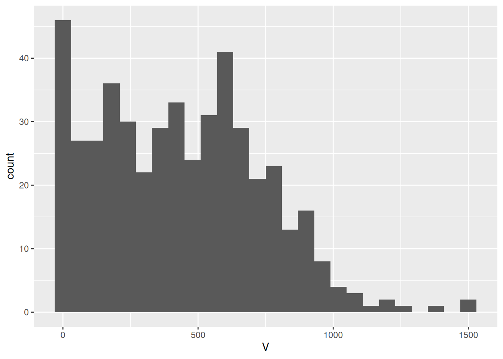
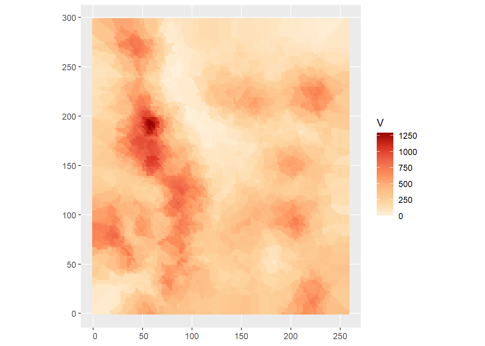
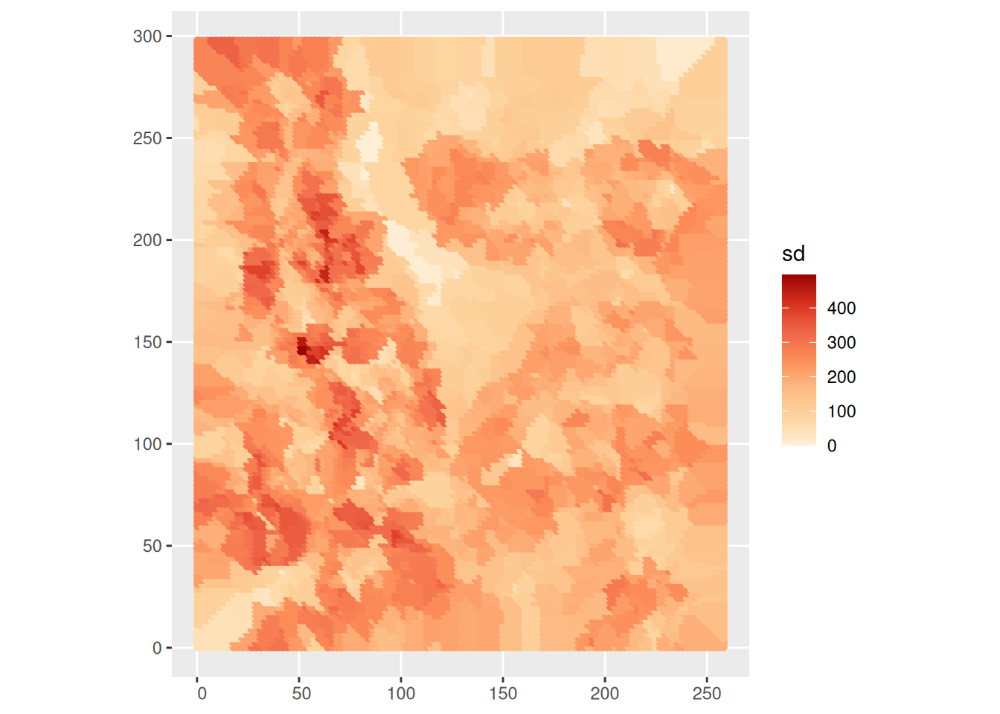
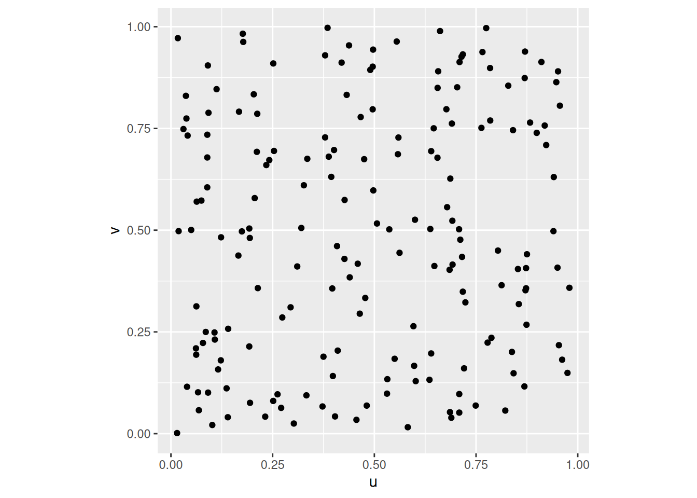
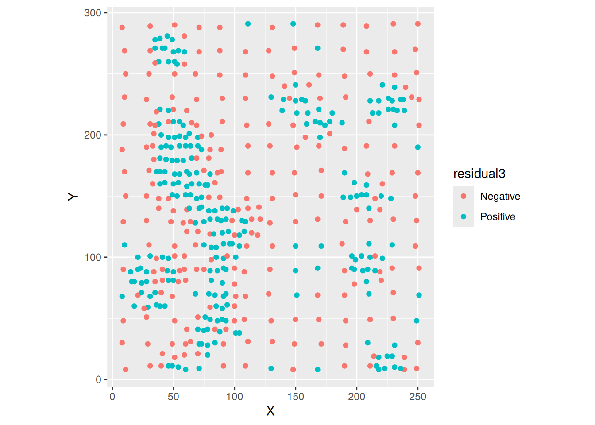
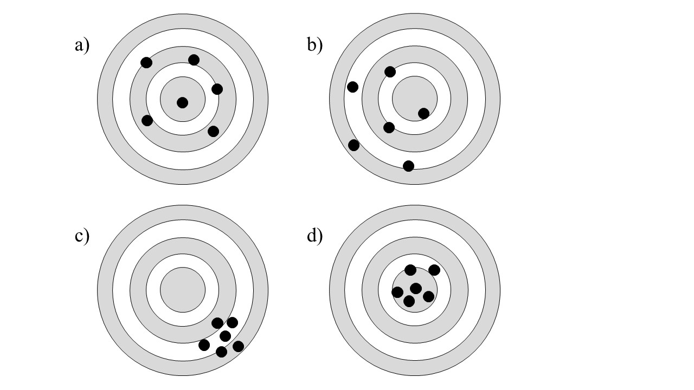

# Spatially Continuous Data II

*NOTE*: The source files for this book are available with companion package [{isdas}](https://paezha.github.io/isdas/). The source files are in Rmarkdown format and packed as templates. These files allow you execute code within the notebook, so that you can work interactively with the notes. 

Previously, you learned about the analysis of area data. Starting with this practice, you will be introduced to another type of spatial data: continuous data, also called fields. 

## Learning objectives

In the previous practice you were introduced to the concept of fields/spatially continuous data. Three different approaches were discussed that can be used to convert a set of observations of a field at discrete locations into a surface, namely tile-based approaches, inverse distance weighting (IDW), and $k$-point means. In this practice, you will learn:

1. About intervals of confidence for predictions.
2. Using trend surface analysis as an interpolation tool.
3. The difference between accuracy and precision in interpolation.

## Suggested readings

- Bailey TC and Gatrell AC [-@Bailey1995] Interactive Spatial Data Analysis, Chapters 5 and 6. Longman: Essex.
- Bivand RS, Pebesma E, and Gomez-Rubio V [-@Bivand2008] Applied Spatial Data Analysis with R, Chapter 8. Springer: New York.
- Brunsdon C and Comber L [-@Brunsdon2015R] An Introduction to R for Spatial Analysis and Mapping, Chapter 6, Sections 6.7 and 6.8. Sage: Los Angeles.
- Isaaks EH and Srivastava RM  [-@Isaaks1989applied] An Introduction to Applied Geostatistics, Chapter 4. Oxford University Press: Oxford.
- O'Sullivan D and Unwin D [-@Osullivan2010] Geographic Information Analysis, 2nd Edition, Chapters 9 and 10. John Wiley & Sons: New Jersey.

## Preliminaries

As usual, it is good practice to begin with a new session of `R` or at least to clear the working space to make sure that you do not have extraneous items there when you begin your work. The command in `R` to clear the workspace is `rm` (for "remove"), followed by a list of items to be removed. To clear the workspace from _all_ objects, do the following:

``` r
rm(list = ls())
```

Note that `ls()` lists all objects currently on the workspace.

Load the libraries you will use in this activity:

``` r
library(isdas)
library(plotly)
library(spatstat)
library(spdep)
library(tidyverse)
```

Begin by loading the data file that we will use in this chapter:

``` r
data("Walker_Lake")
```

You can verify the contents of the dataframe:

``` r
summary(Walker_Lake)
```

```
##          ID            X               Y               V         
##  Length   :470   Min.   :  8.0   Min.   :  8.0   Min.   :   0.0  
##  N.unique :470   1st Qu.: 51.0   1st Qu.: 80.0   1st Qu.: 182.0  
##  N.blank  :  0   Median : 89.0   Median :139.5   Median : 425.2  
##  Min.nchar:  1   Mean   :111.1   Mean   :141.3   Mean   : 435.4  
##  Max.nchar:  3   3rd Qu.:170.0   3rd Qu.:208.0   3rd Qu.: 644.4  
##                  Max.   :251.0   Max.   :291.0   Max.   :1528.1  
##                                                                  
##        U           T      
##  Min.   :   0.00   1: 45  
##  1st Qu.:  83.95   2:425  
##  Median : 335.00          
##  Mean   : 613.27          
##  3rd Qu.: 883.20          
##  Max.   :5190.10          
##  NAs    :195
```

We have already met this data set before: it contains a set of coordinates `X` and `Y` (units are meters; the origin is false), as well as two quantitative variables `V` and `U` (notice that there are missing observations in `U`), and a factor `T`.

## Uncertainty in the predictions

A common task in the analysis of spatially continuous data is to estimate the value of a variable at a location where it was not measured - or in other words, to spatially interpolate the variable. In Chapter \@ref(spatially-continuous-data-i), we introduced three methods for spatial interpolation based on a sample of observations.

The three algorithms that was saw before (i.e., Voronoi polygons, IDW, and $k$-point means) accomplish the task of providing spatial estimates. The values that we obtain with these methods are called _point estimates_. What is a point estimate? Recall the definition of a field that is the outcome of a purely spatial process:
$$
z_i = f(u_i, v_i) + \epsilon_i
$$

Accordingly, the prediction of the field at a new location is defined as a function of the estimated process and some random residual as follows:
$$
\hat{z}_p = \hat{f}(u_p, v_p) + \hat{\epsilon}_p
$$
The first part of the prediction ($\hat{f}(u_p, v_p)$) is the point estimate of the prediction, whereas the second part ($\hat{\epsilon}_p$) is the random part of the estimate.

The methods we saw in Chapter \@ref(spatially-continuous-data-i) can be used to estimate point estimates of the process. Unfortunately, they do not provide an estimate for the random element, so it is not possible to assess the uncertainty of the estimated values directly, since this depends on the distribution of the random term.

There are different ways in which at least some crude assessment of uncertainty can be attached to point estimates obtained from Voronoi polygons, IDW, or $k$-point means. For example, a very simple approach could be to use the sample variance to calculate intervals of confidence. This could be done as follows.

We know that the sample variance describes the inherent variability in the distribution of values of a variable in a sample. Consider for instance the distribution of the variable in the Walker Lake dataset:

``` r
ggplot(data = Walker_Lake, aes(V)) + 
  geom_histogram(binwidth = 60)
```



Clearly, there are no values of the variable less than zero, and values in excess of 1,000 are rare.

The standard deviation of the sample is:

``` r
sd(Walker_Lake$V)
```

```
## [1] 301.1554
```

The standard deviation is the average deviation from the mean. We could use this value to say that typical deviations from our point estimates are a function of this standard deviation (to what extent, it depends on the underlying distribution).

A problem with using this approach is that the distribution of the variable is not normal, and the distribution of $\hat{\epsilon}_p$ is unknown; the standard deviation is centered on the mean (meaning that it is a poor estimate for observations away from the mean); and in any case the standard deviation of the sample is too large for local point estimates if there is spatial pattern (since we know that the local mean will vary systematically).

There are other approaches to deal with non-normal variables, for instance Wilcox's test, but some of the other limitations remain.

``` r
wilcox.test(Walker_Lake$V, conf.int = TRUE, conf.level = 0.95)
```

```
## 
## 	Wilcoxon signed rank test with continuity correction
## 
## data:  Walker_Lake$V
## V = 100576, p-value < 2.2e-16
## alternative hypothesis: true location is not equal to 0
## 95 percent confidence interval:
##  397.35 454.05
## sample estimates:
## (pseudo)median 
##          424.6
```

As an alternative, the _local_ standard deviation could be used.

Consider the case of $k$-point means. The point estimate is based on the values of the $k$-nearest neighbors:
$$
\hat{z}_p = \frac{\sum_{i=1}^n{w_{pi}z_i}}{\sum_{i=1}^n{w_{pi}}}
$$

With:
$$
w_{pi} = \bigg\{\begin{array}{ll}
1 & \text{if } i \text{ is one of } kth \text{ nearest neighbors of } p \text{ for a given }k \\
0 & otherwise \\
\end{array}
$$

The standard deviation could be calculated also based in the values of the $k$-nearest neighbors, meaning that it would be based on the local mean. Here, we will interpolate the field using the Walker Lake data. First create a target grid for interpolation, and extract the coordinates of observations: 

``` r
# Create a prediction grid and convert to simple features:
target_xy = expand.grid(x = seq(0.5, 259.5, 2.2), 
                        y = seq(0.5, 299.5, 2.2)) |>
  st_as_sf(coords = c("x", "y"))

# Convert the `Walker_Lake` dataframe to a simple features object using as follows:
Walker_Lake.sf <- Walker_Lake |> 
  st_as_sf(coords = c("X", "Y"))
```

Interpolation using $k=5$ neighbors:

``` r
kpoint.5 <- kpointmean(source_xy = Walker_Lake.sf, 
                       target_xy = target_xy, 
                       z = V,  
                       k = 5) |>
  rename(V = z)
```

```
## projected points
```

We can plot the interpolated field now. These are the interpolated values:

``` r
ggplot() +
  geom_sf(data = kpoint.5, 
          aes(color = V)) +
  scale_color_distiller(palette = "OrRd", 
                       direction = 1)
```



In addition, we can plot the _local_ standard deviation:

``` r
ggplot() +
  geom_sf(data = kpoint.5, 
          aes(color = sd)) +
  scale_color_distiller(palette = "OrRd", 
                       direction = 1)
```



The local standard deviation indicates the typical deviation from the local mean. As expected, the local values of the standard deviation are usually lower than the standard deviation of the sample, and it tends to be larger for the tails, that is the locations where the values are rare - we have less information, hence greater uncertainty.

The local standard deviation is a crude estimator of the uncertainty because we do not know the underlying distribution. Other approaches based on bootstrapping (randomly sampling from the observed values of the variable) could be implemented, but they are beyond the scope of the present discussion.

The issue of assessing the level of uncertainty in the predictions with Voronoi polygons, IDW, and $k$-point means reflects the fact that these methods were not designed to deal explicitly with the random nature of predicting fields. Other methods deal with this issue more naturally. We will revisit two estimation methods that we covered before, and see how they can be applied to spatial interpolation.

## Trend surface analysis

Trend surface analysis is a form of multivariate regression that uses the coordinates of the observations to fit a surface to the data.

We can illustrate this technique by means of a simulated example. We will begin by simulating a set of observations, beginning with the coordinates in the square unit region:

``` r
# `n` is the number of observations to simulate
n <- 180

# Here we create a dataframe with these values: `u` and `v` will be the coordinates of our process
df <- data.frame(u = runif(n = n, min = 0, max = 1), 
                 v = runif(n = n, min = 0, max = 1))
```

Once we have simulated the coordinates for the example, we can plot their locations:

``` r
ggplot(data = df, aes(x = u, y = v)) + 
  geom_point() + 
  coord_equal()
```



We can now proceed to simulate a spatial process as follows:

``` r
# Use `mutate()` to create a new stochastic variable `z` that is a function of the coordinates and a random normal variable that we create with `rnorm()`; this random variable has a mean of zero and a standard deviation of 0.1.
df <- mutate(df, z = 0.5 + 0.3 * u + 0.7 * v + rnorm(n = n, mean = 0, sd = 0.1))
```

A 3D scatterplot can be useful to explore the data:

``` r
# Create a 3D scatterplot with the function `plot_ly()`. Notice that the way this function works is similar to `ggplot2`: the arguments are a dataframe, what should be plotted on the x-axis, the y-axis, the z-axis, and other aesthetics (aspects) of the plot. Here the color will be proportional to the values of `z`. The function `add_markers()` is similar to the family of `geom_` functions in `ggplot2`, but more general, since it will try to guess what you are trying to plot based on the inputs (in this case points). The function `layout()` is used to control other parts of the plot: here the `aspectratio` is selected so that the scale is identical for all three axes.
plot_ly(data = df, x = ~u, y = ~v, z = ~z, color = ~z) |> 
  add_markers() |> 
  layout(scene = list(
    aspectmode = "manual", aspectratio = list(x=1, y=1, z=1)))
```

```{=html}
<div class="plotly html-widget html-fill-item" id="htmlwidget-2cf2d55bfb38905e2fea" style="width:672px;height:480px;"></div>
<script type="application/json" data-for="htmlwidget-2cf2d55bfb38905e2fea">{"x":{"visdat":{"1388d51aeeb96":["function () ","plotlyVisDat"]},"cur_data":"1388d51aeeb96","attrs":{"1388d51aeeb96":{"x":{},"y":{},"z":{},"color":{},"alpha_stroke":1,"sizes":[10,100],"spans":[1,20],"type":"scatter3d","mode":"markers","inherit":true}},"layout":{"margin":{"b":40,"l":60,"t":25,"r":10},"scene":{"aspectmode":"manual","aspectratio":{"x":1,"y":1,"z":1},"xaxis":{"title":"u"},"yaxis":{"title":"v"},"zaxis":{"title":"z"}},"hovermode":"closest","showlegend":false,"legend":{"yanchor":"top","y":0.5}},"source":"A","config":{"modeBarButtonsToAdd":["hoverclosest","hovercompare"],"showSendToCloud":false},"data":[{"x":[0.89909481559880078,0.42654357315041125,0.76576361991465092,0.63553867163136601,0.55500668054446578,0.49750120053067803,0.65516186854802072,0.85512320697307587,0.30214477051049471,0.16580021078698337,0.72060087858699262,0.37493041018024087,0.074903060216456652,0.32673608721233904,0.40828234632499516,0.31048386823385954,0.53198805684223771,0.87514209840446711,0.63966682902537286,0.41955126821994781,0.64757849904708564,0.39661029842682183,0.37902113352902234,0.76322275493294001,0.59610231895931065,0.11596117937006056,0.84224849543534219,0.49004231719300151,0.53679136116988957,0.41000895202159882,0.94025488430634141,0.63976310170255601,0.97475608857348561,0.37260766769759357,0.95027027348987758,0.29415331827476621,0.21224218932911754,0.59989154222421348,0.10168094024993479,0.42686438304372132,0.12268477096222341,0.70875064539723098,0.089339274447411299,0.58220471884123981,0.65696923318319023,0.33521254942752421,0.24179823906160891,0.91880404995754361,0.54984819167293608,0.39804167137481272,0.21354507049545646,0.67710938677191734,0.85297538014128804,0.87401090865023434,0.87298295670188963,0.49589177058078349,0.65551934414543211,0.82921980763785541,0.063387684756889939,0.16736063547432423,0.68493978353217244,0.068618605379015207,0.95611536502838135,0.7082499866373837,0.25157548394054174,0.74915621406398714,0.089264449430629611,0.46420072391629219,0.86955401301383972,0.78485295129939914,0.69061063439585268,0.94107371545396745,0.17780894413590431,0.43202610383741558,0.86885045282542706,0.91071842354722321,0.21117882709950209,0.49690367514267564,0.71559652383439243,0.19262875313870609,0.066679170588031411,0.2533239561598748,0.43952751322649419,0.83820976526476443,0.55920730764046311,0.39415324269793928,0.69177648145705462,0.092349928803741932,0.089400785276666284,0.70948031498119235,0.078682714141905308,0.018878351431339979,0.71746892388910055,0.038109795656055212,0.68674817169085145,0.015104573685675859,0.947298314422369,0.40340139181353152,0.46642971108667552,0.88283124449662864,0.08559884037822485,0.13980846758931875,0.26206523668952286,0.10712647740729153,0.38502967311069369,0.23445392725989223,0.67892411584034562,0.53113589924760163,0.80385242821648717,0.48129739216528833,0.87150800880044699,0.27374981506727636,0.95153326960280538,0.78784094913862646,0.33306037704460323,0.68590813432820141,0.32055215514265001,0.38795793522149324,0.71754345367662609,0.2036130044143647,0.090817297110334039,0.091276988387107849,0.061528922989964485,0.10793099389411509,0.82187843439169228,0.70875955955125391,0.71128692105412483,0.016978455940261483,0.92243872187100351,0.70365794352255762,0.06256299396045506,0.47771340585313737,0.2058812458999455,0.47500737896189094,0.87037392822094262,0.81280685076490045,0.23175012762658298,0.27093748957850039,0.11220083199441433,0.43775991327129304,0.64597726217471063,0.45601060567423701,0.78450899943709373,0.69225402572192252,0.3790526872035116,0.84085746202617884,0.17663863650523126,0.036802125163376331,0.77499538450501859,0.60165911260992289,0.72382182581350207,0.062137170229107141,0.12319985823705792,0.66152790281921625,0.039579341886565089,0.56191492476500571,0.96166339167393744,0.9536261351313442,0.19440503977239132,0.49598122737370431,0.19392599817365408,0.77839436219073832,0.87301101488992572,0.50646673911251128,0.14071975159458816,0.041080989642068744,0.13678861642256379,0.97953317337669432,0.71432996913790703,0.59785961988382041,0.25144594861194491,0.030757933622226119,0.68924017646349967,0.55791833391413093,0.63762017176486552,0.049823583103716373,0.19256139080971479,0.17439594003371894,0.4591909209266305,0.40094641433097422],"y":[0.73915264871902764,0.42941837897524238,0.93774891039356589,0.13229835033416748,0.96356334607116878,0.59769383049570024,0.67804960650391877,0.31836304208263755,0.024875080212950706,0.43766564805991948,0.16045673610642552,0.1890982910990715,0.5727595032658428,0.61035130359232426,0.46088559762574732,0.41085072280839086,0.13383467402309179,0.44082599878311157,0.1970963547937572,0.91178170382045209,0.41190808732062578,0.35680125863291323,0.7280076565220952,0.75137808662839234,0.26399220782332122,0.15779230580665171,0.14837339241057634,0.89390241191722453,0.50197503017261624,0.20405565365217626,0.49761813296936452,0.69419812061823905,0.14924921025522053,0.066793316276744008,0.40789319691248238,0.31046845973469317,0.78600545530207455,0.52566658775322139,0.021259971661493182,0.57421482587233186,0.18012367794290185,0.051724313758313656,0.67864608578383923,0.01579447346739471,0.89042720152065158,0.67541774502024055,0.67219595750793815,0.75711265811696649,0.18399617075920105,0.14156843582168221,0.35762690613046288,0.79716596216894686,0.40455247322097421,0.26763576013036072,0.40674723661504686,0.79698934406042099,0.84967352566309273,0.85510809649713337,0.57013850938528776,0.79117481387220323,0.40265098493546247,0.057490550447255373,0.80593030084855855,0.50221846834756434,0.90970653854310513,0.069000279763713479,0.6052140099927783,0.2948362601455301,0.87385523947887123,0.76949572586454451,0.76198831642977893,0.63055997295305133,0.9626329152379185,0.83248258498497307,0.11602160497568548,0.91328657162375748,0.69251564354635775,0.94373171543702483,0.43432551203295588,0.50405776081606746,0.10157252242788672,0.69474015198647976,0.38406895799562335,0.20083182910457253,0.72768312273547053,0.63101647631265223,0.52317241323180497,0.78849341603927314,0.73457182245329022,0.91320206644013524,0.22291081654839218,0.49768889555707574,0.34883995307609439,0.77441622549667954,0.62672846321947873,0.0013733869418501854,0.86369936703704298,0.042260827263817191,0.77798662846907973,0.7644132652785629,0.24990645912475884,0.040349416900426149,0.096659836824983358,0.24861590494401753,0.99721458344720304,0.66003926750272512,0.55651310691609979,0.098327310755848885,0.44988064165227115,0.068917023250833154,0.3523575640283525,0.28549860627390444,0.89026026497595012,0.23549158894456923,0.094143115449696779,0.052844966761767864,0.50543555594049394,0.68060409929603338,0.93193298159167171,0.83389119943603873,0.90476139611564577,0.10088482778519392,0.2096043610945344,0.23120837844908237,0.056717257713899016,0.097299627028405666,0.47657894319854677,0.97188653238117695,0.70917510753497481,0.85114649683237076,0.31279013934545219,0.33346977736800909,0.57884050696156919,0.67447116109542549,0.93890653015114367,0.3647794290445745,0.041774941841140389,0.06334870052523911,0.84651108249090612,0.95408971863798797,0.75034911255352199,0.033967747120186687,0.89845112455077469,0.41547319781966507,0.92962685832753778,0.74571809894405305,0.98274681554175913,0.83013217337429523,0.99661525036208332,0.12899437453597784,0.32257770956493914,0.19402850139886141,0.48247849592007697,0.9892667680978775,0.11521638045087457,0.44436988071538508,0.18170714378356934,0.21738807228393853,0.075708891032263637,0.90180916618555784,0.48085779952816665,0.22369275568053126,0.3571398367639631,0.51642532483674586,0.257695481646806,0.7324901616666466,0.11133763892576098,0.35844048811122775,0.92620790307410061,0.16662180796265602,0.080408309586346149,0.74846762418746948,0.039065332850441337,0.68663507443852723,0.50289294961839914,0.50053673051297665,0.21421624347567558,0.49699650751426816,0.4175386824645102,0.69700423534959555],"z":[1.2431450546590854,0.90273683696773499,1.3228624485639153,0.84563940216763822,1.0484923285961458,0.93935012127306095,1.2132981244310646,0.98687753851181637,0.5313839803903404,0.86844637365534871,0.91818567522214567,0.67832809771011293,0.79497990849438838,1.1732742230045281,0.92550419583510168,0.93284958080600322,0.73925062468087965,1.0713636162999394,0.82222878719216652,1.2002338822781951,0.8338105141526293,0.89405571219845648,1.125989541869816,1.3215926571178549,0.99252466062236422,0.60878616940570074,0.83488895272161856,1.3345238341911549,1.2412633583641863,0.73087613385598438,1.0531173893717907,1.1656849561683083,0.91014101337065434,0.66616328733178376,1.0811883371615505,0.94740449013500538,1.2258666502300528,1.0618784873718536,0.44243303839073939,0.91894503975502517,0.73869297388396993,0.56604344920490302,1.1158540640099122,0.64408592174360224,1.479625730306281,1.0379719804141407,1.0258594517324202,1.4407111167163078,0.84307641654364907,0.74804417741184204,0.74383155351823871,1.3535283207623263,1.2247414648367192,0.91566360808524128,1.0295684481424006,1.2732350242725721,1.2639695057256015,1.5120374712310403,0.94154906276794725,0.93660160652588975,1.0075180047018741,0.64107288060568457,1.4779521525930464,0.95003449171605947,1.4248508890955123,0.80744688071765491,0.85378984658625223,0.93591681151981965,1.5394806865456709,1.2975115013871696,1.2457266490281727,1.2104845677132208,1.2804287090102344,1.2935686307881646,0.77441586427947662,1.5018551696400304,1.0514876741543926,1.4671730719892251,0.83682355930143471,0.81079107635137826,0.73815971429813665,1.0237953302598337,1.0379797466132783,1.0516669099261911,1.0748835921315434,1.1743301418144405,1.167597277009951,1.2456704851589471,1.0445468843575578,1.4931658353176616,0.76270848329722607,1.0378110527487008,0.98221386278280409,1.063718559385223,1.1896460756358722,0.49229868786373704,1.2371164806924346,0.67815728665467867,0.94015787408966611,1.2058163503455204,0.68572225189362923,0.6811729946956776,0.78820159292475944,0.78263330812168008,1.4275618187668129,1.180413213405936,1.0240852412671531,0.76634148893213527,1.354369643239953,0.64585628861424582,1.1953304670630642,0.85345207532814282,1.3437456410269557,1.1374786122909777,0.58604108029955815,0.78048323249601415,0.88020395924170458,1.0472025254868857,1.4094654042610613,1.2663511948201975,1.0825887495163036,0.59016035712766868,0.77001297162825988,0.6886352704533184,0.87822496692583651,0.77833895113014018,1.1059099421364087,1.1737744620157997,1.2017088174071719,1.0691584133614624,0.70280857973199984,0.92314693767351874,0.99816021099201524,1.0179075832107582,1.362952908293416,0.90943740589181632,0.57332621423987418,0.64654383234900636,1.1527733787831984,1.4428824835599778,1.255222418348789,0.64141022781152501,1.4953061790195072,0.84302254608078253,1.1873944480398526,1.1797281590557205,1.2899485335639107,1.1718260295865792,1.58947082181771,0.66956389126658511,0.93562719485115775,0.68610304526122645,0.89883180241575855,1.5032677646009251,0.8021797794900497,0.85544699111672284,0.96310930795309579,0.99599250095767655,0.60597532575570889,1.18942661696119,0.80022915833637087,0.91646676768185564,1.0656853699672562,1.1121222966521997,0.6268929059773678,0.94765905545649742,0.62894163830695304,1.017070042872068,1.3599819089397216,0.79164011741286611,0.62495668673838145,0.96674458061410318,0.72389604033107136,0.98882461372727326,1.1105303897529979,0.83871187266603686,0.88684068401781535,0.92585840265428743,0.88385684982818602,1.3216748774591509],"type":"scatter3d","mode":"markers","marker":{"colorbar":{"title":"z","ticklen":2},"cmin":0.44243303839073939,"cmax":1.58947082181771,"colorscale":[["0","rgba(68,1,84,1)"],["0.0416666666666666","rgba(70,19,97,1)"],["0.0833333333333333","rgba(72,32,111,1)"],["0.125","rgba(71,45,122,1)"],["0.166666666666667","rgba(68,58,128,1)"],["0.208333333333333","rgba(64,70,135,1)"],["0.25","rgba(60,82,138,1)"],["0.291666666666667","rgba(56,93,140,1)"],["0.333333333333333","rgba(49,104,142,1)"],["0.375","rgba(46,114,142,1)"],["0.416666666666667","rgba(42,123,142,1)"],["0.458333333333333","rgba(38,133,141,1)"],["0.5","rgba(37,144,140,1)"],["0.541666666666667","rgba(33,154,138,1)"],["0.583333333333333","rgba(39,164,133,1)"],["0.625","rgba(47,174,127,1)"],["0.666666666666667","rgba(53,183,121,1)"],["0.708333333333333","rgba(79,191,110,1)"],["0.75","rgba(98,199,98,1)"],["0.791666666666667","rgba(119,207,85,1)"],["0.833333333333333","rgba(147,214,70,1)"],["0.875","rgba(172,220,52,1)"],["0.916666666666667","rgba(199,225,42,1)"],["0.958333333333333","rgba(226,228,40,1)"],["1","rgba(253,231,37,1)"]],"showscale":false,"color":[1.2431450546590854,0.90273683696773499,1.3228624485639153,0.84563940216763822,1.0484923285961458,0.93935012127306095,1.2132981244310646,0.98687753851181637,0.5313839803903404,0.86844637365534871,0.91818567522214567,0.67832809771011293,0.79497990849438838,1.1732742230045281,0.92550419583510168,0.93284958080600322,0.73925062468087965,1.0713636162999394,0.82222878719216652,1.2002338822781951,0.8338105141526293,0.89405571219845648,1.125989541869816,1.3215926571178549,0.99252466062236422,0.60878616940570074,0.83488895272161856,1.3345238341911549,1.2412633583641863,0.73087613385598438,1.0531173893717907,1.1656849561683083,0.91014101337065434,0.66616328733178376,1.0811883371615505,0.94740449013500538,1.2258666502300528,1.0618784873718536,0.44243303839073939,0.91894503975502517,0.73869297388396993,0.56604344920490302,1.1158540640099122,0.64408592174360224,1.479625730306281,1.0379719804141407,1.0258594517324202,1.4407111167163078,0.84307641654364907,0.74804417741184204,0.74383155351823871,1.3535283207623263,1.2247414648367192,0.91566360808524128,1.0295684481424006,1.2732350242725721,1.2639695057256015,1.5120374712310403,0.94154906276794725,0.93660160652588975,1.0075180047018741,0.64107288060568457,1.4779521525930464,0.95003449171605947,1.4248508890955123,0.80744688071765491,0.85378984658625223,0.93591681151981965,1.5394806865456709,1.2975115013871696,1.2457266490281727,1.2104845677132208,1.2804287090102344,1.2935686307881646,0.77441586427947662,1.5018551696400304,1.0514876741543926,1.4671730719892251,0.83682355930143471,0.81079107635137826,0.73815971429813665,1.0237953302598337,1.0379797466132783,1.0516669099261911,1.0748835921315434,1.1743301418144405,1.167597277009951,1.2456704851589471,1.0445468843575578,1.4931658353176616,0.76270848329722607,1.0378110527487008,0.98221386278280409,1.063718559385223,1.1896460756358722,0.49229868786373704,1.2371164806924346,0.67815728665467867,0.94015787408966611,1.2058163503455204,0.68572225189362923,0.6811729946956776,0.78820159292475944,0.78263330812168008,1.4275618187668129,1.180413213405936,1.0240852412671531,0.76634148893213527,1.354369643239953,0.64585628861424582,1.1953304670630642,0.85345207532814282,1.3437456410269557,1.1374786122909777,0.58604108029955815,0.78048323249601415,0.88020395924170458,1.0472025254868857,1.4094654042610613,1.2663511948201975,1.0825887495163036,0.59016035712766868,0.77001297162825988,0.6886352704533184,0.87822496692583651,0.77833895113014018,1.1059099421364087,1.1737744620157997,1.2017088174071719,1.0691584133614624,0.70280857973199984,0.92314693767351874,0.99816021099201524,1.0179075832107582,1.362952908293416,0.90943740589181632,0.57332621423987418,0.64654383234900636,1.1527733787831984,1.4428824835599778,1.255222418348789,0.64141022781152501,1.4953061790195072,0.84302254608078253,1.1873944480398526,1.1797281590557205,1.2899485335639107,1.1718260295865792,1.58947082181771,0.66956389126658511,0.93562719485115775,0.68610304526122645,0.89883180241575855,1.5032677646009251,0.8021797794900497,0.85544699111672284,0.96310930795309579,0.99599250095767655,0.60597532575570889,1.18942661696119,0.80022915833637087,0.91646676768185564,1.0656853699672562,1.1121222966521997,0.6268929059773678,0.94765905545649742,0.62894163830695304,1.017070042872068,1.3599819089397216,0.79164011741286611,0.62495668673838145,0.96674458061410318,0.72389604033107136,0.98882461372727326,1.1105303897529979,0.83871187266603686,0.88684068401781535,0.92585840265428743,0.88385684982818602,1.3216748774591509],"line":{"colorbar":{"title":"","ticklen":2},"cmin":0.44243303839073939,"cmax":1.58947082181771,"colorscale":[["0","rgba(68,1,84,1)"],["0.0416666666666666","rgba(70,19,97,1)"],["0.0833333333333333","rgba(72,32,111,1)"],["0.125","rgba(71,45,122,1)"],["0.166666666666667","rgba(68,58,128,1)"],["0.208333333333333","rgba(64,70,135,1)"],["0.25","rgba(60,82,138,1)"],["0.291666666666667","rgba(56,93,140,1)"],["0.333333333333333","rgba(49,104,142,1)"],["0.375","rgba(46,114,142,1)"],["0.416666666666667","rgba(42,123,142,1)"],["0.458333333333333","rgba(38,133,141,1)"],["0.5","rgba(37,144,140,1)"],["0.541666666666667","rgba(33,154,138,1)"],["0.583333333333333","rgba(39,164,133,1)"],["0.625","rgba(47,174,127,1)"],["0.666666666666667","rgba(53,183,121,1)"],["0.708333333333333","rgba(79,191,110,1)"],["0.75","rgba(98,199,98,1)"],["0.791666666666667","rgba(119,207,85,1)"],["0.833333333333333","rgba(147,214,70,1)"],["0.875","rgba(172,220,52,1)"],["0.916666666666667","rgba(199,225,42,1)"],["0.958333333333333","rgba(226,228,40,1)"],["1","rgba(253,231,37,1)"]],"showscale":false,"color":[1.2431450546590854,0.90273683696773499,1.3228624485639153,0.84563940216763822,1.0484923285961458,0.93935012127306095,1.2132981244310646,0.98687753851181637,0.5313839803903404,0.86844637365534871,0.91818567522214567,0.67832809771011293,0.79497990849438838,1.1732742230045281,0.92550419583510168,0.93284958080600322,0.73925062468087965,1.0713636162999394,0.82222878719216652,1.2002338822781951,0.8338105141526293,0.89405571219845648,1.125989541869816,1.3215926571178549,0.99252466062236422,0.60878616940570074,0.83488895272161856,1.3345238341911549,1.2412633583641863,0.73087613385598438,1.0531173893717907,1.1656849561683083,0.91014101337065434,0.66616328733178376,1.0811883371615505,0.94740449013500538,1.2258666502300528,1.0618784873718536,0.44243303839073939,0.91894503975502517,0.73869297388396993,0.56604344920490302,1.1158540640099122,0.64408592174360224,1.479625730306281,1.0379719804141407,1.0258594517324202,1.4407111167163078,0.84307641654364907,0.74804417741184204,0.74383155351823871,1.3535283207623263,1.2247414648367192,0.91566360808524128,1.0295684481424006,1.2732350242725721,1.2639695057256015,1.5120374712310403,0.94154906276794725,0.93660160652588975,1.0075180047018741,0.64107288060568457,1.4779521525930464,0.95003449171605947,1.4248508890955123,0.80744688071765491,0.85378984658625223,0.93591681151981965,1.5394806865456709,1.2975115013871696,1.2457266490281727,1.2104845677132208,1.2804287090102344,1.2935686307881646,0.77441586427947662,1.5018551696400304,1.0514876741543926,1.4671730719892251,0.83682355930143471,0.81079107635137826,0.73815971429813665,1.0237953302598337,1.0379797466132783,1.0516669099261911,1.0748835921315434,1.1743301418144405,1.167597277009951,1.2456704851589471,1.0445468843575578,1.4931658353176616,0.76270848329722607,1.0378110527487008,0.98221386278280409,1.063718559385223,1.1896460756358722,0.49229868786373704,1.2371164806924346,0.67815728665467867,0.94015787408966611,1.2058163503455204,0.68572225189362923,0.6811729946956776,0.78820159292475944,0.78263330812168008,1.4275618187668129,1.180413213405936,1.0240852412671531,0.76634148893213527,1.354369643239953,0.64585628861424582,1.1953304670630642,0.85345207532814282,1.3437456410269557,1.1374786122909777,0.58604108029955815,0.78048323249601415,0.88020395924170458,1.0472025254868857,1.4094654042610613,1.2663511948201975,1.0825887495163036,0.59016035712766868,0.77001297162825988,0.6886352704533184,0.87822496692583651,0.77833895113014018,1.1059099421364087,1.1737744620157997,1.2017088174071719,1.0691584133614624,0.70280857973199984,0.92314693767351874,0.99816021099201524,1.0179075832107582,1.362952908293416,0.90943740589181632,0.57332621423987418,0.64654383234900636,1.1527733787831984,1.4428824835599778,1.255222418348789,0.64141022781152501,1.4953061790195072,0.84302254608078253,1.1873944480398526,1.1797281590557205,1.2899485335639107,1.1718260295865792,1.58947082181771,0.66956389126658511,0.93562719485115775,0.68610304526122645,0.89883180241575855,1.5032677646009251,0.8021797794900497,0.85544699111672284,0.96310930795309579,0.99599250095767655,0.60597532575570889,1.18942661696119,0.80022915833637087,0.91646676768185564,1.0656853699672562,1.1121222966521997,0.6268929059773678,0.94765905545649742,0.62894163830695304,1.017070042872068,1.3599819089397216,0.79164011741286611,0.62495668673838145,0.96674458061410318,0.72389604033107136,0.98882461372727326,1.1105303897529979,0.83871187266603686,0.88684068401781535,0.92585840265428743,0.88385684982818602,1.3216748774591509]}},"frame":null},{"x":[0.015104573685675859,0.97953317337669432],"y":[0.0013733869418501854,0.99721458344720304],"type":"scatter3d","mode":"markers","opacity":0,"hoverinfo":"none","showlegend":false,"marker":{"colorbar":{"title":"z","ticklen":2,"len":0.5,"lenmode":"fraction","y":1,"yanchor":"top"},"cmin":0.44243303839073939,"cmax":1.58947082181771,"colorscale":[["0","rgba(68,1,84,1)"],["0.0416666666666666","rgba(70,19,97,1)"],["0.0833333333333333","rgba(72,32,111,1)"],["0.125","rgba(71,45,122,1)"],["0.166666666666667","rgba(68,58,128,1)"],["0.208333333333333","rgba(64,70,135,1)"],["0.25","rgba(60,82,138,1)"],["0.291666666666667","rgba(56,93,140,1)"],["0.333333333333333","rgba(49,104,142,1)"],["0.375","rgba(46,114,142,1)"],["0.416666666666667","rgba(42,123,142,1)"],["0.458333333333333","rgba(38,133,141,1)"],["0.5","rgba(37,144,140,1)"],["0.541666666666667","rgba(33,154,138,1)"],["0.583333333333333","rgba(39,164,133,1)"],["0.625","rgba(47,174,127,1)"],["0.666666666666667","rgba(53,183,121,1)"],["0.708333333333333","rgba(79,191,110,1)"],["0.75","rgba(98,199,98,1)"],["0.791666666666667","rgba(119,207,85,1)"],["0.833333333333333","rgba(147,214,70,1)"],["0.875","rgba(172,220,52,1)"],["0.916666666666667","rgba(199,225,42,1)"],["0.958333333333333","rgba(226,228,40,1)"],["1","rgba(253,231,37,1)"]],"showscale":true,"color":[0.44243303839073939,1.58947082181771],"line":{"color":"rgba(255,127,14,1)"}},"z":[0.44243303839073939,1.58947082181771],"frame":null}],"highlight":{"on":"plotly_click","persistent":false,"dynamic":false,"selectize":false,"opacityDim":0.20000000000000001,"selected":{"opacity":1},"debounce":0},"shinyEvents":["plotly_hover","plotly_click","plotly_selected","plotly_relayout","plotly_brushed","plotly_brushing","plotly_clickannotation","plotly_doubleclick","plotly_deselect","plotly_afterplot","plotly_sunburstclick"],"base_url":"https://plot.ly"},"evals":[],"jsHooks":[]}</script>
```

We can fit a trend surface to the data as follows. This is a regression model that uses the coordinates of the observations as covariates. In this case, the trend is linear:

``` r
trend.l <- lm(formula = z ~ u + v, data = df)
summary(trend.l)
```

```
## 
## Call:
## lm(formula = z ~ u + v, data = df)
## 
## Residuals:
##       Min        1Q    Median        3Q       Max 
## -0.308937 -0.062252 -0.005719  0.064554  0.284212 
## 
## Coefficients:
##             Estimate Std. Error t value Pr(>|t|)    
## (Intercept)  0.51787    0.01835   28.22   <2e-16 ***
## u            0.29428    0.02602   11.31   <2e-16 ***
## v            0.70180    0.02513   27.93   <2e-16 ***
## ---
## Signif. codes:  0 '***' 0.001 '**' 0.01 '*' 0.05 '.' 0.1 ' ' 1
## 
## Residual standard error: 0.1007 on 177 degrees of freedom
## Multiple R-squared:  0.8465,	Adjusted R-squared:  0.8448 
## F-statistic: 488.2 on 2 and 177 DF,  p-value: < 2.2e-16
```

Given a trend surface model, we can estimate the value of the variable $z$ at locations where it was not measured. Typically this is done by interpolating on a fine grid that can be used for visualization or further analysis, as shown next.

We will begin by creating a grid for interpolation. We will call the coordinates `x.p` and `y.p`. We generate these by creating a sequence of values in the domain of the data, for instance in the [0,1] interval:

``` r
u.p <- seq(from = 0.0, to = 1.0, by = 0.05)
v.p <- seq(from = 0.0, to = 1.0, by = 0.05)
```

For prediction, we want all combinations of `x.p` and `y.p`, so we expand these two vectors into a grid, by means of the function `expand.grid()`:

``` r
# The function `expand.grid()` creates a grid with all the combination of values of the inputs.
df.p <- expand.grid(u = u.p, v = v.p)
```

Notice that while `u.p` and `v.p` are vectors of size 21, the dataframe `df.p` contains `{r}21 * 21` observations, that is, all the combinations of `u.p` and `v.p`.

Once we have the coordinates for interpolation, the `predict()` function can be used in conjunction with the results of the estimation. When invoking the function, we indicate that we wish to obtain as well the standard errors of the fitted values (`se.fit = TRUE`), as well as the interval of the predictions at a 95% level of confidence:

``` r
preds <- predict(trend.l, newdata = df.p, se.fit = TRUE, interval = "prediction", level = 0.95)
```

The interval of confidence _of the predictions_ at the 95% level of confidence is given in the form of the lower (`lwr`) and upper (`upr`) bounds:

``` r
summary(preds$fit)
```

```
##       fit              lwr              upr        
##  Min.   :0.5179   Min.   :0.3158   Min.   :0.7199  
##  1st Qu.:0.8325   1st Qu.:0.6318   1st Qu.:1.0345  
##  Median :1.0159   Median :0.8166   Median :1.2152  
##  Mean   :1.0159   Mean   :0.8154   Mean   :1.2164  
##  3rd Qu.:1.1993   3rd Qu.:0.9972   3rd Qu.:1.4001  
##  Max.   :1.5140   Max.   :1.3116   Max.   :1.7163
```

These values indicate that the predictions of $z_p$ are, with 95% of confidence, in the following interval:
$$
CI_{z_p} = [z_{p_{lwr}}, z_{p_{upr}}].
$$

A convenient way to visualize the results of the analysis above, that is, to inspect the trend surface and the interval of confidence of the predictions, is by means of a 3D plot as follows.

First create matrices with the point estimates of the trend surface (`z.p`), and the lower and upper bounds (`z.p_l`, `z.p_u`):

``` r
z.p <- matrix(data = preds$fit[,1], nrow = 21, ncol = 21, byrow = TRUE)
z.p_l <- matrix(data = preds$fit[,2], nrow = 21, ncol = 21, byrow = TRUE)
z.p_u <- matrix(data = preds$fit[,3], nrow = 21, ncol = 21, byrow = TRUE)
```

The plot is created using the coordinates used for interpolation (`x.p` and `y.p`) and the matrices with the point estimates `z.p` and the upper and lower bounds. The type of plot in the package `plotly` is a _surface_:

``` r
trend.plot <- plot_ly(x = ~u.p, y = ~v.p, z = ~z.p, 
        type = "surface", colors = "YlOrRd") |> 
  add_surface(x = ~u.p, y = ~v.p, z = ~z.p_l, 
              opacity = 0.5, showscale = FALSE) |>
  add_surface(x = ~u.p, y = ~v.p, z = ~z.p_u, 
              opacity = 0.5, showscale = FALSE) |> 
  layout(scene = list(
    aspectmode = "manual", aspectratio = list(x = 1, y = 1, z = 1)))

trend.plot
```

```{=html}
<div class="plotly html-widget html-fill-item" id="htmlwidget-3b25fa446ef800afa5db" style="width:672px;height:480px;"></div>
<script type="application/json" data-for="htmlwidget-3b25fa446ef800afa5db">{"x":{"visdat":{"1388d6583e481":["function () ","plotlyVisDat"]},"cur_data":"1388d6583e481","attrs":{"1388d6583e481":{"x":{},"y":{},"z":{},"colors":"YlOrRd","alpha_stroke":1,"sizes":[10,100],"spans":[1,20],"type":"surface"},"1388d6583e481.1":{"x":{},"y":{},"z":{},"colors":"YlOrRd","alpha_stroke":1,"sizes":[10,100],"spans":[1,20],"type":"surface","opacity":0.5,"showscale":false,"inherit":true},"1388d6583e481.2":{"x":{},"y":{},"z":{},"colors":"YlOrRd","alpha_stroke":1,"sizes":[10,100],"spans":[1,20],"type":"surface","opacity":0.5,"showscale":false,"inherit":true}},"layout":{"margin":{"b":40,"l":60,"t":25,"r":10},"scene":{"aspectmode":"manual","aspectratio":{"x":1,"y":1,"z":1},"xaxis":{"title":"u.p"},"yaxis":{"title":"v.p"},"zaxis":{"title":"z.p"}},"hovermode":"closest","showlegend":true,"legend":{"yanchor":"top","y":0.5}},"source":"A","config":{"modeBarButtonsToAdd":["hoverclosest","hovercompare"],"showSendToCloud":false},"data":[{"colorbar":{"title":"z.p<br />z.p_l<br />z.p_u","ticklen":2,"len":0.5,"lenmode":"fraction","y":1,"yanchor":"top"},"colorscale":[["0","rgba(255,255,204,1)"],["0.0416666666666667","rgba(255,249,189,1)"],["0.0833333333333333","rgba(255,243,175,1)"],["0.125","rgba(255,237,160,1)"],["0.166666666666667","rgba(255,230,146,1)"],["0.208333333333333","rgba(255,224,132,1)"],["0.25","rgba(254,217,118,1)"],["0.291666666666667","rgba(255,204,104,1)"],["0.333333333333333","rgba(255,191,90,1)"],["0.375","rgba(254,178,76,1)"],["0.416666666666667","rgba(254,166,71,1)"],["0.458333333333333","rgba(254,154,65,1)"],["0.5","rgba(253,141,60,1)"],["0.541666666666667","rgba(253,122,54,1)"],["0.583333333333333","rgba(253,102,48,1)"],["0.625","rgba(252,78,42,1)"],["0.666666666666667","rgba(244,64,37,1)"],["0.708333333333333","rgba(235,48,33,1)"],["0.75","rgba(227,26,28,1)"],["0.791666666666667","rgba(214,18,32,1)"],["0.833333333333333","rgba(202,9,35,1)"],["0.875","rgba(189,0,38,1)"],["0.916666666666667","rgba(168,0,38,1)"],["0.958333333333333","rgba(148,0,38,1)"],["1","rgba(128,0,38,1)"]],"showscale":true,"x":[0,0.050000000000000003,0.10000000000000001,0.15000000000000002,0.20000000000000001,0.25,0.30000000000000004,0.35000000000000003,0.40000000000000002,0.45000000000000001,0.5,0.55000000000000004,0.60000000000000009,0.65000000000000002,0.70000000000000007,0.75,0.80000000000000004,0.85000000000000009,0.90000000000000002,0.95000000000000007,1],"y":[0,0.050000000000000003,0.10000000000000001,0.15000000000000002,0.20000000000000001,0.25,0.30000000000000004,0.35000000000000003,0.40000000000000002,0.45000000000000001,0.5,0.55000000000000004,0.60000000000000009,0.65000000000000002,0.70000000000000007,0.75,0.80000000000000004,0.85000000000000009,0.90000000000000002,0.95000000000000007,1],"z":[[0.51786839889882597,0.5325826321429511,0.54729686538707623,0.56201109863120136,0.57672533187532649,0.59143956511945162,0.60615379836357675,0.62086803160770199,0.63558226485182701,0.65029649809595225,0.66501073134007727,0.67972496458420251,0.69443919782832764,0.70915343107245277,0.7238676643165779,0.73858189756070303,0.75329613080482816,0.76801036404895329,0.78272459729307842,0.79743883053720355,0.81215306378132868],[0.55295853602374534,0.56767276926787047,0.5823870025119956,0.59710123575612073,0.61181546900024586,0.62652970224437099,0.64124393548849612,0.65595816873262136,0.67067240197674638,0.68538663522087162,0.70010086846499664,0.71481510170912188,0.72952933495324701,0.74424356819737214,0.75895780144149727,0.7736720346856224,0.78838626792974753,0.80310050117387266,0.81781473441799779,0.83252896766212292,0.84724320090624805],[0.58804867314866482,0.60276290639278995,0.61747713963691508,0.63219137288104021,0.64690560612516534,0.66161983936929047,0.6763340726134156,0.69104830585754085,0.70576253910166586,0.72047677234579111,0.73519100558991612,0.74990523883404137,0.7646194720781665,0.77933370532229163,0.79404793856641676,0.80876217181054189,0.82347640505466702,0.83819063829879215,0.85290487154291728,0.86761910478704241,0.88233333803116754],[0.6231388102735842,0.63785304351770933,0.65256727676183446,0.66728151000595959,0.68199574325008472,0.69670997649420985,0.71142420973833498,0.72613844298246022,0.74085267622658524,0.75556690947071048,0.7702811427148355,0.78499537595896074,0.79970960920308587,0.814423842447211,0.82913807569133613,0.84385230893546126,0.85856654217958639,0.87328077542371152,0.88799500866783665,0.90270924191196178,0.91742347515608691],[0.65822894739850357,0.6729431806426287,0.68765741388675383,0.70237164713087896,0.71708588037500409,0.73180011361912922,0.74651434686325435,0.76122858010737959,0.77594281335150461,0.79065704659562985,0.80537127983975487,0.82008551308388011,0.83479974632800524,0.84951397957213037,0.8642282128162555,0.87894244606038063,0.89365667930450576,0.90837091254863089,0.92308514579275602,0.93779937903688115,0.95251361228100628],[0.69331908452342295,0.70803331776754819,0.72274755101167321,0.73746178425579845,0.75217601749992347,0.76689025074404871,0.78160448398817373,0.79631871723229897,0.81103295047642399,0.82574718372054923,0.84046141696467425,0.85517565020879949,0.86988988345292473,0.88460411669704975,0.89931834994117499,0.91403258318530001,0.92874681642942525,0.94346104967355027,0.95817528291767551,0.97288951616180053,0.98760374940592577],[0.72840922164834243,0.74312345489246756,0.75783768813659269,0.77255192138071782,0.78726615462484295,0.80198038786896808,0.81669462111309321,0.83140885435721845,0.84612308760134347,0.86083732084546871,0.87555155408959373,0.89026578733371897,0.9049800205778441,0.91969425382196923,0.93440848706609436,0.94912272031021949,0.96383695355434462,0.97855118679846975,0.99326542004259488,1.00797965328672,1.022693886530845],[0.7634993587732618,0.77821359201738693,0.79292782526151206,0.80764205850563719,0.82235629174976232,0.83707052499388745,0.85178475823801258,0.86649899148213783,0.88121322472626284,0.89592745797038809,0.9106416912145131,0.92535592445863835,0.94007015770276348,0.95478439094688861,0.96949862419101374,0.98421285743513887,0.998927090679264,1.0136413239233892,1.0283555571675143,1.0430697904116395,1.0577840236557645],[0.79858949589818118,0.81330372914230642,0.82801796238643144,0.84273219563055668,0.8574464288746817,0.87216066211880694,0.88687489536293196,0.9015891286070572,0.91630336185118222,0.93101759509530746,0.94573182833943248,0.96044606158355772,0.97516029482768296,0.98987452807180798,1.0045887613159332,1.0193029945600582,1.0340172278041835,1.0487314610483085,1.0634456942924337,1.0781599275365588,1.092874160780684],[0.83367963302310066,0.84839386626722579,0.86310809951135092,0.87782233275547605,0.89253656599960118,0.90725079924372631,0.92196503248785144,0.93667926573197668,0.9513934989761017,0.96610773222022694,0.98082196546435196,0.9955361987084772,1.0102504319526022,1.0249646651967275,1.0396788984408527,1.0543931316849777,1.0691073649291027,1.083821598173228,1.0985358314173532,1.1132500646614782,1.1279642979056033],[0.86876977014802004,0.88348400339214517,0.8981982366362703,0.91291246988039543,0.92762670312452056,0.94234093636864569,0.95705516961277082,0.97176940285689606,0.98648363610102108,1.0011978693451464,1.0159121025892714,1.0306263358333965,1.0453405690775217,1.0600548023216469,1.074769035565772,1.089483268809897,1.1041975020540222,1.1189117352981475,1.1336259685422725,1.1483402017863975,1.1630544350305227],[0.90385990727293941,0.91857414051706465,0.93328837376118967,0.94800260700531491,0.96271684024943993,0.97743107349356517,0.99214530673769019,1.0068595399818154,1.0215737732259405,1.0362880064700657,1.0510022397141907,1.065716472958316,1.0804307062024412,1.0951449394465662,1.1098591726906915,1.1245734059348165,1.1392876391789417,1.1540018724230667,1.168716105667192,1.183430338911317,1.1981445721554422],[0.9389500443978589,0.95366427764198403,0.96837851088610916,0.98309274413023429,0.99780697737435942,1.0125212106184844,1.0272354438626097,1.0419496771067349,1.0566639103508599,1.0713781435949852,1.0860923768391102,1.1008066100832354,1.1155208433273605,1.1302350765714857,1.1449493098156109,1.159663543059736,1.174377776303861,1.1890920095479862,1.2038062427921115,1.2185204760362365,1.2332347092803615],[0.97404018152277827,0.9887544147669034,1.0034686480110286,1.0181828812551537,1.0328971144992787,1.0476113477434039,1.0623255809875292,1.0770398142316542,1.0917540474757792,1.1064682807199047,1.1211825139640297,1.1358967472081547,1.1506109804522799,1.1653252136964052,1.1800394469405302,1.1947536801846552,1.2094679134287805,1.2241821466729057,1.2388963799170307,1.2536106131611557,1.268324846405281],[1.0091303186476976,1.0238445518918229,1.0385587851359479,1.0532730183800731,1.0679872516241982,1.0827014848683234,1.0974157181124484,1.1121299513565737,1.1268441846006987,1.1415584178448239,1.1562726510889489,1.1709868843330742,1.1857011175771994,1.2004153508213244,1.2151295840654497,1.2298438173095747,1.2445580505536999,1.259272283797825,1.2739865170419502,1.2887007502860752,1.3034149835302005],[1.0442204557726171,1.0589346890167421,1.0736489222608674,1.0883631555049926,1.1030773887491176,1.1177916219932427,1.1325058552373679,1.1472200884814931,1.1619343217256182,1.1766485549697434,1.1913627882138684,1.2060770214579937,1.2207912547021187,1.2355054879462439,1.2502197211903692,1.2649339544344942,1.2796481876786192,1.2943624209227444,1.3090766541668697,1.3237908874109947,1.3385051206551197],[1.0793105928975364,1.0940248261416616,1.1087390593857869,1.1234532926299119,1.1381675258740369,1.1528817591181622,1.1675959923622874,1.1823102256064124,1.1970244588505374,1.2117386920946629,1.2264529253387879,1.2411671585829129,1.2558813918270382,1.2705956250711634,1.2853098583152884,1.3000240915594135,1.3147383248035387,1.3294525580476639,1.344166791291789,1.358881024535914,1.3735952577800392],[1.1144007300224561,1.1291149632665811,1.1438291965107061,1.1585434297548314,1.1732576629989566,1.1879718962430816,1.2026861294872067,1.2174003627313321,1.2321145959754571,1.2468288292195822,1.2615430624637072,1.2762572957078326,1.2909715289519577,1.3056857621960827,1.3203999954402079,1.3351142286843332,1.3498284619284582,1.3645426951725832,1.3792569284167084,1.3939711616608337,1.4086853949049587],[1.1494908671473754,1.1642051003915004,1.1789193336356256,1.1936335668797509,1.2083478001238759,1.2230620333680009,1.2377762666121261,1.2524904998562514,1.2672047331003764,1.2819189663445016,1.2966331995886267,1.3113474328327519,1.3260616660768769,1.3407758993210022,1.3554901325651274,1.3702043658092524,1.3849185990533774,1.3996328322975027,1.4143470655416279,1.4290612987857529,1.443775532029878],[1.1845810042722946,1.1992952375164199,1.2140094707605451,1.2287237040046701,1.2434379372487951,1.2581521704929204,1.2728664037370456,1.2875806369811706,1.3022948702252957,1.3170091034694211,1.3317233367135461,1.3464375699576712,1.3611518032017964,1.3758660364459216,1.3905802696900467,1.4052945029341717,1.4200087361782969,1.4347229694224222,1.4494372026665472,1.4641514359106722,1.4788656691547974],[1.2196711413972141,1.2343853746413394,1.2490996078854644,1.2638138411295894,1.2785280743737146,1.2932423076178399,1.3079565408619649,1.3226707741060901,1.3373850073502151,1.3520992405943404,1.3668134738384654,1.3815277070825907,1.3962419403267159,1.4109561735708409,1.4256704068149659,1.4403846400590912,1.4550988733032164,1.4698131065473414,1.4845273397914664,1.4992415730355917,1.5139558062797169]],"type":"surface","frame":null},{"colorbar":{"title":"z.p<br />z.p_l<br />z.p_u","ticklen":2},"colorscale":[["0","rgba(255,255,204,1)"],["0.0416666666666667","rgba(255,249,189,1)"],["0.0833333333333333","rgba(255,243,175,1)"],["0.125","rgba(255,237,160,1)"],["0.166666666666667","rgba(255,230,146,1)"],["0.208333333333333","rgba(255,224,132,1)"],["0.25","rgba(254,217,118,1)"],["0.291666666666667","rgba(255,204,104,1)"],["0.333333333333333","rgba(255,191,90,1)"],["0.375","rgba(254,178,76,1)"],["0.416666666666667","rgba(254,166,71,1)"],["0.458333333333333","rgba(254,154,65,1)"],["0.5","rgba(253,141,60,1)"],["0.541666666666667","rgba(253,122,54,1)"],["0.583333333333333","rgba(253,102,48,1)"],["0.625","rgba(252,78,42,1)"],["0.666666666666667","rgba(244,64,37,1)"],["0.708333333333333","rgba(235,48,33,1)"],["0.75","rgba(227,26,28,1)"],["0.791666666666667","rgba(214,18,32,1)"],["0.833333333333333","rgba(202,9,35,1)"],["0.875","rgba(189,0,38,1)"],["0.916666666666667","rgba(168,0,38,1)"],["0.958333333333333","rgba(148,0,38,1)"],["1","rgba(128,0,38,1)"]],"showscale":false,"x":[0,0.050000000000000003,0.10000000000000001,0.15000000000000002,0.20000000000000001,0.25,0.30000000000000004,0.35000000000000003,0.40000000000000002,0.45000000000000001,0.5,0.55000000000000004,0.60000000000000009,0.65000000000000002,0.70000000000000007,0.75,0.80000000000000004,0.85000000000000009,0.90000000000000002,0.95000000000000007,1],"y":[0,0.050000000000000003,0.10000000000000001,0.15000000000000002,0.20000000000000001,0.25,0.30000000000000004,0.35000000000000003,0.40000000000000002,0.45000000000000001,0.5,0.55000000000000004,0.60000000000000009,0.65000000000000002,0.70000000000000007,0.75,0.80000000000000004,0.85000000000000009,0.90000000000000002,0.95000000000000007,1],"z":[[0.31583158206579443,0.33081638730192409,0.34576883528017266,0.36068881114026491,0.37557621524119367,0.39043096340028366,0.40525298709644253,0.42004223363646342,0.43479866628343983,0.4495222643465685,0.46421302323182312,0.47887095445321837,0.49349608560458952,0.50808846029205901,0.52264813802756727,0.5371751940840771,0.55166971931326869,0.56613181992675021,0.5805616172420035,0.59495924739446582,0.60932486101732253],[0.35117551707822608,0.36616364777080085,0.38111938832986192,0.39604262203636459,0.41093324742863324,0.42579117854630932,0.44061634513835879,0.45540869283397373,0.47016818327540233,0.48489479421195414,0.49958851955464118,0.51424936939114674,0.52887736996103052,0.54347256359131824,0.55803500859283861,0.57256477911790216,0.58706196498012808,0.60152667143743477,0.61595901893940863,0.63035914284044892,0.64472719308026416],[0.386489269287419,0.40148069230723926,0.41643969712991202,0.43136616521868987,0.446259993325408,0.46112109373917787,0.47594939449904095,0.49074483956938864,0.50550738897715408,0.52023701890999841,0.53493372177492526,0.54959750621699277,0.56422839709801009,0.57882643543534518,0.59339167830119266,0.60792419868287761,0.62242408530499127,0.63689144241436302,0.65132638952907684,0.66572906115292696,0.68009960645688161],[0.42177273814021066,0.43676741862316015,0.45172965769525097,0.46665933504583379,0.48155634567709504,0.49642060015734779,0.5112520248382102,0.52605056203445077,0.54081617016548078,0.55554882385768833,0.57024851400702525,0.58491524780149096,0.59954904870337888,0.61414995639139325,0.6287180266629645,0.64325333129732476,0.65775595788012597,0.67222600959059253,0.6866636049524093,0.70106887754973179,0.71544197570988555],[0.45702583634071103,0.47202373772415362,0.4869891793644438,0.50192203922349066,0.51682221059327593,0.53168960235358165,0.54652413919356091,0.56132576179590643,0.57609442698256985,0.59083010782120271,0.60553279369170399,0.62020249031249697,0.63483921972637758,0.64944302024602107,0.66401394635945787,0.67855206859606243,0.69305747335382217,0.70753026268886765,0.72197055406845134,0.73637848008875828,0.75075418815910666],[0.49224849004567506,0.50724957410910698,0.52221818500345807,0.53715419901223038,0.55205750775917939,0.56692801847030716,0.58176565419968218,0.59657035401781844,0.61134207316153788,0.6260807831444678,0.64078647182752912,0.65545914344901723,0.67009881861409659,0.6847055342437719,0.69927934348363063,0.7138203155728795,0.72832853567443034,0.74280410466699709,0.75724713890038686,0.77165776991534929,0.78603614412954603],[0.52744063903074845,0.5424448659405916,0.55741661118009644,0.57235574940587208,0.587262170617882,0.60213578042552007,0.61697650027752804,0.63178426765445916,0.64655903622259447,0.66130077594843251,0.67600947317309046,0.69068513064619275,0.70532776751904558,0.71993741929714172,0.7345141377522667,0.74905799079471436,0.76356906230634558,0.77804745193544289,0.79249327485452348,0.80690666148247114,0.82128775717253211],[0.56260223682672017,0.57760956518511575,0.5925844083081816,0.60752663927952177,0.62243614652210832,0.63731283406824857,0.65215662179343636,0.66696744561276899,0.68174525763881233,0.69649002630001466,0.71120173641898088,0.72588038925016352,0.74052600247674483,0.75513861016673312,0.76971826268852572,0.78426502658642439,0.79877898441682149,0.81326023454599261,0.82770889091064137,0.84212508274254927,0.85650895425885754],[0.59773325082506501,0.61274363772250684,0.62772154076073328,0.64266683150649095,0.65757939685482847,0.67245913930275647,0.68730597718685815,0.70211984488351797,0.71690069297062375,0.7316484883498241,0.74636321432862918,0.76104487066188875,0.77569347355240037,0.7903090556106489,0.80489166577390936,0.81944136918517729,0.83395824703263022,0.84844239635053065,0.86289392978271162,0.87731297530996932,0.89169967594289157],[0.63283366235221816,0.64784706342384135,0.66282798695153611,0.6777763030434738,0.6926918971180096,0.70757467018082321,0.72242453906611082,0.7372414366404707,0.7520253119683239,0.76677613043792503,0.78149387384723279,0.79617854044915304,0.81083014495588057,0.82544871850232759,0.84003430856883832,0.85458697886364565,0.86910680916574323,0.88359389512907316,0.89804834804914313,0.9124702945933939,0.92685987649681922],[0.66790346671218881,0.6829198361975104,0.69790373938466366,0.71285504498353047,0.72777363698904662,0.74265941496160637,0.75751229427164479,0.7723322063070226,0.78711909864203355,0.80187293516707214,0.81659369617820832,0.83128137842616168,0.84593599512438167,0.86055757591619364,0.87514616680119728,0.8897018300213474,0.90422464390736823,0.91871470268638511,0.93317211625186935,0.94759700989719564,0.96198952401430005],[0.70294267319728554,0.71796196400317325,0.73294880467169388,0.74790306257658967,0.76282462034457121,0.77771337613876423,0.79256924390648342,0.80739215358994887,0.82218205129874256,0.83693889944302557,0.85166267682674468,0.86635337870029572,0.88101101677233273,0.89563561918065981,0.91022723042237219,0.92478591124364817,0.93931173848983351,0.95380480491666941,0.9682652189637494,0.98269310449147595,0.99708860048299841],[0.7379513050668971,0.75297346883352556,0.7679632035165247,0.78292037521736157,0.79784486525150777,0.81273657043469294,0.8275954033336701,0.84242129248008424,0.85721418254623449,0.87197403448172717,0.88670082561022912,0.90139454968577248,0.91605521690827607,0.93068285389820027,0.94527750363047691,0.95983922532810095,0.97436809431599436,0.98886420183598001,1.0033276548239216,1.01775857565029,1.0321571018256062],[0.77292939949443973,0.78795438666397988,0.8029469706678688,0.81790701640072783,0.8328344039254274,0.84772902876191081,0.86259080214073791,0.87741965121992749,0.89221551926387099,0.9069783657832966,0.92170816663548172,0.93640491408413995,0.9510686168186302,0.96569929993237968,0.98029700486064808,0.99486178927798941,1.0093937269560018,1.0238929075821837,1.0383594365409257,1.0527934346578804,1.0671950379091359],[0.80787700748275537,0.82290476737052476,0.83790015483968372,0.85286303364484495,0.8677932826564233,0.88269079615179291,0.89755548407139218,0.91238727223835125,0.92718610254039491,0.94195193307299274,0.9566847382429301,0.9713845088317109,0.98605125201841948,1.0006849913619149,1.0152857667424573,1.0298536342631046,1.0443886661114481,1.0588909503824742,1.0733605908635713,1.0877977067828839,1.1022024325224353],[0.8427941937484078,0.85782467461620127,0.87282281859996247,0.88778848838237279,0.90272156170290119,0.91762193165104433,0.93248950692477584,0.94732421205276041,0.96212598757908485,0.97689479020945502,0.99163059291801969,1.0063333850142162,1.0210031721692427,1.0356399764020132,1.0502438360246691,1.0648148055479674,1.0793529555470853,1.0938583724886126,1.1083311585197126,1.1227714312206467,1.1371793233220453],[0.8776810365754858,0.89271418570679795,0.90771503822846999,0.92268345582040934,0.93761931515385721,0.95252250818646345,0.9673929424228529,0.98223054113923225,0.997035243570774,1.0118070050607182,1.0265457971703376,1.0412516077491427,1.0559244409649169,1.0705643172934103,1.0851712734677532,1.0997453623878799,1.1142866529904822,1.1287952300802346,1.1432711941232541,1.1577146610039597,1.1721257617466867],[0.9125376276396836,0.92757339141652007,0.94257690354418255,0.95754802476987155,0.97248663076037145,0.98739261239871134,1.0022658760466214,1.0171063437713272,1.03191395353541,1.0466886593486668,1.0614304313810976,1.0761392560363807,1.090815135985409,1.1054580901597015,1.120068153704721,1.1346453778933683,1.1491898300001513,1.163701593136746,1.1781807660498804,1.1926274628826827,1.2070418129008269],[0.94736407180356752,0.96240239578454789,0.97740851770333204,0.99238229744521811,1.0073236097372023,1.0222323444459724,1.0371084068420218,1.0519517178284243,1.0667622141329955,1.0815398484627528,1.0962845896197997,1.1109964225779767,1.1256753485198356,1.1403213848337297,1.1549345650710303,1.1695149388637227,1.1840625718028486,1.1985775452784844,1.2130599562821702,1.2275099171728938,1.2419275554079403],[0.98216048688409441,0.99720131588353733,1.0122099969691025,1.027186389235561,1.0421303665355273,1.057041817778531,1.071920647196557,1.086766774574595,1.1015801354449133,1.1163606812439626,1.1311083794310273,1.1458232135679489,1.1605051833594666,1.1751543046539388,1.1897706094044525,1.2043541455905331,1.2189049771009068,1.2334231835779779,1.2479088602249047,1.2623621175763584,1.2767830812342329],[1.0169270033935596,1.0319702815612442,1.0469814704541673,1.0619604284483464,1.0769070285879976,1.0918211588854323,1.1067027225877926,1.1215516384091631,1.1363678407267677,1.1511512797401602,1.1659019215925035,1.1806197484532595,1.1953047585618104,1.20995696623177,1.2245764018159573,1.2391631116322293,1.2537171578506019,1.2682386183422916,1.2827275864915375,1.2971841709712502,1.3116084954837386]],"type":"surface","opacity":0.5,"frame":null},{"colorbar":{"title":"z.p<br />z.p_l<br />z.p_u","ticklen":2},"colorscale":[["0","rgba(255,255,204,1)"],["0.0416666666666667","rgba(255,249,189,1)"],["0.0833333333333333","rgba(255,243,175,1)"],["0.125","rgba(255,237,160,1)"],["0.166666666666667","rgba(255,230,146,1)"],["0.208333333333333","rgba(255,224,132,1)"],["0.25","rgba(254,217,118,1)"],["0.291666666666667","rgba(255,204,104,1)"],["0.333333333333333","rgba(255,191,90,1)"],["0.375","rgba(254,178,76,1)"],["0.416666666666667","rgba(254,166,71,1)"],["0.458333333333333","rgba(254,154,65,1)"],["0.5","rgba(253,141,60,1)"],["0.541666666666667","rgba(253,122,54,1)"],["0.583333333333333","rgba(253,102,48,1)"],["0.625","rgba(252,78,42,1)"],["0.666666666666667","rgba(244,64,37,1)"],["0.708333333333333","rgba(235,48,33,1)"],["0.75","rgba(227,26,28,1)"],["0.791666666666667","rgba(214,18,32,1)"],["0.833333333333333","rgba(202,9,35,1)"],["0.875","rgba(189,0,38,1)"],["0.916666666666667","rgba(168,0,38,1)"],["0.958333333333333","rgba(148,0,38,1)"],["1","rgba(128,0,38,1)"]],"showscale":false,"x":[0,0.050000000000000003,0.10000000000000001,0.15000000000000002,0.20000000000000001,0.25,0.30000000000000004,0.35000000000000003,0.40000000000000002,0.45000000000000001,0.5,0.55000000000000004,0.60000000000000009,0.65000000000000002,0.70000000000000007,0.75,0.80000000000000004,0.85000000000000009,0.90000000000000002,0.95000000000000007,1],"y":[0,0.050000000000000003,0.10000000000000001,0.15000000000000002,0.20000000000000001,0.25,0.30000000000000004,0.35000000000000003,0.40000000000000002,0.45000000000000001,0.5,0.55000000000000004,0.60000000000000009,0.65000000000000002,0.70000000000000007,0.75,0.80000000000000004,0.85000000000000009,0.90000000000000002,0.95000000000000007,1],"z":[[0.71990521573185751,0.7343488769839781,0.74882489549397979,0.76333338612213786,0.7778744485094593,0.79244816683861963,0.80705460963071096,0.82169382957894055,0.83636586342021424,0.85107073184533599,0.86580843944833141,0.88057897471518665,0.8953823100520657,0.91021840185284653,0.92508719060558853,0.93998860103732895,0.95492254229638762,0.96988890817115636,0.98488757734415333,0.99991841367994128,1.0149812665453348],[0.75474155496926465,0.76918189076494015,0.78365461669412928,0.79815984947587681,0.81269769057185848,0.82726822594243266,0.84187152583863345,0.85650764463126894,0.87117662067809043,0.8858784762297891,0.90061321737535205,0.91538083402709702,0.9301812999454635,0.94501457280342605,0.95988059429015593,0.97477929025334265,0.98971057087936698,1.0046743309103106,1.019670449896587,1.0346987924837969,1.0497592087322318],[0.78960807700991065,0.80404512047834065,0.81851458214391815,0.83301658054339056,0.84755121892492269,0.86211858499940308,0.87671875072779026,0.89135177214569306,0.90601768922617765,0.92071652578158381,0.93544828940490699,0.95021297145108996,0.9650105470583229,0.97984097520923807,0.99470419883164085,1.0096001449382062,1.0245287248043429,1.0394898341832213,1.0544833535567577,1.0695091484211579,1.0845670696054535],[0.82450488240695774,0.8389386684122585,0.85340489582841794,0.86790368496608539,0.88243514082307439,0.89699935283107191,0.91159639463845976,0.92622632393046966,0.9408891822876897,0.95558499508373262,0.97031377142264574,0.98507550411643052,0.99987016970279285,1.0146977285030288,1.0295581247197076,1.0444512865735978,1.0593771264790468,1.0743355412568305,1.089326412383264,1.1043496062741918,1.1194049746022883],[0.85943205845629611,0.87386262356110378,0.88832564840906381,0.90282125503826727,0.91734955015673225,0.9319106248846768,0.94650455453294779,0.96113139841885276,0.97579119972043937,0.990483985370057,1.0052097659878056,1.0199685358552633,1.034760272929633,1.0495849388982397,1.0644424792730531,1.0793328235246988,1.0942558852551894,1.1092115624083942,1.1241997375170607,1.139220277985004,1.1542730364029059],[0.89438967900117083,0.90881706142598939,0.92327691701988834,0.93776936949936651,0.95229452724066754,0.96685248301779025,0.98144331377666527,0.9960670804467795,1.0107238277913102,1.0254135842966305,1.0401363621018194,1.0548921569685816,1.0696809482917529,1.0845026991503275,1.0993573563987193,1.1142448507977205,1.1291650971844203,1.1441179946801034,1.1591034269349643,1.1741212624082518,1.1891713546823055],[0.92937780426593641,0.94380204384434352,0.95825876509308894,0.97274809335556356,0.98727013863180391,1.0018249953124161,1.0164127419486584,1.0310334410599777,1.0456871389800924,1.0603738657425048,1.0750936350060969,1.0898464440212452,1.1046322736366427,1.1194510883467967,1.1343028363799221,1.1491874498257246,1.1641048448023437,1.1790549216614967,1.1940375652306663,1.2090526450909689,1.224100015889158],[0.96439648071980344,0.97881761884965812,0.99327124221484253,1.0077574777317526,1.0222764369774162,1.0368282159195263,1.0514128946825889,1.0660305373515067,1.0806811918137134,1.0953648896407615,1.1100816460100453,1.1248314596671132,1.1396143129287821,1.154430171727044,1.1692789856935017,1.1841606882838533,1.1990751969417064,1.214022413300786,1.2290022234243871,1.2440144980807297,1.2590590930526715],[0.99944574097129735,1.013863820562106,1.0283143840121296,1.0427975597546224,1.0573134608945349,1.0718621849348573,1.0864438135390058,1.1010584123305964,1.1157060307317408,1.1303867018407909,1.1451004423502358,1.1598472525052268,1.1746271161029656,1.1894400005329671,1.2042858568579571,1.2191646199349391,1.2340762085757366,1.2490205257460865,1.2639974588021559,1.2790068797631482,1.2940486456184763],[1.0345256036939832,1.0489406691106102,1.0633882120711657,1.0778683624674783,1.0923812348811928,1.1069269283066294,1.1215055259095921,1.1361170948234827,1.1507616859838796,1.1654393340025289,1.1801500570814711,1.1948938569678014,1.2096707189493239,1.2244806118911273,1.2393234883128672,1.2541992845063099,1.2691079206924623,1.2840493012173828,1.2990233147855632,1.3140298347295625,1.3290687193143873],[1.0696360735838513,1.0840481705867799,1.0984927338878769,1.1129698947772604,1.1274797692599945,1.142022457775685,1.1565980449538968,1.1712065994067695,1.1858481735600086,1.2005228035232207,1.2152305090003346,1.2299712932406313,1.2447451430306617,1.2595520287271003,1.2743919043303467,1.2892647075984465,1.3041703602006762,1.3191087679099098,1.3340798208326756,1.3490833936755995,1.3641193460467456],[1.1047771413485932,1.1191863170309562,1.1336279428506855,1.1481021514340402,1.1626090601543086,1.1771487708483661,1.1917213695688971,1.206326926373682,1.2209654951531383,1.2356371134971058,1.2503418026016369,1.2650795672163362,1.2798503956325495,1.2946542597124726,1.3094911149590107,1.3243609006259849,1.3392635398680499,1.3541989399294641,1.3691669923706347,1.384167573331158,1.3992005438278861],[1.1399487837288207,1.1543550864504424,1.1687938182556936,1.1832651130431069,1.1977690894972111,1.2123058508022759,1.2268754843915493,1.2414780617333856,1.2561136381554854,1.2707822527082433,1.2854839280679913,1.3002186704806984,1.3149864697464448,1.3297872992447712,1.3446211160007449,1.359487860791371,1.3743874582917277,1.3893198172599925,1.4042848307603013,1.4192823764221829,1.4343123167351168],[1.1751509635511168,1.189554442869827,1.2039903253541886,1.2184587461095795,1.23295982507313,1.247493666724897,1.2620603598343205,1.2766599772433809,1.2912925756876874,1.3059581956565127,1.3206568612925778,1.3353885803321695,1.3501533440859297,1.3649511274604307,1.3797818890204123,1.394645571091321,1.4095420999015591,1.4244713857636278,1.4394333232931358,1.454427791664431,1.469454654901426],[1.21038362981264,1.224784336413121,1.2392174154322122,1.2536830031153015,1.2681812205919729,1.2827121735848539,1.2972759521535047,1.3118726304747961,1.3265022666610025,1.3411649026166552,1.3558605639349679,1.3705892598344374,1.3853509831359794,1.400145710280734,1.4149734013884421,1.4298340003560448,1.4447274349959518,1.4596536172131758,1.4746124432203291,1.4896037937892666,1.5046275345379656],[1.2456467177968265,1.260044703417283,1.2744750259217723,1.2889378226276125,1.3034332157953341,1.317961312335441,1.33252220354996,1.347115964910226,1.3617426558721515,1.3764023197300319,1.3910949835097171,1.4058206579017711,1.4205793372349946,1.4353709994904746,1.4501956063560693,1.465053103321021,1.4799434198101531,1.4948664693568763,1.5098221498140267,1.5248103436013427,1.5398309179881942],[1.2809401492195871,1.2953354665765253,1.3097630805431038,1.3242231294394144,1.3387157365942166,1.3532410100498609,1.3677990423017219,1.3823899100735926,1.3970136741303008,1.4116703791286076,1.4263600535072383,1.4410827094166831,1.4558383426891595,1.4706269328489165,1.4854484431628237,1.500302820730947,1.5151899966165951,1.5301098860150932,1.5450623884603238,1.5600473880678682,1.5750647538133917],[1.3162638324052287,1.3306565351166422,1.3450814894772298,1.3595388347397912,1.3740286952375418,1.3885511800874519,1.4031063829277919,1.417694381691337,1.4323152384155042,1.4469689990904975,1.4616556935463167,1.4763753353792846,1.4911279219185063,1.5059134342324638,1.5207318371756948,1.535583079475298,1.5504670938567651,1.5653837972084204,1.5803330907835365,1.5953148604389846,1.6103289769090905],[1.3516176624911833,1.3660078049984528,1.3804301495679192,1.3948848363142836,1.4093719905105495,1.4238917222900294,1.4384441263822305,1.4530292818840784,1.4676472520677573,1.4822980842262505,1.4969818095574536,1.5116984430875271,1.5264479836339182,1.5412304138082746,1.5560457000592245,1.5708937927547821,1.5857746263039063,1.600688119316521,1.6156341748010856,1.6306126803986121,1.6456235086518156],[1.387001521660495,1.4013891591493024,1.4158089445519877,1.4302610187737792,1.444745507962063,1.4592625232073098,1.4738121602775343,1.4883944993877463,1.503009605005678,1.5176575256948797,1.532338293996065,1.5470519263473934,1.5617984230441262,1.5765777682379045,1.5913899299756409,1.6062348602778103,1.621112495255687,1.6360227552668665,1.6509655451081897,1.665940754244986,1.680948257075362],[1.4224152794008686,1.4368004677214345,1.4512177453167614,1.4656672538108324,1.4801491201594317,1.4946634563502474,1.5092103591361372,1.5237899098030172,1.5384021739736626,1.5530472014485206,1.5677250260844273,1.5824356657119218,1.5971791220916214,1.6119553809099119,1.6267644118139746,1.6416061684859531,1.6564805887558309,1.6713875947523913,1.6863270930913954,1.7012989750999332,1.7163031170756953]],"type":"surface","opacity":0.5,"frame":null}],"highlight":{"on":"plotly_click","persistent":false,"dynamic":false,"selectize":false,"opacityDim":0.20000000000000001,"selected":{"opacity":1},"debounce":0},"shinyEvents":["plotly_hover","plotly_click","plotly_selected","plotly_relayout","plotly_brushed","plotly_brushing","plotly_clickannotation","plotly_doubleclick","plotly_deselect","plotly_afterplot","plotly_sunburstclick"],"base_url":"https://plot.ly"},"evals":[],"jsHooks":[]}</script>
```

In this way, we have not only an estimate of the underlying field, but also a measure of uncertainty for our predictions, since our estimated values are bound, with 95% confidence, between the lower and upper surfaces.

It is important to note that, although the confidence interval provides a measure of uncertainty, it does not provide an estimate of the prediction error $\hat{\epsilon}_p$. This quantity cannot be calculated directly, because we _do not know the true value of the field at location $p$_. We will revisit this point later.

For the time being, we will apply trend surface analysis to the Walker Lake dataset.

We will first calculate the polynomial terms of the coordinates, for instance to the 3rd degree (this can be done to any arbitrary degree, however keeping in mind the caveats discussed previously with respect to trend surface analysis):

``` r
Walker_Lake <- mutate(Walker_Lake,
                        X3 = X^3, X2Y = X^2 * Y, X2 = X^2, 
                        XY = X * Y,
                        Y2 = Y^2, XY2 = X * Y^2, Y3 = Y^3)
```

We can proceed to estimate the following models.

Linear trend surface model:

``` r
WL.trend1 <- lm(formula = V ~ X + Y, data = Walker_Lake)
summary(WL.trend1)
```

```
## 
## Call:
## lm(formula = V ~ X + Y, data = Walker_Lake)
## 
## Residuals:
##     Min      1Q  Median      3Q     Max 
## -576.05 -241.79   -4.77  201.48 1055.98 
## 
## Coefficients:
##             Estimate Std. Error t value Pr(>|t|)    
## (Intercept) 589.5289    34.5547  17.061  < 2e-16 ***
## X            -1.0082     0.1903  -5.297 1.82e-07 ***
## Y            -0.2980     0.1727  -1.726   0.0851 .  
## ---
## Signif. codes:  0 '***' 0.001 '**' 0.01 '*' 0.05 '.' 0.1 ' ' 1
## 
## Residual standard error: 292.1 on 467 degrees of freedom
## Multiple R-squared:  0.06338,	Adjusted R-squared:  0.05937 
## F-statistic:  15.8 on 2 and 467 DF,  p-value: 2.29e-07
```

Quadratic trend surface model:

``` r
WL.trend2 <- lm(formula = V ~ X2 + X + XY + Y + Y2, data = Walker_Lake)
summary(WL.trend2)
```

```
## 
## Call:
## lm(formula = V ~ X2 + X + XY + Y + Y2, data = Walker_Lake)
## 
## Residuals:
##     Min      1Q  Median      3Q     Max 
## -579.37 -220.93    3.96  200.66  997.30 
## 
## Coefficients:
##               Estimate Std. Error t value Pr(>|t|)    
## (Intercept) 320.484250  70.904832   4.520 7.86e-06 ***
## X2            0.001145   0.003191   0.359  0.71994    
## X            -0.325993   0.910872  -0.358  0.72059    
## XY           -0.006281   0.002244  -2.799  0.00534 ** 
## Y             3.737955   0.722097   5.177 3.37e-07 ***
## Y2           -0.011409   0.002188  -5.215 2.77e-07 ***
## ---
## Signif. codes:  0 '***' 0.001 '**' 0.01 '*' 0.05 '.' 0.1 ' ' 1
## 
## Residual standard error: 283.1 on 464 degrees of freedom
## Multiple R-squared:  0.1258,	Adjusted R-squared:  0.1164 
## F-statistic: 13.35 on 5 and 464 DF,  p-value: 3.571e-12
```

Cubic trend surface model:

``` r
WL.trend3 <- lm(formula = V ~ X3 + X2Y + X2 + X + XY + Y + Y2 + XY2 + Y3, 
                data = Walker_Lake)
summary(WL.trend3)
```

```
## 
## Call:
## lm(formula = V ~ X3 + X2Y + X2 + X + XY + Y + Y2 + XY2 + Y3, 
##     data = Walker_Lake)
## 
## Residuals:
##     Min      1Q  Median      3Q     Max 
## -564.19 -197.41    7.91  194.25  929.72 
## 
## Coefficients:
##               Estimate Std. Error t value Pr(>|t|)    
## (Intercept) -8.620e+00  1.227e+02  -0.070 0.944035    
## X3           1.533e-04  4.806e-05   3.190 0.001522 ** 
## X2Y          6.139e-05  3.909e-05   1.570 0.117000    
## X2          -6.651e-02  1.838e-02  -3.618 0.000330 ***
## X            9.172e+00  2.386e+00   3.844 0.000138 ***
## XY          -4.420e-02  1.430e-02  -3.092 0.002110 ** 
## Y            4.794e+00  2.040e+00   2.350 0.019220 *  
## Y2          -1.806e-03  1.327e-02  -0.136 0.891822    
## XY2          7.679e-05  2.956e-05   2.598 0.009669 ** 
## Y3          -4.170e-05  2.819e-05  -1.479 0.139759    
## ---
## Signif. codes:  0 '***' 0.001 '**' 0.01 '*' 0.05 '.' 0.1 ' ' 1
## 
## Residual standard error: 276.7 on 460 degrees of freedom
## Multiple R-squared:  0.1719,	Adjusted R-squared:  0.1557 
## F-statistic: 10.61 on 9 and 460 DF,  p-value: 5.381e-15
```

Inspection of the results of the three models above suggests that the cubic trend surface provides the best fit, with the highest adjusted coefficient of determination, even if the value is relatively low at approximately 0.16. Also, the cubic trend yields the smallest standard error, which implies that the intervals of confidence are tighter, and hence the degree of uncertainty is smaller.

We will compare two of these models to see how well they fit the data.

First, we create an interpolation grid. Summarize the information to ascertain the domain of the data:

``` r
summary(Walker_Lake[,2:3])
```

```
##        X               Y        
##  Min.   :  8.0   Min.   :  8.0  
##  1st Qu.: 51.0   1st Qu.: 80.0  
##  Median : 89.0   Median :139.5  
##  Mean   :111.1   Mean   :141.3  
##  3rd Qu.:170.0   3rd Qu.:208.0  
##  Max.   :251.0   Max.   :291.0
```

We can see that the spatial domain is in the range of [8,251] in X, and [8,291] in Y. Based on this information, we will generate the following sequence that then is expanded into a grid for prediction:

``` r
X.p <- seq(from = 0.0, to = 255.0, by = 2.5)
Y.p <- seq(from = 0.0, to = 295.0, by = 2.5)
df.p <- expand.grid(X = X.p, Y = Y.p)
```

To this dataframe we add the polynomial terms:

``` r
df.p <- mutate(df.p, X3 = X^3, X2Y = X^2 * Y, X2 = X^2, 
               XY = X * Y, 
               Y2 = Y^2, XY2 = X * Y^2, Y3 = Y^3)
```

The interpolated quadratic surface is then obtained as:

``` r
WL.preds2 <- predict(WL.trend2, newdata = df.p, se.fit = TRUE, interval = "prediction", level = 0.95)
```

Whereas the interpolated cubic surface is obtained as:

``` r
WL.preds3 <- predict(WL.trend3, newdata = df.p, se.fit = TRUE, interval = "prediction", level = 0.95)
```

The predictions are transformed into matrices for plotting.

Quadratic trend surface and lower and upper bounds of the predictions:

``` r
z.p2 <- matrix(data = WL.preds2$fit[,1], nrow = 119, ncol = 103, byrow = TRUE)
z.p2_l <- matrix(data = WL.preds2$fit[,2], nrow = 119, ncol = 103, byrow = TRUE)
z.p2_u <- matrix(data = WL.preds2$fit[,3], nrow = 119, ncol = 103, byrow = TRUE)
```

Cubic trend surface and lower and upper bounds of the predictions:

``` r
z.p3 <- matrix(data = WL.preds3$fit[,1], nrow = 119, ncol = 103, byrow = TRUE)
z.p3_l <- matrix(data = WL.preds3$fit[,2], nrow = 119, ncol = 103, byrow = TRUE)
z.p3_u <- matrix(data = WL.preds3$fit[,3], nrow = 119, ncol = 103, byrow = TRUE)
```

This is the quadratic trend surface with its confidence interval of predictions:

``` r
WL.plot2 <- plot_ly(x = ~X.p, y = ~Y.p, z = ~z.p2, 
        type = "surface", colors = "YlOrRd") |> 
  add_surface(x = ~X.p, y = ~Y.p, z = ~z.p2_l, 
              opacity = 0.5, showscale = FALSE) |>
  add_surface(x = ~X.p, y = ~Y.p, z = ~z.p2_u, 
              opacity = 0.5, showscale = FALSE) |> 
  layout(scene = list(
    aspectmode = "manual", aspectratio = list(x = 1, y = 1, z = 1)))
WL.plot2
```

```{=html}
<div class="plotly html-widget html-fill-item" id="htmlwidget-6e100c8ec7ee9a406d97" style="width:672px;height:480px;"></div>
<script type="application/json" data-for="htmlwidget-6e100c8ec7ee9a406d97">{"x":{"visdat":{"1388d119905e9":["function () ","plotlyVisDat"]},"cur_data":"1388d119905e9","attrs":{"1388d119905e9":{"x":{},"y":{},"z":{},"colors":"YlOrRd","alpha_stroke":1,"sizes":[10,100],"spans":[1,20],"type":"surface"},"1388d119905e9.1":{"x":{},"y":{},"z":{},"colors":"YlOrRd","alpha_stroke":1,"sizes":[10,100],"spans":[1,20],"type":"surface","opacity":0.5,"showscale":false,"inherit":true},"1388d119905e9.2":{"x":{},"y":{},"z":{},"colors":"YlOrRd","alpha_stroke":1,"sizes":[10,100],"spans":[1,20],"type":"surface","opacity":0.5,"showscale":false,"inherit":true}},"layout":{"margin":{"b":40,"l":60,"t":25,"r":10},"scene":{"aspectmode":"manual","aspectratio":{"x":1,"y":1,"z":1},"xaxis":{"title":"X.p"},"yaxis":{"title":"Y.p"},"zaxis":{"title":"z.p2"}},"hovermode":"closest","showlegend":true,"legend":{"yanchor":"top","y":0.5}},"source":"A","config":{"modeBarButtonsToAdd":["hoverclosest","hovercompare"],"showSendToCloud":false},"data":[{"colorbar":{"title":"z.p2<br />z.p2_l<br />z.p2_u","ticklen":2,"len":0.5,"lenmode":"fraction","y":1,"yanchor":"top"},"colorscale":[["0","rgba(255,255,204,1)"],["0.0416666666666667","rgba(255,249,189,1)"],["0.0833333333333333","rgba(255,243,175,1)"],["0.125","rgba(255,237,160,1)"],["0.166666666666667","rgba(255,230,146,1)"],["0.208333333333333","rgba(255,224,132,1)"],["0.25","rgba(254,217,118,1)"],["0.291666666666667","rgba(255,204,104,1)"],["0.333333333333333","rgba(255,191,90,1)"],["0.375","rgba(254,178,76,1)"],["0.416666666666667","rgba(254,166,71,1)"],["0.458333333333333","rgba(254,154,65,1)"],["0.5","rgba(253,141,60,1)"],["0.541666666666667","rgba(253,122,54,1)"],["0.583333333333333","rgba(253,102,48,1)"],["0.625","rgba(252,78,42,1)"],["0.666666666666667","rgba(244,64,37,1)"],["0.708333333333333","rgba(235,48,33,1)"],["0.75","rgba(227,26,28,1)"],["0.791666666666667","rgba(214,18,32,1)"],["0.833333333333333","rgba(202,9,35,1)"],["0.875","rgba(189,0,38,1)"],["0.916666666666667","rgba(168,0,38,1)"],["0.958333333333333","rgba(148,0,38,1)"],["1","rgba(128,0,38,1)"]],"showscale":true,"x":[0,2.5,5,7.5,10,12.5,15,17.5,20,22.5,25,27.5,30,32.5,35,37.5,40,42.5,45,47.5,50,52.5,55,57.5,60,62.5,65,67.5,70,72.5,75,77.5,80,82.5,85,87.5,90,92.5,95,97.5,100,102.5,105,107.5,110,112.5,115,117.5,120,122.5,125,127.5,130,132.5,135,137.5,140,142.5,145,147.5,150,152.5,155,157.5,160,162.5,165,167.5,170,172.5,175,177.5,180,182.5,185,187.5,190,192.5,195,197.5,200,202.5,205,207.5,210,212.5,215,217.5,220,222.5,225,227.5,230,232.5,235,237.5,240,242.5,245,247.5,250,252.5,255],"y":[0,2.5,5,7.5,10,12.5,15,17.5,20,22.5,25,27.5,30,32.5,35,37.5,40,42.5,45,47.5,50,52.5,55,57.5,60,62.5,65,67.5,70,72.5,75,77.5,80,82.5,85,87.5,90,92.5,95,97.5,100,102.5,105,107.5,110,112.5,115,117.5,120,122.5,125,127.5,130,132.5,135,137.5,140,142.5,145,147.5,150,152.5,155,157.5,160,162.5,165,167.5,170,172.5,175,177.5,180,182.5,185,187.5,190,192.5,195,197.5,200,202.5,205,207.5,210,212.5,215,217.5,220,222.5,225,227.5,230,232.5,235,237.5,240,242.5,245,247.5,250,252.5,255,257.5,260,262.5,265,267.5,270,272.5,275,277.5,280,282.5,285,287.5,290,292.5,295],"z":[[320.4842501287423,319.67642380713323,318.88290946652893,318.10370710692951,317.33881672833496,316.58823833074524,315.85197191416034,315.13001747858027,314.42237502400502,313.72904455043459,313.05002605786905,312.38531954630832,311.73492501575242,311.0988424662014,310.47707189765521,309.86961331011378,309.27646670357723,308.6976320780455,308.13310943351865,307.58289876999658,307.04700008747938,306.52541338596706,306.0181386654595,305.52517592595683,305.04652516745892,304.5821863899659,304.1321595934777,303.69644477799437,303.27504194351582,302.86795109004214,302.47517221757334,302.09670532610932,301.73255041565011,301.38270748619578,301.04717653774628,300.7259575703016,300.41905058386175,300.12645557842677,299.84817255399668,299.58420151057129,299.33454244815084,299.09919536673516,298.87816026632436,298.67143714691832,298.47902600851722,298.30092685112089,298.13713967472944,297.98766447934281,297.85250126496101,297.73165003158402,297.62511077921187,297.53288350784459,297.45496821748213,297.3913649081245,297.34207357977175,297.30709423242382,297.28642686608066,297.28007148074238,297.28802807640892,297.31029665308034,297.34687721075653,297.3977697494376,297.46297426912349,297.54249076981426,297.63631925150986,297.74445971421022,297.86691215791546,298.00367658262553,298.15475298834042,298.32014137506019,298.49984174278478,298.69385409151425,298.90217842124849,299.12481473198756,299.3617630237315,299.61302329648026,299.87859555023385,300.15847978499227,300.45267600075556,300.76118419752368,301.08400437529662,301.42113653407444,301.77258067385702,302.13833679464449,302.51840489643672,302.91278497923383,303.32147704303583,303.74448108784259,304.18179711365428,304.63342512047075,305.09936510829203,305.57961707711814,306.07418102694913,306.58305695778495,307.10624486962558,307.64374476247104,308.19555663632138,308.76168049117655,309.34211632703654,309.93686414390135,310.54592394177098,311.16929572064549,311.80697948052483],[329.75783113238231,328.91074550284367,328.07797185430979,327.25951018678086,326.45536050025675,325.66552279473746,324.88999707022299,324.1287833267134,323.38188156420858,322.64929178270859,321.93101398221347,321.22704816272324,320.53739432423777,319.86205246675718,319.20102259028141,318.55430469481041,317.92189878034435,317.30380484688305,316.70002289442664,316.11055292297499,315.53539493252828,314.97454892308639,314.42801489464927,313.89579284721702,313.37788278078955,312.87428469536701,312.38499859094924,311.91002446753635,311.44936232512822,311.00301216372503,310.57097398332667,310.15324778393307,309.74983356554429,309.36073132816045,308.98594107178138,308.62546279640713,308.27929650203771,307.94744218867316,307.62989985631356,307.3266695049586,307.03775113460858,306.76314474526333,306.50285033692302,306.25686790958741,306.02519746325675,305.80783899793084,305.60479251360982,305.41605801029368,305.24163548798231,305.08152494667576,304.93572638637403,304.80423980707724,304.68706520878521,304.58420259149801,304.49565195521569,304.42141329993825,304.36148662566552,304.31587193239767,304.28456922013464,304.2675784888765,304.26489973862317,304.27653296937467,304.30247818113099,304.3427353738922,304.39730454765828,304.46618570242907,304.54937883820475,304.64688395498524,304.75870105277056,304.88483013156082,305.02527119135584,305.18002423215574,305.34908925396041,305.53246625676996,305.73015524058434,305.94215620540353,306.16846915122755,306.40909407805646,306.66403098589018,306.93327987472873,307.2168407445721,307.51471359542035,307.82689842727342,308.15339524013132,308.49420403399398,308.84932480886152,309.21875756473401,309.6025023016112,310.00055901949332,310.41292771838022,310.83960839827193,311.28060105916853,311.73590570106995,312.2055223239762,312.68945092788726,313.18769151280321,313.70024407872398,314.22710862564958,314.76828515358,315.32377366251529,315.89357415245536,316.4776866234003,317.07611107535007],[338.8888008432549,338.00245590578669,337.1304229493233,336.27270197386474,335.42929297941112,334.60019596596226,333.78541093351828,332.98493788207907,332.19877681164473,331.42692772221517,330.66939061379054,329.92616548637068,329.19725233995564,328.48265117454554,327.7823619901402,327.09638478673969,326.424719564344,325.76736632295319,325.12432506256721,324.49559578318605,323.88117848480971,323.28107316743831,322.69527983107162,322.1237984757098,321.56662910135282,321.02377170800065,320.49522629565337,319.98099286431091,319.48107141397327,318.99546194464045,318.52416445631258,318.06717894898941,317.62450542267112,317.19614387735766,316.78209431304901,316.38235672974525,315.99693112744626,315.6258175061522,315.26901586586297,314.9265262065785,314.59834852829891,314.28448283102415,313.98492911475421,313.69968737948909,313.42875762522885,313.17213985197338,312.92983405972285,312.70184024847708,312.4881584182362,312.28878856900008,312.10373070076884,311.93298481354242,311.77655090732088,311.63442898210411,311.50661903789228,311.39312107468521,311.29393509248291,311.20906109128555,311.13849907109295,311.08224903190529,311.04031097372234,311.01268489654433,310.99937080037108,311.00036868520277,311.01567855103923,311.04530039788051,311.08923422572661,311.1474800345776,311.22003782443335,311.30690759529398,311.40808934715949,311.52358308002982,311.65338879390498,311.7975064887849,311.95593616466977,312.12867782155939,312.3157314594539,312.51709707835317,312.73277467825739,312.96276425916636,313.20706582108016,313.4656793639989,313.73860488792235,314.02584239285073,314.32739187878383,314.64325334572186,314.97342679366471,315.31791222261239,315.67670963256495,316.04981902352233,316.43724039548448,316.83897374845145,317.25501908242336,317.68537639740003,318.13004569338159,318.58902697036791,319.06232022835917,319.54992546735519,320.0518426873561,320.56807188836177,321.09861307037232,321.6434662333877,322.2026313774079],[347.87715926136013,346.95155501596241,346.0402627515694,345.14328246818133,344.26061416579813,343.3922578444197,342.53821350404615,341.69848114467743,340.87306076631347,340.06195236895439,339.2651559526002,338.48267151725082,337.71449906290621,336.96063858956654,336.22109009723169,335.49585358590156,334.78492905557636,334.08831650625598,333.40601593794042,332.73802735062969,332.08435074432384,331.44498611902281,330.81993347472661,330.20919281143529,329.61276412914867,329.030647427867,328.46284270759014,327.90934996831811,327.3701692100509,326.84530043278858,326.33474363653107,325.83849882127839,325.35656598703054,324.88894513378756,324.43563626154935,323.99663937031602,323.57195446008751,323.16158153086383,322.76552058264508,322.38377161543104,322.01633462922189,321.66320962401755,321.3243965998181,320.99989555662336,320.68970649443361,320.39382941324862,320.11226431306847,319.84501119389319,319.59207005572273,319.35344089855704,319.12912372239623,318.9191185272403,318.72342531308919,318.54204407994285,318.37497482780145,318.22221755666487,318.083772266533,317.95963895740607,317.84981762928396,317.75430828216668,317.67311091605421,317.60622553094663,317.55365212684382,317.51539070374594,317.49144126165288,317.48180380056453,317.48647832048113,317.50546482140254,317.53876330332872,317.58637376625984,317.64829621019578,317.72453063513655,317.81507704108213,317.91993542803255,318.03910579598784,318.17258814494789,318.32038247491283,318.48248878588259,318.65890707785718,318.84963735083664,319.05467960482093,319.27403383981004,319.50770005580398,319.7556782528028,320.01796843080632,320.29457058981478,320.58548472982812,320.89071085084618,321.21024895286922,321.54409903589703,321.89226109992961,322.25473514496707,322.63152117100941,323.02261917805657,323.4280291661085,323.84775113516531,324.281785085227,324.73013101629346,325.19278892836479,325.66975882144095,326.16104069552188,326.66663455060774,327.18654038669843],[356.72290638669796,355.75804283337067,354.80749126104814,353.8712516697305,352.94932405941773,352.04170843010979,351.14840478180662,350.26941311450832,349.40473342821485,348.55436572292621,347.71830999864244,346.8965662553635,346.08913449308938,345.29601471182013,344.51720691155572,343.75271109229607,343.0025272540413,342.26665539679129,341.54509552054623,340.83784762530593,340.14491171107051,339.46628777783997,338.80197582561419,338.1519758543933,337.51628786417717,336.89491185496593,336.2878478267595,335.69509577955796,335.11665571336113,334.55252762816923,334.00271152398221,333.46720740079996,332.94601525862254,332.43913509744999,331.94656691728227,331.46831071811937,331.00436649996129,330.5547342628081,330.11941400665978,329.69840573151617,329.29170943737745,328.89932512424355,328.52125279211452,328.15749244099027,327.80804407087095,327.4729076817564,327.15208327364672,326.84557084654188,326.55337040044185,326.27548193534665,326.01190545125627,325.76264094817071,325.52768842609004,325.30704788501419,325.10071932494321,324.90870274587706,324.73099814781568,324.56760553075918,324.4185248947075,324.2837562396607,324.16329956561867,324.05715487258152,323.96532216054914,323.88780142952169,323.82459267949906,323.7756959104812,323.74111112246823,323.72083831546007,323.71487748945674,323.72322864445829,323.74589178046466,323.78286689747591,323.83415399549193,323.89975307451272,323.97966413453844,324.07388717556898,324.18242219760435,324.30526920064455,324.44242818468962,324.59389914973951,324.75968209579423,324.93977702285383,325.1341839309182,325.34290281998744,325.5659336900614,325.80327654114029,326.05493137322406,326.3208981863126,326.60117698040608,326.89576775550432,327.20467051160739,327.52788524871528,327.86541196682805,328.21725066594564,328.58340134606806,328.96386400719524,329.35863864932742,329.7677252724643,330.19112387660607,330.62883446175266,331.08085702790407,331.54719157506037,332.02783810322148],[365.42604221926842,364.42191935801156,363.43210847775947,362.45660957851226,361.49542266026998,360.54854772303247,359.61598476679978,358.69773379157192,357.79379479734888,356.90416778413066,356.02885275191733,355.16784970070887,354.32115863050518,353.48877954130637,352.67071243311239,351.86695730592317,351.07751415973883,350.30238299455931,349.54156381038467,348.79505660721486,348.06286138504987,347.34497814388976,346.64140688373442,345.95214760458396,345.27720030643826,344.61656498929744,343.97024165316151,343.3382302980304,342.72053092390405,342.11714353078258,341.528068118666,340.95330468755418,340.39285323744718,339.84671376834513,339.31488628024783,338.79737077315536,338.29416724706772,337.80527570198495,337.33069613790707,336.87042855483389,336.42447295276571,335.99282933170224,335.57549769164365,335.17247803258982,334.78377035454093,334.40937465749681,334.04929094145757,333.70351920642315,333.37205945239361,333.05491167936884,332.75207588734889,332.46355207633383,332.18934024632358,331.92944039731816,331.68385252931762,331.45257664232196,331.23561273633101,331.03296081134494,330.84462086736369,330.67059290438732,330.51087692241572,330.365472921449,330.23438090148716,330.11760086253014,330.01513280457795,329.92697672763052,329.85313263168797,329.79360051675025,329.74838038281734,329.71747222988938,329.70087605796618,329.69859186704787,329.71061965713432,329.73695942822559,329.77761118032174,329.83257491342272,329.90185062752852,329.9854383226392,330.0833379987547,330.19554965587503,330.32207329400018,330.46290891313021,330.618056513265,330.78751609440468,330.97128765654918,331.1693711996985,331.38176672385271,331.60847422901168,331.84949371517558,332.10482518234426,332.37446863051775,332.65842405969613,332.95669146987933,333.26927086106735,333.5961622332602,333.93736558645787,334.29288092066042,334.6627082358678,335.04684753208005,335.44529880929707,335.85806206751892,336.28513730674564,336.72652452697719],[373.98656675907154,372.94318458988511,371.9141144017035,370.89935619452672,369.89890996835481,368.91277572318779,367.94095345902554,366.98344317586816,366.04024487371555,365.11135855256776,364.19678421242492,363.29652185328683,362.41057147515357,361.53893307802525,360.6816066619017,359.83859222678291,359.00988977266906,358.19549929955997,357.39542080745582,356.60965429635638,355.83819976626182,355.0810572171722,354.33822664908729,353.60970806200726,352.89550145593205,352.19560683086166,351.51002418679616,350.83875352373548,350.18179484167956,349.53914814062858,348.91081342058243,348.29679068154104,347.69707992350453,347.11168114647285,346.54059435044599,345.983819535424,345.44135670140679,344.91320584839451,344.39936697638706,343.89984008538431,343.41462517538656,342.94372224639352,342.48713129840536,342.04485233142202,341.61688534544356,341.20323034046987,340.80388731650112,340.41885627353713,340.04813721157802,339.69173013062368,339.34963503067416,339.02185191172958,338.70838077378977,338.40922161685478,338.12437444092473,337.85383924599944,337.59761603207892,337.35570479916333,337.12810554725252,336.91481827634664,336.71584298644547,336.53117967754918,336.36082834965777,336.20478900277118,336.06306163688942,335.93564625201248,335.82254284814036,335.72375142527312,335.63927198341065,335.56910452255306,335.51324904270035,335.47170554385247,335.44447402600935,335.43155448917111,335.43294693333769,335.4486513585091,335.47866776468538,335.52299615186644,335.58163652005243,335.65458886924318,335.74185319943876,335.84342951063928,335.95931780284451,336.08951807605462,336.23403033026955,336.3928545654893,336.56599078171394,336.75343897894339,336.95519915717773,337.17127131641689,337.40165545666082,337.64635157790957,337.90535968016326,338.17867976342171,338.46631182768499,338.76825587295315,339.08451189922613,339.41507990650393,339.75995989478662,340.11915186407407,340.4926558143664,340.88047174566356,341.28259965796553],[382.40448000610724,381.32183852899129,380.25350903288006,379.19949151777377,378.15978598367229,377.1343924305757,376.12331085848393,375.12654126739693,374.14408365731481,373.17593802823745,372.22210438016504,371.28258271309744,370.35737302703461,369.44647532197672,368.5498895979236,367.66761585487529,366.79965409283182,365.94600431179322,365.1066665117595,364.28164069273049,363.47092685470642,362.67452499768717,361.89243512167275,361.1246572266632,360.37119131265837,359.63203737965847,358.90719542766334,358.19666545667314,357.50044746668772,356.81854145770711,356.15094742973145,355.49766538276049,354.85869531679441,354.23403723183321,353.62369112787678,353.02765700492523,352.44593486297845,351.8785247020366,351.32542652209963,350.78664032316732,350.26216610524,349.75200386831739,349.25615361239971,348.77461533748681,348.30738904357878,347.85447473067558,347.4158723987772,346.9915820478837,346.58160367799496,346.18593728911111,345.80458288123208,345.43754045435787,345.08481000848855,344.74639154362399,344.42228505976436,344.11249055690956,343.81700803505947,343.53583749421432,343.26897893437393,343.01643235553848,342.7781977577078,342.55427514088194,342.34466450506096,342.14936585024481,341.96837917643353,341.80170448362702,341.64934177182533,341.51129104102853,341.38755229123649,341.27812552244939,341.18301073466711,341.10220792788965,341.03571710211702,340.98353825734915,340.94567139358622,340.92211651082806,340.91287360907478,340.91794268832632,340.93732374858268,340.97101678984393,341.01902181210994,341.08133881538089,341.1579677996566,341.24890876493714,341.3541617112225,341.47372663851269,341.60760354680781,341.7557924361077,341.91829330641247,342.09510615772206,342.28623099003642,342.49166780335565,342.71141659767977,342.94547737300866,343.19385012934242,343.45653486668095,343.73353158502442,344.02484028437271,344.33046096472577,344.65039362608371,344.98463826844642,345.33319489181406,345.69606349618653],[390.67978196037558,389.55788117533007,388.45029237128932,387.3570155482534,386.27805070622242,385.21339784519625,384.16305696517492,383.1270280661584,382.10531114814671,381.09790621113979,380.1048132551378,379.12603228014063,378.16156328614829,377.21140627316083,376.27556124117814,375.35402819020027,374.44680712022728,373.55389803125911,372.67530092329582,371.8110157963373,370.9610426503836,370.12538148543484,369.30403230149085,368.49699509855174,367.70426987661739,366.92585663568792,366.16175537576322,365.41196609684346,364.67648879892846,363.95532348201834,363.24847014611311,362.55592879121258,361.87769941731693,361.21378202442617,360.56417661254022,359.9288831816591,359.30790173178281,358.70123226291133,358.1088747750448,357.53082926818297,356.96709574232608,356.41767419747396,355.88256463362666,355.36176705078418,354.85528144894664,354.36310782811387,353.88524618828598,353.42169652946291,352.9724588516446,352.53753315483118,352.11691943902258,351.71061770421886,351.31862795041997,350.94095017762589,350.57758438583664,350.22853057505228,349.89378874527267,349.57335889649795,349.26724102872805,348.97543514196298,348.69794123620272,348.43475931144735,348.1858893676968,347.95133140495113,347.73108542321029,347.52515142247415,347.33352940274295,347.15621936401658,346.99322130629503,346.84453522957836,346.71016113386645,346.59009901915948,346.48434888545728,346.3929107327599,346.3157845610674,346.25297037037973,346.20446816069682,346.17027793201879,346.15039968434564,346.14483341767732,346.15357913201382,346.17663682735514,346.21400650370128,346.26568816105231,346.3316817994081,346.41198741876877,346.50660501913433,346.61553460050459,346.73877616287984,346.87632970625987,347.02819523064471,347.19437273603438,347.37486222242893,347.56966368982825,347.77877713823244,348.00220256764146,348.23993997805536,348.49198936947408,348.75835074189757,349.03902409532594,349.33400942975913,349.64330674519721,349.9669160416401],[398.81247262187651,397.65131252890149,396.50446441693111,395.37192828596574,394.25370413600513,393.1497919670494,392.06019177909855,390.98490357215246,389.92392734621114,388.87726310127471,387.84491083734315,386.82687055441647,385.82314225249456,384.83372593157753,383.85862159166538,382.89782923275789,381.95134885485538,381.01918045795765,380.10132404206479,379.1977796071767,378.30854715329349,377.43362668041516,376.5730181885416,375.72672167767291,374.894737147809,374.07706459894996,373.27370403109569,372.48465544424641,371.70991883840179,370.94949421356216,370.2033815697273,369.47158090689732,368.7540922250721,368.05091552425176,367.36205080443631,366.68749806562562,366.0272573078197,365.38132853101877,364.7497117352226,364.13240692043121,363.52941408664481,362.94073323386306,362.3663643620863,361.8063074713142,361.26056256154709,360.72912963278475,360.21200868502729,359.7091997182747,359.22070273252689,358.74651772778384,358.28664470404567,357.84108366131238,357.40983459958397,356.99289751886033,356.59027241914157,356.20195930042769,355.82795816271846,355.46826900601422,355.12289183031476,354.79182663562017,354.47507342193035,354.17263218924541,353.88450293756523,353.61068566689005,353.35118037721963,353.10598706855399,352.87510574089322,352.65853639423722,352.4562790285861,352.26833364393985,352.09470024029849,351.9353788176619,351.79036937603018,351.65967191540324,351.54328643578117,351.44121293716398,351.35345141955156,351.28000188294391,351.22086432734125,351.17603875274335,351.14552515915022,351.12932354656209,351.12743391497861,351.13985626440012,351.16659059482629,351.20763690625745,351.26299519869337,351.33266547213418,351.41664772657987,351.51494196203032,351.62754817848554,351.75446637594564,351.89569655441062,352.05123871388048,352.22109285435511,352.40525897583461,352.60373707831889,352.81652716180804,353.04362922630207,353.28504327180087,353.54076929830444,353.810807305813,354.09515729432633],[406.80255199061014,405.60213258970543,404.41602516980561,403.24422973091066,402.08674627302048,400.94357479613518,399.81471530025476,398.70016778537911,397.59993225150833,396.51400869864233,395.4423971267812,394.38509753592496,393.34210992607348,392.31343429722688,391.29907064938516,390.29901898254809,389.31327929671602,388.34185159188871,387.38473586806629,386.44193212524863,385.51344036343596,384.59926058262806,383.69939278282493,382.81383696402668,381.94259312623319,381.08566126944459,380.24304139366086,379.4147334988819,378.60073758510782,377.80105365233862,377.01568170057419,376.24462172981464,375.48787374005985,374.74543773130995,374.01731370356492,373.30350165682466,372.60400159108929,371.91881350635867,371.24793740263306,370.59137327991209,369.94912113819612,369.3211809774848,368.70755279777848,368.10823659907692,367.52323238138024,366.95254014468833,366.3961598890013,365.85409161431915,365.32633532064176,364.81289100796926,364.31375867630152,363.82893832563866,363.35842995598057,362.90223356732747,362.46034915967914,362.03277673303558,361.61951628739689,361.22056782276309,360.83593133913405,360.46560683650989,360.1095943148905,359.76789377427599,359.44050521466636,359.1274286360615,358.82866403846162,358.54421142186641,358.27407078627607,358.01824213169061,357.77672545810992,357.54952076553411,357.33662805396307,357.13804732339702,356.95377857383573,356.78382180527922,356.62817701772758,356.48684421118082,356.35982338563883,356.24711454110161,356.14871767756938,356.06463279504192,355.99485989351933,355.93939897300152,355.89825003348858,355.87141307498052,355.85888809747712,355.86067510097871,355.87677408548518,355.9071850509963,355.95190799751242,356.01094292503342,356.08428983355907,356.1719487230896,356.27391959362501,356.3902024451653,356.52079727771036,356.6657040912603,356.82492288581511,356.9984536613747,357.18629641793905,357.38845115550828,357.60491787408239,357.83569657366138,358.08078725424514],[414.6500200665763,413.41034135774214,412.18497462991269,410.97391988308817,409.77717711726848,408.59474633245367,407.42662752864362,406.27282070583846,405.13332586403806,404.00814300324254,402.89727212345184,401.80071322466603,400.71846630688498,399.65053137010887,398.59690841433752,397.557597439571,396.5325984458093,395.52191143305248,394.52553640130049,393.54347335055331,392.57572228081096,391.62228319207355,390.68315608434085,389.75834095761309,388.84783781189003,387.95164664717191,387.06976746345856,386.20220026075015,385.34894503904644,384.51000179834767,383.68537053865373,382.87505125996461,382.07904396228025,381.29734864560083,380.52996530992618,379.77689395525641,379.03813458159141,378.31368718893134,377.6035517772761,376.90772834662562,376.22621689698002,375.55901742833925,374.90612994070329,374.26755443407217,373.64329090844592,373.0333393638245,372.43769980020789,371.85637221759617,371.28935661598922,370.73665299538715,370.19826135578984,369.67418169719747,369.16441401960986,368.66895832302714,368.18781460744924,367.72098287287622,367.26846311930791,366.83025534674454,366.40635955518593,365.99677574463226,365.6015039150833,365.22054406653928,364.85389619900002,364.5015603124657,364.16353640693615,363.83982448241142,363.53042453889151,363.23533657637648,362.95456059486622,362.6880965943609,362.43594457486034,362.19810453636472,361.97457647887381,361.76536040238778,361.57045630690658,361.38986419243025,361.22358405895869,361.07161590649201,360.93395973503016,360.81061554457318,360.70158333512097,360.6068631066737,360.52645485923114,360.46035859279351,360.4085743073606,360.37110200293262,360.34794167950946,360.33909333709113,360.34455697567768,360.36433259526905,360.39842019586519,360.4468197774662,360.50953134007204,360.58655488368277,360.67789040829825,360.78353791391862,360.90349740054381,361.03776886817388,361.18635231680872,361.34924774644844,361.52645515709293,361.71797454874235,361.92380592139654],[422.35487684977517,421.07593883301143,419.81131279725241,418.56099874249833,417.32499666874912,416.10330657600474,414.89592846426513,413.70286233353039,412.52410818380048,411.35966601507539,410.20953582735513,409.07371762063974,407.95221139492918,406.8450171502235,405.75213488652258,404.67356460382649,403.60930630213528,402.55935998144884,401.52372564176733,400.50240328309059,399.49539290541873,398.50269450875169,397.52430809308947,396.56023365843214,395.61047120477957,394.67502073213183,393.75388224048896,392.84705572985098,391.9545412002177,391.07633865158937,390.21244808396591,389.36286949734722,388.5276028917333,387.70664826712431,386.90000562352014,386.1076749609208,385.32965627932623,384.56594957873659,383.81655485915184,383.08147212057179,382.36070136299662,381.65424258642628,380.96209579086081,380.28426097630006,379.6207381427443,378.97152729019331,378.33662841864719,377.71604152810585,377.10976661856938,376.51780369003774,375.94015274251092,375.37681377598892,374.82778679047181,374.29307178595951,373.77266876245204,373.26657771994945,372.77479865845163,372.29733157795869,371.83417647847051,371.38533335998727,370.9508022225088,370.53058306603521,370.12467589056638,369.73308069610249,369.35579748264342,368.99282625018913,368.64416699873965,368.30981972829505,367.98978443885528,367.68406113042033,367.39264980299026,367.11555045656507,366.85276309114465,366.604287706729,366.37012430331828,366.15027288091238,365.94473343951131,365.753505979115,365.57659049972364,365.41398700133709,365.26569548395537,365.13171594757847,365.0120483922064,364.9066928178392,364.81564922447672,364.73891761211917,364.6764979807665,364.6283903304186,364.59459466107558,364.57511097273738,364.569939265404,364.57907953907545,364.60253179375172,364.64029602943288,364.69237224611885,364.75876044380959,364.83946062250527,364.93447278220577,365.0437969229111,365.16743304462119,365.30538114733616,365.45764123105602,365.62421329578069],[429.91712234020656,428.59892501551326,427.29503967182472,426.00546630914107,424.7302049274623,423.4692555267884,422.22261810711927,420.99029266845491,419.77227921079543,418.56857773414083,417.379188238491,416.20411072384604,415.04334519020597,413.89689163757066,412.76475006594023,411.64692047531457,410.54340286569379,409.45419723707778,408.37930358946676,407.31872192286039,406.27245223725902,405.24049453266241,404.22284880907068,403.21951506648372,402.23049330490164,401.25578352432433,400.2953857247519,399.34929990618434,398.41752606862156,397.50006421206365,396.59691433651062,395.70807644196236,394.83355052841898,393.97333659588037,393.12743464434664,392.29584467381778,391.4785666842937,390.67560067577438,389.88694664826005,389.11260460175049,388.35257453624581,387.6068564517459,386.87545034825087,386.1583562257606,385.45557408427521,384.76710392379471,384.09294574431897,383.43309954584811,382.78756532838213,382.15634309192092,381.53943283646447,380.93683456201302,380.34854826856633,379.77457395612441,379.21491162468749,378.66956127425533,378.13852290482794,377.62179651640542,377.11938210898768,376.63127968257493,376.15748923716683,375.69801077276361,375.25284428936527,374.82198978697181,374.40544726558323,374.00321672519931,373.61529816582038,373.24169158744621,372.88239699007681,372.53741437371241,372.20674373835277,371.89038508399801,371.58833841064802,371.3006037183028,371.02718100696256,370.7680702766271,370.5232715272964,370.29278475897058,370.07660997164965,369.87474716533359,369.6871963400223,369.51395749571589,369.35503063241424,369.21041575011748,369.08011284882548,368.96412192853836,368.86244298925601,368.77507603097854,368.70202105370606,368.64327805743824,368.59884704217529,368.56872800791723,368.55292095466393,368.55142588241551,368.56424279117198,368.59137168093321,368.63281255169932,368.68856540347019,368.75863023624595,368.84300705002659,368.94169584481199,369.05469662060227,369.18200937739732],[437.33675653787066,435.97929990524779,434.63615525362968,433.30732258301651,431.99280189340817,430.69259318480465,429.40669645720595,428.13511171061208,426.87783894502303,425.63487816043886,424.40622935685951,423.19189253428499,421.99186769271529,420.80615483215047,419.63475395259053,418.4776650540353,417.33488813648495,416.20642319993942,415.09227024439878,413.99242926986295,412.90690027633195,411.83568326380583,410.77877823228448,409.73618518176801,408.7079041122563,407.69393502374953,406.69427791624753,405.70893278975041,404.73789964425805,403.78117847977057,402.83876929628804,401.91067209381021,400.9968868723372,400.09741363186907,399.21225237240577,398.34140309394735,397.48486579649369,396.64264048004492,395.81472714460102,395.00112579016184,394.20183641672759,393.41685902429816,392.64619361287356,391.88984018245372,391.14779873303883,390.42006926462869,389.7066517772235,389.00754627082307,388.32275274542747,387.65227120103668,386.99610163765072,386.3542440552697,385.72669845389345,385.11346483352202,384.51454319415546,383.92993353579374,383.35963585843677,382.80365016208475,382.26197644673749,381.73461471239511,381.2215649590575,380.72282718672477,380.23840139539692,379.76828758507389,379.31248575575569,378.87099590744225,378.44381804013369,378.03095215383001,377.6323982485311,377.24815632423707,376.87822638094786,376.52260841866354,376.18130243738398,375.8543084371093,375.54162641783944,375.2432563795744,374.95919832231419,374.68945224605881,374.43401815080836,374.19289603656267,373.96608590332181,373.75358775108583,373.55540157985462,373.37152738962828,373.20196518040677,373.04671495219009,372.90577670497828,372.77915043877124,372.66683615356919,372.56883384937186,372.48514352617934,372.41576518399165,372.36069882280884,372.31994444263091,372.29350204345775,372.28137162528941,372.28355318812595,372.30004673196731,372.33085225681356,372.37596976266457,372.4353992495204,372.50914071738111,372.59719416624665],[444.61377944276734,443.2170635022149,441.83465954266728,440.46656756412449,439.11278756658663,437.77331955005354,436.44816351452528,435.13731946000189,433.84078738648327,432.55856729396953,431.29065918246062,430.03706305195658,428.79777890245731,427.57280673396292,426.36214654647341,425.16579833998861,423.98376211450875,422.81603787003365,421.66262560656344,420.52352532409805,419.39873702263748,418.28826070218184,417.19209636273092,416.11024400428494,415.04270362684366,413.98947523040727,412.95055881497575,411.92595438054906,410.91566192712719,409.91968145471014,408.93801296329798,407.97065645289064,407.01761192348806,406.07887937509042,405.15445880769755,404.2443502213095,403.34855361592633,402.46706899154799,401.59989634817458,400.74703568580583,399.90848700444207,399.08425030408301,398.27432558472884,397.47871284637949,396.69741208903503,395.93042331269538,395.17774651736056,394.43938170303056,393.71532886970544,393.00558801738509,392.31015914606962,391.62904225575897,390.96223734645321,390.30974441815221,389.67156347085609,389.04769450456484,388.43813751927831,387.84289251499672,387.26195949171989,386.69533844944795,386.14302938818082,385.60503230791852,385.0813472086611,384.5719740904085,384.07691295316079,383.59616379691778,383.12972662167965,382.6776014274464,382.23978821421792,381.81628698199438,381.4070977307756,381.01222046056171,380.63165517135263,380.26540186314833,379.91346053594896,379.57583118975435,379.25251382456463,378.94350844037967,378.64881503719965,378.3684336150244,378.10236417385397,377.85060671368848,377.61316123452769,377.39002773637185,377.18120621922071,376.98669668307446,376.80649912793314,376.64061355379653,376.48903996066491,376.35177834853801,376.22882871741598,376.12019106729872,376.02586539818634,375.94585171007884,375.88015000297611,375.82876027687826,375.79168253178523,375.76891676769702,375.7604629846137,375.76632118253514,375.78649136146146,375.8209735213926,375.86976766232863],[451.74819105489667,450.31221580641471,448.89055253893747,447.48320125246516,446.09016194699774,444.71143462253508,443.3470192790773,441.99691591662429,440.66112453517616,439.33964513473285,438.03247771529436,436.73962227686076,435.46107881943198,434.19684734300802,432.94692784758894,431.71132033317463,430.49002479976514,429.28304124736053,428.0903696759608,426.91201008556578,425.7479624761757,424.59822684779044,423.46280320041001,422.34169153403445,421.23489184866361,420.1424041442977,419.06422842093662,418.00036467858035,416.95081291722892,415.91557313688236,414.89464533754062,413.88802951920371,412.89572568187162,411.91773382554436,410.95405395022198,410.00468605590436,409.06963014259162,408.14888621028376,407.24245425898073,406.35033428868246,405.47252629938913,404.60903029110051,403.75984626381683,402.92497421753791,402.10441415226387,401.29816606799466,400.50622996473032,399.72860584247076,398.96529370121607,398.21629354096615,397.48160536172111,396.76122916348095,396.05516494624555,395.36341271001504,394.68597245478941,394.02284418056854,393.3740278873525,392.73952357514133,392.11933124393494,391.51345089373348,390.92188252453678,390.34462613634491,389.78168172915792,389.23304930297576,388.69872885779847,388.17872039362595,387.67302391045826,387.18163940829544,386.70456688713739,386.24180634698428,385.79335778783599,385.35922120969258,384.93939661255388,384.53388399642006,384.14268336129112,383.76579470716695,383.40321803404765,383.05495334193313,382.72100063082354,382.40135990071872,382.09603115161883,381.80501438352371,381.52830959643336,381.265916790348,381.0178359652673,380.78406712119147,380.56461025812058,380.35946537605446,380.16863247499327,379.9921115549368,379.8299026158852,379.68200565783843,379.54842068079648,379.42914768475941,379.32418666972717,379.23353763569969,379.15720058267709,379.09517551065937,379.04746241964648,379.01406130963835,378.9949721806351,378.99019503263673,378.99972986564319],[458.73999137425858,457.26475681784711,455.8038342424403,454.35722364803848,452.92492503464143,451.50693840224926,450.10326375086186,448.71390108047933,447.33885039110169,445.97811168272881,444.63168495536081,443.29957020899758,441.98176744363923,440.67827665928576,439.38909785593705,438.11423103359323,436.85367619225417,435.60743333191999,434.37550245259069,433.15788355426616,431.95457663694651,430.76558170063174,429.59089874532174,428.43052777101661,427.28446877771626,426.15272176542078,425.03528673413007,423.93216368384424,422.84335261456329,421.7688535262871,420.70866641901591,419.66279129274938,418.63122814748772,417.61397698323094,416.61103779997904,415.6224105977318,414.64809537648955,413.68809213625207,412.74240087701958,411.81102159879174,410.89395430156878,409.99119898535071,409.1027556501374,408.22862429592885,407.3688049227253,406.52329753052652,405.69210211933262,404.87521868914359,404.07264723995934,403.28438777177985,402.51044028460524,401.75080477843551,401.00548125327055,400.27446970911046,399.55777014595526,398.85538256380494,398.16730696265927,397.49354334251859,396.83409170338257,396.18895204525154,395.55812436812528,394.94160867200389,394.33940495688739,393.75151322277566,393.1779334696688,392.61866569756671,392.0737099064695,391.54306609637712,391.0267342672895,390.52471441920682,390.03700655212901,389.56361066605598,389.10452676098777,388.65975483692438,388.22929489386587,387.81314693181218,387.41131095076332,387.02378695071923,386.65057493168013,386.29167489364573,385.94708683661622,385.61681076059159,385.30084666557173,384.99919455155668,384.71185441854652,384.43882626654113,384.18011009554073,383.93570590554498,383.70561369655422,383.48983346856824,383.28836522158707,383.10120895561067,382.92836467063921,382.76983236667263,382.62561204371076,382.49570370175377,382.38010734080166,382.27882296085437,382.19185056191191,382.11919014397427,382.06084170704139,382.01680525111351,381.98708077619034],[465.58918040085314,464.0746865365121,462.57450465317572,461.08863475084434,459.61707682951771,458.15983088919597,456.71689692987911,455.28827495156702,453.8739649542598,452.47396693795736,451.08828090265979,449.71690684836699,448.35984477507907,447.01709468279603,445.68865657151787,444.37453044124436,443.07471629197585,441.7892141237121,440.51802393645323,439.26114573019913,438.01857950494991,436.79032526070557,435.576382997466,434.37675271523131,433.19143441400138,432.02042809377633,430.86373375455616,429.72135139634088,428.59328101913025,427.47952262292461,426.38007620772373,425.29494177352774,424.22411932033651,423.16760884815017,422.12541035696859,421.09752384679189,420.08394931762007,419.08468676945313,418.09973620229096,417.12909761613355,416.17277101098114,415.23075638683338,414.30305374369061,413.3896630815525,412.49058440041938,411.60581770029103,410.73536298116755,409.87922024304896,409.03738948593514,408.20987070982619,407.39666391472201,406.59776910062271,405.81318626752818,405.04291541543853,404.28695654435376,403.54530965427386,402.81797474519863,402.10495181712838,401.4062408700629,400.7218419040023,400.05175491894647,399.39597991489552,398.75451689184945,398.12736584980814,397.51452678877172,396.91599970874012,396.33178460971334,395.76188149169138,395.20629035467425,394.665011198662,394.13804402365463,393.62538882965202,393.1270456166543,392.64301438466134,392.17329513367326,391.71788786369001,391.27679257471158,390.85000926673797,390.43753793976924,390.03937859380534,389.65553122884626,389.28599584489211,388.93077244194262,388.58986101999812,388.26326157905828,387.95097411912343,387.6529986401934,387.36933514226814,387.09998362534782,386.84494408943226,386.60421653452153,386.37780096061567,386.16569736771464,385.96790575581838,385.78442612492699,385.61525847504049,385.46040280615881,385.31985911828195,385.19362741140992,385.08170768554271,384.98409994068032,384.90080417682282,384.83182039397013],[472.29575813468034,470.74200496240968,469.20256377114384,467.67743456088283,466.1666173316267,464.67011208337544,463.18791881612896,461.72003752988729,460.26646822465051,458.82721090041849,457.40226555719136,455.9916321949691,454.59531081375161,453.213301413539,451.84560399433127,450.49221855612825,449.15314509893011,447.82838362273685,446.51793412754841,445.22179661336475,443.93997108018596,442.6724575280121,441.41925595684296,440.1803663666787,438.95578875751926,437.74552312936464,436.54956948221485,435.36792781606999,434.20059813092985,433.04758042679458,431.90887470366425,430.78448096153863,429.67439920041784,428.57862942030198,427.49717162119089,426.43002580308462,425.37719196598323,424.33867010988666,423.31446023479498,422.30456234070806,421.30897642762602,420.32770249554875,419.36074054447641,418.40809057440879,417.4697525853461,416.54572657728824,415.63601255023519,414.74061050418698,413.85952043914364,412.99274235510507,412.14027625207132,411.30212213004251,410.47827998901846,409.66874982899924,408.87353164998495,408.09262545197544,407.32603123497069,406.57374899897081,405.83577874397582,405.11212046998565,404.40277417700031,403.70773986501979,403.02701753404409,402.36060718407327,401.70850881510734,401.07072242714611,400.44724802018982,399.83808559423829,399.24323514929159,398.66269668534983,398.09647020241277,397.54455570048071,397.00695317955342,396.48366263963089,395.97468408071325,395.48001750280048,394.99966290589248,394.5336202899893,394.081889655091,393.64447100119753,393.22136432830894,392.81256963642522,392.41808692554616,392.0379161956721,391.6720574468028,391.32051067893832,390.98327589207872,390.66035308622389,390.35174226137406,390.05744341752893,389.77745655468863,389.5117816728532,389.2604187720226,389.02336785219683,388.80062891337593,388.5922019555598,388.39808697874855,388.21828398294213,388.05279296814058,387.9016139343438,387.7647468815519,387.64219180976482,387.53394871898257],[478.85972457574019,477.26671209554002,475.6880115963445,474.12362307815397,472.57354654096832,471.03778198478744,469.51632940961144,468.00918881544021,466.51636020227386,465.03784357011227,463.57363891895568,462.12374624880374,460.6881655596568,459.26689685151462,457.85994012437732,456.46729537824467,455.08896261311702,453.72494182899413,452.37523302587624,451.039836203763,449.71875136265464,448.41197850255128,447.11951762345257,445.84136872535873,444.57753180826967,443.3280068721856,442.09279391710618,440.87189294303175,439.66530394996209,438.47302693789732,437.29506190683742,436.13140885678217,434.98206778773192,433.84703869968644,432.72632159264583,431.61991646660999,430.52782332157904,429.45004215755284,428.38657297453165,427.33741577251521,426.30257055150355,425.28203731149677,424.27581605249486,423.28390677449772,422.30630947750547,421.34302416151797,420.39405082653536,419.45938947255763,418.53904009958478,417.63300270761658,416.74127729665338,415.86386386669494,415.00076241774138,414.15197294979259,413.31749546284868,412.49732995690965,411.69147643197539,410.89993488804595,410.12270532512139,409.35978774320165,408.61118214228668,407.87688852237665,407.15690688347138,406.45123722557105,405.75987954867554,405.0828338527848,404.42010013789888,403.77167840401785,403.13756865114158,402.51777087927019,401.91228508840368,401.32111127854205,400.74424944968519,400.18169960183309,399.63346173498587,399.09953584914354,398.57992194430597,398.07462002047328,397.58363007764547,397.10695211582242,396.64458613500426,396.19653213519092,395.7627901163824,395.34336007857871,394.93824202177984,394.54743594598585,394.17094185119669,393.80875973741229,393.46088960463288,393.12733145285824,392.80808528208837,392.50315109232338,392.21252888356321,391.93621865580792,391.6742204090574,391.42653414331176,391.19315985857099,390.974097554835,390.76934723210388,390.57890889037753,390.40278252965606,390.24096814993948,390.09346575122765],[485.28107972403257,483.64880793590282,482.03084812877785,480.4272003026577,478.83786445754248,477.26284059343209,475.70212871032652,474.15572880822572,472.6236408871298,471.1058649470387,469.60240098795248,468.11324900987108,466.63840901279445,465.17788099672276,463.73166496165589,462.29976090759379,460.88216883453651,459.47888874248412,458.0899206314366,456.71526450139385,455.35492035235598,454.00888818432293,452.6771679972947,451.35975979127136,450.05666356625278,448.76787932223903,447.49340705923015,446.23324677722616,444.98739847622693,443.75586215623258,442.53863781724306,441.33572545925836,440.14712508227848,438.97283668630348,437.81286027133331,436.6671958373679,435.53584338440737,434.41880291245172,433.31607442150096,432.22765791155484,431.15355338261372,430.09376083467737,429.04828026774589,428.01711168181919,427.00025507689736,425.99771045298036,425.00947781006823,424.03555714816093,423.0759484672584,422.13065176736075,421.19966704846792,420.28299431057997,419.38063355369684,418.49258477781848,417.61884798294506,416.75942316907646,415.91431033621257,415.08350948435361,414.26702061349948,413.46484372365023,412.67697881480575,411.90342588696615,411.14418494013137,410.39925597430141,409.66863898947634,408.95233398565597,408.2503409628406,407.56265992102999,406.88929086022415,406.23023378042325,405.58548868162711,404.95505556383591,404.33893442704948,403.73712527126787,403.14962809649114,402.57644290271924,402.0175696899521,401.47300845818984,400.94275920743246,400.42682193767985,399.92519664893211,399.43788334118926,398.96488201445118,398.50619266871797,398.06181530398953,397.63174992026597,397.21599651754724,396.81455509583333,396.42742565512435,396.05460819542009,395.6961027167207,395.35190921902614,395.02202770233646,394.7064581666516,394.40520061197151,394.1182550382963,393.84562144562597,393.5872998339604,393.34329020329972,393.11359255364385,392.89820688499282,392.69713319734666,392.51037149070532],[491.55982357955759,489.88829248349828,488.23107336844373,486.58816623439407,484.95957108134928,483.34528790930938,481.74531671827424,480.15965750824387,478.58831027921838,477.03127503119777,475.48855176418192,473.96014047817096,472.44604117316487,470.94625384916355,469.46077850616712,467.98961514417545,466.53276376318865,465.09022436320674,463.6619969442296,462.24808150625734,460.84847804928984,459.46318657332733,458.09220707836948,456.73553956441663,455.39318403146842,454.06514047952521,452.75140890858677,451.4519893186532,450.16688170972441,448.89608608180049,447.63960243488145,446.39743076896718,445.16957108405768,443.95602338015317,442.75678765725343,441.57186391535845,440.40125215446835,439.24495237458314,438.1029645757028,436.97528875782723,435.86192492095654,434.76287306509062,433.67813319022957,432.6077052963733,431.5515893835219,430.50978545167538,429.48229350083363,428.46911353099676,427.47024554216478,426.48568953433755,425.51544550751515,424.55951346169763,423.61789339688494,422.69058531307707,421.77758921027407,420.8789050884759,419.9945329476825,419.12447278789398,418.26872460911028,417.42728841133146,416.60016419455741,415.78735195878824,414.98885170402389,414.20466343026442,413.43478713750977,412.67922282575989,411.93797049501489,411.21103014527472,410.49840177653937,409.8000853888089,409.11608098208325,408.44638855636248,407.79100811164648,407.1499396479353,406.523183165229,405.91073866352752,405.31260614283087,404.72878560313904,404.1592770444521,403.60408046676997,403.06319587009267,402.53662325442025,402.02436261975259,401.52641396608982,401.04277729343181,400.57345260177868,400.11843989113044,399.67773916148695,399.25135041284841,398.83927364521463,398.44150885858568,398.05805605296155,397.6889152283423,397.33408638472787,396.99356952211826,396.66736464051348,396.35547173991358,396.05789082031851,395.77462188172825,395.50566492414282,395.25101994756221,395.01068695198649,394.78466593741564],[497.69595614231525,495.98516573832637,494.28868731534226,492.60652087336314,490.93866641238878,489.2851239324192,487.64589343345449,486.02097491549466,484.4103683785396,482.81407382258942,481.23209124764401,479.66442065370359,478.11106204076782,476.57201540883705,475.04728075791104,473.5368580879898,472.04074739907344,470.55894869116196,469.09146196425525,467.63828721835341,466.19942445345646,464.77487366956427,463.36463486667697,461.96870804479443,460.58709320391677,459.21979034404399,457.86679946517597,456.52812056731284,455.20375365045447,453.89369871460099,452.59795575975238,451.31652478590854,450.04940579306958,448.7965987812355,447.55810375040619,446.33392070058164,445.12404963176198,443.92849054394731,442.7472434371374,441.58030831133215,440.42768516653189,439.28937400273651,438.1653748199459,437.05568761816005,435.96031239737908,434.879249157603,433.81249789883179,432.76005862106535,431.72193132430374,430.69811600854695,429.68861267379498,428.69342132004795,427.71254194730568,426.74597455556824,425.79371914483568,424.85577571510794,423.93214426638497,423.02282479866693,422.12781731195366,421.24712180624533,420.38073828154165,419.52866673784297,418.69090717514905,417.86745959346001,417.05832399277585,416.26350037309641,415.48298873442184,414.71678907675209,413.96490140008723,413.22732570442713,412.50406198977197,411.79511025612163,411.10047050347612,410.42014273183531,409.7541269411995,409.10242313156846,408.46503130294229,407.8419514553209,407.23318358870438,406.63872770309268,406.05858379848587,405.49275187488388,404.94123193228666,404.40402397069431,403.88112799010673,403.37254399052404,402.87827197194622,402.39831193437323,401.93266387780511,401.48132780224182,401.0443037076833,400.6215915941296,400.21319146158078,399.81910331003678,399.43932713949766,399.07386294996331,398.72271074143384,398.38587051390925,398.06334226738943,397.75512600187443,397.46122171736425,397.18162941385901,396.91634909135848],[503.68947741230556,501.93942770038711,500.20368996947354,498.48226421956474,496.77515045066082,495.08234866276177,493.4038588558675,491.7396810299781,490.08981518509347,488.45426132121372,486.83301943833885,485.22608953646875,483.63347161560353,482.05516567574307,480.49117171688749,478.9414897390368,477.40611974219087,475.88506172634982,474.37831569151354,472.88588163768213,471.40775956485561,469.94394947303397,468.49445136221698,467.05926523240498,465.63839108359775,464.2318289157954,462.83957872899782,461.46164052320512,460.09801429841718,458.74870005463413,457.41369779185607,456.09300751008266,454.78662920931413,453.49456288955037,452.2168085507916,450.95336619303748,449.70423581628836,448.469417420544,447.24891100580453,446.04271657206982,444.85083411933999,443.67326364761493,442.51000515689475,441.36105864717945,440.22642411846891,439.10610157076326,438.00009100406248,436.90839241836647,435.83100581367535,434.76793118998899,433.7191685473075,432.68471788563085,431.66457920495907,430.65875250529206,429.66723778662993,428.69003504897267,427.72714429232019,426.77856551667253,425.84429872202975,424.92434390839179,424.0187010757586,423.12737022413035,422.25035135350686,421.38764446388825,420.53924955527452,419.70516662766556,418.88539568106142,418.07993671546217,417.28878973086768,416.51195472727807,415.74943170469334,415.00122066311349,414.26732160253835,413.54773452296809,412.84245942440259,412.15149630684203,411.47484517028624,410.81250601473533,410.1644788401893,409.53076364664804,408.9113604341116,408.3062692025801,407.7154899520533,407.13902268253145,406.57686739401436,406.02902408650209,405.4954927599947,404.97627341449214,404.47136604999446,403.9807706665016,403.50448726401351,403.04251584253029,402.5948564020519,402.16150894257839,401.74247346410965,401.33774996664579,400.94733845018675,400.57123891473259,400.2094513602832,399.86197578683868,399.52881219439894,399.20996058296407,398.90542095253409],[509.54038738952852,507.7510783696805,505.97608133083725,504.21539627299899,502.46902319616549,500.73696210033688,499.01921298551304,497.31577585169407,495.62665069887998,493.95183752707055,492.29133633626611,490.64514712646655,489.01326989767165,487.39570464988174,485.7924513830967,484.20351009731633,482.62888079254083,481.06856346877021,479.52255812600447,477.9908647642435,476.47348338348741,474.97041398373608,473.48165656498963,472.00721112724807,470.54707767051127,469.10125619477935,467.6697467000522,466.25254918633004,464.84966365361254,463.46109010189991,462.08682853119228,460.7268789414893,459.38124133279121,458.04991570509799,456.73290205840954,455.43020039272596,454.14181070804716,452.86773300437335,451.6079672817043,450.36251354004003,449.13137177938063,447.914541999726,446.71202420107636,445.52381838343138,444.34992454679139,443.19034269115616,442.04507281652582,440.91411492290024,439.79746901027954,438.69513507866361,437.60711312805256,436.53340315844639,435.47400516984499,434.42891916224846,433.39814513565682,432.38168309006994,431.37953302548789,430.39169494191071,429.41816883933836,428.45895471777084,427.51405257720813,426.58346241765025,425.66718423909731,424.76521804154913,423.87756382500584,423.00422158946731,422.1451913349336,421.30047306140477,420.47006676888077,419.65397245736159,418.85219012684729,418.06471977733781,417.29156140883316,416.53271502133333,415.78818061483832,415.05795818934826,414.3420477448629,413.64044928138242,412.95316279890676,412.28018829743598,411.62152577696997,410.97717523750896,410.3471366790526,409.73141010160117,409.12999550515451,408.54289288971268,407.97010225527578,407.41162360184364,406.86745692941645,406.33760223799396,405.82205952757636,405.32082879816357,404.83391004975562,404.36130328235254,403.90300849595428,403.45902569056079,403.02935486617224,402.61399602278846,402.21294916040955,401.82621427903547,401.45379137866621,401.09568045930178,400.75188152094222],[515.248686073984,513.42011774620653,511.60586139943371,509.80591703366588,508.02028464890282,506.24896424514463,504.49195582239133,502.74925938064268,501.02087491989903,499.30680244016014,497.60704194142613,495.92159342369689,494.25045688697253,492.59363233125305,490.95111975653845,489.3229191628285,487.70903055012354,486.10945391842336,484.52418926772805,482.95323659803739,481.39659590935173,479.85426720167095,478.32625047499494,476.8125457293238,475.31315296465743,473.82807218099595,472.35730337833934,470.9008465566875,469.45870171604054,468.03086885639834,466.61734797776114,465.21813908012859,463.83324216350093,462.46265722787814,461.10638427326012,459.76442329964698,458.43677430703872,457.12343729543522,455.82441226483672,454.53969921524288,453.26929814665391,452.01320905906982,450.7714319524905,449.54396682691601,448.33081368234645,447.13197251878165,445.94744333622168,444.77722613466665,443.62132091411638,442.47972767457088,441.35244641603026,440.23947713849452,439.14081984196361,438.05647452643751,436.9864411919163,435.93071983839991,434.88931046588829,433.86221307438154,432.84942766387962,431.85095423438258,430.86679278589031,429.89694331840292,428.94140583192029,428.00018032644266,427.07326680196979,426.16066525850164,425.26237569603842,424.37839811458002,423.50873251412645,422.65337889467776,421.81233725623389,420.9856075987949,420.17318992236062,419.37508422693122,418.5912905125067,417.82180877908706,417.06663902667219,416.32578125526209,415.59923546485692,414.88700165545657,414.18907982706105,413.50546997967041,412.83617211328453,412.18118622790348,411.54051232352731,410.9141504001559,410.30210045778949,409.70436249642773,409.12093651607097,408.55182251671897,407.9970204983718,407.45653046102944,406.93035240469197,406.41848632935933,405.9209322350315,405.43769012170844,404.96875998939038,404.51414183807708,404.07383566776855,403.6478414784649,403.23615927016613,402.83878904287212,402.455730796583],[520.81437346567213,518.94654582996509,517.09303017526281,515.2538265015653,513.42893480887278,511.61835509718503,509.8220873665021,508.040131616824,506.27248784815072,504.51915606048226,502.78013625381868,501.05542842815998,499.34503258350605,497.648948719857,495.96717683721278,494.29971693557331,492.64656901493873,491.00773307530898,489.38320911668416,487.77299713906405,486.17709714244882,484.59550912683846,483.02823309223288,481.47526903863218,479.93661696603624,478.41227687444524,476.90224876385901,475.40653263427765,473.92512848570107,472.45803631812936,471.00525613156253,469.56678792600053,468.14263170144329,466.73278745789094,465.3372551953434,463.95603491380069,462.58912661326281,461.2365302937298,459.89824595520173,458.57427359767831,457.26461322115983,455.96926482564612,454.68822841113729,453.42150397763328,452.16909152513415,450.93099105363979,449.7072025631503,448.49772605366564,447.30256152518581,446.1217089777108,444.95516841124061,443.8029398257753,442.66502322131487,441.54141859785921,440.43212595540842,439.33714529396246,438.25647661352127,437.19011991408502,436.13807519565353,435.10034245822692,434.07692170180508,433.06781292638811,432.07301613197598,431.09253131856872,430.12635848616628,429.17449763476861,428.23694876437582,427.31371187498792,426.40478696660477,425.51017403922651,424.62987309285307,423.76388412748452,422.91220714312078,422.07484213976181,421.25178911740772,420.44304807605846,419.64861901571402,418.8685019363744,418.10269683803972,417.3512037207098,416.61402258438466,415.8911534290645,415.18259625474906,414.48835106143849,413.8084178491327,413.14279661783178,412.4914873675358,411.85449009824447,411.23180480995819,410.62343150267662,410.02937017639988,409.44962083112796,408.88418346686092,408.33305808359876,407.79624468134136,407.27374326008879,406.7655538198411,406.27167636059824,405.79211088236025,405.32685738512703,404.87591586889857,404.43928633367511,404.01696877945642],[526.23744956459291,524.33036262095629,522.43758765832445,520.55912467669737,518.69497367607528,516.84513465645796,515.00960761784552,513.18839256023784,511.38148948363505,509.58889838803702,507.81061927344393,506.04665213985561,504.29699698727211,502.56165381569355,500.84062262511975,499.13390341555078,497.44149618698663,495.7634009394273,494.09961767287291,492.45014638732323,490.81498708277843,489.19413975923857,487.58760441670341,485.9953810551732,484.41746967464769,482.85387027512706,481.30458285661132,479.7696074191004,478.24894396259424,476.74259248709302,475.25055299259662,473.77282547910505,472.30940994661825,470.86030639513632,469.42551482465927,468.00503523518699,466.59886762671954,465.20701199925702,463.82946835279932,462.4662366873464,461.11731700289835,459.78270929945506,458.46241357701672,457.15642983558308,455.86475807515444,454.58739829573051,453.32435049731146,452.07561467989728,450.84119084348788,449.62107898808335,448.4152791136836,447.22379122028872,446.04661530789872,444.88375137651349,443.73519942613314,442.60095945675766,441.4810314683869,440.37541546102102,439.28411143465996,438.20711938930384,437.14443932495249,436.09607124160596,435.06201513926425,434.04227101792742,433.03683887759547,432.04571871826829,431.06891053994593,430.1064143426284,429.15823012631574,428.22435789100791,427.3047976367049,426.39954936340678,425.50861307111347,424.63198875982494,423.76967642954128,422.9216760802625,422.08798771198849,421.26861132471936,420.46354691845505,419.67279449319562,418.89635404894096,418.13422558569118,417.38640910344623,416.65290460220609,415.93371208197073,415.22883154274029,414.53826298451469,413.86200640729385,413.200061811078,412.55242919586686,411.91910856166055,411.30009990845912,410.69540323626256,410.10501854507072,409.52894583488381,408.96718510570167,408.41973635752447,407.88659959035203,407.36777480418448,406.86326199902169,406.37306117486378,405.89717233171064,405.43559546956243],[531.51791437074644,529.57156811918026,527.63953384861873,525.72181155906219,523.81840125051053,521.92930292296364,520.05451657642163,518.19404221088439,516.34787982635203,514.51602942282443,512.69849100030183,510.89526455878394,509.10635009827087,507.33174761876273,505.57145712025937,503.82547860276082,502.09381206626716,500.37645751077827,498.67341493629431,496.98468434281506,495.31026573034075,493.65015909887131,492.00436444840659,490.37288177894681,488.75571109049173,487.15285238304159,485.56430565659628,483.99007091115578,482.43014814672011,480.88453736328927,479.35323856086336,477.83625173944222,476.33357689902584,474.8452140396144,473.37116316120773,471.91142426380594,470.46599734740897,469.03488241201683,467.61807945762962,466.21558848424706,464.8274094918695,463.45354248049671,462.09398745012874,460.74874440076559,459.41781333240738,458.10119424505388,456.79888713870525,455.51089201336151,454.2372088690226,452.97783770568844,451.73277852335917,450.50203132203478,449.28559610171516,448.08347286240041,446.89566160409049,445.72216232678545,444.56297503048518,443.41809971518973,442.28753638089916,441.17128502761341,440.06934565533248,438.98171826405644,437.90840285378522,436.84939942451882,435.8047079762573,434.7743285090005,433.75826102274857,432.75650551750152,431.7690619932593,430.79593045002196,429.83711088778938,428.89260330656168,427.96240770633881,427.04652408712076,426.14495244890759,425.25769279169918,424.38474511549566,423.52610942029696,422.68178570610308,421.85177397291409,421.03607422072986,420.23468644955051,419.44761065937598,418.67484685020634,417.91639502204146,417.1722551748814,416.44242730872622,415.72691142357587,415.02570751943045,414.33881559628981,413.66623565415392,413.00796769302292,412.36401171289674,411.73436771377544,411.11903569565891,410.51801565854726,409.93130760244048,409.35891152733848,408.80082743324135,408.25705532014899,407.72759518806151,407.21244703697892,406.71161086690108],[536.65576788413239,534.67016232463664,532.69886874614565,530.74188714865954,528.79921753217832,526.87085989670186,524.95681424223028,523.05708056876358,521.17165887630165,519.30054916484448,517.4437514343922,515.60126568494479,513.77309191650227,511.95923012906451,510.15968032263163,508.37444249720352,506.60351665278029,504.84690278936182,503.10460090694835,501.37661100553953,499.66293308513571,497.96356714573665,496.27851318734236,494.60777120995306,492.95134121356841,491.30922319818876,489.68141716381388,488.06792311044376,486.46874103807852,484.88387094671816,483.31331283636268,481.75706670701197,480.21513255866614,478.68751039132508,477.17420020498889,475.67520199965747,474.19051577533094,472.72014153200928,471.2640792696925,469.82232898838043,468.39489068807325,466.98176436877088,465.5829500304734,464.19844767318068,462.8282572968929,461.47237890160989,460.1308124873317,458.80355805405839,457.49061560178995,456.19198513052623,454.90766664026739,453.63766013101343,452.38196560276424,451.14058305551998,449.91351248928049,448.70075390404588,447.50230729981604,446.31817267659108,445.14835003437088,443.99283937315568,442.85164069294513,441.72475399373951,440.61217927553872,439.51391653834276,438.42996578215173,437.36032700696535,436.30500021278391,435.26398539960729,434.2372825674355,433.22489171626853,432.22681284610644,431.24304595694923,430.27359104879679,429.31844812164917,428.37761717550643,427.45109821036851,426.53889122623536,425.64099622310709,424.75741320098371,423.88814215986514,423.0331830997514,422.19253602064248,421.36620092253838,420.55417780543917,419.75646666934472,418.97306751425515,418.20398034017046,417.44920514709054,416.7087419350155,415.98259070394528,415.27075145387988,414.57322418481931,413.89000889676356,413.22110558971269,412.5665142636667,411.92623491862543,411.30026755458908,410.68861217155757,410.09126876953087,409.50823734850894,408.93951790849189,408.38511044947973,407.84501497147238],[541.65101010475109,539.62614523732577,537.61559235090522,535.61935144548954,533.63742252107875,531.66980557767272,529.71650061527157,527.7775076338753,525.8528266334838,523.94245761409718,522.04640057571532,520.16465551833835,518.29722244196626,516.44410134659893,514.60529223223648,512.7807950988788,510.970609946526,509.17473677517808,507.39317558483492,505.62592637549665,503.87298914716314,502.13436389983463,500.41005063351076,498.7000493481919,497.00436004387768,495.32298272056846,493.65591737826401,492.00316401696443,490.36472263666963,488.7405932373797,487.13077581909465,485.53527038181437,483.95407692553897,482.38719545026834,480.83462595600258,479.29636844274171,477.7724229104856,476.26278935923438,474.76746778898803,473.28645819974633,471.81976059150963,470.36737496427776,468.9293013180507,467.50553965282842,466.09608996861107,464.70095226539848,463.32012654319078,461.9536128019879,460.60141104178985,459.26352126259661,457.9399434644082,456.63067764722473,455.33572381104602,454.05508195587208,452.78875208170314,451.53673418853896,450.29902827637954,449.07563434522501,447.8665523950753,446.67178242593047,445.49132443779041,444.32517843065523,443.17334440452487,442.03582235939939,440.91261229527873,439.80371421216284,438.70912811005184,437.62885398894571,436.56289184884429,435.51124168974786,434.4739035116562,433.45087731456942,432.44216309848741,431.44776086341017,430.46767060933792,429.50189233627043,428.55042604420777,427.61327173314993,426.69042940309697,425.78189905404884,424.88768068600552,424.00777429896709,423.14217989293343,422.29089746790464,421.45392702388062,420.63126856086149,419.82292207884723,419.02888757783774,418.24916505783324,417.48375451883339,416.73265596083843,415.99586938384834,415.27339478786303,414.56523217288259,413.87138153890703,413.19184288593624,412.52661621397033,411.87570152300924,411.23909881305298,410.61680808410154,410.00882933615492,409.41516256921318,408.83580778327627],[546.50364103260233,544.43951685724744,542.38970466289743,540.35420444955207,538.33301621721171,536.32613996587622,534.33357569554551,532.35532340621967,530.3913830978986,528.44175477058241,526.50643842427098,524.58543405896444,522.67874167466277,520.78636127136599,518.90829284907397,517.04453640778672,515.19509194750435,513.35995946822686,511.53913896995419,509.73263045268629,507.94043391642333,506.16254936116519,504.39897678691182,502.64971619366338,500.91476758141965,499.19413095018081,497.48780629994678,495.7957936307177,494.11809294249332,492.45470423527382,490.80562750905926,489.17086276384941,487.55040999964439,485.94426921644424,484.35244041424897,482.77492359305847,481.2117187528728,479.662825893692,478.12824501551614,476.60797611834494,475.10201920217867,473.61037426701716,472.1330413128606,470.67002033970874,469.22131134756182,467.78691433641973,466.36682930628245,464.96105625715006,463.56959518902238,462.19244610189963,460.82960899578165,459.48108387066861,458.14687072656034,456.82696956345688,455.52138038135831,454.23010318026456,452.95313796017564,451.69048472109154,450.44214346301226,449.20811418593792,447.98839688986828,446.78299157480353,445.5918982407436,444.41511688768861,443.25264751563839,442.10449012459299,440.97064471455235,439.85111128551665,438.74588983748572,437.65498037045973,436.5783828844385,435.51609737942215,434.46812385541057,433.43446231240387,432.41511275040199,431.41007516940499,430.4193495694127,429.44293595042535,428.48083431244282,427.53304465546512,426.59956697949224,425.68040128452429,424.77554757056112,423.88500583760276,423.00877608564917,422.14685831470047,421.29925252475664,420.46595871581758,419.64697688788351,418.84230704095415,418.05194917502968,417.27590329010997,416.51416938619514,415.76674746328513,415.03363752138,414.31483956047964,413.61035358058416,412.92017958169356,412.24431756380773,411.58276752692672,410.93552947105059,410.30260339617928,409.6839893023128],[551.21366066768621,549.11027718440187,547.02120568212217,544.94644616084736,542.88599862057742,540.83986306131237,538.80803948305208,536.79052788579668,534.78732826954604,532.79844063430028,530.8238649800594,528.86360130682328,526.91764961459194,524.98600990336558,523.068682173144,521.16566642392729,519.27696265571535,517.40257086850829,515.542491062306,513.6967232371087,511.86526739291605,510.0481235297284,508.24529164754546,506.45677174636745,504.68256382619415,502.9226678870258,501.1770839288622,499.44581195170355,497.7288519555496,496.02620394040059,494.33786790625641,492.66384385311704,491.00413178098245,489.35873168985279,487.7276435797279,486.11086745060788,484.50840330249264,482.92025113538233,481.3464109492769,479.78688274417613,478.24166652008034,476.71076227698927,475.19417001490308,473.69188973382171,472.20392143374522,470.73026511467356,469.27092077660677,467.82588841954475,466.39516804348762,464.97875964843524,463.57666323438775,462.18887880134508,460.8154063493073,459.45624587827427,458.11139738824613,456.78086087922287,455.46463635120438,454.1627238041907,452.87512323818191,451.60183465317795,450.34285804917874,449.09819342618448,447.86784078419498,446.65180012321042,445.45007144323063,444.26265474425566,443.08955002628556,441.93075728932024,440.7862765333598,439.65610775840423,438.54025096445343,437.43870615150752,436.35147331956642,435.2785524686301,434.21994359869871,433.17564670977208,432.14566180185034,431.12998887493336,430.12862792902132,429.14157896411405,428.16884198021165,427.21041697731414,426.26630395542134,425.33650291453341,424.42101385465031,423.51983677577209,422.63297167789869,421.76041856103006,420.90217742516643,420.05824827030756,419.22863109645346,418.41332590360423,417.61233269175983,416.82565146092031,416.05328221108556,415.29522494225569,414.55147965443064,413.82204634761047,413.10692502179506,412.40611567698454,411.71961831317878,411.04743293037791,410.38955952858191],[555.78106901000274,553.63842621878871,551.51009540857945,549.39607657937518,547.29636973117567,545.21097486398105,543.13989197779119,541.08312107260622,539.04066214842612,537.01251520525079,534.99868024308023,532.99915726191466,531.01394626175386,529.04304724259794,527.08646020444678,525.14418514730039,523.216222071159,521.30257097602237,519.4032318618905,517.51820472876352,515.64748957664142,513.7910864055242,511.94899521541174,510.12121600630417,508.30774877820136,506.50859353110332,504.72375026501027,502.95321897992199,501.19699967583858,499.45509235275995,497.72749701068619,496.01421364961732,494.31524226955321,492.63058287049387,490.96023545243952,489.30420001538994,487.66247655934512,486.03506508430524,484.42196559027025,482.82317807723996,481.23870254521455,479.66853899419397,478.11268742417826,476.57114783516727,475.04392022716127,473.53100460016003,472.03240095416368,470.54810928917209,469.07812960518538,467.62246190220344,466.18110618022638,464.7540624392542,463.34133067928684,461.94291090032425,460.5588031023666,459.18900728541377,457.8335234494657,456.49235159452246,455.1654917205841,453.85294382765062,452.55470791572191,451.27078398479807,450.001172034879,448.74587206596487,447.50488407805557,446.27820807115097,445.06584404525131,443.86779200035647,442.6840519364664,441.51462385358127,440.35950775170096,439.21870363082553,438.09221149095492,436.98003133208908,435.88216315422801,434.79860695737187,433.7293627415205,432.67443050667407,431.6338102528324,430.60750197999562,429.5955056881636,428.59782137733657,427.6144490475142,426.64538869869676,425.69064033088409,424.75020394407625,423.82407953827334,422.9122671134752,422.01476666968199,421.13157820689355,420.26270172510988,419.40813722433109,418.56788470455717,417.74194416578803,416.93031560802376,416.13299903126426,415.34999443550976,414.58130182075996,413.82692118701505,413.08685253427495,412.36109586253963,411.64965117180924,410.95251846208367],[560.20586605955191,558.02396396040831,555.85637384226959,553.70309570513564,551.56412954900668,549.43947537388249,547.32913317976306,545.23310296664852,543.15138473453885,541.08397848343395,539.03088421333393,536.99210192423868,534.96763161614831,532.95747328906282,530.96162694298221,528.98009257790625,527.01287019383517,525.05995979076897,523.12136136870765,521.1970749276511,519.28710046759943,517.39143798855264,515.51008749051061,513.64304897347347,511.79032243744109,509.95190788241359,508.12780530839098,506.31801471537312,504.52253610336015,502.74136947235195,500.97451482234874,499.22197215335018,497.4837414653565,495.7598227583677,494.05021603238379,492.35492128740464,490.67393852343025,489.00726774046086,487.35490893849624,485.71686211753638,484.09312727758146,482.48370441863131,480.88859354068603,479.30779464374552,477.74130772780995,476.18913279287915,474.65126983895323,473.12771886603213,471.61847987411585,470.1235528632044,468.64293783329776,467.17663478439601,465.72464371649909,464.28696462960693,462.8635975237197,461.45454239883736,460.05979925495967,458.67936809208697,457.31324891021904,455.961441709356,454.62394648949771,453.30076325064431,451.99189199279567,450.69733271595203,449.41708542011315,448.15115010527904,446.89952677144981,445.66221541862535,444.43921604680577,443.23052865599107,442.03615324618119,440.85608981737619,439.69033836957595,438.53889890278055,437.40177141699002,436.27895591220431,435.17045238842343,434.07626084564737,432.99638128387619,431.93081370310983,430.8795581033483,429.84261448459165,428.81998284683976,427.81166319009276,426.81765551435046,425.83795981961316,424.87257610588063,423.92150437315297,422.9847446214302,422.06229685071219,421.15416106099894,420.26033725229058,419.3808254245871,418.5156255778885,417.66473771219466,416.8281618275056,416.00589792382152,415.19794600114221,414.40430605946767,413.62497809879801,412.85996211913317,412.10925812047321,411.37286610281808],[564.48805181633361,562.26689040926055,560.06004098319215,557.86750353812874,555.68927807407022,553.52536459101646,551.37576308896746,549.24047356792335,547.11949602788411,545.01283046884964,542.92047689082005,540.84243529379535,538.77870567777541,536.72928804276034,534.69418238875016,532.67338871574464,530.6669070237441,528.67473731274833,526.69687958275745,524.73333383377133,522.78410006579008,520.84917827881372,518.92856847284213,517.02227064787542,515.13028480391358,513.25261094095652,511.38924905900421,509.54019915805691,507.70546123811425,505.88503529917659,504.07892134124381,502.28711936431569,500.50962936839244,498.74645135347413,496.99758531956059,495.26303126665186,493.54278919474802,491.83685910384895,490.14524099395487,488.46793486506544,486.80494071718101,485.15625855030123,483.52188836442645,481.90183015955637,480.29608393569123,478.70464969283086,477.12752743097542,475.56471715012469,474.0162188502789,472.48203253143788,470.96215819360168,469.45659583677036,467.96534546094392,466.48840706612225,465.02578065230546,463.57746621949349,462.14346376768628,460.72377329688402,459.31839480708652,457.9273282982939,456.55057377050605,455.18813122372308,453.84000065794498,452.50618207317166,451.18667546940327,449.88148084663959,448.59059820488085,447.31402754412682,446.05176886437766,444.80382216563345,443.570187447894,442.35086471115949,441.14585395542963,439.95515518070465,438.77876838698461,437.61669357426933,436.46893074255888,435.33547989185331,434.21634102215251,433.11151413345664,432.02099922576554,430.94479629907931,429.88290535339786,428.83532638872134,427.80205940504953,426.78310440238261,425.77846138072056,424.78813034006328,423.81211128041093,422.85040420176341,421.90300910412066,420.96992598748272,420.05115485184967,419.1466956972215,418.2565485235981,417.38071333097952,416.51919011936582,415.67197888875694,414.83907963915294,414.02049237055371,413.2162170829593,412.42625377636978,411.65060245078507],[568.62762628034807,566.36720556534533,564.12109683134747,561.88930007835438,559.6718153063664,557.46864251538295,555.2797817054045,553.10523287643082,550.94499602846201,548.79907116149798,546.66745827553882,544.55015737058466,542.44716844663503,540.3584915036904,538.28412654175077,536.22407356081567,534.17833256088556,532.14690354196023,530.12978650403988,528.12698144712408,526.13848837121327,524.16430727630745,522.20443816240629,520.25888102951012,518.3276358776186,516.41070270673197,514.5080815168501,512.61977230797322,510.74577508010111,508.88608983323383,507.04071656737148,505.20965528251384,503.39290597866102,501.59046865581314,499.80234331397003,498.02852995313179,496.26902857329833,494.5238391744698,492.79296175664609,491.07639631982715,489.37414286401309,487.6862013892038,486.01257189539945,484.3532543825998,482.70824885080515,481.07755530001521,479.46117373023014,477.85910414144996,476.27134653367455,474.69790090690401,473.13876726113824,471.59394559637735,470.06343591262134,468.5472382098701,467.0453524881238,465.55777874738226,464.08451698764554,462.62556720891365,461.18092941118664,459.75060359446445,458.33458975874703,456.93288790403449,455.54549803032683,454.17242013762404,452.81365422592603,451.46920029523278,450.13905834554447,448.82322837686092,447.5217103891822,446.23450438250842,444.9616103568394,443.70302831217532,442.45875824851601,441.22880016586146,440.01315406421179,438.811819943567,437.62479780392698,436.45208764529184,435.29368946766152,434.14960327103609,433.01982905541536,431.90436682079962,430.80321656718866,429.71637829458251,428.64385200298113,427.58563769238469,426.54173536279313,425.51214501420623,424.49686664662437,423.49590026004728,422.50924585447495,421.53690342990751,420.57887298634489,419.63515452378709,418.70574804223418,417.79065354168603,416.88987102214276,416.00340048360437,415.13124192607074,414.273395349542,413.42986075401802,412.60063813949898,411.78572750598471],[572.62458945159506,570.32490942866275,568.03954138673532,565.76848532581278,563.51174124589511,561.26930914698221,559.04118902907419,556.82738089217105,554.62788473627256,552.44270056137907,550.27182836749034,548.11526815460638,545.97301992272742,543.84508367185322,541.7314594019839,539.63214711311934,537.54714680525967,535.47645847840477,533.42008213255485,531.37801776770948,529.35026538386921,527.33682498103371,525.3376965592031,523.35288011837724,521.38237565855616,519.42618317974006,517.48430268192874,515.55673416512218,513.6434776293205,511.7445330745237,509.85990050073173,507.98957990794457,506.13357129616224,504.29187466538474,502.46449001561211,500.65141734684426,498.85265665908128,497.06820795232318,495.29807122656996,493.54224648182139,491.80073371807782,490.07353293533902,488.36064413360509,486.66206731287588,484.97780247315166,483.30784961443214,481.65220873671757,480.01087984000776,478.38386292430283,476.77115798960273,475.17276503590745,473.58868406321699,472.01891507153141,470.4634580608506,468.92231303117472,467.39547998250362,465.88295891483733,464.38474982817593,462.90085272251929,461.43126759786765,459.97599445422065,458.53503329157854,457.10838410994131,455.69604690930896,454.29802168968138,452.91430845105862,451.54490719344074,450.18981791682768,448.84904062121939,447.52257530661603,446.21042197301745,444.9125806204238,443.62905124883491,442.35983385825079,441.10492844867161,439.8643350200972,438.63805357252772,437.42608410596296,436.22842662040307,435.04508111584812,433.87604759229788,432.72132604975252,431.58091648821198,430.45481890767633,429.34303330814544,428.24555968961937,427.16239805209824,426.09354839558182,425.03901072007039,423.99878502556373,422.9728713120619,421.96126957956483,420.96397982807264,419.98100205758533,419.01233626810284,418.05798245962512,417.11794063215234,416.19221078568438,415.28079292022119,414.38368703576293,413.50089313230939,412.63241120986072,411.77824126841693],[576.47894133007458,574.14000199921293,571.81537464935582,569.5050592805037,567.20905589265658,564.927364485814,562.65998505997641,560.4069176151437,558.16816215131576,555.94371866849269,553.7335871666744,551.53776764586098,549.35626010605233,547.18906454724856,545.03618096944979,542.89760937265555,540.77334975686631,538.66340212208195,536.56776646830235,534.48644279552764,532.41943110375769,530.36673139299273,528.32834366323243,526.30426791447712,524.29450414672647,522.29905235998081,520.31791255423991,518.35108472950378,516.39856888577265,514.46036502304617,512.53647314132468,510.62689324060796,508.73162532089606,506.85066938218904,504.98402542448684,503.13169344778942,501.29367345209687,499.4699654374092,497.66056940372641,495.86548535104833,494.08471327937519,492.31825318870682,490.56610507904333,488.82826895038454,487.10474480273081,485.39553263608173,483.70063245043764,482.02004424579826,480.35376802216376,478.70180377953409,477.06415151790924,475.44081123728927,473.83178293767412,472.23706661906374,470.65666228145835,469.09056992485768,467.53878954926182,466.00132115467085,464.4781647410847,462.96932030850337,461.47478785692692,459.99456738635524,458.52865889678844,457.07706238822652,455.63977786066943,454.2168053141171,452.80814474856965,451.41379616402702,450.03375956048922,448.66803493795624,447.31662229642814,445.97952163590492,444.65673295638646,443.34825625787283,442.05409154036408,440.77423880386016,439.508698048361,438.25746927386672,437.02055248037732,435.7979476678928,434.58965483641299,433.39567398593812,432.21600511646801,431.05064822800279,429.89960332054227,428.76287039408669,427.64044944863599,426.53234048419006,425.43854350074906,424.35905849831283,423.29388547688143,422.24302443645485,421.20647537703314,420.18423829861626,419.17631320120415,418.18270008479692,417.20339894939457,416.23840979499704,415.28773262160433,414.35136742921645,413.42931421783339,412.52157298745522,411.6281437380818],[580.19068191578685,577.81248327699552,575.44859661920896,573.09902194242727,570.76375924665047,568.44280853187854,566.13616979811138,563.8438430453491,561.56582827359148,559.30212548283885,557.05273467309098,554.81765584434811,552.59688899660989,550.39043412987667,548.19829124414809,546.02046033942452,543.85694141570571,541.70773447299166,539.57283951128261,537.45225653057832,535.34598553087881,533.25402651218428,531.17637947449441,529.11304441780953,527.06402134212931,525.02931024745408,523.00891113378361,521.00282400111803,519.01104884945721,517.03358567880127,515.07043448915022,513.12159528050393,511.18706805286251,509.26685280622587,507.36094954059411,505.46935825596722,503.5920789523451,501.72911162972787,499.88045628811551,498.04611292750786,496.22608154790515,494.42036214930727,492.6289547317142,490.85185929512591,489.08907583954249,487.34060436496395,485.60644487139024,483.88659735882135,482.18106182725728,480.48983827669804,478.81292670714362,477.15032711859408,475.50203951104936,473.86806388450952,472.24840023897445,470.64304857444432,469.0520088909189,467.47528118839836,465.91286546688264,464.3647617263718,462.83096996686572,461.31149018836459,459.80632239086822,458.31546657437673,456.83892273889001,455.37669088440816,453.92877101093114,452.49516311845895,451.07586720699157,449.67088327652908,448.28021132707147,446.90385135861868,445.54180337117066,444.1940673647274,442.86064333928914,441.54153129485564,440.23673123142697,438.94624314900312,437.67006704758415,436.40820292717001,435.16065078776069,433.92741062935625,432.70848245195657,431.50386625556177,430.3135620401718,429.13756980578665,427.97588955240639,426.82852128003088,425.69546498866032,424.57672067829458,423.4722883489336,422.38216800057739,421.30635963322618,420.24486324687973,419.19767884153811,418.16480641720131,417.14624597386938,416.14199751154229,415.15206103022001,414.17643652990262,413.21512401058999,412.26812347228224,411.33543491497926],[583.75981120873178,581.34235326201087,578.93920729629485,576.5503733115836,574.17585130787711,571.81564128517562,569.46974324347889,567.13815718278704,564.82088310309996,562.51792100441776,560.22927088674032,557.95493275006788,555.69490659440021,553.4491924197373,551.21779022607939,549.00070001342601,546.79792178177763,544.60945553113424,542.43530126149551,540.27545897286154,538.12992866523268,535.99871033860848,533.88180399298903,531.7792096283747,529.69092724476491,527.61695684216011,525.55729842056007,523.51195197996492,521.48091752037453,519.46419504178903,517.46178454420851,515.47368602763265,513.49989949206156,511.54042493749546,509.59526236393413,507.66441177137767,505.74787315982599,503.84564652927918,501.95773187973725,500.08412921120009,498.22483852366781,496.3798598171403,494.54919309161772,492.73283834709991,490.93079558358693,489.14306480107882,487.3696459995756,485.61053917907714,483.8657443395835,482.13526148109474,480.4190906036107,478.71723170713165,477.02968479165736,475.35644985718795,473.69752690372337,472.05291593126367,470.42261693980868,468.80662992935856,467.20495489991333,465.61759185147287,464.04454078403728,462.48580169760658,460.94137459218064,459.41125946775958,457.8954563243434,456.39396516193187,454.90678598052534,453.43391878012358,451.97536356072669,450.53112032233463,449.10118906494745,447.68556978856509,446.2842624931875,444.89726717881479,443.52458384544684,442.16621249308383,440.82215312172559,439.49240573137217,438.17697032202369,436.87584689367998,435.58903544634109,434.31653598000713,433.05834849467789,431.81447299035358,430.58490946703398,429.36965792471926,428.16871836340943,426.98209078310441,425.80977518380428,424.65177156550897,423.50807992821842,422.3787002719327,421.26363259665186,420.1628769023759,419.0764331891047,418.00430145683833,416.9464817055769,415.90297393532023,414.87377814606839,413.85889433782143,412.85832251057923,411.87206266434191,410.90011479910947],[587.18632920890923,584.72961195425887,582.28720668061305,579.85911338797234,577.4453320763364,575.04586274570534,572.66070539607904,570.28986002745762,567.93332663984097,565.5911052332292,563.26319580762231,560.94959836302019,558.65031289942294,556.36533941683047,554.09467791524298,551.83832839466015,549.59629085508232,547.36856529650913,545.15515171894094,542.95605012237752,540.77126050681886,538.6007828722652,536.4446172187163,534.30276354617229,532.17522185463304,530.06199214409867,527.96307441456906,525.87846866604434,523.80817489852438,521.75219311200931,519.71052330649923,517.6831654819938,515.67011963849325,513.67138577599758,511.68696389450668,509.71685399402065,507.7610560745394,505.81957013606302,503.89239617859164,501.97953420212485,500.08098420666306,498.19674619220598,496.32682015875378,494.4712061063064,492.6299040348639,490.80291394442622,488.99023583499343,487.1918697065654,485.40781555914225,483.63807339272387,481.88264320731037,480.14152500290174,478.41471877949789,476.70222453709891,475.00404227570476,473.32017199531549,471.65061369593093,469.9953673775513,468.35443304017645,466.72781068380652,465.11550030844137,463.51750191408104,461.93381550072559,460.36444106837496,458.80937861702921,457.26862814668823,455.74218965735207,454.23006314902079,452.73224862169428,451.24874607537265,449.7795555100559,448.32467692574403,446.88411032243687,445.45785570013459,444.04591305883719,442.64828239854455,441.2649637192568,439.89595702097381,438.5412623036957,437.20087956742248,435.87480881215407,434.56305003789055,433.26560324463173,431.9824684323778,430.71364560112869,429.45913475088446,428.21893588164505,426.99304899341041,425.78147408618076,424.58421115995588,423.40126021473577,422.23262125052054,421.07829426731018,419.9382792651046,418.81257624390389,417.70118520370795,416.60410614451689,415.52133906633071,414.45288396914935,413.39874085297276,412.35890971780105,411.33339056363423,410.32218339047216],[590.47023591631933,587.9742593537394,585.49259477216413,583.02524217159373,580.57220155202822,578.13347291346759,575.70905625591183,573.29895157936085,570.90315888381463,568.52167816927329,566.15450943573683,563.80165268320525,561.46310791167832,559.13887512115639,556.82895431163934,554.53334548312694,552.25204863561953,549.98506376911678,547.73239088361902,545.49402997912603,543.26998105563791,541.06024411315468,538.8648191516761,536.68370617120263,534.5169051717337,532.36441615326976,530.22623911581059,528.10237405935641,525.992820983907,523.89757988946235,521.81665077602258,519.7500336435877,517.69772849215747,515.65973532173234,513.63605413231187,511.62668492389628,509.63162769648545,507.65088245007956,505.68444918467856,503.73232790028226,501.79451859689084,499.8710212745043,497.96183593312253,496.06696257274558,494.18640119337351,492.32015179500627,490.4682143776439,488.63058894128636,486.80727548593364,484.99827401158575,483.20358451824268,481.42320700590443,479.65714147457106,477.90538792424252,476.16794635491885,474.44481676659996,472.73599915928588,471.04149353297669,469.36129988767232,467.69541822337283,466.04384854007805,464.4065908377882,462.78364511650318,461.17501137622298,459.58068961694767,458.00067983867712,456.43498204141144,454.8835962251506,453.34652238989452,451.82376053564337,450.31531066239705,448.82117277015561,447.34134685891888,445.87583292868703,444.42463097946006,442.98774101123792,441.56516302402059,440.15689701780809,438.76294299260041,437.38330094839762,436.01797088519965,434.66695280300655,433.33024670181817,432.00785258163478,430.69977044245604,429.40600028428224,428.12654210711332,426.86139591094911,425.6105616957899,424.37403946163545,423.15182920848582,421.94393093634096,420.75034464520104,419.57107033506594,418.40610800593566,417.25545765781021,416.11911929068958,414.99709290457383,413.88937849946291,412.7959760753568,411.71688563225553,410.65210717015907,409.60164068906749],[593.61153133096207,591.07629546045246,588.55537157094773,586.04875966244776,583.5564597349528,581.07847178846259,578.61479582297716,576.16543183849672,573.73037983502093,571.30963981255002,568.90321177108399,566.51109571062284,564.13329163116646,561.76979953271484,559.42061941526822,557.08575127882636,554.76519512338928,552.45895094895707,550.16701875552974,547.88939854310718,545.6260903116895,543.37709406127669,541.14240979186866,538.9220375034655,536.71597719606712,534.52422886967361,532.34679252428487,530.18366815990112,528.03485577652214,525.90035537414792,523.7801669527787,521.67429051241413,519.58272605305444,517.50547357469964,515.44253307734971,513.39390456100455,511.35958802566415,509.33958347132875,507.33389089799812,505.34251030567225,503.36544169435138,501.40268506403515,499.45424041472393,497.52010774641735,495.60028705911577,493.69477835281896,491.80358162752702,489.92669688323997,488.06412411995768,486.21586333768016,484.38191453640758,482.56227771613982,480.75695287687688,478.96594001861877,477.18923914136553,475.42685024511712,473.67877332987348,471.94500839563472,470.22555544240078,468.52041447017172,466.82958547894742,465.15306846872801,463.49086343951342,461.84297039130371,460.20938932409888,458.59012023789876,456.98516313270352,455.39451800851305,453.81818486532745,452.25616370314674,450.70845452197085,449.17505732179984,447.6559721026336,446.15119886447218,444.66073760731564,443.18458833116392,441.72275103601703,440.27522572187496,438.84201238873777,437.42311103660541,436.01852166547786,434.6282442753552,433.2522788662373,431.89062543812429,430.5432839910161,429.21025452491267,427.89153703981424,426.58713153572046,425.29703801263167,424.02125647054766,422.75978690946852,421.51262932939414,420.27978373032465,419.06125011225993,417.85702847520008,416.66711881914512,415.49152114409492,414.3302354500496,413.18326173700916,412.05060000497349,410.93225025394258,409.82821248391667,408.73848669489553],[596.61021545283745,594.03572027439827,591.47553707696397,588.92966586053456,586.3981066251099,583.88085937069013,581.37792409727524,578.88930080486512,576.41498949345987,573.95499016305939,571.50930281366379,569.07792744527308,566.66086405788712,564.25811265150605,561.86967322612986,559.49554578175844,557.13573031839178,554.79022683603,552.4590353346731,550.14215581432109,547.83958827497372,545.55133271663135,543.27738913929375,541.01775754296114,538.77243792763318,536.5414302933101,534.3247346399919,532.12235096767847,529.93427927636992,527.76051956606625,525.60107183676735,523.45593608847332,521.32511232118406,519.20860053489969,517.10640072962019,515.01851290534546,512.9449370620755,510.88567319981053,508.84072131855038,506.810081418295,504.79375349904444,502.79173756079877,500.80403360355791,498.83064162732182,496.87156163209067,494.92679361786435,492.99633758464284,491.08019353242616,489.17836146121431,487.29084137100733,485.41763326180512,483.55873713360779,481.71415298641534,479.88388082022766,478.06792063504486,476.26627243086693,474.47893620769366,472.70591196552539,470.94719970436188,469.20279942420325,467.47271112504939,465.75693480690046,464.0554704697563,462.36831811361708,460.69547773848262,459.03694934435293,457.39273293122812,455.7628284991082,454.14723604799303,452.54595557788275,450.95898708877729,449.38633058067671,447.82798605358096,446.28395350748997,444.75423294240386,443.23882435832257,441.73772775524617,440.25094313317447,438.77847049210777,437.32030983204584,435.87646115298878,434.44692445493649,433.03169973788908,431.6307870018465,430.24418624680868,428.8718974727758,427.51392067974774,426.17025586772445,424.8409030367061,423.52586218669251,422.2251333176838,420.93871642967986,419.6666115226808,418.40881859668661,417.1653376516972,415.93616868771261,414.7213117047329,413.52076670275801,412.334533681788,411.16261264182276,410.0050035828624,408.86170650490681,407.73272140795615],[599.46628828194548,596.85253379557673,594.25309129021286,591.66796076585388,589.09714222249977,586.54063566015043,583.99844107880585,581.47055847846627,578.95698785913146,576.45772922080141,573.97278256347624,571.50214788715584,569.04582519184044,566.6038144775298,564.17611574422403,561.76272899192304,559.36365422062681,556.97889143033558,554.60844062104911,552.25230179276741,549.91047494549059,547.58296007921876,545.26975719395159,542.9708662896893,540.68628736643177,538.41602042417912,536.16006546293136,533.91842248268847,531.69109148345024,529.478072465217,527.27936542798864,525.09497037176504,522.92488729654622,520.76911620233227,518.6276570891232,516.5005099569189,514.38767480571948,512.28915163552495,510.20494044633523,508.13504123815028,506.07945401097021,504.03817876479491,502.01121549962454,499.99856421545888,498.00022491229822,496.01619759014227,494.0464822489912,492.091078888845,490.14998750970358,488.22320811156703,486.31074069443525,484.41258525830841,482.52874180318634,480.65921032906914,478.80399083595682,476.96308332384928,475.13648779274649,473.32420424264865,471.52623267355557,469.74257308546737,467.97322547838399,466.2181898523055,464.47746620723177,462.75105454316292,461.03895486009895,459.34116715803975,457.65769143698537,455.98852769693588,454.33367593789114,452.69313615985129,451.06690836281632,449.45499254678623,447.85738871176085,446.27409685774035,444.70511698472467,443.15044909271387,441.61009318170784,440.08404925170663,438.5723173027103,437.07489733471886,435.59178934773217,434.12299334175043,432.66850931677345,431.2283372728013,429.80247720983391,428.39092912787146,426.99369302691389,425.61076890696103,424.24215676801316,422.88785661007,421.54786843313173,420.22219223719821,418.91082802226958,417.61377578834583,416.33103553542685,415.06260726351275,413.80849097260347,412.56868666269906,411.34319433379943,410.13201398590468,408.93514561901469,407.75258923312958,406.58434482824936],[602.17974981828604,599.52673602398784,596.88803421069429,594.26364437840584,591.65356652712217,589.05780065684326,586.47634676756911,583.90920485929996,581.35637493203558,578.81785698577596,576.29365102052134,573.78375703627148,571.28817503302639,568.80690501078618,566.33994696955085,563.88730090932017,561.44896683009461,559.02494473187369,556.61523461465777,554.2198364784465,551.83875032324011,549.47197614903871,547.11951395584197,544.7813637436501,542.45752551246301,540.14799926228079,537.85278499310357,535.57188270493111,533.30529239776331,531.0530140716005,528.81504772644257,526.59139336228941,524.38205097914101,522.18702057699761,520.00630215585886,517.83989571572511,515.687801256596,513.55001877847189,511.42654828135267,509.31738976523815,507.22254323012857,505.14200867602369,503.07578610292376,501.02387551082859,498.9862768997383,496.96299026965289,494.95401562057225,492.95935295249649,490.97900226542549,489.01296355935938,487.06123683429809,485.12382209024167,483.20071932719009,481.29192854514326,479.39744974410132,477.51728292406426,475.65142808503197,473.79988522700455,471.9626543499819,470.13973545396419,468.33112853895125,466.53683360494313,464.75685065193989,462.99117967994152,461.23982068894793,459.50277367895922,457.78003864997527,456.0716156019962,454.3775045350219,452.69770544905253,451.03221834408799,449.38104322012828,447.74418007717338,446.12162891522331,444.51338973427812,442.91946253433775,441.33984731540215,439.77454407747143,438.22355282054559,436.68687354462452,435.16450624970832,433.65645093579701,432.16270760289041,430.68327625098874,429.21815688009178,427.76734949019976,426.33085408131262,424.90867065343025,423.50079920655276,422.10723974068009,420.72799225581224,419.36305675194922,418.01243322909102,416.6761216872377,415.35412212638914,414.04643454654547,412.75305894770668,411.47399532987265,410.2092436930435,408.95880403721918,407.72267636239968,406.50086066858501,405.29335695577521],[604.75060006185925,602.05832695963147,599.38036583840847,596.71671669819034,594.06737953897709,591.43235436076861,588.81164116356513,586.20523994736618,583.61315071217223,581.03537345798316,578.47190818479885,575.92275489261942,573.38791358144488,570.8673842512751,568.3611669021102,565.86926153395007,563.39166814679493,560.92838674064444,558.47941731549895,556.04475987135811,553.62441440822226,551.21838092609119,548.82665942496487,546.44924990484355,544.08615236572689,541.73736680761522,539.4028932305082,537.08273163440617,534.77688201930891,532.48534438521665,530.20811873212915,527.94520506004631,525.69660336896845,523.46231365889537,521.24233592982716,519.03667018176384,516.84531641470528,514.66827462865149,512.5055448236028,510.35712699955866,508.22302115651951,506.10322729448512,503.99774541345562,501.90657551343088,499.82971759441102,497.76717165639604,495.71893769938583,493.6850157233805,491.66540572838005,489.66010771438437,487.66912168139345,485.69244762940747,483.73008555842631,481.78203546844998,479.84829735947852,477.92887123151189,476.02375708455003,474.13295491859304,472.25646473364088,470.39428652969355,468.54642030675109,466.7128660648134,464.89362380388059,463.08869352395266,461.29807522502955,459.52176890711121,457.75977457019775,456.01209221428911,454.2787218393853,452.55966344548636,450.85491703259225,449.16448260070297,447.4883601498185,445.82654967993892,444.1790511910641,442.54586468319417,440.92699015632911,439.32242761046882,437.73217704561335,436.15623846176277,434.59461185891701,433.04729723707612,431.51429459624001,429.99560393640877,428.4912252575823,427.00115855976071,425.525403842944,424.06396110713206,422.616830352325,421.18401157852281,419.7655047857254,418.36130997393275,416.97142714314504,415.59585629336215,414.23459742458408,412.88765053681084,411.55501563004248,410.23669270427894,408.93268175952022,407.64298279576633,406.36759581301726,405.10652081127307,403.85975779053365],[607.17883901266509,604.44730660250775,601.73008617335518,599.02717772520748,596.33858125806478,593.66429677192673,591.00432426679356,588.35866374266516,585.72731519954164,583.11027863742299,580.50755405630923,577.91914145620024,575.34504083709612,572.78525219899677,570.2397755419023,567.7086108658126,565.19175817072778,562.68921745664784,560.20098872357266,557.72707197150237,555.26746720043684,552.82217441037631,550.39119360132054,547.97452477326965,545.57216792622341,543.18412306018217,540.81039017514559,538.45096927111399,536.10586034808728,533.77506340606533,531.45857844504826,529.15640546503596,526.86854446602842,524.59499544802588,522.33575841102811,520.09083335503522,517.86022028004709,515.64391918606384,513.44193007308547,511.25425294111182,509.08088779014309,506.9218346201792,504.77709343122012,502.64666422326582,500.53054699631639,498.42874175037184,496.34124848543212,494.26806720149722,492.20919789856714,490.16464057664189,488.13439523572151,486.11846187580596,484.11684049689524,482.12953109898933,480.15653368208837,478.19784824619217,476.25347479130073,474.32341331741418,472.40766382453245,470.5062263126556,468.61910078178352,466.74628723191637,464.88778566305399,463.04359607519643,461.21371846834381,459.3981528424959,457.59689919765287,455.80995753381467,454.03732785098134,452.27901014915278,450.5350044283291,448.80531068851036,447.08992892969633,445.38885915188712,443.70210135508285,442.02965553928334,440.3715217044886,438.7276998506988,437.09818997791382,435.48299208613366,433.88210617535833,432.29553224558788,430.72327029682219,429.16532032906139,427.62168234230541,426.09235633655425,424.57734231180797,423.07664026806651,421.59025020532988,420.11817212359813,418.66040602287114,417.21695190314898,415.7878097644317,414.37297960671924,412.97246143001166,411.58625523430885,410.21436101961092,408.85677878591781,407.51350853322953,406.18455026154606,404.86990397086743,403.56956966119367,402.28354733252479],[609.46446667070359,606.69367495261668,603.93719521553453,601.19502745945738,598.46717168438499,595.75362789031738,593.05439607725475,590.36947624519689,587.6988683941438,585.04257252409548,582.40058863505215,579.77291672701358,577.1595567999799,574.56050885395098,571.97577288892694,569.40534890490778,566.84923690189339,564.30743687988388,561.77994883887914,559.26677277887927,556.76790869988429,554.28335660189418,551.81311648490873,549.35718834892828,546.91557219395258,544.48826801998166,542.07527582701573,539.67659561505457,537.29222738409817,534.92217113414665,532.56642686520001,530.22499457725826,527.89787427032115,525.58506594438904,523.2865695994617,521.00238523553924,518.73251285262154,516.47695245070872,514.23570402980079,512.00876758989762,509.79614313099933,507.5978306531058,505.41383015621722,503.2441416403334,501.08876510545446,498.94770055158028,496.82094797871105,494.70850738684658,492.61037877598699,490.52656214613216,488.45705749728216,486.40186482943705,484.36098414259681,482.33441543676133,480.3221587119308,478.32421396810503,476.34058120528402,474.3712604234679,472.41625162265666,470.4755548028503,468.54916996404864,466.63709710625187,464.73933622945992,462.85588733367291,460.98675041889067,459.13192548511324,457.29141253234064,455.46521156057293,453.65332256980997,451.8557455600519,450.07248053129865,448.30352748355034,446.54888641680679,444.80855733106802,443.08254022633412,441.37083510260504,439.67344195988085,437.99036079816142,436.32159161744687,434.6671344177372,433.0269891990323,431.40115596133234,429.78963470463708,428.19242542894676,426.60952813426115,425.04094282058043,423.48666948790458,421.94670813623355,420.42105876556741,418.90972137590609,417.41269596724953,415.92998253959786,414.46158109295101,413.00749162730904,411.56771414267183,410.14224863903945,408.73109511641201,407.33425357478933,405.95172401417148,404.5835064345585,403.22960083595029,401.89000721834702,400.56472558174852],[611.60748303597461,608.79743200995824,606.00169296494653,603.22026590093969,600.45315081793774,597.70034771594078,594.96185659494847,592.23767745496093,589.52781029597838,586.8322551180006,584.1510119210277,581.48408070505957,578.8314614700962,576.19315421613783,573.56915894318433,570.95947565123549,568.36410434029153,565.78304501035245,563.21629766141825,560.66386229348882,558.12573890656427,555.60192750064448,553.09242807572957,550.59724063181955,548.11636516891429,545.64980168701391,543.19755018611829,540.75961066622756,538.33598312734171,535.92666756946062,533.53166399258441,531.15097239671309,528.78459278184641,526.43252514798473,524.09476949512782,521.77132582327579,519.46219413242852,517.16737442258625,514.88686669374874,512.620670945916,510.36878717908814,508.13121539326511,505.90795558844695,503.69900776463351,501.50437192182505,499.32404806002137,497.15803617922251,495.00633627942852,492.86894836063931,490.74587242285497,488.63710846607546,486.54265649030077,484.46251649553096,482.39668848176592,480.34517244900582,478.30796839725053,476.28507632649996,474.27649623675427,472.28222812801346,470.30227200027753,468.33662785354636,466.38529568782002,464.44827550309856,462.52556729938192,460.61717107667016,458.72308683496317,456.843314574261,454.97785429456371,453.12670599587125,451.28986967818361,449.46734534150085,447.65913298582291,445.86523261114979,444.08564421748144,442.32036780481803,440.56940337315939,438.83275092250562,437.11041045285668,435.40238196421262,433.70866545657333,432.02926092993891,430.36416838430932,428.71338781968456,427.07691923606467,425.45476263344949,423.84691801183919,422.25338537123389,420.67416471163324,419.10925603303758,417.55865933544663,416.02237461886057,414.50040188327927,412.9927411287029,411.49939235513136,410.02035556256459,408.5556307510027,407.10521792044563,405.66911707089344,404.24732820234601,402.83985131480347,401.44668640826575,400.06783348273291,398.70329253820483],[613.60788810847839,610.75857777453234,607.92357942159117,605.10289304965477,602.29651865872324,599.50445624879671,596.72670581987484,593.96326737195784,591.21414090504572,588.47932641913826,585.75882391423579,583.05263339033809,580.36075484744538,577.68318828555743,575.01993370467426,572.37099110479585,569.73636048592243,567.11604184805378,564.5100351911899,561.91834051533101,559.34095782047689,556.77788710662753,554.22912837378306,551.69468162194346,549.17454685110863,546.66872406127868,544.1772132524535,541.70001442463331,539.23712757781777,536.78855271200723,534.35428982720146,531.93433892340045,529.52870000060443,527.13737305881307,524.7603580980267,522.3976551182451,520.04926411946826,517.71518510169631,515.39541806492934,513.08996300916704,510.79881993440961,508.52198884065706,506.25946972790928,504.01126259616632,501.7773674454283,499.55778427569498,497.35251308696661,495.16155387924312,492.98490665252433,490.82257140681043,488.67454814210134,486.54083685839714,484.42143755569771,482.31635023400315,480.22557489331348,478.14911153362863,476.08696015494854,474.03912075727328,472.0055933406029,469.9863779049374,467.98147445027666,465.99088297662081,464.01460348396978,462.05263597232363,460.1049804416823,458.17163689204574,456.252605323414,454.34788573578714,452.45747812916511,450.58138250354796,448.71959885893557,446.87212719532818,445.03896751272543,443.22011981112757,441.41558409053459,439.62536035094638,437.84944859236305,436.08784881478459,434.34056101821091,432.6075852026421,430.88892136807812,429.18456951451901,427.49452964196462,425.81880175041522,424.15738583987047,422.51028191033066,420.87748996179573,419.25900999426557,417.65484200774029,416.06498600221983,414.48944197770419,412.92820993419338,411.38128987168744,409.84868179018633,408.33038568969005,406.82640157019853,405.33672943171194,403.86136927423019,402.40032109775325,400.95358490228114,399.52116068781379,398.10304845435144,396.69924820189379],[615.4656818882147,612.57711224633908,609.70285458546834,606.84290890560237,603.99727520674139,601.16595348888518,598.34894375203385,595.54624599618728,592.75786022134548,589.98378642750868,587.22402461467664,584.47857478284936,581.74743693202697,579.03061106220946,576.32809717339683,573.63989526558885,570.96600533878586,568.30642739298764,565.66116142819419,563.03020744440573,560.41356544162204,557.81123541984311,555.22321737906918,552.64951131930002,550.09011724053562,547.5450351427761,545.01426502602135,542.49780689027159,539.9956607355266,537.50782656178637,535.03430436905114,532.57509415732056,530.13019592659487,527.69960967687405,525.28333540815811,522.88137312044682,520.49372281374053,518.12038448803912,515.76135814334248,513.4166437796506,511.08624139696371,508.77015099528148,506.46837257460425,504.18090613493166,501.90775167626413,499.6489091986013,497.40437870194336,495.17416018629024,492.95825365164194,490.75665909799847,488.56937652535981,486.39640593372604,484.2377473230971,482.09340069347297,479.96336604485373,477.84764337723936,475.74623269062965,473.65913398502494,471.58634726042499,469.52787251682992,467.48370975423961,465.45385897265419,463.43832017207359,461.43709335249787,459.45017851392697,457.47757565636084,455.51928477979959,453.57530588424322,451.64563896969162,449.73028403614489,447.82924108360294,445.94251011206597,444.07009112153366,442.21198411200623,440.36818908348368,438.53870603596602,436.72353496945311,434.92267588394503,433.13612877944183,431.36389365594346,429.6059705134499,427.86235935196123,426.13306017147733,424.4180729719983,422.71739775352404,421.03103451605466,419.35898325959022,417.70124398413043,416.05781668967563,414.42870137622566,412.81389804378045,411.21340669234007,409.62722732190457,408.05535993247389,406.49780452404804,404.954561096627,403.42562965021085,401.91101018479952,400.41070270039302,398.92470719699133,397.45302367459448,395.9956521332025,394.55259257281534],[617.18086437518366,614.25303542537858,611.33951845657816,608.44031346878273,605.55542046199207,602.6848394362064,599.8285703914255,596.98661332764937,594.158968244878,591.34563514311162,588.54661402235001,585.76190488259317,582.99150772384121,580.23542254609424,577.49364934935193,574.76618813361438,572.05303889888182,569.35420164515403,566.66967637243124,563.9994630807131,561.34356176999984,558.70197244029146,556.07469509158784,553.46172972388922,550.86307633719525,548.27873493150616,545.70870550682184,543.15298806314252,540.61158260046795,538.08448911879816,535.57170761813336,533.07323809847321,530.58908055981806,528.11923500216767,525.66370142552205,523.22247982988142,520.79557021524545,518.38297258161447,515.98468692898837,513.60071325736692,511.23105156675035,508.87570185713867,506.5346641285318,504.2079383809297,501.8955246143326,499.59742282874021,497.31363302415275,495.04415520057,492.78898935799219,490.54813549641915,488.32159361585093,486.10936371628765,483.91144579772913,481.72783986017544,479.55854590362662,477.40356392808269,475.26289393354352,473.13653592000912,471.02448988747972,468.92675583595502,466.8433337654352,464.77422367592021,462.71942556741004,460.67893943990475,458.65276529340429,456.64090312790864,454.64335294341782,452.66011473993183,450.69118851745071,448.73657427597442,446.79627201550295,444.87028173603642,442.9586034375746,441.06123712011765,439.17818278366553,437.30944042821824,435.45501005377577,433.61489166033812,431.7890852479054,429.97759081647746,428.18040836605439,426.39753789663609,424.62897940822268,422.87473290081408,421.13479837441025,419.40917582901136,417.69786526461729,416.00086668122799,414.31818007884368,412.64980545746408,410.99574281708931,409.35599215771936,407.73055347935434,406.11942678199409,404.52261206563867,402.94010933028812,401.3719185759424,399.8180398026015,398.27847301026543,396.75321819893423,395.24227536860781,393.74564451928632,392.26332565096959],[618.75343556938526,615.78634731165062,612.83357103492062,609.89510673919563,606.97095442447551,604.06111409076016,601.16558573804969,598.28436936634398,595.41746497564316,592.5648725659471,589.72659213725592,586.90262368956974,584.09296722288809,581.29762273721155,578.51659023253978,575.74986970887267,572.99746116621054,570.25936460455318,567.53558002390082,564.82610742425311,562.13094680561028,559.45009816797233,556.78356151133926,554.13133683571095,551.49342414108742,548.86982342746887,546.26053469485498,543.66555794324609,541.08489317264196,538.51854038304259,535.96649957444822,533.42877074685862,530.90535390027378,528.39624903469394,525.90145615011875,523.42097524654855,520.95480632398301,518.50294938242246,516.06540442186679,513.64217144231577,511.23325044376975,508.83864142622849,506.45834438969206,504.09235933416039,501.74068625963372,499.40332516611181,497.08027605359473,494.77153892208253,492.47711377157509,490.19700060207254,487.93119941357475,485.67971020608184,483.44253297959381,481.21966773411054,479.01111446963222,476.81687318615866,474.63694388368992,472.47132656222607,470.32002122176698,468.18302786231277,466.06034648386338,463.95197708641888,461.85791966997914,459.77817423454428,457.7127407801143,455.66161930668909,453.6248098142687,451.60231230285319,449.59412677244245,447.60025322303665,445.62069165463561,443.65544206723951,441.70450446084817,439.7678788354616,437.84556519107991,435.93756352770311,434.04387384533106,432.1644961439639,430.29943042360162,428.44867668424411,426.61223492589147,424.79010514854366,422.98228735220061,421.18878153686251,419.40958770252917,417.64470584920065,415.89413597687701,414.1578780855582,412.43593217524432,410.72829824593515,409.03497629763086,407.35596633033134,405.69126834403676,404.04088233874694,402.404808314462,400.78304627118183,399.1755962089066,397.58245812763613,396.00363202737054,394.43911790810972,392.88891576985378,391.35302561260266,389.83144743635643],[620.18339547081951,617.17704790515518,614.18501232049573,611.20728871684116,608.24387709419148,605.29477745254667,602.35998979190651,599.43951411227135,596.53335041364085,593.64149869601533,590.76395895939459,587.90073120377872,585.05181542916762,582.21721163556151,579.39691982296017,576.59093999136348,573.79927214077179,571.02191627118498,568.25887238260293,565.51014047502576,562.77572054845336,560.05561260288596,557.34981663832309,554.65833265476533,551.98116065221234,549.31830063066411,546.66975259012077,544.0355165305823,541.41559245204849,538.80998035451967,536.21868023799573,533.64169210247655,531.07901594796226,528.53065177445274,525.99659958194809,523.47685937044821,520.97143113995321,518.48031489046309,516.00351062197785,513.54101833449727,511.09283802802167,508.65896970255085,506.2394133580849,503.83416899462367,501.44323661216742,499.06661621071589,496.70430779026935,494.35631135082753,492.02262689239058,489.70325441495845,487.39819391853109,485.10744540310867,482.83100886869107,480.5688843152783,478.32107174287034,476.08757115146727,473.86838254106897,471.66350591167554,469.47294126328688,467.29668859590316,465.13474790952421,462.98711920415008,460.85380247978082,458.73479773641645,456.63010497405691,454.53972419270212,452.46365539235217,450.40189857300709,448.35445373466683,446.32132087733146,444.30250000100091,442.29799110567518,440.30779419135422,438.33190925803819,436.37033630572694,434.42307533442056,432.49012634411895,430.57148933482222,428.66716430653037,426.77715125924334,424.90145019296114,423.04006110768375,421.1929840034112,419.36021888014352,417.54176573788061,415.73762457662258,413.94779539636937,412.17227819712099,410.41107297887754,408.6641797416388,406.93159848540495,405.21332921017591,403.50937191595176,401.81972660273243,400.14439327051787,398.48337191930818,396.83666254910338,395.20426515990334,393.58617975170819,391.98240632451785,390.39294487833234,388.81779541315166,387.25695792897585],[621.47074407948628,618.4251372058925,615.39384231330348,612.37685940171934,609.37418847114009,606.38582952156571,603.4117825529961,600.45204756543126,597.50662455887129,594.5755135333161,591.6587144887659,588.75622742522046,585.8680523426799,582.99418924114411,580.1346381206132,577.28939898108706,574.4584718225658,571.6418566450493,568.8395534485378,566.05156223303106,563.27788299852909,560.518515745032,557.77346047253968,555.04271718105235,552.32628587056979,549.62416654109199,546.93635919261908,544.26286382515104,541.60368043868777,538.95880903322939,536.32824960877588,533.71200216532714,531.11006670288316,528.52244322144418,525.94913172100996,523.39013220158063,520.84544466315606,518.31506910573626,515.79900552932145,513.29725393391141,510.80981431950624,508.33668668610585,505.87787103371033,503.43336736231959,501.00317567193377,498.58729596255273,496.18572823417657,493.79847248680522,491.42552872043871,489.06689693507701,486.72257713072008,484.39256930736815,482.07687346502098,479.77548960367858,477.48841772334117,475.21565782400853,472.95720990568066,470.71307396835766,468.48325001203943,466.2677380367262,464.06653804241762,461.87965002911403,459.70707399681521,457.54880994552127,455.4048578752321,453.2752177859478,451.15988967766827,449.05887355039363,446.9721694041238,444.89977723885886,442.84169705459874,440.7979288513435,438.76847262909303,436.75332838784738,434.75249612760661,432.76597584837066,430.79376755013953,428.83587123291323,426.89228689669181,424.96301454147522,423.04805416726344,421.14740577405655,419.26106936185442,417.38904493065718,415.5313324804647,413.6879320112771,411.85884352309438,410.04406701591643,408.24360248974341,406.45744994457516,404.68560938041173,402.92808079725313,401.18486419509941,399.45595957395051,397.74136693380638,396.04108627466712,394.35511759653275,392.68346089940326,391.02611618327853,389.38308344815857,387.75436269404349,386.13995392093329,384.53985712882792],[622.6154813953857,619.53061521386235,616.46006101334376,613.40381879383017,610.36188855532123,607.33427029781728,604.3209640213181,601.32196972582369,598.33728741133427,595.36691707784962,592.41085872536974,589.46911235389473,586.54167796342449,583.62855555395936,580.72974512549877,577.84524667804317,574.97506021159234,572.11918572614627,569.2776232217052,566.45037269826889,563.63743415583735,560.83880759441081,558.05449301398892,555.28449041457202,552.52879979615977,549.78742115875252,547.06035450235004,544.34759982695243,541.64915713255959,538.96502641917164,536.29520768678867,533.63970093541036,530.99850616503682,528.37162337566826,525.75905256730448,523.16079373994557,520.57684689359144,518.00721202824218,515.4518891438978,512.91087824055808,510.3841793182234,507.8717923768935,505.37371741656841,502.88995443724809,500.42050343893271,497.9653644216221,495.52453738531642,493.09802233001551,490.68581925571937,488.28792816242816,485.90434905014172,483.53508191886021,481.18012676858348,478.83948359931151,476.51315241104453,474.20113320378232,471.90342597752488,469.62003073227231,467.35094746802463,465.09617618478177,462.85571688254367,460.62956956131052,458.41773422108213,456.22021086185862,454.03699948363993,451.86810008642601,449.71351267021703,447.57323723501281,445.44727378081336,443.33562230761891,441.23828281542922,439.15525530424441,437.08653977406436,435.0321362248892,432.99204465671886,430.96626506955334,428.95479746339265,426.95764183823678,424.97479819408585,423.00626653093968,421.05204684879834,419.11213914766188,417.18654342753018,415.27525968840342,413.37828793028137,411.4956281531642,409.62728035705192,407.77324454194445,405.93352070784186,404.10810885474405,402.29700898265105,400.50022109156288,398.71774518147959,396.94958125240117,395.19572930432753,393.45618933725871,391.73096135119476,390.0200453461357,388.32344132208141,386.64114927903194,384.97316921698729,383.31950113594752,381.68014503591257],[623.61760741851776,620.49348192906484,617.38366842061669,614.28816689317341,611.20697734673513,608.14009978130161,605.08753419687287,602.04928059344888,599.0253389710299,596.01570932961567,593.02039166920622,590.03938598980176,587.07269229140195,584.12031057400714,581.18224083761709,578.25848308223181,575.3490373078514,572.45390351447588,569.57308170210524,566.70657187073925,563.85437402037837,561.01648815102214,558.1929142626708,555.38365235532433,552.58870242898251,549.80806448364569,547.04173851931364,544.28972453598647,541.55202253366406,538.82863251234664,536.119554472034,533.42478841272612,530.74433433442312,528.07819223712499,525.42636212083164,522.78884398554305,520.16563783125946,517.55674365798063,514.96216146570669,512.38189125443751,509.81593302417321,507.26428677491367,504.72695250665907,502.20393021940924,499.69521991316429,497.20082158792411,494.72073524368886,492.25496088045838,489.80349849823278,487.36634809701195,484.943509676796,482.53498323758487,480.14076877937856,477.76086630217713,475.39527580598059,473.04399729078875,470.7070307566018,468.38437620341972,466.07603363124241,463.78200304006998,461.50228442990237,459.23687780073959,456.98578315258169,454.74900048542861,452.52652979928041,450.31837109413692,448.12452436999831,445.94498962686458,443.77976686473562,441.62885608361159,439.49225728349234,437.36997046437796,435.2619956262684,433.16833276916361,431.08898189306376,429.02394299796867,426.97321608387847,424.93680115079303,422.91469819871247,420.90690722763679,418.91342823756588,416.93426122849991,414.96940620043864,413.01886315338231,411.08263208733069,409.16071300228396,407.25310589824215,405.35981077520506,403.48082763317296,401.61615647214558,399.76579729212307,397.92975009310533,396.10801487509252,394.30059163808448,392.50748038208127,390.72868110708293,388.96419381308942,387.21401850010079,385.47815516811693,383.75660381713794,382.04936444716373,380.35643705819439,378.67782165022993],[624.47712214888247,621.31373735150009,618.16466453512226,615.02990369974953,611.90945484538156,608.80331797201848,605.71149307966016,602.63398016830683,599.57077923795805,596.52189028861426,593.48731332027546,590.4670483329412,587.46109532661194,584.46945430128767,581.49212525696794,578.5291081936532,575.58040311134323,572.64601001003814,569.72592888973793,566.82015975044237,563.92870259215192,561.05155741486624,558.18872421858521,555.34020300330917,552.5059937690379,549.68609651577151,546.88051124350989,544.08923795225314,541.31227664200128,538.54962731275418,535.80128996451197,533.06726459727463,530.34755121104195,527.64214980581426,524.95106038159145,522.27428293837329,519.61181747616013,516.96366399495173,514.32982249474821,511.71029297554946,509.10507543735571,506.51416988016661,503.93757630398238,501.37529470880298,498.82732509462852,496.29366746145877,493.77432180929395,491.26928813813396,488.77856644797873,486.30215673882839,483.84005901068286,481.39227326354217,478.95879949740635,476.53963771227535,474.13478790814918,471.74425008502789,469.36802424291136,467.00611038179966,464.65850850169284,462.32521860259089,460.00624068449372,457.70157474740137,455.41122079131389,453.13517881623125,450.87344882215348,448.62603080908048,446.39292477701235,444.174130725949,441.96964865589052,439.77947856683693,437.6036204587881,435.44207433174415,433.29484018570508,431.16191802067073,429.04330783664125,426.93900963361665,424.84902341159687,422.77334917058192,420.7119869105718,418.66493663156655,416.63219833356607,414.61377201657052,412.60965768057974,410.61985532559379,408.64436495161266,406.68318655863641,404.73632014666498,402.80376571569838,400.88552326573671,398.98159279677975,397.09197430882767,395.21666780188042,393.35567327593799,391.50899073100044,389.67662016706771,387.85856158413981,386.05481498221673,384.26538036129853,382.49025772138509,380.72944706247654,378.98294838457281,377.2507616876739,375.53288697177987],[625.19402558647982,621.99138148116776,618.80304935686058,615.62902921355817,612.46932105126075,609.3239248699681,606.19284066968021,603.0760684503972,599.97360821211896,596.8854599548456,593.81162367857723,590.75209938331352,587.70688706905469,584.67598673580073,581.65939838355155,578.65712201230713,575.6691576220677,572.69550521283304,569.73616478460326,566.79113633737825,563.86041987115811,560.94401538594286,558.04192288173238,555.15414235852677,552.28067381632582,549.42151725512986,546.57667267493878,543.74614007575246,540.92991945757103,538.12801082039437,535.34041416422269,532.56712948905567,529.80815679489353,527.06349608173628,524.3331473495839,521.61711059843628,518.91538582829344,516.22797303915547,513.5548722310225,510.89608340389418,508.25160655777074,505.62144169265218,503.00558880853839,500.40404790542942,497.81681898332539,495.24390204222613,492.68529708213168,490.14100410304218,487.61102310495744,485.09535408787747,482.59399705180238,480.10695199673216,477.63421892266678,475.17579782960621,472.73168871755053,470.30189158649966,467.88640643645351,465.48523326741235,463.09837207937596,460.72582287234439,458.36758564631765,456.02366040129579,453.69404713727874,451.37874585426653,449.07775655225919,446.79107923125662,444.51871389125893,442.26066053226612,440.01691915427801,437.78748975729485,435.57237234131651,433.37156690634305,431.18507345237435,429.01289197941048,426.85502248745149,424.71146497649727,422.58221944654792,420.4672858976034,418.36666432966376,416.28035474272895,414.20835713679895,412.15067151187384,410.10729786795343,408.07823620503802,406.06348652312727,404.06304882222145,402.07692310232051,400.10510936342433,398.1476076055331,396.20441782864663,394.27554003276498,392.36097421788816,390.46072038401621,388.57477853114904,386.70314865928674,384.84583076842927,383.00282485857667,381.1741309297289,379.35974898188596,377.55967901504778,375.77392102921453,374.00247502438606,372.24534100056246],[625.76831773130971,622.52641431806819,619.29882288583144,616.08554343459946,612.88657596437247,609.70192047515025,606.53157696693279,603.37554543972033,600.23382589351252,597.10641832830959,593.99332274411154,590.89453914091837,587.81006751872997,584.73990787754633,581.68406021736769,578.64252453819381,575.6153008400247,572.60238912286059,569.60378938670124,566.61950163154665,563.64952585739684,560.69386206425213,557.75251025211207,554.8254704209769,551.91274257084649,549.01432670172096,546.13022281360031,543.26043090648443,540.40495098037331,537.56378303526719,534.73692707116595,531.92438308806936,529.12615108597765,526.34223106489083,523.57262302480888,520.8173269657317,518.07634288765939,515.34967079059186,512.63731067452932,509.93926253947143,507.25552638541842,504.58610221237029,501.93099002032693,499.29018980928845,496.66370157925485,494.05152533022601,491.45366106220206,488.87010877518298,486.30086846916868,483.74594014415914,481.20532380015447,478.67901943715469,476.16702705515979,473.66934665416966,471.1859782341844,468.71692179520397,466.26217733722831,463.82174486025758,461.39562436429162,458.98381584933054,456.58631931537423,454.20313476242279,451.83426219047618,449.47970159953445,447.13945298959754,444.8135163606654,442.50189171273814,440.20457904581576,437.92157835989815,435.65288965498542,433.39851293107751,431.15844818817448,428.93269542627621,426.72125464538277,424.52412584549421,422.34130902661047,420.17280418873156,418.01861133185753,415.87873045598832,413.75316156112393,411.64190464726437,409.54495971440969,407.46232676255977,405.39400579171473,403.33999680187446,401.30029979303913,399.27491476520862,397.26384171838288,395.26708065256207,393.28463156774603,391.31649446393482,389.36266934112842,387.42315619932691,385.49795503853022,383.58706585873836,381.69048865995137,379.80822344216921,377.94027020539187,376.08662894961935,374.24729967485166,372.42228238108879,370.6115770683308,368.81518373657764],[626.19999858337223,622.91883586220115,619.65198512203483,616.39944636287328,613.16121958471672,609.93730478756493,606.7277019714179,603.53241113627587,600.3514322821386,597.1847654090061,594.03241051687837,590.89436760575563,587.77063667563766,584.66121772652468,581.56611075841647,578.48531577131291,575.41883276521435,572.36666174012055,569.32880269603163,566.30525563294748,563.29602055086821,560.30109744979382,557.3204863297243,554.35418719065956,551.40220003259958,548.46452485554448,545.54116165949426,542.63211044444893,539.73737121040824,536.85694395737255,533.99082868534174,531.13902539431558,528.30153408429442,525.47835475527791,522.66948740726639,519.87493204025964,517.09468865425777,514.32875724926078,511.57713782526861,508.83983038228121,506.11683492029863,503.40815143932093,500.71377993934811,498.03372042037995,495.36797288241684,492.71653732545849,490.07941374950497,487.45660215455626,484.84810254061244,482.25391490767333,479.67403925573916,477.10847558480987,474.55722389488528,472.02028418596564,469.49765645805087,466.98934071114081,464.49533694523564,462.01564516033534,459.55026535643981,457.09919753354916,454.66244169166328,452.23999783078227,449.83186595090615,447.43804605203491,445.05853813416843,442.69334219730672,440.34245824144989,438.00588626659794,435.68362627275076,433.37567825990845,431.08204222807103,428.80271817723843,426.5377061074106,424.28700601858765,422.05061791076952,419.82854178395621,417.62077763814779,415.42732547334413,413.2481852895454,411.08335708675145,408.93284086496232,406.79663662417806,404.67474436439863,402.56716408562403,400.47389578785419,398.39493947108929,396.33029513532921,394.2799627805739,392.24394240682358,390.22223401407797,388.21483760233718,386.22175317160128,384.2429807218702,382.27852025314394,380.32837176542256,378.39253525870595,376.47101073299427,374.56379818828736,372.67089762458528,370.79230904188807,368.92803244019564,367.07806781950808,365.2424151798254],[626.48906814266752,623.16864611356687,619.86253606547086,616.57073799837985,613.29325191229373,610.03007780721236,606.78121568313577,603.54666554006417,600.32642737799733,597.12050119693527,593.92888699687819,590.75158477782577,587.58859453977834,584.43991628273557,581.30555000669779,578.18549571166477,575.07975339763664,571.98832306461327,568.91120471259478,565.84839834158117,562.79990395157233,559.76572154256837,556.74585111456929,553.74029266757498,550.74904620158543,547.77211171660088,544.80948921262097,541.86117868964607,538.92718014767593,536.00749358671067,533.10211900675017,530.21105640779456,527.33430578984371,524.47186715289786,521.62374049695677,518.78992582202045,515.97042312808901,513.16523241516234,510.37435368324066,507.59778693232369,504.8355321624116,502.08758937350433,499.35395856560194,496.63463973870432,493.92963289281158,491.23893802792361,488.56255514404057,485.9004842411623,483.25272531928891,480.61927837842035,478.00014341855655,475.39532043969768,472.80480944184364,470.22861042499437,467.66672338914998,465.11914833431047,462.58588526047572,460.06693416764585,457.56229505582075,455.07196792500054,452.59595277518514,450.13424960637462,447.68685841856887,445.25377921176801,442.83501198597207,440.43055674118079,438.0404134773944,435.66458219461288,433.30306289283612,430.95585557206431,428.62296023229732,426.30437687353515,424.0001054957778,421.71014609902522,419.43449868327758,417.17316324853471,414.92613979479671,412.69342832206354,410.47502883033519,408.27094131961172,406.08116578989302,403.90570224117926,401.74455067347026,399.59771108676608,397.46518348106673,395.3469678563722,393.24306421268261,391.15347254999773,389.07819286831784,387.01722516764266,384.97056944797237,382.93822570930689,380.92019395164624,378.91647417499047,376.92706637933946,374.95197056469334,372.99118673105204,371.04471487841562,369.11255500678402,367.19470711615719,365.29117120653524,363.40194727791811,361.52703533030586],[626.63552640919534,623.27584507216511,619.93047571613965,616.59941834111896,613.28267294710326,609.98023953409233,606.6921181020864,603.41830865108511,600.15881118108859,596.91362569209707,593.68275218411031,590.46619065712844,587.26394111115144,584.07600354617921,580.90237796221186,577.74306435924927,574.59806273729157,571.46737309633863,568.35099543639058,565.2489297574474,562.16117605950899,559.08773434257557,556.02860460664681,552.98378685172304,549.95328107780392,546.93708728488969,543.93520547298033,540.94763564207585,537.97437779217614,535.01543192328131,532.07079803539136,529.14047612850618,526.22446620262576,523.32276825775034,520.43538229387968,517.56230831101379,514.70354630915278,511.85909628829666,509.02895824844535,506.21313218959881,503.41161811175721,500.62441601492037,497.85152589908841,495.09294776426117,492.34868161043892,489.61872743762143,486.90308524580882,484.20175503500104,481.51473680519803,478.84203055639989,476.18363628860652,473.53955400181815,470.90978369603454,468.2943253712557,465.69317902748179,463.10634466471265,460.53382228294834,457.9756118821889,455.43171346243429,452.90212702368456,450.38685256593953,447.88589008919951,445.39923959346424,442.92690107873381,440.46887454500825,438.0251599922874,435.59575742057154,433.1806668298604,430.77988822015413,428.39342159145275,426.02126694375619,423.66342427706445,421.31989359137754,418.99067488669544,416.67576816301823,414.37517342034585,412.08889065867822,409.81691987801548,407.55926107835762,405.31591425970458,403.08687942205631,400.87215656541298,398.67174568977441,396.48564679514072,394.3138598815118,392.15638494888776,390.01322199726854,387.88437102665415,385.76983203704469,383.66960502844,381.58369000084008,379.51208695424504,377.45479588865487,375.41181680406953,373.38314970048901,371.36879457791326,369.36875143634245,367.38302027577646,365.41160109621529,363.45449389765895,361.51169868010743,359.58321544356073,357.66904418801892],[626.63937338295568,623.24043273799589,619.85580407404086,616.48548739109071,613.12948268914545,609.78778996820506,606.46040922826933,603.14734046933859,599.84858369141261,596.56413889449141,593.29400607857519,590.03818524366375,586.79667638975707,583.56947951685538,580.35659462495846,577.15802171406631,573.97376078417903,570.80381183529653,567.64817486741902,564.50684988054627,561.37983687467829,558.2671358498153,555.16874680595697,552.08466974310363,549.01490466125495,545.95945156041125,542.91831044057233,539.89148130173828,536.878964143909,533.8807589670846,530.89686577126508,527.92728455645033,524.97201532264035,522.03105806983535,519.10441279803513,516.19207950723967,513.2940581974492,510.41034886866345,507.54095152088263,504.68586615410652,501.84509276833535,499.01863136356894,496.20648193980742,493.40864449705066,490.62511903529884,487.85590555455178,485.10100405480961,482.36041453607226,479.63413699833973,476.92217144161202,474.22451786588914,471.54117627117114,468.87214665745796,466.21742902474961,463.57702337304613,460.95092970234748,458.3391480126536,455.74167830396459,453.15852057628047,450.58967482960111,448.03514106392663,445.49491927925692,442.96900947559209,440.45741165293214,437.96012581127707,435.47715195062665,433.00849007098122,430.55414017234057,428.11410225470468,425.68837631807378,423.27696236244765,420.8798603878264,418.49707039420991,416.12859238159825,413.77442634999147,411.43457229938952,409.10903022979238,406.79780014120007,404.50088203361264,402.21827590703003,399.94998176145225,397.69599959687935,395.45632941331121,393.23097121074795,391.01992498918946,388.82319074863585,386.64076848908712,384.47265821054316,382.31885991300413,380.17937359646987,378.05419926094044,375.94333690641582,373.84678653289609,371.76454814038118,369.69662172887109,367.64300729836583,365.60370484886545,363.57871438036989,361.56803589287915,359.57166938639324,357.58961486091215,355.62187231643594,353.66844175296455],[626.50060906394879,623.06240911105942,619.63852113917483,616.22894514829511,612.83368113842027,609.45272910955032,606.08608906168513,602.73376099482471,599.39574490896916,596.0720408041185,592.76264868027272,589.4675685374317,586.18680037559557,582.9203441947642,579.66819999493782,576.4303677761161,573.20684753829914,569.99763928148718,566.8027430056801,563.62215871087778,560.45588639708023,557.30392606428768,554.16627771249978,551.04294134171687,547.93391695193873,544.83920454316535,541.75880411539686,538.69271566863335,535.64093920287451,532.60347471812054,529.58032221437145,526.57148169162713,523.57695314988769,520.59673658915301,517.63083200942322,514.6792394106983,511.74195879297815,508.81899015626288,505.9103335005525,503.01598882584688,500.13595613214613,497.27023541945016,494.41882668775906,491.58172993707279,488.7589451673914,485.95047237871484,483.15631157104303,480.37646274437617,477.61092589871407,474.8597010340568,472.1227881504044,469.40018724775683,466.69189832611409,463.99792138547616,461.31825642584317,458.65290344721495,456.0018624495915,453.36513343297293,450.74271639735923,448.13461134275036,445.54081826914626,442.96133717654709,440.39616806495269,437.84531093436317,435.30876578477847,432.78653261619854,430.27861142862355,427.78500222205332,425.30570499648792,422.8407197519274,420.39004648837169,417.95368520582093,415.53163590427488,413.12389858373365,410.73047324419736,408.35135988566583,405.98655850813913,403.63606911161725,401.2998916961003,398.97802626158813,396.67047280808077,394.3772313355783,392.09830184408065,389.83368433358783,387.58337880409977,385.34738525561659,383.12570368813829,380.91833410166481,378.72527649619622,376.54653087173239,374.38209722827344,372.23197556581925,370.09616588436995,367.97466818392547,365.86748246448587,363.77460872605104,361.69604696862109,359.63179719219596,357.58185939677571,355.54623358236023,353.52491974894957,351.51791789654379,349.52522802514284],[626.21923345217442,622.74177419135549,619.27862691154132,615.82979161273204,612.39526829492775,608.97505695812811,605.56915760233346,602.17757022754347,598.80029483375847,595.43733142097813,592.08867998920277,588.75434053843219,585.43431306866648,582.12859757990554,578.8371940721496,575.56010254539831,572.2973229996519,569.04885543491037,565.81469985117371,562.59485624844183,559.38932462671471,556.19810498599259,553.02119732627523,549.85860164756264,546.71031794985493,543.57634623315209,540.45668649745403,537.35133874276084,534.26030296907254,531.183579176389,528.12116736471035,525.07306753403645,522.03927968436744,519.01980381570331,516.01463992804395,513.02378802138946,510.04724809573975,507.08502015109491,504.13710418745501,501.20350020481976,498.28420820318951,495.37922818256402,492.48856014294336,489.61220408432746,486.75016000671656,483.90242791011042,481.0690077945091,478.24989965991267,475.445103506321,472.65461933373422,469.8784471421522,467.11658693157506,464.3690387020028,461.6358024534353,458.91687818587275,456.21226589931496,453.52196559376199,450.84597726921385,448.18430092567053,445.53693656313214,442.90388418159853,440.28514378106973,437.68071536154582,435.09059892302673,432.51479446551252,429.95330198900302,427.4061214934984,424.87325297899866,422.35469644550369,419.85045189301366,417.36051932152839,414.88489873104805,412.42359012157249,409.97659349310169,407.54390884563577,405.12553617917473,402.72147549371846,400.33172678926707,397.9562900658205,395.59516532337881,393.24835256194189,390.9158517815099,388.59766298208262,386.29378616366029,384.00422132624266,381.72896846982997,379.4680275944221,377.22139870001899,374.98908178662089,372.77107685422754,370.56738390283897,368.37800293245527,366.2029339430764,364.04217693470241,361.89573190733319,359.76359886096878,357.64577779560932,355.54226871125462,353.4530716079048,351.37818648555975,349.31761334421958,347.27135218388423,345.23940300455376],[625.7952465476327,622.27852797888431,618.77612139114058,615.28802678440172,611.81424415866786,608.35477351393865,604.90961485021444,601.47876816749499,598.06223346578031,594.66001074507039,591.27210000536547,587.89850124666543,584.53921446897016,581.19423967227976,577.86357685659414,574.54722602191327,571.24518716823741,567.95746029556631,564.68404540389997,561.42494249323852,558.18015156358194,554.94967261493025,551.73350564728332,548.53165066064116,545.34410765500388,542.17087663037148,539.01195758674396,535.86735052412121,532.73705544250333,529.62107234189023,526.519401222282,523.43204208367865,520.35899492607996,517.30025974948626,514.25583655389732,511.22572533931327,508.2099261057341,505.20843885315969,502.22126358159022,499.2484002910254,496.28984898146558,493.34560965291053,490.41568230536029,487.50006693881494,484.59876355327441,481.7117721487387,478.83909272520788,475.98072528268182,473.13666982116064,470.30692634064428,467.49149484113275,464.69037532262604,461.90356778512421,459.1310722286272,456.37288865313502,453.62901705864772,450.89945744516513,448.18420981268747,445.48327416121464,442.79665049074663,440.12433880128344,437.46633909282514,434.8226513653716,432.19327561892305,429.57821185347922,426.97746006904021,424.39102026560602,421.81889244317671,419.26107660175222,416.71757274133262,414.18838086191784,411.67350096350788,409.17293304610274,406.68667710970237,404.21473315430694,401.75710117991633,399.31378118653049,396.88477317414953,394.47007714277345,392.06969309240219,389.6836210230357,387.31186093467414,384.95441282731736,382.61127670096539,380.28245255561825,377.96794039127599,375.66774020793861,373.38185200560594,371.11027578427826,368.85301154395535,366.61005928463726,364.38141900632394,362.16709070901555,359.96707439271199,357.7813700574132,355.60997770311928,353.45289732983025,351.31012893754598,349.1816725262666,347.06752809599203,344.96769564672229,342.88217517845737,340.81096669119734],[625.22864835032362,621.67267047364567,618.13100457797236,614.60365066330405,611.09060872964051,607.59187877698184,604.10746080532795,600.63735481467893,597.18156080503468,593.74007877639542,590.31290872876093,586.90005066213121,583.50150457650636,580.1172704718864,576.74734834827132,573.39173820566089,570.05044004405545,566.72345386345478,563.41077966385888,560.11241744526785,556.82836720768171,553.55862895110045,550.30320267552395,547.06208838095233,543.83528606738548,540.62279573482351,537.42461738326642,534.2407510127141,531.07119662316654,527.91595421462398,524.77502378708618,521.64840534055327,518.53609887502512,515.43810439050185,512.35442188698335,509.28505136446972,506.22999282296098,503.189246262457,500.16281168295802,497.15068908446369,494.15287846697424,491.16937983048967,488.20019317500987,485.24531850053489,482.30475580706485,479.37850509459957,476.46656636313918,473.56893961268361,470.68562484323286,467.81662205478688,464.96193124734577,462.12155242090955,459.29548557547821,456.48373071105163,453.68628782762994,450.90315692521301,448.13433800380096,445.37983106339368,442.63963610399128,439.91375312559376,437.202182128201,434.50492311181313,431.82197607643008,429.1533410220519,426.49901794867856,423.85900685630997,421.23330774494627,418.62192061458734,416.02484546523328,413.44208229688411,410.87363110953976,408.31949190320029,405.77966467786558,403.2541494335357,400.7429461702107,398.24605488789052,395.76347558657517,393.29520826626464,390.84125292695899,388.40160956865816,385.97627819136216,383.56525879507103,381.16855137978462,378.7861559455032,376.41807249222643,374.0643010199546,371.72484152868765,369.39969401842546,367.08885848916822,364.79233494091574,362.51012337366808,360.24222378742525,357.98863618218729,355.74936055795416,353.52439691472586,351.31374525250237,349.11740557128377,346.93537787106993,344.76766215186103,342.61425841365684,340.47516665645753,338.3503868802631,336.2399190850735],[624.51943886024719,620.92420167563955,617.34327647203668,613.7766632494388,610.2243620078458,606.68637274725756,603.16269546767421,599.65333016909563,596.1582768515218,592.67753551495287,589.21110615938892,585.75898878482963,582.32118339127521,578.89768997872568,575.48850854718103,572.09363909664103,568.71308162710602,565.34683613857578,561.99490263105042,558.65728110452983,555.33397155901412,552.02497399450328,548.73028841099722,545.44991480849603,542.18385318699961,538.93210354650819,535.69466588702142,532.47154020853964,529.26272651106251,526.06822479459038,522.88803505912301,519.72215730466053,516.57059153120281,513.43333773874997,510.31039592730201,507.20176609685882,504.10744824742045,501.02744237898696,497.96174849155835,494.91036658513451,491.87329665971549,488.85053871530135,485.84209275189198,482.84795876948749,479.86813676808788,476.90262674769303,473.95142870830307,471.01454264991798,468.09196857253767,465.18370647616217,462.2897563607915,459.41011822642571,456.54479207306474,453.6937779007086,450.85707570935733,448.03468549901095,445.22660726966927,442.43284102133248,439.65338675400051,436.88824446767342,434.13741416235109,431.4008958380337,428.67868949472108,425.97079513241334,423.27721275111043,420.59794235081233,417.93298393151906,415.28233749323061,412.64600303594699,410.02398055966825,407.41627006439433,404.82287155012534,402.24378501686101,399.67901046460162,397.12854789334705,394.5923973030973,392.07055869385238,389.56303206561228,387.06981741837706,384.59091475214672,382.12632406692114,379.67604536270045,377.24007863948452,374.81842389727348,372.4110811360672,370.01805035586585,367.63933155666933,365.27492473847758,362.92482990129076,360.58904704510871,358.26757616993154,355.96041727575914,353.66757036259162,351.38903543042892,349.12481247927104,346.87490150911799,344.63930251996982,342.41801551182652,340.211040484688,338.0183774385543,335.84002637342542,333.67598728930142,331.52626018618224],[623.6676180774034,620.03312158486619,616.41293707333386,612.8070645428063,609.21550399328385,605.63825542476593,602.07531883725301,598.52669423074485,594.99238160524158,591.47238096074307,587.96669229724944,584.47531561476069,580.99825091327671,577.5354981927976,574.08705745332338,570.65292869485393,567.23311191738935,563.82760712092954,560.43641430547461,557.05953347102445,553.69696461757917,550.34870774513888,547.01476285370325,543.69512994327249,540.3898090138465,537.09880006542539,533.82210309800917,530.55971811159782,527.31164510619124,524.07788408178942,520.8584350383926,517.65329797600043,514.46247289461326,511.28595979423085,508.12375867485326,504.97586953648056,501.84229237911262,498.72302720274956,495.61807400739144,492.52743279303797,489.4511035596895,486.38908630734574,483.34138103600685,480.30798774567279,477.28890643634361,474.28413710801919,471.29367976069972,468.31753439438501,465.35570100907512,462.40817960477011,459.47497018146987,456.55607273917457,453.65148727788403,450.76121379759832,447.88525229831754,445.02360278004153,442.17626524277034,439.34323968650398,436.52452611124249,433.72012451698583,430.93003490373394,428.15425727148698,425.39279162024479,422.64563795000754,419.91279626077505,417.19426655254733,414.49004882532455,411.80014307910653,409.12454931389334,406.46326752968508,403.81629772648159,401.18363990428304,398.5652940630892,395.96126020290018,393.37153832371609,390.79612842553678,388.23503050836234,385.68824457219267,383.15577061702788,380.63760864286797,378.13375864971283,375.64422063756263,373.16899460641713,370.70808055627651,368.26147848714072,365.82918839900975,363.41121029188366,361.0075441657624,358.61819002064601,356.24314785653439,353.88241767342765,351.53599947132568,349.20389325022865,346.88609901013638,344.58261675104893,342.29344647296637,340.01858817588862,337.75804185981576,335.51180752474767,333.27988517068439,331.062274797626,328.85897640557243,326.66998999452375],[622.67318600179203,618.99943020132537,615.33998638186335,611.69485454340634,608.0640346859542,604.44752680950683,600.84533091406433,597.25744699962661,593.68387506619388,590.1246151137658,586.5796671423426,583.04903115192428,579.53270714251073,576.03069511410217,572.54299506669827,569.06960700029924,565.6105309149051,562.16576681051572,558.73531468713122,555.3191745447516,551.91734638337675,548.5298302030069,545.15662600364169,541.79773378528137,538.45315354792592,535.12288529157524,531.80692901622933,528.50528472188842,525.21795240855226,521.94493207622099,518.6862237248946,515.44182735457298,512.21174296525612,508.99597055694414,505.79451012963705,502.60736168333472,499.43452521803727,496.2760007337447,493.131788230457,490.00188770817397,486.88629916689592,483.78502260662265,480.69805802735419,477.62540542909051,474.56706481183181,471.52303617557789,468.49331952032878,465.47791484608456,462.4768221528451,459.49004144061053,456.51757270938077,453.5594159591559,450.61557118993579,447.68603840172057,444.77081759451016,441.86990876830464,438.98331192310388,436.11102705890795,433.2530541757169,430.40939327353067,427.58004435234926,424.76500741217274,421.96428245300098,419.17786947483415,416.40576847767215,413.64797946151486,410.90450242636251,408.17533737221493,405.46048429907222,402.75994320693439,400.07371409580134,397.40179696567321,394.7441918165498,392.10089864843127,389.47191746131762,386.85724825520873,384.25689103010473,381.67084578600554,379.09911252291118,376.54169124082171,373.99858193973699,371.46978461965722,368.95529928058215,366.45512592251202,363.96926454544666,361.49771514938612,359.04047773433052,356.59755230027969,354.16893884723373,351.7546373751926,349.35464788415624,346.96897037412475,344.59760484509815,342.24055129707631,339.89780973005935,337.56938014404716,335.2552625390399,332.95545691503747,330.66996327203981,328.39878161004702,326.14191192905906,323.89935422907593,321.67110851009767],[621.53614263341342,617.8231275250173,614.12442439762572,610.44003325123913,606.76995408585742,603.11418690148048,599.47273169810842,595.84558847574124,592.23275723437882,588.63423797402129,585.05003069466852,581.48013539632052,577.92455207897751,574.38328074263927,570.85632138730602,567.34367401297732,563.8453386196536,560.36131520733466,556.8916037760207,553.43620432571151,549.99511685640709,546.56834136810755,543.15587786081289,539.757726334523,536.37388678923799,533.00435922495774,529.64914364168237,526.30824003941188,522.98164841814616,519.66936877788532,516.37140111862936,513.08774544037806,509.81840174313174,506.56337002689025,503.32265029165353,500.09624253742174,496.88414676419472,493.68636297197253,490.50289116075527,487.33373133054272,484.17888348133505,481.0383476131322,477.91212372593424,474.80021181974109,471.70261189455277,468.61932395036928,465.55034798719066,462.49568400501687,459.45533200384784,456.4292919836837,453.41756394452437,450.42014788636993,447.43704380922031,444.46825171307546,441.5137715979356,438.57360346380051,435.64774731067013,432.73620313854468,429.83897094742406,426.95605073730832,424.08744250819734,421.23314626009119,418.39316199298992,415.56748970689353,412.75612940180196,409.95908107771515,407.17634473463323,404.40792037255608,401.6538079914838,398.91400759141641,396.18851917235384,393.47734273429614,390.78047827724322,388.09792580119506,385.4296853061519,382.77575679211344,380.13614025907987,377.51083570705111,374.89984313602724,372.3031625460082,369.72079393699391,367.15273730898457,364.59899266197999,362.05955999598029,359.53443931098536,357.02363060699531,354.52713388401014,352.04494914202968,349.57707638105421,347.12351560108351,344.68426680211763,342.25932998415658,339.84870514720041,337.452392291249,335.07039141630247,332.70270252236077,330.34932560942394,328.01026067749194,325.68550772656477,323.37506675664235,321.07893776772482,318.79712075981217,316.52961573290435],[620.25648797226745,616.50421355594176,612.76625112062061,609.04260066630445,605.33326219299329,601.63823570068678,597.95752118938515,594.2911186590884,590.63902810979641,587.0012495415092,583.37778295422697,579.76862834794952,576.17378572267694,572.59325507840913,569.0270364151462,565.47512973288804,561.93753503163475,558.41425231138624,554.90528157214271,551.41062281390396,547.93027603666997,544.46424124044097,541.01251842521663,537.57510759099728,534.15200873778258,530.74322186557288,527.34874697436794,523.96858406416789,520.6027331349726,517.25119418678219,513.91396721959666,510.59105223341589,507.28244922824001,503.9881582040689,500.70817916090266,497.4425120987413,494.19115701758471,490.95411391743301,487.73138279828618,484.52296366014406,481.32885650300688,478.14906132687446,474.98357813174692,471.83240691762416,468.69554768450632,465.57300043239326,462.46476516128507,459.37084187118171,456.29123056208323,453.22593123398951,450.17494388690056,447.13826852081661,444.11590513573742,441.10785373166306,438.11411430859357,435.13468686652891,432.16957140546901,429.218767925414,426.28227642636381,423.3600969083185,420.45222937127795,417.55867381524229,414.67943024021145,411.81449864618548,408.9638790331644,406.12757140114797,403.30557575013654,400.49789208012987,397.70452039112803,394.92546068313106,392.16071295613892,389.41027721015166,386.67415344516917,383.9523416611915,381.24484185821871,378.55165403625074,375.87277819528765,373.20821433532933,370.55796245637589,367.92202255842722,365.30039464148348,362.69307870554456,360.10007475061042,357.52138277668115,354.95700278375665,352.40693477183703,349.87117874092229,347.34973469101232,344.84260262210728,342.34978253420701,339.87127442731156,337.40707830142094,334.95719415653525,332.52162199265433,330.10036180977824,327.69341360790696,325.30077738704057,322.922453147179,320.55844088832225,318.20874061047033,315.87335231362323,313.55227599778101,311.24551166294361],[618.83422201835424,615.04268829409875,611.26546655084826,607.50255678860253,603.75395900736169,600.01967320712561,596.29969938789452,592.5940375496682,588.90268769244653,585.22564981622986,581.56292392101807,577.91451000681104,574.2804080736089,570.66061812141152,567.05514015021913,563.46397416003128,559.88712015084855,556.32457812267057,552.77634807549737,549.24243000932904,545.7228239241656,542.21752982000692,538.72654769685312,535.2498775547042,531.78751939355993,528.33947321342066,524.90573901428615,521.48631679615653,518.08120655903167,514.69040830291169,511.31392202779665,507.95174773368637,504.60388542058081,501.27033508848024,497.95109673738443,494.64617036729351,491.35555597820735,488.07925357012607,484.81726314304967,481.56958469697804,478.33621823191129,475.1171637478493,471.9124212447922,468.72199072273992,465.54587218169252,462.38406562164994,459.23657104261213,456.10338844457925,452.98451782755114,449.87995919152786,446.78971253650946,443.71377786249587,440.65215516948717,437.60484445748324,434.57184572648418,431.55315897648995,428.54878420750049,425.55872141951596,422.5829706125362,419.62153178656138,416.67440494159126,413.74159007762603,410.82308719466562,407.91889629271014,405.02901737175944,402.15345043181355,399.29219547287249,396.44525249493626,393.61262149800484,390.79430248207836,387.99029544715665,385.20060039323982,382.42521732032776,379.66414622842058,376.91738711751822,374.18493998762074,371.46680483872802,368.76298167084013,366.07347048395712,363.39827127807894,360.73738405320563,358.09080880933715,355.45854554647349,352.84059426461465,350.23695496376058,347.64762764391139,345.07261230506714,342.5119089472276,339.96551757039299,337.43343817456321,334.91567075973819,332.412215325918,329.92307187310269,327.44824040129225,324.98772091048659,322.54151340068574,320.10961787188984,317.6920343240987,315.28876275731238,312.89980317153095,310.52515556675428,308.16481994298249,305.81879630021552],[617.26934477167345,613.4385517394885,609.62207068830844,605.81990161813314,602.03204452896273,598.25849942079719,594.49926629363642,590.75434514748054,587.02373598232941,583.30743879818317,579.60545359504181,575.91778037290521,572.24441913177338,568.58536987164666,564.94063259252448,561.31020729440729,557.69409397729487,554.09229264118733,550.50480328608467,546.93162591198666,543.37276051889364,539.82820710680551,536.29796567572214,532.78203622564365,529.28041875656982,525.79311326850097,522.3201197614369,518.86143823537782,515.41706869032339,511.98701112627384,508.57126554322923,505.16983194118939,501.78271032015431,498.40990068012411,495.05140302109879,491.70721734307824,488.37734364606257,485.06178193005178,481.76053219504581,478.47359444104461,475.20096866804829,471.94265487605674,468.69865306507012,465.46896323508827,462.2535853861113,459.05251951813909,455.86576563117183,452.69332372520932,449.5351938002517,446.39137585629891,443.26186989335088,440.14667591140778,437.04579391046946,433.95922389053601,430.88696585160744,427.82901979368364,424.78538571676461,421.75606362085051,418.74105350594118,415.74035537203679,412.75396921913716,409.78189504724236,406.82413285635243,403.88068264646733,400.95154441758712,398.03671816971161,395.13620390284103,392.25000161697523,389.3781113121143,386.5205329882582,383.67726664540697,380.84831228356057,378.033669902719,375.23333950288225,372.44732108405032,369.67561464622327,366.91822018940098,364.17513771358358,361.446367218771,358.7319087049633,356.03176217216037,353.34592762036237,350.67440504956909,348.01719445978074,345.3742958509971,342.7457092232184,340.13143457644452,337.53147191067546,334.94582122591129,332.37448252215194,329.81745579939735,327.27474105764765,324.74633829690276,322.23224751716276,319.73246871842753,317.24700190069717,314.7758470639717,312.31900420825099,309.87647333353516,307.4482544398241,305.03434752711792,302.63475259541656,300.24946964472008],[615.5618562322253,611.69180389211078,607.83606353300115,603.99463515489629,600.16751875779642,596.35471434170131,592.55622190661097,588.7720414525254,585.00217297944482,581.24661648736901,577.50537197629808,573.77843944623191,570.06581889717063,566.36751032911422,562.68351374206259,559.01382913601583,555.35845651097384,551.71739586693673,548.0906472039045,544.47821052187703,540.88008582085445,537.29627310083674,533.72677236182369,530.17158360381563,526.63070682681234,523.10414203081393,519.59188921582029,516.09394838183164,512.61031952884764,509.14100265686858,505.6859977658944,502.24530485592493,498.81892392696034,495.40685497900063,492.00909801204568,488.62565302609562,485.25652002115038,481.90169899721002,478.56118995427448,475.23499289234371,471.92310781141788,468.62553471149681,465.34227359258057,462.0733244546692,458.81868729776266,455.57836212186095,452.35234892696405,449.1406477130721,445.94325848018485,442.76018122830249,439.59141595742494,436.43696266755228,433.29682135868438,430.17099203082137,427.05947468396323,423.96226931810986,420.87937593326131,417.81079452941765,414.75652510657881,411.71656766474484,408.69092220391559,405.67958872409127,402.68256722527178,399.69985770745711,396.73146017064732,393.7773746148423,390.83760104004216,387.91213944624678,385.00098983345629,382.10415220167067,379.22162655088988,376.35341288111397,373.49951119234277,370.65992148457644,367.834643757815,365.02367801205833,362.22702424730653,359.44468246355956,356.67665266081747,353.9229348390802,351.1835289983477,348.45843513862013,345.74765325989733,343.05118336217942,340.36902544546621,337.70117950975794,335.04764555505454,332.40842358135592,329.78351358866217,327.17291557697325,324.57662954628915,321.99465549660988,319.42699342793543,316.87364334026586,314.33460523360111,311.80987910794119,309.29946496328608,306.80336279963586,304.32157261699047,301.85409441534989,299.40092819471408,296.96207395508321,294.53753169645717],[613.71175640000979,609.80244475196582,605.90744508492651,602.02675739889219,598.16038169386263,594.30831796983796,590.47056622681816,586.64712646480302,582.83799868379288,579.04318288378749,575.26267906478699,571.49648722679126,567.74460736980041,564.00703949381455,560.28378359883334,556.5748396848569,552.88020775188545,549.19988779991877,545.53387982895697,541.88218383899994,538.24479983004778,534.62172780210051,531.012967755158,527.41851968922037,523.83838360428751,520.27255950035953,516.72104737743632,513.1838472355181,509.66095907460453,506.15238289469596,502.65811869579215,499.17816647789323,495.71252624099907,492.26119798510979,488.82418171022528,485.40147741634564,481.99308510347083,478.59900477160096,475.21923642073585,471.85378005087557,468.50263566202011,465.16580325416948,461.84328282732372,458.53507438148273,455.24117791664668,451.96159343281539,448.69632092998899,445.4453604081674,442.20871186735064,438.98637530753871,435.7783507287316,432.58463813092936,429.40523751413195,426.24014887833937,423.08937222355166,419.95290754976878,416.83075485699067,413.72291414521743,410.62938541444902,407.55016866468549,404.48526389592672,401.43467110817284,398.39839030142377,395.37642147567959,392.36876463094023,389.37541976720564,386.39638688447593,383.43166598275104,380.48125706203098,377.54516012231579,374.62337516360543,371.71590218589995,368.82274118919923,365.94389217350334,363.07935513881233,360.22913008512614,357.39321701244478,354.57161592076824,351.76432681009658,348.97134968042974,346.19268453176767,343.42833136411059,340.67829017745817,337.94256097181074,335.22114374716796,332.51403850353012,329.82124524089716,327.14276395926896,324.4785946586457,321.82873733902721,319.19319200041355,316.5719586428047,313.96503726620074,311.3724278706016,308.79413045600728,306.23014502241779,303.68047156983317,301.14511009825338,298.62406060767842,296.11732309810827,293.62489756954295,291.14678402198251,288.6829824554269],[611.71904527502693,607.77047431905339,603.83621534408451,599.91626835012062,596.01063333716161,592.11931030520736,588.24229925425789,584.37960018431329,580.53121309537357,576.69713798743862,572.87737486050855,569.07192371458336,565.28078454966294,561.5039573657474,557.74144216283662,553.99323894093072,550.25934770002959,546.53976844013346,542.83450116124209,539.14354586335548,535.46690254647376,531.80457121059692,528.15655185572484,524.52284448185765,520.90344908899533,517.29836567713778,513.707594246285,510.13113479643721,506.56898732759413,503.02115183975593,499.48762833292267,495.96841680709406,492.46351726227033,488.97292969845154,485.49665411563751,482.03469051382831,478.58703889302399,475.15369925322443,471.73467159442987,468.32995591663996,464.93955221985505,461.56346050407478,458.20168076929951,454.85421301552896,451.52105724276333,448.20221345100254,444.89768164024656,441.60746181049541,438.33155396174908,435.06995809400757,431.82267420727089,428.58970230153909,425.37104237681217,422.16669443309002,418.97665847037274,415.80093448866035,412.63952248795266,409.49242246824986,406.35963442955187,403.24115837185877,400.13699429517044,397.04714219948704,393.97160208480841,390.91037395113466,387.86345779846579,384.83085362680163,381.81256143614235,378.80858122648789,375.81891299783825,372.84355675019356,369.88251248355363,366.93578019791858,364.00335989328829,361.08525156966283,358.18145522704231,355.29197086542655,352.41679848481562,349.5559380852095,346.70938966660827,343.87715322901192,341.05922877242034,338.25561629683364,335.4663158022517,332.69132728867464,329.93065075610241,327.184286204535,324.45223363397247,321.73449304441471,319.03106443586188,316.34194780831388,313.66714316177064,311.00665049623223,308.36046981169869,305.72860110816998,303.11104438564615,300.50779964412709,297.91886688361291,295.34424610410355,292.78393730559907,290.23794048809935,287.70625565160447,285.18888279611446,282.68582192162927],[609.58372285727671,605.59589259337349,601.62237431047515,597.66316800858169,593.71827368769311,589.7876913478093,585.87142098893037,581.9694626110562,578.0818162141868,574.2084817983224,570.34945936346276,566.504748909608,562.674350436758,558.85826394491301,555.05648943407266,551.26902690423719,547.49587635540661,543.73703778758079,539.99251120075985,536.26229659494368,532.54639397013239,528.84480332632597,525.15752466352444,521.48455798172768,517.82590328093568,514.18156056114867,510.55152982236632,506.93581106458896,503.33440428781631,499.74730949204854,496.17452667728571,492.61605584352765,489.07189699077435,485.54205011902593,482.02651522828239,478.52529231854362,475.03838138980973,471.56578244208066,468.10749547535647,464.66352048963705,461.23385748492251,457.81850646121279,454.41746741850795,451.03074035680783,447.65832527611263,444.30022217642227,440.95643105773672,437.62695192005606,434.31178476338016,431.01092958770914,427.72438639304289,424.45215517938152,421.19423594672503,417.95062869507331,414.72133342442646,411.5063501347845,408.3056788261473,405.11931949851493,401.94727215188738,398.78953678626476,395.64611340164686,392.51700199803389,389.40220257542569,386.30171513382243,383.21553967322393,380.1436761936302,377.08612469504141,374.04288517745738,371.01395764087823,367.99934208530391,364.99903851073441,362.01304691716985,359.04136730461005,356.08399967305502,353.14094402250487,350.2122003529596,347.2977686644191,344.39764895688347,341.51184123035267,338.64034548482675,335.7831617203056,332.94028993678933,330.11173013427788,327.29748231277125,324.49754647226945,321.71192261277247,318.94061073428043,316.18361083679309,313.4409229203107,310.71254698483312,307.99848303036032,305.29873105689239,302.61329106442929,299.94216305297107,297.28534702251761,294.64284297306904,292.01465090462528,289.40077081718636,286.80120271075231,284.21594658532302,281.64500244089862,279.08837027747904,276.54605009506434],[607.30578914675914,603.27869957492646,599.26592198409844,595.26745637427553,591.28330274545738,587.31346109764399,583.35793143083538,579.41671374503176,575.4898080402329,571.57721431643881,567.67893257364972,563.79496281186528,559.92530503108583,556.06995923131115,552.22892541254123,548.40220357477619,544.58979371801615,540.79169584226076,537.00790994751026,533.23843603376451,529.48327410102377,525.74242414928779,522.01588617855657,518.30366018883035,514.60574618010878,510.92214415239209,507.25285410568029,503.59787603997336,499.9572099552712,496.33085585157392,492.71881372888146,489.12108358719377,485.53766542651101,481.96855924683302,478.41376504815992,474.87328283049158,471.34711259382811,467.83525433816953,464.33770806351578,460.85447376986679,457.38555145722273,453.93094112558339,450.49064277494898,447.06465640531928,443.65298201669458,440.25561960907464,436.87256918245953,433.5038307368493,430.14940427224388,426.80928978864324,423.48348728604748,420.17199676445659,416.87481822387053,413.59195166428924,410.32339708571288,407.06915448814129,403.82922387157453,400.60360523601264,397.39229858145552,394.19530390790334,391.01262121535592,387.84425050381333,384.69019177327561,381.55044502374278,378.42501025521472,375.31388746769147,372.21707666117311,369.13457783565957,366.0663909911508,363.01251612764696,359.97295324514789,356.94770234365376,353.93676342316439,350.94013648367979,347.95782152520013,344.98981854772529,342.03612755125528,339.09674853579003,336.17168150132972,333.26092644787423,330.3644833754235,327.48235228397772,324.61453317353664,321.7610260441005,318.92183089566913,316.09694772824264,313.28637654182097,310.49011733640413,307.70817011199222,304.94053486858502,302.1872116061827,299.44820032478515,296.72350102439253,294.01311370500474,291.31703836662172,288.63527500924357,285.96782363287031,283.31468423750181,280.67585682313819,278.0513413897794,275.44113793742537,272.84524646607628,270.26366697573201],[604.8852441434741,600.81889526371185,596.76685836495437,592.72913344720178,588.70572051045406,584.69661955471111,580.70183057997303,576.72135358623973,572.7551885735113,568.80333554178776,564.86579449106898,560.94256542135508,557.03364833264607,553.13904322494182,549.25875009824244,545.39276895254784,541.54109978785812,537.70374260417316,533.88069740149319,530.071964179818,526.27754293914757,522.49743367948201,518.73163640082134,514.98015110316544,511.24297778651442,507.52011645086816,503.81156709622678,500.11732972259028,496.43740432995855,492.7717909183317,489.12048948770973,485.48350003809253,481.86082256948009,478.25245708187265,474.65840357526997,471.07866204967206,467.51323250507903,463.96211494149088,460.42530935890761,456.90281575732905,453.39463413675537,449.90076449718651,446.42120683862254,442.95596116106333,439.50502746450911,436.06840574895955,432.64609601441492,429.23809826087512,425.84441248834014,422.46503869680998,419.09997688628459,415.7492270567642,412.41278920824857,409.09066334073771,405.78284945423178,402.48934754873068,399.21015762423434,395.94527968074289,392.69471371825625,389.4584597367745,386.23651773629751,383.02888771682535,379.83556967835807,376.65656362089567,373.49186954443809,370.34148744898528,367.20541733453734,364.08365920109424,360.97621304865595,357.88307887722249,354.80425668679391,351.7397464773702,348.68954824895127,345.65366200153716,342.63208773512793,339.62482544972352,336.63187514532393,333.65323682192917,330.68891047953929,327.73889611815423,324.80319373777394,321.88180333839858,318.974724920028,316.08195848266229,313.20350402630135,310.33936155094528,307.4895310565941,304.65401254324769,301.83280601090621,299.02591145956944,296.23332888923755,293.45505829991049,290.69109969158831,287.94145306427095,285.20611841795841,282.48509575265069,279.77838506834786,277.08598636504985,274.4078996427566,271.74412490146824,269.0946621411847,266.45951136190604,263.8386725636322],[602.3220878474217,598.21647965972988,594.12518345304284,590.04819922736067,585.98552698268338,581.93716671901097,577.90311843634333,573.88338213468046,569.87795781402247,565.88684547436935,561.910045115721,557.94755673807754,553.99938034143895,550.06551592580524,546.1459634911763,542.24072303755213,538.34979456493284,534.47317807331842,530.61087356270878,526.76288103310401,522.92920048450401,519.109831916909,515.30477533031865,511.51403072473329,507.73759810015264,503.97547745657687,500.22766879400592,496.49417211243986,492.77498741187856,489.07011469232214,485.3795539537706,481.70330519622382,478.04136841968193,474.39374362414492,470.76043080961267,467.14142997608519,463.53674112356259,459.94636425204487,456.37029936153203,452.80854645202396,449.26110552352077,445.72797657602234,442.2091596095288,438.70465462404002,435.21446161955623,431.7385805960771,428.27701155360296,424.82975449213359,421.39680941166898,417.97817631220931,414.57385519375441,411.18384605630439,407.80814889985919,404.44676372441882,401.09969052998338,397.76692931655271,394.4484800841268,391.14434283270577,387.85451756228957,384.57900427287825,381.3178029644717,378.07091363707002,374.83833629067317,371.6200709252812,368.41611754089411,365.22647613751172,362.05114671513422,358.89012927376154,355.74342381339369,352.61103033403072,349.49294883567256,346.38917931831929,343.29972178197085,340.22457622662716,337.16374265228836,334.11722105895439,331.08501144662523,328.0671138153009,325.06352816498145,322.07425449566688,319.09929280735707,316.13864310005215,313.19230537375199,310.26027962845671,307.3425658641662,304.43916408088057,301.55007427859982,298.67529645732384,295.81483061705285,292.96867675778657,290.13683487952511,287.31930498226848,284.51608706601672,281.72718113076979,278.95258717652769,276.1923052032904,273.446335211058,270.71467719983048,267.99733116960772,265.29429712038979,262.60557505217668,259.93116496496845,257.27106685876504],[599.61632025860195,595.47145276298056,591.34089724836394,587.22465371475232,583.12272216214546,579.03510259054337,574.96179499994628,570.90279939035383,566.85811576176638,562.82774411418359,558.81168444760578,554.80993676203275,550.82250105746448,546.8493773339012,542.89056559134269,538.94606582978895,535.0158780492402,531.10000224969622,527.198438431157,523.31118659362266,519.4382467370931,515.57961886156852,511.73530296704871,507.90529905353372,504.0896071210235,500.28822716951822,496.50115919901771,492.72840320952207,488.9699592010312,485.22582717354527,481.49600712706422,477.78049906158788,474.07930297711636,470.39241887364972,466.71984675118796,463.06158660973097,459.4176384492788,455.78800226983157,452.17267807138916,448.57166585395146,444.98496561751875,441.41257736209076,437.8545010876677,434.31073679424935,430.781284481836,427.26614415042729,423.76531580002359,420.27879943062464,416.80659504223058,413.34870263484129,409.90512220845687,406.47585376307728,403.06089729870251,399.66025281533257,396.27392031296756,392.90189979160732,389.54419125125185,386.20079469190131,382.87171011355554,379.5569375162147,376.25647689987858,372.97032826454733,369.69849161022091,366.44096693689943,363.19775424458271,359.96885353327082,356.75426480296375,353.5539880536615,350.36802328536407,347.19637049807159,344.03902969178387,340.89600086650108,337.76728402222301,334.65287915894976,331.55278627668145,328.4670053754179,325.39553645515917,322.33837951590533,319.29553455765631,316.26700158041211,313.2527805841728,310.2528715689383,307.26727453470858,304.29598948148379,301.33901640926371,298.39635531804856,295.46800620783824,292.55396907863269,289.65424393043213,286.76883076323628,283.89772957704525,281.04094037185911,278.19846314767778,275.37029790450129,272.55644464232967,269.75690336116281,266.97167406100084,264.20075674184375,261.44415140369142,258.70185804654392,255.9738766704013,253.2602072752635,250.56084986113055],[596.76794137701484,592.583814573464,588.41399975091781,584.2584969093765,580.11730604884008,575.99042716930853,571.87786027078175,567.77960535325985,563.69566241674283,559.62603146123047,555.5707124867231,551.52970549322049,547.50301048072276,543.49062744922981,539.49255639874184,535.50879732925864,531.5393502407801,527.58421513330654,523.64339200683787,519.71688086137397,515.80468169691494,511.90679451346074,508.0232193110113,504.1539560895668,500.29900484912707,496.45836558969222,492.63203831126214,488.82002301383693,485.02231969741655,481.23892836200105,477.46984900759037,473.71508163418451,469.97462624178343,466.24848283038727,462.53665139999589,458.83913195060939,455.15592448222765,451.4870289948509,447.83244548847892,444.19217396311171,440.56621441874938,436.95456685539182,433.35723127303919,429.77420767169133,426.2054960513484,422.65109641201019,419.11100875367686,415.5852330763484,412.07376938002471,408.57661766470591,405.09377793039187,401.62525017708276,398.17103440477848,394.73113061347897,391.30553880318439,387.89425897389458,384.49729112560959,381.11463525832949,377.74629137205415,374.39225946678374,371.05253954251805,367.72713159925729,364.41603563700136,361.11925165575025,357.83677965550402,354.5686196362625,351.31477159802591,348.0752355407941,344.85001146456716,341.6390993693451,338.44249925512781,335.26021112191546,332.09223496970782,328.93857079850505,325.79921860830711,322.67417839911406,319.56345017092582,316.46703392374235,313.38492965756382,310.31713737239005,307.26365706822116,304.22448874505716,301.19963240289786,298.1890880417435,295.19285566159385,292.21093526244914,289.24332684430925,286.29003040717419,283.35104595104406,280.42637347591864,277.5160129817981,274.61996446868233,271.73822793657149,268.87080338546542,266.01769081536423,263.17889022626787,260.35440161817633,257.54422499108966,254.7483603450078,251.96680767993075,249.19956699585853,246.44663829279119,243.70802157072868],[593.77695120266037,589.55356509117996,585.34449096070421,581.14972881123333,576.96927864276745,572.80314045530622,568.65131424884999,564.51380002339852,560.39059777895181,556.28170751550999,552.18712923307305,548.10686293164099,544.04090861121358,539.98926627179117,535.95193591337352,531.92891753596075,527.92021113955275,523.92581672414963,519.94573428975139,515.97996383635791,512.02850536396932,508.0913588725856,504.16852436220665,500.26000183283259,496.36579128446328,492.48589271709881,488.62030613073921,484.76903152538443,480.93206890103454,477.10941825768941,473.30107959534922,469.5070529140138,465.7273382136832,461.96193549435748,458.21084475603652,454.47406599872045,450.7515992224092,447.04344442710283,443.34960161280128,439.6700707795045,436.00485192721266,432.35394505592558,428.71735016564332,425.09506725636595,421.48709632809346,417.89343738082567,414.31409041456283,410.7490554293048,407.1983324250516,403.66192140180317,400.13982235955962,396.63203529832094,393.13856021808709,389.65939711885801,386.19454600063386,382.74400686341454,379.30777970719998,375.88586453199031,372.4782613377854,369.08497012458542,365.70599089239022,362.34132364119989,358.99096837101439,355.65492508183377,352.33319377365791,349.02577444648688,345.73266710032073,342.4538717351594,339.18938835100289,335.93921694785121,332.7033575257044,329.48181008456248,326.27457462442533,323.08165114529299,319.90303964716549,316.73874013004286,313.58875259392505,310.45307703881207,307.33171346470397,304.22466187160063,301.13192225950218,298.0534946284086,294.98937897831979,291.93957530923586,288.90408362115664,285.88290391408236,282.87603618801296,279.88348044294833,276.90523667888863,273.94130489583364,270.99168509378353,268.05637727273825,265.13538143269784,262.22869757366226,259.33632569563144,256.45826579860551,253.59451788258446,250.74508194756822,247.90995799355679,245.0891460205502,242.28264602854841,239.49045801755153,236.71258198755947],[590.64334973553832,586.38070431612834,582.13237087772313,577.89834942032269,573.67863994392724,569.47324244853644,565.28215693415063,561.1053834007696,556.94292184839333,552.79477227702205,548.66093468665554,544.54140907729379,540.43619544893693,536.34529380158494,532.26870413523784,528.20642644989539,524.15846074555793,520.12480702222524,516.10546527989743,512.10043551857439,508.10971773825622,504.13331193894294,500.17121812063442,496.22343628333078,492.28996642703191,488.37080855173792,484.46596265744876,480.57542874416447,476.69920681188495,472.83729686061031,468.98969889034055,465.15641290107556,461.33743889281538,457.53277686556009,453.74242681930963,449.96638875406398,446.20466266982316,442.45724856658723,438.72414644435617,435.00535630312982,431.3008781429084,427.61071196369176,423.93485776548005,420.27331554827299,416.62608531207093,412.99316705687363,409.37456078268121,405.77026648949368,402.18028417731091,398.60461384613291,395.04325549595978,391.49620912679154,387.96347473862818,384.44505233146958,380.94094190531587,377.45114346016697,373.97565699602285,370.5144825128836,367.06762001074918,363.63506948961964,360.21683094949486,356.81290439037497,353.4232898122599,350.0479872151497,346.68699659904433,343.34031796394373,340.00795130984801,336.68989663675711,333.38615394467104,330.09672323358984,326.82160450351347,323.56079775444198,320.31430298637525,317.08212019931335,313.86424939325633,310.66069056820413,307.47144372415676,304.29650886111421,301.13588597907653,297.98957507804369,294.85757615801566,291.73988921899252,288.6365142609742,285.54745128396064,282.47270028795197,279.41226127294811,276.36613423894914,273.33431918595494,270.31681611396567,267.31362502298117,264.32474591300149,261.35017878402664,258.38992363605666,255.44398046909151,252.51234928313119,249.59503007817568,246.69202285422506,243.80332761127926,240.92894434933828,238.06887306840213,235.2231137684708,232.39166644954435,229.57453111162272],[587.36713697564915,583.0652322483096,578.77763950197482,574.50435873664492,570.24538995231978,566.00073314899953,561.77038832668416,557.55435548537355,553.35263462506782,549.16522574576675,544.99212884747078,540.83334393017958,536.68887099389303,532.55871003861148,528.44286106433492,524.3413240710629,520.25409905879587,516.18118602753361,512.12258497727623,508.07829590802362,504.04831881977589,500.03265371253303,496.03130058629495,492.0442594410618,488.07153027683336,484.11311309360985,480.16900789139106,476.23921467017726,472.32373342996806,468.42256417076391,464.53570689256469,460.66316159537013,456.80492827918039,452.96100694399559,449.13139758981555,445.31610021664034,441.51511482446995,437.72844141330449,433.95607998314387,430.19803053398795,426.45429306583696,422.72486757869081,419.00975407254947,415.3089525474129,411.62246300328127,407.9502854401544,404.29241985803247,400.64886625691531,397.01962463680297,393.40469499769551,389.80407733959282,386.21777166249501,382.64577796640208,379.08809625131391,375.54472651723063,372.01566876415217,368.50092299207847,365.00048920100971,361.51436739094572,358.04255756188661,354.58505971383227,351.14187384678286,347.71299996073822,344.29843805569845,340.89818813166357,337.5122501886334,334.14062422660811,330.78331024558764,327.44030824557206,324.11161822656129,320.79724018855535,317.49717413155429,314.21142005555805,310.93997796056658,307.68284784657999,304.44002971359822,301.21152356162133,297.99732939064921,294.79744720068197,291.61187699171956,288.44061876376202,285.2836725168093,282.14103825086136,279.01271596591829,275.89870566198005,272.79900733904663,269.71362099711808,266.64254663619431,263.58578425627553,260.54333385736146,257.51519543945221,254.50136900254782,251.50185454664827,248.51665207175358,245.54576157786369,242.58918306497864,239.64691653309848,236.71896198222311,233.80531941235256,230.90598882348687,228.02097021562599,225.15026358876997,222.29386894291878],[583.9483129229925,579.60714888772338,575.28029683345903,570.96775676019956,566.66952866794486,562.38561255669515,558.11600842645021,553.86071627721003,549.61973610897462,545.3930679217442,541.18071171551856,536.98266749029767,532.79893524608178,528.62951498287066,524.47440670066442,520.33361039946294,516.20712607926635,512.09495374007452,507.99709338188757,503.91354500470538,499.84430860852808,495.78938419335572,491.74877175918812,487.72247130602534,483.71048283386733,479.71280634271426,475.72944183256595,471.76038930342258,467.80564875528398,463.8652201881502,459.93910360202131,456.02729899689723,452.12980637277792,448.24662572966355,444.37775706755394,440.52320038644922,436.68295568634926,432.85702296725424,429.0454022291641,425.24809347207861,421.46509669599811,417.69641190092233,413.94203908685142,410.20197825378534,406.47622940172414,402.76479253066776,399.06766764061626,395.38485473156953,391.71635380352768,388.0621648564906,384.42228789045834,380.79672290543101,377.18546990140845,373.58852887839078,370.00589983637792,366.43758277536995,362.88357769536668,359.34388459636835,355.81850347837479,352.30743434138617,348.81067718540226,345.32823201042322,341.86009881644907,338.40627760347979,334.96676837151529,331.54157112055555,328.13068585060074,324.7341125616507,321.35185125370555,317.98390192676527,314.63026458082976,311.29093921589913,307.96592583197332,304.65522442905228,301.35883500713618,298.07675756622484,294.80899210631839,291.55553862741669,288.31639712951994,285.09156761262795,281.88105007674085,278.68484452185857,275.50295094798111,272.33536935510847,269.18209974324066,266.04314211237767,262.91849646251961,259.80816279366627,256.71214110581792,253.63043139897428,250.56303367313549,247.50994792830153,244.47117416447244,241.44671238164818,238.43656257982875,235.44072475901413,232.4591989192044,229.49198506039949,226.5390831825994,223.60049328580413,220.67621537001369,217.76624943522813,214.8705954814474],[580.38687757756861,576.00645423436981,571.64034287217589,567.28854349098685,562.95105609080269,558.62788067162342,554.31901723344879,550.02446577627916,545.74422630011418,541.47829880495419,537.22668329079897,532.98937975764863,528.76638820550306,524.55770863436237,520.36334104422667,516.18328543509551,512.01754180696935,507.86611015984801,503.72899049373154,499.60618280861979,495.49768710451303,491.40350338141104,487.32363163931382,483.25807187822159,479.20682409813401,475.16988829905137,471.14726448097349,467.13895264390055,463.14495278783238,459.16526491276909,455.19988901871068,451.24882510565698,447.31207317360816,443.38963322256416,439.48150525252504,435.58768926349074,431.70818525546122,427.84299322843663,423.99211318241692,420.15554511740191,416.33328903339179,412.5253449303865,408.73171280838608,404.95239266739043,401.18738450739966,397.43668832841371,393.70030413043264,389.9782319134564,386.27047167748492,382.57702342251832,378.89788714855655,375.2330628555996,371.58255054364753,367.94635021270028,364.32446186275786,360.71688549382031,357.12362110588754,353.54466869895964,349.98002827303651,346.42969982811832,342.89368336420489,339.37197888129629,335.86458637939256,332.37150585849372,328.8927373185997,325.42828075971039,321.97813618182602,318.54230358494647,315.12078296907168,311.71357433420184,308.32067768033681,304.94209300747667,301.57782031562124,298.22785960477069,294.89221087492501,291.57087412608416,288.26384935824808,284.97113657141688,281.69273576559056,278.428646940769,275.17887009695232,271.94340523414053,268.72225235233344,265.51541145153129,262.32288253173391,259.14466559294141,255.98076063515376,252.83116765837087,249.69588666259295,246.57491764781977,243.46826061405142,240.37591556128791,237.29788248952926,234.23416139877546,231.18475228902645,228.14965516028229,225.12887001254299,222.12239684580851,219.13023566007888,216.15238645535405,213.18884923163404,210.23962398891894,207.30471072720866],[576.68283093937703,572.26314828824889,567.85777761812528,563.46671892900667,559.08997222089306,554.7275374937841,550.37941474768002,546.04560398258081,541.72610519848627,537.42091839539671,533.13004357331192,528.85348073223201,524.59122987215687,520.34329099308673,516.10966409502134,511.89034917796073,507.68534624190499,503.49465528685408,499.31827631280805,495.15620931976679,491.0084543077304,486.8750112766989,482.75588022667216,478.65106115765025,474.56055406963321,470.48435896262095,466.42247583661356,462.37490469161105,458.34164552761331,454.32269834462045,450.31806314263247,446.32773992164925,442.35172868167086,438.39002942269735,434.44264214472867,430.5095668477648,426.59080353180576,422.6863521968516,418.79621284290226,414.92038546995775,411.05887007801812,407.21166666708325,403.37877523715326,399.56019578822804,395.7559283203077,391.96597283339224,388.19032932748155,384.42899780257574,380.68197825867475,376.94927069577858,373.23087511388724,369.52679151300077,365.83701989311913,362.16156025424232,358.50041259637038,354.85357691950327,351.22105322364092,347.6028415087834,343.99894177493081,340.40935402208299,336.83407825024005,333.27311445940188,329.72646264956859,326.19412282074018,322.67609497291659,319.17237910609776,315.68297522028382,312.2078833154747,308.74710339167041,305.30063544887099,301.8684794870764,298.45063550628669,295.04710350650174,291.65788348772162,288.28297544994638,284.92237939317596,281.57609531741036,278.24412322264953,274.92646310889364,271.62311497614257,268.33407882439633,265.05935465365496,261.79894246391837,258.55284225518665,255.3210540274597,252.10357778073762,248.90041351502043,245.71156123030801,242.53702092660052,239.37679260389777,236.23087626219987,233.0992719015068,229.9819795218186,226.87899912313523,223.79033070545668,220.71597426878296,217.65592981311408,214.61019733845006,211.57877684479087,208.56166833213649,205.55887180048694,202.57038724984227,199.59621468020242],[572.83617300841831,568.37723104936049,563.93260107130743,559.50228307425937,555.08627705821607,550.68458302317754,546.29720096914389,541.92413089611512,537.56537280409111,533.22092669307199,528.89079256305763,524.57497041404815,520.27346024604356,515.98626205904372,511.71337585304877,507.45480162805865,503.21053938407334,498.98058912109286,494.76495083911732,490.56362453814643,486.37661021818053,482.20390787921946,478.04551752126315,473.90143914431178,469.77167274836506,465.65621833342334,461.55507589948638,457.46824544655431,453.395726974627,449.33752048370457,445.29362597378702,441.26404344487423,437.24877289696633,433.24781433006325,429.26116774416499,425.28883313927156,421.33081051538295,417.38709987249922,413.45770121062043,409.54261452974629,405.64183982987709,401.75537711101265,397.88322637315309,394.0253876162983,390.18186084044851,386.35264604560342,382.53774323176322,378.73715239892783,374.95087354709733,371.17890667627159,367.42125178645068,363.67790887763465,359.94887794982344,356.23415900301711,352.53375203721555,348.84765705241892,345.17587404862701,341.51840302583997,337.87524398405776,334.24639692328049,330.63186184350786,327.03163874474023,323.44572762697737,319.87412849021939,316.31684133446623,312.77386615971784,309.24520296597439,305.7308517532357,302.23081252150183,298.74508527077285,295.27367000104869,291.8165667123294,288.37377540461495,284.94529607790525,281.53112873220044,278.13127336750046,274.74572998380529,271.37449858111495,268.01757915942954,264.67497171874891,261.34667625907309,258.03269278040216,254.73302128273602,251.44766176607473,248.17661423041821,244.9198786757666,241.67745510211984,238.44934350947784,235.23554389784081,232.03605626720852,228.85088061758105,225.68001694895844,222.52346526134068,219.38122555472773,216.25329782911965,213.13968208451635,210.04037832091794,206.95538653832438,203.88470673673561,200.82833891615167,197.78628307657257,194.75853921799833,191.74510734042892],[568.84690378469213,564.34870251770474,559.86481323172222,555.39523592674448,550.93997060277161,546.49901725980362,542.0723758978404,537.66004651688206,533.26202911692849,528.87832369797979,524.50893026003587,520.15384880309682,515.81307932716265,511.48662183223337,507.17447631830885,502.87664278538909,498.59312123347428,494.32391166256423,490.06901407265912,485.82842846375871,481.60215483586319,477.3901931889726,473.19254352308673,469.0092058382059,464.84018013432961,460.68546641145826,456.54506466959174,452.41897490873009,448.30719712887321,444.20973133002127,440.12657751217421,436.05773567533186,432.00320581949433,427.96298794466168,423.93708205083391,419.92548813801091,415.92820620619278,411.94523625537948,407.97657828557112,404.02223229676741,400.0821982889687,396.15647626217469,392.24506621638557,388.34796815160121,384.46518206782184,380.59670796504724,376.74254584327741,372.90269570251252,369.07715754275239,365.26593136399714,361.46901716624666,357.68641494950111,353.91812471376033,350.16414645902444,346.42448018529336,342.69912589256711,338.98808358084568,335.29135325012908,331.60893490041735,327.94082853171045,324.28703414400832,320.64755173731112,317.02238131161869,313.41152286693114,309.81497640324847,306.2327419205705,302.66481941889748,299.11120889822922,295.57191035856579,292.04692379990729,288.53624922225356,285.03988662560477,281.55783600996068,278.09009737532142,274.6366707216871,271.19755604905754,267.77275335743286,264.36226264681295,260.96608391719792,257.58421716858777,254.21666240098239,250.86341961438191,247.5244888087862,244.19986998419537,240.88956314060931,237.5935682780281,234.3118853964518,231.04451449588026,227.79145557631367,224.55270863775183,221.3282736801948,218.11815070364261,214.92233970809531,211.74084069355283,208.57365366001517,205.4207786074823,202.28221553595435,199.15796444543122,196.04802533591288,192.95239820739943,189.87108305989074,186.80407989338696,183.751388707888],[564.71502326819859,560.17756269328174,555.65441409936943,551.14557748646223,546.65105285455979,542.17084020366224,537.70493953376945,533.25335084488154,528.8160741369984,524.39310941012013,519.98445666424675,515.59011589937813,511.2100871155144,506.84437031265554,502.49296549080151,498.15587264995224,493.8330917901078,489.52462291126824,485.2304660134335,480.95062109660358,476.68508816077849,472.43386720595834,468.19695823214295,463.97436123933244,459.76607622752664,455.57210319672572,451.39244214692968,447.22709307813852,443.07605599035207,438.93933088357056,434.81691775779393,430.70881661302201,426.61502744925497,422.53555026649281,418.47038506473541,414.4195318439829,410.38299060423515,406.36076134549234,402.3528440677544,398.35923877102118,394.37994545529284,390.41496412056927,386.46429476685063,382.52793739413676,378.60589200242782,374.6981585917236,370.80473716202431,366.92562771332979,363.06083024564015,359.21034475895533,355.37417125327528,351.55230972860016,347.74476018492987,343.95152262226435,340.17259704060376,336.40798343994794,332.65768182029694,328.92169218165077,325.20001452400948,321.49264884737306,317.79959515174141,314.12085343711459,310.45642370349265,306.80630595087553,303.17050017926329,299.54900638865581,295.94182457905316,292.34895475045539,288.77039690286239,285.20615103627432,281.65621715069108,278.12059524611266,274.59928532253906,271.09228737997023,267.59960141840634,264.12122743784727,260.65716543829296,257.20741541974354,253.77197738219897,250.35085132565922,246.94403725012432,243.55153515559428,240.173345042069,236.80946690954863,233.459900758033,230.12464658752225,226.80370439801638,223.49707418951527,220.20475596201914,216.92674971552773,213.66305545004116,210.41367316555943,207.17860286208256,203.95784453961051,200.75139819814328,197.55926383768087,194.38144145822338,191.21793105977068,188.0687326423228,184.93384620587977,181.81327175044154,178.70700927600819,175.61505878257967],[560.4405314589377,555.86381157609117,551.30140367424951,546.75330775341263,542.21952381358074,537.70005185475361,533.19489187693125,528.70404388011377,524.22750786430106,519.76528382949323,515.31737177569039,510.88377170289215,506.46448361109884,502.05950750031042,497.66884337052682,493.29249122174798,488.93045105397402,484.58272286720489,480.24930666144064,475.9302024366811,471.62541019292649,467.33492993017677,463.05876164843176,458.79690534769168,454.54936102795637,450.31612868922593,446.09720833150033,441.8925999547796,437.70230355906364,433.52631914435256,429.3646467106463,425.21728625794492,421.08423778624825,416.96550129555652,412.86107678586961,408.77096425718753,404.69516370951021,400.63367514283789,396.58649855717033,392.55363395250754,388.53508132884969,384.5308406861966,380.54091202454833,376.56529534390495,372.60399064426645,368.65699792563271,364.72431718800379,360.80594843137976,356.90189165576055,353.01214686114616,349.13671404753654,345.27559321493186,341.428784363332,337.59628749273696,333.77810260314681,329.97422969456147,326.18466876698091,322.40941982040522,318.6484828548343,314.90185787026832,311.1695448667071,307.45154384415076,303.74785480259925,300.05847774205262,296.38341266251075,292.72265956397371,289.07621844644154,285.4440893099142,281.82627215439169,278.22276697987405,274.63357378636124,271.05869257385325,267.49812334235008,263.95186609185174,260.41992082235828,256.90228753386964,253.3989662263858,249.9099568999068,246.43525955443269,242.97487418996337,239.52880080649891,236.09703940403932,232.6795899825845,229.27645254213454,225.88762708268936,222.51311360424907,219.15291210681363,215.80702259038299,212.47544505495728,209.15817950053633,205.85522592712019,202.56658433470889,199.29225472330245,196.03223709290086,192.78653144350409,189.55513777511214,186.33805608772508,183.13528638134281,179.94682865596539,176.77268291159277,173.612849148225,170.4673273658621,167.33611756450404],[556.02342835690945,551.40744916613335,546.80578195636213,542.21842672759567,537.64538347983421,533.08665221307751,528.54223292732559,524.01212562257865,519.49633029883637,514.99484695609897,510.50767559436645,506.03481621363881,501.57626881391593,497.13203339519794,492.70210995748471,488.28649850077636,483.88519902507284,479.49821153037414,475.12553601668031,470.76717248399126,466.42312093230709,462.09338136162779,457.77795377195326,453.47683816328367,449.19003453561879,444.91754288895879,440.65936322330356,436.41549553865332,432.18593983500773,427.97069611236714,423.76976437073137,419.58314461010036,415.41083683047418,411.25284103185288,407.1091572142364,402.97978537762481,398.86472552201792,394.76397764741603,390.6775417538189,386.60541784122654,382.54760590963917,378.50410595905646,374.47491798947874,370.46004200090573,366.45947799333766,362.47322596677435,358.50128592121592,354.54365785666232,350.60034177311354,346.67133767056959,342.75664554903051,338.85626540849626,334.97019724896677,331.09844107044222,327.24099687292249,323.39786465640759,319.56904442089746,315.7545361663922,311.95433989289177,308.16845560039621,304.39688328890543,300.63962295841952,296.89667460893844,293.16803824046224,289.45371385299086,285.7537014465243,282.06800102106257,278.39661257660566,274.73953611315358,271.09677163070637,267.46831912926399,263.85417860882649,260.25435006939375,256.66883351096584,253.09762893354284,249.54073633712463,245.99815572171124,242.46988708730268,238.955930433899,235.45628576150014,231.97095307010613,228.49993235971698,225.04322363033259,221.60082688195308,218.17274211457834,214.75896932820848,211.3595085228435,207.97435969848331,204.60352285512803,201.24699799277752,197.90478511143183,194.57688421109097,191.26329529175501,187.96401835342385,184.67905339609752,181.408400419776,178.15205942445937,174.91003041014756,171.68231337684057,168.4689083245384,165.26981525324106,162.08503416294863,158.91456505366099],[551.46371396211384,546.80847546340817,542.16754894570738,537.54093440901147,532.92863185332033,528.33064127863418,523.74696268495268,519.17759607227606,514.62254144060432,510.08179878993735,505.55536812027526,501.04324943161805,496.54544272396561,492.06194799731804,487.59276525167536,483.13789448703739,478.69733570340429,474.27108890077602,469.85915407915269,465.46153123853412,461.07822037892038,456.70922150031151,452.35453460270742,448.0141596861082,443.68809675051381,439.37634579592424,435.07890682233949,430.79577982975968,426.52696481818458,422.27246178761436,418.03227073804908,413.80639166948851,409.59482458193281,405.39756947538194,401.2146263498359,397.04599520529467,392.89167604175827,388.75166885922681,384.62597365770017,380.5145904371783,376.41751919766131,372.33475993914908,368.26631266164179,364.21217736513915,360.17235404964157,356.14684271514869,352.13564336166075,348.13875598917758,344.15618059769923,340.18791718722571,336.23396575775706,332.29432630929324,328.36899884183424,324.45798335538012,320.56127984993083,316.67888832548635,312.81080878204671,308.95704121961188,305.11758563818188,301.29244203775681,297.48161041833646,293.68509077992098,289.90288312251039,286.13498744610462,282.38140375070367,278.64213203630749,274.91717230291624,271.20652455052976,267.51018877914811,263.82816498877139,260.16045317939944,256.50705335103237,252.86796550367009,249.24318963731264,245.63272575196004,242.03657384761229,238.45473392426936,234.88720598193123,231.33399002059801,227.79508604026958,224.27049404094601,220.76021402262731,217.26424598531335,213.7825899290043,210.31524585369999,206.86221375940059,203.42349364610607,199.99908551381628,196.58898936253146,193.19320519225141,189.81173300297615,186.44457279470575,183.0917245674402,179.75318832117949,176.42896405592359,173.11905177167253,169.82345146842636,166.54216314618498,163.27518680494845,160.02252244471674,156.78417006548983,153.56012966726783,150.35040125005065],[546.76138827455077,542.06689046791564,537.38670464228517,532.72083079765969,528.06926893403909,523.43201905142325,518.8090811498123,514.20045522920611,509.60614128960481,505.02613933100827,500.46044935341661,495.90907135682983,491.37200534124781,486.84925130667079,482.34080925309843,477.84667918053094,473.36686108896834,468.9013549784105,464.45016084885754,460.01327870030934,455.59070853276614,451.18245034622771,446.7885041406941,442.40886991616537,438.04354767264135,433.69253741012227,429.35583912860795,425.03345282809858,420.72537850859396,416.43161617009417,412.15216581259926,407.88702743610918,403.63620104062386,399.39968662614348,395.17748419266786,390.96959374019713,386.77601526873116,382.59674877827013,378.43179426881397,374.28115174036247,370.14482119291597,366.02280262647423,361.91509604103732,357.82170143660517,353.74261881317801,349.67784817075562,345.62738950933806,341.59124282892537,337.56940812951746,333.56188541111442,329.56867467371615,325.58977591732281,321.62518914193424,317.67491434755055,313.73895153417169,309.81730070179771,305.90996185042843,302.01693498006409,298.13822009070452,294.27381718234989,290.42372625500002,286.58794730865498,282.76648034331481,278.95932535897947,275.16648235564901,271.38795133332326,267.62373229200244,263.8738252316864,260.13823015237523,256.41694705406888,252.70997593676742,249.01731680047081,245.33896964517896,241.67493447089194,238.0252112776098,234.38980006533248,230.76870083405998,227.16191358379231,223.56943831452952,219.99127502627155,216.42742371901841,212.87788439277017,209.34265704752667,205.82174168328805,202.3151383000542,198.82284689782523,195.34486747660114,191.88120003638181,188.43184457716742,184.9968010989578,181.57606960175301,178.16965008555303,174.77754255035794,171.39974699616766,168.03626342298224,164.68709183080159,161.35223221962588,158.03168458945493,154.72544894028886,151.43352527212755,148.15591358497113,144.89261387881956,141.64362615367281],[541.91645129422022,537.18269417965553,532.4632490460956,527.75811589354055,523.06729472199038,518.39078553144509,513.72858832190445,509.08070309336875,504.44712984583788,499.82786857931183,495.22291929379065,490.63228198927425,486.05595666576272,481.49394332325608,476.94624196175425,472.4128525812572,467.89377518176497,463.38900976327761,458.89855632579508,454.42241486931744,449.96058539384455,445.51306789937661,441.07986238591343,436.66096885345507,432.2563873020016,427.86611773155289,423.49016014210906,419.12851453367011,414.78118090623593,410.44815925980657,406.12944959438215,401.82505190996244,397.53496620654767,393.25919248413766,388.99773074273253,384.75058098233217,380.51774320293669,376.29921740454608,372.09500358716036,367.90510175077929,363.72951189540322,359.56823402103191,355.42126812766548,351.28861421530382,347.17027228394704,343.06624233359508,338.97652436424801,334.90111837590575,330.84002436856827,326.79324234223566,322.76077229690787,318.74261423258497,314.73876814926689,310.74923404695357,306.7740119256452,302.81310178534164,298.86650362604286,294.93421744774889,291.01624325045981,287.11258103417561,283.22323079889617,279.34819254462161,275.48746627135182,271.64105197908697,267.80894966782694,263.99115933757162,260.18768098832123,256.39851462007567,252.62366023283494,248.86311782659905,245.11688740136802,241.38496895714184,237.66736249392045,233.96406801170386,230.27508551049218,226.60041499028529,222.94005645108325,219.29400989288601,215.66227531569368,212.04485271950614,208.44174210432345,204.85294347014562,201.27845681697258,197.71828214480439,194.172419453641,190.64086874348249,187.12363001432882,183.62070326617993,180.132088499036,176.65778571289684,173.19779490776247,169.75211608363293,166.32074924050829,162.90369437838848,159.50095149727346,156.11252059716327,152.73840167805798,149.37859473995752,146.03309978286188,142.70191680677104,139.38504581168502,136.08248679760391,132.79423976452762],[536.92890302112255,532.15588659862829,527.39718215713879,522.65278969665405,517.92270921717432,513.20694071869946,508.50548420122936,503.8183396647641,499.14550710930365,494.48698653484803,489.84277794139729,485.21288132895137,480.59729669751027,475.99602404707406,471.40906337764267,466.83641468921604,462.2780779817943,457.73405325537738,453.20434050996533,448.68893974555806,444.18785096215566,439.70107415975815,435.2286093383654,430.77045649797753,426.32661563859438,421.89708676021621,417.48186986284281,413.0809649464743,408.69437201111054,404.32209105675167,399.96412208339768,395.62046509104846,391.291120079704,386.97608704936454,382.67536600002984,378.38895693169991,374.11685984437486,369.85907473805469,365.6156016127394,361.38644046842887,357.17159130512323,352.97105412282235,348.78482892152635,344.61291570123512,340.45531446194877,336.3120252036673,332.1830479263906,328.06838263011878,323.96802931485183,319.88198798058966,315.81025862733225,311.75284125507983,307.70973586383218,303.6809424535893,299.66646102435141,295.66629157611828,291.68043410888993,287.70888862266645,283.75165511744774,279.80873359323397,275.88012405002496,271.96582648782083,268.06584090662153,264.18016730642711,260.30880568723751,256.45175604905268,252.60901839187272,248.78059271569759,244.96647902052729,241.16667730636186,237.38118757320126,233.61000982104554,229.85314404989458,226.11059025974845,222.3823484506072,218.66841862247077,214.96880077533916,211.28349490921238,207.61250102409048,203.9558191199734,200.31344919686114,196.68539125475377,193.07164529365116,189.47221131355343,185.88708931446047,182.31627929637239,178.75978125928918,175.21759520321075,171.68972112813725,168.17615903406852,164.67690892100461,161.19197078894553,157.72134463789132,154.26503046784194,150.82302827879738,147.39533807075765,143.98195984372279,140.58289359769276,137.19813933266755,133.82769704864717,130.47156674563161,127.12974842362092,123.80224208261507],[531.79874345525729,526.98646772483346,522.18850397541439,517.40485220700032,512.63551241959101,507.88048461318647,503.13976878778681,498.41336494339203,493.70127308000201,489.00349319761688,484.32002529623651,479.65086937586102,474.99602543649041,470.35549347812469,465.72927350076372,461.11736550440753,456.51976948905622,451.93648545470973,447.36751340136811,442.81285332903133,438.27250523769936,433.74646912737228,429.23474499805002,424.73733284973252,420.25423268241991,415.78544449611212,411.33096829080915,406.89080406651112,402.4649518232178,398.05341156092936,393.6561832796458,389.27326697936701,384.90466266009309,380.55037032182395,376.21038996455974,371.88472158830029,367.57336519304567,363.27632077879593,358.99358834555107,354.72516789331098,350.47105942207577,346.23126293184532,342.00577842261976,337.79460589439901,333.59774534718315,329.41519678097205,325.24696019576584,321.0930355915645,316.95342296836793,312.82812232617619,308.71713366498926,304.62045698480722,300.53809228563006,296.47003956745766,292.41629883029015,288.37687007412751,284.35175329896958,280.34094850481654,276.34445569166832,272.36227485952497,268.39440600838645,264.44084913825276,260.50160424912389,256.57667134099989,252.66605041388075,248.76974146776635,244.88774450265686,241.02005951855216,237.16668651545228,233.32762549335732,229.50287645226715,225.69243939218188,221.89631431310136,218.11450121502568,214.34700009795486,210.59381096188889,206.85493380682772,203.13036863277136,199.42011543971992,195.72417422767327,192.04254499663148,188.37522774659453,184.72222247756235,181.08352918953508,177.45914788251258,173.84907855649493,170.25332121148216,166.67187584747418,163.10474246447112,159.55192106247284,156.01341164147937,152.48921420149071,148.97932874250696,145.48375526452804,142.00249376755391,138.53554425158461,135.08290671662019,131.64458116266061,128.22056758970587,124.81086599775591,121.41547638681079,118.03439875687056,114.66763310793513],[526.5259725966248,521.67443755827139,516.83721450092287,512.01430342457911,507.20570432924023,502.41141721490624,497.63144208157701,492.86577892925266,488.11442775793307,483.37738856761837,478.65466135830843,473.94624613000349,469.2521428827032,464.5723516164079,459.90687233111737,455.25570502683166,450.61884970355084,445.99630636127478,441.3880750000036,436.79415561973724,432.21454822047576,427.64925280221911,423.09826936496722,418.56159790872027,414.03923843347803,409.53119093924067,405.03745542600819,400.55803189378059,396.0929203425577,391.64212077233969,387.20563318312662,382.78345757491832,378.37559394771472,373.98204230151612,369.60280263632228,365.23787495213332,360.88725924894914,356.55095552676988,352.22896378559551,347.92128402542579,343.62791624626107,339.34886044810105,335.08411663094591,330.83368479479554,326.59756493965017,322.37575706550956,318.16826117237378,313.97507726024287,309.79620532911673,305.63164537899542,301.48139740987898,297.34546142176737,293.22383741466058,289.11652538855867,285.02352534346164,280.94483727936938,276.88046119628189,272.83039709419933,268.79464497312154,264.77320483304868,260.76607667398054,256.77326049591733,252.79475629885889,248.83056408280535,244.88068384775664,240.9451155937127,237.02385932067364,233.11691502863937,229.22428271760995,225.34596238758542,221.4819540385657,217.63225767055087,213.7968732835408,209.97580087753556,206.1690404525352,202.37659200853966,198.59845554554894,194.83463106356302,191.08511856258201,187.34991804260582,183.62902950363446,179.92245294566797,176.23018836870625,172.55223577274941,168.88859515779734,165.23926652385012,161.60424987090784,157.98354519897026,154.37715250803765,150.78507179810981,147.20730306918679,143.6438463212686,140.09470155435528,136.55986876844679,133.03934796354309,129.53313913964428,126.0412422967503,122.56365743486114,119.10038455397682,115.65142365409733,112.21677473522266,108.79643779735287,105.39041284048788],[521.11059044522483,516.21979609894197,511.34331373366376,506.48114334939044,501.6332849461221,496.79973852385842,491.98050408259974,487.17558162234582,482.38497114309666,477.60867264485239,472.846686127613,468.09901159137837,463.36564903614862,458.64659846192376,453.94185986870366,449.25143325648833,444.57531862527799,439.91351597507236,435.26602530587161,430.63284661767568,426.01397991048464,421.40942518429847,416.81918243911707,412.2432516749405,407.68163289176869,403.13432608960181,398.60133126843976,394.0826484282826,389.57827756913014,385.08821869098261,380.61247179383997,376.15103687770204,371.70391394256899,367.27110298844082,362.85260401531741,358.44841702319889,354.05854201208513,349.68297898197636,345.32172793287236,340.97478886477313,336.64216177767878,332.32384667158925,328.0198435465046,323.73015240242466,319.45477323934972,315.19370605727954,310.94695085621424,306.71450763615371,302.49637639709806,298.29255713904718,294.10304986200117,289.92785456596005,285.76697125092369,281.62039991689221,277.48814056386561,273.37019319184378,269.26655780082677,265.17723439081465,261.10222296180734,257.04152351380486,252.9951360468072,248.9630605608144,244.94529705582642,240.94184553184334,236.95270598886506,232.97787842689155,229.01736284592295,225.07115924595914,221.13926762700015,217.22168798904607,213.31842033209679,209.42946465615239,205.55482096121278,201.69448924727797,197.84846951434804,194.01676176242296,190.19936599150267,186.39628220158721,182.60751039267666,178.8330505647709,175.07290271786997,171.32706685197394,167.59554296708265,163.87833106319624,160.17543114031463,156.48684319843787,152.81256723756599,149.1526032576989,145.50695125883672,141.87561124097931,138.25858320412675,134.65586714827901,131.0674630734361,127.49337097959807,123.93359086676485,120.38812273493643,116.85696658411291,113.34012241429421,109.83759022548033,106.34937001767128,102.87546179086705,99.415865545067689,95.970581280273166],[515.55259700105751,510.62254334684502,505.7068016736373,500.80537198143446,495.9182542702365,491.04544854004331,486.186954790855,481.34277302267151,476.51290323549284,471.697345429319,466.89609960415004,462.1091657599859,457.33654389682658,452.57823401467215,447.83423611352248,443.10455019337769,438.38917625423767,433.68811429610253,429.00136431897226,424.32892632284677,419.67080030772615,415.02698627361042,410.39748422049945,405.78229414839336,401.18141605729204,396.5948499471956,392.02259581810392,387.46465367001724,382.92102350293521,378.39170531685812,373.87669911178591,369.37600488771847,364.88962264465584,360.41755238259805,355.95979410154519,351.51634780149709,347.08721348245376,342.67239114441543,338.27188078738186,333.88568241135306,329.5137960163292,325.1562216023101,320.81295916929588,316.48400871728643,312.16937024628191,307.86904375628217,303.5830292472873,299.3113267192972,295.05393617231198,290.81085760633158,286.58209102135601,282.36763641738531,278.16749379441944,273.9816631524584,269.81014449150223,265.65293781155083,261.51004311260431,257.38146039466255,253.26718965772568,249.16723090179369,245.08158412686646,241.01024933294411,236.95322652002659,232.91051568811392,228.8821168372061,224.86802996730304,220.86825507840487,216.88279217051149,212.91164124362297,208.95480229773932,205.0122753328605,201.08406034898655,197.17015734611738,193.270566324253,189.38528728339352,185.51432022353887,181.65766514468905,177.81532204684402,173.98729093000389,170.17357179416859,166.37416463933812,162.58906946551252,158.81828627269169,155.06181506087572,151.31965583006453,147.59180858025823,143.87827331145681,140.17905002366012,136.49413871686841,132.82353939108145,129.16725204629932,125.525276682522,121.89761329974958,118.28426189798198,114.68522247721918,111.10049503746123,107.53007957870814,103.97397610095989,100.43218460421646,96.90470508847784,93.391537553744058,89.892682000015142,86.408138427291064],[509.85199226412283,504.88267930198077,499.92767832084348,494.98698932071107,490.0606123015836,485.1485472634609,480.25079420634302,475.36735313022996,470.49822403512172,465.64340692101831,460.80290178791978,455.97670863582607,451.16482746473724,446.36725827465324,441.58400106557406,436.81505583749964,432.06042259043011,427.3201013243654,422.59409203930556,417.8823947352505,413.18500941220032,408.50193607015501,403.83317470911453,399.17872532907887,394.53858793004798,389.91276251202197,385.30124907500078,380.70404761898453,376.12115814397293,371.55258064996633,366.99831513696455,362.45836160496754,357.93272005397534,353.42139048398803,348.9243728950056,344.44166728702794,339.97327366005504,335.51919201408714,331.07942234912406,326.65396466516569,322.24281896221225,317.84598524026359,313.4634634993198,309.09525373938084,304.74135596044675,300.40177016251744,296.076496345593,291.76553450967339,287.4688846547586,283.18654678084863,278.91852088794349,274.66480697604322,270.42540504514784,266.20031509525722,261.98953712637149,257.79307113849057,253.61091713161443,249.44307510574316,245.28954506087675,241.15032699701518,237.02542091415839,232.9148268123065,228.81854469145941,224.7365745516172,220.66891639277981,216.61557021494718,212.57653601811947,208.55181380229655,204.54140356747845,200.54530531366527,196.56351904085687,192.59604474905336,188.64288243825462,184.70403210846072,180.77949375967168,176.86926739188746,172.97335300510807,169.09175059933352,165.22446017456383,161.37148173079896,157.53281526803892,153.70846078628375,149.89841828553338,146.10268776578786,142.32126922704711,138.55416266931127,134.80136809258028,131.06288549685405,127.33871488213278,123.62885624841626,119.93330959570457,116.2520749239977,112.58515223329572,108.93254152359854,105.29424279490621,101.67025604721869,98.060581280536056,94.465218494858235,90.884167690185251,87.317428866517076,83.765002023853739,80.226887162195268,76.703084281541635],[504.00877623442079,499.00020396434911,494.00594367528231,489.02599536722039,484.06035904016323,479.10903469411107,474.17202232906357,469.24932194502094,464.34093354198319,459.44685711995021,454.56709267892222,449.70164021889889,444.85049973988043,440.01367124186697,435.19115472485817,430.38295018885424,425.58905763385513,420.80947705986091,416.04420846687151,411.29325185488688,406.55660722390712,401.8342745739323,397.12625390496225,392.43254521699703,387.75314851003657,383.08806378408099,378.43729103913029,373.80083027518441,369.1786814922433,364.57084469030713,359.97731986937578,355.39810702944919,350.83320617052749,346.28261729261061,341.74634039569855,337.22437547979138,332.71672254488897,328.22338159099149,323.74435261809884,319.27963562621096,314.8292306153279,310.39313758544972,305.97135653657642,301.56388746870783,297.17073038184418,292.79188527598535,288.42735215113134,284.07713100728216,279.74122184443786,275.41962466259832,271.11233946176361,266.81936624193384,262.54070500310883,258.27635574528864,254.02631846847339,249.79059317266291,245.56917985785722,241.36207852405641,237.1692891712604,232.9908117994693,228.82664640868296,224.67679299890148,220.54125157012484,216.42002212235309,212.31310465558613,208.22049916982397,204.14220566506668,200.07822414131419,196.02855459856656,191.9931970368238,187.97215145608587,183.96541785635279,179.9729962376245,175.99488659990104,172.03108894318245,168.08160326746867,164.14642957275973,160.22556785905562,156.31901812635635,152.42678037466194,148.54885460397236,144.68524081428762,140.83593900560768,137.00094917793263,133.1802713312623,129.37390546559689,125.58185158093636,121.80410967728059,118.04067975462975,114.29156181298367,110.55675585234243,106.836261872706,103.13007987407447,99.438209856447742,95.760651819825839,92.097405764208773,88.448471689596573,84.813849595989211,81.193539483386658,77.587541351788943,73.995855201196036,70.41848103160801,66.855418843024822],[498.0229489119514,492.97511733395027,487.94159773695378,482.92239012096229,477.91749448597568,472.92691083199384,467.95063915901687,462.98867946704468,458.04103175607736,453.10769602611481,448.18867227715725,443.28396050920435,438.39356072225644,433.5174729163133,428.65569709137503,423.80823324744148,418.97508138451286,414.15624150258907,409.3517136016701,404.5614976817559,399.78559374284663,395.02400178494224,390.27672180804257,385.54375381214783,380.82509779725785,376.1207537633727,371.43072171049243,366.75500163861699,362.09359354774637,357.44649743788057,352.8137133090197,348.19524116116361,343.59108099431228,339.00123280846583,334.42569660362426,329.86447237978751,325.31756013695554,320.78495987512849,316.26667159430633,311.76269529448882,307.27303097567631,302.79767863786856,298.33663828106563,293.88990990526747,289.45749351047431,285.03938909668591,280.63559666390233,276.24611621212364,271.87094774134971,267.51009125158066,263.16354674281638,258.83131421505703,254.51339366830251,250.20978510255276,245.92048851780794,241.64550391406792,237.38483129133266,233.13847064960231,228.90642198887673,224.68868530915609,220.48526061044018,216.29614789272915,212.12134715602295,207.96085840032163,203.81468162562516,199.68281683193342,195.56526401924657,191.46202318756454,187.37309433688733,183.29847746721501,179.23817257854753,175.19217967088491,171.16049874422706,167.14312979857402,163.14007283392587,159.15132785028254,155.17689484764406,151.21677382601038,147.27096478538158,143.3394677257576,139.42228264713845,135.51940954952417,131.63084843291466,127.75659929731006,123.8966621427102,120.05103696911522,116.21972377652511,112.40272256493979,108.6000333343594,104.81165608478376,101.03759081621297,97.277837528646984,93.532396222085879,89.801266896529611,86.084449551978153,82.381944188431518,78.693750805889778,75.019869404352846,71.360299983820738,67.715042544293468,64.084097085771006,60.467463608253425,56.865142111740681],[491.89451029671454,486.80741941078384,481.7346405058579,476.67617358193672,471.63201863902054,466.60217567710924,461.58664469620271,456.58542569630094,451.59851867740406,446.62592363951205,441.66764058262481,436.72366950674245,431.79401041186486,426.8786632979922,421.97762816512437,417.09090501326125,412.21849384240306,407.36039465254976,402.51660744370122,397.6871322158575,392.87196896901867,388.07111770318465,383.28457841835552,378.51235111453116,373.75443579171161,369.01083244989695,364.28154108908711,359.56656170928215,354.86589431048191,350.17953889268659,345.50749545589616,340.84976400011044,336.20634452532965,331.57723703155364,326.9624415187825,322.36195798701618,317.77578643625463,313.20392686649802,308.64637927774629,304.10314366999927,299.57422004325718,295.05960839751987,290.55930873278737,286.0733210490597,281.60164534633697,277.144281624619,272.70122988390591,268.27249012419759,263.8580623454942,259.45794654779553,255.07214273110174,250.70065089541282,246.3434710407287,242.00060316704943,237.67204727437502,233.35780336270545,229.05787143204066,224.77225148238071,220.50094351372562,216.24394752607537,212.00126351942993,207.77289149378936,203.55883144915362,199.35908338552272,195.17364730289668,191.00252320127538,186.84571108065899,182.70321094104742,178.57502278244064,174.46114660483877,170.3615824082417,166.27633019264954,162.20538995806214,158.14876170447954,154.10644543190185,150.07844114032895,146.0647488297609,142.06536850019768,138.08030015163931,134.10954378408579,130.15309939753706,126.21096699199325,122.2831465674542,118.36963812392001,114.47044166139059,110.58555717986607,106.71498467934641,102.85872415983152,99.016775621321571,95.189139063816384,91.375814487316035,87.576801891820494,83.792101277329834,80.021712643843998,76.265635991362998,72.523871319886808,68.796418629415498,65.083277919949012,61.384449191487363,57.699932444030523,54.029727677578506,50.37383489213137,46.732254087689071],[485.62346038871027,480.49711019484999,475.38507198199449,470.28734575014386,465.20393149929811,460.13482922945718,455.08003894062108,450.0395606327898,445.01339430596335,440.00153996014171,435.00399759532496,430.02076721151303,425.05184880870593,420.09724238690376,415.15694794610636,410.23096548631372,405.31929500752597,400.42193650974298,395.53888999296498,390.67015545719164,385.81573290242329,380.97562232865977,376.14982373590101,371.33833712414713,366.54116249339802,361.75829984365379,356.98974917491438,352.23551048717985,347.49558378045009,342.76996905472521,338.05866631000521,333.36167554628997,328.67899676357956,324.01062996187403,319.35657514117338,314.71683230147744,310.09140144278638,305.4802825651002,300.8834756684189,296.30098075274236,291.73279781807071,287.17892686440382,282.63936789174181,278.11412090008457,273.60318588943227,269.10656285978473,264.62425181114207,260.15625274350424,255.70256565687123,251.26319055124304,246.83812742661968,242.42737628300119,238.03093712038753,233.6488099387787,229.28099473817474,224.92749151857561,220.58830027998124,216.26342102239175,211.95285374580709,207.65659845022731,203.37465513565229,199.10702380208215,194.85370444951687,190.61469707795644,186.39000168740083,182.17961827784998,177.98354684930402,173.80178740176288,169.63433993522656,165.48120444969513,161.34238094516851,157.21786942164678,153.10766987912982,149.0117823176177,144.93020673711044,140.862943137608,136.80999151911038,132.77135188161759,128.74702422512968,124.73700854964659,120.74130485516832,116.75991314169494,112.79283340922632,108.84006565776258,104.90160988730361,100.97746609784953,97.067634289400317,93.172114461955871,89.290906615516363,85.424010750081621,81.571426865651716,77.733154962226621,73.909195039806406,70.099547098391014,66.304211137980445,62.5231871585747,58.756475160173835,55.004075142777808,51.265987106386589,47.542211051000194,43.832746976618623,40.137594883241931,36.456754770870077],[479.2097991879387,474.04418968614885,468.89289216536383,463.75590662558363,458.63323306680832,453.52487148903782,448.43082189227221,443.35108427651136,438.28565864175533,433.23454498800413,428.19774331525787,423.17525362351637,418.16707591277969,413.1732101830479,408.19365643432093,403.22841466659878,398.27748487988146,393.34086707416895,388.41856124946139,383.51056740575854,378.61688554306056,373.73751566136752,368.8724577606792,364.02171184099575,359.18527790231713,354.36315594464327,349.55534596797435,344.76184797231025,339.98266195765098,335.21778792399653,330.46722587134695,325.73097579970215,321.00903770906223,316.30141159942713,311.60809747079685,306.9290953231714,302.26440515655077,297.61402697093507,292.9779607663242,288.35620654271804,283.74876430011682,279.15563403852042,274.57681575792884,270.01230945834209,265.46211513976021,260.92623280218311,256.40466244561088,251.89740407004351,247.40445767548096,242.9258232619232,238.46150082937027,234.01149037782224,229.57579190727904,225.15440541774063,220.74733090920714,216.35456838167843,211.97611783515453,207.61197926963547,203.26215268512126,198.92663808161191,194.60543545910735,190.29854481760765,186.00596615711279,181.72769947762279,177.46374477913764,173.21410206165723,168.97877132518173,164.75775256971104,160.55104579524516,156.35865100178418,152.180568189328,148.01679735787673,143.86733850743019,139.73219163798851,135.61135674955167,131.50483384211969,127.41262291569252,123.33472397027018,119.27113700585271,115.22186202244006,111.18689902003224,107.1662479986293,103.15990895823113,99.167881898837834,95.190166820449306,91.226763723065659,87.277672606686892,83.342893471312891,79.422426316943827,75.51627114357953,71.624427951220071,67.74689673986542,63.88367750951565,60.034770260170703,56.200174991830579,52.379891704495279,48.573920398164859,44.782261072839262,41.004913728518488,37.241878365202538,33.493154982891411,29.758743581585179,26.038644161283742],[472.65352669439972,467.4486578846803,462.25810105596577,457.081856208256,451.91992334155111,446.7723024558511,441.63899355115586,436.5199966274655,431.41531168477991,426.32493872309919,421.24887774242336,416.18712874275229,411.13969172408611,406.10656668642474,401.08775362976826,396.08325255411648,391.09306345946959,386.11718634582758,381.15562121319044,376.20836806155802,371.27542689093048,366.35679770130787,361.45248049269003,356.56247526507701,351.68678201846876,346.82540075286545,341.9783314682669,337.14557416467329,332.32712884208445,327.52299550050043,322.73317413992129,317.95766476034697,313.19646736177742,308.44958194421281,303.71700850765296,298.998747052098,294.2947975775478,289.60516008400248,284.9298345714621,280.26882103992637,275.62211948939563,270.98972991986966,266.37165233134851,261.76788672383219,257.17843309732075,252.60329145181413,248.04246178731233,243.49594410381542,238.96373840132327,234.445844679836,229.9422629393535,225.45299317987593,220.97803540140313,216.51738960393519,212.07105578747212,207.63903395201388,203.2213240975604,198.8179262241118,194.42884033166803,190.05406642022913,185.69360448979501,181.34745454036576,177.01561657194134,172.69809058452179,168.39487657810707,164.10597455269712,159.83138450829205,155.5711064448918,151.32514036249637,147.09348626110582,142.8761441407201,138.67311400133926,134.48439584296318,130.30998966559193,126.14989546922556,122.00411325386401,117.87264301950728,113.75548476615538,109.65263849380835,105.56410420246615,101.48988189212878,97.429971562796283,93.384373214468553,89.353086847145704,85.336112460827621,81.333450055514419,77.345099631206097,73.371061187902541,69.411334725603922,65.465920244310055,61.534817744021026,57.618027224736821,53.715548686457495,49.827382129182993,45.953527552913314,42.093984957648459,38.248754343388484,34.417835710133332,30.601229057883003,26.798934386637498,23.01095169639683,19.237280987161029,15.47792225893005],[465.95464290809343,460.71051479044456,455.48069865380035,450.26519449816101,445.06400232352667,439.87712212989709,434.70455391727228,429.54629768565235,424.40235343503718,419.2727211654269,414.1574008768215,409.05639256922086,403.9696962426251,398.89731189703423,393.83923953244812,388.79547914886689,383.76603074629043,378.75089432471884,373.75006988415214,368.76355742459015,363.79135694603309,358.83346844848086,353.88989193193345,348.96062739639092,344.04567484185316,339.14503426832027,334.25870567579216,329.38668906426898,324.52898443375057,319.68559178423698,314.85651111572832,310.04174242822444,305.24128572172538,300.45514099623119,295.68330825174178,290.92578748825724,286.18257870577747,281.45368190430264,276.73909708383269,272.03882424436745,267.35286338590709,262.68121450845155,258.02387761200089,253.38085269655497,248.75213976211398,244.1377388086778,239.53764983624649,234.95187284481995,230.38040783439828,225.82325480498145,221.2804137565694,216.75188468916224,212.23766760275993,207.73776249736244,203.2521693729698,198.78088822958199,194.32391906719897,189.88126188582081,185.45291668544746,181.03888346607903,176.63916222771536,172.25375297035654,167.88265569400255,163.52587039865347,159.18339708430918,154.85523575096968,150.54138639863504,146.24184902730525,141.95662363698025,137.68571022766014,133.42910879934487,129.18681935203446,124.95884188572884,120.74517640042802,116.54582289613209,112.36078137284099,108.19005183055471,104.03363426927325,99.891528688996672,95.763735089724918,91.650253471457972,87.551083834195936,83.466226177938637,79.395680502686233,75.339446808438595,71.297525095195837,67.26991536295796,63.256617611724849,59.257631841496675,55.272958052273268,51.302596244054669,47.346546416840908,43.404808570632028,39.477382705427971,35.564268821228737,31.665466918034326,27.780976995844796,23.910799054660089,20.054933094480191,16.213379115305145,12.386137117134894,8.5732070999695509,4.7745890638090032],[459.11314782901968,453.82976040344124,448.56068495886745,443.30592149529872,438.06547001273481,432.83933051117549,427.62750299062122,422.42998745107172,417.24678389252699,412.07789231498714,406.92331271845217,401.78304510292196,396.65708946839663,391.54544581487625,386.44811414236062,381.36509445084971,376.29638674034379,371.24199101084264,366.20190726234637,361.17613549485486,356.16467570836824,351.16752790288649,346.18469207840951,341.21616823493741,336.26195637247008,331.32205649100757,326.39646859054994,321.4851926710972,316.58822873264921,311.70557677520611,306.83723679876789,301.98320880333443,297.1434927889058,292.31808875548205,287.50699670306312,282.71021663164902,277.92774854123968,273.15959243183534,268.40574830343576,263.66621615604095,258.94099598965113,254.23008780426596,249.53349159988574,244.85120737651027,240.18323513413975,235.52957487277399,230.89022659241311,226.26519029305706,221.65446597470583,217.05805363735942,212.47595328101784,207.90816490568113,203.35468851134925,198.81552409802219,194.29067166570002,189.78013121438264,185.28390274407005,180.80198625476234,176.33438174645946,171.88108921916145,167.44210867286822,163.01744010757986,158.60708352329632,154.21103892001764,149.82930629774381,145.46188565647475,141.10877699621057,136.76998031695121,132.44549561869667,128.13532290144701,123.83946216520218,119.55791340996221,115.29067663572702,111.03775184249666,106.79913903027118,102.5748381990505,98.364849348834667,94.169172479623654,89.987807591417521,85.820754684216212,81.668013758019725,77.529584812828105,73.405467848641266,69.295662865459306,65.200169863282113,61.118988842109786,57.052119801942354,52.999562742779688,48.961317664621959,44.937384567468996,40.927763451320843,36.932454316177527,32.951457162039091,28.984771988905479,25.03239879677669,21.09433758565271,17.170588355533624,13.261151106419362,9.3660258383099233,5.4852125512053078,1.6187112451055157,-2.2334780799893963,-6.0713554240795133],[452.12904145717869,446.80639472367062,441.49805997116732,436.20403719966896,430.92432640917542,425.65892759968671,420.40784077120281,415.17106592372375,409.9486030572495,404.74045217178013,399.54661326731559,394.36708634385587,389.20187140140098,384.05096843995102,378.91437745950577,373.7920984600654,368.68413144162986,363.59047640419914,358.5111333477733,353.44610227235228,348.39538317793608,343.35897606452477,338.33688093211822,333.32909778071655,328.33562661031965,323.35646742092763,318.39162021254049,313.44108498515811,308.50486173878062,303.58295047340795,298.67535118904016,293.78206388567719,288.90308856331899,284.03842522196567,279.18807386161717,274.3520344822735,269.53030708393464,264.72289166660073,259.92978823027158,255.15099677494726,250.38651730062782,245.63634980731314,240.90049429500337,236.17895076369834,231.47171921339827,226.77879964410295,222.1001920558125,217.43589644852688,212.7859128222461,208.15024117697013,203.528881512699,198.92183382943273,194.32909812717128,189.75067440591468,185.18656266566293,180.63676290641601,176.10127512817388,171.5800993309366,167.07323551470415,162.58068367947661,158.1024438252538,153.6385159520359,149.1889000598228,144.75359614861458,140.33260421841118,135.92592426921257,131.53355630101882,127.1555003138299,122.79175630764581,118.44232428246659,114.1072042382922,109.78639617512269,105.47990009295793,101.18771599179802,96.909843871642977,92.646283732492748,88.39703557434737,84.162099397206788,79.9414752010711,75.735162985940235,71.54316275181418,67.365474498693018,63.202098226576624,59.053033935465095,54.918281625358347,50.797841296256479,46.691712948159477,42.599896581067256,38.522392194979972,34.459199789897454,30.410319365819745,26.375750922746874,22.355494460678884,18.349549979615702,14.357917479557358,10.380596960503837,6.4175884224551822,2.468891865411365,-1.4654927106276432,-5.3855653056617996,-9.2913259196911611,-13.182774552715614,-17.059911204735272],[445.00232379257022,439.64041775113259,434.29282369069978,428.95954161127179,423.64057151284874,418.33591339543045,413.04556725901699,407.76953310360841,402.5078109292046,397.26040073580566,392.02730252341155,386.80851629202226,381.60404204163785,376.41387977225827,371.23802948388357,366.07649117651357,360.92926485014846,355.79635050478822,350.67774814043287,345.57345775708222,340.48347935473646,335.40781293339558,330.34645849305952,325.29941603372833,320.26668555540186,315.24826705808027,310.24416054176356,305.25436600645168,300.27888345214456,295.31771287884237,290.37085428654501,285.43830767525242,280.5200730449647,275.61615039568187,270.72653972740375,265.85124104013056,260.99025433386214,256.14357960859866,251.31121686434,246.4931661010861,241.68942731883709,236.90000051759287,232.12488569735353,227.36408285811893,222.61759199988933,217.88541312266443,213.16754622644444,208.46399131122928,203.77474837701891,199.09981742381342,194.4391984516127,189.79289146041688,185.16089645022589,180.54321342103972,175.93984237285844,171.35078330568194,166.77603621951025,162.21560111434343,157.66947799018143,153.13766684702432,148.62016768487194,144.11698050372448,139.62810530358183,135.15354208444407,130.69329084631113,126.24735158918294,121.81572431305963,117.39840901794116,112.99540570382752,108.60671437071873,104.23233501861479,99.872267647515713,95.526512257421416,91.195068848331942,86.877937420247349,82.575117973167565,78.286610507092604,74.012415022022481,69.752531517957237,65.506959994896818,61.275700452841207,57.05875289179049,52.856117311744526,48.667793712703457,44.493782094667154,40.334082457635716,36.188694801609174,32.057619126587383,27.940855432570544,23.838403719558471,19.750263987551207,15.676436236548781,11.616920466551221,7.5717166775584985,3.5408248695705993,-0.47575495741249085,-4.4780228033907008,-8.4659786683640732,-12.439622552332622,-16.398954455296348,-20.34397437725525,-24.274682318209301,-28.1910782781585],[437.7329948351944,432.33182948582726,426.94497611746482,421.57243473010732,416.2142053237547,410.87028789840684,405.54068245406387,400.22538899072566,394.92440750839233,389.63773800706383,384.36538048674015,379.10733494742135,373.86360138910737,368.63417981179822,363.41907021549395,358.21827260019438,353.03178696589976,347.85961331260989,342.70175164032497,337.55820194904481,332.42896423876948,327.31403850949908,322.21342476123345,317.12712299397265,312.05513320771666,306.99745540246556,301.95408957821923,296.92503573497783,291.91029387274114,286.90986399150938,281.92374609128251,276.95194017206035,271.99444623384306,267.05126427663066,262.12239430042303,257.20783630522027,252.30759029102228,247.42165625782923,242.55003420564105,237.69272413445754,232.84972604427901,228.02103993510522,223.20666580693631,218.4066036597722,213.620853493613,208.84941530845856,204.09228910430903,199.3494748811643,194.62097263902439,189.90678237788933,185.20690409775904,180.52133779863368,175.85008348051312,171.19314114339738,166.55051078728656,161.92219241218052,157.30818601807925,152.7084916049829,148.12310917289133,143.55203872180465,138.99528025172273,134.4528337626457,129.92469925457351,125.41087672750618,120.91136618144368,116.42616761638594,111.95528103233309,107.49870642928505,103.05644380724185,98.628493166203512,94.214854506170013,89.815527827141381,85.430513129117529,81.0598104120985,76.703419676084337,72.361340921074998,68.033574147070496,63.72011935407081,59.420976542076005,55.136145711086023,50.865626861100864,46.609419992120579,42.367525104145074,38.139942197174435,33.926671271208576,29.727712326247598,25.543065362291486,21.372730379340155,17.216707377393746,13.074996356452118,8.9475973165152993,4.8345102575833181,0.73573517965620283,-3.3487279172660749,-7.4188790331835435,-11.474718168096175,-15.51624532200394,-19.543460494906881,-23.556363686804971,-27.554954897698266,-31.539234127586738,-35.50920137647033,-39.464856644349069],[430.32105458505112,424.8806299277544,419.45451725146245,414.04271655617538,408.64522784189307,403.26205110861576,397.89318635634322,392.53863358507544,387.19839279481255,381.87246398555453,376.56084715730128,371.26354231005291,365.98054944380931,360.7118685585707,355.45749965433686,350.21744273110778,344.99169778888353,339.78026482766415,334.58314384744966,329.40033484823994,324.23183783003503,319.07765279283512,313.93777973663987,308.81221866144955,303.700969567264,298.60403245408332,293.52140732190747,288.45309417073645,283.39909300057025,278.35940381140892,273.33402660325248,268.32296137610081,263.32620812995395,258.34376686481198,253.37563758067481,248.42182027754248,243.48231495541498,238.55712161429236,233.64624025417459,228.74967087506155,223.86741347695346,218.99946805985013,214.14583462375165,209.30651316865797,204.4815036945692,199.67080620148522,194.87442068940612,190.09234715833185,185.3245856082624,180.57113603919774,175.83199845113793,171.10717284408298,166.39665921803288,161.7004575729876,157.0185679089472,152.35099022591163,147.69772452388079,143.05877080285487,138.43412906283376,133.82379930381751,129.22778152580605,124.64607572879947,120.07868191279771,115.52560007780082,110.98683022380877,106.46237235082147,101.95222645883906,97.456392547861469,92.974870617888712,88.507660668920821,84.054762700957752,79.616176713999579,75.191902708046172,70.781940683097559,66.386290639153856,62.004952576214968,57.637926494280904,53.285212393351664,48.946810273427303,44.622720134507759,40.312941976593052,36.017475799683211,31.736321603778151,27.469479388877957,23.21694915498253,18.978730902091996,14.754824630206329,10.545230339325443,6.3499480294494788,2.1689777005782958,-1.9976806472880781,-6.1500270141496145,-10.288061400006285,-14.411783804858132,-18.521194228705156,-22.616292671547342,-26.697079133384648,-30.76355361421713,-34.815716114044818,-38.853566632867654,-42.877105170685667,-46.886331727498785,-50.881246303307151]],"type":"surface","frame":null},{"colorbar":{"title":"z.p2<br />z.p2_l<br />z.p2_u","ticklen":2},"colorscale":[["0","rgba(255,255,204,1)"],["0.0416666666666667","rgba(255,249,189,1)"],["0.0833333333333333","rgba(255,243,175,1)"],["0.125","rgba(255,237,160,1)"],["0.166666666666667","rgba(255,230,146,1)"],["0.208333333333333","rgba(255,224,132,1)"],["0.25","rgba(254,217,118,1)"],["0.291666666666667","rgba(255,204,104,1)"],["0.333333333333333","rgba(255,191,90,1)"],["0.375","rgba(254,178,76,1)"],["0.416666666666667","rgba(254,166,71,1)"],["0.458333333333333","rgba(254,154,65,1)"],["0.5","rgba(253,141,60,1)"],["0.541666666666667","rgba(253,122,54,1)"],["0.583333333333333","rgba(253,102,48,1)"],["0.625","rgba(252,78,42,1)"],["0.666666666666667","rgba(244,64,37,1)"],["0.708333333333333","rgba(235,48,33,1)"],["0.75","rgba(227,26,28,1)"],["0.791666666666667","rgba(214,18,32,1)"],["0.833333333333333","rgba(202,9,35,1)"],["0.875","rgba(189,0,38,1)"],["0.916666666666667","rgba(168,0,38,1)"],["0.958333333333333","rgba(148,0,38,1)"],["1","rgba(128,0,38,1)"]],"showscale":false,"x":[0,2.5,5,7.5,10,12.5,15,17.5,20,22.5,25,27.5,30,32.5,35,37.5,40,42.5,45,47.5,50,52.5,55,57.5,60,62.5,65,67.5,70,72.5,75,77.5,80,82.5,85,87.5,90,92.5,95,97.5,100,102.5,105,107.5,110,112.5,115,117.5,120,122.5,125,127.5,130,132.5,135,137.5,140,142.5,145,147.5,150,152.5,155,157.5,160,162.5,165,167.5,170,172.5,175,177.5,180,182.5,185,187.5,190,192.5,195,197.5,200,202.5,205,207.5,210,212.5,215,217.5,220,222.5,225,227.5,230,232.5,235,237.5,240,242.5,245,247.5,250,252.5,255],"y":[0,2.5,5,7.5,10,12.5,15,17.5,20,22.5,25,27.5,30,32.5,35,37.5,40,42.5,45,47.5,50,52.5,55,57.5,60,62.5,65,67.5,70,72.5,75,77.5,80,82.5,85,87.5,90,92.5,95,97.5,100,102.5,105,107.5,110,112.5,115,117.5,120,122.5,125,127.5,130,132.5,135,137.5,140,142.5,145,147.5,150,152.5,155,157.5,160,162.5,165,167.5,170,172.5,175,177.5,180,182.5,185,187.5,190,192.5,195,197.5,200,202.5,205,207.5,210,212.5,215,217.5,220,222.5,225,227.5,230,232.5,235,237.5,240,242.5,245,247.5,250,252.5,255,257.5,260,262.5,265,267.5,270,272.5,275,277.5,280,282.5,285,287.5,290,292.5,295],"z":[[-253.00180947897655,-253.06463225203959,-253.15476036127774,-253.27071520521042,-253.41103493225472,-253.57427554874715,-253.75901197925009,-253.96383907892277,-254.18737259794585,-254.42825009818438,-254.68513182246551,-254.95670151701052,-255.24166720772519,-255.53876193119447,-255.84674442135707,-256.16439975295623,-256.49053994296156,-256.82400451125335,-257.1636610019346,-257.50840546670446,-257.85716291178068,-258.20888770990126,-258.56256397897147,-258.91720592893836,-259.27185817849846,-259.62559604323957,-259.97752579682128,-260.32678490678626,-260.67254224657256,-261.01399828528309,-261.35038525673008,-261.6809673092402,-262.00504063767272,-262.32193359905006,-262.63100681316143,-262.93165324944675,-263.22329830141422,-263.50539984979162,-263.77744831555418,-264.03896670390947,-264.28951064026114,-264.52866839911457,-264.75606092681426,-264.97134185895203,-265.17419753320888,-265.3643469983362,-265.54154201990895,-265.70556708342679,-265.85623939526329,-265.9934088819021,-266.116958187835,-266.22680267242123,-266.32289040595401,-266.40520216509844,-266.47375142781254,-266.52858436778973,-266.56977984839125,-266.59744941598143,-266.61173729250123,-266.61282036705717,-266.60090818623149,-266.57624294275791,-266.5390994621373,-266.48978518670634,-266.42864015660228,-266.35603698700714,-266.27238084098343,-266.17810939715844,-266.07369281144031,-265.95963367189506,-265.83646694584814,-265.70475991821172,-265.56511211998492,-265.41815524581085,-265.26455305942278,-265.1050012857545,-264.94022748844213,-264.77099093139356,-264.59808242305587,-264.42232414197417,-264.2445694421919,-264.0657026370111,-263.88663875960805,-263.70832329896871,-263.53173190959927,-263.35787009345268,-263.18777285251377,-263.02250431048446,-262.86315730203205,-262.71085292807913,-262.5667400756509,-262.43199490083435,-262.30782027346009,-262.19544518217924,-262.09612409868475,-262.01113629991488,-261.94178514717589,-261.88939732123686,-261.85532201257189,-261.84093006606764,-261.84761307966608,-261.87678245657543,-261.92986841086503],[-243.14322195072327,-243.25086952008797,-243.38575830422587,-243.5464069312485,-243.73135086746726,-243.93914352631265,-244.16835732924483,-244.41758471844338,-244.68543912128371,-244.97055586679869,-245.27159305451528,-245.58723237622496,-245.91617989140639,-246.25716675716035,-246.60894991365348,-246.97031272617733,-247.34006558503859,-247.71704646458511,-248.10012144274583,-248.48818518253915,-248.88016137704466,-249.27500315938829,-249.67169347931446,-250.06924544794578,-250.4667026523436,-250.86313944148401,-251.25766118526411,-251.64940450813936,-252.0375374989755,-252.42125989867606,-252.79980326711245,-253.17243113085402,-253.53843911315045,-253.89715504757896,-254.24793907671955,-254.5901837371718,-254.92331403217167,-255.24678749301376,-255.56009423042377,-255.86275697696766,-256.15433112152277,-256.43440473677248,-256.70259860062509,-256.95856621238943,-257.20199380447809,-257.43260035034257,-257.6501375692776,-257.85438992866693,-258.04517464417654,-258.2223416783325,-258.38577373785887,-258.53538627007708,-258.67112745861044,-258.79297821856056,-258.90095219126687,-258.99509573868335,-259.07548793734895,-259.14224057185385,-259.19549812764495,-259.23543778294078,-259.26226939946548,-259.27623551163936,-259.27761131380595,-259.26670464499909,-259.24385597069949,-259.20943836095438,-259.16385746417774,-259.10755147587736,-259.04099110149753,-258.96467951249764,-258.87915229472878,-258.78497738810694,-258.68275501652488,-258.57311760688259,-258.45672969606352,-258.33428782462795,-258.20652041594315,-258.07418763942292,-257.93808125649906,-257.79902444791134,-257.65787162085871,-257.51550819452524,-257.37285036246254,-257.23084483028822,-257.09046852714738,-256.95272828936368,-256.81866051471627,-256.68933078577226,-256.56583346072517,-256.44929123020819,-256.34085463858378,-256.2417015682542,-256.15303668558778,-256.07609084712306,-256.01212046478452,-255.96240682893574,-255.92825538819267,-255.9109949850353,-255.91197704638228,-255.93257472842885,-255.97418201520929,-256.03821277050014,-256.12609974287096],[-233.45387589034704,-233.6062690113036,-233.78583881058813,-233.99110122865193,-234.22058913170429,-234.47285342141265,-234.74646409629884,-235.04001126464425,-235.3521061089167,-235.68138180193841,-236.02649437519682,-236.38612353987503,-236.75897346133286,-237.14377348792033,-237.53927883513029,-237.94427122621516,-238.35755949049934,-238.77798012070627,-239.204397790695,-239.63570583507152,-240.07082669218943,-240.50871231209703,-240.94834453102351,-241.38873541401244,-241.82892756732912,-242.26799442226974,-242.70504049199354,-243.13920160299142,-243.56964510278408,-243.99557004541629,-244.41620735628652,-244.83081997781301,-245.2387029973973,-245.63918375910458,-246.03162196042865,-246.41540973545972,-246.78997172572144,-247.15476513988233,-247.5092798034953,-247.85303819985131,-248.18559550297647,-248.50653960374035,-248.81549112997175,-249.11210346142457,-249.39606274036078,-249.66708787845801,-249.92493056068128,-250.16937524669186,-250.40023917029947,-250.61737233739643,-250.82065752274929,-251.01001026595048,-251.18537886677206,-251.34674438009114,-251.49412061049509,-251.62755410660333,-251.74712415507759,-251.85294277422815,-251.94515470705312,-252.02393741348288,-252.08950106153799,-252.14208851703734,-252.18197533143319,-252.20946972727796,-252.22491258076724,-252.22867740073457,-252.22117030340883,-252.20282998218272,-252.17412767157498,-252.13556710450507,-252.08768446193994,-252.03104831390698,-251.96625955081146,-251.8939513039349,-251.81478885393562,-251.72946952612182,-251.63872257120477,-251.54330903020633,-251.44402158213126,-251.34168437298916,-251.23715282469766,-251.13131342237443,-251.0250834784934,-250.91941087235324,-250.815273763297,-250.71368027610174,-250.61566815696136,-250.5223043984841,-250.43468483214298,-250.35393368663699,-250.2812031106526,-250.21767265855664,-250.16454873760574,-250.12306401531788,-250.09447678572906,-250.08007029334618,-250.08115201370646,-250.09905288956708,-250.13512652187586,-250.19074831481299,-250.26731457434533,-250.36624155990648,-250.48896448898654],[-223.93296904640761,-224.13002701092762,-224.35419676938687,-224.60399165633027,-224.87794201882645,-225.17459632682818,-225.49252223494892,-225.8303075954783,-226.18656142266451,-226.55991480849957,-226.94902179042327,-227.35256017153853,-227.76923229408493,-228.19776576706795,-228.63691414906589,-229.08545758735755,-229.54220341461377,-230.0059867044896,-230.47567078752638,-230.95014772884196,-231.42833876913778,-231.909194730595,-232.39169638926097,-232.87485481555063,-233.35771168449867,-233.83933955739923,-234.31884213646975,-234.79535449415698,-235.26804327868945,-235.73610689745101,-236.19877567972327,-236.65531202030189,-237.1050105054602,-237.54719802267954,-237.98123385552276,-238.40650976497494,-238.82245005851945,-239.22851164816188,-239.62418409855604,-240.00898966632434,-240.38248333160379,-240.74425282278594,-241.09391863535393,-241.43113404565662,-241.75558512039038,-242.06699072249972,-242.36510251413353,-242.64970495723395,-242.92061531226352,-243.17768363551028,-243.42079277534719,-243.64985836774844,-243.86482883130344,-244.0656853619019,-244.25244192719265,-244.42514526085756,-244.58387485666987,-244.72874296224262,-244.85989457230664,-244.97750742128699,-245.08179197488545,-245.1729914203064,-245.25138165469883,-245.31727127132052,-245.37100154286509,-245.41294640132685,-245.44351241371129,-245.46313875284017,-245.47229716242583,-245.47149191553706,-245.46125976550809,-245.4421698882856,-245.41482381514339,-245.3798553546427,-245.33793050265189,-245.28974733918972,-245.23603591079979,-245.17755809711826,-245.11510746024715,-245.04950907550204,-244.98161934206888,-244.91232577206256,-244.84254675645866,-244.77323130633715,-244.70535876786784,-244.63993850944718,-244.5780095794002,-244.52064033265867,-244.46892802484166,-244.42399837218693,-244.38700507581024,-244.35912930881102,-244.34157916479825,-244.33558906646743,-244.34241913294119,-244.36335450466942,-244.39970462478647,-244.45280247593615,-244.52400377170039,-244.61468610191082,-244.72624803126979,-244.86010815088122,-245.01770408246477],[-214.57970776376209,-214.82134845836475,-215.09003578121252,-215.38428054166246,-215.70261064751736,-216.04357221593386,-216.40573063547362,-216.78767157912876,-217.18800196837117,-217.60535088846842,-218.03837045550472,-218.48573663570937,-218.94615001786002,-219.41833653966955,-219.90104816919825,-220.39306354244582,-220.89318855838462,-221.40025693278449,-221.91313071225164,-222.43070074997695,-222.9518871447313,-223.47563964469862,-224.0009380177533,-224.52679238982694,-225.05224355300169,-225.5763632449864,-226.09825440161569,-226.61705138400271,-227.1319201819569,-227.64205859525026,-228.14669639428695,-228.64509546168932,-229.13654991627652,-229.62038622086703,-230.09596327528044,-230.56267249587233,-231.01993788287132,-231.46721607673749,-231.90399640469786,-232.32980091855546,-232.74418442480555,-233.14673450803105,-233.53707154847996,-233.91484873466925,-234.27975207178662,-234.63150038660206,-234.96984532952689,-235.2945713744005,-235.60549581650764,-235.9024687692712,-236.18537315999112,-236.45412472493916,-236.70867200404444,-236.94899633534703,-237.1751118493201,-237.38706546310317,-237.58493687461333,-237.76883855644195,-237.93891574937345,-238.09534645529612,-238.238341429211,-238.36814416997305,-238.48503090934048,-238.58931059883241,-238.68132489383669,-238.76144813434064,-238.83008732158947,-238.88768208991956,-238.93470467294173,-238.97165986318788,-238.99908496427696,-239.01754973458532,-239.02765632135373,-239.03003918409962,-239.02536500614849,-239.01433259304031,-238.9976727565184,-238.97614818275207,-238.95055328340271,-238.92171402809777,-238.89048775683455,-238.85776297080679,-238.82445910011074,-238.79152624676885,-238.75994490148361,-238.730725632531,-238.70490874519015,-238.68356391011542,-238.66778975906357,-238.65871344641465,-238.65749017495199,-238.66530268440795,-238.68336070133574,-238.7129003489294,-238.75518351548556,-238.81149718029616,-238.88315269585132,-238.97148502535367,-239.0778519346643,-239.2036331379465,-239.35022939642312,-239.51906156983154,-239.71156962034183],[-205.39330737731279,-205.67944734077912,-205.99256855159751,-206.33117937358122,-206.69380535401814,-207.07899033501963,-207.48529751574256,-207.91131046533297,-208.35563408665161,-208.81689553104331,-209.29374506459902,-209.78485688653257,-210.2889299004525,-210.80468843945482,-211.33088294609081,-211.86629060838516,-212.40971595317444,-212.95999139813529,-213.51597776393646,-214.07656474802502,-214.64067136159798,-215.20724633135853,-215.7752684676837,-216.34374700084948,-216.91172188697141,-217.47826408531978,-218.042475808662,-218.60349074827383,-219.16047427523421,-219.71262361960095,-220.25916802902265,-220.79936890831317,-221.33251994146781,-221.85794719755427,-222.37500922186939,-222.88309711368703,-223.38163459188098,-223.87007804964043,-224.34791659943772,-224.81467210935011,-225.26989923176831,-225.71318542546982,-226.14415097195916,-226.56244898692233,-226.96776542756925,-227.35981909657477,-227.7383616432603,-228.10317756259508,-228.45408419252078,-228.79093171004558,-229.11360312647827,-229.42201428211195,-229.71611384059463,-229.99588328315912,-230.26133690281893,-230.51252179856573,-230.74951786954142,-230.97243780908576,-231.18142709850019,-231.37666400029417,-231.5583595506198,-231.72675755053007,-231.88213455563073,-232.02479986362994,-232.15509549922257,-232.27339619568011,-232.38010937245298,-232.47567510802475,-232.5605661071944,-232.63528766189972,-232.70037760462776,-232.75640625340282,-232.8039763472741,-232.84372297117289,-232.87631346894466,-232.90244734331282,-232.9228561414705,-232.93830332495247,-232.94958412238839,-232.95752536369383,-232.9629852942208,-232.96685336734578,-232.9700500139524,-232.97352638723163,-232.97826408121114,-232.98527482140685,-232.99560012599022,-233.01031093586346,-233.03050721204721,-233.05731749880852,-233.09189845098024,-233.13543432397205,-233.18913642501656,-233.25424252426166,-233.33201622439287,-233.42374628755772,-233.53074591846052,-233.65435200261544,-233.79592429886532,-233.95684458541808,-234.13851575880443,-234.34236088532936,-234.56982220476675],[-196.37299259107505,-196.70354707191217,-197.06101726951795,-197.4439091806945,-197.85074606980788,-198.2800695804724,-198.73044079784756,-199.20044126140829,-199.68867392826485,-200.19376408730812,-200.71436022464405,-201.24913484095629,-201.79678522158974,-202.3560341602996,-202.92563063773378,-203.5043504558364,-204.09099682946231,-204.68440093658126,-205.28342242852341,-205.88694990178698,-206.49390133297288,-207.10322447846113,-207.71389724046213,-208.32492800110276,-208.93535592621765,-209.54425124051039,-210.15071547575099,-210.75388169365579,-211.35291468507637,-211.9470111470992,-212.53539983962122,-213.11734172293126,-213.6921300777837,-214.2590906094041,-214.81758153681881,-215.36699366884329,-215.90675046801357,-216.4363081036816,-216.95515549544137,-217.46281434798539,-217.95883917843008,-218.44281733708925,-218.91436902260051,-219.37314729225125,-219.81883806828188,-220.25116014087757,-220.66986516849045,-221.07473767607269,-221.4655950517257,-221.84228754220965,-222.20469824768821,-222.55274311601244,-222.88637093678773,-223.20556333539093,-223.51033476704629,-223.80073251099691,-224.07683666473986,-224.33876013823198,-224.58664864789932,-224.82068071022127,-225.0410676345918,-225.24805351509076,-225.44191522073908,-225.62296238373489,-225.79153738510945,-225.94801533717214,-226.09280406204772,-226.22634406554505,-226.34910850553143,-226.46160315392001,-226.56436635131951,-226.65796895332682,-226.74301426738788,-226.82013797908661,-226.89000806667082,-226.95332470256039,-227.01082014053429,-227.0632585872429,-227.11143605663796,-227.15618020587704,-227.19835015121112,-227.23883626233174,-227.27855993362556,-227.31847333075115,-227.35955911094254,-227.40283011542351,-227.44932903231688,-227.50012802843133,-227.5563283483209,-227.61905987903253,-227.68948067898475,-227.76877646946281,-227.85816008726493,-227.95887089709748,-228.07217416238893,-228.19936037328358,-228.34174453067152,-228.50066538522708,-228.67748463055142,-228.87358604965902,-229.09037461419695,-229.32927553595965,-229.59173327043277],[-187.5179978425702,-187.89288085613225,-188.29461397103773,-188.72170089446428,-189.17266268425823,-189.64603886085303,-190.14038846954827,-190.65429109302073,-191.18634781415892,-191.73518212951211,-192.29944081383263,-192.87779473636442,-193.4689396296879,-194.07159681207787,-194.68451386446151,-195.30646526317378,-195.93625296981998,-196.57270697963202,-197.21468582979037,-197.8610770692398,-198.51079769158031,-199.1627945326569,-199.8160446344948,-200.46955557725164,-201.12236578086316,-201.77354477806199,-202.42219346044072,-203.06744429921628,-203.70846154232896,-204.34444138948544,-204.97461214671637,-205.59823436198803,-206.21460094335555,-206.82303726110547,-207.42290123528448,-208.01358340995137,-208.59450701544108,-209.16512801986681,-209.72493517102782,-210.27345002982514,-210.81022699622906,-211.33485332877547,-211.84694915850019,-212.34616749816018,-212.83219424751854,-213.30474819540558,-213.76358101920243,-214.20847728232235,-214.63925443020162,-215.0557627852408,-215.45788554107122,-215.84553875645565,-216.21867134905875,-216.57726508926339,-216.92133459413526,-217.25092732157231,-217.56612356461295,-217.86703644579836,-218.15381191143439,-218.42662872551256,-218.68569846299698,-218.93126550210991,-219.1636070151838,-219.38303295758197,-219.58988605412065,-219.78454178236206,-219.9674083520797,-220.13892668013324,-220.29957035992572,-220.4498456245459,-220.59029130264577,-220.72147876602861,-220.84401186786954,-220.95852687042844,-221.0656923610548,-221.16620915523112,-221.26081018534506,-221.35026037382943,-221.43535648926161,-221.51692698397039,-221.59583181165476,-221.67296222348278,-221.74924054111261,-221.82561990504325,-221.90308399669021,-221.98264673256386,-222.06535192892318,-222.15227293528045,-222.24451223513972,-222.34320101237722,-222.44949868169283,-222.56459238160812,-222.68969642853517,-222.82605173049865,-222.97492515917361,-223.13760887898206,-223.3154196320973,-223.5096979783097,-223.72180748884381,-223.95313389334575,-224.20508417942432,-224.47908564428974,-224.77658489821772],[-178.82756765259143,-179.24669203777091,-179.69260088815321,-180.1637956975033,-180.6587953923289,-181.1761374439393,-181.71437893061574,-182.27209754978236,-182.8478925802799,-183.44038579505133,-184.04822232472924,-184.67007147279651,-185.30462748314415,-185.95061026099643,-186.60676604830678,-187.2718680548374,-187.94471704624164,-188.62414189055676,-189.30900006458478,-189.99817812170772,-190.69059212272833,-191.38518803137202,-192.08094207610935,-192.77686107997732,-193.47198276009107,-194.16537599852944,-194.85614108628027,-195.54340994190272,-196.22634630655801,-196.90414591701256,-197.57603665820301,-198.24127869689795,-198.89916459795501,-199.54901942462715,-200.19020082431302,-200.82209910109884,-201.44413727638226,-202.05577113880526,-202.65648928466862,-203.24581314993395,-203.82329703485613,-204.38852812222729,-204.94112649014244,-205.48074512013801,-206.00706990147916,-206.51981963231282,-207.01874601832873,-207.50363366951024,-207.97430009548117,-208.43059569989464,-208.87240377423677,-209.29964049135356,-209.71225489893976,-210.11022891316117,-210.49357731251644,-210.86234773197322,-211.21662065735006,-211.55650941984487,-211.88216019054636,-212.19375197469481,-212.49149660539445,-212.77563873640963,-213.04645583361213,-213.30425816458103,-213.54938878578434,-213.78222352671429,-214.00317097027215,-214.21267242864121,-214.41120191381515,-214.59926610188768,-214.77740429014432,-214.94618834593456,-215.10622264624192,-215.25814400680554,-215.40262159959457,-215.54035685737307,-215.6720833640444,-215.79856672940849,-215.92060444691947,-216.03902573298399,-216.15469134630183,-216.2684933857085,-216.38135506495576,-216.49423046283101,-216.60810424700196,-216.72399136995665,-216.84293673540378,-216.96601483349673,-217.09432934325901,-217.22901270060527,-217.3712256303773,-217.52215664086185,-217.6830214792995,-217.85506254695844,-218.03954827242086,-218.23777244181576,-218.45105348483099,-218.68073371544943,-218.92817852648199,-219.19477553710823,-219.48193369279272,-219.79108231710853,-220.12367011518455],[-170.30095696042781,-170.76423443583315,-171.25423078293579,-171.7694453570947,-172.30839502741458,-172.86961528885104,-173.45166132419035,-174.05310901580026,-174.67255590727393,-175.30862211528608,-175.95995119217002,-176.62521093989949,-177.30309417631327,-177.9923194545712,-178.69163173695426,-179.39980302424203,-180.11563294199425,-180.83794928516204,-181.5656085225171,-182.29749626245905,-183.03252768180391,-183.76964791919875,-184.50783243483511,-185.24608733814921,-185.9834496852086,-186.71898774748092,-187.45180125367347,-188.18102160631702,-188.90581207474213,-189.62536796607048,-190.33891677580527,-191.04571831956957,-191.74506484749361,-192.436281142707,-193.11872460533959,-193.79178532337983,-194.45488613168254,-195.10748266036126,-195.74906337373545,-196.37914960094326,-196.99729555926433,-197.60308837113644,-198.19614807577614,-198.77612763625666,-199.34271294281962,-199.89562281313999,-200.43460899018544,-200.95945613825222,-201.46998183768733,-201.96603657873868,-202.44750375491049,-202.91429965612872,-203.3663734619596,-203.803707235047,-204.22631591487982,-204.63424731192038,-205.0275821020673,-205.40643382134954,-205.77094886069324,-206.12130646052049,-206.4577187048867,-206.78043051478471,-207.08971964018474,-207.38589665030577,-207.66930492155382,-207.94032062248982,-208.19935269512587,-208.44684283178697,-208.68326544670026,-208.90912764141967,-209.12496916312114,-209.33136235474706,-209.52891209590985,-209.718255733413,-209.90006300017797,-210.07503592131911,-210.24390870604645,-210.40744762402744,-210.56645086478966,-210.72174837869966,-210.87420169801317,-211.02470373645269,-211.17417856573866,-211.32358116746934,-211.47389715873032,-211.62614248979185,-211.78136311225387,-211.94063461599171,-212.10506183327141,-212.27577840841673,-212.45394633144065,-212.64075543409524,-212.83742284683638,-213.04519241526896,-213.26533407470788,-213.49914318157187,-213.74793980043864,-214.01306794568541,-214.29589477678189,-214.5978097464299,-214.92022370090422,-215.2645679321181,-215.63229318111576],[-161.93743144466623,-162.44477266421222,-162.97876726710354,-163.53791254407201,-164.12072337948291,-164.72573336340361,-165.35149585330817,-165.99658498533745,-166.6595966352445,-167.33914932936329,-168.03388510612069,-168.74247032879168,-169.46359645035284,-170.19598073143163,-170.93836691248487,-171.68952584144699,-172.4482560581954,-173.21338433726567,-173.98376619032138,-174.75828632994887,-175.53585909639253,-176.31542884888734,-177.0959703232694,-177.87648895756547,-178.65602118726815,-179.43363471200178,-180.20842873527715,-180.97953417901351,-181.74611387448567,-182.50736273132316,-183.26250788615334,-184.0108088324406,-184.75155753302943,-185.48407851685056,-186.20772896119922,-186.92189876093641,-187.62601058590906,-188.3195199278282,-189.0019151377752,-189.67271745545236,-190.33148103122198,-190.97779294191923,-191.61127320135267,-192.23157476634333,-192.83838353908527,-193.43141836654058,-194.01043103751726,-194.57520627800966,-195.12556174531039,-195.66134802133922,-196.1824486055632,-196.68877990781448,-197.18029124124598,-197.65696481559701,-198.11881573087214,-198.56589197146866,-198.99827440072374,-199.41607675578018,-199.81944564260721,-200.20856053093894,-200.58363374883504,-200.94491047649024,-201.29266873886172,-201.62721939660901,-201.94890613477889,-202.25810544859974,-202.55522662568069,-202.84071172384938,-203.11503554379476,-203.378705595611,-203.6322620582863,-203.8762777311033,-204.11135797586633,-204.33814064880346,-204.55729602093425,-204.76952668563911,-204.97556745210591,-205.17618522328235,-205.3721788569087,-205.56437900816559,-205.75364795242012,-205.9408793865274,-206.12699820710077,-206.31296026414543,-206.49975208842295,-206.68839059090169,-206.87992273264274,-207.07542516346643,-207.27600382775677,-207.4827935357805,-207.69695749892128,-207.91968682726827,-208.15219998805412,-208.39574222348676,-208.65158492660464,-208.92102497385986,-209.20538401324188,-209.50600770685935,-209.82426492702859,-210.16154690505516,-210.51926633204857,-210.89885641128228,-211.30176986178697],[-153.73626782973031,-154.28758243756681,-154.86548510718961,-155.46847113722839,-156.09505349868391,-156.74376394687289,-157.41315408278444,-158.10179636377774,-158.80828506376804,-159.53123718325054,-160.26929330969921,-161.02111842905248,-161.78540268915668,-162.56086211618026,-163.34623928514253,-164.14030394581488,-164.94185360535391,-165.74971406911078,-166.56273994113536,-167.3798150859584,-168.19985305327521,-169.02179746720145,-169.84462238179236,-170.66733260453191,-171.48896398951319,-172.30858370201867,-173.12529045620886,-173.9382147276059,-174.74651894203333,-175.54939764264856,-176.34607763666372,-177.13581812331267,-177.91791080457745,-178.69167998013648,-179.45648262794714,-180.2117084718181,-180.95678003727164,-181.6911526969327,-182.41431470662422,-183.12578723327999,-183.82512437572706,-184.5119131793204,-185.18577364534644,-185.8463587360485,-186.49335437605509,-187.12647945092891,-187.74548580348215,-188.35015822843781,-188.94031446595153,-189.51580519443183,-190.07651402303981,-190.62235748417083,-191.1532850261612,-191.66927900638746,-192.17035468486631,-192.65656021838709,-193.12797665514796,-193.58471792979509,-194.02693085869959,-194.45479513523583,-194.86852332476337,-195.26836085893859,-195.65458602892477,-196.02750997699479,-196.38747668595613,-196.73486296576169,-197.07007843660318,-197.39356550771532,-197.70579935105644,-198.00728786896423,-198.29857165482036,-198.5802239456961,-198.85285056588532,-199.11708986017408,-199.3736126156345,-199.62312197067109,-199.86635330999678,-200.10407414415926,-200.33708397219073,-200.56621412590647,-200.79232759433683,-201.01631882673541,-201.23911351258056,-201.46166833694787,-201.68497070962326,-201.91003846629758,-202.13791954018819,-202.36969160242171,-202.60646166952853,-202.84936567641375,-203.09956801319737,-203.35826102435249,-203.62666446862306,-203.90602493825975,-204.1976152361857,-204.50273370979039,-204.82270354014923,-205.15887198557618,-205.51260957854271,-205.88530927514057,-206.27838555641569,-206.69327348106896,-207.1314276892071],[-145.69675417833861,-146.29195086305589,-146.91367051550287,-147.56040651346302,-148.23066998463685,-148.92299091838714,-149.63591922667285,-150.36802575412054,-151.117903237392,-151.88416721421174,-152.66545688260658,-153.4604359110831,-154.26779320062786,-155.08624359955843,-155.9145285723809,-156.7514168239274,-157.59570488014509,-158.44621762699177,-159.30180880897365,-160.16136148891366,-161.02378847059026,-161.88803268592585,-162.7530675484233,-163.61789727457301,-164.48155717495314,-165.3431139167447,-166.20166575937611,-167.05634276499035,-167.90630698540372,-168.75075262719588,-169.5889061965371,-170.42002662531036,-171.24340538004947,-172.05836655515708,-172.86426695182166,-173.6604961439906,-174.44647653270061,-175.22166339000881,-175.98554489370264,-176.73764215390474,-177.47750923262225,-178.20473315723092,-178.9189339288053,-179.61976452615409,-180.30691090633906,-180.98009200239835,-181.63905971891808,-182.28359892603589,-182.91352745238527,-183.52869607742622,-184.12898852353635,-184.71432144817038,-185.28464443632549,-185.83993999348689,-186.38022353915409,-186.90554340098498,-187.41598080952525,-187.91164989342377,-188.39269767496654,-188.85930406569514,-189.31168186180599,-189.75007673896266,-190.17476724608326,-190.58606479759845,-190.98431366361012,-191.36989095730945,-191.74320661895382,-192.10470339562579,-192.4548568159413,-192.79417515880084,-193.12319941521855,-193.44250324219513,-193.75269290754409,-194.05440722451169,-194.34831747497839,-194.63512731996872,-194.9155726961377,-195.19042169685582,-195.46047443645767,-195.72656289617737,-195.98955075024855,-196.25033317060758,-196.50983660860805,-196.76901855212469,-197.02886725639996,-197.29040144697535,-197.55466999303974,-197.82275154952356,-198.09575416627888,-198.37481486270264,-198.66109916618365,-198.95580061279486,-199.26014020870059,-199.57536585080493,-199.90275170524552,-200.2435975424163,-200.5992280273058,-200.97099196404628,-201.36026149369667,-201.76843124442217,-202.19691743338586,-202.64715691984014,-203.12060620908164],[-137.81819017010298,-138.45717671814941,-139.12262142711143,-139.81301582389244,-140.52686926163494,-141.26271003118688,-142.01908642154899,-142.79456772925755,-143.58774521687872,-144.3972330209923,-145.22166901023036,-146.05971559411103,-146.91006048356587,-147.77141740420336,-148.64252676347712,-149.52215627304679,-150.40910152771164,-151.30218654239218,-152.20026424869764,-153.10221695268729,-154.00695675547092,-154.91342593834031,-155.82059731413835,-156.72747454659975,-157.63309243938977,-158.53651719657682,-159.43684665625551,-160.33321049902156,-161.2247704329759,-162.11072035690165,-162.99028650322305,-163.86272756231301,-164.72733478967143,-165.58343209744442,-166.43037613170384,-167.26755633685025,-168.09439500844269,-168.91034733569916,-169.71490143484959,-170.50757837445985,-171.28793219377735,-172.05554991508677,-172.8100515509941,-173.55109010749459,-174.27835158360517,-174.9915549682828,-175.69045223527303,-176.37482833647209,-177.04450119431351,-177.69932169362187,-178.33917367331082,-178.96397391823029,-179.57367215140516,-180.16825102683208,-180.747726122941,-181.31214593675713,-181.86159187872647,-182.39617826811036,-182.91605232877782,-183.4213941851616,-183.91241685807518,-184.38936626001953,-184.85252118954304,-185.30219332414958,-185.73872721117959,-186.16250025603017,-186.57392270700052,-186.97343763599713,-187.36152091425436,-187.73868118216876,-188.10545981227585,-188.46243086433753,-188.81020103144147,-189.14940957595707,-189.48072825412737,-189.80486122802222,-190.12254496352011,-190.43454811293145,-190.74167138083055,-191.04474737160911,-191.34464041722742,-191.6422463835961,-191.93849245399076,-192.23433688786872,-192.53076875343993,-192.82880763232151,-193.12950329460432,-193.43393534264862,-193.74321282194705,-194.05847379739441,-194.38088489334132,-194.71164079584412,-195.05196371556463,-195.40310280984181,-195.76633356252444,-196.14295712023841,-196.5342995838638,-196.94171125410492,-197.3665658301652,-197.81025956067515,-198.27421034618214,-198.75985679266978,-199.26865721576928],[-130.09988736650575,-130.78257071476787,-131.49164776309965,-132.2256082561907,-132.9829598400292,-133.76222917302289,-134.56196298589271,-135.38072909031183,-136.21711733647629,-137.06974052000038,-137.93723523871711,-138.81826270013607,-139.71150948047244,-140.61568823630205,-141.52953837002525,-142.4518266504395,-143.38134778981515,-144.31692497895801,-145.25741038181235,-146.20168559121981,-147.14866204749285,-148.09728142150124,-149.04651596399208,-149.99536882287958,-150.94287433024704,-151.88809826079716,-152.83013806347935,-153.76812306799934,-154.70121466789601,-155.62860648183187,-156.54952449471529,-157.46322718022367,-158.36900560625077,-159.26618352475754,-160.15411744744625,-161.03219670862205,-161.89984351655238,-162.75651299456609,-163.60169321307973,-164.43490521366675,-165.25570302622589,-166.06367368023763,-166.85843721102486,-167.63964666187752,-168.40698808282161,-169.16018052675321,-169.89897604358367,-170.62315967298019,-171.33254943620909,-172.02699632752979,-172.70638430551259,-173.37063028458698,-174.01968412706145,-174.65352863578278,-175.27217954753991,-175.8756855272473,-176.46412816287221,-177.03762196101025,-177.5963143429363,-178.14038564089708,-178.6700490943436,-179.18555084572779,-179.68716993543018,-180.17521829530943,-180.65004074029935,-181.11201495741756,-181.56155149147264,-181.99909372669975,-182.42511786348246,-182.84013288925263,-183.24468054260302,-183.63933526956924,-184.02470417098806,-184.40142693976958,-184.77017578686218,-185.13165535463031,-185.48660261631215,-185.83578676016378,-186.18000905685335,-186.52010270861541,-186.85693267863547,-187.19139549909124,-187.52441905625102,-187.85696235098823,-188.19001523306042,-188.5245981074753,-188.86176161126139,-189.20258625895951,-189.54818205515528,-189.89968807239376,-190.25827199283657,-190.62512961206664,-191.00148430348548,-191.38858644181266,-191.7877127842674,-192.20016580809255,-192.6272730031879,-193.07038611872156,-193.53088036272101,-194.01015355378138,-194.50962522418354,-195.03073567388481,-195.57494497502563],[-122.54116946252924,-123.26745575001888,-124.02007168037903,-124.79750528343664,-125.59826256408411,-126.42086861298742,-127.26386866586779,-128.12582911134223,-129.00533844752579,-129.90100818779797,-130.81147371633057,-131.73539509414161,-132.67145781660412,-133.61837352347436,-134.57488066264119,-135.53974510890163,-136.51176073917611,-137.48974996565465,-138.47256422843952,-139.45908444931251,-140.44822144829192,-141.43891632469087,-142.43014080440582,-143.42089755517657,-144.41022047157372,-145.39717493145167,-146.38085802560676,-147.36039876234912,-148.3349582486801,-149.3037298497286,-150.26593932806509,-151.22084496447025,-152.16773766168524,-153.10594103262395,-154.03481147447189,-154.95373823003962,-155.86214343767926,-156.75948217101541,-157.64524246967011,-158.51894536210921,-159.38014488165942,-160.22842807669059,-161.06341501587991,-161.88475878941642,-162.69214550692953,-163.48529429285969,-164.26395727992133,-165.02791960123693,-165.77699938165802,-166.51104772871167,-167.22994872355275,-167.93361941222491,-168.62200979747229,-169.2951028312695,-169.95291440817527,-170.59549335954131,-171.22292144854754,-171.83531336595706,-172.43281672642883,-173.01561206514464,-173.58391283445292,-174.1379654001525,-174.67804903698072,-175.20447592279686,-175.7175911308874,-176.217772619752,-176.70543121966034,-177.18101061520605,-177.64498732301399,-178.09787066369415,-178.54020272706964,-178.97255832963867,-179.39554496317311,-179.80980273328851,-180.21600428676186,-180.61485472631648,-181.00709151153342,-181.39348434449823,-181.7748350387356,-182.15197736994662,-182.52577690700411,-182.89713082163786,-183.26696767519564,-183.63624718083906,-184.0059599395147,-184.37712714801432,-184.75080027743928,-185.12806072037284,-185.51001940507427,-185.89781637502972,-186.29262033220658,-186.69562814241158,-187.10806430118538,-187.53118035873263,-187.96625430245859,-188.41458989576051,-188.87751597183069,-189.35638568132714,-189.85257569290252,-190.36748534571785,-190.90253575322163,-191.45916885764518,-192.03884643484639],[-115.14137252521948,-115.91116714383082,-116.70722780835223,-117.52804089977815,-118.37211084661061,-119.23796123509169,-120.12413586781855,-121.02919977073782,-121.95174014873493,-122.89036729023627,-123.84371542143413,-124.81044351091253,-125.78923602561514,-126.77880363923578,-127.77788389424046,-128.78524181884552,-129.79967050037067,-130.81999161647241,-131.8450559258373,-132.87374371996503,-133.90496523772714,-134.93766104441397,-135.9708023770097,-137.00339145744863,-138.0344617756096,-139.06307834380056,-140.08833792447285,-141.10936923288659,-142.12533311641783,-143.13542271217102,-144.13886358451737,-145.1349138441405,-146.12286425012138,-147.10203829654381,-148.07179228505055,-149.03151538471866,-149.98062968056701,-150.91859021194443,-151.84488500198847,-152.75903507927285,-153.66059449270341,-154.5491503206519,-155.42432267524964,-156.28576470269553,-157.13316258036593,-157.96623551144512,-158.78473571772372,-159.58844843114764,-160.37719188462938,-161.15081730256622,-161.90920889143717,-162.65228383079113,-163.37999226485897,-164.09231729496378,-164.78927497282882,-165.47091429482157,-166.13731719709432,-166.78859855152609,-167.42490616229219,-168.04642076282772,-168.65335601287705,-169.24595849526156,-169.82450771192026,-170.38931607872092,-170.9407289184623,-171.47912445142816,-172.00491378278116,-172.51854088602141,-173.02048258166576,-173.51124851023769,-173.99138109859547,-174.46145551855693,-174.92207963671808,-175.37389395430239,-175.81757153581145,-176.25381792519659,-176.68337104820262,-177.10700109949539,-177.52551041311841,-177.93973331478844,-178.3505359544838,-178.75881611775117,-179.16550301410962,-179.57155704090928,-179.97796952097633,-180.38576241235069,-180.79598798842807,-181.20972848679889,-181.62809572509366,-182.0522306821577,-182.48330304289732,-182.92251070518455,-183.37107924724654,-183.83026135402793,-184.30133620108472,-184.78560879465203,-185.28440926662586,-185.79909212330824,-186.33103544689362,-186.88164004881048,-187.45232857418847,-188.0445445568912,-188.65975142473371],[-107.89984521950419,-108.71305286379493,-109.55246347275181,-110.4165618432379,-111.30385089071149,-112.21285275892581,-113.14210987782508,-114.09018596964813,-115.0556670034656,-116.03716209858715,-117.0333043774549,-118.04275176882118,-119.06418776216003,-120.09632211440771,-121.13789151025503,-122.18766017732321,-123.24442045766011,-124.30699333706764,-125.37422893385417,-126.44500694865064,-127.51823707698554,-128.59285938634025,-129.66784465943499,-130.74219470550258,-131.81494264131902,-132.8851531437449,-133.95192267552738,-135.01437968608707,-136.07168478898893,-137.12303091776096,-138.16764346168952,-139.20478038317572,-140.23373231818596,-141.25382266128508,-142.26440763668143,-143.26487635665637,-144.25465086869235,-145.23318619255315,-146.19997034850041,-147.15452437777697,-148.09640235640529,-149.02519140330196,-149.94051168362421,-150.84201640820731,-151.72939182987841,-152.60235723736685,-153.46066494745924,-154.30410029598011,-155.13248162811294,-155.94566028850068,-156.74352061150591,-157.52597991193329,-158.29298847645532,-159.04452955590887,-159.78061935856692,-160.50130704441847,-161.2066747204226,-161.89683743663375,-162.571943183033,-163.2321728868211,-163.8777404098754,-164.50889254599122,-165.12590901747274,-165.72910247056052,-166.31881846912222,-166.89543548596362,-167.45936489104645,-168.01105093583766,-168.55097073294587,-169.07963423013098,-169.59758417771502,-170.10539608835074,-170.60367818804201,-171.09307135725106,-171.574249060863,-172.04791726571943,-172.51481434437721,-172.97571096369154,-173.43140995677277,-173.88274617681867,-174.33058633127371,-174.7758287947342,-175.21940339897606,-175.6622711984553,-176.10542420960462,-176.54988512223383,-176.996706981329,-177.44697283754476,-177.9017953646844,-178.36231644248812,-178.8297067030598,-179.30516503931221,-179.78991807384489,-180.28521958673696,-180.79234990080096,-181.31261522292846,-181.84734694026116,-182.39790087002137,-182.96565646197007,-183.55201595259859,-184.15840347030678,-184.78626409100127,-185.43706284372189],[-100.81594902158429,-101.67247373755174,-102.5551389069899,-103.46242780599982,-104.39284189898285,-105.34490194775378,-106.3171490686708,-107.30814573780697,-108.3164767444016,-109.34075009304183,-110.37959785520343,-111.43167697096158,-112.4956700018339,-113.57028583586487,-114.65426034618326,-115.74635700438057,-116.84536745015259,-117.95011201873365,-119.05944022771905,-120.17223122493192,-121.28739419903195,-122.40386875460308,-123.52062525347185,-124.63666512402688,-125.75102114031199,-126.86275767265431,-127.97097091158503,-129.07478906677943,-130.17337254272263,-131.26591409276796,-132.35163895322432,-133.42980495905408,-134.4997026427252,-135.56065531770378,-136.61201914802132,-137.6531832052907,-138.68356951448777,-139.70263308975245,-140.70986196139711,-141.70477719524888,-142.68693290538442,-143.65591626124922,-144.61134749008249,-145.55287987550901,-146.48019975307852,-147.39302650347929,-148.29111254406712,-149.17424331929828,-150.04223729057378,-150.89494592594144,-151.73225369002841,-152.55407803451271,-153.36036938936968,-154.15111115506545,-154.92631969579691,-155.68604433381392,-156.43036734478801,-157.15940395412417,-157.87330233405112,-158.57224360124474,-159.25644181468488,-159.92614397336877,-160.5816300134419,-161.22321280423523,-161.85123814263454,-162.46608474513476,-163.06816423687081,-163.65792113684313,-164.23583283849359,-164.80240958472064,-165.35819443635319,-165.90376323304451,-166.4397245454735,-166.96671961769164,-167.48542229837619,-167.99653895970738,-168.50080840251559,-168.99900174629954,-169.49192230265982,-169.98040543064332,-170.46531837245095,-170.94756006791783,-171.42806094614218,-171.90778269260454,-172.38771799009749,-172.86889023176491,-173.35235320454245,-173.83919074128221,-174.33051633985474,-174.82747274753444,-175.33123150899581,-175.84299247628803,-176.36398327919574,-176.89545875445663,-177.43870033237306,-177.99501537943945,-178.56573649570493,-179.15222076569984,-179.7558489618782,-180.37802469967482,-181.02017354341655,-181.68374206251212,-182.37019683751555],[-93.889058420249057,-94.788803653068896,-95.714627451373929,-96.665011632539176,-97.638456270535869,-98.633480804408578,-99.648625094595161,-100.68245042712925,-101.73354046597541,-102.8005021539588,-103.88196656293479,-104.97658969401749,-106.0830532288474,-107.20006523301248,-108.32636081287325,-109.46070272714644,-110.60188195470295,-111.74871822011869,-112.90006047858355,-114.0547873618367,-115.2118075868317,-116.37006032887774,-117.52851556101933,-118.68617436142694,-119.84206919058272,-120.99526414002673,-122.14485515442715,-123.28997022870686,-124.42976958193753,-125.5634458096726,-126.69022401635851,-127.80936192941067,-128.92014999649996,-130.02191146753893,-131.11400246280505,-132.1958120285758,-133.26676218159628,-134.32630794363143,-135.373937367297,-136.40917155429241,-137.43156466709695,-138.44070393512169,-139.4362096562399,-140.41773519455546,-141.38496697519304,-142.33762447683279,-143.27546022263681,-144.19825977014966,-145.10584170068404,-145.99805760863842,-146.8747920911153,-147.73596273815264,-148.58152012380242,-149.41144779822741,-150.22576228091617,-151.02451305505178,-151.80778256299749,-152.57568620279835,-153.32837232552669,-154.06602223323506,-154.78885017720916,-155.49710335614679,-156.19106191382144,-156.87103893572134,-157.53738044408459,-158.19046539068819,-158.83070564667537,-159.45854598864372,-160.07446408014556,-160.67897044768927,-161.27260845025978,-161.85595424131543,-162.42961672215347,-162.99423748547042,-163.55049074788553,-164.09908327013602,-164.64075426359136,-165.17627528168072,-165.70645009477926,-166.23211454704051,-166.75413639362796,-167.27341511674661,-167.79088171884803,-168.30749849134509,-168.82425875715239,-169.3421865853424,-169.86233647620566,-170.38579301498982,-170.91367049260373,-171.44711249158559,-171.98729143565282,-172.53540810119466,-173.09269108910644,-173.6603962554239,-174.23980609928992,-174.83222910686078,-175.43899904986517,-176.06147423763002,-176.70103672151924,-177.35909145086794,-178.03706537964706,-178.73640652326543,-179.45858296509692],[-87.118561106469656,-88.061429747173634,-89.030315740554784,-90.02369950596551,-91.040079786216097,-92.077974755370406,-93.135923074216635,-94.212484893466581,-95.306242804947374,-96.415802741258858,-97.539794824553837,-98.676874165276672,-99.825721611844642,-100.98504445240985,-102.15357706995155,-103.33008155207472,-104.51334825697256,-105.70219633711099,-106.89547422224098,-108.09206006342265,-109.29086213977018,-110.49081922967275,-111.69090094826186,-112.89010805290388,-114.08747271850791,-115.28205878442327,-116.472961974692,-117.65931009339556,-118.84026319681209,-120.01501374405882,-121.18278672786164,-122.34283978704559,-123.49446330228818,-124.63698047663638,-125.76974740221749,-126.89215311452813,-128.0036196356192,-129.1036020074323,-130.19158831648258,-131.26709971101229,-132.32969041167655,-133.37894771675508,-134.41449200281374,-135.43597672167357,-136.44308839447467,-137.43554660355437,-138.41310398278813,-139.37554620697813,-140.32269198079689,-141.2543930277327,-142.17053407940887,-143.07103286558572,-143.95584010508094,-144.82493949777609,-145.67834771781463,-146.51611440802048,-147.33832217550389,-148.14508658835115,-148.93655617322804,-149.71291241365702,-150.47436974866275,-151.22117557141024,-151.95361022739473,-152.67198701167104,-153.3766521645461,-154.06798486508842,-154.74639722173936,-155.4123342592477,-156.0662739010794,-156.70872694638524,-157.34023704055005,-157.96138063827289,-158.57276695807366,-159.17503792704667,-159.76886811463044,-160.35496465409744,-160.93406715040953,-161.5069475730329,-162.07441013224843,-162.63729113745001,-163.19645883587077,-163.7528132301432,-164.3072858730531,-164.86083963782778,-165.41446846225938,-165.96919706495714,-166.52608063200393,-167.0862044722877,-167.65068363978975,-168.2206625211146,-168.79731438657979,-169.38184090321101,-169.97547160803731,-170.57946334013423,-171.19509962993709,-171.82369004442501,-172.46656948687269,-173.12509744998192,-173.80065722132133,-174.49465504014972,-175.20851920484768,-175.94369913035109,-176.70166435516796],[-80.503858151640429,-81.489752582713777,-82.501603879585332,-83.537891122959707,-84.59711178240326,-85.677782823416123,-86.778441762019156,-87.89764766692042,-89.033982109538783,-90.186050062371521,-91.352480746373203,-92.531928428193737,-93.72307316827596,-94.924621520954076,-96.135307187824367,-97.353891625763765,-98.57916461107618,-99.80994476132156,-101.04508001645604,-102.28344808096455,-103.52395682871315,-104.76554467227572,-106.00718089851722,-107.24786597222078,-108.48663180954958,-109.72254202312814,-110.95469214051178,-112.18220979778943,-113.40425491003799,-114.62001982031001,-115.82872942879953,-117.02964130377825,-118.22204577585711,-119.40526601706347,-120.57865810617727,-121.74161108170631,-122.89354698382124,-124.03392088650935,-125.16222092113856,-126.27796829256226,-127.38071728882221,-128.47005528544867,-129.54560274527728,-130.60701321464433,-131.65397331674535,-132.68620274287883,-133.70345424222296,-134.70551361072728,-135.69219967963159,-136.66336430405443,-137.61889235202597,-138.55870169427124,-139.48274319498103,-140.39100070373797,-141.2834910487008,-142.16026403107861,-143.02140242085795,-143.86702195368252,-144.69727132871225,-145.51233220722258,-146.31241921163775,-147.09777992462148,-147.86869488778552,-148.62547759949967,-149.36847451123106,-150.09806502175991,-150.81466146856201,-151.51870911557478,-152.21068613649607,-152.89110359270393,-153.56050540481147,-154.21946831681305,-154.8686018517069,-155.50854825742118,-156.1399824418055,-156.7636118953908,-157.38017660056187,-157.99044892573136,-158.59523350305119,-159.19536708814724,-159.79171840031631,-160.38518794158551,-160.97670779299187,-161.5672413864138,-162.15778325025531,-162.74935872726689,-163.34302366277535,-163.93986406158587,-164.54099571182951,-165.14756377403876,-165.76074233375539,-166.38173391601327,-167.01176896008064,-167.65210525289945,-168.30402731973766,-168.96884577064145,-169.64789660138115,-170.34254044768556,-171.0541617916881,-171.78416811964718,-172.5339890301554,-173.30507529222308,-174.09889785280234],[-74.044364174847829,-75.073186314729242,-76.127905608977699,-77.206999857700112,-78.308965313790964,-79.432317789240642,-80.575593708806537,-81.737351111121598,-82.91617059753014,-84.110656229149299,-85.319436372838595,-86.541164496932879,-87.774519917754446,-89.018208498056197,-90.270963298675269,-91.531545184788229,-92.798743388252774,-94.071376027604856,-95.348290587345787,-96.628364358210206,-97.910504840150679,-99.193650109799819,-100.47676915420288,-101.75886217260756,-103.03896084811674,-104.31612859098641,-105.5894607553488,-106.85808483110532,-108.12116061271695,-109.37788034657217,-110.62746885858428,-111.86918366361363,-113.10231505826812,-114.32618619857965,-115.54015316399943,-116.74360500909302,-117.93596380425936,-119.11668466673223,-120.28525578305903,-121.44119842418377,-122.58406695419887,-123.71344883375741,-124.82896461907342,-125.93026795736625,-127.01704557953826,-128.08901729080378,-129.14593595992119,-130.18758750760617,-131.21379089464142,-132.22439811012373,-133.21929416022152,-134.19839705775155,-135.16165781280904,-136.10906042462108,-137.04062187472221,-137.95639212148842,-138.85645409598794,-139.74092369905134,-140.60994979938386,-141.46371423248411,-142.30243180006056,-143.12635026956855,-143.9357503734276,-144.73094580740451,-145.51228322758556,-146.28014224528795,-147.03493541919698,-147.77710824394757,-148.50713913429752,-149.22553940397626,-149.93285323822971,-150.62965765900714,-151.31656248168082,-151.99421026211917,-152.66327623287594,-153.32446822719572,-153.97852658947659,-154.6262240707772,-155.26836570790215,-155.90578868454514,-156.53936217292954,-157.16998715433891,-157.79859621689405,-158.42615332890142,-159.05365358607031,-159.68212293087646,-160.31261784233931,-160.94622499446956,-161.58406088165361,-162.2272714092515,-162.87703144770347,-163.53454434848243,-164.20104142026474,-164.87778136375408,-165.56604966365921,-166.26715793640858,-166.98244323228209,-167.71326729074707,-168.46101574791186,-169.22709729514838,-170.01294278808825,-170.82000430536812,-171.64975415667982],[-67.739507499554975,-68.811158846027979,-69.908648459152801,-71.03045291517401,-72.175067305548851,-73.341006342458513,-74.526805411535179,-75.731021571889301,-76.95223450374192,-78.189047404168377,-79.440087831651454,-80.704008500309101,-81.979488024824377,-83.265231617238669,-84.559971736901616,-85.86246869497711,-87.1715112149991,-88.485916951058016,-89.804532965258545,-91.126236166150306,-92.449933709872425,-93.774563365784843,-95.099093848377379,-96.422525117261216,-97.743888647043605,-99.062247668881014,-100.37669738549039,-101.68636516137042,-102.9904106899636,-104.28802613944356,-105.57843627878003,-106.86089858568312,-108.1347033379808,-109.39917368993008,-110.6536657349053,-111.89756855584858,-113.13030426480577,-114.35132803280817,-115.56012811129619,-116.75622584621215,-117.93917568582685,-119.10856518329376,-120.26401499485792,-121.40517887457224,-122.53174366631799,-123.64342929383986,-124.73998874945221,-125.82120808199318,-126.88690638453983,-127.93693578232757,-128.97118142124714,-129.98956145722309,-130.99202704671427,-131.9785623384991,-132.94918446685119,-133.90394354613386,-134.84292266677926,-135.76623789254535,-136.67403825888323,-137.56650577217079,-138.44385540950623,-139.30633511868518,-140.1542258179195,-140.9878413947813,-141.8075287037974,-142.61366756204285,-143.4066707420186,-144.18698396103127,-144.95508586622168,-145.71148801432776,-146.45673484519369,-147.19140364797937,-147.91610451895235,-148.63148030968489,-149.33820656441537,-150.03699144527366,-150.72857564400692,-151.41373227879365,-152.0932667746722,-152.7680167260674,-153.4388517398437,-154.10667325727889,-154.7724143533095,-155.43703951136763,-156.10154437210247,-156.766955454259,-157.43432984597541,-158.10475486475008,-158.77934768433818,-159.45925492684648,-160.14565221831947,-160.83974370613743,-161.54276153660032,-162.25596529111772,-162.98064137950007,-163.71810238892306,-164.46968638723763,-165.23675617940387,-166.02069851594888,-166.82292325249415,-167.64486245954589,-168.48796948191068,-169.35371794728758],[-61.58873030009272,-62.703111972561032,-63.84327389468649,-65.007691474280705,-66.194858695273069,-67.403289222395642,-68.631517452940329,-69.878099515687609,-71.141614217320011,-72.420663936841493,-73.713875468710739,-75.019900815565279,-76.337417931573896,-77.665131417592079,-79.001773169421767,-80.346102980583964,-81.696909101111373,-83.053008753946301,-84.41324861059536,-85.776505227751841,-87.141685446631641,-88.507726756802413,-89.873597626308651,-91.238297799894553,-92.600858567140335,-93.960343002305876,-95.315846177667254,-96.666495352105358,-98.011450136677468,-99.349902638860613,-100.68107758712313,-102.00423243742853,-103.31865746322569,-104.62367583043181,-105.91864365884885,-107.20295007140442,-108.4760172325374,-109.73730037699318,-110.98628783022252,-112.22250102151452,-113.44549449092744,-114.65485589101127,-115.85020598424865,-117.03119863707195,-118.19752081124523,-119.34889255332826,-120.48506698287576,-121.60583027994892,-122.71100167245334,-123.80043342374506,-124.87401082087649,-125.93165216379208,-126.97330875570265,-127.99896489481438,-129.00863786750597,-130.00237794298977,-130.98026836941813,-131.94242537133061,-132.88899814827175,-133.82016887433639,-134.73615269833601,-135.63719774420849,-136.52358511122804,-137.39562887350223,-138.25367607817475,-139.0981067416883,-139.92933384338681,-140.74780331567683,-141.55399402989502,-142.34841777696147,-143.13161924183686,-143.90417597072917,-144.66669832993546,-145.41982945513837,-146.16424518991437,-146.90065401215082,-147.62979694701039,-148.35244746502059,-149.06941136381988,-149.78152663203576,-150.48966329372246,-151.19472323174705,-151.89763998847434,-152.59937854206049,-153.30093505665127,-154.00333660474541,-154.70764085998337,-155.41493575860687,-156.12633912783963,-156.84299827945642,-157.56608956681976,-158.29681790370557,-159.03641624327798,-159.78614501562686,-160.54729152235626,-161.32116928678568,-162.10911735842842,-162.912499570514,-163.73270374944821,-164.57114087524417,-165.42924419210885,-166.30846826853883,-167.21028800646332],[-55.591488738356361,-56.748501518999888,-57.931237448755155,-59.138170821135759,-60.367794565141367,-61.618621349087789,-62.889184631375997,-64.178039658303305,-65.483764409250853,-66.804960489773293,-68.140253973310109,-69.488296192412804,-70.847764480528667,-72.217362865529594,-73.595822716298471,-74.981903343789668,-76.374392558079194,-77.772107183000685,-79.173893530026248,-80.578627833109067,-81.98521664624252,-83.392597205523998,-84.799737757526941,-86.205637855795544,-87.609328627277591,-89.00987301049588,-90.406365967250849,-91.797934669614051,-93.18373866394677,-94.562970013639756,-95.934853422228571,-97.298646338495473,-98.653639045109912,-99.999154732318289,-101.33454955812692,-102.65921269636522,-103.97256637395697,-105.27406589865984,-106.56319967847242,-107.8394892338365,-109.10248920370077,-110.35178734643819,-111.58700453654694,-112.80779475798977,-114.01384509496063,-115.20487572079935,-116.38063988570173,-117.54092390380742,-118.68554714017489,-119.81436199808832,-120.92725390706664,-122.0241413118822,-123.10497566282345,-124.16974140736943,-125.21845598337688,-126.25116981380916,-127.26796630297241,-128.26896183415181,-129.2543057684785,-130.22418044478235,-131.17880118012539,-132.11841627063689,-133.04330699220566,-133.95378760051892,-134.85020532986186,-135.73294039003451,-136.60240596066416,-137.45904818213103,-138.30334614225558,-139.13581185782374,-139.95699024996816,-140.76745911235207,-141.56782907103542,-142.35874353484627,-143.14087863500924,-143.91494315272871,-144.68167843336056,-145.44185828575144,-146.19628886527141,-146.94580853901311,-147.69128773158434,-148.43362874987542,-149.17376558515161,-149.91266369077431,-150.65131973384246,-151.39076131901288,-152.13204668274903,-152.87626435624304,-153.62453279525471,-154.3779999751244,-155.13784294923664,-155.90526736924915,-156.68150696543393,-157.46782298554422,-158.26550359068062,-159.07586320671476,-159.90024182992119,-160.74000428558008,-161.59653943843222,-162.47125935401044,-163.36559841002338,-164.28101235713507,-165.21897732866807],[-49.747253091109428,-50.946797464918745,-52.172008848187716,-53.421360472985953,-54.693344264683446,-55.986471944904338,-57.299276081286166,-58.630311084166351,-59.978154150532305,-61.341406155781669,-62.718692494015841,-64.108663867774908,-65.509997028264934,-66.921395467277307,-68.341590062118257,-69.769339674980529,-71.203431708275389,-72.642682617535115,-74.085938383548523,-75.532074945457225,-76.979998596570795,-78.428646344700837,-79.876986238816926,-81.324017663849759,-82.768771605459051,-84.210310886573097,-85.64773037749535,-87.08015718134186,-88.50675079654718,-89.92670325813981,-91.339239259440319,-92.743616255797974,-94.139124551920645,-95.525087374308896,-96.900860930239332,-98.265834454686797,-99.619430246514185,-100.96110369519022,-102.29034329923422,-103.60667067751922,-104.90964057449537,-106.1988408603321,-107.47389252690186,-108.73444968046641,-109.98019953185207,-111.21086238483366,-112.42619162337587,-113.62597369831337,-114.81002811398025,-115.97820741522992,-117.13039717521963,-118.26651598426338,-119.38651543998986,-120.49038013897047,-121.57812766991941,-122.6498086084955,-123.70550651366779,-124.74533792554189,-125.76945236447182,-126.77803233121733,-127.7712933078385,-128.7494837589478,-129.71288513287732,-130.66181186224549,-131.59661136334387,-132.51766403369157,-133.4253832470435,-134.32021534506202,-135.2026396248051,-136.07316832110303,-136.93234658284388,-137.78075244210766,-138.61899677503652,-139.44772325325187,-140.26760828457896,-141.07936094176648,-141.8837228778383,-142.6814682266521,-143.47340348718825,-144.26036739003979,-145.04323074452702,-145.82289626481594,-146.60029837338425,-147.3764029801398,-148.15220723547282,-148.92873925549964,-149.70705781774211,-150.48825202548153,-151.27344093902332,-152.06377317212753,-152.86042645187257,-153.66460714025726,-154.47754971588819,-155.30051621415112,-156.13479562433542,-156.98170324226146,-157.84257997705163,-158.71879161080096,-159.61172801001737,-160.52280228784787,-161.45344991625768,-162.40512778749485,-163.37931322436145],[-44.05550786829383,-45.297484061989962,-46.56507212953602,-47.856744293147585,-49.170991524585247,-50.506324647212864,-51.86127538473346,-53.234397356739635,-54.624267021427272,-56.029484566022006,-57.448674745664903,-58.880487671662991,-60.323599550175459,-61.776713372539348,-63.238559558566237,-64.707896554245735,-66.18351138538975,-67.664220168828535,-69.148868582834098,-70.636332298502339,-72.12551737386184,-73.615360612511495,-75.104829888600875,-76.592924439979925,-78.078675131340447,-79.561144689164905,-81.039427910275663,-82.512651845757489,-83.979975961991613,-85.440592280504063,-86.893725498288518,-88.338633090215126,-89.774605395088201,-91.200965686861423,-92.617070232458047,-94.022308337587845,-95.416102381888663,-96.797907844654503,-98.167213322351643,-99.52354053905043,-100.86644435083849,-102.19551274521331,-103.5103668363754,-104.8106608572856,-106.09608214926936,-107.36635114989292,-108.62122137975268,-109.86047942876661,-111.08394494247165,-112.29147060877153,-113.48294214550799,-114.65827828915849,-115.81743078489649,-116.96038437818072,-118.08715680797275,-119.19779880161315,-120.2923940713199,-121.37105931220106,-122.43394420161155,-123.48123139961035,-124.5131365502084,-125.529908283032,-126.53182821495346,-127.51921095117689,-128.49240408519631,-129.45178819697594,-130.39777684863577,-131.33081657685329,-132.25138688113213,-133.16000020701017,-134.05720192322559,-134.9435702917807,-135.81971642978749,-136.68628426190844,-137.54395046214631,-138.39342438367424,-139.23544797533719,-140.07079568339941,-140.90027433705905,-141.724723016197,-142.54501289978066,-143.36204709330138,-144.17676043358159,-144.99011926925527,-145.80312121519916,-146.61679487916717,-147.4321995588673,-148.25042490771466,-149.07259056749211,-149.89984576616695,-150.73336887912387,-151.57436695211572,-152.4240751842683,-153.2837563695316,-154.15470029504206,-155.03822309493177,-155.93566655822235,-156.84839738954793,-157.77780642156927,-158.72530777808788,-159.69233798701362,-160.68035504251509,-161.6908374158611],[-38.515751922751747,-39.800059942593748,-41.109925746569047,-42.443820597380409,-43.800234561938396,-45.177677612505136,-46.574680674397769,-47.989796620397897,-49.421601212223663,-50.868693989633243,-52.329699107904673,-53.803266124619654,-55.288070736822419,-56.782815469772856,-58.286230318633102,-59.797073344530304,-61.314131226541406,-62.836219771213393,-64.362184381309248,-65.890900485510087,-67.421273930855023,-68.95224133972016,-70.482770433162443,-72.011860322454368,-73.538541770642723,-75.061877425943294,-76.580962028776639,-78.094922594215006,-79.602918571585974,-81.104141982933925,-82.597817542006567,-84.083202755375908,-85.559588007262107,-87.026296629566275,-88.482684958565244,-89.928142379657231,-91.362091361490002,-92.78398748073289,-94.193319438693209,-95.58960907090875,-96.972411350779623,-98.341314388236697,-99.695939424370181,-101.03594082288197,-102.36100605914146,-103.67085570757263,-104.96524342801263,-106.24395595162946,-107.50681306690285,-108.75366760611439,-109.98440543271624,-111.19894542988334,-112.39723949048505,-113.57927250864054,-114.74506237295896,-115.8946599614934,-117.02814913837091,-118.14564675199256,-119.24730263463152,-120.333299603184,-121.40385346076812,-122.45921299878671,-123.49965999901355,-124.52550923518606,-125.53710847352198,-126.53483847151074,-127.51911297425931,-128.49037870760679,-129.44911536715279,-130.39583560227754,-131.33108499416454,-132.25544202677054,-133.16951804962162,-134.07395723125001,-134.96943650202275,-135.85666548505208,-136.73638641381706,-137.60937403506989,-138.47643549554249,-139.33841021092326,-140.19616971551721,-141.05061749096694,-141.90268877236804,-142.75335033007758,-143.60360022549014,-144.45446753902741,-145.30701206857981,-146.1623239966251,-147.02152352425145,-147.88576047032899,-148.75621383408168,-149.6340913193556,-150.52062881891368,-151.41708985714229,-152.32476498962325,-153.2449711581055,-154.17905099950258,-155.1283721076486,-156.09432624667488,-157.07832851499859,-158.0818164590745,-159.10624913622632,-160.15310612605725],[-33.127498551757299,-34.454038220249572,-35.80608266959814,-37.182102252104869,-38.580586177347641,-40.000043612395302,-41.439004728470536,-42.896021694215165,-44.369669615925204,-45.858547425335132,-47.361278715705907,-48.876512527155057,-50.402924082308516,-51.93921547350385,-53.484116302890527,-55.036384276882643,-56.594805756512358,-58.158196265310664,-59.725400956407384,-61.295295040593373,-62.866784177125794,-64.43880482909185,-66.010324585152716,-67.5803424495071,-69.147889101904923,-70.71202712953334,-72.271851232578342,-73.826488405238536,-75.375098093938107,-76.916872334444633,-78.451035869556904,-79.976846248979768,-81.493593912950928,-83.000602261130609,-84.497227708205514,-85.982859727600442,-87.456920884626413,-88.918866860328876,-90.368186467237251,-91.804401658147412,-93.227067528999669,-94.635772316850876,-96.030137393865118,-97.409817258181022,-98.774499522445353,-100.12390490072812,-101.45778719447026,-102.77593327804368,-104.07816308443199,-105.36432959147464,-106.63431880904483,-107.8880497674669,-109.12547450740561,-110.34657807139524,-111.55137849710547,-112.73992681237587,-113.912307031978,-115.06863615600258,-116.20906416969399,-117.333774044493,-118.44298173997657,-119.53693620631486,-120.61591938680158,-121.68024621994203,-122.73026464051543,-123.76635557896134,-124.78893295836963,-125.79844368828992,-126.79536765449978,-127.78021770381406,-128.75353962294349,-129.71591211034422,-130.66794673994059,-131.6102879155298,-132.54361281462127,-133.46863132039829,-134.38608594042933,-135.29675171070062,-136.20143608348423,-137.10097879750708,-137.99625172883549,-138.88815872084422,-139.7776353916056,-140.66564891699079,-141.55319778775436,-142.44131153884581,-143.33105044917875,-144.22350521008059,-145.11979656064585,-146.02107488822628,-146.92851979231119,-147.84333961008133,-148.76677090196381,-149.70007789556496,-150.64455188642842,-151.60151059414261,-152.57229747241956,-153.55828097186816,-154.56085375431348,-155.58143185764925,-156.62145381036294,-157.68237969504219,-158.76569016035432],[-27.890275590756005,-29.258946582268891,-30.653070477038227,-32.071116764870567,-33.511573844308032,-34.972950121906024,-36.453775057850862,-37.952600158080372,-39.46799991328794,-40.998572685396311,-42.542941542268522,-44.099755041601156,-45.667687965090749,-47.245442004112419,-48.83174639826052,-50.425358528221523,-52.025064464529464,-53.629679473841065,-55.238048484427736,-56.849046512634231,-58.461579052090428,-60.074582427498399,-61.687024114819224,-63.297903029706049,-64.906249786016588,-66.511126926230418,-68.11162912558018,-69.706883371674508,-71.296049121361193,-72.878318436542941,-74.452916100607467,-76.019099717095173,-77.576159792168255,-79.123419802394437,-80.660236249298464,-82.185998702073221,-83.700129829782668,-85.202085424319648,-86.691354415319438,-88.167458878162108,-89.629954036125241,-91.078428257687051,-92.51250304990208,-93.931833048711155,-95.336106006969032,-96.7250427809131,-98.098397315714806,-99.455956630700371,-100.79754080474515,-102.12300296228574,-103.43222926031808,-104.72513887668896,-106.00168399991117,-107.26184982067173,-108.50565452512797,-109.7331492900239,-110.94441827958622,-112.13957864409497,-113.31878051995409,-114.48220703101856,-115.63007429086963,-116.76263140565703,-117.88016047706395,-118.98297660487742,-120.07142788858289,-121.14589542733131,-122.20679331755588,-123.25456864745598,-124.2897014874876,-125.31270487593895,-126.32412479860045,-127.32454016147256,-128.31456275538528,-129.2948372113454,-130.26604094535787,-131.22888409140808,-132.18410942123137,-133.13249224944082,-134.07484032252296,-135.01199369016609,-135.94482455733254,-136.87423711544307,-137.80116735100216,-138.72658282995565,-139.65148245604951,-140.57689620142401,-141.50388480767663,-142.43353945560671,-143.36698140186081,-144.30536158070998,-145.24986016920167,-146.20168611396889,-147.16207661801218,-148.13229658582941,-149.11363802533083,-150.10741940505847,-151.11498496532028,-152.13770398195993,-153.17696998160181,-154.23419990735044,-155.31083323407722,-156.40833103259456,-157.52817498219821],[-22.803625499707437,-24.21432737502289,-25.650431439602357,-27.110406367475889,-28.592739791250324,-30.095939400444081,-31.618533986056264,-33.159074431546856,-34.71613465061705,-36.288312472385087,-37.874230474736805,-39.472536766801227,-41.081905721656312,-42.701038660507834,-44.328664489702305,-45.963540292050311,-47.604451874019446,-49.250214270439642,-50.899672208425272,-52.551700532268796,-54.205204591102301,-55.859120591146279,-57.512415914383837,-59.164089405505138,-60.813171628961072,-62.45872509795629,-64.099844477192278,-65.735656761141058,-67.365321429603341,-68.988030582260876,-70.603009053891697,-72.209514511869656,-73.806837537515776,-75.394301692813315,-76.971263573943475,-78.537112853032227,-80.091272309442616,-81.633197851873547,-83.162378532470257,-84.678336554075145,-86.180627271684671,-87.66883918910861,-89.142593951758442,-90.601546336419631,-92.045384238799215,-93.473828659563821,-94.886633689515747,-96.283586494490237,-97.664507300477851,-99.029249379416513,-100.37769903602305,-101.7097755959652,-103.02543139561305,-104.32465177352958,-105.60745506380158,-106.87389259124086,-108.12404866841257,-109.35804059438976,-110.57601865505416,-111.77816612470519,-112.96469926866172,-114.1358673464822,-115.29195261535165,-116.43327033312494,-117.56016876043867,-118.6730291612414,-119.77226580102325,-120.85832594195301,-121.93168983407111,-122.99287070160949,-124.04241472345063,-125.08090100666493,-126.10894155200481,-127.12718121016439,-128.13629762755318,-129.13700118026998,-130.13003489489864,-131.11617435469799,-132.09622758969084,-133.07103494911883,-134.04146895466545,-135.00843413282007,-135.97286682470224,-136.93573497164118,-137.89803787476728,-138.86080592685539,-139.82510031464142,-140.79201268982536,-141.76266480697291,-142.73820812654242,-143.71982338127407,-144.70872010421874,-145.7061361167149,-146.7133369746831,-147.73161537166902,-148.76229049714482,-149.80670734867533,-150.86623599665955,-151.94227080048069,-153.03622957503603,-154.14955270677115,-155.28370221850901,-156.44016078255044],[-17.867105442418961,-19.31973768222224,-20.797722597525421,-22.299528092137621,-23.823641076659669,-25.368568565870532,-26.932838722249699,-28.515001845823008,-30.113631310729033,-31.727324449113098,-33.354703383134051,-34.994415806047073,-36.645135713472882,-38.305564086105733,-39.97442952523113,-41.650488842532695,-43.332527605757946,-45.019360641892945,-46.709832499552874,-48.402817872353467,-50.097221985060855,-51.791980944347245,-53.48606205599549,-55.178464110396476,-56.868217638190856,-58.554385137878967,-60.236061277220074,-61.912373070200886,-63.582480031330249,-65.245574308969879,-66.900880799377546,-68.547657243077424,-70.185194305132597,-71.812815640830763,-73.429877948240517,-75.035771009029645,-76.629917718880051,-78.211774108762143,-79.780829358271774,-81.336605802160761,-82.878658931125074,-84.40657738784796,-85.919982959223546,-87.418530565618141,-88.901908247956158,-90.369837153348499,-91.822071519911958,-93.258398661357546,-94.678638951856783,-96.08264581162581,-97.470305693600267,-98.841538071499258,-100.19629542951759,-101.5345632538054,-102.8563600258384,-104.16173721770292,-105.45077928925974,-106.72360368707831,-107.98036084496641,-109.22123418585295,-110.44644012471161,-111.65622807214811,-112.85088043820008,-114.03071263583996,-115.19607308358923,-116.34734320659891,-117.4849374354701,-118.60930320202982,-119.72092093120239,-120.82030402805253,-121.90799885900879,-122.98458472620712,-124.05067383382959,-125.10691124525067,-126.15397482973327,-127.19257519736186,-128.22345562083422,-129.24739194267892,-130.26519246640481,-131.27769783004453,-132.28578086049583,-133.2903464070244,-134.29233115225418,-135.29270339892582,-136.29246283068699,-137.29264024514339,-138.29429725739249,-139.29852597224476,-140.30644862334532,-141.31921717741153,-142.33801290182407,-143.36404589383852,-144.39855456972271,-145.44280511218369,-146.49809087450478,-147.56573173990182,-148.64707343469172,-149.74348679398213,-150.85636697870223,-151.98713264294457,-153.1372250507294,-154.30810714147719,-155.50126254365654],[-13.080287359254498,-14.574749396590846,-16.094515831203239,-17.638053841098099,-19.203849657654246,-20.790409662056618,-22.396261427779223,-24.019954709302624,-25.660062377481495,-27.315181302171936,-28.983933182918122,-30.664965328664834,-32.356951387618665,-34.058592028516273,-35.768615574678734,-37.485778592338534,-39.208866434817423,-40.936693744206082,-42.668104912267381,-44.401974502324265,-46.137207633944513,-47.872740332244348,-49.607539843667212,-51.340604920081717,-53.070966073051522,-54.797685800109662,-56.519858784857092,-58.236612072669743,-59.947105223771416,-61.65053044538854,-63.346112704659049,-65.033109823915936,-66.710812559920782,-68.378544668557083,-70.035662956444298,-71.681557320864044,-73.315650779331236,-74.937399490076984,-76.546292764643681,-78.141853073723667,-79.723636047307991,-81.291230470139567,-82.844258273396918,-84.38237452346624,-85.905267408588088,-87.412658224096731,-88.904301356898145,-90.379984269767306,-91.839527485971757,-93.282784574661264,-94.709642137395008,-96.120019796107897,-97.513870182749201,-98.891178930758372,-100.25196466847547,-101.59627901451478,-102.92420657506079,-104.23586494298252,-105.53140469858624,-106.81100941176823,-108.07489564525247,-109.3233129585343,-110.55654391208589,-111.77490407130136,-112.97874200960382,-114.16843931005633,-115.34441056475816,-116.50710337123826,-117.65699832498501,-118.79460900718959,-119.92048196670999,-121.03519669519403,-122.13936559423706,-123.23363393338491,-124.31867979772176,-125.39521402373384,-126.46398012206123,-127.52575418571132,-128.58134478223297,-129.63159282831384,-130.67737144520112,-131.71958579330874,-132.7591728843322,-133.79710136914969,-134.83437129977045,-135.87201386355559,-136.91109108792739,-137.95269551377214,-138.99794983573895,-140.0480065076531,-141.10404731126744,-142.16728288662136,-143.23895222230288,-144.32032210397119,-145.41268651955676,-146.51736601963876,-147.63570703158882,-148.76908112617843,-149.91888423547005,-151.08653582094598,-152.27347799098629,-153.48117456696764,-154.71111009744914],[-8.442758033594373,-9.978949285312865,-11.540397925629236,-13.125570450055648,-14.732952452412064,-16.361049720313872,-18.008389276616981,-19.673520367021865,-21.355015394256156,-23.051470799455728,-24.761507891553265,-26.483773625648041,-28.216941331489465,-29.959711393337102,-31.710811882587564,-33.468999144658483,-35.233058341715832,-37.001803952903174,-38.774080233795985,-40.548761636851737,-42.324753194670279,-44.100990867894211,-45.876441859603915,-47.6501048980615,-49.421010489654691,-51.188221143880924,-52.950831572188122,-54.707968862465691,-56.458792630939001,-58.202495153190625,-59.938301475975322,-61.665469511459946,-63.383290115455225,-65.091087151156671,-66.78821753985244,-68.474071299993284,-70.148071575954532,-71.809674657759444,-73.458369992964208,-75.093680191834551,-76.715161026882583,-78.322401427755437,-79.915023472405437,-81.49268237539502,-83.055066474125169,-84.601897213704888,-86.132929131105698,-87.647949839184321,-89.146780011076203,-90.629273365403606,-92.095316652666725,-93.544829643118533,-94.97776511635908,-96.394108852810518,-97.793879627172487,-99.177129203884022,-100.54394233455366,-101.89443675724874,-103.2287631974699,-104.54710537056644,-105.84967998528009,-107.13673674803874,-108.40855836755134,-109.66546055918792,-110.90779204856022,-112.13593457365016,-113.35030288476207,-114.55134474151492,-115.73954090600864,-116.91540513124551,-118.07948414380945,-119.23235761974263,-120.37463815249612,-121.50697121175722,-122.6300350919031,-123.74454084875828,-124.85123222327854,-125.95088555072198,-127.04430965381505,-128.13234571836551,-129.21586714972671,-130.29577940846991,-131.37301982358451,-132.44855738148334,-133.52339248906856,-134.59855670908075,-135.67511246594535,-136.75415272031444,-137.83680061050495,-138.92420905904441,-140.01756034254663,-141.11806562317747,-142.22696444000428,-143.34552415857809,-144.47503937716181,-145.61683128809557,-146.77224699288331,-147.94265876969229,-149.12946329207364,-150.33408079785841,-151.55795420732511,-152.80254818991108,-154.06934817891948],[-3.9541191524135684,-5.5319390496225651,-7.1349706289996675,-8.7616797457868643,-10.410551396819642,-12.080090815072708,-13.768824510077593,-15.475301254425517,-17.198093016783787,-18.935795842052471,-20.687030679480017,-22.45044415971995,-24.224709321966543,-26.00852629244298,-27.800622915635586,-29.599755339775811,-31.404708558155676,-33.214296907949119,-35.027364528259795,-36.842785779180417,-38.65946562367094,-40.476339974101052,-42.292376005309734,-44.10657243603805,-45.917959780595993,-47.725600572598296,-49.528589562596039,-51.32605389139303,-53.117153240808307,-54.901079963603479,-56.677059194249637,-58.444348942161355,-60.202240168967137,-61.950056851337081,-63.687156030821598,-65.412927852099301,-67.126795590965571,-68.828215673328486,-70.516677686414255,-72.191704383312299,-73.852851681926211,-75.499708659327098,-77.131897542431091,-78.749073695861853,-80.350925607781619,-81.93717487440847,-83.507576183867627,-85.061917299951517,-86.600019046300133,-88.121735291438313,-89.626952935040208,-91.115591895722787,-92.587605100601138,-94.042978476767985,-95.481730944796936,-96.903914414294377,-98.309613781461735,-99.698946928558939,-101.07206472509608,-102.42915103050416,-103.77042269797926,-105.09612957911463,-106.40655452887574,-107.70201341040081,-108.98285509904133,-110.24946148498998,-111.50224747377263,-112.74166098381738,-113.96818294023808,-115.18232726390852,-116.38464085483344,-117.57570356875294,-118.75612818585563,-119.92656037040427,-121.08767862002202,-122.24019420331342,-123.38485108444399,-124.52242583323783,-125.65372751929624,-126.77959758859231,-127.90090972093782,-129.01856966668413,-130.13351506096677,-131.24671521377536,-132.35917087409507,-133.47191396634469,-134.58600729731666,-135.70254423181689,-136.82264833520196,-137.94747298101527,-139.07820092194606,-140.21604382236274,-141.36224175071027,-142.51806263011463,-143.68480164560185,-144.86378060641766,-146.05634726202322,-147.26387457045541,-148.48775991785067,-149.7294242880796,-150.99031138158506,-152.27188668268366,-153.57563647478094],[0.38601263865768942,-1.2333353789027797,-2.8778507058536889,-4.5459985983346769,-6.2362634957113414,-7.9471501141833869,-9.6771844861867748,-11.424914945813043,-13.188913060677464,-14.967774510877348,-16.760119915860969,-18.564595610202559,-20.379874369423192,-22.204656087142553,-24.037668404960868,-25.877667296575737,-27.723437607731398,-29.573793553671862,-31.42757917583026,-33.283668759538159,-35.140967214571674,-36.998410420380765,-38.854965537858448,-40.709631289512117,-42.561438209895755,-44.40944886814782,-46.252758064454838,-48.090493002241374,-49.921813437842616,-51.745911809381482,-53.562013346530307,-55.369376162778622,-57.167291331783417,-58.955082949320342,-60.732108182291199,-62.497757306186145,-64.251453732331356,-65.992654026191531,-67.720847917925767,-69.435558306330677,-71.136341257234449,-72.822785997337633,-74.494514904425728,-76.151183494809686,-77.792480408780932,-79.4181273947965,-81.027879293040655,-82.621524018943205,-84.198882547155733,-85.759808896431878,-87.3041901157751,-88.83194627215903,-90.343030440048892,-91.837428692892786,-93.315160096672798,-94.776276705549492,-96.220863559554914,-97.649038684228685,-99.060953092019986,-100.45679078521096,-101.83676876005006,-103.2011370117151,-104.55017853965569,-105.8842093528018,-107.20357847404847,-108.50866794336702,-109.79989281881831,-111.07770117467885,-112.34257409581846,-113.59502566740531,-114.83560295894324,-116.06488600157638,-117.28348775753773,-118.49205408054365,-119.69126366587949,-120.88182798885407,-122.06449123023958,-123.24003018726069,-124.40925416863024,-125.57300487208562,-126.73215624282318,-127.88761431118456,-129.04031700790813,-130.19123395522058,-131.34136623201374,-132.49174611132787,-133.6434367683442,-134.79753195708122,-135.95515565398489,-137.11746166661629,-138.28563320565149,-139.46088241844041,-140.64444988241223,-141.83760405666305,-143.04164069012802,-144.2578821848179,-145.48767691269143,-146.73239848484195,-147.99344497179538,-149.27223807385735,-150.57022224059421,-151.88886373870719,-153.22964966773384],[4.5780056854457598,2.9172300003597229,1.2313300149019142,-0.47815896810993763,-2.2097208690551042,-3.9618599241917991,-5.7331017240578603,-7.521994197824597,-9.3271085440393335,-11.147040108411147,-12.980409209463346,-14.825861913057111,-16.682070756935786,-18.547735426576651,-20.421583383758502,-22.302370449358477,-24.188881341974366,-26.079930174057949,-27.974360907287632,-29.871047768977178,-31.76889563133409,-33.666840355423801,-35.563849101696405,-37.458920608941753,-39.351085443536817,-41.239406220828073,-43.12297780047777,-45.000927457568309,-46.872415031231412,-48.736633052519494,-50.592806853200671,-52.440194657104371,-54.278087655590753,-56.105810068662947,-57.922719193181933,-59.728205439576243,-61.521692358385508,-63.302636657899711,-65.070528214097919,-66.824890074017844,-68.56527845362001,-70.291282731143724,-72.002525436876226,-73.698662240196143,-75.379381934670391,-77.044406421927533,-78.693490694948082,-80.326422821352025,-81.943023927188847,-83.543148181669608,-85.126682783209617,-86.693547947081129,-88.243696894910954,-89.777115846183506,-91.293824011845743,-92.793873590043518,-94.277349763944699,-95.744370701544824,-97.195087557275315,-98.629684475172667,-100.04837859329393,-101.45142004899878,-102.83909198465005,-104.21171055321463,-105.56962492317894,-106.9132172821262,-108.24290283825127,-109.55912981902452,-110.86237946614142,-112.15316602583522,-113.43203673355345,-114.69957179193796,-115.95638434097987,-117.2031204191519,-118.44045891426333,-119.66911150271324,-120.8898225757589,-122.10336915135804,-123.31056077008606,-124.51223937357724,-125.70927916388473,-126.90258644211474,-128.09309942464279,-129.28178803518477,-130.46965367096755,-131.65772894121415,-132.8470773761461,-134.03879310469119,-135.23400049908565,-136.43385378456856,-137.63953661237866,-138.85226159429817,-140.07326979702486,-141.30383019470042,-142.54523907799773,-143.79881941823663,-145.06592018509627,-146.34791561659443,-147.64620444012837,-148.96220904350338,-150.2973745950344,-151.65316811196453,-153.03107747663853],[8.6222132801715361,6.9201102804183847,5.1929245967336328,3.4421920517429498,1.6694292065675427,-0.12386773094306136,-1.9362239436275104,-3.7661869883196459,-5.6123277254928325,-7.4732411958976854,-9.3475474450324327,-11.233892296448516,-13.13094807505388,-15.037414281705423,-16.952018220503646,-18.873515580309913,-20.800690972090479,-22.732358423770393,-24.667361834340795,-26.604575389010165,-28.542903937225219,-30.481283335417288,-32.418680756332833,-34.354094966822913,-36.286556575949817,-38.215128255263608,-40.13890493307531,-42.057013964523094,-43.968615279200435,-45.872901508065638,-47.769098091314788,-49.656463368843617,-51.534288654877287,-53.401898298282504,-55.258649730024217,-57.103933499162736,-58.93717329872311,-60.757825982705526,-62.565381575437073,-64.359363274396628,-66.139327447577102,-67.904863626381257,-69.655594494972775,-71.391175876942441,-73.111296720070072,-74.81567907990302,-76.504078102791084,-78.176282008960811,-79.832112076130386,-81.471422624106083,-83.094101000727505,-84.700067569464181,-86.289275698891174,-87.861711754210432,-89.417395090912294,-90.956378050602439,-92.478745958955756,-93.984617125687691,-95.474142846363975,-96.947507405809006,-98.404928082795436,-99.84665515563529,-101.27297190822594,-102.68419463603084,-104.0806726514096,-105.46278828764406,-106.83095690093683,-108.18562686959126,-109.52727958951198,-110.85642946509932,-112.17362389454195,-113.47944324844377,-114.77450084065549,-116.05944289011654,-117.33494847244611,-118.60172945996305,-119.86053044874564,-121.11212867129433,-122.3573338932905,-123.59698829290414,-124.83196632104153,-126.06317454088514,-127.29155144503261,-128.51806724850667,-129.74372365587465,-130.96955360069313,-132.19662095547466,-133.42602021036419,-134.65887611870784,-135.89634330770946,-137.13960585238181,-138.38987681103151,-139.64839772055211,-140.91643804985608,-142.19529460983307,-143.48629091830765,-144.79077651855209,-146.11012625002564,-147.44573947012202,-148.79903922585129,-150.17147137453156,-151.56450365273008,-152.97962469288376],[12.518973620887323,10.775643532576282,9.007270956659454,7.2153921973845172,5.4015242608523977,3.5671637641529514,1.7137858989134429,-0.15715655098438219,-2.0442341379762183,-3.9460416263367506,-5.8611988154983692,-7.7883513121760188,-9.7261712524689301,-11.673357975231738,-13.628638648141191,-15.590768847977529,-17.558533096733754,-19.530745355239446,-21.506249476048197,-23.483919617380479,-25.462660619955386,-27.441408348565687,-29.419130000264431,-31.394824381032549,-33.367522152796596,-35.336286052644368,-37.300211086071613,-39.258424696056522,-41.210086909731444,-43.154390464374728,-45.090560914401976,-47.017856720988675,-48.935569325896893,-50.843023211027685,-52.739575945157412,-54.624618219254558,-56.497573871711779,-58.357899904758483,-60.205086493256317,-62.038656987008324,-63.858167907646532,-65.663208941092591,-67.453402926515025,-69.228405842640086,-70.98790679219826,-72.731627985226169,-74.459324721864846,-76.170785375232583,-77.86583137487878,-79.544317191256596,-81.206130321580929,-82.851191277372777,-84.479453573923251,-86.090903721834707,-87.68556122074051,-89.263478555225163,-90.82474119290606,-92.36946758456628,-93.897809166164279,-95.409950362471704,-96.906108592028886,-98.386534273036773,-99.851510829734025,-101.3013546987446,-102.7364153348073,-104.15707521523336,-105.56374984236851,-106.95688774326965,-108.33697046573241,-109.70451256974548,-111.0600616133712,-112.40419813199264,-113.73753560979378,-115.06072044227852,-116.37443188856764,-117.67938201214963,-118.976315608699,-120.26601011952039,-121.54927552911363,-122.82695424530766,-124.09992096035529,-125.36908249133836,-126.63537759818706,-127.89977677758537,-129.1632820309959,-130.42692660501882,-131.69177470228033,-132.95892116102948,-134.22949110163046,-135.50463953813573,-136.78555095314584,-138.07343883419031,-139.36954516990102,-140.67513990430064,-141.99152034759311,-143.32001054192006,-144.66196058063872,-146.01874587978051,-147.39176640047259,-148.78244582124046,-150.19223065925917,-151.62258933979138,-153.07501121323219],[16.26860977509341,14.484152671641823,12.6746918305397,10.841764000397916,8.9868865967093825,7.1115566118691049,5.2172495796671683,3.3054185940055731,1.3774933813707548,-0.5651205736043039,-2.5210428503412459,-4.4889188632996593,-6.4674205829140874,-8.4552472077882612,-10.451125789577418,-12.45381181207722,-14.462089726147497,-16.474773442152241,-18.490706781674703,-20.508763890301907,-22.527849613315652,-24.546899836146281,-26.564881791462767,-28.580794334768711,-30.593668190378708,-32.602566169620559,-34.606583363102573,-36.604847308842636,-38.596518138027704,-40.58078870013162,-42.55688466906895,-44.524064632016803,-46.481620162481022,-48.42887587912594,-50.365189491826754,-52.289951836343448,-54.202586898947061,-56.102551832267523,-57.98933696356346,-59.862465796543972,-61.721495007808528,-63.566014438898378,-65.395647084882739,-67.210049080336034,-69.008909683489605,-70.791951259274811,-72.558929261900005,-74.309632217538422,-76.043881707633091,-77.761532353255689,-79.462471800886362,-81.146620709916419,-82.813932742101656,-84.464394553130319,-86.098025786402332,-87.71487906904207,-89.315040010106884,-90.89862720087973,-92.465792217070089,-94.016719622676817,-95.551626975201657,-97.070764831827887,-98.574416756120627,-100.06289932472453,-101.53656213347779,-102.99578780228319,-104.44099197801592,-105.87262333467442,-107.29116356991403,-108.69712739703408,-110.09106253142363,-111.4735496703986,-112.84520246530235,-114.20666748467113,-115.55862416720299,-116.90178476320727,-118.23689426314508,-119.56473031181832,-120.88610310670236,-122.20185527886713,-123.51286175487826,-124.8200295980248,-126.12429782717857,-127.42663721154781,-128.72805003956574,-130.02956986011901,-131.33226119430827,-132.63721921592463,-133.94556939881568,-135.25846712933048,-136.57709728204168,-137.90267375697726,-139.23643897662794,-140.57966334104924,-141.93364463944027,-143.29970741665824,-144.67920229321891,-146.07350523743844,-147.48401678849211,-148.9121612293028,-150.35938570832195,-151.82715930943596,-153.31697206940953],[19.871429647221817,18.045945424223987,16.195494742171491,14.321614757676798,12.425823260934408,10.509617586606737,8.5744735792392248,6.6218446129499853,4.6531606649162995,2.6698274419877635,0.67322555956536689,-1.3352902282774721,-3.3543917486102828,-5.3827780807071122,-7.4191761797846993,-9.4623414549525933,-11.511058302991387,-13.564140599662778,-15.620432150299848,-17.678807101481539,-19.738170315633511,-21.797457710411891,-23.855636564743236,-25.911705793400984,-27.964696191987173,-30.0136706541698,-32.057724363018679,-34.095984958232862,-36.127612681035998,-38.151800498461739,-40.167774208713013,-42.174792529226465,-44.172147169015261,-46.159162886815352,-48.135197536492456,-50.099642101105815,-52.051920716964446,-53.991490688940758,-55.917842498245705,-57.83049980379144,-59.729019438210798,-61.612991399523935,-63.482038839376685,-65.335818048706642,-67.174018441619296,-68.996362538189715,-70.802605946834888,-72.592537346831705,-74.365978471483857,-76.122784092379334,-77.862842005100788,-79.586073016691444,-81.292430935106495,-82.981902560809999,-84.654507680614699,-86.310299063788648,-87.949362460387761,-89.571816601705336,-91.17781320265874,-92.767536965871273,-94.341205587131185,-95.899069761852047,-97.441413192078471,-98.968552593523214,-100.48083770204789,-101.97865127893135,-103.46240911420182,-104.93256002724274,-106.38958586380807,-107.83400148851894,-109.26635477184652,-110.6872265705133,-112.09723070018288,-113.4970138992411,-114.88725578240496,-116.26866878283482,-117.641998081363,-119.0080215213892,-120.36754950794267,-121.7214248893506,-123.07052281990411,-124.41575060186784,-125.75804750513231,-127.09838456277669,-128.43776434077199,-129.777220680033,-131.11781840900903,-132.46065302498829,-133.80685034229361,-135.1575661055507,-136.51398556622712,-137.87732302066678,-139.24882130788683,-140.62975126544683,-142.02141114177221,-143.42512596338372,-144.84224685557894,-146.27415031521798,-147.72223743438144,-149.18793307380929,-150.67268498518047,-152.17796288145519,-153.70525745469342],[23.32772594969822,21.461314300564368,19.569971975886574,17.65523650478076,15.718626018314467,13.761638161241422,11.785749058314195,9.7924123349171168,7.7830581915353605,5.759092531384681,3.7218961403323192,1.6728239180812352,-0.38679584056455951,-2.4556621156739311,-4.5325017848307425,-6.6160701999880303,-8.7051517201557544,-10.798560201624696,-12.895139447482507,-14.993763618232492,-17.093337605350598,-19.192797369648929,-21.291110246319704,-23.387275218538775,-25.480323161500223,-27.569317058741717,-29.653352192591001,-31.731556310542601,-33.803089769330313,-35.867145658426693,-37.92294990465075,-39.969761359512745,-42.006871870878058,-44.033606340466235,-46.049322768648381,-48.053412287937135,-50.045299186505645,-52.024440923000839,-53.990328133850653,-55.942484634199275,-57.880467413530596,-59.803866626975719,-61.712305583227248,-63.605440729914505,-65.482961637223411,-67.344590980476255,-69.190084522314237,-71.019231095058331,-72.831852583753061,-74.627803910331295,-76.40697301926491,-78.169280865001383,-79.914681401416487,-81.643161573445013,-83.354741310982774,-85.049473525086455,-86.727444106429061,-88.388771925900699,-90.033608837178235,-91.662139681015447,-93.274582290943727,-94.871187499997006,-96.452239148014769,-98.018054089002931,-99.568982197964829,-101.10540637654935,-102.62774255678818,-104.13643970213423,-105.63197980493607,-107.11487787941974,-108.58568194918195,-110.04497302812661,-111.49336509371551,-112.93150505133212,-114.36007268849812,-115.77978061761462,-117.19137420584013,-118.59563149065787,-119.99336307962631,-121.38541203275554,-122.77265372589676,-124.15599569348888,-125.53637744896389,-126.91477028106931,-128.29217702434374,-129.66963180194591,-131.04819973902545,-132.42897664481109,-133.81308866158633,-135.20169187873455,-136.59597191004502,-137.99714343250571,-139.40644968483878,-140.82516192409423,-142.25457883867023,-143.69602591621447,-145.15085476494437,-146.62044238703425,-148.10619040283513,-149.6095242248274,-151.13189218036297,-152.67476458241572,-154.23963274774513],[26.637776177293972,24.730536569626338,22.798400552372868,20.84290599247754,18.865571328881401,16.867894485079546,14.851351836304843,12.817397231075461,10.767461066613237,8.702949417452146,6.6252432163626054,4.5356974865580924,2.4356406239943453,0.32637372844112633,-1.7908300181130699,-3.9147259272683641,-6.044098335857143,-8.1777610951348834,-10.314558019272226,-12.453363294966948,-14.59308185400937,-16.732649710677379,-18.871034265832805,-21.007234579601345,-23.140281614514493,-25.269238450963257,-27.393200476810307,-29.51129555295654,-31.622684156640958,-33.72655950419562,-35.822147654942796,-37.908707597865714,-39.985531322630095,-42.051943876474297,-44.10730340843611,-46.151001202301813,-48.182461699622536,-50.201142514056926,-52.206534438243693,-54.198161444334232,-56.175580679248469,-58.138382455648298,-60.086190239548614,-62.018660635424737,-63.93548336959509,-65.836381272595531,-67.721110261188414,-69.589459320580602,-71.441250487356626,-73.276338833559635,-75.094612452292154,-76.89599244512948,-78.680432911579487,-80.447920940749668,-82.198476605312862,-83.932152957799758,-85.649036029175761,-87.349244829589225,-89.032931351116531,-90.700280572256361,-92.351510463858915,-93.986871996107823,-95.606649146106292,-97.21115890554654,-98.80075128787621,-100.37580933430638,-101.93674911793607,-103.48401974520067,-105.01810335378218,-106.53951510605157,-108.04880317704482,-109.54654873590744,-111.03336591967479,-112.5099017981878,-113.97683632888254,-115.43488230012707,-116.88478526171178,-118.3273234410492,-119.76330764357624,-121.19358113579563,-122.61901950934686,-124.0405305244492,-125.45905393101191,-126.87556126567461,-128.29105562300686,-129.70657139906672,-131.12317400550637,-132.54195955239391,-133.9640544979211,-135.39061526317653,-136.82282781017119,-138.26190718133887,-139.70909699876495,-141.16566892145528,-142.63292205900842,-144.11218234014211,-145.60480183461004,-147.1121580271481,-148.63565304221441,-150.17671281841962,-151.73678623169656,-153.31734416642462,-154.91987853391061],[29.801842584495489,27.85387423716827,25.881042207437417,23.884884666193216,21.866920328040123,19.828647364652056,17.771542372801832,15.697059396789427,13.606629004774845,11.501657418327795,9.3835256943151535,7.2535889580857429,5.113175686760087,2.9635870413003431,0.80609624591329521,-1.3580519867584826,-3.5276419862881312,-5.7014876126700074,-7.8784327038428046,-10.057351484342576,-12.237148936930907,-14.416761139070786,-16.595155566126323,-18.771331363171839,-20.944319587284895,-23.113183422184534,-25.277018367050346,-27.434952401329951,-29.586146127307643,-31.729792892161868,-33.865118891194356,-35.991383253867298,-38.107878114220512,-40.213928667195887,-42.308893212323937,-44.392163186171729,-46.463163184887549,-48.521350978105147,-50.566217515410926,-52.597286926503102,-54.614116516104673,-56.616296754627911,-58.603451265505782,-60.575236810051365,-62.531343270622187,-64.471493632807437,-66.395443967278766,-68.302983411879268,-70.193934154456542,-72.068151416872979,-73.925523440561108,-75.765971473923798,-77.589449761804531,-79.395945537193029,-81.185479015256874,-82.958103389726773,-84.713904831590639,-86.453002489986318,-88.175548495117312,-89.881727962940943,-91.571759001318867,-93.245892717243976,-94.904413224696441,-96.547637652607648,-98.175916152344939,-99.789631904062503,-101.38920112119092,-102.97507305227577,-104.54772997929979,-106.10768721155966,-107.6554930740993,-109.19172888963271,-110.71700895282373,-112.23198049572198,-113.73732364309302,-115.23375135631204,-116.72200936443346,-118.20287608098425,-119.67716250497631,-121.14571210457359,-122.60940068180236,-124.06913621664501,-125.52585868881232,-126.98053987545472,-128.43418312303925,-129.88782309159149,-131.34252546948505,-132.79938665695045,-134.25953341646516,-135.72412248820501,-137.19434016873981,-138.67140185119274,-140.15655152511442,-141.65106123437647,-143.15623049144983,-144.67338564651141,-146.20387920990981,-147.74908912662909,-149.31041800150865,-150.88929227410995,-152.4871613422788,-154.10549663360928,-155.7457906242123],[32.820172165639406,30.831574026540238,28.81814337346259,26.781418648114709,24.722918809307316,22.644142247083892,20.546565751563321,18.431643536216825,16.300806315079967,14.155460433202393,11.996987049458312,9.8267413706645357,7.6460519358153078,5.4562199491011825,3.2585186602628937,1.0541927907305535,-1.1555419960864128,-3.369499582072649,-5.5865238410101483,-7.8054890463265565,-10.025300241837726,-12.244893577353992,-14.463236611037132,-16.679328580386141,-18.892200643735578,-21.100916094121771,-23.304570547360299,-25.502292106140203,-27.693241501906641,-29.876612216263993,-32.05163058358221,-34.217555876438269,-36.373680375472873,-38.519329425182264,-40.653861477105011,-42.7766681218028,-44.887174110964793,-46.984837370906348,-49.069149008660304,-51.139633311789339,-53.195847742984938,-55.237382930443459,-57.263862654943807,-59.274943834476858,-61.270316507212783,-63.249703813516533,-65.21286197765636,-67.159580289777068,-69.089681088644966,-71.003019745596362,-72.899484650058866,-74.778997196940168,-76.641511776116431,-78.487015764178523,-80.315529518531321,-82.127106373868969,-83.92183264098594,-85.69982760780897,-87.461243542476723,-89.206265698215589,-90.935112319700579,-92.648034650516422,-94.345316941270426,-96.027276457835796,-97.69426348913828,-99.346661353831223,-100.9848864051304,-102.60938803302031,-104.22064866296523,-105.81918375019416,-107.40554176856523,-108.9803041929373,-110.54408547391859,-112.09753300379111,-113.64132707234614,-115.17618081130246,-116.70284012591389,-118.22208361232094,-119.73472245913126,-121.24160033167254,-122.74359323729766,-124.24160937008651,-125.73658893323443,-127.2295039373883,-128.72135797315366,-130.21318595597086,-131.70605384154186,-133.20105830997386,-134.69932641680418,-136.20201520907858,-137.71031130466736,-139.22543043303381,-140.74861693570256,-142.28114322473118,-143.8243091975454,-145.37944160657736,-146.9478933822362,-148.53104290784495,-150.13029324529691,-151.74707131032051,-153.38282699639376,-155.03903224651731,-156.71718007223382],[35.692996637562146,33.663867361961707,31.609935163300634,29.5327387216945,27.433797209420277,25.314609205793772,23.176651666795124,21.021378949160862,18.850221888434817,16.664586930281075,14.465855314170199,12.255382308388334,10.034496495169947,7.8044991046153882,5.5666633959472165,3.3222340845463805,1.0724268131311874,-1.1815723346353479,-3.4386072798818077,-5.6975523554241363,-7.9573126756731654,-10.216824471427913,-12.475055391436172,-14.7310047726113,-16.9837038807824,-19.232216123840885,-21.475637239122761,-23.713095456835731,-25.943751641302583,-28.166799411753914,-30.381465244352285,-32.587008557082299,-34.782721779084227,-36.967930405951961,-39.141993042456875,-41.304301434093531,-43.454280488780569,-45.591388289983115,-47.715116102456875,-49.824988371742734,-51.920562718476106,-54.001429928501125,-56.067213939713838,-58.117571826484948,-60.152193782446261,-62.170803102353716,-64.17315616366659,-66.159042408420191,-68.128284325892878,-70.080737436503796,-72.016290277305643,-73.934864389371512,-75.836414307303357,-77.720927551022385,-79.588424619936063,-81.43895898950467,-83.272617110163424,-85.089518408491699,-86.889815290449519,-88.673693146432583,-90.441370357834501,-92.19309830473037,-93.929161374233047,-95.649876969000502,-97.35559551530838,-99.046700470029009,-100.72360832579352,-102.38676861354179,-104.03666390159867,-105.67380979034328,-107.29875490147435,-108.91208086080337,-110.51440227344148,-112.10636669017879,-113.68865456379183,-115.26197919394917,-116.8270866593233,-118.38475573545628,-119.93579779687275,-121.48105670187311,-123.02140865839351,-124.55776206926862,-126.09105735519256,-127.62226675363189,-129.15239409191463,-130.68247453269407,-132.21357428996112,-133.74679031377451,-135.28324994186846,-136.82411051630879,-138.37055896337813,-139.92381133490153,-141.48511230926078,-143.05573465039288,-144.63697862313268,-146.23017136333647,-147.83666620130958,-149.45784193717088,-151.09510206690339,-152.74987395797484,-154.42360797356849,-156.11777654462446,-157.83387318908268],[38.420532424536077,36.350970354045216,34.256633356379098,32.139060318329143,29.999770595576592,27.840262928287302,25.662014411489395,23.466479519942141,21.255089186989494,19.029249936692054,16.790343068347738,14.539723892343659,12.278721016138775,10.00863567903275,7.7307411342724208,5.4462820769330165,3.1564741159357936,0.86250328848132085,-1.4344743848706685,-3.7333333062993006,-6.0329786698473526,-8.3323467954513717,-10.630405429761481,-12.926154015636939,-15.218623932201012,-17.506878707314172,-19.790014204311547,-22.067158784808157,-24.337473449349773,-26.600151957637991,-28.854420930016204,-31.099539931848767,-33.334801542370087,-35.559531409528404,-37.773088292282296,-39.974864091745417,-42.164283872516648,-44.340805875457477,-46.50392152311781,-48.653155418941708,-50.788065341311096,-52.908242233422925,-55.013310189918684,-57.102926441122804,-59.176781335665851,-61.234598322210218,-63.276133930917695,-65.301177755232629,-67.309552434483294,-69.301113637737217,-71.275750049275473,-73.233383355981005,-75.173968236872724,-77.097492354942688,-79.003976351390861,-80.893473842280969,-82.766071417573471,-84.621888642424892,-86.461078060575801,-88.283825199576711,-90.090348577542159,-91.880899711044094,-93.655763123698989,-95.415256354923599,-97.159729968276451,-98.88956755872232,-100.60518575810056,-102.30703423799696,-103.9955957091604,-105.67138591653116,-107.33495362887987,-108.98688062199278,-110.6277816542646,-112.25830443350179,-113.87912957366757,-115.49097054023753,-117.09457358277791,-118.69071765328943,-120.28021430880779,-121.86390759669848,-123.44267392102563,-125.01742188833248,-126.58909213112798,-128.15865710732891,-129.72712087388527,-131.2955188327785,-132.86491744757257,-134.43641392867937,-136.01113588549833,-137.59024094359808,-139.1749163251198,-140.7663783906097,-142.36587214052702,-143.97467067471882,-145.59407460822104,-147.2254114418173,-148.8700348858772,-150.52932413610256,-152.20468309992623,-153.89753957244881,-155.60934436094357,-157.34157035713247,-159.09571155661507],[41.002980645274761,38.893083787351884,36.758438386797593,34.600583505989107,32.421038654589665,30.221302705829544,28.002852867602314,25.767143708073263,23.515606235296445,21.249647030122446,18.970647431507473,16.679962773163197,14.378921670338059,12.068825355389095,9.7509470606858031,7.4265314472860382,5.0967940777369449,2.762920931283702,0.4260679597100534,-1.9126393180133618,-4.252106184125978,-6.5912690553959692,-8.9290957832499771,-11.264585922600531,-13.5967709712545,-15.924714581763624,-18.247512747563633,-20.564293965204911,-22.874219374456175,-25.176482878007505,-27.470311242458706,-29.75496418222906,-32.029734427962012,-34.293947780952294,-36.546963155049866,-38.788172607440742,-41.017001359636083,-43.23290780993716,-45.43538353857241,-47.623953306639692,-49.79817504991081,-51.957639868495562,-54.101972013280601,-56.230828870000437,-58.343900941718516,-60.440911830431219,-62.521618218437652,-64.585809850046985,-66.633309514125585,-68.663973027919155,-70.677689222514459,-72.674379930237194,-74.6539999742144,-76.616537160261032,-78.562012271182937,-80.490479063520922,-82.402024266690717,-84.296767584408769,-86.174861698223594,-88.036492272906571,-89.881877963384909,-91.711270422835469,-93.524954311486681,-95.32324730561038,-97.106500106111355,-98.875096446061775,-100.62945309645255,-102.37001986936554,-104.09727961770727,-105.81174823056841,-107.51397462320978,-109.20454072060943,-110.88406143343218,-112.55318462522132,-114.21259106954699,-115.86299439577783,-117.50514102208604,-119.13981007422831,-120.76781328859676,-122.38999489796936,-124.00723149834528,-125.62043189519852,-127.2305369274419,-128.83851926735269,-130.44538319468336,-132.05216434314775,-133.65992941745799,-135.26977587907447,-136.88283159882667,-138.50025447456778,-140.12323201204504,-141.75298086718635,-143.39074634804916,-145.0378018747229,-146.695448395536,-148.36501375800128,-150.04785203301572,-151.74534279094172,-153.45889032831093,-155.18992284403157,-156.93989156412863,-158.71026981421608,-160.50255203907818],[43.440527101801649,41.290393109770889,39.115535333210346,36.917492979597114,34.697785683753864,32.457912424787082,30.199350497864771,27.923554540528585,25.631955613030982,23.325960331976376,21.006950056373171,18.676280125032008,16.335279144098308,13.985248323374321,11.627460859970142,9.263161367719249,6.8935653507120378,4.5198587192251125,2.1431973462675842,-0.23529333707563183,-2.6145187093671893,-4.993415291477163,-7.3709510460757883,-9.7461256458429943,-12.117970712280567,-14.485550026990268,-16.84795971726146,-19.204328417775969,-21.553817410208808,-23.895620742452365,-26.228965329151379,-28.553111035182496,-30.867350743656516,-33.171010409962946,-35.463449103320272,-37.744059037224929,-40.012265590134007,-42.267527317646454,-44.509335957381154,-46.737216427682313,-48.950726821211731,-51.149458394421117,-53.333035553822697,-55.501115839913723,-57.653389909531143,-59.789581517352985,-61.909447497183749,-64.012777743597383,-66.099395194442764,-68.169155814640476,-70.221948581640845,-72.257695472835792,-74.276351455153474,-76.277904476996355,-78.262375462612681,-80.229818308927861,-82.18031988478765,-84.114000032504578,-86.031011571528268,-87.931540303989777,-89.815805021805147,-91.684057514956578,-93.536582580497054,-95.373698031759204,-97.19575470717939,-99.003136478080876,-100.79626025468713,-102.57557598957305,-104.34156667769014,-106.09474835203082,-107.83567007393526,-109.56491391696835,-111.28309494323543,-112.99086117093009,-114.68889353184966,-116.37790581754757,-118.05864461272506,-119.73188921441255,-121.398451535427,-123.0591759905368,-124.7149393637186,-126.36665065483885,-128.015250904048,-129.66171299214284,-131.30704141511234,-132.95227203106157,-134.59847177768489,-136.24673835844806,-137.89819989563841,-139.55401454844059,-141.21537009421991,-142.88348347121149,-144.55960028085872,-146.24499424808903,-147.94096663787752,-149.64884562652833,-151.36998562618658,-153.10576656120696,-154.85759309511701,-156.62689380705183,-158.41512031668799,-160.22374635687254,-162.0542667933222],[45.7333422699935,43.543068423535146,41.328093910306848,39.089958052964107,36.830180583228412,34.550260559451431,32.251675339037547,29.935879605420382,27.604304449078541,25.258356501865023,22.899417123756848,20.528841640951214,18.147958634100178,15.758069275331195,13.360446712592534,10.956335499755937,8.5469510708279586,6.13347925654557,3.7170758415770706,1.2988661605020297,-1.1200552692882866,-3.5386250796473178,-5.9558113505797792,-8.3706138778849208,-10.782064411424017,-13.189226865874275,-15.591197505813284,-17.987105106945705,-20.37611109524471,-22.757409665742898,-25.130227882655959,-27.493825762472966,-29.847496341594137,-32.190565730031949,-34.522393152642849,-36.842370979278371,-39.149924745193289,-41.444513162974658,-43.725628127188543,-45.992794712876616,-48.245571168959827,-50.483548907542968,-52.706352490039251,-54.913639610966356,-57.10510108019497,-59.280460804360814,-61.439475768081252,-63.58193601554774,-65.707664632997307,-67.816517732496209,-69.908384437398752,-71.983186869779502,-74.040880140064644,-76.081452339022121,-78.104924532202858,-80.111350756855813,-82.100818021273199,-84.073446306451729,-86.029388569893854,-87.968830751298015,-89.891991779822945,-91.799123582541938,-93.690511093637724,-95.5664722638125,-97.427358069328989,-99.273552520021781,-101.10547266555358,-102.92356859912104,-104.72832345774719,-106.52025341822514,-108.29990768771484,-110.06786848792404,-111.8247510317351,-113.57120349107646,-115.30790695477197,-117.03557537503377,-118.75495550120604,-120.4668267993045,-122.17200135583823,-123.87132376434738,-125.56567099303732,-127.25595223183979,-128.94310871719364,-130.62811353279153,-132.31197138451535,-133.99571834774474,-135.68042158521632,-137.36717903358652,-139.05711905685678,-140.75140006482025,-142.45121009470211,-144.1577663542007,-145.87231472416107,-147.59612921917198,-149.33051140443507,-151.07678976732956,-152.83631904218907,-154.61047948690799,-156.40067611011779,-158.20833784780456,-160.03491668839553,-161.88188674550474,-163.75074327771478],[47.881581291623547,45.651264477696486,43.396268461711998,41.11813265210742,38.818376849765514,36.498500166169151,34.159979996432526,31.804271046903978,29.432804416814747,27.046986733253561,24.648199338563245,22.237797529089107,19.817109844063111,17.387437403270837,14.950053292038547,12.506201991968965,10.057098855776985,7.6039296244972547,5.1478499852837558,2.6899851679742142,0.23142957855941404,-2.226753532322391,-4.6835323677579481,-7.1379068516889674,-9.588908866683596,-12.035602464216367,-14.477084049298242,-16.912482541270265,-19.340959512532663,-21.761709306946045,-24.173959139585008,-26.576969179481694,-28.970032616935782,-31.352475716912068,-33.723657859987384,-36.082971572238193,-38.429842545407496,-40.763729648609456,-43.084124932776376,-45.390553628970906,-47.68257414162656,-49.959778037708759,-52.221790032712647,-54.468267974352557,-56.698902824719426,-58.913418641622002,-61.111572559746435,-63.293154772211665,-65.457988513018165,-67.60593004082466,-69.736868624417639,-71.850726530167719,-73.947459011700062,-76.027054301940609,-78.089533607624674,-80.134951106296057,-82.16339394574868,-84.174982245798105,-86.169869102207372,-88.148240592512934,-90.110315783439091,-92.056346739515163,-93.98661853244289,-95.901449250695691,-97.801190008754702,-99.686224955332818,-101.55697127984996,-103.4138792163717,-105.25743204414312,-107.0881460837864,-108.90657068815949,-110.71328822680869,-112.50891406287684,-114.29409652126492,-116.06951684677745,-117.83588915092264,-119.59396034596614,-121.34451006478974,-123.08835056503699,-124.82632661597876,-126.55931536647984,-128.28822619239531,-130.01400052168759,-131.73761163551262,-133.46006444349086,-135.18239523135298,-136.9056713791316,-138.63099104805349,-140.35948283428638,-142.0923053877022,-143.83064699382408,-145.57572511716199,-147.32878590417062,-149.09110364411413,-150.86398018618689,-152.64874431131318,-154.44675105713566,-156.25938099481243,-158.08803945635873,-159.93415571140281,-161.79918209238161,-163.68459306736418,-165.59188425987833],[49.885383967741859,47.615120661898686,45.320197954145215,43.002155309789373,40.662512571619004,38.302768878612369,35.924401639540406,33.528865561152998,31.117591730420145,28.691986750103069,26.253431926752228,23.803282510055624,21.342866982322334,18.873486396743374,16.396413762966176,13.912893478411092,11.424140803675186,8.93134138029734,6.4356507891033061,3.9381941472994413,1.4400657424565679,-1.0576712984977803,-3.5539853071699099,-6.0478763403679068,-8.5383764174292764,-11.024549730073659,-13.50549282662962,-15.980334772438823,-18.448237288221662,-20.908394868128653,-23.360034879169575,-25.802417643648027,-28.234836506185502,-30.656617886850654,-33.067121321856121,-35.465739493219758,-37.851898248717703,-40.225056613399488,-42.5847067938588,-44.93037417639141,-47.261617320096093,-49.578027945914414,-51.87923092252413,-54.164884249939121,-56.434679041596553,-58.688339505639192,-60.925622926035089,-63.146319644105688,-65.350253040963537,-67.537279521289861,-69.707288498821981,-71.860202383837418,-73.995976572869836,-76.114599440808888,-78.216092335478834,-80.30050957471866,-82.367938445915456,-84.41849920788286,-86.452345094901716,-88.469662322674367,-90.470670095878063,-92.455620616931355,-94.424799095522474,-96.3785237583769,-98.317145858676554,-100.2410496844717,-102.15065256535632,-104.04640487661595,-105.92879003997814,-107.7983245200362,-109.65555781534215,-111.5010724431005,-113.33548391632564,-115.15944071225886,-116.97362423077698,-118.77874874145834,-120.57556131791193,-122.36484175791225,-124.14740248782732,-125.92408844976865,-127.69577696984487,-129.4633776058472,-131.22783197265562,-132.99011354361346,-134.75122742608642,-136.51221010939281,-138.27412918327582,-140.03808302507281,-141.80520045373089,-143.57664034883192,-145.35359123279255,-147.13727081444102,-148.92892549220431,-150.72982981518805,-152.54128590049731,-154.36462280521584,-156.20119585155868,-158.05238590381003,-159.91959859578117,-161.80426350766106,-163.70783329127698,-165.63178274295569,-167.57760782335657],[51.744874753245881,49.434761001302945,47.100005972691861,44.7421491611276,42.362710424489023,39.963188904049957,37.54506199861703,35.10978439325504,32.658787142076108,30.193476804362831,27.715234633116438,25.225415814956591,22.725348760151746,20.216334441420486,17.699645780041124,15.176527077692299,12.648193492371547,10.115830556663923,7.5805937365749969,5.0436080291016196,2.5059675966761006,-0.031264563397257916,-2.5670569164039989,-5.1004096564770407,-7.6303549435289142,-10.155957112730334,-12.676312858377173,-15.190551393956866,-17.697834590191064,-20.197357092784728,-22.688346421569804,-25.170063052674323,-27.641800485296244,-30.102885294603084,-32.552677172215226,-34.990568955670938,-37.415986648200601,-39.828389430080051,-42.227269662755361,-44.612152886870149,-46.982597815253939,-49.338196321862029,-51.678573427585093,-54.003387283780739,-56.312329154303995,-58.605123396750116,-60.881527443545622,-63.141331783461737,-65.384359944050289,-67.610468475432924,-69.819546935809569,-72.011517878978623,-74.186336844098264,-76.343992347843368,-78.484505879053359,-80.607931895889237,-82.714357825458251,-84.803904065789766,-86.876723989985862,-88.933003952294143,-90.972963295788645,-92.996854361272995,-95.004962496954647,-96.997606068366395,-98.975136467948118,-100.93793812362821,-102.8864285056776,-104.82105813104261,-106.7423105642871,-108.65070241421586,-110.54678332517187,-112.43113596194235,-114.30437598713195,-116.1671520298022,-118.02014564410558,-119.86407125658297,-121.69967610072661,-123.52774013735126,-125.34907595926222,-127.16452867864575,-128.97497579556506,-130.78132704588722,-132.58452422693068,-134.38554099907958,-136.18538266157947,-137.98508590070105,-139.78571850844151,-141.58837906991619,-143.3941966175903,-145.20433025051187,-147.01996871670951,-148.84232995695697,-150.67266060813449,-152.51223546447096,-154.36235689500955,-156.22435421571777,-158.09958301474961,-159.98942442947526,-161.89528437400941,-163.81859271610756,-165.76080240244977,-167.7233885314987,-169.7078473733003],[53.460162752509859,51.110294152529946,48.735800717054872,46.33822194014806,43.91907766836664,41.479867020479901,39.022067362097914,36.54713333489849,34.05649593991825,31.551561674179538,29.033711719740609,26.504301184096107,23.964658390700947,21.416084218260721,18.859851487319929,16.297204392574258,13.729357979247879,11.157497661809657,8.5827787832415652,6.0063262130298654,3.4292339820154893,0.85256495222301965,-1.7226494802270054,-4.2954096510144382,-6.8647478642095621,-9.4297286014245856,-11.989448705370592,-14.543037539630404,-17.089657126425891,-19.628502264107283,-22.158800626053221,-24.67981284261441,-27.19083256767658,-29.69118653136718,-32.180234580360548,-34.657369707178077,-37.122018069819319,-39.573639002978666,-42.011725022055089,-44.435801821074847,-46.845428265589703,-49.240196381540841,-51.619731341005661,-53.983691445678119,-56.33176810886215,-58.663685836687876,-60.979202209187974,-63.278107861809872,-65.56022646785749,-67.825414722301275,-70.073562327314335,-72.304591979832878,-74.518459361365672,-76.715153130209728,-78.894694916165122,-81.057139317769952,-83.202573902007657,-85.331119206378503,-87.442928743149537,-89.5381890055383,-91.617119475508844,-93.679972632800173,-95.727033964729856,-97.758621976254744,-99.775088199695688,-101.77681720346919,-103.76422659909832,-105.73776704570605,-107.69792225112525,-109.64520896869334,-111.58017698872607,-113.50340912360332,-115.41552118532758,-117.31716195435013,-119.20901313839602,-121.09178931995433,-122.96623789103484,-124.83313897373728,-126.69330532511333,-128.54758222475709,-130.3968473434943,-132.24201059150607,-134.08401394416887,-135.92383124385827,-137.76246797593183,-139.60096101707393,-141.44037835417367,-143.28181877188513,-145.1264115070224,-146.97531586794508,-148.82972081709897,-150.69084451491426,-152.5599338232866,-154.43826376692664,-156.32713695091786,-158.2278829329033,-160.14185754840747,-162.07044218790674,-164.01504302437922,-165.97709019020198,-167.95803690241291,-169.95935853552351,-171.98255164125135],[55.031341715952408,52.641813400503565,50.227674998665861,47.790465977158419,45.331706145167345,42.85289457451006,40.35550857472083,37.841002722732583,35.310807946625459,32.766330662709606,30.208951965029769,27.640026866212906,25.060883588433285,22.472822903139786,19.877117518068189,17.275011509968294,14.66771980138742,12.056427679777471,9.4422903571443157,6.8264325684034475,4.2099482065852953,1.5938999929995816,-1.0206808195276835,-3.6327947122429123,-6.2414741367623492,-8.8457837239456012,-11.444820467191221,-14.037713881962873,-16.623626143324373,-19.2017522032138,-21.771319889142205,-24.331589985951723,-26.881856302205961,-29.421445722740145,-31.949718248822705,-34.466067027326858,-36.969918370244613,-39.460731765801938,-41.937999882377198,-44.401248566346794,-46.850036834917432,-49.283956864936727,-51.702633978596111,-54.10572662688071,-56.49292637154025,-58.863957866295664,-61.218578837914265,-63.556580067729328,-65.87778537410145,-68.1820515962537,-70.469268579844424,-72.73935916457026,-74.992279174027544,-77.228017407987863,-79.446595637178746,-81.64806860059241,-83.83252400527499,-86.000082528483176,-88.150897822030061,-90.285156518566055,-92.403078239482227,-94.504915604047596,-96.590954239331211,-98.661512790381607,-100.71694293007778,-102.75762936799197,-104.78398985753279,-106.79647520057779,-108.79556924872441,-110.78178890022849,-112.75568409162622,-114.71783778296867,-116.66886593553227,-118.60941748079722,-120.54017427942858,-122.46185106891983,-124.3751953985053,-126.28098754988434,-128.18004044223744,-130.0731995199684,-131.96134262154544,-133.84537982777107,-135.72625328776769,-137.60493702092072,-139.482436692997,-141.35978936462033,-143.23806321027064,-145.11835720596196,-147.00180078374427,-148.88955345118728,-150.78280437401082,-152.68277192005968,-154.5907031628501,-156.50787334297246,-158.43558528568713,-160.3751687731355,-162.32797986966881,-164.29540019890982,-166.27883617127503,-168.27971816082635,-170.29949963046653,-172.33965620466608,-174.40168468908718],[56.458490037441038,54.029396656090285,51.575706238554858,49.098958196843682,46.600672277040985,44.082347479883651,41.545461036258416,38.991467437298979,36.421797518544622,33.837857597432389,31.241028663203224,28.632665618148053,26.014096568961463,23.386622166849634,20.751514994913805,18.110019001237788,15.463348976021052,12.812690071021962,10.159197359532641,7.5039954350467042,4.8481780467603812,2.1928077700248423,-0.46108429014975627,-3.1124987644233215,-5.7604682551829001,-8.4040575451876975,-11.042363780648543,-13.674516630556241,-16.299678424029025,-18.917044267413416,-21.525842142825013,-24.125332989758249,-26.714810771346151,-29.293602526787708,-31.861068411401902,-34.416601725703686,-36.959628934831585,-39.489609679590785,-42.006036780308364,-44.508436234627425,-46.996367210296967,-49.469422033951105,-51.927226176789759,-54.369438238014425,-56.79574992679602,-59.205886043483588,-61.599604460693172,-63.976696104847008,-66.336984938661317,-68.680327945017325,-71.006615112574195,-73.315769423420363,-75.607746842989343,-77.882536312395018,-80.140159743277763,-82.380672015184587,-84.604160975434411,-86.810747441355943,-89.000585204718277,-91.173861038102302,-93.330794702897833,-95.471638958538279,-97.596679572523158,-99.706235330702157,-101.80065804723375,-103.88033257355653,-105.94567680564489,-107.99714168875505,-110.03521121879209,-112.06040243936491,-114.07326543352644,-116.07438330912618,-118.06437217663927,-120.04388111826472,-122.01359214702234,-123.97422015451502,-125.92651284595615,-127.871250661006,-129.8092466789011,-131.74134650630259,-133.66842814624198,-135.59140184649266,-137.51120992564893,-139.42882657516122,-141.34525763553802,-143.26154034489787,-145.17874305804054,-147.09796493418543,-149.02033559152756,-150.94701472676456,-152.87919169776046,-154.81808506754277,-156.76494210785972,-158.72103826058049,-160.68767655527552,-162.66618698139791,-164.65792581356834,-166.6642748885763,-168.68664083282647,-170.726454239097,-172.78516879162549,-174.86426033870725,-176.96522591217234],[57.741670752442587,55.273106454447202,52.779956465890564,50.263760116990511,47.726037065280138,45.168286216560205,42.591984700768535,39.998586902446959,37.389523545266002,34.76620082987597,32.129999624167567,29.482274704861311,26.824354049199428,24.157538175378932,21.483099530252844,18.802281922722386,16.116300001163268,13.426338773152452,10.733553165711214,8.0390676242294603,5.3439757482127561,2.6493399619633919,-0.043808781695133803,-2.7344712665440056,-5.4216802488327858,-8.1045006657454906,-10.782029818314186,-13.453397530591815,-16.117766286859023,-18.774331348595638,-21.422320852902658,-24.060995894006282,-26.689650589422854,-29.307612132300619,-31.914240831401798,-34.508930140113875,-37.091106675823426,-39.660230230916,-42.21579377659441,-44.757323460648195,-47.284378600225068,-49.796551670599115,-52.293468290850228,-54.774787207304712,-57.240200275515065,-59.689432441487043,-62.122241722794513,-64.538419190148318,-66.937788949921924,-69.320208128063655,-71.685566855757315,-74.033788257125593,-76.36482843920146,-78.678676484324683,-80.97535444505229,-83.254917341606983,-85.517453161813251,-87.763082863410773,-89.991960378561316,-92.204272620300799,-94.400239490617878,-96.580113889773202,-98.744181726407419,-100.89276192791237,-103.02620645047796,-105.14490028815226,-107.24926148018778,-109.339741115876,-111.41682333600482,-113.48102533000201,-115.53289732776489,-117.57302258509867,-119.60201736163253,-121.62053089000045,-123.6292453350203,-125.62887574153433,-127.62016996951212,-129.60390861495972,-131.58090491511513,-133.55200463636152,-135.51808594323074,-137.4800592468265,-139.43886703095143,-141.39548365418159,-143.35091512610074,-145.30619885587816,-147.2624033713563,-149.22062800679691,-151.18200255743619,-153.14768689899915,-155.11887057034266,-157.09677231741858,-159.08263959678607,-161.07774803695486,-163.08340085589657,-165.10092823314199,-167.1316866349697,-169.17705809129689,-171.23844942300047,-173.31729141853589,-175.41503795886729,-177.53316508989599,-179.67317004175339],[58.880931536846106,56.372989954002037,53.840472317113154,51.284917847770203,48.70784608974509,46.110755830281278,43.49512407629345,40.862405085161186,38.21402944957299,35.551403235688099,32.875907173700512,30.188895899722183,27.491697247756633,24.785611590407029,22.071911226836392,19.351839816412848,16.626611856372051,13.897412201772227,11.165395625950509,8.4316864196500774,5.6973780269571535,2.9635327161601026,0.23118128363887536,-2.4986772111062692,-5.2250756811771453,-7.947079220611954,-10.663785287181895,-13.374323861454855,-16.077857583904915,-18.773581871798001,-21.460725017536447,-24.138548270097317,-26.806345901139366,-29.463445257297053,-32.109206800123843,-34.743024135071323,-37.36432403084109,-39.97256643036917,-42.567244454636693,-45.147884400437079,-47.714045733154137,-50.265321075542261,-52.801336193422117,-55.321749979146034,-57.826254433604106,-60.314574647486893,-62.786468782435577,-65.241728052654594,-67.68017670748236,-70.101672015352449,-72.506104249508098,-74.893396675760641,-77.263505542519852,-79.616420073250765,-81.952162461448211,-84.270787868149228,-86.57238442193659,-88.857073221319297,-91.125008339309488,-93.376376829943126,-95.611398736429578,-97.830327100540785,-100.03344797278999,-102.22108042287266,-104.39357654978295,-106.55132149094129,-108.69473342960873,-110.82426359978626,-112.94039628773612,-115.04364882918651,-117.13457160121914,-119.21374800776471,-121.28179445757019,-123.33936033342889,-125.38712795140447,-127.42581250871086,-129.45616201885161,-131.47895723255851,-133.49501154301112,-135.50517087376954,-137.51031354778831,-139.51135013584553,-141.50922328266677,-143.50490750898877,-145.49940898777601,-147.49376529276975,-149.48904511754012,-151.4863479631847,-153.4868037928282,-155.49157265107033,-157.50184424655004,-159.51883749582038,-161.54380002676157,-163.57800763981066,-165.62276372534927,-167.67939863566471,-169.74926900998901,-171.8337570512291,-173.93426975311286,-176.05223807662111,-178.18911607471904,-180.34637996457224,-182.52552714661522],[59.876304706396922,57.329078936008273,54.75728503560515,52.162462091519842,49.546129508752756,46.909785932560794,44.254908224948622,41.58295049574383,38.89534318771382,36.193492214990897,33.478778153887674,30.752555485022867,28.016151885524323,25.270867569956181,22.517974678486667,19.758716710727072,16.994308003579022,14.225933251359265,11.45474706641653,8.6818735784062255,5.9084060703632986,3.1354066496854784,0.36390595213754295,-2.4050971230186633,-5.1706356486537288,-7.9317748780239299,-10.687612427496219,-13.437278435549501,-16.179935699831617,-18.914779794000992,-21.641039166036649,-24.35797521964821,-27.064882380363883,-29.761088147813325,-32.445953135664126,-35.118871100603769,-37.779268961698904,-40.426606811393412,-43.060377919337498,-45.680108730179882,-48.285358856374387,-50.875721066993265,-53.450821273460235,-56.010318513056973,-58.55390493097417,-61.081305761620911,-63.592279309825358,-66.086616932500078,-68.564143021267569,-71.024714986478898,-73.468223242984777,-75.894591197954981,-78.303775240968037,-80.695764736529952,-83.070582019110418,-85.428282390716276,-87.768954120956039,-90.092718449483641,-92.399729590633626,-94.690174740002249,-96.964274082654924,-99.222280802572243,-101.46448109288292,-103.69119416635806,-105.9027722655768,-108.09960067210255,-110.2820977139404,-112.45071477047799,-114.60593627404432,-116.74827970714648,-118.87829559438785,-120.99656748798554,-123.10371194575845,-125.20037850037011,-127.28724961855994,-129.36504064902601,-131.43449975755823,-133.496407847966,-135.55157846727832,-137.60085769364935,-139.64512400533829,-141.68528812909454,-143.72229286623059,-145.75711289462356,-147.79075454486167,-149.82425554871395,-151.85868475808974,-153.89514183263935,-155.93475689414021,-157.97869014582307,-160.02813145480383,-162.08429989581305,-164.14844325445324,-166.22183748826183,-168.30578614391965,-170.40161972902263,-172.51069503691929,-174.63439442322829,-176.77412503276173,-178.93131797572278,-181.10742745219363,-183.30392982409728,-185.52232263400356],[60.727807216697556,58.141389804627238,55.530410471851837,52.896408142977634,50.240902059381028,47.565390701056003,44.871350763356418,42.16023618830809,39.433477249951352,36.692479692982829,33.938623923771161,31.173264252670947,28.397728186406994,25.613315769162455,22.821298970900784,20.02292112134478,17.219396387951065,14.411909296152089,11.601614290076895,8.7896353319192713,5.9770655380930293,3.1649668502860777,0.35436973952766948,-2.4537270586313298,-5.2583567797053092,-8.0585848384948804,-10.853509011785945,-13.642259597335737,-16.423999550921735,-19.197924603181036,-21.963263357926053,-24.71927737356782,-27.465261229221369,-30.200542577011447,-32.92448218203981,-35.636473951400035,-38.33594495357454,-41.022355429475169,-43.695198796318664,-46.354001645467179,-48.998323735287499,-51.627757980018373,-54.241930435561244,-56.840500283044605,-59.42315981093617,-61.989634396413294,-64.539682486626475,-67.073095580427946,-69.589698211061204,-72.089347930242241,-74.571935293995182,-77.037383850534525,-79.485650130416218,-81.916723639118743,-84.330626852138039,-86.727415212619633,-89.107177131480171,-91.470033989903868,-93.816140144030328,-96.145682931584702,-98.458882680130046,-100.75599271655739,-103.03729937735625,-105.30312201914455,-107.55381302886542,-109.78975783298893,-112.0113749049915,-114.21911577031324,-116.41346500792588,-118.59494024757726,-120.76409216170487,-122.92150445094899,-125.06779382212289,-127.20360995743619,-129.32963547369593,-131.44658587015198,-133.5552094635853,-135.65628730918058,-137.75063310566509,-139.8390930831406,-141.92254587198272,-144.00190235113456,-146.07810547407712,-148.15213007072111,-150.22498262342884,-152.29770101535212,-154.37135424924725,-156.44704213492031,-158.52589494344699,-160.60907302632154,-162.69776639769844,-164.79319427792308,-166.89660459657659,-169.00927345331712,-171.13250453485483,-173.26762848648048,-175.41600223664955,-177.57900827323533,-179.75805387018136,-181.95457026341808,-184.17001177506171,-186.40585488508174,-188.66359724980458],[61.435440663743861,58.809923587508933,56.159849084063126,53.486755889942629,50.792163058164306,48.077568880295075,45.344449863401451,42.594259761556486,39.82842866136275,37.048362120757929,34.255440360183684,31.451017505038067,28.636420878182207,25.81295034114089,22.981877682521485,20.144446052078706,17.301869438762083,14.455332191018783,11.605988577564176,8.7549623867901119,5.9033465629470356,3.0522028772192016,0.2025616317987442,-2.6445786049313256,-5.4882512339922869,-8.3275218340460242,-11.161488344116378,-13.989281222605314,-16.810063584376053,-19.623031317634627,-22.427413182291843,-25.222470891437524,-28.007499177501131,-30.781825844618879,-33.544811808660484,-36.295851126312755,-39.034371014543808,-41.759831861713792,-44.471727231523914,-47.169583860930402,-49.852961653078296,-52.521453666245179,-55.174686099708083,-57.812318277383667,-60.434042630016904,-63.039584676626362,-65.628703005844386,-68.201189257716464,-70.756868106465163,-73.295597244641158,-75.817267369027377,-78.32180216858751,-80.809158314681383,-83.279325453706122,-85.732326202249681,-88.168216144777716,-90.587083833804854,-92.989050792439343,-95.374271519113222,-97.742933494250281,-100.09525718855281,-102.43149607251877,-104.75193662673701,-107.05689835243277,-109.3467337816769,-111.62182848659256,-113.88260108683141,-116.12950325452471,-118.3630197158339,-120.58366824817102,-122.7919996720824,-124.9885978367202,-127.17407959776608,-129.34909478659529,-131.51432616941236,-133.67048939502035,-135.81833292982185,-137.95863797859664,-140.09221838953351,-142.21992054194413,-144.34262321503428,-146.4612374360579,-148.57670630613654,-150.6900048019877,-152.80213955177339,-154.91414858325135,-157.02710104239236,-159.14209688061516,-161.26026650878515,-163.3827704161302,-165.51079875223741,-167.64557087032699,-169.78833483003189,-171.9403668579605,-174.10297076438462,-176.27747731447033,-178.46524355255735,-180.66765207809829,-182.88611027198937,-185.12204947215992,-187.37692409743909,-189.65221071888641,-191.9494070779557],[61.999191284981066,59.334665936855913,56.645585939241187,53.933489814343261,51.199896402161244,48.44630378273996,45.674188253287639,42.885003359832695,40.080178982878692,37.261120476329893,34.42920785875981,31.585795055950939,28.732209193471817,25.86974993793558,22.999688885463115,20.123268995776584,17.241704070266223,14.356178272300326,11.467845687989438,8.577829925580204,5.6872237516139421,2.7970887619661653,-0.091544914120049725,-2.9776788789019975,-5.8603467017888988,-8.7386141276421085,-11.611579259565588,-14.47837271799699,-17.338157777869696,-20.190130485577583,-23.033519757425665,-25.867587461192329,-28.691628482383976,-31.504970776696268,-34.306975410138079,-37.097036588211949,-39.874581675477316,-42.639071206760377,-45.389998891200889,-48.126891610265943,-50.849309410780847,-53.556845493969604,-56.249126201417425,-58.925810998804423,-61.586592458185919,-64.231196239527549,-66.859381072130873,-69.470938736518633,-72.065694047277134,-74.643504837285946,-77.204261943695087,-79.747889195942548,-82.274343406035769,-84.78361436125283,-87.275724819351581,-89.750730506307548,-92.208720116531026,-94.6498153154497,-97.074170744274511,-99.481974026693592,-101.87344577718045,-104.24883961052535,-106.60844215213609,-108.95257304858546,-111.28158497780896,-113.59586365829682,-115.89582785654591,-118.18192939197456,-120.45465313843295,-122.71451702137017,-124.9620720096554,-127.19790210097926,-129.4226242996927,-131.63688858588006,-133.84137787438971,-136.03680796248796,-138.22392746473395,-140.40351773361715,-142.57639276443962,-144.74339908286635,-146.90541561352097,-149.06335352795173,-151.21815607024985,-153.37079835856474,-155.52228716072602,-157.67366064215514,-159.82598808423126,-161.98036957126158,-164.13793564420314,-166.29984691928996,-168.46729366972903,-170.64149536866381,-172.82370019162948,-175.0151844767845,-177.21725214125695,-179.43123405202516,-181.65848734983837,-183.90039472479265,-186.15836364229233,-188.43382551826448,-190.72823484265092,-193.0430682503594,-195.37982353905204],[62.419029960876514,59.715587130966355,56.987590714694079,54.236578993718467,51.464070570398803,48.671563290194058,45.860533218906312,43.032433674443723,40.188694312564849,37.330720265870127,34.459891335125121,31.577561231833556,28.685056870833932,25.783677711561609,22.874695146500926,19.959351935255881,17.038861682580659,14.114408358639253,11.187145859714064,8.2581976075285866,5.3286561853281,2.3995830088347248,-0.52799196981459318,-3.4530705270354929,-6.3746864035545059,-9.2919055128202217,-12.203826123909835,-15.10957902073983,-18.008327639352046,-20.899268185002029,-23.781629730738018,-26.654674299092676,-29.517696928465966,-32.370025725718165,-35.211021906421593,-38.040079824172267,-40.856626990281029,-43.66012408510926,-46.450064962243175,-49.225976646627032,-51.98741932771793,-54.733986348641793,-57.465304192270537,-60.181032465067574,-62.880863879473452,-65.564524235545377,-68.231772402480829,-70.882400300596203,-73.516232884258784,-76.133128126200063,-78.732977003570511,-81.315703486030202,-83.881264526096629,-86.429650051905071,-88.960882962472965,-91.475019125482504,-93.972147377538818,-96.452389526784032,-98.915900357687178,-101.36286763775536,-103.79351212584947,-106.20808758171449,-108.60688077627231,-110.99021150214855,-113.35843258384364,-115.71192988688551,-118.05112232523368,-120.3764618661346,-122.68843353156296,-124.9875553953068,-127.27437857469715,-129.54948721590364,-131.81349847165859,-134.06706247019969,-136.31086227415955,-138.54561382806435,-140.77206589304177,-142.99099996727682,-145.2032301906986,-147.4096032323223,-149.61099815862218,-151.80832628126097,-154.0025309824573,-156.19458751623671,-158.38550278377443,-160.57631508101542,-162.76809381673371,-164.9619391991846,-167.15898188949365,-169.36038261993991,-171.56733177529611,-173.78104893542405,-176.00278237735296,-178.2338085351239,-180.47543141573914,-182.72898196964093,-184.99581741422196,-187.27732050898715,-189.57489878109715,-191.88998370016338,-194.22402980131966,-196.57851375575581,-198.95493338809109],[62.694912217024466,59.952642076274628,57.185817700007874,54.395977103121027,51.584638625707044,48.753299855564251,45.903436605524348,43.036501945278133,40.153925287161996,37.257111525170899,34.347440226282856,31.426264873016635,28.494912155994598,25.55468131515579,22.606843528143827,19.652641344299013,16.693288162598492,13.72996775181366,10.763833811105656,7.7960095692264986,4.8275874204675802,1.8596285954772611,-1.1068371349456356,-4.0708117249704401,-7.0313290896476701,-9.987455313479586,-12.938288833489082,-15.882960598594536,-18.820634207061744,-21.750506023761659,-24.671805278914348,-27.583794149948744,-30.485767828053667,-33.377054570932273,-36.257015743221814,-39.125045845961836,-41.980572536444924,-44.823056639708057,-47.65199215285611,-50.466906243344908,-53.267359242276029,-56.052944633692732,-58.823289040790087,-61.578052209887346,-64.316926992937169,-67.03963932928059,-69.745948227280508,-72.435645746405044,-75.108556980255969,-77.764540040971326,-80.403486045364787,-83.025319103089259,-85.629996307053602,-88.217507726242502,-90.78787640103053,-93.341158341008509,-95.877442525274773,-98.396850905073848,-100.89953840860085,-103.38569294771776,-105.85553542626491,-108.30931974957537,-110.74733283474194,-113.16989462110678,-115.57735808038399,-117.97010922575328,-120.34856711918974,-122.71318387623785,-125.06444466735229,-127.40286771487632,-129.72900428464533,-132.04343867114744,-134.34678817509541,-136.63970307220484,-138.92286657190454,-141.19699476464075,-143.46283655637518,-145.72117358881854,-147.97282014387645,-150.21862303073732,-152.4594614539759,-154.69624686099633,-156.92992276710049,-159.16146455642144,-161.39187925693722,-163.6222052877439,-165.85351217675657,-168.08690024698689,-170.32350026954566,-172.56447308152576,-174.81100916693163,-177.06432819885066,-179.32567854110033,-181.59633670762838,-183.87760677801549,-186.17081976749574,-188.47733295000739,-190.79852913289022,-193.13581588196308,-195.49062469585448,-197.86441012861025,-200.25864885977069,-202.67483871129099],[62.826778226806368,60.045770309911973,57.240205799507635,54.411622417475314,51.561538216972622,48.691450505010948,45.802834819830196,42.89714396274303,39.975807083919221,37.040228821371556,34.091788492233263,31.131839335248856,28.161707803252398,25.182692904277474,22.196065589828208,19.203068188739621,16.204913884972257,13.202786237614987,10.197838741312466,7.1911944252908597,4.1839454891245396,1.1771529733618991,-1.8281535368765844,-4.8309761772161437,-7.8303490401461886,-10.825338383796293,-13.815042815213701,-16.798593449947589,-19.775154049710181,-22.74392113984311,-25.704124108269411,-28.65502528755826,-31.595920021678694,-34.526136718954945,-37.445036892681401,-40.352015190783277,-43.246499415855055,-46.127950536833964,-48.995862693500669,-51.849763194933644,-54.689212512968425,-57.513804271653271,-60.323165233610098,-63.11695528415197,-65.894867413929205,-68.65662770081434,-71.401995291656931,-74.13076238448059,-76.842754211615784,-79.537829024199027,-82.215878078399214,-84.876825623659101,-87.520628893180401,-90.14727809680187,-92.756796416361965,-95.34924000356375,-97.924697980292649,-100.48329244127171,-103.02517845887252,-105.5505440898238,-108.05961038350506,-110.55263139143153,-113.02989417747744,-115.4917188283103,-117.93845846344595,-120.37049924425776,-122.78826038121292,-125.19219413853517,-127.58278583542096,-129.96055384287916,-132.32604957517998,-134.67985747484579,-137.02259499003776,-139.35491254313325,-141.67749348921757,-143.9910540631555,-146.2963433138392,-148.59414302415337,-150.88526761513845,-153.17056403277837,-155.45091161578603,-157.72722194271228,-160.00043865666385,-162.27153726587096,-164.5415249183161,-166.8114401486107,-169.08235259528141,-171.355362686619,-173.63160129324012,-175.91222934551485,-178.19843741402838,-180.49144525127525,-182.79250129281832,-185.10288211619331,-187.42389185590736,-189.75686157295183,-192.10314857734136,-194.46413570229714,-196.84123052881176,-199.23586455946986,-201.64949234055098,-204.0835905316074,-206.53965692189956],[62.814552814655599,59.994896002836185,57.150678535249654,54.283437814435501,51.394691581860002,48.485936840532077,45.558648832379504,42.614280070074528,39.654259422766131,36.679991254995002,33.692854617874332,30.69420249146367,27.685361077109974,24.66762913840455,21.642277389282185,18.610547927696871,15.573653713218619,12.532778086825942,9.4890743311134429,6.4436652690903884,3.3976428997101493,0.35206806825613057,-2.6920298303076606,-5.7336531169037244,-8.7718360647116924,-11.80564510819795,-14.83417902664803,-17.856569104003029,-20.87197926677436,-23.879606201759088,-26.878679455239421,-29.868461515291187,-32.848247878776419,-35.817367104534014,-38.775180854222185,-41.721083922203889,-44.654504255800816,-47.57490296717782,-50.481774338045341,-53.374645818309205,-56.253078019717805,-59.116664705495623,-61.965032776874182,-64.797842257371826,-67.614786275591371,-70.415591047247744,-73.200015857055689,-75.96785304104975,-78.718927969829338,-81.453099033160925,-84.170257626294472,-86.870328138286027,-89.553267942551656,-92.21906738980266,-94.867749803454558,-97.499371477524278,-100.11402167697031,-102.71182264035588,-105.29292958465419,-107.85753071194131,-110.40584721765629,-112.93813330004241,-115.45467617030897,-117.95579606299316,-120.44184624592469,-122.91321302913116,-125.37031577195444,-127.81360688757707,-130.243571844087,-132.66072916114751,-135.06563040126241,-137.4588601545621,-139.84103601597246,-142.21280855355207,-144.57486126673086,-146.92791053310634,-149.2727055424005,-151.61002821611493,-153.9406931113661,-156.26554730732562,-158.5854702726416,-160.90137371216531,-163.21420139126769,-165.52492893598912,-167.8345636072338,-170.14414404719389,-172.45473999616877,-174.76745197793196,-177.08341095179486,-179.40377792952461,-181.72974355528424,-184.06252764679294,-186.40337869594305,-188.75357332715419,-191.11441571181621,-193.48723693724065,-195.8733943286382,-198.27427072273963,-200.69127369180012,-203.12583471686668,-205.57940830933245,-208.05347107998062,-210.5495207548953],[62.65814545997614,59.799927963582036,56.917144050605998,54.011330777798321,51.084005550056986,48.136665043038988,45.170784180505052,42.187815166078849,39.189186568887749,36.176302462356944,33.150541615246993,30.113256733859998,27.065773754194765,24.009391182695367,20.945379484129489,17.874980515024049,14.799407001012014,11.71984205636204,8.6374387439133216,5.5533196735925685,2.468576637657975,-0.61572971920929831,-3.6985701968501417,-6.7789473054937162,-9.855895502427984,-12.928481401331283,-15.995803956101895,-19.056994620994146,-22.111217488827378,-25.157669408991183,-28.195580086933205,-31.224212166747861,-34.242861298444495,-37.250856191407024,-40.247558655497414,-43.232363631195881,-46.204699210100898,-49.164026647049127,-52.109840365048285,-55.041667954144259,-57.959070165278035,-60.861640900116868,-63.749007197775882,-66.620829219273617,-69.476800230497474,-72.31664658438649,-75.140127702963468,-77.94703605978674,-80.7371971633155,-83.510469541620182,-86.266744728793583,-89.005947253357306,-91.728034628883449,-94.432997346987349,-97.120858872778513,-99.791675642787027,-102.44553706531769,-105.08256552311377,-107.70291637814739,-110.30677797828292,-112.89437166549249,-115.46595178523478,-118.02180569654263,-120.56225378228987,-123.0876494590463,-125.59837918585731,-128.09486247121515,-130.5775518774235,-133.04693302148263,-135.50352457156112,-137.94787823804359,-140.38057875808209,-142.80224387250888,-145.2135242939006,-147.61510366452217,-150.00769850281029,-152.39205813699681,-154.76896462441044,-157.13923265493952,-159.50370943707986,-161.86327456494274,-164.21883986455174,-166.57134921770705,-168.92177836166684,-171.27113466285471,-173.62045686277906,-175.97081479433029,-178.32330906661201,-180.679070716453,-183.03926082475965,-185.40507009587873,-187.7777183981712,-190.15845426403109,-192.54855434763624,-194.94932283878279,-197.36209083122458,-199.78821564403756,-202.229080094631,-204.6860917221461,-207.16068196012435,-209.65430525747541,-212.16843814694556,-214.70457826047266],[62.357450301790209,59.460759642708808,56.539495114508554,53.595193401549864,50.629371547119149,47.643525876003537,44.639130971763052,41.617638708383083,38.580477335779392,35.529050618426027,32.464737026201988,29.388888976381054,26.302832125548434,23.207864710093418,20.105256933811233,16.996250401049565,13.882057593750346,10.763861390664715,7.6428146269630588,4.5200396924193456,1.396628166315395,-1.7263595128096085,-4.8478943444509923,-7.9669790323532652,-11.082648221527847,-14.193968707930935,-17.300039622639588,-20.399992592327862,-23.492991877812301,-26.578234492391402,-29.654950301656186,-32.722402106399613,-35.779885710195572,-38.826729973160582,-41.862296853352859,-44.88598143719571,-47.89721196025323,-50.895449819613759,-53.880189579076898,-56.850958968262603,-59.807318876698162,-62.748863343869857,-65.675219546149492,-68.586047781444336,-71.481041452344812,-74.35992704847456,-77.222464128678041,-80.068445303612862,-82.897696219244096,-85.710075541666356,-88.505474943616093,-91.283819092961039,-94.045065643392547,-96.78920522747319,-99.516261452126514,-102.22629089658801,-104.91938311276618,-107.59566062789912,-110.25527894931918,-112.89842657107488,-115.52532498208768,-118.13622867545513,-120.73142515844336,-123.31123496264229,-125.87601165369017,-128.42614183990332,-130.9620451790787,-133.48417438267046,-135.99301521646782,-138.4890864968379,-140.97294008152585,-143.44516085393644,-145.90636669975765,-148.35720847471401,-150.79836996217716,-153.23056781929762,-155.65455151025174,-158.07110322514762,-160.48103778307092,-162.88520251769222,-165.28447714381758,-167.67977360320253,-170.07203588791799,-172.46223983950978,-174.8513929221678,-177.24053396808677,-179.63073289319073,-182.02309038137139,-184.41873753539426,-186.8188354926325,-189.22457500379699,-191.63717597286825,-194.05788695646453,-196.48798462093657,-198.92877315553955,-201.38158364011048,-203.84777336577088,-206.32872510727981,-208.82584634578143,-211.34056844083233,-213.8743457507411,-216.4286547004267,-219.00499279618282],[61.912346144201592,58.977269138029669,56.017609126447496,53.034902394629057,50.030665599004465,47.006394689761805,43.963563888010412,40.903624717285084,37.828005088872715,34.738108440229325,31.635312925588096,28.520970657684074,25.396406999384908,22.262919903873808,19.121779301926267,15.974226534713921,12.821473830490959,9.6647038234405045,6.5050691129091547,3.3436918612069348,0.18166342812162384,-2.9799559597258849,-6.1401375065677257,-9.2978841141008388,-12.452230618899875,-15.602244002487851,-18.747023575902176,-21.88570114055517,-25.017441127158804,-28.141440714436158,-31.256929929296916,-34.363171730102522,-37.459462074592579,-40.545129973982398,-43.61953753468913,-46.682079989069848,-49.732185716500453,-52.769316256050843,-55.792966311950238,-58.802663752961053,-61.797969606719846,-64.778478050025683,-67.74381639599244,-70.693645078908276,-73.627657637579603,-76.545580697860657,-79.447173955008395,-82.332230156424714,-85.200575085284243,-88.052067545477485,-90.886599348224649,-93.704095300652114,-96.504513196554171,-99.287843809494916,-102.05411088833335,-104.80337115519239,-107.53571430582258,-110.25126301224003,-112.95017292745734,-115.63263269205049,-118.29886394224309,-120.94912131911826,-123.58369247849907,-126.20289810097199,-128.80709190146052,-131.39666063768146,-133.97202411675551,-136.53363519916837,-139.08197979921323,-141.61757688097492,-144.14097844885066,-146.6527695315292,-149.15356815828869,-151.64402532640281,-154.12482495838117,-156.59668384770583,-159.06035159166288,-161.51661050980891,-163.96627554655277,-166.41019415628023,-168.8492461693952,-171.28434363760545,-173.716430656738,-176.14648316532771,-178.57550871719337,-181.00454622619156,-183.43466568130947,-185.86696783026053,-188.30258382972983,-190.74267486043328,-193.18843170516277,-195.64107428802123,-198.1018511730868,-200.572039020798,-203.05294200041322,-205.54589115697433,-208.05224373130005,-210.57338243163315,-213.11071465569302,-215.66567166201907,-218.23970768964477,-220.83429902530793,-223.45094301759286],[61.32269646277166,58.349319200723585,55.351348122319223,52.330319086515942,49.287748337399535,46.225131426582379,43.143942190215512,40.0456317803106,36.931627749841823,33.803333190909257,30.662125925061446,27.509357744709291,24.346353704419016,21.174411460738497,17.994800659095517,14.80876236620918,11.617508546369095,8.4222215798628213,5.2240538217821495,2.0241271993884311,-1.1764671538137463,-4.376669229164122,-7.5754504409776473,-10.771813893600438,-13.964794619264694,-17.153459788598752,-20.336908895625925,-23.514273919053721,-26.684719461619579,-29.84744286921341,-33.001674331458048,-36.146676965366169,-39.281746883648907,-42.406213249184589,-45.519438317102754,-48.620817465866708,-51.709779218685298,-54.785785256505847,-57.848330423781476,-60.896942728136537,-63.931183334978186,-66.950646558044355,-69.954959846798261,-72.943783771513779,-75.916812006828707,-78.873771314468911,-81.814421525778073,-84.738555524619528,-87.645999231147016,-90.536611586870777,-93.410284541377564,-96.26694304099658,-99.106545019630744,-101.9290813919099,-104.73457604874784,-107.52308585532637,-110.29470065145085,-113.04954325416406,-115.78776946242999,-118.50956806363558,-121.21516084158804,-123.90480258561763,-126.57878110033022,-129.23741721547913,-131.88106479536589,-134.51011074710152,-137.1249750269983,-139.72611064429088,-142.31400366131288,-144.88917318919482,-147.452171378071,-150.00358340072444,-152.54402742852307,-155.07415459844179,-157.59464896989317,-160.10622747003026,-162.60963982611952,-165.10566848352397,-167.59512850777855,-170.0788674691828,-172.55776530828706,-175.03273418060144,-177.50471827880892,-179.97469363073276,-182.44366787127058,-184.9126799864826,-187.38280002800639,-189.8551287959512,-192.33079748843073,-194.81096731589417,-197.29682907843073,-199.78960270425591,-202.29053674761849,-204.80090784442376,-207.32202012392912,-209.85520457494601,-212.40181836507389,-214.96324411159696,-217.54088910279779,-220.13618446857635,-222.75058429941907,-225.38556471292776,-228.04262286730778],[60.588349411925719,57.576757242447911,54.540558781245636,51.481289433757638,48.400465005958267,45.299580626616489,42.180109724125714,39.04350305759931,35.891187801709748,32.724566684554702,29.545017177647651,26.353890736974222,23.152512093900555,19.94217859459161,16.724159586483438,13.499695850250646,10.269999075626743,7.0362513793630796,3.7996048635559418,0.5611812125259803,-2.6779286735971937,-5.9166650104558585,-9.1539994280877863,-12.388935238474119,-15.620507673882912,-18.847784097862586,-22.069864190720182,-25.285880111279994,-28.494996636691781,-31.69641128200567,-34.889354401193714,-38.073089271236995,-41.246912160851366,-44.410152385359879,-47.56217234916619,-50.70236757721409,-53.830166736757008,-56.945031650697047,-60.046457303680256,-63.133971842072242,-66.207136568866758,-69.265545934509305,-72.308827524552044,-75.33664204498109,-78.348683305994427,-81.344678204929892,-84.324386708982615,-87.287601838274895,-90.234149649775304,-93.163889222493879,-96.076712644312977,-98.972545000741491,-101.85134436581768,-104.71310179531008,-107.55784132230519,-110.38561995519728,-113.19652767803262,-115.99068745308762,-118.76825522549586,-121.52941992967135,-124.27440349720439,-127.00346086584108,-129.71687998908772,-132.41498184591279,-135.09812044995311,-137.76668285755648,-140.42108917393034,-143.06179255659475,-145.68927921526728,-148.30406840724044,-150.90671242724716,-153.49779659073363,-156.07793920940173,-158.64779155780701,-161.20803782974343,-163.75939508307022,-166.30261317158488,-168.83847466248068,-171.36779473786828,-173.89142107879212,-176.41023373011421,-178.92514494459539,-181.43709900445947,-183.94707201868613,-186.45607169425159,-188.96513707950101,-191.47533827782894,-193.98777612982178,-196.50358186202288,-199.02391670048212,-201.54997144726656,-204.08296601814516,-206.62414893968514,-209.17479680406319,-211.73621367994673,-214.30973047788405,-216.89670426873312,-219.49851755376255,-222.11657748518354,-224.7523150360044,-227.40718411825753,-230.08266064881406,-232.78024156218754],[59.709137833516934,56.659415343578189,53.58507243349311,50.487644027568876,47.368645467582382,44.229571434866216,41.071894926921914,37.897066288251153,34.706512294892605,31.501635291946172,28.283812383190025,25.05439467173187,21.814706550484289,18.566045041129428,15.309679180114131,12.046849450123887,8.7787672553953371,5.5066144391557827,2.2315428414208327,-1.0453261046606031,-4.3229017397618463,-7.6001245104997679,-10.875966268600678,-14.149430538984916,-17.419552758646432,-20.685400488175787,-23.946073597758414,-27.200704429447683,-30.448457937475496,-33.68853180831934,-36.920156562202351,-40.142595637648242,-43.355145460656786,-46.557135500015875,-49.747928310194482,-52.926919563207321,-56.093538070773718,-59.247245798025574,-62.387537869956191,-65.513942571730809,-68.626021343909429,-71.723368773568666,-74.805612582232698,-77.872413611458796,-80.923465806852278,-83.958496201212483,-86.977264897447242,-89.97956505181935,-92.965222858019729,-95.934097532498981,-98.886081301409376,-101.82109938945172,-104.73911001084696,-107.640104362584,-110.52410662003314,-113.39117393493837,-116.24139643573938,-119.0748972301065,-121.89183240950103,-124.6923910555056,-127.47679524760497,-130.24530007202526,-132.99819363117274,-135.73579705314603,-138.45846450072531,-141.1665831791737,-143.86057334211745,-146.54088829470425,-149.20801439316563,-151.86247103984675,-154.5048106726955,-157.13561874813081,-159.75551371615398,-162.36514698648892,-164.96520288447732,-167.55639859539298,-170.13948409577074,-172.71524207029546,-175.28448781272505,-177.84806910928472,-180.40686610289924,-182.96179113660025,-185.51378857438925,-188.06383459780761,-190.61293697643021,-193.16213481047163,-195.71249824367794,-198.26512814466605,-200.82115575486682,-203.38174230123946,-205.9480785719378,-208.5213844531379,-211.10290842527428,-213.69392701698803,-216.29574421514315,-218.90969082935794,-221.53712380958274,-224.17942551535998,-226.83800293553355,-229.51428685729985,-232.20973098365738,-234.92581099847405,-237.66402357857879],[58.684879266692519,55.597110262723049,52.484705069636561,49.349198102649098,46.192104212896083,43.01491760931674,39.819110835014726,36.60613379778988,33.377412854332306,30.134349947364171,26.878321794839621,23.610679130145058,20.332745992097216,17.045819063404679,13.751167056137433,10.450030142660808,7.1436194303886396,3.8331164786542331,0.51967285593059387,-2.7955902644098387,-6.1115824716388261,-9.4272444503818633,-12.741548280373763,-16.053497705127597,-19.362128371395329,-22.666508041263228,-25.965736778716291,-29.258947112465307,-32.545304176801437,-35.82400583219453,-39.094282767309778,-42.355398584064801,-45.606649867293072,-48.847366240523684,-52.076910409328775,-55.294678193621962,-58.500098550232792,-61.692633587012097,-64.871778569657408,-68.037061922380644,-71.188045223467157,-74.324323196713067,-77.44552369965146,-80.551307709410253,-83.64136930697822,-86.715435660581647,-89.773267008804964,-92.814656644020602,-95.839430896627732,-98.847449120519173,-101.8386036801416,-104.81281993943435,-107.77005625286921,-110.71030395874493,-113.63358737481963,-116.53996379630041,-119.42952349613722,-122.30238972750413,-125.15871872828029,-127.99869972727674,-130.82255495188662,-133.63053963676691,-136.42294203309467,-139.20008341786803,-141.96231810265783,-144.71003344114308,-147.44364983469808,-150.16362073522782,-152.87043264438108,-155.56460510820045,-158.24669070620115,-160.9172750338044,-163.57697667697994,-166.22644717788972,-168.86637099025745,-171.49746542312749,-174.12048057160962,-176.73619923315312,-179.34543680783014,-181.94904118105751,-184.54789258713396,-187.14290345192097,-189.73501821295861,-192.32521311525954,-194.9144959810061,-197.50390595133666,-200.09451319839849,-202.68741860582946,-205.28375341582711,-207.88467884097633,-210.4913856390163,-213.10509364876157,-215.72705128542731,-218.35853499366135,-221.00084865665025,-223.65532295974367,-226.32331470713473,-229.00620609023855,-231.70540390653662,-234.42233872778723,-237.15846401666437,-239.91525519104539,-242.69420863536362],[57.51537595921809,54.389643447670892,51.239257351131187,48.06575154738016,44.870640370073716,41.655417530398267,38.421555093144207,35.170502506904086,31.9036856878854,28.622506156629811,25.328340226752516,22.02253824464924,18.706423878970782,15.381293458533719,12.048415357220733,8.7090294243209883,5.3643464586806431,2.0155477249537626,-1.3362154898028393,-4.6898222810037851,-8.0441824947133682,-11.398237060993665,-14.750958294293355,-18.101350162750009,-21.448448528274639,-24.791321359264998,-28.129068917777431,-31.460823922951363,-34.785751692446638,-38.103050263612204,-41.411950496057102,-44.711716157245974,-48.001643992682034,-51.281063782191779,-54.549338383753593,-57.805863766260927,-61.050069032540591,-64.281416433879656,-67.499401377253264,-70.703552426370607,-73.893431297591462,-77.068632851698283,-80.228785082432807,-83.373549102643665,-86.502619128817059,-89.615722464692965,-92.712619484604033,-95.793103617099291,-98.857001329348918,-101.90417211275701,-104.93450847013918,-107.94793590475581,-110.94441291141982,-113.92393096983324,-116.88651454023704,-119.83222106139021,-122.76114095082841,-125.67339760728095,-128.56914741506307,-131.44857975018448,-134.31191698785392,-137.15941451098797,-139.99136071926512,-142.80807703819562,-145.60991792761382,-148.39727088892357,-151.17055647036688,-153.93022826950983,-156.67677293207527,-159.41071014618319,-162.13259263098928,-164.84300611864489,-167.54256932843759,-170.23193393190024,-172.91178450761572,-175.58283848437958,-178.24584607131885,-180.90159017350788,-183.55088629156603,-186.19458240366276,-188.83355882830972,-191.46872806627027,-194.10103461987478,-196.73145478799177,-199.36099643487478,-201.99069873107919,-204.62163186462328,-207.25489672056,-209.89162452711992,-212.53297646660002,-215.18014324917993,-217.83434464788525,-220.49682899295016,-223.16887262388684,-225.85177929763148,-228.54687955121636,-231.25553001750865,-233.97911269266535,-236.71903415407337,-239.47672472768511,-242.25363760380969,-245.05124790059506,-247.87105167461556],[56.200414880433755,53.036801047940457,49.848514622462176,46.637088915578147,43.404037716197081,40.150854211951923,36.879009964959209,33.589953941646286,30.285111596146521,26.96588400655753,23.633647063179296,20.289750707683083,16.935518222019368,13.572245565733283,10.201200760246707,6.8236233185609763,3.4407237187539295,0.053682919566085729,-3.3363480836800363,-6.7282486646337247,-10.120928934778817,-13.513330077464389,-16.904424648975692,-20.293216848512884,-23.678742758945532,-27.060070560186546,-30.43630071701466,-33.806566143136365,-37.170032343246476,-40.525897534805495,-43.873392751202459,-47.211781927922971,-50.5403619732881,-53.858462825272909,-57.165447495849662,-60.460712104244635,-63.743685900426044,-67.013831280080126,-70.270643792263172,-73.513652140849274,-76.742418180825041,-79.956536910413604,-83.155636459940581,-86.339378078284938,-89.507456117686615,-92.659598017617952,-95.795564288347009,-98.915148494763116,-102.01817724095656,-105.10451015597903,-108.17403988114324,-111.22669205914929,-114.26242532526192,-117.28123130068496,-120.2831345882247,-123.26819277025209,-126.2364964089179,-129.188169048497,-132.12336721967841,-135.04228044554327,-137.94513124890904,-140.83217516064747,-143.70370072851881,-146.56002952598965,-149.40151616044341,-152.22854828011282,-155.04154657900244,-157.84096479899893,-160.62728972829467,-163.40104119518662,-166.16277205624101,-168.91306817774785,-171.65254840932153,-174.3818645484385,-177.10170129463859,-179.8127761920498,-182.51583955883825,-185.21167440212525,-187.90109631685107,-190.58495336701856,-193.26412594769369,-195.93952662609371,-198.61209996005442,-201.28282229212624,-203.95270151752271,-206.6227768241144,-209.29411840264737,-211.96782712535304,-214.64503419111475,-217.32690073536338,-220.01461740289386,-222.70940388181975,-225.41250839692395,-228.12520716071708,-230.84880378057659,-233.58462862042148,-236.33403811546742,-239.09841403871621,-241.87916271795541,-244.67771420218133,-247.49552137651534,-250.33405902484884,-253.19482283964305],[54.739767736025897,51.538353929126515,48.312246925063846,45.062979439991295,41.792064690333746,38.500995313895942,35.1912423452751,31.864254245285679,28.52145598390257,25.164248176018987,21.794006269142528,18.412079781987131,15.019791592769366,11.618437275883934,8.2092844855231988,4.7935723846951532,1.3725111180219756,-2.0527186733879716,-5.4809662967412578,-8.911111413840672,-12.34206441067829,-15.77276673219626,-19.202191184084086,-22.629342203479496,-26.053256100436215,-29.47300127200208,-32.887678390733868,-36.296420569436464,-39.698393503887814,-43.092795595261919,-46.47885805391951,-49.855844986185616,-53.223053465676344,-56.579813590683784,-59.925488529065433,-63.259474552021061,-66.581201058079728,-69.8901305885488,-73.18575883561482,-76.467614644215359,-79.735260008730165,-82.988290065478282,-86.226333081927805,-89.449050443466092,-92.656136638498083,-95.847319242582103,-99.022358902229712,-102.18104931893953,-105.32321723395842,-108.4487224141933,-111.55745763963535,-114.64934869258269,-117.72435434888132,-120.78246637133901,-123.82370950539507,-126.84814147706049,-129.8558529930807,-132.84696774319747,-135.82164240432519,-138.78006664638451,-141.7224631394709,-144.64908756196542,-147.5602286091281,-150.45620800164596,-153.33738049353713,-156.20413387874669,-159.05688899569844,-161.89609972900013,-164.722253007429,-167.53586879725822,-170.33750008991592,-173.12773288289748,-175.90718615279252,-178.67651181921212,-181.43639469834721,-184.18755244481554,-186.93073548040132,-189.66672690822742,-192.39634241084281,-195.12043013065829,-197.83987053110735,-200.55557623686542,-203.26849185141987,-205.97959375024186,-208.68988984778503,-211.40041933650639,-214.11225239609081,-216.82648987104818,-219.54426291485038,-222.26673259878612,-224.99508948372522,-227.7305531530148,-230.47437170477053,-233.227821201876,-235.99220507807001,-238.76885349857878,-241.55912267384673,-244.36439412502125,-247.1860738999743,-250.0255917387816,-252.88440018773088,-255.76397366110689,-258.6658074501799],[53.133190984815542,49.894057689236661,46.630209013208628,43.343177047743438,40.034474408542337,36.705593156793952,33.358003774210488,29.993154192021848,26.612468873428611,23.217347948824568,19.809166402914002,16.389273312684168,12.958991135047881,9.5196150428379269,6.072412307715922,2.6186217284659961,-0.84054689695722118,-4.3039132573113648,-7.7703269736365428,-11.238668006310945,-14.707847025417664,-18.176805746282639,-21.644517232043199,-25.109986165114719,-28.572249089414981,-32.030374625189665,-35.483463658259438,-38.930649505478527,-42.371098058162033,-45.804007905191042,-49.228610437469399,-52.644169935344394,-56.04998364055524,-59.445381814216375,-62.82972778228185,-66.202417969873295,-69.562881925789441,-72.910582338456607,-76.245015044500633,-79.565709031063307,-82.872226432912726,-86.164162525329061,-89.441145713676462,-92.702837520506023,-95.948932570959812,-99.179158577179805,-102.39327632235518,-105.59107964497287,-108.77239542376333,-111.93708356377107,-115.0850369839045,-118.21618160625326,-121.33047634739614,-124.42791311184794,-127.5085167877312,-130.57234524468947,-133.61948933398787,-136.650072890682,-139.66425273767084,-142.6622186913695,-145.64419356868882,-148.61043319491995,-151.56122641207003,-154.49689508711685,-157.41779411958657,-160.32431144778701,-163.21686805296241,-166.09591796056662,-168.96194823778097,-171.81547898633721,-174.65706332963595,-177.48728739308541,-180.30677027651495,-183.11616401745812,-185.91615354402467,-188.70745661603223,-191.49082375299162,-194.26703814749123,-197.03691556246361,-199.80130421076694,-202.56108461545932,-205.3171694491013,-208.07050335037985,-210.82206271630616,-213.57285546821493,-216.32392078976108,-219.07632883510081,-221.83118040542365,-224.58960659201131,-227.3527683839996,-230.12185623904219,-232.89808961509954,-235.68271646162259,-238.47701266844746,-241.28228147078539,-244.09985280877146,-246.93108264012881,-249.7773522046121,-252.64006723901571,-255.52065714167696,-258.42057408554945,-261.34129207910189,-264.28430597447687],[51.380425857776459,48.103652677235345,44.802140372082931,41.477420377945009,38.131004681021295,34.764384738547278,31.379030453430914,27.976389202781661,24.557884919844355,21.124917228650247,17.678860630517306,14.221063741364446,10.752848578661542,7.2755098966969172,3.7903145687381539,0.29850101454985634,-3.1987213283456413,-6.7001724913565113,-10.204702421203592,-13.711191387794543,-17.218550355412845,-20.725721319074523,-24.231677607912729,-27.735424157454077,-31.235997752643243,-34.732467243455858,-38.223933734920593,-41.709530753335002,-45.188424390433966,-48.659813427216761,-52.122929439102677,-55.577036884030349,-59.021433175060906,-62.455448738991777,-65.87844706242538,-69.289824726674851,-72.689011432827158,-76.075470018214787,-79.448696465485,-82.808219905382316,-86.153602614296631,-89.484440007556827,-92.800360629381203,-96.101026140327349,-99.386131303013769,-102.65540396681553,-105.90860505216619,-109.14552853503221,-112.36600143205209,-115.56988378676624,-118.75706865729558,-121.92748210575553,-125.08108318962729,-128.21786395523498,-131.33784943341664,-134.44109763740016,-137.52769956283583,-140.59777918986208,-143.65149348701948,-146.68903241675366,-149.71061894218604,-152.71650903475739,-155.70699168228509,-158.68238889690451,-161.64305572229614,-164.58938023953306,-167.52178357081243,-170.44071988026792,-173.34667637099028,-176.24017327731508,-179.12176385136905,-181.99203434279832,-184.85160397053528,-187.70112488539439,-190.54128212222531,-193.37279354028328,-196.19640975041932,-199.01291402763439,-201.82312220747997,-204.62788256473834,-207.42807567276486,-210.22461424182558,-213.01844293472664,-215.81053815798867,-218.60190782679712,-221.39359110192549,-224.18665809682119,-226.98220955302452,-229.78137648209753,-232.58531977224533,-235.3952297578287,-238.21232574999976,-241.03785552673099,-243.87309478055943,-246.71934652243647,-249.57794044015185,-252.45023220989236,-255.33760275960634,-258.24145748296769,-261.16322540287024,-264.10435828354184,-267.06632969053368,-270.05063399803049],[49.481198379509124,46.166864014027169,42.827765238279881,39.465432801700899,36.081378031634927,32.677091753446575,29.254043264727898,25.813679363335837,22.357423428775974,18.886674556248749,15.402806742496296,11.907168122421695,8.4010802553052599,4.8858374593074814,1.3627061928359581,-2.1670755187517443,-5.7022986127215063,-9.2417834764975169,-12.784380394902882,-16.328969958896096,-19.874463437624172,-23.419803115644754,-26.963962597169939,-30.505947079193788,-34.044793595359806,-37.579571232402827,-41.109381320985335,-44.633357602711612,-48.150666375074252,-51.660506616038901,-55.162110089936277,-58.654741436273184,-62.137698243023237,-65.61031110590136,-69.071943675067473,-72.521992690638513,-75.959888008328619,-79.385092616470899,-82.797102645603843,-86.195447371742489,-89.579689214383734,-92.949423730225874,-96.30427960351301,-99.643918633847591,-102.96803572224138,-106.2763588561084,-109.56864909383143,-112.84470054946792,-116.10434037808579,-119.34742876215938,-122.5738588993774,-125.78355699215348,-128.97648223905958,-132.15262682833111,-135.31201593352966,-138.45470771137747,-141.58079330171086,-144.69039682943338,-147.78367540827941,-150.86081914613118,-153.92205115156645,-156.96762754124262,-159.99783744765625,-163.01300302675003,-166.01347946476682,-168.99965498368573,-171.97195084450374,-174.93082134756025,-177.87675382903024,-180.81026865264471,-183.73191919563175,-186.64229182780014,-189.54200588262194,-192.43171361910589,-195.31210017318773,-198.18388349730287,-201.04781428673778,-203.90467589130952,-206.75528421085653,-209.60048757297318,-212.4411665913716,-215.27823400320801,-218.11263448366878,-220.94534443607301,-223.77737175572463,-226.60975556571265,-229.44356592285214,-232.27990349194039,-235.11989918650778,-237.96471377424797,-240.81553744533358,-243.67358934185108,-246.54011704662821,-249.41639602978597,-252.30372905140513,-255.2034455187852,-258.11690079686031,-261.04547547045064,-263.99057455714922,-266.95362666978087,-269.93608312753082,-272.93941701500501,-275.96512218867542],[47.435219392410204,44.083401616114884,40.706792622951184,37.306922444757106,33.885301720063921,30.443420613828039,26.982747791188558,23.504729444986879,20.010788376568939,16.502323129195815,12.980707173203768,9.4472881418902261,5.90338711696063,2.3502979622254543,-1.210713295865844,-4.7784090423791667,-8.3515806043458269,-11.929048739186669,-15.509664082854556,-19.092307559474989,-22.675890754309762,-26.259356251885265,-29.841677941137277,-33.421861289434332,-36.998943587327631,-40.571994165863543,-44.140114588273605,-47.702438817825282,-51.258133363583909,-54.806397405792495,-58.346462902534199,-61.877594679289246,-65.399090502944659,-68.910281141762027,-72.410530412743583,-75.899235217778937,-79.375825569889571,-82.839764610822726,-86.29054862117971,-89.727707024196661,-93.150802384225926,-96.559430400899714,-99.953219899884061,-103.33183282106876,-106.6949642049596,-110.04234217797989,-113.37372793731038,-116.68891573583272,-119.98773286766999,-123.27003965474955,-126.53572943474319,-129.78472855067514,-133.01699634241493,-136.23252514020692,-139.43134026031998,-142.61350000283267,-145.77909565149986,-148.92825147558131,-152.06112473344285,-155.17790567767327,-158.27881756139368,-161.36411664536234,-164.43409220541889,-167.48906653973432,-170.52939497526893,-173.55546587277252,-176.56770062958981,-179.56655367946797,-182.55251248849191,-185.52609754620755,-188.48786235092319,-191.43839338811335,-194.37831010078122,-197.30826485057099,-200.22894286835799,-203.14106219297929,-206.04537359670729,-208.94266049601083,-211.83373884609097,-214.71945701762354,-217.60069565409691,-220.4783675080771,-223.35341725470408,-226.2268212806739,-229.09958744694325,-231.97275482335846,-234.84739339340229,-237.7246037272393,-240.60551662123834,-243.49129270216713,-246.3831219942611,-249.28222344741272,-252.18984442475443,-255.10726014797308,-258.03577309875476,-260.97671237483883,-263.93143299925538,-266.90131518143136,-269.88776352896826,-272.89220620904103,-275.91609405851784,-278.960899642073,-282.02811625775399],[45.24218458379346,41.852960222193474,38.43891633787598,35.00158221305162,31.542467766838172,28.063062474596109,24.56483434121526,21.049228928091111,17.517668433319614,13.971550824440442,10.412249022876836,6.8411101390569229,3.2594547570507757,-0.33142373257339841,-3.9302597530895582,-7.5358161166648188,-11.146884555726615,-14.762286212320532,-18.380872087192301,-22.001523450379864,-25.623152215126311,-29.244701276957471,-32.865144819770876,-36.483488590794309,-40.098770146260335,-43.71005906962796,-47.316457164166991,-50.917098621682044,-54.511150169128484,-58.097811194821929,-61.676313855905846,-65.245923168688364,-68.805937083402682,-72.355686544898049,-75.894535540697461,-79.421881137807304,-82.937153509590416,-86.439815953957748,-89.929364904061117,-93.405329932603024,-96.867273750815116,-100.31479220308233,-103.74751425812315,-107.16510199756948,-110.56725060271407,-113.95368834013073,-117.32417654679523,-120.67850961527574,-124.01651497948126,-127.33805310139508,-130.64301745915031,-133.93133453673329,-137.2029638155351,-140.45789776790161,-143.6961618527647,-146.91781451337067,-150.12294717705095,-153.31168425691504,-156.48418315527755,-159.64063426855967,-162.78126099334304,-165.90631973318006,-169.0160999057,-172.1109239494823,-175.19114733009462,-178.25715854463158,-181.30937912401811,-184.3482636322708,-187.37429966184601,-190.38800782413267,-193.3899417340823,-196.38068798789664,-199.36086613263444,-202.33112862652479,-205.29216078871639,-208.2446807371274,-211.18943931299782,-214.12721999068913,-217.05883877122045,-219.98514405797619,-222.90701651296962,-225.82536889200367,-228.74114585702739,-231.65532376395169,-234.5689104241564,-237.48294483790073,-240.3984968978275,-243.3166670607489,-246.23858598589487,-249.16541413782227,-252.09834135219495,-255.03858636267898,-257.98739628724093,-260.9460460721823,-263.91583789232277,-266.89810050581264,-269.89418856215838,-272.90548186215045,-275.93338456850591,-278.97932436618106,-282.04475157146209,-285.13113818911563,-288.23997691706387],[42.901774516225487,39.475219422943496,36.023815024715418,32.54908982143354,29.052552981527128,25.535693260889161,21.999977975670959,18.446852028693229,14.877736989006053,11.294030223937398,7.6971040827829711,4.0883051311268446,0.46895343463779682,-3.1596581089556821,-6.7962643911151872,-10.439628668480168,-14.088543095191994,-17.741829213225174,-21.3983384024516,-25.056952292223627,-28.716583136278359,-32.376174152805675,-36.03469983152263,-39.691166209607104,-43.344611118337298,-46.994104402261996,-50.638748112717053,-54.277676677461386,-57.910057048181784,-61.535088827568529,-65.152004377622973,-68.760068910804762,-72.358580565576631,-75.946870467847816,-79.524302779752588,-83.090274737148548,-86.644216677145323,-90.185592056917585,-93.713897464983631,-97.228662626066694,-100.72945040058778,-104.21585677976879,-107.68751087725383,-111.14407491809413,-114.58524422586169,-118.0107472085981,-121.4203453442276,-124.81383316599829,-128.19103824844461,-131.55182119429628,-134.89607562268787,-138.22372815895994,-141.5347384262659,-144.8290990391381,-148.10683559909631,-151.36800669231116,-154.61270388926926,-157.84105174632077,-161.0532078089177,-164.24936261628665,-167.42973970721062,-170.59459562652557,-173.74421993187002,-176.87893520015848,-179.99909703317667,-183.1050940616347,-186.19734794693898,-189.27631337988134,-192.34247807536747,-195.39636276224968,-198.43852116724952,-201.46953999189691,-204.49003888134223,-207.50067038383384,-210.50211989958774,-213.49510561771496,-216.48037843981058,-219.45872188875006,-222.43095200118165,-225.39791720215203,-228.36049816025303,-231.31960762162868,-234.27619022114709,-237.231222269,-240.18571151096762,-243.14069686056007,-246.09724810123322,-249.05646555686627,-252.01947972869061,-254.98745089686804,-257.96156868493495,-260.94305158536429,-263.9331464445317,-266.93312790543536,-269.94429780657578,-272.96798453549417,-276.00554233555175,-279.0583505646502,-282.12781290471304,-285.21535652088937,-288.32243116959836,-291.45050825470088,-294.60107983127637],[40.413654661355395,36.9498436943054,33.461152187736502,29.949107825837473,26.415218994370207,22.860973699172405,19.287838538441861,15.697257728562477,12.090652183005545,8.4694186436573773,4.8349288637276686,1.1885288412418049,-2.4684618980408004,-6.1347509695642657,-9.809073752173731,-13.490193965077992,-17.176904201167986,-20.868026418359591,-24.562412390683221,-28.25894412089508,-31.956534216414866,-35.65412623042323,-39.350694969961751,-43.045246772883502,-46.73681975549357,-50.424484032709074,-54.107341912543802,-57.784528066693952,-61.455209678967663,-65.118586573261723,-68.773891322741179,-72.420389341832674,-76.057378962582447,-79.684191496880658,-83.300191285992582,-86.904775738769672,-90.497375359860143,-94.077453769166937,-97.644507713733788,-101.1980670731794,-104.73769485972286,-108.26298721378259,-111.7735733960551,-115.26911577691737,-118.74930982391959,-122.21388408807354,-125.66260018956353,-129.09525280344764,-132.51166964583899,-135.91171146099111,-139.2952720096464,-142.66227805893061,-146.01268937401539,-149.34649871169665,-152.66373181597243,-155.96444741563499,-159.24873722382114,-162.51672593940253,-165.76857125002243,-169.00446383652519,-172.22462737844899,-175.42931856019027,-178.61882707737709,-181.79347564292016,-184.95361999214259,-188.09964888632067,-191.23198411389916,-194.35108048857666,-197.45742584338814,-200.55154101984135,-203.63397985110112,-206.70532913814395,-209.76620861773972,-212.81727092105456,-215.85920152160077,-218.89271867120351,-221.91857332258309,-224.93754903710493,-227.9504618761851,-230.95816027478941,-233.9615248954164,-236.96146846090602,-239.9589355643796,-242.95490245457671,-245.95037679482954,-248.94639739388964,-251.94403390680822,-254.94438650405954,-257.94858550710364,-260.95779098858907,-263.97319233541862,-266.99600777293364,-270.02748384851145,-273.06889487292699,-276.12154231789742,-279.18675416830996,-282.26588422772517,-285.36031137586224,-288.47143877689513,-291.60069303752732,-294.74952331397333,-297.91940036714095,-301.11181556550156],[37.777475437531621,34.276482434530635,30.750576230298179,27.201283659212095,23.630112291651471,20.03854935206175,16.428060690716507,12.800089808935809,9.156056937310268,5.4973581662799234,1.8253646282371392,-1.8585782698415869,-5.5531515643854163,-9.2570634051130583,-12.96904967821331,-16.687874584316774,-20.412331172848099,-24.141241834418338,-27.873458752976489,-31.607864319489295,-35.343371508951122,-39.078924222551223,-42.813497596838147,-46.546098281722834,-50.275764689163964,-54.001567214350985,-57.722608431196932,-61.43802326390778,-65.146979136374284,-68.848676101082106,-72.542346949198873,-76.227257303443139,-79.902705695286613,-83.568023627992261,-87.222575626920843,-90.865759278484802,-94.497005259064736,-98.115777355135037,-101.72157247578093,-105.31392065872387,-108.89238507089954,-112.45656200456858,-116.00608086986881,-119.54060418464803,-123.05982756234789,-126.563479698641,-130.05132235744998,-133.52315035691367,-136.97879155579164,-140.41810684073067,-143.84099011475109,-147.24736828723616,-150.63720126564664,-154.01048194910652,-157.36723622394618,-160.70752296121373,-164.03143401610214,-167.33909422916906,-170.63066142916153,-173.90632643718379,-177.1663130718876,-180.41087815528385,-183.64031151871973,-186.85493600848611,-190.05510749045663,-193.24121485309223,-196.41368000807063,-199.57295788774229,-202.71953643853163,-205.85393660935028,-208.97671233400649,-212.08845050653974,-215.18977094833707,-218.28132636582211,-221.36380229744822,-224.43791704866004,-227.50442161343096,-230.56409958092297,-233.61776702576083,-236.66627238036131,-239.71049628770652,-242.75135143290925,-245.78978235187424,-248.82676521532608,-251.86330758644738,-254.90044815034435,-257.93925641354394,-260.98083237172057,-264.02630614384498,-267.07683757097067,-270.13361577787686,-273.19785869583529,-276.2708125447985,-279.35375127336812,-282.44797595496868,-285.5548141387327,-288.67561915369959,-291.81176936504085,-294.96466738114725,-298.13573921055803,-301.32643336786469,-304.53821992789557,-307.77258952767465],[34.992872251504878,31.454770005309911,27.891720495408208,24.305249671507113,20.69686425512009,17.068050657186632,13.420273949295733,9.7549768882818171,6.0735789937506297,2.3774756778875599,-1.3319625732699478,-5.0533909680909801,-8.7854911282757939,-12.526971759719913,-16.276569276709552,-20.033048380938453,-23.795202596928107,-27.561854765507178,-31.331857497062174,-35.104093586323302,-38.877476390485413,-42.650950172481998,-46.423490411252374,-50.194104080837917,-53.961829900144721,-57.725738555191356,-61.484932895643396,-65.238548107403631,-68.985751862999905,-72.725744451462958,-76.45775888935259,-80.181061014534862,-83.894949564259662,-87.598756239038607,-91.291845753756718,-94.973615877395105,-98.643497462677487,-102.30095446688659,-105.94548396503461,-109.5766161564984,-113.19391436616917,-116.79697504109271,-120.38542774350799,-123.95893514112515,-127.51719299541196,-131.05993014858905,-134.58690850996516,-138.09792304217524,-141.59280174781225,-145.07140565687826,-148.53362881540818,-151.97939827555496,-155.40867408735215,-158.82144929230424,-162.21774991888708,-165.5976349799721,-168.96119647211901,-172.30855937661505,-175.63988166207241,-178.95535428832216,-182.25520121128153,-185.53967938839628,-188.80907878420135,-192.06372237546117,-195.30396615529503,-198.53019913561843,-201.74284334716248,-204.9423538362667,-208.12921865757403,-211.30395886168344,-214.46712847675394,-217.61931448298407,-220.76113677882466,-223.89324813771748,-227.01633415409083,-230.13111317727851,-233.23833623196816,-236.33878692372946,-239.43328132811382,-242.52266786176943,-245.60782713396134,-248.68967177684556,-251.76914625280858,-254.8472266371395,-257.92492037428696,-261.00326600591632,-264.08333286898142,-267.16622076200667,-270.25305957778255,-273.34500890068904,-276.44325756687778,-279.54902318558044,-282.66355161985098,-285.78811642510482,-288.9240182438889,-292.07258415539491,-295.23516697832554,-298.4131445258364,-301.60791881139539,-304.82091520454964,-308.05358153574093,-311.30738714948541,-314.58382190541965],[32.059465544533623,28.484325777297272,24.884203310667772,21.260623174041484,17.615091205788872,13.949092970420224,10.264092729261506,6.5615324644141992,2.8428309555624764,-0.89061709100599273,-4.6374418619849394,-8.3962992062209878,-12.165871354603155,-15.9448675919366,-19.732024882184191,-23.526108448561217,-27.325912310059493,-31.130259776045932,-34.938003900650529,-38.748027898695909,-42.559245524963103,-46.37060141861167,-50.181071414586199,-53.989662823841854,-57.795414684223033,-61.597397983809515,-65.39471585853039,-69.186503765808766,-72.971929635979507,-76.750194003169213,-80.520530117293106,-84.282204038770885,-88.034514717509296,-91.776794057649113,-95.508406969509679,-99.228751410104337,-102.93725841354274,-106.63339211256107,-110.31664975236538,-113.98656169789876,-117.64269143557965,-121.28463557048713,-124.912023819902,-128.52451900404344,-132.12181703476756,-135.70364690293246,-139.26977066505651,-142.81998342983451,-146.35411334500179,-149.87202158497104,-153.37360233959691,-156.85878280435372,-160.32752317214425,-163.77981662688978,-167.21568933898152,-170.63520046261033,-174.03844213491317,-177.42553947682256,-180.796650595421,-184.15196658754604,-187.49171154431826,-190.81614255619616,-194.12554971809681,-197.42025613404923,-200.70061792078189,-203.96702420957433,-207.21989714563745,-210.45969188421907,-213.68689658255562,-216.90203238673712,-220.10565341246968,-223.29834671866496,-226.48073227271294,-229.65346290623273,-232.81722426003171,-235.97273471694024,-239.12074532113144,-242.26203968247449,-245.39743386441728,-248.52777625384323,-251.65394741129251,-254.77685989990408,-257.89745809138418,-261.01671794728009,-264.13564677380896,-267.25528294846464,-270.37669561661772,-273.50098435631003,-276.62927880945438,-279.76273827765436,-282.90255128088529,-286.04993507730632,-289.20613514252028,-292.37242460665135,-295.55010364767867,-298.74049883955047,-301.94496245369339,-305.16487171264816,-308.40162799468533,-311.65665598839553,-314.93140279640863,-318.22733698756366,-321.54594759704378],[28.976860843217537,25.364754180356272,21.7276280379333,18.067006488585093,14.384394452436368,10.681276613808905,6.9591163913399896,3.2193549612935612,-0.53658966636430705,-4.3073235197537088,-8.0914774855419864,-11.8877080790528,-15.694698165146519,-19.511157631131027,-23.335824013080241,-27.167463077037382,-31.004869356674362,-34.846866649046888,-38.692308470151147,-42.540078472031951,-46.389090823231527,-50.238290554390346,-54.086653870828968,-57.933188433938767,-61.776933613212691,-65.616960710725436,-69.452373159859803,-73.282306700042795,-77.105929529224909,-80.922442435795006,-84.731078911579459,-88.531105247527194,-92.321820613627551,-96.102557124552959,-99.872679892463225,-103.63158706834088,-107.37870987317086,-111.11351262020901,-114.83549272951859,-118.54418073588852,-122.23914029117856,-125.91996816206643,-129.58629422410547,-133.2377814529317,-136.8741259133883,-140.49505674726782,-144.10033616030142,-147.68975940896041,-151.26315478755544,-154.82038361606305,-158.36134022902979,-161.88595196584254,-165.39417916258111,-168.88601514560185,-172.36148622693554,-175.82065170151083,-179.26360384614952,-182.69046792020862,-186.10140216768241,-189.49659782050117,-192.87627910270294,-196.24070323508147,-199.59016043984701,-202.92497394477016,-206.24549998620574,-209.55212781033077,-212.84527967185812,-216.12541082942266,-219.39300953676354,-222.64859702876555,-225.89272750134808,-229.12598808412889,-232.3489988047213,-235.56241254345855,-238.76691497727694,-241.96322451142839,-245.15209219762812,-248.33430163719282,-251.5106688676633,-254.68204223135905,-257.84930222425805,-261.01336132356056,-264.17516379224367,-267.33568545889244,-270.49593347105628,-273.65694602036081,-276.81979203759334,-279.98557085596951,-283.155411840792,-286.330473983731,-289.51194545996202,-292.70104314644766,-295.89901209968036,-299.10712499126515,-302.32668149978997,-305.55900765751227,-308.80545515049027,-312.06740057089337,-315.34624462035788,-318.64341126339116,-321.96034682998715,-325.29851906678653,-328.65941613630343],[25.744648815391088,22.095644758867252,18.421583128037469,14.723987001493356,11.004360345161444,7.2641869285500889,3.5049292943066348,-0.27197221913104386,-4.0651004022032566,-7.8730620468417101,-11.694488767826783,-15.52803777385509,-19.372392589434298,-23.226263728859067,-27.088389323631759,-30.957535704806787,-34.83249794181404,-38.712100339403491,-42.595196894403784,-46.480671714043751,-50.367439397616295,-54.254445383297252,-58.140666261935621,-62.02511005964584,-65.90681649102396,-69.784857184797488,-73.658335883698157,-77.526388620321768,-81.388183870702903,-85.242922687295504,-89.089838813006224,-92.928198777878379,-96.757301979972681,-100.57648075193526,-104.38510041468709,-108.18255931960363,-111.9682888804972,-115.74175359664383,-119.5024510680355,-123.24991200396835,-126.98370022601119,-130.70341266633159,-134.40867936228392,-138.09916344810085,-141.77456114445181,-145.43460174657423,-149.07904761160182,-152.70769414565405,-156.32036979117777,-159.91693601496365,-163.49728729719175,-167.06135112179243,-170.6090879683394,-174.14049130562285,-177.65558758698603,-181.15443624743597,-184.63712970247354,-188.10379334852047,-191.5545855647519,-194.98969771607477,-198.40935415692553,-201.8138122354913,-205.20336229789132,-208.5783276917868,-211.93906476881904,-215.28596288520549,-218.61944439976088,-221.93996466853389,-225.24801203518939,-228.54410781619413,-231.82880627979836,-235.1026946177393,-238.36639290852457,-241.62055407109466,-244.86586380759064,-248.1030405339036,-251.33283529661128,-254.55603167485793,-257.77344566567558,-260.98592555119239,-264.19435174612983,-267.39963662394166,-270.60272431991393,-273.80459050950753,-277.00624216019992,-280.20871725505918,-283.41308448627262,-286.62044291684327,-289.83192160867071,-293.04867921524925,-296.27190353723006,-299.50281103913483,-302.74264632554969,-305.99268157518355,-309.25421593124651,-312.52857484668789,-315.81710938292503,-319.12119546081436,-322.44223306273409,-325.78164538479314,-329.14087793834068,-332.5213976001171,-335.92469161058091],[22.362405331428249,18.676572232442027,14.965642180915324,11.231137223250471,7.4745603343435505,3.6973943333745183,-0.098899147204633664,-3.91288063968193,-7.7431337665109368,-11.58826611376287,-15.446910053394163,-19.317723515295256,-23.199390710221223,-27.09062280485432,-30.990158550356455,-34.896764865879959,-38.809237378585976,-42.726400921808477,-46.647109993046456,-50.570249173530328,-54.494733511136928,-58.419508868455978,-62.34355223782552,-66.265872025158217,-70.185508304377379,-74.101533044268876,-78.013050309535402,-81.919196437810001,-85.819140194361069,-89.712082906167723,-93.597258577018692,-97.473933985224505,-101.34140876548923,-105.19901547643053,-109.04611965518114,-112.88211986043683,-116.70644770526428,-120.51856788091004,-124.31797817278704,-128.10420946975165,-131.87682576771454,-135.63542416856012,-139.37963487527958,-143.10912118415831,-146.82357947478147,-150.52273919856145,-154.20636286641178,-157.8742460361334,-161.5262172999993,-165.16213827296485,-168.78190358185418,-172.38544085581111,-175.97271071822831,-179.54370678030625,-183.0984556363203,-186.63701686061057,-190.15948300623666,-193.66597960517731,-197.15666516987903,-200.63173119589817,-204.09140216530784,-207.53593555047217,-210.96562181772822,-214.38078443043827,-217.78177985081766,-221.16899753986411,-224.54285995465693,-227.90382254221657,-231.25237372905463,-234.58903490547277,-237.91436040360253,-241.22893746811314,-244.53338621844716,-247.82835960137993,-251.11454333263657,-254.39265582623688,-257.66344811018064,-260.92770372702881,-264.18623861788024,-267.43990098819279,-270.68957115385308,-273.9361613658503,-277.18061561187699,-280.42390939313992,-283.66704947464603,-286.91107360719627,-290.15705021931598,-293.40607807734182,-296.65928591188532,-299.91783200891308,-303.18290376369589,-306.45571719592306,-309.73751642431512,-313.02957309913063,-316.3331857910282,-319.64967933483115,-322.98040412683969,-326.32673537444595,-329.69007229693318,-333.07183727648612,-336.47347495859174,-339.89645130118714,-343.34225257209511],[18.829691531303069,15.10709656240158,11.359364011499451,7.5880148537783043,3.7945510353711143,-0.01954561130401089,-3.8528143991243269,-7.7038167649429852,-11.571137195779784,-15.45338410312138,-19.349190646118814,-23.257215504628448,-27.176143603201695,-31.104686787257265,-35.041584452787106,-38.9856041310602,-42.935542029864791,-46.890223532918867,-50.848503659127573,-54.809267483425401,-58.771430520972217,-62.733939076502168,-66.695770560634855,-70.655933774969412,-74.613469167772791,-78.567449062066714,-82.51697785789429,-86.461192210521972,-90.399261186302056,-94.330386397877248,-98.253802120372029,-102.16877539016309,-106.07460608776944,-109.97062700635212,-113.85620390725148,-117.73073556392916,-121.59365379562473,-125.44442349196595,-129.28254262971177,-133.10754228273697,-136.91898662630126,-140.71647293657742,-144.49963158634489,-148.26812603768371,-152.02165283243892,-155.75994158115208,-159.48275495108965,-163.18988865392924,-166.88117143359261,-170.55646505465148,-174.21566429165529,-177.85869691966855,-181.48552370623605,-185.09613840491886,-188.69056775048728,-192.26887145578041,-195.83114221017553,-199.37750567954566,-202.90812050751293,-206.42317831773732,-209.92290371691456,-213.40755429808496,-216.87742064379324,-220.33282632856253,-223.77412792008499,-227.2017149784607,-230.61601005274446,-234.01746867400129,-237.40657934399286,-240.78386351855613,-244.14987558466902,-247.50520283012747,-250.85046540469591,-254.18631627152888,-257.51344114759598,-260.83255843178472,-264.14441911929435,-267.44980670087682,-270.74953704542691,-274.04445826437654,-277.33545055629224,-280.62342603004339,-283.90932850485984,-287.19413328557198,-290.47884691129661,-293.76450687581058,-297.05218131784403,-300.34296867951855,-303.63799733115576,-306.93842516070396,-310.24543912604145,-313.56025476845861,-316.88411568566255,-320.21829296270431,-323.56408455930193,-326.9228146521138,-330.29583293061603,-333.68451384535098,-337.09025580743639,-340.51448033837249,-343.95863116933788,-347.42417328934062,-350.91259194177599],[15.146053897780007,11.386763024386369,7.6022927217478582,3.7941628538873147,-0.036125700485285961,-3.8870921330898227,-7.7572767382202983,-11.645241892098738,-15.54957297983492,-19.46887927058583,-23.401794741691447,-27.346978852727148,-31.303117270567782,-35.268922546688259,-39.243134748048192,-43.224522043011348,-47.211881243836956,-51.20403830736501,-55.199848795565913,-59.198198297689487,-63.198002815771474,-67.198209115295754,-71.197795042813141,-75.195769812333651,-79.191174262300478,-83.183081084941875,-87.170595029782476,-91.152853083063974,-95.129024624796102,-99.098311565119957,-103.05994846162071,-107.0132026191846,-110.95737417393514,-114.89179616273748,-118.81583457969737,-122.72888842102128,-126.6303897195429,-130.51980357015782,-134.39662814734106,-138.26039471585858,-142.1106676357108,-145.94704436228596,-149.76915544262567,-153.57666450864019,-157.36926826803926,-161.14669649367869,-164.90871201194818,-168.65511069076445,-172.38572142765622,-176.1004061383652,-179.79905974631669,-183.48161017324327,-187.14801833117775,-190.7982781159659,-194.43241640237545,-198.05049304081649,-201.65260085561511,-205.23886564471684,-208.80944618062961,-212.36453421234347,-215.90435446790138,-219.42916465722385,-222.9392554747244,-226.43495060118221,-229.91660670427274,-233.38461343708735,-236.83939343390216,-240.28140230239956,-243.71112861145787,-247.12909387358167,-250.53585252095678,-253.9319918740627,-257.31813210170242,-260.69492617124723,-264.06305978783348,-267.42325132118378,-270.77625171866885,-274.12284440316773,-277.46384515423301,-280.80010197101205,-284.13249491533566,-287.46193593333635,-290.78936865392251,-294.11576816240523,-297.44214074754547,-300.76952362026742,-304.09898460227532,-307.43162178280522,-310.76856314174444,-314.11096613736891,-317.46001725696925,-320.81693152867172,-324.18295199280669,-327.55934913123315,-330.94742025310182,-334.34848883561932,-337.76390381847921,-341.19503885073249,-344.64329148900362,-348.11008234609403,-351.5968541891786,-355.10507098697013,-358.63621690541584],[11.311024336095215,7.5151022874661066,3.6939577791837337,-0.15089047675758138,-4.0179427086799251,-7.9057191707811398,-11.812761175839114,-15.737632075236661,-19.678918186694773,-23.635229670296098,-27.605201353569782,-31.587493506567398,-35.58079256801625,-39.583811823767633,-43.595292038878711,-47.614002044769904,-51.6387392829904,-55.668330307201643,-59.701631245049043,-63.737528221641981,-67.77493774640277,-71.812807065069308,-75.850114478653609,-79.885869631161654,-83.919113767882664,-87.948919966038375,-91.974393339567769,-95.994671219797624,-100.00892331371119,-104.01635184149825,-108.01619165502007,-112.00771033877788,-115.99020829492298,-119.96301881379156,-123.92550813139007,-127.87707547519511,-131.81715309957411,-135.74520631206377,-139.66073349168289,-143.56326610038661,-147.45236868870302,-151.32763889652585,-155.18870744996502,-159.03523815509539,-162.86692788936455,-166.68350659136206,-170.48473724957501,-174.27041589069131,-178.04037156794055,-181.79446634989318,-185.53259531007188,-189.25468651765965,-192.96070102951938,-196.65063288367423,-200.32450909432765,-203.98238964843466,-207.62436750376895,-211.25056858836035,-214.86115180111108,-218.45630901333209,-222.0362650708679,-225.60127779641721,-229.15163799158324,-232.68766943812182,-236.20972889778699,-239.7182061101048,-243.21352378733826,-246.6961376058419,-250.16653619292902,-253.62524110831663,-257.07280681913898,-260.50982066746013,-263.93690282914673,-267.35470626290009,-270.76391664818624,-274.16525231073666,-277.55946413423851,-280.94733545677622,-284.32968195052712,-287.70735148317397,-291.08122395944042,-294.45221114111882,-297.82125644392215,-301.18933470945706,-304.55745195059171,-307.92664506847109,-311.29798153942056,-314.67255906997525,-318.0515052182746,-321.43597698008034,-324.82716033769361,-328.22626977008713,-331.63454772261287,-335.05326403470258,-338.48371532405133,-341.92722432585867,-345.38513918580168,-348.85883270552273,-352.34970153954856,-355.85916534269427,-359.38866586716836,-362.93966600876468,-366.5136488017169],[7.3241202605114495,3.4916305001354431,-0.36612589767264581,-4.2476314147672838,-8.151387427083705,-12.075915290624607,-16.019757374719461,-19.981478042716731,-23.959664580489402,-27.952928073327371,-31.959904231978044,-35.979254168755688,-40.009665124797266,-44.049851149674168,-48.098553734687925,-52.154542401287415,-56.216615246129379,-60.283599444384436,-64.35435171295444,-68.427758735311841,-72.502737549716471,-76.578235902588801,-80.653232568834483,-84.726737640922352,-88.797792788518564,-92.865471490461459,-96.928879240851188,-100.98715373099617,-105.03946500893119,-109.08501561818127,-113.12304071740573,-117.15280818250619,-121.17361869273611,-125.18480580229135,-129.185735998805,-133.17580875011174,-137.15445654058271,-141.12114489826922,-145.07537241402878,-149.01667075374155,-152.94460466465443,-156.85877197682771,-160.75880360058636,-164.64436352081043,-168.51514878883199,-172.37088951263439,-176.21134884598212,-180.03632297703996,-183.84564111697148,-187.63916548893917,-191.41679131785571,-195.17844682117391,-198.92409320092941,-202.65372463718325,-206.36736828294488,-210.06508426058571,-213.74696565968821,-217.41313853620392,-221.06376191273057,-224.6990277796458,-228.31916109677047,-231.924419795164,-235.51509477858906,-239.09150992411105,-242.6540220812347,-246.20302106890551,-249.73892966964263,-253.26220361999833,-256.7733315964702,-260.27283519593038,-263.76126890956346,-267.23922008924467,-270.70730890521992,-274.1661882938896,-277.61654389443203,-281.05909397294766,-284.49458933273866,-287.92381320928916,-291.3475811484563,-294.76674086633045,-298.18217208917804,-301.59478637184077,-305.0055268929234,-308.41536822507476,-311.82531607863893,-315.23640701693438,-318.64970814140833,-322.0663167449091,-325.48735993132436,-328.91399419984691,-332.34740499215627,-335.78880620083561,-339.2394396373968,-342.7005744583347,-346.17350654771849,-349.65955785489564,-353.16007568599889,-356.6764319480481,-360.21002234457279,-363.76226552182379,-367.33460216479739,-370.92849404247204,-374.54542300184357],[3.1848446881251675,-0.68415061642372166,-4.5784578465892309,-8.4965607208665688,-12.436961804373595,-16.398183595254523,-20.378769558481054,-24.377285107205694,-28.392318532037166,-32.422481878803296,-36.466411775550455,-40.522770209695409,-44.590245256393473,-48.66755175932667,-52.753431965230448,-56.846656113586732,-60.94602298299975,-65.050360395848315,-69.158525682869254,-73.269406109382714,-77.381919264901967,-81.495013417902555,-85.607667837542351,-89.718893084124204,-93.827731270103584,-97.933256293416775,-102.03457404490382,-106.13082259155988,-110.22117233732979,-114.30482616311366,-118.38101954761601,-122.44902067062105,-126.50813050022572,-130.5576828655104,-134.59704451606814,-138.62561516975438,-142.64282754995776,-146.64814741362915,-150.64107357123987,-154.62113789977701,-158.58790534981108,-162.5409739476122,-166.47997479321236,-170.40457205525161,-174.31446296337185,-178.20937779885583,-182.0890798841358,-185.95336557173442,-189.80206423312461,-193.63503824792946,-197.45218299381486,-201.25342683735892,-205.03873112611268,-208.80809018199989,-212.561531296135,-216.29911472506973,-220.02093368841247,-223.72711436769544,-227.4178159062958,-231.09323041015256,-234.75358294894806,-238.39913155735985,-242.03016723591657,-245.64701395092811,-249.25002863288569,-252.83960117266662,-256.41615441480639,-259.98014414703363,-263.5320590851976,-267.07242085264818,-270.60178395306696,-274.12073573567494,-277.62989635168543,-281.12991870080168,-284.62148836649908,-288.10532353877318,-291.58217492296922,-295.05282563326568,-298.51809106931728,-301.97881877452562,-305.43588827435053,-308.89021089304049,-312.34272954711815,-315.79441851393187,-319.24628317355223,-322.69935972227938,-326.15471485601415,-329.61344542174044,-333.07667803537481,-336.54556866425287,-340.02130217254796,-343.50509182795008,-346.99817876798517,-350.50183142441028,-354.01734490419489,-357.54604032568017,-361.08926410861397,-364.64838721686573,-368.22480435275787,-371.81993310209219,-375.43521302910955,-379.07210472079021,-382.73208878009717],[-1.1073136596818358,-5.012753667419247,-8.9435519612330836,-12.89819354003771,-16.875182200714789,-20.873041624913753,-24.890316413382038,-28.925573067969026,-32.977400921667481,-37.044413017243642,-41.125246935199016,-45.218565571967588,-49.323057869406057,-53.437439496767752,-57.560453486475296,-61.690870825104412,-65.827491001094018,-69.969142510761799,-74.114683324278928,-78.263001313301345,-82.413014641997165,-86.563672123238348,-90.713953541739443,-94.862869945934449,-99.009463910381385,-103.15280977047439,-107.29201383122466,-111.42621455184621,-115.55458270785118,-119.6763215323254,-123.79066683800897,-127.89688712176314,-131.99428365295216,-136.08219054721826,-140.1599748270678,-144.22703647062781,-148.28280844987523,-152.32675675956881,-156.3583804380587,-160.37721158107786,-164.38281534954854,-168.37478997238179,-172.35276674516371,-176.31641002556887,-180.2654172262595,-184.19951880597188,-188.11847825941135,-192.02209210651876,-195.910189881593,-199.78263412269439,-203.63932036167631,-207.48017711513165,-211.30516587646775,-215.11428110925789,-218.90755024194488,-222.68503366391263,-226.44682472286479,-230.1930497233858,-233.92386792649381,-237.63947154992218,-241.34008576880262,-245.02596871635211,-248.69741148410037,-252.35473812112434,-255.99830563169007,-259.62850397063335,-263.24575603574266,-266.85051765634125,-270.44327757719844,-274.02455743683043,-277.59491173918843,-281.154927817665,-284.7052257902821,-288.24645850486866,-291.77931147296363,-295.30450279112875,-298.82278304829413,-302.33493521770168,-305.84177453196605,-309.34414833971454,-312.84293594222879,-316.33904840846867,-319.8334283668184,-323.32704977187063,-326.82091764453344,-330.31606778373163,-333.81356644796017,-337.31451000494644,-340.82002454768121,-344.33126547509983,-347.84941703571144,-351.37569183251992,-354.91133028761965,-358.4576000649148,-362.01579544948038,-365.58723668217078,-369.17326924817888,-372.77526311836721,-376.39461194231336,-380.03273219216663,-383.69106225655787,-387.37106148398982,-391.07420917531704],[-5.5528802477577983,-9.4947054754721876,-13.461936382704948,-17.453059293574825,-21.466579280334713,-25.501021250548888,-29.554930981934717,-33.626876105007113,-37.715447033874739,-41.819257845734114,-45.936947109791959,-50.067178666511893,-54.208642358229383,-58.360054712323233,-62.520159578241419,-66.687728719792915,-70.861562364204929,-75.040489709521921,-79.22336939198874,-83.409089915110428,-87.596570042119595,-91.784759153613493,-95.972637572136591,-100.15921685549461,-104.34354006058481,-108.52468197951623,-112.70174934977462,-116.87388104016804,-121.04024821425122,-125.20005447289509,-129.35253597762392,-133.49696155629931,-137.63263279267477,-141.75888410129761,-145.8750827891746,-149.98062910555814,-154.07495628115112,-158.15753055796347,-162.22785121099105,-166.28545056281712,-170.3298939921761,-174.36077993744743,-178.37773989598077,-182.38043842008449,-186.36857311044196,-190.34187460765168,-194.30010658251484,-198.24306572563125,-202.17058173678868,-206.08251731456829,-209.97876814651568,-213.85926290016175,-217.72396321510786,-221.57286369632089,-225.40599190871768,-229.22340837305001,-233.02520656302994,-236.81151290357479,-240.58248676997397,-244.33832048771995,-248.07923933267438,-251.80550153116991,-255.51739825958782,-259.21525364287385,-262.89942475139685,-266.57030159547867,-270.22830711686015,-273.87389717630271,-277.50756053645108,-281.12981883902393,-284.74122657532746,-288.34237104902365,-291.93387233002255,-295.51638319830005,-299.0905890763874,-302.65720794921367,-306.21699026992451,-309.77071885025464,-313.31920873396245,-316.86330705180541,-320.40389285647393,-323.94187693586997,-327.47820160307947,-331.01384046135126,-334.54979814238175,-338.08711001617621,-341.62684187075348,-345.17008955995698,-348.71797861764242,-352.27166383652548,-355.83232881000197,-359.40118543528956,-362.97947337628455,-366.56845948459323,-370.1694371772648,-373.78372576984293,-377.41266976345145,-381.05763808474478,-384.72002327768098,-388.40124064621972,-392.10272734720763,-395.82594143288367,-399.57236084262928],[-10.152394609268299,-14.13054696318693,-18.134153382602108,-22.161701562641952,-26.211697895580869,-30.282668558370233,-34.373160547971452,-38.481742664624335,-42.607006443388741,-46.747567034493272,-50.902064033215765,-55.06916226017654,-59.247552493084413,-63.435952151108722,-67.633105933169304,-71.83778641154538,-76.048794582295216,-80.264960374052919,-84.485143116838969,-88.708231972566921,-92.933146328971077,-97.15883615871104,-101.38428234542135,-105.60849697848596,-109.83052361831938,-114.04943753391694,-118.26434591443262,-122.47438805650722,-126.67873552904678,-130.87659231711109,-135.06719494653288,-139.24981259084109,-143.42374716201232,-147.58833338652312,-151.74293886811535,-155.88696413863295,-160.01984269822401,-164.14104104613909,-168.25005870329562,-172.34642822770911,-176.42971522382561,-180.49951834672663,-184.55546930210085,-188.59723284282319,-192.6245067628933,-196.63702188943927,-200.63454207340175,-204.61686417946441,-208.58381807571209,-212.53526662343899,-216.47110566745857,-220.39126402719558,-224.29570348877644,-228.18441879826293,-232.05743765610845,-235.91482071284588,-239.75666156595076,-243.58308675775356,-247.39425577420798,-251.1903610442539,-254.97162793944744,-258.73831477345857,-262.49071280097627,-266.22914621548375,-269.95397214530817,-273.6655806472732,-277.36439469722239,-281.05087017660856,-284.72549585427953,-288.38879336252648,-292.04131716639,-295.68365452515809,-299.31642544492564,-302.94028262102069,-306.55591136904138,-310.16402954319142,-313.7653874405396,-317.3607676897775,-320.95098512299762,-324.53688662896229,-328.11935098629476,-331.69928867497805,-335.27764166451459,-338.85538317707011,-342.43351742390018,-346.01307931333946,-349.59513412862907,-353.18077717384961,-356.77113338623622,-360.36735691317313,-363.97063065218344,-367.58216575227391,-371.20320107504045,-374.83500261400081,-378.47886287069332,-382.13610018617084,-385.80805802661644,-389.49610422192075,-393.20163015619568,-396.92604990933404,-400.67079934889409,-404.43733517175087,-408.227133895154],[-14.906410218958285,-18.920833026870241,-22.960759237202183,-27.024677962928422,-31.111096962054035,-35.218543725466134,-39.345566512739538,-43.490735336008242,-47.652642892237282,-51.829905444417705,-56.021163652396012,-60.225083354212757,-64.440356298978713,-68.665700832450739,-72.899862536592082,-77.141614824508281,-81.389759492238909,-85.643127228967046,-89.900578087271981,-94.161001915099746,-98.423318751171337,-102.68647918557349,-106.94946468729677,-111.21128790049397,-115.4709929112326,-119.72765548650153,-123.98038328722259,-128.2283160569873,-132.47062578821254,-136.7065168673721,-140.93522620092074,-145.1560233234805,-149.36821048981244,-153.5711227520386,-157.76412802353133,-161.94662713081897,-166.11805385480454,-170.27787496252415,-174.42559023061523,-178.5607324615911,-182.68286749395833,-186.79159420714325,-190.88654452212711,-194.96738339861952,-199.03380882953269,-203.0855518334526,-207.12237644572815,-211.14407970873748,-215.15049166181797,-219.1414753312788,-223.11692672084627,-227.07677480282615,-231.02098151019334,-234.94954172975878,-238.86248329648782,-242.75986698898294,-246.64178652607188,-250.50836856437417,-254.35977269665585,-258.19619145070737,-262.01785028841925,-265.82500760465643,-269.61795472546771,-273.39701590509827,-277.1625483212045,-280.9149420676053,-284.65462014383206,-288.38203844068011,-292.09768572088586,-295.80208359400149,-299.49578648446158,-303.1793815917772,-306.85348884172936,-310.51876082736669,-314.17588273855733,-317.82557227877976,-321.46857956778683,-325.10568702871359,-328.73770925816029,-332.36549287772175,-335.98991636539824,-339.6118898652793,-343.23235497385872,-346.85228450130739,-350.47268220601137,-354.09458250066064,-357.71905012816865,-361.34717980570116,-364.98009583509736,-368.61895167798809,-372.26492949393759,-375.91923963997795,-379.58312012995088,-383.25783605213445,-386.94467894370581,-390.64496612067865,-394.36003996205363,-398.09126714703734,-401.84003784430934,-405.60776485246947,-409.39588269094742,-413.2058466408356,-417.03913173529457],[-19.815494357195121,-23.866132401001437,-27.942324092367699,-32.042560009998738,-36.165349324406975,-40.309220886057915,-44.47272426161669,-48.654430718404797,-52.852934157382947,-57.066851995178126,-61.294825995853103,-65.535523053284464,-69.787635925165318,-74.049883919786566,-78.321013536871533,-82.599799063843307,-86.88504312900011,-91.175577213147221,-95.470262121305723,-99.767988416162666,-104.06767681497524,-108.36827855166769,-112.66877570587752,-116.96818150071738,-121.26554057102089,-125.55992920382749,-129.85045555285126,-134.13625982864778,-138.41651446617038,-142.69042427136748,-146.95722654843462,-151.21619120928619,-155.46662086676736,-159.70785091306976,-163.93924958476339,-168.16021801579103,-172.37019027972281,-176.56863342249221,-180.75504748678406,-184.92896552916852,-189.08995363101712,-193.23761090416497,-197.37156949221759,-201.49149456833186,-205.59708433023258,-209.68806999315905,-213.76421578136285,-217.82531891871577,-221.87120961891242,-225.90175107568689,-229.91683945339469,-233.91640387823855,-237.90040643035616,-241.86884213691081,-245.82173896626597,-249.75915782325177,-253.68119254546514,-257.58796990047983,-261.47964958377008,-265.35642421708775,-269.21851934696565,-273.06619344294666,-276.89973789507758,-280.71947701013443,-284.52576800597956,-288.31900100338362,-292.09959901457643,-295.86801792772985,-299.62474648649828,-303.37030626368772,-307.10525162805078,-310.8301697031452,-314.5456803171254,-318.25243594227982,-321.95112162306015,-325.64245489129496,-329.32718566721945,-333.00609614490168,-336.68000066059221,-340.34974554248026,-344.01620894028883,-347.68030063311051,-351.34296181384423,-355.00516484856684,-358.66791300915133,-362.33224017742612,-365.99921051916181,-369.66991812617135,-373.34548662481427,-377.02706874922114,-380.71584587757104,-384.4130275298038,-388.11985082518834,-391.83757989824051,-395.5675052715489,-399.31094318416012,-403.06923487427457,-406.84374581511838,-410.6358649029886,-414.44700359661056,-418.2785950071052,-422.13209293804232,-426.00897087523686],[-24.880227964396795,-28.967027513050766,-33.079431818769422,-37.215932974927,-41.375041612402697,-45.555287987983888,-49.755223021027064,-53.973419278471226,-58.208471908512536,-62.458999523446437,-66.723645032365027,-71.001076424563962,-75.289987504667977,-79.589098580614404,-83.897157105763313,-88.212938276501063,-92.535245586805047,-96.862911341307495,-101.19479712847158,-105.52979425553406,-109.86682414692132,-114.20483870786876,-118.54282065499183,-122.87978381557184,-127.21477339731462,-131.54686623033547,-135.87517098310309,-140.19882835406156,-144.51701124060764,-148.82892488707608,-153.13380701334,-157.43092792559116,-161.71959061081213,-165.99913081640682,-170.26891711639269,-174.52835096550689,-178.77686674251015,-183.01393178392129,-187.23904640933881,-191.45174393945081,-195.65159070776167,-199.83818606700368,-204.01116239112571,-208.17018507369232,-212.31495252344996,-216.44519615775545,-220.56068039448826,-224.6612026430023,-228.74659329460371,-232.81671571297204,-236.87146622487586,-240.91077411146102,-244.93460160032885,-248.9429438585463,-252.93582898666665,-256.91331801376958,-260.87550489346387,-264.82251650072419,-268.75451262937048,-272.67168598992714,-276.57426220753479,-280.46249981951485,-284.33669027212653,-288.19715791598088,-292.04425999951616,-295.87838665986339,-299.69996091037314,-303.50943862399942,-307.30730851167402,-311.09409209474006,-314.8703436704435,-318.63665026942215,-322.39363160406447,-326.14194000655061,-329.88226035532557,-333.6153099887012,-337.34183860421683,-341.06262814234856,-344.7784926530918,-348.49027814390945,-352.19886240747871,-355.9051548276459,-359.61009616195361,-363.31465829907978,-367.01984398950918,-370.72668654773582,-374.43624952429172,-378.14962634589665,-381.86793992202587,-385.59234221622444,-389.3240137805069,-393.06416325123655,-396.81402680491652,-400.57486757239582,-404.34797501006051,-408.13466422667528,-411.93627526463575,-415.75417233451424,-419.58974300190368,-423.4443973257147,-427.31956694723829,-431.21670412945889,-435.13728074629142],[-30.101205485451487,-34.224114328255496,-38.372679857029198,-42.545395729820029,-46.74077408682308,-50.957346639006005,-55.19366570514967,-59.448305197390084,-63.719861555561408,-68.006954630832183,-72.308228519314355,-76.622352346489095,-80.948021003444182,-85.28395583605726,-89.628905288377894,-93.981645501570767,-98.340980869871885,-102.70574455509325,-107.07479896127262,-111.44703617112316,-115.82137834597205,-120.19677809091729,-124.57221878694116,-128.94671489173572,-133.31931221099421,-137.68908814191275,-142.05515189063374,-146.41664466533905,-150.77273984667102,-155.12264313712558,-159.46559269102352,-163.80085922661681,-168.12774612184421,-172.44558949519376,-176.75375827307721,-181.05165424506208,-185.33871210824725,-189.61439950200895,-193.87821703427346,-198.12969830041595,-202.36840989581299,-206.59395142301344,-210.80595549442216,-215.00408773132369,-219.18804676000786,-223.35756420568623,-227.51240468482297,-231.65236579643454,-235.77727811284353,-239.88700517030554,-243.9814434598544,-248.06052241865154,-252.12420442204962,-256.17248477651367,-260.20539171348071,-264.22298638416351,-268.22536285524257,-272.21264810531704,-276.18500202192479,-280.14261739886621,-284.08571993350597,-288.0145682236535,-291.92945376356062,-295.83070093850296,-299.71866701734632,-303.59374214243388,-307.45634931605798,-311.30694438271917,-315.14601600630414,-318.97408564125317,-322.79170749671755,-326.59946849264657,-330.39798820668022,-334.18791881066119,-337.96994499551931,-341.74478388322541,-345.51318492445199,-349.27592978052843,-353.03383218822677,-356.78773780586505,-360.53852403917688,-364.28709984535135,-368.03440551362178,-371.781412420744,-375.52912275969356,-379.27856923988543,-383.03081475722456,-386.78695203228142,-390.54810321490999,-394.31541945363358,-398.09008042815844,-401.87329384341211,-405.66629488355431,-409.47034562447141,-413.28673440334006,-417.11677514393426,-420.96180663645242,-424.82319177075499,-428.70231672203602,-432.60059008809361,-436.51944197752556,-440.46032304834824,-444.42470349672681],[-35.479034703746606,-39.638002183960566,-43.822679052388253,-48.031560582824909,-52.263160474829874,-56.516011942531009,-60.788668752008789,-65.079706207335903,-69.387722085559972,-73.711337521109954,-78.049197840300394,-82.399973346757747,-86.76236005876126,-91.135080399616754,-95.516883842307379,-99.906547509773077,-104.30287673226269,-108.70470556328172,-113.11089725572481,-117.52034469983846,-121.93197082469641,-126.34472896490433,-130.75760319427127,-135.16960862819076,-139.5797916964807,-143.98723038842087,-148.39103447171289,-152.79034568706516,-157.18433792007613,-161.57221735205542,-165.95322259138459,-170.32662478697057,-174.69172772530237,-179.0478679125664,-183.39441464321891,-187.73077005636389,-192.05636918121684,-196.37067997287659,-200.6732033395665,-204.96347316243464,-209.24105630894587,-213.50555264082334,-217.75659501743621,-221.99384929545971,-226.21701432556517,-230.42582194683138,-234.62003697949876,-238.79945721661971,-242.96391341509013,-247.1132692864802,-251.24742148801062,-255.36629961395647,-259.46986618769125,-263.55811665451472,-267.63107937533988,-271.68881562125171,-275.73141956887559,-279.75901829643021,-283.77177178027085,-287.76987289166266,-291.75354739345335,-295.72305393624987,-299.67868405363453,-303.62076215589087,-307.54964552163847,-311.46572428671357,-315.36942142955996,-319.26119275233617,-323.14152685686702,-327.01094511451447,-330.87000162897084,-334.71928319091137,-338.55940922338993,-342.39103171678801,-346.21483515207774,-350.03153641109458,-353.84188467246486,-357.6466612917751,-361.44667966452573,-365.24278507036161,-369.03585449702916,-372.8267964424756,-376.61655069346762,-380.40608807908313,-384.19641019740783,-387.98854911375162,-391.78356702869604,-395.58255591428258,-399.38663711666027,-403.19696092353604,-407.01470609479077,-410.84107935467324,-414.67731484402975,-418.52467353109256,-422.38444257942319,-426.25793467170013,-430.14648728813779,-434.05146193844325,-437.97424334634479,-441.91623858587189,-445.87887616872712,-449.86360508226085,-453.87189377774985],[-41.014336564417704,-45.209313613135578,-49.430053478509649,-53.675053102232482,-57.942827794379809,-62.231912322348421,-66.540861948545285,-70.868253416886546,-75.21268588839007,-79.572781826327628,-83.94718783159874,-88.334575429141864,-92.733641806363835,-97.143110504692572,-101.5617320654909,-105.98828463166802,-110.42157450642617,-114.86043667065366,-119.30373526054495,-123.75036400708314,-128.19924663906022,-132.64933725134273,-137.09962064011131,-141.54911260681251,-145.99686023256271,-150.44194212473712,-154.88346863746398,-159.32058206771796,-163.75245682868513,-168.1782996020296,-172.59734947066289,-177.00887803356352,-181.41218950415248,-185.80662079367835,-190.19154158100832,-194.56635437016655,-198.9304945369023,-203.28343036550501,-207.62466307702618,-211.95372684999649,-216.27018883466735,-220.57364916173674,-224.86374094644987,-229.14013028890372,-233.40251627130908,-237.65063095290327,-241.88423936313058,-246.10313949364672,-250.30716228962962,-254.49617164081332,-258.67006437259198,-262.8287702374771,-266.97225190711481,-271.10050496501231,-275.21355790004645,-279.31147210076517,-283.39434185042035,-287.4622943226089,-291.51548957732598,-295.55412055716829,-299.57841308336043,-303.58862585120772,-307.58505042450992,-311.56801122840773,-315.5378655400628,-319.49500347650542,-323.43984797891949,-327.37285479256775,-331.2945124414897,-335.20534219704729,-339.10589803931987,-342.99676661029571,-346.87856715773535,-350.75195146852764,-354.61760379029795,-358.47624073996894,-362.32861119792051,-366.17549618634303,-370.0177087303274,-373.85609370019085,-377.69152763349462,-381.52491853517029,-385.35720565414425,-389.18935923481649,-393.022380241733,-396.85730005577739,-400.69518014019746,-404.53711167478883,-408.3842151565608,-412.23763996524053,-416.09856389198592,-419.96819262973452,-423.84775922365338,-427.73852348022785,-431.64177133359755,-435.55881416784121,-439.4909880940113,-443.43965318083599,-447.40619263814028,-451.39201195217538,-455.39853797221383,-459.42721794793295,-463.47951851730124],[-46.707744986450166,-50.938684156696809,-55.195440250036654,-59.476511929288449,-63.780416167304452,-68.105689335994725,-72.450888244272733,-76.814591124980893,-81.195398571054284,-85.591934421390192,-90.002846597065741,-94.426807888713824,-98.862516696021771,-103.30869772045128,-107.7641026124038,-112.22751057415906,-116.6977289200114,-121.17359359510823,-125.65396965456023,-130.13775170444774,-134.62386430639253,-139.11126234739345,-143.59893137664574,-148.08588791107439,-152.57117971131572,-157.05388602987398,-161.53311783316354,-166.00801799912881,-170.47776149210665,-174.94155551655655,-179.39863965125596,-183.8482859655029,-188.28979911882845,-192.72251644566973,-197.14580802639387,-201.55907674601485,-205.96175834188148,-210.35332144154984,-214.73326759200017,-219.10113128128421,-223.4564799536281,-227.79891401895253,-232.12806685769704,-236.44360482177615,-240.74522723242137,-245.03266637559989,-249.30568749562588,-253.56408878752165,-257.80770138860771,-262.0363893697396,-266.25004972653937,-270.44861237089799,-274.63204012296478,-278.8003287037634,-282.95350672851271,-287.09163570066119,-291.21481000657235,-295.32315691074052,-299.41683655133704,-303.49604193582871,-307.56099893633922,-311.61196628435653,-315.64923556432501,-319.67313120558902,-323.68401047209306,-327.6822634491736,-331.66831302671011,-335.64261487784142,-339.60565743238175,-343.55796184401066,-347.50008195024316,-351.4326042241255,-355.35614771653746,-359.27136398792436,-363.17893702821743,-367.07958316365256,-370.97405094913074,-374.86312104472466,-378.74760607487462,-382.62835046878092,-386.50623028045163,-390.38215298683218,-394.2570572624079,-398.13191272864583,-402.00771967662337,-405.88550876117347,-409.76634066487611,-413.65130573022083,-417.54152355828319,-421.43814257227291,-425.34233954434382,-429.25531908409465,-433.17831308724806,-437.11258014304752,-441.05940489900269,-445.0200973816913,-448.99599227243357,-452.98844813677476,-456.99884660683301,-461.02859151572466,-465.07910798343204,-469.15184145365259,-473.24825668135855],[-52.559906663264996,-56.826762164259378,-61.119489323532548,-65.436588579339684,-69.776578620680425,-74.137997476357157,-78.519403553132861,-82.919376623035987,-87.336518760061779,-91.769455226723437,-96.216835311085731,-100.67733311508039,-105.14964829505425,-109.63250675563972,-114.12466129815914,-118.62489222487955,-123.1320079005352,-127.64484527260629,-132.16227035191935,-136.68317865518043,-141.20649561110338,-145.73117693182178,-150.25620895129532,-154.78060893243776,-159.30342534468696,-163.82373811374111,-168.34065884516406,-172.85333102354696,-177.36093018888289,-181.8626640917775,-186.35777282908589,-190.84552896151553,-195.32523761469218,-199.7962365651357,-204.25789631253451,-208.70962013965675,-213.15084416117043,-217.58103736259034,-221.99970163050216,-226.40637177515157,-230.80061554642117,-235.18203364415535,-239.55025972371612,-243.90496039760001,-248.24583523386605,-252.57261675206519,-256.88507041728724,-261.18299463287985,-265.4662207323197,-269.73461297065109,-273.98806851584067,-278.2265174403247,-282.44992271296155,-286.65828019153219,-290.85161861586346,-295.02999960158456,-299.19351763445491,-303.34230006513849,-307.47650710422931,-311.59633181726792,-315.7020001194187,-319.79377076941432,-323.87193536230228,-327.93681832046502,-331.98877688231664,-336.028201088012,-340.05551376143944,-344.07117048770135,-348.07565958521877,-352.06950207153864,-356.05325162184835,-360.0274945191461,-363.9928495949527,-367.94996815938748,-371.89953391937172,-375.84226288367302,-379.77890325343833,-383.71023529682157,-387.63707120625821,-391.56025493689555,-395.48066202464418,-399.39919938228428,-403.31680507202248,-407.2344480528767,-411.15312790123835,-415.07387450295687,-418.99774771527802,-422.92583699697832,-426.85926100503991,-430.79916715624165,-434.74673115206218,-438.70315646534056,-442.66967378718829,-446.64754043271193,-450.6380397041828,-454.64248021038111,-458.66219514094024,-462.69854149464271,-466.75289926073981,-470.82667055251784,-474.92127869249379,-479.03816724879186,-483.17879902244283],[-58.571480851437059,-62.874208582965537,-67.202863286443289,-71.555947230950494,-75.931980876115688,-80.329503961151715,-84.747076543174899,-89.183279984843125,-93.636717891552678,-98.106016998635198,-102.58982800917528,-107.08682638323637,-111.59571307943582,-116.11521524994663,-120.64408689012316,-125.18110944406288,-129.72509236750284,-134.27487364953595,-138.82932029469725,-143.38732876702443,-147.94782539774496,-152.50976675826792,-157.07214000018786,-161.63396316401071,-166.19428545832585,-170.75218751113226,-175.3067815950202,-179.857211827887,-184.40265435083916,-188.94231748489756,-193.47544186809233,-198.00130057447996,-202.51919921657907,-207.02847603266389,-211.52850196030545,-216.01868069748957,-220.49844875258646,-224.96727548438253,-229.42466313332619,-233.87014684507056,-238.30329468733544,-242.72370766104513,-247.13101970662683,-251.52489770629472,-255.90504148306968,-260.2711837972256,-264.62309034077384,-268.96055973054325,-273.28342350033216,-277.59154609254836,-281.88482484968483,-286.16319000590647,-290.42660467896133,-294.67506486255638,-298.90859941927647,-303.12727007405175,-307.33117140811441,-311.52043085331928,-315.69520868663369,-319.85569802453358,-324.002124816981,-328.13474784058292,-332.25385869047426,-336.3597817703901,-340.45287428033635,-344.53352620119165,-348.60216027551576,-352.65923198376663,-356.70522951506928,-360.74067373160801,-364.76611812565903,-368.78214876820584,-372.78938424803079,-376.78847560010331,-380.78010622204056,-384.76499177734399,-388.74388008407698,-392.71755098758638,-396.6868162158267,-400.65251921580096,-404.61553496959175,-408.57676978841909,-412.53716108313154,-416.49767710951028,-420.45931668675212,-424.42310888747272,-428.39011269758481,-432.36141664439106,-436.3381383912548,-440.32142429723069,-444.31244894006386,-448.31241460101694,-452.32255071002669,-456.34411324976821,-460.37838411727142,-464.42667044183327,-468.49030385806685,-472.57063973304815,-476.66905634665238,-480.78695402431458,-484.92575422161019,-489.08689856022346,-493.2718478150602],[-64.743139147206762,-69.081696734047114,-73.446237133733234,-77.83526450263571,-82.247301126602792,-86.680888509912506,-91.134588413700953,-95.606983843881039,-100.09667998879218,-104.60230510700171,-109.12251136587054,-113.65597563166011,-118.20140021210648,-122.75751355252908,-127.32307088666255,-131.89685484350719,-136.47767601159029,-141.06437346210919,-145.6558152325008,-150.25089877202481,-154.84855135101122,-159.44773043543483,-164.04742402851866,-168.64665098106889,-173.24446127225281,-177.83993626252743,-182.43218892040716,-187.0203640247467,-191.60363834418229,-196.18122079534658,-200.75235258143363,-205.31630731264647,-209.87239111001549,-214.41994269402591,-218.95833345943743,-223.48696753762516,-228.00528184771065,-232.51274613769272,-237.00886301672568,-241.49316797962808,-245.96522942463957,-250.4246486653816,-254.8710599379059,-259.30413040365335,-263.72356014907137,-268.12908218258065,-272.52046242950235,-276.89749972549947,-281.26002580900945,-285.60790531308629,-289.94103575699245,-294.25934753782167,-298.562803922363,-302.85140103934583,-307.1251678721427,-311.38416625193912,-315.62849085130676,-319.8582691780565,-324.07366156917715,-328.27486118459581,-332.46209400043512,-336.63561880136996,-340.79572717162341,-344.94274348407134,-349.07702488686186,-353.19896128688754,-357.30897532938212,-361.40752237285028,-365.49509045847049,-369.5722002730484,-373.63940510453619,-377.69729078906596,-381.74647564839114,-385.78761041656014,-389.8213781546018,-393.84849415192929,-397.8697058131329,-401.88579252876735,-405.89756552869949,-409.90586771653534,-413.91157348360639,-417.9155885009564,-421.91884948774623,-425.92232395446104,-429.92700991929411,-433.93393559606181,-437.9441590520056,-441.95876783384131,-445.97887856042041,-450.00563648040145,-454.04021499335181,-458.08381513274855,-462.13766500939676,-466.20301921385249,-470.28115817651269,-474.37338748412577,-478.48103715158084,-482.60546084795016,-486.74803507588933,-490.91015830364807,-495.09325004909817,-499.29874991536343,-503.52811657781967],[-71.075565250457998,-75.449912076790156,-79.850298031864213,-84.275229216878529,-88.723229800596414,-93.192843108152033,-97.682632659525211,-102.19118315769344,-106.71710142668076,-111.25901729992233,-115.81558445953954,-120.38548122729151,-124.96741130811961,-129.56010448733832,-134.16231728264927,-138.77283355226365,-143.39046506051278,-148.01405200241084,-152.64246348869324,-157.27459799292444,-161.909383762299,-166.54577919380154,-171.1827731774116,-175.81938540805101,-180.45466666797688,-185.08769908131796,-189.71759634243904,-194.34350391980098,-198.96459923695335,-203.58009183226989,-208.18922349899742,-212.79126840714628,-217.38553320870562,-221.97135712761713,-226.5481120358877,-231.1152025171653,-235.67206591904471,-240.21817239530878,-244.7530249392521,-249.27615940916507,-253.78714454699502,-258.28558199114104,-262.77110628425856,-267.24338487689909,-271.70211812773283,-276.1470393010394,-280.5779145620794,-284.99454297089937,-289.39675647504646,-293.78441990160832,-298.15743094892116,-302.51572017822315,-306.85925100546518,-311.18801969341695,-315.50205534414636,-319.80141989187962,-324.0862080961794,-328.35654753531713,-332.61259859964451,-336.85455448470179,-341.08264118373825,-345.29711747924551,-349.49827493304758,-353.68643787441431,-357.86196338560836,-362.02524128420282,-366.17669410144208,-370.31677705585753,-374.44597802127873,-378.56481748832061,-382.67384851836152,-386.77365668896812,-390.86486002965671,-394.9481089468261,-399.02408613663829,-403.09350648456405,-407.15711695026204,-411.21569643640771,-415.27005564003809,-419.32103688494249,-423.36951393357992,-427.41639177697596,-431.46260640102247,-435.50912452757115,-439.55694332870576,-443.60709011255517,-447.66062197901647,-451.71862544375182,-455.78221602884241,-459.85253781850417,-463.93076297829975,-468.01809123632574,-472.11574932491072,-476.22499038142024,-480.3470933068474,-484.48336208095708,-488.63512503285517,-492.80373406597226,-496.99056383658183,-501.1970108851188,-505.42449271972299,-509.67444685160172,-513.94832978199861],[-77.569454715858569,-81.979551959594573,-86.415745069802597,-90.876542151112744,-95.360469312997566,-99.866071758366388,-104.39191482202546,-108.93658495900274,-113.49869068294754,-118.07686345500872,-122.66975852377698,-127.27605571704407,-131.8944601862836,-136.52370310489476,-141.1625423213747,-145.80976296869108,-150.46417803122586,-155.12462887074014,-159.78998571287786,-164.45914809578431,-169.13104528245958,-173.80463663850105,-178.47891197691047,-183.15289187165672,-187.82562794168717,-192.49620310707871,-197.16373181900724,-201.82736026519251,-206.48626655245238,-211.13966086797035,-215.78678562083945,-220.42691556540797,-225.05935790790249,-229.68345239776238,-234.29857140505612,-238.90411998530493,-243.49953593297516,-248.08428982484179,-252.65788505436694,-257.21985785817043,-261.76977733560574,-266.30724546239395,-270.83189709919429,-275.34339999593203,-279.84145479262821,-284.32579501742066,-288.79618708238144,-293.25243027768761,-297.69435676461683,-302.12183156778445,-306.53475256696299,-310.93305048876374,-315.31668889838613,-319.68566419157889,-324.04000558688665,-328.37977511818883,-332.70506762747175,-337.01601075770589,-341.31276494563576,-345.5955234142196,-349.86451216439468,-354.11998996576932,-358.36224834578496,-362.5916115768199,-366.80843666063834,-371.0131133095307,-375.206063923415,-379.38774356211269,-383.55863991194224,-387.71927324571334,-391.87019637513822,-396.01199459461816,-400.14528561530085,-404.27071948824312,-408.3889785154613,-412.50077714759124,-416.60686186682915,-420.70801105377564,-424.80503483675659,-428.89877492215294,-432.9901044042291,-437.07992755292332,-441.16917957802218,-445.25882636812889,-449.34986420281143,-453.44331943630675,-457.54024815115696,-461.64173578015522,-465.74889669499282,-469.86287376002679,-473.98483784961161,-478.11598732749104,-482.25754748679446,-486.41076994925095,-490.5769320223132,-494.75733601297156,-498.95330849714776,-503.16619954366996,-507.39738189196549,-511.64825008275079,-515.92021954115933,-520.21472561191513,-524.53322254635327],[-84.225514690872785,-88.671325357833609,-93.143288996759395,-97.63991577537098,-102.15973380273653,-106.70129021758237,-111.26315222667245,-115.84390809324594,-120.44216807571098,-125.05656531698583,-129.68575668506224,-134.32842356553186,-138.98327260696647,-143.64903642018135,-148.32447423253848,-153.00837249854601,-157.69954546811414,-162.39683571390719,-167.09911461929653,-171.8052828284832,-176.5142706603948,-181.22503848800699,-185.93657708475143,-190.64790793969308,-195.35808354316396,-200.06618764453293,-204.77133548378532,-209.4726739985602,-214.16938200827616,-218.86067037693834,-223.54578215618864,-228.22399271011619,-232.89460982330218,-237.55697379352222,-242.21045751048121,-246.85446652189523,-251.48843908818014,-256.11184622694941,-260.72419174845697,-265.32501228306432,-269.91387730173881,-274.49038913053641,-279.054182959944,-283.60492684989981,-288.14232173123884,-292.66610140424359,-297.17603253491308,-301.67191464949741,-306.15358012777619,-310.62089419548965,-315.073754916268,-319.51209318333395,-323.93587271118736,-328.34509002741191,-332.73977446467995,-337.11998815296124,-341.48582601187513,-345.83741574306021,-350.17491782236715,-354.49852549161449,-358.80846474958031,-363.1049943418343,-367.38840574895301,-371.65902317258963,-375.9172035188069,-380.16333637801483,-384.39784400078804,-388.62118126877874,-392.83383565986639,-397.03632720663325,-401.22920844718294,-405.41306436726325,-409.58851233259122,-413.75620201022178,-417.91681527774074,-422.07106611901486,-426.21970050516944,-430.36349625942563,-434.50326290437278,-438.6398414902186,-442.77410440251049,-446.90695514779907,-451.03932811567711,-455.17218831560717,-459.30653108693878,-463.44338178049611,-467.58379541012562,-471.72885627259109,-475.87967753422066,-480.03740078273336,-484.20319554270679,-488.37825875319072,-492.56381420602747,-496.76111194350369,-500.97142761404211,-505.19606178472907,-509.43633920957757,-513.69360805254973,-517.96923906448251,-522.2646247132177,-526.58117826638716,-530.92033282647935,-535.28354031799813],[-91.044463640382389,-95.52595259824858,-100.03365194639036,-104.56607397632399,-109.12174885668117,-113.69922572115985,-118.29707370675487,-122.91388294224345,-127.54826548711247,-132.19885622130994,-136.86431368637909,-141.54332087870682,-146.23458599576253,-150.93684313634924,-155.64885295600232,-160.3694032787908,-165.0973096668626,-169.83141594916356,-174.57059471082471,-179.3137477447753,-184.05980646717546,-188.80773229830868,-193.55651701058702,-198.30518304534189,-203.05278380008019,-207.79840388787579,-212.54115937056275,-217.28019796737198,-222.01469924063383,-226.74387476013362,-231.46696824767673,-236.18325570337402,-240.89204551511568,-245.59267855265608,-250.28452824767425,-254.9670006611243,-259.63953453913302,-264.30160135863906,-268.95270536391212,-273.59238359502274,-278.22020590927309,-282.83577499653444,-287.4387263893687,-292.0287284687472,-296.60548246611421,-301.16872246247192,-305.71821538510295,-310.25376100246979,-314.77519191777418,-319.28237356158166,-323.77520418385598,-328.25361484567941,-332.71756941086483,-337.16706453760202,-341.60212967020993,-346.0228270310057,-350.42925161222439,-354.82153116786805,-359.19982620528731,-363.56432997623608,-367.91526846707251,-372.25290038771311,-376.57751715888105,-380.88944289712185,-385.18903439699704,-389.47668110979765,-393.75280511805499,-398.0178611050639,-402.27233631856689,-406.51675052768383,-410.75165597211435,-414.97763730256918,-419.19531151134072,-423.40532785184928,-427.60836774595793,-431.80514467778443,-435.99640407269681,-440.18292316011832,-444.36551081873466,-448.54500740264143,-452.72228454694459,-456.89824495128084,-461.07382213970794,-465.24998019538367,-469.42771346844307,-473.60804625546666,-477.79203244894029,-481.98075515510254,-486.17532627859822,-490.37688607237885,-494.58660265132147,-498.80567146808676,-503.03531474979013,-507.27678089412575,-511.53134382366392,-515.800302297136,-520.08497917662055,-524.38672064966806,-528.7068954055253,-533.04689376477688,-537.40812676186442,-541.7920251801313,-546.20003853921298],[-98.027031057673412,-102.54416506962934,-107.08756714720778,-111.65575176745813,-116.24725121961103,-120.86061669259357,-125.49441931303591,-130.14725113373572,-134.81772607275809,-139.50448080353658,-144.20617559652692,-148.92149511312823,-153.64914915273891,-158.38787335395278,-163.13642985102365,-167.89360788683564,-172.65822438371163,-177.42912447347817,-182.20518198826869,-186.98529991361062,-191.76841080538316,-196.55347717227096,-201.33949182536094,-206.12547819654236,-210.91049062738443,-215.693614630149,-220.47396712260138,-225.25069663824871,-230.02298351362549,-234.79004005420438,-239.55111068048291,-244.30547205575152,-249.05243319700787,-253.79133557042962,-258.52155317277197,-263.24249259999624,-267.95359310438482,-272.65432664133141,-277.34419790694375,-282.02274436752703,-286.6895362819518,-291.34417671785513,-295.98630156254558,-300.6155795294257,-305.23171216067806,-309.83443382688802,-314.4235117242194,-318.99874586968087,-323.55996909496474,-328.10704703926251,-332.63987814140233,-337.15839363158005,-341.66255752289436,-346.15236660282312,-350.62785042471592,-355.08907129931129,-359.53612428621324,-363.96913718520568,-368.38827052720859,-372.79371756461501,-377.18570426068572,-381.56448927760596,-385.93036396274749,-390.28365233261059,-394.62471105385612,-398.95392942077365,-403.2717293284615,-407.57856524093881,-411.87492415333821,-416.1613255472671,-420.43832133836707,-424.70649581503346,-428.96646556720282,-433.21887940405577,-437.46441825942787,-441.70379508366477,-445.93775472060969,-450.16707376835939,-454.39256042238401,-458.61505429955878,-462.83542624162385,-467.05457809655229,-471.27344247627929,-475.49298248922526,-479.71419144602874,-483.93809253689471,-488.1657384789674,-492.3982111321377,-496.63662108171496,-500.88210718641392,-505.13583609014739,-509.3990016961535,-513.67282460204785,-517.95855149445572,-522.25745450195939,-526.57083050518713,-530.90000040297809,-535.2463083336695,-539.61112085069044,-543.99582605178625,-548.40183266135705,-552.83056906556692,-557.28348230006259],[-105.1739571615725,-109.72670491956376,-114.30577861898234,-118.9096949851637,-123.53698849002922,-128.18621243908069,-132.85594000910532,-137.54476523654967,-142.25130395672261,-146.97419469418594,-151.71209950487048,-156.46370477061839,-161.22772194700872,-166.00288826545841,-170.78796739071254,-175.58175003495194,-180.3830545298365,-185.19072735788927,-190.00364364469488,-194.82070761344409,-199.6408530034002,-204.46304345390502,-209.28627285555558,-214.10956567021174,-218.93197722148716,-223.75259395738613,-228.57053368672894,-233.38494579099626,-238.19501141320075,-242.99994362535779,-247.79898757610005,-252.59142061993589,-257.37655242960921,-262.15372509297072,-266.92231319571954,-271.68172389131871,-276.43139695933496,-281.1708048533896,-285.89945273985279,-290.61687852834541,-295.32265289505449,-300.0163792998016,-304.69769399773713,-309.36626604647313,-314.02179730939201,-318.6640224558123,-323.29270895861669,-327.90765708988761,-332.5086999150227,-337.09570328574006,-341.66856583231379,-346.22721895531276,-350.7716268170505,-355.30178633288489,-359.817727162442,-364.31951170077008,-368.80723506936215,-373.28102510692224,-377.74104235968105,-382.18748007100146,-386.62056416994847,-391.04055325843035,-395.44773859645727,-399.84244408498756,-404.22502624577976,-408.59587419759089,-412.9554096280059,-417.30408676011524,-421.64239231319186,-425.97084545646203,-430.28999775499818,-434.60043310670108,-438.90276766928434,-443.19764977610942,-447.48575983967044,-451.76781024147147,-456.04454520698596,-460.31674066434522,-464.58520408535355,-468.85077430738795,-473.11432133470635,-477.37674611764902,-481.63898030820144,-485.90198599035466,-490.16675538369128,-494.43431051861694,-498.7057028816497,-502.98201302919796,-507.2643501682623,-511.55385170253015,-515.85168274236332,-520.15903557722345,-524.47712910914015,-528.80720824589082,-533.15054325264327,-537.50842906090202,-541.88218453370905,-546.27315168616065,-550.68269486044051,-555.11219985470734,-559.56307300533717,-564.03674022219082,-568.53464597675986],[-112.48599257954834,-117.07432473706672,-121.68904085493898,-126.32865997054074,-130.99171880161322,-135.67677283265061,-140.38239735222339,-145.1071884411848,-149.84976391190776,-154.60876419889894,-159.38285320131627,-164.17071907807872,-168.97107499641049,-173.78265983480043,-178.60423884147951,-183.43460424962768,-188.27257585061898,-193.11700152670028,-197.96675774455741,-202.82075001129806,-207.67791329441093,-212.53721240730681,-217.3976423620694,-222.25822869105627,-227.11802773900376,-231.9761269272787,-236.83164499192128,-241.68373219709434,-246.53157052554275,-251.37437384762751,-256.2113880704735,-261.04189126872285,-265.86519379834675,-270.68063839492248,-275.4876002577256,-280.28548712094027,-285.07373931323139,-289.85182980686261,-294.61926425748959,-299.37558103568858,-304.12035125122225,-308.8531787709843,-313.57370023148684,-318.28158504670557,-322.97653541201714,-327.65828630490785,-332.32660548305705,-336.98129348033927,-341.62218360121761,-346.24914191393441,-350.86206724284193,-355.46089116014321,-360.04557797725028,-364.61612473590031,-369.17256119910036,-373.71494984190906,-378.24338584199245,-382.75799706982946,-387.25894407837416,-391.74642009191143,-396.22065099378824,-400.68189531262203,-405.13044420653421,-409.56662144488467,-413.99078338692067,-418.40331895668709,-422.8046496134819,-427.19522931707672,-431.57554448685767,-435.94611395398158,-440.30748890558056,-444.66025281998463,-449.00502139188012,-453.34244244625614,-457.6731958399435,-461.99799334949205,-466.31757854408647,-470.6327266421473,-474.94424435022779,-479.25296968276791,-483.55977176123827,-487.86555059116841,-492.17123681553528,-496.47779144295833,-500.78620554914119,-505.09749994998543,-509.41272484480987,-513.73295942810728,-518.05931146829448,-522.39291685193643,-526.73493909195372,-531.08656879837974,-535.4490231102817,-539.82354508753133,-544.21140306119139,-548.61388994137724,-553.03232248155405,-557.46804049835305,-561.92240604611857,-566.3968025455431,-570.89263386590187,-575.41132336057603,-579.95431285572863],[-119.96389801661746,-124.58778722092467,-129.2381184895869,-133.91341323675408,-138.61221049013471,-143.33306797668746,-148.07456315947923,-152.8352942256422,-157.61388102557163,-162.40896596369441,-167.21921484132497,-172.04331765228193,-176.87998933209832,-181.72797046179198,-186.58602792728334,-191.45295553566348,-196.3275745896081,-201.20873442131443,-206.09531288741454,-210.98621682636906,-215.88038247990039,-220.7767758800544,-225.67439320350888,-230.57226109476073,-235.46943695983396,-240.36500923214419,-245.2580976121526,-250.14785328242078,-255.03345909965685,-259.9141297653162,-264.78911197628372,-269.65768455712725,-274.51915857536699,-279.37287744116225,-284.2182169927608,-289.05458556901095,-293.88142407017176,-298.69820600820583,-303.50443754767639,-308.29965753830851,-313.08343754021314,-317.85538184270973,-322.61512747761321,-327.3623442277941,-332.09673463174784,-336.81803398484715,-341.52601033788244,-346.22046449342946,-350.90123000051904,-355.56817314801106,-360.22119295701594,-364.86022117263173,-369.48522225520583,-374.09619337125798,-378.69316438413796,-383.27619784442436,-387.84538898000238,-392.40086568569563,-396.94278851225988,-401.47135065447685,-405.98677793802699,-410.48932880474985,-414.97929429583462,-419.45699803242286,-423.92279619303548,-428.37707748717412,-432.82026312438109,-437.25280677798315,-441.67519454267352,-446.08794488503287,-450.49160858602283,-454.88676867442905,-459.27404035017241,-463.65407089634601,-468.02753957878946,-472.39515753194871,-476.7576676297291,-481.11584433999667,-485.47049356134011,-489.82245244066911,-494.17258917018421,-498.52180276222606,-502.87102280048452,-507.22120916602933,-511.57335173660834,-515.92847005765327,-520.28761298343579,-524.65185828682081,-529.02231223608464,-533.40010913728986,-537.7864108407465,-542.1824062101341,-546.589310552916,-551.008365010749,-555.44083590866751,-559.88801406191726,-564.35121403941707,-568.83177338294672,-573.33105178128835,-577.85043019869249,-582.39130995720268,-586.9551117725307,-591.5432747433731],[-127.60844390993736,-132.26786483363691,-136.9537859520546,-141.66473112180608,-146.39924174571308,-151.15587785770595,-155.93321915912639,-160.72986600635386,-165.54444034988495,-170.37558662518484,-175.22197259581264,-180.08229014948466,-184.9552560478927,-189.83961263123194,-194.73412847851375,-199.63759902485225,-204.54884713700574,-209.466723648543,-214.39010785606922,-219.3179079780075,-224.24906157748273,-229.18253595088504,-234.117328483721,-239.05246697537336,-243.98700993440298,-248.92004684601761,-253.85069841333291,-258.77811677402821,-263.70148569397975,-268.62002073942642,-273.53296942918922,-278.43961136842677,-283.33925836536588,-288.23125453240232,-293.11497637291359,-297.98983285507558,-302.85526547391851,-307.71074830279815,-312.55578803540396,-317.38992401935741,-322.21272828239904,-327.02380555209265,-331.82279326991636,-336.60936160054172,-341.38321343703501,-346.1440844026564,-350.89174284985575,-355.62598985700788,-360.34665922335432,-365.0536174625588,-369.74676379521532,-374.42603014057624,-379.0913811077105,-383.74281398622679,-388.38035873663392,-393.00407798034735,-397.61406698927692,-402.21045367487335,-406.7933985764389,-411.36309484844412,-415.91976824652841,-420.46367711179278,-424.9951123529321,-429.51439742568652,-434.02188830902764,-438.51797347743047,-443.00307386852012,-447.4776428453157,-451.9421661522349,-456.39716186395736,-460.84318032618853,-465.2808040873017,-469.71064781978242,-474.13335823033879,-478.54961395749126,-482.96012545539935,-487.36563486263685,-491.76691585457803,-496.16477347801549,-500.56004396659142,-504.95359453558706,-509.34632315458771,-513.73915829651264,-518.13305866148119,-522.52901287397412,-526.92803915174034,-531.33118494490441,-535.7395265437325,-540.15416865354155,-544.57624393525498,-549.00691251014734,-553.44736142737145,-557.89880409291095,-562.36247965867778,-566.83965237055145,-571.33161087424833,-575.83966747801708,-580.36515737127525,-584.90943779842644,-589.47388718725233,-594.05990423141748,-598.66890692680784,-603.30233156159397],[-135.42041006899228,-140.11533944085591,-144.83682710483362,-149.58339942663196,-154.35360025030712,-159.14599198227921,-163.95915662698843,-168.79169677410431,-173.64223653740436,-178.50942244563259,-183.39192428582317,-188.28843589974451,-193.19767593426542,-198.11838854658464,-203.04934406538808,-207.98933960910745,-212.93719966254969,-217.89177661325391,-222.85195124899695,-227.81663321793621,-232.78476145291711,-237.7553045615179,-242.72726118342518,-247.69966031675165,-252.67156161491829,-257.64205565571979,-262.61026418418459,-267.5753403308259,-272.53646880685915,-277.49286607793192,-282.44378051787976,-287.38849254398502,-292.32631473517085,-297.25659193451935,-302.17870133745112,-307.0920525668509,-311.99608773637328,-316.89028150309787,-321.77414111065161,-326.64720642385043,-331.50904995585063,-336.35927688874244,-341.19752508844527,-346.0234651147079,-350.83680022694568,-355.63726638658579,-360.42463225652006,-365.19869919820428,-369.95930126687239,-374.7063052052693,-379.43961043624103,-384.15914905444947,-388.8648858174198,-393.55681813605543,-398.23497606469374,-402.89942229070925,-407.55025212360044,-412.18759348343781,-416.81160688847956,-421.42248544169541,-426.0204548158797,-430.60577323696157,-435.17873146506008,-439.73965277276704,-444.28889292007432,-448.82684012529791,-453.35391503129006,-457.87057066616643,-462.37729239771045,-466.87459788056265,-471.36303699523353,-475.84319177792622,-480.31567634009633,-484.78113677661702,-489.24025106136924,-493.69372892901868,-498.14231174170101,-502.58677233928074,-507.02791487181457,-511.46657461280842,-515.9036177518218,-520.3399411649458,-524.77647216165508,-529.21416820651416,-533.65401661420935,-538.09703421636948,-542.5442669986387,-546.99678970647926,-551.45570541819598,-555.92214508370216,-560.39726702758708,-564.88225641508723,-569.37832467962653,-573.88670891065578,-578.40867120060625,-582.94549794986131,-587.49849912876061,-592.06900749576312,-596.65837777102979,-601.26798576483213,-605.89922746034324,-610.55351805054192,-615.23229092914164],[-143.40058530132717,-148.13100193627884,-152.88803486787947,-157.67021303846036,-162.47608280038128,-167.30420899905698,-172.15317600787148,-177.02158871487768,-181.90807346139229,-186.81127893277903,-191.7298770018989,-196.66256352586345,-201.60805909688611,-206.56510974815399,-211.53248761577606,-216.50899155796412,-221.49344773270622,-226.48471013527387,-231.48166109697337,-236.48321174661544,-241.48830243622172,-246.49590313252452,-251.5050137758476,-256.51466460796331,-261.52391647054264,-266.53186107580319,-271.53762125095972,-276.54035115806471,-281.53923649080343,-286.5334946497851,-291.52237489783397,-296.50515849675082,-301.48115882697169,-306.44972149150408,-311.41022440547613,-316.36207787257524,-321.30472464960576,-326.23764000033259,-331.16033173972085,-336.07234026962414,-340.97323860690523,-345.86263240492013,-350.74015996922037,-355.60549226827777,-360.45833293995685,-365.29841829440841,-370.12551731397713,-374.93943165066531,-379.73999562161646,-384.52707620302215,-389.30057302279067,-394.06041835224136,-398.80657709703604,-403.53904678747779,-408.25785756825331,-412.96307218762178,-417.65478598599123,-422.33312688375486,-426.9982553681989,-431.65036447922057,-436.289679793537,-440.91645940699743,-445.53099391454577,-450.13360638731672,-454.72465234628612,-459.30451973182932,-463.87362886848098,-468.43243242412484,-472.98141536278234,-477.5210948901065,-482.05202039062624,-486.57477335573412,-491.08996730134174,-495.59824767408566,-500.10029174490222,-504.59680848874262,-509.0885384491545,-513.5762535864045,-518.06075710777952,-522.54288327866345,-527.02349721295423,-531.50349464135491,-535.98380165605022,-540.46537443026136,-544.9491989111591,-549.43629048461094,-553.92769361024273,-558.4244814252985,-562.92775531580969,-567.43864445360805,-571.95830529775162,-576.48792105898826,-581.02870112593359,-585.58188045170982,-590.14871889987762,-594.73050054858163,-599.32853295193831,-603.94414635781038,-608.57869288124709,-613.23354563300472,-617.91009780272941,-622.60976169653918,-627.33396772893593]],"type":"surface","opacity":0.5,"frame":null},{"colorbar":{"title":"z.p2<br />z.p2_l<br />z.p2_u","ticklen":2},"colorscale":[["0","rgba(255,255,204,1)"],["0.0416666666666667","rgba(255,249,189,1)"],["0.0833333333333333","rgba(255,243,175,1)"],["0.125","rgba(255,237,160,1)"],["0.166666666666667","rgba(255,230,146,1)"],["0.208333333333333","rgba(255,224,132,1)"],["0.25","rgba(254,217,118,1)"],["0.291666666666667","rgba(255,204,104,1)"],["0.333333333333333","rgba(255,191,90,1)"],["0.375","rgba(254,178,76,1)"],["0.416666666666667","rgba(254,166,71,1)"],["0.458333333333333","rgba(254,154,65,1)"],["0.5","rgba(253,141,60,1)"],["0.541666666666667","rgba(253,122,54,1)"],["0.583333333333333","rgba(253,102,48,1)"],["0.625","rgba(252,78,42,1)"],["0.666666666666667","rgba(244,64,37,1)"],["0.708333333333333","rgba(235,48,33,1)"],["0.75","rgba(227,26,28,1)"],["0.791666666666667","rgba(214,18,32,1)"],["0.833333333333333","rgba(202,9,35,1)"],["0.875","rgba(189,0,38,1)"],["0.916666666666667","rgba(168,0,38,1)"],["0.958333333333333","rgba(148,0,38,1)"],["1","rgba(128,0,38,1)"]],"showscale":false,"x":[0,2.5,5,7.5,10,12.5,15,17.5,20,22.5,25,27.5,30,32.5,35,37.5,40,42.5,45,47.5,50,52.5,55,57.5,60,62.5,65,67.5,70,72.5,75,77.5,80,82.5,85,87.5,90,92.5,95,97.5,100,102.5,105,107.5,110,112.5,115,117.5,120,122.5,125,127.5,130,132.5,135,137.5,140,142.5,145,147.5,150,152.5,155,157.5,160,162.5,165,167.5,170,172.5,175,177.5,180,182.5,185,187.5,190,192.5,195,197.5,200,202.5,205,207.5,210,212.5,215,217.5,220,222.5,225,227.5,230,232.5,235,237.5,240,242.5,245,247.5,250,252.5,255],"y":[0,2.5,5,7.5,10,12.5,15,17.5,20,22.5,25,27.5,30,32.5,35,37.5,40,42.5,45,47.5,50,52.5,55,57.5,60,62.5,65,67.5,70,72.5,75,77.5,80,82.5,85,87.5,90,92.5,95,97.5,100,102.5,105,107.5,110,112.5,115,117.5,120,122.5,125,127.5,130,132.5,135,137.5,140,142.5,145,147.5,150,152.5,155,157.5,160,162.5,165,167.5,170,172.5,175,177.5,180,182.5,185,187.5,190,192.5,195,197.5,200,202.5,205,207.5,210,212.5,215,217.5,220,222.5,225,227.5,230,232.5,235,237.5,240,242.5,245,247.5,250,252.5,255,257.5,260,262.5,265,267.5,270,272.5,275,277.5,280,282.5,285,287.5,290,292.5,295],"z":[[893.9703097364611,892.41747986630605,890.92057929433554,889.47812941906943,888.08866838892459,886.75075221023758,885.46295580757078,884.22387403608332,883.03212264595595,881.88633919905351,880.78518393820355,879.72734060962716,878.71151723923003,877.73644686359728,876.80088821666754,875.90362637318378,875.04347335011607,874.21926866734429,873.42987986897197,872.67420300669755,871.95116308673937,871.25971448183532,870.59884130989053,869.96755778085208,869.36490851341637,868.78996882317142,868.24184498377667,867.71967446277495,867.22262613360419,866.74990046536732,866.30072969187677,865.87437796145878,865.470141468973,865.08734857144168,864.725359888654,864.38356839004996,864.06139946913777,863.75831100664516,863.47379342354748,863.2073697250521,862.95859553656283,862.72705913258483,862.51238145946297,862.31421615278873,862.13224955024339,861.96620070057793,861.81582136936777,861.68089604211241,861.5612419251853,861.4567089450702,861.36717974625867,861.29256968811046,861.23282684091828,861.18793198134745,861.15789858735604,861.14277283263732,861.14263358055257,861.15759237746624,861.18779344531913,861.23341367321791,861.29466260774461,861.37178244163306,861.46504800038429,861.57476672633493,861.70127865962195,861.84495641542753,862.0062051568143,862.1854625624095,862.38319878812115,862.59991642201544,862.83615043141776,863.09246810124023,863.36946896248196,863.66778470978602,863.98807910688583,864.33104787871503,864.69741858890984,865.08795050137815,865.50343442456699,865.94469253702152,866.41257819278508,866.90797570515997,867.43180010732203,867.98499688825768,868.56854170247266,869.18344005192034,869.83072693858549,870.51146648616964,871.22675152934062,871.97770316902063,872.76547029223502,873.5912290550707,874.45618232735842,875.36155909774914,876.30861383793592,877.29862582485703,878.33289841981866,879.41275830358995,880.53955466664502,881.71465835387039,882.93946096320803,884.21537389786636,885.54382737191463],[902.65888421548789,901.07236052577537,899.54170201284546,898.06542730481021,896.6420718679808,895.27018911578762,893.94835146969081,892.67515137187024,891.44920224970087,890.26913943221587,889.13362101894222,888.04132870167143,886.99096853988192,885.9812716906747,885.01099509421624,884.07892211579815,883.18386314572729,882.32465615835122,881.50016723159911,880.70929102848913,879.95095124210116,879.22410100556112,878.52772326861304,877.86083114237977,877.22246821392264,876.61170883221803,876.02765836716253,875.46945344321205,874.93626214923188,874.42728422612618,873.94175123376579,873.47892669872022,873.03810624423909,872.61861770389987,872.21982122028226,871.84110932998601,871.48190703624709,871.14167187036014,870.81989394305083,870.51609598688492,870.22983339073994,869.9606942272992,869.70829927447107,869.47230203156425,869.25238873099158,869.04827834620426,868.85972259649725,868.6865059492543,868.52844562014116,868.38539157168407,868.25722651060687,868.14386588423156,868.04525787618081,867.96138340155653,867.89225610169819,867.83792233855979,867.79846118867999,867.77398443664924,867.76463656791429,867.77059476069371,867.79206887671182,867.8293014503887,867.88256767606799,867.95217539278349,868.03846506601599,868.14180976581247,868.26261514058729,868.40131938584784,868.55839320703865,868.73433977561922,868.92969467744047,869.14502585241848,869.38093352444571,869.63805012042258,869.91704017723214,870.21860023543502,870.54345871839826,870.89237579553583,871.26614322827936,871.66558419736884,872.09155311000291,872.54493538536599,873.02664721700944,873.53763531055085,874.0788765951354,874.65137790708673,875.25617564418428,875.8943353889947,876.56695149971188,877.27514666696857,878.02007143512765,878.80290368659121,879.62484808772774,880.48713549507545,881.39102232055905,882.33778985454217,883.32874354564069,884.3652122363344,885.44854735354227,886.58012205345949,887.76133032012001,888.99358601730069,890.27832189357105],[911.23147757685683,909.61118082287703,908.0466847092348,906.53650517638141,905.07917509052652,903.67324535333717,902.31728596333539,901.00988702880238,899.74965973220617,898.53523724636875,897.36527560277796,896.23845451261639,895.15347814124414,894.10907583701146,893.10400281541069,892.13704079969455,891.20699861918729,890.31271276661266,889.45304791582942,888.62689740144356,887.83318366180879,887.07085864697365,886.33890419316674,885.63633236543205,884.96218577003469,884.31553783827098,883.69549308330033,883.10118733161323,882.53178793073062,881.98649393469714,881.46453626891162,880.96517787579182,880.48771384273959,880.03147151381995,879.59581058652668,879.18012319495028,878.78383398061396,878.40640015218673,878.0473115352213,877.70609061300831,877.38229255957435,877.07550526578871,876.78534935948016,876.51147822040275,876.25357799081848,876.01136758240477,875.78459868012692,875.57305574364602,875.37655600677181,875.19494947539658,875.0281189242869,874.87597989303526,874.73848068141388,874.6156023442993,874.50735868627964,874.41379625597369,874.33499434004341,874.27106495679925,874.22215284923902,874.18843547729352,874.17012300898273,874.16745831012599,874.1807169321753,874.21020709768345,874.25626968284564,874.31927819649559,874.39963875486205,874.49779005133792,874.61420332044167,874.74938229509303,874.90386315625892,875.07821447396668,875.27303713862148,875.48896428150465,875.72666118327516,875.98682516924055,876.27018549011257,876.57750318691274,876.90957093864608,877.26721289132183,877.65128446685799,878.06267215037224,878.50229325433816,878.97109565805476,879.47005752086466,880.00018696754546,880.56252174429073,881.15812884370894,881.78810409727294,882.45357173368166,883.15568390162161,883.89562015545948,884.67458690245246,885.49381681011801,886.35456817249224,887.25812423408206,888.20579247042474,889.19890382427752,890.238811896588,891.32689209153659,892.46454071508992,893.65317402668188,894.89422724380233],[919.68728756912788,918.03313704285245,916.43472227252573,914.89055659269297,913.39917035042276,911.95911201566764,910.56894924304129,909.22726988483316,907.93268295529151,906.68381954640836,905.47933369562361,904.31790320604023,903.1982304198973,902.11904294620103,901.07909434352928,900.07716475916072,899.11206152576642,898.18261971700156,897.28770266340723,896.42620243010128,895.59704025778547,894.79916696864063,894.03156333871425,893.29324043842121,892.58323994279601,891.90063441313328,891.24452755164998,890.6140544307932,890.00838169879125,889.42670776302816,888.86826295278547,888.33230966285873,887.81814247952127,887.3250882902546,886.85250637862146,886.39978850560692,885.96635897869442,885.55167470988954,885.15522526384621,884.77653289718637,884.41515259004757,884.07067207082105,883.74271183499013,883.43092515890339,883.13499810925759,882.85464954899703,882.58963114027051,882.33972734502026,882.10475542370898,881.88456543262441,881.67904022013965,881.48809542222898,881.31167945748189,881.14977352178767,881.00239158279555,880.86958037418731,880.75141938973593,880.64802087705471,880.55952983087457,880.48612398562034,880.42801380699393,880.38544248219966,880.35868590838641,880.34805267881234,880.35388406617085,880.37655400245592,880.4164690546736,880.47406839564519,880.54982376908333,880.64423944805674,880.75785218589965,880.89123115855864,881.04497789730772,881.21972621070779,881.4161420946275,881.63492362908551,881.87680086062551,882.14253566888351,882.4329216159615,882.74878377717528,883.0909785517108,883.46039345168265,883.85794686806662,884.28458781194274,884.74129562948042,885.2290796890768,885.74897903905639,886.30206203435102,886.88942593058005,887.512196443981,888.1715272756694,888.86859959874516,889.60462150681701,890.38082742258052,891.19847746515825,892.05885677500009,892.96327479524052,893.91306450852312,894.90958162843003,895.95420374479272,897.0483294223136,898.19337725209675,899.39078485586163],[928.02552053715795,926.33743412510603,924.70501830330886,923.1267838811234,921.60125876635288,920.12698907615345,918.7025401990868,917.3264978081454,915.99746882480088,914.71408233432089,913.4749904527896,912.27886914643636,911.12441900403883,910.01036596330982,908.93546199230968,907.89848572703795,906.89824306646722,905.93356772636707,905.00332175334415,904.1063960005888,903.24171056687237,902.40821520037855,901.60488966898174,900.83074409861354,900.08481928135598,899.36618695491825,898.6739500551347,898.00724294311863,897.3652316086791,896.74711385158867,896.15211944225143,895.57951026328919,895.0285804335216,894.49865641576707,893.98909710984503,893.49929393211107,893.0286708827939,892.57668460235368,892.14282441801743,891.72661238158776,891.32760329956045,890.94538475651814,890.57957713270901,890.22983361664978,889.89584021352857,889.57731575011485,889.2740118768204,888.98571306748431,888.71223661739134,888.45343263996449,888.20918406250371,887.97940662128053,887.76404885622446,887.5630921053754,887.37655049920659,887.20447095485724,887.04693317024476,886.90404961796025,886.77596553878845,886.66285893461759,886.56494056044835,886.48245391513615,886.41567523043875,886.36491345787579,886.33051025283476,886.31283995530305,886.31230956652598,886.32935872083976,886.36445965185521,886.41811715210451,886.49086852520622,886.58328352953708,886.69596431233754,886.829545333125,886.98469327522537,887.16210694417828,887.36251715172716,887.58668658404122,887.83540965278189,888.10951232757679,888.40985194842301,888.73731701651445,889.09282696194714,889.47733188674374,889.89181228160646,890.33727871481165,890.81477149163834,891.32536028274058,891.87014371987573,892.45024895742336,893.06683119816671,893.72107318183851,894.4141846349919,895.14740168082062,895.92198620762167,896.7392251946867,897.60042999450616,898.50693557028228,899.46009968787644,900.46130206145176,901.51194345223121,902.61344471995221,903.7672458267848],[936.24539181584964,934.52328605680225,932.85678550711646,931.24439853060574,929.68465067455804,928.17608578108457,926.71726704934213,925.30677804847687,923.94322368134931,922.62523109930464,921.35145056843362,920.12055628795031,918.93124716146281,917.78224752206756,916.67230781231558,915.60020522023149,914.56474427265209,913.56475738725385,912.59910538470581,911.66667796245474,910.76639413169778,909.89720261913806,909.0580822351526,908.24804221001739,907.46612249984787,906.71139406391467,905.98295911498508,905.27995134433468,904.60153612304225,903.94691068116617,903.31530426635459,902.70597828342147,902.11822641636218,901.55137473424452,901.00478178236506,900.47783865999781,899.96996908601636,899.48062945361039,899.00930887525192,898.5555292190179,898.11884513729979,897.69884408887424,897.29514635524652,896.90740505210192,896.53530613665112,896.17856841156845,895.83694352617545,895.51021597544138,895.19820309730801,894.90075506878327,894.61775490117611,894.3491184347796,894.09479433324179,893.85476407779538,893.62904196145416,893.41767508320959,893.22074334220338,893.03835943177569,892.87066883322757,892.71784980906887,892.58011339545124,892.45770339342812,892.35089635860504,892.26000158869022,892.1853611083784,892.12734965094114,892.08637463582886,892.06287614152529,892.05732687282909,892.07023212167849,892.10212972056013,892.15358998749855,892.22521566154273,892.31764182762413,892.43153582958814,892.56759717015825,892.7265573965276,892.90917997023087,893.11626011989779,893.34862467544394,893.60713188222121,893.89267119360625,894.20616304048235,894.54855857604093,894.9208393943095,895.32401722080385,895.75913357369564,896.22725939388681,896.72949464239832,897.26696786349703,897.84083571201575,898.45228244336431,899.10251936477516,899.79278424639642,900.52434069091328,901.29847746047346,902.11650775978137,902.97976847435098,903.88961936302542,904.84744220401217,905.8546398938422,906.91263549882069,908.02287125872112],[944.34612610921818,942.58991625168233,940.88924607292495,939.24262156974794,937.64856600651751,936.10562102684798,934.61234771589864,933.16732761314461,931.76916367569595,930.4164811924436,929.10792864949394,927.84217854753001,926.61792817189689,925.4339003163501,924.28884396153717,923.18153490940222,922.11077637480048,921.07539953570119,920.07426404343505,919.1062584944998,918.17030086549653,917.26533891280553,916.39035053863677,915.54434412511728,914.72635883808175,913.93546490223366,913.1707638493433,912.43138874112674,911.71650436843549,911.02530742835643,910.35702668078602,909.71092308601328,909.08628992479271,908.48245290234979,907.89877023771078,907.3346327396913,906.78946387082715,906.26271980047068,905.75388944821543,905.26249451875401,904.78808952920326,904.33026182987624,903.88863161941117,903.46285195509529,903.05260875916906,902.65762082181732,902.27763980149268,901.91245022314695,901.56186947488175,901.22574780345701,900.9039683090366,900.59644693947166,900.30313248436732,900.02400656910049,899.75908364889574,899.50841100299579,899.27206872889769,899.0501697365587,898.84285974240436,898.65031726291454,898.47275360748267,898.31041287018911,898.16357192005466,898.0325403892773,897.91766065888828,897.81930784119709,897.73788975832849,897.67384691609129,897.62765247235279,897.59981219902613,897.59086443672027,897.60138004103169,897.63196231940651,897.68324695742876,897.75590193334619,897.85062741957859,897.96815566990506,898.10925089097577,898.27470909674275,898.4653579443634,898.68205655008865,898.92569528361037,899.19719553931463,899.49750948286032,899.82761977148164,900.18853924640212,900.58131059574475,901.00700598631806,901.46672666267636,901.96160251186632,902.49279159230639,903.06147962528189,903.66887944759151,904.31623042394085,905.00479781775891,905.73587211918993,906.51076832912372,907.33082519823495,908.19740442012471,909.11188977780716,910.07568624292981,911.09021902728682,912.15693258636384],[952.32695785478472,950.53655791411484,948.80163203679786,947.12068393001186,945.49223465160276,943.91482372200448,942.38701018651614,940.90737362781465,939.47451512878854,938.08705818598696,936.74364957416265,935.4429601625593,934.18368568375718,932.96454745603137,931.78429306030876,930.64169697292436,929.53556115548361,928.46471560321845,927.42801885330937,926.42435845470072,925.45265140099309,924.51184452803125,923.6009148778403,922.71887003057805,921.86474840617984,921.03761953737899,920.23658431576746,919.46077521256257,918.70935647570445,917.98152430489972,917.27650700617926,916.59356512750901,915.93199157694437,915.29111172477189,914.67028349103805,914.06889741980183,913.48637674139798,912.92217742393996,912.37578821522709,911.84673067615972,911.33455920670906,910.83886106541024,910.35925638329968,909.8953981731338,909.44697233467605,909.01369765675668,908.59532581675683,908.1916413780898,907.80246178619154,907.42763736346296,907.06705130353544,906.7206196651714,906.3882913660359,906.07004817651136,905.76590471366399,905.47590843539137,905.20013963473184,904.938711434227,904.69176978018231,904.45949343658958,904.24209397841264,904.03981578387379,903.85293602530578,903.68176465807164,903.52664440698777,903.38795074961604,903.26609189573037,903.16150876219035,903.0746749423987,903.00609666944467,902.95631277198004,902.92589462180786,902.91544607210358,902.92560338512681,902.95703514822731,903.01044217688718,903.08655740349468,903.18614575048207,903.31000398642698,903.45896056365825,903.63387543587464,903.83563985424462,904.06517614042582,904.32343743491754,904.61140741913528,904.9301000095893,905.2805590225388,905.66385780749579,906.08109884796465,906.53341332782134,907.02196066176566,907.54792798831943,908.11252962389472,908.71700647651596,909.36262541785845,910.05067861234397,910.78248280214621,911.55937854705508,912.38272941829541,913.25392114551323,914.1743607163171,915.14547542791786,916.16871189059077],[960.18713157334264,958.36245438843105,956.5931856307318,954.87782679401016,953.21489680477373,951.60293313433181,950.04049286096551,948.52615368209922,947.05851487657333,945.63619821733096,944.25784883500478,942.92213603307778,941.62775405544073,940.37342280731809,939.15788853066306,937.97992443523799,936.83833128669619,935.73193795307498,934.65960191117642,933.62020971438233,932.6126774234956,931.63595100224165,930.68900667909111,929.77085127708074,928.88052251332579,928.01708926990523,927.17965183780666,926.36734213558964,925.57932390441488,924.81479288104924,924.07297695042917,923.35313627932305,922.65456343258893,921.97658347347942,921.31855404939347,920.67986546441705,920.05994073994793,919.45823566462786,918.87423883475822,918.30747168629989,917.75748851950834,917.2238765171752,916.70625575739575,916.20427922170643,915.7176327993725,915.2460352885405,914.78923839490062,914.34702672843605,913.91921779877043,913.505662009557,913.10624265228194,912.72087589979128,912.34951079977964,911.99212926841301,911.64874608418972,911.31940888207782,911.00419814789541,910.70322721284083,910.41664224800252,910.14462225862076,909.88737907779989,909.64515735930433,909.41823456900579,909.2069209744833,909.01155963220492,908.83252637166265,908.67022977575812,908.52511115667437,908.3976445264052,908.28833656104439,908.19772655787722,908.12638638425346,908.07492041715648,908.04396547232534,908.03419072172937,908.04629759813247,908.08101968543804,908.13912259344602,908.22140381561076,908.32869256833862,908.46184961032941,908.62176704041872,908.80936807235832,909.02560678493569,909.27146784581817,909.54796620749426,909.85614677367244,910.19708403450591,910.57188166901869,910.981672113125,911.42761609166678,911.91090211293067,912.43274592415742,912.99438992661499,913.59710254888569,914.24217757709869,914.93093344094177,915.66471245439766,916.44488001027707,917.27282372776017,918.14995255231099,919.07769580750301,920.05750219846482],[967.92590220418083,966.06685949363612,964.26315961679802,962.51330192902617,960.81580329942483,959.16919922294983,957.57204488238744,956.02291616010518,954.52041059969622,953.0631483178355,951.64977286685632,950.27895204873244,948.94937868130239,947.65977131772627,946.40887492028503,945.1954614897578,944.01833065170501,942.87631020107733,941.76825660664667,940.69305547681245,939.64962198839089,938.63690128002906,937.6538688119183,936.69953069349503,935.77292398082659,934.87311694538084,933.99920931586485,933.15033249480985,932.32564975154571,931.52435639319481,930.74567991525987,929.9888801333642,929.25324929763781,928.53811219121053,927.84282621421221,927.16678145463106,926.50940074732193,925.87013972239879,925.24848684418066,924.64396344180568,924.05612373255394,923.48455483886255,922.92887679994874,922.38874257888506,921.8638380659138,921.35388207870949,920.85862636024001,920.37785557480163,919.9113873027411,919.45907203430636,919.02079316300183,918.59646697875348,918.18604266112754,917.78950227276766,917.40686075316296,917.03816591277575,916.68349842750422,916.34297183337799,916.01673252132275,915.70495973176082,915.4078655487474,915.12569489327552,914.8587255153152,914.60726798408587,914.37166567599309,914.15229475959779,913.9495641769123,913.7639156202614,913.59582350387245,913.44579492929938,913.31436964371812,913.20211999007086,913.10965084797022,913.03759956421948,912.9866358717403,912.95746179564708,912.95081154514958,912.96745138991525,913.00817951947215,913.07382588418636,913.16525201631362,913.28335082957688,913.42904639569588,913.60329369626959,913.8070783483829,914.04141630230674,914.30735350964062,914.60596556026007,914.93835728643114,915.30566233247737,915.70904268841173,916.14968818598652,916.62881595565761,917.14766984302992,917.70751978341809,918.30966113324109,918.95541395707642,919.64612226930149,920.38315322938604,921.16789629003165,922.0017622975131,922.8861825437441,923.82260776976841],[975.54253542588651,973.64903784362309,971.81081760671475,970.02637200589334,968.29421592552387,966.61288295567397,964.98092645381769,963.39692055609567,961.85946113826117,960.36716672664795,958.9186793596831,957.51266540064159,956.14781630249979,954.82284932588539,953.53650821125518,952.28756380654318,951.07481465162743,949.89708752104309,948.75323792645395,947.64215058044613,946.56273982326445,945.51395001414346,944.49475588891926,943.50416288561883,942.54120743973454,941.60495725089095,940.69451152259887,939.80900117677731,938.94758904470132,938.1094700360004,937.29387128730173,936.50005229206988,935.72730501314913,934.97495397947046,934.24235636832907,933.52890207458574,932.83401376808763,932.15714694054554,931.49778994304131,930.85546401527654,930.22972330761422,929.62015489688883,929.02637879690963,928.44804796449716,927.88484830184575,927.33649865591724,926.80275081551986,926.28338950664795,925.77823238659391,925.28713003727773,924.80996595816623,924.3466565590918,923.89715115320712,923.46143195025195,923.03951405023042,922.63144543753981,922.23730697551753,921.85721240130636,921.49130832087531,921.13977420395872,920.80282237861604,920.48069802504222,920.17367916819444,919.882076668732,919.60623421170214,919.34652829233255,919.10336819823283,918.87719598723061,918.66848646001461,918.47774712667922,918.30551816621244,918.15237237789734,918.01891512353779,917.90578425936189,917.81365005638941,917.74321510800075,917.69521422338357,917.67041430548556,917.66961421204746,917.69364459824942,917.74336773945879,917.81967733253043,917.92349827407793,918.05578641410648,918.21752828337719,918.40974079285911,918.6334709036131,918.88979526545904,919.17981982278161,919.50467938584734,919.86553716603942,920.26358427344746,920.70003917530414,921.17614711381736,921.69317948202536,922.25243315638045,922.85522978487211,923.50291502960874,924.19685776290669,924.93844921607172,925.72910208021335,926.57024955860504,927.46334437027724],[983.03630796288292,981.10826515305109,979.23543436701493,977.41631090340479,975.64940773322087,973.93325661178028,972.26640914007169,970.64743777545459,969.07493679184415,967.54752318973556,966.06383755660295,964.62254487838459,963.22233530292669,961.86192485639799,960.54005611381763,959.25549882495693,958.00705049697251,956.7935369352158,955.61381274373639,954.46676178706502,953.35129761489713,952.26636385134861,951.21093455047412,950.18401451975808,949.18463961329326,948.21187699636243,947.26482538312598,946.34261524910619,945.44440902012616,944.56940123934396,943.71681871397118,942.88592064324189,942.07599872913795,941.2863772713381,940.51641324779951,939.76549638233087,939.03304920045446,938.31852707479538,937.62141826117636,936.94124392653123,936.27755816968715,935.62994803599895,934.99803352675303,934.38146760419284,933.77993619294693,933.19315817857796,932.620885403898,932.06290266363021,931.51902769792991,930.98911118520618,930.47303673461943,929.97072087856577,929.48211306538087,929.00719565244174,928.54598389976479,928.09852596413953,927.66490289376384,927.24522862328422,926.83964996907139,926.44834662450035,926.07153115492997,925.70944899201709,925.36237842692481,925.03063060192619,924.71454949982842,924.41451193058447,924.13092751438626,923.86423866046835,923.61492054078894,923.38348105768603,923.17046080454111,922.9764330184255,922.80200352363295,922.6478106649497,922.5145252294476,922.40285035553165,922.31352142791411,922.24730595714323,922.20500344225104,922.18744521505278,922.19549426457877,922.23004504008281,922.29202323104278,922.38238552253483,922.50211932434445,922.65224247216281,922.83380289920706,923.04787827660402,923.29557562088394,923.57803086695185,923.8964084049278,924.25190057928489,924.64572714876715,925.07913470562528,925.5533960527822,926.06980953762763,926.62969834123692,927.23440972192395,927.88531421216021,928.58380476803745,929.33129587060148,930.12922257855371,930.97903953200012],[990.406507877889,988.4438285290787,986.5362961100077,984.68240399845968,982.88066332213509,981.12960407039668,979.42777615520311,977.77375042118138,976.1661196049929,974.60349924436252,973.08452853731683,971.60787115236258,970.17221599048617,968.77627790000543,967.41879834542601,966.09854603158033,964.8143174844156,963.5649375898895,962.3492600925083,961.16616805509489,960.01457428142771,958.89342170342923,957.80168373460219,956.73836459143729,955.70249958451222,954.69315538100841,953.7094302403541,952.75045422469225,951.81538938583913,950.90342993037461,950.01380236446892,949.14576562000479,948.29861116351606,947.47166308940564,946.66427819886189,945.87584606583221,945.10578909135302,944.35356254748194,943.61865461200637,942.90058639504832,942.19891195861555,941.51321833008342,940.84312551052699,940.18828647875421,939.54838719182771,938.92314658278497,938.31231655621241,937.71568198224759,937.13306068952397,936.56430345750164,936.00929400855819,935.46794900014822,934.9402180172691,934.42608356540586,933.92556106405823,933.43869884088394,932.96557812642845,932.50631304934109,932.06105063190762,931.62997078566968,931.21328630682365,930.81124287103307,930.42411902721597,930.05222618980338,929.69590862889697,929.35554345768765,929.03154061643318,928.72434285221584,928.43442569365186,928.1622974196415,927.90849902119908,927.67360415532528,927.45821908983339,927.26298263796969,927.088566081615,926.93567308179354,926.80503957516032,926.69743365508589,926.613655435905,926.55453689885155,926.52094171815929,926.51376506576457,926.53393339302079,926.58240418780315,926.66016570535339,926.76823667121369,926.90766595457274,927.07953221036075,927.28494348843003,927.52503680817745,927.80097769699159,928.11395969094576,928.46520379620404,928.85595790967068,929.28749619748328,929.76111843003548,930.27814927231634,930.83993752845777,931.44785533951881,932.10329733366461,932.80767972805825,933.56243938195212,934.36903280064303],[997.6524348505161,995.65502674917593,993.71270077076088,991.82394844217458,989.98727911655953,988.20122108476369,986.46432263578754,984.77515306616738,983.13230363846958,981.53438848927397,979.98004548721235,978.46793704180311,976.99675086397781,975.56520067934468,974.17202689535759,972.81599722367594,971.49590725909923,970.21058101654774,968.95887142763115,967.73966079840807,966.55186122998896,965.39441500366513,964.26629493227972,963.1665046795672,962.09407904919306,961.04808424522548,960.0276181057593,959.03181031139025,958.05982257021901,957.11084878102895,956.18411517624429,955.27888044623774,954.3944358465094,953.53010528920515,952.68524542039711,951.85924568448581,951.05152837703008,950.26154868724791,949.48879473136969,948.73278757796083,947.99308126626897,947.26926281857857,946.56095224749583,945.86780255901579,945.1894997521556,944.52576281587221,943.87634372391096,943.24102742816831,942.61963185107777,942.0120078774637,941.41803934623977,940.83764304225633,940.27076868853783,939.71739893908091,939.17754937231598,938.65126848526779,938.13863768838235,937.63977130092121,937.15481654675318,936.68395355031146,936.22739533240883,935.78538780554675,935.35820976827358,934.94617289809321,934.54962174234606,934.16893370642879,933.80451903864127,933.45682081088955,933.12631489440798,932.81350992959358,932.51894728898139,932.24320103233356,931.98687785273751,931.75061701256266,931.5350902680525,931.34100178127642,931.16908801811292,931.02011763087262,930.89489132412984,930.79424170227628,930.71903309727202,930.67016137502787,930.64855371881924,930.65516838810368,930.69099445109089,930.75705148939824,930.85438927311634,930.9840874046057,931.14725492935918,931.34502991227089,931.5785789776919,931.84909681167858,932.15780562489249,932.50595457467284,932.89481914486839,933.32570048210482,933.79992468726243,934.3188420610453,934.8838263026571,935.49627366072832,936.15760203580612,936.86925003387432,937.63267597056392],[1004.7734004422471,1002.7411705252634,1000.763958270359,998.84025342222367,996.96856362684548,995.14741554263219,993.37535590030461,991.65095251153593,989.97279522652229,988.33949684087816,986.74969395243613,985.20204776870605,983.69524486590308,982.22799790060299,980.79904627520636,979.40715675851015,978.05112406278499,976.72977137883686,975.44195087060984,974.18654413094578,972.96246260015675,971.76864794911285,970.60407242856104,969.46773918641566,968.35868255475964,967.27596830829623,966.21869389597441,965.18598864750015,964.17701395641211,963.19096344137301,962.2270630872913,961.28457136784414,960.36277935092517,959.46101078849574,958.57862219225785,957.71500289651681,956.86957510953971,956.04179395465599,955.23114750228183,954.43715679399043,953.65937585968106,952.89739172883401,952.15082443677193,951.41932702678491,950.70258554889926,950.00031905601054,949.31227959803073,948.63825221462639,947.97805492706402,947.33153872960315,946.69858758081409,946.07911839512644,945.47308103484829,944.88045830282681,944.30126593585078,943.73555259883483,943.18339987974582,942.64492228517975,942.12026723641134,941.60961506568731,941.11317901245866,940.63120521917733,940.16397272622407,939.71179346545728,939.27501225181072,938.854006772302,938.44918757174003,938.06099803435973,937.68991436054466,937.33644553772683,937.00113330449881,936.68455210689626,936.38730904575596,936.11004381398811,935.85342862254106,935.61816811377912,935.40499926094049,935.21469125228145,935.04804535847006,934.9058947817407,934.78910448527904,934.69857100126296,934.63522221596031,934.60001713024485,934.59394559387397,934.61802801185547,934.67331502121795,934.76088713650199,934.88185436229367,935.03735577113753,935.2285590451952,935.45665998004995,935.72288194910311,936.02847532707449,936.37471687118295,936.76290905867131,937.19437937943985,937.67047958265618,938.19258487634806,938.76209307911051,939.38042372322434,940.04901710864704,940.76933330751899],[1011.7687283480639,1009.7015827544487,1007.6893907657136,1005.7306404116856,1003.8238376972574,1001.9675077130945,1000.1601956949183,998.40046803134601,996.68691322049233,995.01814277573703,993.39279208125186,991.80952119805477,990.26701562151879,988.7639869914002,987.29917375558807,985.87134178887891,984.47928496819361,983.1218257057219,981.7978154415664,980.5061350975086,979.24569549356693,978.01543772905461,976.81433352986767,975.64138556374644,974.4956277252611,973.3761253922662,972.2819756555582,971.21230752344718,970.16628210293447,969.14309275914889,968.14196525466105,967.16215787025158,966.20296150866136,965.26369978280479,964.343729089867,963.44243867265868,962.55925066953193,961.69362015411139,960.84503516601922,960.01301673372086,959.19711889054361,958.39692868485668,957.61206618533765,956.84218448217541,956.08696968499953,955.34614091825051,954.61945031464245,953.90668300729806,953.20765712106891,952.52222376348186,951.850267015692,951.19170392374281,950.5464844903787,949.91459166757386,949.29604134988745,948.69088236867105,948.09919648710411,947.5210983959505,946.95673570986855,946.40628896404053,945.86997161081456,945.34803001598948,944.84074345430292,944.34842410361387,943.87141703720897,943.41010021358761,942.96488446301964,942.5362134700988,942.12456375144984,941.73044462768291,941.35439818862085,940.99699925076209,940.65885530587843,940.34060645958516,940.04292535865977,939.76651710582519,939.51211916066268,939.28050122525758,939.07246511313497,938.88884459999542,938.73050525471206,938.59834424901487,938.49329014425098,938.41630265358276,938.36837237795612,938.35052051416324,938.3637985333055,938.40928782796595,938.48809932640415,938.60137307210573,938.7502777670386,938.93601027700902,939.15979509755812,939.42288377889031,939.72655430841087,940.07211044951703,940.46088103540114,940.89421921672124,941.37350166212991,941.90012771078818,942.47551847614454,943.10111590043039,943.77838175950365],[1018.6377546350128,1016.5355987566602,1014.4883328862272,1012.4944434047085,1010.552434740606,1008.6608304801618,1006.8181744259732,1005.0230316039864,1003.2739892190873,1001.5696575597019,999.90867085202285,998.28968806463399,996.71139366447915,995.17249832525181,993.67173958941839,992.20788248519477,990.77972009990094,989.38607411119347,988.0257952777589,986.69776389109666,985.4008901900786,984.13411473999486,982.89640877782972,981.68677452551754,980.50424547293687,979.34788663239601,978.21679476634608,977.1100985900473,976.02695895087572,974.96656898593574,973.92815425959861,972.91097288254787,971.91431561386457,970.93750594763253,969.97990018549444,969.04088749652738,968.11988996575019,967.21636263251196,966.32979351994993,965.45970365663777,964.60564709148161,963.76721090285287,962.94401520288329,962.13571313777129,961.34199088489368,960.56256764743443,959.79719564718437,959.04566011608915,958.30777928706152,957.58340438449852,956.87241961487939,956.17474215775303,955.49032215735008,954.81914271499386,954.16121988240764,953.51660265595865,952.88537297179937,952.26764570180876,951.66356865016201,951.07332255029473,950.49712106195057,949.93521076795139,949.38787117023617,948.8554146846725,948.33818663405918,947.83656523868012,947.35096160369767,946.88181970261235,946.42961635594054,945.99486120420625,945.5780966742675,945.17989793794209,944.80087286182584,944.44166194714251,944.10293825839369,943.78540733953048,943.48980711629792,943.21690778336165,942.96751167476555,942.74245311622587,942.54259825772147,942.36884488479859,942.22212220697634,942.10339062160529,942.01364145151092,941.95389665473363,941.92520850466917,941.92865923890781,941.96536067508021,942.03645379203135,942.14310827466772,942.28652202086141,942.46792060883945,942.68855672354675,942.94970954053906,943.25268406605142,943.59881043198004,943.98944314462699,944.42596028618664,944.90976266808718,945.44227293545873,946.02493462216466,946.65921115602009],[1025.3798279680213,1023.2425664994892,1021.1601319576324,1019.1310091393149,1017.1537009599944,1015.2267295634243,1013.3486373795488,1011.5179881306068,1009.733367785669,1007.9933854640448,1006.2966742881765,1004.6418921868163,1003.0277226494385,1001.4528754329792,999.91608722212914,998.41612224450967,996.95177284216845,995.52186000090762,994.12523383903556,992.76077405718297,991.42739035087857,990.12402278760374,988.84964215007847,987.60325024753581,986.38388019675153,985.19059667458646,984.02249614378752,982.87870705377554,981.75839001811551,980.66073797033516,979.58497629972135,978.53036296867447,977.49618861316139,976.48177662774697,975.48648323663951,974.50969755211997,973.55084162167145,972.60937046505728,971.68477210253957,970.77656757536045,969.88431095954286,969.00758937400337,968.146022983899,967.29926500006502,966.46700167532902,965.64895229841989,964.84486918612447,964.05453767426729,963.27777610803162,962.51443583206037,961.76440118071639,961.02758946880431,960.30395098299641,959.59346897412979,958.89615965047744,958.21207217202834,957.54128864574113,956.88392412167093,956.24012658979814,955.61007697732418,954.99398914612595,954.39210988999901,953.80471893124752,953.23212891611183,952.67468540845982,952.13276688109704,951.60678470398545,951.09718312859195,950.60443926752487,950.12906306854461,949.67159728197305,949.2326174204627,948.81273171001749,948.41258103109976,948.03283884859479,947.6742111293438,947.33743624590386,947.02328486512999,946.73255982013302,946.46609596411008,946.22476000450615,946.00945031591732,945.82109673011951,945.66066030156867,945.52913304669767,945.42753765531609,945.35692717241045,945.31838464863472,945.31302275779285,945.34198337962459,945.40643714623388,945.50758295053356,945.64664741512331,945.82488432008222,946.04357398822253,946.30402262643599,946.60756162186453,946.95554679173006,947.34935758579388,947.79039624054712,948.28008688438956,948.81987459322829,949.41122439610263],[1031.9943098232907,1029.8218468105761,1027.7041482133413,1025.6396973076885,1023.6269955580183,1021.6645637261457,1019.750942928429,1017.884695640941,1016.0644066529212,1014.2886839689565,1012.556159660523,1010.8654906676956,1009.215359551992,1007.6044752014569,1006.031573489219,1004.4954178868693,1002.9948000341043,1001.5285402661578,1000.0954881006255,998.69452268533018,997.32455320893177,995.98451927601423,994.67339124840385,993.39017055448949,992.13388996831475,990.90361386020697,989.69843842069736,988.51749185946119,987.35993458098312,986.22495933861717,985.11179136867179,984.01968850610956,982.94794128339822,981.89587301400411,980.86283986195849,979.84823089887448,978.85146814972791,977.87200662865871,976.90933436597902,975.96297242751598,975.0324749273467,974.11742903491597,973.21745497746372,972.332206038614,971.46136855391728,970.60466190406135,969.76183850640223,968.93268380539621,968.11701626244405,967.31468734559382,966.52558151947244,965.74961623575814,964.98674192442604,964.23694198594251,963.50023278450442,962.77666364236165,962.06631683518526,961.36930758838093,960.68578407417692,960.01592740924934,959.35995165257782,958.71810380315981,958.09066379714079,957.47794450385152,956.88029172017798,956.29808416261494,955.73173345629743,955.1816841202259,954.6484135478421,954.13243198204464,953.63428248366245,953.15454089234856,952.6938157787821,952.25274838701432,951.83201256572272,951.43231468708746,951.0543935519388,950.69902027977548,950.36699818219836,950.05916261825405,949.77638083014347,949.51955175770206,949.28960583002743,949.08750473260079,948.91424114821405,948.77083847001177,948.65835048492931,948.57786102581849,948.53048359055038,948.51736092639896,948.53966457803881,948.59859439751938,948.69537801462502,948.83127026609338,949.00755258222705,949.22553232952043,949.4865421080226,949.79193900226369,950.14310378469804,950.54144007076025,950.98837342477714,951.48535041615776,952.03383762545582],[1038.4805746896097,1036.2728135778882,1034.1197549936617,1032.0198807543047,1029.9716909337892,1027.9737049711593,1026.024462726853,1024.1225254869039,1022.2664769152764,1020.4549239547957,1018.6864976773174,1016.9598540839556,1015.2736748563507,1013.6266680600904,1012.0175688015358,1010.4451398394029,1008.9081721525631,1007.4054854655924,1005.9359287336804,1004.4983805885662,1003.0917497472036,1001.7149753849019,1000.3670274747053,999.04690709478427,997.75364670562124,996.48631039875602,995.24399411885679,994.02582586084691,992.83096584379723,991.65860666326171,990.50797342368696,989.37832385248794,988.26894839733563,987.17917030814283,986.10834570518682,985.05586363474504,984.02114611356274,983.0036481634047,982.00285783688696,981.01829623570848,980.04951752234899,979.09610892621913,978.15769074519267,977.23391634337304,976.32447214588524,975.4290776314092,974.54748532310714,973.67948077852361,972.82488257897126,971.98354231884855,971.15534459525793,970.34020699823759,969.53808010183934,968.74894745622589,967.97282558088614,967.20976395900266,966.4598450329388,965.72318420073998,964.99992981347827,964.29026317320631,963.59439853120978,962.91258308618637,962.24509698190968,961.59225330386789,960.95439807429921,960.33191024498046,959.72520168705501,959.13471717712036,958.56093437872869,958.00436381838892,957.46554885508533,956.94506564227686,956.44352308126031,955.96156276473221,955.49985890931202,955.05911827573698,954.64008007537632,954.24351586165926,953.87022940496126,953.52105654943557,953.19686505024583,952.89855438959705,952.62705556994035,952.38333088268928,952.16837365075799,951.98320794321899,951.8288882603631,951.70649918743766,951.61715501535184,951.56199932664344,951.54220454503002,951.55897144690107,951.61352863315165,951.70713195981762,951.84106392604178,952.01663301798044,952.23517300736228,952.49804220351427,952.8066226578004,953.16231931955554,953.56655914275086,954.02079014279502,954.52648040306212],[1044.8380102579499,1042.5948539382537,1040.4063389332437,1038.2709456622733,1036.1871728681526,1034.1535387249453,1032.1685818934395,1030.230862524347,1028.338963209495,1026.4914898814834,1024.6870726624652,1022.9243666628842,1021.2020527311582,1019.5188381554391,1017.8734573187062,1016.2646723085641,1014.6912734832066,1013.1520799950993,1011.6459402739935,1010.1717324709487,1008.7283648650795,1007.3147762347753,1005.929936195167,1004.5728455036214,1003.2425363350472,1001.9380725287945,1000.6585498089044,999.40309597945907,998.17087109673628,996.96106761985345,995.77291054153648,994.60565750060994,993.45859887775202,992.33105787600925,991.22239058750915,990.13198604774811,989.05926627877727,988.00368632253799,986.96473426554587,985.94193125604272,984.93483151468365,983.94302233974861,982.96612410780347,982.00379027066901,981.0557073494856,980.12159492659032,979.20120563585886,978.29432515209339,977.40077217996645,976.52039844296587,975.65308867271563,974.7987605989756,973.95736494056371,973.12888539736127,972.313338643512,971.51077432183979,970.72127503945467,969.94495636444299,969.18196682347082,968.43248790006032,967.69673403323611,966.97495261616359,966.26742399433749,965.57446146281313,964.89641126189713,964.23365257065802,963.58659749753713,962.9556910672834,962.34141120336255,961.74426870492562,961.16480721735741,960.60360319535698,960.06126585744403,959.53843713071285,959.03579158460218,958.55403635238451,958.09391103902146,957.65618761397945,957.24167028753936,956.85119536909485,956.48563110587929,956.1458775005251,955.83286610581786,955.5475597949852,955.29095250581906,955.06406895692885,954.86796433439736,954.70372394711228,954.57246284905546,954.47532542683109,954.41348495075658,954.38814308785777,954.40052937516373,954.45190065175007,954.54354044805189,954.67675833104852,954.85288920401467,955.07329255965192,955.3393516855291,955.65247282090479,956.01408426415981,956.42563543023005,956.88859585762327],[1051.0660175997054,1048.7873684545193,1046.5633001371411,1044.392291728275,1042.2728406974882,1040.2034640102802,1038.1826991826722,1036.2091052833719,1034.2812638837984,1032.3977799564489,1030.5572827222782,1028.758426447936,1026.9998911938649,1025.2803835143995,1023.5986371111362,1021.9534134409514,1020.3435022801492,1018.7677222462898,1017.2249212793292,1015.7139770837523,1014.2337975334251,1012.7833210409216,1011.3615168931067,1009.9673855547635,1008.5999589420551,1007.2583006676061,1005.9415062589721,1004.6487033522417,1003.3790518624919,1002.1317441327751,1000.9060050632856,999.70109222229496,998.51629594041401,997.35093938967043,996.20437864884389,995.07600275644211,993.96523375263598,992.8715267114128,991.79436976414047,990.73328411567195,989.68782405404966,988.6575769548034,987.64216328076907,986.6412365782827,985.65448347054007,984.6816236488396,983.72240986235943,982.77662790704915,981.84409661414838,980.92466783877592,980.01822644896174,979.12469031543117,978.2440103023747,977.37617025937493,976.52118701459085,975.67911036923147,974.85002309328308,974.03404092238975,973.23131255571116,972.44201965452305,971.6663768412493,970.90463169855377,970.15706476804826,969.42398954810255,968.70575249018373,968.00273299307185,967.3153433942432,966.64402895763476,965.98926785694437,965.35157115355037,964.73148276806569,964.12957944448488,963.54647070580586,962.98279879995698,962.43923863478778,961.91649770082927,961.41531598046606,960.93646584211103,960.48075191791611,960.04901096350693,959.64211169818054,959.26095462396404,958.90647182189423,958.57962672384974,958.28141385823437,958.01285856779884,957.77501669786989,957.56897425325246,957.39584702207821,957.25678016487893,957.15294776719679,957.08555235406561,957.05582436475356,957.06502158620265,957.11442854368067,957.20535584723405,957.33913949263308,957.51714011560637,957.74074219828753,958.01135322693494,958.33040280014097,958.69934168691634,959.11964083421299],[1057.1640113339631,1054.8497712817257,1052.5900523458652,1050.3833323264882,1048.2281074764896,1046.1228936078594,1044.066227145355,1042.0566661276093,1040.092791155967,1038.1732062915448,1036.2965399012023,1034.4614454532748,1032.6666022640843,1030.9107161963834,1029.1925203110095,1027.5107754731391,1025.8642709146302,1024.2518247540183,1022.672284475805,1021.1245273707249,1019.6074609387304,1018.1200232564545,1016.6611833109419,1015.2299413014408,1013.8253289110536,1012.4464095500368,1011.0922785725223,1009.7620634684117,1008.4549240321658,1007.1700525101732,1005.9066737283472,1004.664045201548,1003.4414572263835,1002.238232958886,1001.0537284785063,999.88733283980991,998.73846811319606,997.6065894158985,996.49118493446463,995.39177593983823,994.30791679611195,993.23919496393864,992.18523099953256,991.14567855011285,990.12022434658206,989.10858819415455,988.11052296158846,987.1258145695997,986.15428197897097,985.19577717879883,984.25018517525177,983.31742398114682,982.39744460657892,981.49023105077526,980.59580029527035,979.71420229844023,978.84551999135294,977.98986927483929,977.14739901760436,976.31829105514703,975.50276018917543,974.70105418714502,973.91345378147537,973.14027266793335,972.38185750260504,971.63858789680773,970.91087640922683,970.19916853449695,969.50394268737625,968.8257101815941,968.16501520239626,967.52243477173215,966.89857870497372,966.29408955798976,965.709642563334,965.14594555425083,964.60373887513833,964.08379527705529,963.58691979680634,963.11394961808514,962.66575391311494,962.24323366317935,961.84732145639919,961.47898126108112,961.13920817293388,960.82902813443388,960.54949762460024,960.30170331744353,960.08676170735043,959.90581869968082,959.76004916487477,959.65065645440552,959.57887187694928,959.54595413320976,959.55318870789574,959.60188721743555,959.69338671210926,959.82904893138402,960.0102595113683,960.23842714343402,960.51498268321268,960.84137820934109,961.2190860315111],[1063.1314197841855,1060.7814903226808,1058.4860230898373,1056.2434946619003,1054.0524001303265,1051.9112542072969,1049.8185922784442,1047.7729714028787,1045.7729712608211,1043.8171950493472,1041.9042703269395,1040.0328498077163,1038.20161210636,1036.4092624349128,1034.6545332527237,1032.9361848709568,1031.253006013146,1029.6038143333819,1027.9874568937689,1026.4028106028572,1024.8487826167852,1023.3243107049134,1021.8283635817313,1020.3599412068501,1018.9180750548771,1017.501828356969,1016.1102963158423,1014.7426062959961,1013.3979179908725,1012.0754235686455,1010.7743477982848,1009.4939481575002,1008.23351492412,1006.9923712524011,1005.7698732357177,1004.5654099570119,1003.3784035283297,1002.2083091207028,1001.054614985571,999.91684246887644,998.79454601889063,997.68731318876678,996.59476463474971,995.51655411089234,994.45236846107616,993.40192760904586,992.3649845471158,991.34132532412389,990.33076903314736,989.33316779942152,988.34840676883709,987.37640409731898,986.41711094132563,985.47051144963552,984.53662275652255,983.61549497634974,982.70721119954919,981.81188748987915,980.92967288279056,980.06074938466145,979.20533197258953,978.36366859437112,977.5360401682176,976.72276058170132,975.92417668934911,975.14066830823572,974.37264821086228,973.62056211453546,972.88488866639614,972.16613942318202,971.46485882473758,970.78162416022269,970.11704552590459,969.47176577335551,968.84646044681438,968.24183770841057,967.65863824989151,967.09763518943544,966.55963395208096,966.04547213225283,965.55601933681544,965.09217700704664,964.65487821788281,964.24508745275625,963.86380035231593,963.51204343530708,963.19087378986785,962.90137873349659,962.6446754399484,962.42191053133013,962.23425963368607,962.08292689439668,961.96914445976188,961.89417191119128,961.8592956584954,961.86582828884968,961.91510787010532,962.00849720722238,962.14738305072774,962.33317525624307,962.56730589427434,962.85122830962871,963.18641613000455],[1068.9676851247038,1066.5819673733354,1064.2506538336336,1061.9722199134103,1059.7451595965947,1057.5679865479192,1055.4392351646752,1053.3574615756438,1051.321244587507,1049.3291865792689,1047.3799143453884,1045.4720798885028,1043.6043611627811,1041.7754627690783,1039.9841166031968,1038.2290824586576,1036.5091485854932,1034.8231322066458,1033.1698799936225,1031.5482685031161,1029.957204576343,1028.3956257028703,1026.8625003507427,1025.3568282647045,1023.8776407343358,1022.4240008338967,1020.9950036356629,1019.5897763985156,1018.2074787335118,1016.8473027481289,1015.5084731708353,1014.1902474575938,1012.8919158818539,1011.6128016095325,1010.352260760432,1009.1096824574794,1007.8844888651141,1006.6761352180812,1005.4841098418316,1004.3079341656542,1003.1471627296074,1002.0013831862411,1000.8702162980381,999.75331593143085,998.65036904818305,997.56109569485477,996.48524899100073,995.42261511668187,994.37301329980403,993.33629580372303,992.3123479154915,991.30108793505383,990.30246716562078,989.31646990539844,988.34311344076582,987.38244804093506,986.43455695405851,985.49955640467567,984.57759559233125,983.66885669112003,982.77355484985321,981.89193819246918,981.02428781824176,980.17091780127873,979.3321751887238,978.50843999701942,977.70012520550972,976.90767674660117,976.13157349163043,975.3723272315176,974.63048265122347,973.90661729695614,973.20134153501215,972.51529850107454,971.84916403871955,971.20364662583484,970.57948728758288,969.97745949449131,969.39836904419849,968.84305392533179,968.3123841619456,967.80726163690724,967.32861989258095,966.87742390712333,966.45466984467998,966.06138477774959,965.69862637997278,965.36748258759121,965.06907122782854,964.80453961245962,964.57506409484677,964.38184958876616,964.22612904738185,964.10916290078364,964.03223845057551,963.99666922007725,964.00379425880192,964.05497739997918,964.1516064700146,964.29509244892154,964.48686858090673,964.72838943446698,965.02112991153149],[1074.6722635174133,1072.250658258361,1069.8834001104296,1067.5689633671336,1065.3058409574724,1063.0925455497616,1060.9276106024022,1058.8095913616914,1056.7370658070108,1054.7086355439144,1052.7229266458423,1050.7785904453458,1048.874304275872,1047.0087721652931,1045.1807254824919,1043.3889235384222,1041.6321541431607,1039.909234120541,1038.2190097820353,1036.5603573615961,1034.9321834132174,1033.3334251729962,1031.7630508875063,1030.2200601102918,1028.7034839683001,1027.2123854000547,1025.7458593673553,1024.3030330422741,1022.8830659711718,1021.4851502174396,1020.1085104846131,1018.7524042214741,1017.4161217106923,1016.0989861425143,1014.800353674946,1013.5196134818171,1012.2561877900513,1011.0095319074065,1009.779134241881,1008.5645163139166,1007.365232762462,1006.1808713458902,1005.0110529386997,1003.8554315248525,1002.7136941885434,1001.5855611031117,1000.4707855187534,999.3691537496079,998.28048516073397,997.20463215541554,996.14148016317176,995.09094762877498,994.05298600251342,993.02757973186635,992.01474625469052,991.01453599394904,990.02703235394824,989.05235171797324,988.09064344715523,987.14208988032397,986.2069063345416,985.28534110593739,984.37767547040028,983.48422368361719,982.60533297987354,981.74138356896913,980.89278863053141,980.05999430494057,979.24347968001712,978.44375677254698,977.66137050366274,976.8968986670277,976.15095188870168,975.42417357751287,974.71723986468589,974.03085953142522,973.36577392308641,972.72275684851627,972.10261446308493,971.50618513388508,970.93433928552429,970.38797922489334,969.86803894325681,969.37548389397671,968.91131074415148,968.47654709843823,968.07225119330064,967.69951155993033,967.35944665408761,967.05320445111238,966.78196200438936,966.5469249655763,966.3493270649451,966.19042955024929,966.07152058258919,965.99391458783634,965.95895156226561,965.967996331157,966.02243775925126,966.12368791208132,966.2731811673558,966.47237327573862,966.72274037055251],[1080.2446252390773,1077.7870329573318,1075.3837316470551,1073.0331945403177,1070.7339135624891,1068.4844004351935,1066.2831877260687,1064.1288298454517,1062.0199039903305,1059.955011036102,1057.9327763768681,1055.9518507151688,1054.01091080221,1052.1086601297834,1050.2438295751952,1048.4151780006375,1046.6214928085224,1044.8615904543817,1043.1343169190045,1041.438548141532,1039.7731904152743,1038.1371807480427,1036.5294871888068,1034.9491091224972,1033.3950775347739,1031.866455248565,1030.3623371341741,1028.881850294717,1027.4241542286281,1025.9884409709366,1024.5739352149626,1023.1798944160552,1021.8056088789225,1020.4504018300652,1019.1136294767596,1017.7946810539808,1016.4929788605916,1015.2079782860607,1013.9391678289077,1012.686069108005,1011.4482368678032,1010.2252589784717,1009.0167564318829,1007.8223833342984,1006.6418268965449,1005.4748074223969,1004.3210782958192,1003.1804259676467,1002.052669942213,1000.9376627643717,999.83529000728015,998.74547026125242,997.66815512391713,996.60332919184543,995.55101005375195,994.51124828529532,993.4841274454443,992.46976407430498,991.46830769223106,990.4799407999825,989.50487887961913,988.54337039575364,987.5956967967179,986.66217251513081,985.74314496728346,984.83899455069491,983.95013463912028,983.07701157422207,982.220104653058,981.37992611045854,980.55702109531171,979.75196763969745,978.96537661975776,978.19789170711431,977.45018930959236,976.72297849994061,976.01700093118268,975.33303073717627,974.67187441690203,974.03437070095288,973.42139039864912,972.83383622415681,972.27264259995331,971.73877543594676,971.23323188252743,970.75704005581144,970.3112587333211,969.896977018337,969.51531397116526,969.16741820556547,968.85446744861611,968.57766806231621,968.33825452527208,968.13748887286977,967.97666009439843,967.85708348567834,967.78009995583238,967.74707528695512,967.75939934555447,967.81848524477766,967.92576845658994,968.08270587323909,968.29077481752745],[1085.684254799638,1083.1905757219201,1080.7511324800616,1078.3643972962782,1076.0288611423307,1073.7430348415828,1071.5054501177376,1069.3146605903876,1067.1692427177286,1065.0677966869866,1063.0089472533023,1060.9913445279831,1059.0136647171876,1057.0746108122535,1055.1729132329917,1053.3073304253924,1051.4766494152673,1049.6796863194465,1047.9152868162023,1046.1823265766304,1044.4797116587595,1042.8063788661884,1041.1612960730668,1039.5434625172443,1037.951909063413,1036.3856984380554,1034.8439254379937,1033.3257171143127,1031.8302329333937,1030.3566649167628,1028.9042377614137,1027.4722089422162,1026.0598687979748,1024.6665406026432,1023.2915806231449,1021.9343781651892,1020.5943556084143,1019.2709684321142,1017.963705232755,1016.6720877344071,1015.3956707931582,1014.1340423965055,1012.88682365865,1011.6536688125522,1010.4342651995377,1009.2283332571725,1008.0356265060533,1006.8559315360978,1005.6890679928433,1004.5348885641931,1003.3932789679892,1002.2641579407091,1001.1474772275262,1000.0432215738991,998.95140871878959,997.87208938953813,996.80534729836245,995.75129914037109,994.71009459291861,993.68191631606419,992.66697995381855,991.66553413580823,990.67786047890536,989.70427358831432,988.74512105752888,987.80078346651317,986.87167437738742,985.95824032682913,985.06096081434168,984.1803482854632,983.31694810893168,982.47133854674973,981.64413071602905,980.83596854143207,980.04752869696176,979.27952053579111,978.53268600676529,977.80779955614821,977.10566801313848,976.42713045761661,975.77305806854997,975.14435395143039,974.54195294307965,973.96682139213226,973.4199569134646,972.90238811483073,972.41517429393889,971.9594051042036,971.53620018740844,971.14670877152025,970.79210923192363,970.47360861437164,970.19244211799014,969.94987253672912,969.74718965772479,969.58570961510941,969.46677419790456,969.3917501107444,969.36202818628976,969.37902254834194,969.44416972481076,969.55892770986532,969.72477497477394],[1090.9906510519377,1088.4607851845062,1085.9851010632178,1083.5620699507751,1081.190181914089,1078.8679469254212,1076.5938959100888,1074.3665817408737,1072.1845801794939,1070.0464907657074,1067.9509376547926,1065.8965704043308,1063.8820647113666,1061.9061231011599,1059.9674755688725,1058.064880175632,1056.1971236005147,1054.363021650068,1052.5614197270552,1050.7911932601564,1049.0512480964119,1047.3405208581974,1045.6579792665693,1044.0026224328008,1042.3734811199381,1040.7696179761974,1039.1901277419993,1037.6341374324159,1036.1008064967746,1034.58932695712,1033.0989235271998,1031.6288537135861,1030.1784079004985,1028.7469094198389,1027.3337146078838,1025.9382128500313,1024.5598266149291,1023.1980114792469,1021.8522561442919,1020.5220824456015,1019.2070453565764,1017.9067329871468,1016.6207665784036,1015.3488004940482,1014.0905222094503,1012.8456522990336,1011.6139444226355,1010.395185311424,1009.1891947538786,1007.9958255822811,1006.8149636600834,1005.6465278704608,1004.4904701062825,1003.3467752616675,1002.2154612252252,1001.0965788750087,999.99021207514465,998.8964776740346,997.81552550395145,996.74753838179163,995.69273211067309,994.65135548199862,993.62369027754198,992.6100512710409,991.61078622871287,990.62627590804732,989.65693405415118,988.70320739286353,987.76557561978427,986.84455138429337,985.94068026757441,985.05454075358409,984.18674419184856,983.33793475089988,982.5087893611053,981.70001764557708,980.91236183779404,980.14659668450861,979.40352933245254,978.68399919731451,977.98887781339909,977.31906866234931,976.67550697926049,976.05915953448971,975.47102438943159,974.91213062450799,974.38353803760924,973.8863368112128,973.42164714640739,972.99061886206277,972.59443095740278,972.2342911362739,971.91143529143881,971.62712694728373,971.38265665939093,971.17934136950885,971.01852371455152,970.90157128835267,970.82987585504384,970.80485251304196,970.82793880880206,970.9005937996476,971.02429706518205],[1096.1633272932502,1093.59717445861,1091.0851503668355,1088.6257253702292,1086.2173886783687,1083.8586494583226,1081.5480378813138,1079.2841061159838,1077.0654292686293,1074.8906062709839,1072.7582607163095,1070.667041644723,1068.6156242788502,1066.6027107110294,1064.6270305434093,1062.6873414824042,1060.7824298890466,1058.9111112868673,1057.072230828996,1055.2646637262235,1053.4873156378073,1051.7391230268345,1050.0190534819658,1048.3261060074008,1046.6593112828884,1045.0177318956166,1043.400462545771,1041.8066302275502,1040.2353943873784,1038.6859470610232,1037.1575129912835,1035.6493497278643,1034.1607477110026,1032.6910303403595,1031.2395540306211,1029.8057082552123,1028.3889155794443,1026.9886316843626,1025.6043453824964,1024.2355786266417,1022.8818865127387,1021.5428572778443,1020.2181122941226,1018.9073060597123,1017.6101261872601,1016.3262933908359,1015.0555614718808,1013.7977173047667,1012.5525808224772,1011.3200050028515,1010.0998758557632,1008.8921124115365,1007.6966667108359,1006.5135237961961,1005.3427017052865,1004.1842514659468,1003.0382570929484,1001.904835586382,1000.7841369314923,999.67634409971981,998.58167305064148,997.50037273442774,996.43272509437202,995.37904506897962,994.33968059303004,993.31501259696233,992.30545500386677,991.31145472329297,990.33349164101833,989.37207860385797,988.42776139852231,987.50111872346758,986.59276215261821,985.70333608977126,984.83351771243645,983.9840169037966,983.15557617142065,982.34897055129454,981.56500749569045,980.80452674333526,980.06840017029526,979.35753161994523,978.67285671035756,978.01534261740346,977.38598783183727,976.78582188860855,976.21590506663119,975.67732805723233,975.17121159950671,974.69870608080589,974.26099110061909,973.85927499612717,973.49479432775729,973.16881332311584,972.88262327774623,972.63754191123712,972.43491267730053,972.27610402654511,972.16250862079619,972.09554249794724,972.07664418648596,972.10727376900002,972.18891189415649],[1101.2018113590207,1098.5992712315422,1096.0508079693295,1093.5548910621897,1091.1100089086647,1088.7146699153097,1086.3674035423114,1084.0667612956076,1081.8113176658912,1079.5996710150853,1077.430444411053,1075.3022864114907,1073.2138717980952,1071.1639022622414,1069.1511070435238,1067.1742435226286,1065.2320977700901,1063.3234850525646,1061.4472502983244,1059.6022685237133,1057.7874452223618,1056.0017167189717,1054.2440504895039,1052.5134454496122,1050.8089322131534,1049.1295733226079,1047.474463453208,1045.8427295925621,1044.2335311975182,1042.6460603299793,1041.0795417733329,1039.5332331311192,1038.0064249095005,1036.4984405850446,1035.0086366592764,1033.5364027013882,1032.0811613804444,1030.6423684883382,1029.2195129547044,1027.812116854923,1026.4197354122716,1025.0419569952287,1023.6784031108489,1022.3287283950725,1020.9926206007549,1019.6698005841329,1018.3600222903782,1017.0630727388171,1015.7787720083251,1014.5069732233383,1013.2475625408529,1012.0004591387158,1010.7656152054396,1009.5430159317117,1008.332679503689,1007.1346570981157,1005.9490328792183,1004.7759239972771,1003.6154805886958,1002.4678857773299,1001.3333556767599,1000.2121393931361,999.10451902814134,998.01080968156293,996.93135945288634,995.86654944126201,994.81679374312375,993.78253944667063,992.7642666223586,991.76248830847601,990.77775049081333,989.81063207537102,988.86174485297886,987.93173345464379,987.02127529637073,986.1310805121451,985.2618918737021,984.41448469565501,983.58966672449037,982.78827800989643,982.01119075683528,981.25930915672802,980.53356919607893,979.83493844083398,979.16441579473894,978.5230312299343,977.91184548801755,977.33194974978778,976.7844652718918,976.27054298860048,975.79136307696149,975.34813448360751,974.9420944115393,974.57450776525479,974.24666655266424,973.95988924230937,973.7155200744985,973.51492832507506,973.35950752066356,973.25067460436833,973.18986905106101,973.17855193155401,973.21820492514303],[1106.1056457092095,1103.4666178496745,1100.8816161414129,1098.349109258455,1095.8675848334078,1093.4355505557896,1091.0515352165994,1088.7140896992973,1086.4217879175847,1084.1732277005794,1081.9670316261675,1079.8018478034778,1077.6763506055888,1075.5892413537058,1073.5392489541753,1071.5251304898079,1069.5456717670713,1067.5996878207957,1065.6860233780951,1063.8035532832621,1061.9511828854286,1060.1278483908154,1058.3325171814054,1056.5641881018889,1054.8218917167164,1053.1046905390931,1051.4116792337204,1049.74198479507,1048.0947667029427,1046.4692170570202,1044.8645606920809,1043.2800552754984,1041.7149913885937,1040.16869259335,1038.6405154859485,1037.1298497385155,1035.6361181304137,1034.1587765703423,1032.6973141104463,1031.2512529535679,1029.8201484547039,1028.4035891176641,1027.0011965878598,1025.6126256420764,1024.2375641760214,1022.8757331903607,1021.5268867758973,1020.190812098466,1018.8673293840575,1017.5562919046097,1016.2575859648394,1014.9711308904147,1013.6968790177051,1012.4348156852737,1011.1849592272079,1009.9473609683188,1008.7221052211717,1007.5093092848398,1006.3091234452047,1005.1217309765661,1003.9473481442426,1002.7862242077927,1001.6386414244014,1000.5049150519237,999.38539335099608,998.28045758556709,997.19052202112698,996.11603391984443,995.05747353175968,994.01535408110522,992.99022174676304,991.98265563580378,990.99326774897963,990.02270293698473,989.07163884622901,988.14078585281084,987.23088698331412,986.3427178209979,985.47708639588473,984.6348330572165,983.8168303266765,983.02398273075426,982.25722661056909,981.51752990745047,980.80589192252853,980.12334304857836,979.47094447233587,978.84978784550083,978.26099492263938,977.7057171642092,977.18513530295093,976.70045887191543,976.25292569244095,975.84380132044828,975.47437844948308,975.1459762690173,974.85993977661599,974.61763904267809,974.42046842658669,974.2698457432391,974.16721137908098,974.11402735693537,974.11177634910291],[1110.8743875076236,1108.1987713967171,1105.5771319233204,1103.0079369912419,1100.4896735110831,1098.0208484976229,1095.5999901133407,1093.2256486582623,1090.8963975065262,1088.610833990278,1086.3675802316761,1084.1652839239759,1082.0026190627984,1079.8782866288377,1077.791015223379,1075.7395616581061,1073.7227115007668,1071.7392795783467,1069.7881104394612,1067.8680787777262,1065.9780898179074,1064.1170796666777,1062.2840156298191,1060.4778964977231,1058.6977528010302,1056.9426470382405,1055.2116738771138,1053.5039603316363,1051.8186659163168,1050.1549827795175,1048.5121358174961,1046.8893827707761,1045.2860143044213,1043.7013540737194,1042.1347587767384,1040.5856181951467,1039.0533552246256,1037.537425896146,1036.037319389304,1034.5525580388507,1033.0826973354824,1031.6273259218824,1030.1860655849448,1028.7585712450357,1027.3445309430799,1025.943665826188,1024.5557301324768,1023.1805111756577,1021.8178293299015,1020.4675380154251,1019.1295236851636,1017.8037058128365,1016.4900368826383,1015.1885023807192,1013.899120788555,1012.621943578232,1011.357055209611,1010.1045731292613,1008.8646477709909,1007.6374625577288,1006.4232339044481,1005.2222112217552,1004.0346769196873,1002.8609464112171,1001.701368114866,1000.5563234557849,999.4262268645748,998.31152577306307,997.21270060617383,996.13026476897198,995.06476462788578,994.01677948505142,992.98692154465073,991.9758358700584,990.98420033053731,990.01272553617184,989.06215475965962,988.13326384352968,987.2268610912904,986.34378714097477,985.48491481948031,984.65114897607305,983.84342629337641,983.06271507413135,982.31001500198533,981.58635687454432,980.89280230690576,980.23044340387992,979.60040239911234,979.0038312593199,978.44191125188343,977.91585247405851,977.42689334211298,976.97630003875395,976.56536591726478,976.1954108608611,975.86778059586004,975.58384595736925,975.34500210631768,975.15266769679806,975.00828399283057,974.91331393383575,974.86924114828207],[1115.5076086946269,1112.7953037653947,1110.1369271954477,1107.5309461627928,1104.9758468988091,1102.4701357846814,1100.0123403938833,1097.6010104808961,1095.2347189165735,1092.9120625707724,1090.6316631430368,1088.3921679423115,1086.1922506168025,1084.0306118352473,1081.9059799209667,1079.817111440193,1077.7627917462482,1075.7418354812226,1073.7530870368794,1071.7954209765417,1069.8677424197767,1067.9689873917011,1066.0981231387582,1064.2541484128167,1062.4360937254398,1060.6430215741611,1058.8740266425816,1057.1282359760769,1055.4048091348707,1053.7029383261897,1052.0218485171717,1050.36079753015,1048.7190761218858,1047.0960080482628,1045.4909501159,1043.9032922220799,1042.3324573843165,1040.7779017608416,1039.2391146631976,1037.7156185620759,1036.2069690874687,1034.712755024118,1033.2325983032031,1031.7661539911096,1030.3131102760785,1028.8731884534438,1027.4461429101116,1026.0317611088567,1024.629863572947,1023.2403038715318,1021.8629686061705,1020.497777398798,1019.1446828813638,1017.803670687307,1016.4747594449677,1015.1580007729606,1013.8534792774695,1012.5613125513639,1011.2816511749501,1010.0146787181241,1008.76061174361,1007.5196998109033,1006.2922254804758,1005.0785043177223,1003.8788848960651,1002.6937487985676,1001.5235106173293,1000.3686179498787,999.2295513917046,998.10682452399806,997.00098389561686,995.91260899820907,994.84231223336997,993.7907388706451,992.75856699511917,991.74650744327801,990.75530372576191,989.78573193557804,988.83860064027567,987.91475075654193,987.01505540562448,986.14041974793702,985.29178079517487,984.47010719821651,983.67639900907102,982.91168741509978,982.17703444372478,981.47353263583227,980.80230468607181,980.16450304826822,979.56130950417435,978.99393469382983,978.46361760582249,977.97162502581182,977.51925094172793,977.10781590415013,976.7386663404501,976.41317382139937,976.13273427906017,975.89876717491506,975.71271461734386,975.57604042772346,975.49022915461296],[1120.0048960535999,1117.2558017228903,1114.5605887427882,1111.917723608806,1109.3256919147634,1106.7829994482759,1104.2881732321994,1101.8397625122343,1099.4363396911085,1097.0765012099573,1094.7588683777137,1092.4820881494775,1090.2448338549971,1088.045805878533,1085.883732291481,1083.7573694392593,1081.6655024840338,1079.6069459049479,1077.580543957577,1075.5851710943789,1073.6197323479532,1071.6831636789425,1069.7744322904273,1067.8925369106698,1066.0365080460574,1064.2054082060877,1062.3983321022088,1060.6144068223098,1058.8527919826161,1057.1126798587106,1055.3932954973477,1053.6938968106947,1052.0137746545615,1050.3522528921444,1048.7086884447315,1047.0824713307732,1045.4730246946447,1043.87980482637,1042.3023011735047,1040.7400363463144,1039.1925661173118,1037.6594794161433,1036.140398320762,1034.6349780457294,1033.1429069284477,1031.663906414025,1030.1977310394332,1028.7441684175285,1027.3030392214469,1025.8741971698105,1024.4575290131195,1023.0529545216269,1021.6604264749328,1020.279930653459,1018.9114858319057,1017.5551437747115,1016.2109892334851,1014.8791399462937,1013.5597466386381,1012.2529930258677,1010.9590958167239,1009.6783047176349,1008.4109024373093,1007.1572046911176,1005.9175602046714,1004.6923507159521,1003.4819909752647,1002.2869287422279,1001.1076447789414,999.94465283840805,998.79849964721143,997.66976488139369,996.55906113440597,995.46703387593539,994.39436140035912,993.34175476350197,992.30995770631955,991.29974656407012,990.31193015947986,989.34734967835675,988.4068785260539,987.49142216314306,986.60191791861291,985.73933477887681,984.90467315083674,984.09896459723325,983.32327154249197,982.57868694726483,981.86633394986893,981.18736547283152,980.54296379276639,979.93434007183964,979.36273384911863,978.82941249015414,978.33567059320933,977.88282935062409,977.47223586390282,977.10526241121215,976.78330566610373,976.50778586640831,976.28014593240437,976.10185053352961,975.97438510308689],[1124.3658512715174,1121.5798669704391,1118.8477183135387,1116.167871156058,1113.5388104948329,1110.9590415628377,1108.4270908696037,1105.9415071877224,1103.5008624858615,1101.1037528089205,1098.748799106148,1096.4346480081972,1094.1599725542633,1091.9234728705687,1089.7238768016,1087.5599404955883,1085.4304489458259,1083.3342164894871,1081.2700872656751,1079.2369356344825,1077.2336665588698,1075.2592159512064,1073.312550986331,1071.392670382985,1069.4986046554782,1067.6294163374255,1065.7842001793779,1063.9620833221393,1062.1622254475287,1060.3838189083074,1058.626088838947,1056.8882932488618,1055.1697230996801,1053.4697023680724,1051.7875880955892,1050.1227704269086,1048.4746726378262,1046.8427511542502,1045.2264955634068,1043.6254286183851,1042.0391062370891,1040.4671174965897,1038.9090846238032,1037.3646629833529,1035.8335410634015,1034.3154404601669,1032.8101158617742,1031.3173550320157,1029.8369787945319,1028.368841017847,1026.9128286016357,1025.4688614645147,1024.0368925335993,1022.6169077359818,1021.2089259922363,1019.8129992119691,1018.4292122913811,1017.0576831127329,1015.6985625455342,1014.3520344492161,1013.0183156769747,1011.6976560804032,1010.3903385144671,1009.0966788423049,1007.8170259392676,1006.5517616955481,1005.3013010166723,1004.0660918210681,1002.8466150338496,1001.6433845758907,1000.4569473471959,999.28788320350532,998.13680492500748,997.00435817596531,995.89122145400211,994.79810602772204,993.72575586129085,992.67494752453263,991.64649008704862,990.64122499481198,989.66002592763448,988.70379863586743,987.77348075464624,986.87004159396088,985.994481902796,985.14783360557101,984.33115950907791,983.54555297812283,982.79213757806235,982.07206668243964,981.38652304394395,980.7367183269439,980.12389259988447,979.54931378589163,979.01427706999118,978.52010426142886,978.06814310966627,977.65976657273984,977.29637203678601,976.97938048567562,976.71023561985135,976.49040292363009,976.32136868041709],[1128.5900909940096,1125.767116197424,1122.997932672238,1120.2810056745921,1117.6148196438517,1114.9978792962163,1112.4287106641218,1109.9058620816597,1107.4279051164458,1104.9934354485767,1102.6010736975011,1100.2494661977933,1097.9372857249741,1095.6632321726634,1093.4260331824612,1091.224444728065,1089.0572516552197,1086.9232681791686,1084.8213383413452,1082.7503364270808,1080.7091673461518,1078.6967669780083,1076.7121024835428,1074.7541725852629,1072.8220078177228,1070.9146707500608,1069.0312561824633,1067.1708913183552,1065.3327359140712,1063.5159824077346,1061.719856029018,1059.9436148914101,1058.1865500685683,1056.4479856562687,1054.7272788214123,1053.02381983949,1051.3370321218274,1049.6663722338894,1048.0113299058355,1046.3714280364616,1044.7462226915964,1043.1353030979401,1041.5382916332787,1039.9548438139225,1038.3846482801634,1036.8274267804582,1035.2829341549914,1033.7509583191927,1032.2313202477135,1030.7238739593076,1029.2285065029785,1027.7451379456998,1026.2737213619366,1024.8142428251372,1023.3667214012837,1021.9312091445365,1020.5077910949275,1019.0965852779967,1017.697742706193,1016.3114473817988,1014.9379163010622,1013.5773994591613,1012.2301798555457,1010.8965734991451,1009.576929412855,1008.2716296366461,1006.98108922858,1005.7057562629325,1004.4461118245738,1003.2026699986723,1001.9759778547312,1000.7666154238954,999.57519566839699,998.40236444195295,997.24880043984876,996.11521513739274,995.00235271535735,993.91098997096731,992.84193621293525,991.79603313899884,990.77415469435425,989.77720690934325,988.80612771470385,987.86188673266327,986.94548504211275,986.05795491609308,985.20035952978537,984.37379263720777,983.57937821480675,982.81827007014317,982.09165141389281,981.40073439340586,980.74675958611158,980.13099545110606,979.55473773732422,979.01930884677699,978.52605715142306,978.07635626235583,977.67160425010127,977.31322281496477,977.00265640651287,976.74137129144674,976.53085456930398],[1132.6772468752504,1129.8171811303309,1127.010863647793,1124.2567591248187,1121.553351481788,1118.8991449549576,1116.2926651348669,1113.7324599506862,1111.2171006009635,1108.7451824314071,1106.3153257605409,1103.9261766542263,1101.576407650206,1099.2647184339576,1096.9898364672599,1094.7505175709898,1092.5455464637455,1090.3737372579785,1088.2339339153673,1086.1250106632253,1084.0458723737606,1081.9954549080387,1079.972725426509,1077.976682667962,1076.0063571987739,1074.0608116342919,1072.1391408341779,1070.2404720735149,1068.3639651914336,1066.5088127189872,1064.6742399879436,1062.8595052221322,1061.0638996129128,1059.2867473802892,1057.5274058211221,1055.7852653458399,1054.0597495049822,1052.3503150068393,1050.65645172739,1048.977682713672,1047.3135641816461,1045.6636855095512,1044.0276692276752,1042.4051710053957,1040.7958796362807,1039.1995170219579,1037.6158381554083,1036.0446311042519,1034.4857169945381,1032.9389499954777,1031.4042173054861,1029.8814391398359,1028.3705687201536,1026.8715922659237,1025.3845289880933,1023.909431084808,1022.4463837392358,1020.9955051193722,1019.5569463796486,1018.1308916641016,1016.717558110788,1015.3171958570678,1013.9300880453037,1012.5565508284627,1011.196933375031,1009.8516178725918,1008.5210195293403,1007.2055865727464,1005.9058002445058,1004.6221747908521,1003.3552574472322,1002.1056284162886,1000.8739008380119,999.66072075087482,998.46676704268691,997.29275138984724,996.13941818361286,995.00754444194172,993.89793970540904,992.81144591564941,991.74893727471544,990.71132008371399,989.6995325590201,988.71454462434986,987.75735767692981,986.82900432598353,985.93054810173237,985.06308313310365,984.22773379233445,983.42565430466311,982.65802832132863,981.92606845411319,981.23101576971465,980.57413924227467,979.95673516246609,979.38012650160863,978.84566222938179,978.35471658380311,977.90868829226986,977.50899974258732,977.15709610307044,976.8544443909625,976.60253248860795],[1136.6269656230186,1133.7297085769071,1130.8861581767369,1128.0947785998826,1125.3540532852226,1122.6624860249076,1120.0186020017759,1117.4209487726616,1114.868097198038,1112.3586423186557,1109.8912041800131,1107.4644286056614,1105.0769879205086,1102.7275816254119,1100.4149370244713,1098.1378098065486,1095.8949845826098,1093.6852753805799,1091.5075260994504,1089.3606109244292,1087.2434347049636,1085.1549332974846,1083.094073874739,1081.0598552035774,1079.0513078930621,1077.0674946147437,1075.1075102969328,1073.1704822947675,1071.2555705378413,1069.3619676571129,1067.4888990927782,1065.6356231847328,1063.8014312472019,1061.985647629052,1060.1876297612484,1058.4067681928514,1056.6424866168857,1054.8942418873519,1053.1615240285769,1051.4438562380394,1049.7407948837326,1048.0519294970593,1046.376882762183,1044.7153105026941,1043.0669016663733,1041.4313783087673,1039.8084955762263,1038.1980416889764,1036.599837924736,1035.0137386033116,1033.4396310725424,1031.8774356958982,1030.3271058419541,1028.7886278759115,1027.2620211532617,1025.7473380156098,1024.2446637886305,1022.7541167820395,1021.2758482914026,1019.8100426015443,1018.3569169912367,1016.9167217387924,1015.4897401281086,1014.0762884546488,1012.6767160307724,1011.2914051897612,1009.9207712878183,1008.5652627032466,1007.2253608319508,1005.9015800783313,1004.5944678405768,1003.3046044892914,1002.0326033383253,1000.7791106066181,999.5448053697894,998.33039950015745,997.13663759380108,995.96429688322019,994.81418713409664,993.68715052460038,992.58406150563724,991.50582664039018,990.45338442145658,989.42770506385932,988.42979027216552,987.46067297993181,986.52141705967119,985.61311700152783,984.73689755884857,983.89391335883693,983.0853484765056,982.31241597016117,981.57635737669739,980.87844216502674,980.2199671460387,979.60225583755789,979.02665778285677,978.49454782139446,978.0073253105644,977.56641329737715,977.17325763915028,976.82932607245152,976.53610722971757],[1140.4389090392619,1137.5043604658495,1134.6234783420523,1131.7947263636229,1129.0165875244606,1126.2875652074749,1123.6061842210393,1120.9709917812718,1118.3805584406077,1115.8334789633222,1113.3283731488473,1110.863886603898,1108.4386914645736,1106.0514870697289,1103.7010005870407,1101.3859875932885,1099.1052326104664,1096.8575495994032,1094.6417824126529,1092.4568052084358,1090.3015228274708,1088.1748711345513,1086.0758173267293,1084.0033602099868,1081.9565304462494,1079.9343907726061,1077.9360361945514,1075.960594155064,1074.0072246812767,1072.0751205104671,1070.1635071970513,1068.2716432022046,1066.398819967689,1064.5443619754058,1062.7076267941311,1060.8880051148335,1059.0849207759056,1057.297830779577,1055.526225300709,1053.7696276891049,1052.027594466397,1050.2997153185063,1048.5856130846016,1046.8849437434092,1045.1973963976598,1043.5226932573896,1041.86058962274,1040.2108738668292,1038.5733674192063,1036.9479247503248,1035.3344333573993,1033.7328137519512,1032.1430194492714,1030.5650369599621,1028.9988857836572,1027.4446184049405,1025.9023202914298,1024.3721098939079,1022.8541386483337,1021.3485909794784,1019.8556843058827,1018.3756690457473,1016.9088286233109,1015.4554794751976,1014.0159710561461,1012.5906858434676,1011.1800393395079,1009.7844800713237,1008.4044895867108,1007.0405824456579,1005.6933062062275,1004.3632414038025,1003.0510015225667,1001.7572329580241,1000.4826149692958,999.22785961986995,997.99371170542099,996.78094866725382,995.59038048986827,994.42284958109326,993.27923063318121,992.16043046321465,991.06738783112314,990.00107323359089,988.96248867208044,987.9526673931922,986.97267359955231,986.0236021294096,985.10657810312864,984.2227565347614,983.3733219069087,982.55948770710006,981.7824959239673,981.04361650153317,980.34414675000141,979.6854107115139,979.06875847942786,978.49556546977465,977.96723164368132,977.48518067967336,977.05085909492595,976.66573531470181,976.33129868939579],[1144.1127540564803,1141.1408138823492,1138.2225014078781,1135.3562798844566,1132.5406318965915,1129.7740604518881,1127.0550900165556,1124.3822674966927,1121.7541631658123,1119.1693715392821,1116.6265121965232,1114.1242305519959,1111.6611985761338,1109.2361154675416,1106.8477082778736,1104.4947324909263,1102.1759725575589,1099.8902423881354,1097.63638580424,1095.4132769514586,1093.2198206750732,1091.0549528605147,1088.9176407404516,1086.8068831703877,1084.7217108746372,1082.6611866645287,1080.6244056306698,1078.6104953110787,1076.6186158369421,1074.6479600577341,1072.6977536473694,1070.7672551930245,1068.8557562682061,1066.9625814915776,1065.0870885730151,1063.228668348278,1061.3867448036372,1059.5607750917234,1057.7502495397944,1055.9546916515596,1054.1736581036189,1052.406738737513,1050.6535565483111,1048.9137676705877,1047.1870613625747,1045.4731599892027,1043.7718190046805,1042.0828269351812,1040.4060053621477,1038.7412089066518,1037.0883252151737,1035.4472749471047,1033.8180117642005,1032.2005223221495,1030.5948262643512,1029.0009762179307,1027.4190577919446,1025.8491895776765,1024.2915231508355,1022.7462430754204,1021.2135669089331,1019.6937452085571,1018.1870615378571,1016.693832473478,1015.2144076112578,1013.7491695710995,1012.2985339998781,1010.8629495715923,1009.4428979838972,1008.0388939500922,1006.6514851855666,1005.281252387636,1003.9288092076437,1002.5948022141259,1001.2799108457813,999.98484735291856,998.71035672599896,997.45721660982463,996.22623720187062,995.01826113320715,993.83416333039963,992.67485085673729,991.54126273109171,990.43436972267136,989.35517411990941,988.30470947169238,987.28404029912099,986.29426177598634,985.33649937613632,984.41190848591964,983.52167397990888,982.66700975813205,981.8491582430803,981.0693898348087,980.32900232251654,979.62932025106079,978.97169424095773,978.35750026052301,977.78813884893214,977.26503428910803,976.78963372950193,976.36340625400044,975.98784189936805],[1147.6481927702416,1144.6387610997976,1141.6829198504183,1138.7791318654904,1135.9258793548197,1133.1216649837445,1130.3650129077187,1127.6544697526242,1124.9886055412835,1122.3660145668478,1119.7853162139154,1117.2451557284132,1114.7442049374108,1112.2811629201817,1109.8547566319435,1107.4637414818046,1105.1069018665467,1102.7830516619313,1100.4910346732909,1098.2297250472047,1095.9980276460988,1093.7948783876288,1091.6192445507213,1089.4701250501503,1087.3465506815169,1085.24758433849,1083.1723212041388,1081.1198889181628,1079.0894477217851,1077.0801905820399,1075.0913432971302,1073.1221645844917,1071.1719461531384,1069.2400127618062,1067.3257222643606,1065.4284656438613,1063.5476670366165,1061.6827837474991,1059.8333062577203,1057.9987582261915,1056.1786964855464,1054.3727110338045,1052.5804250226122,1050.8014947429065,1049.035609608793,1047.2824921403474,1045.541897945986,1043.813615704986,1042.0974671506508,1040.3933070545688,1038.7010232123221,1037.0205364309547,1035.3518005184212,1033.6948022751858,1032.0495614880615,1030.4161309263159,1028.7945963400052,1027.1850764604224,1025.5877230024853,1024.0027206688169,1022.4302871552057,1020.8706731570652,1019.3241623764397,1017.7910715290424,1016.2717503507347,1014.7665816027951,1013.2759810752525,1011.8003975874899,1010.3403129852614,1008.8962421331883,1007.4687329017414,1006.0583661476435,1004.6657556865579,1003.2915482568707,1001.9364234732986,1000.6010937690025,999.28630432481418,997.99283298413354,996.72149015199011,995.47311867671056,994.24859371258628,993.04882256188216,991.87474449448814,990.72733054348384,989.60758327483995,988.51653652947152,987.45525513582788,986.42483459119717,985.42640070990217,984.46110923656863,983.53014542266396,982.63472356453212,981.77608650119055,980.95550507019857,980.17427751998162,979.43372887706039,978.73521026673279,978.08009818585845,977.46979372651822,976.90572174945214,976.38933000633892,975.92208821013901,975.50548705291237],[1151.0449324681204,1147.9979096079533,1145.0044413853395,1142.0629902711639,1139.1720381343584,1136.3300873301691,1133.5356617338439,1130.7873077199981,1128.0835950881465,1125.4231179350736,1122.8044954749123,1120.2263728079593,1117.6874216394103,1115.1863409493349,1112.7218576153168,1110.2927269893084,1107.8977334303204,1105.535690794643,1103.2054428853644,1100.9058638629876,1098.6358586189883,1096.3943631141792,1094.1803446837523,1091.9928023108832,1089.8307668707662,1087.6933013469391,1085.5795010217291,1083.4884936426313,1081.419439566379,1079.3715318824452,1077.3439965176492,1075.3360923235005,1073.3471111478646,1071.3763778924613,1069.4232505576617,1067.4871202759784,1065.5674113355844,1063.6635811951269,1061.7751204910339,1059.901553038449,1058.0424358268567,1056.1973590113876,1054.3659459007349,1052.5478529425272,1050.7427697069511,1048.9504188693286,1047.1705561923011,1045.4029705081891,1043.6474837020376,1041.903950695779,1040.1722594338858,1038.4523308708049,1036.7441189604124,1035.0476106476428,1033.3628258623924,1031.6898175157176,1030.0286714982908,1028.3795066810032,1026.7424749175311,1025.1177610486284,1023.5055829078265,1021.9061913281591,1020.3198701494659,1018.7469362257528,1017.1877394320232,1015.6426626699258,1014.1121218714923,1012.5965660001758,1011.0964770483247,1009.612370030165,1008.1447929692938,1006.6943268796147,1005.2615857385892,1003.8472164516013,1002.4518988061725,1001.0763454147037,999.72130164435373,998.38754553260549,997.07588768701771,995.78717116760049,994.52227135020485,993.28209576926997,992.06758393822736,990.87970714582491,989.71946822660107,988.58790130371483,987.48607150231555,986.41507463163191,985.37603683394786,984.37011419864632,983.39849233951657,982.46238593354678,981.56303821945914,980.70172045430343,979.87973132647801,979.09839632363037,978.35906705397815,977.66312051969567,977.01195834113378,976.40700593077293,975.84971161596513,975.34154570968417,974.8839995286894],[1154.3026956553447,1151.2179821378525,1148.1867889919554,1145.2075783507098,1142.2788317751751,1139.3990513418557,1136.5667606755187,1133.7805059276461,1131.0388567010159,1128.3404069210944,1125.683775655111,1123.0676078798524,1120.4905751993624,1117.9513765138718,1115.4487386413916,1112.9814168935222,1110.5481956070962,1108.1478886333684,1105.7793397865103,1103.441423253219,1101.1330439652852,1098.8531379369867,1096.600672569185,1094.3746469220066,1092.174091957982,1089.9980707575028,1087.8456787084315,1085.7160436716695,1083.6083261244548,1081.5217192831203,1079.4554492069879,1077.4087748850411,1075.380988306945,1073.371414519939,1071.3794116730598,1069.4043710500944,1067.4457170925934,1065.502907414216,1063.5754328076009,1061.6628172448986,1059.7646178730301,1057.8804250046569,1056.0098621057937,1054.1525857809158,1052.3082857563422,1050.4766848626082,1048.6575390164762,1046.8506372031534,1045.0558014592239,1043.272886856731,1041.5017814887774,1039.7424064569384,1037.9947158607215,1036.2586967892348,1034.5343693151506,1032.8217864909998,1031.1210343477476,1029.4322318955426,1027.7555311264612,1026.091117019002,1024.4392075440151,1022.8000536716843,1021.1739393791127,1019.5611816579925,1017.9621305217715,1016.3771690116606,1014.806713200759,1013.2512121955019,1011.7111481335712,1010.1870361773383,1008.6794245018389,1007.1888942762187,1005.7160596375126,1004.2615676555619,1002.8260982878027,1001.4103643226028,1000.0151113097529,998.64111747666539,997.28919362877707,995.96018303259086,994.6549612797462,993.3744361304623,992.11954733464825,990.89126642894416,989.69059650791894,988.51857196763126,987.37625821973302,986.26475137429213,985.18517788950089,984.13869418644742,983.12648622714278,982.14976905402079,981.20978628916703,980.3078095915871,979.44513807087969,978.62309765576254,977.84304041598921,977.10634383629576,976.41441004114017,975.76866496913317,975.17055749620761,974.62155850674276,974.12315991204559],[1157.4212200774286,1154.2987166837365,1151.2297009344579,1148.2126346587024,1145.2459991418655,1142.328296212273,1139.4580492731525,1136.633804280204,1133.8541306652669,1131.1176222067722,1128.4228978478527,1125.7686024631598,1123.1534075755728,1120.5760120241293,1118.0351425846231,1115.5295545444112,1113.0580322330666,1110.6193895105841,1108.2124702149022,1105.8361485705568,1103.4893295603099,1101.1709492616242,1098.8799751498636,1096.6154063701028,1094.3762739794192,1092.1616411615319,1089.9706034156202,1087.8022887211323,1085.6558576803518,1083.5305036404577,1081.4254527967519,1079.3399642786956,1077.2733302203294,1075.2248758165952,1073.1939593670234,1071.1799723081808,1069.1823392362157,1067.2005179207626,1065.2339993114072,1063.2823075378476,1061.3449999048075,1059.4216668826982,1057.5119320949536,1055.6154523028861,1053.7319173888536,1051.8610503384452,1050.0026072223327,1048.1563771783592,1046.3221823943718,1044.4998780922333,1042.6893525133762,1040.8905269062034,1039.1033555155582,1037.3278255744306,1035.5639572979881,1033.811803879961,1032.0714514913375,1030.3430192812557,1028.6266593799189,1026.9225569032844,1025.2309299592137,1023.5520296546999,1021.8861401037233,1020.2335784352151,1018.5946948005427,1016.96987237986,1015.359527386598,1013.7641090693019,1012.1840997099547,1010.6200146178531,1009.0724021180411,1007.5418435332324,1006.0289531580909,1004.5343782246664,1003.0587988577242,1001.6029280186399,1000.1675114364675,998.75332752473423,997.36118728245185,995.9919341777844,994.64644401275814,993.32562476735541,992.03041642128687,990.7617907517033,989.52075110507144,988.30833214141683,987.12559954911353,985.97364972839136,984.85360944172851,983.76663542930032,982.71391398767685,981.69666050998103,980.71611898576373,979.77356145889632,978.87028744185,978.00762328480164,977.18692149809965,976.40956002672829,975.67694147552697,974.99049228405693,974.35166185016396,973.76192160144262,973.22276401400336],[1160.4002587400355,1157.2398665222563,1154.1329307804654,1151.0779130729543,1148.0732944409124,1145.1175764942964,1142.2092824429872,1139.3469580735134,1136.5291726718397,1133.7545198929165,1131.0216185778693,1128.3291135198815,1125.6756761799588,1123.060005353911,1120.4808277919969,1117.9368987727862,1115.42700263287,1112.9499532541327,1110.5045945103564,1108.0898006749687,1105.7044767917851,1103.3475590106168,1101.0180148896247,1098.7148436663083,1096.4370764990019,1094.1837766807421,1091.9540398273441,1089.7469940414971,1087.5618000546465,1085.3976513483965,1083.2537742571169,1081.1294280533848,1079.0239050178411,1076.9365304949815,1074.8666629363454,1072.8136939324936,1070.7770482351157,1068.7561837705275,1066.750591645761,1064.7597961483793,1062.7833547410737,1060.8208580520409,1058.8719298620597,1056.9362270891206,1055.0134397713941,1053.1032910492452,1051.2055371469421,1049.3199673546294,1047.4464040110736,1045.5847024876111,1043.7347511736691,1041.8964714641556,1040.0698177489471,1038.2547774046338,1036.451370788621,1034.6596512356027,1032.8797050563733,1031.1116515388599,1029.3556429512005,1027.6118645466222,1025.8805345697992,1024.1619042643174,1022.456257880783,1020.76391268507,1019.0852189661035,1017.4205600425371,1015.7703522675866,1014.1350450312367,1012.5151207589513,1010.9110949059597,1009.3235159461199,1007.7529653542907,1006.2000575810805,1004.6654400187711,1003.1497929571539,1001.6538295279477,1000.1782956364062,998.72396987866989,997.29166344334681,995.88221999576422,994.49651554327522,993.13545827995949,991.7999884090126,990.49107794108136,989.20973046677102,987.95698090152246,986.73389520103729,985.54157004542276,984.38113249021637,983.2537395824636,982.16057794003495,981.10286329239352,980.08183998106415,979.09878041810441,978.1549845009398,977.25177898200263,976.390516791702,975.57257631336097,974.79936060887292,974.07229659396603,973.39283416211856,972.76244525633092,972.18262288814617],[1163.2395799263288,1160.0412002291919,1156.8962474171251,1153.8031828100134,1150.7604872355791,1147.7666621145072,1144.8202304908166,1141.9197380077717,1139.0637538298281,1136.2508715113217,1133.4797098127824,1130.7489134659234,1128.057153888511,1125.4031298504442,1122.7855680925009,1120.2032238992997,1117.6548816281224,1115.1393551953065,1112.65548852198,1110.2021559409591,1107.7782625666543,1105.3827446298656,1103.0145697793394,1100.6727373519898,1098.3562786136458,1096.064256972199,1093.7957681649855,1091.5499404222128,1089.3259346082032,1087.122944342188,1084.9401961003296,1082.7769493006124,1080.6324963721768,1078.5061628106164,1076.3973072207032,1074.3053213479313,1072.2296301002195,1070.169691561033,1068.1249969951273,1066.0950708480432,1064.0794707404166,1062.0777874580908,1060.0896449389629,1058.1147002574028,1056.1526436070426,1054.2031982826384,1052.266120661649,1050.3412001861102,1048.4282593452999,1046.5271536596379,1044.6377716661761,1042.7600349059883,1040.893897913676,1039.0393482091606,1037.1964062918496,1035.3651256372032,1033.5455926956565,1031.7379268937889,1029.9422806375605,1028.1588393173674,1026.3878213146024,1024.6294780093413,1022.8840937886966,1021.1519860553263,1019.4335052355063,1017.7290347861085,1016.0389911997643,1014.3638240074135,1012.704015777381,1011.0600821100459,1009.432571627107,1007.8220659543758,1006.2291796969632,1004.6545604056595,1003.0988885332412,1001.5628773793769,1000.047273022739,998.55285423886949,997.08043240229335,995.63085137131088,994.20498735385786,992.80374875276948,991.42807598873947,990.07894129923443,988.75734851158245,987.46433278843699,986.20096034378889,984.96832812769662,983.76756347789478,982.5998237364488,981.46629582964158,980.36819580929796,979.30676835379995,978.28328622708455,977.29904969398638,976.35538589036196,975.45364814651657,974.59521526256901,973.78149073450231,973.0139019297842,972.29389921159782,971.62295501088363,971.00256284558145],[1165.938967212036,1162.7025016939306,1159.5194350650095,1156.3882284384827,1153.3073624586677,1150.2753383853992,1147.2906791236487,1144.3519301986578,1141.4576606770815,1138.60646403486,1135.7969589726949,1133.0277901801992,1130.2976290499141,1127.6051743425396,1124.9491528048293,1122.3283197417072,1119.7414595442533,1117.1873861752661,1114.6649436141861,1112.1730062631923,1109.7104793163276,1107.2762990935289,1104.8694333414455,1102.4888815029371,1100.1336749571269,1097.8028772318758,1095.4955841905187,1093.2109241946705,1090.9480582448764,1088.706180100839,1086.4845163829013,1084.2823266564276,1082.0989035006521,1079.9335725635237,1077.7856926039999,1075.6546555231957,1073.5398863857085,1071.4408434324014,1069.3570180858233,1067.2879349494181,1065.2331518015683,1063.1922595854703,1061.1648823957662,1059.1506774627801,1057.1493351351423,1055.1605788615161,1053.1841651720622,1051.2198836602256,1049.2675569653343,1047.327040756456,1045.3982237178716,1043.4810275364644,1041.5754068912529,1039.6813494452292,1037.7988758395936,1035.9280396904096,1034.0689275876375,1032.221659096434,1030.3863867605396,1028.563296107505,1026.7526056554448,1024.9545669209303,1023.1694644275788,1021.3976157148066,1019.6393713461723,1017.8951149166408,1016.1652630580511,1014.4502654419894,1012.7506047792042,1011.0667968146363,1009.3993903170558,1007.7489670622493,1006.1161418086114,1004.5015622639485,1002.9059090422238,1001.329895608913,999.77426821358222,998.23980580823229,996.72731994989897,995.23765468594752,993.77168642044228,992.3303237599265,990.91450733690885,989.52520960930633,988.16343463406884,986.83021781317802,985.52662561019781,984.25375523553987,983.01273429860385,981.8047204249583,980.63090083674433,979.49249189450813,978.39073859870905,977.32691404919422,976.30231886099932,975.31828053490824,974.37615278129056,973.47731479584786,972.62317048601324,971.81514764688723,971.05469708574287,970.34329169430248,969.68242546816555],[1168.4982194784438,1165.2235701319109,1162.0022932900192,1158.8328498903916,1155.7137204233645,1152.6434060157076,1149.6204294595279,1146.6433361866591,1143.710695189048,1140.821099885844,1137.9731689380901,1135.1655470120756,1132.3969054925517,1129.6659431471612,1126.9713867435346,1124.3119916206142,1121.686542215853,1119.0938525500051,1116.5327666712878,1114.0021590607296,1111.5009350005705,1109.0280309075783,1106.5824146331797,1104.1630857322875,1101.7690757027083,1099.3994481969939,1097.05329920858,1094.7297572340171,1092.4279834130739,1090.1471716484407,1087.8865487067169,1085.6453743023217,1083.4229411658989,1081.218575098743,1079.0316350147041,1076.8615129709683,1074.7076341890465,1072.5694570672401,1070.4464731857779,1068.3382073057569,1066.2442173629497,1064.1640944574658,1062.0974628401918,1060.0439798968623,1058.0033361305404,1055.9752551432234,1053.9594936172093,1051.9558412968081,1049.9641209708857,1047.9841884566879,1046.0159325853015,1044.0592751890522,1042.114171091067,1040.180608097161,1038.2586069901399,1036.3482215265446,1034.4495384357908,1032.5626774215948,1030.6877911655054,1028.8250653322937,1026.974718576887,1025.1370025524623,1023.3122019192479,1021.5006343535157,1019.7026505561705,1017.9186342602842,1016.149002236848,1014.3942042979438,1012.6547232964779,1010.9310751215412,1009.2238086883942,1007.5335059220154,1005.8607817330692,1004.2062839850992,1002.5706934516752,1000.9547237621662,999.35912133474426,997.78466529516595,996.23216737982352,994.7024718214949,993.19645521617929,991.71502636935077,990.25912611992192,988.82972714017023,987.42783370984796,986.05448146266917,984.71073710334599,983.39769809333859,982.11649230347666,980.86827763161341,979.65424158349583,978.47560081505185,977.33360063433929,976.22951446144725,975.16464324470417,974.14031483162296,973.15788329310067,972.21872819949954,971.32425384735143,970.47588843556423,969.67508319016315,968.92331143676222,968.22206762014548],[1170.9171509235284,1167.6042200952447,1164.3446370135,1161.136862470818,1157.9793768323757,1154.8706811190664,1151.8092980357223,1148.7937729448017,1145.8226747860522,1142.8945969428696,1140.0081580562453,1137.1620027873685,1134.3548025300938,1131.5852560746193,1128.8520902238345,1126.154060363906,1123.4899509907436,1120.8585761940706,1118.2587801008776,1115.6894372800803,1113.1494531102408,1110.6377641122299,1108.1533382487169,1105.6951751923823,1103.2623065647274,1100.8537961473546,1098.4687400675525,1096.1062669600039,1093.7655381063832,1091.445747554583,1089.1461222192479,1086.8659219652545,1084.6044396757134,1082.3610013060147,1080.1349659253765,1077.9257257472955,1075.7327061502283,1073.5553656897741,1071.3931961035521,1069.2457223099059,1067.112502401498,1064.9931276347795,1062.8872224162628,1060.7944442864455,1058.7144839021639,1056.6470650180968,1054.591944468048,1052.5489121465919,1050.5177909915769,1048.4984369679241,1046.4907390530839,1044.4946192244477,1042.510032448944,1040.536966674975,1038.5754428267894,1036.6255148013122,1034.6872694673891,1032.7608266673328,1030.8463392205931,1028.943992929301,1027.0540065853722,1025.1766319787894,1023.3121539066051,1021.4608901821521,1019.623191643867,1017.7994421630726,1015.9900586499929,1014.1954910572024,1012.4162223796528,1010.6527686503364,1008.9056789305935,1007.175535293989,1005.462952802628,1003.7685794747043,1002.0930962420153,1000.4372168961143,998.80168802170226,997.18728891581009,995.59483149125458,994.02516016280413,992.47915171443526,990.95771514601461,989.46179149769239,987.99235365026561,986.5504060997232,985.13698470417012,983.75315640130088,982.40001889458108,981.07870030629817,979.79035879563685,978.53618213996219,977.3173872775094,976.13521980972212,974.99095346152751,973.88588949790085,972.82135609514603,971.79870766540841,970.81932413304253,969.88461016157612,968.99599433014396,968.15492825842284,967.36288567925988,966.62136145837178],[1173.1955910714137,1169.8442814816981,1166.5462965207621,1163.3000968659508,1160.1041627855416,1156.9569952211832,1153.857116815472,1150.8030728849735,1147.7934323392092,1144.826788546326,1141.9017601463474,1139.0169918130759,1136.1711549658596,1133.3629484325706,1130.5910990652615,1127.8543623100595,1125.1515227329587,1122.4813945032222,1119.8428218361812,1117.2346793972565,1114.6558726690569,1112.1053382834357,1109.5820443203972,1107.0849905757414,1104.6132087993292,1102.1657629058377,1099.7417491598449,1097.340296337055,1094.9605658634409,1092.6017519340362,1090.2630816130559,1087.9438149169896,1085.6432448822366,1083.36069761881,1081.0955323515664,1078.847141450357,1076.6149504504365,1074.398418064392,1072.1970361867902,1070.010329892672,1067.8378574309586,1065.6792102137547,1063.5340128024736,1061.4019228916331,1059.2826312911038,1057.1758619075213,1055.0813717255032,1052.998950789241,1050.9284221849712,1048.8696420247607,1046.822499431963,1044.7869165286536,1042.7628484252582,1040.7502832125447,1038.7492419560645,1036.759778693066,1034.7819804318412,1032.8159671533876,1030.8618918152072,1028.9199403569987,1026.9903317079202,1025.0733177950456,1023.1691835525576,1021.2782469311583,1019.4008589071103,1017.5374034902483,1015.6882977302348,1013.8539917202669,1012.0349685973672,1010.2317445383289,1008.4448687503121,1006.6749234550248,1004.9225238653487,1003.1883181532125,1001.4729874074402,999.77724558024386,998.10183942096774,996.44754839562734,994.81518459073197,993.20559259982178,991.61964939110192,990.05826415450451,988.52237812646786,987.01296439068506,985.53102765303765,984.07760398890559,982.65376056102548,981.26059530605357,979.8992365879916,978.57084281663242,977.27660202920117,976.01773143339642,974.79547691006314,973.61111247379006,972.46593968977868,971.36128704540852,970.29850927501309,969.27898663648671,968.30412413846079,967.3753507169215,966.49411836029617,965.66190118219879,964.88019444121187],[1175.3333847803256,1171.94359954222,1168.6071174681811,1165.3223991497721,1162.0879247861099,1158.9021952657124,1155.7637331934643,1152.6710838630179,1149.6228161751419,1146.6175235027476,1143.6538245034922,1140.7303638810299,1137.8458130961294,1134.9988710290049,1132.1882645943301,1129.412749310502,1126.6711098248061,1123.9621603962078,1121.2847453375527,1118.6377394190035,1116.020048234569,1113.4306085336113,1110.8683885192172,1108.3323881153281,1105.8216392045122,1103.3352058382443,1100.8721844215347,1098.4317038737254,1096.0129257672161,1093.6150444458672,1091.2372871247539,1088.8789139729079,1086.5392181806287,1084.2175260128815,1081.9131968502429,1079.6256232187898,1077.3542308102647,1075.0984784937818,1072.8578583202739,1070.631895520803,1068.420148499803,1066.222208824239,1064.0377012096064,1061.8662835036196,1059.7076466683695,1057.5615147616647,1055.4276449181914,1053.3058273310687,1051.1958852342968,1049.0976748865346,1047.0110855565686,1044.9360395107692,1042.8724920027621,1040.8204312654725,1038.7798785056364,1036.7508879007971,1034.7335465987485,1032.7279747193065,1030.7343253582344,1028.7527845930681,1026.7835714905318,1024.8269381151551,1022.88316953864,1020.9525838494595,1019.035532162095,1017.1323986252592,1015.243600428372,1013.3695878054991,1011.5108440358856,1009.6678854401537,1007.8412613711612,1006.0315541984545,1004.2393792851765,1002.4653849562278,1000.7102524564135,998.97469589724142,997.25946219097739,995.56533097050306,993.89311449346224,992.24365752912536,990.61783722635766,989.01656296101396,987.44077616105665,985.89145010764196,984.36958971038985,982.87623125503137,981.41244212159938,979.97932047131997,978.57799490036155,977.20962405859541,975.87539623154521,974.57652888372058,973.31426816157636,972.08988835437685,970.90469131131613,969.76000581331857,968.65718689802691,967.5976151365993,966.58269586105075,965.61385834100975,964.69255490891305,963.82026003282999,962.99846933628805],[1177.330392249215,1173.9020348871659,1170.5269608890371,1167.20363078952,1163.9305247458274,1160.7061436189811,1157.5290100002094,1154.3976691827627,1151.3106900796713,1148.2666660881735,1145.2642159017194,1142.3019842706206,1139.3786427125683,1136.4928901743715,1133.6434536463823,1130.8290887311805,1128.0485801681698,1125.3007423158101,1122.5844195932764,1119.8984868833627,1117.2418498984971,1114.6134455117528,1112.0122420547359,1109.4372395842547,1106.8874701196464,1104.361997852631,1101.8599193315367,1099.3803636217053,1096.9224924438572,1094.4855002921431,1092.0686145335726,1089.6710954904488,1087.2922365073944,1084.9313640044768,1082.5878375179095,1080.2610497297101,1077.9504264876541,1075.655426816792,1073.3755429237176,1071.1103001947254,1068.8592571889153,1066.6220056272286,1064.3981703783427,1062.1874094422717,1059.9894139324531,1057.8039080570293,1055.6306490999682,1053.4694274025919,1051.3200663460123,1049.1824223349108,1047.0563847830247,1044.9418761006318,1042.8388516842651,1040.7472999088152,1038.6672421221058,1036.5987326419759,1034.5418587558124,1032.4967407224294,1030.4635317761076,1028.4424181325492,1026.4336189964315,1024.437386570173,1022.454006063462,1020.4837957030242,1018.5271067420412,1016.5843234685632,1014.6558632121844,1012.7421763481902,1010.8437462983084,1008.9610895271321,1007.0947555332133,1005.2453268337568,1003.4134189417765,1001.599680334514,999.80479241184617,998.0294694433511,996.27445850263803,994.54053938748143,992.82852452424913,991.13925885505284,989.47361970600105,987.83251663488522,986.21689125658486,984.6277170444439,983.06599910582736,981.53277393005419,980.02910910686728,978.55610301360389,977.11488446921146,975.70661235327157,974.33247518820099,972.99369068282772,971.69150523557914,970.42719339556072,969.20205727987741,968.0174259456129,966.87465471498263,965.77512445227035,964.72024079128767,963.71143331222333,962.75015466690456,961.83787965165857,960.97610422714411],[1179.1864890231836,1175.7194634913753,1172.3057031982448,1168.9436686500771,1165.6318399889938,1162.3687180737204,1159.1528255054507,1155.9827075991195,1152.8569333006149,1149.7740960506544,1146.7328145962369,1143.731733750742,1140.7695251039022,1137.8448876829984,1134.9565485667526,1132.1032634534854,1129.2838171852002,1126.4970242293114,1123.7417291198135,1121.01680685971,1118.321163286568,1115.6537354030834,1113.0134916745424,1110.3994322950771,1107.8105894246,1105.2460273982824,1102.7048429104198,1100.1861651745,1097.6891560612444,1095.2130102163574,1092.7569551596721,1090.3202513673154,1087.902192338486,1085.5021046483512,1083.1193479885314,1080.7533151965645,1078.4034322756816,1076.0691584061583,1073.7499859494403,1071.4454404461712,1069.1550806091814,1066.8784983124251,1064.6153185767935,1062.3651995536441,1060.1278325068322,1057.9029417939528,1055.6902848474324,1053.4896521560422,1051.3008672473343,1049.1237866714298,1046.9582999865293,1044.8043297464308,1042.6618314902926,1040.5307937347893,1038.4112379687608,1036.3032186503679,1034.2068232067177,1032.1221720358396,1030.0494185108359,1027.9887489859539,1025.9403828042678,1023.9045723065814,1021.8816028411018,1019.8717927733621,1017.8754934958021,1015.8930894363499,1013.9249980652768,1011.971669899529,1010.0335885036703,1008.1112704865056,1006.2052654923777,1004.3161561860743,1002.4445582301993,1000.5911202538147,998.75652381107295,996.94148332851501,995.14674603963283,993.37309190524138,991.62133351814589,989.89231599053267,988.18691682246481,986.50604574980969,984.85064456988539,983.22168694307618,981.62017816862749,980.04715493281037,978.50368502762194,976.99086703817704,975.50982999694156,974.06173300296314,972.64776480427042,971.26914334163712,969.92711525194363,968.6229553294188,967.35796594310568,966.13347640897177,964.95084231517126,963.81144479907425,962.71668977479544,961.66800711009023,960.66684975163867,959.71469279790369,958.81303251893098],[1180.9015659978575,1177.3957766982271,1173.9432361961015,1170.5424049974174,1167.1917632556174,1163.8898118519328,1160.6350734207531,1157.4260933204002,1154.2614405498377,1151.1397086120437,1148.0595163249595,1145.0195085810901,1142.0183570569816,1139.0547608739278,1136.1274472113839,1133.2351718746545,1130.3767198185158,1127.5509056284984,1124.7565739616209,1121.9925999483962,1119.2578895579841,1116.5513799283599,1113.8720396634026,1111.2188690987928,1108.5909005386002,1105.9871984644369,1103.4068597190144,1100.8490136659154,1098.3128223273618,1095.7974805017036,1093.3022158623198,1090.8262890395608,1088.3689936873127,1085.9296565357026,1083.5076374314046,1081.1023293669409,1078.7131585003103,1076.3395841662077,1073.9810988800318,1071.6372283358087,1069.3075313990903,1066.9916000958183,1064.6890595980692,1062.3995682075374,1060.1228173375273,1057.8585314941683,1055.6064682574934,1053.36641826295,1051.1382051838418,1048.9216857151396,1046.7167495590161,1044.5233194124082,1042.341350956824,1040.1708328505606,1038.0117867234185,1035.8642671739353,1033.7283617690946,1031.6041910463969,1029.4919085181091,1027.3917006774484,1025.3037870063793,1023.2284199846406,1021.16588509955,1019.1165008560642,1017.0806187865043,1015.0586234592865,1013.050932485934,1011.0579965255697,1009.0802992860267,1007.1183575206421,1005.172721019732,1003.2439725956762,1001.3327280604767,999.43963619458543,997.56537870572708,995.71067017639075,993.87625799858642,992.06292229441351,990.27147582092414,988.50276385771201,986.75766407560309,985.03708638477826,983.34197276061423,981.67329704548638,980.03206472475233,978.41931267509665,976.83610888340831,975.28355213434111,973.76277166470982,972.27492678287331,970.82120645127759,969.40282883035297,968.02104078199523,966.67711733091483,965.3723610821952,964.10810159347955,962.88569470029233,961.70652179310969,960.57198904491008,959.48352658807039,958.44258763962853,957.45064757409614,956.50920294319053],[1182.475529422818,1178.9308812227978,1175.4394670711754,1171.9997475012328,1168.6102027037837,1165.2693336070101,1161.9756629013787,1158.7277360099554,1155.524122004661,1152.3634144691846,1149.244232309482,1146.1652205129267,1143.125050857343,1140.1224225712833,1137.1560629470114,1134.2247279077769,1131.3272025310337,1128.4623015293289,1125.6288696906572,1122.8257822801029,1120.0519454046353,1117.3062963429452,1114.5878038422061,1111.8954683836648,1109.2283224189373,1106.5854305788835,1103.9658898569012,1101.368829768455,1098.7934124886083,1096.238832969299,1093.7043190380386,1091.189131479669,1088.6925641027535,1086.213943792128,1083.7526305490601,1081.3080175204241,1078.8795310182106,1076.4666305306469,1074.0688087261108,1071.6855914509783,1069.3165377224568,1066.9612397173937,1064.6193227579802,1062.2904452952016,1059.9742988908076,1057.6706081985194,1055.3791309451037,1053.0996579118944,1050.8320129172516,1048.5760528003989,1046.3316674069938,1044.0987795767339,1041.8773451332152,1039.667352876209,1037.4688245764432,1035.2818149729096,1033.1064117726548,1030.9427356529354,1028.7909402655641,1026.6512122431916,1024.5237712072089,1022.4088697768854,1020.3067935792894,1018.2178612594702,1016.1424244903064,1014.0808679813701,1012.0336094860702,1010.0010998062842,1007.9838227936093,1005.9822953463017,1003.9970674008974,1002.0287219174477,1000.0778748572286,998.14517515172042,996.23130466158841,994.33697812432604,992.46294308916742,990.60997983781215,988.77890128944068,986.97055288845661,985.18581247332838,983.42559012485845,981.69082799216892,979.98250009464573,978.30161209805533,976.64920106302156,975.02633516402466,973.43411337707835,971.87366513423285,970.34614994305753,968.8527569692726,967.39470458072242,965.97323985092362,964.58963802046628,963.24520191461113,961.9412613154991,960.67917228748206,959.46031645418202,958.28610022601606,957.15795397704574,956.07733117017415,955.04570742987141,954.06457956179997],[1183.9083009041979,1180.3246991542201,1176.7943184024366,1173.3156192368388,1169.887081911342,1166.5072074252098,1163.1745185475547,1159.8875607872437,1156.644903308737,1153.4451397945982,1150.2868892555859,1147.1687967894095,1144.0895342893737,1141.0478011042733,1138.0423246510065,1135.0718609814892,1132.1351953055225,1129.231142471348,1126.3585474056731,1123.5162855150047,1120.7032630501462,1117.918417435747,1115.1607175667959,1112.4291640739539,1109.7227895596075,1107.0406588065159,1104.3818689608902,1101.745549691721,1099.130863328126,1096.5370049764529,1093.9632026188165,1091.4087171947112,1088.8728426672706,1086.3549060756932,1083.8542675752981,1081.3703204666001,1078.9024912147379,1076.450239460517,1074.013058024264,1071.590472903622,1069.1820432663403,1066.7873614390528,1064.4060528929595,1062.0377762272617,1059.682223151131,1057.3391184649154,1055.0082200412319,1052.6893188065021,1050.3822387234425,1048.0868367749342,1045.8030029496363,1043.5306602296378,1041.2697645803714,1039.0203049429515,1036.7823032290185,1034.5558143181192,1032.3409260575722,1030.137759264707,1027.9464677312922,1025.7672382299086,1023.6002905219462,1021.4458773668384,1019.3042845320848,1017.1758308035351,1015.0608679953475,1012.9597809589608,1010.8729875903492,1008.8009388347692,1006.7441186881258,1004.7030441940278,1002.6782654355283,1000.6703655204765,998.67996055934771,996.70769963434111,994.75426475847621,992.82037082335614,990.90676553419405,989.01422933065044,987.14357529196184,985.29564902478933,983.47132853216431,981.67152406186017,979.89717793247132,978.14926433544827,976.42878911129924,974.73678949814303,973.07433385077934,971.44252132842735,969.84248154928264,968.27537421004217,966.74238866857036,965.24474348789454,963.78368593976325,962.36049146604535,960.97646309631125,959.63293082001428,958.3312509117751,957.07280520838299,955.85900033624284,954.69126688813276,953.57105854829024,952.49985116501057,951.47914177012399],[1185.19981740653,1181.5771679573377,1178.0077281607164,1174.4899586864481,1171.0223398769999,1167.6033728265711,1164.2315804052237,1160.9055082284156,1157.6237255724766,1154.3848262367562,1151.1874293533642,1148.0301801455796,1144.9117506361604,1141.8308403069093,1138.7861767109735,1135.7765160394517,1132.8006436439682,1129.857374516946,1126.9455537313643,1124.0640568418326,1121.2117902488453,1118.3876915281007,1115.5907297267745,1112.8199056286487,1110.0742519899723,1107.3528337479295,1104.6547482035523,1101.9791251808938,1099.3251271642346,1096.6919494150543,1094.0788200704544,1091.4850002246606,1088.9097839951892,1086.352498575189,1083.8125042734218,1081.2891945432752,1078.7819960021357,1076.2903684423886,1073.8138048352373,1071.351831328471,1068.9040072392377,1066.4699250428107,1064.049210358271,1061.6415219319438,1059.2465516193827,1056.8640243665925,1054.4936981911476,1052.1353641637588,1049.7888463907993,1047.4540019982178,1045.1307211171975,1042.818926871862,1040.5185753692435,1038.2296556916817,1035.9521898917346,1033.6862329896239,1031.4318729731744,1029.1892308001261,1026.9584604026402,1024.7397486937532,1022.5333155754531,1020.3394139480013,1018.1583297200378,1015.9903818189549,1013.8359222009422,1011.6953358600479,1009.5690408355243,1007.4574882166633,1005.3611621442524,1003.2805798077197,1001.2162914369624,999.16888028778567,997.13896261981859,995.12718766569515,993.13423759023351,991.16082743827565,989.20770506979125,987.27565108078625,985.36547870849881,983.47803371931195,981.61419427775763,979.7748707949396,977.96100575466028,976.17357351549595,974.41358008703014,972.68206287843236,970.98009041754506,969.30876203862977,967.66920753692307,966.06258678814947,964.49008933116613,962.9529339119249,961.45236798698488,959.98966718485588,958.56613472350932,957.18310078247623,955.8419218280352,954.5439798901034,953.29068178955754,952.08345831485303,950.92376334695427,949.81307293176258,948.75288429940929],[1186.3500312539254,1182.6882404737225,1179.0796497095744,1175.5227197398901,1172.0159310208974,1168.5577847653533,1165.1468039663428,1161.7815343664861,1158.4605453730956,1155.182430920011,1151.9458102770391,1148.7493288080673,1145.5916586790922,1142.4714995175118,1139.3875790241611,1136.3386535396735,1133.3235085668125,1130.3409592505204,1127.3898508174598,1124.4690589768877,1121.5774902847174,1118.7140824726616,1115.8778047443388,1113.0676580402503,1110.2826752734968,1107.5219215381171,1104.7844942918819,1102.0695235153598,1099.3761718490241,1096.7036347101412,1094.0511403911137,1091.417950140918,1088.803358231213,1086.2066920086336,1083.6273119347329,1081.0646116149624,1078.518017818024,1075.9869904868535,1073.4710227424323,1070.9696408815532,1068.482404369601,1066.0089058293293,1063.5487710265588,1061.1016588536422,1058.6672613114695,1056.2453034907312,1053.8355435530684,1051.4377727126857,1049.0518152189211,1046.6775283402087,1044.3148023497915,1041.9635605134811,1039.6237590796868,1037.2953872718738,1034.9784672835372,1032.6730542757139,1030.3792363769862,1028.0971346858639,1025.8269032753587,1023.5687291995066,1021.3228325015169,1019.0894662231618,1016.8689164149542,1014.6615021465899,1012.4675755170629,1010.2875216637933,1008.1217587700428,1005.9707380698119,1003.8349438493628,1001.7148934444243,999.61113723207757,997.52425861625352,995.45487400569891,993.40363278320729,991.37121726484224,989.35834264781761,987.36575694563692,985.39424090903208,983.44460793118287,981.51770393564891,979.614407245385,977.73562843116929,975.88231013772713,974.05542688579567,972.25598484833881,970.48502159909822,968.74360583164389,967.0328370470736,965.35384520851198,963.70779036055842,962.09586221185214,960.51927967894608,958.97929038972075,957.47717014461296,956.01422233400433,954.59177731018212,953.21119171237854,951.87384774350051,950.58115239727567,949.33453663468504,948.13545450869356,946.98538223646733,945.88581721844037],[1187.3589101306386,1183.6578849221214,1180.0100518056283,1176.4138716948269,1172.8678251847175,1169.3704136300425,1165.9201601687971,1162.5156106911541,1159.1553347543459,1155.8379264442406,1152.5620051845249,1149.3262164945806,1146.1292326972796,1142.9697535780581,1139.8465069967474,1136.7582494537364,1133.7037666121237,1130.6818737775925,1127.691416337794,1124.7312701630722,1121.8003419703934,1118.8975696523589,1116.0219225732039,1113.1724018336672,1110.3480405066189,1107.5479038453154,1104.7710894661236,1102.0167275075223,1099.2839807671598,1096.5720448186944,1093.8801481101045,1091.2075520451003,1088.55355104921,1085.9174726220633,1083.2986773773273,1080.69655907169,1078.1105446242177,1075.5400941273547,1072.9847008507509,1070.4438912390549,1067.9172249047208,1065.4042946168206,1062.9047262867784,1060.4181789518755,1057.9443447573028,1055.4829489374692,1053.0337497972032,1050.5965386934167,1048.1711400177333,1045.7574111805029,1043.3552425965768,1040.9645576731248,1038.5853127997252,1036.2174973408842,1033.8611336310717,1031.5162769722938,1029.1830156341596,1026.8614708563232,1024.5517968531185,1022.2541808201422,1019.9688429424597,1017.6960364040515,1015.4360473980463,1013.1891951372153,1010.9558318641376,1008.7363428603765,1006.531146453937,1004.3406940242071,1002.1654700035156,1000.0059918743697,997.86281016137252,995.73650841674146,993.62770319829519,991.53704403869733,989.46521340468746,987.41292664496336,985.38093192531517,983.37001014955206,981.38097486470326,979.41467214892293,977.47198048047005,975.55381058609441,973.66110526710781,971.79483920138819,969.95601871952306,968.14568155328186,966.36489655457399,964.61476338304942,962.89641216048608,961.21100309011422,959.55972603905002,957.9438000820237,956.36447300463828,954.82302076443079,953.32074690808213,951.8589819431885,950.43908266309813,949.06243142342987,947.73043536899559,946.44452560999866,945.20615634652108,944.01680394048606,942.87796593446342],[1188.2264370810674,1184.4860848983731,1180.7989185983927,1177.1633992565214,1173.5780076313822,1170.0412452429809,1166.5516353959638,1163.1077241483056,1159.7080812259646,1156.3513008842456,1153.0360027167799,1149.7608324132116,1146.5244624668169,1143.3255928334129,1140.162951543035,1137.0352952659616,1133.9414098347354,1130.8801107239242,1127.850243489399,1124.8506841689655,1121.8803396462108,1118.9381479794465,1116.0230786976426,1113.1341330652497,1110.2703443177811,1107.4307778700379,1104.6145314988057,1101.8207355018421,1099.0485528349243,1096.2971792286894,1093.56584328695,1090.8538065681171,1088.1603636513053,1085.48484218864,1082.8266029452227,1080.1850398281467,1077.5595799058947,1074.9496834193787,1072.3548437858151,1069.7745875965661,1067.208474609999,1064.6560977403515,1062.117083043526,1059.5910897006506,1057.0778100001933,1054.5769693193308,1052.0883261052145,1049.6116718566959,1047.1468311070187,1044.6936614078991,1042.2520533153609,1039.8219303776189,1037.403249125229,1034.9959990636694,1032.6002026684364,1030.2159153826753,1027.8432256173028,1025.4822547535032,1023.133157147416,1020.7961201367665,1018.4713640491175,1016.1591422113602,1013.859740959984,1011.573479651607,1009.3007106731724,1007.0418194511499,1004.7972244590162,1002.5673772222112,1000.3527623197069,998.15389738125111,995.97133307928107,993.80565311443729,991.65747419353306,989.52744599877769,987.41625114697842,985.32460513738533,983.25325628677911,981.20298565034443,979.17460692680868,977.16896634627369,975.18694253911485,973.22944638427566,971.29742083523661,969.39184072190869,967.51371252665422,965.66407413262493,963.84399454257721,962.054573566317,960.29694147492046,958.57225861988104,956.88171501535385,955.22652988168397,953.60795114845257,952.02725491531805,950.4857448689902,948.98475165476009,947.525632201083,946.10976899583238,944.73856931295154,943.41346438837115,942.13590854420727,940.9073782604296,939.72937119336439],[1188.9526105092159,1185.1728393748267,1181.446249629658,1177.7713025371736,1174.1464790443572,1170.5702808596411,1167.041231475959,1163.5578771392379,1160.1187877628752,1156.7225577889333,1153.3678069969708,1150.0531812615891,1146.7773532599272,1143.5390231304605,1140.3369190845815,1137.1697979725354,1134.0364458053732,1130.9356782346472,1127.8663409916423,1124.8273102879664,1121.8174931793692,1118.8358278946666,1115.881284131666,1112.9528633219848,1110.0495988666439,1107.1705563443056,1104.3148336939939,1101.4815613741102,1098.6699024995182,1095.8790529584235,1093.1082415107371,1090.3567298695489,1087.6238127672882,1084.9088180080914,1082.2111065078284,1079.5300723231853,1076.8651426711308,1074.2157779400247,1071.5814716935688,1068.9617506687187,1066.3561747686199,1063.7643370515495,1061.1858637167848,1058.6204140882426,1056.0676805966677,1053.5273887610786,1050.9992971701076,1048.4831974638009,1045.97891431638,1043.4863054203961,1041.0052614726321,1038.5357061620518,1036.077596160015,1033.6309211129185,1031.1957036373508,1028.771999317777,1026.3598967067119,1023.9595173272641,1021.5710156778651,1019.194579238939,1016.8304284811882,1014.4788168751104,1012.1400309012945,1009.8143900609658,1007.5022468861953,1005.2039869491058,1002.9200288693493,1000.6508243190569,998.39685802438999,996.15864776276067,993.93674435471542,991.73173164940636,989.54422650251479,987.37487874541625,985.22437114431534,983.09341934801489,980.9827718229177,978.89320977380339,976.82554704886104,974.78063002740203,972.75933748863213,970.76258045980558,968.79130204204341,966.84647721206375,964.92911259802793,963.0402462276943,961.18094724703337,959.35231560746388,957.55548171985129,955.79160607342351,954.06187881776737,952.3675193061033,950.70977559806431,949.08992392025857,947.5092680829581,945.96913885132881,944.4708932697107,943.01591393755609,941.60560823576134,940.24140750225547,938.92476615586816,937.65716076765852,936.44008907908062],[1189.5374441776385,1185.7181626992806,1181.9520598324216,1178.2375970548555,1174.5732555265836,1170.9575371675605,1167.3889656805779,1163.8660875196078,1160.3874728041465,1156.9517161802892,1153.5574376294633,1150.2032832258858,1146.8879258439881,1143.6100658171572,1140.3684315492724,1137.1617800806112,1133.9888976097832,1130.8485999734207,1127.739733085413,1124.661173337513,1121.6118279631796,1118.5906353665382,1115.5965654183442,1112.6286197208558,1109.685831843482,1106.7672675310841,1103.8720248867662,1100.9992345309659,1098.1480597386162,1095.317696556112,1092.5073738997576,1089.7163536373309,1086.9439306543393,1084.189432906478,1081.4522214597559,1078.7316905196753,1076.027267450796,1073.338412787944,1070.6646202402594,1068.0054166892087,1065.3603621816178,1062.7290499187102,1060.1111062420714,1057.5061906173814,1054.9139956166955,1052.3342468999795,1049.766703196535,1047.2111562868845,1044.6674309856144,1042.1353851256042,1039.6149095440041,1037.105928070252,1034.6083975163554,1032.1223076695921,1029.6476812877204,1027.1845740967156,1024.7330747909878,1022.2933050359649,1019.8654194728578,1017.4496057253547,1015.0460844079289,1012.6551091353709,1010.2769665330884,1007.9119762476544,1005.560490957004,1003.2228963796276,1000.8996112820222,998.59108748360609,996.29780985822924,994.020296331341,991.75909787181035,989.51479847732821,987.28801515224518,985.07939787664554,982.88962956537807,980.7194260157089,978.56953584219707,976.44074039733221,974.33385367641631,972.24972220511427,970.18922490804971,968.15327295677116,966.14280959536939,964.15880994199415,962.20228076447495,960.2742602282334,958.37581761464844,956.50805300802733,954.67209694932728,952.86911005478203,951.10028259759861,949.36683405092072,947.67001259028325,946.01109455384494,944.39138385873366,942.8122113719279,941.27493423417673,939.78093513557633,938.33162154153104,936.92842486796781,935.57279960482856,934.266222387021,933.01019101220731],[1189.980967205868,1186.1220845934358,1182.3163795293756,1178.5623137320281,1174.8583685990347,1171.2030462849357,1167.5948707239295,1164.0323885981079,1160.5141702517124,1157.038810552142,1153.6049296986316,1150.2111739796778,1146.8562164804414,1143.5387577414876,1140.257526370332,1137.0112796073699,1133.7988038478479,1130.6189151216017,1127.4704595323492,1124.3523136583663,1121.2633849164083,1118.2026118907529,1115.1689646292632,1112.1614449083545,1109.1790864687537,1106.2209552239092,1103.2861494428985,1100.3737999096377,1097.4830700601685,1094.6131560997471,1091.7632871014216,1088.9327250877238,1086.1207650970548,1083.3267352362741,1080.5499967209544,1077.7899439046914,1075.0460042987966,1072.3176385836309,1069.6043406127803,1066.9056374111894,1064.2210891683153,1061.5502892272837,1058.8928640709669,1056.2484733058275,1053.6168096443071,1050.9975988864624,1048.3905999014908,1045.7956046097088,1043.2124379654838,1040.6409579415467,1038.0810555150488,1035.5326546556498,1032.9957123158672,1030.4702184238363,1027.9561958785748,1025.4537005477641,1022.9628212680101,1020.4836798474547,1018.0164310705668,1015.5612627048537,1013.118395509176,1010.688083243279,1008.2706126780846,1005.8663036062184,1003.4755088521805,1001.098614281499,998.73603880813346,996.38823439933049,994.05568607706448,991.73891191512371,989.43846303083922,987.15492357038056,984.88891068647979,982.64107450737492,980.41209809569864,978.20269739597677,976.01362116933728,973.84565091396507,971.69960076978941,969.57631740582519,967.47667988854687,965.4015995296171,963.35201971125457,961.32891568748482,959.33329435948281,957.366194023194,955.42868408739218,953.52186476033239,951.64686670314086,949.80485064809591,947.99700697997048,946.22455527862667,944.48874382109329,942.79084904141178,941.1321749465842,939.51405248705282,937.93783888021051,936.40491688556187,934.91669403026776,933.47460178393953,932.08009468171099,930.73464939477196,929.43976374774184],[1190.2832240683106,1186.3846501508592,1182.5392544309339,1178.7454988936388,1175.0018651988803,1171.3068557588604,1167.6589947607472,1164.0568291348502,1160.4989294688326,1156.9838908686997,1153.5103337674736,1150.0769046826349,1146.6822769235621,1143.3251512503152,1140.0042564852517,1136.7183500790306,1133.4662186326748,1130.246678377413,1127.058575614084,1123.9007871139358,1120.7722204826771,1117.6718144896595,1114.5985393640842,1111.5513970601205,1108.5294214928185,1105.5316787466813,1102.5572672587309,1099.6053179778867,1096.6749945024135,1093.7654931971829,1090.8760432924146,1088.0059069655379,1085.1543794077411,1082.3207888767279,1079.5044967371355,1076.7048974900026,1073.9214187926229,1071.1535214700327,1068.4006995193374,1065.6624801079922,1062.9384235670991,1060.2281233807014,1057.531206171994,1054.847331687296,1052.1761927785603,1049.5175153851278,1046.8710585153617,1044.2366142287296,1041.6140076188337,1039.0030967978121,1036.4037728824778,1033.8159599824846,1031.239615190741,1028.6747285762312,1026.1213231793304,1023.5794550096294,1021.0492130462262,1018.5307192403656,1016.0241285202424,1013.5296287977188,1011.0474409766352,1008.5778189623246,1006.1210496718797,1003.6774530446428,1001.2473820523281,998.83122270811486,996.42939407397853,994.0423482654636,991.67057045302454,989.314578859005,986.97492474924002,984.65219241821774,982.34699916665102,980.05999527025529,977.79186393845976,975.54332126171016,973.31511614596866,971.10803023294557,968.92287780454683,966.76050566996082,964.62179303376195,962.50765134335484,960.41902411404101,958.35688672995366,956.32224621907062,954.3161410004883,952.33964060212179,950.39384534698229,948.47988600618135,946.59892341681109,944.75214806287636,942.94077961746439,941.16606644439275,939.42928505760938,937.73173953669448,936.07476089688248,934.45970641211147,932.8879588897214,931.36092589553118,929.88003892816891,928.44675254168078,927.06254341560691,925.72890937190277],[1190.4442745915844,1186.5059198344184,1182.6207456327716,1178.7872142647625,1175.0038076772339,1171.2690285631738,1167.5814013843426,1163.9394733394272,1160.3418152782579,1156.7870225628226,1153.2737158759874,1149.8005419790079,1146.3661744190504,1142.9693141880809,1139.6086903345954,1136.283060529759,1132.9912115896109,1129.7319599550624,1126.5041521314688,1123.3066650896039,1120.1384066298933,1116.9983157117892,1113.8853627501703,1110.7985498806622,1107.7369111957541,1104.6995129535758,1101.6854537611744,1098.6938647340994,1095.7239096340625,1092.7747849864058,1089.845720179052,1086.9359775445705,1084.0448524269302,1081.1716732344557,1078.3158014804408,1075.4766318128109,1072.6535920341607,1069.8461431134274,1067.0537791903914,1064.2760275741311,1061.5124487364828,1058.762636301494,1056.0262170317869,1053.3028508126743,1050.592230634807,1047.8940825760571,1045.2081657832746,1042.5342724544826,1039.8722278220118,1037.2218901369988,1034.5831506556124,1031.9559336272955,1029.3401962852495,1026.7359288393131,1024.1431544713255,1021.5619293329891,1018.9923425461893,1016.4345162056495,1013.8886053837412,1011.3547981371929,1008.8333155153841,1006.3244115698305,1003.8283733644059,1001.345520985778,998.87620755346245,996.42081922883256,993.97977522235601,991.55352779825603,989.14256227572923,986.74739702578472,984.36858346269241,982.00670602897469,979.66238217279283,977.3362623165242,975.02902981525403,972.74140090384719,970.47412463119565,968.22798278018433,966.00378977185369,963.80239255218748,961.62467045989865,959.47153507353823,957.34393003621267,955.24283085615241,953.16924468133971,951.12421004638622,949.10879658981844,947.12410473992736,945.17126536732951,943.25143940239491,941.36581741570853,939.51561915976527,937.70209307012806,935.92651572433238,934.19019125688533,932.49445072877836,930.84065145002626,929.23017625385,927.66443272124229,926.14485235478776,924.67288970076584,923.25002141872892,921.87774529793739],[1190.4641939512558,1186.4859694731556,1182.5609296128321,1178.6875369677459,1174.864273796431,1171.089643095878,1167.3621696241592,1163.6804008686026,1160.042907960059,1156.4482865339878,1152.8951575392762,1149.3821679958637,1145.9079917024042,1142.4713298953061,1139.0709118606346,1135.7054955004357,1132.3738678551395,1129.074845583767,1125.8072754037246,1122.5700344920022,1119.3620308496465,1116.1822036313745,1113.0295234422215,1109.902992603111,1106.8016453872215,1103.7245482290205,1100.6707999077926,1097.6395317074796,1094.6299075545924,1091.6411241359283,1088.6724109977695,1085.7230306281917,1082.7922785240571,1079.8794832442047,1076.9840064502923,1074.1052429366832,1071.2426206506993,1068.3956007045047,1065.5636773798105,1062.7463781265224,1059.9432635563885,1057.1539274326335,1054.3779966564889,1051.615131251473,1048.8650243461891,1046.1274021563513,1043.402023966675,1040.6886821131943,1037.9872019665088,1035.297441916385,1032.6192933580728,1029.9526806806284,1027.2975612574676,1024.6539254393019,1022.0217965495468,1019.4012308822192,1016.7923177022775,1014.1951792482851,1011.6099707372151,1009.0368803711435,1006.4761293455095,1003.9279718585562,1001.3926951214931,998.87061936885743,996.36209786847883,993.86751693038445,991.38729591391689,988.9218872322582,986.47177635349635,984.03748179729507,981.61955512615771,979.2185809302149,976.83517680439229,974.46999331674851,972.12371396671381,969.79705513188537,967.49076600198532,965.20562849851513,962.94245717859144,960.70209912138569,958.4854337955461,956.293372905924,954.12686021789011,951.98687135748503,949.87441358561273,947.79052554446559,945.73627697434301,943.71276839901827,941.72113077780318,939.76252512246435,937.83814207716512,935.94920145962465,934.09695176173523,932.28266960791655,930.50765916955834,928.77325153397237,927.08080402636915,925.43169948347941,923.82734547755842,922.26917348965321,920.75863803115681,919.29721571285245,917.88640426082441],[1190.3430726679214,1186.3248902585369,1182.3598982277435,1178.4465595187919,1174.5833567267837,1170.7687931760615,1167.0013939428652,1163.2797068235705,1159.6023032490507,1155.9677791458801,1152.3747557452984,1148.8218803410034,1145.3078269969965,1141.8312972068329,1138.3910205057462,1134.985755037208,1131.6142880755863,1128.2754365066123,1124.9680472674468,1121.690997748163,1118.4431961565024,1115.2235818477848,1112.0311256218497,1108.8648299889273,1105.7237294063054,1102.606890487662,1099.5134121868955,1096.4424259582609,1093.3930958945764,1090.3646188452321,1087.3562245156761,1084.3671755500022,1081.3967675982199,1078.4443293697132,1075.5092226743438,1072.5908424525924,1069.6886167960572,1066.802006959575,1063.9305073661533,1061.073645605838,1058.2309824295703,1055.4021117390171,1052.586660573294,1049.7842890934191,1046.9946905652803,1044.2175913418162,1041.4527508450496,1038.699961548539,1035.9590489607435,1033.2298716097339,1030.5123210296024,1027.8063217488709,1025.1118312811116,1022.4288401179397,1019.7573717244649,1017.0974825372169,1014.4492619645007,1011.8128323890596,1009.1883491728659,1006.5760006637836,1003.976008203785,1001.388626138329,998.81414182644801,996.25287565101621,993.70518102860319,991.1714444182544,988.65208532846225,986.14755632153015,983.65834301445852,981.18496407541591,978.72797121478698,976.28794916972402,973.8655156810587,971.4613214613679,969.07605015291688,966.71041827414194,964.365175153275,962.04110284764488,959.73901604714013,957.45976196025617,955.20422018110435,952.9733025357084,950.76795290586836,948.58914702884249,946.43789227105424,944.31522737401224,942.22222217060687,940.15997726994169,938.12962370884543,936.13232256822448,934.1692645524256,932.24166952980977,930.350786032771,928.49789071548719,926.68428776775454,924.91130828332666,923.18030958127974,921.49267447902298,919.84981051569753,918.25314912484487,916.7041447553745,915.20427394003309,913.75503431075833],[1190.0810166025585,1186.0227887400022,1182.0177587085741,1178.0643898239141,1174.1611650427362,1170.3065880402528,1166.4991842329039,1162.7375017467039,1159.0201123317374,1155.3456122235302,1151.7126229522037,1148.1197921004832,1144.5657940117844,1141.0493304497177,1137.569131210488,1134.1239546897471,1130.7125884055536,1127.333849479156,1123.9865850753845,1120.6696728044644,1117.382021087114,1114.1225694847949,1110.8902889970013,1107.6841823274785,1104.5032841212378,1101.3466611742351,1098.2134126175476,1095.1026700778496,1092.0135978159574,1088.9453928451694,1085.897285031077,1082.8685371744725,1079.8584450789303,1076.8663376045672,1073.8915767094409,1070.9335574799748,1067.9917081517328,1065.0654901218036,1062.154397953987,1059.2579593779021,1056.3757352830771,1053.5073197089978,1050.6523398320362,1047.8104559500994,1044.9813614657778,1042.1647828686955,1039.3604797176963,1036.5682446234382,1033.787903231886,1031.0193142091348,1028.2623692279205,1025.5169929561112,1022.7831430473982,1020.0608101343438,1017.350017823872,1014.6508226952179,1011.9633143002902,1009.2876151663268,1006.6238808006602,1003.9722996973392,1001.3330933452847,998.70651623759454,996.092855881535,993.49243280869575,990.90560058471522,988.33274581790943,985.77428816607551,983.23068034066773,980.70240810747521,978.18999028286521,975.69397872458262,973.21495831603261,970.75354694290263,968.31039546091733,965.8861876534487,963.48164017764702,961.09750249768865,958.7345568036817,956.39361791471197,954.07553316444978,951.7811822677013,949.51147716622233,947.26736185208324,945.04981216683041,942.85983557465306,940.6984709077467,938.56678808203492,936.46588778140938,934.39690110863603,932.36098920108759,930.35934280947492,928.3931818377788,926.46375484261739,924.57233849034139,922.72023697020586,920.9087813620481,919.13932895698952,917.41326252978911,915.73198956159104,914.09694141195178,912.50957243918026,910.97135906819517,909.48379880529035],[1189.6781469510638,1185.579786819739,1181.5346336558337,1177.5411511741745,1173.5978227183314,1169.7031523381156,1165.8556658124185,1162.0539116177049,1158.2964618426879,1154.5819130499115,1150.9088870851429,1147.2760318356468,1143.6820219385554,1140.1255594406857,1136.6053744112619,1133.1202255091125,1129.6689005059839,1126.2502167676921,1122.8630216948909,1119.5061931252701,1116.1786396990424,1112.8793011895864,1109.6071488011344,1106.361185435383,1103.1404459289076,1099.9439972632308,1096.7709387493901,1093.6204021887975,1090.4915520121654,1087.3835853982166,1084.295732373861,1081.2272558974598,1078.1774519267524,1075.145649472955,1072.1312106424839,1069.1335306676965,1066.1520379279686,1063.1861939623702,1060.2354934751306,1057.2994643350119,1054.3776675696511,1051.4696973558466,1048.5751810067131,1045.6937789565382,1042.8251847441284,1039.969124995338,1037.1253594054242,1034.2936807217884,1031.4739147276055,1028.665920226766,1025.8695890304903,1023.0848459459041,1020.3116487668026,1017.5499882667493,1014.7998881946035,1012.0614052724878,1009.3346291961528,1006.6196826376149,1003.9167212498867,1001.2259336735438,998.54754154480997,995.88179950476854,993.22899520924227,990.5894493388181,987.9635156084189,985.35158077576193,982.75406464796754,980.17142008552173,977.60413300271762,975.05272236364021,972.51774017268633,969.99977145854496,967.49943425049423,965.01737954580756,962.55429126699505,960.11088620753844,957.68791396472386,955.28615685810792,952.90642983209966,950.54958034108461,948.2164882154666,945.90806550695379,943.62525631137271,941.36903656725849,939.14041382842993,936.94042700874354,934.77014609718663,932.63067184147235,930.52313539828629,928.44869794834403,926.40855027443729,924.40391230066916,922.43603259111796,920.50618780622199,918.61568211523968,916.7658465632129,914.95803839096061,913.19364030672511,911.47405970822615,909.80072785400307,908.17509898308936,906.59864938222267,905.07287639998754],[1189.1346002378755,1184.9960217465677,1180.9106610336255,1176.8769822400923,1172.8934691218815,1168.9586261273812,1165.0709794204404,1161.2290778490474,1157.4314938602274,1153.6768243618817,1149.9636915324604,1146.2907435795532,1142.6566554485937,1139.0601294830344,1135.4998960374471,1131.9747140451127,1128.4833715417417,1125.0246861470469,1121.5975055059357,1118.2007076911473,1114.8332015691772,1111.4939271313651,1108.1818557920255,1104.8959906555051,1101.6353667540357,1098.3990512582459,1095.1861436621589,1091.9957759444819,1088.8271127079527,1085.6793512984614,1082.5517219056305,1079.4434876464727,1076.353944633699,1073.2824220301882,1070.2282820910696,1067.190920194806,1064.1697648646073,1061.16427778142,1058.1739537896974,1055.1983208970639,1052.2369402689267,1049.2894062190237,1046.3553461968181,1043.4344207725835,1040.5263236209585,1037.630781503668,1034.7475542520565,1031.8764347499869,1029.0172489176127,1026.1698556964445,1023.3341470360691,1020.5100478828157,1017.6975161705872,1014.8965428140132,1012.1071517040077,1009.3293997057524,1006.5633766590528,1003.8092053809514,1001.0670416704126,998.3370743148231,995.61952509799005,992.91464880924389,990.22273325319043,987.54409925958294,984.879100692723,982.22812445972147,979.59159051689085,976.96995187346556,974.36369459177945,971.77333778296304,969.19943359715057,966.64256720712501,964.10335678425417,961.58245346551325,959.08054131031463,956.59833724581131,954.13659099926986,951.6960850160533,949.27763436169653,946.88208660649912,944.51032169101131,942.1632517707435,939.84182103837816,937.54700552173915,935.27981285572343,933.04128202639185,930.83248308538168,928.65451683280207,926.50851446676711,924.39563719772559,922.31707582576689,920.2740502791064,918.26780911199307,916.29962896033203,914.37081395338078,912.48269507995076,910.63662950764137,908.83399985373683,907.07621340651986,905.36470129588997,903.70091761233414,902.08633847345391,900.52246103745483],[1188.4505283085687,1184.2716461088312,1180.1459941628277,1176.07203706512,1172.0482590097333,1168.0731648678986,1164.1452812112227,1160.2631572805919,1156.4253659013339,1152.630504345351,1148.8771951411302,1145.1640868326849,1141.4898546886498,1137.8532013628596,1134.2528575078786,1130.6875823430314,1127.1561641785852,1123.6574208977886,1120.1902003985449,1116.7533809965337,1113.3458717916255,1109.9666129994625,1106.6145762500823,1103.2887648554661,1099.9882140478821,1096.711991190879,1093.459195964763,1090.2289605283593,1087.0204496588167,1083.8328608711863,1080.6654245194397,1077.517403880558,1074.3880952232571,1071.2768278628598,1068.1829642037701,1065.1058997709317,1062.0450632315979,1058.999916408671,1055.969954286797,1052.9547050123413,1049.9537298882979,1046.9666233651119,1043.993013028336,1041.0325595839561,1038.0849568421702,1035.1499317003158,1032.2272441255886,1029.3166871381109,1026.4180867948508,1023.5313021748182,1020.656225365896,1017.7927814535929,1014.9409285119472,1012.1006575967273,1009.2719927410199,1006.4549909532192,1003.6497422173711,1000.8563694957526,998.07502873349688,995.30590886501818,992.54923182190657,989.80525254190843,987.07425897852988,984.35657211073953,981.65254595217402,978.96256755918114,976.28705703696846,973.62646754305592,970.9812852871612,968.35202952657687,965.73925255603581,963.14353969098431,960.56550924312376,958.00581248701019,955.46513361643747,952.94418968926482,950.44373055928963,947.96453879370529,945.50742957462239,943.07325058308561,940.6628818639565,938.27723566999634,935.91725628342851,933.58391981323302,931.27823396638598,929.00123779123271,926.75400139116755,924.53762560677694,922.35324166460441,920.20201079069955,918.08512378712965,916.00380056966344,913.95928966486838,911.95286766492109,909.98583863848876,908.05953349612003,906.17530930867269,904.3345485774156,902.53865845455948,900.78906991311305,899.08723686510837,897.43463522741695,895.83276193455208],[1187.6260983212899,1183.4068278261543,1179.2408017131747,1175.1264850580437,1171.0623625189853,1167.0469394146658,1163.0787427475841,1159.1563221732386,1155.2782509155904,1151.4431266295401,1147.6495722113089,1143.8962365577895,1140.1817952760691,1136.5049513444658,1132.8644357265325,1129.2590079395841,1125.6874565793833,1122.1485998027033,1118.6412857695284,1115.1643930467094,1111.7168309749202,1108.2975400007776,1104.9054919760072,1101.5396904255299,1098.1991707863394,1094.8830006190265,1091.5902797937767,1088.3201406526432,1085.071748149858,1081.8442999718982,1078.6370266389877,1075.4491915896492,1072.2800912498833,1069.1290550884776,1065.995445659901,1062.8786586361684,1059.7781228289989,1056.6933002035248,1053.6236858847392,1050.5688081578069,1047.5282284632885,1044.5015413882602,1041.4883746542464,1038.4883891028044,1035.5012786795396,1032.5267704172509,1029.5646244188467,1026.6146338405892,1023.67662487617,1020.7504567420392,1017.8360216643491,1014.9332448678008,1012.042084566615,1009.1625319577806,1006.2946112166683,1003.4383794950214,1000.5939269212801,997.76137660311451,994.94088463198602,992.13264008947726,989.33686505507285,986.55381461499928,983.78377687166233,981.02707295316111,978.28405702227542,975.55511628426837,972.84067099276649,970.14117445291731,967.45711302095231,964.78900609921698,962.13740612565869,959.50289855669689,956.88610184233244,954.28766739228922,951.70827953190951,949.14865544646659,946.60954511249543,944.09173121468075,941.59602904678081,939.12328639502061,936.67438340232491,934.25023241172551,931.85177778722345,929.47999571036064,927.13589395071165,924.82051160849119,922.53491882744527,920.28021647619084,918.05753579615885,915.86803801430824,913.71291391879311,911.59338339578926,909.51069492573151,907.46612503726078,905.46097771724101,903.49658377529067,901.57430016136004,899.6955092349915,897.86161798502894,896.0740571986687,894.33428057890933,892.64376380961892,891.00400356762634],[1186.6614927368914,1182.4017501399276,1178.19526769409,1174.0405109841636,1169.9359651590123,1165.8801360096968,1161.8715509931139,1157.9087602014633,1153.9903372780554,1150.1148802801674,1146.2810124898456,1142.4873831737036,1138.7326682929242,1135.0155711647997,1131.334823077259,1127.6891838579377,1124.0774423994217,1120.4984171423771,1116.9509565183319,1113.433939353913,1109.9462752383924,1106.4869048563955,1103.0548002876571,1099.6489652756904,1096.2684354672472,1092.9122786244138,1089.579594811175,1086.2695165562423,1082.981208993906,1079.7138699846364,1076.466730217099,1073.2390532932109,1070.0301357978053,1066.8393073544121,1063.6659306686029,1060.5094015602913,1057.3691489863072,1054.2446350545015,1051.1353550305714,1048.0408373387286,1044.9606435572591,1041.8943684099584,1038.8416397543599,1035.8021185675912,1032.7754989306418,1029.7615080117375,1026.7599060494626,1023.7704863361897,1020.7930752023179,1017.8275320017402,1014.8737490989031,1011.9316518577461,1009.0011986327409,1006.0823807621861,1003.17522256384,1000.2797813329097,997.39614734234499,994.52444384532009,991.66482707971409,988.81748627433808,985.9826436565852,983.16055446111238,980.35150693909668,977.55582236753639,974.77385505800214,972.00599236417281,969.25265468742305,966.51429547965768,963.79140124252558,961.08449152206924,958.39411889780376,955.72086896515088,953.06536031007954,950.42824447475232,947.81020591289268,945.2119619335449,942.63426263181907,940.0778908051642,937.54366185365257,935.03242366270092,932.545056466608,930.08247269123535,927.64561677412291,925.23546496028359,922.85302507189942,920.49933625010885,918.17546866705948,915.8825232063889,913.62163111029463,911.39395359136154,909.20068140732883,907.04303439701107,904.92226097562366,902.83963758781397,900.79646811676889,898.79408324783799,896.83383978521454,894.91711992031355,893.04533045061623,891.21990194788123,889.44228787478255,887.71396364919724,886.03642565555901],[1185.5569093076087,1181.2566116023636,1177.0095914441204,1172.8143149550981,1168.6692678016411,1164.5729562725628,1160.5239083030726,1156.5206744445784,1152.5618287808722,1148.6459697914129,1144.7717211625845,1140.9377325479918,1137.1426802789842,1133.3852680267448,1129.6642274173914,1125.9783186016336,1122.3263307806264,1118.7070826897157,1115.1194230418441,1111.5622309324267,1108.0344162075276,1104.5349197972087,1101.062714015919,1097.6168028317961,1094.1962221067506,1090.8000398091804,1087.4273562011422,1084.0773040017752,1080.749048528739,1077.4417878193829,1074.1547527333159,1070.8872070380021,1067.6384474789456,1064.4078038359723,1061.1946389670607,1057.9983488411044,1054.8183625609299,1051.6541423778247,1048.5051836987639,1045.371015087456,1042.2511982602616,1039.1453280779626,1036.0530325343013,1032.9739727421259,1029.9078429179226,1026.8543703654316,1023.8133154589854,1020.784471627133,1017.7676653370446,1014.7627560801244,1011.7696363591879,1008.7882316774957,1005.8185005298604,1002.8604343959842,999.91405773610825,996.97942798899123,994.05663557216872,991.14580388437025,988.24708930991119,985.36068122480106,982.4868020042486,979.62570703117035,976.77768470524495,973.94305645198267,971.12217673121768,968.31543304435388,965.5232459396334,962.74606901462198,959.98438891504293,957.23872532901601,954.50963097569695,951.79769158723718,949.10352588292403,946.42778553429036,943.77115511991951,941.1343520686064,938.51812658947858,935.92326158761011,933.35057256362052,930.80090749567921,928.27514670229755,925.77420268423941,923.29901994383476,920.85057477995235,918.4298750568455,916.03795994506982,913.67589963264356,911.3447950046193,909.04577728922834,906.78000766876698,904.54867685341515,902.3530046161984,900.19423928735091,898.07365720638484,895.99256213023637,893.95228459593795,891.95418123635659,889.99963404764924,888.0900496072029,886.22685824096982,884.41151313925934,882.64548942021941,880.93028314042431],[1184.3125610641011,1179.9716260639429,1175.6839876187792,1171.4481124170306,1167.2624866697895,1163.1256171894215,1159.036032413811,1154.9922833765304,1150.9929446234464,1147.0366150764607,1143.1219188452746,1139.2475059882158,1135.4120532233346,1131.614264591085,1127.8528720700456,1124.1266361472151,1120.4343463445157,1116.7748217032063,1113.1469112279656,1109.5494942924415,1105.9814810081189,1102.4418125583463,1098.9294614994089,1095.4434320305074,1091.9827602345108,1088.5465142913322,1085.1337946657504,1081.743734271472,1078.3754986131917,1075.02828590837,1071.7013271903957,1068.3938863947546,1065.1052604297681,1061.8347792334107,1058.5818058176551,1055.3457363017274,1052.1259999355955,1048.922059114946,1045.7334093888355,1042.5595794611374,1039.4001311868387,1036.2546595641625,1033.1227927234345,1030.0041919135333,1026.8985514866993,1023.8055988824044,1020.7250946109172,1017.6568322371265,1014.600638365123,1011.5563726239581,1008.5239276549444,1005.5032291007825,1002.4942355967368,999.49693876401102,996.51136320541184,993.5375665033099,990.57563921985593,987.625704899325,984.68792007240609,981.76247426218026,978.84958999146488,975.94952279113204,973.0625612089417,970.18902681836062,967.32927422677221,964.48369108240877,961.65269807927552,958.83674895925867,956.03633051055067,953.25196256144875,950.48419796851886,947.73362259805117,945.00085529965986,942.28654787082155,939.591385011076,936.91608426455127,934.26139594941355,931.62810307278392,929.01702122960285,926.42899848387299,923.8649152306607,921.32568403718278,918.81224946127531,916.3255878454886,913.86670708503607,911.4366463677884,909.03647588449189,906.66729650737761,904.3302394353293,902.02646580377746,899.75716625751693,897.52356048466163,895.32689670999446,893.16845114602575,891.049527400133,888.97145583623546,886.93559288954862,884.94332033307421,882.99604449459991,881.09519542312205,879.24222600376174,877.43861102041092,875.68584616553028],[1182.9286763006826,1178.547022659071,1174.2186861766327,1169.9421341372138,1165.7158533243896,1161.5383511003552,1157.4081564305138,1153.3238208540506,1149.2839194009905,1145.2870514564406,1141.3318415728936,1137.416940231635,1133.5410245544485,1129.7027989669391,1125.9009958149149,1122.1343759353674,1118.4017291836751,1114.7018749187291,1111.0336624477359,1107.3959714324988,1103.7877122590094,1100.2078263722101,1096.6552865777903,1093.129097312888,1089.628294887556,1086.1519476988433,1082.6991564193063,1079.2690541617494,1075.8608066219513,1072.4736122010854,1069.1067021095128,1065.7593404535583,1062.4308243068381,1059.1204837676441,1055.8276820038343,1052.551815286608,1049.2923130144945,1046.0486377288009,1042.8202851217143,1039.6067840381716,1036.4076964725527,1033.2226175611768,1030.0511755715122,1026.8930318889459,1023.7478810018831,1020.615450485882,1017.495500987454,1014.387826208098,1011.2922528890607,1008.208640797249,1005.1368827126543,1002.0769044175745,999.02866468785567,995.99215528630543,992.96740095836344,989.9544594300404,986.95342140808168,983.96441058222945,980.98758362939759,978.02313021950727,975.07127302265349,972.13226771721747,969.20640299845934,966.29400058706619,963.395415237056,960.51103474237379,957.64127994144337,954.7866047188727,951.94749600343869,949.12447376141495,946.31809098422923,943.52893366937712,940.75762079344804,938.00480427605328,935.27116893338371,932.55743242005701,929.86434515785731,927.19269024990763,924.543283378757,921.91697268681617,919.31463863751856,916.73719385553977,914.18558294436684,911.66078227947116,909.16379977530619,906.69567462432917,904.25747700622514,901.85030776550343,899.47529805563636,897.13360894791253,894.82643100320161,892.55498380485074,890.3205154509759,888.12430200446056,885.96764689904319,883.85188029995027,881.77835841762635,879.74846277321865,877.76359941459907,875.8251980818435,873.93471132123943,872.09361354707187,870.30340005061089],[1181.4054985585312,1176.9830457897403,1172.6139323634084,1168.2966261885229,1164.0296146493831,1159.8114056848003,1155.6405288130622,1151.5155361029392,1147.4350030912301,1143.3975296475419,1139.4017407871697,1135.4462874331261,1131.5298471284989,1127.6511247004555,1123.808852877333,1120.0017928603486,1116.228734851547,1112.4884985396861,1108.7799335458058,1105.1019198302843,1101.4533680632048,1097.8332199598935,1094.2404485834875,1090.6740586164019,1087.1330866025546,1083.6166011621917,1080.1237031811334,1076.6535259762341,1073.2052354388088,1069.7780301577386,1066.3711415239279,1062.9838338177233,1059.6154042808639,1056.2651831744647,1052.9325338244794,1049.6168526560298,1046.3175692179145,1043.0341461985602,1039.7660794345923,1036.5128979131525,1033.2741637690092,1030.0494722774424,1026.8384518438168,1023.6407639906826,1020.4561033431823,1017.284197613458,1014.1248075846988,1010.9777270953915,1007.8427830242667,1004.7198352763689,1001.6087767706063,998.50953342906882,995.42206416833506,992.34636089291996,989.28244849094608,986.23038483205676,983.19026076751709,980.16220013238308,977.1463597495532,974.14292943544308,971.15213200696314,968.17422328940461,965.2094921247749,962.25826038005152,959.3208829547608,956.39774778721016,953.48927585864453,950.59592119451713,947.71817086200963,944.8565449628536,942.01159662044984,939.18391196020661,936.37411008195295,933.58284302322261,930.81079571212535,928.05868590847876,925.32726413179353,922.6173135746584,919.92965000000561,917.26512162069355,914.62460895978006,912.00902468982599,909.41931344951809,906.85645163586764,904.32144717020913,901.81533923619781,899.33919798798979,896.89412422677458,894.48124904383394,892.10173342830353,889.75676783783683,887.44757173039488,885.17539305542812,882.94150770277292,880.74721890764044,878.59385661016586,876.4827767680722,874.41536062111413,872.39301390608603,870.4171660213251,868.48926913978528,866.61079726993501,864.78324526391702],[1179.7432866066742,1175.2799551069861,1170.8699866939194,1166.5118499318476,1162.2040328345715,1157.9450439448553,1153.733413359791,1149.567693702269,1145.4464610390453,1141.3683157460878,1137.3318833220787,1133.3358151510993,1129.3787892156797,1125.4595107615314,1121.5767129153869,1117.7291572574818,1113.9156343502932,1110.1349642252299,1106.3859968290126,1102.6676124315486,1098.9787219971217,1095.3182675207481,1091.68522233156,1088.0785913650852,1084.4974114062679,1080.9407513050837,1077.4077121665612,1073.8974275169983,1070.4090634481292,1066.941818740954,1063.4949249708916,1060.0676465958802,1056.6592810289817,1053.2691586969931,1049.8966430865166,1046.5411307788661,1043.202051475128,1039.8788680126349,1036.571076374034,1033.2782056900696,1029.9998182371323,1026.7355094305503,1023.4849078145423,1020.2476750496658,1017.023505898539,1013.8121282105374,1010.6133029060943,1007.4268239611764,1004.2525183924217,1001.0902462433712,997.93990057214546,994.80140744086009,991.67472590699606,988.55984801687771,985.4567988013431,982.36563627361988,979.28645142935852,976.21936824869738,973.16454370017709,970.12216774624335,967.09246335001717,964.07568648294,961.07212613282866,958.08210431181874,955.10597606359079,952.14412946921766,949.19698565089675,946.26499877276149,943.34865603790286,940.44847768065642,937.56501695314887,934.69886010502626,931.85062635522081,929.02096785454728,926.21056963785531,923.42014956439994,920.65045824503238,917.90227895475346,915.1764275291149,912.47375224289874,909.79513366946026,907.1414845190659,904.5137494545213,901.91290488234745,899.33995871772959,896.79595012144136,894.28194920693022,891.79905671573636,889.34840365942182,886.93115092619178,884.54848885040701,882.20163674321952,879.89184238260191,877.62038146109114,875.38855698963869,873.19769865603416,871.04916213646447,868.94432835887801,866.88460271694862,864.87141423357002,862.90621467297001,860.99047760070016,859.12569739094488],[1177.9423144205105,1173.4380254899045,1168.9871249315731,1164.5880819960835,1160.2393853560902,1155.9395441862293,1151.6870891889084,1147.4805735662703,1143.3185739388098,1139.1996912113264,1135.1225513870777,1131.0858063311607,1127.0881344842956,1123.1282415283217,1119.2048610048307,1115.3167548884655,1111.4627141164924,1107.6415590763349,1103.8521400528168,1100.093337636896,1096.3640630977197,1092.6632587198458,1088.9898981074859,1085.3429864576347,1081.7215608039348,1078.1246902331218,1074.5514760758579,1071.0010520737478,1067.4725845242833,1063.9652724054308,1060.4783474815206,1057.0110743920595,1053.5627507250215,1050.1327070761208,1046.7203070955179,1043.3249475233297,1039.9460582152703,1036.5831021596728,1033.2355754870755,1029.9030074734937,1026.584960538424,1023.2810302385649,1019.9908452581604,1016.7140673968131,1013.4503915555347,1010.1995457217392,1006.9612909538093,1003.7354213658027,1000.5217641127871,997.32017937723685,994.13056035684053,990.95283325401215,987.78695726732349,984.63292458500985,981.49076038063299,978.36052281091497,975.24230301569219,972.13622511986819,969.0424462371775,965.96115647550209,962.89257894341995,959.83696975758835,956.7946180505038,953.76584597810916,950.75100872664734,947.75049451809696,944.76472461345566,941.79415331306234,938.83926795309219,935.90058889727629,932.97866952284267,930.07409619960004,927.18748826102046,924.31949796611252,921.47081045081245,918.64214366755516,915.83424831162733,913.04790773284594,910.28393783104968,907.54318693383266,904.82653565490693,902.13489673142919,899.46921483858512,896.83046637969449,894.21965925006054,891.63783257277282,889.08605640464646,886.56543141047837,884.07708850379913,881.62218845230245,879.20192144616067,876.81750662746049,874.47019157902969,872.16125177098911,869.89198996341975,867.66373556362078,865.4778439365266,863.33569566695746,861.23869577250605,859.18827286599742,857.18587826661678,855.23298505897003,853.33108709952921],[1176.0028711576438,1171.457547021992,1166.9656380652177,1162.525614255484,1158.1359649542592,1153.7951999965867,1149.5018507173272,1145.2544709236397,1141.0516378141783,1136.8919528456813,1132.7740425478132,1128.6965592872766,1124.6581819823652,1120.6576167692692,1116.6935976215391,1112.7648869242407,1108.870276004405,1105.0085856194537,1101.1786664053388,1097.3793992861861,1093.6096958472572,1089.8684986730791,1086.154781652587,1082.4675502531495,1078.8058417653183,1075.1687255201391,1071.5553030808437,1067.9647084106996,1064.3961080187721,1060.8487010853044,1057.3217195683796,1053.8144282934772,1050.3261250274854,1046.8561405386652,1043.4038386440186,1039.9686162454354,1036.5499033559377,1033.1471631172717,1029.7598918100393,1026.3876188574766,1023.029906823936,1019.6863514090493,1016.3565814384831,1013.0402588521267,1009.7370786904862,1006.446769079985,1003.1690912178035,999.90383935682348,996.65084079116809,993.4099558427647,990.18107784928497,986.96413315375332,983.75908109603927,980.56591400638695,977.38465720106547,974.21536898015336,971.05814062740524,967.91309641208102,964.7803935925466,961.66022242139081,958.55280615173456,955.45840104433637,952.37729637503571,949.3098144420037,946.2563105722005,943.21717312637577,940.1928235018745,937.18371613244381,934.19033848416848,931.21321104659467,928.25288731803039,925.3099537839505,922.38502988735786,919.4787679898966,916.5918533224426,913.72500392383245,910.87897056633847,908.05453666642984,905.25251817930757,902.47376347564739,899.71915319893765,896.98960010174437,894.28604885920754,891.60947585802319,888.96088895914806,886.34132723242851,883.75186066134722,881.19358981606865,878.66764549296204,876.17518831879488,873.71740831780244,871.29552443987723,868.91078404815175,866.56446236431304,864.25786187004701,861.99231166309301,859.76916676648125,857.58980738963851,855.45563814016646,853.3680871852398,851.32860536172677,849.33866523430197,847.39976010101259],[1173.92526113076,1169.3388249645536,1164.8058322830743,1160.3247538041119,1155.8940796085481,1151.5123202210225,1147.1780076366454,1142.8896962940212,1138.645963995054,1134.4454127722042,1130.2866697040486,1126.168387680159,1122.0892461164653,1118.0479516223995,1114.0432386212349,1110.0738699251392,1106.1386372665397,1102.2363617874821,1098.365894488712,1094.5261166402672,1090.7159401553911,1086.9343079296095,1083.1801941468198,1079.4526045542498,1075.7505767081316,1072.0731801919253,1068.4195168088995,1064.78872075086,1061.1799587447611,1057.5924301789191,1054.0253672104773,1050.4780348557438,1046.9497310649513,1043.4397867829498,1039.9475659972622,1036.4724657748945,1033.0139162892099,1029.571380838119,1026.1443558547739,1022.7323709118771,1019.3349887206601,1015.9518051255079,1012.5824490951391,1009.2265827111851,1005.8839011549394,1002.5541326929753,999.23703866226867,995.93241345538786,992.64008450624158,989.35991227681336,986.0917902452361,982.83564489549633,979.59143570898516,976.35915515804822,973.13882870161763,969.93051478293967,966.73430482934555,963.55032325394495,960.37872745905224,957.21970784108919,954.07348779663675,950.94032372924789,947.82050505655138,944.71435421712715,941.62222667654248,938.54451093189198,935.48162851410098,932.43403398718556,929.40221494360253,926.38669199474043,923.38801875555112,920.40678182223633,917.44360074185454,914.49912797263482,911.57404883372612,908.66908144304659,905.78497664183601,902.92251790445607,900.08252123192574,897.26583502762969,894.47333995358076,891.70594876558232,888.96460612558315,886.25028838949424,883.56400336869524,880.90679006344567,878.27971836638835,875.68388873433514,873.12043182651632,870.59050810748852,868.09530741291564,865.63604847646377,863.21397841609951,860.83037217812443,858.486531937358,856.18378645195071,853.92349037140889,851.70702349652311,849.53578999001047,847.41121753682705,845.33475645325939,843.30787874407372,841.33207710719262],[1171.7098037772928,1167.0821797269095,1162.5080289434813,1157.9858229271176,1153.5140525093875,1149.0912289343987,1144.7158848859999,1140.3865754613703,1136.1018790914598,1131.8603984089402,1127.6607610645165,1123.5016204926037,1119.3816566275339,1115.299576571578,1111.2541152161975,1107.2440358180324,1103.2681305312244,1099.3252208977467,1095.4141582974721,1091.5338243597525,1087.6831313383259,1083.8610224513814,1080.0664721886358,1076.2984865872677,1072.5561034785549,1068.8383927070463,1065.1444563240775,1061.4734287574081,1057.8244769587241,1054.1968005307162,1050.5896318353859,1047.0022360851922,1043.4339114185987,1039.8839889615138,1036.3518328760724,1032.8368403981317,1029.3384418648016,1025.8561007332567,1022.3893135920152,1018.9376101658003,1015.5005533150332,1012.0777390309356,1008.6687964271518,1005.2733877287327,1001.8912082592508,998.52198642674739,995.16548370914666,991.82149463969688,988.48984679293244,985.17040077158276,981.86305019478277,978.56772168787313,975.28437487400697,972.01300236771658,968.75362977052214,965.50631566859374,962.27115163241831,959.04826221834605,955.83780497182875,952.63997043209338,949.45498213792246,946.28309663415223,943.12460347842125,939.97982524764404,936.8491175436061,933.7328689970177,930.6315012692852,927.54546905120048,924.47526005766906,921.42139501754355,918.3844276575453,915.36494467920443,912.36356572767102,909.38094335119342,906.41776294998795,903.4747427131656,900.55263354232113,897.65221896033017,894.77431500384114,891.91977009790048,889.08946491110009,886.28431218958417,883.50525656822037,880.75327435720101,878.02937330230588,875.33459231704535,872.67000118487522,870.03670022967458,867.43581995267505,864.86852063403808,862.33599189730035,859.83945223493458,857.38014849331671,854.95935531544478,852.57837453981915,850.23853455398125,847.94118960129231,845.68771903965376,843.47952655098948,841.31803930044816,839.20470704444915,837.14100118685337,835.12841378274038],[1169.3568336255928,1164.6879468331183,1160.0725645421721,1155.5091590685661,1150.9962220265379,1146.5322654102497,1142.1158226215043,1137.7454494439171,1133.419724964017,1129.137252439918,1124.8966601184102,1120.6966020014684,1116.5357585633328,1112.4128374194479,1108.3265739486587,1104.2757318701738,1100.2591037768843,1096.2755116267058,1092.3238071936696,1088.4028724805312,1084.51162009471,1080.6489935893874,1076.8139677716044,1073.0055489792144,1069.2227753285224,1065.4647169344453,1061.7304761049973,1058.0191875118744,1054.3300183388847,1050.662168409925,1047.0148702981605,1043.3873894180178,1039.7790241015427,1036.189105660626,1032.6169984365324,1029.0620998381137,1025.5238403700182,1022.0016836521487,1018.495126431549,1015.0036985878376,1011.5269631332336,1008.0645162081556,1004.6159870733002,1001.181038099044,997.75936475293781,994.35069558599264,990.95479221839332,987.57144932519782,984.20049462251927,980.84178885461108,977.49522578221558,974.16073217245901,970.83826779051253,967.52782539317207,964.22943072443604,960.94314251309629,957.66905247228988,954.40728530088836,951.15799868653494,947.92138331007413,944.69766285104402,941.48709399384097,938.28996643409323,935.10660288471149,931.93735908101871,928.78262378429122,925.64281878297379,922.51839889076518,919.40985194070004,916.31769877428633,913.24249322468893,910.18482209288436,907.14530511564226,904.12459492412881,901.12337699185662,898.14236957065054,895.18232361323089,892.24402268096333,889.32828283526374,886.43595251109787,883.56791237096422,880.72507513770324,877.90838540443565,875.11881941990123,872.35738484743229,869.62512049578027,866.92309601999636,864.25241159055486,861.61419752891607,859.00961390772795,856.43985011389373,853.90612437275468,851.40968323168806,848.95180100146888,846.53377915381429,844.15694567361129,841.82265436442094,839.53228410596193,837.28723806240828,835.0889428404638,832.93884759634273,830.83842309095303,828.78916069276602],[1166.8667002573118,1162.1564768849291,1157.4997906757876,1152.8951147955092,1148.3409416737154,1143.8357840859603,1139.37817618197,1134.9666744604251,1130.5998586907347,1126.2763327824587,1121.9947256032049,1117.7536917459965,1113.5519122472633,1109.3880952567235,1105.260976660566,1101.1693206594209,1097.1119203027138,1093.0875979810553,1089.0952058783942,1085.1336263856974,1081.2017724779591,1077.2985880563692,1073.4230482574753,1069.5741597311894,1065.7509608894693,1061.9525221275048,1058.1779460192088,1054.4263674887875,1050.6969539601314,1046.9889054857263,1043.3014548567401,1039.6338676958908,1035.9854425346505,1032.3555108762821,1028.7434372461462,1025.1486192306552,1021.5704875061899,1018.0085058592248,1014.462171198845,1010.9310135627718,1007.4145961179411,1003.9125151566133,1000.4244000889264,996.94991343272807,993.48875080146036,990.0406408907952,986.6053454646559,983.18265934118085,979.77241037912961,976.37445946514936,972.98870050225992,969.61506039984488,966.25349906536508,962.90400939794415,959.56661728391293,956.24138159431914,952.92839418435574,949.62777989458061,946.33969655374062,943.0643349829403,939.80191900083105,936.5527054294239,933.31698410006607,930.0950778590485,926.88734257224485,923.69416712811562,920.51597343833907,917.35321643526538,914.20638406531907,911.07599727741172,907.96261000535162,904.86680914317833,901.7892145122787,898.73047881907644,895.69128760202489,892.67235916656887,889.67444450668143,886.69832721152477,883.74482335572372,880.81478137169506,877.90908190242067,875.02863763301355,872.17439309937822,869.34732447223951,866.54843931477978,863.77877631210549,861.03940497074359,858.33142528636824,855.65596737795067,853.01419108654386,850.40728553692702,847.83646866037225,845.30298667683201,842.80811353490776,840.35315030802406,837.9394245453135,835.56828957581558,833.2411237647018,830.95932972036269,828.72433345133754,826.5375834722181,824.4005498578324,822.31472324520473],[1164.239768265699,1159.4881355206512,1154.7900740013197,1150.1440577579974,1145.5485800691708,1141.0021545239001,1136.5033160505968,1132.0506218924259,1127.642652529782,1123.2780125504796,1118.9553314684815,1114.6732644921565,1110.4304932432046,1106.2257264275222,1102.0577004593949,1097.9251800405164,1093.8269586954084,1089.7618592648996,1085.7287343593762,1081.7264667735685,1077.7539698646715,1073.810187895619,1069.8940963453497,1066.0047021879054,1062.1410441421917,1058.3021928942278,1054.4872512936788,1050.6953545264478,1046.9256702650623,1043.1773987985534,1039.449773143481,1035.7420591377106,1032.0535555184924,1028.3835939863379,1024.7315392561327,1021.096789096857,1017.4787743612351,1013.8769590065497,1010.290840107813,1006.7199478644013,1003.1638456012067,999.62212976527417,996.09442991884339,992.58040872962385,989.07976195908395,985.59221844944364,982.11754011001233,978.65552190342453,975.20599183227341,971.76881092656083,968.34387323232193,964.93110580170946,961.53046868475712,958.14195492296938,954.7655905448222,951.40143456318674,948.0495789746227,944.71014876041772,941.38330188918349,938.06922932075156,934.76815501103874,931.48033591749095,928.20606200464317,924.94565624926008,921.69947464446045,918.46790620216007,915.25137295308991,912.05032994358976,908.86526522830218,905.69669985782662,902.54518786032168,899.41131621598629,896.29570482327063,893.199006455617,890.12190670745372,887.0651239281143,884.02940914228657,881.01554595554012,878.02435044342644,875.05667102259372,872.11338830230693,869.19541491472216,866.30369532222574,863.43920560010702,860.60295319281431,857.79597664201344,855.0193452846579,852.27415891927205,849.56154743864681,846.88267042716166,844.23871672096834,841.63090392929871,839.06047791520655,836.52871223410739,834.03690752854823,831.58639087772053,829.17851510032722,826.8146580095239,824.49622161877824,822.22463129763742,820.00133487654352,817.8278017000124,815.70552162768081],[1161.476417209496,1156.6833033696307,1151.9437961911678,1147.2563706447115,1142.6195208918912,1138.0317613681968,1133.4916278123019,1128.9976782421054,1124.5484938779232,1120.1426800134668,1115.778866835431,1111.4557101926621,1107.1718923160488,1102.9261224903962,1098.7171376796678,1094.5437031070785,1090.4046127916197,1086.298690042659,1082.2247879143263,1078.1817896214438,1074.1686089187929,1070.1841904455332,1066.2275100366087,1062.2975750029755,1058.3934243824772,1054.514129163194,1050.6587924810547,1046.8265497934826,1043.0165690308127,1039.2280507271712,1035.4602281324737,1031.7123673071399,1027.9837672010763,1024.2737597184237,1020.5817097695015,1016.9070153113231,1013.249107377998,1009.6074501022629,1005.9815407293232,1002.3709096241222,998.77512027307841,995.19376928127076,991.62648636598033,988.0729343474261,984.53280913746437,981.0058397269529,977.49178817241022,973.99044958253126,970.50165210505122,967.02525691438291,963.56115820038065,960.10928315851925,956.66959198170116,953.24207785384772,949.8267669453503,946.42371841039949,943.03302438613241,939.65480999348154,936.28923333952935,932.93648552111358,929.59679062935436,926.27040575471074,922.95762099209946,919.65875944554978,916.37417723178987,913.10426348209933,909.84944034168927,906.61016296580726,903.38691951168994,900.18023112542733,896.99065192272531,893.81876896249582,890.66520221212863,887.53060450324278,884.41566147664594,881.32109151516829,878.24764566298313,875.19610752995914,872.16729317954491,869.16205099862327,866.18126154773483,863.22583739001834,860.29672289717996,857.39489403076709,854.52135809699666,851.67715347336298,848.86334930523617,846.0810451706584,843.33137071154249,840.6154852294917,837.93457724448149,835.28986401467091,832.68259101566332,830.11403137758225,827.58548527840708,825.0982792920862,822.65376569004604,820.25332169482749,817.89834868470086,815.59027134825703,813.33053678812564,811.1206135731461,808.96199073850107],[1158.5770415621032,1153.7423760020038,1148.9613538834751,1144.2324511338816,1139.5541628330984,1134.9250042968035,1130.3435121063599,1125.8082450855036,1121.3177852242679,1116.8707385507737,1112.4657359516882,1108.1014339423348,1103.7765153875737,1099.4896901747134,1095.2396958398272,1091.0252981489589,1086.8452916357799,1082.6985000973461,1078.5837770496539,1074.5000061447477,1070.4461015511702,1066.4210082995614,1062.4237025952423,1058.4531920996039,1054.5085161821394,1050.5887461449231,1046.6929854213381,1042.8203697508116,1038.9700673312941,1035.1412789511737,1031.3332381022778,1027.5452110755548,1023.7764970409939,1020.0264281132679,1016.2943694045363,1012.5797190657818,1008.8819083179892,1005.2004014744147,1001.5346959551212,997.88432229489752,994.24884414560393,990.62785827391758,987.02099455539212,983.4279159656636,979.84831856957521,976.28193150891912,972.72851698942713,969.18787026757002,965.65981963765864,962.14422641966939,958.64098494814903,955.15002256248442,951.67129959875524,948.20480938331787,944.75057822820327,941.30866542833996,937.87916326054949,934.46219698418918,931.0579248432532,927.66653806967201,924.28826088748337,920.92335051748125,917.57209718187573,914.23482410843769,910.91188753352162,907.60367670330447,904.31061387249952,901.03315429974145,897.77178623876932,894.52703092446791,891.29944255275689,888.0896082532538,884.89814805357196,881.72571483404454,878.57299427160797,875.44070477151411,872.32959738547822,869.24045571481702,866.17409579707123,863.13136597456037,860.1131467432624,857.12035058037782,854.15392174888325,851.21483607736423,848.30410071336951,845.42275384852553,842.57186441361932,839.75253174186616,836.96588519856925,834.21308377539822,831.49531564752908,828.81379769192415,826.16977496507604,823.56452013858961,820.99933289105286,818.47553925472334,815.99449091565918,813.55756446602982,811.1661606074714,808.82170330449151,806.52563888708391,804.27943510188959,802.08458011142238],[1155.5420506556857,1150.6657638733896,1145.8431586274087,1141.0727118391519,1136.3529195426931,1131.6822979685228,1127.0593845739945,1122.4827390206701,1117.95094409899,1113.4626066008859,1109.016358141138,1104.6108559284426,1100.2447834873083,1095.916851332029,1091.6257975941076,1087.3703886045976,1083.1494194329298,1078.9617143838541,1074.8061274541988,1070.6815427511924,1066.5868748741286,1062.5210692611831,1058.4831025032045,1054.4719826263074,1050.4867493450879,1046.5264742882732,1042.5902611985957,1038.6772461086507,1034.7865974944727,1030.9175164085161,1027.0692365936873,1023.2410245800295,1019.4321797656035,1015.6420344830555,1011.8699540533064,1008.1153368277317,1004.3776142201435,1000.6562507298183,996.95074395674783,993.26062461022798,989.58545651182794,985.9248365937151,982.27839489324401,978.64579454464683,975.02673176859366,971.42093586032149,967.82816917696425,964.2482271246414,960.68093814579959,957.12616370722947,953.58379828911131,950.05376937537551,946.53603744559575,943.03059596856201,939.53747139761776,936.05672316776986,932.58844369451924,929.13275837428773,925.68982558625021,922.25983669531411,918.84301605591531,915.43962101624129,912.04994192241111,908.67430212208615,905.31305796690776,901.96659881309301,898.63534701945696,895.31975794204811,892.02031992453146,888.73755428337381,885.47201528682535,882.22429012662326,878.99499888127502,875.78479446972142,872.59436259410336,869.42442167031186,866.27572274492479,863.1490493970864,860.04521762382865,856.96507570727977,853.9095040621612,850.87941506192669,847.87575284186232,844.89949307742882,841.95164273610385,839.03323980095547,836.14535296417091,833.2890812887531,830.46555383660211,827.67592926121165,824.92139536323305,822.2031686071881,819.52249359766301,816.88064251336664,814.27891449750882,811.71863500303925,809.20115509137509,806.72785068337294,804.30012176141065,801.91939152159739,799.58710547528221,797.30473049920579,795.07375383382634],[1152.3718686198699,1147.4538922641773,1142.5896368230342,1137.7775802500394,1133.016219570296,1128.3040719646247,1123.6396758005731,1119.0215916104289,1114.4484030166466,1109.9187176052965,1105.4311677483356,1100.9844113756544,1096.5771326980073,1092.2080428820773,1087.8758806790263,1083.5794130080058,1079.3174354961777,1075.0887729768756,1070.892279947599,1066.7268409895776,1062.5913711506887,1058.484816293522,1054.4061534104153,1050.3543909072819,1046.328568858044,1042.3277592314885,1038.3510660923175,1034.3976257781646,1030.4666070542971,1026.5572112476955,1022.6686723621481,1018.8002571759648,1014.9512653238501,1011.1210293644217,1007.3089148348122,1003.5143202937174,999.73667735420418,995.97545070751903,992.23013813907482,988.5002705377276,984.78541189938846,981.08515932594173,977.39914302037846,973.72702627898411,970.068505481344,966.42331007887026,962.79120258247667,959.17197854996402,955.56546657360525,951.97152826835588,948.39005826103983,944.82098418080113,941.26426665103247,937.71989928293408,934.18790867078155,930.66835438891485,927.1613289903936,923.66695800719674,920.18539995177048,916.71684631967139,913.26152159297237,909.81968324403783,906.39162173920465,902.97766054183512,899.5781561141448,896.19349791713091,892.82410840787315,889.4704430333918,886.13299022019874,882.81227135859535,879.50884078071317,876.22328573122172,872.95622632956326,869.70831552251309,866.48023902579655,863.27271525343326,860.08649523342331,856.9223625083273,853.78113301924418,850.6636549716319,847.57080868137712,844.50350639946896,841.4626921135997,838.44934132497656,835.46446079860607,832.50908828528952,829.58429221355209,826.69117134973044,823.83085442443644,821.00449972363594,818.21329464260032,815.45845520101864,812.74122551761161,810.0628772426378,807.42470894675557,804.82804546478849,802.2742371930367,799.76465933889222,797.3007111216383,794.88381492345979,792.51541538984372,790.19697847872703,787.92999045793272],[1149.0669343146819,1144.1072012130453,1139.2012296554185,1134.3474986666208,1129.5445063005186,1124.7907707246943,1120.0848312520247,1115.425249319363,1110.810609413729,1106.2395199466098,1101.7106140771559,1097.2225504852238,1092.7740140953651,1088.3637167529987,1083.9903978541161,1079.6528249299861,1075.3497941883975,1071.0801310130678,1066.8426904229027,1062.6363574928362,1058.4600477380284,1054.3127074632137,1050.1933140790111,1046.10087638702,1042.0344348355075,1037.9930617474952,1033.9758615230262,1029.9819708173673,1026.01055869687,1022.0608267741777,1018.1320093244146,1014.2233733839576,1010.3342188333253,1006.4638784656793,1002.6117180423594,998.77713633682765,994.95956516832325,991.15846942647443,987.37334708803996,983.60372922689419,979.84918001829749,976.10929673842202,972.38370976004774,968.6720825452544,964.9741116358872,961.28952664248754,957.61809023232217,953.95959811706825,950.31387904064798,946.68079476763273,943.06024007257201,939.45214273053057,935.8564635090529,932.27319616170041,928.70236742324312,925.14403700652031,921.59829760090884,918.06527487228232,914.54512746426258,911.03804700050966,907.54425808771907,904.0640183189314,900.59761827669138,897.14538153552212,893.70766466311557,890.28485721957179,886.87738175394588,883.4856937973027,880.1102818514039,876.75166737208667,873.4104047463286,870.08708126192573,866.78231706864256,863.49676512963345,860.23111116186828,856.9860735642344,853.76240333193118,850.56088395571021,847.38233130446679,844.22759348963245,841.09755070977394,837.99311507376046,834.91523040082211,831.86487199578892,828.84304639777793,825.85079110056586,822.8891742428832,819.95929426685109,817.06227954279166,814.19928795865258,811.37150647231238,808.58015062506161,805.8264640146075,803.11171772600073,800.43720971895948,797.80426417014201,795.21423076902477,792.66848396615001,790.16842217263513,787.71546690998071,785.31106190936521,782.95667215979688,780.65378290467072],[1145.6277012573573,1140.6261454443534,1135.6783930226038,1130.7829241280865,1125.9382378820906,1121.1428534763368,1116.3953112051179,1111.6941734446571,1107.0380255800633,1102.4254768804942,1097.8551613232894,1093.3257383680243,1088.8358936815739,1084.3843398154131,1079.9698168365016,1075.5910929132024,1071.2469648577758,1066.9362586270611,1062.657829783029,1058.4105639149291,1054.1933770247974,1050.0052158781177,1045.8450583214408,1041.7119135687767,1037.6048224585684,1033.5228576830445,1029.4651239917293,1025.4307583708651,1021.4189302004609,1017.4288413906581,1013.4597264990421,1009.5108528304986,1005.5815205211514,1001.6710626078658,997.77884508474745,993.90426694800271,990.04676023046534,986.20579002703107,982.38085451217489,978.57148495066235,974.77724570249438,970.99773422305896,967.23258105939783,963.48144984342105,959.74403728283858,956.02007315050605,952.30932027281347,948.61157451767724,944.92666478262606,941.25445298340185,937.59483404342973,933.94773588444241,930.31311941847275,926.69097854136646,923.08134012789117,919.48426402845712,915.89984306739018,912.32820304263612,908.76950272670263,905.22393386858016,901.69172119631116,898.17312241981642,894.66842823350953,891.17796231816965,887.70208134147219,884.24117495650808,880.79566579755419,877.36600947229249,873.95269454960123,870.55624254198528,867.17720788163047,863.81617788901599,860.47377273294489,857.15064538078855,853.84748153768351,850.56499957335211,847.30395043516501,844.06511754600149,840.84931668541412,837.65739585255005,834.4902351092403,831.3487464016174,828.23387335858934,825.14659106546787,822.08790581101334,819.05885480615029,816.06050587258278,813.09395709954697,810.1603364669304,807.26080143300851,804.39653848507214,801.56876265124754,798.77871697186515,796.027671928784,793.31692483115467,790.64779915618396,788.02164384356513,785.43983254234945,782.90376280916144,780.41485525680218,777.97455265244662,775.58431896480806,773.24563835983315],[1142.0546375426588,1137.0111942890317,1132.0215974570669,1127.0843283347708,1122.1978871504662,1117.3607941583493,1112.5715906711991,1107.8288400403983,1103.1311285836673,1098.4770664610896,1093.8652885001936,1089.2944549710314,1084.76325231233,1080.2703938099412,1075.8146202289213,1071.3947004006914,1067.0094317668004,1062.6576408809099,1058.338183870665,1054.0499468611756,1049.7918463618635,1045.562829618467,1041.361874931998,1037.1879919464623,1033.0402219071491,1028.9176378912803,1024.8193450127949,1020.7444806030197,1016.6922143689378,1012.6617485307391,1008.652317940285,1004.6631901820764,1000.6936656582648,996.74307765918627,992.81079242084741,988.89620917072466,984.99876016318558,981.11791070576692,977.25315917748742,973.40403704030211,969.57010884473925,965.75097223069235,961.94625792427155,958.15562973155147,954.37878452997995,950.61545225814655,946.8653959045381,943.12841149584278,939.40432808528999,935.6930077414504,931.99434553784636,928.30826954366125,924.6347408157576,920.97375339215887,917.32533428706847,913.68954348744114,910.06647395105074,906.45625160592715,902.8590353509727,899.27501705749808,895.70442157134801,892.14750671522097,888.60456329072042,885.07591507960217,881.56191884362011,878.06296432230033,874.57947422790585,871.11190423679136,867.66074297626983,864.22651200605856,860.80976579329172,857.41109168003345,854.03110984215027,850.67047323834333,847.32986754807894,844.01001109708864,840.71165476905924,837.43558190207523,834.18260816831435,830.95358143545911,827.74938160823308,824.57092044842875,821.41914137175888,818.29501921983035,815.1995600055111,812.13380062994634,809.09880856946143,806.09568153059126,803.12554707147569,800.18956218787594,797.28891286209341,794.42481357310066,791.59850676625013,788.8112622809731,786.06437673496464,783.35917286342453,780.69699881202985,778.07922738242291,775.50725522913035,772.98250200696725,770.50640946814224,768.08044050844921,765.70607816212168],[1138.3482257563251,1133.2628315985855,1128.2313280402875,1123.252197563286,1118.323941543516,1113.4450813369797,1108.6141593130073,1103.8297398349468,1099.0904101886717,1094.3947814594712,1089.7414893580933,1085.129194996852,1080.5565856168844,1076.0223752677616,1071.5253054407854,1067.0641456574047,1062.6376940142761,1058.2447776865702,1053.8842533911891,1049.5550078116048,1045.2559579860776,1040.9860516610277,1036.7442676113608,1032.5296159295458,1028.3411382852487,1024.1779081573081,1020.039031039824,1015.9236446241048,1011.8309189581852,1007.7600565855904,1003.7102926649798,999.68089507225466,995.67116448666877,991.68043446241791,987.70807148713493,983.75347502865486,979.81607757134861,975.89534464326766,971.99077483526958,968.10189981323413,964.22828432440861,960.36952619885301,956.52525634689255,952.69513875340704,948.87887046972901,945.07618160384118,941.28683530950855,937.51062777489562,933.74738821116614,929.99697884148236,926.25929489075702,922.53426457644321,918.82184910057629,915.12204264321747,911.43487235737598,907.7603983654235,904.09871375694229,900.44994458788392,896.81424988084609,893.19182162620677,889.5828847837862,885.98769728464447,882.40655003254381,878.83976690454983,875.28770475016722,871.7507533883412,868.2293356015914,864.72390712646973,861.23495663947392,857.76300573747608,854.30860891166083,850.87235351390348,847.45485971444987,844.05678044970011,840.67880135883297,837.32164070794852,833.98604930034924,830.67281037151906,827.38273946731533,824.11668430382827,820.87552460732422,817.66017193264508,814.47156945839538,811.31069175722416,808.1785445394753,805.07616436846752,802.00461834564794,798.96500376386484,795.95844772700593,792.98610673426401,790.04916622731844,787.14884009875254,784.28637016007815,781.46302556779017,778.68010220595784,775.9389220239284,773.24083232783482,770.58720502469691,767.97943581804407,765.41894335412712,762.90716831794248,760.44557247846865,758.03563768270146],[1134.5089628812591,1129.3815556518332,1124.3080843100338,1119.2870325743556,1114.3169030099168,1109.3962181148618,1104.5235213541619,1099.6973781409697,1094.9163767658943,1090.179129274763,1085.4842722956223,1080.8304678158891,1076.2164039107188,1071.6407954237934,1067.1023846018481,1062.5999416843649,1058.1322654499484,1053.6981837209769,1049.2965538281874,1044.9262630369001,1040.5862289366282,1036.2753997958478,1031.9927548837159,1027.7373047605361,1023.5080915387628,1019.3041891163333,1015.1247033840873,1010.9687724090201,1006.8355665950762,1002.7242888231563,998.63417457196442,994.56449202128476,990.51454213921443,986.48365875483375,982.47120861773601,978.47659144577619,974.49923996234338,970.53861992438806,966.59423014238212,962.66560249331178,958.75230192774848,954.85392647196159,950.9701072259835,947.10050835845402,943.24482709901554,939.40279372895031,935.57417157069062,931.75875697675951,927.95637931862939,924.16690097592368,920.39021732630817,916.62625673636114,912.87498055363335,909.13638310004876,905.41049166672178,901.69736651020389,897.99710085010383,894.30982086795359,890.63568570713051,886.97488747357352,883.3276512369647,879.69423503198209,876.07492985915394,872.47005968479039,868.87998143938262,865.30508501380768,861.74579325260129,858.20256194349213,854.67587980232918,851.16626845246276,847.67428239757407,844.20050898688442,840.74556837160685,837.31011345144452,833.89482980987327,830.50043563688826,827.12768163783494,823.77735092689159,820.45025890371312,817.14725311170116,813.8692130763153,810.61705012180425,807.39170716469062,804.19415848232268,801.02540945477085,797.88649627833558,794.77848564891769,791.70247441350102,788.65958918800209,785.65098593975654,782.67784953293756,779.74139323523536,776.84285818417584,773.98351281151599,771.16465222422516,768.38759754064472,765.65369518052273,762.96431610772811,760.32085502458358,757.7247295168911,755.17737914889108,752.68026450756417,750.23486619587311],[1130.5373601960791,1125.3678790539827,1120.2523801599718,1115.1893485129622,1110.1772879098344,1105.2147220322381,1100.300195480921,1095.4322747577321,1090.6095491956644,1085.8306318374839,1081.0941602636926,1076.398797370724,1071.7432321004349,1067.1261801220789,1062.5463844680783,1058.0026161250089,1053.4936745813097,1049.0183883332984,1044.5756153511459,1040.1642435065085,1035.7831909635543,1031.431406535155,1027.1078700060252,1022.8115924245993,1018.5416163654347,1014.2970161639258,1010.076898125084,1005.8804007081233,1001.7066946885553,997.55498329946658,993.42450235359684,989.31452034780716,985.2243385514621,981.15329108020387,977.10074495653862,973.0661001585936,969.04878965834553,965.04827945055354,961.06406857356751,957.09568912312022,953.14270626013422,949.20471821352032,945.28135627886491,941.37228481384238,937.47720123111515,933.59583598941913,929.72795258345991,925.87334753317828,922.03185037287335,918.20332364060505,914.38766286822693,910.58479657233192,906.7946862463275,903.01732635378653,899.25274432315246,895.50100054380846,891.76218836345868,888.03643408668734,884.32389697451276,880.6247692446683,876.93927607228545,873.26767559058135,869.61025889108566,865.96735002287539,862.33930599021664,858.72651674794497,855.12940519384892,851.54842715725204,847.98407138292328,844.43685950937902,840.90734604057059,837.39611830989031,833.90379643536016,830.43103326480912,826.9785143097763,823.54695766682335,820.13711392488005,816.74976605718871,813.38572929636405,810.04585099103292,806.73101044247744,803.44211871965717,800.18011845095634,796.9459835909679,793.74071916059938,790.56536095877618,787.42097524399298,784.30865838397699,781.22953647171948,778.18476490615535,775.17552793579375,772.20303816363878,769.26853601178482,766.37328914413581,763.51859184576699,760.70576435753253,757.93615216462558,755.2111252379085,752.53207722695902,749.90042460392624,747.31760575744102,744.78508003600621,742.30432674047643],[1126.4339431656331,1121.2223286276544,1116.0647437312041,1110.9596748004001,1105.9056269074963,1100.9011249600562,1095.9447147357973,1091.0349638652347,1086.1704627624767,1081.3498255047207,1076.5716906611729,1071.8347220722962,1067.1376095804271,1062.479069712944,1057.857846319295,1053.2727111632889,1048.722464472153,1044.2059354439316,1039.7219827148701,1035.2694947884727,1030.8473904279726,1026.454619013967,1022.0901608690001,1017.753027550878,1013.4422621164975,1009.1569393579681,1004.8961660127752,1000.6590809497272,996.44485533237844,992.2526927616002,988.08182939891651,983.93153407218915,979.80110836517133,975.68988669241071,971.59723636091383,967.5225576199332,963.46528370017154,959.42488084363924,955.40084832533171,951.3927184678322,947.40005664987552,943.42246130984063,939.45956394507743,935.51102910789439,931.57655439897485,927.65587045891709,923.74874095852238,919.85496258839078,915.97436504830978,912.10681103686056,908.25219624158876,904.41044933002547,900.5815319417718,896.76543868179488,892.96219711501135,889.17186776217295,885.39454409699169,881.63035254438523,877.87945247964262,874.14203622825653,870.41832906608852,866.70858921947138,863.01310786478632,859.33220912697902,855.66625007641835,852.01562072342608,848.38074400974324,844.76207579613106,841.1601048452344,837.57535279877197,834.00837414804994,830.45975619673015,826.93011901472278,823.42011538200359,819.9304307211039,816.46178301695295,813.01492272269616,809.59063265006819,806.18972784282789,802.81305543173221,799.46149446947175,796.13595574394867,792.83738156824847,789.56674554562028,786.32505230776053,783.1133372246743,779.9326660843808,776.78413474072295,773.66886872755697,770.58802283759815,767.54278066424229,764.53435410470729,761.56398282288944,758.632933670395,755.74250006427292,752.89400132006722,750.08878193890155,747.32821084743034,744.61368058961182,741.9466064694052,739.32842564365762,736.76059616460793,734.24459597163741],[1122.1992513230871,1116.9454452954537,1111.7457172953264,1106.5985550178334,1101.5024648552494,1096.4559729845253,1091.4576264026227,1086.5059939097816,1081.5996670410614,1076.7372609466911,1071.9174152219487,1067.1387946874543,1062.4000901209163,1057.7000189415046,1053.0373258481386,1048.4107834130982,1043.8191926324409,1039.2613834348012,1034.7362151501995,1030.2425769405495,1025.7793881935852,1021.3455988819667,1016.9401898893279,1012.5621733050533,1008.210592689557,1003.8845233118345,999.58307236103974,995.30537913381386,991.05061519906224,986.81798454184536,982.60672368799555,978.41610181104181,974.24542082296068,970.09401545022888,965.96125329658821,961.84653489388256,957.74929374225985,953.66899634097115,949.60514221093342,945.55726391016219,941.52492704310396,937.50773026483955,933.50530528105833,929.51731684463471,925.54346274956856,921.58347382298803,917.63711391583365,913.70417989278906,909.78450162193917,905.87794196457821,901.98439676551959,898.10379484418809,894.23609798670998,890.38130093914742,886.53943140195338,882.71055002566106,878.89475040774573,875.09215909053796,871.30293555999151,867.52727224504633,863.7653945172583,860.01756069029761,856.28406201885309,852.56522269640823,848.86139985128989,845.17298354032187,841.50039673934748,837.84409532981988,834.20456808058668,830.58233662393923,826.97795542491804,823.39201174281106,819.82512558371309,816.27794964295231,812.75116923612711,809.24550221744062,805.76169888396203,802.30054186438292,798.86284599079556,795.44945815196252,792.06125712650703,788.69915339441195,785.36408892517977,782.05703694097633,778.77900165305687,775.53101796975648,772.31415117431607,769.12949657081629,765.97817909649234,762.86135289872823,759.78020087504706,756.73593417445579,753.72979165855054,750.76303932084852,747.83696966288835,744.95290102572289,742.11217687553517,739.31616504221586,736.56625690987676,733.86386655841079,731.21042985537622,728.60740349764819,726.05626400247604],[1117.8338381431859,1112.5377839536866,1107.2958571286169,1102.1065467809512,1096.9683606686947,1091.8798262827345,1086.8394918826448,1081.8459274805605,1076.8977257734459,1071.9935030242923,1067.1318998929464,1062.3115822174489,1057.5312417469099,1052.7895968270868,1048.0853930399428,1043.4174037985831,1038.7844308990475,1034.185305030519,1029.6188862455774,1025.0840643921679,1020.5797595090121,1016.1049221861965,1011.6585338927116,1007.2396072727104,1002.8471864122603,998.48034707834995,994.13819693190158,989.81987571650666,985.52455542458165,981.25144044260082,976.99976767701889,972.76880666245756,968.55785965367807,964.36626170280249,960.19338072320306,956.03861754140826,951.90140593832109,947.78121268097777,943.67753754601563,939.5899133359477,935.51790588928088,931.46111408544141,927.41916984541069,923.39173812889783,919.37851692881577,915.37923726374993,911.39366316904966,907.42159168709259,903.46285285721638,899.51730970573021,895.58485823636033,891.66542742141269,887.75897919386182,883.86550844051908,879.98504299634942,876.11764363995565,872.2634040901653,868.42245100359787,864.59494397301955,860.781075526221,856.98107112509217,853.1951891644984,849.42372097048849,845.66699079730756,841.92535582261189,838.19920614022021,834.48896474966455,830.79508754173958,827.11806327918202,823.45841357154427,819.8166928432604,816.19348829384194,812.5894198490696,809.00514010199197,805.44133424247741,801.89871997400439,798.37804741632556,794.88009899257599,791.40568929935625,787.95566495826085,784.53090444729025,781.13231791053397,777.76084694448537,774.417464359316,771.10317391341141,767.81901001946176,764.56603742038078,761.34535083333367,758.15807456016034,755.00536206249092,751.88839549988984,748.8083852293895,745.76656926483133,742.76421269449338,739.80260705555293,736.88306966402365,734.00694289890635,731.17559343940729,728.39041145420629,725.65280974190296,722.96422282192702,720.32610597537121,717.73993423539582],[1113.3382709062967,1107.9999133368328,1102.715733376938,1097.484221605318,1092.303887192485,1087.1732589889043,1082.0908865612414,1077.0553411768169,1072.0652167365924,1067.1191306571945,1062.2157247026862,1057.3536657669442,1052.5316466076611,1047.7483865331283,1043.0026320430684,1038.2931574249051,1033.6187653069369,1028.9782871699681,1024.3705838190208,1019.7945458167814,1015.2490938805075,1010.7331792441231,1006.2457839872657,1001.7859213330481,997.3526359163036,992.94500402407198,988.56213381006717,984.20316548484493,979.86727148335831,975.55365661155588,971.26155817363315,966.99024608150455,962.73902294801508,958.50722416535677,954.29421797009911,950.09940549618523,945.92222081718512,941.76213097903246,937.61863602441201,933.49126900989347,929.37959601684906,925.28321615711343,921.20176157429228,917.13489744154219,913.08232195658866,909.04376633467029,905.01899480003897,901.00780457656651,897.01002587794733,893.02552189791572,889.05418880082698,885.09595571288423,881.15078471422464,877.21867083201187,873.29964203460941,869.39375922684712,865.501116246322,861.62183986060802,857.75608976517913,853.90405858178747,850.06597185696569,846.24208806025661,842.4326985817072,838.63812772809342,834.85873271727758,831.09490367003013,827.34706359858137,823.61566839110264,819.9012067912488,816.20420037182544,812.52520350158557,808.86480330408676,805.22361960748333,801.60230488406364,798.0015441782798,794.42205502195986,790.86458733533937,787.32992331248624,783.81887728965125,780.33229559502331,776.87105637832565,773.43606941865085,770.02827590889763,766.64864821514288,763.29818960925968,759.97793397307657,756.68894547236414,753.43231819893504,750.20917577914918,747.02067094713675,743.86798508107711,740.75232770090986,737.67493592590415,734.63707389057583,731.64003211751333,728.68512684576331,725.77369931352632,722.90711499402823,720.08676278356631,717.31405414086566,714.59042217704746,711.9173206956815,709.29622318258248],[1108.7131305528374,1103.3324158723617,1098.0059299109607,1092.7321647620081,1087.5096310563836,1082.336859050874,1077.2123996648361,1072.1348254652087,1067.1027316001882,1062.1147366820701,1057.1694836199463,1052.2656404031125,1047.4019008361934,1042.5769852271264,1037.7896410292719,1033.0386434390155,1028.3227959503349,1023.6409308678627,1018.9919097800617,1014.3746239941689,1009.7879949346104,1005.230974506622,1000.7025454268187,996.20172152248199,991.72754800131781,987.27910169344125,982.85549126732121,978.45585742140179,974.07937305307951,969.72524340668929,965.39270620210436,961.08103174551604,956.78952302390746,952.51751578468213,948.26437860185774,944.02951293017122,939.81235314838352,935.61236659301346,931.42905358365954,927.2619474410094,923.11061449856811,918.9746541090675,914.85369864645668,910.74741350429997,906.65549709134405,902.57768082494567,898.51372912298427,894.4634393948138,890.42664203174024,886.40320039744336,882.39301081869166,878.39600257663096,874.41213789886262,870.44141195245345,866.4838528379571,862.53952158445281,858.60851214554964,854.69095139622198,850.78699913029004,846.89684805827835,843.02072380532718,839.15888490875807,835.31162281483012,831.47926187415487,827.66215933517003,823.86070533500663,820.07532288701555,816.30646786415082,812.5546289773439,808.82032774793811,805.10411847317948,801.40658818370582,797.72835659190537,794.07007602995827,790.43243137630998,786.81613996927172,783.22195150638333,779.65064792812063,776.10304328447921,772.57998358292173,769.08234661612562,765.61104176793719,762.16700979589882,758.75122258868851,755.36468289679124,752.00842403470074,748.68350955294932,745.39103287825651,742.13211692009781,738.90791364201812,735.7196035960319,732.5683954185024,729.45552528593316,726.38225632917283,723.34987800460749,720.35970542100176,717.41307862075178,714.51136181442928,711.65594256762745,708.84823093925672,706.08965857060832,703.3816777246667,700.7257602753466],[1103.9590115276965,1098.535887525512,1093.1670441713068,1087.8509751231281,1082.5861925211716,1077.3712280764048,1072.2046341076084,1067.0849845269183,1062.0108757741687,1056.9809277005284,1051.993784402109,1047.0481150043918,1042.1426143984647,1037.2760039302054,1032.4470320436633,1027.6544748800029,1022.8971368334605,1018.173851065848,1013.4834799812033,1008.8249156622393,1004.1970802702833,999.59892641043359,995.02943746367191,990.48762788769079,985.97254348818296,981.48326166234517,977.01889161631937,972.57857455828764,968.16148386889211,963.76682525062893,959.39383685781888,955.04178940871373,950.70998628125221,946.39776359392283,942.10449027313689,937.8295681084619,933.57243179699697,929.33254897811833,925.10942025975226,920.9025792372737,916.71159250605945,912.53605966865814,908.37561333747487,904.22991913379394,900.09867568390541,895.98161461302084,891.87850053760417,887.78913105667209,883.7133367425472,879.65098113148485,875.6019607145189,871.5662049288112,867.54367614971397,863.53436968369226,859.53831376218352,855.55556953640007,851.58623107302242,847.63042535064994,843.68831225682027,839.7600845853342,835.84596803355589,831.94622119929522,828.06113557680374,824.19103555135712,820.33627839182134,816.49725424053918,812.67438609980343,808.86812981411435,805.07897404735877,801.30744025397689,797.55408264312007,793.81948813473764,790.10427630646939,786.40909933015814,782.73464189673371,779.08162112816694,775.45078647513037,771.84291959895313,768.25883423640767,764.69937604581185,761.16542243289916,757.65788235485888,754.17769610092409,750.72583504785086,747.3033013886145,743.9111278326302,740.55037727580293,737.22214243870292,733.92754547118443,730.66773752177062,727.44389827016767,724.25723542130322,721.10898415933696,718.00040656015528,714.93279096093488,711.9074512854495,708.92572632389806,705.98897896614051,703.09859538737112,700.25598418538789,697.46257546878883,694.71981989559004,692.02918766195694],[1099.0765216142613,1093.6109376336276,1088.1996870032172,1082.8412649968254,1077.5341853140119,1072.2769811689041,1067.0682063275824,1061.90643609412,1056.790268245564,1051.7183239163437,1046.6892484327734,1041.7017120984797,1036.7544109317421,1031.8460673558661,1026.9754308438348,1022.1412785185881,1017.3424157103751,1012.5776764727011,1007.845924058461,1003.1460513579011,998.47698130009508,993.83766721964889,989.22709319037131,984.64427432765581,980.08825706132052,975.55811938064517,971.05297105333125,966.5719538200874,962.11424156651174,957.67904047391414,953.26558915067619,948.87315874570459,944.50105304548856,940.1486085562143,935.81519457233844,931.50021323296448,927.20309956730819,922.92332153046846,918.66038003066865,914.4138089490566,910.18317515309741,905.96807850451398,901.76815186267572,897.58306108425768,893.41250501993147,889.25621550877554,885.11395737103044,880.98552839974877,876.870759351826,872.76951393883257,868.6816888179892,864.60721358357091,860.54605075895142,856.49819578943004,852.46367703592023,848.44255576950673,844.43492616681476,840.44091530606329,836.46068316360743,832.4944226107126,828.54235941022625,824.60475221275533,820.68189255188236,816.77410483789072,812.88174634939992,809.00520722224633,805.14491043487374,801.30131178944043,797.47489988777158,793.66619610122916,789.87575453350519,786.10416197527513,782.35203784959265,778.62003414683943,774.90883534798741,771.21915833487242,767.55175228612029,763.90739855731783,760.28691054396552,756.69113352570821,753.12094449029212,749.57725193566466,746.06099564859232,742.57314645815325,739.11470596243294,735.68670622674153,732.2902094516603,728.926307609231,725.59612204560244,722.30080304848173,719.0415293777495,715.81950775765472,712.63597232904362,709.4921840601487,706.38943011453102,703.32902317486935,700.31230072137816,697.34062426376454,694.41537852575652,691.53797058138366,688.70982894234874,685.93240259600202,683.20715999362005],[1094.0662817576672,1088.5581887296785,1083.1044824803553,1077.7036599513908,1072.3542364528603,1067.054746752161,1061.8037461116992,1056.5998112753919,1051.4415414042562,1046.3275589615644,1041.2565105482156,1036.227067689149,1031.2379275717703,1026.2878137375083,1021.3754767277256,1016.4996946853314,1011.6592739135278,1006.8530493932033,1002.0798852605521,997.33867524655761,992.62834308001175,987.94784285578089,983.29615937004576,978.67230842425306,974.07533709951872,969.50432400321847,964.95837948948042,960.43664585527915,955.93829751380053,951.46254114670899,947.00861583691608,942.57579318340015,938.16337739958192,933.77070539671058,929.39714685365288,925.0421042744332,920.70501303480057,916.38534141904483,912.08259064821721,907.79629490084812,903.52602132718948,899.27137005793884,895.03197420834169,890.80749987849481,886.59764615060942,882.40214508392239,878.22076170787818,874.05329401413246,869.89957294786313,865.75946239880409,861.63285919235,857.51969308101184,853.41992673643597,849.33355574212965,845.26060858696974,841.20114665950393,837.15526424298412,833.12308851100761,829.10477952356905,825.10053022326565,821.11056643132156,817.13514684304232,813.17456302222763,809.22913939401849,805.29923323557614,801.38523466393076,797.48756662026676,793.60668484984649,789.74307787670966,785.89726697221818,782.06980611645133,778.26128195139745,774.4723137248169,770.70355322359876,766.9556846953684,763.22942475704826,759.52552228901845,755.84475831346913,752.18794585549142,748.55592978540255,744.94958664076353,741.36982442650617,737.8175823915567,734.29383078031537,730.79957055732768,727.33583310347763,723.90367988201319,720.50420207272941,717.13852017263605,713.80778356146016,710.51317003035945,707.25588527227171,704.03716233236401,700.85826101712144,697.72046726068379,694.62509244712976,691.57347268751187,688.56696805055833,685.60696174609393,682.69485926037009,679.83208744265914,677.02009354263862,674.26034419827704],[1088.9289258768999,1083.3782763545807,1077.8820677173642,1072.4387986280694,1067.0469860595485,1061.7051663837115,1056.4118964094723,1051.1657543696724,1045.9653408572476,1040.8092797110949,1035.6962188522916,1030.6248310714705,1025.5938147683191,1020.6018946442988,1015.6478223498111,1010.7303770871357,1005.8483661705674,1001.0006255452529,996.18602026630344,991.4034449397991,986.65182412736181,981.93011271599039,977.23729625487988,972.57239126095533,967.93444549485309,963.32253820907761,958.73578037004313,954.173314855694,949.63431663036692,945.11799289852183,940.62358323893591,936.15035972090698,931.69762700396643,927.26472242255136,922.85101605702869,918.45591079241262,914.07884236605173,909.71927940550256,905.3767234577449,901.05070901083047,896.74080350898566,892.44660736213109,888.16775395070624,883.90390962662548,879.65477371112081,875.42007849015897,871.19958920805436,866.99310405982908,862.80045418280383,858.62150364783395,854.45614945054172,850.30432150281808,846.16598262481216,842.04112853754782,837.92978785624393,833.83202208434875,829.74792560822584,825.67762569236982,821.62128247495173,817.57908896343838,813.55127102995357,809.53808740598527,805.5398296759779,801.5568222692757,797.58942244982325,793.63802030295665,789.70303871855594,785.78493336975976,781.88419268638199,778.00133782210287,774.1369226144368,770.29153353643028,766.46578963896309,762.66034248248025,758.87587605691351,755.11310668849842,751.37278293213603,747.65568544789903,743.96262686022794,740.29445159832278,736.65203571619156,733.03628669078012,729.44814319657326,725.88857485503831,722.35858195725268,718.85919515804926,715.39147514000808,711.95651224561857,708.55542607595658,705.18936505423153,701.85950595259737,698.56705338065262,695.31323923412026,692.0993221022436,688.92658663253235,685.79634285156419,682.70992544065939,679.66869296536322,676.67402705779364,673.72733155106721,670.83003156516611,667.983572543788,665.18941924190494],[1083.6651006653801,1078.0718488579494,1072.533092670807,1067.0473325422086,1061.6130871611535,1056.2288945564437,1050.8933131348429,1045.604922668379,1040.3623252310474,1035.1641460853614,1030.0090345193858,1024.8956646350521,1019.8227360887074,1014.788974784984,1009.7931335252041,1004.8339926116349,999.91036040901054,995.02107386481134,990.16499898986388,985.34103130087396,980.54809622655569,975.78514947904262,971.05117739229422,966.34519722922448,961.66625745927104,957.01343800813231,952.3858504813719,947.78263836358144,943.20297719475332,938.64607472549369,934.11117105265771,929.5975387369524,925.10448290400382,920.63134133033179,916.17748451562488,911.74231574265093,907.32527112607795,902.92581965142119,898.54346320526588,894.17773659785769,889.82820757907962,885.49447684877555,881.17617806230783,876.87297783217286,872.58457572642988,868.31070426462952,864.05112891186184,859.80564807147425,855.57409307694365,851.35632818331419,847.15225055855262,842.96179027509538,838.78491030180044,834.62160649644898,830.47190759886792,826.33587522468622,822.21360385966352,818.1052208544636,814.01088641968067,809.9307936208553,805.86516837315162,801.81426943530255,797.7783884023554,793.75784969669292,789.7530105567289,785.76426102261814,781.79202391824924,777.83675482872434,773.89894207246471,769.97910666701728,766.07780228756928,762.19561521711921,758.3331642871874,754.49110080789342,750.67010848615871,746.87090333075082,743.09423354281648,739.3408793905096,735.61165306626594,731.90739852523279,728.22899130332041,724.57733831330938,720.95337761740586,717.35807817462808,713.79243956136747,710.25749166347327,706.7542943381917,703.28393704429857,699.84753843877672,696.44624593840456,693.08123524466077,689.75370983038454,686.46490038668742,683.21606422867592,680.00848465862123,676.84347028530351,673.72235429835655,670.64649369656252,667.6172684691727,664.63608072947352,661.70435379998185,658.82353124882218,655.99507587702499],[1078.2754653796828,1072.639567186927,1067.0582199281303,1061.5299258723726,1056.053205479283,1050.6265984880736,1045.2486649558609,1039.9179862453029,1034.6331659617961,1029.3928308406719,1024.1956315850148,1019.0402436548885,1013.9253680089103,1008.849731799253,1003.8120890212713,998.81122111906211,993.84593754836305,988.91507629826674,984.01750437330838,979.15211823752543,974.3178442221456,969.51363889857794,964.73848941841698,959.9914138221684,955.27146131842187,950.57771253517626,945.90927974502176,941.26530706585606,936.64497063878503,932.04747878483022,927.47207214202149,922.91802378441503,918.38463932452976,913.87125700063996,909.37724775031666,904.90201527154545,900.44499607269654,896.0056595125568,891.58350783157425,887.17807617540188,882.78893261175995,878.41567814157224,874.05794670526643,869.7154051850564,865.38775340396319,861.07472412226048,856.77608303195984,852.49162874988997,848.2211928098493,843.96463965424562,839.72186662557181,835.49280395799292,831.27741476925701,827.07569505307083,822.88767367201945,818.71341235103296,814.55300567134327,810.40658106480555,806.27429880838724,802.15635201856401,798.05296664529783,793.96440146519592,789.89094807339302,785.83293087362449,781.79070706589596,777.76466663108602,773.75523231175464,769.76285958835979,765.78803665002624,761.83128435893855,757.89315620737284,753.97423826631257,750.07514912454008,746.19653981702481,742.33909374138398,738.50352656111886,734.69058609429305,730.90105218625342,727.13573656495441,723.39548267739883,719.68116550566958,715.99369136098653,712.33399765419824,708.70305264108606,705.10185514084628,701.53143422609526,697.99284888274542,694.48718763809916,691.01556815552033,687.57913679406317,684.17906813147306,680.81656444901239,677.49285517661815,674.20919629696527,670.96686970708379,667.76718253627064,664.61146641913899,661.50107672276465,658.43739172702283,655.42181175734868,652.4557582693177,649.54067288461397,646.67801637814341],[1072.7606916160485,1067.0821046627452,1061.458124484298,1055.8872552370765,1050.3680192069291,1044.8989578981345,1039.478633071828,1034.105627733923,1028.7785470727586,1023.4960193469021,1018.256696723715,1013.0592560694579,1007.9023996918673,1002.784856036263,997.70538033637888,992.66275522121566,987.6557912793005,982.68332758183101,977.74423216624382,972.83740248179856,967.96176579882547,963.1162795832995,958.29993183844317,953.51174141506294,948.75075829232594,944.0160638306894,939.30677099866773,934.62202457511557,929.96100132866889,925.32291017596083,920.70699232018524,916.11252137154486,911.53880345107041,906.98517727924718,902.45101425083453,897.93571849720797,893.43872693748858,888.9595093196757,884.49756825292343,880.05243923205001,875.62369065529538,871.21092383628104,866.81377301105874,862.43190534106907,858.06502091275979,853.71285273455135,849.37516673176503,845.05176174006374,840.74246949788517,836.44715463828288,832.16571468051961,827.89808002168934,823.64421392858071,819.40411252992317,815.17780480908948,810.96535259726488,806.76685056702115,802.58242622616933,798.41223991169795,794.25648478353435,790.11538681780098,785.98920479917297,781.87823031187304,777.78278772877752,773.70323419803412,769.63995962653541,765.59338665951555,761.56397065547867,757.55219965560354,753.55859434669605,749.58370801670787,745.62812650177159,741.69246812364008,737.77738361636227,733.88355604096671,730.01170068686656,726.16256495865241,722.33692824687864,718.5356017814122,714.75942846585917,711.00928269155111,707.28607012953171,703.59072749896154,699.92422231032629,696.28755258181877,692.68174652725554,689.10786221387832,685.56698718840255,682.06023806967994,678.5887601063688,675.15372669803673,671.75633887816059,668.39782475754566,665.07943892674803,661.8024618161644,658.56819901254335,655.37798053077393,652.23316003992863,649.13511404266262,646.08524100722593,643.08496045149025,640.13571197857948,637.23895426386935],[1067.1214630743607,1061.4001467446906,1055.7334935057718,1050.120009458803,1044.5582187725477,1039.0466647721396,1033.5839109775588,1028.1685420917829,1022.7991649388355,1017.474409352152,1012.192929013854,1006.9534022457002,1001.7545327526325,996.59505031996491,991.47371146539933,986.38930004714666,981.34062782953856,976.32653500758897,971.34589069203344,966.39759335643623,961.4805712479922,956.59378276368602,951.73621679349674,946.90689303234672,942.10486226249259,937.32920660806337,932.57903976342391,927.85350719703501,923.15178633244614,918.47308670803102,913.81665011703683,909.18175072947349,904.56769519733018,899.97382274454878,895.39950524313622,890.84414727674039,886.30718619295578,881.78809214556577,877.28636812786476,872.80154999814272,868.33320649834764,863.88093926687816,859.44438284638977,855.02320468743403,850.6171051486815,846.22581749441122,841.84910788988407,837.48677539514665,833.13865195774588,828.80460240476964,824.48452443455392,820.17834860833727,815.88603834207015,811.60758989852252,807.34303237976223,803.09242772001551,798.85587067884467,794.63348883452181,790.42544257739792,786.23192510301396,782.05316240461855,777.88941326470376,773.74096924509342,769.60815467505756,765.49132663685873,761.39087494806972,757.30722213993522,753.24082343098667,749.1921666950534,745.16177242275057,741.15019367545653,737.15801603073794,733.18585751811088,729.23436854397414,725.30423180448997,721.39616218512913,717.51090664555022,713.64924408842842,709.81198521080125,705.99997233645763,702.21407922785681,698.45521087602435,694.72430326685185,691.02232312219121,687.3502676141261,683.7091640507856,680.10006953206675,676.52407057363143,672.98228269756123,669.47584998807167,666.00594461072569,662.57376629361966,659.18054176908254,655.82752417447944,652.51599241080373,649.24725045782009,646.02262664463467,642.8434728746779,639.71116380422325,636.62709597370576,633.59268689126498,630.60937406810854,627.67861400547986],[1061.3584753092878,1055.5943907811622,1049.8850260815184,1044.2288893149862,1038.6245065910387,1033.0704231125849,1027.5652042144309,1022.1074363516046,1016.6957280377557,1011.3287107340328,1006.0050396890266,1000.723394730529,995.48248101001332,990.28102970087912,985.11779865162339,979.99157299521357,974.90116571603198,969.84541817583965,964.8232006002803,959.83341252749938,954.87498322049692,949.94687204487036,945.04806881362151,940.17759410071903,935.33449952511046,930.51786800687262,925.72681399718147,920.96048368375682,916.21805517341613,911.49873865334348,906.80177653263172,902.12644356562885,897.4720469585618,892.83792646086965,888.22345444262112,883.62803595933724,879.05110880548443,874.49214355783784,869.95064360985953,865.42614519816902,860.91821742212005,856.42646225743374,851.95051456476904,847.49004209405143,843.0447454853022,838.61435826665866,834.1986468501932,829.79741052608279,825.41048145560524,821.03772466337546,816.67903802916646,812.33435227958944,808.00363097984348,803.68687052567782,799.38410013563669,795.09538184359974,790.82081049155306,786.56051372246736,782.31465197308694,778.0834184663704,773.86703920325454,769.6657729533481,765.47991124409214,761.30977834786529,757.15573126643176,753.01815971208146,748.89748608473292,744.79416544420747,740.70868547682358,736.64156645539083,732.59336119162163,728.56465497991724,724.55606553142513,720.56824289720214,716.60186937926505,712.65765942824919,708.73635952635095,704.83874805417099,700.96563514003526,697.11786249032446,693.29630319930322,689.50186153690981,685.73547271293057,681.99810261596895,678.29074752559268,674.61443379603895,670.97021750984982,667.35918409981832,663.78244793763599,660.2411518876595,656.73646682424362,653.26959111113206,649.84175004145413,646.45419523693897,643.10820400503917,639.80507865274512,636.54614575597873,633.33275538356793,630.16628027494016,627.04811497081187,623.9796748963164,620.96239539617795,617.99773072173139],[1055.4724354682933,1049.6655457475335,1043.9134329607484,1038.2146072756586,1032.5675968013327,1026.9709486764968,1021.4232301079146,1015.9230293588255,1010.4689566876377,1005.0596452372693,999.69375187571222,994.36995798855787,989.08697022437832,983.84352119398886,978.63837012475119,973.47030347117345,968.33813548316607,963.24070873339315,958.17689460522649,953.14559374286648,948.14573646524138,943.17628314532658,938.23622455655345,933.32458218798729,928.44040852996,923.58278733184056,918.75083383361402,913.94369497291996,909.16054956917628,904.40060848638882,899.66311477619911,894.9473438026962,890.2526033504613,885.57823371727022,880.92360779282797,876.28813112485011,871.6712419737529,867.0724113571498,862.49114308529477,857.92697378854905,853.37947293788022,848.84824285934405,844.33291874342763,839.83316865006896,835.34869351010343,830.87922712381305,826.42453615719728,821.98442013650583,817.55871144151865,813.14727529797574,808.75000976950741,804.36684574933633,799.99774695196243,795.64270990496925,791.30176394102944,786.97497119011246,782.66242657183761,778.36425778784371,774.08062531398127,769.8117223920691,765.55777502088495,761.31904194599861,757.09581464798669,752.88841732850244,748.69720689360861,744.52257293371474,740.36493769939614,736.22475607230456,732.10251553031947,727.99873610602356,723.91397033752003,719.84880321055687,715.80385209085091,711.77976664545713,707.77722875196162,703.79695239423086,699.83968354339027,695.90620002266087,691.99731135463207,688.11385858951178,684.25671411284713,680.42678143118894,676.62499493412975,672.85231963113233,669.10975086154599,665.39831397619514,661.71906398892622,658.0730851965028,654.46149076525342,650.88542228289657,647.34604927401017,643.84456867764402,640.38220428564023,636.96020614028566,633.57984989000306,630.24243610187852,626.9492895299253,623.70175833810526,620.5012132772556,617.34904681521812,614.24667221962443,611.19552259296324,608.1970498597384],[1049.4640620162597,1043.6143319705463,1037.819436277118,1032.0778872274914,1026.3882149902979,1020.7489686992355,1015.1587174912993,1009.6160514952662,1004.1195827706231,998.6679461973182,993.25980031689483,987.89382812573956,982.56873782132197,977.28326350244504,972.03616582464417,966.82623261198842,961.65227942662546,956.51315009750147,951.40771720974749,946.33488255629231,941.29357755329659,936.28276362104373,931.30143253194547,926.34860672733339,921.42333960471444,916.52471577716233,911.65185130651139,906.80389391199242,901.98002315593578,897.17945060812667,892.40141999037064,887.64520730277832,882.91012093324014,878.19550175151039,873.500723189268,868.82519130746709,864.16834485223455,859.52965530050915,854.90862689656046,850.30479668045882,845.71773450950673,841.14704307357533,836.59235790522644,832.05334738543138,827.5297127456347,823.02118806683814,818.52754027632477,814.04856914255686,809.58410726873603,805.13402008542812,800.69820584259651,796.27659560132395,791.86915322542291,787.47587537308323,783.09679148862415,778.73196379436251,774.3814872825335,770.04548970713904,765.72413157552978,761.41760613945996,757.12613938528716,752.84999002292841,748.58944947310658,744.34484185236738,740.11652395527233,735.90488523311205,731.71034776841839,727.53336624448593,723.3744279090572,719.23405253125225,715.11279235077041,711.01123201832263,706.9299885262011,702.86971112782635,698.83108124506123,694.81481236202376,690.82164990408182,686.85237110065862,682.90778483044005,678.98873144752156,675.09608258700905,671.23074094853939,667.39364005617017,663.5857439930594,659.80804710934171,656.06157370159804,652.3473776623141,648.66654209772832,645.0201789124859,641.40942835953786,637.83545855376155,634.29946494781757,630.80266976882149,627.34632141446718,623.93169380732502,620.56008570612664,617.23281997295032,613.9512427953465,610.71672286256239,607.53065049518193,604.39443672764719,601.30951234330178,598.27732686178047],[1043.3340844464728,1037.4414808389899,1031.6037692591394,1025.81946418397,1020.0870979027133,1014.4052216042958,1008.7724064153476,1003.1872443886667,997.64834944231791,992.15435824973497,986.70393108137364,981.29575259863282,975.92853260091113,970.60100672680232,965.31193711056017,960.06011299506861,954.84435130265081,949.66349716513332,944.51642441464958,939.40203603672671,934.31926458724411,929.2670725748867,924.244452810741,919.25042872669633,914.28405466432196,909.3444161358799,904.43063005913518,899.54184496759535,894.67724119779439,889.83603105520524,885.01745896032548,880.22080157644541,875.44536792056272,870.69049945885524,865.9555701880779,861.23998670419223,856.54318825948042,851.86464680933636,847.20386704986799,842.56038644737976,837.933775260743,833.32363655759445,828.72960622524261,824.15135297709003,819.58857835531956,815.04101673051628,810.50843529884401,805.99063407731171,801.48744589761122,796.99873639893451,792.52440402010939,788.06437999133186,783.61862832570068,779.18714581069344,774.76996199966015,770.36713920333898,765.97877248133409,761.60498963342934,757.2459511905447,752.90185040507322,748.57291324027574,744.25939835833753,739.96159710663017,735.67983350165412,731.41446421007026,727.16587852616794,722.93449834504554,718.72077813072246,714.5252048783309,710.34829806947869,706.19060961980722,702.05272381771204,697.93525725312918,693.83885873523968,689.76420919787893,685.71202159139284,681.68304075962419,677.6780433006702,673.69783741000072,669.74326270449114,665.81519002588141,661.9145212221448,658.04218890521634,654.19915618351672,650.38641636768398,646.6049926479235,642.85593774137965,639.14033350794284,635.45929053292275,631.813947675034,628.20547157818942,624.63505614562712,621.10392197496287,617.61331575282168,614.16450960778604,610.75880042048402,607.39750908975498,604.08197975393614,600.81357896645636,597.59369482506122,594.42373605415082,591.30513103988903,588.2393268179228],[1037.0832429777593,1031.1477345004528,1025.2671759265831,1019.4400839814857,1013.6649931370825,1007.9404566988749,1002.2650478436499,996.63736060785436,991.05601082679698,985.51963702503974,980.02690125851348,974.57648990906011,969.16711443225893,963.79751205952687,958.46644645560878,953.17270833268572,947.91511602241735,942.69251600732696,937.50378341299916,932.34782246262444,927.22356689546632,922.12998035086673,917.06605671942248,912.03082046299357,907.02332690519347,902.04266249402667,897.08794503831325,892.15832391953427,887.25298028070188,882.37112719383174,877.51200980755675,872.67490547638477,867.85912387305996,863.0640070854331,858.28892969920309,853.5332988678332,848.79655437088991,844.07816866199482,839.37764690751817,834.6945270170803,830.02837966686866,825.37880831670464,820.74544922173891,816.12797143958301,811.52607683361998,806.93950007316789,802.36800863110966,797.8114027795275,793.26951558381927,788.74221289570301,784.22939334545254,779.73098833363724,775.24696202257041,770.77731132760982,766.32206590838155,761.881288159934,757.45507320376009,753.0435488785638,748.64687573057597,744.26524700315952,739.89888862537919,735.54805919914349,731.21304998446237,726.89418488229444,722.59182041439806,718.3063456995302,714.03818242527598,709.78778481472568,705.55563958715231,701.34226591178231,697.14821535368787,692.97407181077006,688.82045144074198,684.68800257696546,680.57740563193465,676.48937298715339,672.42464886809535,668.38400920289178,664.36826146334693,660.37824448683784,656.41482827762229,652.47891378604095,648.57143266407877,644.6933469957271,640.84564900056853,637.02936070900864,633.24553360756556,629.49524825264768,625.77961385125559,622.09976780707666,618.45687523047275,614.85212841090538,611.28674625040412,607.76197365674682,604.27908089510083,600.83936289697067,597.44413852539856,594.09474979548077,590.792561049401,587.53895808531752,584.33534723960702,581.18315442212986,578.08382410437787],[1030.7122882375877,1024.7338455439492,1018.8104107726739,1012.9405029611382,1007.1226588270829,1001.3554338550016,995.63740333346584,989.96716334332825,984.34333169696174,978.76454882887322,973.2294786382206,967.73680928392264,962.28525393320376,956.87355146455297,951.50046712620076,946.1647931513271,940.86534933130656,935.60098354838556,930.37057226925015,925.17302100100778,920.0072647111474,914.87226821307979,909.76702651888843,904.6905651609311,899.64194048394393,894.62023990929379,889.62458217302117,884.65411753928879,879.70802799084117,874.78552739803968,869.88586166800928,865.00830887539178,860.1521793761583,855.31681590588664,850.50159366385185,845.70592038423831,840.92923639571075,836.17101467053328,831.4307608643611,826.70801334777047,822.0023432305245,817.31335437951623,812.64068343125837,807.98399979972612,803.34300568029664,798.71743605045583,794.10705866788328,789.51167406645345,784.93111555062933,780.36524918865325,775.81397380487761,771.27722097150547,766.75495499994872,762.24717293194476,757.75390453050045,753.27521227067439,748.81119133013249,744.3619695793542,739.92770757129313,735.50859853023439,731.10486833952473,726.71677552778181,722.3446112531268,717.9886992849199,713.64939598240835,709.32709026963653,705.02220360590309,700.73518995097913,696.466535724251,692.2167597568756,687.98641323598486,683.77607963990909,679.58637466333414,675.41794613124944,671.27147390048583,667.14766974759311,663.04727724175586,658.97107160139456,654.91985953306289,650.89447905120039,646.89579927727766,642.92472021682465,638.98217251281778,635.06911717387698,631.18654527570538,627.33547763420506,623.51696444869458,619.73208491366654,615.98194679753851,612.26768598687454,608.59046599459543,604.95147743073483,601.35193743435991,597.7930890653422,594.27620065474468,590.80256511268271,587.37349919262124,583.99034271119172,580.65445772273847,577.36722764795377,574.13005635611285,570.9443672005973,567.81160200756972],[1024.221980930975,1018.200576668266,1012.2342384319215,1006.321487636092,1000.4608633084856,994.65092317606081,988.89024470188485,983.17742607308969,977.51108714007069,971.88987030725468,966.31244137595615,960.77749033999362,955.28373213490022,949.82990734169402,944.41478284629488,939.03715245579428,933.69583747286788,928.38968722971276,923.11757958296107,917.87842137107361,912.67114883577256,907.49472800910394,902.34815506774532,897.23045665619384,892.14069018047326,887.07794407399945,882.04133803723357,877.03002325273701,872.04318257721809,867.08003071213216,862.13981435436403,857.22181232848163,852.32533570200496,847.44972788509358,842.5943647159952,837.758654533558,832.94203823804105,828.14398934140729,823.36401400821956,818.60165108820297,813.85647214146877,809.12808145733607,804.4161160676199,799.72024575519083,795.04017305854438,790.37563327305304,785.72639444950744,781.09225739048316,776.4730556450113,771.86865550195125,767.27895598241389,762.70388883149712,758.14341850954838,753.59754218308728,749.06628971546377,744.54972365725644,740.0479392363502,735.56106434756884,731.08925954166818,726.63271801343001,722.19166558853453,717.76636070882159,713.35709441548022,708.96419032965196,704.58800462985778,700.22892602559932,695.88737572641878,691.56380740564293,687.25870715796509,682.9725934499661,678.7060170626072,674.45956102467449,670.23384053608822,666.02950287994202,661.84722732207547,657.68772499693421,653.55173877842378,649.4400431344103,645.35344396348228,641.29277841254952,637.25891467381257,633.25275175961212,629.27521925363772,625.32727703695957,621.40991498732501,617.52415265016623,613.67103887975463,609.85165144895529,606.06709662604453,602.31850871708468,598.60704957238602,594.93390805562785,591.30029947427374,587.70746496998049,584.15667086778228,580.64920798292485,577.18639088432747,573.76955711376945,570.40006636003295,567.07929958736895,563.8086581178203,560.58956266709947,557.42345233390256],[1017.6130914950778,1011.5487003359021,1005.5394333334541,999.58381434434966,993.68038477141056,987.82770464856685,982.02435367716043,976.26893221357068,970.56006220829408,964.89638809679616,959.27657764263574,953.69932273352924,948.16334013116841,942.66737217574848,937.21018744628088,931.79058137787933,926.40737683730265,921.0594246581195,915.74560413693496,910.46482349217194,905.21602028695565,899.99816181767619,894.81024546984008,889.65129904283003,884.5203810452067,879.41658096217816,874.33901949686003,869.28684878693161,864.25925259826886,859.25544649711117,854.27467800227919,849.3162267189316,844.37940445529534,839.46355532376606,834.56805582772108,829.69231493533675,824.83577414164279,819.99790751999547,815.1782217640839,810.37625622152962,805.59158292007328,800.82380658727834,796.07256466462343,791.33752731677964,786.61839743681367,781.91491064798527,777.22683530274458,772.55397247946644,767.89615597739214,763.25325231018564,758.62516069844071,754.01181306140995,749.41317400816229,744.82924082830618,740.26004348235074,735.70564459171123,731.16613942829747,726.64165590356015,722.13235455680183,717.63842854249276,713.16010361627229,708.69763811924167,704.25132296009576,699.82148159457472,695.4084700016499,691.01267665579633,686.63452249463933,682.27446088119802,677.93297755988988,673.6105906053948,669.30785036341808,665.02533938233319,660.7636723346252,656.52349592700273,652.30548879798596,648.11036140173451,643.93885587682212,639.79174589862305,635.66983651392991,631.57396395638511,627.50499544126944,623.46382893816872,619.45139292000181,615.46864608688804,611.51657706330843,607.59620406701185,603.70857454812267,599.85476479690726,596.03587951868258,592.25305137437181,588.50744048524973,584.80023390046892,581.13264502601328,577.50591301379472,573.92130210969253,570.38010095942332,566.88362187123573,563.4332000345471,560.03019269376125,556.67597827665963,553.37195547690703,550.11954229038918,546.92017500527709],[1010.8863997393811,1004.7789984125104,998.7267793397632,992.72826888684654,986.78201089781646,980.88656777909296,975.04052153511611,969.24247475555558,963.49105155418897,957.78489845976026,952.12268525930347,946.50310579458721,940.92487871248022,935.38674817018114,929.88748449637592,924.42588480949621,919.0007735943492,913.6110032384737,908.25545452964684,902.93303711602584,897.64268993045607,892.38338158051602,887.15411070589209,881.95390630469694,876.78182803035156,871.63696646065091,866.51844334062298,861.4254118007816,856.35705655234142,851.31259406095069,846.29127270044478,841.29237288810577,836.31520720285698,831.35912048778073,826.42348993829717,821.50772517729138,816.61126831841784,811.73359401875632,806.87420952193372,802.0326546927655,797.20850204440865,792.40135675895294,787.61085670231796,782.83667243425225,778.07850721417174,773.33609700350291,768.60921046513818,763.89764896053282,759.2012465449211,754.51986996104802,749.85341863175904,745.20182465171683,740.5650527784461,735.94310042285019,731.33599763926691,726.74380711507024,722.16662415975895,717.6045766934036,713.05782523426217,708.52656288530466,704.01101531932522,699.51144076225296,695.0281299742071,690.56140622777946,686.11162528296165,681.67917535806976,677.26447709595629,672.86798352473647,668.49018001219417,664.13158421296964,659.79274600757356,655.47424743220904,651.17670259833142,646.90075760081402,642.64709041353785,638.41641077116867,634.20946003584197,630.02701104742232,625.86986795596658,621.73886603498045,617.6348714740235,613.55878114918698,609.51152236994528,605.49405260086314,601.50735915662642,597.55245886886462,593.63039772322168,589.7422504651596,585.88912017298344,582.07213779660628,578.29246166061762,574.55127693025395,570.84979503893896,567.18925307612369,563.57091313423916,559.99606161366899,556.46600848475282,552.98208650594938,549.54565039741988,546.15807596943557,542.82075920516979,539.53511529760135,536.30257764044347],[1004.0426944714294,997.89226179178763,991.79706937080437,985.75564615081112,979.76653848416743,973.82831121628851,967.93954872055792,962.09885588502857,956.30485905101739,950.5562069038881,944.85157131650146,939.18964814596927,933.56915798450473,927.98884686529539,922.44748692444978,916.94387702017968,911.47684331047321,906.04523979060218,900.64794879187275,895.28388144309531,889.95197809629178,884.65120871819477,879.38057324912734,874.13910193086235,868.92585560507064,863.7399259839699,858.58043589477461,853.44653949953761,848.33742249194393,843.25230227260295,838.19042810433893,833.15108124895244,828.13357508687955,823.13725522112804,818.1614995668258,813.20571842766014,808.26935456043566,803.35188322891725,798.45281224807002,793.57168201974719,788.7080655608122,783.86156852462045,779.03182921672362,774.21851860559366,769.4213403290953,764.64003069737885,759.87435869278943,755.12412596732906,750.38916683814125,745.66934828141768,740.96456992506648,736.27476404040726,731.59989553310174,726.93996193345299,722.29499338614778,717.66505263944509,713.05023503375276,708.45066848946453,703.86651349386648,699.29796308685559,694.74524284514905,690.20861086459638,685.68835774014121,681.18480654291841,676.6983127939036,672.22926443347228,667.77808178615908,663.34521751984778,658.93115659855971,654.53641622794817,650.1615457925418,645.80712678373334,641.47377271743414,637.16212904028077,632.87287302320988,628.60671364117252,624.36439143771634,620.14667837310787,615.95437765463419,611.78832354767894,607.6493811661403,603.53844624072133,599.45644486360652,595.40433320801731,591.38309722112422,587.39375228879499,583.43734287065547,579.51494210394947,575.62765137470865,571.77659985476475,567.96294400317538,564.18786703068906,560.45257832592097,556.75831284199353,553.1063304424672,549.49791520548683,545.9343746851689,542.41703912937612,538.94726065315751,535.52641236726936,532.15588746135802,528.83709824154153,525.57147512232154]],"type":"surface","opacity":0.5,"frame":null}],"highlight":{"on":"plotly_click","persistent":false,"dynamic":false,"selectize":false,"opacityDim":0.20000000000000001,"selected":{"opacity":1},"debounce":0},"shinyEvents":["plotly_hover","plotly_click","plotly_selected","plotly_relayout","plotly_brushed","plotly_brushing","plotly_clickannotation","plotly_doubleclick","plotly_deselect","plotly_afterplot","plotly_sunburstclick"],"base_url":"https://plot.ly"},"evals":[],"jsHooks":[]}</script>
```

And, this is the cubic trend surface with its confidence interval of predictions:

``` r
WL.plot3 <- plot_ly(x = ~X.p, y = ~Y.p, z = ~z.p3, 
        type = "surface", colors = "YlOrRd") |> 
  add_surface(x = ~X.p, y = ~Y.p, z = ~z.p3_l, 
              opacity = 0.5, showscale = FALSE) |>
  add_surface(x = ~X.p, y = ~Y.p, z = ~z.p3_u, 
              opacity = 0.5, showscale = FALSE) |> 
  layout(scene = list(
    aspectmode = "manual", aspectratio = list(x = 1, y = 1, z = 1)))
WL.plot3
```

```{=html}
<div class="plotly html-widget html-fill-item" id="htmlwidget-fc1b2775b61acf45b43c" style="width:672px;height:480px;"></div>
<script type="application/json" data-for="htmlwidget-fc1b2775b61acf45b43c">{"x":{"visdat":{"1388d81d5fb3":["function () ","plotlyVisDat"]},"cur_data":"1388d81d5fb3","attrs":{"1388d81d5fb3":{"x":{},"y":{},"z":{},"colors":"YlOrRd","alpha_stroke":1,"sizes":[10,100],"spans":[1,20],"type":"surface"},"1388d81d5fb3.1":{"x":{},"y":{},"z":{},"colors":"YlOrRd","alpha_stroke":1,"sizes":[10,100],"spans":[1,20],"type":"surface","opacity":0.5,"showscale":false,"inherit":true},"1388d81d5fb3.2":{"x":{},"y":{},"z":{},"colors":"YlOrRd","alpha_stroke":1,"sizes":[10,100],"spans":[1,20],"type":"surface","opacity":0.5,"showscale":false,"inherit":true}},"layout":{"margin":{"b":40,"l":60,"t":25,"r":10},"scene":{"aspectmode":"manual","aspectratio":{"x":1,"y":1,"z":1},"xaxis":{"title":"X.p"},"yaxis":{"title":"Y.p"},"zaxis":{"title":"z.p3"}},"hovermode":"closest","showlegend":true,"legend":{"yanchor":"top","y":0.5}},"source":"A","config":{"modeBarButtonsToAdd":["hoverclosest","hovercompare"],"showSendToCloud":false},"data":[{"colorbar":{"title":"z.p3<br />z.p3_l<br />z.p3_u","ticklen":2,"len":0.5,"lenmode":"fraction","y":1,"yanchor":"top"},"colorscale":[["0","rgba(255,255,204,1)"],["0.0416666666666666","rgba(255,249,189,1)"],["0.0833333333333333","rgba(255,243,175,1)"],["0.125","rgba(255,237,160,1)"],["0.166666666666667","rgba(255,230,146,1)"],["0.208333333333333","rgba(255,224,132,1)"],["0.25","rgba(254,217,118,1)"],["0.291666666666667","rgba(255,204,104,1)"],["0.333333333333333","rgba(255,191,90,1)"],["0.375","rgba(254,178,76,1)"],["0.416666666666667","rgba(254,166,71,1)"],["0.458333333333333","rgba(254,154,65,1)"],["0.5","rgba(253,141,60,1)"],["0.541666666666667","rgba(253,122,54,1)"],["0.583333333333333","rgba(253,102,48,1)"],["0.625","rgba(252,78,42,1)"],["0.666666666666667","rgba(244,64,37,1)"],["0.708333333333333","rgba(235,48,33,1)"],["0.75","rgba(227,26,28,1)"],["0.791666666666667","rgba(214,18,32,1)"],["0.833333333333333","rgba(202,9,35,1)"],["0.875","rgba(189,0,38,1)"],["0.916666666666667","rgba(168,0,38,1)"],["0.958333333333333","rgba(148,0,38,1)"],["1","rgba(128,0,38,1)"]],"showscale":true,"x":[0,2.5,5,7.5,10,12.5,15,17.5,20,22.5,25,27.5,30,32.5,35,37.5,40,42.5,45,47.5,50,52.5,55,57.5,60,62.5,65,67.5,70,72.5,75,77.5,80,82.5,85,87.5,90,92.5,95,97.5,100,102.5,105,107.5,110,112.5,115,117.5,120,122.5,125,127.5,130,132.5,135,137.5,140,142.5,145,147.5,150,152.5,155,157.5,160,162.5,165,167.5,170,172.5,175,177.5,180,182.5,185,187.5,190,192.5,195,197.5,200,202.5,205,207.5,210,212.5,215,217.5,220,222.5,225,227.5,230,232.5,235,237.5,240,242.5,245,247.5,250,252.5,255],"y":[0,2.5,5,7.5,10,12.5,15,17.5,20,22.5,25,27.5,30,32.5,35,37.5,40,42.5,45,47.5,50,52.5,55,57.5,60,62.5,65,67.5,70,72.5,75,77.5,80,82.5,85,87.5,90,92.5,95,97.5,100,102.5,105,107.5,110,112.5,115,117.5,120,122.5,125,127.5,130,132.5,135,137.5,140,142.5,145,147.5,150,152.5,155,157.5,160,162.5,165,167.5,170,172.5,175,177.5,180,182.5,185,187.5,190,192.5,195,197.5,200,202.5,205,207.5,210,212.5,215,217.5,220,222.5,225,227.5,230,232.5,235,237.5,240,242.5,245,247.5,250,252.5,255,257.5,260,262.5,265,267.5,270,272.5,275,277.5,280,282.5,285,287.5,290,292.5,295],"z":[[-8.620053625101157,13.897374954980286,35.597773660335179,56.495514031787145,76.604967610159818,95.940505936276821,114.51650055096177,132.3473229950383,149.44734480933002,165.83093753466056,181.51247271185355,196.50632188173265,210.82685658512139,224.48844836284349,237.50546875572249,249.89228930458214,261.66328155024587,272.83281703353748,283.41526729528061,293.42500387629866,302.87639831741552,311.78382215945464,320.16164694323976,328.02424420959437,335.38598549934215,342.26124235330678,348.66438631231199,354.60978891718111,360.11182170873792,365.18485622780605,369.84326401520923,374.10141661177084,377.97368555831468,381.47444239566431,384.61805866464334,387.41890590607557,389.89135566078437,392.04977946959349,393.90854887332654,395.48203541280725,396.78461062885901,397.83064606230562,398.63451325397068,399.21058374467771,399.57322907525065,399.73682078651257,399.71573041928764,399.52432951439926,399.17698961267081,398.68808225492648,398.07197898198933,397.34305133468342,396.51567085383226,395.60420908025912,394.62303755478808,393.58652781824264,392.50905141144608,391.40497987522269,390.28868475039542,389.17453757778833,388.07690989822504,387.01017325252872,385.98869918152354,385.02685922603291,384.13902492688044,383.33956782488985,382.64285946088444,382.06327137568815,381.61517511012448,381.31294220501741,381.17094420118997,381.20355263946612,381.42513906066938,381.85007500562347,382.49273201515211,383.36748163007883,384.48869539122666,385.87074483942047,387.52800151548286,389.47483696023778,391.72562271450875,394.29473031911971,397.19653131489417,400.44539724265564,404.0556996432274,408.04181005743385,412.41810002609782,417.19894109004372,422.39870479009483,428.03176266707419,434.112486261806,440.65524711511443,447.67441676782209,455.18436676075316,463.19946863473115,471.73409393057977,480.80261418912187,490.41940095118275,500.59882575758456,511.35526014915126,522.70307566670635,534.65664385107448,547.23033624307777],[3.3529647374971367,25.596303031820742,47.024529982496148,67.652017130347005,87.493136016196914,106.56225818086951,124.87375516518844,142.44199850997728,159.28135975605969,175.40621044425927,190.83092211539966,205.56986631030449,219.63741456979741,233.04793843470193,245.81580944584184,257.9553991440406,269.48107907012201,280.40722076490954,290.74819576922692,300.51837562389767,309.7321318697455,318.40383604759398,326.54785969826679,334.17857436258748,341.31035158137979,347.95756289546728,354.1345798456735,359.85577397282213,365.13551681773691,369.98817992124134,374.42813482415897,378.4697530673136,382.12740619152885,385.41546573762815,388.34830324643536,390.94029025877381,393.20579831546746,395.15919895733975,396.81486372521437,398.1871641599148,399.29047180226473,400.13915819308801,400.74759487320802,401.13015338344849,401.30120526463281,401.27512205758484,401.06627530312829,400.68903654208657,400.15777731528351,399.48686916354251,398.69068362768741,397.78359224854159,396.77996656692869,395.69417812367277,394.54059845959677,393.33359911552486,392.08755163228057,390.81682755068726,389.53579841156892,388.25883575574892,387.00031112405077,385.77459605729854,384.59606209631539,383.4790807819254,382.43802365495173,381.48726225621823,380.64116812654851,379.91411280676618,379.32046783769511,378.87460476015843,378.59089511498001,378.48371044298369,378.56742228499263,378.85640218183113,379.36502167432212,380.10765230328923,381.0986656095568,382.35243313394784,383.88332641728596,385.70571700039545,387.83397642409903,390.28247622922123,393.06558795658475,396.19768314701389,399.69313334133204,403.5663100803626,407.83158490492985,412.50332935585652,417.59591497396713,423.1237133000846,429.1010958750328,435.54243423963533,442.46209993471604,449.87446450109854,457.79389947960578,466.23477641106274,475.21146683629166,484.73834229611685,494.82977433136193,505.50013448284983,516.76379429140547,528.63512529785135,541.12849904301117],[15.299497632205378,37.271145455276184,58.429600465777192,78.789234204531965,98.364418212364171,117.16952403009743,135.21892319855533,152.52698725856158,169.10808775093972,184.97659621651337,200.14688419610627,214.63332323054192,228.45028486064399,241.61214062723613,254.1332620711419,266.02802073318497,277.31078815418897,287.99593587497753,298.09783543637417,307.63085837920261,316.60937624428658,325.04776057244948,332.96038290451503,340.36161478130697,347.26582774364869,353.68739333236414,359.64068308827655,365.14006855220975,370.19992126498755,374.83461276743321,379.05851460037053,382.88599830462329,386.33143542101482,389.40919749036891,392.13365605350924,394.5191826512592,396.58014882444263,398.33092611388315,399.78588606040421,400.95940020482959,401.86584008798297,402.5195772506878,402.93498323376764,403.12642957804655,403.10828782434771,402.89492951349473,402.50072618631157,401.94004938362161,401.2272706462486,400.37676151501614,399.40289353074797,398.32003823426743,397.14256716639824,395.88485186796407,394.56126387978844,393.1861747426953,391.77395599750804,390.33897918505028,388.89561584614552,387.4582375216176,386.04121575229004,384.65892207898645,383.3257280425309,382.05600518374632,380.86412504345634,379.76445916248537,378.77137908165622,377.89925634179309,377.16246248371925,376.57536904825827,376.15234757623398,375.90776960846995,375.85600668578991,376.01143034901759,376.38841213897604,377.00132359648921,377.86453626238062,378.99242167747445,380.39935138259375,382.09969691856247,384.10782982620367,386.43812164634198,389.10494391980001,392.12266818740193,395.50566598997102,399.26830886833147,403.42496836330611,407.99001601571939,412.97782336639449,418.40276195615473,424.27920332582431,430.62151901622696,437.44408056818571,444.76125952252477,452.58742742006672,460.93695580163666,469.8242162080565,479.26358018015202,489.2694192587449,499.85610498466048,511.03800889872042,522.82950254174943,535.24495745457136],[27.215635881776258,48.917993048099341,69.809075932930952,89.903256077094724,109.21490502141428,127.75839430671327,145.54809547381529,162.59838006354391,178.92361961672285,194.53818567417571,209.45644977672606,223.69278346519758,237.26155828041388,250.17714576319858,262.4539174543753,274.10624489476771,285.14849962519941,295.59505318649394,305.46027711947505,314.75854296496624,323.50422226379123,331.71168655677371,339.39530738473712,346.56945628850519,353.2485048089016,359.44682448674985,365.17878686287361,370.45876347809639,375.30112587324214,379.72024558913427,383.73049416659632,387.34624314645208,390.58186406952512,393.451728476639,395.97020790861745,398.15167390628397,400.01049801046236,401.5610517619761,402.81770670164872,403.79483437030416,404.50680630876576,404.96799405785731,405.19276915840237,405.19550315122456,404.99056757714749,404.59233397699472,404.01517389159005,403.27345886175698,402.38156042831918,401.35385013210032,400.20469951392403,398.94848011461369,397.59956347499326,396.17232113588619,394.68112463811582,393.14034552250632,391.56435532988115,389.96752560106376,388.36422787687798,386.7688336981472,385.19571460569529,383.65924214034567,382.17378784292202,380.7537232542482,379.41341991514741,378.1672493664438,377.02958314896028,376.01479280352117,375.13724987094963,374.41132589206978,373.85139240770462,373.47182095867799,373.28698308581374,373.31125032993549,373.55899423186668,374.04458633243075,374.78239817245156,375.78680129275324,377.07216723415831,378.65286753749155,380.54327374357541,382.75775739323467,385.31069002729231,388.21644318657201,391.48938841189738,395.14389724409233,399.19434122398008,403.65509189238446,408.54052079012934,413.86499945803763,419.64289943693348,425.88859226764055,432.61644949098246,439.84084264778289,447.57614327886483,455.83672292505281,464.63695312716953,473.99120542603953,483.91385136248624,494.41926247733267,505.52181031140287,517.23586640552048,529.57580230050871],[39.097470308962471,60.532936633042873,81.159047206710184,100.990173570788,120.04068726609995,138.32495983346971,155.85736281372078,172.65226774767692,188.72404617616172,204.08706963999876,218.75570968001179,232.74433783702423,246.06732565185979,258.73904466534219,270.77386641829492,282.18616245154163,292.99030430590602,303.2006635222117,312.83161164128228,321.89752020394133,330.41276075101251,338.39170482331946,345.84872396168583,352.7981897069352,359.25447359989113,365.23194718137739,370.74498199221745,375.80794957323519,380.43522146525385,384.64116920909743,388.44016434558921,391.84657841555321,394.87478295981265,397.53914951919137,399.85404963451305,401.83385484660113,403.49293669627951,404.84566672437148,405.90641647170094,406.68955747909126,407.20946128736642,407.48049943734958,407.51704346986475,407.33346492573531,406.94413534578524,406.36342627083764,405.60570924171657,404.68535579924549,403.61673748424778,402.41422583754769,401.09219239996838,399.6650087123333,398.14704631546653,396.55267675019155,394.89627155733194,393.19220227771109,391.45484045215301,389.69855762148131,387.93772532651946,386.18671510809071,384.45989850701943,382.77164706412879,381.13633232024262,379.56832581618437,378.08199909277755,376.6917236908464,375.41187115121352,374.2568130147036,373.24092082213957,372.37856611434546,371.68412043214431,371.17195531636054,370.85644230781725,370.75195294733828,370.87285877574698,371.23353133386729,371.84834216252256,372.73166280253685,373.89786479473304,375.36131967993555,377.13639899896742,379.23747429265268,381.67891710181493,384.47509896727752,387.64039142986417,391.18916603039867,395.13579430970418,399.49464780860518,404.28009806792471,409.50651662848583,415.18827503111322,421.33974481663029,427.97529752586013,435.10930469962693,442.7561378787538,450.93016860406482,459.64576841638382,468.91730885653317,478.75916146533825,489.18569778362098,500.21128935220599,511.85030771191737,524.11712440357678],[50.941091736516704,72.112067032859485,92.47560510986753,112.04607750836446,130.83785576917387,148.86531143311942,166.14281604102476,182.68474113371343,198.50545825200913,213.61933893673543,228.040754728716,241.78407716877444,254.86367779773443,267.2939281564195,279.08919978565331,290.2638642262595,300.83229301906169,310.80885770488345,320.2079298245485,329.04388091888046,337.33108252870284,345.08390619483936,352.31672345811364,359.04390585934925,365.27982493937003,371.03885223899931,376.33535929906083,381.18371766037819,385.59829886377503,389.59347445007501,393.18361596010169,396.38309493467881,399.20628291462987,401.6675514407786,403.7812720539485,405.56181629496325,407.02355570464653,408.18086182382189,409.04810619331306,409.6396603539435,409.96989584653699,410.05318421191703,409.90389699090741,409.53640572433147,408.96508195301317,408.20429721777572,407.26842305944331,406.17183101883899,404.92889263678694,403.55397945411028,402.06146301163307,400.46571485017841,398.78110651057051,397.02200953363251,395.20279546018838,393.33783583106151,391.44150218707568,389.52816606905429,387.61219901782135,385.70797257420014,383.8298582790145,381.99222767308771,380.20945229724401,378.49590369230634,376.86595339909883,375.33397295844497,373.91433391116806,372.62140779809226,371.46956616004087,370.47318053783755,369.64662247230569,369.00426350426966,368.56047517455227,368.3296290239777,368.32609659336902,368.56424942355056,369.05845905534483,369.82309702957707,370.87253488706943,372.22114416864656,373.88329641513127,375.87336316734797,378.20571596611944,380.8947263522702,383.95476586662301,387.40020605000228,391.24541844323085,395.50477458713311,400.1926460225323,405.3234042902518,410.91142093111552,416.9710674859474,423.51671549557051,430.56273650080902,438.12350204248577,446.21338366142533,454.84675289845063,464.03798129438513,473.80144039005324,484.15150172627847,495.1025368438834,506.66891728369308,518.86501458652981],[62.742590987191669,83.651475070301899,103.75484046515572,123.0670587125768,141.60250135338873,159.37553992841518,176.4005459784797,192.69189104440602,208.26394666701765,223.13108438713826,237.30767574559155,250.80809228320101,263.64670554079032,275.83788705918317,287.39600837920312,298.33544104167385,308.67055658741884,318.41572655726185,327.58532249202648,336.19371593253641,344.25527841961502,351.78438149408629,358.79539669677348,365.30269556850061,371.3206496500909,376.86363048236831,381.94600960615617,386.58215856227844,390.78644889155851,394.57325213481994,397.95693983288658,400.95188352658187,403.5724547567296,405.83302506415333,407.74796598967652,409.33164907412305,410.59844585831627,411.56272788308019,412.23886668923808,412.64123381761368,412.78420080903061,412.68213920431259,412.34942054428308,411.80041636976591,411.04949822158437,410.11103764056264,408.99940616752366,407.72897534329149,406.31411670868954,404.76920180454198,403.10860217167163,401.34668935090258,399.49783488305832,397.57641030896281,395.59678716943898,393.57333700531115,391.52043135740257,389.45244176653699,387.3837397735378,385.32869691922917,383.30168474443406,381.3170747899764,379.38923859667995,377.5325477053683,375.76137365686486,374.09008799199358,372.53306225157763,371.10466797644085,369.81927670740708,368.6912599852995,367.73498935094239,366.96483634515869,366.39517250877225,366.04036938260737,365.91479850748652,366.03283142423379,366.40883967367301,367.05719479662781,367.99226833392157,369.22843182637791,370.78005681482068,372.66151484007372,374.88717744295997,377.47141616430372,380.42860254492791,383.77310812565662,387.51930444731369,391.68156305072227,396.27425547670623,401.31175326608872,406.80842795969426,412.77865109834579,419.23679422286716,426.19722887408267,433.67432659281388,441.68245891988715,450.23599739612314,459.34931356234864,469.03677895938523,479.31276512805653,490.19164360918683,501.68778594359952,513.81556367211851],[74.498058883740015,95.147251568122741,114.99284409532743,134.04920800617771,152.33071484149724,169.85173614210959,186.62664344883845,202.66980830250739,217.99560224394006,232.61839681396003,246.55256355339102,259.81247400305665,272.41249970378038,284.36701219638604,295.69038302169719,306.39698372053743,316.50118583373029,326.01736090209954,334.95988046646886,343.34311606766164,351.18143924650172,358.48922154381268,365.280834500418,371.57064965714147,377.37303855480673,382.7023727342372,387.57302373625663,391.99936310168869,395.99576237135693,399.5765930860851,402.75622678669663,405.54903501401532,407.96938930886466,410.03166121206834,411.75022226444992,413.13944400683312,414.21369798004173,414.98735572489898,415.4747887822287,415.69036869285446,415.64846699759994,415.3634552372888,414.84970495274467,414.12158768479111,413.19347497425167,412.07973836194975,410.79474938870965,409.35287959535452,407.76850052270839,406.05598371159442,404.22970070283628,402.30402303725782,400.29332225568243,398.211969898934,396.07433750783593,393.8947966232119,391.68771878588564,389.46747553668064,387.24843841642087,385.04497896592943,382.87146872603017,380.74227923754665,378.67178204130272,376.67434867812187,374.76435068882768,372.95615961424375,371.26414699519364,369.70268437250132,368.28614328699007,367.02889527948383,365.94531189080573,365.04976466178005,364.3566251332299,363.88026484597901,363.63505534085112,363.63536815866973,363.8955748402584,364.43004692644121,365.25315595804102,366.37927347588226,367.82277102078774,369.59802013358194,371.71939235508802,374.20125922612976,377.05799228753068,380.30396308011427,383.95354314470404,388.02110402212423,392.52101725319824,397.46765437874893,402.87538693960096,408.75858647657736,415.13162453050217,422.00887264219875,429.40470235249046,437.33348520220147,445.80959273215507,454.84739648317475,464.46126799608544,474.66557881170826,485.47470047086904,496.90300451439015,508.964862483096],[86.20358624891449,106.59548734907477,126.18570682313536,144.98861621191992,163.01858705625207,180.28999089695543,196.81719927485364,212.61458373077025,227.69651580552903,242.07736703995346,255.77150897486726,268.79331315109397,281.15715110945723,292.87739439078081,303.96841453588814,314.44458308560303,324.32027158074885,333.60985156214946,342.32769457062835,350.48817214700921,358.1056558321157,365.19451716677122,371.76912769179978,377.84385894802472,383.4330824762697,388.55116981735841,393.21249251211447,397.43142210136131,401.22233012592289,404.59958812662268,407.57756764428427,410.17064021973124,412.39317739378737,414.25955070727616,415.78413170102118,416.98129191584627,417.86540289257488,418.45083617203068,418.75196329503729,418.78315580241838,418.55878523499752,418.09322313359826,417.40084103904445,416.4960104921596,415.39310303376715,414.10649020469106,412.65054354575466,411.0396345977818,409.28813490159598,407.41041599802082,405.42084942788006,403.33380673199719,401.16365945119583,398.92477912629965,396.63153729813206,394.29830550751717,391.93945529527826,389.56935820223919,387.20238576922333,384.8529095370543,382.53530104655596,380.26393183855157,378.05317345386516,375.9173974333201,373.87097531774032,371.92827864794907,370.1036789647701,368.41154780902713,366.86625672154344,365.48217724314321,364.27368091464973,363.25513927688667,362.44092387067764,361.84540623684632,361.48295791621621,361.36795044961104,361.5147553778541,361.93774424177002,362.65128858218117,363.66975993991218,365.00752985578583,366.67896987062642,368.69845152525716,371.08034636050201,373.83902591718402,376.9888617361276,380.54422535815581,384.51948832409261,388.92902217476143,393.78719845098522,399.10838869358878,404.9069644433954,411.19729724122857,417.99375862791203,425.31072014426883,433.16255333112383,441.56362972929873,450.52832087961855,460.07099832290737,470.20603359998819,480.94779825168359,492.31066381881823,504.3090018422165],[97.855263905467766,117.99227323591063,137.32951947133219,155.88137415255608,173.66220882040591,190.68639501570533,206.96830427927793,222.52230815194733,237.36277817453725,251.50408588787116,264.96060283277279,277.74670055006573,289.87675058057363,301.36512446512006,312.2261937445287,322.47432995962311,332.12390465122706,341.18928936016408,349.68485562725766,357.62497499333165,365.02401899920949,371.89635918571503,378.25636709367166,384.11841426390305,389.49687223723305,394.40611255448505,398.86050675648261,402.87442638404963,406.4622429780095,409.6383280791859,412.41705322840249,414.81278996648297,416.83990983425088,418.51278437252978,419.84578512214341,420.85328362391527,421.5496514186691,421.94926004722845,422.06648105041711,421.91568596905842,421.51124634397621,420.867533715994,419.99891962593557,418.91977561462437,417.64447322288419,416.18738399153835,414.56287946141094,412.78533117332501,410.86911066810484,408.82858948657366,406.67813916955492,404.4321312578727,402.10493729235014,399.71092881381145,397.26447736307983,394.77995448097886,392.27173170833248,389.75418058596392,387.2416726546972,384.74857945535592,382.28927252876315,379.87812341574329,377.52950365711956,375.25778479371542,373.0773383663547,371.00253591586142,369.04774898305834,367.22734910876977,365.5557078338191,364.04719669902971,362.71618724522574,361.5770510132304,360.64415954386754,359.93188437796107,359.45459705633374,359.22666911980986,359.26247210921281,359.57637756536644,360.1827570290942,361.09598204121977,362.3304241425663,363.90045487395855,365.820445776219,368.10476839017201,370.7677942566408,373.82389491644921,377.28744191042068,381.1728067793789,385.49436106414771,390.26647630555027,395.50352404441043,401.21987582155185,407.42990317779874,414.14797765397378,421.38847079090118,429.16575412940409,437.49419921030579,446.38817757443132,455.86206076260385,465.9302203156459,476.60702777438183,487.9068546796355,499.84407257223035],[109.44918267615253,129.33370005138309,148.42037286267063,166.72357265083892,184.25767095671148,201.03703932111202,217.07604928486404,232.38907238879128,246.99048017371729,260.89464418046578,274.11593594986039,286.66872702272451,298.56738893988199,309.82629324215651,320.45981147037151,330.48231516535066,339.90817586791763,348.751765118896,357.02745445910944,364.74961542938155,371.93261957053602,378.59083842339624,384.73864352878616,390.39040642752923,395.56049866044907,400.2632917683693,404.5131572921137,408.32446677250567,411.711591750369,414.68890376652712,417.27077436180383,419.47157507702281,421.30567745300749,422.78745303058167,423.9312733505688,424.75150995379266,425.2625343810767,425.47871817324472,425.41443287112031,425.08405001552705,424.50194114728856,423.68247780722862,422.64003153617045,421.38897387493802,419.94367636435499,418.31851054524498,416.52784795843127,414.58606014473781,412.50751864498795,410.3065950000057,407.99766075061456,405.59508743763774,403.11324660189962,400.56650978422311,397.96924852543231,395.33583436635058,392.68063884780162,390.01803351060909,387.36238989559638,384.72807954358768,382.12947399540593,379.58094479187537,377.09686347381921,374.69160158206131,372.37953065742477,370.17502224073405,368.09244787281222,366.14617909448287,364.35058744657033,362.720044469897,361.26892170528782,360.01159069356527,358.96242297555364,358.13579009207655,357.54606358395733,357.20761499202001,357.13481585708752,357.34203771998409,357.8436521215333,358.65403060255852,359.78754470388361,361.25856596633218,363.0814659307278,365.2706161378938,367.84038812865401,370.80515344383252,374.17928362425204,377.97715021073725,382.21312474411081,386.9015787651968,392.05688381481878,397.69341143380052,403.82553316296566,410.46762054313757,417.63404511513966,425.33917841979661,433.59739199792995,442.42305739036624,451.83054613792706,461.83422978143579,472.44847986171737,483.68766791959513,495.56616549589108],[120.98143338372148,140.61585861824472,159.45435781990338,177.51130252952109,194.80106428792146,211.33801463592812,227.1365251143647,242.2109672640548,256.57571262582212,270.24513274049019,283.23359914888266,295.5554833918232,307.22515701013543,318.25699154464291,328.66535853616926,338.46462952553821,347.66917605357327,356.29336966109815,364.35158188893649,371.85818427791173,378.82754836884772,385.274045702568,391.21204781989616,396.65592626165585,401.62005256867076,406.11879828176433,410.1665349417604,413.77763408948243,416.96646726575415,419.74740601139922,422.1348218672411,424.14308637410363,425.78657107281015,427.07964750418449,428.03668720905029,428.67206172823109,429.00014260255062,429.03530137283229,428.79190957989982,428.28433876457706,427.52696046768727,426.53414623005449,425.32026759250186,423.8996960958533,422.28680328093253,420.49596068856295,418.54153985956816,416.43791233477197,414.19944965499809,411.84052336106976,409.37550499381092,406.81876609404497,404.18467820259593,401.48761286028696,398.74194160794184,395.96203598638419,393.16226753643775,390.35700779892602,387.56062831467301,384.78750062450166,382.05199626923599,379.3684867896996,376.75134372671636,374.21493862110941,371.77364301370244,369.44182844531952,367.23386645678374,365.16412858891908,363.24698638254904,361.49681137849734,359.92797511758732,358.55484914064283,357.39180498848788,356.45321420194529,355.75344832183924,355.30687888899308,355.12787744423019,355.23081552837527,355.63006468225092,356.33999644668108,357.37498236248905,358.74939397049928,360.47760281153472,362.57398042641915,365.05289835597608,367.92872814102924,371.21584132240241,374.92860944091922,379.08140403740299,383.68859665267746,388.76455882756613,394.32366210289297,400.38027801948175,406.94877811815564,414.04353393973776,421.67891702505318,429.86929891492429,438.62905115017503,447.97254527162966,457.9141528201111,468.46824533644246,479.64919436144885,491.47137143595285],[132.4481068509273,151.83483975924833,170.42756516578308,188.24065461135527,205.28847963678851,221.58541178290639,237.14582259053256,251.98408360049064,266.11456635360423,279.551642390697,292.30968325259249,304.40306048011439,315.84614561408625,326.65331019533181,336.83892576467463,346.41736386293843,355.40299603094667,363.81019380952307,371.65332873949131,378.94677236167485,385.70489621689745,391.94207184598275,397.67267078975425,402.91106458903567,407.67162478465053,411.96872291742267,415.81673052817547,419.23001915773273,422.22296034691794,424.80992563655485,427.00528656746695,428.82341468047798,430.27868151641155,431.38545861609123,432.15811752034068,432.61102976998347,432.75856690584334,432.61510046874383,432.19500199950858,431.51264303896119,430.58239512792534,429.41862980722459,428.03571861768256,426.44803310012304,424.66994479536942,422.71582524424531,420.60004598757467,418.33697856618079,415.94099452088727,413.42646539251808,410.80776272189672,408.09925804984658,405.31532291719151,402.47032886475512,399.57864743336091,396.65465016383263,393.71270859699376,390.76719427366817,387.83247873467923,384.92293352085068,382.05293017300602,379.2368402319691,376.48903523856342,373.82388673361271,371.25576625794025,368.79904535237023,366.46809555772558,364.27728841483048,362.24099546450844,360.37358824758297,358.6894383048778,357.20291717721642,355.92839640542235,354.88024753031976,354.07284209273172,353.52055163348217,353.23774769339417,353.23880181329235,353.53808553399932,354.14997039633948,355.08882794113566,356.3690297092125,358.00494724139304,360.01095207850079,362.40141576135949,365.19070983079285,368.39320582762417,372.02327529267785,376.09528976677672,380.6236207907445,385.62263990540538,391.10671865158218,397.09022857009955,403.58754120178008,410.61302808744796,418.18106076792668,426.30601078403953,435.00224967661114,444.2841489864648,454.16608025442309,464.66241502131021,475.78752482795034,487.55578121516652],[143.84529390052268,162.98673429714651,181.33608572306252,198.90771971909425,215.71600782606538,231.77532158479954,247.10003253612032,261.70451222085137,275.60313217981633,288.81026395383873,301.34027908374236,313.20754911035061,324.42644557448733,335.01134001697608,344.97660397864047,354.33660900030407,363.1057266227906,371.29832838692357,378.92878583352666,386.01147050342365,392.56075393743799,398.59100767639325,404.1166032611132,409.15191223242124,413.71130613114133,417.80915649809685,421.45983487411161,424.67771280000892,427.47716181661281,429.87255346474649,431.87825928523398,433.50865081889862,434.77809960656424,435.70097718905424,436.29165510719247,436.56450490180242,436.53389811370761,436.21420628373198,435.61980095269882,434.76505366143203,433.66433595075495,432.33201936149152,430.78247543446508,429.03007571049955,427.08919173041824,424.97419503504511,422.69945716520323,420.27934966171688,417.72824406540929,415.06051191710441,412.29052475762523,409.43265412779607,406.5012715684403,403.51074862038155,400.47545682444309,397.40976772144916,394.32805285222304,391.2446837575884,388.17403197836865,385.13046905538795,382.12836652946947,379.18209594143701,376.30602883211407,373.51453674232454,370.8219912128917,368.24276378463964,365.79122599839116,363.48174939497062,361.32870551520165,359.34646589990746,357.54940208991201,355.95188562603857,354.56828804911112,353.41298089995331,352.50033571938832,351.84472404824004,351.46051742733221,351.36208739748855,351.56380549953212,352.08004327428705,352.92517226257672,354.11356400522527,355.65959004305574,357.5776219168921,359.88203116755716,362.58718933587579,365.70746796267076,369.25723858876614,373.25087275498515,377.70274200215175,382.62721787108921,388.03867190262173,393.95147563757229,400.38000061676519,407.3386183810232,414.84170047117118,422.90361842803105,431.53874379242791,440.76144810518474,450.58610290712585,461.02707973907332,472.09875014185224,483.81548565628566],[155.16908535526039,174.0676330546921,192.17601031449433,209.50858867549067,226.07973967850472,241.90383486436022,256.9952457738807,271.3683439478898,285.03750092721111,298.01708825266826,310.32147746508502,321.96504010528486,332.96214771409137,343.3271718323283,353.07448400081933,362.21845576038788,370.7734586518576,378.75386421605231,386.17404399379546,393.04836952591063,399.39121235322165,405.21694401655202,410.53993605672537,415.3745600145653,419.73518743089551,423.63618984653971,427.09193880232124,430.11680583906394,432.72516249759133,434.93138031872712,436.74983084329483,438.19488561211824,439.28091616602086,440.02229404582624,440.43339079235818,440.52857794644024,440.32222704889608,439.82870964054916,439.06239726222339,438.03766145474214,436.76887375892903,435.27040571560792,433.55662886560214,431.64191474973552,429.54063490883163,427.2671608837141,424.8358642152067,422.26111644413254,419.55728911131592,416.73875375757996,413.81988192374871,410.81504515064552,407.73861497909377,404.60496294991771,401.42846060394044,398.22347948198581,395.00439112487737,391.78556707343876,388.58137886849363,385.4061980508655,382.27439616137838,379.20034474085514,376.19841533012033,373.28297946999692,370.46840870130876,367.76907456487942,365.19934860153239,362.77360235209181,360.50620735738045,358.41153515822305,356.50395729544192,354.79784530986194,353.30757074230587,352.04750513359778,351.03202002456112,350.27548695601956,349.7922774687965,349.59676310371606,349.70331540160151,350.12630590327632,350.88010614956454,351.97908768128963,353.43762203927525,355.27008076434481,357.49083539732197,360.11425747903047,363.15471855029421,366.62659015193657,370.54424382478072,374.92205110965085,379.77438354737058,385.11561267876311,390.96011004465248,397.32224718586252,404.21639564321572,411.65692695753734,419.65821266964946,428.23462432037707,437.4005334505427,447.17031160097076,457.55833031248403,468.57896112590726,480.24657558206297],[166.41557203789299,185.07362685463764,202.94342976283119,220.03935230329716,236.37576601685927,251.96704244434108,266.82755312656633,280.97166960435851,294.41376341854129,307.16820610993835,319.24936921937325,330.67162428766954,341.44934285565108,351.59689646414131,361.12865665396379,370.05899496594242,378.40228294090048,386.17289211966187,393.38519404305015,400.05356025188877,406.19236228700157,411.81597168921201,416.93875999934392,421.57509875822086,425.73935950666629,429.44591378550393,432.70913313555752,435.54338909765039,437.96305321260655,439.98249702124934,441.61609206440255,442.87820988288962,443.7832220175344,444.34550000916039,444.5794153985911,444.49933972665036,444.11964453416175,443.45470136194871,442.51888175083519,441.32655724164465,439.89209937520047,438.22987969232673,436.35426973384665,434.27964104058412,432.02036515336283,429.59081361300599,427.00535796033768,424.27836973618128,421.42422048136041,418.45728173669875,415.39192504302008,412.24252194114769,409.02344397190535,405.74906267611698,402.43374959460573,399.09187626819534,395.73781423770964,392.38593504397232,389.0506102278066,385.74621133003632,382.48710989148549,379.28767745297688,376.16228555533479,373.12530573938284,370.19110954594407,367.37406851584285,364.6885541899025,362.14893810894642,359.76959181379823,357.56488684528222,355.54919474422115,353.73688705143894,352.14233530775965,350.77991105400645,349.66398583100295,348.80893117957305,348.22911864053998,347.93891975472781,347.95270606295998,348.28484910606016,348.94972042485153,349.96169156015861,351.33513405280411,353.08441944361215,355.22391927340618,357.76800508301028,360.73104841324721,364.12742080494155,367.97149379891624,372.2776389359949,377.06022775700137,382.33363180275956,388.11222261409267,394.4103717318248,401.24245069677863,408.62283104977917,416.5658843316487,425.0859820832116,434.19749584529126,443.91479715871105,454.25225756429552,465.22424860286719,476.8451418152502],[177.58084477117328,196.00080651973593,213.63443489082579,230.49610142526652,246.60017766388168,261.96103514749501,276.59304541692995,290.51058001301038,303.72801047655963,316.25970834840155,328.12004516935968,339.32339248025767,349.88412182191911,359.81660473516757,369.13521276082679,377.85431743972043,385.98829031267201,393.55150292050507,400.55832680404342,407.02313350411055,412.9602945615303,418.38418151712597,423.30916591172144,427.74961928614016,431.71991318120587,435.23441913774235,438.30750869657277,440.95355339852114,443.18692478441091,445.0219943950658,446.47313377130945,447.5547144539654,448.28110798385723,448.66668590180871,448.7258197486434,448.47288106518494,447.92224139225692,447.08827227068292,445.98534524128667,444.62783184489177,443.03010362232175,441.20653211440032,439.1714888619511,436.93934540579767,434.52447328676385,431.94124404567299,429.20402922334875,426.32720036061488,423.32512899829499,420.21218667721291,417.00274493819171,413.71117532205534,410.35184936962742,406.93913862173167,403.4874146191915,400.01104890283074,396.52441301347284,393.04187849194159,389.57781687906049,386.14659971565317,382.76259854254357,379.44018490055464,376.19373033051068,373.03760637323484,369.98618456955097,367.0538364602827,364.25493358625351,361.60384748828722,359.11494970720747,356.8026117838379,354.68120525900167,352.76510167352308,351.06867256822505,349.6062894839319,348.39232396146656,347.44114754165332,346.76713176531536,346.38464817327673,346.30806830636061,346.55176370539084,347.13010591119064,348.05746646458459,349.34821690639541,351.01672877744693,353.077373618563,355.54452297056702,358.43254837428282,361.75582137053402,365.52871350014425,369.76559630393672,374.48084132273533,379.68882009736393,385.40390416864568,391.64046507740511,398.41287436446424,405.73550357064852,413.62272423677996,422.08890790368378,431.14842611218245,440.81565040310028,451.10495231725974,462.0307033954856,473.60727517860062],[188.66099437785391,206.8452628727396,224.24511652123087,240.87492686415135,256.74906544232465,271.88190379657442,286.28781346772428,299.98116599659784,312.97633292401872,325.2876857908106,336.92959613779698,347.91643550580159,358.26257543564805,367.98238746815997,377.09024314416092,385.60051400447458,393.52757158992461,400.88578744133457,407.68953309952815,413.9531801053289,419.69109999956038,424.91766432304638,429.64724461661046,433.8942124210763,437.67293927726735,440.99779672600727,443.88315630811991,446.34338956442872,448.39286803575732,450.04596326292943,451.3170467867684,452.22049014809829,452.77066488774238,452.98194254652452,452.86869466526804,452.44529278479689,451.72610844593453,450.72551318950462,449.45787855633074,447.93757608723649,446.17897732304561,444.19645380458172,442.00437707266832,439.61711866812914,437.04905013178779,434.31454300446779,431.42796882699287,428.40369914018663,425.25610548487271,421.99955940187459,418.64843243201625,415.21709611612107,411.71992199501256,408.17128160951466,404.58554650045068,400.97708820864455,397.36027827491955,393.74948824009954,390.15908964500801,386.60345403046858,383.0969529373051,379.65395790634096,376.2888404784,373.01597219430573,369.84972459488165,366.8044692209516,363.89457761333898,361.13442131286752,358.53837186036083,356.12080079664253,353.89607966253647,351.87857999886603,350.08267334645484,348.52273124612674,347.21312523870489,346.16822686501337,345.40240766587533,344.93003918211508,344.76549295455555,344.92314052402105,345.4173534313345,346.26250321732022,347.47296142280135,349.06309958860174,351.0472892555448,353.43990196445435,356.25530925615334,359.50788267146697,363.21199375121728,367.38201403622855,372.03231506732419,377.17726838532849,382.83124553106438,389.00861804535572,395.72375746902566,402.99103534289918,410.82482320779786,419.23949260454691,428.24941507396971,437.86896215688967,448.11250539413015,458.99441632651502,470.52906649486766],[199.65211168068754,217.60308673640137,234.77156547679908,251.17191944270442,266.81852017494094,281.72573921433229,295.907948101702,309.37951837787386,322.15482158367138,334.24822925991816,345.67411294743795,356.4468441870543,366.58079451959077,376.09033548587115,384.98983862671889,393.29367548295772,401.01621759541121,408.17183650490301,414.77490375225671,420.83979087829613,426.38086942384456,431.41251092972584,435.94908693676365,440.00496898578137,443.59452861760286,446.73213737305167,449.43216679295142,451.70898841812561,453.5769737893981,455.05049444759231,456.14392193353194,456.87162778804071,457.24798355194213,457.28736076605975,457.00413097121748,456.41266570823859,455.52733651794694,454.36251494116618,452.93257251871972,451.25188079143129,449.33481130012467,447.19573558562325,444.84902518875072,442.30905165033084,439.59018651118703,436.706801312143,433.67326759402272,430.503956897649,427.21324076384627,423.8154907334378,420.32507834724709,416.75637514609798,413.12375267081421,409.44158246221883,405.72423606113614,401.98608500838964,398.24150084480232,394.50485511119876,390.79051934840197,387.11286509723573,383.48626389852348,379.92508729308912,376.44370682175628,373.05649402534834,369.77782044468916,366.62205762060233,363.60357709391093,360.73675040543958,358.03594909601122,355.5155447064497,353.18990877757841,351.07341285022142,349.18042846520166,347.52532716334366,346.12248048547036,344.98625997240561,344.13103716497278,343.57118360399619,343.32107083029854,343.39507038470413,343.80755380803635,344.57289264111881,345.70545842477537,347.21962269982942,349.1297570071041,351.45023288742419,354.19542188161239,357.37969553049254,361.01742537488872,365.12298295562385,369.71073981352157,374.79506748940639,380.39033752410126,386.51092145842949,393.17119083321535,400.38551718928272,408.16827206745393,416.53382700855389,425.49655355340593,435.07082324283277,445.27100761765894,456.11147821870827,467.60660658680371],[210.55028750242693,228.27036893347386,245.2098725802831,261.38316998367833,276.80463268448312,291.48863222352099,305.44954014161578,318.70172797959088,331.25956727827008,343.13742957847694,354.34968642103513,364.91070934676821,374.83486989649992,384.13653961105365,392.83009003125335,400.92989269792236,408.45031915188446,415.40574093396322,421.81052958498231,427.67905664576512,433.02569365713566,437.86481215991734,442.21078369493387,446.0779798030087,449.48077202496569,452.43353190162827,454.95063097382018,457.04644078236498,458.73533286808635,460.03167877180772,460.94985003435301,461.50421819654571,461.7091547992095,461.57903138316789,461.1282194892446,460.3710906582632,459.32201643104736,457.99536834842053,456.40551795120666,454.5668367802291,452.49369637631168,450.20046828027785,447.70152403295128,445.0112351751556,442.14397324771465,439.1141097914516,435.9360163471905,432.62406445575476,429.19262565796799,425.65607149465382,422.02877350663618,418.32510323473804,414.5594322197839,410.74613200259648,406.8995741240002,403.03413012481798,399.16417154587401,395.30406992799158,391.4681968119944,387.67092373870634,383.92662224895054,380.24966388355097,376.65442018333124,373.15526268911475,369.76656294172545,366.50269248198674,363.37802285072235,360.40692558875566,357.60377223691074,354.98293433601077,352.55878342687981,350.3456910503408,348.35802874721827,346.61016805833515,345.11648052451528,343.89133768658252,342.94911108535956,342.30417226167162,341.97089275634096,341.96364411019209,342.29679786404751,342.98472555873241,344.04179873506905,345.48238893388196,347.32086769599408,349.57160656222919,352.24897707341137,355.36735077036366,358.94109919391036,362.98459388487413,367.51220638407949,372.53830823234961,378.07727097050849,384.14346613937948,390.7512652797858,397.91503993255225,405.64916163850057,413.96800193845661,422.88593237324221,432.41732448368242,442.57654981059898,453.37797989481749,464.83598627716049],[221.35161266582475,238.84320028670996,255.55612865443578,271.50476930982586,286.7034937937039,301.16667364689351,314.90868041021821,327.94388562450177,340.28666083056766,351.9513775692397,362.95240738134129,373.30412180769622,383.02089238912805,392.11709066646046,400.607088180517,408.50525647212123,415.82596708209701,422.58359155126777,428.79250142045714,434.46706823048885,439.6216635221864,444.27065883637351,448.42842571387376,452.10933569551082,455.32776032210825,458.0980711344896,460.43463967347878,462.35183747989919,463.86403609457449,464.9856070583283,465.73092191198424,466.1143521963661,466.15026945229715,465.8530452206013,465.23705104210211,464.31665845762313,463.10623900798817,461.62016423402059,459.87280567654426,457.87853487638267,455.65172337435951,453.20674271129826,450.55796442802284,447.71976006535641,444.70650116412315,441.53255926514623,438.21230590924938,434.76011263725633,431.19035098999069,427.51739250827609,423.75560873293614,419.91937120479469,416.02305146467489,412.08102105340049,408.10765151179532,404.11731438068318,400.12438120088706,396.14322351323113,392.18821285853858,388.2737207776338,384.41411881133951,380.62377850047966,376.91707138587833,373.30836900835857,369.81204290874399,366.44246462785867,363.21400570652554,360.14103768556936,357.23793210581266,354.51906050807935,351.99879443319327,349.69150542197826,347.61156501525727,345.77334475385413,344.19121617859292,342.87955083029681,341.85272024978963,341.12509597789523,340.71104955543632,340.62495252323765,340.88117642212217,341.49409279291399,342.47807317643611,343.84748911351261,345.61671214496687,347.80011381162274,350.41206565430338,353.46693921383309,356.97910603103549,360.96293764673328,365.43280560175083,370.40308143691158,375.88813669303954,381.90234291095783,388.46007163148988,395.57569439546029,403.2635827436913,411.5381082170079,420.41364235623325,429.90455670219052,440.02522279570331,450.7900121775964,462.21329638869156],[232.05217799363371,249.31767161886211,265.80642452200965,281.53280824389975,296.51119432535614,310.75595430720244,324.28145973026227,337.10208213535924,349.23219306331697,360.68616405495908,371.47836665110924,381.62317239259107,391.13495282022808,400.02807947484405,408.31692389726248,416.01585762830712,423.13925220880157,429.70147917956928,435.71691008143409,441.19991645521952,446.16486984174918,450.6261417818468,454.59810381633588,458.0951274860401,461.13158433178313,463.72184589438848,465.88028371467993,467.62126933348094,468.95917429161523,469.90837012990642,470.48322838917807,470.69812061025391,470.56741833395751,470.10549310111247,469.32671645254243,468.24545992907099,466.87609507152189,465.23299342071863,463.33052651748488,461.18306590264427,458.80498311702036,456.21064970143692,453.41443719671736,450.43071714368551,447.273861083165,443.95824055597916,440.49822710295228,436.90819226490686,433.20250758266775,429.39554459705761,425.50167484890056,421.53526987902046,417.51070122824012,413.44234043738408,409.34455904727531,405.23172859873773,401.11822063259473,397.01840668967009,392.94665831078771,388.91734703677088,384.9448444084432,381.0435219666283,377.22775125215003,373.51190380583199,369.91035116849753,366.43746488097042,363.1076164840743,359.93517751863271,356.93451952546968,354.12001404540814,351.50603261927239,349.10694678788559,346.93712809207136,345.01094807265378,343.34277827045628,341.94699022630209,340.83795548101506,340.03004557541931,339.53763205033761,339.37508644659425,339.55678030501241,340.09708516641615,341.01037257162892,342.31101406147417,344.01338117677574,346.13184545835702,348.68077844704186,351.67455168365393,355.12753670901668,359.0541050639535,363.46862828928852,368.38547792584495,373.81902551444711,379.78364259591791,386.29370071108053,393.36357140075995,401.0076262057791,409.24023666696144,418.07577432513085,427.52861072111051,437.61311739572454,448.34366588979685,459.73462774415015],[242.64807430860643,259.68987375268318,275.95685100575741,291.46337760865254,306.22382510219234,320.25256502720043,333.56396892450039,346.17240833491576,358.09225479927039,369.33787985838774,379.92365505309147,389.8639519242052,399.17314201255255,407.86559685895713,415.95568800424263,423.45778698923272,430.38626535475078,436.75549464162066,442.57984639066586,447.87369214271018,452.65140343857706,456.92735181909018,460.7159088250732,464.03144599734964,466.88833487674327,469.30094700407761,471.28365392017645,472.85082716586317,474.01683828196144,474.79605880929512,475.20286028868759,475.25161426096253,474.95669226694372,474.33246584745444,473.39330654331866,472.15358589535992,470.62767544440169,468.82994673126774,466.77477129678175,464.47652068176711,461.94956642704761,459.20828007344682,456.26703316178845,453.14019723289607,449.8421438275933,446.38724448670376,442.78987075105101,439.06439416145895,435.22518625875063,431.2866185837504,427.26306267728137,423.16889008016739,419.01847233323213,414.82618097729892,410.60638755319138,406.37346360173376,402.14178066374899,397.92571028006085,393.7396239914932,389.5978933388696,385.51488986301359,381.50498510474847,377.5825506048987,373.76195790428733,370.0575785437378,366.48378406407431,363.05494600611962,359.78543591069831,356.68962531863366,353.78188577074934,351.07658880786857,348.58810597081543,346.33080880041314,344.31906883748582,342.56725762285686,341.08974669734994,339.90090760178811,339.01511187699595,338.44673106379639,338.21013670301357,338.31970033547049,338.78979350199143,339.63478774339984,340.86905460051901,342.50696561417283,344.56289232518492,347.0512062743785,349.9862790025777,353.38248205060637,357.25418695928727,361.61576526944452,366.48158852190176,371.86602825748287,377.7834560170113,384.24824334131,391.27476177120377,398.87738284751475,407.07047811106844,415.86841910268708,425.28557736319505,435.33632443341469,446.03503185417128,457.39607116628707],[253.13539243349567,269.95589751092581,286.00349892843178,301.29256822683698,315.83747694696524,329.65259662964013,342.75229881568532,355.15095504592432,366.8629368611808,377.90261580227838,388.28436341004073,398.02255122529147,407.13155078885421,415.62573364155253,423.51947132421003,430.82713537765051,437.5630973426974,443.7417287601744,449.37740117090527,454.48448611571337,459.07735513542247,463.17037977085619,466.77793156283809,469.91438205219191,472.59410277974132,474.83146528630976,476.64084111272081,478.03660179979829,479.03311888836578,479.64476391924683,479.88590843326512,479.77092397124443,479.31418207400799,478.53005428237975,477.43291213718322,476.03712717924202,474.35707094937999,472.40711498842035,470.20163083718694,467.75499003650344,465.08156412719336,462.19572465008048,459.11184314598836,455.84429115574034,452.40744022016059,448.81566188007224,445.08332767629889,441.22480914966485,437.25447784099299,433.18670529110727,429.03586304083149,424.81632263098879,420.54245560240327,416.22863349589807,411.88922785229732,407.53861021242443,403.19115211710272,398.86122510715649,394.56320072340867,390.31145050668346,386.12034599780384,382.00425873759411,377.97756026687762,374.05462212647785,370.24981585721855,366.57751299992344,363.05208509541575,359.68790368451965,356.49934030805838,353.50076650685588,350.70655382173521,348.13107379352073,345.78869796303582,343.6937978711037,341.86074505854833,340.30391106619322,339.0376674348621,338.07638570537864,337.43443741856646,337.12619411524923,337.16602733624978,337.5683086223932,338.34740951450181,339.51770155340012,341.09355627991113,343.0893452348588,345.5194399590664,348.39821199335836,351.74003287855771,355.55927415548746,359.87030736497235,364.6875040478356,370.02523574490073,375.89787399699168,382.31979034493122,389.30535632954434,396.86894349165334,405.02492337208287,413.78766751165597,423.17154745119615,433.19093473152731,443.86020089347284,455.19371747785664],[263.51022319105419,280.11183371634274,295.94245911278551,311.01647092120589,325.34824068242767,338.95213993727441,351.84254022656978,364.0338130911374,375.54033007180084,386.37646270938382,396.55658254470984,406.09506111860264,415.00626997188573,423.30458064538277,431.00436467991744,438.11999361631331,444.6658389953941,450.65627235798331,456.10566524490469,461.02838919698172,465.43881575503815,469.35131645989748,472.78026285238343,475.74002647331969,478.24497886352964,480.30949156383718,481.94793611506577,483.17468405803913,484.00410693358072,484.45057628251436,484.52846364566358,484.25214056385204,483.63597857790324,482.69434922864104,481.44162405688877,479.89217460347032,478.06037240920921,475.9605890149291,473.60719596145344,471.01456478960608,468.19706704021058,465.16907425409045,461.94495797206946,458.5390897349713,454.96584108361935,451.23958355883724,447.37468870144897,443.38552805227795,439.28647315214738,435.09189554188146,430.81616676230379,426.47365835423756,422.0787418585067,417.64578881593496,413.18917076734562,408.72325925356273,404.26242581540936,399.82104199370946,395.41347932928687,391.05410936296488,386.7573036355671,382.53743368791748,378.4088710608392,374.38598729515655,370.48315393169224,366.71474251127046,363.09512457471504,359.63867166284894,356.35975531649632,353.2727470764807,350.39201848362558,347.73194107875491,345.30688640269153,343.13122599625984,341.21933140028358,339.58557415558556,338.24432580298975,337.20995788332033,336.49684193740012,336.11934950605331,336.09185213010323,336.42872135037379,337.14432870768803,338.25304574287031,339.76924399674351,341.70729501013182,344.08157032385895,346.90644147874798,350.1962800156233,353.96545747530729,358.22834539862458,362.99931532639869,368.29273879945333,374.12298735861179,380.50443254469735,387.45144589853487,394.97839896094627,403.09966327275708,411.82961037478947,421.18261180786715,431.17303911281476,441.81526383045468,453.12365750161177],[273.76865740403451,290.15377319168658,305.76982238157115,320.63117651451176,334.75220713133217,348.14728577285587,360.83078397990653,372.81707329330783,384.12052525388327,394.75551140245659,404.73640327985134,414.07757242689127,422.79339038439986,430.89822869320074,438.40645889411763,445.332452527974,451.69058113559362,457.49521625780017,462.76072943541715,467.50149220926818,471.73187612017688,475.46625270896703,478.71899351646204,481.50447008348567,483.8370539508615,485.73111665941315,487.20102974996422,488.26116476333834,488.9258932403593,489.20958672185048,489.12661674863563,488.69135486153834,487.91817260138237,486.82144150899109,485.41553312518823,483.7148189907976,481.73367064664262,479.48645963354687,476.98755749233425,474.25133576382802,471.29216598885199,468.12441970822982,464.76246846278525,461.22068379334149,457.51343724072251,453.65510034575192,449.66004464925322,445.54264169205015,441.3172630149661,436.99828015882508,432.60006466445037,428.13698807266564,423.62342192429475,419.07373776016129,414.50230712108856,409.92350154790051,405.35169258142048,400.80125176247242,396.28655063187966,391.82196073046606,387.42185359905534,383.10060077847066,378.87257380953599,374.75214423307489,370.75368358991085,366.89156342086778,363.18015526676896,359.63383066843835,356.2669611666995,353.09391830237604,350.12907361629107,347.386798649269,344.88146494213288,342.62744403570667,340.63910747081388,338.9308267882783,337.51697352892307,336.41191923357269,335.63003544304974,335.1856936981784,335.09326553978218,335.36712250868504,336.02163614571009,337.07117799168162,338.53011958742229,340.41283247375651,342.73368819150733,345.50705828149916,348.74731428455505,352.46882774149833,356.68597019315331,361.41311318034332,366.66462824389208,372.45488692462334,378.79826076335996,385.70912130092671,393.20184007814646,401.29078863584272,409.99033851483966,419.31486125596081,429.27872840002874,439.89631148786907,451.18198206030337],[283.90678589518939,300.07780675971003,315.48167955754155,330.13277582950741,344.04546711643138,357.23412495913715,369.71312089844815,381.49682647518813,392.59961323018069,403.03585270424941,412.819916438218,421.96617597291004,430.48900284914907,438.4027686077589,445.72184478956297,452.460602935385,458.63341458604867,464.25465128237749,469.33868456519508,473.89988597532516,477.9526270535913,481.51127934081717,484.59021437782633,487.2038037054424,489.36641886448899,491.0924313957899,492.39621284016857,493.29213473844868,493.79456863145384,493.91788606000773,493.67645856493391,493.08465768705594,492.15685496719766,490.90742194618252,489.35073016483415,487.5011511639762,485.37305648443237,482.9808176670262,480.33880625258138,477.46139378192146,474.36295179587006,471.05785183525086,467.56046544088747,463.88516415360357,460.04631951422272,456.05830306356847,451.93548634246474,447.69224089173457,443.34293825220209,438.90194996469086,434.38364757002449,429.80240260902644,425.1725866225205,420.50857115133016,415.8247277362791,411.13542791819111,406.45504323788958,401.7979452361983,397.17850545394072,392.61109543194033,388.11008671102155,383.68985083200687,379.36475933572075,375.14918376298664,371.05749565462793,367.10406655146852,363.30326799433186,359.66947152404157,356.21704868142126,352.96037100729478,349.91381004248524,347.09173732781687,344.50852440411307,342.17854281219741,340.11616409289365,338.33575978702521,336.85170143541541,335.67836057888894,334.8301087582683,334.32131751437771,334.16635838804052,334.37960292008057,334.97542265132165,335.96818912258732,337.37227387470028,339.2020484484853,341.47188438476553,344.19615322436476,347.38922650810679,351.06547577681431,355.23927257131203,359.92498843242305,365.13699490097122,370.88966351778038,377.19736582367256,384.07447335947404,391.53535766600589,399.59439028409378,408.26594275456034,417.56438661822915,427.50409341592359,438.09943468846836,449.36478197668566],[293.92069948727158,309.88002524316585,325.07412146344933,339.51735968894553,353.22411146047818,366.20874831887096,378.48564180494742,390.06916345953118,400.97368482344586,411.21357743751503,420.80321284256246,429.75696257941172,438.08919818888643,445.81429121181009,452.94661318900648,459.50053566129924,465.49043016951185,470.93066825446812,475.83562145699142,480.2196613179056,484.09715937803418,487.48248717820081,490.39001625922924,492.83411816194285,494.82916442716544,496.3895265957205,497.52957620843176,498.26368480612285,498.60622392961739,498.57156511973892,498.17407991731119,497.4281398631577,496.34811649810217,494.94838136296812,493.24330599857939,491.24726194575925,488.97462074533161,486.43975393812008,483.65703306494817,480.64082966663966,477.40551528401784,473.96546145790671,470.33503972912968,466.52862163851051,462.56057872687279,458.44528253503995,454.19710460383595,449.8304164740843,445.35958968660839,440.79899578223194,436.16300630177881,431.46599278607255,426.72232677593638,421.94637981219449,417.15252343567033,412.35512918718712,407.56856860756903,402.80721323763959,398.08543461822205,393.4176042901405,388.81809379421833,384.3012746712792,379.88151846214657,375.5731967076444,371.39068094859607,367.34834272582509,363.46055358015559,359.74168505241056,356.2061086834143,352.86819601398986,349.74231858496086,346.84284793715142,344.18415561138454,341.78061314848452,339.64659208927475,337.79646397457861,336.24460034521951,335.00537274202196,334.09315270580873,333.52231177740418,333.30722149763079,333.4622534073136,334.00177904727514,334.94016995833971,336.29179768133071,338.07103375707175,340.29224972638599,342.96981713009797,346.11810750903089,349.75149240400776,353.88434335585288,358.53103190539014,363.70592959344299,369.42340796083437,375.69783854838812,382.543592896929,389.97504254727903,398.00655904026297,406.65251391670427,415.92727871742545,425.84522498325151,436.42072425500584,447.66814807351159],[303.80648900303379,319.55651946480668,334.54323892204718,348.78101891557884,362.28423098622523,375.06724667481006,387.14443752215692,398.53017506908952,409.23883085643138,419.28477642500616,428.68238331563748,437.44602306914896,445.59006722636423,453.128887328107,460.07685491520073,466.4483415284692,472.25771870873592,477.51935799682451,482.24763093355864,486.45690905976198,490.1615639162581,493.37596704387062,496.11448998342325,498.39150427573946,500.22138146164298,501.61849308195735,502.59721067750633,503.17190578911345,503.35694995760241,503.16671472379676,502.61557162852012,501.71789221259604,500.48804801684838,498.94041058210058,497.08935144917632,494.94924215889921,492.53445425209287,489.85935926958098,486.93832875218703,483.78573424073477,480.4159472760478,476.84333939894964,473.08228215026423,469.14714707081475,465.05230570142527,460.81212958291889,456.44099025611979,451.9532592618512,447.36330814093674,442.68550843420059,437.93423168246557,433.12384942655598,428.26873320729493,423.38325456550649,418.48178504201388,413.57869617764118,408.68835951321142,403.82514658954892,399.00342894747644,394.23757812781861,389.5419656713982,384.9309631190394,380.41894201156549,376.02027388980042,371.74933029456724,367.62048276669032,363.64810284699269,359.84656207629826,356.23023199543064,352.81348414521335,349.61069006647011,346.6362213000242,343.90444938669998,341.42974586732038,339.22648228270953,337.3090301736907,335.69176108108741,334.38904654572383,333.41525810842325,332.7847673100091,332.51194569130524,332.61116479313534,333.09679615632291,333.98321132169167,335.28478183006513,337.01587922226702,339.19087503912056,341.82414082145027,344.93004811007938,348.52296844583071,352.61727336952845,357.22733442199677,362.36752314405896,368.05221107653824,374.29576976025822,381.11257073604395,388.51698554471665,396.5233857271021,405.14614282402243,414.39962837630253,424.29821392476447,434.85627101023346,446.08817117353203],[313.56024526522862,329.1033802473853,343.88512275608781,357.91984433215987,371.2219165164251,383.80571084970705,395.68559887282947,406.87595212661591,417.39114215189005,427.24554048947545,436.45351868019571,445.02944826487453,452.98770078433557,460.34264777940223,467.10866079089845,473.30011135964759,478.93137102647347,484.01681133219955,488.57080381764956,492.607720023647,496.14193149101578,499.18780976057917,501.75972637316113,503.87205286958493,505.53916079067449,506.77542167725323,507.59520707014497,508.01288851017307,508.04283753816151,507.69942569493372,506.99702452131322,505.95000555812379,504.57274034618888,502.87960042633227,500.88495733937765,498.60318262614862,496.04864782746859,493.23572448416138,490.17878413705046,486.89219832695966,483.39033859471243,479.68757648113245,475.7982835270434,471.73683127326905,467.51759126063251,463.15493502995793,458.66323412206856,454.0568600777886,449.35018443794087,444.5575787433495,439.69341453483798,434.77206335323024,429.8078967393493,424.81528623401914,419.80860337806337,414.80221971230594,409.81050677756969,404.84783611467896,399.92857926445714,395.06710776772769,390.27779316531434,385.57500699804069,380.97312080673072,376.48650613220764,372.12953451529495,367.91657749681667,363.86200661759619,359.98019341845736,356.28550944022345,352.79232622371853,349.51501530976589,346.4679482391893,343.66549655281216,341.12203179145826,338.85192549595155,336.86954920711509,335.18927446577271,333.82547281274816,332.79251578886465,332.10477493494659,331.77662179181664,331.82242790029954,332.25656480121791,333.09340403539613,334.34731714365705,336.0326756668249,338.1638511457233,340.75521512117558,343.82113913400525,347.37599472503649,351.43415343509218,356.00998680499663,361.11786637557316,366.77216368764573,372.98725028203671,379.77749769957165,387.15727748107247,395.14096116736403,403.7429202992696,412.9775264176123,422.85915106321596,433.40216577690461,444.62094209950129],[323.17805909660882,338.51669841365424,353.09586378832392,366.92992676144144,380.0332588738305,392.42023166631475,404.10521667971767,415.10258545486317,425.42670953257453,435.0919604536756,444.11270975898987,452.50332898934113,460.27818968555289,467.45166338844871,474.03812163885232,480.05193597758733,485.50747794547732,490.41911908334595,494.80123093201684,498.6681850323136,502.03435292506003,504.91410615107947,507.32181625119568,509.27185476623225,510.77859323701284,511.85640320436107,512.5196562091005,512.78272379205487,512.65997749404767,512.16578885590275,511.31452941844356,510.12057072249371,508.59828430887677,506.76204171841658,504.62621449193654,502.20517417026048,499.51329229421179,496.56494040461445,493.3744900422916,489.95631274806738,486.32478006276494,482.49426352720809,478.47913468222077,474.29376506862604,469.95252622724803,465.46978969891001,460.85992702443571,456.13730974464875,451.31630940037275,446.41129753243155,441.43664568164854,436.40672538884735,431.3359081948517,426.23856564048509,421.12906926657126,416.02179061393383,410.93110122339635,405.87137263578262,400.85697639191591,395.90228403262017,391.02166709871915,386.22949713103577,381.54014567039468,376.9679842576187,372.52738443353155,368.23271773895721,364.09835571471893,360.13866990164058,356.36803184054565,352.80081307225794,349.45138513760099,346.33411957739821,343.46338793247367,340.85356174365052,338.51901255175284,336.47411189760379,334.733231322027,333.31074236584675,332.22101656988616,331.47842547496879,331.09734062191831,331.09213355155862,331.47717580471306,332.26683892220564,333.47549444485929,335.11751391349833,337.20726886894568,339.75913085202586,342.78747140356182,346.30666206437741,350.331074375296,354.87507987714162,359.95305011073759,365.57935661690806,371.76837093647555,378.53446461026545,385.89200917909903,393.85537618380221,402.43893716519744,411.65706366410791,421.52412722135836,432.05449937777217,443.26255167417207],[332.65602131992705,347.79256478636631,362.17155284150817,375.80735702617631,388.71434888119421,400.90689994738574,412.39938176557439,423.20616587658373,433.34162382123753,442.82012714035932,451.6560473747727,459.86375606530123,467.45762475276877,474.45202497799886,480.86132828181491,486.6999062050408,491.98213028850006,496.72237207301629,500.93500309941322,504.63439490851437,507.83491904114322,510.55094703812375,512.7968504402794,514.58700078843367,515.93576962341047,516.85752848603306,517.36664891712542,517.47750245751104,517.20446064801354,516.56189502945631,515.56417714266343,514.22567852845827,512.56077072766425,510.58382528110548,508.30921372960529,505.75130761398714,502.92447847507492,499.84309785369231,496.52153729066282,492.97416832681,489.21536250295742,485.25949135992897,481.12092643854805,476.81403927963845,472.35320142402372,467.75278441252738,463.02715978597331,458.19069908518503,453.25777385098587,448.24275562419967,443.16001594565012,438.02392635616081,432.84885839655544,427.64918360765751,422.43927353029051,417.2334997052784,412.04623367344453,406.89184697561285,401.78471115260669,396.73919774524956,391.76967829436541,386.89052434077769,382.11610742531025,377.46079908878653,372.93897087203004,368.56499431586428,364.35324096111339,360.31808234860074,356.47389001914991,352.8350355135845,349.41589037272803,346.23082613740462,343.29421434843721,340.62042654664992,338.2238342728665,336.11880906790998,334.3197224726041,332.84094602777299,331.69685127424003,330.90180975282868,330.47019300436244,330.41637256966544,330.75471998956107,331.499606804873,332.66540455642428,334.26648478503932,336.31721903154141,338.83197883675422,341.82513574150158,345.31106128660673,349.30412701289316,353.81870446118501,358.86916517230588,364.46988068707901,370.63522254632812,377.3795622908774,384.71727146154967,392.66272159916889,401.23028424455873,410.43433093854304,420.28923322194458,430.80936263558817,442.00909072029606],[341.99022275793607,356.92707018827412,371.10828073839332,384.54822594911701,397.26127736126898,409.26180651567279,420.56418495315211,431.18278421453056,441.1319758406317,450.4261313722792,459.0796223502968,467.10682031550789,474.52209680873625,481.33982337080545,487.57437154253927,493.24011286476099,498.35141887829451,502.92266112396339,506.96821114259126,510.50244047500189,513.53972066201857,516.09442324446513,518.18091976316521,519.81358175894229,521.00678077262023,521.77488834502242,522.13227601697258,522.09331532929457,521.67237782281154,520.88383503834746,519.74205851672582,518.26141979877025,516.45629042530459,514.341041937152,511.93004587513661,509.23767378008165,506.27829719281107,503.06628765414831,499.61601670491683,495.9418558859407,492.05817673804324,487.97935080204797,483.71974961877885,479.29374472905909,474.71570767371281,470.00000999356325,465.16102322943402,460.21311892214925,455.17066861253176,450.0480438414059,444.85961614959507,439.61975707792254,434.34283816721245,429.04323095828818,423.73530699197318,418.43343780909152,413.15199495046625,407.90534995692167,402.70787436928089,397.57393972836763,392.5179175750057,387.55417945001835,382.69709689422979,377.96104144846345,373.36038465354227,368.90949805029084,364.62275317953208,360.51452158209008,356.59917479878845,352.89108437045013,349.4046218378997,346.15415874196032,343.15406662345555,340.4187170232089,337.96248148204461,335.79973154078584,333.9448387402557,332.41217462127906,331.21611072467874,330.37101859127824,329.8912697619013,329.79123577737215,330.08528817851396,330.7877985061503,331.91313830110442,333.47567910420076,335.48979245626219,337.96984989811301,340.93022297057655,344.38528321447609,348.34940217063559,352.83695137987877,357.86230238302915,363.43982672091096,369.583895934346,376.30888156416012,383.62915515117544,391.55908823621644,400.11305236010628,409.3054190636683,419.1505598877269,429.66284637310514,440.85665006062629],[351.17675423338852,365.91630544213058,379.90213830173195,393.14862435301637,405.67013513680735,417.48104219392854,428.59571706520359,439.02853129145609,448.79385641350973,457.90606397218806,466.37952550831483,474.22861256271341,481.46769667620765,488.11114938962123,494.17334224377754,499.66864677950036,504.61143453761315,509.0160770589398,512.89694588430382,516.26841255452871,519.14484861043809,521.54062559285592,523.47011504260547,524.94768850051059,525.98771750739479,526.60457360408145,526.81262833139465,526.62625323015789,526.05981984119467,525.1276997053285,523.84426436338322,522.22388535618256,520.28093422454981,518.0297825093088,515.48480175128316,512.66036349129649,509.57083927017243,506.23060062873452,502.65401910780645,498.855466248212,494.84931359077433,490.64993267631758,486.27169504566518,481.72897223964054,477.03613579906761,472.20755726476989,467.257608177571,462.20066007829445,457.05108450776407,451.82325300680344,446.531537116236,441.1903083768857,435.81393832957571,430.41679851512998,425.01326047437226,419.61769574812593,414.24447587721465,408.90797240246201,403.6225568646916,398.4026008047274,393.26247576339256,388.21655328151087,383.27920489990635,378.46480215940204,373.7877166008218,369.26231976498923,364.90298319272785,360.72407842486172,356.73997700221378,352.96505046560856,349.4136703558687,346.10020821381858,343.03903558028134,340.2445239960806,337.73104500204022,335.51297013898431,333.6046709477352,332.02051896911786,330.77488574395522,329.88214281307091,329.35666171728838,329.21281399743197,329.46497119432485,330.12750484879041,331.21478650165272,332.74118769373518,334.72107996586118,337.16883485885501,340.09882391353983,343.52541867073933,347.46299067127671,351.92591145597652,356.92855256566168,362.48528554115603,368.61048192328303,375.31851325286704,382.62375107073029,390.54056691769756,399.08333233459268,408.2664188622382,418.10419804145778,428.61104141307612,439.80132051791634],[360.21170656903712,374.75636137068813,388.54921635427689,401.60464306062698,413.93701303056201,425.56069780490571,436.49006892448153,446.7394979301132,456.32335636262439,465.25601576283862,473.55184767157959,481.22522362967084,488.29051517793602,494.76209385719892,500.65433120828288,505.98159877201169,510.75826808920908,514.99871070069844,518.71729814730361,521.92840196984787,524.64639370915529,526.88564490604915,528.66052710135341,529.98541183589134,530.87467065048668,531.34267508596315,531.40379668314438,531.07240698285386,530.36287752591534,529.2895798531523,527.86688550538861,526.10916602344764,524.03079294815313,521.6461378203287,518.96957218079797,516.01546757038454,512.79819552991216,509.33212760020416,505.63163532208443,501.71109023637649,497.58486388390406,493.26732780549065,488.77285354195988,484.11581263413552,479.31057662284115,474.37151704890016,469.31300545313661,464.14941337637367,458.89511235943507,453.56447394314466,448.17186966832594,442.73167107580252,437.25824970639826,431.76597710093631,426.26922480024052,420.78236434513462,415.31976727644212,409.89580513498674,404.52484946159211,399.22127179708173,393.99944368227909,388.87373665800806,383.85852226509257,378.96817204435558,374.21705753662104,369.61955028271257,365.19002182345366,360.94284369966817,356.89238745217949,353.05302462181146,349.43912674938747,346.06506537573171,342.94521204166705,340.09393828801757,337.52561565560666,335.25461568525782,333.29530991779507,331.66206989404225,330.36926715482196,329.43127324095906,328.86245969327615,328.67719805259765,328.88985985974659,329.51481665554672,330.56643998082177,332.05910137639546,334.0071723830913,336.42502454173325,339.32702939314436,342.72755847814835,346.64098333756897,351.08167551222994,356.0640065429555,361.60234797056813,367.71107133589118,374.40454817974995,381.6971500429666,389.60324846636576,398.13721499077047,407.31342115700448,417.14623850589084,427.65003857825417,438.83919291491753],[369.09117058763451,383.44332879669957,397.04560571878079,409.91237289470166,422.0580018652858,433.49686417135695,444.24333135373865,454.3117749532546,463.71656651072828,472.4720775669835,480.59267966284369,488.09274433913265,494.98664313667388,501.28874759629099,507.01342925880772,512.17505966504768,516.78801035583456,520.86665287199162,524.42535875434294,527.47849954371191,530.04044678092214,532.12557200679737,533.74824676216122,534.92284258783718,535.66373102464888,535.98528361341994,535.90187189497431,535.42786741013526,534.57764169972643,533.36556630457164,531.80601276549442,529.91335262331825,527.7019574188671,525.18619869296413,522.3804479864333,519.29907684009822,515.95645679478241,512.36695939130948,508.54495617050321,504.50481867318712,500.26091844018475,495.82762701231979,491.21931593041597,486.45035673529674,481.53512096778593,476.487980168707,471.32330587888345,466.05546963913912,460.69884299029763,455.26779747318261,449.77670462861767,444.23993599742641,438.67186312043236,433.08685753845924,427.49929079233073,421.92353442287038,416.37395997090147,410.86493897724841,405.41084298273449,400.02604352818287,394.72491215441761,389.52182040226234,384.43113981254066,379.46724192607621,374.64449828369237,369.97728042621304,365.47995989446179,361.16690822926216,357.05249697143773,353.15109766181229,349.4770818412095,346.04482105045264,342.86868683036579,339.96305072177211,337.34228426549566,335.02075900235963,333.01284647318806,331.33291821880459,329.99534578003215,329.01450069769527,328.40475451261682,328.18047876562105,328.3560449975314,328.94582474917132,329.96418956136438,331.42551097493458,333.3441605307051,335.73450976949977,338.61093023214244,341.98779345945627,345.87947099226511,350.30033437139252,355.26475513766252,360.78710483189855,366.88175499492314,373.56307716756214,380.84544289063729,388.74322370497265,397.27079115139253,406.44251677071964,416.27277210377804,426.77592869139136,437.96635807438321],[377.81123711193345,391.97329854291758,405.38739721799624,418.06790467799294,430.02919246373131,441.285632116035,451.85159517572765,461.74145318363276,470.9695776805741,479.55034020737526,487.49811230485989,494.82726551385144,501.55217137517388,507.68720142965037,513.24672721810498,518.2451202813611,522.69675216024245,526.61599439557244,530.01721852817502,532.91479609887347,535.32309864849174,537.25649771785322,538.72936484778177,539.75607157910065,540.35098945263383,540.5284900092048,540.30294478963708,539.68872533475451,538.70020318538059,537.35174988233905,535.65773696645329,533.63253597854714,531.29051845944412,528.64605594996783,525.71351999094213,522.50728212319029,519.04171388753628,515.33118682480347,511.39007247581566,507.23274238139624,502.8735680823691,498.32692111955771,493.60717303378578,488.72869536587677,483.70585965665464,478.55303744694254,473.28460027756444,467.91491968934417,462.45836722310457,456.92931441967005,451.34213281986388,445.71119396450979,440.05086939443106,434.37553065045188,428.69954927339563,423.03729680408588,417.40314478334602,411.81146475200029,406.27662825087174,400.81300682078444,395.43497200256144,390.15689533702692,384.99314836500452,379.95810262731749,375.06612966478934,370.33160101824427,365.76888822850532,361.39236283639667,357.21639638274161,353.25536040836397,349.52362645408664,346.03556606073425,342.80555076913026,339.84795212009772,337.17714165446057,334.80749091304256,332.75337143666695,331.02915476615794,329.64921244233835,328.62791600603282,327.97963699806394,327.71874695925612,327.85961743043288,328.41661995241748,329.40412606603365,330.83650731210491,332.72813523145521,335.09338136490828,337.9466172532874,341.30221443741584,345.17454445811802,349.57797885621676,354.5268891725371,360.03564694790083,366.11862372313254,372.7901910390562,380.06472043649438,387.9565834562722,396.48015163921224,405.64979652613778,415.47988965787277,425.98480257524164,437.17890681906698],[386.3679969646866,400.34236143209495,413.57068167467611,426.06732923325364,437.84667564865128,448.92309246169259,459.31095121320118,469.02462344400072,478.07848069491473,486.48689450676693,494.26423642038094,501.42487797658032,507.98319071618874,513.95354618002989,519.3503159089272,524.18787144370458,528.48058432518542,532.24282609419345,535.48896829155217,538.23338245808543,540.49044013461651,542.27451286196947,543.59997218096771,544.48118963243473,544.93253675719438,544.96838509607016,544.60310618988569,543.85107157946459,542.72665280563058,541.24422140920728,539.41814893101821,537.26280691188697,534.7925668926373,532.02180041409281,528.96487901707712,525.63617424241374,522.0500576309264,518.22090072343883,514.16307506077442,509.89095218375695,505.41890363320999,500.76130094995716,495.93251567482218,490.94691934862851,485.81888351219993,480.56277970635989,475.19297947193218,469.72385434974058,464.16977588060831,458.54511560535906,452.8642450648166,447.14153579980473,441.3913593511466,435.62808725966642,429.86609106618744,424.11974231153329,418.40341253652736,412.731473281994,407.11829608875632,401.57825249763789,396.1257140494626,390.77505228505368,385.54063874523547,380.4368449708308,375.47804250266387,370.67860288155782,366.05289764833651,361.61529834382389,357.38017650884308,353.36190368421796,349.57485141077223,346.03339122932886,342.75189468071255,339.74473330574619,337.02627864525363,334.61090224005846,332.51297563098387,330.74687035885438,329.32695796449315,328.26760998872351,327.58319797236948,327.28809345625473,327.39666798120271,327.92329308803721,328.88234031758111,330.28818121065939,332.1551873080943,334.49773015071037,337.33018127933099,340.66691223477955,344.5222945578796,348.91069978945563,353.84649947033017,359.34406514132803,365.41776834327095,372.08198061698522,379.35107350329173,387.23941854301614,395.76138727698071,404.93135124601019,414.76368199092707,425.27275105255603,436.47292997171974],[394.75754096864659,408.54660828698417,421.59154991157288,433.90673738323642,445.50654224279833,456.4053360310823,466.61749028891182,476.15737655711075,485.03936637650258,493.27783128791089,500.88714283215938,507.88167255007147,514.27579198247122,520.08387267018179,525.32028615402714,529.99940397483078,534.1355976734161,537.74323879060717,540.83669886722737,543.43034944410022,545.53856206204955,547.17570826189876,548.35615958447181,549.09428757059197,549.40446376108309,549.30105969676879,548.79844691847256,547.91099696701815,546.65308138322905,545.039071707929,543.08333948194161,540.80025624609038,538.20419354119929,535.30952290809137,532.13061588759081,528.68184402052088,524.97757884770556,521.03219190996799,516.86005474813226,512.47553890302174,507.89301591546007,503.12685732627085,498.19143467627794,493.1011195063046,487.87028335717469,482.51329776971176,477.04453428473954,471.47836444308149,465.82915978556122,460.1112918530028,454.33913218622928,448.52705232606439,442.68942381333198,436.84061818885579,430.99500699345896,425.16696176796546,419.37085405319891,413.62105538998293,407.93193731914101,402.31787138149679,396.79322911787375,391.37238206909586,386.06970177598674,380.89955977936978,375.87632762006848,371.01437683890691,366.32807897670824,361.83180557429665,357.53992817249519,353.46681831212794,349.62684753401805,346.03438737898949,342.70380938786599,339.64948510147059,336.88578606062748,334.42708380616017,332.28774987889216,330.4821558196474,329.02467316924873,327.92967346852055,327.21152825828636,326.88460907936968,326.963287472594,327.46193497878329,328.39492313876036,329.77662349334986,331.62140758337461,333.94364694965924,336.75771313302636,340.07797767429969,343.91881211430319,348.2945879938606,353.21967685379565,358.70845023493138,364.77527967809152,371.4345367241005,378.70059291378067,386.58781978795668,395.11058888745202,404.28327175308954,414.12023992569385,424.63586494608779,435.84451835509509],[402.97595994656615,416.58212993033806,429.44609275143944,441.58221995069391,453.00488306892527,463.72845364695689,473.76730322561264,483.13580334571589,491.84832554809043,499.91924137356,507.36292236294793,514.193740057078,520.4260659967739,526.07427172285918,531.15272877615746,535.67580869749224,539.65788302768749,543.11332330756659,546.05650107795304,548.50178787967081,550.46355525354306,551.95617474039398,552.99401788104683,553.59145621632535,553.76286128705283,553.52260463405344,552.88505779815057,551.86459232016773,550.47557974092865,548.73239160125706,546.64939944197636,544.24097480391026,541.52148922788251,538.5053142547165,535.20682142523606,531.64038228026482,527.82036836062628,523.76115120714405,519.47710236064188,514.98259336194326,510.29199575187192,505.41968107125149,500.3800208609054,495.18738666165757,489.85615001433155,484.40068245975078,478.83535553873907,473.17454079212001,467.4326097607169,461.62393398535391,455.76288500685439,449.86383436604189,443.94115360374013,438.00921426077275,432.08238787796347,426.17504599613568,420.30156015611311,414.4763018987195,408.71364276477857,403.02795429511355,397.4336080305481,391.94497551190614,386.57642828001121,381.34233787568689,376.25707583975662,371.33501371304436,366.59052303637361,362.0379753505681,357.69174219645095,353.56619511484644,349.6757056465778,346.0346453324687,342.65738571334305,339.55829833002389,336.75175472333552,334.25212643410111,332.07378500314428,330.23110197128915,328.73844887935849,327.61019726817705,326.86071867856708,326.5043846513538,326.55556672735969,327.02863644740836,327.93796535232389,329.29792498292989,331.1228868800498,333.42722258450755,336.2253036371265,339.53150157872983,343.36018795014184,347.72573429218596,352.64251214568566,358.12489305146539,364.18724855034691,370.84395018315638,378.10936949071476,385.99787801384764,394.52384729337814,403.7016488701297,413.54565428492583,424.07023507858997,435.28976279194637],[411.01934472119814,424.44501718490932,437.13040101702836,449.089867758379,460.33778894978462,470.88853613206908,480.75648084605592,489.95599463256877,498.50144903243114,506.40721558646675,513.68766583549939,520.35717132035245,526.43010358184961,531.92083416081448,536.8437345980708,541.21317643444195,545.04353121075189,548.34917046782402,551.14446574648207,553.44378858754953,555.26151053185026,556.61200312020753,557.5096378934453,557.96878639238696,558.00382015785624,557.62911073067687,556.85902965167224,555.70794846166609,554.19023870148214,552.32027191194391,550.11241963387488,547.58105340809902,544.74054477543973,541.60526527672073,538.18958645276552,534.50787984439785,530.5745169924412,526.40386943771921,522.01030872105582,517.40820638327432,512.61193396519832,507.63586300765155,502.49436505145769,497.20181163744036,491.77257430642311,486.22102459922957,480.56153405668323,474.80847421960806,468.97621662882722,463.07913282516495,457.13159434944453,451.14797274248917,445.14263954512319,439.12996629816996,433.12432454245311,427.14008581879625,421.19162166802278,415.2933036309567,409.45950324842153,403.70459206124059,398.04294161023796,392.48892343623692,387.05690908006136,381.76127008253479,376.61637798448066,371.63660432672259,366.83632065008464,362.22989849538999,357.83170940346247,353.65612491512593,349.71751657120348,346.03025591251895,342.60871447989615,339.46726381415834,336.62027545612949,334.08212094663338,331.86717182649272,329.98979963653244,328.46437591757513,327.30527221044474,326.52686005596502,326.14351099495946,326.16959656825202,326.61948831666581,327.50755778102467,328.8481765021524,330.65571602087226,332.94454787800822,335.72904361438384,339.02357477082205,342.84251288814755,347.20022950718362,352.11109616875353,357.58948441368148,363.64976578278981,370.30631181690455,377.57349405684647,385.46568404344163,393.99725331751227,403.18257341988243,413.0360158913752,423.57195227281511,434.80475410502504],[418.88378611529504,432.1313608734506,444.64056553109242,456.42577162904411,467.50135070812922,477.88167430917144,487.58111397299456,496.6140412404219,504.99482765227719,512.73784474938418,519.85746407256636,526.36805716264735,532.28399556045088,537.61965080680045,542.3893944425198,546.60759800843255,550.2886330453623,553.44687109413258,556.09668369556709,558.25244239048936,559.92851871972334,561.13928422409208,561.89911044441976,562.22236892152989,562.12343119624586,561.61666880939151,560.71645330179024,559.437156214266,557.79314908764206,555.7988034627424,553.46849088039016,550.81658288140954,547.85745100662382,544.6054667968566,541.07500179293174,537.28042753567263,533.23611556590311,528.95643742444656,524.45576465212685,519.74846878976734,514.84892137819179,509.77149395822391,504.53055807068722,499.14048525640533,493.61564705620196,487.97041501090064,482.21916066132502,476.37625554829896,470.45607121264578,464.472979195189,458.44135103675251,452.3755582781597,446.28997246023459,440.19896512380058,434.11690780968104,428.05817205870011,422.03712941168072,416.06815140944735,410.16560959282299,404.34387550263136,398.61732067969649,393.00031666484153,387.50723499889034,382.15244722266641,376.95032487699342,371.91523950269487,367.06156264059479,362.40366583151638,357.95592061628327,353.73269853571958,349.74837113064814,346.01730994189336,342.55388651027874,339.37247237662729,336.48743908176328,333.91315816650973,331.66400117169076,329.7543396381302,328.19854510665107,327.0109891180773,326.20604321323242,325.79807893294031,325.80146781802415,326.23058140930806,327.09979124761509,328.42346887376937,330.21598582859428,332.49171365291352,335.26502388755102,338.55028807332963,342.36187775107328,346.71416446160612,351.62151974575175,357.0983151443329,363.1589221981734,369.81771244809806,377.08905743492926,384.98732869949117,393.52689778260731,402.72213622510071,412.58741556779574,423.13710735151648,434.38558311708471],[426.56537495160967,439.63725181871462,451.9726771163842,463.58602238544216,474.49165916671183,484.70395900101698,494.23729342918114,503.10603399202807,511.32455223038147,518.90721968506477,525.86840789690166,532.22248840671568,537.98383275533058,543.16681248357008,547.78579913225747,551.85516424221669,555.38927935427125,558.40251600924466,560.90924574796088,562.92384011124307,564.46067063991518,565.53410887480084,566.15852635672354,566.34829462650691,566.11778522497457,565.48136969295024,564.45341957125754,563.04830640071998,561.2804017221614,559.16407707640519,556.71370400427486,553.94365404659447,550.86829874418743,547.50200963787734,543.8591582684877,539.95411617684226,535.80125490376474,531.41494599007865,526.8095609766076,521.99947140417532,516.99904881360533,511.82266474572134,506.48469074134675,500.99949834130553,495.38145908642105,489.64494451751705,483.80432617541732,477.87397560094502,471.86826433492399,465.8015639181782,459.6882458915307,453.54268179580566,447.37924317182626,441.21230156041634,435.05622850239934,428.92539553859916,422.83417420983932,416.79693605694354,410.82805262073521,404.941895442038,399.1528360616756,393.47524602047173,387.92349685924989,382.51196011883394,377.25500734004686,372.16701006371301,367.26233983065583,362.55536818169878,358.06046665766519,353.79200679937941,349.76436014766438,345.99189824334439,342.48899262724274,339.27001484018251,336.34933642298819,333.74132891648316,331.46036386149058,329.52081279883475,327.93704726933879,326.72343881382648,325.89435897312148,325.46417928804772,325.44727129942851,325.85800654808719,326.71075657484738,328.01989292053361,329.79978712596858,332.06481073197654,334.82933527938059,338.10773230900412,341.91437336167189,346.26362997820638,351.16987369943183,356.64747606617203,362.71080861924929,369.37424289948956,376.65215044771412,384.55890280474785,393.10887151141429,402.31642810853714,412.19594413693915,422.76179113744524,434.02834065087779],[434.06020205289462,446.95878084345406,459.12282659565665,470.56671085032565,481.30480514828486,491.351481030358,500.72111003736853,509.42806371014018,517.4867135894965,524.91143121626112,531.71658813125782,537.91655587530988,543.52570598924137,548.55841001387557,553.0290394900361,556.95196595854691,560.34156096023139,563.21219603591317,565.57824272641585,567.45407257256318,568.85405711517853,569.79256789508588,570.28397645310872,570.34265433007045,569.98297306679501,569.21930420410581,568.06601928282657,566.53748984378092,564.64808742779257,562.41218357568505,559.84414982828173,556.95835772640658,553.7691788108832,550.29098462253501,546.53814670218571,542.52503659065917,538.26602582877865,533.77548595736812,529.06778851725096,524.15730504925079,519.05840709419135,513.78546619289625,508.352853886189,502.77494171489343,497.066101219833,491.24070394183144,485.31312142171208,479.297725200299,473.20888681841569,467.06097781688544,460.8683697365322,454.64543411817948,448.40654250265106,442.16606643077057,435.93837744336122,429.73784708124697,423.57884688525132,417.47574839619813,411.442923154911,405.49474270221322,399.64557857892862,393.90980232588072,388.30178548389335,382.83589959379037,377.52651619639465,372.38800683253027,367.43474304302089,362.68109636868991,358.14143835036117,353.83014052885852,349.7615744450049,345.95011163962454,342.41012365354072,339.15598202757724,336.20205830255782,333.56272401930596,331.25235071864472,329.28530994139896,327.67597322839106,326.43871212044564,325.58789815838554,325.13790288303517,325.10309783521734,325.49785455575625,326.33654458547494,327.63353946519811,329.40321073574802,331.65992993794936,334.4180686126254,337.69199830059944,341.49609054269547,345.84471687973689,350.75224885254795,356.23305800195169,362.30151586877116,368.97199399383146,376.25886391795495,384.17649718196583,392.73926532668804,401.96153989294442,411.85769242155868,422.44209445335525,433.7291175291565],[441.36435824190261,454.0920387704216,466.087104791662,477.36392784644733,487.93687947560124,497.82033121994738,507.02865462030923,515.57622121751058,523.477402552375,530.7465701657261,537.3980955983875,543.44635039118282,548.90570608493579,553.79053422046991,558.1152063386088,561.89409398017608,565.14156868599548,567.87200199689062,570.099765453685,571.83923059720235,573.10476896826617,573.9107521077002,574.27155155632806,574.20153885497336,573.71508554445973,572.82656316561076,571.55034325925021,569.90079736620135,567.89229702728824,565.53921378333428,562.85591917516297,559.85678474359827,556.55618202946357,552.96848257358261,549.10805791677888,544.989279599876,540.62651916369782,536.03414814906773,531.22653809680946,526.21806054774652,521.02308704270274,515.65598912250164,510.13113832796671,504.4629061999218,498.66566427919042,492.75378410659624,486.74163722296271,480.64359516911384,474.47402948587279,468.24731171406358,461.97781339450961,455.67990606803448,449.36796127546199,443.05635055761564,436.759445455319,430.49161750939589,424.26723826066961,418.10067924996406,412.00631201810296,405.99850810590976,400.09163905420809,394.30007640382121,388.63819169557371,383.1203564702883,377.76094226878894,372.57432063189913,367.57486310044277,362.77694121524337,358.19492651712432,353.84319054690945,349.73610484542229,345.88804095348689,342.31337041192637,339.02646476156428,336.04169554322459,333.37343429773097,331.03605256590663,329.04392188857548,327.4114138065612,326.15289986068728,325.28275159177741,324.81534054065503,324.76503824814426,325.14621625506834,325.97324610225053,327.26049933051542,329.02234748068554,331.27316209358548,334.02731471003847,337.29917687086754,341.10312011689729,345.45351598895093,350.3647360278519,355.85115177442481,361.92713476949154,368.60705655387716,375.90528866840418,383.83620265389743,392.41417005118035,401.65356240107508,411.56875124440688,422.17410812199898,433.48400457467415],[448.47393434138644,461.03311642236997,472.86160252715348,483.97376419656001,494.38397297141364,504.10660039253776,513.15601800075603,521.54659733689221,529.29270994176977,536.40872735621224,542.90902112104345,548.80796277708714,554.11992386516658,558.85927592610551,563.04039050072788,566.67763912985674,569.78539335431617,572.37802471492967,574.46990475252085,576.07540500791333,577.20889702193051,577.88475233539646,578.11734248913456,577.92103902396843,577.31021348072159,576.29923740021798,574.90248232328088,573.13431979073414,571.00912134340126,568.54125852210609,565.7451028676719,562.63502592092266,559.22539922268174,555.53059431377278,551.56498273501961,547.34293602724551,542.87882573127456,538.18702338793003,533.28190053803576,528.17782872241514,522.88917948189214,517.43032435728992,511.81563488943249,506.0594826191433,500.17623908724607,494.18027583456444,488.08596440192173,481.9076763301419,475.65978316004845,469.35665643246523,463.01266768821529,456.64218846812292,450.25959031301147,443.87924476370449,437.51552336102554,431.18279764579842,424.89543915884667,418.66781944099409,412.51431003306408,406.44928247588012,400.48710831026642,394.64215907704602,388.92880631704298,383.36142157108037,377.95437637998236,372.72204228457247,367.67879082567396,362.83899354411119,358.2170219807067,353.8272476762852,349.68404217166955,345.80177700768377,342.19482372515142,338.8775538648959,335.86433896774128,333.16955057451071,330.80756022602804,328.79273946311713,327.13945982660118,325.86209285730388,324.975010096049,324.49258308366035,324.42918336096136,324.79918246877548,325.61695194792628,326.896863339238,328.65328818353362,330.90059802163682,333.65316439437214,336.92535884256165,340.73155290702994,345.08611812860079,350.00342604809708,355.49784820634341,361.58375614416252,368.27552140237844,375.58751552181474,383.53411004329507,392.1296765076429,401.38858645568223,411.32521142823617,421.95392296612886,433.2890926101835],[455.38502117409871,467.77810462205201,479.44241062488334,490.39231072341647,500.64217645847469,510.2063793708819,519.09929100146189,527.33528289103765,534.92872658043348,541.89399361047265,548.24545552197867,553.9974838557755,559.16445015268664,563.7607259535356,567.80068279914622,571.298692230342,574.26912578794634,576.7263550127833,578.68475144567628,580.1586866274489,581.16253209892477,581.7106594009274,581.81744007428074,581.49724565980819,580.76444769833336,579.63341773067998,578.11852729767168,576.23414794013183,573.99465119888441,571.41440861475303,568.50779172856085,565.28917208113216,561.77292121329015,557.97341066585818,553.90501197966069,549.5820966955207,545.01903635426186,540.2302024967081,535.22996666368272,530.03270039600955,524.65277523451221,519.1045627200142,513.40243439333915,507.56076179531061,501.59391646675255,495.51626994848846,489.34219378134168,483.08605950613634,476.76223866369537,470.38510279484291,463.96902344040245,457.52837214119756,451.0775204380522,444.6308398717897,438.2027019832334,431.8074783132077,425.45954040253514,419.17325979204054,412.9630080225466,406.84315663487757,400.82807716985656,394.93214116830751,389.16972017105411,383.55518571891963,378.10290935272809,372.82726261330276,367.74261704146733,362.86334417804574,358.20381556386144,353.77840273973794,349.6014772464988,345.68741062496827,342.05057441596892,338.70534016032525,335.66607939886057,332.94716367239829,330.56296452176218,328.5278534877765,326.85620211126371,325.56238193304853,324.66076449395382,324.16572133480361,324.09162399642162,324.45284401963079,325.26375294525542,326.53872231411879,328.29212366704445,330.53832854485665,333.29170848837873,336.56663503843384,340.37747973584578,344.73861412143856,349.66440973603557,355.16923812046059,361.26747081553719,367.97347936208899,375.30163530093841,383.26631017291174,391.8818755188301,401.16270287951841,411.1231637958,421.77762980849775,433.14047245843653],[462.09370956279201,474.32309419222014,485.82561990760462,496.61565824976896,506.70758075953711,516.11575897773264,524.85456444517877,532.93836870269968,540.38154329111865,547.19845975125941,553.40348962394546,559.01100445000066,564.03537577024838,568.49097512551259,572.39217405661634,575.75334410438393,578.58885680963863,580.91308371320383,582.74039635590373,584.08516627856147,584.96176502200092,585.38456412704556,585.36793513451926,584.92624958524516,584.07387902004757,582.82519497974954,581.19456900517491,579.19637263714742,576.84497741649022,574.15475488402762,571.14007658058279,567.81531404697955,564.19483882404131,560.29302245259191,556.12423647345474,551.70285242745376,547.04324185541236,542.15977629815416,537.06682729650288,531.77876639128226,526.30996512331546,520.67479503342668,514.88762766243906,508.96283455117668,502.91478724046283,496.75785727112105,490.50641618397538,484.17483551984918,477.77748681956587,471.32874162394938,464.84297147382358,458.33454791001139,451.81784247333701,445.30722670462404,438.81707214469566,432.3617503343761,425.95563281448824,419.61309112585639,413.34849680930398,407.17622140565436,401.11063645573137,395.16611350035851,389.35702408035996,383.69773973655856,378.20263200977848,372.8860724408429,367.76243257057575,362.84608393980079,358.15139808934123,353.69274656002096,349.48450089266339,345.54103262809264,341.87671330713181,338.50591447060486,335.44300765933508,332.70236441414642,330.29835627586215,328.24535478530652,326.55773148330218,325.249857910674,324.33610560824411,323.83084611683762,323.74845097727734,324.10329173038679,324.90973991698996,326.18216707791066,327.93494475397193,330.18244448599773,332.9390378148118,336.2190962812374,340.03699142609833,344.40709479021814,349.3437779144208,354.86141233952981,360.97436960636821,367.69702125576049,375.04373882852929,383.02889386549924,391.66685790749386,400.97200249533597,410.95869916984975,421.64131947185899,433.03423494218657],[468.59609033021928,480.66417595562706,492.00732119806958,502.63989759837057,512.57627669735359,521.83083003584227,530.4179291546601,538.35194559463082,545.64725089657804,552.3182166013255,558.3792142496967,563.84461538251526,568.72879154060467,573.04611426478903,576.81095509589136,580.03768557473563,582.74067724214547,584.93430163894436,586.63293030595605,587.85093478400404,588.60268661391206,588.90255733650372,588.76491849260276,588.20414162303257,587.23459826861688,585.87065997017919,584.12669826854346,582.01708470453298,579.55619081897157,576.75838815268264,573.63804824649003,570.20954264121747,566.48724287768823,562.48552049672605,558.21874703915466,553.70129404579768,548.94753305747872,543.9718356150214,538.78857325924912,533.41211753098582,527.85683997105502,522.13711212028034,516.26730551948538,510.26179170949376,504.13494223112912,497.90112862521528,491.57472243257541,485.17009519403371,478.70161845041321,472.18366374253799,465.63060261123155,459.05680659731729,452.47664724161905,445.90449608496044,439.35472466816492,432.84170453205644,426.37980721745822,419.98340426519434,413.66686721608829,407.44456761096347,401.33087699064362,395.34016689595222,389.48680886771319,383.78517444675003,378.24963517388619,372.89456258994562,367.73432823575172,362.78330365212832,358.05586037989872,353.56636995988686,349.3292039329159,345.35873383981004,341.66933122139278,338.27536761848739,335.19121457191761,332.4312436225074,330.00982631108019,327.94133417845961,326.24013876546888,324.92061161293219,323.99712426167304,323.48404825251509,323.39575512628176,323.7466164237967,324.55100368588342,325.8232884533661,327.57784226706804,329.82903666781226,332.59124319642365,335.87883339372456,339.70617880053942,344.08765095769149,349.03762140600497,354.57046168630268,360.7005433394088,367.4422379061466,374.80991692733954,382.81795194381169,391.48071449638695,400.8125761258886,410.82790837313945,421.54108277896455,432.96647088418615],[474.88825429913294,486.79744073502565,497.98360531903148,508.4611195919739,518.24435509467673,527.34768336796367,535.7854759526582,543.57210438958407,550.72194021956454,557.2493549834237,563.16872022198493,568.49440747607196,573.24078828650829,577.42223419411755,581.05311673972346,584.14780746414976,586.72067790821984,588.7860996127572,590.35844411858579,591.45208296652925,592.08138769741106,592.26072985205462,592.00448097128401,591.32701259592261,590.24269626679404,588.76590352472192,586.91100591052987,584.69237496504161,582.12438222908077,579.22139924347096,575.99779754903557,572.46794868659867,568.64622419698333,564.54699562101348,560.18463449951298,555.57351237330488,550.72800078321336,545.66247127006193,540.39129537467386,534.92884463787323,529.28949060048319,523.48760480332771,517.5375587872303,511.45372409301484,505.25047226150468,498.94217483352327,492.54320334989455,486.06792935144216,479.53072437898953,472.94595997336017,466.32800767537844,459.69123902586693,453.05002556565,446.41873883555104,439.81175037639355,433.24343172900143,426.72815443419796,420.2802900328071,413.91421006565224,407.64428607355717,401.48488959734527,395.45039217784029,389.55516535586622,383.81358067224636,378.24000966780415,372.84882388336348,367.65439485974787,362.67109413778098,357.91329325828644,353.39536376208775,349.13167719000859,345.1366050828729,341.42451898150381,338.0097904267252,334.90679095936093,332.12989212023422,329.69346545016856,327.61188248998815,325.89951478051643,324.57073386257656,323.63991127699239,323.12141856458845,323.02962726618705,323.3789089226126,324.18363507468791,325.45817726323787,327.21690702908501,329.47419591305339,332.24441545596687,335.54193719864838,339.38113268192183,343.77637344661161,348.74203103354034,354.2924769835322,360.44208283741062,367.20522013599901,374.59626042012144,382.62957523060106,391.31953610826201,400.6805145939278,410.72688222842123,421.47301055256719,432.9332711071882],[480.96629229228597,492.71897935316855,503.75056309324248,514.07541505333165,523.70790677425941,532.66240979684972,540.95329566192595,548.59493591031173,555.6017020828308,561.98796572030665,567.76809836356301,572.9564715534234,577.56745683071165,581.61542573625115,585.11474981086565,588.07980059537886,590.52494963061406,592.46456845739522,593.91302861654606,594.88470164888975,595.39395909525024,595.45517249645115,595.08271339331588,594.29095332666827,593.09426383733182,591.50701646613027,589.54358275388711,587.21833424142619,584.54564246957091,581.5398789791451,578.21541531097193,574.58662300587571,570.66787360467947,566.47353864820707,562.01798967728234,557.31559823272846,552.38073585536949,547.22777408602872,541.87108446553009,536.32503853469689,530.60400783435296,524.7223639053218,518.69447828842704,512.53472252449251,506.25746815434155,499.87708671879818,493.40794975868562,486.8644288148277,480.26089542804766,473.61172113916984,466.9312774890173,460.23393601841394,453.53406826818332,446.84604577914882,440.18424009213436,433.56302274796371,426.99676528745971,420.49983925144699,414.08661618074871,407.77146761618826,401.56876509858972,395.4928801687762,389.55818436757204,383.77904923580041,378.16984631428488,372.744947143849,367.51872326531674,362.50554621951164,357.71978754725683,353.17581878937676,348.88801148669421,344.87073718003376,341.13836741021828,337.70527371807162,334.58582764441724,331.79440073007902,329.34536451588059,327.25309054264562,325.53195035119711,324.19631548235952,323.26055747695602,322.73904787581034,322.64615821974633,322.99626004958708,323.8037249061565,325.0829243302785,326.84822986277601,329.11401304447338,331.89464541619384,335.20449851876123,339.05794389299899,343.46935307973035,348.45309761978046,354.02354905397135,360.19507892312697,366.98205876807162,374.39886012962728,382.45985454862011,391.17941356587176,400.57190872220627,410.6517115584478,421.43319361541933,432.93072643394493],[486.82629513243091,498.42488263280842,509.30428534345577,519.4788748051966,528.9630225588545,537.77110014525294,545.91747910521599,553.4165309795668,560.28262730912934,566.53013963472699,572.17343949718361,577.22689843732269,581.70488799596774,585.62177971394249,588.99194513207067,591.82975579117567,594.14958323208134,595.96579899561129,597.29277462258904,598.1448816538383,598.53649163018247,598.48197609244539,597.9957065814508,597.09205463802198,595.78539180298299,594.09008961715699,592.02051962136784,589.59105335643915,586.81606236319453,583.70991818245773,580.28699235505212,576.56165642180156,572.54828192352943,568.26124040105958,563.71490339521563,558.92364244682096,553.90182909669943,548.66383488567476,543.22403135457023,537.5967900442098,531.79648249541674,525.83748024901502,519.73415484582813,513.50087782667947,507.15202073239317,500.7019551037925,494.16505248170097,487.55568440694265,480.88822242034058,474.17703806271885,467.43650287490107,460.68098839771051,453.92486617197125,447.1825077385065,440.46828463814018,433.7965684116956,427.18173059999657,420.63814274386709,414.18017638413028,407.82220306160968,401.57859431712922,395.46372169151255,389.49195672558312,383.67767096016485,378.03523593608082,372.57902319415496,367.32340427521115,362.28275072007273,357.47143406956326,352.90382586450653,348.5942976457261,344.55722095404542,340.80696733028873,337.35790831527879,334.22441544983974,331.42086027479536,328.96161433096876,326.86104915918384,325.1335363002645,323.79344729503362,322.85515368431544,322.33302700893387,322.24143880971167,322.59476062747314,323.40736400304149,324.69362047724042,326.46790159089369,328.7445788848251,331.5380238998581,334.86260817681591,338.73270325652254,343.16268067980201,348.16691198747685,353.75976872037211,359.95562241931043,366.76884462511561,374.21380687861108,382.30488072062076,391.05643769196843,400.48284933347787,410.59848718597163,421.4177227902743,432.95492768720896],[492.46435364232036,503.91124139669796,514.64086289242357,524.66758967032115,534.00579327121409,542.66984523592623,550.67411710528086,558.03298042010192,564.76080672121293,570.87196754943761,576.38083444559925,581.30177895052191,585.64917260502898,589.43738694994408,592.68079352609095,595.39376387429309,597.59066953537422,599.28588205015785,600.49377295946772,601.22871380412744,601.50507612496062,601.33723146279067,600.73955135844164,599.72640735273683,598.31217098649995,596.51121380055451,594.33790733572448,591.80662313283324,588.93173273270418,585.72760767616148,582.20861950402832,578.38913975712865,574.28353997628562,569.90619170232333,565.27146647606526,560.39373583833492,555.28737132995616,549.96674449175225,544.44622686454727,538.74018998916438,532.86300540642742,526.82904465716013,520.65267928218589,514.34828082232866,507.93022081841173,501.41287081125876,494.8106023416936,488.13778695053975,481.40879617862072,474.63800156676024,467.83977465578221,461.02848698650973,454.21851009976666,447.42421553637672,440.65997483716353,433.9401595429506,427.2791411945613,420.69129133281979,414.19098149854938,407.79258323257403,401.51046807571691,395.35900756880176,389.35257325265252,383.50553666809247,377.83226935594507,372.34714285703444,367.06452871218391,361.99879846221739,357.16432364795799,352.57547581022982,348.24662648985606,344.19214722766094,340.42640956446758,336.96378504109987,333.81864519838103,331.00536157713532,328.5383057181856,326.43184916235646,324.7003634504706,323.358220123352,322.41979072182426,321.89944678671151,321.81155985883663,322.17050147902364,322.99064318809553,324.28635652687711,326.07201303619127,328.36198425686132,331.1706417297118,334.51235699556514,338.40150159524626,342.85244706957815,347.8795649593838,353.49722680548837,359.71980414871382,366.56166852988468,374.03719148982475,382.16074456935689,390.94669930930593,400.40942725049439,410.56329993374584,421.42268889988497,433.00196568973382],[497.87655864470725,509.17414646758976,519.75638656289891,529.63765047145819,538.83230973409127,547.35473589162177,555.21930048487343,562.44037505466963,569.03233114183422,575.00954028719082,580.38637403156292,585.17720391577416,589.39640148064825,593.05833826700882,596.17738581567926,598.76791566748352,600.84429936324511,602.42090844378754,603.51211444993464,604.13228892250982,604.2958034023369,604.01702943023929,603.31033854704083,602.19010229356502,600.67069221063537,598.76647983907583,596.4918367197098,593.861134393361,590.88874440085283,587.58903828300924,583.97638758065364,580.06516383460973,575.86973858570116,571.40448337475141,566.68376974258422,561.72196923002309,556.5334533778921,551.13259372701418,545.53376181821352,539.75132919231339,533.79966739013764,527.69314795250978,521.44614242025352,515.07302233419239,508.58815923514999,502.00592466395005,495.34069016141603,488.606827268372,481.818707525641,474.990702474047,468.13718365441326,461.27252260756381,454.41109087432255,447.56725999551242,440.75540151195719,433.98988696448066,427.28508789390634,420.65537584105834,414.11512234675956,407.67869895183412,401.36047719710501,395.17482862339682,389.13612477153254,383.25873718233589,377.55703739663034,372.04539695523965,366.73818739898758,361.64978026869801,356.79454710519383,352.18685944929939,347.84108884183718,343.77160682363251,339.99278493550798,336.51899471828682,333.36460771279371,330.54399545985154,328.07152950028416,325.96158137491534,324.22852262456797,322.88672479006703,321.95055941223472,321.43439803189574,321.3526121898733,321.71957342699062,322.54965328407195,323.85722330194085,325.65665502142048,327.96231998333485,330.78858972850753,334.14983579776191,338.06042973192177,342.53474307181091,347.58714735825322,353.23201413207141,359.48371493408968,366.35662130513185,373.86510478602048,382.02353691758094,390.84628924063588,400.3477332960087,410.54224062452295,421.44418276700287,433.06793126427146],[503.05900096234404,514.20968866823671,524.64694717763416,534.38514803136036,543.43866277023858,551.82186293509278,559.54912006674635,566.6348057060228,573.09329139374609,578.93894867073948,584.18614907782705,588.84926415583197,592.94266544557809,596.48072448788912,599.47781282358835,601.94830199349997,603.90656353844702,605.36696899925323,606.34388991674257,606.85169783173831,606.9047642850644,606.51746081754425,605.70415897000134,604.47923028325954,602.85704629814234,600.85197855547358,598.47839859607666,595.75067796077531,592.68318819039303,589.29030082575355,585.58638740768049,581.58581947699759,577.30296857452822,572.75220624109613,567.94790401752493,562.90443344463836,557.63616606325979,552.1574734142132,546.48272703832197,540.62629847640972,534.60255926930006,528.42588095781673,522.11063508278335,515.67119318502341,509.12192680536072,502.4772074846187,495.75140676362111,488.9588961831916,482.11404728415368,475.23123160733098,468.32482069354728,461.40918608362608,454.49869931839106,447.60773193866584,440.75065548527402,433.9418414990389,427.19566152078454,420.52648709133467,413.94868975151263,407.47664104214232,401.12471250404667,394.90727567805004,388.83870210497588,382.93336332564769,377.2056308808892,371.66987631152369,366.34047115837529,361.23178696226728,356.35819526402355,351.73406760446778,347.37377552442274,343.29169056471301,339.50218426616232,336.01962816959332,332.85839381583077,330.03285274569737,327.55737650001674,325.44633661961359,323.71410464531027,322.37505211793149,321.44355057830001,320.93397156723972,320.86068662557466,321.23806729412763,322.08048511372311,323.40231162518432,325.21791836933448,327.54167688699806,330.38795871899811,333.77113540615841,337.70557848930258,342.20565950925447,347.28575000683725,352.96022152287469,359.24344559819076,366.14979377360902,373.69363758995223,381.88934858804544,390.75129830871083,400.29385829277328,410.53140008105521,421.4782952143816,433.14891523357471],[508.00777141798346,519.01395882139138,529.30863555938242,538.90617317278043,547.82094320240901,556.06731718909168,563.65966667365205,570.61236319691398,576.93977829970095,582.65628352283659,587.7762504071444,592.31405049344812,596.28405532257136,599.70063643533786,602.57816537257099,604.93101367509473,606.77355288373235,608.12015453930758,608.98519018264415,609.38303135456567,609.32804959589566,608.83461644745773,607.91710345007573,606.58988214457304,604.8673240717734,602.7638007725003,600.29368378757761,597.47134465782869,594.3111549240773,590.82748612714727,587.03470980786187,582.94719750704485,578.57932076551981,573.94545112411038,569.05996012364051,563.93721930493325,558.59160020881257,553.03747437610184,547.28921334762515,541.36118866420566,535.26777186666732,529.02333449583352,522.64224809252812,516.13888419757461,509.52761435179656,502.82281009601758,496.03884297106129,489.19008451775164,482.29090627691176,475.35567978936552,468.39877659593679,461.43456823744884,454.47742625472517,447.54172218858969,440.64182757986617,433.79211396937802,427.00695289794862,420.30071590640216,413.68777453556163,407.18250032625122,400.79926481929436,394.55243955551435,388.45639607573537,382.5255059207808,376.77414063147387,371.21667174863893,365.86747081309909,360.74090936567814,355.85135894719963,351.2131910984873,346.8407773603646,342.74848927365559,338.95069837918322,335.46177621777179,332.29609433024393,329.46802425742453,326.99193754013646,324.88220571920363,323.15320033544947,321.81929292969778,320.89485504277184,320.39425821549588,320.33187398869291,320.72207390318704,321.57922949980116,322.91771231935991,324.75189390268616,327.09614579060383,329.96483952393658,333.37234664350751,337.33303869014105,341.8612872046603,346.97146372788933,352.67793980065153,358.99508696377006,365.93727675806917,373.51888072437197,381.75427040350229,390.65781733628467,400.24389306354135,410.52686912609613,421.5211170647737,433.24100842039655],[512.71896083437844,523.5830477498065,533.73754253089601,543.19681671847104,551.97524185335499,560.08718947637124,567.54703112834375,574.36913835009602,580.56788268245168,586.15763566623434,591.15276884226773,595.56765375137536,599.41666193438061,602.71416493210768,605.47453428537983,607.71214153502069,609.44135822185399,610.67655588670334,611.43210607039225,611.72238031374445,611.56175015758345,610.96458714273308,609.94526281001686,608.51814870025817,606.69761635428108,604.49803731290899,601.93378311696551,599.01922530727416,595.76873542465887,592.19668500994294,588.3174456039502,584.14538874750417,579.69488598142868,574.98030884654713,570.01602888368302,564.81641763366019,559.3958466373025,553.76868743543309,547.94931156887594,541.95209057845443,535.79139600499241,529.48159938931326,523.03707227224083,516.47218619459841,509.80131269721022,503.03882332089938,496.19908960648962,489.29648309480456,482.34537532666798,475.36013784290327,468.3551421843344,461.34475989178452,454.34336250607782,447.36532156803736,440.42500861848691,433.53679519825039,426.71505284815117,419.974153109013,413.32846752165949,406.79236762691414,400.38022496560058,394.10641107854269,387.98529750656382,382.03125579048759,376.25865747113789,370.68187408933807,365.31527718591212,360.17323830168306,355.27012897747477,350.62032075411139,346.23818517241551,342.13809377321184,338.33441809732369,334.84152968557407,331.67380007878734,328.84560081778659,326.37130344339585,324.26527949643895,322.54190051773833,321.21553804811913,320.30056362840389,319.81134879941692,319.76226510198148,320.16768407692098,321.04197726505976,322.3995162072207,324.25467244422759,326.6218175169048,329.51532296607502,332.94956033256199,336.93890115718978,341.49771698078183,346.64037934416172,352.38125978815299,358.73472985357949,365.7151610812648,373.33692501203177,381.61439318670546,390.56193714610885,400.19392843106527,410.52473858239807,421.56873914093131,433.34030164748907],[517.18866003428138,527.9130462762347,537.92975891492802,547.25316949118496,555.89764954582915,563.87757061968421,571.20730425357374,577.90122198832148,583.97369536475094,589.43909592368584,594.31179520594958,598.60616475236611,602.33657610375894,605.51740080095135,608.16301038476752,610.28777639603072,611.9060703755647,613.03226386419294,613.68072840273931,613.8658355320274,613.6019567928804,612.90346372612248,611.78472787257704,610.26012077306791,608.34401396841815,606.05077899945195,603.3947874069928,600.39041073186422,597.05202051488982,593.39398829689321,589.43068561869825,585.17648402112854,580.64575504500715,575.85287023115859,570.8122011204058,565.53811925357252,560.04499617148247,554.34720341495938,548.45911252482688,542.39509504190835,536.16952250702752,529.79676646100813,523.29119844467368,516.66718999884802,509.93911266435441,503.12133798201671,496.22823749265854,489.27418273710344,482.27354525617477,475.24069659069687,468.19000828149296,461.1358518693865,454.09259889520115,447.07462089976082,440.09628942388883,433.1719760084091,426.31605219414485,419.54288952192019,412.86685953255829,406.30233376688346,399.86368376571841,393.56528106988731,387.42149722021367,381.44670375752145,375.65527222263358,370.06157415637415,364.67998109956665,359.52486459303441,354.61059617760191,349.95154739409236,345.56208978332864,341.45659488613558,337.64943424333626,334.15497939575391,330.98760188421267,328.16167324953608,325.69156503254726,323.59164877407125,321.87629601492966,320.5598782959479,319.65676715794837,319.18133414175566,319.14795078819253,319.57098863808301,320.46481923225065,321.84381411151958,323.72234481671234,326.11478288865385,329.03549986816654,332.49886729607476,336.5192567132022,341.11103966037126,346.28858767840779,352.06627230813365,358.45846509037273,365.47953756594927,373.14386127568571,381.46580776040724,390.45974856093659,400.14005521809759,410.52109927271363,421.6172522656081,433.44288573760554],[521.41295984044518,532.00004522342874,541.88137553423064,551.07132231367473,559.58425710258439,567.43455144178324,574.63657687209502,581.20470493434323,587.15330716935136,592.49675511794339,597.24942032094293,601.42567431917337,605.03988865345832,608.10643486462163,610.6396844934867,612.65400908087724,614.16378016761689,615.18336929452948,615.72714800243818,615.80948783216706,615.4447603245394,614.64733702037893,613.43158946050937,611.81188918575435,609.80260773693749,607.41811665488228,604.67278748041224,601.58099175435143,598.15710101752313,594.41548681075108,590.37052067485888,586.03657415067016,581.42801877900854,576.55922610069751,571.44456765656105,566.09841498742242,560.53513963410546,554.76911313743358,548.81470703823072,542.68629287732017,536.398242195526,529.96492653367125,523.40071743258,516.71998643307563,509.93710507598183,503.0664449021225,496.12237745232062,489.1192742674005,482.07150688818541,474.99344685549886,467.8994657101648,460.80393499300675,453.72122624484825,446.66571100651299,439.65176081882458,432.69374722260653,425.80604175868257,419.00301596787642,412.2990413910116,405.70848956891177,399.24573204240016,392.9251403523013,386.76108603943788,380.76794064463411,374.96007570871325,369.35186277249937,363.95767337681571,358.79187906248592,353.86885137033369,349.20296184118274,344.8085820158567,340.70008343517884,336.89183763997318,333.39821617106361,330.23359056927291,327.41233237542531,324.94881313034421,322.85740437485333,321.15247764977607,319.84840449593645,318.95955645415813,318.50030506526434,318.48502187007892,318.92807840942555,319.84384622412722,321.24669685500862,323.15100184289287,325.57113272860317,328.5214610529639,332.01635835679798,336.07019618092954,340.69734606618204,345.91217955337879,351.72906818334474,358.16238349690173,365.22649703487411,372.93578033808575,381.30460494736002,390.34734240352077,400.07836424739145,410.51204201979527,421.66274726155677,433.54485151349866],[525.38795107562237,535.84013541414129,545.5884832115571,554.6473660086931,563.03115534637334,570.75422276542088,577.8309398066599,584.27567801091368,590.10280891900584,595.32670407176022,599.96173501000021,604.02227327454955,607.52269040623207,610.47735794587095,612.90064743429014,614.80693041231314,616.21057842076368,617.12596300046528,617.56745569224165,617.5494280369162,617.08625157531276,616.19229784825518,614.88193839656651,613.16954476107071,611.06948848259151,608.5961411019523,605.76387415997681,602.58705919748866,599.08006775531146,595.25727137426895,591.13304159518452,586.7217499588819,582.03776800618493,577.0954672779169,571.90921931490163,566.49339565796276,560.86236784792379,555.03050742560822,549.01218593184012,542.82177490744277,536.47364589323979,529.98217043005491,523.36172005871197,516.62666632003413,509.79138075484531,502.87023490396894,495.87760030822886,488.82784850844882,481.73535104545192,474.61447946006211,467.47960529310319,460.34510008539849,453.22533537777173,446.13468271104665,439.0875136260467,432.09819966359561,425.18111236451671,418.35062326963424,411.62110391977137,405.00692585575177,398.52246061839895,392.18207974853692,386.0001547869889,379.99105727457919,374.16915875213033,368.54883076046679,363.14444484041184,357.97037253278927,353.04098537842265,348.37065491813559,343.97375269275165,339.8646502430945,336.05771910998823,332.56733083425581,329.40785695672071,326.59366901820721,324.13913855953831,322.05863712153837,320.3665362450306,319.07720747083852,318.2050223397855,317.76435239269631,317.76956917039331,318.23504421370109,319.17514906344218,320.60425526044116,322.53673434552121,324.98695785950622,327.96929734321941,331.49812433748463,335.58781038312554,340.25272702096629,345.50724579182935,351.3657382365393,357.84257589591959,364.95213031079362,372.7087730219846,381.12687557031694,390.22080949661409,400.00494634169945,410.49365764639623,421.70131495152901,433.64228979792051],[529.10972456256559,539.42940767112509,549.0471727696596,557.97739139899295,566.23443509994854,573.8326754133501,580.78648388002125,587.11023204078572,592.81829143646689,597.92503360788851,602.44483009587429,606.39205244124776,609.78107218483251,612.62626086745217,614.94199002993048,616.74263121309104,618.04255595775737,618.85613580475319,619.19774229490213,619.08174696902768,618.52252136795357,617.53443703250332,616.13186550350099,614.32917832176952,612.14074702813309,609.58094316341487,606.66413826843882,603.40470388402844,599.81701155100745,595.91543281019949,591.71433920242794,587.22810226851675,582.47109354928932,577.45768458556938,572.20224691818044,566.7191520879461,561.02277163569022,555.1274771022363,549.04764002840784,542.79763195502858,536.39182442292213,529.84458897291211,523.17029714582225,516.38332048247617,509.49803052369725,502.52879881030924,495.48999688313575,488.39599628300073,481.26116855072723,474.09988522713917,466.92651785306049,459.75543796931419,452.60101711672434,445.47762683611433,438.39963866830794,431.38142415412869,424.43735483440025,417.58180224994624,410.82913794159015,404.19373345015606,397.68996031646725,391.33219008134711,385.13479428561953,379.11214447010849,373.27861217563708,367.64856894302892,362.23638631310803,357.05643582669734,352.12308902462144,347.45071744770348,343.05369263676687,338.94638613263555,335.14316947613327,331.65841420808283,328.50649186930889,325.70177400063426,323.25863214288285,321.19143783687917,319.5145626234451,318.24237804340589,317.3892556375838,316.96956694680387,316.99768351188868,317.48797687366198,318.45481857294772,319.91258015056962,321.87563314735053,324.35834910411506,327.37509956168628,330.94025606088763,335.06819014254319,339.77327334747616,345.0698772165112,350.97237329047061,357.49513311017847,364.6525282164589,372.45893015013428,380.92871045202992,390.07624066296819,399.91589232377351,410.46203697526886,421.72904615827787,433.73129141362443],[532.57437112402795,542.7639528171328,552.25353503129134,561.0574893073267,569.19018718606299,576.66600020832345,583.49929991493195,589.70445784671188,595.29584554448718,600.28783454908125,604.69479640131772,608.53110264202019,611.81112481201251,614.54923445211807,616.75980310316049,618.45720230596362,619.65580360135084,620.369978530146,620.61409863317238,620.40253545125404,619.74966052521427,618.66984539587691,617.17746160406534,615.28688069060343,613.01247419631477,610.36861366202277,607.36967062855126,604.03001663672376,600.36402322736399,596.38606194129557,592.110504319342,587.55172190232713,582.72408623107435,577.64196884640739,572.31974128914976,566.77177510012541,561.01244182015762,555.05611299007001,548.91716015068641,542.60995484283046,536.14886860732565,529.54827298499561,522.82253951666394,515.98603974315438,509.05314520529038,502.03822744389595,494.9556579997942,487.81980841380903,480.64505022676406,473.4457549794829,466.23629421278918,459.03103946750662,451.8443622844585,444.69063420446878,437.58422676836108,430.5395115169589,423.57085999108563,416.69264373156534,409.91923427922154,403.26500317487779,396.74432195935748,390.37156217348473,384.16109535808255,378.12729305397534,372.28452680198586,366.64716814293848,361.22958861765659,356.04615976696351,351.11125313168299,346.43924025263908,342.04449267065485,337.94138192655413,334.14427956116066,330.66755711529817,327.5255861297897,324.73273814545968,322.30338470313092,320.2518973436276,318.59264760777324,317.34000703639157,316.5083471703054,316.11203955033983,316.16545571731723,316.68296721206178,317.67894557539699,319.16776234814637,321.16378907113364,323.6813972851823,326.73495853111632,330.33884434975897,334.50742628193422,339.25507586846555,344.59616465017626,350.54506416789076,357.11614596243163,364.32378157462307,372.1823425452888,380.70620041525211,389.90972672533741,399.80729301636728,410.41327082916524,421.74203170455638,433.80794718336307],[535.77798158276164,545.83986167491707,555.2036608192044,563.88375055644724,571.89450242746921,579.25028797309369,585.96547873414454,592.05444625144514,597.53156206581946,602.41119771809099,606.70772474908324,610.43551469961994,613.6089391105246,616.24236952262106,618.35017747673282,619.94673451368351,621.04641217429685,621.66358199939611,621.81261552980538,621.50788430634805,620.7637598698476,619.59461376112802,618.01481752101256,616.03874269032508,613.68076080988931,610.95524342052852,607.87656206306656,604.45908827832704,600.71719360713359,596.66524959030983,592.31762776867924,587.68869968306569,582.79283687429268,577.64441088318381,572.25779325056283,566.647355517253,560.82746922407841,554.81250591186244,548.61683712142872,542.25483439360107,535.74086926920279,529.08931328905783,522.31453799398935,515.43091492482154,508.45281562237778,501.39461162748154,494.27067448095659,487.09537572362683,479.88308689631532,472.64817953984596,465.40502519504247,458.16799540272825,450.9514617037272,443.76979563886283,436.63736874895892,429.56855257483863,422.57771865732582,415.67923853724415,408.88748375541735,402.21682585266922,395.6816363698228,389.29628684770182,383.07514882713076,377.03259384893232,371.18299345393018,365.54071918294846,360.12014257681028,354.93563517633959,350.00156852236017,345.33231415569503,340.94224361716806,336.84572844760322,333.05714018782407,329.59085037865412,326.46123056091642,323.68265227543566,321.26948706303432,319.2361064645371,317.59688202076711,316.36618527254768,315.558387760703,315.1878610260564,315.26897660943189,315.81610605165258,316.84362089354181,318.36589267592444,320.3972929396229,322.95219322546143,326.04496507426359,329.68998002685231,333.9016096240523,338.69422540668637,344.08219891557872,350.07990169155244,356.70170527543183,363.96198120803979,371.87510103020026,380.4554362827368,389.71735850647372,399.67523924223343,410.34345003083945,421.73636241311709,433.86834792988856],[538.71664676151977,548.65322506723078,557.89364095615213,566.45226596910732,574.34347164691974,581.58162953041324,588.18111116041155,594.15628807773805,599.52153182321649,604.29121393767048,608.47970596192351,612.10137943679956,615.1706059031219,617.70175690171413,619.70920397340035,621.20731865900359,622.21047249934782,622.73303703525664,622.78938380755358,622.39388435706223,621.56091022460623,620.30483295100953,618.6400240770954,616.58085514368747,614.14169769160935,611.336923261685,608.1809033947377,604.68800963159106,600.87261351306904,596.74908657999492,592.33180037319255,587.6351264334852,582.67343630169717,577.46110151865139,572.01249362517171,566.34198416208187,560.46394467020571,554.39274669036627,548.1427617633874,541.72836143009306,535.16391723130641,528.46380070785153,521.64238340055158,514.71403685023051,507.69313259771172,500.59404218381894,493.43113714937601,486.21878903520621,478.97136938213333,471.70324973098087,464.42880162257268,457.16239659773237,449.91840619728322,442.71120196204924,435.55515543285367,428.46463815052061,421.45402165587331,414.53767748973564,407.72997719293107,401.04529230628322,394.49799437061557,388.1024549267521,381.87304551551642,375.82413767773193,369.97010295422228,364.32531288581094,358.90413901332204,353.72095287757878,348.79012601940485,344.12602997962415,339.74303629905984,335.65551651853571,331.87784217887599,328.42438482090301,325.30951598544181,322.54760721331502,320.15303004534621,318.14015602236043,316.52335668517952,315.31700357462819,314.53546823152931,314.19312219670718,314.30433701098559,314.8834842151872,315.94493535013635,317.50306195665672,319.57223557557143,322.16682774770447,325.30121001387926,328.98975391491962,333.24683099164918,338.08681278489155,343.52407083547013,349.57297668420898,356.24790187193105,363.56321793946063,371.53329642762066,380.17250887723606,389.4952268291288,399.51582182412363,410.24866540304373,421.70812910671293,433.90858447595417],[541.38645748305464,551.20013381682634,560.3195662648867,568.75912636805924,576.53318566716757,583.6561157030352,590.14228801648585,596.00607414834326,601.26184563943093,605.92397403057237,610.00683086259141,613.52478767631158,616.49221601255658,618.92348741215005,620.83297341591538,622.23504556467628,623.14407539925662,623.57443446047989,623.5404942891696,623.05662642614948,622.13720241224314,620.79659378827432,619.0491720950663,616.90930887344291,614.39137566422801,611.50974400824487,608.27878544631722,604.71287151926879,600.82637376792297,596.63366373310362,592.14911295563434,587.38709297633864,582.36197533604013,577.08813157556267,571.57993323572964,565.85175185736477,559.9179589812918,553.79292614833389,547.49102489931522,541.02662677505907,534.4141033163894,527.66782606412949,520.80216655910294,513.83149634213373,506.77018695404507,499.63260993566098,492.43313682780484,485.18613917130023,477.90598850697086,470.60705637564058,463.30371431813273,456.01033387527104,448.74128658787885,441.51094399678038,434.33367764279876,427.22385906675771,420.19585980948068,413.26405141179191,406.44280541451457,399.74649335847221,393.18948678448879,386.78615723338771,380.55087624599253,374.49801536312708,368.64194612561494,362.99704007427931,357.57766874994451,352.39820369343363,347.47301644557058,342.81647854717875,338.44296153908203,334.36683696210412,330.60247635706816,327.16425126479828,324.06653322611794,321.32369378185058,318.9501044728197,316.96013683984967,315.36816242376324,314.18855276538477,313.43567940553697,313.12391388504466,313.26762774473036,313.88119252541861,314.9789797679324,316.5753610130954,318.68470780173146,321.32139167466448,324.49978417271751,328.234256836714,332.53918120747801,337.42892882583391,342.91787123260377,349.02037996861236,355.75082657468289,363.12358259163909,371.15301956030396,379.85350902150225,389.23942251605718,399.32513158479173,410.12500776853022,421.65342260809609,433.92474764431262],[543.78350457011913,553.47667874645674,562.47752756816112,570.80042257605612,578.45973531096513,585.46983731371199,591.8451001251201,597.59989528601341,602.74859433721531,607.30556881954942,611.28519027383936,614.70183024090898,617.56986026158165,619.90365187668112,621.71757662703078,623.02600605345469,623.84331169677603,624.18386509781885,624.06203779740633,623.49220133636243,622.48872725551064,621.0659870956747,619.23835239767789,617.02019470234438,614.42588555049724,611.46979648296065,608.16629904055765,604.52976476411231,600.57456519444804,596.31507187238856,591.76565633875737,586.9406901343782,581.85454480007468,576.52159187667041,570.95620290498903,565.17274942585414,559.18560298008936,553.00913510851842,546.65771735196472,540.1457212512521,533.48751834720395,526.69748018064422,519.78997829239631,512.77938422328384,505.68006951413048,498.5064057057599,491.27276433899567,483.99351695466152,476.68303509358088,469.35569029657756,462.02585410447512,454.70789805809699,447.41619369826697,440.16511256580878,432.96902620154606,425.84230614630252,418.7993239409011,411.85445112616611,405.02205924292082,398.31651983198941,391.75220443419494,385.34348459036084,379.1047318413116,373.05031772787038,367.19461379086033,361.55199157110599,356.13682260942983,350.96347844665672,346.04633062360972,341.39975068111232,337.03811015998792,332.97578060106071,329.2271335451544,325.80654053309229,322.72837310569764,320.00700280379488,317.65680116820658,315.69213973975786,314.12739005927097,312.97692366756996,312.2551121054787,311.9763269138208,312.15493963341976,312.80532180509931,313.94184496968228,315.57888066799353,317.73080044085611,320.41197582909348,323.63677837352952,327.41957961498753,331.7747510942919,336.71666435226547,342.25969092973196,348.41820236751579,355.2065702064391,362.63916598732698,370.73036125100225,379.49452753828842,388.94603639000991,399.09925934698998,409.96856795005169,421.56833374001945,433.91292825771586],[545.90387884546612,555.47895067887441,564.3636156887278,572.57224541585038,580.11921140106529,587.01888518519638,593.28563830906717,598.93384231350126,603.9778687393225,608.4320891273544,612.31087501842035,615.62859795334418,618.39962947294964,620.63834111806011,622.35910442949944,623.57629094809101,624.30427221465857,624.55741977002606,624.35010515501642,623.69669991045373,622.6115755771616,621.10910369596354,619.20365580768316,616.90960345314431,614.24131817317038,611.21317150858499,607.83953500021198,604.13478018887474,600.11327861539689,595.78940182060228,591.17752134531452,586.292008730357,581.14723551655334,575.75757324472738,570.13739345570252,564.30106769030283,558.26296748935147,552.03746439367217,545.63892994408855,539.08173568142445,532.38025314650326,525.54885388014873,518.60190942318434,511.55379131643372,504.41887110072071,497.21152031686876,489.94611050570154,482.63701320804279,475.29859996471583,467.94524231654458,460.59131180435247,453.25117996896347,445.93921835120068,438.66979849188795,431.45729193184906,424.3160702119074,417.26050487288671,410.30496745561095,403.46382950090288,396.75146254958713,390.1822381424866,383.77052782042512,377.53070312422676,371.47713559471424,365.62419677271203,359.98625819904305,354.57769141453161,349.41286796000094,344.50615937627452,339.87193720417679,335.5245729845301,331.47843825815892,327.74790456588698,324.34734344853734,321.29112644693402,318.59362510190067,316.26921095426007,314.33225554483761,312.7971304144553,311.67820710393721,310.98985715410726,310.74645210578893,310.96236349980586,311.65196287698143,312.82962177813965,314.50971174410404,316.70660431569769,319.43467103374513,322.70828343906925,326.54181307249382,330.9496314748427,335.94611018693968,341.54562074960785,347.76253470367152,354.61122358995334,362.10605894927801,370.26141232246755,379.0916552503478,388.61115927374118,398.83429593347086,409.7754367703613,421.44895332523532,433.86921713891741],[547.74367113184803,557.20304043683211,565.97392144933985,574.07068571019477,581.50770476022069,588.29935014024102,594.45999339107948,600.00400605355958,604.94575966850505,609.29962577673973,613.07997591908679,616.30118163637007,618.97761446941331,621.12364595904,622.75364764607377,623.88199107133823,624.52304777565723,624.69118929985393,624.4007871847524,623.66621297117615,622.50183819994868,620.92203441189361,618.94117314783477,616.57362594859558,613.83376435499974,610.73595990787101,607.29458414803264,603.52400861630872,599.43860485352252,595.05274440049777,590.38079879805809,585.43713958702733,580.23613830822876,574.792166502486,569.11959571062323,563.23279747346339,557.14614333183033,550.874004826548,544.43075349843957,537.83076088832911,531.08839853703967,524.21803798539531,517.23405077421967,510.15080844433606,502.98268253656846,495.74404459174013,488.44926615067487,481.11271875419652,473.74877394312841,466.37180325829428,458.99617824051779,451.6362704306224,444.30645136943195,437.02109259776989,429.79456565645989,422.64124208632569,415.57549342819073,408.61169122287856,401.76420701121339,395.04741233401819,388.47567873211665,382.06337774633295,375.82488091748996,369.77455978641183,363.92678589392227,358.29593078084417,352.89636598800189,347.74246305621887,342.84859352631861,338.22912893912485,333.89844083546109,329.87090075615117,326.16088024201838,322.78275083388655,319.75088407257954,317.07965149892061,314.78342465373316,312.87657507784172,311.37347431206899,310.28849389723905,309.636005374175,309.43038028370165,309.68599016664166,310.41720656381864,311.63840101605649,313.36394506417867,315.60821024900901,318.38556811137164,321.71039019208865,325.5970480319848,330.05991317188398,335.11335715260873,340.77175151498403,347.0494677998322,353.96087754797759,361.52035230024381,369.74226359745387,378.64098298043257,388.23088199000239,398.52633216698746,409.54170505221146,421.29137218649731,433.78970511067007],[549.29897225201762,558.6450388430826,567.30453567274958,575.29183428184228,582.62130621118399,589.30732300159866,595.3642561939098,600.80647732894113,605.64835794751593,609.90426959045817,613.58858379859157,616.71567211273941,619.29990607372542,621.35565722237345,622.89729709950666,623.93919724594912,624.49572920252433,624.5812645100558,624.21017470936727,623.39683134128234,622.15560594662463,620.50087006621766,618.44699524088526,616.00835301145094,613.19931491873831,610.034252503571,606.52753730677273,602.6935408691669,598.54663473157734,594.10119043482757,589.3715795197412,584.37217352714208,579.11734399785371,573.62146247269959,567.89890049250323,561.96402959808859,555.83122133027939,549.51484722989869,543.02927883777056,536.38888769471839,529.60804534156614,522.7011233191372,515.68249316825506,508.56652642974348,501.36759464442628,494.10006935312668,486.77832209666872,479.41672441587571,472.02964785157144,464.63146394457954,457.23654423572361,449.85926026582695,442.51398357571406,435.21508570620745,427.97693819813151,420.81391259230975,413.74038042956522,406.77071325072245,399.91928259660449,393.20046000803507,386.62861702583791,380.2181251908363,373.98335604385466,367.9386811257159,362.09847197724343,356.47710013926167,351.08893715259376,345.94835455806322,341.06972389649411,336.46741670870972,332.15580453553355,328.14925891779001,324.46215139630169,321.10885351189279,318.1037368053868,315.46117281760746,313.19553308937805,311.32118916152251,309.8525125748647,308.8038748702279,308.18964758843543,308.0242022703116,308.3219104566794,309.09714368836302,310.36427350618573,312.13767145097125,314.43170906354311,317.26075788472502,320.63918945534118,324.58137531621372,329.10168700816752,334.21449607202607,339.93417404861242,346.27509247875122,353.25162290326483,360.87813686297812,369.16900589871324,378.13860155129481,387.80129536154681,398.1714588702925,409.26346361835425,421.09168114655807,433.67048299572542],[550.56587302872765,559.80103672037853,568.35154918170997,576.23178195354524,583.45610657670807,590.03889459202207,595.99451754031088,601.33734696239821,606.08175439910769,610.24211139126271,613.83278947968711,616.8681602052045,619.36259510863852,621.33046573081276,622.78614361255075,623.74400029467608,624.21840731801262,624.22373622338387,623.77435855161343,622.88464584352505,621.568969639942,619.84170148168823,617.71721290958737,615.20987546446281,612.3340606871385,609.10414011843761,605.53448529918455,601.63946777020203,597.43345907231412,592.93083074634433,588.14595433311638,583.09320137345412,577.78694340818072,572.24155197812013,566.47139862409563,560.49085488693129,554.3142923074505,547.95608242647677,541.43059678483405,534.7522069233454,527.93528438283511,520.99420070412657,513.94332742804318,506.79703609540871,499.56969824704686,492.27568542378117,484.92936916643532,477.54512101583293,470.13731251279751,462.72031519815278,455.30850061272253,447.91624029732992,440.55790579279926,433.24786863995337,426.00050037961648,418.83017255261205,411.75125669976364,404.77812436189481,397.92514707982912,391.2066963943908,384.63714384640269,378.23086097668897,372.00221932607303,365.96559043537843,360.13534584542896,354.52585709704823,349.15149573105964,344.0266332882868,339.16564130955339,334.58289133568388,330.29275490750081,326.30960356582784,322.64780885148946,319.32174230530825,316.34577546810868,313.73427988071398,311.50162708394737,309.66218861863354,308.23033602559497,307.22044084565613,306.64687461964036,306.52400888837121,306.86621519267248,307.68786507336739,309.00333007128,310.82698172723394,313.17319158205214,316.0563311765593,319.49077205157806,323.49088574793251,328.07104380644648,333.24561776794314,339.02897917324702,345.4354995631806,352.47955047856766,360.17550346023268,368.53773004899813,377.58060178568854,387.31849021112731,397.76576686613777,408.9368032915437,420.84597102816917,433.50764161683691],[551.54046428473066,560.66712489147267,569.11105279897345,576.88661954805627,584.00819667954534,590.49015573426368,596.3468682530355,601.59270577668383,606.24203984603287,610.30924200190589,613.8086837851265,616.75473673651857,619.16177239690546,621.04416230711104,622.41627800795868,623.29249104027213,623.6871729448751,623.614695262591,623.08942953424378,622.12574730065671,620.73802010265365,618.94061948105809,616.74791697669377,614.17428413038419,611.2340924829532,607.94171357522396,604.31151894802065,600.35788014216655,596.09516869848539,591.53775615780091,586.70001406093638,581.59631394871587,576.24102736196267,570.6485258415006,564.83318092815307,558.80936416274392,552.59144708609665,546.19380123903511,539.63079816238269,532.91680939696278,526.06620648359956,519.09336096311631,512.01264437633677,504.83842826408448,497.58508416718314,490.26698362645629,482.89849818272762,475.49399937682085,468.06785874955949,460.63444784176698,453.20813819426718,445.80330134788397,438.43430884344042,431.11553222176036,423.8613430236677,416.6861127899856,409.60421306153785,402.63001537914829,395.77789128364054,389.06221231583788,382.49735001656416,376.09767592664309,369.87756158689785,363.8513785381528,358.03349832123109,352.43829247695606,347.08013254615207,341.97339006964228,337.13243658825002,332.57164364279993,328.30538277411449,324.34802552301812,320.7139434303341,317.41750803688615,314.47309088349778,311.89506351099243,309.69779746019418,307.89566427192693,306.50303548701316,305.53428264627723,305.00377729054287,304.92589096063364,305.31499519737304,306.18546154158469,307.55166153409209,309.42796671571898,311.82874862728931,314.76837880962631,318.26122880355382,322.32167014989483,326.96407438947398,332.20281306311409,338.05225771163936,344.52677987587344,351.64075109663884,359.40854291476103,367.84452687106125,376.9630745063655,386.77855736149638,397.30534697727711,408.55781489453176,420.55033265408423,433.2972717967578],[552.21883684277964,561.23939417911765,569.57913734729277,577.2524378881285,584.27366734244856,590.65719725107647,596.41739915483606,601.56864459455073,606.12530511104433,610.10175224514023,613.51235753766218,616.37149252943379,618.69352876127891,620.4928377740207,621.78379110848311,622.58076030548978,622.89811690586407,622.75023245042996,622.15147848001072,621.1162265354302,619.65884815751212,617.79371488707977,615.53519826495722,612.89766983196762,609.89550112893482,606.54306369668245,602.85472907603412,598.84486880781355,594.52785443284415,589.91805749194975,585.02984952595386,579.8776020756801,574.4756866819522,568.83847488559366,562.98033822742821,556.91564824827935,550.65877648897083,544.22409449032614,537.62597379316901,530.87878593832306,523.9969024666118,516.99469491885918,509.88653483588843,502.68679375852332,495.40984322758754,488.0700547839046,480.68179996829838,473.25945032159211,465.81737738460964,458.3699526981747,450.93154780311062,443.5165342402413,436.13928355039013,428.81416727438125,421.55555695303735,414.37782412718315,407.29534033764111,400.32247712523605,393.47360603079073,386.76309859512878,380.20532635907466,373.81466086345085,367.60547364908217,361.59213625679143,355.78902022740226,350.21049710173861,344.87093842062427,339.78471572488195,334.9662005553364,330.42976445281039,326.1897789581281,322.26061561211316,318.65664595558849,315.39224152937857,312.48177387430644,309.9396145311963,307.78013504087102,306.01770694415495,304.66670178187121,303.74149109484381,303.25644642389568,303.22593930985158,303.66434129353394,304.58602391576738,306.0053587173748,307.93671723918021,310.394471022007,313.39299160667895,316.94665053401985,321.06981934485265,325.7768695800018,331.08217278029082,337.00010048654281,343.54502423958183,350.73131558023124,358.57334604931481,367.08548718765593,376.28211053607862,386.17758763540638,396.78629002646301,408.12258925007097,420.20085684705566,433.03546435823949],[552.59708152562689,561.51393540606603,569.75189364942071,577.32532779651422,584.24860938817051,590.53610996521297,596.20220106846534,601.26125423875135,605.72764101689449,609.61573294371851,612.93990156004679,615.71451840670318,617.95395502451129,619.67258295429451,620.8847737368767,621.60489891308146,621.84733002373241,621.62643860965306,620.95659621166726,619.85217437059839,618.32754462727007,616.39707852250626,614.07514759713013,611.37612339196573,608.31437744783625,604.90428130556575,601.16020650597761,597.09652458989535,592.72760709814293,588.06782557154372,583.13155155092147,577.93315657709945,572.48701219090185,566.80748993315183,560.90896134467357,554.80579796629002,548.51237133882523,542.04305300310261,535.412214499946,528.63422737017891,521.72346315462505,514.6942933941076,507.56108962945086,500.33822340147799,493.04006625101295,485.68098971887889,478.27536534589996,470.83756467289936,463.38195924070106,455.9229205901284,448.47482026200527,441.05202979715489,433.66892073640156,426.33986462056805,419.07923299047866,411.90139738695711,404.82072935082601,397.85160042291005,391.00838214403217,384.30544605501694,377.75716369668692,371.37790660986593,365.18204633537812,359.18395441404698,353.39800238669568,347.83856179414829,342.52000417722803,337.45670107675897,332.66302403356474,328.15334458846849,323.942034282294,320.04346465586502,316.47200725000573,313.24203360553884,310.36791526328807,307.86402376407767,305.74473064873035,304.02440745807087,302.71742573292204,301.83815701410754,301.40097284245144,301.4202447587769,301.91034430390789,302.88564301866796,304.36051244388028,306.3493241203692,308.86644958895778,311.92626039046968,315.54312806572966,319.73142415555935,324.50552020078362,329.87978774222574,335.86859832070962,342.4863234770591,349.74733475209695,357.66600368664757,366.25670182153442,375.53380069758089,385.51167185561064,396.20468683644719,407.62721718091473,419.79363442983623,432.71831012403533],[552.67128915602552,561.48683939507077,569.62541252810979,577.10138009596631,583.92911363946382,590.12298469942596,595.69736481667633,600.66662553203878,605.04513838633659,608.84727492039349,612.08740667503321,614.77990519107925,616.93914200935569,618.57948867068535,619.71531671589253,620.3609976858005,620.53090312123288,620.23940456301352,619.50087355196592,618.32968162891382,616.74020033468059,614.74680121008998,612.36385579596561,609.6057356331313,606.48681226241035,603.02145722462683,599.22404206060355,595.10893831116493,590.69051751713448,585.98315121933547,581.00121095859174,575.75906827572692,570.27109471156473,564.55166180692856,558.61514110264204,552.47590413952901,546.14832245841296,539.64676760011764,532.98561110546632,526.17922451528318,519.24197937039139,512.18824721161479,505.03239957977689,497.78880801570131,490.47184406021182,483.09587925413189,475.67528513828546,468.22443325349565,460.75769514058641,453.28944234038124,445.83404639370394,438.40587884137778,431.01931122422678,423.68871508307433,416.42846195874421,409.25292339206021,402.17647092384527,395.21347609492386,388.37831044611869,381.68534551825434,375.14895285215363,368.78350398864075,362.6033704685392,356.6229238326722,350.85653562186394,345.31857737693758,340.0234206387172,334.98543694802612,330.21899784568774,325.73847487252658,321.5582395693649,317.69266347702762,314.1561181363378,310.96297508811892,308.12760587319502,305.66438203238926,303.58767510652535,301.91185663642739,300.65129816291847,299.82037122682232,299.43344736896285,299.50489813016333,300.04909505124778,301.08040967303924,302.61321353636185,304.66187818203935,307.24077515089448,310.36427598375195,314.0467522214347,318.30257540476674,323.14611707457112,328.59174877167209,334.65384203689325,341.34676841105818,348.68489943498952,356.68260664951248,365.3542615954488,374.71423581362427,384.77690084486176,395.55662822998397,407.06778950981493,419.32475622517842,432.34189991689851],[552.43755055672796,561.15419696888443,569.19578480611312,576.57668560923742,583.31127091908127,589.41391227646807,594.89898122222155,599.78084929716533,604.07388804212292,607.79246899791792,610.95096370537408,613.56374370531512,615.64518053856455,617.20964574594586,618.27151086828269,618.8451474463991,618.94492702111813,618.58522113326376,617.78040132365959,616.54483913312913,614.892906102496,612.83897377258393,610.39741368421619,607.58259737821697,604.40889639540967,600.89068227661778,597.04232656266504,592.87820079437506,588.41267651257135,583.66012525807776,578.63491857171778,573.35142799431503,567.82402506669314,562.0670813296756,556.09496832408615,549.92205759074886,543.56272067048656,537.03132910412342,530.34225443248272,523.50986819638842,516.54854193666381,509.47264719413289,502.29655550961905,495.03463842394598,487.70126747793728,480.31081421241646,472.8776501682072,465.41614688613322,457.94067590701809,450.46560877168565,443.00531702095918,435.5741721956623,428.18654583661896,420.8568094846525,413.59933468058688,406.42849296524508,399.35865587945142,392.40419496402916,385.57948175980209,378.89888780759361,372.37678464822773,366.02754382252749,359.86553687131698,353.90513533541991,348.16071075565947,342.64663467285965,337.37727862784374,332.36701416143552,327.63021281445879,323.18124612773704,319.03448564209395,315.20430289835281,311.70506943733778,308.55115679987216,305.7569365267799,303.33678015888404,301.30505923700827,299.67614530197687,298.46440989461297,297.68422455574023,297.3499608261825,297.4759902467631,298.07668435830567,299.16641470163415,300.75955281757217,302.87047024694289,305.51353853057032,308.70312920927762,312.45361382388938,316.7793639152282,321.69475102411758,327.21414669138233,333.35192245784538,340.12244986433041,347.54010045166092,355.61924576066065,364.37425733215309,373.81950670696216,383.96936542591123,394.83820502982445,406.4403970595244,418.7903130558355,431.90232455958096],[551.89195655048684,560.51209895025966,568.4591013061829,575.74733515908042,582.39117204977561,588.40498351909207,593.80314110785366,598.60001635688366,602.80998080700624,606.44740599904446,609.52666347382205,612.06212477216297,614.0681614348905,615.5591450028287,616.54944701680063,617.05343901763001,617.08549254614093,616.65997914315653,615.79127034950079,614.49373770599709,612.78175275346894,610.6696870327404,608.17191208463464,605.30279944997551,602.07672066958696,598.50804728429193,594.6111508349145,590.40040286227804,585.89017490720641,581.09483851052323,576.02876521305188,570.70632655561622,565.14189407903973,559.34983932414616,553.34453383175901,547.14034914270201,540.75165679779866,534.19282833787281,527.47823530374797,520.62224923624751,513.6392416761953,506.54358416441499,499.34964824173034,492.07180544896454,484.72442732694162,477.3218854164848,469.87855125841816,462.40879639356513,454.92699236274927,447.44751070679428,439.98472296652363,432.55300068276119,425.16671539633069,417.84023864805511,410.58794197875875,403.42419692926484,396.36337504039722,389.41984785297973,382.60798690783531,375.94216374578798,369.43674990766152,363.10611693427927,356.96463636646536,351.02667974504266,345.30661861083513,339.81882450466657,334.57766896736047,329.59752353974068,324.89275976263025,320.47774917685319,316.36686332323302,312.57447374259374,309.11495197575857,306.00266956355119,303.25199804679517,300.87730896631444,298.89297386293191,297.31336427747237,296.15285175075871,295.42580782361426,295.14660403686315,295.32961193132911,295.98920304783502,297.13974892720535,298.79562111026337,300.97119113783253,303.68083055073686,306.93891088979973,310.75980369584488,315.15788050969547,320.14751287217575,325.74307232410928,331.95893040631898,338.80945865962957,346.30902862486369,354.47201184284609,363.31277985439903,372.8457042003468,383.08515642151343,394.04550805872202,405.74113065279528,418.18639574455932,431.39567487483527],[551.03059796005516,559.55663616194931,567.41145285107234,574.60941956824774,581.16490785429937,587.09228925005073,592.40593529632531,597.12021753394686,601.2495075037391,604.80817674652565,607.8105968031299,610.27113921437569,612.20417552108665,613.62407726408628,614.54521598419831,614.98196322224624,614.9486905190538,614.45976941544461,613.52957145224218,612.17246817027024,610.40283111035251,608.23503181331239,605.68344181997361,602.7624326711599,599.48637590769465,595.86964307040182,591.92660570010457,587.67163533762698,583.11910352379243,578.28338179942466,573.17884170534705,567.81985478238346,562.22079257135761,556.39602661309289,550.3599284484128,544.12686961814143,537.71122166310215,531.12735612411848,524.38964454201414,517.51245845761287,510.51016941173822,503.3971489452137,496.18776859886299,488.89639991350975,481.53741442997762,474.12518368909014,466.67407923167104,459.1984725985439,451.71273533053233,444.23123896845988,436.76835505315063,429.33845512542734,421.95591072611421,414.63509339603502,407.39037467601293,400.23612610687201,393.18671922943554,386.25652558452725,379.45991671297088,372.81126415559004,366.32493945320789,360.01531414664885,353.89675977673608,347.98364788429296,342.29035001014381,336.83123769511144,331.62068248002015,326.67305590569356,322.00272951295449,317.62407484262769,313.55146343553554,309.79926683250267,306.38185657435258,303.31360420190833,300.60888125599411,298.2820592774334,296.34750980704928,294.81960438566659,293.71271455410761,293.04121185319673,292.81946782375758,293.06185400661332,293.78274194258813,294.9965031725053,296.71750923718866,298.96013167746185,301.73874203414766,305.06771184807087,308.96141266005463,313.4342160109228,318.50049344149812,324.17461649260514,330.47095670506775,337.40388561970843,344.9877747773516,353.23699571882088,362.16591998493953,371.78891911653153,382.12036465442037,393.17462813942956,404.96608111238237,417.50909511410299,430.81804168541493],[549.84956560818523,558.28389942670572,566.04893026353341,573.15902965949203,579.6285691554051,585.47192029209623,590.70345461038903,595.33754365110735,599.38855895507436,602.87087206311412,605.79885451605014,608.18687785470593,610.04931361990509,611.40053335247148,612.25490859322872,612.62681088299996,612.5306117626094,611.9806827728803,610.99139545463652,609.57712134870133,607.75223199589868,605.53109893705232,602.9280937129854,599.957587864522,596.63395293248561,592.97156045769975,588.98478198098803,584.68798904317396,580.09555318508171,575.22184594753423,570.08123887135559,564.6881034973693,559.05681136639896,553.20173401926809,547.13724299680064,540.87770983981977,534.43750608914945,527.83100328561306,521.07257297003468,514.17658668323747,507.15741596604511,500.02943235928132,492.80700740376989,485.50451264033404,478.13631960979791,470.71679985298476,463.26032491071823,455.78126632382197,448.29399563311978,440.8128843794351,433.35230410359168,425.926626346413,418.55022264872275,411.2374645513446,404.00272359510205,396.8603713208189,389.8247792693187,382.91031898142529,376.13136199796162,369.50227985975198,363.03744410761965,356.75122628238847,350.6579979248819,344.77213057592405,339.10799577633787,333.67996506694703,328.50240998857555,323.58970208204653,318.95621288818433,314.61631394781239,310.58437680175371,306.87477299083258,303.50187405587224,300.48005153769657,297.82367697712891,295.54712191499311,293.6647578921129,292.19095644931144,291.14008912741286,290.52652746724061,290.36464300961802,290.66880729536928,291.45339186531777,292.73276826028689,294.52130802110042,296.83338268858193,299.68336380355527,303.08562290684381,307.0545315392713,311.60446124166174,316.74978355483768,322.50487001962352,328.8840921768429,335.90182156731942,343.57242973187647,351.91028821133813,360.92976854652716,370.64524227826814,381.07108094738402,392.22165609469931,404.11133926103651,416.7545019872195,430.16551581407276],[548.34495031762992,556.68997956728197,564.36762436631955,571.39225625556628,577.7782467758459,583.5399674679818,588.69178987279793,593.24808553111779,597.22322598376491,600.63158277156288,603.48752743533555,605.80543151590632,607.59966655409926,608.88460409073718,609.67461566664451,609.98407282264441,609.82734709956048,609.2188100382167,608.17283317943634,606.70378806404324,604.8260462328609,602.55397922671318,599.90195858642346,596.88435585281547,593.51554256671272,589.80989026893883,585.78177050031752,581.44555480167242,576.81561471382713,571.9063217776054,566.73204753383061,561.30716352332661,555.6460412869169,549.7630523654251,543.67256829967471,537.38896063048958,530.92660089869332,524.29986064510956,517.5231114105618,510.61072473587382,503.57707216186901,496.43652522937117,489.20345547920385,481.89223445219068,474.51723368915538,467.09282473092151,459.6333791183128,452.1532683921526,444.66686409326468,437.18853776247283,429.73266094060045,422.31360516847133,414.94574198690896,407.64344293673673,400.4210795587789,393.29302339385862,386.27364598279968,379.37731886642575,372.61841358556023,366.01130168102691,359.57035469364951,353.30994416425131,347.24444163365638,341.38821864268806,335.75564673216985,330.36109744292594,325.21894231577915,320.34355289155371,315.74930071107292,311.45055731516061,307.46169424464051,303.79708304033574,300.47109524307081,297.49810239366843,294.89247603295269,292.66858770174713,290.84080894087504,289.42351129116082,288.43106629342742,287.87784548849839,287.77822041719816,288.1465626203497,288.99724363877652,290.34463501330265,292.20310828475135,294.58703499394699,297.51078668171237,300.98873488887131,305.03525115624751,309.66470702466489,314.89147403494661,320.72992372791668,327.19442764439816,334.29935732521562,342.05908431119121,350.48798014315025,359.60041636191517,369.4107645083098,379.93339612315884,391.18268274728422,403.17299592151073,415.91870718666132,429.43418808356012],[546.51284291114212,554.77096740643071,562.36362598218307,569.30519017922302,575.61003153837419,581.29252160046019,586.36703190630453,590.84793399673094,594.74959941256316,598.08639969462456,600.872706383739,603.12289102072987,604.851325146421,606.07238030163603,606.80042802719845,607.04983986393188,606.83498735265994,606.17024203420635,605.06997544939475,603.54855913904862,601.62036464399171,599.29976350504751,596.60112726303987,593.5388274587923,590.12723563312829,586.3807233268717,582.31366208084592,577.94042343587489,573.27537893278168,568.33290011239046,563.12735851552463,557.67312568300804,551.98457315566395,546.07607247431611,539.96199517978823,533.65671281290383,527.17459691448687,520.5300190253605,513.73735068634858,506.8109634382746,499.76522882196235,492.61451837823557,485.37320364791748,478.05565617183197,470.67624749080272,463.24934914565324,455.7893326772072,448.31056962628816,440.82743153371956,433.35428994032566,425.90551638692943,418.49548241435463,411.13855956342513,403.84911937496446,396.64153338979634,389.53017314874393,382.52941019263119,375.65361606228208,368.91716229851954,362.33442044216764,355.91976203405,349.68755861498994,343.65218172581137,337.82800290733803,332.22939370039319,326.87072564580035,321.76637028438375,316.93069915696663,312.37808380437281,308.12289576742558,304.17950658694861,300.56228780376591,297.28561095870054,294.36384759257669,291.81136924621785,289.64254746044776,287.87175377608878,286.51335973396664,285.5817368749033,285.09125673972318,285.05629086924966,285.4912108043066,286.4103880857175,287.8281942543054,289.75900085089478,292.21717941630914,295.21710149137147,298.77313861690573,302.89966233373644,307.61104418268587,312.92165570457786,318.84586844023659,325.39805393048556,332.59258371614862,340.44382933804894,348.9661623370103,358.17395425385541,368.08157662940999,378.70340100449607,390.05379891993715,402.14714191655798,414.99780153518128,428.62014931663032],[544.34933421147423,552.52295376690427,560.03302593387662,566.8939222532149,573.12001426574261,578.72567351228349,583.7252715336615,588.13317987069956,591.96377006422176,595.23141365505171,597.95048218401291,600.1353471919291,601.80038021962378,602.95995280792056,603.62843649764307,603.82020282961525,603.54962334466029,602.83106958360202,601.67891308726394,600.10752539647001,598.13127805204351,595.76454259480806,593.02169056558762,589.91709350520534,586.4651229544852,582.68015045425091,578.57654754532575,574.16868576853335,569.47093666469777,564.4976717746423,559.26326263919043,553.78208079916612,548.06849779539266,542.13688516869388,536.00161445989363,529.67705720981519,523.17758495928217,516.51756924911831,509.71138162014739,502.77339361319275,495.71797676907806,488.55950262862717,481.31234273266347,473.99086862201074,466.60945183749254,459.18246391993239,451.72427641015406,444.24926084898101,436.7717887772373,429.306231735746,421.8669612653311,414.46834890681583,407.1247662010245,399.85058468877992,392.66017591090639,385.56791140822713,378.58816272156594,371.7353013917463,365.02369895959202,358.46772696592654,352.08175695157371,345.88016045735685,339.87730902409999,334.08757419262633,328.5253275037598,323.20494049832371,318.1407847171422,313.34723170103831,308.83865299083595,304.62942012735891,300.73390465143046,297.16647810387451,293.94151202551461,291.0733779571741,288.57644743967705,286.46509201384686,284.75368322050713,283.45659260048154,282.58819169459389,282.16285204366727,282.19494518852576,282.69884266999316,283.68891602889266,285.17953680604768,287.18507654228284,289.71990677842052,292.79839905528576,296.4349249137004,300.64385589448955,305.43956353847648,310.83641938648469,316.84879497933719,323.49106185785854,330.77759156287181,338.72275563520117,347.34092561567036,356.64647304510123,366.65376946431996,377.37718641414801,388.83109543541087,401.02986806893074,413.98787585553157,427.71949033603698],[541.85051504137914,549.94202947145573,557.37191504415307,564.15454330029479,570.30428578070416,575.83551402620515,580.76259957762136,585.0999139757763,588.86182876149371,592.06271547559709,594.71694565891016,596.83889085225655,598.44292259645977,599.54341243234342,600.15473190073146,600.29125254244718,599.96734589831419,599.19738350915634,597.99573691579712,596.37677765906017,594.35487727976908,591.94440731874761,589.15973931681913,586.01524481480772,582.52529535353642,578.7042624738292,574.56651771650957,570.12643262240158,565.39837873232807,560.39672758711322,555.13585072758053,549.63011969455351,543.89390602885612,537.94158127131152,531.78751696274355,525.44608464397595,518.93165585583233,512.25860213913597,505.44129503471095,498.4941060833807,491.43140682596874,484.2675688032989,477.01696355619453,469.69396262547957,462.31293755197737,454.88825987651171,447.43430113990644,439.9654328829846,432.4960266465701,425.04045397148701,417.61308639855838,410.22829546860777,402.90045272245919,395.64392970093627,388.47309794486227,381.40232899506117,374.4459943923564,367.61846567757175,360.93411439153039,354.40731207505655,348.05243026897369,341.88384051410497,335.91591435127464,330.16302332130601,324.63953896502284,319.35983282324855,314.33827643680684,309.58924134652165,305.12709909321597,300.96622121771406,297.12097926083896,293.60574476341492,290.43488926626526,287.62278431021326,285.18380143608317,283.13231218469843,281.48268809688199,280.24930071345864,279.44652157525138,279.08872222308349,279.1902741977791,279.76554904016166,280.82891829105534,282.39475349128259,284.47742618166808,287.0913079030351,290.25077019620676,293.97018460200763,298.26392266126078,303.14635591478998,308.63185590341845,314.73479416797016,321.46954224926935,328.85047168813867,336.89195402540184,345.60836080188324,355.01406355840516,365.12343383579292,375.95084317486931,387.51066311645741,399.81726520138164,412.88502097046523,426.72830196453151],[539.01247622360938,547.02428534283774,554.37638413576519,561.08314414321501,567.15893690601115,572.61813396497746,577.4751068609371,581.74422713471381,585.43986632713154,588.57639597901334,591.16818763118329,593.22961282446499,594.77504309968185,595.81884999765759,596.37540505921584,596.45907982518031,596.08424583637452,595.26527463362208,594.01653775774662,592.35240674957186,590.2872531499213,587.83544849961868,585.0113643394875,581.82937221035149,578.30384365303428,574.44915020835947,570.27966341715057,565.80975482023132,561.05379595842533,556.0261583725561,550.7412136034477,545.21333319192331,539.45688867880654,533.48625160492122,527.31579351109087,520.95988593813934,514.43290042688977,507.74920851816614,500.923181752792,493.96919167159137,486.90160981538708,479.73480772500324,472.48315694126336,465.16102900499106,457.78279545701025,450.36282783814409,442.91549768921664,435.45517655105112,427.99623596447145,420.55304747030112,413.13998260936376,405.77141292248297,398.46170995048237,391.22524523418582,384.0763903144167,377.02951673199863,370.09899602775522,363.2991997425105,356.6444994170875,350.14926659231014,343.82787280900203,337.69468960798702,331.76408853008837,326.05044111612983,320.56811890693479,315.3314934433273,310.35493626613072,305.65281891616894,301.23951293426512,297.12938986124323,293.33682123792676,289.87617860513961,286.76183350370513,284.00815747444693,281.62952205818874,279.64029879575435,278.05485922796674,276.88757489565035,276.15281733962871,275.86495810072449,276.03836871976233,276.68742073756562,277.82648569495774,279.46993513276243,281.63214059180331,284.32747361290433,287.57030573688854,291.37500850458002,295.75595345680199,300.72751213437863,306.30405607813282,312.4999568288892,319.32958592747025,326.8073149147005,334.94751533140322,343.76455871840204,353.27281661652012,363.48666056658186,374.42046210941095,386.0885927858302,398.50542413666329,411.68532770273487,425.64267502486729],[535.83130858091772,543.76581220380274,551.04252403146518,557.67581560472865,563.68005846441667,569.06962415135285,573.85888420636115,578.06221017026496,581.69397358388778,584.76854598805312,587.30029892358516,589.30360393130718,590.79283255204268,591.7823563266154,592.28654679584918,592.3197755005674,591.8964139815937,591.03083377975179,589.73740643586507,588.03050349075761,585.92449648525258,583.43375696017404,580.57265645634504,577.35556651458978,573.79685867573153,569.91090448059413,565.71207547000085,561.21474318477567,556.43327916574231,551.38205495372404,546.07544208954448,540.5278121140276,534.75353656799689,528.76698699227575,522.58253492768813,516.21455191505743,509.67740949520726,502.98547920896146,496.15313259714355,489.19474120057686,482.12467656008545,474.95731021649283,467.70701371062268,460.38815858329821,453.01511637534355,445.60225862758205,438.16395688083747,430.71458267593312,423.2685075536931,415.84010305494076,408.44374072049993,401.09379209119402,393.80462870784663,386.59062211128128,379.46614384232203,372.44556544179227,365.54325845051551,358.77359440931565,352.15094485901596,345.68968134044025,339.40417539441211,333.30879856175528,327.41792238329322,321.74591839984976,316.30715815224835,311.11601318131272,306.18685502786627,301.53405523273273,297.17198533673604,293.11501688069973,289.37752140544683,285.97387045180142,282.91843556058723,280.22558827262776,277.90970012874686,275.98514266976775,274.46628743651394,273.36750596980977,272.70316981047796,272.48765049934281,272.73531957722793,273.46054858495677,274.67770906335295,276.40117255324003,278.64531059544163,281.42449473078148,284.75309650008307,288.64548744416993,293.11603910386668,298.17912301999559,303.84911073338077,310.14037378484608,317.06728371521484,324.64421206531114,332.88553037595733,341.80561018797863,351.41882304219763,361.73954047943931,372.78213404052565,384.56097526628105,397.09043569752885,410.38488687509323,424.45870033979725],[532.30310293605703,540.16270087710382,547.36642555400636,553.92864850758815,559.86374127867316,565.18607540808466,569.9100224366465,574.04995390518206,577.62024135451531,580.63525632546953,583.10937035886855,585.05695499553576,586.49238177629502,587.43002224197005,587.88424793338413,587.86943039136122,587.39994115672471,586.49015177029833,585.15443377290558,583.40715870537019,581.26269810851602,578.73542352316622,575.83970649014475,572.58991855027512,569.00043124438093,565.08561611328582,560.85984469781351,556.33748853878774,551.53291917703166,546.46050815336912,541.13462700862397,535.5696472836197,529.77994051917983,523.77987825612809,517.5838320352882,511.20617339748327,504.66127388353783,497.96350503427465,491.12723839051773,484.16684549309059,477.09669788281735,469.93116710052084,462.68462468702495,455.37144218315353,448.00599112973021,440.60264306757836,433.17576953752183,425.73974208038385,418.30893223698848,410.89771154815929,403.52045155471984,396.1915237974938,388.92529981730434,381.7361511549758,374.63844935133159,367.64656594719492,360.77487248338974,354.03774050073957,347.44954154006837,341.02464714219957,334.77742884795634,328.72225819816299,322.87350673364261,317.24554599521935,311.8527475237164,306.70948285995746,301.83012354476637,297.22904111896662,292.92060712338156,288.91919309883559,285.23917058615109,281.89491112615303,278.90078625966453,276.27116752750862,274.02042647050962,272.16293462949096,270.71306354527582,269.68518475868905,269.0936698105528,268.95289024169176,269.27721759292911,270.0810234050885,271.37867921899357,273.18455657546809,275.51302701533518,278.37846207941925,281.7952333085434,285.77771224353108,290.3402704252066,295.49727939439305,301.26311069191399,307.65213585859362,314.67872643525493,322.35725396272187,330.70208998181801,339.72760603336741,349.44817365819239,359.87816439711833,371.03194979096713,382.92390138056339,395.56839070673101,408.97978931029303,423.17246873207324],[528.42395011177973,536.2110421854934,543.34417952614103,549.8377336745466,555.70607617153337,560.9635785579253,565.62461237454568,569.70354916221822,573.21476046176667,576.17261781401476,578.59149275978575,580.48575683990362,581.86978159519151,582.75793856647374,583.16459929457324,583.10413532031419,582.59091818452021,581.63931942801423,580.26371059162057,578.4784632161626,576.29794884246394,573.73653901134821,570.80860526363915,567.52851914016014,563.91065218173526,559.96937592918778,555.71906192334131,551.17408170501949,546.34880681504592,541.25760879424467,535.91485918343869,530.33492952345205,524.53219135510835,518.52101621923089,512.31577565664361,505.93084120816997,499.38058441463369,492.67937681685851,485.84158995566793,478.88159537188523,471.81376460633459,464.6524691998394,457.41208069322323,450.10697062730992,442.75151054292292,435.36007198088555,427.94702648202195,420.52674558715563,413.11360083711008,405.72196377270916,398.36620593477602,391.06069886413462,383.81981410160881,376.65792318802175,369.58939766419729,362.62860907095899,355.78992894913029,349.08772883953566,342.53638028299753,336.15025482034048,329.94372399238739,323.93115933996262,318.12693240388916,312.54541472499091,307.20097784409154,302.10799330201451,297.28083263958399,292.73386739762259,288.48146911695449,284.53800933840381,280.91785960279344,277.63539145094728,274.70497642368878,272.14098606184172,269.95779190623,268.16976549767696,266.79127837700599,265.83670208504105,265.32040816260564,265.25676815052338,265.66015358961812,266.54493602071312,267.92548698463236,269.81617802219898,272.2313806742373,275.18546648157013,278.69280698502212,282.76777372541551,287.4247382435754,292.67807208032411,298.54214677648633,305.03133387288511,312.16000491034362,319.94253142968682,328.39328497173756,337.52663707731944,347.35695928725539,357.89862314237087,369.16600018348811,381.17346195143028,393.93537998702215,407.46612583108742,421.78007102444803],[524.18994093083859,531.90692695172413,538.97187677062198,545.39916192835608,551.20315396574995,556.3982244236272,560.99874484281122,565.01908676412586,568.47362172839462,571.37672127644157,573.74275694908977,575.58610028716294,576.92112283148504,577.76219612287923,578.12369170216948,578.01998111017929,577.46543588773227,576.47442757565204,575.06132771476246,573.24050784588701,571.02633950984898,568.43319424747244,565.47544359958079,562.16745910699774,558.52361231054704,554.55827475105195,550.28581796933634,545.7206135062238,540.87703290253808,535.76944769910267,530.41222943674109,524.81974965627694,519.00637989853453,512.98649170433646,506.7744566145069,500.38464616986948,493.83143191124771,487.12918537946547,480.29227811534594,473.33508165971296,466.27196755339025,459.11730733720151,451.88547255196994,444.59083473851956,437.24776543767388,429.87063619025633,422.47381853709095,415.07168401900122,407.67860417681044,400.30895055134249,392.97709468342111,385.69740811386964,378.48426238351209,371.35202903317173,364.31507960367219,357.3877856358373,350.58451867049041,343.91965024845553,337.40755191055615,331.06259519761568,324.89915165045795,318.93159280990642,313.17429021678487,307.6416154119172,302.34793993612641,297.30763533023639,292.53507313507066,288.04462489145322,283.85066214020731,279.96755642215703,276.40967927812528,273.19140224893613,270.32709687541336,267.83113469838031,265.71788725866088,264.00172609707829,262.69702275445587,261.81814877161838,261.3794756893887,261.39537504859038,261.8802183900475,262.84837725458334,264.31422318302162,266.29212771618569,268.79646239489978,271.84159875998716,275.44190835227101,279.61176271257574,284.36553338172456,289.71759190054149,295.68230980984913,302.27405865047223,309.50720996323361,317.39613528895831,325.95520616846829,335.19879414258776,345.14127075214043,355.79700753794947,367.18037604083958,379.30574780163363,392.1874943611549,405.83998726022816,420.27759803967541],[519.59716621598625,527.24644599854878,534.24560811020228,540.60902409176981,546.35106548407566,551.48610382794311,556.02851066419612,559.99265753365808,563.39291597715226,566.24365753550285,568.55925374953313,570.35407616006705,571.64249630792779,572.43888573393951,572.7576159789254,572.61305858370906,572.01958508911457,570.9915670359652,569.54337596508435,567.68938341729654,565.44396093342425,562.8214800542919,559.83631232072275,556.50282927354056,552.83540245356903,548.84840340163146,544.55620365855202,539.97317476515377,535.11368826226067,529.99211569069632,524.62282859128413,519.02019850484794,513.19859697221136,507.17239553419785,500.95596573163118,494.56367910533504,488.00990719613281,481.30902154484829,474.47539369230509,467.52339517932683,460.46739754673729,453.3217723353597,446.10089108601801,438.81912533953556,431.49084663673642,424.13042651844376,416.75223652548152,409.37064819867311,402.00003307884231,394.65476270681279,387.34920862340795,380.09774236945157,372.9147354857671,365.81455951317861,358.81158599250909,351.92018646458263,345.15473247022254,338.52959555025291,332.05914724549694,325.75775909677839,319.63980264492079,313.71964943074789,308.01167099508336,302.53023887875088,297.28972462257371,292.30449976737566,287.58893585398062,283.15740442321197,279.02427701589318,275.20392517284824,271.71072043489988,268.55903434287302,265.7632384375911,263.33770425987677,261.29680335055434,259.65490725044742,258.42638750037935,257.62561564117436,257.26696321365529,257.36480175864585,257.93350281697042,258.98743792945214,260.54097863691459,262.6084964801812,265.20436300007594,268.34294973742283,272.03862823304405,276.30577002776471,281.15874666240802,286.61192967779738,292.67969061475611,299.37640101410898,306.71643241667806,314.71415636328862,323.38394439476281,332.74016805192554,342.79719887559878,353.56940840660832,365.071168185776,377.31684975392614,390.32082465188239,404.09746442046838,418.661140600507],[514.64171678997559,522.2256901487201,529.1614643676337,535.4634109875401,541.14590154926327,546.22330759362603,550.71000066145268,554.62035229356684,557.96873403079167,560.76951741395089,563.03707398386859,564.78577528136805,566.02999284727309,566.78409822240678,567.06246294759342,566.87945856365627,566.24945661141919,565.18682863170545,563.70594616533913,561.82118075314327,559.54690393594205,556.89748725455888,553.88730224981737,550.53072046254101,546.84211343355389,542.83585270367905,538.52630981374045,533.9278563045616,529.05486371696634,523.92170359177794,518.54274746982037,512.9323668919169,507.10493339889149,501.07481853156764,494.85639383076887,488.46403083731877,481.91210109204127,475.2149761357598,468.38702750929809,461.44262675347943,454.39614540912783,447.26195501706667,440.05442711811986,432.78793325311062,425.47684496286297,418.13553378820023,410.77837126994598,403.41972894892433,396.07397836595857,388.75549106187231,381.47863857748894,374.25779245363259,367.10732423112665,360.04160545079492,353.07500765346032,346.22190237994744,339.49666117107932,332.9136555676796,326.48725711057216,320.23183734058063,314.16176779852844,308.29142002523906,302.6351655615365,297.20737594824436,292.02242272618588,287.09467743618495,282.43851161906525,278.06829681565023,273.99840456676372,270.24320641322919,266.81707389587029,263.73437855551083,261.00949193297407,258.65678556908381,256.69063100466394,255.12539978053761,253.97546343752856,253.25519351646068,252.97896155815738,253.16113910344251,253.81609769313951,254.95820886807178,256.60184416906333,258.76137513693777,261.45117331251851,264.68561023662932,268.47905745009359,272.84588649373489,277.80046890837787,283.35717623484481,289.53038001396027,296.33445178654665,303.78376309342906,311.89268547543099,320.67559047337454,330.14684962808491,340.32083448038475,351.21191657109858,362.83446744104987,375.20285863106096,388.33146168195668,402.23464813456064,416.92678952969578],[509.31968347555926,516.84075022499076,523.71553636566978,529.95841343842017,535.58375298406509,540.60592654342872,545.03930565733413,548.89826186660525,552.19716671206584,554.95039173453915,557.17230847484905,558.87728847381914,560.07970327227292,560.79392441103437,561.03432343092675,560.81527187277379,560.15114127739889,559.05630318562612,557.54512913827875,555.63199067618052,553.33125934015538,550.6573066710265,547.62450420961761,544.24722349675233,540.53983607325438,536.51671347994727,532.19222725765474,527.58074894720039,522.69665008940785,517.55430222510063,512.16807689510256,506.55234564023715,500.7214800013279,494.68985151919856,488.47183173467272,482.08179218857413,475.53410442172628,468.84313997495269,462.02327038907731,455.08886720492347,448.05430196331503,440.93394620507542,433.74217147102826,426.4933493019974,419.20185123880617,411.88204882227853,404.54831359323759,397.21501709250754,389.89653086091153,382.60722643927375,375.3614753684173,368.17364918916604,361.0581194423433,354.02925766877337,347.10143540927908,340.28902420468472,333.6063955958133,327.06792112348921,320.68797232853547,314.48092075177567,308.46113793403379,302.64299541613309,297.04086473889765,291.66911744315092,286.54212506971629,281.67425915941743,277.07989125307836,272.77339289152201,268.76913561557285,265.08149096605382,261.72483048378876,258.71352570960141,256.06194818431561,253.78446944875421,251.89546104374168,250.40929451010112,249.34034138865599,248.70297322023106,248.51156154564859,248.78047790573265,249.52409384130692,250.7567808931957,252.4929106022214,254.74685450920833,257.53298415497989,260.86567108035996,264.75928682617251,269.22820293323997,274.28679094238697,279.94942239443645,286.23046883021306,293.14430179053943,300.70529281623931,308.92781344813704,317.8262352270558,327.41492969381909,337.70826838925018,348.72062285417411,360.46636462941257,372.95986525579036,386.21549627413111,400.24762922525809,415.07063564999504],[503.62715709548991,511.08771705011361,517.90391492706294,524.09012226716197,529.66071061123444,534.63005150010326,539.01251647459276,542.82247707552619,546.0743048437273,548.78237132001982,550.96104804522702,552.62470656017297,553.78771840568095,554.46445512257446,554.66928825167759,554.4165893338137,553.72072990980655,552.59608152047963,551.05701570665656,549.11790400916107,546.79311796881689,544.09702912644707,541.04400902287603,537.64842919892692,533.92466119542337,529.88707655318888,525.5500468130474,520.92794351582279,516.03513820233786,510.88600241341703,505.49490768988335,499.87622557256077,494.04432760227297,488.01358531984323,481.79837026609545,475.41305398185324,468.87200800794,462.18960388517974,455.38021315439562,448.45820735641178,441.43795803205137,434.3338367221383,427.16021496749607,419.93146430894836,412.66195628731907,405.36606244343108,398.05815431810862,390.75260345217504,383.46378138645451,376.20605966176987,368.99380981894518,361.84140339880423,354.76321194217007,347.77360698986683,340.88696008271802,334.11764276154702,327.48002656717756,320.98848304043383,314.6573837221386,308.50110015311583,302.53400387418918,296.77046642618262,291.2248593499192,285.91155418622282,280.84492247591709,276.03933575982546,271.50916557877167,267.26878347357967,263.33256098507252,259.71486965407428,256.43008102140823,253.49256662789824,250.916698014368,248.71684672164071,246.90738429054051,245.50268226189104,244.5171121765149,243.9650455752373,243.86085399888077,244.21890898826894,245.05358208422626,246.37924482757546,248.2102687591406,250.56102541974542,253.44588635021324,256.87922309136781,260.87540718403255,265.44881016903122,270.61380358718787,276.38475897932557,282.77604788626815,289.80204184883905,297.47711240786191,305.81563110416062,314.8319694785589,324.54049907188084,334.95559142494778,346.09161807858595,357.96295057361823,370.5839604508671,383.96901925115748,398.13249851531344,413.08876978415651],[497.5602284725199,504.96268144684075,511.7226908745659,517.85462829651874,523.3728652535234,528.29177328640299,532.62572393598134,536.38908874308208,539.59623924852895,542.26154699314543,544.39938351775504,546.02412036318174,547.15012907024879,547.79178117977995,547.96344823259892,547.67950176952934,546.95431333139481,545.80225445901874,544.23769669322508,542.27501157483721,539.92857064467876,537.21274544357357,534.14190751234514,530.73042839181699,526.99267962281283,522.94303274615652,518.59585930267144,513.96553083318088,509.06641887850913,503.91289497947923,498.51933067691539,492.90009751164092,487.0695670244794,481.04211075625443,474.83210024778964,468.45390703990881,461.92190267343528,455.25045868919335,448.45394662800578,441.5467380306967,434.5432044380895,427.4577173910082,420.30464843027596,413.09836909671651,405.85325093115364,398.58366547441074,391.30398426731182,384.02857885068005,376.77182076533933,369.54808155211333,362.3717327518255,355.25714590529981,348.21869255335918,341.27074423682791,334.42767249652917,327.70384887328703,321.11364490792459,314.67143214126605,308.39158211413451,302.28846636735403,296.37645644174779,290.6699238781398,285.18324021735373,279.93077700021297,274.92690576754097,270.18599806016164,265.72242541889858,261.55055938457531,257.68477149801572,254.13943330004307,250.92891633148088,248.06759213315325,245.56983224588373,243.45000821049595,241.72249156781336,240.40165385865939,239.50186662385778,239.03750140423244,239.02292974060691,239.47252317380446,240.40065324464928,241.82169149396458,243.75000946257455,246.19997869130185,249.18597072097066,252.72235709240437,256.82350934642739,261.50379902386197,266.77759766553339,272.65927681226367,279.16320800487739,286.30376278419794,294.09531269104883,302.55222926625447,311.68888405063717,321.51964858502157,332.05889441023044,343.32099306708841,355.32031609641831,368.07123503904432,381.58812143578956,395.8853468274782,410.97728275493319],[491.11498842940256,498.4617342379255,505.1679550309313,511.24802234924317,516.71630773368508,521.58718272508031,525.87501886425275,529.5941876920258,532.75906074922364,535.38400957666897,537.48340571518634,539.07162070559855,540.16302608873002,540.77199340540358,540.91289419644363,540.60010000267312,539.84798236491633,538.6709128239961,537.08326292073684,535.09940419596171,532.73370819049455,530.00054644515865,526.91429050077795,523.48931189817597,519.73998217817655,515.68067288160285,511.32575554927882,506.68960172202816,501.78658294067441,496.63107074604102,491.23743667895155,485.6200522802302,479.79328909069994,473.77151865118469,467.56911250250812,461.2004421854939,454.67987924096542,448.02179520974624,441.24056163266039,434.35055005053113,427.36613200418242,420.30167903443771,413.17156268212045,405.9901544880542,398.7718259930632,391.53094873797045,384.28189426359995,377.03903411077505,369.81673982031958,362.62938293305712,355.49133498981121,348.41696753140536,341.42065209866342,334.51676023240918,327.71966347346591,321.04373336265746,314.50334144080716,308.11285924873897,301.88665832727611,295.83911021724276,289.98458645946209,284.337458594758,278.91209816395411,273.72287670787387,268.78416576734088,264.11033688317889,259.71576159621145,255.61481144726227,251.82185797715476,248.35127272671303,245.21742723676016,242.43469304812012,240.01744170161649,237.98004473807259,236.33687369831222,235.10230012315935,234.29069555343682,233.91643152996966,233.99387959358,234.53741128509199,235.56139814532924,237.08021171511592,239.10822353527487,241.65980514662999,244.74932809000501,248.39116390622314,252.59968413610869,257.38926032048494,262.77426400017566,268.76906671600415,275.38804000879418,282.64555541936971,290.55598448855369,299.13369875717046,308.39306976604308,318.34846905599557,329.01426816785118,340.40483864243402,352.53455202056728,365.4177798430747,379.06889365077996,393.50226498450638,408.73226538507799],[484.2875277888902,491.58096624612051,498.23579821891173,504.26639524808758,509.68712887447197,514.51237063888789,518.75649208215941,522.43386474510999,525.55886016856346,528.1458498933431,530.20920546027264,531.76329841017628,532.82250028387671,533.40118262219789,533.51371696596379,533.17447485599791,532.39782783312353,531.1981474381646,529.58980521194462,527.58717269528711,525.20462142901624,522.45652295395485,519.3572488109271,515.92117054075641,512.16265968426626,508.09608778228062,503.73582637562311,499.09624700511694,494.19172121158607,489.03662053585401,483.64531651874438,478.03218070108119,472.21158462368737,466.197899827387,460.00549785300348,453.6487502413608,447.14202853328214,440.49970426959146,433.73614899111215,426.86573423866798,419.90283155308248,412.86181247517936,405.75704854578214,398.6029113057146,391.41377229580036,384.20400305686258,376.98797512972556,369.78006005521274,362.5946293741473,355.44605462735348,348.34870735565454,341.31695909987405,334.36518140083587,327.5077457993637,320.75902383628056,314.13338705241085,307.64520698857757,301.3088551856049,295.13870318431611,289.14912252553478,283.35448475008485,277.76916139878966,272.40752401247289,267.28394413195826,262.41279329806935,257.80844305162964,253.48526493346301,249.45763048439306,245.73991124524281,242.34647875683683,239.29170455999824,236.58996019555059,234.2556172043179,232.30304712712328,230.74662150479074,229.60071187814384,228.87968978800546,228.59792677520073,228.76979438055218,229.40966414488355,230.53190760901873,232.15089631378146,234.28100179999507,236.93659560848306,240.13204928006888,243.88173435557718,248.2000223758306,253.10128488165321,258.59989341386881,264.71021951329965,271.44663472077133,278.82351057710611,286.85521862312868,295.55613039966164,304.94061744752935,315.02305130755474,325.81780352056137,337.33924562737457,349.6017491688163,362.61968568570995,376.40742671888052,390.97934380915012,406.34980849734359],[477.07393737373536,484.31646829417787,490.92231126125989,496.90583781580511,502.28141949863669,507.06342785057848,511.26623441245408,514.90421072508718,517.9917283293014,520.54315876592045,522.57287357576752,524.09524429966689,525.12464247844173,525.67543965291566,525.76200736391252,525.39871715225604,524.59994055876928,523.38004912427652,521.75341438960095,519.73440789556639,517.33740118299647,514.5767657927147,511.46687326554485,508.02209514231038,504.25680296383518,500.1853682709426,495.82216260445597,491.18155750519958,486.27792451399682,481.12563517167155,475.73906101904674,470.13257359694649,464.32054444619422,458.31734510761368,452.13734712202847,445.79492203026223,439.30444137313873,432.68027669148125,425.93679952611359,419.08838141785947,412.14939390754228,405.13420853598615,398.0571968440139,390.9327303724499,383.77518066211735,376.59891925383977,369.41831768844156,362.24774750674533,355.10158024957542,347.99418745775512,340.93994067210832,333.95321143345819,327.04837128262852,320.2397917604435,313.54184440772588,306.96890076530013,300.53533237398898,294.25551077461688,288.14380750800683,282.21459411498302,276.48224213636854,270.96112311298708,265.66560858566282,260.61007009521882,255.80887918247899,251.27640738826676,247.02702625340604,243.07510731871972,239.43502212503239,236.12114221316742,233.14783912394773,230.52948439819772,228.28044957674072,226.41510620040077,224.94782581000067,223.89297994636453,223.26494015031608,223.07807796267878,223.34676492427661,224.08537257593247,225.30827245847019,227.02983611271389,229.26443507948727,232.02644089961279,235.33022511391545,239.19015926321805,243.62061488834496,248.63596353011815,254.2505767293635,260.47882602690311,267.33508296356064,274.83371908016073,282.98910591752605,291.81561501648105,301.32761791784787,311.53948616245191,322.46559129111557,334.12030484466328,346.5179983639178,359.67304338970382,373.59981146284429,388.31267412416219,403.82600291448227],[469.47030800669097,476.66433120485124,483.2235849807289,489.16244087514815,494.49527042893214,499.23644518290479,503.4003366778897,507.00131645471038,510.05375605419056,512.57202701715369,514.57050088442361,516.06354919682383,517.06554349517796,517.59085532030986,517.6538562130429,517.26891771420048,516.45041136460668,515.21270870508511,513.57018127645915,511.53720061955255,509.12813827518886,506.35736578419159,503.23925468738469,499.78817652559161,496.01850283963591,491.94460517034133,487.58085505853126,482.94162404502976,478.04128367066011,472.89420547624604,467.51476100261118,461.91732179057891,456.11625938097359,450.12594531461787,443.9607511323361,437.63504837495151,431.16320858328777,424.55960329816878,417.83860406041788,411.01458241085885,404.10190989031526,397.11495803961071,390.06809839956873,382.9757025110132,375.85214191476751,368.71178815165558,361.56901276250062,354.43818728812641,347.33368326935687,340.2698722470152,333.26112576192548,326.32181535491077,319.46631256679507,312.708988938402,306.06421601055519,299.54636532407801,293.16980841979409,286.94891683852751,280.89806212110147,275.03161580834001,269.36394944106615,263.90943456010376,258.6824427062769,253.69734542040862,248.96851424332289,244.51032071584316,240.33713637879305,236.46333277299615,232.90328143927633,229.67135391845719,226.78192175136178,224.24935647881441,222.08802964163857,220.31231278065789,218.93657743669564,217.97519515057564,217.44253746312125,217.35297591515689,217.72088204750582,218.56062740099111,219.88658351643733,221.7131219346669,224.05461419650482,226.92543184277332,230.33994641429717,234.31252945189988,238.85755249640425,243.98938708863437,249.72240476941374,256.07097707956689,263.04947555991663,270.67227175128556,278.95373719449958,287.90824343038042,297.5501619997529,307.89386444344041,318.95372230226519,330.74410711705292,343.27939042862607,356.57394377780849,370.64213870542426,385.49834675229556,401.15693945924795],[461.4727305105099,468.62064580089248,475.135710200071,481.03229524886933,486.32477248811085,491.02751345861952,495.15488970121851,498.72127275673182,501.74103416598308,504.22854546979545,506.19817820899311,507.66430392439929,508.641294156838,509.14352044713263,509.18535433610657,508.78116736458389,507.94533107338793,506.69221700334248,505.03619669527126,502.99164168999732,500.57292352834509,497.79441375113765,494.67048389919859,491.21550551335196,487.44385013442081,483.36988930322946,479.00799456060111,474.37253744735921,469.47788950432783,464.33842227233015,458.96850729219022,453.38251610473151,447.59482025077733,441.61979127115188,435.47180070667832,429.1652200981805,422.71442098648197,416.13377491240618,409.43765341677721,402.64042804041821,395.75647032415316,388.80015180880559,381.78584403519886,374.72791854415686,367.64074687650316,360.53870057306136,353.43615117465532,346.34747022210814,339.2870292562439,332.26919981788603,325.30835344785828,318.4188616869842,311.61509607608735,304.91142815599147,298.32222946751995,291.86187155149685,285.54472594874539,279.38516420008938,273.3975578463523,267.59627842835812,261.99569748693,256.61018656289184,251.45411719706732,246.54186093027994,241.88778930335334,237.50627385711118,233.41168613237696,229.61839766997429,226.14078001072693,222.99320469545879,220.19004326499271,217.74566726015323,215.67444822176353,213.99075769064672,212.70896720762747,211.84344831352871,211.40857254917387,211.41871145538761,211.88823657299241,212.83151944281212,214.26293160567104,216.19684460239216,218.64762997379972,221.62965926071632,225.15730400396683,229.24493574437372,233.9069260227617,239.15764637995295,245.0114683567727,251.4827634940433,258.58590333258951,266.33525941323376,274.74520327680074,283.83010646411373,293.60434051599589,304.08227697327129,315.2782873767635,327.20674326729596,339.88201618569298,353.31847767277691,367.53049926937274,382.53245251630278,398.33870895439168],[453.07729570794447,460.1815029050548,466.65477774203919,472.51149175972159,477.76601649892575,482.43272350047516,486.52598430519367,490.06017045390468,493.0496534874319,495.50880494659867,497.45199637222902,498.89359930514655,499.84798528617449,500.3295258561368,500.35259255585726,499.93155692615903,499.08079050786614,497.81466484180186,496.14755146878997,494.09382192965444,491.66784776521826,488.8840005163056,485.75665172373971,482.3001729283443,478.52893567094333,474.45731149235991,470.09967193341788,465.47038853494104,460.58383283775277,455.45437638267697,450.09639071053681,444.5242473621563,438.75231787835912,432.79497379996849,426.66658666780847,420.3815280227023,413.95416940547386,407.39888235694673,400.73003841794457,393.96200912929066,387.10916603180925,380.18588066632356,373.20652457365725,366.18546929463366,359.13708637007704,352.07574734081078,345.01582374765837,337.9716871314431,330.95770903298938,323.98826099312055,317.07771455265987,310.24044125243137,303.4908126332582,296.84320023596462,290.31197560137389,283.91151027030969,277.6561757835953,271.56034368205508,265.63838550651229,259.90467279779045,254.37357709671323,249.05946994410402,243.97672288078695,239.13970744758564,234.56279518532321,230.26035763482344,226.24676633691007,222.53639283240693,219.14360866213738,216.08278536692509,213.3682944875934,211.01450756496655,209.03579613986787,207.44653175312092,206.26108594554904,205.4938302579767,205.15913623122646,205.27137540612307,205.84491932348897,206.89413952414878,208.4334075489254,210.47709493864289,213.03957323412527,216.13521397619502,219.77838870567672,223.98346896339376,228.76482629016903,234.13683222682772,240.1138583141917,246.71027609308618,253.9404571043334,261.81877288875808,270.35959498718336,279.57729494043269,289.4862442893297,300.1008145746992,311.4353773373623,323.50430411814574,336.32196645787042,349.90273589736137,364.26098397744227,379.41108223893627,395.3674022226669],[444.28009442174778,451.34299334009029,457.77687842938576,463.5961212304577,468.8150932841296,473.44816613122498,477.50971131256767,481.0141003689813,483.97570484128971,486.40889627031601,488.3280461968842,489.74752616181758,490.6817077059402,491.14496237007535,491.15166169504687,490.71617722167849,489.8528804907935,488.57614304321561,486.90033641976845,484.83983216127569,482.40900180856096,479.62221690244792,476.49384898376042,473.03826959332162,469.26985027195525,465.20296256048505,460.85197799973497,456.23126813052795,451.35520449368795,446.23815863003858,440.89450208040358,435.33860638560668,429.58484308647104,423.64758372382062,417.5411998384788,411.28006297126956,404.87854466301627,398.35101645454256,391.71184988667227,384.97541650022902,378.15608783603585,371.26823543491719,364.32623083769619,357.34444558519658,350.3372512182421,343.31901927765597,336.30412130426237,329.30692883888446,322.34181342234626,315.423146595471,308.56529989908262,301.78264487400463,295.08955306106071,288.50039600107448,282.0295452348692,275.69137230326908,269.5002487470972,263.47054610717782,257.61663592433376,251.95288973938941,246.49367909316788,241.25337552649324,236.24635058018885,231.48697579507808,226.98962271198491,222.76866287173272,218.8384678151458,215.21340908304677,211.90785821625991,208.93618675560862,206.31276624191651,204.05196821600754,202.16816421870487,200.67572579083247,199.58902447321361,198.92243180667236,198.69031933203155,198.90705859011592,199.58702112174865,200.74457846775289,202.39410216895271,204.54996376617208,207.22653480023359,210.43818681196143,214.19929134217978,218.52421993171157,223.42734412138043,228.92303545200986,235.02566546442483,241.74960569944705,249.10922769790125,257.11890300061037,265.79300314839901,275.14589968209032,285.19196414250763,295.94556807047491,307.42108300681565,319.63288049235382,332.5953320679123,346.32280927431532,360.82968365238617,376.13032674294868,392.23911008682649],[435.07721747467212,442.10120792875239,448.49810308486371,454.28227448382984,459.46809366647449,464.06993217362105,468.10216154609304,471.57915332471441,474.51527905030878,476.92491026369964,478.82241850571074,480.22217531716547,481.13855223888777,481.58592081170099,481.57865257642885,481.13111907389504,480.25769184492304,478.9727424303365,477.29064237095918,475.22576320761459,472.79247648112641,470.00515373231826,466.87816650201376,463.42588633103657,459.66268476020997,455.60293333035833,451.26100358230457,446.65126705687243,441.78809529488592,436.68585983716832,431.35893222454331,425.82168399783473,420.08848669786596,414.17371186546063,408.09173104144253,401.85691576663504,395.48363758186207,388.98626802794718,382.37917864571375,375.67674097598558,368.89332655958628,362.04330693733971,355.1410536500689,348.20093823859816,341.23733224375064,334.26460720634998,327.2971346672204,320.34928616718469,313.43543324706684,306.56994744769077,299.76720030987963,293.04156337445716,286.40740818224731,279.87910627407331,273.47102919075877,267.19754847312794,261.07303566200341,255.11186229820962,249.32839992257013,243.73702007590828,238.35209429904762,233.18799413281215,228.25909111802517,223.57975679551058,219.16436270609182,215.02728039059235,211.18288138983604,207.64553724464665,204.4296194958475,201.54949968426251,199.01954935071501,196.85414003602853,195.06764328102739,193.67443062653436,192.68887361337357,192.1253437823687,191.9982126743426,192.32185183012001,193.11063279052394,194.37892709637765,196.14110628850597,198.41154190773136,201.20460549487814,204.53466859076917,208.41610273622877,212.86327947208036,217.89057033914804,223.51234687825416,229.74298063022343,236.59684313587911,244.08830593604489,252.23174057154461,261.04151858320176,270.53201151183993,280.71759089828214,291.61262828335333,303.23149520787541,315.58856321267336,328.69820383857132,342.57478862639107,357.23268911695709,372.68627685109323,388.94992336962287],[425.46475568947051,432.45223749379329,438.81454253122558,444.56604234259123,449.72110846871351,454.29411245041604,458.29942582852277,461.75142014385733,464.66446693724254,467.05293774950303,468.93120412146197,470.31363759394299,471.21460970776974,471.64849200376614,471.62965602275528,471.17247330556103,470.2913153930071,469.00055382591722,467.31456014511468,465.24770589142332,462.81436260566653,460.02890182866838,456.90569510125181,453.45911396424151,449.70352995845991,445.65331462473142,441.32283950387921,436.72647613672734,431.87859606409921,426.79357082681844,421.48577196570852,415.96957102159342,410.25933953529653,404.36944904764147,398.31427109945173,392.10817723155128,385.76553898476357,379.30072789991237,372.72811551782092,366.06207337931323,359.31697302521263,352.50718599634297,345.64708383352774,338.75103807759081,331.83342026935543,324.90860194964534,317.99095465928463,311.09484993909621,304.23465932990416,297.42475437253188,290.67950660780303,284.01328757654136,277.44046881957047,270.97542187771387,264.63251829179518,258.42612960263847,252.37062735106653,246.48038307790375,240.76976832397318,235.25315463009889,229.94491353710424,224.85941658581305,220.01103531704871,215.4141412716354,211.08310599039584,207.03230101415417,203.27609788373422,199.82886813995904,196.7049833236527,193.91881497563881,191.48473463674077,189.41711384778253,187.73032414958749,186.43873708297915,185.55672418878143,185.09865700781756,185.07890708091173,185.51184594888724,186.41184515256737,187.79327623277629,189.67051073033724,192.05792018607423,194.96987614081064,198.4207501353701,202.42491371057622,206.99673840725319,212.1505957662236,217.90085732831153,224.26189463434093,231.24807922513497,238.87378264151783,247.15337642431206,256.10123211434325,265.73172125243298,276.05921537940566,287.09808603608514,298.86270476329412,311.36744310185782,324.62667259259865,338.6547647763407,353.46609119390723,369.07502338612198,385.4959328938088],[415.43879988889523,422.3921728579661,428.72228759122447,434.44351562949453,439.57022851359943,444.11679778436337,448.09759498260928,451.52699164916157,454.4193593248433,456.78906955047853,458.65049386689032,460.01800381490284,460.90597093533916,461.32876676902356,461.30076285677899,460.83633073942963,459.94984195779875,458.65566805271033,456.96818056498756,454.90175103545442,452.47075100493424,449.68955201425098,446.57252560422808,443.13404331568904,439.38847668945755,435.3501972663575,431.03357658721228,426.45298619284534,421.62279762408053,416.55738242174164,411.27111212665193,405.77835827963531,400.09349242151541,394.23088609311554,388.20491083525945,382.02993818877104,375.72033969447375,369.29048689319097,362.75475132574661,356.12750453296439,349.4231180556676,342.65596343468019,335.8404122108256,328.99083592492741,322.12160611780939,315.24709433029494,308.38167210320773,301.53971097737178,294.73558249361031,287.98365819274716,281.29830961560577,274.69390830301001,268.18482579578313,261.7854336347491,255.51010336073125,249.37320651455352,243.389114637039,237.57219926901217,231.93683195129603,226.49738422471435,221.26822763009082,216.26373370824899,211.49827400001254,206.98622004620503,202.74194338764988,198.77981556517119,195.11420811959206,191.75949259173663,188.73004052242823,186.04022345249075,183.70441292274731,181.73698047402192,180.15229764713814,178.96473598291954,178.18866702218955,177.83846230577231,177.92849337449081,178.47313176916964,179.48674903063147,180.9837166997001,182.97840631719947,185.48518942395305,188.51843756078455,192.0925222685172,196.2218150879753,200.92068755998173,206.20351122536101,212.08465762493569,218.57849829952994,225.69940478996767,233.46174863707222,241.87990138166663,250.96823456457548,260.74111972662274,271.21292840863038,282.39803215142382,294.3108024958247,306.96561098265875,320.37682915274843,334.5588285469172,349.52598070598947,365.2926571707884,381.87322948213739],[404.99544089569929,411.91710484402279,418.21742908761246,423.91078516729181,429.01154462388479,433.53407899821468,437.49275983110567,440.90195866338058,443.7760470358636,446.12939648937845,447.97637856474842,449.33136480279711,450.20872674434827,450.62283593022585,450.58806390125289,450.11878219825331,449.22936236205095,447.93417593346891,446.24759445333103,444.18398946246106,441.75773250168271,438.98319511181938,435.87474883369458,432.44676520813226,428.71361577595616,424.68967207798931,420.38930565505569,415.82688804797925,411.01679079758304,405.97338544469102,400.71104353012657,395.2441365947135,389.5870361792754,383.75411382463597,377.75974107161869,371.61828946104708,365.3441305337451,358.95163583053625,352.45517689224414,345.8691252596924,339.20785247370441,332.48573007510424,325.71712960471513,318.91642260336067,312.09798061186495,305.27617517105136,298.46537782174317,291.67996010476452,284.9342935609389,278.24274973108959,271.61970015604084,265.07951637661574,258.63656993363793,252.3052323679315,246.09987522031977,240.0348700316263,234.12458834267449,228.38340169428858,222.82568162729177,217.46579968250779,212.31812740076026,207.39703632287279,202.71689798966889,198.29208394197263,194.13696572060718,190.26591486639614,186.69330292016349,183.43350142273263,180.50088191492713,177.90981593757087,175.674675031487,173.80983073749948,172.32965459643239,171.24851814910832,170.58079293635157,170.34085049898587,170.5430623778343,171.20180011372133,172.3314352474697,173.94633931990279,176.06088387184536,178.68944044412081,181.84638057755228,185.54607581296352,189.80289769117803,194.63121775301943,200.04540753931178,206.05983859087837,212.68888244854338,219.94691065312929,227.84829474546063,236.40740626636125,245.63861675665333,255.5562977571621,266.17482080871031,277.50855745212237,289.57187922822067,302.37915767783011,315.94476434177307,330.28307076087424,345.40844847595679,361.33526902784445,378.0779039573606],[394.13076953263555,401.02312427471679,407.29605784314253,412.96394177873651,418.04114762232257,422.54204691472364,426.48101119676414,429.87241200926724,432.73062089305688,435.07000938895601,436.90494903778915,438.24981138037936,439.11896795755035,439.5267903101261,439.48764997892977,439.01591850478496,438.12596742851565,436.83216829094533,435.14889263289746,433.09051199519581,430.67139791866407,427.90592194412574,424.80845561240454,421.39337046432399,417.67503804070765,413.66782988237952,409.38611753016278,404.84427252488155,400.05666640735893,395.03767071841878,389.80165699888471,384.36299678958022,378.73606163132911,372.93522306495504,366.97485263128152,360.86932187113206,354.63300232533084,348.28026553470056,341.82548304006571,335.2830263822492,328.66726710207536,321.99257674036716,315.27332683794862,308.52388893564353,301.75863457427499,294.99193529466709,288.23816263764303,281.51168814402689,274.82688335464184,268.19811981031205,261.63976905186053,255.16620262011139,248.79179205588787,242.53090890001405,236.39792469331297,230.4072109766087,224.5731392907247,218.91008117648477,213.43240817471249,208.15449182623115,203.09070367186479,198.25541525243676,193.66299810877092,189.32782378169063,185.26426381201981,181.48668974058171,178.00947310820035,174.8469854556991,172.01359832390156,169.52368325363156,167.39161178571254,165.63175546096821,164.2584858202224,163.28617440429795,162.72919275401969,162.60191241021062,162.91870491369397,163.6939418052936,164.94199462583356,166.67723491613731,168.91403421702836,171.66676406933004,174.9497960138666,178.7775015914612,183.16425234293746,188.12441980911933,193.67237553083004,199.8224910488936,206.58913790413305,213.98668763737288,222.02951178943653,230.73198190114681,240.10846951332758,250.17334616680347,260.94098340239736,272.42575276093294,284.64202578323324,297.60417401012273,311.3265689824251,325.82358224096322,341.1095853265615,357.19894978004299,374.10604714223132],[382.84087662245634,389.70632197280054,395.95426468056758,401.59907628658141,406.65512833166531,411.1367923566429,415.05843990233768,418.43444250957396,421.279171719175,423.60699907196408,425.4322961087654,426.76943437040211,427.63278539769806,428.03672073147658,427.99561191256174,427.52383048177705,426.63574797994613,425.34573594789242,423.66816592643954,421.61740945641117,419.20783807863137,416.45382333392303,413.36973676311032,409.9699499070166,406.26883430646569,402.28076150228094,398.0201030352863,393.50123044630487,388.73851527616097,383.7463290656778,378.5390433556791,373.13102968698843,367.5366596004294,361.77030463682559,355.84633633700105,349.77912624177867,343.58304589198275,337.27246682843662,330.86176059196362,324.36529872338815,317.79745276353299,311.17259425322243,304.50509473327952,297.80932574452845,291.09965882779233,284.39046552389505,277.69611737366017,271.03098591791127,264.40944269747234,257.84585925316651,251.35460712581767,244.95005785624934,238.64658298528531,232.45855405374897,226.40034260246404,220.4863201722541,214.73085830394302,209.14832853835412,203.75310241631095,198.55955147863764,193.58204726615753,188.83496131969395,184.33266518007093,180.08953038811197,176.11992848464081,172.43823101048076,169.05880950645553,165.99603551338893,163.26428057210461,160.87791622342598,158.85131400817664,157.19884546718052,155.93488214126128,155.0737955712417,154.62995729794659,154.61773886219916,155.05151180482184,155.94564766664047,157.31451798847735,159.17249431115562,161.53394817549997,164.41325112233324,167.8247746924801,171.7828904267634,176.30196986600612,181.39638455103312,187.08050602266798,193.36870582173304,200.27535548905337,207.81482656545109,216.00149059175169,224.84971910877778,234.37388365735222,244.58835577830035,255.50750701244402,267.14570890060867,279.51733298361603,292.63675080229109,306.51833389745741,321.17645380993793,336.62548208055625,352.87979025013703,369.95374985950252],[371.12185298791439,377.96278876102667,384.18814042263989,389.81227951357823,394.8495775746652,399.31440614672408,403.22113677057905,406.58414098705316,409.41779033697071,411.73645636115464,413.5545106004289,414.88632459561722,415.74626988754324,416.14871801703009,416.10804052490198,415.63860895198241,414.75479483909453,413.47096972706265,411.80150515670994,409.76077266886023,407.36314380433697,404.62299010396384,401.55468310856469,398.1725943589629,394.49109539598214,390.52455776044604,386.28735299317816,381.79385263500234,377.05842822674208,372.09545130922089,366.91929342326262,361.54432610969081,355.98492090932899,350.25544936300059,344.37028301152981,338.34379339573968,332.19035205645429,325.92433053449713,319.56010037069154,313.11203310586143,306.59450028083052,300.02187343642214,293.40852411346003,286.76882385276804,280.11714419516943,273.46785668148789,266.83533285254725,260.23394424917103,253.67806241218284,247.1820588824063,240.76030520066496,234.42717290778259,228.19703354458295,222.08425865188934,216.10321977052536,210.26828844131495,204.5938362050814,199.09423460264881,193.78385517484028,188.67706946247992,183.78824900639091,179.13176534739705,174.72199002632198,170.57329458398931,166.7000505612227,163.1166294988457,159.83740293768187,156.87674241855501,154.24901948228876,151.96860566970673,150.04987252163212,148.50719157888906,147.35493438230142,146.60747247269182,146.27917739088508,146.3844206777037,146.9375738739721,147.95300852051366,149.44509615815201,151.42820832771105,153.91671657001359,156.92499242588411,160.46740743614566,164.55833314162243,169.212141083137,174.44320280151464,180.2658898375775,186.69457373215005,193.74362602605498,201.42741826011707,209.76032197515957,218.75670871200555,228.4309500114789,238.79741741440426,249.87048246160361,261.66451669390193,274.19389165212147,287.4729788770876,301.51614990962241,316.33777629055044,331.95222956069415,348.37388126087887,365.61710293192687],[358.96978945176272,365.78861546214785,371.99377589211269,377.59964228248043,382.62058617407547,387.07097910772097,390.96519262424067,394.31759826445818,397.14256756919701,399.45447207928078,401.26768333553366,402.59657287877849,403.45551224983922,403.85887298953958,403.82102663870296,403.35634473815344,402.47919882871406,401.2039604512089,399.54500114646123,397.51669245529513,395.1334059185337,392.40951307700078,389.35938547152028,385.99739464291531,382.33791213200993,378.39530947962743,374.18395822659176,369.71822991372619,365.01249608185458,360.08112827180065,354.93849802438768,349.59897688043969,344.0769363807799,338.38674806623214,332.54278347762028,326.55941415576746,320.45101164149776,314.23194747563446,307.91659319900157,301.51932035242197,295.05450047671991,288.53650511271917,281.97970580124286,275.39847408311493,268.80718149915896,262.22019959019815,255.65189989705675,249.11665396055818,242.628833321526,236.20280952078389,229.85295409915503,223.59363859746378,217.43923455653348,211.40411351718768,205.50264702024998,199.74920660654379,194.15816381689319,188.74389019212182,183.52075727305288,178.50313660051032,173.7053997153173,169.14191815829815,164.82706347027607,160.7752071920749,157.00072086451783,153.51797602842873,150.34134422463168,147.48519699394961,144.96390587720637,142.79184241522603,140.98337814883132,139.55288461884683,138.5147333660953,137.88329593140091,137.67294385558739,137.89804867947791,138.57298194389642,139.71211518966635,141.32981995761122,143.44046778855522,146.05843022332118,149.19807880273385,152.87378506761553,157.09992055879059,161.89085681708275,167.26096538331518,173.22461779831218,179.79618560289589,186.99004033789231,194.8205535441225,203.30209676241196,212.44904153358385,222.27575939846099,232.79662189786825,244.02600057262833,255.97826696356543,268.66779261150259,282.10894905726389,296.31610784167287,311.30364050555295,327.08591858972761,343.67731363502128,361.09219718225665],[346.38077683675351,353.17989289891705,359.36726191173796,364.95725541604088,369.96424495264887,374.40260206238588,378.28669828607542,381.63090516454122,384.44959423860655,386.75713704909538,388.56790513683143,389.89627004263798,390.75660330733876,391.16327647175751,391.13066107671762,390.67312866304314,389.80505077155738,388.54079894308404,386.89474471844653,384.8812596384688,382.51471524397436,379.80948307578677,376.7799346747297,373.44044158162677,369.8053753373016,365.88910748257791,361.70600955827933,357.27045310522925,352.5968096642514,347.69945077616956,342.59274798180712,337.29107282198788,331.80879683753568,326.16029156927357,320.3599285580255,314.42207934461521,308.36111546986587,302.19140847460187,295.92732989964605,289.58325128582237,283.17354417395472,276.71258010486611,270.21473061938082,263.69436725832185,257.16586156251344,250.64358507277871,244.14190932994165,237.67520587482568,231.25784624825434,224.90420199105154,218.62864464404066,212.4455457480455,206.36927684388962,200.41420947239646,194.59471517439005,188.92516549069353,183.41993196213076,178.09338612952558,172.95989953370116,168.03384371548168,163.32959021569008,158.86151057515053,154.64397633468644,150.69135903512176,147.01803021727955,143.63836142198363,140.5667241900581,137.81749006232565,135.40503057961081,133.34371728273697,131.64792171252731,130.33201540980579,129.41036991539622,128.89735677012166,128.80734751480665,129.15471369027401,129.95382683734701,131.21905849685106,132.9647802096078,135.20536351644148,137.95517995817676,141.22860107563588,145.03999840964292,149.40374350102115,154.33420789059556,159.84576311918835,165.95278072762358,172.66963225672538,180.01068924731646,187.99032324022068,196.6229057762622,205.92280839626454,215.90440264105109,226.58206005144524,237.97015216827117,250.08305053235205,262.93512668451103,276.54075216557385,290.91429851636155,306.07013727769868,322.02263999040952,338.78617819531758,356.37512343324499],[333.35090596563987,340.13271189408613,346.30468930426889,351.88120973701143,356.87664473313782,361.30536583347134,365.18174457883583,368.5201525100548,371.33496116795186,373.64054209335075,375.45126682707507,376.78150690994835,377.64563388279419,378.05801928643643,378.03303466169848,377.58505154940406,376.72844149037678,375.47757602544027,373.84682669541814,371.85056504113402,369.50316260341162,366.81899092307435,363.81242154094571,360.4978259978501,356.88957583461047,353.00204259205026,348.84959781099377,344.44661303226439,339.80745979668552,334.94650964508065,329.87813411827386,324.61670475708854,319.17659310234865,313.572170694877,307.81780907549802,301.92787978503497,295.9167543643116,289.79880435415174,283.58840129537822,277.29991672881545,270.94772219528693,264.546189235616,258.10968939062656,251.65259420114197,245.18927520798604,238.73410395198246,232.30145197395456,225.9056908147262,219.56119201512118,213.28232711596269,207.08346765807454,200.9789851822805,194.98325122940412,189.11063734026908,183.3755150556986,177.79225591651664,172.37523146354704,167.13881323761308,162.09737277953823,157.26528163014677,152.65691133026164,148.28663342070701,144.16881944230605,140.3178409358826,136.74806944226032,133.47387650226261,130.50963365671345,127.86971244643634,125.56848441225449,123.62032109499222,122.03959403547267,120.84067477451936,120.03793485295657,119.64574581160713,119.67847919129568,120.15050653284459,121.07619937707815,122.46992926482011,124.34606773689399,126.71898633412343,129.60305659733183,133.01265006734269,136.9621382849802,141.46589279106729,146.53828512642906,152.19368683188708,158.4464694482661,165.31100451638963,172.8016635770814,180.93281817116468,189.71883983946378,199.17410012280118,209.31297056200128,220.14982269788783,231.69902807128415,243.97495822301488,256.9919846939012,270.76447902476883,285.30681275644116,300.63335742974101,316.75848458549245,333.69656576451956,351.46197250764493],[319.87626766117455,326.64316327040899,332.80214889245815,338.36759606814553,343.35387633829532,347.77536124373034,351.64642232527478,354.98143112375215,357.79475917998587,360.10077803479993,361.91385922901748,363.24837430346247,364.11869479895859,364.53919225632933,364.5242382163982,364.08820421998894,363.24546180792538,362.01038252103081,360.39733790012883,358.42069948604342,356.09483881959807,353.43412744161617,350.45293689292168,347.16563871433777,343.58660444668863,339.73020563079757,335.61081380748828,331.24280051758404,326.64053730190915,321.81839570128676,316.79074725654061,311.57196350849421,306.1764159979715,300.61847626579578,294.91251585279099,289.07290629978007,283.11401914758767,277.0502259370366,270.89589820895105,264.66540750415408,258.37312536346963,252.03342332772132,245.66067293773267,239.2692457343274,232.87351325832941,226.48784705056175,220.12661865184833,213.80419960301276,207.53496144487866,201.3332757182697,195.21351396400973,189.1900477229218,183.27724853582981,177.48948794355755,171.84113748692846,166.34656870676628,161.02015314389439,155.87626233913699,150.929267833317,146.1935411672585,141.68345388178489,137.41337751771977,133.3976836158871,129.65074371711029,126.18692936221294,123.02061209201855,120.16616344735098,117.63795496903361,115.4503581978903,113.61774467474464,112.15448594041982,111.07495353574024,110.39351900152906,110.12455387861002,110.28242970780695,110.88151802994292,111.93619038584177,113.46081831632745,115.46977336222301,117.97742706435241,120.99815096353939,124.54631660060755,128.63629551638053,133.28245925168136,138.49917934733458,144.30082734416345,150.70177478299127,157.71639320464209,165.35905414993954,173.64412915970701,182.58598977476777,192.19900753594624,202.49755398406529,213.49600065994935,225.20871910442116,237.65008085830527,250.83445746242438,264.77622045760285,279.489741384664,294.98939178443146,311.28954319772953,328.40456716538034,346.34883522820832],[305.95295274610953,312.70733785063737,318.85573149905827,324.4125052321956,329.39203059087356,333.80867911591531,337.67682234814481,341.01083182838522,343.82507909746096,346.13393569619495,347.95177316541117,349.29296304593299,350.17187687858438,350.60288620418851,350.60036256356943,350.17867749755055,349.35220254695537,348.13530925260795,346.54236915533136,344.58775379594977,342.28583471528611,339.65098345416482,336.69757155340915,333.43997055384261,329.89255199628894,326.06968742157164,321.98574837051433,317.65510638394113,313.09213300267487,308.31119976753985,303.32667821935956,298.15293989895719,292.8043563471569,287.2952991047818,281.64013971265615,275.8532497116031,269.94900064244626,263.94176404600938,257.84591146311629,251.67581443459017,245.44584450125518,239.17037320393456,232.86377208345192,226.54041268063111,220.21466653629565,213.90090519126915,207.61350018637526,201.3668230624375,195.1752453602796,189.05313862072518,183.01487438459802,177.07482419272134,171.2473595859189,165.54685210501458,159.98767329083199,154.58419468419447,149.35078782592564,144.30182425684956,139.4516755177894,134.81471314956914,130.40530869301199,126.23783368894178,122.32665967818235,118.68615820155722,115.33070079988966,112.27465901400362,109.53240438472238,107.11830845287002,105.0467427592704,103.33207884474663,101.98868825012215,101.03094251622102,100.47321318386676,100.32987179388272,100.61528988709264,101.3438390043205,102.52989068638945,104.18781647412391,106.33198790834643,108.97677652988131,112.1365538795522,115.82569149818244,120.05856092659576,124.84953370561556,130.21298137606578,136.16327547877052,142.71478755455223,149.88188914423489,157.67895178864313,166.12034702859933,175.22044640492771,184.99362145845134,195.45424372999457,206.61668476038113,218.49531609043396,231.10450926097752,244.45863581283362,258.57206728682837,273.4591752237838,289.13433116452364,305.61190664987242,322.90627322065239,341.03180241768797],[291.57705204319859,298.32132645752483,304.461527946822,310.01202805191451,314.98719831362564,319.40141027277934,323.26903547019867,326.60444544670781,329.42201174313027,331.73610590028954,333.56109945900937,334.91136396011302,335.80127094442457,336.24519195276719,336.25749852596527,335.85256220484155,335.04475453022019,333.8484470429247,332.2780112837786,330.3478187936056,328.07224111322955,325.4656497834734,322.54241634516143,319.31691233911738,315.80350930616407,312.01657878712581,307.97049232282598,303.67962145408825,299.15833772173613,294.42101266659336,289.48201782948382,284.35572475123058,279.05650497265782,273.59873003458858,267.99677147784683,262.26500084325619,256.41778967164049,250.46950950382291,244.43453188062728,238.3272283428775,232.16197043139675,225.95312968700864,219.71507765053718,213.46218586280588,207.20882586463807,200.96936919685766,194.75818740028831,188.58965201575361,182.47813458407674,176.43800664608202,170.4836397425926,164.62940541443211,158.88967520242477,153.27882064739356,147.81121329016202,142.50122467155438,137.36322633239371,132.41158981350418,127.66068665570874,123.12488839983158,118.81856658669605,114.75609275712569,110.95183845194455,107.42017521197606,104.17547457804358,101.23210809097071,98.604447291581664,96.306863720699141,94.353728919147684,92.75941442775067,91.53829178733136,90.704732538713841,90.273108222721618,90.257790380177852,90.673150551906275,91.533560278731329,92.853391101475665,94.647014560963726,96.928802198018559,99.713125553463669,103.01435616812347,106.84686558282044,111.22502533837934,116.16320697562304,121.67578203537573,127.77712205846052,134.48159858570159,141.80358315792165,149.75744731594477,158.35756260059526,167.61830055269593,177.55403271307074,188.17913062254308,199.50796582193681,211.5549098520757,224.3343342537828,237.86061056788174,252.14811033519754,267.21120509655225,283.06426639276992,299.72166576467407,317.19777475308831,335.50696489883705],[276.74465637519381,283.48121991382322,289.61562905850235,295.16225535005469,300.13547032930433,304.54964553707475,308.41915251418959,311.75836280147212,314.58164793974629,316.90337946983584,318.73792893256393,320.09966786875475,321.00296781923146,321.46220032481801,321.49173692633792,321.10594916461491,320.31920858047215,319.14588671473371,317.60035510822308,315.6969853017639,313.45014883617989,310.87421725229456,307.9835620909314,304.79255489291415,301.31556719906666,297.56697055021255,293.56113648717508,289.31243655077805,284.83524228184507,280.14392522119982,275.25285690966575,270.1764088880667,264.92895269722635,259.52485987796803,253.97850197111592,248.30425051749268,242.516477057923,236.62955313322948,230.65785028423682,224.61574005176789,218.51759397664654,212.37778359969633,206.21068046174105,200.03065610360392,193.85208206610923,187.68932989007996,181.5567711163402,175.46877728571314,169.43971993902286,163.48397061709264,157.61590086074636,151.84988221080735,146.20028620809958,140.68148439344628,135.30784830767158,130.09374949159849,125.05355948605109,120.20164983185292,115.5523920698275,111.12015774079856,106.91931838558973,102.9642455450244,99.269310759926611,95.848885571119567,92.717341519427094,89.889050145672911,87.378382990680436,85.199711595273385,83.36740750027549,81.895842246510469,80.799387374800943,80.092414425971867,79.78929494084656,79.904400460248354,80.452102525000328,81.446772675927377,82.902782453852382,84.834503399599129,87.256307053990611,90.182564957851525,93.627648652004837,97.60592967727473,102.13177957448363,107.21956988445635,112.88367214801616,119.13845790598651,125.99829869919108,133.47756606845405,141.59063155459853,150.3518666984474,159.7756430408254,169.87633212255599,180.66830548446251,192.1659346673689,204.38359121209839,217.33564665947506,231.03647255032206,245.50044042546278,260.74192182572199,276.77528829192249,293.61491136488792,311.27516258544199,329.77041349440799],[261.45185656484773,268.18310904228542,274.31412565685116,279.8592779493689,284.83293746066204,289.24947573155418,293.12326430286907,296.46867471543032,299.30007851006155,301.63184722758626,303.47835240882796,304.8539655946106,305.7730583257578,306.25000214309296,306.29916858744002,305.93492919962239,305.17165552046345,304.02371909078704,302.50549145141736,300.63134414317676,298.41564870689001,295.87277668338038,293.01709961347126,289.86298903798661,286.42481649774982,282.7169535335845,278.75377168631428,274.54964249676323,270.11893750575416,265.4760282541115,260.63528628265846,255.6110831322186,250.41779034361576,245.06977945767363,239.58142201521525,233.96708955706521,228.24115362404638,222.41798575698238,216.51195749669711,210.53744038401442,204.50880595975741,198.44042576475005,192.346671339816,186.24191422577866,180.14052596346164,174.05687809368857,168.00534215728348,162.00028969506957,156.05609224787042,150.18712135650989,144.4077485618117,138.73234540459913,133.17528342569611,127.75093416592622,122.4736691661127,117.35785996707962,112.41787810965027,107.66809513464896,103.1228825828984,98.796611995222662,94.703654912445558,90.858382875390419,87.27516742488082,83.968380101740507,80.952392446793226,78.241576000862551,75.850302304771816,73.792942899345164,72.083869325405431,70.737453123777257,69.768065835283466,69.190079000747915,69.01786416099452,69.26579285684673,69.948236629127564,71.079567018661635,72.67415556627148,74.746373812782139,77.310593299016489,80.381185565797296,83.97252215394974,88.098974604296643,92.774914457661453,98.014713254868127,103.83274253674057,110.24337384410148,117.26097871777512,124.89992869858469,133.17459532735506,142.09935014490878,151.68856469206912,161.95661050966055,172.91785913850634,184.58668211942995,196.97745099325562,210.10453730080678,223.98231258290593,238.62514838037828,254.04741623404641,270.2634876847344,287.28773427326621,305.13452754046455,323.81823902715337],[245.69474343491322,252.42308466566442,258.55310856462222,264.09918667260979,269.07569053045165,273.49699167897074,277.37746165899068,280.73147201133565,283.57339427682894,285.9175999962938,287.77846071055444,289.17034796043413,290.10763328675682,290.6046882303458,290.67588433202502,290.33559313261753,289.59818617294752,288.47803499383861,286.98951113611395,285.14698614059773,282.96483154811335,280.45741889948408,277.63911973553411,274.52430559708671,271.1273480249655,267.46261855999444,263.54448874299692,259.38733011479633,255.00551421621674,250.41341258808131,245.62539677121424,240.6558383064388,235.51910873457871,230.22957959645726,224.80162243289851,219.24960878472609,213.58791019276305,207.83089819783379,201.99294434076148,196.08842016236963,190.13169720348225,184.13714700492278,178.11914110751474,172.0920510520819,166.07024837944789,160.06810463043655,154.09999134587099,148.18028006657505,142.32334233337241,136.54354968708668,130.85527366854154,125.27288581856044,119.81075767796719,114.48326078758535,109.30476668823863,104.28964692075047,99.452273025944379,94.80701654464454,90.368249017674003,86.150341985856826,82.167666990016201,78.434595570976072,74.965499269560041,71.77474962659187,68.876718182894592,66.285776479292281,64.016296056608553,62.082648455666899,60.499205217291077,59.280337882304579,58.44041799153112,57.993817085794802,57.954906705918205,58.338058392725628,59.157643687040348,60.428034129686779,62.163601261487145,64.378716623266826,67.087751755847705,70.305078200054652,74.045067496710715,78.322091186639966,83.150520810665341,88.544727909611311,94.519084024300469,101.08796069555751,108.26572946420526,116.0667618710678,124.50542945696822,133.59610376273139,143.35315632917963,153.79095869713643,164.92388240742702,176.7662990008734,189.33258001829978,202.63709700052976,216.69422148838697,231.51832502269536,247.12377914427856,263.52495539395903,280.73622531256171,298.77196044090954,317.64653231982663],[229.46940780814305,236.19723760671263,242.32866860456727,247.87807234253012,252.85982036142559,257.28828420207662,261.17783540530718,264.54284551194053,267.39768606280074,269.75672859871111,271.63434466049546,273.0449057889773,274.00278352498037,274.52234940932829,274.61797498284432,274.30403178635277,273.59489136067668,272.50492524663991,271.04850498506607,269.2400021167789,267.09378818260166,264.6242347233582,261.84571327987237,258.77259539296722,255.41925260346716,251.80005645219501,247.92937847997518,243.82159022763051,239.49106323598494,234.95216904586243,230.21927919808616,225.30676523348006,220.22899869286738,215.00035111707228,209.63519404691789,204.14789902322786,198.5528375868264,192.86438127853631,187.09690163918202,181.26477020958663,175.3823585305737,169.46403814296701,163.52418058759037,157.5771574052672,151.63734013682125,145.71910032307608,139.8368095048553,134.00483922298227,128.2375610182811,122.54934643157532,116.95456700368837,111.4675942754439,106.10279978766553,100.87455508117671,95.797231696801703,90.885201175363619,86.152835057685934,81.614504884592733,77.284582196907493,73.177438535453405,69.307445441054625,65.688974454534673,62.336397116717286,59.264084968425848,56.486409550483749,54.017742403714834,51.872455068943403,50.064919086992049,48.609505998684497,47.52058734484541,46.812534666297125,46.499719503864412,46.596513398369865,47.117287890638039,48.076414521491699,49.488264831754606,51.367210362251285,53.72762265380436,56.583873247238188,59.950333683375163,63.841375503040865,68.271370247057007,73.254689456248286,78.805704671438207,84.938787433449647,91.668309283107874,99.008641761234742,106.97415640865444,115.57922476619137,124.83821837466814,134.76550877490934,145.37546750773703,156.68246611397655,168.70087613445077,181.44506910998291,194.92941658139802,209.16829008951748,224.17606117516749,239.96710137916938,256.5557822423479,273.95647530552702,292.18355210952933,311.25138419517936],[212.77194050729008,219.50165868818328,225.63689659943975,231.19202578188299,236.18141777633707,240.61944412362504,244.52047636457075,247.89888603999793,250.76904469073031,253.14532385759117,255.04209508140434,256.47372990299334,257.45459986318178,257.99907650279363,258.12153136265215,257.83633598358108,257.15786190640381,256.10048067194464,254.67856382102639,252.90648289447313,250.79860943310825,248.36931497775561,245.63297106923892,242.60394924838158,239.2966210560071,235.7253580329392,231.90453172000184,227.84851365801819,223.57167538781198,219.08838845020693,214.41302438602679,209.55995473609516,204.54355104123533,199.37818484227114,194.07822768002609,188.65805109532431,183.13202662898874,177.51452582184328,171.81992021471183,166.06258134841744,160.25688076378424,154.41719000163567,148.55788060279536,142.69332410808704,136.83789205833398,131.00595599436025,125.21188745698907,119.47005798704453,113.79483912534991,108.20060241272876,102.70171939000508,97.312561598002191,92.047500577543758,86.920907869453515,81.947155014554852,77.140613553671812,72.515655027627602,68.08665097724608,63.867972943350864,59.873992466765571,56.119081088313486,52.617610348818779,49.383951789104742,46.432476949995205,43.777557372313566,41.433564596883336,39.414870164528352,37.735845616072794,36.410862492339263,35.454292334151944,34.880506682334357,34.703877077710075,34.938775061102888,35.599572173336611,36.700639955234038,38.256349947619412,40.281073691316521,42.789182727148699,45.79504859593942,49.313042838512388,53.35753699569176,57.942902608300642,63.083511217162481,68.793734363101748,75.08794358694098,81.980510429504477,89.485806431616027,97.618203134098394,106.39207207777554,115.82178480347227,125.92171285201056,136.7062277642147,148.18970108090815,160.3865043429152,173.31100909105874,186.97758686616277,201.40060920905086,216.59444766054662,232.57347376147311,249.35205905265514,266.94457507491495,285.36539336907674,304.62888547596481],[195.5984323551063,202.33243873282822,208.47388337199163,214.03713781342026,219.03657359793783,223.48656226636786,227.40147535953406,230.79568441826018,233.68356098336949,236.07947659568595,237.99780279603283,239.45291112523432,240.45917312411325,241.03096033349425,241.18264429419969,240.92859654705444,240.28318863288155,239.26079209250452,237.87577846674685,236.14251929643274,234.07538612238568,231.68875048542884,228.99698392638618,226.01445798608108,222.75554420533763,219.23461412497943,215.46603928582954,211.46419122871191,207.24344149444994,202.81816162386792,198.2027231577888,193.4114976370364,188.45885660243448,183.35917159480624,178.1268141549761,172.77615582376694,167.32156814200238,161.77742265050682,156.15809089010321,150.47794440161528,144.75135472586675,138.99269340368113,133.21633197588233,127.4366419832935,121.66799496673883,115.92476246704149,110.2213160250252,104.57202718151382,98.991267477330638,93.493408453299679,88.09282165024419,82.803878608987731,77.640950870354487,72.618409975167452,67.750627464250869,63.051974878427814,58.536823758521891,54.219545645357343,50.114512079757205,46.23609460254545,42.598664754545318,39.216594076580691,36.104254109475505,33.276016394052704,30.746252471136589,28.529333881550091,26.639632166117288,25.091518865661676,23.899365521007454,23.0775436729772,22.64042486239488,22.602380630084568,22.977782516869553,23.781002063573652,25.026410811020156,26.728380300033024,28.901282071435418,31.559487666051524,34.717368624705074,38.389296488218832,42.589642797417127,47.332779093123236,52.633076916161031,58.504907807354698,64.962643307526264,72.020654957500597,79.693314298101427,87.994992870151009,96.940062214475233,106.54289387189567,116.81785938323651,127.77933028932171,139.44167813097465,151.8192744490201,164.92649078427951,178.77769867757831,193.38726966973832,208.76957530158529,224.93898711394195,241.90987664763168,259.69661544347809,278.31357504230493,297.77512698493547],[177.94497417434536,184.68566856340112,190.83571974497636,196.40949925989526,201.42137864898177,205.88572945305907,209.81692321295077,213.22933146948071,216.13732576347195,218.55527763574912,220.49755862713505,221.97854027845358,223.01259413052856,223.61409172418303,223.79740460024107,223.57690429952652,222.96696236286243,221.98195033107277,220.63623974498148,218.94420214541117,216.92020907318658,214.57863206913066,211.93384267406725,209.00021242881985,205.79211287421242,202.32391555106835,198.60999200021092,194.66471376246466,190.50245237865204,186.13757938959759,181.58446633612471,176.85748475905677,171.97100619921787,166.93940219743081,161.77704429451995,156.49830403130858,151.11755294862087,145.64916258727993,140.10750448810916,134.50695019193262,128.86187123957387,123.18663917185626,117.49562552960396,111.80320185364013,106.12373968478846,100.47161056387256,94.861186031716215,89.306837629143274,83.822936896976785,78.423855376040621,73.123964607158285,67.937636131153738,62.879241488850425,57.963152221072079,53.203739868642089,48.615375972384129,44.212432073121704,40.009279711678957,36.020290428879292,32.259835765545986,28.742287262502785,25.482016460573497,22.49339490058189,19.790794123351446,17.388585669705449,15.301141080467747,13.542831896461955,12.128029658512027,11.071105907441023,10.386432184073115,10.088380029231359,10.191320983740056,10.709626588422708,11.657668384102266,13.049817911602872,14.900446711748089,17.223926325361248,20.034628293266593,23.346924156287088,27.175185455246549,31.533783730969162,36.437090524277835,41.89947737599681,47.935315826949022,54.558977417958943,61.784833689849165,69.627256183443876,78.100616439566636,87.219285999041176,96.997636402691285,107.45003919134024,118.59086590581148,130.43448808692898,142.99527727551651,156.28760501239782,170.325842838396,185.12436229433439,200.69753492103763,217.05973225932854,234.22532585003108,252.20868723396865,271.02418795196559,290.68619954484438]],"type":"surface","frame":null},{"colorbar":{"title":"z.p3<br />z.p3_l<br />z.p3_u","ticklen":2},"colorscale":[["0","rgba(255,255,204,1)"],["0.0416666666666666","rgba(255,249,189,1)"],["0.0833333333333333","rgba(255,243,175,1)"],["0.125","rgba(255,237,160,1)"],["0.166666666666667","rgba(255,230,146,1)"],["0.208333333333333","rgba(255,224,132,1)"],["0.25","rgba(254,217,118,1)"],["0.291666666666667","rgba(255,204,104,1)"],["0.333333333333333","rgba(255,191,90,1)"],["0.375","rgba(254,178,76,1)"],["0.416666666666667","rgba(254,166,71,1)"],["0.458333333333333","rgba(254,154,65,1)"],["0.5","rgba(253,141,60,1)"],["0.541666666666667","rgba(253,122,54,1)"],["0.583333333333333","rgba(253,102,48,1)"],["0.625","rgba(252,78,42,1)"],["0.666666666666667","rgba(244,64,37,1)"],["0.708333333333333","rgba(235,48,33,1)"],["0.75","rgba(227,26,28,1)"],["0.791666666666667","rgba(214,18,32,1)"],["0.833333333333333","rgba(202,9,35,1)"],["0.875","rgba(189,0,38,1)"],["0.916666666666667","rgba(168,0,38,1)"],["0.958333333333333","rgba(148,0,38,1)"],["1","rgba(128,0,38,1)"]],"showscale":false,"x":[0,2.5,5,7.5,10,12.5,15,17.5,20,22.5,25,27.5,30,32.5,35,37.5,40,42.5,45,47.5,50,52.5,55,57.5,60,62.5,65,67.5,70,72.5,75,77.5,80,82.5,85,87.5,90,92.5,95,97.5,100,102.5,105,107.5,110,112.5,115,117.5,120,122.5,125,127.5,130,132.5,135,137.5,140,142.5,145,147.5,150,152.5,155,157.5,160,162.5,165,167.5,170,172.5,175,177.5,180,182.5,185,187.5,190,192.5,195,197.5,200,202.5,205,207.5,210,212.5,215,217.5,220,222.5,225,227.5,230,232.5,235,237.5,240,242.5,245,247.5,250,252.5,255],"y":[0,2.5,5,7.5,10,12.5,15,17.5,20,22.5,25,27.5,30,32.5,35,37.5,40,42.5,45,47.5,50,52.5,55,57.5,60,62.5,65,67.5,70,72.5,75,77.5,80,82.5,85,87.5,90,92.5,95,97.5,100,102.5,105,107.5,110,112.5,115,117.5,120,122.5,125,127.5,130,132.5,135,137.5,140,142.5,145,147.5,150,152.5,155,157.5,160,162.5,165,167.5,170,172.5,175,177.5,180,182.5,185,187.5,190,192.5,195,197.5,200,202.5,205,207.5,210,212.5,215,217.5,220,222.5,225,227.5,230,232.5,235,237.5,240,242.5,245,247.5,250,252.5,255,257.5,260,262.5,265,267.5,270,272.5,275,277.5,280,282.5,285,287.5,290,292.5,295],"z":[[-603.49475756394168,-577.57466602291458,-552.74672050666834,-528.97869350612859,-506.2390433040494,-484.49694327886414,-463.72230405877457,-443.88578883258981,-424.95882220607564,-406.9135930548743,-389.72305186864583,-373.36090310767486,-357.80159310486795,-343.02029404503384,-328.99288454186649,-315.69592731329533,-303.10664442989003,-291.20289058060951,-279.96312476700245,-269.36638080232899,-259.39223695712502,-250.02078505836414,-241.23259931626097,-233.0087051214266,-225.330548025859,-218.17996309435193,-211.53914478841659,-205.39061752276285,-199.7172070146986,-194.50201252940036,-189.72838010870385,-185.37987685773027,-181.44026635209588,-177.89348521848018,-174.72362093276212,-171.91489087260118,-169.45162265507872,-167.31823578465941,-165.49922463217371,-163.97914276159668,-162.7425886180456,-161.77419258750365,-161.05860543627023,-160.58048813593189,-160.32450307773263,-160.27530667854944,-160.41754337920293,-160.73584103459655,-161.21480769408663,-161.83902976963736,-162.59307158863476,-163.46147632776263,-164.42876832410946,-165.4794567596341,-166.59804071533972,-167.7690155919513,-168.97688089457495,-170.20614937975461,-171.4413575644877,-172.66707759811652,-173.86793049956452,-175.02860076404124,-176.13385234511554,-177.16854601983221,-178.11765814625062,-178.9663008243449,-179.69974347245648,-180.30343583232229,-180.76303241594167,-181.06441840697823,-181.19373702783525,-181.13741838068893,-180.88220976638536,-180.41520747881577,-179.72389006387232,-178.79615302093055,-177.62034491056727,-176.18530481446044,-174.4804010716291,-172.49557118882819,-170.22136279157019,-167.64897544534506,-164.77030313377304,-161.57797713126104,-158.06540895204034,-154.22683299519815,-150.05734843668677,-145.5529598448453,-140.71061591668865,-135.52824564951925,-130.00479117844304,-124.14023642783218,-117.93563064723378,-111.39310583399572,-104.51588699114723,-97.308294135654705,-89.775734965605011,-81.924687121908164,-73.762669047571762,-65.298198561657159,-56.540738430911688,-47.500628442928928,-38.189003761344793],[-588.66038839856003,-563.08423784915465,-538.59679594234376,-515.16571072257523,-492.75932986440296,-471.34672995001864,-450.8977384314959,-431.3829486071408,-412.7737280239229,-395.04222077977909,-378.16134424206155,-362.10478072340686,-346.84696466606783,-332.36306588260288,-318.62896938715107,-305.62125232959602,-293.31715851683094,-281.69457097300312,-270.73198295562776,-260.40846780825143,-250.70364799399573,-241.59766361877047,-233.07114071883763,-225.10515955527069,-217.68122312798346,-210.78122609461093,-204.38742425467575,-198.48240473717226,-193.04905700986734,-188.07054481112607,-183.53027908976605,-179.41189202514465,-175.69921218820332,-172.37624089432694,-169.42712979044137,-166.83615971159173,-164.58772083612399,-162.66629416340697,-161.05643433360916,-159.74275380528184,-158.70990840327556,-157.94258424674359,-157.4254860645861,-157.14332690359697,-157.08081923275381,-157.22266744549137,-157.55356176040897,-158.05817351965288,-158.72115188320049,-159.52712191643428,-160.46068406774094,-161.5064150324298,-162.64886999901239,-163.87258627386876,-165.16208828053374,-166.50189393026642,-167.87652236126996,-169.27050304482447,-170.66838625775785,-172.05475492203379,-173.41423781377,-174.73152414568841,-175.99137952877896,-177.17866332075221,-178.27834737062028,-179.27553617032589,-180.15548842567711,-180.90364005974072,-181.50562866217842,-181.94731939756485,-182.21483238427453,-182.29457155283865,-182.17325498843513,-181.83794675607936,-181.27609019877008,-180.47554268789224,-179.4246117911951,-178.11209280613099,-176.52730758479811,-174.66014455066681,-172.50109977615153,-170.04131895342954,-167.27264004828669,-164.18763637774646,-160.77965979666652,-157.04288361621224,-152.97234480839325,-148.56398497617329,-143.81468948893536,-138.72232409980501,-133.28576827647066,-127.50494439349166,-121.38084185512429,-114.91553514775279,-108.11219476525605,-100.97508991493078,-93.509581902516913,-85.722107119212126,-77.620148618340068,-69.212195380809248,-60.507688532065799,-51.516953992360527,-42.251121317714592],[-574.06020963360697,-548.82372508232891,-524.67249177777796,-501.57403891186726,-479.49660906706981,-458.40918741770469,-438.28152345586739,-419.08414559473852,-400.78836908467406,-383.36629773863763,-366.79082000472101,-351.03559994678653,-336.075063701994,-321.884381978649,-308.43944914189581,-295.71685941064055,-283.69388065891741,-272.34842628060977,-261.65902553970597,-251.60479279049474,-242.16539591441637,-233.32102428359707,-225.052356526045,-217.34052833458958,-210.16710053117703,-203.51402757028467,-197.36362664005867,-191.69854749724698,-186.50174315205697,-181.75644150151743,-177.44611799463809,-173.55446939942192,-170.06538873040154,-166.96294138562268,-164.23134253372103,-161.8549357846926,-159.81817317201433,-158.10559646873378,-156.7018198558917,-155.59151395801911,-154.75939125737546,-154.19019289594974,-153.86867687196332,-153.77960763563237,-153.90774708722154,-154.23784697889005,-154.75464272051966,-155.44284858855985,-156.28715433593982,-157.27222320030637,-158.38269130720619,-159.60316846440281,-160.91824034327368,-162.31247204321613,-163.77041303518621,-165.2766034809278,-166.81558192512665,-168.37189435862234,-169.93010465195931,-171.47480635990206,-172.99063589908206,-174.46228710262727,-175.87452715742228,-177.21221393146931,-178.46031470059546,-179.60392628540905,-180.62829661077268,-181.51884770104294,-182.26120012475377,-182.84119890205932,-183.24494088694939,-183.45880363368769,-183.46947575285913,-183.26398875649818,-182.82975038365555,-182.15457938704026,-181.22674174762199,-180.03498826680777,-178.5685934645395,-176.81739568585783,-174.77183828765214,-172.42301174091574,-169.76269644145043,-166.78340597315457,-163.47843051260793,-159.84188000147276,-155.86872664448651,-151.55484621596742,-146.89705757773794,-141.89315972752462,-136.54196561130067,-130.84333184834298,-124.79818343748133,-118.40853244143005,-111.67748958836017,-104.60926769186659,-97.209175778852284,-89.483602836418584,-81.439990150776737,-73.08679131979892,-64.433419181847228,-55.490179120379025,-46.268188477959939],[-559.686295848236,-534.78514594336593,-510.96577537215575,-488.19560002685705,-466.44276283844084,-445.67616285448639,-425.86547668745089,-406.98117270971886,-388.99451845439683,-371.87758174110854,-355.60322608579412,-340.14510097494389,-325.47762759031684,-311.57598056260372,-298.41606631430943,-285.97449852576693,-274.22857122593007,-263.156229973368,-252.73604155441973,-242.94716258618377,-233.76930737301996,-225.18271532746456,-217.16811823051461,-209.70670757261723,-202.78010218568699,-196.37031634821028,-190.45972852004263,-185.0310508408059,-180.06729950573691,-175.55176611528157,-171.46799007946623,-167.79973214492287,-164.53094910116812,-161.64576971313352,-159.12847191880599,-156.96346132396576,-155.13525102022095,-153.62844274767275,-152.42770941944002,-151.51777902181408,-150.88341990087525,-150.50942744388709,-150.38061216163089,-150.48178917596033,-150.79776911521986,-151.31335041873137,-152.01331305029726,-152.88241361956574,-153.90538190917357,-155.06691880479934,-156.35169562466223,-157.74435484456143,-159.22951221432891,-160.79176026153328,-162.41567317846699,-164.08581308886914,-165.7867376914989,-167.50300927856091,-169.2192051281163,-170.91992927095384,-172.58982563392266,-174.21359256342714,-175.77599873457473,-177.26190045331765,-178.65626036073559,-179.94416755028544,-181.1108591102913,-182.14174310497361,-183.02242300784292,-183.73872360102138,-184.2767183528718,-184.62275828389534,-184.76350232695665,-184.6859491821653,-184.37747065883218,-183.82584648643183,-183.01930056298971,-181.94653859232051,-180.59678704055648,-178.95983331689416,-177.02606705297859,-174.78652231922342,-172.23292057429381,-169.35771409541161,-166.15412958193804,-162.61621156263226,-158.73886516829026,-154.51789775653526,-149.95005879527025,-145.03307732703837,-139.76569625026127,-134.14770256770396,-128.17995267096632,-121.86439165664444,-115.20406561013169,-108.20312575276927,-100.86682333382208,-93.201494167490523,-85.214531774057548,-76.914348189872896,-68.310321668934421,-59.41273071321109,-50.232674140960512],[-545.53107823702135,-520.96088350139564,-497.46898711765891,-475.02269715880516,-453.59006223964633,-433.13990042724959,-413.64182037355317,-395.06623507046118,-377.38436870996651,-360.56825719109145,-344.59074285360589,-329.42546403794506,-315.04684007415693,-301.43005229282886,-288.5510216304408,-276.38638337301751,-264.91345954759942,-254.1102294329354,-243.95529862065155,-234.42786701738214,-225.5076961381173,-217.17507600218397,-209.41079190649754,-202.19609131642608,-195.51265108308581,-189.34254516725326,-183.6682130243766,-178.47242878231339,-173.73827132330592,-169.44909536413815,-165.58850361322368,-162.1403200702951,-159.08856452323204,-156.41742828709221,-154.11125122244476,-152.15450006339319,-150.53174808005855,-149.2276560955973,-148.22695487388341,-147.51442889068119,-147.07490149833637,-146.89322149163667,-146.95425108044725,-147.24285527296007,-147.74389267184398,-148.4422076842277,-149.32262414524484,-150.36994035383623,-151.56892551859528,-152.90431761070209,-154.36082262040321,-155.92311521306573,-157.57584078061103,-159.30361888409669,-161.09104808339225,-162.92271215030576,-164.78318766215966,-166.65705297369175,-168.52889856626524,-170.3833387747016,-172.20502489357551,-173.9786596665005,-175.68901316372927,-177.32094005526051,-178.85939828847143,-180.28946918101508,-181.59637894120897,-182.76552162924412,-183.78248357314482,-184.63306925324281,-185.30332866787757,-185.77958619073894,-186.04847092654506,-186.09694856618341,-185.91235473475888,-185.48242981572332,-184.79535522101452,-183.83979106040596,-182.60491514258882,-181.08046321530782,-179.25677032168238,-177.12481311406009,-174.67625292498678,-171.90347934662225,-168.7996540149677,-165.35875423343595,-161.575616001691,-157.44597594076907,-152.96651152506644,-148.13487894716746,-142.94974785464922,-137.41083211151806,-131.51891565422989,-125.27587243758444,-118.68467940424108,-111.74942136909743,-104.47528669293092,-96.868552635551396,-88.936559334431195,-80.687671457202327,-72.13122673124667,-63.277470765147427,-54.13747784648649],[-531.58736307648064,-507.34370398738861,-484.17485856156043,-462.04803243158625,-440.93118509911756,-420.79305863713961,-401.60319847249411,-383.33196667297221,-365.95054824502631,-349.43095100619576,-333.74599963278774,-318.86932450075045,-304.77534593882467,-291.43925450082702,-278.83698784110794,-266.94520474643144,-255.74125684111721,-245.20315844231044,-235.30955500044524,-226.03969051778716,-217.37337429649517,-209.29094732782443,-201.77324859650605,-194.80158153942489,-188.35768086572551,-182.42367991651258,-176.98207871638562,-172.01571284607962,-167.50772324531778,-163.44152703744186,-159.8007894522554,-156.56939691055544,-153.73143132281638,-151.27114564518848,-149.1729407281635,-147.42134348672153,-146.00098641533879,-144.89658846669585,-144.09293730915499,-143.57487297492042,-143.32727290814233,-143.33503841997879,-143.58308255570142,-144.05631937727156,-144.73965466334414,-145.61797802739062,-146.6761564534778,-147.89902924826634,-149.27140440691414,-150.77805638986138,-152.40372530689109,-154.13311750445303,-155.95090755199618,-157.84174162302395,-159.79024226674113,-161.781014566566,-163.79865368239041,-165.82775377433887,-167.85291830686413,-169.8587717333325,-171.82997256275928,-173.75122781204465,-175.60730884885726,-177.38306863218702,-179.06346035943449,-180.63355753066821,-182.07857544219627,-183.38389412278275,-184.53508272649964,-185.51792539614991,-186.3184486102474,-186.92295002439522,-187.31802881432588,-187.49061752249719,-187.42801540265646,-187.11792324675218,-186.54847966558674,-185.70829877815822,-184.58650924427849,-183.17279455016546,-181.45743442688109,-179.43134724604056,-177.08613319581309,-174.41411799230815,-171.40839682680348,-168.06287818765526,-164.37232712734567,-160.33240747023552,-155.93972237611712,-151.19185258977961,-146.08739161947432,-140.6259769999341,-134.80831671182983,-128.636209753446,-122.11255979701849,-115.24138081745053,-108.02779356169822,-100.47801173999125,-92.599316872568579,-84.400020824607338,-75.889415213489769,-67.077707080862297,-57.975940488947572],[-517.84834712616805,-493.92677197389014,-471.07652732969433,-449.26472163655956,-428.45923032928152,-408.62872429142737,-389.74269025701176,-371.77144360525529,-354.68613407781083,-338.4587450045359,-323.06208665849778,-308.46978437615309,-294.65626207746254,-281.59672180611602,-269.26711988489961,-257.64414024825345,-246.70516547563483,-236.42824600750276,-226.7920679823572,-217.77592008969873,-209.35965979119806,-201.52367922159073,-194.2488710424895,-187.5165944868067,-181.30864179907121,-175.60720524765031,-170.39484485879746,-165.65445699936106,-161.36924391482353,-157.52268431183001,-154.09850505932565,-151.08065406958332,-148.45327440953372,-146.20067968367715,-144.30733072221068,-142.75781360165143,-141.53681901996958,-140.62912304387754,-140.01956924231979,-139.69305221719713,-139.63450253985752,-139.82887309976167,-140.26112686992786,-140.91622609219166,-141.77912288395316,-142.83475126686818,-144.06802061687785,-145.46381053401012,-147.00696712957983,-148.68230072769796,-150.47458497745589,-152.36855737172959,-154.34892116832248,-156.40034870910239,-158.50748613294871,-160.65495947869204,-162.82738217483472,-165.00936391367105,-167.1855209085017,-169.34048753392517,-171.45892935069548,-173.52555751829487,-175.52514460018625,-177.44254176857623,-179.26269741739111,-180.97067719395267,-182.55168546140823,-183.99108820520064,-185.27443739760281,-186.38749683438363,-187.31626945682143,-188.04702617028966,-188.56633616719762,-188.86109875690573,-188.91857669794484,-188.72643101807546,-188.27275729500752,-187.54612335444591,-186.53560832206819,-185.23084294152375,-183.62205104104089,-181.70009199619409,-179.45650399532502,-176.88354786657897,-173.97425117121497,-170.72245220654355,-167.12284349368537,-163.17101425060832,-158.86349127039978,-154.19777753970237,-149.17238784449006,-143.78688052248094,-138.04188443670409,-131.93912016732082,-125.48141435368638,-118.6727060717642,-111.51804411000262,-104.023574016645,-96.196513840709315,-88.045117584253262,-79.578625531485955,-70.807200825065308,-61.741851923833792],[-504.30763003601089,-480.70366250228761,-458.16754894275914,-436.66630570973183,-416.16772903930104,-396.64042322952849,-378.05382063429181,-360.37819394512599,-343.58466131352066,-327.64518492135113,-312.53256363978574,-298.2204204300499,-284.68318513590037,-271.8960733006798,-259.8350616143868,-248.47686056103345,-237.79888479614095,-227.77922174066464,-218.39659883269957,-209.63034983344801,-201.46038054024854,-193.86713421781548,-186.83155701980206,-180.33506363678072,-174.3595033739291,-168.88712683219046,-163.90055334041227,-159.38273926283637,-155.31694728613309,-151.6867167727284,-148.47583525223229,-145.66831111006854,-143.2483475216971,-141.20031767184753,-139.50874129072099,-138.1582625329392,-137.13362921992621,-136.41967346222327,-136.00129367478206,-135.86343799544011,-135.99108911440999,-136.36925052062384,-136.98293416908473,-137.81714957190599,-138.85689431444644,-140.08714599680508,-141.49285559993007,-143.05894227469793,-144.77028955151985,-146.61174296736726,-148.5681091065515,-150.62415605119111,-152.76461523705865,-154.97418471042675,-157.23753378167851,-159.53930907178727,-161.86414194835766,-164.19665734872439,-166.52148398865336,-168.82326595646646,-171.08667569388166,-173.29642836653284,-175.43729762891979,-177.49413279042199,-179.45187739089147,-181.29558919615039,-183.01046162531907,-184.58184662319678,-185.99527899171619,-187.23650219462326,-188.29149564880964,-189.14650351383466,-189.78806498792352,-190.20304611371444,-190.37867308996277,-190.30256707585761,-189.96278046213934,-189.3478345673638,-188.4467586979215,-187.24913048624677,-185.74511739254012,-183.9255192206673,-181.78181145826255,-179.30618920392408,-176.49161139046527,-173.331844952251,-169.82150851674754,-165.95611512589829,-161.73211341249691,-157.14692657159191,-152.19898837890469,-146.88777541976782,-141.21383460642113,-135.17880498281204,-128.78543274926386,-122.03757839039702,-114.9402147650971,-107.49941502424542,-99.722329267749728,-91.617148944235112,-83.193058140812809,-74.460171111493707,-65.429455653227137],[-490.95922386450059,-467.66837027200586,-445.4419056497315,-424.24675918544955,-404.05065258803688,-384.82212795721733,-366.53056734641933,-349.14620451483984,-332.64012944394489,-316.98428624721618,-302.15146513261152,-288.11528908797249,-274.85019595369488,-262.33141652762851,-250.53494931743757,-239.43753251835363,-229.01661375190002,-219.25031805587793,-210.11741456948215,-201.59728231128429,-193.66987540310123,-186.31568805027473,-179.5157195492078,-173.25143955649253,-167.50475382080521,-162.25797054900966,-157.49376755150894,-153.19516028871436,-149.345470920342,-145.92829844187935,-142.92748997773072,-140.32711328799007,-138.11143053523904,-136.26487334896831,-134.77201921793966,-133.61756923480601,-132.78632721239438,-132.26318018703591,-132.03308032104155,-132.08102821372665,-132.3920576281559,-132.95122163891847,-133.74358020466121,-134.75418916774345,-135.96809068217908,-137.37030506996263,-138.94582410492978,-140.67960572243084,-142.55657015235363,-144.56159747236092,-146.67952657768228,-148.89515556338864,-151.19324351482646,-153.55851370181415,-155.97565817231504,-158.4293437416303,-160.90421937370655,-163.38492495193566,-165.85610143784714,-168.30240241733907,-170.70850703555499,-173.05913432316004,-175.33905891855102,-177.53312819242541,-179.62628078301429,-181.60356655212269,-183.45016797375627,-185.15142296845744,-186.69284919733889,-188.06016983002297,-189.23934080006961,-190.21657955972353,-190.97839534270219,-191.51162093892162,-191.80344597819732,-191.84145171063346,-191.61364725923119,-191.10850730468565,-190.31501114295241,-189.22268303233113,-187.82163371811578,-186.10260298858663,-184.05700307592895,-181.67696266893716,-178.95537125087253,-175.88592341528255,-172.46316274504602,-168.68252476561969,-164.54037840317886,-160.03406529316214,-155.16193619645065,-149.92338369143192,-144.31887022371876,-138.34995051541557,-132.01928726744353,-125.33065903740146,-118.2889591483268,-110.900184487638,-103.17141309798205,-95.110769549752547,-86.727377225204464,-78.031296841245933,-69.03345079475514],[-477.7975598396244,-454.81531603303347,-432.89401242935458,-412.00049578708433,-392.10241774710119,-373.16826236816587,-355.16736523941881,-338.06992468948965,-321.8470056897965,-306.47053710148225,-291.91330294399904,-278.14892837180707,-265.15186103734794,-252.89734849672641,-241.36141228254644,-230.52081922894615,-220.35305058963962,-210.83626944281508,-201.94928682889235,-193.67152701980558,-185.98299227277721,-178.86422737826865,-172.29628427150976,-166.26068694004897,-160.73939682630106,-155.71477889413245,-151.1695685020257,-147.08683920217453,-143.44997156473539,-140.24262310918533,-137.44869941002497,-135.05232643165363,-133.0378241368594,-131.38968140474555,-130.09253228681087,-129.1311336240895,-128.4903440435105,-128.15510434779628,-128.1104193100872,-128.34134088193451,-128.83295282121281,-129.57035674476231,-130.53865960909894,-131.72296262126662,-133.10835158078152,-134.6798886526326,-136.42260557039015,-138.32149826766971,-140.36152293545723,-142.52759350218258,-144.8045805328768,-147.17731154336116,-149.63057272514862,-152.1491120766371,-154.71764393628581,-157.32085491374869,-159.94341121547268,-162.56996736202825,-165.18517629541572,-167.77370087583171,-170.32022676880251,-172.80947672522029,-175.2262262586064,-177.55532072578154,-179.7816938190395,-181.89038747976025,-183.86657324507416,-185.69557504056615,-187.36289343295897,-188.85423135699585,-190.15552133022805,-191.25295416779215,-192.13300920628876,-192.7824860412419,-193.1885377759524,-193.33870577047418,-193.22095586753767,-192.82371605697085,-192.13591552111882,-191.14702498031733,-189.84709822913538,-188.22681472029808,-186.27752301342059,-183.99128485942651,-181.36091963848395,-178.38004880915065,-175.04313995926185,-171.34554997511555,-167.28356676540773,-162.85444889124216,-158.05646236508613,-152.8889137921463,-147.35217894043257,-141.44772574479299,-135.17813068029074,-128.5470873872884,-121.55940640097646,-114.22100483906479,-106.53888494033515,-98.521100430986735,-90.176709831816254,-81.515716012282439,-72.548991550305743],[-464.81749251611245,-442.13935034444592,-420.51872033137215,-399.92237133527476,-380.31788916328077,-361.67370375056146,-343.95910780686603,-327.14426747307562,-311.20022560724669,-296.09889836966795,-281.8130658028806,-268.31635710872524,-255.58323131378438,-243.58895399051602,-232.30957066715348,-221.72187751801027,-211.80338987974562,-202.53230909059158,-193.88748810032121,-185.84839625025569,-178.3950835759801,-171.50814494142014,-165.16868427209147,-159.3582791179623,-154.05894574262982,-149.25310490540642,-144.92354847633914,-141.05340700098958,-137.626118311732,-134.6253972651532,-132.03520667055267,-129.83972946229329,-128.02334215853097,-126.57058964041471,-125.46616127892554,-124.69486843088742,-124.24162332112047,-124.09141932402736,-124.22931265493173,-124.64040547909497,-125.30983044437119,-126.22273664184951,-127.36427699746446,-128.71959709638276,-130.27382544093933,-132.01206514196292,-133.91938704248366,-135.98082427203968,-138.18136822910355,-140.5059659885211,-142.93951913033999,-145.46688398599088,-148.07287329751478,-150.74225928542654,-153.45977812085579,-156.21013579790701,-158.9780154026534,-161.74808577591483,-164.5050115679287,-167.23346468421278,-169.91813712333845,-172.54375520892415,-175.0950952199421,-177.55700042527877,-179.91439953041174,-182.15232654591466,-184.25594208921297,-186.2105561324309,-188.00165221017176,-189.61491310145385,-191.03624799957817,-192.25182118224075,-193.24808219134025,-194.01179752750585,-194.53008385788064,-194.79044272687077,-194.78079674791087,-194.48952723934565,-193.90551324880596,-193.01817188738704,-191.81749986700282,-190.2941161009295,-188.43930518821543,-186.2450615568726,-183.70413398817823,-180.81007018475236,-177.55726097832832,-173.9409836995053,-169.95744415193496,-165.60381654834424,-160.87828067727685,-155.78005547967325,-150.30942812656968,-144.46777760717265,-138.25759176522399,-131.68247666661961,-124.74715714921291,-117.45746740373079,-109.82033047031064,-101.84372561549634,-93.536642686505729,-84.909022728274749,-75.971684397398747],[-452.01430149896265,-429.63575487737114,-408.31131734429459,-388.00768416865355,-368.6923793231573,-350.33378228926955,-332.90114622584582,-316.36460806700086,-300.69519119003007,-285.86480134240645,-271.8462165411002,-258.61307166123885,-246.13983841805469,-234.40180141966584,-223.3750309318475,-213.03635295251144,-203.36331714575573,-194.33416313524845,-185.92778560617455,-178.12369861541004,-170.90199946207622,-164.2433324259336,-158.12885263970463,-152.54019032368387,-147.45941557700326,-142.86900388967643,-138.75180251292096,-135.09099780207242,-131.87008362640535,-129.07283092310934,-126.68325845822659,-124.68560484526142,-123.06430186213424,-121.80394909888315,-120.88928996178862,-120.3051890541272,-120.03661094938269,-120.06860036922052,-120.38626377572319,-120.97475238512612,-121.81924660847216,-122.90494192309347,-124.21703617758567,-125.74071833183848,-127.46115863274622,-129.36350022533793,-131.43285219828078,-133.65428406197094,-136.01282165674724,-138.49344448816345,-141.08108448573199,-143.76062618114616,-146.51690830169241,-149.3347267744515,-152.19883913691228,-155.09397034989036,-158.00482000908892,-160.91607095234065,-163.81239926049517,-166.67848565108028,-169.49902826524368,-172.2587568500764,-174.94244834015234,-177.5349438439892,-180.02116704303376,-182.38614401265386,-184.61502447634382,-186.69310450581304,-188.60585068068553,-190.33892572198556,-191.87821561325273,-193.20985822175402,-194.32027342957991,-195.19619478012311,-195.8247026391669,-196.19325886122431,-196.28974294035447,-196.10248961006187,-195.62032783848338,-194.83262114238119,-193.72930911594574,-192.30095003748244,-190.53876437821287,-188.43467899213061,-185.98137171378056,-183.17231603164788,-180.00182543854919,-176.46509698719785,-172.55825349955717,-168.27838379372974,-163.62358020356658,-158.59297257615924,-153.1867578439564,-147.40622418528454,-141.25376871433735,-134.73290758489276,-127.8482773576157,-120.60562647588455,-113.01179572721264,-105.07468664381054,-96.803216923509126,-88.207262136556551,-79.297583228038775],[-439.3836909146479,-417.3002414515687,-396.26752698643247,-376.25217328110909,-357.22164623101088,-339.14427828133296,-321.98928610943096,-305.72678016118221,-290.32776670294982,-275.76414309703625,-262.00868703052123,-249.03504042881082,-236.81768876978674,-225.33193648577509,-214.55387910202467,-204.46037271501513,-195.02900136434624,-186.23804280037473,-178.06643309798204,-170.49373051626316,-163.50007895558628,-157.06617131814295,-151.17321303626289,-145.80288599469731,-140.93731303887415,-136.55902323076174,-132.65091798732686,-129.19623821340463,-126.17853252089446,-123.58162660923102,-121.38959386779499,-119.5867272489877,-118.15751245083266,-117.08660243988402,-116.35879333865927,-115.95900169654317,-115.87224315888233,-116.08361254564778,-116.57826534837466,-117.34140065197937,-118.3582454863564,-119.61404061126888,-121.09402773689618,-122.78343818140337,-124.66748296601423,-126.73134434726256,-128.96016878535187,-131.33906134684861,-133.85308153928401,-136.48724057465159,-139.22650005826966,-142.05577209905863,-144.95992083698906,-147.92376538330285,-150.93208416913495,-153.96962069837065,-157.02109070101397,-160.0711906839918,-163.10460787721905,-166.10603157387339,-169.06016586519075,-171.95174377164182,-174.76554277408724,-177.48640175034876,-180.09923932454552,-182.58907363841939,-184.9410435556336,-187.14043131151419,-189.1726866218284,-191.02345226470146,-192.67859114954086,-194.1242148855743,-195.34671386006556,-196.33278883215115,-197.0694840421807,-197.54422182805848,-197.74483872897503,-197.65962304256192,-197.27735378347228,-196.58734096906079,-195.5794671307587,-194.24422991724663,-192.57278561717959,-190.55699338443179,-188.18945989727291,-185.46358412422268,-182.37360180352533,-178.91462917039092,-175.08270538695268,-170.87483304522192,-166.28901602480738,-161.32429389693681,-155.98077197739138,-150.25964604715142,-144.1632206855258,-137.69492010197081,-130.8592903160648,-123.66199152735356,-116.10977954546723,-108.21047522348982,-99.972920960928661,-91.406923522387103,-82.523182657713335],[-426.92178681835532,-405.12894900096444,-384.38350482226713,-364.65201438409355,-345.90188901464012,-328.10141728523735,-311.21978220153426,-295.2270701786889,-280.0942724823804,-265.79327986173797,-252.29687112007304,-239.57869636839786,-227.61325568894841,-216.37587390502904,-205.84267211288966,-195.99053658410685,-186.79708559571452,-178.24063469233056,-170.30016083154857,-162.95526581229637,-156.18613933675226,-149.97352201047579,-144.29866854313747,-139.14331137385153,-134.48962491072609,-130.32019054379373,-126.61796256380148,-123.36623509623058,-120.54861014008702,-118.14896678417551,-116.15143165942322,-114.54035067405488,-113.30026206872509,-112.4158708208173,-111.87202442073135,-111.65369003788811,-111.74593309011885,-112.13389722692546,-112.80278573458099,-113.73784436906396,-114.92434562125226,-116.34757441752384,-117.99281525786131,-119.84534079264017,-121.89040183847914,-124.11321883277265,-126.49897472583444,-129.03280930890503,-131.69981497565846,-134.48503391425157,-137.37345672645927,-140.35002246999994,-143.39962011985949,-146.50709144423155,-149.6572352907009,-152.83481327847176,-156.02455689284426,-159.21117597875991,-162.37936863109888,-165.51383248050524,-168.59927737484389,-171.62043945791646,-174.56209664877701,-177.40908552682305,-180.14631962973567,-182.75880917322735,-185.23168220333787,-187.55020719353422,-189.69981710004589,-191.66613488944461,-193.43500055232693,-194.99249961581711,-196.32499316519221,-197.4191493809837,-198.26197659203353,-198.84085783684048,-199.1435869146718,-199.15840589387614,-198.87404402712457,-198.27975800138427,-197.36537342374532,-196.12132741220819,-194.5387121226691,-192.60931899908246,-190.32568348275373,-187.68112985858465,-184.6698158508126,-181.28677650844662,-177.52796684179987,-173.39030258711915,-168.87169838787815,-163.97110259094012,-158.68852776644934,-153.02507597568137,-146.98295773587967,-140.5655035707872,-133.7771669966474,-126.62351778283266,-119.11122435160712,-111.24802425016532,-103.04268174714241,-94.504931780878849,-85.645409721747797],[-414.62513272859934,-393.11843866563038,-372.65583310751947,-353.20381410289696,-334.72974167324043,-317.20186342294653,-300.58933123765223,-284.86220970157046,-269.99147693520013,-255.94901859705408,-242.70761581061373,-230.24092777450846,-218.52346979386283,-207.53058743767781,-197.2384274844926,-187.62390626951878,-178.66467599363068,-170.33908950024068,-162.62616397197638,-155.50554394658877,-148.95746400168576,-142.9627114113988,-137.50258903541049,-132.55887866212584,-128.11380499321024,-124.15000042619516,-120.65047076516407,-117.5985619664736,-114.97792800674119,-112.77249994361915,-110.96645622589324,-109.54419429783286,-108.49030353321115,-107.78953952668292,-107.42679976400677,-107.38710068766989,-107.65555617058209,-108.21735740747783,-109.05775423129455,-110.16203785995839,-111.51552507755144,-113.10354385267919,-114.91142039589187,-116.92446765718466,-119.12797526386737,-121.50720089839461,-124.04736311509907,-126.73363559413019,-129.55114283029337,-132.48495725392524,-135.52009778041003,-138.64152978452847,-141.83416649548496,-145.0828718082758,-148.3724645070219,-151.687723896036,-155.0133968347688,-158.33420617334605,-161.63486058624608,-164.90006580271717,-168.11453723382658,-171.26301399754095,-174.33027434491072,-177.30115249226765,-180.16055686621991,-182.89348977013475,-185.48506848258057,-187.92054779976189,-190.18534403519055,-192.26506049047953,-194.14551441110194,-195.81276543988042,-197.25314557874526,-198.45329066545997,-199.40017336636981,-200.08113767828684,-200.48393492203303,-200.59676119642404,-200.40829624410702,-199.90774365911983,-199.08487233978144,-197.93005905897468,-196.43433198650229,-194.58941495448084,-192.38777220624689,-189.82265331168412,-186.88813786712501,-183.57917952616009,-179.89164882928861,-175.8223742162678,-171.36918051672524,-166.53092412416242,-161.30752396875727,-155.69998731905372,-149.71042936624849,-143.34208548286648,-136.59931500649083,-129.48759538584932,-122.01350554856339,-114.18469741460603,-106.00985459420644,-97.498637479336423,-88.661614168126107],[-402.4906834800762,-381.26568720640773,-361.08151376412616,-341.90460251277386,-323.70226517757169,-306.44271104893409,-290.09506318935968,-274.6293662990094,-260.01658696021616,-246.22860702143481,-233.23821089650215,-221.01906754958185,-209.54570791388772,-198.79349845706872,-188.73861156157403,-179.35799333752283,-170.62932943126862,-162.53100933719844,-155.04208966512675,-148.14225676228392,-141.81178903838321,-136.0315192952562,-130.78279731948919,-126.04745295761279,-121.80775985868803,-118.04640003855542,-114.74642939333637,-111.89124426678376,-109.46454915644716,-107.450325627057,-105.83280248568701,-104.59642726181909,-103.72583902609631,-103.20584257399327,-103.02138399460773,-103.15752764001132,-103.59943450687985,-104.33234203923172,-105.341545358887,-106.61237992854603,-108.13020565105194,-109.88039240734776,-111.84830703477155,-114.01930174657969,-116.37870399292228,-118.91180776285518,-121.60386632635522,-124.44008641471032,-127.40562383705765,-130.48558053028967,-133.66500303903496,-136.92888242197199,-140.26215558039274,-143.64970800471372,-147.07637793456661,-150.52696192821753,-153.98622183739286,-157.43889318413295,-160.86969493707738,-164.26334068561107,-167.60455121155633,-170.87806845956942,-174.06867090904933,-177.16119035219072,-180.14053008467545,-182.9916845174007,-185.69976021944939,-188.24999840408356,-190.62779887080376,-192.81874541722505,-194.80863273454452,-196.58349479942245,-198.12963477297711,-199.43365641394109,-200.48249700753979,-201.26346180395672,-201.76425994990547,-201.97304188338506,-201.87843814466629,-201.46959953539192,-200.73623853183449,-199.66867182727145,-198.25786384157203,-196.49547099288674,-194.37388647642797,-191.88628523830835,-189.02666876822877,-185.78990926349121,-182.17179263889892,-178.16905977334659,-173.77944529582828,-169.00171312312261,-163.83568787139978,-158.28228117801945,-152.34351189235917,-146.02251903102922,-139.32356634960411,-132.25203736695306,-124.81441969695828,-117.0182776032899,-108.87221180321751,-100.38580571212412,-91.56955754566917],[-390.51579758227513,-369.56807893418403,-349.65795988131595,-330.75182421497288,-312.81693812596859,-295.82147499292768,-279.73453110208993,-264.52613296981752,-250.16723700625329,-236.6297222968152,-223.88637729140208,-211.91088118344533,-200.67778073648157,-190.16246327865366,-180.3411265390979,-171.19074594770683,-162.68903996396455,-154.81443394367477,-147.54602299619467,-140.86353423062269,-134.74728873822187,-129.17816361089956,-124.13755425216635,-119.6073371978963,-115.56983362938087,-112.00777373054945,-108.90426201457228,-106.24274372213875,-104.00697237418859,-102.18097854543271,-100.74903991132214,-99.695652609847798,-99.005503950383684,-98.663446494406912,-98.654473527069058,-98.963695933993847,-99.576320494111144,-100.47762959660002,-101.65296238793309,-103.08769735342145,-104.76723633645219,-106.6769899976436,-108.80236471537927,-111.12875092849913,-113.64151292132453,-116.32598005060936,-119.16743941343117,-122.15112995446606,-125.26223801052015,-128.48589428963282,-131.80717228155976,-135.21108809598235,-138.68260172443195,-142.20661972166829,-145.76799930216333,-149.35155384741773,-152.94205982013301,-156.52426508176075,-160.08289861070455,-163.60268161942435,-167.0683400699225,-170.4646185885274,-173.77629578251936,-176.9882009629402,-180.08523227978668,-183.05237627769156,-185.87472888200489,-188.53751782680456,-191.02612653765419,-193.32611948270261,-195.42326900580974,-197.30358365455004,-198.95333801393423,-200.35910405318742,-201.50778398764385,-202.38664465030524,-202.98335335754945,-203.28601524030529,-203.28321199532888,-202.96404199041899,-202.31816163200153,-201.33582787288645,-200.00794170164698,-198.32609241240516,-196.28260240447298,-193.87057220486707,-191.0839253430982,-187.91745263689631,-184.36685537007088,-180.42878676037083,-176.10089102733428,-171.38183927970857,-166.27136135175272,-160.77027263117975,-154.88049484308323,-148.60506968921328,-141.94816419673475,-134.91506661191534,-127.5121716896785,-119.74695428699232,-111.62793027404075,-103.16460393802231,-94.367401274776853],[-378.6982282656241,-358.02339633931854,-338.38298593167224,-319.74332814461332,-302.07164615087765,-285.33607957345703,-269.50569972537846,-254.55051640022032,-240.44147696930941,-227.15045857779063,-214.65025424278764,-202.91455364695605,-191.91791939414509,-181.63575945462804,-172.04429647909592,-163.1205346065326,-154.8422243339113,-147.18782595759882,-140.13647203918777,-133.66792929353448,-127.7625602450305,-122.40128495021924,-117.56554304117526,-113.2372563047519,-109.39879197788298,-106.03292690846246,-103.12281270470754,-100.6519419730634,-98.60411572529398,-96.963412019114628,-95.714155883180638,-94.840890566141411,-94.328350140470377,-94.161433484557563,-94.325179660872493,-94.804744703556423,-95.585379825394511,-96.65241105152478,-97.991220285291377,-99.58722781018173,-101.42587623068994,-103.492615854083,-105.77289151436236,-108.25213083911331,-110.9157339593911,-113.74906466225679,-116.73744298504033,-119.86613924986216,-123.12036953638801,-126.4852925902498,-129.94600816404062,-133.4875567873346,-137.09492096178894,-140.75302777712733,-144.44675294367249,-148.16092623713894,-151.88033835166118,-155.58974915748166,-159.27389736044353,-162.9175115613649,-166.50532271456598,-170.02207798622152,-173.45255601481728,-176.78158357775612,-179.99405367001759,-183.07494500266381,-186.00934293081417,-188.78246182234022,-191.3796688798659,-193.78650942948838,-195.98873368979997,-197.97232503405849,-199.7235297564556,-201.22888835009775,-202.4752682991961,-203.44989838067829,-204.14040446061483,-204.53484675797716,-204.62175853189279,-204.39018612813743,-203.82973029562459,-202.93058865348263,-201.68359915346451,-200.08028434032383,-198.1128961640137,-195.77446104173833,-193.05882480486122,-189.96069709548794,-186.47569470061592,-182.60038322879399,-178.3323164466762,-173.67007250248719,-168.61328617299034,-163.16267618346734,-157.32006657087931,-151.08840099401198,-144.47174884720425,-137.47530201304068,-130.10536110170341,-122.36931007794055,-114.27557827823262,-105.83358897690408,-97.053693875232682],[-367.03611338932967,-346.62980959835011,-327.25479688198027,-308.87735629255576,-291.46467026009617,-274.98484656810001,-259.40693312288431,-244.70092422537391,-230.83775911808357,-217.78931361430091,-205.52838562540478,-194.02867539020377,-183.26476118154142,-173.21207122423425,-163.8468525084063,-155.14613712666085,-147.08770670503446,-139.6500554385035,-132.81235218374468,-126.55440200617539,-120.85660752600069,-115.69993035965865,-111.06585290908953,-106.93634071175336,-103.29380552931917,-100.12106932226567,-97.401329231052387,-95.118123661751838,-93.255299554736496,-91.796980898857669,-90.727538540160936,-90.031561323245739,-89.693828594529748,-89.699284089632954,-90.033011221563925,-90.680209782112229,-91.626174065575412,-92.856272421507015,-94.355928241346476,-96.110602382440106,-98.105777031977027,-100.32694101259204,-102.75957653078274,-105.38914736876882,-108.2010885199274,-111.18079726745833,-114.31362570542865,-117.58487470083253,-120.97978929474795,-124.48355554015205,-128.08129877341435,-131.75808331602116,-135.49891360267731,-139.28873673163929,-143.11244643296664,-146.95488845040961,-150.80086733284111,-154.63515463157677,-158.44249850060066,-162.20763469759436,-165.91529898483896,-169.55024093041715,-173.09723911172404,-176.54111772503882,-179.86676460675028,-183.05915067372399,-186.10335079212035,-188.98456608563629,-191.68814769550818,-194.19962200548827,-196.50471734525917,-198.5893921850984,-200.43986483283834,-202.04264464096246,-203.38456472675415,-204.45281620132641,-205.23498389379279,-205.71908354424801,-205.89360042320556,-205.74752931507692,-205.27041577872637,-204.4523985684196,-203.28425306314642,-201.75743551074061,-199.86412784500953,-197.59728277886705,-194.95066881404097,-191.91891473831504,-188.49755310487603,-184.68306210585507,-180.4729051648647,-175.86556748313035,-170.8605886832371,-165.45859060697444,-159.6612992435733,-153.47155969693574,-146.89334305136254,-139.93174397162068,-132.59296788238379,-124.88430662163177,-116.81410155991898,-108.39169332883705,-99.627357512251194],[-355.52796437603376,-335.38586512541019,-316.27197636827361,-298.15253151237852,-280.99467428522911,-264.76648231406466,-249.43698143666609,-234.97615146967831,-221.3549242232732,-208.54517458332111,-196.51970548908832,-185.25222762038067,-174.71733457742033,-164.89047429371828,-155.74791737052658,-147.26672296436857,-139.42470279937896,-132.20038381596305,-125.57296990834618,-119.52230314723334,-114.02882483097392,-109.07353665991974,-104.63796228441959,-100.7041094372571,-97.254432826239793,-94.271797931967171,-91.739445829261115,-89.640959128059933,-87.96022911039239,-86.68142412402392,-85.788959280127131,-85.267467491544835,-85.101771879525245,-85.276859569926216,-85.777856894509398,-86.590006008808643,-87.698642934938789,-89.089177035391515,-90.747071922165446,-92.657827804352678,-94.806965276401172,-97.180010548610994,-99.76248212089115,-102.53987890034813,-105.49766976285144,-108.62128455827894,-111.89610655867773,-115.30746634808582,-118.84063715222732,-122.4808316057597,-126.21319995422596,-130.02282968737273,-133.89474660006448,-137.81391727671974,-141.76525299498053,-145.73361504433007,-149.70382145551758,-153.66065513705917,-157.58887341568516,-161.47321897848332,-165.29843221558696,-169.04926496359451,-172.71049565146359,-176.26694585232502,-179.70349824650822,-183.00511600294158,-186.15686358792607,-189.1439290119651,-191.95164752671502,-194.56552678507614,-196.97127347772823,-199.15482145888683,-201.10236137237524,-202.80037178607881,-204.23565183805147,-205.39535539071034,-206.26702668018612,-206.83863743561062,-207.09862542741712,-207.03593438403044,-206.6400551921933,-205.9010682669109,-204.80968694218018,-203.35730169262882,-201.53602494859825,-199.33873621255515,-196.75912712292183,-193.79174604240922,-190.4320416720754,-186.67640511034745,-182.52220968928521,-177.96784783034235,-173.01276407119235,-167.65748332728936,-161.90363337081806,-155.75396044075313,-149.21233684686183,-142.28375940440583,-134.97433754248891,-127.29126997486316,-119.24280891512058,-110.83821096482814,-102.08767400842362],[-344.17265432835882,-324.29047332509276,-305.43347409323707,-287.56784457173433,-270.66069159748673,-254.68006409981638,-239.59496696677644,-225.37536632705854,-211.99218705171364,-199.41730331033642,-187.62352302123082,-176.58456701896807,-166.27504373021446,-156.67042010389781,-147.74698948851193,-139.481837090863,-131.85280358960176,-124.83844741565713,-118.41800615193267,-112.5713574476448,-107.2789797893555,-102.52191342170022,-98.281721666324472,-94.540452847762481,-91.280602999825874,-88.485079495385776,-86.13716571594108,-84.220486854758917,-82.718976928306745,-81.616847054800644,-80.898555045602222,-80.548776344558746,-80.552376341853233,-80.894384082200077,-81.559967381995818,-82.534409366046589,-83.803086431508291,-85.351447644492566,-87.164995573206909,-89.229268560384071,-91.529824436955039,-94.052225678343234,-96.78202600430609,-99.704758422862312,-102.80592471846631,-106.07098638420064,-109.48535699731929,-113.03439603700423,-116.70340414268338,-120.4776198107237,-124.34221752678195,-128.28230733058768,-132.28293580949338,-136.32908851676825,-140.40569381040211,-144.4976281081166,-148.58972255441194,-152.66677109582571,-156.71353996115874,-160.7147785442429,-164.6552316878977,-168.51965336901964,-172.2928217862717,-175.95955585352783,-179.50473310403908,-182.91330901216969,-186.17033774138349,-189.26099432885121,-192.17059831848883,-194.88463885519803,-197.38880125348061,-199.66899505311073,-201.7113835730197,-203.50241497161886,-205.02885481719858,-206.27782016537128,-207.23681513141639,-207.8937679333722,-208.23706936631874,-208.25561264897988,-207.93883456003539,-207.27675775273531,-206.26003410208267,-204.87998889837723,-203.12866565387503,-200.99887123530243,-198.48422097376596,-195.57918333520928,-192.2791236592866,-188.58034639300229,-184.48013515891341,-179.97678990784419,-175.06966031534887,-169.75917449291182,-164.04686200313131,-157.93537009801338,-151.42847204688798,-144.53106639207806,-137.24916597367758,-129.5898756070963,-121.5613573859211,-113.17278272461488,-104.43427045574379],[-332.96940547170971,-313.34289569229526,-294.7385925923474,-277.12264059509238,-260.46211123820405,-244.72502599527837,-229.88036971361731,-215.89809542838935,-202.74912137207463,-190.40532102668811,-178.83950706921109,-168.02541004263867,-157.93765255066984,-148.55171972756932,-139.84392667992751,-131.79138353721976,-124.37195868595694,-117.56424070005158,-111.34749941949508,-105.70164657185592,-100.60719627732846,-96.045225728673188,-91.997336292691898,-88.445615239953725,-85.37259827428403,-82.761233002833137,-80.594843461104858,-78.857095784804585,-77.53196510140674,-76.603703698577647,-76.056810513638425,-75.876001977758165,-76.046184240196965,-76.552426791326354,-77.379937498081745,-78.514039061649555,-79.940146904341361,-81.643748490545079,-83.610384085181011,-85.825628952076215,-88.275076993970742,-90.944325835375764,-93.818963349126307,-96.8845556271487,-100.12663639563743,-103.53069787448783,-107.08218308042336,-110.7664795728146,-114.56891464066462,-118.47475192873691,-122.46918950022172,-126.53735933285702,-130.66432824492415,-134.83510024717492,-139.03462031649633,-143.24777958700338,-147.45942195436402,-151.65435208944143,-155.81734485789127,-159.93315614312536,-163.98653507107878,-167.96223763649186,-171.84504173189362,-175.61976358214559,-179.27127558920097,-182.78452559359107,-186.14455756100352,-189.3365337040126,-192.34575805048212,-195.1577014711898,-197.75802817965558,-200.13262371678547,-202.26762443148993,-204.14944846566999,-205.76482824751906,-207.10084449062072,-208.14496168745069,-208.88506507414331,-209.30949902829332,-209.40710684260961,-209.1672717939021,-208.57995939853606,-207.63576071166261,-206.32593648759956,-204.64246197227953,-202.57807204527944,-200.12630636836155,-197.28155412969386,-194.03909789819807,-190.39515602148907,-186.34692291470003,-181.89260649786991,-177.03146194887751,-171.76382085034817,-166.09111472655661,-160.01589189510435,-153.54182650389652,-146.67371859332025,-139.41748402387407,-131.78013314831691,-123.76973719213424,-115.39538144346602,-106.66710454875948],[-321.9177760566613,-302.54273139301586,-284.18697350316933,-266.81660503247235,-250.39866359866357,-234.90114425495364,-220.29301251699553,-206.54420872940022,-193.62564460470122,-181.50919279448408,-170.16767035346402,-159.57481693743483,-149.70526853986843,-140.53452752382577,-132.03892964958169,-124.19560873726886,-116.98245954066022,-110.37809934512995,-104.36182874159971,-98.913591970096377,-94.01393717236158,-89.643976843238079,-85.785348725665756,-82.420177354071541,-79.531036415677306,-77.100912068571745,-75.113167328994223,-73.551507617852053,-72.399947537631988,-71.642778935233764,-71.264540293433583,-71.249987483336042,-71.58406590194204,-72.251884012518701,-73.238688300513218,-74.529839654045645,-76.110791175286181,-77.967067427082782,-80.08424511785438,-82.447935226848301,-85.04376657126096,-87.857370816299806,-90.874368928966135,-94.080359076070977,-97.460905966729115,-101.00153163925853,-104.68770769204446,-108.50484895749526,-112.43830861772398,-116.47337476005748,-120.59526836993973,-124.78914275824121,-129.04008441952158,-133.33311531737047,-137.65319659266896,-141.98523369048291,-146.31408290134465,-150.6245593129384,-154.90144616870543,-159.12950563061901,-163.29349094436458,-167.378160006396,-171.36829033378166,-175.24869543940542,-179.00424261684998,-182.61987214115589,-186.08061789348744,-189.37162941944734,-192.47819543227837,-195.38576877324681,-198.07999284201071,-200.54672950947037,-202.77208852427361,-204.74245842148616,-206.44453893767292,-207.86537493034871,-208.99239179111754,-209.81343233032948,-210.31679509631226,-210.49127407362715,-210.32619968185674,-209.8114809685427,-208.93764885655088,-207.69590026675007,-206.07814289100577,-204.0770403377017,-201.68605731204082,-198.89950442622671,-195.71258216051882,-192.12142341567449,-188.12313401155609,-183.71583039732815,-178.89867374800735,-173.67189953333138,-168.03684156189848,-161.99594943122304,-155.55279825853194,-148.71208953434092,-141.47964193842927,-133.8623709931789,-125.86825650996923,-117.50629691701693,-108.7864497472147],[-311.01764684314412,-291.88990344858252,-273.77858346031087,-256.64974927650866,-240.47040577119867,-225.2085224154099,-210.83304591261412,-197.31390413895883,-184.62200223452311,-172.72921171691922,-161.60835348785173,-151.23317558161494,-141.57832646669186,-132.61932466194651,-124.33252537126543,-116.69508477819704,-109.68492257792224,-103.28068325996867,-97.461696593147281,-92.2079377054921,-87.499987097369115,-83.318990875945417,-79.646621454097897,-76.465038916699939,-73.756853221914866,-71.505087374451648,-69.693141681399709,-68.304759178899303,-67.323992299167742,-66.735170831867265,-66.522871221126195,-66.671887229306094,-67.167201990512865,-67.993961470546651,-69.137449345180187,-70.583063305065252,-72.316292792972774,-74.322698177240511,-76.587891364054713,-79.097517850386737,-81.837240218877241,-84.792723075631102,-87.94961943165174,-91.293558528434971,-94.810135108020916,-98.484900127533763,-102.30335291788487,-106.25093478591037,-110.31302405873635,-114.47493256861662,-118.72190357595923,-123.03911112768981,-127.4116608475947,-131.82459215486108,-136.26288190669464,-140.7114494607427,-145.15516315303927,-149.57884818742281,-153.96729593282424,-158.30527462550805,-162.57754147431717,-166.76885616813865,-170.86399578624946,-174.84777111379242,-178.70504436640499,-182.42074832985782,-185.97990692240063,-189.36765718924352,-192.5692727401086,-195.57018864189484,-198.35602777906155,-200.91262869410548,-203.22607491929034,-205.28272580824421,-207.06924887193338,-208.57265361742748,-209.78032687944255,-210.68006962342548,-211.2601351844707,-211.50926888810142,-211.41674897639274,-210.97242873546799,-210.16677968755471,-208.99093567190516,-207.43673759361297,-205.49677856713447,-203.16444912201746,-200.43398207180064,-197.30049657353754,-193.76004082546427,-189.809632765034,-185.44729804047489,-180.67210443844232,-175.48419186133623,-169.88479686428695,-163.87627068850395,-157.46208967036819,-150.64685687078656,-143.43629376419165,-135.83722085858437,-127.85752619474641,-119.50612080093271,-110.79288036453437],[-300.26920727766509,-281.38464463445587,-263.51369972690907,-246.62239603825316,-230.6777066813579,-215.64757619612976,-201.50093281408897,-188.2076919947865,-175.73875209294619,-164.0659830386798,-153.16220891070395,-143.00118525917173,-133.55757199532133,-124.80690261399968,-116.72555045616753,-109.29069265504017,-102.48027234433266,-96.272959642351907,-90.648111863089071,-85.585733346272718,-81.066435243336059,-77.071395546010763,-73.582319598966478,-70.58140129767304,-68.05128513730898,-65.975029247879036,-64.336069524411187,-63.118184938826516,-62.305464101426878,-61.882273124540916,-61.833224828307721,-62.14314931849043,-62.797065958255473,-63.780156749670596,-65.077741136006296,-66.675252232451214,-68.558214490384557,-70.712222798612459,-73.122923023846454,-75.775993991975724,-78.657130911254001,-81.752030238256907,-85.046375987302554,-88.52582748387988,-92.176008562444849,-95.982498208717516,-99.930822646288391,-104.00644886695699,-108.19477960373928,-112.48114974496292,-116.85082418730627,-121.28899712506342,-125.780792772393,-130.31126751484777,-134.86541348612189,-139.42816356574536,-143.98439779342795,-148.5189511959224,-153.01662302269557,-157.46218738733859,-161.84040531255806,-166.13603817774532,-170.33386256950104,-174.41868653707553,-178.37536725642866,-182.18883010843052,-185.84408917857291,-189.32626918729312,-192.62062886153882,-195.71258575936275,-198.5877425599337,-201.23191483121724,-203.63116028643896,-205.77180953804287,-207.64049835389159,-209.22420141454194,-210.51026756221876,-211.48645652115368,-212.14097705475905,-212.46252650720004,-212.44033165476003,-212.06419076537901,-211.32451673237404,-210.21238111001833,-208.71955883392695,-206.83857335759171,-204.56274187772578,-201.88622025515474,-198.80404716509327,-195.31218693127255,-191.4075704135181,-187.08813322964807,-182.35285050207312,-177.20176723031682,-171.63602330659569,-165.65787211737143,-159.2706916150288,-152.47898670697066,-145.28838180168486,-137.70560238005817,-129.73844453307072,-121.39573153071353,-112.68725666724049],[-289.67294146413434,-271.02748319381283,-253.39289566230178,-236.73516458067746,-221.02123209925355,-206.21901830088154,-192.2974331165708,-179.22637948150617,-166.97674860236799,-155.52040822875529,-144.83018481747325,-134.87984045354074,-125.64404535083355,-117.0983467027487,-109.2191345930716,-101.98360561269823,-95.36972476174725,-89.356186151117527,-83.922372954342904,-79.048317000911595,-74.714658346872341,-70.902605108025739,-67.593893795560518,-64.770750353631342,-62.415852063005843,-60.512290444238602,-59.043535267595246,-57.993399754739471,-57.346007038647826,-57.085757932916806,-57.197300049182616,-57.665498291420477,-58.475406748040996,-59.61224199666259,-61.061357831874432,-62.80822142296455,-64.838390906214045,-67.137494414743458,-69.691210547856087,-72.485250281192066,-75.505340318648621,-78.737207886843805,-82.166566972787336,-85.779106005334654,-89.560476980858766,-93.496286033385047,-97.572085449133169,-101.77336712503705,-106.08555747035064,-110.49401374990941,-114.98402186706261,-119.54079558368915,-124.1494771741788,-128.79513950975138,-133.46278956911175,-138.13737337118164,-142.8037823255886,-147.44686099671429,-152.05141627748071,-156.6022279696511,-161.08406076829897,-165.48167764920521,-169.77985465929248,-173.96339711177075,-178.0171571893697,-181.92605296085696,-185.67508881787336,-189.2493773408587,-192.6341626043959,-195.81484493348563,-198.77700712292665,-201.50644213190577,-203.98918226486705,-206.2115298474377,-208.16008940237384,-209.82180132475617,-211.18397704766898,-212.23433567887116,-212.96104207508898,-213.35274630296169,-213.39862441389704,-213.08842043349921,-212.41248943433743,-211.36184152301342,-209.92818652831909,-208.10397912626894,-205.88246407973224,-203.25772120508799,-200.22470960604858,-196.77931063595634,-192.9183689654995,-188.63973104436127,-183.9422801549826,-178.82596716732894,-173.29183601900957,-167.34204286999255,-160.9798678210434,-154.2097180462344,-147.03712117957275,-139.46870782138325,-131.51218209907961,-123.1762793363074,-114.47071005988488],[-279.22961401865768,-260.81922845566351,-243.41702611490024,-226.98895589800645,-211.50192961722848,-196.92384320564486,-183.22358830680793,-170.37105507459381,-158.33712706555934,-147.09366912651188,-136.61350917443531,-126.87041473948955,-117.83906509942824,-109.49501977992708,-101.81468413393816,-94.775272647615964,-88.35477055338896,-82.53189426453423,-77.286051081835353,-72.597298562765275,-68.446303887941554,-64.814303508844546,-61.683063315174991,-59.034839519785805,-56.852340423701435,-55.118689193091598,-53.817387753859293,-52.93228188737362,-52.447527592409585,-52.347558763166603,-52.61705622089994,-53.240918126862425,-54.2042317965238,-55.492246929118267,-57.090350262111599,-58.984041656963257,-61.158911620280833,-63.600620262958444,-66.294877698934272,-69.22742588466366,-72.384021900121809,-75.750422672036848,-79.312371140011123,-83.055583866137681,-86.965740088639848,-91.028472219884861,-95.229357788862899,-99.553912827859392,-103.98758670258701,-108.51575838452186,-113.12373416359907,-117.79674679883601,-122.51995610386837,-127.27845096387006,-132.05725277990359,-136.8413203364687,-141.61555608789951,-146.3648138593569,-151.07390795848164,-155.72762369434207,-160.31072930113254,-164.80798926516206,-169.20417905497021,-173.48410125595723,-177.63260311258693,-181.63459548303064,-185.47507321294876,-189.13913693685618,-192.61201631708946,-195.87909473161034,-198.92593542260101,-201.73830911779498,-204.30222313555515,-206.60395198252581,-208.63006944901917,-210.36748220173405,-211.80346486561541,-212.92569657618299,-213.72229897006088,-214.18187556416433,-214.29355245260604,-214.04702022420332,-213.43257697204103,-212.44117222925433,-211.06445162157746,-209.29480197679749,-207.12539657380785,-204.55024014927557,-201.56421320826945,-198.16311510693004,-194.34370529136385,-190.10374198888582,-185.44201755754557,-180.3583896104991,-174.85380694683107,-168.9303292445004,-162.59113940968643,-155.84054743615405,-148.68398461554659,-141.12798696196376,-133.18016677949873,-124.84917141643109,-116.14462842044418],[-268.94025588898205,-250.7609564374161,-233.58721281926734,-217.38493791887578,-202.12101367071773,-187.76331200876683,-174.28070615406472,-161.64307308332207,-149.82128807162508,-138.78721222134368,-128.51367388233012,-118.97444484064124,-110.14421210929271,-101.99854609945839,-94.513865888023474,-87.667402230880668,-81.437158903539,-75.801872883731846,-70.740973826373704,-66.234543220644298,-62.263273562967754,-58.808427828648178,-55.851799479171291,-53.375673201637539,-51.362786541334231,-49.796292557820777,-48.659723608720697,-47.936956343358645,-47.612177969988466,-47.669853845264925,-48.094696422379059,-48.871635584549438,-49.985790382944515,-51.422442192299513,-53.167009293152944,-55.205022886504196,-57.522104544526826,-60.103945099557279,-62.936284972711803,-66.004895943025417,-69.295564357805006,-72.794075784832557,-76.486201107078728,-80.357684060578947,-84.394230216088999,-88.581497404994025,-92.905087589705261,-97.350540178433619,-101.90332678377399,-106.54884742400725,-111.27242816543691,-116.05932020346825,-120.89470037953288,-125.76367313042118,-130.65127386613199,-135.5424737720225,-140.42218603089515,-145.27527346070684,-150.08655756386304,-154.84082898458439,-159.52285937161929,-164.11741464460772,-168.60926966368709,-172.98322430342176,-177.22412093381485,-181.31686331293531,-185.24643689752253,-188.99793057969242,-192.55655985943963,-195.9076914639046,-199.03686942511689,-201.92984262800746,-204.57259383961571,-206.9513702283619,-209.05271537871982,-210.86350280123168,-212.3709709302168,-213.56275959129192,-214.42694790748908,-214.95209359581349,-215.12727358504623,-214.94212585982632,-214.38689240509746,-213.45246308818975,-212.13042027277021,-210.41308390905624,-208.2935567878493,-205.76576958190827,-202.82452522710753,-199.46554211812463,-195.68549551001371,-191.48205642930327,-186.85392730827425,-181.80087346662816,-176.32374947942532,-170.42451939349132,-164.10626969182601,-157.37321386315563,-150.2306874186545,-142.68513221733406,-134.74406902326081,-126.41605732859131,-117.7106416423577],[-258.80615021022822,-240.85399550260365,-223.90482986710072,-207.92453080190222,-192.87995066971132,-178.73893740950433,-165.47034554673922,-153.04403835618893,-141.43088208066501,-130.60273312662093,-120.53241914925309,-111.19371491053596,-102.5613137486182,-94.610795440741867,-87.318591178294753,-80.661946305157358,-74.618881401923829,-69.168152231027534,-64.289208992952467,-59.962155282727963,-56.167707079572267,-52.887152051337864,-50.102309409489521,-47.795490509726449,-45.949460357858584,-44.547400149908526,-43.572870949279434,-43.00977858181011,-42.842339811241345,-43.0550498425971,-43.632651188862042,-44.560103926697309,-45.822557359435734,-47.405323099884811,-49.293849581230234,-51.473698001310026,-53.930519703461584,-56.650034995809847,-59.618013410094989,-62.820255400747328,-66.242575484789256,-69.870786823156095,-73.690687244095955,-77.68804670936413,-81.848596223916559,-86.158018189706183,-90.60193820395989,-95.165918301992917,-99.835451644158411,-104.59595864600971,-109.43278455015206,-114.33119843762682,-119.27639367606326,-124.25348980124568,-129.24753582826867,-134.24351498808699,-139.22635088508508,-144.18091507128861,-149.09203603308947,-153.94450958682154,-158.72311068028841,-163.4126065983159,-167.99777157167296,-172.4634027901522,-176.79433782226033,-180.97547344572263,-184.99178589483898,-188.82835253247276,-192.47037495607293,-195.90320354839594,-199.11236348441952,-202.08358220605999,-204.80281837553446,-207.25629231626846,-209.43051794682856,-211.31233620815789,-212.88894997697423,-214.14796044820213,-215.07740495624546,-215.66579618827734,-215.90216272203855,-215.77609079528565,-215.27776718350452,-214.39802302622115,-213.12837839971866,-211.46108738472537,-209.38918332140065,-206.90652388052723,-204.00783550934932,-200.68875673337124,-196.945879712536,-192.77678936286253,-188.18009926485263,-183.15548349048549,-177.7037033949735,-171.82662834203359,-165.52724926760908,-158.80968394286413,-151.6791727798871,-144.14206404007371,-136.20578736331629,-127.87881464277581,-119.170607431402],[-248.82881826014756,-231.09991213600586,-214.37148931325731,-198.60939238363278,-183.7804442995461,-169.85246887239992,-156.79430153081194,-144.57579120362112,-133.16779424056045,-122.54216129999276,-112.67171812348721,-103.53024108656348,-95.092428368743356,-87.333867528668634,-80.231000205507655,-73.761084599565777,-67.902156315680031,-62.632988084829265,-57.933048814033782,-53.782462353246899,-50.161966311308959,-47.05287120160358,-44.437020151986871,-42.29674937285364,-40.614849541658032,-39.374528231569229,-38.55937348583052,-38.153318617435616,-38.140608295489756,-38.505765964699378,-39.233562632389919,-40.308987047912126,-41.717217291895849,-43.443593787184966,-45.473593739163618,-47.792807010241631,-50.386913431295966,-53.241661551616914,-56.342848828216233,-59.676303255038135,-63.227866432555686,-66.98337807830336,-70.92866197902606,-75.04951338521613,-79.331687848846457,-83.760891505022585,-88.322772798098356,-93.002915652455556,-97.786834087733098,-102.65996827773949,-107.6076820516904,-112.61526183575995,-117.66791703229796,-122.7507818334584,-127.84891846547771,-132.94732185943167,-138.03092574408799,-143.08461015641916,-148.09321036555679,-153.04152720638734,-157.9143388197021,-162.69641379677518,-167.37252572744404,-171.92746915221483,-176.34607692052555,-180.61323895905934,-184.71392245580682,-188.63319346733601,-192.35623995835329,-195.86839628394159,-199.15516912572605,-202.20226489339899,-204.99561860235627,-207.52142423634626,-209.76616660076428,-211.71665466715871,-213.36005640230752,-214.6839350654547,-215.67628694448774,-216.3255804855313,-216.62079675008204,-216.5514711088548,-216.10773605144391,-215.28036495508763,-214.06081661385338,-212.44128028086953,-210.41472092061025,-207.97492430541473,-205.11654152056639,-201.83513236571031,-198.12720705798552,-193.99026555529406,-189.42283372859617,-184.42449552261814,-178.99592015841665,-173.13888335314516,-166.85628146745717,-160.1521374452077,-153.03159739053285,-145.50091664110511,-137.56743425103667,-129.23953489956722,-120.52659739847689],[-239.01000556942557,-221.50049689061382,-204.98902697012255,-189.44140383097744,-174.82442104189329,-161.10587802707528,-148.25459059840313,-136.24039258491109,-125.03412948151646,-114.60764505435213,-104.93376182926858,-95.986256358459116,-87.739830112857476,-80.170076789539337,-73.253446757903703,-66.967209299271701,-61.289413224523685,-56.198846385649119,-51.674994531263621,-47.697999894387692,-44.248619843873144,-41.308185879213795,-38.858563202264975,-36.882111058598014,-35.361644005629842,-34.280394234010487,-33.621975042675899,-33.370345546045542,-33.509776673675447,-34.024818507809528,-34.900268992325607,-36.121144037106944,-37.672649034566405,-39.540151799517446,-41.709156939545039,-44.16528166018378,-46.894233007321589,-49.881786548077514,-53.113766490791647,-56.576027244514194,-60.254436418392856,-64.134859261477345,-68.203144543645067,-72.445111878485477,-76.846540489049573,-81.393159417328718,-86.070639178141732,-90.864584857813725,-95.760530657587822,-100.74393588118477,-105.80018236530145,-110.9145733511881,-116.07233379477822,-121.25861211221508,-126.45848335707205,-131.65695382513343,-136.83896708233601,-141.98941141139477,-147.0931286727934,-152.13492457621157,-157.09958035913223,-161.9718658702804,-166.73655405672883,-171.37843685491544,-175.88234248739832,-180.23315416892814,-184.41583022720414,-188.41542564545125,-192.21711503558527,-195.80621705207091,-199.16822025747678,-202.28881045097836,-205.15389947045492,-207.74965547708587,-210.06253472819532,-212.07931483920214,-213.78712952849457,-215.1735048295053,-216.22639674172092,-216.93423027633634,-217.28593983226745,-217.27101081367437,-216.87952237049399,-216.10219110817269,-214.93041557131727,-213.35632125787617,-211.37280586541317,-208.97358440883039,-206.15323377964359,-202.90723624091981,-199.23202127010859,-195.12500507543723,-190.58462702223852,-185.61038211610889,-180.20284860357788,-174.3637096722556,-168.09576816644034,-161.40295318684383,-154.29031742137613,-146.76402406489694,-138.83132223718138,-130.50050990705921,-121.78088348304072],[-229.35166823552458,-212.05775055381986,-195.75948843655135,-180.42265554314633,-166.01401595971919,-152.5013443459614,-139.85343626768542,-128.04010959934857,-117.03219792705062,-106.80153689688598,-97.320944441662391,-88.564195786316645,-80.505994084003419,-73.12193747547002,-66.388483297979121,-60.282910100152378,-54.783278048426098,-49.86838824150658,-45.517741382940756,-41.711496199799683,-38.430427938282094,-35.655887215184691,-33.369759457842633,-31.554425124234854,-30.192720859326528,-29.267901713046513,-28.763604519230057,-28.663812512975142,-28.952821245732139,-29.615205842659066,-30.635789634880553,-31.999614189930298,-33.691910756408447,-35.69807313345342,-38.003631971669734,-40.594230509381759,-43.45560174627974,-46.573547055434972,-49.933916234112132,-53.522588993633065,-57.325457888609549,-61.328412686050854,-65.51732617506957,-69.878041418099542,-74.396360444634183,-79.058034388478973,-83.848755069356628,-88.754148019404795,-93.759766954684721,-98.851089691278446,-104.01351550493155,-109.2323639325225,-114.4928750129576,-119.78021096443319,-125.07945929442985,-130.3756373383344,-135.65369822228985,-140.89853824574271,-146.09500567928711,-151.22791097374881,-156.28203837707787,-161.24215895650241,-166.09304502453335,-170.81948596878965,-175.40630548718048,-179.83838023170279,-184.1006598658999,-188.17818854279807,-192.05612781177177,-195.71978096416154,-199.15461882840151,-202.34630702572156,-205.28073469696051,-207.94404470937775,-210.3226653493341,-212.40334350195167,-214.17317931201944,-215.61966231107937,-216.73070898333248,-217.49470172728269,-217.90052915036159,-217.93762760960658,-217.59602388222993,-216.86637881508079,-215.74003176104668,-214.20904556288122,-212.26625179048938,-209.90529587607881,-207.12068172293681,-203.90781528817394,-200.26304655838675,-196.18370925105182,-191.66815748540762,-186.71579857715324,-181.32712102484095,-175.50371667654952,-169.24829599841519,-162.56469531780533,-155.45787489010326,-147.93390664643783,-139.99995052772914,-131.66421840529517,-122.93592473630008],[-219.85595948219316,-202.77387057384863,-186.68511540123052,-171.5554333417553,-157.35155878367289,-144.04124113619378,-131.59325498914984,-119.97740131532805,-109.16450065399084,-99.126379227578809,-89.835848930740838,-81.266682097156718,-73.393581900313734,-66.192149184124105,-59.638846452117207,-53.710959673317745,-48.386558491616427,-43.644455355620266,-39.464164019246937,-35.825857800876179,-32.710327931397728,-30.098942269441409,-27.973604615577869,-26.316714816279841,-25.111129812754029,-24.34012575905831,-23.987361307860397,-24.03684214033467,-24.472886798617765,-25.280093864499008,-26.443310516214183,-27.947602485898869,-29.778225433107309,-31.920597744439192,-34.360274765426368,-37.082924468163355,-40.074304556405139,-43.320241008862752,-46.806608060931069,-50.519309624980394,-54.444262149464862,-58.567378917334395,-62.874555784511074,-67.35165835941325,-71.984510624644372,-76.758885001972772,-81.660493861590112,-86.67498247635541,-91.787923421315611,-96.984812418239073,-102.25106562428999,-107.57201836326141,-112.93292529709254,-118.31896203471308,-123.71522817464518,-129.10675177729399,-134.47849526252355,-139.81536272794335,-145.10220868342805,-150.32384819767964,-155.46506845324819,-160.51064170725266,-165.44533965616228,-170.25394920433791,-174.92128963758057,-179.43223120463188,-183.77171511136294,-187.92477493413298,-191.87655946047835,-195.61235696665847,-199.11762094257239,-202.37799727492774,-205.37935289906926,-208.10780592834573,-210.54975726697603,-212.69192370777375,-214.52137250941689,-216.02555743882397,-217.19235625216027,-218.01010957254084,-218.46766110317049,-218.55439909084447,-218.26029892592436,-217.5759667305262,-216.49268374620584,-215.00245128541638,-213.09803595711924,-210.77301481590905,-208.02182001594679,-204.83978247614243,-201.22317398214898,-197.16924706500015,-192.67627190743167,-187.74356943956167,-182.37153969895138,-176.56168445021962,-170.31662299144767,-163.640100024346,-156.53698443938902,-149.01325787289852,-141.07599193794044,-132.73331312202458,-123.99435448835061],[-210.5252165010732,-193.65123778174564,-177.7683322546452,-162.8422049821159,-148.83956033174974,-135.72812187634617,-123.47664240772923,-112.0549049657721,-101.43371582868019,-91.584890423243621,-82.481233100038139,-74.09651168396914,-66.405427660355372,-59.38358279565557,-53.007442924012651,-47.254299559496644,-42.102229922032507,-37.530055894669772,-33.517302362727037,-30.044155322539609,-27.091420089812573,-24.640479885319564,-22.673255029046231,-21.172162932775791,-20.120079045378702,-19.50029887434232,-19.296501181013127,-19.492712425192963,-20.073272516679367,-21.022801916650678,-22.326170120045958,-23.968465540837428,-25.934966815019834,-28.21111553083108,-30.782490391927013,-33.634782816604115,-36.753773974501428,-40.125313261266967,-43.735298211255213,-47.569655848270827,-51.614325474553027,-55.855242898480583,-60.278326101795642,-64.869462347401907,-69.614496728962138,-74.499222163556283,-79.509370828534998,-84.630607043442922,-89.848521597465663,-95.14862752231312,-100.51635730981297,-105.93706157278723,-111.39600914705892,-116.87838863172732,-122.36931136421788,-127.85381582607192,-133.31687347506841,-138.74339599907529,-144.11824398705841,-149.42623701295531,-154.65216512865891,-159.7808017631628,-164.7969180259982,-169.68529841440051,-174.43075792516458,-179.01816057383996,-183.43243932567162,-187.65861744446994,-191.68183126725387,-195.48735441391239,-199.06062344216252,-202.38726495847169,-205.45312419525584,-208.24429506318074,-210.7471516846291,-212.94838140991237,-214.83501931132247,-216.39448414117754,-217.61461572823919,-218.4837137716811,-218.99057797279102,-219.12454942112998,-218.87555312347325,-218.23414152992939,-217.19153887167647,-215.73968607828334,-213.8712859892392,-211.57984851389494,-208.85973532652133,-205.70620360889973,-202.11544827249605,-198.08464200693874,-193.61197241302159,-188.69667538915223,-183.33906385334171,-177.54055080248321,-171.30366564180127,-164.63206266573684,-157.53052054384943,-150.00493166860599,-142.06228026373304,-133.71060823928758,-124.95896791919927],[-201.36194760674141,-184.69240343917937,-169.01173303880017,-154.28560701375153,-140.48069928914566,-127.5647069238052,-115.50636000547377,-104.27542253347383,-93.842685241923277,-84.179951328568677,-75.260016039762718,-67.056641026713351,-59.544524337127257,-52.699266844494673,-46.497335848637817,-40.916026509206063,-35.933421701350539,-31.528350812006352,-27.680347927680259,-24.369609801520483,-21.57695392944413,-19.28377701265515,-17.472014037069812,-16.124098158989341,-15.222921550528554,-14.751797327570443,-14.694422656932375,-15.03484311760667,-15.757418372920142,-16.846789195811198,-18.287845877703262,-20.065698042283088,-22.165645878453574,-24.573152801511014,-27.273819547845392,-30.253359705917205,-33.497576684659066,-36.992342119565876,-40.723575716380765,-44.677226532290604,-48.83925569477185,-53.195620558566304,-57.73226030162084,-62.435082961124635,-67.289953910979648,-72.282685782086901,-77.399029826744822,-82.62466872818959,-87.945210855897244,-93.346185966727262,-98.8130423513403,-104.33114542460362,-109.88577775795534,-115.46214055097187,-121.04535653870676,-126.62047433081136,-132.17247417803151,-137.6862751614392,-143.14674379975622,-148.53870407036254,-153.84694884007934,-159.05625270259395,-164.15138622042821,-169.11713157063662,-173.9382995949145,-178.59974825646748,-183.0864025077434,-187.38327557489686,-191.47549166652971,-195.34831011567542,-198.98715096505271,-202.37762200607369,-205.50554728177934,-208.35699706250472,-210.91831930040701,-213.17617256464962,-215.11756045271727,-216.72986746460458,-218.00089631504738,-218.91890664407538,-219.47265506745725,-219.65143648550008,-219.44512654068228,-218.84422508109628,-217.83990044721372,-216.42403435353174,-214.58926708387173,-212.32904265925367,-209.63765357034197,-206.51028459272879,-202.94305512346091,-198.93305939229788,-194.47840381297436,-189.5782406505453,-184.23279709389118,-178.44339874166479,-172.21248644022097,-165.54362535913782,-158.44150516041674,-150.91193011833701,-142.96179808576886,-134.5990672866505,-125.832710049897],[-192.36881973202929,-175.90007663785264,-160.41806875943206,-145.88843201380951,-132.27780937091853,-119.55387061434669,-107.68532214530626,-96.641907745871436,-86.394401261193707,-76.914592171741731,-68.175265011386614,-60.150173551009061,-52.814010615571931,-46.142374340009553,-40.111731600006578,-34.699379281202596,-29.883403977377952,-25.64264063691769,-21.956630608936166,-18.805579477003334,-16.170315010160493,-14.032245508258256,-12.373318771700497,-11.175981884367502,-10.423141962609293,-10.098127992399441,-10.184653850646782,-10.666782584840348,-11.528892007197101,-12.755641644872412,-14.331941076115754,-16.24291967312206,-18.473897765357378,-21.010359231966731,-23.837925528176811,-26.942331148134485,-30.309400525060141,-33.92502636878055,-37.775149440398479,-41.845739763922154,-46.122779274946595,-50.592245906869152,-55.240099115515363,-60.052266843383904,-65.014633924950658,-70.11303193454961,-75.333230478269741,-80.660929931058149,-86.081755619815794,-91.581253452726571,-97.144886994406363,-102.75803598573179,-108.40599630644272,-114.07398137785998,-119.74712500236387,-125.41048563568222,-131.04905208758493,-136.64775064631561,-142.19145362205177,-147.66498930486705,-153.05315333314769,-158.34072146914519,-163.51246377934808,-168.55316021861177,-173.44761761845842,-178.18068808160297,-182.7372887865065,-187.10242320752286,-191.26120375788304,-195.19887586421044,-198.9008434823478,-202.35269606478624,-205.54023698973873,-208.44951346062624,-211.06684788216205,-213.37887071504514,-215.37255480508321,-217.03525117405434,-218.35472624825115,-219.31920048603166,-219.91738834729711,-220.13853952504962,-219.97248133159121,-219.40966209885261,-218.44119541335215,-217.05890496084101,-215.25536970345325,-213.02396905287941,-210.3589276367386,-207.25535918213427,-203.70930896101146,-199.7177941574563,-195.27884142912876,-190.3915208459515,-185.05597530204278,-179.27344441563355,-173.04628186117384,-166.37796502361704,-159.27309583359573,-151.73739164076812,-143.77766501853091,-135.40179147376517,-126.61866416685228],[-183.54864628651296,-167.27711207241288,-151.99023508159718,-137.65361621325167,-124.23386688634184,-111.69862877182084,-100.01658353279856,-89.157453495259233,-79.091994215193552,-69.791979918851098,-61.230182776968718,-53.380346937049694,-46.217158185356652,-39.716210047052755,-33.853967063025038,-28.607725908841189,-23.95557494779905,-19.876352738345645,-16.349605947847749,-13.355547060950812,-10.875012212247498,-8.889419420131162,-7.3807274515917243,-6.3313955062964169,-5.7243438723234021,-5.5429156750747097,-5.7708398147626667,-6.392195166041347,-7.3913760953629435,-8.7530593370337328,-10.462172257320162,-12.503862526849389,-14.863469214631891,-17.526495311903432,-20.47858169035726,-23.705482496902164,-27.193041985586206,-30.92717278656562,-34.893835611735483,-39.079020396762132,-43.468728879568005,-48.048958615757897,-52.805688431900535,-57.724865317954254,-62.792392760378561,-67.994120517580427,-73.315835839274996,-78.743256131111821,-84.262023065511471,-89.857698139112244,-95.515759676572657,-101.22160127972575,-106.96053172030315,-112.71777627367271,-118.47847949030779,-124.2277094010779,-129.95046315196868,-135.63167406353301,-141.25622011029822,-146.80893381550192,-152.27461355697011,-157.63803628063437,-162.88397161917277,-167.99719741446467,-172.96251664401103,-177.7647757530911,-182.38888439616375,-186.81983659277608,-191.04273330493783,-195.04280644437785,-198.80544431922431,-202.31621853020022,-205.56091232625511,-208.52555042834285,-211.19643032759734,-213.56015506009999,-215.60366745440945,-217.31428583968489,-218.67974119110897,-219.68821567493796,-220.32838253740147,-220.58944725924869,-220.46118987052012,-219.93400828747463,-218.99896249507708,-217.64781935351004,-215.87309775545918,-213.66811380219485,-211.02702560065825,-207.94487721113467,-204.41764119621746,-200.44225913770902,-196.01667940044587,-191.13989133310309,-185.81195500876407,-180.03402552641984,-173.80837082320562,-167.13838189181018,-160.02857426447571,-152.48457962134131,-144.51312641400483,-136.12200847226615,-127.3200406897393],[-174.90437539761075,-158.82649820535488,-143.73126042618293,-129.58422753243315,-116.35197872063293,-104.00212664271851,-92.503327109856855,-81.825279697453368,-71.938720222952441,-62.815406078453975,-54.428095383824711,-46.750520888615256,-39.757359498095354,-33.424198234898881,-27.727497377311806,-22.644551441621388,-18.153448601994796,-14.233029069247323,-10.862842881209076,-8.023107493347311,-5.6946654995429071,-3.8589427598512884,-2.497907164821072,-1.5940282243867614,-1.1302376333020447,-1.0898909341677836,-1.4567303729462537,-2.2148490200112292,-3.3486562117876701,-4.842844353453188,-6.6823571115603499,-8.8523590163780455,-11.338206486859235,-14.125420286070835,-17.19965941132682,-20.546696420890385,-24.152394197661806,-28.00268414955417,-32.083545846051379,-36.380988090605513,-40.881031428894289,-45.569692093427591,-50.432967385463371,-55.456822495595702,-60.627178764658424,-65.929903386718195,-71.350800555879232,-76.875604058403383,-82.489971311245995,-88.179478847570238,-93.929619249129246,-99.725799524657759,-105.55334093261223,-111.3974802457995,-117.24337245469223,-123.07609490556058,-128.88065286904163,-134.64198653442497,-140.34497942481835,-145.97446822846734,-151.51525404190949,-156.95211502129371,-162.26982043913711,-167.45314614499063,-172.48689142989616,-177.3558972961398,-182.04506613551166,-186.53938282105418,-190.82393721896267,-194.88394812879028,-198.70478866125779,-202.27201306357432,-205.57138500204212,-208.5889073106232,-211.31085321175595,-213.72379901179585,-215.81465826758131,-217.57071741246182,-218.9796728192228,-220.02966926320471,-220.70933973109948,-221.00784649881814,-220.91492337495441,-220.42091897415742,-219.51684084663532,-218.19440024556451,-216.44605726300216,-214.26506600667824,-211.64551942482467,-208.58239331406543,-205.07158896702981,-201.10997383269842,-196.69541947514813,-191.82683602753156,-186.50420225081825,-180.72859022475257,-174.50218362647166,-167.82828849562162,-160.71133535021738,-153.15687151161535,-145.17154252740369,-136.76306165480196,-127.94016649115702],[-166.43907855074053,-150.55134583947785,-135.64429448202327,-121.68345403987541,-108.63537074700787,-96.467627267736077,-85.148852391616686,-74.648721599436726,-64.937949477226766,-55.988274965341816,-47.772440412879746,-40.264165369861075,-33.438115996058968,-27.269870901026025,-21.735884158874342,-16.81344616728552,-12.480642945809109,-8.716314396016287,-5.5000119770754736,-2.8119561859547275,-0.63299417245571021,1.0554422339887424,2.2713778562606421,3.0323346724181874,3.3553713378099701,3.2571216057561969,2.7538315523132724,1.8613955325182587,0.59539081350658307,-1.0288891555239843,-2.9964028649337706,-5.2923302772341003,-7.9020437831949266,-10.811080588959612,-14.005116538115317,-17.469941370335505,-21.19143541680171,-25.155547731946626,-29.348275660895069,-33.75564584219137,-38.363696645795699,-43.158462046851469,-48.125956936221655,-53.252163869232959,-58.523021254367563,-63.924412983800437,-69.442159507641747,-75.062010353534845,-80.769638092866273,-86.550633754303078,-92.390503684700263,-98.274667856647568,-104.18845962112385,-110.11712690289806,-116.04583483554717,-121.95966983226702,-127.84364508811626,-133.68270750894777,-139.46174606213316,-145.16560154427231,-150.77907776143201,-156.28695411808332,-161.67399961182088,-166.92498823210252,-172.02471576265208,-176.95801798875419,-181.70979031237999,-186.26500877983182,-190.60875252829925,-194.72622765920943,-198.60279254744449,-202.22398459612913,-205.57554844664554,-208.64346565247928,-211.41398582324467,-213.87365924141972,-216.009370948607,-217.80837629014724,-219.25833789621498,-220.34736406363737,-221.06404848513813,-221.39751125093727,-221.33744102113468,-220.87413823548735,-219.99855918955205,-218.70236076218379,-216.97794552872227,-214.81850693651,-212.21807415469465,-209.17155613866822,-205.67478437162384,-201.72455366246362,-197.31866029225711,-192.45593671276805,-187.13628191316076,-181.36068648861414,-175.13125137181027,-168.45119913060302,-161.32487669896335,-153.75774840036405,-145.75637815052863,-137.32839979713293,-128.4824746743256],[-158.15593964241191,-142.4548771109454,-127.73259714584572,-113.95459284566368,-101.08737667970632,-89.098500300214994,-77.956564255689955,-67.631218544400667,-58.093154989940558,-49.314092430592268,-41.266755697173437,-33.924849315757683,-27.263026817697778,-21.256856474536676,-15.882784203951587,-11.118094318319663,-6.9408687126810946,-3.3299450159822754,-0.26487416014992959,2.2741222431063761,4.3061943871205131,5.8499063395707935,6.9232774666961632,7.5438230246926423,7.7285937668071938,7.4942144457144195,6.8569211170145081,5.8325971716107006,4.4368080427348104,2.6848345479778573,0.59170483827358566,-1.8277750651997167,-4.5589921584019066,-7.5874987732894397,-10.898986331830315,-14.479260536556922,-18.31421799767827,-22.389824296140205,-26.692093481908046,-31.207069006984398,-35.920806093122678,-40.819355534742499,-45.888748938086053,-51.114985398123849,-56.484019615048396,-61.981751452368826,-67.594016938597122,-73.30658071432623,-79.105129926101654,-84.975269567955365,-90.902519270786115,-96.872311538995234,-102.86999143296288,-108.88081769510291,-114.88996531644295,-120.88252953995828,-126.84353129630671,-132.75792406721234,-138.61060217155023,-144.38641046923692,-150.07015547834834,-155.64661790148762,-161.10056655828828,-166.41677372208426,-171.58003186014577,-176.57517177845119,-181.38708217366081,-186.00073059670808,-190.40118583412129,-194.5736417147084,-198.50344235044275,-202.17610882106635,-205.57736731193131,-208.69317871363324,-211.50976968981405,-214.01366521582577,-216.19172258536662,-218.0311668743883,-219.51962784107405,-220.64517822703471,-221.3963734076101,-221.76229231768514,-221.73257955330854,-221.29748851793937,-220.44792544496488,-219.17549408461878,-217.47254079324875,-215.33219970574163,-212.74843760772552,-209.71609805310936,-206.23094419510312,-202.28969971605432,-197.89008715468339,-193.03086284078699,-187.7118475600106,-181.93395198856138,-175.69919586434895,-169.01071980227698,-161.87278862372261,-154.29078506025803,-146.27119271690219,-137.82156724775604,-128.9504948136057],[-150.05824445792456,-134.54041491385834,-119.9995279002153,-106.40103943889062,-93.711427376694985,-81.898211279474197,-70.929962191108359,-60.776303200899463,-51.407901805762037,-42.796455063419842,-34.914668515475341,-27.736229820625113,-21.235777983918865,-15.388869002711431,-10.171938678080778,-5.5622632655129109,-1.537918563436051,1.9222620350567468,4.8387300716383379,7.2312647426015246,9.1190154779229715,10.520544102020835,11.453866346469567,11.936492526894313,11.985467232647807,11.617407909018539,10.848542238048253,9.6947442459921831,8.1715690835006853,6.2942864392022102,4.0779125589559726,1.537240852055902,-1.3131289275229392,-4.4587629317502433,-7.8853669044782464,-11.578761303862279,-15.52485786110833,-19.709637574799444,-24.119130139974231,-28.739394811407465,-33.556502701025352,-38.556520509968777,-43.725495696383121,-49.049443080509207,-54.514332889008244,-60.106080240639756,-65.810536075422476,-71.613479529204881,-77.500611755204034,-83.457551193518952,-89.469830288950561,-95.522893656665474,-101.60209769440655,-107.69271163909377,-113.77992006482918,-119.84882681859017,-125.88446038927691,-131.87178070534918,-137.79568735606011,-143.64102923131082,-149.39261557543563,-155.03522845079027,-160.55363660785235,-165.9326107596579,-171.15694025974142,-176.21145118430002,-181.08102582098343,-185.7506235684599,-190.20530325260029,-194.43024686666945,-198.4107847441299,-202.13242217339376,-205.58086746390921,-208.74206147207661,-211.60220859340535,-214.14780922374598,-216.3656936869985,-218.24305761903986,-219.7674987873263,-220.92705531218542,-221.71024523882807,-222.10610738794048,-222.10424338691189,-221.69486075271203,-220.86881686062685,-219.61766359004088,-217.93369238873612,-215.80997944055804,-213.2404305576265,-210.21982534771212,-206.7438601304616,-202.80918899375479,-198.41346229502949,-193.55536182405297,-188.23463175611039,-182.45210444154782,-176.20972000358836,-169.51053865657076,-162.35874461761756,-154.75964047279484,-146.71963088161374,-138.24619456827804,-129.34784366136944],[-142.14937058347914,-126.81137276544428,-112.44853563788558,-99.026277476898144,-86.511040599148316,-74.870311365510815,-64.07263001284241,-54.087591261413081,-44.885836688578138,-36.439039869066278,-28.719885264766162,-21.702041808052968,-15.360132067993959,-9.6696978231577759,-4.6071627924867471,-0.14979320033251042,3.7243432238333298,7.0364192841293516,9.8068909384749077,12.055540108614423,13.801517348030075,15.063384089731471,15.859154243886223,16.206334957351601,16.121966383688914,15.622660343478287,14.724637781154343,13.44376494660321,11.795588247834303,9.7953677356708795,7.458109192999018,4.7985948101257918,1.831412434598974,-1.4290166111835561,-4.9684111477960187,-8.7726051930155791,-12.827524452146235,-17.119164243559453,-21.633568858530111,-26.35681235475829,-31.274980783483102,-36.374155850710054,-41.640400013662429,-47.059743014099809,-52.618169850516665,-58.301610191457371,-64.095929232189917,-69.98691999680517,-75.960297087440665,-82.001691881773525,-88.096649179253859,-94.230625295748155,-100.38898760540883,-106.5570155277112,-112.71990295675096,-118.86276212913498,-124.97062892615833,-131.02846960548874,-137.02118895733247,-142.93363988002534,-148.75063437025699,-154.4569559236611,-160.03737334230505,-165.47665594671264,-170.75959019136116,-175.87099768413412,-180.795754611875,-185.51881257593618,-190.02522084330337,-194.30015002044718,-198.32891715827918,-202.09701229737107,-205.59012646269412,-208.79418111630679,-211.69535907443577,-214.28013689192181,-216.53531871169878,-218.44807156949116,-220.00596213379697,-221.19699484802607,-222.00965142492271,-222.43293162252991,-222.45639520548156,-222.07020496473075,-221.26517063244825,-220.03279348621254,-218.36531138741498,-216.25574394264322,-213.69793741366232,-210.68660893154629,-207.21738949404244,-203.28686514325381,-198.8926156345928,-194.03324981975663,-188.70843687893296,-182.91893245415361,-176.66659866106102,-169.95441689566007,-162.7864923120336,-155.16804883323118,-147.10541357788537,-138.60598964681679,-129.6782163237699],[-134.43277776091622,-119.27124511944714,-105.08314893952758,-91.833869032674272,-79.489811233491025,-68.01842754028894,-57.388226046580712,-47.568771614501429,-38.530678284556814,-30.245594425976151,-22.686181614401448,-15.826088184626883,-9.6399183511355204,-4.103197723259882,0.80766403082657234,5.1154126927950756,8.8419905729650736,12.008578630625721,14.635639177562894,16.742958772001089,18.349690970192455,19.474398657012443,20.135095725094857,20.349287914302522,20.134012659971518,19.505877829725364,18.48109925513802,17.075536986607403,15.304730217929205,13.183930841712595,10.72813560840325,7.9521168706887693,4.8704519018650672,1.4975507817055131,-2.1523171531913476,-6.0649982953798371,-10.226431188405854,-14.622624383514335,-19.239635730210352,-24.063553100012541,-29.080476543279019,-34.276501879625812,-39.63770572309113,-45.150131943735687,-50.799779567786686,-56.572592118651528,-62.454448401167099,-68.431154731281879,-74.488438612993491,-80.611943863838974,-86.787227189530256,-92.999756207535427,-99.234908918538395,-105.47797462380947,-111.71415628566535,-117.92857432739635,-124.10627186838354,-130.23222138962399,-136.29133282459884,-142.2684630703659,-148.14842691398218,-153.91600936985668,-159.55597942441091,-165.05310518548572,-170.39217043523058,-175.55799258671567,-180.5354420461814,-185.30946298455297,-189.8650955235679,-194.18749934341525,-198.26197872006384,-202.07400900125151,-205.60926453026605,-208.8536480258864,-211.79332142495008,-214.41473819065305,-216.70467708450622,-218.65027739255061,-220.23907558649978,-221.45904338749671,-222.29862718367463,-222.74678873213691,-222.79304705081165,-222.4275213753312,-221.64097502009514,-220.42485994052151,-218.77136174473151,-216.67344484725118,-214.1248973946694,-211.12037552359772,-207.65544643528551,-203.72662968963323,-199.33143603551753,-194.46840300632795,-189.13712642203882,-183.33828685557796,-177.07367004607465,-170.34618017990169,-163.15984491853004,-155.51981103659841,-147.43232955166343,-138.90472928597012,-129.94537790721768],[-126.91199869198294,-111.92359813403777,-97.906966810590461,-84.8274453056315,-72.651401980699177,-61.346253279824225,-50.880473787503604,-41.223596993833496,-32.346207764666133,-24.2199275247184,-16.817393144050698,-10.112230479210098,-4.0790234651773289,1.3067204119356575,6.0686075044102381,10.229397573680103,13.811044937614497,16.834740663884077,19.320955349575001,21.289482093016659,22.759479324069275,23.74951321347919,24.277599430272744,24.361244058603006,24.017483522245357,23.262923396413271,22.113776013148822,20.585896788696346,18.694819219452143,16.455788507780426,13.883793790630079,10.993598952913885,7.7997720144203413,4.3167130839848369,0.55868087806913991,-3.4601821968951754,-7.7258263978039849,-12.224272432707494,-16.941590682080118,-21.86388185280839,-26.977259064752502,-32.267831370408885,-37.721688708848887,-43.32488829568365,-49.063442451235403,-54.923307869337407,-60.890376329240496,-66.950466852941815,-73.08931930989371,-79.292589470514542,-85.545845509227263,-91.834565956951963,-98.144139102089639,-104.45986383813442,-110.76695195516356,-117.05053187164015,-123.29565380228121,-129.48729635720611,-135.61037456727365,-141.6497493304272,-147.59023827406065,-153.41662802888357,-159.11368791051098,-164.66618500603818,-170.05890066413104,-175.27664838865593,-180.30429313752524,-185.12677203014727,-189.72911646858682,-194.09647567910923,-198.21414168207372,-202.06757569897559,-205.64243600564544,-208.92460723990632,-211.90023117018472,-214.55573892829284,-216.87788470456621,-218.85378089635049,-220.4709346910912,-221.71728605249189,-222.58124706197088,-223.05174254732697,-223.11825190570323,-222.77085199795897,-222.00026095598332,-220.79788270272428,-219.15585193642499,-217.06707927535552,-214.5252961971741,-211.52509933793857,-208.06199364023985,-204.13243375871991,-199.73386304571693,-194.86474935192462,-189.524616789383,-183.71407252031361,-177.43482755958507,-170.68971051606354,-163.48267315488624,-155.8187866453593,-147.704227374987,-139.146251266322,-130.15315563675836],[-119.59063029791406,-104.77206089951915,-90.923649882077598,-78.010697800056903,-65.999534516697054,-54.857539700457153,-44.55315303603129,-35.055875106680105,-26.336259948867564,-18.36590029053616,-11.11740646697092,-4.5643799690432161,1.3186174766512977,6.5560984626592926,11.171687330620784,15.188159792728129,18.627484137699867,21.510863488862242,23.858778652837714,25.691031163425123,27.026786185792048,27.884615000703548,28.282536837075668,28.238059863765784,27.768221188451093,26.889625743047191,25.618483961809716,23.97064818049887,21.961647703241852,19.606722498467661,16.920855496974696,13.918803474239667,10.615126505892249,7.0242159902419417,3.1603212351585626,-0.96242539119475623,-5.3299847450606421,-9.9283886260044483,-14.743718928880298,-19.762088228071548,-24.969621793834676,-30.352441041269572,-35.896648413119806,-41.588313698200182,-47.413461787700385,-53.358061871877283,-59.408018079717976,-65.549161564001452,-71.767244033845543,-78.047932736280018,-84.37680688770439,-90.739355555268389,-97.120976987328731,-103.50697939120977,-109.88258315559654,-116.23292451405331,-122.54306064544687,-128.79797620649765,-134.9825912913422,-141.08177081287113,-147.08033530077199,-152.96307311163878,-158.71475404723469,-164.3201443779962,-169.76402327011652,-175.03120061602624,-180.10653626971629,-184.97496069006615,-189.6214969970502,-194.03128444727463,-198.1896033366084,-202.081901338546,-205.69382128717621,-209.01123041300821,-212.0202510381589,-214.70729273424405,-217.05908594139112,-219.06271703975256,-220.70566485532527,-221.97583856931431,-222.86161698424775,-223.35188908003386,-223.43609576860331,-223.10427272617164,-222.34709414692861,-221.15591722063965,-219.52282708878158,-217.44068197911156,-214.90315815686961,-211.90479426218599,-208.44103452814414,-204.50827029314428,-200.10387913597947,-195.22626087437095,-189.87486958014085,-184.05024068015888,-177.75401213598764,-170.98893863175647,-163.75889765534282,-156.06888633891208,-147.92500793852474,-139.33444688607381,-130.30543144714215],[-112.47232543919381,-97.820317130234571,-84.136912079194929,-71.387369974780825,-59.537981126990417,-48.55608718207543,-38.410091512941108,-29.069460243924823,-20.504714913721614,-12.687417790965583,-5.5901508397887483,0.81351070641653678,6.5490292601666624,11.640939447691039,16.112885566483897,19.987661246331982,23.287250704426583,26.032871060047114,28.24501524551124,29.943495116455438,31.147484425303901,31.875561376634664,32.145750531919703,31.975563873945816,31.382040878308203,30.381787471119424,28.991013778878596,27.225570598781815,25.100984536079864,22.632491769894727,19.835070420625584,16.723471501164681,13.31224844096846,9.6157851770025218,5.6483228089972499,1.4239848186321069,-3.0431991465139845,-7.7392709229459342,-12.650322913920377,-17.762478603972454,-23.061874505101628,-28.534643535137889,-34.166899829506576,-39.944724988239045,-45.854155760532592,-51.8811731694625,-58.011693079517727,-64.231558209501088,-70.526531592995696,-76.882291488058513,-83.284427737122655,-89.718439577255765,-96.169734900043409,-102.62363095941259,-109.06535652480295,-115.48005547623831,-121.85279183710941,-128.16855623990182,-134.4122738197305,-140.56881353040075,-146.62299887784718,-152.55962006620734,-158.36344755248086,-164.01924700670628,-169.51179567580959,-174.82590015074641,-179.94641553816194,-184.85826603951523,-189.54646694232349,-193.99614802975248,-198.1925784161437,-202.12119281693163,-205.76761926172185,-209.11770825871332,-212.15756341698687,-214.87357353011373,-217.25244611972596,-219.2812424308035,-220.94741386101509,-222.23883979408038,-223.14386679132906,-223.65134907586088,-223.7506902194724,-223.43188591322939,-222.68556766771189,-221.50304724803158,-219.87636160128727,-217.79831797985412,-215.26253890266167,-212.26350652845406,-208.79660594031941,-204.85816676037382,-200.44550242854513,-195.55694639190517,-190.19188436346303,-184.35078172507167,-178.03520507240233,-171.24783683576072,-163.9924818648426,-156.27406484490552,-148.09861742339916,-139.47325397708732,-130.40613504706891],[-105.56078509960707,-91.072097324381787,-77.550512761197297,-64.961249367003461,-53.270556818124135,-42.445737470540053,-32.455156955799566,-23.268245373248305,-14.855490084792223,-7.1884211296573994,-0.2395902596894075,6.0174554432221612,11.608204461378591,16.557215407640115,20.888154497994265,24.623835241253687,27.78625973396413,30.396661023776801,32.475546076029104,34.04273894493906,35.117423811872754,35.718187608239646,35.863061989575385,35.569564470374758,34.85473856652527,33.735192824069713,32.227138639966938,30.346426802953374,28.108582701027217,25.52884015693769,22.622173864847809,19.403330410451645,15.88685786368535,12.087133938161173,8.0183927148682415,3.6947499298728417,-0.86977317304501867,-5.6612274234263396,-10.665714737523103,-15.869368563159924,-21.258335755842836,-26.818759886624093,-32.536765982959309,-38.398446704437276,-44.389849955743955,-50.496967939538081,-56.705727651996256,-63.001982823672449,-69.371507307984416,-75.7999899190973,-82.273030720306792,-88.77613876318037,-95.294731276823484,-101.81413430568625,-108.31958479339335,-114.79623410920254,-121.22915301295143,-127.60333805372522,-133.90371939710877,-140.11517007568671,-146.22251665758824,-152.21055132822352,-158.06404538105198,-163.76776411415477,-169.30648313060107,-174.6650060420385,-179.82818357652849,-184.78093409336577,-189.50826550931879,-193.99529864232676,-198.22729198003958,-202.18966788151579,-205.86804022072278,-209.24824347996207,-212.31636329976675,-215.05876848881672,-217.46214449274214,-219.51352831391989,-221.20034486511616,-222.51044472764806,-223.43214326917212,-223.9542610566715,-224.06616547628653,-223.75781344264988,-223.01979504589599,-221.84337794398562,-220.22055226095341,-218.14407569787056,-215.60751850251859,-212.60530787604233,-209.13277132060057,-205.18617835197006,-200.76277991644344,-195.86084476404073,-190.47969194252403,-184.61971849228104,-178.28242134496668,-171.47041236384689,-164.18742541698731,-156.43831435219738,-148.22904075226006,-139.56665039745701,-130.45923745689265],[-98.859751038051627,-84.53117139485488,-71.168249335204109,-58.736160192746468,-47.201111908125085,-36.530366261190125,-26.692249698318051,-17.656154716845094,-9.3925328149745155,-1.8728800273229353,4.9302839502535107,11.043442081675607,16.492110847950812,21.300874797965548,25.493424023710986,29.092593867961227,32.120406249833195,34.59811206911138,36.546234221997906,37.984610827881625,38.932438328058879,39.408314172678274,39.430278861413399,39.015857146594499,38.182098244981944,36.945614936413449,35.322621454636078,33.328970098175319,30.980186507606504,28.291503570547547,25.277893927509126,21.954101060925609,18.334668956560563,14.433970331500291,10.266233426370036,5.8455673616081185,1.1859860588176616,-3.6985692713191156,-8.7942090731846747,-14.087075821491226,-19.563325827409358,-25.209112476053292,-31.010570896578429,-36.953804066785324,-43.024870354657082,-49.209772499557687,-55.494448035943151,-61.864761162321372,-68.306496057866866,-74.805351648585372,-81.346937824224142,-87.916773106305925,-94.500283766747657,-101.08280439557421,-107.64957991528536,-114.18576903854364,-120.67644916507845,-127.10662271306205,-133.46122487980568,-139.72513282641512,-145.88317628112969,-151.92014955641707,-157.82082497553716,-163.56996770522085,-169.1523519922842,-174.55277880343647,-179.75609486910577,-184.74721313382781,-189.5111346174258,-194.03297169282871,-198.29797278773492,-202.29154851828304,-205.99929926326467,-209.40704418694662,-212.50085171705621,-215.26707148158135,-217.6923677034647,-219.76375404563169,-221.46862988970838,-222.79481801977806,-223.73060366717982,-224.26477485305725,-224.38666394172287,-224.08619028922124,-223.35390383734335,-222.18102946317947,-220.55951184767986,-218.48206057329958,-215.94219510044474,-212.93428920515498,-209.45361438661064,-205.49638167336695,-201.05978117289737,-196.14201862189236,-190.74234810724897,-184.86110004310052,-178.49970341162123,-171.66070120966384,-164.34775799537238,-156.5656584052137,-148.32029551950177,-139.61864800063802,-130.46874501995478],[-92.372998911065281,-78.201341773757179,-64.99395034635063,-52.715956426004936,-41.333525097748861,-30.813876265004524,-21.125295733977168,-12.237136814814107,-4.1198134497043384,3.2552141094212175,9.9154600669909314,15.887439325597597,21.196698290614222,25.867849391494588,29.924608547497996,33.389834882852142,36.28557207399956,38.6330907873039,40.452931737651284,41.764948965594499,42.588352992303157,42.941753567177784,42.843201772465932,42.310231292650315,41.359898694034655,40.008822592170759,38.273221611987879,36.168951068161618,33.711538311877575,30.916216705167244,27.797958195907427,24.371504475781308,20.651396710440736,16.652003836129438,12.387549420486721,7.8721370874388867,3.1197745072926182,-1.8556040464180796,-7.0401165718764105,-12.419913644732674,-17.981160154368467,-23.71001847114826,-29.592633045914226,-35.61511644364964,-41.763536813765995,-48.023906799812153,-54.382173891523848,-60.824212222031406,-67.335815812741771,-73.902693267874042,-80.510463919963172,-87.144655426803183,-93.790702819395392,-100.43394899949897,-107.05964668441669,-113.65296179575199,-120.19897828806569,-126.68270441271881,-133.0890804117401,-139.40298763633569,-145.60925908470853,-151.69269135418398,-157.63805800325019,-163.43012432002854,-169.05366349485416,-174.4934741960451,-179.73439954951812,-184.76134752459393,-189.55931273003853,-194.11339962599891,-198.40884715887148,-202.43105482711917,-206.16561018646621,-209.59831780248442,-212.71522965712995,-215.5026770129864,-217.9473037344863,-220.03610105888419,-221.75644380080638,-223.09612796239168,-224.04340970587469,-224.5870456264322,-224.71633423971116,-224.42115857010128,-223.69202969200933,-222.52013103658749,-220.89736323016098,-218.81638917760733,-216.27067904400985,-213.25455472106751,-209.76323329127126,-205.79286892357095,-201.34059255019713,-196.40454858737132,-190.98392787514763,-185.07899592689932,-178.6911155009231,-171.82276244027406,-164.47753367795741,-156.66014627947476,-148.37642640047517,-139.63328708111169,-130.4386938876695],[-86.104331868585575,-72.0864369928467,-59.031469046273912,-46.904515358376443,-35.671697024088303,-25.300190758769304,-15.7582402650944,-7.0151580752171867,0.95868112012237816,8.1918546306121698,14.711912404084273,20.545403171672319,25.717905184179358,30.254060690165147,34.177613380206822,37.511448099219592,40.277632206584826,42.497458039816024,44.191486009828509,45.379587923376675,46.080990190115358,46.314316627604057,46.097630627295985,45.448476488217011,44.383919762898699,42.920586492526468,41.074701235639623,38.862123817531142,36.298384746224883,33.398719256027789,30.178099951642253,26.651268035092698,22.832763104703872,18.736951520430694,14.378053333307776,9.7701677790038275,4.927297336665788,-0.13662964532602473,-5.4077377551656127,-10.87218475395639,-16.516143242241128,-22.32578375717992,-28.287259301626477,-34.386691307043122,-40.61015703274461,-46.943678404314255,-53.373212294178472,-59.884642247239583,-66.46377165416078,-73.096318374389682,-79.767910810322178,-86.46408543318887,-93.170285760311685,-99.871862782426433,-106.55407683877615,-113.2021009367723,-119.80102551220233,-126.33586462529183,-132.79156358746434,-139.15300801339686,-145.40503429299451,-151.53244147820874,-157.5200045802174,-163.35248927336323,-169.01466800339318,-174.49133749892235,-179.76733768661063,-184.82757201221898,-189.65702917140868,-194.24080625576971,-198.56413332095116,-202.61239938477814,-206.37117986367508,-209.82626545535879,-212.96369247437428,-215.76977464431491,-218.23113634619347,-220.33474731605043,-222.06795877608539,-223.41854097195409,-224.37472207390613,-224.92522838065247,-225.05932574169549,-224.76686208579076,-224.03831090974609,-222.86481554229124,-221.23823395194989,-219.15118381523388,-216.59708750198809,-213.57021656826532,-210.06573527405976,-206.07974256427224,-201.60931186753726,-196.65252798075721,-191.20852021978948,-185.27749093180847,-178.8607383864753,-171.9606729960019,-164.5808257641977,-156.72584783808372,-148.40150003960173,-139.61463129658171,-130.37314497847041],[-80.057574625087,-66.190305741837562,-53.284677441662325,-41.305731640691761,-30.219544297883658,-19.99324762042977,-10.595041738345344,-1.994196811684219,5.8389534167583861,12.933025596264201,19.315607258424052,25.013282848415543,30.051664377764155,34.455425845676587,38.248340650041428,41.453321286739765,44.092460713995479,46.187074834707232,47.757745622321522,48.824364483588852,49.40617551371588,49.521818355558139,49.189370424486697,48.426388304456509,47.249948158872826,45.676685032449427,43.722830947787429,41.404251723365064,38.736482458476871,35.734761645889421,32.41406388504447,28.789131177989589,24.874502797238392,20.684543719876274,16.23347162571747,11.535382459555194,6.6042745587552645,1.4540713478844509,-3.9013573980356568,-9.4481757205663826,-15.17256307479272,-21.060697356606283,-27.098739361562366,-33.272818677258329,-39.569021011753136,-45.973376960906535,-52.471852217685637,-59.050339226402741,-65.694650284565228,-72.390512094505084,-79.12356176629163,-85.879344272591425,-92.643311355229571,-99.400821882221237,-106.13714365305964,-112.83745664912578,-119.48685772523783,-126.07036673768317,-132.57293410358818,-138.9794497862033,-145.27475370069618,-151.44364753531715,-157.47090798336615,-163.34130138226175,-169.03959975711723,-174.55059826761351,-179.85913405849288,-184.95010651567611,-189.80849893170046,-194.41940158578961,-198.76803624529049,-202.83978209621193,-206.62020311110723,-210.09507686219735,-213.25042478632645,-216.07254390567414,-218.54804000388089,-220.66386225096653,-222.40733926177063,-223.76621656116117,-224.72869541449256,-225.28347296320669,-225.41978358258768,-225.12744135090298,-224.39688348598543,-223.2192145662259,-221.58625130747345,-219.49056761515328,-216.92553957181008,-213.88538995423067,-210.36523180166262,-206.36111047801091,-201.87004358744628,-196.89005801627911,-191.42022328655196,-185.46068032180347,-179.01266464667202,-172.07852297431964,-164.66172208472938,-156.76684886903587,-148.3996004173174,-139.56676306674331,-130.27617941076602],[-74.236568007938672,-60.516811406213662,-47.757460824340853,-35.923511807968339,-24.980994025709833,-14.896993850661829,-5.6396663676583785,2.821762230633567,10.517000845048983,17.474707239844406,23.722508366543479,29.287026264292081,34.193908613824647,38.467863088673766,42.13269472125944,45.211345579166164,47.725936125179828,49.697807711107771,51.147565728298218,52.095123005832193,52.559743109823671,52.56008325367884,52.114236579407134,51.239773614226692,49.953782745002286,48.272909585836487,46.213395141870933,43.791112695448533,41.021603359782716,37.920110260616298,34.501611318505752,30.780850613795565,26.77236832343192,22.490529223908993,17.949549758190074,13.163523666678202,8.1464461835516886,2.9122368002174426,-2.5252394024670366,-8.1521518520549989,-13.954686012031743,-19.919026339391735,-26.031340673490604,-32.277766058119028,-38.644395999328879,-45.117269161929528,-51.682359507742717,-58.325567878646098,-65.032715027156371,-71.789536096800532,-78.581676553866828,-85.394689571289291,-92.214034864505322,-99.025078978142915,-105.81309702139765,-112.56327584902897,-119.26071868404546,-125.89045117745889,-132.43742889997088,-138.88654626016751,-145.2226468437886,-151.43053516887983,-157.49498985219066,-163.40077818301415,-169.13267210177167,-174.67546558198705,-180.01399341583931,-185.13315140513532,-190.01791796124093,-194.65337711913355,-199.02474297215485,-203.1173855350886,-206.91685804369894,-210.40892569859295,-213.57959585999356,-216.41514969744287,-218.90217529426155,-221.02760220043126,-222.77873741905694,-224.14330280023353,-225.10947380155636,-225.66591955616479,-225.80184416654276,-225.5070291148017,-224.771876647319,-223.58745395281971,-221.94553790790383,-219.83866011220715,-217.26015187666042,-214.20418876267649,-210.66583419780738,-206.64108161514577,-202.12689448056051,-197.12124348545126,-191.62314009540535,-185.63266555995443,-179.15099440955623,-172.18041139761681,-164.7243207934946,-156.78724690330085,-148.37482469587383,-139.49377944872151,-130.15189441009761],[-68.645163984537248,-55.069827085966153,-42.453712784176446,-30.761769288832625,-19.959978818068407,-10.015380581581212,-0.89608314530210009,7.4287328600255478,14.988820672045335,21.812880941304911,27.928581869991149,33.362584964490793,38.140575475532387,42.287296666042494,45.826587120813201,48.781420389839695,51.173946335620144,53.025533631389976,54.356812930414549,55.187720294817723,55.537540535160929,55.424950168702367,54.868059754777164,53.884455410137434,52.491239345631016,50.705069298589933,48.542196763217703,46.018503944529584,43.149539380537476,39.950552192822215,36.436524937895456,32.62220504126617,28.522134803270092,24.150679970930469,19.522056873686324,14.65035812310623,9.5495768779463788,4.2336296763694463,-1.2836221629628426,-6.9883525697214282,-12.866752180182743,-18.905011225309522,-25.089303849826592,-31.405773864231605,-37.840521932279216,-44.379594196877122,-51.008972347522729,-57.714565132363418,-64.482201317692102,-71.29762409720837,-78.146486952706482,-85.014350967040968,-91.886683589282427,-98.748858851009857,-105.5861590316739,-112.38377777002131,-119.12682461771288,-125.80033103054211,-132.38925779214799,-138.87850386479516,-145.25291666176764,-151.49730373614125,-157.5964458812407,-163.53511163888999,-169.29807321265343,-174.87012378459826,-180.23609623562959,-185.38088327109443,-190.28945895505183,-194.94690165821919,-199.33841842604505,-203.44937077441011,-207.26530192101313,-210.77196546024811,-213.95535548818253,-216.80173818172273,-219.29768483196926,-221.43010632570065,-223.18628906054812,-224.55393226823901,-225.52118670589107,-226.07669465718033,-226.20963116278779,-225.90974637228976,-225.16740887709966,-223.97364984560653,-222.32020773692636,-220.19957331821638,-217.60503465218363,-214.53072165615731,-210.97164976216311,-206.92376212952774,-202.38396977860674,-197.35018892802975,-191.821374730603,-185.79755051771446,-179.2798315827082,-172.2704424647917,-164.77272664228906,-156.79114751371793,-148.33127954409588,-139.39978848936096,-130.00439969076018],[-63.287221169537645,-49.853231096457478,-37.377330705885356,-25.82441990040013,-15.160432284278727,-5.3523585734102426,3.6317406580926672,11.822731933421778,19.250414516167552,25.943533709096755,31.929800789225283,37.23591859585656,41.887611842015531,45.909661285847392,49.325940972466356,52.159457834557088,54.432393018607968,56.166144380568539,57.381369668126013,58.098029975430904,58.335433119150935,58.112276641718609,57.446690198444344,56.356277129829891,54.858155059193223,52.968995388941494,50.705061596931614,48.0822462578152,45.116106733533229,41.82189949272265,38.214613031161321,34.308999374972359,30.119604155541197,25.660795250350361,20.946789987563307,15.991680914493145,10.809460131357469,5.4140421921946427,-0.18071442528537318,-5.9609872796519312,-11.912971354971205,-18.022861879605671,-24.276838575756415,-30.661051341668099,-37.161607369029525,-43.764559698529183,-50.455897216716323,-57.221536097299975,-64.047312689751493,-70.918977857604773,-77.822192768198249,-84.742526134776313,-91.66545291095872,-98.57635443659143,-105.46052003299269,-112.30315004465558,-119.08936032358832,-125.80418815174824,-132.43259959648492,-138.95949829357494,-145.36973565238412,-151.64812247788961,-157.77944200481818,-163.74846433992974,-169.53996230956091,-175.13872871084584,-180.52959496654324,-185.69745118503829,-190.62726762877651,-195.30411759600452,-199.71320172214485,-203.83987370819227,-207.66966748411255,-211.18832581500243,-214.38183035662814,-217.23643316451489,-219.73868965673404,-221.87549302460627,-223.63411007725733,-225.00221849494022,-225.96794545182036,-226.51990755093004,-226.64725199184522,-226.33969886462734,-225.58758443130046,-224.38190521800504,-222.71436269654527,-220.57740828297051,-217.96428832286051,-214.86908866809648,-211.28677837834334,-207.21325200285753,-202.64536981559718,-197.58099529058507,-192.01902901726578,-185.95943817025841,-179.40328056816935,-172.35272228671556,-164.81104773782465,-156.78266109482314,-148.27307794128285,-139.28890605461515,-129.83781431221996],[-58.166600813274158,-44.870902952412052,-32.532211750670626,-21.115377829461863,-10.586285014953091,-0.91187419981474704,7.9398435039070137,15.999783361211939,23.29779234533521,29.862662170616318,35.722149005499432,40.902998879460597,45.430977850965292,49.330906069418006,52.626694937896218,55.341386661302863,57.497195543287376,59.115550472407904,60.217138111658528,60.821946374418758,60.949307833220132,60.617942765014163,59.84600158772389,58.651106487798415,57.050392077517131,55.060544954254169,52.697842062224368,49.978187780864914,46.917149683451271,43.529992925266356,39.831713233135019,35.837068477819685,31.560608818089918,27.016705410597524,22.219577683354601,17.183319172964957,11.921921927043968,6.4492994737578329,0.77930836031032413,-5.0742317382885176,-11.097519339580344,-17.276753903408917,-23.598120012179947,-30.047772983525988,-36.611825917898102,-43.276338184045244,-50.027305345558091,-56.850650531635495,-63.73221725499593,-70.657763679382469,-77.612958338472481,-84.583377307189835,-91.554502825498673,-98.511723373772327,-105.44033519783,-112.32554528076264,-119.15247575779182,-125.90616976966652,-132.57159874953942,-139.13367113792606,-145.57724252027617,-151.88712718186798,-158.04811107524102,-164.04496619613457,-169.86246636496548,-175.48540441216983,-180.89861076722218,-186.08697345278745,-191.03545948712957,-195.7291376995372,-200.15320296496373,-204.29300186517787,-208.1340597843224,-211.66210944660446,-214.86312090273856,-217.72333296939348,-220.22928612193516,-222.36785683493952,-224.12629335678071,-225.49225289371469,-226.45384016482944,-226.9996472714372,-227.1187948025372,-226.8009740712281,-226.03649034493702,-224.81630689451583,-223.13208964314856,-220.97625214528648,-218.34200056822226,-215.22337828436599,-211.6153096111081,-207.51364215783428,-202.9151871573049,-197.81775707275494,-192.22019968494578,-186.12242777796024,-179.52544346252353,-172.43135610570607,-164.84339278146842,-156.76590012384008,-148.20433646052214,-139.16525313636265,-129.65626401072086],[-53.287163272251632,-40.126719835854601,-27.922249323443225,-16.638552100679931,-6.241461052708928,3.302134077464757,12.024273105724888,19.955921621124617,27.126975983531111,33.566276070564982,39.301624750242581,44.359813090321722,48.766650368114369,52.546998010089283,55.724806664274183,58.323155686321911,60.364294398937318,61.869684561680288,62.860043562066608,63.355387908108696,63.375076666073141,62.937854544837137,62.061894379612113,60.764838813030678,59.063841010886904,56.97560428351926,54.516420512361947,51.702207305014554,48.548543821794624,45.070705232606088,41.28369577557271,37.202280398680273,32.841014973068468,28.214275072004398,23.336283313295326,18.22113526528517,12.882823917905171,7.3352627207490286,1.5923071900743935,-4.3322249138805091,-10.42453483860163,-16.670825520237941,-23.057285694839265,-29.570075441757012,-36.195313161707134,-42.919063992452323,-49.727329665288153,-56.606039805520709,-63.541044679894981,-70.518109393475072,-77.52290953784842,-84.541028291722796,-91.557954974065979,-98.55908504895956,-105.529721580331,-112.4550781337561,-119.32028312163538,-126.11038558729945,-132.81036242302469,-139.40512701658349,-145.87953932086242,-152.21841734125184,-158.40655003597976,-164.42871162532151,-170.26967730663978,-175.91424037349719,-181.34723073856514,-186.55353486166302,-191.51811708594778,-196.22604238689576,-200.66250054016365,-204.81283171553679,-208.66255350478048,-212.1973893910889,-215.40329866676552,-218.26650780343255,-220.7735432752433,-222.91126582977165,-224.66690619325834,-226.02810218611683,-226.98293721070218,-227.51998005576121,-227.62832594021563,-227.29763869243413,-226.51819392940433,-225.28092306266797,-223.57745791412611,-221.40017567439145,-218.74224387912761,-215.59766501462059,-211.96132029296609,-207.82901206027788,-203.19750421920043,-198.06455996136299,-192.42897601834204,-186.29061255419128,-179.65041774234038,-172.51044599923358,-164.87386879192263,-156.74497690312046,-148.12917303175868,-139.03295363706042,-129.46387900654696],[-48.652764962387778,-35.624553548629819,-23.551330026229834,-12.397843532360639,-2.1298748516609294,7.2857387441769106,15.881089458843917,23.687194780689424,30.734002125330903,37.050401276760567,42.664243601464364,47.60236704380543,51.890625963112598,55.553924938109617,58.616255737833058,61.100736736031308,63.0296541249661,64.424504362034895,65.306037356807792,65.69429997555892,65.608679504325096,65.067946769442301,64.09029866619619,62.693399891756485,60.894423718122653,58.710091674765181,56.156712039417016,53.250217059488477,50.006198846381153,46.439943900993967,42.566466241474814,38.400539114161916,33.956725276168299,29.249405843513955,24.292807702510686,19.10102948452743,13.688066105625353,8.0678318730892897,2.2541821608076589,-3.7390663450336206,-9.8981168292176562,-16.20917495986555,-22.658432930919957,-29.232054936566215,-35.916164080051146,-42.696830719854347,-49.560062256385834,-56.491794362423889,-63.477883660273278,-70.504101848201287,-77.556131278067426,-84.619561985286055,-91.679890171338911,-98.722518138085036,-105.73275567209907,-112.69582287630476,-119.59685444527116,-126.42090537977816,-133.15295813567502,-139.77793120169144,-146.28068910074063,-152.6460538094201,-158.85881759086146,-164.90375723681569,-170.76564971588004,-176.42928922603471,-181.87950565112021,-187.10118442250354,-192.0792877888415,-196.79887749848206,-201.24513890049337,-205.40340647143353,-209.25919077562139,-212.79820686656012,-216.00640413615491,-218.86999761610184,-221.37550073203283,-223.50975950534661,-225.2599881897155,-226.6138063186396,-227.55927712667585,-228.08494728952792,-228.17988790665663,-227.83373662377517,-227.03674076110991,-225.77980127605497,-224.05451734535995,-221.85323130193115,-219.16907360438506,-215.99600745365433,-212.32887260041889,-208.1634278104479,-203.49639137308486,-198.3254789526319,-192.64943799541078,-186.46807781969835,-179.78229443524128,-172.59408906815827,-164.90657931117818,-156.72400178440466,-148.05170518503041,-138.89613263267864,-129.26479228745274],[-44.267255795483834,-31.368267949962615,-19.423331098202425,-8.3971421802277746,1.7445712739013288,11.035025778914701,19.506367378706159,27.189667027887253,34.11492485799954,40.311082293001391,45.806040986783273,50.62668758829227,54.798923391379617,58.347697991283894,61.297046142964746,63.670127094292411,65.48926574612301,66.775995068956831,67.551099280293897,67.834657356580806,67.646086517899562,67.004185381792809,65.927176534614318,64.432748314635091,62.538095640974007,60.25995975665387,57.614666783068969,54.618165007412472,51.286060844579652,47.6336534312602,43.675967822821917,39.427786773612752,34.903681088906183,30.118038542257977,25.085091355894633,19.81894224424957,14.333589022143315,8.6429477796802985,2.7608746258754309,-3.2988139974549995,-9.5223224307335386,-15.895858340670429,-22.405616694266769,-29.037765164536836,-35.778430970384079,-42.613689153542168,-49.529552295765143,-56.51196167947495,-63.546779894875613,-70.619784896122042,-77.716665508518759,-84.823018387930176,-91.924346432701554,-99.006058647396003,-106.05347145665928,-113.05181146654337,-119.98621966972632,-126.84175709029023,-133.6034118631357,-140.25610774271883,-146.78471403568369,-153.17405695209118,-159.40893237039194,-165.47412001199933,-171.35439902232633,-177.03456495638625,-182.49944816852695,-187.73393360744933,-192.72298201933495,-197.45165256352584,-201.90512684665265,-206.06873438224954,-209.92797948355189,-213.46856959709805,-216.67644508378152,-219.53781045179517,-222.03916704218375,-224.16734716213648,-225.90954965334271,-227.25337687220292,-228.18687304511502,-228.6985639447704,-228.77749781206063,-228.41328742211874,-227.59615316179088,-226.3169669488276,-224.56729677991956,-222.33945164492127,-219.62652648801918,-216.42244683306842,-212.72201262013283,-208.52094072385535,-203.81590554269224,-198.60457696276717,-192.88565491315916,-186.65889964386474,-179.92515677691938,-172.68637610985212,-164.94562309410361,-156.70708187531068,-147.976048774319,-138.75891511442393,-129.06313836881276],[-40.134477099208311,-27.361716879336427,-15.542118342610934,-4.6403252694730099,5.3779892113645928,14.546096707979586,22.896198547966151,30.459420709689653,37.265817690852373,43.344384278664052,48.723074192749323,53.428824603770408,57.487585581568851,60.924353590970327,63.763208226455959,66.027351454631685,67.739148712496217,68.920171287365747,69.59123947894625,69.772466114133181,69.483300049670902,68.742569356382546,67.568523931002915,65.978877327786563,63.990847642216863,61.621197313625657,58.886271742789972,55.802036645040516,52.384114079585856,48.647817112140274,44.608183080962704,40.280005446580276,35.677864213167481,30.816154915187894,25.709116166829631,20.370855774309916,14.815375412561025,9.0565938684031835,3.1083688522842294,-3.0154826198095179,-9.3011652733860046,-15.734888051424832,-22.302848020171723,-28.991215706456046,-35.786121868913199,-42.673645705993408,-49.639804503921141,-56.670544727807339,-63.751734558947817,-70.869157880913804,-78.00850971645491,-85.155393116456423,-92.295317501300815,-99.413698454013797,-106.4958589635757,-113.52703211580098,-120.49236522828892,-127.3769254251763,-134.16570664681552,-140.84363808911598,-147.39559406714557,-153.80640529771046,-160.0608715960646,-166.14377598257852,-172.03990019620653,-177.73404161280286,-183.21103156778895,-188.45575508425384,-193.45317200923091,-198.18833956250648,-202.64643630377827,-206.81278752513003,-210.67289207645155,-214.21245063141203,-217.41739540063122,-220.27392129654436,-222.76851855080542,-224.88800677956044,-226.61957048420084,-227.95079596482077,-228.86970961013139,-229.364817510492,-229.42514631954538,-229.04028526409661,-228.20042917086232,-226.89642234198277,-225.11980306830623,-222.86284851996675,-220.11861969750089,-216.88100606355982,-213.14476940535008,-208.90558640186316,-204.16008928858275,-198.90590392724965,-193.14168450146235,-186.8671439732027,-180.08307935448585,-172.79139077658766,-164.9950932821065,-156.69832022850898,-147.90631718251308,-138.62542520978832,-128.86305253107776],[-36.258260020679245,-23.608742564790305,-11.91154454072489,-1.1312556152076922,8.7665066220382641,17.815070169600176,26.046693072021412,33.492557878304638,40.182775091677172,46.14639457482042,51.411423880221264,56.004852506094267,59.952681128377094,63.279954923141304,66.010800166547597,68.168463377080911,69.775352343945201,70.853078463480415,71.422499880361329,71.503765000680346,71.116356008923503,70.279132079724377,69.01037202795726,67.327816187187182,65.248707346943092,62.789830614064385,59.967552092873802,56.797856303637104,53.296382279151317,49.478458295855148,45.359135209049555,40.953218372106676,36.275298127360657,31.339778862099024,26.160906627086888,20.752795317645337,15.12945141880175,9.3047973166568454,3.292693178102013,-2.8930425994241205,-9.2386143671777745,-15.730231633263429,-22.354092900493697,-29.096370935591267,-35.943199472053436,-42.880661349523962,-49.89477809279748,-56.971500933662696,-64.096703278607606,-71.256174625023448,-78.435615927961635,-85.620636418728964,-92.796751875733037,-99.949384347021635,-107.0638633229683,-114.12542835657581,-121.11923312797569,-128.03035094891453,-134.84378170241871,-141.54446021241665,-148.11726603795699,-154.54703468676996,-160.81857024332237,-166.91665940720105,-172.82608693863688,-178.53165250917948,-184.01818895698301,-189.27058194771553,-194.27379104376871,-199.01287218604665,-203.47300159407973,-207.63950109136215,-211.49786486349393,-215.03378765670516,-218.23319442341256,-221.08227141936294,-223.56749875331684,-225.67568438478895,-227.39399955774115,-228.71001564783626,-229.61174238752506,-230.08766741630438,-230.12679708248163,-229.71869839712809,-228.85354201013286,-227.5221460417639,-225.71602056054479,-223.42741244904801,-220.6493503432431,-217.37568926813373,-213.60115452283401,-209.3213842923991,-204.53297038263446,-199.23349638915079,-193.42157252524169,-187.09686624743978,-180.26012773651951,-172.9132092196125,-165.0590770613,-156.70181551405642,-147.84662100798874,-138.49978588346852,-128.66867053512146],[-32.64242441353872,-20.113174516551226,-8.5354483527355569,2.1262194687124065,11.906268023798816,20.838082987486587,28.953980542966065,36.285201345063115,42.861913530127936,48.71322373675514,53.867195105669111,58.350871256762389,62.190305290517472,65.410592924315893,68.03590894660806,70.089546249405771,71.593956778718507,72.570793820689687,73.040955116309306,73.024626368215991,72.541324768316144,71.609942234179584,70.248788095170084,68.475631016063744,66.307739986680076,63.761924241109,60.854571999912423,57.601687953608234,54.018929426359364,50.121641175523109,45.924888796081746,41.443490709405978,36.692048723734047,31.684977159588925,26.4365305374331,20.960829827531711,15.271887263534836,9.3836297219534117,3.3099206697304453,-2.9354193183299913,-9.3385934712268863,-15.885811162335926,-22.563271679606373,-29.357149426932324,-36.253580558958333,-43.238651052100863,-50.298386214884999,-57.418741640772055,-64.585595606504398,-71.784742918616701,-79.001890210192016,-86.22265268919756,-93.43255233885651,-100.61701756957308,-107.76138432092182,-114.85089861125243,-121.87072053155737,-128.80592967946563,-135.64153202861428,-142.36246822823989,-148.95362332767024,-155.39983792049736,-161.68592070360086,-167.79666244686786,-173.71685137040112,-179.43128992720966,-184.92481299079509,-190.18230744860364,-195.18873320395107,-199.92914559064593,-204.38871920598069,-208.55277316893705,-212.40679781113693,-215.93648280809157,-219.12774675740457,-221.96676820853645,-224.44001814517577,-226.53429391592402,-228.23675460143869,-229.53495779600632,-230.41689776832129,-230.87104494942196,-230.88638667493808,-230.45246908331728,-229.55944004114883,-228.19809293044727,-226.35991109039844,-224.0371126571614,-221.22269548964061,-217.9104818065328,-214.09516209066436,-209.77233774108032,-204.93856187247678,-199.59137757682208,-193.72935287537018,-187.35211150358816,-180.46035859022891,-173.05590021933699,-165.14165580563144,-156.72166217537244,-147.80106823332875,-138.38611911870242,-128.48412881606868],[-29.290778208218626,-16.878828905744058,-5.4176537053864422,5.1282687726782115,14.79343538428634,23.611290753841786,31.614210612056354,38.833495242003778,45.299372028124708,51.041006072902292,56.086517848385142,60.463006878169267,64.196580493806323,67.312386772283048,69.834650833324986,71.786713752608648,73.191073426133812,74.069426799280905,74.442712949408815,74.331156581785763,73.75431156416937,72.731104184943092,71.279875873046649,69.418425165090866,67.164048746120784,64.533581425883767,61.543434942501108,58.209635510652788,54.547860052205579,50.573471064159321,46.301550092319189,41.746929789684827,36.924224546605842,31.847859685700428,26.532099218693475,20.991072165080823,15.238797434113621,9.2892072723141155,3.1561692787768152,-3.146493009896858,-9.6049809638880106,-16.205503133393904,-22.934258951427523,-29.777423867642028,-36.721135915365664,-43.75148371456487,-50.854495913790515,-58.016132074248617,-65.222274999014871,-72.458724510046068,-79.711192675087773,-86.965300485848047,-94.206575987951965,-101.42045386223981,-108.59227645600163,-115.7072962617649,-122.75067984035752,-129.7075131841865,-136.56280851605095,-143.30151251839658,-149.90851598774321,-156.36866490911149,-162.66677294564863,-168.78763533930771,-174.71604421938343,-180.436805316875,-185.93475608406897,-191.19478522026606,-196.20185360621628,-200.94101665142438,-205.39744805994673,-209.55646502146618,-213.40355483513707,-216.92440297372644,-220.10492259471931,-222.9312855030243,-225.38995456644039,-227.46771757973085,-229.15172256570378,-230.42951449161188,-231.28907336609024,-231.71885366519342,-231.7078250154338,-231.24551403642198,-230.32204721537568,-228.92819464972564,-227.05541445193734,-224.69589756203749,-221.84261265791093,-218.48935079114307,-214.63076930714686,-210.26243453304818,-205.38086263615793,-199.98355797128733,-194.06904814864794,-187.63691496834991,-180.68782028611491,-173.22352580204716,-165.24690570541219,-156.76195106932693,-147.77376487667749,-138.28854657956668,-128.31356515617307],[-26.20711726491129,-13.909508427735318,-2.5619696659524607,7.8710773064808564,17.424188224954719,26.130867922092989,34.023553070913067,41.133605091353274,47.491312217423001,53.125899690323081,58.065547043708762,62.337411474420833,65.967656339416521,68.981483881660665,71.403171359439511,73.256109830718628,74.562844923311332,75.345119000018144,75.623914203453523,75.419495936479507,74.751456400045186,73.638757870136033,72.099775449255503,70.152339075338659,67.81377461242505,65.100943883107107,62.030283533118563,58.617842643887684,54.879319029945691,50.830094175228396,46.485266776025469,41.859684869073362,36.967976531480417,31.824579145228881,26.443767223258646,20.839678796955241,15.026340366522959,9.0176904164702592,2.8276014985308393,-3.5300991160498825,-10.041610213629156,-16.69313884429107,-23.470883957506317,-30.361021468685522,-37.349690758728457,-44.422982609215126,-51.56692857623193,-58.767491805945269,-66.010559294913662,-73.281935597790266,-80.567337984534163,-87.852393048529848,-95.122634766171473,-102.36350400753787,-109.56034949681396,-116.69843022014942,-123.76291927775401,-130.73890917624749,-137.61141855665647,-144.36540035303506,-150.98575137650488,-157.45732331958618,-163.76493517606457,-169.8933870722762,-175.8274755066119,-181.55200999522719,-187.05183112332088,-192.31183000288081,-197.31696913942613,-202.05230471185484,-206.50301027097203,-210.65440186343909,-214.49196458859683,-218.00138059566467,-221.1685585279871,-223.97966441900485,-226.4211540411938,-228.47980670396373,-230.14276048914314,-231.39754890266863,-232.23213890812656,-232.63497029127103,-232.5949962841031,-232.10172535202184,-231.14526401736134,-229.71636055684746,-227.80644936862865,-225.40769575613865,-222.51304082093429,-219.11624609460176,-215.211937471086,-210.79564792578668,-205.8638584273416,-200.414036363641,-194.4446707171889,-187.95530313923268,-180.94655399052516,-173.42014234355673,-165.37889888169366,-156.8267705909056,-147.76881612621276,-138.21119075473172,-128.16111983726825],[-23.395225708568546,-11.209002649506829,0.027809197998521995,10.350845927123942,19.794723236428013,28.393007409745451,36.17819744182566,43.181717383219961,49.433917904635564,54.964086046990019,59.800462122496128,63.970262757912906,67.499709117489829,70.41405940445668,72.737644811174277,74.493908165007497,75.705444596096186,76.394043631693648,76.580732197512361,76.28581807800856,75.528933453730019,74.329078194132194,72.70466263832941,70.673549644097989,68.253095727211985,65.460191149209322,62.31129884232837,58.822492086098123,55.00949087136587,50.887696904912559,46.4722272217208,41.777946382853202,36.819497245248272,31.611330295897119,26.167731547244443,20.502848993536759,14.630717629573041,8.5652830341103936,2.3204235203049848,-4.0900291447970858,-10.652270450382161,-17.352505281107028,-24.176931485864088,-31.111724877331881,-38.143025664315701,-45.256926319441504,-52.439460885135418,-59.676595720948626,-66.954221695191052,-74.258147823521256,-81.574096356609857,-88.887699318310524,-96.184496494931238,-103.44993487528882,-110.66936954026664,-117.82806599963953,-124.91120397304888,-131.90388261121677,-138.79112715288136,-145.55789701249961,-152.18909529358353,-158.669579722604,-164.98417499875268,-171.11768655547866,-177.05491573063046,-182.78067634319154,-188.27981267596522,-193.53721886509896,-198.5378596989342,-203.26679283026351,-207.70919240752659,-211.85037413163809,-215.67582174587255,-219.17121496628545,-222.322458859336,-225.11571467143699,-227.5374321117273,-229.57438308421399,-231.2136968580989,-232.44289665519398,-233.24993762047882,-233.62324612541858,-233.55176033330395,-233.02497193093063,-232.03296890094521,-230.56647917360971,-228.61691495506795,-226.17641748107621,-223.23790189027369,-219.79510184930706,-215.84261349364544,-211.37593817315212,-206.39152341130665,-200.88680140274886,-194.86022428752369,-188.31129535470484,-181.24059524644434,-173.64980216017364,-165.54170498687211,-156.92020828286155,-147.79032795818165,-138.15817658313563,-128.03093727327041],[-20.858876745087287,-8.7810888402754017,2.3479019737592353,12.563790479946533,21.901253405752868,30.393919711902072,38.074352077648427,44.974038661955092,51.12339414412304,56.551769011250713,61.287466057183792,65.357763082002407,68.788940826406247,71.606315235919624,73.834273220633918,75.496311152898329,76.615075424429278,77.212404462902896,77.309371684059215,76.926328927124814,76.082949987885513,74.798273924376417,73.090747864596096,70.978269093862309,68.478226241544348,65.607539423266076,62.38269922561858,58.819804446445687,54.934598525325328,50.742504616464544,46.258659270324642,41.497944701378856,36.475019627882716,31.204348675833444,25.70023034376527,19.976823528007799,14.048172609820654,7.928231106679732,1.6308838901519493,-4.8300320275424156,-11.440708136829926,-18.187346503344202,-25.056143270032067,-32.033273589956821,-39.104877991697037,-46.257050179811699,-53.475826273234873,-60.747175484596539,-68.056992243400373,-75.39108976568798,-82.735195072308329,-90.074945457244439,-97.395886406631291,-104.6834709681973,-111.92306056991538,-119.09992728569802,-126.19925754510268,-133.20615728322059,-140.10565852631436,-146.88272740833099,-153.52227361323497,-160.00916123816455,-166.32822107275501,-172.46426429059676,-178.40209754968998,-184.1265394999009,-189.62243869678235,-194.87469292263995,-199.86826991730879,-204.58822952269696,-209.01974724658567,-213.14813925235319,-216.95888878200645,-220.4376740199807,-223.5703974043804,-226.34321639039501,-228.74257566726885,-230.75524082507724,-232.36833346030505,-233.56936769940171,-234.34628810671251,-234.68750892688456,-234.5819545916188,-234.01910139583487,-232.98902021853621,-231.48242012824016,-229.49069267142494,-227.00595659453904,-224.02110269548285,-220.52983843897124,-216.52673190196424,-212.00725454083084,-206.9678221919641,-201.40583363350549,-195.3197059496984,-188.70890585368227,-181.5739760428487,-173.9165555873181,-165.73939329188681,-157.04635293072897,-147.8424092388745,-138.13363356197237,-127.92716812313796],[-18.601833957658982,-6.6295332844285895,4.3945400744224798,14.506140453846569,23.740006656271021,32.129831526110706,39.708242771903201,46.506794121748726,52.555965819282392,57.885173428970234,62.522783914912225,66.496137980210733,69.831577698136925,72.554478526085177,74.68928486357072,76.25954839195424,77.287968512546968,77.796434278435981,77.806067291514523,77.337265108275005,76.409744764763218,75.042586092110241,73.25427454886028,71.062743344911382,68.48541467435598,65.539239911223262,62.240738653375956,58.606036526147363,54.650901679107733,50.390779927199446,45.840828501768101,41.015948388295556,35.930815236261083,30.599908832997357,25.037541137976064,19.257882877037446,13.274988697930553,7.1028208894568934,0.75527166670644874,-5.7538159754190019,-12.410628838845355,-19.201365528396195,-26.112219887465358,-33.129365864312717,-40.23894381077406,-47.427048215759555,-54.679716876311545,-61.982921509161258,-69.322559805667879,-76.684448932739656,-84.054320481859463,-91.417816867675185,-98.760489176824763,-106.06779646677791,-113.32510651353971,-120.51769800613084,-127.63076418488765,-134.6494179198416,-141.55869822483749,-148.34357820259999,-154.98897441578129,-161.47975767906087,-167.80076526771757,-173.93681453869499,-179.87271796105949,-185.59329955388841,-191.08341273097426,-196.32795955320739,-201.31191139111695,-206.02033100158292,-210.43839602419507,-214.55142390388789,-218.34489824721061,-221.8044966196702,-224.91611979081244,-227.66592243179889,-230.04034526691248,-232.02614867534066,-233.61044773239644,-234.78074866958241,-235.5249867202192,-235.83156530117776,-235.68939646112506,-235.08794250107712,-234.01725864339471,-232.46803659015472,-230.43164877061588,-227.9001930297963,-224.86653745581054,-221.32436498234682,-217.26821733468546,-212.69353781339765,-207.59671233010863,-201.97510802586936,-195.82710871662471,-189.15214632463079,-181.95072737291343,-174.22445354609403,-165.97603526033004,-157.20929714352116,-147.92917431086198,-138.14169833731063,-127.85397188460104],[-16.627853082121987,-4.7580930756971611,6.1639654265925401,16.174137151518153,25.307224000965562,33.596983889330204,41.076110879819112,47.776225712140217,53.727875732864845,58.960543198943924,63.502660918273364,67.381634212497033,70.623868230197445,73.254799697523822,75.298932263008737,76.779874669434776,77.720381064501339,78.142392840768139,78.067081471702522,77.514891882998882,76.505585965513546,75.058285897546511,73.19151699939539,70.92324989207043,68.270941774930179,65.251576674038006,61.881704544643071,58.177479137805562,54.154694563281737,49.828820498856089,45.215036010831909,40.328261961838848,35.183191990916384,29.794322057389991,24.175978544756731,18.342344923962969,12.307486977389544,6.0853765858455517,-0.31008591888428327,-6.8650508336542089,-13.565699594073749,-20.398226714263728,-27.348823156296476,-34.403661130213663,-41.548880326287417,-48.770575581795413,-56.054785984984733,-63.387485419094503,-70.754574549261349,-78.14187425488268,-85.535120509541798,-92.919960709969587,-100.28195145474149,-107.60655777253362,-114.87915379884947,-122.08502489920619,-129.20937123589965,-136.23731277471154,-143.15389572729771,-149.94410042456605,-156.59285061616964,-163.08502419126631,-169.40546531604332,-175.53899798408895,-181.47044097656783,-187.18462423027756,-192.6664066129855,-197.90069510694065,-202.872465403013,-207.56678390948014,-211.96883118090818,-216.0639267737231,-219.83755553581409,-223.27539533758284,-226.36334625108924,-229.08756118207373,-231.43447795632198,-233.39085285680983,-234.94379560092591,-236.08080573738107,-236.78981042981644,-237.05920357803421,-236.87788620777144,-236.2353080354502,-235.12151008483909,-233.52716819754335,-231.44363723819873,-228.86299574778678,-225.77809074433225,-222.18258230920105,-218.07098752951254,-213.43872329311421,-208.28214735306295,-202.59859699487191,-196.38642455387645,-189.64502894448742,-182.37488228129519,-174.57755059805254,-166.25570760968725,-157.41314042034338,-148.05474606372951,-138.18651777757321,-127.81551996886526],[-14.940684260002286,-3.1705183913508108,7.6524281759924406,17.56403137574182,26.599157210229009,34.791629827895349,42.174210951130931,48.778589754208383,54.635382207047769,59.774138857268326,64.223360014332684,68.010517319228256,71.16208072480481,73.703549969880441,75.659489699312189,77.053567458004636,77.908593865583725,78.246564357245688,78.088701952819747,77.455500588684458,76.366768614709144,74.841672120137105,72.898777807915735,70.556095186342873,67.8311178901414,64.740863980484619,61.301915105435228,57.530454429192559,53.44230326091315,49.052956332201802,44.377615687113689,39.431223160149784,34.228491426694291,28.783933617054345,23.111891490069524,17.22656216553014,11.142023416667598,4.8722575250097861,-1.568826299792704,-8.1673709327951656,-14.909551777469119,-21.781558639301466,-28.769579029187867,-35.859782897381308,-43.038308799529602,-50.291251496957216,-57.604650993765347,-64.964483013536892,-72.35665091841247,-79.766979073067716,-87.18120765568267,-94.58498891738202,-101.9638848908657,-109.30336654810367,-116.58881440606001,-123.80552057851258,-130.93869227117432,-137.97345671656706,-144.89486754448654,-151.6879125834738,-158.33752308849739,-164.82858439010835,-171.14594796064137,-177.27444489361415,-183.19890079335636,-188.90415207298258,-194.37506366014611,-199.59654811149198,-204.553586138264,-209.2312485470801,-213.61471960130552,-217.68932180960428,-221.44054214897483,-224.85405972966623,-227.91577490861664,-230.61183985619095,-232.92869057771634,-234.85308038632184,-236.37211481649194,-237.47328795812098,-238.14452017833156,-238.37419718232422,-238.15121034463925,-237.46499821783476,-236.30558909625563,-234.66364447770025,-232.53050322493999,-229.89822618180165,-226.75964094456231,-223.10838642861421,-218.93895680287653,-214.24674429059235,-209.02808025585779,-203.28027391174999,-197.00164790011252,-190.19156990759535,-182.85047940067193,-174.97990848832467,-166.58249585990296,-157.66199270307754,-148.22325948944263,-138.27225252997329,-127.8159992563717],[-13.544074767804545,-1.8705552450941241,8.8561839121894081,18.67208063285716,27.612065995106605,35.710031521456926,42.998807875542866,49.51015406829265,55.274756194055158,60.322234671418755,64.681158952644068,68.379068683534342,71.44250033591095,73.8970183918575,75.767250227343084,77.076923918233206,77.848908270294146,78.105254453617022,77.867238698583492,77.155405583361471,75.989611510794248,74.389068034661705,72.372384751283676,69.957611522197908,67.162279837282881,64.003443165471481,60.497716172504511,56.661312712411586,52.510082522081348,48.059546566867652,43.324931000158358,38.321199711674694,33.063085448413403,27.565119498999024,21.841659937158283,15.906918423396974,9.7749855660657659,3.4598548441138064,-3.0245549058122378,-9.6643784354718036,-16.4457844624269,-23.354957477621383,-30.378080982892016,-37.501322159037159,-44.710817965838146,-51.992662676062366,-59.332896845915116,-66.717497724635336,-74.132371105930247,-81.563344623738089,-88.996162494380201,-96.416481706583909,-103.80986966011358,-111.16180325293033,-118.45766941589295,-125.68276709315307,-132.82231066552822,-139.86143481339934,-146.78520081508282,-153.57860427617823,-160.226584285218,-166.71403399096948,-173.02581259705244,-179.14675877012155,-185.06170545869759,-190.75549612082989,-196.21300236007528,-201.41914297072537,-206.35890439476339,-211.01736259456322,-215.37970634674411,-219.4312619637459,-223.15751945041018,-226.54416010292721,-229.57708555678857,-232.24244828850215,-234.52668357259699,-236.41654289046664,-237.89912878054952,-238.96193110979016,-239.59286473384572,-239.78030849761598,-239.5131455078718,-238.78080458551,-237.57330277576619,-235.88128875999979,-233.69608697200493,-231.00974217473021,-227.81506419954457,-224.10567248963213,-219.87604002179665,-215.12153610740171,-209.83846749405046,-204.02411710631912,-197.67677967823528,-190.79579344475047,-183.38156697765822,-175.43560017721342,-166.96049836932235,-157.95997841519085,-148.43886572235209,-138.40308105988998,-127.8596161335276],[-12.441772221008478,-0.86194871723103006,9.7714904137582153,19.49454585463161,28.342214707135895,36.348456981932031,43.54617354181994,49.967194614140112,55.642277898169368,60.601115244833977,64.87234687301418,68.483582102776722,71.461425624815774,73.831508381339745,75.618522201392352,76.846257408572001,77.5376426975497,77.714786654605973,77.399020374269071,76.610940697266074,75.370453663206717,73.69681783392025,71.608687199759061,69.124153431354671,66.260787283348577,63.035678994782302,59.465477563492186,55.56642879941819,51.354412084726846,46.844975787484145,42.053371290847508,36.994585611792672,31.683372592715727,26.134282656269875,20.361691118858062,14.379825061701126,8.2027887605784144,1.8445876765385947,-4.6808489897223353,-11.359647177263696,-18.17796827606071,-25.121990868672015,-32.177893902014034,-39.331841289718511,-46.569967946324255,-53.878367255200942,-61.243079972551413,-68.650084570091963,-76.085289019029233,-83.534524017766103,-90.983537665373149,-98.417991582296565,-105.82345847905844,-113.1854211729061,-120.48927305148527,-127.7203199817547,-134.86378366152189,-141.90480641024146,-148.82845739512641,-155.61974028819219,-162.26360234966279,-168.74494493319037,-175.04863540866734,-181.15952049895122,-187.06244102768284,-192.74224807643833,-198.18382055075244,-203.37208415598309,-208.29203178552154,-212.92874532536172,-217.26741888044489,-221.29338342931783,-224.99213291436752,-228.34935177498062,-231.35094393021535,-233.98306321575717,-236.23214527666823,-238.08494091251839,-239.52855086446232,-240.55046202431373,-241.13858503327276,-241.2812932221243,-240.96746282503614,-240.18651437494367,-238.92845515942662,-237.18392258143729,-234.94422822871525,-232.20140240885382,-228.94823885344005,-225.17833923431539,-220.88615706796998,-216.06704051069607,-210.71727346824872,-204.83411436066075,-198.41583179735727,-191.46173633243177,-183.97220738811563,-175.94871436025363,-167.39383085799278,-158.31124098658182,-148.70573656370561,-138.58320417297523,-127.95060101013263],[-11.637528251123285,-0.14844666058445455,10.394603915273137,20.027687639810097,28.7858685559587,36.703176248555224,43.812583011514562,50.145991644418473,55.734232910011656,60.607071632827797,64.793220403803275,68.320359869883305,71.215164625086004,73.503333774363,75.209625308582531,76.357893503502851,76.971128633825288,77.071498372237329,76.680390320361539,75.818455191917224,74.505650236943779,72.761282558819858,70.60405203261837,68.052093583921874,65.12301863167113,61.833955537177303,58.201588934452161,54.242197844922771,49.971692502891301,45.405649837220722,40.559347570206796,35.447796906861072,30.085773797340948,24.487848762449403,18.668415277324129,12.64171671204565,6.4218718301760873,0.022898847504393416,-6.5412619462567818,-13.256727000180149,-20.109649747097592,-27.086202279441522,-34.172558455403077,-41.35487843572497,-48.619294652232611,-55.951899209854218,-63.338732724360625,-70.765774598307985,-78.218934737728091,-85.684046711930421,-93.146862358420378,-100.59304783439364,-108.00818111557595,-115.37775094239311,-122.68715721261185,-129.92171281873561,-137.06664692762263,-144.10710969907404,-151.02817843954529,-157.81486518671784,-164.45212572046898,-170.92486999581763,-177.21797399371405,-183.31629298610807,-189.20467621255767,-194.86798296669195,-200.29110009212718,-205.45896088885593,-210.35656543263019,-214.96900231137272,-219.28147178402935,-223.27931036838072,-226.94801686506173,-230.27327982509189,-233.24100646749264,-235.83735305171962,-238.04875670642053,-239.86196871111378,-241.26408922038632,-242.24260341075183,-242.78541901796075,-242.88090521678885,-242.51793277572119,-241.68591539491172,-240.37485210683667,-238.57537058464084,-236.27877116281911,-233.47707132817135,-230.16305038560239,-226.3302939431963,-221.97323779413324,-217.08721069987911,-211.66847550038489,-205.7142678941384,-199.22283214557478,-192.19345289217165,-184.62648214180183,-176.52336047663391,-167.8866314181505,-158.7199478642321,-149.02806949036398,-138.81685001959823,-128.09321331702409],[-11.135102654068078,0.26619611941521271,10.721774897582236,20.267762016671895,28.939289345928159,36.770457100146245,43.79431020835591,50.042825372538914,55.54690785397031,60.336396970654505,64.440079271529726,67.885708365278447,70.700030417487937,72.908814383616004,74.536886111417743,75.608165520528814,76.145706144903784,76.171736402598185,75.707702034519798,74.774309227425874,73.391568005314298,71.578835536632482,69.354859061949128,66.737818197737283,63.7453664167939,60.394671544772336,56.702455145706608,52.685030697682464,48.358340483403026,43.737991139825454,38.839287826766395,33.677266986872155,28.26672767905643,22.622261474855236,16.758280912504915,10.689046507264379,4.4286923188924447,-2.0087499214672562,-8.6093281222063069,-15.35914857724913,-22.244356144862309,-29.251115857729928,-36.365595963591488,-43.573952396594677,-50.862314680307577,-58.216773263999755,-65.623368294279658,-73.068079824471056,-80.53681946416981,-88.015423471287761,-95.489647288542244,-102.94516152583367,-110.36754938929164,-117.74230555700581,-125.05483650063809,-132.29046225126336,-139.4344196070129,-146.47186677935093,-153.38788947426701,-160.16750840422355,-166.79568822653073,-173.25734790383672,-179.53737248271403,-185.62062628689586,-191.49196752249975,-197.13626429365399,-202.53841202818342,-207.68335231442506,-212.55609315173126,-217.14173061871628,-221.42547196464437,-225.39266013048712,-229.02879970685126,-232.31958433605701,-235.25092556490779,-237.80898315283241,-239.98019683689535,-241.75131955024381,-243.10945208361829,-244.04207917011206,-244.53710696106305,-244.58290184527164,-244.16833054419584,-243.28280139182067,-241.91630667906969,-240.05946590830195,-237.70356976325627,-234.84062455323613,-231.463396837164,-227.56545787316549,-223.14122747270147,-218.18601676532984,-212.69606930170505,-206.66859983970926,-200.10183007346927,-192.99502047995549,-185.34849737617316,-177.16367420571436,-168.44306601156171,-159.19029600824945,-149.4100931471869,-139.10827958099946,-128.29174698316791],[-10.938268008079149,0.37821321212004477,10.749243402865659,20.211015727960671,28.798730732948798,36.546560285724468,43.487623124334277,49.653971155736258,55.07658554964371,59.785381614530479,63.80922142253678,67.175933160126533,69.912336215607183,72.044271067128307,73.59663310011797,74.593409556637312,75.057718896864117,75.011851931668843,74.477314162501102,73.474868838702605,72.024580311568229,70.145857328141688,67.857495965370958,65.177721956692722,62.124232208405942,58.714235342569737,54.964491136944389,50.891348761133145,46.510783732006871,41.838433531213923,36.889631843571351,31.679441387854808,26.222685321429822,20.533977207669295,14.627749540630475,8.5182808252806126,2.2197212140822558,-4.2538832978547134,-10.888568116221563,-17.670428726750174,-24.585600807851961,-31.620241774964938,-38.760513755736838,-45.992567996040066,-53.302530697586803,-60.676490288607965,-68.100486129538183,-75.560498655973902,-83.042440961242789,-90.532151820823913,-98.015390160522941,-105.47783096983085,-112.90506266124362,-120.28258587559822,-127.59581373265871,-134.83007352539164,-141.97060985557573,-149.00258920769312,-155.91110595749359,-162.68118981119727,-169.29781467113264,-175.74590892361323,-182.01036714517488,-188.07606322381741,-193.92786489271077,-199.55064967485544,-204.92932223844065,-210.04883316401532,-214.89419912608525,-219.45052449319587,-223.7030243519157,-227.63704896122806,-231.23810964450649,-234.49190612632083,-237.38435532055325,-239.90162157447509,-242.03014837022266,-243.75669148021211,-245.06835356610623,-245.95262020152938,-246.39739728647669,-246.39104980571847,-245.92244186401945,-244.98097790714729,-243.55664500887389,-241.64005607000416,-239.22249373539358,-236.29595478851229,-232.85319473010986,-228.88777218776795,-224.39409273665774,-219.3674516391219,-213.80407493240767,-207.70115821139035,-201.05690236815104,-193.87054546538099,-186.1423898390093,-177.87382345122933,-169.06733445318753,-159.72651787264397,-149.85607332231552,-139.4617926362202,-128.55053639111628],[-11.050814759262039,0.18382147823547257,10.473233876016366,19.853681039583989,28.360433002809486,36.027734274604541,42.888778543500848,48.975694194330572,54.319539688139798,58.950307796374091,62.896937657417993,66.187333631530123,68.848389962769488,70.906020307721406,72.385191255294217,73.309959034782196,73.703508686851023,73.588195050772697,72.985584998604281,71.916500421139517,70.401061540002729,68.458730184303477,66.108352728342993,63.368202438739559,60.256021025067867,56.789059227908865,52.984116312379001,48.857578364228516,44.425455309847507,39.703416601559525,34.706825525841737,29.45077210507111,23.950104573535555,18.219459416139216,12.273289963897128,6.1258935442848497,-0.20856281288854461,-6.7160181119011213,-13.382494566983723,-20.194076214724191,-27.136888960507463,-34.197082057137095,-41.360811014613432,-48.614221940877087,-55.943437314131245,-63.334543188031603,-70.773577831551336,-78.246521805651412,-85.739289478996625,-93.237721984872906,-100.72758162116179,-108.19454769476852,-115.62421381128894,-123.00208660998902,-130.31358594339014,-137.54404649996252,-144.6787208676667,-151.70278403539817,-158.60133932883843,-165.35942577680856,-171.96202690404988,-178.39408094636815,-184.64049248438641,-190.68614549267193,-196.51591780180536,-202.11469697198618,-207.46739757798161,-212.55897990661862,-217.37447006945814,-221.89898153474439,-226.11773808405417,-230.01609820012527,-233.57958089302826,-236.79389297186492,-239.64495776843268,-242.11894531743627,-244.20230399461855,-245.88179360930485,-247.14451994091678,-247.97797069964395,-248.37005287922358,-248.30913145419191,-247.7840693545449,-246.78426862696944,-245.29971266312953,-243.32100934143261,-240.83943488874138,-237.84697822224115,-234.33638547884351,-230.30120437988211,-225.73582801263154,-220.63553753762869,-214.99654325274639,-208.81602336265041,-202.09215971751979,-194.82416970017454,-187.01233335932835,-178.6580148125193,-169.76367688039181,-160.33288786990488,-150.37031940425641,-139.88173420853633,-128.87396280937247],[-11.476556772858771,-0.32078454267866618,9.8899495339228451,19.191970074489859,27.620617372269066,35.210209527098414,41.994016284484928,48.004243748057888,53.272029024021208,57.827443792977874,61.699505778843218,64.916197090270316,67.50448844078835,69.490368303719606,70.898876121434341,71.754138760833371,72.079409484066446,71.89710878208507,71.228866496080741,70.095564726228531,68.517381097021257,66.513832012925491,64.10381559658606,61.305654054136085,58.13713525833316,54.615553380476285,50.757748436648626,46.580144643207746,42.098787501074526,37.329379548700445,32.287314740145462,26.98771141791542,21.445443860549858,15.675172392841887,9.6913720523930351,3.5083598103145732,-2.8596796533972793,-9.39866961767882,-16.094618428537615,-22.933598044524615,-29.90172401691018,-36.985136902564534,-44.169985108343383,-51.442409166611526,-58.788527442343877,-66.194423272923643,-73.646133542294933,-81.129638691461651,-88.630854167470034,-96.135623312934854,-103.62971169791615,-111.09880289550563,-118.52849570190847,-125.90430280111804,-133.2116508735208,-140.43588214701236,-147.56225738844449,-154.57596033258102,-161.462103545167,-168.20573571635646,-174.79185038053902,-181.20539605865383,-187.43128781935366,-193.45442025592229,-199.25968187662465,-204.83197090717846,-210.15621250525913,-215.21737738828523,-220.00050187718546,-224.49070936026556,-228.6732331825981,-232.53344096741364,-236.05686037660575,-239.22920631750105,-242.03640960225198,-244.46464706436484,-246.5003731336505,-248.13035286601161,-249.34169641754835,-250.12189494311281,-250.45885788723217,-250.34095161976938,-249.75703934931676,-248.6965222235998,-247.14938149758416,-245.10622161599861,-242.55831401715153,-239.49764141880729,-235.9169422941772,-231.80975518667577,-227.17046244600141,-221.9943328957977,-216.27756286530587,-210.0173149353235,-203.21175366424575,-195.86007747542806,-187.96254580582786,-179.52050054186788,-170.5363807065948,-161.01372931810687,-150.95719131927325,-140.37250148969673,-129.26646129972505],[-12.219337348202885,-1.1394386919587305,8.9955662642697689,18.222068673162994,26.575479814168034,34.090192286941942,40.799552962711005,46.735846870331329,51.930291083648285,56.413037610262336,60.213184253352779,63.3587924215783,65.876910890985187,67.793604571313494,69.133987391558435,69.922258491330012,70.18174098130055,69.934922614508082,69.203497787819174,68.008410367428837,66.369896902480377,64.307529855715302,61.840260538998791,58.986461494347964,55.763968107703477,52.190119283358854,48.281797041972595,44.055464934850079,39.527205192174051,34.712754543511096,29.62753866576918,24.286705227250536,18.705155507013956,12.897574576845727,6.8784600391286403,0.6621493181447704,-5.7371544948158544,-12.305358240468536,-19.028455731776262,-25.892506232362393,-32.883614370335295,-39.987911485380039,-47.191538407738619,-54.480629668538484,-61.841299141718991,-69.259627118514743,-76.721648815980529,-84.213344321423619,-91.720629974750636,-99.229351190709565,-106.72527672276198,-114.19409436991259,-121.62140812727739,-128.99273678050281,-136.29351394342359,-143.50908953761046,-150.62473271171979,-157.62563619792434,-164.49692210216449,-171.22364912458318,-177.79082120633615,-184.18339759899754,-190.38630435306482,-196.38444722259715,-202.16272598378407,-207.70605016625103,-212.99935619709066,-218.02762595895399,-222.77590676494344,-227.22933275445928,-231.37314771543015,-235.1927293393872,-238.67361491645886,-241.80152847737043,-244.56240938873907,-246.94244240607463,-248.92808918568204,-250.50612125175746,-251.66365440807078,-252.38818457425498,-252.66762501455236,-252.49034491133858,-251.84520921641143,-250.72161968936996,-249.10955700389923,-246.99962376887447,-244.38308827147847,-241.25192870352674,-237.59887757964214,-233.41746599666021,-228.70206731776318,-223.44793979271725,-217.65126754796228,-211.30919929843759,-204.4198840487112,-196.98250296664582,-188.99729653177491,-180.46558598667542,-171.38978805788389,-161.77342186881924,-151.62110694714465,-140.93855123975203,-129.73252809706099],[-13.283035695256899,-2.2760097169608571,7.786226055532893,16.940129782211784,25.221184407855958,32.663857896565901,39.301575273279809,45.166701661256752,50.29053539061772,54.703310183198141,58.434205387610632,61.511363239359753,63.961912147820954,65.811995058859338,67.086802003277057,67.810606012236917,68.006801657179949,67.697945550079112,66.905798217463825,65.651366836446641,63.954948391489324,61.836172875880493,59.314046221269564,56.406992691823916,53.132896526674585,49.50914265541951,45.552656346892377,41.279941681582386,36.707118763423296,31.849959607679466,26.723922658781476,21.344185905711242,15.725678573335017,9.8831113763689018,3.8310053288242898,-2.41628089382084,-8.8445250395304811,-15.439616809692552,-22.187534831273979,-29.074325068016719,-36.086080667800218,-43.208923243865399,-50.428985588353214,-57.732395817432121,-65.10526294807994,-72.533663907297523,-80.003631975079543,-87.501146662858503,-95.012125029308834,-102.52241443539441,-110.01778674032363,-117.48393393970719,-124.90646524667568,-132.27090561610066,-139.56269571134919,-146.76719331227923,-153.86967616250013,-160.85534625326795,-167.70933554089027,-174.41671309413755,-180.9624936679902,-187.33164770008693,-193.50911272652729,-199.47980621418628,-205.22863980747604,-210.74053498846831,-216.00044015045887,-220.99334908639173,-225.70432089493568,-230.11850130838991,-234.22114544786677,-237.99764201217681,-241.43353890746062,-244.51457032458006,-247.22668527046233,-249.5560775577103,-251.4892172535391,-253.01288358420516,-254.11419928417604,-254.78066636992639,-255.00020330609038,-254.76118351618118,-254.05247517079488,-252.86348216260967,-251.184186149016,-249.00518950941887,-246.31775902460834,-243.11387003971538,-239.38625081986197,-235.1284267484948,-230.33476395270799,-225.00051186791001,-219.12184417681584,-212.69589747608615,-205.72080693985839,-198.19573816535245,-190.12091430485549,-181.49763751474899,-172.32830369062839,-162.61640941359195,-152.36655001274738,-141.58440765963331,-130.27672845850185],[-14.67157387050031,-3.7344082595658392,6.2580299599183036,15.342266372585982,23.553856216265331,30.927343636356568,37.496232795482229,43.292970040211571,48.348936208966052,52.694448091946583,56.358768019551576,59.370120554196433,61.755715285387168,63.541774773296993,64.753566746382489,65.415439728782985,65.550861349177126,65.182458660925931,64.332059880968018,63.020737029919019,61.268849026654834,59.096084856280299,56.521506490197794,53.563591290683803,50.240273679930624,46.568985895088304,42.566697686709745,38.24995484858357,33.634916492660182,28.73739100411467,23.572870629040949,18.15656466126984,12.503431205863876,6.6282075053213703,0.54543882087273232,-5.7304941342051734,-12.185349209241281,-18.804998276876404,-25.575404136914813,-32.482598860125449,-39.512663568996629,-46.651709652992565,-53.885861416586579,-61.201240159156782,-68.583949686624521,-76.020063255427885,-83.495611949986767,-90.996574495222546,-98.508868505896714,-106.01834317454245,-113.51077339958647,-120.9718553549057,-128.38720350157075,-135.74234904192565,-143.02273981547984,-150.21374163539338,-157.30064106365967,-164.26864962247629,-171.10290943879937,-177.78850031871264,-184.31044824809578,-190.65373531609458,-196.80331105819778,-202.7441052162186,-208.46104191324633,-213.93905524259333,-219.16310627092901,-224.11820145708623,-228.78941248939105,-233.1618975457327,-237.22092398180803,-240.95189245395733,-244.34036248357756,-247.37207947004492,-250.03300315824583,-252.30933756488935,-254.18756236452407,-255.65446573126064,-256.69717862526414,-257.30321050374391,-257.46048642397784,-257.15738549042925,-256.38278057874487,-255.12607924582983,-253.37726570679996,-251.12694372586753,-248.36638022866191,-245.08754939771961,-241.28317696058349,-236.94678432100454,-232.07273211821223,-226.65626272747789,-220.69354113804587,-214.18169356308022,-207.11884305247202,-199.50414129553411,-191.33779572001492,-182.62109092045421,-173.35640338751904,-163.5472084661273,-153.19807845025218,-142.31467073290179,-130.90370497790133],[-16.388924169769439,-5.5185943059378815,4.4070305911261585,13.424543889053666,21.569573691041569,28.876741089101415,35.379630319952412,41.110770038817691,46.101624804805169,50.382595794733788,53.983029724813946,56.931234955409423,59.254503776943807,60.979139918779197,62.130490381990626,62.732980766348305,62.81015333729556,62.384707156653235,61.478539678435027,60.112789286339193,58.30787832060696,56.08355620795794,53.458942368560542,50.452568628164613,47.082420911545569,43.36598003544691,39.320261455529021,34.961853852826266,30.306956471327112,25.371415139980058,20.170756930184893,14.720223414135035,9.0348025006500166,3.1292588338627638,-2.9818372533576394,-9.2840822346556706,-15.763213334305419,-22.405083918372611,-29.195640330025753,-36.120900165735918,-43.166931989261059,-50.319836480804668,-57.565729019453443,-64.890723697787735,-72.280918768354979,-79.722383522406972,-87.201146601890798,-94.703185746093197,-102.21441897457208,-109.72069720804438,-117.20779832874598,-124.6614226814637,-132.06719001597003,-139.41063787102587,-146.67722139946358,-153.85231463320525,-160.92121318640142,-167.86913839430088,-174.68124288496688,-181.34261758061803,-187.83830012521651,-194.15328473496891,-200.27253346868054,-206.18098891541985,-211.86358829768068,-217.3052789891949,-222.4910354476873,-227.40587756413424,-232.03489043144418,-236.36324553679219,-240.37622338305641,-244.05923754573945,-247.39786017229557,-250.37784893071989,-252.9851754133623,-255.2060550000067,-257.02697818095976,-258.43474333595384,-259.41649095773028,-259.95973929979328,-260.05242141565788,-259.68292354143404,-258.84012475431501,-257.51343781600769,-255.69285108176405,-253.36897132199067,-250.53306726394987,-247.1771136153738,-243.29383527966451,-238.8767514135339,-233.92021891259179,-228.41947483885224,-222.3706772271936,-215.77094362664968,-208.61838664888046,-200.91214571262378,-192.65241409267452,-183.84046030877704,-174.47864282873633,-164.57041701645772,-154.12033323583762,-143.13402503217412,-131.61818636078158],[-18.439116975434217,-7.6325850952131304,2.2292241589789228,11.182972232725319,19.264360607262574,26.508088030924569,32.947819699544766,38.616167615198492,43.54468122709784,47.763847378001742,51.30309853885035,54.19082830744469,56.45441316763845,58.120239547556707,59.213735273192697,59.759404582277284,59.780865938254692,59.30089196192796,58.341450875979717,56.923748932924354,55.068273368475957,52.794835488720992,50.122613560180071,47.070195226479427,43.655619223864619,39.896416210290568,35.80964855960633,31.411949003770701,26.719558032539226,21.748359982124043,16.513917762397227,11.031506186810589,5.3161438807352397,-0.61737624713362038,-6.7544579789484942,-13.080674211228256,-19.581740828139914,-26.243492022835881,-33.051857063965031,-39.992838504047882,-47.052491826497373,-54.216906528529933,-61.472188637892202,-68.80444466210804,-76.199766969740779,-83.644220603883241,-91.123831528681194,-98.62457631013524,-106.13237323267521,-113.63307485305938,-121.11246199304355,-128.55623917195402,-135.95003147988461,-143.27938289168713,-150.52975602130948,-157.68653331539616,-164.73501968443418,-171.66044656915921,-178.44797743947117,-185.0827147227738,-191.54970815851323,-197.83396457573565,-203.92045909075534,-209.79414772253688,-215.43998142411976,-220.84292152935677,-225.98795661536127,-230.86012078231602,-235.44451335360128,-239.72632000051931,-243.69083529704767,-247.32348671097498,-250.60986003827429,-253.53572628745474,-256.08707001973892,-258.25011914891923,-260.0113762014505,-261.35765103235309,-262.27609498555148,-262.75423647786062,-262.78001797368154,-262.34183430194997,-261.42857224765294,-260.02965132668209,-258.13506562446338,-255.73542654518076,-252.822006278983,-249.38678174900235,-245.42247874794458,-240.9226159153593,-235.88154814149829,-230.29450891236559,-224.157651033837,-217.46808509184905,-210.22391492241326,-202.42426928200695,-194.06932882894091,-185.16034745352084,-175.69966693406252,-165.69072385249996,-155.13804768385069,-144.04724898465867,-132.42499665364198],[-20.826249054994378,-10.080463484511597,-0.27945795677590013,8.6134972786371691,16.634177529490103,23.817359850193384,30.196791225181187,35.805167990533278,40.674125608385225,44.834237824466641,48.315024195172782,51.144964960882248,53.351522260585853,54.961166723164865,55.999408527154628,56.490832088470029,56.459133609939158,55.927160803966899,54.916954177258162,53.449789342034592,51.546219889902545,49.226120431319146,46.508729464737485,43.412691794630177,39.956100266590965,36.156536630694291,32.031111381539063,27.596502455265409,22.86899269073524,17.864505984494826,12.598642087560734,7.0867100069440312,1.3437599866391565,-4.615385948027324,-10.7761048918901,-17.123945411432942,-23.644601346931267,-30.323887063668167,-37.147714149372803,-44.102069554525087,-51.172995172200899,-58.346568854560417,-65.608886863728173,-72.946047755574739,-80.344137695703239,-87.789217207654815,-95.267309353959376,-102.76438935111076,-110.26637561981539,-117.75912227195965,-125.22841303563888,-132.65995661934386,-140.03938351598629,-147.35224424694934,-154.58400904574438,-161.72006898026234,-168.74573851198511,-175.64625948998702,-182.40680657709925,-189.01249410530227,-195.44838435726507,-201.69949727101084,-207.75082156495603,-213.58732728107532,-219.19397974465647,-224.55575494004995,-229.65765630290457,-234.48473293062631,-239.02209921407723,-243.25495589480988,-247.16861255326745,-250.74851153425766,-253.9802533164742,-256.84962333269846,-259.34262024636314,-261.44548568815287,-263.14473545296232,-264.42719215254073,-265.28001931213805,-265.69075689008162,-265.64735818698369,-265.13822809580324,-264.15226262472015,-262.67888960126055,-260.70811043780401,-258.23054280501765,-255.23746402039461,-251.72085491360934,-247.67344387841229,-243.08875076231004,-237.96113018021975,-232.28581376719922,-226.05895080886307,-219.27764660751831,-211.93999785909494,-204.04512423312724,-195.59319526844052,-186.58545162482591,-177.0242196706248,-166.91291834319173,-156.2560572000902,-145.05922458995042,-133.32906492024483],[-23.554492307779583,-12.866386767299787,-3.1231580908500973,5.7119919307218652,13.674912811180889,20.800460496146343,27.122464528144405,32.673706509147564,37.485908986471486,41.589733799870601,45.014788880332844,47.789642478493192,49.941843816557935,51.497949196032778,52.48355264866143,52.923320284633064,52.841027565904255,52.259598809634667,51.201148304303388,49.68702249671594,47.737842780105325,45.373548480709132,42.613439701780862,39.476219739597127,35.980036835498709,32.142525071502405,27.98084425471086,23.511718668070444,18.751474592343925,13.716076526971165,8.4211620562452936,2.8820753224304099,-2.886100920479862,-8.8685146892687499,-15.050515600042445,-21.417627147390021,-27.955520435078711,-34.649989356844344,-41.486927224467991,-48.452304839747796,-55.532150006940753,-62.71252848263282,-69.979526360612397,-77.319233890068745,-84.717730726214199,-92.161072613152669,-99.635279499433295,-107.12632508720037,-114.62012781613936,-122.10254328354841,-129.55935810178778,-136.97628519413723,-144.33896052972301,-151.63294129769815,-158.84370552029748,-165.95665310381042,-172.95710832593454,-179.83032375744153,-186.5614856156663,-193.13572054701899,-199.53810383560005,-205.75366903504874,-211.76741902103095,-217.5643384622723,-223.1294077087403,-228.44761809650186,-233.50398866986018,-238.28358432258273,-242.7715353612947,-246.95305849534964,-250.81347925859944,-254.33825586931277,-257.51300453493388,-260.32352620817409,-262.75583479994953,-264.7961868526254,-266.43111267363093,-267.64744892447686,-268.43237265317202,-268.77343674859031,-268.65860678311367,-268.0762991943617,-267.01542073754825,-265.46540911649254,-263.41627467300668,-260.85864298084294,-257.78379815106041,-254.18372661027138,-250.05116106137342,-245.37962427798266,-240.16347231894827,-234.39793667840962,-228.07916481065024,-221.20425838869471,-213.77130857300068,-205.77942748414841,-197.22877499425931,-188.12057987994427,-178.45715431968028,-168.2419006760382,-157.47930948445077,-146.17494758170631,-134.33543535586909],[-26.628102955926806,-15.994595941641705,-6.3061016318725933,2.4742467169386373,10.382373129900998,17.45321295936867,23.720679010662252,29.217639023701054,33.97590364837049,38.026223959499362,41.398297506481754,44.120781876992055,46.221314767759964,47.726539591815254,48.662135705254059,49.052852402210306,48.922545899839861,48.294218611947485,47.190060087372444,45.631489065004303,43.639196169575939,41.233186839920108,38.432824143405696,35.256871186348462,31.723532880178595,27.85049686712523,23.654973447366615,19.153734382361563,14.363150476821602,9.2992278649758191,3.977642945896946,-1.5862240718504381,-7.3772570436013893,-13.380573197766353,-19.581493891185573,-25.965516815667911,-32.518289656932097,-39.225585204658842,-46.073277910913419,-53.047321893505568,-60.133730380785721,-67.318556594682093,-74.587876069393815,-81.927770403865225,-89.324312446940553,-96.763552914825368,-104.23150844110228,-111.71415106004241,-119.19739912426405,-126.66710965793806,-134.10907214670317,-141.50900376525777,-148.85254604325871,-156.12526296970776,-163.3126405354858,-170.40008771313416,-177.37293887243391,-184.21645762982587,-190.91584212931235,-197.45623175217986,-203.82271525278139,-210.00034031766302,-215.97412454560407,-221.72906784662086,-227.25016625868835,-232.52242718182436,-237.53088603025185,-242.26062430452259,-246.69678908673302,-250.82461396315637,-254.62944137969146,-258.09674643631837,-261.21216212714694,-263.96150603240079,-266.33080846766086,-268.3063420935822,-269.87465298586744,-271.0225931601949,-271.73735453972375,-272.00650434332067,-271.81802186037834,-271.16033656257355,-270.02236748360525,-268.3935637744413,-266.26394631331158,-263.62415021614515,-260.46546805390363,-256.77989353789962,-252.56016538245956,-247.79981099601315,-242.49318958704555,-236.63553420062618,-230.22299212530186,-223.25266303013171,-215.72263410943822,-207.6320114307843,-198.98094660300933,-189.77065780972231,-180.00344419426409,-169.68269254023517,-158.81287517343623,-147.39953802303557,-135.44927782866415],[-30.051431175132052,-19.469425424225506,-9.832606813193479,-1.1040400720775096,6.7522735613507621,13.771349286786858,19.987183807120118,25.432731807512369,30.139892998268579,34.139508775950276,37.461367502753433,40.134217385492889,42.185785946488636,43.642805113055601,44.531041004401118,44.875327559274524,44.699603220128211,44.026949966003144,42.879634063715912,41.279147982794598,39.246252992122322,36.801022024175381,33.962882455194062,30.750658506209561,27.182613020319536,23.276488416105849,19.049546655750191,14.518608099645007,9.7000891474647233,4.6100385892619897,-0.73582739038033651,-6.3220915962792787,-12.133603623163026,-18.155449091364972,-24.372920328756209,-30.771488504392323,-37.336777215392772,-44.054537525951673,-50.910624455798938,-57.89097491467038,-64.98158707919373,-72.168501208874659,-79.437781898414585,-86.775501764306512,-94.167726564401562,-101.60050174987862,-109.05984044966959,-116.53171288790861,-124.00203723530194,-131.45667189549442,-138.88140922749335,-146.26197070505361,-153.58400351361797,-160.83307858499302,-167.99469006944889,-175.05425624440579,-181.99712185833584,-188.80856190804099,-195.47378684706945,-201.97794922276017,-208.30615173930158,-214.44345674425284,-220.3748971362528,-226.08548869211984,-231.56024381223995,-236.7841866840098,-241.74236986415519,-246.41989228188402,-250.80191866605117,-254.87370040066776,-258.62059781412324,-262.02810390824266,-265.08186953363895,-267.76773001754748,-270.07173324923656,-271.98016922594985,-273.4796010588405,-274.55689743322631,-275.19926651037196,-275.39429124846839,-275.12996610819158,-274.39473509262643,-273.17753105203951,-271.4678161604437,-269.25562344260129,-266.53159919659583,-263.28704611788783,-259.5139668854772,-255.20510791914558,-250.35400295863371,-244.9550160510932,-239.00338346270684,-232.49525395467111,-225.42772678409295,-217.79888670852478,-209.60783519125874,-200.85471692634786,-191.54074073142391,-181.66819379762376,-171.24044824460611,-160.26195891102748,-148.73825132333195,-136.67589883507662],[-33.828931159839954,-23.295313205242564,-13.707094950513579,-5.0272726967311883,2.7802271959322979,9.7505001345500659,15.917627278922851,21.314650996700493,25.973560951871036,29.925289890221507,33.199718127260553,35.825685722209982,37.831011329972853,39.242516755263864,40.08605628358157,40.386549927078477,40.168019795038617,39.453628874718447,38.265721585520623,36.625865545417582,34.554894061300615,32.072948923205672,29.199523145277681,25.95350335337821,22.353211570251574,18.416446194143873,14.160522005951634,9.6023090736767927,4.7582704515796195,-0.35550140456848567,-5.7232495649079738,-11.329518938186993,-17.159123999404187,-23.197117951914834,-29.428763335745884,-35.839504088092383,-42.414939057848812,-49.140796973275485,-56.002912860194897,-62.987205907285215,-70.079658774795121,-77.266298343238873,-84.533177899137684,-91.866360755567882,-99.251905306010713,-106.67585151072842,-114.12420881553606,-121.58294550335336,-129.0379794792803,-136.47517049014158,-143.88031377945987,-151.23913517868993,-158.53728763527488,-165.76034917769516,-172.89382231723289,-179.92313488566214,-186.83364230758701,-193.61063130569153,-200.239325036791,-206.70488965632273,-212.99244230881004,-219.0870605419077,-224.97379314191681,-230.63767238911839,-236.06372773196688,-241.23700088003363,-246.1425623166175,-250.76552923306281,-255.09108488799103,-259.10449939578558,-262.79115194966494,-266.13655448536417,-269.12637679177101,-271.74647307449709,-273.98290997724939,-275.82199606365776,-277.25031275866291,-278.25474674338432,-278.82252379020906,-278.94124401525028,-278.59891851299199,-277.78400732228823,-276.48545865356238,-274.69274928346664,-272.39592599497814,-269.58564790737705,-266.25322950138798,-262.39068409951511,-257.99076751005447,-253.0470214852723,-247.55381657991143,-241.50639392595554,-234.90090536419132,-227.73445129380525,-220.00511551985966,-211.71199629738277,-202.85523269320282,-193.43602531640613,-183.45665041019151,-172.92046625726721,-161.83191083402102,-150.19648966182723,-138.02075285378459],[-37.965171616477619,-27.476811438164532,-17.934101120821765,-9.2999687294368414,-1.538265697445695,5.3861838630838292,11.507546046911898,16.858951565691882,21.472480860326527,25.379158988991207,28.608959302267522,31.190814891674108,33.152636803403084,34.521338039164107,35.322862414809265,35.582217409583563,35.323510209676328,34.569986225330354,33.344069437818007,31.667404008569406,29.560896655747001,27.04475937216796,24.138552121827729,20.861225209811437,17.231161071897532,13.266215275647255,8.9837565644760389,4.4007058103617283,-0.46642623006687245,-5.6015024369158937,-10.988724186516947,-16.612597593149871,-22.457901163899578,-28.509654887115971,-34.753090766952482,-41.173624810487865,-47.756830469641102,-54.488413537198539,-61.354188494458185,-68.340056307056386,-75.431983665244672,-82.615983665052795,-89.878097927245847,-97.204380151645978,-104.58088110512244,-111.99363504226903,-119.4286475584459,-126.87188487539396,-134.30926456000327,-141.72664767704703,-149.10983237674151,-156.44454891788786,-163.71645612711575,-170.91113929440132,-178.01410950459052,-185.01080440421117,-191.88659040236598,-198.62676630408146,-205.21656837413269,-211.64117682911217,-217.88572375544572,-223.93530245110912,-229.77497818909507,-235.3898004011304,-240.76481628082388,-245.88508580625466,-250.73569818301553,-255.30178970981945,-259.56856306990471,-263.5213080525802,-267.14542371018263,-270.4264419563799,-273.35005261199797,-275.90212990415688,-278.06876042331191,-279.83627254051851,-281.19126728364398,-282.12065066599013,-282.6116674535474,-282.65193634746299,-282.22948654589419,-281.33279563374282,-279.95082872937883,-278.07307879386337,-275.68960797985682,-272.79108986389605,-269.36885236655041,-265.4149211198071,-260.92206298954085,-255.88382940309623,-250.29459906783393,-244.14961959653357,-237.44504748042817,-230.17798577175449,-222.34651875674558,-213.94974281942353,-204.98779261956571,-195.46186163864979,-185.37421609022215,-174.72820115128724,-163.5282384551835,-151.77981380031326,-139.48945407966767],[-42.464846677040441,-32.018597457183773,-22.518285275854851,-13.926770256525856,-6.2078289544397194,0.67379517978497461,6.7523535663880239,12.061065840737911,16.632103968004799,20.496586212000807,23.6845799761129,26.22511250571381,28.14618844409938,29.474813261786039,30.237021626011824,30.457909838140154,30.161671536643894,29.371635938407621,28.110307967926246,26.399409699993043,24.25992261466763,21.712130232275399,18.775660759962193,15.469529439356506,11.812180336908,7.8215273645040497,3.5149943581519665,-1.09044592281532,-5.9782339840180612,-11.132187054966948,-16.536463881225586,-22.175530895516658,-28.034129799943912,-34.097246580812111,-40.350081969280268,-46.778023354918446,-53.36661815476748,-60.101548637457142,-66.968608200015694,-73.953679093953042,-81.042711596836284,-88.221704625678967,-95.476687788899255,-102.793704874235,-110.15879877072513,-117.55799782357423,-124.97730362138662,-132.40268021579215,-139.82004477389142,-147.21525966418994,-154.57412597677921,-161.88237847844482,-169.12568200317668,-176.2896292782446,-183.35974018559614,-190.32146245790602,-197.16017380815856,-203.86118549123393,-210.40974729564795,-216.79105396335854,-222.99025303548149,-228.99245412183927,-234.78273959253607,-240.3461766902185,-245.66783106232879,-250.73278171348284,-255.52613737908121,-260.03305432231406,-264.23875555783445,-268.12855150640985,-271.68786208576864,-274.90224024345639,-277.75739693771123,-280.23922757190905,-282.33383988687604,-284.02758331303528,-285.30707978067238,-286.15925598129087,-286.57137706571081,-286.53108175485511,-286.02641882669786,-285.04588492711372,-283.57846363292396,-281.61366567179999,-279.14157017533671,-276.15286680809538,-272.6388985762672,-268.59170507448613,-264.00406587794083,-258.86954372919877,-253.18252710522142,-246.93827168028798,-240.13294012580758,-232.763639609466,-224.82845627571953,-216.32648590964038,-207.25785990981882,-197.62376562720368,-187.4264600702092,-176.6692759374796,-165.35661892439828,-153.49395526421659,-141.08778851601522],[-47.332787223767014,-36.925485213525917,-27.464443781769091,-18.912455513235386,-11.233222237839982,-4.3914066637208862,1.6473282512201877,6.9162915575021771,11.447747409767999,15.272908094790409,18.421936016753193,20.923953632731241,22.807060331009666,24.098355270275079,24.823965242847407,25.009076684629122,24.677971023475607,23.854062632202954,22.559938729038663,20.817400644331997,18.647505945714215,16.070610983214465,13.106413479996036,9.7739948529195999,6.0918619996584766,2.0779883356472055,-2.2501460951410763,-6.8755155764421261,-11.781510853806253,-16.951902532149347,-22.37080580131385,-28.022646537014225,-33.892128810669533,-39.964203830656572,-46.224040329031027,-52.656996401377569,-59.248592802810606,-65.984487699943884,-72.850452876603015,-79.832351389904147,-86.916116672872704,-94.087733079822783,-101.33321787110367,-108.63860463442967,-115.98992814069896,-123.37321063293155,-130.77444954761063,-138.17960666827008,-145.5745987115954,-152.94528934656944,-160.27748264730945,-167.55691798019973,-174.76926632575078,-181.90012803533028,-188.93503202255249,-195.85943638869327,-202.65873048109944,-209.31823838316507,-215.8232238341414,-222.15889657683999,-228.31042013121692,-234.26292099191579,-240.0014992481199,-245.5112406245114,-250.77722994278594,-255.78456600395941,-260.51837789266597,-264.96384270566244,-269.10620470782465,-272.93079591992205,-276.42305814330695,-279.5685664271989,-282.35305398438481,-284.7624385606232,-286.78285026172659,-288.40066083989734,-289.60251443712644,-290.37535977808272,-290.7064837975268,-290.58354667749393,-289.99461825696062,-288.92821576089267,-287.37334277607852,-285.3195293774703,-282.75687328036696,-279.67608186025552,-276.0685148429933,-271.92622742292616,-267.24201351526779,-262.00944879144919,-256.2229330824162,-249.87773166536533,-242.97001487500728,-235.49689540234277,-227.45646256405018,-218.84781274617984,-209.6710751502988,-199.92743190220176,-189.61913152769165,-178.74949476189386,-167.32291164430467,-155.34482886746542,-142.82172639937039],[-52.573972613731939,-42.202437119955675,-32.777521374834691,-24.261950942091858,-16.619353190428001,-9.8143101110345015,-3.8123988447058537,1.4197794705107754,5.9145817550897846,9.7033150537131405,12.816237643453633,15.28256818139505,17.130501885301783,18.387232763839052,19.078980956052192,19.231024297855924,18.867733301339626,18.012608806578442,16.688321641949528,14.916753704916005,12.719039948808927,10.11561083071706,7.1262348402249245,3.7700607877125094,0.065659583997671689,-3.9689347098299095,-8.3161847422909432,-12.959010785367241,-17.880752816084623,-23.065133853893258,-28.496224620493422,-34.158409571197467,-40.036354332715291,-46.114974571004382,-52.379406304079453,-58.814977668073084,-65.407182140021916,-72.141653217485214,-79.004140552928959,-85.980487539558567,-93.056610344742808,-100.21847838715934,-107.45209625412679,-114.74348705616922,-122.07867721652872,-129.44368269405908,-136.82449663859143,-144.20707847843471,-151.57734444011277,-158.9211595007302,-166.22433077350502,-173.47260232698653,-180.65165143834952,-187.74708628088661,-194.74444504550644,-201.62919649565424,-208.38674195469576,-215.00241872443871,-221.46150493317953,-227.74922581147217,-233.85076139375201,-239.75125564404425,-245.43582700425679,-250.88958036400152,-256.09762045151268,-261.04506664601331,-265.71706921280327,-270.09882696333102,-274.17560634353993,-277.93276195473578,-281.35575851200974,-284.43019424575959,-287.14182575189676,-289.47659429575583,-291.4206535733249,-292.96039893092677,-294.08249804066008,-294.77392302343031,-295.02198400392206,-294.81436407201085,-294.13915561248058,-292.98489794903378,-291.34061622902647,-289.19586145160963,-286.54075151354249,-283.36601311339865,-279.6630243157723,-275.42385753204843,-270.64132262310454,-265.30900977187071,-259.42133171011352,-252.97356481464283,-245.96188851406129,-238.38342236959966,-230.23626011418708,-221.51949985524783,-212.23326957190784,-202.37874697018339,-191.95817270506831,-180.97485594147759,-169.43317121277056,-157.33854555236371,-144.69743492708193],[-58.193542789930575,-47.854576290536215,-38.462623520711418,-29.980343662753512,-22.37129000670302,-15.599963966235123,-9.6318567782764148,-4.4334794756006204,0.027618108482329262,3.7828384222312934,6.8625364051797533,9.2960278268957381,11.111604749779872,12.336557131185032,12.997199621308141,13.118902669842441,12.726127121349123,11.842461552546524,10.490661680671224,8.6926912479846123,6.4697638611771708,3.8423853343274459,0.83039614908727799,-2.5469862947759339,-6.2711259117675127,-10.323926871674075,-14.687793433110755,-19.345590817355628,-24.280607239256028,-29.476517185834609,-34.917346011401037,-40.587435900039395,-46.471413231810061,-52.554157377454885,-58.820770937399857,-65.256551434017183,-71.84696446109831,-78.577618290963414,-85.43423993732722,-92.402652670674058,-99.468754982274788,-106.61850099289023,-113.83788230250121,-121.11291127793953,-128.42960577595545,-135.77397529995699,-143.13200858932339,-150.48966264076978,-157.83285316170452,-165.14744645583073,-172.41925274141369,-179.63402090265419,-186.77743467450335,-193.835110261029,-200.79259538715115,-207.63536978320923,-214.34884710147696,-220.91837826339122,-227.32925623601022,-233.56672223601902,-239.61597335956719,-245.46217163631707,-251.09045450634051,-256.48594671895313,-261.6337736531728,-266.51907606025514,-271.12702622964946,-275.44284558067545,-279.45182368319831,-283.13933871150073,-286.49087933626947,-289.49206806006646,-292.12868600163313,-294.38669913373371,-296.25228597775913,-297.7118667557574,-298.75213399663625,-299.36008458772352,-299.52305325530864,-299.22874744782786,-298.46528358266039,-297.22122460152673,-295.48561875985808,-293.2480395516817,-290.498626643129,-287.22812765408486,-283.42794058839758,-279.09015666807699,-274.20760327579131,-268.77388665269581,-262.78343393528093,-256.23153404605296,-249.11437687918817,-241.42909014520546,-233.17377315994111,-224.34752678516531,-214.95047865421895,-204.98380274992491,-194.44973234841831,-183.35156530671185,-171.69366065978551,-159.48142551086625,-146.72129125281168],[-64.196810762748555,-53.887199160031287,-44.525029162211013,-36.072894338731885,-28.494274409411446,-21.753590471385905,-15.81624788716158,-10.648667400536056,-6.2183052217667409,-2.4936629499935634,0.55571171673489062,2.9592324903427425,4.7452892172821066,5.9412688331730124,6.5735816009629389,6.6676917409761245,6.2481516270783004,5.3386387956828685,3.9619950899078731,2.1402673370055254,-0.10525096901801589,-2.7539774374946546,-5.7859983963919603,-9.182026685382084,-12.923359905147777,-16.991839353263686,-21.369809834685952,-26.040080498200155,-30.985886818718768,-36.190853818702976,-41.638960599757183,-47.314506237102933,-53.202077074787724,-59.286515447623572,-65.552889846583014,-71.986466537334593,-78.572682636373258,-85.297120645526661,-92.145484443157102,-99.103576728908592,-106.15727791813526,-113.29252648198434,-120.49530072935335,-127.75160202744013,-135.04743945823702,-142.3688159090197,-149.70171559553529,-157.03209301719522,-164.34586334404258,-171.62889423560972,-178.86699909196562,-186.04593173731928,-193.15138253645193,-200.16897594407169,-207.08426948692079,-213.88275417814089,-220.54985636307481,-227.07094099537812,-233.43131634205798,-239.61624011589373,-245.61092703366552,-251.40055779870448,-256.97028950655607,-262.30526747296324,-267.39063848398303,-272.21156546877705,-276.75324359647959,-281.00091779946797,-284.93990172630117,-288.55559812843387,-291.83352068551585,-294.75931727443276,-297.3187946871808,-299.49794480193378,-301.2829722100974,-302.66032329950491,-303.616716789897,-304.13917571116639,-304.21506080720417,-303.83210533811587,-302.9784512407889,-301.64268659173695,-299.81388429642277,-297.48164190540126,-294.63612242910091,-291.2680959894729,-287.36898210763258,-282.9308923816713,-277.9466732578075,-272.40994854090883,-266.3151612273212,-259.6576141743792,-252.43350904772353,-244.63998291098824,-236.27514174431246,-227.33809010098105,-217.82895603844952,-207.74891039491331,-197.10017943015265,-185.88604981475447,-174.11086494105217,-161.7800115482799,-148.89989570979435],[-70.589275442593987,-60.30578846420542,-50.970203837293013,-42.545050423257635,-34.993735013686319,-28.280598779631987,-22.370961362918933,-17.231153152895445,-12.828536471481698,-9.1315165206680149,-6.1095430333153899,-3.7331036151425678,-1.9737097788759002,-0.80387665668342834,-0.19709734020000269,-0.12781274420024147,-0.57137782532549863,-1.504024915555533,-2.9028248549539057,-4.745646532559249,-7.0111153703988975,-9.6785712151736334,-12.728026036374899,-16.140121769193684,-19.896088585984671,-23.977703831374356,-28.367251813272446,-33.047484604826877,-38.001583980419355,-43.213124581720876,-48.666038387145591,-54.34458053934992,-60.233296570188372,-66.31699105038723,-72.58069768165285,-79.009650841645566,-85.589258586826531,-92.305077114329038,-99.142786681417135,-106.08816897948168,-113.12708595874125,-120.2454600995589,-127.42925612648946,-134.6644641616183,-141.93708431437972,-149.23311270570889,-156.53852892505262,-163.83928491936211,-171.1212953136698,-178.37042916323082,-185.57250313741116,-192.71327613559561,-199.77844533534352,-206.7536436728542,-213.62443875558682,-220.37633320657505,-226.99476643968626,-233.46511786478226,-239.77271152151752,-245.90282214035091,-251.84068262933238,-257.57149298531829,-263.08043062854142,-268.35266215986837,-273.37335654066436,-278.12769969588908,-282.60091054188086,-286.77825844116273,-290.64508208749908,-294.18680982522881,-297.38898140751962,-300.23727119849428,-302.71751282401567,-304.81572527511764,-306.51814046641243,-307.81123224906878,-308.68174687385277,-309.11673489396219,-309.10358448962171,-308.63005618626551,-307.68431892521261,-306.25498742961469,-304.33116078863384,-301.90246215887311,-298.95907945350496,-295.49180685593359,-291.49208695571144,-286.95205325954822,-281.86457277932419,-276.22328834208054,-270.02266020407848,-263.258006482832,-255.92554184820125,-248.02241383765033,-239.54673608337578,-230.49761766269086,-220.87518771100713,-210.68061437276691,-199.91611711447808,-188.58497139071818,-176.69150464456646,-164.24108264439974,-151.24008521561211],[-77.376634800836598,-67.116026558621456,-57.80381314538846,-49.402459762901174,-41.875301057922229,-35.186598803567563,-29.301587207416105,-24.186506365608579,-19.808624566434787,-16.136250282955871,-13.138734785330712,-10.786466354552203,-9.0508570958126029,-7.9043233377802835,-7.3202605695258853,-7.2730138153907546,-7.7378442846870712,-8.6908930622765865,-10.109142531370821,-11.970376144446277,-14.253137084194123,-16.936686285786436,-20.000960225566587,-23.426528820434896,-27.194553727084553,-31.28674728104204,-35.685332272091387,-40.373002714928305,-45.332885741431596,-50.548504713391594,-56.003743631430666,-61.682812896742234,-67.570216466707109,-73.650720432951402,-79.909323040612776,-86.331226160031747,-92.90180821646652,-99.606598579389527,-106.43125341018288,-113.36153296533251,-120.38328035130746,-127.48240172701367,-134.64484794982343,-141.85659766161388,-149.10364181182399,-156.37196961521477,-163.64755594266262,-170.91635014393984,-178.16426630191967,-185.37717491804068,-192.54089602910096,-199.64119375556345,-206.66377228154244,-213.59427326651462,-220.41827468859486,-227.12129111896081,-233.68877542673488,-240.10612191337094,-246.35867087538338,-252.43171459412036,-258.31050475127131,-263.98026126889317,-269.42618257301257,-274.63345728025388,-279.58727730750996,-284.27285240535548,-288.67542611669626,-292.78029316298796,-296.57281826119799,-300.03845637542946,-303.16277440767942,-305.93147433243155,-308.33041777954838,-310.34565206903824,-311.96343769952176,-313.17027728939377,-313.95294596546449,-314.29852318799834,-314.19442599320485,-313.62844362396351,-312.58877350656803,-311.06405851501523,-309.04342544447513,-306.51652459154081,-303.47357031024893,-299.90538237919009,-295.80342797594056,-291.15986401020893,-285.96757951627706,-280.22023774854421,-273.91231756139939,-267.039153586792,-259.59697465057059,-251.58293979326788,-242.99517118438104,-233.83278314378128,-224.0959064128885,-213.78570675547769,-202.90439691808228,-191.45524094811782,-179.44254985987106,-166.87166766043549,-153.74894680559339],[-84.564799332038206,-74.323809049339047,-65.0317365359071,-56.650984533288863,-49.144816476256608,-42.477415414270695,-36.61393054852374,-31.520511878761567,-27.164333643205509,-23.51360737573043,-20.537585500089222,-18.206556436082224,-16.491832212645363,-15.365729573846806,-14.801545531680176,-14.773528269915687,-15.256844241250519,-16.22754223004597,-17.662515078800766,-19.539459701254373,-21.836835931052633,-24.53382468403845,-27.610285845720227,-31.046716234191194,-34.824207933151229,-38.924407239953325,-43.329474429686002,-48.022044498028151,-52.985189012657486,-58.202379174963198,-63.657450170263701,-69.334566865220836,-75.218190895208068,-81.293049171573102,-87.544103828650577,-93.956523622578914,-100.51565678814808,-107.20700535567335,-114.01620092700375,-120.92898190792118,-127.93117219317946,-135.00866130004204,-142.14738594624214,-149.33331306866052,-156.55242427958041,-163.79070175801894,-171.03411557429467,-178.26861244660552,-185.48010592889455,-192.65446802969433,-199.77752226190722,-206.83503812360931,-213.81272700999074,-220.69623955644676,-227.47116441266508,-234.12302844731994,-240.63729838274969,-246.9993838587377,-253.1946419243435,-259.20838295660002,-265.02587800488624,-270.63236755989698,-276.01307174637361,-281.15320193916796,-286.03797380273704,-290.65262175483394,-294.98241485590972,-299.01267412654676,-302.72879129602478,-306.11624898580533,-309.16064233221573,-311.84770205275095,-314.16331896010627,-316.09356992706455,-317.62474530351813,-318.74337778397222,-319.43627271955421,-319.69053986257637,-319.49362652371929,-318.83335211151814,-317.6979440107159,-316.07607473968892,-313.95690030715372,-311.33009966425351,-308.18591511943993,-304.51519354987255,-300.30942820398093,-295.56080084502969,-290.26222393486785,-284.40738250044058,-277.99077526335572,-271.00775454535284,-263.45456439070932,-255.32837627193152,-246.62732166921421,-237.35052073974998,-227.4981062230645,-217.07124166709673,-206.07213301124176,-194.50403253223345,-182.37123415233998,-169.67905913278651,-156.43383123463275],[-92.159905785684487,-81.935258704092689,-72.660081387924038,-64.29671547637048,-56.8083542825986,-50.159102961476037,-44.314026286093167,-39.239184501391037,-34.901657917207331,-31.2695610487051,-28.312047212374182,-25.999304545046698,-24.302544437112601,-23.193983365198392,-22.646819079974762,-22.635202057079255,-23.134203058556068,-24.119777583236555,-25.568727910951338,-27.458663370471186,-29.767959387145766,-32.475715795140559,-35.561714832354767,-39.006379174375184,-42.790730307723152,-46.896347492382006,-51.3053275191441,-56.000245428512073,-60.964116324423344,-66.180358387536671,-71.632757168838452,-77.30543122439633,-83.182799135781295,-89.249547947539725,-95.490603042704834,-101.89109946929455,-108.43635472468168,-115.11184300031493,-121.90317088620617,-128.7960545326369,-135.77629826540476,-142.82977465046253,-149.94240600380863,-157.10014734279707,-164.28897077558452,-171.49485132603877,-178.70375419209995,-185.90162343619227,-193.07437210680399,-200.20787379079428,-207.2879555962499,-214.30039256590698,-221.23090352117561,-228.06514833675794,-234.78872664570531,-241.38717797454757,-247.84598330793432,-254.15056808197829,-260.28630660534986,-266.23852790704484,-271.99252300975718,-277.53355362788847,-282.8468622894805,-287.91768388173784,-292.73125862031259,-297.27284644317228,-301.52774283057101,-305.48129605341421,-309.11892585301922,-312.42614355592036,-315.38857362775582,-317.99197667036537,-320.22227386581517,-322.06557286998219,-323.50819515639733,-324.53670480798201,-325.13793874990108,-325.29903841064265,-325.0074827903295,-324.25112290478359,-323.01821756059491,-321.29747039999887,-319.07806813425691,-316.34971986003666,-313.1026973245377,-309.32787597140492,-305.01677656036469,-300.1616071088315,-294.75530485314357,-288.79157787076099,-282.26494594272782,-275.17078016871488,-267.50534077571587,-259.26581248744537,-250.45033674655372,-241.05804000834416,-231.08905725604649,-220.54454982754481,-209.42671659650995,-197.73879752212883,-185.48506857686482,-172.6708270867224,-159.30236657929606],[-100.16833113025109,-89.956739607064605,-80.695197344518078,-72.345986403120037,-64.872231230544116,-58.237960079712082,-52.408154033568451,-47.34878407814233,-43.026836864347842,-39.410329949487846,-36.468317414292869,-34.170886814826304,-32.489148456059866,-31.3952179711913,-30.862193163764346,-30.864126024008783,-31.375990771753663,-32.373648710348903,-33.833810603134452,-35.733997209351742,-38.052498542502065,-40.768332342950373,-43.861202189442679,-47.311455612069437,-51.100042512621201,-55.208474147491302,-59.618782883294443,-64.31348289602937,-69.275531950627908,-74.488294368719266,-79.935505267997883,-85.601236136235173,-91.469861786288789,-97.526028724993012,-103.75462495810598,-110.14075124520792,-116.66969381213096,-123.32689852391889,-130.0979465180817,-136.96853129580444,-143.92443726753731,-150.95151974883282,-158.03568640222704,-165.16288012123698,-172.31906335304296,-179.49020385702386,-186.66226189696874,-193.82117886538856,-200.95286733890117,-208.04320256409244,-215.07801537357278,-222.04308653214446,-228.92414251305593,-235.7068527043055,-242.37682804482648,-248.91962109022609,-255.32072750755003,-261.56558899835437,-267.63959764921128,-273.52810170867849,-279.21641278977694,-284.6898144971139,-289.93357247804602,-294.93294589763275,-299.67320033762229,-304.13962212032368,-308.3175340588798,-312.19231263617553,-315.74940661527938,-318.97435708487967,-321.85281894350953,-324.37058382634666,-326.51360447787971,-328.26802057254486,-329.62018598339216,-330.55669749567136,-331.06442495768198,-331.13054285500584,-330.74256328600416,-329.88837030584119,-328.55625559291536,-326.73495537500457,-324.41368853220644,-321.58219576949324,-318.23077972285375,-314.35034582928483,-309.9324437517933,-304.9693091059475,-299.45390518410056,-293.37996431726663,-286.74202845300346,-279.53548846106156,-271.75662160796355,-263.40262656841952,-254.47165526741998,-244.96284077461451,-234.87632040514859,-224.21325312249957,-212.97583029346089,-201.16727881836744,-188.79185565663465,-175.85483279441712,-162.36247176351162],[-108.59670670637013,-98.394871514225088,-89.143690858993409,-80.805388919232882,-73.343022707137379,-66.720544738813601,-60.902853314133154,-55.855830820217363,-51.546370676299205,-47.942393693103782,-45.012854729447668,-42.727740596583203,-41.05806019210462,-39.975827845788842,-39.454040835407227,-39.466651987044088,-39.988538216991515,-40.995465805491961,-42.464053120436631,-44.371731434860408,-46.696704408268147,-49.417906730532877,-52.514962359666754,-55.968142722255891,-59.758325188282356,-63.86695208074309,-68.275990434970481,-72.967892682658828,-77.925558401115666,-83.132297238744286,-88.571793102850052,-94.228069675109282,-100.08545730295344,-106.12856130130928,-112.34223168813446,-118.71153436860811,-125.22172377632717,-131.85821697504463,-138.6065692211003,-145.45245098444809,-152.3816264248253,-159.37993331896917,-166.43326443463496,-173.5275503473971,-180.64874369667223,-187.78280487798332,-194.91568916911984,-202.033335288464,-209.12165538429002,-216.16652645431407,-223.15378319508818,-230.06921228106137,-236.89854807322803,-243.62746975727742,-250.24159991108149,-256.72650450120568,-263.06769430796612,-269.25062777837655,-275.26071530619976,-281.08332493822968,-286.70378950594807,-292.1074151817968,-297.2794914595525,-302.20530255862701,-306.87014025259555,-311.2593181228159,-315.35818723863986,-319.15215326636809,-322.62669500971975,-325.76738438507027,-328.5599078349702,-330.99008918336062,-333.04391393531216,-334.70755502281594,-335.96739999600243,-336.81007965587889,-337.22249811998995,-337.19186430606163,-336.70572481032076,-335.75199814641064,-334.31901029733876,-332.3955315161669,-329.97081429084091,-327.03463236418617,-323.57732067119991,-319.58981602202095,-315.06369831988411,-309.9912320588349,-304.36540779570163,-298.17998323497011,-291.42952350390385,-284.10944012920527,-276.21602815651812,-267.74650078165467,-258.69902078936491,-249.07272802437888,-238.86776205342744,-228.08527911982554,-216.72746244849174,-204.79752493404408,-192.2997032433608,-179.23924239253347,-165.62236992202679],[-117.4519325191028,-107.25654435930755,-98.012439903228028,-89.681787324311927,-82.227577811284277,-75.613689489993021,-69.804938963012773,-64.767120852715379,-60.467035941999256,-56.872508667165505,-53.952394831716333,-51.676580482073348,-50.015972921419632,-48.94248484178047,-48.429012532929335,-48.449409085411617,-48.978453449199037,-49.991816143911308,-51.466022345149668,-53.37841299765995,-55.707104532393089,-58.430947693132794,-61.529485910699975,-64.982913599831136,-68.772034696313597,-72.878221700144934,-77.283375444419789,-81.969885769253835,-86.920593245006899,-92.118752059078702,-97.547994155171352,-103.19229469271443,-109.03593887668933,-115.06349019391132,-121.25976008051623,-127.60977903655777,-134.09876919684837,-140.71211836218174,-147.43535549150056,-154.25412765318129,-161.15417843213646,-168.12132778869511,-175.14145336498962,-182.20047323475944,-189.28433009288921,-196.37897688156244,-203.47036385052672,-210.54442704958319,-217.58707825196171,-224.58419630771868,-231.52161992663395,-238.38514189034078,-245.16050469354002,-251.83339761417568,-258.38945521239805,-264.81425725801648,-271.09333008600248,-277.21214937945228,-283.1561443792985,-288.91070351998667,-294.46118149034908,-299.79290771901793,-304.89119628393325,-309.74135724584556,-314.32870940614112,-318.63859448986204,-322.65639275537757,-326.36754003276462,-329.75754619350721,-332.81201505453544,-335.51666571980581,-337.85735536243266,-339.82010344968512,-341.39111741176737,-342.55681975302201,-343.30387660077861,-343.61922768227504,-343.49011771356777,-342.90412917586377,-341.84921644378556,-340.31374121646593,-338.28650918550505,-335.75680785341814,-332.71444539171341,-329.14979039880353,-325.05381238416453,-320.41812276613211,-315.23501612626143,-309.49751141312106,-303.19939273275662,-296.33524930223518,-288.90051407708688,-280.89150049424444,-272.30543670046052,-263.14049656423282,-253.3958266994095,-243.07156866407536,-232.16887544281298,-220.68992127854426,-208.63790389671897,-196.01703816535621,-182.83254026473594,-169.09060150612174],[-126.74119161185149,-116.54893285288699,-107.30860878063402,-98.982333627151093,-91.533034559642715,-84.924516850588475,-79.121516679411002,-74.089741922266626,-69.795901499760021,-66.207724017575799,-63.293966554074586,-61.024414525573604,-59.369873599235234,-58.302154630858979,-57.794052586216708,-57.81932036560687,-58.352638397292594,-59.369580801191262,-60.846578853666074,-62.760882410920544,-65.090519875054781,-67.814257215399152,-70.911556489856196,-74.362534247727808,-78.147920137531457,-82.249015991008946,-86.647655607937452,-91.326165425420754,-96.267326219770723,-101.45433595861039,-106.87077389496272,-112.50056597346952,-118.32795160102131,-124.33745181954248,-130.51383890705739,-136.84210742401854,-143.30744671488623,-149.89521486972012,-156.59091414680489,-163.38016785478385,-170.24869869117907,-177.18230853332864,-184.16685967748509,-191.18825752190742,-198.23243469017092,-205.28533659143903,-212.33290841504834,-219.36108355737213,-226.35577347946992,-233.30285899453162,-240.18818298447621,-246.99754454534798,-253.7166945612891,-260.33133270693168,-266.82710587801461,-273.18960804994333,-279.40438156389132,-285.45691983989741,-291.33267151632947,-297.0170460150008,-302.4954205312647,-307.75314844849828,-312.77556917661116,-317.54801941451677,-322.05584583692462,-326.28441920630615,-330.21914991142648,-333.84550493438468,-337.14902624857848,-340.11535065036509,-342.73023102725972,-344.97955906524504,-346.84938939695292,-348.32596519097336,-349.39574518014388,-350.04543212312166,-350.26200268861101,-350.03273874496568,-349.34526002925622,-348.18755815883384,-346.54803193464909,-344.41552386862401,-341.77935784681983,-338.62937781558486,-334.95598734887437,-330.75018992110978,-326.00362967097647,-320.70863239720967,-314.85824647754021,-308.44628334669056,-301.4673571088457,-293.91692279510499,-285.79131270785928,-277.08777022342531,-267.80448035339595,-257.94059629666697,-247.49626115105303,-236.47262389962782,-224.87184874685965,-212.69711685819652,-199.95261955940987,-186.64354208422412,-172.77603702601903],[-136.47196445623558,-126.279511108615,-117.03966297765726,-108.71448261102012,-101.26683515397599,-94.660454761652773,-88.85999866250711,-83.83108919972517,-79.540344395151351,-75.955397750391853,-73.044908123596088,-70.778560601589334,-69.127059330306679,-68.062113277393166,-67.556415885161357,-67.58361953553441,-68.118305696466166,-69.135951556396492,-70.612893883712445,-72.526290775397115,-74.854081885851201,-77.574947655436176,-80.668267990211007,-84.114080780753568,-87.893040589567079,-91.986377783774003,-96.375858342702429,-101.04374452849009,-105.97275657176704,-111.14603549347078,-116.54710715752424,-122.1598476270409,-127.96844987845589,-133.95739191308496,-140.11140629365985,-146.41545112397426,-152.85468248251044,-159.41442831549512,-166.08016379088872,-172.83748811211808,-179.67210278864366,-186.56979135949075,-193.51640056550582,-200.4978229661308,-207.49998099683114,-214.50881246379572,-221.51025747313003,-228.49024679235629,-235.43469164259329,-242.32947492028745,-249.16044384775012,-255.91340405204028,-262.5741150719125,-269.12828729262486,-275.56158030839589,-281.85960271223729,-288.00791331278623,-293.99202377764459,-299.79740270265324,-305.40948110646241,-310.81365934979044,-315.9953154788567,-320.93981499267488,-325.63252203417937,-330.05881200554978,-334.20408560854486,-338.05378431115724,-341.59340724238598,-344.80852951733232,-347.68482199508867,-350.20807247188725,-352.36420831159387,-354.13932051471238,-355.51968922545029,-356.49181067384171,-357.04242554627109,-357.15854877263286,-356.82750071159325,-356.03693970662141,-354.77489597425722,-353.02980677217363,-350.79055277749046,-348.04649558512244,-344.78751621132125,-341.00405445848372,-336.68714896350724,-331.82847771303301,-326.42039876470545,-320.45599086392042,-313.92909359059138,-306.83434661048159,-299.1672275413257,-290.92408787624902,-282.10218633733604,-272.6997189625568,-262.71584516215631,-252.15070891919169,-241.00545425691206,-229.28223405758797,-216.98421129800113,-204.1155517714983,-190.68140740071544,-176.68788931399524],[-146.65204328332607,-136.45606722154628,-127.21338397840373,-118.88600687333451,-111.43674123427024,-104.82925204272021,-99.028119255988713,-93.998881102622363,-89.708065869672737,-86.123212875245031,-83.212883448463117,-80.94666282468188,-79.295153911207251,-78.229963893318313,-77.72368463778696,-77.749867817021652,-78.282995626790751,-79.298447908992216,-80.77246642236048,-82.682116931830194,-85.005249714394324,-87.720459007893169,-90.807041860957156,-94.244956778432993,-98.014782497846738,-102.09767717916287,-106.47533824252287,-111.12996304661817,-116.04421056378425,-121.20116417638377,-126.58429569225336,-132.17743065447507,-137.964715002064,-143.93058312289196,-150.05972732789257,-156.33706876587462,-162.74772979076465,-169.27700778743809,-175.91035045818114,-182.63333256896112,-189.43163415283414,-196.29102016674608,-203.19732159753175,-210.13641801288225,-217.09422155333539,-224.05666236181048,-231.00967544777018,-237.93918898369566,-244.83111403210557,-251.67133570186934,-258.44570573295181,-265.14003650904095,-271.74009649770824,-278.23160711784533,-284.60024103415373,-290.83162187840816,-296.91132539714556,-302.82488202532568,-308.55778088544412,-314.09547521151893,-319.42338919740979,-324.52692626900193,-329.39147877998789,-334.00243913123421,-338.34521231408615,-342.40522987835891,-346.16796532622607,-349.61895093362455,-352.74379600113929,-355.52820653651315,-357.95800637082505,-360.01915970989467,-361.69779512144595,-362.98023095680412,-363.85300220323859,-364.30288875924566,-364.31694511982477,-363.88253145188349,-362.98734603093146,-361.61945899890657,-359.76734738889752,-357.41993134528883,-354.56661144710216,-351.19730701754474,-347.3024952736929,-342.87325113640935,-337.90128748175192,-332.37899557103731,-326.29948534735649,-319.65662523172563,-312.4450809926156,-304.66035319895121,-296.29881269979978,-287.35773350540501,-277.83532237581534,-267.73074435778454,-257.04414345087093,-245.7766575335861,-233.93042664437678,-221.5085936949389,-208.51529670019852,-194.9556516454287,-180.83572518166272],[-157.28954627201756,-147.08671771358752,-137.83788395686508,-129.50501175376826,-122.05084903140016,-115.43899375738374,-109.63395051473412,-104.60117505109065,-100.30710729411157,-96.719193504492068,-93.805898371517628,-91.536707946349566,-89.882124359861223,-88.813653290075081,-88.303785134822306,-88.325970813762069,-88.854593075776165,-89.864934127802712,-91.33314033368589,-93.236184660135962,-95.551827474374761,-98.25857622674215,-101.33564448321602,-104.76291070863215,-108.52087714223626,-112.59062905346804,-116.95379461777446,-121.59250560973891,-126.48935907370009,-131.62738010003773,-136.98998580801435,-142.5609506131093,-148.32437283769968,-154.26464270830257,-160.36641176996926,-166.61456373842185,-172.99418680274482,-179.49054738555571,-186.0890653632722,-192.77529074605991,-199.53488181505452,-206.35358471327595,-213.21721448609998,-220.11163756705662,-227.02275570494919,-233.93649132872537,-240.83877434706437,-247.71553038023603,-254.55267042234027,-261.33608193254599,-268.05162135436336,-274.68510806230648,-281.22231973552607,-287.64898915810761,-293.95080244578651,-300.11339869879862,-306.1223710805333,-311.96326932156677,-317.62160364860546,-323.08285013780335,-328.33245749196487,-333.35585524120916,-338.1384633668473,-342.6657033484662,-346.923010634528,-350.89584853716525,-354.56972355224059,-357.93020210608927,-360.96292873064294,-363.6536456687038,-365.98821391096226,-367.95263566574306,-369.53307826132271,-370.71589947878061,-371.48767431053841,-371.8352231357776,-371.74564129854821,-371.20633006727678,-370.20502894529113,-368.72984929046623,-366.76930918789714,-364.31236950213264,-361.34847101461736,-357.86757252717575,-353.86018978322488,-349.31743502460438,-344.23105696313996,-338.59348090216309,-332.39784869407964,-325.63805816592225,-318.30880158590276,-310.40560268107163,-301.9248516502447,-292.86383754891415,-283.22077735582212,-272.99484096684961,-262.18617130394676,-250.79589867869174,-238.82614851614437,-226.28004152954361,-213.16168544540017,-199.47615741670597,-185.22947633436434],[-168.39293150003869,-158.1799217505627,-148.92162025038112,-140.57995005376483,-133.11760432178778,-126.49811639178483,-120.68591759552464,-115.64638305904612,-111.34586594841778,-107.75172081007292,-104.83231679256789,-102.55704163150938,-100.89629733525169,-99.821488530982151,-99.305004424612548,-99.320195299105364,-99.841344429872322,-100.84363623756309,-102.30312143222858,-104.19667983214123,-106.50198146844713,-109.19744651568811,-112.26220451982789,-115.67605333103751,-119.41941808897087,-123.47331055410842,-127.81928903015074,-132.4394190794423,-137.31623519577005,-142.43270356638453,-147.77218602733961,-153.31840529283113,-159.0554115197267,-164.96755025245591,-171.03943178047507,-177.25590193020275,-183.60201430529094,-190.06300398297196,-196.62426266970954,-203.27131531618352,-209.98979818950613,-216.76543839927001,-223.58403487338734,-230.43144077950029,-237.29354738792449,-244.15626937247214,-251.00553154601874,-257.82725702824416,-264.60735684354432,-271.331720947603,-277.98621068155978,-284.55665265303799,-291.02883404353634,-297.38849934183588,-303.62134850314123,-309.71303653366567,-315.64917450033619,-321.41533196522522,-326.99704084426475,-332.37980068975349,-337.54908539619788,-342.49035132909279,-347.18904687640025,-351.63062342269774,-355.80054774625495,-359.6843158396079,-363.26746815454106,-366.53560627267302,-369.47441100302115,-372.06966190792957,-374.30725825844229,-376.17324141949598,-377.65381866403709,-378.73538841315644,-379.40456689637506,-379.64821622212037,-379.4534738428722,-378.80778339221661,-377.69892686178127,-376.11505807436197,-374.04473739520358,-371.47696760589474,-368.40123084434072,-364.80752648938869,-360.68640983950968,-356.02903140116291,-350.82717656381249,-345.07330539485872,-338.7605922389406,-331.88296475234358,-324.43514194493798,-316.41267073995652,-307.81196049694728,-298.63031487698612,-288.86596036366467,-278.51807069095099,-267.58678637298971,-256.07322848483398,-243.97950581134512,-231.30871446865478,-218.06492911378746,-204.25318489823599,-189.87944939539921],[-179.97101055227222,-169.74449502418986,-160.47340950647788,-152.11963643862305,-144.64581707444574,-138.01542273578559,-132.19281386112891,-127.14328704969478,-122.83311053700265,-119.22954872696005,-116.30087654842896,-114.01638450374151,-112.34637533674572,-111.26215327384318,-110.73600678858531,-110.74118581438256,-111.25187428611252,-112.24315883481404,-113.69099439456039,-115.57216741074603,-117.86425726740651,-120.54559648025946,-123.59523013373433,-126.99287497568059,-130.71887852360288,-134.75417848170508,-139.08026271897245,-143.67913001500727,-148.53325174221703,-153.62553461994457,-158.93928464791236,-164.45817230248309,-170.16619905933464,-176.04766528974687,-182.08713956439129,-188.26942938789824,-194.57955337916121,-201.00271490599005,-207.52427717799071,-214.12973979819662,-220.80471677167372,-227.53491596792975,-234.30612003318583,-241.10416874834857,-247.91494282861242,-254.72434916097677,-261.51830747645585,-268.28273845429993,-275.00355325610644,-281.66664448820518,-288.25787859114473,-294.76308965545326,-301.16807466311218,-307.45859015433371,-313.62035031933323,-319.63902651478634,-325.50024820465808,-331.18960532501677,-336.69265207241506,-341.99491211537816,-347.08188522855625,-351.93905534916229,-356.55190005543841,-360.90590146708757,-364.98655856784268,-368.77940095062377,-372.27000398599478,-375.44400541485851,-378.28712336642263,-380.78517580237963,-382.92410138784129,-384.68998178873881,-386.06906539400586,-387.047792458711,-387.61282166119895,-387.75105806305612,-387.44968245498387,-386.69618206427839,-385.47838259016544,-383.78448152144506,-381.60308267637907,-378.92323188713806,-375.73445373002778,-372.02678917775285,-367.79083402078589,-363.01777787118476,-357.6994435236706,-351.82832640529085,-345.3976337965496,-338.40132345362821,-330.83414120370247,-322.69165702404462,-313.97029905171348,-304.66738490565189,-294.78114963892608,-284.31076957819505,-273.25638125339555,-261.61909457670379,-249.40099940033019,-236.60516457217955,-223.23562862183712,-209.29738125160861,-194.79633488311015],[-192.03296166975542,-181.78962318061474,-172.50244138320193,-164.13326140096819,-156.6446756681155,-150.00009634364062,-144.16381557384659,-139.10105377090781,-134.77799631464597,-131.16181927815876,-128.22070492556509,-125.92384783420835,-124.24145255808992,-123.14472377906912,-122.60584989286502,-122.59798095374185,-123.09520186030352,-124.07250161001991,-125.5057393863608,-127.37160817345301,-129.64759652213621,-132.31194902062219,-135.34362595456861,-138.72226257666171,-142.42812834565893,-146.44208643989975,-150.74555380079096,-155.32046191778676,-160.14921852775757,-165.21467036816836,-170.50006709476583,-175.98902645018279,-181.66550074953125,-187.51374473227054,-193.51828481599227,-199.66388977682601,-205.93554287258161,-212.31841541815476,-218.79784181778086,-225.35929605517742,-231.98836964018767,-238.67075100897989,-245.39220637403093,-252.1385620197733,-258.89568803985054,-265.64948351221256,-272.38586310875303,-279.09074513670953,-285.75004100959876,-292.34964614596663,-298.8754322946736,-305.3132412858123,-311.64888020660857,-317.8681180018562,-323.95668349852502,-329.90026485422732,-335.68451042920674,-341.29503108148674,-346.71740388475655,-351.93717726855903,-356.93987758034183,-361.71101706898077,-366.23610328949547,-370.50064992883051,-374.49018905276989,-378.19028477428049,-381.58654834377637,-384.66465466194859,-387.41036021581448,-389.80952243844814,-391.84812049234466,-393.51227747542225,-394.78828404713749,-395.66262346989436,-396.12199805767727,-396.15335701942763,-395.74392567879624,-394.88123604434321,-393.5531586946625,-391.74793593092721,-389.45421613471217,-386.66108925120341,-383.35812329669216,-379.53540176425997,-375.18356177234836,-370.29383276725792,-364.85807555224341,-358.86882137263473,-352.31931073835426,-345.20353161250227,-337.51625653772498,-329.25307821172817,-320.41044296047636,-310.98568149401632,-300.97703626736353,-290.38368471004168,-279.20575753583068,-267.44435130252452,-255.10153436435291,-242.18034535153197,-228.68478332711049,-214.61978881557525,-199.99121497510487],[-204.58834231112496,-194.32487466509792,-185.01829167062886,-176.63040465159725,-169.12376054302933,-162.46171543746027,-156.60849604078976,-151.52924917191547,-147.19007968381163,-143.55807738160331,-140.60133366537764,-138.28894873412003,-136.59103025591469,-135.47868444323785,-134.92400047613592,-134.9000291958605,-135.38075695247164,-136.34107543701282,-137.75674826653494,-139.60437502226807,-141.86135337084801,-144.50583982815215,-147.51670965700254,-150.87351632515652,-154.55645088962171,-158.54630161802953,-162.82441410788056,-167.37265212001779,-172.17335930359025,-177.20932195579456,-182.46373293051499,-187.92015678522591,-193.56249623477453,-199.37495996349139,-205.3420318330754,-211.44844151245286,-217.67913654693763,-224.01925587718313,-230.45410481326428,-236.96913146549764,-243.54990463101683,-250.18209313345136,-256.85144661209523,-263.54377775654882,-270.24494598278841,-276.9408425468755,-283.61737709294027,-290.26046563257682,-296.85601995332513,-303.38993845441621,-309.84809840841291,-316.21634964774648,-322.48050967543759,-328.6263601994861,-334.63964509053267,-340.50606976244836,-346.21130197550667,-351.74097406176111,-357.08068657222259,-362.21601334538309,-367.13250799665167,-371.81571182827736,-376.25116315943666,-380.42440807626849,-384.32101260179968,-387.92657628587062,-391.22674721530439,-394.20723844463311,-396.85384584761846,-399.15246738950731,-401.08912381934158,-402.64998078056726,-403.82137233652315,-404.589825904951,-404.94208859226075,-404.86515491371631,-404.34629587964668,-403.37308942008019,-401.93345211039986,-400.01567214853259,-397.60844351936407,-394.70090126420922,-391.28265775189811,-387.34383982295839,-382.87512664921678,-377.86778811755073,-372.31372350834505,-366.20550019624147,-359.53639205316853,-352.30041718147424,-344.49237454885775,-336.10787903733865,-327.14339435693171,-317.59626321248612,-307.46473405131212,-296.74798366228862,-285.44613484720026,-273.56026834558918,-261.09242816963604,-248.04561949977847,-234.42379830977336,-220.23185193619236,-205.47556988637132],[-217.64710098654109,-207.360212840278,-198.0309346886005,-189.62104779064043,-182.0930571383816,-175.41026610292579,-169.53683905898163,-164.43785208824863,-160.07933210936562,-156.4282849841818,-153.45271330680396,-151.12162469502186,-149.40503147677748,-148.27394270201262,-147.70034941768995,-147.65720412657527,-148.11839531379883,-149.0587178742752,-150.4538402132348,-152.28026872523037,-154.51531028728476,-157.13703333189625,-160.12422799746452,-163.45636578880271,-167.11355911980434,-171.07652105471806,-175.32652551415259,-179.84536816704554,-184.61532819025706,-189.61913104301692,-194.83991237381002,-200.26118315209357,-205.86679609607586,-211.64091345022609,-217.56797615183342,-223.63267441436909,-229.81991974624441,-236.11481841647549,-242.50264637339012,-248.96882561859746,-255.49890203568486,-262.07852467130749,-268.69342646526536,-275.32940642565529,-281.97231324511137,-288.60803035432696,-295.22246240944833,-301.80152321040907,-308.33112504778637,-314.79716947626838,-321.18553951326999,-327.48209326161424,-333.67265895549815,-339.74303142916125,-345.67897000782017,-351.46619782048742,-357.09040253430908,-362.53723851003326,-367.79233037818318,-372.84127803547551,-377.66966306101676,-382.26305655181295,-386.60702837719936,-390.68715785185947,-394.48904582722957,-397.99832820117581,-401.20069084591239,-404.08188595410621,-406.62774980294387,-408.82422193554441,-410.65736575835547,-412.11339055196299,-413.17867489095687,-413.83979146588115,-414.08353329676606,-413.89694132296836,-413.26733334785246,-412.18233430894276,-410.6299078342355,-408.59838903310163,-406.07651845526419,-403.05347713335635,-399.5189226032175,-395.46302577097663,-390.87650846685165,-385.75068149211307,-380.07748292767661,-373.84951643019269,-367.06008919431088,-359.70324920834048,-351.77382137513661,-343.26744201171488,-334.18059118070551,-324.51062224608961,-314.2557879865704,-303.41526254495972,-291.9891584442081,-279.97853786358871,-267.38541734618491,-254.21276510546716,-240.46449011898198,-226.14542224547279,-211.26128268224181],[-231.21958821251508,-220.90600722332022,-211.55075480315895,-203.11558609893791,-195.56296795309822,-188.85615461281873,-182.95925149404161,-177.83726706716459,-173.45615318163243,-169.7828343527658,-166.78522669524511,-164.4322473052448,-162.69381497058635,-161.54084312991677,-160.94522601294773,-160.87981887965327,-161.31841324231948,-162.23570790546228,-163.60727659938743,-165.40953291744393,-167.61969319810157,-170.21573792350551,-173.17637213820637,-176.48098532686419,-180.10961112896121,-184.04288721265362,-188.26201557919796,-192.74872352407277,-197.48522544089917,-202.45418561936458,-207.63868215826614,-213.02217208914897,-218.58845778444396,-224.32165470606481,-230.20616053570876,-236.22662571623243,-242.36792542402083,-248.61513298492264,-254.95349474075005,-261.36840636920056,-267.84539065717217,-274.37007672547952,-280.92818070180044,-287.50548783809728,-294.08783606857469,-300.66110100439926,-307.21118236172663,-313.72399182005358,-320.18544230839547,-326.58143871729669,-332.89787003512532,-339.12060290748394,-345.23547661888364,-351.22829949604193,-357.0848467323105,-362.79085963281773,-368.33204627992467,-373.69408361858325,-378.86262096114734,-383.82328491114254,-388.56168570548806,-393.0634249746397,-397.31410492016795,-401.29933890930772,-405.00476348609294,-408.41605179871829,-411.51892844277876,-414.29918571993392,-416.74270131126906,-418.83545736413794,-420.56356099038516,-421.91326617252957,-422.87099707253765,-423.42337273507189,-423.55723317337913,-423.25966682107992,-422.51803932672851,-421.32002365995663,-419.65363148791681,-417.50724576830498,-414.86965449020005,-411.73008547585232,-408.07824213513567,-403.90434003928488,-399.19914415144029,-393.95400651820904,-388.16090418868782,-381.81247708518089,-374.90206550317566,-367.42374686733655,-359.37237131583515,-350.7435956280305,-341.53391495151845,-331.74069172544495,-321.36218113970415,-310.39755241675272,-298.84690515722298,-286.71127995583379,-273.99266247418655,-260.69398015608033,-246.81909079351487,-232.37276220172635,-217.36064234350886],[-245.31656642483608,-234.9730436755209,-225.58855689188863,-217.12483927676999,-209.54432355426025,-202.81021870020936,-196.88657481209702,-191.73833615124431,-187.33138264379102,-183.63256033680034,-180.60970147115859,-178.23163495486801,-176.4681881019668,-175.29018054792198,-174.66941126697884,-174.57863960593295,-174.99156121743033,-175.88277972916637,-177.22777492778584,-179.00286817180313,-181.18518567980709,-183.75262027127974,-186.68379206966108,-189.95800861245084,-193.55522475225973,-197.45600267655317,-201.64147232282124,-206.09329242018657,-210.79361234801468,-215.72503496674739,-220.87058054565097,-226.21365188609843,-231.73800071701748,-237.42769542081334,-243.2670901330053,-249.2407952466167,-255.33364934261863,-261.53069256012662,-267.81714141423885,-274.17836506508229,-280.59986303856613,-287.06724439723553,-293.56620835833354,-300.08252635547774,-306.60202554011641,-313.11057371901541,-319.59406572431629,-326.03841121313155,-332.42952389411994,-338.75331217896797,-344.99567125714617,-351.14247659270114,-357.17957884215059,-363.09280019278009,-368.86793212079436,-374.49073456885685,-379.94693654258276,-385.22223812553335,-390.30231391222048,-395.1728178585895,-399.81938954940358,-404.22766188191923,-408.38327016524647,-412.27186263477449,-415.87911238106085,-419.19073069255438,-422.19248181144627,-424.8701991017565,-427.2098026283968,-429.19731814532639,-430.81889748993831,-432.06084037933852,-432.90961760208506,-433.35189559607016,-433.37456239932385,-432.96475495546395,-432.1098877489452,-430.79768273704718,-429.016200535265,-426.75387280021448,-423.99953573896551,-420.74246465553443,-416.97240942380751,-412.67963075106172,-407.85493706723662,-402.48972184197493,-396.57600109394542,-390.10645081518487,-383.07444398706593,-375.47408681446274,-367.30025375117162,-358.54862083352361,-349.21569678152252,-339.29885126938399,-328.79633971195778,-317.70732386274614,-306.03188747601013,-293.7710462531781,-280.92675127639046,-267.5018851334649,-253.50024996331416,-238.92654670290045,-223.78634489998518],[-259.94921867633673,-249.57253336691701,-240.1555755768353,-231.66006094500665,-224.04839234495353,-217.28373759008753,-211.33009537099758,-206.15234942383495,-201.71631118516001,-197.98875140215085,-194.93742133643116,-192.53106432595177,-190.73941855519467,-189.53321193355214,-188.88414999998474,-188.76489776423637,-189.14905636621575,-190.01113539065307,-191.32652161831754,-193.07144493193539,-195.22294202783326,-197.75881851600423,-200.65760992394326,-203.8985420548629,-207.46149108994189,-211.32694376791522,-215.47595792397203,-219.89012362385853,-224.5515250882213,-229.44270356646263,-234.54662128840005,-239.84662659554994,-245.32642033144816,-250.97002355172168,-256.76174659920139,-262.68615957684318,-268.72806424119267,-274.87246733127887,-281.10455534175617,-287.40967074462679,-293.77328966059986,-300.18100097892028,-306.61848692307376,-313.07150505897499,-319.52587174193121,-325.96744699868157,-332.38212084106198,-338.7558010082347,-345.07440213487104,-351.32383634314266,-357.49000525682243,-363.5587934361746,-369.51606323262968,-375.34765106248,-381.03936509898665,-386.57698438237827,-391.9462593472565,-397.13291376690819,-402.12264811398393,-406.90114433693935,-411.45407205158892,-415.76709614705413,-419.82588580535491,-423.61612493384501,-427.12352400964141,-430.33383333511262,-433.23285770333155,-435.80647247212352,-438.04064104486179,-439.92143375544043,-441.4350481537258,-442.56783068619148,-443.30629976419652,-443.63717020930625,-443.54737906102002,-443.02411272700971,-442.05483544926824,-440.62731905115817,-438.72967391994405,-436.35038116668142,-433.47832589003224,-430.10283145231693,-426.21369465460543,-421.80122167258804,-416.85626458605213,-411.37025830184876,-405.33525763306989,-398.74397425579451,-391.58981321929707,-383.86690863634266,-375.57015812771101,-366.69525554018952,-357.23872140118084,-347.19793051728675,-336.5711360708579,-325.35748951986488,-313.55705556561685,-301.17082142304997,-288.20069961340999,-274.64952350305174,-260.52103483896934,-245.81986258549767,-230.55149245093429],[-275.12915593687057,-264.71612032857126,-255.26348303321618,-246.73294671276494,-239.08688889179712,-232.28844058616551,-226.30155326435977,-221.09105410696975,-216.62268978841144,-212.86315922194706,-209.7801358822403,-207.34228044999327,-205.51924461314866,-204.28166691268007,-203.60116154286095,-203.45030101130328,-203.80259353815018,-204.63245603160112,-205.91518342297138,-207.6269150827377,-209.74459897294776,-212.24595412372275,-215.10943195465109,-218.31417689728676,-221.83998671402276,-225.66727285208162,-229.77702111978499,-234.15075292584066,-238.77048728116137,-243.61870372652606,-248.67830631804418,-253.9325887754556,-259.36520087551759,-264.96011615365427,-270.70160096125835,-276.57418491320266,-282.56263274978375,-288.65191762921057,-294.82719586046505,-301.07378308164823,-307.37713188549236,-313.72281089133844,-320.0964852613219,-326.48389865761055,-332.87085663713344,-339.24321148018083,-345.58684844945299,-351.88767347648235,-358.13160227277979,-364.30455086350156,-370.39242754186978,-376.38112624295439,-382.2565213357413,-388.00446383265393,-393.61077901585207,-399.06126547973417,-404.34169558909014,-409.43781735235217,-414.33535770932821,-419.02002723273984,-423.47752624280974,-427.69355233405361,-431.65380931336011,-435.34401754834244,-438.74992572484371,-441.85732401231132,-444.65205863553314,-447.12004785083172,-449.24729932426158,-451.0199289084818,-452.4241808137387,-453.44644916664936,-454.0733009480773,-454.29150029817924,-454.08803417249408,-453.4501393275238,-452.36533060738202,-450.8214304945086,-448.80659987690484,-446.30936997148609,-443.31867532775715,-439.82388781767452,-435.81485149605203,-431.28191819084378,-426.21598365386654,-420.60852406980871,-414.45163268457554,-407.73805627315329,-400.46123112238575,-392.61531815565502,-384.19523677502974,-375.19669694288643,-365.61622897041036,-355.45121042645548,-344.6998895288354,-333.36140433377983,-321.43579700083075,-308.92402238317123,-295.8279501809904,-282.15035990174209,-267.89492790018886,-253.06620582657405,-237.66958989658445],[-290.86842280510598,-280.41588739685801,-270.92439517328785,-262.35564060624347,-254.67198060244687,-247.83651399909718,-241.81314950094952,-236.56666199085475,-232.06273740670713,-228.26800659763364,-225.15006874913672,-222.67750510114467,-220.81988377688845,-219.54775659795371,-218.83264878634395,-218.64704245304176,-218.96435474945122,-219.75891151829001,-221.00591722840534,-222.68142191776371,-224.76228580387249,-227.22614215403428,-230.05135894135867,-233.21699974814123,-236.70278431729184,-240.48904909587895,-244.55670806305397,-248.88721408789144,-253.46252102110299,-258.26504668800737,-263.27763691836736,-268.48353072139821,-273.86632669107127,-279.40995070739348,-285.09862498321178,-290.91683849293372,-296.84931880893652,-302.88100536305751,-308.99702414403436,-315.18266383685824,-321.42335340637828,-327.70464112495904,-334.01217504231477,-340.33168489463321,-346.6489654495935,-352.94986128377423,-359.22025298907067,-365.44604480505416,-371.61315367459338,-377.70749972049077,-383.71499814130607,-389.62155252490322,-395.41304957857858,-401.075355274868,-406.59431241228168,-411.95573959033106,-417.14543159822682,-422.14916121661281,-426.95268243164747,-431.54173506065035,-435.90205078844065,-440.01936061337028,-443.87940370193974,-447.46793765074602,-450.77075015432831,-453.77367207726496,-456.46259192853745,-458.82347173571401,-460.84236431581519,-462.50543193875785,-463.79896637788545,-464.70941034020666,-465.22338026642569,-465.32769048745774,-465.00937871976498,-464.25573287624832,-463.05431916240587,-461.39301141871454,-459.26002165952292,-456.64393174575821,-453.53372611325193,-449.91882546013005,-445.78912127517543,-441.13501106415907,-435.94743410249998,-430.21790751019336,-423.93856240853313,-417.10217987786069,-409.70222639147721,-401.73288835341049,-393.18910531742881,-384.06660141248568,-374.36191444684516,-364.07242211101897,-353.19636465037246,-341.73286333418343,-329.68193401192389,-317.04449502278942,-303.82236871457371,-290.01827583660111,-275.63582210247796,-260.67947627539399,-245.1545392148779],[-307.17950143604378,-296.68436034789465,-287.15087599798551,-278.54073964613508,-270.81629253556105,-263.94060619399932,-257.8775512930182,-252.59185496460623,-248.04914673682765,-244.21599347300594,-241.05992387914455,-238.54944328231306,-236.65403948060384,-235.34418052649119,-234.59130533453958,-234.36780800628492,-234.64701674490777,-235.4031681948826,-236.61137799172798,-238.24760824829946,-240.28863264028553,-242.71199968754684,-245.49599476203105,-248.61960128897249,-252.06246154728319,-255.80483741836292,-259.82757138058059,-264.11204799969829,-268.64015612359896,-273.39425195275504,-278.35712312571184,-283.51195393118201,-288.84229173478434,-294.33201468865178,-299.96530077566541,-305.7265982265954,-311.60059733750973,-317.57220370618666,-323.62651289948701,-329.7487865585444,-335.92442994480854,-342.1389709273007,-348.37804040961123,-354.62735419405095,-360.87269627977309,-367.09990359148674,-373.29485213545081,-379.44344457970601,-385.53159925585021,-391.54524058008167,-397.47029089161322,-403.29266370694791,-408.99825838879372,-414.57295622864325,-420.00261794220097,-425.27308257693994,-430.37016783108629,-435.27967178332005,-439.98737603239147,-444.47905024576568,-448.74045811627235,-452.75736472559299,-456.5155453132528,-460.00079544959362,-463.19894261096272,-466.09585915505335,-468.67747669391855,-470.92980186160855,-472.83893347258743,-474.39108106598781,-475.57258482924499,-476.36993689261845,-476.76980398341942,-476.75905142520674,-476.32476846269878,-475.45429488738023,-474.13524893159547,-472.35555639002371,-470.1034809166128,-467.36765543196174,-464.13711456057831,-460.40132799901312,-456.15023469441371,-451.37427768817787,-446.06443945101051,-440.21227750351562,-433.80996008053989,-426.85030155775564,-419.32679731569101,-411.23365766991736,-402.56584044703919,-393.31908173536084,-383.48992428782879,-373.07574300467786,-362.07476687606936,-350.48609672326643,-338.30971804335479,-325.54650824027703,-312.19823751748743,-298.2675627184525,-283.75801343414048,-268.67396975504914,-253.02063113211079],[-324.07531348502494,-313.53451001664769,-303.95593990489624,-295.30129635645551,-287.5329101206388,-280.61383052956398,-274.50789522108437,-269.17978841124341,-264.59508784715581,-260.72030079628189,-257.52288961144848,-254.97128755254971,-253.03490564748051,-251.6841314398315,-250.89032050352455,-250.62578160973044,-250.86375641406607,-251.57839449713947,-252.74472454349257,-254.33862238697566,-256.33677658805937,-258.71665214352925,-261.45645286370279,-264.53508288868545,-267.93210775454713,-271.62771536362322,-275.60267716105295,-279.83830977245941,-284.31643731549207,-289.01935456067497,-293.92979108451522,-299.0308765297558,-304.30610706374642,-309.73931310573874,-315.31462837711467,-321.0164603147511,-326.82946187654926,-332.73850475921711,-338.72865404143357,-344.7851442601675,-350.893356923949,-357.03879946403032,-363.20708562242532,-369.3839172745682,-375.55506768364648,-381.70636618338204,-387.82368428604798,-393.89292321271421,-399.90000284303483,-405.83085208226987,-411.67140064361251,-417.40757224423834,-423.02527921379635,-428.51041851429079,-433.84886917046015,-439.02649110984549,-444.02912541176977,-448.84259596439972,-453.45271252899244,-457.84527521028929,-462.00608033187996,-465.92092771516769,-469.57562936035413,-472.95601952762217,-476.0479662163828,-478.83738404007681,-481.31024849351286,-483.45261160905551,-485.25061899707146,-486.69052826480112,-487.75872880620011,-488.44176295308625,-488.72634847509568,-488.59940241224831,-488.04806621922341,-487.05973219453136,-485.62207116042055,-483.72306135031397,-481.35101844963862,-478.49462672270897,-475.14297114270732,-471.28557042339122,-466.91241082971112,-462.01398061983838,-456.58130494292226,-450.6059809851123,-444.08021312092018,-436.99684778796035,-429.34940776063286,-421.13212545289554,-412.33997483243866,-402.96870147933168,-393.01485027268501,-382.47579014065514,-371.34973526418935,-359.63576208552945,-347.33382144142297,-334.44474512126567,-320.97024614537293,-306.91291207165125,-292.27619067372268,-277.06436739313926,-261.28253405558371],[-341.56921986905741,-330.97975219493583,-321.35305174036523,-312.65081898643268,-304.83537956347243,-297.86976595890167,-291.7177880399862,-286.34409222679346,-281.71420941571841,-277.7945919810843,-274.55264036854487,-271.95671993892461,-269.97616882632144,-268.58129764291527,-267.74338189905427,-267.43464801560549,-267.62825379111621,-268.29826415393586,-269.41962298354133,-270.96812173002274,-272.92036549952957,-275.25373720939069,-277.94636035206747,-280.97706084391143,-284.32532837429926,-287.97127761412139,-291.89560959042797,-296.07957348666116,-300.50492908546039,-305.15391003347406,-310.0091880747575,-315.05383837095769,-320.27130600220062,-325.64537372210282,-331.16013102319778,-336.79994455496364,-342.54942992515919,-348.39342490599745,-354.31696405947309,-360.30525479059293,-366.3436548331062,-372.41765116930185,-378.51284038334524,-384.6149104462674,-390.70962392992908,-396.78280264691489,-402.8203137132632,-408.80805703108069,-414.73195418838344,-420.5779387738358,-426.33194810442177,-431.97991636441964,-437.50776915432471,-442.9014194485992,-448.14676496127095,-453.22968691848621,-458.13605023712967,-462.85170510858029,-467.36248998656583,-471.6542359779304,-475.7127726349504,-479.52393514760274,-483.07357293393909,-486.34755962640747,-489.33180445158882,-492.01226500035648,-494.37496138487052,-496.40599177804188,-498.09154933007358,-499.41794045533845,-500.37160448106476,-500.93913464697425,-501.10730044201182,-500.86307126044653,-500.19364135478202,-499.08645605681795,-497.52923923072711,-495.51002191281981,-493.01717208163547,-490.0394254886981,-486.56591746463988,-482.58621559695604,-478.09035315433886,-473.06886310797699,-467.51281257232995,-461.41383745647056,-454.76417708220401,-447.55670848679938,-439.78498008663604,-431.4432443337127,-422.52648895051408,-413.03046628099202,-402.95172024773996,-392.287610359241,-381.03633216834231,-369.19693354615828,-356.76932610698253,-343.75429110256624,-330.15347910143026,-315.96940278409483,-301.20542222152085,-285.86572206473363,-269.95528016106937],[-359.67501815004891,-349.03394510602311,-339.35612438672456,-330.6032692299126,-322.73770571539046,-315.72245506425406,-309.52130489260935,-304.09886922444741,-299.42063733407406,-295.45301171730057,-292.16333567931929,-289.51991117517923,-287.49200764735519,-286.04986267699917,-285.16467530502257,-284.80859289076602,-284.95469236451004,-285.57695670021269,-286.65024739116063,-288.15027365771755,-290.05355905662225,-292.33740609831057,-294.97985941496336,-297.9596679593235,-301.25624665424743,-304.84963785648449,-308.72047294598644,-312.8499343045678,-317.21971790506711,-321.81199669435819,-326.60938492040361,-331.59490352482874,-336.75194669790193,-342.0642496719633,-347.51585781191585,-353.09109704697016,-358.77454567608902,-364.55100757013491,-370.40548678626482,-376.32316360435999,-382.28937199091342,-388.28957849261752,-394.30936255965236,-400.33439829718958,-406.3504376427299,-412.34329496644841,-418.29883309158299,-424.20295073200759,-430.04157134435468,-435.80063339237228,-441.4660820215114,-447.02386214206985,-452.45991291947871,-457.76016367052694,-462.91053116446227,-467.89691832797644,-472.70521435307478,-477.32129620677222,-481.73103154143422,-485.92028300440194,-489.87491394532685,-493.58079551937828,-497.02381518417076,-500.18988658789459,-503.06496084568533,-505.63503920072617,-507.88618706588068,-509.80454944078087,-511.37636769813781,-512.58799773157693,-513.42592945537115,-513.87680764396373,-513.92745409603128,-513.56489110380664,-512.77636620339649,-511.54937817556834,-509.87170425887052,-507.73142852764715,-505.11697137632348,-502.01712003805,-498.4210600500482,-494.31840755968858,-489.69924234403658,-484.55414139132449,-478.87421286517588,-472.65113024147161,-465.87716637343755,-458.54522720291374,-450.64888479520516,-442.18240933171444,-433.14079964947052,-423.51981187060773,-413.31598561894947,-402.52666727678837,-391.15002969445106,-379.18508773067975,-366.63170897574054,-353.49061899433167,-339.76340042503278,-325.45248529017516,-310.56113990800912,-295.0934418605446,-279.05424855794405],[-378.40693735259663,-367.71138426143136,-357.97951368334748,-349.17305723423749,-341.25434719166037,-334.18639930458619,-327.93298470416892,-322.45869069079538,-317.72897043850958,-313.71018188800554,-310.36961629026621,-307.67551701371065,-305.59708933944808,-304.10450204467611,-303.16888161712995,-302.76229995825838,-302.85775642420413,-303.42915502638414,-304.45127757199293,-305.89975347309871,-307.75102689480025,-309.98232185108247,-312.57160579412653,-315.49755218077075,-318.73950244012985,-322.27742771010173,-326.09189065835517,-330.1640076558233,-334.47541152791291,-339.00821507060118,-343.74497548516911,-348.66865985631421,-353.76261177347624,-359.01051917406164,-364.39638346951733,-369.90449000048994,-375.51937985528872,-381.22582307616102,-387.00879327021721,-392.8534436358525,-398.7450844109685,-404.66916174595343,-410.61123800197953,-416.55697347357454,-422.4921095334206,-428.40245319678144,-434.27386310277461,-440.09223690971481,-445.84350010196317,-451.51359620596207,-457.08847841345084,-462.55410261013651,-467.89642180834466,-473.10138198237365,-478.15491930539542,-483.04295878680369,-487.75141430889624,-492.26619006168198,-496.57318337447839,-500.65828894273886,-504.50740444831229,-508.1064375710194,-511.44131438907294,-514.49798916542977,-517.26245551665158,-519.72075896021488,-521.85901083542592,-523.66340359210869,-525.12022743997011,-526.2158883499319,-526.93692739667392,-527.27004142900012,-527.20210505133161,-526.7201938954812,-525.81160915668806,-524.46390336152331,-522.6649073275114,-520.40275826489847,-517.66592895974418,-514.44325796414887,-510.72398070372054,-506.49776139409107,-501.75472563718949,-496.48549354388945,-490.68121320240715,-484.33359428134617,-477.4349415226223,-469.97818784271442,-461.95692672109681,-453.36544351276734,-444.19874527813687,-434.45258867912179,-424.12350544634916,-413.20882488034368,-401.70669281141397,-389.61608641074093,-376.93682422151318,-363.66957076651784,-349.81583509041468,-335.37796261399251,-320.35911971701591,-304.76327052845056,-288.59514549016308],[-397.77963004187768,-387.02679451853066,-377.23801049315523,-368.37503370335332,-360.40020853708154,-353.27655126751199,-346.96782254211462,-341.43858887305043,-336.65427314153544,-332.58119435977926,-329.18659712681426,-326.43867136776441,-324.30656306080209,-322.76037673459928,-321.77117056517159,-321.31094491885074,-321.35262518242723,-321.87003969679313,-322.8378935712218,-324.2317391056946,-326.02794349203521,-328.20365440406295,-330.73676402501485,-333.60587199915028,-336.79024773518927,-340.26979243324718,-344.02500115489011,-348.03692520835193,-352.28713507803889,-356.75768408920169,-361.43107296502342,-366.29021540407439,-371.31840478091078,-376.49928205113889,-381.8168049242451,-387.25521835250521,-392.79902637197875,-398.43296532166522,-404.14197845896882,-409.91119198342648,-415.72589247593356,-421.57150575716474,-427.43357716635956,-433.29775325990147,-439.1497649280015,-444.97541192716545,-450.76054882583708,-456.49107236058239,-462.15291020030463,-467.73201111620847,-473.21433655549583,-478.58585361702887,-483.83252942743275,-488.94032691628161,-493.89520198911168,-498.68310209705771,-503.2899662018566,-507.70172613486989,-511.90430934859728,-515.88364305891776,-519.6256597760098,-523.11630422153485,-526.34154162926097,-529.28736742579736,-531.93981828751748,-534.28498456903628,-536.3090240977142,-537.99817732756787,-539.33878384458569,-540.31730021370856,-540.92031915553503,-541.13459003805792,-540.94704066527504,-540.34480034020828,-539.31522417456586,-537.84591861076274,-535.92476811413189,-533.53996298364302,-530.68002821812865,-527.33385336161552,-523.4907232356752,-519.14034944851517,-514.27290254959473,-508.87904467473413,-502.94996249983683,-496.47740029139209,-489.45369280895943,-481.8717977789014,-473.72532762011144,-465.00858006182682,-455.71656725142554,-445.84504290746304,-435.39052703114362,-424.35032764955179,-412.72255902808422,-400.50615575968993,-387.70088211728967,-374.3073360455827,-360.3269471724218,-345.76196824068563,-330.61545940210044,-314.89126487711223,-298.59398157172859],[-417.80816150537373,-406.99531917588445,-397.14682974476739,-388.22447891857792,-380.19062925547462,-373.00830373563497,-366.64125874524893,-361.05404619450178,-356.21206475475992,-352.08160043156875,-348.62985688419474,-345.82497605783283,-343.63604981196056,-342.03312330983204,-340.98719098323556,-340.47018590750758,-340.45496341890669,-340.91527978436352,-341.82576669670516,-343.16190232070221,-344.89997956027469,-347.01707215798035,-349.49099917696935,-352.30028835501889,-355.42413876154615,-358.84238313283447,-362.53545020885406,-366.48432734751293,-370.67052364919903,-375.07603378608565,-379.68330269684964,-384.47519127791657,-389.4349431769017,-394.54615277221308,-399.79273440445769,-405.1588929100605,-410.62909549492713,-416.18804497581147,-421.82065440888448,-427.51202311861897,-433.24741413517569,-439.01223304477918,-444.79200825489289,-450.57237267413444,-456.33904680562932,-462.07782325178528,-467.77455262809269,-473.41513088345857,-478.98548802465552,-484.47157824264195,-489.8593714387406,-495.13484614888154,-500.28398386432843,-505.29276474744802,-510.14716474117574,-514.8331540708466,-519.33669713700067,-523.6437537976409,-527.74028203822695,-531.61224202740971,-535.24560155618053,-538.62634285771173,-541.74047080467449,-544.57402248026483,-547.11307811849315,-549.34377340848368,-551.25231315655435,-552.82498629862971,-554.04818225405222,-554.9084086099748,-555.3923101232092,-555.48668902347515,-555.1785265984214,-554.4550060363199,-553.30353649690051,-551.71177837415644,-549.66766970694334,-547.15945368360917,-544.17570717551075,-540.70537022086796,-536.73777636478349,-532.26268374316214,-527.27030677754965,-521.75134832440835,-515.69703209590966,-509.09913513998686,-501.95002013510765,-494.24266722026158,-485.9707050432188,-477.12844067078441,-467.71088796414938,-457.71379398151851,-447.13366293012172,-435.96777715198641,-424.21421459423215,-411.87186218719529,-398.94042453476283,-385.42042731341945,-371.31321478240392,-356.62094082974323,-341.34655302043683,-325.49376917595146,-309.06704610032421]],"type":"surface","opacity":0.5,"frame":null},{"colorbar":{"title":"z.p3<br />z.p3_l<br />z.p3_u","ticklen":2},"colorscale":[["0","rgba(255,255,204,1)"],["0.0416666666666666","rgba(255,249,189,1)"],["0.0833333333333333","rgba(255,243,175,1)"],["0.125","rgba(255,237,160,1)"],["0.166666666666667","rgba(255,230,146,1)"],["0.208333333333333","rgba(255,224,132,1)"],["0.25","rgba(254,217,118,1)"],["0.291666666666667","rgba(255,204,104,1)"],["0.333333333333333","rgba(255,191,90,1)"],["0.375","rgba(254,178,76,1)"],["0.416666666666667","rgba(254,166,71,1)"],["0.458333333333333","rgba(254,154,65,1)"],["0.5","rgba(253,141,60,1)"],["0.541666666666667","rgba(253,122,54,1)"],["0.583333333333333","rgba(253,102,48,1)"],["0.625","rgba(252,78,42,1)"],["0.666666666666667","rgba(244,64,37,1)"],["0.708333333333333","rgba(235,48,33,1)"],["0.75","rgba(227,26,28,1)"],["0.791666666666667","rgba(214,18,32,1)"],["0.833333333333333","rgba(202,9,35,1)"],["0.875","rgba(189,0,38,1)"],["0.916666666666667","rgba(168,0,38,1)"],["0.958333333333333","rgba(148,0,38,1)"],["1","rgba(128,0,38,1)"]],"showscale":false,"x":[0,2.5,5,7.5,10,12.5,15,17.5,20,22.5,25,27.5,30,32.5,35,37.5,40,42.5,45,47.5,50,52.5,55,57.5,60,62.5,65,67.5,70,72.5,75,77.5,80,82.5,85,87.5,90,92.5,95,97.5,100,102.5,105,107.5,110,112.5,115,117.5,120,122.5,125,127.5,130,132.5,135,137.5,140,142.5,145,147.5,150,152.5,155,157.5,160,162.5,165,167.5,170,172.5,175,177.5,180,182.5,185,187.5,190,192.5,195,197.5,200,202.5,205,207.5,210,212.5,215,217.5,220,222.5,225,227.5,230,232.5,235,237.5,240,242.5,245,247.5,250,252.5,255],"y":[0,2.5,5,7.5,10,12.5,15,17.5,20,22.5,25,27.5,30,32.5,35,37.5,40,42.5,45,47.5,50,52.5,55,57.5,60,62.5,65,67.5,70,72.5,75,77.5,80,82.5,85,87.5,90,92.5,95,97.5,100,102.5,105,107.5,110,112.5,115,117.5,120,122.5,125,127.5,130,132.5,135,137.5,140,142.5,145,147.5,150,152.5,155,157.5,160,162.5,165,167.5,170,172.5,175,177.5,180,182.5,185,187.5,190,192.5,195,197.5,200,202.5,205,207.5,210,212.5,215,217.5,220,222.5,225,227.5,230,232.5,235,237.5,240,242.5,245,247.5,250,252.5,255,257.5,260,262.5,265,267.5,270,272.5,275,277.5,280,282.5,285,287.5,290,292.5,295],"z":[[586.25465031373938,605.36941593287509,623.9422678273387,641.96972156970287,659.44897852436907,676.37795515141784,692.75530516069807,708.58043482266646,723.85351182473573,738.57546812419537,752.74799729235292,766.37354687114021,779.45530627511073,791.99719077072086,804.00382205331152,815.48050592245966,826.43320753038176,836.86852464768447,846.79365935756368,856.21638855492631,865.14503359195601,873.58842937727343,881.55589320274044,889.05719354061534,896.10251902454331,902.7024478009655,908.86791741304057,914.61019535712512,919.94085043217444,924.87172498501241,929.4149081391223,933.5827100812719,937.38763746872519,940.84237000980875,943.95973826204886,946.75270268475231,949.23433397664746,951.41779472384633,953.31632237882673,954.94321358721118,956.31180987576363,957.43548471211489,958.32763194421159,959.0016556252873,959.47096122823393,959.74894825157457,959.8490042177782,959.78450006339506,959.56878691942825,959.21519427949033,958.73702955261342,958.14757899712947,957.46011003177398,956.68787492015235,955.84411582491589,954.94207122843659,953.99498371746711,953.01610913019999,952.01872706527854,951.01615275369318,950.0217502960146,949.04894726909868,948.11125070816263,947.22226447189803,946.3957080000115,945.64543647412461,944.98546239422535,944.42997858369858,943.99338263619063,943.69030281701305,943.53562543021519,943.54452365962118,943.73248788772412,944.11535749006271,944.70935409417655,945.5311162810882,946.59773569302058,947.92679449330137,949.53640410259482,951.44524510930376,953.67260822058768,956.23843608358447,959.16336576356139,962.46877161657233,966.17680823849514,970.31045311006585,974.8935484888824,979.95084202493274,985.5080254968783,991.59177098366763,998.22976370205504,1005.450730658061,1013.284464182878,1021.761839355502,1030.9148242606095,1040.7764819968143,1051.3809633438486,1062.7634890242737,1074.9603205627409,1088.0087188599596,1101.9468897643244,1116.8139161450779,1132.6496762475003],[595.36631787355429,614.27684391279615,632.645855907336,650.46974498326915,667.74560189679676,684.47124631175768,700.64524876187272,716.26694562709531,731.33644753604233,745.85464166829763,759.82318847286081,773.2445133440159,786.12179380566272,798.45894275200669,810.2605882788348,821.53205061767721,832.27931665707501,842.5090125028222,852.22837449408166,861.44521905604677,870.16791173348679,878.40533571395849,886.16686011537126,893.46230828044565,900.30192629074304,906.69635188554548,912.65658394602269,918.19395268281653,923.32009064534122,928.04690465360875,932.386548738084,936.35139815977186,939.95402457126102,943.2071723695833,946.12373628331216,948.7167402291393,950.99931746705897,952.98469207808648,954.68616178403795,956.11708212511144,957.29085200780503,958.22090063291967,958.92067581100218,959.40363367049395,959.68322976201944,959.77291156066099,959.68611236666561,959.43624660382602,959.03670651376751,958.50086024351936,957.84205132311581,957.07359952951299,956.20880313286978,955.26094252121425,954.24328519972732,953.16909216131614,952.05162562583109,950.90415814619905,949.73998308089563,948.57242643353163,947.41486006187154,946.28071626028554,945.18350372140981,944.13682488460302,943.15439468052375,942.2500606827623,941.43782467877418,940.73186567327309,940.14656433756863,939.69652891788178,939.3966226142345,939.26199243880603,939.30809955842039,939.55075111974156,940.00613354741427,940.6908472944707,941.62194301030877,942.81695907402673,944.29396041937002,946.07157855145772,948.16905262434966,950.60627141187206,953.40381596145619,956.58300267177424,960.16592647933066,964.17550377693738,968.63551461825296,973.57064368788633,979.00651943686967,984.96975069997416,991.48796002653626,998.58981287276231,1006.3050417245563,1014.6644641499499,1023.6999937244676,1033.4446427370563,1043.9325155751003,1055.1987917114459,1067.2796972810638,1080.212464346509,1094.0352771148769,1108.7872045880631,1124.5081194037371],[604.65920489801783,623.36601599288122,641.53169270933233,659.15250732093114,676.22544549179815,692.74823547789958,708.71936985297805,724.13812011186167,739.00454458655349,753.31949017166437,767.08458839693355,780.30224640787037,792.97563342328203,805.10866323312132,816.70597328417955,827.77290087701044,838.3154569672954,848.34029803056478,857.85469641245436,866.86650954890001,875.38414840298947,883.41654542849597,890.973122335075,898.06375789720346,904.69875601847434,910.88881423501289,916.64499281661176,921.97868460166649,926.90158568203208,931.42566703638386,935.56314719537909,939.32646600866849,942.72825957243117,945.78133636636051,948.49865464073946,950.89330108721106,952.97847082089959,954.76744869650008,956.27359197670012,957.51031436767835,958.4910714333414,959.22934739732534,959.73864333949859,960.03246679172548,960.12432273591696,960.02770600587951,959.75609509314279,959.32294735580308,958.74169562843701,958.02574623033865,957.18847836870214,956.24324493293761,955.2033746760701,954.08217577914434,952.89294079476304,951.64895296631835,950.36349392014267,949.04985272872295,947.7213363442504,946.39128140313733,945.07306740366221,943.78013126060023,942.52598324248402,941.32422429896201,940.18856478750808,939.13284461037983,938.17105477408518,937.31736038462918,936.58612509219233,935.99193699857585,935.54963603941735,935.27434285062759,935.18148912443894,935.28684945453335,935.60657466160762,936.15722658001869,936.95581427238324,938.01983162175668,939.367296229727,941.01678952298278,942.98749794005948,945.29925503359971,947.97258428105044,951.02874234795843,954.48976249254997,958.37849773813571,962.71866337109873,967.53487824740614,972.85270431052686,978.69868363983414,985.10037226294935,992.08636988079684,999.68634457385269,1007.9310514864796,1016.8523444284936,1026.48317929514,1036.8576081949652,1048.0107631967226,1059.9788286682665,1072.7990012891198,1086.509436979288,1101.1491842038779,1116.7581033871027],[614.11756761178856,632.6211320395646,650.58392723801762,668.00211218104653,684.87257288126943,701.19295146791296,716.96166763508154,732.17793283680669,746.84175768784246,760.9539530894599,774.51612563924618,787.53066790533899,800.00074415114454,811.93027208900094,823.32390122306003,834.18698831530241,844.52557047632888,854.34633634635588,863.65659579336989,872.46424851611619,880.77775190060242,888.60608844101193,895.9587329999888,902.84562014962762,909.27711180349024,915.26396532170997,920.81730224578985,925.94857779699873,930.66955125222125,934.9922572935501,938.92897841265881,942.49221843782698,945.69467724021843,948.54922666641153,951.06888773604089,953.26680913653377,955.15624704114566,956.7505462716249,958.06312282273745,959.10744776242245,959.89703251840683,960.44541555960177,960.76615047843563,960.87279547840944,960.7789042695149,960.49801837272082,960.04366083347736,959.42933134307964,958.66850276581192,957.77461906899998,956.76109465251034,955.64131507378875,954.42863916431543,953.13640253330573,951.77792245469868,950.36650413388179,948.91544835126115,947.43806048068836,945.94766088187225,944.45759666724825,942.98125484531329,941.53207684411848,940.12357442041878,938.76934696181411,937.48310019103042,936.27866628317304,935.17002540821181,934.17132871201602,933.29692274974218,932.561375385161,931.9795031682811,931.56640020125133,931.33746849858414,931.30844984203623,931.49545912256553,931.91501915129334,932.5840969078929,933.52014117782699,934.74112150887311,936.2655683918772,938.11261454012947,940.30203710569276,942.85430062887849,945.79060046855557,949.1329064057328,952.90400605081686,957.12754761625047,961.82808154130419,967.03110037552892,972.76307624311357,979.05149512412822,985.92488710298505,993.41285165293129,1001.5460769522102,1010.3563521678614,1019.8765716028749,1030.1407295881611,1041.1839050195695,1053.04223449903,1065.7528731445382,1079.3539422917402,1093.8844635242522,1109.3842787419781],[623.72601885494623,642.02675676748129,659.78708153107925,677.00304430038113,693.67143677184617,709.78982009418905,725.35654600099474,740.37077056581495,754.83246106228989,768.74239647108891,782.10216221362953,794.91413971199347,807.18149137787645,818.9081416235133,830.09875446703063,840.75870827610083,850.89406815941152,860.51155647735879,869.61852190321611,878.22290742526479,886.33321764014227,893.95848564882294,901.10823982986926,907.79247073029649,914.02159828286813,919.80643953000799,925.15817700881144,930.08832792878377,934.60871425381356,938.73143378233294,942.4688323044021,945.83347690140158,948.83813044285739,951.49572732547495,953.81935049147091,955.82220975659538,957.51762147261752,958.91898954434032,960.03978781728529,960.89354384886371,961.49382407306916,961.85422036633577,961.9883380201768,961.90978512443075,961.63216336341452,961.16906022590297,960.53404262867798,959.7406519523272,958.80240048709084,957.73276928579753,956.54520742033992,955.25313263773228,953.86993341154403,952.40897238447974,950.88359119805614,949.30711670572794,947.69286856646568,946.05416821665438,944.40434921930409,942.75676899088307,941.12482190761443,939.52195379475802,937.96167780421456,936.45759168762925,935.02339647402653,933.67291656270788,932.420121243636,931.27914765865125,930.2643252174239,929.39020148193367,928.67156953216613,928.12349682346007,927.76135554217956,927.60085446085998,927.65807228625283,927.9494924834579,928.49203954605969,929.30311666547959,930.40064473205484,931.80310257517885,933.52956831961728,935.59976169936544,938.03408712861665,940.85367728117728,944.08043687469603,947.73708629423322,951.84720462109931,956.43527155797938,961.52670766091592,967.14791220413917,973.32629791687566,980.09032174477863,987.46951070595014,995.4944818368383,1004.1969551617487,1013.609758577227,1023.7668235256986,1034.7031703486177,1046.4548822651077,1059.0590670244442,1072.5538054356587,1086.9780861889822,1102.3717266536401],[633.46954654951401,651.56783805310761,669.12606878129543,686.14018744831515,702.6068966374653,718.52368150337838,733.88883055454357,748.70144894039913,762.96146474904458,776.66962887966656,789.82750909021979,802.43747883829928,814.50270153429358,826.02711081366601,837.01538741241461,847.47293319895039,857.40584287924059,866.82087385207728,875.72541464954224,884.12745235554803,892.03553935390084,899.4587597175032,906.40669551273334,912.88939325812339,918.91733074446552,924.50138439451121,929.65279731450732,934.38314816683601,938.70432097286789,942.62847593759193,946.16802137245872,949.335586779913,952.14399715207605,954.60624852674573,956.73548483606055,958.54497607664803,960.0480978246319,961.25831211433956,962.18914969578111,962.85419368280736,963.26706460121636,963.44140684381284,963.39087653751631,963.12913082593445,962.66981856937048,962.02657246294211,961.21300257236442,960.24269128594437,959.12918968048803,957.88601529808193,956.52665133015716,955.06454720480986,953.51312057313726,951.88576069028898,950.19583318711784,948.45668622868902,946.68165805654178,944.88408591244752,943.07731634250683,941.27471688173273,939.48968912078828,937.73568315822013,936.02621344334534,934.3748760167997,932.7953671576322,931.30150344755816,929.90724326453233,928.62670971896728,927.47421504658132,926.46428647182506,925.61169355485879,924.93147703293448,924.43897916343042,924.14987557045265,924.08020858939449,924.24642209385331,924.66539777627645,925.35449283731236,926.33157901841741,927.61508288745858,929.22402725714369,931.17807358073651,933.49756512805197,936.2035706968486,939.31792856004949,942.86329028765977,946.86316401380736,951.34195664450181,956.32501442118178,961.83866117028322,967.91023348170529,974.5681119718289,981.84174770297091,989.76168275506404,998.35956388198997,1007.6681481403011,1017.7212993585995,1028.5539743287616,1040.2021976526751,1052.7030242771643,1066.0944889012567,1080.4155416482486,1095.7059696620072],[643.33352910055135,661.22972211449394,678.58620826000583,695.39883906171315,711.66423303605893,727.37980414825768,742.54378221397121,757.15522569406733,771.21402741184613,784.72091377881236,797.67743814968094,810.08596894255516,821.94967315904319,833.27249592448243,844.05913664330592,854.31502233160109,864.04627865047246,873.2596991220264,881.96271296641021,890.16335195477154,897.8702166304281,905.09244220976325,911.8396644360364,918.12198562380786,923.94994109925301,929.33446621238693,934.28686407110979,938.81877412391793,942.94214169794054,946.66918858146983,950.01238472509885,952.98442112274711,955.59818392299292,957.86672981198376,959.80326270156365,961.42111174989759,962.73371073660212,963.75457881003786,964.49730262079595,964.97551985242444,965.20290415791874,965.19315150838679,964.95996795849396,964.51705883172349,963.87811932712191,963.05682654799352,962.06683295192511,960.92176122059311,959.63520054695891,958.22070433678186,956.69178932079922,955.06193607353475,953.34459093443911,951.55316932702794,949.70106047182662,947.80163348931433,945.86824488963987,943.91424744674509,941.95300045557724,939.99788137238352,938.0622988395636,936.15970709824774,934.3036217935462,932.50763717931284,930.78544473112083,929.15085317793978,927.61780996456355,926.20042415808234,924.91299081241698,923.77001680498256,922.78624815870626,921.97669886060703,921.35668118474211,920.94183752212052,920.74817371291783,920.79209386654304,921.09043664235355,921.66051294770159,922.52014498991139,923.68770659427958,925.18216467068225,927.02312167634159,929.23085888124501,931.8263801951864,934.8314562610708,938.26866845785685,942.16145238831268,946.53414035205287,951.41200222381224,956.82128407187975,962.78924376387863,969.34418271917252,976.51547288243842,984.3335779154861,992.83006753931409,1002.0376239115385,1011.9900389022489,1022.7222011413423,1034.2700717594798,1046.6706478403662,1059.9619127498595,1074.1827727122643,1089.3729792680708],[653.30374780349086,670.99816563853312,688.153237133414,704.76472172208719,720.82915872229546,736.34389551374761,751.30710753196865,765.71781055014071,779.57586580140082,792.88197854927125,805.63769074656773,817.8453684361632,829.50818454346108,840.63009769345194,851.21582765778112,861.27082800210837,870.80125646360148,879.81394354486372,888.31635976563734,896.31658196877129,903.82325903325204,910.84557730544088,917.39322602063805,923.47636295106372,929.10558048354255,934.29187230066486,939.04660081292559,943.38146546621374,947.30847202884695,950.83990294489854,953.98828882562555,956.76638113809918,959.18712613942648,961.26364009598421,963.00918581962082,964.43715054660538,965.56102518000966,966.39438491202122,966.9508712392394,967.24417538114903,967.28802310960987,967.09616099520144,966.68234407457408,966.06032494148826,965.24384426294978,964.24662272070464,963.08235437734936,961.76470146540692,960.30729059693658,958.72371039055611,957.02751051222413,955.23220212570675,953.35125974842344,951.39812450829481,949.38620879735038,947.32890231821102,945.23957952012893,943.13160842208572,941.01836082149509,938.91322388832532,936.82961314594195,934.78098684162615,932.78086171152518,930.84283014666573,928.98057876854682,927.20790842463794,925.53875561570635,923.98721536819949,922.56756556569633,921.29429275359098,920.18211943042115,919.24603283739475,918.50131525438337,917.96357580567246,917.64878377166497,917.57330339319708,917.75393014265615,918.20792842024616,918.95307061400354,920.00767743801134,921.39065943411561,923.12155948783118,925.22059616843853,927.70870765618361,930.60759596552657,933.93977111247955,937.72859480615557,941.9983231701467,946.77414791889339,952.08223532908983,957.9497622581066,964.40494837292249,971.4770836674254,979.19655026720955,987.59483745424473,996.70454879479996,1006.5594002294072,1017.1942079905949,1028.6448652599206,1040.9483065676516,1054.1424590825509,1068.2661801402739,1083.359180619419],[663.36639636232951,680.85934497015546,697.81331929600219,714.22399160928944,730.08782670054097,745.40210975112814,760.16496589612666,774.37537197638039,788.03316105500289,801.13902032712303,813.6944830823461,825.70191539016037,837.16449817260934,848.08620530919006,858.4717783892138,868.32669868955963,877.65715691339778,886.4700211801769,894.7728037107388,902.57362660530271,909.88118706733258,916.70472238381717,923.05397493280736,928.93915745254196,934.37091877334456,939.36031018372648,943.91875257573793,948.05800449143703,951.79013117218778,955.12747469512465,958.08262526629926,960.66839372745255,962.89778532281377,964.78397476352063,966.34028261998196,967.5801530664985,968.51713299754419,969.16485253109727,969.53700691111612,969.64733981856341,969.50962809815087,969.13766790611498,968.54526228275017,967.74621015206264,966.75429674971338,965.5832854793448,964.2469111964391,962.75887491799449,961.13283995554559,959.38242946840251,957.5212254334424,955.56276902738296,953.52056241721812,951.40807195441346,949.23873276857921,947.02595475666465,944.78312996426303,942.52364135641403,940.26087297629374,938.00822149144767,935.77910912866696,933.58699800026318,931.44540582628133,929.36792305906556,927.36823141849493,925.46012384802088,923.65752590329646,921.97451858651175,920.42536264042576,919.02452431630945,917.78670262936907,916.72685811349686,915.8602430840574,915.20243341261425,914.76936181062979,914.57735260985555,914.64315801493944,914.98399578822568,915.61758830731469,916.5622029121555,917.83669342968744,919.46054272983952,921.45390612644326,923.83765538994112,926.63342308524057,929.8636468875377,933.55161346135765,937.72150141380484,942.39842275270166,947.60846219513257,953.37871358362827,959.73731257822271,966.71346470617596,974.33746777123963,982.64072755598113,991.65576569964912,1001.4162186069243,1011.9568262468752,1023.3134097437968,1035.5228367497289,1048.6229737285717,1062.6526244788824,1077.651454479188],[673.5080876505599,690.79986250485467,707.55305137201901,723.76324409219649,739.426835387913,754.54105239957653,769.10397379797473,783.11454099338425,796.57256203887096,809.47870887722456,821.83450860954463,833.64232947193852,844.90536219849514,855.62759742696653,865.81379977160384,875.46947914819236,884.60085989209369,893.21484816314319,901.31899808340768,908.92147700646888,916.03103027119619,922.65694574969871,928.80901845885307,934.49751546785501,939.7331413007671,944.52700400310255,948.89058201499097,952.83569197027373,956.37445752075439,959.51927926755707,962.2828058668299,964.6779063646195,966.71764380536115,968.41525014980516,969.78410253109769,970.83770087192011,971.5896468808487,972.05362444225318,972.24338141092142,972.1727128200514,971.85544550916529,971.30542417675031,970.53649886097014,969.56251385051542,968.39729802654983,967.05465663570931,965.54836449321203,963.89216061431966,962.09974427166685,960.18477247532996,958.16085887198665,956.04157405910655,953.84044730984897,951.57096970426005,949.24659866244542,946.88076387570641,944.48687463213764,942.0783285339561,939.66852160481017,937.2708597865435,934.89877182632881,932.56572355670687,930.28523357284553,928.07089031321243,925.93637055174895,923.89545931148314,921.96207121119085,920.1502732581057,918.47430910059711,916.94862475505533,915.58789582067948,914.40705619425296,913.42132829402385,912.64625479716403,912.09773188861982,911.79204401009383,911.74590008596329,911.97647118770374,912.50142957930723,913.33898906275681,914.50794651426804,916.02772446821518,917.9184145658586,920.20082163977054,922.8965081517656,926.02783864204912,929.61802378010316,933.69116353387335,938.27228889370315,943.38740150234275,949.06351045390693,955.32866543525006,962.21198529602998,969.74368105274061,977.95507226209315,986.87859564609653,996.54780482158799,1006.9973599879274,1018.2630064655428,1030.3815410622785,1043.39076538058,1057.3294253715535,1072.2371366947664],[683.71585786841752,700.80675044721204,717.35946605671347,733.36951663695265,748.83323107670367,763.74778239278555,778.11120637659405,791.92241225065823,805.18118595468127,817.8881867305995,830.04493770260137,841.65381115417426,852.71800919354837,863.24154047482898,873.22919360789649,882.68650784871159,891.61974161558089,900.03583932838364,907.94239701854008,915.34762710901873,922.26032271705208,928.68982178821261,934.64597132966378,940.13909197302075,945.17994306352796,949.77968844214502,953.94986306056649,957.70234054600087,961.04930181247005,964.00320479820743,966.57675539416027,968.78287961633896,970.63469706454589,972.14549570157806,973.3287079800632,974.19788833847269,974.76669208327394,975.04885567051679,975.05817839717236,974.80850551014908,974.31371273894831,973.58769225630681,972.64434006980537,971.49754484625873,970.16117816964925,968.64908623245287,966.9750829593462,965.15294456151537,963.19640551907946,961.1191559885325,958.93484063156916,956.65705886126636,954.29936650131401,951.87527885387271,949.39827517172034,946.88180453060818,944.33929309825658,941.78415279713295,939.22979135912146,936.68962377138814,934.17708511415026,931.70564479267489,929.28882216758052,926.94020358940134,924.67346084526127,922.50237102738276,920.44083783483734,918.5029143213967,916.70282710331242,915.05500204124792,913.57409141015387,912.27500256937128,911.17292814244752,910.28337771165889,909.62221102579531,909.20567271091079,909.05042846208585,909.17360267931383,909.59281749187255,910.32623309250403,911.39258927476999,912.81124803359387,914.60223704967098,916.78629383266025,919.38491024548625,922.42037707241741,925.91582822683245,929.8952841209798,934.38369364015659,939.4069740787379,944.9920483069144,951.16687834727429,957.96049445250105,965.40301869344785,973.52568199550331,982.36083350621288,991.94194114507286,1002.3035821844633,1013.4814227461648,1025.5121851783679,1038.4336024099405,1052.284358567465,1067.1040153891809],[693.97716826640567,710.86747211386057,727.22003298410141,743.03028922769579,758.29450789900022,773.00981156112584,787.17419645457517,800.78654259511052,813.84661644167431,826.35506682338678,838.31341483886558,849.72403844488531,860.5901524383255,870.91578450895167,880.70574800418603,889.96561200358792,898.70166925290232,906.92090245744475,914.63094938404754,921.8400671712335,928.55709619977165,934.79142383106955,940.55294827949695,945.85204284699557,950.69952071434477,955.10660045320515,959.08487239644182,962.64626598103723,965.80301815791358,968.56764294590778,970.95290219270873,972.97177759346869,974.63744400775454,975.96324410725219,976.96266437988925,977.64931251058943,978.03689615448388,978.13920311488505,977.9700829355229,977.5434299142803,976.87316754384665,975.97323438320245,974.8575713625894,973.54011052354508,972.03476519461128,970.35542160246382,968.51593191741711,966.53010873151493,964.41172096674336,962.1744912103029,959.83209447335389,957.39815836923617,954.88626470688428,952.30995249502541,949.68272235279596,947.01804232265874,944.32935508196442,941.63008655019269,938.93365588984125,936.25348690008354,933.60302080371571,930.99573042947554,928.445135793585,925.96482108620808,923.56845307043864,921.26980090329289,919.08275738991131,917.02136168365121,915.09982344578361,913.33254847898024,911.73416584842744,910.31955650303962,909.10388340655572,908.10262318401374,907.33159928284545,906.80701663921047,906.54549782881486,906.56412066681241,906.88045720298521,907.51261403574335,908.47927384092384,909.79973797848106,911.49397000128238,913.58263984496898,916.08716842573267,919.02977231370642,922.43350808335401,926.32231586903629,930.72106157436315,935.65557709908467,941.15269785869884,947.24029678194518,953.94731388291984,961.30378042159577,969.34083659381281,978.09074163499918,987.58687518746433,997.86372877623467,1008.956886270472,1020.9029922840327,1033.7397075963941,1047.5056508594544,1062.2403260999445],[704.27990461650245,720.96992097006535,737.12265731799869,752.73348250381957,767.79860550458784,782.31510184714568,796.28093129049614,809.69494736216348,822.55689941015828,834.86742787843025,846.62805353570616,857.8411613890396,868.50997999795925,878.63855687643877,888.23173063137392,897.29510044089193,905.83499342623963,913.85843041942087,921.37309057696461,928.38727523961279,934.90987138938112,940.9503150101084,946.51855461577134,951.6250151727686,956.28056260817516,960.49646906560702,964.28437904367775,967.65627652887008,970.62445321473035,973.20147788234067,975.40016700272895,977.23355660994366,978.71487548365576,979.85751967206647,980.67502837934057,981.18106123651012,981.38937697056895,981.31381348313539,980.96826934739181,980.36668672990174,979.52303574220707,978.45130022571811,977.16546497226136,975.67950438164939,974.00737255675313,972.16299483575312,970.16026076050116,968.01301847921013,965.73507058105861,963.3401713596877,960.84202550206305,958.25428819875174,955.59056667137202,952.86442311281303,950.08937903585684,947.27892102603596,944.44650789500156,941.60557923132819,938.76956534657756,935.95189861557469,933.16602621120273,930.42542423558007,927.74361325121413,925.13417521757424,922.61077184042597,920.18716434315979,917.87723467108481,915.69500814117509,913.65467755084524,911.77062875986735,910.05746775929651,908.5300492400072,907.2035066709102,906.09328389279062,905.2151682276442,904.58532509502288,904.22033411576331,904.13722666914668,904.35352485147087,904.88728176173981,905.75712301302997,906.98228933567157,908.58268009996573,910.57889754143343,912.99229141999194,915.84500378580833,919.16001345877362,922.96117975574657,927.27328492050606,932.12207462671086,937.5342958356182,943.53773120010123,950.16122911759044,957.43472845071165,965.38927686042166,974.05704163782411,983.47131188414392,993.66649088057579,1004.6780775183968,1016.5426357323361,1029.2977510035491,1042.9819731782877,1057.6347450880464],[714.61237461940073,731.10241759525752,747.05567626839218,762.4674538222821,777.33390466677088,791.65206045483637,805.41984727377496,818.63609462039165,831.30053684201312,843.41380776941537,854.9774292875577,865.99379458909902,876.46614683792313,886.39855393898119,895.7958800701706,904.66375458471498,913.00853884129572,920.8372914661777,928.15773249860194,934.97820681914368,941.30764721162825,947.15553736326228,952.53187506536392,957.44713583869407,961.91223717300875,965.93850353998744,969.5376323120247,972.72166069624836,975.50293377331263,977.89407371366849,979.90795022989118,981.55765231185205,982.85646128185363,983.81782519892579,984.45533463511629,984.78269984149301,984.81372931753413,984.56230979438942,984.04238763997864,983.26795169192803,982.25301752276209,981.01161314050682,979.55776612679142,977.90549221363926,976.06878529931555,974.06160890286287,971.89788905624096,969.59150863233879,967.15630310647703,964.60605774846044,961.95450624170974,959.21533072559214,956.4021632567401,953.5285886849947,950.60814893958707,947.65434872137007,944.68066259729039,941.70054349393672,938.72743258783612,935.77477059128114,932.85601043378279,929.98463134079043,927.17415431300515,924.43815901147218,921.79030205551908,919.24433674250668,916.81413420012018,914.51370598347546,912.35722813044913,910.35906668925952,908.53380473215088,906.89627086789426,905.4615692634145,904.24511118089026,903.26264803081017,902.53030593332051,902.06462176933621,901.8825806888533,902.00165502618881,902.43984454995837,903.21571794889883,904.34845542265873,905.85789220878064,907.76456283286666,910.08974581786811,912.85550853033624,916.08475177615412,919.80125368597896,924.02971235177017,928.79578659142271,934.12613413005658,940.04844639618364,946.59147904159386,953.78507720921175,961.66019449792611,970.24890451312956,979.58440385270956,989.70100536768848,1000.6341205619766,1012.420230064417,1025.0968412252892,1038.7024320645833,1053.276381034319],[724.96330343912018,741.25370477501463,757.00785373650808,772.22099145387824,786.88922103024993,801.00953315166691,814.57982278541363,827.59889759735006,840.06647878962235,851.9831951023906,863.35057074078372,874.17100798507818,884.44776522204552,894.18493110233442,903.38739548613125,912.06081779029455,920.21159329734587,927.84681793234529,934.97425195956725,941.60228299841003,947.739888708129,953.39659944450284,958.58246114886128,963.30799869125644,967.58417985500125,971.42238011927452,974.83434836980655,977.83217364460143,980.42825300192385,982.63526058107345,984.4661179124829,985.93396552206934,987.05213586525292,987.8341276183354,988.29358134872314,988.44425658055036,988.30001026837431,987.87477668857616,987.18254875574132,986.2373607694426,985.05327259540945,983.64435528389504,982.02467812709619,980.2082971566557,978.20924508153064,976.04152266582287,973.71909154551247,971.25586848239527,968.66572105292516,965.96246476908516,963.1598616279075,960.27162008581945,957.3113964536725,954.29279770811127,951.22938571490272,948.13468286000762,945.02217908452349,941.90534032022356,938.79761832323334,935.71246190444822,932.66332955658334,929.66370347925124,926.72710500515132,923.86711143226148,921.09737426883748,918.43163889989364,915.88376568564536,913.46775250394558,911.19775874995139,909.08813080692562,907.15342900198584,905.4084560596043,903.868287063357,902.54830093265559,901.46421341549205,900.63211159032596,900.06848985962597,899.79028740385615,899.81492704730999,900.16035546567241,900.84508463891052,901.88823442155399,903.30957606505285,905.12957648317047,907.3694430008909,910.05116826974506,913.19757496771342,916.83235983003328,920.98013647885,925.66647643556951,930.91794761146639,936.76214948168865,943.22774405806217,950.34448169077882,958.14322065267993,966.65593939794121,975.9157403457898,985.95684402660345,996.81457244964872,1008.5253206165476,1021.1265152191745,1034.656559731151,1049.1547653322521],[735.32182755586211,751.41294091568295,766.96837328978859,781.98330711936819,796.45379721129029,810.37679593761618,823.75016944249228,836.57270550772637,848.84411379729875,860.56501924131157,871.73694933524871,882.36231612492088,892.44439362518983,901.98729138535134,910.99592486950155,919.47598326940761,927.43389531306957,934.87679357652223,941.81247775122711,948.2493772660614,954.1965136123863,959.66346267368021,964.66031731817702,969.19765047405451,973.28647887202055,976.93822760956323,980.16469566445141,982.97802246208448,985.39065558166021,987.41531966955563,989.06498661449211,990.35284702759827,991.29228306116511,991.89684259231399,992.18021479178992,992.1562070933121,991.8387235752034,991.24174476312919,990.37930886055733,989.26549441183533,987.91440440145288,986.34015179200128,984.55684650246485,982.57858382774793,980.41943429964795,978.0934349888671,975.61458224703051,972.99682588707287,970.25406479977846,967.40014400368716,964.44885312507517,961.41392630426731,958.30904352420339,955.14783335694767,951.94387712377807,948.71071446460815,945.4618503128122,942.21076327207766,938.97091539269059,935.7557633456837,932.5787709945273,929.45342336552312,926.39324201971885,923.41180183095639,920.52274917656359,917.7398215490864,915.07686859925434,912.54787462197646,910.16698249840022,907.94851910778948,905.90702222298682,904.05726890230039,902.41430538849636,900.99347852195399,899.81046866954568,898.88132416310282,898.22249723098548,897.85088139284062,897.7838502705863,898.03929774751225,898.63567938153756,899.59205494758862,900.92813194718019,902.66430988011098,904.82172502324033,907.42229540432891,910.48876559472319,914.04475087337437,918.11478023673135,922.72433764533639,927.89990080983102,933.66897672864172,940.06013309958507,947.10302464166898,954.82841328591644,963.26818113058755,972.45533501290151,982.42400153337621,993.20941138754074,1004.847871920712,1017.3767269318085,1030.8343029178586,1045.2598411761696],[745.67748712462162,761.56969197365584,776.92682966296752,791.74402706550586,806.01729345373201,819.74354528791764,832.92062193594984,845.54729299583823,857.62325795937249,869.14913899361829,880.1264676301214,890.55766614396066,900.44602438031984,909.79567274898886,918.61155206075148,926.89938082714775,934.66562058930856,941.91743978468492,948.6626766042815,954.90980123884378,960.66787786128248,965.94652664515149,970.75588607560917,975.10657577017662,979.00965999179266,982.4766120060342,985.51927940771782,988.14985051918097,990.38082194301046,992.22496733556432,993.69530745394104,994.8050815177786,995.56771991809819,995.99681829802432,996.10611302435586,995.90945806436366,995.42080327862504,994.65417413796581,993.62365287050648,992.34336104320505,990.82744358109562,989.09005422644418,987.14534243928142,985.00744174009446,982.69045949485223,980.20846814195534,977.57549786012873,974.80553067569576,971.91249600711012,968.91026764405865,965.81266215794312,962.63343874009297,959.38630046368678,956.08489696513163,952.74282854054627,949.37365165307915,945.99088584707874,942.60802206564392,939.23853236882553,935.89588105073062,932.5935371550097,929.34498838963668,926.16375644354071,923.06341370940982,920.05760141888868,917.16004919825696,914.38459605451192,911.74521280337899,909.25602595206919,906.93134305037847,904.78567952381309,902.83378700159619,901.09068315038439,899.57168302105129,898.29243191057697,897.26893973361189,896.5176168881801,896.05531158685881,895.8993486080501,896.06756940120067,896.57837345438281,897.45076080205558,898.70437551443774,900.35954996729902,902.43734964159898,904.95961814600105,907.94902209166389,911.42909537796436,915.42428237035938,919.95997936824426,925.062573672805,930.75947947443638,937.07916968904408,944.05120278598997,951.70624357201177,960.07607683051037,969.19361267029467,979.09288241928289,989.80902391404334,1001.3782550931928,1013.8378349085602,1027.2260107289935,1041.581951631978],[756.02021702133197,771.71392208479767,786.87321897413403,801.49318187291601,815.56977703552695,829.09988716660587,842.08132666082702,854.51284839341599,866.39414281734685,877.72583015941177,888.50944651838154,898.74742465855923,908.44307026544118,917.60053439094804,926.22478276741776,934.32156261548175,941.89736751376051,948.95940084026802,955.51553823824406,961.57428950419228,967.14476024415126,972.23661359631205,976.86003227439619,981.0256811469045,984.74467053241767,988.02852036047693,990.88912532094741,993.33872110192078,995.38985179680867,997.05533854497344,998.34824945671744,999.281870862338,999.8696799159552,1000.1253185776065,1000.0625689914086,999.69533027315015,999.03759671726357,998.10343743053409,996.90697739795291,995.46237998465472,993.78383087678117,991.8855234632465,989.78164565969905,987.48636817537158,985.01383422296669,982.37815067119232,979.59338063902601,976.67353753023542,973.63258050613342,970.48441139399893,967.24287302807306,963.92174901957674,960.53476495181405,957.09559099615672,953.6178459445739,950.11510265442803,946.60089490150028,943.08872563768068,939.5920766504596,936.12441962230207,932.69922858917619,929.32999379890339,926.03023697161734,922.81352796636759,919.69350285978089,916.68388344456707,913.79849815749208,911.05130444807526,908.45641260058756,906.02811102277337,903.78089301487285,901.72948503179055,899.88887644936528,898.27435084235117,896.90151877660583,895.78635211070502,894.94521979236549,894.39492512220727,894.15274444100396,894.23646717617953,894.66443715829359,895.45559508812312,896.62952199906726,898.20648351752732,900.2074746751033,902.65426497064709,905.56944331716795,908.97646243842189,912.89968220305047,917.36441130125104,922.39694658132453,928.02460927314416,934.27577723511911,941.17991227417883,948.76758150893056,957.07047167981034,966.12139526279998,975.95428722213455,986.60419124964278,998.10723439171989,1010.5005890664929,1023.8224216299341,1038.111826864968],[766.34033675070475,781.83598307115278,796.79792783557843,811.22119517796455,825.101710609978,838.4363249967646,851.22282932628832,863.45996098112164,875.14740228542632,886.28577213413723,896.87661152028068,906.92236376431242,916.42635022072295,925.39274219597655,933.82652976184409,941.73348809257629,949.12014189585693,955.99372844830953,962.36215968825809,968.23398376276759,973.61834637368975,978.52495221911033,982.96402678261688,986.94627868331611,990.48286276452495,993.58534406836907,996.26566281695523,998.53610049800307,1000.4092471335327,1001.8979697940423,1003.0153824072248,1003.7748168993271,1004.1897956984139,1004.2740056217524,1004.0412731639989,1003.5055411985894,1002.6808471014692,1001.5813023038394,1000.221073278786,998.61436396530269,996.77539963222637,994.71841218383861,992.45762690828417,990.0072506694305,987.38146154230139,984.59439989174439,981.66016089347409,978.59278849613054,975.40627082244055,972.11453700702759,968.73145546790852,965.27083360821712,961.74641894430579,958.1719016560769,954.56091855523891,950.92705846718889,947.28386902244574,943.64486485397424,940.02353719740461,936.43336489206581,932.88782678188591,929.40041551659533,925.98465275523654,922.6541057757355,919.42240549612859,916.30326591492872,913.31050497994215,910.45806689651545,907.76004588753062,905.23071141838773,902.88453490041593,900.73621788554124,898.80072176324165,897.09329896764984,895.62952569769482,894.42533614613762,893.49705822373835,892.86145075224044,892.53574208380269,892.53767008448517,892.88552339479907,893.59818385065728,894.69516991269711,896.19668091039944,898.12364185921774,900.49774855371538,903.3415125772658,906.67830579930012,910.53240385465347,914.92902801710284,919.8943847919079,925.45570246194313,931.64126373143961,938.48043352383343,946.00368091000405,954.24259407550119,963.22988718627039,972.99939798872845,983.58607498919559,995.02595310729725,1007.3561167952369,1020.6146497662536,1034.8405706858587],[776.62853938088767,791.92660299235786,806.69172152883982,820.91887147973512,834.6039396541953,847.74374676110665,860.33606171989766,872.37960742886003,883.87405877981337,894.82003374027499,905.21907833115858,915.07364631391715,924.38707437042012,933.16355351582558,941.40809743303328,949.12650836021328,956.32534110314782,963.01186568388948,969.19402907831079,974.88041643876363,980.08021214524524,984.80316097975447,989.05952967428732,992.86006904327451,996.21597687617123,999.13886173522371,1001.6407077769015,1003.73384069279,1005.430894846565,1006.7447816676394,1007.6886593488332,1008.2759038846363,1008.5200814779442,1008.4349223362619,1008.0342958729987,1007.3321873253351,1006.3426757970335,1005.0799137322326,1003.5581078245788,1001.7915013648109,999.79435802902458,997.58094710916669,995.16553018679372,992.56234925065928,989.7856162582807,986.84950414118214,983.76813925305873,980.55559525959529,977.22588846816325,973.79297459506734,970.27074696749833,966.67303615684887,963.01361103963222,959.3061812819127,955.56440124298092,951.80187529396608,948.03216454726567,944.26879499304232,940.52526703967396,936.81506645589593,933.15167671348809,929.54859273069644,926.01933601812607,922.57747123055447,919.23662412995918,916.01050096691506,912.91290928937076,909.95778018947635,907.15919200053645,904.53139545709769,902.08884033148786,899.84620355956849,897.81841886681173,896.02070790274911,894.46861288708203,893.17803076387531,892.1652488509053,891.44698195895387,891.04041094009904,890.96322260441457,891.23365092028826,891.87051938437571,892.89328441231828,894.32207956039269,896.17776034058647,898.48194933701348,901.2570812697445,904.52644758313659,908.31424005989606,912.64559288009571,917.54662245744419,923.04446429504151,929.16730601220934,935.94441560604832,943.40616393038965,951.58404030585757,960.51066012386298,970.21976328131905,980.74620228897334,992.12591894222805,1004.3959085363185,1017.5941707544631,1031.7596465627446],[786.87587966000831,801.97687389851262,816.54573140210869,830.57738319138605,844.06767918489459,857.01341139360341,869.41232778721292,881.26313757606204,892.5655087128489,903.32005844881587,913.52833778391346,923.19281063436051,932.31682850847051,940.90460143681867,948.96116584954598,956.49235003510546,963.50473775379578,970.00563051819267,976.00300899284696,981.5054939086225,986.52230683372829,991.06323109444725,995.13857309407194,998.75912423878412,1001.9361236440424,1004.681221764365,1007.0064450628986,1008.9241618145572,1010.4470491174557,1011.5880611714572,1012.3603988695706,1012.7774807372909,1012.8529152464475,1012.6004745234027,1012.0340694662,1011.1677262812929,1010.0155644474846,1008.5917761125338,1006.9106069262955,1004.9863383131494,1002.833271185674,1000.4657111009398,997.89795486035177,995.14427855357508,992.21892704671268,989.1361049144931,985.90996881581805,982.55462131151694,979.08410612266471,975.51240482727587,971.85343499265423,968.12104974017711,964.32903873884311,960.49113062356923,956.62099683399276,952.73225686948297,948.83848495618599,944.95321812228804,941.0899656782359,937.2622200995105,933.48346931057677,929.76721036997901,926.12696455802836,922.57629387024497,919.128818921527,915.79823826788697,912.59834915443457,909.54306969998993,906.64646253011415,903.92275987135667,901.3863901198672,899.05200589706726,896.93451360353424,895.04910447932707,893.41128717438437,892.0369218259649,890.94225563099565,890.14395988916272,889.65916847719132,889.50551769545518,889.70118740427972,890.26494333856328,891.21618045495484,892.57496712540251,894.36208994380877,896.5990988585479,899.30835228237265,902.5130617628754,906.23733572135757,910.50622168646885,915.34574636241507,920.78295278166729,926.84593370142795,933.56386031482748,940.96700526611107,949.0867588889339,957.95563753427064,967.60728282609386,978.07645068614409,989.3989890114774,1001.6118029773277,1014.7528070798077,1028.860863233127],[797.07376145897706,811.97823893001942,826.35144163636664,840.18825708289182,853.48449988891639,866.2369346096832,878.44328917414191,890.10225969910789,901.21350749870862,911.77764913660621,921.79624037142958,931.27175482782081,940.20755819112605,948.60787867725742,956.47777447445242,963.82309879383399,970.65046310356001,976.96719905919008,982.78131958236327,988.10147948229496,992.93693596082676,997.29750929236684,1001.1935439253637,1004.635870212034,1007.6357669378503,1010.2049247916101,1012.3554108904648,1014.0996344517664,1015.4503136846372,1016.4204439583905,1017.0232672919946,1017.272243198266,1017.181020908112,1016.7634129935514,1016.0333704031666,1015.0049589197915,1013.6923370473851,1012.1097353319824,1010.2714371201507,1008.1917607573648,1005.8850432280115,1003.3656252382495,1000.647837742561,997.74598991451967,994.67435856196744,991.44717898644615,988.07863728632788,984.58286410262826,980.97392980600011,977.26584112285218,973.47253919802279,969.60789909089794,965.6857307014044,961.71978112194302,957.72373841104695,953.71123678447884,949.69586321955353,945.69116546878161,941.71066147946669,937.76785021666706,933.87622388796512,930.04928156974847,926.30054423619367,922.64357119380952,919.09197792619602,915.65945535553192,912.35979052915218,909.20688874127802,906.21479710142148,903.39772956200613,900.7700934182003,898.34651729255665,896.14188061563266,894.17134461097748,892.45038478843162,890.9948249432249,889.82087264948086,888.94515622498193,888.38476312896853,888.15727973579806,888.28083240392698,888.77412973136836,889.6565058549204,890.94796461054784,892.66922432583101,894.84176296199348,897.48786326244522,900.63065749700172,904.29417131623143,908.50336614939602,913.28417949327707,918.66356234955981,924.66951297777177,931.33110604218405,938.67851614871768,946.74303469662425,955.55707891545467,965.15419192724312,975.56903267413577,986.83735459053787,998.99597198358333,1012.0827132230597,1026.1363600370598],[807.21392467387409,821.92247889838222,836.1006755146841,849.74336024977742,862.84631380304825,875.40627430935456,887.4209503659963,898.88902539923174,909.81015420324206,920.18495251125955,930.01498045964695,939.30272078584517,948.05155256497346,956.26572124174004,963.95030565806701,971.11118271573423,977.75499025016177,983.88908862837127,989.52152152293138,994.66097625551674,999.31674404951571,1003.4986804814184,1007.2171663758122,1010.4830693487709,1013.3077061691638,1015.702806076727,1017.6804751693471,1019.2531619495784,1020.4336241015549,1021.234896553824,1021.6702608708088,1021.753216005261,1021.4974504358295,1020.9168157074275,1020.0253013871505,1018.8370114447655,1017.3661420640896,1015.6269608896182,1013.6337877114179,1011.4009765903825,1008.9428994253562,1006.2739309631934,1003.4084352525431,1000.3607535418631,997.14519362191572,993.77602061266612,990.26744919414648,986.63363728041315,982.88868113522517,979.04661192755827,975.12139372450247,971.12692291857593,967.07702908598583,962.98547727196831,958.86597169905167,954.73216089395044,950.59764422884268,946.47597987306017,942.38069415169184,938.32529230835826,934.32327067039182,930.38813021589294,926.533391543579,922.77261124798008,919.11939970432559,915.58744026930458,912.19050990572669,908.94250124084397,905.85744606954563,902.94954031474549,900.23317045774786,897.72294145110118,895.43370612509989,893.38059609645779,891.57905418338669,890.04486832504858,888.7942069946937,887.84365608432131,887.21025722390505,886.91154747965425,886.96560035279776,887.39106797252555,888.20722434335062,889.43400946778809,891.09207411935142,893.2028249880716,895.78846986079782,898.87206243138212,902.4775462617315,906.62979733424902,911.35466455044514,916.67900744113172,922.63073026297309,929.23881156735399,936.53332824451854,944.54547297363058,953.30756395356138,962.85304575647774,973.21648014380344,984.43352571956893,996.54090537679861,1009.5763606253595,1023.5785920797889],[817.28843171013546,831.80169847043408,845.78558131717443,859.23488573018267,872.14535966512915,884.51371567469016,896.33764354398477,907.61581423080747,918.34787595688476,928.53444332147592,938.17708030793324,947.27827803219793,955.84142804440035,963.87079194505156,971.37146801968549,978.34935553349806,984.8111172633171,990.76414078031746,996.21649893495783,1001.1769099369188,1005.6546973682141,1009.6597504176577,1013.2024845797741,1016.2938030210837,1018.9450587813975,1021.1680179470711,1022.9748239068413,1024.3779627784959,1025.3902300758994,1026.024698670361,1026.2946880876564,1026.213735171795,1025.7955661385288,1025.0540700353063,1024.0032736195467,1022.6573176635493,1021.0304346917328,1019.1369281540813,1016.9911530384286,1014.6074979233936,1012.000368473264,1009.1841723757921,1006.1733057236285,1002.9821408399157,999.62501554834216,996.11622388767819,992.47000827048259,988.70055308524002,984.82197974072233,980.84834315083117,976.7936296576222,972.67175638966739,968.49657205240123,964.28185914665721,960.04133761128924,955.78866988559162,951.53746738724476,947.30129840173572,943.09369737964153,938.92817563887502,934.81823346992485,930.77737364332688,926.8191163200047,922.95701536674812,919.20467608084209,915.5757743297047,912.08407711323207,908.74346455828277,905.56795335622542,902.57172165560655,899.76913542253192,897.17477628114693,894.80347084536197,892.6703215504516,890.79073898903005,889.18047574981392,887.85566174916676,886.83284103418282,886.12901002160356,885.76165711859994,885.74880364889236,886.10904598025445,886.86159871655832,888.02633877870539,889.62385015343523,891.67546903685206,894.20332904015027,897.23040605851736,900.78056233065297,904.87858913643913,909.55024749497875,914.82230613614615,920.72257592824371,927.27993985531953,934.5243775541494,942.48698334759263,951.19997665367487,960.6967036149523,971.01162878750358,982.18031576097667,994.23939565780097,1007.2265225878784,1021.1803153202477],[827.28965365977342,841.60831206714136,855.39861795248009,868.655337880665,881.37418804621325,893.55185607067858,905.18601326722853,916.27531817706131,926.81941223654781,936.81890845744738,946.27537400012363,955.19130749637702,963.57011193909284,971.41606390476522,978.73427981600241,985.53067988766679,991.81195033512086,997.58550435831853,1002.8594423528984,1007.6425117402362,1011.9440667534124,1015.7740284658057,1019.1428453037333,1022.0614542443125,1024.5412428643683,1026.5940123755533,1028.2319417545427,1029.4675530549048,1030.3136779685883,1030.7834256895696,1030.8901521196349,1030.6474304461944,1030.069023114062,1029.1688552069527,1027.9609892497838,1026.4596014393919,1024.6789593088029,1022.6334008284707,1020.3373149467534,1017.8051235711879,1015.0512649916752,1012.0901787464378,1008.9362919314415,1005.6040069538225,1002.1076907296836,998.46166532639199,994.6802000491864,990.77750497151283,986.76772590803398,982.66494082872578,978.48315771191392,974.23631383353859,969.93827648940646,965.60284514671775,961.24375502081307,956.87468207287088,952.50924942424672,948.16103518334126,943.84358168126937,939.57040611326829,935.35501258369231,931.21090555358023,927.1516046911795,923.19066112738869,919.34167511981309,915.6183151309715,912.03433832800306,908.60361251299105,905.34013949453151,902.25807991232409,899.3717795271848,896.69579698872712,894.24493309182208,892.03426153056262,890.07916115445869,888.395349725713,886.9989191681982,885.90637228779428,885.13466092955923,884.70122551930672,884.6240359149665,884.92163346612665,885.6131741477501,886.71847259575895,888.25804682741398,890.25316337785534,892.72588252544369,895.6991032126507,899.19660719633987,903.24310188188713,907.86426121076727,913.08676388244544,918.93832810097979,925.44774194754041,932.64488839599039,940.56076391444117,949.22748953692133,958.67831325248483,968.9476025512638,980.07082599579246,992.08452275870025,1005.0262591916229,1018.934571670464],[837.21025627220342,851.33502957718599,864.93254042544413,877.99751760970094,890.52564636191789,902.51358984659328,913.95900107638386,924.86052606812177,935.21779911013459,945.03143103366847,954.30299137717589,963.03498530732327,971.23082611963332,978.89480408915017,986.03205238130681,992.64851066864617,998.75088703293454,1004.3466186667179,1009.4438318251772,1014.051301419448,1018.1784105872262,1021.8351105259599,1025.0318808284846,1027.7796905206028,1030.0899599647289,1031.974523763065,1033.4455947675237,1034.515729281416,1035.1977935193663,1035.5049313766178,1035.4505335464539,1035.048208014497,1034.3117519508057,1033.2551250146448,1031.892424082251,1030.2378594045597,1028.3057321994993,1026.1104136818371,1023.6663255325245,1020.9879218088481,1018.0896722963525,1014.9860473033034,1011.6915038983578,1008.2204735920177,1004.5873514623038,1000.8064867248888,996.89217474763961,992.85865050913731,988.72008350028284,984.49057406755958,980.1841511959633,975.81477172902044,971.39632102276823,966.94261503007397,962.46740381128893,957.98437646698267,953.50716748842956,949.04936452165907,944.62451754124004,940.24614943058327,935.92776796640965,931.68287920614648,927.52500227836447,923.46768557792052,919.52452436919134,915.70917980259253,912.03539935141134,908.5170386777354,905.1680849377949,902.00268153823777,899.03515435550878,896.28003943044382,893.75211214913281,891.46641791885099,889.43830434400161,887.68345490131276,886.21792410551507,885.05817414601654,884.22111296118851,883.72413369931849,883.58515549346134,883.82266545086929,884.45576172575761,885.50419750637661,886.98842570316367,888.9296440737819,891.3498404627469,894.27183776808624,897.71933817515867,901.716966118953,906.29030935180617,911.4659574050479,917.2715366427667,923.73574101657562,930.88835754572949,938.76028547184592,947.38354797733632,956.79129531791978,967.01779820925208,978.0984303333048,990.06963889913709,1002.9689023120455,1016.8346741804917],[847.04318580903646,860.97484197508356,874.3803852299834,887.25450755702127,899.59286385009125,911.39209312391915,922.64983010370429,933.36470802497001,943.53635352592073,953.16537453501064,962.25334205087131,970.80276668530962,978.81707079772639,986.30055699544482,993.25837371306409,999.6964785183859,1005.6215997254862,1011.0411968292892,1015.9634202122255,1020.3970705134157,1024.351557995124,1027.8368621904788,1030.8634920708278,1033.4424469306705,1035.5851781526794,1037.3035519846715,1038.6098134341964,1039.516551364271,1040.0366648553172,1040.183330883182,1039.9699733507678,1039.4102335009743,1038.5179417309191,1037.3070908214834,1035.7918105917799,1033.9863439849157,1031.9050245891456,1029.5622555970108,1026.9724902040971,1024.1502134485065,1021.109925491862,1017.8661263425386,1014.4333020217861,1010.8259121733448,1007.0583791170852,1003.1450783470218,999.10033047379238,994.93839461132848,990.67346320699119,986.31965831390357,981.89102930364811,977.4015520168889,972.86512934890936,968.29559326653043,963.70670825246179,959.11217617285092,954.52564256367873,949.9607043317535,945.43091886636307,940.94981455822267,936.53090272317559,932.1876909291758,927.93369772641176,923.78246878193045,919.74759442184279,915.84272858596773,912.08160920161254,908.47807998493931,905.04611367993198,901.79983674619984,898.75355550757149,895.92178377342873,893.31927194378136,890.96103760692063,888.86239763480648,887.03900177578453,885.50686773644622,884.28241773396087,883.38251648659752,882.82451059291975,882.62626922868708,882.80622606436441,883.38342227468434,884.37755047442897,885.80899937097797,887.69889887376803,890.06916534333891,892.94254659800504,896.34266622448308,900.29406666055866,904.82225043398785,909.95371885373197,915.716007359488,922.13771664605986,929.24853859417613,937.07927596344848,945.66185474169822,955.02932800434155,965.21587012466728,976.25676019842206,988.18835361134597,1001.0480407933678,1014.8741923738155],[856.7816548635252,870.52100692374779,883.73545574616605,896.4196572967669,908.5692365916741,920.18080864650869,931.2519897639595,941.78140000238443,951.76865771851681,961.21436709637373,970.1200995674551,978.48836999946468,986.32260848706551,993.62712852307857,1000.4070922660364,1006.6684735534791,1012.4180192425627,1017.663209392668,1022.4122167403566,1026.6738658564554,1030.4575923190362,1033.7734021850497,1036.6318319976299,1039.0439095255233,1041.0211153956652,1042.5753457492617,1043.7188760255842,1044.4643259556044,1044.8246258292234,1044.8129840847428,1044.4428562570015,1043.7279153108648,1042.6820233791489,1041.3192049182358,1039.6536212903118,1037.6995467780228,1035.47134603519,1032.9834529757975,1030.2503511026082,1027.2865552763046,1024.1065949258407,1020.724998700646,1017.1562805653381,1013.4149273375999,1009.5153876698346,1005.4720624750739,1001.2992967973771,997.01137312660217,992.62250615699077,988.14683898847113,983.59844076899458,978.99130577561334,974.33935393140564,969.65643275481011,964.95632073747265,960.25273214639674,955.55932324603327,950.88969993598607,946.25742680030714,941.6760375648654,937.159046960056,932.71996398716612,928.37230658798023,924.12961771871051,920.00548283100693,916.01354876458549,912.16754405783377,908.4813006845136,904.96877722626823,901.64408349188432,898.52150659503855,895.6155385023103,892.94090506238479,890.51259652533099,888.34589955726938,886.4564307503889,884.86017162065582,883.57350507533579,882.61325331910655,881.99671715062186,881.74171658030787,881.86663267445351,882.39045049964773,883.33280300486922,884.71401563543168,886.55515142319973,888.87805624062128,891.70540384210426,895.06074024516931,898.96852692614016,903.45418222171952,908.54412024008354,914.26578649516023,920.64768938829684,927.71942657620161,935.51170518734932,944.05635478638408,953.38633194368163,963.53571525206303,974.53968965218496,986.43451898976377,999.25750583860304,1013.0469377893809],[866.4191282162958,879.96703443221702,892.99130771119508,905.48656863305996,917.44841264216177,928.8734307591244,939.75922059105301,950.10438849436798,959.90854379352777,969.17228597663325,977.89718578052805,986.08576104883389,993.74144820134666,1000.8685700969559,1007.4723010086961,1013.5586293620958,1019.1343188193957,1024.2068682246766,1028.7844708600696,1032.8759734022519,1036.4908349120885,1039.6390861390792,1042.3312893763359,1044.5784990612053,1046.3922232811447,1047.7843863138232,1048.7672923042921,1049.3535901600371,1049.5562397264462,1049.3884792901906,1048.8637944459024,1047.9958883518893,1046.7986533931326,1045.286144264086,1043.4725524795829,1041.3721823191086,1038.9994282076473,1036.3687535349718,1033.494670914469,1030.3917238822169,1027.0744700368848,1023.5574656210554,1019.8552515446245,1015.9823408509936,1011.9532076267672,1007.782277355544,1003.4839187161995,999.07243682569538,994.56206792603189,989.96697551441093,985.3012479150832,980.57889729073872,975.81386009065318,971.01999893225866,966.21110591229649,961.40090734336934,956.60306991150787,951.83120825038645,947.09889392804234,942.4196658424587,937.80704202308482,933.27453283639466,928.83565559480394,924.50395056975299,920.29299841139482,916.21643897910326,912.2879915888243,908.52147668506927,904.93083894693427,901.53017183882264,898.33374361735969,895.35602480610839,892.61171714893442,890.11578405090927,887.88348251224761,885.93039655553935,884.27247213914904,882.92605353964973,881.90792117309195,881.23533080829554,880.92605410464898,880.99842038155634,881.4713594961504,882.36444566960449,883.69794205984886,885.49284582925941,887.77093339964176,890.55480552342783,893.86793172950809,897.73469362503261,902.18042645159289,907.23145820685613,912.91514555297056,919.25990564356198,926.29524291549001,934.05176981412149,942.56122035704243,951.85645539706832,961.97145842793202,972.94132079267877,984.80221521284523,997.59135666324278,1011.3469497784661],[875.94930879060485,889.30667263077646,902.14173482543288,914.44908104795252,926.22427733239624,937.46389057181409,948.16549927647088,958.32769545685301,967.95007854434061,977.03324227894359,985.57875548387869,993.58913761631254,1001.0678299374144,1008.0191630874731,1014.4483217873046,1020.361307318861,1025.764898368627,1030.6666107492283,1035.0746564493329,1038.9979024005409,1042.4458292933405,1045.428490722762,1047.9564728983091,1050.0408551120236,1051.693171123007,1052.9253715860757,1053.7497876261205,1054.1790956377818,1054.2262833718128,1053.9046173545669,1053.2276116750163,1052.2089981641598,1050.8626979842736,1049.2027946398496,1047.243508417919,1044.9991722625389,1042.484209086233,1039.7131105199396,1036.7004171023173,1033.4606999089574,1030.0085436219806,1026.3585310405683,1022.5252290331129,1018.5231759317542,1014.3668703701114,1010.0707615649385,1005.6492410422354,1001.1166358080327,996.48720296361489,991.77512576443849,986.99451112136637,982.15938854222043,977.28371051099657,972.38135430149669,967.46612522160444,962.55176128404355,957.65193929922737,952.78028238577713,947.95036889447101,943.17574274184267,938.46992515033071,933.8464277928565,929.31876734090542,924.9004814166301,920.60514595111545,916.44639395269269,912.43793569099921,908.59358030425074,904.92725883880019,901.45304873137866,898.18519974525782,895.13816137177764,892.32661170798065,889.76548781926272,887.47001759266732,885.45575308138882,883.738605333853,882.33488069095097,881.26131852221704,880.53513035542449,880.17404033371531,880.19632690945389,880.62086565387972,881.4671730258799,882.75545090116748,884.50663161451939,886.74242321205679,889.48535454776584,892.75881978857683,896.58712181578335,900.99551392816988,906.01023916528732,911.65856647974249,917.9688228979096,924.97042072249008,932.69387875228847,941.1708364296021,950.43405977993575,960.51743798907205,971.45596947632976,983.28573637746854,996.04386645337649,1009.7684815974794],[885.36612376264316,898.5338937179223,911.18075454677046,923.30125735386036,934.8909387895543,945.94634135970477,956.46502395783841,966.44556349463744,975.88754854666558,984.79156596170333,993.15918134724825,1000.9929143371414,1008.2962094839633,1015.0734035664368,1021.3296900356083,1027.0710812544464,1032.3043691154783,1037.037084552341,1041.2774563952973,1045.0343699590148,1048.3173256939931,1051.1363981813727,1053.5021957046563,1055.4258205910626,1056.9188304796555,1057.9932006427325,1058.6612874608768,1058.9357931301552,1058.8297316617709,1058.3563962196149,1057.5293278292127,1056.3622854820944,1054.86921765232,1053.0642352363507,1050.9615859234182,1048.5756300007047,1045.9208175957451,1043.0116673573064,1039.8627465753748,1036.4886527406488,1032.9039965439229,1029.1233863158936,1025.1614139080866,1021.0326420157376,1016.7515929435456,1012.3327388151488,1007.7904932270131,1003.1392043471112,998.39314945833326,993.56653094604781,988.67347372859854,983.72802412888279,978.74415018448167,973.7357433931852,968.71662189021458,963.70053505300109,958.70116952912872,953.73215668296007,948.80708145662516,943.93949264145192,939.14291455657053,934.43086013235188,929.81684539751814,925.31440537015283,920.93711135446142,916.69858964684249,912.61254165664195,908.69276544873242,904.95317871667658,901.40784319658678,898.07099053267871,894.95704960577473,892.08067533540225,889.4567789643869,887.10055983170105,885.02753863440967,883.25359217254857,881.7949895611988,880.66842988149324,879.89108122627385,879.48062107610406,879.4552779167916,879.8338739799201,880.63586895258391,881.8814044610358,883.59134908487283,885.78734360330452,888.49184611288206,891.72817658676718,895.52056036967463,899.89417002070059,904.87516482972046,910.49072724371376,916.76909534992501,923.73959047652897,931.43263889278649,939.87978652463835,949.11370555444819,959.16819175177102,970.07815139311276,981.87957667989804,994.6095086626035,1008.3059868313849],[894.66371087537868,907.64288012655243,920.1025941195677,932.03736959549894,943.44271372210756,954.31514424073293,964.6521997988342,974.45244135251596,983.71544556952563,992.44179117760461,1000.6330391912078,1008.2917079169191,1015.4212435895409,1022.0259874314677,1028.111139861609,1033.682722510234,1038.7475386254262,1043.3131323875391,1047.3877475817671,1050.9802860168284,1054.1002660205686,1056.7577812914321,1058.9634603384015,1060.7284267011023,1062.0642601061475,1062.9829586851126,1063.4969023534809,1063.6188174279973,1063.3617425417592,1062.7389959015718,1061.7641439202075,1060.4509712468468,1058.8134522117371,1056.8657236956644,1054.6220594308802,1052.096845737356,1049.3045586964295,1046.2597427628195,1042.9769908154378,1039.4709256472531,1035.7561828945245,1031.8473954059089,1027.7591790521656,1023.5061199773764,1019.1027632926816,1014.5636032135337,1009.9030746413032,1005.1355461897749,1000.2753146566565,995.33660093967774,990.33354739623178,985.28021664484413,980.19059180606848,975.07857817974821,969.95800635501087,964.84263674889121,959.74616556917886,954.68223219696847,949.66442798450043,944.70630646424797,939.82139496580862,935.02320763805778,930.32525987515385,925.74108414636271,921.28424723124056,916.96836886343135,912.80714178812673,908.81435323999949,905.00390785007153,901.38985199133049,897.98639957385763,894.8079593005308,891.86916339383492,889.1848978026776,886.7703338950671,884.64096163777162,882.81262425722764,881.3015543666254,880.12441153181248,879.29832123294,878.84091515908653,878.77037274893746,879.10546386135206,879.86559242482679,881.07084087389524,882.74201513295986,884.9006898535722,887.5692535495873,890.77095320594003,894.52993786138745,898.87130058417301,903.82111817342184,909.40648783001939,915.65555995131126,922.59756611749719,930.26284125830432,938.68283892151453,947.89013851614311,957.91844337922066,968.80256852352386,980.57841697161825,993.28294367647152,1006.9541061768922],[903.83640499806529,916.62801095039686,928.90167687801716,940.65188523998927,951.87411350621085,962.56485416753935,972.72162489545406,982.34296974438917,991.42845233525418,999.97864197213721,1007.9950936313344,1015.4803227281725,1022.4377755177862,1028.8717959257351,1034.7875895371958,1040.1911854028397,1045.0893962482055,1049.4897776035471,1053.4005863044295,1056.8307387508798,1059.7897692554347,1062.2877887583718,1064.3354441419083,1065.9438783341643,1067.1246913579944,1067.8899024491031,1068.2519133418054,1068.2234727989239,1067.8176424442408,1067.0477639411938,1065.9274275496659,1064.4704420834394,1062.6908062837165,1060.6026816187432,1058.2203665156997,1055.5582720283267,1052.6308989420272,1049.4528163171594,1046.0386414707648,1042.4030213968617,1038.5606156255512,1034.5260805214302,1030.3140550220687,1025.9391478175314,1021.41592597207,1016.7589049890993,1011.9825403204582,1007.101220320654,1002.1292606463792,997.08090010105093,991.97029792348008,986.81153251910655,981.61860163151744,976.40542395128944,971.18584215859153,965.97362739547702,960.78248516345604,955.62606264178669,950.51795742198988,945.47172765441496,940.50090360325953,935.61900060728931,930.83953344462179,926.17603210126481,921.64205894466511,917.25122730521355,913.0172214704271,908.95381809831315,905.07490905805525,901.39452570755873,897.92686461837184,894.68631475884831,891.6874861459803,888.94523997476358,886.47472023106525,884.29138678934544,882.4110499899283,880.84990668138209,879.62457770151775,878.75214675509733,878.25020062697308,878.13687064558871,878.43087528295223,879.15156374282674,880.31896034841475,881.95380949381797,884.07762086964362,886.71271461213507,889.88226595709989,893.61034890509461,897.92197832342015,902.84314982475769,908.40087667348996,914.62322288138353,921.53933156764333,929.17944757853979,937.57493329379849,946.75827649677888,956.76308915960158,967.62409600023511,979.37711171339424,992.05900586823486,1005.7076546096032],[912.8787249678503,925.48384866600679,937.57260885810911,949.13945368814871,960.17983060536449,970.6902062642032,980.66807653813635,990.11196754868433,999.02142865569965,1007.3970183676197,1015.2402841166678,1022.553736809396,1029.3408210127707,1035.6058815748979,1041.3541274115678,1046.5915931184973,1051.3250989972589,1055.5622100125493,1059.3111941313346,1062.580980431597,1065.3811173106888,1067.7217310710314,1069.6134851142572,1071.067539933797,1072.0955140601682,1072.7094460825051,1072.9217578438024,1072.7452188855086,1072.1929121990688,1071.2782013273077,1070.0146988468123,1068.4162362532024,1066.4968352641195,1064.2706805494486,1061.7520938944933,1058.955509799197,1055.8954525148463,1052.5865145187361,1049.0433364268681,1045.2805883446949,1041.3129526561017,1037.1551082511157,1032.8217161931261,1028.327406826683,1023.6867683270973,1018.9143366930961,1014.024587183677,1009.0319272000318,1003.9506906129939,998.79513353592006,993.57943154228496,988.31767832655862,983.02388580621027,977.71198566198723,972.3958323129624,967.08920732232377,961.80582522949771,956.55934080399925,951.36335771644167,946.23143862241011,941.17711665544402,936.21390832618454,931.35532782581095,926.61490273320464,922.00619112680818,917.54280010381842,913.23840571112737,909.10677429419343,905.16178527168142,901.4174553451295,897.88796415389993,894.5876813861089,891.53119535581845,888.73334305534195,886.20924168870954,883.974321687881,882.04436120679293,880.4355220794132,879.16438721614963,878.24799939782292,877.70390140736777,877.55017741599386,877.80549551212289,878.48915122751021,879.62111187498192,881.22206146575377,883.31344592096161,885.91751823160496,889.05738315360099,892.75704095037838,897.04142961504954,901.93646491889172,907.46907754434494,913.6672464714643,920.56002769990778,928.17757730821722,936.55116778326192,945.71319650113196,955.6971852130348,966.53776939308239,978.27067634664854,990.93269106543983,1004.5616089550319],[921.78536074481565,934.20512618055568,946.1101657473539,957.49489313500544,968.35472535026975,978.68610253361658,988.48649785443683,997.75441839370023,1006.4893979671721,1014.6919828542459,1022.3637113829219,1029.507088286055,1036.1255546929992,1042.2234545588926,1047.8059982652035,1052.8792240532293,1057.4499578797686,1061.5257722134033,1065.1149442222875,1068.2264137412162,1070.8697413477548,1073.0550668247533,1074.7930682397766,1076.0949218307719,1076.9722628515019,1077.4371474994969,1077.5020160232211,1077.1796570833144,1076.4831734247509,1075.4259489021158,1074.0216168884804,1072.2840300891785,1070.2272317747597,1067.8654284421684,1065.2129639094414,1062.2842948466864,1059.0939677444835,1055.6565973199743,1051.9868463605496,1048.0994070050435,1044.0089834625801,1039.7302761695476,1035.2779673855407,1030.6667082293957,1025.911107156662,1021.0257198798872,1016.025040733018,1010.9234954809369,1005.7354355747674,1000.4751338530166,995.15678168799218,989.79448757620867,984.40227717075186,978.99409475284449,973.5838061391878,968.18520302108061,962.81200873091575,957.47788543141269,952.19644272294045,946.98124766452599,941.84583620463752,936.80372601861006,931.86843075061336,927.05347565934778,922.37241466815658,917.83884882189261,913.46644615465073,909.2689629742332,905.26026657088869,901.45435935929834,897.86540446382764,894.50775275753711,891.39597136511338,888.54487363853991,885.96955061162032,883.68540393516525,881.7081802883074,880.05400725268908,878.73943062469129,877.78145312599349,877.19757445400955,877.00583259069538,877.22484626017547,877.87385839218973,878.97278040885726,880.54223710632266,882.60361185005434,885.17909174272017,888.29171235663068,891.9654015490255,896.22502179859885,901.09641041675775,906.6064168988853,912.78293659168162,919.65493976567359,927.25249510116464,935.60678652615411,944.75012229186927,954.71593514195774,965.53877243234592,977.25427509755059,989.89914444315878,1003.511095879732],[930.55116090729825,942.78673423125178,954.50928019699359,965.71317780321283,976.3938131014902,986.54759895706059,996.17198485278357,1005.2654576523806,1013.8275342826503,1021.8587473057087,1029.3606243370741,1036.3356622292745,1042.7872968889196,1048.7198695325915,1054.138590117622,1059.0494986112981,1063.459424689047,1067.375946380901,1070.807348117622,1073.7625785644273,1076.2512085720048,1078.283389521853,1079.8698122960229,1081.0216670600419,1081.7506040119069,1082.0686952192393,1081.9883976405954,1081.5225174051109,1080.68417540665,1079.4867742540157,1077.9439666071046,1076.0696249197586,1073.8778126030916,1071.382756617895,1068.5988215010434,1065.540484828331,1062.2223141146251,1058.6589451513996,1054.8650617814048,1050.8553771102963,1046.644616155316,1042.2474999315086,1037.6787309763472,1032.9529803139774,1028.0848758605225,1023.0889922719637,1017.9798422360366,1012.7718692093364,1007.4794416004111,1002.1168483990919,996.69829625164175,991.23790798058462,985.74972254730744,980.24769645477841,974.74570658702532,969.25755448142297,963.79697202938792,958.37762860081239,953.01313958752075,947.71707636123278,942.50297764198285,937.38436227366992,932.37474340442941,927.48764407076419,922.73661418584311,918.13524893402905,913.69720857543007,909.43623966604719,905.36619770075845,901.50107118783501,897.85500716476679,894.44233816569158,891.27761065047025,888.37561490417045,885.75141641315338,883.42038871976433,881.39824775145939,879.70108761166352,878.34541780831546,877.34820188142226,876.72689737253074,876.49949705629172,876.68457132665401,877.30131159719531,878.3695745360809,879.90992691071017,881.9436907648635,884.49298859187888,887.58078810102347,891.23094610104681,895.46825094554174,900.31846290024134,905.8083517044538,911.9657305097486,918.81948529188912,926.39959875075783,934.73716764244841,943.86441243356239,953.81467813638073,964.62242518220739,976.32320922608699,988.95364885654794,1002.5513803156186],[939.17112051037986,951.22370915824808,962.76502951758971,973.78942556923755,984.29225181380446,994.26989300389084,1003.7197738842539,1012.6403598625247,1021.0311495763417,1028.8926603336017,1036.2264073866886,1043.0348779647525,1049.3215009357045,1055.0906129063535,1060.347421499235,1065.0979664715633,1069.349079268284,1073.1083415294906,1076.3840430041978,1079.1851392586977,1081.5212095092311,1083.4024148558376,1084.8394571471554,1085.8435386644978,1086.4263227775909,1086.5998956934843,1086.3767293940368,1085.7696458355504,1084.791782466124,1083.4565591017117,1081.7776461902267,1079.7689344839437,1077.44450613352,1074.8186072118392,1071.9056216722415,1068.7200467432826,1065.2764697606588,1061.5895464361724,1057.6739805633667,1053.5445051595545,1049.2158650443062,1044.7028008548732,1040.0200344994721,1035.1822560497078,1030.2041120736878,1025.1001954114654,1019.8850363944039,1014.5730955098002,1009.1787575117206,1003.7163269784523,998.20002531630041,992.64398920874532,987.06227050916527,981.46883757457647,975.87757803709906,970.30230300924973,964.75675271866066,959.25460356753365,953.80947661204164,948.43494745707085,943.14455756209304,937.95182695468816,932.87026834918174,927.9134026690997,923.09477597358978,918.4279777895797,913.92666085317433,909.60456226556948,905.47552607042098,901.55352726110573,897.85269722739758,894.38735065166873,891.17201386451563,888.22145466853829,885.55071363651848,883.1751368861851,881.11041032774335,879.37259537200077,877.97816607578568,876.9440476870036,876.28765653352934,876.02694117776093,876.18042473138587,876.76724819230958,877.80721462714439,879.32083397771987,881.32936821836961,883.85487653201142,886.92026010723305,890.54930608596635,894.7667301124535,899.59821685014253,905.07045774552012,911.2111852289047,918.04920245502922,925.61440760453229,933.93781169619433,943.05154880435452,952.98887754290013,963.78417267361692,975.47290572975044,988.09161362274949,1001.6778543278733],[947.640369326984,959.51122106954472,970.8726237755352,981.71888599894044,992.0453300179355,1001.8483115661037,1011.1252295362592,1019.8745265854548,1028.0956816127818,1035.7891950919879,1042.9565682245866,1049.6002768417759,1055.7237409304728,1061.3312905949588,1066.4281291951661,1071.0202943290305,1075.1146172523656,1078.7186812576342,1081.8407794643135,1084.4898724095183,1086.6755457687759,1088.4079684837902,1089.6978515267565,1090.5564074892563,1090.9953111476907,1091.0266611263082,1090.6629427527178,1089.9169921789403,1088.8019618230487,1087.3312871718676,1085.5186549735968,1083.3779728401519,1080.9233402721338,1078.1690211142563,1075.1294174454811,1071.8190449057179,1068.2525094595146,1064.4444855964318,1060.4096959676003,1056.1628924581194,1051.7188386953144,1047.0922939933419,1042.2979987351077,1037.3506611928528,1032.2649457890584,1027.0554627994379,1021.7367594997436,1016.3233127578845,1010.8295230724626,1005.2697100582884,999.65810937876245,994.00887112426722,988.3360596349055,982.65365476513239,976.97555458706711,971.31557952862715,965.68747794209639,960.10493309841297,954.581571602331,949.13097322374313,943.76668214083475,938.50221959140106,933.35109792960804,928.32683608665229,923.44297643522395,918.71310305925545,914.15086143218468,909.76997950870191,905.58429023664883,901.60775549722621,897.85449148280225,894.33879552223198,891.07517436346723,888.07837392211559,885.36341050226315,882.94560349191283,880.84060952954906,879.06445813017058,877.63358874820915,876.56488924065172,875.87573567583843,875.5840334113276,875.70825933735978,876.26750515023184,877.28152148179754,878.77076266688323,880.75643187919081,883.26052630809897,886.30588198348664,889.91621778362446,894.11617808278902,898.93137341160968,904.38841841580847,910.51496631018767,917.33973893736015,924.89255145872301,933.20433063305518,942.30712558165396,952.23410990417881,963.01957400363574,974.69890650925777,987.30856375991402,1000.8860264345965],[955.95416048803372,967.64456241344624,978.82739430516904,989.49692880634825,999.64845523260453,1009.2782993299006,1018.3838329694404,1026.9634747136583,1035.0166822302319,1042.5439375411636,1049.5467260771984,1056.027510470004,1061.9896999610014,1067.4376162413896,1072.3764564669286,1076.8122541169471,1080.7518382926414,1084.2027919772306,1087.1734097115302,1089.672655074155,1091.7101182965548,1093.2959742898088,1094.440941312683,1095.1562404687656,1095.4535561843563,1095.3449977877813,1094.8430622846317,1093.9605984015179,1092.7107719529515,1091.107032571382,1089.163081828817,1086.892842769415,1084.3104308655934,1081.4301264051423,1078.2663483132969,1074.8336294113774,1071.1465931122129,1067.2199315518826,1063.0683851571596,1058.7067236482349,1054.1497284767158,1049.4121766993931,1044.5088262887775,1039.4544028818423,1034.2635879687168,1028.9510085232239,1023.5312280771209,1018.0187392396979,1012.4279576639888,1006.7732174603086,1001.0687680571589,995.32877250877641,989.56730724778777,983.79836328060969,978.03584882246514,972.29359336819789,966.58535319451403,960.92481828891368,955.32562070041513,949.80134430726594,944.36553599717945,939.0317182562751,933.81340316379442,928.72410779084203,923.7773710027891,918.98677166656807,914.36594826579653,909.92861992842518,905.6886088732897,901.65986428346537,897.85648761548055,894.29275935410806,890.98316722237746,887.9424358554204,885.18555794449958,882.72782685374,880.58487070639126,878.7726879294421,877.3076842347125,876.20671100067852,875.48710500171092,875.16672940967669,875.26401596632263,875.79800819305387,876.78840546707283,878.25560774888345,880.22076069547143,882.70580083582854,885.7335004207473,889.32751148726766,893.51240860023017,898.31372965018477,903.75801399984834,909.87283718263075,916.68684126934386,924.22975993681507,932.53243719937154,941.62683870651631,951.54605447386734,962.32429190654307,973.99685800191628,986.60012968930846,1000.1715113845157],[964.10785953554421,975.61913697162151,986.62478264872459,997.11903274705151,1007.0971428175569,1016.5554075941288,1025.4911707069152,1033.9028252358326,1041.7898060861214,1049.1525751777122,1055.9926004230692,1062.3123294299137,1068.1151588112457,1073.4053999202551,1078.1882417562665,1082.4697117133042,1086.2566347680561,1089.5565916311155,1092.377876316056,1094.7294535162353,1096.6209161199656,1098.062443141217,1099.0647582953975,1099.6390894079582,1099.7971288072986,1099.5509948223926,1098.9131944792866,1097.8965874687246,1096.5143514391225,1094.7799486545364,1092.7070940456792,1090.3097246730204,1087.6019706141669,1084.5981272827225,1081.3126291823023,1077.7600250970866,1073.9549547189308,1069.9121267104283,1065.6462982031917,1061.1722557308708,1056.5047975968664,1051.6587176772455,1046.6487906598968,1041.4897587214391,1036.1963196437114,1030.7831163718704,1025.2647280160752,1019.6556622985663,1013.9703494475355,1008.2231375386632,1002.4282892844949,996.59998027107895,990.75229864044309,984.89924621664841,979.05474107236989,973.23262153222959,967.44665160853287,961.71052786465134,956.03788770110737,950.44231905946401,944.93737153944448,939.53656892529989,934.25342311831071,929.10144947345805,924.09418353965907,919.24519920453986,914.56812824640804,910.07668129784429,905.78467022702318,901.70603194440127,897.85485364359829,894.24539948600375,890.8921387386174,887.80977537368108,885.01327913648515,882.517918084028,880.33929259165518,878.4933708169666,876.99652559979108,875.86557276338885,875.11781076474426,874.77106162039274,874.84371300802786,875.35476141275603,876.32385614961265,877.77134405047855,879.71831455334836,882.18664487475667,885.19904488197858,888.77910121056902,892.95132009538679,897.74116830042624,903.17511144605464,909.28064894371778,916.08634466070441,923.62185235487414,931.91793484577852,941.00647582997226,950.92048321047889,961.69408280051744,973.36250128675385,985.96203740493593,999.53002039749845],[972.09693390032089,983.43044928367704,994.26032993427202,1004.5807749556486,1014.3870052762643,1023.6752835436123,1032.4429238832201,1040.688292466037,1048.4107998706243,1055.6108862363533,1062.2900001864741,1068.45057246133,1074.0959851476182,1079.2305373243403,1083.8594078742224,1087.9886161343968,1091.6249809849398,1094.7760789005913,1097.4502014213258,1099.6563124324975,1101.4040055857777,1102.7034621383941,1103.565409440421,1104.0010802578795,1104.0221730830647,1103.6408135523352,1102.8695170652963,1101.7211526773399,1100.2089083194637,1098.3462573846855,1096.1469267087937,1093.6248659641421,1090.7942184784024,1087.6692934851917,1084.2645398100094,1080.5945209926581,1076.6738918459907,1072.5173764502379,1068.1397475820859,1063.5558075779561,1058.7803706314221,1053.8282465252719,1048.7142257992984,1043.4530663553899,1038.0594815018544,1032.5481294390988,1026.9336041887889,1021.2304279684211,1015.4530450128584,1009.6158168438488,1003.7330189878396,997.81883914164382,991.88737678465293,985.9526442354337,980.0285691497354,974.12899845618267,968.26770372532246,962.45838796726252,956.71469385290311,951.05021335379206,945.47849879591149,940.01307532326405,934.66745476797507,929.45515092472749,924.38969622870275,919.4846598377452,914.75366712115272,910.21042055923988,905.86872205952523,901.74249669692131,897.84581788653691,894.19293399843173,890.79829642370146,887.67658910039336,884.84275950566439,882.31205111701274,880.10003733998394,878.22265689210474,876.69625062247655,875.5375997330749,874.7639653507581,874.3931293778594,874.44343652341593,874.93383738604371,875.88393242267625,877.31401659434573,879.2451244304807,881.69907519657454,884.69851778639418,888.26697488935622,892.4288859067567,897.20964800812203,902.63565463253656,908.73433065141592,915.53416332169002,923.06472807535692,931.3567081172813,940.44190674345396,950.35325125264217,961.12478731255965,972.79166266436414,985.39009911390826,998.95735187141952],[979.91694281406922,991.07409451234548,1001.7296667000704,1011.8778207349864,1021.5137420154067,1030.6336599838537,1039.2348579588315,1047.3156737422569,1054.8754919931325,1061.9147293678348,1068.4348134098989,1074.4381561333475,1079.9281231888958,1084.9089994367587,1089.3859516775265,1093.3649892171975,1096.8529228668913,1099.8573229041358,1102.3864764526593,1104.4493446723643,1106.0555200914166,1107.2151843584527,1107.9390666449533,1108.2384028857082,1108.1248960088028,1107.6106772753046,1106.7082688224261,1105.4305474819289,1103.7907099274498,1101.8022391898139,1099.4788725677813,1096.8345709526934,1093.8834895786486,1090.6399502048966,1087.1184147336594,1083.3334602643608,1079.2997555839524,1075.0320390924526,1070.5450981627837,1065.8537499342929,1060.9728235398666,1055.917143767158,1050.7015161550369,1045.3407135269103,1039.8494639629207,1034.2424402132588,1028.5342505548399,1022.739431093403,1016.8724395127322,1010.9476502721516,1004.9793512527589,998.98174185206756,992.96893252587802,986.95494577531235,980.95371857611303,974.97910624653514,969.04488774951983,963.1647724243835,957.35240814297845,951.62139088528806,945.98527572964997,940.45758925334417,935.05184334008572,929.78155039204546,924.66023994534794,919.70147668952382,914.91887989306451,910.32614423896894,905.9370620758699,901.76554709188633,897.82565941957546,894.13163218115778,890.6978994832516,887.5391258695613,884.67023723796228,882.10645322494133,879.86332105508029,877.95675084575157,876.40305234709911,875.21897308418067,874.42173785138755,874.02908948841059,874.0593308415298,874.53136778334692,875.46475312767848,876.87973123375127,878.79728304460355,881.23917124847026,884.22798518876436,887.78718507820554,891.941144996189,896.71519406646598,902.13565512609625,908.22988010842244,915.02628127527976,922.55435735034973,930.84471353091953,939.92907429464242,949.84028787724822,960.61232128343261,972.2802447134768,984.88020434984969,998.44938255793932],[987.56352766413556,998.54574875687638,1009.028503172296,1019.0059138035585,1028.4731295669146,1037.4263455423229,1045.862812904943,1053.7808395985576,1061.1797827453197,1068.0600337961057,1074.4229974082048,1080.2710649980581,1085.6075838617967,1090.4368226904,1094.7639342336884,1098.5949157916384,1101.9365681355775,1104.7964533878635,1107.182852318359,1109.1047214504852,1110.5716503096378,1111.5938190925892,1112.1819569883523,1112.3473013387113,1112.1015577899775,1111.4568615561752,1110.4257398873769,1109.0210758148326,1107.2560732263937,1105.1442233110979,1102.6992724001466,1099.9351912225002,1096.8661455865099,1093.5064684940492,1089.8706336901669,1085.9732306490644,1081.8289409959352,1077.4525163636717,1072.8587576834257,1068.0624959083632,1063.0785741704897,1057.9218313710685,1052.6070872057846,1047.1491286263467,1041.5626977406287,1035.8624811536856,1030.0631007520017,1024.179105933172,1018.2249672828415,1012.2150717001954,1006.1637189725916,1000.0851197991467,993.99339526219092,987.90257774464214,981.82661329046402,975.77936540459473,969.77462028806212,963.82609350351106,957.94743806606925,952.1522539544419,946.45409903733344,940.86650141080008,935.4029731429107,930.0770254231536,924.9021851153243,919.89201271414163,915.06012170749307,910.42019934795053,905.98602883889828,901.77151294217401,897.79069901539265,894.0578054879403,890.58724978475152,887.39367770625142,884.4919942709264,881.89739602361942,879.62540480748737,877.69190299022011,876.11317012517736,874.90592101514972,874.08734512991759,873.67514730823234,873.68758964966867,874.14353447150552,875.06248816978996,876.46464578158873,878.37093599666866,880.80306631120425,883.78356795343052,887.33584014160601,891.4841931586293,896.25388964604599,901.67118343438119,907.76335513867207,914.5587436605374,922.08677265455708,930.37797094150289,939.46398578939738,949.37758794135857,960.15266725367269,971.82421782554172,984.42831156086061,998.00205920897326],[995.03240279777219,1005.8411598209459,1016.1526200019038,1025.9608670062828,1035.2610122772689,1044.0492153405403,1052.3226938622406,1060.0797244141138,1067.3196349436591,1074.0427899572405,1080.2505694065662,1085.9453422298297,1091.1304354436602,1095.8100996158155,1099.989471475662,1103.6745343434136,1106.8720769828483,1109.5896514079423,1111.8355301032566,1113.6186630521097,1114.9486349062877,1115.8356225766925,1116.2903534759448,1116.3240646015379,1115.9484626113447,1115.1756850117984,1114.0182625525044,1112.4890828988655,1110.6013556361331,1108.3685786435897,1105.8045058659334,1102.9231164998992,1099.7385856073461,1096.2652561610853,1092.5176125263024,1088.5102553782135,1084.2578780553613,1079.7752443474437,1075.0771677165822,1070.17849195131,1065.0940732531353,1059.8387637562014,1054.4273964812269,1048.8747717254705,1043.1956448909013,1037.4047157530003,1031.5166191726646,1025.5459172535398,1019.5070929467252,1013.4145451042855,1007.2825849822916,1001.1254341933109,994.95722410739177,988.79199669967556,982.643706841886,976.52622603413408,970.45334757278385,964.43879314960236,958.49622087709565,952.63923473485363,946.88139543191789,941.236232680645,935.71725887829768,930.33798419361892,925.11193305692041,920.0526620537164,915.17377922356695,910.48896476752702,906.01199316930911,901.75675673682622,897.73729057208357,893.96779897822466,890.46268331272688,887.2365712950608,884.30434777530036,881.68118696690476,879.38258614185565,877.42440077914841,875.82288114787332,874.59471029338317,873.75704337874197,873.3275483133973,873.32444757613791,873.76656110947147,874.6733501269332,876.06496163312045,877.96227340792097,880.38693915125418,883.36143342242485,886.90909593913739,891.05417472563079,895.8218675181937,901.23836075081283,907.330865355828,914.12764852692533,921.65806050797653,929.95255539549498,939.0427048799952,948.96120380826233,959.74186643124813,971.41961221810436,984.0304401730325,997.61139069507135],[1002.3193467817193,1012.9561384403623,1023.0978594654016,1032.7385534929515,1041.8732934678997,1050.4982021403519,1058.6104622766497,1066.2083175417013,1073.2910650536176,1079.8590406219882,1085.9135976637458,1091.4570807514087,1096.4927946932203,1101.0249699782805,1105.0587253465969,1108.600028167624,1111.6556532342911,1114.233140504919,1116.3407522545322,1117.9874300309796,1119.1827517507404,1119.9368892146967,1120.2605662755805,1120.1650178461809,1119.6619499004682,1118.7635005881743,1117.4822025566907,1115.8309465519037,1113.8229463513346,1111.4717050682009,1108.7909828533511,1105.7947660129569,1102.4972375530349,1098.9127491569234,1095.0557945983992,1090.9409845909468,1086.5830230724564,1081.99668492414,1077.1967951224992,1072.1982093235647,1067.0157958792402,1061.6644192862727,1056.1589250690531,1050.5141260980438,1044.7447903460811,1038.8656300850698,1032.8912925256434,1026.8363519022291,1020.7153030055911,1014.5425561644072,1008.3324336767237,1002.0991676913374,995.85689953825272,989.619680506441,983.40147406623453,977.21615953284504,971.0775371667861,964.99933470642577,958.99521532754807,953.07878702469066,947.26361340918811,941.56322591928119,935.99113743838211,930.56085731857274,925.28590780769446,920.17984187982449,915.25626247060177,910.52884312055289,906.01135003129889,901.71766554109354,897.66181302745304,893.85798324551979,890.32056211102895,887.06415993613678,884.10364212460809,881.45416132970604,879.13119107320438,877.15056081690352,875.52849246844767,874.28163829068887,873.42712016780251,872.98257016134392,872.96617226489184,873.39670523630832,874.29358635142967,875.67691588167054,877.56752205015266,879.98700616628253,882.95778757694654,886.50314800392107,890.64727476193866,895.41530227104613,900.83335119168328,906.92856442322056,913.72913911912394,921.26435378791325,929.564589472796,938.66134393955133,948.58723775770352,959.37601114106224,971.06251042733857,983.68266313007177,997.27344059649045],[1009.4201941219667,1019.8865499749745,1029.8601171335019,1039.3348983679009,1048.3059270698177,1056.7692879671508,1064.7221275144532,1072.1626549177092,1079.0901347972613,1085.5048725033901,1091.4081930818757,1096.8024148477577,1101.6908184701665,1106.0776124045201,1109.967895434972,1113.3676170133815,1116.2835360042059,1118.7231783698121,1120.6947942595305,1122.2073148993713,1123.2703096185571,1123.8939432941584,1124.0889344463494,1123.8665141739912,1123.2383860831351,1122.2166873293165,1120.8139508676832,1119.0430689826865,1116.9172581507228,1114.4500252743173,1111.6551353147183,1108.5465803406805,1105.138550004395,1101.4454034505429,1097.4816426610419,1093.2618872358589,1088.8008506090632,1084.113317698806,1079.214123989992,1074.1181360488026,1068.8402334688858,1063.3952922497178,1057.7981696083716,1052.0636902265255,1046.2066339350247,1040.2417248385914,1034.1836218833612,1028.0469108697848,1021.8460979130925,1015.595604352989,1009.3097631135532,1003.0028165135016,996.68891552606635,990.38212048682158,984.09640324685404,977.8456507678352,971.64367015480275,965.50419512189001,959.44089388585871,953.46737848216094,947.59721549838002,941.84393822029938,936.22106018656677,930.74209014886696,925.42054843577432,920.26998471989134,915.3039971895098,910.53625312773761,905.9805109037369,901.65064338232287,897.56066275948274,893.72474683229916,890.15726671202469,886.87281598850518,883.88624135246937,881.21267467913515,878.86756657178205,876.8667213570377,875.22633351421746,873.96302550868813,873.09388698342707,872.63651524318152,872.60905694139512,873.03025085078036,873.91947156356446,875.29677392650751,877.18293796835451,879.59951402312777,882.56886769140601,886.11422421357736,890.25971175437928,895.0304030175754,900.45235452473935,906.55264280459198,913.35939665178807,920.90182452982856,929.21023611603187,938.31605692235087,948.2518348801284,959.05123775626998,970.74904027987145,983.38109990934504,996.98432026743592],[1016.3308274478045,1026.6283065684859,1036.435334010964,1045.7458708138365,1054.5549097350736,1062.8584962123039,1070.6537389587234,1077.9388111553235,1084.7129432456591,1090.9764083506027,1096.7305013036466,1101.9775122683288,1106.7206958439947,1110.9642364994311,1114.7132111002982,1117.9735492194304,1120.7519918419284,1123.0560490017897,1124.8939568153235,1126.2746343099589,1127.2076403859769,1127.7031311936153,1127.7718181589862,1127.4249268492417,1126.6741568301413,1125.5316426372901,1124.0099159553765,1122.1218690773103,1119.8807196967416,1117.2999770725683,1114.3934095922739,1111.1750137518127,1107.6589845628951,1103.8596873935553,1099.7916312444531,1095.4694434611686,1090.9078458815688,1086.1216324168427,1081.1256480648885,1075.934769355179,1070.5638862248672,1065.0278853266525,1059.3416347696375,1053.5199702950586,1047.577682889249,1041.529507836515,1035.3901152146796,1029.1741018359451,1022.8959846353752,1016.5701955087832,1010.2110776011117,1003.8328830455755,997.44977215292784,991.07581404926566,984.72498875986014,978.41119073561799,972.14823381802171,965.9498576378063,959.82973544220204,953.80148334544185,947.87867099730136,942.07483366483848,936.4034857231602,930.87813555199409,925.5123018360573,920.31953126864403,915.31341765946308,910.50762244945724,905.91589663704167,901.55210412180259,897.43024647303719,893.56448913145232,889.96918905266057,886.65892380061257,883.6485220974879,880.95309583361336,878.58807353626651,876.56923528947289,874.91274908764353,873.63520859374512,872.75367225707976,872.28570372627871,872.24941346912976,872.66350148191145,873.54730093640683,874.92082257222319,876.80479959504237,879.22073278758387,882.19093547927605,885.73857795290996,889.88773079229213,894.66340659484717,900.09159938851462,906.19932100496192,913.01463357359842,920.56667721645908,928.88569194684351,938.00303270967038,947.95117645464757,958.76372011123419,970.47536834386005,983.12191001445251,996.74018237376572],[1023.0471701636357,1033.1773597792951,1042.8194891504133,1051.9674766922844,1060.6162734271993,1068.7618842166553,1076.4013785886755,1083.5328921222444,1090.1556193972119,1096.2697995298417,1101.8766952976375,1106.9785668183258,1111.5786406925458,1115.6810754530597,1119.2909240895217,1122.4140943408065,1125.0573073694441,1127.2280553572964,1128.9345584898097,1130.1857217292413,1130.991091715943,1131.3608140814129,1131.3055914076251,1130.8366420238958,1129.9656597951132,1128.7047750230856,1127.0665165557139,1125.0637751761196,1122.7097683253739,1120.0180061975077,1117.0022592336563,1113.6765270330334,1110.0550086915221,1106.1520745736834,1101.9822395205395,1097.5601374932994,1092.9004976520071,1088.0181218676275,1082.9278636661904,1077.6446086040557,1072.1832560740404,1066.5587025429068,1060.7858262214565,1054.8794731691387,1048.8544448355829,1042.7254870417999,1036.5072804038939,1030.2144322020197,1023.8614696969986,1017.4628348964841,1011.0328807718713,1004.5858689263287,998.13596871342168,991.69725780482236,985.28372420467667,978.90926970729583,972.58771479405493,966.33280496477482,960.15821849841359,954.07757563772384,948.10444919259248,942.25237655713408,936.53487313625715,930.96544717833797,925.55761601184122,920.32492368512226,915.28096001025733,910.4393810134294,905.81393079610825,901.41846481287064,897.2669745730617,893.37361377446837,889.75272587752829,886.41887312815629,883.38686703572637,880.67180030987424,878.28908025518899,876.25446361624472,874.58409285631274,873.29453384112605,872.40281488366804,871.92646708673249,871.88356589627756,872.29277374999481,873.17338367132334,874.5453636190008,876.42940135562367,878.84694954529505,881.82027073006839,885.37248176762978,889.52759723880729,894.31057125380323,899.74733700173897,905.86484330095197,912.6910873199854,920.25514255462144,928.5871810686798,937.71848894066238,947.6814738103601,958.50966339588558,970.23769385920127,982.901286944356,996.53721490432793],[1029.5651795715039,1039.5296936850114,1049.0085927424898,1057.995751622746,1066.486078492456,1074.4755363366889,1081.9611540432975,1088.9410280040756,1095.4143152428605,1101.3812190932299,1106.8429684324024,1111.8017914394329,1116.2608847905951,1120.2243791380833,1123.6973016442848,1126.6855362666192,1129.1957824102915,1131.2355124905848,1132.8129288742607,1133.9369206024135,1134.6170202355211,1134.8633611058297,1134.6866352127395,1134.0980519534148,1133.1092978431991,1131.7324973481877,1129.9801749250992,1127.8652183409044,1125.4008433260656,1122.600559600198,1119.4781382970727,1116.0475808066535,1112.3230890449358,1108.3190371573228,1104.0499446578226,1099.5304510041565,1094.7752916076647,1089.7992752764608,1084.6172630903748,1079.2441487067044,1073.6948400964784,1067.9842427117089,1062.127244084885,1056.1386998626372,1050.0334212760242,1043.8261640502428,1037.5316187566746,1031.1644026100989,1024.7390527135681,1018.27002075295,1011.7716691424263,1005.2582686214378,998.74399730263349,992.24294116941985,985.76909602074647,979.33637085986493,972.95859272298208,966.64951294310754,960.42281484391674,954.2921228582627,948.2710130659957,942.37302514608837,936.61167573867658,931.00047321352861,925.55293384262654,920.28259937593634,915.20305602102155,910.32795482885058,905.67103348983596,901.24613954577262,897.06725502470329,893.14852250673925,889.50427262925177,886.1490530394592,883.09765880096518,880.36516425800119,877.96695635664673,875.91876941580335,874.23672133174409,872.93735118825612,872.03765822922082,871.55514213146239,871.50784449227467,871.91439141769467,872.79403706377616,874.16670794331969,876.05304776429705,878.47446251323186,881.45316543685715,885.01222150851663,889.1755908923501,893.96817083895394,899.41583536220708,905.54547195997668,912.38501455396522,919.96347173919253,928.31094935560213,937.45866632789739,947.43896267073137,958.28529853125201,970.03224314675413,982.71545263904079,996.3716356560418],[1035.8808404668514,1045.6813184628979,1054.9986796843368,1063.8267545423241,1072.1604072134419,1079.9955574946966,1087.3291921704108,1094.1593668543853,1100.4851993190068,1106.3068553362352,1111.6255280398855,1116.4434117804717,1120.7636713888373,1124.5904076980701,1127.9286200992401,1130.7841668290798,1133.163723609855,1135.0747411856983,1136.525402227343,1137.5245780096818,1138.0817852047066,1138.2071430765052,1137.911331315272,1137.2055487036282,1136.1014727706893,1134.6112205569175,1132.7473105854201,1130.5226261125522,1127.9503797119366,1125.0440792309141,1121.8174951464289,1118.2846293381047,1114.4596852892628,1110.3570397215963,1105.9912156657183,1101.3768569676058,1096.5287042297609,1091.4615721854498,1086.1903285045132,1080.7298740297028,1075.0951244432076,1069.3009933638355,1063.3623768760872,1057.2941394930729,1051.111101555754,1044.8280280713607,1038.4596189939675,1032.020500950124,1025.5252204121398,1018.98823832111,1012.4239261610791,1005.8465634849227,999.27033689161169,992.70934045352851,986.17757759156325,979.68896439477521,973.25733438059819,966.89644469090604,960.61998371876882,954.44158016051119,948.37481348768506,942.43322583388931,936.6303352919499,930.9796506178559,925.49468733900153,920.18898526564931,915.07612740610637,910.16976028778095,905.48361568798157,901.03153377994522,896.82748770096828,892.8856095505239,889.22021782668276,885.8458463088092,882.77727439309615,880.02955888478334,877.61806724653059,875.55851229602672,873.8669883371183,872.56000869710715,871.65454462789091,871.16806550982938,871.11858027406959,871.52467993101595,872.40558105912191,873.78117006876698,875.67204801011985,878.09957564134061,881.08591841392183,884.65409096556209,888.82800063790341,893.63248945749547,899.09337393461794,905.23748194782161,912.09268589461067,919.68793120380656,928.05325922671818,937.21982345720403,947.21989798072173,958.08687702593932,969.85526449644419,982.56065240171608,996.23968719284676],[1041.9901592096589,1051.6282644481746,1060.7858036281473,1069.456561747355,1077.6353578464025,1085.3180672141293,1092.5016330621972,1099.1840686323076,1105.3644507489032,1111.0429058443492,1116.220589468702,1120.8996602584311,1125.0832492836591,1128.7754256268258,1131.9811589716899,1134.7062799040179,1136.9574385472326,1138.7420620800831,1140.0683116107707,1140.9450388141906,1141.3817426767846,1141.3885266373441,1140.9760563621451,1140.1555183488799,1138.9385795157909,1137.337347899811,1135.3643345599867,1133.0324167594872,1130.3548024806651,1127.3449963124008,1124.0167667368994,1120.3841148337619,1116.4612444121205,1112.2625335765379,1107.8025077288471,1103.0958140059017,1098.1571971519838,1093.0014768241731,1087.6435263290959,1082.09825278996,1076.3805787434985,1070.50542516725,1064.4876959384164,1058.3422637262433,1052.0839573204362,1045.7275503985029,1039.2877517350569,1032.7791968560582,1026.2164411406607,1019.6139543728448,1012.9861167443262,1006.3472163094193,999.71144789159621,993.09291344051894,986.50562383732836,979.96350214505321,973.4803883001573,967.0700452405772,960.74616646508559,954.52238501857983,948.41228389787557,942.42940787286955,936.58727671851022,930.89939985386263,925.37929238568699,920.04049255531152,914.89658058912642,909.9611989546994,905.24807402621411,900.77103916454314,896.54405921867897,892.58125645627945,888.89693793154379,885.50562429834054,882.42208007516092,879.66134536583218,877.23876903564201,875.17004333625778,873.47123996416485,872.15884752588022,871.24981036840461,870.76156871482738,870.71210002208034,871.1199614500772,872.00433329829843,873.3850632267829,875.28271103302541,877.71859370410004,880.71483040419776,884.29438699175307,888.4811195876606,893.29981663747162,898.77623882700721,904.93715612422181,911.8103811328059,919.42479785794671,927.81038490592664,936.99823207155987,947.02054921647289,957.91066631344847,969.703023534213,982.43315029758196,996.13763227865593],[1047.8891582728006,1057.3665766718304,1066.3660315112525,1074.8812614183616,1082.9070391434188,1090.4391941411677,1097.4746245780902,1104.0112997285,1110.0482537732096,1115.5855720296095,1120.6243706278237,1125.1667706103533,1129.2158673781109,1132.7756963392112,1135.8511955428819,1138.4481660031852,1140.5732303389827,1142.2337902801148,1143.4379835168797,1144.1946403018444,1144.5132401505412,1144.4038689312119,1143.8771765834945,1142.9443356618171,1141.6170008609638,1139.9072696484775,1137.8276441008647,1135.3909940174299,1132.6105213666065,1129.499726104299,1126.0723733915984,1122.3424622298076,1118.3241955236269,1114.0319515782103,1109.4802570322413,1104.6837612269637,1099.6572120098472,1094.4154329711321,1088.9733021116076,1083.3457319404747,1077.5476510028652,1071.5939868374217,1065.4996503651469,1059.2795217114781,1052.9484374641152,1046.5211793695146,1040.0124644711445,1033.4369366925314,1026.8091598678375,1020.1436122222383,1013.454682303669,1006.7566663667103,1000.0637672084479,993.39009445515592,986.749666297678,980.15641267242017,973.62417988403854,967.16673666519307,960.79778166823144,954.53095238338688,948.37983547804697,942.35797855190492,936.4789033033569,930.75612010334385,925.20314397393327,919.83351197029697,914.6608019662616,909.69865284528078,904.96078610036739,900.46102884814661,896.21333826360706,892.23182744317944,888.53079270427634,885.12474232915054,882.02842675967304,879.25687024703359,876.82540395619912,874.74970051879893,873.04581001958593,871.73019739030076,870.8197811701873,870.33197357403253,870.2847217859661,870.69655036974791,871.58660465340199,872.97469490730055,874.8813410896912,877.3278178818573,880.33619967637662,883.92940511630832,888.13124071085247,892.96644297474973,898.46071845551421,904.64078092619548,911.53438493402621,919.1703548101857,927.57860816677839,936.79017283885833,946.83719617743145,957.75294557025654,969.5717990678171,982.32922502927011,996.06174978451554],[1053.573871269178,1062.8923098793621,1071.7354385690237,1080.0969486294748,1087.9715653604967,1095.3550710534337,1102.2443173558638,1108.6372279801783,1114.5327927703806,1119.9310541575703,1124.8330870212073,1129.2409729365531,1133.1577697345256,1136.5874772338457,1139.5349999313687,1142.0061073587465,1144.0073927351282,1145.5462304689258,1146.6307329885208,1147.2697073134373,1147.4726117147602,1147.2495127568791,1146.6110429621062,1145.5683592953362,1144.1331026273688,1142.3173583025191,1140.1336179082314,1137.5947423211369,1134.7139260848708,1131.5046631595008,1127.9807140701612,1124.1560744729911,1120.0449451493012,1115.6617034337162,1111.0208760784442,1106.1371135535637,1101.0251657819658,1095.6998593071351,1090.1760758920573,1084.4687325480502,1078.5927629930375,1072.5631005396299,1066.3946624141984,1060.1023355088889,1053.7009635691027,1047.2053358193946,1040.6301770309099,1033.990139033443,1027.2997936749334,1020.5736272307288,1013.8260362642709,1007.0713249400604,1000.3237037888157,993.59728992376336,986.90610870600096,980.2640968559225,973.68510700683555,967.18291369618169,960.77122078924674,954.46367032994317,948.27385281320153,942.21531887374476,936.30159238654574,930.54618497507499,924.96261192454358,919.56440949866715,914.36515365999742,909.37848019552916,904.6181062509678,900.09785327867883,895.83167140575711,891.83366522973199,888.11812104994829,884.69953554244785,881.59264588494466,878.81246133599336,876.37429626834046,874.29380465041356,872.58701596148933,871.27037251494301,870.36076814953958,869.8755882306034,869.83275088046105,870.25074933033704,871.14869525329073,872.5463628993607,874.46423380930889,876.92354183193902,879.9463181116073,883.5554356472876,887.77465295265563,892.62865626868404,898.14309969737428,904.34464253900649,911.26098302803064,918.92088757748388,927.3542145623577,936.59193160350549,946.66612526090091,957.61000201470665,969.45787941158756,982.24516628913091,996.00833107022777],[1059.0403384589522,1068.2015240316371,1076.8901038316831,1085.0997208433164,1092.8250517524611,1100.0618303566539,1106.8068603116542,1113.0580181759174,1118.814247767501,1124.0755468652849,1128.8429472739006,1133.1184892356919,1136.905191119281,1140.2070152481701,1143.0288306588923,1145.37637350041,1147.2562057078821,1148.6756725070065,1149.6428592317434,1150.1665478695886,1150.2561736855228,1149.92178221876,1149.1739868956374,1148.0239274573,1146.4832293620775,1144.5639642892102,1142.2786118424879,1139.6400225289067,1136.6613820681723,1133.3561770732958,1129.7381621301461,1125.821328294247,1121.6198730158612,1117.1481714991523,1112.4207494976051,1107.452257545553,1102.2574466244268,1096.8511452618336,1091.2482380617125,1085.4636456642788,1079.5123061352465,1073.4091577846252,1067.1691234162636,1060.8070960100529,1054.3379258393295,1047.7764090264293,1041.1372775395484,1034.4351906340439,1027.6847277410334,1020.9003828056988,1014.0965600770248,1007.2875713499039,1000.4876346596038,993.71087442761632,986.97132305690707,980.2829239736169,973.65953611140094,967.11493983386492,960.66284429000405,954.31689619724318,948.09069004659409,941.99777972468326,936.05169154788325,930.26593870460147,924.65403710282158,919.22952262132515,914.00596976451834,908.99701172243431,904.21636183916416,899.6778364946033,895.3953794058192,891.38308735545729,887.65523735512852,884.22631525157612,881.11104578221557,878.32442408421798,875.8817486573023,873.79865577443695,872.09115532639328,870.77566807507424,869.86906427628981,869.38870361472152,869.35247637159182,869.77884571860864,870.68689099944436,872.09635182188674,874.02767273938616,876.50204824964021,879.54146777987557,883.16876026362024,887.40763784218689,892.28273814647935,897.81966453210362,904.04502355472789,910.98645888544513,918.67268078052211,927.13349014021037,936.39979612187744,946.50362621909642,957.47812768684048,969.35755919032874,982.1772715886209,995.97367684076289],[1064.2846027379624,1073.2902802888855,1081.8261061059388,1089.8856738921827,1097.4636105554303,1104.5556000700003,1111.1583966295857,1117.2698280508337,1122.888790442157,1128.0152351708625,1132.6501491501547,1136.7955294322032,1140.4543530401909,1143.6305429063602,1146.3289307092805,1148.555217325697,1150.3159315336065,1151.6183875260986,1152.4706417218267,1152.8814492890579,1152.8602207369086,1152.4169788700742,1151.5623163522787,1150.3073540787207,1148.6637005187677,1146.6434121566931,1144.2589551299288,1141.5231681406858,1138.4492266973348,1135.0506087262406,1131.3410615822258,1127.3345704761755,1123.0453283309666,1118.4877070715947,1113.6762303516953,1108.6255477163118,1103.3504101994756,1097.8656473546685,1092.1861457163336,1086.3268286911079,1080.3026378781806,1074.1285158190424,1067.8193901777468,1061.3901593535729,1054.8556795286195,1048.2307531532826,1041.5301188728004,1034.7684428980187,1027.9603118233033,1021.1202268940444,1014.262599725567,1007.401749474442,1000.5519014622807,993.72718725110394,986.94164616837804,980.20922827884044,973.54379879936096,966.95914395233581,960.46897825256474,954.0869532222107,947.82666752836951,941.70167853796806,935.72551528519284,929.91169284743,924.27372812674389,918.82515703521722,913.57955308397277,908.550547377322,903.75185001517661,899.19727290847277,894.90075401380921,890.87638299460389,887.13842831664704,883.70136578579104,880.57990853440015,877.78903846078822,875.34403912196865,873.2605300741667,871.55450264740125,870.24235712957761,869.34094132142945,868.86759040591664,868.84016805368651,869.27710865948336,870.19746057238331,871.62093014488448,873.56792638181753,876.0596059192826,879.11791800621847,882.76564909668286,887.02646658971321,891.92496117634323,897.48668717097939,903.73820011850432,910.7070908813273,918.42201532517834,926.91271864242799,936.21005328179695,946.34598939889008,957.35361670938664,969.26713662263251,982.1218435651258,995.95409447787029],[1069.3027061082184,1078.1546374786374,1086.539520442208,1094.4508984462409,1101.883347457527,1108.8325003007185,1115.2950602415792,1121.2688047727033,1126.7525806158708,1131.7462909751082,1136.2508760640462,1140.2682878965745,1143.8014602770284,1146.8542748605864,1149.4315240808678,1151.5388716638677,1153.1828113685274,1154.3706245169349,1155.1103368032218,1155.4106748010227,1155.2810225257181,1154.7313783500783,1153.7723125205393,1152.4149254761155,1150.6708071326598,1148.5519972614813,1146.0709470627933,1143.2404820106428,1140.0737660263599,1136.5842670216884,1132.7857238401511,1128.6921146154095,1124.3176265579712,1119.6766271762162,1114.7836369339857,1109.6533033445812,1104.30037649972,1098.7396860314548,1092.9861195051758,1087.0546022422918,1080.9600785719363,1074.717494511905,1068.3417818798955,1061.8478438369061,1055.2505418653002,1048.5646841844875,1041.8050156074107,1034.9862088410241,1028.1228572337186,1021.2294689722062,1014.3204627297221,1007.4101647666205,1000.5128074835163,993.64252942613894,986.8133767400634,980.03930607251209,973.33418891753263,966.71181740010377,960.18591149414794,953.77012766908592,947.47806895945109,941.3232964522806,935.3193421874505,929.47972346688312,923.81795856958752,918.347583870775,913.08217236476332,908.03535359301929,903.22083498034704,898.65242458387036,894.3440552608929,890.30981026284803,886.56395026314692,883.12094182663247,879.99548732725339,877.20255631828161,874.75741835551617,872.6756772681789,870.97330686415728,869.66668804551239,868.77264729624585,868.30849648675303,868.29207391760144,868.74178649880821,869.67665292900665,871.11634770138778,873.08124571949838,875.5924672555991,878.67192292700076,882.34235830163561,886.6273976732482,891.55158646959853,897.14043167497903,903.42043956266605,910.41914994588217,918.16516607032963,926.68817919108437,936.01898680623822,946.18950346449196,957.23276303020316,969.18291128395094,982.07518776660777,995.94589584734013],[1074.0906866311448,1082.7906490482428,1091.0264150880218,1098.7914769693027,1106.0803585583708,1112.8886402085654,1119.2129727978436,1125.0510819195026,1130.4017632395726,1135.2648700557081,1139.641294083071,1143.5329404589452,1146.9426979056486,1149.8744049261059,1152.3328128329267,1154.3235463340102,1155.8530623187419,1156.9286074113718,1157.5581747839767,1157.7504606519301,1157.5148208108417,1156.861227516024,1155.8002269538374,1154.34289750876,1152.5008089904395,1150.2859829510528,1147.710854194514,1144.7882335550598,1141.5312720029365,1137.9534261188919,1134.0684249664255,1129.8902383808463,1125.4330466866891,1120.7112118495802,1115.7392500648552,1110.5318057827931,1105.1036271689795,1099.4695429977769,1093.6444409769442,1087.6432475019424,1081.4809088392026,1075.1723737384921,1068.7325774754017,1062.1764273257631,1055.5187894744715,1048.7744773616532,1041.958241469365,1035.084760552033,1028.1686343136093,1021.2243775340078,1014.2664156467363,1007.3090817688551,1000.3666151834946,993.45316127415981,986.5827729090729,979.76941327280554,973.02696014157345,966.36921159780422,959.809893178994,953.36266645551973,947.04113903194184,940.85887596650548,934.82941260398911,928.96626881779093,923.28296465815583,917.79303740471084,912.51006002294446,907.44766102586959,902.61954574379104,898.03951900670484,893.72150924532434,889.6795940178572,885.92802697026877,882.48126623770827,879.35400429372953,876.56119925167502,874.11810761882452,872.04031849822445,870.34378922519215,869.04488241487786,868.16040438348364,867.70764488836176,867.7044181106196,868.16910477761712,869.12069529122937,870.57883369049637,872.56386223381514,875.09686633574074,878.1997195365351,881.8951281187783,886.20667491479844,891.15886177201151,896.77715006140829,903.08799852893787,910.11889770256971,917.89839998222794,926.45614445930482,935.82287544156918,946.03045360339593,957.11185864653521,969.10118234982656,982.03361091454121,995.94539558243082],[1078.6445758640466,1087.1943605024321,1095.2828489280585,1102.9034811625977,1110.050727817757,1116.7201154604536,1122.9082411284412,1128.6127769487557,1133.8324658715023,1138.5671095543703,1142.8175494251159,1146.58564191644,1149.8742288161384,1152.6871036106188,1155.0289746265703,1156.905425697769,1158.3228750050064,1159.2885326594292,1159.8103575251848,1159.8970137074739,1159.5578270678611,1158.802742070452,1157.6422792105398,1156.0874932315007,1154.1499322958623,1151.84159824225,1149.1749080309166,1146.162656456316,1142.8179801852,1139.1543231625262,1135.1854034145745,1130.9251812686443,1126.387829001108,1121.5877019200593,1116.5393108849171,1111.2572962628956,1105.7564033208216,1100.0514590502385,1094.1573504237783,1088.0890040812717,1081.8613674447886,1075.4893912626867,1068.9880135836142,1062.3721451622328,1055.6566562990929,1048.8563651175755,1041.9860272810822,1035.0603271536818,1028.093870407225,1021.1011780775158,1014.0966820715047,1007.0947221267031,1000.1095442231039,993.15530044691764,986.24605030443695,979.39576348336163,972.61832405801601,965.92753613413061,959.33713092825224,952.86077527648581,946.5120815671205,940.30461909186579,934.25192681081921,928.36752752704228,922.6649434675935,917.15771326913455,911.8594103676603,906.78366279351815,901.94417437453876,897.35474735171056,893.02930641331,888.9819241545207,885.22684797022441,881.77852838860588,878.65164885220679,875.86115695086733,873.42229710727827,871.35064471027897,869.66214168320198,868.37313346409871,867.50040736101175,867.06123222828171,867.07339938844575,867.55526469828476,868.52579162629218,870.00459517186675,872.01198641334418,874.56901742222897,877.69752622435226,881.42018142521795,885.76052604653728,890.74302004459787,896.39308089950782,902.73712157903446,909.80258509390455,917.61797477576329,926.2128793282908,935.61799163066667,945.86512021597673,956.98719231150585,969.01824731974625,981.99341964564019,995.94890984402377],[1082.9603967800986,1091.3618073261939,1099.3048694110721,1106.7829698968226,1113.7905249938042,1120.3230061755869,1126.3769551962239,1131.9499891589967,1137.0407966478504,1141.6491259572226,1145.7757664491364,1149.4225240345763,1152.5921917253477,1155.2885161382728,1157.5161607605173,1159.2806667071227,1160.5884116227376,1161.4465673016932,1161.86305652593,1161.8465095502011,1161.4062205994078,1160.5521046843753,1159.2946549900157,1157.6449010437223,1155.614367831658,1153.2150359961388,1150.4593032180346,1147.3599468636623,1143.9300879554603,1140.1831565093619,1136.1328582687552,1131.7931428547599,1127.1781733448497,1122.3022972862072,1117.1800191462926,1111.8259742005348,1106.2549038556499,1100.4816324064641,1094.5210452241772,1088.3880683744499,1082.097649664438,1075.6647411187673,1069.1042828853317,1062.4311885726074,1055.6603320208769,1048.8065355102385,1041.8845594085624,1034.9090932626084,1027.8947483353186,1020.8560515919115,1013.8074411367845,1006.7632631024699,999.73776999099732,992.74512046703978,985.79938060122481,978.9145265610141,972.10444874565405,965.38295736092914,958.76378942883866,952.26061722693953,945.88705815194589,939.65668600231311,933.58304367494043,927.67965727184674,921.96005161363303,916.43776715780155,911.12637832142036,906.03951320922567,901.19087474989828,896.59426324487197,892.26360033549167,888.21295439548771,884.45656735639795,881.00888297353924,877.88457653917703,875.09858604739497,872.66614481149384,870.6028155292671,868.92452578375298,867.64760495669361,866.78882251844766,866.36542764102069,866.39519005970328,866.89644208294771,867.88812161911676,869.38981605200001,871.4218067540919,874.0051139771731,877.16154180342869,880.91372277715573,885.28516176720916,890.30027853422723,895.98444839534034,902.36404029393907,909.4664514952658,917.32013804295093,925.9546400306574,935.40060067130776,945.68977808914804,956.85504872329193,968.93040122210368,981.95091973290187,995.95275555807507],[1087.034162171924,1095.2890133930728,1103.0885109638391,1110.4259876325939,1117.2958040707085,1123.6933753612416,1129.6151865412985,1135.0587981435228,1140.0228427463344,1144.5070135687001,1148.5120461397792,1152.0396940430048,1155.0926996840872,1157.6747609686006,1159.7904947020327,1161.4453974475455,1162.645804497582,1163.3988475374501,1163.712411504122,1163.5950910731522,1163.056147141702,1162.105463616786,1160.7535047651759,1159.0112733349542,1156.8902696182399,1154.4024515898402,1151.5601962270798,1148.3762620913403,1144.8637532314715,1141.0360844526826,1136.9069479813195,1132.4902815456571,1127.8002378850092,1122.8511556937347,1117.6575320027164,1112.2339959982801,1106.5952842770457,1100.7562175345597,1094.7316786855781,1088.5365924143098,1082.1859061536575,1075.6945724933732,1069.0775330179176,1062.3497035756595,1055.525960981744,1048.6211311574618,1041.6499787092553,1034.6271979505605,1027.5674053695116,1020.4851335451476,1013.394826514168,1006.3108365895259,999.24742263127655,992.21874976911499,985.23889057506176,978.32182768376697,971.4814578570091,964.73159748818307,958.08598954196145,951.5583119239202,945.16218727475484,938.9111941838438,932.81887981730017,926.89877395635949,921.16440444289753,915.62931403011305,910.30707863780663,905.21132701329407,900.355761800614,895.75418202231776,891.42050697958302,887.36880157755115,883.61330308347033,880.16844932521678,877.04890833685397,874.2696094557773,871.84577587239346,869.79295862786569,868.12707204780236,866.86443058951329,866.02178706709606,865.616372201697,865.66593542326825,866.18878682453033,867.20384013701721,868.73065656264623,870.78948925158716,873.40132816806045,876.58794502968192,880.37193794310292,884.77677528908509,889.82683833433168,895.54746196629321,901.96497286222939,909.10672431708088,917.00112686902708,925.6776737804887,935.16696036024632,945.50069605452813,956.71170819745532,968.83393630078126,981.90241578652649,995.95325013096249],[1090.8618735386699,1098.9719898588014,1106.6297938920547,1113.8285633292735,1120.5626021760982,1126.8272678392136,1132.6189872170764,1137.9352627365083,1142.7746693428057,1147.136843479022,1151.0224650860796,1154.433233625733,1157.3718390791475,1159.8419288105883,1161.8480711132529,1163.3957161767762,1164.4911551367964,1165.1414777888167,1165.3545294734949,1165.1388675698395,1164.503717967591,1163.4589318308272,1162.0149429118319,1160.1827256274753,1157.973754069586,1155.3999620857207,1152.4737045369652,1149.2077198144486,1145.6150936756555,1141.7092244448759,1137.5037896087742,1133.0127138276275,1128.2501383748445,1123.2303920115498,1117.9679632989278,1112.4774743483604,1106.7736560078456,1100.8713244825192,1094.7853593870852,1088.5306832283873,1082.1222423170711,1075.57498910816,1068.903865971251,1062.1237903918845,1055.2496416063527,1048.2962486727192,1041.2783799811564,1034.2107342067734,1027.1079327079588,1019.984513372895,1012.8549259163131,1005.733528627826,998.63458657230512,991.57227124180167,984.56066165753771,977.61374691950982,970.74543020035787,963.96953417935811,957.29980791179457,950.74993512855201,944.33354396060474,938.06421808319158,931.95550927483987,926.02095138708478,920.27407572167522,914.72842781326744,909.39758561701115,904.29517910199831,899.43491125319395,894.8305804860529,890.49610447951443,886.44554543420816,882.69313676340346,879.25331122425723,876.14073049602234,873.37031620980497,870.9572824309414,868.91716958968232,867.26587984832895,866.01971388281811,865.19540904348889,864.81017884302969,864.88175369871544,865.42842283064124,866.46907718704426,868.02325323158652,870.1111773850995,872.75381086539153,875.97289461301318,879.79099392830813,884.23154237575068,889.3188844360327,895.07831630549913,901.53612415776331,908.71961909572713,916.65716793650597,925.37821889049746,934.91332112339683,945.29413713156782,956.55344682291945,968.72514218386641,981.8442114352581,995.94671164331749],[1094.4395204562745,1102.4067345400097,1109.9247237679692,1116.9867098419752,1123.5869389878396,1129.7207096628051,1135.3843892178074,1140.5754204514201,1145.2923190608496,1149.5346630252602,1153.3030749542504,1156.599198405871,1159.4256691302187,1161.7860821319532,1163.684955372996,1165.1276908593186,1166.1205337765678,1166.6705302610112,1166.7854843169359,1166.4739143207223,1165.7450094862593,1164.6085866068106,1163.075047335084,1161.155336216116,1158.8608996465086,1156.2036458981618,1153.1959063146014,1149.8503977627947,1146.1801864025224,1142.1986528184318,1137.9194585463647,1133.3565140149694,1128.523947915543,1123.4360780071142,1118.107383359606,1112.55247803517,1106.7860862062016,1100.8230187078259,1094.678151022596,1088.3664026955578,1081.9027181785393,1075.3020491033851,1068.5793379847555,1061.7495033539508,1054.8274263259464,1047.8279386023569,1040.7658119133789,1033.6557489018667,1026.512375452543,1019.3502344690119,1012.1837811006661,1005.0273794208613,997.89530055686896,990.80172227117737,983.76072999272378,976.78631929568269,969.89239982252877,963.09280064731718,956.40127707449403,949.83151886815222,943.39715990645823,937.11178925608101,930.98896366181373,925.04222144725838,919.28509782335516,913.7311416027519,908.39393331938209,903.28710475419302,898.4243598695823,893.81949715670248,889.48643340125636,885.43922887457438,881.69211395745833,878.25951720432272,875.15609485429877,872.3967617939436,869.99672397270228,867.97151226698611,866.33701778125032,865.10952856439508,864.30576770670109,863.94293276587314,864.0387364500682,864.61144846054549,865.67993836616961,867.26371934601843,869.38299259420455,872.05869213240203,875.31252972014363,879.16703949066095,883.64562187101524,888.77258626997923,894.57319193651051,901.07368630706878,908.30134007351126,916.28447811759611,925.05250537669258,934.63592663255145,945.06635915608695,956.37653710206155,968.60030653500803,981.77260998867951,995.92945952289915],[1097.7630804304345,1105.5892317775695,1112.9692913043614,1119.8964238064136,1126.3648166299836,1132.3697080240945,1137.907404397376,1142.975287411537,1147.5718119142159,1151.696495745859,1155.3499024544576,1158.5336179248191,1161.2502218816326,1163.5032551635813,1165.2971835940261,1166.6373591966485,1167.5299794252824,1167.9820449987742,1168.0013168561572,1167.5962726762166,1166.7760633396501,1165.55046965212,1163.9298595927696,1161.9251463053115,1159.5477470073536,1156.8095429579498,1153.7228405930146,1150.3003339127663,1146.5550681843215,1142.5004050053913,1138.1499887613331,1133.517714497058,1128.6176972171049,1123.4642426211387,1118.071819277867,1112.4550322375508,1106.6285980816338,1100.6073214072546,1094.4060727443266,1088.0397679032521,1081.5233487520347,1074.8717654224067,1068.0999599454849,1061.2228513183286,1054.255322003484,1047.2122058641783,1040.1082775381451,1032.9582432531988,1025.7767330875442,1018.5782946774822,1011.3773883746192,1004.1883838539864,997.02555817362588,989.90309528526359,982.8350869947318,975.83553536982663,968.91835659240564,962.09738625073578,955.38638606749123,948.79905205837349,942.34902411615053,936.04989701498982,929.91523283032609,923.95857477014079,918.19346241447226,912.63344836112412,907.29211627694144,902.18310035555999,897.32010618414643,892.71693302324491,888.38749750530815,884.34585875864559,880.60624496424498,877.18308135297298,874.09101964981994,871.34496896987616,868.96012816726238,866.95201963303793,865.33652453067737,864.129919447764,863.34891442953256,863.01069234338388,863.13294950296688,863.73393745532701,864.83250580444496,866.44814590869635,868.60103524787451,871.31208220706151,874.60297096946147,878.49620614830633,883.0151567191906,888.18409873915948,894.02825625849903,900.57383974674588,907.84808126805251,915.87926555531226,924.69675605092561,934.33101490903027,944.81361589464109,956.1772490753724,968.45571618789165,981.68391558096596,995.89781569704542],[1100.828519231608,1108.5154527839684,1115.7594727143057,1122.5536860110906,1128.8922200574116,1134.770251651081,1140.1840248789974,1145.130858772256,1149.6091457417974,1153.6183418283508,1157.1589498013509,1160.2324961156862,1162.841502688754,1164.9894543989717,1166.6807631356264,1167.9207291529997,1168.7155004025994,1169.0720304388196,1168.9980354175948,1168.5019506361159,1167.5928869954823,1166.2805877078868,1164.5753855158614,1162.4881606432768,1160.0302996560067,1157.2136553741607,1154.050507947147,1150.5535271770841,1146.7357361547722,1142.6104762550772,1138.1913735246644,1133.4923064841173,1128.5273753581459,1123.3108727414055,1117.8572557030989,1112.1811193306271,1106.2971717108385,1100.220210346622,1093.9651000064698,1087.5467520049833,1080.9801049129951,1074.28010669681,1067.4616982869672,1060.5397985777929,1053.5292908597391,1046.4450106870795,1039.3017351838876,1032.1141737913611,1024.8969604594577,1017.6646472854829,1010.4316996017552,1003.2124925137753,996.02130888949773,988.87233879938731,981.77968040597398,974.75734230068076,967.81924728479544,960.97923759068806,954.25108153874351,947.6484816250661,941.18508403481474,934.8744895761082,928.73026602978553,922.76596191094245,916.99512163907502,911.43130211481343,906.08809070260929,900.97912462025647,896.1181117377439,891.51885278951181,887.19526500564621,883.1614071687095,879.43150610362454,876.01998460809148,872.94149083021966,870.21092909806703,867.84349220241972,865.85469512893485,864.26041022845789,863.07690380445035,862.32087408353743,862.00949051883299,862.16043435527513,862.79194036130502,863.9228396012179,865.57260308692321,867.76138610621081,870.51007297648516,873.84032191803226,877.77460967914635,882.3362754769438,887.54956374293522,893.43966508224685,900.03275477116676,907.35602803138579,915.4377312336261,924.3071881016856,933.99481991464575,944.5321586451297,955.95185193110888,968.28765876426905,981.57443479656149,995.84810622517875],[1103.6317917111965,1111.1813564739282,1118.2912305560142,1124.9544622561721,1131.1651179285823,1136.9183116941683,1142.2102239553233,1147.0381096347314,1151.4002971347388,1155.2961790498939,1158.726195667999,1161.6918122706206,1164.1954911987068,1166.2406595883804,1167.8316736111969,1168.9737799764544,1169.673075374084,1169.9364644580569,1169.77161689428,1169.1869239251741,1168.1914548366008,1166.7949136521722,1165.0075963255365,1162.8403486530235,1160.3045250869118,1157.4119485932238,1154.1748716670159,1150.6059385920919,1146.7181490105206,1142.5248228497426,1138.039566640944,1133.2762412512984,1128.2489310441974,1122.9719144752919,1117.459636127694,1111.7266801867218,1105.7877453527631,1099.657621189988,1093.3511659084784,1086.8832855776604,1080.2689147696087,1073.5229986316031,1066.6604763882378,1059.6962662742244,1052.6452518997871,1045.5222700511335,1038.3420999288446,1031.119453827197,1023.8689692573421,1016.6052025169691,1009.3426237085738,1002.0956132077865,994.87845958238904,987.70535896175807,980.5904158555129,973.5476454192135,966.59097716406404,959.73426010680441,952.99126935534355,946.37571412527541,939.9012471822125,933.58147570493998,927.42997356474007,921.46029501685098,915.68598980091986,910.12061964845952,904.77777619667131,899.67110030950721,894.81430280844995,890.2211866170544,885.90567032474974,881.88181317656142,878.16384149614282,874.76617654957727,871.70346385661628,868.99060395409617,866.64278461290826,864.67551450477663,863.10465830783153,861.94647323017125,861.2176469177864,860.93533669697388,861.11721008107952,861.78148644667203,862.94697975440101,864.63314215443097,866.86010827488781,869.64873994386801,873.02067104091793,876.99835211239929,881.60509431692026,886.8651121924986,892.80356465717159,899.44659357073022,906.82135909906424,914.95607103696045,923.88001516345662,933.62357363032265,944.21823832400116,955.69661610031244,968.09242477593489,981.44047877816456,995.77666341176314],[1106.1688430978973,1113.5828907773421,1120.5605150618999,1127.0947046982656,1133.1794639656591,1138.8098431013132,1143.9819574783369,1148.6929964502781,1152.9412228551482,1156.7259642101285,1160.0475966327665,1162.9075225016072,1165.3081428250264,1167.2528252272771,1168.7458683904908,1169.7924637149551,1170.3986548810051,1170.5712959172017,1170.318008303298,1169.6471375644498,1168.5677097462581,1167.0893880992392,1165.2224302464956,1162.9776460597773,1160.3663564266385,1157.4003530546979,1154.0918594277393,1150.4534930020773,1146.4982287097882,1142.2393638175777,1137.6904841757466,1132.8654318804608,1127.7782743638882,1122.4432749203434,1116.8748646720019,1111.0876159746708,1105.096217262248,1098.9154493275801,1092.560163037223,1086.0452584779232,1079.3856655332534,1072.5963258896845,1065.6921764722579,1058.6881343108803,1051.599082839035,1044.4398596272795,1037.225245554303,1029.9699554184842,1022.6886299928296,1015.3958295258948,1008.1060286908097,1000.8336129838692,993.59287657335869,986.39802159839542,979.26315891663182,972.20231029873594,965.22941206668986,958.35832017217376,951.60281671067912,944.97661786657886,938.49338328417116,932.16672685978256,926.01022895034077,920.03744999443575,914.26194554278015,908.69728269610039,903.35705794983392,898.25491644652084,893.40457263833639,888.81983236380756,884.51461634417092,880.50298510600931,876.79916533751941,873.41757768585478,870.37286600220773,867.67992803938864,865.35394760332565,863.41042815485639,861.86522785093837,860.73459600472233,860.03521093117661,859.78421912881936,859.99927572796457,860.69858611127574,861.90094858275927,863.62579792614179,865.89324965232811,868.7241446879832,872.14009420286959,876.16352421232182,880.81771952326926,886.12686651792865,892.11609418957255,898.811512760901,906.2402491295029,914.43047829928469,923.41144987491793,933.21350862267082,943.86810804034985,955.40781583750118,967.86631021096537,981.2783658173496,995.67982840003276],[1108.4356107730541,1115.715994433446,1122.5632659508631,1128.9703536801826,1134.931198801165,1140.4407864810626,1145.4951657383153,1150.0914589148624,1154.22786174578,1157.9036350557649,1161.1190891185674,1163.8755616941912,1166.1753907157017,1168.0218825385964,1169.4192765959901,1170.3727072267473,1170.8881633648157,1170.9724466992839,1170.6331288383303,1169.8785079379086,1168.7175651888097,1167.1599214943806,1165.2157946159709,1162.8959570142183,1160.2116945714106,1157.174766343132,1153.7973654557809,1150.092081239944,1146.0718626675121,1141.7499831423484,1137.1400066797971,1132.2557554988753,1127.1112790421903,1121.7208244320648,1116.0988083666484,1110.2597904566428,1104.2184480013134,1097.9895522014988,1091.5879458070613,1085.0285221965032,1078.3262058870803,1071.4959344745612,1064.5526420026652,1057.511243763081,1050.3866225277288,1043.193616215533,1035.9470069963877,1028.6615118351801,1021.351774478693,1014.0323588879719,1006.7177441182467,999.42232064789653,992.16038815714285,984.94615475630951,977.79373766254753,970.71716532302094,963.73038098167308,956.84724768593344,950.08155472910346,943.44702552374031,936.95732690114278,930.6260798321166,924.46687156449684,918.49326917351743,912.71883452199188,907.15714062836366,901.82178944204873,896.72643102694246,891.8847841555621,887.31065831783371,883.01797714996837,879.02080329004093,875.33336466758806,871.97008223465753,868.94559914495721,866.27481138587507,863.97289986484213,862.05536394648504,860.5380564298365,859.43721994525549,858.7695247380309,858.55210778961214,858.80261320738316,859.53923378941306,860.78075364111839,862.54659168575142,864.85684586959405,867.73233781527711,871.19465762247069,875.2662084541887,879.97025047919794,885.33094366699356,891.37338885227859,898.12366640221489,905.60887173378319,913.85714684304344,922.89770692623028,932.76086109874814,943.47802615716955,955.08173228728515,967.60561960445216,981.0844244280438,995.55395424670007],[1110.4280265236985,1117.5765992650149,1124.2954147226874,1130.5773400446478,1136.4162523102123,1141.8070704525867,1146.7457758310279,1151.2294223529107,1155.2561371299623,1158.8251126962111,1161.9365918238409,1164.5918459535119,1166.7931482140218,1168.5437419481996,1169.8478055928354,1170.7104146846718,1171.1375016857307,1171.1358142424622,1170.7128724166851,1169.876925353668,1168.6369077851882,1167.00239670365,1164.9835684877539,1162.5911567108483,1159.836410819858,1156.7310558352574,1153.2872531906301,1149.5175628034249,1145.4349064461319,1141.0525324687937,1136.3839819090026,1131.4430560139049,1126.2437851897632,1120.8003993879177,1115.1272999311768,1109.2390327813966,1103.1502632469931,1096.8757521280863,1090.430333296672,1083.8288927094534,1077.0863488515483,1070.2176346100921,1063.2376805776271,1056.1613997860534,1049.0036738726665,1041.7793406804376,1034.5031832951152,1027.1899205219299,1019.8541988046693,1012.5105855896563,1005.1735641367183,997.85752977862683,990.57678762972955,983.34555174364345,976.1779457189798,969.08800475116391,962.08967912755577,955.19683916232418,948.42328156691337,941.78273725151018,935.28888055273069,928.9553398827743,922.79570979562129,916.8235644664378,911.05247258120085,905.49601363467093,900.16779563614989,895.08147422392972,890.25077319090121,885.6895064253298,881.4116012722277,877.43112332190663,873.76230263301159,870.41956139743934,867.41754305377572,864.77114285403218,862.49553988518267,860.60623054200528,859.11906344062993,858.05027575259908,857.41653092668162,857.23495774972753,857.52319067792257,858.29941134547198,859.58239112836861,861.39153460605758,863.74692372295794,866.66936240454493,870.18042132873961,874.30248249258375,879.05878314664449,884.4734585958098,890.57158328582591,897.37920951141439,904.92340299606769,913.23227450808304,922.33500659557967,932.2618744491898,943.04425983990768,954.71465703705246,967.30666959386554,980.85499690296797,995.39540947771184],[1112.1420192718397,1119.1606329312594,1125.7528874333098,1131.9115879308274,1137.6305464272614,1142.9046144817403,1147.7297045122768,1152.1028005895896,1156.0219597009768,1159.4863045094976,1162.496008644539,1165.0522755419445,1167.1573118115398,1168.8142960528894,1170.0273439716702,1170.801470573665,1171.1425501347544,1171.0572745664945,1170.5531107201509,1169.6382570992032,1168.321600382455,1166.6126720977736,1164.521605730487,1162.0590945007038,1159.2363500001939,1156.0650618416705,1152.5573584410408,1148.7257690259221,1144.5831869410733,1140.1428343027874,1135.418228039324,1130.4231473426094,1125.171602547294,1119.6778054464003,1113.9561410478482,1108.0211407727802,1101.8874570944931,1095.5698396156836,1089.0831125813534,1082.4421538249085,1075.6618751455592,1068.7572041158958,1061.7430673194021,1054.6343750185242,1047.4460072546908,1040.1928013823158,1032.8895410392524,1025.5509465563869,1018.1916668090731,1010.8262725128972,1003.4692509658274,996.1350022382378,988.83783681154171,981.59197466534522,974.41154581215596,967.31059227777257,960.30307152465866,953.40286131484424,946.6237660082918,939.97952429224836,933.48381833689382,927.15028437264209,920.99252468476175,915.02412102155336,909.25864941318446,903.70969639935322,898.39087666526279,893.31585208685181,888.49835218775161,883.95219601198266,879.69131541781121,875.72977979932591,872.08182224301356,868.76186712671279,865.78455916756218,863.16479392371707,860.91774975135309,859.05892121351167,857.60415393027893,856.56968085024596,855.97215991071653,855.82871303823913,856.15696642123066,856.97509196223609,858.30184978813759,860.15663166194236,862.55950509909121,865.5312579441802,869.09344311022687,873.26842312205963,878.07941403813174,883.5505282514539,889.70681559127524,896.57430206382151,904.18002548476488,912.55206717070678,921.71957877508476,931.71280327980298,942.56308909241602,954.3028961557759,966.96579295906054,980.58644335300619,995.20058212497838],[1113.5735182784638,1120.464022157988,1126.9316079496616,1132.969018052459,1138.5699984462804,1143.7293322021121,1148.4428615388019,1152.7074993106562,1156.521230900046,1159.8831075376916,1162.7932320863601,1165.2527383076322,1167.2637645924613,1168.8294230802858,1169.9537650237091,1170.6417431807802,1170.8991719384755,1170.7326857921616,1170.1496967289577,1169.1583509897841,1167.7674856166773,1165.9865851294562,1163.8257386194157,1161.295597497571,1158.4073340909285,1155.1726012420929,1151.6034930348769,1147.7125067409859,1143.5125060599014,1139.0166857052045,1134.2385373753852,1129.1918171351156,1123.8905142236458,1118.3488212999705,1112.5811061293332,1106.6018847121613,1100.4257958543226,1094.0675771764149,1087.5420425593904,1080.8640610239545,1074.0485370417309,1067.1103922769253,1060.0645487581005,1052.9259134805359,1045.7093644404181,1038.4297381027632,1031.1018183054221,1023.7403266017578,1016.3599140446242,1008.9751544140717,1001.6005388908181,994.25047217695646,986.93927006465697,979.68115845281284,972.49027381071824,965.38066508697875,958.36629706104918,951.46105513403108,944.67875155478464,938.03313307697385,931.53789004246823,925.20666688656831,919.0530740608134,913.09070136970809,907.33313271854081,901.79396227053485,896.48681201287172,891.42535073255669,886.62331440462833,882.09452799672954,877.85292869544651,873.91259056097351,870.28775061734643,866.99283638559712,864.04249486643266,861.45162297718514,859.23539944456297,857.40931814978546,855.98922291565225,854.99134371562604,854.43233427255348,854.32931099886673,854.69989321038111,855.56224452167839,856.93511530198657,858.83788603590517,861.29061139281953,864.31406476197242,867.92978295659623,872.16011073018035,877.02824468086294,882.55827604658236,888.77523181474271,895.70511348702189,903.37493275449265,911.81274325289712,921.04766748611189,931.10991793163066,942.03081128024746,953.8427747188573,966.57934314679301,980.27514622931358,994.96588424380639],[1114.7184568205846,1121.4826964435297,1127.8275016826738,1133.7455514563026,1139.2305248031321,1144.277135219972,1148.8811534945564,1153.0394199089492,1156.7498467820542,1160.0114123709841,1162.8241471664496,1165.1891136031538,1167.108380168725,1168.5849908398591,1169.6229307073349,1170.2270885770413,1170.403217255925,1170.1578921529447,1169.498468748126,1168.4330394093963,1166.9703899683636,1165.1199564032963,1162.8917819207691,1160.2964746768466,1157.3451663342353,1154.0494716132707,1150.4214489615892,1146.4735624394102,1142.2186448940795,1137.6698624783812,1132.8406805516661,1127.7448309905708,1122.3962809265845,1116.8092029205518,1110.997946578982,1104.9770116134423,1098.7610223420172,1092.3647036305658,1085.8028582710222,1079.0903457941058,1072.2420627142967,1065.2729242056741,1058.1978472080766,1051.031734963894,1043.7894629865989,1036.4858664627668,1029.1357290898159,1021.7537733519497,1014.3546522368471,1006.9529423954643,999.56313874695479,992.19965053016153,984.87679880245673,977.60881538591389,970.40984325994725,963.29393839870681,956.27507305069832,949.36714045737062,942.58396100682637,935.9392898183936,929.4468257535973,923.12022184910381,916.97309716750976,911.01905006241373,905.27167285501992,899.74456792060414,894.45136518443132,889.40574102814048,884.62143860913022,880.11228959697257,875.89223733225833,871.97536141441697,868.37590372572993,865.10829589886418,862.18718823448819,859.62748007370442,857.44435162680884,855.65329725496758,854.27016019441271,853.31116870330629,852.79297359904649,852.73268713805612,853.14792317046727,854.05683847808109,855.47817517502085,857.4313040160788,859.93626841739774,863.01382894742392,866.68550799270997,870.97363424298601,875.90138657308125,881.49283682610735,887.77299092366366,894.76782764588529,902.50433433885246,911.01053872169371,920.31553588392433,930.44950948936491,941.44374614114327,953.33064181878626,966.14369927942744,979.91751532776675,994.68775691053975],[1115.5727763396274,1122.21259223882,1128.4364997970033,1134.2371137595851,1139.6080453389691,1144.5439374020066,1149.0404881013162,1153.0944638165624,1156.7037023681182,1159.867107519626,1162.5846358037948,1164.857276693589,1166.6870271050698,1168.0768611644253,1169.0306961055485,1169.5533550904506,1169.6505276668245,1169.3287284982616,1168.5952549255016,1167.4581438434345,1165.9261283097098,1164.0085942375272,1161.7155374679653,1159.0575214661981,1156.0456358410756,1152.6914558485926,1149.0070030063616,1145.0047069179445,1140.6973683822853,1136.0981238440741,1131.2204112251413,1126.077937164488,1120.684645684848,1115.0546882963322,1109.2023955423515,1103.1422499892942,1096.8888606590492,1090.4569389021194,1083.8612757085443,1077.1167204538951,1070.2381610780858,1063.2405056954483,1056.1386656353684,1048.9475399136413,1041.6820011354826,1034.3568828318089,1026.9869682308763,1019.5869804676553,1012.171574233389,1004.7553288676372,997.35274289476342,989.97823000631627,982.6461164900719,975.3706401057683,968.1659504067128,961.04611050562971,954.02510028229517,947.11682102982309,940.33510153584848,933.69370559448112,927.20634094468005,920.88666963073842,914.74831978087832,908.80489880047867,903.07000797730427,897.55725849713122,892.28028886943196,887.25278376418896,882.48849426240406,878.001259524337,873.80502988090052,869.91389135471343,866.34209161802823,863.10406739481414,860.21447331352067,857.68821221522501,855.54046691863732,853.78673343855371,852.44285564736072,851.52506135979968,851.04999980885441,851.0347804649748,851.49701313126366,852.4548492233555,853.92702411381924,855.93290038666237,858.49251180727026,861.62660776659402,865.35669790520365,869.70509656287072,874.69496663270502,880.35036232591142,886.69627027479066,893.75864831887293,901.56446123393175,910.14171257858516,919.51947175148507,929.72789527787154,940.79824128237442,952.76287606117546,965.65527164732885,979.50999327511079,994.36267569964684],[1116.1324310593329,1122.649657600012,1128.7545438959758,1134.4396398650679,1139.6984880433922,1144.5256596447016,1148.9167790125964,1152.8685373217663,1156.3786964841452,1159.4460842729065,1162.0705816975569,1164.2531036532798,1165.9955738334154,1167.3008948414608,1168.1729143736354,1168.6163882695255,1168.6369411506007,1168.2410252876373,1167.4358782608333,1166.2294799024942,1164.630508942972,1162.648299716871,1160.2927992288892,1157.5745248272387,1154.5045226872667,1151.0943272685618,1147.3559218750108,1143.3017004186577,1138.9444304642789,1134.2972176118735,1129.3734712582716,1124.1868717663442,1118.751339060374,1113.0810026586344,1107.1901731487167,1101.0933151072995,1094.8050214635682,1088.3399893040601,1081.7129971161135,1074.9388834671081,1068.0325271171021,1061.00882856318,1053.8826930146386,1046.6690147989962,1039.3826631996126,1032.0384697263657,1024.651216821338,1017.2356280017726,1009.8063594426449,1002.3779930010808,994.96503068453353,987.58189056414062,980.24290413404674,972.96231511673432,965.75427971361603,958.63286829930587,951.61206855722776,944.70579005351328,937.92787024555787,931.2920819212311,924.81214206450647,918.50172214334509,912.37445981593112,906.44397205191137,900.72386966610213,895.22777326315202,889.96933059289677,884.96223531753321,880.22024719321473,875.75721367013284,871.58709291650371,867.72397827295811,864.18212414451796,860.9759733373985,858.12018584712939,855.62966910263049,853.51960966768343,851.80550639635385,850.5032050319503,849.62893422974446,849.19934297137956,849.23153932327227,849.74313047183523,850.75226394448327,852.27766989663451,854.33870431074251,856.9553929133092,860.14847556945165,863.93945086156918,868.35062049888666,873.40513313822498,879.12702712357338,885.54127157382686,892.67380516550861,900.55157187234499,909.20255283867618,918.65579348207814,928.9414248463911,940.09067816440881,952.13589154553836,965.11050768414498,979.0490614958926,993.98715663918688],[1116.3933930713131,1122.789857311906,1128.7775911802032,1134.3490791523486,1139.4977942761182,1144.2182351242473,1148.5059510898518,1152.357556869747,1155.7707370845333,1158.7442420444129,1161.2778756926484,1163.3724767506283,1165.0298940559419,1166.2529570336492,1167.0454421764907,1167.4120363368188,1167.3582975556146,1166.8906140752542,1166.0161621053276,1164.7428628366881,1163.0793391293585,1161.0348722358765,1158.6193588635883,1155.8432688275229,1152.7176034997528,1149.2538552213448,1145.4639678088281,1141.3602982581015,1136.9555797244216,1132.2628858371113,1127.2955963913419,1122.0673644463827,1116.5920848495939,1110.8838641977179,1104.9569922413871,1098.8259147347731,1092.5052077297146,1086.0095533121364,1079.3537167779164,1072.5525252452906,1065.6208477012901,1058.5735764803667,1051.4256101741671,1044.1918379722797,1036.8871254345549,1029.5263016962954,1022.1241481081222,1014.6953883126428,1007.2546797601694,999.81660666563539,992.39567440856968,985.00630537752409,977.66283625974256,970.37951677613773,963.17050986087861,956.04989328408294,949.03166271535724,942.12973622524589,935.35796022107581,928.73011681331718,922.25993260835708,915.96108892364964,909.84723342146481,903.93199315801633,898.22898904553324,892.75185172586134,887.51423885541601,882.52985380267091,877.81246576083367,873.37593127979756,869.23421722278397,865.40142515418052,861.89181716570386,858.71984314810277,855.90016951482266,853.44770938221473,851.37765420766925,849.70550688215963,848.44711626675371,847.61871315328858,847.23694761714933,847.31892771451862,847.88225945704039,848.94508797304798,850.52613973585323,852.6447657055113,855.32098519053034,858.575530189745,862.42988992171286,866.90635518941554,872.02806216177373,877.81903508097287,884.3042273265329,891.50956018476677,899.46195858749888,908.18938299919955,917.72085655022602,928.0864864397679,939.31747857011533,951.44614432987282,964.50589842388626,978.53124665889322,993.55776264316955],[1116.3516578863146,1122.6291784804475,1128.5016200783034,1133.9614011439849,1139.0019244658934,1143.6176150258377,1147.8039461599583,1151.5574548462728,1154.8757470602245,1157.757494202858,1160.2024216319051,1162.2112903203599,1163.7858726363406,1164.9289231881721,1165.644145615131,1165.9361561319647,1165.8104445581698,1165.2733334844424,1164.3319361512386,1162.9941135400297,1161.2684311079706,1159.1641155322422,1156.6910117718462,1153.8595407022979,1150.6806575324863,1147.1658111727593,1143.3269046886815,1139.1762569455423,1134.7265655240681,1129.9908709674551,1124.9825224032902,1119.7151445707145,1114.2026062728364,1108.4589902665093,1102.4985645957793,1096.335755371183,1089.9851209943704,1083.4613278259258,1076.7791272935031,1069.9533344373015,1062.9988078902379,1055.9304312908303,1048.7630961275815,1041.5116860145035,1034.1910623982185,1026.8160516977566,1019.4014338787093,1011.9619324637281,1004.5122059815062,997.06684085630616,989.64034573983452,982.24714728683023,974.90158737514639,967.61792177042298,960.41032023469461,953.29286807750259,946.27956914734727,939.38435026063939,932.62106706477118,926.00351133154368,919.54541967699447,913.26048370370881,907.16236156198761,901.26469092676211,895.58110338794359,890.12524025289781,884.91076976094655,879.95140571115621,875.26092750610303,870.85320161573964,866.74220446678601,862.94204676411925,859.46699925128132,856.33151991724537,853.55028265581177,851.13820738213292,849.11049160766697,847.4826434699653,846.27051620677435,845.49034405459327,845.15877953959716,845.29293211329559,845.9104080659281,847.02935162686811,848.6684871327285,850.84716210988438,853.5853910782921,856.90389983736259,860.82416994195592,865.36848301713212,870.55996449423651,876.42262627856235,882.98140778099662,890.26221466398431,898.29195456756759,907.09856899674935,916.71106047013404,927.15951395579214,938.47511155841721,950.69013937775571,963.83798543832199,977.95312760136767,993.07111041888697],[1116.0032504491764,1122.163636592478,1127.9226363480961,1133.2726016449978,1138.2068642853833,1142.7197747512423,1146.8067292529963,1150.4641858434361,1153.6896705303643,1156.4817743878266,1158.8401426942914,1160.7654571227476,1162.2594119787959,1163.3246854343438,1163.9649066420429,1164.18461954393,1163.9892441109814,1163.3850356718049,1162.3790429111823,1160.9790650445652,1159.1936086044575,1157.0318442097655,1154.5035636302705,1151.6191374056029,1148.3894732314704,1144.825975285225,1140.9405046278564,1136.745340789706,1132.2531446222388,1127.4769224775355,1122.4299917603346,1117.125947883982,1111.5786326510656,1105.8021040714466,1099.8106076243894,1093.6185489672594,1087.2404680904133,1080.691014916214,1073.9849263392721,1067.1370047048574,1060.1620977227258,1053.0750798142101,1045.8908348911993,1038.6242405664675,1031.2901537956022,1023.9033979514843,1016.4787513328168,1009.0309371085539,1001.5746147002492,994.12437260429806,986.6947226558093,979.30009573543498,971.95483891993877,964.67321407661302,957.46939790094109,950.3574833961402,943.35148279251416,936.46533190388379,929.71289591783511,923.10797661615914,916.66432102165913,910.39563146755609,904.31557708599553,898.43780671268246,892.77596320545433,887.34369917558411,882.15469413181154,877.22267303843535,872.56142629020394,868.18483110816567,864.10687436189619,860.34167682457473,856.903518867976,853.80686760447281,851.0664054823294,848.69706033870352,846.71403691154592,845.13284980670221,843.96935790958821,843.23980022148351,842.9608330882786,843.14956877399686,843.82361531208153,845.00111754378065,846.70079922442596,848.94200604453954,851.74474937295213,855.12975048312614,859.1184849713319,863.73322701605116,868.99709306211469,874.93408444093575,881.56912836060019,888.92811661769679,897.03794129843857,905.926526652338,915.6228562405729,926.15699438736897,937.56010090091081,949.86443798626328,963.10336825273521,977.31134272887061,992.52387784673147],[1115.3442316153673,1121.3892820408596,1127.0366796466119,1132.2787093542838,1137.1086313007427,1141.5207206035357,1145.5102953193709,1149.0737334066371,1152.2084796168606,1154.913043309853,1157.1869882186493,1159.0309151893916,1160.4464388943525,1161.4361594693132,1162.0036299651197,1162.1533204322554,1161.8905793809276,1161.2215932808101,1160.1533446870205,1158.6935695040938,1156.8507138292157,1154.6338907507443,1152.0528374186777,1149.1178726504959,1145.8398552887147,1142.2301434853841,1138.3005550533167,1134.0633289936716,1129.5310882841616,1124.7168039911699,1119.6337607519126,1114.2955236590556,1108.7159065693802,1102.908941849817,1096.8888515680014,1090.6700201301037,1084.2669683657348,1077.6943290579295,1070.9668239153023,1064.0992419832423,1057.1064194912767,1050.0032211342927,1042.8045227860791,1035.5251956444517,1028.1800918080353,1020.7840312854778,1013.3517904384216,1005.8980918599464,998.43759569037343,990.98489237231411,983.55449684662494,976.16084419056187,968.8182866989041,961.5410924081707,954.34344506337504,947.23944552602325,940.24311462137121,933.36839742232246,926.62916896683203,920.03924140531763,913.61237257440598,907.36227599338463,901.30263227999944,895.44710198277221,889.80933982776367,884.40301037869119,879.24180511049917,874.33946089777885,869.70977992084465,865.36665099364529,861.32407231893785,857.59617567718215,854.19725205616578,851.14177872839673,848.44444778245054,846.1201961125771,844.18423686763765,842.65209235553834,841.53962839239125,840.86309007631985,840.63913895360554,840.88489152940781,841.61795905597114,842.85648850762027,844.61920462339333,846.92545286434256,849.79524309290366,853.24929373585712,857.30907613997124,861.9968587703404,867.33575083570418,873.34974485312023,880.0637575869514,887.50366871550295,895.69635649456154,904.66972960299427,914.45275427473462,925.07547574781211,936.56903299946907,948.96566569245101,962.29871223751206,976.60259788783924,991.91281182933176],[1114.3707050868707,1120.3022071129772,1125.8398305671485,1130.9757929463981,1135.7032820945449,1140.016496947836,1143.9106764252958,1147.3821172620032,1150.4281817011827,1153.0472960342818,1155.2389410125488,1157.0036351552153,1158.342911954423,1159.259291931646,1159.7562504400748,1159.8381820372169,1159.5103621760418,1158.7789068848347,1157.650731028305,1156.1335056674836,1154.2356149651425,1151.9661130178242,1149.3346809357731,1146.3515844383601,1143.0276321850406,1139.3741350203113,1135.4028662752662,1131.1260232377645,1126.5561898775031,1121.7063008909538,1116.5896071136704,1111.2196423334688,1105.6101915269342,1099.7752605332148,1093.7290471727285,1087.4859138138447,1081.0603613875401,1074.4670048481025,1067.7205500769842,1060.8357722266005,1053.8274955010868,1046.7105743715551,1039.4998762241264,1032.210265439825,1024.8565889062204,1017.4536629613974,1010.0162617714232,1002.5591071428664,995.09685977213621,987.64411193341266,980.21538160676982,972.82510804773165,965.48764879901626,958.21727814461485,951.028187005684,943.93448427703117,936.95019960229706,930.08928758532693,923.36563343472267,916.79306003821659,910.38533646333508,904.15618788087158,898.11930690796157,892.2883663680667,886.67703346592202,881.29898537648739,876.16792624808011,871.29760562117929,866.70183826575976,862.39452544135747,858.38967758531544,854.70143843562255,851.34411059532204,848.33218254543806,845.68035711250366,843.40358139487557,841.51707814874987,840.03637862988353,838.97735688008993,838.35626543822514,838.18977244321388,838.49500008116775,839.28956430938047,840.59161576640361,842.41988174900075,844.79370910303146,847.73310783577244,851.25879521140723,855.39224003912614,860.15570680432802,865.57229922788758,871.66600276672489,878.46172549173161,885.98533669771905,894.26370251622495,903.32471771821042,913.19733281306924,923.91157547699049,935.49856528228702,947.99052065552587,961.42075697232519,975.82367470734084,991.23473660604691],[1113.0788248050294,1118.8985534405019,1124.3282181415129,1129.3599686220789,1133.9869198606502,1138.2031938468622,1142.0039494256434,1145.3854010234179,1148.3448271627246,1150.880569748392,1152.992025145857,1154.6796280764033,1155.9448293312548,1156.7900682626951,1157.2187409512985,1157.2351648789404,1156.8445408618254,1156.0529129197803,1154.8671266804377,1153.2947868417473,1151.3442141451148,1149.0244022454685,1146.3449748042863,1143.3161430774662,1139.9486642218799,1136.2538005024307,1132.2432795451059,1127.9292557505187,1123.3242729563271,1118.4412284152309,1113.2933381374764,1107.8941036325182,1102.2572800731837,1096.3968458969875,1090.3269738527069,1084.0620034956348,1077.6164151316921,1071.0048052085917,1064.2418631511493,1057.3423496374835,1050.3210763129991,1043.192886939547,1035.972639977861,1028.6751926021691,1021.3153861466658,1013.90803298425,1006.4679048385165,999.00972253039845,991.5481471611015,984.09777273299005,976.67312020994689,969.28863301840636,961.95867398978794,954.69752374449934,947.51938051702132,940.43836142092255,933.46850515200072,926.62377612715238,919.91807005608734,913.36522094267184,906.97900951251552,900.77317306347152,894.76141673599329,888.95742620079591,883.37488176202032,878.02747387504678,872.92892007924559,868.09298334724167,863.53349185359002,859.26436016711341,855.29961187233744,851.65340362641086,848.34005065843712,845.37405371805676,842.77012747926767,840.54323040350096,838.70859606270983,837.28176591827548,836.27862354458512,835.71543027679013,835.60886225005424,835.97604878213338,836.83461203186812,838.20270784261299,840.09906765126675,842.54304130988464,845.55464062737462,849.15458339311635,853.36433759215947,858.20616546286374,863.70316698248507,869.87932229468561,876.75953251598992,884.36965827708093,892.73655527126289,901.88810599892429,911.85324681650491,922.66198932539669,934.34543507505396,946.93578251102622,960.46632507885909,974.97143940549677,990.48656252790181],[1111.4648027977184,1117.1745199080747,1122.4980278053872,1127.4274081257208,1131.9557024694859,1136.0769551699959,1139.7862441130642,1143.0797003782634,1145.9545175980284,1148.4089520112475,1150.4423142286278,1152.054953734015,1153.2482371252036,1154.0245210557155,1154.3871207812042,1154.3402751455865,1153.8891087670652,1153.0395921064846,1151.7985000228098,1150.1733693451729,1148.1724559195075,1145.804691521374,1143.0796409658997,1140.0074596911052,1136.5988520423921,1132.8650304434527,1128.8176756020855,1124.4688978679792,1119.8311998330241,1114.917440242657,1109.7407992686522,1104.3147451792056,1098.6530024305926,1092.7695211957657,1086.678448338525,1080.3940998370358,1073.9309346571135,1067.3035300735569,1060.5265584366621,1053.614765380597,1046.5829494704221,1039.445943285001,1032.2185959337271,1024.9157570057719,1017.5522619513463,1010.1429188951897,1002.7024968830956,995.24571556271155,987.78723630011427,980.3416547337107,972.92349476690242,965.54720400066321,958.22715060673488,950.977621641616,943.81282280090215,936.74687961288396,929.79384006969656,922.96767869372343,916.28230203651026,909.75155560710914,903.38923222661322,897.20908180571553,891.22482254237809,885.45015353721294,879.89876882490614,874.58437282095747,869.52069718412872,864.72151909624927,860.20068096234695,855.97211153537046,852.04984847094488,848.4480623185068,845.18108195567538,842.26342147260812,839.70980851217462,837.53521406981474,835.75488375362806,834.38437050028642,833.43956873535808,832.93674995730703,832.89259971218087,833.32425591056312,834.24934841908794,835.68603983529283,837.65306732625299,840.16978537779903,843.25620926172587,846.9330589828138,851.22180341541753,856.14470428073105,861.72485955065395,867.98624579283876,874.95375889480806,882.6532525241463,891.11157359851109,900.35659395602761,910.41723733665174,921.32350071234077,933.10646894305467,945.7983216923742,959.43233151696666,974.04285205502129,989.66529528690262],[1109.5249174779428,1115.1263710183202,1120.345509824529,1125.1743472277926,1129.6058510019952,1133.6339871743735,1137.2537518421418,1140.461191750866,1143.2534145200584,1145.6285894856369,1147.585940172853,1149.1257294229758,1150.2492381786617,1150.9587388926761,1151.2574644681315,1151.1495735707604,1150.6401130793815,1149.7349783632371,1148.4408719972698,1146.7652614509054,1144.7163362141846,1142.3029647582971,1139.5346516664376,1136.4214952157804,1132.9741456423794,1129.2037642778075,1125.1219837091126,1120.7408690818013,1116.0728806386603,1111.1308375647898,1105.92788319082,1100.4774515913882,1094.793235604146,1088.8891562854151,1082.7793338116774,1076.4780598310633,1069.9997712654956,1063.3590255619047,1056.5704773896675,1049.6488567809106,1042.608948710357,1035.4655741118147,1028.2335723290551,1020.9277849995963,1013.5630413706883,1006.1541450475196,998.7158621742675,991.26291104907273,983.80995317429006,976.37158574345165,968.96233556630114,961.59665443297558,954.28891591803529,947.05341362450918,939.90436086755722,932.85589179671661,925.92206395511698,919.11686227347968,912.4542044962833,905.94794803715536,899.61189826041254,893.45981818572454,887.505439613156,881.76247566632799,876.24463475217613,870.96563593669737,865.93922573718896,861.17919633270299,856.69940519574914,852.51379614952771,848.63642185612844,845.08146774200668,841.86327736750343,838.99637924704666,836.49551512571725,834.37566971584658,832.65210189397658,831.34037735350375,830.45640270132583,830.01646097741616,830.03724856403528,830.53591343578955,831.53009468250548,833.03796321335585,835.07826352236975,837.67035636185869,840.83426213096618,844.59070474101009,848.96115566739138,853.967877839263,859.6339689531892,865.98340372587359,873.04107452458015,880.83282973326186,889.38550912949722,898.72697546446796,908.88614135864304,919.89299055346578,931.77859249892083,944.57510921401354,958.31579333795162,973.03497630101356,988.7680455923188],[1107.2555223905379,1112.7504457102114,1117.8669881791561,1122.5970946698676,1126.9336587502276,1130.8705675562639,1134.4027346270982,1137.5261214424049,1140.2377485365159,1142.5356971513236,1144.4191024374875,1145.88813922602,1146.9440013763615,1147.5888756686541,1147.8259111528014,1147.6591848002613,1147.0936642307242,1146.1351682086779,1144.7903255272909,1143.0665328214045,1140.971911779433,1138.5152661567861,1135.7060389318574,1132.5542698900183,1129.0705538715742,1125.265999876156,1121.1521911783084,1116.7411465767327,1112.0452828723123,1107.0773786472553,1101.8505393989158,1096.3781640666766,1090.6739129781922,1084.7516772318918,1078.6255495255296,1072.3097964353419,1065.8188321467433,1059.1671936351163,1052.3695172938899,1045.4405170065093,1038.3949636588782,1031.2476660892307,1024.0134534730014,1016.7071591410279,1009.3436058301689,1001.9375923661761,994.50388177924617,987.05719085316957,979.61218110927962,972.18345122652249,964.78553089890454,957.43287613135271,950.13986597464145,942.92080069957069,935.78990141002203,928.76131109393282,921.84909711064734,915.06725511258503,908.42971439872713,901.9503446971321,895.64296437354744,889.52135006325875,883.59924772358022,877.89038510488433,872.40848563878603,867.16728374299896,862.18054154347385,857.46206701562596,853.02573354772665,848.88550093077777,845.05543778027732,841.54974539614261,838.3827830674644,835.56909482860056,833.12343767211587,831.06081122202227,829.39648886739496,828.14605035139414,827.32541580367479,826.95088119475736,827.03915517867188,827.60739727468501,828.67325731965889,830.25491609905771,832.37112703634284,835.0412587869132,838.28533854347393,842.12409581428665,846.57900638389492,851.67233610756261,857.42718412578517,863.86752501434989,871.01824930918895,878.90520176497205,887.55521662380443,896.99614908791489,907.25690211106962,918.36744755153018,930.3588406694189,943.26322690895302,957.113839887214,971.94498952263677,987.79203928493212],[1104.6530554031456,1110.0431666273171,1115.0588699034029,1119.6920415694913,1123.9355006821213,1127.7830549705864,1131.229534711212,1134.2708152457267,1136.9038290058925,1139.1265679985272,1140.9380777558849,1142.3384437719378,1143.3287714316039,1143.9111604034999,1144.0886744131776,1143.8653072481502,1143.2459457729092,1142.2363306552966,1140.8430154281209,1139.0733244341395,1136.9353101302668,1134.4377101593172,1131.5899045355693,1128.4018732343545,1124.8841544258898,1121.0478035495937,1116.9043533869344,1112.4657752581011,1107.744441440029,1102.7530888801364,1097.5047842609983,1092.0128904556971,1086.2910344012143,1080.3530764076088,1074.2130809133673,1067.8852886919467,1061.3840905107118,1054.724002240991,1047.9196414164974,1040.9857052366883,1033.9369500115599,1026.7881720446885,1019.5541899519205,1012.2498284138474,1004.8899033609611,997.48920859111354,990.06250381953555,982.6245041621446,975.18987105320696,967.77320459854036,960.38903736543068,953.05182961022365,945.77596594422346,938.57575343807935,931.4654211643192,924.45912117713146,917.57093092794435,910.81485711484686,904.20484096348741,897.75476493680014,891.47846087078551,885.38971953363705,879.50230160578076,873.82995007888053,868.38640407255798,863.18541406847896,858.24075856251329,853.56626213686047,849.17581495526326,845.08339368564282,841.30308385554497,837.84910364659754,834.73582913455721,831.9778209812946,829.58985258403834,827.5869396850909,825.98437144180093,824.79774295149559,824.04298921898112,823.73642054476966,823.89475929990294,824.53517803770478,825.67533887352079,827.33343403996616,829.52822749691813,832.27909744195381,835.60607952768078,839.52991054705967,844.07207229606354,849.25483526477046,855.10130174331118,861.63544785840463,868.88216398024235,876.86729285953265,885.61766477224467,895.16112886758833,905.52657983604956,916.74397894288609,928.84436841308593,941.85987811189557,955.82372344676287,970.77019342850531,986.73462787839867],[1101.7140483369676,1107.0010498318311,1111.9176548761238,1116.4556712815347,1120.6078433674825,1124.3678990159187,1127.7305846056022,1130.6916885330174,1133.248054169507,1135.3975832001561,1137.1392303444168,1138.4729904771216,1139.3998791575968,1139.9219075401752,1140.0420525872973,1139.7642234418604,1139.0932247430592,1138.0347175935003,1136.5951788080142,1134.7818589987205,1132.6027399783829,1130.0664918961727,1127.1824304574961,1123.9604745229699,1120.4111043311436,1116.5453205450824,1112.3746042842515,1107.9108782699063,1103.1664691840199,1098.1540713181862,1092.8867115694693,1087.3777158243345,1081.6406767591568,1075.6894230759165,1069.5379901841325,1063.2005923345073,1056.6915962058074,1050.0254959438746,1043.2168896500862,1036.2804573158242,1029.2309401993646,1022.0831216418603,1014.8518093196599,1007.551818930903,1000.1979593150886,992.80501900504271,985.3877542113446,977.96087823977484,970.53905234268814,963.13687800537593,955.76889066849321,948.44955488744165,941.19326092931124,934.01432280755557,926.92697775409295,919.94538712799033,913.08363875936686,906.35575072667234,899.77567656510132,893.35731190364072,887.11450252812574,881.06105386776335,875.21074190283923,869.57732549181935,864.17456011673664,859.01621304663524,854.11607991988774,849.48800274734947,845.14588933952325,841.10373416206721,837.3756406250169,833.97584481184549,830.9187406548134,828.218906562803,825.89113350673028,823.95045456548542,822.41217593186843,821.29190937284579,820.60560613132793,820.36959224715406,820.60060526264738,821.31583226253997,822.53294917874541,824.27016126692376,826.54624463348455,829.38058865815879,832.79323911805398,836.80494177381706,841.43718612687894,846.71224899862489,852.65323751785468,859.28413103239905,866.62982138510074,874.71615091471517,883.56994746043938,893.21905556721595,903.69236301074307,915.01982169030248,927.23246187867505,940.36239877716821,954.44283030608517,969.50802507351841,985.59329951467112],[1098.4351370319541,1103.6207149594502,1108.4399460585264,1112.8845697119075,1116.9472553614141,1120.6216506816193,1123.90241759437,1126.7852568136636,1129.2669217571597,1131.3452227607177,1133.0190225904767,1134.2882242688615,1135.1537522226172,1135.6175277286761,1135.6824395831868,1135.352310855644,1134.6318625184108,1133.5266746658781,1132.0431459602905,1130.1884518653228,1127.9705021557315,1125.3978981231267,1122.4798898350118,1119.226333747172,1115.6476509185104,1111.7547860324278,1107.5591673896754,1103.0726680038988,1098.3075679024837,1093.2765177113067,1087.9925035821559,1082.4688135054264,1076.719005037764,1070.756874464171,1064.5964274063222,1058.251850883059,1051.7374868249244,1045.0678070418248,1038.2573896412305,1031.3208968934664,1024.2730545404297,1017.1286325442805,1009.9024272731876,1002.6092451218749,995.26388756547112,987.88113764588513,980.47574789057967,973.06242966412105,965.65584395325732,958.27059358646011,950.92121688889961,943.62218277367754,936.38788726988355,929.23265148764676,922.17072101989606,915.21626678005191,908.38338727436644,901.68611230717067,895.13840811692774,888.75418394072187,882.54730000472273,876.53157693823368,870.7208066092021,865.12876437955708,859.76922277939968,854.65596659994856,849.80280940615023,845.22361147099605,840.9322991347542,836.94288559345682,833.26949312196712,829.92637673767024,826.92794931110006,824.28880812951434,822.02376291826863,820.14786532263975,818.6764398492146,817.62511626076241,817.00986341131465,816.8470244986338,817.1533536988502,817.94605413246518,819.24281709154957,821.06186243440288,823.42198002564851,826.34257206621555,829.84369611847478,833.94610858657734,838.67130836046772,844.04158027405833,850.08003796373941,856.81066564314278,864.25835823470118,872.44895921924899,881.40929548349573,891.16720836411764,901.75158000958754,913.19235411064278,925.52054999212578,938.76826901839399,952.96869224748298,968.15606828241334,984.36569031793101],[1094.8130718400371,1099.8988958091513,1104.6224601731037,1108.97543607853,1112.9504180405124,1116.5409732527669,1119.7416787021793,1122.5481467587447,1124.9570400632069,1126.9660766390384,1128.574026217304,1129.7806987881331,1130.5869263869799,1130.9945390937833,1131.0063361743373,1130.6260532310448,1129.858326159364,1128.708652630698,1127.1833517454231,1125.2895224237559,1123.0350010291809,1120.4283186505286,1117.4786584054505,1114.1958130705088,1110.590143291573,1106.6725365827283,1102.4543672822065,1097.9474575996774,1093.1640398601587,1088.1167200254054,1082.8184425533943,1077.2824566400541,1071.5222838741163,1065.5516873255779,1059.3846420802397,1053.0353072268279,1046.5179992989085,1039.8471671709156,1033.037368405794,1026.1032470508269,1019.0595128779139,1011.9209220647316,1004.7022593136924,997.41832140626582,990.08390219096827,982.71377900404013,975.32270052248987,967.92537604970516,960.53646623422344,953.17057522246535,945.8422442462936,938.56594664615704,931.35608433033337,924.22698567044483,917.19290483298505,910.26802254612915,903.46644830062655,896.80222398315277,890.28932894012769,883.94168646979313,877.7731717402205,871.79762113103436,866.02884299687344,860.48062985111221,855.16677196900696,850.10107241028368,845.29736346218351,840.76952450506462,836.53150130381368,832.59732672938776,828.98114291576951,825.69722485827447,822.76000545937552,820.18410202784025,817.98434423577191,816.17580353587243,814.77382403765591,813.79405483607229,813.25248377875869,813.16547264850976,813.54979372513048,814.42266767516912,815.80180269864354,817.70543483826134,820.15236932833136,823.16202282703625,826.75446633659465,830.95046857063812,835.77153947669171,841.23997356374446,847.3788926208066,854.21228734230385,861.76505730111535,870.06304863112814,879.1330887002207,889.00301697406235,899.70171119407655,911.25910792339153,923.70621645719837,937.07512505414775,951.39899842922773,966.71206546248811,983.04959612856373],[1090.8447285387176,1095.8324513606321,1100.4620388170988,1104.7250941132379,1108.6141368859396,1112.1226536674694,1115.2451361192343,1117.9771076875138,1120.3151394887846,1122.2568563408822,1123.8009339220666,1124.9470880686122,1125.6960572188707,1126.0495789839724,1126.010361778327,1125.5820523822185,1124.7692002388208,1123.5772192128966,1122.0123474615987,1120.0816059917811,1117.7927564050303,1115.1542582626694,1112.1752264391994,1108.8653887746391,1105.2350442841862,1101.2950221376,1097.0566415805206,1092.531672935263,1087.7322997890942,1082.6710824531724,1077.3609227547076,1071.8150302080705,1066.046889597013,1060.0702299894851,1053.898995198294,1047.5473156946573,1041.029481977263,1034.359919396388,1027.5531644307075,1020.623842413379,1013.5866467036168,1006.456319300082,999.24763289283919,991.97537435127413,984.65432964607294,977.29927020408695,969.92494069556847,962.54604825379465,955.17725312751236,947.83316076687493,940.52831534362144,933.2771947061841,926.0942067702008,918.99368734458812,911.98989939294052,905.09703372958063,898.32921114913938,891.70048598814492,885.22485111676019,878.91624435858989,872.78855633639739,866.85563974165211,861.13132002610587,855.6294075140529,850.3637109345816,845.34805237395562,840.59628364922253,836.12230410522056,831.94007983824906,828.06366435072391,824.50722064201921,821.28504474132865,818.4115906885379,815.90149696866968,813.7696144041978,812.03103550719186,810.70112528958407,809.79555352452758,809.33032844448826,809.32183185203587,809.78685560679287,810.74263943628034,812.20690999896715,814.19792110417143,816.73449496513626,819.83606432806971,823.52271528080928,827.81523049963766,832.73513264139001,838.30472753028175,844.54714672491968,851.48638898123249,859.14736005227473,867.55591018738255,876.73886861265612,886.7240741948159,897.54040141409973,909.21778070310256,921.7872121518883,935.28077154074685,949.73160764670808,965.17392978467296,981.64298459536599],[1086.5271196557396,1091.4183772106235,1095.9556600021738,1100.1305036967751,1103.9353532059913,1107.3636143196072,1110.4096930771721,1113.0690235098141,1115.3380845445365,1117.2144069762153,1118.6965714823132,1119.7841986874027,1120.4779322848458,1120.779416197604,1120.6912667150034,1120.2170404827889,1119.3611991547536,1118.1290714397273,1116.5268132011302,1114.5613661902612,1112.2404159211342,1109.5723491253693,1106.5662111614495,1103.2316636941614,1099.5789429074796,1095.6188184676157,1091.3625534122452,1086.8218651067496,1082.0088873783275,1076.9361339135421,1071.6164629838822,1066.0630435467101,1060.2893227550921,1054.3089948990523,1048.1359717922933,1041.7843546120475,1035.2684071950762,1028.6025307896405,1021.8012402612133,1014.8791417485578,1007.8509117663473,1000.7312777505422,993.53500004313969,986.27685531350085,978.97162141417175,971.63406366981906,964.27892259857367,956.92090306561636,949.57466486928001,942.25481476019502,934.9758998941254,927.75240271910286,920.59873729728497,913.52924706168756,906.55820400757068,899.69980931785858,892.96819542154458,886.37742948367088,879.94151832513535,873.67441477039677,867.5900254210585,861.70221985341163,856.02484123828663,850.57171838201316,845.35667918793342,840.39356553871073,835.6962496006272,831.27865155208633,827.154758739611,823.33864626561854,819.84449901310677,816.68663511294494,813.87953085956701,811.43784708037674,809.37645696283528,807.71047534079219,806.45528943788509,805.62659106043145,805.24041022483743,805.31315019478563,805.86162389090146,806.9030916197969,808.45530004990769,810.53652233783271,813.16559928051879,816.36198133510118,820.1457713090814,824.53776747845563,829.55950684008383,835.233308147044,841.58231431192849,848.63053369358329,856.40287970836334,864.92520812892008,874.2243513535758,884.32814885003086,895.26547290149642,907.0662487154184,919.7614678992436,933.38319426974613,947.96456094806945,963.53975770840225,980.14400760038438],[1081.8574061936831,1086.6538174173959,1091.100450110102,1095.1887729171722,1098.9111562889545,1102.2609252982866,1105.2324001676111,1107.8209251166229,1110.0228863064935,1111.8357197741886,1113.2579103242836,1114.2889823813412,1114.9294838092444,1115.1809636809744,1115.0459449391346,1114.5278928294565,1113.6311799214986,1112.3610484568326,1110.7235706887286,1108.7256078013706,1106.3747679230751,1103.6793636784007,1100.6483696594098,1097.2913801373695,1093.6185672831102,1089.640640117188,1085.3688043697719,1080.8147233944906,1075.9904802500173,1070.9085410374491,1065.5817195601342,1060.0231433550312,1054.2462211304983,1048.2646116341398,1042.0921939656173,1035.7430393427107,1029.2313843241045,1022.5716054890048,1015.7781955715252,1008.8657410465174,1001.8489011629985,994.74238842129262,987.56095049036651,980.31935356239046,973.03236714225466,965.71475027045949,958.38123917848338,951.04653637628337,943.72530117202996,936.43214162447475,929.18160792848289,921.98818723425165,914.86629990060283,907.83029718247644,900.89446035242713,894.07300125554912,887.38006429685447,880.82972985979791,874.43601915432384,868.21290049263348,862.1742969908089,856.33409569452238,850.70615812732979,845.30433226049024,840.14246590388439,835.23442151838321,830.59409245093377,826.23542059463148,822.17241547706737,818.41917478119422,814.98990630375033,811.89895135678125,809.16080961784496,806.79016543392345,804.80191558265278,803.21119849200193,802.03342491571721,801.28431005635161,800.97990712023682,801.13664227889581,801.77135099875954,802.90131568517734,804.54430456715318,806.71861172548518,809.44309813857944,812.73723358665734,816.62113921595949,821.11563051951816,826.24226043986027,832.02336224156033,838.48209173803411,845.64246838773613,853.52941470091946,862.16879332046165,871.58744106093616,881.81319911141759,892.87493853267733,904.80258011238061,917.62710758716798,931.38057320359951,946.09609457668398,961.807841821485,978.55101398647344],[1076.8329097410492,1081.5360767405177,1085.8936962520511,1089.8971705395938,1093.5387959748332,1096.8118170530925,1099.7104680929447,1102.230003208811,1104.3667153156493,1106.1179450468471,1107.4820805445183,1108.4585491207426,1109.047801794766,1109.2512916908836,1109.0714472405452,1108.511641075705,1107.5761554334485,1106.2701448187058,1104.5995965958864,1102.5712901043764,1100.1927548191336,1097.4722280077256,1094.4186122701481,1091.0414332882806,1087.3507980582763,1083.3573538315686,1079.0722479484202,1074.5070887117563,1069.6739074180718,1064.5851216360359,1059.2534998016063,1053.6921271805136,1047.914373234466,1041.933860415852,1035.7644344067453,1029.4201358111654,1022.9151733045509,1016.2638982408688,1009.4807807154818,1002.5803870805209,995.5773589089049,988.48639340304112,981.32222524455779,974.09960988193438,966.83330825356779,959.53807294451406,952.22863577579858,944.91969682578485,937.62591488352757,930.36189933437822,923.14220347824835,915.98131928098633,908.89367355918989,901.89362559857568,894.99546620570936,888.21341819257873,881.56163829310356,875.05422051036965,868.70520089308116,862.52856373957036,856.53824922763476,850.74816246858325,845.17218398413581,839.82418160525503,834.71802379260544,829.86759437908995,825.28680873580618,820.98963136371947,816.99009491434401,813.30232064360837,809.940540303847,806.91911947926928,804.25258237026435,801.95563803124207,800.04320806524242,798.53045577595958,797.43281677394816,796.76603102818558,796.54617634660576,796.78970325929322,797.51347126527423,798.73478638791812,800.47143996430088,802.74174857009837,805.56459495308877,808.95946981480483,812.94651424074254,817.54656253455687,822.7811851605652,828.67273144156866,835.24437159570698,842.52013762713182,850.52496251166679,859.28471704147955,868.82624361405271,879.17738617280349,890.36701543271931,902.42504845827307,915.38246160724339,929.27129581829263,944.12465320804768,959.97668396138238,976.86256255280182],[1071.4511249537284,1076.0626332602585,1080.3328590163369,1084.2531388730558,1087.8156956318803,1091.0136934715924,1093.8412808363471,1096.2936215515883,1098.3669149092214,1100.0584055900331,1101.366384373719,1102.2901806300033,1102.8301475940798,1102.9876414119758,1102.7649949023921,1102.1654869266513,1101.1933081925349,1099.8535242452763,1098.1520363234054,1096.0955406813166,1093.6914869066518,1090.9480356903887,1087.874016442144,1084.478885083236,1080.7726822959944,1076.7659924596414,1072.4699034607806,1067.8959675298456,1063.0561632233944,1057.9628586455369,1052.6287759795239,1047.0669573822245,1041.2907322793337,1035.3136860873101,1029.149630378774,1022.8125745010411,1016.3166986522533,1009.6763284158861,1002.9059107519483,996.01999144173215,989.033193982238,981.96019992626088,974.81573066434544,967.6145306453368,960.37135203287517,953.1009407958818,945.81802423175259,938.53729992154535,931.27342611695167,924.04101355914941,916.85461872985593,909.72873853492774,902.67780642079208,895.71618992380536,888.85818965235683,882.11803970123492,875.50990949742993,869.04790707624579,862.74608378633525,856.61844042212533,850.67893478204383,844.94149065106967,839.42000820639441,834.12837584540887,829.0804834358172,824.29023698842798,819.77157475402294,815.53848474662732,811.60502369644621,807.98533743658243,804.69368272833231,801.74445053022919,799.15219071591673,796.93163824521525,795.09774079117847,793.66568782328704,792.65094114292674,792.06926686164093,791.93676880496571,792.26992331465374,793.08561540924143,794.40117624688787,796.23442181470398,798.6036927448921,801.52789512952745,805.02654217220856,809.11979647569774,813.82851271973368,819.1742804321832,825.17946649956002,831.86725699985755,839.26169787205731,847.38773386344735,856.27124511930947,865.93908070143027,876.41908824474274,887.74013888834509,899.93214655208521,913.02608057738917,927.05397071648872,942.04890344336718,958.04500857890685,975.07743527810737],[1065.7097323876337,1070.231151357887,1074.4155855864249,1078.2543070162951,1081.7394655207331,1084.8641453524378,1087.6224092348816,1090.0093306390595,1092.0210149685395,1093.6546105069588,1094.9083100688254,1095.7813443415062,1096.2739679193735,1096.3874390162432,1096.1239938053977,1095.486816283259,1094.4800044881151,1093.1085338335929,1091.3782182414041,1089.2956696822337,1086.8682566597563,1084.1040621023208,1081.0118410610653,1077.6009785528277,1073.8814478316103,1069.8637693236874,1065.5589704186154,1060.9785462711886,1056.1344217374376,1051.0389145406793,1045.7046997409764,1040.1447755626318,1034.3724306191471,1028.401212562896,1022.2448981772321,1015.9174649214632,1009.4330639336971,1002.8059944927157,996.05067993742864,989.18164504087508,982.21349483492031,975.16089488157536,968.03855298704138,960.86120235505132,953.64358617668699,946.40044365453036,939.14649745967631,931.89644262072215,924.6649368443484,917.46659226745749,910.31596864106223,903.22756794619522,896.21583044206182,889.29513214651001,882.4797837486451,875.78403095314911,869.22205625553545,862.80798214731431,856.55587574978654,850.47975487505892,844.59359551282796,838.91134074159788,833.44691106324888,828.21421616029431,823.22716807574625,818.49969581621235,814.04576137967797,809.87937721031335,806.01462508353052,802.46567642531488,799.24681407048138,796.37245546480085,793.85717731578313,791.7157416961096,789.9631236020391,788.61453996638761,787.68548012156839,787.19173770242708,787.14944397083559,787.57510253387443,788.48562541451111,789.8983704175439,791.83117971378294,794.30241954147687,797.33102089544627,800.93652104074226,805.13910564856621,809.95965130727222,815.41976811039103,821.54184196660788,828.34907621383331,835.86553205122789,844.11616723029897,853.12687237015928,862.92450418465012,873.53691483273406,884.992976531468,897.32260050694367,910.5567493073147,924.72744146880677,939.86774751614553,956.01177629935614,973.19465072547848],[1059.6066116596417,1064.0394950344726,1068.1397232072511,1071.8985044613876,1075.3079165252925,1078.3609642537281,1081.0516249359216,1083.3748817496603,1085.3267460648822,1086.9042694362938,1088.1055462157033,1088.9297077657493,1089.3769092732728,1089.4483101485876,1089.1460489624133,1088.4732138207369,1087.4338090145197,1086.0327187102689,1084.2756683728444,1082.1691845363698,1079.7205534651832,1076.9377791761037,1073.8295412271225,1070.4051526167868,1066.6745180834378,1062.6480930442476,1058.3368433706491,1053.7522061589846,1048.9060516227805,1043.8106462054736,1038.4786169893337,1032.9229174572026,1027.1567946481071,1021.1937577353208,1015.047548045629,1008.7321105310195,1002.2615666983974,995.65018899888196,988.91237667550365,982.06263306639471,975.1155443596723,968.08575979588909,960.98797331406433,953.83690663772222,946.6472937979504,939.43386709115566,932.21134446986252,924.99441836548999,917.79774594255878,910.63594078415485,903.52356600872338,896.47512881837417,889.50507647886934,882.62779373133299,875.85760163552663,869.20875784427574,862.6954583083492,856.33184041084883,850.1319875299356,844.10993502860583,838.2796776701955,832.65517845840918,827.25037890092085,822.07921069600161,817.15560884219167,812.49352617171326,808.10694930911916,804.00991605751244,800.21653421550752,796.74100182885559,793.59762888119974,790.80086042867185,788.36530118278131,786.30574154518342,784.63718509614614,783.37487753571247,782.53433707233808,782.1313862479376,782.18218518036485,782.70326619414755,783.7115697972265,785.22448194524713,787.25987251502488,789.8361348848008,792.97222649025889,796.68771019163637,801.00279624815789,805.93838465117881,811.51610751662838,817.75837118055256,824.68839757898775,832.33026442553137,840.70894362767797,849.85033730760881,859.78131071646726,870.52972125577242,882.12444274859081,894.59538404034572,907.97350095921684,922.29080063426727,937.58033716143098,953.87619762944826,971.21347757574938],[1053.1398549098185,1057.48574154158,1061.5033329737305,1065.183775029464,1068.5190742252005,1071.5021566920464,1074.1269147128426,1076.3882413689817,1078.2820539803324,1079.8053071624167,1080.9559964206346,1081.7331532564349,1082.1368327803989,1082.1680948182425,1081.8289794636078,1081.1224779819115,1080.0524999074976,1078.623837106375,1076.8421255026901,1074.7138050918286,1072.246078789085,1069.446870591948,1066.3247834675744,1062.8890573157041,1059.1495273016837,1055.1165828045146,1050.8011271809323,1046.214538508262,1041.3686314358297,1036.2756202466712,1030.9480832077525,1025.3989282673833,1019.6413601425828,1013.6888488263471,1007.5550995346575,1001.2540241053005,994.79971385471231,988.20641389485627,981.48849890922804,974.66045038525715,967.73683529934442,960.73228625040076,953.66148303780642,946.53913568008966,939.37996887118106,932.19870787174409,925.01006583374578,917.828732557031,910.66936467718915,903.54657728440134,896.47493697321624,889.46895632335736,882.54308981166241,875.71173115517422,868.9892120852262,862.38980255214165,855.92771235990483,849.6170942299475,843.47204829297573,837.50662800766963,831.734847505056,826.17069035747636,820.82811977131939,815.72109020308449,810.86356039887573,806.26950785809322,801.9529447228357,797.92793509533294,794.20861378651034,790.80920649947905,787.74405145221226,785.02762244385212,782.67455336874207,780.69966418131105,779.11798831309954,777.94480154025996,777.1956522955652,776.8863934129779,777.03321528482365,777.65268040128524,778.76175922875336,780.37786736725184,782.51890390714379,785.20329088121957,788.45001367957775,792.27866226102697,796.70947295564213,801.76337060833612,807.46201076260547,813.82782152703987,820.88404470489832,828.65477569956511,837.16500163696674,846.44063707125474,856.50855656427291,867.39662335485946,879.13371326418724,891.74973292184586,905.27563134887441,919.74340390365342,935.18608759010101,951.63774675108675,969.13344822931992],[1046.3077805331552,1050.5681952924483,1054.5047039104438,1058.1083911079807,1061.3711932798719,1064.285958662633,1066.8464951110013,1069.0476059515654,1070.8851145758101,1072.355878580546,1073.4577943639092,1074.1897931443805,1074.5518293939961,1074.5448626710297,1074.1708338077997,1073.4326363615914,1072.3340841760946,1070.8798758317896,1069.0755566901532,1066.927479161604,1064.4427617531387,1061.62924738057,1058.4954613634445,1055.0505694589961,1051.3043362353935,1047.2670840342671,1042.949652728056,1038.3633604389113,1033.5199653524169,1028.4316287308798,1023.1108792069319,1017.5705784182893,1011.8238880281697,1005.8842381627671,999.76529728676178,993.480943529819,987.04523747095914,980.47239638327744,973.77676993843329,966.97281736835589,960.07508608048931,953.09819172243488,946.05679969183643,938.96560808769686,931.83933209981922,924.6926898337183,917.54038956898307,910.39711844968292,903.27753260595478,896.19624870630446,889.16783694046649,882.2068154328233,875.32764608643265,868.54473185764493,861.87241546115706,855.32497950514789,848.91664805591222,842.66158963121211,836.57392162136352,830.66771613701087,824.95700728249426,819.45579985386257,814.1780794608062,809.13782407217548,804.34901698527062,799.82566121970581,795.58179533738303,791.63151069085359,787.98897010308406,784.66842798225525,781.68425187565128,779.05094546676082,776.78317301929656,774.89578527078379,773.40384677639872,772.32266470071113,771.66781905053324,771.4551943360002,771.70101263888273,772.42186805664846,773.63476247753533,775.3571426254266,777.60693829323145,780.40260165926225,783.76314755236854,787.70819449784108,792.25800633705467,797.4335341690678,803.25645831187057,809.7492299245672,816.93511186984915,824.83821832903641,833.4835526107679,842.89704252040747,853.10557258224947,864.13701233324798,876.02023983827758,888.78515951687132,902.46271332434549,917.08488430153648,932.68469150255339,949.29617533504677,966.95437240826061],[1039.108947143633,1043.285402016767,1047.1423673059758,1050.6708681534164,1053.8627720884083,1056.7108504455216,1059.2088273893478,1061.351416987563,1063.134348972729,1064.5543839837951,1065.6093191831401,1066.2979852084741,1066.6202354464158,1066.5769286118111,1066.1699055898503,1065.4019614524098,1064.2768135009669,1062.799066120519,1060.9741731560528,1058.808398448457,1056.3087750928798,1053.4830639113336,1050.3397115642119,1046.8878086632526,1043.137048191893,1039.0976844881739,1034.780493000357,1030.1967309860888,1025.3580992919481,1020.2767053212114,1014.9650272732202,1009.4358797173929,1003.702380548236,997.77791935422874,991.67612722277818,985.410847995111,978.9961109787065,972.44610512025645,965.77515463891746,958.99769611752208,952.12825704816782,945.18143582805419,938.17188320136449,931.11428514326337,924.02334718257794,916.91378016033502,909.80028742196998,902.69755344164139,895.62023387761496,888.58294705812284,881.60026689742381,874.68671724196599,867.85676764664606,861.12483058110956,854.50526006593691,848.01235173838211,841.66034434713822,835.46342267540945,829.43572189141423,823.59133332535851,817.94431167190919,812.50868361732137,807.29845789059982,802.32763673845,797.61022882426801,793.16026355200995,788.9918068164659,785.11897818216789,781.55596949383198,778.31706492179399,775.41666244623309,772.86929678397553,770.68966376115691,768.89264613386058,767.49334085678345,766.50708779682259,765.94949988392455,765.83649468531962,766.18432738101581,767.00962510782347,768.32942262579002,770.16119924433838,772.52291692521612,775.43305945503994,778.9106725514481,782.97540473308459,787.64754874460186,792.94808328321619,798.89871472292805,805.5219184764004,812.84097957283666,820.88003196363275,829.66409599696271,839.21911342918042,849.57197926692584,860.75056966149532,872.78376500967897,885.70146735660546,899.53461115071309,914.31516637398443,930.07613306748317,946.85152629900824,964.67635068200752],[1031.5421677273898,1035.63616311601,1039.4151112591353,1042.8699794169715,1045.9925676833591,1048.7755716560528,1051.2126327165702,1053.2983763336811,1055.0284390082654,1056.3994846326946,1057.4092111474338,1058.0563484453819,1058.3406485057806,1058.262868740054,1057.8247495076203,1057.0289867162119,1055.8792003637673,1054.379899812177,1052.5364465109792,1050.3550148148552,1047.8425514649584,1045.0067342328082,1041.855930158064,1038.3991537489599,1034.6460254571239,1030.6067306872019,1026.2919795561727,1021.7129675773772,1016.8813374097713,1011.8091417834046,1006.5088076872305,1000.9931018845723,995.27509780450805,989.3681438436131,983.28583310149111,977.04197456496911,970.6505657492911,964.12576679985705,957.48187605465478,950.73330706528452,943.89456707313161,936.98023693658035,930.00495250503263,922.98338743571082,915.93023744967854,908.86020602410599,901.78799151843054,894.72827573268023,887.69571389677776,880.70492609008613,873.77049009080474,866.90693565502977,860.12874022540268,853.45032606926043,846.88605884612139,840.45024760419938,834.15714620545691,828.02095617855525,822.05583099890441,816.27588179494592,810.69518447980806,805.32778830758048,800.1877258536872,795.28902441918694,790.64571885930218,786.27186583703826,782.18155950339383,778.38894860631672,774.90825503117367,771.75379377598779,768.93999436495562,766.48142370366713,764.39281037883927,762.68907040410932,761.3853344112573,760.49697628293632,760.03964321833769,760.02928721683679,760.48219795630553,761.41503703203489,762.84487350868085,764.78922072095122,767.2660742384403,770.29395088561887,773.89192867913357,778.07968751076839,782.8775503654075,788.30652481874085,794.38834450924696,801.1455102230567,808.60133016908287,816.77995895567278,825.70643471011954,835.40671370988207,845.90770182135668,857.23728197092146,869.42433680695444,882.49876565441741,896.49149481987774,911.43448027959789,927.36070178210628,944.30414742513904,962.29978783081015],[1023.6065239349917,1027.6195501694172,1031.3219953873063,1034.7047708437551,1037.7596108091357,1040.4791364909433,1042.8569075734001,1044.8874617605247,1046.5663429168631,1047.8901185603629,1048.8563875761743,1049.4637790923664,1049.7119434937686,1049.6015365540541,1049.1341976446438,1048.3125229377297,1047.1400344649314,1045.621145827515,1043.7611252827296,1041.5660568569688,1039.0428000628297,1036.198948725744,1033.0427893581793,1029.5832594565197,1025.8299060382003,1021.7928446848648,1017.4827193112556,1012.910662839136,1008.0882589205124,1003.0275048244326,997.74077557624491,992.24078941702703,986.54057463340757,980.6534377938483,974.59293341613318,968.37283508196242,962.00710800779609,955.5098830760752,948.8954323273897,942.17814591176261,935.37251049575502,928.49308912134222,921.55450251230411,914.57141182402677,907.55850283304335,900.53047156318394,893.50201134584347,886.4878013124694,879.50249631794054,872.56071829395978,865.67704903195363,858.86602439520357,852.14212996005642,845.51979808610486,839.01340641514582,832.63727779863586,826.40568165319314,820.33283674356244,814.43291539232314,808.72004911556758,803.20833568377554,797.91184760722604,792.84464204550716,788.02077214101678,783.45429977678759,779.15930975950891,775.14992542919776,771.44032569757849,768.04476351778192,764.97758578838568,762.25325469499262,759.88637049236581,757.89169572942092,756.28418091800916,755.07899164412015,754.291537116732,753.93750014472789,754.03286852581391,754.59396782284171,755.63749549208319,757.18055631431673,759.24069906279078,761.83595432166862,764.98487334410345,768.70656781015691,773.02075031095205,777.94777534647017,783.50868057991693,789.72522804150447,796.61994491892892,804.21616351090199,812.53805985460303,821.61069046861121,831.46002658132591,842.11298514289228,853.59745584880784,865.94232333879995,879.1774836791044,893.3338541942851,908.4433756914417,924.53900612024074,941.65470474260849,959.82540595145554],[1015.301380455347,1019.2349195330676,1022.8623656394055,1026.1745760880665,1029.163221127902,1031.8208491130385,1034.1409393045465,1036.1179426602293,1037.7473111823394,1039.0255165582078,1039.950058947843,1040.5194668492088,1040.7332890111156,1040.5920793710097,1040.0973759763106,1039.2516748089638,1038.0583993788796,1036.5218668876225,1034.6472516932031,1032.4405467334718,1029.9085234921768,1027.0586910202951,1023.8992544573771,1020.439073434371,1016.687620681442,1012.654941111979,1008.3516116074074,1003.7887016864767,998.97773520714668,993.93065321868755,988.65977805576995,983.17777874468288,977.49763777396333,971.63261926718371,965.59623858401505,959.40223336655765,953.06453604091871,946.59724777880524,940.01461392014949,933.33100085524188,926.56087436325083,919.71877940316301,912.81932135287752,905.87714869230058,898.90693712665507,891.92337514675091,884.94115102357307,877.97494123514105,871.03940032416244,864.14915218547367,857.31878278264139,850.56283429335724,843.89580068341047,837.33212470908063,830.88619634775296,824.57235265648148,818.40487905808573,812.39801205425306,806.565943364997,800.92282549377967,795.48277871760047,790.25989950148482,785.26827033698885,780.52197100467288,776.03509126089443,771.82174494977153,767.89608554171809,764.27232310047816,760.9647426810983,757.98772416158226,755.35576351109273,753.08349549726017,751.18571783436266,749.67741677263825,748.5737941265711,747.89029573646644,747.6426413526741,747.84685592519759,748.51930227275352,749.67671509433967,751.33623627255452,753.51545140096823,756.23242744728702,759.50575143950778,763.35457003323393,767.79862978453298,772.85831791373732,778.55470330122944,784.90957740638987,791.94549474558471,799.6858125046482,808.1547287963258,817.37731900465724,827.37956958760594,838.18840863841115,849.83173243761678,862.33842716468439,875.73838488433546,890.06251288268425,905.34273540682716,921.6119868641822,938.90419557012149,957.254257199672],[1006.6263994055798,1010.4819269661198,1014.0358691473847,1017.2790315786798,1020.203022486925,1022.8003191088949,1025.0643217546931,1026.9893958491539,1028.5709024957689,1029.805218277791,1030.6897451350176,1031.2229112359203,1031.4041638080821,1031.2339549007952,1030.713721038019,1029.8458576833245,1028.6336893863122,1027.0814364170694,1025.1941786256307,1022.9778171906263,1020.439034848104,1017.5852551200727,1014.4246009942385,1010.9658534428268,1007.218410109987,1003.1922444444906,998.89786550731151,994.34627864223489,989.54894716153888,984.51775516780742,979.26497160661086,973.80321562271035,968.14542327418781,962.30481564400623,956.29486837654485,950.1292826572444,943.82195764623452,937.38696437138947,930.83852108231622,924.19097006408924,917.45875590781623,910.65640523417017,903.79850786564361,896.89969944332711,889.97464548433243,883.03802687649568,876.10452680757089,869.18881912672566,862.30555813672697,855.46936981566898,848.69484446750937,841.99653080095459,835.38893143640712,828.88649984077142,822.50363868991349,816.25469965849311,810.15398463679298,804.21574837406388,798.45420254779356,792.88352125827896,787.51784794788568,782.371303744481,777.45799722872516,772.79203562520047,768.38753741773348,764.25864638972962,760.41954709082938,756.88448173167933,753.66776850902738,750.7838213636137,748.24717117331727,746.07248838365092,744.2746070767671,742.86855047851896,741.86955790058892,741.29311311100855,741.15497412131799,741.47120437183321,742.25820528766928,743.53275016701252,745.31201934918556,747.61363659295318,750.45570657487872,753.85685339285965,757.8362599309412,762.41370790766791,767.60961839132915,773.44509252121384,779.94195212436728,787.1227798623496,795.01095848257137,803.63070868441491,813.00712504265255,823.16620936101594,834.13490075912114,845.94110172886303,858.61369933494257,872.18258068225873,886.6786417347306,902.13378855078327,918.58093000541248,936.05396110290189,954.58773605324097],[997.58155466226708,1001.3605422091329,1004.8424690408549,1008.018091558517,1010.8789581716973,1013.4174769435523,1015.6269709130343,1017.501721390337,1019.0369997441578,1020.2290883742511,1021.0752916913871,1021.5739380125679,1021.7243733267467,1021.5269479008506,1020.9829966832975,1020.0948144281438,1018.8656264128049,1017.2995555608267,1015.4015867125898,1013.1775287146768,1010.6339749257274,1007.7782626652299,1004.6184320634608,1001.163184706916,997.42184241476662,993.40430642862566,989.12101725028128,984.58291532007286,979.80140269198273,974.78830583002059,969.55583962367041,964.11657269766192,958.48339407265712,952.66948121817495,946.68826952679603,940.55342322897718,934.27880776029178,927.87846358726279,921.36658149382299,914.75747932758759,908.0655802032594,901.30539215943202,894.49148926458724,887.63849416806386,880.76106209204625,873.87386626110117,866.99158476633943,860.12888886188807,853.3004326919139,846.5208444469331,839.80471894855782,833.16661166212361,826.62103413684918,820.18245087327307,813.86527761774414,807.68388108368504,801.65258009927868,795.78564818113318,790.09731753339042,784.60178447171666,779.31321627161833,774.24575944062804,769.41354941408531,764.83072167450496,760.51142429487777,756.46983190666731,752.72016109369451,749.27668721354257,746.15376264844463,743.36583648779083,740.92747564430658,738.85338740545967,737.15844342062087,735.85770512276247,734.96645058080151,734.50020277488079,734.47475928164818,734.90622334965792,735.81103633606619,737.20601146445915,739.108368849572,741.53577171743723,744.5063637287235,748.03880728828494,752.15232269484534,756.86672795091567,762.20247901419907,768.18071022766037,774.82327461603836,782.15278368199552,790.19264627565121,798.96710604757527,808.50127692848628,818.82117601027096,829.9537531346266,841.92691642995487,854.76955297745917,868.51154373730174,883.18377182957408,898.81812324762029,915.44747908801298,933.10569841767267,951.82759096928032],[988.16714604980803,991.87106342951972,995.28245913931403,998.39204301275731,1001.191306058599,1003.6725893261105,1005.8291404799527,1007.6551583494138,1009.1458259437982,1010.2973326054491,1011.1068861052983,1011.5727155761552,1011.6940662305395,1011.4711868281222,1010.9053108483803,1009.9986322926213,1008.7542769913737,1007.1762702332234,1005.2695014636611,1003.0396867310449,1000.4933294842433,997.63768025524405,994.48069569167217,991.03099734001023,987.29783052115135,983.29102358618297,979.02094779219897,974.49847799542954,969.7349543218611,964.742144943521,959.53221006131821,954.11766717237992,948.5113576807305,942.72641489453372,936.77623344048811,930.67444011596399,924.43486619169232,918.07152117193766,911.59856801476542,905.0302998119887,898.38111792638972,891.66551158263633,884.89803890775124,878.09330941691144,871.26596794056798,864.43067998931519,857.60211855347984,850.7949523349796,844.02383540956089,837.30339831804031,830.64824058557497,824.07292466832655,817.59197132709232,811.21985642760581,804.97100916724901,798.85981172790571,792.90060035461136,787.10766785959117,781.49526755119746,776.077618587232,770.86891275214646,765.88332265770714,761.13501136687239,756.63814344087632,752.40689740982771,748.45547966750769,744.79813979142466,741.44918728956247,738.42300977549939,735.7340925736853,733.39703975645693,731.42659661378696,729.83767355559894,728.64537144461974,727.86500835491745,727.51214774732216,727.60262804752983,728.15259360561606,729.17852700655408,730.69728268986637,732.72612182229614,735.28274835003867,738.3853461361864,742.05261706421015,746.30381995917548,751.15881014456784,756.63807941386199,762.76279615203453,769.55484529313958,777.03686774585753,785.23229886004719,794.16540544440488,803.86132077939567,814.34607700215963,825.64663417308293,837.7909052696973,850.80777629559611,864.72712064400923,879.57980682164123,895.39769862337801,912.2136468573791,930.06147175828278,948.97593529863911],[978.38381329143726,982.01413143860827,985.35647842560604,988.40152038834844,991.14069356955736,993.5662743882142,995.67143725773599,997.45030038580728,998.89796002014498,1000.0105137888298,1000.7850739220647,1001.2197712371036,1001.3137508239482,1001.0671603914338,1000.4811322271183,999.55775969561205,998.30006915397416,996.71198810450096,994.79831033889059,992.5646587570634,990.01744647181249,987.16383673932683,984.011702187217,980.56958374730198,976.84664964088324,972.85265471008711,968.59790034026219,964.09319517540075,959.34981679093607,954.37947445576651,949.19427308759282,943.80667848225812,938.22948387827751,932.47577790172784,926.55891392371245,920.49248085229692,914.29027537278114,907.96627564404446,901.53461645419782,895.00956583556831,888.40550313691494,881.7368985494785,875.01829408281765,868.26428598622169,861.4895086116544,854.70861971457487,847.93628718950504,841.1871772377732,834.47594396542218,827.81722040978218,821.22561099364145,814.71568540626947,808.30197391081219,801.99896407769882,795.82109894378073,789.78277659691821,783.89835118568521,778.18213535380232,772.64840409884823,767.31140005476914,762.18534019771846,757.28442397483832,752.6228428557381,748.21479130664306,744.07447918746925,740.21614557240014,736.65407399486799,733.40260911813834,730.47617483287547,727.88929378307137,725.65660832141634,723.792902894495,722.31312785690193,721.23242471137314,720.56615276907826,720.32991722009217,720.53959859854081,721.21138361965927,722.36179735672067,724.00773671416755,726.16650513889431,728.85584849413635,732.09399199944528,735.89967811531574,740.29220522186574,745.29146690720177,750.91799164243605,757.19298257661546,764.13835713602737,771.77678605860217,780.13173143585925,789.22748327267902,799.089194010254,809.74291039131026,821.21560198108523,833.5351855951958,846.73054482943098,860.83154384049419,875.86903449489125,891.87485599040326,908.88182606570103,926.92372295392488,946.03525731012041],[968.23254961754333,971.79074357362344,975.06552519276295,978.04751999609607,980.72811231909088,983.09951656523288,985.1548362546572,986.88811106822925,988.29435232311641,989.36956750487207,990.11077462400726,990.51600726450022,990.58431125184643,990.31573389409539,989.71130674644485,988.77302282395249,987.50380914314383,985.90749541670471,983.98877966035525,981.75319140113766,979.20705310473465,976.35744036851088,973.21214135854348,969.77961590432858,966.06895460501823,962.08983824646407,957.85249777929801,953.36767506477031,948.64658455693484,943.70087605678214,938.54259864568178,933.18416588164359,927.63832232199286,921.91811141965695,916.03684482695439,910.0080731301623,903.84555802982288,897.56324597539117,891.17524325812212,884.69579256269503,878.13925097582444,871.52006944866412,864.85277370908307,858.15194661963562,851.43221197716241,844.70821975031095,837.99463275174185,831.30611474235366,824.65731996539012,818.06288410882928,811.53741669486578,805.09549489567598,798.75165877488791,792.52040795436187,786.41619970595912,780.45344846800367,774.64652678610753,769.00976767798625,763.55746842183999,758.30389576784046,753.26329257228576,748.44988585403576,743.87789627298025,739.56154903046888,735.51508619188235,731.75278043178719,728.28895020239554,725.13797632625665,722.3143200142257,719.8325423096428,717.70732495926632,715.95349271067516,714.58603703445067,713.62014126730696,713.07120716923828,712.95488288347735,713.28709228237187,714.08406567486554,715.36237184183256,717.13895135371968,719.43115111043585,722.25676002579814,725.63404575776099,729.58179236067531,734.11933870666076,739.26661748942342,745.04419458533062,751.47330850307799,758.57590960481571,766.37469872837391,774.89316478257547,784.15562082633824,794.18723807836864,805.01407723925877,816.66311644372081,829.16227510006092,842.54043281986196,856.82744259694925,872.0541373651804,888.25232905410599,905.45479927496012,923.6952808116946,943.00842916757279],[957.71471491466809,961.20226712621582,964.41097074433708,967.33141397413101,969.95493233144612,972.27368105692642,974.28069537852195,975.96993879005572,977.33633975299597,978.37581742208693,979.08529714309589,979.46271657501256,979.50702335348603,979.21816524202222,978.59707371798845,977.64564191729596,976.36669782019578,974.76397350580476,972.84207123923989,970.60642708627529,968.06327267939901,965.21959568846819,962.08309948078931,958.6621623906949,954.96579695859032,951.00360944446163,946.78575987136355,942.32292281039645,937.62624908007956,932.70732849952401,927.57815380612396,922.25108582415965,916.73881995039005,911.05435400592171,905.21095748999437,899.22214226038341,893.10163465654705,886.86334907502805,880.5213630017081,874.08989350195372,867.58327516725365,861.01593951542475,854.40239584058997,847.7572135088302,841.09500569543525,834.43041456000265,827.77809785607337,821.15271697253206,814.56892640454339,808.04136465229965,801.58464654630893,795.21335699831104,788.94204617717924,782.7852261093542,776.75736870345304,770.87290519873545,765.14622703709279,759.59168815819498,754.22360871737851,749.05628022583437,744.10397211265695,739.38093970836871,734.90143364963728,730.67971070505439,726.73004602205151,723.06674679524201,719.70416735668744,716.65672568872651,713.93892136002364,711.56535488530017,709.55074850869801,707.90996840978323,706.65804832966001,705.81021461237776,705.38191265357045,705.38883474382601,705.84694928843999,706.77253137762409,708.18219467161725,710.09292455323839,712.52211248571211,715.48759149586988,719.00767268165237,723.10118261778678,727.78750150436053,733.08660186932411,739.0190875975793,745.60623301610076,752.870021716461,760.83318474340444,769.51923772122836,778.95251642928372,789.15821027518086,800.16239305061708,811.99205029225163,824.67510251125896,838.24042350306274,852.7178529071067,868.13820215926773,884.53325297140782,901.935747488223,920.37936931584932,939.89871469410991],[946.83204828695375,950.25045218715127,953.39457251590864,956.25496367875371,958.82291569235974,961.09052773090843,963.05076958194786,964.69753114602179,966.02566035775305,967.03099010391259,967.71035486623543,968.06159792535448,968.08357003100116,967.77612047729804,967.14008152593988,966.17724709982531,964.8903466306607,963.28301489113812,961.35975857995481,959.12592035998853,956.58764097952189,953.75182003607983,950.62607587413186,947.21870504308231,943.538641681586,939.59541713892168,935.39912009423688,930.96035739002241,926.29021575707441,921.40022457423629,916.30231977704022,911.00880900460754,905.53233805343257,899.88585868949258,894.08259785613495,888.13602830393222,882.05984065984626,875.86791694617739,869.57430555464737,863.1931976772205,856.73890519267786,850.22584000629558,843.66849483901524,837.08142546208489,830.47923437312727,823.87655590985128,817.28804279803478,810.72835413091889,804.21214477769081,797.7540562192288,791.36870880974288,785.07069546331172,778.87457676460349,772.79487750326484,766.84608463158338,761.04264664507832,755.39897438566948,749.92944326705879,744.6483969219031,739.57015227034299,734.70900600943355,730.07924252307146,725.69514321208067,721.57099724424711,717.72111372424513,714.15983528356196,710.90155309066813,707.96072328174318,705.35188481219598,703.08967872892072,701.18886886260577,699.66436393834545,698.53124110112594,697.80477085033465,697.50044337403097,697.63399626912371,698.22144362759082,699.27910646110752,700.82364442670382,702.87208880395474,705.44187665939126,708.55088611597739,712.21747262418944,716.46050610620318,721.29940881549078,726.75419372058002,732.84550318350011,739.59464766054157,747.02364410527844,755.15525370170838,764.01301849917695,773.62129646134974,784.00529437988951,795.19109804129471,807.20569897451935,820.07701705009254,833.83391815144319,848.50622609976438,864.12472798888086,880.72117208087934,898.32825743116166,916.97961445795011,936.70977575022505],[935.58667989006653,938.93744376457369,942.01848647282588,944.82033235560129,947.33422948653254,949.55222431836773,951.46722430746297,953.073048617165,954.36446724775965,955.33722914274335,955.98807997787128,956.31477045257884,956.31605597645591,955.99168868109177,955.34240269509587,954.36989360288214,953.07679297122695,951.466638776693,949.54384250615726,947.31365363582063,944.7821221243521,941.95605948589787,938.84299894050514,935.45115507463333,931.7893833838242,927.86714001397286,923.69444196733616,919.28182799449792,914.64032035396622,909.78138758661817,904.71690842258545,899.45913691297301,894.02066885763566,888.41440958269038,882.65354310707403,876.75150272590395,870.72194302923992,864.5787133677444,858.33583277139326,852.00746632344135,845.60790298912468,839.15153489674583,832.65283806775108,826.12635459188516,819.58667624342934,813.04842953472325,806.52626220356183,800.03483113152549,793.58879169083843,787.2027885178361,780.89144771157999,774.66937045654186,768.55112806856516,762.55125846353667,756.68426404832007,750.96461103357501,745.40673016809546,740.02501889427697,734.833844924289,729.84755123649609,725.08046249165136,720.54689286840926,716.26115531775145,712.23757223600933,708.49048755626518,705.03428025803328,701.88337929517581,699.0522799420055,696.55556155735655,694.40790676599647,692.62412205601811,691.21915978965671,690.20814162314741,689.60638332868291,689.42942100794085,689.69303868192424,690.41329723564536,691.60656468827551,693.28954774945794,695.47932461021207,698.1933789019065,701.44963473882399,705.26649273844851,709.6628668885578,714.65822210101715,720.27261225874349,726.52671852430103,733.44188763598447,741.0401698700955,749.34435629658549,758.37801489996059,768.16552507888264,778.73210997762749,790.10386604182611,802.30778913182712,815.37179647209064,829.32474366721328,844.19643597811648,860.01763302953066,876.82004611657305,894.63632729843721,913.50004951551534,933.44567704675512],[923.9811418860221,927.26579302115431,930.28527862663486,933.03009693101967,935.49145785839596,937.66135873759049,939.53264806619245,941.09907739624703,942.35534165884553,943.29710845095656,943.92103696890797,944.22478739052076,944.20702158526387,943.86739607343179,943.20654816638296,942.22607620573956,940.92851478543423,939.31730579163036,937.3967660362805,935.17205219438154,932.6491236860503,929.83470407507912,926.73624148766578,923.36186849011779,919.7203618035644,915.82110217780951,911.67403469575663,907.28962973453122,902.67884476940196,897.85308717170369,892.82417812188032,887.60431773312473,882.20605145951527,876.64223784461194,870.92601765175982,865.07078440546286,859.09015636375261,852.99794993412638,846.8081545400421,840.5349089408453,834.19247900508162,827.79523693521173,821.35764194056208,814.89422235474103,808.41955919360157,801.94827114995667,795.49500102160994,789.07440356970494,782.70113480490409,776.38984269939976,770.15515932320659,764.01169440357489,757.97403030666283,752.05671844083486,746.27427708109053,740.64119061420479,735.17191020418613,729.88085587763442,724.78242002854972,719.8909723421059,715.22086613686815,710.78644612494077,706.60205758954089,702.68205697955125,699.04082392065197,695.69277464268555,692.65237682289489,689.93416584458521,687.55276247049073,685.52289192961189,683.85940441543971,682.5772969921411,681.69173690333014,681.21808627531516,681.17192820299249,681.56909420162788,682.42569300142259,683.75814065365876,685.58319190713246,687.91797280118794,690.78001440655362,694.18728762712408,698.15823895442145,702.71182704132718,707.86755993263137,713.64553275658568,720.06646564393498,727.15174159863159,734.92344399780859,743.40439334777784,752.61818286835955,762.58921242055953,773.34272023362064,784.90481182833537,797.30248547624649,810.56365348145687,824.71715852624504,839.79278428698149,855.82125950690966,872.83425471147768,890.86437077433391,909.9451185923615,930.11088920999885],[912.01837835611582,915.23846746369315,918.19793550042641,920.88725875079285,923.29761302053589,925.42095036715205,927.25006396976869,928.77864117135391,930.00130497969474,930.91364452350183,931.51223512530873,931.79464877476471,931.75945586755518,931.40621912079484,930.7354805903758,929.74874270474106,928.44844419818389,926.83793178004692,924.92142831862213,922.70399825407117,920.19151088663034,917.39060211742844,914.30863515155249,910.95366060815104,907.33437642148067,903.46008786065363,899.34066794480873,894.98651848471536,890.40853194138572,885.61805425690864,880.62684878219875,875.44706140027552,870.09118692171478,864.5720368105674,858.90270828400139,853.09655481668665,847.16715807124183,841.12830126843005,834.99394400499523,828.77819852271318,822.49530742913998,816.15962286846752,809.7855871395866,803.38771475776161,796.9805759560885,790.57878162298027,784.19696967222535,777.84979284258395,771.55190792436224,765.3179664108934,759.16260657329531,753.10044695726219,747.14608130095883,741.3140748733183,735.61896223219151,730.07524640189013,724.69739946967684,719.49986460075957,714.49705947129689,709.70338111888304,705.13321220992691,700.8009287233333,696.72090904985851,692.90754450653969,689.37525126558148,686.13848369707966,683.21174912487322,680.60962399462915,678.34677145290584,676.43796033531089,674.8980855608836,673.74218992837723,672.98548730799826,672.64338721928448,672.73152078191515,673.26576802115312,674.26228650310156,675.73754126668746,677.70833600905303,680.19184546846134,683.20564893362916,686.76776479021987,690.89668599376796,695.6114163331963,700.93150732009474,706.87709550574914,713.46893999047757,720.72845984796413,728.67777114122873,737.33972315679216,746.73793343009925,756.89682107912597,767.84163790552509,779.5984966651597,792.19439585452608,805.65724030877595,820.01585686381259,835.30000430271571,851.54037678927284,868.76859999294697,887.01721913429901,906.31967823193963,926.7102899152751],[899.70175399868583,902.858859907735,905.7598733617516,908.39525308129771,910.75614502154417,912.83446007754821,914.62294002154715,916.11521167133924,917.3058295451317,918.19030747175066,918.76513979446611,919.02781293287671,918.97680815311185,918.6115964462108,917.93262643278115,916.94130620421424,915.63997998206651,914.03190043271468,912.12119741857521,909.91284390402222,907.41261966702939,904.62707339923656,901.56348370978662,898.22981948353845,894.63469998331914,890.78735502951031,886.6975855389486,882.37572465902667,877.83259969203959,873.0794949690362,868.12811580148127,862.99055361253841,857.67925232739117,852.20697608331329,846.58677830478337,840.83197217640327,834.95610253636801,828.97291920535213,822.89635175965827,816.740485752935,810.51954038753911,804.24784763436287,797.9398327985391,791.60999652762985,785.27289825858998,778.94314109980508,772.63535814475858,766.36420021426022,760.14432502462842,753.99038777968212,747.9170331848419,741.9388888820182,736.0705603042893,730.32662694959504,724.72164007284357,719.27012179591088,713.98656563504528,708.88543844518222,703.98118378061793,699.28822667145641,694.82097981515869,690.59385118249361,686.62125303712912,682.91761236806565,679.49738273406729,676.37505751914978,673.56518459803351,671.0823824101908,668.94135744064238,667.15692310492977,665.74402003456544,664.71773775767201,664.09333776725464,663.88627796652622,664.11223847663393,664.78714878689561,665.92721622095178,667.54895568381312,669.66922064439007,672.30523529538618,675.47462781711101,679.1954646535321,683.48628568736649,688.3661401759507,693.85462328072128,699.97191299017572,706.73880719905242,714.17676066507875,722.30792151917615,731.15516695575661,740.74213767724655,751.09327061208205,762.23382936931148,774.18993183718544,786.98857427970029,800.65765123647543,815.22597049046567,830.72326233825561,847.18018238273794,864.62830707191461,883.10012123442834,902.6289969162583,923.24916290735086],[887.03506142908964,890.13079602984601,892.97494603133271,895.55795717715614,897.87095007354424,899.90579881799613,901.65519796064939,903.11271776374019,904.27284798333335,905.13103061433696,905.68368221306264,905.92820654185925,905.86299837031743,905.48743932105708,904.80188666999982,903.80765600640439,902.50699863206091,900.90307453681703,898.9999217336341,896.80242267463723,894.31626840351998,891.54792103205239,888.50457506146938,885.19411800497198,881.62509070660064,877.80664769522491,873.74851786081365,869.46096569372298,864.95475328651105,860.24110326160576,855.33166275676331,850.23846857337003,844.97391356983144,839.55071436321782,833.98188038657065,828.28068433640885,822.46063403467633,816.53544572122928,810.51901878669764,804.42541195082856,798.26882088800267,792.06355729920756,785.82402942822569,779.56472401887277,773.3001897097248,767.04502186271907,760.81384882220357,754.6213196013573,748.48209299333905,742.41082810495186,736.42217631106575,730.53077462839701,724.75124050757904,719.09816804268303,713.586125597516,708.22965484812312,703.04327124094141,698.04146586605134,693.23870874490694,688.64945353187807,684.28814362883372,680.16921971193722,676.30712866972476,672.71633395145682,669.41132732462302,666.40664204031862,663.71686740497785,661.35666475657172,659.34078484280235,657.68408659797512,656.40155731398295,655.50833419909134,655.01972731581077,654.95124388594468,655.31861394667942,656.13781733616474,657.42511198016086,659.19706344275642,661.47057569359777,664.26292303124865,667.5917830868616,671.47527081403939,675.93197334924355,680.98098560207495,686.64194640599817,692.93507502734974,699.88120779368001,707.50183456162313,715.81913469967208,724.85601221285367,734.63612958488511,745.18393985978912,756.52471643039951,768.6845799472178,781.69052170970326,795.57042285573493,810.35306862649804,826.06815695682803,842.74630062855795,860.41902223078932,879.11874119993377,898.87875226787878,919.73319473196034],[874.02252689150316,877.05854031190768,879.84745106693185,882.37969671007249,884.64637722969815,886.63933454465587,888.35122044134687,889.77555288427038,890.90676089296767,891.74021839821273,892.27226766715546,892.50023302137072,892.42242566573759,892.03814050348808,891.3476458382745,890.35216686272486,889.0538638098916,887.45580560413941,885.56193979596253,883.37705950497491,880.90676803033159,878.15744172098107,875.13619163168153,871.85082442637599,868.30980292961999,864.52220667013057,860.49769270870593,856.24645699606799,851.77919646457531,847.10707202119409,842.24167257733507,837.19498022385937,831.97933663638696,826.60741077657065,821.0921679389055,815.4468401794461,809.68489815221756,803.82002437070332,797.86608790528885,791.8371205226133,785.74729426917179,779.61090049897632,773.44233034338913,767.25605662024498,761.06661717886959,754.88859967748954,748.73662778964729,742.62534883656133,736.56942284274692,730.58351301265486,724.68227762649121,718.88036335376739,713.19239998342812,707.63299656965512,702.21673899260577,696.95818893343983,691.87188426301418,686.97234084362117,682.27405574306499,677.79151186031345,673.5391839618328,669.5315461276216,665.7830806058289,662.30828807469811,659.12169931041547,656.23788825920633,653.67148651170078,651.43719917711223,649.54982215411053,648.02426079425925,646.87554995254811,646.1188754176344,645.76959671186887,645.8432712478135,646.35567982357747,647.32285343371097,648.76110136535726,650.68704054064199,653.11762605556009,656.07018285268555,659.56243844949881,663.61255662577094,668.23917195193417,673.46142501540521,679.29899817325145,685.77215162711445,692.90175957993631,700.70934619370405,709.21712102336676,718.44801355460095,728.42570642282067,739.17466683862722,750.72017569193133,763.08835375489252,776.30618435452379,790.40153184174903,805.40315514768736,821.34071569318451,838.24477890767821,856.14680862214095,875.0791536318261,895.07502578157062,916.16846901255201],[860.6688141864314,863.6468001755411,866.38213411499021,868.86525034624447,871.0872331941697,873.03989726814882,874.71585632139738,876.10858056755046,877.21244261632023,878.02275241267762,878.53578174427241,878.74877901982256,878.65997511906676,878.26858117612721,877.57477918721543,876.57970633551474,875.28543390585207,873.69494162435001,871.81208820817415,869.64157885182726,867.18893031264531,864.46043419213595,861.46311894389385,858.2047110748008,854.69359594541652,850.93877851878801,846.94984435493075,842.73692110125444,838.31064068728915,833.68210239515474,828.86283694504334,823.86477170731541,818.70019712923704,813.38173444458789,807.9223047178973,802.33509926158081,796.63355145335572,790.83130997264561,784.94221346796064,778.98026666208011,772.95961789810167,766.89453812669331,760.79940133309333,754.68866640125884,748.57686041199156,742.47856337164671,736.40839436813121,730.3809991511323,724.411039133896,718.51318181426689,712.70209261310595,706.99242812856255,701.39883080499283,695.93592501553576,690.61831455754418,685.46058156013692,680.47728680318846,675.68297144702592,671.09216017204653,666.71936572736286,662.57909488745179,658.68585581564173,655.05416683310602,651.69856659183279,648.63362564981696,645.87395944639911,643.43424267527939,641.32922505215527,639.57374847313838,638.18276555900877,637.17135957884693,636.55476574456225,636.34839386511248,636.56785234570339,637.22897351269944,638.34784023923498,639.94081383930029,642.02456318922202,644.61609502459396,647.73278534766473,651.39241186458798,655.61318735356258,660.41379384338097,665.81341745709051,671.83178374704289,678.48919331548859,685.80655747892206,693.80543369466375,702.50806042488807,711.9373910668121,722.11712652869005,733.07174598047277,744.8265352567538,757.40761233941566,770.84194930026615,785.15739004221655,800.38266314399891,816.5473890912026,833.6820811689314,851.81813930229748,870.98783616391631,891.22429492593312,912.56145812092677],[846.9790266147204,849.90072810121853,852.58419121859856,855.01985225519331,857.19878504196288,859.11278199267235,860.75442382682252,862.11713784210406,863.19524486727892,863.98399525145442,864.4795944291044,864.67921874177091,864.58102229899612,864.18413572601742,863.48865767840459,862.49564000897522,861.20706745499297,859.62583267871355,857.75570744632728,855.60131067332918,853.16807400183939,850.46220551029,847.49065209064531,844.26106096465867,840.78174075004677,837.06162243079223,833.11022053368151,828.93759476598586,824.55431232700039,819.97141106889796,815.20036364983207,810.25304279419299,805.14168775097801,799.87887202108595,794.47747240754518,788.95063942888146,783.31176912464207,777.57447627318186,771.75256903482773,765.86002502819633,759.91096884346382,753.91965099353047,747.90042830205732,741.86774572612558,735.83611961056977,729.82012237075924,723.83436860061499,717.89350260285335,712.01218733877568,706.20509479528971,700.48689776723586,694.87226305343665,689.37584606518851,684.01228684614318,678.79620750268555,673.74221104400476,668.86488163107026,664.17878623369768,659.69847769478929,655.43849920073455,651.41339015677113,647.63769346594859,644.12596421011574,640.89277973110325,637.95275110996931,635.32053604180192,633.01085310305655,631.03849740774581,629.41835764788232,628.16543451235566,627.29486047676698,626.82192095458208,626.76207679708477,627.13098812594171,627.94453947747854,629.21886623185469,630.97038229296345,633.2158089758783,635.97220504767165,639.25699785430356,643.0880154506068,647.48351963198456,652.46223974503403,658.04340712957469,664.24679001640334,671.09272867331526,678.60217055647036,686.79670518512967,695.69859841534299,705.33082574271316,715.7171042165769,726.88192249865278,738.85056854969775,751.64915437951504,765.30463725070058,779.84483668714302,795.29844660723484,811.69504188202222,829.06507861346574,847.43988744112005,866.8516592202551,887.33342247406836,908.91901210989045],[832.95870673888385,835.82592152626466,838.45926886960967,840.84919233165226,842.98676062437573,844.86374931684315,846.47271135796757,847.80703624946477,848.86099796937629,849.6297919736719,850.10956178965375,850.29741585979286,850.19143539983509,849.79067410360688,849.09515056310431,848.10583428084055,846.82462613701125,845.25433414161307,843.39864525576922,841.26209401121821,838.85002859575627,836.16857500835886,833.22459982313569,830.02567203808485,826.58002442423026,822.89651473411027,818.9845870764218,814.85423371625382,810.51595751789387,805.98073520963669,801.25998161718599,796.36551498383528,791.30952347135803,786.10453291501733,780.7633758889948,775.29916212441583,769.72525031068528,764.05522130166503,758.30285274099606,752.48209511533219,746.60704924007064,740.69194517914741,734.75112259837465,728.79901255043114,722.85012068882486,716.91901190778799,711.02029640500518,705.1686171642308,699.3786388551282,693.66503814800922,688.0424954415048,682.52568800154052,677.12928451025914,671.86794102376984,666.75629833774815,661.80898075998709,657.04059628901837,652.46573819786931,648.09898802191378,643.95491994964402,640.04810661498277,636.39312628955486,633.00457147305917,629.89705887959121,627.08524081737801,624.58381795894104,622.40755349808762,620.57128868937571,619.08995976465576,617.97861621994764,617.25244046412706,616.92676881856391,617.01711385384829,617.53918804589784,618.50892872886277,619.94252431619157,621.85644175370135,624.2674551593534,627.19267559333093,630.64958188880746,634.65605245806137,639.23039797023603,644.3913947756696,650.15831892719962,656.55098062093089,663.58975884758559,671.29563601061454,679.69023222893497,688.79583900057241,698.63545185917542,709.23280160887339,720.61238367526494,732.79948506259393,745.82020836098786,759.70149220494181,774.47112754721775,790.15776908375642,806.79094114795703,824.40103738998732,843.01931357201283,862.67787284664428,883.40964294655271,905.24834480072263],[818.61383376633501,821.42842031944838,824.0134615958591,826.35941391497283,828.45734643824164,830.29902346840731,831.87697570322371,833.18456024832847,834.21600945967555,834.96646891472278,835.4320250003102,835.60972275313384,835.49757469731594,835.09456149565574,834.4006252707112,833.41665646347155,832.14447508586341,830.58680719349252,828.74725736129278,826.63027789127534,824.24113542182556,821.58587554502697,818.6712859747081,815.50485874525793,812.09475186118175,808.44975076087451,804.57922990593681,800.49311475982881,796.20184437703699,791.71633478608305,787.04794331657592,782.20843399178887,777.20994408363663,772.06495190610781,766.78624590575168,761.38689509342589,755.88022084974182,750.27977012720748,744.5992900646288,738.85270402353331,733.05408905206082,727.2176547785516,721.35772373483314,715.48871310772392,709.62511791637235,703.78149561260057,697.97245210129358,692.21262917797208,686.51669338091688,680.89932625552296,675.37521602888808,669.95905069295759,664.66551249480972,659.50927383288035,654.50499455806562,649.66732067870362,645.01088446844665,640.55030597595771,636.30019593524923,632.2751600753088,628.48980482743605,624.95874442844763,621.69660941760537,618.71805652474632,616.03777994665279,613.67052400815578,611.63109720376747,609.934387614765,608.59537969550684,607.62917242126764,607.05099878796534,606.87624665169255,607.12048089277107,607.79946688508278,608.92919524638,610.52590783907749,612.60612498337309,615.18667383525587,618.28471787079991,621.91778740480026,626.10381105612987,630.86114805380259,636.20862125653321,642.16555073420091,648.75178773207517,655.98774880768735,663.89444989590697,672.49354002022255,681.80733432758791,691.85884608105073,702.67181719928919,714.27074688608172,726.6809178469025,739.92841954568985,754.04016791441688,769.04392089347584,784.96828915477545,801.84274134466659,819.69760318337148,838.56404977487091,858.47409051906311,879.46054607960332,901.55701694830282],[803.95081836717679,806.71470163779793,809.25330688222698,811.55710879800347,813.61718274433451,815.42528755183628,816.97393743331043,818.25646277079125,819.2670598199702,820.00082960318787,820.45380645307489,820.62297681969733,820.50628906581164,820.10265505026337,819.41194434243425,818.43497192542054,817.17348023701174,815.63011637027341,813.80840521404571,811.71271926204497,809.34824576101676,806.72095180659369,803.83754793260437,800.70545067753392,797.33274455214405,793.72814377598013,789.90095409835885,785.86103497185968,781.61876230353687,777.18499197101505,772.57102425722269,767.78856932850454,762.8497138559469,757.76688885860392,752.55283882956951,747.22059219113862,741.78343311326626,736.25487471984752,730.64863369964087,724.97860633268738,719.25884593853698,713.50354174922472,707.72699920757032,701.94362168974862,696.16789365008856,690.41436518550199,684.69763801675276,679.03235288380392,673.43317835266294,667.91480103141953,662.49191719346106,657.17922580614083,651.99142296343211,646.94319772128074,642.04922933450507,637.32418589414738,632.78272436415148,628.4394920161742,624.30912926118015,620.40627387627001,616.74556662493922,613.34165826865694,610.20921796728248,607.36294306542027,604.81757026127877,602.58788815398157,600.6887511644826,599.13509482425422,597.94195242464855,597.12447301823568,596.69794076134269,596.67779558442032,597.07965517353739,597.91933824215437,599.21288906715608,600.97660325676202,603.22705471014433,605.98112371919592,609.25602615162302,613.06934364117365,617.43905469510401,622.38356661069236,627.92174807151446,634.07296227009294,640.85710037628905,648.29461514035506,656.40655438585441,665.21459411091121,674.74107087664788,685.00901311971188,696.04217098215804,707.86504420755114,720.50290760816551,733.98183356617415,748.32871099353144,763.57126014306641,779.73804263961483,796.85846608761108,814.9627826133609,834.08208071930278,854.24826986684582,875.49405726660405,897.85291644209269],[788.97649475209028,791.69167198418711,794.1857772371385,796.44930933019384,798.4733557329572,800.2496758002477,801.77077326118274,803.02995770957079,804.02139510827442,804.74014755115115,805.18220271887992,805.34449361823306,805.22490930902859,804.82229740158778,804.13645915357097,803.16813801295962,801.91900244819033,800.39162388180216,798.5894505047155,796.51677769856008,794.17871573680657,791.58115537492063,788.73073187778721,785.63478797131245,782.30133614586452,778.73902068320604,774.95707972654918,770.96530766577575,766.77401806693877,762.39400733693753,757.83651928060101,753.1132106781472,748.23611798577974,743.21762524075143,738.07043323419725,732.80753000003915,727.44216265598357,721.98781062267881,716.45816023917519,710.86708078665697,705.22860192766711,699.55689256452706,693.86624111812421,688.17103722648847,682.48575486147911,676.82493686124849,671.20318087588748,665.63512672361003,660.13544515496596,654.71882802280788,649.39997985598427,644.19361083500428,639.11443116814166,634.17714686661645,629.39645691761348,624.78705185391334,620.36361371890041,616.1408174255846,612.13333350811172,608.35583226400865,604.82298928510045,601.54949237469623,598.55004984821198,595.83940021390276,593.43232322979065,591.34365233213646,589.58828842994876,588.18121505889121,587.13751488660057,586.47238755966293,586.20116888032476,586.33935129822703,586.90260569901409,587.90680446735553,589.36804579660611,591.30267921082873,593.72733225700267,596.65893831574601,600.11476546753875,604.11244633805325,608.67000883050946,613.80590763476164,619.53905638191679,625.88886028944353,632.87524911488936,640.51871020639328,648.84032140516229,657.86178351920341,667.60545204906191,678.09436780561816,689.35228601789856,701.40370348610645,714.27388329309292,727.98887654759199,742.57554059664324,758.06155311484656,774.4754214567663,791.84648664875328,810.20492140030569,829.58172153594899,850.00869028905663,871.5184149617221,894.14423554159953],[773.69810985406446,776.36665630268669,778.81826923472011,781.04347743836843,783.03338655343816,784.77976264175311,786.27510517115047,787.5127091334632,788.48671628170382,789.19215570306699,789.62497413846484,789.78205661473999,789.66123807301767,789.26130675819809,788.5820001837177,787.62399450656062,786.38888814463155,784.87918044650905,783.09824618666812,781.05030661152455,778.74039770664785,776.17433629624168,773.35868452510385,770.30071321265859,767.00836450997099,763.49021423497118,759.7554342092759,755.81375487244225,751.6754284065031,747.35119256528083,742.85223536909905,738.19016079603011,733.37695557533743,728.42495716707469,723.34682299349765,718.1555009726776,712.86420139216887,707.48637015037139,702.03566338510279,696.52592350248415,690.97115661432349,685.38551138849175,679.78325931410086,674.17877638141476,668.58652617520625,663.02104437953039,657.49692469152512,652.02880614174512,646.63136181860909,641.31928899472314,636.10730065305722,631.01011841118907,626.04246684202928,621.21906918959212,616.55464447845986,612.06390601561498,607.76156128324408,603.66231322099873,599.78086289598559,596.13191355850165,592.73017608118619,589.59037577885874,586.72726060583818,584.15561072696778,581.89024945790402,579.94605556941929,578.33797694947827,577.08104561565369,576.19039406893432,575.681272978121,575.5690701816718,575.86933099095529,576.59777977526676,577.77034280452449,579.40317232010625,581.5126717976525,584.1155223576659,587.2287102701423,590.86955548808487,595.05574113136117,599.80534382672181,605.1368647917177,611.06926152954338,617.6219799783064,624.81498693182766,632.66880251968519,641.20453250199535,650.4439000993948,660.40927704130115,671.12371347616704,682.61096634682985,694.89552579314147,708.00263910397962,721.95833170301944,736.78942461902784,752.52354786398723,769.18914912343166,786.81549715549477,805.43267930106094,825.07159252980546,845.76392748837407,867.54214507988263,890.43944519001298]],"type":"surface","opacity":0.5,"frame":null}],"highlight":{"on":"plotly_click","persistent":false,"dynamic":false,"selectize":false,"opacityDim":0.20000000000000001,"selected":{"opacity":1},"debounce":0},"shinyEvents":["plotly_hover","plotly_click","plotly_selected","plotly_relayout","plotly_brushed","plotly_brushing","plotly_clickannotation","plotly_doubleclick","plotly_deselect","plotly_afterplot","plotly_sunburstclick"],"base_url":"https://plot.ly"},"evals":[],"jsHooks":[]}</script>
```

Alas, these models are not very reliable estimates of the underlying field. As can be seen from the plots, the confidence intervals are extremely wide, and in both cases include negative numbers in the lower bound. The uncertainty associated with these predictions is quite substantial.

Another question, however, is whether the point estimates are accurate. To get a sense of whether this is the case we can add the observations to the plot:

``` r
WL.plot3 |>
  add_markers(data = Walker_Lake, x = ~X, y = ~Y, z = ~V, 
              color = ~V, opacity = 0.7, showlegend = FALSE)
```

```{=html}
<div class="plotly html-widget html-fill-item" id="htmlwidget-f82759886c40738f17a0" style="width:672px;height:480px;"></div>
<script type="application/json" data-for="htmlwidget-f82759886c40738f17a0">{"x":{"visdat":{"1388d81d5fb3":["function () ","plotlyVisDat"],"1388d6da14434":["function () ","data"]},"cur_data":"1388d6da14434","attrs":{"1388d81d5fb3":{"x":{},"y":{},"z":{},"colors":"YlOrRd","alpha_stroke":1,"sizes":[10,100],"spans":[1,20],"type":"surface"},"1388d81d5fb3.1":{"x":{},"y":{},"z":{},"colors":"YlOrRd","alpha_stroke":1,"sizes":[10,100],"spans":[1,20],"type":"surface","opacity":0.5,"showscale":false,"inherit":true},"1388d81d5fb3.2":{"x":{},"y":{},"z":{},"colors":"YlOrRd","alpha_stroke":1,"sizes":[10,100],"spans":[1,20],"type":"surface","opacity":0.5,"showscale":false,"inherit":true},"1388d6da14434":{"x":{},"y":{},"z":{},"colors":"YlOrRd","alpha_stroke":1,"sizes":[10,100],"spans":[1,20],"type":"scatter3d","mode":"markers","color":{},"opacity":0.69999999999999996,"showlegend":false,"inherit":true}},"layout":{"margin":{"b":40,"l":60,"t":25,"r":10},"scene":{"aspectmode":"manual","aspectratio":{"x":1,"y":1,"z":1},"xaxis":{"title":"X.p"},"yaxis":{"title":"Y.p"},"zaxis":{"title":"z.p3"}},"hovermode":"closest","showlegend":true,"legend":{"yanchor":"top","y":0.5}},"source":"A","config":{"modeBarButtonsToAdd":["hoverclosest","hovercompare"],"showSendToCloud":false},"data":[{"colorbar":{"title":"z.p3<br />z.p3_l<br />z.p3_u<br />V","ticklen":2,"len":0.5,"lenmode":"fraction","y":1,"yanchor":"top"},"colorscale":[["0","rgba(255,255,204,1)"],["0.0416666666666667","rgba(255,249,189,1)"],["0.0833333333333334","rgba(255,243,175,1)"],["0.125","rgba(255,237,160,1)"],["0.166666666666667","rgba(255,230,146,1)"],["0.208333333333333","rgba(255,224,132,1)"],["0.25","rgba(254,217,118,1)"],["0.291666666666667","rgba(255,204,104,1)"],["0.333333333333333","rgba(255,191,90,1)"],["0.375","rgba(254,178,76,1)"],["0.416666666666667","rgba(254,166,71,1)"],["0.458333333333333","rgba(254,154,65,1)"],["0.5","rgba(253,141,60,1)"],["0.541666666666667","rgba(253,122,54,1)"],["0.583333333333333","rgba(253,102,48,1)"],["0.625","rgba(252,78,42,1)"],["0.666666666666667","rgba(244,64,37,1)"],["0.708333333333333","rgba(235,48,33,1)"],["0.75","rgba(227,26,28,1)"],["0.791666666666667","rgba(214,18,32,1)"],["0.833333333333333","rgba(202,9,35,1)"],["0.875","rgba(189,0,38,1)"],["0.916666666666667","rgba(168,0,38,1)"],["0.958333333333333","rgba(148,0,38,1)"],["1","rgba(128,0,38,1)"]],"showscale":true,"x":[0,2.5,5,7.5,10,12.5,15,17.5,20,22.5,25,27.5,30,32.5,35,37.5,40,42.5,45,47.5,50,52.5,55,57.5,60,62.5,65,67.5,70,72.5,75,77.5,80,82.5,85,87.5,90,92.5,95,97.5,100,102.5,105,107.5,110,112.5,115,117.5,120,122.5,125,127.5,130,132.5,135,137.5,140,142.5,145,147.5,150,152.5,155,157.5,160,162.5,165,167.5,170,172.5,175,177.5,180,182.5,185,187.5,190,192.5,195,197.5,200,202.5,205,207.5,210,212.5,215,217.5,220,222.5,225,227.5,230,232.5,235,237.5,240,242.5,245,247.5,250,252.5,255],"y":[0,2.5,5,7.5,10,12.5,15,17.5,20,22.5,25,27.5,30,32.5,35,37.5,40,42.5,45,47.5,50,52.5,55,57.5,60,62.5,65,67.5,70,72.5,75,77.5,80,82.5,85,87.5,90,92.5,95,97.5,100,102.5,105,107.5,110,112.5,115,117.5,120,122.5,125,127.5,130,132.5,135,137.5,140,142.5,145,147.5,150,152.5,155,157.5,160,162.5,165,167.5,170,172.5,175,177.5,180,182.5,185,187.5,190,192.5,195,197.5,200,202.5,205,207.5,210,212.5,215,217.5,220,222.5,225,227.5,230,232.5,235,237.5,240,242.5,245,247.5,250,252.5,255,257.5,260,262.5,265,267.5,270,272.5,275,277.5,280,282.5,285,287.5,290,292.5,295],"z":[[-8.620053625101157,13.897374954980286,35.597773660335179,56.495514031787145,76.604967610159818,95.940505936276821,114.51650055096177,132.3473229950383,149.44734480933002,165.83093753466056,181.51247271185355,196.50632188173265,210.82685658512139,224.48844836284349,237.50546875572249,249.89228930458214,261.66328155024587,272.83281703353748,283.41526729528061,293.42500387629866,302.87639831741552,311.78382215945464,320.16164694323976,328.02424420959437,335.38598549934215,342.26124235330678,348.66438631231199,354.60978891718111,360.11182170873792,365.18485622780605,369.84326401520923,374.10141661177084,377.97368555831468,381.47444239566431,384.61805866464334,387.41890590607557,389.89135566078437,392.04977946959349,393.90854887332654,395.48203541280725,396.78461062885901,397.83064606230562,398.63451325397068,399.21058374467771,399.57322907525065,399.73682078651257,399.71573041928764,399.52432951439926,399.17698961267081,398.68808225492648,398.07197898198933,397.34305133468342,396.51567085383226,395.60420908025912,394.62303755478808,393.58652781824264,392.50905141144608,391.40497987522269,390.28868475039542,389.17453757778833,388.07690989822504,387.01017325252872,385.98869918152354,385.02685922603291,384.13902492688044,383.33956782488985,382.64285946088444,382.06327137568815,381.61517511012448,381.31294220501741,381.17094420118997,381.20355263946612,381.42513906066938,381.85007500562347,382.49273201515211,383.36748163007883,384.48869539122666,385.87074483942047,387.52800151548286,389.47483696023778,391.72562271450875,394.29473031911971,397.19653131489417,400.44539724265564,404.0556996432274,408.04181005743385,412.41810002609782,417.19894109004372,422.39870479009483,428.03176266707419,434.112486261806,440.65524711511443,447.67441676782209,455.18436676075316,463.19946863473115,471.73409393057977,480.80261418912187,490.41940095118275,500.59882575758456,511.35526014915126,522.70307566670635,534.65664385107448,547.23033624307777],[3.3529647374971367,25.596303031820742,47.024529982496148,67.652017130347005,87.493136016196914,106.56225818086951,124.87375516518844,142.44199850997728,159.28135975605969,175.40621044425927,190.83092211539966,205.56986631030449,219.63741456979741,233.04793843470193,245.81580944584184,257.9553991440406,269.48107907012201,280.40722076490954,290.74819576922692,300.51837562389767,309.7321318697455,318.40383604759398,326.54785969826679,334.17857436258748,341.31035158137979,347.95756289546728,354.1345798456735,359.85577397282213,365.13551681773691,369.98817992124134,374.42813482415897,378.4697530673136,382.12740619152885,385.41546573762815,388.34830324643536,390.94029025877381,393.20579831546746,395.15919895733975,396.81486372521437,398.1871641599148,399.29047180226473,400.13915819308801,400.74759487320802,401.13015338344849,401.30120526463281,401.27512205758484,401.06627530312829,400.68903654208657,400.15777731528351,399.48686916354251,398.69068362768741,397.78359224854159,396.77996656692869,395.69417812367277,394.54059845959677,393.33359911552486,392.08755163228057,390.81682755068726,389.53579841156892,388.25883575574892,387.00031112405077,385.77459605729854,384.59606209631539,383.4790807819254,382.43802365495173,381.48726225621823,380.64116812654851,379.91411280676618,379.32046783769511,378.87460476015843,378.59089511498001,378.48371044298369,378.56742228499263,378.85640218183113,379.36502167432212,380.10765230328923,381.0986656095568,382.35243313394784,383.88332641728596,385.70571700039545,387.83397642409903,390.28247622922123,393.06558795658475,396.19768314701389,399.69313334133204,403.5663100803626,407.83158490492985,412.50332935585652,417.59591497396713,423.1237133000846,429.1010958750328,435.54243423963533,442.46209993471604,449.87446450109854,457.79389947960578,466.23477641106274,475.21146683629166,484.73834229611685,494.82977433136193,505.50013448284983,516.76379429140547,528.63512529785135,541.12849904301117],[15.299497632205378,37.271145455276184,58.429600465777192,78.789234204531965,98.364418212364171,117.16952403009743,135.21892319855533,152.52698725856158,169.10808775093972,184.97659621651337,200.14688419610627,214.63332323054192,228.45028486064399,241.61214062723613,254.1332620711419,266.02802073318497,277.31078815418897,287.99593587497753,298.09783543637417,307.63085837920261,316.60937624428658,325.04776057244948,332.96038290451503,340.36161478130697,347.26582774364869,353.68739333236414,359.64068308827655,365.14006855220975,370.19992126498755,374.83461276743321,379.05851460037053,382.88599830462329,386.33143542101482,389.40919749036891,392.13365605350924,394.5191826512592,396.58014882444263,398.33092611388315,399.78588606040421,400.95940020482959,401.86584008798297,402.5195772506878,402.93498323376764,403.12642957804655,403.10828782434771,402.89492951349473,402.50072618631157,401.94004938362161,401.2272706462486,400.37676151501614,399.40289353074797,398.32003823426743,397.14256716639824,395.88485186796407,394.56126387978844,393.1861747426953,391.77395599750804,390.33897918505028,388.89561584614552,387.4582375216176,386.04121575229004,384.65892207898645,383.3257280425309,382.05600518374632,380.86412504345634,379.76445916248537,378.77137908165622,377.89925634179309,377.16246248371925,376.57536904825827,376.15234757623398,375.90776960846995,375.85600668578991,376.01143034901759,376.38841213897604,377.00132359648921,377.86453626238062,378.99242167747445,380.39935138259375,382.09969691856247,384.10782982620367,386.43812164634198,389.10494391980001,392.12266818740193,395.50566598997102,399.26830886833147,403.42496836330611,407.99001601571939,412.97782336639449,418.40276195615473,424.27920332582431,430.62151901622696,437.44408056818571,444.76125952252477,452.58742742006672,460.93695580163666,469.8242162080565,479.26358018015202,489.2694192587449,499.85610498466048,511.03800889872042,522.82950254174943,535.24495745457136],[27.215635881776258,48.917993048099341,69.809075932930952,89.903256077094724,109.21490502141428,127.75839430671327,145.54809547381529,162.59838006354391,178.92361961672285,194.53818567417571,209.45644977672606,223.69278346519758,237.26155828041388,250.17714576319858,262.4539174543753,274.10624489476771,285.14849962519941,295.59505318649394,305.46027711947505,314.75854296496624,323.50422226379123,331.71168655677371,339.39530738473712,346.56945628850519,353.2485048089016,359.44682448674985,365.17878686287361,370.45876347809639,375.30112587324214,379.72024558913427,383.73049416659632,387.34624314645208,390.58186406952512,393.451728476639,395.97020790861745,398.15167390628397,400.01049801046236,401.5610517619761,402.81770670164872,403.79483437030416,404.50680630876576,404.96799405785731,405.19276915840237,405.19550315122456,404.99056757714749,404.59233397699472,404.01517389159005,403.27345886175698,402.38156042831918,401.35385013210032,400.20469951392403,398.94848011461369,397.59956347499326,396.17232113588619,394.68112463811582,393.14034552250632,391.56435532988115,389.96752560106376,388.36422787687798,386.7688336981472,385.19571460569529,383.65924214034567,382.17378784292202,380.7537232542482,379.41341991514741,378.1672493664438,377.02958314896028,376.01479280352117,375.13724987094963,374.41132589206978,373.85139240770462,373.47182095867799,373.28698308581374,373.31125032993549,373.55899423186668,374.04458633243075,374.78239817245156,375.78680129275324,377.07216723415831,378.65286753749155,380.54327374357541,382.75775739323467,385.31069002729231,388.21644318657201,391.48938841189738,395.14389724409233,399.19434122398008,403.65509189238446,408.54052079012934,413.86499945803763,419.64289943693348,425.88859226764055,432.61644949098246,439.84084264778289,447.57614327886483,455.83672292505281,464.63695312716953,473.99120542603953,483.91385136248624,494.41926247733267,505.52181031140287,517.23586640552048,529.57580230050871],[39.097470308962471,60.532936633042873,81.159047206710184,100.990173570788,120.04068726609995,138.32495983346971,155.85736281372078,172.65226774767692,188.72404617616172,204.08706963999876,218.75570968001179,232.74433783702423,246.06732565185979,258.73904466534219,270.77386641829492,282.18616245154163,292.99030430590602,303.2006635222117,312.83161164128228,321.89752020394133,330.41276075101251,338.39170482331946,345.84872396168583,352.7981897069352,359.25447359989113,365.23194718137739,370.74498199221745,375.80794957323519,380.43522146525385,384.64116920909743,388.44016434558921,391.84657841555321,394.87478295981265,397.53914951919137,399.85404963451305,401.83385484660113,403.49293669627951,404.84566672437148,405.90641647170094,406.68955747909126,407.20946128736642,407.48049943734958,407.51704346986475,407.33346492573531,406.94413534578524,406.36342627083764,405.60570924171657,404.68535579924549,403.61673748424778,402.41422583754769,401.09219239996838,399.6650087123333,398.14704631546653,396.55267675019155,394.89627155733194,393.19220227771109,391.45484045215301,389.69855762148131,387.93772532651946,386.18671510809071,384.45989850701943,382.77164706412879,381.13633232024262,379.56832581618437,378.08199909277755,376.6917236908464,375.41187115121352,374.2568130147036,373.24092082213957,372.37856611434546,371.68412043214431,371.17195531636054,370.85644230781725,370.75195294733828,370.87285877574698,371.23353133386729,371.84834216252256,372.73166280253685,373.89786479473304,375.36131967993555,377.13639899896742,379.23747429265268,381.67891710181493,384.47509896727752,387.64039142986417,391.18916603039867,395.13579430970418,399.49464780860518,404.28009806792471,409.50651662848583,415.18827503111322,421.33974481663029,427.97529752586013,435.10930469962693,442.7561378787538,450.93016860406482,459.64576841638382,468.91730885653317,478.75916146533825,489.18569778362098,500.21128935220599,511.85030771191737,524.11712440357678],[50.941091736516704,72.112067032859485,92.47560510986753,112.04607750836446,130.83785576917387,148.86531143311942,166.14281604102476,182.68474113371343,198.50545825200913,213.61933893673543,228.040754728716,241.78407716877444,254.86367779773443,267.2939281564195,279.08919978565331,290.2638642262595,300.83229301906169,310.80885770488345,320.2079298245485,329.04388091888046,337.33108252870284,345.08390619483936,352.31672345811364,359.04390585934925,365.27982493937003,371.03885223899931,376.33535929906083,381.18371766037819,385.59829886377503,389.59347445007501,393.18361596010169,396.38309493467881,399.20628291462987,401.6675514407786,403.7812720539485,405.56181629496325,407.02355570464653,408.18086182382189,409.04810619331306,409.6396603539435,409.96989584653699,410.05318421191703,409.90389699090741,409.53640572433147,408.96508195301317,408.20429721777572,407.26842305944331,406.17183101883899,404.92889263678694,403.55397945411028,402.06146301163307,400.46571485017841,398.78110651057051,397.02200953363251,395.20279546018838,393.33783583106151,391.44150218707568,389.52816606905429,387.61219901782135,385.70797257420014,383.8298582790145,381.99222767308771,380.20945229724401,378.49590369230634,376.86595339909883,375.33397295844497,373.91433391116806,372.62140779809226,371.46956616004087,370.47318053783755,369.64662247230569,369.00426350426966,368.56047517455227,368.3296290239777,368.32609659336902,368.56424942355056,369.05845905534483,369.82309702957707,370.87253488706943,372.22114416864656,373.88329641513127,375.87336316734797,378.20571596611944,380.8947263522702,383.95476586662301,387.40020605000228,391.24541844323085,395.50477458713311,400.1926460225323,405.3234042902518,410.91142093111552,416.9710674859474,423.51671549557051,430.56273650080902,438.12350204248577,446.21338366142533,454.84675289845063,464.03798129438513,473.80144039005324,484.15150172627847,495.1025368438834,506.66891728369308,518.86501458652981],[62.742590987191669,83.651475070301899,103.75484046515572,123.0670587125768,141.60250135338873,159.37553992841518,176.4005459784797,192.69189104440602,208.26394666701765,223.13108438713826,237.30767574559155,250.80809228320101,263.64670554079032,275.83788705918317,287.39600837920312,298.33544104167385,308.67055658741884,318.41572655726185,327.58532249202648,336.19371593253641,344.25527841961502,351.78438149408629,358.79539669677348,365.30269556850061,371.3206496500909,376.86363048236831,381.94600960615617,386.58215856227844,390.78644889155851,394.57325213481994,397.95693983288658,400.95188352658187,403.5724547567296,405.83302506415333,407.74796598967652,409.33164907412305,410.59844585831627,411.56272788308019,412.23886668923808,412.64123381761368,412.78420080903061,412.68213920431259,412.34942054428308,411.80041636976591,411.04949822158437,410.11103764056264,408.99940616752366,407.72897534329149,406.31411670868954,404.76920180454198,403.10860217167163,401.34668935090258,399.49783488305832,397.57641030896281,395.59678716943898,393.57333700531115,391.52043135740257,389.45244176653699,387.3837397735378,385.32869691922917,383.30168474443406,381.3170747899764,379.38923859667995,377.5325477053683,375.76137365686486,374.09008799199358,372.53306225157763,371.10466797644085,369.81927670740708,368.6912599852995,367.73498935094239,366.96483634515869,366.39517250877225,366.04036938260737,365.91479850748652,366.03283142423379,366.40883967367301,367.05719479662781,367.99226833392157,369.22843182637791,370.78005681482068,372.66151484007372,374.88717744295997,377.47141616430372,380.42860254492791,383.77310812565662,387.51930444731369,391.68156305072227,396.27425547670623,401.31175326608872,406.80842795969426,412.77865109834579,419.23679422286716,426.19722887408267,433.67432659281388,441.68245891988715,450.23599739612314,459.34931356234864,469.03677895938523,479.31276512805653,490.19164360918683,501.68778594359952,513.81556367211851],[74.498058883740015,95.147251568122741,114.99284409532743,134.04920800617771,152.33071484149724,169.85173614210959,186.62664344883845,202.66980830250739,217.99560224394006,232.61839681396003,246.55256355339102,259.81247400305665,272.41249970378038,284.36701219638604,295.69038302169719,306.39698372053743,316.50118583373029,326.01736090209954,334.95988046646886,343.34311606766164,351.18143924650172,358.48922154381268,365.280834500418,371.57064965714147,377.37303855480673,382.7023727342372,387.57302373625663,391.99936310168869,395.99576237135693,399.5765930860851,402.75622678669663,405.54903501401532,407.96938930886466,410.03166121206834,411.75022226444992,413.13944400683312,414.21369798004173,414.98735572489898,415.4747887822287,415.69036869285446,415.64846699759994,415.3634552372888,414.84970495274467,414.12158768479111,413.19347497425167,412.07973836194975,410.79474938870965,409.35287959535452,407.76850052270839,406.05598371159442,404.22970070283628,402.30402303725782,400.29332225568243,398.211969898934,396.07433750783593,393.8947966232119,391.68771878588564,389.46747553668064,387.24843841642087,385.04497896592943,382.87146872603017,380.74227923754665,378.67178204130272,376.67434867812187,374.76435068882768,372.95615961424375,371.26414699519364,369.70268437250132,368.28614328699007,367.02889527948383,365.94531189080573,365.04976466178005,364.3566251332299,363.88026484597901,363.63505534085112,363.63536815866973,363.8955748402584,364.43004692644121,365.25315595804102,366.37927347588226,367.82277102078774,369.59802013358194,371.71939235508802,374.20125922612976,377.05799228753068,380.30396308011427,383.95354314470404,388.02110402212423,392.52101725319824,397.46765437874893,402.87538693960096,408.75858647657736,415.13162453050217,422.00887264219875,429.40470235249046,437.33348520220147,445.80959273215507,454.84739648317475,464.46126799608544,474.66557881170826,485.47470047086904,496.90300451439015,508.964862483096],[86.20358624891449,106.59548734907477,126.18570682313536,144.98861621191992,163.01858705625207,180.28999089695543,196.81719927485364,212.61458373077025,227.69651580552903,242.07736703995346,255.77150897486726,268.79331315109397,281.15715110945723,292.87739439078081,303.96841453588814,314.44458308560303,324.32027158074885,333.60985156214946,342.32769457062835,350.48817214700921,358.1056558321157,365.19451716677122,371.76912769179978,377.84385894802472,383.4330824762697,388.55116981735841,393.21249251211447,397.43142210136131,401.22233012592289,404.59958812662268,407.57756764428427,410.17064021973124,412.39317739378737,414.25955070727616,415.78413170102118,416.98129191584627,417.86540289257488,418.45083617203068,418.75196329503729,418.78315580241838,418.55878523499752,418.09322313359826,417.40084103904445,416.4960104921596,415.39310303376715,414.10649020469106,412.65054354575466,411.0396345977818,409.28813490159598,407.41041599802082,405.42084942788006,403.33380673199719,401.16365945119583,398.92477912629965,396.63153729813206,394.29830550751717,391.93945529527826,389.56935820223919,387.20238576922333,384.8529095370543,382.53530104655596,380.26393183855157,378.05317345386516,375.9173974333201,373.87097531774032,371.92827864794907,370.1036789647701,368.41154780902713,366.86625672154344,365.48217724314321,364.27368091464973,363.25513927688667,362.44092387067764,361.84540623684632,361.48295791621621,361.36795044961104,361.5147553778541,361.93774424177002,362.65128858218117,363.66975993991218,365.00752985578583,366.67896987062642,368.69845152525716,371.08034636050201,373.83902591718402,376.9888617361276,380.54422535815581,384.51948832409261,388.92902217476143,393.78719845098522,399.10838869358878,404.9069644433954,411.19729724122857,417.99375862791203,425.31072014426883,433.16255333112383,441.56362972929873,450.52832087961855,460.07099832290737,470.20603359998819,480.94779825168359,492.31066381881823,504.3090018422165],[97.855263905467766,117.99227323591063,137.32951947133219,155.88137415255608,173.66220882040591,190.68639501570533,206.96830427927793,222.52230815194733,237.36277817453725,251.50408588787116,264.96060283277279,277.74670055006573,289.87675058057363,301.36512446512006,312.2261937445287,322.47432995962311,332.12390465122706,341.18928936016408,349.68485562725766,357.62497499333165,365.02401899920949,371.89635918571503,378.25636709367166,384.11841426390305,389.49687223723305,394.40611255448505,398.86050675648261,402.87442638404963,406.4622429780095,409.6383280791859,412.41705322840249,414.81278996648297,416.83990983425088,418.51278437252978,419.84578512214341,420.85328362391527,421.5496514186691,421.94926004722845,422.06648105041711,421.91568596905842,421.51124634397621,420.867533715994,419.99891962593557,418.91977561462437,417.64447322288419,416.18738399153835,414.56287946141094,412.78533117332501,410.86911066810484,408.82858948657366,406.67813916955492,404.4321312578727,402.10493729235014,399.71092881381145,397.26447736307983,394.77995448097886,392.27173170833248,389.75418058596392,387.2416726546972,384.74857945535592,382.28927252876315,379.87812341574329,377.52950365711956,375.25778479371542,373.0773383663547,371.00253591586142,369.04774898305834,367.22734910876977,365.5557078338191,364.04719669902971,362.71618724522574,361.5770510132304,360.64415954386754,359.93188437796107,359.45459705633374,359.22666911980986,359.26247210921281,359.57637756536644,360.1827570290942,361.09598204121977,362.3304241425663,363.90045487395855,365.820445776219,368.10476839017201,370.7677942566408,373.82389491644921,377.28744191042068,381.1728067793789,385.49436106414771,390.26647630555027,395.50352404441043,401.21987582155185,407.42990317779874,414.14797765397378,421.38847079090118,429.16575412940409,437.49419921030579,446.38817757443132,455.86206076260385,465.9302203156459,476.60702777438183,487.9068546796355,499.84407257223035],[109.44918267615253,129.33370005138309,148.42037286267063,166.72357265083892,184.25767095671148,201.03703932111202,217.07604928486404,232.38907238879128,246.99048017371729,260.89464418046578,274.11593594986039,286.66872702272451,298.56738893988199,309.82629324215651,320.45981147037151,330.48231516535066,339.90817586791763,348.751765118896,357.02745445910944,364.74961542938155,371.93261957053602,378.59083842339624,384.73864352878616,390.39040642752923,395.56049866044907,400.2632917683693,404.5131572921137,408.32446677250567,411.711591750369,414.68890376652712,417.27077436180383,419.47157507702281,421.30567745300749,422.78745303058167,423.9312733505688,424.75150995379266,425.2625343810767,425.47871817324472,425.41443287112031,425.08405001552705,424.50194114728856,423.68247780722862,422.64003153617045,421.38897387493802,419.94367636435499,418.31851054524498,416.52784795843127,414.58606014473781,412.50751864498795,410.3065950000057,407.99766075061456,405.59508743763774,403.11324660189962,400.56650978422311,397.96924852543231,395.33583436635058,392.68063884780162,390.01803351060909,387.36238989559638,384.72807954358768,382.12947399540593,379.58094479187537,377.09686347381921,374.69160158206131,372.37953065742477,370.17502224073405,368.09244787281222,366.14617909448287,364.35058744657033,362.720044469897,361.26892170528782,360.01159069356527,358.96242297555364,358.13579009207655,357.54606358395733,357.20761499202001,357.13481585708752,357.34203771998409,357.8436521215333,358.65403060255852,359.78754470388361,361.25856596633218,363.0814659307278,365.2706161378938,367.84038812865401,370.80515344383252,374.17928362425204,377.97715021073725,382.21312474411081,386.9015787651968,392.05688381481878,397.69341143380052,403.82553316296566,410.46762054313757,417.63404511513966,425.33917841979661,433.59739199792995,442.42305739036624,451.83054613792706,461.83422978143579,472.44847986171737,483.68766791959513,495.56616549589108],[120.98143338372148,140.61585861824472,159.45435781990338,177.51130252952109,194.80106428792146,211.33801463592812,227.1365251143647,242.2109672640548,256.57571262582212,270.24513274049019,283.23359914888266,295.5554833918232,307.22515701013543,318.25699154464291,328.66535853616926,338.46462952553821,347.66917605357327,356.29336966109815,364.35158188893649,371.85818427791173,378.82754836884772,385.274045702568,391.21204781989616,396.65592626165585,401.62005256867076,406.11879828176433,410.1665349417604,413.77763408948243,416.96646726575415,419.74740601139922,422.1348218672411,424.14308637410363,425.78657107281015,427.07964750418449,428.03668720905029,428.67206172823109,429.00014260255062,429.03530137283229,428.79190957989982,428.28433876457706,427.52696046768727,426.53414623005449,425.32026759250186,423.8996960958533,422.28680328093253,420.49596068856295,418.54153985956816,416.43791233477197,414.19944965499809,411.84052336106976,409.37550499381092,406.81876609404497,404.18467820259593,401.48761286028696,398.74194160794184,395.96203598638419,393.16226753643775,390.35700779892602,387.56062831467301,384.78750062450166,382.05199626923599,379.3684867896996,376.75134372671636,374.21493862110941,371.77364301370244,369.44182844531952,367.23386645678374,365.16412858891908,363.24698638254904,361.49681137849734,359.92797511758732,358.55484914064283,357.39180498848788,356.45321420194529,355.75344832183924,355.30687888899308,355.12787744423019,355.23081552837527,355.63006468225092,356.33999644668108,357.37498236248905,358.74939397049928,360.47760281153472,362.57398042641915,365.05289835597608,367.92872814102924,371.21584132240241,374.92860944091922,379.08140403740299,383.68859665267746,388.76455882756613,394.32366210289297,400.38027801948175,406.94877811815564,414.04353393973776,421.67891702505318,429.86929891492429,438.62905115017503,447.97254527162966,457.9141528201111,468.46824533644246,479.64919436144885,491.47137143595285],[132.4481068509273,151.83483975924833,170.42756516578308,188.24065461135527,205.28847963678851,221.58541178290639,237.14582259053256,251.98408360049064,266.11456635360423,279.551642390697,292.30968325259249,304.40306048011439,315.84614561408625,326.65331019533181,336.83892576467463,346.41736386293843,355.40299603094667,363.81019380952307,371.65332873949131,378.94677236167485,385.70489621689745,391.94207184598275,397.67267078975425,402.91106458903567,407.67162478465053,411.96872291742267,415.81673052817547,419.23001915773273,422.22296034691794,424.80992563655485,427.00528656746695,428.82341468047798,430.27868151641155,431.38545861609123,432.15811752034068,432.61102976998347,432.75856690584334,432.61510046874383,432.19500199950858,431.51264303896119,430.58239512792534,429.41862980722459,428.03571861768256,426.44803310012304,424.66994479536942,422.71582524424531,420.60004598757467,418.33697856618079,415.94099452088727,413.42646539251808,410.80776272189672,408.09925804984658,405.31532291719151,402.47032886475512,399.57864743336091,396.65465016383263,393.71270859699376,390.76719427366817,387.83247873467923,384.92293352085068,382.05293017300602,379.2368402319691,376.48903523856342,373.82388673361271,371.25576625794025,368.79904535237023,366.46809555772558,364.27728841483048,362.24099546450844,360.37358824758297,358.6894383048778,357.20291717721642,355.92839640542235,354.88024753031976,354.07284209273172,353.52055163348217,353.23774769339417,353.23880181329235,353.53808553399932,354.14997039633948,355.08882794113566,356.3690297092125,358.00494724139304,360.01095207850079,362.40141576135949,365.19070983079285,368.39320582762417,372.02327529267785,376.09528976677672,380.6236207907445,385.62263990540538,391.10671865158218,397.09022857009955,403.58754120178008,410.61302808744796,418.18106076792668,426.30601078403953,435.00224967661114,444.2841489864648,454.16608025442309,464.66241502131021,475.78752482795034,487.55578121516652],[143.84529390052268,162.98673429714651,181.33608572306252,198.90771971909425,215.71600782606538,231.77532158479954,247.10003253612032,261.70451222085137,275.60313217981633,288.81026395383873,301.34027908374236,313.20754911035061,324.42644557448733,335.01134001697608,344.97660397864047,354.33660900030407,363.1057266227906,371.29832838692357,378.92878583352666,386.01147050342365,392.56075393743799,398.59100767639325,404.1166032611132,409.15191223242124,413.71130613114133,417.80915649809685,421.45983487411161,424.67771280000892,427.47716181661281,429.87255346474649,431.87825928523398,433.50865081889862,434.77809960656424,435.70097718905424,436.29165510719247,436.56450490180242,436.53389811370761,436.21420628373198,435.61980095269882,434.76505366143203,433.66433595075495,432.33201936149152,430.78247543446508,429.03007571049955,427.08919173041824,424.97419503504511,422.69945716520323,420.27934966171688,417.72824406540929,415.06051191710441,412.29052475762523,409.43265412779607,406.5012715684403,403.51074862038155,400.47545682444309,397.40976772144916,394.32805285222304,391.2446837575884,388.17403197836865,385.13046905538795,382.12836652946947,379.18209594143701,376.30602883211407,373.51453674232454,370.8219912128917,368.24276378463964,365.79122599839116,363.48174939497062,361.32870551520165,359.34646589990746,357.54940208991201,355.95188562603857,354.56828804911112,353.41298089995331,352.50033571938832,351.84472404824004,351.46051742733221,351.36208739748855,351.56380549953212,352.08004327428705,352.92517226257672,354.11356400522527,355.65959004305574,357.5776219168921,359.88203116755716,362.58718933587579,365.70746796267076,369.25723858876614,373.25087275498515,377.70274200215175,382.62721787108921,388.03867190262173,393.95147563757229,400.38000061676519,407.3386183810232,414.84170047117118,422.90361842803105,431.53874379242791,440.76144810518474,450.58610290712585,461.02707973907332,472.09875014185224,483.81548565628566],[155.16908535526039,174.0676330546921,192.17601031449433,209.50858867549067,226.07973967850472,241.90383486436022,256.9952457738807,271.3683439478898,285.03750092721111,298.01708825266826,310.32147746508502,321.96504010528486,332.96214771409137,343.3271718323283,353.07448400081933,362.21845576038788,370.7734586518576,378.75386421605231,386.17404399379546,393.04836952591063,399.39121235322165,405.21694401655202,410.53993605672537,415.3745600145653,419.73518743089551,423.63618984653971,427.09193880232124,430.11680583906394,432.72516249759133,434.93138031872712,436.74983084329483,438.19488561211824,439.28091616602086,440.02229404582624,440.43339079235818,440.52857794644024,440.32222704889608,439.82870964054916,439.06239726222339,438.03766145474214,436.76887375892903,435.27040571560792,433.55662886560214,431.64191474973552,429.54063490883163,427.2671608837141,424.8358642152067,422.26111644413254,419.55728911131592,416.73875375757996,413.81988192374871,410.81504515064552,407.73861497909377,404.60496294991771,401.42846060394044,398.22347948198581,395.00439112487737,391.78556707343876,388.58137886849363,385.4061980508655,382.27439616137838,379.20034474085514,376.19841533012033,373.28297946999692,370.46840870130876,367.76907456487942,365.19934860153239,362.77360235209181,360.50620735738045,358.41153515822305,356.50395729544192,354.79784530986194,353.30757074230587,352.04750513359778,351.03202002456112,350.27548695601956,349.7922774687965,349.59676310371606,349.70331540160151,350.12630590327632,350.88010614956454,351.97908768128963,353.43762203927525,355.27008076434481,357.49083539732197,360.11425747903047,363.15471855029421,366.62659015193657,370.54424382478072,374.92205110965085,379.77438354737058,385.11561267876311,390.96011004465248,397.32224718586252,404.21639564321572,411.65692695753734,419.65821266964946,428.23462432037707,437.4005334505427,447.17031160097076,457.55833031248403,468.57896112590726,480.24657558206297],[166.41557203789299,185.07362685463764,202.94342976283119,220.03935230329716,236.37576601685927,251.96704244434108,266.82755312656633,280.97166960435851,294.41376341854129,307.16820610993835,319.24936921937325,330.67162428766954,341.44934285565108,351.59689646414131,361.12865665396379,370.05899496594242,378.40228294090048,386.17289211966187,393.38519404305015,400.05356025188877,406.19236228700157,411.81597168921201,416.93875999934392,421.57509875822086,425.73935950666629,429.44591378550393,432.70913313555752,435.54338909765039,437.96305321260655,439.98249702124934,441.61609206440255,442.87820988288962,443.7832220175344,444.34550000916039,444.5794153985911,444.49933972665036,444.11964453416175,443.45470136194871,442.51888175083519,441.32655724164465,439.89209937520047,438.22987969232673,436.35426973384665,434.27964104058412,432.02036515336283,429.59081361300599,427.00535796033768,424.27836973618128,421.42422048136041,418.45728173669875,415.39192504302008,412.24252194114769,409.02344397190535,405.74906267611698,402.43374959460573,399.09187626819534,395.73781423770964,392.38593504397232,389.0506102278066,385.74621133003632,382.48710989148549,379.28767745297688,376.16228555533479,373.12530573938284,370.19110954594407,367.37406851584285,364.6885541899025,362.14893810894642,359.76959181379823,357.56488684528222,355.54919474422115,353.73688705143894,352.14233530775965,350.77991105400645,349.66398583100295,348.80893117957305,348.22911864053998,347.93891975472781,347.95270606295998,348.28484910606016,348.94972042485153,349.96169156015861,351.33513405280411,353.08441944361215,355.22391927340618,357.76800508301028,360.73104841324721,364.12742080494155,367.97149379891624,372.2776389359949,377.06022775700137,382.33363180275956,388.11222261409267,394.4103717318248,401.24245069677863,408.62283104977917,416.5658843316487,425.0859820832116,434.19749584529126,443.91479715871105,454.25225756429552,465.22424860286719,476.8451418152502],[177.58084477117328,196.00080651973593,213.63443489082579,230.49610142526652,246.60017766388168,261.96103514749501,276.59304541692995,290.51058001301038,303.72801047655963,316.25970834840155,328.12004516935968,339.32339248025767,349.88412182191911,359.81660473516757,369.13521276082679,377.85431743972043,385.98829031267201,393.55150292050507,400.55832680404342,407.02313350411055,412.9602945615303,418.38418151712597,423.30916591172144,427.74961928614016,431.71991318120587,435.23441913774235,438.30750869657277,440.95355339852114,443.18692478441091,445.0219943950658,446.47313377130945,447.5547144539654,448.28110798385723,448.66668590180871,448.7258197486434,448.47288106518494,447.92224139225692,447.08827227068292,445.98534524128667,444.62783184489177,443.03010362232175,441.20653211440032,439.1714888619511,436.93934540579767,434.52447328676385,431.94124404567299,429.20402922334875,426.32720036061488,423.32512899829499,420.21218667721291,417.00274493819171,413.71117532205534,410.35184936962742,406.93913862173167,403.4874146191915,400.01104890283074,396.52441301347284,393.04187849194159,389.57781687906049,386.14659971565317,382.76259854254357,379.44018490055464,376.19373033051068,373.03760637323484,369.98618456955097,367.0538364602827,364.25493358625351,361.60384748828722,359.11494970720747,356.8026117838379,354.68120525900167,352.76510167352308,351.06867256822505,349.6062894839319,348.39232396146656,347.44114754165332,346.76713176531536,346.38464817327673,346.30806830636061,346.55176370539084,347.13010591119064,348.05746646458459,349.34821690639541,351.01672877744693,353.077373618563,355.54452297056702,358.43254837428282,361.75582137053402,365.52871350014425,369.76559630393672,374.48084132273533,379.68882009736393,385.40390416864568,391.64046507740511,398.41287436446424,405.73550357064852,413.62272423677996,422.08890790368378,431.14842611218245,440.81565040310028,451.10495231725974,462.0307033954856,473.60727517860062],[188.66099437785391,206.8452628727396,224.24511652123087,240.87492686415135,256.74906544232465,271.88190379657442,286.28781346772428,299.98116599659784,312.97633292401872,325.2876857908106,336.92959613779698,347.91643550580159,358.26257543564805,367.98238746815997,377.09024314416092,385.60051400447458,393.52757158992461,400.88578744133457,407.68953309952815,413.9531801053289,419.69109999956038,424.91766432304638,429.64724461661046,433.8942124210763,437.67293927726735,440.99779672600727,443.88315630811991,446.34338956442872,448.39286803575732,450.04596326292943,451.3170467867684,452.22049014809829,452.77066488774238,452.98194254652452,452.86869466526804,452.44529278479689,451.72610844593453,450.72551318950462,449.45787855633074,447.93757608723649,446.17897732304561,444.19645380458172,442.00437707266832,439.61711866812914,437.04905013178779,434.31454300446779,431.42796882699287,428.40369914018663,425.25610548487271,421.99955940187459,418.64843243201625,415.21709611612107,411.71992199501256,408.17128160951466,404.58554650045068,400.97708820864455,397.36027827491955,393.74948824009954,390.15908964500801,386.60345403046858,383.0969529373051,379.65395790634096,376.2888404784,373.01597219430573,369.84972459488165,366.8044692209516,363.89457761333898,361.13442131286752,358.53837186036083,356.12080079664253,353.89607966253647,351.87857999886603,350.08267334645484,348.52273124612674,347.21312523870489,346.16822686501337,345.40240766587533,344.93003918211508,344.76549295455555,344.92314052402105,345.4173534313345,346.26250321732022,347.47296142280135,349.06309958860174,351.0472892555448,353.43990196445435,356.25530925615334,359.50788267146697,363.21199375121728,367.38201403622855,372.03231506732419,377.17726838532849,382.83124553106438,389.00861804535572,395.72375746902566,402.99103534289918,410.82482320779786,419.23949260454691,428.24941507396971,437.86896215688967,448.11250539413015,458.99441632651502,470.52906649486766],[199.65211168068754,217.60308673640137,234.77156547679908,251.17191944270442,266.81852017494094,281.72573921433229,295.907948101702,309.37951837787386,322.15482158367138,334.24822925991816,345.67411294743795,356.4468441870543,366.58079451959077,376.09033548587115,384.98983862671889,393.29367548295772,401.01621759541121,408.17183650490301,414.77490375225671,420.83979087829613,426.38086942384456,431.41251092972584,435.94908693676365,440.00496898578137,443.59452861760286,446.73213737305167,449.43216679295142,451.70898841812561,453.5769737893981,455.05049444759231,456.14392193353194,456.87162778804071,457.24798355194213,457.28736076605975,457.00413097121748,456.41266570823859,455.52733651794694,454.36251494116618,452.93257251871972,451.25188079143129,449.33481130012467,447.19573558562325,444.84902518875072,442.30905165033084,439.59018651118703,436.706801312143,433.67326759402272,430.503956897649,427.21324076384627,423.8154907334378,420.32507834724709,416.75637514609798,413.12375267081421,409.44158246221883,405.72423606113614,401.98608500838964,398.24150084480232,394.50485511119876,390.79051934840197,387.11286509723573,383.48626389852348,379.92508729308912,376.44370682175628,373.05649402534834,369.77782044468916,366.62205762060233,363.60357709391093,360.73675040543958,358.03594909601122,355.5155447064497,353.18990877757841,351.07341285022142,349.18042846520166,347.52532716334366,346.12248048547036,344.98625997240561,344.13103716497278,343.57118360399619,343.32107083029854,343.39507038470413,343.80755380803635,344.57289264111881,345.70545842477537,347.21962269982942,349.1297570071041,351.45023288742419,354.19542188161239,357.37969553049254,361.01742537488872,365.12298295562385,369.71073981352157,374.79506748940639,380.39033752410126,386.51092145842949,393.17119083321535,400.38551718928272,408.16827206745393,416.53382700855389,425.49655355340593,435.07082324283277,445.27100761765894,456.11147821870827,467.60660658680371],[210.55028750242693,228.27036893347386,245.2098725802831,261.38316998367833,276.80463268448312,291.48863222352099,305.44954014161578,318.70172797959088,331.25956727827008,343.13742957847694,354.34968642103513,364.91070934676821,374.83486989649992,384.13653961105365,392.83009003125335,400.92989269792236,408.45031915188446,415.40574093396322,421.81052958498231,427.67905664576512,433.02569365713566,437.86481215991734,442.21078369493387,446.0779798030087,449.48077202496569,452.43353190162827,454.95063097382018,457.04644078236498,458.73533286808635,460.03167877180772,460.94985003435301,461.50421819654571,461.7091547992095,461.57903138316789,461.1282194892446,460.3710906582632,459.32201643104736,457.99536834842053,456.40551795120666,454.5668367802291,452.49369637631168,450.20046828027785,447.70152403295128,445.0112351751556,442.14397324771465,439.1141097914516,435.9360163471905,432.62406445575476,429.19262565796799,425.65607149465382,422.02877350663618,418.32510323473804,414.5594322197839,410.74613200259648,406.8995741240002,403.03413012481798,399.16417154587401,395.30406992799158,391.4681968119944,387.67092373870634,383.92662224895054,380.24966388355097,376.65442018333124,373.15526268911475,369.76656294172545,366.50269248198674,363.37802285072235,360.40692558875566,357.60377223691074,354.98293433601077,352.55878342687981,350.3456910503408,348.35802874721827,346.61016805833515,345.11648052451528,343.89133768658252,342.94911108535956,342.30417226167162,341.97089275634096,341.96364411019209,342.29679786404751,342.98472555873241,344.04179873506905,345.48238893388196,347.32086769599408,349.57160656222919,352.24897707341137,355.36735077036366,358.94109919391036,362.98459388487413,367.51220638407949,372.53830823234961,378.07727097050849,384.14346613937948,390.7512652797858,397.91503993255225,405.64916163850057,413.96800193845661,422.88593237324221,432.41732448368242,442.57654981059898,453.37797989481749,464.83598627716049],[221.35161266582475,238.84320028670996,255.55612865443578,271.50476930982586,286.7034937937039,301.16667364689351,314.90868041021821,327.94388562450177,340.28666083056766,351.9513775692397,362.95240738134129,373.30412180769622,383.02089238912805,392.11709066646046,400.607088180517,408.50525647212123,415.82596708209701,422.58359155126777,428.79250142045714,434.46706823048885,439.6216635221864,444.27065883637351,448.42842571387376,452.10933569551082,455.32776032210825,458.0980711344896,460.43463967347878,462.35183747989919,463.86403609457449,464.9856070583283,465.73092191198424,466.1143521963661,466.15026945229715,465.8530452206013,465.23705104210211,464.31665845762313,463.10623900798817,461.62016423402059,459.87280567654426,457.87853487638267,455.65172337435951,453.20674271129826,450.55796442802284,447.71976006535641,444.70650116412315,441.53255926514623,438.21230590924938,434.76011263725633,431.19035098999069,427.51739250827609,423.75560873293614,419.91937120479469,416.02305146467489,412.08102105340049,408.10765151179532,404.11731438068318,400.12438120088706,396.14322351323113,392.18821285853858,388.2737207776338,384.41411881133951,380.62377850047966,376.91707138587833,373.30836900835857,369.81204290874399,366.44246462785867,363.21400570652554,360.14103768556936,357.23793210581266,354.51906050807935,351.99879443319327,349.69150542197826,347.61156501525727,345.77334475385413,344.19121617859292,342.87955083029681,341.85272024978963,341.12509597789523,340.71104955543632,340.62495252323765,340.88117642212217,341.49409279291399,342.47807317643611,343.84748911351261,345.61671214496687,347.80011381162274,350.41206565430338,353.46693921383309,356.97910603103549,360.96293764673328,365.43280560175083,370.40308143691158,375.88813669303954,381.90234291095783,388.46007163148988,395.57569439546029,403.2635827436913,411.5381082170079,420.41364235623325,429.90455670219052,440.02522279570331,450.7900121775964,462.21329638869156],[232.05217799363371,249.31767161886211,265.80642452200965,281.53280824389975,296.51119432535614,310.75595430720244,324.28145973026227,337.10208213535924,349.23219306331697,360.68616405495908,371.47836665110924,381.62317239259107,391.13495282022808,400.02807947484405,408.31692389726248,416.01585762830712,423.13925220880157,429.70147917956928,435.71691008143409,441.19991645521952,446.16486984174918,450.6261417818468,454.59810381633588,458.0951274860401,461.13158433178313,463.72184589438848,465.88028371467993,467.62126933348094,468.95917429161523,469.90837012990642,470.48322838917807,470.69812061025391,470.56741833395751,470.10549310111247,469.32671645254243,468.24545992907099,466.87609507152189,465.23299342071863,463.33052651748488,461.18306590264427,458.80498311702036,456.21064970143692,453.41443719671736,450.43071714368551,447.273861083165,443.95824055597916,440.49822710295228,436.90819226490686,433.20250758266775,429.39554459705761,425.50167484890056,421.53526987902046,417.51070122824012,413.44234043738408,409.34455904727531,405.23172859873773,401.11822063259473,397.01840668967009,392.94665831078771,388.91734703677088,384.9448444084432,381.0435219666283,377.22775125215003,373.51190380583199,369.91035116849753,366.43746488097042,363.1076164840743,359.93517751863271,356.93451952546968,354.12001404540814,351.50603261927239,349.10694678788559,346.93712809207136,345.01094807265378,343.34277827045628,341.94699022630209,340.83795548101506,340.03004557541931,339.53763205033761,339.37508644659425,339.55678030501241,340.09708516641615,341.01037257162892,342.31101406147417,344.01338117677574,346.13184545835702,348.68077844704186,351.67455168365393,355.12753670901668,359.0541050639535,363.46862828928852,368.38547792584495,373.81902551444711,379.78364259591791,386.29370071108053,393.36357140075995,401.0076262057791,409.24023666696144,418.07577432513085,427.52861072111051,437.61311739572454,448.34366588979685,459.73462774415015],[242.64807430860643,259.68987375268318,275.95685100575741,291.46337760865254,306.22382510219234,320.25256502720043,333.56396892450039,346.17240833491576,358.09225479927039,369.33787985838774,379.92365505309147,389.8639519242052,399.17314201255255,407.86559685895713,415.95568800424263,423.45778698923272,430.38626535475078,436.75549464162066,442.57984639066586,447.87369214271018,452.65140343857706,456.92735181909018,460.7159088250732,464.03144599734964,466.88833487674327,469.30094700407761,471.28365392017645,472.85082716586317,474.01683828196144,474.79605880929512,475.20286028868759,475.25161426096253,474.95669226694372,474.33246584745444,473.39330654331866,472.15358589535992,470.62767544440169,468.82994673126774,466.77477129678175,464.47652068176711,461.94956642704761,459.20828007344682,456.26703316178845,453.14019723289607,449.8421438275933,446.38724448670376,442.78987075105101,439.06439416145895,435.22518625875063,431.2866185837504,427.26306267728137,423.16889008016739,419.01847233323213,414.82618097729892,410.60638755319138,406.37346360173376,402.14178066374899,397.92571028006085,393.7396239914932,389.5978933388696,385.51488986301359,381.50498510474847,377.5825506048987,373.76195790428733,370.0575785437378,366.48378406407431,363.05494600611962,359.78543591069831,356.68962531863366,353.78188577074934,351.07658880786857,348.58810597081543,346.33080880041314,344.31906883748582,342.56725762285686,341.08974669734994,339.90090760178811,339.01511187699595,338.44673106379639,338.21013670301357,338.31970033547049,338.78979350199143,339.63478774339984,340.86905460051901,342.50696561417283,344.56289232518492,347.0512062743785,349.9862790025777,353.38248205060637,357.25418695928727,361.61576526944452,366.48158852190176,371.86602825748287,377.7834560170113,384.24824334131,391.27476177120377,398.87738284751475,407.07047811106844,415.86841910268708,425.28557736319505,435.33632443341469,446.03503185417128,457.39607116628707],[253.13539243349567,269.95589751092581,286.00349892843178,301.29256822683698,315.83747694696524,329.65259662964013,342.75229881568532,355.15095504592432,366.8629368611808,377.90261580227838,388.28436341004073,398.02255122529147,407.13155078885421,415.62573364155253,423.51947132421003,430.82713537765051,437.5630973426974,443.7417287601744,449.37740117090527,454.48448611571337,459.07735513542247,463.17037977085619,466.77793156283809,469.91438205219191,472.59410277974132,474.83146528630976,476.64084111272081,478.03660179979829,479.03311888836578,479.64476391924683,479.88590843326512,479.77092397124443,479.31418207400799,478.53005428237975,477.43291213718322,476.03712717924202,474.35707094937999,472.40711498842035,470.20163083718694,467.75499003650344,465.08156412719336,462.19572465008048,459.11184314598836,455.84429115574034,452.40744022016059,448.81566188007224,445.08332767629889,441.22480914966485,437.25447784099299,433.18670529110727,429.03586304083149,424.81632263098879,420.54245560240327,416.22863349589807,411.88922785229732,407.53861021242443,403.19115211710272,398.86122510715649,394.56320072340867,390.31145050668346,386.12034599780384,382.00425873759411,377.97756026687762,374.05462212647785,370.24981585721855,366.57751299992344,363.05208509541575,359.68790368451965,356.49934030805838,353.50076650685588,350.70655382173521,348.13107379352073,345.78869796303582,343.6937978711037,341.86074505854833,340.30391106619322,339.0376674348621,338.07638570537864,337.43443741856646,337.12619411524923,337.16602733624978,337.5683086223932,338.34740951450181,339.51770155340012,341.09355627991113,343.0893452348588,345.5194399590664,348.39821199335836,351.74003287855771,355.55927415548746,359.87030736497235,364.6875040478356,370.02523574490073,375.89787399699168,382.31979034493122,389.30535632954434,396.86894349165334,405.02492337208287,413.78766751165597,423.17154745119615,433.19093473152731,443.86020089347284,455.19371747785664],[263.51022319105419,280.11183371634274,295.94245911278551,311.01647092120589,325.34824068242767,338.95213993727441,351.84254022656978,364.0338130911374,375.54033007180084,386.37646270938382,396.55658254470984,406.09506111860264,415.00626997188573,423.30458064538277,431.00436467991744,438.11999361631331,444.6658389953941,450.65627235798331,456.10566524490469,461.02838919698172,465.43881575503815,469.35131645989748,472.78026285238343,475.74002647331969,478.24497886352964,480.30949156383718,481.94793611506577,483.17468405803913,484.00410693358072,484.45057628251436,484.52846364566358,484.25214056385204,483.63597857790324,482.69434922864104,481.44162405688877,479.89217460347032,478.06037240920921,475.9605890149291,473.60719596145344,471.01456478960608,468.19706704021058,465.16907425409045,461.94495797206946,458.5390897349713,454.96584108361935,451.23958355883724,447.37468870144897,443.38552805227795,439.28647315214738,435.09189554188146,430.81616676230379,426.47365835423756,422.0787418585067,417.64578881593496,413.18917076734562,408.72325925356273,404.26242581540936,399.82104199370946,395.41347932928687,391.05410936296488,386.7573036355671,382.53743368791748,378.4088710608392,374.38598729515655,370.48315393169224,366.71474251127046,363.09512457471504,359.63867166284894,356.35975531649632,353.2727470764807,350.39201848362558,347.73194107875491,345.30688640269153,343.13122599625984,341.21933140028358,339.58557415558556,338.24432580298975,337.20995788332033,336.49684193740012,336.11934950605331,336.09185213010323,336.42872135037379,337.14432870768803,338.25304574287031,339.76924399674351,341.70729501013182,344.08157032385895,346.90644147874798,350.1962800156233,353.96545747530729,358.22834539862458,362.99931532639869,368.29273879945333,374.12298735861179,380.50443254469735,387.45144589853487,394.97839896094627,403.09966327275708,411.82961037478947,421.18261180786715,431.17303911281476,441.81526383045468,453.12365750161177],[273.76865740403451,290.15377319168658,305.76982238157115,320.63117651451176,334.75220713133217,348.14728577285587,360.83078397990653,372.81707329330783,384.12052525388327,394.75551140245659,404.73640327985134,414.07757242689127,422.79339038439986,430.89822869320074,438.40645889411763,445.332452527974,451.69058113559362,457.49521625780017,462.76072943541715,467.50149220926818,471.73187612017688,475.46625270896703,478.71899351646204,481.50447008348567,483.8370539508615,485.73111665941315,487.20102974996422,488.26116476333834,488.9258932403593,489.20958672185048,489.12661674863563,488.69135486153834,487.91817260138237,486.82144150899109,485.41553312518823,483.7148189907976,481.73367064664262,479.48645963354687,476.98755749233425,474.25133576382802,471.29216598885199,468.12441970822982,464.76246846278525,461.22068379334149,457.51343724072251,453.65510034575192,449.66004464925322,445.54264169205015,441.3172630149661,436.99828015882508,432.60006466445037,428.13698807266564,423.62342192429475,419.07373776016129,414.50230712108856,409.92350154790051,405.35169258142048,400.80125176247242,396.28655063187966,391.82196073046606,387.42185359905534,383.10060077847066,378.87257380953599,374.75214423307489,370.75368358991085,366.89156342086778,363.18015526676896,359.63383066843835,356.2669611666995,353.09391830237604,350.12907361629107,347.386798649269,344.88146494213288,342.62744403570667,340.63910747081388,338.9308267882783,337.51697352892307,336.41191923357269,335.63003544304974,335.1856936981784,335.09326553978218,335.36712250868504,336.02163614571009,337.07117799168162,338.53011958742229,340.41283247375651,342.73368819150733,345.50705828149916,348.74731428455505,352.46882774149833,356.68597019315331,361.41311318034332,366.66462824389208,372.45488692462334,378.79826076335996,385.70912130092671,393.20184007814646,401.29078863584272,409.99033851483966,419.31486125596081,429.27872840002874,439.89631148786907,451.18198206030337],[283.90678589518939,300.07780675971003,315.48167955754155,330.13277582950741,344.04546711643138,357.23412495913715,369.71312089844815,381.49682647518813,392.59961323018069,403.03585270424941,412.819916438218,421.96617597291004,430.48900284914907,438.4027686077589,445.72184478956297,452.460602935385,458.63341458604867,464.25465128237749,469.33868456519508,473.89988597532516,477.9526270535913,481.51127934081717,484.59021437782633,487.2038037054424,489.36641886448899,491.0924313957899,492.39621284016857,493.29213473844868,493.79456863145384,493.91788606000773,493.67645856493391,493.08465768705594,492.15685496719766,490.90742194618252,489.35073016483415,487.5011511639762,485.37305648443237,482.9808176670262,480.33880625258138,477.46139378192146,474.36295179587006,471.05785183525086,467.56046544088747,463.88516415360357,460.04631951422272,456.05830306356847,451.93548634246474,447.69224089173457,443.34293825220209,438.90194996469086,434.38364757002449,429.80240260902644,425.1725866225205,420.50857115133016,415.8247277362791,411.13542791819111,406.45504323788958,401.7979452361983,397.17850545394072,392.61109543194033,388.11008671102155,383.68985083200687,379.36475933572075,375.14918376298664,371.05749565462793,367.10406655146852,363.30326799433186,359.66947152404157,356.21704868142126,352.96037100729478,349.91381004248524,347.09173732781687,344.50852440411307,342.17854281219741,340.11616409289365,338.33575978702521,336.85170143541541,335.67836057888894,334.8301087582683,334.32131751437771,334.16635838804052,334.37960292008057,334.97542265132165,335.96818912258732,337.37227387470028,339.2020484484853,341.47188438476553,344.19615322436476,347.38922650810679,351.06547577681431,355.23927257131203,359.92498843242305,365.13699490097122,370.88966351778038,377.19736582367256,384.07447335947404,391.53535766600589,399.59439028409378,408.26594275456034,417.56438661822915,427.50409341592359,438.09943468846836,449.36478197668566],[293.92069948727158,309.88002524316585,325.07412146344933,339.51735968894553,353.22411146047818,366.20874831887096,378.48564180494742,390.06916345953118,400.97368482344586,411.21357743751503,420.80321284256246,429.75696257941172,438.08919818888643,445.81429121181009,452.94661318900648,459.50053566129924,465.49043016951185,470.93066825446812,475.83562145699142,480.2196613179056,484.09715937803418,487.48248717820081,490.39001625922924,492.83411816194285,494.82916442716544,496.3895265957205,497.52957620843176,498.26368480612285,498.60622392961739,498.57156511973892,498.17407991731119,497.4281398631577,496.34811649810217,494.94838136296812,493.24330599857939,491.24726194575925,488.97462074533161,486.43975393812008,483.65703306494817,480.64082966663966,477.40551528401784,473.96546145790671,470.33503972912968,466.52862163851051,462.56057872687279,458.44528253503995,454.19710460383595,449.8304164740843,445.35958968660839,440.79899578223194,436.16300630177881,431.46599278607255,426.72232677593638,421.94637981219449,417.15252343567033,412.35512918718712,407.56856860756903,402.80721323763959,398.08543461822205,393.4176042901405,388.81809379421833,384.3012746712792,379.88151846214657,375.5731967076444,371.39068094859607,367.34834272582509,363.46055358015559,359.74168505241056,356.2061086834143,352.86819601398986,349.74231858496086,346.84284793715142,344.18415561138454,341.78061314848452,339.64659208927475,337.79646397457861,336.24460034521951,335.00537274202196,334.09315270580873,333.52231177740418,333.30722149763079,333.4622534073136,334.00177904727514,334.94016995833971,336.29179768133071,338.07103375707175,340.29224972638599,342.96981713009797,346.11810750903089,349.75149240400776,353.88434335585288,358.53103190539014,363.70592959344299,369.42340796083437,375.69783854838812,382.543592896929,389.97504254727903,398.00655904026297,406.65251391670427,415.92727871742545,425.84522498325151,436.42072425500584,447.66814807351159],[303.80648900303379,319.55651946480668,334.54323892204718,348.78101891557884,362.28423098622523,375.06724667481006,387.14443752215692,398.53017506908952,409.23883085643138,419.28477642500616,428.68238331563748,437.44602306914896,445.59006722636423,453.128887328107,460.07685491520073,466.4483415284692,472.25771870873592,477.51935799682451,482.24763093355864,486.45690905976198,490.1615639162581,493.37596704387062,496.11448998342325,498.39150427573946,500.22138146164298,501.61849308195735,502.59721067750633,503.17190578911345,503.35694995760241,503.16671472379676,502.61557162852012,501.71789221259604,500.48804801684838,498.94041058210058,497.08935144917632,494.94924215889921,492.53445425209287,489.85935926958098,486.93832875218703,483.78573424073477,480.4159472760478,476.84333939894964,473.08228215026423,469.14714707081475,465.05230570142527,460.81212958291889,456.44099025611979,451.9532592618512,447.36330814093674,442.68550843420059,437.93423168246557,433.12384942655598,428.26873320729493,423.38325456550649,418.48178504201388,413.57869617764118,408.68835951321142,403.82514658954892,399.00342894747644,394.23757812781861,389.5419656713982,384.9309631190394,380.41894201156549,376.02027388980042,371.74933029456724,367.62048276669032,363.64810284699269,359.84656207629826,356.23023199543064,352.81348414521335,349.61069006647011,346.6362213000242,343.90444938669998,341.42974586732038,339.22648228270953,337.3090301736907,335.69176108108741,334.38904654572383,333.41525810842325,332.7847673100091,332.51194569130524,332.61116479313534,333.09679615632291,333.98321132169167,335.28478183006513,337.01587922226702,339.19087503912056,341.82414082145027,344.93004811007938,348.52296844583071,352.61727336952845,357.22733442199677,362.36752314405896,368.05221107653824,374.29576976025822,381.11257073604395,388.51698554471665,396.5233857271021,405.14614282402243,414.39962837630253,424.29821392476447,434.85627101023346,446.08817117353203],[313.56024526522862,329.1033802473853,343.88512275608781,357.91984433215987,371.2219165164251,383.80571084970705,395.68559887282947,406.87595212661591,417.39114215189005,427.24554048947545,436.45351868019571,445.02944826487453,452.98770078433557,460.34264777940223,467.10866079089845,473.30011135964759,478.93137102647347,484.01681133219955,488.57080381764956,492.607720023647,496.14193149101578,499.18780976057917,501.75972637316113,503.87205286958493,505.53916079067449,506.77542167725323,507.59520707014497,508.01288851017307,508.04283753816151,507.69942569493372,506.99702452131322,505.95000555812379,504.57274034618888,502.87960042633227,500.88495733937765,498.60318262614862,496.04864782746859,493.23572448416138,490.17878413705046,486.89219832695966,483.39033859471243,479.68757648113245,475.7982835270434,471.73683127326905,467.51759126063251,463.15493502995793,458.66323412206856,454.0568600777886,449.35018443794087,444.5575787433495,439.69341453483798,434.77206335323024,429.8078967393493,424.81528623401914,419.80860337806337,414.80221971230594,409.81050677756969,404.84783611467896,399.92857926445714,395.06710776772769,390.27779316531434,385.57500699804069,380.97312080673072,376.48650613220764,372.12953451529495,367.91657749681667,363.86200661759619,359.98019341845736,356.28550944022345,352.79232622371853,349.51501530976589,346.4679482391893,343.66549655281216,341.12203179145826,338.85192549595155,336.86954920711509,335.18927446577271,333.82547281274816,332.79251578886465,332.10477493494659,331.77662179181664,331.82242790029954,332.25656480121791,333.09340403539613,334.34731714365705,336.0326756668249,338.1638511457233,340.75521512117558,343.82113913400525,347.37599472503649,351.43415343509218,356.00998680499663,361.11786637557316,366.77216368764573,372.98725028203671,379.77749769957165,387.15727748107247,395.14096116736403,403.7429202992696,412.9775264176123,422.85915106321596,433.40216577690461,444.62094209950129],[323.17805909660882,338.51669841365424,353.09586378832392,366.92992676144144,380.0332588738305,392.42023166631475,404.10521667971767,415.10258545486317,425.42670953257453,435.0919604536756,444.11270975898987,452.50332898934113,460.27818968555289,467.45166338844871,474.03812163885232,480.05193597758733,485.50747794547732,490.41911908334595,494.80123093201684,498.6681850323136,502.03435292506003,504.91410615107947,507.32181625119568,509.27185476623225,510.77859323701284,511.85640320436107,512.5196562091005,512.78272379205487,512.65997749404767,512.16578885590275,511.31452941844356,510.12057072249371,508.59828430887677,506.76204171841658,504.62621449193654,502.20517417026048,499.51329229421179,496.56494040461445,493.3744900422916,489.95631274806738,486.32478006276494,482.49426352720809,478.47913468222077,474.29376506862604,469.95252622724803,465.46978969891001,460.85992702443571,456.13730974464875,451.31630940037275,446.41129753243155,441.43664568164854,436.40672538884735,431.3359081948517,426.23856564048509,421.12906926657126,416.02179061393383,410.93110122339635,405.87137263578262,400.85697639191591,395.90228403262017,391.02166709871915,386.22949713103577,381.54014567039468,376.9679842576187,372.52738443353155,368.23271773895721,364.09835571471893,360.13866990164058,356.36803184054565,352.80081307225794,349.45138513760099,346.33411957739821,343.46338793247367,340.85356174365052,338.51901255175284,336.47411189760379,334.733231322027,333.31074236584675,332.22101656988616,331.47842547496879,331.09734062191831,331.09213355155862,331.47717580471306,332.26683892220564,333.47549444485929,335.11751391349833,337.20726886894568,339.75913085202586,342.78747140356182,346.30666206437741,350.331074375296,354.87507987714162,359.95305011073759,365.57935661690806,371.76837093647555,378.53446461026545,385.89200917909903,393.85537618380221,402.43893716519744,411.65706366410791,421.52412722135836,432.05449937777217,443.26255167417207],[332.65602131992705,347.79256478636631,362.17155284150817,375.80735702617631,388.71434888119421,400.90689994738574,412.39938176557439,423.20616587658373,433.34162382123753,442.82012714035932,451.6560473747727,459.86375606530123,467.45762475276877,474.45202497799886,480.86132828181491,486.6999062050408,491.98213028850006,496.72237207301629,500.93500309941322,504.63439490851437,507.83491904114322,510.55094703812375,512.7968504402794,514.58700078843367,515.93576962341047,516.85752848603306,517.36664891712542,517.47750245751104,517.20446064801354,516.56189502945631,515.56417714266343,514.22567852845827,512.56077072766425,510.58382528110548,508.30921372960529,505.75130761398714,502.92447847507492,499.84309785369231,496.52153729066282,492.97416832681,489.21536250295742,485.25949135992897,481.12092643854805,476.81403927963845,472.35320142402372,467.75278441252738,463.02715978597331,458.19069908518503,453.25777385098587,448.24275562419967,443.16001594565012,438.02392635616081,432.84885839655544,427.64918360765751,422.43927353029051,417.2334997052784,412.04623367344453,406.89184697561285,401.78471115260669,396.73919774524956,391.76967829436541,386.89052434077769,382.11610742531025,377.46079908878653,372.93897087203004,368.56499431586428,364.35324096111339,360.31808234860074,356.47389001914991,352.8350355135845,349.41589037272803,346.23082613740462,343.29421434843721,340.62042654664992,338.2238342728665,336.11880906790998,334.3197224726041,332.84094602777299,331.69685127424003,330.90180975282868,330.47019300436244,330.41637256966544,330.75471998956107,331.499606804873,332.66540455642428,334.26648478503932,336.31721903154141,338.83197883675422,341.82513574150158,345.31106128660673,349.30412701289316,353.81870446118501,358.86916517230588,364.46988068707901,370.63522254632812,377.3795622908774,384.71727146154967,392.66272159916889,401.23028424455873,410.43433093854304,420.28923322194458,430.80936263558817,442.00909072029606],[341.99022275793607,356.92707018827412,371.10828073839332,384.54822594911701,397.26127736126898,409.26180651567279,420.56418495315211,431.18278421453056,441.1319758406317,450.4261313722792,459.0796223502968,467.10682031550789,474.52209680873625,481.33982337080545,487.57437154253927,493.24011286476099,498.35141887829451,502.92266112396339,506.96821114259126,510.50244047500189,513.53972066201857,516.09442324446513,518.18091976316521,519.81358175894229,521.00678077262023,521.77488834502242,522.13227601697258,522.09331532929457,521.67237782281154,520.88383503834746,519.74205851672582,518.26141979877025,516.45629042530459,514.341041937152,511.93004587513661,509.23767378008165,506.27829719281107,503.06628765414831,499.61601670491683,495.9418558859407,492.05817673804324,487.97935080204797,483.71974961877885,479.29374472905909,474.71570767371281,470.00000999356325,465.16102322943402,460.21311892214925,455.17066861253176,450.0480438414059,444.85961614959507,439.61975707792254,434.34283816721245,429.04323095828818,423.73530699197318,418.43343780909152,413.15199495046625,407.90534995692167,402.70787436928089,397.57393972836763,392.5179175750057,387.55417945001835,382.69709689422979,377.96104144846345,373.36038465354227,368.90949805029084,364.62275317953208,360.51452158209008,356.59917479878845,352.89108437045013,349.4046218378997,346.15415874196032,343.15406662345555,340.4187170232089,337.96248148204461,335.79973154078584,333.9448387402557,332.41217462127906,331.21611072467874,330.37101859127824,329.8912697619013,329.79123577737215,330.08528817851396,330.7877985061503,331.91313830110442,333.47567910420076,335.48979245626219,337.96984989811301,340.93022297057655,344.38528321447609,348.34940217063559,352.83695137987877,357.86230238302915,363.43982672091096,369.583895934346,376.30888156416012,383.62915515117544,391.55908823621644,400.11305236010628,409.3054190636683,419.1505598877269,429.66284637310514,440.85665006062629],[351.17675423338852,365.91630544213058,379.90213830173195,393.14862435301637,405.67013513680735,417.48104219392854,428.59571706520359,439.02853129145609,448.79385641350973,457.90606397218806,466.37952550831483,474.22861256271341,481.46769667620765,488.11114938962123,494.17334224377754,499.66864677950036,504.61143453761315,509.0160770589398,512.89694588430382,516.26841255452871,519.14484861043809,521.54062559285592,523.47011504260547,524.94768850051059,525.98771750739479,526.60457360408145,526.81262833139465,526.62625323015789,526.05981984119467,525.1276997053285,523.84426436338322,522.22388535618256,520.28093422454981,518.0297825093088,515.48480175128316,512.66036349129649,509.57083927017243,506.23060062873452,502.65401910780645,498.855466248212,494.84931359077433,490.64993267631758,486.27169504566518,481.72897223964054,477.03613579906761,472.20755726476989,467.257608177571,462.20066007829445,457.05108450776407,451.82325300680344,446.531537116236,441.1903083768857,435.81393832957571,430.41679851512998,425.01326047437226,419.61769574812593,414.24447587721465,408.90797240246201,403.6225568646916,398.4026008047274,393.26247576339256,388.21655328151087,383.27920489990635,378.46480215940204,373.7877166008218,369.26231976498923,364.90298319272785,360.72407842486172,356.73997700221378,352.96505046560856,349.4136703558687,346.10020821381858,343.03903558028134,340.2445239960806,337.73104500204022,335.51297013898431,333.6046709477352,332.02051896911786,330.77488574395522,329.88214281307091,329.35666171728838,329.21281399743197,329.46497119432485,330.12750484879041,331.21478650165272,332.74118769373518,334.72107996586118,337.16883485885501,340.09882391353983,343.52541867073933,347.46299067127671,351.92591145597652,356.92855256566168,362.48528554115603,368.61048192328303,375.31851325286704,382.62375107073029,390.54056691769756,399.08333233459268,408.2664188622382,418.10419804145778,428.61104141307612,439.80132051791634],[360.21170656903712,374.75636137068813,388.54921635427689,401.60464306062698,413.93701303056201,425.56069780490571,436.49006892448153,446.7394979301132,456.32335636262439,465.25601576283862,473.55184767157959,481.22522362967084,488.29051517793602,494.76209385719892,500.65433120828288,505.98159877201169,510.75826808920908,514.99871070069844,518.71729814730361,521.92840196984787,524.64639370915529,526.88564490604915,528.66052710135341,529.98541183589134,530.87467065048668,531.34267508596315,531.40379668314438,531.07240698285386,530.36287752591534,529.2895798531523,527.86688550538861,526.10916602344764,524.03079294815313,521.6461378203287,518.96957218079797,516.01546757038454,512.79819552991216,509.33212760020416,505.63163532208443,501.71109023637649,497.58486388390406,493.26732780549065,488.77285354195988,484.11581263413552,479.31057662284115,474.37151704890016,469.31300545313661,464.14941337637367,458.89511235943507,453.56447394314466,448.17186966832594,442.73167107580252,437.25824970639826,431.76597710093631,426.26922480024052,420.78236434513462,415.31976727644212,409.89580513498674,404.52484946159211,399.22127179708173,393.99944368227909,388.87373665800806,383.85852226509257,378.96817204435558,374.21705753662104,369.61955028271257,365.19002182345366,360.94284369966817,356.89238745217949,353.05302462181146,349.43912674938747,346.06506537573171,342.94521204166705,340.09393828801757,337.52561565560666,335.25461568525782,333.29530991779507,331.66206989404225,330.36926715482196,329.43127324095906,328.86245969327615,328.67719805259765,328.88985985974659,329.51481665554672,330.56643998082177,332.05910137639546,334.0071723830913,336.42502454173325,339.32702939314436,342.72755847814835,346.64098333756897,351.08167551222994,356.0640065429555,361.60234797056813,367.71107133589118,374.40454817974995,381.6971500429666,389.60324846636576,398.13721499077047,407.31342115700448,417.14623850589084,427.65003857825417,438.83919291491753],[369.09117058763451,383.44332879669957,397.04560571878079,409.91237289470166,422.0580018652858,433.49686417135695,444.24333135373865,454.3117749532546,463.71656651072828,472.4720775669835,480.59267966284369,488.09274433913265,494.98664313667388,501.28874759629099,507.01342925880772,512.17505966504768,516.78801035583456,520.86665287199162,524.42535875434294,527.47849954371191,530.04044678092214,532.12557200679737,533.74824676216122,534.92284258783718,535.66373102464888,535.98528361341994,535.90187189497431,535.42786741013526,534.57764169972643,533.36556630457164,531.80601276549442,529.91335262331825,527.7019574188671,525.18619869296413,522.3804479864333,519.29907684009822,515.95645679478241,512.36695939130948,508.54495617050321,504.50481867318712,500.26091844018475,495.82762701231979,491.21931593041597,486.45035673529674,481.53512096778593,476.487980168707,471.32330587888345,466.05546963913912,460.69884299029763,455.26779747318261,449.77670462861767,444.23993599742641,438.67186312043236,433.08685753845924,427.49929079233073,421.92353442287038,416.37395997090147,410.86493897724841,405.41084298273449,400.02604352818287,394.72491215441761,389.52182040226234,384.43113981254066,379.46724192607621,374.64449828369237,369.97728042621304,365.47995989446179,361.16690822926216,357.05249697143773,353.15109766181229,349.4770818412095,346.04482105045264,342.86868683036579,339.96305072177211,337.34228426549566,335.02075900235963,333.01284647318806,331.33291821880459,329.99534578003215,329.01450069769527,328.40475451261682,328.18047876562105,328.3560449975314,328.94582474917132,329.96418956136438,331.42551097493458,333.3441605307051,335.73450976949977,338.61093023214244,341.98779345945627,345.87947099226511,350.30033437139252,355.26475513766252,360.78710483189855,366.88175499492314,373.56307716756214,380.84544289063729,388.74322370497265,397.27079115139253,406.44251677071964,416.27277210377804,426.77592869139136,437.96635807438321],[377.81123711193345,391.97329854291758,405.38739721799624,418.06790467799294,430.02919246373131,441.285632116035,451.85159517572765,461.74145318363276,470.9695776805741,479.55034020737526,487.49811230485989,494.82726551385144,501.55217137517388,507.68720142965037,513.24672721810498,518.2451202813611,522.69675216024245,526.61599439557244,530.01721852817502,532.91479609887347,535.32309864849174,537.25649771785322,538.72936484778177,539.75607157910065,540.35098945263383,540.5284900092048,540.30294478963708,539.68872533475451,538.70020318538059,537.35174988233905,535.65773696645329,533.63253597854714,531.29051845944412,528.64605594996783,525.71351999094213,522.50728212319029,519.04171388753628,515.33118682480347,511.39007247581566,507.23274238139624,502.8735680823691,498.32692111955771,493.60717303378578,488.72869536587677,483.70585965665464,478.55303744694254,473.28460027756444,467.91491968934417,462.45836722310457,456.92931441967005,451.34213281986388,445.71119396450979,440.05086939443106,434.37553065045188,428.69954927339563,423.03729680408588,417.40314478334602,411.81146475200029,406.27662825087174,400.81300682078444,395.43497200256144,390.15689533702692,384.99314836500452,379.95810262731749,375.06612966478934,370.33160101824427,365.76888822850532,361.39236283639667,357.21639638274161,353.25536040836397,349.52362645408664,346.03556606073425,342.80555076913026,339.84795212009772,337.17714165446057,334.80749091304256,332.75337143666695,331.02915476615794,329.64921244233835,328.62791600603282,327.97963699806394,327.71874695925612,327.85961743043288,328.41661995241748,329.40412606603365,330.83650731210491,332.72813523145521,335.09338136490828,337.9466172532874,341.30221443741584,345.17454445811802,349.57797885621676,354.5268891725371,360.03564694790083,366.11862372313254,372.7901910390562,380.06472043649438,387.9565834562722,396.48015163921224,405.64979652613778,415.47988965787277,425.98480257524164,437.17890681906698],[386.3679969646866,400.34236143209495,413.57068167467611,426.06732923325364,437.84667564865128,448.92309246169259,459.31095121320118,469.02462344400072,478.07848069491473,486.48689450676693,494.26423642038094,501.42487797658032,507.98319071618874,513.95354618002989,519.3503159089272,524.18787144370458,528.48058432518542,532.24282609419345,535.48896829155217,538.23338245808543,540.49044013461651,542.27451286196947,543.59997218096771,544.48118963243473,544.93253675719438,544.96838509607016,544.60310618988569,543.85107157946459,542.72665280563058,541.24422140920728,539.41814893101821,537.26280691188697,534.7925668926373,532.02180041409281,528.96487901707712,525.63617424241374,522.0500576309264,518.22090072343883,514.16307506077442,509.89095218375695,505.41890363320999,500.76130094995716,495.93251567482218,490.94691934862851,485.81888351219993,480.56277970635989,475.19297947193218,469.72385434974058,464.16977588060831,458.54511560535906,452.8642450648166,447.14153579980473,441.3913593511466,435.62808725966642,429.86609106618744,424.11974231153329,418.40341253652736,412.731473281994,407.11829608875632,401.57825249763789,396.1257140494626,390.77505228505368,385.54063874523547,380.4368449708308,375.47804250266387,370.67860288155782,366.05289764833651,361.61529834382389,357.38017650884308,353.36190368421796,349.57485141077223,346.03339122932886,342.75189468071255,339.74473330574619,337.02627864525363,334.61090224005846,332.51297563098387,330.74687035885438,329.32695796449315,328.26760998872351,327.58319797236948,327.28809345625473,327.39666798120271,327.92329308803721,328.88234031758111,330.28818121065939,332.1551873080943,334.49773015071037,337.33018127933099,340.66691223477955,344.5222945578796,348.91069978945563,353.84649947033017,359.34406514132803,365.41776834327095,372.08198061698522,379.35107350329173,387.23941854301614,395.76138727698071,404.93135124601019,414.76368199092707,425.27275105255603,436.47292997171974],[394.75754096864659,408.54660828698417,421.59154991157288,433.90673738323642,445.50654224279833,456.4053360310823,466.61749028891182,476.15737655711075,485.03936637650258,493.27783128791089,500.88714283215938,507.88167255007147,514.27579198247122,520.08387267018179,525.32028615402714,529.99940397483078,534.1355976734161,537.74323879060717,540.83669886722737,543.43034944410022,545.53856206204955,547.17570826189876,548.35615958447181,549.09428757059197,549.40446376108309,549.30105969676879,548.79844691847256,547.91099696701815,546.65308138322905,545.039071707929,543.08333948194161,540.80025624609038,538.20419354119929,535.30952290809137,532.13061588759081,528.68184402052088,524.97757884770556,521.03219190996799,516.86005474813226,512.47553890302174,507.89301591546007,503.12685732627085,498.19143467627794,493.1011195063046,487.87028335717469,482.51329776971176,477.04453428473954,471.47836444308149,465.82915978556122,460.1112918530028,454.33913218622928,448.52705232606439,442.68942381333198,436.84061818885579,430.99500699345896,425.16696176796546,419.37085405319891,413.62105538998293,407.93193731914101,402.31787138149679,396.79322911787375,391.37238206909586,386.06970177598674,380.89955977936978,375.87632762006848,371.01437683890691,366.32807897670824,361.83180557429665,357.53992817249519,353.46681831212794,349.62684753401805,346.03438737898949,342.70380938786599,339.64948510147059,336.88578606062748,334.42708380616017,332.28774987889216,330.4821558196474,329.02467316924873,327.92967346852055,327.21152825828636,326.88460907936968,326.963287472594,327.46193497878329,328.39492313876036,329.77662349334986,331.62140758337461,333.94364694965924,336.75771313302636,340.07797767429969,343.91881211430319,348.2945879938606,353.21967685379565,358.70845023493138,364.77527967809152,371.4345367241005,378.70059291378067,386.58781978795668,395.11058888745202,404.28327175308954,414.12023992569385,424.63586494608779,435.84451835509509],[402.97595994656615,416.58212993033806,429.44609275143944,441.58221995069391,453.00488306892527,463.72845364695689,473.76730322561264,483.13580334571589,491.84832554809043,499.91924137356,507.36292236294793,514.193740057078,520.4260659967739,526.07427172285918,531.15272877615746,535.67580869749224,539.65788302768749,543.11332330756659,546.05650107795304,548.50178787967081,550.46355525354306,551.95617474039398,552.99401788104683,553.59145621632535,553.76286128705283,553.52260463405344,552.88505779815057,551.86459232016773,550.47557974092865,548.73239160125706,546.64939944197636,544.24097480391026,541.52148922788251,538.5053142547165,535.20682142523606,531.64038228026482,527.82036836062628,523.76115120714405,519.47710236064188,514.98259336194326,510.29199575187192,505.41968107125149,500.3800208609054,495.18738666165757,489.85615001433155,484.40068245975078,478.83535553873907,473.17454079212001,467.4326097607169,461.62393398535391,455.76288500685439,449.86383436604189,443.94115360374013,438.00921426077275,432.08238787796347,426.17504599613568,420.30156015611311,414.4763018987195,408.71364276477857,403.02795429511355,397.4336080305481,391.94497551190614,386.57642828001121,381.34233787568689,376.25707583975662,371.33501371304436,366.59052303637361,362.0379753505681,357.69174219645095,353.56619511484644,349.6757056465778,346.0346453324687,342.65738571334305,339.55829833002389,336.75175472333552,334.25212643410111,332.07378500314428,330.23110197128915,328.73844887935849,327.61019726817705,326.86071867856708,326.5043846513538,326.55556672735969,327.02863644740836,327.93796535232389,329.29792498292989,331.1228868800498,333.42722258450755,336.2253036371265,339.53150157872983,343.36018795014184,347.72573429218596,352.64251214568566,358.12489305146539,364.18724855034691,370.84395018315638,378.10936949071476,385.99787801384764,394.52384729337814,403.7016488701297,413.54565428492583,424.07023507858997,435.28976279194637],[411.01934472119814,424.44501718490932,437.13040101702836,449.089867758379,460.33778894978462,470.88853613206908,480.75648084605592,489.95599463256877,498.50144903243114,506.40721558646675,513.68766583549939,520.35717132035245,526.43010358184961,531.92083416081448,536.8437345980708,541.21317643444195,545.04353121075189,548.34917046782402,551.14446574648207,553.44378858754953,555.26151053185026,556.61200312020753,557.5096378934453,557.96878639238696,558.00382015785624,557.62911073067687,556.85902965167224,555.70794846166609,554.19023870148214,552.32027191194391,550.11241963387488,547.58105340809902,544.74054477543973,541.60526527672073,538.18958645276552,534.50787984439785,530.5745169924412,526.40386943771921,522.01030872105582,517.40820638327432,512.61193396519832,507.63586300765155,502.49436505145769,497.20181163744036,491.77257430642311,486.22102459922957,480.56153405668323,474.80847421960806,468.97621662882722,463.07913282516495,457.13159434944453,451.14797274248917,445.14263954512319,439.12996629816996,433.12432454245311,427.14008581879625,421.19162166802278,415.2933036309567,409.45950324842153,403.70459206124059,398.04294161023796,392.48892343623692,387.05690908006136,381.76127008253479,376.61637798448066,371.63660432672259,366.83632065008464,362.22989849538999,357.83170940346247,353.65612491512593,349.71751657120348,346.03025591251895,342.60871447989615,339.46726381415834,336.62027545612949,334.08212094663338,331.86717182649272,329.98979963653244,328.46437591757513,327.30527221044474,326.52686005596502,326.14351099495946,326.16959656825202,326.61948831666581,327.50755778102467,328.8481765021524,330.65571602087226,332.94454787800822,335.72904361438384,339.02357477082205,342.84251288814755,347.20022950718362,352.11109616875353,357.58948441368148,363.64976578278981,370.30631181690455,377.57349405684647,385.46568404344163,393.99725331751227,403.18257341988243,413.0360158913752,423.57195227281511,434.80475410502504],[418.88378611529504,432.1313608734506,444.64056553109242,456.42577162904411,467.50135070812922,477.88167430917144,487.58111397299456,496.6140412404219,504.99482765227719,512.73784474938418,519.85746407256636,526.36805716264735,532.28399556045088,537.61965080680045,542.3893944425198,546.60759800843255,550.2886330453623,553.44687109413258,556.09668369556709,558.25244239048936,559.92851871972334,561.13928422409208,561.89911044441976,562.22236892152989,562.12343119624586,561.61666880939151,560.71645330179024,559.437156214266,557.79314908764206,555.7988034627424,553.46849088039016,550.81658288140954,547.85745100662382,544.6054667968566,541.07500179293174,537.28042753567263,533.23611556590311,528.95643742444656,524.45576465212685,519.74846878976734,514.84892137819179,509.77149395822391,504.53055807068722,499.14048525640533,493.61564705620196,487.97041501090064,482.21916066132502,476.37625554829896,470.45607121264578,464.472979195189,458.44135103675251,452.3755582781597,446.28997246023459,440.19896512380058,434.11690780968104,428.05817205870011,422.03712941168072,416.06815140944735,410.16560959282299,404.34387550263136,398.61732067969649,393.00031666484153,387.50723499889034,382.15244722266641,376.95032487699342,371.91523950269487,367.06156264059479,362.40366583151638,357.95592061628327,353.73269853571958,349.74837113064814,346.01730994189336,342.55388651027874,339.37247237662729,336.48743908176328,333.91315816650973,331.66400117169076,329.7543396381302,328.19854510665107,327.0109891180773,326.20604321323242,325.79807893294031,325.80146781802415,326.23058140930806,327.09979124761509,328.42346887376937,330.21598582859428,332.49171365291352,335.26502388755102,338.55028807332963,342.36187775107328,346.71416446160612,351.62151974575175,357.0983151443329,363.1589221981734,369.81771244809806,377.08905743492926,384.98732869949117,393.52689778260731,402.72213622510071,412.58741556779574,423.13710735151648,434.38558311708471],[426.56537495160967,439.63725181871462,451.9726771163842,463.58602238544216,474.49165916671183,484.70395900101698,494.23729342918114,503.10603399202807,511.32455223038147,518.90721968506477,525.86840789690166,532.22248840671568,537.98383275533058,543.16681248357008,547.78579913225747,551.85516424221669,555.38927935427125,558.40251600924466,560.90924574796088,562.92384011124307,564.46067063991518,565.53410887480084,566.15852635672354,566.34829462650691,566.11778522497457,565.48136969295024,564.45341957125754,563.04830640071998,561.2804017221614,559.16407707640519,556.71370400427486,553.94365404659447,550.86829874418743,547.50200963787734,543.8591582684877,539.95411617684226,535.80125490376474,531.41494599007865,526.8095609766076,521.99947140417532,516.99904881360533,511.82266474572134,506.48469074134675,500.99949834130553,495.38145908642105,489.64494451751705,483.80432617541732,477.87397560094502,471.86826433492399,465.8015639181782,459.6882458915307,453.54268179580566,447.37924317182626,441.21230156041634,435.05622850239934,428.92539553859916,422.83417420983932,416.79693605694354,410.82805262073521,404.941895442038,399.1528360616756,393.47524602047173,387.92349685924989,382.51196011883394,377.25500734004686,372.16701006371301,367.26233983065583,362.55536818169878,358.06046665766519,353.79200679937941,349.76436014766438,345.99189824334439,342.48899262724274,339.27001484018251,336.34933642298819,333.74132891648316,331.46036386149058,329.52081279883475,327.93704726933879,326.72343881382648,325.89435897312148,325.46417928804772,325.44727129942851,325.85800654808719,326.71075657484738,328.01989292053361,329.79978712596858,332.06481073197654,334.82933527938059,338.10773230900412,341.91437336167189,346.26362997820638,351.16987369943183,356.64747606617203,362.71080861924929,369.37424289948956,376.65215044771412,384.55890280474785,393.10887151141429,402.31642810853714,412.19594413693915,422.76179113744524,434.02834065087779],[434.06020205289462,446.95878084345406,459.12282659565665,470.56671085032565,481.30480514828486,491.351481030358,500.72111003736853,509.42806371014018,517.4867135894965,524.91143121626112,531.71658813125782,537.91655587530988,543.52570598924137,548.55841001387557,553.0290394900361,556.95196595854691,560.34156096023139,563.21219603591317,565.57824272641585,567.45407257256318,568.85405711517853,569.79256789508588,570.28397645310872,570.34265433007045,569.98297306679501,569.21930420410581,568.06601928282657,566.53748984378092,564.64808742779257,562.41218357568505,559.84414982828173,556.95835772640658,553.7691788108832,550.29098462253501,546.53814670218571,542.52503659065917,538.26602582877865,533.77548595736812,529.06778851725096,524.15730504925079,519.05840709419135,513.78546619289625,508.352853886189,502.77494171489343,497.066101219833,491.24070394183144,485.31312142171208,479.297725200299,473.20888681841569,467.06097781688544,460.8683697365322,454.64543411817948,448.40654250265106,442.16606643077057,435.93837744336122,429.73784708124697,423.57884688525132,417.47574839619813,411.442923154911,405.49474270221322,399.64557857892862,393.90980232588072,388.30178548389335,382.83589959379037,377.52651619639465,372.38800683253027,367.43474304302089,362.68109636868991,358.14143835036117,353.83014052885852,349.7615744450049,345.95011163962454,342.41012365354072,339.15598202757724,336.20205830255782,333.56272401930596,331.25235071864472,329.28530994139896,327.67597322839106,326.43871212044564,325.58789815838554,325.13790288303517,325.10309783521734,325.49785455575625,326.33654458547494,327.63353946519811,329.40321073574802,331.65992993794936,334.4180686126254,337.69199830059944,341.49609054269547,345.84471687973689,350.75224885254795,356.23305800195169,362.30151586877116,368.97199399383146,376.25886391795495,384.17649718196583,392.73926532668804,401.96153989294442,411.85769242155868,422.44209445335525,433.7291175291565],[441.36435824190261,454.0920387704216,466.087104791662,477.36392784644733,487.93687947560124,497.82033121994738,507.02865462030923,515.57622121751058,523.477402552375,530.7465701657261,537.3980955983875,543.44635039118282,548.90570608493579,553.79053422046991,558.1152063386088,561.89409398017608,565.14156868599548,567.87200199689062,570.099765453685,571.83923059720235,573.10476896826617,573.9107521077002,574.27155155632806,574.20153885497336,573.71508554445973,572.82656316561076,571.55034325925021,569.90079736620135,567.89229702728824,565.53921378333428,562.85591917516297,559.85678474359827,556.55618202946357,552.96848257358261,549.10805791677888,544.989279599876,540.62651916369782,536.03414814906773,531.22653809680946,526.21806054774652,521.02308704270274,515.65598912250164,510.13113832796671,504.4629061999218,498.66566427919042,492.75378410659624,486.74163722296271,480.64359516911384,474.47402948587279,468.24731171406358,461.97781339450961,455.67990606803448,449.36796127546199,443.05635055761564,436.759445455319,430.49161750939589,424.26723826066961,418.10067924996406,412.00631201810296,405.99850810590976,400.09163905420809,394.30007640382121,388.63819169557371,383.1203564702883,377.76094226878894,372.57432063189913,367.57486310044277,362.77694121524337,358.19492651712432,353.84319054690945,349.73610484542229,345.88804095348689,342.31337041192637,339.02646476156428,336.04169554322459,333.37343429773097,331.03605256590663,329.04392188857548,327.4114138065612,326.15289986068728,325.28275159177741,324.81534054065503,324.76503824814426,325.14621625506834,325.97324610225053,327.26049933051542,329.02234748068554,331.27316209358548,334.02731471003847,337.29917687086754,341.10312011689729,345.45351598895093,350.3647360278519,355.85115177442481,361.92713476949154,368.60705655387716,375.90528866840418,383.83620265389743,392.41417005118035,401.65356240107508,411.56875124440688,422.17410812199898,433.48400457467415],[448.47393434138644,461.03311642236997,472.86160252715348,483.97376419656001,494.38397297141364,504.10660039253776,513.15601800075603,521.54659733689221,529.29270994176977,536.40872735621224,542.90902112104345,548.80796277708714,554.11992386516658,558.85927592610551,563.04039050072788,566.67763912985674,569.78539335431617,572.37802471492967,574.46990475252085,576.07540500791333,577.20889702193051,577.88475233539646,578.11734248913456,577.92103902396843,577.31021348072159,576.29923740021798,574.90248232328088,573.13431979073414,571.00912134340126,568.54125852210609,565.7451028676719,562.63502592092266,559.22539922268174,555.53059431377278,551.56498273501961,547.34293602724551,542.87882573127456,538.18702338793003,533.28190053803576,528.17782872241514,522.88917948189214,517.43032435728992,511.81563488943249,506.0594826191433,500.17623908724607,494.18027583456444,488.08596440192173,481.9076763301419,475.65978316004845,469.35665643246523,463.01266768821529,456.64218846812292,450.25959031301147,443.87924476370449,437.51552336102554,431.18279764579842,424.89543915884667,418.66781944099409,412.51431003306408,406.44928247588012,400.48710831026642,394.64215907704602,388.92880631704298,383.36142157108037,377.95437637998236,372.72204228457247,367.67879082567396,362.83899354411119,358.2170219807067,353.8272476762852,349.68404217166955,345.80177700768377,342.19482372515142,338.8775538648959,335.86433896774128,333.16955057451071,330.80756022602804,328.79273946311713,327.13945982660118,325.86209285730388,324.975010096049,324.49258308366035,324.42918336096136,324.79918246877548,325.61695194792628,326.896863339238,328.65328818353362,330.90059802163682,333.65316439437214,336.92535884256165,340.73155290702994,345.08611812860079,350.00342604809708,355.49784820634341,361.58375614416252,368.27552140237844,375.58751552181474,383.53411004329507,392.1296765076429,401.38858645568223,411.32521142823617,421.95392296612886,433.2890926101835],[455.38502117409871,467.77810462205201,479.44241062488334,490.39231072341647,500.64217645847469,510.2063793708819,519.09929100146189,527.33528289103765,534.92872658043348,541.89399361047265,548.24545552197867,553.9974838557755,559.16445015268664,563.7607259535356,567.80068279914622,571.298692230342,574.26912578794634,576.7263550127833,578.68475144567628,580.1586866274489,581.16253209892477,581.7106594009274,581.81744007428074,581.49724565980819,580.76444769833336,579.63341773067998,578.11852729767168,576.23414794013183,573.99465119888441,571.41440861475303,568.50779172856085,565.28917208113216,561.77292121329015,557.97341066585818,553.90501197966069,549.5820966955207,545.01903635426186,540.2302024967081,535.22996666368272,530.03270039600955,524.65277523451221,519.1045627200142,513.40243439333915,507.56076179531061,501.59391646675255,495.51626994848846,489.34219378134168,483.08605950613634,476.76223866369537,470.38510279484291,463.96902344040245,457.52837214119756,451.0775204380522,444.6308398717897,438.2027019832334,431.8074783132077,425.45954040253514,419.17325979204054,412.9630080225466,406.84315663487757,400.82807716985656,394.93214116830751,389.16972017105411,383.55518571891963,378.10290935272809,372.82726261330276,367.74261704146733,362.86334417804574,358.20381556386144,353.77840273973794,349.6014772464988,345.68741062496827,342.05057441596892,338.70534016032525,335.66607939886057,332.94716367239829,330.56296452176218,328.5278534877765,326.85620211126371,325.56238193304853,324.66076449395382,324.16572133480361,324.09162399642162,324.45284401963079,325.26375294525542,326.53872231411879,328.29212366704445,330.53832854485665,333.29170848837873,336.56663503843384,340.37747973584578,344.73861412143856,349.66440973603557,355.16923812046059,361.26747081553719,367.97347936208899,375.30163530093841,383.26631017291174,391.8818755188301,401.16270287951841,411.1231637958,421.77762980849775,433.14047245843653],[462.09370956279201,474.32309419222014,485.82561990760462,496.61565824976896,506.70758075953711,516.11575897773264,524.85456444517877,532.93836870269968,540.38154329111865,547.19845975125941,553.40348962394546,559.01100445000066,564.03537577024838,568.49097512551259,572.39217405661634,575.75334410438393,578.58885680963863,580.91308371320383,582.74039635590373,584.08516627856147,584.96176502200092,585.38456412704556,585.36793513451926,584.92624958524516,584.07387902004757,582.82519497974954,581.19456900517491,579.19637263714742,576.84497741649022,574.15475488402762,571.14007658058279,567.81531404697955,564.19483882404131,560.29302245259191,556.12423647345474,551.70285242745376,547.04324185541236,542.15977629815416,537.06682729650288,531.77876639128226,526.30996512331546,520.67479503342668,514.88762766243906,508.96283455117668,502.91478724046283,496.75785727112105,490.50641618397538,484.17483551984918,477.77748681956587,471.32874162394938,464.84297147382358,458.33454791001139,451.81784247333701,445.30722670462404,438.81707214469566,432.3617503343761,425.95563281448824,419.61309112585639,413.34849680930398,407.17622140565436,401.11063645573137,395.16611350035851,389.35702408035996,383.69773973655856,378.20263200977848,372.8860724408429,367.76243257057575,362.84608393980079,358.15139808934123,353.69274656002096,349.48450089266339,345.54103262809264,341.87671330713181,338.50591447060486,335.44300765933508,332.70236441414642,330.29835627586215,328.24535478530652,326.55773148330218,325.249857910674,324.33610560824411,323.83084611683762,323.74845097727734,324.10329173038679,324.90973991698996,326.18216707791066,327.93494475397193,330.18244448599773,332.9390378148118,336.2190962812374,340.03699142609833,344.40709479021814,349.3437779144208,354.86141233952981,360.97436960636821,367.69702125576049,375.04373882852929,383.02889386549924,391.66685790749386,400.97200249533597,410.95869916984975,421.64131947185899,433.03423494218657],[468.59609033021928,480.66417595562706,492.00732119806958,502.63989759837057,512.57627669735359,521.83083003584227,530.4179291546601,538.35194559463082,545.64725089657804,552.3182166013255,558.3792142496967,563.84461538251526,568.72879154060467,573.04611426478903,576.81095509589136,580.03768557473563,582.74067724214547,584.93430163894436,586.63293030595605,587.85093478400404,588.60268661391206,588.90255733650372,588.76491849260276,588.20414162303257,587.23459826861688,585.87065997017919,584.12669826854346,582.01708470453298,579.55619081897157,576.75838815268264,573.63804824649003,570.20954264121747,566.48724287768823,562.48552049672605,558.21874703915466,553.70129404579768,548.94753305747872,543.9718356150214,538.78857325924912,533.41211753098582,527.85683997105502,522.13711212028034,516.26730551948538,510.26179170949376,504.13494223112912,497.90112862521528,491.57472243257541,485.17009519403371,478.70161845041321,472.18366374253799,465.63060261123155,459.05680659731729,452.47664724161905,445.90449608496044,439.35472466816492,432.84170453205644,426.37980721745822,419.98340426519434,413.66686721608829,407.44456761096347,401.33087699064362,395.34016689595222,389.48680886771319,383.78517444675003,378.24963517388619,372.89456258994562,367.73432823575172,362.78330365212832,358.05586037989872,353.56636995988686,349.3292039329159,345.35873383981004,341.66933122139278,338.27536761848739,335.19121457191761,332.4312436225074,330.00982631108019,327.94133417845961,326.24013876546888,324.92061161293219,323.99712426167304,323.48404825251509,323.39575512628176,323.7466164237967,324.55100368588342,325.8232884533661,327.57784226706804,329.82903666781226,332.59124319642365,335.87883339372456,339.70617880053942,344.08765095769149,349.03762140600497,354.57046168630268,360.7005433394088,367.4422379061466,374.80991692733954,382.81795194381169,391.48071449638695,400.8125761258886,410.82790837313945,421.54108277896455,432.96647088418615],[474.88825429913294,486.79744073502565,497.98360531903148,508.4611195919739,518.24435509467673,527.34768336796367,535.7854759526582,543.57210438958407,550.72194021956454,557.2493549834237,563.16872022198493,568.49440747607196,573.24078828650829,577.42223419411755,581.05311673972346,584.14780746414976,586.72067790821984,588.7860996127572,590.35844411858579,591.45208296652925,592.08138769741106,592.26072985205462,592.00448097128401,591.32701259592261,590.24269626679404,588.76590352472192,586.91100591052987,584.69237496504161,582.12438222908077,579.22139924347096,575.99779754903557,572.46794868659867,568.64622419698333,564.54699562101348,560.18463449951298,555.57351237330488,550.72800078321336,545.66247127006193,540.39129537467386,534.92884463787323,529.28949060048319,523.48760480332771,517.5375587872303,511.45372409301484,505.25047226150468,498.94217483352327,492.54320334989455,486.06792935144216,479.53072437898953,472.94595997336017,466.32800767537844,459.69123902586693,453.05002556565,446.41873883555104,439.81175037639355,433.24343172900143,426.72815443419796,420.2802900328071,413.91421006565224,407.64428607355717,401.48488959734527,395.45039217784029,389.55516535586622,383.81358067224636,378.24000966780415,372.84882388336348,367.65439485974787,362.67109413778098,357.91329325828644,353.39536376208775,349.13167719000859,345.1366050828729,341.42451898150381,338.0097904267252,334.90679095936093,332.12989212023422,329.69346545016856,327.61188248998815,325.89951478051643,324.57073386257656,323.63991127699239,323.12141856458845,323.02962726618705,323.3789089226126,324.18363507468791,325.45817726323787,327.21690702908501,329.47419591305339,332.24441545596687,335.54193719864838,339.38113268192183,343.77637344661161,348.74203103354034,354.2924769835322,360.44208283741062,367.20522013599901,374.59626042012144,382.62957523060106,391.31953610826201,400.6805145939278,410.72688222842123,421.47301055256719,432.9332711071882],[480.96629229228597,492.71897935316855,503.75056309324248,514.07541505333165,523.70790677425941,532.66240979684972,540.95329566192595,548.59493591031173,555.6017020828308,561.98796572030665,567.76809836356301,572.9564715534234,577.56745683071165,581.61542573625115,585.11474981086565,588.07980059537886,590.52494963061406,592.46456845739522,593.91302861654606,594.88470164888975,595.39395909525024,595.45517249645115,595.08271339331588,594.29095332666827,593.09426383733182,591.50701646613027,589.54358275388711,587.21833424142619,584.54564246957091,581.5398789791451,578.21541531097193,574.58662300587571,570.66787360467947,566.47353864820707,562.01798967728234,557.31559823272846,552.38073585536949,547.22777408602872,541.87108446553009,536.32503853469689,530.60400783435296,524.7223639053218,518.69447828842704,512.53472252449251,506.25746815434155,499.87708671879818,493.40794975868562,486.8644288148277,480.26089542804766,473.61172113916984,466.9312774890173,460.23393601841394,453.53406826818332,446.84604577914882,440.18424009213436,433.56302274796371,426.99676528745971,420.49983925144699,414.08661618074871,407.77146761618826,401.56876509858972,395.4928801687762,389.55818436757204,383.77904923580041,378.16984631428488,372.744947143849,367.51872326531674,362.50554621951164,357.71978754725683,353.17581878937676,348.88801148669421,344.87073718003376,341.13836741021828,337.70527371807162,334.58582764441724,331.79440073007902,329.34536451588059,327.25309054264562,325.53195035119711,324.19631548235952,323.26055747695602,322.73904787581034,322.64615821974633,322.99626004958708,323.8037249061565,325.0829243302785,326.84822986277601,329.11401304447338,331.89464541619384,335.20449851876123,339.05794389299899,343.46935307973035,348.45309761978046,354.02354905397135,360.19507892312697,366.98205876807162,374.39886012962728,382.45985454862011,391.17941356587176,400.57190872220627,410.6517115584478,421.43319361541933,432.93072643394493],[486.82629513243091,498.42488263280842,509.30428534345577,519.4788748051966,528.9630225588545,537.77110014525294,545.91747910521599,553.4165309795668,560.28262730912934,566.53013963472699,572.17343949718361,577.22689843732269,581.70488799596774,585.62177971394249,588.99194513207067,591.82975579117567,594.14958323208134,595.96579899561129,597.29277462258904,598.1448816538383,598.53649163018247,598.48197609244539,597.9957065814508,597.09205463802198,595.78539180298299,594.09008961715699,592.02051962136784,589.59105335643915,586.81606236319453,583.70991818245773,580.28699235505212,576.56165642180156,572.54828192352943,568.26124040105958,563.71490339521563,558.92364244682096,553.90182909669943,548.66383488567476,543.22403135457023,537.5967900442098,531.79648249541674,525.83748024901502,519.73415484582813,513.50087782667947,507.15202073239317,500.7019551037925,494.16505248170097,487.55568440694265,480.88822242034058,474.17703806271885,467.43650287490107,460.68098839771051,453.92486617197125,447.1825077385065,440.46828463814018,433.7965684116956,427.18173059999657,420.63814274386709,414.18017638413028,407.82220306160968,401.57859431712922,395.46372169151255,389.49195672558312,383.67767096016485,378.03523593608082,372.57902319415496,367.32340427521115,362.28275072007273,357.47143406956326,352.90382586450653,348.5942976457261,344.55722095404542,340.80696733028873,337.35790831527879,334.22441544983974,331.42086027479536,328.96161433096876,326.86104915918384,325.1335363002645,323.79344729503362,322.85515368431544,322.33302700893387,322.24143880971167,322.59476062747314,323.40736400304149,324.69362047724042,326.46790159089369,328.7445788848251,331.5380238998581,334.86260817681591,338.73270325652254,343.16268067980201,348.16691198747685,353.75976872037211,359.95562241931043,366.76884462511561,374.21380687861108,382.30488072062076,391.05643769196843,400.48284933347787,410.59848718597163,421.4177227902743,432.95492768720896],[492.46435364232036,503.91124139669796,514.64086289242357,524.66758967032115,534.00579327121409,542.66984523592623,550.67411710528086,558.03298042010192,564.76080672121293,570.87196754943761,576.38083444559925,581.30177895052191,585.64917260502898,589.43738694994408,592.68079352609095,595.39376387429309,597.59066953537422,599.28588205015785,600.49377295946772,601.22871380412744,601.50507612496062,601.33723146279067,600.73955135844164,599.72640735273683,598.31217098649995,596.51121380055451,594.33790733572448,591.80662313283324,588.93173273270418,585.72760767616148,582.20861950402832,578.38913975712865,574.28353997628562,569.90619170232333,565.27146647606526,560.39373583833492,555.28737132995616,549.96674449175225,544.44622686454727,538.74018998916438,532.86300540642742,526.82904465716013,520.65267928218589,514.34828082232866,507.93022081841173,501.41287081125876,494.8106023416936,488.13778695053975,481.40879617862072,474.63800156676024,467.83977465578221,461.02848698650973,454.21851009976666,447.42421553637672,440.65997483716353,433.9401595429506,427.2791411945613,420.69129133281979,414.19098149854938,407.79258323257403,401.51046807571691,395.35900756880176,389.35257325265252,383.50553666809247,377.83226935594507,372.34714285703444,367.06452871218391,361.99879846221739,357.16432364795799,352.57547581022982,348.24662648985606,344.19214722766094,340.42640956446758,336.96378504109987,333.81864519838103,331.00536157713532,328.5383057181856,326.43184916235646,324.7003634504706,323.358220123352,322.41979072182426,321.89944678671151,321.81155985883663,322.17050147902364,322.99064318809553,324.28635652687711,326.07201303619127,328.36198425686132,331.1706417297118,334.51235699556514,338.40150159524626,342.85244706957815,347.8795649593838,353.49722680548837,359.71980414871382,366.56166852988468,374.03719148982475,382.16074456935689,390.94669930930593,400.40942725049439,410.56329993374584,421.42268889988497,433.00196568973382],[497.87655864470725,509.17414646758976,519.75638656289891,529.63765047145819,538.83230973409127,547.35473589162177,555.21930048487343,562.44037505466963,569.03233114183422,575.00954028719082,580.38637403156292,585.17720391577416,589.39640148064825,593.05833826700882,596.17738581567926,598.76791566748352,600.84429936324511,602.42090844378754,603.51211444993464,604.13228892250982,604.2958034023369,604.01702943023929,603.31033854704083,602.19010229356502,600.67069221063537,598.76647983907583,596.4918367197098,593.861134393361,590.88874440085283,587.58903828300924,583.97638758065364,580.06516383460973,575.86973858570116,571.40448337475141,566.68376974258422,561.72196923002309,556.5334533778921,551.13259372701418,545.53376181821352,539.75132919231339,533.79966739013764,527.69314795250978,521.44614242025352,515.07302233419239,508.58815923514999,502.00592466395005,495.34069016141603,488.606827268372,481.818707525641,474.990702474047,468.13718365441326,461.27252260756381,454.41109087432255,447.56725999551242,440.75540151195719,433.98988696448066,427.28508789390634,420.65537584105834,414.11512234675956,407.67869895183412,401.36047719710501,395.17482862339682,389.13612477153254,383.25873718233589,377.55703739663034,372.04539695523965,366.73818739898758,361.64978026869801,356.79454710519383,352.18685944929939,347.84108884183718,343.77160682363251,339.99278493550798,336.51899471828682,333.36460771279371,330.54399545985154,328.07152950028416,325.96158137491534,324.22852262456797,322.88672479006703,321.95055941223472,321.43439803189574,321.3526121898733,321.71957342699062,322.54965328407195,323.85722330194085,325.65665502142048,327.96231998333485,330.78858972850753,334.14983579776191,338.06042973192177,342.53474307181091,347.58714735825322,353.23201413207141,359.48371493408968,366.35662130513185,373.86510478602048,382.02353691758094,390.84628924063588,400.3477332960087,410.54224062452295,421.44418276700287,433.06793126427146],[503.05900096234404,514.20968866823671,524.64694717763416,534.38514803136036,543.43866277023858,551.82186293509278,559.54912006674635,566.6348057060228,573.09329139374609,578.93894867073948,584.18614907782705,588.84926415583197,592.94266544557809,596.48072448788912,599.47781282358835,601.94830199349997,603.90656353844702,605.36696899925323,606.34388991674257,606.85169783173831,606.9047642850644,606.51746081754425,605.70415897000134,604.47923028325954,602.85704629814234,600.85197855547358,598.47839859607666,595.75067796077531,592.68318819039303,589.29030082575355,585.58638740768049,581.58581947699759,577.30296857452822,572.75220624109613,567.94790401752493,562.90443344463836,557.63616606325979,552.1574734142132,546.48272703832197,540.62629847640972,534.60255926930006,528.42588095781673,522.11063508278335,515.67119318502341,509.12192680536072,502.4772074846187,495.75140676362111,488.9588961831916,482.11404728415368,475.23123160733098,468.32482069354728,461.40918608362608,454.49869931839106,447.60773193866584,440.75065548527402,433.9418414990389,427.19566152078454,420.52648709133467,413.94868975151263,407.47664104214232,401.12471250404667,394.90727567805004,388.83870210497588,382.93336332564769,377.2056308808892,371.66987631152369,366.34047115837529,361.23178696226728,356.35819526402355,351.73406760446778,347.37377552442274,343.29169056471301,339.50218426616232,336.01962816959332,332.85839381583077,330.03285274569737,327.55737650001674,325.44633661961359,323.71410464531027,322.37505211793149,321.44355057830001,320.93397156723972,320.86068662557466,321.23806729412763,322.08048511372311,323.40231162518432,325.21791836933448,327.54167688699806,330.38795871899811,333.77113540615841,337.70557848930258,342.20565950925447,347.28575000683725,352.96022152287469,359.24344559819076,366.14979377360902,373.69363758995223,381.88934858804544,390.75129830871083,400.29385829277328,410.53140008105521,421.4782952143816,433.14891523357471],[508.00777141798346,519.01395882139138,529.30863555938242,538.90617317278043,547.82094320240901,556.06731718909168,563.65966667365205,570.61236319691398,576.93977829970095,582.65628352283659,587.7762504071444,592.31405049344812,596.28405532257136,599.70063643533786,602.57816537257099,604.93101367509473,606.77355288373235,608.12015453930758,608.98519018264415,609.38303135456567,609.32804959589566,608.83461644745773,607.91710345007573,606.58988214457304,604.8673240717734,602.7638007725003,600.29368378757761,597.47134465782869,594.3111549240773,590.82748612714727,587.03470980786187,582.94719750704485,578.57932076551981,573.94545112411038,569.05996012364051,563.93721930493325,558.59160020881257,553.03747437610184,547.28921334762515,541.36118866420566,535.26777186666732,529.02333449583352,522.64224809252812,516.13888419757461,509.52761435179656,502.82281009601758,496.03884297106129,489.19008451775164,482.29090627691176,475.35567978936552,468.39877659593679,461.43456823744884,454.47742625472517,447.54172218858969,440.64182757986617,433.79211396937802,427.00695289794862,420.30071590640216,413.68777453556163,407.18250032625122,400.79926481929436,394.55243955551435,388.45639607573537,382.5255059207808,376.77414063147387,371.21667174863893,365.86747081309909,360.74090936567814,355.85135894719963,351.2131910984873,346.8407773603646,342.74848927365559,338.95069837918322,335.46177621777179,332.29609433024393,329.46802425742453,326.99193754013646,324.88220571920363,323.15320033544947,321.81929292969778,320.89485504277184,320.39425821549588,320.33187398869291,320.72207390318704,321.57922949980116,322.91771231935991,324.75189390268616,327.09614579060383,329.96483952393658,333.37234664350751,337.33303869014105,341.8612872046603,346.97146372788933,352.67793980065153,358.99508696377006,365.93727675806917,373.51888072437197,381.75427040350229,390.65781733628467,400.24389306354135,410.52686912609613,421.5211170647737,433.24100842039655],[512.71896083437844,523.5830477498065,533.73754253089601,543.19681671847104,551.97524185335499,560.08718947637124,567.54703112834375,574.36913835009602,580.56788268245168,586.15763566623434,591.15276884226773,595.56765375137536,599.41666193438061,602.71416493210768,605.47453428537983,607.71214153502069,609.44135822185399,610.67655588670334,611.43210607039225,611.72238031374445,611.56175015758345,610.96458714273308,609.94526281001686,608.51814870025817,606.69761635428108,604.49803731290899,601.93378311696551,599.01922530727416,595.76873542465887,592.19668500994294,588.3174456039502,584.14538874750417,579.69488598142868,574.98030884654713,570.01602888368302,564.81641763366019,559.3958466373025,553.76868743543309,547.94931156887594,541.95209057845443,535.79139600499241,529.48159938931326,523.03707227224083,516.47218619459841,509.80131269721022,503.03882332089938,496.19908960648962,489.29648309480456,482.34537532666798,475.36013784290327,468.3551421843344,461.34475989178452,454.34336250607782,447.36532156803736,440.42500861848691,433.53679519825039,426.71505284815117,419.974153109013,413.32846752165949,406.79236762691414,400.38022496560058,394.10641107854269,387.98529750656382,382.03125579048759,376.25865747113789,370.68187408933807,365.31527718591212,360.17323830168306,355.27012897747477,350.62032075411139,346.23818517241551,342.13809377321184,338.33441809732369,334.84152968557407,331.67380007878734,328.84560081778659,326.37130344339585,324.26527949643895,322.54190051773833,321.21553804811913,320.30056362840389,319.81134879941692,319.76226510198148,320.16768407692098,321.04197726505976,322.3995162072207,324.25467244422759,326.6218175169048,329.51532296607502,332.94956033256199,336.93890115718978,341.49771698078183,346.64037934416172,352.38125978815299,358.73472985357949,365.7151610812648,373.33692501203177,381.61439318670546,390.56193714610885,400.19392843106527,410.52473858239807,421.56873914093131,433.34030164748907],[517.18866003428138,527.9130462762347,537.92975891492802,547.25316949118496,555.89764954582915,563.87757061968421,571.20730425357374,577.90122198832148,583.97369536475094,589.43909592368584,594.31179520594958,598.60616475236611,602.33657610375894,605.51740080095135,608.16301038476752,610.28777639603072,611.9060703755647,613.03226386419294,613.68072840273931,613.8658355320274,613.6019567928804,612.90346372612248,611.78472787257704,610.26012077306791,608.34401396841815,606.05077899945195,603.3947874069928,600.39041073186422,597.05202051488982,593.39398829689321,589.43068561869825,585.17648402112854,580.64575504500715,575.85287023115859,570.8122011204058,565.53811925357252,560.04499617148247,554.34720341495938,548.45911252482688,542.39509504190835,536.16952250702752,529.79676646100813,523.29119844467368,516.66718999884802,509.93911266435441,503.12133798201671,496.22823749265854,489.27418273710344,482.27354525617477,475.24069659069687,468.19000828149296,461.1358518693865,454.09259889520115,447.07462089976082,440.09628942388883,433.1719760084091,426.31605219414485,419.54288952192019,412.86685953255829,406.30233376688346,399.86368376571841,393.56528106988731,387.42149722021367,381.44670375752145,375.65527222263358,370.06157415637415,364.67998109956665,359.52486459303441,354.61059617760191,349.95154739409236,345.56208978332864,341.45659488613558,337.64943424333626,334.15497939575391,330.98760188421267,328.16167324953608,325.69156503254726,323.59164877407125,321.87629601492966,320.5598782959479,319.65676715794837,319.18133414175566,319.14795078819253,319.57098863808301,320.46481923225065,321.84381411151958,323.72234481671234,326.11478288865385,329.03549986816654,332.49886729607476,336.5192567132022,341.11103966037126,346.28858767840779,352.06627230813365,358.45846509037273,365.47953756594927,373.14386127568571,381.46580776040724,390.45974856093659,400.14005521809759,410.52109927271363,421.6172522656081,433.44288573760554],[521.41295984044518,532.00004522342874,541.88137553423064,551.07132231367473,559.58425710258439,567.43455144178324,574.63657687209502,581.20470493434323,587.15330716935136,592.49675511794339,597.24942032094293,601.42567431917337,605.03988865345832,608.10643486462163,610.6396844934867,612.65400908087724,614.16378016761689,615.18336929452948,615.72714800243818,615.80948783216706,615.4447603245394,614.64733702037893,613.43158946050937,611.81188918575435,609.80260773693749,607.41811665488228,604.67278748041224,601.58099175435143,598.15710101752313,594.41548681075108,590.37052067485888,586.03657415067016,581.42801877900854,576.55922610069751,571.44456765656105,566.09841498742242,560.53513963410546,554.76911313743358,548.81470703823072,542.68629287732017,536.398242195526,529.96492653367125,523.40071743258,516.71998643307563,509.93710507598183,503.0664449021225,496.12237745232062,489.1192742674005,482.07150688818541,474.99344685549886,467.8994657101648,460.80393499300675,453.72122624484825,446.66571100651299,439.65176081882458,432.69374722260653,425.80604175868257,419.00301596787642,412.2990413910116,405.70848956891177,399.24573204240016,392.9251403523013,386.76108603943788,380.76794064463411,374.96007570871325,369.35186277249937,363.95767337681571,358.79187906248592,353.86885137033369,349.20296184118274,344.8085820158567,340.70008343517884,336.89183763997318,333.39821617106361,330.23359056927291,327.41233237542531,324.94881313034421,322.85740437485333,321.15247764977607,319.84840449593645,318.95955645415813,318.50030506526434,318.48502187007892,318.92807840942555,319.84384622412722,321.24669685500862,323.15100184289287,325.57113272860317,328.5214610529639,332.01635835679798,336.07019618092954,340.69734606618204,345.91217955337879,351.72906818334474,358.16238349690173,365.22649703487411,372.93578033808575,381.30460494736002,390.34734240352077,400.07836424739145,410.51204201979527,421.66274726155677,433.54485151349866],[525.38795107562237,535.84013541414129,545.5884832115571,554.6473660086931,563.03115534637334,570.75422276542088,577.8309398066599,584.27567801091368,590.10280891900584,595.32670407176022,599.96173501000021,604.02227327454955,607.52269040623207,610.47735794587095,612.90064743429014,614.80693041231314,616.21057842076368,617.12596300046528,617.56745569224165,617.5494280369162,617.08625157531276,616.19229784825518,614.88193839656651,613.16954476107071,611.06948848259151,608.5961411019523,605.76387415997681,602.58705919748866,599.08006775531146,595.25727137426895,591.13304159518452,586.7217499588819,582.03776800618493,577.0954672779169,571.90921931490163,566.49339565796276,560.86236784792379,555.03050742560822,549.01218593184012,542.82177490744277,536.47364589323979,529.98217043005491,523.36172005871197,516.62666632003413,509.79138075484531,502.87023490396894,495.87760030822886,488.82784850844882,481.73535104545192,474.61447946006211,467.47960529310319,460.34510008539849,453.22533537777173,446.13468271104665,439.0875136260467,432.09819966359561,425.18111236451671,418.35062326963424,411.62110391977137,405.00692585575177,398.52246061839895,392.18207974853692,386.0001547869889,379.99105727457919,374.16915875213033,368.54883076046679,363.14444484041184,357.97037253278927,353.04098537842265,348.37065491813559,343.97375269275165,339.8646502430945,336.05771910998823,332.56733083425581,329.40785695672071,326.59366901820721,324.13913855953831,322.05863712153837,320.3665362450306,319.07720747083852,318.2050223397855,317.76435239269631,317.76956917039331,318.23504421370109,319.17514906344218,320.60425526044116,322.53673434552121,324.98695785950622,327.96929734321941,331.49812433748463,335.58781038312554,340.25272702096629,345.50724579182935,351.3657382365393,357.84257589591959,364.95213031079362,372.7087730219846,381.12687557031694,390.22080949661409,400.00494634169945,410.49365764639623,421.70131495152901,433.64228979792051],[529.10972456256559,539.42940767112509,549.0471727696596,557.97739139899295,566.23443509994854,573.8326754133501,580.78648388002125,587.11023204078572,592.81829143646689,597.92503360788851,602.44483009587429,606.39205244124776,609.78107218483251,612.62626086745217,614.94199002993048,616.74263121309104,618.04255595775737,618.85613580475319,619.19774229490213,619.08174696902768,618.52252136795357,617.53443703250332,616.13186550350099,614.32917832176952,612.14074702813309,609.58094316341487,606.66413826843882,603.40470388402844,599.81701155100745,595.91543281019949,591.71433920242794,587.22810226851675,582.47109354928932,577.45768458556938,572.20224691818044,566.7191520879461,561.02277163569022,555.1274771022363,549.04764002840784,542.79763195502858,536.39182442292213,529.84458897291211,523.17029714582225,516.38332048247617,509.49803052369725,502.52879881030924,495.48999688313575,488.39599628300073,481.26116855072723,474.09988522713917,466.92651785306049,459.75543796931419,452.60101711672434,445.47762683611433,438.39963866830794,431.38142415412869,424.43735483440025,417.58180224994624,410.82913794159015,404.19373345015606,397.68996031646725,391.33219008134711,385.13479428561953,379.11214447010849,373.27861217563708,367.64856894302892,362.23638631310803,357.05643582669734,352.12308902462144,347.45071744770348,343.05369263676687,338.94638613263555,335.14316947613327,331.65841420808283,328.50649186930889,325.70177400063426,323.25863214288285,321.19143783687917,319.5145626234451,318.24237804340589,317.3892556375838,316.96956694680387,316.99768351188868,317.48797687366198,318.45481857294772,319.91258015056962,321.87563314735053,324.35834910411506,327.37509956168628,330.94025606088763,335.06819014254319,339.77327334747616,345.0698772165112,350.97237329047061,357.49513311017847,364.6525282164589,372.45893015013428,380.92871045202992,390.07624066296819,399.91589232377351,410.46203697526886,421.72904615827787,433.73129141362443],[532.57437112402795,542.7639528171328,552.25353503129134,561.0574893073267,569.19018718606299,576.66600020832345,583.49929991493195,589.70445784671188,595.29584554448718,600.28783454908125,604.69479640131772,608.53110264202019,611.81112481201251,614.54923445211807,616.75980310316049,618.45720230596362,619.65580360135084,620.369978530146,620.61409863317238,620.40253545125404,619.74966052521427,618.66984539587691,617.17746160406534,615.28688069060343,613.01247419631477,610.36861366202277,607.36967062855126,604.03001663672376,600.36402322736399,596.38606194129557,592.110504319342,587.55172190232713,582.72408623107435,577.64196884640739,572.31974128914976,566.77177510012541,561.01244182015762,555.05611299007001,548.91716015068641,542.60995484283046,536.14886860732565,529.54827298499561,522.82253951666394,515.98603974315438,509.05314520529038,502.03822744389595,494.9556579997942,487.81980841380903,480.64505022676406,473.4457549794829,466.23629421278918,459.03103946750662,451.8443622844585,444.69063420446878,437.58422676836108,430.5395115169589,423.57085999108563,416.69264373156534,409.91923427922154,403.26500317487779,396.74432195935748,390.37156217348473,384.16109535808255,378.12729305397534,372.28452680198586,366.64716814293848,361.22958861765659,356.04615976696351,351.11125313168299,346.43924025263908,342.04449267065485,337.94138192655413,334.14427956116066,330.66755711529817,327.5255861297897,324.73273814545968,322.30338470313092,320.2518973436276,318.59264760777324,317.34000703639157,316.5083471703054,316.11203955033983,316.16545571731723,316.68296721206178,317.67894557539699,319.16776234814637,321.16378907113364,323.6813972851823,326.73495853111632,330.33884434975897,334.50742628193422,339.25507586846555,344.59616465017626,350.54506416789076,357.11614596243163,364.32378157462307,372.1823425452888,380.70620041525211,389.90972672533741,399.80729301636728,410.41327082916524,421.74203170455638,433.80794718336307],[535.77798158276164,545.83986167491707,555.2036608192044,563.88375055644724,571.89450242746921,579.25028797309369,585.96547873414454,592.05444625144514,597.53156206581946,602.41119771809099,606.70772474908324,610.43551469961994,613.6089391105246,616.24236952262106,618.35017747673282,619.94673451368351,621.04641217429685,621.66358199939611,621.81261552980538,621.50788430634805,620.7637598698476,619.59461376112802,618.01481752101256,616.03874269032508,613.68076080988931,610.95524342052852,607.87656206306656,604.45908827832704,600.71719360713359,596.66524959030983,592.31762776867924,587.68869968306569,582.79283687429268,577.64441088318381,572.25779325056283,566.647355517253,560.82746922407841,554.81250591186244,548.61683712142872,542.25483439360107,535.74086926920279,529.08931328905783,522.31453799398935,515.43091492482154,508.45281562237778,501.39461162748154,494.27067448095659,487.09537572362683,479.88308689631532,472.64817953984596,465.40502519504247,458.16799540272825,450.9514617037272,443.76979563886283,436.63736874895892,429.56855257483863,422.57771865732582,415.67923853724415,408.88748375541735,402.21682585266922,395.6816363698228,389.29628684770182,383.07514882713076,377.03259384893232,371.18299345393018,365.54071918294846,360.12014257681028,354.93563517633959,350.00156852236017,345.33231415569503,340.94224361716806,336.84572844760322,333.05714018782407,329.59085037865412,326.46123056091642,323.68265227543566,321.26948706303432,319.2361064645371,317.59688202076711,316.36618527254768,315.558387760703,315.1878610260564,315.26897660943189,315.81610605165258,316.84362089354181,318.36589267592444,320.3972929396229,322.95219322546143,326.04496507426359,329.68998002685231,333.9016096240523,338.69422540668637,344.08219891557872,350.07990169155244,356.70170527543183,363.96198120803979,371.87510103020026,380.4554362827368,389.71735850647372,399.67523924223343,410.34345003083945,421.73636241311709,433.86834792988856],[538.71664676151977,548.65322506723078,557.89364095615213,566.45226596910732,574.34347164691974,581.58162953041324,588.18111116041155,594.15628807773805,599.52153182321649,604.29121393767048,608.47970596192351,612.10137943679956,615.1706059031219,617.70175690171413,619.70920397340035,621.20731865900359,622.21047249934782,622.73303703525664,622.78938380755358,622.39388435706223,621.56091022460623,620.30483295100953,618.6400240770954,616.58085514368747,614.14169769160935,611.336923261685,608.1809033947377,604.68800963159106,600.87261351306904,596.74908657999492,592.33180037319255,587.6351264334852,582.67343630169717,577.46110151865139,572.01249362517171,566.34198416208187,560.46394467020571,554.39274669036627,548.1427617633874,541.72836143009306,535.16391723130641,528.46380070785153,521.64238340055158,514.71403685023051,507.69313259771172,500.59404218381894,493.43113714937601,486.21878903520621,478.97136938213333,471.70324973098087,464.42880162257268,457.16239659773237,449.91840619728322,442.71120196204924,435.55515543285367,428.46463815052061,421.45402165587331,414.53767748973564,407.72997719293107,401.04529230628322,394.49799437061557,388.1024549267521,381.87304551551642,375.82413767773193,369.97010295422228,364.32531288581094,358.90413901332204,353.72095287757878,348.79012601940485,344.12602997962415,339.74303629905984,335.65551651853571,331.87784217887599,328.42438482090301,325.30951598544181,322.54760721331502,320.15303004534621,318.14015602236043,316.52335668517952,315.31700357462819,314.53546823152931,314.19312219670718,314.30433701098559,314.8834842151872,315.94493535013635,317.50306195665672,319.57223557557143,322.16682774770447,325.30121001387926,328.98975391491962,333.24683099164918,338.08681278489155,343.52407083547013,349.57297668420898,356.24790187193105,363.56321793946063,371.53329642762066,380.17250887723606,389.4952268291288,399.51582182412363,410.24866540304373,421.70812910671293,433.90858447595417],[541.38645748305464,551.20013381682634,560.3195662648867,568.75912636805924,576.53318566716757,583.6561157030352,590.14228801648585,596.00607414834326,601.26184563943093,605.92397403057237,610.00683086259141,613.52478767631158,616.49221601255658,618.92348741215005,620.83297341591538,622.23504556467628,623.14407539925662,623.57443446047989,623.5404942891696,623.05662642614948,622.13720241224314,620.79659378827432,619.0491720950663,616.90930887344291,614.39137566422801,611.50974400824487,608.27878544631722,604.71287151926879,600.82637376792297,596.63366373310362,592.14911295563434,587.38709297633864,582.36197533604013,577.08813157556267,571.57993323572964,565.85175185736477,559.9179589812918,553.79292614833389,547.49102489931522,541.02662677505907,534.4141033163894,527.66782606412949,520.80216655910294,513.83149634213373,506.77018695404507,499.63260993566098,492.43313682780484,485.18613917130023,477.90598850697086,470.60705637564058,463.30371431813273,456.01033387527104,448.74128658787885,441.51094399678038,434.33367764279876,427.22385906675771,420.19585980948068,413.26405141179191,406.44280541451457,399.74649335847221,393.18948678448879,386.78615723338771,380.55087624599253,374.49801536312708,368.64194612561494,362.99704007427931,357.57766874994451,352.39820369343363,347.47301644557058,342.81647854717875,338.44296153908203,334.36683696210412,330.60247635706816,327.16425126479828,324.06653322611794,321.32369378185058,318.9501044728197,316.96013683984967,315.36816242376324,314.18855276538477,313.43567940553697,313.12391388504466,313.26762774473036,313.88119252541861,314.9789797679324,316.5753610130954,318.68470780173146,321.32139167466448,324.49978417271751,328.234256836714,332.53918120747801,337.42892882583391,342.91787123260377,349.02037996861236,355.75082657468289,363.12358259163909,371.15301956030396,379.85350902150225,389.23942251605718,399.32513158479173,410.12500776853022,421.65342260809609,433.92474764431262],[543.78350457011913,553.47667874645674,562.47752756816112,570.80042257605612,578.45973531096513,585.46983731371199,591.8451001251201,597.59989528601341,602.74859433721531,607.30556881954942,611.28519027383936,614.70183024090898,617.56986026158165,619.90365187668112,621.71757662703078,623.02600605345469,623.84331169677603,624.18386509781885,624.06203779740633,623.49220133636243,622.48872725551064,621.0659870956747,619.23835239767789,617.02019470234438,614.42588555049724,611.46979648296065,608.16629904055765,604.52976476411231,600.57456519444804,596.31507187238856,591.76565633875737,586.9406901343782,581.85454480007468,576.52159187667041,570.95620290498903,565.17274942585414,559.18560298008936,553.00913510851842,546.65771735196472,540.1457212512521,533.48751834720395,526.69748018064422,519.78997829239631,512.77938422328384,505.68006951413048,498.5064057057599,491.27276433899567,483.99351695466152,476.68303509358088,469.35569029657756,462.02585410447512,454.70789805809699,447.41619369826697,440.16511256580878,432.96902620154606,425.84230614630252,418.7993239409011,411.85445112616611,405.02205924292082,398.31651983198941,391.75220443419494,385.34348459036084,379.1047318413116,373.05031772787038,367.19461379086033,361.55199157110599,356.13682260942983,350.96347844665672,346.04633062360972,341.39975068111232,337.03811015998792,332.97578060106071,329.2271335451544,325.80654053309229,322.72837310569764,320.00700280379488,317.65680116820658,315.69213973975786,314.12739005927097,312.97692366756996,312.2551121054787,311.9763269138208,312.15493963341976,312.80532180509931,313.94184496968228,315.57888066799353,317.73080044085611,320.41197582909348,323.63677837352952,327.41957961498753,331.7747510942919,336.71666435226547,342.25969092973196,348.41820236751579,355.2065702064391,362.63916598732698,370.73036125100225,379.49452753828842,388.94603639000991,399.09925934698998,409.96856795005169,421.56833374001945,433.91292825771586],[545.90387884546612,555.47895067887441,564.3636156887278,572.57224541585038,580.11921140106529,587.01888518519638,593.28563830906717,598.93384231350126,603.9778687393225,608.4320891273544,612.31087501842035,615.62859795334418,618.39962947294964,620.63834111806011,622.35910442949944,623.57629094809101,624.30427221465857,624.55741977002606,624.35010515501642,623.69669991045373,622.6115755771616,621.10910369596354,619.20365580768316,616.90960345314431,614.24131817317038,611.21317150858499,607.83953500021198,604.13478018887474,600.11327861539689,595.78940182060228,591.17752134531452,586.292008730357,581.14723551655334,575.75757324472738,570.13739345570252,564.30106769030283,558.26296748935147,552.03746439367217,545.63892994408855,539.08173568142445,532.38025314650326,525.54885388014873,518.60190942318434,511.55379131643372,504.41887110072071,497.21152031686876,489.94611050570154,482.63701320804279,475.29859996471583,467.94524231654458,460.59131180435247,453.25117996896347,445.93921835120068,438.66979849188795,431.45729193184906,424.3160702119074,417.26050487288671,410.30496745561095,403.46382950090288,396.75146254958713,390.1822381424866,383.77052782042512,377.53070312422676,371.47713559471424,365.62419677271203,359.98625819904305,354.57769141453161,349.41286796000094,344.50615937627452,339.87193720417679,335.5245729845301,331.47843825815892,327.74790456588698,324.34734344853734,321.29112644693402,318.59362510190067,316.26921095426007,314.33225554483761,312.7971304144553,311.67820710393721,310.98985715410726,310.74645210578893,310.96236349980586,311.65196287698143,312.82962177813965,314.50971174410404,316.70660431569769,319.43467103374513,322.70828343906925,326.54181307249382,330.9496314748427,335.94611018693968,341.54562074960785,347.76253470367152,354.61122358995334,362.10605894927801,370.26141232246755,379.0916552503478,388.61115927374118,398.83429593347086,409.7754367703613,421.44895332523532,433.86921713891741],[547.74367113184803,557.20304043683211,565.97392144933985,574.07068571019477,581.50770476022069,588.29935014024102,594.45999339107948,600.00400605355958,604.94575966850505,609.29962577673973,613.07997591908679,616.30118163637007,618.97761446941331,621.12364595904,622.75364764607377,623.88199107133823,624.52304777565723,624.69118929985393,624.4007871847524,623.66621297117615,622.50183819994868,620.92203441189361,618.94117314783477,616.57362594859558,613.83376435499974,610.73595990787101,607.29458414803264,603.52400861630872,599.43860485352252,595.05274440049777,590.38079879805809,585.43713958702733,580.23613830822876,574.792166502486,569.11959571062323,563.23279747346339,557.14614333183033,550.874004826548,544.43075349843957,537.83076088832911,531.08839853703967,524.21803798539531,517.23405077421967,510.15080844433606,502.98268253656846,495.74404459174013,488.44926615067487,481.11271875419652,473.74877394312841,466.37180325829428,458.99617824051779,451.6362704306224,444.30645136943195,437.02109259776989,429.79456565645989,422.64124208632569,415.57549342819073,408.61169122287856,401.76420701121339,395.04741233401819,388.47567873211665,382.06337774633295,375.82488091748996,369.77455978641183,363.92678589392227,358.29593078084417,352.89636598800189,347.74246305621887,342.84859352631861,338.22912893912485,333.89844083546109,329.87090075615117,326.16088024201838,322.78275083388655,319.75088407257954,317.07965149892061,314.78342465373316,312.87657507784172,311.37347431206899,310.28849389723905,309.636005374175,309.43038028370165,309.68599016664166,310.41720656381864,311.63840101605649,313.36394506417867,315.60821024900901,318.38556811137164,321.71039019208865,325.5970480319848,330.05991317188398,335.11335715260873,340.77175151498403,347.0494677998322,353.96087754797759,361.52035230024381,369.74226359745387,378.64098298043257,388.23088199000239,398.52633216698746,409.54170505221146,421.29137218649731,433.78970511067007],[549.29897225201762,558.6450388430826,567.30453567274958,575.29183428184228,582.62130621118399,589.30732300159866,595.3642561939098,600.80647732894113,605.64835794751593,609.90426959045817,613.58858379859157,616.71567211273941,619.29990607372542,621.35565722237345,622.89729709950666,623.93919724594912,624.49572920252433,624.5812645100558,624.21017470936727,623.39683134128234,622.15560594662463,620.50087006621766,618.44699524088526,616.00835301145094,613.19931491873831,610.034252503571,606.52753730677273,602.6935408691669,598.54663473157734,594.10119043482757,589.3715795197412,584.37217352714208,579.11734399785371,573.62146247269959,567.89890049250323,561.96402959808859,555.83122133027939,549.51484722989869,543.02927883777056,536.38888769471839,529.60804534156614,522.7011233191372,515.68249316825506,508.56652642974348,501.36759464442628,494.10006935312668,486.77832209666872,479.41672441587571,472.02964785157144,464.63146394457954,457.23654423572361,449.85926026582695,442.51398357571406,435.21508570620745,427.97693819813151,420.81391259230975,413.74038042956522,406.77071325072245,399.91928259660449,393.20046000803507,386.62861702583791,380.2181251908363,373.98335604385466,367.9386811257159,362.09847197724343,356.47710013926167,351.08893715259376,345.94835455806322,341.06972389649411,336.46741670870972,332.15580453553355,328.14925891779001,324.46215139630169,321.10885351189279,318.1037368053868,315.46117281760746,313.19553308937805,311.32118916152251,309.8525125748647,308.8038748702279,308.18964758843543,308.0242022703116,308.3219104566794,309.09714368836302,310.36427350618573,312.13767145097125,314.43170906354311,317.26075788472502,320.63918945534118,324.58137531621372,329.10168700816752,334.21449607202607,339.93417404861242,346.27509247875122,353.25162290326483,360.87813686297812,369.16900589871324,378.13860155129481,387.80129536154681,398.1714588702925,409.26346361835425,421.09168114655807,433.67048299572542],[550.56587302872765,559.80103672037853,568.35154918170997,576.23178195354524,583.45610657670807,590.03889459202207,595.99451754031088,601.33734696239821,606.08175439910769,610.24211139126271,613.83278947968711,616.8681602052045,619.36259510863852,621.33046573081276,622.78614361255075,623.74400029467608,624.21840731801262,624.22373622338387,623.77435855161343,622.88464584352505,621.568969639942,619.84170148168823,617.71721290958737,615.20987546446281,612.3340606871385,609.10414011843761,605.53448529918455,601.63946777020203,597.43345907231412,592.93083074634433,588.14595433311638,583.09320137345412,577.78694340818072,572.24155197812013,566.47139862409563,560.49085488693129,554.3142923074505,547.95608242647677,541.43059678483405,534.7522069233454,527.93528438283511,520.99420070412657,513.94332742804318,506.79703609540871,499.56969824704686,492.27568542378117,484.92936916643532,477.54512101583293,470.13731251279751,462.72031519815278,455.30850061272253,447.91624029732992,440.55790579279926,433.24786863995337,426.00050037961648,418.83017255261205,411.75125669976364,404.77812436189481,397.92514707982912,391.2066963943908,384.63714384640269,378.23086097668897,372.00221932607303,365.96559043537843,360.13534584542896,354.52585709704823,349.15149573105964,344.0266332882868,339.16564130955339,334.58289133568388,330.29275490750081,326.30960356582784,322.64780885148946,319.32174230530825,316.34577546810868,313.73427988071398,311.50162708394737,309.66218861863354,308.23033602559497,307.22044084565613,306.64687461964036,306.52400888837121,306.86621519267248,307.68786507336739,309.00333007128,310.82698172723394,313.17319158205214,316.0563311765593,319.49077205157806,323.49088574793251,328.07104380644648,333.24561776794314,339.02897917324702,345.4354995631806,352.47955047856766,360.17550346023268,368.53773004899813,377.58060178568854,387.31849021112731,397.76576686613777,408.9368032915437,420.84597102816917,433.50764161683691],[551.54046428473066,560.66712489147267,569.11105279897345,576.88661954805627,584.00819667954534,590.49015573426368,596.3468682530355,601.59270577668383,606.24203984603287,610.30924200190589,613.8086837851265,616.75473673651857,619.16177239690546,621.04416230711104,622.41627800795868,623.29249104027213,623.6871729448751,623.614695262591,623.08942953424378,622.12574730065671,620.73802010265365,618.94061948105809,616.74791697669377,614.17428413038419,611.2340924829532,607.94171357522396,604.31151894802065,600.35788014216655,596.09516869848539,591.53775615780091,586.70001406093638,581.59631394871587,576.24102736196267,570.6485258415006,564.83318092815307,558.80936416274392,552.59144708609665,546.19380123903511,539.63079816238269,532.91680939696278,526.06620648359956,519.09336096311631,512.01264437633677,504.83842826408448,497.58508416718314,490.26698362645629,482.89849818272762,475.49399937682085,468.06785874955949,460.63444784176698,453.20813819426718,445.80330134788397,438.43430884344042,431.11553222176036,423.8613430236677,416.6861127899856,409.60421306153785,402.63001537914829,395.77789128364054,389.06221231583788,382.49735001656416,376.09767592664309,369.87756158689785,363.8513785381528,358.03349832123109,352.43829247695606,347.08013254615207,341.97339006964228,337.13243658825002,332.57164364279993,328.30538277411449,324.34802552301812,320.7139434303341,317.41750803688615,314.47309088349778,311.89506351099243,309.69779746019418,307.89566427192693,306.50303548701316,305.53428264627723,305.00377729054287,304.92589096063364,305.31499519737304,306.18546154158469,307.55166153409209,309.42796671571898,311.82874862728931,314.76837880962631,318.26122880355382,322.32167014989483,326.96407438947398,332.20281306311409,338.05225771163936,344.52677987587344,351.64075109663884,359.40854291476103,367.84452687106125,376.9630745063655,386.77855736149638,397.30534697727711,408.55781489453176,420.55033265408423,433.2972717967578],[552.21883684277964,561.23939417911765,569.57913734729277,577.2524378881285,584.27366734244856,590.65719725107647,596.41739915483606,601.56864459455073,606.12530511104433,610.10175224514023,613.51235753766218,616.37149252943379,618.69352876127891,620.4928377740207,621.78379110848311,622.58076030548978,622.89811690586407,622.75023245042996,622.15147848001072,621.1162265354302,619.65884815751212,617.79371488707977,615.53519826495722,612.89766983196762,609.89550112893482,606.54306369668245,602.85472907603412,598.84486880781355,594.52785443284415,589.91805749194975,585.02984952595386,579.8776020756801,574.4756866819522,568.83847488559366,562.98033822742821,556.91564824827935,550.65877648897083,544.22409449032614,537.62597379316901,530.87878593832306,523.9969024666118,516.99469491885918,509.88653483588843,502.68679375852332,495.40984322758754,488.0700547839046,480.68179996829838,473.25945032159211,465.81737738460964,458.3699526981747,450.93154780311062,443.5165342402413,436.13928355039013,428.81416727438125,421.55555695303735,414.37782412718315,407.29534033764111,400.32247712523605,393.47360603079073,386.76309859512878,380.20532635907466,373.81466086345085,367.60547364908217,361.59213625679143,355.78902022740226,350.21049710173861,344.87093842062427,339.78471572488195,334.9662005553364,330.42976445281039,326.1897789581281,322.26061561211316,318.65664595558849,315.39224152937857,312.48177387430644,309.9396145311963,307.78013504087102,306.01770694415495,304.66670178187121,303.74149109484381,303.25644642389568,303.22593930985158,303.66434129353394,304.58602391576738,306.0053587173748,307.93671723918021,310.394471022007,313.39299160667895,316.94665053401985,321.06981934485265,325.7768695800018,331.08217278029082,337.00010048654281,343.54502423958183,350.73131558023124,358.57334604931481,367.08548718765593,376.28211053607862,386.17758763540638,396.78629002646301,408.12258925007097,420.20085684705566,433.03546435823949],[552.59708152562689,561.51393540606603,569.75189364942071,577.32532779651422,584.24860938817051,590.53610996521297,596.20220106846534,601.26125423875135,605.72764101689449,609.61573294371851,612.93990156004679,615.71451840670318,617.95395502451129,619.67258295429451,620.8847737368767,621.60489891308146,621.84733002373241,621.62643860965306,620.95659621166726,619.85217437059839,618.32754462727007,616.39707852250626,614.07514759713013,611.37612339196573,608.31437744783625,604.90428130556575,601.16020650597761,597.09652458989535,592.72760709814293,588.06782557154372,583.13155155092147,577.93315657709945,572.48701219090185,566.80748993315183,560.90896134467357,554.80579796629002,548.51237133882523,542.04305300310261,535.412214499946,528.63422737017891,521.72346315462505,514.6942933941076,507.56108962945086,500.33822340147799,493.04006625101295,485.68098971887889,478.27536534589996,470.83756467289936,463.38195924070106,455.9229205901284,448.47482026200527,441.05202979715489,433.66892073640156,426.33986462056805,419.07923299047866,411.90139738695711,404.82072935082601,397.85160042291005,391.00838214403217,384.30544605501694,377.75716369668692,371.37790660986593,365.18204633537812,359.18395441404698,353.39800238669568,347.83856179414829,342.52000417722803,337.45670107675897,332.66302403356474,328.15334458846849,323.942034282294,320.04346465586502,316.47200725000573,313.24203360553884,310.36791526328807,307.86402376407767,305.74473064873035,304.02440745807087,302.71742573292204,301.83815701410754,301.40097284245144,301.4202447587769,301.91034430390789,302.88564301866796,304.36051244388028,306.3493241203692,308.86644958895778,311.92626039046968,315.54312806572966,319.73142415555935,324.50552020078362,329.87978774222574,335.86859832070962,342.4863234770591,349.74733475209695,357.66600368664757,366.25670182153442,375.53380069758089,385.51167185561064,396.20468683644719,407.62721718091473,419.79363442983623,432.71831012403533],[552.67128915602552,561.48683939507077,569.62541252810979,577.10138009596631,583.92911363946382,590.12298469942596,595.69736481667633,600.66662553203878,605.04513838633659,608.84727492039349,612.08740667503321,614.77990519107925,616.93914200935569,618.57948867068535,619.71531671589253,620.3609976858005,620.53090312123288,620.23940456301352,619.50087355196592,618.32968162891382,616.74020033468059,614.74680121008998,612.36385579596561,609.6057356331313,606.48681226241035,603.02145722462683,599.22404206060355,595.10893831116493,590.69051751713448,585.98315121933547,581.00121095859174,575.75906827572692,570.27109471156473,564.55166180692856,558.61514110264204,552.47590413952901,546.14832245841296,539.64676760011764,532.98561110546632,526.17922451528318,519.24197937039139,512.18824721161479,505.03239957977689,497.78880801570131,490.47184406021182,483.09587925413189,475.67528513828546,468.22443325349565,460.75769514058641,453.28944234038124,445.83404639370394,438.40587884137778,431.01931122422678,423.68871508307433,416.42846195874421,409.25292339206021,402.17647092384527,395.21347609492386,388.37831044611869,381.68534551825434,375.14895285215363,368.78350398864075,362.6033704685392,356.6229238326722,350.85653562186394,345.31857737693758,340.0234206387172,334.98543694802612,330.21899784568774,325.73847487252658,321.5582395693649,317.69266347702762,314.1561181363378,310.96297508811892,308.12760587319502,305.66438203238926,303.58767510652535,301.91185663642739,300.65129816291847,299.82037122682232,299.43344736896285,299.50489813016333,300.04909505124778,301.08040967303924,302.61321353636185,304.66187818203935,307.24077515089448,310.36427598375195,314.0467522214347,318.30257540476674,323.14611707457112,328.59174877167209,334.65384203689325,341.34676841105818,348.68489943498952,356.68260664951248,365.3542615954488,374.71423581362427,384.77690084486176,395.55662822998397,407.06778950981493,419.32475622517842,432.34189991689851],[552.43755055672796,561.15419696888443,569.19578480611312,576.57668560923742,583.31127091908127,589.41391227646807,594.89898122222155,599.78084929716533,604.07388804212292,607.79246899791792,610.95096370537408,613.56374370531512,615.64518053856455,617.20964574594586,618.27151086828269,618.8451474463991,618.94492702111813,618.58522113326376,617.78040132365959,616.54483913312913,614.892906102496,612.83897377258393,610.39741368421619,607.58259737821697,604.40889639540967,600.89068227661778,597.04232656266504,592.87820079437506,588.41267651257135,583.66012525807776,578.63491857171778,573.35142799431503,567.82402506669314,562.0670813296756,556.09496832408615,549.92205759074886,543.56272067048656,537.03132910412342,530.34225443248272,523.50986819638842,516.54854193666381,509.47264719413289,502.29655550961905,495.03463842394598,487.70126747793728,480.31081421241646,472.8776501682072,465.41614688613322,457.94067590701809,450.46560877168565,443.00531702095918,435.5741721956623,428.18654583661896,420.8568094846525,413.59933468058688,406.42849296524508,399.35865587945142,392.40419496402916,385.57948175980209,378.89888780759361,372.37678464822773,366.02754382252749,359.86553687131698,353.90513533541991,348.16071075565947,342.64663467285965,337.37727862784374,332.36701416143552,327.63021281445879,323.18124612773704,319.03448564209395,315.20430289835281,311.70506943733778,308.55115679987216,305.7569365267799,303.33678015888404,301.30505923700827,299.67614530197687,298.46440989461297,297.68422455574023,297.3499608261825,297.4759902467631,298.07668435830567,299.16641470163415,300.75955281757217,302.87047024694289,305.51353853057032,308.70312920927762,312.45361382388938,316.7793639152282,321.69475102411758,327.21414669138233,333.35192245784538,340.12244986433041,347.54010045166092,355.61924576066065,364.37425733215309,373.81950670696216,383.96936542591123,394.83820502982445,406.4403970595244,418.7903130558355,431.90232455958096],[551.89195655048684,560.51209895025966,568.4591013061829,575.74733515908042,582.39117204977561,588.40498351909207,593.80314110785366,598.60001635688366,602.80998080700624,606.44740599904446,609.52666347382205,612.06212477216297,614.0681614348905,615.5591450028287,616.54944701680063,617.05343901763001,617.08549254614093,616.65997914315653,615.79127034950079,614.49373770599709,612.78175275346894,610.6696870327404,608.17191208463464,605.30279944997551,602.07672066958696,598.50804728429193,594.6111508349145,590.40040286227804,585.89017490720641,581.09483851052323,576.02876521305188,570.70632655561622,565.14189407903973,559.34983932414616,553.34453383175901,547.14034914270201,540.75165679779866,534.19282833787281,527.47823530374797,520.62224923624751,513.6392416761953,506.54358416441499,499.34964824173034,492.07180544896454,484.72442732694162,477.3218854164848,469.87855125841816,462.40879639356513,454.92699236274927,447.44751070679428,439.98472296652363,432.55300068276119,425.16671539633069,417.84023864805511,410.58794197875875,403.42419692926484,396.36337504039722,389.41984785297973,382.60798690783531,375.94216374578798,369.43674990766152,363.10611693427927,356.96463636646536,351.02667974504266,345.30661861083513,339.81882450466657,334.57766896736047,329.59752353974068,324.89275976263025,320.47774917685319,316.36686332323302,312.57447374259374,309.11495197575857,306.00266956355119,303.25199804679517,300.87730896631444,298.89297386293191,297.31336427747237,296.15285175075871,295.42580782361426,295.14660403686315,295.32961193132911,295.98920304783502,297.13974892720535,298.79562111026337,300.97119113783253,303.68083055073686,306.93891088979973,310.75980369584488,315.15788050969547,320.14751287217575,325.74307232410928,331.95893040631898,338.80945865962957,346.30902862486369,354.47201184284609,363.31277985439903,372.8457042003468,383.08515642151343,394.04550805872202,405.74113065279528,418.18639574455932,431.39567487483527],[551.03059796005516,559.55663616194931,567.41145285107234,574.60941956824774,581.16490785429937,587.09228925005073,592.40593529632531,597.12021753394686,601.2495075037391,604.80817674652565,607.8105968031299,610.27113921437569,612.20417552108665,613.62407726408628,614.54521598419831,614.98196322224624,614.9486905190538,614.45976941544461,613.52957145224218,612.17246817027024,610.40283111035251,608.23503181331239,605.68344181997361,602.7624326711599,599.48637590769465,595.86964307040182,591.92660570010457,587.67163533762698,583.11910352379243,578.28338179942466,573.17884170534705,567.81985478238346,562.22079257135761,556.39602661309289,550.3599284484128,544.12686961814143,537.71122166310215,531.12735612411848,524.38964454201414,517.51245845761287,510.51016941173822,503.3971489452137,496.18776859886299,488.89639991350975,481.53741442997762,474.12518368909014,466.67407923167104,459.1984725985439,451.71273533053233,444.23123896845988,436.76835505315063,429.33845512542734,421.95591072611421,414.63509339603502,407.39037467601293,400.23612610687201,393.18671922943554,386.25652558452725,379.45991671297088,372.81126415559004,366.32493945320789,360.01531414664885,353.89675977673608,347.98364788429296,342.29035001014381,336.83123769511144,331.62068248002015,326.67305590569356,322.00272951295449,317.62407484262769,313.55146343553554,309.79926683250267,306.38185657435258,303.31360420190833,300.60888125599411,298.2820592774334,296.34750980704928,294.81960438566659,293.71271455410761,293.04121185319673,292.81946782375758,293.06185400661332,293.78274194258813,294.9965031725053,296.71750923718866,298.96013167746185,301.73874203414766,305.06771184807087,308.96141266005463,313.4342160109228,318.50049344149812,324.17461649260514,330.47095670506775,337.40388561970843,344.9877747773516,353.23699571882088,362.16591998493953,371.78891911653153,382.12036465442037,393.17462813942956,404.96608111238237,417.50909511410299,430.81804168541493],[549.84956560818523,558.28389942670572,566.04893026353341,573.15902965949203,579.6285691554051,585.47192029209623,590.70345461038903,595.33754365110735,599.38855895507436,602.87087206311412,605.79885451605014,608.18687785470593,610.04931361990509,611.40053335247148,612.25490859322872,612.62681088299996,612.5306117626094,611.9806827728803,610.99139545463652,609.57712134870133,607.75223199589868,605.53109893705232,602.9280937129854,599.957587864522,596.63395293248561,592.97156045769975,588.98478198098803,584.68798904317396,580.09555318508171,575.22184594753423,570.08123887135559,564.6881034973693,559.05681136639896,553.20173401926809,547.13724299680064,540.87770983981977,534.43750608914945,527.83100328561306,521.07257297003468,514.17658668323747,507.15741596604511,500.02943235928132,492.80700740376989,485.50451264033404,478.13631960979791,470.71679985298476,463.26032491071823,455.78126632382197,448.29399563311978,440.8128843794351,433.35230410359168,425.926626346413,418.55022264872275,411.2374645513446,404.00272359510205,396.8603713208189,389.8247792693187,382.91031898142529,376.13136199796162,369.50227985975198,363.03744410761965,356.75122628238847,350.6579979248819,344.77213057592405,339.10799577633787,333.67996506694703,328.50240998857555,323.58970208204653,318.95621288818433,314.61631394781239,310.58437680175371,306.87477299083258,303.50187405587224,300.48005153769657,297.82367697712891,295.54712191499311,293.6647578921129,292.19095644931144,291.14008912741286,290.52652746724061,290.36464300961802,290.66880729536928,291.45339186531777,292.73276826028689,294.52130802110042,296.83338268858193,299.68336380355527,303.08562290684381,307.0545315392713,311.60446124166174,316.74978355483768,322.50487001962352,328.8840921768429,335.90182156731942,343.57242973187647,351.91028821133813,360.92976854652716,370.64524227826814,381.07108094738402,392.22165609469931,404.11133926103651,416.7545019872195,430.16551581407276],[548.34495031762992,556.68997956728197,564.36762436631955,571.39225625556628,577.7782467758459,583.5399674679818,588.69178987279793,593.24808553111779,597.22322598376491,600.63158277156288,603.48752743533555,605.80543151590632,607.59966655409926,608.88460409073718,609.67461566664451,609.98407282264441,609.82734709956048,609.2188100382167,608.17283317943634,606.70378806404324,604.8260462328609,602.55397922671318,599.90195858642346,596.88435585281547,593.51554256671272,589.80989026893883,585.78177050031752,581.44555480167242,576.81561471382713,571.9063217776054,566.73204753383061,561.30716352332661,555.6460412869169,549.7630523654251,543.67256829967471,537.38896063048958,530.92660089869332,524.29986064510956,517.5231114105618,510.61072473587382,503.57707216186901,496.43652522937117,489.20345547920385,481.89223445219068,474.51723368915538,467.09282473092151,459.6333791183128,452.1532683921526,444.66686409326468,437.18853776247283,429.73266094060045,422.31360516847133,414.94574198690896,407.64344293673673,400.4210795587789,393.29302339385862,386.27364598279968,379.37731886642575,372.61841358556023,366.01130168102691,359.57035469364951,353.30994416425131,347.24444163365638,341.38821864268806,335.75564673216985,330.36109744292594,325.21894231577915,320.34355289155371,315.74930071107292,311.45055731516061,307.46169424464051,303.79708304033574,300.47109524307081,297.49810239366843,294.89247603295269,292.66858770174713,290.84080894087504,289.42351129116082,288.43106629342742,287.87784548849839,287.77822041719816,288.1465626203497,288.99724363877652,290.34463501330265,292.20310828475135,294.58703499394699,297.51078668171237,300.98873488887131,305.03525115624751,309.66470702466489,314.89147403494661,320.72992372791668,327.19442764439816,334.29935732521562,342.05908431119121,350.48798014315025,359.60041636191517,369.4107645083098,379.93339612315884,391.18268274728422,403.17299592151073,415.91870718666132,429.43418808356012],[546.51284291114212,554.77096740643071,562.36362598218307,569.30519017922302,575.61003153837419,581.29252160046019,586.36703190630453,590.84793399673094,594.74959941256316,598.08639969462456,600.872706383739,603.12289102072987,604.851325146421,606.07238030163603,606.80042802719845,607.04983986393188,606.83498735265994,606.17024203420635,605.06997544939475,603.54855913904862,601.62036464399171,599.29976350504751,596.60112726303987,593.5388274587923,590.12723563312829,586.3807233268717,582.31366208084592,577.94042343587489,573.27537893278168,568.33290011239046,563.12735851552463,557.67312568300804,551.98457315566395,546.07607247431611,539.96199517978823,533.65671281290383,527.17459691448687,520.5300190253605,513.73735068634858,506.8109634382746,499.76522882196235,492.61451837823557,485.37320364791748,478.05565617183197,470.67624749080272,463.24934914565324,455.7893326772072,448.31056962628816,440.82743153371956,433.35428994032566,425.90551638692943,418.49548241435463,411.13855956342513,403.84911937496446,396.64153338979634,389.53017314874393,382.52941019263119,375.65361606228208,368.91716229851954,362.33442044216764,355.91976203405,349.68755861498994,343.65218172581137,337.82800290733803,332.22939370039319,326.87072564580035,321.76637028438375,316.93069915696663,312.37808380437281,308.12289576742558,304.17950658694861,300.56228780376591,297.28561095870054,294.36384759257669,291.81136924621785,289.64254746044776,287.87175377608878,286.51335973396664,285.5817368749033,285.09125673972318,285.05629086924966,285.4912108043066,286.4103880857175,287.8281942543054,289.75900085089478,292.21717941630914,295.21710149137147,298.77313861690573,302.89966233373644,307.61104418268587,312.92165570457786,318.84586844023659,325.39805393048556,332.59258371614862,340.44382933804894,348.9661623370103,358.17395425385541,368.08157662940999,378.70340100449607,390.05379891993715,402.14714191655798,414.99780153518128,428.62014931663032],[544.34933421147423,552.52295376690427,560.03302593387662,566.8939222532149,573.12001426574261,578.72567351228349,583.7252715336615,588.13317987069956,591.96377006422176,595.23141365505171,597.95048218401291,600.1353471919291,601.80038021962378,602.95995280792056,603.62843649764307,603.82020282961525,603.54962334466029,602.83106958360202,601.67891308726394,600.10752539647001,598.13127805204351,595.76454259480806,593.02169056558762,589.91709350520534,586.4651229544852,582.68015045425091,578.57654754532575,574.16868576853335,569.47093666469777,564.4976717746423,559.26326263919043,553.78208079916612,548.06849779539266,542.13688516869388,536.00161445989363,529.67705720981519,523.17758495928217,516.51756924911831,509.71138162014739,502.77339361319275,495.71797676907806,488.55950262862717,481.31234273266347,473.99086862201074,466.60945183749254,459.18246391993239,451.72427641015406,444.24926084898101,436.7717887772373,429.306231735746,421.8669612653311,414.46834890681583,407.1247662010245,399.85058468877992,392.66017591090639,385.56791140822713,378.58816272156594,371.7353013917463,365.02369895959202,358.46772696592654,352.08175695157371,345.88016045735685,339.87730902409999,334.08757419262633,328.5253275037598,323.20494049832371,318.1407847171422,313.34723170103831,308.83865299083595,304.62942012735891,300.73390465143046,297.16647810387451,293.94151202551461,291.0733779571741,288.57644743967705,286.46509201384686,284.75368322050713,283.45659260048154,282.58819169459389,282.16285204366727,282.19494518852576,282.69884266999316,283.68891602889266,285.17953680604768,287.18507654228284,289.71990677842052,292.79839905528576,296.4349249137004,300.64385589448955,305.43956353847648,310.83641938648469,316.84879497933719,323.49106185785854,330.77759156287181,338.72275563520117,347.34092561567036,356.64647304510123,366.65376946431996,377.37718641414801,388.83109543541087,401.02986806893074,413.98787585553157,427.71949033603698],[541.85051504137914,549.94202947145573,557.37191504415307,564.15454330029479,570.30428578070416,575.83551402620515,580.76259957762136,585.0999139757763,588.86182876149371,592.06271547559709,594.71694565891016,596.83889085225655,598.44292259645977,599.54341243234342,600.15473190073146,600.29125254244718,599.96734589831419,599.19738350915634,597.99573691579712,596.37677765906017,594.35487727976908,591.94440731874761,589.15973931681913,586.01524481480772,582.52529535353642,578.7042624738292,574.56651771650957,570.12643262240158,565.39837873232807,560.39672758711322,555.13585072758053,549.63011969455351,543.89390602885612,537.94158127131152,531.78751696274355,525.44608464397595,518.93165585583233,512.25860213913597,505.44129503471095,498.4941060833807,491.43140682596874,484.2675688032989,477.01696355619453,469.69396262547957,462.31293755197737,454.88825987651171,447.43430113990644,439.9654328829846,432.4960266465701,425.04045397148701,417.61308639855838,410.22829546860777,402.90045272245919,395.64392970093627,388.47309794486227,381.40232899506117,374.4459943923564,367.61846567757175,360.93411439153039,354.40731207505655,348.05243026897369,341.88384051410497,335.91591435127464,330.16302332130601,324.63953896502284,319.35983282324855,314.33827643680684,309.58924134652165,305.12709909321597,300.96622121771406,297.12097926083896,293.60574476341492,290.43488926626526,287.62278431021326,285.18380143608317,283.13231218469843,281.48268809688199,280.24930071345864,279.44652157525138,279.08872222308349,279.1902741977791,279.76554904016166,280.82891829105534,282.39475349128259,284.47742618166808,287.0913079030351,290.25077019620676,293.97018460200763,298.26392266126078,303.14635591478998,308.63185590341845,314.73479416797016,321.46954224926935,328.85047168813867,336.89195402540184,345.60836080188324,355.01406355840516,365.12343383579292,375.95084317486931,387.51066311645741,399.81726520138164,412.88502097046523,426.72830196453151],[539.01247622360938,547.02428534283774,554.37638413576519,561.08314414321501,567.15893690601115,572.61813396497746,577.4751068609371,581.74422713471381,585.43986632713154,588.57639597901334,591.16818763118329,593.22961282446499,594.77504309968185,595.81884999765759,596.37540505921584,596.45907982518031,596.08424583637452,595.26527463362208,594.01653775774662,592.35240674957186,590.2872531499213,587.83544849961868,585.0113643394875,581.82937221035149,578.30384365303428,574.44915020835947,570.27966341715057,565.80975482023132,561.05379595842533,556.0261583725561,550.7412136034477,545.21333319192331,539.45688867880654,533.48625160492122,527.31579351109087,520.95988593813934,514.43290042688977,507.74920851816614,500.923181752792,493.96919167159137,486.90160981538708,479.73480772500324,472.48315694126336,465.16102900499106,457.78279545701025,450.36282783814409,442.91549768921664,435.45517655105112,427.99623596447145,420.55304747030112,413.13998260936376,405.77141292248297,398.46170995048237,391.22524523418582,384.0763903144167,377.02951673199863,370.09899602775522,363.2991997425105,356.6444994170875,350.14926659231014,343.82787280900203,337.69468960798702,331.76408853008837,326.05044111612983,320.56811890693479,315.3314934433273,310.35493626613072,305.65281891616894,301.23951293426512,297.12938986124323,293.33682123792676,289.87617860513961,286.76183350370513,284.00815747444693,281.62952205818874,279.64029879575435,278.05485922796674,276.88757489565035,276.15281733962871,275.86495810072449,276.03836871976233,276.68742073756562,277.82648569495774,279.46993513276243,281.63214059180331,284.32747361290433,287.57030573688854,291.37500850458002,295.75595345680199,300.72751213437863,306.30405607813282,312.4999568288892,319.32958592747025,326.8073149147005,334.94751533140322,343.76455871840204,353.27281661652012,363.48666056658186,374.42046210941095,386.0885927858302,398.50542413666329,411.68532770273487,425.64267502486729],[535.83130858091772,543.76581220380274,551.04252403146518,557.67581560472865,563.68005846441667,569.06962415135285,573.85888420636115,578.06221017026496,581.69397358388778,584.76854598805312,587.30029892358516,589.30360393130718,590.79283255204268,591.7823563266154,592.28654679584918,592.3197755005674,591.8964139815937,591.03083377975179,589.73740643586507,588.03050349075761,585.92449648525258,583.43375696017404,580.57265645634504,577.35556651458978,573.79685867573153,569.91090448059413,565.71207547000085,561.21474318477567,556.43327916574231,551.38205495372404,546.07544208954448,540.5278121140276,534.75353656799689,528.76698699227575,522.58253492768813,516.21455191505743,509.67740949520726,502.98547920896146,496.15313259714355,489.19474120057686,482.12467656008545,474.95731021649283,467.70701371062268,460.38815858329821,453.01511637534355,445.60225862758205,438.16395688083747,430.71458267593312,423.2685075536931,415.84010305494076,408.44374072049993,401.09379209119402,393.80462870784663,386.59062211128128,379.46614384232203,372.44556544179227,365.54325845051551,358.77359440931565,352.15094485901596,345.68968134044025,339.40417539441211,333.30879856175528,327.41792238329322,321.74591839984976,316.30715815224835,311.11601318131272,306.18685502786627,301.53405523273273,297.17198533673604,293.11501688069973,289.37752140544683,285.97387045180142,282.91843556058723,280.22558827262776,277.90970012874686,275.98514266976775,274.46628743651394,273.36750596980977,272.70316981047796,272.48765049934281,272.73531957722793,273.46054858495677,274.67770906335295,276.40117255324003,278.64531059544163,281.42449473078148,284.75309650008307,288.64548744416993,293.11603910386668,298.17912301999559,303.84911073338077,310.14037378484608,317.06728371521484,324.64421206531114,332.88553037595733,341.80561018797863,351.41882304219763,361.73954047943931,372.78213404052565,384.56097526628105,397.09043569752885,410.38488687509323,424.45870033979725],[532.30310293605703,540.16270087710382,547.36642555400636,553.92864850758815,559.86374127867316,565.18607540808466,569.9100224366465,574.04995390518206,577.62024135451531,580.63525632546953,583.10937035886855,585.05695499553576,586.49238177629502,587.43002224197005,587.88424793338413,587.86943039136122,587.39994115672471,586.49015177029833,585.15443377290558,583.40715870537019,581.26269810851602,578.73542352316622,575.83970649014475,572.58991855027512,569.00043124438093,565.08561611328582,560.85984469781351,556.33748853878774,551.53291917703166,546.46050815336912,541.13462700862397,535.5696472836197,529.77994051917983,523.77987825612809,517.5838320352882,511.20617339748327,504.66127388353783,497.96350503427465,491.12723839051773,484.16684549309059,477.09669788281735,469.93116710052084,462.68462468702495,455.37144218315353,448.00599112973021,440.60264306757836,433.17576953752183,425.73974208038385,418.30893223698848,410.89771154815929,403.52045155471984,396.1915237974938,388.92529981730434,381.7361511549758,374.63844935133159,367.64656594719492,360.77487248338974,354.03774050073957,347.44954154006837,341.02464714219957,334.77742884795634,328.72225819816299,322.87350673364261,317.24554599521935,311.8527475237164,306.70948285995746,301.83012354476637,297.22904111896662,292.92060712338156,288.91919309883559,285.23917058615109,281.89491112615303,278.90078625966453,276.27116752750862,274.02042647050962,272.16293462949096,270.71306354527582,269.68518475868905,269.0936698105528,268.95289024169176,269.27721759292911,270.0810234050885,271.37867921899357,273.18455657546809,275.51302701533518,278.37846207941925,281.7952333085434,285.77771224353108,290.3402704252066,295.49727939439305,301.26311069191399,307.65213585859362,314.67872643525493,322.35725396272187,330.70208998181801,339.72760603336741,349.44817365819239,359.87816439711833,371.03194979096713,382.92390138056339,395.56839070673101,408.97978931029303,423.17246873207324],[528.42395011177973,536.2110421854934,543.34417952614103,549.8377336745466,555.70607617153337,560.9635785579253,565.62461237454568,569.70354916221822,573.21476046176667,576.17261781401476,578.59149275978575,580.48575683990362,581.86978159519151,582.75793856647374,583.16459929457324,583.10413532031419,582.59091818452021,581.63931942801423,580.26371059162057,578.4784632161626,576.29794884246394,573.73653901134821,570.80860526363915,567.52851914016014,563.91065218173526,559.96937592918778,555.71906192334131,551.17408170501949,546.34880681504592,541.25760879424467,535.91485918343869,530.33492952345205,524.53219135510835,518.52101621923089,512.31577565664361,505.93084120816997,499.38058441463369,492.67937681685851,485.84158995566793,478.88159537188523,471.81376460633459,464.6524691998394,457.41208069322323,450.10697062730992,442.75151054292292,435.36007198088555,427.94702648202195,420.52674558715563,413.11360083711008,405.72196377270916,398.36620593477602,391.06069886413462,383.81981410160881,376.65792318802175,369.58939766419729,362.62860907095899,355.78992894913029,349.08772883953566,342.53638028299753,336.15025482034048,329.94372399238739,323.93115933996262,318.12693240388916,312.54541472499091,307.20097784409154,302.10799330201451,297.28083263958399,292.73386739762259,288.48146911695449,284.53800933840381,280.91785960279344,277.63539145094728,274.70497642368878,272.14098606184172,269.95779190623,268.16976549767696,266.79127837700599,265.83670208504105,265.32040816260564,265.25676815052338,265.66015358961812,266.54493602071312,267.92548698463236,269.81617802219898,272.2313806742373,275.18546648157013,278.69280698502212,282.76777372541551,287.4247382435754,292.67807208032411,298.54214677648633,305.03133387288511,312.16000491034362,319.94253142968682,328.39328497173756,337.52663707731944,347.35695928725539,357.89862314237087,369.16600018348811,381.17346195143028,393.93537998702215,407.46612583108742,421.78007102444803],[524.18994093083859,531.90692695172413,538.97187677062198,545.39916192835608,551.20315396574995,556.3982244236272,560.99874484281122,565.01908676412586,568.47362172839462,571.37672127644157,573.74275694908977,575.58610028716294,576.92112283148504,577.76219612287923,578.12369170216948,578.01998111017929,577.46543588773227,576.47442757565204,575.06132771476246,573.24050784588701,571.02633950984898,568.43319424747244,565.47544359958079,562.16745910699774,558.52361231054704,554.55827475105195,550.28581796933634,545.7206135062238,540.87703290253808,535.76944769910267,530.41222943674109,524.81974965627694,519.00637989853453,512.98649170433646,506.7744566145069,500.38464616986948,493.83143191124771,487.12918537946547,480.29227811534594,473.33508165971296,466.27196755339025,459.11730733720151,451.88547255196994,444.59083473851956,437.24776543767388,429.87063619025633,422.47381853709095,415.07168401900122,407.67860417681044,400.30895055134249,392.97709468342111,385.69740811386964,378.48426238351209,371.35202903317173,364.31507960367219,357.3877856358373,350.58451867049041,343.91965024845553,337.40755191055615,331.06259519761568,324.89915165045795,318.93159280990642,313.17429021678487,307.6416154119172,302.34793993612641,297.30763533023639,292.53507313507066,288.04462489145322,283.85066214020731,279.96755642215703,276.40967927812528,273.19140224893613,270.32709687541336,267.83113469838031,265.71788725866088,264.00172609707829,262.69702275445587,261.81814877161838,261.3794756893887,261.39537504859038,261.8802183900475,262.84837725458334,264.31422318302162,266.29212771618569,268.79646239489978,271.84159875998716,275.44190835227101,279.61176271257574,284.36553338172456,289.71759190054149,295.68230980984913,302.27405865047223,309.50720996323361,317.39613528895831,325.95520616846829,335.19879414258776,345.14127075214043,355.79700753794947,367.18037604083958,379.30574780163363,392.1874943611549,405.83998726022816,420.27759803967541],[519.59716621598625,527.24644599854878,534.24560811020228,540.60902409176981,546.35106548407566,551.48610382794311,556.02851066419612,559.99265753365808,563.39291597715226,566.24365753550285,568.55925374953313,570.35407616006705,571.64249630792779,572.43888573393951,572.7576159789254,572.61305858370906,572.01958508911457,570.9915670359652,569.54337596508435,567.68938341729654,565.44396093342425,562.8214800542919,559.83631232072275,556.50282927354056,552.83540245356903,548.84840340163146,544.55620365855202,539.97317476515377,535.11368826226067,529.99211569069632,524.62282859128413,519.02019850484794,513.19859697221136,507.17239553419785,500.95596573163118,494.56367910533504,488.00990719613281,481.30902154484829,474.47539369230509,467.52339517932683,460.46739754673729,453.3217723353597,446.10089108601801,438.81912533953556,431.49084663673642,424.13042651844376,416.75223652548152,409.37064819867311,402.00003307884231,394.65476270681279,387.34920862340795,380.09774236945157,372.9147354857671,365.81455951317861,358.81158599250909,351.92018646458263,345.15473247022254,338.52959555025291,332.05914724549694,325.75775909677839,319.63980264492079,313.71964943074789,308.01167099508336,302.53023887875088,297.28972462257371,292.30449976737566,287.58893585398062,283.15740442321197,279.02427701589318,275.20392517284824,271.71072043489988,268.55903434287302,265.7632384375911,263.33770425987677,261.29680335055434,259.65490725044742,258.42638750037935,257.62561564117436,257.26696321365529,257.36480175864585,257.93350281697042,258.98743792945214,260.54097863691459,262.6084964801812,265.20436300007594,268.34294973742283,272.03862823304405,276.30577002776471,281.15874666240802,286.61192967779738,292.67969061475611,299.37640101410898,306.71643241667806,314.71415636328862,323.38394439476281,332.74016805192554,342.79719887559878,353.56940840660832,365.071168185776,377.31684975392614,390.32082465188239,404.09746442046838,418.661140600507],[514.64171678997559,522.2256901487201,529.1614643676337,535.4634109875401,541.14590154926327,546.22330759362603,550.71000066145268,554.62035229356684,557.96873403079167,560.76951741395089,563.03707398386859,564.78577528136805,566.02999284727309,566.78409822240678,567.06246294759342,566.87945856365627,566.24945661141919,565.18682863170545,563.70594616533913,561.82118075314327,559.54690393594205,556.89748725455888,553.88730224981737,550.53072046254101,546.84211343355389,542.83585270367905,538.52630981374045,533.9278563045616,529.05486371696634,523.92170359177794,518.54274746982037,512.9323668919169,507.10493339889149,501.07481853156764,494.85639383076887,488.46403083731877,481.91210109204127,475.2149761357598,468.38702750929809,461.44262675347943,454.39614540912783,447.26195501706667,440.05442711811986,432.78793325311062,425.47684496286297,418.13553378820023,410.77837126994598,403.41972894892433,396.07397836595857,388.75549106187231,381.47863857748894,374.25779245363259,367.10732423112665,360.04160545079492,353.07500765346032,346.22190237994744,339.49666117107932,332.9136555676796,326.48725711057216,320.23183734058063,314.16176779852844,308.29142002523906,302.6351655615365,297.20737594824436,292.02242272618588,287.09467743618495,282.43851161906525,278.06829681565023,273.99840456676372,270.24320641322919,266.81707389587029,263.73437855551083,261.00949193297407,258.65678556908381,256.69063100466394,255.12539978053761,253.97546343752856,253.25519351646068,252.97896155815738,253.16113910344251,253.81609769313951,254.95820886807178,256.60184416906333,258.76137513693777,261.45117331251851,264.68561023662932,268.47905745009359,272.84588649373489,277.80046890837787,283.35717623484481,289.53038001396027,296.33445178654665,303.78376309342906,311.89268547543099,320.67559047337454,330.14684962808491,340.32083448038475,351.21191657109858,362.83446744104987,375.20285863106096,388.33146168195668,402.23464813456064,416.92678952969578],[509.31968347555926,516.84075022499076,523.71553636566978,529.95841343842017,535.58375298406509,540.60592654342872,545.03930565733413,548.89826186660525,552.19716671206584,554.95039173453915,557.17230847484905,558.87728847381914,560.07970327227292,560.79392441103437,561.03432343092675,560.81527187277379,560.15114127739889,559.05630318562612,557.54512913827875,555.63199067618052,553.33125934015538,550.6573066710265,547.62450420961761,544.24722349675233,540.53983607325438,536.51671347994727,532.19222725765474,527.58074894720039,522.69665008940785,517.55430222510063,512.16807689510256,506.55234564023715,500.7214800013279,494.68985151919856,488.47183173467272,482.08179218857413,475.53410442172628,468.84313997495269,462.02327038907731,455.08886720492347,448.05430196331503,440.93394620507542,433.74217147102826,426.4933493019974,419.20185123880617,411.88204882227853,404.54831359323759,397.21501709250754,389.89653086091153,382.60722643927375,375.3614753684173,368.17364918916604,361.0581194423433,354.02925766877337,347.10143540927908,340.28902420468472,333.6063955958133,327.06792112348921,320.68797232853547,314.48092075177567,308.46113793403379,302.64299541613309,297.04086473889765,291.66911744315092,286.54212506971629,281.67425915941743,277.07989125307836,272.77339289152201,268.76913561557285,265.08149096605382,261.72483048378876,258.71352570960141,256.06194818431561,253.78446944875421,251.89546104374168,250.40929451010112,249.34034138865599,248.70297322023106,248.51156154564859,248.78047790573265,249.52409384130692,250.7567808931957,252.4929106022214,254.74685450920833,257.53298415497989,260.86567108035996,264.75928682617251,269.22820293323997,274.28679094238697,279.94942239443645,286.23046883021306,293.14430179053943,300.70529281623931,308.92781344813704,317.8262352270558,327.41492969381909,337.70826838925018,348.72062285417411,360.46636462941257,372.95986525579036,386.21549627413111,400.24762922525809,415.07063564999504],[503.62715709548991,511.08771705011361,517.90391492706294,524.09012226716197,529.66071061123444,534.63005150010326,539.01251647459276,542.82247707552619,546.0743048437273,548.78237132001982,550.96104804522702,552.62470656017297,553.78771840568095,554.46445512257446,554.66928825167759,554.4165893338137,553.72072990980655,552.59608152047963,551.05701570665656,549.11790400916107,546.79311796881689,544.09702912644707,541.04400902287603,537.64842919892692,533.92466119542337,529.88707655318888,525.5500468130474,520.92794351582279,516.03513820233786,510.88600241341703,505.49490768988335,499.87622557256077,494.04432760227297,488.01358531984323,481.79837026609545,475.41305398185324,468.87200800794,462.18960388517974,455.38021315439562,448.45820735641178,441.43795803205137,434.3338367221383,427.16021496749607,419.93146430894836,412.66195628731907,405.36606244343108,398.05815431810862,390.75260345217504,383.46378138645451,376.20605966176987,368.99380981894518,361.84140339880423,354.76321194217007,347.77360698986683,340.88696008271802,334.11764276154702,327.48002656717756,320.98848304043383,314.6573837221386,308.50110015311583,302.53400387418918,296.77046642618262,291.2248593499192,285.91155418622282,280.84492247591709,276.03933575982546,271.50916557877167,267.26878347357967,263.33256098507252,259.71486965407428,256.43008102140823,253.49256662789824,250.916698014368,248.71684672164071,246.90738429054051,245.50268226189104,244.5171121765149,243.9650455752373,243.86085399888077,244.21890898826894,245.05358208422626,246.37924482757546,248.2102687591406,250.56102541974542,253.44588635021324,256.87922309136781,260.87540718403255,265.44881016903122,270.61380358718787,276.38475897932557,282.77604788626815,289.80204184883905,297.47711240786191,305.81563110416062,314.8319694785589,324.54049907188084,334.95559142494778,346.09161807858595,357.96295057361823,370.5839604508671,383.96901925115748,398.13249851531344,413.08876978415651],[497.5602284725199,504.96268144684075,511.7226908745659,517.85462829651874,523.3728652535234,528.29177328640299,532.62572393598134,536.38908874308208,539.59623924852895,542.26154699314543,544.39938351775504,546.02412036318174,547.15012907024879,547.79178117977995,547.96344823259892,547.67950176952934,546.95431333139481,545.80225445901874,544.23769669322508,542.27501157483721,539.92857064467876,537.21274544357357,534.14190751234514,530.73042839181699,526.99267962281283,522.94303274615652,518.59585930267144,513.96553083318088,509.06641887850913,503.91289497947923,498.51933067691539,492.90009751164092,487.0695670244794,481.04211075625443,474.83210024778964,468.45390703990881,461.92190267343528,455.25045868919335,448.45394662800578,441.5467380306967,434.5432044380895,427.4577173910082,420.30464843027596,413.09836909671651,405.85325093115364,398.58366547441074,391.30398426731182,384.02857885068005,376.77182076533933,369.54808155211333,362.3717327518255,355.25714590529981,348.21869255335918,341.27074423682791,334.42767249652917,327.70384887328703,321.11364490792459,314.67143214126605,308.39158211413451,302.28846636735403,296.37645644174779,290.6699238781398,285.18324021735373,279.93077700021297,274.92690576754097,270.18599806016164,265.72242541889858,261.55055938457531,257.68477149801572,254.13943330004307,250.92891633148088,248.06759213315325,245.56983224588373,243.45000821049595,241.72249156781336,240.40165385865939,239.50186662385778,239.03750140423244,239.02292974060691,239.47252317380446,240.40065324464928,241.82169149396458,243.75000946257455,246.19997869130185,249.18597072097066,252.72235709240437,256.82350934642739,261.50379902386197,266.77759766553339,272.65927681226367,279.16320800487739,286.30376278419794,294.09531269104883,302.55222926625447,311.68888405063717,321.51964858502157,332.05889441023044,343.32099306708841,355.32031609641831,368.07123503904432,381.58812143578956,395.8853468274782,410.97728275493319],[491.11498842940256,498.4617342379255,505.1679550309313,511.24802234924317,516.71630773368508,521.58718272508031,525.87501886425275,529.5941876920258,532.75906074922364,535.38400957666897,537.48340571518634,539.07162070559855,540.16302608873002,540.77199340540358,540.91289419644363,540.60010000267312,539.84798236491633,538.6709128239961,537.08326292073684,535.09940419596171,532.73370819049455,530.00054644515865,526.91429050077795,523.48931189817597,519.73998217817655,515.68067288160285,511.32575554927882,506.68960172202816,501.78658294067441,496.63107074604102,491.23743667895155,485.6200522802302,479.79328909069994,473.77151865118469,467.56911250250812,461.2004421854939,454.67987924096542,448.02179520974624,441.24056163266039,434.35055005053113,427.36613200418242,420.30167903443771,413.17156268212045,405.9901544880542,398.7718259930632,391.53094873797045,384.28189426359995,377.03903411077505,369.81673982031958,362.62938293305712,355.49133498981121,348.41696753140536,341.42065209866342,334.51676023240918,327.71966347346591,321.04373336265746,314.50334144080716,308.11285924873897,301.88665832727611,295.83911021724276,289.98458645946209,284.337458594758,278.91209816395411,273.72287670787387,268.78416576734088,264.11033688317889,259.71576159621145,255.61481144726227,251.82185797715476,248.35127272671303,245.21742723676016,242.43469304812012,240.01744170161649,237.98004473807259,236.33687369831222,235.10230012315935,234.29069555343682,233.91643152996966,233.99387959358,234.53741128509199,235.56139814532924,237.08021171511592,239.10822353527487,241.65980514662999,244.74932809000501,248.39116390622314,252.59968413610869,257.38926032048494,262.77426400017566,268.76906671600415,275.38804000879418,282.64555541936971,290.55598448855369,299.13369875717046,308.39306976604308,318.34846905599557,329.01426816785118,340.40483864243402,352.53455202056728,365.4177798430747,379.06889365077996,393.50226498450638,408.73226538507799],[484.2875277888902,491.58096624612051,498.23579821891173,504.26639524808758,509.68712887447197,514.51237063888789,518.75649208215941,522.43386474510999,525.55886016856346,528.1458498933431,530.20920546027264,531.76329841017628,532.82250028387671,533.40118262219789,533.51371696596379,533.17447485599791,532.39782783312353,531.1981474381646,529.58980521194462,527.58717269528711,525.20462142901624,522.45652295395485,519.3572488109271,515.92117054075641,512.16265968426626,508.09608778228062,503.73582637562311,499.09624700511694,494.19172121158607,489.03662053585401,483.64531651874438,478.03218070108119,472.21158462368737,466.197899827387,460.00549785300348,453.6487502413608,447.14202853328214,440.49970426959146,433.73614899111215,426.86573423866798,419.90283155308248,412.86181247517936,405.75704854578214,398.6029113057146,391.41377229580036,384.20400305686258,376.98797512972556,369.78006005521274,362.5946293741473,355.44605462735348,348.34870735565454,341.31695909987405,334.36518140083587,327.5077457993637,320.75902383628056,314.13338705241085,307.64520698857757,301.3088551856049,295.13870318431611,289.14912252553478,283.35448475008485,277.76916139878966,272.40752401247289,267.28394413195826,262.41279329806935,257.80844305162964,253.48526493346301,249.45763048439306,245.73991124524281,242.34647875683683,239.29170455999824,236.58996019555059,234.2556172043179,232.30304712712328,230.74662150479074,229.60071187814384,228.87968978800546,228.59792677520073,228.76979438055218,229.40966414488355,230.53190760901873,232.15089631378146,234.28100179999507,236.93659560848306,240.13204928006888,243.88173435557718,248.2000223758306,253.10128488165321,258.59989341386881,264.71021951329965,271.44663472077133,278.82351057710611,286.85521862312868,295.55613039966164,304.94061744752935,315.02305130755474,325.81780352056137,337.33924562737457,349.6017491688163,362.61968568570995,376.40742671888052,390.97934380915012,406.34980849734359],[477.07393737373536,484.31646829417787,490.92231126125989,496.90583781580511,502.28141949863669,507.06342785057848,511.26623441245408,514.90421072508718,517.9917283293014,520.54315876592045,522.57287357576752,524.09524429966689,525.12464247844173,525.67543965291566,525.76200736391252,525.39871715225604,524.59994055876928,523.38004912427652,521.75341438960095,519.73440789556639,517.33740118299647,514.5767657927147,511.46687326554485,508.02209514231038,504.25680296383518,500.1853682709426,495.82216260445597,491.18155750519958,486.27792451399682,481.12563517167155,475.73906101904674,470.13257359694649,464.32054444619422,458.31734510761368,452.13734712202847,445.79492203026223,439.30444137313873,432.68027669148125,425.93679952611359,419.08838141785947,412.14939390754228,405.13420853598615,398.0571968440139,390.9327303724499,383.77518066211735,376.59891925383977,369.41831768844156,362.24774750674533,355.10158024957542,347.99418745775512,340.93994067210832,333.95321143345819,327.04837128262852,320.2397917604435,313.54184440772588,306.96890076530013,300.53533237398898,294.25551077461688,288.14380750800683,282.21459411498302,276.48224213636854,270.96112311298708,265.66560858566282,260.61007009521882,255.80887918247899,251.27640738826676,247.02702625340604,243.07510731871972,239.43502212503239,236.12114221316742,233.14783912394773,230.52948439819772,228.28044957674072,226.41510620040077,224.94782581000067,223.89297994636453,223.26494015031608,223.07807796267878,223.34676492427661,224.08537257593247,225.30827245847019,227.02983611271389,229.26443507948727,232.02644089961279,235.33022511391545,239.19015926321805,243.62061488834496,248.63596353011815,254.2505767293635,260.47882602690311,267.33508296356064,274.83371908016073,282.98910591752605,291.81561501648105,301.32761791784787,311.53948616245191,322.46559129111557,334.12030484466328,346.5179983639178,359.67304338970382,373.59981146284429,388.31267412416219,403.82600291448227],[469.47030800669097,476.66433120485124,483.2235849807289,489.16244087514815,494.49527042893214,499.23644518290479,503.4003366778897,507.00131645471038,510.05375605419056,512.57202701715369,514.57050088442361,516.06354919682383,517.06554349517796,517.59085532030986,517.6538562130429,517.26891771420048,516.45041136460668,515.21270870508511,513.57018127645915,511.53720061955255,509.12813827518886,506.35736578419159,503.23925468738469,499.78817652559161,496.01850283963591,491.94460517034133,487.58085505853126,482.94162404502976,478.04128367066011,472.89420547624604,467.51476100261118,461.91732179057891,456.11625938097359,450.12594531461787,443.9607511323361,437.63504837495151,431.16320858328777,424.55960329816878,417.83860406041788,411.01458241085885,404.10190989031526,397.11495803961071,390.06809839956873,382.9757025110132,375.85214191476751,368.71178815165558,361.56901276250062,354.43818728812641,347.33368326935687,340.2698722470152,333.26112576192548,326.32181535491077,319.46631256679507,312.708988938402,306.06421601055519,299.54636532407801,293.16980841979409,286.94891683852751,280.89806212110147,275.03161580834001,269.36394944106615,263.90943456010376,258.6824427062769,253.69734542040862,248.96851424332289,244.51032071584316,240.33713637879305,236.46333277299615,232.90328143927633,229.67135391845719,226.78192175136178,224.24935647881441,222.08802964163857,220.31231278065789,218.93657743669564,217.97519515057564,217.44253746312125,217.35297591515689,217.72088204750582,218.56062740099111,219.88658351643733,221.7131219346669,224.05461419650482,226.92543184277332,230.33994641429717,234.31252945189988,238.85755249640425,243.98938708863437,249.72240476941374,256.07097707956689,263.04947555991663,270.67227175128556,278.95373719449958,287.90824343038042,297.5501619997529,307.89386444344041,318.95372230226519,330.74410711705292,343.27939042862607,356.57394377780849,370.64213870542426,385.49834675229556,401.15693945924795],[461.4727305105099,468.62064580089248,475.135710200071,481.03229524886933,486.32477248811085,491.02751345861952,495.15488970121851,498.72127275673182,501.74103416598308,504.22854546979545,506.19817820899311,507.66430392439929,508.641294156838,509.14352044713263,509.18535433610657,508.78116736458389,507.94533107338793,506.69221700334248,505.03619669527126,502.99164168999732,500.57292352834509,497.79441375113765,494.67048389919859,491.21550551335196,487.44385013442081,483.36988930322946,479.00799456060111,474.37253744735921,469.47788950432783,464.33842227233015,458.96850729219022,453.38251610473151,447.59482025077733,441.61979127115188,435.47180070667832,429.1652200981805,422.71442098648197,416.13377491240618,409.43765341677721,402.64042804041821,395.75647032415316,388.80015180880559,381.78584403519886,374.72791854415686,367.64074687650316,360.53870057306136,353.43615117465532,346.34747022210814,339.2870292562439,332.26919981788603,325.30835344785828,318.4188616869842,311.61509607608735,304.91142815599147,298.32222946751995,291.86187155149685,285.54472594874539,279.38516420008938,273.3975578463523,267.59627842835812,261.99569748693,256.61018656289184,251.45411719706732,246.54186093027994,241.88778930335334,237.50627385711118,233.41168613237696,229.61839766997429,226.14078001072693,222.99320469545879,220.19004326499271,217.74566726015323,215.67444822176353,213.99075769064672,212.70896720762747,211.84344831352871,211.40857254917387,211.41871145538761,211.88823657299241,212.83151944281212,214.26293160567104,216.19684460239216,218.64762997379972,221.62965926071632,225.15730400396683,229.24493574437372,233.9069260227617,239.15764637995295,245.0114683567727,251.4827634940433,258.58590333258951,266.33525941323376,274.74520327680074,283.83010646411373,293.60434051599589,304.08227697327129,315.2782873767635,327.20674326729596,339.88201618569298,353.31847767277691,367.53049926937274,382.53245251630278,398.33870895439168],[453.07729570794447,460.1815029050548,466.65477774203919,472.51149175972159,477.76601649892575,482.43272350047516,486.52598430519367,490.06017045390468,493.0496534874319,495.50880494659867,497.45199637222902,498.89359930514655,499.84798528617449,500.3295258561368,500.35259255585726,499.93155692615903,499.08079050786614,497.81466484180186,496.14755146878997,494.09382192965444,491.66784776521826,488.8840005163056,485.75665172373971,482.3001729283443,478.52893567094333,474.45731149235991,470.09967193341788,465.47038853494104,460.58383283775277,455.45437638267697,450.09639071053681,444.5242473621563,438.75231787835912,432.79497379996849,426.66658666780847,420.3815280227023,413.95416940547386,407.39888235694673,400.73003841794457,393.96200912929066,387.10916603180925,380.18588066632356,373.20652457365725,366.18546929463366,359.13708637007704,352.07574734081078,345.01582374765837,337.9716871314431,330.95770903298938,323.98826099312055,317.07771455265987,310.24044125243137,303.4908126332582,296.84320023596462,290.31197560137389,283.91151027030969,277.6561757835953,271.56034368205508,265.63838550651229,259.90467279779045,254.37357709671323,249.05946994410402,243.97672288078695,239.13970744758564,234.56279518532321,230.26035763482344,226.24676633691007,222.53639283240693,219.14360866213738,216.08278536692509,213.3682944875934,211.01450756496655,209.03579613986787,207.44653175312092,206.26108594554904,205.4938302579767,205.15913623122646,205.27137540612307,205.84491932348897,206.89413952414878,208.4334075489254,210.47709493864289,213.03957323412527,216.13521397619502,219.77838870567672,223.98346896339376,228.76482629016903,234.13683222682772,240.1138583141917,246.71027609308618,253.9404571043334,261.81877288875808,270.35959498718336,279.57729494043269,289.4862442893297,300.1008145746992,311.4353773373623,323.50430411814574,336.32196645787042,349.90273589736137,364.26098397744227,379.41108223893627,395.3674022226669],[444.28009442174778,451.34299334009029,457.77687842938576,463.5961212304577,468.8150932841296,473.44816613122498,477.50971131256767,481.0141003689813,483.97570484128971,486.40889627031601,488.3280461968842,489.74752616181758,490.6817077059402,491.14496237007535,491.15166169504687,490.71617722167849,489.8528804907935,488.57614304321561,486.90033641976845,484.83983216127569,482.40900180856096,479.62221690244792,476.49384898376042,473.03826959332162,469.26985027195525,465.20296256048505,460.85197799973497,456.23126813052795,451.35520449368795,446.23815863003858,440.89450208040358,435.33860638560668,429.58484308647104,423.64758372382062,417.5411998384788,411.28006297126956,404.87854466301627,398.35101645454256,391.71184988667227,384.97541650022902,378.15608783603585,371.26823543491719,364.32623083769619,357.34444558519658,350.3372512182421,343.31901927765597,336.30412130426237,329.30692883888446,322.34181342234626,315.423146595471,308.56529989908262,301.78264487400463,295.08955306106071,288.50039600107448,282.0295452348692,275.69137230326908,269.5002487470972,263.47054610717782,257.61663592433376,251.95288973938941,246.49367909316788,241.25337552649324,236.24635058018885,231.48697579507808,226.98962271198491,222.76866287173272,218.8384678151458,215.21340908304677,211.90785821625991,208.93618675560862,206.31276624191651,204.05196821600754,202.16816421870487,200.67572579083247,199.58902447321361,198.92243180667236,198.69031933203155,198.90705859011592,199.58702112174865,200.74457846775289,202.39410216895271,204.54996376617208,207.22653480023359,210.43818681196143,214.19929134217978,218.52421993171157,223.42734412138043,228.92303545200986,235.02566546442483,241.74960569944705,249.10922769790125,257.11890300061037,265.79300314839901,275.14589968209032,285.19196414250763,295.94556807047491,307.42108300681565,319.63288049235382,332.5953320679123,346.32280927431532,360.82968365238617,376.13032674294868,392.23911008682649],[435.07721747467212,442.10120792875239,448.49810308486371,454.28227448382984,459.46809366647449,464.06993217362105,468.10216154609304,471.57915332471441,474.51527905030878,476.92491026369964,478.82241850571074,480.22217531716547,481.13855223888777,481.58592081170099,481.57865257642885,481.13111907389504,480.25769184492304,478.9727424303365,477.29064237095918,475.22576320761459,472.79247648112641,470.00515373231826,466.87816650201376,463.42588633103657,459.66268476020997,455.60293333035833,451.26100358230457,446.65126705687243,441.78809529488592,436.68585983716832,431.35893222454331,425.82168399783473,420.08848669786596,414.17371186546063,408.09173104144253,401.85691576663504,395.48363758186207,388.98626802794718,382.37917864571375,375.67674097598558,368.89332655958628,362.04330693733971,355.1410536500689,348.20093823859816,341.23733224375064,334.26460720634998,327.2971346672204,320.34928616718469,313.43543324706684,306.56994744769077,299.76720030987963,293.04156337445716,286.40740818224731,279.87910627407331,273.47102919075877,267.19754847312794,261.07303566200341,255.11186229820962,249.32839992257013,243.73702007590828,238.35209429904762,233.18799413281215,228.25909111802517,223.57975679551058,219.16436270609182,215.02728039059235,211.18288138983604,207.64553724464665,204.4296194958475,201.54949968426251,199.01954935071501,196.85414003602853,195.06764328102739,193.67443062653436,192.68887361337357,192.1253437823687,191.9982126743426,192.32185183012001,193.11063279052394,194.37892709637765,196.14110628850597,198.41154190773136,201.20460549487814,204.53466859076917,208.41610273622877,212.86327947208036,217.89057033914804,223.51234687825416,229.74298063022343,236.59684313587911,244.08830593604489,252.23174057154461,261.04151858320176,270.53201151183993,280.71759089828214,291.61262828335333,303.23149520787541,315.58856321267336,328.69820383857132,342.57478862639107,357.23268911695709,372.68627685109323,388.94992336962287],[425.46475568947051,432.45223749379329,438.81454253122558,444.56604234259123,449.72110846871351,454.29411245041604,458.29942582852277,461.75142014385733,464.66446693724254,467.05293774950303,468.93120412146197,470.31363759394299,471.21460970776974,471.64849200376614,471.62965602275528,471.17247330556103,470.2913153930071,469.00055382591722,467.31456014511468,465.24770589142332,462.81436260566653,460.02890182866838,456.90569510125181,453.45911396424151,449.70352995845991,445.65331462473142,441.32283950387921,436.72647613672734,431.87859606409921,426.79357082681844,421.48577196570852,415.96957102159342,410.25933953529653,404.36944904764147,398.31427109945173,392.10817723155128,385.76553898476357,379.30072789991237,372.72811551782092,366.06207337931323,359.31697302521263,352.50718599634297,345.64708383352774,338.75103807759081,331.83342026935543,324.90860194964534,317.99095465928463,311.09484993909621,304.23465932990416,297.42475437253188,290.67950660780303,284.01328757654136,277.44046881957047,270.97542187771387,264.63251829179518,258.42612960263847,252.37062735106653,246.48038307790375,240.76976832397318,235.25315463009889,229.94491353710424,224.85941658581305,220.01103531704871,215.4141412716354,211.08310599039584,207.03230101415417,203.27609788373422,199.82886813995904,196.7049833236527,193.91881497563881,191.48473463674077,189.41711384778253,187.73032414958749,186.43873708297915,185.55672418878143,185.09865700781756,185.07890708091173,185.51184594888724,186.41184515256737,187.79327623277629,189.67051073033724,192.05792018607423,194.96987614081064,198.4207501353701,202.42491371057622,206.99673840725319,212.1505957662236,217.90085732831153,224.26189463434093,231.24807922513497,238.87378264151783,247.15337642431206,256.10123211434325,265.73172125243298,276.05921537940566,287.09808603608514,298.86270476329412,311.36744310185782,324.62667259259865,338.6547647763407,353.46609119390723,369.07502338612198,385.4959328938088],[415.43879988889523,422.3921728579661,428.72228759122447,434.44351562949453,439.57022851359943,444.11679778436337,448.09759498260928,451.52699164916157,454.4193593248433,456.78906955047853,458.65049386689032,460.01800381490284,460.90597093533916,461.32876676902356,461.30076285677899,460.83633073942963,459.94984195779875,458.65566805271033,456.96818056498756,454.90175103545442,452.47075100493424,449.68955201425098,446.57252560422808,443.13404331568904,439.38847668945755,435.3501972663575,431.03357658721228,426.45298619284534,421.62279762408053,416.55738242174164,411.27111212665193,405.77835827963531,400.09349242151541,394.23088609311554,388.20491083525945,382.02993818877104,375.72033969447375,369.29048689319097,362.75475132574661,356.12750453296439,349.4231180556676,342.65596343468019,335.8404122108256,328.99083592492741,322.12160611780939,315.24709433029494,308.38167210320773,301.53971097737178,294.73558249361031,287.98365819274716,281.29830961560577,274.69390830301001,268.18482579578313,261.7854336347491,255.51010336073125,249.37320651455352,243.389114637039,237.57219926901217,231.93683195129603,226.49738422471435,221.26822763009082,216.26373370824899,211.49827400001254,206.98622004620503,202.74194338764988,198.77981556517119,195.11420811959206,191.75949259173663,188.73004052242823,186.04022345249075,183.70441292274731,181.73698047402192,180.15229764713814,178.96473598291954,178.18866702218955,177.83846230577231,177.92849337449081,178.47313176916964,179.48674903063147,180.9837166997001,182.97840631719947,185.48518942395305,188.51843756078455,192.0925222685172,196.2218150879753,200.92068755998173,206.20351122536101,212.08465762493569,218.57849829952994,225.69940478996767,233.46174863707222,241.87990138166663,250.96823456457548,260.74111972662274,271.21292840863038,282.39803215142382,294.3108024958247,306.96561098265875,320.37682915274843,334.5588285469172,349.52598070598947,365.2926571707884,381.87322948213739],[404.99544089569929,411.91710484402279,418.21742908761246,423.91078516729181,429.01154462388479,433.53407899821468,437.49275983110567,440.90195866338058,443.7760470358636,446.12939648937845,447.97637856474842,449.33136480279711,450.20872674434827,450.62283593022585,450.58806390125289,450.11878219825331,449.22936236205095,447.93417593346891,446.24759445333103,444.18398946246106,441.75773250168271,438.98319511181938,435.87474883369458,432.44676520813226,428.71361577595616,424.68967207798931,420.38930565505569,415.82688804797925,411.01679079758304,405.97338544469102,400.71104353012657,395.2441365947135,389.5870361792754,383.75411382463597,377.75974107161869,371.61828946104708,365.3441305337451,358.95163583053625,352.45517689224414,345.8691252596924,339.20785247370441,332.48573007510424,325.71712960471513,318.91642260336067,312.09798061186495,305.27617517105136,298.46537782174317,291.67996010476452,284.9342935609389,278.24274973108959,271.61970015604084,265.07951637661574,258.63656993363793,252.3052323679315,246.09987522031977,240.0348700316263,234.12458834267449,228.38340169428858,222.82568162729177,217.46579968250779,212.31812740076026,207.39703632287279,202.71689798966889,198.29208394197263,194.13696572060718,190.26591486639614,186.69330292016349,183.43350142273263,180.50088191492713,177.90981593757087,175.674675031487,173.80983073749948,172.32965459643239,171.24851814910832,170.58079293635157,170.34085049898587,170.5430623778343,171.20180011372133,172.3314352474697,173.94633931990279,176.06088387184536,178.68944044412081,181.84638057755228,185.54607581296352,189.80289769117803,194.63121775301943,200.04540753931178,206.05983859087837,212.68888244854338,219.94691065312929,227.84829474546063,236.40740626636125,245.63861675665333,255.5562977571621,266.17482080871031,277.50855745212237,289.57187922822067,302.37915767783011,315.94476434177307,330.28307076087424,345.40844847595679,361.33526902784445,378.0779039573606],[394.13076953263555,401.02312427471679,407.29605784314253,412.96394177873651,418.04114762232257,422.54204691472364,426.48101119676414,429.87241200926724,432.73062089305688,435.07000938895601,436.90494903778915,438.24981138037936,439.11896795755035,439.5267903101261,439.48764997892977,439.01591850478496,438.12596742851565,436.83216829094533,435.14889263289746,433.09051199519581,430.67139791866407,427.90592194412574,424.80845561240454,421.39337046432399,417.67503804070765,413.66782988237952,409.38611753016278,404.84427252488155,400.05666640735893,395.03767071841878,389.80165699888471,384.36299678958022,378.73606163132911,372.93522306495504,366.97485263128152,360.86932187113206,354.63300232533084,348.28026553470056,341.82548304006571,335.2830263822492,328.66726710207536,321.99257674036716,315.27332683794862,308.52388893564353,301.75863457427499,294.99193529466709,288.23816263764303,281.51168814402689,274.82688335464184,268.19811981031205,261.63976905186053,255.16620262011139,248.79179205588787,242.53090890001405,236.39792469331297,230.4072109766087,224.5731392907247,218.91008117648477,213.43240817471249,208.15449182623115,203.09070367186479,198.25541525243676,193.66299810877092,189.32782378169063,185.26426381201981,181.48668974058171,178.00947310820035,174.8469854556991,172.01359832390156,169.52368325363156,167.39161178571254,165.63175546096821,164.2584858202224,163.28617440429795,162.72919275401969,162.60191241021062,162.91870491369397,163.6939418052936,164.94199462583356,166.67723491613731,168.91403421702836,171.66676406933004,174.9497960138666,178.7775015914612,183.16425234293746,188.12441980911933,193.67237553083004,199.8224910488936,206.58913790413305,213.98668763737288,222.02951178943653,230.73198190114681,240.10846951332758,250.17334616680347,260.94098340239736,272.42575276093294,284.64202578323324,297.60417401012273,311.3265689824251,325.82358224096322,341.1095853265615,357.19894978004299,374.10604714223132],[382.84087662245634,389.70632197280054,395.95426468056758,401.59907628658141,406.65512833166531,411.1367923566429,415.05843990233768,418.43444250957396,421.279171719175,423.60699907196408,425.4322961087654,426.76943437040211,427.63278539769806,428.03672073147658,427.99561191256174,427.52383048177705,426.63574797994613,425.34573594789242,423.66816592643954,421.61740945641117,419.20783807863137,416.45382333392303,413.36973676311032,409.9699499070166,406.26883430646569,402.28076150228094,398.0201030352863,393.50123044630487,388.73851527616097,383.7463290656778,378.5390433556791,373.13102968698843,367.5366596004294,361.77030463682559,355.84633633700105,349.77912624177867,343.58304589198275,337.27246682843662,330.86176059196362,324.36529872338815,317.79745276353299,311.17259425322243,304.50509473327952,297.80932574452845,291.09965882779233,284.39046552389505,277.69611737366017,271.03098591791127,264.40944269747234,257.84585925316651,251.35460712581767,244.95005785624934,238.64658298528531,232.45855405374897,226.40034260246404,220.4863201722541,214.73085830394302,209.14832853835412,203.75310241631095,198.55955147863764,193.58204726615753,188.83496131969395,184.33266518007093,180.08953038811197,176.11992848464081,172.43823101048076,169.05880950645553,165.99603551338893,163.26428057210461,160.87791622342598,158.85131400817664,157.19884546718052,155.93488214126128,155.0737955712417,154.62995729794659,154.61773886219916,155.05151180482184,155.94564766664047,157.31451798847735,159.17249431115562,161.53394817549997,164.41325112233324,167.8247746924801,171.7828904267634,176.30196986600612,181.39638455103312,187.08050602266798,193.36870582173304,200.27535548905337,207.81482656545109,216.00149059175169,224.84971910877778,234.37388365735222,244.58835577830035,255.50750701244402,267.14570890060867,279.51733298361603,292.63675080229109,306.51833389745741,321.17645380993793,336.62548208055625,352.87979025013703,369.95374985950252],[371.12185298791439,377.96278876102667,384.18814042263989,389.81227951357823,394.8495775746652,399.31440614672408,403.22113677057905,406.58414098705316,409.41779033697071,411.73645636115464,413.5545106004289,414.88632459561722,415.74626988754324,416.14871801703009,416.10804052490198,415.63860895198241,414.75479483909453,413.47096972706265,411.80150515670994,409.76077266886023,407.36314380433697,404.62299010396384,401.55468310856469,398.1725943589629,394.49109539598214,390.52455776044604,386.28735299317816,381.79385263500234,377.05842822674208,372.09545130922089,366.91929342326262,361.54432610969081,355.98492090932899,350.25544936300059,344.37028301152981,338.34379339573968,332.19035205645429,325.92433053449713,319.56010037069154,313.11203310586143,306.59450028083052,300.02187343642214,293.40852411346003,286.76882385276804,280.11714419516943,273.46785668148789,266.83533285254725,260.23394424917103,253.67806241218284,247.1820588824063,240.76030520066496,234.42717290778259,228.19703354458295,222.08425865188934,216.10321977052536,210.26828844131495,204.5938362050814,199.09423460264881,193.78385517484028,188.67706946247992,183.78824900639091,179.13176534739705,174.72199002632198,170.57329458398931,166.7000505612227,163.1166294988457,159.83740293768187,156.87674241855501,154.24901948228876,151.96860566970673,150.04987252163212,148.50719157888906,147.35493438230142,146.60747247269182,146.27917739088508,146.3844206777037,146.9375738739721,147.95300852051366,149.44509615815201,151.42820832771105,153.91671657001359,156.92499242588411,160.46740743614566,164.55833314162243,169.212141083137,174.44320280151464,180.2658898375775,186.69457373215005,193.74362602605498,201.42741826011707,209.76032197515957,218.75670871200555,228.4309500114789,238.79741741440426,249.87048246160361,261.66451669390193,274.19389165212147,287.4729788770876,301.51614990962241,316.33777629055044,331.95222956069415,348.37388126087887,365.61710293192687],[358.96978945176272,365.78861546214785,371.99377589211269,377.59964228248043,382.62058617407547,387.07097910772097,390.96519262424067,394.31759826445818,397.14256756919701,399.45447207928078,401.26768333553366,402.59657287877849,403.45551224983922,403.85887298953958,403.82102663870296,403.35634473815344,402.47919882871406,401.2039604512089,399.54500114646123,397.51669245529513,395.1334059185337,392.40951307700078,389.35938547152028,385.99739464291531,382.33791213200993,378.39530947962743,374.18395822659176,369.71822991372619,365.01249608185458,360.08112827180065,354.93849802438768,349.59897688043969,344.0769363807799,338.38674806623214,332.54278347762028,326.55941415576746,320.45101164149776,314.23194747563446,307.91659319900157,301.51932035242197,295.05450047671991,288.53650511271917,281.97970580124286,275.39847408311493,268.80718149915896,262.22019959019815,255.65189989705675,249.11665396055818,242.628833321526,236.20280952078389,229.85295409915503,223.59363859746378,217.43923455653348,211.40411351718768,205.50264702024998,199.74920660654379,194.15816381689319,188.74389019212182,183.52075727305288,178.50313660051032,173.7053997153173,169.14191815829815,164.82706347027607,160.7752071920749,157.00072086451783,153.51797602842873,150.34134422463168,147.48519699394961,144.96390587720637,142.79184241522603,140.98337814883132,139.55288461884683,138.5147333660953,137.88329593140091,137.67294385558739,137.89804867947791,138.57298194389642,139.71211518966635,141.32981995761122,143.44046778855522,146.05843022332118,149.19807880273385,152.87378506761553,157.09992055879059,161.89085681708275,167.26096538331518,173.22461779831218,179.79618560289589,186.99004033789231,194.8205535441225,203.30209676241196,212.44904153358385,222.27575939846099,232.79662189786825,244.02600057262833,255.97826696356543,268.66779261150259,282.10894905726389,296.31610784167287,311.30364050555295,327.08591858972761,343.67731363502128,361.09219718225665],[346.38077683675351,353.17989289891705,359.36726191173796,364.95725541604088,369.96424495264887,374.40260206238588,378.28669828607542,381.63090516454122,384.44959423860655,386.75713704909538,388.56790513683143,389.89627004263798,390.75660330733876,391.16327647175751,391.13066107671762,390.67312866304314,389.80505077155738,388.54079894308404,386.89474471844653,384.8812596384688,382.51471524397436,379.80948307578677,376.7799346747297,373.44044158162677,369.8053753373016,365.88910748257791,361.70600955827933,357.27045310522925,352.5968096642514,347.69945077616956,342.59274798180712,337.29107282198788,331.80879683753568,326.16029156927357,320.3599285580255,314.42207934461521,308.36111546986587,302.19140847460187,295.92732989964605,289.58325128582237,283.17354417395472,276.71258010486611,270.21473061938082,263.69436725832185,257.16586156251344,250.64358507277871,244.14190932994165,237.67520587482568,231.25784624825434,224.90420199105154,218.62864464404066,212.4455457480455,206.36927684388962,200.41420947239646,194.59471517439005,188.92516549069353,183.41993196213076,178.09338612952558,172.95989953370116,168.03384371548168,163.32959021569008,158.86151057515053,154.64397633468644,150.69135903512176,147.01803021727955,143.63836142198363,140.5667241900581,137.81749006232565,135.40503057961081,133.34371728273697,131.64792171252731,130.33201540980579,129.41036991539622,128.89735677012166,128.80734751480665,129.15471369027401,129.95382683734701,131.21905849685106,132.9647802096078,135.20536351644148,137.95517995817676,141.22860107563588,145.03999840964292,149.40374350102115,154.33420789059556,159.84576311918835,165.95278072762358,172.66963225672538,180.01068924731646,187.99032324022068,196.6229057762622,205.92280839626454,215.90440264105109,226.58206005144524,237.97015216827117,250.08305053235205,262.93512668451103,276.54075216557385,290.91429851636155,306.07013727769868,322.02263999040952,338.78617819531758,356.37512343324499],[333.35090596563987,340.13271189408613,346.30468930426889,351.88120973701143,356.87664473313782,361.30536583347134,365.18174457883583,368.5201525100548,371.33496116795186,373.64054209335075,375.45126682707507,376.78150690994835,377.64563388279419,378.05801928643643,378.03303466169848,377.58505154940406,376.72844149037678,375.47757602544027,373.84682669541814,371.85056504113402,369.50316260341162,366.81899092307435,363.81242154094571,360.4978259978501,356.88957583461047,353.00204259205026,348.84959781099377,344.44661303226439,339.80745979668552,334.94650964508065,329.87813411827386,324.61670475708854,319.17659310234865,313.572170694877,307.81780907549802,301.92787978503497,295.9167543643116,289.79880435415174,283.58840129537822,277.29991672881545,270.94772219528693,264.546189235616,258.10968939062656,251.65259420114197,245.18927520798604,238.73410395198246,232.30145197395456,225.9056908147262,219.56119201512118,213.28232711596269,207.08346765807454,200.9789851822805,194.98325122940412,189.11063734026908,183.3755150556986,177.79225591651664,172.37523146354704,167.13881323761308,162.09737277953823,157.26528163014677,152.65691133026164,148.28663342070701,144.16881944230605,140.3178409358826,136.74806944226032,133.47387650226261,130.50963365671345,127.86971244643634,125.56848441225449,123.62032109499222,122.03959403547267,120.84067477451936,120.03793485295657,119.64574581160713,119.67847919129568,120.15050653284459,121.07619937707815,122.46992926482011,124.34606773689399,126.71898633412343,129.60305659733183,133.01265006734269,136.9621382849802,141.46589279106729,146.53828512642906,152.19368683188708,158.4464694482661,165.31100451638963,172.8016635770814,180.93281817116468,189.71883983946378,199.17410012280118,209.31297056200128,220.14982269788783,231.69902807128415,243.97495822301488,256.9919846939012,270.76447902476883,285.30681275644116,300.63335742974101,316.75848458549245,333.69656576451956,351.46197250764493],[319.87626766117455,326.64316327040899,332.80214889245815,338.36759606814553,343.35387633829532,347.77536124373034,351.64642232527478,354.98143112375215,357.79475917998587,360.10077803479993,361.91385922901748,363.24837430346247,364.11869479895859,364.53919225632933,364.5242382163982,364.08820421998894,363.24546180792538,362.01038252103081,360.39733790012883,358.42069948604342,356.09483881959807,353.43412744161617,350.45293689292168,347.16563871433777,343.58660444668863,339.73020563079757,335.61081380748828,331.24280051758404,326.64053730190915,321.81839570128676,316.79074725654061,311.57196350849421,306.1764159979715,300.61847626579578,294.91251585279099,289.07290629978007,283.11401914758767,277.0502259370366,270.89589820895105,264.66540750415408,258.37312536346963,252.03342332772132,245.66067293773267,239.2692457343274,232.87351325832941,226.48784705056175,220.12661865184833,213.80419960301276,207.53496144487866,201.3332757182697,195.21351396400973,189.1900477229218,183.27724853582981,177.48948794355755,171.84113748692846,166.34656870676628,161.02015314389439,155.87626233913699,150.929267833317,146.1935411672585,141.68345388178489,137.41337751771977,133.3976836158871,129.65074371711029,126.18692936221294,123.02061209201855,120.16616344735098,117.63795496903361,115.4503581978903,113.61774467474464,112.15448594041982,111.07495353574024,110.39351900152906,110.12455387861002,110.28242970780695,110.88151802994292,111.93619038584177,113.46081831632745,115.46977336222301,117.97742706435241,120.99815096353939,124.54631660060755,128.63629551638053,133.28245925168136,138.49917934733458,144.30082734416345,150.70177478299127,157.71639320464209,165.35905414993954,173.64412915970701,182.58598977476777,192.19900753594624,202.49755398406529,213.49600065994935,225.20871910442116,237.65008085830527,250.83445746242438,264.77622045760285,279.489741384664,294.98939178443146,311.28954319772953,328.40456716538034,346.34883522820832],[305.95295274610953,312.70733785063737,318.85573149905827,324.4125052321956,329.39203059087356,333.80867911591531,337.67682234814481,341.01083182838522,343.82507909746096,346.13393569619495,347.95177316541117,349.29296304593299,350.17187687858438,350.60288620418851,350.60036256356943,350.17867749755055,349.35220254695537,348.13530925260795,346.54236915533136,344.58775379594977,342.28583471528611,339.65098345416482,336.69757155340915,333.43997055384261,329.89255199628894,326.06968742157164,321.98574837051433,317.65510638394113,313.09213300267487,308.31119976753985,303.32667821935956,298.15293989895719,292.8043563471569,287.2952991047818,281.64013971265615,275.8532497116031,269.94900064244626,263.94176404600938,257.84591146311629,251.67581443459017,245.44584450125518,239.17037320393456,232.86377208345192,226.54041268063111,220.21466653629565,213.90090519126915,207.61350018637526,201.3668230624375,195.1752453602796,189.05313862072518,183.01487438459802,177.07482419272134,171.2473595859189,165.54685210501458,159.98767329083199,154.58419468419447,149.35078782592564,144.30182425684956,139.4516755177894,134.81471314956914,130.40530869301199,126.23783368894178,122.32665967818235,118.68615820155722,115.33070079988966,112.27465901400362,109.53240438472238,107.11830845287002,105.0467427592704,103.33207884474663,101.98868825012215,101.03094251622102,100.47321318386676,100.32987179388272,100.61528988709264,101.3438390043205,102.52989068638945,104.18781647412391,106.33198790834643,108.97677652988131,112.1365538795522,115.82569149818244,120.05856092659576,124.84953370561556,130.21298137606578,136.16327547877052,142.71478755455223,149.88188914423489,157.67895178864313,166.12034702859933,175.22044640492771,184.99362145845134,195.45424372999457,206.61668476038113,218.49531609043396,231.10450926097752,244.45863581283362,258.57206728682837,273.4591752237838,289.13433116452364,305.61190664987242,322.90627322065239,341.03180241768797],[291.57705204319859,298.32132645752483,304.461527946822,310.01202805191451,314.98719831362564,319.40141027277934,323.26903547019867,326.60444544670781,329.42201174313027,331.73610590028954,333.56109945900937,334.91136396011302,335.80127094442457,336.24519195276719,336.25749852596527,335.85256220484155,335.04475453022019,333.8484470429247,332.2780112837786,330.3478187936056,328.07224111322955,325.4656497834734,322.54241634516143,319.31691233911738,315.80350930616407,312.01657878712581,307.97049232282598,303.67962145408825,299.15833772173613,294.42101266659336,289.48201782948382,284.35572475123058,279.05650497265782,273.59873003458858,267.99677147784683,262.26500084325619,256.41778967164049,250.46950950382291,244.43453188062728,238.3272283428775,232.16197043139675,225.95312968700864,219.71507765053718,213.46218586280588,207.20882586463807,200.96936919685766,194.75818740028831,188.58965201575361,182.47813458407674,176.43800664608202,170.4836397425926,164.62940541443211,158.88967520242477,153.27882064739356,147.81121329016202,142.50122467155438,137.36322633239371,132.41158981350418,127.66068665570874,123.12488839983158,118.81856658669605,114.75609275712569,110.95183845194455,107.42017521197606,104.17547457804358,101.23210809097071,98.604447291581664,96.306863720699141,94.353728919147684,92.75941442775067,91.53829178733136,90.704732538713841,90.273108222721618,90.257790380177852,90.673150551906275,91.533560278731329,92.853391101475665,94.647014560963726,96.928802198018559,99.713125553463669,103.01435616812347,106.84686558282044,111.22502533837934,116.16320697562304,121.67578203537573,127.77712205846052,134.48159858570159,141.80358315792165,149.75744731594477,158.35756260059526,167.61830055269593,177.55403271307074,188.17913062254308,199.50796582193681,211.5549098520757,224.3343342537828,237.86061056788174,252.14811033519754,267.21120509655225,283.06426639276992,299.72166576467407,317.19777475308831,335.50696489883705],[276.74465637519381,283.48121991382322,289.61562905850235,295.16225535005469,300.13547032930433,304.54964553707475,308.41915251418959,311.75836280147212,314.58164793974629,316.90337946983584,318.73792893256393,320.09966786875475,321.00296781923146,321.46220032481801,321.49173692633792,321.10594916461491,320.31920858047215,319.14588671473371,317.60035510822308,315.6969853017639,313.45014883617989,310.87421725229456,307.9835620909314,304.79255489291415,301.31556719906666,297.56697055021255,293.56113648717508,289.31243655077805,284.83524228184507,280.14392522119982,275.25285690966575,270.1764088880667,264.92895269722635,259.52485987796803,253.97850197111592,248.30425051749268,242.516477057923,236.62955313322948,230.65785028423682,224.61574005176789,218.51759397664654,212.37778359969633,206.21068046174105,200.03065610360392,193.85208206610923,187.68932989007996,181.5567711163402,175.46877728571314,169.43971993902286,163.48397061709264,157.61590086074636,151.84988221080735,146.20028620809958,140.68148439344628,135.30784830767158,130.09374949159849,125.05355948605109,120.20164983185292,115.5523920698275,111.12015774079856,106.91931838558973,102.9642455450244,99.269310759926611,95.848885571119567,92.717341519427094,89.889050145672911,87.378382990680436,85.199711595273385,83.36740750027549,81.895842246510469,80.799387374800943,80.092414425971867,79.78929494084656,79.904400460248354,80.452102525000328,81.446772675927377,82.902782453852382,84.834503399599129,87.256307053990611,90.182564957851525,93.627648652004837,97.60592967727473,102.13177957448363,107.21956988445635,112.88367214801616,119.13845790598651,125.99829869919108,133.47756606845405,141.59063155459853,150.3518666984474,159.7756430408254,169.87633212255599,180.66830548446251,192.1659346673689,204.38359121209839,217.33564665947506,231.03647255032206,245.50044042546278,260.74192182572199,276.77528829192249,293.61491136488792,311.27516258544199,329.77041349440799],[261.45185656484773,268.18310904228542,274.31412565685116,279.8592779493689,284.83293746066204,289.24947573155418,293.12326430286907,296.46867471543032,299.30007851006155,301.63184722758626,303.47835240882796,304.8539655946106,305.7730583257578,306.25000214309296,306.29916858744002,305.93492919962239,305.17165552046345,304.02371909078704,302.50549145141736,300.63134414317676,298.41564870689001,295.87277668338038,293.01709961347126,289.86298903798661,286.42481649774982,282.7169535335845,278.75377168631428,274.54964249676323,270.11893750575416,265.4760282541115,260.63528628265846,255.6110831322186,250.41779034361576,245.06977945767363,239.58142201521525,233.96708955706521,228.24115362404638,222.41798575698238,216.51195749669711,210.53744038401442,204.50880595975741,198.44042576475005,192.346671339816,186.24191422577866,180.14052596346164,174.05687809368857,168.00534215728348,162.00028969506957,156.05609224787042,150.18712135650989,144.4077485618117,138.73234540459913,133.17528342569611,127.75093416592622,122.4736691661127,117.35785996707962,112.41787810965027,107.66809513464896,103.1228825828984,98.796611995222662,94.703654912445558,90.858382875390419,87.27516742488082,83.968380101740507,80.952392446793226,78.241576000862551,75.850302304771816,73.792942899345164,72.083869325405431,70.737453123777257,69.768065835283466,69.190079000747915,69.01786416099452,69.26579285684673,69.948236629127564,71.079567018661635,72.67415556627148,74.746373812782139,77.310593299016489,80.381185565797296,83.97252215394974,88.098974604296643,92.774914457661453,98.014713254868127,103.83274253674057,110.24337384410148,117.26097871777512,124.89992869858469,133.17459532735506,142.09935014490878,151.68856469206912,161.95661050966055,172.91785913850634,184.58668211942995,196.97745099325562,210.10453730080678,223.98231258290593,238.62514838037828,254.04741623404641,270.2634876847344,287.28773427326621,305.13452754046455,323.81823902715337],[245.69474343491322,252.42308466566442,258.55310856462222,264.09918667260979,269.07569053045165,273.49699167897074,277.37746165899068,280.73147201133565,283.57339427682894,285.9175999962938,287.77846071055444,289.17034796043413,290.10763328675682,290.6046882303458,290.67588433202502,290.33559313261753,289.59818617294752,288.47803499383861,286.98951113611395,285.14698614059773,282.96483154811335,280.45741889948408,277.63911973553411,274.52430559708671,271.1273480249655,267.46261855999444,263.54448874299692,259.38733011479633,255.00551421621674,250.41341258808131,245.62539677121424,240.6558383064388,235.51910873457871,230.22957959645726,224.80162243289851,219.24960878472609,213.58791019276305,207.83089819783379,201.99294434076148,196.08842016236963,190.13169720348225,184.13714700492278,178.11914110751474,172.0920510520819,166.07024837944789,160.06810463043655,154.09999134587099,148.18028006657505,142.32334233337241,136.54354968708668,130.85527366854154,125.27288581856044,119.81075767796719,114.48326078758535,109.30476668823863,104.28964692075047,99.452273025944379,94.80701654464454,90.368249017674003,86.150341985856826,82.167666990016201,78.434595570976072,74.965499269560041,71.77474962659187,68.876718182894592,66.285776479292281,64.016296056608553,62.082648455666899,60.499205217291077,59.280337882304579,58.44041799153112,57.993817085794802,57.954906705918205,58.338058392725628,59.157643687040348,60.428034129686779,62.163601261487145,64.378716623266826,67.087751755847705,70.305078200054652,74.045067496710715,78.322091186639966,83.150520810665341,88.544727909611311,94.519084024300469,101.08796069555751,108.26572946420526,116.0667618710678,124.50542945696822,133.59610376273139,143.35315632917963,153.79095869713643,164.92388240742702,176.7662990008734,189.33258001829978,202.63709700052976,216.69422148838697,231.51832502269536,247.12377914427856,263.52495539395903,280.73622531256171,298.77196044090954,317.64653231982663],[229.46940780814305,236.19723760671263,242.32866860456727,247.87807234253012,252.85982036142559,257.28828420207662,261.17783540530718,264.54284551194053,267.39768606280074,269.75672859871111,271.63434466049546,273.0449057889773,274.00278352498037,274.52234940932829,274.61797498284432,274.30403178635277,273.59489136067668,272.50492524663991,271.04850498506607,269.2400021167789,267.09378818260166,264.6242347233582,261.84571327987237,258.77259539296722,255.41925260346716,251.80005645219501,247.92937847997518,243.82159022763051,239.49106323598494,234.95216904586243,230.21927919808616,225.30676523348006,220.22899869286738,215.00035111707228,209.63519404691789,204.14789902322786,198.5528375868264,192.86438127853631,187.09690163918202,181.26477020958663,175.3823585305737,169.46403814296701,163.52418058759037,157.5771574052672,151.63734013682125,145.71910032307608,139.8368095048553,134.00483922298227,128.2375610182811,122.54934643157532,116.95456700368837,111.4675942754439,106.10279978766553,100.87455508117671,95.797231696801703,90.885201175363619,86.152835057685934,81.614504884592733,77.284582196907493,73.177438535453405,69.307445441054625,65.688974454534673,62.336397116717286,59.264084968425848,56.486409550483749,54.017742403714834,51.872455068943403,50.064919086992049,48.609505998684497,47.52058734484541,46.812534666297125,46.499719503864412,46.596513398369865,47.117287890638039,48.076414521491699,49.488264831754606,51.367210362251285,53.72762265380436,56.583873247238188,59.950333683375163,63.841375503040865,68.271370247057007,73.254689456248286,78.805704671438207,84.938787433449647,91.668309283107874,99.008641761234742,106.97415640865444,115.57922476619137,124.83821837466814,134.76550877490934,145.37546750773703,156.68246611397655,168.70087613445077,181.44506910998291,194.92941658139802,209.16829008951748,224.17606117516749,239.96710137916938,256.5557822423479,273.95647530552702,292.18355210952933,311.25138419517936],[212.77194050729008,219.50165868818328,225.63689659943975,231.19202578188299,236.18141777633707,240.61944412362504,244.52047636457075,247.89888603999793,250.76904469073031,253.14532385759117,255.04209508140434,256.47372990299334,257.45459986318178,257.99907650279363,258.12153136265215,257.83633598358108,257.15786190640381,256.10048067194464,254.67856382102639,252.90648289447313,250.79860943310825,248.36931497775561,245.63297106923892,242.60394924838158,239.2966210560071,235.7253580329392,231.90453172000184,227.84851365801819,223.57167538781198,219.08838845020693,214.41302438602679,209.55995473609516,204.54355104123533,199.37818484227114,194.07822768002609,188.65805109532431,183.13202662898874,177.51452582184328,171.81992021471183,166.06258134841744,160.25688076378424,154.41719000163567,148.55788060279536,142.69332410808704,136.83789205833398,131.00595599436025,125.21188745698907,119.47005798704453,113.79483912534991,108.20060241272876,102.70171939000508,97.312561598002191,92.047500577543758,86.920907869453515,81.947155014554852,77.140613553671812,72.515655027627602,68.08665097724608,63.867972943350864,59.873992466765571,56.119081088313486,52.617610348818779,49.383951789104742,46.432476949995205,43.777557372313566,41.433564596883336,39.414870164528352,37.735845616072794,36.410862492339263,35.454292334151944,34.880506682334357,34.703877077710075,34.938775061102888,35.599572173336611,36.700639955234038,38.256349947619412,40.281073691316521,42.789182727148699,45.79504859593942,49.313042838512388,53.35753699569176,57.942902608300642,63.083511217162481,68.793734363101748,75.08794358694098,81.980510429504477,89.485806431616027,97.618203134098394,106.39207207777554,115.82178480347227,125.92171285201056,136.7062277642147,148.18970108090815,160.3865043429152,173.31100909105874,186.97758686616277,201.40060920905086,216.59444766054662,232.57347376147311,249.35205905265514,266.94457507491495,285.36539336907674,304.62888547596481],[195.5984323551063,202.33243873282822,208.47388337199163,214.03713781342026,219.03657359793783,223.48656226636786,227.40147535953406,230.79568441826018,233.68356098336949,236.07947659568595,237.99780279603283,239.45291112523432,240.45917312411325,241.03096033349425,241.18264429419969,240.92859654705444,240.28318863288155,239.26079209250452,237.87577846674685,236.14251929643274,234.07538612238568,231.68875048542884,228.99698392638618,226.01445798608108,222.75554420533763,219.23461412497943,215.46603928582954,211.46419122871191,207.24344149444994,202.81816162386792,198.2027231577888,193.4114976370364,188.45885660243448,183.35917159480624,178.1268141549761,172.77615582376694,167.32156814200238,161.77742265050682,156.15809089010321,150.47794440161528,144.75135472586675,138.99269340368113,133.21633197588233,127.4366419832935,121.66799496673883,115.92476246704149,110.2213160250252,104.57202718151382,98.991267477330638,93.493408453299679,88.09282165024419,82.803878608987731,77.640950870354487,72.618409975167452,67.750627464250869,63.051974878427814,58.536823758521891,54.219545645357343,50.114512079757205,46.23609460254545,42.598664754545318,39.216594076580691,36.104254109475505,33.276016394052704,30.746252471136589,28.529333881550091,26.639632166117288,25.091518865661676,23.899365521007454,23.0775436729772,22.64042486239488,22.602380630084568,22.977782516869553,23.781002063573652,25.026410811020156,26.728380300033024,28.901282071435418,31.559487666051524,34.717368624705074,38.389296488218832,42.589642797417127,47.332779093123236,52.633076916161031,58.504907807354698,64.962643307526264,72.020654957500597,79.693314298101427,87.994992870151009,96.940062214475233,106.54289387189567,116.81785938323651,127.77933028932171,139.44167813097465,151.8192744490201,164.92649078427951,178.77769867757831,193.38726966973832,208.76957530158529,224.93898711394195,241.90987664763168,259.69661544347809,278.31357504230493,297.77512698493547],[177.94497417434536,184.68566856340112,190.83571974497636,196.40949925989526,201.42137864898177,205.88572945305907,209.81692321295077,213.22933146948071,216.13732576347195,218.55527763574912,220.49755862713505,221.97854027845358,223.01259413052856,223.61409172418303,223.79740460024107,223.57690429952652,222.96696236286243,221.98195033107277,220.63623974498148,218.94420214541117,216.92020907318658,214.57863206913066,211.93384267406725,209.00021242881985,205.79211287421242,202.32391555106835,198.60999200021092,194.66471376246466,190.50245237865204,186.13757938959759,181.58446633612471,176.85748475905677,171.97100619921787,166.93940219743081,161.77704429451995,156.49830403130858,151.11755294862087,145.64916258727993,140.10750448810916,134.50695019193262,128.86187123957387,123.18663917185626,117.49562552960396,111.80320185364013,106.12373968478846,100.47161056387256,94.861186031716215,89.306837629143274,83.822936896976785,78.423855376040621,73.123964607158285,67.937636131153738,62.879241488850425,57.963152221072079,53.203739868642089,48.615375972384129,44.212432073121704,40.009279711678957,36.020290428879292,32.259835765545986,28.742287262502785,25.482016460573497,22.49339490058189,19.790794123351446,17.388585669705449,15.301141080467747,13.542831896461955,12.128029658512027,11.071105907441023,10.386432184073115,10.088380029231359,10.191320983740056,10.709626588422708,11.657668384102266,13.049817911602872,14.900446711748089,17.223926325361248,20.034628293266593,23.346924156287088,27.175185455246549,31.533783730969162,36.437090524277835,41.89947737599681,47.935315826949022,54.558977417958943,61.784833689849165,69.627256183443876,78.100616439566636,87.219285999041176,96.997636402691285,107.45003919134024,118.59086590581148,130.43448808692898,142.99527727551651,156.28760501239782,170.325842838396,185.12436229433439,200.69753492103763,217.05973225932854,234.22532585003108,252.20868723396865,271.02418795196559,290.68619954484438]],"type":"surface","frame":null},{"colorbar":{"title":"z.p3<br />z.p3_l<br />z.p3_u<br />V","ticklen":2},"colorscale":[["0","rgba(255,255,204,1)"],["0.0416666666666667","rgba(255,249,189,1)"],["0.0833333333333334","rgba(255,243,175,1)"],["0.125","rgba(255,237,160,1)"],["0.166666666666667","rgba(255,230,146,1)"],["0.208333333333333","rgba(255,224,132,1)"],["0.25","rgba(254,217,118,1)"],["0.291666666666667","rgba(255,204,104,1)"],["0.333333333333333","rgba(255,191,90,1)"],["0.375","rgba(254,178,76,1)"],["0.416666666666667","rgba(254,166,71,1)"],["0.458333333333333","rgba(254,154,65,1)"],["0.5","rgba(253,141,60,1)"],["0.541666666666667","rgba(253,122,54,1)"],["0.583333333333333","rgba(253,102,48,1)"],["0.625","rgba(252,78,42,1)"],["0.666666666666667","rgba(244,64,37,1)"],["0.708333333333333","rgba(235,48,33,1)"],["0.75","rgba(227,26,28,1)"],["0.791666666666667","rgba(214,18,32,1)"],["0.833333333333333","rgba(202,9,35,1)"],["0.875","rgba(189,0,38,1)"],["0.916666666666667","rgba(168,0,38,1)"],["0.958333333333333","rgba(148,0,38,1)"],["1","rgba(128,0,38,1)"]],"showscale":false,"x":[0,2.5,5,7.5,10,12.5,15,17.5,20,22.5,25,27.5,30,32.5,35,37.5,40,42.5,45,47.5,50,52.5,55,57.5,60,62.5,65,67.5,70,72.5,75,77.5,80,82.5,85,87.5,90,92.5,95,97.5,100,102.5,105,107.5,110,112.5,115,117.5,120,122.5,125,127.5,130,132.5,135,137.5,140,142.5,145,147.5,150,152.5,155,157.5,160,162.5,165,167.5,170,172.5,175,177.5,180,182.5,185,187.5,190,192.5,195,197.5,200,202.5,205,207.5,210,212.5,215,217.5,220,222.5,225,227.5,230,232.5,235,237.5,240,242.5,245,247.5,250,252.5,255],"y":[0,2.5,5,7.5,10,12.5,15,17.5,20,22.5,25,27.5,30,32.5,35,37.5,40,42.5,45,47.5,50,52.5,55,57.5,60,62.5,65,67.5,70,72.5,75,77.5,80,82.5,85,87.5,90,92.5,95,97.5,100,102.5,105,107.5,110,112.5,115,117.5,120,122.5,125,127.5,130,132.5,135,137.5,140,142.5,145,147.5,150,152.5,155,157.5,160,162.5,165,167.5,170,172.5,175,177.5,180,182.5,185,187.5,190,192.5,195,197.5,200,202.5,205,207.5,210,212.5,215,217.5,220,222.5,225,227.5,230,232.5,235,237.5,240,242.5,245,247.5,250,252.5,255,257.5,260,262.5,265,267.5,270,272.5,275,277.5,280,282.5,285,287.5,290,292.5,295],"z":[[-603.49475756394168,-577.57466602291458,-552.74672050666834,-528.97869350612859,-506.2390433040494,-484.49694327886414,-463.72230405877457,-443.88578883258981,-424.95882220607564,-406.9135930548743,-389.72305186864583,-373.36090310767486,-357.80159310486795,-343.02029404503384,-328.99288454186649,-315.69592731329533,-303.10664442989003,-291.20289058060951,-279.96312476700245,-269.36638080232899,-259.39223695712502,-250.02078505836414,-241.23259931626097,-233.0087051214266,-225.330548025859,-218.17996309435193,-211.53914478841659,-205.39061752276285,-199.7172070146986,-194.50201252940036,-189.72838010870385,-185.37987685773027,-181.44026635209588,-177.89348521848018,-174.72362093276212,-171.91489087260118,-169.45162265507872,-167.31823578465941,-165.49922463217371,-163.97914276159668,-162.7425886180456,-161.77419258750365,-161.05860543627023,-160.58048813593189,-160.32450307773263,-160.27530667854944,-160.41754337920293,-160.73584103459655,-161.21480769408663,-161.83902976963736,-162.59307158863476,-163.46147632776263,-164.42876832410946,-165.4794567596341,-166.59804071533972,-167.7690155919513,-168.97688089457495,-170.20614937975461,-171.4413575644877,-172.66707759811652,-173.86793049956452,-175.02860076404124,-176.13385234511554,-177.16854601983221,-178.11765814625062,-178.9663008243449,-179.69974347245648,-180.30343583232229,-180.76303241594167,-181.06441840697823,-181.19373702783525,-181.13741838068893,-180.88220976638536,-180.41520747881577,-179.72389006387232,-178.79615302093055,-177.62034491056727,-176.18530481446044,-174.4804010716291,-172.49557118882819,-170.22136279157019,-167.64897544534506,-164.77030313377304,-161.57797713126104,-158.06540895204034,-154.22683299519815,-150.05734843668677,-145.5529598448453,-140.71061591668865,-135.52824564951925,-130.00479117844304,-124.14023642783218,-117.93563064723378,-111.39310583399572,-104.51588699114723,-97.308294135654705,-89.775734965605011,-81.924687121908164,-73.762669047571762,-65.298198561657159,-56.540738430911688,-47.500628442928928,-38.189003761344793],[-588.66038839856003,-563.08423784915465,-538.59679594234376,-515.16571072257523,-492.75932986440296,-471.34672995001864,-450.8977384314959,-431.3829486071408,-412.7737280239229,-395.04222077977909,-378.16134424206155,-362.10478072340686,-346.84696466606783,-332.36306588260288,-318.62896938715107,-305.62125232959602,-293.31715851683094,-281.69457097300312,-270.73198295562776,-260.40846780825143,-250.70364799399573,-241.59766361877047,-233.07114071883763,-225.10515955527069,-217.68122312798346,-210.78122609461093,-204.38742425467575,-198.48240473717226,-193.04905700986734,-188.07054481112607,-183.53027908976605,-179.41189202514465,-175.69921218820332,-172.37624089432694,-169.42712979044137,-166.83615971159173,-164.58772083612399,-162.66629416340697,-161.05643433360916,-159.74275380528184,-158.70990840327556,-157.94258424674359,-157.4254860645861,-157.14332690359697,-157.08081923275381,-157.22266744549137,-157.55356176040897,-158.05817351965288,-158.72115188320049,-159.52712191643428,-160.46068406774094,-161.5064150324298,-162.64886999901239,-163.87258627386876,-165.16208828053374,-166.50189393026642,-167.87652236126996,-169.27050304482447,-170.66838625775785,-172.05475492203379,-173.41423781377,-174.73152414568841,-175.99137952877896,-177.17866332075221,-178.27834737062028,-179.27553617032589,-180.15548842567711,-180.90364005974072,-181.50562866217842,-181.94731939756485,-182.21483238427453,-182.29457155283865,-182.17325498843513,-181.83794675607936,-181.27609019877008,-180.47554268789224,-179.4246117911951,-178.11209280613099,-176.52730758479811,-174.66014455066681,-172.50109977615153,-170.04131895342954,-167.27264004828669,-164.18763637774646,-160.77965979666652,-157.04288361621224,-152.97234480839325,-148.56398497617329,-143.81468948893536,-138.72232409980501,-133.28576827647066,-127.50494439349166,-121.38084185512429,-114.91553514775279,-108.11219476525605,-100.97508991493078,-93.509581902516913,-85.722107119212126,-77.620148618340068,-69.212195380809248,-60.507688532065799,-51.516953992360527,-42.251121317714592],[-574.06020963360697,-548.82372508232891,-524.67249177777796,-501.57403891186726,-479.49660906706981,-458.40918741770469,-438.28152345586739,-419.08414559473852,-400.78836908467406,-383.36629773863763,-366.79082000472101,-351.03559994678653,-336.075063701994,-321.884381978649,-308.43944914189581,-295.71685941064055,-283.69388065891741,-272.34842628060977,-261.65902553970597,-251.60479279049474,-242.16539591441637,-233.32102428359707,-225.052356526045,-217.34052833458958,-210.16710053117703,-203.51402757028467,-197.36362664005867,-191.69854749724698,-186.50174315205697,-181.75644150151743,-177.44611799463809,-173.55446939942192,-170.06538873040154,-166.96294138562268,-164.23134253372103,-161.8549357846926,-159.81817317201433,-158.10559646873378,-156.7018198558917,-155.59151395801911,-154.75939125737546,-154.19019289594974,-153.86867687196332,-153.77960763563237,-153.90774708722154,-154.23784697889005,-154.75464272051966,-155.44284858855985,-156.28715433593982,-157.27222320030637,-158.38269130720619,-159.60316846440281,-160.91824034327368,-162.31247204321613,-163.77041303518621,-165.2766034809278,-166.81558192512665,-168.37189435862234,-169.93010465195931,-171.47480635990206,-172.99063589908206,-174.46228710262727,-175.87452715742228,-177.21221393146931,-178.46031470059546,-179.60392628540905,-180.62829661077268,-181.51884770104294,-182.26120012475377,-182.84119890205932,-183.24494088694939,-183.45880363368769,-183.46947575285913,-183.26398875649818,-182.82975038365555,-182.15457938704026,-181.22674174762199,-180.03498826680777,-178.5685934645395,-176.81739568585783,-174.77183828765214,-172.42301174091574,-169.76269644145043,-166.78340597315457,-163.47843051260793,-159.84188000147276,-155.86872664448651,-151.55484621596742,-146.89705757773794,-141.89315972752462,-136.54196561130067,-130.84333184834298,-124.79818343748133,-118.40853244143005,-111.67748958836017,-104.60926769186659,-97.209175778852284,-89.483602836418584,-81.439990150776737,-73.08679131979892,-64.433419181847228,-55.490179120379025,-46.268188477959939],[-559.686295848236,-534.78514594336593,-510.96577537215575,-488.19560002685705,-466.44276283844084,-445.67616285448639,-425.86547668745089,-406.98117270971886,-388.99451845439683,-371.87758174110854,-355.60322608579412,-340.14510097494389,-325.47762759031684,-311.57598056260372,-298.41606631430943,-285.97449852576693,-274.22857122593007,-263.156229973368,-252.73604155441973,-242.94716258618377,-233.76930737301996,-225.18271532746456,-217.16811823051461,-209.70670757261723,-202.78010218568699,-196.37031634821028,-190.45972852004263,-185.0310508408059,-180.06729950573691,-175.55176611528157,-171.46799007946623,-167.79973214492287,-164.53094910116812,-161.64576971313352,-159.12847191880599,-156.96346132396576,-155.13525102022095,-153.62844274767275,-152.42770941944002,-151.51777902181408,-150.88341990087525,-150.50942744388709,-150.38061216163089,-150.48178917596033,-150.79776911521986,-151.31335041873137,-152.01331305029726,-152.88241361956574,-153.90538190917357,-155.06691880479934,-156.35169562466223,-157.74435484456143,-159.22951221432891,-160.79176026153328,-162.41567317846699,-164.08581308886914,-165.7867376914989,-167.50300927856091,-169.2192051281163,-170.91992927095384,-172.58982563392266,-174.21359256342714,-175.77599873457473,-177.26190045331765,-178.65626036073559,-179.94416755028544,-181.1108591102913,-182.14174310497361,-183.02242300784292,-183.73872360102138,-184.2767183528718,-184.62275828389534,-184.76350232695665,-184.6859491821653,-184.37747065883218,-183.82584648643183,-183.01930056298971,-181.94653859232051,-180.59678704055648,-178.95983331689416,-177.02606705297859,-174.78652231922342,-172.23292057429381,-169.35771409541161,-166.15412958193804,-162.61621156263226,-158.73886516829026,-154.51789775653526,-149.95005879527025,-145.03307732703837,-139.76569625026127,-134.14770256770396,-128.17995267096632,-121.86439165664444,-115.20406561013169,-108.20312575276927,-100.86682333382208,-93.201494167490523,-85.214531774057548,-76.914348189872896,-68.310321668934421,-59.41273071321109,-50.232674140960512],[-545.53107823702135,-520.96088350139564,-497.46898711765891,-475.02269715880516,-453.59006223964633,-433.13990042724959,-413.64182037355317,-395.06623507046118,-377.38436870996651,-360.56825719109145,-344.59074285360589,-329.42546403794506,-315.04684007415693,-301.43005229282886,-288.5510216304408,-276.38638337301751,-264.91345954759942,-254.1102294329354,-243.95529862065155,-234.42786701738214,-225.5076961381173,-217.17507600218397,-209.41079190649754,-202.19609131642608,-195.51265108308581,-189.34254516725326,-183.6682130243766,-178.47242878231339,-173.73827132330592,-169.44909536413815,-165.58850361322368,-162.1403200702951,-159.08856452323204,-156.41742828709221,-154.11125122244476,-152.15450006339319,-150.53174808005855,-149.2276560955973,-148.22695487388341,-147.51442889068119,-147.07490149833637,-146.89322149163667,-146.95425108044725,-147.24285527296007,-147.74389267184398,-148.4422076842277,-149.32262414524484,-150.36994035383623,-151.56892551859528,-152.90431761070209,-154.36082262040321,-155.92311521306573,-157.57584078061103,-159.30361888409669,-161.09104808339225,-162.92271215030576,-164.78318766215966,-166.65705297369175,-168.52889856626524,-170.3833387747016,-172.20502489357551,-173.9786596665005,-175.68901316372927,-177.32094005526051,-178.85939828847143,-180.28946918101508,-181.59637894120897,-182.76552162924412,-183.78248357314482,-184.63306925324281,-185.30332866787757,-185.77958619073894,-186.04847092654506,-186.09694856618341,-185.91235473475888,-185.48242981572332,-184.79535522101452,-183.83979106040596,-182.60491514258882,-181.08046321530782,-179.25677032168238,-177.12481311406009,-174.67625292498678,-171.90347934662225,-168.7996540149677,-165.35875423343595,-161.575616001691,-157.44597594076907,-152.96651152506644,-148.13487894716746,-142.94974785464922,-137.41083211151806,-131.51891565422989,-125.27587243758444,-118.68467940424108,-111.74942136909743,-104.47528669293092,-96.868552635551396,-88.936559334431195,-80.687671457202327,-72.13122673124667,-63.277470765147427,-54.13747784648649],[-531.58736307648064,-507.34370398738861,-484.17485856156043,-462.04803243158625,-440.93118509911756,-420.79305863713961,-401.60319847249411,-383.33196667297221,-365.95054824502631,-349.43095100619576,-333.74599963278774,-318.86932450075045,-304.77534593882467,-291.43925450082702,-278.83698784110794,-266.94520474643144,-255.74125684111721,-245.20315844231044,-235.30955500044524,-226.03969051778716,-217.37337429649517,-209.29094732782443,-201.77324859650605,-194.80158153942489,-188.35768086572551,-182.42367991651258,-176.98207871638562,-172.01571284607962,-167.50772324531778,-163.44152703744186,-159.8007894522554,-156.56939691055544,-153.73143132281638,-151.27114564518848,-149.1729407281635,-147.42134348672153,-146.00098641533879,-144.89658846669585,-144.09293730915499,-143.57487297492042,-143.32727290814233,-143.33503841997879,-143.58308255570142,-144.05631937727156,-144.73965466334414,-145.61797802739062,-146.6761564534778,-147.89902924826634,-149.27140440691414,-150.77805638986138,-152.40372530689109,-154.13311750445303,-155.95090755199618,-157.84174162302395,-159.79024226674113,-161.781014566566,-163.79865368239041,-165.82775377433887,-167.85291830686413,-169.8587717333325,-171.82997256275928,-173.75122781204465,-175.60730884885726,-177.38306863218702,-179.06346035943449,-180.63355753066821,-182.07857544219627,-183.38389412278275,-184.53508272649964,-185.51792539614991,-186.3184486102474,-186.92295002439522,-187.31802881432588,-187.49061752249719,-187.42801540265646,-187.11792324675218,-186.54847966558674,-185.70829877815822,-184.58650924427849,-183.17279455016546,-181.45743442688109,-179.43134724604056,-177.08613319581309,-174.41411799230815,-171.40839682680348,-168.06287818765526,-164.37232712734567,-160.33240747023552,-155.93972237611712,-151.19185258977961,-146.08739161947432,-140.6259769999341,-134.80831671182983,-128.636209753446,-122.11255979701849,-115.24138081745053,-108.02779356169822,-100.47801173999125,-92.599316872568579,-84.400020824607338,-75.889415213489769,-67.077707080862297,-57.975940488947572],[-517.84834712616805,-493.92677197389014,-471.07652732969433,-449.26472163655956,-428.45923032928152,-408.62872429142737,-389.74269025701176,-371.77144360525529,-354.68613407781083,-338.4587450045359,-323.06208665849778,-308.46978437615309,-294.65626207746254,-281.59672180611602,-269.26711988489961,-257.64414024825345,-246.70516547563483,-236.42824600750276,-226.7920679823572,-217.77592008969873,-209.35965979119806,-201.52367922159073,-194.2488710424895,-187.5165944868067,-181.30864179907121,-175.60720524765031,-170.39484485879746,-165.65445699936106,-161.36924391482353,-157.52268431183001,-154.09850505932565,-151.08065406958332,-148.45327440953372,-146.20067968367715,-144.30733072221068,-142.75781360165143,-141.53681901996958,-140.62912304387754,-140.01956924231979,-139.69305221719713,-139.63450253985752,-139.82887309976167,-140.26112686992786,-140.91622609219166,-141.77912288395316,-142.83475126686818,-144.06802061687785,-145.46381053401012,-147.00696712957983,-148.68230072769796,-150.47458497745589,-152.36855737172959,-154.34892116832248,-156.40034870910239,-158.50748613294871,-160.65495947869204,-162.82738217483472,-165.00936391367105,-167.1855209085017,-169.34048753392517,-171.45892935069548,-173.52555751829487,-175.52514460018625,-177.44254176857623,-179.26269741739111,-180.97067719395267,-182.55168546140823,-183.99108820520064,-185.27443739760281,-186.38749683438363,-187.31626945682143,-188.04702617028966,-188.56633616719762,-188.86109875690573,-188.91857669794484,-188.72643101807546,-188.27275729500752,-187.54612335444591,-186.53560832206819,-185.23084294152375,-183.62205104104089,-181.70009199619409,-179.45650399532502,-176.88354786657897,-173.97425117121497,-170.72245220654355,-167.12284349368537,-163.17101425060832,-158.86349127039978,-154.19777753970237,-149.17238784449006,-143.78688052248094,-138.04188443670409,-131.93912016732082,-125.48141435368638,-118.6727060717642,-111.51804411000262,-104.023574016645,-96.196513840709315,-88.045117584253262,-79.578625531485955,-70.807200825065308,-61.741851923833792],[-504.30763003601089,-480.70366250228761,-458.16754894275914,-436.66630570973183,-416.16772903930104,-396.64042322952849,-378.05382063429181,-360.37819394512599,-343.58466131352066,-327.64518492135113,-312.53256363978574,-298.2204204300499,-284.68318513590037,-271.8960733006798,-259.8350616143868,-248.47686056103345,-237.79888479614095,-227.77922174066464,-218.39659883269957,-209.63034983344801,-201.46038054024854,-193.86713421781548,-186.83155701980206,-180.33506363678072,-174.3595033739291,-168.88712683219046,-163.90055334041227,-159.38273926283637,-155.31694728613309,-151.6867167727284,-148.47583525223229,-145.66831111006854,-143.2483475216971,-141.20031767184753,-139.50874129072099,-138.1582625329392,-137.13362921992621,-136.41967346222327,-136.00129367478206,-135.86343799544011,-135.99108911440999,-136.36925052062384,-136.98293416908473,-137.81714957190599,-138.85689431444644,-140.08714599680508,-141.49285559993007,-143.05894227469793,-144.77028955151985,-146.61174296736726,-148.5681091065515,-150.62415605119111,-152.76461523705865,-154.97418471042675,-157.23753378167851,-159.53930907178727,-161.86414194835766,-164.19665734872439,-166.52148398865336,-168.82326595646646,-171.08667569388166,-173.29642836653284,-175.43729762891979,-177.49413279042199,-179.45187739089147,-181.29558919615039,-183.01046162531907,-184.58184662319678,-185.99527899171619,-187.23650219462326,-188.29149564880964,-189.14650351383466,-189.78806498792352,-190.20304611371444,-190.37867308996277,-190.30256707585761,-189.96278046213934,-189.3478345673638,-188.4467586979215,-187.24913048624677,-185.74511739254012,-183.9255192206673,-181.78181145826255,-179.30618920392408,-176.49161139046527,-173.331844952251,-169.82150851674754,-165.95611512589829,-161.73211341249691,-157.14692657159191,-152.19898837890469,-146.88777541976782,-141.21383460642113,-135.17880498281204,-128.78543274926386,-122.03757839039702,-114.9402147650971,-107.49941502424542,-99.722329267749728,-91.617148944235112,-83.193058140812809,-74.460171111493707,-65.429455653227137],[-490.95922386450059,-467.66837027200586,-445.4419056497315,-424.24675918544955,-404.05065258803688,-384.82212795721733,-366.53056734641933,-349.14620451483984,-332.64012944394489,-316.98428624721618,-302.15146513261152,-288.11528908797249,-274.85019595369488,-262.33141652762851,-250.53494931743757,-239.43753251835363,-229.01661375190002,-219.25031805587793,-210.11741456948215,-201.59728231128429,-193.66987540310123,-186.31568805027473,-179.5157195492078,-173.25143955649253,-167.50475382080521,-162.25797054900966,-157.49376755150894,-153.19516028871436,-149.345470920342,-145.92829844187935,-142.92748997773072,-140.32711328799007,-138.11143053523904,-136.26487334896831,-134.77201921793966,-133.61756923480601,-132.78632721239438,-132.26318018703591,-132.03308032104155,-132.08102821372665,-132.3920576281559,-132.95122163891847,-133.74358020466121,-134.75418916774345,-135.96809068217908,-137.37030506996263,-138.94582410492978,-140.67960572243084,-142.55657015235363,-144.56159747236092,-146.67952657768228,-148.89515556338864,-151.19324351482646,-153.55851370181415,-155.97565817231504,-158.4293437416303,-160.90421937370655,-163.38492495193566,-165.85610143784714,-168.30240241733907,-170.70850703555499,-173.05913432316004,-175.33905891855102,-177.53312819242541,-179.62628078301429,-181.60356655212269,-183.45016797375627,-185.15142296845744,-186.69284919733889,-188.06016983002297,-189.23934080006961,-190.21657955972353,-190.97839534270219,-191.51162093892162,-191.80344597819732,-191.84145171063346,-191.61364725923119,-191.10850730468565,-190.31501114295241,-189.22268303233113,-187.82163371811578,-186.10260298858663,-184.05700307592895,-181.67696266893716,-178.95537125087253,-175.88592341528255,-172.46316274504602,-168.68252476561969,-164.54037840317886,-160.03406529316214,-155.16193619645065,-149.92338369143192,-144.31887022371876,-138.34995051541557,-132.01928726744353,-125.33065903740146,-118.2889591483268,-110.900184487638,-103.17141309798205,-95.110769549752547,-86.727377225204464,-78.031296841245933,-69.03345079475514],[-477.7975598396244,-454.81531603303347,-432.89401242935458,-412.00049578708433,-392.10241774710119,-373.16826236816587,-355.16736523941881,-338.06992468948965,-321.8470056897965,-306.47053710148225,-291.91330294399904,-278.14892837180707,-265.15186103734794,-252.89734849672641,-241.36141228254644,-230.52081922894615,-220.35305058963962,-210.83626944281508,-201.94928682889235,-193.67152701980558,-185.98299227277721,-178.86422737826865,-172.29628427150976,-166.26068694004897,-160.73939682630106,-155.71477889413245,-151.1695685020257,-147.08683920217453,-143.44997156473539,-140.24262310918533,-137.44869941002497,-135.05232643165363,-133.0378241368594,-131.38968140474555,-130.09253228681087,-129.1311336240895,-128.4903440435105,-128.15510434779628,-128.1104193100872,-128.34134088193451,-128.83295282121281,-129.57035674476231,-130.53865960909894,-131.72296262126662,-133.10835158078152,-134.6798886526326,-136.42260557039015,-138.32149826766971,-140.36152293545723,-142.52759350218258,-144.8045805328768,-147.17731154336116,-149.63057272514862,-152.1491120766371,-154.71764393628581,-157.32085491374869,-159.94341121547268,-162.56996736202825,-165.18517629541572,-167.77370087583171,-170.32022676880251,-172.80947672522029,-175.2262262586064,-177.55532072578154,-179.7816938190395,-181.89038747976025,-183.86657324507416,-185.69557504056615,-187.36289343295897,-188.85423135699585,-190.15552133022805,-191.25295416779215,-192.13300920628876,-192.7824860412419,-193.1885377759524,-193.33870577047418,-193.22095586753767,-192.82371605697085,-192.13591552111882,-191.14702498031733,-189.84709822913538,-188.22681472029808,-186.27752301342059,-183.99128485942651,-181.36091963848395,-178.38004880915065,-175.04313995926185,-171.34554997511555,-167.28356676540773,-162.85444889124216,-158.05646236508613,-152.8889137921463,-147.35217894043257,-141.44772574479299,-135.17813068029074,-128.5470873872884,-121.55940640097646,-114.22100483906479,-106.53888494033515,-98.521100430986735,-90.176709831816254,-81.515716012282439,-72.548991550305743],[-464.81749251611245,-442.13935034444592,-420.51872033137215,-399.92237133527476,-380.31788916328077,-361.67370375056146,-343.95910780686603,-327.14426747307562,-311.20022560724669,-296.09889836966795,-281.8130658028806,-268.31635710872524,-255.58323131378438,-243.58895399051602,-232.30957066715348,-221.72187751801027,-211.80338987974562,-202.53230909059158,-193.88748810032121,-185.84839625025569,-178.3950835759801,-171.50814494142014,-165.16868427209147,-159.3582791179623,-154.05894574262982,-149.25310490540642,-144.92354847633914,-141.05340700098958,-137.626118311732,-134.6253972651532,-132.03520667055267,-129.83972946229329,-128.02334215853097,-126.57058964041471,-125.46616127892554,-124.69486843088742,-124.24162332112047,-124.09141932402736,-124.22931265493173,-124.64040547909497,-125.30983044437119,-126.22273664184951,-127.36427699746446,-128.71959709638276,-130.27382544093933,-132.01206514196292,-133.91938704248366,-135.98082427203968,-138.18136822910355,-140.5059659885211,-142.93951913033999,-145.46688398599088,-148.07287329751478,-150.74225928542654,-153.45977812085579,-156.21013579790701,-158.9780154026534,-161.74808577591483,-164.5050115679287,-167.23346468421278,-169.91813712333845,-172.54375520892415,-175.0950952199421,-177.55700042527877,-179.91439953041174,-182.15232654591466,-184.25594208921297,-186.2105561324309,-188.00165221017176,-189.61491310145385,-191.03624799957817,-192.25182118224075,-193.24808219134025,-194.01179752750585,-194.53008385788064,-194.79044272687077,-194.78079674791087,-194.48952723934565,-193.90551324880596,-193.01817188738704,-191.81749986700282,-190.2941161009295,-188.43930518821543,-186.2450615568726,-183.70413398817823,-180.81007018475236,-177.55726097832832,-173.9409836995053,-169.95744415193496,-165.60381654834424,-160.87828067727685,-155.78005547967325,-150.30942812656968,-144.46777760717265,-138.25759176522399,-131.68247666661961,-124.74715714921291,-117.45746740373079,-109.82033047031064,-101.84372561549634,-93.536642686505729,-84.909022728274749,-75.971684397398747],[-452.01430149896265,-429.63575487737114,-408.31131734429459,-388.00768416865355,-368.6923793231573,-350.33378228926955,-332.90114622584582,-316.36460806700086,-300.69519119003007,-285.86480134240645,-271.8462165411002,-258.61307166123885,-246.13983841805469,-234.40180141966584,-223.3750309318475,-213.03635295251144,-203.36331714575573,-194.33416313524845,-185.92778560617455,-178.12369861541004,-170.90199946207622,-164.2433324259336,-158.12885263970463,-152.54019032368387,-147.45941557700326,-142.86900388967643,-138.75180251292096,-135.09099780207242,-131.87008362640535,-129.07283092310934,-126.68325845822659,-124.68560484526142,-123.06430186213424,-121.80394909888315,-120.88928996178862,-120.3051890541272,-120.03661094938269,-120.06860036922052,-120.38626377572319,-120.97475238512612,-121.81924660847216,-122.90494192309347,-124.21703617758567,-125.74071833183848,-127.46115863274622,-129.36350022533793,-131.43285219828078,-133.65428406197094,-136.01282165674724,-138.49344448816345,-141.08108448573199,-143.76062618114616,-146.51690830169241,-149.3347267744515,-152.19883913691228,-155.09397034989036,-158.00482000908892,-160.91607095234065,-163.81239926049517,-166.67848565108028,-169.49902826524368,-172.2587568500764,-174.94244834015234,-177.5349438439892,-180.02116704303376,-182.38614401265386,-184.61502447634382,-186.69310450581304,-188.60585068068553,-190.33892572198556,-191.87821561325273,-193.20985822175402,-194.32027342957991,-195.19619478012311,-195.8247026391669,-196.19325886122431,-196.28974294035447,-196.10248961006187,-195.62032783848338,-194.83262114238119,-193.72930911594574,-192.30095003748244,-190.53876437821287,-188.43467899213061,-185.98137171378056,-183.17231603164788,-180.00182543854919,-176.46509698719785,-172.55825349955717,-168.27838379372974,-163.62358020356658,-158.59297257615924,-153.1867578439564,-147.40622418528454,-141.25376871433735,-134.73290758489276,-127.8482773576157,-120.60562647588455,-113.01179572721264,-105.07468664381054,-96.803216923509126,-88.207262136556551,-79.297583228038775],[-439.3836909146479,-417.3002414515687,-396.26752698643247,-376.25217328110909,-357.22164623101088,-339.14427828133296,-321.98928610943096,-305.72678016118221,-290.32776670294982,-275.76414309703625,-262.00868703052123,-249.03504042881082,-236.81768876978674,-225.33193648577509,-214.55387910202467,-204.46037271501513,-195.02900136434624,-186.23804280037473,-178.06643309798204,-170.49373051626316,-163.50007895558628,-157.06617131814295,-151.17321303626289,-145.80288599469731,-140.93731303887415,-136.55902323076174,-132.65091798732686,-129.19623821340463,-126.17853252089446,-123.58162660923102,-121.38959386779499,-119.5867272489877,-118.15751245083266,-117.08660243988402,-116.35879333865927,-115.95900169654317,-115.87224315888233,-116.08361254564778,-116.57826534837466,-117.34140065197937,-118.3582454863564,-119.61404061126888,-121.09402773689618,-122.78343818140337,-124.66748296601423,-126.73134434726256,-128.96016878535187,-131.33906134684861,-133.85308153928401,-136.48724057465159,-139.22650005826966,-142.05577209905863,-144.95992083698906,-147.92376538330285,-150.93208416913495,-153.96962069837065,-157.02109070101397,-160.0711906839918,-163.10460787721905,-166.10603157387339,-169.06016586519075,-171.95174377164182,-174.76554277408724,-177.48640175034876,-180.09923932454552,-182.58907363841939,-184.9410435556336,-187.14043131151419,-189.1726866218284,-191.02345226470146,-192.67859114954086,-194.1242148855743,-195.34671386006556,-196.33278883215115,-197.0694840421807,-197.54422182805848,-197.74483872897503,-197.65962304256192,-197.27735378347228,-196.58734096906079,-195.5794671307587,-194.24422991724663,-192.57278561717959,-190.55699338443179,-188.18945989727291,-185.46358412422268,-182.37360180352533,-178.91462917039092,-175.08270538695268,-170.87483304522192,-166.28901602480738,-161.32429389693681,-155.98077197739138,-150.25964604715142,-144.1632206855258,-137.69492010197081,-130.8592903160648,-123.66199152735356,-116.10977954546723,-108.21047522348982,-99.972920960928661,-91.406923522387103,-82.523182657713335],[-426.92178681835532,-405.12894900096444,-384.38350482226713,-364.65201438409355,-345.90188901464012,-328.10141728523735,-311.21978220153426,-295.2270701786889,-280.0942724823804,-265.79327986173797,-252.29687112007304,-239.57869636839786,-227.61325568894841,-216.37587390502904,-205.84267211288966,-195.99053658410685,-186.79708559571452,-178.24063469233056,-170.30016083154857,-162.95526581229637,-156.18613933675226,-149.97352201047579,-144.29866854313747,-139.14331137385153,-134.48962491072609,-130.32019054379373,-126.61796256380148,-123.36623509623058,-120.54861014008702,-118.14896678417551,-116.15143165942322,-114.54035067405488,-113.30026206872509,-112.4158708208173,-111.87202442073135,-111.65369003788811,-111.74593309011885,-112.13389722692546,-112.80278573458099,-113.73784436906396,-114.92434562125226,-116.34757441752384,-117.99281525786131,-119.84534079264017,-121.89040183847914,-124.11321883277265,-126.49897472583444,-129.03280930890503,-131.69981497565846,-134.48503391425157,-137.37345672645927,-140.35002246999994,-143.39962011985949,-146.50709144423155,-149.6572352907009,-152.83481327847176,-156.02455689284426,-159.21117597875991,-162.37936863109888,-165.51383248050524,-168.59927737484389,-171.62043945791646,-174.56209664877701,-177.40908552682305,-180.14631962973567,-182.75880917322735,-185.23168220333787,-187.55020719353422,-189.69981710004589,-191.66613488944461,-193.43500055232693,-194.99249961581711,-196.32499316519221,-197.4191493809837,-198.26197659203353,-198.84085783684048,-199.1435869146718,-199.15840589387614,-198.87404402712457,-198.27975800138427,-197.36537342374532,-196.12132741220819,-194.5387121226691,-192.60931899908246,-190.32568348275373,-187.68112985858465,-184.6698158508126,-181.28677650844662,-177.52796684179987,-173.39030258711915,-168.87169838787815,-163.97110259094012,-158.68852776644934,-153.02507597568137,-146.98295773587967,-140.5655035707872,-133.7771669966474,-126.62351778283266,-119.11122435160712,-111.24802425016532,-103.04268174714241,-94.504931780878849,-85.645409721747797],[-414.62513272859934,-393.11843866563038,-372.65583310751947,-353.20381410289696,-334.72974167324043,-317.20186342294653,-300.58933123765223,-284.86220970157046,-269.99147693520013,-255.94901859705408,-242.70761581061373,-230.24092777450846,-218.52346979386283,-207.53058743767781,-197.2384274844926,-187.62390626951878,-178.66467599363068,-170.33908950024068,-162.62616397197638,-155.50554394658877,-148.95746400168576,-142.9627114113988,-137.50258903541049,-132.55887866212584,-128.11380499321024,-124.15000042619516,-120.65047076516407,-117.5985619664736,-114.97792800674119,-112.77249994361915,-110.96645622589324,-109.54419429783286,-108.49030353321115,-107.78953952668292,-107.42679976400677,-107.38710068766989,-107.65555617058209,-108.21735740747783,-109.05775423129455,-110.16203785995839,-111.51552507755144,-113.10354385267919,-114.91142039589187,-116.92446765718466,-119.12797526386737,-121.50720089839461,-124.04736311509907,-126.73363559413019,-129.55114283029337,-132.48495725392524,-135.52009778041003,-138.64152978452847,-141.83416649548496,-145.0828718082758,-148.3724645070219,-151.687723896036,-155.0133968347688,-158.33420617334605,-161.63486058624608,-164.90006580271717,-168.11453723382658,-171.26301399754095,-174.33027434491072,-177.30115249226765,-180.16055686621991,-182.89348977013475,-185.48506848258057,-187.92054779976189,-190.18534403519055,-192.26506049047953,-194.14551441110194,-195.81276543988042,-197.25314557874526,-198.45329066545997,-199.40017336636981,-200.08113767828684,-200.48393492203303,-200.59676119642404,-200.40829624410702,-199.90774365911983,-199.08487233978144,-197.93005905897468,-196.43433198650229,-194.58941495448084,-192.38777220624689,-189.82265331168412,-186.88813786712501,-183.57917952616009,-179.89164882928861,-175.8223742162678,-171.36918051672524,-166.53092412416242,-161.30752396875727,-155.69998731905372,-149.71042936624849,-143.34208548286648,-136.59931500649083,-129.48759538584932,-122.01350554856339,-114.18469741460603,-106.00985459420644,-97.498637479336423,-88.661614168126107],[-402.4906834800762,-381.26568720640773,-361.08151376412616,-341.90460251277386,-323.70226517757169,-306.44271104893409,-290.09506318935968,-274.6293662990094,-260.01658696021616,-246.22860702143481,-233.23821089650215,-221.01906754958185,-209.54570791388772,-198.79349845706872,-188.73861156157403,-179.35799333752283,-170.62932943126862,-162.53100933719844,-155.04208966512675,-148.14225676228392,-141.81178903838321,-136.0315192952562,-130.78279731948919,-126.04745295761279,-121.80775985868803,-118.04640003855542,-114.74642939333637,-111.89124426678376,-109.46454915644716,-107.450325627057,-105.83280248568701,-104.59642726181909,-103.72583902609631,-103.20584257399327,-103.02138399460773,-103.15752764001132,-103.59943450687985,-104.33234203923172,-105.341545358887,-106.61237992854603,-108.13020565105194,-109.88039240734776,-111.84830703477155,-114.01930174657969,-116.37870399292228,-118.91180776285518,-121.60386632635522,-124.44008641471032,-127.40562383705765,-130.48558053028967,-133.66500303903496,-136.92888242197199,-140.26215558039274,-143.64970800471372,-147.07637793456661,-150.52696192821753,-153.98622183739286,-157.43889318413295,-160.86969493707738,-164.26334068561107,-167.60455121155633,-170.87806845956942,-174.06867090904933,-177.16119035219072,-180.14053008467545,-182.9916845174007,-185.69976021944939,-188.24999840408356,-190.62779887080376,-192.81874541722505,-194.80863273454452,-196.58349479942245,-198.12963477297711,-199.43365641394109,-200.48249700753979,-201.26346180395672,-201.76425994990547,-201.97304188338506,-201.87843814466629,-201.46959953539192,-200.73623853183449,-199.66867182727145,-198.25786384157203,-196.49547099288674,-194.37388647642797,-191.88628523830835,-189.02666876822877,-185.78990926349121,-182.17179263889892,-178.16905977334659,-173.77944529582828,-169.00171312312261,-163.83568787139978,-158.28228117801945,-152.34351189235917,-146.02251903102922,-139.32356634960411,-132.25203736695306,-124.81441969695828,-117.0182776032899,-108.87221180321751,-100.38580571212412,-91.56955754566917],[-390.51579758227513,-369.56807893418403,-349.65795988131595,-330.75182421497288,-312.81693812596859,-295.82147499292768,-279.73453110208993,-264.52613296981752,-250.16723700625329,-236.6297222968152,-223.88637729140208,-211.91088118344533,-200.67778073648157,-190.16246327865366,-180.3411265390979,-171.19074594770683,-162.68903996396455,-154.81443394367477,-147.54602299619467,-140.86353423062269,-134.74728873822187,-129.17816361089956,-124.13755425216635,-119.6073371978963,-115.56983362938087,-112.00777373054945,-108.90426201457228,-106.24274372213875,-104.00697237418859,-102.18097854543271,-100.74903991132214,-99.695652609847798,-99.005503950383684,-98.663446494406912,-98.654473527069058,-98.963695933993847,-99.576320494111144,-100.47762959660002,-101.65296238793309,-103.08769735342145,-104.76723633645219,-106.6769899976436,-108.80236471537927,-111.12875092849913,-113.64151292132453,-116.32598005060936,-119.16743941343117,-122.15112995446606,-125.26223801052015,-128.48589428963282,-131.80717228155976,-135.21108809598235,-138.68260172443195,-142.20661972166829,-145.76799930216333,-149.35155384741773,-152.94205982013301,-156.52426508176075,-160.08289861070455,-163.60268161942435,-167.0683400699225,-170.4646185885274,-173.77629578251936,-176.9882009629402,-180.08523227978668,-183.05237627769156,-185.87472888200489,-188.53751782680456,-191.02612653765419,-193.32611948270261,-195.42326900580974,-197.30358365455004,-198.95333801393423,-200.35910405318742,-201.50778398764385,-202.38664465030524,-202.98335335754945,-203.28601524030529,-203.28321199532888,-202.96404199041899,-202.31816163200153,-201.33582787288645,-200.00794170164698,-198.32609241240516,-196.28260240447298,-193.87057220486707,-191.0839253430982,-187.91745263689631,-184.36685537007088,-180.42878676037083,-176.10089102733428,-171.38183927970857,-166.27136135175272,-160.77027263117975,-154.88049484308323,-148.60506968921328,-141.94816419673475,-134.91506661191534,-127.5121716896785,-119.74695428699232,-111.62793027404075,-103.16460393802231,-94.367401274776853],[-378.6982282656241,-358.02339633931854,-338.38298593167224,-319.74332814461332,-302.07164615087765,-285.33607957345703,-269.50569972537846,-254.55051640022032,-240.44147696930941,-227.15045857779063,-214.65025424278764,-202.91455364695605,-191.91791939414509,-181.63575945462804,-172.04429647909592,-163.1205346065326,-154.8422243339113,-147.18782595759882,-140.13647203918777,-133.66792929353448,-127.7625602450305,-122.40128495021924,-117.56554304117526,-113.2372563047519,-109.39879197788298,-106.03292690846246,-103.12281270470754,-100.6519419730634,-98.60411572529398,-96.963412019114628,-95.714155883180638,-94.840890566141411,-94.328350140470377,-94.161433484557563,-94.325179660872493,-94.804744703556423,-95.585379825394511,-96.65241105152478,-97.991220285291377,-99.58722781018173,-101.42587623068994,-103.492615854083,-105.77289151436236,-108.25213083911331,-110.9157339593911,-113.74906466225679,-116.73744298504033,-119.86613924986216,-123.12036953638801,-126.4852925902498,-129.94600816404062,-133.4875567873346,-137.09492096178894,-140.75302777712733,-144.44675294367249,-148.16092623713894,-151.88033835166118,-155.58974915748166,-159.27389736044353,-162.9175115613649,-166.50532271456598,-170.02207798622152,-173.45255601481728,-176.78158357775612,-179.99405367001759,-183.07494500266381,-186.00934293081417,-188.78246182234022,-191.3796688798659,-193.78650942948838,-195.98873368979997,-197.97232503405849,-199.7235297564556,-201.22888835009775,-202.4752682991961,-203.44989838067829,-204.14040446061483,-204.53484675797716,-204.62175853189279,-204.39018612813743,-203.82973029562459,-202.93058865348263,-201.68359915346451,-200.08028434032383,-198.1128961640137,-195.77446104173833,-193.05882480486122,-189.96069709548794,-186.47569470061592,-182.60038322879399,-178.3323164466762,-173.67007250248719,-168.61328617299034,-163.16267618346734,-157.32006657087931,-151.08840099401198,-144.47174884720425,-137.47530201304068,-130.10536110170341,-122.36931007794055,-114.27557827823262,-105.83358897690408,-97.053693875232682],[-367.03611338932967,-346.62980959835011,-327.25479688198027,-308.87735629255576,-291.46467026009617,-274.98484656810001,-259.40693312288431,-244.70092422537391,-230.83775911808357,-217.78931361430091,-205.52838562540478,-194.02867539020377,-183.26476118154142,-173.21207122423425,-163.8468525084063,-155.14613712666085,-147.08770670503446,-139.6500554385035,-132.81235218374468,-126.55440200617539,-120.85660752600069,-115.69993035965865,-111.06585290908953,-106.93634071175336,-103.29380552931917,-100.12106932226567,-97.401329231052387,-95.118123661751838,-93.255299554736496,-91.796980898857669,-90.727538540160936,-90.031561323245739,-89.693828594529748,-89.699284089632954,-90.033011221563925,-90.680209782112229,-91.626174065575412,-92.856272421507015,-94.355928241346476,-96.110602382440106,-98.105777031977027,-100.32694101259204,-102.75957653078274,-105.38914736876882,-108.2010885199274,-111.18079726745833,-114.31362570542865,-117.58487470083253,-120.97978929474795,-124.48355554015205,-128.08129877341435,-131.75808331602116,-135.49891360267731,-139.28873673163929,-143.11244643296664,-146.95488845040961,-150.80086733284111,-154.63515463157677,-158.44249850060066,-162.20763469759436,-165.91529898483896,-169.55024093041715,-173.09723911172404,-176.54111772503882,-179.86676460675028,-183.05915067372399,-186.10335079212035,-188.98456608563629,-191.68814769550818,-194.19962200548827,-196.50471734525917,-198.5893921850984,-200.43986483283834,-202.04264464096246,-203.38456472675415,-204.45281620132641,-205.23498389379279,-205.71908354424801,-205.89360042320556,-205.74752931507692,-205.27041577872637,-204.4523985684196,-203.28425306314642,-201.75743551074061,-199.86412784500953,-197.59728277886705,-194.95066881404097,-191.91891473831504,-188.49755310487603,-184.68306210585507,-180.4729051648647,-175.86556748313035,-170.8605886832371,-165.45859060697444,-159.6612992435733,-153.47155969693574,-146.89334305136254,-139.93174397162068,-132.59296788238379,-124.88430662163177,-116.81410155991898,-108.39169332883705,-99.627357512251194],[-355.52796437603376,-335.38586512541019,-316.27197636827361,-298.15253151237852,-280.99467428522911,-264.76648231406466,-249.43698143666609,-234.97615146967831,-221.3549242232732,-208.54517458332111,-196.51970548908832,-185.25222762038067,-174.71733457742033,-164.89047429371828,-155.74791737052658,-147.26672296436857,-139.42470279937896,-132.20038381596305,-125.57296990834618,-119.52230314723334,-114.02882483097392,-109.07353665991974,-104.63796228441959,-100.7041094372571,-97.254432826239793,-94.271797931967171,-91.739445829261115,-89.640959128059933,-87.96022911039239,-86.68142412402392,-85.788959280127131,-85.267467491544835,-85.101771879525245,-85.276859569926216,-85.777856894509398,-86.590006008808643,-87.698642934938789,-89.089177035391515,-90.747071922165446,-92.657827804352678,-94.806965276401172,-97.180010548610994,-99.76248212089115,-102.53987890034813,-105.49766976285144,-108.62128455827894,-111.89610655867773,-115.30746634808582,-118.84063715222732,-122.4808316057597,-126.21319995422596,-130.02282968737273,-133.89474660006448,-137.81391727671974,-141.76525299498053,-145.73361504433007,-149.70382145551758,-153.66065513705917,-157.58887341568516,-161.47321897848332,-165.29843221558696,-169.04926496359451,-172.71049565146359,-176.26694585232502,-179.70349824650822,-183.00511600294158,-186.15686358792607,-189.1439290119651,-191.95164752671502,-194.56552678507614,-196.97127347772823,-199.15482145888683,-201.10236137237524,-202.80037178607881,-204.23565183805147,-205.39535539071034,-206.26702668018612,-206.83863743561062,-207.09862542741712,-207.03593438403044,-206.6400551921933,-205.9010682669109,-204.80968694218018,-203.35730169262882,-201.53602494859825,-199.33873621255515,-196.75912712292183,-193.79174604240922,-190.4320416720754,-186.67640511034745,-182.52220968928521,-177.96784783034235,-173.01276407119235,-167.65748332728936,-161.90363337081806,-155.75396044075313,-149.21233684686183,-142.28375940440583,-134.97433754248891,-127.29126997486316,-119.24280891512058,-110.83821096482814,-102.08767400842362],[-344.17265432835882,-324.29047332509276,-305.43347409323707,-287.56784457173433,-270.66069159748673,-254.68006409981638,-239.59496696677644,-225.37536632705854,-211.99218705171364,-199.41730331033642,-187.62352302123082,-176.58456701896807,-166.27504373021446,-156.67042010389781,-147.74698948851193,-139.481837090863,-131.85280358960176,-124.83844741565713,-118.41800615193267,-112.5713574476448,-107.2789797893555,-102.52191342170022,-98.281721666324472,-94.540452847762481,-91.280602999825874,-88.485079495385776,-86.13716571594108,-84.220486854758917,-82.718976928306745,-81.616847054800644,-80.898555045602222,-80.548776344558746,-80.552376341853233,-80.894384082200077,-81.559967381995818,-82.534409366046589,-83.803086431508291,-85.351447644492566,-87.164995573206909,-89.229268560384071,-91.529824436955039,-94.052225678343234,-96.78202600430609,-99.704758422862312,-102.80592471846631,-106.07098638420064,-109.48535699731929,-113.03439603700423,-116.70340414268338,-120.4776198107237,-124.34221752678195,-128.28230733058768,-132.28293580949338,-136.32908851676825,-140.40569381040211,-144.4976281081166,-148.58972255441194,-152.66677109582571,-156.71353996115874,-160.7147785442429,-164.6552316878977,-168.51965336901964,-172.2928217862717,-175.95955585352783,-179.50473310403908,-182.91330901216969,-186.17033774138349,-189.26099432885121,-192.17059831848883,-194.88463885519803,-197.38880125348061,-199.66899505311073,-201.7113835730197,-203.50241497161886,-205.02885481719858,-206.27782016537128,-207.23681513141639,-207.8937679333722,-208.23706936631874,-208.25561264897988,-207.93883456003539,-207.27675775273531,-206.26003410208267,-204.87998889837723,-203.12866565387503,-200.99887123530243,-198.48422097376596,-195.57918333520928,-192.2791236592866,-188.58034639300229,-184.48013515891341,-179.97678990784419,-175.06966031534887,-169.75917449291182,-164.04686200313131,-157.93537009801338,-151.42847204688798,-144.53106639207806,-137.24916597367758,-129.5898756070963,-121.5613573859211,-113.17278272461488,-104.43427045574379],[-332.96940547170971,-313.34289569229526,-294.7385925923474,-277.12264059509238,-260.46211123820405,-244.72502599527837,-229.88036971361731,-215.89809542838935,-202.74912137207463,-190.40532102668811,-178.83950706921109,-168.02541004263867,-157.93765255066984,-148.55171972756932,-139.84392667992751,-131.79138353721976,-124.37195868595694,-117.56424070005158,-111.34749941949508,-105.70164657185592,-100.60719627732846,-96.045225728673188,-91.997336292691898,-88.445615239953725,-85.37259827428403,-82.761233002833137,-80.594843461104858,-78.857095784804585,-77.53196510140674,-76.603703698577647,-76.056810513638425,-75.876001977758165,-76.046184240196965,-76.552426791326354,-77.379937498081745,-78.514039061649555,-79.940146904341361,-81.643748490545079,-83.610384085181011,-85.825628952076215,-88.275076993970742,-90.944325835375764,-93.818963349126307,-96.8845556271487,-100.12663639563743,-103.53069787448783,-107.08218308042336,-110.7664795728146,-114.56891464066462,-118.47475192873691,-122.46918950022172,-126.53735933285702,-130.66432824492415,-134.83510024717492,-139.03462031649633,-143.24777958700338,-147.45942195436402,-151.65435208944143,-155.81734485789127,-159.93315614312536,-163.98653507107878,-167.96223763649186,-171.84504173189362,-175.61976358214559,-179.27127558920097,-182.78452559359107,-186.14455756100352,-189.3365337040126,-192.34575805048212,-195.1577014711898,-197.75802817965558,-200.13262371678547,-202.26762443148993,-204.14944846566999,-205.76482824751906,-207.10084449062072,-208.14496168745069,-208.88506507414331,-209.30949902829332,-209.40710684260961,-209.1672717939021,-208.57995939853606,-207.63576071166261,-206.32593648759956,-204.64246197227953,-202.57807204527944,-200.12630636836155,-197.28155412969386,-194.03909789819807,-190.39515602148907,-186.34692291470003,-181.89260649786991,-177.03146194887751,-171.76382085034817,-166.09111472655661,-160.01589189510435,-153.54182650389652,-146.67371859332025,-139.41748402387407,-131.78013314831691,-123.76973719213424,-115.39538144346602,-106.66710454875948],[-321.9177760566613,-302.54273139301586,-284.18697350316933,-266.81660503247235,-250.39866359866357,-234.90114425495364,-220.29301251699553,-206.54420872940022,-193.62564460470122,-181.50919279448408,-170.16767035346402,-159.57481693743483,-149.70526853986843,-140.53452752382577,-132.03892964958169,-124.19560873726886,-116.98245954066022,-110.37809934512995,-104.36182874159971,-98.913591970096377,-94.01393717236158,-89.643976843238079,-85.785348725665756,-82.420177354071541,-79.531036415677306,-77.100912068571745,-75.113167328994223,-73.551507617852053,-72.399947537631988,-71.642778935233764,-71.264540293433583,-71.249987483336042,-71.58406590194204,-72.251884012518701,-73.238688300513218,-74.529839654045645,-76.110791175286181,-77.967067427082782,-80.08424511785438,-82.447935226848301,-85.04376657126096,-87.857370816299806,-90.874368928966135,-94.080359076070977,-97.460905966729115,-101.00153163925853,-104.68770769204446,-108.50484895749526,-112.43830861772398,-116.47337476005748,-120.59526836993973,-124.78914275824121,-129.04008441952158,-133.33311531737047,-137.65319659266896,-141.98523369048291,-146.31408290134465,-150.6245593129384,-154.90144616870543,-159.12950563061901,-163.29349094436458,-167.378160006396,-171.36829033378166,-175.24869543940542,-179.00424261684998,-182.61987214115589,-186.08061789348744,-189.37162941944734,-192.47819543227837,-195.38576877324681,-198.07999284201071,-200.54672950947037,-202.77208852427361,-204.74245842148616,-206.44453893767292,-207.86537493034871,-208.99239179111754,-209.81343233032948,-210.31679509631226,-210.49127407362715,-210.32619968185674,-209.8114809685427,-208.93764885655088,-207.69590026675007,-206.07814289100577,-204.0770403377017,-201.68605731204082,-198.89950442622671,-195.71258216051882,-192.12142341567449,-188.12313401155609,-183.71583039732815,-178.89867374800735,-173.67189953333138,-168.03684156189848,-161.99594943122304,-155.55279825853194,-148.71208953434092,-141.47964193842927,-133.8623709931789,-125.86825650996923,-117.50629691701693,-108.7864497472147],[-311.01764684314412,-291.88990344858252,-273.77858346031087,-256.64974927650866,-240.47040577119867,-225.2085224154099,-210.83304591261412,-197.31390413895883,-184.62200223452311,-172.72921171691922,-161.60835348785173,-151.23317558161494,-141.57832646669186,-132.61932466194651,-124.33252537126543,-116.69508477819704,-109.68492257792224,-103.28068325996867,-97.461696593147281,-92.2079377054921,-87.499987097369115,-83.318990875945417,-79.646621454097897,-76.465038916699939,-73.756853221914866,-71.505087374451648,-69.693141681399709,-68.304759178899303,-67.323992299167742,-66.735170831867265,-66.522871221126195,-66.671887229306094,-67.167201990512865,-67.993961470546651,-69.137449345180187,-70.583063305065252,-72.316292792972774,-74.322698177240511,-76.587891364054713,-79.097517850386737,-81.837240218877241,-84.792723075631102,-87.94961943165174,-91.293558528434971,-94.810135108020916,-98.484900127533763,-102.30335291788487,-106.25093478591037,-110.31302405873635,-114.47493256861662,-118.72190357595923,-123.03911112768981,-127.4116608475947,-131.82459215486108,-136.26288190669464,-140.7114494607427,-145.15516315303927,-149.57884818742281,-153.96729593282424,-158.30527462550805,-162.57754147431717,-166.76885616813865,-170.86399578624946,-174.84777111379242,-178.70504436640499,-182.42074832985782,-185.97990692240063,-189.36765718924352,-192.5692727401086,-195.57018864189484,-198.35602777906155,-200.91262869410548,-203.22607491929034,-205.28272580824421,-207.06924887193338,-208.57265361742748,-209.78032687944255,-210.68006962342548,-211.2601351844707,-211.50926888810142,-211.41674897639274,-210.97242873546799,-210.16677968755471,-208.99093567190516,-207.43673759361297,-205.49677856713447,-203.16444912201746,-200.43398207180064,-197.30049657353754,-193.76004082546427,-189.809632765034,-185.44729804047489,-180.67210443844232,-175.48419186133623,-169.88479686428695,-163.87627068850395,-157.46208967036819,-150.64685687078656,-143.43629376419165,-135.83722085858437,-127.85752619474641,-119.50612080093271,-110.79288036453437],[-300.26920727766509,-281.38464463445587,-263.51369972690907,-246.62239603825316,-230.6777066813579,-215.64757619612976,-201.50093281408897,-188.2076919947865,-175.73875209294619,-164.0659830386798,-153.16220891070395,-143.00118525917173,-133.55757199532133,-124.80690261399968,-116.72555045616753,-109.29069265504017,-102.48027234433266,-96.272959642351907,-90.648111863089071,-85.585733346272718,-81.066435243336059,-77.071395546010763,-73.582319598966478,-70.58140129767304,-68.05128513730898,-65.975029247879036,-64.336069524411187,-63.118184938826516,-62.305464101426878,-61.882273124540916,-61.833224828307721,-62.14314931849043,-62.797065958255473,-63.780156749670596,-65.077741136006296,-66.675252232451214,-68.558214490384557,-70.712222798612459,-73.122923023846454,-75.775993991975724,-78.657130911254001,-81.752030238256907,-85.046375987302554,-88.52582748387988,-92.176008562444849,-95.982498208717516,-99.930822646288391,-104.00644886695699,-108.19477960373928,-112.48114974496292,-116.85082418730627,-121.28899712506342,-125.780792772393,-130.31126751484777,-134.86541348612189,-139.42816356574536,-143.98439779342795,-148.5189511959224,-153.01662302269557,-157.46218738733859,-161.84040531255806,-166.13603817774532,-170.33386256950104,-174.41868653707553,-178.37536725642866,-182.18883010843052,-185.84408917857291,-189.32626918729312,-192.62062886153882,-195.71258575936275,-198.5877425599337,-201.23191483121724,-203.63116028643896,-205.77180953804287,-207.64049835389159,-209.22420141454194,-210.51026756221876,-211.48645652115368,-212.14097705475905,-212.46252650720004,-212.44033165476003,-212.06419076537901,-211.32451673237404,-210.21238111001833,-208.71955883392695,-206.83857335759171,-204.56274187772578,-201.88622025515474,-198.80404716509327,-195.31218693127255,-191.4075704135181,-187.08813322964807,-182.35285050207312,-177.20176723031682,-171.63602330659569,-165.65787211737143,-159.2706916150288,-152.47898670697066,-145.28838180168486,-137.70560238005817,-129.73844453307072,-121.39573153071353,-112.68725666724049],[-289.67294146413434,-271.02748319381283,-253.39289566230178,-236.73516458067746,-221.02123209925355,-206.21901830088154,-192.2974331165708,-179.22637948150617,-166.97674860236799,-155.52040822875529,-144.83018481747325,-134.87984045354074,-125.64404535083355,-117.0983467027487,-109.2191345930716,-101.98360561269823,-95.36972476174725,-89.356186151117527,-83.922372954342904,-79.048317000911595,-74.714658346872341,-70.902605108025739,-67.593893795560518,-64.770750353631342,-62.415852063005843,-60.512290444238602,-59.043535267595246,-57.993399754739471,-57.346007038647826,-57.085757932916806,-57.197300049182616,-57.665498291420477,-58.475406748040996,-59.61224199666259,-61.061357831874432,-62.80822142296455,-64.838390906214045,-67.137494414743458,-69.691210547856087,-72.485250281192066,-75.505340318648621,-78.737207886843805,-82.166566972787336,-85.779106005334654,-89.560476980858766,-93.496286033385047,-97.572085449133169,-101.77336712503705,-106.08555747035064,-110.49401374990941,-114.98402186706261,-119.54079558368915,-124.1494771741788,-128.79513950975138,-133.46278956911175,-138.13737337118164,-142.8037823255886,-147.44686099671429,-152.05141627748071,-156.6022279696511,-161.08406076829897,-165.48167764920521,-169.77985465929248,-173.96339711177075,-178.0171571893697,-181.92605296085696,-185.67508881787336,-189.2493773408587,-192.6341626043959,-195.81484493348563,-198.77700712292665,-201.50644213190577,-203.98918226486705,-206.2115298474377,-208.16008940237384,-209.82180132475617,-211.18397704766898,-212.23433567887116,-212.96104207508898,-213.35274630296169,-213.39862441389704,-213.08842043349921,-212.41248943433743,-211.36184152301342,-209.92818652831909,-208.10397912626894,-205.88246407973224,-203.25772120508799,-200.22470960604858,-196.77931063595634,-192.9183689654995,-188.63973104436127,-183.9422801549826,-178.82596716732894,-173.29183601900957,-167.34204286999255,-160.9798678210434,-154.2097180462344,-147.03712117957275,-139.46870782138325,-131.51218209907961,-123.1762793363074,-114.47071005988488],[-279.22961401865768,-260.81922845566351,-243.41702611490024,-226.98895589800645,-211.50192961722848,-196.92384320564486,-183.22358830680793,-170.37105507459381,-158.33712706555934,-147.09366912651188,-136.61350917443531,-126.87041473948955,-117.83906509942824,-109.49501977992708,-101.81468413393816,-94.775272647615964,-88.35477055338896,-82.53189426453423,-77.286051081835353,-72.597298562765275,-68.446303887941554,-64.814303508844546,-61.683063315174991,-59.034839519785805,-56.852340423701435,-55.118689193091598,-53.817387753859293,-52.93228188737362,-52.447527592409585,-52.347558763166603,-52.61705622089994,-53.240918126862425,-54.2042317965238,-55.492246929118267,-57.090350262111599,-58.984041656963257,-61.158911620280833,-63.600620262958444,-66.294877698934272,-69.22742588466366,-72.384021900121809,-75.750422672036848,-79.312371140011123,-83.055583866137681,-86.965740088639848,-91.028472219884861,-95.229357788862899,-99.553912827859392,-103.98758670258701,-108.51575838452186,-113.12373416359907,-117.79674679883601,-122.51995610386837,-127.27845096387006,-132.05725277990359,-136.8413203364687,-141.61555608789951,-146.3648138593569,-151.07390795848164,-155.72762369434207,-160.31072930113254,-164.80798926516206,-169.20417905497021,-173.48410125595723,-177.63260311258693,-181.63459548303064,-185.47507321294876,-189.13913693685618,-192.61201631708946,-195.87909473161034,-198.92593542260101,-201.73830911779498,-204.30222313555515,-206.60395198252581,-208.63006944901917,-210.36748220173405,-211.80346486561541,-212.92569657618299,-213.72229897006088,-214.18187556416433,-214.29355245260604,-214.04702022420332,-213.43257697204103,-212.44117222925433,-211.06445162157746,-209.29480197679749,-207.12539657380785,-204.55024014927557,-201.56421320826945,-198.16311510693004,-194.34370529136385,-190.10374198888582,-185.44201755754557,-180.3583896104991,-174.85380694683107,-168.9303292445004,-162.59113940968643,-155.84054743615405,-148.68398461554659,-141.12798696196376,-133.18016677949873,-124.84917141643109,-116.14462842044418],[-268.94025588898205,-250.7609564374161,-233.58721281926734,-217.38493791887578,-202.12101367071773,-187.76331200876683,-174.28070615406472,-161.64307308332207,-149.82128807162508,-138.78721222134368,-128.51367388233012,-118.97444484064124,-110.14421210929271,-101.99854609945839,-94.513865888023474,-87.667402230880668,-81.437158903539,-75.801872883731846,-70.740973826373704,-66.234543220644298,-62.263273562967754,-58.808427828648178,-55.851799479171291,-53.375673201637539,-51.362786541334231,-49.796292557820777,-48.659723608720697,-47.936956343358645,-47.612177969988466,-47.669853845264925,-48.094696422379059,-48.871635584549438,-49.985790382944515,-51.422442192299513,-53.167009293152944,-55.205022886504196,-57.522104544526826,-60.103945099557279,-62.936284972711803,-66.004895943025417,-69.295564357805006,-72.794075784832557,-76.486201107078728,-80.357684060578947,-84.394230216088999,-88.581497404994025,-92.905087589705261,-97.350540178433619,-101.90332678377399,-106.54884742400725,-111.27242816543691,-116.05932020346825,-120.89470037953288,-125.76367313042118,-130.65127386613199,-135.5424737720225,-140.42218603089515,-145.27527346070684,-150.08655756386304,-154.84082898458439,-159.52285937161929,-164.11741464460772,-168.60926966368709,-172.98322430342176,-177.22412093381485,-181.31686331293531,-185.24643689752253,-188.99793057969242,-192.55655985943963,-195.9076914639046,-199.03686942511689,-201.92984262800746,-204.57259383961571,-206.9513702283619,-209.05271537871982,-210.86350280123168,-212.3709709302168,-213.56275959129192,-214.42694790748908,-214.95209359581349,-215.12727358504623,-214.94212585982632,-214.38689240509746,-213.45246308818975,-212.13042027277021,-210.41308390905624,-208.2935567878493,-205.76576958190827,-202.82452522710753,-199.46554211812463,-195.68549551001371,-191.48205642930327,-186.85392730827425,-181.80087346662816,-176.32374947942532,-170.42451939349132,-164.10626969182601,-157.37321386315563,-150.2306874186545,-142.68513221733406,-134.74406902326081,-126.41605732859131,-117.7106416423577],[-258.80615021022822,-240.85399550260365,-223.90482986710072,-207.92453080190222,-192.87995066971132,-178.73893740950433,-165.47034554673922,-153.04403835618893,-141.43088208066501,-130.60273312662093,-120.53241914925309,-111.19371491053596,-102.5613137486182,-94.610795440741867,-87.318591178294753,-80.661946305157358,-74.618881401923829,-69.168152231027534,-64.289208992952467,-59.962155282727963,-56.167707079572267,-52.887152051337864,-50.102309409489521,-47.795490509726449,-45.949460357858584,-44.547400149908526,-43.572870949279434,-43.00977858181011,-42.842339811241345,-43.0550498425971,-43.632651188862042,-44.560103926697309,-45.822557359435734,-47.405323099884811,-49.293849581230234,-51.473698001310026,-53.930519703461584,-56.650034995809847,-59.618013410094989,-62.820255400747328,-66.242575484789256,-69.870786823156095,-73.690687244095955,-77.68804670936413,-81.848596223916559,-86.158018189706183,-90.60193820395989,-95.165918301992917,-99.835451644158411,-104.59595864600971,-109.43278455015206,-114.33119843762682,-119.27639367606326,-124.25348980124568,-129.24753582826867,-134.24351498808699,-139.22635088508508,-144.18091507128861,-149.09203603308947,-153.94450958682154,-158.72311068028841,-163.4126065983159,-167.99777157167296,-172.4634027901522,-176.79433782226033,-180.97547344572263,-184.99178589483898,-188.82835253247276,-192.47037495607293,-195.90320354839594,-199.11236348441952,-202.08358220605999,-204.80281837553446,-207.25629231626846,-209.43051794682856,-211.31233620815789,-212.88894997697423,-214.14796044820213,-215.07740495624546,-215.66579618827734,-215.90216272203855,-215.77609079528565,-215.27776718350452,-214.39802302622115,-213.12837839971866,-211.46108738472537,-209.38918332140065,-206.90652388052723,-204.00783550934932,-200.68875673337124,-196.945879712536,-192.77678936286253,-188.18009926485263,-183.15548349048549,-177.7037033949735,-171.82662834203359,-165.52724926760908,-158.80968394286413,-151.6791727798871,-144.14206404007371,-136.20578736331629,-127.87881464277581,-119.170607431402],[-248.82881826014756,-231.09991213600586,-214.37148931325731,-198.60939238363278,-183.7804442995461,-169.85246887239992,-156.79430153081194,-144.57579120362112,-133.16779424056045,-122.54216129999276,-112.67171812348721,-103.53024108656348,-95.092428368743356,-87.333867528668634,-80.231000205507655,-73.761084599565777,-67.902156315680031,-62.632988084829265,-57.933048814033782,-53.782462353246899,-50.161966311308959,-47.05287120160358,-44.437020151986871,-42.29674937285364,-40.614849541658032,-39.374528231569229,-38.55937348583052,-38.153318617435616,-38.140608295489756,-38.505765964699378,-39.233562632389919,-40.308987047912126,-41.717217291895849,-43.443593787184966,-45.473593739163618,-47.792807010241631,-50.386913431295966,-53.241661551616914,-56.342848828216233,-59.676303255038135,-63.227866432555686,-66.98337807830336,-70.92866197902606,-75.04951338521613,-79.331687848846457,-83.760891505022585,-88.322772798098356,-93.002915652455556,-97.786834087733098,-102.65996827773949,-107.6076820516904,-112.61526183575995,-117.66791703229796,-122.7507818334584,-127.84891846547771,-132.94732185943167,-138.03092574408799,-143.08461015641916,-148.09321036555679,-153.04152720638734,-157.9143388197021,-162.69641379677518,-167.37252572744404,-171.92746915221483,-176.34607692052555,-180.61323895905934,-184.71392245580682,-188.63319346733601,-192.35623995835329,-195.86839628394159,-199.15516912572605,-202.20226489339899,-204.99561860235627,-207.52142423634626,-209.76616660076428,-211.71665466715871,-213.36005640230752,-214.6839350654547,-215.67628694448774,-216.3255804855313,-216.62079675008204,-216.5514711088548,-216.10773605144391,-215.28036495508763,-214.06081661385338,-212.44128028086953,-210.41472092061025,-207.97492430541473,-205.11654152056639,-201.83513236571031,-198.12720705798552,-193.99026555529406,-189.42283372859617,-184.42449552261814,-178.99592015841665,-173.13888335314516,-166.85628146745717,-160.1521374452077,-153.03159739053285,-145.50091664110511,-137.56743425103667,-129.23953489956722,-120.52659739847689],[-239.01000556942557,-221.50049689061382,-204.98902697012255,-189.44140383097744,-174.82442104189329,-161.10587802707528,-148.25459059840313,-136.24039258491109,-125.03412948151646,-114.60764505435213,-104.93376182926858,-95.986256358459116,-87.739830112857476,-80.170076789539337,-73.253446757903703,-66.967209299271701,-61.289413224523685,-56.198846385649119,-51.674994531263621,-47.697999894387692,-44.248619843873144,-41.308185879213795,-38.858563202264975,-36.882111058598014,-35.361644005629842,-34.280394234010487,-33.621975042675899,-33.370345546045542,-33.509776673675447,-34.024818507809528,-34.900268992325607,-36.121144037106944,-37.672649034566405,-39.540151799517446,-41.709156939545039,-44.16528166018378,-46.894233007321589,-49.881786548077514,-53.113766490791647,-56.576027244514194,-60.254436418392856,-64.134859261477345,-68.203144543645067,-72.445111878485477,-76.846540489049573,-81.393159417328718,-86.070639178141732,-90.864584857813725,-95.760530657587822,-100.74393588118477,-105.80018236530145,-110.9145733511881,-116.07233379477822,-121.25861211221508,-126.45848335707205,-131.65695382513343,-136.83896708233601,-141.98941141139477,-147.0931286727934,-152.13492457621157,-157.09958035913223,-161.9718658702804,-166.73655405672883,-171.37843685491544,-175.88234248739832,-180.23315416892814,-184.41583022720414,-188.41542564545125,-192.21711503558527,-195.80621705207091,-199.16822025747678,-202.28881045097836,-205.15389947045492,-207.74965547708587,-210.06253472819532,-212.07931483920214,-213.78712952849457,-215.1735048295053,-216.22639674172092,-216.93423027633634,-217.28593983226745,-217.27101081367437,-216.87952237049399,-216.10219110817269,-214.93041557131727,-213.35632125787617,-211.37280586541317,-208.97358440883039,-206.15323377964359,-202.90723624091981,-199.23202127010859,-195.12500507543723,-190.58462702223852,-185.61038211610889,-180.20284860357788,-174.3637096722556,-168.09576816644034,-161.40295318684383,-154.29031742137613,-146.76402406489694,-138.83132223718138,-130.50050990705921,-121.78088348304072],[-229.35166823552458,-212.05775055381986,-195.75948843655135,-180.42265554314633,-166.01401595971919,-152.5013443459614,-139.85343626768542,-128.04010959934857,-117.03219792705062,-106.80153689688598,-97.320944441662391,-88.564195786316645,-80.505994084003419,-73.12193747547002,-66.388483297979121,-60.282910100152378,-54.783278048426098,-49.86838824150658,-45.517741382940756,-41.711496199799683,-38.430427938282094,-35.655887215184691,-33.369759457842633,-31.554425124234854,-30.192720859326528,-29.267901713046513,-28.763604519230057,-28.663812512975142,-28.952821245732139,-29.615205842659066,-30.635789634880553,-31.999614189930298,-33.691910756408447,-35.69807313345342,-38.003631971669734,-40.594230509381759,-43.45560174627974,-46.573547055434972,-49.933916234112132,-53.522588993633065,-57.325457888609549,-61.328412686050854,-65.51732617506957,-69.878041418099542,-74.396360444634183,-79.058034388478973,-83.848755069356628,-88.754148019404795,-93.759766954684721,-98.851089691278446,-104.01351550493155,-109.2323639325225,-114.4928750129576,-119.78021096443319,-125.07945929442985,-130.3756373383344,-135.65369822228985,-140.89853824574271,-146.09500567928711,-151.22791097374881,-156.28203837707787,-161.24215895650241,-166.09304502453335,-170.81948596878965,-175.40630548718048,-179.83838023170279,-184.1006598658999,-188.17818854279807,-192.05612781177177,-195.71978096416154,-199.15461882840151,-202.34630702572156,-205.28073469696051,-207.94404470937775,-210.3226653493341,-212.40334350195167,-214.17317931201944,-215.61966231107937,-216.73070898333248,-217.49470172728269,-217.90052915036159,-217.93762760960658,-217.59602388222993,-216.86637881508079,-215.74003176104668,-214.20904556288122,-212.26625179048938,-209.90529587607881,-207.12068172293681,-203.90781528817394,-200.26304655838675,-196.18370925105182,-191.66815748540762,-186.71579857715324,-181.32712102484095,-175.50371667654952,-169.24829599841519,-162.56469531780533,-155.45787489010326,-147.93390664643783,-139.99995052772914,-131.66421840529517,-122.93592473630008],[-219.85595948219316,-202.77387057384863,-186.68511540123052,-171.5554333417553,-157.35155878367289,-144.04124113619378,-131.59325498914984,-119.97740131532805,-109.16450065399084,-99.126379227578809,-89.835848930740838,-81.266682097156718,-73.393581900313734,-66.192149184124105,-59.638846452117207,-53.710959673317745,-48.386558491616427,-43.644455355620266,-39.464164019246937,-35.825857800876179,-32.710327931397728,-30.098942269441409,-27.973604615577869,-26.316714816279841,-25.111129812754029,-24.34012575905831,-23.987361307860397,-24.03684214033467,-24.472886798617765,-25.280093864499008,-26.443310516214183,-27.947602485898869,-29.778225433107309,-31.920597744439192,-34.360274765426368,-37.082924468163355,-40.074304556405139,-43.320241008862752,-46.806608060931069,-50.519309624980394,-54.444262149464862,-58.567378917334395,-62.874555784511074,-67.35165835941325,-71.984510624644372,-76.758885001972772,-81.660493861590112,-86.67498247635541,-91.787923421315611,-96.984812418239073,-102.25106562428999,-107.57201836326141,-112.93292529709254,-118.31896203471308,-123.71522817464518,-129.10675177729399,-134.47849526252355,-139.81536272794335,-145.10220868342805,-150.32384819767964,-155.46506845324819,-160.51064170725266,-165.44533965616228,-170.25394920433791,-174.92128963758057,-179.43223120463188,-183.77171511136294,-187.92477493413298,-191.87655946047835,-195.61235696665847,-199.11762094257239,-202.37799727492774,-205.37935289906926,-208.10780592834573,-210.54975726697603,-212.69192370777375,-214.52137250941689,-216.02555743882397,-217.19235625216027,-218.01010957254084,-218.46766110317049,-218.55439909084447,-218.26029892592436,-217.5759667305262,-216.49268374620584,-215.00245128541638,-213.09803595711924,-210.77301481590905,-208.02182001594679,-204.83978247614243,-201.22317398214898,-197.16924706500015,-192.67627190743167,-187.74356943956167,-182.37153969895138,-176.56168445021962,-170.31662299144767,-163.640100024346,-156.53698443938902,-149.01325787289852,-141.07599193794044,-132.73331312202458,-123.99435448835061],[-210.5252165010732,-193.65123778174564,-177.7683322546452,-162.8422049821159,-148.83956033174974,-135.72812187634617,-123.47664240772923,-112.0549049657721,-101.43371582868019,-91.584890423243621,-82.481233100038139,-74.09651168396914,-66.405427660355372,-59.38358279565557,-53.007442924012651,-47.254299559496644,-42.102229922032507,-37.530055894669772,-33.517302362727037,-30.044155322539609,-27.091420089812573,-24.640479885319564,-22.673255029046231,-21.172162932775791,-20.120079045378702,-19.50029887434232,-19.296501181013127,-19.492712425192963,-20.073272516679367,-21.022801916650678,-22.326170120045958,-23.968465540837428,-25.934966815019834,-28.21111553083108,-30.782490391927013,-33.634782816604115,-36.753773974501428,-40.125313261266967,-43.735298211255213,-47.569655848270827,-51.614325474553027,-55.855242898480583,-60.278326101795642,-64.869462347401907,-69.614496728962138,-74.499222163556283,-79.509370828534998,-84.630607043442922,-89.848521597465663,-95.14862752231312,-100.51635730981297,-105.93706157278723,-111.39600914705892,-116.87838863172732,-122.36931136421788,-127.85381582607192,-133.31687347506841,-138.74339599907529,-144.11824398705841,-149.42623701295531,-154.65216512865891,-159.7808017631628,-164.7969180259982,-169.68529841440051,-174.43075792516458,-179.01816057383996,-183.43243932567162,-187.65861744446994,-191.68183126725387,-195.48735441391239,-199.06062344216252,-202.38726495847169,-205.45312419525584,-208.24429506318074,-210.7471516846291,-212.94838140991237,-214.83501931132247,-216.39448414117754,-217.61461572823919,-218.4837137716811,-218.99057797279102,-219.12454942112998,-218.87555312347325,-218.23414152992939,-217.19153887167647,-215.73968607828334,-213.8712859892392,-211.57984851389494,-208.85973532652133,-205.70620360889973,-202.11544827249605,-198.08464200693874,-193.61197241302159,-188.69667538915223,-183.33906385334171,-177.54055080248321,-171.30366564180127,-164.63206266573684,-157.53052054384943,-150.00493166860599,-142.06228026373304,-133.71060823928758,-124.95896791919927],[-201.36194760674141,-184.69240343917937,-169.01173303880017,-154.28560701375153,-140.48069928914566,-127.5647069238052,-115.50636000547377,-104.27542253347383,-93.842685241923277,-84.179951328568677,-75.260016039762718,-67.056641026713351,-59.544524337127257,-52.699266844494673,-46.497335848637817,-40.916026509206063,-35.933421701350539,-31.528350812006352,-27.680347927680259,-24.369609801520483,-21.57695392944413,-19.28377701265515,-17.472014037069812,-16.124098158989341,-15.222921550528554,-14.751797327570443,-14.694422656932375,-15.03484311760667,-15.757418372920142,-16.846789195811198,-18.287845877703262,-20.065698042283088,-22.165645878453574,-24.573152801511014,-27.273819547845392,-30.253359705917205,-33.497576684659066,-36.992342119565876,-40.723575716380765,-44.677226532290604,-48.83925569477185,-53.195620558566304,-57.73226030162084,-62.435082961124635,-67.289953910979648,-72.282685782086901,-77.399029826744822,-82.62466872818959,-87.945210855897244,-93.346185966727262,-98.8130423513403,-104.33114542460362,-109.88577775795534,-115.46214055097187,-121.04535653870676,-126.62047433081136,-132.17247417803151,-137.6862751614392,-143.14674379975622,-148.53870407036254,-153.84694884007934,-159.05625270259395,-164.15138622042821,-169.11713157063662,-173.9382995949145,-178.59974825646748,-183.0864025077434,-187.38327557489686,-191.47549166652971,-195.34831011567542,-198.98715096505271,-202.37762200607369,-205.50554728177934,-208.35699706250472,-210.91831930040701,-213.17617256464962,-215.11756045271727,-216.72986746460458,-218.00089631504738,-218.91890664407538,-219.47265506745725,-219.65143648550008,-219.44512654068228,-218.84422508109628,-217.83990044721372,-216.42403435353174,-214.58926708387173,-212.32904265925367,-209.63765357034197,-206.51028459272879,-202.94305512346091,-198.93305939229788,-194.47840381297436,-189.5782406505453,-184.23279709389118,-178.44339874166479,-172.21248644022097,-165.54362535913782,-158.44150516041674,-150.91193011833701,-142.96179808576886,-134.5990672866505,-125.832710049897],[-192.36881973202929,-175.90007663785264,-160.41806875943206,-145.88843201380951,-132.27780937091853,-119.55387061434669,-107.68532214530626,-96.641907745871436,-86.394401261193707,-76.914592171741731,-68.175265011386614,-60.150173551009061,-52.814010615571931,-46.142374340009553,-40.111731600006578,-34.699379281202596,-29.883403977377952,-25.64264063691769,-21.956630608936166,-18.805579477003334,-16.170315010160493,-14.032245508258256,-12.373318771700497,-11.175981884367502,-10.423141962609293,-10.098127992399441,-10.184653850646782,-10.666782584840348,-11.528892007197101,-12.755641644872412,-14.331941076115754,-16.24291967312206,-18.473897765357378,-21.010359231966731,-23.837925528176811,-26.942331148134485,-30.309400525060141,-33.92502636878055,-37.775149440398479,-41.845739763922154,-46.122779274946595,-50.592245906869152,-55.240099115515363,-60.052266843383904,-65.014633924950658,-70.11303193454961,-75.333230478269741,-80.660929931058149,-86.081755619815794,-91.581253452726571,-97.144886994406363,-102.75803598573179,-108.40599630644272,-114.07398137785998,-119.74712500236387,-125.41048563568222,-131.04905208758493,-136.64775064631561,-142.19145362205177,-147.66498930486705,-153.05315333314769,-158.34072146914519,-163.51246377934808,-168.55316021861177,-173.44761761845842,-178.18068808160297,-182.7372887865065,-187.10242320752286,-191.26120375788304,-195.19887586421044,-198.9008434823478,-202.35269606478624,-205.54023698973873,-208.44951346062624,-211.06684788216205,-213.37887071504514,-215.37255480508321,-217.03525117405434,-218.35472624825115,-219.31920048603166,-219.91738834729711,-220.13853952504962,-219.97248133159121,-219.40966209885261,-218.44119541335215,-217.05890496084101,-215.25536970345325,-213.02396905287941,-210.3589276367386,-207.25535918213427,-203.70930896101146,-199.7177941574563,-195.27884142912876,-190.3915208459515,-185.05597530204278,-179.27344441563355,-173.04628186117384,-166.37796502361704,-159.27309583359573,-151.73739164076812,-143.77766501853091,-135.40179147376517,-126.61866416685228],[-183.54864628651296,-167.27711207241288,-151.99023508159718,-137.65361621325167,-124.23386688634184,-111.69862877182084,-100.01658353279856,-89.157453495259233,-79.091994215193552,-69.791979918851098,-61.230182776968718,-53.380346937049694,-46.217158185356652,-39.716210047052755,-33.853967063025038,-28.607725908841189,-23.95557494779905,-19.876352738345645,-16.349605947847749,-13.355547060950812,-10.875012212247498,-8.889419420131162,-7.3807274515917243,-6.3313955062964169,-5.7243438723234021,-5.5429156750747097,-5.7708398147626667,-6.392195166041347,-7.3913760953629435,-8.7530593370337328,-10.462172257320162,-12.503862526849389,-14.863469214631891,-17.526495311903432,-20.47858169035726,-23.705482496902164,-27.193041985586206,-30.92717278656562,-34.893835611735483,-39.079020396762132,-43.468728879568005,-48.048958615757897,-52.805688431900535,-57.724865317954254,-62.792392760378561,-67.994120517580427,-73.315835839274996,-78.743256131111821,-84.262023065511471,-89.857698139112244,-95.515759676572657,-101.22160127972575,-106.96053172030315,-112.71777627367271,-118.47847949030779,-124.2277094010779,-129.95046315196868,-135.63167406353301,-141.25622011029822,-146.80893381550192,-152.27461355697011,-157.63803628063437,-162.88397161917277,-167.99719741446467,-172.96251664401103,-177.7647757530911,-182.38888439616375,-186.81983659277608,-191.04273330493783,-195.04280644437785,-198.80544431922431,-202.31621853020022,-205.56091232625511,-208.52555042834285,-211.19643032759734,-213.56015506009999,-215.60366745440945,-217.31428583968489,-218.67974119110897,-219.68821567493796,-220.32838253740147,-220.58944725924869,-220.46118987052012,-219.93400828747463,-218.99896249507708,-217.64781935351004,-215.87309775545918,-213.66811380219485,-211.02702560065825,-207.94487721113467,-204.41764119621746,-200.44225913770902,-196.01667940044587,-191.13989133310309,-185.81195500876407,-180.03402552641984,-173.80837082320562,-167.13838189181018,-160.02857426447571,-152.48457962134131,-144.51312641400483,-136.12200847226615,-127.3200406897393],[-174.90437539761075,-158.82649820535488,-143.73126042618293,-129.58422753243315,-116.35197872063293,-104.00212664271851,-92.503327109856855,-81.825279697453368,-71.938720222952441,-62.815406078453975,-54.428095383824711,-46.750520888615256,-39.757359498095354,-33.424198234898881,-27.727497377311806,-22.644551441621388,-18.153448601994796,-14.233029069247323,-10.862842881209076,-8.023107493347311,-5.6946654995429071,-3.8589427598512884,-2.497907164821072,-1.5940282243867614,-1.1302376333020447,-1.0898909341677836,-1.4567303729462537,-2.2148490200112292,-3.3486562117876701,-4.842844353453188,-6.6823571115603499,-8.8523590163780455,-11.338206486859235,-14.125420286070835,-17.19965941132682,-20.546696420890385,-24.152394197661806,-28.00268414955417,-32.083545846051379,-36.380988090605513,-40.881031428894289,-45.569692093427591,-50.432967385463371,-55.456822495595702,-60.627178764658424,-65.929903386718195,-71.350800555879232,-76.875604058403383,-82.489971311245995,-88.179478847570238,-93.929619249129246,-99.725799524657759,-105.55334093261223,-111.3974802457995,-117.24337245469223,-123.07609490556058,-128.88065286904163,-134.64198653442497,-140.34497942481835,-145.97446822846734,-151.51525404190949,-156.95211502129371,-162.26982043913711,-167.45314614499063,-172.48689142989616,-177.3558972961398,-182.04506613551166,-186.53938282105418,-190.82393721896267,-194.88394812879028,-198.70478866125779,-202.27201306357432,-205.57138500204212,-208.5889073106232,-211.31085321175595,-213.72379901179585,-215.81465826758131,-217.57071741246182,-218.9796728192228,-220.02966926320471,-220.70933973109948,-221.00784649881814,-220.91492337495441,-220.42091897415742,-219.51684084663532,-218.19440024556451,-216.44605726300216,-214.26506600667824,-211.64551942482467,-208.58239331406543,-205.07158896702981,-201.10997383269842,-196.69541947514813,-191.82683602753156,-186.50420225081825,-180.72859022475257,-174.50218362647166,-167.82828849562162,-160.71133535021738,-153.15687151161535,-145.17154252740369,-136.76306165480196,-127.94016649115702],[-166.43907855074053,-150.55134583947785,-135.64429448202327,-121.68345403987541,-108.63537074700787,-96.467627267736077,-85.148852391616686,-74.648721599436726,-64.937949477226766,-55.988274965341816,-47.772440412879746,-40.264165369861075,-33.438115996058968,-27.269870901026025,-21.735884158874342,-16.81344616728552,-12.480642945809109,-8.716314396016287,-5.5000119770754736,-2.8119561859547275,-0.63299417245571021,1.0554422339887424,2.2713778562606421,3.0323346724181874,3.3553713378099701,3.2571216057561969,2.7538315523132724,1.8613955325182587,0.59539081350658307,-1.0288891555239843,-2.9964028649337706,-5.2923302772341003,-7.9020437831949266,-10.811080588959612,-14.005116538115317,-17.469941370335505,-21.19143541680171,-25.155547731946626,-29.348275660895069,-33.75564584219137,-38.363696645795699,-43.158462046851469,-48.125956936221655,-53.252163869232959,-58.523021254367563,-63.924412983800437,-69.442159507641747,-75.062010353534845,-80.769638092866273,-86.550633754303078,-92.390503684700263,-98.274667856647568,-104.18845962112385,-110.11712690289806,-116.04583483554717,-121.95966983226702,-127.84364508811626,-133.68270750894777,-139.46174606213316,-145.16560154427231,-150.77907776143201,-156.28695411808332,-161.67399961182088,-166.92498823210252,-172.02471576265208,-176.95801798875419,-181.70979031237999,-186.26500877983182,-190.60875252829925,-194.72622765920943,-198.60279254744449,-202.22398459612913,-205.57554844664554,-208.64346565247928,-211.41398582324467,-213.87365924141972,-216.009370948607,-217.80837629014724,-219.25833789621498,-220.34736406363737,-221.06404848513813,-221.39751125093727,-221.33744102113468,-220.87413823548735,-219.99855918955205,-218.70236076218379,-216.97794552872227,-214.81850693651,-212.21807415469465,-209.17155613866822,-205.67478437162384,-201.72455366246362,-197.31866029225711,-192.45593671276805,-187.13628191316076,-181.36068648861414,-175.13125137181027,-168.45119913060302,-161.32487669896335,-153.75774840036405,-145.75637815052863,-137.32839979713293,-128.4824746743256],[-158.15593964241191,-142.4548771109454,-127.73259714584572,-113.95459284566368,-101.08737667970632,-89.098500300214994,-77.956564255689955,-67.631218544400667,-58.093154989940558,-49.314092430592268,-41.266755697173437,-33.924849315757683,-27.263026817697778,-21.256856474536676,-15.882784203951587,-11.118094318319663,-6.9408687126810946,-3.3299450159822754,-0.26487416014992959,2.2741222431063761,4.3061943871205131,5.8499063395707935,6.9232774666961632,7.5438230246926423,7.7285937668071938,7.4942144457144195,6.8569211170145081,5.8325971716107006,4.4368080427348104,2.6848345479778573,0.59170483827358566,-1.8277750651997167,-4.5589921584019066,-7.5874987732894397,-10.898986331830315,-14.479260536556922,-18.31421799767827,-22.389824296140205,-26.692093481908046,-31.207069006984398,-35.920806093122678,-40.819355534742499,-45.888748938086053,-51.114985398123849,-56.484019615048396,-61.981751452368826,-67.594016938597122,-73.30658071432623,-79.105129926101654,-84.975269567955365,-90.902519270786115,-96.872311538995234,-102.86999143296288,-108.88081769510291,-114.88996531644295,-120.88252953995828,-126.84353129630671,-132.75792406721234,-138.61060217155023,-144.38641046923692,-150.07015547834834,-155.64661790148762,-161.10056655828828,-166.41677372208426,-171.58003186014577,-176.57517177845119,-181.38708217366081,-186.00073059670808,-190.40118583412129,-194.5736417147084,-198.50344235044275,-202.17610882106635,-205.57736731193131,-208.69317871363324,-211.50976968981405,-214.01366521582577,-216.19172258536662,-218.0311668743883,-219.51962784107405,-220.64517822703471,-221.3963734076101,-221.76229231768514,-221.73257955330854,-221.29748851793937,-220.44792544496488,-219.17549408461878,-217.47254079324875,-215.33219970574163,-212.74843760772552,-209.71609805310936,-206.23094419510312,-202.28969971605432,-197.89008715468339,-193.03086284078699,-187.7118475600106,-181.93395198856138,-175.69919586434895,-169.01071980227698,-161.87278862372261,-154.29078506025803,-146.27119271690219,-137.82156724775604,-128.9504948136057],[-150.05824445792456,-134.54041491385834,-119.9995279002153,-106.40103943889062,-93.711427376694985,-81.898211279474197,-70.929962191108359,-60.776303200899463,-51.407901805762037,-42.796455063419842,-34.914668515475341,-27.736229820625113,-21.235777983918865,-15.388869002711431,-10.171938678080778,-5.5622632655129109,-1.537918563436051,1.9222620350567468,4.8387300716383379,7.2312647426015246,9.1190154779229715,10.520544102020835,11.453866346469567,11.936492526894313,11.985467232647807,11.617407909018539,10.848542238048253,9.6947442459921831,8.1715690835006853,6.2942864392022102,4.0779125589559726,1.537240852055902,-1.3131289275229392,-4.4587629317502433,-7.8853669044782464,-11.578761303862279,-15.52485786110833,-19.709637574799444,-24.119130139974231,-28.739394811407465,-33.556502701025352,-38.556520509968777,-43.725495696383121,-49.049443080509207,-54.514332889008244,-60.106080240639756,-65.810536075422476,-71.613479529204881,-77.500611755204034,-83.457551193518952,-89.469830288950561,-95.522893656665474,-101.60209769440655,-107.69271163909377,-113.77992006482918,-119.84882681859017,-125.88446038927691,-131.87178070534918,-137.79568735606011,-143.64102923131082,-149.39261557543563,-155.03522845079027,-160.55363660785235,-165.9326107596579,-171.15694025974142,-176.21145118430002,-181.08102582098343,-185.7506235684599,-190.20530325260029,-194.43024686666945,-198.4107847441299,-202.13242217339376,-205.58086746390921,-208.74206147207661,-211.60220859340535,-214.14780922374598,-216.3656936869985,-218.24305761903986,-219.7674987873263,-220.92705531218542,-221.71024523882807,-222.10610738794048,-222.10424338691189,-221.69486075271203,-220.86881686062685,-219.61766359004088,-217.93369238873612,-215.80997944055804,-213.2404305576265,-210.21982534771212,-206.7438601304616,-202.80918899375479,-198.41346229502949,-193.55536182405297,-188.23463175611039,-182.45210444154782,-176.20972000358836,-169.51053865657076,-162.35874461761756,-154.75964047279484,-146.71963088161374,-138.24619456827804,-129.34784366136944],[-142.14937058347914,-126.81137276544428,-112.44853563788558,-99.026277476898144,-86.511040599148316,-74.870311365510815,-64.07263001284241,-54.087591261413081,-44.885836688578138,-36.439039869066278,-28.719885264766162,-21.702041808052968,-15.360132067993959,-9.6696978231577759,-4.6071627924867471,-0.14979320033251042,3.7243432238333298,7.0364192841293516,9.8068909384749077,12.055540108614423,13.801517348030075,15.063384089731471,15.859154243886223,16.206334957351601,16.121966383688914,15.622660343478287,14.724637781154343,13.44376494660321,11.795588247834303,9.7953677356708795,7.458109192999018,4.7985948101257918,1.831412434598974,-1.4290166111835561,-4.9684111477960187,-8.7726051930155791,-12.827524452146235,-17.119164243559453,-21.633568858530111,-26.35681235475829,-31.274980783483102,-36.374155850710054,-41.640400013662429,-47.059743014099809,-52.618169850516665,-58.301610191457371,-64.095929232189917,-69.98691999680517,-75.960297087440665,-82.001691881773525,-88.096649179253859,-94.230625295748155,-100.38898760540883,-106.5570155277112,-112.71990295675096,-118.86276212913498,-124.97062892615833,-131.02846960548874,-137.02118895733247,-142.93363988002534,-148.75063437025699,-154.4569559236611,-160.03737334230505,-165.47665594671264,-170.75959019136116,-175.87099768413412,-180.795754611875,-185.51881257593618,-190.02522084330337,-194.30015002044718,-198.32891715827918,-202.09701229737107,-205.59012646269412,-208.79418111630679,-211.69535907443577,-214.28013689192181,-216.53531871169878,-218.44807156949116,-220.00596213379697,-221.19699484802607,-222.00965142492271,-222.43293162252991,-222.45639520548156,-222.07020496473075,-221.26517063244825,-220.03279348621254,-218.36531138741498,-216.25574394264322,-213.69793741366232,-210.68660893154629,-207.21738949404244,-203.28686514325381,-198.8926156345928,-194.03324981975663,-188.70843687893296,-182.91893245415361,-176.66659866106102,-169.95441689566007,-162.7864923120336,-155.16804883323118,-147.10541357788537,-138.60598964681679,-129.6782163237699],[-134.43277776091622,-119.27124511944714,-105.08314893952758,-91.833869032674272,-79.489811233491025,-68.01842754028894,-57.388226046580712,-47.568771614501429,-38.530678284556814,-30.245594425976151,-22.686181614401448,-15.826088184626883,-9.6399183511355204,-4.103197723259882,0.80766403082657234,5.1154126927950756,8.8419905729650736,12.008578630625721,14.635639177562894,16.742958772001089,18.349690970192455,19.474398657012443,20.135095725094857,20.349287914302522,20.134012659971518,19.505877829725364,18.48109925513802,17.075536986607403,15.304730217929205,13.183930841712595,10.72813560840325,7.9521168706887693,4.8704519018650672,1.4975507817055131,-2.1523171531913476,-6.0649982953798371,-10.226431188405854,-14.622624383514335,-19.239635730210352,-24.063553100012541,-29.080476543279019,-34.276501879625812,-39.63770572309113,-45.150131943735687,-50.799779567786686,-56.572592118651528,-62.454448401167099,-68.431154731281879,-74.488438612993491,-80.611943863838974,-86.787227189530256,-92.999756207535427,-99.234908918538395,-105.47797462380947,-111.71415628566535,-117.92857432739635,-124.10627186838354,-130.23222138962399,-136.29133282459884,-142.2684630703659,-148.14842691398218,-153.91600936985668,-159.55597942441091,-165.05310518548572,-170.39217043523058,-175.55799258671567,-180.5354420461814,-185.30946298455297,-189.8650955235679,-194.18749934341525,-198.26197872006384,-202.07400900125151,-205.60926453026605,-208.8536480258864,-211.79332142495008,-214.41473819065305,-216.70467708450622,-218.65027739255061,-220.23907558649978,-221.45904338749671,-222.29862718367463,-222.74678873213691,-222.79304705081165,-222.4275213753312,-221.64097502009514,-220.42485994052151,-218.77136174473151,-216.67344484725118,-214.1248973946694,-211.12037552359772,-207.65544643528551,-203.72662968963323,-199.33143603551753,-194.46840300632795,-189.13712642203882,-183.33828685557796,-177.07367004607465,-170.34618017990169,-163.15984491853004,-155.51981103659841,-147.43232955166343,-138.90472928597012,-129.94537790721768],[-126.91199869198294,-111.92359813403777,-97.906966810590461,-84.8274453056315,-72.651401980699177,-61.346253279824225,-50.880473787503604,-41.223596993833496,-32.346207764666133,-24.2199275247184,-16.817393144050698,-10.112230479210098,-4.0790234651773289,1.3067204119356575,6.0686075044102381,10.229397573680103,13.811044937614497,16.834740663884077,19.320955349575001,21.289482093016659,22.759479324069275,23.74951321347919,24.277599430272744,24.361244058603006,24.017483522245357,23.262923396413271,22.113776013148822,20.585896788696346,18.694819219452143,16.455788507780426,13.883793790630079,10.993598952913885,7.7997720144203413,4.3167130839848369,0.55868087806913991,-3.4601821968951754,-7.7258263978039849,-12.224272432707494,-16.941590682080118,-21.86388185280839,-26.977259064752502,-32.267831370408885,-37.721688708848887,-43.32488829568365,-49.063442451235403,-54.923307869337407,-60.890376329240496,-66.950466852941815,-73.08931930989371,-79.292589470514542,-85.545845509227263,-91.834565956951963,-98.144139102089639,-104.45986383813442,-110.76695195516356,-117.05053187164015,-123.29565380228121,-129.48729635720611,-135.61037456727365,-141.6497493304272,-147.59023827406065,-153.41662802888357,-159.11368791051098,-164.66618500603818,-170.05890066413104,-175.27664838865593,-180.30429313752524,-185.12677203014727,-189.72911646858682,-194.09647567910923,-198.21414168207372,-202.06757569897559,-205.64243600564544,-208.92460723990632,-211.90023117018472,-214.55573892829284,-216.87788470456621,-218.85378089635049,-220.4709346910912,-221.71728605249189,-222.58124706197088,-223.05174254732697,-223.11825190570323,-222.77085199795897,-222.00026095598332,-220.79788270272428,-219.15585193642499,-217.06707927535552,-214.5252961971741,-211.52509933793857,-208.06199364023985,-204.13243375871991,-199.73386304571693,-194.86474935192462,-189.524616789383,-183.71407252031361,-177.43482755958507,-170.68971051606354,-163.48267315488624,-155.8187866453593,-147.704227374987,-139.146251266322,-130.15315563675836],[-119.59063029791406,-104.77206089951915,-90.923649882077598,-78.010697800056903,-65.999534516697054,-54.857539700457153,-44.55315303603129,-35.055875106680105,-26.336259948867564,-18.36590029053616,-11.11740646697092,-4.5643799690432161,1.3186174766512977,6.5560984626592926,11.171687330620784,15.188159792728129,18.627484137699867,21.510863488862242,23.858778652837714,25.691031163425123,27.026786185792048,27.884615000703548,28.282536837075668,28.238059863765784,27.768221188451093,26.889625743047191,25.618483961809716,23.97064818049887,21.961647703241852,19.606722498467661,16.920855496974696,13.918803474239667,10.615126505892249,7.0242159902419417,3.1603212351585626,-0.96242539119475623,-5.3299847450606421,-9.9283886260044483,-14.743718928880298,-19.762088228071548,-24.969621793834676,-30.352441041269572,-35.896648413119806,-41.588313698200182,-47.413461787700385,-53.358061871877283,-59.408018079717976,-65.549161564001452,-71.767244033845543,-78.047932736280018,-84.37680688770439,-90.739355555268389,-97.120976987328731,-103.50697939120977,-109.88258315559654,-116.23292451405331,-122.54306064544687,-128.79797620649765,-134.9825912913422,-141.08177081287113,-147.08033530077199,-152.96307311163878,-158.71475404723469,-164.3201443779962,-169.76402327011652,-175.03120061602624,-180.10653626971629,-184.97496069006615,-189.6214969970502,-194.03128444727463,-198.1896033366084,-202.081901338546,-205.69382128717621,-209.01123041300821,-212.0202510381589,-214.70729273424405,-217.05908594139112,-219.06271703975256,-220.70566485532527,-221.97583856931431,-222.86161698424775,-223.35188908003386,-223.43609576860331,-223.10427272617164,-222.34709414692861,-221.15591722063965,-219.52282708878158,-217.44068197911156,-214.90315815686961,-211.90479426218599,-208.44103452814414,-204.50827029314428,-200.10387913597947,-195.22626087437095,-189.87486958014085,-184.05024068015888,-177.75401213598764,-170.98893863175647,-163.75889765534282,-156.06888633891208,-147.92500793852474,-139.33444688607381,-130.30543144714215],[-112.47232543919381,-97.820317130234571,-84.136912079194929,-71.387369974780825,-59.537981126990417,-48.55608718207543,-38.410091512941108,-29.069460243924823,-20.504714913721614,-12.687417790965583,-5.5901508397887483,0.81351070641653678,6.5490292601666624,11.640939447691039,16.112885566483897,19.987661246331982,23.287250704426583,26.032871060047114,28.24501524551124,29.943495116455438,31.147484425303901,31.875561376634664,32.145750531919703,31.975563873945816,31.382040878308203,30.381787471119424,28.991013778878596,27.225570598781815,25.100984536079864,22.632491769894727,19.835070420625584,16.723471501164681,13.31224844096846,9.6157851770025218,5.6483228089972499,1.4239848186321069,-3.0431991465139845,-7.7392709229459342,-12.650322913920377,-17.762478603972454,-23.061874505101628,-28.534643535137889,-34.166899829506576,-39.944724988239045,-45.854155760532592,-51.8811731694625,-58.011693079517727,-64.231558209501088,-70.526531592995696,-76.882291488058513,-83.284427737122655,-89.718439577255765,-96.169734900043409,-102.62363095941259,-109.06535652480295,-115.48005547623831,-121.85279183710941,-128.16855623990182,-134.4122738197305,-140.56881353040075,-146.62299887784718,-152.55962006620734,-158.36344755248086,-164.01924700670628,-169.51179567580959,-174.82590015074641,-179.94641553816194,-184.85826603951523,-189.54646694232349,-193.99614802975248,-198.1925784161437,-202.12119281693163,-205.76761926172185,-209.11770825871332,-212.15756341698687,-214.87357353011373,-217.25244611972596,-219.2812424308035,-220.94741386101509,-222.23883979408038,-223.14386679132906,-223.65134907586088,-223.7506902194724,-223.43188591322939,-222.68556766771189,-221.50304724803158,-219.87636160128727,-217.79831797985412,-215.26253890266167,-212.26350652845406,-208.79660594031941,-204.85816676037382,-200.44550242854513,-195.55694639190517,-190.19188436346303,-184.35078172507167,-178.03520507240233,-171.24783683576072,-163.9924818648426,-156.27406484490552,-148.09861742339916,-139.47325397708732,-130.40613504706891],[-105.56078509960707,-91.072097324381787,-77.550512761197297,-64.961249367003461,-53.270556818124135,-42.445737470540053,-32.455156955799566,-23.268245373248305,-14.855490084792223,-7.1884211296573994,-0.2395902596894075,6.0174554432221612,11.608204461378591,16.557215407640115,20.888154497994265,24.623835241253687,27.78625973396413,30.396661023776801,32.475546076029104,34.04273894493906,35.117423811872754,35.718187608239646,35.863061989575385,35.569564470374758,34.85473856652527,33.735192824069713,32.227138639966938,30.346426802953374,28.108582701027217,25.52884015693769,22.622173864847809,19.403330410451645,15.88685786368535,12.087133938161173,8.0183927148682415,3.6947499298728417,-0.86977317304501867,-5.6612274234263396,-10.665714737523103,-15.869368563159924,-21.258335755842836,-26.818759886624093,-32.536765982959309,-38.398446704437276,-44.389849955743955,-50.496967939538081,-56.705727651996256,-63.001982823672449,-69.371507307984416,-75.7999899190973,-82.273030720306792,-88.77613876318037,-95.294731276823484,-101.81413430568625,-108.31958479339335,-114.79623410920254,-121.22915301295143,-127.60333805372522,-133.90371939710877,-140.11517007568671,-146.22251665758824,-152.21055132822352,-158.06404538105198,-163.76776411415477,-169.30648313060107,-174.6650060420385,-179.82818357652849,-184.78093409336577,-189.50826550931879,-193.99529864232676,-198.22729198003958,-202.18966788151579,-205.86804022072278,-209.24824347996207,-212.31636329976675,-215.05876848881672,-217.46214449274214,-219.51352831391989,-221.20034486511616,-222.51044472764806,-223.43214326917212,-223.9542610566715,-224.06616547628653,-223.75781344264988,-223.01979504589599,-221.84337794398562,-220.22055226095341,-218.14407569787056,-215.60751850251859,-212.60530787604233,-209.13277132060057,-205.18617835197006,-200.76277991644344,-195.86084476404073,-190.47969194252403,-184.61971849228104,-178.28242134496668,-171.47041236384689,-164.18742541698731,-156.43831435219738,-148.22904075226006,-139.56665039745701,-130.45923745689265],[-98.859751038051627,-84.53117139485488,-71.168249335204109,-58.736160192746468,-47.201111908125085,-36.530366261190125,-26.692249698318051,-17.656154716845094,-9.3925328149745155,-1.8728800273229353,4.9302839502535107,11.043442081675607,16.492110847950812,21.300874797965548,25.493424023710986,29.092593867961227,32.120406249833195,34.59811206911138,36.546234221997906,37.984610827881625,38.932438328058879,39.408314172678274,39.430278861413399,39.015857146594499,38.182098244981944,36.945614936413449,35.322621454636078,33.328970098175319,30.980186507606504,28.291503570547547,25.277893927509126,21.954101060925609,18.334668956560563,14.433970331500291,10.266233426370036,5.8455673616081185,1.1859860588176616,-3.6985692713191156,-8.7942090731846747,-14.087075821491226,-19.563325827409358,-25.209112476053292,-31.010570896578429,-36.953804066785324,-43.024870354657082,-49.209772499557687,-55.494448035943151,-61.864761162321372,-68.306496057866866,-74.805351648585372,-81.346937824224142,-87.916773106305925,-94.500283766747657,-101.08280439557421,-107.64957991528536,-114.18576903854364,-120.67644916507845,-127.10662271306205,-133.46122487980568,-139.72513282641512,-145.88317628112969,-151.92014955641707,-157.82082497553716,-163.56996770522085,-169.1523519922842,-174.55277880343647,-179.75609486910577,-184.74721313382781,-189.5111346174258,-194.03297169282871,-198.29797278773492,-202.29154851828304,-205.99929926326467,-209.40704418694662,-212.50085171705621,-215.26707148158135,-217.6923677034647,-219.76375404563169,-221.46862988970838,-222.79481801977806,-223.73060366717982,-224.26477485305725,-224.38666394172287,-224.08619028922124,-223.35390383734335,-222.18102946317947,-220.55951184767986,-218.48206057329958,-215.94219510044474,-212.93428920515498,-209.45361438661064,-205.49638167336695,-201.05978117289737,-196.14201862189236,-190.74234810724897,-184.86110004310052,-178.49970341162123,-171.66070120966384,-164.34775799537238,-156.5656584052137,-148.32029551950177,-139.61864800063802,-130.46874501995478],[-92.372998911065281,-78.201341773757179,-64.99395034635063,-52.715956426004936,-41.333525097748861,-30.813876265004524,-21.125295733977168,-12.237136814814107,-4.1198134497043384,3.2552141094212175,9.9154600669909314,15.887439325597597,21.196698290614222,25.867849391494588,29.924608547497996,33.389834882852142,36.28557207399956,38.6330907873039,40.452931737651284,41.764948965594499,42.588352992303157,42.941753567177784,42.843201772465932,42.310231292650315,41.359898694034655,40.008822592170759,38.273221611987879,36.168951068161618,33.711538311877575,30.916216705167244,27.797958195907427,24.371504475781308,20.651396710440736,16.652003836129438,12.387549420486721,7.8721370874388867,3.1197745072926182,-1.8556040464180796,-7.0401165718764105,-12.419913644732674,-17.981160154368467,-23.71001847114826,-29.592633045914226,-35.61511644364964,-41.763536813765995,-48.023906799812153,-54.382173891523848,-60.824212222031406,-67.335815812741771,-73.902693267874042,-80.510463919963172,-87.144655426803183,-93.790702819395392,-100.43394899949897,-107.05964668441669,-113.65296179575199,-120.19897828806569,-126.68270441271881,-133.0890804117401,-139.40298763633569,-145.60925908470853,-151.69269135418398,-157.63805800325019,-163.43012432002854,-169.05366349485416,-174.4934741960451,-179.73439954951812,-184.76134752459393,-189.55931273003853,-194.11339962599891,-198.40884715887148,-202.43105482711917,-206.16561018646621,-209.59831780248442,-212.71522965712995,-215.5026770129864,-217.9473037344863,-220.03610105888419,-221.75644380080638,-223.09612796239168,-224.04340970587469,-224.5870456264322,-224.71633423971116,-224.42115857010128,-223.69202969200933,-222.52013103658749,-220.89736323016098,-218.81638917760733,-216.27067904400985,-213.25455472106751,-209.76323329127126,-205.79286892357095,-201.34059255019713,-196.40454858737132,-190.98392787514763,-185.07899592689932,-178.6911155009231,-171.82276244027406,-164.47753367795741,-156.66014627947476,-148.37642640047517,-139.63328708111169,-130.4386938876695],[-86.104331868585575,-72.0864369928467,-59.031469046273912,-46.904515358376443,-35.671697024088303,-25.300190758769304,-15.7582402650944,-7.0151580752171867,0.95868112012237816,8.1918546306121698,14.711912404084273,20.545403171672319,25.717905184179358,30.254060690165147,34.177613380206822,37.511448099219592,40.277632206584826,42.497458039816024,44.191486009828509,45.379587923376675,46.080990190115358,46.314316627604057,46.097630627295985,45.448476488217011,44.383919762898699,42.920586492526468,41.074701235639623,38.862123817531142,36.298384746224883,33.398719256027789,30.178099951642253,26.651268035092698,22.832763104703872,18.736951520430694,14.378053333307776,9.7701677790038275,4.927297336665788,-0.13662964532602473,-5.4077377551656127,-10.87218475395639,-16.516143242241128,-22.32578375717992,-28.287259301626477,-34.386691307043122,-40.61015703274461,-46.943678404314255,-53.373212294178472,-59.884642247239583,-66.46377165416078,-73.096318374389682,-79.767910810322178,-86.46408543318887,-93.170285760311685,-99.871862782426433,-106.55407683877615,-113.2021009367723,-119.80102551220233,-126.33586462529183,-132.79156358746434,-139.15300801339686,-145.40503429299451,-151.53244147820874,-157.5200045802174,-163.35248927336323,-169.01466800339318,-174.49133749892235,-179.76733768661063,-184.82757201221898,-189.65702917140868,-194.24080625576971,-198.56413332095116,-202.61239938477814,-206.37117986367508,-209.82626545535879,-212.96369247437428,-215.76977464431491,-218.23113634619347,-220.33474731605043,-222.06795877608539,-223.41854097195409,-224.37472207390613,-224.92522838065247,-225.05932574169549,-224.76686208579076,-224.03831090974609,-222.86481554229124,-221.23823395194989,-219.15118381523388,-216.59708750198809,-213.57021656826532,-210.06573527405976,-206.07974256427224,-201.60931186753726,-196.65252798075721,-191.20852021978948,-185.27749093180847,-178.8607383864753,-171.9606729960019,-164.5808257641977,-156.72584783808372,-148.40150003960173,-139.61463129658171,-130.37314497847041],[-80.057574625087,-66.190305741837562,-53.284677441662325,-41.305731640691761,-30.219544297883658,-19.99324762042977,-10.595041738345344,-1.994196811684219,5.8389534167583861,12.933025596264201,19.315607258424052,25.013282848415543,30.051664377764155,34.455425845676587,38.248340650041428,41.453321286739765,44.092460713995479,46.187074834707232,47.757745622321522,48.824364483588852,49.40617551371588,49.521818355558139,49.189370424486697,48.426388304456509,47.249948158872826,45.676685032449427,43.722830947787429,41.404251723365064,38.736482458476871,35.734761645889421,32.41406388504447,28.789131177989589,24.874502797238392,20.684543719876274,16.23347162571747,11.535382459555194,6.6042745587552645,1.4540713478844509,-3.9013573980356568,-9.4481757205663826,-15.17256307479272,-21.060697356606283,-27.098739361562366,-33.272818677258329,-39.569021011753136,-45.973376960906535,-52.471852217685637,-59.050339226402741,-65.694650284565228,-72.390512094505084,-79.12356176629163,-85.879344272591425,-92.643311355229571,-99.400821882221237,-106.13714365305964,-112.83745664912578,-119.48685772523783,-126.07036673768317,-132.57293410358818,-138.9794497862033,-145.27475370069618,-151.44364753531715,-157.47090798336615,-163.34130138226175,-169.03959975711723,-174.55059826761351,-179.85913405849288,-184.95010651567611,-189.80849893170046,-194.41940158578961,-198.76803624529049,-202.83978209621193,-206.62020311110723,-210.09507686219735,-213.25042478632645,-216.07254390567414,-218.54804000388089,-220.66386225096653,-222.40733926177063,-223.76621656116117,-224.72869541449256,-225.28347296320669,-225.41978358258768,-225.12744135090298,-224.39688348598543,-223.2192145662259,-221.58625130747345,-219.49056761515328,-216.92553957181008,-213.88538995423067,-210.36523180166262,-206.36111047801091,-201.87004358744628,-196.89005801627911,-191.42022328655196,-185.46068032180347,-179.01266464667202,-172.07852297431964,-164.66172208472938,-156.76684886903587,-148.3996004173174,-139.56676306674331,-130.27617941076602],[-74.236568007938672,-60.516811406213662,-47.757460824340853,-35.923511807968339,-24.980994025709833,-14.896993850661829,-5.6396663676583785,2.821762230633567,10.517000845048983,17.474707239844406,23.722508366543479,29.287026264292081,34.193908613824647,38.467863088673766,42.13269472125944,45.211345579166164,47.725936125179828,49.697807711107771,51.147565728298218,52.095123005832193,52.559743109823671,52.56008325367884,52.114236579407134,51.239773614226692,49.953782745002286,48.272909585836487,46.213395141870933,43.791112695448533,41.021603359782716,37.920110260616298,34.501611318505752,30.780850613795565,26.77236832343192,22.490529223908993,17.949549758190074,13.163523666678202,8.1464461835516886,2.9122368002174426,-2.5252394024670366,-8.1521518520549989,-13.954686012031743,-19.919026339391735,-26.031340673490604,-32.277766058119028,-38.644395999328879,-45.117269161929528,-51.682359507742717,-58.325567878646098,-65.032715027156371,-71.789536096800532,-78.581676553866828,-85.394689571289291,-92.214034864505322,-99.025078978142915,-105.81309702139765,-112.56327584902897,-119.26071868404546,-125.89045117745889,-132.43742889997088,-138.88654626016751,-145.2226468437886,-151.43053516887983,-157.49498985219066,-163.40077818301415,-169.13267210177167,-174.67546558198705,-180.01399341583931,-185.13315140513532,-190.01791796124093,-194.65337711913355,-199.02474297215485,-203.1173855350886,-206.91685804369894,-210.40892569859295,-213.57959585999356,-216.41514969744287,-218.90217529426155,-221.02760220043126,-222.77873741905694,-224.14330280023353,-225.10947380155636,-225.66591955616479,-225.80184416654276,-225.5070291148017,-224.771876647319,-223.58745395281971,-221.94553790790383,-219.83866011220715,-217.26015187666042,-214.20418876267649,-210.66583419780738,-206.64108161514577,-202.12689448056051,-197.12124348545126,-191.62314009540535,-185.63266555995443,-179.15099440955623,-172.18041139761681,-164.7243207934946,-156.78724690330085,-148.37482469587383,-139.49377944872151,-130.15189441009761],[-68.645163984537248,-55.069827085966153,-42.453712784176446,-30.761769288832625,-19.959978818068407,-10.015380581581212,-0.89608314530210009,7.4287328600255478,14.988820672045335,21.812880941304911,27.928581869991149,33.362584964490793,38.140575475532387,42.287296666042494,45.826587120813201,48.781420389839695,51.173946335620144,53.025533631389976,54.356812930414549,55.187720294817723,55.537540535160929,55.424950168702367,54.868059754777164,53.884455410137434,52.491239345631016,50.705069298589933,48.542196763217703,46.018503944529584,43.149539380537476,39.950552192822215,36.436524937895456,32.62220504126617,28.522134803270092,24.150679970930469,19.522056873686324,14.65035812310623,9.5495768779463788,4.2336296763694463,-1.2836221629628426,-6.9883525697214282,-12.866752180182743,-18.905011225309522,-25.089303849826592,-31.405773864231605,-37.840521932279216,-44.379594196877122,-51.008972347522729,-57.714565132363418,-64.482201317692102,-71.29762409720837,-78.146486952706482,-85.014350967040968,-91.886683589282427,-98.748858851009857,-105.5861590316739,-112.38377777002131,-119.12682461771288,-125.80033103054211,-132.38925779214799,-138.87850386479516,-145.25291666176764,-151.49730373614125,-157.5964458812407,-163.53511163888999,-169.29807321265343,-174.87012378459826,-180.23609623562959,-185.38088327109443,-190.28945895505183,-194.94690165821919,-199.33841842604505,-203.44937077441011,-207.26530192101313,-210.77196546024811,-213.95535548818253,-216.80173818172273,-219.29768483196926,-221.43010632570065,-223.18628906054812,-224.55393226823901,-225.52118670589107,-226.07669465718033,-226.20963116278779,-225.90974637228976,-225.16740887709966,-223.97364984560653,-222.32020773692636,-220.19957331821638,-217.60503465218363,-214.53072165615731,-210.97164976216311,-206.92376212952774,-202.38396977860674,-197.35018892802975,-191.821374730603,-185.79755051771446,-179.2798315827082,-172.2704424647917,-164.77272664228906,-156.79114751371793,-148.33127954409588,-139.39978848936096,-130.00439969076018],[-63.287221169537645,-49.853231096457478,-37.377330705885356,-25.82441990040013,-15.160432284278727,-5.3523585734102426,3.6317406580926672,11.822731933421778,19.250414516167552,25.943533709096755,31.929800789225283,37.23591859585656,41.887611842015531,45.909661285847392,49.325940972466356,52.159457834557088,54.432393018607968,56.166144380568539,57.381369668126013,58.098029975430904,58.335433119150935,58.112276641718609,57.446690198444344,56.356277129829891,54.858155059193223,52.968995388941494,50.705061596931614,48.0822462578152,45.116106733533229,41.82189949272265,38.214613031161321,34.308999374972359,30.119604155541197,25.660795250350361,20.946789987563307,15.991680914493145,10.809460131357469,5.4140421921946427,-0.18071442528537318,-5.9609872796519312,-11.912971354971205,-18.022861879605671,-24.276838575756415,-30.661051341668099,-37.161607369029525,-43.764559698529183,-50.455897216716323,-57.221536097299975,-64.047312689751493,-70.918977857604773,-77.822192768198249,-84.742526134776313,-91.66545291095872,-98.57635443659143,-105.46052003299269,-112.30315004465558,-119.08936032358832,-125.80418815174824,-132.43259959648492,-138.95949829357494,-145.36973565238412,-151.64812247788961,-157.77944200481818,-163.74846433992974,-169.53996230956091,-175.13872871084584,-180.52959496654324,-185.69745118503829,-190.62726762877651,-195.30411759600452,-199.71320172214485,-203.83987370819227,-207.66966748411255,-211.18832581500243,-214.38183035662814,-217.23643316451489,-219.73868965673404,-221.87549302460627,-223.63411007725733,-225.00221849494022,-225.96794545182036,-226.51990755093004,-226.64725199184522,-226.33969886462734,-225.58758443130046,-224.38190521800504,-222.71436269654527,-220.57740828297051,-217.96428832286051,-214.86908866809648,-211.28677837834334,-207.21325200285753,-202.64536981559718,-197.58099529058507,-192.01902901726578,-185.95943817025841,-179.40328056816935,-172.35272228671556,-164.81104773782465,-156.78266109482314,-148.27307794128285,-139.28890605461515,-129.83781431221996],[-58.166600813274158,-44.870902952412052,-32.532211750670626,-21.115377829461863,-10.586285014953091,-0.91187419981474704,7.9398435039070137,15.999783361211939,23.29779234533521,29.862662170616318,35.722149005499432,40.902998879460597,45.430977850965292,49.330906069418006,52.626694937896218,55.341386661302863,57.497195543287376,59.115550472407904,60.217138111658528,60.821946374418758,60.949307833220132,60.617942765014163,59.84600158772389,58.651106487798415,57.050392077517131,55.060544954254169,52.697842062224368,49.978187780864914,46.917149683451271,43.529992925266356,39.831713233135019,35.837068477819685,31.560608818089918,27.016705410597524,22.219577683354601,17.183319172964957,11.921921927043968,6.4492994737578329,0.77930836031032413,-5.0742317382885176,-11.097519339580344,-17.276753903408917,-23.598120012179947,-30.047772983525988,-36.611825917898102,-43.276338184045244,-50.027305345558091,-56.850650531635495,-63.73221725499593,-70.657763679382469,-77.612958338472481,-84.583377307189835,-91.554502825498673,-98.511723373772327,-105.44033519783,-112.32554528076264,-119.15247575779182,-125.90616976966652,-132.57159874953942,-139.13367113792606,-145.57724252027617,-151.88712718186798,-158.04811107524102,-164.04496619613457,-169.86246636496548,-175.48540441216983,-180.89861076722218,-186.08697345278745,-191.03545948712957,-195.7291376995372,-200.15320296496373,-204.29300186517787,-208.1340597843224,-211.66210944660446,-214.86312090273856,-217.72333296939348,-220.22928612193516,-222.36785683493952,-224.12629335678071,-225.49225289371469,-226.45384016482944,-226.9996472714372,-227.1187948025372,-226.8009740712281,-226.03649034493702,-224.81630689451583,-223.13208964314856,-220.97625214528648,-218.34200056822226,-215.22337828436599,-211.6153096111081,-207.51364215783428,-202.9151871573049,-197.81775707275494,-192.22019968494578,-186.12242777796024,-179.52544346252353,-172.43135610570607,-164.84339278146842,-156.76590012384008,-148.20433646052214,-139.16525313636265,-129.65626401072086],[-53.287163272251632,-40.126719835854601,-27.922249323443225,-16.638552100679931,-6.241461052708928,3.302134077464757,12.024273105724888,19.955921621124617,27.126975983531111,33.566276070564982,39.301624750242581,44.359813090321722,48.766650368114369,52.546998010089283,55.724806664274183,58.323155686321911,60.364294398937318,61.869684561680288,62.860043562066608,63.355387908108696,63.375076666073141,62.937854544837137,62.061894379612113,60.764838813030678,59.063841010886904,56.97560428351926,54.516420512361947,51.702207305014554,48.548543821794624,45.070705232606088,41.28369577557271,37.202280398680273,32.841014973068468,28.214275072004398,23.336283313295326,18.22113526528517,12.882823917905171,7.3352627207490286,1.5923071900743935,-4.3322249138805091,-10.42453483860163,-16.670825520237941,-23.057285694839265,-29.570075441757012,-36.195313161707134,-42.919063992452323,-49.727329665288153,-56.606039805520709,-63.541044679894981,-70.518109393475072,-77.52290953784842,-84.541028291722796,-91.557954974065979,-98.55908504895956,-105.529721580331,-112.4550781337561,-119.32028312163538,-126.11038558729945,-132.81036242302469,-139.40512701658349,-145.87953932086242,-152.21841734125184,-158.40655003597976,-164.42871162532151,-170.26967730663978,-175.91424037349719,-181.34723073856514,-186.55353486166302,-191.51811708594778,-196.22604238689576,-200.66250054016365,-204.81283171553679,-208.66255350478048,-212.1973893910889,-215.40329866676552,-218.26650780343255,-220.7735432752433,-222.91126582977165,-224.66690619325834,-226.02810218611683,-226.98293721070218,-227.51998005576121,-227.62832594021563,-227.29763869243413,-226.51819392940433,-225.28092306266797,-223.57745791412611,-221.40017567439145,-218.74224387912761,-215.59766501462059,-211.96132029296609,-207.82901206027788,-203.19750421920043,-198.06455996136299,-192.42897601834204,-186.29061255419128,-179.65041774234038,-172.51044599923358,-164.87386879192263,-156.74497690312046,-148.12917303175868,-139.03295363706042,-129.46387900654696],[-48.652764962387778,-35.624553548629819,-23.551330026229834,-12.397843532360639,-2.1298748516609294,7.2857387441769106,15.881089458843917,23.687194780689424,30.734002125330903,37.050401276760567,42.664243601464364,47.60236704380543,51.890625963112598,55.553924938109617,58.616255737833058,61.100736736031308,63.0296541249661,64.424504362034895,65.306037356807792,65.69429997555892,65.608679504325096,65.067946769442301,64.09029866619619,62.693399891756485,60.894423718122653,58.710091674765181,56.156712039417016,53.250217059488477,50.006198846381153,46.439943900993967,42.566466241474814,38.400539114161916,33.956725276168299,29.249405843513955,24.292807702510686,19.10102948452743,13.688066105625353,8.0678318730892897,2.2541821608076589,-3.7390663450336206,-9.8981168292176562,-16.20917495986555,-22.658432930919957,-29.232054936566215,-35.916164080051146,-42.696830719854347,-49.560062256385834,-56.491794362423889,-63.477883660273278,-70.504101848201287,-77.556131278067426,-84.619561985286055,-91.679890171338911,-98.722518138085036,-105.73275567209907,-112.69582287630476,-119.59685444527116,-126.42090537977816,-133.15295813567502,-139.77793120169144,-146.28068910074063,-152.6460538094201,-158.85881759086146,-164.90375723681569,-170.76564971588004,-176.42928922603471,-181.87950565112021,-187.10118442250354,-192.0792877888415,-196.79887749848206,-201.24513890049337,-205.40340647143353,-209.25919077562139,-212.79820686656012,-216.00640413615491,-218.86999761610184,-221.37550073203283,-223.50975950534661,-225.2599881897155,-226.6138063186396,-227.55927712667585,-228.08494728952792,-228.17988790665663,-227.83373662377517,-227.03674076110991,-225.77980127605497,-224.05451734535995,-221.85323130193115,-219.16907360438506,-215.99600745365433,-212.32887260041889,-208.1634278104479,-203.49639137308486,-198.3254789526319,-192.64943799541078,-186.46807781969835,-179.78229443524128,-172.59408906815827,-164.90657931117818,-156.72400178440466,-148.05170518503041,-138.89613263267864,-129.26479228745274],[-44.267255795483834,-31.368267949962615,-19.423331098202425,-8.3971421802277746,1.7445712739013288,11.035025778914701,19.506367378706159,27.189667027887253,34.11492485799954,40.311082293001391,45.806040986783273,50.62668758829227,54.798923391379617,58.347697991283894,61.297046142964746,63.670127094292411,65.48926574612301,66.775995068956831,67.551099280293897,67.834657356580806,67.646086517899562,67.004185381792809,65.927176534614318,64.432748314635091,62.538095640974007,60.25995975665387,57.614666783068969,54.618165007412472,51.286060844579652,47.6336534312602,43.675967822821917,39.427786773612752,34.903681088906183,30.118038542257977,25.085091355894633,19.81894224424957,14.333589022143315,8.6429477796802985,2.7608746258754309,-3.2988139974549995,-9.5223224307335386,-15.895858340670429,-22.405616694266769,-29.037765164536836,-35.778430970384079,-42.613689153542168,-49.529552295765143,-56.51196167947495,-63.546779894875613,-70.619784896122042,-77.716665508518759,-84.823018387930176,-91.924346432701554,-99.006058647396003,-106.05347145665928,-113.05181146654337,-119.98621966972632,-126.84175709029023,-133.6034118631357,-140.25610774271883,-146.78471403568369,-153.17405695209118,-159.40893237039194,-165.47412001199933,-171.35439902232633,-177.03456495638625,-182.49944816852695,-187.73393360744933,-192.72298201933495,-197.45165256352584,-201.90512684665265,-206.06873438224954,-209.92797948355189,-213.46856959709805,-216.67644508378152,-219.53781045179517,-222.03916704218375,-224.16734716213648,-225.90954965334271,-227.25337687220292,-228.18687304511502,-228.6985639447704,-228.77749781206063,-228.41328742211874,-227.59615316179088,-226.3169669488276,-224.56729677991956,-222.33945164492127,-219.62652648801918,-216.42244683306842,-212.72201262013283,-208.52094072385535,-203.81590554269224,-198.60457696276717,-192.88565491315916,-186.65889964386474,-179.92515677691938,-172.68637610985212,-164.94562309410361,-156.70708187531068,-147.976048774319,-138.75891511442393,-129.06313836881276],[-40.134477099208311,-27.361716879336427,-15.542118342610934,-4.6403252694730099,5.3779892113645928,14.546096707979586,22.896198547966151,30.459420709689653,37.265817690852373,43.344384278664052,48.723074192749323,53.428824603770408,57.487585581568851,60.924353590970327,63.763208226455959,66.027351454631685,67.739148712496217,68.920171287365747,69.59123947894625,69.772466114133181,69.483300049670902,68.742569356382546,67.568523931002915,65.978877327786563,63.990847642216863,61.621197313625657,58.886271742789972,55.802036645040516,52.384114079585856,48.647817112140274,44.608183080962704,40.280005446580276,35.677864213167481,30.816154915187894,25.709116166829631,20.370855774309916,14.815375412561025,9.0565938684031835,3.1083688522842294,-3.0154826198095179,-9.3011652733860046,-15.734888051424832,-22.302848020171723,-28.991215706456046,-35.786121868913199,-42.673645705993408,-49.639804503921141,-56.670544727807339,-63.751734558947817,-70.869157880913804,-78.00850971645491,-85.155393116456423,-92.295317501300815,-99.413698454013797,-106.4958589635757,-113.52703211580098,-120.49236522828892,-127.3769254251763,-134.16570664681552,-140.84363808911598,-147.39559406714557,-153.80640529771046,-160.0608715960646,-166.14377598257852,-172.03990019620653,-177.73404161280286,-183.21103156778895,-188.45575508425384,-193.45317200923091,-198.18833956250648,-202.64643630377827,-206.81278752513003,-210.67289207645155,-214.21245063141203,-217.41739540063122,-220.27392129654436,-222.76851855080542,-224.88800677956044,-226.61957048420084,-227.95079596482077,-228.86970961013139,-229.364817510492,-229.42514631954538,-229.04028526409661,-228.20042917086232,-226.89642234198277,-225.11980306830623,-222.86284851996675,-220.11861969750089,-216.88100606355982,-213.14476940535008,-208.90558640186316,-204.16008928858275,-198.90590392724965,-193.14168450146235,-186.8671439732027,-180.08307935448585,-172.79139077658766,-164.9950932821065,-156.69832022850898,-147.90631718251308,-138.62542520978832,-128.86305253107776],[-36.258260020679245,-23.608742564790305,-11.91154454072489,-1.1312556152076922,8.7665066220382641,17.815070169600176,26.046693072021412,33.492557878304638,40.182775091677172,46.14639457482042,51.411423880221264,56.004852506094267,59.952681128377094,63.279954923141304,66.010800166547597,68.168463377080911,69.775352343945201,70.853078463480415,71.422499880361329,71.503765000680346,71.116356008923503,70.279132079724377,69.01037202795726,67.327816187187182,65.248707346943092,62.789830614064385,59.967552092873802,56.797856303637104,53.296382279151317,49.478458295855148,45.359135209049555,40.953218372106676,36.275298127360657,31.339778862099024,26.160906627086888,20.752795317645337,15.12945141880175,9.3047973166568454,3.292693178102013,-2.8930425994241205,-9.2386143671777745,-15.730231633263429,-22.354092900493697,-29.096370935591267,-35.943199472053436,-42.880661349523962,-49.89477809279748,-56.971500933662696,-64.096703278607606,-71.256174625023448,-78.435615927961635,-85.620636418728964,-92.796751875733037,-99.949384347021635,-107.0638633229683,-114.12542835657581,-121.11923312797569,-128.03035094891453,-134.84378170241871,-141.54446021241665,-148.11726603795699,-154.54703468676996,-160.81857024332237,-166.91665940720105,-172.82608693863688,-178.53165250917948,-184.01818895698301,-189.27058194771553,-194.27379104376871,-199.01287218604665,-203.47300159407973,-207.63950109136215,-211.49786486349393,-215.03378765670516,-218.23319442341256,-221.08227141936294,-223.56749875331684,-225.67568438478895,-227.39399955774115,-228.71001564783626,-229.61174238752506,-230.08766741630438,-230.12679708248163,-229.71869839712809,-228.85354201013286,-227.5221460417639,-225.71602056054479,-223.42741244904801,-220.6493503432431,-217.37568926813373,-213.60115452283401,-209.3213842923991,-204.53297038263446,-199.23349638915079,-193.42157252524169,-187.09686624743978,-180.26012773651951,-172.9132092196125,-165.0590770613,-156.70181551405642,-147.84662100798874,-138.49978588346852,-128.66867053512146],[-32.64242441353872,-20.113174516551226,-8.5354483527355569,2.1262194687124065,11.906268023798816,20.838082987486587,28.953980542966065,36.285201345063115,42.861913530127936,48.71322373675514,53.867195105669111,58.350871256762389,62.190305290517472,65.410592924315893,68.03590894660806,70.089546249405771,71.593956778718507,72.570793820689687,73.040955116309306,73.024626368215991,72.541324768316144,71.609942234179584,70.248788095170084,68.475631016063744,66.307739986680076,63.761924241109,60.854571999912423,57.601687953608234,54.018929426359364,50.121641175523109,45.924888796081746,41.443490709405978,36.692048723734047,31.684977159588925,26.4365305374331,20.960829827531711,15.271887263534836,9.3836297219534117,3.3099206697304453,-2.9354193183299913,-9.3385934712268863,-15.885811162335926,-22.563271679606373,-29.357149426932324,-36.253580558958333,-43.238651052100863,-50.298386214884999,-57.418741640772055,-64.585595606504398,-71.784742918616701,-79.001890210192016,-86.22265268919756,-93.43255233885651,-100.61701756957308,-107.76138432092182,-114.85089861125243,-121.87072053155737,-128.80592967946563,-135.64153202861428,-142.36246822823989,-148.95362332767024,-155.39983792049736,-161.68592070360086,-167.79666244686786,-173.71685137040112,-179.43128992720966,-184.92481299079509,-190.18230744860364,-195.18873320395107,-199.92914559064593,-204.38871920598069,-208.55277316893705,-212.40679781113693,-215.93648280809157,-219.12774675740457,-221.96676820853645,-224.44001814517577,-226.53429391592402,-228.23675460143869,-229.53495779600632,-230.41689776832129,-230.87104494942196,-230.88638667493808,-230.45246908331728,-229.55944004114883,-228.19809293044727,-226.35991109039844,-224.0371126571614,-221.22269548964061,-217.9104818065328,-214.09516209066436,-209.77233774108032,-204.93856187247678,-199.59137757682208,-193.72935287537018,-187.35211150358816,-180.46035859022891,-173.05590021933699,-165.14165580563144,-156.72166217537244,-147.80106823332875,-138.38611911870242,-128.48412881606868],[-29.290778208218626,-16.878828905744058,-5.4176537053864422,5.1282687726782115,14.79343538428634,23.611290753841786,31.614210612056354,38.833495242003778,45.299372028124708,51.041006072902292,56.086517848385142,60.463006878169267,64.196580493806323,67.312386772283048,69.834650833324986,71.786713752608648,73.191073426133812,74.069426799280905,74.442712949408815,74.331156581785763,73.75431156416937,72.731104184943092,71.279875873046649,69.418425165090866,67.164048746120784,64.533581425883767,61.543434942501108,58.209635510652788,54.547860052205579,50.573471064159321,46.301550092319189,41.746929789684827,36.924224546605842,31.847859685700428,26.532099218693475,20.991072165080823,15.238797434113621,9.2892072723141155,3.1561692787768152,-3.146493009896858,-9.6049809638880106,-16.205503133393904,-22.934258951427523,-29.777423867642028,-36.721135915365664,-43.75148371456487,-50.854495913790515,-58.016132074248617,-65.222274999014871,-72.458724510046068,-79.711192675087773,-86.965300485848047,-94.206575987951965,-101.42045386223981,-108.59227645600163,-115.7072962617649,-122.75067984035752,-129.7075131841865,-136.56280851605095,-143.30151251839658,-149.90851598774321,-156.36866490911149,-162.66677294564863,-168.78763533930771,-174.71604421938343,-180.436805316875,-185.93475608406897,-191.19478522026606,-196.20185360621628,-200.94101665142438,-205.39744805994673,-209.55646502146618,-213.40355483513707,-216.92440297372644,-220.10492259471931,-222.9312855030243,-225.38995456644039,-227.46771757973085,-229.15172256570378,-230.42951449161188,-231.28907336609024,-231.71885366519342,-231.7078250154338,-231.24551403642198,-230.32204721537568,-228.92819464972564,-227.05541445193734,-224.69589756203749,-221.84261265791093,-218.48935079114307,-214.63076930714686,-210.26243453304818,-205.38086263615793,-199.98355797128733,-194.06904814864794,-187.63691496834991,-180.68782028611491,-173.22352580204716,-165.24690570541219,-156.76195106932693,-147.77376487667749,-138.28854657956668,-128.31356515617307],[-26.20711726491129,-13.909508427735318,-2.5619696659524607,7.8710773064808564,17.424188224954719,26.130867922092989,34.023553070913067,41.133605091353274,47.491312217423001,53.125899690323081,58.065547043708762,62.337411474420833,65.967656339416521,68.981483881660665,71.403171359439511,73.256109830718628,74.562844923311332,75.345119000018144,75.623914203453523,75.419495936479507,74.751456400045186,73.638757870136033,72.099775449255503,70.152339075338659,67.81377461242505,65.100943883107107,62.030283533118563,58.617842643887684,54.879319029945691,50.830094175228396,46.485266776025469,41.859684869073362,36.967976531480417,31.824579145228881,26.443767223258646,20.839678796955241,15.026340366522959,9.0176904164702592,2.8276014985308393,-3.5300991160498825,-10.041610213629156,-16.69313884429107,-23.470883957506317,-30.361021468685522,-37.349690758728457,-44.422982609215126,-51.56692857623193,-58.767491805945269,-66.010559294913662,-73.281935597790266,-80.567337984534163,-87.852393048529848,-95.122634766171473,-102.36350400753787,-109.56034949681396,-116.69843022014942,-123.76291927775401,-130.73890917624749,-137.61141855665647,-144.36540035303506,-150.98575137650488,-157.45732331958618,-163.76493517606457,-169.8933870722762,-175.8274755066119,-181.55200999522719,-187.05183112332088,-192.31183000288081,-197.31696913942613,-202.05230471185484,-206.50301027097203,-210.65440186343909,-214.49196458859683,-218.00138059566467,-221.1685585279871,-223.97966441900485,-226.4211540411938,-228.47980670396373,-230.14276048914314,-231.39754890266863,-232.23213890812656,-232.63497029127103,-232.5949962841031,-232.10172535202184,-231.14526401736134,-229.71636055684746,-227.80644936862865,-225.40769575613865,-222.51304082093429,-219.11624609460176,-215.211937471086,-210.79564792578668,-205.8638584273416,-200.414036363641,-194.4446707171889,-187.95530313923268,-180.94655399052516,-173.42014234355673,-165.37889888169366,-156.8267705909056,-147.76881612621276,-138.21119075473172,-128.16111983726825],[-23.395225708568546,-11.209002649506829,0.027809197998521995,10.350845927123942,19.794723236428013,28.393007409745451,36.17819744182566,43.181717383219961,49.433917904635564,54.964086046990019,59.800462122496128,63.970262757912906,67.499709117489829,70.41405940445668,72.737644811174277,74.493908165007497,75.705444596096186,76.394043631693648,76.580732197512361,76.28581807800856,75.528933453730019,74.329078194132194,72.70466263832941,70.673549644097989,68.253095727211985,65.460191149209322,62.31129884232837,58.822492086098123,55.00949087136587,50.887696904912559,46.4722272217208,41.777946382853202,36.819497245248272,31.611330295897119,26.167731547244443,20.502848993536759,14.630717629573041,8.5652830341103936,2.3204235203049848,-4.0900291447970858,-10.652270450382161,-17.352505281107028,-24.176931485864088,-31.111724877331881,-38.143025664315701,-45.256926319441504,-52.439460885135418,-59.676595720948626,-66.954221695191052,-74.258147823521256,-81.574096356609857,-88.887699318310524,-96.184496494931238,-103.44993487528882,-110.66936954026664,-117.82806599963953,-124.91120397304888,-131.90388261121677,-138.79112715288136,-145.55789701249961,-152.18909529358353,-158.669579722604,-164.98417499875268,-171.11768655547866,-177.05491573063046,-182.78067634319154,-188.27981267596522,-193.53721886509896,-198.5378596989342,-203.26679283026351,-207.70919240752659,-211.85037413163809,-215.67582174587255,-219.17121496628545,-222.322458859336,-225.11571467143699,-227.5374321117273,-229.57438308421399,-231.2136968580989,-232.44289665519398,-233.24993762047882,-233.62324612541858,-233.55176033330395,-233.02497193093063,-232.03296890094521,-230.56647917360971,-228.61691495506795,-226.17641748107621,-223.23790189027369,-219.79510184930706,-215.84261349364544,-211.37593817315212,-206.39152341130665,-200.88680140274886,-194.86022428752369,-188.31129535470484,-181.24059524644434,-173.64980216017364,-165.54170498687211,-156.92020828286155,-147.79032795818165,-138.15817658313563,-128.03093727327041],[-20.858876745087287,-8.7810888402754017,2.3479019737592353,12.563790479946533,21.901253405752868,30.393919711902072,38.074352077648427,44.974038661955092,51.12339414412304,56.551769011250713,61.287466057183792,65.357763082002407,68.788940826406247,71.606315235919624,73.834273220633918,75.496311152898329,76.615075424429278,77.212404462902896,77.309371684059215,76.926328927124814,76.082949987885513,74.798273924376417,73.090747864596096,70.978269093862309,68.478226241544348,65.607539423266076,62.38269922561858,58.819804446445687,54.934598525325328,50.742504616464544,46.258659270324642,41.497944701378856,36.475019627882716,31.204348675833444,25.70023034376527,19.976823528007799,14.048172609820654,7.928231106679732,1.6308838901519493,-4.8300320275424156,-11.440708136829926,-18.187346503344202,-25.056143270032067,-32.033273589956821,-39.104877991697037,-46.257050179811699,-53.475826273234873,-60.747175484596539,-68.056992243400373,-75.39108976568798,-82.735195072308329,-90.074945457244439,-97.395886406631291,-104.6834709681973,-111.92306056991538,-119.09992728569802,-126.19925754510268,-133.20615728322059,-140.10565852631436,-146.88272740833099,-153.52227361323497,-160.00916123816455,-166.32822107275501,-172.46426429059676,-178.40209754968998,-184.1265394999009,-189.62243869678235,-194.87469292263995,-199.86826991730879,-204.58822952269696,-209.01974724658567,-213.14813925235319,-216.95888878200645,-220.4376740199807,-223.5703974043804,-226.34321639039501,-228.74257566726885,-230.75524082507724,-232.36833346030505,-233.56936769940171,-234.34628810671251,-234.68750892688456,-234.5819545916188,-234.01910139583487,-232.98902021853621,-231.48242012824016,-229.49069267142494,-227.00595659453904,-224.02110269548285,-220.52983843897124,-216.52673190196424,-212.00725454083084,-206.9678221919641,-201.40583363350549,-195.3197059496984,-188.70890585368227,-181.5739760428487,-173.9165555873181,-165.73939329188681,-157.04635293072897,-147.8424092388745,-138.13363356197237,-127.92716812313796],[-18.601833957658982,-6.6295332844285895,4.3945400744224798,14.506140453846569,23.740006656271021,32.129831526110706,39.708242771903201,46.506794121748726,52.555965819282392,57.885173428970234,62.522783914912225,66.496137980210733,69.831577698136925,72.554478526085177,74.68928486357072,76.25954839195424,77.287968512546968,77.796434278435981,77.806067291514523,77.337265108275005,76.409744764763218,75.042586092110241,73.25427454886028,71.062743344911382,68.48541467435598,65.539239911223262,62.240738653375956,58.606036526147363,54.650901679107733,50.390779927199446,45.840828501768101,41.015948388295556,35.930815236261083,30.599908832997357,25.037541137976064,19.257882877037446,13.274988697930553,7.1028208894568934,0.75527166670644874,-5.7538159754190019,-12.410628838845355,-19.201365528396195,-26.112219887465358,-33.129365864312717,-40.23894381077406,-47.427048215759555,-54.679716876311545,-61.982921509161258,-69.322559805667879,-76.684448932739656,-84.054320481859463,-91.417816867675185,-98.760489176824763,-106.06779646677791,-113.32510651353971,-120.51769800613084,-127.63076418488765,-134.6494179198416,-141.55869822483749,-148.34357820259999,-154.98897441578129,-161.47975767906087,-167.80076526771757,-173.93681453869499,-179.87271796105949,-185.59329955388841,-191.08341273097426,-196.32795955320739,-201.31191139111695,-206.02033100158292,-210.43839602419507,-214.55142390388789,-218.34489824721061,-221.8044966196702,-224.91611979081244,-227.66592243179889,-230.04034526691248,-232.02614867534066,-233.61044773239644,-234.78074866958241,-235.5249867202192,-235.83156530117776,-235.68939646112506,-235.08794250107712,-234.01725864339471,-232.46803659015472,-230.43164877061588,-227.9001930297963,-224.86653745581054,-221.32436498234682,-217.26821733468546,-212.69353781339765,-207.59671233010863,-201.97510802586936,-195.82710871662471,-189.15214632463079,-181.95072737291343,-174.22445354609403,-165.97603526033004,-157.20929714352116,-147.92917431086198,-138.14169833731063,-127.85397188460104],[-16.627853082121987,-4.7580930756971611,6.1639654265925401,16.174137151518153,25.307224000965562,33.596983889330204,41.076110879819112,47.776225712140217,53.727875732864845,58.960543198943924,63.502660918273364,67.381634212497033,70.623868230197445,73.254799697523822,75.298932263008737,76.779874669434776,77.720381064501339,78.142392840768139,78.067081471702522,77.514891882998882,76.505585965513546,75.058285897546511,73.19151699939539,70.92324989207043,68.270941774930179,65.251576674038006,61.881704544643071,58.177479137805562,54.154694563281737,49.828820498856089,45.215036010831909,40.328261961838848,35.183191990916384,29.794322057389991,24.175978544756731,18.342344923962969,12.307486977389544,6.0853765858455517,-0.31008591888428327,-6.8650508336542089,-13.565699594073749,-20.398226714263728,-27.348823156296476,-34.403661130213663,-41.548880326287417,-48.770575581795413,-56.054785984984733,-63.387485419094503,-70.754574549261349,-78.14187425488268,-85.535120509541798,-92.919960709969587,-100.28195145474149,-107.60655777253362,-114.87915379884947,-122.08502489920619,-129.20937123589965,-136.23731277471154,-143.15389572729771,-149.94410042456605,-156.59285061616964,-163.08502419126631,-169.40546531604332,-175.53899798408895,-181.47044097656783,-187.18462423027756,-192.6664066129855,-197.90069510694065,-202.872465403013,-207.56678390948014,-211.96883118090818,-216.0639267737231,-219.83755553581409,-223.27539533758284,-226.36334625108924,-229.08756118207373,-231.43447795632198,-233.39085285680983,-234.94379560092591,-236.08080573738107,-236.78981042981644,-237.05920357803421,-236.87788620777144,-236.2353080354502,-235.12151008483909,-233.52716819754335,-231.44363723819873,-228.86299574778678,-225.77809074433225,-222.18258230920105,-218.07098752951254,-213.43872329311421,-208.28214735306295,-202.59859699487191,-196.38642455387645,-189.64502894448742,-182.37488228129519,-174.57755059805254,-166.25570760968725,-157.41314042034338,-148.05474606372951,-138.18651777757321,-127.81551996886526],[-14.940684260002286,-3.1705183913508108,7.6524281759924406,17.56403137574182,26.599157210229009,34.791629827895349,42.174210951130931,48.778589754208383,54.635382207047769,59.774138857268326,64.223360014332684,68.010517319228256,71.16208072480481,73.703549969880441,75.659489699312189,77.053567458004636,77.908593865583725,78.246564357245688,78.088701952819747,77.455500588684458,76.366768614709144,74.841672120137105,72.898777807915735,70.556095186342873,67.8311178901414,64.740863980484619,61.301915105435228,57.530454429192559,53.44230326091315,49.052956332201802,44.377615687113689,39.431223160149784,34.228491426694291,28.783933617054345,23.111891490069524,17.22656216553014,11.142023416667598,4.8722575250097861,-1.568826299792704,-8.1673709327951656,-14.909551777469119,-21.781558639301466,-28.769579029187867,-35.859782897381308,-43.038308799529602,-50.291251496957216,-57.604650993765347,-64.964483013536892,-72.35665091841247,-79.766979073067716,-87.18120765568267,-94.58498891738202,-101.9638848908657,-109.30336654810367,-116.58881440606001,-123.80552057851258,-130.93869227117432,-137.97345671656706,-144.89486754448654,-151.6879125834738,-158.33752308849739,-164.82858439010835,-171.14594796064137,-177.27444489361415,-183.19890079335636,-188.90415207298258,-194.37506366014611,-199.59654811149198,-204.553586138264,-209.2312485470801,-213.61471960130552,-217.68932180960428,-221.44054214897483,-224.85405972966623,-227.91577490861664,-230.61183985619095,-232.92869057771634,-234.85308038632184,-236.37211481649194,-237.47328795812098,-238.14452017833156,-238.37419718232422,-238.15121034463925,-237.46499821783476,-236.30558909625563,-234.66364447770025,-232.53050322493999,-229.89822618180165,-226.75964094456231,-223.10838642861421,-218.93895680287653,-214.24674429059235,-209.02808025585779,-203.28027391174999,-197.00164790011252,-190.19156990759535,-182.85047940067193,-174.97990848832467,-166.58249585990296,-157.66199270307754,-148.22325948944263,-138.27225252997329,-127.8159992563717],[-13.544074767804545,-1.8705552450941241,8.8561839121894081,18.67208063285716,27.612065995106605,35.710031521456926,42.998807875542866,49.51015406829265,55.274756194055158,60.322234671418755,64.681158952644068,68.379068683534342,71.44250033591095,73.8970183918575,75.767250227343084,77.076923918233206,77.848908270294146,78.105254453617022,77.867238698583492,77.155405583361471,75.989611510794248,74.389068034661705,72.372384751283676,69.957611522197908,67.162279837282881,64.003443165471481,60.497716172504511,56.661312712411586,52.510082522081348,48.059546566867652,43.324931000158358,38.321199711674694,33.063085448413403,27.565119498999024,21.841659937158283,15.906918423396974,9.7749855660657659,3.4598548441138064,-3.0245549058122378,-9.6643784354718036,-16.4457844624269,-23.354957477621383,-30.378080982892016,-37.501322159037159,-44.710817965838146,-51.992662676062366,-59.332896845915116,-66.717497724635336,-74.132371105930247,-81.563344623738089,-88.996162494380201,-96.416481706583909,-103.80986966011358,-111.16180325293033,-118.45766941589295,-125.68276709315307,-132.82231066552822,-139.86143481339934,-146.78520081508282,-153.57860427617823,-160.226584285218,-166.71403399096948,-173.02581259705244,-179.14675877012155,-185.06170545869759,-190.75549612082989,-196.21300236007528,-201.41914297072537,-206.35890439476339,-211.01736259456322,-215.37970634674411,-219.4312619637459,-223.15751945041018,-226.54416010292721,-229.57708555678857,-232.24244828850215,-234.52668357259699,-236.41654289046664,-237.89912878054952,-238.96193110979016,-239.59286473384572,-239.78030849761598,-239.5131455078718,-238.78080458551,-237.57330277576619,-235.88128875999979,-233.69608697200493,-231.00974217473021,-227.81506419954457,-224.10567248963213,-219.87604002179665,-215.12153610740171,-209.83846749405046,-204.02411710631912,-197.67677967823528,-190.79579344475047,-183.38156697765822,-175.43560017721342,-166.96049836932235,-157.95997841519085,-148.43886572235209,-138.40308105988998,-127.8596161335276],[-12.441772221008478,-0.86194871723103006,9.7714904137582153,19.49454585463161,28.342214707135895,36.348456981932031,43.54617354181994,49.967194614140112,55.642277898169368,60.601115244833977,64.87234687301418,68.483582102776722,71.461425624815774,73.831508381339745,75.618522201392352,76.846257408572001,77.5376426975497,77.714786654605973,77.399020374269071,76.610940697266074,75.370453663206717,73.69681783392025,71.608687199759061,69.124153431354671,66.260787283348577,63.035678994782302,59.465477563492186,55.56642879941819,51.354412084726846,46.844975787484145,42.053371290847508,36.994585611792672,31.683372592715727,26.134282656269875,20.361691118858062,14.379825061701126,8.2027887605784144,1.8445876765385947,-4.6808489897223353,-11.359647177263696,-18.17796827606071,-25.121990868672015,-32.177893902014034,-39.331841289718511,-46.569967946324255,-53.878367255200942,-61.243079972551413,-68.650084570091963,-76.085289019029233,-83.534524017766103,-90.983537665373149,-98.417991582296565,-105.82345847905844,-113.1854211729061,-120.48927305148527,-127.7203199817547,-134.86378366152189,-141.90480641024146,-148.82845739512641,-155.61974028819219,-162.26360234966279,-168.74494493319037,-175.04863540866734,-181.15952049895122,-187.06244102768284,-192.74224807643833,-198.18382055075244,-203.37208415598309,-208.29203178552154,-212.92874532536172,-217.26741888044489,-221.29338342931783,-224.99213291436752,-228.34935177498062,-231.35094393021535,-233.98306321575717,-236.23214527666823,-238.08494091251839,-239.52855086446232,-240.55046202431373,-241.13858503327276,-241.2812932221243,-240.96746282503614,-240.18651437494367,-238.92845515942662,-237.18392258143729,-234.94422822871525,-232.20140240885382,-228.94823885344005,-225.17833923431539,-220.88615706796998,-216.06704051069607,-210.71727346824872,-204.83411436066075,-198.41583179735727,-191.46173633243177,-183.97220738811563,-175.94871436025363,-167.39383085799278,-158.31124098658182,-148.70573656370561,-138.58320417297523,-127.95060101013263],[-11.637528251123285,-0.14844666058445455,10.394603915273137,20.027687639810097,28.7858685559587,36.703176248555224,43.812583011514562,50.145991644418473,55.734232910011656,60.607071632827797,64.793220403803275,68.320359869883305,71.215164625086004,73.503333774363,75.209625308582531,76.357893503502851,76.971128633825288,77.071498372237329,76.680390320361539,75.818455191917224,74.505650236943779,72.761282558819858,70.60405203261837,68.052093583921874,65.12301863167113,61.833955537177303,58.201588934452161,54.242197844922771,49.971692502891301,45.405649837220722,40.559347570206796,35.447796906861072,30.085773797340948,24.487848762449403,18.668415277324129,12.64171671204565,6.4218718301760873,0.022898847504393416,-6.5412619462567818,-13.256727000180149,-20.109649747097592,-27.086202279441522,-34.172558455403077,-41.35487843572497,-48.619294652232611,-55.951899209854218,-63.338732724360625,-70.765774598307985,-78.218934737728091,-85.684046711930421,-93.146862358420378,-100.59304783439364,-108.00818111557595,-115.37775094239311,-122.68715721261185,-129.92171281873561,-137.06664692762263,-144.10710969907404,-151.02817843954529,-157.81486518671784,-164.45212572046898,-170.92486999581763,-177.21797399371405,-183.31629298610807,-189.20467621255767,-194.86798296669195,-200.29110009212718,-205.45896088885593,-210.35656543263019,-214.96900231137272,-219.28147178402935,-223.27931036838072,-226.94801686506173,-230.27327982509189,-233.24100646749264,-235.83735305171962,-238.04875670642053,-239.86196871111378,-241.26408922038632,-242.24260341075183,-242.78541901796075,-242.88090521678885,-242.51793277572119,-241.68591539491172,-240.37485210683667,-238.57537058464084,-236.27877116281911,-233.47707132817135,-230.16305038560239,-226.3302939431963,-221.97323779413324,-217.08721069987911,-211.66847550038489,-205.7142678941384,-199.22283214557478,-192.19345289217165,-184.62648214180183,-176.52336047663391,-167.8866314181505,-158.7199478642321,-149.02806949036398,-138.81685001959823,-128.09321331702409],[-11.135102654068078,0.26619611941521271,10.721774897582236,20.267762016671895,28.939289345928159,36.770457100146245,43.79431020835591,50.042825372538914,55.54690785397031,60.336396970654505,64.440079271529726,67.885708365278447,70.700030417487937,72.908814383616004,74.536886111417743,75.608165520528814,76.145706144903784,76.171736402598185,75.707702034519798,74.774309227425874,73.391568005314298,71.578835536632482,69.354859061949128,66.737818197737283,63.7453664167939,60.394671544772336,56.702455145706608,52.685030697682464,48.358340483403026,43.737991139825454,38.839287826766395,33.677266986872155,28.26672767905643,22.622261474855236,16.758280912504915,10.689046507264379,4.4286923188924447,-2.0087499214672562,-8.6093281222063069,-15.35914857724913,-22.244356144862309,-29.251115857729928,-36.365595963591488,-43.573952396594677,-50.862314680307577,-58.216773263999755,-65.623368294279658,-73.068079824471056,-80.53681946416981,-88.015423471287761,-95.489647288542244,-102.94516152583367,-110.36754938929164,-117.74230555700581,-125.05483650063809,-132.29046225126336,-139.4344196070129,-146.47186677935093,-153.38788947426701,-160.16750840422355,-166.79568822653073,-173.25734790383672,-179.53737248271403,-185.62062628689586,-191.49196752249975,-197.13626429365399,-202.53841202818342,-207.68335231442506,-212.55609315173126,-217.14173061871628,-221.42547196464437,-225.39266013048712,-229.02879970685126,-232.31958433605701,-235.25092556490779,-237.80898315283241,-239.98019683689535,-241.75131955024381,-243.10945208361829,-244.04207917011206,-244.53710696106305,-244.58290184527164,-244.16833054419584,-243.28280139182067,-241.91630667906969,-240.05946590830195,-237.70356976325627,-234.84062455323613,-231.463396837164,-227.56545787316549,-223.14122747270147,-218.18601676532984,-212.69606930170505,-206.66859983970926,-200.10183007346927,-192.99502047995549,-185.34849737617316,-177.16367420571436,-168.44306601156171,-159.19029600824945,-149.4100931471869,-139.10827958099946,-128.29174698316791],[-10.938268008079149,0.37821321212004477,10.749243402865659,20.211015727960671,28.798730732948798,36.546560285724468,43.487623124334277,49.653971155736258,55.07658554964371,59.785381614530479,63.80922142253678,67.175933160126533,69.912336215607183,72.044271067128307,73.59663310011797,74.593409556637312,75.057718896864117,75.011851931668843,74.477314162501102,73.474868838702605,72.024580311568229,70.145857328141688,67.857495965370958,65.177721956692722,62.124232208405942,58.714235342569737,54.964491136944389,50.891348761133145,46.510783732006871,41.838433531213923,36.889631843571351,31.679441387854808,26.222685321429822,20.533977207669295,14.627749540630475,8.5182808252806126,2.2197212140822558,-4.2538832978547134,-10.888568116221563,-17.670428726750174,-24.585600807851961,-31.620241774964938,-38.760513755736838,-45.992567996040066,-53.302530697586803,-60.676490288607965,-68.100486129538183,-75.560498655973902,-83.042440961242789,-90.532151820823913,-98.015390160522941,-105.47783096983085,-112.90506266124362,-120.28258587559822,-127.59581373265871,-134.83007352539164,-141.97060985557573,-149.00258920769312,-155.91110595749359,-162.68118981119727,-169.29781467113264,-175.74590892361323,-182.01036714517488,-188.07606322381741,-193.92786489271077,-199.55064967485544,-204.92932223844065,-210.04883316401532,-214.89419912608525,-219.45052449319587,-223.7030243519157,-227.63704896122806,-231.23810964450649,-234.49190612632083,-237.38435532055325,-239.90162157447509,-242.03014837022266,-243.75669148021211,-245.06835356610623,-245.95262020152938,-246.39739728647669,-246.39104980571847,-245.92244186401945,-244.98097790714729,-243.55664500887389,-241.64005607000416,-239.22249373539358,-236.29595478851229,-232.85319473010986,-228.88777218776795,-224.39409273665774,-219.3674516391219,-213.80407493240767,-207.70115821139035,-201.05690236815104,-193.87054546538099,-186.1423898390093,-177.87382345122933,-169.06733445318753,-159.72651787264397,-149.85607332231552,-139.4617926362202,-128.55053639111628],[-11.050814759262039,0.18382147823547257,10.473233876016366,19.853681039583989,28.360433002809486,36.027734274604541,42.888778543500848,48.975694194330572,54.319539688139798,58.950307796374091,62.896937657417993,66.187333631530123,68.848389962769488,70.906020307721406,72.385191255294217,73.309959034782196,73.703508686851023,73.588195050772697,72.985584998604281,71.916500421139517,70.401061540002729,68.458730184303477,66.108352728342993,63.368202438739559,60.256021025067867,56.789059227908865,52.984116312379001,48.857578364228516,44.425455309847507,39.703416601559525,34.706825525841737,29.45077210507111,23.950104573535555,18.219459416139216,12.273289963897128,6.1258935442848497,-0.20856281288854461,-6.7160181119011213,-13.382494566983723,-20.194076214724191,-27.136888960507463,-34.197082057137095,-41.360811014613432,-48.614221940877087,-55.943437314131245,-63.334543188031603,-70.773577831551336,-78.246521805651412,-85.739289478996625,-93.237721984872906,-100.72758162116179,-108.19454769476852,-115.62421381128894,-123.00208660998902,-130.31358594339014,-137.54404649996252,-144.6787208676667,-151.70278403539817,-158.60133932883843,-165.35942577680856,-171.96202690404988,-178.39408094636815,-184.64049248438641,-190.68614549267193,-196.51591780180536,-202.11469697198618,-207.46739757798161,-212.55897990661862,-217.37447006945814,-221.89898153474439,-226.11773808405417,-230.01609820012527,-233.57958089302826,-236.79389297186492,-239.64495776843268,-242.11894531743627,-244.20230399461855,-245.88179360930485,-247.14451994091678,-247.97797069964395,-248.37005287922358,-248.30913145419191,-247.7840693545449,-246.78426862696944,-245.29971266312953,-243.32100934143261,-240.83943488874138,-237.84697822224115,-234.33638547884351,-230.30120437988211,-225.73582801263154,-220.63553753762869,-214.99654325274639,-208.81602336265041,-202.09215971751979,-194.82416970017454,-187.01233335932835,-178.6580148125193,-169.76367688039181,-160.33288786990488,-150.37031940425641,-139.88173420853633,-128.87396280937247],[-11.476556772858771,-0.32078454267866618,9.8899495339228451,19.191970074489859,27.620617372269066,35.210209527098414,41.994016284484928,48.004243748057888,53.272029024021208,57.827443792977874,61.699505778843218,64.916197090270316,67.50448844078835,69.490368303719606,70.898876121434341,71.754138760833371,72.079409484066446,71.89710878208507,71.228866496080741,70.095564726228531,68.517381097021257,66.513832012925491,64.10381559658606,61.305654054136085,58.13713525833316,54.615553380476285,50.757748436648626,46.580144643207746,42.098787501074526,37.329379548700445,32.287314740145462,26.98771141791542,21.445443860549858,15.675172392841887,9.6913720523930351,3.5083598103145732,-2.8596796533972793,-9.39866961767882,-16.094618428537615,-22.933598044524615,-29.90172401691018,-36.985136902564534,-44.169985108343383,-51.442409166611526,-58.788527442343877,-66.194423272923643,-73.646133542294933,-81.129638691461651,-88.630854167470034,-96.135623312934854,-103.62971169791615,-111.09880289550563,-118.52849570190847,-125.90430280111804,-133.2116508735208,-140.43588214701236,-147.56225738844449,-154.57596033258102,-161.462103545167,-168.20573571635646,-174.79185038053902,-181.20539605865383,-187.43128781935366,-193.45442025592229,-199.25968187662465,-204.83197090717846,-210.15621250525913,-215.21737738828523,-220.00050187718546,-224.49070936026556,-228.6732331825981,-232.53344096741364,-236.05686037660575,-239.22920631750105,-242.03640960225198,-244.46464706436484,-246.5003731336505,-248.13035286601161,-249.34169641754835,-250.12189494311281,-250.45885788723217,-250.34095161976938,-249.75703934931676,-248.6965222235998,-247.14938149758416,-245.10622161599861,-242.55831401715153,-239.49764141880729,-235.9169422941772,-231.80975518667577,-227.17046244600141,-221.9943328957977,-216.27756286530587,-210.0173149353235,-203.21175366424575,-195.86007747542806,-187.96254580582786,-179.52050054186788,-170.5363807065948,-161.01372931810687,-150.95719131927325,-140.37250148969673,-129.26646129972505],[-12.219337348202885,-1.1394386919587305,8.9955662642697689,18.222068673162994,26.575479814168034,34.090192286941942,40.799552962711005,46.735846870331329,51.930291083648285,56.413037610262336,60.213184253352779,63.3587924215783,65.876910890985187,67.793604571313494,69.133987391558435,69.922258491330012,70.18174098130055,69.934922614508082,69.203497787819174,68.008410367428837,66.369896902480377,64.307529855715302,61.840260538998791,58.986461494347964,55.763968107703477,52.190119283358854,48.281797041972595,44.055464934850079,39.527205192174051,34.712754543511096,29.62753866576918,24.286705227250536,18.705155507013956,12.897574576845727,6.8784600391286403,0.6621493181447704,-5.7371544948158544,-12.305358240468536,-19.028455731776262,-25.892506232362393,-32.883614370335295,-39.987911485380039,-47.191538407738619,-54.480629668538484,-61.841299141718991,-69.259627118514743,-76.721648815980529,-84.213344321423619,-91.720629974750636,-99.229351190709565,-106.72527672276198,-114.19409436991259,-121.62140812727739,-128.99273678050281,-136.29351394342359,-143.50908953761046,-150.62473271171979,-157.62563619792434,-164.49692210216449,-171.22364912458318,-177.79082120633615,-184.18339759899754,-190.38630435306482,-196.38444722259715,-202.16272598378407,-207.70605016625103,-212.99935619709066,-218.02762595895399,-222.77590676494344,-227.22933275445928,-231.37314771543015,-235.1927293393872,-238.67361491645886,-241.80152847737043,-244.56240938873907,-246.94244240607463,-248.92808918568204,-250.50612125175746,-251.66365440807078,-252.38818457425498,-252.66762501455236,-252.49034491133858,-251.84520921641143,-250.72161968936996,-249.10955700389923,-246.99962376887447,-244.38308827147847,-241.25192870352674,-237.59887757964214,-233.41746599666021,-228.70206731776318,-223.44793979271725,-217.65126754796228,-211.30919929843759,-204.4198840487112,-196.98250296664582,-188.99729653177491,-180.46558598667542,-171.38978805788389,-161.77342186881924,-151.62110694714465,-140.93855123975203,-129.73252809706099],[-13.283035695256899,-2.2760097169608571,7.786226055532893,16.940129782211784,25.221184407855958,32.663857896565901,39.301575273279809,45.166701661256752,50.29053539061772,54.703310183198141,58.434205387610632,61.511363239359753,63.961912147820954,65.811995058859338,67.086802003277057,67.810606012236917,68.006801657179949,67.697945550079112,66.905798217463825,65.651366836446641,63.954948391489324,61.836172875880493,59.314046221269564,56.406992691823916,53.132896526674585,49.50914265541951,45.552656346892377,41.279941681582386,36.707118763423296,31.849959607679466,26.723922658781476,21.344185905711242,15.725678573335017,9.8831113763689018,3.8310053288242898,-2.41628089382084,-8.8445250395304811,-15.439616809692552,-22.187534831273979,-29.074325068016719,-36.086080667800218,-43.208923243865399,-50.428985588353214,-57.732395817432121,-65.10526294807994,-72.533663907297523,-80.003631975079543,-87.501146662858503,-95.012125029308834,-102.52241443539441,-110.01778674032363,-117.48393393970719,-124.90646524667568,-132.27090561610066,-139.56269571134919,-146.76719331227923,-153.86967616250013,-160.85534625326795,-167.70933554089027,-174.41671309413755,-180.9624936679902,-187.33164770008693,-193.50911272652729,-199.47980621418628,-205.22863980747604,-210.74053498846831,-216.00044015045887,-220.99334908639173,-225.70432089493568,-230.11850130838991,-234.22114544786677,-237.99764201217681,-241.43353890746062,-244.51457032458006,-247.22668527046233,-249.5560775577103,-251.4892172535391,-253.01288358420516,-254.11419928417604,-254.78066636992639,-255.00020330609038,-254.76118351618118,-254.05247517079488,-252.86348216260967,-251.184186149016,-249.00518950941887,-246.31775902460834,-243.11387003971538,-239.38625081986197,-235.1284267484948,-230.33476395270799,-225.00051186791001,-219.12184417681584,-212.69589747608615,-205.72080693985839,-198.19573816535245,-190.12091430485549,-181.49763751474899,-172.32830369062839,-162.61640941359195,-152.36655001274738,-141.58440765963331,-130.27672845850185],[-14.67157387050031,-3.7344082595658392,6.2580299599183036,15.342266372585982,23.553856216265331,30.927343636356568,37.496232795482229,43.292970040211571,48.348936208966052,52.694448091946583,56.358768019551576,59.370120554196433,61.755715285387168,63.541774773296993,64.753566746382489,65.415439728782985,65.550861349177126,65.182458660925931,64.332059880968018,63.020737029919019,61.268849026654834,59.096084856280299,56.521506490197794,53.563591290683803,50.240273679930624,46.568985895088304,42.566697686709745,38.24995484858357,33.634916492660182,28.73739100411467,23.572870629040949,18.15656466126984,12.503431205863876,6.6282075053213703,0.54543882087273232,-5.7304941342051734,-12.185349209241281,-18.804998276876404,-25.575404136914813,-32.482598860125449,-39.512663568996629,-46.651709652992565,-53.885861416586579,-61.201240159156782,-68.583949686624521,-76.020063255427885,-83.495611949986767,-90.996574495222546,-98.508868505896714,-106.01834317454245,-113.51077339958647,-120.9718553549057,-128.38720350157075,-135.74234904192565,-143.02273981547984,-150.21374163539338,-157.30064106365967,-164.26864962247629,-171.10290943879937,-177.78850031871264,-184.31044824809578,-190.65373531609458,-196.80331105819778,-202.7441052162186,-208.46104191324633,-213.93905524259333,-219.16310627092901,-224.11820145708623,-228.78941248939105,-233.1618975457327,-237.22092398180803,-240.95189245395733,-244.34036248357756,-247.37207947004492,-250.03300315824583,-252.30933756488935,-254.18756236452407,-255.65446573126064,-256.69717862526414,-257.30321050374391,-257.46048642397784,-257.15738549042925,-256.38278057874487,-255.12607924582983,-253.37726570679996,-251.12694372586753,-248.36638022866191,-245.08754939771961,-241.28317696058349,-236.94678432100454,-232.07273211821223,-226.65626272747789,-220.69354113804587,-214.18169356308022,-207.11884305247202,-199.50414129553411,-191.33779572001492,-182.62109092045421,-173.35640338751904,-163.5472084661273,-153.19807845025218,-142.31467073290179,-130.90370497790133],[-16.388924169769439,-5.5185943059378815,4.4070305911261585,13.424543889053666,21.569573691041569,28.876741089101415,35.379630319952412,41.110770038817691,46.101624804805169,50.382595794733788,53.983029724813946,56.931234955409423,59.254503776943807,60.979139918779197,62.130490381990626,62.732980766348305,62.81015333729556,62.384707156653235,61.478539678435027,60.112789286339193,58.30787832060696,56.08355620795794,53.458942368560542,50.452568628164613,47.082420911545569,43.36598003544691,39.320261455529021,34.961853852826266,30.306956471327112,25.371415139980058,20.170756930184893,14.720223414135035,9.0348025006500166,3.1292588338627638,-2.9818372533576394,-9.2840822346556706,-15.763213334305419,-22.405083918372611,-29.195640330025753,-36.120900165735918,-43.166931989261059,-50.319836480804668,-57.565729019453443,-64.890723697787735,-72.280918768354979,-79.722383522406972,-87.201146601890798,-94.703185746093197,-102.21441897457208,-109.72069720804438,-117.20779832874598,-124.6614226814637,-132.06719001597003,-139.41063787102587,-146.67722139946358,-153.85231463320525,-160.92121318640142,-167.86913839430088,-174.68124288496688,-181.34261758061803,-187.83830012521651,-194.15328473496891,-200.27253346868054,-206.18098891541985,-211.86358829768068,-217.3052789891949,-222.4910354476873,-227.40587756413424,-232.03489043144418,-236.36324553679219,-240.37622338305641,-244.05923754573945,-247.39786017229557,-250.37784893071989,-252.9851754133623,-255.2060550000067,-257.02697818095976,-258.43474333595384,-259.41649095773028,-259.95973929979328,-260.05242141565788,-259.68292354143404,-258.84012475431501,-257.51343781600769,-255.69285108176405,-253.36897132199067,-250.53306726394987,-247.1771136153738,-243.29383527966451,-238.8767514135339,-233.92021891259179,-228.41947483885224,-222.3706772271936,-215.77094362664968,-208.61838664888046,-200.91214571262378,-192.65241409267452,-183.84046030877704,-174.47864282873633,-164.57041701645772,-154.12033323583762,-143.13402503217412,-131.61818636078158],[-18.439116975434217,-7.6325850952131304,2.2292241589789228,11.182972232725319,19.264360607262574,26.508088030924569,32.947819699544766,38.616167615198492,43.54468122709784,47.763847378001742,51.30309853885035,54.19082830744469,56.45441316763845,58.120239547556707,59.213735273192697,59.759404582277284,59.780865938254692,59.30089196192796,58.341450875979717,56.923748932924354,55.068273368475957,52.794835488720992,50.122613560180071,47.070195226479427,43.655619223864619,39.896416210290568,35.80964855960633,31.411949003770701,26.719558032539226,21.748359982124043,16.513917762397227,11.031506186810589,5.3161438807352397,-0.61737624713362038,-6.7544579789484942,-13.080674211228256,-19.581740828139914,-26.243492022835881,-33.051857063965031,-39.992838504047882,-47.052491826497373,-54.216906528529933,-61.472188637892202,-68.80444466210804,-76.199766969740779,-83.644220603883241,-91.123831528681194,-98.62457631013524,-106.13237323267521,-113.63307485305938,-121.11246199304355,-128.55623917195402,-135.95003147988461,-143.27938289168713,-150.52975602130948,-157.68653331539616,-164.73501968443418,-171.66044656915921,-178.44797743947117,-185.0827147227738,-191.54970815851323,-197.83396457573565,-203.92045909075534,-209.79414772253688,-215.43998142411976,-220.84292152935677,-225.98795661536127,-230.86012078231602,-235.44451335360128,-239.72632000051931,-243.69083529704767,-247.32348671097498,-250.60986003827429,-253.53572628745474,-256.08707001973892,-258.25011914891923,-260.0113762014505,-261.35765103235309,-262.27609498555148,-262.75423647786062,-262.78001797368154,-262.34183430194997,-261.42857224765294,-260.02965132668209,-258.13506562446338,-255.73542654518076,-252.822006278983,-249.38678174900235,-245.42247874794458,-240.9226159153593,-235.88154814149829,-230.29450891236559,-224.157651033837,-217.46808509184905,-210.22391492241326,-202.42426928200695,-194.06932882894091,-185.16034745352084,-175.69966693406252,-165.69072385249996,-155.13804768385069,-144.04724898465867,-132.42499665364198],[-20.826249054994378,-10.080463484511597,-0.27945795677590013,8.6134972786371691,16.634177529490103,23.817359850193384,30.196791225181187,35.805167990533278,40.674125608385225,44.834237824466641,48.315024195172782,51.144964960882248,53.351522260585853,54.961166723164865,55.999408527154628,56.490832088470029,56.459133609939158,55.927160803966899,54.916954177258162,53.449789342034592,51.546219889902545,49.226120431319146,46.508729464737485,43.412691794630177,39.956100266590965,36.156536630694291,32.031111381539063,27.596502455265409,22.86899269073524,17.864505984494826,12.598642087560734,7.0867100069440312,1.3437599866391565,-4.615385948027324,-10.7761048918901,-17.123945411432942,-23.644601346931267,-30.323887063668167,-37.147714149372803,-44.102069554525087,-51.172995172200899,-58.346568854560417,-65.608886863728173,-72.946047755574739,-80.344137695703239,-87.789217207654815,-95.267309353959376,-102.76438935111076,-110.26637561981539,-117.75912227195965,-125.22841303563888,-132.65995661934386,-140.03938351598629,-147.35224424694934,-154.58400904574438,-161.72006898026234,-168.74573851198511,-175.64625948998702,-182.40680657709925,-189.01249410530227,-195.44838435726507,-201.69949727101084,-207.75082156495603,-213.58732728107532,-219.19397974465647,-224.55575494004995,-229.65765630290457,-234.48473293062631,-239.02209921407723,-243.25495589480988,-247.16861255326745,-250.74851153425766,-253.9802533164742,-256.84962333269846,-259.34262024636314,-261.44548568815287,-263.14473545296232,-264.42719215254073,-265.28001931213805,-265.69075689008162,-265.64735818698369,-265.13822809580324,-264.15226262472015,-262.67888960126055,-260.70811043780401,-258.23054280501765,-255.23746402039461,-251.72085491360934,-247.67344387841229,-243.08875076231004,-237.96113018021975,-232.28581376719922,-226.05895080886307,-219.27764660751831,-211.93999785909494,-204.04512423312724,-195.59319526844052,-186.58545162482591,-177.0242196706248,-166.91291834319173,-156.2560572000902,-145.05922458995042,-133.32906492024483],[-23.554492307779583,-12.866386767299787,-3.1231580908500973,5.7119919307218652,13.674912811180889,20.800460496146343,27.122464528144405,32.673706509147564,37.485908986471486,41.589733799870601,45.014788880332844,47.789642478493192,49.941843816557935,51.497949196032778,52.48355264866143,52.923320284633064,52.841027565904255,52.259598809634667,51.201148304303388,49.68702249671594,47.737842780105325,45.373548480709132,42.613439701780862,39.476219739597127,35.980036835498709,32.142525071502405,27.98084425471086,23.511718668070444,18.751474592343925,13.716076526971165,8.4211620562452936,2.8820753224304099,-2.886100920479862,-8.8685146892687499,-15.050515600042445,-21.417627147390021,-27.955520435078711,-34.649989356844344,-41.486927224467991,-48.452304839747796,-55.532150006940753,-62.71252848263282,-69.979526360612397,-77.319233890068745,-84.717730726214199,-92.161072613152669,-99.635279499433295,-107.12632508720037,-114.62012781613936,-122.10254328354841,-129.55935810178778,-136.97628519413723,-144.33896052972301,-151.63294129769815,-158.84370552029748,-165.95665310381042,-172.95710832593454,-179.83032375744153,-186.5614856156663,-193.13572054701899,-199.53810383560005,-205.75366903504874,-211.76741902103095,-217.5643384622723,-223.1294077087403,-228.44761809650186,-233.50398866986018,-238.28358432258273,-242.7715353612947,-246.95305849534964,-250.81347925859944,-254.33825586931277,-257.51300453493388,-260.32352620817409,-262.75583479994953,-264.7961868526254,-266.43111267363093,-267.64744892447686,-268.43237265317202,-268.77343674859031,-268.65860678311367,-268.0762991943617,-267.01542073754825,-265.46540911649254,-263.41627467300668,-260.85864298084294,-257.78379815106041,-254.18372661027138,-250.05116106137342,-245.37962427798266,-240.16347231894827,-234.39793667840962,-228.07916481065024,-221.20425838869471,-213.77130857300068,-205.77942748414841,-197.22877499425931,-188.12057987994427,-178.45715431968028,-168.2419006760382,-157.47930948445077,-146.17494758170631,-134.33543535586909],[-26.628102955926806,-15.994595941641705,-6.3061016318725933,2.4742467169386373,10.382373129900998,17.45321295936867,23.720679010662252,29.217639023701054,33.97590364837049,38.026223959499362,41.398297506481754,44.120781876992055,46.221314767759964,47.726539591815254,48.662135705254059,49.052852402210306,48.922545899839861,48.294218611947485,47.190060087372444,45.631489065004303,43.639196169575939,41.233186839920108,38.432824143405696,35.256871186348462,31.723532880178595,27.85049686712523,23.654973447366615,19.153734382361563,14.363150476821602,9.2992278649758191,3.977642945896946,-1.5862240718504381,-7.3772570436013893,-13.380573197766353,-19.581493891185573,-25.965516815667911,-32.518289656932097,-39.225585204658842,-46.073277910913419,-53.047321893505568,-60.133730380785721,-67.318556594682093,-74.587876069393815,-81.927770403865225,-89.324312446940553,-96.763552914825368,-104.23150844110228,-111.71415106004241,-119.19739912426405,-126.66710965793806,-134.10907214670317,-141.50900376525777,-148.85254604325871,-156.12526296970776,-163.3126405354858,-170.40008771313416,-177.37293887243391,-184.21645762982587,-190.91584212931235,-197.45623175217986,-203.82271525278139,-210.00034031766302,-215.97412454560407,-221.72906784662086,-227.25016625868835,-232.52242718182436,-237.53088603025185,-242.26062430452259,-246.69678908673302,-250.82461396315637,-254.62944137969146,-258.09674643631837,-261.21216212714694,-263.96150603240079,-266.33080846766086,-268.3063420935822,-269.87465298586744,-271.0225931601949,-271.73735453972375,-272.00650434332067,-271.81802186037834,-271.16033656257355,-270.02236748360525,-268.3935637744413,-266.26394631331158,-263.62415021614515,-260.46546805390363,-256.77989353789962,-252.56016538245956,-247.79981099601315,-242.49318958704555,-236.63553420062618,-230.22299212530186,-223.25266303013171,-215.72263410943822,-207.6320114307843,-198.98094660300933,-189.77065780972231,-180.00344419426409,-169.68269254023517,-158.81287517343623,-147.39953802303557,-135.44927782866415],[-30.051431175132052,-19.469425424225506,-9.832606813193479,-1.1040400720775096,6.7522735613507621,13.771349286786858,19.987183807120118,25.432731807512369,30.139892998268579,34.139508775950276,37.461367502753433,40.134217385492889,42.185785946488636,43.642805113055601,44.531041004401118,44.875327559274524,44.699603220128211,44.026949966003144,42.879634063715912,41.279147982794598,39.246252992122322,36.801022024175381,33.962882455194062,30.750658506209561,27.182613020319536,23.276488416105849,19.049546655750191,14.518608099645007,9.7000891474647233,4.6100385892619897,-0.73582739038033651,-6.3220915962792787,-12.133603623163026,-18.155449091364972,-24.372920328756209,-30.771488504392323,-37.336777215392772,-44.054537525951673,-50.910624455798938,-57.89097491467038,-64.98158707919373,-72.168501208874659,-79.437781898414585,-86.775501764306512,-94.167726564401562,-101.60050174987862,-109.05984044966959,-116.53171288790861,-124.00203723530194,-131.45667189549442,-138.88140922749335,-146.26197070505361,-153.58400351361797,-160.83307858499302,-167.99469006944889,-175.05425624440579,-181.99712185833584,-188.80856190804099,-195.47378684706945,-201.97794922276017,-208.30615173930158,-214.44345674425284,-220.3748971362528,-226.08548869211984,-231.56024381223995,-236.7841866840098,-241.74236986415519,-246.41989228188402,-250.80191866605117,-254.87370040066776,-258.62059781412324,-262.02810390824266,-265.08186953363895,-267.76773001754748,-270.07173324923656,-271.98016922594985,-273.4796010588405,-274.55689743322631,-275.19926651037196,-275.39429124846839,-275.12996610819158,-274.39473509262643,-273.17753105203951,-271.4678161604437,-269.25562344260129,-266.53159919659583,-263.28704611788783,-259.5139668854772,-255.20510791914558,-250.35400295863371,-244.9550160510932,-239.00338346270684,-232.49525395467111,-225.42772678409295,-217.79888670852478,-209.60783519125874,-200.85471692634786,-191.54074073142391,-181.66819379762376,-171.24044824460611,-160.26195891102748,-148.73825132333195,-136.67589883507662],[-33.828931159839954,-23.295313205242564,-13.707094950513579,-5.0272726967311883,2.7802271959322979,9.7505001345500659,15.917627278922851,21.314650996700493,25.973560951871036,29.925289890221507,33.199718127260553,35.825685722209982,37.831011329972853,39.242516755263864,40.08605628358157,40.386549927078477,40.168019795038617,39.453628874718447,38.265721585520623,36.625865545417582,34.554894061300615,32.072948923205672,29.199523145277681,25.95350335337821,22.353211570251574,18.416446194143873,14.160522005951634,9.6023090736767927,4.7582704515796195,-0.35550140456848567,-5.7232495649079738,-11.329518938186993,-17.159123999404187,-23.197117951914834,-29.428763335745884,-35.839504088092383,-42.414939057848812,-49.140796973275485,-56.002912860194897,-62.987205907285215,-70.079658774795121,-77.266298343238873,-84.533177899137684,-91.866360755567882,-99.251905306010713,-106.67585151072842,-114.12420881553606,-121.58294550335336,-129.0379794792803,-136.47517049014158,-143.88031377945987,-151.23913517868993,-158.53728763527488,-165.76034917769516,-172.89382231723289,-179.92313488566214,-186.83364230758701,-193.61063130569153,-200.239325036791,-206.70488965632273,-212.99244230881004,-219.0870605419077,-224.97379314191681,-230.63767238911839,-236.06372773196688,-241.23700088003363,-246.1425623166175,-250.76552923306281,-255.09108488799103,-259.10449939578558,-262.79115194966494,-266.13655448536417,-269.12637679177101,-271.74647307449709,-273.98290997724939,-275.82199606365776,-277.25031275866291,-278.25474674338432,-278.82252379020906,-278.94124401525028,-278.59891851299199,-277.78400732228823,-276.48545865356238,-274.69274928346664,-272.39592599497814,-269.58564790737705,-266.25322950138798,-262.39068409951511,-257.99076751005447,-253.0470214852723,-247.55381657991143,-241.50639392595554,-234.90090536419132,-227.73445129380525,-220.00511551985966,-211.71199629738277,-202.85523269320282,-193.43602531640613,-183.45665041019151,-172.92046625726721,-161.83191083402102,-150.19648966182723,-138.02075285378459],[-37.965171616477619,-27.476811438164532,-17.934101120821765,-9.2999687294368414,-1.538265697445695,5.3861838630838292,11.507546046911898,16.858951565691882,21.472480860326527,25.379158988991207,28.608959302267522,31.190814891674108,33.152636803403084,34.521338039164107,35.322862414809265,35.582217409583563,35.323510209676328,34.569986225330354,33.344069437818007,31.667404008569406,29.560896655747001,27.04475937216796,24.138552121827729,20.861225209811437,17.231161071897532,13.266215275647255,8.9837565644760389,4.4007058103617283,-0.46642623006687245,-5.6015024369158937,-10.988724186516947,-16.612597593149871,-22.457901163899578,-28.509654887115971,-34.753090766952482,-41.173624810487865,-47.756830469641102,-54.488413537198539,-61.354188494458185,-68.340056307056386,-75.431983665244672,-82.615983665052795,-89.878097927245847,-97.204380151645978,-104.58088110512244,-111.99363504226903,-119.4286475584459,-126.87188487539396,-134.30926456000327,-141.72664767704703,-149.10983237674151,-156.44454891788786,-163.71645612711575,-170.91113929440132,-178.01410950459052,-185.01080440421117,-191.88659040236598,-198.62676630408146,-205.21656837413269,-211.64117682911217,-217.88572375544572,-223.93530245110912,-229.77497818909507,-235.3898004011304,-240.76481628082388,-245.88508580625466,-250.73569818301553,-255.30178970981945,-259.56856306990471,-263.5213080525802,-267.14542371018263,-270.4264419563799,-273.35005261199797,-275.90212990415688,-278.06876042331191,-279.83627254051851,-281.19126728364398,-282.12065066599013,-282.6116674535474,-282.65193634746299,-282.22948654589419,-281.33279563374282,-279.95082872937883,-278.07307879386337,-275.68960797985682,-272.79108986389605,-269.36885236655041,-265.4149211198071,-260.92206298954085,-255.88382940309623,-250.29459906783393,-244.14961959653357,-237.44504748042817,-230.17798577175449,-222.34651875674558,-213.94974281942353,-204.98779261956571,-195.46186163864979,-185.37421609022215,-174.72820115128724,-163.5282384551835,-151.77981380031326,-139.48945407966767],[-42.464846677040441,-32.018597457183773,-22.518285275854851,-13.926770256525856,-6.2078289544397194,0.67379517978497461,6.7523535663880239,12.061065840737911,16.632103968004799,20.496586212000807,23.6845799761129,26.22511250571381,28.14618844409938,29.474813261786039,30.237021626011824,30.457909838140154,30.161671536643894,29.371635938407621,28.110307967926246,26.399409699993043,24.25992261466763,21.712130232275399,18.775660759962193,15.469529439356506,11.812180336908,7.8215273645040497,3.5149943581519665,-1.09044592281532,-5.9782339840180612,-11.132187054966948,-16.536463881225586,-22.175530895516658,-28.034129799943912,-34.097246580812111,-40.350081969280268,-46.778023354918446,-53.36661815476748,-60.101548637457142,-66.968608200015694,-73.953679093953042,-81.042711596836284,-88.221704625678967,-95.476687788899255,-102.793704874235,-110.15879877072513,-117.55799782357423,-124.97730362138662,-132.40268021579215,-139.82004477389142,-147.21525966418994,-154.57412597677921,-161.88237847844482,-169.12568200317668,-176.2896292782446,-183.35974018559614,-190.32146245790602,-197.16017380815856,-203.86118549123393,-210.40974729564795,-216.79105396335854,-222.99025303548149,-228.99245412183927,-234.78273959253607,-240.3461766902185,-245.66783106232879,-250.73278171348284,-255.52613737908121,-260.03305432231406,-264.23875555783445,-268.12855150640985,-271.68786208576864,-274.90224024345639,-277.75739693771123,-280.23922757190905,-282.33383988687604,-284.02758331303528,-285.30707978067238,-286.15925598129087,-286.57137706571081,-286.53108175485511,-286.02641882669786,-285.04588492711372,-283.57846363292396,-281.61366567179999,-279.14157017533671,-276.15286680809538,-272.6388985762672,-268.59170507448613,-264.00406587794083,-258.86954372919877,-253.18252710522142,-246.93827168028798,-240.13294012580758,-232.763639609466,-224.82845627571953,-216.32648590964038,-207.25785990981882,-197.62376562720368,-187.4264600702092,-176.6692759374796,-165.35661892439828,-153.49395526421659,-141.08778851601522],[-47.332787223767014,-36.925485213525917,-27.464443781769091,-18.912455513235386,-11.233222237839982,-4.3914066637208862,1.6473282512201877,6.9162915575021771,11.447747409767999,15.272908094790409,18.421936016753193,20.923953632731241,22.807060331009666,24.098355270275079,24.823965242847407,25.009076684629122,24.677971023475607,23.854062632202954,22.559938729038663,20.817400644331997,18.647505945714215,16.070610983214465,13.106413479996036,9.7739948529195999,6.0918619996584766,2.0779883356472055,-2.2501460951410763,-6.8755155764421261,-11.781510853806253,-16.951902532149347,-22.37080580131385,-28.022646537014225,-33.892128810669533,-39.964203830656572,-46.224040329031027,-52.656996401377569,-59.248592802810606,-65.984487699943884,-72.850452876603015,-79.832351389904147,-86.916116672872704,-94.087733079822783,-101.33321787110367,-108.63860463442967,-115.98992814069896,-123.37321063293155,-130.77444954761063,-138.17960666827008,-145.5745987115954,-152.94528934656944,-160.27748264730945,-167.55691798019973,-174.76926632575078,-181.90012803533028,-188.93503202255249,-195.85943638869327,-202.65873048109944,-209.31823838316507,-215.8232238341414,-222.15889657683999,-228.31042013121692,-234.26292099191579,-240.0014992481199,-245.5112406245114,-250.77722994278594,-255.78456600395941,-260.51837789266597,-264.96384270566244,-269.10620470782465,-272.93079591992205,-276.42305814330695,-279.5685664271989,-282.35305398438481,-284.7624385606232,-286.78285026172659,-288.40066083989734,-289.60251443712644,-290.37535977808272,-290.7064837975268,-290.58354667749393,-289.99461825696062,-288.92821576089267,-287.37334277607852,-285.3195293774703,-282.75687328036696,-279.67608186025552,-276.0685148429933,-271.92622742292616,-267.24201351526779,-262.00944879144919,-256.2229330824162,-249.87773166536533,-242.97001487500728,-235.49689540234277,-227.45646256405018,-218.84781274617984,-209.6710751502988,-199.92743190220176,-189.61913152769165,-178.74949476189386,-167.32291164430467,-155.34482886746542,-142.82172639937039],[-52.573972613731939,-42.202437119955675,-32.777521374834691,-24.261950942091858,-16.619353190428001,-9.8143101110345015,-3.8123988447058537,1.4197794705107754,5.9145817550897846,9.7033150537131405,12.816237643453633,15.28256818139505,17.130501885301783,18.387232763839052,19.078980956052192,19.231024297855924,18.867733301339626,18.012608806578442,16.688321641949528,14.916753704916005,12.719039948808927,10.11561083071706,7.1262348402249245,3.7700607877125094,0.065659583997671689,-3.9689347098299095,-8.3161847422909432,-12.959010785367241,-17.880752816084623,-23.065133853893258,-28.496224620493422,-34.158409571197467,-40.036354332715291,-46.114974571004382,-52.379406304079453,-58.814977668073084,-65.407182140021916,-72.141653217485214,-79.004140552928959,-85.980487539558567,-93.056610344742808,-100.21847838715934,-107.45209625412679,-114.74348705616922,-122.07867721652872,-129.44368269405908,-136.82449663859143,-144.20707847843471,-151.57734444011277,-158.9211595007302,-166.22433077350502,-173.47260232698653,-180.65165143834952,-187.74708628088661,-194.74444504550644,-201.62919649565424,-208.38674195469576,-215.00241872443871,-221.46150493317953,-227.74922581147217,-233.85076139375201,-239.75125564404425,-245.43582700425679,-250.88958036400152,-256.09762045151268,-261.04506664601331,-265.71706921280327,-270.09882696333102,-274.17560634353993,-277.93276195473578,-281.35575851200974,-284.43019424575959,-287.14182575189676,-289.47659429575583,-291.4206535733249,-292.96039893092677,-294.08249804066008,-294.77392302343031,-295.02198400392206,-294.81436407201085,-294.13915561248058,-292.98489794903378,-291.34061622902647,-289.19586145160963,-286.54075151354249,-283.36601311339865,-279.6630243157723,-275.42385753204843,-270.64132262310454,-265.30900977187071,-259.42133171011352,-252.97356481464283,-245.96188851406129,-238.38342236959966,-230.23626011418708,-221.51949985524783,-212.23326957190784,-202.37874697018339,-191.95817270506831,-180.97485594147759,-169.43317121277056,-157.33854555236371,-144.69743492708193],[-58.193542789930575,-47.854576290536215,-38.462623520711418,-29.980343662753512,-22.37129000670302,-15.599963966235123,-9.6318567782764148,-4.4334794756006204,0.027618108482329262,3.7828384222312934,6.8625364051797533,9.2960278268957381,11.111604749779872,12.336557131185032,12.997199621308141,13.118902669842441,12.726127121349123,11.842461552546524,10.490661680671224,8.6926912479846123,6.4697638611771708,3.8423853343274459,0.83039614908727799,-2.5469862947759339,-6.2711259117675127,-10.323926871674075,-14.687793433110755,-19.345590817355628,-24.280607239256028,-29.476517185834609,-34.917346011401037,-40.587435900039395,-46.471413231810061,-52.554157377454885,-58.820770937399857,-65.256551434017183,-71.84696446109831,-78.577618290963414,-85.43423993732722,-92.402652670674058,-99.468754982274788,-106.61850099289023,-113.83788230250121,-121.11291127793953,-128.42960577595545,-135.77397529995699,-143.13200858932339,-150.48966264076978,-157.83285316170452,-165.14744645583073,-172.41925274141369,-179.63402090265419,-186.77743467450335,-193.835110261029,-200.79259538715115,-207.63536978320923,-214.34884710147696,-220.91837826339122,-227.32925623601022,-233.56672223601902,-239.61597335956719,-245.46217163631707,-251.09045450634051,-256.48594671895313,-261.6337736531728,-266.51907606025514,-271.12702622964946,-275.44284558067545,-279.45182368319831,-283.13933871150073,-286.49087933626947,-289.49206806006646,-292.12868600163313,-294.38669913373371,-296.25228597775913,-297.7118667557574,-298.75213399663625,-299.36008458772352,-299.52305325530864,-299.22874744782786,-298.46528358266039,-297.22122460152673,-295.48561875985808,-293.2480395516817,-290.498626643129,-287.22812765408486,-283.42794058839758,-279.09015666807699,-274.20760327579131,-268.77388665269581,-262.78343393528093,-256.23153404605296,-249.11437687918817,-241.42909014520546,-233.17377315994111,-224.34752678516531,-214.95047865421895,-204.98380274992491,-194.44973234841831,-183.35156530671185,-171.69366065978551,-159.48142551086625,-146.72129125281168],[-64.196810762748555,-53.887199160031287,-44.525029162211013,-36.072894338731885,-28.494274409411446,-21.753590471385905,-15.81624788716158,-10.648667400536056,-6.2183052217667409,-2.4936629499935634,0.55571171673489062,2.9592324903427425,4.7452892172821066,5.9412688331730124,6.5735816009629389,6.6676917409761245,6.2481516270783004,5.3386387956828685,3.9619950899078731,2.1402673370055254,-0.10525096901801589,-2.7539774374946546,-5.7859983963919603,-9.182026685382084,-12.923359905147777,-16.991839353263686,-21.369809834685952,-26.040080498200155,-30.985886818718768,-36.190853818702976,-41.638960599757183,-47.314506237102933,-53.202077074787724,-59.286515447623572,-65.552889846583014,-71.986466537334593,-78.572682636373258,-85.297120645526661,-92.145484443157102,-99.103576728908592,-106.15727791813526,-113.29252648198434,-120.49530072935335,-127.75160202744013,-135.04743945823702,-142.3688159090197,-149.70171559553529,-157.03209301719522,-164.34586334404258,-171.62889423560972,-178.86699909196562,-186.04593173731928,-193.15138253645193,-200.16897594407169,-207.08426948692079,-213.88275417814089,-220.54985636307481,-227.07094099537812,-233.43131634205798,-239.61624011589373,-245.61092703366552,-251.40055779870448,-256.97028950655607,-262.30526747296324,-267.39063848398303,-272.21156546877705,-276.75324359647959,-281.00091779946797,-284.93990172630117,-288.55559812843387,-291.83352068551585,-294.75931727443276,-297.3187946871808,-299.49794480193378,-301.2829722100974,-302.66032329950491,-303.616716789897,-304.13917571116639,-304.21506080720417,-303.83210533811587,-302.9784512407889,-301.64268659173695,-299.81388429642277,-297.48164190540126,-294.63612242910091,-291.2680959894729,-287.36898210763258,-282.9308923816713,-277.9466732578075,-272.40994854090883,-266.3151612273212,-259.6576141743792,-252.43350904772353,-244.63998291098824,-236.27514174431246,-227.33809010098105,-217.82895603844952,-207.74891039491331,-197.10017943015265,-185.88604981475447,-174.11086494105217,-161.7800115482799,-148.89989570979435],[-70.589275442593987,-60.30578846420542,-50.970203837293013,-42.545050423257635,-34.993735013686319,-28.280598779631987,-22.370961362918933,-17.231153152895445,-12.828536471481698,-9.1315165206680149,-6.1095430333153899,-3.7331036151425678,-1.9737097788759002,-0.80387665668342834,-0.19709734020000269,-0.12781274420024147,-0.57137782532549863,-1.504024915555533,-2.9028248549539057,-4.745646532559249,-7.0111153703988975,-9.6785712151736334,-12.728026036374899,-16.140121769193684,-19.896088585984671,-23.977703831374356,-28.367251813272446,-33.047484604826877,-38.001583980419355,-43.213124581720876,-48.666038387145591,-54.34458053934992,-60.233296570188372,-66.31699105038723,-72.58069768165285,-79.009650841645566,-85.589258586826531,-92.305077114329038,-99.142786681417135,-106.08816897948168,-113.12708595874125,-120.2454600995589,-127.42925612648946,-134.6644641616183,-141.93708431437972,-149.23311270570889,-156.53852892505262,-163.83928491936211,-171.1212953136698,-178.37042916323082,-185.57250313741116,-192.71327613559561,-199.77844533534352,-206.7536436728542,-213.62443875558682,-220.37633320657505,-226.99476643968626,-233.46511786478226,-239.77271152151752,-245.90282214035091,-251.84068262933238,-257.57149298531829,-263.08043062854142,-268.35266215986837,-273.37335654066436,-278.12769969588908,-282.60091054188086,-286.77825844116273,-290.64508208749908,-294.18680982522881,-297.38898140751962,-300.23727119849428,-302.71751282401567,-304.81572527511764,-306.51814046641243,-307.81123224906878,-308.68174687385277,-309.11673489396219,-309.10358448962171,-308.63005618626551,-307.68431892521261,-306.25498742961469,-304.33116078863384,-301.90246215887311,-298.95907945350496,-295.49180685593359,-291.49208695571144,-286.95205325954822,-281.86457277932419,-276.22328834208054,-270.02266020407848,-263.258006482832,-255.92554184820125,-248.02241383765033,-239.54673608337578,-230.49761766269086,-220.87518771100713,-210.68061437276691,-199.91611711447808,-188.58497139071818,-176.69150464456646,-164.24108264439974,-151.24008521561211],[-77.376634800836598,-67.116026558621456,-57.80381314538846,-49.402459762901174,-41.875301057922229,-35.186598803567563,-29.301587207416105,-24.186506365608579,-19.808624566434787,-16.136250282955871,-13.138734785330712,-10.786466354552203,-9.0508570958126029,-7.9043233377802835,-7.3202605695258853,-7.2730138153907546,-7.7378442846870712,-8.6908930622765865,-10.109142531370821,-11.970376144446277,-14.253137084194123,-16.936686285786436,-20.000960225566587,-23.426528820434896,-27.194553727084553,-31.28674728104204,-35.685332272091387,-40.373002714928305,-45.332885741431596,-50.548504713391594,-56.003743631430666,-61.682812896742234,-67.570216466707109,-73.650720432951402,-79.909323040612776,-86.331226160031747,-92.90180821646652,-99.606598579389527,-106.43125341018288,-113.36153296533251,-120.38328035130746,-127.48240172701367,-134.64484794982343,-141.85659766161388,-149.10364181182399,-156.37196961521477,-163.64755594266262,-170.91635014393984,-178.16426630191967,-185.37717491804068,-192.54089602910096,-199.64119375556345,-206.66377228154244,-213.59427326651462,-220.41827468859486,-227.12129111896081,-233.68877542673488,-240.10612191337094,-246.35867087538338,-252.43171459412036,-258.31050475127131,-263.98026126889317,-269.42618257301257,-274.63345728025388,-279.58727730750996,-284.27285240535548,-288.67542611669626,-292.78029316298796,-296.57281826119799,-300.03845637542946,-303.16277440767942,-305.93147433243155,-308.33041777954838,-310.34565206903824,-311.96343769952176,-313.17027728939377,-313.95294596546449,-314.29852318799834,-314.19442599320485,-313.62844362396351,-312.58877350656803,-311.06405851501523,-309.04342544447513,-306.51652459154081,-303.47357031024893,-299.90538237919009,-295.80342797594056,-291.15986401020893,-285.96757951627706,-280.22023774854421,-273.91231756139939,-267.039153586792,-259.59697465057059,-251.58293979326788,-242.99517118438104,-233.83278314378128,-224.0959064128885,-213.78570675547769,-202.90439691808228,-191.45524094811782,-179.44254985987106,-166.87166766043549,-153.74894680559339],[-84.564799332038206,-74.323809049339047,-65.0317365359071,-56.650984533288863,-49.144816476256608,-42.477415414270695,-36.61393054852374,-31.520511878761567,-27.164333643205509,-23.51360737573043,-20.537585500089222,-18.206556436082224,-16.491832212645363,-15.365729573846806,-14.801545531680176,-14.773528269915687,-15.256844241250519,-16.22754223004597,-17.662515078800766,-19.539459701254373,-21.836835931052633,-24.53382468403845,-27.610285845720227,-31.046716234191194,-34.824207933151229,-38.924407239953325,-43.329474429686002,-48.022044498028151,-52.985189012657486,-58.202379174963198,-63.657450170263701,-69.334566865220836,-75.218190895208068,-81.293049171573102,-87.544103828650577,-93.956523622578914,-100.51565678814808,-107.20700535567335,-114.01620092700375,-120.92898190792118,-127.93117219317946,-135.00866130004204,-142.14738594624214,-149.33331306866052,-156.55242427958041,-163.79070175801894,-171.03411557429467,-178.26861244660552,-185.48010592889455,-192.65446802969433,-199.77752226190722,-206.83503812360931,-213.81272700999074,-220.69623955644676,-227.47116441266508,-234.12302844731994,-240.63729838274969,-246.9993838587377,-253.1946419243435,-259.20838295660002,-265.02587800488624,-270.63236755989698,-276.01307174637361,-281.15320193916796,-286.03797380273704,-290.65262175483394,-294.98241485590972,-299.01267412654676,-302.72879129602478,-306.11624898580533,-309.16064233221573,-311.84770205275095,-314.16331896010627,-316.09356992706455,-317.62474530351813,-318.74337778397222,-319.43627271955421,-319.69053986257637,-319.49362652371929,-318.83335211151814,-317.6979440107159,-316.07607473968892,-313.95690030715372,-311.33009966425351,-308.18591511943993,-304.51519354987255,-300.30942820398093,-295.56080084502969,-290.26222393486785,-284.40738250044058,-277.99077526335572,-271.00775454535284,-263.45456439070932,-255.32837627193152,-246.62732166921421,-237.35052073974998,-227.4981062230645,-217.07124166709673,-206.07213301124176,-194.50403253223345,-182.37123415233998,-169.67905913278651,-156.43383123463275],[-92.159905785684487,-81.935258704092689,-72.660081387924038,-64.29671547637048,-56.8083542825986,-50.159102961476037,-44.314026286093167,-39.239184501391037,-34.901657917207331,-31.2695610487051,-28.312047212374182,-25.999304545046698,-24.302544437112601,-23.193983365198392,-22.646819079974762,-22.635202057079255,-23.134203058556068,-24.119777583236555,-25.568727910951338,-27.458663370471186,-29.767959387145766,-32.475715795140559,-35.561714832354767,-39.006379174375184,-42.790730307723152,-46.896347492382006,-51.3053275191441,-56.000245428512073,-60.964116324423344,-66.180358387536671,-71.632757168838452,-77.30543122439633,-83.182799135781295,-89.249547947539725,-95.490603042704834,-101.89109946929455,-108.43635472468168,-115.11184300031493,-121.90317088620617,-128.7960545326369,-135.77629826540476,-142.82977465046253,-149.94240600380863,-157.10014734279707,-164.28897077558452,-171.49485132603877,-178.70375419209995,-185.90162343619227,-193.07437210680399,-200.20787379079428,-207.2879555962499,-214.30039256590698,-221.23090352117561,-228.06514833675794,-234.78872664570531,-241.38717797454757,-247.84598330793432,-254.15056808197829,-260.28630660534986,-266.23852790704484,-271.99252300975718,-277.53355362788847,-282.8468622894805,-287.91768388173784,-292.73125862031259,-297.27284644317228,-301.52774283057101,-305.48129605341421,-309.11892585301922,-312.42614355592036,-315.38857362775582,-317.99197667036537,-320.22227386581517,-322.06557286998219,-323.50819515639733,-324.53670480798201,-325.13793874990108,-325.29903841064265,-325.0074827903295,-324.25112290478359,-323.01821756059491,-321.29747039999887,-319.07806813425691,-316.34971986003666,-313.1026973245377,-309.32787597140492,-305.01677656036469,-300.1616071088315,-294.75530485314357,-288.79157787076099,-282.26494594272782,-275.17078016871488,-267.50534077571587,-259.26581248744537,-250.45033674655372,-241.05804000834416,-231.08905725604649,-220.54454982754481,-209.42671659650995,-197.73879752212883,-185.48506857686482,-172.6708270867224,-159.30236657929606],[-100.16833113025109,-89.956739607064605,-80.695197344518078,-72.345986403120037,-64.872231230544116,-58.237960079712082,-52.408154033568451,-47.34878407814233,-43.026836864347842,-39.410329949487846,-36.468317414292869,-34.170886814826304,-32.489148456059866,-31.3952179711913,-30.862193163764346,-30.864126024008783,-31.375990771753663,-32.373648710348903,-33.833810603134452,-35.733997209351742,-38.052498542502065,-40.768332342950373,-43.861202189442679,-47.311455612069437,-51.100042512621201,-55.208474147491302,-59.618782883294443,-64.31348289602937,-69.275531950627908,-74.488294368719266,-79.935505267997883,-85.601236136235173,-91.469861786288789,-97.526028724993012,-103.75462495810598,-110.14075124520792,-116.66969381213096,-123.32689852391889,-130.0979465180817,-136.96853129580444,-143.92443726753731,-150.95151974883282,-158.03568640222704,-165.16288012123698,-172.31906335304296,-179.49020385702386,-186.66226189696874,-193.82117886538856,-200.95286733890117,-208.04320256409244,-215.07801537357278,-222.04308653214446,-228.92414251305593,-235.7068527043055,-242.37682804482648,-248.91962109022609,-255.32072750755003,-261.56558899835437,-267.63959764921128,-273.52810170867849,-279.21641278977694,-284.6898144971139,-289.93357247804602,-294.93294589763275,-299.67320033762229,-304.13962212032368,-308.3175340588798,-312.19231263617553,-315.74940661527938,-318.97435708487967,-321.85281894350953,-324.37058382634666,-326.51360447787971,-328.26802057254486,-329.62018598339216,-330.55669749567136,-331.06442495768198,-331.13054285500584,-330.74256328600416,-329.88837030584119,-328.55625559291536,-326.73495537500457,-324.41368853220644,-321.58219576949324,-318.23077972285375,-314.35034582928483,-309.9324437517933,-304.9693091059475,-299.45390518410056,-293.37996431726663,-286.74202845300346,-279.53548846106156,-271.75662160796355,-263.40262656841952,-254.47165526741998,-244.96284077461451,-234.87632040514859,-224.21325312249957,-212.97583029346089,-201.16727881836744,-188.79185565663465,-175.85483279441712,-162.36247176351162],[-108.59670670637013,-98.394871514225088,-89.143690858993409,-80.805388919232882,-73.343022707137379,-66.720544738813601,-60.902853314133154,-55.855830820217363,-51.546370676299205,-47.942393693103782,-45.012854729447668,-42.727740596583203,-41.05806019210462,-39.975827845788842,-39.454040835407227,-39.466651987044088,-39.988538216991515,-40.995465805491961,-42.464053120436631,-44.371731434860408,-46.696704408268147,-49.417906730532877,-52.514962359666754,-55.968142722255891,-59.758325188282356,-63.86695208074309,-68.275990434970481,-72.967892682658828,-77.925558401115666,-83.132297238744286,-88.571793102850052,-94.228069675109282,-100.08545730295344,-106.12856130130928,-112.34223168813446,-118.71153436860811,-125.22172377632717,-131.85821697504463,-138.6065692211003,-145.45245098444809,-152.3816264248253,-159.37993331896917,-166.43326443463496,-173.5275503473971,-180.64874369667223,-187.78280487798332,-194.91568916911984,-202.033335288464,-209.12165538429002,-216.16652645431407,-223.15378319508818,-230.06921228106137,-236.89854807322803,-243.62746975727742,-250.24159991108149,-256.72650450120568,-263.06769430796612,-269.25062777837655,-275.26071530619976,-281.08332493822968,-286.70378950594807,-292.1074151817968,-297.2794914595525,-302.20530255862701,-306.87014025259555,-311.2593181228159,-315.35818723863986,-319.15215326636809,-322.62669500971975,-325.76738438507027,-328.5599078349702,-330.99008918336062,-333.04391393531216,-334.70755502281594,-335.96739999600243,-336.81007965587889,-337.22249811998995,-337.19186430606163,-336.70572481032076,-335.75199814641064,-334.31901029733876,-332.3955315161669,-329.97081429084091,-327.03463236418617,-323.57732067119991,-319.58981602202095,-315.06369831988411,-309.9912320588349,-304.36540779570163,-298.17998323497011,-291.42952350390385,-284.10944012920527,-276.21602815651812,-267.74650078165467,-258.69902078936491,-249.07272802437888,-238.86776205342744,-228.08527911982554,-216.72746244849174,-204.79752493404408,-192.2997032433608,-179.23924239253347,-165.62236992202679],[-117.4519325191028,-107.25654435930755,-98.012439903228028,-89.681787324311927,-82.227577811284277,-75.613689489993021,-69.804938963012773,-64.767120852715379,-60.467035941999256,-56.872508667165505,-53.952394831716333,-51.676580482073348,-50.015972921419632,-48.94248484178047,-48.429012532929335,-48.449409085411617,-48.978453449199037,-49.991816143911308,-51.466022345149668,-53.37841299765995,-55.707104532393089,-58.430947693132794,-61.529485910699975,-64.982913599831136,-68.772034696313597,-72.878221700144934,-77.283375444419789,-81.969885769253835,-86.920593245006899,-92.118752059078702,-97.547994155171352,-103.19229469271443,-109.03593887668933,-115.06349019391132,-121.25976008051623,-127.60977903655777,-134.09876919684837,-140.71211836218174,-147.43535549150056,-154.25412765318129,-161.15417843213646,-168.12132778869511,-175.14145336498962,-182.20047323475944,-189.28433009288921,-196.37897688156244,-203.47036385052672,-210.54442704958319,-217.58707825196171,-224.58419630771868,-231.52161992663395,-238.38514189034078,-245.16050469354002,-251.83339761417568,-258.38945521239805,-264.81425725801648,-271.09333008600248,-277.21214937945228,-283.1561443792985,-288.91070351998667,-294.46118149034908,-299.79290771901793,-304.89119628393325,-309.74135724584556,-314.32870940614112,-318.63859448986204,-322.65639275537757,-326.36754003276462,-329.75754619350721,-332.81201505453544,-335.51666571980581,-337.85735536243266,-339.82010344968512,-341.39111741176737,-342.55681975302201,-343.30387660077861,-343.61922768227504,-343.49011771356777,-342.90412917586377,-341.84921644378556,-340.31374121646593,-338.28650918550505,-335.75680785341814,-332.71444539171341,-329.14979039880353,-325.05381238416453,-320.41812276613211,-315.23501612626143,-309.49751141312106,-303.19939273275662,-296.33524930223518,-288.90051407708688,-280.89150049424444,-272.30543670046052,-263.14049656423282,-253.3958266994095,-243.07156866407536,-232.16887544281298,-220.68992127854426,-208.63790389671897,-196.01703816535621,-182.83254026473594,-169.09060150612174],[-126.74119161185149,-116.54893285288699,-107.30860878063402,-98.982333627151093,-91.533034559642715,-84.924516850588475,-79.121516679411002,-74.089741922266626,-69.795901499760021,-66.207724017575799,-63.293966554074586,-61.024414525573604,-59.369873599235234,-58.302154630858979,-57.794052586216708,-57.81932036560687,-58.352638397292594,-59.369580801191262,-60.846578853666074,-62.760882410920544,-65.090519875054781,-67.814257215399152,-70.911556489856196,-74.362534247727808,-78.147920137531457,-82.249015991008946,-86.647655607937452,-91.326165425420754,-96.267326219770723,-101.45433595861039,-106.87077389496272,-112.50056597346952,-118.32795160102131,-124.33745181954248,-130.51383890705739,-136.84210742401854,-143.30744671488623,-149.89521486972012,-156.59091414680489,-163.38016785478385,-170.24869869117907,-177.18230853332864,-184.16685967748509,-191.18825752190742,-198.23243469017092,-205.28533659143903,-212.33290841504834,-219.36108355737213,-226.35577347946992,-233.30285899453162,-240.18818298447621,-246.99754454534798,-253.7166945612891,-260.33133270693168,-266.82710587801461,-273.18960804994333,-279.40438156389132,-285.45691983989741,-291.33267151632947,-297.0170460150008,-302.4954205312647,-307.75314844849828,-312.77556917661116,-317.54801941451677,-322.05584583692462,-326.28441920630615,-330.21914991142648,-333.84550493438468,-337.14902624857848,-340.11535065036509,-342.73023102725972,-344.97955906524504,-346.84938939695292,-348.32596519097336,-349.39574518014388,-350.04543212312166,-350.26200268861101,-350.03273874496568,-349.34526002925622,-348.18755815883384,-346.54803193464909,-344.41552386862401,-341.77935784681983,-338.62937781558486,-334.95598734887437,-330.75018992110978,-326.00362967097647,-320.70863239720967,-314.85824647754021,-308.44628334669056,-301.4673571088457,-293.91692279510499,-285.79131270785928,-277.08777022342531,-267.80448035339595,-257.94059629666697,-247.49626115105303,-236.47262389962782,-224.87184874685965,-212.69711685819652,-199.95261955940987,-186.64354208422412,-172.77603702601903],[-136.47196445623558,-126.279511108615,-117.03966297765726,-108.71448261102012,-101.26683515397599,-94.660454761652773,-88.85999866250711,-83.83108919972517,-79.540344395151351,-75.955397750391853,-73.044908123596088,-70.778560601589334,-69.127059330306679,-68.062113277393166,-67.556415885161357,-67.58361953553441,-68.118305696466166,-69.135951556396492,-70.612893883712445,-72.526290775397115,-74.854081885851201,-77.574947655436176,-80.668267990211007,-84.114080780753568,-87.893040589567079,-91.986377783774003,-96.375858342702429,-101.04374452849009,-105.97275657176704,-111.14603549347078,-116.54710715752424,-122.1598476270409,-127.96844987845589,-133.95739191308496,-140.11140629365985,-146.41545112397426,-152.85468248251044,-159.41442831549512,-166.08016379088872,-172.83748811211808,-179.67210278864366,-186.56979135949075,-193.51640056550582,-200.4978229661308,-207.49998099683114,-214.50881246379572,-221.51025747313003,-228.49024679235629,-235.43469164259329,-242.32947492028745,-249.16044384775012,-255.91340405204028,-262.5741150719125,-269.12828729262486,-275.56158030839589,-281.85960271223729,-288.00791331278623,-293.99202377764459,-299.79740270265324,-305.40948110646241,-310.81365934979044,-315.9953154788567,-320.93981499267488,-325.63252203417937,-330.05881200554978,-334.20408560854486,-338.05378431115724,-341.59340724238598,-344.80852951733232,-347.68482199508867,-350.20807247188725,-352.36420831159387,-354.13932051471238,-355.51968922545029,-356.49181067384171,-357.04242554627109,-357.15854877263286,-356.82750071159325,-356.03693970662141,-354.77489597425722,-353.02980677217363,-350.79055277749046,-348.04649558512244,-344.78751621132125,-341.00405445848372,-336.68714896350724,-331.82847771303301,-326.42039876470545,-320.45599086392042,-313.92909359059138,-306.83434661048159,-299.1672275413257,-290.92408787624902,-282.10218633733604,-272.6997189625568,-262.71584516215631,-252.15070891919169,-241.00545425691206,-229.28223405758797,-216.98421129800113,-204.1155517714983,-190.68140740071544,-176.68788931399524],[-146.65204328332607,-136.45606722154628,-127.21338397840373,-118.88600687333451,-111.43674123427024,-104.82925204272021,-99.028119255988713,-93.998881102622363,-89.708065869672737,-86.123212875245031,-83.212883448463117,-80.94666282468188,-79.295153911207251,-78.229963893318313,-77.72368463778696,-77.749867817021652,-78.282995626790751,-79.298447908992216,-80.77246642236048,-82.682116931830194,-85.005249714394324,-87.720459007893169,-90.807041860957156,-94.244956778432993,-98.014782497846738,-102.09767717916287,-106.47533824252287,-111.12996304661817,-116.04421056378425,-121.20116417638377,-126.58429569225336,-132.17743065447507,-137.964715002064,-143.93058312289196,-150.05972732789257,-156.33706876587462,-162.74772979076465,-169.27700778743809,-175.91035045818114,-182.63333256896112,-189.43163415283414,-196.29102016674608,-203.19732159753175,-210.13641801288225,-217.09422155333539,-224.05666236181048,-231.00967544777018,-237.93918898369566,-244.83111403210557,-251.67133570186934,-258.44570573295181,-265.14003650904095,-271.74009649770824,-278.23160711784533,-284.60024103415373,-290.83162187840816,-296.91132539714556,-302.82488202532568,-308.55778088544412,-314.09547521151893,-319.42338919740979,-324.52692626900193,-329.39147877998789,-334.00243913123421,-338.34521231408615,-342.40522987835891,-346.16796532622607,-349.61895093362455,-352.74379600113929,-355.52820653651315,-357.95800637082505,-360.01915970989467,-361.69779512144595,-362.98023095680412,-363.85300220323859,-364.30288875924566,-364.31694511982477,-363.88253145188349,-362.98734603093146,-361.61945899890657,-359.76734738889752,-357.41993134528883,-354.56661144710216,-351.19730701754474,-347.3024952736929,-342.87325113640935,-337.90128748175192,-332.37899557103731,-326.29948534735649,-319.65662523172563,-312.4450809926156,-304.66035319895121,-296.29881269979978,-287.35773350540501,-277.83532237581534,-267.73074435778454,-257.04414345087093,-245.7766575335861,-233.93042664437678,-221.5085936949389,-208.51529670019852,-194.9556516454287,-180.83572518166272],[-157.28954627201756,-147.08671771358752,-137.83788395686508,-129.50501175376826,-122.05084903140016,-115.43899375738374,-109.63395051473412,-104.60117505109065,-100.30710729411157,-96.719193504492068,-93.805898371517628,-91.536707946349566,-89.882124359861223,-88.813653290075081,-88.303785134822306,-88.325970813762069,-88.854593075776165,-89.864934127802712,-91.33314033368589,-93.236184660135962,-95.551827474374761,-98.25857622674215,-101.33564448321602,-104.76291070863215,-108.52087714223626,-112.59062905346804,-116.95379461777446,-121.59250560973891,-126.48935907370009,-131.62738010003773,-136.98998580801435,-142.5609506131093,-148.32437283769968,-154.26464270830257,-160.36641176996926,-166.61456373842185,-172.99418680274482,-179.49054738555571,-186.0890653632722,-192.77529074605991,-199.53488181505452,-206.35358471327595,-213.21721448609998,-220.11163756705662,-227.02275570494919,-233.93649132872537,-240.83877434706437,-247.71553038023603,-254.55267042234027,-261.33608193254599,-268.05162135436336,-274.68510806230648,-281.22231973552607,-287.64898915810761,-293.95080244578651,-300.11339869879862,-306.1223710805333,-311.96326932156677,-317.62160364860546,-323.08285013780335,-328.33245749196487,-333.35585524120916,-338.1384633668473,-342.6657033484662,-346.923010634528,-350.89584853716525,-354.56972355224059,-357.93020210608927,-360.96292873064294,-363.6536456687038,-365.98821391096226,-367.95263566574306,-369.53307826132271,-370.71589947878061,-371.48767431053841,-371.8352231357776,-371.74564129854821,-371.20633006727678,-370.20502894529113,-368.72984929046623,-366.76930918789714,-364.31236950213264,-361.34847101461736,-357.86757252717575,-353.86018978322488,-349.31743502460438,-344.23105696313996,-338.59348090216309,-332.39784869407964,-325.63805816592225,-318.30880158590276,-310.40560268107163,-301.9248516502447,-292.86383754891415,-283.22077735582212,-272.99484096684961,-262.18617130394676,-250.79589867869174,-238.82614851614437,-226.28004152954361,-213.16168544540017,-199.47615741670597,-185.22947633436434],[-168.39293150003869,-158.1799217505627,-148.92162025038112,-140.57995005376483,-133.11760432178778,-126.49811639178483,-120.68591759552464,-115.64638305904612,-111.34586594841778,-107.75172081007292,-104.83231679256789,-102.55704163150938,-100.89629733525169,-99.821488530982151,-99.305004424612548,-99.320195299105364,-99.841344429872322,-100.84363623756309,-102.30312143222858,-104.19667983214123,-106.50198146844713,-109.19744651568811,-112.26220451982789,-115.67605333103751,-119.41941808897087,-123.47331055410842,-127.81928903015074,-132.4394190794423,-137.31623519577005,-142.43270356638453,-147.77218602733961,-153.31840529283113,-159.0554115197267,-164.96755025245591,-171.03943178047507,-177.25590193020275,-183.60201430529094,-190.06300398297196,-196.62426266970954,-203.27131531618352,-209.98979818950613,-216.76543839927001,-223.58403487338734,-230.43144077950029,-237.29354738792449,-244.15626937247214,-251.00553154601874,-257.82725702824416,-264.60735684354432,-271.331720947603,-277.98621068155978,-284.55665265303799,-291.02883404353634,-297.38849934183588,-303.62134850314123,-309.71303653366567,-315.64917450033619,-321.41533196522522,-326.99704084426475,-332.37980068975349,-337.54908539619788,-342.49035132909279,-347.18904687640025,-351.63062342269774,-355.80054774625495,-359.6843158396079,-363.26746815454106,-366.53560627267302,-369.47441100302115,-372.06966190792957,-374.30725825844229,-376.17324141949598,-377.65381866403709,-378.73538841315644,-379.40456689637506,-379.64821622212037,-379.4534738428722,-378.80778339221661,-377.69892686178127,-376.11505807436197,-374.04473739520358,-371.47696760589474,-368.40123084434072,-364.80752648938869,-360.68640983950968,-356.02903140116291,-350.82717656381249,-345.07330539485872,-338.7605922389406,-331.88296475234358,-324.43514194493798,-316.41267073995652,-307.81196049694728,-298.63031487698612,-288.86596036366467,-278.51807069095099,-267.58678637298971,-256.07322848483398,-243.97950581134512,-231.30871446865478,-218.06492911378746,-204.25318489823599,-189.87944939539921],[-179.97101055227222,-169.74449502418986,-160.47340950647788,-152.11963643862305,-144.64581707444574,-138.01542273578559,-132.19281386112891,-127.14328704969478,-122.83311053700265,-119.22954872696005,-116.30087654842896,-114.01638450374151,-112.34637533674572,-111.26215327384318,-110.73600678858531,-110.74118581438256,-111.25187428611252,-112.24315883481404,-113.69099439456039,-115.57216741074603,-117.86425726740651,-120.54559648025946,-123.59523013373433,-126.99287497568059,-130.71887852360288,-134.75417848170508,-139.08026271897245,-143.67913001500727,-148.53325174221703,-153.62553461994457,-158.93928464791236,-164.45817230248309,-170.16619905933464,-176.04766528974687,-182.08713956439129,-188.26942938789824,-194.57955337916121,-201.00271490599005,-207.52427717799071,-214.12973979819662,-220.80471677167372,-227.53491596792975,-234.30612003318583,-241.10416874834857,-247.91494282861242,-254.72434916097677,-261.51830747645585,-268.28273845429993,-275.00355325610644,-281.66664448820518,-288.25787859114473,-294.76308965545326,-301.16807466311218,-307.45859015433371,-313.62035031933323,-319.63902651478634,-325.50024820465808,-331.18960532501677,-336.69265207241506,-341.99491211537816,-347.08188522855625,-351.93905534916229,-356.55190005543841,-360.90590146708757,-364.98655856784268,-368.77940095062377,-372.27000398599478,-375.44400541485851,-378.28712336642263,-380.78517580237963,-382.92410138784129,-384.68998178873881,-386.06906539400586,-387.047792458711,-387.61282166119895,-387.75105806305612,-387.44968245498387,-386.69618206427839,-385.47838259016544,-383.78448152144506,-381.60308267637907,-378.92323188713806,-375.73445373002778,-372.02678917775285,-367.79083402078589,-363.01777787118476,-357.6994435236706,-351.82832640529085,-345.3976337965496,-338.40132345362821,-330.83414120370247,-322.69165702404462,-313.97029905171348,-304.66738490565189,-294.78114963892608,-284.31076957819505,-273.25638125339555,-261.61909457670379,-249.40099940033019,-236.60516457217955,-223.23562862183712,-209.29738125160861,-194.79633488311015],[-192.03296166975542,-181.78962318061474,-172.50244138320193,-164.13326140096819,-156.6446756681155,-150.00009634364062,-144.16381557384659,-139.10105377090781,-134.77799631464597,-131.16181927815876,-128.22070492556509,-125.92384783420835,-124.24145255808992,-123.14472377906912,-122.60584989286502,-122.59798095374185,-123.09520186030352,-124.07250161001991,-125.5057393863608,-127.37160817345301,-129.64759652213621,-132.31194902062219,-135.34362595456861,-138.72226257666171,-142.42812834565893,-146.44208643989975,-150.74555380079096,-155.32046191778676,-160.14921852775757,-165.21467036816836,-170.50006709476583,-175.98902645018279,-181.66550074953125,-187.51374473227054,-193.51828481599227,-199.66388977682601,-205.93554287258161,-212.31841541815476,-218.79784181778086,-225.35929605517742,-231.98836964018767,-238.67075100897989,-245.39220637403093,-252.1385620197733,-258.89568803985054,-265.64948351221256,-272.38586310875303,-279.09074513670953,-285.75004100959876,-292.34964614596663,-298.8754322946736,-305.3132412858123,-311.64888020660857,-317.8681180018562,-323.95668349852502,-329.90026485422732,-335.68451042920674,-341.29503108148674,-346.71740388475655,-351.93717726855903,-356.93987758034183,-361.71101706898077,-366.23610328949547,-370.50064992883051,-374.49018905276989,-378.19028477428049,-381.58654834377637,-384.66465466194859,-387.41036021581448,-389.80952243844814,-391.84812049234466,-393.51227747542225,-394.78828404713749,-395.66262346989436,-396.12199805767727,-396.15335701942763,-395.74392567879624,-394.88123604434321,-393.5531586946625,-391.74793593092721,-389.45421613471217,-386.66108925120341,-383.35812329669216,-379.53540176425997,-375.18356177234836,-370.29383276725792,-364.85807555224341,-358.86882137263473,-352.31931073835426,-345.20353161250227,-337.51625653772498,-329.25307821172817,-320.41044296047636,-310.98568149401632,-300.97703626736353,-290.38368471004168,-279.20575753583068,-267.44435130252452,-255.10153436435291,-242.18034535153197,-228.68478332711049,-214.61978881557525,-199.99121497510487],[-204.58834231112496,-194.32487466509792,-185.01829167062886,-176.63040465159725,-169.12376054302933,-162.46171543746027,-156.60849604078976,-151.52924917191547,-147.19007968381163,-143.55807738160331,-140.60133366537764,-138.28894873412003,-136.59103025591469,-135.47868444323785,-134.92400047613592,-134.9000291958605,-135.38075695247164,-136.34107543701282,-137.75674826653494,-139.60437502226807,-141.86135337084801,-144.50583982815215,-147.51670965700254,-150.87351632515652,-154.55645088962171,-158.54630161802953,-162.82441410788056,-167.37265212001779,-172.17335930359025,-177.20932195579456,-182.46373293051499,-187.92015678522591,-193.56249623477453,-199.37495996349139,-205.3420318330754,-211.44844151245286,-217.67913654693763,-224.01925587718313,-230.45410481326428,-236.96913146549764,-243.54990463101683,-250.18209313345136,-256.85144661209523,-263.54377775654882,-270.24494598278841,-276.9408425468755,-283.61737709294027,-290.26046563257682,-296.85601995332513,-303.38993845441621,-309.84809840841291,-316.21634964774648,-322.48050967543759,-328.6263601994861,-334.63964509053267,-340.50606976244836,-346.21130197550667,-351.74097406176111,-357.08068657222259,-362.21601334538309,-367.13250799665167,-371.81571182827736,-376.25116315943666,-380.42440807626849,-384.32101260179968,-387.92657628587062,-391.22674721530439,-394.20723844463311,-396.85384584761846,-399.15246738950731,-401.08912381934158,-402.64998078056726,-403.82137233652315,-404.589825904951,-404.94208859226075,-404.86515491371631,-404.34629587964668,-403.37308942008019,-401.93345211039986,-400.01567214853259,-397.60844351936407,-394.70090126420922,-391.28265775189811,-387.34383982295839,-382.87512664921678,-377.86778811755073,-372.31372350834505,-366.20550019624147,-359.53639205316853,-352.30041718147424,-344.49237454885775,-336.10787903733865,-327.14339435693171,-317.59626321248612,-307.46473405131212,-296.74798366228862,-285.44613484720026,-273.56026834558918,-261.09242816963604,-248.04561949977847,-234.42379830977336,-220.23185193619236,-205.47556988637132],[-217.64710098654109,-207.360212840278,-198.0309346886005,-189.62104779064043,-182.0930571383816,-175.41026610292579,-169.53683905898163,-164.43785208824863,-160.07933210936562,-156.4282849841818,-153.45271330680396,-151.12162469502186,-149.40503147677748,-148.27394270201262,-147.70034941768995,-147.65720412657527,-148.11839531379883,-149.0587178742752,-150.4538402132348,-152.28026872523037,-154.51531028728476,-157.13703333189625,-160.12422799746452,-163.45636578880271,-167.11355911980434,-171.07652105471806,-175.32652551415259,-179.84536816704554,-184.61532819025706,-189.61913104301692,-194.83991237381002,-200.26118315209357,-205.86679609607586,-211.64091345022609,-217.56797615183342,-223.63267441436909,-229.81991974624441,-236.11481841647549,-242.50264637339012,-248.96882561859746,-255.49890203568486,-262.07852467130749,-268.69342646526536,-275.32940642565529,-281.97231324511137,-288.60803035432696,-295.22246240944833,-301.80152321040907,-308.33112504778637,-314.79716947626838,-321.18553951326999,-327.48209326161424,-333.67265895549815,-339.74303142916125,-345.67897000782017,-351.46619782048742,-357.09040253430908,-362.53723851003326,-367.79233037818318,-372.84127803547551,-377.66966306101676,-382.26305655181295,-386.60702837719936,-390.68715785185947,-394.48904582722957,-397.99832820117581,-401.20069084591239,-404.08188595410621,-406.62774980294387,-408.82422193554441,-410.65736575835547,-412.11339055196299,-413.17867489095687,-413.83979146588115,-414.08353329676606,-413.89694132296836,-413.26733334785246,-412.18233430894276,-410.6299078342355,-408.59838903310163,-406.07651845526419,-403.05347713335635,-399.5189226032175,-395.46302577097663,-390.87650846685165,-385.75068149211307,-380.07748292767661,-373.84951643019269,-367.06008919431088,-359.70324920834048,-351.77382137513661,-343.26744201171488,-334.18059118070551,-324.51062224608961,-314.2557879865704,-303.41526254495972,-291.9891584442081,-279.97853786358871,-267.38541734618491,-254.21276510546716,-240.46449011898198,-226.14542224547279,-211.26128268224181],[-231.21958821251508,-220.90600722332022,-211.55075480315895,-203.11558609893791,-195.56296795309822,-188.85615461281873,-182.95925149404161,-177.83726706716459,-173.45615318163243,-169.7828343527658,-166.78522669524511,-164.4322473052448,-162.69381497058635,-161.54084312991677,-160.94522601294773,-160.87981887965327,-161.31841324231948,-162.23570790546228,-163.60727659938743,-165.40953291744393,-167.61969319810157,-170.21573792350551,-173.17637213820637,-176.48098532686419,-180.10961112896121,-184.04288721265362,-188.26201557919796,-192.74872352407277,-197.48522544089917,-202.45418561936458,-207.63868215826614,-213.02217208914897,-218.58845778444396,-224.32165470606481,-230.20616053570876,-236.22662571623243,-242.36792542402083,-248.61513298492264,-254.95349474075005,-261.36840636920056,-267.84539065717217,-274.37007672547952,-280.92818070180044,-287.50548783809728,-294.08783606857469,-300.66110100439926,-307.21118236172663,-313.72399182005358,-320.18544230839547,-326.58143871729669,-332.89787003512532,-339.12060290748394,-345.23547661888364,-351.22829949604193,-357.0848467323105,-362.79085963281773,-368.33204627992467,-373.69408361858325,-378.86262096114734,-383.82328491114254,-388.56168570548806,-393.0634249746397,-397.31410492016795,-401.29933890930772,-405.00476348609294,-408.41605179871829,-411.51892844277876,-414.29918571993392,-416.74270131126906,-418.83545736413794,-420.56356099038516,-421.91326617252957,-422.87099707253765,-423.42337273507189,-423.55723317337913,-423.25966682107992,-422.51803932672851,-421.32002365995663,-419.65363148791681,-417.50724576830498,-414.86965449020005,-411.73008547585232,-408.07824213513567,-403.90434003928488,-399.19914415144029,-393.95400651820904,-388.16090418868782,-381.81247708518089,-374.90206550317566,-367.42374686733655,-359.37237131583515,-350.7435956280305,-341.53391495151845,-331.74069172544495,-321.36218113970415,-310.39755241675272,-298.84690515722298,-286.71127995583379,-273.99266247418655,-260.69398015608033,-246.81909079351487,-232.37276220172635,-217.36064234350886],[-245.31656642483608,-234.9730436755209,-225.58855689188863,-217.12483927676999,-209.54432355426025,-202.81021870020936,-196.88657481209702,-191.73833615124431,-187.33138264379102,-183.63256033680034,-180.60970147115859,-178.23163495486801,-176.4681881019668,-175.29018054792198,-174.66941126697884,-174.57863960593295,-174.99156121743033,-175.88277972916637,-177.22777492778584,-179.00286817180313,-181.18518567980709,-183.75262027127974,-186.68379206966108,-189.95800861245084,-193.55522475225973,-197.45600267655317,-201.64147232282124,-206.09329242018657,-210.79361234801468,-215.72503496674739,-220.87058054565097,-226.21365188609843,-231.73800071701748,-237.42769542081334,-243.2670901330053,-249.2407952466167,-255.33364934261863,-261.53069256012662,-267.81714141423885,-274.17836506508229,-280.59986303856613,-287.06724439723553,-293.56620835833354,-300.08252635547774,-306.60202554011641,-313.11057371901541,-319.59406572431629,-326.03841121313155,-332.42952389411994,-338.75331217896797,-344.99567125714617,-351.14247659270114,-357.17957884215059,-363.09280019278009,-368.86793212079436,-374.49073456885685,-379.94693654258276,-385.22223812553335,-390.30231391222048,-395.1728178585895,-399.81938954940358,-404.22766188191923,-408.38327016524647,-412.27186263477449,-415.87911238106085,-419.19073069255438,-422.19248181144627,-424.8701991017565,-427.2098026283968,-429.19731814532639,-430.81889748993831,-432.06084037933852,-432.90961760208506,-433.35189559607016,-433.37456239932385,-432.96475495546395,-432.1098877489452,-430.79768273704718,-429.016200535265,-426.75387280021448,-423.99953573896551,-420.74246465553443,-416.97240942380751,-412.67963075106172,-407.85493706723662,-402.48972184197493,-396.57600109394542,-390.10645081518487,-383.07444398706593,-375.47408681446274,-367.30025375117162,-358.54862083352361,-349.21569678152252,-339.29885126938399,-328.79633971195778,-317.70732386274614,-306.03188747601013,-293.7710462531781,-280.92675127639046,-267.5018851334649,-253.50024996331416,-238.92654670290045,-223.78634489998518],[-259.94921867633673,-249.57253336691701,-240.1555755768353,-231.66006094500665,-224.04839234495353,-217.28373759008753,-211.33009537099758,-206.15234942383495,-201.71631118516001,-197.98875140215085,-194.93742133643116,-192.53106432595177,-190.73941855519467,-189.53321193355214,-188.88414999998474,-188.76489776423637,-189.14905636621575,-190.01113539065307,-191.32652161831754,-193.07144493193539,-195.22294202783326,-197.75881851600423,-200.65760992394326,-203.8985420548629,-207.46149108994189,-211.32694376791522,-215.47595792397203,-219.89012362385853,-224.5515250882213,-229.44270356646263,-234.54662128840005,-239.84662659554994,-245.32642033144816,-250.97002355172168,-256.76174659920139,-262.68615957684318,-268.72806424119267,-274.87246733127887,-281.10455534175617,-287.40967074462679,-293.77328966059986,-300.18100097892028,-306.61848692307376,-313.07150505897499,-319.52587174193121,-325.96744699868157,-332.38212084106198,-338.7558010082347,-345.07440213487104,-351.32383634314266,-357.49000525682243,-363.5587934361746,-369.51606323262968,-375.34765106248,-381.03936509898665,-386.57698438237827,-391.9462593472565,-397.13291376690819,-402.12264811398393,-406.90114433693935,-411.45407205158892,-415.76709614705413,-419.82588580535491,-423.61612493384501,-427.12352400964141,-430.33383333511262,-433.23285770333155,-435.80647247212352,-438.04064104486179,-439.92143375544043,-441.4350481537258,-442.56783068619148,-443.30629976419652,-443.63717020930625,-443.54737906102002,-443.02411272700971,-442.05483544926824,-440.62731905115817,-438.72967391994405,-436.35038116668142,-433.47832589003224,-430.10283145231693,-426.21369465460543,-421.80122167258804,-416.85626458605213,-411.37025830184876,-405.33525763306989,-398.74397425579451,-391.58981321929707,-383.86690863634266,-375.57015812771101,-366.69525554018952,-357.23872140118084,-347.19793051728675,-336.5711360708579,-325.35748951986488,-313.55705556561685,-301.17082142304997,-288.20069961340999,-274.64952350305174,-260.52103483896934,-245.81986258549767,-230.55149245093429],[-275.12915593687057,-264.71612032857126,-255.26348303321618,-246.73294671276494,-239.08688889179712,-232.28844058616551,-226.30155326435977,-221.09105410696975,-216.62268978841144,-212.86315922194706,-209.7801358822403,-207.34228044999327,-205.51924461314866,-204.28166691268007,-203.60116154286095,-203.45030101130328,-203.80259353815018,-204.63245603160112,-205.91518342297138,-207.6269150827377,-209.74459897294776,-212.24595412372275,-215.10943195465109,-218.31417689728676,-221.83998671402276,-225.66727285208162,-229.77702111978499,-234.15075292584066,-238.77048728116137,-243.61870372652606,-248.67830631804418,-253.9325887754556,-259.36520087551759,-264.96011615365427,-270.70160096125835,-276.57418491320266,-282.56263274978375,-288.65191762921057,-294.82719586046505,-301.07378308164823,-307.37713188549236,-313.72281089133844,-320.0964852613219,-326.48389865761055,-332.87085663713344,-339.24321148018083,-345.58684844945299,-351.88767347648235,-358.13160227277979,-364.30455086350156,-370.39242754186978,-376.38112624295439,-382.2565213357413,-388.00446383265393,-393.61077901585207,-399.06126547973417,-404.34169558909014,-409.43781735235217,-414.33535770932821,-419.02002723273984,-423.47752624280974,-427.69355233405361,-431.65380931336011,-435.34401754834244,-438.74992572484371,-441.85732401231132,-444.65205863553314,-447.12004785083172,-449.24729932426158,-451.0199289084818,-452.4241808137387,-453.44644916664936,-454.0733009480773,-454.29150029817924,-454.08803417249408,-453.4501393275238,-452.36533060738202,-450.8214304945086,-448.80659987690484,-446.30936997148609,-443.31867532775715,-439.82388781767452,-435.81485149605203,-431.28191819084378,-426.21598365386654,-420.60852406980871,-414.45163268457554,-407.73805627315329,-400.46123112238575,-392.61531815565502,-384.19523677502974,-375.19669694288643,-365.61622897041036,-355.45121042645548,-344.6998895288354,-333.36140433377983,-321.43579700083075,-308.92402238317123,-295.8279501809904,-282.15035990174209,-267.89492790018886,-253.06620582657405,-237.66958989658445],[-290.86842280510598,-280.41588739685801,-270.92439517328785,-262.35564060624347,-254.67198060244687,-247.83651399909718,-241.81314950094952,-236.56666199085475,-232.06273740670713,-228.26800659763364,-225.15006874913672,-222.67750510114467,-220.81988377688845,-219.54775659795371,-218.83264878634395,-218.64704245304176,-218.96435474945122,-219.75891151829001,-221.00591722840534,-222.68142191776371,-224.76228580387249,-227.22614215403428,-230.05135894135867,-233.21699974814123,-236.70278431729184,-240.48904909587895,-244.55670806305397,-248.88721408789144,-253.46252102110299,-258.26504668800737,-263.27763691836736,-268.48353072139821,-273.86632669107127,-279.40995070739348,-285.09862498321178,-290.91683849293372,-296.84931880893652,-302.88100536305751,-308.99702414403436,-315.18266383685824,-321.42335340637828,-327.70464112495904,-334.01217504231477,-340.33168489463321,-346.6489654495935,-352.94986128377423,-359.22025298907067,-365.44604480505416,-371.61315367459338,-377.70749972049077,-383.71499814130607,-389.62155252490322,-395.41304957857858,-401.075355274868,-406.59431241228168,-411.95573959033106,-417.14543159822682,-422.14916121661281,-426.95268243164747,-431.54173506065035,-435.90205078844065,-440.01936061337028,-443.87940370193974,-447.46793765074602,-450.77075015432831,-453.77367207726496,-456.46259192853745,-458.82347173571401,-460.84236431581519,-462.50543193875785,-463.79896637788545,-464.70941034020666,-465.22338026642569,-465.32769048745774,-465.00937871976498,-464.25573287624832,-463.05431916240587,-461.39301141871454,-459.26002165952292,-456.64393174575821,-453.53372611325193,-449.91882546013005,-445.78912127517543,-441.13501106415907,-435.94743410249998,-430.21790751019336,-423.93856240853313,-417.10217987786069,-409.70222639147721,-401.73288835341049,-393.18910531742881,-384.06660141248568,-374.36191444684516,-364.07242211101897,-353.19636465037246,-341.73286333418343,-329.68193401192389,-317.04449502278942,-303.82236871457371,-290.01827583660111,-275.63582210247796,-260.67947627539399,-245.1545392148779],[-307.17950143604378,-296.68436034789465,-287.15087599798551,-278.54073964613508,-270.81629253556105,-263.94060619399932,-257.8775512930182,-252.59185496460623,-248.04914673682765,-244.21599347300594,-241.05992387914455,-238.54944328231306,-236.65403948060384,-235.34418052649119,-234.59130533453958,-234.36780800628492,-234.64701674490777,-235.4031681948826,-236.61137799172798,-238.24760824829946,-240.28863264028553,-242.71199968754684,-245.49599476203105,-248.61960128897249,-252.06246154728319,-255.80483741836292,-259.82757138058059,-264.11204799969829,-268.64015612359896,-273.39425195275504,-278.35712312571184,-283.51195393118201,-288.84229173478434,-294.33201468865178,-299.96530077566541,-305.7265982265954,-311.60059733750973,-317.57220370618666,-323.62651289948701,-329.7487865585444,-335.92442994480854,-342.1389709273007,-348.37804040961123,-354.62735419405095,-360.87269627977309,-367.09990359148674,-373.29485213545081,-379.44344457970601,-385.53159925585021,-391.54524058008167,-397.47029089161322,-403.29266370694791,-408.99825838879372,-414.57295622864325,-420.00261794220097,-425.27308257693994,-430.37016783108629,-435.27967178332005,-439.98737603239147,-444.47905024576568,-448.74045811627235,-452.75736472559299,-456.5155453132528,-460.00079544959362,-463.19894261096272,-466.09585915505335,-468.67747669391855,-470.92980186160855,-472.83893347258743,-474.39108106598781,-475.57258482924499,-476.36993689261845,-476.76980398341942,-476.75905142520674,-476.32476846269878,-475.45429488738023,-474.13524893159547,-472.35555639002371,-470.1034809166128,-467.36765543196174,-464.13711456057831,-460.40132799901312,-456.15023469441371,-451.37427768817787,-446.06443945101051,-440.21227750351562,-433.80996008053989,-426.85030155775564,-419.32679731569101,-411.23365766991736,-402.56584044703919,-393.31908173536084,-383.48992428782879,-373.07574300467786,-362.07476687606936,-350.48609672326643,-338.30971804335479,-325.54650824027703,-312.19823751748743,-298.2675627184525,-283.75801343414048,-268.67396975504914,-253.02063113211079],[-324.07531348502494,-313.53451001664769,-303.95593990489624,-295.30129635645551,-287.5329101206388,-280.61383052956398,-274.50789522108437,-269.17978841124341,-264.59508784715581,-260.72030079628189,-257.52288961144848,-254.97128755254971,-253.03490564748051,-251.6841314398315,-250.89032050352455,-250.62578160973044,-250.86375641406607,-251.57839449713947,-252.74472454349257,-254.33862238697566,-256.33677658805937,-258.71665214352925,-261.45645286370279,-264.53508288868545,-267.93210775454713,-271.62771536362322,-275.60267716105295,-279.83830977245941,-284.31643731549207,-289.01935456067497,-293.92979108451522,-299.0308765297558,-304.30610706374642,-309.73931310573874,-315.31462837711467,-321.0164603147511,-326.82946187654926,-332.73850475921711,-338.72865404143357,-344.7851442601675,-350.893356923949,-357.03879946403032,-363.20708562242532,-369.3839172745682,-375.55506768364648,-381.70636618338204,-387.82368428604798,-393.89292321271421,-399.90000284303483,-405.83085208226987,-411.67140064361251,-417.40757224423834,-423.02527921379635,-428.51041851429079,-433.84886917046015,-439.02649110984549,-444.02912541176977,-448.84259596439972,-453.45271252899244,-457.84527521028929,-462.00608033187996,-465.92092771516769,-469.57562936035413,-472.95601952762217,-476.0479662163828,-478.83738404007681,-481.31024849351286,-483.45261160905551,-485.25061899707146,-486.69052826480112,-487.75872880620011,-488.44176295308625,-488.72634847509568,-488.59940241224831,-488.04806621922341,-487.05973219453136,-485.62207116042055,-483.72306135031397,-481.35101844963862,-478.49462672270897,-475.14297114270732,-471.28557042339122,-466.91241082971112,-462.01398061983838,-456.58130494292226,-450.6059809851123,-444.08021312092018,-436.99684778796035,-429.34940776063286,-421.13212545289554,-412.33997483243866,-402.96870147933168,-393.01485027268501,-382.47579014065514,-371.34973526418935,-359.63576208552945,-347.33382144142297,-334.44474512126567,-320.97024614537293,-306.91291207165125,-292.27619067372268,-277.06436739313926,-261.28253405558371],[-341.56921986905741,-330.97975219493583,-321.35305174036523,-312.65081898643268,-304.83537956347243,-297.86976595890167,-291.7177880399862,-286.34409222679346,-281.71420941571841,-277.7945919810843,-274.55264036854487,-271.95671993892461,-269.97616882632144,-268.58129764291527,-267.74338189905427,-267.43464801560549,-267.62825379111621,-268.29826415393586,-269.41962298354133,-270.96812173002274,-272.92036549952957,-275.25373720939069,-277.94636035206747,-280.97706084391143,-284.32532837429926,-287.97127761412139,-291.89560959042797,-296.07957348666116,-300.50492908546039,-305.15391003347406,-310.0091880747575,-315.05383837095769,-320.27130600220062,-325.64537372210282,-331.16013102319778,-336.79994455496364,-342.54942992515919,-348.39342490599745,-354.31696405947309,-360.30525479059293,-366.3436548331062,-372.41765116930185,-378.51284038334524,-384.6149104462674,-390.70962392992908,-396.78280264691489,-402.8203137132632,-408.80805703108069,-414.73195418838344,-420.5779387738358,-426.33194810442177,-431.97991636441964,-437.50776915432471,-442.9014194485992,-448.14676496127095,-453.22968691848621,-458.13605023712967,-462.85170510858029,-467.36248998656583,-471.6542359779304,-475.7127726349504,-479.52393514760274,-483.07357293393909,-486.34755962640747,-489.33180445158882,-492.01226500035648,-494.37496138487052,-496.40599177804188,-498.09154933007358,-499.41794045533845,-500.37160448106476,-500.93913464697425,-501.10730044201182,-500.86307126044653,-500.19364135478202,-499.08645605681795,-497.52923923072711,-495.51002191281981,-493.01717208163547,-490.0394254886981,-486.56591746463988,-482.58621559695604,-478.09035315433886,-473.06886310797699,-467.51281257232995,-461.41383745647056,-454.76417708220401,-447.55670848679938,-439.78498008663604,-431.4432443337127,-422.52648895051408,-413.03046628099202,-402.95172024773996,-392.287610359241,-381.03633216834231,-369.19693354615828,-356.76932610698253,-343.75429110256624,-330.15347910143026,-315.96940278409483,-301.20542222152085,-285.86572206473363,-269.95528016106937],[-359.67501815004891,-349.03394510602311,-339.35612438672456,-330.6032692299126,-322.73770571539046,-315.72245506425406,-309.52130489260935,-304.09886922444741,-299.42063733407406,-295.45301171730057,-292.16333567931929,-289.51991117517923,-287.49200764735519,-286.04986267699917,-285.16467530502257,-284.80859289076602,-284.95469236451004,-285.57695670021269,-286.65024739116063,-288.15027365771755,-290.05355905662225,-292.33740609831057,-294.97985941496336,-297.9596679593235,-301.25624665424743,-304.84963785648449,-308.72047294598644,-312.8499343045678,-317.21971790506711,-321.81199669435819,-326.60938492040361,-331.59490352482874,-336.75194669790193,-342.0642496719633,-347.51585781191585,-353.09109704697016,-358.77454567608902,-364.55100757013491,-370.40548678626482,-376.32316360435999,-382.28937199091342,-388.28957849261752,-394.30936255965236,-400.33439829718958,-406.3504376427299,-412.34329496644841,-418.29883309158299,-424.20295073200759,-430.04157134435468,-435.80063339237228,-441.4660820215114,-447.02386214206985,-452.45991291947871,-457.76016367052694,-462.91053116446227,-467.89691832797644,-472.70521435307478,-477.32129620677222,-481.73103154143422,-485.92028300440194,-489.87491394532685,-493.58079551937828,-497.02381518417076,-500.18988658789459,-503.06496084568533,-505.63503920072617,-507.88618706588068,-509.80454944078087,-511.37636769813781,-512.58799773157693,-513.42592945537115,-513.87680764396373,-513.92745409603128,-513.56489110380664,-512.77636620339649,-511.54937817556834,-509.87170425887052,-507.73142852764715,-505.11697137632348,-502.01712003805,-498.4210600500482,-494.31840755968858,-489.69924234403658,-484.55414139132449,-478.87421286517588,-472.65113024147161,-465.87716637343755,-458.54522720291374,-450.64888479520516,-442.18240933171444,-433.14079964947052,-423.51981187060773,-413.31598561894947,-402.52666727678837,-391.15002969445106,-379.18508773067975,-366.63170897574054,-353.49061899433167,-339.76340042503278,-325.45248529017516,-310.56113990800912,-295.0934418605446,-279.05424855794405],[-378.40693735259663,-367.71138426143136,-357.97951368334748,-349.17305723423749,-341.25434719166037,-334.18639930458619,-327.93298470416892,-322.45869069079538,-317.72897043850958,-313.71018188800554,-310.36961629026621,-307.67551701371065,-305.59708933944808,-304.10450204467611,-303.16888161712995,-302.76229995825838,-302.85775642420413,-303.42915502638414,-304.45127757199293,-305.89975347309871,-307.75102689480025,-309.98232185108247,-312.57160579412653,-315.49755218077075,-318.73950244012985,-322.27742771010173,-326.09189065835517,-330.1640076558233,-334.47541152791291,-339.00821507060118,-343.74497548516911,-348.66865985631421,-353.76261177347624,-359.01051917406164,-364.39638346951733,-369.90449000048994,-375.51937985528872,-381.22582307616102,-387.00879327021721,-392.8534436358525,-398.7450844109685,-404.66916174595343,-410.61123800197953,-416.55697347357454,-422.4921095334206,-428.40245319678144,-434.27386310277461,-440.09223690971481,-445.84350010196317,-451.51359620596207,-457.08847841345084,-462.55410261013651,-467.89642180834466,-473.10138198237365,-478.15491930539542,-483.04295878680369,-487.75141430889624,-492.26619006168198,-496.57318337447839,-500.65828894273886,-504.50740444831229,-508.1064375710194,-511.44131438907294,-514.49798916542977,-517.26245551665158,-519.72075896021488,-521.85901083542592,-523.66340359210869,-525.12022743997011,-526.2158883499319,-526.93692739667392,-527.27004142900012,-527.20210505133161,-526.7201938954812,-525.81160915668806,-524.46390336152331,-522.6649073275114,-520.40275826489847,-517.66592895974418,-514.44325796414887,-510.72398070372054,-506.49776139409107,-501.75472563718949,-496.48549354388945,-490.68121320240715,-484.33359428134617,-477.4349415226223,-469.97818784271442,-461.95692672109681,-453.36544351276734,-444.19874527813687,-434.45258867912179,-424.12350544634916,-413.20882488034368,-401.70669281141397,-389.61608641074093,-376.93682422151318,-363.66957076651784,-349.81583509041468,-335.37796261399251,-320.35911971701591,-304.76327052845056,-288.59514549016308],[-397.77963004187768,-387.02679451853066,-377.23801049315523,-368.37503370335332,-360.40020853708154,-353.27655126751199,-346.96782254211462,-341.43858887305043,-336.65427314153544,-332.58119435977926,-329.18659712681426,-326.43867136776441,-324.30656306080209,-322.76037673459928,-321.77117056517159,-321.31094491885074,-321.35262518242723,-321.87003969679313,-322.8378935712218,-324.2317391056946,-326.02794349203521,-328.20365440406295,-330.73676402501485,-333.60587199915028,-336.79024773518927,-340.26979243324718,-344.02500115489011,-348.03692520835193,-352.28713507803889,-356.75768408920169,-361.43107296502342,-366.29021540407439,-371.31840478091078,-376.49928205113889,-381.8168049242451,-387.25521835250521,-392.79902637197875,-398.43296532166522,-404.14197845896882,-409.91119198342648,-415.72589247593356,-421.57150575716474,-427.43357716635956,-433.29775325990147,-439.1497649280015,-444.97541192716545,-450.76054882583708,-456.49107236058239,-462.15291020030463,-467.73201111620847,-473.21433655549583,-478.58585361702887,-483.83252942743275,-488.94032691628161,-493.89520198911168,-498.68310209705771,-503.2899662018566,-507.70172613486989,-511.90430934859728,-515.88364305891776,-519.6256597760098,-523.11630422153485,-526.34154162926097,-529.28736742579736,-531.93981828751748,-534.28498456903628,-536.3090240977142,-537.99817732756787,-539.33878384458569,-540.31730021370856,-540.92031915553503,-541.13459003805792,-540.94704066527504,-540.34480034020828,-539.31522417456586,-537.84591861076274,-535.92476811413189,-533.53996298364302,-530.68002821812865,-527.33385336161552,-523.4907232356752,-519.14034944851517,-514.27290254959473,-508.87904467473413,-502.94996249983683,-496.47740029139209,-489.45369280895943,-481.8717977789014,-473.72532762011144,-465.00858006182682,-455.71656725142554,-445.84504290746304,-435.39052703114362,-424.35032764955179,-412.72255902808422,-400.50615575968993,-387.70088211728967,-374.3073360455827,-360.3269471724218,-345.76196824068563,-330.61545940210044,-314.89126487711223,-298.59398157172859],[-417.80816150537373,-406.99531917588445,-397.14682974476739,-388.22447891857792,-380.19062925547462,-373.00830373563497,-366.64125874524893,-361.05404619450178,-356.21206475475992,-352.08160043156875,-348.62985688419474,-345.82497605783283,-343.63604981196056,-342.03312330983204,-340.98719098323556,-340.47018590750758,-340.45496341890669,-340.91527978436352,-341.82576669670516,-343.16190232070221,-344.89997956027469,-347.01707215798035,-349.49099917696935,-352.30028835501889,-355.42413876154615,-358.84238313283447,-362.53545020885406,-366.48432734751293,-370.67052364919903,-375.07603378608565,-379.68330269684964,-384.47519127791657,-389.4349431769017,-394.54615277221308,-399.79273440445769,-405.1588929100605,-410.62909549492713,-416.18804497581147,-421.82065440888448,-427.51202311861897,-433.24741413517569,-439.01223304477918,-444.79200825489289,-450.57237267413444,-456.33904680562932,-462.07782325178528,-467.77455262809269,-473.41513088345857,-478.98548802465552,-484.47157824264195,-489.8593714387406,-495.13484614888154,-500.28398386432843,-505.29276474744802,-510.14716474117574,-514.8331540708466,-519.33669713700067,-523.6437537976409,-527.74028203822695,-531.61224202740971,-535.24560155618053,-538.62634285771173,-541.74047080467449,-544.57402248026483,-547.11307811849315,-549.34377340848368,-551.25231315655435,-552.82498629862971,-554.04818225405222,-554.9084086099748,-555.3923101232092,-555.48668902347515,-555.1785265984214,-554.4550060363199,-553.30353649690051,-551.71177837415644,-549.66766970694334,-547.15945368360917,-544.17570717551075,-540.70537022086796,-536.73777636478349,-532.26268374316214,-527.27030677754965,-521.75134832440835,-515.69703209590966,-509.09913513998686,-501.95002013510765,-494.24266722026158,-485.9707050432188,-477.12844067078441,-467.71088796414938,-457.71379398151851,-447.13366293012172,-435.96777715198641,-424.21421459423215,-411.87186218719529,-398.94042453476283,-385.42042731341945,-371.31321478240392,-356.62094082974323,-341.34655302043683,-325.49376917595146,-309.06704610032421]],"type":"surface","opacity":0.5,"frame":null},{"colorbar":{"title":"z.p3<br />z.p3_l<br />z.p3_u<br />V","ticklen":2},"colorscale":[["0","rgba(255,255,204,1)"],["0.0416666666666667","rgba(255,249,189,1)"],["0.0833333333333334","rgba(255,243,175,1)"],["0.125","rgba(255,237,160,1)"],["0.166666666666667","rgba(255,230,146,1)"],["0.208333333333333","rgba(255,224,132,1)"],["0.25","rgba(254,217,118,1)"],["0.291666666666667","rgba(255,204,104,1)"],["0.333333333333333","rgba(255,191,90,1)"],["0.375","rgba(254,178,76,1)"],["0.416666666666667","rgba(254,166,71,1)"],["0.458333333333333","rgba(254,154,65,1)"],["0.5","rgba(253,141,60,1)"],["0.541666666666667","rgba(253,122,54,1)"],["0.583333333333333","rgba(253,102,48,1)"],["0.625","rgba(252,78,42,1)"],["0.666666666666667","rgba(244,64,37,1)"],["0.708333333333333","rgba(235,48,33,1)"],["0.75","rgba(227,26,28,1)"],["0.791666666666667","rgba(214,18,32,1)"],["0.833333333333333","rgba(202,9,35,1)"],["0.875","rgba(189,0,38,1)"],["0.916666666666667","rgba(168,0,38,1)"],["0.958333333333333","rgba(148,0,38,1)"],["1","rgba(128,0,38,1)"]],"showscale":false,"x":[0,2.5,5,7.5,10,12.5,15,17.5,20,22.5,25,27.5,30,32.5,35,37.5,40,42.5,45,47.5,50,52.5,55,57.5,60,62.5,65,67.5,70,72.5,75,77.5,80,82.5,85,87.5,90,92.5,95,97.5,100,102.5,105,107.5,110,112.5,115,117.5,120,122.5,125,127.5,130,132.5,135,137.5,140,142.5,145,147.5,150,152.5,155,157.5,160,162.5,165,167.5,170,172.5,175,177.5,180,182.5,185,187.5,190,192.5,195,197.5,200,202.5,205,207.5,210,212.5,215,217.5,220,222.5,225,227.5,230,232.5,235,237.5,240,242.5,245,247.5,250,252.5,255],"y":[0,2.5,5,7.5,10,12.5,15,17.5,20,22.5,25,27.5,30,32.5,35,37.5,40,42.5,45,47.5,50,52.5,55,57.5,60,62.5,65,67.5,70,72.5,75,77.5,80,82.5,85,87.5,90,92.5,95,97.5,100,102.5,105,107.5,110,112.5,115,117.5,120,122.5,125,127.5,130,132.5,135,137.5,140,142.5,145,147.5,150,152.5,155,157.5,160,162.5,165,167.5,170,172.5,175,177.5,180,182.5,185,187.5,190,192.5,195,197.5,200,202.5,205,207.5,210,212.5,215,217.5,220,222.5,225,227.5,230,232.5,235,237.5,240,242.5,245,247.5,250,252.5,255,257.5,260,262.5,265,267.5,270,272.5,275,277.5,280,282.5,285,287.5,290,292.5,295],"z":[[586.25465031373938,605.36941593287509,623.9422678273387,641.96972156970287,659.44897852436907,676.37795515141784,692.75530516069807,708.58043482266646,723.85351182473573,738.57546812419537,752.74799729235292,766.37354687114021,779.45530627511073,791.99719077072086,804.00382205331152,815.48050592245966,826.43320753038176,836.86852464768447,846.79365935756368,856.21638855492631,865.14503359195601,873.58842937727343,881.55589320274044,889.05719354061534,896.10251902454331,902.7024478009655,908.86791741304057,914.61019535712512,919.94085043217444,924.87172498501241,929.4149081391223,933.5827100812719,937.38763746872519,940.84237000980875,943.95973826204886,946.75270268475231,949.23433397664746,951.41779472384633,953.31632237882673,954.94321358721118,956.31180987576363,957.43548471211489,958.32763194421159,959.0016556252873,959.47096122823393,959.74894825157457,959.8490042177782,959.78450006339506,959.56878691942825,959.21519427949033,958.73702955261342,958.14757899712947,957.46011003177398,956.68787492015235,955.84411582491589,954.94207122843659,953.99498371746711,953.01610913019999,952.01872706527854,951.01615275369318,950.0217502960146,949.04894726909868,948.11125070816263,947.22226447189803,946.3957080000115,945.64543647412461,944.98546239422535,944.42997858369858,943.99338263619063,943.69030281701305,943.53562543021519,943.54452365962118,943.73248788772412,944.11535749006271,944.70935409417655,945.5311162810882,946.59773569302058,947.92679449330137,949.53640410259482,951.44524510930376,953.67260822058768,956.23843608358447,959.16336576356139,962.46877161657233,966.17680823849514,970.31045311006585,974.8935484888824,979.95084202493274,985.5080254968783,991.59177098366763,998.22976370205504,1005.450730658061,1013.284464182878,1021.761839355502,1030.9148242606095,1040.7764819968143,1051.3809633438486,1062.7634890242737,1074.9603205627409,1088.0087188599596,1101.9468897643244,1116.8139161450779,1132.6496762475003],[595.36631787355429,614.27684391279615,632.645855907336,650.46974498326915,667.74560189679676,684.47124631175768,700.64524876187272,716.26694562709531,731.33644753604233,745.85464166829763,759.82318847286081,773.2445133440159,786.12179380566272,798.45894275200669,810.2605882788348,821.53205061767721,832.27931665707501,842.5090125028222,852.22837449408166,861.44521905604677,870.16791173348679,878.40533571395849,886.16686011537126,893.46230828044565,900.30192629074304,906.69635188554548,912.65658394602269,918.19395268281653,923.32009064534122,928.04690465360875,932.386548738084,936.35139815977186,939.95402457126102,943.2071723695833,946.12373628331216,948.7167402291393,950.99931746705897,952.98469207808648,954.68616178403795,956.11708212511144,957.29085200780503,958.22090063291967,958.92067581100218,959.40363367049395,959.68322976201944,959.77291156066099,959.68611236666561,959.43624660382602,959.03670651376751,958.50086024351936,957.84205132311581,957.07359952951299,956.20880313286978,955.26094252121425,954.24328519972732,953.16909216131614,952.05162562583109,950.90415814619905,949.73998308089563,948.57242643353163,947.41486006187154,946.28071626028554,945.18350372140981,944.13682488460302,943.15439468052375,942.2500606827623,941.43782467877418,940.73186567327309,940.14656433756863,939.69652891788178,939.3966226142345,939.26199243880603,939.30809955842039,939.55075111974156,940.00613354741427,940.6908472944707,941.62194301030877,942.81695907402673,944.29396041937002,946.07157855145772,948.16905262434966,950.60627141187206,953.40381596145619,956.58300267177424,960.16592647933066,964.17550377693738,968.63551461825296,973.57064368788633,979.00651943686967,984.96975069997416,991.48796002653626,998.58981287276231,1006.3050417245563,1014.6644641499499,1023.6999937244676,1033.4446427370563,1043.9325155751003,1055.1987917114459,1067.2796972810638,1080.212464346509,1094.0352771148769,1108.7872045880631,1124.5081194037371],[604.65920489801783,623.36601599288122,641.53169270933233,659.15250732093114,676.22544549179815,692.74823547789958,708.71936985297805,724.13812011186167,739.00454458655349,753.31949017166437,767.08458839693355,780.30224640787037,792.97563342328203,805.10866323312132,816.70597328417955,827.77290087701044,838.3154569672954,848.34029803056478,857.85469641245436,866.86650954890001,875.38414840298947,883.41654542849597,890.973122335075,898.06375789720346,904.69875601847434,910.88881423501289,916.64499281661176,921.97868460166649,926.90158568203208,931.42566703638386,935.56314719537909,939.32646600866849,942.72825957243117,945.78133636636051,948.49865464073946,950.89330108721106,952.97847082089959,954.76744869650008,956.27359197670012,957.51031436767835,958.4910714333414,959.22934739732534,959.73864333949859,960.03246679172548,960.12432273591696,960.02770600587951,959.75609509314279,959.32294735580308,958.74169562843701,958.02574623033865,957.18847836870214,956.24324493293761,955.2033746760701,954.08217577914434,952.89294079476304,951.64895296631835,950.36349392014267,949.04985272872295,947.7213363442504,946.39128140313733,945.07306740366221,943.78013126060023,942.52598324248402,941.32422429896201,940.18856478750808,939.13284461037983,938.17105477408518,937.31736038462918,936.58612509219233,935.99193699857585,935.54963603941735,935.27434285062759,935.18148912443894,935.28684945453335,935.60657466160762,936.15722658001869,936.95581427238324,938.01983162175668,939.367296229727,941.01678952298278,942.98749794005948,945.29925503359971,947.97258428105044,951.02874234795843,954.48976249254997,958.37849773813571,962.71866337109873,967.53487824740614,972.85270431052686,978.69868363983414,985.10037226294935,992.08636988079684,999.68634457385269,1007.9310514864796,1016.8523444284936,1026.48317929514,1036.8576081949652,1048.0107631967226,1059.9788286682665,1072.7990012891198,1086.509436979288,1101.1491842038779,1116.7581033871027],[614.11756761178856,632.6211320395646,650.58392723801762,668.00211218104653,684.87257288126943,701.19295146791296,716.96166763508154,732.17793283680669,746.84175768784246,760.9539530894599,774.51612563924618,787.53066790533899,800.00074415114454,811.93027208900094,823.32390122306003,834.18698831530241,844.52557047632888,854.34633634635588,863.65659579336989,872.46424851611619,880.77775190060242,888.60608844101193,895.9587329999888,902.84562014962762,909.27711180349024,915.26396532170997,920.81730224578985,925.94857779699873,930.66955125222125,934.9922572935501,938.92897841265881,942.49221843782698,945.69467724021843,948.54922666641153,951.06888773604089,953.26680913653377,955.15624704114566,956.7505462716249,958.06312282273745,959.10744776242245,959.89703251840683,960.44541555960177,960.76615047843563,960.87279547840944,960.7789042695149,960.49801837272082,960.04366083347736,959.42933134307964,958.66850276581192,957.77461906899998,956.76109465251034,955.64131507378875,954.42863916431543,953.13640253330573,951.77792245469868,950.36650413388179,948.91544835126115,947.43806048068836,945.94766088187225,944.45759666724825,942.98125484531329,941.53207684411848,940.12357442041878,938.76934696181411,937.48310019103042,936.27866628317304,935.17002540821181,934.17132871201602,933.29692274974218,932.561375385161,931.9795031682811,931.56640020125133,931.33746849858414,931.30844984203623,931.49545912256553,931.91501915129334,932.5840969078929,933.52014117782699,934.74112150887311,936.2655683918772,938.11261454012947,940.30203710569276,942.85430062887849,945.79060046855557,949.1329064057328,952.90400605081686,957.12754761625047,961.82808154130419,967.03110037552892,972.76307624311357,979.05149512412822,985.92488710298505,993.41285165293129,1001.5460769522102,1010.3563521678614,1019.8765716028749,1030.1407295881611,1041.1839050195695,1053.04223449903,1065.7528731445382,1079.3539422917402,1093.8844635242522,1109.3842787419781],[623.72601885494623,642.02675676748129,659.78708153107925,677.00304430038113,693.67143677184617,709.78982009418905,725.35654600099474,740.37077056581495,754.83246106228989,768.74239647108891,782.10216221362953,794.91413971199347,807.18149137787645,818.9081416235133,830.09875446703063,840.75870827610083,850.89406815941152,860.51155647735879,869.61852190321611,878.22290742526479,886.33321764014227,893.95848564882294,901.10823982986926,907.79247073029649,914.02159828286813,919.80643953000799,925.15817700881144,930.08832792878377,934.60871425381356,938.73143378233294,942.4688323044021,945.83347690140158,948.83813044285739,951.49572732547495,953.81935049147091,955.82220975659538,957.51762147261752,958.91898954434032,960.03978781728529,960.89354384886371,961.49382407306916,961.85422036633577,961.9883380201768,961.90978512443075,961.63216336341452,961.16906022590297,960.53404262867798,959.7406519523272,958.80240048709084,957.73276928579753,956.54520742033992,955.25313263773228,953.86993341154403,952.40897238447974,950.88359119805614,949.30711670572794,947.69286856646568,946.05416821665438,944.40434921930409,942.75676899088307,941.12482190761443,939.52195379475802,937.96167780421456,936.45759168762925,935.02339647402653,933.67291656270788,932.420121243636,931.27914765865125,930.2643252174239,929.39020148193367,928.67156953216613,928.12349682346007,927.76135554217956,927.60085446085998,927.65807228625283,927.9494924834579,928.49203954605969,929.30311666547959,930.40064473205484,931.80310257517885,933.52956831961728,935.59976169936544,938.03408712861665,940.85367728117728,944.08043687469603,947.73708629423322,951.84720462109931,956.43527155797938,961.52670766091592,967.14791220413917,973.32629791687566,980.09032174477863,987.46951070595014,995.4944818368383,1004.1969551617487,1013.609758577227,1023.7668235256986,1034.7031703486177,1046.4548822651077,1059.0590670244442,1072.5538054356587,1086.9780861889822,1102.3717266536401],[633.46954654951401,651.56783805310761,669.12606878129543,686.14018744831515,702.6068966374653,718.52368150337838,733.88883055454357,748.70144894039913,762.96146474904458,776.66962887966656,789.82750909021979,802.43747883829928,814.50270153429358,826.02711081366601,837.01538741241461,847.47293319895039,857.40584287924059,866.82087385207728,875.72541464954224,884.12745235554803,892.03553935390084,899.4587597175032,906.40669551273334,912.88939325812339,918.91733074446552,924.50138439451121,929.65279731450732,934.38314816683601,938.70432097286789,942.62847593759193,946.16802137245872,949.335586779913,952.14399715207605,954.60624852674573,956.73548483606055,958.54497607664803,960.0480978246319,961.25831211433956,962.18914969578111,962.85419368280736,963.26706460121636,963.44140684381284,963.39087653751631,963.12913082593445,962.66981856937048,962.02657246294211,961.21300257236442,960.24269128594437,959.12918968048803,957.88601529808193,956.52665133015716,955.06454720480986,953.51312057313726,951.88576069028898,950.19583318711784,948.45668622868902,946.68165805654178,944.88408591244752,943.07731634250683,941.27471688173273,939.48968912078828,937.73568315822013,936.02621344334534,934.3748760167997,932.7953671576322,931.30150344755816,929.90724326453233,928.62670971896728,927.47421504658132,926.46428647182506,925.61169355485879,924.93147703293448,924.43897916343042,924.14987557045265,924.08020858939449,924.24642209385331,924.66539777627645,925.35449283731236,926.33157901841741,927.61508288745858,929.22402725714369,931.17807358073651,933.49756512805197,936.2035706968486,939.31792856004949,942.86329028765977,946.86316401380736,951.34195664450181,956.32501442118178,961.83866117028322,967.91023348170529,974.5681119718289,981.84174770297091,989.76168275506404,998.35956388198997,1007.6681481403011,1017.7212993585995,1028.5539743287616,1040.2021976526751,1052.7030242771643,1066.0944889012567,1080.4155416482486,1095.7059696620072],[643.33352910055135,661.22972211449394,678.58620826000583,695.39883906171315,711.66423303605893,727.37980414825768,742.54378221397121,757.15522569406733,771.21402741184613,784.72091377881236,797.67743814968094,810.08596894255516,821.94967315904319,833.27249592448243,844.05913664330592,854.31502233160109,864.04627865047246,873.2596991220264,881.96271296641021,890.16335195477154,897.8702166304281,905.09244220976325,911.8396644360364,918.12198562380786,923.94994109925301,929.33446621238693,934.28686407110979,938.81877412391793,942.94214169794054,946.66918858146983,950.01238472509885,952.98442112274711,955.59818392299292,957.86672981198376,959.80326270156365,961.42111174989759,962.73371073660212,963.75457881003786,964.49730262079595,964.97551985242444,965.20290415791874,965.19315150838679,964.95996795849396,964.51705883172349,963.87811932712191,963.05682654799352,962.06683295192511,960.92176122059311,959.63520054695891,958.22070433678186,956.69178932079922,955.06193607353475,953.34459093443911,951.55316932702794,949.70106047182662,947.80163348931433,945.86824488963987,943.91424744674509,941.95300045557724,939.99788137238352,938.0622988395636,936.15970709824774,934.3036217935462,932.50763717931284,930.78544473112083,929.15085317793978,927.61780996456355,926.20042415808234,924.91299081241698,923.77001680498256,922.78624815870626,921.97669886060703,921.35668118474211,920.94183752212052,920.74817371291783,920.79209386654304,921.09043664235355,921.66051294770159,922.52014498991139,923.68770659427958,925.18216467068225,927.02312167634159,929.23085888124501,931.8263801951864,934.8314562610708,938.26866845785685,942.16145238831268,946.53414035205287,951.41200222381224,956.82128407187975,962.78924376387863,969.34418271917252,976.51547288243842,984.3335779154861,992.83006753931409,1002.0376239115385,1011.9900389022489,1022.7222011413423,1034.2700717594798,1046.6706478403662,1059.9619127498595,1074.1827727122643,1089.3729792680708],[653.30374780349086,670.99816563853312,688.153237133414,704.76472172208719,720.82915872229546,736.34389551374761,751.30710753196865,765.71781055014071,779.57586580140082,792.88197854927125,805.63769074656773,817.8453684361632,829.50818454346108,840.63009769345194,851.21582765778112,861.27082800210837,870.80125646360148,879.81394354486372,888.31635976563734,896.31658196877129,903.82325903325204,910.84557730544088,917.39322602063805,923.47636295106372,929.10558048354255,934.29187230066486,939.04660081292559,943.38146546621374,947.30847202884695,950.83990294489854,953.98828882562555,956.76638113809918,959.18712613942648,961.26364009598421,963.00918581962082,964.43715054660538,965.56102518000966,966.39438491202122,966.9508712392394,967.24417538114903,967.28802310960987,967.09616099520144,966.68234407457408,966.06032494148826,965.24384426294978,964.24662272070464,963.08235437734936,961.76470146540692,960.30729059693658,958.72371039055611,957.02751051222413,955.23220212570675,953.35125974842344,951.39812450829481,949.38620879735038,947.32890231821102,945.23957952012893,943.13160842208572,941.01836082149509,938.91322388832532,936.82961314594195,934.78098684162615,932.78086171152518,930.84283014666573,928.98057876854682,927.20790842463794,925.53875561570635,923.98721536819949,922.56756556569633,921.29429275359098,920.18211943042115,919.24603283739475,918.50131525438337,917.96357580567246,917.64878377166497,917.57330339319708,917.75393014265615,918.20792842024616,918.95307061400354,920.00767743801134,921.39065943411561,923.12155948783118,925.22059616843853,927.70870765618361,930.60759596552657,933.93977111247955,937.72859480615557,941.9983231701467,946.77414791889339,952.08223532908983,957.9497622581066,964.40494837292249,971.4770836674254,979.19655026720955,987.59483745424473,996.70454879479996,1006.5594002294072,1017.1942079905949,1028.6448652599206,1040.9483065676516,1054.1424590825509,1068.2661801402739,1083.359180619419],[663.36639636232951,680.85934497015546,697.81331929600219,714.22399160928944,730.08782670054097,745.40210975112814,760.16496589612666,774.37537197638039,788.03316105500289,801.13902032712303,813.6944830823461,825.70191539016037,837.16449817260934,848.08620530919006,858.4717783892138,868.32669868955963,877.65715691339778,886.4700211801769,894.7728037107388,902.57362660530271,909.88118706733258,916.70472238381717,923.05397493280736,928.93915745254196,934.37091877334456,939.36031018372648,943.91875257573793,948.05800449143703,951.79013117218778,955.12747469512465,958.08262526629926,960.66839372745255,962.89778532281377,964.78397476352063,966.34028261998196,967.5801530664985,968.51713299754419,969.16485253109727,969.53700691111612,969.64733981856341,969.50962809815087,969.13766790611498,968.54526228275017,967.74621015206264,966.75429674971338,965.5832854793448,964.2469111964391,962.75887491799449,961.13283995554559,959.38242946840251,957.5212254334424,955.56276902738296,953.52056241721812,951.40807195441346,949.23873276857921,947.02595475666465,944.78312996426303,942.52364135641403,940.26087297629374,938.00822149144767,935.77910912866696,933.58699800026318,931.44540582628133,929.36792305906556,927.36823141849493,925.46012384802088,923.65752590329646,921.97451858651175,920.42536264042576,919.02452431630945,917.78670262936907,916.72685811349686,915.8602430840574,915.20243341261425,914.76936181062979,914.57735260985555,914.64315801493944,914.98399578822568,915.61758830731469,916.5622029121555,917.83669342968744,919.46054272983952,921.45390612644326,923.83765538994112,926.63342308524057,929.8636468875377,933.55161346135765,937.72150141380484,942.39842275270166,947.60846219513257,953.37871358362827,959.73731257822271,966.71346470617596,974.33746777123963,982.64072755598113,991.65576569964912,1001.4162186069243,1011.9568262468752,1023.3134097437968,1035.5228367497289,1048.6229737285717,1062.6526244788824,1077.651454479188],[673.5080876505599,690.79986250485467,707.55305137201901,723.76324409219649,739.426835387913,754.54105239957653,769.10397379797473,783.11454099338425,796.57256203887096,809.47870887722456,821.83450860954463,833.64232947193852,844.90536219849514,855.62759742696653,865.81379977160384,875.46947914819236,884.60085989209369,893.21484816314319,901.31899808340768,908.92147700646888,916.03103027119619,922.65694574969871,928.80901845885307,934.49751546785501,939.7331413007671,944.52700400310255,948.89058201499097,952.83569197027373,956.37445752075439,959.51927926755707,962.2828058668299,964.6779063646195,966.71764380536115,968.41525014980516,969.78410253109769,970.83770087192011,971.5896468808487,972.05362444225318,972.24338141092142,972.1727128200514,971.85544550916529,971.30542417675031,970.53649886097014,969.56251385051542,968.39729802654983,967.05465663570931,965.54836449321203,963.89216061431966,962.09974427166685,960.18477247532996,958.16085887198665,956.04157405910655,953.84044730984897,951.57096970426005,949.24659866244542,946.88076387570641,944.48687463213764,942.0783285339561,939.66852160481017,937.2708597865435,934.89877182632881,932.56572355670687,930.28523357284553,928.07089031321243,925.93637055174895,923.89545931148314,921.96207121119085,920.1502732581057,918.47430910059711,916.94862475505533,915.58789582067948,914.40705619425296,913.42132829402385,912.64625479716403,912.09773188861982,911.79204401009383,911.74590008596329,911.97647118770374,912.50142957930723,913.33898906275681,914.50794651426804,916.02772446821518,917.9184145658586,920.20082163977054,922.8965081517656,926.02783864204912,929.61802378010316,933.69116353387335,938.27228889370315,943.38740150234275,949.06351045390693,955.32866543525006,962.21198529602998,969.74368105274061,977.95507226209315,986.87859564609653,996.54780482158799,1006.9973599879274,1018.2630064655428,1030.3815410622785,1043.39076538058,1057.3294253715535,1072.2371366947664],[683.71585786841752,700.80675044721204,717.35946605671347,733.36951663695265,748.83323107670367,763.74778239278555,778.11120637659405,791.92241225065823,805.18118595468127,817.8881867305995,830.04493770260137,841.65381115417426,852.71800919354837,863.24154047482898,873.22919360789649,882.68650784871159,891.61974161558089,900.03583932838364,907.94239701854008,915.34762710901873,922.26032271705208,928.68982178821261,934.64597132966378,940.13909197302075,945.17994306352796,949.77968844214502,953.94986306056649,957.70234054600087,961.04930181247005,964.00320479820743,966.57675539416027,968.78287961633896,970.63469706454589,972.14549570157806,973.3287079800632,974.19788833847269,974.76669208327394,975.04885567051679,975.05817839717236,974.80850551014908,974.31371273894831,973.58769225630681,972.64434006980537,971.49754484625873,970.16117816964925,968.64908623245287,966.9750829593462,965.15294456151537,963.19640551907946,961.1191559885325,958.93484063156916,956.65705886126636,954.29936650131401,951.87527885387271,949.39827517172034,946.88180453060818,944.33929309825658,941.78415279713295,939.22979135912146,936.68962377138814,934.17708511415026,931.70564479267489,929.28882216758052,926.94020358940134,924.67346084526127,922.50237102738276,920.44083783483734,918.5029143213967,916.70282710331242,915.05500204124792,913.57409141015387,912.27500256937128,911.17292814244752,910.28337771165889,909.62221102579531,909.20567271091079,909.05042846208585,909.17360267931383,909.59281749187255,910.32623309250403,911.39258927476999,912.81124803359387,914.60223704967098,916.78629383266025,919.38491024548625,922.42037707241741,925.91582822683245,929.8952841209798,934.38369364015659,939.4069740787379,944.9920483069144,951.16687834727429,957.96049445250105,965.40301869344785,973.52568199550331,982.36083350621288,991.94194114507286,1002.3035821844633,1013.4814227461648,1025.5121851783679,1038.4336024099405,1052.284358567465,1067.1040153891809],[693.97716826640567,710.86747211386057,727.22003298410141,743.03028922769579,758.29450789900022,773.00981156112584,787.17419645457517,800.78654259511052,813.84661644167431,826.35506682338678,838.31341483886558,849.72403844488531,860.5901524383255,870.91578450895167,880.70574800418603,889.96561200358792,898.70166925290232,906.92090245744475,914.63094938404754,921.8400671712335,928.55709619977165,934.79142383106955,940.55294827949695,945.85204284699557,950.69952071434477,955.10660045320515,959.08487239644182,962.64626598103723,965.80301815791358,968.56764294590778,970.95290219270873,972.97177759346869,974.63744400775454,975.96324410725219,976.96266437988925,977.64931251058943,978.03689615448388,978.13920311488505,977.9700829355229,977.5434299142803,976.87316754384665,975.97323438320245,974.8575713625894,973.54011052354508,972.03476519461128,970.35542160246382,968.51593191741711,966.53010873151493,964.41172096674336,962.1744912103029,959.83209447335389,957.39815836923617,954.88626470688428,952.30995249502541,949.68272235279596,947.01804232265874,944.32935508196442,941.63008655019269,938.93365588984125,936.25348690008354,933.60302080371571,930.99573042947554,928.445135793585,925.96482108620808,923.56845307043864,921.26980090329289,919.08275738991131,917.02136168365121,915.09982344578361,913.33254847898024,911.73416584842744,910.31955650303962,909.10388340655572,908.10262318401374,907.33159928284545,906.80701663921047,906.54549782881486,906.56412066681241,906.88045720298521,907.51261403574335,908.47927384092384,909.79973797848106,911.49397000128238,913.58263984496898,916.08716842573267,919.02977231370642,922.43350808335401,926.32231586903629,930.72106157436315,935.65557709908467,941.15269785869884,947.24029678194518,953.94731388291984,961.30378042159577,969.34083659381281,978.09074163499918,987.58687518746433,997.86372877623467,1008.956886270472,1020.9029922840327,1033.7397075963941,1047.5056508594544,1062.2403260999445],[704.27990461650245,720.96992097006535,737.12265731799869,752.73348250381957,767.79860550458784,782.31510184714568,796.28093129049614,809.69494736216348,822.55689941015828,834.86742787843025,846.62805353570616,857.8411613890396,868.50997999795925,878.63855687643877,888.23173063137392,897.29510044089193,905.83499342623963,913.85843041942087,921.37309057696461,928.38727523961279,934.90987138938112,940.9503150101084,946.51855461577134,951.6250151727686,956.28056260817516,960.49646906560702,964.28437904367775,967.65627652887008,970.62445321473035,973.20147788234067,975.40016700272895,977.23355660994366,978.71487548365576,979.85751967206647,980.67502837934057,981.18106123651012,981.38937697056895,981.31381348313539,980.96826934739181,980.36668672990174,979.52303574220707,978.45130022571811,977.16546497226136,975.67950438164939,974.00737255675313,972.16299483575312,970.16026076050116,968.01301847921013,965.73507058105861,963.3401713596877,960.84202550206305,958.25428819875174,955.59056667137202,952.86442311281303,950.08937903585684,947.27892102603596,944.44650789500156,941.60557923132819,938.76956534657756,935.95189861557469,933.16602621120273,930.42542423558007,927.74361325121413,925.13417521757424,922.61077184042597,920.18716434315979,917.87723467108481,915.69500814117509,913.65467755084524,911.77062875986735,910.05746775929651,908.5300492400072,907.2035066709102,906.09328389279062,905.2151682276442,904.58532509502288,904.22033411576331,904.13722666914668,904.35352485147087,904.88728176173981,905.75712301302997,906.98228933567157,908.58268009996573,910.57889754143343,912.99229141999194,915.84500378580833,919.16001345877362,922.96117975574657,927.27328492050606,932.12207462671086,937.5342958356182,943.53773120010123,950.16122911759044,957.43472845071165,965.38927686042166,974.05704163782411,983.47131188414392,993.66649088057579,1004.6780775183968,1016.5426357323361,1029.2977510035491,1042.9819731782877,1057.6347450880464],[714.61237461940073,731.10241759525752,747.05567626839218,762.4674538222821,777.33390466677088,791.65206045483637,805.41984727377496,818.63609462039165,831.30053684201312,843.41380776941537,854.9774292875577,865.99379458909902,876.46614683792313,886.39855393898119,895.7958800701706,904.66375458471498,913.00853884129572,920.8372914661777,928.15773249860194,934.97820681914368,941.30764721162825,947.15553736326228,952.53187506536392,957.44713583869407,961.91223717300875,965.93850353998744,969.5376323120247,972.72166069624836,975.50293377331263,977.89407371366849,979.90795022989118,981.55765231185205,982.85646128185363,983.81782519892579,984.45533463511629,984.78269984149301,984.81372931753413,984.56230979438942,984.04238763997864,983.26795169192803,982.25301752276209,981.01161314050682,979.55776612679142,977.90549221363926,976.06878529931555,974.06160890286287,971.89788905624096,969.59150863233879,967.15630310647703,964.60605774846044,961.95450624170974,959.21533072559214,956.4021632567401,953.5285886849947,950.60814893958707,947.65434872137007,944.68066259729039,941.70054349393672,938.72743258783612,935.77477059128114,932.85601043378279,929.98463134079043,927.17415431300515,924.43815901147218,921.79030205551908,919.24433674250668,916.81413420012018,914.51370598347546,912.35722813044913,910.35906668925952,908.53380473215088,906.89627086789426,905.4615692634145,904.24511118089026,903.26264803081017,902.53030593332051,902.06462176933621,901.8825806888533,902.00165502618881,902.43984454995837,903.21571794889883,904.34845542265873,905.85789220878064,907.76456283286666,910.08974581786811,912.85550853033624,916.08475177615412,919.80125368597896,924.02971235177017,928.79578659142271,934.12613413005658,940.04844639618364,946.59147904159386,953.78507720921175,961.66019449792611,970.24890451312956,979.58440385270956,989.70100536768848,1000.6341205619766,1012.420230064417,1025.0968412252892,1038.7024320645833,1053.276381034319],[724.96330343912018,741.25370477501463,757.00785373650808,772.22099145387824,786.88922103024993,801.00953315166691,814.57982278541363,827.59889759735006,840.06647878962235,851.9831951023906,863.35057074078372,874.17100798507818,884.44776522204552,894.18493110233442,903.38739548613125,912.06081779029455,920.21159329734587,927.84681793234529,934.97425195956725,941.60228299841003,947.739888708129,953.39659944450284,958.58246114886128,963.30799869125644,967.58417985500125,971.42238011927452,974.83434836980655,977.83217364460143,980.42825300192385,982.63526058107345,984.4661179124829,985.93396552206934,987.05213586525292,987.8341276183354,988.29358134872314,988.44425658055036,988.30001026837431,987.87477668857616,987.18254875574132,986.2373607694426,985.05327259540945,983.64435528389504,982.02467812709619,980.2082971566557,978.20924508153064,976.04152266582287,973.71909154551247,971.25586848239527,968.66572105292516,965.96246476908516,963.1598616279075,960.27162008581945,957.3113964536725,954.29279770811127,951.22938571490272,948.13468286000762,945.02217908452349,941.90534032022356,938.79761832323334,935.71246190444822,932.66332955658334,929.66370347925124,926.72710500515132,923.86711143226148,921.09737426883748,918.43163889989364,915.88376568564536,913.46775250394558,911.19775874995139,909.08813080692562,907.15342900198584,905.4084560596043,903.868287063357,902.54830093265559,901.46421341549205,900.63211159032596,900.06848985962597,899.79028740385615,899.81492704730999,900.16035546567241,900.84508463891052,901.88823442155399,903.30957606505285,905.12957648317047,907.3694430008909,910.05116826974506,913.19757496771342,916.83235983003328,920.98013647885,925.66647643556951,930.91794761146639,936.76214948168865,943.22774405806217,950.34448169077882,958.14322065267993,966.65593939794121,975.9157403457898,985.95684402660345,996.81457244964872,1008.5253206165476,1021.1265152191745,1034.656559731151,1049.1547653322521],[735.32182755586211,751.41294091568295,766.96837328978859,781.98330711936819,796.45379721129029,810.37679593761618,823.75016944249228,836.57270550772637,848.84411379729875,860.56501924131157,871.73694933524871,882.36231612492088,892.44439362518983,901.98729138535134,910.99592486950155,919.47598326940761,927.43389531306957,934.87679357652223,941.81247775122711,948.2493772660614,954.1965136123863,959.66346267368021,964.66031731817702,969.19765047405451,973.28647887202055,976.93822760956323,980.16469566445141,982.97802246208448,985.39065558166021,987.41531966955563,989.06498661449211,990.35284702759827,991.29228306116511,991.89684259231399,992.18021479178992,992.1562070933121,991.8387235752034,991.24174476312919,990.37930886055733,989.26549441183533,987.91440440145288,986.34015179200128,984.55684650246485,982.57858382774793,980.41943429964795,978.0934349888671,975.61458224703051,972.99682588707287,970.25406479977846,967.40014400368716,964.44885312507517,961.41392630426731,958.30904352420339,955.14783335694767,951.94387712377807,948.71071446460815,945.4618503128122,942.21076327207766,938.97091539269059,935.7557633456837,932.5787709945273,929.45342336552312,926.39324201971885,923.41180183095639,920.52274917656359,917.7398215490864,915.07686859925434,912.54787462197646,910.16698249840022,907.94851910778948,905.90702222298682,904.05726890230039,902.41430538849636,900.99347852195399,899.81046866954568,898.88132416310282,898.22249723098548,897.85088139284062,897.7838502705863,898.03929774751225,898.63567938153756,899.59205494758862,900.92813194718019,902.66430988011098,904.82172502324033,907.42229540432891,910.48876559472319,914.04475087337437,918.11478023673135,922.72433764533639,927.89990080983102,933.66897672864172,940.06013309958507,947.10302464166898,954.82841328591644,963.26818113058755,972.45533501290151,982.42400153337621,993.20941138754074,1004.847871920712,1017.3767269318085,1030.8343029178586,1045.2598411761696],[745.67748712462162,761.56969197365584,776.92682966296752,791.74402706550586,806.01729345373201,819.74354528791764,832.92062193594984,845.54729299583823,857.62325795937249,869.14913899361829,880.1264676301214,890.55766614396066,900.44602438031984,909.79567274898886,918.61155206075148,926.89938082714775,934.66562058930856,941.91743978468492,948.6626766042815,954.90980123884378,960.66787786128248,965.94652664515149,970.75588607560917,975.10657577017662,979.00965999179266,982.4766120060342,985.51927940771782,988.14985051918097,990.38082194301046,992.22496733556432,993.69530745394104,994.8050815177786,995.56771991809819,995.99681829802432,996.10611302435586,995.90945806436366,995.42080327862504,994.65417413796581,993.62365287050648,992.34336104320505,990.82744358109562,989.09005422644418,987.14534243928142,985.00744174009446,982.69045949485223,980.20846814195534,977.57549786012873,974.80553067569576,971.91249600711012,968.91026764405865,965.81266215794312,962.63343874009297,959.38630046368678,956.08489696513163,952.74282854054627,949.37365165307915,945.99088584707874,942.60802206564392,939.23853236882553,935.89588105073062,932.5935371550097,929.34498838963668,926.16375644354071,923.06341370940982,920.05760141888868,917.16004919825696,914.38459605451192,911.74521280337899,909.25602595206919,906.93134305037847,904.78567952381309,902.83378700159619,901.09068315038439,899.57168302105129,898.29243191057697,897.26893973361189,896.5176168881801,896.05531158685881,895.8993486080501,896.06756940120067,896.57837345438281,897.45076080205558,898.70437551443774,900.35954996729902,902.43734964159898,904.95961814600105,907.94902209166389,911.42909537796436,915.42428237035938,919.95997936824426,925.062573672805,930.75947947443638,937.07916968904408,944.05120278598997,951.70624357201177,960.07607683051037,969.19361267029467,979.09288241928289,989.80902391404334,1001.3782550931928,1013.8378349085602,1027.2260107289935,1041.581951631978],[756.02021702133197,771.71392208479767,786.87321897413403,801.49318187291601,815.56977703552695,829.09988716660587,842.08132666082702,854.51284839341599,866.39414281734685,877.72583015941177,888.50944651838154,898.74742465855923,908.44307026544118,917.60053439094804,926.22478276741776,934.32156261548175,941.89736751376051,948.95940084026802,955.51553823824406,961.57428950419228,967.14476024415126,972.23661359631205,976.86003227439619,981.0256811469045,984.74467053241767,988.02852036047693,990.88912532094741,993.33872110192078,995.38985179680867,997.05533854497344,998.34824945671744,999.281870862338,999.8696799159552,1000.1253185776065,1000.0625689914086,999.69533027315015,999.03759671726357,998.10343743053409,996.90697739795291,995.46237998465472,993.78383087678117,991.8855234632465,989.78164565969905,987.48636817537158,985.01383422296669,982.37815067119232,979.59338063902601,976.67353753023542,973.63258050613342,970.48441139399893,967.24287302807306,963.92174901957674,960.53476495181405,957.09559099615672,953.6178459445739,950.11510265442803,946.60089490150028,943.08872563768068,939.5920766504596,936.12441962230207,932.69922858917619,929.32999379890339,926.03023697161734,922.81352796636759,919.69350285978089,916.68388344456707,913.79849815749208,911.05130444807526,908.45641260058756,906.02811102277337,903.78089301487285,901.72948503179055,899.88887644936528,898.27435084235117,896.90151877660583,895.78635211070502,894.94521979236549,894.39492512220727,894.15274444100396,894.23646717617953,894.66443715829359,895.45559508812312,896.62952199906726,898.20648351752732,900.2074746751033,902.65426497064709,905.56944331716795,908.97646243842189,912.89968220305047,917.36441130125104,922.39694658132453,928.02460927314416,934.27577723511911,941.17991227417883,948.76758150893056,957.07047167981034,966.12139526279998,975.95428722213455,986.60419124964278,998.10723439171989,1010.5005890664929,1023.8224216299341,1038.111826864968],[766.34033675070475,781.83598307115278,796.79792783557843,811.22119517796455,825.101710609978,838.4363249967646,851.22282932628832,863.45996098112164,875.14740228542632,886.28577213413723,896.87661152028068,906.92236376431242,916.42635022072295,925.39274219597655,933.82652976184409,941.73348809257629,949.12014189585693,955.99372844830953,962.36215968825809,968.23398376276759,973.61834637368975,978.52495221911033,982.96402678261688,986.94627868331611,990.48286276452495,993.58534406836907,996.26566281695523,998.53610049800307,1000.4092471335327,1001.8979697940423,1003.0153824072248,1003.7748168993271,1004.1897956984139,1004.2740056217524,1004.0412731639989,1003.5055411985894,1002.6808471014692,1001.5813023038394,1000.221073278786,998.61436396530269,996.77539963222637,994.71841218383861,992.45762690828417,990.0072506694305,987.38146154230139,984.59439989174439,981.66016089347409,978.59278849613054,975.40627082244055,972.11453700702759,968.73145546790852,965.27083360821712,961.74641894430579,958.1719016560769,954.56091855523891,950.92705846718889,947.28386902244574,943.64486485397424,940.02353719740461,936.43336489206581,932.88782678188591,929.40041551659533,925.98465275523654,922.6541057757355,919.42240549612859,916.30326591492872,913.31050497994215,910.45806689651545,907.76004588753062,905.23071141838773,902.88453490041593,900.73621788554124,898.80072176324165,897.09329896764984,895.62952569769482,894.42533614613762,893.49705822373835,892.86145075224044,892.53574208380269,892.53767008448517,892.88552339479907,893.59818385065728,894.69516991269711,896.19668091039944,898.12364185921774,900.49774855371538,903.3415125772658,906.67830579930012,910.53240385465347,914.92902801710284,919.8943847919079,925.45570246194313,931.64126373143961,938.48043352383343,946.00368091000405,954.24259407550119,963.22988718627039,972.99939798872845,983.58607498919559,995.02595310729725,1007.3561167952369,1020.6146497662536,1034.8405706858587],[776.62853938088767,791.92660299235786,806.69172152883982,820.91887147973512,834.6039396541953,847.74374676110665,860.33606171989766,872.37960742886003,883.87405877981337,894.82003374027499,905.21907833115858,915.07364631391715,924.38707437042012,933.16355351582558,941.40809743303328,949.12650836021328,956.32534110314782,963.01186568388948,969.19402907831079,974.88041643876363,980.08021214524524,984.80316097975447,989.05952967428732,992.86006904327451,996.21597687617123,999.13886173522371,1001.6407077769015,1003.73384069279,1005.430894846565,1006.7447816676394,1007.6886593488332,1008.2759038846363,1008.5200814779442,1008.4349223362619,1008.0342958729987,1007.3321873253351,1006.3426757970335,1005.0799137322326,1003.5581078245788,1001.7915013648109,999.79435802902458,997.58094710916669,995.16553018679372,992.56234925065928,989.7856162582807,986.84950414118214,983.76813925305873,980.55559525959529,977.22588846816325,973.79297459506734,970.27074696749833,966.67303615684887,963.01361103963222,959.3061812819127,955.56440124298092,951.80187529396608,948.03216454726567,944.26879499304232,940.52526703967396,936.81506645589593,933.15167671348809,929.54859273069644,926.01933601812607,922.57747123055447,919.23662412995918,916.01050096691506,912.91290928937076,909.95778018947635,907.15919200053645,904.53139545709769,902.08884033148786,899.84620355956849,897.81841886681173,896.02070790274911,894.46861288708203,893.17803076387531,892.1652488509053,891.44698195895387,891.04041094009904,890.96322260441457,891.23365092028826,891.87051938437571,892.89328441231828,894.32207956039269,896.17776034058647,898.48194933701348,901.2570812697445,904.52644758313659,908.31424005989606,912.64559288009571,917.54662245744419,923.04446429504151,929.16730601220934,935.94441560604832,943.40616393038965,951.58404030585757,960.51066012386298,970.21976328131905,980.74620228897334,992.12591894222805,1004.3959085363185,1017.5941707544631,1031.7596465627446],[786.87587966000831,801.97687389851262,816.54573140210869,830.57738319138605,844.06767918489459,857.01341139360341,869.41232778721292,881.26313757606204,892.5655087128489,903.32005844881587,913.52833778391346,923.19281063436051,932.31682850847051,940.90460143681867,948.96116584954598,956.49235003510546,963.50473775379578,970.00563051819267,976.00300899284696,981.5054939086225,986.52230683372829,991.06323109444725,995.13857309407194,998.75912423878412,1001.9361236440424,1004.681221764365,1007.0064450628986,1008.9241618145572,1010.4470491174557,1011.5880611714572,1012.3603988695706,1012.7774807372909,1012.8529152464475,1012.6004745234027,1012.0340694662,1011.1677262812929,1010.0155644474846,1008.5917761125338,1006.9106069262955,1004.9863383131494,1002.833271185674,1000.4657111009398,997.89795486035177,995.14427855357508,992.21892704671268,989.1361049144931,985.90996881581805,982.55462131151694,979.08410612266471,975.51240482727587,971.85343499265423,968.12104974017711,964.32903873884311,960.49113062356923,956.62099683399276,952.73225686948297,948.83848495618599,944.95321812228804,941.0899656782359,937.2622200995105,933.48346931057677,929.76721036997901,926.12696455802836,922.57629387024497,919.128818921527,915.79823826788697,912.59834915443457,909.54306969998993,906.64646253011415,903.92275987135667,901.3863901198672,899.05200589706726,896.93451360353424,895.04910447932707,893.41128717438437,892.0369218259649,890.94225563099565,890.14395988916272,889.65916847719132,889.50551769545518,889.70118740427972,890.26494333856328,891.21618045495484,892.57496712540251,894.36208994380877,896.5990988585479,899.30835228237265,902.5130617628754,906.23733572135757,910.50622168646885,915.34574636241507,920.78295278166729,926.84593370142795,933.56386031482748,940.96700526611107,949.0867588889339,957.95563753427064,967.60728282609386,978.07645068614409,989.3989890114774,1001.6118029773277,1014.7528070798077,1028.860863233127],[797.07376145897706,811.97823893001942,826.35144163636664,840.18825708289182,853.48449988891639,866.2369346096832,878.44328917414191,890.10225969910789,901.21350749870862,911.77764913660621,921.79624037142958,931.27175482782081,940.20755819112605,948.60787867725742,956.47777447445242,963.82309879383399,970.65046310356001,976.96719905919008,982.78131958236327,988.10147948229496,992.93693596082676,997.29750929236684,1001.1935439253637,1004.635870212034,1007.6357669378503,1010.2049247916101,1012.3554108904648,1014.0996344517664,1015.4503136846372,1016.4204439583905,1017.0232672919946,1017.272243198266,1017.181020908112,1016.7634129935514,1016.0333704031666,1015.0049589197915,1013.6923370473851,1012.1097353319824,1010.2714371201507,1008.1917607573648,1005.8850432280115,1003.3656252382495,1000.647837742561,997.74598991451967,994.67435856196744,991.44717898644615,988.07863728632788,984.58286410262826,980.97392980600011,977.26584112285218,973.47253919802279,969.60789909089794,965.6857307014044,961.71978112194302,957.72373841104695,953.71123678447884,949.69586321955353,945.69116546878161,941.71066147946669,937.76785021666706,933.87622388796512,930.04928156974847,926.30054423619367,922.64357119380952,919.09197792619602,915.65945535553192,912.35979052915218,909.20688874127802,906.21479710142148,903.39772956200613,900.7700934182003,898.34651729255665,896.14188061563266,894.17134461097748,892.45038478843162,890.9948249432249,889.82087264948086,888.94515622498193,888.38476312896853,888.15727973579806,888.28083240392698,888.77412973136836,889.6565058549204,890.94796461054784,892.66922432583101,894.84176296199348,897.48786326244522,900.63065749700172,904.29417131623143,908.50336614939602,913.28417949327707,918.66356234955981,924.66951297777177,931.33110604218405,938.67851614871768,946.74303469662425,955.55707891545467,965.15419192724312,975.56903267413577,986.83735459053787,998.99597198358333,1012.0827132230597,1026.1363600370598],[807.21392467387409,821.92247889838222,836.1006755146841,849.74336024977742,862.84631380304825,875.40627430935456,887.4209503659963,898.88902539923174,909.81015420324206,920.18495251125955,930.01498045964695,939.30272078584517,948.05155256497346,956.26572124174004,963.95030565806701,971.11118271573423,977.75499025016177,983.88908862837127,989.52152152293138,994.66097625551674,999.31674404951571,1003.4986804814184,1007.2171663758122,1010.4830693487709,1013.3077061691638,1015.702806076727,1017.6804751693471,1019.2531619495784,1020.4336241015549,1021.234896553824,1021.6702608708088,1021.753216005261,1021.4974504358295,1020.9168157074275,1020.0253013871505,1018.8370114447655,1017.3661420640896,1015.6269608896182,1013.6337877114179,1011.4009765903825,1008.9428994253562,1006.2739309631934,1003.4084352525431,1000.3607535418631,997.14519362191572,993.77602061266612,990.26744919414648,986.63363728041315,982.88868113522517,979.04661192755827,975.12139372450247,971.12692291857593,967.07702908598583,962.98547727196831,958.86597169905167,954.73216089395044,950.59764422884268,946.47597987306017,942.38069415169184,938.32529230835826,934.32327067039182,930.38813021589294,926.533391543579,922.77261124798008,919.11939970432559,915.58744026930458,912.19050990572669,908.94250124084397,905.85744606954563,902.94954031474549,900.23317045774786,897.72294145110118,895.43370612509989,893.38059609645779,891.57905418338669,890.04486832504858,888.7942069946937,887.84365608432131,887.21025722390505,886.91154747965425,886.96560035279776,887.39106797252555,888.20722434335062,889.43400946778809,891.09207411935142,893.2028249880716,895.78846986079782,898.87206243138212,902.4775462617315,906.62979733424902,911.35466455044514,916.67900744113172,922.63073026297309,929.23881156735399,936.53332824451854,944.54547297363058,953.30756395356138,962.85304575647774,973.21648014380344,984.43352571956893,996.54090537679861,1009.5763606253595,1023.5785920797889],[817.28843171013546,831.80169847043408,845.78558131717443,859.23488573018267,872.14535966512915,884.51371567469016,896.33764354398477,907.61581423080747,918.34787595688476,928.53444332147592,938.17708030793324,947.27827803219793,955.84142804440035,963.87079194505156,971.37146801968549,978.34935553349806,984.8111172633171,990.76414078031746,996.21649893495783,1001.1769099369188,1005.6546973682141,1009.6597504176577,1013.2024845797741,1016.2938030210837,1018.9450587813975,1021.1680179470711,1022.9748239068413,1024.3779627784959,1025.3902300758994,1026.024698670361,1026.2946880876564,1026.213735171795,1025.7955661385288,1025.0540700353063,1024.0032736195467,1022.6573176635493,1021.0304346917328,1019.1369281540813,1016.9911530384286,1014.6074979233936,1012.000368473264,1009.1841723757921,1006.1733057236285,1002.9821408399157,999.62501554834216,996.11622388767819,992.47000827048259,988.70055308524002,984.82197974072233,980.84834315083117,976.7936296576222,972.67175638966739,968.49657205240123,964.28185914665721,960.04133761128924,955.78866988559162,951.53746738724476,947.30129840173572,943.09369737964153,938.92817563887502,934.81823346992485,930.77737364332688,926.8191163200047,922.95701536674812,919.20467608084209,915.5757743297047,912.08407711323207,908.74346455828277,905.56795335622542,902.57172165560655,899.76913542253192,897.17477628114693,894.80347084536197,892.6703215504516,890.79073898903005,889.18047574981392,887.85566174916676,886.83284103418282,886.12901002160356,885.76165711859994,885.74880364889236,886.10904598025445,886.86159871655832,888.02633877870539,889.62385015343523,891.67546903685206,894.20332904015027,897.23040605851736,900.78056233065297,904.87858913643913,909.55024749497875,914.82230613614615,920.72257592824371,927.27993985531953,934.5243775541494,942.48698334759263,951.19997665367487,960.6967036149523,971.01162878750358,982.18031576097667,994.23939565780097,1007.2265225878784,1021.1803153202477],[827.28965365977342,841.60831206714136,855.39861795248009,868.655337880665,881.37418804621325,893.55185607067858,905.18601326722853,916.27531817706131,926.81941223654781,936.81890845744738,946.27537400012363,955.19130749637702,963.57011193909284,971.41606390476522,978.73427981600241,985.53067988766679,991.81195033512086,997.58550435831853,1002.8594423528984,1007.6425117402362,1011.9440667534124,1015.7740284658057,1019.1428453037333,1022.0614542443125,1024.5412428643683,1026.5940123755533,1028.2319417545427,1029.4675530549048,1030.3136779685883,1030.7834256895696,1030.8901521196349,1030.6474304461944,1030.069023114062,1029.1688552069527,1027.9609892497838,1026.4596014393919,1024.6789593088029,1022.6334008284707,1020.3373149467534,1017.8051235711879,1015.0512649916752,1012.0901787464378,1008.9362919314415,1005.6040069538225,1002.1076907296836,998.46166532639199,994.6802000491864,990.77750497151283,986.76772590803398,982.66494082872578,978.48315771191392,974.23631383353859,969.93827648940646,965.60284514671775,961.24375502081307,956.87468207287088,952.50924942424672,948.16103518334126,943.84358168126937,939.57040611326829,935.35501258369231,931.21090555358023,927.1516046911795,923.19066112738869,919.34167511981309,915.6183151309715,912.03433832800306,908.60361251299105,905.34013949453151,902.25807991232409,899.3717795271848,896.69579698872712,894.24493309182208,892.03426153056262,890.07916115445869,888.395349725713,886.9989191681982,885.90637228779428,885.13466092955923,884.70122551930672,884.6240359149665,884.92163346612665,885.6131741477501,886.71847259575895,888.25804682741398,890.25316337785534,892.72588252544369,895.6991032126507,899.19660719633987,903.24310188188713,907.86426121076727,913.08676388244544,918.93832810097979,925.44774194754041,932.64488839599039,940.56076391444117,949.22748953692133,958.67831325248483,968.9476025512638,980.07082599579246,992.08452275870025,1005.0262591916229,1018.934571670464],[837.21025627220342,851.33502957718599,864.93254042544413,877.99751760970094,890.52564636191789,902.51358984659328,913.95900107638386,924.86052606812177,935.21779911013459,945.03143103366847,954.30299137717589,963.03498530732327,971.23082611963332,978.89480408915017,986.03205238130681,992.64851066864617,998.75088703293454,1004.3466186667179,1009.4438318251772,1014.051301419448,1018.1784105872262,1021.8351105259599,1025.0318808284846,1027.7796905206028,1030.0899599647289,1031.974523763065,1033.4455947675237,1034.515729281416,1035.1977935193663,1035.5049313766178,1035.4505335464539,1035.048208014497,1034.3117519508057,1033.2551250146448,1031.892424082251,1030.2378594045597,1028.3057321994993,1026.1104136818371,1023.6663255325245,1020.9879218088481,1018.0896722963525,1014.9860473033034,1011.6915038983578,1008.2204735920177,1004.5873514623038,1000.8064867248888,996.89217474763961,992.85865050913731,988.72008350028284,984.49057406755958,980.1841511959633,975.81477172902044,971.39632102276823,966.94261503007397,962.46740381128893,957.98437646698267,953.50716748842956,949.04936452165907,944.62451754124004,940.24614943058327,935.92776796640965,931.68287920614648,927.52500227836447,923.46768557792052,919.52452436919134,915.70917980259253,912.03539935141134,908.5170386777354,905.1680849377949,902.00268153823777,899.03515435550878,896.28003943044382,893.75211214913281,891.46641791885099,889.43830434400161,887.68345490131276,886.21792410551507,885.05817414601654,884.22111296118851,883.72413369931849,883.58515549346134,883.82266545086929,884.45576172575761,885.50419750637661,886.98842570316367,888.9296440737819,891.3498404627469,894.27183776808624,897.71933817515867,901.716966118953,906.29030935180617,911.4659574050479,917.2715366427667,923.73574101657562,930.88835754572949,938.76028547184592,947.38354797733632,956.79129531791978,967.01779820925208,978.0984303333048,990.06963889913709,1002.9689023120455,1016.8346741804917],[847.04318580903646,860.97484197508356,874.3803852299834,887.25450755702127,899.59286385009125,911.39209312391915,922.64983010370429,933.36470802497001,943.53635352592073,953.16537453501064,962.25334205087131,970.80276668530962,978.81707079772639,986.30055699544482,993.25837371306409,999.6964785183859,1005.6215997254862,1011.0411968292892,1015.9634202122255,1020.3970705134157,1024.351557995124,1027.8368621904788,1030.8634920708278,1033.4424469306705,1035.5851781526794,1037.3035519846715,1038.6098134341964,1039.516551364271,1040.0366648553172,1040.183330883182,1039.9699733507678,1039.4102335009743,1038.5179417309191,1037.3070908214834,1035.7918105917799,1033.9863439849157,1031.9050245891456,1029.5622555970108,1026.9724902040971,1024.1502134485065,1021.109925491862,1017.8661263425386,1014.4333020217861,1010.8259121733448,1007.0583791170852,1003.1450783470218,999.10033047379238,994.93839461132848,990.67346320699119,986.31965831390357,981.89102930364811,977.4015520168889,972.86512934890936,968.29559326653043,963.70670825246179,959.11217617285092,954.52564256367873,949.9607043317535,945.43091886636307,940.94981455822267,936.53090272317559,932.1876909291758,927.93369772641176,923.78246878193045,919.74759442184279,915.84272858596773,912.08160920161254,908.47807998493931,905.04611367993198,901.79983674619984,898.75355550757149,895.92178377342873,893.31927194378136,890.96103760692063,888.86239763480648,887.03900177578453,885.50686773644622,884.28241773396087,883.38251648659752,882.82451059291975,882.62626922868708,882.80622606436441,883.38342227468434,884.37755047442897,885.80899937097797,887.69889887376803,890.06916534333891,892.94254659800504,896.34266622448308,900.29406666055866,904.82225043398785,909.95371885373197,915.716007359488,922.13771664605986,929.24853859417613,937.07927596344848,945.66185474169822,955.02932800434155,965.21587012466728,976.25676019842206,988.18835361134597,1001.0480407933678,1014.8741923738155],[856.7816548635252,870.52100692374779,883.73545574616605,896.4196572967669,908.5692365916741,920.18080864650869,931.2519897639595,941.78140000238443,951.76865771851681,961.21436709637373,970.1200995674551,978.48836999946468,986.32260848706551,993.62712852307857,1000.4070922660364,1006.6684735534791,1012.4180192425627,1017.663209392668,1022.4122167403566,1026.6738658564554,1030.4575923190362,1033.7734021850497,1036.6318319976299,1039.0439095255233,1041.0211153956652,1042.5753457492617,1043.7188760255842,1044.4643259556044,1044.8246258292234,1044.8129840847428,1044.4428562570015,1043.7279153108648,1042.6820233791489,1041.3192049182358,1039.6536212903118,1037.6995467780228,1035.47134603519,1032.9834529757975,1030.2503511026082,1027.2865552763046,1024.1065949258407,1020.724998700646,1017.1562805653381,1013.4149273375999,1009.5153876698346,1005.4720624750739,1001.2992967973771,997.01137312660217,992.62250615699077,988.14683898847113,983.59844076899458,978.99130577561334,974.33935393140564,969.65643275481011,964.95632073747265,960.25273214639674,955.55932324603327,950.88969993598607,946.25742680030714,941.6760375648654,937.159046960056,932.71996398716612,928.37230658798023,924.12961771871051,920.00548283100693,916.01354876458549,912.16754405783377,908.4813006845136,904.96877722626823,901.64408349188432,898.52150659503855,895.6155385023103,892.94090506238479,890.51259652533099,888.34589955726938,886.4564307503889,884.86017162065582,883.57350507533579,882.61325331910655,881.99671715062186,881.74171658030787,881.86663267445351,882.39045049964773,883.33280300486922,884.71401563543168,886.55515142319973,888.87805624062128,891.70540384210426,895.06074024516931,898.96852692614016,903.45418222171952,908.54412024008354,914.26578649516023,920.64768938829684,927.71942657620161,935.51170518734932,944.05635478638408,953.38633194368163,963.53571525206303,974.53968965218496,986.43451898976377,999.25750583860304,1013.0469377893809],[866.4191282162958,879.96703443221702,892.99130771119508,905.48656863305996,917.44841264216177,928.8734307591244,939.75922059105301,950.10438849436798,959.90854379352777,969.17228597663325,977.89718578052805,986.08576104883389,993.74144820134666,1000.8685700969559,1007.4723010086961,1013.5586293620958,1019.1343188193957,1024.2068682246766,1028.7844708600696,1032.8759734022519,1036.4908349120885,1039.6390861390792,1042.3312893763359,1044.5784990612053,1046.3922232811447,1047.7843863138232,1048.7672923042921,1049.3535901600371,1049.5562397264462,1049.3884792901906,1048.8637944459024,1047.9958883518893,1046.7986533931326,1045.286144264086,1043.4725524795829,1041.3721823191086,1038.9994282076473,1036.3687535349718,1033.494670914469,1030.3917238822169,1027.0744700368848,1023.5574656210554,1019.8552515446245,1015.9823408509936,1011.9532076267672,1007.782277355544,1003.4839187161995,999.07243682569538,994.56206792603189,989.96697551441093,985.3012479150832,980.57889729073872,975.81386009065318,971.01999893225866,966.21110591229649,961.40090734336934,956.60306991150787,951.83120825038645,947.09889392804234,942.4196658424587,937.80704202308482,933.27453283639466,928.83565559480394,924.50395056975299,920.29299841139482,916.21643897910326,912.2879915888243,908.52147668506927,904.93083894693427,901.53017183882264,898.33374361735969,895.35602480610839,892.61171714893442,890.11578405090927,887.88348251224761,885.93039655553935,884.27247213914904,882.92605353964973,881.90792117309195,881.23533080829554,880.92605410464898,880.99842038155634,881.4713594961504,882.36444566960449,883.69794205984886,885.49284582925941,887.77093339964176,890.55480552342783,893.86793172950809,897.73469362503261,902.18042645159289,907.23145820685613,912.91514555297056,919.25990564356198,926.29524291549001,934.05176981412149,942.56122035704243,951.85645539706832,961.97145842793202,972.94132079267877,984.80221521284523,997.59135666324278,1011.3469497784661],[875.94930879060485,889.30667263077646,902.14173482543288,914.44908104795252,926.22427733239624,937.46389057181409,948.16549927647088,958.32769545685301,967.95007854434061,977.03324227894359,985.57875548387869,993.58913761631254,1001.0678299374144,1008.0191630874731,1014.4483217873046,1020.361307318861,1025.764898368627,1030.6666107492283,1035.0746564493329,1038.9979024005409,1042.4458292933405,1045.428490722762,1047.9564728983091,1050.0408551120236,1051.693171123007,1052.9253715860757,1053.7497876261205,1054.1790956377818,1054.2262833718128,1053.9046173545669,1053.2276116750163,1052.2089981641598,1050.8626979842736,1049.2027946398496,1047.243508417919,1044.9991722625389,1042.484209086233,1039.7131105199396,1036.7004171023173,1033.4606999089574,1030.0085436219806,1026.3585310405683,1022.5252290331129,1018.5231759317542,1014.3668703701114,1010.0707615649385,1005.6492410422354,1001.1166358080327,996.48720296361489,991.77512576443849,986.99451112136637,982.15938854222043,977.28371051099657,972.38135430149669,967.46612522160444,962.55176128404355,957.65193929922737,952.78028238577713,947.95036889447101,943.17574274184267,938.46992515033071,933.8464277928565,929.31876734090542,924.9004814166301,920.60514595111545,916.44639395269269,912.43793569099921,908.59358030425074,904.92725883880019,901.45304873137866,898.18519974525782,895.13816137177764,892.32661170798065,889.76548781926272,887.47001759266732,885.45575308138882,883.738605333853,882.33488069095097,881.26131852221704,880.53513035542449,880.17404033371531,880.19632690945389,880.62086565387972,881.4671730258799,882.75545090116748,884.50663161451939,886.74242321205679,889.48535454776584,892.75881978857683,896.58712181578335,900.99551392816988,906.01023916528732,911.65856647974249,917.9688228979096,924.97042072249008,932.69387875228847,941.1708364296021,950.43405977993575,960.51743798907205,971.45596947632976,983.28573637746854,996.04386645337649,1009.7684815974794],[885.36612376264316,898.5338937179223,911.18075454677046,923.30125735386036,934.8909387895543,945.94634135970477,956.46502395783841,966.44556349463744,975.88754854666558,984.79156596170333,993.15918134724825,1000.9929143371414,1008.2962094839633,1015.0734035664368,1021.3296900356083,1027.0710812544464,1032.3043691154783,1037.037084552341,1041.2774563952973,1045.0343699590148,1048.3173256939931,1051.1363981813727,1053.5021957046563,1055.4258205910626,1056.9188304796555,1057.9932006427325,1058.6612874608768,1058.9357931301552,1058.8297316617709,1058.3563962196149,1057.5293278292127,1056.3622854820944,1054.86921765232,1053.0642352363507,1050.9615859234182,1048.5756300007047,1045.9208175957451,1043.0116673573064,1039.8627465753748,1036.4886527406488,1032.9039965439229,1029.1233863158936,1025.1614139080866,1021.0326420157376,1016.7515929435456,1012.3327388151488,1007.7904932270131,1003.1392043471112,998.39314945833326,993.56653094604781,988.67347372859854,983.72802412888279,978.74415018448167,973.7357433931852,968.71662189021458,963.70053505300109,958.70116952912872,953.73215668296007,948.80708145662516,943.93949264145192,939.14291455657053,934.43086013235188,929.81684539751814,925.31440537015283,920.93711135446142,916.69858964684249,912.61254165664195,908.69276544873242,904.95317871667658,901.40784319658678,898.07099053267871,894.95704960577473,892.08067533540225,889.4567789643869,887.10055983170105,885.02753863440967,883.25359217254857,881.7949895611988,880.66842988149324,879.89108122627385,879.48062107610406,879.4552779167916,879.8338739799201,880.63586895258391,881.8814044610358,883.59134908487283,885.78734360330452,888.49184611288206,891.72817658676718,895.52056036967463,899.89417002070059,904.87516482972046,910.49072724371376,916.76909534992501,923.73959047652897,931.43263889278649,939.87978652463835,949.11370555444819,959.16819175177102,970.07815139311276,981.87957667989804,994.6095086626035,1008.3059868313849],[894.66371087537868,907.64288012655243,920.1025941195677,932.03736959549894,943.44271372210756,954.31514424073293,964.6521997988342,974.45244135251596,983.71544556952563,992.44179117760461,1000.6330391912078,1008.2917079169191,1015.4212435895409,1022.0259874314677,1028.111139861609,1033.682722510234,1038.7475386254262,1043.3131323875391,1047.3877475817671,1050.9802860168284,1054.1002660205686,1056.7577812914321,1058.9634603384015,1060.7284267011023,1062.0642601061475,1062.9829586851126,1063.4969023534809,1063.6188174279973,1063.3617425417592,1062.7389959015718,1061.7641439202075,1060.4509712468468,1058.8134522117371,1056.8657236956644,1054.6220594308802,1052.096845737356,1049.3045586964295,1046.2597427628195,1042.9769908154378,1039.4709256472531,1035.7561828945245,1031.8473954059089,1027.7591790521656,1023.5061199773764,1019.1027632926816,1014.5636032135337,1009.9030746413032,1005.1355461897749,1000.2753146566565,995.33660093967774,990.33354739623178,985.28021664484413,980.19059180606848,975.07857817974821,969.95800635501087,964.84263674889121,959.74616556917886,954.68223219696847,949.66442798450043,944.70630646424797,939.82139496580862,935.02320763805778,930.32525987515385,925.74108414636271,921.28424723124056,916.96836886343135,912.80714178812673,908.81435323999949,905.00390785007153,901.38985199133049,897.98639957385763,894.8079593005308,891.86916339383492,889.1848978026776,886.7703338950671,884.64096163777162,882.81262425722764,881.3015543666254,880.12441153181248,879.29832123294,878.84091515908653,878.77037274893746,879.10546386135206,879.86559242482679,881.07084087389524,882.74201513295986,884.9006898535722,887.5692535495873,890.77095320594003,894.52993786138745,898.87130058417301,903.82111817342184,909.40648783001939,915.65555995131126,922.59756611749719,930.26284125830432,938.68283892151453,947.89013851614311,957.91844337922066,968.80256852352386,980.57841697161825,993.28294367647152,1006.9541061768922],[903.83640499806529,916.62801095039686,928.90167687801716,940.65188523998927,951.87411350621085,962.56485416753935,972.72162489545406,982.34296974438917,991.42845233525418,999.97864197213721,1007.9950936313344,1015.4803227281725,1022.4377755177862,1028.8717959257351,1034.7875895371958,1040.1911854028397,1045.0893962482055,1049.4897776035471,1053.4005863044295,1056.8307387508798,1059.7897692554347,1062.2877887583718,1064.3354441419083,1065.9438783341643,1067.1246913579944,1067.8899024491031,1068.2519133418054,1068.2234727989239,1067.8176424442408,1067.0477639411938,1065.9274275496659,1064.4704420834394,1062.6908062837165,1060.6026816187432,1058.2203665156997,1055.5582720283267,1052.6308989420272,1049.4528163171594,1046.0386414707648,1042.4030213968617,1038.5606156255512,1034.5260805214302,1030.3140550220687,1025.9391478175314,1021.41592597207,1016.7589049890993,1011.9825403204582,1007.101220320654,1002.1292606463792,997.08090010105093,991.97029792348008,986.81153251910655,981.61860163151744,976.40542395128944,971.18584215859153,965.97362739547702,960.78248516345604,955.62606264178669,950.51795742198988,945.47172765441496,940.50090360325953,935.61900060728931,930.83953344462179,926.17603210126481,921.64205894466511,917.25122730521355,913.0172214704271,908.95381809831315,905.07490905805525,901.39452570755873,897.92686461837184,894.68631475884831,891.6874861459803,888.94523997476358,886.47472023106525,884.29138678934544,882.4110499899283,880.84990668138209,879.62457770151775,878.75214675509733,878.25020062697308,878.13687064558871,878.43087528295223,879.15156374282674,880.31896034841475,881.95380949381797,884.07762086964362,886.71271461213507,889.88226595709989,893.61034890509461,897.92197832342015,902.84314982475769,908.40087667348996,914.62322288138353,921.53933156764333,929.17944757853979,937.57493329379849,946.75827649677888,956.76308915960158,967.62409600023511,979.37711171339424,992.05900586823486,1005.7076546096032],[912.8787249678503,925.48384866600679,937.57260885810911,949.13945368814871,960.17983060536449,970.6902062642032,980.66807653813635,990.11196754868433,999.02142865569965,1007.3970183676197,1015.2402841166678,1022.553736809396,1029.3408210127707,1035.6058815748979,1041.3541274115678,1046.5915931184973,1051.3250989972589,1055.5622100125493,1059.3111941313346,1062.580980431597,1065.3811173106888,1067.7217310710314,1069.6134851142572,1071.067539933797,1072.0955140601682,1072.7094460825051,1072.9217578438024,1072.7452188855086,1072.1929121990688,1071.2782013273077,1070.0146988468123,1068.4162362532024,1066.4968352641195,1064.2706805494486,1061.7520938944933,1058.955509799197,1055.8954525148463,1052.5865145187361,1049.0433364268681,1045.2805883446949,1041.3129526561017,1037.1551082511157,1032.8217161931261,1028.327406826683,1023.6867683270973,1018.9143366930961,1014.024587183677,1009.0319272000318,1003.9506906129939,998.79513353592006,993.57943154228496,988.31767832655862,983.02388580621027,977.71198566198723,972.3958323129624,967.08920732232377,961.80582522949771,956.55934080399925,951.36335771644167,946.23143862241011,941.17711665544402,936.21390832618454,931.35532782581095,926.61490273320464,922.00619112680818,917.54280010381842,913.23840571112737,909.10677429419343,905.16178527168142,901.4174553451295,897.88796415389993,894.5876813861089,891.53119535581845,888.73334305534195,886.20924168870954,883.974321687881,882.04436120679293,880.4355220794132,879.16438721614963,878.24799939782292,877.70390140736777,877.55017741599386,877.80549551212289,878.48915122751021,879.62111187498192,881.22206146575377,883.31344592096161,885.91751823160496,889.05738315360099,892.75704095037838,897.04142961504954,901.93646491889172,907.46907754434494,913.6672464714643,920.56002769990778,928.17757730821722,936.55116778326192,945.71319650113196,955.6971852130348,966.53776939308239,978.27067634664854,990.93269106543983,1004.5616089550319],[921.78536074481565,934.20512618055568,946.1101657473539,957.49489313500544,968.35472535026975,978.68610253361658,988.48649785443683,997.75441839370023,1006.4893979671721,1014.6919828542459,1022.3637113829219,1029.507088286055,1036.1255546929992,1042.2234545588926,1047.8059982652035,1052.8792240532293,1057.4499578797686,1061.5257722134033,1065.1149442222875,1068.2264137412162,1070.8697413477548,1073.0550668247533,1074.7930682397766,1076.0949218307719,1076.9722628515019,1077.4371474994969,1077.5020160232211,1077.1796570833144,1076.4831734247509,1075.4259489021158,1074.0216168884804,1072.2840300891785,1070.2272317747597,1067.8654284421684,1065.2129639094414,1062.2842948466864,1059.0939677444835,1055.6565973199743,1051.9868463605496,1048.0994070050435,1044.0089834625801,1039.7302761695476,1035.2779673855407,1030.6667082293957,1025.911107156662,1021.0257198798872,1016.025040733018,1010.9234954809369,1005.7354355747674,1000.4751338530166,995.15678168799218,989.79448757620867,984.40227717075186,978.99409475284449,973.5838061391878,968.18520302108061,962.81200873091575,957.47788543141269,952.19644272294045,946.98124766452599,941.84583620463752,936.80372601861006,931.86843075061336,927.05347565934778,922.37241466815658,917.83884882189261,913.46644615465073,909.2689629742332,905.26026657088869,901.45435935929834,897.86540446382764,894.50775275753711,891.39597136511338,888.54487363853991,885.96955061162032,883.68540393516525,881.7081802883074,880.05400725268908,878.73943062469129,877.78145312599349,877.19757445400955,877.00583259069538,877.22484626017547,877.87385839218973,878.97278040885726,880.54223710632266,882.60361185005434,885.17909174272017,888.29171235663068,891.9654015490255,896.22502179859885,901.09641041675775,906.6064168988853,912.78293659168162,919.65493976567359,927.25249510116464,935.60678652615411,944.75012229186927,954.71593514195774,965.53877243234592,977.25427509755059,989.89914444315878,1003.511095879732],[930.55116090729825,942.78673423125178,954.50928019699359,965.71317780321283,976.3938131014902,986.54759895706059,996.17198485278357,1005.2654576523806,1013.8275342826503,1021.8587473057087,1029.3606243370741,1036.3356622292745,1042.7872968889196,1048.7198695325915,1054.138590117622,1059.0494986112981,1063.459424689047,1067.375946380901,1070.807348117622,1073.7625785644273,1076.2512085720048,1078.283389521853,1079.8698122960229,1081.0216670600419,1081.7506040119069,1082.0686952192393,1081.9883976405954,1081.5225174051109,1080.68417540665,1079.4867742540157,1077.9439666071046,1076.0696249197586,1073.8778126030916,1071.382756617895,1068.5988215010434,1065.540484828331,1062.2223141146251,1058.6589451513996,1054.8650617814048,1050.8553771102963,1046.644616155316,1042.2474999315086,1037.6787309763472,1032.9529803139774,1028.0848758605225,1023.0889922719637,1017.9798422360366,1012.7718692093364,1007.4794416004111,1002.1168483990919,996.69829625164175,991.23790798058462,985.74972254730744,980.24769645477841,974.74570658702532,969.25755448142297,963.79697202938792,958.37762860081239,953.01313958752075,947.71707636123278,942.50297764198285,937.38436227366992,932.37474340442941,927.48764407076419,922.73661418584311,918.13524893402905,913.69720857543007,909.43623966604719,905.36619770075845,901.50107118783501,897.85500716476679,894.44233816569158,891.27761065047025,888.37561490417045,885.75141641315338,883.42038871976433,881.39824775145939,879.70108761166352,878.34541780831546,877.34820188142226,876.72689737253074,876.49949705629172,876.68457132665401,877.30131159719531,878.3695745360809,879.90992691071017,881.9436907648635,884.49298859187888,887.58078810102347,891.23094610104681,895.46825094554174,900.31846290024134,905.8083517044538,911.9657305097486,918.81948529188912,926.39959875075783,934.73716764244841,943.86441243356239,953.81467813638073,964.62242518220739,976.32320922608699,988.95364885654794,1002.5513803156186],[939.17112051037986,951.22370915824808,962.76502951758971,973.78942556923755,984.29225181380446,994.26989300389084,1003.7197738842539,1012.6403598625247,1021.0311495763417,1028.8926603336017,1036.2264073866886,1043.0348779647525,1049.3215009357045,1055.0906129063535,1060.347421499235,1065.0979664715633,1069.349079268284,1073.1083415294906,1076.3840430041978,1079.1851392586977,1081.5212095092311,1083.4024148558376,1084.8394571471554,1085.8435386644978,1086.4263227775909,1086.5998956934843,1086.3767293940368,1085.7696458355504,1084.791782466124,1083.4565591017117,1081.7776461902267,1079.7689344839437,1077.44450613352,1074.8186072118392,1071.9056216722415,1068.7200467432826,1065.2764697606588,1061.5895464361724,1057.6739805633667,1053.5445051595545,1049.2158650443062,1044.7028008548732,1040.0200344994721,1035.1822560497078,1030.2041120736878,1025.1001954114654,1019.8850363944039,1014.5730955098002,1009.1787575117206,1003.7163269784523,998.20002531630041,992.64398920874532,987.06227050916527,981.46883757457647,975.87757803709906,970.30230300924973,964.75675271866066,959.25460356753365,953.80947661204164,948.43494745707085,943.14455756209304,937.95182695468816,932.87026834918174,927.9134026690997,923.09477597358978,918.4279777895797,913.92666085317433,909.60456226556948,905.47552607042098,901.55352726110573,897.85269722739758,894.38735065166873,891.17201386451563,888.22145466853829,885.55071363651848,883.1751368861851,881.11041032774335,879.37259537200077,877.97816607578568,876.9440476870036,876.28765653352934,876.02694117776093,876.18042473138587,876.76724819230958,877.80721462714439,879.32083397771987,881.32936821836961,883.85487653201142,886.92026010723305,890.54930608596635,894.7667301124535,899.59821685014253,905.07045774552012,911.2111852289047,918.04920245502922,925.61440760453229,933.93781169619433,943.05154880435452,952.98887754290013,963.78417267361692,975.47290572975044,988.09161362274949,1001.6778543278733],[947.640369326984,959.51122106954472,970.8726237755352,981.71888599894044,992.0453300179355,1001.8483115661037,1011.1252295362592,1019.8745265854548,1028.0956816127818,1035.7891950919879,1042.9565682245866,1049.6002768417759,1055.7237409304728,1061.3312905949588,1066.4281291951661,1071.0202943290305,1075.1146172523656,1078.7186812576342,1081.8407794643135,1084.4898724095183,1086.6755457687759,1088.4079684837902,1089.6978515267565,1090.5564074892563,1090.9953111476907,1091.0266611263082,1090.6629427527178,1089.9169921789403,1088.8019618230487,1087.3312871718676,1085.5186549735968,1083.3779728401519,1080.9233402721338,1078.1690211142563,1075.1294174454811,1071.8190449057179,1068.2525094595146,1064.4444855964318,1060.4096959676003,1056.1628924581194,1051.7188386953144,1047.0922939933419,1042.2979987351077,1037.3506611928528,1032.2649457890584,1027.0554627994379,1021.7367594997436,1016.3233127578845,1010.8295230724626,1005.2697100582884,999.65810937876245,994.00887112426722,988.3360596349055,982.65365476513239,976.97555458706711,971.31557952862715,965.68747794209639,960.10493309841297,954.581571602331,949.13097322374313,943.76668214083475,938.50221959140106,933.35109792960804,928.32683608665229,923.44297643522395,918.71310305925545,914.15086143218468,909.76997950870191,905.58429023664883,901.60775549722621,897.85449148280225,894.33879552223198,891.07517436346723,888.07837392211559,885.36341050226315,882.94560349191283,880.84060952954906,879.06445813017058,877.63358874820915,876.56488924065172,875.87573567583843,875.5840334113276,875.70825933735978,876.26750515023184,877.28152148179754,878.77076266688323,880.75643187919081,883.26052630809897,886.30588198348664,889.91621778362446,894.11617808278902,898.93137341160968,904.38841841580847,910.51496631018767,917.33973893736015,924.89255145872301,933.20433063305518,942.30712558165396,952.23410990417881,963.01957400363574,974.69890650925777,987.30856375991402,1000.8860264345965],[955.95416048803372,967.64456241344624,978.82739430516904,989.49692880634825,999.64845523260453,1009.2782993299006,1018.3838329694404,1026.9634747136583,1035.0166822302319,1042.5439375411636,1049.5467260771984,1056.027510470004,1061.9896999610014,1067.4376162413896,1072.3764564669286,1076.8122541169471,1080.7518382926414,1084.2027919772306,1087.1734097115302,1089.672655074155,1091.7101182965548,1093.2959742898088,1094.440941312683,1095.1562404687656,1095.4535561843563,1095.3449977877813,1094.8430622846317,1093.9605984015179,1092.7107719529515,1091.107032571382,1089.163081828817,1086.892842769415,1084.3104308655934,1081.4301264051423,1078.2663483132969,1074.8336294113774,1071.1465931122129,1067.2199315518826,1063.0683851571596,1058.7067236482349,1054.1497284767158,1049.4121766993931,1044.5088262887775,1039.4544028818423,1034.2635879687168,1028.9510085232239,1023.5312280771209,1018.0187392396979,1012.4279576639888,1006.7732174603086,1001.0687680571589,995.32877250877641,989.56730724778777,983.79836328060969,978.03584882246514,972.29359336819789,966.58535319451403,960.92481828891368,955.32562070041513,949.80134430726594,944.36553599717945,939.0317182562751,933.81340316379442,928.72410779084203,923.7773710027891,918.98677166656807,914.36594826579653,909.92861992842518,905.6886088732897,901.65986428346537,897.85648761548055,894.29275935410806,890.98316722237746,887.9424358554204,885.18555794449958,882.72782685374,880.58487070639126,878.7726879294421,877.3076842347125,876.20671100067852,875.48710500171092,875.16672940967669,875.26401596632263,875.79800819305387,876.78840546707283,878.25560774888345,880.22076069547143,882.70580083582854,885.7335004207473,889.32751148726766,893.51240860023017,898.31372965018477,903.75801399984834,909.87283718263075,916.68684126934386,924.22975993681507,932.53243719937154,941.62683870651631,951.54605447386734,962.32429190654307,973.99685800191628,986.60012968930846,1000.1715113845157],[964.10785953554421,975.61913697162151,986.62478264872459,997.11903274705151,1007.0971428175569,1016.5554075941288,1025.4911707069152,1033.9028252358326,1041.7898060861214,1049.1525751777122,1055.9926004230692,1062.3123294299137,1068.1151588112457,1073.4053999202551,1078.1882417562665,1082.4697117133042,1086.2566347680561,1089.5565916311155,1092.377876316056,1094.7294535162353,1096.6209161199656,1098.062443141217,1099.0647582953975,1099.6390894079582,1099.7971288072986,1099.5509948223926,1098.9131944792866,1097.8965874687246,1096.5143514391225,1094.7799486545364,1092.7070940456792,1090.3097246730204,1087.6019706141669,1084.5981272827225,1081.3126291823023,1077.7600250970866,1073.9549547189308,1069.9121267104283,1065.6462982031917,1061.1722557308708,1056.5047975968664,1051.6587176772455,1046.6487906598968,1041.4897587214391,1036.1963196437114,1030.7831163718704,1025.2647280160752,1019.6556622985663,1013.9703494475355,1008.2231375386632,1002.4282892844949,996.59998027107895,990.75229864044309,984.89924621664841,979.05474107236989,973.23262153222959,967.44665160853287,961.71052786465134,956.03788770110737,950.44231905946401,944.93737153944448,939.53656892529989,934.25342311831071,929.10144947345805,924.09418353965907,919.24519920453986,914.56812824640804,910.07668129784429,905.78467022702318,901.70603194440127,897.85485364359829,894.24539948600375,890.8921387386174,887.80977537368108,885.01327913648515,882.517918084028,880.33929259165518,878.4933708169666,876.99652559979108,875.86557276338885,875.11781076474426,874.77106162039274,874.84371300802786,875.35476141275603,876.32385614961265,877.77134405047855,879.71831455334836,882.18664487475667,885.19904488197858,888.77910121056902,892.95132009538679,897.74116830042624,903.17511144605464,909.28064894371778,916.08634466070441,923.62185235487414,931.91793484577852,941.00647582997226,950.92048321047889,961.69408280051744,973.36250128675385,985.96203740493593,999.53002039749845],[972.09693390032089,983.43044928367704,994.26032993427202,1004.5807749556486,1014.3870052762643,1023.6752835436123,1032.4429238832201,1040.688292466037,1048.4107998706243,1055.6108862363533,1062.2900001864741,1068.45057246133,1074.0959851476182,1079.2305373243403,1083.8594078742224,1087.9886161343968,1091.6249809849398,1094.7760789005913,1097.4502014213258,1099.6563124324975,1101.4040055857777,1102.7034621383941,1103.565409440421,1104.0010802578795,1104.0221730830647,1103.6408135523352,1102.8695170652963,1101.7211526773399,1100.2089083194637,1098.3462573846855,1096.1469267087937,1093.6248659641421,1090.7942184784024,1087.6692934851917,1084.2645398100094,1080.5945209926581,1076.6738918459907,1072.5173764502379,1068.1397475820859,1063.5558075779561,1058.7803706314221,1053.8282465252719,1048.7142257992984,1043.4530663553899,1038.0594815018544,1032.5481294390988,1026.9336041887889,1021.2304279684211,1015.4530450128584,1009.6158168438488,1003.7330189878396,997.81883914164382,991.88737678465293,985.9526442354337,980.0285691497354,974.12899845618267,968.26770372532246,962.45838796726252,956.71469385290311,951.05021335379206,945.47849879591149,940.01307532326405,934.66745476797507,929.45515092472749,924.38969622870275,919.4846598377452,914.75366712115272,910.21042055923988,905.86872205952523,901.74249669692131,897.84581788653691,894.19293399843173,890.79829642370146,887.67658910039336,884.84275950566439,882.31205111701274,880.10003733998394,878.22265689210474,876.69625062247655,875.5375997330749,874.7639653507581,874.3931293778594,874.44343652341593,874.93383738604371,875.88393242267625,877.31401659434573,879.2451244304807,881.69907519657454,884.69851778639418,888.26697488935622,892.4288859067567,897.20964800812203,902.63565463253656,908.73433065141592,915.53416332169002,923.06472807535692,931.3567081172813,940.44190674345396,950.35325125264217,961.12478731255965,972.79166266436414,985.39009911390826,998.95735187141952],[979.91694281406922,991.07409451234548,1001.7296667000704,1011.8778207349864,1021.5137420154067,1030.6336599838537,1039.2348579588315,1047.3156737422569,1054.8754919931325,1061.9147293678348,1068.4348134098989,1074.4381561333475,1079.9281231888958,1084.9089994367587,1089.3859516775265,1093.3649892171975,1096.8529228668913,1099.8573229041358,1102.3864764526593,1104.4493446723643,1106.0555200914166,1107.2151843584527,1107.9390666449533,1108.2384028857082,1108.1248960088028,1107.6106772753046,1106.7082688224261,1105.4305474819289,1103.7907099274498,1101.8022391898139,1099.4788725677813,1096.8345709526934,1093.8834895786486,1090.6399502048966,1087.1184147336594,1083.3334602643608,1079.2997555839524,1075.0320390924526,1070.5450981627837,1065.8537499342929,1060.9728235398666,1055.917143767158,1050.7015161550369,1045.3407135269103,1039.8494639629207,1034.2424402132588,1028.5342505548399,1022.739431093403,1016.8724395127322,1010.9476502721516,1004.9793512527589,998.98174185206756,992.96893252587802,986.95494577531235,980.95371857611303,974.97910624653514,969.04488774951983,963.1647724243835,957.35240814297845,951.62139088528806,945.98527572964997,940.45758925334417,935.05184334008572,929.78155039204546,924.66023994534794,919.70147668952382,914.91887989306451,910.32614423896894,905.9370620758699,901.76554709188633,897.82565941957546,894.13163218115778,890.6978994832516,887.5391258695613,884.67023723796228,882.10645322494133,879.86332105508029,877.95675084575157,876.40305234709911,875.21897308418067,874.42173785138755,874.02908948841059,874.0593308415298,874.53136778334692,875.46475312767848,876.87973123375127,878.79728304460355,881.23917124847026,884.22798518876436,887.78718507820554,891.941144996189,896.71519406646598,902.13565512609625,908.22988010842244,915.02628127527976,922.55435735034973,930.84471353091953,939.92907429464242,949.84028787724822,960.61232128343261,972.2802447134768,984.88020434984969,998.44938255793932],[987.56352766413556,998.54574875687638,1009.028503172296,1019.0059138035585,1028.4731295669146,1037.4263455423229,1045.862812904943,1053.7808395985576,1061.1797827453197,1068.0600337961057,1074.4229974082048,1080.2710649980581,1085.6075838617967,1090.4368226904,1094.7639342336884,1098.5949157916384,1101.9365681355775,1104.7964533878635,1107.182852318359,1109.1047214504852,1110.5716503096378,1111.5938190925892,1112.1819569883523,1112.3473013387113,1112.1015577899775,1111.4568615561752,1110.4257398873769,1109.0210758148326,1107.2560732263937,1105.1442233110979,1102.6992724001466,1099.9351912225002,1096.8661455865099,1093.5064684940492,1089.8706336901669,1085.9732306490644,1081.8289409959352,1077.4525163636717,1072.8587576834257,1068.0624959083632,1063.0785741704897,1057.9218313710685,1052.6070872057846,1047.1491286263467,1041.5626977406287,1035.8624811536856,1030.0631007520017,1024.179105933172,1018.2249672828415,1012.2150717001954,1006.1637189725916,1000.0851197991467,993.99339526219092,987.90257774464214,981.82661329046402,975.77936540459473,969.77462028806212,963.82609350351106,957.94743806606925,952.1522539544419,946.45409903733344,940.86650141080008,935.4029731429107,930.0770254231536,924.9021851153243,919.89201271414163,915.06012170749307,910.42019934795053,905.98602883889828,901.77151294217401,897.79069901539265,894.0578054879403,890.58724978475152,887.39367770625142,884.4919942709264,881.89739602361942,879.62540480748737,877.69190299022011,876.11317012517736,874.90592101514972,874.08734512991759,873.67514730823234,873.68758964966867,874.14353447150552,875.06248816978996,876.46464578158873,878.37093599666866,880.80306631120425,883.78356795343052,887.33584014160601,891.4841931586293,896.25388964604599,901.67118343438119,907.76335513867207,914.5587436605374,922.08677265455708,930.37797094150289,939.46398578939738,949.37758794135857,960.15266725367269,971.82421782554172,984.42831156086061,998.00205920897326],[995.03240279777219,1005.8411598209459,1016.1526200019038,1025.9608670062828,1035.2610122772689,1044.0492153405403,1052.3226938622406,1060.0797244141138,1067.3196349436591,1074.0427899572405,1080.2505694065662,1085.9453422298297,1091.1304354436602,1095.8100996158155,1099.989471475662,1103.6745343434136,1106.8720769828483,1109.5896514079423,1111.8355301032566,1113.6186630521097,1114.9486349062877,1115.8356225766925,1116.2903534759448,1116.3240646015379,1115.9484626113447,1115.1756850117984,1114.0182625525044,1112.4890828988655,1110.6013556361331,1108.3685786435897,1105.8045058659334,1102.9231164998992,1099.7385856073461,1096.2652561610853,1092.5176125263024,1088.5102553782135,1084.2578780553613,1079.7752443474437,1075.0771677165822,1070.17849195131,1065.0940732531353,1059.8387637562014,1054.4273964812269,1048.8747717254705,1043.1956448909013,1037.4047157530003,1031.5166191726646,1025.5459172535398,1019.5070929467252,1013.4145451042855,1007.2825849822916,1001.1254341933109,994.95722410739177,988.79199669967556,982.643706841886,976.52622603413408,970.45334757278385,964.43879314960236,958.49622087709565,952.63923473485363,946.88139543191789,941.236232680645,935.71725887829768,930.33798419361892,925.11193305692041,920.0526620537164,915.17377922356695,910.48896476752702,906.01199316930911,901.75675673682622,897.73729057208357,893.96779897822466,890.46268331272688,887.2365712950608,884.30434777530036,881.68118696690476,879.38258614185565,877.42440077914841,875.82288114787332,874.59471029338317,873.75704337874197,873.3275483133973,873.32444757613791,873.76656110947147,874.6733501269332,876.06496163312045,877.96227340792097,880.38693915125418,883.36143342242485,886.90909593913739,891.05417472563079,895.8218675181937,901.23836075081283,907.330865355828,914.12764852692533,921.65806050797653,929.95255539549498,939.0427048799952,948.96120380826233,959.74186643124813,971.41961221810436,984.0304401730325,997.61139069507135],[1002.3193467817193,1012.9561384403623,1023.0978594654016,1032.7385534929515,1041.8732934678997,1050.4982021403519,1058.6104622766497,1066.2083175417013,1073.2910650536176,1079.8590406219882,1085.9135976637458,1091.4570807514087,1096.4927946932203,1101.0249699782805,1105.0587253465969,1108.600028167624,1111.6556532342911,1114.233140504919,1116.3407522545322,1117.9874300309796,1119.1827517507404,1119.9368892146967,1120.2605662755805,1120.1650178461809,1119.6619499004682,1118.7635005881743,1117.4822025566907,1115.8309465519037,1113.8229463513346,1111.4717050682009,1108.7909828533511,1105.7947660129569,1102.4972375530349,1098.9127491569234,1095.0557945983992,1090.9409845909468,1086.5830230724564,1081.99668492414,1077.1967951224992,1072.1982093235647,1067.0157958792402,1061.6644192862727,1056.1589250690531,1050.5141260980438,1044.7447903460811,1038.8656300850698,1032.8912925256434,1026.8363519022291,1020.7153030055911,1014.5425561644072,1008.3324336767237,1002.0991676913374,995.85689953825272,989.619680506441,983.40147406623453,977.21615953284504,971.0775371667861,964.99933470642577,958.99521532754807,953.07878702469066,947.26361340918811,941.56322591928119,935.99113743838211,930.56085731857274,925.28590780769446,920.17984187982449,915.25626247060177,910.52884312055289,906.01135003129889,901.71766554109354,897.66181302745304,893.85798324551979,890.32056211102895,887.06415993613678,884.10364212460809,881.45416132970604,879.13119107320438,877.15056081690352,875.52849246844767,874.28163829068887,873.42712016780251,872.98257016134392,872.96617226489184,873.39670523630832,874.29358635142967,875.67691588167054,877.56752205015266,879.98700616628253,882.95778757694654,886.50314800392107,890.64727476193866,895.41530227104613,900.83335119168328,906.92856442322056,913.72913911912394,921.26435378791325,929.564589472796,938.66134393955133,948.58723775770352,959.37601114106224,971.06251042733857,983.68266313007177,997.27344059649045],[1009.4201941219667,1019.8865499749745,1029.8601171335019,1039.3348983679009,1048.3059270698177,1056.7692879671508,1064.7221275144532,1072.1626549177092,1079.0901347972613,1085.5048725033901,1091.4081930818757,1096.8024148477577,1101.6908184701665,1106.0776124045201,1109.967895434972,1113.3676170133815,1116.2835360042059,1118.7231783698121,1120.6947942595305,1122.2073148993713,1123.2703096185571,1123.8939432941584,1124.0889344463494,1123.8665141739912,1123.2383860831351,1122.2166873293165,1120.8139508676832,1119.0430689826865,1116.9172581507228,1114.4500252743173,1111.6551353147183,1108.5465803406805,1105.138550004395,1101.4454034505429,1097.4816426610419,1093.2618872358589,1088.8008506090632,1084.113317698806,1079.214123989992,1074.1181360488026,1068.8402334688858,1063.3952922497178,1057.7981696083716,1052.0636902265255,1046.2066339350247,1040.2417248385914,1034.1836218833612,1028.0469108697848,1021.8460979130925,1015.595604352989,1009.3097631135532,1003.0028165135016,996.68891552606635,990.38212048682158,984.09640324685404,977.8456507678352,971.64367015480275,965.50419512189001,959.44089388585871,953.46737848216094,947.59721549838002,941.84393822029938,936.22106018656677,930.74209014886696,925.42054843577432,920.26998471989134,915.3039971895098,910.53625312773761,905.9805109037369,901.65064338232287,897.56066275948274,893.72474683229916,890.15726671202469,886.87281598850518,883.88624135246937,881.21267467913515,878.86756657178205,876.8667213570377,875.22633351421746,873.96302550868813,873.09388698342707,872.63651524318152,872.60905694139512,873.03025085078036,873.91947156356446,875.29677392650751,877.18293796835451,879.59951402312777,882.56886769140601,886.11422421357736,890.25971175437928,895.0304030175754,900.45235452473935,906.55264280459198,913.35939665178807,920.90182452982856,929.21023611603187,938.31605692235087,948.2518348801284,959.05123775626998,970.74904027987145,983.38109990934504,996.98432026743592],[1016.3308274478045,1026.6283065684859,1036.435334010964,1045.7458708138365,1054.5549097350736,1062.8584962123039,1070.6537389587234,1077.9388111553235,1084.7129432456591,1090.9764083506027,1096.7305013036466,1101.9775122683288,1106.7206958439947,1110.9642364994311,1114.7132111002982,1117.9735492194304,1120.7519918419284,1123.0560490017897,1124.8939568153235,1126.2746343099589,1127.2076403859769,1127.7031311936153,1127.7718181589862,1127.4249268492417,1126.6741568301413,1125.5316426372901,1124.0099159553765,1122.1218690773103,1119.8807196967416,1117.2999770725683,1114.3934095922739,1111.1750137518127,1107.6589845628951,1103.8596873935553,1099.7916312444531,1095.4694434611686,1090.9078458815688,1086.1216324168427,1081.1256480648885,1075.934769355179,1070.5638862248672,1065.0278853266525,1059.3416347696375,1053.5199702950586,1047.577682889249,1041.529507836515,1035.3901152146796,1029.1741018359451,1022.8959846353752,1016.5701955087832,1010.2110776011117,1003.8328830455755,997.44977215292784,991.07581404926566,984.72498875986014,978.41119073561799,972.14823381802171,965.9498576378063,959.82973544220204,953.80148334544185,947.87867099730136,942.07483366483848,936.4034857231602,930.87813555199409,925.5123018360573,920.31953126864403,915.31341765946308,910.50762244945724,905.91589663704167,901.55210412180259,897.43024647303719,893.56448913145232,889.96918905266057,886.65892380061257,883.6485220974879,880.95309583361336,878.58807353626651,876.56923528947289,874.91274908764353,873.63520859374512,872.75367225707976,872.28570372627871,872.24941346912976,872.66350148191145,873.54730093640683,874.92082257222319,876.80479959504237,879.22073278758387,882.19093547927605,885.73857795290996,889.88773079229213,894.66340659484717,900.09159938851462,906.19932100496192,913.01463357359842,920.56667721645908,928.88569194684351,938.00303270967038,947.95117645464757,958.76372011123419,970.47536834386005,983.12191001445251,996.74018237376572],[1023.0471701636357,1033.1773597792951,1042.8194891504133,1051.9674766922844,1060.6162734271993,1068.7618842166553,1076.4013785886755,1083.5328921222444,1090.1556193972119,1096.2697995298417,1101.8766952976375,1106.9785668183258,1111.5786406925458,1115.6810754530597,1119.2909240895217,1122.4140943408065,1125.0573073694441,1127.2280553572964,1128.9345584898097,1130.1857217292413,1130.991091715943,1131.3608140814129,1131.3055914076251,1130.8366420238958,1129.9656597951132,1128.7047750230856,1127.0665165557139,1125.0637751761196,1122.7097683253739,1120.0180061975077,1117.0022592336563,1113.6765270330334,1110.0550086915221,1106.1520745736834,1101.9822395205395,1097.5601374932994,1092.9004976520071,1088.0181218676275,1082.9278636661904,1077.6446086040557,1072.1832560740404,1066.5587025429068,1060.7858262214565,1054.8794731691387,1048.8544448355829,1042.7254870417999,1036.5072804038939,1030.2144322020197,1023.8614696969986,1017.4628348964841,1011.0328807718713,1004.5858689263287,998.13596871342168,991.69725780482236,985.28372420467667,978.90926970729583,972.58771479405493,966.33280496477482,960.15821849841359,954.07757563772384,948.10444919259248,942.25237655713408,936.53487313625715,930.96544717833797,925.55761601184122,920.32492368512226,915.28096001025733,910.4393810134294,905.81393079610825,901.41846481287064,897.2669745730617,893.37361377446837,889.75272587752829,886.41887312815629,883.38686703572637,880.67180030987424,878.28908025518899,876.25446361624472,874.58409285631274,873.29453384112605,872.40281488366804,871.92646708673249,871.88356589627756,872.29277374999481,873.17338367132334,874.5453636190008,876.42940135562367,878.84694954529505,881.82027073006839,885.37248176762978,889.52759723880729,894.31057125380323,899.74733700173897,905.86484330095197,912.6910873199854,920.25514255462144,928.5871810686798,937.71848894066238,947.6814738103601,958.50966339588558,970.23769385920127,982.901286944356,996.53721490432793],[1029.5651795715039,1039.5296936850114,1049.0085927424898,1057.995751622746,1066.486078492456,1074.4755363366889,1081.9611540432975,1088.9410280040756,1095.4143152428605,1101.3812190932299,1106.8429684324024,1111.8017914394329,1116.2608847905951,1120.2243791380833,1123.6973016442848,1126.6855362666192,1129.1957824102915,1131.2355124905848,1132.8129288742607,1133.9369206024135,1134.6170202355211,1134.8633611058297,1134.6866352127395,1134.0980519534148,1133.1092978431991,1131.7324973481877,1129.9801749250992,1127.8652183409044,1125.4008433260656,1122.600559600198,1119.4781382970727,1116.0475808066535,1112.3230890449358,1108.3190371573228,1104.0499446578226,1099.5304510041565,1094.7752916076647,1089.7992752764608,1084.6172630903748,1079.2441487067044,1073.6948400964784,1067.9842427117089,1062.127244084885,1056.1386998626372,1050.0334212760242,1043.8261640502428,1037.5316187566746,1031.1644026100989,1024.7390527135681,1018.27002075295,1011.7716691424263,1005.2582686214378,998.74399730263349,992.24294116941985,985.76909602074647,979.33637085986493,972.95859272298208,966.64951294310754,960.42281484391674,954.2921228582627,948.2710130659957,942.37302514608837,936.61167573867658,931.00047321352861,925.55293384262654,920.28259937593634,915.20305602102155,910.32795482885058,905.67103348983596,901.24613954577262,897.06725502470329,893.14852250673925,889.50427262925177,886.1490530394592,883.09765880096518,880.36516425800119,877.96695635664673,875.91876941580335,874.23672133174409,872.93735118825612,872.03765822922082,871.55514213146239,871.50784449227467,871.91439141769467,872.79403706377616,874.16670794331969,876.05304776429705,878.47446251323186,881.45316543685715,885.01222150851663,889.1755908923501,893.96817083895394,899.41583536220708,905.54547195997668,912.38501455396522,919.96347173919253,928.31094935560213,937.45866632789739,947.43896267073137,958.28529853125201,970.03224314675413,982.71545263904079,996.3716356560418],[1035.8808404668514,1045.6813184628979,1054.9986796843368,1063.8267545423241,1072.1604072134419,1079.9955574946966,1087.3291921704108,1094.1593668543853,1100.4851993190068,1106.3068553362352,1111.6255280398855,1116.4434117804717,1120.7636713888373,1124.5904076980701,1127.9286200992401,1130.7841668290798,1133.163723609855,1135.0747411856983,1136.525402227343,1137.5245780096818,1138.0817852047066,1138.2071430765052,1137.911331315272,1137.2055487036282,1136.1014727706893,1134.6112205569175,1132.7473105854201,1130.5226261125522,1127.9503797119366,1125.0440792309141,1121.8174951464289,1118.2846293381047,1114.4596852892628,1110.3570397215963,1105.9912156657183,1101.3768569676058,1096.5287042297609,1091.4615721854498,1086.1903285045132,1080.7298740297028,1075.0951244432076,1069.3009933638355,1063.3623768760872,1057.2941394930729,1051.111101555754,1044.8280280713607,1038.4596189939675,1032.020500950124,1025.5252204121398,1018.98823832111,1012.4239261610791,1005.8465634849227,999.27033689161169,992.70934045352851,986.17757759156325,979.68896439477521,973.25733438059819,966.89644469090604,960.61998371876882,954.44158016051119,948.37481348768506,942.43322583388931,936.6303352919499,930.9796506178559,925.49468733900153,920.18898526564931,915.07612740610637,910.16976028778095,905.48361568798157,901.03153377994522,896.82748770096828,892.8856095505239,889.22021782668276,885.8458463088092,882.77727439309615,880.02955888478334,877.61806724653059,875.55851229602672,873.8669883371183,872.56000869710715,871.65454462789091,871.16806550982938,871.11858027406959,871.52467993101595,872.40558105912191,873.78117006876698,875.67204801011985,878.09957564134061,881.08591841392183,884.65409096556209,888.82800063790341,893.63248945749547,899.09337393461794,905.23748194782161,912.09268589461067,919.68793120380656,928.05325922671818,937.21982345720403,947.21989798072173,958.08687702593932,969.85526449644419,982.56065240171608,996.23968719284676],[1041.9901592096589,1051.6282644481746,1060.7858036281473,1069.456561747355,1077.6353578464025,1085.3180672141293,1092.5016330621972,1099.1840686323076,1105.3644507489032,1111.0429058443492,1116.220589468702,1120.8996602584311,1125.0832492836591,1128.7754256268258,1131.9811589716899,1134.7062799040179,1136.9574385472326,1138.7420620800831,1140.0683116107707,1140.9450388141906,1141.3817426767846,1141.3885266373441,1140.9760563621451,1140.1555183488799,1138.9385795157909,1137.337347899811,1135.3643345599867,1133.0324167594872,1130.3548024806651,1127.3449963124008,1124.0167667368994,1120.3841148337619,1116.4612444121205,1112.2625335765379,1107.8025077288471,1103.0958140059017,1098.1571971519838,1093.0014768241731,1087.6435263290959,1082.09825278996,1076.3805787434985,1070.50542516725,1064.4876959384164,1058.3422637262433,1052.0839573204362,1045.7275503985029,1039.2877517350569,1032.7791968560582,1026.2164411406607,1019.6139543728448,1012.9861167443262,1006.3472163094193,999.71144789159621,993.09291344051894,986.50562383732836,979.96350214505321,973.4803883001573,967.0700452405772,960.74616646508559,954.52238501857983,948.41228389787557,942.42940787286955,936.58727671851022,930.89939985386263,925.37929238568699,920.04049255531152,914.89658058912642,909.9611989546994,905.24807402621411,900.77103916454314,896.54405921867897,892.58125645627945,888.89693793154379,885.50562429834054,882.42208007516092,879.66134536583218,877.23876903564201,875.17004333625778,873.47123996416485,872.15884752588022,871.24981036840461,870.76156871482738,870.71210002208034,871.1199614500772,872.00433329829843,873.3850632267829,875.28271103302541,877.71859370410004,880.71483040419776,884.29438699175307,888.4811195876606,893.29981663747162,898.77623882700721,904.93715612422181,911.8103811328059,919.42479785794671,927.81038490592664,936.99823207155987,947.02054921647289,957.91066631344847,969.703023534213,982.43315029758196,996.13763227865593],[1047.8891582728006,1057.3665766718304,1066.3660315112525,1074.8812614183616,1082.9070391434188,1090.4391941411677,1097.4746245780902,1104.0112997285,1110.0482537732096,1115.5855720296095,1120.6243706278237,1125.1667706103533,1129.2158673781109,1132.7756963392112,1135.8511955428819,1138.4481660031852,1140.5732303389827,1142.2337902801148,1143.4379835168797,1144.1946403018444,1144.5132401505412,1144.4038689312119,1143.8771765834945,1142.9443356618171,1141.6170008609638,1139.9072696484775,1137.8276441008647,1135.3909940174299,1132.6105213666065,1129.499726104299,1126.0723733915984,1122.3424622298076,1118.3241955236269,1114.0319515782103,1109.4802570322413,1104.6837612269637,1099.6572120098472,1094.4154329711321,1088.9733021116076,1083.3457319404747,1077.5476510028652,1071.5939868374217,1065.4996503651469,1059.2795217114781,1052.9484374641152,1046.5211793695146,1040.0124644711445,1033.4369366925314,1026.8091598678375,1020.1436122222383,1013.454682303669,1006.7566663667103,1000.0637672084479,993.39009445515592,986.749666297678,980.15641267242017,973.62417988403854,967.16673666519307,960.79778166823144,954.53095238338688,948.37983547804697,942.35797855190492,936.4789033033569,930.75612010334385,925.20314397393327,919.83351197029697,914.6608019662616,909.69865284528078,904.96078610036739,900.46102884814661,896.21333826360706,892.23182744317944,888.53079270427634,885.12474232915054,882.02842675967304,879.25687024703359,876.82540395619912,874.74970051879893,873.04581001958593,871.73019739030076,870.8197811701873,870.33197357403253,870.2847217859661,870.69655036974791,871.58660465340199,872.97469490730055,874.8813410896912,877.3278178818573,880.33619967637662,883.92940511630832,888.13124071085247,892.96644297474973,898.46071845551421,904.64078092619548,911.53438493402621,919.1703548101857,927.57860816677839,936.79017283885833,946.83719617743145,957.75294557025654,969.5717990678171,982.32922502927011,996.06174978451554],[1053.573871269178,1062.8923098793621,1071.7354385690237,1080.0969486294748,1087.9715653604967,1095.3550710534337,1102.2443173558638,1108.6372279801783,1114.5327927703806,1119.9310541575703,1124.8330870212073,1129.2409729365531,1133.1577697345256,1136.5874772338457,1139.5349999313687,1142.0061073587465,1144.0073927351282,1145.5462304689258,1146.6307329885208,1147.2697073134373,1147.4726117147602,1147.2495127568791,1146.6110429621062,1145.5683592953362,1144.1331026273688,1142.3173583025191,1140.1336179082314,1137.5947423211369,1134.7139260848708,1131.5046631595008,1127.9807140701612,1124.1560744729911,1120.0449451493012,1115.6617034337162,1111.0208760784442,1106.1371135535637,1101.0251657819658,1095.6998593071351,1090.1760758920573,1084.4687325480502,1078.5927629930375,1072.5631005396299,1066.3946624141984,1060.1023355088889,1053.7009635691027,1047.2053358193946,1040.6301770309099,1033.990139033443,1027.2997936749334,1020.5736272307288,1013.8260362642709,1007.0713249400604,1000.3237037888157,993.59728992376336,986.90610870600096,980.2640968559225,973.68510700683555,967.18291369618169,960.77122078924674,954.46367032994317,948.27385281320153,942.21531887374476,936.30159238654574,930.54618497507499,924.96261192454358,919.56440949866715,914.36515365999742,909.37848019552916,904.6181062509678,900.09785327867883,895.83167140575711,891.83366522973199,888.11812104994829,884.69953554244785,881.59264588494466,878.81246133599336,876.37429626834046,874.29380465041356,872.58701596148933,871.27037251494301,870.36076814953958,869.8755882306034,869.83275088046105,870.25074933033704,871.14869525329073,872.5463628993607,874.46423380930889,876.92354183193902,879.9463181116073,883.5554356472876,887.77465295265563,892.62865626868404,898.14309969737428,904.34464253900649,911.26098302803064,918.92088757748388,927.3542145623577,936.59193160350549,946.66612526090091,957.61000201470665,969.45787941158756,982.24516628913091,996.00833107022777],[1059.0403384589522,1068.2015240316371,1076.8901038316831,1085.0997208433164,1092.8250517524611,1100.0618303566539,1106.8068603116542,1113.0580181759174,1118.814247767501,1124.0755468652849,1128.8429472739006,1133.1184892356919,1136.905191119281,1140.2070152481701,1143.0288306588923,1145.37637350041,1147.2562057078821,1148.6756725070065,1149.6428592317434,1150.1665478695886,1150.2561736855228,1149.92178221876,1149.1739868956374,1148.0239274573,1146.4832293620775,1144.5639642892102,1142.2786118424879,1139.6400225289067,1136.6613820681723,1133.3561770732958,1129.7381621301461,1125.821328294247,1121.6198730158612,1117.1481714991523,1112.4207494976051,1107.452257545553,1102.2574466244268,1096.8511452618336,1091.2482380617125,1085.4636456642788,1079.5123061352465,1073.4091577846252,1067.1691234162636,1060.8070960100529,1054.3379258393295,1047.7764090264293,1041.1372775395484,1034.4351906340439,1027.6847277410334,1020.9003828056988,1014.0965600770248,1007.2875713499039,1000.4876346596038,993.71087442761632,986.97132305690707,980.2829239736169,973.65953611140094,967.11493983386492,960.66284429000405,954.31689619724318,948.09069004659409,941.99777972468326,936.05169154788325,930.26593870460147,924.65403710282158,919.22952262132515,914.00596976451834,908.99701172243431,904.21636183916416,899.6778364946033,895.3953794058192,891.38308735545729,887.65523735512852,884.22631525157612,881.11104578221557,878.32442408421798,875.8817486573023,873.79865577443695,872.09115532639328,870.77566807507424,869.86906427628981,869.38870361472152,869.35247637159182,869.77884571860864,870.68689099944436,872.09635182188674,874.02767273938616,876.50204824964021,879.54146777987557,883.16876026362024,887.40763784218689,892.28273814647935,897.81966453210362,904.04502355472789,910.98645888544513,918.67268078052211,927.13349014021037,936.39979612187744,946.50362621909642,957.47812768684048,969.35755919032874,982.1772715886209,995.97367684076289],[1064.2846027379624,1073.2902802888855,1081.8261061059388,1089.8856738921827,1097.4636105554303,1104.5556000700003,1111.1583966295857,1117.2698280508337,1122.888790442157,1128.0152351708625,1132.6501491501547,1136.7955294322032,1140.4543530401909,1143.6305429063602,1146.3289307092805,1148.555217325697,1150.3159315336065,1151.6183875260986,1152.4706417218267,1152.8814492890579,1152.8602207369086,1152.4169788700742,1151.5623163522787,1150.3073540787207,1148.6637005187677,1146.6434121566931,1144.2589551299288,1141.5231681406858,1138.4492266973348,1135.0506087262406,1131.3410615822258,1127.3345704761755,1123.0453283309666,1118.4877070715947,1113.6762303516953,1108.6255477163118,1103.3504101994756,1097.8656473546685,1092.1861457163336,1086.3268286911079,1080.3026378781806,1074.1285158190424,1067.8193901777468,1061.3901593535729,1054.8556795286195,1048.2307531532826,1041.5301188728004,1034.7684428980187,1027.9603118233033,1021.1202268940444,1014.262599725567,1007.401749474442,1000.5519014622807,993.72718725110394,986.94164616837804,980.20922827884044,973.54379879936096,966.95914395233581,960.46897825256474,954.0869532222107,947.82666752836951,941.70167853796806,935.72551528519284,929.91169284743,924.27372812674389,918.82515703521722,913.57955308397277,908.550547377322,903.75185001517661,899.19727290847277,894.90075401380921,890.87638299460389,887.13842831664704,883.70136578579104,880.57990853440015,877.78903846078822,875.34403912196865,873.2605300741667,871.55450264740125,870.24235712957761,869.34094132142945,868.86759040591664,868.84016805368651,869.27710865948336,870.19746057238331,871.62093014488448,873.56792638181753,876.0596059192826,879.11791800621847,882.76564909668286,887.02646658971321,891.92496117634323,897.48668717097939,903.73820011850432,910.7070908813273,918.42201532517834,926.91271864242799,936.21005328179695,946.34598939889008,957.35361670938664,969.26713662263251,982.1218435651258,995.95409447787029],[1069.3027061082184,1078.1546374786374,1086.539520442208,1094.4508984462409,1101.883347457527,1108.8325003007185,1115.2950602415792,1121.2688047727033,1126.7525806158708,1131.7462909751082,1136.2508760640462,1140.2682878965745,1143.8014602770284,1146.8542748605864,1149.4315240808678,1151.5388716638677,1153.1828113685274,1154.3706245169349,1155.1103368032218,1155.4106748010227,1155.2810225257181,1154.7313783500783,1153.7723125205393,1152.4149254761155,1150.6708071326598,1148.5519972614813,1146.0709470627933,1143.2404820106428,1140.0737660263599,1136.5842670216884,1132.7857238401511,1128.6921146154095,1124.3176265579712,1119.6766271762162,1114.7836369339857,1109.6533033445812,1104.30037649972,1098.7396860314548,1092.9861195051758,1087.0546022422918,1080.9600785719363,1074.717494511905,1068.3417818798955,1061.8478438369061,1055.2505418653002,1048.5646841844875,1041.8050156074107,1034.9862088410241,1028.1228572337186,1021.2294689722062,1014.3204627297221,1007.4101647666205,1000.5128074835163,993.64252942613894,986.8133767400634,980.03930607251209,973.33418891753263,966.71181740010377,960.18591149414794,953.77012766908592,947.47806895945109,941.3232964522806,935.3193421874505,929.47972346688312,923.81795856958752,918.347583870775,913.08217236476332,908.03535359301929,903.22083498034704,898.65242458387036,894.3440552608929,890.30981026284803,886.56395026314692,883.12094182663247,879.99548732725339,877.20255631828161,874.75741835551617,872.6756772681789,870.97330686415728,869.66668804551239,868.77264729624585,868.30849648675303,868.29207391760144,868.74178649880821,869.67665292900665,871.11634770138778,873.08124571949838,875.5924672555991,878.67192292700076,882.34235830163561,886.6273976732482,891.55158646959853,897.14043167497903,903.42043956266605,910.41914994588217,918.16516607032963,926.68817919108437,936.01898680623822,946.18950346449196,957.23276303020316,969.18291128395094,982.07518776660777,995.94589584734013],[1074.0906866311448,1082.7906490482428,1091.0264150880218,1098.7914769693027,1106.0803585583708,1112.8886402085654,1119.2129727978436,1125.0510819195026,1130.4017632395726,1135.2648700557081,1139.641294083071,1143.5329404589452,1146.9426979056486,1149.8744049261059,1152.3328128329267,1154.3235463340102,1155.8530623187419,1156.9286074113718,1157.5581747839767,1157.7504606519301,1157.5148208108417,1156.861227516024,1155.8002269538374,1154.34289750876,1152.5008089904395,1150.2859829510528,1147.710854194514,1144.7882335550598,1141.5312720029365,1137.9534261188919,1134.0684249664255,1129.8902383808463,1125.4330466866891,1120.7112118495802,1115.7392500648552,1110.5318057827931,1105.1036271689795,1099.4695429977769,1093.6444409769442,1087.6432475019424,1081.4809088392026,1075.1723737384921,1068.7325774754017,1062.1764273257631,1055.5187894744715,1048.7744773616532,1041.958241469365,1035.084760552033,1028.1686343136093,1021.2243775340078,1014.2664156467363,1007.3090817688551,1000.3666151834946,993.45316127415981,986.5827729090729,979.76941327280554,973.02696014157345,966.36921159780422,959.809893178994,953.36266645551973,947.04113903194184,940.85887596650548,934.82941260398911,928.96626881779093,923.28296465815583,917.79303740471084,912.51006002294446,907.44766102586959,902.61954574379104,898.03951900670484,893.72150924532434,889.6795940178572,885.92802697026877,882.48126623770827,879.35400429372953,876.56119925167502,874.11810761882452,872.04031849822445,870.34378922519215,869.04488241487786,868.16040438348364,867.70764488836176,867.7044181106196,868.16910477761712,869.12069529122937,870.57883369049637,872.56386223381514,875.09686633574074,878.1997195365351,881.8951281187783,886.20667491479844,891.15886177201151,896.77715006140829,903.08799852893787,910.11889770256971,917.89839998222794,926.45614445930482,935.82287544156918,946.03045360339593,957.11185864653521,969.10118234982656,982.03361091454121,995.94539558243082],[1078.6445758640466,1087.1943605024321,1095.2828489280585,1102.9034811625977,1110.050727817757,1116.7201154604536,1122.9082411284412,1128.6127769487557,1133.8324658715023,1138.5671095543703,1142.8175494251159,1146.58564191644,1149.8742288161384,1152.6871036106188,1155.0289746265703,1156.905425697769,1158.3228750050064,1159.2885326594292,1159.8103575251848,1159.8970137074739,1159.5578270678611,1158.802742070452,1157.6422792105398,1156.0874932315007,1154.1499322958623,1151.84159824225,1149.1749080309166,1146.162656456316,1142.8179801852,1139.1543231625262,1135.1854034145745,1130.9251812686443,1126.387829001108,1121.5877019200593,1116.5393108849171,1111.2572962628956,1105.7564033208216,1100.0514590502385,1094.1573504237783,1088.0890040812717,1081.8613674447886,1075.4893912626867,1068.9880135836142,1062.3721451622328,1055.6566562990929,1048.8563651175755,1041.9860272810822,1035.0603271536818,1028.093870407225,1021.1011780775158,1014.0966820715047,1007.0947221267031,1000.1095442231039,993.15530044691764,986.24605030443695,979.39576348336163,972.61832405801601,965.92753613413061,959.33713092825224,952.86077527648581,946.5120815671205,940.30461909186579,934.25192681081921,928.36752752704228,922.6649434675935,917.15771326913455,911.8594103676603,906.78366279351815,901.94417437453876,897.35474735171056,893.02930641331,888.9819241545207,885.22684797022441,881.77852838860588,878.65164885220679,875.86115695086733,873.42229710727827,871.35064471027897,869.66214168320198,868.37313346409871,867.50040736101175,867.06123222828171,867.07339938844575,867.55526469828476,868.52579162629218,870.00459517186675,872.01198641334418,874.56901742222897,877.69752622435226,881.42018142521795,885.76052604653728,890.74302004459787,896.39308089950782,902.73712157903446,909.80258509390455,917.61797477576329,926.2128793282908,935.61799163066667,945.86512021597673,956.98719231150585,969.01824731974625,981.99341964564019,995.94890984402377],[1082.9603967800986,1091.3618073261939,1099.3048694110721,1106.7829698968226,1113.7905249938042,1120.3230061755869,1126.3769551962239,1131.9499891589967,1137.0407966478504,1141.6491259572226,1145.7757664491364,1149.4225240345763,1152.5921917253477,1155.2885161382728,1157.5161607605173,1159.2806667071227,1160.5884116227376,1161.4465673016932,1161.86305652593,1161.8465095502011,1161.4062205994078,1160.5521046843753,1159.2946549900157,1157.6449010437223,1155.614367831658,1153.2150359961388,1150.4593032180346,1147.3599468636623,1143.9300879554603,1140.1831565093619,1136.1328582687552,1131.7931428547599,1127.1781733448497,1122.3022972862072,1117.1800191462926,1111.8259742005348,1106.2549038556499,1100.4816324064641,1094.5210452241772,1088.3880683744499,1082.097649664438,1075.6647411187673,1069.1042828853317,1062.4311885726074,1055.6603320208769,1048.8065355102385,1041.8845594085624,1034.9090932626084,1027.8947483353186,1020.8560515919115,1013.8074411367845,1006.7632631024699,999.73776999099732,992.74512046703978,985.79938060122481,978.9145265610141,972.10444874565405,965.38295736092914,958.76378942883866,952.26061722693953,945.88705815194589,939.65668600231311,933.58304367494043,927.67965727184674,921.96005161363303,916.43776715780155,911.12637832142036,906.03951320922567,901.19087474989828,896.59426324487197,892.26360033549167,888.21295439548771,884.45656735639795,881.00888297353924,877.88457653917703,875.09858604739497,872.66614481149384,870.6028155292671,868.92452578375298,867.64760495669361,866.78882251844766,866.36542764102069,866.39519005970328,866.89644208294771,867.88812161911676,869.38981605200001,871.4218067540919,874.0051139771731,877.16154180342869,880.91372277715573,885.28516176720916,890.30027853422723,895.98444839534034,902.36404029393907,909.4664514952658,917.32013804295093,925.9546400306574,935.40060067130776,945.68977808914804,956.85504872329193,968.93040122210368,981.95091973290187,995.95275555807507],[1087.034162171924,1095.2890133930728,1103.0885109638391,1110.4259876325939,1117.2958040707085,1123.6933753612416,1129.6151865412985,1135.0587981435228,1140.0228427463344,1144.5070135687001,1148.5120461397792,1152.0396940430048,1155.0926996840872,1157.6747609686006,1159.7904947020327,1161.4453974475455,1162.645804497582,1163.3988475374501,1163.712411504122,1163.5950910731522,1163.056147141702,1162.105463616786,1160.7535047651759,1159.0112733349542,1156.8902696182399,1154.4024515898402,1151.5601962270798,1148.3762620913403,1144.8637532314715,1141.0360844526826,1136.9069479813195,1132.4902815456571,1127.8002378850092,1122.8511556937347,1117.6575320027164,1112.2339959982801,1106.5952842770457,1100.7562175345597,1094.7316786855781,1088.5365924143098,1082.1859061536575,1075.6945724933732,1069.0775330179176,1062.3497035756595,1055.525960981744,1048.6211311574618,1041.6499787092553,1034.6271979505605,1027.5674053695116,1020.4851335451476,1013.394826514168,1006.3108365895259,999.24742263127655,992.21874976911499,985.23889057506176,978.32182768376697,971.4814578570091,964.73159748818307,958.08598954196145,951.5583119239202,945.16218727475484,938.9111941838438,932.81887981730017,926.89877395635949,921.16440444289753,915.62931403011305,910.30707863780663,905.21132701329407,900.355761800614,895.75418202231776,891.42050697958302,887.36880157755115,883.61330308347033,880.16844932521678,877.04890833685397,874.2696094557773,871.84577587239346,869.79295862786569,868.12707204780236,866.86443058951329,866.02178706709606,865.616372201697,865.66593542326825,866.18878682453033,867.20384013701721,868.73065656264623,870.78948925158716,873.40132816806045,876.58794502968192,880.37193794310292,884.77677528908509,889.82683833433168,895.54746196629321,901.96497286222939,909.10672431708088,917.00112686902708,925.6776737804887,935.16696036024632,945.50069605452813,956.71170819745532,968.83393630078126,981.90241578652649,995.95325013096249],[1090.8618735386699,1098.9719898588014,1106.6297938920547,1113.8285633292735,1120.5626021760982,1126.8272678392136,1132.6189872170764,1137.9352627365083,1142.7746693428057,1147.136843479022,1151.0224650860796,1154.433233625733,1157.3718390791475,1159.8419288105883,1161.8480711132529,1163.3957161767762,1164.4911551367964,1165.1414777888167,1165.3545294734949,1165.1388675698395,1164.503717967591,1163.4589318308272,1162.0149429118319,1160.1827256274753,1157.973754069586,1155.3999620857207,1152.4737045369652,1149.2077198144486,1145.6150936756555,1141.7092244448759,1137.5037896087742,1133.0127138276275,1128.2501383748445,1123.2303920115498,1117.9679632989278,1112.4774743483604,1106.7736560078456,1100.8713244825192,1094.7853593870852,1088.5306832283873,1082.1222423170711,1075.57498910816,1068.903865971251,1062.1237903918845,1055.2496416063527,1048.2962486727192,1041.2783799811564,1034.2107342067734,1027.1079327079588,1019.984513372895,1012.8549259163131,1005.733528627826,998.63458657230512,991.57227124180167,984.56066165753771,977.61374691950982,970.74543020035787,963.96953417935811,957.29980791179457,950.74993512855201,944.33354396060474,938.06421808319158,931.95550927483987,926.02095138708478,920.27407572167522,914.72842781326744,909.39758561701115,904.29517910199831,899.43491125319395,894.8305804860529,890.49610447951443,886.44554543420816,882.69313676340346,879.25331122425723,876.14073049602234,873.37031620980497,870.9572824309414,868.91716958968232,867.26587984832895,866.01971388281811,865.19540904348889,864.81017884302969,864.88175369871544,865.42842283064124,866.46907718704426,868.02325323158652,870.1111773850995,872.75381086539153,875.97289461301318,879.79099392830813,884.23154237575068,889.3188844360327,895.07831630549913,901.53612415776331,908.71961909572713,916.65716793650597,925.37821889049746,934.91332112339683,945.29413713156782,956.55344682291945,968.72514218386641,981.8442114352581,995.94671164331749],[1094.4395204562745,1102.4067345400097,1109.9247237679692,1116.9867098419752,1123.5869389878396,1129.7207096628051,1135.3843892178074,1140.5754204514201,1145.2923190608496,1149.5346630252602,1153.3030749542504,1156.599198405871,1159.4256691302187,1161.7860821319532,1163.684955372996,1165.1276908593186,1166.1205337765678,1166.6705302610112,1166.7854843169359,1166.4739143207223,1165.7450094862593,1164.6085866068106,1163.075047335084,1161.155336216116,1158.8608996465086,1156.2036458981618,1153.1959063146014,1149.8503977627947,1146.1801864025224,1142.1986528184318,1137.9194585463647,1133.3565140149694,1128.523947915543,1123.4360780071142,1118.107383359606,1112.55247803517,1106.7860862062016,1100.8230187078259,1094.678151022596,1088.3664026955578,1081.9027181785393,1075.3020491033851,1068.5793379847555,1061.7495033539508,1054.8274263259464,1047.8279386023569,1040.7658119133789,1033.6557489018667,1026.512375452543,1019.3502344690119,1012.1837811006661,1005.0273794208613,997.89530055686896,990.80172227117737,983.76072999272378,976.78631929568269,969.89239982252877,963.09280064731718,956.40127707449403,949.83151886815222,943.39715990645823,937.11178925608101,930.98896366181373,925.04222144725838,919.28509782335516,913.7311416027519,908.39393331938209,903.28710475419302,898.4243598695823,893.81949715670248,889.48643340125636,885.43922887457438,881.69211395745833,878.25951720432272,875.15609485429877,872.3967617939436,869.99672397270228,867.97151226698611,866.33701778125032,865.10952856439508,864.30576770670109,863.94293276587314,864.0387364500682,864.61144846054549,865.67993836616961,867.26371934601843,869.38299259420455,872.05869213240203,875.31252972014363,879.16703949066095,883.64562187101524,888.77258626997923,894.57319193651051,901.07368630706878,908.30134007351126,916.28447811759611,925.05250537669258,934.63592663255145,945.06635915608695,956.37653710206155,968.60030653500803,981.77260998867951,995.92945952289915],[1097.7630804304345,1105.5892317775695,1112.9692913043614,1119.8964238064136,1126.3648166299836,1132.3697080240945,1137.907404397376,1142.975287411537,1147.5718119142159,1151.696495745859,1155.3499024544576,1158.5336179248191,1161.2502218816326,1163.5032551635813,1165.2971835940261,1166.6373591966485,1167.5299794252824,1167.9820449987742,1168.0013168561572,1167.5962726762166,1166.7760633396501,1165.55046965212,1163.9298595927696,1161.9251463053115,1159.5477470073536,1156.8095429579498,1153.7228405930146,1150.3003339127663,1146.5550681843215,1142.5004050053913,1138.1499887613331,1133.517714497058,1128.6176972171049,1123.4642426211387,1118.071819277867,1112.4550322375508,1106.6285980816338,1100.6073214072546,1094.4060727443266,1088.0397679032521,1081.5233487520347,1074.8717654224067,1068.0999599454849,1061.2228513183286,1054.255322003484,1047.2122058641783,1040.1082775381451,1032.9582432531988,1025.7767330875442,1018.5782946774822,1011.3773883746192,1004.1883838539864,997.02555817362588,989.90309528526359,982.8350869947318,975.83553536982663,968.91835659240564,962.09738625073578,955.38638606749123,948.79905205837349,942.34902411615053,936.04989701498982,929.91523283032609,923.95857477014079,918.19346241447226,912.63344836112412,907.29211627694144,902.18310035555999,897.32010618414643,892.71693302324491,888.38749750530815,884.34585875864559,880.60624496424498,877.18308135297298,874.09101964981994,871.34496896987616,868.96012816726238,866.95201963303793,865.33652453067737,864.129919447764,863.34891442953256,863.01069234338388,863.13294950296688,863.73393745532701,864.83250580444496,866.44814590869635,868.60103524787451,871.31208220706151,874.60297096946147,878.49620614830633,883.0151567191906,888.18409873915948,894.02825625849903,900.57383974674588,907.84808126805251,915.87926555531226,924.69675605092561,934.33101490903027,944.81361589464109,956.1772490753724,968.45571618789165,981.68391558096596,995.89781569704542],[1100.828519231608,1108.5154527839684,1115.7594727143057,1122.5536860110906,1128.8922200574116,1134.770251651081,1140.1840248789974,1145.130858772256,1149.6091457417974,1153.6183418283508,1157.1589498013509,1160.2324961156862,1162.841502688754,1164.9894543989717,1166.6807631356264,1167.9207291529997,1168.7155004025994,1169.0720304388196,1168.9980354175948,1168.5019506361159,1167.5928869954823,1166.2805877078868,1164.5753855158614,1162.4881606432768,1160.0302996560067,1157.2136553741607,1154.050507947147,1150.5535271770841,1146.7357361547722,1142.6104762550772,1138.1913735246644,1133.4923064841173,1128.5273753581459,1123.3108727414055,1117.8572557030989,1112.1811193306271,1106.2971717108385,1100.220210346622,1093.9651000064698,1087.5467520049833,1080.9801049129951,1074.28010669681,1067.4616982869672,1060.5397985777929,1053.5292908597391,1046.4450106870795,1039.3017351838876,1032.1141737913611,1024.8969604594577,1017.6646472854829,1010.4316996017552,1003.2124925137753,996.02130888949773,988.87233879938731,981.77968040597398,974.75734230068076,967.81924728479544,960.97923759068806,954.25108153874351,947.6484816250661,941.18508403481474,934.8744895761082,928.73026602978553,922.76596191094245,916.99512163907502,911.43130211481343,906.08809070260929,900.97912462025647,896.1181117377439,891.51885278951181,887.19526500564621,883.1614071687095,879.43150610362454,876.01998460809148,872.94149083021966,870.21092909806703,867.84349220241972,865.85469512893485,864.26041022845789,863.07690380445035,862.32087408353743,862.00949051883299,862.16043435527513,862.79194036130502,863.9228396012179,865.57260308692321,867.76138610621081,870.51007297648516,873.84032191803226,877.77460967914635,882.3362754769438,887.54956374293522,893.43966508224685,900.03275477116676,907.35602803138579,915.4377312336261,924.3071881016856,933.99481991464575,944.5321586451297,955.95185193110888,968.28765876426905,981.57443479656149,995.84810622517875],[1103.6317917111965,1111.1813564739282,1118.2912305560142,1124.9544622561721,1131.1651179285823,1136.9183116941683,1142.2102239553233,1147.0381096347314,1151.4002971347388,1155.2961790498939,1158.726195667999,1161.6918122706206,1164.1954911987068,1166.2406595883804,1167.8316736111969,1168.9737799764544,1169.673075374084,1169.9364644580569,1169.77161689428,1169.1869239251741,1168.1914548366008,1166.7949136521722,1165.0075963255365,1162.8403486530235,1160.3045250869118,1157.4119485932238,1154.1748716670159,1150.6059385920919,1146.7181490105206,1142.5248228497426,1138.039566640944,1133.2762412512984,1128.2489310441974,1122.9719144752919,1117.459636127694,1111.7266801867218,1105.7877453527631,1099.657621189988,1093.3511659084784,1086.8832855776604,1080.2689147696087,1073.5229986316031,1066.6604763882378,1059.6962662742244,1052.6452518997871,1045.5222700511335,1038.3420999288446,1031.119453827197,1023.8689692573421,1016.6052025169691,1009.3426237085738,1002.0956132077865,994.87845958238904,987.70535896175807,980.5904158555129,973.5476454192135,966.59097716406404,959.73426010680441,952.99126935534355,946.37571412527541,939.9012471822125,933.58147570493998,927.42997356474007,921.46029501685098,915.68598980091986,910.12061964845952,904.77777619667131,899.67110030950721,894.81430280844995,890.2211866170544,885.90567032474974,881.88181317656142,878.16384149614282,874.76617654957727,871.70346385661628,868.99060395409617,866.64278461290826,864.67551450477663,863.10465830783153,861.94647323017125,861.2176469177864,860.93533669697388,861.11721008107952,861.78148644667203,862.94697975440101,864.63314215443097,866.86010827488781,869.64873994386801,873.02067104091793,876.99835211239929,881.60509431692026,886.8651121924986,892.80356465717159,899.44659357073022,906.82135909906424,914.95607103696045,923.88001516345662,933.62357363032265,944.21823832400116,955.69661610031244,968.09242477593489,981.44047877816456,995.77666341176314],[1106.1688430978973,1113.5828907773421,1120.5605150618999,1127.0947046982656,1133.1794639656591,1138.8098431013132,1143.9819574783369,1148.6929964502781,1152.9412228551482,1156.7259642101285,1160.0475966327665,1162.9075225016072,1165.3081428250264,1167.2528252272771,1168.7458683904908,1169.7924637149551,1170.3986548810051,1170.5712959172017,1170.318008303298,1169.6471375644498,1168.5677097462581,1167.0893880992392,1165.2224302464956,1162.9776460597773,1160.3663564266385,1157.4003530546979,1154.0918594277393,1150.4534930020773,1146.4982287097882,1142.2393638175777,1137.6904841757466,1132.8654318804608,1127.7782743638882,1122.4432749203434,1116.8748646720019,1111.0876159746708,1105.096217262248,1098.9154493275801,1092.560163037223,1086.0452584779232,1079.3856655332534,1072.5963258896845,1065.6921764722579,1058.6881343108803,1051.599082839035,1044.4398596272795,1037.225245554303,1029.9699554184842,1022.6886299928296,1015.3958295258948,1008.1060286908097,1000.8336129838692,993.59287657335869,986.39802159839542,979.26315891663182,972.20231029873594,965.22941206668986,958.35832017217376,951.60281671067912,944.97661786657886,938.49338328417116,932.16672685978256,926.01022895034077,920.03744999443575,914.26194554278015,908.69728269610039,903.35705794983392,898.25491644652084,893.40457263833639,888.81983236380756,884.51461634417092,880.50298510600931,876.79916533751941,873.41757768585478,870.37286600220773,867.67992803938864,865.35394760332565,863.41042815485639,861.86522785093837,860.73459600472233,860.03521093117661,859.78421912881936,859.99927572796457,860.69858611127574,861.90094858275927,863.62579792614179,865.89324965232811,868.7241446879832,872.14009420286959,876.16352421232182,880.81771952326926,886.12686651792865,892.11609418957255,898.811512760901,906.2402491295029,914.43047829928469,923.41144987491793,933.21350862267082,943.86810804034985,955.40781583750118,967.86631021096537,981.2783658173496,995.67982840003276],[1108.4356107730541,1115.715994433446,1122.5632659508631,1128.9703536801826,1134.931198801165,1140.4407864810626,1145.4951657383153,1150.0914589148624,1154.22786174578,1157.9036350557649,1161.1190891185674,1163.8755616941912,1166.1753907157017,1168.0218825385964,1169.4192765959901,1170.3727072267473,1170.8881633648157,1170.9724466992839,1170.6331288383303,1169.8785079379086,1168.7175651888097,1167.1599214943806,1165.2157946159709,1162.8959570142183,1160.2116945714106,1157.174766343132,1153.7973654557809,1150.092081239944,1146.0718626675121,1141.7499831423484,1137.1400066797971,1132.2557554988753,1127.1112790421903,1121.7208244320648,1116.0988083666484,1110.2597904566428,1104.2184480013134,1097.9895522014988,1091.5879458070613,1085.0285221965032,1078.3262058870803,1071.4959344745612,1064.5526420026652,1057.511243763081,1050.3866225277288,1043.193616215533,1035.9470069963877,1028.6615118351801,1021.351774478693,1014.0323588879719,1006.7177441182467,999.42232064789653,992.16038815714285,984.94615475630951,977.79373766254753,970.71716532302094,963.73038098167308,956.84724768593344,950.08155472910346,943.44702552374031,936.95732690114278,930.6260798321166,924.46687156449684,918.49326917351743,912.71883452199188,907.15714062836366,901.82178944204873,896.72643102694246,891.8847841555621,887.31065831783371,883.01797714996837,879.02080329004093,875.33336466758806,871.97008223465753,868.94559914495721,866.27481138587507,863.97289986484213,862.05536394648504,860.5380564298365,859.43721994525549,858.7695247380309,858.55210778961214,858.80261320738316,859.53923378941306,860.78075364111839,862.54659168575142,864.85684586959405,867.73233781527711,871.19465762247069,875.2662084541887,879.97025047919794,885.33094366699356,891.37338885227859,898.12366640221489,905.60887173378319,913.85714684304344,922.89770692623028,932.76086109874814,943.47802615716955,955.08173228728515,967.60561960445216,981.0844244280438,995.55395424670007],[1110.4280265236985,1117.5765992650149,1124.2954147226874,1130.5773400446478,1136.4162523102123,1141.8070704525867,1146.7457758310279,1151.2294223529107,1155.2561371299623,1158.8251126962111,1161.9365918238409,1164.5918459535119,1166.7931482140218,1168.5437419481996,1169.8478055928354,1170.7104146846718,1171.1375016857307,1171.1358142424622,1170.7128724166851,1169.876925353668,1168.6369077851882,1167.00239670365,1164.9835684877539,1162.5911567108483,1159.836410819858,1156.7310558352574,1153.2872531906301,1149.5175628034249,1145.4349064461319,1141.0525324687937,1136.3839819090026,1131.4430560139049,1126.2437851897632,1120.8003993879177,1115.1272999311768,1109.2390327813966,1103.1502632469931,1096.8757521280863,1090.430333296672,1083.8288927094534,1077.0863488515483,1070.2176346100921,1063.2376805776271,1056.1613997860534,1049.0036738726665,1041.7793406804376,1034.5031832951152,1027.1899205219299,1019.8541988046693,1012.5105855896563,1005.1735641367183,997.85752977862683,990.57678762972955,983.34555174364345,976.1779457189798,969.08800475116391,962.08967912755577,955.19683916232418,948.42328156691337,941.78273725151018,935.28888055273069,928.9553398827743,922.79570979562129,916.8235644664378,911.05247258120085,905.49601363467093,900.16779563614989,895.08147422392972,890.25077319090121,885.6895064253298,881.4116012722277,877.43112332190663,873.76230263301159,870.41956139743934,867.41754305377572,864.77114285403218,862.49553988518267,860.60623054200528,859.11906344062993,858.05027575259908,857.41653092668162,857.23495774972753,857.52319067792257,858.29941134547198,859.58239112836861,861.39153460605758,863.74692372295794,866.66936240454493,870.18042132873961,874.30248249258375,879.05878314664449,884.4734585958098,890.57158328582591,897.37920951141439,904.92340299606769,913.23227450808304,922.33500659557967,932.2618744491898,943.04425983990768,954.71465703705246,967.30666959386554,980.85499690296797,995.39540947771184],[1112.1420192718397,1119.1606329312594,1125.7528874333098,1131.9115879308274,1137.6305464272614,1142.9046144817403,1147.7297045122768,1152.1028005895896,1156.0219597009768,1159.4863045094976,1162.496008644539,1165.0522755419445,1167.1573118115398,1168.8142960528894,1170.0273439716702,1170.801470573665,1171.1425501347544,1171.0572745664945,1170.5531107201509,1169.6382570992032,1168.321600382455,1166.6126720977736,1164.521605730487,1162.0590945007038,1159.2363500001939,1156.0650618416705,1152.5573584410408,1148.7257690259221,1144.5831869410733,1140.1428343027874,1135.418228039324,1130.4231473426094,1125.171602547294,1119.6778054464003,1113.9561410478482,1108.0211407727802,1101.8874570944931,1095.5698396156836,1089.0831125813534,1082.4421538249085,1075.6618751455592,1068.7572041158958,1061.7430673194021,1054.6343750185242,1047.4460072546908,1040.1928013823158,1032.8895410392524,1025.5509465563869,1018.1916668090731,1010.8262725128972,1003.4692509658274,996.1350022382378,988.83783681154171,981.59197466534522,974.41154581215596,967.31059227777257,960.30307152465866,953.40286131484424,946.6237660082918,939.97952429224836,933.48381833689382,927.15028437264209,920.99252468476175,915.02412102155336,909.25864941318446,903.70969639935322,898.39087666526279,893.31585208685181,888.49835218775161,883.95219601198266,879.69131541781121,875.72977979932591,872.08182224301356,868.76186712671279,865.78455916756218,863.16479392371707,860.91774975135309,859.05892121351167,857.60415393027893,856.56968085024596,855.97215991071653,855.82871303823913,856.15696642123066,856.97509196223609,858.30184978813759,860.15663166194236,862.55950509909121,865.5312579441802,869.09344311022687,873.26842312205963,878.07941403813174,883.5505282514539,889.70681559127524,896.57430206382151,904.18002548476488,912.55206717070678,921.71957877508476,931.71280327980298,942.56308909241602,954.3028961557759,966.96579295906054,980.58644335300619,995.20058212497838],[1113.5735182784638,1120.464022157988,1126.9316079496616,1132.969018052459,1138.5699984462804,1143.7293322021121,1148.4428615388019,1152.7074993106562,1156.521230900046,1159.8831075376916,1162.7932320863601,1165.2527383076322,1167.2637645924613,1168.8294230802858,1169.9537650237091,1170.6417431807802,1170.8991719384755,1170.7326857921616,1170.1496967289577,1169.1583509897841,1167.7674856166773,1165.9865851294562,1163.8257386194157,1161.295597497571,1158.4073340909285,1155.1726012420929,1151.6034930348769,1147.7125067409859,1143.5125060599014,1139.0166857052045,1134.2385373753852,1129.1918171351156,1123.8905142236458,1118.3488212999705,1112.5811061293332,1106.6018847121613,1100.4257958543226,1094.0675771764149,1087.5420425593904,1080.8640610239545,1074.0485370417309,1067.1103922769253,1060.0645487581005,1052.9259134805359,1045.7093644404181,1038.4297381027632,1031.1018183054221,1023.7403266017578,1016.3599140446242,1008.9751544140717,1001.6005388908181,994.25047217695646,986.93927006465697,979.68115845281284,972.49027381071824,965.38066508697875,958.36629706104918,951.46105513403108,944.67875155478464,938.03313307697385,931.53789004246823,925.20666688656831,919.0530740608134,913.09070136970809,907.33313271854081,901.79396227053485,896.48681201287172,891.42535073255669,886.62331440462833,882.09452799672954,877.85292869544651,873.91259056097351,870.28775061734643,866.99283638559712,864.04249486643266,861.45162297718514,859.23539944456297,857.40931814978546,855.98922291565225,854.99134371562604,854.43233427255348,854.32931099886673,854.69989321038111,855.56224452167839,856.93511530198657,858.83788603590517,861.29061139281953,864.31406476197242,867.92978295659623,872.16011073018035,877.02824468086294,882.55827604658236,888.77523181474271,895.70511348702189,903.37493275449265,911.81274325289712,921.04766748611189,931.10991793163066,942.03081128024746,953.8427747188573,966.57934314679301,980.27514622931358,994.96588424380639],[1114.7184568205846,1121.4826964435297,1127.8275016826738,1133.7455514563026,1139.2305248031321,1144.277135219972,1148.8811534945564,1153.0394199089492,1156.7498467820542,1160.0114123709841,1162.8241471664496,1165.1891136031538,1167.108380168725,1168.5849908398591,1169.6229307073349,1170.2270885770413,1170.403217255925,1170.1578921529447,1169.498468748126,1168.4330394093963,1166.9703899683636,1165.1199564032963,1162.8917819207691,1160.2964746768466,1157.3451663342353,1154.0494716132707,1150.4214489615892,1146.4735624394102,1142.2186448940795,1137.6698624783812,1132.8406805516661,1127.7448309905708,1122.3962809265845,1116.8092029205518,1110.997946578982,1104.9770116134423,1098.7610223420172,1092.3647036305658,1085.8028582710222,1079.0903457941058,1072.2420627142967,1065.2729242056741,1058.1978472080766,1051.031734963894,1043.7894629865989,1036.4858664627668,1029.1357290898159,1021.7537733519497,1014.3546522368471,1006.9529423954643,999.56313874695479,992.19965053016153,984.87679880245673,977.60881538591389,970.40984325994725,963.29393839870681,956.27507305069832,949.36714045737062,942.58396100682637,935.9392898183936,929.4468257535973,923.12022184910381,916.97309716750976,911.01905006241373,905.27167285501992,899.74456792060414,894.45136518443132,889.40574102814048,884.62143860913022,880.11228959697257,875.89223733225833,871.97536141441697,868.37590372572993,865.10829589886418,862.18718823448819,859.62748007370442,857.44435162680884,855.65329725496758,854.27016019441271,853.31116870330629,852.79297359904649,852.73268713805612,853.14792317046727,854.05683847808109,855.47817517502085,857.4313040160788,859.93626841739774,863.01382894742392,866.68550799270997,870.97363424298601,875.90138657308125,881.49283682610735,887.77299092366366,894.76782764588529,902.50433433885246,911.01053872169371,920.31553588392433,930.44950948936491,941.44374614114327,953.33064181878626,966.14369927942744,979.91751532776675,994.68775691053975],[1115.5727763396274,1122.21259223882,1128.4364997970033,1134.2371137595851,1139.6080453389691,1144.5439374020066,1149.0404881013162,1153.0944638165624,1156.7037023681182,1159.867107519626,1162.5846358037948,1164.857276693589,1166.6870271050698,1168.0768611644253,1169.0306961055485,1169.5533550904506,1169.6505276668245,1169.3287284982616,1168.5952549255016,1167.4581438434345,1165.9261283097098,1164.0085942375272,1161.7155374679653,1159.0575214661981,1156.0456358410756,1152.6914558485926,1149.0070030063616,1145.0047069179445,1140.6973683822853,1136.0981238440741,1131.2204112251413,1126.077937164488,1120.684645684848,1115.0546882963322,1109.2023955423515,1103.1422499892942,1096.8888606590492,1090.4569389021194,1083.8612757085443,1077.1167204538951,1070.2381610780858,1063.2405056954483,1056.1386656353684,1048.9475399136413,1041.6820011354826,1034.3568828318089,1026.9869682308763,1019.5869804676553,1012.171574233389,1004.7553288676372,997.35274289476342,989.97823000631627,982.6461164900719,975.3706401057683,968.1659504067128,961.04611050562971,954.02510028229517,947.11682102982309,940.33510153584848,933.69370559448112,927.20634094468005,920.88666963073842,914.74831978087832,908.80489880047867,903.07000797730427,897.55725849713122,892.28028886943196,887.25278376418896,882.48849426240406,878.001259524337,873.80502988090052,869.91389135471343,866.34209161802823,863.10406739481414,860.21447331352067,857.68821221522501,855.54046691863732,853.78673343855371,852.44285564736072,851.52506135979968,851.04999980885441,851.0347804649748,851.49701313126366,852.4548492233555,853.92702411381924,855.93290038666237,858.49251180727026,861.62660776659402,865.35669790520365,869.70509656287072,874.69496663270502,880.35036232591142,886.69627027479066,893.75864831887293,901.56446123393175,910.14171257858516,919.51947175148507,929.72789527787154,940.79824128237442,952.76287606117546,965.65527164732885,979.50999327511079,994.36267569964684],[1116.1324310593329,1122.649657600012,1128.7545438959758,1134.4396398650679,1139.6984880433922,1144.5256596447016,1148.9167790125964,1152.8685373217663,1156.3786964841452,1159.4460842729065,1162.0705816975569,1164.2531036532798,1165.9955738334154,1167.3008948414608,1168.1729143736354,1168.6163882695255,1168.6369411506007,1168.2410252876373,1167.4358782608333,1166.2294799024942,1164.630508942972,1162.648299716871,1160.2927992288892,1157.5745248272387,1154.5045226872667,1151.0943272685618,1147.3559218750108,1143.3017004186577,1138.9444304642789,1134.2972176118735,1129.3734712582716,1124.1868717663442,1118.751339060374,1113.0810026586344,1107.1901731487167,1101.0933151072995,1094.8050214635682,1088.3399893040601,1081.7129971161135,1074.9388834671081,1068.0325271171021,1061.00882856318,1053.8826930146386,1046.6690147989962,1039.3826631996126,1032.0384697263657,1024.651216821338,1017.2356280017726,1009.8063594426449,1002.3779930010808,994.96503068453353,987.58189056414062,980.24290413404674,972.96231511673432,965.75427971361603,958.63286829930587,951.61206855722776,944.70579005351328,937.92787024555787,931.2920819212311,924.81214206450647,918.50172214334509,912.37445981593112,906.44397205191137,900.72386966610213,895.22777326315202,889.96933059289677,884.96223531753321,880.22024719321473,875.75721367013284,871.58709291650371,867.72397827295811,864.18212414451796,860.9759733373985,858.12018584712939,855.62966910263049,853.51960966768343,851.80550639635385,850.5032050319503,849.62893422974446,849.19934297137956,849.23153932327227,849.74313047183523,850.75226394448327,852.27766989663451,854.33870431074251,856.9553929133092,860.14847556945165,863.93945086156918,868.35062049888666,873.40513313822498,879.12702712357338,885.54127157382686,892.67380516550861,900.55157187234499,909.20255283867618,918.65579348207814,928.9414248463911,940.09067816440881,952.13589154553836,965.11050768414498,979.0490614958926,993.98715663918688],[1116.3933930713131,1122.789857311906,1128.7775911802032,1134.3490791523486,1139.4977942761182,1144.2182351242473,1148.5059510898518,1152.357556869747,1155.7707370845333,1158.7442420444129,1161.2778756926484,1163.3724767506283,1165.0298940559419,1166.2529570336492,1167.0454421764907,1167.4120363368188,1167.3582975556146,1166.8906140752542,1166.0161621053276,1164.7428628366881,1163.0793391293585,1161.0348722358765,1158.6193588635883,1155.8432688275229,1152.7176034997528,1149.2538552213448,1145.4639678088281,1141.3602982581015,1136.9555797244216,1132.2628858371113,1127.2955963913419,1122.0673644463827,1116.5920848495939,1110.8838641977179,1104.9569922413871,1098.8259147347731,1092.5052077297146,1086.0095533121364,1079.3537167779164,1072.5525252452906,1065.6208477012901,1058.5735764803667,1051.4256101741671,1044.1918379722797,1036.8871254345549,1029.5263016962954,1022.1241481081222,1014.6953883126428,1007.2546797601694,999.81660666563539,992.39567440856968,985.00630537752409,977.66283625974256,970.37951677613773,963.17050986087861,956.04989328408294,949.03166271535724,942.12973622524589,935.35796022107581,928.73011681331718,922.25993260835708,915.96108892364964,909.84723342146481,903.93199315801633,898.22898904553324,892.75185172586134,887.51423885541601,882.52985380267091,877.81246576083367,873.37593127979756,869.23421722278397,865.40142515418052,861.89181716570386,858.71984314810277,855.90016951482266,853.44770938221473,851.37765420766925,849.70550688215963,848.44711626675371,847.61871315328858,847.23694761714933,847.31892771451862,847.88225945704039,848.94508797304798,850.52613973585323,852.6447657055113,855.32098519053034,858.575530189745,862.42988992171286,866.90635518941554,872.02806216177373,877.81903508097287,884.3042273265329,891.50956018476677,899.46195858749888,908.18938299919955,917.72085655022602,928.0864864397679,939.31747857011533,951.44614432987282,964.50589842388626,978.53124665889322,993.55776264316955],[1116.3516578863146,1122.6291784804475,1128.5016200783034,1133.9614011439849,1139.0019244658934,1143.6176150258377,1147.8039461599583,1151.5574548462728,1154.8757470602245,1157.757494202858,1160.2024216319051,1162.2112903203599,1163.7858726363406,1164.9289231881721,1165.644145615131,1165.9361561319647,1165.8104445581698,1165.2733334844424,1164.3319361512386,1162.9941135400297,1161.2684311079706,1159.1641155322422,1156.6910117718462,1153.8595407022979,1150.6806575324863,1147.1658111727593,1143.3269046886815,1139.1762569455423,1134.7265655240681,1129.9908709674551,1124.9825224032902,1119.7151445707145,1114.2026062728364,1108.4589902665093,1102.4985645957793,1096.335755371183,1089.9851209943704,1083.4613278259258,1076.7791272935031,1069.9533344373015,1062.9988078902379,1055.9304312908303,1048.7630961275815,1041.5116860145035,1034.1910623982185,1026.8160516977566,1019.4014338787093,1011.9619324637281,1004.5122059815062,997.06684085630616,989.64034573983452,982.24714728683023,974.90158737514639,967.61792177042298,960.41032023469461,953.29286807750259,946.27956914734727,939.38435026063939,932.62106706477118,926.00351133154368,919.54541967699447,913.26048370370881,907.16236156198761,901.26469092676211,895.58110338794359,890.12524025289781,884.91076976094655,879.95140571115621,875.26092750610303,870.85320161573964,866.74220446678601,862.94204676411925,859.46699925128132,856.33151991724537,853.55028265581177,851.13820738213292,849.11049160766697,847.4826434699653,846.27051620677435,845.49034405459327,845.15877953959716,845.29293211329559,845.9104080659281,847.02935162686811,848.6684871327285,850.84716210988438,853.5853910782921,856.90389983736259,860.82416994195592,865.36848301713212,870.55996449423651,876.42262627856235,882.98140778099662,890.26221466398431,898.29195456756759,907.09856899674935,916.71106047013404,927.15951395579214,938.47511155841721,950.69013937775571,963.83798543832199,977.95312760136767,993.07111041888697],[1116.0032504491764,1122.163636592478,1127.9226363480961,1133.2726016449978,1138.2068642853833,1142.7197747512423,1146.8067292529963,1150.4641858434361,1153.6896705303643,1156.4817743878266,1158.8401426942914,1160.7654571227476,1162.2594119787959,1163.3246854343438,1163.9649066420429,1164.18461954393,1163.9892441109814,1163.3850356718049,1162.3790429111823,1160.9790650445652,1159.1936086044575,1157.0318442097655,1154.5035636302705,1151.6191374056029,1148.3894732314704,1144.825975285225,1140.9405046278564,1136.745340789706,1132.2531446222388,1127.4769224775355,1122.4299917603346,1117.125947883982,1111.5786326510656,1105.8021040714466,1099.8106076243894,1093.6185489672594,1087.2404680904133,1080.691014916214,1073.9849263392721,1067.1370047048574,1060.1620977227258,1053.0750798142101,1045.8908348911993,1038.6242405664675,1031.2901537956022,1023.9033979514843,1016.4787513328168,1009.0309371085539,1001.5746147002492,994.12437260429806,986.6947226558093,979.30009573543498,971.95483891993877,964.67321407661302,957.46939790094109,950.3574833961402,943.35148279251416,936.46533190388379,929.71289591783511,923.10797661615914,916.66432102165913,910.39563146755609,904.31557708599553,898.43780671268246,892.77596320545433,887.34369917558411,882.15469413181154,877.22267303843535,872.56142629020394,868.18483110816567,864.10687436189619,860.34167682457473,856.903518867976,853.80686760447281,851.0664054823294,848.69706033870352,846.71403691154592,845.13284980670221,843.96935790958821,843.23980022148351,842.9608330882786,843.14956877399686,843.82361531208153,845.00111754378065,846.70079922442596,848.94200604453954,851.74474937295213,855.12975048312614,859.1184849713319,863.73322701605116,868.99709306211469,874.93408444093575,881.56912836060019,888.92811661769679,897.03794129843857,905.926526652338,915.6228562405729,926.15699438736897,937.56010090091081,949.86443798626328,963.10336825273521,977.31134272887061,992.52387784673147],[1115.3442316153673,1121.3892820408596,1127.0366796466119,1132.2787093542838,1137.1086313007427,1141.5207206035357,1145.5102953193709,1149.0737334066371,1152.2084796168606,1154.913043309853,1157.1869882186493,1159.0309151893916,1160.4464388943525,1161.4361594693132,1162.0036299651197,1162.1533204322554,1161.8905793809276,1161.2215932808101,1160.1533446870205,1158.6935695040938,1156.8507138292157,1154.6338907507443,1152.0528374186777,1149.1178726504959,1145.8398552887147,1142.2301434853841,1138.3005550533167,1134.0633289936716,1129.5310882841616,1124.7168039911699,1119.6337607519126,1114.2955236590556,1108.7159065693802,1102.908941849817,1096.8888515680014,1090.6700201301037,1084.2669683657348,1077.6943290579295,1070.9668239153023,1064.0992419832423,1057.1064194912767,1050.0032211342927,1042.8045227860791,1035.5251956444517,1028.1800918080353,1020.7840312854778,1013.3517904384216,1005.8980918599464,998.43759569037343,990.98489237231411,983.55449684662494,976.16084419056187,968.8182866989041,961.5410924081707,954.34344506337504,947.23944552602325,940.24311462137121,933.36839742232246,926.62916896683203,920.03924140531763,913.61237257440598,907.36227599338463,901.30263227999944,895.44710198277221,889.80933982776367,884.40301037869119,879.24180511049917,874.33946089777885,869.70977992084465,865.36665099364529,861.32407231893785,857.59617567718215,854.19725205616578,851.14177872839673,848.44444778245054,846.1201961125771,844.18423686763765,842.65209235553834,841.53962839239125,840.86309007631985,840.63913895360554,840.88489152940781,841.61795905597114,842.85648850762027,844.61920462339333,846.92545286434256,849.79524309290366,853.24929373585712,857.30907613997124,861.9968587703404,867.33575083570418,873.34974485312023,880.0637575869514,887.50366871550295,895.69635649456154,904.66972960299427,914.45275427473462,925.07547574781211,936.56903299946907,948.96566569245101,962.29871223751206,976.60259788783924,991.91281182933176],[1114.3707050868707,1120.3022071129772,1125.8398305671485,1130.9757929463981,1135.7032820945449,1140.016496947836,1143.9106764252958,1147.3821172620032,1150.4281817011827,1153.0472960342818,1155.2389410125488,1157.0036351552153,1158.342911954423,1159.259291931646,1159.7562504400748,1159.8381820372169,1159.5103621760418,1158.7789068848347,1157.650731028305,1156.1335056674836,1154.2356149651425,1151.9661130178242,1149.3346809357731,1146.3515844383601,1143.0276321850406,1139.3741350203113,1135.4028662752662,1131.1260232377645,1126.5561898775031,1121.7063008909538,1116.5896071136704,1111.2196423334688,1105.6101915269342,1099.7752605332148,1093.7290471727285,1087.4859138138447,1081.0603613875401,1074.4670048481025,1067.7205500769842,1060.8357722266005,1053.8274955010868,1046.7105743715551,1039.4998762241264,1032.210265439825,1024.8565889062204,1017.4536629613974,1010.0162617714232,1002.5591071428664,995.09685977213621,987.64411193341266,980.21538160676982,972.82510804773165,965.48764879901626,958.21727814461485,951.028187005684,943.93448427703117,936.95019960229706,930.08928758532693,923.36563343472267,916.79306003821659,910.38533646333508,904.15618788087158,898.11930690796157,892.2883663680667,886.67703346592202,881.29898537648739,876.16792624808011,871.29760562117929,866.70183826575976,862.39452544135747,858.38967758531544,854.70143843562255,851.34411059532204,848.33218254543806,845.68035711250366,843.40358139487557,841.51707814874987,840.03637862988353,838.97735688008993,838.35626543822514,838.18977244321388,838.49500008116775,839.28956430938047,840.59161576640361,842.41988174900075,844.79370910303146,847.73310783577244,851.25879521140723,855.39224003912614,860.15570680432802,865.57229922788758,871.66600276672489,878.46172549173161,885.98533669771905,894.26370251622495,903.32471771821042,913.19733281306924,923.91157547699049,935.49856528228702,947.99052065552587,961.42075697232519,975.82367470734084,991.23473660604691],[1113.0788248050294,1118.8985534405019,1124.3282181415129,1129.3599686220789,1133.9869198606502,1138.2031938468622,1142.0039494256434,1145.3854010234179,1148.3448271627246,1150.880569748392,1152.992025145857,1154.6796280764033,1155.9448293312548,1156.7900682626951,1157.2187409512985,1157.2351648789404,1156.8445408618254,1156.0529129197803,1154.8671266804377,1153.2947868417473,1151.3442141451148,1149.0244022454685,1146.3449748042863,1143.3161430774662,1139.9486642218799,1136.2538005024307,1132.2432795451059,1127.9292557505187,1123.3242729563271,1118.4412284152309,1113.2933381374764,1107.8941036325182,1102.2572800731837,1096.3968458969875,1090.3269738527069,1084.0620034956348,1077.6164151316921,1071.0048052085917,1064.2418631511493,1057.3423496374835,1050.3210763129991,1043.192886939547,1035.972639977861,1028.6751926021691,1021.3153861466658,1013.90803298425,1006.4679048385165,999.00972253039845,991.5481471611015,984.09777273299005,976.67312020994689,969.28863301840636,961.95867398978794,954.69752374449934,947.51938051702132,940.43836142092255,933.46850515200072,926.62377612715238,919.91807005608734,913.36522094267184,906.97900951251552,900.77317306347152,894.76141673599329,888.95742620079591,883.37488176202032,878.02747387504678,872.92892007924559,868.09298334724167,863.53349185359002,859.26436016711341,855.29961187233744,851.65340362641086,848.34005065843712,845.37405371805676,842.77012747926767,840.54323040350096,838.70859606270983,837.28176591827548,836.27862354458512,835.71543027679013,835.60886225005424,835.97604878213338,836.83461203186812,838.20270784261299,840.09906765126675,842.54304130988464,845.55464062737462,849.15458339311635,853.36433759215947,858.20616546286374,863.70316698248507,869.87932229468561,876.75953251598992,884.36965827708093,892.73655527126289,901.88810599892429,911.85324681650491,922.66198932539669,934.34543507505396,946.93578251102622,960.46632507885909,974.97143940549677,990.48656252790181],[1111.4648027977184,1117.1745199080747,1122.4980278053872,1127.4274081257208,1131.9557024694859,1136.0769551699959,1139.7862441130642,1143.0797003782634,1145.9545175980284,1148.4089520112475,1150.4423142286278,1152.054953734015,1153.2482371252036,1154.0245210557155,1154.3871207812042,1154.3402751455865,1153.8891087670652,1153.0395921064846,1151.7985000228098,1150.1733693451729,1148.1724559195075,1145.804691521374,1143.0796409658997,1140.0074596911052,1136.5988520423921,1132.8650304434527,1128.8176756020855,1124.4688978679792,1119.8311998330241,1114.917440242657,1109.7407992686522,1104.3147451792056,1098.6530024305926,1092.7695211957657,1086.678448338525,1080.3940998370358,1073.9309346571135,1067.3035300735569,1060.5265584366621,1053.614765380597,1046.5829494704221,1039.445943285001,1032.2185959337271,1024.9157570057719,1017.5522619513463,1010.1429188951897,1002.7024968830956,995.24571556271155,987.78723630011427,980.3416547337107,972.92349476690242,965.54720400066321,958.22715060673488,950.977621641616,943.81282280090215,936.74687961288396,929.79384006969656,922.96767869372343,916.28230203651026,909.75155560710914,903.38923222661322,897.20908180571553,891.22482254237809,885.45015353721294,879.89876882490614,874.58437282095747,869.52069718412872,864.72151909624927,860.20068096234695,855.97211153537046,852.04984847094488,848.4480623185068,845.18108195567538,842.26342147260812,839.70980851217462,837.53521406981474,835.75488375362806,834.38437050028642,833.43956873535808,832.93674995730703,832.89259971218087,833.32425591056312,834.24934841908794,835.68603983529283,837.65306732625299,840.16978537779903,843.25620926172587,846.9330589828138,851.22180341541753,856.14470428073105,861.72485955065395,867.98624579283876,874.95375889480806,882.6532525241463,891.11157359851109,900.35659395602761,910.41723733665174,921.32350071234077,933.10646894305467,945.7983216923742,959.43233151696666,974.04285205502129,989.66529528690262],[1109.5249174779428,1115.1263710183202,1120.345509824529,1125.1743472277926,1129.6058510019952,1133.6339871743735,1137.2537518421418,1140.461191750866,1143.2534145200584,1145.6285894856369,1147.585940172853,1149.1257294229758,1150.2492381786617,1150.9587388926761,1151.2574644681315,1151.1495735707604,1150.6401130793815,1149.7349783632371,1148.4408719972698,1146.7652614509054,1144.7163362141846,1142.3029647582971,1139.5346516664376,1136.4214952157804,1132.9741456423794,1129.2037642778075,1125.1219837091126,1120.7408690818013,1116.0728806386603,1111.1308375647898,1105.92788319082,1100.4774515913882,1094.793235604146,1088.8891562854151,1082.7793338116774,1076.4780598310633,1069.9997712654956,1063.3590255619047,1056.5704773896675,1049.6488567809106,1042.608948710357,1035.4655741118147,1028.2335723290551,1020.9277849995963,1013.5630413706883,1006.1541450475196,998.7158621742675,991.26291104907273,983.80995317429006,976.37158574345165,968.96233556630114,961.59665443297558,954.28891591803529,947.05341362450918,939.90436086755722,932.85589179671661,925.92206395511698,919.11686227347968,912.4542044962833,905.94794803715536,899.61189826041254,893.45981818572454,887.505439613156,881.76247566632799,876.24463475217613,870.96563593669737,865.93922573718896,861.17919633270299,856.69940519574914,852.51379614952771,848.63642185612844,845.08146774200668,841.86327736750343,838.99637924704666,836.49551512571725,834.37566971584658,832.65210189397658,831.34037735350375,830.45640270132583,830.01646097741616,830.03724856403528,830.53591343578955,831.53009468250548,833.03796321335585,835.07826352236975,837.67035636185869,840.83426213096618,844.59070474101009,848.96115566739138,853.967877839263,859.6339689531892,865.98340372587359,873.04107452458015,880.83282973326186,889.38550912949722,898.72697546446796,908.88614135864304,919.89299055346578,931.77859249892083,944.57510921401354,958.31579333795162,973.03497630101356,988.7680455923188],[1107.2555223905379,1112.7504457102114,1117.8669881791561,1122.5970946698676,1126.9336587502276,1130.8705675562639,1134.4027346270982,1137.5261214424049,1140.2377485365159,1142.5356971513236,1144.4191024374875,1145.88813922602,1146.9440013763615,1147.5888756686541,1147.8259111528014,1147.6591848002613,1147.0936642307242,1146.1351682086779,1144.7903255272909,1143.0665328214045,1140.971911779433,1138.5152661567861,1135.7060389318574,1132.5542698900183,1129.0705538715742,1125.265999876156,1121.1521911783084,1116.7411465767327,1112.0452828723123,1107.0773786472553,1101.8505393989158,1096.3781640666766,1090.6739129781922,1084.7516772318918,1078.6255495255296,1072.3097964353419,1065.8188321467433,1059.1671936351163,1052.3695172938899,1045.4405170065093,1038.3949636588782,1031.2476660892307,1024.0134534730014,1016.7071591410279,1009.3436058301689,1001.9375923661761,994.50388177924617,987.05719085316957,979.61218110927962,972.18345122652249,964.78553089890454,957.43287613135271,950.13986597464145,942.92080069957069,935.78990141002203,928.76131109393282,921.84909711064734,915.06725511258503,908.42971439872713,901.9503446971321,895.64296437354744,889.52135006325875,883.59924772358022,877.89038510488433,872.40848563878603,867.16728374299896,862.18054154347385,857.46206701562596,853.02573354772665,848.88550093077777,845.05543778027732,841.54974539614261,838.3827830674644,835.56909482860056,833.12343767211587,831.06081122202227,829.39648886739496,828.14605035139414,827.32541580367479,826.95088119475736,827.03915517867188,827.60739727468501,828.67325731965889,830.25491609905771,832.37112703634284,835.0412587869132,838.28533854347393,842.12409581428665,846.57900638389492,851.67233610756261,857.42718412578517,863.86752501434989,871.01824930918895,878.90520176497205,887.55521662380443,896.99614908791489,907.25690211106962,918.36744755153018,930.3588406694189,943.26322690895302,957.113839887214,971.94498952263677,987.79203928493212],[1104.6530554031456,1110.0431666273171,1115.0588699034029,1119.6920415694913,1123.9355006821213,1127.7830549705864,1131.229534711212,1134.2708152457267,1136.9038290058925,1139.1265679985272,1140.9380777558849,1142.3384437719378,1143.3287714316039,1143.9111604034999,1144.0886744131776,1143.8653072481502,1143.2459457729092,1142.2363306552966,1140.8430154281209,1139.0733244341395,1136.9353101302668,1134.4377101593172,1131.5899045355693,1128.4018732343545,1124.8841544258898,1121.0478035495937,1116.9043533869344,1112.4657752581011,1107.744441440029,1102.7530888801364,1097.5047842609983,1092.0128904556971,1086.2910344012143,1080.3530764076088,1074.2130809133673,1067.8852886919467,1061.3840905107118,1054.724002240991,1047.9196414164974,1040.9857052366883,1033.9369500115599,1026.7881720446885,1019.5541899519205,1012.2498284138474,1004.8899033609611,997.48920859111354,990.06250381953555,982.6245041621446,975.18987105320696,967.77320459854036,960.38903736543068,953.05182961022365,945.77596594422346,938.57575343807935,931.4654211643192,924.45912117713146,917.57093092794435,910.81485711484686,904.20484096348741,897.75476493680014,891.47846087078551,885.38971953363705,879.50230160578076,873.82995007888053,868.38640407255798,863.18541406847896,858.24075856251329,853.56626213686047,849.17581495526326,845.08339368564282,841.30308385554497,837.84910364659754,834.73582913455721,831.9778209812946,829.58985258403834,827.5869396850909,825.98437144180093,824.79774295149559,824.04298921898112,823.73642054476966,823.89475929990294,824.53517803770478,825.67533887352079,827.33343403996616,829.52822749691813,832.27909744195381,835.60607952768078,839.52991054705967,844.07207229606354,849.25483526477046,855.10130174331118,861.63544785840463,868.88216398024235,876.86729285953265,885.61766477224467,895.16112886758833,905.52657983604956,916.74397894288609,928.84436841308593,941.85987811189557,955.82372344676287,970.77019342850531,986.73462787839867],[1101.7140483369676,1107.0010498318311,1111.9176548761238,1116.4556712815347,1120.6078433674825,1124.3678990159187,1127.7305846056022,1130.6916885330174,1133.248054169507,1135.3975832001561,1137.1392303444168,1138.4729904771216,1139.3998791575968,1139.9219075401752,1140.0420525872973,1139.7642234418604,1139.0932247430592,1138.0347175935003,1136.5951788080142,1134.7818589987205,1132.6027399783829,1130.0664918961727,1127.1824304574961,1123.9604745229699,1120.4111043311436,1116.5453205450824,1112.3746042842515,1107.9108782699063,1103.1664691840199,1098.1540713181862,1092.8867115694693,1087.3777158243345,1081.6406767591568,1075.6894230759165,1069.5379901841325,1063.2005923345073,1056.6915962058074,1050.0254959438746,1043.2168896500862,1036.2804573158242,1029.2309401993646,1022.0831216418603,1014.8518093196599,1007.551818930903,1000.1979593150886,992.80501900504271,985.3877542113446,977.96087823977484,970.53905234268814,963.13687800537593,955.76889066849321,948.44955488744165,941.19326092931124,934.01432280755557,926.92697775409295,919.94538712799033,913.08363875936686,906.35575072667234,899.77567656510132,893.35731190364072,887.11450252812574,881.06105386776335,875.21074190283923,869.57732549181935,864.17456011673664,859.01621304663524,854.11607991988774,849.48800274734947,845.14588933952325,841.10373416206721,837.3756406250169,833.97584481184549,830.9187406548134,828.218906562803,825.89113350673028,823.95045456548542,822.41217593186843,821.29190937284579,820.60560613132793,820.36959224715406,820.60060526264738,821.31583226253997,822.53294917874541,824.27016126692376,826.54624463348455,829.38058865815879,832.79323911805398,836.80494177381706,841.43718612687894,846.71224899862489,852.65323751785468,859.28413103239905,866.62982138510074,874.71615091471517,883.56994746043938,893.21905556721595,903.69236301074307,915.01982169030248,927.23246187867505,940.36239877716821,954.44283030608517,969.50802507351841,985.59329951467112],[1098.4351370319541,1103.6207149594502,1108.4399460585264,1112.8845697119075,1116.9472553614141,1120.6216506816193,1123.90241759437,1126.7852568136636,1129.2669217571597,1131.3452227607177,1133.0190225904767,1134.2882242688615,1135.1537522226172,1135.6175277286761,1135.6824395831868,1135.352310855644,1134.6318625184108,1133.5266746658781,1132.0431459602905,1130.1884518653228,1127.9705021557315,1125.3978981231267,1122.4798898350118,1119.226333747172,1115.6476509185104,1111.7547860324278,1107.5591673896754,1103.0726680038988,1098.3075679024837,1093.2765177113067,1087.9925035821559,1082.4688135054264,1076.719005037764,1070.756874464171,1064.5964274063222,1058.251850883059,1051.7374868249244,1045.0678070418248,1038.2573896412305,1031.3208968934664,1024.2730545404297,1017.1286325442805,1009.9024272731876,1002.6092451218749,995.26388756547112,987.88113764588513,980.47574789057967,973.06242966412105,965.65584395325732,958.27059358646011,950.92121688889961,943.62218277367754,936.38788726988355,929.23265148764676,922.17072101989606,915.21626678005191,908.38338727436644,901.68611230717067,895.13840811692774,888.75418394072187,882.54730000472273,876.53157693823368,870.7208066092021,865.12876437955708,859.76922277939968,854.65596659994856,849.80280940615023,845.22361147099605,840.9322991347542,836.94288559345682,833.26949312196712,829.92637673767024,826.92794931110006,824.28880812951434,822.02376291826863,820.14786532263975,818.6764398492146,817.62511626076241,817.00986341131465,816.8470244986338,817.1533536988502,817.94605413246518,819.24281709154957,821.06186243440288,823.42198002564851,826.34257206621555,829.84369611847478,833.94610858657734,838.67130836046772,844.04158027405833,850.08003796373941,856.81066564314278,864.25835823470118,872.44895921924899,881.40929548349573,891.16720836411764,901.75158000958754,913.19235411064278,925.52054999212578,938.76826901839399,952.96869224748298,968.15606828241334,984.36569031793101],[1094.8130718400371,1099.8988958091513,1104.6224601731037,1108.97543607853,1112.9504180405124,1116.5409732527669,1119.7416787021793,1122.5481467587447,1124.9570400632069,1126.9660766390384,1128.574026217304,1129.7806987881331,1130.5869263869799,1130.9945390937833,1131.0063361743373,1130.6260532310448,1129.858326159364,1128.708652630698,1127.1833517454231,1125.2895224237559,1123.0350010291809,1120.4283186505286,1117.4786584054505,1114.1958130705088,1110.590143291573,1106.6725365827283,1102.4543672822065,1097.9474575996774,1093.1640398601587,1088.1167200254054,1082.8184425533943,1077.2824566400541,1071.5222838741163,1065.5516873255779,1059.3846420802397,1053.0353072268279,1046.5179992989085,1039.8471671709156,1033.037368405794,1026.1032470508269,1019.0595128779139,1011.9209220647316,1004.7022593136924,997.41832140626582,990.08390219096827,982.71377900404013,975.32270052248987,967.92537604970516,960.53646623422344,953.17057522246535,945.8422442462936,938.56594664615704,931.35608433033337,924.22698567044483,917.19290483298505,910.26802254612915,903.46644830062655,896.80222398315277,890.28932894012769,883.94168646979313,877.7731717402205,871.79762113103436,866.02884299687344,860.48062985111221,855.16677196900696,850.10107241028368,845.29736346218351,840.76952450506462,836.53150130381368,832.59732672938776,828.98114291576951,825.69722485827447,822.76000545937552,820.18410202784025,817.98434423577191,816.17580353587243,814.77382403765591,813.79405483607229,813.25248377875869,813.16547264850976,813.54979372513048,814.42266767516912,815.80180269864354,817.70543483826134,820.15236932833136,823.16202282703625,826.75446633659465,830.95046857063812,835.77153947669171,841.23997356374446,847.3788926208066,854.21228734230385,861.76505730111535,870.06304863112814,879.1330887002207,889.00301697406235,899.70171119407655,911.25910792339153,923.70621645719837,937.07512505414775,951.39899842922773,966.71206546248811,983.04959612856373],[1090.8447285387176,1095.8324513606321,1100.4620388170988,1104.7250941132379,1108.6141368859396,1112.1226536674694,1115.2451361192343,1117.9771076875138,1120.3151394887846,1122.2568563408822,1123.8009339220666,1124.9470880686122,1125.6960572188707,1126.0495789839724,1126.010361778327,1125.5820523822185,1124.7692002388208,1123.5772192128966,1122.0123474615987,1120.0816059917811,1117.7927564050303,1115.1542582626694,1112.1752264391994,1108.8653887746391,1105.2350442841862,1101.2950221376,1097.0566415805206,1092.531672935263,1087.7322997890942,1082.6710824531724,1077.3609227547076,1071.8150302080705,1066.046889597013,1060.0702299894851,1053.898995198294,1047.5473156946573,1041.029481977263,1034.359919396388,1027.5531644307075,1020.623842413379,1013.5866467036168,1006.456319300082,999.24763289283919,991.97537435127413,984.65432964607294,977.29927020408695,969.92494069556847,962.54604825379465,955.17725312751236,947.83316076687493,940.52831534362144,933.2771947061841,926.0942067702008,918.99368734458812,911.98989939294052,905.09703372958063,898.32921114913938,891.70048598814492,885.22485111676019,878.91624435858989,872.78855633639739,866.85563974165211,861.13132002610587,855.6294075140529,850.3637109345816,845.34805237395562,840.59628364922253,836.12230410522056,831.94007983824906,828.06366435072391,824.50722064201921,821.28504474132865,818.4115906885379,815.90149696866968,813.7696144041978,812.03103550719186,810.70112528958407,809.79555352452758,809.33032844448826,809.32183185203587,809.78685560679287,810.74263943628034,812.20690999896715,814.19792110417143,816.73449496513626,819.83606432806971,823.52271528080928,827.81523049963766,832.73513264139001,838.30472753028175,844.54714672491968,851.48638898123249,859.14736005227473,867.55591018738255,876.73886861265612,886.7240741948159,897.54040141409973,909.21778070310256,921.7872121518883,935.28077154074685,949.73160764670808,965.17392978467296,981.64298459536599],[1086.5271196557396,1091.4183772106235,1095.9556600021738,1100.1305036967751,1103.9353532059913,1107.3636143196072,1110.4096930771721,1113.0690235098141,1115.3380845445365,1117.2144069762153,1118.6965714823132,1119.7841986874027,1120.4779322848458,1120.779416197604,1120.6912667150034,1120.2170404827889,1119.3611991547536,1118.1290714397273,1116.5268132011302,1114.5613661902612,1112.2404159211342,1109.5723491253693,1106.5662111614495,1103.2316636941614,1099.5789429074796,1095.6188184676157,1091.3625534122452,1086.8218651067496,1082.0088873783275,1076.9361339135421,1071.6164629838822,1066.0630435467101,1060.2893227550921,1054.3089948990523,1048.1359717922933,1041.7843546120475,1035.2684071950762,1028.6025307896405,1021.8012402612133,1014.8791417485578,1007.8509117663473,1000.7312777505422,993.53500004313969,986.27685531350085,978.97162141417175,971.63406366981906,964.27892259857367,956.92090306561636,949.57466486928001,942.25481476019502,934.9758998941254,927.75240271910286,920.59873729728497,913.52924706168756,906.55820400757068,899.69980931785858,892.96819542154458,886.37742948367088,879.94151832513535,873.67441477039677,867.5900254210585,861.70221985341163,856.02484123828663,850.57171838201316,845.35667918793342,840.39356553871073,835.6962496006272,831.27865155208633,827.154758739611,823.33864626561854,819.84449901310677,816.68663511294494,813.87953085956701,811.43784708037674,809.37645696283528,807.71047534079219,806.45528943788509,805.62659106043145,805.24041022483743,805.31315019478563,805.86162389090146,806.9030916197969,808.45530004990769,810.53652233783271,813.16559928051879,816.36198133510118,820.1457713090814,824.53776747845563,829.55950684008383,835.233308147044,841.58231431192849,848.63053369358329,856.40287970836334,864.92520812892008,874.2243513535758,884.32814885003086,895.26547290149642,907.0662487154184,919.7614678992436,933.38319426974613,947.96456094806945,963.53975770840225,980.14400760038438],[1081.8574061936831,1086.6538174173959,1091.100450110102,1095.1887729171722,1098.9111562889545,1102.2609252982866,1105.2324001676111,1107.8209251166229,1110.0228863064935,1111.8357197741886,1113.2579103242836,1114.2889823813412,1114.9294838092444,1115.1809636809744,1115.0459449391346,1114.5278928294565,1113.6311799214986,1112.3610484568326,1110.7235706887286,1108.7256078013706,1106.3747679230751,1103.6793636784007,1100.6483696594098,1097.2913801373695,1093.6185672831102,1089.640640117188,1085.3688043697719,1080.8147233944906,1075.9904802500173,1070.9085410374491,1065.5817195601342,1060.0231433550312,1054.2462211304983,1048.2646116341398,1042.0921939656173,1035.7430393427107,1029.2313843241045,1022.5716054890048,1015.7781955715252,1008.8657410465174,1001.8489011629985,994.74238842129262,987.56095049036651,980.31935356239046,973.03236714225466,965.71475027045949,958.38123917848338,951.04653637628337,943.72530117202996,936.43214162447475,929.18160792848289,921.98818723425165,914.86629990060283,907.83029718247644,900.89446035242713,894.07300125554912,887.38006429685447,880.82972985979791,874.43601915432384,868.21290049263348,862.1742969908089,856.33409569452238,850.70615812732979,845.30433226049024,840.14246590388439,835.23442151838321,830.59409245093377,826.23542059463148,822.17241547706737,818.41917478119422,814.98990630375033,811.89895135678125,809.16080961784496,806.79016543392345,804.80191558265278,803.21119849200193,802.03342491571721,801.28431005635161,800.97990712023682,801.13664227889581,801.77135099875954,802.90131568517734,804.54430456715318,806.71861172548518,809.44309813857944,812.73723358665734,816.62113921595949,821.11563051951816,826.24226043986027,832.02336224156033,838.48209173803411,845.64246838773613,853.52941470091946,862.16879332046165,871.58744106093616,881.81319911141759,892.87493853267733,904.80258011238061,917.62710758716798,931.38057320359951,946.09609457668398,961.807841821485,978.55101398647344],[1076.8329097410492,1081.5360767405177,1085.8936962520511,1089.8971705395938,1093.5387959748332,1096.8118170530925,1099.7104680929447,1102.230003208811,1104.3667153156493,1106.1179450468471,1107.4820805445183,1108.4585491207426,1109.047801794766,1109.2512916908836,1109.0714472405452,1108.511641075705,1107.5761554334485,1106.2701448187058,1104.5995965958864,1102.5712901043764,1100.1927548191336,1097.4722280077256,1094.4186122701481,1091.0414332882806,1087.3507980582763,1083.3573538315686,1079.0722479484202,1074.5070887117563,1069.6739074180718,1064.5851216360359,1059.2534998016063,1053.6921271805136,1047.914373234466,1041.933860415852,1035.7644344067453,1029.4201358111654,1022.9151733045509,1016.2638982408688,1009.4807807154818,1002.5803870805209,995.5773589089049,988.48639340304112,981.32222524455779,974.09960988193438,966.83330825356779,959.53807294451406,952.22863577579858,944.91969682578485,937.62591488352757,930.36189933437822,923.14220347824835,915.98131928098633,908.89367355918989,901.89362559857568,894.99546620570936,888.21341819257873,881.56163829310356,875.05422051036965,868.70520089308116,862.52856373957036,856.53824922763476,850.74816246858325,845.17218398413581,839.82418160525503,834.71802379260544,829.86759437908995,825.28680873580618,820.98963136371947,816.99009491434401,813.30232064360837,809.940540303847,806.91911947926928,804.25258237026435,801.95563803124207,800.04320806524242,798.53045577595958,797.43281677394816,796.76603102818558,796.54617634660576,796.78970325929322,797.51347126527423,798.73478638791812,800.47143996430088,802.74174857009837,805.56459495308877,808.95946981480483,812.94651424074254,817.54656253455687,822.7811851605652,828.67273144156866,835.24437159570698,842.52013762713182,850.52496251166679,859.28471704147955,868.82624361405271,879.17738617280349,890.36701543271931,902.42504845827307,915.38246160724339,929.27129581829263,944.12465320804768,959.97668396138238,976.86256255280182],[1071.4511249537284,1076.0626332602585,1080.3328590163369,1084.2531388730558,1087.8156956318803,1091.0136934715924,1093.8412808363471,1096.2936215515883,1098.3669149092214,1100.0584055900331,1101.366384373719,1102.2901806300033,1102.8301475940798,1102.9876414119758,1102.7649949023921,1102.1654869266513,1101.1933081925349,1099.8535242452763,1098.1520363234054,1096.0955406813166,1093.6914869066518,1090.9480356903887,1087.874016442144,1084.478885083236,1080.7726822959944,1076.7659924596414,1072.4699034607806,1067.8959675298456,1063.0561632233944,1057.9628586455369,1052.6287759795239,1047.0669573822245,1041.2907322793337,1035.3136860873101,1029.149630378774,1022.8125745010411,1016.3166986522533,1009.6763284158861,1002.9059107519483,996.01999144173215,989.033193982238,981.96019992626088,974.81573066434544,967.6145306453368,960.37135203287517,953.1009407958818,945.81802423175259,938.53729992154535,931.27342611695167,924.04101355914941,916.85461872985593,909.72873853492774,902.67780642079208,895.71618992380536,888.85818965235683,882.11803970123492,875.50990949742993,869.04790707624579,862.74608378633525,856.61844042212533,850.67893478204383,844.94149065106967,839.42000820639441,834.12837584540887,829.0804834358172,824.29023698842798,819.77157475402294,815.53848474662732,811.60502369644621,807.98533743658243,804.69368272833231,801.74445053022919,799.15219071591673,796.93163824521525,795.09774079117847,793.66568782328704,792.65094114292674,792.06926686164093,791.93676880496571,792.26992331465374,793.08561540924143,794.40117624688787,796.23442181470398,798.6036927448921,801.52789512952745,805.02654217220856,809.11979647569774,813.82851271973368,819.1742804321832,825.17946649956002,831.86725699985755,839.26169787205731,847.38773386344735,856.27124511930947,865.93908070143027,876.41908824474274,887.74013888834509,899.93214655208521,913.02608057738917,927.05397071648872,942.04890344336718,958.04500857890685,975.07743527810737],[1065.7097323876337,1070.231151357887,1074.4155855864249,1078.2543070162951,1081.7394655207331,1084.8641453524378,1087.6224092348816,1090.0093306390595,1092.0210149685395,1093.6546105069588,1094.9083100688254,1095.7813443415062,1096.2739679193735,1096.3874390162432,1096.1239938053977,1095.486816283259,1094.4800044881151,1093.1085338335929,1091.3782182414041,1089.2956696822337,1086.8682566597563,1084.1040621023208,1081.0118410610653,1077.6009785528277,1073.8814478316103,1069.8637693236874,1065.5589704186154,1060.9785462711886,1056.1344217374376,1051.0389145406793,1045.7046997409764,1040.1447755626318,1034.3724306191471,1028.401212562896,1022.2448981772321,1015.9174649214632,1009.4330639336971,1002.8059944927157,996.05067993742864,989.18164504087508,982.21349483492031,975.16089488157536,968.03855298704138,960.86120235505132,953.64358617668699,946.40044365453036,939.14649745967631,931.89644262072215,924.6649368443484,917.46659226745749,910.31596864106223,903.22756794619522,896.21583044206182,889.29513214651001,882.4797837486451,875.78403095314911,869.22205625553545,862.80798214731431,856.55587574978654,850.47975487505892,844.59359551282796,838.91134074159788,833.44691106324888,828.21421616029431,823.22716807574625,818.49969581621235,814.04576137967797,809.87937721031335,806.01462508353052,802.46567642531488,799.24681407048138,796.37245546480085,793.85717731578313,791.7157416961096,789.9631236020391,788.61453996638761,787.68548012156839,787.19173770242708,787.14944397083559,787.57510253387443,788.48562541451111,789.8983704175439,791.83117971378294,794.30241954147687,797.33102089544627,800.93652104074226,805.13910564856621,809.95965130727222,815.41976811039103,821.54184196660788,828.34907621383331,835.86553205122789,844.11616723029897,853.12687237015928,862.92450418465012,873.53691483273406,884.992976531468,897.32260050694367,910.5567493073147,924.72744146880677,939.86774751614553,956.01177629935614,973.19465072547848],[1059.6066116596417,1064.0394950344726,1068.1397232072511,1071.8985044613876,1075.3079165252925,1078.3609642537281,1081.0516249359216,1083.3748817496603,1085.3267460648822,1086.9042694362938,1088.1055462157033,1088.9297077657493,1089.3769092732728,1089.4483101485876,1089.1460489624133,1088.4732138207369,1087.4338090145197,1086.0327187102689,1084.2756683728444,1082.1691845363698,1079.7205534651832,1076.9377791761037,1073.8295412271225,1070.4051526167868,1066.6745180834378,1062.6480930442476,1058.3368433706491,1053.7522061589846,1048.9060516227805,1043.8106462054736,1038.4786169893337,1032.9229174572026,1027.1567946481071,1021.1937577353208,1015.047548045629,1008.7321105310195,1002.2615666983974,995.65018899888196,988.91237667550365,982.06263306639471,975.1155443596723,968.08575979588909,960.98797331406433,953.83690663772222,946.6472937979504,939.43386709115566,932.21134446986252,924.99441836548999,917.79774594255878,910.63594078415485,903.52356600872338,896.47512881837417,889.50507647886934,882.62779373133299,875.85760163552663,869.20875784427574,862.6954583083492,856.33184041084883,850.1319875299356,844.10993502860583,838.2796776701955,832.65517845840918,827.25037890092085,822.07921069600161,817.15560884219167,812.49352617171326,808.10694930911916,804.00991605751244,800.21653421550752,796.74100182885559,793.59762888119974,790.80086042867185,788.36530118278131,786.30574154518342,784.63718509614614,783.37487753571247,782.53433707233808,782.1313862479376,782.18218518036485,782.70326619414755,783.7115697972265,785.22448194524713,787.25987251502488,789.8361348848008,792.97222649025889,796.68771019163637,801.00279624815789,805.93838465117881,811.51610751662838,817.75837118055256,824.68839757898775,832.33026442553137,840.70894362767797,849.85033730760881,859.78131071646726,870.52972125577242,882.12444274859081,894.59538404034572,907.97350095921684,922.29080063426727,937.58033716143098,953.87619762944826,971.21347757574938],[1053.1398549098185,1057.48574154158,1061.5033329737305,1065.183775029464,1068.5190742252005,1071.5021566920464,1074.1269147128426,1076.3882413689817,1078.2820539803324,1079.8053071624167,1080.9559964206346,1081.7331532564349,1082.1368327803989,1082.1680948182425,1081.8289794636078,1081.1224779819115,1080.0524999074976,1078.623837106375,1076.8421255026901,1074.7138050918286,1072.246078789085,1069.446870591948,1066.3247834675744,1062.8890573157041,1059.1495273016837,1055.1165828045146,1050.8011271809323,1046.214538508262,1041.3686314358297,1036.2756202466712,1030.9480832077525,1025.3989282673833,1019.6413601425828,1013.6888488263471,1007.5550995346575,1001.2540241053005,994.79971385471231,988.20641389485627,981.48849890922804,974.66045038525715,967.73683529934442,960.73228625040076,953.66148303780642,946.53913568008966,939.37996887118106,932.19870787174409,925.01006583374578,917.828732557031,910.66936467718915,903.54657728440134,896.47493697321624,889.46895632335736,882.54308981166241,875.71173115517422,868.9892120852262,862.38980255214165,855.92771235990483,849.6170942299475,843.47204829297573,837.50662800766963,831.734847505056,826.17069035747636,820.82811977131939,815.72109020308449,810.86356039887573,806.26950785809322,801.9529447228357,797.92793509533294,794.20861378651034,790.80920649947905,787.74405145221226,785.02762244385212,782.67455336874207,780.69966418131105,779.11798831309954,777.94480154025996,777.1956522955652,776.8863934129779,777.03321528482365,777.65268040128524,778.76175922875336,780.37786736725184,782.51890390714379,785.20329088121957,788.45001367957775,792.27866226102697,796.70947295564213,801.76337060833612,807.46201076260547,813.82782152703987,820.88404470489832,828.65477569956511,837.16500163696674,846.44063707125474,856.50855656427291,867.39662335485946,879.13371326418724,891.74973292184586,905.27563134887441,919.74340390365342,935.18608759010101,951.63774675108675,969.13344822931992],[1046.3077805331552,1050.5681952924483,1054.5047039104438,1058.1083911079807,1061.3711932798719,1064.285958662633,1066.8464951110013,1069.0476059515654,1070.8851145758101,1072.355878580546,1073.4577943639092,1074.1897931443805,1074.5518293939961,1074.5448626710297,1074.1708338077997,1073.4326363615914,1072.3340841760946,1070.8798758317896,1069.0755566901532,1066.927479161604,1064.4427617531387,1061.62924738057,1058.4954613634445,1055.0505694589961,1051.3043362353935,1047.2670840342671,1042.949652728056,1038.3633604389113,1033.5199653524169,1028.4316287308798,1023.1108792069319,1017.5705784182893,1011.8238880281697,1005.8842381627671,999.76529728676178,993.480943529819,987.04523747095914,980.47239638327744,973.77676993843329,966.97281736835589,960.07508608048931,953.09819172243488,946.05679969183643,938.96560808769686,931.83933209981922,924.6926898337183,917.54038956898307,910.39711844968292,903.27753260595478,896.19624870630446,889.16783694046649,882.2068154328233,875.32764608643265,868.54473185764493,861.87241546115706,855.32497950514789,848.91664805591222,842.66158963121211,836.57392162136352,830.66771613701087,824.95700728249426,819.45579985386257,814.1780794608062,809.13782407217548,804.34901698527062,799.82566121970581,795.58179533738303,791.63151069085359,787.98897010308406,784.66842798225525,781.68425187565128,779.05094546676082,776.78317301929656,774.89578527078379,773.40384677639872,772.32266470071113,771.66781905053324,771.4551943360002,771.70101263888273,772.42186805664846,773.63476247753533,775.3571426254266,777.60693829323145,780.40260165926225,783.76314755236854,787.70819449784108,792.25800633705467,797.4335341690678,803.25645831187057,809.7492299245672,816.93511186984915,824.83821832903641,833.4835526107679,842.89704252040747,853.10557258224947,864.13701233324798,876.02023983827758,888.78515951687132,902.46271332434549,917.08488430153648,932.68469150255339,949.29617533504677,966.95437240826061],[1039.108947143633,1043.285402016767,1047.1423673059758,1050.6708681534164,1053.8627720884083,1056.7108504455216,1059.2088273893478,1061.351416987563,1063.134348972729,1064.5543839837951,1065.6093191831401,1066.2979852084741,1066.6202354464158,1066.5769286118111,1066.1699055898503,1065.4019614524098,1064.2768135009669,1062.799066120519,1060.9741731560528,1058.808398448457,1056.3087750928798,1053.4830639113336,1050.3397115642119,1046.8878086632526,1043.137048191893,1039.0976844881739,1034.780493000357,1030.1967309860888,1025.3580992919481,1020.2767053212114,1014.9650272732202,1009.4358797173929,1003.702380548236,997.77791935422874,991.67612722277818,985.410847995111,978.9961109787065,972.44610512025645,965.77515463891746,958.99769611752208,952.12825704816782,945.18143582805419,938.17188320136449,931.11428514326337,924.02334718257794,916.91378016033502,909.80028742196998,902.69755344164139,895.62023387761496,888.58294705812284,881.60026689742381,874.68671724196599,867.85676764664606,861.12483058110956,854.50526006593691,848.01235173838211,841.66034434713822,835.46342267540945,829.43572189141423,823.59133332535851,817.94431167190919,812.50868361732137,807.29845789059982,802.32763673845,797.61022882426801,793.16026355200995,788.9918068164659,785.11897818216789,781.55596949383198,778.31706492179399,775.41666244623309,772.86929678397553,770.68966376115691,768.89264613386058,767.49334085678345,766.50708779682259,765.94949988392455,765.83649468531962,766.18432738101581,767.00962510782347,768.32942262579002,770.16119924433838,772.52291692521612,775.43305945503994,778.9106725514481,782.97540473308459,787.64754874460186,792.94808328321619,798.89871472292805,805.5219184764004,812.84097957283666,820.88003196363275,829.66409599696271,839.21911342918042,849.57197926692584,860.75056966149532,872.78376500967897,885.70146735660546,899.53461115071309,914.31516637398443,930.07613306748317,946.85152629900824,964.67635068200752],[1031.5421677273898,1035.63616311601,1039.4151112591353,1042.8699794169715,1045.9925676833591,1048.7755716560528,1051.2126327165702,1053.2983763336811,1055.0284390082654,1056.3994846326946,1057.4092111474338,1058.0563484453819,1058.3406485057806,1058.262868740054,1057.8247495076203,1057.0289867162119,1055.8792003637673,1054.379899812177,1052.5364465109792,1050.3550148148552,1047.8425514649584,1045.0067342328082,1041.855930158064,1038.3991537489599,1034.6460254571239,1030.6067306872019,1026.2919795561727,1021.7129675773772,1016.8813374097713,1011.8091417834046,1006.5088076872305,1000.9931018845723,995.27509780450805,989.3681438436131,983.28583310149111,977.04197456496911,970.6505657492911,964.12576679985705,957.48187605465478,950.73330706528452,943.89456707313161,936.98023693658035,930.00495250503263,922.98338743571082,915.93023744967854,908.86020602410599,901.78799151843054,894.72827573268023,887.69571389677776,880.70492609008613,873.77049009080474,866.90693565502977,860.12874022540268,853.45032606926043,846.88605884612139,840.45024760419938,834.15714620545691,828.02095617855525,822.05583099890441,816.27588179494592,810.69518447980806,805.32778830758048,800.1877258536872,795.28902441918694,790.64571885930218,786.27186583703826,782.18155950339383,778.38894860631672,774.90825503117367,771.75379377598779,768.93999436495562,766.48142370366713,764.39281037883927,762.68907040410932,761.3853344112573,760.49697628293632,760.03964321833769,760.02928721683679,760.48219795630553,761.41503703203489,762.84487350868085,764.78922072095122,767.2660742384403,770.29395088561887,773.89192867913357,778.07968751076839,782.8775503654075,788.30652481874085,794.38834450924696,801.1455102230567,808.60133016908287,816.77995895567278,825.70643471011954,835.40671370988207,845.90770182135668,857.23728197092146,869.42433680695444,882.49876565441741,896.49149481987774,911.43448027959789,927.36070178210628,944.30414742513904,962.29978783081015],[1023.6065239349917,1027.6195501694172,1031.3219953873063,1034.7047708437551,1037.7596108091357,1040.4791364909433,1042.8569075734001,1044.8874617605247,1046.5663429168631,1047.8901185603629,1048.8563875761743,1049.4637790923664,1049.7119434937686,1049.6015365540541,1049.1341976446438,1048.3125229377297,1047.1400344649314,1045.621145827515,1043.7611252827296,1041.5660568569688,1039.0428000628297,1036.198948725744,1033.0427893581793,1029.5832594565197,1025.8299060382003,1021.7928446848648,1017.4827193112556,1012.910662839136,1008.0882589205124,1003.0275048244326,997.74077557624491,992.24078941702703,986.54057463340757,980.6534377938483,974.59293341613318,968.37283508196242,962.00710800779609,955.5098830760752,948.8954323273897,942.17814591176261,935.37251049575502,928.49308912134222,921.55450251230411,914.57141182402677,907.55850283304335,900.53047156318394,893.50201134584347,886.4878013124694,879.50249631794054,872.56071829395978,865.67704903195363,858.86602439520357,852.14212996005642,845.51979808610486,839.01340641514582,832.63727779863586,826.40568165319314,820.33283674356244,814.43291539232314,808.72004911556758,803.20833568377554,797.91184760722604,792.84464204550716,788.02077214101678,783.45429977678759,779.15930975950891,775.14992542919776,771.44032569757849,768.04476351778192,764.97758578838568,762.25325469499262,759.88637049236581,757.89169572942092,756.28418091800916,755.07899164412015,754.291537116732,753.93750014472789,754.03286852581391,754.59396782284171,755.63749549208319,757.18055631431673,759.24069906279078,761.83595432166862,764.98487334410345,768.70656781015691,773.02075031095205,777.94777534647017,783.50868057991693,789.72522804150447,796.61994491892892,804.21616351090199,812.53805985460303,821.61069046861121,831.46002658132591,842.11298514289228,853.59745584880784,865.94232333879995,879.1774836791044,893.3338541942851,908.4433756914417,924.53900612024074,941.65470474260849,959.82540595145554],[1015.301380455347,1019.2349195330676,1022.8623656394055,1026.1745760880665,1029.163221127902,1031.8208491130385,1034.1409393045465,1036.1179426602293,1037.7473111823394,1039.0255165582078,1039.950058947843,1040.5194668492088,1040.7332890111156,1040.5920793710097,1040.0973759763106,1039.2516748089638,1038.0583993788796,1036.5218668876225,1034.6472516932031,1032.4405467334718,1029.9085234921768,1027.0586910202951,1023.8992544573771,1020.439073434371,1016.687620681442,1012.654941111979,1008.3516116074074,1003.7887016864767,998.97773520714668,993.93065321868755,988.65977805576995,983.17777874468288,977.49763777396333,971.63261926718371,965.59623858401505,959.40223336655765,953.06453604091871,946.59724777880524,940.01461392014949,933.33100085524188,926.56087436325083,919.71877940316301,912.81932135287752,905.87714869230058,898.90693712665507,891.92337514675091,884.94115102357307,877.97494123514105,871.03940032416244,864.14915218547367,857.31878278264139,850.56283429335724,843.89580068341047,837.33212470908063,830.88619634775296,824.57235265648148,818.40487905808573,812.39801205425306,806.565943364997,800.92282549377967,795.48277871760047,790.25989950148482,785.26827033698885,780.52197100467288,776.03509126089443,771.82174494977153,767.89608554171809,764.27232310047816,760.9647426810983,757.98772416158226,755.35576351109273,753.08349549726017,751.18571783436266,749.67741677263825,748.5737941265711,747.89029573646644,747.6426413526741,747.84685592519759,748.51930227275352,749.67671509433967,751.33623627255452,753.51545140096823,756.23242744728702,759.50575143950778,763.35457003323393,767.79862978453298,772.85831791373732,778.55470330122944,784.90957740638987,791.94549474558471,799.6858125046482,808.1547287963258,817.37731900465724,827.37956958760594,838.18840863841115,849.83173243761678,862.33842716468439,875.73838488433546,890.06251288268425,905.34273540682716,921.6119868641822,938.90419557012149,957.254257199672],[1006.6263994055798,1010.4819269661198,1014.0358691473847,1017.2790315786798,1020.203022486925,1022.8003191088949,1025.0643217546931,1026.9893958491539,1028.5709024957689,1029.805218277791,1030.6897451350176,1031.2229112359203,1031.4041638080821,1031.2339549007952,1030.713721038019,1029.8458576833245,1028.6336893863122,1027.0814364170694,1025.1941786256307,1022.9778171906263,1020.439034848104,1017.5852551200727,1014.4246009942385,1010.9658534428268,1007.218410109987,1003.1922444444906,998.89786550731151,994.34627864223489,989.54894716153888,984.51775516780742,979.26497160661086,973.80321562271035,968.14542327418781,962.30481564400623,956.29486837654485,950.1292826572444,943.82195764623452,937.38696437138947,930.83852108231622,924.19097006408924,917.45875590781623,910.65640523417017,903.79850786564361,896.89969944332711,889.97464548433243,883.03802687649568,876.10452680757089,869.18881912672566,862.30555813672697,855.46936981566898,848.69484446750937,841.99653080095459,835.38893143640712,828.88649984077142,822.50363868991349,816.25469965849311,810.15398463679298,804.21574837406388,798.45420254779356,792.88352125827896,787.51784794788568,782.371303744481,777.45799722872516,772.79203562520047,768.38753741773348,764.25864638972962,760.41954709082938,756.88448173167933,753.66776850902738,750.7838213636137,748.24717117331727,746.07248838365092,744.2746070767671,742.86855047851896,741.86955790058892,741.29311311100855,741.15497412131799,741.47120437183321,742.25820528766928,743.53275016701252,745.31201934918556,747.61363659295318,750.45570657487872,753.85685339285965,757.8362599309412,762.41370790766791,767.60961839132915,773.44509252121384,779.94195212436728,787.1227798623496,795.01095848257137,803.63070868441491,813.00712504265255,823.16620936101594,834.13490075912114,845.94110172886303,858.61369933494257,872.18258068225873,886.6786417347306,902.13378855078327,918.58093000541248,936.05396110290189,954.58773605324097],[997.58155466226708,1001.3605422091329,1004.8424690408549,1008.018091558517,1010.8789581716973,1013.4174769435523,1015.6269709130343,1017.501721390337,1019.0369997441578,1020.2290883742511,1021.0752916913871,1021.5739380125679,1021.7243733267467,1021.5269479008506,1020.9829966832975,1020.0948144281438,1018.8656264128049,1017.2995555608267,1015.4015867125898,1013.1775287146768,1010.6339749257274,1007.7782626652299,1004.6184320634608,1001.163184706916,997.42184241476662,993.40430642862566,989.12101725028128,984.58291532007286,979.80140269198273,974.78830583002059,969.55583962367041,964.11657269766192,958.48339407265712,952.66948121817495,946.68826952679603,940.55342322897718,934.27880776029178,927.87846358726279,921.36658149382299,914.75747932758759,908.0655802032594,901.30539215943202,894.49148926458724,887.63849416806386,880.76106209204625,873.87386626110117,866.99158476633943,860.12888886188807,853.3004326919139,846.5208444469331,839.80471894855782,833.16661166212361,826.62103413684918,820.18245087327307,813.86527761774414,807.68388108368504,801.65258009927868,795.78564818113318,790.09731753339042,784.60178447171666,779.31321627161833,774.24575944062804,769.41354941408531,764.83072167450496,760.51142429487777,756.46983190666731,752.72016109369451,749.27668721354257,746.15376264844463,743.36583648779083,740.92747564430658,738.85338740545967,737.15844342062087,735.85770512276247,734.96645058080151,734.50020277488079,734.47475928164818,734.90622334965792,735.81103633606619,737.20601146445915,739.108368849572,741.53577171743723,744.5063637287235,748.03880728828494,752.15232269484534,756.86672795091567,762.20247901419907,768.18071022766037,774.82327461603836,782.15278368199552,790.19264627565121,798.96710604757527,808.50127692848628,818.82117601027096,829.9537531346266,841.92691642995487,854.76955297745917,868.51154373730174,883.18377182957408,898.81812324762029,915.44747908801298,933.10569841767267,951.82759096928032],[988.16714604980803,991.87106342951972,995.28245913931403,998.39204301275731,1001.191306058599,1003.6725893261105,1005.8291404799527,1007.6551583494138,1009.1458259437982,1010.2973326054491,1011.1068861052983,1011.5727155761552,1011.6940662305395,1011.4711868281222,1010.9053108483803,1009.9986322926213,1008.7542769913737,1007.1762702332234,1005.2695014636611,1003.0396867310449,1000.4933294842433,997.63768025524405,994.48069569167217,991.03099734001023,987.29783052115135,983.29102358618297,979.02094779219897,974.49847799542954,969.7349543218611,964.742144943521,959.53221006131821,954.11766717237992,948.5113576807305,942.72641489453372,936.77623344048811,930.67444011596399,924.43486619169232,918.07152117193766,911.59856801476542,905.0302998119887,898.38111792638972,891.66551158263633,884.89803890775124,878.09330941691144,871.26596794056798,864.43067998931519,857.60211855347984,850.7949523349796,844.02383540956089,837.30339831804031,830.64824058557497,824.07292466832655,817.59197132709232,811.21985642760581,804.97100916724901,798.85981172790571,792.90060035461136,787.10766785959117,781.49526755119746,776.077618587232,770.86891275214646,765.88332265770714,761.13501136687239,756.63814344087632,752.40689740982771,748.45547966750769,744.79813979142466,741.44918728956247,738.42300977549939,735.7340925736853,733.39703975645693,731.42659661378696,729.83767355559894,728.64537144461974,727.86500835491745,727.51214774732216,727.60262804752983,728.15259360561606,729.17852700655408,730.69728268986637,732.72612182229614,735.28274835003867,738.3853461361864,742.05261706421015,746.30381995917548,751.15881014456784,756.63807941386199,762.76279615203453,769.55484529313958,777.03686774585753,785.23229886004719,794.16540544440488,803.86132077939567,814.34607700215963,825.64663417308293,837.7909052696973,850.80777629559611,864.72712064400923,879.57980682164123,895.39769862337801,912.2136468573791,930.06147175828278,948.97593529863911],[978.38381329143726,982.01413143860827,985.35647842560604,988.40152038834844,991.14069356955736,993.5662743882142,995.67143725773599,997.45030038580728,998.89796002014498,1000.0105137888298,1000.7850739220647,1001.2197712371036,1001.3137508239482,1001.0671603914338,1000.4811322271183,999.55775969561205,998.30006915397416,996.71198810450096,994.79831033889059,992.5646587570634,990.01744647181249,987.16383673932683,984.011702187217,980.56958374730198,976.84664964088324,972.85265471008711,968.59790034026219,964.09319517540075,959.34981679093607,954.37947445576651,949.19427308759282,943.80667848225812,938.22948387827751,932.47577790172784,926.55891392371245,920.49248085229692,914.29027537278114,907.96627564404446,901.53461645419782,895.00956583556831,888.40550313691494,881.7368985494785,875.01829408281765,868.26428598622169,861.4895086116544,854.70861971457487,847.93628718950504,841.1871772377732,834.47594396542218,827.81722040978218,821.22561099364145,814.71568540626947,808.30197391081219,801.99896407769882,795.82109894378073,789.78277659691821,783.89835118568521,778.18213535380232,772.64840409884823,767.31140005476914,762.18534019771846,757.28442397483832,752.6228428557381,748.21479130664306,744.07447918746925,740.21614557240014,736.65407399486799,733.40260911813834,730.47617483287547,727.88929378307137,725.65660832141634,723.792902894495,722.31312785690193,721.23242471137314,720.56615276907826,720.32991722009217,720.53959859854081,721.21138361965927,722.36179735672067,724.00773671416755,726.16650513889431,728.85584849413635,732.09399199944528,735.89967811531574,740.29220522186574,745.29146690720177,750.91799164243605,757.19298257661546,764.13835713602737,771.77678605860217,780.13173143585925,789.22748327267902,799.089194010254,809.74291039131026,821.21560198108523,833.5351855951958,846.73054482943098,860.83154384049419,875.86903449489125,891.87485599040326,908.88182606570103,926.92372295392488,946.03525731012041],[968.23254961754333,971.79074357362344,975.06552519276295,978.04751999609607,980.72811231909088,983.09951656523288,985.1548362546572,986.88811106822925,988.29435232311641,989.36956750487207,990.11077462400726,990.51600726450022,990.58431125184643,990.31573389409539,989.71130674644485,988.77302282395249,987.50380914314383,985.90749541670471,983.98877966035525,981.75319140113766,979.20705310473465,976.35744036851088,973.21214135854348,969.77961590432858,966.06895460501823,962.08983824646407,957.85249777929801,953.36767506477031,948.64658455693484,943.70087605678214,938.54259864568178,933.18416588164359,927.63832232199286,921.91811141965695,916.03684482695439,910.0080731301623,903.84555802982288,897.56324597539117,891.17524325812212,884.69579256269503,878.13925097582444,871.52006944866412,864.85277370908307,858.15194661963562,851.43221197716241,844.70821975031095,837.99463275174185,831.30611474235366,824.65731996539012,818.06288410882928,811.53741669486578,805.09549489567598,798.75165877488791,792.52040795436187,786.41619970595912,780.45344846800367,774.64652678610753,769.00976767798625,763.55746842183999,758.30389576784046,753.26329257228576,748.44988585403576,743.87789627298025,739.56154903046888,735.51508619188235,731.75278043178719,728.28895020239554,725.13797632625665,722.3143200142257,719.8325423096428,717.70732495926632,715.95349271067516,714.58603703445067,713.62014126730696,713.07120716923828,712.95488288347735,713.28709228237187,714.08406567486554,715.36237184183256,717.13895135371968,719.43115111043585,722.25676002579814,725.63404575776099,729.58179236067531,734.11933870666076,739.26661748942342,745.04419458533062,751.47330850307799,758.57590960481571,766.37469872837391,774.89316478257547,784.15562082633824,794.18723807836864,805.01407723925877,816.66311644372081,829.16227510006092,842.54043281986196,856.82744259694925,872.0541373651804,888.25232905410599,905.45479927496012,923.6952808116946,943.00842916757279],[957.71471491466809,961.20226712621582,964.41097074433708,967.33141397413101,969.95493233144612,972.27368105692642,974.28069537852195,975.96993879005572,977.33633975299597,978.37581742208693,979.08529714309589,979.46271657501256,979.50702335348603,979.21816524202222,978.59707371798845,977.64564191729596,976.36669782019578,974.76397350580476,972.84207123923989,970.60642708627529,968.06327267939901,965.21959568846819,962.08309948078931,958.6621623906949,954.96579695859032,951.00360944446163,946.78575987136355,942.32292281039645,937.62624908007956,932.70732849952401,927.57815380612396,922.25108582415965,916.73881995039005,911.05435400592171,905.21095748999437,899.22214226038341,893.10163465654705,886.86334907502805,880.5213630017081,874.08989350195372,867.58327516725365,861.01593951542475,854.40239584058997,847.7572135088302,841.09500569543525,834.43041456000265,827.77809785607337,821.15271697253206,814.56892640454339,808.04136465229965,801.58464654630893,795.21335699831104,788.94204617717924,782.7852261093542,776.75736870345304,770.87290519873545,765.14622703709279,759.59168815819498,754.22360871737851,749.05628022583437,744.10397211265695,739.38093970836871,734.90143364963728,730.67971070505439,726.73004602205151,723.06674679524201,719.70416735668744,716.65672568872651,713.93892136002364,711.56535488530017,709.55074850869801,707.90996840978323,706.65804832966001,705.81021461237776,705.38191265357045,705.38883474382601,705.84694928843999,706.77253137762409,708.18219467161725,710.09292455323839,712.52211248571211,715.48759149586988,719.00767268165237,723.10118261778678,727.78750150436053,733.08660186932411,739.0190875975793,745.60623301610076,752.870021716461,760.83318474340444,769.51923772122836,778.95251642928372,789.15821027518086,800.16239305061708,811.99205029225163,824.67510251125896,838.24042350306274,852.7178529071067,868.13820215926773,884.53325297140782,901.935747488223,920.37936931584932,939.89871469410991],[946.83204828695375,950.25045218715127,953.39457251590864,956.25496367875371,958.82291569235974,961.09052773090843,963.05076958194786,964.69753114602179,966.02566035775305,967.03099010391259,967.71035486623543,968.06159792535448,968.08357003100116,967.77612047729804,967.14008152593988,966.17724709982531,964.8903466306607,963.28301489113812,961.35975857995481,959.12592035998853,956.58764097952189,953.75182003607983,950.62607587413186,947.21870504308231,943.538641681586,939.59541713892168,935.39912009423688,930.96035739002241,926.29021575707441,921.40022457423629,916.30231977704022,911.00880900460754,905.53233805343257,899.88585868949258,894.08259785613495,888.13602830393222,882.05984065984626,875.86791694617739,869.57430555464737,863.1931976772205,856.73890519267786,850.22584000629558,843.66849483901524,837.08142546208489,830.47923437312727,823.87655590985128,817.28804279803478,810.72835413091889,804.21214477769081,797.7540562192288,791.36870880974288,785.07069546331172,778.87457676460349,772.79487750326484,766.84608463158338,761.04264664507832,755.39897438566948,749.92944326705879,744.6483969219031,739.57015227034299,734.70900600943355,730.07924252307146,725.69514321208067,721.57099724424711,717.72111372424513,714.15983528356196,710.90155309066813,707.96072328174318,705.35188481219598,703.08967872892072,701.18886886260577,699.66436393834545,698.53124110112594,697.80477085033465,697.50044337403097,697.63399626912371,698.22144362759082,699.27910646110752,700.82364442670382,702.87208880395474,705.44187665939126,708.55088611597739,712.21747262418944,716.46050610620318,721.29940881549078,726.75419372058002,732.84550318350011,739.59464766054157,747.02364410527844,755.15525370170838,764.01301849917695,773.62129646134974,784.00529437988951,795.19109804129471,807.20569897451935,820.07701705009254,833.83391815144319,848.50622609976438,864.12472798888086,880.72117208087934,898.32825743116166,916.97961445795011,936.70977575022505],[935.58667989006653,938.93744376457369,942.01848647282588,944.82033235560129,947.33422948653254,949.55222431836773,951.46722430746297,953.073048617165,954.36446724775965,955.33722914274335,955.98807997787128,956.31477045257884,956.31605597645591,955.99168868109177,955.34240269509587,954.36989360288214,953.07679297122695,951.466638776693,949.54384250615726,947.31365363582063,944.7821221243521,941.95605948589787,938.84299894050514,935.45115507463333,931.7893833838242,927.86714001397286,923.69444196733616,919.28182799449792,914.64032035396622,909.78138758661817,904.71690842258545,899.45913691297301,894.02066885763566,888.41440958269038,882.65354310707403,876.75150272590395,870.72194302923992,864.5787133677444,858.33583277139326,852.00746632344135,845.60790298912468,839.15153489674583,832.65283806775108,826.12635459188516,819.58667624342934,813.04842953472325,806.52626220356183,800.03483113152549,793.58879169083843,787.2027885178361,780.89144771157999,774.66937045654186,768.55112806856516,762.55125846353667,756.68426404832007,750.96461103357501,745.40673016809546,740.02501889427697,734.833844924289,729.84755123649609,725.08046249165136,720.54689286840926,716.26115531775145,712.23757223600933,708.49048755626518,705.03428025803328,701.88337929517581,699.0522799420055,696.55556155735655,694.40790676599647,692.62412205601811,691.21915978965671,690.20814162314741,689.60638332868291,689.42942100794085,689.69303868192424,690.41329723564536,691.60656468827551,693.28954774945794,695.47932461021207,698.1933789019065,701.44963473882399,705.26649273844851,709.6628668885578,714.65822210101715,720.27261225874349,726.52671852430103,733.44188763598447,741.0401698700955,749.34435629658549,758.37801489996059,768.16552507888264,778.73210997762749,790.10386604182611,802.30778913182712,815.37179647209064,829.32474366721328,844.19643597811648,860.01763302953066,876.82004611657305,894.63632729843721,913.50004951551534,933.44567704675512],[923.9811418860221,927.26579302115431,930.28527862663486,933.03009693101967,935.49145785839596,937.66135873759049,939.53264806619245,941.09907739624703,942.35534165884553,943.29710845095656,943.92103696890797,944.22478739052076,944.20702158526387,943.86739607343179,943.20654816638296,942.22607620573956,940.92851478543423,939.31730579163036,937.3967660362805,935.17205219438154,932.6491236860503,929.83470407507912,926.73624148766578,923.36186849011779,919.7203618035644,915.82110217780951,911.67403469575663,907.28962973453122,902.67884476940196,897.85308717170369,892.82417812188032,887.60431773312473,882.20605145951527,876.64223784461194,870.92601765175982,865.07078440546286,859.09015636375261,852.99794993412638,846.8081545400421,840.5349089408453,834.19247900508162,827.79523693521173,821.35764194056208,814.89422235474103,808.41955919360157,801.94827114995667,795.49500102160994,789.07440356970494,782.70113480490409,776.38984269939976,770.15515932320659,764.01169440357489,757.97403030666283,752.05671844083486,746.27427708109053,740.64119061420479,735.17191020418613,729.88085587763442,724.78242002854972,719.8909723421059,715.22086613686815,710.78644612494077,706.60205758954089,702.68205697955125,699.04082392065197,695.69277464268555,692.65237682289489,689.93416584458521,687.55276247049073,685.52289192961189,683.85940441543971,682.5772969921411,681.69173690333014,681.21808627531516,681.17192820299249,681.56909420162788,682.42569300142259,683.75814065365876,685.58319190713246,687.91797280118794,690.78001440655362,694.18728762712408,698.15823895442145,702.71182704132718,707.86755993263137,713.64553275658568,720.06646564393498,727.15174159863159,734.92344399780859,743.40439334777784,752.61818286835955,762.58921242055953,773.34272023362064,784.90481182833537,797.30248547624649,810.56365348145687,824.71715852624504,839.79278428698149,855.82125950690966,872.83425471147768,890.86437077433391,909.9451185923615,930.11088920999885],[912.01837835611582,915.23846746369315,918.19793550042641,920.88725875079285,923.29761302053589,925.42095036715205,927.25006396976869,928.77864117135391,930.00130497969474,930.91364452350183,931.51223512530873,931.79464877476471,931.75945586755518,931.40621912079484,930.7354805903758,929.74874270474106,928.44844419818389,926.83793178004692,924.92142831862213,922.70399825407117,920.19151088663034,917.39060211742844,914.30863515155249,910.95366060815104,907.33437642148067,903.46008786065363,899.34066794480873,894.98651848471536,890.40853194138572,885.61805425690864,880.62684878219875,875.44706140027552,870.09118692171478,864.5720368105674,858.90270828400139,853.09655481668665,847.16715807124183,841.12830126843005,834.99394400499523,828.77819852271318,822.49530742913998,816.15962286846752,809.7855871395866,803.38771475776161,796.9805759560885,790.57878162298027,784.19696967222535,777.84979284258395,771.55190792436224,765.3179664108934,759.16260657329531,753.10044695726219,747.14608130095883,741.3140748733183,735.61896223219151,730.07524640189013,724.69739946967684,719.49986460075957,714.49705947129689,709.70338111888304,705.13321220992691,700.8009287233333,696.72090904985851,692.90754450653969,689.37525126558148,686.13848369707966,683.21174912487322,680.60962399462915,678.34677145290584,676.43796033531089,674.8980855608836,673.74218992837723,672.98548730799826,672.64338721928448,672.73152078191515,673.26576802115312,674.26228650310156,675.73754126668746,677.70833600905303,680.19184546846134,683.20564893362916,686.76776479021987,690.89668599376796,695.6114163331963,700.93150732009474,706.87709550574914,713.46893999047757,720.72845984796413,728.67777114122873,737.33972315679216,746.73793343009925,756.89682107912597,767.84163790552509,779.5984966651597,792.19439585452608,805.65724030877595,820.01585686381259,835.30000430271571,851.54037678927284,868.76859999294697,887.01721913429901,906.31967823193963,926.7102899152751],[899.70175399868583,902.858859907735,905.7598733617516,908.39525308129771,910.75614502154417,912.83446007754821,914.62294002154715,916.11521167133924,917.3058295451317,918.19030747175066,918.76513979446611,919.02781293287671,918.97680815311185,918.6115964462108,917.93262643278115,916.94130620421424,915.63997998206651,914.03190043271468,912.12119741857521,909.91284390402222,907.41261966702939,904.62707339923656,901.56348370978662,898.22981948353845,894.63469998331914,890.78735502951031,886.6975855389486,882.37572465902667,877.83259969203959,873.0794949690362,868.12811580148127,862.99055361253841,857.67925232739117,852.20697608331329,846.58677830478337,840.83197217640327,834.95610253636801,828.97291920535213,822.89635175965827,816.740485752935,810.51954038753911,804.24784763436287,797.9398327985391,791.60999652762985,785.27289825858998,778.94314109980508,772.63535814475858,766.36420021426022,760.14432502462842,753.99038777968212,747.9170331848419,741.9388888820182,736.0705603042893,730.32662694959504,724.72164007284357,719.27012179591088,713.98656563504528,708.88543844518222,703.98118378061793,699.28822667145641,694.82097981515869,690.59385118249361,686.62125303712912,682.91761236806565,679.49738273406729,676.37505751914978,673.56518459803351,671.0823824101908,668.94135744064238,667.15692310492977,665.74402003456544,664.71773775767201,664.09333776725464,663.88627796652622,664.11223847663393,664.78714878689561,665.92721622095178,667.54895568381312,669.66922064439007,672.30523529538618,675.47462781711101,679.1954646535321,683.48628568736649,688.3661401759507,693.85462328072128,699.97191299017572,706.73880719905242,714.17676066507875,722.30792151917615,731.15516695575661,740.74213767724655,751.09327061208205,762.23382936931148,774.18993183718544,786.98857427970029,800.65765123647543,815.22597049046567,830.72326233825561,847.18018238273794,864.62830707191461,883.10012123442834,902.6289969162583,923.24916290735086],[887.03506142908964,890.13079602984601,892.97494603133271,895.55795717715614,897.87095007354424,899.90579881799613,901.65519796064939,903.11271776374019,904.27284798333335,905.13103061433696,905.68368221306264,905.92820654185925,905.86299837031743,905.48743932105708,904.80188666999982,903.80765600640439,902.50699863206091,900.90307453681703,898.9999217336341,896.80242267463723,894.31626840351998,891.54792103205239,888.50457506146938,885.19411800497198,881.62509070660064,877.80664769522491,873.74851786081365,869.46096569372298,864.95475328651105,860.24110326160576,855.33166275676331,850.23846857337003,844.97391356983144,839.55071436321782,833.98188038657065,828.28068433640885,822.46063403467633,816.53544572122928,810.51901878669764,804.42541195082856,798.26882088800267,792.06355729920756,785.82402942822569,779.56472401887277,773.3001897097248,767.04502186271907,760.81384882220357,754.6213196013573,748.48209299333905,742.41082810495186,736.42217631106575,730.53077462839701,724.75124050757904,719.09816804268303,713.586125597516,708.22965484812312,703.04327124094141,698.04146586605134,693.23870874490694,688.64945353187807,684.28814362883372,680.16921971193722,676.30712866972476,672.71633395145682,669.41132732462302,666.40664204031862,663.71686740497785,661.35666475657172,659.34078484280235,657.68408659797512,656.40155731398295,655.50833419909134,655.01972731581077,654.95124388594468,655.31861394667942,656.13781733616474,657.42511198016086,659.19706344275642,661.47057569359777,664.26292303124865,667.5917830868616,671.47527081403939,675.93197334924355,680.98098560207495,686.64194640599817,692.93507502734974,699.88120779368001,707.50183456162313,715.81913469967208,724.85601221285367,734.63612958488511,745.18393985978912,756.52471643039951,768.6845799472178,781.69052170970326,795.57042285573493,810.35306862649804,826.06815695682803,842.74630062855795,860.41902223078932,879.11874119993377,898.87875226787878,919.73319473196034],[874.02252689150316,877.05854031190768,879.84745106693185,882.37969671007249,884.64637722969815,886.63933454465587,888.35122044134687,889.77555288427038,890.90676089296767,891.74021839821273,892.27226766715546,892.50023302137072,892.42242566573759,892.03814050348808,891.3476458382745,890.35216686272486,889.0538638098916,887.45580560413941,885.56193979596253,883.37705950497491,880.90676803033159,878.15744172098107,875.13619163168153,871.85082442637599,868.30980292961999,864.52220667013057,860.49769270870593,856.24645699606799,851.77919646457531,847.10707202119409,842.24167257733507,837.19498022385937,831.97933663638696,826.60741077657065,821.0921679389055,815.4468401794461,809.68489815221756,803.82002437070332,797.86608790528885,791.8371205226133,785.74729426917179,779.61090049897632,773.44233034338913,767.25605662024498,761.06661717886959,754.88859967748954,748.73662778964729,742.62534883656133,736.56942284274692,730.58351301265486,724.68227762649121,718.88036335376739,713.19239998342812,707.63299656965512,702.21673899260577,696.95818893343983,691.87188426301418,686.97234084362117,682.27405574306499,677.79151186031345,673.5391839618328,669.5315461276216,665.7830806058289,662.30828807469811,659.12169931041547,656.23788825920633,653.67148651170078,651.43719917711223,649.54982215411053,648.02426079425925,646.87554995254811,646.1188754176344,645.76959671186887,645.8432712478135,646.35567982357747,647.32285343371097,648.76110136535726,650.68704054064199,653.11762605556009,656.07018285268555,659.56243844949881,663.61255662577094,668.23917195193417,673.46142501540521,679.29899817325145,685.77215162711445,692.90175957993631,700.70934619370405,709.21712102336676,718.44801355460095,728.42570642282067,739.17466683862722,750.72017569193133,763.08835375489252,776.30618435452379,790.40153184174903,805.40315514768736,821.34071569318451,838.24477890767821,856.14680862214095,875.0791536318261,895.07502578157062,916.16846901255201],[860.6688141864314,863.6468001755411,866.38213411499021,868.86525034624447,871.0872331941697,873.03989726814882,874.71585632139738,876.10858056755046,877.21244261632023,878.02275241267762,878.53578174427241,878.74877901982256,878.65997511906676,878.26858117612721,877.57477918721543,876.57970633551474,875.28543390585207,873.69494162435001,871.81208820817415,869.64157885182726,867.18893031264531,864.46043419213595,861.46311894389385,858.2047110748008,854.69359594541652,850.93877851878801,846.94984435493075,842.73692110125444,838.31064068728915,833.68210239515474,828.86283694504334,823.86477170731541,818.70019712923704,813.38173444458789,807.9223047178973,802.33509926158081,796.63355145335572,790.83130997264561,784.94221346796064,778.98026666208011,772.95961789810167,766.89453812669331,760.79940133309333,754.68866640125884,748.57686041199156,742.47856337164671,736.40839436813121,730.3809991511323,724.411039133896,718.51318181426689,712.70209261310595,706.99242812856255,701.39883080499283,695.93592501553576,690.61831455754418,685.46058156013692,680.47728680318846,675.68297144702592,671.09216017204653,666.71936572736286,662.57909488745179,658.68585581564173,655.05416683310602,651.69856659183279,648.63362564981696,645.87395944639911,643.43424267527939,641.32922505215527,639.57374847313838,638.18276555900877,637.17135957884693,636.55476574456225,636.34839386511248,636.56785234570339,637.22897351269944,638.34784023923498,639.94081383930029,642.02456318922202,644.61609502459396,647.73278534766473,651.39241186458798,655.61318735356258,660.41379384338097,665.81341745709051,671.83178374704289,678.48919331548859,685.80655747892206,693.80543369466375,702.50806042488807,711.9373910668121,722.11712652869005,733.07174598047277,744.8265352567538,757.40761233941566,770.84194930026615,785.15739004221655,800.38266314399891,816.5473890912026,833.6820811689314,851.81813930229748,870.98783616391631,891.22429492593312,912.56145812092677],[846.9790266147204,849.90072810121853,852.58419121859856,855.01985225519331,857.19878504196288,859.11278199267235,860.75442382682252,862.11713784210406,863.19524486727892,863.98399525145442,864.4795944291044,864.67921874177091,864.58102229899612,864.18413572601742,863.48865767840459,862.49564000897522,861.20706745499297,859.62583267871355,857.75570744632728,855.60131067332918,853.16807400183939,850.46220551029,847.49065209064531,844.26106096465867,840.78174075004677,837.06162243079223,833.11022053368151,828.93759476598586,824.55431232700039,819.97141106889796,815.20036364983207,810.25304279419299,805.14168775097801,799.87887202108595,794.47747240754518,788.95063942888146,783.31176912464207,777.57447627318186,771.75256903482773,765.86002502819633,759.91096884346382,753.91965099353047,747.90042830205732,741.86774572612558,735.83611961056977,729.82012237075924,723.83436860061499,717.89350260285335,712.01218733877568,706.20509479528971,700.48689776723586,694.87226305343665,689.37584606518851,684.01228684614318,678.79620750268555,673.74221104400476,668.86488163107026,664.17878623369768,659.69847769478929,655.43849920073455,651.41339015677113,647.63769346594859,644.12596421011574,640.89277973110325,637.95275110996931,635.32053604180192,633.01085310305655,631.03849740774581,629.41835764788232,628.16543451235566,627.29486047676698,626.82192095458208,626.76207679708477,627.13098812594171,627.94453947747854,629.21886623185469,630.97038229296345,633.2158089758783,635.97220504767165,639.25699785430356,643.0880154506068,647.48351963198456,652.46223974503403,658.04340712957469,664.24679001640334,671.09272867331526,678.60217055647036,686.79670518512967,695.69859841534299,705.33082574271316,715.7171042165769,726.88192249865278,738.85056854969775,751.64915437951504,765.30463725070058,779.84483668714302,795.29844660723484,811.69504188202222,829.06507861346574,847.43988744112005,866.8516592202551,887.33342247406836,908.91901210989045],[832.95870673888385,835.82592152626466,838.45926886960967,840.84919233165226,842.98676062437573,844.86374931684315,846.47271135796757,847.80703624946477,848.86099796937629,849.6297919736719,850.10956178965375,850.29741585979286,850.19143539983509,849.79067410360688,849.09515056310431,848.10583428084055,846.82462613701125,845.25433414161307,843.39864525576922,841.26209401121821,838.85002859575627,836.16857500835886,833.22459982313569,830.02567203808485,826.58002442423026,822.89651473411027,818.9845870764218,814.85423371625382,810.51595751789387,805.98073520963669,801.25998161718599,796.36551498383528,791.30952347135803,786.10453291501733,780.7633758889948,775.29916212441583,769.72525031068528,764.05522130166503,758.30285274099606,752.48209511533219,746.60704924007064,740.69194517914741,734.75112259837465,728.79901255043114,722.85012068882486,716.91901190778799,711.02029640500518,705.1686171642308,699.3786388551282,693.66503814800922,688.0424954415048,682.52568800154052,677.12928451025914,671.86794102376984,666.75629833774815,661.80898075998709,657.04059628901837,652.46573819786931,648.09898802191378,643.95491994964402,640.04810661498277,636.39312628955486,633.00457147305917,629.89705887959121,627.08524081737801,624.58381795894104,622.40755349808762,620.57128868937571,619.08995976465576,617.97861621994764,617.25244046412706,616.92676881856391,617.01711385384829,617.53918804589784,618.50892872886277,619.94252431619157,621.85644175370135,624.2674551593534,627.19267559333093,630.64958188880746,634.65605245806137,639.23039797023603,644.3913947756696,650.15831892719962,656.55098062093089,663.58975884758559,671.29563601061454,679.69023222893497,688.79583900057241,698.63545185917542,709.23280160887339,720.61238367526494,732.79948506259393,745.82020836098786,759.70149220494181,774.47112754721775,790.15776908375642,806.79094114795703,824.40103738998732,843.01931357201283,862.67787284664428,883.40964294655271,905.24834480072263],[818.61383376633501,821.42842031944838,824.0134615958591,826.35941391497283,828.45734643824164,830.29902346840731,831.87697570322371,833.18456024832847,834.21600945967555,834.96646891472278,835.4320250003102,835.60972275313384,835.49757469731594,835.09456149565574,834.4006252707112,833.41665646347155,832.14447508586341,830.58680719349252,828.74725736129278,826.63027789127534,824.24113542182556,821.58587554502697,818.6712859747081,815.50485874525793,812.09475186118175,808.44975076087451,804.57922990593681,800.49311475982881,796.20184437703699,791.71633478608305,787.04794331657592,782.20843399178887,777.20994408363663,772.06495190610781,766.78624590575168,761.38689509342589,755.88022084974182,750.27977012720748,744.5992900646288,738.85270402353331,733.05408905206082,727.2176547785516,721.35772373483314,715.48871310772392,709.62511791637235,703.78149561260057,697.97245210129358,692.21262917797208,686.51669338091688,680.89932625552296,675.37521602888808,669.95905069295759,664.66551249480972,659.50927383288035,654.50499455806562,649.66732067870362,645.01088446844665,640.55030597595771,636.30019593524923,632.2751600753088,628.48980482743605,624.95874442844763,621.69660941760537,618.71805652474632,616.03777994665279,613.67052400815578,611.63109720376747,609.934387614765,608.59537969550684,607.62917242126764,607.05099878796534,606.87624665169255,607.12048089277107,607.79946688508278,608.92919524638,610.52590783907749,612.60612498337309,615.18667383525587,618.28471787079991,621.91778740480026,626.10381105612987,630.86114805380259,636.20862125653321,642.16555073420091,648.75178773207517,655.98774880768735,663.89444989590697,672.49354002022255,681.80733432758791,691.85884608105073,702.67181719928919,714.27074688608172,726.6809178469025,739.92841954568985,754.04016791441688,769.04392089347584,784.96828915477545,801.84274134466659,819.69760318337148,838.56404977487091,858.47409051906311,879.46054607960332,901.55701694830282],[803.95081836717679,806.71470163779793,809.25330688222698,811.55710879800347,813.61718274433451,815.42528755183628,816.97393743331043,818.25646277079125,819.2670598199702,820.00082960318787,820.45380645307489,820.62297681969733,820.50628906581164,820.10265505026337,819.41194434243425,818.43497192542054,817.17348023701174,815.63011637027341,813.80840521404571,811.71271926204497,809.34824576101676,806.72095180659369,803.83754793260437,800.70545067753392,797.33274455214405,793.72814377598013,789.90095409835885,785.86103497185968,781.61876230353687,777.18499197101505,772.57102425722269,767.78856932850454,762.8497138559469,757.76688885860392,752.55283882956951,747.22059219113862,741.78343311326626,736.25487471984752,730.64863369964087,724.97860633268738,719.25884593853698,713.50354174922472,707.72699920757032,701.94362168974862,696.16789365008856,690.41436518550199,684.69763801675276,679.03235288380392,673.43317835266294,667.91480103141953,662.49191719346106,657.17922580614083,651.99142296343211,646.94319772128074,642.04922933450507,637.32418589414738,632.78272436415148,628.4394920161742,624.30912926118015,620.40627387627001,616.74556662493922,613.34165826865694,610.20921796728248,607.36294306542027,604.81757026127877,602.58788815398157,600.6887511644826,599.13509482425422,597.94195242464855,597.12447301823568,596.69794076134269,596.67779558442032,597.07965517353739,597.91933824215437,599.21288906715608,600.97660325676202,603.22705471014433,605.98112371919592,609.25602615162302,613.06934364117365,617.43905469510401,622.38356661069236,627.92174807151446,634.07296227009294,640.85710037628905,648.29461514035506,656.40655438585441,665.21459411091121,674.74107087664788,685.00901311971188,696.04217098215804,707.86504420755114,720.50290760816551,733.98183356617415,748.32871099353144,763.57126014306641,779.73804263961483,796.85846608761108,814.9627826133609,834.08208071930278,854.24826986684582,875.49405726660405,897.85291644209269],[788.97649475209028,791.69167198418711,794.1857772371385,796.44930933019384,798.4733557329572,800.2496758002477,801.77077326118274,803.02995770957079,804.02139510827442,804.74014755115115,805.18220271887992,805.34449361823306,805.22490930902859,804.82229740158778,804.13645915357097,803.16813801295962,801.91900244819033,800.39162388180216,798.5894505047155,796.51677769856008,794.17871573680657,791.58115537492063,788.73073187778721,785.63478797131245,782.30133614586452,778.73902068320604,774.95707972654918,770.96530766577575,766.77401806693877,762.39400733693753,757.83651928060101,753.1132106781472,748.23611798577974,743.21762524075143,738.07043323419725,732.80753000003915,727.44216265598357,721.98781062267881,716.45816023917519,710.86708078665697,705.22860192766711,699.55689256452706,693.86624111812421,688.17103722648847,682.48575486147911,676.82493686124849,671.20318087588748,665.63512672361003,660.13544515496596,654.71882802280788,649.39997985598427,644.19361083500428,639.11443116814166,634.17714686661645,629.39645691761348,624.78705185391334,620.36361371890041,616.1408174255846,612.13333350811172,608.35583226400865,604.82298928510045,601.54949237469623,598.55004984821198,595.83940021390276,593.43232322979065,591.34365233213646,589.58828842994876,588.18121505889121,587.13751488660057,586.47238755966293,586.20116888032476,586.33935129822703,586.90260569901409,587.90680446735553,589.36804579660611,591.30267921082873,593.72733225700267,596.65893831574601,600.11476546753875,604.11244633805325,608.67000883050946,613.80590763476164,619.53905638191679,625.88886028944353,632.87524911488936,640.51871020639328,648.84032140516229,657.86178351920341,667.60545204906191,678.09436780561816,689.35228601789856,701.40370348610645,714.27388329309292,727.98887654759199,742.57554059664324,758.06155311484656,774.4754214567663,791.84648664875328,810.20492140030569,829.58172153594899,850.00869028905663,871.5184149617221,894.14423554159953],[773.69810985406446,776.36665630268669,778.81826923472011,781.04347743836843,783.03338655343816,784.77976264175311,786.27510517115047,787.5127091334632,788.48671628170382,789.19215570306699,789.62497413846484,789.78205661473999,789.66123807301767,789.26130675819809,788.5820001837177,787.62399450656062,786.38888814463155,784.87918044650905,783.09824618666812,781.05030661152455,778.74039770664785,776.17433629624168,773.35868452510385,770.30071321265859,767.00836450997099,763.49021423497118,759.7554342092759,755.81375487244225,751.6754284065031,747.35119256528083,742.85223536909905,738.19016079603011,733.37695557533743,728.42495716707469,723.34682299349765,718.1555009726776,712.86420139216887,707.48637015037139,702.03566338510279,696.52592350248415,690.97115661432349,685.38551138849175,679.78325931410086,674.17877638141476,668.58652617520625,663.02104437953039,657.49692469152512,652.02880614174512,646.63136181860909,641.31928899472314,636.10730065305722,631.01011841118907,626.04246684202928,621.21906918959212,616.55464447845986,612.06390601561498,607.76156128324408,603.66231322099873,599.78086289598559,596.13191355850165,592.73017608118619,589.59037577885874,586.72726060583818,584.15561072696778,581.89024945790402,579.94605556941929,578.33797694947827,577.08104561565369,576.19039406893432,575.681272978121,575.5690701816718,575.86933099095529,576.59777977526676,577.77034280452449,579.40317232010625,581.5126717976525,584.1155223576659,587.2287102701423,590.86955548808487,595.05574113136117,599.80534382672181,605.1368647917177,611.06926152954338,617.6219799783064,624.81498693182766,632.66880251968519,641.20453250199535,650.4439000993948,660.40927704130115,671.12371347616704,682.61096634682985,694.89552579314147,708.00263910397962,721.95833170301944,736.78942461902784,752.52354786398723,769.18914912343166,786.81549715549477,805.43267930106094,825.07159252980546,845.76392748837407,867.54214507988263,890.43944519001298]],"type":"surface","opacity":0.5,"frame":null},{"x":[11,8,9,8,9,10,9,11,10,8,9,10,11,10,8,31,29,28,31,28,30,28,28,30,28,31,28,30,31,31,49,49,51,49,50,51,48,49,51,48,50,49,51,50,51,71,71,70,68,69,68,68,69,69,70,69,69,68,71,71,91,91,90,91,91,91,89,88,89,89,90,90,88,88,88,109,111,108,109,108,110,109,110,111,111,110,109,109,109,111,130,131,130,128,129,131,129,131,131,129,128,130,131,128,131,148,149,150,151,150,150,150,150,149,151,148,150,149,149,148,168,171,169,168,168,171,168,171,171,169,170,170,169,168,168,190,191,191,190,190,188,191,189,190,190,188,191,190,189,189,211,209,211,210,209,210,211,208,209,208,210,211,211,208,208,231,231,230,230,229,229,230,228,229,231,231,229,231,231,230,249,250,249,251,251,248,249,248,250,250,251,251,249,248,250,40,21,28,29,41,18,39,18,41,21,31,41,21,60,40,51,59,41,59,51,50,59,60,60,38,50,50,61,39,61,38,61,39,49,58,39,60,40,51,60,40,58,38,50,61,39,59,41,49,51,59,39,59,38,78,60,70,70,78,61,78,80,58,71,70,79,80,61,79,71,78,80,69,79,80,70,81,100,80,90,88,100,80,101,101,79,90,100,81,100,80,91,101,81,98,81,90,100,98,90,99,121,111,108,120,119,158,140,150,151,161,141,160,139,178,159,169,170,180,178,158,219,198,211,208,221,199,220,198,220,200,208,210,221,198,219,200,239,218,229,239,218,238,218,231,230,240,221,239,218,35,24,34,23,54,46,55,45,53,46,55,43,55,44,55,46,54,43,73,64,75,64,73,64,75,63,73,64,93,86,93,84,93,86,96,85,93,86,114,106,155,145,174,166,215,205,215,204,236,223,236,226,35,24,36,26,16,43,15,46,36,54,46,54,43,65,33,36,53,44,65,34,33,55,46,63,34,65,35,46,36,35,53,46,45,35,35,84,84,75,73,63,84,76,84,86,73,76,94,85,104,93,75,94,85,104,75,95,83,94,103,114,104,196,215,204,196,195,216,225,214,245,233,226,213],"y":[8,30,48,68,90,110,129,150,170,188,209,231,250,269,288,11,29,51,68,88,110,130,150,171,190,209,229,250,269,289,11,29,48,68,88,109,129,151,168,190,211,231,250,268,290,9,29,51,70,90,110,128,148,169,191,208,229,250,268,288,11,29,49,68,91,111,130,149,170,188,211,230,249,269,288,11,31,49,68,88,109,129,148,169,191,208,230,249,268,291,9,31,48,70,90,109,128,148,169,191,209,231,248,269,288,8,29,49,69,89,109,129,151,169,190,208,228,251,271,291,8,29,49,69,91,109,131,150,171,191,210,230,249,271,290,11,28,48,69,89,111,129,149,169,189,210,231,248,270,290,11,30,49,70,90,111,130,151,168,191,211,228,250,268,289,10,28,50,71,91,110,131,148,169,191,208,228,249,268,291,9,30,48,69,91,109,130,150,169,190,208,229,251,270,291,71,69,80,59,81,80,60,60,90,90,101,100,100,8,11,18,20,21,90,101,81,101,81,151,148,160,138,158,160,139,140,170,170,179,179,181,191,190,198,198,200,208,209,221,220,221,268,271,278,260,281,279,258,260,28,29,41,21,41,41,20,131,128,140,121,138,119,121,149,160,159,168,181,181,188,198,200,48,49,58,39,60,59,38,68,70,79,78,81,91,89,99,100,98,111,108,120,118,130,140,138,131,140,121,141,118,228,229,241,218,241,240,218,220,211,209,221,198,218,201,198,88,90,100,80,99,98,81,78,150,150,159,140,160,161,139,139,8,8,19,18,18,229,228,239,221,239,241,220,218,71,71,88,91,10,11,89,89,150,148,168,170,191,191,211,211,269,271,29,31,129,129,149,151,171,168,188,191,48,48,70,69,90,89,111,108,131,131,131,130,229,230,208,211,89,89,148,151,9,9,229,230,80,79,61,58,80,60,88,99,99,80,81,161,161,160,160,170,179,180,181,180,191,199,198,201,201,210,208,220,219,271,258,260,281,278,259,30,41,40,141,140,138,159,161,169,199,51,61,60,38,41,90,101,100,109,110,121,119,140,139,120,118,91,101,101,101,149,11,19,19,231,220,221,218],"z":[0,0,224.40000000000001,434.39999999999998,412.10000000000002,587.20000000000005,192.30000000000001,31.300000000000001,388.5,174.59999999999999,187.80000000000001,82.099999999999994,81.099999999999994,124.3,188,28.699999999999999,78.099999999999994,292.10000000000002,895.20000000000005,702.60000000000002,490.30000000000001,136.09999999999999,335,277,206.09999999999999,24.5,198.09999999999999,60.299999999999997,312.60000000000002,240.90000000000001,653.29999999999995,96.400000000000006,105,37.799999999999997,820.79999999999995,450.69999999999999,190.40000000000001,773.29999999999995,971.89999999999998,762.39999999999998,968.29999999999995,394.69999999999999,343,863.79999999999995,159.59999999999999,445.80000000000001,673.29999999999995,252.59999999999999,537.5,0,329.10000000000002,646.29999999999995,616.20000000000005,761.29999999999995,918,97.400000000000006,0,0,0,2.3999999999999999,368.30000000000001,91.599999999999994,654.70000000000005,645.5,907.20000000000005,826.29999999999995,975.29999999999995,551.10000000000002,155.5,10.699999999999999,0,0,0,12.1,62.200000000000003,399.60000000000002,176.59999999999999,402,260.60000000000002,192,237.59999999999999,702,38.5,22.100000000000001,2.7000000000000002,17.899999999999999,174.19999999999999,12.9,187.80000000000001,268.80000000000001,572.5,29.100000000000001,75.200000000000003,399.89999999999998,243.09999999999999,0,244.69999999999999,185.19999999999999,26,0,100.3,530.29999999999995,107.40000000000001,159.30000000000001,70.700000000000003,260.19999999999999,326,332.69999999999999,531.29999999999995,547.20000000000005,482.69999999999999,84.099999999999994,4.7000000000000002,180.59999999999999,0,342.39999999999998,602.29999999999995,209.09999999999999,79.400000000000006,104.09999999999999,446,189.90000000000001,280.39999999999998,0,499.30000000000001,457.30000000000001,341.19999999999999,0,208.30000000000001,99.700000000000003,636.60000000000002,173.09999999999999,17,283.10000000000002,30.899999999999999,348.5,22.399999999999999,59.100000000000001,0,326,325.10000000000002,114.7,481.60000000000002,324.10000000000002,10.9,332.89999999999998,184.40000000000001,146.59999999999999,92,2.5,358.10000000000002,473.30000000000001,308.80000000000001,406.80000000000001,812.10000000000002,339.69999999999999,223.90000000000001,673.5,141,61.799999999999997,258.30000000000001,590.29999999999995,166.90000000000001,125.2,29.300000000000001,617.60000000000002,425.89999999999998,295.69999999999999,224.90000000000001,31.699999999999999,377.39999999999998,333.30000000000001,351,0,137.59999999999999,451.19999999999999,639.5,119.90000000000001,27.199999999999999,2.1000000000000001,167.69999999999999,147.80000000000001,442.69999999999999,487.69999999999999,0,28.199999999999999,0,18.300000000000001,266.30000000000001,502.30000000000001,0,240.90000000000001,234.40000000000001,22.399999999999999,45.600000000000001,76.200000000000003,284.30000000000001,606.79999999999995,772.70000000000005,269.5,1036.7,783.79999999999995,519.39999999999998,414.89999999999998,601.39999999999998,579.20000000000005,601.39999999999998,594.60000000000002,550.10000000000002,99.400000000000006,233.59999999999999,14.4,115.90000000000001,506.19999999999999,502.39999999999998,608,363.89999999999998,385.60000000000002,1521.0999999999999,340.89999999999998,879.10000000000002,413.39999999999998,868.89999999999998,657.39999999999998,477,268.5,806.39999999999998,914.39999999999998,811.5,1113.5999999999999,1008,1528.0999999999999,970.89999999999998,1109,1203.9000000000001,641.29999999999995,720.60000000000002,665.29999999999995,543.29999999999995,101.09999999999999,615.89999999999998,543.10000000000002,868.79999999999995,583,670.70000000000005,148.80000000000001,798,194.90000000000001,635.20000000000005,781.60000000000002,238.59999999999999,472,58.100000000000001,600.29999999999995,64.900000000000006,505.89999999999998,801.60000000000002,158.80000000000001,606.29999999999995,30.699999999999999,730.10000000000002,421.19999999999999,104.8,44.100000000000001,801.10000000000002,742,689.10000000000002,424.60000000000002,184.30000000000001,245.19999999999999,630,0,48.700000000000003,757.39999999999998,739.79999999999995,520.70000000000005,0,0,730.5,383.10000000000002,508.80000000000001,573.29999999999995,372.39999999999998,585.79999999999995,397.19999999999999,614.5,734.89999999999998,599.29999999999995,181.19999999999999,744.79999999999995,1022.3,899.29999999999995,363.69999999999999,513.20000000000005,648.79999999999995,645.39999999999998,13,190.30000000000001,893,104.7,150.40000000000001,558.39999999999998,558,318.5,394.30000000000001,141.90000000000001,112.5,580.39999999999998,535.89999999999998,398.19999999999999,517.29999999999995,427.19999999999999,367.60000000000002,374.69999999999999,144.80000000000001,169.80000000000001,235.09999999999999,611.70000000000005,746.39999999999998,436.60000000000002,540.89999999999998,801,272.10000000000002,204.09999999999999,543.89999999999998,606.20000000000005,356,440.89999999999998,301.80000000000001,369.39999999999998,166.80000000000001,230.90000000000001,240.30000000000001,737.10000000000002,518.60000000000002,390.69999999999999,797.39999999999998,602.60000000000002,430.80000000000001,354.10000000000002,602.39999999999998,172.59999999999999,324.80000000000001,420.10000000000002,763.5,687.79999999999995,735.79999999999995,86.900000000000006,817,637.89999999999998,512.29999999999995,423.39999999999998,569.60000000000002,858,234,876,1082.8,1392.5999999999999,646.60000000000002,889.70000000000005,509.19999999999999,613.10000000000002,767.79999999999995,649.39999999999998,235.40000000000001,782.79999999999995,227.30000000000001,722.89999999999998,974.5,512.20000000000005,1215.8,687.10000000000002,1259.9000000000001,684.5,471.89999999999998,512.10000000000002,963.89999999999998,874,582.39999999999998,553.20000000000005,937.29999999999995,883.60000000000002,879,268.39999999999998,651.5,386.39999999999998,33.200000000000003,339.19999999999999,600.29999999999995,595.20000000000005,809.60000000000002,293.30000000000001,697.29999999999995,515.89999999999998,613.20000000000005,665.29999999999995,813.60000000000002,174.80000000000001,891.79999999999995,699.60000000000002,39.5,915.60000000000002,584,610,566.79999999999995,38.100000000000001,483,542.60000000000002,959.29999999999995,631.89999999999998,928.29999999999995,431,672.29999999999995,1003.4,876.39999999999998,734.10000000000002,366,296.5,1069.2,804.29999999999995,731.10000000000002,318.10000000000002,238.59999999999999,428.89999999999998,737.39999999999998,429.10000000000002,597.39999999999998,442.60000000000002,765.20000000000005,605.5,795.89999999999998,235,562,411.39999999999998,696.70000000000005,790.89999999999998,696.5,687.29999999999995,597.5,437.39999999999998,317.39999999999998,470.69999999999999,498.69999999999999,778.70000000000005,523.29999999999995,617.10000000000002,395.30000000000001,518.89999999999998,383.69999999999999,704.10000000000002,562.29999999999995,655.29999999999995,823.60000000000002,847.70000000000005,607.5,491.19999999999999,319.5,594,433.5,209.59999999999999,533.79999999999995,592.39999999999998,478.69999999999999,660.20000000000005,832.20000000000005,242.5,161.19999999999999,626,800.10000000000002,482.60000000000002],"type":"scatter3d","mode":"markers","opacity":0.69999999999999996,"showlegend":false,"marker":{"colorbar":{"title":"z.p3<br />z.p3_l<br />z.p3_u<br />V","ticklen":2},"colorscale":[["0","rgba(255,255,204,1)"],["0.0416666666666667","rgba(255,249,189,1)"],["0.0833333333333334","rgba(255,243,175,1)"],["0.125","rgba(255,237,160,1)"],["0.166666666666667","rgba(255,230,146,1)"],["0.208333333333333","rgba(255,224,132,1)"],["0.25","rgba(254,217,118,1)"],["0.291666666666667","rgba(255,204,104,1)"],["0.333333333333333","rgba(255,191,90,1)"],["0.375","rgba(254,178,76,1)"],["0.416666666666667","rgba(254,166,71,1)"],["0.458333333333333","rgba(254,154,65,1)"],["0.5","rgba(253,141,60,1)"],["0.541666666666667","rgba(253,122,54,1)"],["0.583333333333333","rgba(253,102,48,1)"],["0.625","rgba(252,78,42,1)"],["0.666666666666667","rgba(244,64,37,1)"],["0.708333333333333","rgba(235,48,33,1)"],["0.75","rgba(227,26,28,1)"],["0.791666666666667","rgba(214,18,32,1)"],["0.833333333333333","rgba(202,9,35,1)"],["0.875","rgba(189,0,38,1)"],["0.916666666666667","rgba(168,0,38,1)"],["0.958333333333333","rgba(148,0,38,1)"],["1","rgba(128,0,38,1)"]],"showscale":true,"color":[0,0,224.40000000000001,434.39999999999998,412.10000000000002,587.20000000000005,192.30000000000001,31.300000000000001,388.5,174.59999999999999,187.80000000000001,82.099999999999994,81.099999999999994,124.3,188,28.699999999999999,78.099999999999994,292.10000000000002,895.20000000000005,702.60000000000002,490.30000000000001,136.09999999999999,335,277,206.09999999999999,24.5,198.09999999999999,60.299999999999997,312.60000000000002,240.90000000000001,653.29999999999995,96.400000000000006,105,37.799999999999997,820.79999999999995,450.69999999999999,190.40000000000001,773.29999999999995,971.89999999999998,762.39999999999998,968.29999999999995,394.69999999999999,343,863.79999999999995,159.59999999999999,445.80000000000001,673.29999999999995,252.59999999999999,537.5,0,329.10000000000002,646.29999999999995,616.20000000000005,761.29999999999995,918,97.400000000000006,0,0,0,2.3999999999999999,368.30000000000001,91.599999999999994,654.70000000000005,645.5,907.20000000000005,826.29999999999995,975.29999999999995,551.10000000000002,155.5,10.699999999999999,0,0,0,12.1,62.200000000000003,399.60000000000002,176.59999999999999,402,260.60000000000002,192,237.59999999999999,702,38.5,22.100000000000001,2.7000000000000002,17.899999999999999,174.19999999999999,12.9,187.80000000000001,268.80000000000001,572.5,29.100000000000001,75.200000000000003,399.89999999999998,243.09999999999999,0,244.69999999999999,185.19999999999999,26,0,100.3,530.29999999999995,107.40000000000001,159.30000000000001,70.700000000000003,260.19999999999999,326,332.69999999999999,531.29999999999995,547.20000000000005,482.69999999999999,84.099999999999994,4.7000000000000002,180.59999999999999,0,342.39999999999998,602.29999999999995,209.09999999999999,79.400000000000006,104.09999999999999,446,189.90000000000001,280.39999999999998,0,499.30000000000001,457.30000000000001,341.19999999999999,0,208.30000000000001,99.700000000000003,636.60000000000002,173.09999999999999,17,283.10000000000002,30.899999999999999,348.5,22.399999999999999,59.100000000000001,0,326,325.10000000000002,114.7,481.60000000000002,324.10000000000002,10.9,332.89999999999998,184.40000000000001,146.59999999999999,92,2.5,358.10000000000002,473.30000000000001,308.80000000000001,406.80000000000001,812.10000000000002,339.69999999999999,223.90000000000001,673.5,141,61.799999999999997,258.30000000000001,590.29999999999995,166.90000000000001,125.2,29.300000000000001,617.60000000000002,425.89999999999998,295.69999999999999,224.90000000000001,31.699999999999999,377.39999999999998,333.30000000000001,351,0,137.59999999999999,451.19999999999999,639.5,119.90000000000001,27.199999999999999,2.1000000000000001,167.69999999999999,147.80000000000001,442.69999999999999,487.69999999999999,0,28.199999999999999,0,18.300000000000001,266.30000000000001,502.30000000000001,0,240.90000000000001,234.40000000000001,22.399999999999999,45.600000000000001,76.200000000000003,284.30000000000001,606.79999999999995,772.70000000000005,269.5,1036.7,783.79999999999995,519.39999999999998,414.89999999999998,601.39999999999998,579.20000000000005,601.39999999999998,594.60000000000002,550.10000000000002,99.400000000000006,233.59999999999999,14.4,115.90000000000001,506.19999999999999,502.39999999999998,608,363.89999999999998,385.60000000000002,1521.0999999999999,340.89999999999998,879.10000000000002,413.39999999999998,868.89999999999998,657.39999999999998,477,268.5,806.39999999999998,914.39999999999998,811.5,1113.5999999999999,1008,1528.0999999999999,970.89999999999998,1109,1203.9000000000001,641.29999999999995,720.60000000000002,665.29999999999995,543.29999999999995,101.09999999999999,615.89999999999998,543.10000000000002,868.79999999999995,583,670.70000000000005,148.80000000000001,798,194.90000000000001,635.20000000000005,781.60000000000002,238.59999999999999,472,58.100000000000001,600.29999999999995,64.900000000000006,505.89999999999998,801.60000000000002,158.80000000000001,606.29999999999995,30.699999999999999,730.10000000000002,421.19999999999999,104.8,44.100000000000001,801.10000000000002,742,689.10000000000002,424.60000000000002,184.30000000000001,245.19999999999999,630,0,48.700000000000003,757.39999999999998,739.79999999999995,520.70000000000005,0,0,730.5,383.10000000000002,508.80000000000001,573.29999999999995,372.39999999999998,585.79999999999995,397.19999999999999,614.5,734.89999999999998,599.29999999999995,181.19999999999999,744.79999999999995,1022.3,899.29999999999995,363.69999999999999,513.20000000000005,648.79999999999995,645.39999999999998,13,190.30000000000001,893,104.7,150.40000000000001,558.39999999999998,558,318.5,394.30000000000001,141.90000000000001,112.5,580.39999999999998,535.89999999999998,398.19999999999999,517.29999999999995,427.19999999999999,367.60000000000002,374.69999999999999,144.80000000000001,169.80000000000001,235.09999999999999,611.70000000000005,746.39999999999998,436.60000000000002,540.89999999999998,801,272.10000000000002,204.09999999999999,543.89999999999998,606.20000000000005,356,440.89999999999998,301.80000000000001,369.39999999999998,166.80000000000001,230.90000000000001,240.30000000000001,737.10000000000002,518.60000000000002,390.69999999999999,797.39999999999998,602.60000000000002,430.80000000000001,354.10000000000002,602.39999999999998,172.59999999999999,324.80000000000001,420.10000000000002,763.5,687.79999999999995,735.79999999999995,86.900000000000006,817,637.89999999999998,512.29999999999995,423.39999999999998,569.60000000000002,858,234,876,1082.8,1392.5999999999999,646.60000000000002,889.70000000000005,509.19999999999999,613.10000000000002,767.79999999999995,649.39999999999998,235.40000000000001,782.79999999999995,227.30000000000001,722.89999999999998,974.5,512.20000000000005,1215.8,687.10000000000002,1259.9000000000001,684.5,471.89999999999998,512.10000000000002,963.89999999999998,874,582.39999999999998,553.20000000000005,937.29999999999995,883.60000000000002,879,268.39999999999998,651.5,386.39999999999998,33.200000000000003,339.19999999999999,600.29999999999995,595.20000000000005,809.60000000000002,293.30000000000001,697.29999999999995,515.89999999999998,613.20000000000005,665.29999999999995,813.60000000000002,174.80000000000001,891.79999999999995,699.60000000000002,39.5,915.60000000000002,584,610,566.79999999999995,38.100000000000001,483,542.60000000000002,959.29999999999995,631.89999999999998,928.29999999999995,431,672.29999999999995,1003.4,876.39999999999998,734.10000000000002,366,296.5,1069.2,804.29999999999995,731.10000000000002,318.10000000000002,238.59999999999999,428.89999999999998,737.39999999999998,429.10000000000002,597.39999999999998,442.60000000000002,765.20000000000005,605.5,795.89999999999998,235,562,411.39999999999998,696.70000000000005,790.89999999999998,696.5,687.29999999999995,597.5,437.39999999999998,317.39999999999998,470.69999999999999,498.69999999999999,778.70000000000005,523.29999999999995,617.10000000000002,395.30000000000001,518.89999999999998,383.69999999999999,704.10000000000002,562.29999999999995,655.29999999999995,823.60000000000002,847.70000000000005,607.5,491.19999999999999,319.5,594,433.5,209.59999999999999,533.79999999999995,592.39999999999998,478.69999999999999,660.20000000000005,832.20000000000005,242.5,161.19999999999999,626,800.10000000000002,482.60000000000002],"line":{"colorbar":{"title":"","ticklen":2},"cmin":0,"cmax":1528.0999999999999,"colorscale":[["0","rgba(255,255,204,1)"],["0.0416666666666667","rgba(255,249,189,1)"],["0.0833333333333333","rgba(255,243,175,1)"],["0.125","rgba(255,237,160,1)"],["0.166666666666667","rgba(255,230,146,1)"],["0.208333333333333","rgba(255,224,132,1)"],["0.25","rgba(254,217,118,1)"],["0.291666666666667","rgba(255,204,104,1)"],["0.333333333333333","rgba(255,191,90,1)"],["0.375","rgba(254,178,76,1)"],["0.416666666666667","rgba(254,166,71,1)"],["0.458333333333333","rgba(254,154,65,1)"],["0.5","rgba(253,141,60,1)"],["0.541666666666667","rgba(253,122,54,1)"],["0.583333333333333","rgba(253,102,48,1)"],["0.625","rgba(252,78,42,1)"],["0.666666666666667","rgba(244,64,37,1)"],["0.708333333333333","rgba(235,48,33,1)"],["0.75","rgba(227,26,28,1)"],["0.791666666666667","rgba(214,18,32,1)"],["0.833333333333333","rgba(202,9,35,1)"],["0.875","rgba(189,0,38,1)"],["0.916666666666667","rgba(168,0,38,1)"],["0.958333333333333","rgba(148,0,38,1)"],["1","rgba(128,0,38,1)"]],"showscale":false,"color":[0,0,224.40000000000001,434.39999999999998,412.10000000000002,587.20000000000005,192.30000000000001,31.300000000000001,388.5,174.59999999999999,187.80000000000001,82.099999999999994,81.099999999999994,124.3,188,28.699999999999999,78.099999999999994,292.10000000000002,895.20000000000005,702.60000000000002,490.30000000000001,136.09999999999999,335,277,206.09999999999999,24.5,198.09999999999999,60.299999999999997,312.60000000000002,240.90000000000001,653.29999999999995,96.400000000000006,105,37.799999999999997,820.79999999999995,450.69999999999999,190.40000000000001,773.29999999999995,971.89999999999998,762.39999999999998,968.29999999999995,394.69999999999999,343,863.79999999999995,159.59999999999999,445.80000000000001,673.29999999999995,252.59999999999999,537.5,0,329.10000000000002,646.29999999999995,616.20000000000005,761.29999999999995,918,97.400000000000006,0,0,0,2.3999999999999999,368.30000000000001,91.599999999999994,654.70000000000005,645.5,907.20000000000005,826.29999999999995,975.29999999999995,551.10000000000002,155.5,10.699999999999999,0,0,0,12.1,62.200000000000003,399.60000000000002,176.59999999999999,402,260.60000000000002,192,237.59999999999999,702,38.5,22.100000000000001,2.7000000000000002,17.899999999999999,174.19999999999999,12.9,187.80000000000001,268.80000000000001,572.5,29.100000000000001,75.200000000000003,399.89999999999998,243.09999999999999,0,244.69999999999999,185.19999999999999,26,0,100.3,530.29999999999995,107.40000000000001,159.30000000000001,70.700000000000003,260.19999999999999,326,332.69999999999999,531.29999999999995,547.20000000000005,482.69999999999999,84.099999999999994,4.7000000000000002,180.59999999999999,0,342.39999999999998,602.29999999999995,209.09999999999999,79.400000000000006,104.09999999999999,446,189.90000000000001,280.39999999999998,0,499.30000000000001,457.30000000000001,341.19999999999999,0,208.30000000000001,99.700000000000003,636.60000000000002,173.09999999999999,17,283.10000000000002,30.899999999999999,348.5,22.399999999999999,59.100000000000001,0,326,325.10000000000002,114.7,481.60000000000002,324.10000000000002,10.9,332.89999999999998,184.40000000000001,146.59999999999999,92,2.5,358.10000000000002,473.30000000000001,308.80000000000001,406.80000000000001,812.10000000000002,339.69999999999999,223.90000000000001,673.5,141,61.799999999999997,258.30000000000001,590.29999999999995,166.90000000000001,125.2,29.300000000000001,617.60000000000002,425.89999999999998,295.69999999999999,224.90000000000001,31.699999999999999,377.39999999999998,333.30000000000001,351,0,137.59999999999999,451.19999999999999,639.5,119.90000000000001,27.199999999999999,2.1000000000000001,167.69999999999999,147.80000000000001,442.69999999999999,487.69999999999999,0,28.199999999999999,0,18.300000000000001,266.30000000000001,502.30000000000001,0,240.90000000000001,234.40000000000001,22.399999999999999,45.600000000000001,76.200000000000003,284.30000000000001,606.79999999999995,772.70000000000005,269.5,1036.7,783.79999999999995,519.39999999999998,414.89999999999998,601.39999999999998,579.20000000000005,601.39999999999998,594.60000000000002,550.10000000000002,99.400000000000006,233.59999999999999,14.4,115.90000000000001,506.19999999999999,502.39999999999998,608,363.89999999999998,385.60000000000002,1521.0999999999999,340.89999999999998,879.10000000000002,413.39999999999998,868.89999999999998,657.39999999999998,477,268.5,806.39999999999998,914.39999999999998,811.5,1113.5999999999999,1008,1528.0999999999999,970.89999999999998,1109,1203.9000000000001,641.29999999999995,720.60000000000002,665.29999999999995,543.29999999999995,101.09999999999999,615.89999999999998,543.10000000000002,868.79999999999995,583,670.70000000000005,148.80000000000001,798,194.90000000000001,635.20000000000005,781.60000000000002,238.59999999999999,472,58.100000000000001,600.29999999999995,64.900000000000006,505.89999999999998,801.60000000000002,158.80000000000001,606.29999999999995,30.699999999999999,730.10000000000002,421.19999999999999,104.8,44.100000000000001,801.10000000000002,742,689.10000000000002,424.60000000000002,184.30000000000001,245.19999999999999,630,0,48.700000000000003,757.39999999999998,739.79999999999995,520.70000000000005,0,0,730.5,383.10000000000002,508.80000000000001,573.29999999999995,372.39999999999998,585.79999999999995,397.19999999999999,614.5,734.89999999999998,599.29999999999995,181.19999999999999,744.79999999999995,1022.3,899.29999999999995,363.69999999999999,513.20000000000005,648.79999999999995,645.39999999999998,13,190.30000000000001,893,104.7,150.40000000000001,558.39999999999998,558,318.5,394.30000000000001,141.90000000000001,112.5,580.39999999999998,535.89999999999998,398.19999999999999,517.29999999999995,427.19999999999999,367.60000000000002,374.69999999999999,144.80000000000001,169.80000000000001,235.09999999999999,611.70000000000005,746.39999999999998,436.60000000000002,540.89999999999998,801,272.10000000000002,204.09999999999999,543.89999999999998,606.20000000000005,356,440.89999999999998,301.80000000000001,369.39999999999998,166.80000000000001,230.90000000000001,240.30000000000001,737.10000000000002,518.60000000000002,390.69999999999999,797.39999999999998,602.60000000000002,430.80000000000001,354.10000000000002,602.39999999999998,172.59999999999999,324.80000000000001,420.10000000000002,763.5,687.79999999999995,735.79999999999995,86.900000000000006,817,637.89999999999998,512.29999999999995,423.39999999999998,569.60000000000002,858,234,876,1082.8,1392.5999999999999,646.60000000000002,889.70000000000005,509.19999999999999,613.10000000000002,767.79999999999995,649.39999999999998,235.40000000000001,782.79999999999995,227.30000000000001,722.89999999999998,974.5,512.20000000000005,1215.8,687.10000000000002,1259.9000000000001,684.5,471.89999999999998,512.10000000000002,963.89999999999998,874,582.39999999999998,553.20000000000005,937.29999999999995,883.60000000000002,879,268.39999999999998,651.5,386.39999999999998,33.200000000000003,339.19999999999999,600.29999999999995,595.20000000000005,809.60000000000002,293.30000000000001,697.29999999999995,515.89999999999998,613.20000000000005,665.29999999999995,813.60000000000002,174.80000000000001,891.79999999999995,699.60000000000002,39.5,915.60000000000002,584,610,566.79999999999995,38.100000000000001,483,542.60000000000002,959.29999999999995,631.89999999999998,928.29999999999995,431,672.29999999999995,1003.4,876.39999999999998,734.10000000000002,366,296.5,1069.2,804.29999999999995,731.10000000000002,318.10000000000002,238.59999999999999,428.89999999999998,737.39999999999998,429.10000000000002,597.39999999999998,442.60000000000002,765.20000000000005,605.5,795.89999999999998,235,562,411.39999999999998,696.70000000000005,790.89999999999998,696.5,687.29999999999995,597.5,437.39999999999998,317.39999999999998,470.69999999999999,498.69999999999999,778.70000000000005,523.29999999999995,617.10000000000002,395.30000000000001,518.89999999999998,383.69999999999999,704.10000000000002,562.29999999999995,655.29999999999995,823.60000000000002,847.70000000000005,607.5,491.19999999999999,319.5,594,433.5,209.59999999999999,533.79999999999995,592.39999999999998,478.69999999999999,660.20000000000005,832.20000000000005,242.5,161.19999999999999,626,800.10000000000002,482.60000000000002]}},"frame":null}],"highlight":{"on":"plotly_click","persistent":false,"dynamic":false,"selectize":false,"opacityDim":0.20000000000000001,"selected":{"opacity":1},"debounce":0},"shinyEvents":["plotly_hover","plotly_click","plotly_selected","plotly_relayout","plotly_brushed","plotly_brushing","plotly_clickannotation","plotly_doubleclick","plotly_deselect","plotly_afterplot","plotly_sunburstclick"],"base_url":"https://plot.ly"},"evals":[],"jsHooks":[]}</script>
```

Alas, the trend surface does a mediocre job with the point estimates as well.

A possible reason for this is that the model failed to capture all or even most of the systematic spatial variability of this field. To explore this, we will plot the residuals of the model, after labeling them as "positive" or "negative":

``` r
Walker_Lake$residual3 <- ifelse(WL.trend3$residuals > 0, "Positive", "Negative")
```

Plot the residuals:

``` r
ggplot(data = Walker_Lake, 
       aes(x = X, y = Y, color = residual3)) +
  geom_point() +
  coord_equal()
```



Visual inspection of the distribution of the residuals strongly suggests that they are not random. We can check this by means of Moran's $I$ coefficient, if we create a list of spatial weights as follows:

``` r
# Create a set of spatial weights with the 5 nearest neighbors.
WL.listw <- Walker_Lake[,2:3] |> 
  as.matrix() |>
  knearneigh(k = 5) |>
  knn2nb() |>
  nb2listw()
```

The results of the autocorrelation analysis of the residuals are:

``` r
moran.test(x = WL.trend3$residuals, listw = WL.listw)
```

```
## 
## 	Moran I test under randomisation
## 
## data:  WL.trend3$residuals  
## weights: WL.listw    
## 
## Moran I statistic standard deviate = 17.199, p-value < 2.2e-16
## alternative hypothesis: greater
## sample estimates:
## Moran I statistic       Expectation          Variance 
##      0.4633803457     -0.0021321962      0.0007325452
```

Given the low $p$-value, we fail to reject the null hypothesis, and conclude, with a high level of confidence, that the residuals are not independent. This has important implications for spatial interpolation, as we will discuss in the following chapter.

## Accuracy and precision

Before concluding this chapter, it is worthwhile to make the following distinction between accuracy and precision of the estimates.

Accuracy refers to how close the predicted values $\hat{z}_p$ are to the true values of the field. Precision refers to how much uncertainty is associated with such predictions. Narrow intervals of confidence imply greater precision, whereas the opposite is true when the intervals of confidence are wide.

An example of these two properties is as shown in Figure \@ref{fig:accuracy-precision}.

<div class="figure">

<p class="caption">(\#fig:accuracy-and-precision)\label{fig:accuracy-precision}Accuracy and precision</p>
</div>

Panel a) in the figure represents a set of accurate points, since they are on average close to the mark. However, they are imprecise, given their variability. This is akin to a good point estimate that has wide confidence intervals.

Panel b) is a set of inaccurate and imprecise points.

Panel c) is a set of precise but inaccurate points.

Finally, Panel d) is a set of accurate and precise points.

Accuracy and precision are important criteria when assessing the quality of a predictive model.

This concludes the chapter.
