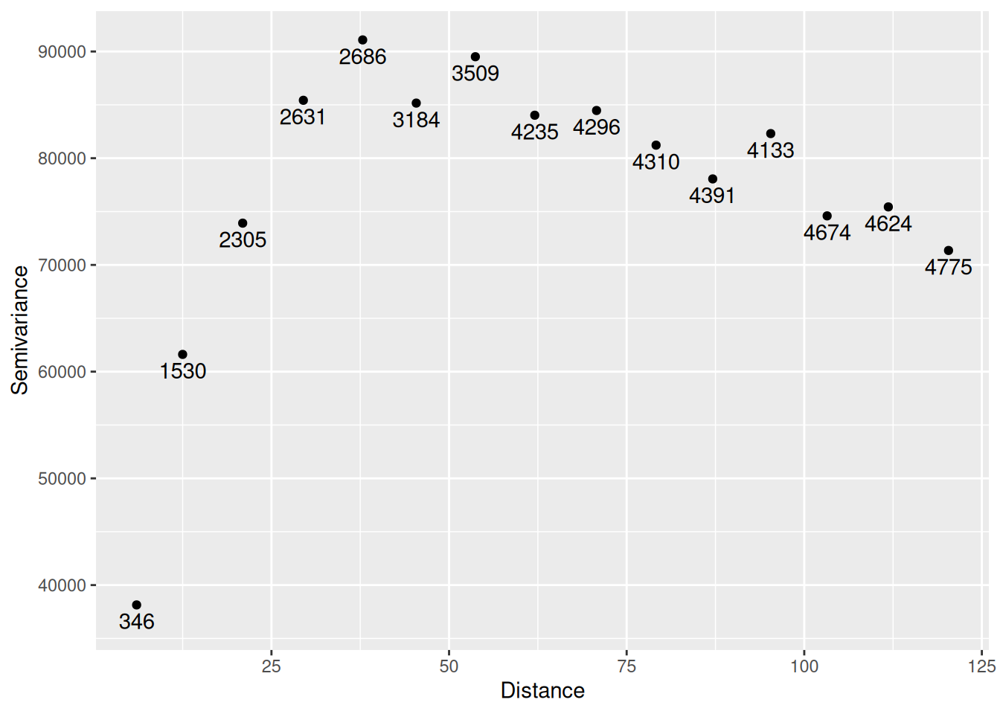
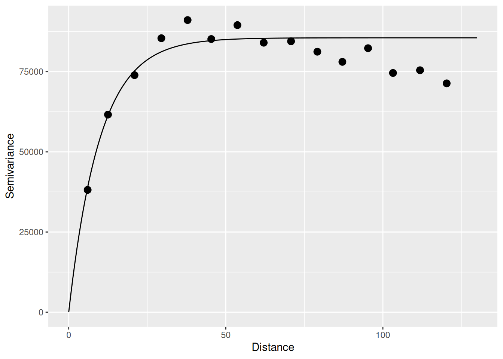

# Spatially Continuous Data IV

*NOTE*: The source files for this book are available with companion package [{isdas}](https://paezha.github.io/isdas/). The source files are in Rmarkdown format and packed as templates. These files allow you execute code within the notebook, so that you can work interactively with the notes. 

## Learning objectives

In the previous practice you were introduced to the concept of variographic analysis for fields/spatially continuous data. In this practice, we will learn:

1. How to use residual spatial pattern to estimate prediction errors.
2. Kriging: a method for optimal predictions.

## Suggested reading

- Bailey TC and Gatrell AC [-@Bailey1995] Interactive Spatial Data Analysis, Chapters 5 and 6. Longman: Essex.
- Bivand RS, Pebesma E, and Gomez-Rubio V [-@Bivand2008] Applied Spatial Data Analysis with R, Chapter 8. Springer: New York.
- Brunsdon C and Comber L [-@Brunsdon2015R] An Introduction to R for Spatial Analysis and Mapping, Chapter 6, Sections 6.7 and 6.8. Sage: Los Angeles.
- Isaaks EH and Srivastava RM  [-@Isaaks1989applied] An Introduction to Applied Geostatistics, Chapter 12. Oxford University Press: Oxford.
- O'Sullivan D and Unwin D [-@Osullivan2010] Geographic Information Analysis, 2nd Edition, Chapters 9 and 10. John Wiley & Sons: New Jersey.

## Preliminaries

As usual, remember to begin work with a new session of `R`. At least, remembert to clear the working space to make sure that you do not have extraneous items there when you begin your work. The command in `R` to clear the workspace is `rm` (for "remove"), followed by a list of items to be removed. To clear the workspace from _all_ objects, do the following:

``` r
rm(list = ls())
```

Note that `ls()` lists all objects currently on the workspace.

Load the libraries you will use in this activity:

``` r
library(isdas)
library(gstat)
library(plotly)
library(spdep)
library(tidyverse)
library(stars)
```

Begin by loading the data file:

``` r
data("Walker_Lake")
```

You can verify the contents of the dataframe:

``` r
summary(Walker_Lake)
```

```
##       ID                  X               Y               V         
##  Length:470         Min.   :  8.0   Min.   :  8.0   Min.   :   0.0  
##  Class :character   1st Qu.: 51.0   1st Qu.: 80.0   1st Qu.: 182.0  
##  Mode  :character   Median : 89.0   Median :139.5   Median : 425.2  
##                     Mean   :111.1   Mean   :141.3   Mean   : 435.4  
##                     3rd Qu.:170.0   3rd Qu.:208.0   3rd Qu.: 644.4  
##                     Max.   :251.0   Max.   :291.0   Max.   :1528.1  
##                                                                     
##        U           T      
##  Min.   :   0.00   1: 45  
##  1st Qu.:  83.95   2:425  
##  Median : 335.00          
##  Mean   : 613.27          
##  3rd Qu.: 883.20          
##  Max.   :5190.10          
##  NA's   :195
```

## Using residual spatial pattern to estimate prediction errors

Previously, in Chapter \@ref{spatially-continuous-data-ii} we discussed how to interpolate a field using trend surface analysis; we also saw how that method may lead to residuals that are not spatially independent. 

The implication of non-random residuals is that there is systematic residual pattern that the model did not capture; This, in turn, means that there is at least _some_ information that can still be extracted from the residuals. Again, we will use the case of Walker Lake to explore one way to do this.

As before, we first calculate the polynomial terms of the coordinates to fit a trend surface to the data:

``` r
Walker_Lake <- mutate(Walker_Lake,
                      X3 = X^3, X2Y = X^2 * Y, X2 = X^2, 
                      XY = X * Y,
                      Y2 = Y^2, XY2 = X * Y^2, Y3 = Y^3)
```

Given the polynomial expansion, we can proceed to estimate the following cubic trend surface model, which we already know provided the best fit to the data:

``` r
WL.trend3 <- lm(formula = V ~ X3 + X2Y + X2 + X + XY + Y + Y2 + XY2 + Y3, 
                data = Walker_Lake)
summary(WL.trend3)
```

```
## 
## Call:
## lm(formula = V ~ X3 + X2Y + X2 + X + XY + Y + Y2 + XY2 + Y3, 
##     data = Walker_Lake)
## 
## Residuals:
##     Min      1Q  Median      3Q     Max 
## -564.19 -197.41    7.91  194.25  929.72 
## 
## Coefficients:
##               Estimate Std. Error t value Pr(>|t|)    
## (Intercept) -8.620e+00  1.227e+02  -0.070 0.944035    
## X3           1.533e-04  4.806e-05   3.190 0.001522 ** 
## X2Y          6.139e-05  3.909e-05   1.570 0.117000    
## X2          -6.651e-02  1.838e-02  -3.618 0.000330 ***
## X            9.172e+00  2.386e+00   3.844 0.000138 ***
## XY          -4.420e-02  1.430e-02  -3.092 0.002110 ** 
## Y            4.794e+00  2.040e+00   2.350 0.019220 *  
## Y2          -1.806e-03  1.327e-02  -0.136 0.891822    
## XY2          7.679e-05  2.956e-05   2.598 0.009669 ** 
## Y3          -4.170e-05  2.819e-05  -1.479 0.139759    
## ---
## Signif. codes:  0 '***' 0.001 '**' 0.01 '*' 0.05 '.' 0.1 ' ' 1
## 
## Residual standard error: 276.7 on 460 degrees of freedom
## Multiple R-squared:  0.1719,	Adjusted R-squared:  0.1557 
## F-statistic: 10.61 on 9 and 460 DF,  p-value: 5.381e-15
```

We can next visualize the residuals which, as you can see, do not appear to be random 

``` r
plot_ly(x = ~Walker_Lake$X, 
        y = ~Walker_Lake$Y, 
        z = ~WL.trend3$residuals, 
        color = ~WL.trend3$residuals < 0, 
        colors = c("blue", "red"), 
        type = "scatter3d")
```

```
## No scatter3d mode specifed:
##   Setting the mode to markers
##   Read more about this attribute -> https://plotly.com/r/reference/#scatter-mode
```

```{=html}
<div class="plotly html-widget html-fill-item" id="htmlwidget-a0e00fdd9392792ec51b" style="width:672px;height:480px;"></div>
<script type="application/json" data-for="htmlwidget-a0e00fdd9392792ec51b">{"x":{"visdat":{"325ed2d877537":["function () ","plotlyVisDat"]},"cur_data":"325ed2d877537","attrs":{"325ed2d877537":{"x":{},"y":{},"z":{},"color":{},"colors":["blue","red"],"alpha_stroke":1,"sizes":[10,100],"spans":[1,20],"type":"scatter3d"}},"layout":{"margin":{"b":40,"l":60,"t":25,"r":10},"scene":{"xaxis":{"title":"Walker_Lake$X"},"yaxis":{"title":"Walker_Lake$Y"},"zaxis":{"title":"WL.trend3$residuals"}},"hovermode":"closest","showlegend":true},"source":"A","config":{"modeBarButtonsToAdd":["hoverclosest","hovercompare"],"showSendToCloud":false},"data":[{"x":[8,10,31,28,49,50,49,51,48,50,50,71,71,68,68,69,69,70,90,91,91,91,89,109,111,130,130,151,150,150,150,148,168,168,171,170,168,189,190,188,209,210,209,210,208,211,231,231,229,228,231,229,249,251,250,28,29,18,39,18,21,31,41,21,60,50,60,50,61,39,61,39,49,58,39,60,40,51,60,40,58,38,39,59,41,49,51,39,38,78,70,78,78,80,71,79,71,78,80,70,80,90,88,101,79,90,81,80,91,101,98,81,90,90,99,108,158,140,150,151,160,139,178,159,169,170,180,198,211,208,221,199,220,200,208,210,198,218,229,218,238,218,231,230,221,239,218,35,24,23,54,46,45,53,55,43,55,44,55,54,43,73,75,73,64,63,73,64,93,86,93,84,93,86,96,85,93,86,106,155,174,166,215,205,204,236,223,236,226,24,36,16,43,15,46,46,54,43,65,36,53,44,65,55,46,63,46,35,53,46,45,35,84,75,73,63,84,76,76,94,85,104,85,104,75,95,83,94,104,196,204,196,195,216,225,233,226,213],"y":[68,110,68,88,11,88,151,168,190,211,268,9,29,70,128,148,169,191,49,68,91,111,130,129,291,9,231,69,89,109,228,291,8,91,109,210,271,149,169,210,30,70,90,111,151,228,10,28,110,148,208,228,48,69,190,80,59,80,60,60,90,101,100,100,8,81,151,160,158,160,170,170,179,179,181,191,190,198,198,200,208,209,221,268,271,278,260,279,260,28,41,41,20,131,140,138,160,159,168,198,49,58,39,38,70,79,81,89,99,100,111,108,120,140,138,121,228,229,241,218,218,220,211,209,221,198,218,90,100,80,99,98,150,150,159,140,161,8,19,18,229,228,239,221,241,220,218,71,71,91,10,11,89,150,168,170,191,191,211,269,271,29,129,149,151,168,188,191,48,48,70,69,90,89,111,108,131,131,130,229,208,211,89,89,151,9,9,229,230,79,61,80,60,88,99,81,161,161,160,170,179,180,181,199,198,201,220,271,258,260,281,278,30,40,141,140,138,159,51,61,60,38,100,109,110,121,119,140,118,91,101,101,149,11,19,220,221,218],"z":[90.228510701677578,99.263120524398957,452.45549196500048,211.72960203994847,323.42529212284813,289.69398565555605,153.97034329053071,350.03735581264226,150.54891642878403,388.98662857726111,483.85604123318581,65.65589589930228,252.065869737226,34.260373191045673,56.785016827015319,15.509551760103395,160.68449272805168,336.05980022313054,193.10594495510523,156.80457454850398,388.42030872713673,286.58567311917091,417.94356658082728,191.79776830631974,140.30780744327834,174.58255501720444,191.67042563736584,143.88954943602221,152.04695271447284,82.78093310352331,307.18304665704972,50.402101708486882,70.53934809330589,138.6744910689043,100.88560617865645,343.67939287661846,159.76752348494756,157.04543798169755,10.256807465877081,61.060109137203156,111.90182455188706,71.515218169935139,483.14345658902198,13.869893165021562,356.16985847033425,340.63107901336502,186.83171894666424,23.630671937087889,29.067970666343367,9.8353618451764682,131.64023282292507,349.30496431724913,4.781875369447965,58.650105257738183,97.333918887618694,138.16163055739401,364.35489494930005,603.47428473873299,341.68504490797301,153.01056293132365,126.92123867857454,48.169770946609837,54.972052030396803,92.860286610741468,195.65203967728766,92.206048403993066,908.58639942538514,256.96279758775677,255.77645286527573,34.561291235486443,194.42479193492008,290.06955917593439,191.96062385396505,502.16463734998018,386.67608674626445,929.72292498286458,355.95130948094612,508.9404252293503,614.48315734932351,37.750376655339679,144.86026290063745,75.667146469586342,51.740063790519351,174.36053749283033,497.86728885617828,256.87088338601211,252.55323942150679,471.37468229152427,207.82094182221198,356.17160660464617,26.728327602669644,150.7184515920919,95.255669402652686,226.66387453282132,11.922302283661491,149.49806265745528,201.9147695782741,155.46946583490956,109.07087969201039,57.464247908200093,293.02351943029271,264.7000561413704,73.889711218736906,290.63274921844925,7.7810743098865185,68.356096011364244,68.636769737971036,84.634743357826522,207.03903926845746,88.657723399370013,218.8178427508185,469.33046921297887,350.35246694252129,89.4041533626975,107.55434416978342,383.47072755850019,280.71109229251891,240.82301636805846,59.522467542901339,78.126925247434343,284.14688373640547,193.72950581174362,118.60932841954595,201.50648274994384,153.68815659920639,55.916220152116125,109.87219472431724,283.23204107913466,418.41130544762314,105.6214197815513,203.71889313605124,473.95151969970044,216.52490043831449,288.81074436241636,41.531823557842664,119.85802273494075,55.868706075067749,333.35224684103537,108.43831204798526,409.23055119038548,280.89902197816406,169.09422318860516,74.119078409460215,299.82990998904859,79.191527099302107,83.934006322859503,486.94650652933336,224.89839151853474,307.64777761151294,333.03183379673862,294.97237248020053,192.861877320834,41.805331094029128,240.71337818711925,257.13900172011529,458.25688333073072,787.98645316781608,33.618712752602072,315.83673693529511,242.80947591568722,397.95552764990265,226.1300052747828,201.34178718080594,128.03611131928056,366.30825455701586,605.85022882229532,107.54125750307223,667.49655805140196,226.08264598257708,10.228750794619943,22.805631880413852,467.59046854178052,359.43904895139997,59.24062231789982,23.134285645706441,390.23901978369526,334.24520593841692,315.08247699824403,133.35452093785719,104.95165207684224,49.184525019688451,302.1324463072379,262.2308428478778,481.54604783079822,380.69767550573545,68.019194718757007,200.86419388517621,351.69216001650568,535.3863836873968,439.08960375955735,262.7396463724412,490.70712664745042,132.2110257158852,164.22329089960996,16.672877273770776,31.799543148135474,339.3888170947701,8.030992299948986,320.02121455368257,48.926778880519443,386.84250087887494,255.12251248968218,133.68504333320803,474.71285192319942,200.44800947139873,150.77548838586605,174.40029885232562,224.7209245988621,17.547314479010915,342.30815909402895,293.88730654282318,462.56169689532652,130.11177163652027,250.22686622869071,198.96212399137116,92.486099403220379,116.04641699202094,7.1158229164055662,30.895664650097284,302.74324092353885,41.858375943111135,179.39601115696152,165.9104135472345,50.655739810375948,92.444080824836874,284.15583611897688,286.90074258344288,57.20079186335149,76.489041708298473,104.44099231226825,207.83640857930672,264.55589088714845,158.83647387455642,264.96317493916098,431.60448695355262,312.40511202356339,509.20881922267705,214.27774770646633],"type":"scatter3d","mode":"markers","name":"FALSE","marker":{"color":"rgba(0,0,255,1)","line":{"color":"rgba(0,0,255,1)"}},"textfont":{"color":"rgba(0,0,255,1)"},"error_y":{"color":"rgba(0,0,255,1)"},"error_x":{"color":"rgba(0,0,255,1)"},"line":{"color":"rgba(0,0,255,1)"},"frame":null},{"x":[11,8,9,9,9,11,10,8,9,10,11,10,8,31,29,28,30,28,28,30,28,31,28,30,31,31,49,51,49,51,48,49,51,51,70,69,68,69,69,68,71,71,91,91,88,89,89,90,90,88,88,88,109,111,108,109,108,110,110,111,111,110,109,109,109,131,130,128,129,131,129,131,131,129,128,131,128,131,148,149,150,150,150,149,151,148,149,149,171,169,168,168,171,171,169,170,169,168,190,191,191,190,190,188,191,190,191,190,189,189,211,211,211,209,208,210,211,208,208,230,230,229,230,229,231,231,231,230,249,250,251,248,249,248,250,251,251,249,248,250,40,21,41,41,40,51,59,41,59,51,59,60,38,50,61,38,50,61,59,59,60,70,61,58,70,80,61,79,69,79,80,81,100,100,80,101,100,100,81,100,98,121,111,120,119,161,141,178,158,219,220,198,221,219,200,239,239,240,34,55,46,46,64,64,75,114,145,215,35,26,36,54,33,34,33,34,65,35,36,35,84,84,86,73,93,75,94,103,114,215,214,245],"y":[8,30,48,90,129,150,170,188,209,231,250,269,288,11,29,51,110,130,150,171,190,209,229,250,269,289,29,48,68,109,129,231,250,290,51,90,110,208,229,250,268,288,11,29,149,170,188,211,230,249,269,288,11,31,49,68,88,109,148,169,191,208,230,249,268,31,48,70,90,109,128,148,169,191,209,248,269,288,8,29,49,129,151,169,190,208,251,271,29,49,69,131,150,171,191,230,249,290,11,28,48,69,89,111,129,189,231,248,270,290,11,49,130,168,191,211,250,268,289,50,71,91,131,169,191,249,268,291,9,30,91,109,130,150,169,208,229,251,270,291,71,69,81,90,11,18,20,21,90,101,101,81,148,138,139,140,221,220,281,258,29,21,41,128,121,119,121,149,181,181,188,200,48,60,59,68,78,91,98,118,130,131,140,141,118,241,240,201,198,88,81,78,160,139,139,8,18,239,88,89,148,211,31,129,171,131,230,148,80,58,99,80,160,180,191,201,210,208,219,259,41,161,169,199,41,90,101,139,120,101,19,231],"z":[-118.87007281984665,-191.71098088074223,-48.330075224074939,-13.230063931734781,-336.03769436069837,-538.05198282552908,-194.12130621118408,-402.3208185539338,-371.32045299087702,-431.84956966465091,-370.51935271243923,-237.8636860880564,-57.619721540009522,-225.99440804111765,-229.7662482379242,-86.518055914431827,-58.60570608493579,-446.11668186015032,-272.11405270880152,-342.35635290994452,-404.59948707477452,-564.19326506692437,-344.05543839051057,-410.91460970776996,-70.55714038139628,-23.492667808829005,-283.88279487326037,-331.32933319523664,-446.03929982128744,-121.11977176719043,-409.71731534056835,-136.05629835729465,-118.7416275875302,-90.264657363959884,-213.30633809085032,-539.13960858985638,-240.42735376478163,-460.02336053114811,-506.72799521357297,-435.77656156933358,-348.13884521264896,-232.15267303233099,-37.145195892372406,-339.65823542125736,-14.431965490991313,-402.80717734359757,-532.0409298416713,-502.58096347277012,-454.67987924096525,-394.78648240663716,-293.67166100411634,-137.77294710633547,-8.3532917918603999,-248.24625333200203,-44.058415581656902,-204.07671878500599,-293.93446798451606,-260.43629873167771,-471.24464587508845,-477.04036307972848,-474.54220405172271,-434.13273211300844,-227.46266804855784,-325.50799578784876,-69.603766091697068,-375.52831755844414,-339.65004598676018,-32.255945010465567,-199.21760572961671,-446.47741888000138,-211.99743353298911,-265.0675698449466,-414.32659871946794,-423.56269632499243,-296.41908665549346,-174.61703855694796,-45.089330161520657,-30.519173003324166,-126.12086954656161,-57.16442138163157,-51.513713788292357,-317.44732341481989,-392.62550045417044,-209.39492181244435,-363.77908059679908,-1.1030762383998078,-19.491540233977783,-70.703720351061705,-171.98262887294223,-78.100711822703602,-359.06886316835477,-19.679583067517893,-350.22201856054892,-130.15137070588165,-222.93118404845995,-78.721857977154713,-184.04942098048872,-6.5420657880416355,-22.215307085247026,-332.33889602272654,-283.32192264866222,-335.90663555495644,-6.8546530296487571,-7.6973567279257207,-213.12688653683733,-286.48195105856274,-47.562093924485701,-44.032652564187252,-28.650562600449362,-36.913982765066919,-29.402701938279282,-38.319661775991506,-99.551055121756548,-169.83849414153306,-232.6141322644423,-15.918510924140394,-37.284719448383797,-23.581535813931801,-44.730303071928596,-80.188136693038999,-136.95722938888218,-320.50423484197785,-14.463425301621189,-337.92549763040114,-194.95763361779413,-141.94730545773476,-191.60319066187131,-142.62134176488411,-330.11591784988087,-316.86241502130957,-419.30506422042293,-375.4983693504729,-406.41789371278372,-383.66814192550981,-143.08035154512481,-402.02912604762452,-144.85030092023464,-111.46673994971424,-281.39403637298761,-218.47393726436351,-398.73863489633516,-125.77420077088517,-233.23439331524742,-109.42753100531442,-196.72729662120017,-121.9348996991976,-366.85473421371682,-215.29307972779216,-33.963917187542208,-55.317142509521197,-195.82386425036896,-137.4101833101881,-274.62783579446227,-196.39008158183674,-128.16754288530043,-339.59819622810573,-13.799095523350017,-444.17692277942444,-148.02582849922513,-222.04478873482216,-166.65220388867155,-345.21691276898088,-370.6337869300902,-438.59846654260542,-549.90084893602591,-144.38607307042577,-483.13905420791258,-540.14208368273944,-169.13263036636002,-389.54211694711745,-319.37691651277748,-545.72121149317809,-404.42549551584426,-468.19706704021047,-481.91179336006928,-93.547312529384243,-117.38787190005506,-106.69999890759254,-359.79196137344564,-162.92829038982046,-24.377984999898771,-465.87279197952319,-316.80650604587038,-377.63201810682637,-330.14136042003383,-95.313650327699875,-170.56118638050535,-150.29355443392441,-166.15761740399236,-102.16611884019898,-68.490260616020464,-126.57425905174183,-24.126038812115819,-161.68123941176083,-89.644001886955493,-219.74418626340682,-50.795081380003687,-144.16833944670532,-419.16201946291324,-113.34995998989974,-383.94960611419901,-73.378682641777772,-181.22040594822434,-367.02704250202748,-76.707517068014084,-229.2969873199232,-268.68665832727612,-29.108385895622241,-312.77437154253931,-354.40160938522575,-498.32250082503367,-34.401586104721957,-188.34666755526294,-254.45975010289536,-316.48770458376691,-283.97516593123231,-322.25984469781355,-162.53128736495603,-140.2677497742655,-197.63967222373819,-39.025816310516852,-136.19325611985852,-248.6701688930705,-94.339293121557603,-53.030122891522147,-16.757736966453276,-141.09965517692626,-36.841738438547971,-174.61547624142568,-120.87674997785832,-137.90283352417487,-190.17929444689918],"type":"scatter3d","mode":"markers","name":"TRUE","marker":{"color":"rgba(255,0,0,1)","line":{"color":"rgba(255,0,0,1)"}},"textfont":{"color":"rgba(255,0,0,1)"},"error_y":{"color":"rgba(255,0,0,1)"},"error_x":{"color":"rgba(255,0,0,1)"},"line":{"color":"rgba(255,0,0,1)"},"frame":null}],"highlight":{"on":"plotly_click","persistent":false,"dynamic":false,"selectize":false,"opacityDim":0.20000000000000001,"selected":{"opacity":1},"debounce":0},"shinyEvents":["plotly_hover","plotly_click","plotly_selected","plotly_relayout","plotly_brushed","plotly_brushing","plotly_clickannotation","plotly_doubleclick","plotly_deselect","plotly_afterplot","plotly_sunburstclick"],"base_url":"https://plot.ly"},"evals":[],"jsHooks":[]}</script>
```

Now we will create an interpolation grid:

``` r
# The function `sequence()` create a sequence of values from - to 
# using by as the step increment. In this case, we generate a grid
# with points that are 2.5 m apart.
X.p <- seq(from = 0.1, to = 255.1, by = 2.5)
Y.p <- seq(from = 0.1, to = 295.1, by = 2.5)
df.p <- expand.grid(X = X.p, Y = Y.p)
```

WE can add the polynomial terms to this grid. Since our trend surface model was estimated using the cubic polynomial, we add those terms to the dataframe:

``` r
df.p <- mutate(df.p, X3 = X^3, X2Y = X^2 * Y, X2 = X^2, 
               XY = X * Y, 
               Y2 = Y^2, XY2 = X * Y^2, Y3 = Y^3)
```

The interpolated cubic surface is obtained by using the model and the interpolation grid as `newdata`:

``` r
# The function `predict()` is used to make predictions given a model 
# and a possibly new dataset, different from the one used for estimation 
# of the model.
WL.preds3 <- predict(WL.trend3, 
                     newdata = df.p, 
                     se.fit = TRUE, 
                     interval = "prediction", 
                     level = 0.95)
```

The surface is converted into a matrix for 3D plotting:

``` r
z.p3 <- matrix(data = WL.preds3$fit[,1], 
               nrow = length(Y.p), 
               ncol = length(X.p), 
               byrow = TRUE)
```

And plot:

``` r
WL.plot3 <- plot_ly(x = ~X.p, 
                    y = ~Y.p, 
                    z = ~z.p3, 
                    type = "surface", 
                    colors = "YlOrRd") |> 
  layout(scene = list(aspectmode = "manual",
                      aspectratio = list(x = 1, 
                                         y = 1,
                                         
                                         z = 1)))
WL.plot3
```

```{=html}
<div class="plotly html-widget html-fill-item" id="htmlwidget-3ee89a23bdf602628cc6" style="width:672px;height:480px;"></div>
<script type="application/json" data-for="htmlwidget-3ee89a23bdf602628cc6">{"x":{"visdat":{"325ed24c6020e":["function () ","plotlyVisDat"]},"cur_data":"325ed24c6020e","attrs":{"325ed24c6020e":{"x":{},"y":{},"z":{},"colors":"YlOrRd","alpha_stroke":1,"sizes":[10,100],"spans":[1,20],"type":"surface"}},"layout":{"margin":{"b":40,"l":60,"t":25,"r":10},"scene":{"aspectmode":"manual","aspectratio":{"x":1,"y":1,"z":1},"xaxis":{"title":"X.p"},"yaxis":{"title":"Y.p"},"zaxis":{"title":"z.p3"}},"hovermode":"closest","showlegend":false,"legend":{"yanchor":"top","y":0.5}},"source":"A","config":{"modeBarButtonsToAdd":["hoverclosest","hovercompare"],"showSendToCloud":false},"data":[{"colorbar":{"title":"z.p3","ticklen":2,"len":0.5,"lenmode":"fraction","y":1,"yanchor":"top"},"colorscale":[["0","rgba(255,255,204,1)"],["0.0416666666666667","rgba(255,249,189,1)"],["0.0833333333333333","rgba(255,243,175,1)"],["0.125","rgba(255,237,160,1)"],["0.166666666666667","rgba(255,230,146,1)"],["0.208333333333333","rgba(255,224,132,1)"],["0.25","rgba(254,217,118,1)"],["0.291666666666667","rgba(255,204,104,1)"],["0.333333333333333","rgba(255,191,90,1)"],["0.375","rgba(254,178,76,1)"],["0.416666666666667","rgba(254,166,71,1)"],["0.458333333333333","rgba(254,154,65,1)"],["0.5","rgba(253,141,60,1)"],["0.541666666666667","rgba(253,122,54,1)"],["0.583333333333333","rgba(253,102,48,1)"],["0.625","rgba(252,78,42,1)"],["0.666666666666667","rgba(244,64,37,1)"],["0.708333333333333","rgba(235,48,33,1)"],["0.75","rgba(227,26,28,1)"],["0.791666666666667","rgba(214,18,32,1)"],["0.833333333333333","rgba(202,9,35,1)"],["0.875","rgba(189,0,38,1)"],["0.916666666666667","rgba(168,0,38,1)"],["0.958333333333333","rgba(148,0,38,1)"],["1","rgba(128,0,38,1)"]],"showscale":true,"x":[0.10000000000000001,2.6000000000000001,5.0999999999999996,7.5999999999999996,10.1,12.6,15.1,17.600000000000001,20.100000000000001,22.600000000000001,25.100000000000001,27.600000000000001,30.100000000000001,32.600000000000001,35.100000000000001,37.600000000000001,40.100000000000001,42.600000000000001,45.100000000000001,47.600000000000001,50.100000000000001,52.600000000000001,55.100000000000001,57.600000000000001,60.100000000000001,62.600000000000001,65.099999999999994,67.599999999999994,70.099999999999994,72.599999999999994,75.099999999999994,77.599999999999994,80.099999999999994,82.599999999999994,85.099999999999994,87.599999999999994,90.099999999999994,92.599999999999994,95.099999999999994,97.599999999999994,100.09999999999999,102.59999999999999,105.09999999999999,107.59999999999999,110.09999999999999,112.59999999999999,115.09999999999999,117.59999999999999,120.09999999999999,122.59999999999999,125.09999999999999,127.59999999999999,130.09999999999999,132.59999999999999,135.09999999999999,137.59999999999999,140.09999999999999,142.59999999999999,145.09999999999999,147.59999999999999,150.09999999999999,152.59999999999999,155.09999999999999,157.59999999999999,160.09999999999999,162.59999999999999,165.09999999999999,167.59999999999999,170.09999999999999,172.59999999999999,175.09999999999999,177.59999999999999,180.09999999999999,182.59999999999999,185.09999999999999,187.59999999999999,190.09999999999999,192.59999999999999,195.09999999999999,197.59999999999999,200.09999999999999,202.59999999999999,205.09999999999999,207.59999999999999,210.09999999999999,212.59999999999999,215.09999999999999,217.59999999999999,220.09999999999999,222.59999999999999,225.09999999999999,227.59999999999999,230.09999999999999,232.59999999999999,235.09999999999999,237.59999999999999,240.09999999999999,242.59999999999999,245.09999999999999,247.59999999999999,250.09999999999999,252.59999999999999,255.09999999999999],"y":[0.10000000000000001,2.6000000000000001,5.0999999999999996,7.5999999999999996,10.1,12.6,15.1,17.600000000000001,20.100000000000001,22.600000000000001,25.100000000000001,27.600000000000001,30.100000000000001,32.600000000000001,35.100000000000001,37.600000000000001,40.100000000000001,42.600000000000001,45.100000000000001,47.600000000000001,50.100000000000001,52.600000000000001,55.100000000000001,57.600000000000001,60.100000000000001,62.600000000000001,65.099999999999994,67.599999999999994,70.099999999999994,72.599999999999994,75.099999999999994,77.599999999999994,80.099999999999994,82.599999999999994,85.099999999999994,87.599999999999994,90.099999999999994,92.599999999999994,95.099999999999994,97.599999999999994,100.09999999999999,102.59999999999999,105.09999999999999,107.59999999999999,110.09999999999999,112.59999999999999,115.09999999999999,117.59999999999999,120.09999999999999,122.59999999999999,125.09999999999999,127.59999999999999,130.09999999999999,132.59999999999999,135.09999999999999,137.59999999999999,140.09999999999999,142.59999999999999,145.09999999999999,147.59999999999999,150.09999999999999,152.59999999999999,155.09999999999999,157.59999999999999,160.09999999999999,162.59999999999999,165.09999999999999,167.59999999999999,170.09999999999999,172.59999999999999,175.09999999999999,177.59999999999999,180.09999999999999,182.59999999999999,185.09999999999999,187.59999999999999,190.09999999999999,192.59999999999999,195.09999999999999,197.59999999999999,200.09999999999999,202.59999999999999,205.09999999999999,207.59999999999999,210.09999999999999,212.59999999999999,215.09999999999999,217.59999999999999,220.09999999999999,222.59999999999999,225.09999999999999,227.59999999999999,230.09999999999999,232.59999999999999,235.09999999999999,237.59999999999999,240.09999999999999,242.59999999999999,245.09999999999999,247.59999999999999,250.09999999999999,252.59999999999999,255.09999999999999,257.60000000000002,260.10000000000002,262.60000000000002,265.10000000000002,267.60000000000002,270.10000000000002,272.60000000000002,275.10000000000002,277.60000000000002,280.10000000000002,282.60000000000002,285.10000000000002,287.60000000000002,290.10000000000002,292.60000000000002,295.10000000000002],"z":[[-7.224550873873552,15.248913959415905,36.906000520854889,57.76108035126704,77.828524991475959,97.122705982305305,115.65799486457863,133.44876317911971,150.50938246675199,166.85422426829922,182.49766012458494,197.45406157643282,211.73780016466648,225.3632474301096,238.3447749135857,250.6967541559184,262.43355669793141,273.56955408044837,284.11911784429276,294.09661953028836,303.51643067925869,312.39292283202741,320.74046752941831,328.57343631225478,335.90620072136045,342.75313229755903,349.12860258167404,355.04698311452944,360.52264543694844,365.56996108975483,370.20330161377228,374.43703854982431,378.28554343873469,381.76318782132682,384.88434323842466,387.66338123085143,390.11467333943119,392.25259110498718,394.09150606834328,395.64578977032312,396.92981375174998,397.9579495534478,398.74456871624005,399.30404278095068,399.65074328840279,399.79904177942018,399.76330979482691,399.55791887544615,399.19724056210163,398.69564639561702,398.067507916816,397.32719666652207,396.48908418555862,395.56754201475007,394.57694169491919,393.53165476688986,392.44605277148582,391.33450724953104,390.21138974184822,389.09107178926183,387.98792493259498,386.91632071267185,385.89063067031537,384.92522634634963,384.03447928159818,383.23276101688469,382.53444309303234,381.95389705086563,381.5054944312073,381.20360677488168,381.06260562271132,381.09686251552142,381.32074899413448,381.74863659937455,382.39489687206463,383.27390135302932,384.40002158309153,385.78762910307512,387.45109545380325,389.40479217610067,391.6630908107901,394.24036289869542,397.1509799806401,400.4093135974482,404.02973528994244,408.02661659894733,412.41432906528655,417.2072442297831,422.41973363326082,428.06616881654355,434.16092132045492,440.71836268581814,447.75286445345688,455.27879816419545,463.31053535885678,471.86244757826427,480.94890636324294,490.58428325461421,500.78294979320395,511.55927751983489,522.92763797532973,534.90240270051368,547.49794323620881],[4.7364865186884941,26.936033800043443,48.321121340626277,68.906120681260646,88.705403362770156,107.73334092597842,126.00430491170911,143.53266686078581,160.33279831403209,176.41907081227171,191.80585589632815,206.50752510702515,220.53844998518628,233.91300207163516,246.64555290719539,258.75047403269076,270.24213698894465,281.1349133167808,291.44317455702281,301.18129225049444,310.36363793801917,319.00458316042057,327.11849945852254,334.71975837314835,341.82273144512186,348.44179021526662,354.5913062244062,360.28565101336432,365.53919612296448,370.36631309403049,374.78137346738583,378.79874878385436,382.43281058425936,385.6979304094246,388.60847980017371,391.17883029733036,393.42335344171812,395.35642077416071,396.99240383548153,398.34567416650441,399.43060330805287,400.26156280095074,400.85292418602131,401.21905900408854,401.37433879597569,401.3331351025065,401.10981946450505,400.71876342279438,400.17433851819834,399.49091629154054,398.68286828364444,397.76456603533421,396.75038108743274,395.65468498076422,394.49184925615191,393.27624545441967,392.02224511639099,390.74421978288973,389.45654099473893,388.17358029276301,386.90970921778501,385.67929931062878,384.49672211211799,383.37634916307604,382.3325520043266,381.37970217669408,380.53217122100062,379.80433067807132,379.21055208872855,378.76520699379671,378.48266693409909,378.37730345045964,378.46348808370163,378.75559237464944,379.2679878641253,380.01504609295404,381.01113860195869,382.27063693196322,383.80791262379091,385.63733721826571,387.77328225621113,390.2301192784509,393.02221982580807,396.16395543910727,399.66969765917105,403.55381802682393,407.83068808288914,412.51467936819017,417.62016342355076,423.16151178979487,429.15309600774532,435.60928761822652,442.54445816206174,449.9729791800745,457.90922221308944,466.3675588019284,475.36236048741637,484.90799881037611,495.01884531163205,505.7092715320079,516.99364901232605,528.88634929341151,541.40174391608662],[16.670978068850793,38.599007612776298,59.714495947008032,80.031814612369686,99.565335149684813,118.32942909977707,136.3384680034701,153.60682340158749,170.14886683495291,185.97896984438992,201.1115039707222,215.56084075477332,229.34135173736692,242.46740845932675,254.95338246147625,266.81364528463911,278.06256846963896,288.71452355729951,298.78388208844422,308.28501560389691,317.23229564448098,325.64009375102017,333.52278146433815,340.89473032525854,347.77031187460489,354.16389765320093,360.08985920187001,365.56256806143602,370.59639577272264,375.2057138765532,379.40489391375161,383.20830742514136,386.63032595154613,389.68532103378942,392.38766421269503,394.7517270290864,396.79188102378743,398.52249773762156,399.95794871141226,401.11260548598341,402.00083960215863,402.63702260076116,403.03552602261527,403.21072140854415,403.17698029937122,402.94867423592081,402.54017475901566,401.96585340948019,401.24008172813774,400.37723125581192,399.39167353332607,398.29778010150437,397.10992250116971,395.84247227314648,394.50980095825793,393.12628009732776,391.70628123117956,390.26417590063704,388.8143356465232,387.37113200966269,385.9489365308786,384.56212075099467,383.22505621083434,381.95211445122146,380.75766701297914,379.6560854369319,378.66174126390263,377.78900603471573,377.05225129019362,376.46584857116108,376.0441694184405,375.80158537285701,375.75246797523323,375.91118876639348,376.2921192871604,376.90963107835842,377.7780956808104,378.9118846353411,380.32536948277294,382.03292176393035,384.04891301963687,386.38771479071613,389.06369861799101,392.09123604228637,395.48469860442464,399.25845784523011,403.42688530552681,408.00435252613738,413.00523104788567,418.44389241159593,424.33470815809096,430.69204982819548,437.53028896273173,444.86379710252464,452.70694578839726,461.0741065611727,469.97965096167547,479.43795053072802,489.46337680915587,500.07030133778125,511.2730956574282,523.08613130892013,535.52377983308043],[28.575014599366039,50.233926220367145,71.082215162752874,91.134252967346825,110.40441117497265,128.90706132645397,146.6565749626144,163.66732362427757,179.9536788522671,195.53001218740661,210.41069517051972,224.61009934243006,238.14259624396129,251.022557415937,263.26435439918072,274.88235873451629,285.89094196276722,296.30447562475706,306.13733126130955,315.40388041324832,324.11849462139679,332.29554542657894,339.94940436961804,347.09444299133787,353.74503283256212,359.91554543411439,365.62035233681814,370.87382508149716,375.690335208975,380.08425426007545,384.0699537756218,387.66180529643799,390.87418036334753,393.72145051717405,396.21798729874115,398.37816224887246,400.21634690839159,401.74691281812227,402.98423151888801,403.94267455151248,404.6366134568193,405.08041977563187,405.28846504877441,405.27512081706993,405.05475862134222,404.64175000241534,404.050466501112,403.29527965825685,402.39056101467298,401.35068211118386,400.19001448861331,398.92292968778514,397.56379924952267,396.12699471464998,394.62688762398989,393.07784951836692,391.49425193860395,389.89046642552523,388.28086451995381,386.6798177627137,385.10169769462846,383.56087585652159,382.07172378921706,380.64861303353814,379.30591513030816,378.05800162035172,376.91924404449151,375.90401394355166,375.02668285835563,374.3016223297268,373.74320389848901,373.36579910546658,373.1837794914818,373.21151659735972,373.46338196392236,373.95374713199448,374.69698364239946,375.70746303596098,376.99955685350227,378.58763663584739,380.48607392382002,382.70924025824382,385.27150717994152,388.18724622973809,391.47082894845579,395.13662687691919,399.19901155595198,403.67235452637709,408.57102732901865,413.9094015047001,419.70184859424506,425.96274013847761,432.70644767822023,439.94734275429818,447.69979690753399,455.97818167875039,464.79686860877331,474.17022923842461,484.11263510852859,494.63845775990887,505.76206873338907,517.49783956979263,529.86014180994277],[40.444686932986933,61.836880445568696,82.420369810613437,102.2095265689448,121.21872226138632,139.46232842876177,156.95471661189467,173.71025835160864,189.74332518872737,205.0682886640744,219.69952031847342,233.65139169274804,246.9382743277219,259.57453976421857,271.57455954306175,282.95270520507501,293.72334829108195,303.90086034190631,313.49961289837154,322.53397750130142,331.01832569151941,338.96702900984934,346.39445899711473,353.31498719413929,359.74298514174649,365.69282438076004,371.17887645200335,376.21551289630048,380.81710525447482,384.99802506734989,388.77264387574951,392.15533322049708,395.16046464241646,397.80240968233113,400.09553988106484,402.05422677944108,403.69284191828348,405.02575683841582,406.06734308066154,406.83197218584439,407.33401569478792,407.58784514831564,407.6078320872515,407.40834805241877,407.00376458464143,406.40845322474274,405.6367855135465,404.70313299187654,403.6218672005561,402.407359680409,401.07398197225888,399.63610561692946,398.10810215524378,396.50434312802651,394.83920007610033,393.12704454028943,391.38224806141699,389.61918218030706,387.85221843778294,386.09572837466845,384.36408353178723,382.67165544996266,381.03281567001858,379.46193573277873,377.97338717906615,376.58154154970538,375.30077038551923,374.14544522733189,373.12993761596664,372.26861909224721,371.5758611969971,371.06603547104027,370.75351345519977,370.65266669030024,370.77786671716382,371.1434850766156,371.76389330947819,372.65346295657577,373.8265655587316,375.29757265676943,377.08085579151299,379.19078650378623,381.64173633441197,384.44807682421487,387.62417951401704,391.1844159446436,395.14315765691759,399.51477619166229,404.31364308970188,409.5541298918601,415.25060813895931,421.41744937182511,428.06902513127955,435.21970695814684,442.88386639325074,451.07587497741406,459.81010425146167,469.10092575621638,478.96271103250217,489.40983162114253,500.45665906296074,512.11756489878098,524.40692066942654],[52.276085892466156,73.403961111133626,93.725050713342455,113.25372623991623,132.00435923167859,149.99132122945318,167.22898377406361,183.73171840633347,199.51389666708641,214.58989009714605,228.97407023733606,242.68080862847998,255.72447681140153,268.11944632692428,279.88008871587181,291.0207755190678,301.55587827733592,311.49976853149968,320.86681782238287,329.67139769080887,337.9278796776016,345.65063532358442,352.85403616958104,359.55245375641522,365.76025962491036,371.49182531589037,376.76152237017845,381.58372232859858,385.97279673197437,389.94311712112926,393.50905503688693,396.68498202007117,399.48526961150549,401.92428935201332,404.01641278241868,405.77601144354486,407.21745687621564,408.35512062125474,409.20337421948545,409.77658921173168,410.08913713881708,410.15538954156494,409.98971796079928,409.60649393734354,409.02008901202134,408.2448747256563,407.29522261907192,406.18550423309216,404.93009110854041,403.5433547862404,402.03966680701575,400.43339871169002,398.73892204108665,396.97060833602961,395.14282913734229,393.26995598584864,391.36636042237183,389.44641398773581,387.52448822276386,385.61495466827995,383.73218486510751,381.89055035407068,380.10442267599228,378.38817337169638,376.75617398200626,375.22279604774621,373.80241110973918,372.50939070880969,371.35810638577999,370.36292968147484,369.53823213671717,368.89838529233123,368.45776068914034,368.23072986796836,368.23166436963822,368.47493573497422,368.97491550479953,369.7459752199382,370.80248642121342,372.15882064944947,373.82934944546923,375.82844435009696,378.17047690415558,380.86981864846962,383.94084112386156,387.39791587115593,391.25541443117635,395.5277083447462,400.22916915268866,405.37416839582795,410.97707761498788,417.05226835099137,423.61411214466227,430.67698053682466,438.25524506830192,446.36327727991676,455.01544871249462,464.22613090685655,474.00969540382954,484.38051374423497,495.3529574688967,506.94139811863874,519.16020723428426],[64.065302300556411,84.931259039814663,104.99234869369262,124.26294280301389,142.75741290860213,160.49013055128094,177.47546727187387,193.7277946112047,209.261484110097,224.09090730937433,238.23043574986028,251.69444097237863,264.49729451775289,276.65336792680677,288.17703274036376,299.08266049924759,309.38462274428178,319.09729101629017,328.2350368560962,336.81223180452361,344.84324740239583,352.34245519053655,359.32422670976962,365.80293350091858,371.79294710480667,377.30863906225807,382.36438091409593,386.97454420114434,391.15350046422657,394.91562124416635,398.27527808178735,401.24684251791314,403.84468609336739,406.08318034897366,407.97669682555556,409.53960706393667,410.78628260494088,411.73109498939169,412.38841575811256,412.77261645192732,412.89806861165943,412.77914377813255,412.43021349217037,411.86564929459672,411.09982272623455,410.14710532790821,409.02186864044097,407.73848420465663,406.31132356137869,404.75475825143076,403.08315981563635,401.31089979481953,399.45234972980336,397.52188116141178,395.53386563046831,393.50267467779673,391.44267984422055,389.36825267056355,387.2937646976489,385.23358746630078,383.20209251734246,381.21365139159781,379.28263562989031,377.42341677304358,375.65036636188103,373.97785593722688,372.42025703990407,370.99194121073697,369.70727999054839,368.58064492016251,367.6264075404024,366.85893939209268,366.29261201605595,365.94179695311686,365.82086574409777,365.94418992982281,366.32614105111605,366.98109064880117,367.92341026370076,369.16747143663946,370.72764570844078,372.61830461992821,374.85381971192481,377.448562525255,380.41690460074159,383.77321747920917,387.53187270148112,391.70724180838045,396.3136963407311,401.36560783935681,406.87734784508154,412.86328789872857,419.33779954112094,426.31525431308307,433.81002375543869,441.83647940901039,450.40899281462299,459.54193551309896,469.24967904526335,479.54659495193897,490.44705477394911,501.96543005211817,514.11609232726869],[75.808426980010395,96.414865054364469,116.21835457441662,135.23326708099043,153.47397411490957,170.95484721699765,187.69025792807824,203.69457778897504,218.98217834051167,233.56743112351168,247.46470767879879,260.68837954719652,273.25281826952863,285.17239538661863,296.46148243929014,307.13445096836682,317.20567251467236,326.68951861903025,335.60036082226429,343.95257066519787,351.76051968865482,359.03857943345866,365.80112144043312,372.0625172504017,377.83713840418807,383.13935644261591,387.98354290650872,392.38406933669017,396.35530727398407,399.91162825921367,403.06740383320295,405.83700553677539,408.23480491075452,410.27517349596422,411.97248283322796,413.34110446336922,414.3954099272118,415.14977076557943,415.6185585192955,415.8161447291838,415.75690093606772,415.45519868077128,414.92540950411757,414.18190494693096,413.23905655003409,412.1112358542515,410.81281440040647,409.35816372932226,407.76165538182312,406.03766089873238,404.20055182087333,402.26469968907048,400.24447604414644,398.15425242692567,396.00840037823104,393.82129143888687,391.60729714971637,389.38078905154345,387.15613868519102,384.94771759148375,382.76989731124456,380.63704938529736,378.56354535446548,376.56375675957298,374.65205514144304,372.8428120408995,371.15039899876615,369.58918755586677,368.17354925302408,366.91785563106254,365.83647823080526,364.94378859307653,364.25415825869931,363.78195876849765,363.54156166329489,363.54733848391481,363.81366077118105,364.35490006591692,365.18542790894645,366.31961584109303,367.77183540318072,369.55645813603246,371.68785558047227,374.18039927732394,377.04846076741018,380.30641159155573,383.96862329058422,388.0494674053183,392.56331547658198,397.52453904519979,402.94750965199393,408.84659883778932,415.23617814340798,422.13061910967537,429.54429327741417,437.4915721874475,445.98682738060052,455.04443039769501,464.67875277955619,474.904166067007,485.73504180087076,497.18575152197172,509.27066677113214],[87.501550753580787,107.85086997753577,127.39915917826713,146.16078989659857,164.15013367335365,181.38156204935606,197.86944656542937,213.62815876239722,228.67207018108326,243.01555236231104,256.67297684690425,269.6587151756865,281.98713888948134,293.67261952911258,304.72952863540365,315.17223774917829,325.01511841126012,334.27254216247275,342.95888054363979,351.08850509558476,358.6757873591315,365.73509887510335,372.28081118432414,378.32729582761766,383.88892434580725,388.98006827971659,393.61509917016929,397.80838855798908,401.57430798399952,404.92722898902417,407.88152311388677,410.45156189941088,412.65171688642016,414.49635961573819,415.99986162818863,417.1765944645951,418.04092966578128,418.60723877257072,418.889893325787,418.90326486625383,418.66172493479473,418.17964507223343,417.47139681939365,416.55135171709884,415.43388130617262,414.1333571274385,412.66415072172032,411.04063362984192,409.27717739262647,407.38815355089798,405.38793364547951,403.29088921719551,401.11139180686871,398.86381295532362,396.56252420338296,394.22189709187114,391.85630316161121,389.48011395342746,387.1077010081425,384.75343586658101,382.43169006956583,380.15683515792119,377.94324267247049,375.80528415403711,373.75733114344479,371.81375518151737,369.98892780907812,368.29722056695147,366.75300499595971,365.37065263692762,364.16453503067817,363.14902371803555,362.33849023982282,361.74730613686415,361.38984294998261,361.28047222000191,361.43356548774602,361.86349429403839,362.5846301797024,363.61134468556196,364.9580093524408,366.63899572116264,368.66867533255032,371.06141972742847,373.83160044661969,376.99358903094861,380.56175702123852,384.55047595831263,388.97411738299479,393.8470528361089,399.18365385847824,404.99829199092699,411.30533877427752,418.11916574935492,425.45414445698225,433.3246464379821,441.74504323318018,450.72970638339831,460.29300742946128,470.44931791219193,481.21300937241443,492.5984533509523,504.62002138862857],[99.140764444020277,119.23536463208117,138.53085332799688,157.04160207259096,174.78198240668706,191.76636587110886,208.00912400667988,223.52462835422386,238.32725045456434,252.431361848525,265.85133407692933,278.60153868060115,290.69634720036396,302.15013117704143,312.97726215145718,323.19211166443478,332.80905125679794,341.84245246937024,350.30668684297524,358.21612591843666,365.58514123657824,372.42810433822325,378.75938676419565,384.59336005531907,389.94439575241671,394.82686539631271,399.25514052783029,403.24359268779347,406.80659341702545,409.95851425635021,412.71372674659131,415.08660242857206,417.09151284311656,418.74282953104796,420.05492403319033,421.04216789036707,421.71893264340167,422.0995898331181,422.19851100033958,422.03006768589017,421.60863143059322,420.94857377527217,420.0642662607512,418.97008042785319,417.68038781740262,416.2095599702223,414.57196842713643,412.78198472896827,410.85398041654202,408.8023270306806,406.64139611220776,404.38555920194779,402.04918784072333,399.64665356935876,397.19232792867746,394.70058245950293,392.18578870265878,389.66231819896893,387.14454248925682,384.64683311434595,382.18356161506006,379.76909953222309,377.41781840665811,375.14408977918907,372.96228519063948,370.88677618183317,368.93193429359303,367.11213106674398,365.44173804210874,363.93512676051091,362.60666876277412,361.47073558972266,360.54169878217971,359.83392988096881,359.36180042691353,359.13968196083772,359.18194602356454,359.50296415591828,360.11710789872211,361.03874879279988,362.28225837897492,363.86200819807146,365.79236979091246,368.0877146983222,370.76241446112317,373.83084062014058,377.3073647161969,381.2063582901157,385.54219288272145,390.32924003483731,395.58187128728622,401.31445818089315,407.54137225648083,414.27698505487308,421.53566811689393,429.33179298336603,437.6797311951139,446.59385429296049,456.08853381773054,466.17814131024653,476.87704831133254,488.19962636181259,500.16024700250887],[110.72215887408157,130.56443984075352,149.6095278463585,167.87179443172033,185.36561113766251,202.10534950500872,218.10538107458257,233.38007738720773,247.94380998370772,261.81095040490618,274.99587019162675,287.51294088469319,299.37653402492896,310.60102115315777,321.2007738102032,331.19016353688886,340.58356187403842,349.39534036247551,357.63987054302368,365.3315239565066,372.48467214374796,379.11368664557119,385.23293900280009,390.85680075625839,395.99964344676948,400.67583861515715,404.89975780224478,408.68577254885622,412.04825439581504,415.00157488394484,417.56010555406925,419.73821794701206,421.55028360359665,423.01067406464665,424.13376087098584,424.93391556343772,425.42550968282603,425.62291476997439,425.54050236570635,425.19264401084553,424.59371124621543,423.75807561263991,422.70010865094252,421.434181901947,419.97466690647661,418.33593520535544,416.53235833940676,414.57830784945429,412.48815527632178,410.27627216083272,407.95703004381062,405.54480046607955,403.05395496846245,400.49886509178373,397.89390237686655,395.25343836453453,392.59184459561129,389.92349261092068,387.26275395128584,384.62400015753099,382.02160277047949,379.46993333095486,376.98336337978094,374.57626445778135,372.26300810577925,370.05796586459894,367.97550927506347,366.03000987799749,364.23583921422312,362.60736882456501,361.15897024984599,359.90501503089092,358.8598747085224,358.0379208235646,357.45352491684037,357.12105852917409,357.05489320138929,357.26940047430924,357.77895188875766,358.59791898555875,359.74067330553555,361.22158638951203,363.055029778311,365.25537501275733,367.83699363367316,370.81425718188336,374.20153719821167,378.01320522348044,382.26363279851432,386.96719146413704,392.13825276117097,397.79118823044143,403.94036941277079,410.60016784898346,417.78495507990294,425.50910264635161,433.786982089155,442.63296494913527,452.06142276711728,462.08672708392362,472.72324944037848,483.98536137730514,495.8874344355271],[122.24182486651738,141.83418642630534,160.63127355610476,178.64745779673939,195.89711068903267,212.39460377380837,228.15430859189004,243.19059668410142,257.51783959126601,271.15040885420746,284.10267601374937,296.3890126107155,308.02379018592922,319.02138028021437,329.39615443439453,339.16248418929331,348.33474108573432,356.92729666454113,364.95452246653758,372.43079003254701,379.37047090339325,385.78793661989977,391.69755872289039,397.11370875318863,402.05075825161805,406.52307875900232,410.545041816165,414.13101896392993,417.29538174312057,420.05250169456048,422.41675035907349,424.40249927748306,426.02411999061292,427.2959840392864,428.23246296432762,428.84792830655988,429.15675160680678,429.17330440589222,428.91195824463949,428.38708466387266,427.61305520441459,426.6042414070896,425.37501481272096,423.93974696213269,422.31280939614783,420.50857365559057,418.54141128128418,416.42569381405247,414.17579279471875,411.8060797641071,409.33092626304068,406.7647038323438,404.12178401283933,401.41653834535128,398.66333837070295,395.8765556297185,393.07056166322121,390.25972801203483,387.45842621698273,384.68102781888894,381.94190435857666,379.25542737686965,376.63596841459173,374.09789901256664,371.65559071161738,369.32341505256829,367.11574357624232,365.046947823464,363.13139933505579,361.38346965184201,359.81753031464626,358.44795286429246,357.28910884160337,356.35536978740373,355.66110724251604,355.22069274776459,355.0484978439726,355.1588940719642,355.56625297256255,356.2849460865915,357.3293449548749,358.71382111823618,360.45274611749835,362.56049149348638,365.05142878702208,367.93992953893064,371.24036529003547,374.96710758115995,379.1345279531273,383.7569979467612,388.84888910288595,394.4245729623247,400.4984210659008,407.08480495443877,414.19809616876188,421.85266624969267,430.06288673805636,438.84312917467497,448.20776510037399,458.17116605597573,468.74770358230404,479.95174922018322,491.79767451043551],[133.69585324408038,153.04069521148944,171.59218127998835,189.36468299040075,206.37257188355028,222.63021950026052,238.15199738135516,252.95227706765772,267.04543009999196,280.44582801918131,293.16784236604963,305.22584468142043,316.63420650611727,327.40729938096393,337.55949484678382,347.10516444440077,356.05867971463829,364.43441219832005,372.24673343626961,379.5100149693107,386.23862833826695,392.44694508396185,398.14933674721908,403.36017486886237,408.09383098971512,412.36467665060121,416.18708339234399,419.57542275576748,422.54406628169488,425.10738551095,427.27975198435661,429.07553724273805,430.50911282691811,431.59485027772035,432.34712113596856,432.78029694248619,432.90874923809685,432.74684956362432,432.30896945989207,431.60948046772393,430.66275412794312,429.48316198137377,428.08507556883899,426.48286643116296,424.69090610916862,422.72356614368044,420.59521807552125,418.32023344551516,415.9129837944858,413.38784066325638,410.75917559265088,408.04136012349306,405.24876579660588,402.39576415281385,399.49672673293975,396.56602507780786,393.61803072824154,390.66711522506438,387.7276501090999,384.81400692117222,381.94055720210417,379.12167249272022,376.37172433384353,373.7050842662976,371.13612383090623,368.67921456849348,366.34872801988178,364.15903572589644,362.1245092273594,360.25952006509556,358.57843977992763,357.0956399126801,355.82549200417577,354.78236759523929,353.98063822669286,353.43467543936123,353.1588507740675,353.16753577163541,353.47510197288875,354.09592091865113,355.04436414974589,356.33480320699721,357.98160963122768,359.99915496326201,362.40181074392314,365.20394851403529,368.41993981442198,372.06415618590603,376.15096916931168,380.694750305463,385.70987113518265,391.21070319929504,397.21161803862299,403.72698719399096,410.77118220622282,418.35857461614029,426.50353596456961,435.22043779233201,444.52365164025287,454.42754904915557,464.94650155986255,476.09488071319868,487.88705804998676],[145.08033482952322,164.18005701905844,182.4883418407619,200.01956083545721,216.78808554396795,232.8082875071178,248.09453826573039,262.66120936062924,276.52267233263819,289.69329872258066,302.18746007128033,314.01952791956091,325.20387380824593,335.75486927815894,345.68688587012377,355.01429512496389,363.75146858350303,371.91277778656479,379.51259427497268,386.56528958955045,393.08523527112163,399.08680286050975,404.58436389853875,409.59228992603215,414.12495248381344,418.19672311270637,421.82197335353442,425.01507474712133,427.79039883429061,430.16231715586605,432.1452012526712,433.75342266552968,435.00135293526517,435.90336360270112,436.47382620866119,436.72711229396924,436.67759339944882,436.33964106592344,435.72762683421672,434.85592224515221,433.73889883955383,432.39092815824472,430.82638174204914,429.0596311317903,427.10504786829182,424.97700349237743,422.68986954487065,420.25801756659536,417.69581909837495,415.01764568103323,412.23786885539346,409.37086016227971,406.43099114251527,403.43263333692397,400.39015828632938,397.317937531555,394.23034261342451,391.14174507276198,388.06651645039011,385.01902828713344,382.01365212381489,379.06475950125872,376.18672196028808,373.39391104172677,370.70069828639828,368.12145523512646,365.67055342873482,363.36236440804731,361.2112597138867,359.2316108870773,357.4377894684423,355.84416699880637,354.46511501899187,353.3150050698232,352.40820869212359,351.75909742671666,351.38204281442609,351.29141639607582,351.50158971248891,352.02693430448932,352.881821712901,354.08062347854718,355.63771114225125,357.56745624483779,359.88423032712871,362.6024049299491,365.73635159412248,369.30044186047212,373.30904726982146,377.77653936299413,382.71728968081447,388.14566976410555,394.0760511536904,400.5228053903939,407.50030401503909,415.02291856844897,423.10502059144852,431.76098162485982,441.0051732095082,450.85196688621602,461.31573419580701,472.41084667910513,484.15167587693361],[156.39136044559865,175.24836267176511,193.31584606117812,210.60818215466136,227.1397424930384,242.92489861713295,257.97802206776856,272.31348438576885,285.94565711195747,298.88891178715801,311.15761995219418,322.76615314788955,333.72888291506774,344.06018079455237,353.77441832716704,362.8859670537355,371.40919851508119,379.35848425202789,386.74819580539912,393.5927047160186,399.90638252470978,405.70360077229657,410.99873099960234,415.8061447474509,420.14021355666557,424.01530896807031,427.44580252248858,430.44606576074409,433.03047022366042,435.21338745206117,437.00918898677003,438.43224636861049,439.4969311384063,440.21761483698106,440.60866900515839,440.68446518376192,440.45937491361525,439.94776973554201,439.16402119036599,438.12250081891034,436.83758016199937,435.3236307604559,433.59502415510434,431.66613188676769,429.55132549627001,427.2649765244347,424.82145651208538,422.23513700004582,419.52038952913961,416.69158564019057,413.76309687402153,410.74929477145713,407.66455087332008,404.52323672043491,401.33972385362443,398.12838381371307,394.90358814152364,391.67970837788033,388.47111606360619,385.29218273952563,382.15727994646181,379.08077922523836,376.07705211667889,373.16047016160724,370.34540490084669,367.64622787522131,365.07731062555411,362.65302469266942,360.38774161739042,358.29583294054095,356.39167020294417,354.68962494542438,353.20406870880475,351.94937303390935,350.93990946156089,350.19004953258411,349.71416478780196,349.52662676803806,349.64180701411624,350.0740770668599,350.83780846709334,351.94737275563978,353.41714147332243,355.26148616096515,357.49477835939155,360.1313896094257,363.18569145189076,366.67205542761036,370.60485307740811,374.99845594210831,379.86723556253344,385.22556347950825,391.08781123385523,397.46835036639891,404.38155241796312,411.84178892937013,419.86343144144513,428.46085149501016,437.6484206308902,447.44051038990887,457.85149231288869,468.89573794065473,480.5876188140283],[167.62502091505937,186.24170299236206,204.07078476398974,221.12663777076597,237.42363355351438,252.97614365305864,267.79853961022229,281.90519296582903,295.31047526070245,308.02875803566621,320.07441283154378,331.46181118915911,342.20532464933552,352.31932475289676,361.81818304066638,370.71627105346823,379.02796033212564,386.76762241746235,393.94962885030191,400.58835117146816,406.69816092178456,412.29342964207467,417.38852887316227,421.99783015587104,426.13570503102449,429.81652503944616,433.05466172195963,435.8644866193888,438.26037127255717,440.25668722228824,441.8678060094058,443.10809917473341,443.99193825909475,444.53369480331327,444.74774034821274,444.64844643461674,444.250184603349,443.56732639523312,442.6142433510924,441.40530701175101,439.95488891803205,438.27736061075956,436.38709363075691,434.29845951884789,432.02582981585567,429.58357606260472,426.98606979991808,424.24768256861933,421.38278590953217,418.40575136348076,415.33095047128779,412.1727547737774,408.9455358117732,405.66366512609915,402.34151425757824,398.99345474703421,395.63385813529095,392.27709596317209,388.93753977150095,385.6295611011015,382.36753149279707,379.1658224874115,376.03880562576848,373.00085244869138,370.06633449700377,367.2496233115296,364.56509043309234,362.02710740251581,359.65004576062313,357.44827704823825,355.43617280618469,353.62810457528667,352.03844389636691,350.68156231024966,349.57183135775796,348.72362257971605,348.1513075169471,347.86925771027512,347.89184470052317,348.23344002851547,348.90841523507544,349.93114186102684,351.31599144719274,353.07733553439755,355.22954566346391,357.78699337521681,360.7640502104789,364.17508771007346,368.03447741482518,372.35659086555745,377.1557996030927,382.44647516825626,388.24298910187053,394.55971294475961,401.4110182377475,408.81127652165657,416.77485933731197,425.31613822553595,434.44948472715345,444.1892703829875,454.54986673386139,465.54564532059936,477.19097768402435],[178.77740706065802,197.15616880360207,214.74924877194942,231.5710185065237,247.63584954814857,262.95811343764751,277.55218171584431,291.43242592356256,304.61321760162582,317.10892829085782,328.93392953208206,340.10259286612222,350.62928983380192,360.52839197594483,369.81427083337451,378.50129794691463,386.60384485738876,394.13628310562058,401.11298423243369,407.54831977865177,413.45666128509833,418.8523802925971,423.74984834197159,428.16343697404557,432.1075177296425,435.59646214958622,438.64464177470001,441.26642814580794,443.47619280373334,445.28830728929978,446.71714314333104,447.77707190665086,448.48246512008274,448.84769432445006,448.88713106057685,448.61514686928643,448.04611329140266,447.19440186774909,446.07438413914912,444.70043164642675,443.08691593040521,441.2482085319084,439.19868099175989,436.95270485078333,434.52465164980214,431.92889292964026,429.17980023112096,426.29174509506822,423.27909906230565,420.15623367365663,416.93752046994456,413.63733099199385,410.27003678062732,406.85000937666928,403.39162032094276,399.90924115427163,396.41724341747948,392.92999865139029,389.46187839682671,386.02725419461359,382.64049758557383,379.31598011053137,376.06807331030961,372.91114872573206,369.85957789762256,366.92773236680495,364.12998367410216,361.48070336033885,358.9942629663376,356.68503403292283,354.56738810091736,352.65569671114559,350.96433140443082,349.50766372159723,348.30006520346694,347.35590739086507,346.68956182461443,346.31540004553921,346.24779359446245,346.50111401220812,347.08973283959995,348.02802161746143,349.33035188661586,351.01109518788809,353.08462306209958,355.56530705007538,358.4675186926396,361.80562953061485,365.59401110482526,369.84703495609403,374.57907262524537,379.80449565310278,385.53767558048884,391.79298394822888,398.5847922971455,405.92747216806174,413.83539510180293,422.32293263919075,431.40445632105076,441.09433768820554,451.40694828147861,462.35665964169391,473.9578433096745],[189.84460970514735,207.9878509282378,225.34732890780987,241.93741518468727,257.77248129969354,272.86689879365241,287.23503920738739,300.8912740817222,313.8499749574803,326.12551337548553,337.7322608765615,348.68458900153166,358.9968692912197,368.68347328644933,377.75877252804412,386.23713855682763,394.13294291362354,401.46055713925557,408.23435277454723,414.46870136032209,420.17797443740386,425.37654354661612,430.07878022878259,434.29905602472695,438.05174247527259,441.3512111212433,444.21183350346263,446.64798116275432,448.67402563994182,450.30433847584879,451.55329121129893,452.43525538711589,452.96460254412324,453.15570422314454,453.02293196500352,452.58065731052392,451.84325180052912,450.82508697584262,449.54053437728862,448.00396554569005,446.22975202187126,444.23226534665508,442.02587706086587,439.62495870532672,437.04388182086143,434.29701794829373,431.39873862844706,428.36341540214551,425.20541981021182,421.93912339347065,418.57889769274465,415.13911424885845,411.63414460263448,408.07836029489761,404.48613286647048,400.87183385817735,397.24983481084138,393.6345072652868,390.04022276233655,386.48135284281443,382.9722690475445,379.52734291734987,376.16094599305444,372.88744981548172,369.72122592545537,366.67664586379914,363.76808117133635,361.00990338889108,358.41648405728654,356.00219471734624,353.78140690989432,351.76849217575415,349.97782205574941,348.42376809070379,347.12070182144066,346.08299478878371,345.32501853355643,344.86114459658319,344.70574451868646,344.87318984069083,345.37785210341929,346.23410284769636,347.45631361434459,349.05885594418794,351.05610137804985,353.46242145675507,356.29218772112637,359.5597717119872,363.27954497016071,367.46587903647196,372.13314545174353,377.29571575679932,382.96796149246296,389.16425419955834,395.89896541890897,403.18646669133761,411.04112955766925,419.47732555872619,428.50942623533331,438.15180312831382,448.41882777849088,459.32487172668885,470.88430651373005],[200.82271967128005,218.73284018902189,235.8611159943238,252.22191862800935,267.82961963090213,282.69859054382584,296.84320290760411,310.27782826306048,323.01683815101859,335.07460411230215,346.46549768773474,357.20389041813996,367.30415384434139,376.7806595071628,385.6477789474277,393.91988370595971,401.6113453235825,408.73653534111969,415.30982529939496,421.34558673923175,426.85819120145391,431.86201022688482,436.37141535634834,440.40077813066796,443.96447009066731,447.07686277717016,449.75232773099998,452.00523649298043,453.84996060393502,455.30087160468759,456.37234103606164,457.07874043888086,457.43444135396891,457.45381532214907,457.15123388424553,456.54106858108139,455.63769095348084,454.45547254226688,453.00878488826356,451.31199953229424,449.37948801518291,447.22562187775253,444.86477266082755,442.31131190523104,439.57961115178671,436.68404194131818,433.63897581464943,430.4587843126036,427.15783897600443,423.75051134567599,420.25117296244122,416.67419536712418,413.03395010054851,409.34480870353758,405.62114271691524,401.87732368150489,398.12772313813025,394.38671262761528,390.66866369078281,386.98794786845724,383.35893670146174,379.79600173062039,376.31351449675634,372.92584654069344,369.64736940325531,366.49245462526545,363.4754737475476,360.61079831092582,357.91279985622259,355.39584992426245,353.07432005586855,350.96258179186543,349.07500667307556,347.42596624032348,346.02983203443188,344.90097559622507,344.05376846652666,343.50258218615988,343.26178829594841,343.3457583367163,343.76886384928719,344.545476374484,345.68996745313058,347.21670862605168,349.14007143406889,351.47442741800717,354.2341481186906,357.43360507694189,361.08716983358465,365.20921392944297,369.81410890534022,374.91622630210003,380.52993766054601,386.66961452150201,393.34962842579142,400.5843509142374,408.38815352766494,416.77540780689583,425.7604852927555,435.35775752606668,445.58159604765274,456.44637239833821,467.96645811894535],[211.70782778180873,229.38722740870713,246.28670085424386,262.42061965924262,277.80335536452708,292.44927951092069,306.37276363924718,319.58817929033023,332.1098980049934,343.95229132406035,355.12973078835461,365.65658793869994,375.54723431591992,384.81604146083811,393.47738091427823,401.54562421706379,409.03514291001852,415.96030853396599,422.33549262972974,428.17506673813358,433.49340240000112,438.30487115615563,442.62384454742119,446.46469411462141,449.84179139857952,452.76950794011958,455.26221528006477,457.33428495923908,459.00008851846593,460.2739974985692,461.17038344037218,461.70361788469864,461.88807237237233,461.73811844421664,461.26812764105546,460.49247150371207,459.42552157301043,458.08164938977416,456.47522649482642,454.62062442899162,452.53221473309253,450.22436894795328,447.71145861439737,445.00785527324871,442.12793046533017,439.08605573146633,435.89660261248025,432.5739426491956,429.13244738243594,425.58648835302512,421.95043710178646,418.23866516954422,414.4655440971211,410.64544542534145,406.79274069502861,402.92180144700632,399.04699922209824,395.18270556112782,391.34329200491845,387.54313009429427,383.7965913700786,380.11804737309529,376.52186964416768,373.02242972411977,369.63409915377463,366.37124947395648,363.24825222548878,360.27947894919515,357.47930118589846,354.86209047642365,352.44221836159295,350.23405638223153,348.25197607916181,346.51034899320808,345.02354666519324,343.80594063594174,342.87190244627675,342.23580363702206,341.91201574900072,341.91491032303719,342.25885889995465,342.95823302057693,344.02740422572742,345.48074405623061,347.33262405290816,349.59741575658546,352.28949070808591,355.4232204482326,359.01297651784932,363.0731304577597,367.61805380878752,372.66211811175657,378.21969490748955,384.30515573681117,390.93287214054499,398.11721565951302,405.87255783454134,414.21327020645123,423.15372431606858,432.70829170421558,442.89134391171604,453.71725247939378,465.20038894807192],[222.49602485948617,239.94710341004608,256.6201743103228,272.52960910113984,287.68977932332081,302.11505651768948,315.81981222506937,328.81841798628415,341.12524534215737,352.75466583351277,363.72105100117386,374.03877238596431,383.72220152870773,392.78570997022786,401.24366925134819,409.11045091289236,416.40042649568397,423.12796754054676,429.30744558830429,434.95323217978006,440.07969885579797,444.70121715718147,448.83215862475419,452.48689479933972,455.6797972217617,458.42523743284386,460.73758697340975,462.63121738428299,464.12050020628709,465.21980698024589,465.94350924698296,466.30597854732184,466.32158642208628,466.00470441209961,465.36970405818585,464.43095690116854,463.20283448187087,461.69970834111717,459.93595001973046,457.92593105853484,455.68402299835338,453.22459738001021,450.56202574432859,447.7106796321325,444.68493058424525,441.49915014149059,438.16770984469218,434.70498123467377,431.12533585225862,427.4431452382708,423.67278093353343,419.82861447887069,415.92501741510557,411.97636128306237,407.99701762356392,404.00135797743462,400.00375388549776,396.01857688857712,392.06019852749597,388.14299034307834,384.28132387614727,380.48957066752718,376.7821022580415,373.17329018851331,369.67750599976648,366.3091212326251,363.08250742791188,360.01203612645168,357.11207886906709,354.39700719658214,351.88119264981998,349.57900676960531,347.50482109676074,345.67300717211066,344.09793653647773,342.79398073068626,341.7755112955598,341.05689977192208,340.65251770059615,340.57673662240597,340.84392807817557,341.46846360872877,342.46471475488801,343.84705305747769,345.62985005732088,347.82747729524243,350.454306312065,353.52470864861198,357.05305584570738,361.05371944417561,365.5410709848386,370.52948200852165,376.03332405604721,382.06696866823955,388.64478738592226,395.78115174991768,403.49043330105206,411.78700358014601,420.68523412802563,430.19949648551381,440.34416219343336,451.13360279260894,462.58218982386268],[233.18340172706505,250.40855901579158,266.85762718531322,282.54497777645355,297.4849823300363,311.69201238688504,325.18043948782326,337.96463517367488,350.05897098526322,361.47781846341212,372.2355491489451,382.34653458268576,391.82514630545785,400.68575585808492,408.94273478139047,416.6104546161983,423.70328690333196,430.23560318361507,436.22177499787131,441.67617388692435,446.61317139159763,451.04713905271473,454.9924484110997,458.46347100757583,461.47457838296674,464.04014207809621,466.17453363378758,467.89212459086491,469.20728649015143,470.13439087247087,470.68780927864691,470.88191324950333,470.73107432586346,470.24966404855098,469.45205395838974,468.35261559620301,466.96572050281486,465.30574021904863,463.38704628572793,461.22401024367633,458.83100363371784,456.22239799667551,453.41256487337353,450.41587580463505,447.24670233128393,443.91941599414366,440.44838833403821,436.84799089179074,433.13259520822521,429.31657282416535,425.41429528043432,421.44013411785596,417.40846087725402,413.33364709945209,409.23006432527347,405.11208409554234,400.99407795108175,396.89041743271599,392.81547408126801,388.78361943756164,384.80922504242085,380.90666243666902,377.09030316112978,373.37451875662651,369.77368076398307,366.30216072402334,362.9743301775701,359.80456066544843,356.80722372848032,353.99669090749069,351.38733374330212,348.99352377673904,346.82963254862472,344.91003159978334,343.2490924710375,341.86118670321116,340.76068583712851,339.96196141361281,339.47938497348713,339.3273280575761,339.52016220670299,340.07225896169086,340.99798986336413,342.31172645254651,344.02784027006015,346.16070285672993,348.72468575338002,351.73416050083279,355.2034986399122,359.14707171144244,363.57925125624655,368.51440881514873,373.96691592897156,379.95114413853969,386.48146498467668,393.57225000820478,401.23787074994959,409.49269875073327,418.35110555138044,427.82746269271416,437.93614171555816,448.6915141607364,460.10795156907147],[243.76604920729801,260.76768504869625,276.9951503019679,292.46281650793668,307.1850552074261,321.1762379412599,334.45073625026168,347.02292167525513,358.90716575706364,370.1178400365111,380.66931605442096,390.5759653516169,399.85215946892254,408.51226994716154,416.57066832715748,424.04172614973407,430.93981495571472,437.27930628592333,443.07457168118339,448.33998268231846,453.08991083015229,457.33872766550849,461.10080472921067,464.39051356208233,467.22222570494722,469.61031269862889,471.56914608395101,473.11309740173726,474.25653819281126,475.01383999799651,475.39937435811675,475.42751281399558,475.11262690645651,474.46908817632334,473.51126816441962,472.25353841156885,470.71027045859501,468.89583584632135,466.82460611557173,464.51095280716953,461.96924746193872,459.21386162070235,456.25916682428499,453.11953461350919,449.8093365291993,446.3429441121786,442.73472890327082,438.99906244329986,435.15031627308878,431.20286193346192,427.171070965242,423.06931490925376,418.91196530631959,414.71339369726422,410.48797162291038,406.25007062408224,402.01406224160343,397.79431801629721,393.60520948898755,389.46110820049796,385.37638569165205,381.36541350327337,377.44256317618579,373.62220625121262,369.91871426917737,366.34645877090446,362.91981129721637,359.65314338893819,356.56082658689184,353.65723243190217,350.95673246479225,348.47369822638626,346.22250125750725,344.21751309897917,342.47310529162553,341.00364937626955,339.82351689373559,338.94707938484669,338.38870839042698,338.16277545129924,338.28365210828809,338.76570990221728,339.62332037390894,340.87085506418839,342.52268551387755,344.59318326380196,347.09671985478423,350.04766682764739,353.4603957232161,357.34927808231362,361.72868544576318,366.61298935438958,372.01656134901475,377.95377297046372,384.4389957595597,391.48660125712576,399.11096100398652,407.32644654096413,416.14742940888391,425.58828114856891,435.66337330084241,446.38707740652814,457.77376500644914],[254.24005812293788,271.02057233151271,287.02883448303947,302.27921611834171,316.78608877824297,330.56382400356699,343.62679333513728,355.9893683137775,367.66592048031129,378.67082137556235,389.01844254035416,398.72315551551048,407.79933184185484,416.26134306021083,424.12356071140226,431.40035633625246,438.10610147558543,444.25516767022447,449.8619264609934,454.94074938871569,459.50600799421505,463.57207381831512,467.15331840183944,470.26411328561193,472.91883001045574,475.13184011719494,476.9175151466527,478.29022663965316,479.26434613701952,479.85424517957563,480.07429530814494,479.93886806355135,479.46233498661826,478.65906761816922,477.54343749902807,476.12981617001844,474.43257517196378,472.46608604568792,470.24472033201425,467.78284957176663,465.09484530576844,462.19507907484348,459.09792241981518,455.81774688150756,452.36892400074368,448.76582531834782,445.02282237514299,441.15428671195326,437.1745898696019,433.0981033889131,428.93919881070963,424.71224767581589,420.43162152505511,416.1116918992509,411.76683033922711,407.41140838580725,403.05979757981481,398.72636946207382,394.4254955734072,390.17154745463921,385.97889664659311,381.86191469009287,377.83497312596211,373.91244349502409,370.10869733810227,366.43810619602095,362.91504160960335,359.55387511967353,356.36897826705422,353.37472259256981,350.58547963704336,348.01562094129946,345.67951804616058,343.59154249245131,341.76606582099424,340.21745957261402,338.96009528813369,338.00834450837721,337.37657877416734,337.07916962632862,337.13048860568495,337.54490725305959,338.33679710927544,339.52052971515673,341.11047661152691,343.1210093392101,345.56649943902954,348.46131845180838,351.81983791837121,355.65642937954152,359.98546437614192,364.82131444899721,370.17835113893011,376.07094598676497,382.51347053332506,389.52029631943344,397.1057948859152,405.28433777359248,414.07029652328993,423.47804267583103,433.5219477720388,444.2163833527373,455.57572095874974],[264.60151929673725,281.16331168699395,296.95477055128072,311.9902674304214,326.28417386523955,339.85086139655874,352.70470156520264,364.86006591199481,376.33132597775892,387.1328533033186,397.2790194294974,406.7841958971191,415.66275424700711,423.92906601998533,431.59750275687713,438.68243599850626,445.19823728569634,451.15927815927097,456.57993016005372,461.47456482886832,465.85755370653834,469.74326833388744,473.14608025173919,476.08036100091721,478.56048212224516,480.60081515654673,482.21573164464536,483.41960312736484,484.22680114552884,484.6516972399607,484.70866295148431,484.41206982092325,483.77628938910112,482.81569319684161,481.54465278496798,479.97753969430448,478.12872546567417,476.01258163990116,473.64347975780862,471.03579136022046,468.20388798796006,465.16214118185133,461.92492248271765,458.50660343138304,454.92155556867039,451.18415043540409,447.30875957240738,443.30975452050399,439.20150682051741,434.99838801327144,430.71476963958958,426.36502324029561,421.96352035621294,417.5246325281654,413.06273129697638,408.59218820346979,404.1273747884689,399.68266259279773,395.27242315727955,390.91102802273832,386.61284872999738,382.39225681988046,378.26362383321134,374.24132131081342,370.33972079351031,366.57319382212586,362.95611193748329,359.50284668040712,356.22776959171966,353.14525221224557,350.26966608280782,347.61538274423071,345.19677373733748,343.02821060295184,341.12406488189708,339.49870811499716,338.16651184307551,337.14184760695599,336.43908694746182,336.07260140541763,336.05676252164596,336.40594183697067,337.13451089221542,338.25684122820462,339.78730438576042,341.74027190570723,344.13011532886924,346.97120619606943,350.27791604813143,354.06461642587868,358.34567887013537,363.13547492172472,368.44837612147035,374.29875401019615,380.70098012872563,387.66942601788185,395.21846321848966,403.36246327137121,412.11579771735131,421.49283809725335,431.50795595190056,442.1755228221171,453.50991024872553],[274.84652355144874,291.19199393789228,306.76904932944421,321.59206126692851,335.67540129116855,349.03344094298802,361.68055176321053,373.63110529265975,384.8994730721592,395.50002664253259,405.44713754460349,414.7551773191957,423.43851750713247,431.51152964923784,438.98858528633514,445.8840559592482,452.21231320880054,457.98772857581565,463.2246736011175,467.93751982552936,472.14063878987508,475.84840203497799,479.07518110166222,481.83534753075105,484.14327286306826,486.0133286394373,487.45988640068174,488.49731768762541,489.139994041092,489.40228700190488,489.29856811088774,488.84320890886426,488.05058093665815,486.93505573509282,485.51100484499221,483.79279980717956,481.79481216247882,479.53141345171332,477.01697521570713,474.26586899528343,471.29246633126616,468.11113876447837,464.73625783574442,461.18219508588766,457.46332205573157,453.59401028609977,449.58863131781595,445.46155669170406,441.22715794858732,436.89980662928957,432.49387427463415,428.02373242544502,423.50375262254551,418.94830640675968,414.3717653189106,409.78850089982234,405.21288469031799,400.65928823122198,396.14208306335718,391.67564072754743,387.27433276461664,382.95253071538832,378.72460612068602,374.60493052133336,370.60787545815379,366.74781247197103,363.03911310360888,359.49614889389142,356.13329138364088,352.96491211368232,350.00538262483798,347.26907445793313,344.77035915379014,342.52360825323342,340.54319329708574,338.84348582617139,337.4388573813136,336.34367950333677,335.57232373306329,335.13916161131749,335.05856467892301,335.34490447670396,336.01255254548295,337.07588042608415,338.54925965933035,340.44706178604696,342.7836583470563,345.57342088318188,348.83072093524811,352.56993004407843,356.80541975049556,361.5515615953243,366.82272711938742,372.63328786350928,378.99761536851315,385.9300811752218,393.44505682446072,401.55691385705177,410.28002381381998,419.62875823558818,429.61748866318004,440.26058663741946,451.57242369912899],[284.97116170982514,301.10270990696051,316.46776164028279,331.0806884506157,344.95586187878268,358.10765346560748,370.55043475191371,382.29857727852487,393.36645258626476,403.76843221595692,413.51888770842498,422.63219060449262,431.12271244498328,439.00482477072086,446.29289912252881,453.00130704123075,459.14442006765034,464.73660974261111,469.79224760693688,474.32570520145123,478.35135406697765,481.88356574433999,484.93671177436147,487.52516369786616,489.6632930556774,491.36547138861891,492.64607023751432,493.51946114318736,494.00001564646146,494.10210528816026,493.84010160910753,493.22837615012679,492.28130045204182,491.01324605567595,489.43858450185314,487.57168733139662,485.42692608513039,483.01867230387785,480.3612975284629,477.46917329970859,474.35667115843933,471.03816264547788,467.52801930164878,463.84061266777479,459.99031428468015,455.99149569318826,451.85852843412249,447.6057840483071,443.24763407656502,438.79845005972049,434.27260353859657,429.68446605401755,425.04840914680631,420.37880435778715,415.69002322778294,410.99643729761812,406.31241810811559,401.65233720009951,397.03056611439303,392.4614763918205,387.95943957320463,383.53882719936996,379.21401081113947,374.9993619493369,370.90925215478603,366.95805296831037,363.16013593073353,359.52987258287931,356.0816344655712,352.82979311963265,349.78872008588763,346.97278690515964,344.39636511827212,342.07382626604914,340.0195418893137,338.24788352888999,336.7732227256015,335.60993102027146,334.77237995372349,334.27494106678216,334.13198590027031,334.35788599501137,334.9670128918292,335.97373813154837,337.39243325499081,339.23746980298114,341.52321931634282,344.26405333589969,347.4743434024752,351.16846105689262,355.36077783997615,360.06566529254923,365.29749495543501,371.07063836945809,377.39946707544152,384.29835261420783,391.78166652658291,399.86378035338839,408.5590656354496,417.88189391358912,427.84663672863019,438.46766562139732,449.7593521327135],[294.9715245946191,310.89155041695147,326.04699830654909,340.4522398042356,354.12164645083465,367.06958978716978,379.31044135406472,390.85857269234305,401.72835534282842,411.93416084634447,421.49036074371469,430.41132657576287,438.71142988331246,446.40504220718736,453.5065350882108,460.03028006720677,465.99064868499869,471.40201248241027,476.27874300026514,480.63521177938691,484.48579036059903,487.84485028472534,490.72676309258952,493.14590032501508,495.11663352282557,496.65333422684478,497.77037397789616,498.48212431680338,498.80295678439018,498.74724292148005,498.32935426889674,497.56366236746373,496.46453875800472,495.04635498134337,493.32348257830324,491.31029308970813,489.02115805638124,486.47044901914688,483.67253751882794,480.64179509624859,477.39259329223205,473.93930364760229,470.29629770318252,466.47794699979704,462.49862307826857,458.3726974794215,454.11454174407925,449.73852741306513,445.25902602720299,440.69040912731685,436.04704825422942,431.34331494876523,426.59358075174737,421.81221720399981,417.01359584634588,412.21208821960931,407.42206586461361,402.65790032218274,397.93396313313986,393.26462583830914,388.6642599785136,384.14723709457718,379.72792872732356,375.42070641757658,371.23994170615907,367.2000061338955,363.31527124160914,359.60010857012378,356.0688896602627,352.73598605284985,349.61576928870829,346.72261090866289,344.07088245353572,341.67495546415199,339.54920148133334,337.70799204590554,336.16569869869051,334.93669298051304,334.03534643219564,333.47603059456333,333.27311700843893,333.44097721464595,333.9939827540079,334.94650516734964,336.31291599549263,338.10758677926191,340.34488905948177,343.03919437697454,346.20487427256415,349.8563002870743,354.00784396132883,358.67387683615141,363.86877045236508,369.60689635079405,375.9026260722618,382.77033115759139,390.22438314760763,398.27915358313231,406.9490140049914,416.24833595400725,426.19149097100291,436.79285059680342,448.06678637223104],[304.84370302858338,320.55460629061776,335.5028501509957,349.70280615054099,363.16884583007709,375.91534073042772,387.95666239241643,399.30718235686686,409.98127216460279,419.99330335644765,429.35764747322509,438.08867605575887,446.2007606448725,453.70827278138961,460.62558400613381,466.96706585992888,472.74708988359822,477.9800276179655,482.68025060385446,486.86213038208871,490.54003849349181,493.72834647888737,496.44142587909903,498.69364823495044,500.4993850872653,501.87300797686714,502.82888844457949,503.38139803122613,503.54490827763061,503.33379072461656,502.76241691300766,501.84515838362773,500.59638667729979,499.03047333484818,497.16178989709584,495.0047079048669,492.57359889898476,489.8828344202733,486.94678600955558,483.77982520765607,480.39632355539754,476.81065259360423,473.03718386309936,469.09028890470688,464.98433925924985,460.73370646755262,456.35276207043847,451.8558776087313,447.25742462325417,442.57177465483113,437.81329924428547,432.99636993244138,428.13535826012179,423.24463576815089,418.33857399735217,413.43154448854898,408.53791878256516,403.67206842022438,398.84836494235003,394.08117988976608,389.3848848032959,384.77385122376347,380.2624506919916,375.86505474880505,371.5960349350263,367.46976279147981,363.50060985898864,359.70294767837726,356.09114779046803,352.67958173608571,349.48262105605335,346.5146372911949,343.79000198233365,341.32308667029349,339.12826289589759,337.21990219997008,335.612376123334,334.32005620681446,333.3573139912329,332.73852101741443,332.47804882618232,332.59026895836053,333.08955295477188,333.99027235624055,335.30679870358983,337.05350353764362,339.24475839922599,341.89493482915947,345.01840436826848,348.62953855737675,352.74270893730687,357.37228704888417,362.53264443293034,368.23815263027063,374.50318318172776,381.34210762812518,388.76929751028774,396.79912436903737,405.44595974519916,414.72417517959616,424.64814221305187,435.23223238639002,446.49081724043413],[314.58378783447063,330.08796835071206,344.83140799637545,358.82847831228446,372.09355083926272,384.64099711813378,396.48518868972144,407.64049709484908,418.12129387434061,427.94195056901941,437.11683871970916,445.6603298672336,453.58679555241628,460.91060731608081,467.64613669905077,473.80775524214977,479.40983448620159,484.4667459720298,488.99286124045796,493.00255183230962,496.51018928840864,499.5301451495784,502.07679095664275,504.16449825042531,505.80763857174946,507.020583461439,507.81770446031743,508.21337310920842,508.22196094893576,507.8578395203229,507.13538036419357,506.0689550213711,504.67293503267967,502.96169193894235,500.9495972809832,498.65102259962549,496.08033943569325,493.25191933000963,490.18013382339865,486.87935445668359,483.36395277068829,479.64830030623619,475.74676860415138,471.67372920525679,467.44355365037666,463.0706134803342,458.56928023595333,453.95392545805765,449.23892068747057,444.43863746501586,439.56744733151709,434.63972182779804,429.66983249468194,424.67215087299269,419.66104850355418,414.65089692718959,409.65606768472253,404.69093231697696,399.76986236477632,394.9072293689444,390.11740487030454,385.41476040968053,380.81366752789603,376.3284977657745,371.97362266413984,367.76341376381549,363.71224260562474,359.83448073039222,356.14449967894035,352.65667099209361,349.38536621067482,346.34495687550884,343.54981452741828,341.01431070722731,338.75281695575876,336.77970481383704,335.10934582228566,333.75611152192761,332.73437345358724,332.05850315808789,331.74287217625334,331.80185204890734,332.24981431687269,333.10113052097449,334.37017220203467,336.07131090087762,338.21891815832754,340.8273655152077,343.91102451234093,347.48426669055186,351.56146359066332,356.15698675349995,361.28520771988411,366.96049803064068,373.1972292265927,380.00977284856299,387.41250043737665,395.41978353385582,404.04599367882582,413.30550241310925,423.21268127752984,433.78190181291109,445.0275355600765],[324.18786983503361,339.48772741998715,354.02876266544092,367.82534711221876,380.89185230114424,393.24264977304097,404.89211106873239,415.85460772904241,426.14451129479448,435.77619330681227,444.76402530591935,453.12237883293949,460.86562542869621,468.00813663401311,474.564283989714,480.5484390366222,485.97497331556156,490.85825836735557,495.21266573282793,499.05256695280235,502.39233356810223,505.24633711955147,507.62894914797346,509.55454119419181,511.03748479903044,512.09215150331272,512.73291284786217,512.97414037350291,512.83020562105798,512.31548013135136,511.4443354452066,510.2311431034471,508.69027464689702,506.83610161637932,504.68299555271818,502.24532799673688,499.53747048925925,496.57379457110864,493.36867178310916,489.93647366608394,486.29157176085675,482.44833760825122,478.42114274909136,474.22435872420021,469.87235707440158,465.37950934051912,460.76018706337669,456.02876178379745,451.19960504260547,446.28708838062425,441.30558333867697,436.26946145758814,431.19309427818064,426.09085334127832,420.97711018770485,415.86623635828397,410.77260339383906,405.71058283519363,400.69454622317164,395.73886509859682,390.8579110022921,386.06605547508207,381.37767005778977,376.80712629123866,372.36879571625281,368.0770498736556,363.94626030427054,359.99079854892204,356.22503614843214,352.66334464362603,349.32009557532638,346.20966048435764,343.34641091154265,340.74471839770564,338.41895448366995,336.38349071025885,334.65269861829631,333.24094974860628,332.16261564201159,331.43206783933647,331.06367788140432,331.0718173090396,331.47085766306446,332.27517048430332,333.49912731357944,335.15709969171746,337.26345915953999,339.83257725787075,342.87882552753376,346.41657550935236,350.46019874415026,355.02406677275127,360.12255113597826,365.77002337465632,371.98085502960782,378.76941764165582,386.15008275162631,394.13722190034008,402.74520662862318,411.98840847729809,421.8811989871881,432.43794969911801,443.67303215390979],[333.65203985302486,348.74997432119557,363.09100498094494,376.68950337309667,389.55984103847436,401.71638951790163,413.1735203522021,423.94560508219939,434.04701524871723,443.49212239257906,452.29529805460862,460.47091377562947,468.03334109646539,474.99695155793984,481.37611670087642,487.18520806609888,492.43859719443083,497.15065562669582,501.33575490371749,505.00826656631949,508.18256215532551,510.87301321155883,513.09399127584356,514.85986788900323,516.1850145918612,517.08380292524146,517.57060442996703,517.65979064686223,517.36573311675022,516.70280338045484,515.68537297879959,514.32781345260832,512.64449634270431,510.64979318991152,508.35807553505322,505.78371491895348,502.94108288243552,499.84455096632337,496.50849071144006,492.94727365860996,489.17527134865583,485.20685532240213,481.05639712067176,476.73826828428923,472.2668403540772,467.65648487085991,462.92157337546064,458.07647740870345,453.13556851141146,448.11321822440874,443.02379808851839,437.88167964456488,432.7012344333707,427.49683399576054,422.28284987255711,417.07365360458493,411.88361673266678,406.72711079762706,401.61850734028866,396.57217790147592,391.6024940220118,386.72382724272029,381.95054910442502,377.29703114794961,372.7776449141175,368.40676194375254,364.19875377767823,360.16799195671842,356.32884802169633,352.69569351343569,349.28289997276011,346.10483894049383,343.17588195745958,340.51040056448181,338.12276630238341,336.02735071198776,334.23852533411934,332.77066170960188,331.63813137925843,330.85530588391254,330.43655676438806,330.39625556150924,330.74877381609849,331.50848306898035,332.68975486097747,334.30696073291472,336.37447222561536,338.90666087990229,341.91789823659957,345.42255583653122,349.43500522052034,353.96961792939101,359.0407655039661,364.66281948507003,370.85015141352608,377.61713283015757,384.97813527578927,392.94753029124291,401.53968941734411,410.76898419491556,420.64978616478083,431.19646686776343,442.42339784468686],[342.97238871119725,357.87079987709012,372.01422576564005,385.41703791767077,398.09360787400573,410.05830717546871,421.32550736288317,431.90957997707289,441.82489655886138,451.08582864907231,459.70674778852936,467.70202551805613,475.08603337847609,481.87314291061301,488.07772565529064,493.71415315333235,498.79679694556182,503.34002857280291,507.35821957587882,510.86574149561369,513.87696587283062,516.40626424835352,518.46800816300617,520.07656915761186,521.2463187729943,521.99162854997746,522.32687002938428,522.26641475203905,521.82463425876495,521.01590009038591,519.85458378772535,518.35505689160721,516.53169094285454,514.39885748229142,511.97092805074135,509.26227418902818,506.28726743797495,503.06027933840596,499.59568143114427,495.90784525701406,492.01114235683832,487.91994427144118,483.64862254164609,479.21154870827667,474.62309431215624,469.89763089410917,465.04952999495845,460.09316315552798,455.04290191664114,449.91311781912179,444.71818240379355,439.47246721148008,434.19034378300461,428.88618365919143,423.57435838086349,418.26923948884473,412.98519852395873,407.73660702702927,402.5378365388799,397.40325860033408,392.34724475221549,387.38416653534813,382.52839549055506,377.79430315866023,373.19626108048703,368.74864079685915,364.46581384860059,360.36215177653474,356.45202612148489,352.74980842427522,349.2698702257286,346.02658306666973,343.03431848792161,340.30744803030768,337.86034323465151,335.70737564177756,333.86291679250854,332.3413382276683,331.15701148808068,330.32430811456925,329.85759964795801,329.77125762906974,330.07965359872833,330.79715909775825,331.93814566698148,333.51698484722277,335.54804817930642,338.04570720405491,341.02433346229202,344.49829849484132,348.48197384252688,352.9897310461721,358.03594164660035,363.63497718463566,369.80120920110181,376.54900923682129,383.89274883261953,391.8467995293181,400.42553286774239,409.64332038871527,419.51453363306018,430.05354414160104,441.27472345516162],[352.14500723230327,366.84629491042347,380.79451584227911,394.00404156869376,406.4892436304911,418.26449356849474,429.34416292352842,439.74262323641551,449.47424604797988,458.55340289904501,466.99446533043448,474.81180488297213,482.0197930974814,488.63280151478591,494.66520167570945,500.13136512107542,505.04566339170776,509.42246802842971,513.27615057206526,516.62108256343765,519.47163554337089,521.84218105268826,523.74709063221349,525.20073582277064,526.21748816518266,526.81171920027361,526.9978004688669,526.79010351178613,526.20299986985515,525.25086108389746,523.9480586947368,522.30896424319644,520.34794927010046,518.07938531627201,515.51764392253529,512.67709662971333,509.57211497863034,506.21707051010935,502.62633476497444,498.81427928404889,494.79527560815677,490.58369527812113,486.19390983476615,481.64029081891505,476.93720977139168,472.09903823301954,467.14014774462237,462.0749098470236,456.91769608104704,451.68287798751663,446.38482710725509,441.03791498108671,435.65651314983518,430.25499315432393,424.84772653537635,419.44908483381624,414.07343959046739,408.73516234615363,403.44862464169796,398.2281980179244,393.08825401565633,388.04316417571772,383.10730003893195,378.29503314612282,373.62073503811342,369.09877725572829,364.74353133979002,360.56936883112348,356.59066127055098,352.82178019889716,349.27709715698478,345.97098368563832,342.9178113256811,340.13195161793703,337.62777610322848,335.41965632238009,333.5219638162153,331.94907012555814,330.71534679123147,329.8351653540592,329.32289735486552,329.19291433447387,329.45958783370696,330.13728939338932,331.24039055434389,332.78326285739524,334.7802778433666,337.24580705308091,340.19422202736246,343.63989430703532,347.59719543292181,352.08049694584702,357.10417038663303,362.682587296105,368.8301192150858,375.56113768439843,382.89001424486821,390.8311204373166,399.39882780256909,408.60750788144878,418.47153221477856,429.00527234338301,440.22309980808495],[361.1659862390959,375.67255024394836,389.42796603361467,402.44660514891842,414.74283913068314,426.3310395197326,437.2255778568902,447.44082568297989,456.99115453882507,465.89093596524941,474.15454150307653,481.79634269313016,488.83071107623363,495.2720181932109,501.13463558488547,506.4329347920808,511.18128735562084,515.39406481632886,519.08563871502884,522.27038059254414,524.9626619896984,527.17685444731546,528.92732950621883,530.22845870723199,531.09461359117859,531.54016569888245,531.57948657116708,531.22694774885611,530.49692077277336,529.40377718374202,527.96188852258615,526.18562633012891,524.08936214719438,521.68746751460583,518.99431397318745,516.02427306376205,512.79171632715395,509.31101530418636,505.59654153568312,501.66266656246768,497.52376192536394,493.19419916519507,488.6883498227852,484.0205854389576,479.205277554536,474.25679771034402,469.18951744720539,464.01780830594373,458.75604182738255,453.41858955234534,448.01982302165595,442.57411377613818,437.09583335661506,431.59935330391096,426.09904515884892,420.60928046225268,415.14443075494603,409.71886757775258,404.34696247149577,399.04308697699958,393.82161263508726,388.69691098658234,383.68335357230899,378.7953119330906,374.04715760975006,369.45326214311257,365.02799707400021,360.78573394323763,356.74084429164776,352.90769966005456,349.30067158928131,345.93413162015281,342.82245129349133,339.98000215012098,337.42115573086528,335.16028357654818,333.21175722799296,331.58994822602335,330.3092281114624,329.38396842513515,328.82854070786408,328.65731650047309,328.88466734378591,329.5249647786265,330.5925803458174,332.10188558618319,334.06725204054737,336.50305124973363,339.42365475456472,342.84343409586529,346.77676081445861,351.23800645116842,356.24154254681775,361.80174064223127,367.93297227823194,374.64960899564272,381.9660223352891,389.89658383799252,398.45566504457855,407.65763749586955,417.51687273268948,428.04774229586246,439.26461772621076],[370.03141655432756,384.34565670041752,397.91066716239948,410.74081948109733,422.85048519733459,434.25403585193482,444.96584298572174,455.00027813951891,464.37171285414996,473.09451867043867,481.18306712920838,488.65172977128293,495.51487813748582,501.78688376864073,507.48211820557134,512.61495298910108,517.19975966005404,521.2509097592532,524.78277482752264,527.80972640568575,530.34613603456637,532.40637525498778,534.00481560777416,535.1558286337488,535.87378587373519,536.17305886855706,536.06801915903816,535.57303828600197,534.70248779027213,533.47073921267236,531.89216409402627,529.98113397515738,527.75202039688929,525.21919490004598,522.39702902545037,519.29989431392698,515.94216230629866,512.33820454338957,508.50239256602299,504.44909791502278,500.1926921312122,495.74754675541533,491.12803332845544,486.34852339115673,481.42338848434173,476.36700014883525,471.1937299254601,465.91794935504038,460.55402997839957,455.11634333636107,449.61926096974872,444.07715441938626,438.50439522609713,432.91535493070495,427.32440507403339,421.74591719690608,416.19426284014673,410.68381354457887,405.22894085102587,399.84401630031192,394.54341143326013,389.34149779069458,384.25264691343858,379.29123034231588,374.47161961814965,369.80818628176439,365.31530187398272,361.00733793562961,356.89866600752725,353.0036576304999,349.33668434537105,345.91211769296473,342.7443292141042,339.84769044961337,337.23657294031534,334.92534822703419,332.92838785059348,331.26006335181648,329.93474627152722,328.96680815054924,328.37062052970606,328.1605549498214,328.35098295171878,328.95627607622214,329.99080586415437,331.46894385633948,333.40506159360189,335.81353061676464,338.70872246665056,342.10500868408411,346.01676080988886,350.45835038488883,355.44414894990643,360.98852804576632,367.10585921329198,373.81051399330602,381.11686392663381,389.03928055409756,397.5921354165215,406.78980005472943,416.64664600954461,427.17704482179079,438.39536803229146],[378.73738900075108,392.86170510258341,406.23871005138625,418.88277538798314,430.808272653198,442.02957338785404,452.56104913277528,462.41707142878499,471.61201181670708,480.16024183736505,488.07613303158251,495.37405694018304,502.06838510399041,508.17348906382807,513.70374036051976,518.67351053488915,523.09717112775979,526.9890936799552,530.36364973229934,533.23521082561535,535.61814850072733,537.52683429845843,538.97563975963271,539.9789364250737,540.55109583560477,540.70648953204989,540.45948905523221,539.82446594597604,538.81579174510432,537.44783799344123,535.73497623180992,533.69157800103426,531.33201484193785,528.67065829534442,525.72187990207715,522.50005120296055,519.01954373881722,515.29472905047169,511.33997867874677,507.16966416446672,502.79815704845481,498.23982887153471,493.5090511745301,488.62019549826482,483.58763338356181,478.42573637124565,473.14887600213933,467.77142381706648,462.3077513568511,456.77223016231642,451.17923177428605,445.54312773358407,439.87828958103375,434.19908885745883,428.51989710368292,422.85508586052947,417.21902666882249,411.62609106938515,406.09065060304141,400.62707681061477,395.24974123292856,389.97301541080725,384.81127088507344,379.77887919655166,374.89021188606438,370.15964049443664,365.60153656249099,361.23027163105206,357.06021724094211,353.10574493298577,349.38122624800656,345.90103272682785,342.67953591027299,339.73110733916712,337.07011855433183,334.71094109659157,332.66794650677014,330.95550632569166,329.58799209417822,328.57977535305452,327.94522764314434,327.6987205052713,327.85462548025828,328.42731410892952,329.43115793210796,330.8805284906183,332.78979732528387,335.17333597692743,338.04551598637306,341.4207088944454,345.31328624196669,349.73761956976108,354.70808041865189,360.23904032946359,366.34487084301912,373.03994350014159,380.33862984165614,388.25530140838464,396.80432974115206,406.00008638078191,415.85694286809712,426.38927074392183,437.61144154907913],[387.2799944011191,401.21678627319892,414.40818552332769,426.86856369232885,438.61229232102619,449.65374295024333,460.00728712080377,469.68729637353113,478.70814224924931,487.08419628878158,494.82983003295169,501.95941502258347,508.4873227985002,514.42792490152578,519.79559287248378,524.60469825219764,528.86961258149108,532.60470740118785,535.82435425211156,538.5429246750856,540.7747902109337,542.53432240047971,543.83589278454701,544.69387290395935,545.12263429954032,545.13654851211356,544.74998708250246,543.97732155153085,542.83292346002258,541.33116434880094,539.48641575868976,537.31304923051221,534.82543630509281,532.03794852325404,528.96495742582067,525.6208345536154,522.01995144746252,518.17667964818509,514.10539069660729,509.82045613355217,505.33624749984403,500.66713633630582,495.82749418376164,490.83169258303468,485.694103074949,480.42909720032793,475.05104649999527,469.57432251477451,464.01329678548967,458.38234085296375,452.69582625802093,446.96812454148454,441.21360724417764,435.44664590692503,429.68161207054976,423.9328772758754,418.2148130637255,412.54179097492414,406.92818255029408,401.3883593306598,395.93669285684473,390.58755466967227,385.35531630996604,380.25434931855023,375.29902523624719,370.50371560388186,365.88279196227745,361.45062585225753,357.22158881464549,353.21005239026522,349.43038811993995,345.89696754449466,342.62416220475097,339.62634364153416,336.91788339566654,334.51315300797296,332.4265240192762,330.6723679703997,329.26505640216783,328.21896085540396,327.54845287093201,327.26790398957496,327.39168575215643,327.93416969950147,328.90972737243101,330.33273031177094,332.21755005834473,334.57855815297512,337.43012613648602,340.78662554970072,344.66242793344401,349.07190482853821,354.02942777580768,359.5493683160758,365.64609799016648,372.33398833890226,379.62741090310857,387.54073722360727,396.08833884122316,405.28458729677988,415.14385413110017,425.68051088500869,436.90892909932779],[395.65532357818438,409.40699103501674,422.41518440097639,434.69427521688681,446.2586350235718,457.1226353618548,467.30064777255961,476.80704379650973,485.65619497452894,493.86247284744064,501.44024895606867,508.40389484123654,514.76778204376785,520.54628210448641,525.75376656421543,530.40460696377886,534.51317484400033,538.09384174570357,541.16097920971174,543.72895877684903,545.81215198793848,547.42493038380439,548.58166550526971,549.29672889315862,549.58449208829438,549.45932663150086,548.93560406360143,548.02769592541972,546.74997375777991,545.1168091015046,543.14257349741865,540.84163848634444,538.22837560910671,535.31715640652817,532.12235241943313,528.65833518864474,524.93947625498708,520.98014715928321,516.79471944235718,512.39756464503239,507.8030543081328,503.02555997248152,498.07945317890261,492.97910546821942,487.73888838125583,482.3731734588352,476.89633224178124,471.3227362709178,465.66675708706828,459.94276623105605,454.16513524370544,448.34823566583975,442.50643903828188,436.6541169018567,430.80564079738707,424.97538226569679,419.17771284760914,413.4270040839483,407.73762751553755,402.12395468320085,396.60035712776147,391.18120639004314,385.8808740108696,380.71373153106424,375.69415049145101,370.83650243285342,366.15515889609458,361.66449142199906,357.37887155138992,353.31267082509072,349.48026078392525,345.896012968717,342.57429892028972,339.52949017946759,336.77595828707297,334.32807478393005,332.20021121086279,330.40673910869515,328.96203001824949,327.88045548035007,327.17638703582065,326.86419622548561,326.9582545901668,327.4729336706896,328.42260500787575,329.82164014255102,331.68441061553756,334.0252879676591,336.85864373973982,340.19884947260368,344.06027670707289,348.45729698397236,353.40428184412491,358.91560282835496,365.00563147748579,371.68873933233976,378.97929793374311,386.89167882251706,395.44025353948649,404.6393936254749,414.50347062130561,425.04685606780242,436.28392150578861],[403.85946735469952,417.42841021078948,430.25579750708511,442.3560007844099,453.7433915835876,464.43234144544169,474.43722191079587,483.77240452047391,492.4522608152991,500.49116233609539,507.90348062368628,514.70358721889522,520.90585366254629,526.52465149546254,531.57435225846802,536.06932749238615,540.02394873804064,543.45258753625524,546.3696154278532,548.78940395365851,550.72632465449453,552.1947490711849,553.20904874455368,553.78359521542404,553.93276002461971,553.67091471296419,553.01243082128144,551.97167989039519,550.56303346112816,548.80086307430486,546.69954027074857,544.27343659128337,541.53692357673197,538.50437276791877,535.19015570566717,531.60864393080089,527.774208984143,523.70122240651801,519.40405573874887,514.89708052165963,510.19466829607336,505.31119060281435,500.26101898270582,495.05852497657145,489.71808012523485,484.25405596951992,478.68082405024984,473.01275590824844,467.26422308433951,461.44959711934638,455.58324955409302,449.67955192940269,443.75287578609914,437.81759266500632,431.88807410694704,425.97869165274591,420.10381684322567,414.27782121921075,408.51507632152425,402.82995369099007,397.23682486843165,391.75006139467246,386.3840348105366,381.15311665684743,376.0716784744281,371.15409180410325,366.41472818669558,361.86795916302947,357.52815627392812,353.40969106021498,349.52693506271385,345.89425982224839,342.52603687964216,339.4366377757197,336.64043405130303,334.15179724721668,331.98509890428375,330.15471056332893,328.67500376517495,327.56035005064518,326.82512096056416,326.48368803575545,326.55042281704146,327.03969684524697,327.96588166119511,329.34334880570998,331.18646981961518,333.50961624373343,336.32715961888897,339.65347148590627,343.50292338560689,347.88988685881628,352.8287334463576,358.33383468905424,364.41956212773005,371.10028730320789,378.39038175631293,386.30421702786697,394.85616465869498,404.06059618962058,413.93188316146643,424.48439711505699,435.73250959121526],[411.88851655341722,425.27713462326989,437.9261156644065,449.84983121765072,461.06265282382606,471.57895202375624,481.41310035826507,490.57946936817586,499.09243059431225,506.96635557749795,514.2156158585567,520.85458297831212,526.89762847758766,532.35912389720693,537.25344077799377,541.59495066077159,545.39802508636433,548.67703559559516,551.44635372928792,553.72035102826635,555.51339903335395,556.83986928537445,557.71413332515135,558.15056269350839,558.16352893126918,557.76740357925678,556.97655817829582,555.80536426920924,554.26819339282099,552.37941708995436,550.1534069014333,547.60453436808132,544.74717103072192,541.59568843017905,538.16445810727589,534.46785160283639,530.52024045768405,526.33599621264273,521.92949040853546,517.31509458618655,512.50718028641904,507.52011905005713,502.36828241792398,497.06604193084365,491.62776912963898,486.06783555513454,480.40061274815343,474.64047224951929,468.80178560005601,462.89892434058686,456.94626001193564,450.95816415492618,444.94900831038166,438.93316401912602,432.92500282198284,426.93889625977562,420.98921587332825,415.09033320346401,409.25661979100676,403.50244717678009,397.84218690160748,392.29021050631275,386.86088953171947,381.56859551865125,376.42770000793161,371.45257454038426,366.65759065683278,362.05711989810123,357.6655338050125,353.49720391839026,349.56650177905851,345.88779892784157,342.47546690556192,339.3438772530435,336.50740151110978,333.9804112205851,331.77727792229223,329.91237315705507,328.4000684656969,327.25473538904254,326.49074546791496,326.12247024313695,326.16428125553307,326.63055004592752,327.53564815514198,328.89394712400133,330.71981849332968,333.02763380395004,335.83176459668607,339.14658241236077,342.98645879179878,347.36576527582378,352.29887340525829,357.80015472092691,363.88398076365286,370.5647230742594,377.85675319357114,385.77444266241059,394.33216302160236,403.54428581196981,413.42518257433596,423.98922484952544,435.25078417836062],[419.7385619970903,432.94925509521067,445.42222969569337,457.17185733936202,468.21250956704023,478.55855791955173,488.22437393771986,497.22432916236846,505.57279513432121,513.28414339440167,520.37274548343339,526.85297294224006,532.73919731164517,538.04579013247269,542.78712294554589,546.9775672916885,550.63149471172414,553.76327674647655,556.38728493676922,558.517890823426,560.16946594727017,561.35638184912546,562.09301006981559,562.39372215016431,562.272889630995,561.74488405313116,560.82407695739698,559.52483988461563,557.86154437561049,555.84856197120598,553.50026421222492,550.83102263949149,547.85520879382898,544.58719421606133,541.04135044701172,537.23204902750433,533.17366149836221,528.88055940040965,524.36711427446937,519.64769766136601,514.73668110192239,509.64843613696252,504.39733430730979,498.99774715378834,493.46404621722098,487.81060303843208,482.0517891582449,476.20197611748313,470.27553545697049,464.28683871753043,458.25025743998668,452.18016316516292,446.09092743388243,439.99692178696932,433.91251776524678,427.85208690953903,421.83000076066901,415.86063085946091,409.95834874673784,404.13752596332375,398.41253405004238,392.79774454771666,387.30752899717129,381.95625893922909,376.75830591471367,371.72804146444952,366.87983712925899,362.22806444996684,357.78709496739566,353.57130022237027,349.59505175571326,345.87272110824904,342.41867982080043,339.24729943419214,336.37295148924642,333.81000752678779,331.57283908763941,329.67581771262599,328.13331494256943,326.9597023182946,326.16935138062479,325.77663367038417,325.79592072839517,326.24158409548215,327.12799531246856,328.4695259201784,330.28054745943541,332.57543147106196,335.36854949588269,338.67427307472155,342.50697374840098,346.88102305774595,351.81079254357871,357.31065374672426,363.39497820800568,370.07813746824559,377.37450306826952,385.29844654889916,393.86433945095968,403.08655331527422,412.97945968266595,423.55743009395917,434.83483608997653],[427.40569450847136,440.44086244936443,452.74023042369828,464.31816997229635,475.18905263598248,485.36724995558006,494.86713347191295,503.7030747258047,511.88944525807869,519.44061660955867,526.37096032106854,532.69484793343145,538.42665098747136,543.58074102401201,548.17148958387656,552.21326820788909,555.72044843687297,558.70740181165195,561.18849987304964,563.17811416188943,564.69061621899527,565.74037758519046,566.34176980129894,566.50916440814433,566.25693294655002,565.59944695733986,564.55107798133724,563.12619755936601,561.33917723224965,559.20438854081169,556.73620302587619,553.94899222826621,550.8571276888058,547.47498094831826,543.81692354762754,539.8973270275568,535.73056292893045,531.33100279257133,526.71301815930349,521.89098056995044,516.87926156533581,511.69223268628292,506.34426547361602,500.84973146815821,495.22300221073345,489.47844924216497,483.63044410327683,477.69335833489237,471.68156347783543,465.60943107292945,459.49133266099824,453.34163978286506,447.17472397935381,441.00495679128858,434.84670975949189,428.71435442478804,422.62226232800072,416.58480500995358,410.61635401146981,404.73128087337352,398.94395713648794,393.26875434163702,387.72004402964421,382.31219774133319,377.05958701752741,371.97658339905081,367.07755842672663,362.37688364137944,357.88893058383132,353.62807079490682,349.60867581542948,345.84511718622343,342.35176644811128,339.14299514191737,336.2331748084647,333.63667698857779,331.36787322307964,329.44113505279392,327.87083401854403,326.67134166115432,325.85702952144783,325.44226914024853,325.44143205837941,325.86888981666516,326.73901395592799,328.06617601699293,329.86474754068303,332.14910006782156,334.93360513923267,338.23263429573944,342.06055907816619,346.43175102733642,351.36058168407288,356.8614225892004,362.94864528354196,369.63662130792068,376.93972220316152,384.87231951008641,393.44878476952107,402.6834895222878,412.59080530920983,423.18510367111196,434.48075614881634],[434.88600491031309,447.74804750848404,459.87620867117408,471.2848599392068,481.98837285340579,492.00111895459457,501.33746978359716,510.01179688123671,518.03847178833701,525.4318660457219,532.20635119421468,538.37629877463905,543.95608032781888,548.96006739457755,553.40263151573879,557.29814423212611,560.66097708456334,563.50550161387378,565.84608936088136,567.69711186640961,569.07294067128203,569.98794731632245,570.45650334235438,570.49298029020156,570.11174970068726,569.32718311463555,568.15365207286993,566.6055281162138,564.69718278549112,562.44298762152505,559.85731416513988,556.95453395715856,553.74901853840504,550.25513944970282,546.48726823187587,542.45977642574746,538.18703557214144,533.68341721188119,528.96329288579045,524.04103413469272,518.93101249941208,513.64759952077145,508.20516673959526,502.61808569670643,496.90072793292893,491.0674649890862,485.13266840600198,479.11070972450005,473.01596048540392,466.86279222953709,460.66557649772301,454.43868483078631,448.19648876954921,441.95335985483609,435.72366962747049,429.52178962827622,423.36209139807625,417.2589464776953,411.22672640795605,405.27980272968222,399.43254698369782,393.69933071082642,388.09452545189129,382.63250274771679,377.32763413912551,372.19429116694164,367.24684537198868,362.49966829509094,357.96713147707078,353.66360645875307,349.60346478096045,345.80107798451701,342.27081761024652,339.02705519897279,336.08416229151851,333.4565104287077,331.15847115136432,329.20441600031188,327.60871651637365,326.38574424037358,325.54987071313519,325.11546747548289,325.09690606823887,325.50855803222794,326.36479490827264,327.67998823719768,329.46850955982632,331.74473041698161,334.52302234948797,337.81775689816891,341.64330560384724,346.01404000734738,350.9443316494926,356.4485520711072,362.54107281301424,369.23626541603664,376.54850142099974,384.49215236872499,393.08158980003816,402.33118525576185,412.2553102767198,422.86833640373573,434.18463517763246],[442.17558402536815,454.86690109532208,466.82625526087321,478.06801806284568,488.60656104206248,498.45625573934768,507.63147369552485,516.14658645141765,524.01596554784942,531.25398252564401,537.87500892562491,543.89341628861575,549.32357615544061,554.1798600669224,558.4766395638851,562.22828618715243,565.44917147754791,568.15366697589513,570.35614422301762,572.07097475973922,573.31253012688353,574.09518186527396,574.43330151573434,574.34126061908819,573.83343071615934,572.92418334777096,571.62789005474724,569.95892237791156,567.93165185808709,565.56045003609836,562.8596884527683,559.84373864892075,556.52697216537933,552.92376054296778,549.04847532250926,544.91548804482829,540.53917025074759,535.93389348109122,531.1140292766828,526.09394917834572,520.88802472690395,515.51062746318075,509.97612892800004,504.29890066218542,498.49331420656006,492.57374110194837,486.55455288917329,480.45012110905884,474.27481730242846,468.04301301010599,461.76907977291467,455.46738913167837,449.15231262722074,442.83822180036532,436.53948819193567,430.27048334275554,424.0455787936487,417.87914608543838,411.78555675894853,405.77918235500294,399.8743944144245,394.08556447803767,388.42706408666561,382.91326478113206,377.55853810226029,372.37725559087471,367.38378878779815,362.5925092338548,358.01778846986758,353.67399803666143,349.5755094750586,345.73669432588338,342.171924129959,338.8955704281102,335.92200476115886,333.26559866992989,330.94072369524645,328.9617513779325,327.34305325881058,326.09900087870574,325.24396577844095,324.79231949884053,324.75843358072655,325.15667956492382,326.00142899225506,327.30705340354552,329.08792433961776,331.35841334129475,334.13289194940137,337.42573170476101,341.25130414819608,345.62398082053187,350.55813326259067,356.0681330151973,362.16835161917481,368.87316061534568,376.19693154453597,384.15403594756685,392.75884536526411,402.0257313384501,411.96906540794828,422.60321911458311,433.94256399917754],[449.27052267638931,461.79351403263115,473.58646101554871,484.66373516596559,495.0397080247057,504.72875113259232,513.74523603044918,522.10353425909989,529.81801735936813,536.90305687207751,543.37302433805166,549.2422912981142,554.52522929308873,559.23620986379888,563.38960455106826,566.99978489572061,570.08112243857931,572.64798872046822,574.71475528221094,576.29579366463099,577.40547540855198,578.05817205479775,578.26825514419136,578.05009621755721,577.4180668157187,576.386538479499,574.96988274972216,573.1824711672117,571.03867527279124,568.55286660728427,565.73941671151465,562.61269712630599,559.18707939248156,555.47693505086556,551.49663564228092,547.26055270755216,542.78305778750189,538.07852242295462,533.16131815473329,528.04581652366198,522.74638907056419,517.27740733626342,511.65324286158329,505.88826718734782,499.99685185438,493.99336840350395,487.89218837554313,481.70768331132115,475.45422475166174,469.14618423738858,462.79793330932449,456.42384350829445,450.03828637512095,443.65563345062844,437.29025627563976,430.95652639097909,424.66881533747005,418.44149465593591,412.28893588720064,406.22551057208767,400.26559025142075,394.42354646602331,388.71375075671926,383.15057466433188,377.74838972968507,372.52156749360222,367.48447949690672,362.65149728042377,358.03699238497478,353.65533635138439,349.52090072047645,345.64805703307479,342.05117683000196,338.74463165208272,335.74279304013987,333.06003253499739,330.710721677479,328.70923200840821,327.06993506860834,325.80720239890354,324.93540554011747,324.46891603307301,324.42210541859436,324.80934523750568,325.6450070306289,326.94346233878889,328.71908270280989,330.98623966351414,333.75930476172613,337.05264953826872,340.88064553396669,345.25766428964266,350.19807734612039,355.71625624422404,361.82657252477691,368.54339772860209,375.88110339652434,383.85406106936563,392.47664228795179,401.76321859310508,411.72816152564906,422.38584262640768,433.75063343620423],[456.16691168612925,468.52397714316407,480.15291675795311,491.06810207131974,501.28390462408777,510.81469595708091,519.67484761112246,527.87873112703642,535.44071804564624,542.37517990777553,548.69648825424781,554.41901462588703,559.55713056351647,564.12520760795996,568.13761730004114,571.60873118058339,574.55292079041055,576.98455767034625,578.91801336121398,580.36765940383771,581.34786733904048,581.87300870764648,581.95745505047876,581.6155779083615,580.86174882211799,579.71033933257218,578.17572098054734,576.2722653068671,574.0143438523553,571.41632815783566,568.49258976413159,565.25750021206647,561.72543104246438,557.91075379614858,553.82784001394327,549.49106123667127,544.91478900515722,540.11339486022359,535.1012503426947,529.89272699339404,524.50219635314534,518.94402996277188,513.23259936309785,507.38227609494618,501.40743169914111,495.32243771650576,489.14166568786419,482.87948715403979,476.55027365585624,470.16839673413739,463.74822792970599,457.30413878338692,450.85050083600299,444.40168562837812,437.97206470133557,431.5760095956997,425.22789185229306,418.94208301194044,412.73295461546445,406.61487820368944,400.60222531743887,394.70936749753605,388.95067628480467,383.34052322006892,377.89327984415155,372.62331769787704,367.54500832206844,362.67272325754993,358.02083404514383,353.60371222567579,349.43572933996745,345.53125692884362,341.90466653312774,338.57032969364354,335.54261795121403,332.83590284666309,330.46455592081463,328.44294871449279,326.78545276851924,325.50643962371925,324.62028082091672,324.14134790093465,324.08401240459602,324.46264587272526,325.29161984614558,326.58530586568133,328.35807547215575,330.62430020639204,333.39835160921416,336.69460122144602,340.52742058391038,344.91118123743183,349.86025472283376,355.38901258093938,361.51182635257283,368.24306757855663,375.59710779971613,383.58831855687333,392.23107139085346,401.5397378424791,411.52868945257353,422.21229776196139,433.60493431146523],[462.86084187734053,475.0543812496735,486.52171331083889,497.27720960166039,507.33524166296149,516.71018103556617,525.41639926029757,533.46826787797977,540.88015842943605,547.66644245549026,553.841491496966,559.41967709468679,564.41537078947636,568.8429441221582,572.71676863355606,576.05121586449343,578.86065735579416,581.15946464828153,582.96200928277972,584.28266280011167,585.13579674110156,585.53578264657244,585.49699205734873,585.03379651425348,584.1605675581103,582.89167672974315,581.24149556997531,579.22439561963063,576.85474841953283,574.14692551050507,571.11529843337144,567.7742387289552,564.13811793808054,560.2213076015704,556.03817926024897,551.60310445493928,546.93045472646554,542.03460161565113,536.92991666331989,531.63077141029487,526.15153739740026,520.50658616545923,514.71028925529595,508.77701820773359,502.72114456359611,496.55703986370668,490.29907564888924,483.9616234599676,477.55905483776502,471.10574132310541,464.61605445681209,458.10436577970904,451.58504683261913,445.07246915636716,438.58100429177608,432.1250237796695,425.71889916087082,419.37700197620427,413.1137037664933,406.94337607256119,400.88039043523156,394.93911839532859,389.1339314936755,383.47920127109614,377.98929926841339,372.67859702645205,367.56146608603478,362.65227798798628,357.96540427312868,353.51521648228658,349.31608615628329,345.3823848359433,341.72848406208891,338.36875537554442,335.31757031713329,332.58930042767958,330.19831724800622,328.15899231893707,326.48569718129568,325.19280337590646,324.29468244359208,323.80570592517665,323.7402453614834,324.1126722933368,324.93735826155921,326.22867480697488,328.00099347040793,330.26868579268159,333.04612331461919,336.34767757704446,340.18772012078142,344.58062248665368,349.54075621548395,355.08249284809699,361.22020392531613,367.96826098796373,375.34103557686564,383.35289923284341,392.01822349672227,401.35137990932537,411.36674001147583,422.07867534399787,433.50155744771422],[469.34840407277619,481.38081717491207,492.68894149695899,503.28714857974023,513.18980996407981,522.41129719080072,530.96598180072715,538.86823533468259,546.13242933349079,552.7729353379749,558.804124888959,564.24036952726647,569.09604079372116,573.38551022914635,577.12314937436599,580.3233297702036,583.00042295748267,585.16880047702716,586.84283386966035,588.03689467620597,588.76535443748776,589.04258469432909,588.88295698755394,588.30084285798569,587.31061384644818,585.92664149376458,584.16329734075885,582.03495292825471,579.55597979707545,576.74074948804525,573.60363354198694,570.15900349972492,566.42123090208224,562.4046872898831,558.12374420395031,553.59277318510829,548.82614577418019,543.83823351198998,538.64340793936083,533.25604059711691,527.69050302608116,521.961166767078,516.08240336093036,510.06858434846259,503.9340812704973,497.69326566785924,491.36050908137116,484.95018305185715,478.47665912014071,471.95430882704545,465.39750371339471,458.82061532001296,452.23801518772268,445.66407485734862,439.1131658697135,432.59965976564172,426.13792808595616,419.74234237148096,413.42727416303916,407.20709500145529,401.096176427552,395.10888998215376,389.25960720608379,383.56269964016565,378.03253882522313,372.68349630207956,367.52994361155891,362.58625229448546,357.86679389168097,353.38593994397058,349.15806199217718,345.19753157712535,341.51872023963801,338.13599952053858,335.06374096065076,332.31631610079876,329.90809648180561,327.85345364449483,326.16675912969066,324.86238447821643,323.95470123089581,323.45808092855248,323.38689511200926,323.75551532209147,324.5783130996208,325.86965998542212,327.6439275203187,329.9154872451345,332.69871070069263,336.00796942781687,339.85763496733091,344.26207886005864,349.23567264682288,354.79278786844804,360.94779606575787,367.71506877957472,375.10897755072392,383.14389392002738,391.83418942831042,401.1942356163961,411.23840402510723,421.98106619526823,433.43659366770237],[475.62568909518848,487.4993757416326,498.650692139066,509.09400982831221,518.84370035019481,527.91413524553764,536.31968605516397,544.07472431989765,551.19362158056242,557.69074937798166,563.5804792529791,568.87718274637848,573.59523139900307,577.74899675167683,581.35285034522349,584.42116372046621,586.96830841822896,589.00865597933534,590.55657794460876,591.62644585487305,592.23263125095195,592.38950567366885,592.11144066384725,591.4128077623111,590.30797850988404,588.81132444738932,586.9372171156507,584.70002805549234,582.11412880773696,579.19389091320886,575.95368591273132,572.40788534712829,568.57086075722293,564.45698368383933,560.08062566780075,555.45615824993115,550.59795297105393,545.52038137199281,540.23781499357108,534.76462537661314,529.1151840619417,523.30386259038096,517.34503250275429,511.25306533988589,505.04233264259835,498.72720595171626,492.3220568080626,485.84125675246128,479.29917732573591,472.71019006871018,466.0886665222074,459.44897822705178,452.80549672406619,446.17259355407498,439.56464025790103,432.99600837636882,426.48106945030122,420.03419502052236,413.66975662785541,407.4021258131246,401.24567411715287,395.21477308076453,389.32379424478256,383.5871091500311,378.0190893373329,372.63410634751335,367.44653172139408,362.47073699980007,357.7210937235543,353.21197343348069,348.95774767040234,344.97278797514377,341.27146588852781,337.86815295137905,334.77722070451978,332.01304068877414,329.58998444496621,327.52242351391965,325.82472943645723,324.51127375340275,323.59642800558089,323.09456373381465,323.02005247892731,323.3872657817426,324.21057518308396,325.50435222377587,327.28296844464171,329.56079538650408,332.35220459018774,335.67156759651624,339.53325594631235,343.95164118040043,348.94109483960386,354.51598846474633,360.69069359665195,367.47958177614254,374.89702454404443,382.95739344117874,391.67506000837096,401.0643957864437,411.13977231622084,421.91556113852647,433.40613379418289],[481.68878776733044,493.40614777258781,504.40305605991279,514.69388417012897,524.29300364405981,533.21478602252932,541.47360284636056,549.08382565637783,556.05982599340439,562.41597539826353,568.16664541177954,573.32620757477571,577.90903342807553,581.92949451250297,585.4019623688813,588.34080853803437,590.76040456078579,592.67512197795918,594.09933233037805,595.04740715886601,595.53371800424679,595.57263640734402,595.17853390898131,594.3657820499825,593.14875237117064,591.54181641336993,589.55934571740363,587.21571182409548,584.52528627426943,581.50244060874843,578.16154636835665,574.51697509391761,570.58309832625491,566.37428760619173,561.90491447455247,557.18935047216019,552.24196713983895,547.07713601841192,541.70922864870306,536.15261657153565,530.42167132773375,524.53076445812053,518.49426750352018,512.32655200475574,506.04198950265123,499.65495153802976,493.17980965171563,486.63093538453222,480.02270027730299,473.36947587085177,466.68563370600191,459.98554532357741,453.28358226440156,446.59411606929825,439.93151827909071,433.31016043460323,426.74441407665859,420.2486507460813,413.83724198369413,407.52455933032138,401.3249743267861,395.25285851391237,389.32258343252397,383.54852062344401,377.94504162749644,372.52651798550448,367.30732123829188,362.30182292668331,357.52439459150071,352.98940777356881,348.71123401371068,344.70424485275078,340.98281183151158,337.56130649081763,334.4541003714919,331.67556501435871,329.24007196024075,327.16199274996234,325.45569892434702,324.13556202421859,323.2159535904002,322.71124516371589,322.63580828498846,323.00401449504329,323.83023533470174,325.12884234478901,326.91420706612848,329.2007010395435,332.0026958058578,335.33456290589464,339.21067388047851,343.64540027043256,348.65311361657967,354.24818545974478,360.44498734075125,367.25789080042114,374.70126737958009,382.7894886190503,391.53692605965688,400.95795124222218,411.06693570757022,421.87825099652508,433.40626864990901],[487.53379091195461,499.09722409053023,509.94212408225178,520.08286242794293,529.53381066842724,538.30934034452821,546.42382299706992,553.89163016687553,560.72713339476866,566.94470422157315,572.55871418811262,577.58353483521068,582.03353770369074,585.92309433437686,589.26657626809208,592.0783550456606,594.37280220790558,596.16428929565097,597.46718784972029,598.29586941093726,598.66470552012504,598.58806771810771,598.080327545709,597.15585654375229,595.82902625306099,594.11420821445927,592.02577396877041,589.57809505681792,586.78554301942575,583.66248939741718,580.22330573161616,576.48236356284599,572.45403443193072,568.15268987969353,563.59270144695847,558.78844067454872,553.75427910328824,548.50458827400064,543.05373972750942,537.41610500463798,531.60605564621039,525.63796319304993,519.52619918598066,513.28513516582564,506.92914267340876,500.4725932495536,493.92985843508393,487.31530977082343,480.64331879759544,473.9282570562238,467.18449608753184,460.42640743234369,453.66836263148247,446.92473322577234,440.20989075603626,433.53820676309812,426.92405278778182,420.38180037091092,413.92582105330865,407.57048637579908,401.33016787920536,395.21923710435169,389.25206559206134,383.44302488315805,377.80648651846508,372.35682203880719,367.10840298500642,362.07560089788751,357.27278731827329,352.7143337869885,348.41461184485541,344.38799303269866,340.6488488913414,337.21155096160783,334.09047078432087,331.29997990030404,328.85444985038174,326.76825217537748,325.05575841611409,323.73134011341529,322.80936880810572,322.30421604100889,322.23025335294739,322.60185228474518,323.43338437722599,324.73922117121401,326.53373420753252,328.83129502700478,331.64627517045454,334.99304617870598,338.88597959258169,343.33944695290631,348.36781980050267,353.98546967619518,360.20676812080711,367.04608667516129,374.51779688008304,382.63627027639404,391.41587840491962,400.87099280648306,411.01598502190694,421.86522659201592,433.4330890576328],[493.1567893518137,504.56869551821262,515.26398702883591,525.25703542450719,534.56221224604974,543.19388903428762,551.16643733004435,558.49422867414341,565.19163460740856,571.27302667066328,576.75277640473132,581.6452553504364,585.96483504860169,589.72588704005136,592.94278286560871,595.62989406609745,597.80159218234132,599.47224875516383,600.65623532538848,601.36792343383911,601.62168462133923,601.43189042871256,600.81291239678285,599.77912206637313,598.34489097830772,596.52459067340965,594.33259269250311,591.7832685764115,588.8909898659582,585.67012810196729,582.13505482526193,578.30014157666619,574.17975989700335,569.78828132709725,565.14007740777106,560.24951967984896,555.13097968415434,549.79882896151116,544.26743905274247,538.55118149867235,532.66442784012384,526.62154961792135,520.43691837288804,514.12490564584766,507.69988297762336,501.17622190903967,494.56829398091963,487.89047073408688,481.15712370936524,474.38262444757828,467.58134448954939,460.7676553761026,453.95592864806099,447.16053584624888,440.39584851148925,433.67623818460618,427.01607640642305,420.42973471776332,413.93158465945106,407.53599777230971,401.25734559716278,395.10999967483406,389.10833154614704,383.2667127519253,377.59951483299238,372.12110933017271,366.8458677842886,361.7881617361648,356.96236272662418,352.38284229649105,348.06397198658829,344.02012333774007,340.26566789076986,336.81497718650195,333.68242276575842,330.88237616936345,328.42920893814147,326.33729261291592,324.62099873450973,323.29469884374674,322.37276448145082,321.8695671884463,321.79947850555487,322.17686997360204,323.01611313341004,324.3315795258037,326.13764069160629,328.44866817164058,331.27903350673131,334.64310823770148,338.55526390537455,343.02987205057508,348.08130421412568,353.7239319368507,359.9721267595736,366.84026022311713,374.34270386830627,382.49382923596335,391.30800786691321,400.7996113019791,410.98301108198399,421.87257874775275,433.48268584010702],[498.55387390966018,509.81665287838763,520.36473572241766,530.21249398257396,539.37429919968008,547.86452291455998,555.69753666803672,562.88771200093424,569.4494204540764,575.39703356828647,580.74492288438796,585.50745994320494,589.69901628556079,593.33396345227914,596.4266729841836,598.9915164220979,601.04286530684544,602.59509117925006,603.66256558013549,604.25966005032478,604.40074613064235,604.10019536191112,603.37237928495495,602.23166944059801,600.69243736966325,598.76905461297429,596.47589271135507,593.82732320562934,590.83771763662025,587.52144754515177,583.89288447204717,579.96639995813052,575.75636554422522,571.27715277115522,566.54313317974322,561.56867831081388,556.36815970519035,550.95594890369648,545.34641744715532,539.55393687639139,533.5928787322274,527.47761455548778,521.22251588699544,514.84195426757469,508.35030123804836,501.76192833924091,495.09120711197539,488.35250909707565,481.56020583536542,474.72866886766815,467.87226973480716,461.00537997760705,454.14237113689012,447.2976147534813,440.4854823682029,433.72034552187972,427.01657575533488,420.38854460939172,413.85062362487446,407.41718434260622,401.10259830341101,394.92123704811212,388.88747211753366,383.01567505249886,377.32021739383094,371.81547068235432,366.51580645889231,361.43559626426918,356.589211639307,351.99102412483057,347.65540526166302,343.59672659062903,339.82935965255069,336.36767598825259,333.2260471385577,330.41884464429052,327.9604400462739,325.86520488533199,324.1475107022876,322.8217290379655,321.90223143318849,321.40338942878066,321.33957456556516,321.72515838436641,322.57451242600689,323.90200823131102,325.7220173411024,328.04891129620455,330.89706163744086,334.28083990563505,338.21461764161108,342.71276638619236,347.78965768020214,353.45966306446473,359.73715407980342,366.63650226704112,374.17207916700318,382.35825632051115,391.20940526839036,400.73989755146397,410.96410471055526,421.89639828648808,433.55114982008547],[503.72113540824716,514.83718699380802,525.24046098575002,534.94532892489644,543.96616235207125,552.31733280809783,560.0132118337998,567.06817097000101,573.49658175752506,579.31281573719548,584.53124444983587,589.16623943626973,593.23217223732092,596.74341439381305,599.71433744656963,602.15931293641438,604.09271240417092,605.52890739066277,606.48226943671341,606.96717008314704,606.99798087078659,606.58907334045625,605.75481903297919,604.50958948917946,602.86775624988036,600.84369085590572,598.45176484807894,595.70634976722374,592.62181715416409,589.21253854972281,585.49288549472465,581.47722952999197,577.17994219634943,572.61539503461995,567.79795958562784,562.74200739019602,557.46190998914881,551.97203892330901,546.28676573350094,540.42046196054775,534.38749914527364,528.20224882850152,521.87908255105572,515.43237185375938,508.87648827743624,502.22580336290986,495.49468865100403,488.6975156825423,481.84865599834836,474.96248113924582,468.05336264605813,461.13567205960925,454.22378092072233,447.33206077022135,440.47488314892985,433.66661959767151,426.92164165726996,420.25432086854852,413.67902877233115,407.21013690944136,400.86201682070293,394.64904004693926,388.58557812897413,382.68600260763111,376.96468502373358,371.43599691810579,366.11430983157049,361.01399530495189,356.14942487907365,351.53497009475939,347.18500249283227,343.11389361411631,339.33601499943512,335.8657381896129,332.71743472547189,329.90547614783645,327.44423399753026,325.34807981537739,323.63138514220026,322.30852151882351,321.39386048607048,320.90177358476546,320.84663235573049,321.24280833979032,322.10467307776804,323.44659811048808,325.28295497877394,327.62811522344805,330.49645038533538,333.90233200525904,337.86013162404191,342.38422078250943,347.48897102148334,353.18875388178856,359.49794090424831,366.4309036296853,374.00201359892486,382.22564235278912,391.11616143210296,400.68794237768924,410.95535673037159,421.93277603097386,433.63457182031891],[508.65466467032724,519.62638868722649,529.88725364158518,539.45163107422695,548.33389252597522,556.54840953765381,564.10955365008624,571.03169640409612,577.32920934050708,583.01646400014272,588.10783192382689,592.6176846523831,596.56039372663474,599.95033068740565,602.80186707551945,605.12937443179965,606.94722429706997,608.26978821215425,609.11143771787567,609.48654435505819,609.40947966452507,608.89461518710027,607.95632246360765,606.60897303487036,604.86693844171191,602.74459022495648,600.25629992542736,597.41643908394803,594.23937924134248,590.73949193843396,586.93114871604644,582.8287211150033,578.44658067612841,573.7990989402449,568.90064744817721,563.76559774074803,558.4083213587819,552.84318984310164,547.08457473453154,541.14684757389455,535.04437990201495,528.79154325971581,522.4027091878213,515.89224922715448,509.27453491853942,502.56393780279933,495.77482942075829,488.92158131323976,482.01856502106727,475.08015208506447,468.1207140460549,461.15462244486253,454.19624882231051,447.25996471922303,440.36014167642281,433.51115123473448,426.72736493498121,420.02315431798661,413.41289092457447,406.91094629556818,400.53169197179125,394.28949949406763,388.19874040322088,382.2737862400752,376.5290085454526,370.97877886017818,365.63746872507477,360.51944968096706,355.63909326867719,351.01077102902991,346.64885450284805,342.56771523095631,338.78172475417705,335.3052546133348,332.15267634925272,329.33836150275499,326.87668161466422,324.78200822580482,323.06871287699983,321.75116710907434,320.84374246285029,320.36081047915184,320.31674269880273,320.72591066262737,321.60268591144745,322.96143998608795,324.81654442737261,327.1823707761248,330.07329057316781,333.50367535932537,337.48789667542144,342.04032606227975,347.17533506072289,352.90729521157596,359.25057805566178,366.21955513380317,373.82859798682568,382.09207815555078,391.02436718080401,400.6398366034083,410.95285796418659,421.97780280396353,433.7290426635617],[513.35055251865288,524.18034878139576,534.30120451267635,543.72749125331848,552.47358054414531,560.55384392598091,567.98265293964869,574.77437912597236,580.94339402577521,586.50406917988164,591.47077612911437,595.85788641429781,599.67977157625489,602.95080315580981,605.68535269378572,607.89779173100681,609.60249180829601,610.8138244664774,611.5461612463746,611.81387368881087,611.63133333461053,611.01291172459651,609.97298039959287,608.52591090042279,606.68607476791055,604.467843542879,601.88558876615241,598.95368197855419,595.68649472090783,592.09839853403707,588.20376495876542,584.01696553591694,579.55237180631457,574.82435531078249,569.84728759014388,564.63554018522279,559.20348463684252,553.56549248582712,547.73593527299954,541.72918453918419,535.55961182520389,529.24158867188294,522.78948662004461,516.21767721051276,509.54053198411043,502.77242248166209,495.92772024399079,489.02079681192043,482.06602372627435,475.07777252787656,468.07041475755011,461.05832195611941,454.05586566440729,447.07741742323805,440.13734877343472,433.25003125582151,426.42983641122146,419.69113578045864,413.04830090435632,406.51570332373859,400.10771457942855,393.83870621225003,387.72304976302689,381.77511677258281,376.00927878174076,370.43990733132478,365.08137396215847,359.94805021506625,355.05430763087014,350.41451775039468,346.04305211446325,341.95428226390038,338.16257973952844,334.68231608217172,331.5278628326534,328.71359153179776,326.25387372042775,324.16308093936732,322.45558472943998,321.14575663146968,320.24796818627993,319.77659093469396,319.74599641753565,320.17055617562903,321.06464174979669,322.44262468086293,324.31887650965211,326.70776877698688,329.62367302369057,333.08096079058731,337.09400361850129,341.67717304825538,346.84484062067304,352.61137787657856,358.99115635679561,365.99854760214657,373.64792315345676,381.95365455154837,390.93011333724604,400.591671051373,410.95269923475274,422.0275694282094,433.83065317256558],[517.8048897759769,528.49515809906848,538.47840442177608,547.76900028492332,556.38131722933406,564.32972679583145,571.62860052523979,578.29230995838213,584.33522663608244,589.77172209916398,594.61616788845095,598.88293554476627,602.58639660893402,605.74092262177794,608.36088512412118,610.46065565678771,612.05460576060125,613.15710697638497,613.78253084496305,613.94524890715843,613.65963270379552,612.94005377569727,611.80088366368761,610.25649390859041,608.32125605122883,606.00954163242682,603.33572219300765,600.31416927379553,596.9592544156136,593.28534915928549,589.30682504563492,585.03805361548575,580.49340640966102,575.68725496898526,570.63397083428106,565.34792554637306,559.84349064608386,554.13503767423799,548.23693817165849,542.16356367916933,535.92928573759377,529.5484758877559,523.03550567047887,516.40474662658676,509.67057029690261,502.84734822225084,495.94945194345439,488.99125300133699,481.9871229367227,474.95143329043469,467.8985556032967,460.84286141613245,453.79872226976545,446.78050970501965,439.80259526271777,432.87935048368468,426.02514690874318,419.25435607871697,412.58134953443016,406.02049881670564,399.58617546636742,393.29275102423958,387.15459703114499,381.18608502790767,375.40158655535072,369.81547315429907,364.44211636557475,359.29588773000228,354.39115878840505,349.74230108160714,345.36368615043136,341.26968553570168,337.47467077824206,333.99301341887633,330.83908499842698,328.02725705771809,325.57190113757383,323.48738877881794,321.78809152227279,320.48838090876291,319.60262847911213,319.14520577414396,319.13048433468146,319.57283570154902,320.48663141556892,321.88624301756658,323.78604204836483,326.20040004878695,329.14368855965665,332.63027912179825,336.67454327603446,341.29085256318967,346.49357852408696,352.29709269955026,358.71576663040321,365.76397185746873,373.4560799215717,381.80646236353448,390.82949072418194,400.53953654433678,410.95097136482286,422.07816672646391,433.93549417008319],[522.01376726505202,532.56690746299739,542.41494419163701,551.57224899179471,560.05319340429401,567.87214896995874,575.04348722961231,581.58157972407855,587.50079799418097,592.8155135807433,597.54009802458881,601.68892286654159,605.27635964742501,608.31677990806281,610.82455518927861,612.81405703189591,614.29965697673822,615.2957265646296,615.816637336393,615.87676083285294,615.49046859483224,614.67213216315531,613.43612307864475,611.79681288212521,609.76857311441927,607.3657753163518,604.60279102874551,601.49399179242403,598.05374914821164,594.29643463693128,590.23641979940703,585.88807617646194,581.26577530892064,576.38388873760573,571.2567880033414,565.89884464695092,560.32443020925848,554.54791623108713,548.5836742532606,542.44607581660262,536.14949246193703,529.708295730087,523.13685716187672,516.44954829812923,509.66074067966849,502.7848058473179,495.83611534190129,488.8290407042424,481.77795347516451,474.69722519549157,467.6012274060468,460.50433164765434,453.42090946113734,446.36533238731988,439.35197196702518,432.39519974107702,425.50938725029914,418.70890603551481,412.00812763754794,405.42142359722243,398.96316545536115,392.64772475278824,386.48947303032719,380.50278182880231,374.7020226890358,369.10156715185241,363.71578675807507,358.55905304852877,353.64573756403513,348.99021184541914,344.6068474335039,340.5100158691136,336.71408869307135,333.23343744620053,330.08243366932527,327.27544890326931,324.82685468885575,322.75102256690815,321.06232407825058,319.77513076370718,318.90381416410048,318.46274582025461,318.46629727299285,318.92884006313977,319.86474573151742,321.28838581895076,323.21413186626324,325.65635541427832,328.62942800381916,332.14772117570982,336.22560647077421,340.87745542983566,346.117639593717,351.96053050324343,358.42049969923744,365.51191872252264,373.24915911392355,381.64659241426244,390.71859016436463,400.47952390505253,410.94376517714983,422.12568552148059,434.03965647886798],[525.973275808631,536.39168769593493,546.10691464501156,555.13332819668472,563.48529989177791,571.17720127111488,578.22340387551901,584.63827924581403,590.43619892282379,595.63153444737168,600.23865736028131,604.2719392023763,607.7457515144805,610.6744658374173,613.07245371201043,614.9540866790835,616.33373627946003,617.22577405396385,617.64457154341824,617.6045002886475,617.11993183047423,616.20523770972272,614.87478946721694,613.14295864377993,611.0241167802352,608.53263541740694,605.6828860961183,602.48924035719324,598.96606974145516,595.12774578972767,590.98864004283439,586.56312404159917,581.86556932684562,576.9103474393969,571.71182992007721,566.28438830970981,560.64239414911856,554.80021897912684,548.77223434055861,542.57281177423715,536.21632282098631,529.71713902162935,523.08963191699058,516.34817304789294,509.50713395516038,502.58088617961653,495.58380126208471,488.53025074338916,481.434606164353,474.31123906580001,467.1745209885537,460.03882347343813,452.91851806127602,445.827976292892,438.78156970910914,431.79366985075126,424.87864825864187,418.05087647360432,411.32472603646283,404.71456848804075,398.23477536916153,391.89971822064956,385.72376858332734,379.72129799801871,373.90667800554797,368.29428014673863,362.89847596241361,357.73363699339745,352.81413478051263,348.15434086458413,343.76862678643431,339.67136408688782,335.87692430676759,332.39967898689815,329.25399966810187,326.45425789120281,324.01482519702495,321.95007312639245,320.27437322012725,319.00209701905396,318.14761606399645,317.72530189577844,317.74952605522265,318.2346600831537,319.19507552039397,320.64514390776867,322.59923678610062,325.07172569621298,328.07698217892994,331.62937777507568,335.74328402547224,340.43307247094469,345.71311465231577,351.59778211041009,358.10144638605038,365.23847902005991,373.02325155326412,381.47013552648423,390.59350248054579,400.40772395627221,410.92717149448583,422.16621663601154,434.13923092167204],[529.67950622946648,539.96558962063409,549.55040660465284,558.44832872234667,566.67372751453865,574.24097452205274,581.16444128571243,587.45849934634157,593.13752024476355,598.2158755218021,602.70793671828073,606.62807537502317,609.99066303285304,612.81007123259405,615.10067151506962,616.87683542110346,618.1529344915192,618.94334026714068,619.26242428879095,619.12455809729431,618.54411323347381,617.5354612381534,616.11297365215671,614.29102201630758,612.08397787142894,609.50621275834521,606.57209821787933,603.29600579085513,599.6923070180967,595.77537344042696,591.55957659867011,587.05928803364941,582.28887928618883,577.26272189711142,571.99518740724147,566.50064735740204,560.7934732884172,554.88803674111045,548.79870925630519,542.53986237482513,536.12586763749414,529.57109658513548,522.88992075857323,516.09671169863043,509.20584094613122,502.23168004189893,495.18860052675734,488.09097394153002,480.95317182704059,473.78956572411266,466.61452717356974,459.44242771623595,452.28763889293418,445.16453224448867,438.08747931172257,431.07085163545992,424.12902075652403,417.27635821573892,410.52723555392765,403.89602431191452,397.39709603052233,391.04482225057507,384.85357451289678,378.83772435831088,373.0116433276404,367.38970296170965,361.98627480134178,356.81573038736133,351.89244126059066,347.23077896185407,342.84511503197484,338.74982101177795,334.9592684420852,331.48782886372101,328.34987381750875,325.55977484427262,323.13190348483579,321.08063128002152,319.42032977065389,318.16537049755721,317.33012500155382,316.92896482346828,316.9762615041235,317.48638658434413,318.4737116049522,319.95260810677235,321.93744763062887,324.44260171734436,327.48244190774267,331.07133974264718,335.22366676288232,339.95379450927078,345.27609452263675,351.20493834380386,357.7546975135956,364.93974357283469,372.77444806234701,381.27318252295356,390.45031849547979,400.32022752074909,410.89728113958427,422.19585089280986,434.23030832124869],[533.128549350311,543.2847040598474,552.74151089331349,561.51334139153278,569.61456709532877,577.05955954552508,583.86269028294544,590.03833084841358,595.60085278275301,600.56462762678723,604.94402692133986,608.75342220723485,612.00718502529548,614.71968691634549,616.90529942120884,618.57839408070834,619.7533424356684,620.44451602691208,620.66628639526368,620.43302508154613,619.75910362658362,618.65889357119931,617.14676645621716,615.23709382246045,612.94424721075313,610.28259816191871,607.2665182167807,603.91037891616293,600.22855180088879,596.23540841178226,591.9453202896666,587.37265897536554,582.5317960097027,577.43710293350205,572.10295128758651,566.54371261278038,560.77375844990684,554.80746033979005,548.65918982325275,542.34331844111932,535.87421773421306,529.26625924335792,522.53381450937707,515.69125507309468,508.75295247533347,501.73327825691808,494.64660395867151,487.50730112141775,480.32974128598005,473.12829599318218,465.91733678384793,458.71123519880098,451.52436277886443,444.37109106486241,437.26579159761826,430.22283591795599,423.25659556669871,416.38144208467071,409.61174701269442,402.961881891595,396.44621826219509,390.07912766531837,383.87498164178885,377.84815173243021,372.01300947806538,366.38392641951845,360.9752740976129,355.80142405317332,350.87674782702169,346.21561695998219,341.83240299287888,337.74147746653586,333.95721192177552,330.49397789942219,327.36614694029919,324.5880905852307,322.1741803750395,320.13878785054976,318.49628455258437,317.26104202196854,316.44743179952479,316.06982542607682,316.142594442448,316.6801103894631,317.6967448079439,319.20686923871546,321.22485522260121,323.76507430042477,326.84189801300909,330.46969790117822,334.66284550575625,339.43571236756634,344.8026700274317,350.77809002617647,357.37634390462472,364.6118032035987,372.49883946392384,381.05182422642201,390.28512903191825,400.21312542123547,410.85018493519726,422.21067911462785,434.30897950034961],[536.31649599391733,546.34512183632773,555.67631833374605,564.3244570269959,572.3039094569009,579.62904716428466,586.31424168997069,592.37386457478271,597.82228735954448,602.67388158507947,606.94301879221155,610.64407052176375,613.79140831456027,616.39940371142461,618.4824282531805,620.05485348065099,621.13105093466027,621.72539215603183,621.85224868558942,621.52599206415618,620.76099383255632,619.57162553161311,617.97225870215016,615.97726488499154,613.60101562096054,610.85788245088042,607.76223691557539,604.32845055586904,600.57089491258455,596.50394152654599,592.14196193857651,587.49932768950032,582.59041032014056,577.42958137132109,572.03121238386541,566.40967489859759,560.57934045634056,554.55458059791852,548.34976686415462,541.97927079587294,535.45746393389652,528.79871781904967,522.01740399215532,515.12789399403789,508.14455936552031,501.08177164742654,493.95390238058008,486.77532310580483,479.56040536392391,472.32352069576132,465.07904064214063,457.84133674388556,450.62478054181923,443.443743576766,436.31259738954884,429.2457135209919,422.25746351191867,415.36221890315221,408.57435123551681,401.90823204983587,395.37823288693323,388.99872528763228,382.78408079275664,376.74867094312992,370.90686727957552,365.27304134291808,359.86156467397996,354.68680881358534,349.76314530255775,345.10494568172146,340.72658149189874,336.64242427391446,332.86684556859166,329.41421691675453,326.29890985922577,323.53529593682936,321.13774669038889,319.12063366072891,317.49832838867178,316.28520241504123,315.49562728066189,315.14397452635694,315.2446156929492,315.81192232126341,316.86026595212206,318.40401812635014,320.45755038477068,323.03523426820641,326.15144131748195,329.82054307342128,334.05691107684663,338.87491686858311,344.28893198945332,350.31332798028109,356.96247638189084,364.25074873510482,372.19251658074768,380.80215145964246,390.09402491261369,400.08250848048397,410.78197370407759,422.20679212421783,434.37133528172797],[539.23943698303844,549.14293377282775,558.35091974870329,566.8777664514887,574.73784542200769,581.9455282010839,588.51518632954071,594.46119134820196,599.79791479789117,604.53972821943205,608.70100315364812,612.2961111413631,615.33942372340039,617.84531244058405,619.82814883373726,621.30230444368408,622.28215081124756,622.78205947725201,622.81640198252035,622.39954986787689,621.54587467414467,620.26974794214789,618.58554121270936,616.5076260266535,614.05037392480358,611.22815644798334,608.05534513701627,604.54631153272589,600.71542717593638,596.57706360747056,592.14559236815273,587.43538499880617,582.46081304025461,577.23624803332166,571.77606151883106,566.09462503760608,560.20631013047091,554.12548833824849,547.866531201763,541.44381026183771,534.87169705929659,528.16456313496292,521.33678002966064,514.40271928421305,507.37675243944398,500.27325103617693,493.1065866152357,485.89113071744396,478.64125488362487,471.37133065460262,464.09572957120042,456.82882317424225,449.5849830045513,442.3785806029519,435.22398751026674,428.13557526732018,421.12771541493549,414.21477949393653,407.41113904514651,400.7311656093899,394.18923072748942,387.79970594026867,381.57696278855207,375.53537281316295,369.6893075549242,364.05313855466034,358.64123735319441,353.46797549135141,348.54772450995273,343.89485594982341,339.5237413517865,335.44875225666692,331.68426020528665,328.24463673847021,325.1442533970403,322.39748172182192,320.01869325363782,318.02225953331157,316.42255210166712,315.23394249952821,314.47080226771811,314.14750294706073,314.27841607837928,314.87791320249806,315.96036586023979,317.54014559242876,319.63162393988864,322.24917244344289,325.40716264391489,329.11996608212826,333.4019542989073,338.26749883507495,343.73097123145504,349.80674302887104,356.50918576814729,363.85267099010582,371.8515702355723,380.52025504536851,389.87309696031929,399.92446752124829,410.68873826897845,422.18028074433386,434.4134664881372],[541.89346314042655,551.67423069209997,560.76140596093796,569.16936048776415,576.91246581340215,584.00509347867569,590.4616150244085,596.29640199142375,601.52382592054539,606.15825835259716,610.21407082840255,613.70563488878508,616.64732207456859,619.05350392657647,620.93855198563233,622.31683779256036,623.20273288818316,623.61060881332526,623.55483710880981,623.049789315461,622.10983697410154,620.74935162555562,618.98270481064696,616.82426807019908,614.28841294503536,611.38951097597987,608.1419337038559,604.56005266948682,600.65823941369695,596.45086547730932,591.95230240114802,587.1769217260362,582.13909499279794,576.85319374225628,571.33358951523564,565.59465385255896,559.65075829505031,553.51627438353307,547.20557365883076,540.73302766176732,534.11300793316627,527.35988601385088,520.48803344464545,513.51182176637303,506.44562251985747,499.30380724592231,492.10074748539125,484.85081477908795,477.56838066783598,470.26781669245901,462.96349439378048,455.66978531262436,448.40106098981403,441.17169296617305,433.99605278252511,426.88851197969404,419.86344209850336,412.93521467977666,406.11820126433736,399.42677339300917,392.87530260661583,386.4781604459813,380.2497184519284,374.2043481652812,368.35642112686355,362.72030887749895,357.31038295801056,352.14101490922258,347.22657627195838,342.58143858704204,338.21997339529617,334.15655223754504,330.40554665461241,326.98132818732233,323.89826837649696,321.17073876296081,318.81311088753762,316.83975629105146,315.26504651432447,314.10335309818129,313.36904758344565,313.07650151094163,313.24008642149158,313.87417385591959,314.99313535504905,316.6113424597047,318.74316671070903,321.40297964888623,324.60515281505945,328.36405775005312,332.69406599468948,337.60954908979397,343.12487857618851,349.25442599469784,356.01256288614547,363.41366079135412,371.47209125114887,380.20222580635152,389.61843599778751,399.73509336627967,410.56656945265149,422.12723579772694,434.43146394232895],[544.27466528883474,553.93510341689716,562.90386779320261,571.19532995857458,578.82386145383668,585.80383381981278,592.14961859732614,597.87558732720083,602.99611155026025,607.5255628073279,611.4783126392274,614.86873258678258,617.7111941908172,620.02006899215451,621.80972853161825,623.09454435003192,623.88888798821972,624.20713098700435,624.06364488721033,623.47280122966072,622.44897155517936,621.00652740458986,619.15984031871585,616.92328183838072,614.31122350440853,611.33803685762257,608.01809343884656,604.36576478890424,600.39542244861877,596.12143795881457,591.55818286031456,586.72002869394271,581.62134700052252,576.27650932087784,570.69988719583193,564.90585216620877,558.90877577283152,552.72302955652458,546.36298505811055,539.84301381841397,533.17748737825775,526.3807772784661,519.46725505986228,512.45129226327026,505.34726042951309,498.169531099415,490.93247581379921,483.65046611348976,476.33787353930973,469.00906963208308,461.67842593263327,454.36031398178443,447.06910532035931,439.81917148918228,432.6248840290765,425.50061448086603,418.46073438537394,411.51961528342451,404.69162871584069,397.99114622344644,391.43253934706547,385.03017962752165,378.7984386056379,372.75168782223807,366.90429881814612,361.27064313418578,355.86509231117986,350.7020178899528,345.79579141132774,341.16078441612888,336.81136844517891,332.76191503930227,329.02679573932221,325.62038208606316,322.55704562034725,319.8511578829989,317.51709041484173,315.56921475669992,314.02190244939584,312.8895250337539,312.18645405059783,311.92706104075182,312.1257175450379,312.79679510428048,313.95466525930294,315.61369955092994,317.78826951998417,320.49274670728892,323.74150265366882,327.54890889994715,331.92933698694685,336.89715845549267,342.46674484640698,348.65246770051488,355.46869855863918,362.92980896160259,371.05017045023055,379.84415456534498,389.32613284777085,399.51047683833178,410.41155807785015,422.0437481071508,434.42141846705613],[546.37913425101544,555.92164276997198,564.77439606824987,572.95176568667262,580.46812316606406,587.33784004724771,593.57528787104707,599.19483817828598,604.21086250978783,608.63773240637659,612.48981940887552,615.78149505810848,618.52713089489919,620.74109846007082,622.43776929444743,623.63151493885243,624.33670693410954,624.56771682104215,624.33891614047434,623.66467643322937,622.55936924013099,621.03736610200269,619.1130385596681,616.80075815395128,614.11489642567562,611.06982491566441,607.67991516474149,603.95953871373069,599.92306710345531,595.58487187473918,590.95932456840569,586.06079672527892,580.90365988618203,575.50228559193874,569.87104538337303,564.02431080130805,557.97645338656775,551.74184467997566,545.33485622235526,538.76985955453051,532.06122621732447,525.22332775156144,518.27053569806446,511.21722159765773,504.07775699116416,496.86651341940808,489.59786242321275,482.28617554340178,474.94582432079886,467.59118029622766,460.23661501051163,452.89650000447477,445.58520681894015,438.31710699473206,431.10657207267343,423.96797359358857,416.91568309830052,409.96407212763313,403.12751222240979,396.42037492345514,389.85703177159155,383.45185430764298,377.2192140724336,371.17348260678637,365.32903145152534,359.7002321474738,354.30145623545536,349.14707525629478,344.25146075081375,339.62898425983713,335.29401732418819,331.26093148469147,327.54409828216899,324.1578892574455,321.11667595134418,318.43482990468897,316.12672265830315,314.20672575301023,312.68921072963406,311.58854912899892,310.91911249192776,310.69527235924363,310.93140027177105,311.64186777033399,312.84104639575446,314.54330768885723,316.76302319046647,319.51456444140501,322.81230298249613,326.67061035456402,331.10385809843217,336.12641775492477,341.75266086486397,347.99695896907508,354.87368360838116,362.39720632360422,370.58189865557074,379.44213214510216,388.99227833302302,399.24670876015716,410.21979496732729,421.92590849535827,434.37942088507202],[548.20296084972165,557.6299395740773,566.36908160883263,574.43475849481138,581.84134177283704,588.60320298373335,594.73471366832359,600.25024536743194,605.16416962188146,609.49085797249609,613.24468196009957,616.44001312551541,619.09122300956687,621.21268315307827,622.81876509687254,623.92384038177397,624.54228054860539,624.68845713819132,624.3767416913546,623.62150574891928,622.43712085170876,620.83795854054711,618.83839035625749,616.45278783966353,613.69552253158918,610.58096597285794,607.12348970429321,603.33746526671882,599.23726420095841,594.83725804783535,590.15181834817383,585.1953166427968,579.98212447252831,574.52661337819177,568.84315490061124,562.94612058060966,556.84988195901121,550.56881057663918,544.1172779743174,537.50965569286927,530.76031527311875,523.88362825588899,516.89396618200431,509.80570059228762,502.6332030275629,495.39084502865364,488.09299813638359,480.75403389157646,473.38832383505559,466.01023950764494,458.63415245016779,451.27443420344821,443.94545630830908,436.66159030557492,429.43720773606839,422.28668014061429,415.2243790600354,408.2646760351555,401.42194260679821,394.71055031578715,388.14487070294581,381.73927530909856,375.50813567506805,369.4658233416784,363.62670984975284,358.00516674011612,352.61556555359044,347.47227783100027,342.58967511316882,337.98212894092012,333.66401085507744,329.64969239646427,325.95354510590494,322.5899405242231,319.57325019224095,316.91784565078331,314.63809844067339,312.74838010273572,311.26306217779251,310.19651620666843,309.56311373018656,309.37722628917129,309.65322542444471,310.40548267683209,311.6483695871558,313.39625769624053,315.66351854490938,318.46452367398535,321.81364462429326,325.72525293665637,330.21372015189758,335.29341781084156,340.97871745431092,347.28399062313031,354.22360885812293,361.81194370011139,370.06336668992111,378.99224936837408,388.61296327629549,398.93987995450806,409.98737094383517,421.76980778510114,434.30156201912877],[549.74223590770566,559.05608465196565,567.68401523770353,575.64039920574328,582.93960809690816,589.59601345202213,595.62398681190848,601.03789971739104,605.85212370929344,610.08103032843928,613.7389911156522,616.84037761175568,619.3995613575737,621.43091389392953,622.94880676164655,623.9676115015493,624.50169965446037,624.56544276120417,624.17321236260398,623.3393799994833,622.07831721266598,620.40439554297552,618.33198653123577,615.87546171827023,613.04919264490218,609.86755085195591,606.34490788025437,602.49563527062162,598.33410456388128,593.87468730085641,589.13175502237141,584.11967926924956,578.85283158231471,573.34558350238967,567.61230657029921,561.66737232686614,555.52515231291454,549.20001806926768,542.70634113674964,536.05849305618335,529.27084536839311,522.35776961420197,515.33363733443434,508.21282006991299,501.00968936146205,493.73861674990491,486.41397377606518,479.05013198076693,471.6614629048334,464.2623380890883,456.86712907435486,449.4902074014575,442.14594461121902,434.8487122444638,427.61288184201487,420.45282494469637,413.38291309333158,406.41751782874377,399.57101069175718,392.8577632231956,386.29214696388186,379.88853345464025,373.66129423629394,367.62480084966711,361.79342483558281,356.18153773486478,350.80351108833662,345.6737164368231,340.8065253211459,336.21630928212943,331.91743986059788,327.92428859737487,324.25122703328299,320.91262670914699,317.92285916578936,315.29629594403508,313.04730858470685,311.19026862862808,309.73954761662304,308.70951708951537,308.11454858812846,307.96901365328546,308.28728382581079,309.08373064652807,310.37272565625977,312.16864039583078,314.48584640606458,317.33871522778446,320.74161840181381,324.70892746897647,329.25501397009663,334.3942494459971,340.14100543750141,346.50965348543428,353.51456513061868,361.17011191387718,369.49066537603557,378.49059705791529,388.1842785003418,398.5860812441378,409.71037683012702,421.57153679913296,434.18393269197958],[550.99305024772048,560.19616882638968,568.71528777761534,576.56477864222097,583.75901296103029,590.31236227486693,596.23919812455449,601.55389205091637,606.27081559477676,610.40434029695859,613.96883769828605,616.9786793395823,619.44823676167152,621.39188150537689,622.82398511152223,623.75891912093107,624.21105507442712,624.19476451283367,623.7244189769749,622.81439000767398,621.47904914575497,619.73276793204093,617.58991790735604,615.06487061252369,612.17199758836728,608.92567037571064,605.34026051537751,601.43013954819162,597.20967901497602,592.69325045655478,587.89522541375163,582.82997542738985,577.51187203829306,571.95528678728533,566.17459121518982,560.18415686283038,553.9983552710305,547.63155798061405,541.0981365324044,534.4124624672254,527.58890732590021,520.64184264925302,513.58563997810722,506.43467085328655,499.20330681561416,491.9059194059144,484.55688016501034,477.17056063372587,469.76133235288444,462.34356686330983,454.93163570582544,447.5399104212554,440.18276255042269,432.87456363415146,425.62968521326457,418.46249882858712,411.3873760209413,404.41868833115097,397.5708073000402,390.85810446843277,384.29495137715162,377.89571956702071,371.67478057886393,365.6465059535048,359.82526723176642,354.22543595447263,348.86138366244728,343.74748189651461,338.89810219749688,334.32761610621878,330.05039516350291,326.08081091017459,322.43323488705556,319.12203863497081,316.16159369474286,313.56627160719637,311.35044391315449,309.52848215344045,308.11475786887843,307.12364260029233,306.56950788850497,306.46672527434043,306.82966629862193,307.67270250217433,309.01020542581915,310.85654661038149,313.22609759668518,316.13322992555345,319.59231513780969,323.61772477427724,328.22383037578027,333.42500348314286,339.23561563718727,345.67003837873835,352.74264324861997,360.46780178765357,368.85988553666539,377.93326603647722,387.70231482791371,398.18140345179836,409.38490344895445,421.32718636020627,434.02262372637631],[551.95149469251874,561.04628292010239,569.4589900513206,577.20398762699722,584.29564718795598,590.74834027502038,596.57643842901405,601.79431319076048,606.41633610108374,610.4568787008069,613.93031253075389,616.85100913174824,619.23334004461378,621.09167681017368,622.44039096925212,623.29385406267227,623.66643763125796,623.57251321583271,623.02645235722048,622.0426265962443,620.63540747372849,618.81916653049609,616.60827530737083,614.01710534517679,611.06002818473735,607.75141536687568,604.10563843241573,600.13706892218147,595.86007837699606,591.28903833768334,586.4383203450667,581.32229593997022,575.95533666321705,570.35181405563105,564.52609965803572,558.49256501125501,552.26558165611209,545.85952113343103,539.28875498403499,532.56765474874794,525.71059196839337,518.73193818379491,511.64606493577611,504.46734376516099,497.21014621277243,489.88884381943478,482.51780812597121,475.11141067320568,467.68402300196169,460.25001665306274,452.82376316733246,445.41963408559457,438.05200094867268,430.73523529739043,423.48370867257142,416.31179261503917,409.2338586656175,402.26427836513028,395.41742325440032,388.70766487425158,382.14937476550801,375.75692446899359,369.54468552553101,363.52702947594412,357.71832786105688,352.13295222169302,346.78527409867547,341.68966503282866,336.86049656497539,332.31214023594032,328.0589675865458,324.11535015761649,320.49565948997554,317.21426712444736,314.28554460185421,311.72386346302051,309.54359524876986,307.75911149992623,306.38478375731211,305.43498356175178,304.92408245406921,304.86645197508824,305.27646366563147,306.16848906652319,307.55689971858646,309.45606716264604,311.88036293952484,314.84415859004559,318.36182565503339,322.44773567531172,327.11626019170296,332.38177074503199,338.25863887612172,344.76123612579636,351.90393403487963,359.70110414419332,368.16711799456402,377.3163471268125,387.16316308176465,397.72193740024318,409.00704162307113,421.03284729107327,433.81372594507172],[552.61366006485298,561.60251775585607,569.91121288157206,577.55411698282501,584.54560160043809,590.90003827523537,596.63179854804025,601.75525395967622,606.28477605096725,610.23473636273673,613.61950643580826,616.45345781100582,618.75096202915233,620.52639063107222,621.79411515758852,622.56850714952532,622.86393814770554,622.69477969295372,622.0754033260929,621.02018058794692,619.54348301933896,617.65968216109343,615.38314955403314,612.72825673898228,609.70937525676413,606.34087664820288,602.63713245412146,598.61251421534371,594.28139347269359,589.65814176699416,584.7571306390696,579.59273162974318,574.17931627983864,568.53125613017937,562.66292272158967,556.58868759489224,550.32292229091161,543.87999835047071,537.27428731439352,530.52016072350352,523.63199011862434,516.62414704057971,509.51100303019325,502.30692962828834,495.02629837568895,487.68348081321835,480.2928484817005,472.86877292195902,465.42562567481707,457.97777828109906,450.53960228162771,443.12546921722742,435.74975062872136,428.42681805693337,421.17104304268673,413.99679712680575,406.91845185011323,399.95037875343303,393.1069493775891,386.40253526340541,379.85150795170466,373.46823898331047,367.26709989904737,361.26246223973874,355.46869754620741,349.90017735927779,344.57127321977305,339.49635666851759,334.68979924633402,330.1659724940464,325.93924795247813,322.02399716245384,318.43459166479613,315.18540300032885,312.29080270987549,309.76516233426025,307.62285341430572,305.87824749083654,304.54571610467553,303.63963079664722,303.17436310757466,303.16428457828169,303.62376674959148,304.56718116232832,306.00889935731516,307.96329287537571,310.44473325733429,313.46759204401428,317.04624077623896,321.1950509948316,325.92839424061685,331.26064205441821,337.20616597705782,343.77933754936089,350.99452831215103,358.86610980625039,367.40845357248452,376.63593115167521,386.56291408464745,397.20377391222462,408.57288217522978,420.68461041448722,433.55333017081966],[552.97563718747608,561.8609641564035,570.06804709112237,577.61125753245631,584.50496702122905,590.76354709826421,596.4013693043853,601.43280518041615,605.87222626717994,609.73400410550107,613.03251023620214,615.78211620010768,617.99719353804073,619.69211379082549,620.88124849928477,621.57896920424298,621.7996474465233,621.55765476694955,620.86736270634515,619.74314280553415,618.19936660533961,616.25040564658548,613.9106314700955,611.19441561669316,608.11612962720164,604.69014504244535,600.93083340324745,596.85256625043155,592.46971512482162,587.7966515672407,582.84774711851298,577.63737331946174,572.17990171091094,566.48970383368385,560.58115122860431,554.46861543649561,548.16646799818204,541.68908045448666,535.05082434623318,528.26607121424536,521.34919259934679,514.31456004236088,507.17654508411169,499.9495192654224,492.64785412711694,485.28592121001873,477.87809205495154,470.43873820273899,462.98223119420453,455.52294257017212,448.07524387146509,440.65350663890729,433.27210241332193,425.94540273553326,418.68777914636428,411.51360318663882,404.43724639718062,397.47308031881352,390.63547649236074,383.93880645864562,377.39744175849273,371.02575393272508,364.83811452216651,358.84889506764011,353.07246710997003,347.52320218998011,342.21547184849328,337.16364762633384,332.38210106432467,327.88520370329053,323.68732708405361,319.80284274743877,316.24612223426885,313.03153708536877,310.17345884155992,307.68625904366729,305.5843092325145,303.88198094892539,302.59364573372272,301.73367512773052,301.31644067177302,301.35631390667334,301.86766637325496,302.86486961234152,304.36229516475669,306.37431457132448,308.91529937286828,311.99962111021114,315.6416513241777,319.85576155559102,324.65632334527459,330.05770823405214,336.07428776274764,342.72043347218414,350.01051690318627,357.95890959657606,366.5799830931785,375.8881089338164,385.89765865931395,396.62300381049511,408.07851592818236,420.27856655320022,433.23752722637175],[553.03351688314058,561.81771294449754,569.92558350272429,577.37150009864456,584.16983427308196,590.33495756685988,595.88124152080218,600.82305767573257,605.17477757247468,608.9507727518519,612.16541475468784,614.83307512180647,616.96812539403118,618.58493711218546,619.69788181709328,620.32133104957779,620.46965635046331,620.15722926057254,619.39842132072999,618.20760407175885,616.59914905448284,614.58742780972534,612.18681187831032,609.41167280106129,606.27638211880196,602.79531137235551,598.98283210254601,594.8533158501973,590.42113415613244,585.70065856117537,580.70626060614939,575.45231183187877,569.95318377918625,564.22324798889645,558.27687600183208,552.12843935881756,545.79230960067571,539.28285826823105,532.6144569023063,525.80147704372575,518.85829023331257,511.79926801189083,504.63878192028369,497.39120349931534,490.0709042898086,482.69225583258793,475.2696296684764,467.81739733829806,460.34993038287615,452.88160034303456,445.42677875959652,437.99983717338625,430.61514712522666,423.28708015594225,416.03000780635574,408.85830161729115,401.78633312957254,394.82847388402314,387.99909542146617,381.31256928272569,374.78326700862539,368.4255601399891,362.25382021763988,356.28241878240152,350.52572737509763,344.99811753655229,339.71396080758831,334.68762872903034,329.93349284170097,325.46592468642467,321.29929580402404,317.44797773532406,313.92634202114738,310.74876020231841,307.92960381965946,305.4832444139949,303.4240535261489,301.76640269694457,300.52466346720519,299.7132073777546,299.34640596941716,299.43863078301609,300.00425335937399,301.05764523931583,302.61317796366421,304.68522307324378,307.28815210887791,310.43633661138921,314.14414812160265,318.4259581803413,323.29613832842819,328.76906010668807,334.85909505594356,341.58061471701893,348.94799063073793,356.97559433792304,365.67779737939946,375.06897129598934,385.16348762851766,395.97571791780712,407.52003370468202,419.81080652996565,432.86240793448047],[552.78338997459946,561.46885494289086,569.47991293913049,576.83093550414208,583.5362941787489,589.61036050377493,595.06750602004399,599.92210226837892,604.18852078960401,607.88113312454254,611.01431081401859,613.60242539885519,615.65984841987654,617.20095141790569,618.24010593376681,618.79168350828286,618.87005568227823,618.4895939965761,617.6646699920002,616.40965520937402,614.73892118952142,612.66683947326567,610.20778160143061,607.37611911484009,604.18622355431773,600.65246646068658,596.7892193747706,592.61085383739373,588.13174138937916,583.36625357155071,578.32876192473179,573.03363798974658,567.49525330741801,561.72797941857016,555.7461878640263,549.5642501846105,543.19653792114593,536.65742261445666,529.96127580536574,523.12246903469759,516.15537384327502,509.07436177192221,501.8938043614624,494.62807315271976,487.29153968651707,479.89857550367901,472.4635521450283,465.00084115138901,457.52481406358447,450.0498424224387,442.59029776877503,435.16055164341748,427.77497558718892,420.44794114091343,413.19381984541468,406.02698324151669,398.96180287004211,392.01265027181518,385.19389698765929,378.5199145583988,372.00507452485624,365.66374842785581,359.510307808221,353.55912420677595,347.82456916434336,342.3210142217473,337.06283091981135,332.06439079936007,327.34006540121527,322.9042262662017,318.77124493514265,314.95549294886291,311.47134184818424,308.33316317393138,305.55532846692739,303.15220926799657,301.1381771179619,299.5276035576473,298.3348601278762,297.57431836947291,297.26034982326013,297.40732603006194,298.02961853070184,299.14159886600424,300.75763857679118,302.89210920388717,305.55938228811675,308.77382937030228,312.54982199126704,316.90173169183589,321.84393001283178,327.39078849507854,333.55667867939945,340.35597210661859,347.80304031755958,355.91225485304523,364.69798725390064,374.17460906094772,384.35649181501134,395.25800705691523,406.89352632748177,419.27742116753592,432.42406311790052],[552.22134728460503,560.81048097433609,568.72712622309382,575.98565457170162,582.60043756098321,588.58584673176233,593.95625362486248,598.72602978110751,602.90954674132058,606.52117604632588,609.57528923694633,612.08625785400648,614.06845343832924,615.53624753073859,616.50401167205769,616.98611740311048,616.99693626472072,616.55083979771211,615.66219954290784,614.34538704113186,612.61477383320744,610.48473145995888,607.96963146220912,605.08384538078224,601.84174475650138,598.25770113019075,594.34608604267351,590.12127103477337,585.59762764731431,580.78952742111937,575.71134189701274,570.3774426158177,564.80220111835808,558.99998894545729,552.98517763793905,546.77213873662697,540.37524378234491,533.80886431591603,527.0873718781645,520.22513800991328,513.23653425198654,506.13593214520762,498.93770323040042,491.65621904838832,484.30585113999507,476.90097104604399,469.45595030735922,461.98516046476414,454.50297305908231,447.02375963113752,439.56189172175306,432.13174087175298,424.74767862196035,417.42407651319979,410.17530608629369,403.01573888206644,395.95974644134134,389.02170030494244,382.21597201369292,375.55693310841639,369.05895512993692,362.73640961907802,356.60366811666307,350.67510216351531,344.96508330045896,339.48798306831816,334.25817300791533,329.29002466007501,324.59790956561977,320.19619926537496,316.09926530016264,312.32147921080707,308.87721253813157,305.78083682296074,303.04672360611681,300.68924442842393,298.72277083070594,297.16167435378679,296.0203265384888,295.31309892563684,295.0543630560544,295.25849047056522,295.9398527099919,297.11282131515873,298.79176782688921,300.99106378600766,303.72508073333722,307.00819020970096,310.85476375592305,315.27917291282722,320.29578922123653,325.91898422197562,332.16312945586674,339.04259646373487,346.57175678640283,354.76498196469413,363.63664353943318,373.20111305144269,383.47276204154707,394.4659620505696,406.19508461933356,418.67450128866381,431.9185835993818],[551.34347963591028,559.83868186158588,567.6633141773666,574.83174812407583,581.35835524253741,587.25750707357474,592.54357515801121,597.230931036671,601.33394625037727,604.86699233995409,607.84444084622464,610.2806633100131,612.19003127214228,613.5869162734366,614.48568985471923,614.90072355681377,614.84638892054409,614.3370574867339,613.38710079620637,612.01089038978569,610.22279780829467,608.03719459255774,605.46845228339851,602.53094242164013,599.23903654810624,595.6071062036209,591.64952292900739,587.38065826508955,582.81488375269078,577.96657093263457,572.85009134574511,567.47981653284546,561.87011803475991,556.03536739231095,549.98993614632354,543.74819583762019,537.32451800702552,530.73327419536236,523.98883594345466,517.10557479212582,510.09786228220003,502.98006995450004,495.76656934985044,488.47173200907406,481.10992947299496,473.69553328243649,466.24291497822253,458.76644610117671,451.28049819212237,443.79944279188345,436.3376514412833,428.90949568114627,421.52934705229461,414.21157709555314,406.97055735174473,399.82065936169391,392.77625466622356,385.85171480615702,379.0614113223188,372.41971575553208,365.94099964662058,359.63963453640764,353.52999196571704,347.62644347537321,341.94336060619815,336.49511489901664,331.29607789465183,326.36062113392825,321.70311615766843,317.33793450669617,313.27944772183531,309.54202734390992,306.14004491374294,303.08787197215838,300.39988005997907,298.0904407180301,296.17392548713372,294.66470590811434,293.57715352179514,292.92563986899995,292.72453649055274,292.98821492727654,293.73104671999522,294.96740340953295,296.71165653671176,298.97817764235697,301.78133826729163,305.13550995233948,309.05506423832367,313.55437266606782,318.64780677639646,324.34973811013242,330.67453820809919,337.63657861112108,345.25023086002136,353.52986649562342,362.48985705875145,372.14457409022771,382.50838913087773,393.59567372152469,405.42079940299095,417.9981377161015,431.34206020167869],[550.14587785126764,558.54954842739312,566.28456762470182,573.36530698401771,579.80613804616382,585.62143235196413,590.82556144224247,595.4328968578219,599.45781013952671,602.91467282817996,605.8178564646056,608.18173258962713,610.02067274406818,611.34904846875247,612.18123130450351,612.53159279214481,612.41450447250043,611.84433788639353,610.83546457464809,609.40225607808736,607.55908393753532,605.32031969381524,602.70033488775118,599.71350106016632,596.37418975188473,592.69677250372956,588.6956208565249,584.38510635109401,579.77960052826063,574.8934749288486,569.7411010936811,564.33685056358217,558.69509487937512,552.830205581884,546.75655421193176,540.48851231034268,534.04045141794006,527.42674307554773,520.66175882398909,513.75987020408786,506.73544875666755,499.60286602255206,492.37649354256473,485.07070285752934,477.69986550826934,470.27835303560869,462.8205369803706,455.34078888337899,447.85348028545752,440.37298272742964,432.91366775011858,425.48990689434936,418.11607170094391,410.80653371072685,403.57566446452142,396.43783550315158,389.40741836744087,382.49878459821224,375.7263057362901,369.10435332249835,362.6472988976596,356.36951400259818,350.28537017813738,344.40923896510139,338.75549190431292,333.33850053659609,328.1726364027744,323.27227104367256,318.65177600011236,314.32552281291845,310.30788302291427,306.613228170924,303.25592979777014,300.25035944427714,297.61088865126806,295.35188895956753,293.48773190999793,292.03278904338345,291.0014319005478,290.40803202231461,290.26696094950751,290.59259022294998,291.39929138346554,292.70143597187871,294.51339552901118,296.84954159568815,299.72424571273336,303.15187942096986,307.14681426122104,311.72342177431085,316.89607350106314,322.67914098230142,329.08699575884873,336.13400937152937,343.83455336116742,352.20299926858445,361.25371863460646,371.00108300005559,381.45946390575625,392.64323289253184,404.56676150120597,417.24442127260215,430.69058374754366],[548.62463275342998,556.93917149451045,564.58697738785224,571.58242197427933,577.93987679461566,583.67371338968405,588.79830330030893,593.32801806731356,597.27722923152146,600.66030833375635,603.49162691484207,605.78555651560202,607.55646867685982,608.8187349394392,609.58672684416376,609.8748159318568,609.69737374334261,609.06877181944424,608.00338170098576,606.51557492879022,604.61972304368192,602.33019758648391,599.66137009802014,596.62761211911402,593.24329519058949,589.52279085326995,585.48047064797879,581.13070611554019,576.48786879677732,571.56633023251413,566.38046196357379,560.9446355307806,555.27322247495749,549.38059433692854,543.28112265751713,536.98917897754723,530.51913483784188,523.88536177922538,517.10223134252078,510.1841150685521,503.14538449814245,496.00041117211617,488.7635666312965,481.4492224165071,474.07175006857119,466.64552112831325,459.18490713655621,451.70427963412402,444.21801016184008,436.74047026052858,429.28603147101217,421.86906533411513,414.50394339066099,407.20503718147376,399.98671824737625,392.86335812919231,385.84932836774624,378.95900050386115,372.20674607836031,365.60693663206769,359.17394370580706,352.92213884040228,346.86589357667657,341.01957945545325,335.39756801755613,330.0142308038096,324.8839393550362,320.02106521206036,315.43997991570535,311.15505500679507,307.18066202615245,303.53117251460185,300.22095801296621,297.26439006207056,294.67584020273659,292.46967997578884,290.66028092205136,289.26201458234766,288.28925249750034,287.7563662083337,287.67772725567181,288.06770718033829,288.94067752315573,290.31100982494877,292.19307562654024,294.60124646875477,297.5498938924153,301.05338943834499,305.12610464736838,309.7824110603093,315.03668021799001,320.90328366123538,327.39659293086834,334.53097956771285,342.32081511259287,350.78047110633133,359.92431908975243,369.76673060367875,380.32207718893505,391.60473038634507,403.62906173673139,416.40944278091843,429.960245059729],[546.77583516515028,555.00364188569029,562.5666342895704,569.47918391761414,575.75566231064499,581.41044100948693,586.45789155496334,590.91238548789795,594.78829434911449,598.09998967943591,600.86184301968683,603.08822591069008,604.79350989326986,605.99206650824931,606.6982672964524,606.92648379870252,606.69108755582351,606.00645010863877,604.88694299797226,603.34693776464712,601.40080594948745,599.0629190933164,596.34764873695781,593.26936642123565,589.84244368697307,586.08125207499393,582.00016312612183,577.61354838118052,572.93577938099315,567.9812276663838,562.76426477817586,557.29926225719316,551.60059164425911,545.68262448019766,539.55973230583197,533.24628666198612,526.75665908948326,520.10522112914737,513.30634432180204,506.37440020827086,499.32376032937736,492.1687962259453,484.92387943879811,477.60338150875987,470.22167397665345,462.79312838330321,455.33211626953198,447.85300917616433,440.37017864402327,432.8979962139324,425.45083342671575,418.04306182319704,410.68905294419903,403.40317833054598,396.19980952306139,389.09331806256949,382.09807548989272,375.22845334585531,368.49882317128089,361.92355650699346,355.51702489381591,349.29359987257209,343.26765298408611,337.45355576918138,331.86567976868099,326.51839652340908,321.42607757418892,316.6030944618455,312.06381872720027,307.82262191107787,303.8938755543017,300.29195119769651,297.03122038208454,294.12605464829022,291.59082553713648,289.43990458944774,287.68766334604703,286.34847334775799,285.43670613540434,284.96673324981026,284.9529262317987,285.40965662219349,286.35129596181804,287.79221579149674,289.74678765205209,292.22938308430804,295.25437362908923,298.83613082721814,302.98902621951873,307.72743134681463,313.06571774992977,319.0182569696878,325.5994205469114,332.82358002242501,340.70510693705245,349.2583728316161,358.49774924694128,368.43760772385025,379.09231980316753,390.47625702571662,402.60379093232035,415.48929306380336,429.14713496098847],[544.59557590918052,552.73905042368551,560.21962915260883,567.05168363677421,573.24958541700516,578.82770603412553,583.80041702895846,588.18208994232816,591.9870963150579,595.22980768797152,597.92459560189218,600.08583159764419,601.72788721605059,602.86513399793535,603.51194348412184,603.68268721543416,603.39173673269534,602.65346357672922,601.48223928835955,599.89243540841005,597.89842347770377,595.51457503706513,592.75526162731717,589.63485478928385,586.16772606378834,582.36824699165493,578.25078911370667,573.8297239707673,569.11942310366089,564.13425805321026,558.88860036023993,553.39682156557285,547.67329321003308,541.73238683444379,535.58847397962893,529.25592618641213,522.74911499561699,516.08241194806692,509.27018858458587,502.32681644599722,495.26666707312478,488.10411200679181,480.85352278782256,473.52927095703996,466.14572805526814,458.71726562333049,451.25825520205075,443.7830683322523,436.30607655475916,428.84165141039495,421.40416443998259,414.00798718434646,406.66749118430982,399.39704798069681,392.21102911433019,385.12380612603425,378.14975055663223,371.30323394694818,364.5986278378054,358.05030377002743,351.67263328443789,345.47998792186115,339.48673922312003,333.70725872903819,328.15591798043926,322.8470885181477,317.79514188298629,313.01444961577874,308.51938325734841,304.32431434852003,300.44361443011576,296.89165504296022,293.68280772787682,290.83144402568985,288.3519354772211,286.25865362329557,284.56597000473676,283.28825616236838,282.43988363701339,282.03522396949586,282.08864870063974,282.61452937126876,283.62723752220529,285.1411446942742,287.1706224282982,289.73004226510182,292.83377574550855,296.4961944103411,300.7316698004239,305.5545734565809,310.97927691963457,317.02015173040979,323.69156942972916,331.00790155841662,338.98351965729626,347.63279526719077,356.97009992892526,367.00980518332153,377.7662825712049,389.25390363339818,401.48703991072477,414.48006294400841,428.2473442740727],[542.07994580827381,550.14148793124878,557.54205279972041,564.29601195451232,570.41773693644848,575.92159928635215,580.82197054504695,585.13322225335685,588.86972595210489,592.04585318211537,594.67597548421134,596.77446439921687,598.35569146795513,599.43402823125041,600.02384622992543,600.1395170048047,599.79541209671117,599.00590304646903,597.78536139490132,596.14815868283222,594.10866645108479,591.68125624048309,588.88029959185076,585.72016804601128,582.21523314378817,578.37986642600526,574.22843943348607,569.77532370705399,565.03489078753319,560.02151221574672,554.74955953251879,549.23340427867242,543.48741799503182,537.52597222242002,531.36343850166099,525.01418837357846,518.49259337899571,511.81302505873674,504.98985495362496,498.03745460448386,490.97019555213751,483.80244933740892,476.54858750112231,469.22298158410086,461.84000312716847,454.41402367114858,446.9594147568651,439.49054792514141,432.0217947168012,424.56752667266773,417.14211533356524,409.75993224031731,402.43534893374715,395.18273695467826,388.01646784393489,380.95091314234048,374.00044439071849,367.17943312989206,360.50225090068579,353.98326924392296,347.63685970042707,341.47739381102122,335.51924311653005,329.7767791577769,324.26437347558482,318.99639761077799,313.98722310417941,309.25122149661422,304.802764328904,300.65622314187362,296.82596947634624,293.32637487314651,290.17181087309655,287.3766490170209,284.95526084574249,282.92201790008619,281.29129172087403,280.07745384893087,279.29487582507943,278.95792919014457,279.08098548494877,279.6784162503161,280.76459302706985,282.35388735603476,284.46067077803241,287.09931483388812,290.28419106442539,294.02967101046727,298.35012621283749,303.25992821235968,308.77344854985745,314.90505876615532,321.66913040207521,329.08003499844233,337.15214409607961,345.89982923580965,355.33746195845856,365.47941380484724,376.34005631580158,387.93376103214371,400.27489949469805,413.37784324428799,427.2569638217368],[539.22503568518312,547.20704523113295,554.52999605365812,561.20825969358168,567.25620769172792,572.68821158892001,577.51864292598179,581.76187324373643,585.43227408300834,588.54421698462056,591.11207348939683,593.15021513816066,594.67301347173623,595.69484003094658,596.23006635661545,596.29306398956658,595.8982044706238,595.05985934061005,593.79240014034963,592.11019841066582,590.02762569238268,587.55905352632305,584.71885345331134,581.52139701417082,577.98105574972499,574.1122012007977,569.92920490821234,565.44643841279299,560.67827325536268,555.63908097674562,550.34323311776473,544.80510121924442,539.03905682200775,533.05947146687868,526.88071669468059,520.51716404623721,513.98318506237217,507.29315128390914,500.46143425167162,493.50240550648363,486.43043658916787,479.25989904054899,472.00516440144986,464.6806042126949,457.30059001510676,449.87949334950986,442.43168575672763,434.97153877758348,427.51342395290101,420.07171282350419,412.66077693021617,405.29498781386138,397.9887170152623,390.75633607524355,383.61221653462815,376.57072993424015,369.64624781490306,362.85314171743988,356.20578318267491,349.71854375143215,343.40579496453449,337.28190836280544,331.36125548706917,325.65820787814954,320.18713707686908,314.96241462405231,309.9984120605223,305.30950092710367,300.91005276461902,296.81443911389186,293.03703151574626,289.59220151100698,286.49432064049569,283.75776044503692,281.39689246545373,279.42608824257121,277.85971931721116,276.71215723019822,275.99777352235566,275.73093973450801,275.92602740747753,276.59740808208863,277.75945329916493,279.42653459953027,281.61302352400691,284.33329161341959,287.60171040859262,291.43265145034871,295.84048627951103,300.83958643690409,306.4443234633514,312.66906889967601,319.5281942867021,327.03607116525296,335.20707107615289,344.05556556022424,353.59592615829177,363.84252441117843,374.80973185970885,386.51192004470516,398.96346050699225,412.17872478739304,426.17208442673126],[536.02693636266054,543.93181314609046,551.17954973717417,557.78451767673459,563.76108850559592,569.12363376458143,573.88652499451484,578.06413373622013,581.67083153052045,584.72098991823952,587.22898044020121,589.2091746372289,590.67594405014643,591.64366021977708,592.1266946869448,592.13941899247288,591.69620467718551,590.81142328190572,589.49944634745759,587.77464541466429,585.65139202434989,583.14405771733766,580.26701403445134,577.03463251651476,573.46128470435144,569.56134213878488,565.34917636063858,560.83915891073661,556.04566132990226,550.98305515895925,545.66571193873096,540.10800321004149,534.32430051371398,528.32897539057262,522.13639938144024,515.76094402714148,509.21698086849909,502.51888144633716,495.68101730147902,488.7177599747485,481.64348100696918,474.47255193896461,467.21934431155853,459.89822966557455,452.52357954183628,445.10976548116736,437.67115902439122,430.22213171233147,422.77705508581209,415.35030068565686,407.9562400526886,400.60924472773149,393.32368625160899,386.11393616514522,378.99436600916312,371.97934732448653,365.08325165193907,358.32045053234492,351.70531550652646,345.25221811530821,338.97552989951367,332.88962239996692,327.00886715749056,321.34763571290881,315.92029960704548,310.74123038072395,305.82479957476772,301.18537873000042,296.83733938724578,292.79505308732786,289.07289137106937,285.68522577929451,282.64642785282678,279.97086913249058,277.67292115910806,275.76695547350351,274.26734361650102,273.18845712892397,272.5446675515953,272.35034642533907,272.61986529097936,273.36759568933991,274.60790916124319,276.3551772475135,278.62377148897434,281.42806342645014,284.78242460076348,288.70122655273832,293.19884082319783,298.28963895296744,303.98799248286815,310.30827295372575,317.26485190636225,324.87210088160265,333.14439142026987,342.09609506318731,351.74158335117914,362.09522782506855,373.17140002567936,384.98447149383588,397.54881377036071,410.87879839607768,424.98879691181043],[532.48173866345928,540.31188249887441,547.4868046730212,554.0208767267236,559.92847020080512,565.22395663608938,569.92170757339966,574.03609455356013,577.58148911739397,580.57226280572525,583.02278715937723,584.94743371917366,586.36057402593815,587.27657962049432,587.70982204366567,587.67467283627627,587.18550353914918,586.25668569310847,584.9025908389774,583.13759051757984,580.97605626973927,578.43235963627956,575.52087215802396,572.25596537579656,568.65201083042029,564.72338006271968,560.48444461351755,555.94957602363786,551.13314583390456,546.0495255851406,540.71308681817004,535.13820107381639,529.33923989290338,523.33057481625428,517.12657738469341,510.74161913904356,504.19007162012906,497.48630636877311,490.64469492579963,483.67960883203176,476.60541962829376,469.43649885540879,462.18721805420057,454.87194876549279,447.50506253010911,440.10093088887299,432.67392538260822,425.23841755213874,417.80877893828745,410.39938108187823,403.02459552373466,395.69879380468109,388.43634746554022,381.25162804713591,374.15900709029205,367.17285613583232,360.30754672457988,353.57745039735823,346.99693869499168,340.58038315830396,334.342155328118,328.2966267452573,322.45816895054634,316.84115348480839,311.45995188886673,306.3289357035452,301.46247646966742,296.8749457280577,292.58071501953793,288.59415588493323,284.92963986506675,281.6015385007629,278.62422333284394,276.0120659021344,273.7794377494572,271.94071041563677,270.51025544149627,269.50244436785931,268.93164873554963,268.81224008539118,269.15858995820713,269.98506989482087,271.30605143605658,273.13590612273822,275.48900549568816,278.37972109573082,281.82242446368991,285.83148714038907,290.4212806666518,295.6061765833017,301.40054643116196,307.81876175105674,314.87519408380979,322.58421497024415,330.96019595118446,340.01750856745241,349.77052435987412,360.23361486927092,371.42115163646793,383.34750620228897,396.02705010755597,409.47415489309469,423.70319209972672],[528.58553341033166,536.34334411223711,543.44785168395242,549.9134276663018,555.75444360010829,560.98527102619641,565.62028148538866,569.67384651850944,573.16033766638191,576.09412646983037,578.48958446967754,580.36108320674771,581.72299422186438,582.58968905585118,582.97553924953138,582.89491634372916,582.3621918792677,581.39173739697094,579.99792443766216,578.19512454216533,575.9977092513036,573.42005010590105,570.47651864678153,567.18148641476819,563.54932495068454,559.59440579535465,555.33110048960179,550.77378057424971,545.93681759012213,540.83458307804233,535.48144857883472,529.89178563332177,524.07996578232814,518.06036056667699,511.84734152719216,505.45528020469669,498.89854814001501,492.19151687397016,485.34855794738627,478.38404290108627,471.31234327589448,464.14783061263381,456.90487645212875,449.59785233520239,442.24112980267819,434.84908039538044,427.43607565413191,420.01648711975668,412.60468633307863,405.21504483492112,397.86193416610763,390.55972586746162,383.32279147980739,376.16550254396856,369.10223060076777,362.14734719102927,355.3152238555769,348.62023213523412,342.07674357082436,335.69912970317102,329.50176207309846,323.49901222143035,317.70525168898939,312.13485201659967,306.80218474508456,301.72162141526883,296.90753356797438,292.37429274402643,288.13627048424735,284.20783832946154,280.60336782049217,277.33723049816319,274.42379790329801,271.87744157672103,269.71253305925427,267.9434438917225,266.58454561494921,265.65020976975825,265.15480789697244,265.11271153741575,265.53829223191224,266.44592152128587,267.84997094635867,269.76481204795573,272.20481636689988,275.1843554440153,278.71780082012538,282.81952403605362,287.50389663262354,292.78529015065919,298.67807613098398,305.19662611442152,312.35531164179497,320.16850425392931,328.6505754916468,337.81589689577095,347.67884000712729,358.25377636653673,369.55507751482492,381.59711499281548,394.39426034133066,407.96088510119512,422.31136081323166],[524.33441142603056,532.02228880893108,539.05878159272027,545.45826131822139,551.23509952625852,556.40366775765483,560.97833755323427,564.97348045382034,568.4034680002369,571.28267173330698,573.62546319385513,575.44621392270392,576.75929546067789,577.57907934860009,577.91993712729447,577.79624033758432,577.22236052029348,576.21266921624567,574.7815379662643,572.94333831117308,570.71244179179564,568.1032199489556,565.13004432347668,561.80728645618228,558.14931788789625,554.17051015944207,549.8852348116435,545.30786338532425,540.45276742130739,535.33431846041731,529.96688804347696,524.3648477113104,518.54256900474104,512.51442346459271,506.29478263168869,499.89801804685305,493.33850125090902,486.63060378468072,479.78869718899085,472.82715300466413,465.76034277252342,458.60263803339291,451.36841032809548,444.07203119745577,436.72787218229621,429.35030482344126,421.95370066171427,414.55243123793895,407.16086809293887,399.79338276753816,392.46434680255942,385.18813173882688,377.97910911716411,370.85165047839519,363.82012736334281,356.89891131283099,350.10237386768381,343.44488656872437,336.94082095677624,330.60454857266342,324.45044095720908,318.49286965123775,312.74620619557226,307.22482213103609,301.94308899845288,296.91537833864737,292.15606169244171,287.67951060066065,283.5000966041269,279.63219124366498,276.09016606009783,272.88839259424907,270.041242386943,267.563086979003,265.46829791125202,263.77124672451413,262.48630495961294,261.62784415737252,261.2102358586157,261.24785160416656,261.75506293484881,262.74624139148631,264.23575851490165,266.23798584591947,268.76729492536282,271.83805729405577,275.46464449282183,279.66142806248371,284.44277954386638,289.82307047779312,295.81667240508676,302.43795686657262,309.70129540307204,317.62105955541034,326.21162086441069,335.48735087089648,345.46262111569177,356.15180313961918,367.56926848350378,379.7293886881684,392.64653529443711,406.33507984313275,420.80939387507891],[519.72446353330895,527.34480741170955,534.31568522207738,540.65146850523547,546.36652880200791,551.47523765321807,555.9919665996897,559.93108718224619,563.30697094171137,566.13398941890887,568.42651415466241,570.19891668979517,571.46556856513143,572.24084132149403,572.53910649970749,572.37473564059462,571.76210028497962,570.71557197368566,569.2495222475369,567.3783226473563,565.11634471396826,562.47795998819549,559.47754001086241,556.12945632279241,552.44808046480898,548.44778397773575,544.14293840239634,539.5479152796147,534.67708615021411,529.5448225550183,524.16549603485055,518.55347813053527,512.72314038289528,506.68885433275472,500.46499152093696,494.06592348826587,487.50602177556476,480.79965792365761,473.9612034733675,467.00502996551876,459.94550894093419,452.79701194043827,445.57391050485427,438.29057617500564,430.96138049171594,423.60069499580896,416.22289122810878,408.84234072943855,401.47341504062183,394.13048570248219,386.82792425584336,379.58010224152986,372.40139120036349,365.30616267316913,358.30878820077027,351.42363932399059,344.66508758365342,338.04750452058209,331.58526167560086,325.29273058953362,319.18428280320296,313.27428985743308,307.57712329304758,302.10715465087065,296.87875547172456,291.90629729643393,287.20415166582205,282.78669012071333,278.66828420193002,274.86330545029665,271.38612540663649,268.25111561177386,265.47264760653132,263.06509293173332,261.042823128203,259.42020973676443,258.21162429824057,257.43143835345558,257.09402344323274,257.21375110839625,257.80499288976949,258.88212032817552,260.45950496443828,262.55151833938243,265.17253199382952,268.33691746860512,272.05904630453193,276.35329004243391,281.23402022313422,286.7156083874566,292.81242607622499,299.53884483026303,306.90923619039387,314.93797169744204,323.63942289223036,333.02796131558176,343.11795850832169,353.92378601127217,365.45981536525795,377.7404181111022,390.77996578962842,404.59282994166057,419.19338210802169],[514.7517805549187,522.30699074332506,529.21465339477618,535.48914005009669,541.14482225010931,546.19607153563834,550.65725944750693,554.54275752653916,557.86693731355808,560.64417034938788,562.88882817485182,564.61528233077377,565.8379043579771,566.57106579728554,566.82913818952284,566.62649307551249,565.9775019960781,564.89653649204342,563.39796810423195,561.49616837346753,559.2055088405732,556.54036104637339,553.51509653169114,550.14408683735041,546.44170350417448,542.42231807298742,538.10030208461251,533.49002707987336,528.60586459959382,523.46218618459739,518.07336337570769,512.45376771374822,506.617770739543,500.5797439939152,494.35405901768877,487.95508735168704,481.39720053673409,474.69477011365308,467.86216762326791,460.91376460640197,453.86393260387928,446.72704315652283,439.51746780515697,432.2495780906047,424.93774555368992,417.59634173523659,410.23973817606776,402.88230641700716,395.53841799887869,388.22244446250619,380.94875734871238,373.73172819832166,366.58572855215726,359.52512995104343,352.56430393580297,345.71762204725968,338.99945582623729,332.42417681356017,326.00615655005072,319.75976657653325,313.69937843383138,307.83936366276885,302.1940938041688,296.77794039885498,291.605274987651,286.69046911138116,282.04789431086817,277.69192212693611,273.63692410040846,269.89727177210932,266.48733668286116,263.42149037348895,260.7141043848153,258.37955025766496,256.4321995328603,254.88642375122527,253.75659445358394,253.05708318075995,252.8022614735761,253.00650087285669,253.68417291942581,254.84964915410626,256.5173011177219,258.70150035109623,261.41661839505275,264.67702679041611,268.49709707800901,272.89120079865495,277.87370949317778,283.45899470240192,289.66142796714939,296.49538082824529,303.97522482651232,312.11533150277444,320.93007239785572,330.43381905257854,340.6409430077681,351.56581580424643,363.22280898283861,375.62629408436771,388.79064264965712,402.73022621953055,417.45941633481129],[509.41245331361347,516.90492962653002,523.75177693357011,529.96736677555759,535.56607069331585,540.56226022766862,544.97030691943951,548.80458230945203,552.07945793853003,554.809305347497,557.00849607717657,558.69140166839259,559.87239366196832,560.56584359872761,560.78612301949374,560.54760346509102,559.86465647634247,558.75165359407185,557.22296635910288,555.2929663122593,552.97602499436437,550.28651394624194,547.23880470871563,543.84726882260941,540.12627782874608,536.09020326795007,531.75341668104443,527.13028960885299,522.23519359219972,517.08250017190767,511.68658088880102,506.06180728370276,500.2225508974372,494.18318327082727,487.9580759446971,481.56160045987014,475.00812835717005,468.31203117742047,461.48768046144522,454.54944775006737,447.51170458411099,440.38882250439929,433.19517305175674,425.94512776700634,418.65305819097136,411.33333586447583,404.00033232834357,396.66841912339845,389.35196779046339,382.0653498703619,374.82293690391833,367.63910043195642,360.52821199529859,353.50464313476948,346.58276539119259,339.77695030539172,333.10156941818963,326.57099427041061,320.19959640287829,314.0017473564165,307.99181867184831,302.18418188999743,296.59320855168772,291.23327019774291,286.11873836898616,281.26398460624142,276.68338045033221,272.39129744208282,268.4021071223155,264.7301810318549,261.3898907115244,258.39560770214774,255.7617035445482,253.50254977954995,251.63251794797605,250.16597959065047,249.11730624839635,248.500869462038,248.33104077239847,248.62219172030194,249.38869384657147,250.64491869203113,252.4052377975043,254.68402270381529,257.49564495178623,260.85447608224132,264.7748876360053,269.27125115390112,274.35793817675182,280.04932024538169,286.35976890061414,293.30365568327289,300.895352134181,309.14922979416252,318.07966020404177,327.70101490464077,338.02766543678518,349.07398334129658,360.85434015900006,373.38310743071901,386.67465669727625,400.74335949949608,415.60358737820167],[503.70257263214535,511.13471488407714,517.92314666121126,524.08223950437059,529.6263649543796,534.56989455206121,538.9271998382394,542.71265235373755,545.94062363937962,548.625485235989,550.7816086843892,552.42336552540405,553.56512729985729,554.22126554857232,554.40615181237274,554.13415763208241,553.4196545485247,552.27701410252337,550.72060783490213,548.76480728648426,546.42398399809372,543.71250951055401,540.64475536468899,537.2350931013217,533.49789426127631,529.44753038537635,525.0983730144452,520.46479368930682,515.56116395078448,510.40185533970208,505.00123939688308,499.37368766315143,493.53357167933018,487.4952629862434,481.27313312471449,474.8815536355674,468.33489605962535,461.64753193771224,454.8338328106513,447.90817021926688,440.8849157043818,433.77844080682041,426.60311706740561,419.3733160269619,412.10340922631167,404.80776820627972,397.50076450768904,390.196769671364,382.91015523812717,375.65529274880265,368.44655374421399,361.29830976518559,354.22493235253967,347.24079304710091,340.36026338969242,333.59771492113845,326.9675191822617,320.48404771388635,314.16167205683593,308.01476375193471,302.05769434000507,296.3048353618712,290.77055835835694,285.46923487028613,280.41523643848137,275.62293460376719,271.10670090696675,266.8809068889048,262.95992409040338,259.35812405228643,256.08987831537803,253.16955842050226,250.61153590848204,248.430182320141,246.63986919630264,245.25496807779126,244.28985050543002,243.75888802004209,243.67645216245199,244.05691447348323,244.91464649395897,246.2640197647026,248.11940582653841,250.49517622029049,253.40570248678074,256.86535616683403,260.88850880127399,265.48953193092422,270.68279709660789,276.48267583914873,282.90353969937081,289.95976021809707,297.66570893615159,306.03575739435831,315.08427713354041,324.82563969452048,335.27421661812463,346.44437944517409,358.35049971649408,371.00694897290731,384.42809875523795,398.62832060430975,413.62198606094523],[497.61822933326715,504.99243733871964,511.72485340045245,517.82984905928924,523.32179585605354,528.21506533156912,532.52402902665972,536.26305848214849,539.44652523885964,542.0888008376163,544.20425681924246,545.80726472456138,546.91219609439713,547.53342246957277,547.68531539091259,547.38224639923965,546.63858703537801,545.46870884015073,543.88698335438221,541.9077821188954,539.54547667451425,536.81443856206226,533.72903932236295,530.30365049624038,526.55264362451794,522.49039024801891,518.13126190756725,513.4896301439868,508.57986649810084,503.41634251073299,498.01342972270697,492.38549967484664,486.54692390797487,480.5120739629163,474.29532138049382,467.91103770153143,461.37359446685247,454.69736321728101,447.89671549363993,440.98602283675365,433.97965678744526,426.89198888653868,419.73739067485718,412.53023369322472,405.28488948246525,398.01572958340154,390.7371255368576,383.46344888365724,376.20907116462394,368.98836392058149,361.81569869235329,354.70544702076279,347.67198044663394,340.72967051079092,333.89288875405589,327.17600671725347,320.59339594120706,314.15942796674085,307.88847433467777,301.79490658584109,295.89309626105523,290.19741490114416,284.72223404693034,279.48192523923785,274.49086001889054,269.76340992671226,265.31394650352581,261.15684129015563,257.30646582742463,253.77719165615724,250.58339031717617,247.73943335130616,245.25969229936959,243.15853870219155,241.45034410059418,240.14948003540155,239.27031804743763,238.82722967752647,238.83458646649035,239.30675995515378,240.25812168434072,241.70304319487423,243.65589602757768,246.13105172327539,249.14288182278972,252.70575786694644,256.83405139656793,261.54213395247666,266.8443770754983,272.75515230645601,279.28883118617193,286.45978525547173,294.28238605517743,302.77100512611332,311.94001400910361,321.80378424497064,332.37668737453885,343.67309493863161,355.70737847807334,368.49390953368652,382.04705964629534,396.38120035672353,411.51070320579356],[491.15551423973142,498.47418781320965,505.1529879740462,511.20628626306552,516.64845422109045,521.4938633889451,525.75688530745288,529.45189151743762,532.5932535597226,535.19534297513189,537.27253130448867,538.83919008861699,539.90969086834002,540.49840518448173,540.61970457786549,540.28796058931539,539.51754475965447,538.32282862970692,536.71818374029579,534.71798163224526,532.33659384637838,529.58839192351923,526.48774740449119,523.04903183011811,519.28661674122327,515.21487367863074,510.84817418316379,506.20088979564605,501.28739205690147,496.12205250775304,490.71924268902518,485.09333414154082,479.25869840612455,473.22970702359856,467.02073153478773,460.64614348051492,454.12031440160439,447.45761583887935,440.67241933316336,433.77909642528016,426.79201865605347,419.72555756630669,412.5940846968636,405.41197158854828,398.19358978218338,390.95331081859302,383.70550623860117,376.46454758303116,369.24480639270649,362.06065420845067,354.92646257108743,347.85660302144106,340.86544710033399,333.96736634859064,327.17673230703463,320.50791651648944,313.9752905177786,307.59322585172583,301.37609405915464,295.33826668088886,289.49411525775224,283.85801133056771,278.44432644015944,273.26743212735141,268.34169993296621,263.68150139782813,259.30120806276068,255.21519146858827,251.43782315613305,247.98347466621942,244.86651753967067,242.10132331731165,239.70226353996463,237.68370974845368,236.06003348360207,234.8456062862341,234.05479969717283,233.70198525724197,233.80153450726505,234.3678189880668,235.41521024046915,236.95807980529696,239.01079922337362,241.58774003552253,244.70327378256684,248.3717720053304,252.60760624463808,257.42514804131213,262.83876893617685,268.86284047005529,275.51173418377118,282.79982161814894,290.74147431401093,299.35106381218191,308.64296165348492,318.63153937874347,329.33116852878163,340.75622064442268,352.92106726649035,365.84007993580883,379.52763019320105,393.99808957949062,409.26582963550118],[484.31051817429147,491.57605713030023,498.20364120474585,504.20764193845224,509.60243087224291,514.4023795469418,518.62185950337187,522.27524228235734,525.3768994247215,527.94120247128831,529.98252296288081,531.51523244032342,532.55370244443895,533.11230451605184,533.20541019598488,532.84739102506251,532.05261854410764,530.83546429394448,529.21029981539596,527.19149664928659,524.7934263364391,522.03046041767755,518.91697043382601,515.46732792570742,511.69590443414552,507.61707149996414,503.24520066398685,498.59466346703704,493.67983144993877,488.51507615351522,483.1147691185904,477.49328188598753,471.66498599653085,465.64425299104323,459.44545441034899,453.08296179527099,446.57114668663377,439.92438062526031,433.15703515197424,426.28348180759923,419.31809213295958,412.27523766887776,405.16928995617815,398.01462053568423,390.82560094821946,383.61660273460808,376.40199743567297,369.1961565922378,362.01345174512642,354.86825443516301,347.77493620317,340.74786858997209,333.80142313639203,326.94997138325448,320.20788487138225,313.58953514159884,307.10929373472811,300.78153219159469,294.62062205302072,288.64093485983028,282.85684215284721,277.28271547289523,271.93292636079764,266.82184635737826,261.96384700346027,257.37329983986842,253.06457640742519,249.05204824695466,245.35008689928031,241.9730639052259,238.93535080561503,236.25131914127132,233.9353404530184,232.00178628168044,230.46502816807993,229.33943765304093,228.6393862773873,228.37924558194288,228.57338710753004,229.23618239497421,230.38200298509787,232.02522041872578,234.18020623667962,236.86133197978461,240.0829691888631,243.85948940474077,248.20526416823918,253.13466502018298,258.66206350139498,264.80183115270006,271.56833951492081,278.9759601288813,287.03906453540492,295.7720242753154,305.18921088943716,315.30499591859166,326.13375090360501,337.68984738529912,349.98765690449852,363.04155100202718,376.86590121870711,391.47507909536375,406.88345617281902],[477.07933195969929,484.29413611274367,490.87290391530348,496.83000690820211,502.17981663226374,506.93670462831147,511.11504243716917,514.72920159966031,517.79355365660888,520.32247014883819,522.33032261717176,523.83148260243343,524.84032164544692,525.37121128703529,525.43852306802319,525.05662852923319,524.23989921148961,523.00270665561561,521.35942240243526,519.32441799277171,516.91206496744906,514.13673486729056,511.01279923312006,507.55462960576085,503.77659752603722,499.69307453477199,495.3184321727893,490.66704198091281,485.75327549996564,480.59150427077219,475.19609983415529,469.58143373093918,463.76187750194708,457.7518026880029,451.56558082992979,445.21758346855216,438.72218214469279,432.09374839917598,425.34665377282505,418.4952698064638,411.55396804091527,404.5371200170037,397.45909727555244,390.33427135738532,383.17701380332625,376.00169615419787,368.82268995082455,361.65436673402974,354.51109804463704,347.40725542347059,340.35721041135321,333.37533454910863,326.4759993775607,319.67357643753348,312.98243726985004,306.41695341533386,299.99149641480903,293.72043780909917,287.61814913902708,281.69900194541742,275.97736776909335,270.46761815087882,265.18412463159677,260.14125875207139,255.35339205312584,250.83489607558477,246.60014236027052,242.66350244800742,239.03934787961884,235.74205019592921,232.78598093776043,230.18551164593782,227.9550138612841,226.10885912462356,224.66141897677915,223.62706495857458,223.02016861083348,222.8551014743806,223.14623509003752,223.90794099862899,225.15459074097885,226.90055585791117,229.16020789024799,231.94791837881394,235.27805886443252,239.16500088792759,243.62311599012253,248.66677571184084,254.31035159390615,260.56821517714263,267.45473800237312,274.98429161042179,283.17124754211147,292.02997733826749,301.57485253971197,311.82024468726809,322.78052532176173,334.47006598401367,346.90323821484981,360.09441355509364,374.05796354556685,388.80825972709511,404.35967364050077],[469.45804641870814,476.62451558329292,483.15686692847191,489.06947199506806,494.37670232390565,499.09292945580734,503.23252493159782,506.80986029209976,509.83930707813755,512.33523683053431,514.31202109011394,515.78403139770012,516.76563929411611,517.27121632018577,517.31513401673283,516.91176392458067,516.07547758455325,514.82064653747386,513.16164232416622,511.11283648545384,508.68860056216084,505.90330609511011,502.771324625126,499.30702769303161,495.52478683965086,491.43897360580706,487.06395953232402,482.41411616002574,477.50381502973511,472.34742768227642,466.95932565847261,461.35388049914809,455.54546374512586,449.54844693722998,443.37720161628357,437.04609932311081,430.56951159853503,423.96180998337985,417.23736601846889,410.41055124462594,403.49573720267449,396.50729543343783,389.45959747774049,382.36701487640539,375.24391917025582,368.1046819001163,360.96367460680983,353.83526883116082,346.73383611399186,339.67374799612685,332.66937601838993,325.73509172160448,318.88526664659389,312.13427233418179,305.49648032519201,298.98626216044829,292.61798938077402,286.40603352699281,280.36476613992818,274.5085587604043,268.85178292924434,263.40881018727157,258.19401207531064,253.22176013418459,248.50642590471648,244.06238092773071,239.90399674405046,236.0456448945007,232.50169691990288,229.28652436108177,226.41449875886087,223.89999165406459,221.75737458751519,220.00101910003707,218.6452967324534,217.7045790255886,217.19323752026594,217.12564375730824,217.5161692775398,218.37918562178436,219.72906433086541,221.58017694560669,223.94689500683194,226.84359005536476,230.28463363202752,234.28439727764521,238.85725253304213,244.01757093904018,249.77972403646379,256.15808336613588,263.16702046888145,270.82090688552387,279.13411415688529,288.12101382379058,297.79597742706335,308.17337650752631,319.26758260600491,331.09296726332047,343.66390202029834,356.99475841776143,371.09990799653383,385.99372229743881,401.69057286129919],[461.44275237406987,468.56328636470073,475.05162106700379,480.92212802180268,486.18917876992055,490.86714485218181,494.97039780940946,498.51330918242775,501.51025051206,503.97559333912926,505.92370920446001,507.36896964887535,508.32574621319935,508.80841043825512,508.83133386486668,508.40888803385729,507.5554444860511,506.28537476227109,504.6130504033415,502.55284295008539,500.11912394332705,497.32626492388937,494.18863743259635,490.72061301027173,486.93656319773925,482.85085953582188,478.47787356534371,473.83197682712853,468.92754086199938,463.77893721078044,458.40053741429512,452.80671301336707,447.01183554881982,441.03027656147719,434.87640759216248,428.5646001816998,422.10922587091238,415.52465620062389,408.82526271165807,402.02541694483887,395.13949044098922,388.18185474093286,381.1668813854937,374.10894191549556,367.02240787176174,359.92165079511568,352.82104222638139,345.7349537063821,338.67775677594216,331.66382297588461,324.70752384703292,317.82323093021103,311.02531576624256,304.32814989595147,297.74610486016047,291.29355219969398,284.98486345537503,278.83441016802806,272.85656387847609,267.06569612754242,261.47617845605134,256.10238240482659,250.95867951469097,246.05944132646903,241.41903938098346,237.05184521905903,232.9722303815181,229.19456640918509,225.73322484288349,222.60257722343715,219.8169950916689,217.39084998840315,215.33851345446294,213.67435703067315,212.41275225785569,211.56807067683496,211.1546838284346,211.18696325347855,211.67928049278976,212.64600708719195,214.10151457750931,216.06017450456579,218.53635840918344,221.54443783218721,225.09878431440018,229.21376939664651,233.90376461974938,239.18314152453172,245.06627165181851,251.56752654243292,258.70127773719787,266.48189677693802,274.92375520247617,284.04122455463653,293.84867637424315,304.36048220211785,315.59101357908582,327.5546420459699,340.2657391435946,353.73867641278298,367.98782539435865,383.02755762914512,398.87224465796601],[453.02954064853805,460.10653927971975,466.55325715365177,472.38406581115839,477.61333679306244,482.25544164018788,486.32475189335833,489.8356390933975,492.80247478112875,495.23963049737614,497.16147778296278,498.58238817871279,499.51673322544923,499.97888446399634,499.98321343517728,499.54409167981601,498.6758907387358,497.39298215276074,495.70973746271386,493.64052820941936,491.19972593370039,488.40170217638104,485.26082847828434,481.79147638023466,478.00801742305492,473.92482314756927,469.55626509460086,464.91671480497365,460.02054381951143,454.88212367903725,449.51582592437518,443.93602209634878,438.15708373578178,432.19338238349729,426.05928958031956,419.76917686707174,413.33741578457796,406.77837787366127,400.10643467514569,393.33595772985524,386.48131857861222,379.55688876224099,372.57703982156551,365.55614329740956,358.50857073059586,351.44869366194848,344.39088363229121,337.34951218244788,330.3389508532415,323.37357118549585,316.46774472003472,309.63584299768206,302.89223755926082,296.25129994559472,289.72740169750807,283.33491435582403,277.08820946136609,271.00165855495754,265.0896331774228,259.36650486958547,253.84664517226861,248.54442562629583,243.47421777249122,238.65039315167871,234.08732330468069,229.79937977232157,225.80093409542508,222.10635781481528,218.73002247131444,215.68629960574708,212.98956075893648,210.65417747170738,208.69452128488183,207.12496373928411,205.95987637573774,205.21363073506689,204.90059835809438,205.0351507856443,205.63165955854015,206.70449621760588,208.26803230366454,210.33663935754021,212.92468892005616,216.04655253203657,219.71660173430428,223.94920806768312,228.75874307299739,234.15957829107049,240.16608526272523,246.79263552878604,254.05360063007629,261.96335210741984,270.5362615016395,279.78670035356004,289.72904020400449,300.37765259379603,311.74690906375929,323.85118115471687,336.70484040749341,350.32225836291195,364.71780656179612,379.90585654496965,395.90077985325593],[444.21450206486509,451.25036515110264,457.65786601116918,463.45137618588774,468.64526721608297,473.25391064257769,477.29167800619609,480.77294084776122,483.71207070809703,486.12343912802714,488.02141764837495,489.42037780996441,490.33469115361868,490.77872922016212,490.76686355041767,490.31346568520928,489.43290716536035,488.13955953169489,486.44779432503617,484.37198308620793,481.92649735603356,479.12570867533725,475.98398858494227,472.51570862567235,468.73524033835088,464.65695526380171,460.29522494284834,455.66442091631438,450.7789147250237,445.65307790979961,440.30128201146607,434.7378985708462,428.97729912876423,423.03385522604316,416.9219384035074,410.65592020197965,404.25017216228434,397.71906582524463,391.07697273168418,384.33826442242673,377.51731243829585,370.62848832011565,363.68616360870891,356.7047098448993,349.69849856951106,342.68190132336792,335.669289647293,328.67503508210945,321.71350916864196,314.79908344771394,307.94612946014843,301.1690187467691,294.48212284840019,287.89981330586534,281.43646165998769,275.1064394515904,268.92411822149802,262.90386951053438,257.06006485952207,251.40707580928472,245.95927390064708,240.73103067443242,235.73671767146379,230.99070643256471,226.50736849855946,222.30107541027189,218.38619870852472,214.77710993414223,211.48818062794737,208.53378233076489,205.92828658341716,203.68606492672859,201.82148890152246,200.34893004862317,199.28275990885322,198.63735002303667,198.42707193199715,198.66629717655883,199.3693972975442,200.55074383577755,202.22470833208286,204.40566232728372,207.10797736220275,210.34602497766377,214.13417671449133,218.48680411350881,223.41827871553994,228.94297206140743,235.07525569193547,241.82950114794835,249.22007997026799,257.26136369972016,265.9677238771261,275.3535320433117,285.43315973909989,296.22097850531293,307.7313598827767,319.97867541231255,332.97729663474604,346.74159509089998,361.28594232159764,376.624709867663,392.77226926991943],[434.99372744580364,441.99085480160193,448.36153846230798,454.12014996874461,459.28106086173568,463.8586426821048,467.8672669706757,471.321305268272,474.23512911571743,476.62311005383515,478.49961962344935,479.87902936538308,480.77571082046074,481.20403552950501,481.17837503334044,480.71310087278982,479.82258458867739,478.52119772182652,476.82331181306108,474.74329840320416,472.2955290330799,469.49437524351163,466.35420857532318,462.88940056933791,459.11432276637993,455.04334670727218,450.69084393283885,446.07118598390338,441.1987444012891,436.08789072582027,430.75299649831987,425.20843325961192,419.46857255051992,413.54778591186761,407.46044488447842,401.22092100917592,394.84358582678408,388.34281087812667,381.73296770402635,375.02842784530753,368.24356284279406,361.3927442373087,354.4903435696757,347.55073238071833,340.588282211261,333.61736460212614,326.65235109413834,319.70761322812047,312.79752254489688,305.93645058529097,299.13876889012613,292.41884900022615,285.79106245641424,279.26978079951516,272.86937557035128,266.60421830974667,260.48868055852529,254.53713385751053,248.76394974752543,243.18349976939442,237.81015546394087,232.65828837198865,227.7422700343609,223.07647199188148,218.67526578537377,214.5530229556623,210.72411504356933,207.20291358991949,204.00379013553606,201.14111622124278,198.62926338786315,196.48260317622055,194.71550712713906,193.34234678144253,192.37749367995377,191.83531936349686,191.73019537289542,192.07649324897318,192.8885845325533,194.18084076445984,195.96763348551656,198.2633342365466,201.08231455837381,204.43894599182215,208.34760007771456,212.82264835687545,217.87846237012741,223.52941365829497,229.78987376220164,236.67421422267125,244.1968065805255,252.37202237659096,261.21423315168931,270.73781044664508,280.95712580228178,291.8865507594212,303.54045685889014,315.93321564150972,329.07919864810526,342.99277741949913,357.6883234965153,373.18020841997816,389.48280373070997],[425.36330761410636,432.32409905397083,438.66036532982059,444.3864779824803,449.51680855277243,454.06572858152117,458.04760960954968,461.47682317768238,464.36774082674219,466.73473409755286,468.59217453093822,469.9544336677219,470.83588304872734,471.25089421477799,471.21383870669808,470.73908806531051,469.84101383143968,468.53398754590842,466.83238074954107,464.75056498316064,462.30291178759126,459.5037927036563,456.36757927217917,452.90864303398405,449.14135552989427,445.08008830073311,440.73921288732487,436.13310083049271,431.27612367106042,426.18265294985162,420.86706020768958,415.34371698539866,409.62699482380179,403.73126526372295,397.67089984598579,391.46027011141382,385.11374760083038,378.64570385505965,372.07051041492514,365.40253882125018,358.65616061485827,351.8457473365732,344.98567052721955,338.09030172761948,331.17401247859692,324.25117432097625,317.33615879558033,310.44333744323359,303.58708180475912,296.78176342098004,290.0417538327207,283.38142458080529,276.81514720605594,270.35729324929707,264.0222342513523,257.82434175304559,251.77798729519986,245.89754241863886,240.19737866418677,234.69186757266698,229.39538068490253,224.32228954171762,219.48696568393598,214.9037806523811,210.58710598787627,206.55131323124533,202.81077392331179,199.3798596049005,196.27294181683294,193.50439209993385,191.08858199502686,189.03988304293603,187.3726667844843,186.10130476049562,185.24016851179283,184.80362957920102,184.80605950354288,185.26182982564194,186.18531208632157,187.59087782640643,189.49289858671978,191.90574590808455,194.84379133132495,198.32140639726538,202.35296264672706,206.9528316205359,212.13538485951528,217.9149939044878,224.30603029627775,231.32286557570842,238.97987128360387,247.29141896078772,256.27188014808291,265.93562638631317,276.29702921630349,287.37046017887553,299.17029081485441,311.7108926650626,325.00663727032497,339.07189617146435,353.92104090930445,369.56844302466948,386.02847405838122],[415.31933339252578,422.24618873096142,428.55043743646104,434.24645104984813,439.34860111194632,443.87125916357979,447.82879674557125,451.23558539874489,454.10599666392432,456.45440208193304,458.29517319359468,459.64268153973296,460.51129866117117,460.91539609873348,460.86934539324324,460.38751808552411,459.48428571639931,458.17401982669287,456.47109195722874,454.38987364883008,451.9447364423205,449.15005187852387,446.0201914982635,442.56952684236325,438.81242945164666,434.76327086693766,430.43642262905928,425.84625627883543,421.00714335709,415.93345540464622,410.63956396232805,405.13984057095865,399.44865677136215,393.58038410436194,387.5493941107818,381.37005833144485,375.0567483071755,368.62383557879673,362.08569168713228,355.45668817300594,348.75119657724122,341.9835884406624,335.16823530409192,328.31950870835408,321.45178019427215,314.57942130267065,307.71680357437225,300.87829855020073,294.07827777097998,287.33111277753403,280.65117511068541,274.05283631125849,267.55046792007681,261.15844147796406,254.89112852574351,248.76290060423901,242.78812925427394,236.98118601667284,231.35644243225795,225.92827004185381,220.71104038628391,215.71912500637222,210.96689544294145,206.46872323681566,202.23897992881859,198.2920370597742,194.6422661705052,191.3040388018361,188.29172649458974,185.61970078959109,183.30233322766219,181.35399534962721,179.78905869631012,178.62189480853453,177.86687522712361,177.53837149290121,177.65075514669059,178.21839772931662,179.25567078160122,180.77694584436892,182.79659445844356,185.32898816464899,188.38849850380723,191.98949701674394,196.14635524428115,200.8734447272434,206.18513700645462,212.09580362273653,218.6198161169151,225.77154602981284,233.56536490225324,242.01564427506059,251.13675568905728,260.94307068506862,271.44896080391686,282.66879758642619,294.61695257342001,307.30779730572203,320.75570332415634,334.97504216954633,349.98018538271538,365.78550450448688,382.4053710756848],[404.85789560381522,411.75321465532693,418.02784560498083,423.69615999360087,428.77252936201023,433.2713252510332,437.20691920149261,440.59368275421252,443.44598745001645,445.77820482972845,447.60470643417136,448.93986380416948,449.79804848054562,450.19363200412442,450.14098591572883,449.65448175618286,448.74849106630973,447.43738538693344,445.7355362588774,443.65731522296539,441.21709382002064,438.42924359086715,435.30813607632871,431.86814281722866,428.12363535439044,424.08898522863802,419.7785639807949,415.20674315168458,410.3878942821309,405.33638891295737,400.06659858498773,394.59289483904536,388.92964921595438,383.09123325653735,377.09201850161924,370.94637649202275,364.66867876857208,358.27329687209044,351.7746023434014,345.18696672332936,338.52476155269682,331.80235837232794,325.03412872304648,318.23444414567632,311.41767618104018,304.59819636996201,297.79037625326589,291.00858737177555,284.26720126631398,277.58058947770485,270.96312354677207,264.42917501433976,257.99311542123041,251.66931630826832,245.47214921627699,239.41598568608038,233.51519725850153,227.78415547436407,222.23723187449207,216.88879799970948,211.75322539083879,206.84488558870419,202.17815013412974,197.76739056793883,193.62697843095464,189.77128526400088,186.21468260790164,182.97154200348098,180.05623499156104,177.48313311296602,175.26660790852009,173.42103091904698,171.9607736853693,170.9002077483118,170.25370464869741,170.03563592734986,170.26037312509243,170.94228778274964,172.09575144114399,173.73513564110067,175.8748119234416,178.52915182899176,181.71252689857351,185.43930867301242,189.72386869312936,194.58057849974932,200.0238096336974,206.06793363579516,212.72732204686713,220.01634640773625,227.94937825922739,236.54078914216291,245.80495059736722,255.75623416566327,266.40901138787581,277.77765380482651,289.87653295734094,302.7200203862418,316.32248763235316,330.69830623649852,345.86184773950117,361.82748368218529,378.60958560537335],[393.97508507072655,400.84126764981943,407.08868065813283,412.73169563649094,417.78468412571658,422.26201766663394,426.17806780006617,429.5472060668377,432.38380400777146,434.70223316369118,436.51686507542047,437.84207128378341,438.69222332960305,439.08169275370335,439.02485109690747,438.53606990003971,437.629720703923,436.32017504938176,434.62180447723892,432.54898052831857,430.11607474344396,427.33745866343901,424.22750382912716,420.80058178133226,417.0710640608774,413.05332220858679,408.76172776528387,404.21065227179213,399.4144672689356,394.3875442975372,389.14425489842114,383.69897061241056,378.06606298032989,372.25990354300177,366.29486384125067,360.18531541589982,353.94562980777255,347.59017855769349,341.13333320648479,334.58946529497121,327.97294636397601,321.29814795432299,314.57944160683553,307.83119886233737,301.06779126165168,294.30359034560331,287.5529676550147,280.83029473070962,274.14994311351199,267.52628434424588,260.97368996373405,254.50653151280028,248.1391805322686,241.88600856296284,235.7613871457055,229.7796878213212,223.95528213063335,218.30254161446567,212.83583781364166,207.56954226898438,202.51802652131823,197.69566211146719,193.11682058025383,188.7958734685019,184.74719231703557,180.9851486666787,177.52411405825376,174.37846003258574,171.56255813049711,169.09077989281241,166.97749686035456,165.23708057394731,163.88390257441495,162.93233440258086,162.39674759926743,162.29151370529974,162.63100426150072,163.42959080869446,164.70164488770433,166.4615380393534,168.72364180446618,171.50232772386664,174.81196733837692,178.66693218882176,183.08159381602422,188.07032376080849,193.64749356399773,199.82747476641555,206.62463890888591,214.05335753223244,222.1280021772784,230.86294438484765,240.27255569576323,250.37120765085035,261.17327179093138,272.69311965682903,284.94512278936963,297.94365272937375,311.70308101766705,326.23777919507347,341.5621188024146,357.69047138051587,374.63720847019943],[382.66699261601286,389.50643853719214,395.72903341867016,401.3491488012711,406.38115622581802,410.83942723313532,414.73833336404562,418.09224615937353,420.91553715994189,423.22257790657466,425.02773994009556,426.3453948013281,427.18991403109612,427.5756691702228,427.51703175953196,427.02837333984746,426.12406545199269,424.81847963679127,423.12598743506675,421.06096038764304,418.63777003534346,415.87078791899188,412.77438557941201,409.36293455742714,405.65080639386088,401.65237262953724,397.38200480527956,392.85407446191152,388.08295314025679,383.08301238113876,377.86862372538121,372.45415871380794,366.85398888724268,361.08248578650836,355.15402095242945,349.082965925829,342.88369224753063,336.57057145835842,330.1579750991354,323.66027471068634,317.0918418338332,310.46704800940063,303.80026477821195,297.10586368109165,290.39821625886179,283.69169405234709,277.00066860237075,270.33951144975686,263.72259413532868,257.16428819990949,250.67896518432354,244.28099662939462,237.98475407594549,231.80460906480005,225.75493313678248,219.85009783271619,214.10447469342444,208.53243525973073,203.14835107245915,197.96659367243376,193.00153460047716,188.26754539741341,183.77899760406603,179.55026276125943,175.59571240981597,171.92971809056007,168.56665134431489,165.52088371190553,162.80678673415309,160.43873195188257,158.43109090591781,156.79823513708254,155.55453618619947,154.71436559409347,154.29209490158667,154.30209564950405,154.75873937866822,155.67639762990382,157.0694419440332,158.95224386188102,161.33917492427076,164.24460667202561,167.68291064596974,171.66845838692666,176.21562143571873,181.33877133317105,187.05227962010804,193.37051783735126,200.30785752572524,207.87867022605303,216.09732747915984,224.97820082586793,234.53566180700057,244.78408196338285,255.73783283583725,267.41128596518774,279.81881289225828,292.97478515787134,306.89357430285213,321.58955186802416,337.07708939420922,353.37055842223242,370.48433049291714],[370.92970906242692,377.74481814019737,383.94499470934534,389.54461031069388,394.55803648506742,398.99964477328922,402.88380671618279,406.22489385457197,409.03727772928016,411.33532988113109,413.13342185094871,414.44592517955607,415.28721140777725,415.67165207643563,415.61361872635462,415.12748289835827,414.22761613327054,412.92838997191393,411.24417595511306,409.18934562369105,406.7782705184718,404.02532218027858,400.94487214993558,397.55129196826567,393.85895317609328,389.88222731424139,385.63548592353408,381.13310054479479,376.38944271884685,371.4188839865144,366.23579588862066,360.85454996598946,355.28951775944444,349.55507080980919,343.66558065790719,337.63541884456231,331.47895691059819,325.21056639683803,318.84461884410621,312.3954857932257,305.87753878501985,299.30514936031295,292.6926890599288,286.05452942469032,279.40504199542141,272.75859831294571,266.12956991808687,259.53232835166898,252.98124515451502,246.49069186744862,240.07504003129327,233.74866118687368,227.52592687501237,221.42120863653315,215.44887801225991,209.62330654301604,203.95886576962562,198.46992723291146,193.17086247369775,188.07604303280846,183.19984045106651,178.55662626929552,174.16077202831968,170.02664926896261,166.16862953204702,162.60108435839754,159.338385288837,156.39490386419004,153.78501162527925,151.52308011292928,149.62348086796248,148.10058543120374,146.96876534347564,146.24239214560248,145.93583737840754,146.06347258271524,146.6396692993477,147.67879906912958,149.19523343288404,151.20334393143548,153.71750210560697,156.752079496222,160.32144764410407,164.43997809007783,169.12204237496599,174.38201203959204,180.23425862478018,186.6931536713538,193.77306872013639,201.48837531195147,209.85344498762333,218.88264928797514,228.5903597538304,238.99094792601306,250.09878534534653,261.92824355265384,274.49369408875998,287.80950849448709,301.89005831065992,316.74971507810199,332.40285033763632,348.86383563008701,366.14704249627721],[358.75932523272138,365.55249728158799,371.73265535291068,377.3141709875124,382.31141572621755,386.73876110984884,390.6105786792308,393.94123997518625,396.74511653853949,399.03657991011369,400.8300016307328,402.13975324122021,402.98020628239965,403.36573229509474,403.31070282012888,402.8294893983259,401.93646357050966,400.64599687750331,398.97246086013092,396.93022705921589,394.53366701558173,391.79715227005215,388.73505436345073,385.36174483660147,381.69159523032766,377.73897708545275,373.51826194280068,369.04382134319508,364.33002682745939,359.39124993641735,354.24186221089235,348.89623519170812,343.36874041968861,337.67374943565727,331.82563378043761,325.83876499485308,319.7275146197282,313.50625419588545,307.18935526414884,300.79118936534212,294.3261280402894,287.80854282981318,281.2528052747378,274.67328691588671,268.08435929408404,261.50039395015267,254.93576242491639,248.40483625919899,241.92198699382413,235.50158616961573,229.15800532739672,222.90561600799106,216.75878975222224,210.73189810091458,204.83931259489088,199.09540477497478,193.51454618199023,188.11110835676118,182.89946284011023,177.8939811728618,173.10903489583939,168.55899554986695,164.25823467576743,160.22112381436443,156.46203450648204,152.99533829294433,149.83540671457376,146.99661131219477,144.49332362663051,142.33991519870517,140.5507575692418,139.14022227906423,138.12268086899621,137.51250487986181,137.3240658524835,137.57173532768536,138.26988484629146,139.43288594912565,141.07511017701029,143.21092907076957,145.85471417122778,149.02083701920856,152.72366915553448,156.97758212102974,161.79694745651773,167.19613670282263,173.18952140076794,179.79147309117661,187.01636331487282,194.87856361268064,203.39244552542232,212.57238059392296,222.43274035900515,232.9878963614932,244.25222014221072,256.2400832419803,268.96585720162705,282.4439135619732,296.6886238638433,311.71435964806062,327.53549245544912,344.1663938268324,361.62143530303331],[346.15193194964877,352.92556678411711,359.0881061721193,364.6539216544794,369.63738477202048,374.05286706556706,377.91474007594206,381.23737534396901,384.03514441047241,386.32241881627476,388.1135701022007,389.42296980907292,390.26498947771574,390.65400064895243,390.60437486360684,390.13048366250212,389.24669858646303,387.96739117631182,386.3069329728728,384.27969551696958,381.90005034942578,379.18236901106474,376.14102304271029,372.79038398518628,369.14482337931622,365.21871276592339,361.02642368583184,356.58232767986499,351.90079628884632,346.99620105359969,341.88291351494865,336.57530521371666,331.08774769072778,325.43461248680541,319.63027114277315,313.68909519945447,307.62545619767315,301.45372567825268,295.18827518201738,288.84347624978966,282.43370042239405,275.97331924065361,269.47670424539274,262.95822697743438,256.43225897760215,249.91317178671994,243.41533694561156,236.95312599510032,230.54091047600991,224.19306192916383,217.92395189538593,211.74795191550004,205.67943353032877,199.73276828069697,193.92232770742771,188.26248335134494,182.76760675327159,177.4520694540314,172.33024299444867,167.41649891534712,162.72520875754947,158.27074406187944,154.06747636916111,150.12977722021856,146.47201815587425,143.10857071695239,140.0538064442768,137.32209687867135,134.92781356095861,132.88532803196301,131.20901183250771,129.91323650341747,129.01237358551441,128.52079461962308,128.45287114656594,128.82297470716856,129.64547684225306,130.93474909264341,132.70516299916324,134.97109010263682,137.74690194388711,141.0469700637376,144.88566600301203,149.27736130253481,154.23642750312763,159.77723614561592,165.91415877082352,172.66156691957303,180.03383213268808,188.04532595099249,196.71041991531013,206.04348556646471,216.05889444527941,226.77101809257772,238.19422804918395,250.34289585592091,263.23139305361315,276.87409118308324,291.28536178515571,306.47957640065408,322.47110657040184,339.27432383522262,356.90359973593934],[333.10362003596208,339.86011747053692,346.00743798972371,351.55995313434721,356.5320344452299,360.93805346319618,364.79238172906935,368.10939078367335,370.90345216783123,373.18893742236719,374.98021808810472,376.2916657058671,377.13765181647818,377.53254796076169,377.49072567954124,377.02655651364023,376.1544120038825,374.88866369109166,373.24368311609135,371.23384181970494,368.87351134275627,366.17706322606932,363.15886901046701,359.83330023677337,356.21472844581177,352.31752517840613,348.15606197538006,343.74471037755688,339.09784192576058,334.22982816081446,329.15504062354233,323.88785085476746,318.44263039531455,312.83375078600602,307.07558356766594,301.18250028111783,295.16887246718557,289.04907166669318,282.83746942046298,276.54843726931961,270.19634675408622,263.79556941558735,257.36047679464525,250.90544043208445,244.44483186872822,237.99302264540069,231.56438430292496,225.17328838212438,218.83410642382336,212.56120996884539,206.36897055801353,200.27175973215191,194.28394903208368,188.41990999863333,182.69401417262338,177.12063309487814,171.71413830622123,166.48890134747626,161.45929375946662,156.63968708301559,152.04445285894769,147.6879626280861,143.58458793125453,139.74870030927639,136.19467130297505,132.9368724531754,129.98967530069979,127.3674513863723,125.08457225101574,123.15540943545568,121.59433448051368,120.41571892701472,119.63393431578129,119.26335218763893,119.3183440834091,119.81328154391622,120.76253610998447,122.18047932243678,124.08148272209701,126.47991784978842,129.39015624633578,132.82656945256178,136.80352900928972,141.33540645734422,146.43657333754788,152.12140119072558,158.40426155769956,165.29952597929412,172.82156599633322,180.98475314964048,189.80345898003816,199.29205502835134,209.46491283540297,220.33640394201745,231.92089988901785,244.23277221722685,257.28639246747002,271.09613218056893,285.67636289734912,301.04145615863342,317.20578350524499,334.18371647800848,351.98962661774556],[319.61048031441373,326.35224016359984,332.48674162847703,338.02835624986824,342.99145556859787,347.39041112548898,351.23959446136553,354.55337711705101,357.34613063336917,359.6322265511435,361.4260364111974,362.74193175435516,363.59428412143984,363.99746505327516,363.96584609068464,363.51379877449256,362.65569464552152,361.40590524459606,359.77880211253921,357.78875679017506,355.45014081832676,352.77732573781816,349.78468308947311,346.48658441411487,342.89740125256708,339.0315051456538,334.90326763419813,330.52706025902387,325.91725456095486,321.08822208081415,316.05433435942626,310.82996293761386,305.42947935620128,299.86725515601177,294.15766187786909,288.31507106259721,282.3538542510189,276.28838298395863,270.13302880223932,263.90216324668563,257.61015785811992,251.27138417736637,244.90021374524849,238.51101810259098,232.11816879021563,225.73603734894721,219.37899531960898,213.06141424302507,206.79766566001859,200.60212111141306,194.48915213803224,188.47313028070056,182.56842708024021,176.78941407747573,171.15046281323066,165.66594482832863,160.35023166359292,155.21769485984737,150.28270595791537,145.55963649862167,141.06285802278842,136.80674207123968,132.80566018479954,129.07398390429148,125.6260847705388,122.47633432436533,119.63910410659423,117.12876565805061,114.95969051955569,113.14625023193503,111.70281633601178,110.64376037260956,109.98345388255166,109.73626840666225,109.91657548576393,110.53874666068202,111.61715347223844,113.16616746125794,115.20016016856289,117.73350313497872,120.7805679013278,124.35572600843375,128.47334899712087,133.14780840821277,138.39347578253125,144.22472266090233,150.65592058414927,157.70144109309422,165.37565572856226,173.69293603137612,182.66765354235974,192.31417980233743,202.64688635213133,213.68014473256596,225.42832648446552,237.90580314865213,251.12694626595112,265.10612737718384,279.85771802317652,295.39608974475186,311.73561408273235,328.89066257794343,346.87560677120723],[305.66860360775706,312.39802568605955,318.52210791113146,324.05522182379582,329.01173896487717,333.40603087519855,337.25246909558336,340.56542516685545,343.35927062983876,345.64837702535647,347.44711589423241,348.7698587772901,349.6309772153536,350.04484274924528,350.02582691979035,349.58830126781174,348.74663733413297,347.5152066595773,345.90838078496949,343.94053125113226,341.62602959888955,338.97924736906475,336.01455610248161,332.74632733996395,329.18893262233519,325.35674349041881,321.26413148503877,316.92546814701853,312.35512501718176,307.56747363635202,302.5768855453527,297.39773228500803,292.04438539614102,286.53121641957551,280.87259689613575,275.08289836664449,269.17649237192541,263.16775045280247,257.07104415009962,250.90074500463959,244.67122455724655,238.396854348744,232.09200591995625,225.77105081170566,219.44836056481654,213.13830672011227,206.85526081841704,200.61359440055423,194.42767900734725,188.31188617961959,182.2805874581951,176.34815438389791,170.5289584975506,164.83737133997738,159.28776445200197,153.89450937444781,148.67197764813864,143.63454081389784,138.79657041254927,134.17243798491677,129.77651507182327,125.62317321409273,121.726783952549,118.10171882801615,114.76234938131665,111.72304715327436,108.99818368471358,106.60213051645792,104.54925918933043,102.85394124415461,101.53054822175466,100.59345166295429,100.05702310857657,99.935634099445338,100.24365617638455,100.99546088021793,102.20541975176752,103.88790433185898,106.05728616131421,108.72793678095888,111.9142277316148,115.63053055410637,119.89121678925733,124.71065797789106,130.10322566083062,136.08329137890019,142.66522667292418,149.86340308372485,157.69219215212695,166.16596541895296,175.29909442502742,185.10595071117382,195.60090581821521,206.79833128697601,218.71259865827926,231.35807947294836,244.74914527180761,258.90016759568016,273.82551798539043,289.53956798176171,306.05668912561657,323.39125295778001,341.55763101907439],[291.27408073874381,297.99356486066768,304.1096276604394,309.63664067888271,314.58897545682044,318.98100353507675,322.82709645447494,326.14162575583919,328.93896297999254,331.23347966775873,333.03954735996172,334.37153759742421,335.24382192097107,335.67077187142536,335.66675898961068,335.24615481635044,334.42333089246881,333.21265875878873,331.62850995613451,329.68525602532952,327.39726850719728,324.77891894256106,321.84457887224517,318.60861983707309,315.08541337786824,311.28933103545421,307.23474435065481,302.93602486429359,298.40754411719405,293.66367365018033,288.71878500407479,283.58724971970264,278.2834393378867,272.82172539945043,267.21647944521749,261.48207301601201,255.63287765265773,249.68326489597735,243.64760628679505,237.54027336593447,231.37563767421955,225.16807075247306,218.93194414151918,212.68162938218137,206.43149801528364,200.19592158164903,193.98927162210157,187.82591967746453,181.72023728856203,175.68659599621776,169.73936734125465,163.89292286449677,158.16163410676745,152.55987260889094,147.10200991169017,141.802417555989,136.67546708261091,131.73553003238055,126.99697794611996,122.47418236465353,118.18151482880501,114.13334687939835,110.34405005725637,106.82799590320292,103.5995559580615,100.67310176265698,98.063004857810938,95.783636784348232,93.849369083092597,92.274573294867196,91.073620960495873,90.260883620801906,89.850732816609707,89.857540088742439,90.295676978023494,91.179515025276146,92.52342577132481,94.341780756993671,96.648951523104529,99.459309610482364,102.78722655995034,106.6470739123331,111.05322320845244,116.02004598913322,121.56191379519817,127.69319816747236,134.4282706467784,141.78150277393979,149.76726608978026,158.399932135124,167.69387245079406,177.66345857761428,188.32306205640839,199.68705442799956,211.7698072332123,224.58569201286844,238.14908030779418,252.47434365881077,267.57585360674375,283.46798169241538,300.1650994566503,317.68157844027087,336.03179018410174],[276.42300253012661,283.13494851017776,289.24539169915454,294.76870363788089,299.71925586718055,304.11141992787702,307.9595673607937,311.27806970675454,314.08129850658315,316.38362530110282,318.19942163113751,319.54305903751106,320.42890906104628,320.87134324256749,320.88473312289796,320.48345024286186,319.68186614328192,318.49435236498266,316.93528044878713,315.01902193551905,312.75994836600228,310.17243128106043,307.27084222151677,304.06955272819528,300.5829343419191,296.82535860351254,292.81119705379876,288.55482123360161,284.07060268374454,279.37291294505121,274.47612355834542,269.3946060644505,264.14273200419001,258.73487291838802,253.18540034786793,247.5086858334538,241.71910091596817,235.83101713623557,229.85880603507928,223.8168391533236,217.71948803179089,211.58112421130545,205.41611923269107,199.23884463677143,193.06367196436969,186.90497275630958,180.77711855341482,174.69448089650973,168.67143132641689,162.72234138396016,156.86158260996314,151.10352654525036,145.46254473064414,139.95300870696872,134.58929001504782,129.3857601957053,124.35679078976364,119.51675333804747,114.88001938138029,110.46096046058608,106.27394811648742,102.33335388990849,98.65354932167304,95.248905952604787,92.133795323527352,89.322588975263557,86.829658448637474,84.669375284474313,82.856111023595076,81.404237206824632,80.328125374987053,79.642147068905615,79.360673829403027,79.498077197304383,80.068728713432165,81.086999918610786,82.567262353663523,84.523887559413424,86.97124707668479,89.923712446302147,93.395655209087408,97.401446905864759,101.95545907745816,107.07206326469145,112.76563100838757,119.0505338493698,125.94114332846323,133.45183098649079,141.59696836427531,150.39092700264121,159.84807844241232,169.98279422441192,180.80944588946284,192.3424049783905,204.59604303201672,217.58473159116636,231.32284219666269,245.82474638932831,261.10481570998923,277.17742169946678,294.05693589858583,311.7577298481699,330.29417508904135],[261.11145980465903,267.8182674573419,273.92549085002872,279.44750152354345,284.39867101870993,288.79337087635167,292.64597263729195,295.97084784235471,298.78236803236348,301.09490474814197,302.92282953051358,304.28051392030204,305.1823294583312,305.64264768542455,305.67584014240538,305.29627837009798,304.51833390932529,303.3563783009115,301.82478308567977,299.93791980445417,297.71015999805775,295.15587520731469,292.28943697304817,289.1252168360827,285.67758633724065,281.96091701734645,277.98958041722346,273.77794807769521,269.34039153958571,264.691282343718,259.84499203091656,254.81589214200403,249.61835421780472,244.26674979914196,238.77545042683971,233.1588276417209,227.43125298460984,221.60709799633025,215.70073421770508,209.72653318955815,203.69886645271345,197.63210554799457,191.5406220162248,185.43878739822753,179.34097323482695,173.26155106684689,167.21489243511041,161.21536888044102,155.27735194366272,149.41521316559931,143.64332408707418,137.97605624891054,132.42778119193252,127.01287045696404,121.74569558482756,116.64062811634778,111.71203959234799,106.97430155365225,102.44178554108316,98.128863095465022,94.049905757621559,90.219285068376735,86.651372568553029,83.360539798974514,80.361158300464922,77.667599613848893,75.294235279948225,73.255436839587787,71.565575833590515,70.239023802780707,69.290152287981527,68.733332830016707,68.582936969709635,68.853336247884954,69.55890220536503,70.714006382973594,72.333020321534832,74.430315561872703,77.020263644809916,80.1172361111702,83.73560450177763,87.889740357456049,92.594015219028165,97.862800627318734,103.71046812315001,110.15138924734686,117.19993554073278,124.87047854413061,133.17738979836429,142.13504084425813,151.75780322263415,162.06004847431848,173.056148140132,184.7604737608998,197.1873968774463,210.35128903059274,224.26652176116534,238.94746660998533,254.40849511787894,270.66397882566787,287.72828927417606,305.61579800422749,324.34087655664564],[245.33554338509339,252.03961252491285,258.14601593581517,263.6691251586235,268.6233117341618,273.02294720325335,276.88240310672234,280.2160509853918,283.03826238008617,285.36340883162802,287.20586188084189,288.57999306855095,289.50017393557891,289.98077602274918,290.0361708708856,289.68073002081178,288.92882501335168,287.79482738932813,286.29310868956566,284.43804045488707,282.24399422611646,279.72534154407731,276.89645394959325,273.77170298348824,270.36546018658544,266.69209709970858,262.76598526368139,258.6014962193276,254.21300150747038,249.6148726689338,244.82148124454113,239.8471987751164,234.70639680148349,229.41344686446473,223.98272050488492,218.42858926356735,212.76542468133607,207.00759829901381,201.16948165742485,195.26544629739249,189.30986375974089,183.31710558529272,177.30154331487256,171.2775484893034,165.25949264940937,159.26174733601385,153.29868408994002,147.38467445201195,141.53408996305336,135.76130216388844,130.0806825953394,124.50660279823063,119.05343431338554,113.73554868162887,108.5673174437826,103.5631121406708,98.737304313117647,94.104265501946998,89.678367247981214,85.473981092044824,81.505478574961217,77.787231237554806,74.333610620647846,71.158988265064522,68.277735711628566,65.704224501164049,63.45282617449368,61.537912272441758,59.97385433583122,58.775023905487046,57.955792522231718,57.530531726888739,57.513613060282182,57.919408063236233,58.762288276573145,60.056625241117104,61.816790497692182,64.057155587122338,66.792092050230167,70.035971427839399,73.803165260774108,78.108045089858251,82.96498245591431,88.388348899767038,94.392515962239031,100.9918551841555,108.20073810633846,116.033536269612,124.50462121479984,133.6283644827264,143.41913761421347,153.89131215008661,165.05925963116772,176.93735159828179,189.53995959225222,202.88145515390147,216.97620982405533,231.83859514353492,247.482982653166,263.9237438937713,281.17525040617386,299.25187373119832,318.16798540966727],[229.09134409418243,235.79507453564361,241.90305777926619,247.42966536587301,252.38926883628847,256.79623973133528,260.66494959183763,264.00976995861959,266.84507237250398,269.18522837431476,271.04460950487555,272.43758730500986,273.37853331554174,273.88181907729427,273.96181613109138,273.63289601775637,272.9094302781134,271.80579045298555,270.33634808319709,268.51547470957075,266.35754187293082,263.87692111410058,261.08798397390387,258.00510199316477,254.6426467127061,251.01498967335169,247.13650241592552,243.02155648125074,238.68452341015109,234.1397747434504,229.40168202197242,224.48461678654041,219.40295057797789,214.17105493710847,208.80330140475689,203.31406152174554,197.71770682889837,192.028608867039,186.26113917699138,180.42966929957868,174.54857077562463,168.63221514595278,162.69497395138751,156.7512187327514,150.81532103086829,144.9016523865622,139.0245843406567,133.19848843397551,127.43773620734186,121.75669920157918,116.16974895751179,110.6912570159634,105.33559491775668,100.11713420371592,95.050246414664684,90.149303091426646,85.428675774825251,80.902736005683892,76.58585532482698,72.492405273077793,68.636757391259493,65.033283220195813,61.696354300710823,58.640342173628255,55.879618379770932,53.42855445996247,51.301521955027397,49.512892405789671,48.077037353071432,47.00832833769698,46.321136900490387,46.029834582275043,46.148792923873884,46.692383466111323,47.674977749810409,49.11094731579567,51.014663704889585,53.400498457916456,56.282823115699557,59.676009219063189,63.594428308830516,68.052451925824698,73.064451610870151,78.644798904790377,84.8078653484082,91.568022482548031,98.939641848033716,106.93709498568853,115.57475343633564,124.866988740799,134.8281724399028,145.47267607446986,156.8148711853238,168.86912931328879,181.64982199918882,195.17132078384577,209.44799720808533,224.49422281272962,240.3243691386034,256.95280772653007,274.39391011733198,292.66204785183402,311.77159247085967],[212.37495275467859,219.08074431228681,225.19270720313443,230.72521296804496,235.69263314784212,240.10933928334964,243.98970291539081,247.34809558478958,250.19888883236945,252.55645419895404,254.43516322536686,255.84938745243198,256.81349842097268,257.34186767181222,257.44886674577481,257.14886718368393,256.45624052636299,255.38535831463628,253.95059208932639,252.16631339125763,250.0468937612535,247.60670474013739,244.86011786873337,241.82150468786494,238.50523673835528,234.92568556102867,231.09722269670829,227.03421968621751,222.75104807038099,218.26207939002143,213.58168518596233,208.72423699902788,203.70410637004159,198.53566483982718,193.23328394920793,187.81133523900758,182.28419025004996,176.66622052315904,170.9717975991573,165.21529301886903,159.41107832311786,153.57352505272786,147.71700474852173,141.85588895132383,136.00454920195722,130.17735704124613,124.38868401001389,118.65290164908367,112.98438149927989,107.39749510142605,101.90661399634507,96.526109724861215,91.270353827797805,86.153717845979031,81.190573320227941,76.395291791367868,71.782244800222998,67.365803887617517,63.160340594373565,59.180226461315783,55.439833029267561,51.953531839053085,48.735694431494608,45.800692347416657,43.162897127642964,40.836680312997487,38.836413444302934,37.176468062383265,35.871215708062323,34.935027922163613,34.38227624551007,34.227332218926335,34.484567383236026,35.168353279262647,36.293061447829132,37.873063429759213,39.922730765877418,42.456434997006909,45.488547663970849,49.033440307592969,53.105484468697568,57.719051688107811,62.888513506647314,68.628241465139922,74.952607104408457,81.875981965278015,89.41273758857119,97.577245515111372,106.38387728572297,115.84700444122961,125.980998522454,136.80023107022009,148.31907362535196,160.55189772867311,173.51307492100739,187.2169767431775,201.67797473600774,216.91044044032174,232.92874539694321,249.74726114669579,267.38035923040297,285.84241118888826,305.14778856297471],[195.18246018933496,201.89271267759523,208.011055030173,213.55185878789234,218.52949549157654,222.95833668204932,226.8527539001343,230.22711868665499,233.09580258243545,235.4731771282992,237.37361386506905,238.81148433356952,239.80116007462402,240.35701262905604,240.49341353768921,240.22473434134736,239.56534658085377,238.52962179703286,237.13193153070688,235.38664732270092,233.30814071383725,230.91078324494026,228.20894645683416,225.21700189034141,221.94932108628609,218.42027558549194,214.64423692878256,210.63557665698136,206.40866631091205,201.9778774313985,197.35758155926396,192.56215023533264,187.60595500042757,182.50336739537227,177.26875896099068,171.91650123810712,166.46096576754371,160.91652409012534,155.29754774667504,149.61840827801677,143.89347722497371,138.13712612836957,132.36372652902833,126.58764996777393,120.82326798542863,115.08495212281719,109.38707392076276,103.74400492008976,98.170116661620909,92.679780686179811,87.287368534590485,82.007251747676889,76.853801866261904,71.8413904311696,66.984388983223312,62.297169063247338,57.794102212064104,53.489559970498135,49.39791387937305,45.53353547951258,41.910796311739659,38.54406791687768,35.447721835751736,32.636129609184763,30.123662777999925,27.924692883020498,26.053591465071122,24.524730064975984,23.352480223556881,22.55121348163857,22.135301380043757,22.119115459597992,22.517027261122962,23.343408325443193,24.612630193382074,26.339064405762883,28.537082503410147,31.22105602714646,34.405356517796008,38.104355516183091,42.332424563129507,47.103935199460807,52.433258965999244,58.334767403570027,64.822832052994499,71.911824455097189,79.616116150703419,87.950078680634874,96.928083585715967,106.56450240676975,116.87370668461995,127.87006796009121,139.56795777400532,151.98174766718785,165.12580918046172,179.01451385464964,193.6622332305767,209.0833388490646,225.29220225093923,242.30319497702294,260.1306885681397,278.78905456511325,298.29266450876571],[177.50995722090374,184.22707045432071,190.35419208313419,195.9056936481669,200.89594669024336,205.33932275018662,209.25019336882042,212.64293008696836,215.53190444545442,217.93148798510151,219.85605224673407,221.31996877117513,222.33760909924865,222.92334477177792,223.091547329587,222.85658831349917,222.23283926433828,221.2346717229276,219.87645723009109,218.17256732665226,216.13737355343483,213.78524745126219,211.13056056095843,208.18768442334635,204.97099057925061,201.49485056949402,197.77363593490054,193.82171821629402,189.65346895449716,185.2832596903346,180.72546196463031,175.9944473182062,171.10458729188736,166.07025342649661,160.90581726285848,155.62565034179556,150.24412420413216,144.77561039069144,139.23448044229781,133.63510589977409,127.99185830394401,122.31910919563154,116.6312301156604,110.9425926048533,105.26756820403489,99.620528454028147,94.015844895657267,88.467889069745752,82.991032517116537,77.599646778593979,72.308103395001353,67.130773907162848,62.082029855901283,57.176242782040617,52.427784226404469,47.851025729816797,43.460338833100764,39.270095077079986,35.294666002577969,31.548423150419353,28.04573806142696,24.800982276423724,21.828527336234856,19.142744781683177,16.758006153591396,14.68868299278472,12.949146840086087,11.55376923631934,10.516921722307416,9.8529758388747268,9.5763031268436407,9.7012751270402759,10.242263380285863,11.213639427404814,12.629774809220976,14.505041066558078,16.853809740239058,19.690452371087645,23.029340499928026,26.884845667584045,31.271339414878412,36.203193282635539,41.694778811678248,47.760467542830952,54.414631016916474,61.671640774759112,69.545868357182712,78.05168530501021,87.20346315906545,97.015573460171709,107.50238774915351,118.67827756683391,130.55761445403618,143.15476995158531,156.4841156003032,170.56002294101381,185.39686351454225,201.00900886170962,217.41083052334284,234.61670004026314,252.6409889532938,271.49806880326037,291.20231113098475]],"type":"surface","frame":null}],"highlight":{"on":"plotly_click","persistent":false,"dynamic":false,"selectize":false,"opacityDim":0.20000000000000001,"selected":{"opacity":1},"debounce":0},"shinyEvents":["plotly_hover","plotly_click","plotly_selected","plotly_relayout","plotly_brushed","plotly_brushing","plotly_clickannotation","plotly_doubleclick","plotly_deselect","plotly_afterplot","plotly_sunburstclick"],"base_url":"https://plot.ly"},"evals":[],"jsHooks":[]}</script>
```

The trend surface provides a smooth estimate of the field. However, it is not sufficient to capture all systematic variation, and fails to produce random residuals.

A possible way of enhancing this approach to interpolation is to _exploit_ the information that remains in the residuals, for instance by the use of $k$-point means.

We  can illustrate this as follows. To interpolate the _residuals_, we first need the set of _target_ points (the points for the interpolation), as well as the _source_ (the observations):

``` r
# We will use the prediction grid we used above to interpolate the residuals 
target_xy = expand.grid(x = X.p, 
                        y = Y.p) |>
  st_as_sf(coords = c("x", "y"))

# Convert the `Walker_Lake` dataframe to a simple features object using as follows:
Walker_Lake.sf <- Walker_Lake |> 
  st_as_sf(coords = c("X", "Y"))

# Append the residuals to the table
Walker_Lake.sf$residuals <- WL.trend3$residuals
```

It is possible now to use the `kpointmean` function to interpolate the residuals, for instance using $k=5$ neighbors:

``` r
kpoint.5 <- kpointmean(source_xy = Walker_Lake.sf, 
                       target_xy = target_xy, 
                       z = residuals, 
                       k = 5)
```

```
## projected points
```

Given the interpolated residuals, we can join them to the cubic trend surface, as follows:

``` r
z.p3 <- matrix(data = WL.preds3$fit[,1] + kpoint.5$z,
               nrow = length(Y.p), 
               ncol = length(X.p), 
               byrow = TRUE)
```

This is now the interpolated field that combines the trend surface and the estimated residuals:

``` r
WL.plot3 <- plot_ly(x = ~X.p, 
                    y = ~Y.p, 
                    z = ~z.p3,
                    type = "surface", 
                    colors = "YlOrRd") |> 
  layout(scene = list(aspectmode = "manual",
                      aspectratio = list(x = 1, 
                                         y = 1, 
                                         z = 1)))
WL.plot3
```

```{=html}
<div class="plotly html-widget html-fill-item" id="htmlwidget-ff6f2c661b1f6e45e613" style="width:672px;height:480px;"></div>
<script type="application/json" data-for="htmlwidget-ff6f2c661b1f6e45e613">{"x":{"visdat":{"325ed4eaa2d88":["function () ","plotlyVisDat"]},"cur_data":"325ed4eaa2d88","attrs":{"325ed4eaa2d88":{"x":{},"y":{},"z":{},"colors":"YlOrRd","alpha_stroke":1,"sizes":[10,100],"spans":[1,20],"type":"surface"}},"layout":{"margin":{"b":40,"l":60,"t":25,"r":10},"scene":{"aspectmode":"manual","aspectratio":{"x":1,"y":1,"z":1},"xaxis":{"title":"X.p"},"yaxis":{"title":"Y.p"},"zaxis":{"title":"z.p3"}},"hovermode":"closest","showlegend":false,"legend":{"yanchor":"top","y":0.5}},"source":"A","config":{"modeBarButtonsToAdd":["hoverclosest","hovercompare"],"showSendToCloud":false},"data":[{"colorbar":{"title":"z.p3","ticklen":2,"len":0.5,"lenmode":"fraction","y":1,"yanchor":"top"},"colorscale":[["0","rgba(255,255,204,1)"],["0.0416666666666667","rgba(255,249,189,1)"],["0.0833333333333333","rgba(255,243,175,1)"],["0.125","rgba(255,237,160,1)"],["0.166666666666667","rgba(255,230,146,1)"],["0.208333333333333","rgba(255,224,132,1)"],["0.25","rgba(254,217,118,1)"],["0.291666666666667","rgba(255,204,104,1)"],["0.333333333333333","rgba(255,191,90,1)"],["0.375","rgba(254,178,76,1)"],["0.416666666666667","rgba(254,166,71,1)"],["0.458333333333333","rgba(254,154,65,1)"],["0.5","rgba(253,141,60,1)"],["0.541666666666667","rgba(253,122,54,1)"],["0.583333333333333","rgba(253,102,48,1)"],["0.625","rgba(252,78,42,1)"],["0.666666666666667","rgba(244,64,37,1)"],["0.708333333333333","rgba(235,48,33,1)"],["0.75","rgba(227,26,28,1)"],["0.791666666666667","rgba(214,18,32,1)"],["0.833333333333333","rgba(202,9,35,1)"],["0.875","rgba(189,0,38,1)"],["0.916666666666667","rgba(168,0,38,1)"],["0.958333333333333","rgba(148,0,38,1)"],["1","rgba(128,0,38,1)"]],"showscale":true,"x":[0.10000000000000001,2.6000000000000001,5.0999999999999996,7.5999999999999996,10.1,12.6,15.1,17.600000000000001,20.100000000000001,22.600000000000001,25.100000000000001,27.600000000000001,30.100000000000001,32.600000000000001,35.100000000000001,37.600000000000001,40.100000000000001,42.600000000000001,45.100000000000001,47.600000000000001,50.100000000000001,52.600000000000001,55.100000000000001,57.600000000000001,60.100000000000001,62.600000000000001,65.099999999999994,67.599999999999994,70.099999999999994,72.599999999999994,75.099999999999994,77.599999999999994,80.099999999999994,82.599999999999994,85.099999999999994,87.599999999999994,90.099999999999994,92.599999999999994,95.099999999999994,97.599999999999994,100.09999999999999,102.59999999999999,105.09999999999999,107.59999999999999,110.09999999999999,112.59999999999999,115.09999999999999,117.59999999999999,120.09999999999999,122.59999999999999,125.09999999999999,127.59999999999999,130.09999999999999,132.59999999999999,135.09999999999999,137.59999999999999,140.09999999999999,142.59999999999999,145.09999999999999,147.59999999999999,150.09999999999999,152.59999999999999,155.09999999999999,157.59999999999999,160.09999999999999,162.59999999999999,165.09999999999999,167.59999999999999,170.09999999999999,172.59999999999999,175.09999999999999,177.59999999999999,180.09999999999999,182.59999999999999,185.09999999999999,187.59999999999999,190.09999999999999,192.59999999999999,195.09999999999999,197.59999999999999,200.09999999999999,202.59999999999999,205.09999999999999,207.59999999999999,210.09999999999999,212.59999999999999,215.09999999999999,217.59999999999999,220.09999999999999,222.59999999999999,225.09999999999999,227.59999999999999,230.09999999999999,232.59999999999999,235.09999999999999,237.59999999999999,240.09999999999999,242.59999999999999,245.09999999999999,247.59999999999999,250.09999999999999,252.59999999999999,255.09999999999999],"y":[0.10000000000000001,2.6000000000000001,5.0999999999999996,7.5999999999999996,10.1,12.6,15.1,17.600000000000001,20.100000000000001,22.600000000000001,25.100000000000001,27.600000000000001,30.100000000000001,32.600000000000001,35.100000000000001,37.600000000000001,40.100000000000001,42.600000000000001,45.100000000000001,47.600000000000001,50.100000000000001,52.600000000000001,55.100000000000001,57.600000000000001,60.100000000000001,62.600000000000001,65.099999999999994,67.599999999999994,70.099999999999994,72.599999999999994,75.099999999999994,77.599999999999994,80.099999999999994,82.599999999999994,85.099999999999994,87.599999999999994,90.099999999999994,92.599999999999994,95.099999999999994,97.599999999999994,100.09999999999999,102.59999999999999,105.09999999999999,107.59999999999999,110.09999999999999,112.59999999999999,115.09999999999999,117.59999999999999,120.09999999999999,122.59999999999999,125.09999999999999,127.59999999999999,130.09999999999999,132.59999999999999,135.09999999999999,137.59999999999999,140.09999999999999,142.59999999999999,145.09999999999999,147.59999999999999,150.09999999999999,152.59999999999999,155.09999999999999,157.59999999999999,160.09999999999999,162.59999999999999,165.09999999999999,167.59999999999999,170.09999999999999,172.59999999999999,175.09999999999999,177.59999999999999,180.09999999999999,182.59999999999999,185.09999999999999,187.59999999999999,190.09999999999999,192.59999999999999,195.09999999999999,197.59999999999999,200.09999999999999,202.59999999999999,205.09999999999999,207.59999999999999,210.09999999999999,212.59999999999999,215.09999999999999,217.59999999999999,220.09999999999999,222.59999999999999,225.09999999999999,227.59999999999999,230.09999999999999,232.59999999999999,235.09999999999999,237.59999999999999,240.09999999999999,242.59999999999999,245.09999999999999,247.59999999999999,250.09999999999999,252.59999999999999,255.09999999999999,257.60000000000002,260.10000000000002,262.60000000000002,265.10000000000002,267.60000000000002,270.10000000000002,272.60000000000002,275.10000000000002,277.60000000000002,280.10000000000002,282.60000000000002,285.10000000000002,287.60000000000002,290.10000000000002,292.60000000000002,295.10000000000002],"z":[[-199.83835219403971,-177.36488736075026,-155.70780079931129,-134.85272096889912,-114.78527632869022,-95.49109533786087,-76.955806455587549,17.749533499268779,37.704786488927454,54.049628290474686,69.693064146760406,192.39313996873636,206.67687855697002,201.01772444082403,316.05234236589865,328.40432160823138,340.14112415024437,351.27712153276133,446.15597484028683,456.13347652628238,465.5532876752527,474.42977982802142,535.25396302951276,543.08693181234935,550.41969622145496,557.26662779765354,451.6987757748584,461.944720596661,421.78645837504087,426.83377402784731,365.04360087735017,369.2773378134022,373.12584270231258,376.60348708490471,338.9235762081729,341.70261420059967,345.26564177872416,347.40355954428014,349.24247450763625,350.79675820961609,352.08078219104294,374.89424981632118,306.98048443218249,307.53995849689312,307.88665900434523,300.8609410679253,350.70669868570849,350.50130776632773,350.14062945298321,281.96241095328429,281.33427247448327,280.59396122418934,317.97221513329998,317.05067296249143,316.06007264266054,404.22831884498123,329.70771169626045,328.59616617430567,327.47304866662284,326.35273071403645,365.95872159446998,364.88711737454685,363.86142733219037,362.89602300822463,362.00527594347318,321.84398525826941,321.145667334417,320.5651212922503,265.08182374437297,264.77993608804741,264.63893493587705,264.6731918286871,284.24071182895665,284.66859943419672,285.31485970688681,373.58302495027215,374.7091451803343,509.23498127307028,469.21001130030231,471.16370802259974,473.4220066572891,475.99927874519449,546.66330130900928,526.78412963803191,530.40455133052615,643.82810958244306,648.21582204878234,608.52897076453462,613.74146016801228,619.38789535129501,644.96702718661368,554.58299631146338,561.61749807910212,569.14343178984063,444.48153604631875,453.03344826572624,411.7880519976689,421.42342888904017,431.62209542762992,442.39842315426085,453.76678360975569,465.74154833493964,478.33708887063477],[-187.87731480147767,-165.67776752012273,-144.29267997953991,-123.70768063890553,-103.90839795739602,-84.88046039418775,-66.609496408457062,-49.081134459380365,47.528202336207556,63.614474834447179,79.001259918503621,93.702929129200612,215.47752837748982,209.56747908234959,222.30002991790982,336.45804148500372,347.94970444125761,358.84248076909375,453.48003155301683,463.21814924648845,472.40049493401318,481.04144015641464,504.11383583891711,549.2332538732428,556.33622694521637,451.01196340845098,457.16147941759056,329.12738322818285,426.80300906105697,431.63012603212292,369.62167273096372,373.63904804743225,377.27310984783725,380.53822967300249,342.64771276992195,345.21806326707861,348.57432188101109,350.50738921345368,352.14337227477449,353.49664260579738,354.58157174734583,308.49747851689318,309.08883990196375,309.45497472003098,309.61025451191813,302.39503439101156,302.17171875301017,351.66215231367596,351.11772740907992,282.75768084920782,281.94963284131171,281.03133059300148,318.2335120351741,317.13781592850557,315.97498020389327,314.75937640216102,329.28390404116561,328.00587870766435,326.71819991951355,325.43523921753763,364.88050587966001,363.65009597250378,362.46751877399299,361.34714582495104,360.3033486662016,319.99092641807874,319.14339546238534,318.41555491945599,262.78688140189422,262.34153630696244,262.05899624726476,261.95363276362536,281.38345091852381,281.67555520947161,282.18795069894747,370.32416969019687,371.32026219920147,372.57976052920606,465.56682847028992,467.39625306476478,469.53219810271014,471.98903512494996,474.78113567230707,522.53877147969092,526.0445136997547,639.35531101031972,643.63218106638487,603.83640590294169,608.94188995830223,614.48323832454639,639.95920187390402,549.4739212438717,556.40909178770698,563.83761280571969,439.08022290055141,397.20670443635436,406.20150612184233,415.74714444480207,425.85799094605801,436.54841716643386,447.83279464675201,459.72549492783747,472.24088955051258],[-175.94282325131539,-154.01479370738988,-132.89930537315814,-112.58198670779649,-93.048466170481362,-74.284372220389102,-56.275333316696077,-39.006977918578684,-27.181354254623244,73.174373866565389,88.306907992897663,102.75624477694879,116.53675575954239,218.12188547004118,230.60785947219068,242.46812229535354,355.77013592195192,366.42209100961247,397.30335120914117,470.32187259989098,479.269152640475,502.63543013141475,510.51811784473273,555.40822582535304,450.34048506778925,456.73407084638529,328.93159141668855,334.40430027625456,431.86020871081507,436.46952681464563,374.2451931773295,378.04860668871925,381.47062521512402,384.52562029736731,419.3318768617446,348.79095999883464,351.94284946308039,353.67346617691453,355.10891715070522,356.26357392527638,294.37137819519074,310.8729383167036,311.27144173855771,311.44663712448659,311.41289601531366,304.01057352442592,303.60207404752077,303.02775269798531,284.50684628580501,283.64399581347919,282.65843809099334,281.56454465917164,318.59305344891106,317.32560322088784,315.99293190599928,314.60941104506912,328.96794015595418,327.52583482541166,326.07599457129783,324.63279093443731,363.9197331927536,362.53291741286966,361.19585287270934,359.92291111309646,358.72846367485414,318.26730967831656,317.27296550528729,316.40023027610039,260.6285806033593,260.04217788432675,259.62049873160618,259.37791468602268,278.6724308100554,278.83115160121565,279.21208212198258,367.21875467560119,368.08721927805323,369.22100823258393,423.19707282956165,463.79183761042941,465.80782886613588,468.14663063721514,470.82261446449002,518.46605208287008,521.85951464500829,525.63327388581376,639.22837828902254,643.80584550963317,604.32695758263719,609.76561894634744,635.14081402424972,544.55668345384072,551.39492258837697,513.74564376955982,489.74211376983465,391.91325219559866,400.81879659610144,410.27709616515398,420.30252244358184,430.90944697220721,442.11224129185416,453.92527694334609,466.36292546750639],[-164.03878672080015,-142.37987509979902,-121.5315861574133,-101.47954835281935,-82.209390145193524,-63.706739993712205,-45.957226357551775,-28.946477695888603,-17.376542237309053,-1.800208902169544,97.606099192695183,111.80550336460553,125.33800026613676,226.67703442665143,238.91883140989515,250.53683574523072,261.54541897348167,374.01204307707002,404.65680038200651,413.92334953394527,501.11383100179137,509.29088180697352,516.94474075001256,524.08977937173245,456.31520602574648,462.48571862729875,334.46208455163668,339.71555729631569,436.95414814706749,308.98264585938443,378.91025303919969,382.50210456001588,385.71447962692542,420.66566316622362,423.16219994779073,353.52913068816542,355.36731534768455,356.89788125741524,358.13519995818098,371.98481813824901,297.00715204985141,313.31633549157431,313.52438076471685,313.51103653301237,313.29067433728466,305.70364929092045,305.11236578961712,304.35717894676191,285.65732557234026,284.61744666885113,283.45677904628059,282.18969424545242,319.04693019726403,317.61012566239134,316.11001857173125,314.56098046610828,328.75591086337857,327.15212535029985,325.54252344472843,323.94147668748832,363.07249435650346,361.53167251839659,360.04252045109206,358.61940969541314,317.91713937169288,316.66922586173644,315.53046828587617,314.51523818493638,258.6030121715213,257.87795164289253,257.31953321165474,256.94212841863225,276.10374232630397,276.13147943218189,276.38334479874453,276.87370996681665,365.00610723964223,324.32815030970767,325.62024412724895,460.3465524823464,462.24498977031908,464.46815610474289,467.03042302644053,556.23533373136365,517.84564498903944,521.5114429175029,635.00050453944777,639.47384750987283,644.37252031251444,692.95777866518461,630.50795446040388,539.82737376412285,501.58829434525541,508.82918942133335,484.73496488897138,386.81732731317635,395.63601424319927,405.00937487285057,414.95178074295455,425.47760339433484,436.60121436781503,448.33698520421859,359.960460650774],[-122.48967010775419,-130.77692087459747,-110.19343150955274,-90.404274751221379,-71.395079058779856,-53.15147289140441,-35.659084708271507,-18.903542968557531,-2.8704761314388065,7.7380675744982454,22.369299228897262,120.8467957149235,222.59275133843633,235.229016774933,247.22903655377618,258.60718221578941,269.37782530179641,383.74869345688438,412.01908201906849,421.05344662199843,508.01366207191393,515.96236539024392,523.38979537750924,418.36700126762366,462.31315833493085,334.53455659557858,340.02060866682189,345.05724511111902,309.7154968537838,313.89641666665887,383.6129431393274,386.99563248407497,422.10467729146603,424.74662233138071,427.03975253011441,384.89820790441019,358.84381035757644,360.17672527770878,374.10948666739807,374.87411577258092,299.70455428782003,299.95838374134775,315.84374780319393,315.64426376836121,315.23968030058387,307.4703525132478,306.69868480205162,305.76503228038166,286.88863175822337,285.67412423807627,284.34074652992615,282.90287017459673,319.59123310298514,317.98747407576786,316.32233102384168,314.61017548803079,328.64390698619161,326.88084110508169,325.11387736255756,323.35738729944308,362.33488019366223,360.64245211183766,359.00361233189358,357.43273239465373,316.58461142045087,315.1927657910901,313.91199462690395,312.75666946871661,256.70626692913231,255.84494840541291,255.1521905101628,254.64236478420597,273.67347629002194,273.57262952512241,273.69782955198599,274.06344791143778,281.4998152140538,321.27415023032245,322.44725283247828,323.91825993051611,458.83977163801205,460.94970235028529,463.40065218091104,552.49616432584037,555.67226701564255,559.23250344626911,630.94465064041333,635.31626917515803,640.11513607319762,688.60250705234455,698.7737724520772,620.56903068225222,496.95087179831472,504.10155362518202,461.43385800724997,381.91502061184002,390.64924988588763,399.94007139064234,409.80185666692813,420.24897725556849,431.2958046973867,342.2178837396122,354.50723951025776],[-110.65827114827498,-89.530395929607508,-98.88875060682372,-79.360075080249942,-60.609442088487583,-42.622480090712997,-25.384817546102568,-8.8820829138327042,6.9000953469202386,17.259669007569897,31.643849147759909,45.350587538903824,120.74064574996149,243.77392333763871,255.53456572658624,266.67525252978226,277.21035528805032,307.96614721059814,419.38628694307988,428.19086681150588,436.44734879829855,522.64597170397894,417.90605024306541,424.60446782989959,430.81227369839473,340.3335575307089,345.60325458499699,310.48211392790756,314.87118833128335,318.84150872043824,467.01271479986849,423.62919466912075,426.42948226055506,428.86850200106289,430.96062543146826,388.61999256851396,375.25960046295222,376.39726420799127,377.24551780622198,377.8187327984682,302.45967573184919,319.35399648545882,318.22563367674172,317.84240965328598,317.25600472796378,309.30677401416142,308.35712190757704,307.24740352159722,288.19685566620768,286.81011934390767,285.30643136468302,283.70016326935729,320.22205298882801,318.45373928377097,316.62596008508365,314.75308693359,328.62801934714645,326.70807291251043,324.78614714753849,322.87661359305457,320.99384378988213,359.86134701594568,358.07521933786728,356.35897003357138,315.36739822339098,313.83402028913088,312.41363535112384,311.12061495019441,254.93443569894569,253.93925899464054,253.11456144988287,252.47471460549693,271.37772352396252,271.15069270279054,271.1516272044604,271.3948985697964,278.71083740937513,318.36666249368488,319.42317369496004,320.77950792319609,322.45003671921586,457.58736019659602,546.21856440578108,548.91790615009518,551.98892862548712,555.44600337278143,559.30350193280185,631.32920132824199,728.23209991455076,733.37709915769005,663.19526934987061,616.20384966141842,622.76569345508938,449.22697215082388,456.80523668230114,464.91326889391598,385.85459434692058,395.06527654128251,404.8488410382555,415.21965937866094,325.45327630972793,337.04171695946997,349.26052607511548],[-98.869054740184723,-78.003098000926471,-57.942008347048514,-68.35085851715229,-49.856388411564041,-32.123670768885233,-15.138334048292307,1.1139932910385255,16.647682789930826,26.760686219798174,40.900214660284121,54.364219882802473,129.51346345631285,141.66953686536672,263.83150975107822,274.73713750996205,285.03909975499619,315.56366969538863,324.70141553519466,435.33170092522062,409.33722900458946,416.83643679273018,424.37624078325399,430.85494757440296,303.11652019992528,346.1503712770766,351.20611312891447,315.87293580045332,320.05189206353555,474.51487412664699,477.87453096426793,428.19105516696271,430.78889874241696,433.02739299802323,448.92382009159343,450.48673032997453,451.73340587097874,379.77323857612828,380.43055934484914,380.81476003866385,312.23982765146502,321.97775072202643,321.62882043606425,321.0642562384906,319.33573844217699,311.20900461641327,310.08376792894603,352.1086249030285,350.68146425975056,288.02152280909803,286.34992437330362,284.57766435248681,320.93548067754472,319.00501210915314,317.01699657820967,314.98580562553809,328.70433876899517,326.62991159533817,324.55542362242352,322.4952463910754,320.46375144211709,359.18444805347281,357.25343229176531,355.39421343491858,314.26159060326574,312.58908017861154,311.03148128128873,309.60316545212163,253.28360930371409,252.15697423332821,251.2027368535681,250.43526870525838,269.21257485087813,268.86175978793904,268.74082857891995,268.86415276464498,269.24610388593823,284.98950784509304,285.93182745999263,287.17588863293133,319.34833298218746,469.55288133629728,542.90190721355032,545.4966500268805,548.46499210236709,551.82130498083473,555.57996020310668,559.755329310006,630.06561102955118,684.38575164260897,674.27120044983428,680.25714050348131,618.48938085154805,575.13498057047423,452.36001536943792,460.38647102300962,381.24813844904895,390.38108114752492,400.08882467968931,309.64691379277019,320.54737361478033,332.06574889294939,344.21641116809991],[-87.125930060730738,-66.519491986376664,-46.716002466324511,-27.701089959750703,-9.460382925831567,-21.658954103168526,-4.9235433920879359,11.080776468808864,26.368377020345491,36.237210033935526,50.134486589222632,63.358158457620362,138.26898720808859,150.18856432517859,161.47765137785009,282.78892797908122,313.67205119377081,323.15589729812871,332.06673950136275,438.75888316457645,416.25450129084845,423.53256103565229,430.85313551391749,437.11453132388607,309.16071149930667,314.46292953773445,264.50035984755289,332.56522694798684,336.53646488528074,458.68973376821026,482.66665671568353,485.43625841925598,435.17901755980409,450.11056129245742,452.91960609926582,454.28822772940708,455.34253319324966,383.19191435231596,383.66070210603209,315.1579037689894,315.09865997587337,324.65380562466515,324.12401644801145,323.38051189082483,425.28582158162033,424.15800088583774,355.18295509877834,353.72830442769413,352.13179608019499,289.30442545639966,287.4673163785406,285.53146424673776,321.7276069918878,319.63738337466702,317.4915313259724,315.30442238662823,328.868956074491,326.64244797631807,324.41779760996565,322.20937651625837,320.03155623601918,358.60784604717236,356.53434201634047,354.53455342144798,313.2632793828277,311.45403628228416,309.76162324015081,308.20041179725149,265.54116819917579,264.28547457721425,263.20409717695696,262.31140753922824,295.43502639155474,266.70192160331982,266.46152449811706,266.46730131873699,275.00611889771943,282.3633172622088,283.19384510523832,284.3280330373849,285.78025259947259,407.02528952470186,495.44585862426817,497.93840232111984,545.09654826903568,548.35449909318129,571.66715881471328,575.74800292944724,607.83005379796384,599.97148115578466,670.34136225674661,676.24045144254205,564.05590440079914,570.95034536706646,578.36401953480527,456.04156380144673,464.53681899459974,370.20489465238518,294.77907162038741,305.00448490783822,315.83536064170198,327.28607036280295,339.37098561196336],[-75.432806287160346,-55.083487063205368,-35.535197862474007,-16.773567144142561,1.215776632612517,18.44720500861493,1.5424886239447915,17.301200820912641,32.345112239598677,46.688594420826462,59.342755757328092,134.67488411424645,147.0033078280413,158.68878846767254,169.74569757396361,180.18840668773825,200.01987969113685,209.27730344234948,321.99415957232617,330.12378412427114,225.76774408090773,334.88014603847813,243.41035914539498,345.36381069879809,147.51309304204901,152.60423697595834,232.03942175369576,370.08436804438185,373.85028747039229,521.80847663908958,524.76277076395218,527.33280954947622,505.14214491634436,455.44348288177605,456.94698489422649,458.12371773063296,458.98805293181914,459.55436203860859,386.93203691252359,318.24502390605949,350.10767949098613,327.37825201612731,326.67000376328753,325.74995866099272,390.18807727223083,491.73571118118906,357.03429142009219,355.41077432821379,353.64731809099834,351.75829424926985,302.44598783613276,300.34894340784876,274.61593044658173,272.36835159503664,270.06706284309598,267.72643573158416,247.0800832703726,326.74177287820208,324.36935993291712,322.01509479135564,250.3803122163111,248.10545730466646,245.89186481921575,243.75390630078238,301.19147443733817,310.42497942290208,308.60015205046284,306.90844480833618,264.12062394211142,262.73827158307932,261.53215397682987,260.51664266418726,214.4746089325684,292.92817426971959,292.57071108283805,292.46134035285735,272.62602361428441,279.87191149033026,280.59304737599427,281.61976188185383,282.96642654873267,284.64741291745452,492.42667837634622,494.81942277122437,497.58960349041558,500.75159207474451,568.26029254536752,572.24901148244157,604.24085570437671,596.29399494669383,566.18389157944557,636.94544020606213,551.24736047533474,558.06118745041215,565.39616615803948,500.54960969208025,427.65482544526412,280.83002522422953,290.3933262702925,300.54963675302315,311.31332821324565,322.69877219178352,334.72034022945979],[-63.793592596720856,-43.698992408659961,-24.403503712744254,-5.8927549681501716,11.84762536594593,28.832008830367727,11.682166065195304,27.197670412739285,42.000292513079756,56.104403907040421,53.952931375174046,66.703135978845864,155.71251613892392,71.817365676782515,82.644496651198267,92.859346164175861,123.28818742492305,216.84721374924698,329.34196587166161,225.30808264021289,232.67709795835447,141.50456185769553,154.65037903958151,160.48435233070492,153.56856444865846,233.25118797983919,237.67946311135677,320.22435710401083,523.68784106709086,526.83976190641556,529.59497439665665,531.96785007863741,509.58194087304076,512.34499303051689,461.0020472992282,461.98929115640493,462.66605590943954,463.04671309915597,450.03786278913805,381.16903492775771,353.05458598678462,395.70276974133037,394.8184622268094,393.7242763939114,392.43458378346082,383.78973950884313,358.9421091255083,357.15212542734014,355.22412111491388,353.17246772905247,303.69945030286101,301.44361339260104,275.55372648043635,273.15119220907178,270.69686656839048,249.92436256826431,247.40956881142017,302.51336474742391,275.90180602078181,273.40409664587094,250.13218376180532,247.71772167896836,245.36644055340338,307.89563267996471,300.39642848453286,298.32091947572655,245.5184407474818,243.69863752063276,262.80935698826045,261.30274570666262,259.97428770892583,254.65109644765997,212.67781747492529,211.97004857371439,290.54266855976897,290.32055009369316,270.37440415010292,277.51138135221015,278.12552509501398,279.04716598909175,280.29067557526679,368.15959704948983,370.08995864233083,491.8457177421181,494.52041750491907,497.58884366393647,593.26680553835922,597.16579911227791,552.54243060368867,557.32947775580465,562.5821090082535,585.73624633069471,547.48339395753806,554.21900675593031,561.47768981795116,545.51130983884184,404.16586765561726,333.45296823973626,277.31114810222789,287.40075559474394,306.97736715216377,318.29994520264381,330.26056584334009],[-52.212198166659562,-32.369917199987611,-13.32482919438263,4.9374373909791984,22.431254096921379,39.170992464267584,55.171024033841434,37.053119445723155,51.616852042223144,65.4839924634216,63.097467489871462,75.614538182937906,69.043768524670043,80.268255652898858,90.868008309944287,121.66929970501397,131.06269804216353,139.87447653060062,336.67514957171005,134.40798147597889,141.56112966322024,148.19014416504348,161.12393127818595,166.74779303164425,159.62381214301124,239.10016119868362,243.32408038577125,365.70704303008262,473.63428697570498,531.88282253401019,534.44135320413466,631.68520247817764,633.49726813476218,516.61283756411558,517.73592437045477,488.08802025169746,488.57961437108577,462.29684639922908,449.1066625177217,427.63985266257987,399.34790721227364,398.51227157869812,397.45430461700073,396.1883778680052,394.72886287253482,385.91611474397627,384.11253787802758,358.94844854782616,356.85829597469365,354.64641285920459,248.51795931343815,236.34350381775286,233.85265832013576,274.00340373149675,253.11768248562794,250.47721847329592,247.81562470437268,302.77453915937565,300.11380049974082,273.38126368905597,225.55961254090511,247.41855547770012,309.73490628055657,307.32780735855698,299.69715139967263,297.49210915849233,295.40965256895686,252.22054787665786,250.42637721288349,259.97498777071672,254.33933110778329,253.08537588882822,210.99599340126798,210.17403951631019,209.58964360958595,217.52967251363589,217.46350718585109,246.76183228366853,275.78736908504953,276.60633618185062,277.74909050182742,365.51917524093039,367.35261862972936,489.01337805655322,491.59499667746906,527.90052262855761,590.16097802037393,562.66767346740755,549.26387051948154,553.96742918510427,559.1384904821382,582.21297638024294,588.36215756257229,550.54218955004069,557.72697678096017,464.7122975538141,472.99017699661749,329.49207889591105,338.92053671389306,283.30934136842097,293.94586372487584,305.20797566180249,313.34028940649648],[-40.692532174223757,-21.100170614435797,-2.3030834846363746,15.713100755998255,32.962753648291539,49.460246733067237,65.21995155114891,80.256239643360288,61.190881649781431,74.823450912722876,72.204273311994086,84.490609908960209,77.6910246856703,88.688614779955458,99.063388934135617,129.64162035741842,138.81387725385943,147.40643283266624,134.03097998600987,141.50724755201929,148.44692842286554,161.67892889528562,167.58855099827625,173.00470102857449,252.74190441428863,244.94740134252879,367.56631229739139,371.15228944515633,478.88141432301052,481.63853427445042,539.29799800913884,636.34948380864864,637.97110452177844,520.89814753875532,491.38656765258736,492.00203299481961,462.65369783623157,449.56247915807762,449.30113299682489,430.834293315607,393.43188495054045,392.42307115321546,400.12921077877917,398.69394292819089,397.06700536220603,388.08875319421139,386.12159081990501,384.00587335267329,358.54593349309062,356.17622046247897,249.89185553266822,237.56340718401711,234.92048736451264,232.2152416970246,253.88711847946433,251.10033573847988,248.2943417719826,303.11077456048974,300.3094727654377,228.21903758931455,225.47991412900228,222.79343714729526,309.38751131536736,306.84944191334228,299.08973400551076,296.75755834646168,253.3062815749027,251.23748582212437,249.32193733371616,247.57400765050238,252.99789117258356,251.62831372222976,209.42522753434895,208.49148848014931,216.06972122697783,215.62930673222638,215.45711182843439,215.56750805642599,222.79082602677784,274.29336328288338,275.33776215116677,363.01140996965455,364.75033496891672,366.85808034490475,522.13769423369627,525.02619498560489,538.93330551178315,542.66004780290757,546.82746817487498,550.75723566772854,555.84912682385323,578.84636111212626,584.92020921570224,591.50659310424021,453.40129107622437,461.05586115715516,469.26608164551885,478.04632408213746,335.06687904714977,324.2989926670441,334.87553019337236,346.07957583125153,357.92550112150388],[46.562490397827503,18.001608596085475,36.553094664584393,54.325596374996792,71.333485268146319,87.591132884856563,103.1129107659512,90.017920026916585,110.5814764403338,90.589273458779701,103.31128780564802,115.36929012101882,108.34328914721203,97.074533880705019,107.22672934652491,137.58430061252588,146.5378158827634,160.92856691295088,168.74088815090045,148.58647248878299,155.31508585773923,168.33793735934771,124.30055157642641,129.51138969806971,241.43477874101973,365.05838284288041,373.20835387357039,376.59669323699387,484.13009886158483,486.69341809083994,670.22097588072984,641.02252177390369,642.45609735808375,520.92382214040617,468.64492868159437,469.07810448811199,466.40569546752164,453.13602431580972,452.69814421207747,461.85550312399755,396.48158387406897,395.30199172749963,393.90390531496485,392.30169617728882,392.30407731726751,390.30374568230127,388.17539761414207,385.90041298413598,317.23381249412671,291.49863052264834,288.86996545204283,238.84006347516637,236.04746914827919,233.19446750448716,269.64193799335499,266.7112363382231,263.76324198865677,200.6716415727264,197.73217645676192,228.35201669159784,225.47856697252979,222.65968226314584,279.39525525141727,276.72861518387134,313.49169827645346,311.03478901404071,308.70430246542901,250.34957372455682,248.31504722601977,246.45005806375593,199.53747752518188,179.50374662222379,178.23359871371946,177.19047430478298,214.38925221115466,213.84328942382302,213.5674647585293,213.57614975609721,220.69967502710404,221.32049397286642,222.26893720396117,358.84900009087312,360.4958065151036,362.51335184713793,517.70468422305487,532.89688873578291,536.1128800361696,539.75709640765365,543.84390939105936,597.65591964164264,552.71010885614987,575.63249134909654,581.63340618842449,442.93018210145345,449.97437711368531,457.56176952360278,465.7067308720321,389.05911038297359,398.36232423089444,320.55537566022394,331.07432817093093,342.22270732426705,354.01488466105513],[57.946971983270345,29.140970403654478,47.449255225357945,64.980474220053253,81.748998928563992,97.769200891713837,113.05545165032643,106.19725570097108,122.19898433564512,135.36961072558759,147.86377207428725,112.58529599273075,116.9129564493407,127.4639519192537,158.20787017960254,118.5730239782817,127.31019743682083,135.47150663988259,155.69413199814102,162.74682731271878,168.22041700323282,125.23801768971708,130.73557872774609,135.74350475523948,264.06028810320936,370.1346187617109,373.75986900253895,456.42539330267783,542.57653141331957,610.83710553529033,679.20776114015871,676.69464656190291,657.67309320261154,472.20117114832692,472.771633754287,391.18457394036142,391.135055045841,456.72881581810884,465.97364949049035,465.10194490142584,399.55772858567968,398.20975790437058,396.64521148817499,453.99842484583621,381.76476705747336,385.41615827303895,383.12902432553221,380.69717234725692,319.01664779801581,249.40024142065289,246.62046459501312,240.16956351395302,237.22969449418858,234.23133668859728,270.53536954674462,267.46314879197024,264.37555387383975,201.146271420424,198.07104279805213,185.85120276951935,225.55166189424051,232.20680081645594,229.3287632754853,276.4174419593005,313.05627273194551,310.4770296806737,308.02612787428205,225.14229003038804,247.40179771254708,174.64989473734406,198.39682721369655,178.25227370835006,176.87322172853555,175.72311177936689,174.81631540166728,212.16771141117846,211.79065679888788,211.70003038053761,238.64279711634086,216.03063642055571,216.88552382896739,218.08432559461357,358.15190802612716,360.0816531287137,362.39842721100462,517.90527840908089,533.4292918158701,536.9933820822198,541.00198749156914,594.73770869917382,599.67845901699411,566.68884685130001,480.61410172680701,487.06085596351051,446.70349892250158,454.22611347591146,376.9436931820901,385.5996542155014,394.84384580014978,404.6906394768576,327.44356080687533,338.53867329017351,350.27950248800198],[69.257997599345771,88.114999825512228,58.276759445774161,129.94522268949146,146.47678302786849,162.26193915196305,177.31506260259866,90.168090457289054,103.80026318347768,116.74351785867822,156.83393195520111,121.33192122105939,132.29465098823758,114.70227840482332,124.41651593743799,133.52806466400645,142.05129612535214,133.97375226745092,113.18995608238896,120.03446499300844,133.16267755761316,138.95989580519995,144.25502603250573,220.67397193993554,332.19777367124749,336.07286908265223,339.5033626370705,421.06006770801685,547.81660280268943,616.38729153915335,684.07174887425754,661.10398663595686,609.1375070886927,574.59075978527676,435.81584554827339,395.14192683015409,394.91683656000743,460.33694448772741,469.41004384663961,468.36852347518396,402.65640990812523,401.14246050658176,386.46040188231279,386.32585107594923,384.2110446854515,381.92469571361619,385.26061129274694,382.67429178070734,253.90298526875927,251.07418137981023,248.14569261364119,242.51068935108185,193.24400046389403,190.10268631100885,186.91917344419838,183.70783340428702,265.04879940193888,201.68423472554235,189.3032905459921,186.12435722191154,235.29932126165903,232.22282054043558,229.2190934318761,226.30251147680445,312.70097934639392,310.00180232076855,226.85723624789483,224.43295031501015,222.16766723973114,173.71411679080771,171.80995405321093,177.09773165496807,175.61217541834844,174.35747974345304,200.17144249853138,199.4215825695546,210.12277877226376,206.71436981435096,236.78301441796819,214.07777918292629,214.84151058315973,215.95107487170617,217.42084358938882,357.77568304484106,360.00897524326746,433.83950008526449,436.89380192772956,440.38016590344915,448.78775070588034,494.07588770160305,498.94466732202818,504.30299523900305,477.62586180697184,430.79293421125436,341.22622259610728,327.95517177180682,335.97681428388182,344.57423433744691,353.76180347332695,363.55389323234556,373.96487515532544,335.0235645517231,346.71544542509662],[86.962061449889461,105.57874352719216,123.40782529881983,140.46367830559606,156.76067408834447,172.31318418788874,187.13558014505239,99.759799037349239,113.16508133222266,125.88336410718642,137.92901890306399,149.31641726067932,108.23296702160866,122.96142236316771,132.46028065093734,141.35836866373918,149.6700579423966,100.58657382460166,120.39138912729175,133.84464620437154,139.95445595468794,145.54972467497805,150.64482390606565,155.25412518877442,221.51422455911387,341.87408515402808,344.74442113483451,431.29786075744317,537.96419311504792,621.43059130938047,623.04171009649804,592.07198631824974,557.17613513219931,557.71789167641782,497.28053939727477,399.10590808100892,398.70764624974117,430.1289835580111,472.86026600736602,458.69787764910728,457.24745955538833,391.14273833796801,391.0468128199384,388.95817870802944,386.68554900503716,384.24329525178621,387.42522458057965,258.63027830823899,255.76538164915183,252.78834710310042,249.71354621090745,199.24326400567844,194.52498540234714,191.24311471667309,187.92096384815218,184.57290433760815,181.21330772586489,211.88565385560571,208.54609766393457,205.23811899353512,235.50957280799429,232.30786380260872,229.18084694096569,226.14289376388859,223.20837581220098,229.02954893387033,226.34501605543306,223.80703302485654,221.42997138296386,172.86656089850501,170.85445665645145,176.03621128483036,174.4465506059106,199.91309534722015,198.80336439472845,197.95515561668654,205.33905056326,205.05700075658802,205.07958774683607,212.23714214458187,212.91211735114183,213.93484397709324,215.31969356325914,217.08103765046394,357.74374254733982,431.4951038510556,336.5884231096328,339.99946060922736,457.7603144095246,462.08242786025687,466.88163659779212,501.523906927751,421.56757294672599,342.5197744727941,349.37107976578199,324.92465936409326,332.88824217974866,341.4295210679727,350.56286756959014,360.30265322542425,370.66324957629809,381.65902816303606,393.3043605264611],[162.11339938340848,180.49216112635253,134.08628930677952,150.90805904135379,166.97289008297867,182.29515397247761,196.88922225067441,109.28703199508277,122.46782367314603,134.96353436237803,258.00171076961072,269.17037410365089,341.91101539063379,242.4856292836364,256.38596337906392,149.14339555718558,157.24594246765972,133.71023927543195,127.55474450942353,140.80461481155515,146.71295631800172,152.10867532550049,157.00614337487497,223.54195650213495,227.48603725773188,347.28622156246104,341.00357434713908,416.4303186548355,412.22289688423569,533.38776981077672,583.05141285197669,584.11134161529651,594.24901155194175,538.05528702917456,477.44332594125882,485.64884042257103,491.67514705018164,546.90423531129397,589.46858307618959,492.43158923655102,490.81807352052948,434.95115380918588,393.85840018094143,391.61242403996482,389.18437083898368,386.58861211882174,396.79460932611931,260.67434083468788,257.66169480192531,254.53882941327629,251.32011620956422,248.01992673161351,195.84948637120127,192.42945896724322,188.97106991151671,185.48869074484557,216.02580130991311,212.53855654382392,209.07043628926033,205.63581208704721,202.24905547800745,232.45802142572859,229.21011462550683,226.05319004092928,226.29351009083766,223.36166456002005,235.71330397125575,233.06402365749244,230.57758326349119,173.23345940185743,171.11581346985196,169.2041220800802,110.63417242003263,198.73919675856772,197.53159824043743,196.58744042783556,203.87730487092733,203.50314309185211,203.43553664077535,210.50481612827451,211.09343495566634,212.03172373352783,213.33405400268225,215.01479730395448,267.51847704410346,331.38967994922928,334.2918915917935,337.63000242976875,455.31984809952468,459.57287195079346,464.30490961994479,404.89709766668869,389.20628775758695,339.75304547626337,346.54485382517998,322.04085501049849,329.94877794423962,338.4363154816275,347.51783916348745,357.20772053064229,367.5203311239153,378.47004248413066,390.07122615211119],[173.18060202789781,191.32384325098826,208.68332123056032,136.34738349005704,152.18244960506331,167.27686709902218,181.64500751275716,195.30124238709197,131.70458102900051,255.19329461301419,266.80004211409016,277.75237023906033,350.27859484805157,375.7542785503876,389.44403302998018,268.27486109425161,276.17066545104751,355.89373446744145,305.84438389960144,210.41128272604738,153.43426947030724,158.6328385795195,163.33507526168597,229.67757555281634,224.09943516292623,343.71014369368243,346.5707660759017,415.39468524325667,417.42072972044417,499.35693287238865,601.87185711206735,588.76952509576154,585.99895689115897,550.92262756818945,530.80634041501094,489.61435086380851,532.04772439140515,540.88047298774609,476.17043197976801,495.73512313581432,493.96090961199553,437.93521062393256,435.72882233814335,394.28467789450826,391.70360101004292,388.95673713747522,399.01354772344541,395.97822449714386,259.58801554983148,256.32171913309031,252.96149343236431,203.33976499942733,199.83479535320336,193.65780988547155,190.06558245704443,186.4512834487513,261.25644495502013,213.24306515772042,209.64878065477018,206.08991073524805,202.58082693997812,239.84503854688387,236.47864162258844,329.91306452957218,226.15515811867047,223.11057805701424,235.35140146848994,232.59322368604467,229.99980435444013,172.55062008628084,170.32983227882892,106.80588766867626,109.64766307135122,108.09360910630559,166.30793759283543,165.27023056017848,221.28914498991708,220.82527105294383,220.6698709750471,169.27613155060089,209.38155421948568,210.23780496376276,211.46001573041099,224.60549742648149,265.48995536005373,300.20297653101153,332.11656062028027,335.3841446111411,453.00538196486013,457.19171603117138,461.85898244644295,381.65703043467784,301.57642825570213,307.77272096279751,343.85902694694346,319.29984953377436,327.154512400106,335.59070840116294,344.62280907777006,354.26518597075051,386.42124794847598,397.32729189667396,408.88672668371515],[184.15871199403051,202.06883251177234,219.19710831707425,146.63188693337912,162.2395879362719,177.10855884919562,191.25317121297388,204.68779656843026,328.63998162239682,340.69774758368038,352.08864115911297,326.53979928674835,358.58587940117326,482.35264369317412,491.21976313343902,457.67754928328588,465.36901090090868,472.49420091844587,312.91985642444916,318.95561786428595,324.46822232650811,227.80459159261011,222.41910804400197,226.4484708183216,230.01216277832094,319.41400990020679,394.5344744231034,396.78738318508385,502.90255500047488,504.35346600122745,606.69090693683006,594.24647755701199,546.60255538528588,555.22073866719393,563.39565590189318,549.39731590918586,545.69307696538431,544.51085855417023,503.48192923801662,501.78514388204724,497.11064560530718,496.75112092984989,494.39027171292491,396.97103109441252,394.23933034096819,391.34376113049973,262.24213596278906,259.06194446074323,261.54043471562409,258.13310708529565,254.63376870206088,204.87484611769307,201.23460085111739,235.76182584418055,234.39865397179648,230.65483493638612,262.13433328230906,258.39332277179403,210.27722158321643,206.59650576089086,202.96749459389537,303.28813302194726,333.33912921084681,329.95146125478391,226.08130159647041,222.92638681848055,219.9094059407627,171.81323025073479,169.11523179603157,166.59828186407142,108.11171554879067,105.99997728478755,108.74484768867737,107.09580725592528,105.69967305003368,164.08821136761983,130.45620290151859,219.46670864252053,167.66473000585847,167.74870004662637,168.17180555919725,250.43278882937238,251.57727990801897,222.76335010834524,305.45753575489476,307.79189173883304,300.97470319294706,375.14158831491778,450.81300682828407,454.93505092414239,374.17542358321873,379.27754097997854,299.13840442378518,305.27808128474118,311.95809518903059,319.19281767747657,346.39057369765004,354.77782797688093,363.7629054627406,373.36017769605178,383.58401621763784,394.44879256832331,405.96887828893045],[141.46710941040038,159.14650903729881,229.62269317699432,245.75661198199307,172.21332366989685,186.85924781629046,311.99590711062541,325.21132276170846,337.73304147637162,349.57543479543858,360.75287425973283,433.49367572938138,481.11921850193124,490.38802564684943,499.04936510028955,465.30328979438997,472.7928084873447,479.71797411129216,429.27001200392425,435.10958611232809,331.10343352505532,350.03019363769181,291.35782356789673,232.51238680227505,278.3126982058975,281.24041474743751,400.04436197216819,402.11643165134251,536.51369648264597,537.78760546274918,563.48201620243663,564.01525064676309,551.05618640368937,559.38373114813635,597.95113661147104,597.17548047412765,549.48090758491389,452.47399405476131,450.86757115981356,505.09376877874467,455.57248697549312,499.74986800005064,497.23695766649473,355.67741172078854,352.79748691287,393.74577492064782,372.27556327071011,261.17710279733524,263.5150431220556,259.96908409264478,214.00264160792071,249.63737758442039,245.86425651199727,242.04415784021762,235.57025194990985,231.69931270188755,263.05360936627699,259.18931570530663,255.34990214909723,311.0352613856212,307.28872266140547,303.61017866442216,333.54748435825815,330.04804443821024,226.06803134698973,222.80518166717158,219.68218441870388,171.48191088900413,168.68173312570744,166.06452241623262,163.64465030140192,105.27145187515364,107.92181709476361,106.18019000880989,104.69338768079504,130.20837507093367,129.27433688126868,128.63823807201399,166.31495745891078,166.31785203294726,166.66180060986471,248.84554547546531,249.91471668061581,301.79820837705648,303.65008837373404,305.91488007741134,308.60695502891178,373.13120368620849,376.72095975582522,339.08662418397216,371.97936848666598,327.25162200148122,332.80919879721421,338.89465962653583,289.81382538120602,296.99816890017405,343.87497800452644,352.21569037643633,361.15614448605368,370.71071187420068,380.89376408170114,391.71967264937888,403.20280911805702],[152.25530648807785,169.70638503863773,186.37945593891448,202.28889072973152,238.48764594517456,252.91292313954324,321.4429556964476,334.44156145766237,346.7483888135356,358.377809304891,431.5581387918553,441.8758601766458,489.29418571471905,498.35769415623918,506.81565343735952,612.00496211912582,480.15809207301015,486.88563311787294,493.06511116563047,441.88775155397457,447.01421822999248,356.42653963871771,297.56613764522973,301.22087381981527,284.15070402907963,286.89614424016179,405.51973366551317,415.97269471670683,541.63410817046713,542.73341494442593,568.2551420090474,520.61798822257219,466.91250504349279,563.65031711601932,616.03700922072426,661.85914036196164,591.4202894783009,519.63808881268289,454.3282946847176,356.63311215655591,356.18554555834748,350.98413318037558,348.32156154469396,358.38023607967233,355.35448703178508,352.16870658903042,222.78070725119014,272.14204829221262,268.56240290979747,305.02380264219778,215.72498543966768,251.22732689374686,247.32372982998174,243.37507369793855,276.9853230419759,272.98966339584661,264.01036402967657,260.02518703275587,256.06680867167472,311.63512163440521,307.77345516747414,303.98170195885405,296.3904701130495,292.7816580435213,266.32223235651236,262.95384758937098,259.72723378465776,171.21446806626065,168.31451080887607,165.59943913639111,106.20504023629613,103.90285435608146,101.82866868323688,67.925601328629966,103.76777755207954,129.19641516567819,128.17794573055173,127.45933420691401,165.05545941050622,164.97967833231604,246.01769262661799,246.64222815717119,247.63847930333043,300.16451737830357,301.94731437814676,304.14494161606831,306.77177063289088,339.11511162139391,342.64345881848931,328.98989189399765,320.13057487456325,325.11898589824631,330.62282794577186,336.65647255796421,343.23429127564691,369.76460904638827,309.37527320584314,317.67184348493709,326.57007403281671,336.08433639030488,346.22900209822444,357.01844269740002,368.46702972865376],[162.9426833556567,180.16784064438326,196.6169088139049,233.34284439830731,248.28284895189006,262.4898790087388,330.80358295920149,343.58777864505311,355.68211445664144,367.10096193479035,440.07263693962659,450.18362237336726,497.39713049146917,506.25774004409624,514.51471896740179,619.50496582243181,487.46095248065814,493.99326876094125,428.07519179382638,433.52959068287942,311.79190152704643,316.22586918816353,209.17290194678381,307.19745002805138,289.94548519028467,292.5110488854142,294.64544044110551,421.23360192328875,400.29316253657942,401.22026691889891,398.47376996346497,398.66787393432139,449.5499778174738,449.06856754016133,630.03538341128956,615.54777035955976,614.16087526617162,664.67786797849089,579.82832478307739,431.08586410470963,381.25998538739873,378.65137975035634,375.84154662705441,348.17541160500048,258.9743651781327,255.64707884099244,148.36683975214265,144.76644230989518,228.23927103227862,224.42324864821876,226.30040669596775,252.83884653273213,248.80717329213019,282.32195251786408,278.21836974368546,274.10038951395433,269.98238336949373,329.55150208649047,316.30760537259494,312.27575072888851,308.30135633374778,244.01790537065128,296.69867101613778,292.98288661163451,266.41840712072894,262.94688708076922,259.61905653431597,256.44928702219431,168.0096556682893,165.19912284729966,105.71118132977827,103.31737136321519,101.15348013510086,67.162625756302646,65.501686627556808,128.26362113820309,127.16312027212044,207.1352186871371,155.8050054070068,244.50109260601852,244.69392675514541,245.24602351013328,246.17175441180655,298.62919077337239,300.34530459088603,302.4781671775558,334.31508872616189,337.32456347361472,340.79390161269407,327.08324416126447,327.74566439254062,332.68082195144279,328.55641981869621,341.54453469239439,348.07485553853138,367.55570730467537,307.12271065474067,315.37753865552435,324.23594545617152,333.71230259750524,343.82098162034924,354.57635406552748,365.99279147386255],[186.71268685786109,203.71432269925933,219.94178795253097,235.40945415849976,250.13169285798918,271.97410456311366,340.07387972163991,352.64606514663336,364.53030922844187,360.25215839852729,448.50640384510245,458.41305314229839,505.42414365493386,514.08425413317286,619.46517953339094,626.93623735596759,633.83432616194818,591.21156203599594,434.92798847713846,440.19339947827353,444.94332762610736,322.51745780095723,215.28125826489477,218.57096709776644,297.19954162994037,299.58762862362204,373.15799416852542,404.19897344816525,405.34241423923925,409.1257257125128,409.51126007263304,409.53939852851187,453.93153039806685,453.28799166793368,479.10753505924708,477.84980530639632,676.40832324773555,572.58280003879759,570.51157030804791,448.69162890545584,384.39822921561961,381.64284337438323,292.65627562444922,210.25853272308882,206.94833463877893,203.48194222175823,150.65318032137526,221.35142396248006,217.50267779226897,213.55522345264211,228.05718238077543,288.75834707881756,250.31067772119576,283.70169911567621,279.47627704132236,275.23837604249422,271.00236766001541,266.78262343470919,322.07903605454766,317.93493476605806,248.4876286256343,244.47665643725563,240.55380611016804,293.23057410622062,266.56344062592325,262.99118512765028,259.56453765396225,234.03001099054003,230.93769418849368,132.07486303530828,129.37436306819836,102.79754581286241,100.5463488439834,107.6230346496954,105.87862684234176,122.06009038213585,167.37887872292447,196.42562721256331,195.86725621814361,195.64132327901586,195.76219993600472,196.24425772993391,197.10186820162556,207.62662736364558,209.27845781333474,251.13883679647401,253.64237338745627,299.55965276684776,302.97238166241652,306.86126402151399,325.89509858205724,330.77940249068365,336.18297448530882,339.54716352431842,346.03238631341441,353.07999181098046,304.9958009087776,313.21128644575521,322.03226931367499,331.47312105335999,341.54821320563349,352.27191731131921,363.65860491124022],[197.18669577350096,213.96720998207579,229.97547213360255,245.22585376890478,259.73272642880602,273.51046165413004,286.57343098570033,346.12368667579369,357.80023884232747,368.80513973757854,456.85553033103565,466.56024330619198,513.37131602786621,521.83332724622221,573.44136122347697,580.71815684832723,578.55649688543826,436.10858446617954,441.71534325694847,446.79416618467076,451.35942479017012,455.42549061427019,363.79753830513619,305.42339884552325,207.50915304117194,305.10915604218809,284.63922978565006,410.88251180375636,411.85663130112272,413.96613089409192,414.18618102266123,414.05075377806764,509.17549954757868,508.37223217912964,505.06716358754227,540.22898109062976,680.13062796110432,539.30819623027094,573.93168452449049,451.96352567005295,385.3495297016625,320.69806912613205,216.23692052939481,212.95674499108719,209.50792211032331,205.90482342792745,215.11691039053943,223.50664823113345,219.52695138878209,215.45046490809329,211.29156032988982,290.40127984537969,286.12065369461891,319.39031707235051,280.7551357576391,276.39971380421923,272.0481029982268,327.20019602763392,322.89932213896731,318.64537402019931,249.09013958057537,244.97315762407513,240.94621605994436,237.02368642900635,266.75342369484815,230.29803121636397,226.77496662994636,223.41380014001655,220.22890328739723,131.79235319597592,129.00311024044947,111.42114249201569,109.08503959687681,106.99706404316754,105.17158737171047,103.62298112333025,166.51545711732257,195.48689233609383,194.85512660188397,194.55771745404525,194.60903643340157,195.02345508077622,195.81534493699206,243.43821330953199,296.17185997828562,327.45533135792488,329.90082145774431,297.97330439100881,301.33182385757164,305.16841531874195,309.49745031534235,328.98772758529128,334.34476427522418,337.66433654061967,344.10686108717977,351.11368687328815,302.99063479070628,311.16917767838356,319.955136428081,329.36288258062211,339.40678767682988,350.10122325752837,361.46056086354082],[376.56990415383552,224.10994933755703,239.90140820184379,254.93690508098447,269.2308115158026,282.79749904712179,295.65133921576569,390.3436975972329,445.29881104496405,377.26717166533479,387.41333779151358,534.51026949453592,629.02944800890486,637.29575978188313,742.28672353899719,749.37165678062627,585.64863269554917,429.53083461500631,434.95148661578907,453.32798162482339,457.71097050249341,461.59668512984251,419.30364241141513,311.23964656082853,313.71976768215643,295.49702850330044,357.75952778466734,358.96339926738682,359.77059728555082,360.19549337998268,361.77205964191938,497.65482783788451,497.01904740606238,542.81932951205749,600.54072242291431,536.81643053359551,537.7105615689369,535.59441774316394,506.14417816657232,503.53648976898415,428.52832773002177,363.73488657930756,360.49766788017388,357.07934882883927,212.06055367825002,208.32314854498372,278.88166778306277,225.66211603968418,221.5538683396976,217.35074953245163,213.06713115876977,292.05405540985942,325.24214552931255,320.80325770126501,316.34135647007599,311.8708133765694,276.40757108489879,271.96285888922762,267.55261945370944,263.19122431916821,249.72409166397964,245.50349975386271,241.37486676719359,335.69196398504226,331.79036346773916,230.43311884246887,226.8160369578263,223.36277170075013,220.08769461206268,170.64353546051461,167.76794933107686,111.02090429494694,108.60229528805371,106.43373215366807,104.52958643261331,102.90422966571339,195.64505967079214,194.62039543467262,193.91763477517844,193.55114923313425,193.53531034936259,193.88448966468729,194.61305871993204,273.52405754196394,275.05452069951974,326.074593924422,328.46443734758401,296.48319213526986,299.78990198733186,303.57660236507911,307.8576648093358,312.64746086092509,332.61478925776441,335.89214456405085,336.26025091457456,343.22869680373077,350.77773400433858,358.92173405722014,318.00063762214239,327.37767800204443,337.39279585669163,348.06036272690818,359.39475015351661],[386.81490840854701,403.16037879499061,418.73743418654249,396.94857631683931,411.03191634107935,363.17564916066868,375.82275998089119,387.77331351034042,453.86695813936433,464.46751170973772,503.37616548250617,621.31441762180145,636.80521126903022,644.87822341113565,749.67780606845508,603.95457077224114,564.77140793250032,436.359285031551,441.59623005685285,446.30907628126471,450.51219524561043,335.40616257717778,425.23274326133821,316.99463309066232,319.30255842297959,270.79304995322445,363.00368254070372,364.04111382764739,364.68379018111398,364.94608314192686,503.21426783603863,502.08596692582552,548.05421725187398,546.93869205030865,575.31934120793153,730.53214302684057,639.57718804986644,535.30270074243663,532.78826250643044,458.38768255185585,383.23802122113653,380.05669365434875,363.30900323320066,359.75494048334389,356.0360674531878,285.1669184967551,281.16153952847128,277.03446490235945,298.50947036993273,294.18211905063498,289.77618669597956,332.7934172398717,326.78237779564512,322.2269315798593,317.65039049201022,314.03894868399982,379.71624416331338,272.93948452765187,268.42227935978701,263.95583702397732,311.86439589385782,307.54259384462949,340.17524879491486,336.0555731955622,332.05851813238263,230.60773749231404,226.8990381239519,223.35607391423443,219.99321640398389,170.46319536195136,167.50366587310702,110.67459600864936,108.17588070450637,105.92912980394965,103.94871484780197,102.24900737688762,130.76756493055757,193.8222273310534,193.05087156077991,192.61770943903412,192.53711250663963,270.61212079046328,271.27976885924227,272.34309673984347,327.29975096087685,327.1209590201654,329.45755558117474,295.08540682238231,298.34270687444848,302.0819159832788,306.31740568969599,311.06354753452467,335.72866646533373,328.1925586493582,334.55688615436208,341.48935196107072,349.00432761030964,357.11618464290069,295.6763338787884,305.0250683005566,315.01379872814846,325.65689670238788,336.96873376409741],[396.93954656692347,413.07109476405878,428.43614649738106,443.04907330771402,528.11981730299863,372.24986168328815,384.69264296959437,396.44078549620554,462.33393765346989,472.73591728316205,542.37535858236549,551.48866147843319,621.13207552899348,768.23151871337075,622.90088709605163,629.60929501475357,571.70351479135013,443.10816619834645,448.16380406267223,452.69726165718657,456.72291052271299,400.8268757046427,342.39508739127871,397.24922963201283,330.28388622847694,340.42259664434016,272.80287348325936,369.06325728320934,456.88277256482007,508.01780501331115,507.75580133425842,507.14407587527768,530.7058404486844,529.43778605231853,527.86312449849572,678.32350874243264,643.20930197251801,613.71991049676637,464.48311108503532,461.59098685628101,386.30222604830971,382.98371753534826,379.47357419151916,347.74746680155141,274.53683711741763,287.56440390384364,283.43143664477782,279.17869225896243,300.52994649791043,296.0807624810659,291.55491595994198,303.42231283885229,298.78625593164105,323.65742953088676,319.94047101196043,315.2468850817956,380.81577758111098,376.15569667309489,269.31076241082292,363.08107242849695,358.57903560988109,344.98946987359881,340.66465348536832,336.45000462356575,332.35989482901488,325.7342033134255,227.02006095107654,223.38979760322232,219.94155948591421,170.3280763679017,167.28700333415668,110.37830845587587,107.80188666898835,105.47934781676537,103.42506344002993,131.57659107813396,130.10193027484547,221.87669515949665,221.03914409294867,220.54170520600735,220.3987500394955,269.62510230877069,270.23422920558852,271.24095444530769,326.14292455653731,325.91136703709958,328.19711655046126,330.93795057001813,296.98632934167563,300.680446996093,304.87276377917658,309.57765123174966,334.20343430138132,339.97657771540446,332.95873786129044,339.85762340005675,347.34093731243183,285.26009041835681,293.95537570041802,303.27820397855754,313.24294679359861,323.86397568636573,335.15566219768192],[406.93990945171743,553.22080726661136,568.37625515620903,582.78149665389549,537.28560187505059,550.23354521138572,562.47439677828061,596.57595973481546,488.31595981317366,498.52176531668971,550.3468316176552,675.12779763045546,761.1306703666703,616.2055767214182,630.11452306173362,636.6382680407296,578.54974340869853,442.20531796736435,447.08204848521922,451.43851726434099,353.5333010201058,356.89236094423211,400.45082902673619,394.86897079678334,396.83970399459383,381.49140987979172,382.6084496308431,476.54411219129446,461.68571370274879,512.662942646631,512.24505399404768,511.47936209261462,534.88907875464724,533.47089497798595,632.69150762304241,630.6783181344473,687.38161642385091,657.74976969211752,467.79435107540036,464.76360865282101,389.33814818210243,301.85863597275392,298.21563002833415,294.39727932494867,290.41795540342019,275.27971442639728,271.02155869105502,266.64554436004084,217.71360815683769,266.94088351907033,262.29752264598289,305.08116173359997,300.33142753658211,295.55006398883455,321.26404363052336,316.46253600378679,381.925425337609,377.16125979517813,368.55355916981631,363.8842218749856,359.28385601519005,354.76683313125363,341.1785714015524,336.87134909180543,332.69058438038792,325.97615647901068,322.09142158672432,261.49767456190614,257.96645565204506,254.63355204463221,251.51333528049065,110.12813245937912,107.47640400425195,119.32968877347918,117.20393479066053,115.36272535523273,199.93724827567567,221.20345711973823,220.30211057142083,219.74279473378851,268.54033332219825,268.70819352840527,269.26119906776722,264.17960171310318,325.06340729703913,307.13056455823028,327.01878629360021,329.71309161109298,324.50507652327309,328.15650253778324,332.30804621203777,295.4165713625103,332.77470979831139,338.51283569674035,331.46189685811072,338.32960194344031,345.78365393345655,283.67546364810073,292.34532406995982,301.64464601897566,311.58780103597132,322.18916066177184,333.46309643719945],[547.17295987824332,562.88386314027764,577.83210700065558,592.03206300020088,605.49810267973703,649.17204051612543,661.21336217811427,672.56388214256458,685.47087781865116,755.37189481723135,689.02106028996923,697.75208887250301,538.29852573043809,623.5088072956205,506.34168868955419,643.57505383345176,491.810208911269,448.78333310291958,391.50645573684102,369.14986689216693,339.5052526394486,342.69356062484417,398.1644963508673,400.41671870671871,402.22245555903356,386.71108362981408,387.66696409752643,481.44338590571721,481.60689615212169,522.60516920873943,522.03379539713058,521.1165368677506,544.3766054329144,638.39849837958741,636.52981494183507,639.67227696325676,696.23360128010506,661.16215509324388,541.23043859415907,538.0634777922595,433.31598419829203,304.72998491875586,300.95651618825099,297.00962122985851,292.90367158440148,277.64072341452834,273.25977901741419,268.76289455570702,299.01696138136879,277.96536464703343,264.06377363603895,306.73421671727613,301.87320504495653,296.98248255298563,363.30115508208269,358.3941255732795,411.12776630698926,406.26191594464848,369.46796097902649,364.70077592644253,360.00448083997236,355.39344726043993,385.06813394454207,380.67073800135552,371.08431858069451,366.95804643714803,362.98889350465686,261.60051367015961,257.98871378225039,254.57714772786807,221.2313465547015,165.21361276571383,162.48897745685258,118.97781997962068,116.78299620522478,114.87463550929726,277.17259418636189,275.88027426984235,274.91753205426079,332.31607790219897,371.71840706129962,371.83062719347782,262.32264950052542,263.22336890199409,384.1673909299102,306.07648131661199,313.14936422050295,315.79954065043643,318.92301018954544,322.53414437865371,326.64731475858383,294.11498157524306,331.4385837788767,258.74020137383434,265.00523192529147,271.84415637168888,259.51118037816246,282.19543443400579,290.84226981016758,300.12048524456458,310.04445227802029,320.62854245135844,331.88712730540254],[523.66491931151882,539.16909982776031,553.91253947342364,601.1577351619444,645.35025062496049,657.8976969038315,669.74188847541927,750.66941549212277,761.15021227161424,700.46176974828177,679.43289934422512,687.9763904917495,766.03737463481616,481.71110883649175,488.4466382194617,420.32905198803246,246.23217287482666,320.20386729878987,298.19151394430969,341.96776597826641,345.47540343436543,400.76104961276462,403.30769541982897,405.88756872219358,407.53070904351773,408.74365393320727,392.65578011326437,495.98666267400705,596.39366144303494,596.02954001442208,526.40675884831649,525.34033350549396,658.50673166258093,656.79548856884367,645.61716633937306,643.31859165801529,615.71411925209475,612.88569914641118,497.5863574255672,494.28557805885214,436.28361341358277,432.56796094913068,303.66610092930301,299.59306153040842,232.01486600254231,314.83015023844882,310.32881699406795,305.71346221617227,284.63251067967286,279.83222745721815,274.96103732371938,308.37756861263279,303.40767927951669,396.74939739807405,364.6236295882847,359.61347801192011,412.24591520914663,407.28077984140106,340.8486800131879,365.52682540562085,360.737000906981,390.22044366223099,385.6193507804465,381.13418101832497,371.46190630980806,367.25169740948371,363.20052625129296,261.73204672217457,258.04206567072271,254.55423698387597,211.43938226351531,208.39897292834934,205.60383058025877,196.2216270087406,193.96013325727205,191.98702111535033,318.77684297329682,275.3163295849555,274.29459151661513,331.63606004287243,370.98323041137064,371.04221028402463,371.49017255198999,425.82476374387898,383.23076442835503,384.93190312719798,312.1235239796045,314.73197133648466,317.81563033361789,321.38887251182882,325.46606941194028,244.8364616500711,249.96468261645526,253.06695034477241,259.30368154072443,202.68843608664994,210.0911636754636,218.09844677194278,241.37908411400645,250.63859284828987,260.54577171271046,271.11499224809171,282.36062599525712],[591.26849964618077,606.56835723113431,621.10939247658814,612.39714955553586,625.46365474446134,692.78771478834756,747.92102946600608,758.88352612631616,769.17342969206811,708.29601248607469,717.28384448518182,765.57295791533943,649.23177468028564,488.80863815442405,421.08558073559664,427.06973578250484,348.36508029807123,353.24836534986525,304.41131843667961,348.01778109875914,384.45839603027656,406.47724158273769,408.85985361115968,411.27761166596008,412.7605552707987,496.23029850183002,378.95092674709531,500.74742993830154,399.65589068882974,600.48718062545049,644.02502127290859,639.55609946185666,662.52407127679828,660.66989824628058,658.51679218261938,659.08403614074359,619.17125030566081,616.20757438751014,500.77489538527772,497.34269726825249,421.52153669632332,417.67830254371779,341.19299488538184,336.99621086049069,332.64420921069211,317.13904609863374,312.51972382149131,307.78829854191207,281.82508316067356,281.68067837282655,276.69917333087926,319.1504238428717,403.270340803262,398.16809986635968,393.05435671278622,360.82881744301449,413.36245091826316,346.78940048360522,341.77336387158323,336.8176827470084,399.51514801040793,394.72329248319789,386.18335331034024,381.61280954378913,371.85707936192102,367.56533351932381,311.87335920348818,307.91789744813968,272.37181389882545,268.81012239401934,211.37411162816687,208.26367653719814,205.40042696438314,195.95203469921893,193.62627078518324,320.05098786127002,318.32019576930747,317.14453239347409,316.0661982868794,331.00962472412101,370.30403611652162,370.3121755441569,534.52123432697749,424.9988037072078,382.3597195398998,388.89931996034642,391.00567942816895,313.73718307914771,316.78343134881072,320.32118133062932,239.13967364072141,243.70354166932242,286.94515096813791,251.87647568878805,258.08730734373955,201.44808087974278,208.82874598971327,216.81588513842703,225.42386986671013,249.32149891247872,259.21428942236872,269.77104013429863,281.00612258909041],[600.73266966417214,615.83060413234284,630.17163479209216,643.77013318424383,656.64047084962158,759.26095286730731,727.51754140709522,766.97452347947308,829.86309991164671,839.30820705550855,848.11138271753816,695.59069880056109,627.43794747735728,526.22512375347969,365.03864116523778,349.57531504860856,354.82870417694051,333.00229398629716,392.8619503508823,387.07432902849382,390.24862461749984,412.10391767474505,414.32489573902978,482.62864031846698,500.3231615903785,501.22194992375876,375.43962002971443,383.87780454609538,404.19141818452198,427.65897771697354,627.98756274164566,646.90849928031037,652.04432673447013,650.04962358167722,635.39208363133639,662.62242306296025,542.78412293807514,539.68759102196293,503.91471431360861,500.35349726077851,406.43368644422037,347.97870745869261,343.82824925696229,313.60899426297846,309.13756633276643,319.41602162897453,314.68111013357526,288.7019555267716,283.76104662947955,278.73869634247683,273.64927620658648,320.76264202984845,404.77848095845206,399.5740805208419,394.36009639763847,389.1509001296663,352.96243438107837,347.80592844603865,342.69732498870025,337.65099554988751,400.25973103012763,395.38106425083612,390.60778611254085,382.10271440050008,372.26592855978572,316.33386084297018,312.12585267689587,308.09509085593606,272.47562577208964,268.842471263829,211.3369160256006,208.15885499333433,205.22989801030008,195.7177168659951,321.79026345339457,319.69484786299893,317.90602248513051,316.43815886061304,315.54171402412624,337.01801759716375,493.50465032632354,493.46434912344472,533.79915048001146,534.55885973289332,381.55034708729784,388.04918100154367,390.11669249424432,392.64888114853125,353.96562899346509,350.64904627107347,276.25760505267999,280.79221776155066,285.86336533612575,250.76927179920176,256.95660372765781,200.29579606824453,207.65679851387623,215.62619352932987,224.21835265543106,233.44764743300252,257.98287659996146,268.52955730294406,279.75648827986748],[610.05301852234447,624.95142968823734,639.09485557678727,652.49766772881799,665.174237685153,746.91115559819195,786.20861630766831,799.04076729762187,808.95608387941036,846.90191331200185,836.33919733714606,683.6381754286748,486.49492244876552,404.2892329098633,367.65557320633638,227.2921779395524,334.64843530516316,427.30046013047706,486.9932082211165,540.07846105315673,543.08968543037372,564.78382580690845,486.23678059246993,474.69264951994006,475.86239913532251,465.01857386971619,380.19588562913168,383.66420017944017,403.74255707126872,447.3428082364926,440.88563215760024,559.06215144303337,574.26155208984414,572.12871862928102,661.66266804410975,698.0808433381826,593.94420046169091,647.38692207245788,643.92232416519619,541.21042646412013,383.36843129480155,379.27723320940447,320.51934852033531,316.08227468696589,311.49382029084546,306.76835687279839,295.67500811302659,290.71864127359606,285.66838003470923,280.53859593718994,275.34366052186169,323.9849102524538,388.29604046818395,382.99188034437077,377.68005506604283,341.86634599492703,453.61268701982215,448.36409552289268,443.16532503474332,438.0307470961975,367.61214961650109,362.64907139963373,357.79330035484065,409.45891578957378,404.86087371140059,382.48613620113832,378.20330925287976,374.09964718081392,370.18952152576406,268.89658617466853,211.32388627856909,208.08059911951023,205.08833454076211,295.0634351792728,321.52784038566267,319.37487279278872,317.5304139435197,316.00883537867946,314.82450863909185,499.9775565049714,499.51084803836011,575.16499887482257,533.1300302626413,533.84753576167122,502.74228102145463,387.25920511585173,389.29026844793538,391.78792747268386,353.07206421915754,271.32089832700098,275.30457367468654,279.81233087833175,284.85854147876,290.45757701679531,160.31662761960132,199.22767247490825,206.57141207070649,214.52546276740506,223.10419610582935,232.32198362680222,180.79157512425664,191.33058563279749,202.55176494635808],[619.22563704345043,633.92692472157069,647.87514565342633,661.08467137984098,680.90841903701767,692.68366897502142,703.76333833005503,804.62573218120065,814.35735499276495,818.2241797753868,770.86973728527596,486.22069395326156,493.42868216777083,365.57689117011444,371.60929133103798,291.57161068549965,388.67937906752047,474.05226769354886,557.73025356935852,545.83380212098075,572.6612417659835,575.03178727530087,543.09475156316137,479.81681618509884,480.83356852751086,355.15866816383198,355.34474943242526,388.18788893918725,418.19579671571512,417.24365792975743,455.27101666621434,453.63192221467398,573.17004816182214,570.90148420799369,649.37535195297494,701.49566577886776,698.39068412778465,657.83071133165845,621.05185134142516,617.2397958604995,476.74983684227686,472.53825651224122,413.66190810961223,318.51101679760427,313.8079357500809,287.83570557166229,282.87681508326511,292.70038796509175,287.54317419911513,282.30835610558472,277.01030522532324,325.55035802206044,389.76220983501452,384.36068983950327,348.44483304145865,343.04619133989854,337.67054609654969,449.36265084201705,444.07611313756138,438.85568651378782,368.35315887994193,363.30806904000332,414.77191266984551,409.95964577703637,405.28534766902698,404.38432450166852,378.4810267440692,374.30686423540266,370.32815667483015,270.60003860498057,257.53416348262726,254.22805001128083,251.17487765132361,294.88793876690215,321.29527325423965,319.08715347339125,317.18946096722647,315.6165672765693,477.87338061939357,476.9931991822213,498.97614574526767,574.58665558022676,574.85332907945985,571.3307909928908,584.05069184098966,468.85113080984161,470.84814579581291,473.31367500552722,315.53255169360881,270.46249413919497,274.41979526508146,278.90309677800667,283.92677021879268,289.50518712826465,159.34553763358531,198.23980092248539,205.56867748295517,213.50978367540355,222.07749104065604,169.88454937264524,179.74857370597502,190.28231383457947,201.50014129928141],[628.24661605024312,642.75318005509553,663.84714144014129,676.8657805554451,689.16201453720976,700.75021492625922,711.64475326341676,791.11238063520113,800.66270949104637,808.74024856795972,723.9413232695191,622.36647283127513,500.23960014652306,372.21610784853942,328.56089292767228,299.87433794568375,373.53747344735871,519.52145193176068,563.5397417123221,566.7244835898374,578.15226821231101,580.36646066992807,523.04099731885958,524.34212651987275,359.44156255473695,359.88711466244081,363.45520536237916,402.69960720961342,422.48971761863334,421.39657402960199,459.28484649406369,457.50858430160645,576.91146103891606,574.50956640632751,652.8520220036271,704.84284221291637,701.61028547630826,663.06223072422802,624.02205811213378,620.08818313891834,543.49116570263857,539.1616029424697,534.65575360005982,470.03547215067886,352.51701071897605,289.99346504898676,284.92618478584814,314.11863039949458,291.5190945439432,286.18164226890599,212.82739174373481,278.60641679811283,273.12813637858972,355.19645980999326,349.69615166493122,344.20638696833498,338.74153726102833,439.16764448053982,444.97445096735919,462.67795109566077,457.45647675374846,420.36152361749589,415.34796620322254,410.45992456400415,405.71177024066361,404.73880938905279,400.31354431994043,374.5232293475168,361.87755104445375,270.68595806613803,257.55773791492379,254.19119794579532,379.53969846863174,418.56372462590429,321.08865288187644,318.82778072755934,480.36979105615507,478.74798205418546,477.46726193962451,476.54200225329726,498.48178909826618,574.05105774622598,574.2784085895388,652.67972640430321,576.6677099876274,468.16975353862949,470.13511999299374,472.57091920217999,390.26639178230522,337.80125843301164,341.73458515160496,278.06060628332807,283.06414237897741,288.62434047439092,158.44839069673145,165.16502741414223,204.64468557337605,212.57524707607948,159.73270653577501,168.93467898706601,178.79391422388593,189.32478378705892,200.54165921740722],[644.45059196085413,658.76483210694414,672.3298425689261,685.15999488762395,697.26966060386121,708.67321125846138,719.38501839224841,798.67183309174015,752.24776288487089,728.09363250532442,730.96984889565101,566.78818689323145,485.71221321521153,403.49234588595584,334.90837554835815,306.05635614270403,379.55594575179191,525.37829687468502,528.91016194295446,597.02520186496565,598.77712569692915,572.44328941046479,528.11848342041492,529.26949644638955,364.22073483729355,364.52000783211543,367.94373795025024,407.04569774675929,406.17514725102944,380.98718044588077,463.21512206550381,461.30409194663491,494.94450781164898,642.05413633492219,714.47132764389721,711.31805818705243,707.9603261794241,666.08941996343117,662.25360798606459,550.4165016922974,546.16009590848682,541.71495053268995,477.1429200401767,472.36341010287799,467.43827519606299,350.65055592435317,345.47728570097803,316.01877144859122,310.65485207195036,239.39925603392263,285.65156399172338,280.10945744136086,274.53669824807173,268.94765795267961,350.92151158011569,345.34302370298838,339.79136934622903,440.13259044736606,468.86380496968707,463.47888041897312,458.17827555192133,452.97636190935577,415.91725954435213,410.95584297322944,406.1362322490632,405.09373352770461,400.60084911992294,366.1440446884356,362.03537276033325,358.14036438330589,344.95219901773612,377.99691934542545,421.3280516898875,418.43141292539667,440.99657537974747,480.56447642897672,478.56751605253601,476.89919155375901,477.09278009968932,476.12484197871134,573.5282762816023,619.75734646837623,619.94777447027366,652.11103770189891,576.06593550596449,577.5440734981496,544.65785515589755,491.50089324011094,389.55145949439105,337.06283302123046,340.97458514703521,345.41617472203518,350.40197328705278,276.10873793556067,157.62127763179149,164.32593241180552,171.63228234513332,150.31632204529402,158.86917690771796,168.06684154592588,177.92368750074107,188.45408631298724,199.67240952348791],[653.15656440727776,667.28088050911003,680.65788545791293,693.30195079450982,705.22744805972457,662.36025860598181,672.89173435090299,705.30118826516923,657.36526222182965,665.91349224248768,571.42492222197416,573.51051406213151,580.20484222593893,411.74336597251323,359.02831672866301,275.0052878319932,279.42894842486385,440.9241682731772,584.47249096553469,558.31415143124366,590.89644609595462,592.80513189368571,568.93241045311697,534.09260423771445,433.71715915121871,336.76898286647884,372.33520784644429,411.29712540673336,365.81209559321013,384.96427922664964,383.25141746501833,379.32878975022845,498.52450225669753,559.8198535079373,632.11043229824065,742.25480372750462,700.50734781027745,696.78253312193192,692.82778275020701,594.34618700162639,589.97467988561448,585.41635170869438,479.52393788625136,474.63508220998608,469.60252009528307,352.70929214676357,347.43243177765726,313.44529422625988,307.9816217660445,241.05514285987798,204.71488450703058,281.57543075555873,275.91059260300835,270.23139187943343,339.89528034326543,334.23046910011197,328.594409908405,358.23057319826523,469.72551472170261,464.26194092927597,458.88460535158976,453.60787952946845,508.46677738538926,503.43438569686748,397.95403586550481,393.22346447387707,388.66536054193142,366.36697838385805,362.1969239937481,358.24245168579176,344.99674092037162,469.97672824869085,499.48928837383437,496.54085980272851,560.93527674405243,558.57609928631223,556.53310469649068,554.82066451541232,596.85118167262885,595.84296493150509,693.20803914532905,692.96153200745607,650.77330161207851,651.58207573460629,638.06426470713245,639.51363526564273,544.04259088757954,490.86069860027374,333.00334032351941,336.37853323159175,340.27111057911304,344.69544390690743,349.66590475579824,355.19686466660994,224.99551376650533,231.69058642362779,177.58765101825185,149.5323428995811,158.08137123234852,167.27712787197837,177.13398435929358,187.66631223511828,198.88848304027559],[560.85693696477892,574.79372883685869,586.704561304256,599.16493947325716,579.37360953181212,590.41506016102926,600.7686043315897,610.44861358431706,664.46139265437193,672.83744669390421,563.90601836556971,562.09750022237517,443.5766600975702,361.02538924018518,366.39305721114317,338.57776461843059,342.84267894772404,591.34805041087554,594.56769726179925,563.62186528071391,576.67580851572075,568.30798181300406,522.08371312819179,522.94169324760412,426.60596142711807,341.19904184654251,364.94296968567835,403.76724482425197,369.8292273081284,368.32746819690675,385.12362750788395,382.9502609797064,521.47265248170515,518.68516469986639,596.6477827411511,761.63072111604106,758.02983800988818,699.66448371964543,655.5251392691024,627.56394153222971,592.51277033700364,587.84365917346543,477.10002424010867,472.1042226393817,443.09930442034573,326.10296760952133,320.72491690918866,315.24819292396791,202.66013873880877,197.02918280628285,206.23147899076545,283.0004275634592,277.24591026615224,346.82202914650753,341.05699531013227,335.3082605154579,329.59019630330801,359.14627310380422,352.48965300575054,346.94982978611625,459.57155697550593,454.22241878833347,509.01082281028187,503.90985581886605,398.36284921568762,393.56753958332229,388.94661594171788,366.58733260506352,362.35829556745148,451.04873023919583,415.32020408039085,466.23743302796038,499.43391466831235,496.43609610509554,560.78304158538708,558.37831119769362,556.2916822089968,554.53752616012025,553.13021459188849,595.48215043385449,637.74985477117366,692.53071549175968,713.33358050774882,698.56778195842708,633.80070791992352,638.96583708679532,520.36609727163784,479.78862290395386,321.91065260126481,325.26715201447951,339.62025227059036,344.02972916568456,348.98725211295402,307.87461821691528,243.80838717012546,250.49627751886123,203.12324998101275,211.03657630151145,190.57042034346475,199.76666879902146,209.62593563334175,220.16259238725027,231.39101060156938],[489.66289813450243,503.41456559133479,516.42275895729438,528.7018497732048,587.01995223435779,597.88395257264074,608.06196498334555,617.56836100729572,671.40944537965152,656.40501926196316,663.98279537059125,670.94644125575905,449.85711934283785,400.02366305028806,340.99972090096446,345.6505613005279,435.65322055757008,439.23388745927332,530.902096586384,613.29437948569534,581.71317029272552,568.17209903227717,526.82948584891449,527.54454923680339,362.06559358285665,361.94042812606313,369.12858666677732,318.93227825188643,373.74627760588572,412.08797909656573,410.11374349247978,407.81280848140557,524.87559178571905,521.96437258314052,624.28603691688966,620.82201968610127,720.88130731844763,662.39989573177832,658.21446801485229,593.86479615197413,589.27028581507454,484.29809002882854,479.35198323524963,388.62764498541134,383.38742789844775,378.02171297602712,322.57020265097464,316.9966066801112,243.38514350177991,237.66115264576769,148.12370489453627,238.74446794357195,301.54611768305426,348.0295001414392,342.18102403696957,336.3507655052793,330.55309608719165,358.98847453940476,353.29909797099401,347.68542513865731,342.16182758321793,446.21528185723116,509.53638051118543,504.36923803138006,398.75797447089144,393.90032641229385,459.66182490327617,455.17115742918065,432.78987959228175,428.72367886598255,415.37007674437615,411.78582892916791,462.91476440375544,496.33924264302897,560.64111647679351,558.19323297365065,556.06536940058345,554.27189729841575,552.82718820797004,594.6838259918618,593.97975754733238,637.06559812572732,739.9360022194569,740.45068129997969,633.31358555536826,579.14718975109417,581.00996022408071,466.28892249035806,321.33917020451861,324.67937593738247,328.54080317185168,332.93782344875115,291.25223387259678,296.76355485682689,243.16792065744477,195.18457841024394,202.47513701164729,210.38751790042124,218.93609261739067,199.12147512771648,208.98555212354719,219.52893757004401,230.7660030080302],[497.86704191101757,511.43598476710753,524.26337206340315,536.36357534072795,547.75096613990559,605.19365865622763,615.1985391215818,624.5337217312599,645.493545001754,663.03370875061796,670.44602703820885,552.19738573269615,558.39965217634722,406.00203244126419,346.82030659521706,438.48226117647204,442.43688242212653,444.59263324982498,536.11073280452547,618.35482466250483,572.76590629446127,475.83834773847263,476.85264741184142,477.42719388271178,366.41386151918198,366.15201620752646,347.78993466948094,346.7491837385947,280.17492847214697,401.07876652488648,413.6707102658097,612.9386221469116,528.18413975334431,569.91094419151329,627.3538402031237,583.7042729292923,723.71604004760343,719.64305346997844,699.89534877263645,596.36431202860138,591.6618998030151,424.82705883095656,419.77688721084803,390.70706449376337,385.36661964242677,379.90259548671185,355.82584220303693,250.73114232296007,244.98260949905114,155.40816677017722,149.54181920492385,143.63812158023353,309.49218828143921,289.61589282267516,283.68637426461589,277.77699181041476,365.66528729868213,359.83929167466721,354.07654677698071,348.39142414644652,342.79829532388811,397.33217423178354,391.96614764764769,386.73522949395851,399.13550245386853,464.66075781128484,459.92139419387718,455.37462517021106,432.93916431481995,451.32248673564192,447.43973073814078,443.80705549767532,440.4388325550691,438.06051067786899,502.3197126796116,558.01695543693722,555.85025709400429,554.01986875304954,595.47837427668674,594.36372056215691,593.62849147207589,656.08112117433814,739.52817044633161,619.53288491280568,578.11493435838941,578.66889841425314,580.51201942815828,465.7732507664324,468.59079414158793,324.13399795068506,281.35087541407881,285.73783888728815,290.67668547482947,296.18178671752617,187.91540120563423,194.59612638111207,201.88622083421711,209.80005610577115,218.35200373659916,227.55643526752476,208.41396466370801,218.96647861729858,230.21459109345685],[505.89609110973527,519.28470917958794,531.93369022072454,543.85740577396871,555.07022738014405,565.58652658007429,609.18238349400883,653.83942347018854,652.13371478076715,615.44184036704371,534.74774170008288,504.28131986713623,454.71240901314337,460.17390443276264,449.83073944615535,444.00788434485747,447.81095877045021,430.39258658845483,430.82345656977236,541.12302025256338,495.39022918877134,463.05229703673251,479.80376963698097,454.23563155260388,430.38708139084645,344.83302631884271,373.59442558475337,375.8644677198846,305.72045196209785,339.64490111601435,620.38045995046355,617.83158741711156,719.29256711850599,716.14108451796312,712.70985419505996,586.92722281263946,582.61586945617546,668.12156216569724,663.71505636158997,570.65808485301193,532.21774996515592,433.73562112876704,428.58378449663388,392.71458144803557,387.2763086468309,381.71637507232646,357.54563090094052,244.75846194643211,162.76035525088685,156.8574939914177,150.90482966276647,144.91673380575702,214.2506581788204,290.73146417679487,284.72330297965169,278.73719641744447,272.7875160309971,360.65180365892047,354.81809024646321,349.06391763223655,403.42429973871856,397.87232334342383,392.44300236883055,387.15070835576233,469.76582527545781,464.79069980791053,459.99571592435905,455.39524516562744,419.22333792371444,451.40999959381719,447.47929745448545,443.80059460326851,440.38826258098885,430.40997317714323,502.18668013941829,499.65968984889366,497.45655655060079,538.69840484681004,595.20343897720863,594.05810590055421,593.29411597942669,655.71990338171963,574.9399561827172,619.1237381134863,528.01251091576501,567.34060987883026,524.98395849992983,465.291268326649,468.09539911938504,381.11001929839711,280.8344108202707,285.21371730429564,290.14682543373021,240.98165664734404,187.37981984155704,194.06056215216358,201.35259227147532,209.27028174031477,217.82800209950653,227.04012488987399,236.92102165224014,125.45770655766262,136.71926588649779],[513.74613655340829,526.95682965152866,539.42980425201142,551.17943189568007,562.22008412335822,572.56613247586972,615.99365707346362,637.27357927378114,608.51665629303182,621.75962818394737,503.7994823722575,510.27970983106417,460.55397784720088,465.8605706680284,455.36442161370746,459.55486595985008,463.86650609496866,433.14037958696099,435.76438777725366,498.3947209788434,500.04629610268756,501.23321200454285,484.18264638164521,484.48335846199393,432.94247973511415,432.41447415725031,377.44194436385453,310.97709845389249,511.0078185054544,581.34169166057063,578.99339390158957,702.45742703855149,699.48161319288897,719.1325903038454,715.58674653479579,589.6914202373074,714.90855960668864,650.29919823187095,603.67696145195464,598.95754483885128,562.76986838779135,500.96750654735462,495.71640471770189,490.31681756418044,454.2161540660951,338.77087025313574,333.01205637294856,296.65365315308975,233.15214666677974,182.10920671697937,176.07262543943563,170.00253116461187,215.39257730232117,291.79522194463817,285.71081792291562,279.65038706720787,273.62830091833786,270.19773841817255,355.5198192021943,349.69899641878021,403.99464688715346,398.37985738482774,392.88964183428237,387.53837177634017,408.14643784486105,465.06616673197573,460.2179623967852,455.5661897174931,419.3448990860976,451.4840958977972,447.50784743114019,443.78551678367597,440.33147549622737,504.21550083577836,501.34115289083263,499.48928615509635,497.25211771594797,538.29330866272562,536.75080589266906,593.76307282980633,620.00857476583417,601.50163722614423,601.52092428415517,524.88005947824081,471.71994538249743,473.06147599020727,474.87249752946428,441.41369395849813,444.20681198331886,380.63770996075789,384.47041063443731,388.84445994378228,289.65874457205064,240.49215567314138,186.89081728590986,193.57397654614977,200.8703421461737,208.79428562680334,217.36017852886386,226.5823923931784,114.44794139080312,125.02591180209635,136.30331779811371],[428.8214824569348,534.44843700568242,546.74780498001633,558.32574452861434,569.19662719230053,579.37482451189805,613.56128817701654,606.6469358845153,614.83330641678936,622.38447776826933,509.79769720989265,460.50962846898716,466.24143152302707,471.39552155956773,460.74878825203814,464.79056687605066,468.29774710503455,438.08450465213639,440.56560271353408,503.05494431730682,504.56744637441267,505.61720774060785,447.13871879768067,447.30611340452606,436.92652305066918,461.55063666393482,460.5022676879322,480.40294224592776,514.4854513620935,629.56323947746841,627.09505396253292,705.5753966273262,702.4835320878658,699.10138534737825,734.27164640555429,843.71825001386424,717.46546103725677,650.22643991401674,645.6084552807489,569.92416785581941,564.91244885120477,535.85809126120159,530.51012404853464,525.01559004307683,530.05981199817052,364.30251480548674,358.4545096665986,245.49039544233983,239.47860058528289,183.4317990723784,177.31370066044718,171.164007782314,216.47637384779256,210.30660665972732,286.64500991716073,280.51265458245689,274.42056248566956,270.92191256866522,264.95346157018145,342.73497435078042,404.52606997359902,398.8508671787481,393.3021568667553,413.70032967148057,408.44771894767479,465.31470866657708,460.41568369425283,455.7150089089057,419.44673470253326,415.18587491360876,447.52147149085641,443.75791286165037,440.26456212353821,504.11119654350352,501.20137621005085,499.3159556168863,539.98536417317928,538.05862600289356,536.48832496864361,517.17461278180463,601.58203307720783,601.16727269600858,601.16643561413946,524.50736519942393,471.33096402595686,472.6581260870218,474.4566976107119,440.98736255525773,443.77186762666884,447.07089678317561,384.02399596420253,388.39518791337275,234.54208361049001,240.04292451561753,246.13014720995909,193.13246038582486,200.4355612810657,208.36815858799059,216.94462384742525,104.15197123042498,114.059287017347,124.65358537924914,135.94923785695352],[436.30179285877654,449.16383545694748,461.29199661963753,472.70064788767024,538.89055845702171,541.44289411400348,604.28133094230782,612.95565803994737,620.98233294704767,462.10486028007807,468.87934542857084,466.19107931019477,471.77086086337459,476.77484793013326,465.97993018390036,469.87544290028768,439.3803672099649,442.88260445435822,445.2231922013658,507.57394202182701,508.94977082669942,509.86477747173984,451.25345233873611,351.32754299024657,350.94631240073227,465.2783728212305,378.54045943978656,481.73002473354165,479.82167940281897,632.80183855818177,630.21616510179661,627.31338489381528,705.37542293746503,831.15707074728607,827.38919952945912,809.49974868750473,693.72246879663442,689.21885043637417,616.58207011561956,611.65981136452183,566.96419978528104,537.81345809569007,532.37102531451387,537.45489548414344,531.73753772036594,363.45779421419365,418.91933480114977,246.90774683194752,240.81299759285139,234.65982933698456,178.48794449717195,172.26105283023526,217.49813863798795,220.94278276301256,214.71309253564695,208.51121253645269,298.78917693315407,271.59605403640694,265.56383396666769,319.63755267004848,313.79029692406408,308.05708065119268,419.48265738203867,414.02063467786417,408.71576606927289,463.13597116654944,426.23966348311677,421.49248640621903,416.95994958819887,412.65642456988115,447.51626045638739,443.71387365994394,440.18361328567346,503.99525660055895,501.05236369310467,541.36292415208493,539.77596210146396,537.82190695041152,518.11198763702396,516.88901536102389,516.0531418337855,600.84047103124294,600.82190962399886,524.14703341498671,470.95674497830151,472.27193830722655,474.06045962985519,440.58299290441778,443.36128483692414,446.65601938560508,450.48156809128341,307.06919443686337,234.12583357590972,239.63005399752433,245.72257473943137,192.73210449394082,200.04434049890392,207.98799144662917,94.550071508175336,103.79966696389903,113.72379198485697,124.3368181118729,135.65311688576963],[443.5913719738316,456.28268904378552,468.24204320933666,434.91800661439999,445.45654959361678,455.30624429090199,476.76142922274806,619.09044761012831,626.95982670656008,467.92697676000017,474.54800315998108,471.70819682417147,477.13835669099632,481.99464060247811,471.05393823204668,447.24705504712176,444.16856160294947,535.47412876439921,449.73324706350206,511.94780491515661,513.18936028230098,406.34979077302944,355.26786421577935,355.1758233191332,354.66799341620435,383.31099071468759,296.2584819878968,294.58951431106112,493.34370671140357,490.97250488941484,676.29971705002902,673.28376724618147,775.43262003228494,858.02375764779276,868.84173897181381,836.15352611382718,818.16062835322157,691.46932670558419,618.73280650651191,609.34699936559605,562.1217486319797,537.24274969988505,531.70825116470439,598.09831128144856,513.60606102737427,364.96407032705582,420.34121928432108,248.24715821650631,242.07185440987593,302.40304766717827,177.0354822116891,170.73379157045281,233.06216143303539,221.82764470854178,215.52891110011214,209.259906250932,179.38905816478453,269.66028808347551,263.56669875698572,320.13693229536921,314.23214435479076,308.44331441840393,419.81519601681299,414.30139671127944,374.60136287600955,369.42008036462397,426.37660689892624,421.58532734498289,417.01060658099567,412.66681614778952,444.92331914291174,441.08450399373646,465.88567883010745,462.60932512825866,459.63575946130732,541.17201239330711,476.04463887552492,519.46502249858281,517.84632437946084,516.60227199935605,515.74723689909126,600.51732305460064,481.51778320097486,481.91602918517214,470.59337906228393,471.8990034735744,437.92618682705393,440.19667582873092,442.97115443683754,446.26399419219717,450.08956663563231,306.67913525004786,233.7396351890078,239.24963494161443,266.63251848083934,273.33732747701021,182.51003884827898,85.62251765570403,94.227327073401284,103.49421304658728,113.43754711608545,124.07170082272029,135.41104570731471],[450.68631062485275,418.64350258418546,430.43644956710301,441.51372371751989,451.88969657626001,473.85870665981554,482.87519155767239,491.2334897863231,476.93217538670098,484.01721489941036,480.04601857240783,376.83932505556049,482.34000982864444,487.05099039935459,448.40837341103759,452.01855375568994,455.09989129854864,539.9684505089723,542.03521707071502,458.70958582853967,409.66008431630746,410.31278096255323,359.10281784423637,358.88465891760222,259.33588823046279,258.30435989424308,299.60047468287172,308.10062133634989,496.45073012610771,493.96492146060075,491.15147156483113,781.5183449932116,778.09272725938717,774.38258291777117,809.23060196805341,903.94222703591402,796.60891543588434,770.68774333839337,663.11438760370379,611.29886671091231,563.98011297563994,558.51113124133917,496.17284989118224,523.33845117848307,515.10959867519421,427.78003479865174,421.67885477069092,316.06771796839348,309.81425940873407,184.41258667616302,178.06433574809893,171.69024594706889,233.94813518093559,227.56548225644309,192.63373564677559,186.30000576211492,180.01229470860588,173.78497402707174,264.07007788523777,320.58326051245393,314.62334019178701,308.78129640638957,388.43106785958224,380.19339943808114,374.79121450343433,369.56439226735148,364.52730427065597,421.64431539155186,417.02981049610287,412.64815446251248,349.3321549035324,370.63559117977957,367.03871097670674,462.45838635223117,459.45654774028833,456.77378723514585,475.81463685775748,473.81314718868668,517.5732061892586,516.31047351955385,515.43867666076778,514.97218715372333,481.18145503884267,481.568694857754,409.5829674490962,471.53541240881776,437.55734519024611,439.82450215095037,442.59756724916235,445.89091202570489,449.71890802140285,367.52098062723002,294.58774118060882,300.10592007871247,249.10800761228026,255.82483281610544,263.16253848402766,146.53070468557416,155.15328590416033,164.43986220931362,174.40480514185759,185.06248624261622,196.42727705241276],[413.01690023768356,425.37396569471838,437.00290530950741,447.91809062287405,371.55656958995894,381.08736092295214,389.94751257699363,398.15139609290759,405.71338301151741,489.48933793510838,495.81064628158066,382.01604838333333,387.15416432096276,384.14459444933732,388.1570041414185,456.62750004055272,367.99427239294425,459.02698093598246,460.9604366268502,369.84357809355333,279.76951726548089,280.29465863408689,286.13575294390694,214.97847886465831,214.2246497784148,319.28174976235744,353.32808912917375,351.42463345549351,308.93249402149348,496.82838301115214,457.41869929154086,596.13517433502784,780.63107890936999,828.39807888659107,787.76620588562423,783.42942710835223,791.14058988712088,772.72261577566246,665.05431979166519,617.82647016018996,565.73592025822109,560.17775386784763,530.68278335423315,522.49502291576039,516.52017851995538,434.27576449123808,428.09499246259645,421.83281392877211,310.91030831292858,185.43479917291182,179.01463036848043,131.4832425725923,125.02960462520838,228.31153443419277,193.3155440724714,186.91948896683553,180.57137122342888,174.28556238307627,168.07643398660028,248.16375089456332,280.61466810140701,274.72181028150419,268.96311906877281,380.38334799381818,374.93610461790081,369.6661424716263,335.31346353645171,330.4411784719332,417.01365215627192,342.23625481565557,349.2469835230234,370.51879107554839,366.89220067983251,363.55786384034832,459.25637265136248,456.54965754681155,475.56847110109311,381.53053858783551,379.87304264186196,378.59402949706197,377.70787069425944,399.94410405729354,485.10850099606466,408.40060629119256,409.22958026461288,410.52326628414863,376.5423483080304,335.87009057995232,338.64414198277444,358.95791755903338,362.79073692149774,367.17449757501919,321.19924718589817,242.67044766844273,248.79326144007618,255.52450266605999,262.87854288721951,146.26496217308187,154.907715007062,164.21638145868764,174.20533306878207,184.88894137816993,196.28157792767377],[342.20863527385194,354.4021746461849,356.79437827671006,367.54987456753156,377.60790662883267,386.98284600143734,395.68906422616874,403.74093284385094,411.15282339530722,417.93910742136143,500.95564952429885,506.53383512201964,392.01240454692265,295.92445748934256,375.23882781230907,378.57327504324644,382.74317275130454,386.54562310730091,280.72594649413719,282.70431272655208,283.55744666754197,221.61545257451161,221.5766619852879,218.39669747055029,168.34201436743967,167.07312353907253,264.49963905322886,354.37676376825704,311.77289858867101,463.07303503791434,460.0414079607807,598.65191285191656,775.06645523675138,830.70863269201288,789.97654513192992,764.32483359367654,793.15625560842921,698.2945959029621,679.63634487696038,619.56451457709079,614.08528056419618,680.50761771481393,549.32463774448161,481.17295898850853,441.67447133832843,435.510366638439,429.25240242362156,422.91495023469986,308.04001487493298,145.28484511231079,138.79515824601748,132.28346956891443,125.76415062182451,119.25157294557255,193.92448366291191,187.46850315080533,181.06237853200665,174.7204813473401,168.45718313762913,224.3792109142002,280.8928332191997,274.95156117929673,269.14637427764364,263.49164405506428,375.03212404216265,340.44705224083532,335.32992130041805,330.42073320236955,325.73385948751195,342.14775907226635,337.94862874626307,370.36991898264807,366.71601820879368,363.3562895222492,360.30510446383806,456.30305512782803,361.89574664121892,381.24658219227979,379.5732870546384,378.28039324924919,304.56088311515384,304.07190659673842,304.00644603304517,408.0506327118041,408.87531868002651,374.41294764284953,376.18526630628259,291.87801247870738,294.65545000064498,297.95700426307025,366.7161754295891,371.10907779546136,320.87974867854837,242.36392793560034,248.50163901281948,255.24969607546709,262.62247066436896,146.02954284905195,154.69486711293081,164.02802352553391,174.04338362768436,184.75531896020641,196.17820106392276],[348.6961974692876,351.65348214078324,362.96160646283022,373.55981354561141,383.46247492995099,392.6839621566719,401.23864676659832,409.14090030055377,416.40509429936196,423.04560030384607,420.13868672200385,425.57493136031133,327.9224150802911,332.21188451571629,379.64520855311901,305.29179551401347,288.16883463839258,290.33721215793707,284.60677108101783,258.24395678818325,224.84502436542692,225.12225462226826,224.9626269154931,196.34380606683334,230.93453477413698,229.55056242145338,267.42144082401239,265.29309641150826,395.69614535576682,507.99754205328657,550.88357125851371,547.43894121625169,595.28284584214589,769.32738488720383,797.11705203501879,766.31450232384555,874.01380284316804,752.85151918684824,652.88407594449734,686.6334200232759,687.69153457543587,681.9621983164327,578.9251575493048,572.91133853683709,533.33422145282907,527.09340585019106,459.60344345805862,321.659005371376,318.64539219704636,189.56949892826646,139.5766075026001,132.99971910921835,126.41711897692807,119.84317864655401,84.725900224240036,187.94313913677755,181.48140745709199,175.08582174261679,230.86310900467817,224.64292984309429,218.532011269191,275.1213327661219,269.27204999005187,263.57514242413379,345.80099403960639,340.45195151646283,335.29839882594217,330.35470750886873,266.4536851779921,261.97283123028171,257.74495327848831,370.18506572383012,366.50625438634279,363.12353366724335,360.05127510735554,357.30385024750353,323.49960426189591,321.44496142458513,317.77685626282073,245.63250305652571,244.72481980920509,244.22819950686176,303.65309578357102,329.53279188622651,348.80561697555163,258.03542384942,289.25325420634448,283.36391604437978,286.14713949993791,289.45639822706215,293.30606376657619,297.71050765930391,175.86311808276469,168.994196446389,175.14920464369882,181.91647735751567,189.31038612866487,270.42532900753076,154.51083304451896,163.87087923260464,173.91504764131577,184.65770981147676,196.11323728391091],[250.00909871294101,261.88278535938514,368.92335710493717,379.36667479418338,389.11636531606598,398.18680021140881,406.59235102103514,414.34738928576883,421.46628654643359,427.96341434385283,347.36144765108088,250.86206397148675,332.42160568557301,336.57537103824677,306.32131608903336,309.38962946427608,311.93677416203883,266.62019256086512,260.76364005658604,261.83350796685033,228.31230117889112,228.46917560160801,263.77206831062756,263.07343540909142,233.93189943757284,232.43524537507813,230.5611380433395,356.31199972786339,353.72610048010802,418.55645881307726,546.10181082969382,576.53178180525197,572.69475721534661,771.37968128116006,805.25926167472267,794.44946608099963,885.31751660389091,790.27413841017722,696.52726171561028,639.50283925262863,640.47705006115302,666.21222977714342,641.78178612698537,633.35238179379587,627.14164909650833,466.97014032840372,460.56499118475006,322.55007907198012,196.91436742695691,190.32538016993118,183.70385662342841,133.62808201625717,126.98460051327157,91.785327908601516,85.17737461242757,161.1932014356068,154.67826250953919,148.23138807976034,231.10559146949441,224.83796065476361,218.68150895879188,322.1232129341351,316.23223409815313,310.49554900340166,277.28261218519151,340.40256156189662,335.21498693577735,330.23919221418333,266.30798500986543,261.79886471979182,257.54463895671347,299.12034356702776,295.4190214804118,292.01570854326303,288.92477629640376,286.16059628065813,300.4973025677009,248.29254209222893,246.59484801476651,245.28139233171203,244.36654658389017,243.86468231212393,269.30124694980992,269.66846025262521,280.78089907898186,297.11079143674061,298.88940765760645,283.00922418574936,285.80063338943302,289.11999639576152,292.98168474555763,297.40006997964571,218.33196626328808,168.71739704268728,174.89210217459291,181.68099035408349,189.09843312198538,152.76142151636989,161.47908808356212,170.86842386163485,180.943800391412,191.71958921371763,203.21016186937405],[256.07219738508297,267.78955739034035,248.49326713852986,258.78409524874604,268.38321472267688,277.3049971011464,285.56381392497764,332.8647940544796,339.84079439150617,346.1969437963653,351.94761380988132,255.31108879988398,259.8939146531838,291.84389829338357,295.3163661497619,298.25521231891497,224.6762562501325,226.59097366730589,220.61070955017226,265.25446927084329,216.55932596925669,216.59824437235392,266.83916155576162,266.02640969676281,236.77267329885944,235.16573734105873,233.18326664509243,358.82768349646653,356.13725794664049,495.07499802926628,536.26229767519487,578.64087155204129,747.70365997123258,786.81520513117368,881.29354000212379,898.09424228085072,892.59787765563624,819.54095413458072,814.17304676487174,692.44206329357485,591.7602960028164,676.67757916033588,670.64108220573553,634.42586845866572,566.9841001509169,560.59706218629537,461.42274402840309,285.00516585361498,197.63789037852399,190.98466597207278,184.30082380722291,177.60073542479842,127.46268605360694,92.20685042382479,85.544252633617248,78.922894789129771,154.94160713589656,148.44584380531927,231.27307682533313,224.96039417196039,218.76080916842511,322.16129836728294,316.23102328589454,274.33134709257831,277.20856447535505,271.79004083336309,266.57084408615049,288.98437217928426,266.11128587781184,261.57629905987994,250.74318627087598,246.73619710991608,295.13036742339557,291.70886208270161,288.60165596337589,285.8231206062427,243.30029529204216,247.93211132827162,246.2258175026563,244.90568060252787,269.49714806128281,268.9924396345985,268.91700275587107,269.2852089659259,280.40055923059964,296.73528155775375,298.52064627909323,300.80714025250825,285.45112460510308,288.78299170513992,292.65910267972379,213.03627169411678,218.04398504026389,223.63905688342899,174.64639591869221,181.45929937836209,188.90267595752104,152.59351669424146,161.34095413484803,170.76197931741333,180.87096378276138,191.68227907171624,203.21029672510016],[261.91720052970715,243.18743516914731,254.03233516086885,264.17307350656,273.62402174704431,282.39955142314528,290.51403407568699,297.9818412454926,344.50810179287043,350.72567261967492,282.06424793957427,259.56841606031895,264.01841892879901,295.83749811525746,299.18098004897269,301.99275882654121,228.28865389725229,230.08014098499768,223.9785650695145,224.80724663073147,219.69031348513494,219.61367568311761,219.10593551071889,268.81648419053261,323.79960839089489,237.73812914214807,235.64969489645921,361.19006672918897,500.3581004399436,497.23504681793503,538.32405703845438,707.5797800565382,749.57459607690839,857.7391794549219,879.75987477370893,887.64595887311486,894.11018961908553,813.91440840131395,815.51755784367811,766.48033391987383,715.44112490654481,677.78477789526528,610.51580808255164,604.27474406239662,567.87125332167443,561.41470389781921,385.0032651757449,285.68954023990619,198.25850889881644,191.5434471574448,184.79968618875284,137.43828916048454,130.68024435962332,106.30654773493387,85.822625110562797,79.150941117624654,155.12124584701979,148.5789934301489,231.36165589494766,235.77670490260428,229.53638640601056,223.42545563115689,280.03489206119565,274.22585135229235,277.07000936632369,271.62034488666581,266.37192583286503,202.15755981767398,197.35474623805976,192.79629270677498,250.44656410202072,246.41994528986396,294.79640448322539,291.35910655349181,299.46999273681308,296.67950185279625,278.25967739202622,268.73599666767063,267.02350290840724,265.69908460570844,269.09056327898833,268.5854105118915,268.51144782383,233.7728202402713,280.00370827312389,281.30954506711191,298.14017342049726,300.43773423996953,303.25271438341929,309.63910089193507,313.53203430581078,295.98096948818255,217.75869122418689,245.25362449326599,251.47492293787792,181.24749525310224,223.02252570941144,152.4402983515852,161.21990648011078,170.67502088167421,180.8200130970981,191.66925466720707,203.23711713282395],[194.54533110565762,205.95723727205655,216.65252878267984,226.64557717835112,235.95075399989366,244.58243078813155,252.55497908388827,259.88277042798734,178.80791301075158,280.77856042212494,286.25831015619298,291.15078910189806,237.53001866218403,256.43586487902667,259.65276070458401,262.33987190507275,231.71744387168803,233.38810044451054,234.57208701473519,298.87360291815577,293.64159485087157,293.45180065824491,292.83282262631519,234.44923777069027,326.31547311614162,324.49517281124355,459.19934310808071,372.303357781844,502.46354728647606,499.24268552248515,599.01263327767629,768.17438521593454,775.90628356927289,825.20390578404113,847.13638561623713,842.24582788831503,781.59046326021166,815.20864908882436,768.1716326143636,732.29511202406957,681.17919871061952,600.91893161302403,527.36403407004946,605.11451454241865,540.20378766500005,363.81142268881172,385.64170072158061,276.76656966581118,262.55683118277682,151.39450617571913,144.59322621769024,137.77953710424345,130.96781037620184,119.55710847042786,112.79242113566823,106.07281080878516,99.41264903060204,89.827610872473485,193.06020583077051,235.74221629911492,229.46356412396798,223.31621820163926,189.66963306744029,183.82801427321854,178.16081635428563,176.30334546649257,171.02810392060846,201.87012065595127,197.04432164641065,192.46480121627752,250.09592424375359,257.2840419555136,305.64518984326207,302.19449913899416,299.06194471825063,296.26189812185567,329.51194227904858,309.04928627505683,299.89550934729931,298.56920945653633,297.6472750942404,233.04053514397242,232.970446461081,233.34783792912816,270.99078121717918,275.23523972837302,277.04130089417561,291.45945157247655,294.28981690756729,305.44264118669719,309.35479685437025,295.67139458585132,213.62565387357651,244.99208675392151,251.24028157664441,258.10841504018794,140.30021017926404,148.45133554692111,157.26551417787098,166.75711761293687,176.94051739294176,187.83008505871052,199.44019215106479],[199.94241566350411,211.20519463223155,221.75327747626159,231.60103573641788,240.76284095352401,249.25306466840391,257.08607842188064,176.50399040427726,183.06569885741942,189.01331197162949,247.04603069394432,251.80856775276129,241.26419989914314,244.89914706586148,263.1366508231589,265.70149426107321,267.75284314582075,247.44071495427801,250.01183241867244,301.76533953464144,301.90642561495901,296.12010559144346,295.39228951448729,394.69226261888809,443.78805022972369,441.86466747303473,439.57150557141551,592.92895584416442,611.23455519278559,716.76365624150367,713.13509316839907,781.69292363040006,777.48288921649475,816.32403232342904,848.5394413882093,843.56498651927996,810.9125236796317,770.9747601798847,723.85960215765135,627.11006058301246,636.37974825374954,601.77499655059046,595.51989788209812,463.28336575554175,456.79171272601542,364.3971291190129,357.72640789174739,248.79040206791097,262.959913308777,154.40752147064171,144.88415146294801,151.03201982076536,144.16901098004843,119.69418737766028,112.88205499238188,106.11691814605871,96.414451910045045,89.786420764101877,172.48714156198568,166.05370227971744,229.30881683021622,223.12745557491732,189.44877363882691,183.57697657379211,177.88151891512419,175.99770681867417,170.69804259521217,201.51755518405565,196.67117055909347,203.30494940522527,282.63591646075298,240.47131617659662,236.70394923851828,335.05396406124123,331.91233521154635,329.10513271727916,388.34479360524938,308.5771985474729,299.42202131507719,298.09623965075508,297.17674204597807,322.67275413914223,232.51054252109128,232.89612633989253,270.54918050977602,271.87667631508015,288.73280074193838,291.05969469704053,293.90784503827683,305.08037285463075,309.01415059060679,332.84567487586281,213.33400733965297,282.21920383592976,168.45808637850359,175.3574345657413,182.89301146570335,148.31576263146891,157.16691157934812,166.69740386242174,176.92161102151303,187.85390459744585,199.50865613104324],[205.10967716209109,216.22572874765194,226.62900273959394,236.33387067874037,245.35470410591518,253.70587456194176,173.62949023714282,180.68444937334402,187.11286016086808,192.9290941405385,250.83235225939222,255.46734724582609,244.79735585090327,248.3085980073954,266.42431528554494,268.86929077538969,270.80269024314623,284.67230037882837,252.83153627525036,253.31643692168399,304.50366035510325,390.51161195103816,389.67735764356109,396.97018266746954,395.32834942817044,443.93930371596616,531.65153147339277,528.90611639253757,613.01865471032943,712.91439713778459,743.17051562394772,759.97968260088692,778.90646586861897,817.66227458689377,812.84483913790154,817.28637136463738,800.23714893785632,753.24165130632434,659.09206780037107,627.97658566716882,581.76548585178273,602.49963082360421,537.6907603369641,463.87378334172644,457.3178997654033,364.86100414268185,255.93258162183935,249.13540865337762,161.52750860132193,154.64133374221939,158.08000248921644,151.16231190276756,144.25042076388064,119.72863339440033,112.87145577310883,106.0631922218505,96.31951781198012,89.65219702325868,172.31554670944237,165.84665484655258,159.49853475781416,136.25466824093002,189.14687965026738,183.24730412892436,177.52598654502683,175.61823305442564,107.49404742479157,102.39373289817297,207.46335015946835,202.84889537515409,293.75568723110223,289.68457835238627,236.21060458540271,334.55202626260154,331.40372279846054,390.28982970681193,387.82858755650574,385.73243337435287,350.22519437568064,297.58303213161309,296.66837109886006,322.17113829512704,232.01760031125661,269.21747642355945,270.07934116153717,271.42126619425721,288.29373837960992,290.63889862428402,293.50723378617135,304.70186495425475,327.99304011371237,332.51712927217989,276.24851179294836,281.94829465325358,168.21887320294849,175.15183592838548,182.72294589762504,190.9465746514893,157.07366774306072,166.64544868864701,176.91286304132936,187.89028234193162,199.59207813127668],[210.04320642417116,221.01493044107042,231.2757953954291,240.84017282807088,249.72243427981914,170.16468794099683,177.72583205342926,184.64797480743914,190.94548774385009,196.63274240348574,254.40893973338325,258.91879246193946,253.27911918549097,256.66905614626188,297.03249744084815,276.99289411604883,286.09061728523557,287.41318120031985,288.25483070604128,317.92199592505614,317.84493123452302,392.81715379768218,391.87886107418956,399.06956621316044,397.32753162000199,436.86766017634619,561.89148798361236,559.05162714213304,659.17958833142404,721.58156704173678,744.60877884526951,723.44727720646938,779.69717171051093,753.1380958488927,748.23964435682501,762.90107890017634,761.37634830624472,754.11280222611697,657.39712611367179,579.73476076537168,582.42236660852404,501.36807038438053,538.21438697372969,531.70392701306287,457.71594640650648,348.80804148182972,256.21272239159362,249.35947428407508,161.69741762404084,154.75900468803803,158.14735388921321,151.18126228802083,144.22288866546882,119.65653734340202,112.7567143006018,105.90772385891347,96.125241089691372,89.421030472696771,172.04940886168569,165.5474642326794,159.16820990890247,125.28110042566686,119.19034133482012,113.26538717167443,177.09031006674584,186.39298135710627,181.05167122200285,175.93365217789514,206.95301854907188,202.32469630942461,293.21953924111801,289.13839996922627,285.35240949244701,281.87593935160476,330.83896442224136,389.72271506173047,387.2610351736397,385.16636178478029,383.4530664359753,374.69803761869849,373.79061297247443,440.39508759802794,440.35101981767883,268.7005787463965,269.57735399521658,270.93610806985708,334.02499297619573,336.39081932494793,293.08407397400379,367.5183994203353,341.70933901031879,346.26176839717709,351.39677739562023,281.66683598304098,167.97151035436195,174.94048743250335,182.54953028552586,190.81301045425096,199.74529947950418,166.59734291436607,176.91036427514436,187.9353091149213,199.68654897451947],[156.06220892538022,166.89200518812311,177.01286091940369,186.43914766004582,166.08985894748832,174.17012232932393,181.5989313429917,188.39065752931538,194.55967242911822,212.40231929647183,217.36902624570456,221.756136530888,256.39849703511112,259.66952861466604,262.40407815264194,314.56183724552574,288.74588479646161,289.957217454643,290.6895542345402,376.67690249397504,548.86663151387324,535.95136112639716,793.41863090931042,791.97156141014034,744.37351009693657,642.61035045349024,640.02809567676366,637.09618888916543,689.36212274007016,692.88402893641148,709.09676840752331,571.27432998427082,566.80973625466845,583.11844008323362,715.29366796489774,644.17903206212964,630.35823281621492,694.45567495108116,658.04848665213979,580.31709773066132,574.14752501668102,518.13387116919773,405.99268156967139,399.42087216013954,223.17615282685915,216.40804332441081,123.75713037854445,116.85020694647409,109.89543386082801,144.14259786845861,140.59515085551897,151.08496179927772,144.0825055075656,104.4383546395469,97.498285989743579,120.29606218507104,113.47586734047098,106.73716670970816,171.68481884146755,165.15222126084981,131.09931551102778,124.83030714384927,118.71465069462613,112.76671770418204,107.00087971334,185.85410982825286,180.49557645908655,175.36225271199433,170.46851012779823,296.98520248866464,292.61373685273321,288.52496700217034,284.7332644777984,281.25300082044168,264.10566380703585,389.09794509077324,386.63822727940322,384.5474344983428,382.83993828841545,448.1270920448008,491.95975110441861,491.48837385283264,530.92445625482992,371.71544383581715,269.03930983356582,359.58006483609,333.52732505847524,335.91621732581001,360.70940496590032,337.30240312548466,341.31544595339864,345.89861538315273,351.06628295557039,285.92086900549839,167.71208865549579,174.71947990084675,182.36885545215694,190.67458685024855,199.65104563594622,209.31260335007318,223.39380910678014,234.4686793002368,246.27176304459297],[160.51654618270425,171.20681450579582,181.19006082850342,190.48065669165067,199.0929736360614,177.94600519917446,185.24487892858281,191.90858836172515,197.95150503942546,215.66997221575417,220.51441800504114,224.78118566135646,259.30512206779025,262.45964808063417,265.07961058297741,317.12470117130664,403.93553047498665,405.03803169077037,405.66345555934845,508.89441641786016,550.89493088305824,550.17535195495998,795.24653417340517,793.70214441830797,904.30657378871683,677.62127465616697,641.4782291036189,638.45667618440677,686.34249216714102,694.0709795616599,578.96212835944073,574.69335692929155,567.7507708580149,535.76217173667385,530.70888760196965,644.89141742327979,630.99823882545627,625.2897858536104,588.8140552649171,582.74068077242794,516.0314947198766,397.52092502248149,391.00795480520446,297.41063376727681,290.67645743759266,216.48296906499957,209.58507278620311,116.82066313589064,102.6624165662717,95.626726919983696,140.42329170126555,133.36759751410131,126.3234583677343,104.14144692132851,97.163532479026628,119.9253814129342,113.07117783799271,106.30038700796649,99.627380463679685,164.65701675381686,130.57777639796666,124.28435195583882,118.14619796274422,112.1776859595069,117.52771709345041,185.22967565122715,179.85631886250283,174.71009022693036,169.80536128533313,296.3129858198771,291.93437088870132,287.84037027397164,284.04535551651202,266.57081439325879,263.41688597280944,388.41161061669357,385.95625469654931,383.87174233779342,500.93735748976286,499.63764687625297,491.31441139725081,490.85698869228264,530.30894417197578,467.16746948723556,453.67381769629441,422.23887428480788,424.13867331560613,357.28613199099669,360.2294205018664,363.716011064008,340.8959856109318,345.51229489808702,350.7150208589843,285.60658382847009,292.02525775932304,174.48490415616891,182.17701222027188,266.16862263224971,275.19165099289717,212.98064641636418,223.39208123685026,234.5192765984913,246.37660404211059],[164.72542367177937,175.27856386972474,185.12660059836435,194.28390539852205,202.76484981102135,210.58380537668609,201.65383771968402,208.19193021415026,213.39904811077116,218.71376369733349,223.43834814117901,297.52823603718502,301.11567281806845,316.58950822789654,319.09728350911234,389.55018752088836,406.18058169112362,407.176651279015,407.6975620507784,523.82000043028336,760.07655523623214,759.25821880455521,809.17862236582437,907.78213061961333,905.75389085190727,858.31032776843665,676.21452405248567,690.87722954395144,742.20141793049811,557.15403577126676,553.09402093374251,575.54337949026774,591.74590156439831,536.45880550529432,531.33170477102999,507.51430725581878,631.47917838863088,625.70266441045953,589.1607913465192,583.02319290986122,485.36407347837621,397.6807448648126,391.10930629660231,297.45543543881928,290.66662782035854,216.42042669006662,209.47173618465001,109.50433433379141,102.45324710471351,95.372518825040572,88.276521035595806,133.02906774562319,125.9456455591062,103.72626960362874,96.712909183334034,119.44123067032655,112.55541817954867,105.75493696476434,132.70157782567384,98.469956779836366,129.95476638696039,123.63932568438747,117.48107396192643,122.628912366902,116.82815322713549,184.51576964878049,179.12998925500315,173.97325554545685,264.3166995188385,259.66117380022251,291.17753217177386,287.08070060738356,283.28477343134131,341.50218767045732,363.04776082355846,387.65980246224478,503.97612065634581,501.90028853439821,500.21159004574065,498.92439673119725,537.87796422931785,537.43689588547204,529.64475711028717,542.21442309870065,453.0519320122429,421.64101708619205,423.56676313350454,356.74208735648807,359.7151599460289,363.23345311791957,340.44704880567156,345.09889776473301,350.33908192861435,285.27002163216326,291.72999082815727,249.87407899123787,257.61131938263878,266.00875268297767,203.15970003639202,212.92063377707993,223.38487504917723,234.56679539350799,246.48076635089538],[168.68493221535834,179.10334410266228,188.8185710517389,197.84498460341206,206.19695629850526,213.88885767784222,222.08998801343057,240.78683509697282,246.58475477398258,273.08378742493937,277.690910337849,281.724192179944,399.72065930425128,318.94719415725103,321.34518203184416,391.69021716807595,393.06986676845247,496.52739072214047,496.94618821159486,525.54773988607792,761.70601847187413,760.79132435112263,872.00054333638741,921.42512515873,907.00943451772332,859.47718786949179,907.86816938911943,888.56176422628255,743.11373852374163,557.98534692406315,553.84624117716987,576.93587725069335,566.25001908572085,544.71165579840215,531.7867466877658,507.89985091857767,502.25785675798642,625.95496715849924,589.34935143381722,583.14992886749576,464.66368006668773,397.68958815635494,391.06208105171618,297.35406018858299,290.51302109585043,283.58677332030658,202.06530559982878,195.01175508113323,102.109899793902,94.986532695349013,87.849814618102698,80.714117102987132,94.555626193401281,103.18891350920086,96.14250692541799,118.83970078000078,111.9246791878914,105.61740974696278,132.01817622458873,97.763101670654692,91.283308551775463,84.948251403263498,127.84989912142703,121.8474285361184,116.03280854364766,126.26912090615087,178.3126784593417,210.60703003211319,205.68752781922836,258.8253028193875,306.93441469089544,386.62957500500852,382.83513522488829,365.36500614113135,362.21932682233506,505.60352385869288,503.16409116451501,501.09933909388252,499.42363918761731,498.15136298654403,537.12176612921382,536.69945196099582,541.03510909078352,541.52024311871457,528.02348977113456,529.47355815850915,422.95186805334191,403.41982478550142,330.36590181172835,333.91829740787409,338.03220365827065,342.7219921037431,348.00203428511418,284.90727323932992,291.41093751497021,298.54797014897974,257.38541182197935,193.91124539851162,203.03461235257319,212.8488338282996,223.36828136651323,234.60732650803894,246.58034079369943],[223.94516549717127,234.23124888833888,243.81606587235763,252.71398799005146,260.93938678224345,268.50663378975753,275.43010055341722,294.00613032729359,270.58977322233125,275.6681284993698,280.16018969584843,398.60298316479395,401.96557082262382,404.78497902236484,407.0755793048404,369.73115549908704,456.22413376936925,573.07685442803574,617.87623972014001,617.73837352864336,853.80077570879234,852.79212371347194,873.23872752132706,999.36198768137297,969.46278523040883,966.8850201173251,941.41545220329147,950.98831211394872,633.42709860710306,629.51016502943321,553.45588185955432,540.2570616632413,529.49834946556177,495.8103762692316,482.816450188045,457.66817534389401,451.96100127490917,494.80508478553077,589.37582634956379,470.98721962052656,464.57322488319556,397.54354571986107,390.86236989329882,297.10259883932048,290.21172808682127,283.23756718258898,201.67010486450141,194.57247827927409,101.62846545658959,94.464859353661666,87.289820803118744,90.426959997796018,68.108372292834247,62.059636423501786,105.75765518004249,99.261529847888767,92.319698968952878,97.50397536656908,90.754852704757809,96.944557494528453,90.445629213136272,84.093355433189004,126.97970505099647,120.96385489641057,115.13777386574009,146.97502404159701,214.85966784005751,209.68912342607706,204.76583429930639,310.3965668663152,306.01090293643597,301.91560891623908,397.02713718872303,393.55569761035883,390.41774256414658,533.81158240416732,531.38371104473049,529.33243883991622,527.67213733054859,586.47740853650521,536.3042750667712,562.13827997764531,524.59660470426479,525.10672978448542,511.6368860202731,513.11578252209324,530.76586188136935,430.30174092656182,329.77136154054108,333.36025937544559,337.51258639568073,342.24271414206919,347.56501415543516,282.58190677062476,289.1316659404165,325.76027482168354,307.87159406249509,239.91195754296808,202.89142836750719,212.76133739277648,223.33839101161166,234.63696076483726,246.67141819327608],[227.3942086180158,237.55036332755219,247.00717016101828,255.77900065923757,263.88022636303356,271.32521881322987,290.41032126389746,296.5859618293656,302.14848376370503,352.84877809707336,357.22817739162599,400.72832999700563,403.98209281506627,476.22043241172724,478.40604491659059,401.68301989326051,527.35037941912935,528.04155301037304,569.49374076905121,675.57860613177752,741.17624963577919,853.91555604651785,996.83384462883328,1000.3080594875257,1031.2253871284488,983.52297279421123,980.50689284907321,951.60268523925652,744.0054538271047,558.72224279004706,545.14309391925849,540.57043260495743,529.74126618907565,471.80069962504723,466.46654797913169,477.3649753935839,451.9412864363988,445.97498832628202,569.36600338024925,470.79067568682075,464.32157497991449,382.91215690721498,390.50626364410266,276.81547321920431,172.83989816612115,165.82022394770576,113.08838336817945,105.9490805309257,98.771520695487993,104.11282827474224,96.901869065407993,89.695767480361042,67.345096178764493,60.191824464762476,105.45646981004711,98.41351413038484,91.447273779127556,96.609059235500865,89.839364163524579,76.634560013279327,89.494751444809026,83.127660847932304,103.9067546522158,157.43347281231758,151.59833055795275,145.96924749940581,140.56059517750026,208.67481709188905,203.75014086573742,199.08900999869792,310.98546900401897,306.89454347767594,340.31429328910548,392.56184664606002,389.43401568693702,532.8398981451254,530.42598793493426,528.39059541044446,526.74809211247907,525.51284958186329,564.52412345714686,561.27914058025385,561.35190959662509,524.30045358960433,510.8599192232648,512.37004365403641,433.42328677435188,429.62421350964223,432.70103722222655,332.75861753397663,336.95176513855466,341.72463200036475,311.84273801650204,246.90620680926929,253.50446068771754,260.73991998669152,244.83609370041489,253.38907846291306,138.03382443818964,147.96182082750687,158.59888034146866,169.95937452089925,182.057674906621],[230.58215526162212,240.61078110403253,249.94197760145084,258.59011629470069,265.30583701475649,272.63097472214025,279.31616924782628,285.37579213263831,290.82421491740007,354.95803205536561,359.22716926249768,402.0673469751668,475.29215380994202,477.90014920680636,479.98317374856225,481.55559897603274,460.26468574896251,529.32242913949278,635.76741234549422,676.67157311438757,742.17813984175189,999.49597264872546,1018.2578277342116,1038.1319253109048,1051.6172433201864,984.09825708317294,1018.2836551115021,836.2344992187393,735.09038893813386,698.11308580834066,582.62077913180258,577.97814488272638,505.4476223737401,471.79317806286628,466.39480907541059,460.77327159014277,403.78573878599053,458.93517107885287,466.98427611847495,446.92628634389507,463.90482117959795,265.52567403300435,258.74436020611,179.21483968482556,172.23150505630798,165.16871733821421,112.39568179008802,105.21710251531277,98.00218477343185,71.261281570549727,64.016801516929036,56.779097618673973,66.445513941719298,111.63442178919485,104.50327560197769,97.436391733420749,90.448141724347522,83.552897115581061,82.247029357201143,75.580910171520202,69.050911008617561,119.5064490120339,113.29180451715825,156.33399202301729,150.49218835946289,144.85836242280544,139.44688575386732,169.61713410331578,202.63653834127348,203.96561682711618,309.87964750303883,305.79549028505454,302.01991157973174,335.77129828408448,332.65599122655573,457.69892988875239,455.30138064231193,527.37244122062361,525.75013594856648,524.53700997493593,500.64471195578562,539.75973612063626,539.86037728722852,523.4322655214047,510.02344036744296,511.56719254167103,432.65598193652136,435.23366581995708,369.08297354420108,372.7520753001404,301.09697906591697,305.91498485765345,311.32899997852365,246.44144476337391,253.09059316498366,260.37886551819764,196.39958296715267,205.00921784604745,214.30109129901868,147.83120388675536,158.53066911034898,169.95548753048922,182.12003068799936],[190.71026605100906,243.40859304053254,251.35284730655889,259.87969400934429,267.73977297986329,274.9474557589395,281.51711388739631,287.46311890605756,292.79984235574676,343.2781752666217,347.43945020083777,403.71938759476615,476.84016921878214,479.3460579359658,481.32889432911901,482.80304993906583,589.59826636594096,675.81781084894396,781.39925028421897,780.9823981695755,821.35914036616987,869.63210574723837,1018.8711102447708,1032.6547623320275,1052.0666016240293,1021.74957464391,1018.576763332943,834.77361442685662,810.88133266399393,759.08854044798102,582.6244095613788,525.06832870420442,520.09375674565285,471.59984472486684,466.13965821037624,518.75260468708507,430.87968972794926,424.79886793572683,418.53991079924134,286.77436751731648,234.52821547744372,247.69138508937215,258.06373624361532,178.48966497500072,171.46369813023165,118.71503044568487,111.54836602474364,84.828891592232367,77.579015758413277,70.309091529391026,63.033490445988832,55.766584049030655,117.77566121698015,110.56925881538075,103.41466572269559,96.326253479749028,89.318393627364344,82.405457706365382,81.083817166830841,74.403843731074232,67.861908849173744,118.30742966467028,112.08468651295368,106.04309653756457,149.27462863481156,143.6384596345477,173.57156264292485,168.39830078108184,207.40839565534745,202.75552709521813,308.67680736292658,304.601818267807,300.83732621642673,334.60171810580016,331.50133476437026,456.56111567374495,454.18232720556085,452.1858934852346,524.67435966156177,500.38302717465194,499.61988694284184,538.76326454134005,538.89417767265854,447.76382709598749,431.85086135959119,429.73857714417943,431.83005549163931,434.44760399519356,368.33869487063401,296.1600340711986,300.44202228797764,305.30756682414528,310.77103922052538,245.93485981196386,252.63730255124011,188.05973737651081,196.05863662197729,204.7273214317735,214.08016334672428,224.13153390765328,158.43743367524985,169.92897615060525,182.1621618944086],[192.10056049854796,201.88132805022138,253.76333351879356,262.17128804561975,269.91439337125775,277.00702103653128,283.4635425822641,289.29832954927934,294.52575347840099,299.16018591045275,466.34827021680195,469.83983427718448,472.78152146296799,545.26517235695451,659.58694279295764,660.96522859988568,703.45832743695587,737.50366819305725,821.35108791493076,820.84604012158195,843.78789819123131,912.6102366416676,910.84358982675894,902.68192483451912,1100.2130354973172,955.97980755883941,958.1161177791646,793.66260319782475,769.69939253596158,765.49201859957407,659.42783878149623,654.65245810638442,649.61463137314615,554.21174242833558,548.69213820131495,460.96860248663762,430.32413789252865,424.18965398101142,408.59923602772926,284.90444147631808,233.7695263513134,227.01640443199801,184.02190187759021,172.56373560980649,170.53256821064514,87.893780880525981,91.038508360179662,83.788575653876364,76.506141542624391,69.205577567247417,61.901255268568889,54.607546187412765,99.70876667713128,109.3623711786019,102.18673099495396,95.079190192122894,88.054120310932205,81.125892892205513,79.790879386021686,73.099451514693499,66.547980728300161,87.134078395478639,80.905636401425738,74.86026611477854,147.94174220675092,177.65063416722938,172.240708247741,137.71361409578893,206.0872474173531,201.44210973243676,307.37303940643625,282.71606468878741,278.96505910585478,275.5408406385647,330.25534974382691,455.33437271488384,452.97674483946065,451.00339024297449,449.4286804662475,499.25243777330502,432.78313865535148,432.49059258284746,446.12600031498096,446.76008774940897,431.88010027110175,351.53709509548588,402.79557661327755,328.39974067826341,297.98451314666306,295.40412573912346,299.73413398375982,304.64961707886431,310.16494656525884,245.38254277779066,180.21962927255046,187.62072717775911,195.67915763755386,204.40929219275651,213.8255023841925,223.94215975268466,234.77363583905648,270.62629372407878,282.93052186868078],[194.48176264695616,204.14220077501858,213.11096515132402,221.40242731669599,271.82578901169228,278.80576137766838,285.15154615518173,290.87751488505643,295.99803910811585,417.92324270639318,467.61251202762679,471.00293197518198,586.28211595616381,588.59099075750112,660.45811933894356,661.74293515735724,744.40329968558729,833.7834357129758,845.63350894052337,906.00817045483041,864.76076445822605,912.86741242070184,911.02072533482783,972.55842484960851,969.94636651563633,954.43033791181131,916.86752514836246,913.21519649842014,769.43657557088341,765.1625910810792,670.93086705103167,654.19556507429093,558.97989568660182,553.63505800695714,466.07383582991059,460.27980080028743,454.28272440691018,414.11669192542308,407.75664742700906,284.01442763296473,185.98636511598903,179.18965501619738,172.27613279759356,129.13752001579917,88.902202216762532,86.759504734018662,89.870236688587624,82.588226988278166,75.275634414098135,67.946830506871493,60.616186807421684,86.945494115449264,95.37811453820774,88.128180707030708,80.933893246924924,73.809623698714461,89.422000099808258,82.480880997858833,122.37843640845847,115.67795391606421,109.11934703968325,85.686097577018984,79.454356555135234,73.407605771735405,77.669720392177226,146.84324232075213,141.43769149774621,136.27461707651915,131.36839059789409,236.66757128986882,285.37088089642128,281.32142749054464,277.58630819056458,274.17989453730553,372.92825655861066,454.01479183492194,451.68072436676476,449.73284870862295,425.0828135165479,358.21544249768806,375.88975774319579,444.8129749342412,445.01163143852727,445.68270899776985,365.87583628922209,432.50066446698264,401.84067942255268,265.72608538971036,268.97484133609026,272.7822475823686,270.82338332683503,303.93722644456301,286.71241970557685,292.89814255968474,179.67576494504416,187.13687534800758,195.25723683663554,204.05122095174997,213.53319923417584,223.71754322473677,258.91061600420198,270.54280603350264,282.92047639340797],[196.58623160913686,206.1287401280934,214.98149342637129,223.15886304479403,230.67522052418548,280.3397676051033,286.57721542890266,292.19676573614157,414.60854240885311,419.03541230544187,581.06074117422213,584.35241682345509,587.0980526602458,589.31202022541743,591.00869105979405,662.27990574617775,792.30580791863349,792.53681780556622,897.01043378187694,906.20004565839918,864.87116214317768,900.6279189320436,898.703591389709,966.16879723089983,940.75723440493334,918.42126109650951,904.2590146881862,900.53863823717552,842.27570482631324,676.00056144408472,670.3320087591228,597.81187577636945,558.26220857226133,470.8762342260174,465.24499401745169,459.39825943538671,453.35040202064641,447.11579331405432,314.20683907350633,307.64184240568159,184.87010395505575,178.03220548929272,171.07941343579574,108.39943081546716,101.25996620897359,90.76924244684227,88.535623298001155,81.223936418190192,73.883585195587273,66.528941171016072,92.821795144176463,85.481680138139609,93.894216036788578,86.626116212580484,79.415581290521857,72.276982811436994,87.876948812734838,80.925337842067449,74.08877793684411,114.10718261607292,87.801537313838878,84.107772257140311,77.875132021930938,81.938904180817474,76.094453025556447,98.635233031172731,139.87405542202171,134.71967444286113,129.8240599373801,235.13577113357707,283.85352977543056,279.82044393593384,276.10361073341136,272.71740170868787,371.48788688960758,368.80604084295237,450.29035661022618,398.91457554401853,358.01512819356822,356.91446659293308,374.62241618452572,374.39857605184159,443.81731416526043,363.56303880025314,364.76221742567361,366.46447871877638,289.92535347929186,264.74790312382646,268.04564166491758,271.90394903698547,269.99790443832035,275.02046409481295,285.99833572403384,292.24263382824495,179.08074999478615,186.60427271000921,194.78896504197573,203.64919853150715,213.19934471942801,247.74576668650903,258.71885289367913,270.42496642171011,282.87847881142386],[198.41005820784306,207.83703693219871,216.57617896695405,241.39533288364049,248.80191616166616,255.56377737256247,351.94480754404333,357.46033924315168,419.09271004212798,532.32526024850858,524.01139545776982,585.01093489086202,587.66214477491349,589.78360491842488,676.128805281268,721.81547232431922,792.51138153312945,792.65755812271527,897.0482593327572,889.70691189915806,954.79409196091183,900.42851137058801,968.20642943320604,965.82082691661208,925.1929889916197,918.20491192467091,903.70258922773792,844.19210746090596,841.58990192381634,675.25294761718089,670.56750791751938,605.16474710157422,540.57600516172374,423.4651654316857,417.78170695410518,458.32006921468832,452.22383059308987,445.94275921071784,312.98926082546848,306.38163854402035,299.63229812426982,176.69250599362027,169.70284391973559,106.98790981009705,54.641005213641847,47.398647214732591,67.648721822192726,60.309757577385597,63.139949066210818,55.76186473880017,100.75572249385181,93.396004247132225,86.067026351993093,78.783160349258935,77.746216953916814,81.291222709409965,86.185644774469722,79.225941749589822,72.38320832123253,92.655055858034473,86.089376245193137,79.683780851345887,86.273557249099156,80.23124491570951,74.392131423783951,96.940167623815057,91.550566437289376,166.98374029870871,162.10113758087726,157.49359140862856,282.22352330631981,278.20920484770664,274.51305755714731,271.14945297546546,369.94446113050435,367.28905658904671,357.07188469180653,332.0794434690979,356.58897964172667,355.5224336706026,373.26641742278451,373.08052998176925,373.35652911704267,362.32665370675124,363.56954061707495,226.49835750601261,288.82584883373477,263.6978623564068,267.04698330671471,270.95859161907782,275.44705883431902,274.18746415072974,285.22439231348073,291.52966548230017,178.43067524452792,186.01901008651637,194.2704330763261,220.69902716326749,230.3197410711889,240.64665774940147,258.48642887018707,270.26886571145303,282.80061994548066],[173.45224639263245,226.01665904079476,234.64458962653265,242.60097359457239,249.90018248573728,256.55658784085125,262.5845612007376,414.96644013763756,419.78066412953996,424.0095707486858,524.50570461332245,527.60709110942594,530.16627485524396,532.19762739159978,663.03623043651544,721.85924344409455,717.0872718098982,855.62975666115926,855.23752626255919,932.83206477816088,950.92559033193163,925.97088903124006,977.19076236500541,997.79866484626086,957.10182315597467,953.92018136302841,847.1995500744415,843.35027746480876,796.998679785734,794.03725805137992,618.39024622982174,495.08679317162159,427.79138363580864,422.28413555588361,416.55085862379315,410.60592438036008,404.46370436640848,335.57165014694095,311.57832398790072,304.93047590733443,298.14282821954419,163.00739055861669,100.47272548579281,93.351908221271458,53.017491547540999,45.746418935983854,34.270672165865165,26.906830370566922,19.518161294633387,53.354451684916683,98.98869911803888,91.611777445141513,84.267514654903039,76.970282288147814,69.734451885698888,79.457367513492045,52.645153511756746,45.679758247168934,97.515516234004508,90.802268765442932,84.23665250612919,77.833038996887581,71.605799778541268,103.84838932611603,98.017013312031736,95.116538618563709,89.738511972035553,165.18517890453154,160.31798778885434,155.72777174983787,136.01149647908264,200.48847664258574,184.1052616764733,282.2201526607866,279.23038511742897,276.60382189567468,208.97804811170033,241.45764700836639,240.00692599636136,372.41282078211333,371.81785228072641,371.67231734588341,291.02584465483852,291.8222914755558,223.47482546603186,225.27074020560286,227.58794621583667,262.57205391020591,265.97495708423526,269.94226615139792,274.48835265251807,232.32969669329117,166.15540228810761,208.45882153338241,215.4637331785668,144.41857920768803,211.19744317092898,220.19737485280871,195.72473733409956,206.12654007789556,217.25083566388477,229.11199563289071,241.72439152573733],[174.70306073264726,183.90617931131646,192.42529826254213,200.27478912714776,207.46902344595708,244.05032015416958,367.37290834506683,372.68760227142872,420.19935601502328,424.33288071720511,524.7355511959563,527.74539283725244,645.21950111964725,647.16314586335261,662.91140878639112,663.84634279579996,912.0214191990533,873.06203605900009,932.81380590956587,951.25836528085301,950.32632226502062,957.36159185515646,955.71157544666266,1004.3491027537609,1001.4562297296045,928.28750920940172,790.44264580580057,744.45401275837025,740.23355222515465,519.56787206426884,514.76984702146569,493.79708932976189,375.78065192633522,370.22406667532749,364.44337110323198,346.55578894050365,340.36998734870377,305.50342747937657,309.97011938355547,175.06208341164012,168.23852827031493,93.621674007294928,86.56547133614913,102.95736843576913,95.726004398096734,53.450111502012589,32.413578554810329,25.027259023525858,17.618030742684425,51.435680459138212,55.158278908154273,47.76655362358423,82.304332594106711,74.996133677835473,48.008953106578133,57.72473924701228,50.649616439366469,43.68092874957614,36.833047718465366,88.802610010680098,82.239456919398947,75.840225109268033,107.89836905531286,101.87009442995372,96.048855708215342,98.929720809645829,93.56566851762048,163.25894436422305,158.40956466520532,153.83907857392722,134.14445178198767,211.3930124557827,207.74543643266367,204.43424018057891,277.46911964638247,209.49701113418985,207.28118344014797,239.79586053317877,238.38213624861675,237.39102098003065,236.83688626824329,247.50766741290286,247.87060843718436,290.41126333120206,243.174578308783,223.95864642015357,168.63162973855523,171.53876206742351,182.52914700900939,186.55455664547694,191.16066224697997,159.43940033374906,165.25001248779347,171.68443522934456,232.19152270505651,239.91668124409011,248.30876499310193,185.47372487023497,195.24277366167146,205.72186228555611,216.9253622827122,228.86764519396402,241.56308256013406],[175.66150517744552,184.75629340502917,193.16900053624738,200.913998111924,264.72410421740955,271.17679730447395,277.00489545846762,282.22277022021404,377.09431261742793,381.13485521715108,639.70157688872962,642.62227348972397,645.00460440258951,646.8629411681494,648.21165532722785,809.18776566878296,911.47680175588425,939.98964633514811,939.44358547653587,950.48660186942334,908.85580642478442,956.44799045361162,923.1145864549419,1003.301337486414,975.65346864859305,861.14982958168434,789.20802372283879,785.23945421260453,726.73600186683223,523.08649267363694,513.31294195278076,426.3259852234599,374.22411655125921,368.62059394367321,362.79487954607788,265.6946623445657,259.46767898942278,253.06161846674172,228.99120309082349,222.27010285553644,98.69042332643528,91.711769541836816,84.625896293818016,77.447175123202896,58.754338308870615,51.433035915532969,44.0620002220694,22.96810906300567,15.540721391761679,60.476659855391574,53.050406369661289,45.646277287923397,38.278644151001515,53.114503190703999,45.862976565884992,55.574033033464332,48.496099084042669,41.526518783555446,34.679663672825484,86.652170416498905,80.093880307755342,107.64029329238298,151.06185061201552,145.04419456242863,139.23549294754139,133.65011730817753,172.71720669638168,167.62159763053486,237.59960677521684,217.63384459695808,213.38067194756357,209.43705451863426,205.80786103558364,202.52646867005546,199.59774614746232,207.65460299001398,205.47433477576334,203.68985102691971,181.82297097259345,180.87317077703312,180.36226966935055,245.90739411365067,246.3174058041939,247.20943120508562,241.72127260155031,164.86159930451609,167.2858950813949,170.24969073191565,126.46946636177609,130.55537638205442,135.22390089844566,158.39616759563819,164.27303572672793,224.2101155822329,231.35281349131617,239.14998360062987,247.61599745100057,184.85680596057026,194.7036219155224,205.26239623400093,216.54750045682889,228.57330612483102,241.35418477882948],[176.32367054977976,185.31252824078285,193.62122336649884,257.98257401227858,264.97405862989166,271.32849530468894,277.06025557749382,282.18371098912979,286.71323308042082,380.91271287908091,500.45696154364214,503.29091291883969,644.52222638712806,646.29765498904794,647.56537951556425,767.83554458742628,849.99699647564876,939.11191281226911,957.84712478599636,956.79190204785039,956.76900909636788,954.88520823812235,921.88946070160432,894.54377620917194,819.30624388288879,859.73929086301155,767.00239945008138,708.75131941071686,526.0788478086472,521.45559610294777,511.32582780899605,410.45507138929145,389.13414833404482,366.80003601822153,269.86502005490036,263.79078492820292,257.5250196242223,251.0820956837814,244.47638464770421,120.50000950246647,96.61182147666625,89.603978398621621,82.490834388235157,75.28676098633025,56.570490471787139,49.227672909316539,41.837040577798689,34.412965018057207,65.6522688771459,58.204421483427893,50.766245483956538,43.352112419556249,35.976393831050189,50.806085950246938,43.550310936000301,36.376065020119313,91.47426887857398,84.50619578189378,77.662766406049855,70.958352291866163,123.08959010398758,154.98540406979498,148.78426498553188,142.77962732622325,136.98586263269192,131.4173424457623,170.50320581747926,165.4282892662238,204.55207769970451,215.48767685506417,211.26095231349589,207.3457015234716,203.7562960258139,200.49760454593695,197.6030042554836,195.07736387986836,203.5535929412992,181.31643470611789,179.98390331995688,179.07781801192857,178.61255032285601,178.60247179356304,244.66470888815391,245.60812330089075,240.173272240279,163.36882501724577,165.85026539920435,121.57523275075698,125.15388148298166,129.3026917015743,134.03603494735955,139.36828276116091,163.22056282766403,223.22821700579743,230.44340776858758,238.31498926268694,246.85733302892106,256.08481060811175,194.1033729184052,204.74423274598237,216.11334100898753,228.22506924824498,241.09378900457742],[210.03195363933332,218.91728060826074,250.49650412057593,258.03971456190988,264.93342405068262,271.19200412771778,276.82982633383887,281.86126220986972,286.30068329663351,307.32908392898798,426.78706865117874,429.53667461508428,431.75175195301733,524.15192539686086,639.66310352001005,828.25091276222929,808.84980394011575,829.06892603049891,956.63908416624861,893.97327088504835,915.52720480559685,913.57824384684272,1014.4384831868643,893.00993508688282,817.7129982533263,814.28701366857001,866.65851346387751,778.91618785903779,513.63852241577933,508.96545885819842,413.40416244027364,408.1937886412224,402.73631703267159,253.22217398115367,182.09368932095742,175.98115352884872,169.67900609053515,163.20161854683977,156.5633624385863,101.24590257228726,94.329023957388699,87.294391400402787,80.156376442153601,37.950845137079909,30.649179998774457,20.983362806502157,13.575533651434966,25.717819344954989,18.261312336420531,55.74958577250095,48.301887073793921,40.880149841236118,33.498745615650762,48.824302434447986,41.566678845279,96.069420215099569,88.993063425641367,82.028897347274267,75.191293520821489,68.494623487106367,102.07956124226001,152.54291901920959,146.35527960865102,140.36606015412463,134.58963219645455,129.04036727646462,176.79486532788991,171.74304110573047,166.9614945437213,213.20690806430829,209.00903144507137,205.12454710845654,201.56782659528662,157.11128652917844,154.2532082853696,192.9984605892754,188.95992113492613,179.32016816420673,178.03183294900407,177.17186234301187,176.75462788705437,176.79450112195468,177.30585358853631,175.43568032417784,107.29664485733738,127.61352775205887,117.02294007961098,120.10726181695384,123.7492920309204,127.96340226233372,132.76396405201729,138.16534894079484,215.52316721918419,222.16931292862068,229.45939635962281,237.40778905301261,246.02886254961504,179.75637094315121,189.76592066864876,200.49126581982992,211.94677793751717,224.14682856253503,237.10578923570657],[210.08983333499782,218.87402939635479,226.98189995458154,234.4278165505018,264.59829130253553,270.76341459631345,276.30969855025575,281.25151470518614,261.12995492741163,264.90595010678885,425.91997316966444,428.58763353678307,430.72268380900778,572.00102800534023,705.05837262313935,705.68182185562387,775.85143062378324,864.82307832526453,822.98379177498953,892.43773215127294,913.92698725474008,1018.4880541456093,1171.9222399250104,1157.4919847436099,962.93287735451554,1015.5826180425745,847.33380527680652,809.98332159908784,594.14340490531913,589.42292931036206,493.81613938613896,488.56219061186835,309.44291654621543,303.71298075592563,251.03169937341374,173.64097745117067,167.30484769302882,160.79539636058416,154.12699499465941,130.31399771515783,91.838121591354479,84.779099369932737,77.618613278325597,35.392529370972852,28.072230161466109,18.389697429071362,30.548710810692398,23.096478480514065,15.629011525092153,35.703410576753583,28.248588993315536,7.3496486188441281,53.494046824141378,46.165979854856971,38.908907505270463,93.414118645751898,86.342150158033292,79.384290912483891,72.554912449926917,65.868386311186441,97.618166971287735,149.94272522647361,143.77098530412439,137.79958386888603,132.04289246158214,179.57751101594891,174.29335428698494,169.26702220842697,207.20999155367252,178.67755666748215,174.51092778508152,202.76968209634182,199.24804638216514,154.82850964612808,152.00935326346914,149.56299385780457,145.5672133267621,177.20458991222591,175.96285068248653,175.15139459303595,174.78459318469851,174.87681799829744,175.44244057465534,173.62845595115215,58.249636221117527,60.321681330697089,115.39579281562061,118.54397731813191,122.25178882834535,126.533598887084,131.40377903517088,190.31118341926114,172.61035582191482,221.02949417345548,259.55012441418268,267.57772812136778,276.27993116284421,178.93723330532416,189.03174963785247,199.84397992714193,211.38829571401683,223.67906853930046,236.73066994381529],[209.8397064264567,218.5251713947481,231.70995905622323,239.06098162123482,245.76634029584164,275.21254719846399,280.66969271473306,285.52428896306799,260.14369814454096,263.83631047947949,424.76886922899519,567.01851629200996,569.07593931303131,570.61704231106046,571.65619682692159,704.15217431432893,774.25182995559817,854.87310157623187,815.1050849931961,820.02830849015572,969.23112255334581,1016.5674658091498,1169.9432096481307,1155.4564310573887,1208.3973469313719,1013.4397731309055,976.35555861961961,807.74085958628427,803.2617471382697,496.47613235154029,491.43864070472137,486.14351676973615,408.02347219234531,402.25619830349746,219.91820440569188,242.31907355619217,164.70907601349904,158.16996070680977,106.29940686598843,99.460600095320274,74.993855677375507,67.912843606022705,37.781123075516689,26.364288070495093,19.027754604292397,11.634790421454341,27.742633287244303,20.279922293605011,12.803895205800472,32.871652656157721,25.412108002494051,17.982361877136498,33.249042317493775,43.326840839828151,36.072719544329402,90.58280026997744,83.517619898502858,76.568467300275927,69.749714016120038,101.35481452106114,94.839974487518589,184.39443168593988,178.24099106630507,172.28980746486002,182.40396264373999,176.90040770114393,171.64222439920798,166.6437842787567,204.61656411318683,176.11585824725918,171.98287691620013,168.16712492992039,164.68297382924172,189.62643078934059,186.8485960823366,126.73940640009411,124.72537425005945,133.73333867113021,132.54059524135911,173.01250558475425,172.69853703854147,172.84551324534328,173.46780574598318,124.41451814271321,56.394096834244493,58.528567461340486,61.195840545570064,116.88147007704498,120.65746269800974,156.16262672558679,161.10482504658268,220.08616613465978,226.25205631898069,250.95810589006334,258.40517410100432,266.51438863648997,275.30012103734538,178.04287107028253,188.22475382434615,199.12626906625005,210.76178833681658,223.14568317687073,236.29232512723533],[214.45139340169777,223.04052709142883,230.95717234018656,238.21570068879436,244.83048367807595,250.81589284885507,279.55844031955155,284.32821647579658,270.54096149200001,402.137885879441,562.99138013010111,565.50234874716125,567.48454433148402,568.95233842389337,569.92010256521246,658.0458482617405,739.05840042968669,852.93434737736789,852.04570712256361,930.99096790509793,922.80621524961589,1068.2286331021473,1159.4227180238731,1259.9264602669698,1206.0528681335554,1169.2478570818748,973.91242528752252,805.25127678366391,800.72763339620485,493.89940620110895,488.82122067700232,483.48732139580727,405.33042000328538,223.17200548712287,217.15719417960463,210.94415527829256,204.54726032401049,95.911193888247624,103.42550293878719,96.563269070535966,72.075016086087032,42.023250859261907,34.825021944454704,23.392433966163651,16.042066057770398,8.63718596381932,24.735031449575217,17.264241606980136,9.7820542012983083,29.845569864856543,22.383701955472077,37.605807602057837,30.221745352265202,22.898143243504649,68.678829264454237,87.571555910527195,80.515563469802089,156.22222182961684,149.41649353836732,142.75745463309079,176.38577910991782,181.46709287716209,175.33435137474714,169.40578542159938,179.54447677985559,174.06737654771479,168.83756648731196,163.86941813947163,201.87440827759133,173.40783124643244,169.31089728122012,165.53311119186455,162.08884451918905,187.07410443836994,184.33999122152602,181.98251204383314,122.30996796280348,177.54713012301696,176.40578230771897,129.51883403911975,156.13510687149412,156.33923428600494,157.02059652543161,117.1506769138642,118.82962342559469,121.02891938471313,113.47422701767502,146.26908524345185,150.11565878967394,154.54006794657812,212.99116686081777,218.61436186155686,224.85850709544798,231.73797410331611,257.17389056984757,265.36711574813887,274.23877732287792,177.0693750607775,187.34102405088188,292.24737015056968,303.97649271933363,316.45590938866388,329.69999169938188],[213.57352575300303,222.06872797867862,229.89336029445934,237.06179424116857,243.58840135963015,249.48755319066748,254.77362127510395,264.86234578735042,268.96536100105669,272.49840709063352,427.13028120388003,429.56650366766848,431.47587162979767,432.87275663109199,625.51747331897343,625.93250702106798,736.90785308551006,699.15290619672669,863.28857546882261,917.72157065009515,946.53130121828485,1090.2006811048411,1175.8507666298015,1297.4113315165614,1266.3888153030134,1262.7568849585282,1026.5506397477429,1007.0376159988234,782.70073041657974,747.80356036724004,590.31991054575872,495.54836276179549,226.0421345764255,220.20738393397653,214.16195268798913,207.92021237928577,201.4965345486911,78.488598426068961,71.744160174161266,64.860899022832427,48.935063479728399,55.553440834718344,27.502784267625771,20.207946926849388,12.846144390770291,5.431748200211814,45.103498533233449,37.627029656187631,30.141081747133285,35.202779218946432,27.740987868346281,34.383562411451123,27.003413782599466,19.685643825857994,107.1324496447142,149.61634791775847,142.57194322228813,153.05223633083142,146.2619328469932,139.62023728020648,255.44810453907911,220.02868690930063,213.91904433861004,248.53740764593493,242.85432477675988,167.04607163280471,161.8470346284399,156.91157786771632,234.84679401475398,163.34831714813151,202.35825884800681,198.62083847008142,195.21885603991444,192.16668309832988,191.85380800965351,189.54436866770453,176.55938125636388,175.05016167734451,173.9626092910253,173.31109563823011,199.9850009617397,154.06895874271626,113.7689023187007,115.00525900823843,116.74951213541723,119.01603324106244,205.44363064229466,208.79780232734251,179.0999559155531,183.59926434329725,211.3431844159777,217.04511574971366,223.36991584768043,230.33195625070232,204.06260974296615,212.34224537856821,260.27126515875153,269.92598219022778,280.28979723087781,291.37708182152477,303.20220750299103,315.77954581610157,329.12346830167877],[212.37592396836038,220.77959454448586,228.51461374179456,235.59535310111045,242.03618416325656,247.85147846905687,235.08483561532557,239.692171030905,267.08922489020614,270.54608757885939,425.10369682226099,427.46757294728252,487.7485384533706,489.07691417805489,489.90909701380593,577.90309846692253,674.67064522780436,767.50780284420762,860.73693924726433,945.71075948807766,943.86758734752561,1175.7026340402181,1265.869497418262,1294.5938901550876,1291.254578846806,1259.8465512586367,1109.7409585595092,1004.0420640848279,794.62411464111005,592.36329412886221,587.2109202936947,461.16957788332007,281.90767618615268,276.04278688866157,210.92857075359734,204.66052885200827,198.21246795960565,75.182067306254339,45.809313749565149,52.597071401616233,45.572649954195924,1.7992578280819203,19.004588381731708,16.806917775304669,9.4360804260446685,49.138936590619608,41.681120535381524,34.20137243838991,26.714063840468441,31.776319154492626,24.317004177181559,27.002746945946114,106.23484292746241,98.925304937245357,153.37135302058599,146.23352405921614,139.20310692350543,132.2944731542768,225.10710817344213,218.48515575965038,252.15440379011812,245.87661889505671,251.19633434869911,245.32020313566312,239.66645607487465,234.24946470715781,158.72359313656247,236.41594890075811,231.79545385719791,227.469200670004,199.38669414908577,195.6920392970955,192.33474092394164,189.32917057044864,189.06481660094249,186.80581690924197,183.0050702164759,181.55012734986141,166.15182399177445,165.55842411354126,165.41735304073416,161.8339943726549,162.64069553317046,112.73929157058419,114.55125112771665,177.18314258728526,203.3865380877364,338.17117193014622,177.19170593845047,181.76831345154028,186.94096517829257,215.37451862188266,221.78237339842997,194.94638825447416,202.64693224411221,211.01537815152923,259.03512673460654,268.78249110005567,279.24087200575633,290.42464099253192,302.34816960120605,315.02582937260223,328.47199184754373],[210.85467887052272,219.16921761160319,226.81702350494498,233.81246809137207,222.19915096769876,227.93298756276715,233.05757747339203,237.58729224039666,202.96194098939509,206.34502009162998,297.1905777145704,483.51342222490445,485.28433438616224,486.54660064874162,487.31459255346618,575.24632160663452,671.95351449864654,764.73223677725832,794.26466980848068,880.16935808985704,1029.1470542877917,1026.8575288305935,1262.8305326285308,1259.7967746496247,1288.1236842855105,1073.5112661888011,950.73632103156319,804.62206640494844,791.33238290962674,786.41084434536356,538.58142216750718,402.05825238753243,396.38683933170933,272.5931756437061,266.4937039642947,138.17731608915631,131.70727194945096,49.032916704801437,42.249786268096841,12.380506874081959,5.3417763036723045,-1.8031970223539702,15.391661470463475,8.0773172556740747,41.932220271193501,34.505991330935558,38.045490691567124,30.56486318913494,23.078593716851003,28.143806687591564,103.3340723942888,23.381905385711889,102.6227146171795,95.32380840799226,149.78240680344081,142.65904668525687,135.6450169238108,128.75468905992571,221.58754851551234,214.98773906921971,248.68104859826559,242.42924373286081,236.3729984691351,241.93054362601498,236.30853218811785,230.92519497437132,155.43489608882427,233.16474306914591,228.5836577727909,224.29873286388062,322.29174193936018,192.60998364077335,189.29976913913771,186.34320118824206,186.12976815241103,252.23171041906446,192.71624088201528,191.31797454231159,163.43964458872699,162.90675829956035,162.82811934689846,236.1323596996431,237.00533004246054,187.17211379325414,189.05417959484561,275.0867872133577,278.03543463701823,336.07268194752135,340.14539715654473,344.80170356948565,350.05597272716636,278.00005864206878,207.27124488700491,323.40948038145052,331.19931592633054,293.96475077992824,303.10859876334933,312.95101027727566,323.50635686253196,289.38613848634515,301.41046983673147,314.1908508809185,327.74165315972908],[159.46476918561154,167.69257590615155,175.25556831003166,157.69483826355884,163.97131665658969,169.62609535543163,230.71716572804644,235.17165966098105,200.47300610698812,251.74260767510509,254.50446101535601,296.78717671041841,298.49246069299818,483.71993221755173,484.42613300575482,605.66384881723957,675.44973604163442,833.34821682656616,791.14823110546718,877.00072092571395,1025.9281371935972,1116.377098521534,1259.5168112674687,1128.9963359953563,1157.2806398255043,1070.069727410525,861.17619484076863,801.10490867058877,796.4271396704014,540.18218787031719,534.96522498210925,444.11658765795664,392.71420850101094,258.87980386800081,140.74786941744105,134.4344237735952,127.94479620109234,45.252776054723427,38.453899247378104,8.5707920138007125,1.5201521349072209,-5.6348119685248435,-12.879728755672033,4.2314763479268436,38.082144179275758,30.653598585925522,23.192586472154289,26.713592731175254,153.3847359773286,106.94603713720903,99.498874349992377,92.091102746473666,98.807824170717538,91.521949557064488,217.97292272227315,138.88900661863406,131.89376404595728,125.02414190191988,217.87962560843292,211.30435894414549,300.79361062638964,294.57018560514581,288.54423871665983,238.3645199397431,232.77664393924272,360.61166607477821,363.82873643943412,229.74677231893105,225.20749658428582,322.93370182428561,319.00495546750943,270.38901821948974,186.11003150825604,240.00312441159434,251.3528559804121,247.85559600623782,189.74362330601096,188.40443330772192,160.58709822663099,160.11712534103691,160.10331832302535,233.47430914149831,234.41594848112285,321.03414778922757,322.98871964978292,343.7761785701926,275.73991437369216,333.85542333639444,338.00831872869503,342.74672385599092,348.08501025910607,354.03754947886409,348.36092011728556,321.70208083616274,329.58360775079018,292.442652505213,301.68202892053819,311.62188739744715,322.27659947676443,333.66053669931352,345.78807060591726,358.67357273740026,372.33141463458537],[157.28450992964179,165.42798444414677,154.93779122906045,161.76984571322583,167.96774749345678,173.54586811057715,178.51857910541008,182.90025201877978,203.87188118554286,248.8724256836407,251.56721359756136,253.72844959331337,343.84047795774262,344.97772473962738,473.59661653311599,577.15450307546143,576.86355259272261,702.00993521222085,852.57631449473763,850.98651061478813,965.1653876034261,1112.8287544652826,971.50969878499245,968.38929194695925,1049.0786631721667,870.82744868510031,631.92283711184348,627.50177196890411,567.10679967655904,422.82229465029963,417.5766369573293,412.08485816266221,434.49061861079656,260.82155949602713,136.77661109123801,130.44406329802121,123.93725210722607,49.311861261385843,11.466580390115723,4.5232082515270804,-2.5369411213453645,-9.699496187678335,-16.950085406647588,25.586087730106726,39.898191531670705,32.469729099733058,25.010718678453316,156.79762566555763,149.32063388806449,141.85620874370028,95.452205363259225,88.056028107623092,80.715532107586455,221.17016117990858,213.98414231354195,206.89691932524602,127.94543911269679,121.09892250301274,213.97943027495742,307.76903052166483,301.3913600360753,339.99981888545926,284.76332495569375,278.98384446161191,362.24918753180839,356.94035806951683,351.88841143435542,324.9527169349729,323.63046317055614,319.43539426172777,315.55469434332349,380.31083744976911,320.57813338680268,317.7267696846157,246.76762689401119,244.67434504008565,242.98166142152684,185.34421612233231,157.59027572824004,157.18561606072251,230.15330121994455,230.67918189057357,231.69189004151011,318.38307669200503,404.03699120232659,406.5964110391302,409.70014451953693,331.51548691951746,335.75096230960025,340.57386596575725,345.99856942881092,461.04329309718725,535.31685751781311,319.88640237215429,327.86202047103393,290.81707494078768,300.15437960252217,310.19408485691844,320.9505622448018,332.43818330699509,344.67131958432168,357.66434261760531,371.43162394766961],[107.22322713804169,115.28476926101666,122.6853341294883,159.01417403096394,165.1358990129001,170.63976136280377,175.54013262149857,179.85138432980847,231.54579426635206,234.72192149636254,248.31859347988052,328.84805260555669,418.89925242031779,419.97758918361308,420.56740718228809,420.68307795716737,573.26722795673845,590.30823985113193,747.67081643168081,825.84275481033433,894.0505129629712,980.37019761526494,967.63473674952616,964.47460520368668,794.72961631603073,603.94700710737834,582.31637711637165,436.09877129576336,431.35833837624256,381.65268644538321,376.38073376215527,407.92144087576179,234.44730185294105,228.48585608032926,132.55157561327007,126.20232548518754,119.68073049060479,45.042474372055665,7.1862467591548125,0.23384641001371165,-6.8334126423326325,-14.001158857061228,28.605404274189084,21.279798357167635,35.59246660357104,28.166487147551152,20.711878233267669,152.50510525844675,145.03635205010653,137.58208400597306,130.15667266687058,122.77448957362265,210.13773182971704,216.95585015389003,209.78958104314665,202.72402634155225,195.77355758993025,217.313046000442,310.2209776523232,303.70199599556037,297.35558645206447,291.19612056265862,330.03907408012816,408.23567027115803,471.6797584119696,466.41178254716277,461.40260804056419,429.37502748096153,424.92657031325132,384.07540554868251,380.24515188315513,376.74555727995539,317.0671365320224,314.27197467594675,243.37095226253257,241.33770931687627,239.70698313766411,182.1334138088948,154.44526791630608,154.10832128137122,227.14563800425358,227.74306876962092,383.51493706395388,385.10423139291879,401.3270395520608,403.9656836079165,407.15055983845377,410.89603978449566,333.36941872201385,427.65759671571772,492.15733135645763,563.95366616229626,533.29441849015916,455.65036050656283,323.35066239686546,289.08410890940655,298.52174163205547,308.66369347844415,319.52433598939848,331.11804070574061,343.45917916829495,356.56212291788489,380.4627100348456],[104.368317014951,112.35032656090084,119.67327738342601,126.35154102334957,161.97436976817954,167.40637366537163,172.23680500243341,224.43794155798361,228.10834239725551,327.27361200773987,323.18566169573666,413.69377609052333,415.21657442409889,416.23840098330925,416.77362730897812,416.83662494192924,514.60468190801578,610.65097185852824,719.68709584671126,804.65954986898021,913.04721769704838,954.22643463947179,951.38623456645996,921.65509651303512,758.72021592438671,599.67934188217077,484.09256370136075,431.76988600150236,427.00172084407205,282.66318858964615,277.36734073066526,271.82920883214496,229.99894067991698,224.01935532478791,217.84060055258982,121.70530115784629,115.17132217398125,85.530125275472017,2.6578260572014756,-4.3012026879865175,-11.373171605302275,-18.543709153921156,24.061981174516632,77.653073344384381,31.053053491509331,23.631956825912425,71.207808317972649,147.98609611088881,140.52798128620634,133.08627015680952,125.67533426352151,212.99737070983127,205.69109991123219,300.91065044330202,293.76653090268661,286.72504430229861,279.80056218296153,398.02129190048561,417.42622721602083,299.43727050306956,293.1245217161719,420.18294049525025,414.26228761951393,449.76323170838856,467.60252201325386,462.3777995604371,500.48222548164324,495.79331434822461,421.03385874896634,380.23362152070081,376.45621392255521,373.01138391781592,370.942280844322,321.44428101840299,319.0834130388198,317.11260881593728,236.27541073400124,247.26538258791405,221.39285775037996,150.88133182573466,223.99067992678235,379.34775211897266,380.50979733604896,382.1768786364143,398.47939229803535,401.19966038744803,404.46807918262107,408.29902022437716,561.07144535096336,566.07054550835642,489.82820626995158,561.717676295817,531.15348237478611,453.60639667337347,321.40558937693874,330.25408386101009,339.79444445907762,408.49935321304685,419.46656066157726,431.16874884657358,443.62028930886066,365.38447100050189,379.37783063984011],[101.17021769242842,109.07509447585835,116.32283106694206,122.92779900650248,153.02923406407223,212.2554357829967,217.01832701293011,220.7402020504673,320.40022655363975,323.45038494135883,372.16891610664283,374.14911030367051,411.21950500250909,412.18722117213974,412.67025563930747,412.68297994483555,510.40268211457749,644.11025962099643,715.39414205381922,769.28661317701699,842.70046622450309,833.34761725626072,830.47057357337439,712.67448693676397,539.29914130291888,535.39919873735232,531.18703295920602,475.00251770388502,422.36910891861163,278.00716277185978,272.6898195516315,267.13211082294202,225.28418437162321,219.28885924848186,213.09628323934948,88.819792335076443,87.45395486006197,80.755855437900038,1.8498740691603643,-9.0858482197216404,-16.160127187500962,37.584596103117178,80.191813443248009,72.870698797264026,65.496048673525763,58.082234612856837,66.447281585636233,58.998254273576492,135.79161241911743,128.3648580189622,120.97079738599393,208.31162762370138,201.02606914757888,296.26825053320368,289.14868037722158,282.13366169254499,400.25140183498479,393.48860071539065,412.92575953987239,406.47266214865414,418.27944951779199,412.19354201824524,409.90989928993531,445.45265954314783,508.98181726028815,503.80274803396662,496.30861299588867,491.66919215112136,470.74172194228714,425.45748072516113,421.73531900890265,370.13318598312082,367.09438805665309,317.65738970585664,315.35944173247412,313.45347604686958,311.95386418986709,297.85437051352426,297.21058093619558,301.43325484026559,375.37020932786339,376.11793972622394,377.35825319812722,379.10552128439753,437.28830950109074,398.29443220047858,550.0133836722157,553.93218562419065,558.42979989465016,563.52059802441977,651.99410860037756,658.31438907123515,584.668467982577,592.27571695781739,418.3004184424243,427.25212208534174,436.89761037333358,447.25125484722298,417.82822882754778,429.6413002957043,442.20564257222912,364.08454460918654,378.19454312491928],[109.73382973007995,117.56397356549508,124.73889573964186,167.5777979984552,173.48539147253672,178.78087790782098,207.14775936967152,312.76548957667944,316.31088414051328,319.30165782884455,367.96272282581884,369.88736938561527,371.30050969237976,372.21651528693593,372.64975771010728,414.7339051606088,414.24473586348171,639.55552203219918,761.20501647751553,759.44001615611796,771.11710519448752,730.93352968589272,666.32989237274444,588.90533756298771,534.48986742898774,530.56123666128713,526.32230121208499,369.78470067926133,417.45659342261393,273.07363319804114,267.73719443107058,150.15326641052292,144.35430522960991,214.29045867416352,208.08646124260264,99.272677567119729,97.899255731833136,3.6551631364544619,-3.1864483065190257,50.764117958335817,39.717463792446324,50.75680947000393,75.15968718589005,67.844417897182268,60.477531661798594,53.073400020562474,61.450047943853235,54.014540113383759,130.82333627159278,256.6564643530013,249.2816787948577,203.40117670065098,196.13873036151011,291.40594241519437,417.19046399696066,410.20431304250093,403.33900363124849,388.74560058040396,498.27828295641717,491.86172741972945,413.64607494639631,407.60054636353561,495.42010131107065,489.8030858453327,553.37837807239475,542.45888184152409,537.59242260764631,499.89738080266466,486.03948486399736,421.2565835227665,469.62521733454832,375.81191582201205,316.31074390621001,313.69858647550046,311.46595832282327,309.62723098900284,308.19677601486234,294.1683577524596,293.59756212014992,366.39241389806966,371.90893399509116,487.38445618726632,488.70543772850203,431.80044413485462,434.15354350780456,585.4088494052711,547.05338353514219,551.06244621184135,555.65223973810407,560.83713565475398,649.40666254867142,655.8248778685662,582.27881016002448,589.98783104645895,598.36381202739926,425.17353558960679,434.92655138202849,445.3896418914253,456.5771786586223,379.56749104258671,392.24703494785371,362.67990110620349,312.54503285887068],[105.83762447695233,113.59543517885777,120.69994275057309,127.16551873292246,133.00653466672895,186.19526833061263,190.83027878980488,253.20020780100276,268.70275344073087,343.56500472434305,363.42952013611915,365.30101887318932,366.662929888306,434.67267066664317,435.05852086032337,434.97789795452115,532.608089975089,662.02055817545875,690.37318358447124,736.60430178211618,734.40688649125445,725.92122015551422,636.90212324517984,583.83085860195933,410.3966993161938,406.44178016086391,402.17847485511106,364.60890522987319,359.77194224574561,288.16754843369358,150.49651391554124,144.9068509700283,139.09503111903467,133.07542590338352,100.37839995526832,93.986338632772856,19.470918769801017,85.900700985674234,52.433067073690324,45.468552027390331,38.396852402198533,45.468141227228955,38.22518706672389,62.570321466891869,55.213598934367667,47.821549527069919,179.2588226078486,171.83923407347336,298.08177525948861,290.69213376133109,244.11901743723067,369.69395167719483,449.06294846446235,441.90565952862346,412.13368750743638,405.17880409769788,398.34668076224551,391.65168904190273,493.35808783224985,486.98047396459651,480.78310633452395,496.46094458195466,490.66718404951371,485.09678437712398,548.72061092861259,558.75229386915123,553.93820602185679,502.41249345456544,481.59504032870677,477.66660817392096,465.29894528997374,413.81834053363787,410.90490793877268,309.56396215008709,307.39905363262034,305.62996446508856,304.27106618831527,310.86241525624632,362.73498170965092,329.45860088128791,482.93767852435769,483.84530781373132,485.24935723880412,508.77102115068163,511.21102546962578,582.21348375355558,551.43955796471369,548.0504831075059,552.73485570407581,621.16593340474924,646.68419224849345,653.20274223193098,579.75892771800977,587.57212033014412,596.05419156786161,422.97192391792532,432.83486702928167,443.4098033886911,454.71110453697929,377.81709983311322,326.25033972766357,339.81696448752803,311.15320157237562],[101.58650249265122,109.27437987555174,116.31087265934093,122.71035238484205,176.44509683067474,181.61366506207105,186.18833485765049,190.18347775823656,251.92982928273022,254.80903301580031,346.5493443684411,427.52919553349591,428.84227707146988,429.66206095939208,430.00291873808646,429.87922194837631,594.85457585957113,593.84488455552332,680.37138057725997,731.35251555112393,729.12161903174649,726.51239718890645,643.47156634556052,578.45665864337343,574.79869007508739,401.01788452495134,396.73260917715277,392.15523775083352,222.78719535704306,169.82883519171395,82.813070704531128,56.902172629613858,133.55763434144757,55.461371577417708,94.825841059764855,88.429076474929218,13.910871880695026,53.715112910984772,46.873206315294908,39.911662130968182,32.844851898827471,39.922948647988051,68.313344421936449,61.016965291296742,49.700341313985689,175.56529989294845,307.43078958812418,300.02952016434892,292.63795701934885,285.27047169394814,371.59857261229263,364.32235754856009,443.71926610181902,436.59180746305015,406.85158427001141,399.9303682194996,393.13383077435242,507.19677013790164,500.6927045259535,481.88589283408891,475.73178521863457,492.46492208172447,485.70813855609663,480.18675449156046,505.86326792649845,553.94605079252983,549.18673414632417,514.24579150849195,476.95886644858632,473.0909610881244,431.09688558797313,427.89511212212437,406.52235242241761,404.04419701447762,303.15481848461809,322.00405939976793,320.71911763486673,306.8400496438606,306.42244134510378,325.59374094803866,479.15444922729432,480.14562768393182,481.63514480734716,505.24419494864537,507.77350402808872,510.84426639678168,548.1864016374102,552.38318520707207,583.31167404854341,618.20371373188323,643.82278852259628,650.44407298408214,577.10491147928678,585.02467563162509,593.61523694062544,602.89096694711122,430.61864813784621,441.30783016177361,393.64101115484931,311.58546807450131,324.50261468077002,331.88994122038582,346.36425525233199],[96.976554599929614,104.59689847833022,111.56777628869804,170.31417332778977,176.02923362456221,181.13794247577238,185.65467142224401,189.59379200480049,192.96967576426567,249.66035070140219,336.56497879343499,338.33738132856774,339.60403320390401,424.32382293228602,424.62208811049948,572.17643003523654,589.39431562425727,570.45453891437603,674.83936485853258,672.96816525835197,723.52552195391911,646.72748920061701,643.72706922328393,634.47097834487624,488.5403078318779,395.29515834324502,226.47736633813201,221.88234321535037,217.01151408594978,211.87925049075398,77.01167869590472,71.39966079158944,63.468731751641258,12.742172342427807,6.518309530610054,0.11924149793895822,54.590530901868817,47.884167049961661,41.04571259967156,34.089539091822814,27.030018067238245,69.741946034279238,62.518844598695239,55.23551026884661,47.906314585556913,169.81569006531615,301.6999801545187,294.31942965584847,286.95050396703175,279.60757462889217,365.96215006557657,358.71432805126307,384.62483176724317,377.5296032400488,370.53222876764994,394.45509623065919,393.24303015596553,386.62544709289421,393.43521030571122,497.7093876323803,491.60093984604964,487.24634228791979,497.46573051367653,531.43192071757881,500.79893439977013,548.93696975031639,544.2348241197044,509.35297102854463,517.3720990506871,480.45960923568185,426.3928449345118,423.25783513964916,363.95551038652354,361.54795571172554,319.27563580345679,317.65302241201823,316.44443697349436,302.64364383994365,321.43991278710484,367.71141731007793,368.30265909145118,476.28150662062103,499.46571406716419,501.55772744210833,504.17874109655543,507.34312657133103,511.06525540725784,549.07504718702216,617.10546155036036,651.24922748167432,684.35148849259929,647.54496094777255,574.31285226660862,582.34158777365678,591.0430389684451,598.78000338160996,608.87000057434989,468.93157086447439,297.31589475159086,309.59649749743511,316.3348271668815,330.14769131891364,344.74824348527477],[98.364164789838298,105.91937497824466,112.82703762969578,165.151844872651,170.80752707266362,175.85877635819264,180.31996427006123,184.20546234909347,187.52964213611239,274.91897852822149,331.0272928136244,332.75374696954634,333.97636899674967,334.70953043605812,530.32600237905388,566.4281874701544,565.71646893676848,564.6355034327338,563.13693504492232,667.0860109844632,717.61468608052405,640.78989025879491,637.76462574411266,634.39361604977194,482.5339308712434,348.19689381721423,254.63002482727973,215.82445501560903,210.94029253532949,205.79661412033306,70.919546036761858,63.199359082494198,57.363362108288982,6.633062003588293,0.40737702736186066,-5.9915946386398673,33.96265704292523,41.779279239957134,34.946676749571964,27.998273732706025,20.948441730183333,63.671977250363796,56.462401898997939,49.194512184445671,41.882679647530892,163.81133680474377,295.71682710247774,288.35939534341708,281.01550692528861,273.69953338891617,401.41699597133572,385.95516876520134,378.80916911903694,371.7485705179231,364.78774450268264,432.85026499472491,449.23462297763933,442.6593439649622,436.24132370145276,402.82066086969201,507.32698113972646,518.86328366481894,513.21801380621901,507.80186040090513,471.93021697813248,531.12748144844363,470.43923850251099,478.6769264353988,439.76699060645353,399.32271470061596,395.9127796113678,333.94795973060963,359.19696716480752,337.51308924882238,335.56573852401772,313.11923642647906,311.98940712883774,298.26928866724802,342.41881707882794,363.50416707453837,364.18183912110749,450.52459483421399,495.5235102204478,497.70770945382213,500.42282749777866,503.68323589314201,507.50330618073491,616.92287593074434,613.74515082040386,619.330436029628,681.20049038352363,688.03444324461952,614.91178720159178,623.0518938778539,632.3440739127866,596.18586111860679,606.39298507379635,519.31601698308509,431.66451797432921,301.18115546162073,314.34550402691013,328.28508759678357,343.01427771206431],[93.024837548533071,100.51731386144962,107.36416116848972,113.5797510104772,165.22877551587015,170.22496505022292,174.63301174199381,178.46728713200633,181.74216276108433,269.08411352633061,271.28330425601018,326.82986630716516,328.01085830074089,396.09062548095653,524.28298720902478,506.15121925603478,547.06810027392942,545.9550973916588,544.42641015668983,555.87422353634383,479.39763419091952,529.52745777175221,526.47974853422591,523.08821264811968,345.90085357297289,341.86477901217688,182.35597293198259,243.66001235152021,204.5696215279354,79.508899679322781,74.11298039621613,32.423983036126572,26.584726649861011,44.928774639573248,-5.9886060456298082,34.127056966061275,27.573584863361191,43.195183559645557,28.572189587749278,21.633956876371428,58.638856851480909,51.515974771769208,147.75800960416956,140.50796431941916,174.44827010683954,167.12854778034401,289.47742125475349,282.14550804980843,274.82905671687331,402.53358849298525,395.29117552654168,379.8625409988361,372.75165256217826,365.72808370164915,358.80620595807227,472.72081753478005,443.33673656959161,436.80616142181259,430.43476355428027,397.06264164957526,408.44903026116214,513.20810189204758,507.61712855373787,502.25719019979306,466.44368035946763,430.21916995180504,465.07472464197497,460.78264163372558,422.62567180031795,394.15562396036159,390.8153336400311,387.82105063065444,306.93884911283402,332.63608877070737,330.76605693913348,329.29951858180789,328.25084523955377,365.02299293602709,383.98684810377165,359.11985792198362,359.88636004825315,446.31986437213885,491.4114469002302,493.69023180654119,496.50185405451214,499.86068518496722,608.80656276809464,613.30292628599045,657.34067424364753,680.1424887687939,687.58680674860113,694.53069353125989,702.12238998216799,620.08579216924204,583.83170227007008,593.45305697066897,505.77786661562391,516.8241845201353,437.15345874907916,449.68222602079811,312.22951807452932,326.29822087674916,341.15844875545474],[87.31495686706495,94.747099118996744,101.53553089613087,107.69462373929019,113.2387491892992,164.23259937461552,168.58990466079371,172.37535717629186,260.21543181821323,262.90029341482261,265.05641686322281,266.69817370423766,389.08990918208622,389.74604743080124,475.5583270365276,475.28633285623727,540.62309834611165,539.48045790011031,537.92405163248907,535.9682510840712,472.84559319464887,470.13411870710917,519.88569919019926,351.96309049705837,376.51317927360691,244.8434990710852,240.49434170015405,171.06734994024498,77.987563458199588,72.828254847117194,67.427638904298192,25.735863415575238,19.895747431753989,13.857438738667213,17.513396951695768,57.633955959066725,51.087298383124676,44.39993426121157,52.105287754263543,45.17962516287912,52.012067971751719,44.905593074190335,37.730269334775528,133.93615257937472,162.08083931570877,160.6029801221479,282.97785343409896,275.67385859777391,268.38724416453715,396.123531371426,388.91479236683733,373.52175033206527,366.44837291941934,359.46423361398058,473.30413061908075,466.54158215052678,459.91138641165003,430.71921486528834,424.39683920823791,400.49436015635644,402.5149059293189,396.76204695118503,501.79447836040708,496.49315487233628,506.5514027108859,424.57811994933081,420.06188625253037,415.83609223446842,412.89921796546207,409.29741792734512,385.51532124388473,304.34670398878808,301.78868147676786,299.60732788842682,279.29140527218783,277.90650415367645,276.94138658131521,360.28101149403119,379.33225949382518,354.55458067516491,377.01913550592104,378.36850877666467,487.12561492926432,489.50138532301639,492.41191158950664,600.89703129892337,604.92018393336343,609.52120706301366,680.67097648566016,686.470855228201,655.4683997803661,691.18679806608407,698.89274678413858,624.86199105926448,580.83631919956861,590.57768176054878,503.02441779696335,422.7434980352532,434.64961830657319,447.30606756298641,460.72721734531706,474.92743919438885,339.17684743819825],[81.230613568186754,88.604821573639242,95.337237635372048,186.22733635274062,191.71928314950492,196.6125526250205,200.9215163201111,289.11242907619157,253.72133341769324,256.36360901644991,258.47906499807607,260.08207290339499,382.43697797662605,468.68559769372763,468.83749061506745,468.53442162339451,533.84203083296495,532.67215263773767,531.09042715196915,529.11122591648234,465.9670858710694,463.23604775861742,348.45703671809963,345.03164789197706,341.28064102025462,237.88635893372776,233.5272305932761,228.88559882969565,71.006266005515954,65.842742018148101,60.439829230122086,18.747675427270451,12.909099660398681,19.921625340242315,57.047723703993142,50.663440025030752,44.125996790351792,37.449765540780334,45.168170437252172,38.257477780365889,45.106809054815187,38.019141153908606,30.864542942227104,162.50766378262182,155.26231957186235,147.99315967279864,172.36671414334907,278.35923992133013,396.67730978724728,389.45660254320484,382.28393731497664,392.10046764264007,385.06700106851122,378.1246911326682,371.28790937593317,460.11987394664175,453.53726317059534,429.75954048402446,423.48858685196137,394.27450299026282,396.35030785036906,390.65462649045799,385.17944563624417,490.505845241288,454.14502337602289,418.71859527227593,414.26913184908949,410.1120266357193,407.24575970248327,403.71648553121588,301.76053588546199,298.91657891959198,296.43683786765541,294.33568427047737,281.11764581241147,272.80101611128674,239.39345792657616,322.82095695476897,374.49039379786359,374.96256728652702,372.3626106963028,474.38053569753106,476.33338853023452,485.1372608260013,598.41006984782302,601.97294589197975,606.10123942160124,610.80932197750997,647.56947096135696,645.32001238745136,651.85369126716728,695.54423270204711,703.36683350175281,666.1934931237862,630.76624767400972,496.93395588254646,500.12688855337751,419.97221352871071,432.00649706815244,444.79302812376562,458.34617823637444,472.68031894680263,388.63772190323044],[105.42362954648189,112.74230311996013,119.42110328079667,125.474401569816,130.91656952784092,189.89135068239648,194.15437260090425,197.84937881088899,285.60284420945322,280.12588222579637,282.20307055515315,283.76972933928147,461.06186609249488,461.65058040863659,461.77187980202035,461.44013581347025,460.66971998380933,525.52627242729386,523.92162753788273,521.9214254298322,458.75820304293353,456.01000112007438,341.21574480022787,337.77702922585479,334.01461413695995,329.94287107436742,226.24414286887264,198.89351510705092,68.563151356679498,63.39781180753107,57.99500198880321,37.863765899554153,18.668249783450563,12.639258400924575,49.773133858287053,43.398545804014248,36.872716725103714,30.210018162378674,59.668821541807517,52.775498633924315,45.788420864697628,30.852709833676613,23.721236964233526,155.38940167794539,148.17101987158048,140.93074090799013,189.69550446480173,317.44569550544509,414.0734546350389,406.88930245078308,400.56628124870838,385.25162364331834,378.26046772221127,371.36238697046792,364.57175292891191,357.90293713836672,374.06101930871711,368.09077067753992,344.11806813798842,428.33469649432755,422.49054507119092,380.59433137897491,375.18064648856665,449.60323701437471,372.10375647727744,336.74457993057069,332.36428659550324,328.27827000133084,324.50090168887562,322.03066172845701,328.46401588255111,293.27846888559748,290.87940910825046,256.33245911999285,254.70878285514127,234.96874616537264,234.17793957631136,317.69571253448447,317.79526178450755,360.84947967201953,361.89687092442188,469.63557230795379,471.68829172603046,474.26523253817936,502.73149048998124,597.63896003036371,520.32379838366523,552.14678350249574,643.5638628220355,597.30002397310136,648.07659426476653,691.88426906472432,609.02179599576607,617.63138549393716,626.92328333524006,448.14124186240633,405.76667941356658,371.43487008058878,383.59971670265645,396.51872937197493,410.20627962936715,424.67673901565672,386.39284833293806],[98.578633481041948,105.8441724370507,112.47175651149632,118.47575724520271,123.87054617899338,128.67049485369228,132.88997481012234,182.75389823243012,185.85555537479428,272.87174172195279,274.91306221354529,276.4457716909879,336.64289595657465,337.20149802818753,454.35758542013974,453.99956624921737,453.2047937682625,477.28137036828241,516.4137436129829,518.70016488422061,451.21503553299425,336.75845781341422,333.64496782956269,330.1953253214441,326.4239018298822,200.30969681136901,195.93782597539172,191.2872887784419,98.19630001782059,41.285507911528555,35.885200876603733,30.263713644000859,24.435417754544176,6.7338766103874264,42.197856733848312,35.835364118770315,29.323549010133092,58.920782833904468,52.153437360618398,45.279884016243386,38.314494341603734,31.27163987752192,163.01596998684951,147.99205062508133,140.80303103761656,185.49717153521729,182.39199566187352,310.17730451465172,302.99459966754034,326.83876423904564,319.74544600705264,396.95681316591504,371.19644375826931,364.34499200513176,357.60290549325953,350.98455576347612,367.19502252566662,334.43766936364028,328.27675922506631,377.39963972334539,379.59316220125442,374.01903552130244,403.34384800912011,398.23276800570073,365.72590354777151,330.43637837261099,326.12765494016776,322.11512677969722,318.41316543202288,316.02025096746348,247.3279006244517,226.89671482955023,252.58408982455759,250.65053565321963,249.11377753961912,247.98818702458013,284.6767201317582,284.41657943631378,343.21064209862516,355.71784307892693,356.8636636690506,359.8564677258392,385.30670285333019,387.98782859643518,507.7991613278902,511.57568154376787,542.92689962942291,547.85630048136659,553.38369896257859,506.22106649310274,512.98757485532349,574.89532205272462,605.31938621716017,614.05234595707066,487.55858794437188,389.77752122069677,400.60627620571012,368.36849682146521,380.66630634066462,393.72020043819327,407.54455065487321,422.15372853152985,344.93032561574114],[91.347447266449763,98.562251419494146,105.14101922205396,111.09812221495258,116.44793193901421,121.20481993506195,171.59369838724194,175.20785754973309,178.27220960668166,180.80112609891097,267.26086186783624,268.76202185309791,328.92951515758261,329.46040479917099,329.52771658015888,329.14582204136889,445.39207443564447,469.44861272995354,512.86809063736928,510.83308622770573,508.42073320238308,406.46200578823584,267.11241134088561,263.6542417135264,196.46922283744209,171.39719343334082,167.02255107135812,162.37116087948164,90.269744067847455,33.361936028785522,27.966531592168622,22.351865488952512,16.532309259960414,-1.158573692652908,47.678863534116431,27.969985792051489,56.889178005176404,51.090150607820135,44.343055981469206,37.491672015107952,30.550370249559421,23.533522225647857,155.3057773062238,148.18095138805668,185.05758260393546,177.88226495480708,170.70325875143376,302.63551465644366,295.49224596705096,319.37776522735322,312.32772021523584,297.10104629724759,290.20171112569966,283.39928818567245,276.708149017989,316.9705663834427,310.54510938291787,327.37657498114476,321.27428631107267,288.18086625921978,282.45923208289571,367.20393819928603,396.59504627991925,391.55218040039387,309.58333277460741,305.06483679706633,252.11570537707411,248.179065464811,254.30221180089524,251.0049141172056,182.39420761563591,220.83090733421673,179.05624771688429,177.21009298022375,175.76265283237933,174.72829881417476,279.05750246520438,278.8924353287515,287.47099665016265,300.07710825161166,301.32375799396152,303.06972311089385,329.97421107592857,332.76192156449451,452.68175757248957,456.56869959598464,461.02681469817958,543.38841117302445,549.03198705508976,501.98745051754531,508.8739733427758,552.92311431640451,601.45156922386673,610.31029902002274,483.94422959464669,386.2927699893732,397.25305062386684,365.14871542017977,377.5818876510159,390.77306299125974,404.73661298173295,326.85512917001722,342.40654308342289],[83.72616172545861,90.892630890043392,97.424982235222387,103.33758730181853,108.64481763065612,113.36104476255781,163.7111808816706,167.28851624217253,170.31796302821033,172.81389278060709,174.79067704018672,260.7145706483646,320.85483280625181,321.36040983232147,321.40432752886852,325.30618187406344,324.46989553403603,323.21506448695663,504.67031055910024,502.62150472038786,500.19726879709486,385.71836252922566,260.55100897490968,171.01114659160044,167.22890573821968,163.14309250437589,158.76807843089284,154.11823505859456,30.274246787748439,25.117859440289749,19.729757416485938,14.124312257161421,8.3158955031391883,45.661729641416628,39.490484320470216,33.159382027297454,48.73650745901864,42.128805843863461,36.233768227113046,29.406953453270091,22.492139411318647,154.3539754641092,147.30627750841185,140.21369490707676,177.12448797086503,169.98525070072552,219.66798197951101,212.539576203862,205.43814348669304,198.37805536882803,304.63988582227256,289.46080346974344,282.61097839473285,275.85998408232075,269.22219207333097,262.71197390858725,303.17160234888286,320.0621706990384,314.02090331197377,280.99042307420666,275.3336472430467,284.94018171163503,389.60493372363311,384.63268178250706,302.73636662619805,298.29232164921228,245.41955976085404,241.56120791130428,247.76456084117928,244.54938828235817,176.02272543673635,133.96405649926135,131.82143943271194,171.10225295563725,169.74653058805359,168.80581288118879,273.23057137463684,281.45040531743336,281.84093083766493,294.54835287476703,295.89823158384809,297.74934419858937,324.76089819251251,327.65759324104533,447.68833234008457,451.68809598570226,456.26095124109918,483.70202921866604,491.19895937686647,497.57731870653856,504.58625580928413,450.03183649665857,457.9008369702259,507.70667475275485,480.16535448199807,382.64590180963143,393.74010790811002,405.56549256542559,374.34255145646443,295.04162786068355,309.14677743945595,324.04059174036092,339.7374423042213],[102.40222106138447,109.52275505201533,116.01108975431839,121.88159670911728,127.14864745723514,131.82661353949641,143.97466926958771,147.51758064260599,150.51452197223824,152.97986479930751,154.92798066463826,156.37324110905359,300.94055523544057,301.42321946049628,267.34980461149797,266.92735878048859,315.94986243553387,314.67979271175386,372.22018706395471,520.80453337105837,500.41983042979564,318.3118725698954,258.23760378285226,206.851158717761,203.06710890522851,198.98140524331114,194.60841927283298,189.96252253461779,133.31204975962015,60.975795777714211,55.597395981228885,50.003571580300843,44.208694115753588,17.534493717805674,11.380624748490959,5.0688173380282819,40.276221731395992,33.691652061107504,26.992258572141679,21.021819153483023,100.73133212584798,93.773696425791627,139.01356141616506,131.95562194616693,168.90297667237095,161.80221959572489,211.52534959908257,204.43926107908328,197.38206414864334,190.36813034858579,277.06896810305739,281.54894267834999,274.75102751438152,268.05386164409043,261.47181660829943,320.66108912186843,222.28098358462111,247.15562996186816,241.1777836723162,248.65892197918077,162.5700649107398,231.92393094033869,317.03468378480795,312.13544559658601,274.58346750179822,233.48157132907443,238.48779339832168,234.71012942598867,231.24878785968707,198.32127931203482,129.88105993686565,127.4549148335999,125.40257829965969,123.7384218758699,163.51398611345587,162.66930453243515,132.82453484949457,237.79291427330926,287.84844774577243,270.83463512231401,272.29014261263137,274.24880253968786,276.7249864443055,322.35844101786779,442.50248302245723,446.61746810470356,451.30746332780643,403.28444011180784,409.16757023909463,394.73630792783882,437.91220734833257,445.69282638807272,355.44002406081995,327.81864867880211,377.96759947418116,388.47940530205585,390.06353888119094,309.39538735483103,278.31260858651672,291.7855458557051,306.03469483728077,321.07442707206724,336.91911410088812],[93.989009335852643,101.06600796703435,107.51272584096637,113.34353449847299,118.57280548037704,123.21491032750248,135.32902335353657,138.83991055357575,141.806746241307,144.24390195755439,146.16574924314102,275.52076193626363,276.45510698300006,327.27280324652895,327.27713221770989,258.0625624264473,367.5696375279116,474.27629520548999,434.53832504680287,565.16268561936374,449.8512937778745,309.38730982238712,306.24643612429043,302.77708402624069,194.13856313054418,190.05536885505853,216.40753336935126,211.76798307972405,124.40505271713221,52.078982245971019,46.712684491308949,41.132880663282549,35.353942302715552,15.064866496572222,2.5635067366480371,-3.7266059765997852,45.694698373909432,39.135660462992746,60.884697377520638,98.927799414714002,92.073160263470982,85.148730447099751,78.16888150642427,50.145330489218168,172.36781889807068,165.3079418294233,203.09519100499239,196.05381955514906,189.04325822594268,182.07787855819703,268.82918897605919,261.99728725370653,266.61794930739978,325.61883686776918,319.09493861968252,312.70245127799848,162.3214182702049,156.23486736379635,233.4108529712629,160.46039132427393,154.94053162695707,224.36597416180794,219.29576630800332,211.77429476719416,207.21122492019614,226.22910588233697,222.23066020544047,218.53608392483068,215.15974858132984,191.40500169434475,123.05362560413323,120.71824231690414,118.75858613007858,117.18902858448087,116.02394122093449,126.88348175612686,126.57044937915435,210.57558920480821,263.82028759366221,264.89312425272794,266.45666033878661,268.52526739266227,271.11331695517822,317.56644398977681,437.12030044236133,441.35290677574017,353.90898072546713,262.79413904932028,342.05907812073337,348.68562838679418,433.26453024121099,342.47962096576362,351.05253035998328,323.56412447772561,373.84796330394249,384.49657569373403,209.01838888544063,221.12266097639821,233.39572113667478,288.36912780583407,302.76467600471824,317.95272598789177,333.94764929617804],[85.173970752179684,92.209833838417239,98.617334698483774,104.41084487320234,109.60473590339757,114.21337932989229,126.29594946637434,129.77721230793946,132.71634216827528,135.12771058820539,264.95979140592578,266.35875156751524,267.27306491116951,318.07264800269473,318.06078233295028,454.88010396464978,453.99954544480084,465.02287258442414,425.27638190912518,555.89414049615232,553.44865476597795,437.77727651951136,296.96959623094835,371.22322382743869,367.44275554011722,211.5082235385521,207.14649321759873,202.51568919106478,115.16342362264447,110.03758680742038,37.498140578399841,31.934757137779968,0.9553464001326688,5.9053393391180862,-0.20657748341767501,29.771404200199413,23.365656160504102,58.497328527619572,51.855235434059125,89.930106107285496,83.10915412315461,76.220330004974414,69.278005293567674,62.296551529758062,111.3029083911733,221.57769275383077,214.56508107775585,187.37934245481063,180.41781654134314,173.50339082041512,260.3075737161729,253.53046300279354,308.04685821519882,301.46454867266397,258.7410872617549,252.41106505335762,154.15732703033683,148.13707831937319,142.29327366836088,152.50096226397318,147.05316035533554,216.55257920994453,153.7580515955097,204.11460804808016,199.63127011407491,158.69027501498795,154.77539831324077,151.16630953885829,142.96915776662152,184.25248441936256,115.99235142861392,113.75012977192534,111.88555374671921,110.41299489381993,109.34682475404998,120.30720104409664,130.11118202839816,204.20673559572273,235.98960739271598,258.73937187089962,260.41333636720492,262.59429036240579,265.29660539732481,311.86591643540402,315.65406817223158,300.42376499253953,252.05283947378973,257.57753281965722,336.96824854994361,343.72249400595649,351.11307282827613,337.77763255806394,346.48399273546988,319.13095616747728,236.57880387002149,193.49245832699427,205.00283970445804,217.25015523399389,230.24877645642738,200.21919904664236,214.76354627734003,314.67157931058512,330.81913871284155],[75.95319613311824,82.950323488916524,89.321007149622574,95.07961865605921,100.24052954905028,104.8181113694194,108.8267356579903,120.32557672845024,123.23940057589567,253.56148381138595,255.43799338100015,256.81740312293391,257.71408457801158,445.7706738089455,445.74501331278094,445.27973915223032,444.38922286811788,443.08783600126702,617.12091725890673,529.06775773764298,526.61998836751877,523.8188345779505,365.06172377708953,361.59691577110425,357.82183796814627,353.75086190903852,349.39835913460519,192.92245425865377,105.58325329890988,54.592956098417289,49.25806187091689,43.713498632208939,-8.5533801781116381,-3.5807299750574657,26.575928882698179,20.336405007395683,13.959069825003837,49.121073580501616,42.511230406401296,80.620269530166297,73.835404527652827,66.984585922167469,60.082185254534465,109.15514220238057,102.19269203292325,212.513156032589,205.54814252460119,198.60340465858332,171.50182991759806,201.11542553539959,194.31774384023475,187.59782395033477,263.09568805818145,256.57440640128237,250.17400117211849,243.90884391151388,145.7218893673641,139.77034266634934,168.6717601562795,163.09131017814849,138.90404191862933,150.67962229603455,145.7636039584068,141.09780591592738,191.79916740088922,150.94222256037835,147.11331464828538,143.59211319463554,135.48476727421021,132.62209335991693,108.6933282330599,106.5466680214173,104.77957197233582,103.40641162663928,115.77417607060062,123.51942945989789,123.41430546929645,123.76060334537421,156.66627166226573,231.81485621693514,181.31373855517927,183.60943930620931,264.06705421560667,267.42368564905502,271.33233973494742,275.76458028007721,246.5130231283772,325.42240651630311,331.68286662020978,338.5672070806794,210.17885481171319,218.35407060777865,341.73050201003309,221.88345457756668,232.10276993320338,243.03219489034279,200.81193668057148,213.20469546319106,226.3506784697866,240.26425724118047,211.16592745225768,226.65781237572054,215.07106150340178],[66.322776301420959,73.283567741285424,79.61983401713519,114.62909990314938,119.75943047344151,124.30835050219025,128.29023153021876,131.71944509835146,262.54446504478381,298.37276745692651,300.23020789031187,301.59246702709555,445.03941876939462,435.81753249421848,435.78047698613858,435.30572634475101,434.40765211088018,433.10062582534891,607.12998619538678,605.04817042900629,516.62737112203013,513.82825203809512,355.07509447394551,351.61615823575039,347.84887073166061,343.78760350249945,339.44672808909121,214.70219910542792,154.6362509821742,149.5427802609654,39.372125580286593,76.46004919988701,24.216308937061513,18.320579376982664,12.260213959245505,10.575754109633579,4.2292315990501379,70.995746948806755,64.420553508672242,57.752581914997279,96.449645947086822,57.437589021431961,50.577512212078318,99.69471154928172,92.778422300259166,155.79501459166178,148.87999906626587,141.98717771391912,218.95754081262942,191.96073837108867,185.22072878282933,178.56039953091391,233.19741326693875,226.73955931017989,241.32685985311952,235.1289673548128,137.01119610403867,131.13075122747767,160.10518907294085,154.59967798142105,147.41671460894844,142.34362346576353,137.50829960798188,132.92511457642701,128.60843991192218,142.94051283596139,139.19997352802784,135.76905920961656,147.80293014391634,145.03438042701725,142.61857032211026,102.88625415294004,107.45099070502211,106.17962868103344,108.63685090243968,116.48773967560204,116.49016959994391,149.03951695535437,149.96299921603401,151.36856495611886,153.27058571643221,177.25185097774727,257.82853098855782,261.30614605449824,168.82202540973998,197.05224057827829,202.23479381725767,208.01440286223018,326.1990231542859,187.81794356386291,204.96191951479156,213.27346719197541,191.3902341365731,217.08127051723477,227.44267334722508,238.51610430979713,196.44177063653575,208.98237248674394,222.27811709200631,165.24075303665612,180.08989777449622,195.15670079736128,211.61673183107303],[110.97846168166325,117.90531702009889,98.793059357130119,104.48907297051721,109.5912230326154,114.11388108424887,118.07141866624033,193.73669317606488,252.28272088196596,288.09243544130669,289.93320655296833,291.28071489910661,434.71483438183844,435.11893181940076,425.43598367268373,424.9541563649646,424.05092399583981,555.43422793198874,596.76869740307438,594.68747909467572,506.26919577675937,503.47451121296274,500.34465083270237,341.27704204412959,337.51994465341301,333.470786068704,329.14393783082562,204.41535455377064,144.36727066820379,139.29358271576001,71.755896176816407,66.256172785447006,60.564988985850505,8.1696982176216579,2.1387082240415225,21.793749135327914,-5.827767694604745,60.973878672543833,54.435734780879386,47.806731266753047,86.544681909469773,79.777073772890958,72.961720636320479,89.923918530016323,83.056190015934391,146.12326157335619,139.26064384505779,132.42213882088626,209.44873677885028,130.25524938183008,175.83015006079404,126.99941808709838,120.4970496959167,191.11111591995399,184.84380296773344,178.71557504622893,172.74080369626387,161.81098242075456,156.18623883633967,145.83608045060788,161.40151443621522,133.74045893041813,128.98822936698735,144.46155036675032,186.32605582595511,182.37911295691072,178.72934206764171,175.39111469897261,151.66777837030853,137.14968911667449,144.84658063008666,142.89824275205169,141.3333060987346,149.71645349160184,148.96143391019092,109.22248158930223,109.33486524309161,141.99608485902905,143.03335791131366,144.55463297408136,146.574281588156,174.45739949911896,177.5169098382772,158.45855977975685,162.61541800729407,190.97285368498578,196.28454596419701,202.19521258047891,175.1148941050696,182.26662401796733,190.06044289040773,198.51072226321509,186.25510967754747,196.0614246735588,168.43566138260377,179.6554981651131,191.60365315210692,186.33632874218569,199.78423476062,214.00357360600998,176.14904224790715,191.95436136967865,207.9936288483766],[103.10450766123,107.4123429444644,113.6869738941183,119.35528828273834,124.4316576511477,175.77243302835319,179.7080269788126,183.09479053153251,185.94709522733643,277.4162381891021,279.24273979354501,280.57789716354313,424.00158420121289,424.3971677247917,424.34452163639611,488.48009343743075,487.57410274755762,544.69759349222932,586.03314170472311,583.95492066881104,495.54155315445951,492.75370292530602,489.63259541076758,330.575658018995,326.83115055615679,322.79650043040436,256.96809527180221,252.39627444269189,247.57742557313821,160.05916082683507,61.182930799476082,55.709227053533709,50.045981430442737,44.207565471025703,17.515709305502298,11.370067295905812,60.799385396645505,54.404003500163867,44.124645437148502,37.537009817076466,76.318246884925372,69.595843704556501,62.827614055275035,66.597055376226876,109.49675358010987,102.6772737690317,129.33421652395143,122.55242764246108,127.19133787061003,120.5047260820009,113.88726015106812,117.37575679017965,110.9396971970703,181.62199075025825,175.42482365826692,169.3686601280703,158.34499366258325,152.61395187844579,147.06702827857379,141.7185944037912,152.4436994407701,144.83771271863884,140.17097726406439,135.76021769787349,177.71405432809115,173.8583611611374,170.30175850503815,167.05861790061749,143.43228686727983,139.02738051539049,136.81085531094456,134.96527832147146,133.50502108779378,141.99476643137911,141.34826333176471,106.51585764586167,106.74059484360424,134.71997491246208,135.87343857085642,137.5128227708131,165.00322325791157,167.65756316346173,170.84093823304349,174.56772000748239,156.19293145614228,131.53553364322542,136.9787647771735,143.02288877927126,149.68227719034323,176.51142439589074,184.44445624738188,193.0358671303174,180.92330458585741,152.74293474435018,163.39571196656271,174.76435438351342,115.76061057953831,128.60409800843917,142.20656525455053,156.58238385869589,171.74592536169854,187.71156130438266,204.77844247056512],[92.221697128141329,96.500395938956899,102.7478089472703,108.39082392562841,160.28579190303657,164.76312544395392,168.67917557738616,172.04831384415769,174.88491178509145,266.34026652306483,268.15489843479412,388.52816010541733,389.37831215123697,389.76778157533727,413.22838681757474,412.73960562070698,476.45533238517089,560.83817156798591,574.91940992308457,572.84658597416421,484.44053407788283,481.66191799787788,478.55196316356603,441.53551679553141,374.39901227871587,370.38127042642526,245.95125905629118,241.40018356279944,236.60399855994291,149.1103162114149,50.260587112909491,44.815302826898915,39.182395194818241,33.376235757490122,6.7185546451337359,0.60900621978288427,67.603879707182898,61.248428457103842,54.791583105895143,48.247715194381556,65.766431696204563,95.566300863958986,88.847594516471531,82.099351771973375,99.146868660721367,92.382667744673,119.09680792570023,112.37413500139516,117.07407971780805,110.45042094854193,103.8978265680301,97.430668117096332,101.08576230810849,145.79344542616013,139.66882400890279,133.68712468451849,127.86271899383065,143.13233801854739,137.66563421772338,132.3993386730661,143.20850057124954,135.68848924140184,131.10964771018848,146.83771178684577,142.78903063537945,139.02698698502257,135.56595237659764,132.42029835092961,134.9386100062159,130.63502729523688,128.52174426277904,126.78132797637178,125.42814997683942,124.47658180500534,138.2874179044455,138.18218401047781,99.111225980012534,99.90981252720627,128.47933201741677,130.23922516906583,157.85205313893616,160.63073905833662,163.94037867284689,167.79534352329173,149.55065657903714,125.02527890428459,130.60244870747383,136.78242990989165,143.57959405236201,151.00831267570854,178.6230801654329,187.35802237300214,181.93122958365163,119.91276884428081,130.71483298436183,98.577197279026393,110.829200411567,123.82773035157112,137.58715863986441,152.12185681727084,167.44619642461197,183.57454900271324,200.52128609239679],[80.913604673427642,160.01153645125785,166.23413133273587,143.85025657859109,148.882264003138,153.34053501045531,157.2394411413656,160.59335393669352,163.41664493726188,254.86061126594831,375.71382876172947,377.03148362296201,377.87600285273004,378.26175799185671,528.8476743415257,528.35901592184121,646.70605684603026,549.3364761553953,683.9431266450556,681.87809959763194,593.48176313392548,590.71478101757396,505.81954129425463,502.40809027226976,498.6959621087035,238.84190392054455,234.57153609628688,230.04360575291884,225.2724844312641,158.02874857552061,38.984955939869565,33.570490928296294,27.970321101731031,22.19881800099671,46.758557695542834,40.687502668942386,56.541942146940983,50.228821357768766,43.816224998545749,37.318524610096688,91.359994743469201,84.735200919036629,78.068417687847955,71.374016590727649,108.70025793843564,101.99373573192094,95.302710281944599,113.26364805405291,106.64673073962473,100.08842480420554,123.8170310179251,117.41906246299618,162.08367499690445,135.71204592799734,129.66236999997977,123.75753469591349,118.01191155662174,112.43987212292804,153.0725187203378,122.79639007651546,182.01059649294129,177.27660728987755,172.78805949653017,137.59210107960331,133.63755072815985,129.97155640890395,126.60848966265878,123.56272203024942,129.25925660261947,121.98297935430705,119.97533830834229,118.34248253950702,117.09878358862395,130.60503589927154,130.18276520676474,130.19276595468213,91.238961097180038,92.156619348415632,93.549663662545015,122.72993099159343,150.46758625874074,153.37301800649558,156.81132198043971,160.79686972139663,135.82992515065189,118.29372647664715,124.00723476358414,130.32547298082736,137.26281266920134,144.83362536952913,153.05228262263594,161.93315596934403,104.07722300043102,114.3256431568133,125.27939402926771,93.295363587385111,105.70289051445565,118.8588627800687,132.7776519250495,147.47362949022153,162.96116701640659,179.25463604442979,196.36840811511451],[141.43480697649264,148.24991605426308,154.45009262341105,160.0497082247596,137.05914426238741,141.50075255060921,145.38491449350278,148.72600163189196,151.53838550660015,272.88449312071134,363.81951067258262,365.13201400118999,365.97330022941117,548.11412061085923,548.05608726077821,630.14301132786693,663.89006517298731,662.59083901163069,748.14295779928034,677.00419165237497,674.59311654715566,671.8401682089625,493.9900278647782,490.59644768310829,486.9041088909359,362.78896610225286,267.87744950187664,263.37506412313735,258.63140629718941,146.36462018089625,141.18153208300251,21.970882180477815,16.405849973932789,10.671403024297547,35.27011740102057,29.239955587675695,45.137206810008536,38.868816296248383,32.502868743516558,26.053735692636053,61.608968305692883,73.573302269948954,66.960841969564797,60.322682334326316,97.70708367499526,91.060639992519555,84.431611597660719,130.46486763140126,123.9137844342473,117.4232311471809,102.97066984147804,96.644290997058448,151.62484779597133,125.32864549973046,119.35631487545722,113.53074340621335,107.86630263282292,102.37736409610876,143.0950301215764,204.8771230890662,200.00092050732425,167.56568816175965,163.16983392078382,128.06848758730649,124.21046785039091,120.64292267674143,117.38022360718089,114.43674218253393,109.99504547032883,113.06732751535375,111.16772827038696,109.64483283362821,122.85943564865372,122.13306245078056,121.82650768358562,121.95414288789331,151.88327991094678,152.92240968072866,115.10254279448021,115.54738923165932,118.06154740583081,121.09612479644584,95.290915426339367,99.409445872313128,128.73634608989914,111.33696718306814,117.18921376825628,123.6481088148299,130.72802386361249,138.44333045542757,146.80840013109943,83.720491736993296,78.591798102582459,108.53250911944352,119.64034653877698,87.812321174851206,100.37777171095735,113.69358611668446,127.77413593285729,142.63379270029935,158.28692795983369,174.74791325228438,192.03112011847458],[129.2644231467871,136.0575951956537,142.2377532669764,147.81926890157811,152.81651364028326,213.71198825168889,260.2387933178772,263.56945461383265,266.37333117718589,384.33285345569033,386.12627517630943,534.5822217756438,535.42267481682325,535.80820082951834,535.75317135455248,535.2719579327495,736.07103197474646,786.60758860860483,793.88051211109143,740.82671572207823,662.3485130442657,626.02247397849635,622.96037607189487,571.66864590227908,474.73675094517029,350.64571587346421,346.42500073081214,251.28578492153764,246.57199040580196,134.3369861307992,129.1875984052742,89.293632651726966,83.766137879707458,15.644449975842974,9.7963343206233162,77.044024630566071,70.932774255441188,27.164504095295797,62.920784784821876,56.522618886015152,50.057557560962437,62.076695739449178,55.520958184373796,48.941439825522707,149.37137017370316,79.802435629726517,160.03369779396917,119.33737553893127,112.85452627355642,106.43412544934802,100.090544607129,144.79901037508074,138.65218411931193,142.64773763954813,136.75515213352443,131.01124431360833,125.43038572062378,92.018545219958483,152.87264167639813,147.8671600091497,189.91011495209713,157.56805744233108,153.26729656823156,118.26296213270832,114.50387282482593,111.03717661128822,121.20986257836776,118.37106717598877,118.45767437961175,108.80614859645728,119.84932187959791,118.43878658942035,111.34686178394728,113.40317518503988,113.21473615766158,113.46240563286344,143.58764279455391,105.34019531072182,106.98241953860646,107.55497437099341,110.19875947145162,113.3648823194324,117.06771445575832,91.807519801716765,96.626885137204752,102.02607438350965,110.14447654424404,116.74642823465271,123.97131845834892,131.83351875615674,68.230287974440472,77.410223042941112,72.434178707757212,82.989334710245259,70.445697300772309,82.124160864177668,94.849934823824412,108.32799118417057,107.71158192250903,122.73731770672634,138.55845051411484,155.18935188549813,172.64439336169903],[116.65702986371448,123.43066469818282,256.72031094751145,262.28612642987156,267.26958954741264,271.68507184095921,275.54694485133422,250.8655899826154,420.27956897067196,422.56684337647431,513.49492024445397,514.80431995132619,522.70745801213934,523.09646918337603,642.16588337275857,641.69199217165385,640.80820709561476,777.30897946274331,779.26623152266939,777.23899406676617,725.79653901228812,613.40769071950899,610.36634475115443,559.09728505086389,435.31330751816267,431.38719690476984,300.81853387819609,296.37443787222924,291.69290648121057,121.94193724798154,116.82864970933051,111.52104140809851,71.485145150746632,3.4053130269911094,70.835530778486145,64.894354835167462,58.830715833386137,52.658985313965673,50.91970470269041,44.574905770462692,38.165129943067086,87.320899671249407,150.76371512501186,144.2452378570535,137.71926985722126,131.20018266633906,148.51327231466433,142.0510613641531,101.47344975574219,95.125601208896114,139.81734626247561,133.64134628258972,127.57282789741845,131.64860781933052,125.83816724606126,120.17832288997849,114.68344629190514,109.36790899266495,187.30724988382352,182.39350580472197,177.70221564692432,173.24775095125429,141.25246509474235,125.9259324464941,122.2681733821498,118.90472594322793,115.84996167055235,111.28644763165258,108.89216431393984,106.84967878494425,110.50757614286383,109.21180081377358,102.23655450046547,101.74497553457414,133.77062909482839,134.14073265543101,134.96323479051551,136.25250704090587,98.612472360759412,99.315135402860662,102.09094724411095,105.39101536396144,109.22971130323587,84.107298983221838,89.066365183814654,94.60717382630294,78.08474788005347,84.832156028802984,92.204421241918027,80.637707321631339,61.548262364328281,49.814003552182783,59.829412430997479,52.964495251139311,64.38770520774554,76.536373014482507,74.254351112278869,87.89704924174896,102.30831984382144,117.5025344593198,133.49406462906757,150.29728189388834,167.92655779460506],[230.73582481135423,237.49232224592907,243.63964276511587,249.19215790973936,254.16423922062205,258.57025823858834,262.4245865044615,432.35780548061865,407.14787672803078,409.43336198256674,411.22464264830427,559.68228525491361,560.52827136552469,680.04220748453633,680.00038520331589,679.53621603741487,680.42666860689678,790.0435566170222,749.11552652428463,747.10568522789822,744.74535475094945,677.34755636159298,645.24890450031148,561.8075221424715,437.18700463177765,292.10963537077038,287.9481721677443,283.53682056992113,278.88995211812482,164.70413410971625,159.62934657244412,156.41273308224717,150.96751262279426,31.52922903359223,25.771061815252153,52.387759916830817,46.374132102898557,40.254331302406172,34.042729056175972,32.279866789992639,132.94663424474237,126.5458569062435,138.64748767426437,132.19245131170356,125.73184274834732,119.28003352501979,165.48189278270252,159.09079686190194,152.75161490360091,176.65690989480308,128.26236492510321,122.16515409924159,116.17734339917337,110.31330436572301,114.60985371125693,109.03647263351169,148.63380589794176,143.40856893919678,138.37896135118714,171.61669397239044,167.02145974832254,162.66496951746095,166.27104769532519,162.43516007334705,111.9908265292506,108.73302767945094,103.95402605368102,101.33180213935353,99.048923003996975,97.119760188436913,102.31663275069387,101.13801719719491,100.35623258596148,127.98900414107941,124.63610203167154,125.13103949217866,126.08029405824691,86.598671959323994,88.49967535898422,90.898110486675634,95.15793550638368,98.594348712609687,102.57130826933762,76.165344138031244,81.266511018234908,86.951338871412602,70.440043405499637,77.335307827094198,84.857347844133301,73.57713452027933,33.573976965756231,43.062573014069415,53.235430821121042,64.106921927735527,58.114377047579438,70.426249375788444,68.309350526135745,82.119090239234652,96.699320956014844,112.06441421729915,128.22874156391072,145.2066745366742,163.01258467641128],[217.24268508980589,223.984444938992,230.11894640386919,235.66056102526039,240.62366034399003,245.02261590088114,415.48800915831083,418.80179181399632,421.59454533031447,529.67952201439562,531.47333187444951,679.93542220645418,680.78777457353885,681.19095550537418,681.15933654278365,774.40982283285132,773.55171870388028,731.16376660109199,745.86621164615963,733.66060019836823,731.32198422652004,663.9478188733417,551.75890499517118,548.46080631981295,423.8696774385329,420.00378133161962,415.87554382016401,268.29759359188637,263.68778789381736,151.56252802971593,146.52864030832805,143.35484516509356,137.95436158368099,132.39213738349147,12.853140125455297,72.047092573171454,33.559113886731893,27.493642619671618,128.35714640793543,112.7967534135841,120.36044534877607,114.02167166802252,163.73423436117025,119.79802898221008,113.40517966983474,159.65354582872476,153.29650379938653,146.97892272280262,140.71517413979615,164.69782103737074,179.36751570516719,173.35149384783551,104.4618214473299,143.68663649765239,117.04503074035713,142.58561242004916,137.26989925531345,132.1373624515679,127.20237354963588,160.53664338799652,156.03986491216327,159.49320183531034,155.4921199488702,151.76044366836214,148.31254453460946,112.2512179391338,93.603454859575464,91.093116411031843,88.924041272536925,87.11060098491626,92.425114606191968,91.366058642789753,90.705752152731847,118.46192036010272,122.73245078925549,115.85650460894446,116.79538131895262,118.34439530797212,79.618352805450101,82.151695771865931,86.548347161375702,90.123505268481651,94.241128257168768,67.977746088899792,73.223413463218279,79.054660341589354,62.691702431949352,69.737222940894299,77.411437576362346,64.796200677306004,45.881572005239065,36.084697788055507,46.417404337849405,57.450662718284036,30.220364180097249,48.793953945887978,62.015097063186971,75.994278174419691,90.745868820412369,106.28424054198771,122.62376487996821,139.77881337517928,157.76375756844308],[153.65808990161096,160.38751197991346,166.51159420498536,172.04470811764972,343.61743518028425,397.65444557214386,401.50088379252867,404.81383986380075,414.43309607302012,416.72220246853783,560.36861501332987,665.963349229389,666.82446766745261,667.23833320134418,667.21931737188925,760.48432532617051,759.64266139249173,731.10634440486547,729.49951853025755,730.02794078475267,676.70187654441179,540.95346927476282,537.98877800817968,534.72054924566203,531.16315452803326,360.93198810694992,259.03466481790127,254.69600147988103,250.12565835004426,138.04177958525381,133.05119149425448,65.445341314076643,60.091994425209634,54.578825448644125,64.604618406709989,58.814919877218728,52.908513882499648,121.39186805849857,115.29516175579573,109.1248626103357,107.4215120479027,157.23087496466576,150.92602653587801,144.60507142762742,159.73313600134057,153.4230821566363,140.77276929819459,134.53110288033179,128.3451874871248,173.19024974675455,167.15895102533005,161.22651795103286,137.42618091772727,131.73459376015404,126.18498687217863,130.81417696616833,125.59164523985915,120.55420840561835,151.56805074805484,146.94391832042234,142.54799540732884,148.30963297816339,144.41324371661966,140.78817859208681,137.44880914538732,101.49793076804283,129.85283897548993,127.45678580723427,107.94069758539601,106.24537964022019,104.92198661782024,81.315749933134484,80.779321378756762,112.7515094029369,113.05953147987611,113.8113361837095,107.3836475984817,109.06613217857316,111.23551400802839,73.146129417846097,77.682006991662703,81.398309814154274,85.65899604930523,59.614742995241457,64.933163341517641,49.845904596287156,54.701008520724258,61.899184931524928,69.72797399992703,29.379883881832285,38.51301288790674,48.319869174053139,24.066097442607543,35.263522911368341,23.504636353910996,42.246230270184213,55.637296069043458,69.788318392916011,84.713668782626286,100.42771877899756,116.94483992285242,134.27940375501586,152.44578181631024],[139.26356703259771,145.98305115452158,152.0991139542933,324.24233689428979,329.19467167222751,333.58669975048383,337.43279266988202,340.74732197124627,343.54465919539962,402.30730511094009,545.96104647905918,547.29303671652178,548.16532104006865,652.86426232352437,652.86024944170958,725.32853465329333,759.1526313396198,716.8037965040769,715.21964770142267,713.27639377061769,553.27684422289394,550.65849465825772,485.82505383987075,520.58284174277117,517.05963528356631,249.05986436831671,245.00527768351731,240.70655819715608,236.17807745005655,124.13797959908212,56.766394033143399,51.634858748771251,46.331048366955315,40.869334428519039,50.948500955791729,45.214094526586251,39.364899163231968,107.90738250167345,101.87172389249116,95.764390971630576,150.20965829014131,144.00209136839482,137.76596475744094,131.51564999810313,146.71627345180767,140.48069701817306,134.2740470586256,121.74342815724206,166.59860085569699,160.56495956335272,154.6177309083896,148.77128643163172,125.05885652694411,161.43940973606269,155.98154703886192,118.72208514770951,113.59513467433142,144.50701036788612,139.76845828162553,135.2456627001591,138.66244803900639,134.61428008959973,130.82498326745775,129.51445566727358,126.28601572213216,121.52775705343333,118.91766014858729,116.63829207512458,97.240807479158178,95.666011690932777,94.465059356561454,93.652322016867487,102.66660812010127,102.67341539223401,103.11155228151506,103.99539032876771,97.701653618038989,99.520008603707851,101.82717936981871,104.63753745719654,68.555005819998243,72.414853172381001,45.957308225802834,50.92413100648362,35.324527012585136,41.455811384859331,48.190883864165372,53.817284621739873,12.981184552659585,21.613850598003324,30.907790913673381,40.877377040493599,16.788253680800722,28.152246052391888,40.234998857604637,35.473842810104287,49.037231105030031,63.362494456046619,78.464004403979601,94.35613248965123,111.05325025388615,128.56972923750672,146.91994098133759],[124.41248882398051,131.12443480403167,303.85108791456162,309.37439985328797,314.32495208258763,318.7171161432841,322.56526357620078,325.88376592216161,328.68699472199023,529.3051244202004,531.12092075023497,532.46455815660852,533.35040818014386,533.79284236166495,606.69512162683941,710.56583007980475,716.19423773765482,695.02437171810038,700.52641819407518,580.98377043677954,469.52842563743718,421.22786727732796,418.32627821778431,391.21963491446422,387.73301652818805,355.59783765610723,230.58173038666126,226.32535456646411,221.84113601660704,141.02696167350916,42.523732587414031,37.44221509351911,32.190341033258619,26.782481947456631,21.233009376936536,31.240707344028039,25.451122426542412,117.25236917799526,111.28015807683897,105.23819119508329,136.55350864771265,130.41514482722721,124.25013984861283,118.07286525269319,164.52819018044988,158.36949097238977,152.24163676949502,146.15899911258992,177.77095930546156,171.82186936300482,165.9611105890078,160.20305452429503,154.34208185781588,148.83254583414046,143.46882714221957,138.26529732287705,137.12827112526921,132.28823367355304,127.65149971688588,123.23244079609167,126.7548813266888,122.81428710010988,119.13448253187443,115.72983916280617,112.61472853372874,108.52456023311639,106.03162970649031,103.87134654232715,86.247549419660658,84.795675602890213,83.719563771052634,83.033585464971196,87.946795681295242,88.084199049196599,88.654850565324381,89.673121770503002,87.745490200377702,89.702115406127604,92.149474923398969,95.101940293016327,38.09611000583525,42.101901702612601,46.655913874206,51.772518061439293,57.466085805135414,31.160463033833253,38.05107251292668,45.561760170954244,4.8108868271546328,13.604845465520526,23.061996905291636,33.196712687291239,5.044884062255818,16.577843151183487,28.831481204809705,41.820169763959342,42.210992993898543,56.712897186564163,71.992966507225077,88.065572496702629,104.94508669582169,122.64588064540575,141.1823258862772],[109.10094609851294,282.42396367274898,288.5311870654358,294.05319773895053,299.00436723411701,303.39906709175875,307.25166885269903,310.57654405776179,313.38806424777056,457.54827463946515,515.84432864961104,517.20201303939962,518.10382857742866,591.453036189366,591.48622864634672,591.10666687403932,596.75871417069675,582.24236065125672,580.71076543602499,456.70639707588907,454.47863726949265,406.21131120358223,403.3448729693157,400.18065283235023,277.83523873390595,274.11856941401174,149.14528709415654,144.93365475462829,130.99444026804366,126.34533107217595,27.892601059985168,22.863501171072642,17.665963246873332,12.314358828210572,6.8230594559083215,58.87316385929023,108.85260502636953,103.02845003808994,97.122086259464766,91.147885231317844,85.120218494473136,116.46612616391633,113.28867406378586,107.18683944578859,150.80549145090714,144.72606928292709,138.67941065119061,132.67988709652121,164.37687992270739,158.51474114464398,152.74285206611884,147.0755842279552,141.30731831910427,135.89240758413578,130.6252327119993,125.52016524351953,91.221602073255738,86.48386403456,81.95134802199091,118.60979630566641,114.53083896782294,110.70021827857812,107.13230577875441,103.8414730091759,100.84209151066631,96.869570871701725,94.496206537801058,92.45740809744062,99.178178641565822,97.851626610756014,96.902755095956834,96.345935637992014,77.169058821601851,77.43945809977717,78.145024057257245,79.300128234865809,44.249330313651171,46.346625553989043,48.936573636926255,52.03354610328654,28.436059298525471,32.59019515420389,37.294470015776007,42.563255424066575,48.41092291989785,22.261318431810309,29.309864725196235,36.980407728594059,-3.6086917387563915,5.3489593071374486,14.971721685513472,-13.70451335288854,-2.7084136870750228,8.9959119336927813,21.422835050239286,34.58672720338572,48.501959933958318,49.835617407221179,65.296645915114794,81.55212962290372,98.616440071411915,116.50394880146334,135.22902735388149],[259.94123960050047,266.64530874031993,272.75171215122225,278.27482137403058,283.22900794956888,287.62864341866043,291.48809932212941,294.82174720079888,297.64395859549325,441.8167787229512,500.12736099993941,501.50149218764847,575.31056243952025,575.79116452669064,575.84655937482694,581.92111028218324,581.16920527472303,566.68080973967335,565.17909103991087,441.20651772632198,439.01247149755136,436.49381881551221,387.95188994586078,289.83470919015213,286.42846639324932,258.84974949637387,150.4237611192508,129.75720289626068,62.942011264570283,111.26892139739175,12.869090273609743,7.8948078041850067,2.7540058305521029,-2.5389441064666585,-7.9696704660464661,44.142925481136672,94.186776723095761,88.428950340773497,82.590833699184543,76.686798339152176,70.731215801500582,105.06515763285378,99.049595362433621,93.025600536864459,136.72401086548956,130.72626555209405,124.76320230602022,118.84919266809214,150.63361794209803,144.86083014293311,139.18021057438406,133.6061307772753,127.93297144055728,122.61508580880061,117.44685457095434,112.44264926784254,78.246866794025394,73.613827982854744,69.18792972888896,105.95491430224621,101.9864117851626,98.268164447756192,94.814543830849232,91.639921475265908,88.758668921829951,84.906195759016882,82.654797432346513,80.739883530294591,87.586457143806527,86.387626713462353,85.568395330207025,85.143134534864046,66.099734912174398,66.505529915128449,67.34841012846536,68.642747093009319,33.733100489808521,35.973465579238677,38.708402042346506,41.952281419955739,18.50362005752195,22.808499886606093,27.665437252662151,33.08880369651488,39.092970758986873,13.101784368618951,20.310667290801916,28.143465454075454,0.30255949940396931,9.426302767330526,19.217075898817598,-21.873249677120413,-10.705302196039298,1.1727897710747754,13.775397765045199,27.116893326694452,41.211647996848313,42.726745940770769,58.371133450401857,74.811894691007154,92.063401203409711,110.14002452843417,129.05613620690312],[243.69704030958948,250.40077075105066,256.50875399467327,262.03536158128009,266.99496505169554,271.40193594674236,275.2706458072447,278.61546617402666,389.83713312249517,425.63859826563794,486.55359239225044,558.2479758089512,559.18892181948308,559.69220758123561,496.77508824246843,496.44616812913341,495.72270238949045,453.48089986249965,549.22233043354231,425.28395198100566,423.12601914436573,420.64539838553549,277.15099018056776,274.06810819982866,270.70565291936998,267.07799588001558,134.79427827149493,51.750566238350643,47.413533167250989,42.868784500550305,-2.5507089489589703,-7.4677741843909757,-12.5494403929535,-17.781336033822924,34.51763762232622,29.028397739314869,79.139058870658062,73.449960908798687,67.682491218751068,61.851021341338367,55.969922817384315,90.380267193513845,84.443025998948571,78.499270780312457,122.27983924694848,116.3661706026424,110.4891025567369,104.66300665005571,136.53726418638652,130.85622718062385,125.26927693655645,119.79078499500807,114.21513204492842,108.99667133088766,103.92978354183643,99.02884021859839,64.938238255732998,60.412298486591638,56.095417805734726,92.973338483279178,89.117690601460879,85.514216430397198,82.177287510912208,79.121275383829641,75.081589637623765,72.630525717815303,70.50349321288023,68.714863663642504,75.689640161046739,74.620931145672287,73.933739708465694,73.64243739025035,54.734914775766093,55.278505318003532,56.261099601702618,57.697069167687879,22.930973697005921,25.316808450032791,28.199133107815893,31.592319211179525,8.2948831055783572,12.75290672257254,17.764906407617993,23.345253701538219,29.508320145156041,3.6779516670114845,11.04957103249717,19.047024170151985,-8.6273082790602302,0.66492702540313076,10.62611072450693,-30.291885752737159,-18.949690641883222,-6.8954325139182231,5.8852601719817983,19.406758956638754,33.683435380878308,48.7296609855226,51.212519935839254,67.84095852376592,85.282060914567836,103.55019864906987,122.65974326809553],[226.98064897008564,233.68644052769386,239.79840341854148,245.33090918345201,250.29832936324917,254.71503549875669,366.981763665382,370.34015633478077,373.19094958236064,409.00982409027722,469.94414611274175,485.19164672859904,542.62388692491413,480.15513978318927,480.26213885715185,479.96213929506098,479.26951263774004,437.06046772415039,435.6257014988405,408.93479066269254,406.8153710326884,404.37518201157229,260.92312407539725,257.88451089452883,254.56824294501914,250.98869176769253,247.16022890337214,156.76517516304963,31.480057827480891,26.991089147121329,22.310694943062231,-23.22815397190351,-28.248284600889804,-33.416726131104213,18.947620166777256,13.525671456576902,63.70554229180965,58.08757256491873,52.393149640916988,46.636645060628723,40.832430364877553,75.32157710028892,69.465056796082791,63.603940998884894,107.46906741803741,101.64187525732632,95.853202226094083,90.117419865163868,122.08390947832456,116.49702308047071,111.00614197538974,105.40564685203296,100.14989095496955,95.033254973150775,90.070110447399685,85.274828918539612,51.291807281130744,46.875366368525263,42.669903075281312,79.661159671517169,75.920766239468946,72.43446504925447,69.216627641695993,66.281625557618042,62.364868385495797,60.03865157085032,58.038384702155767,56.378439320236097,63.48381851603763,62.54763073013892,61.994879053485377,61.839935026901642,43.070689235128235,43.754475131154855,44.87918329972134,46.459185281651422,11.839040757993754,14.372744989123245,17.404857656087184,20.949750299709304,-2.1940607345545899,2.4195064848556527,7.5889683033951556,13.328696261887764,19.653061901156299,-6.0140888502585312,1.5226667730346435,9.6871746995748254,-17.818184429672897,-8.3550572741662563,1.7789368070581304,-38.964330756986925,-27.445488201855056,-15.212664098533907,-2.2514869061996308,11.452414915970479,25.913412908800723,41.145878613114718,57.164183569736196,60.635411943931643,78.268510027638825,96.730561986124115,116.03593936021056],[209.78815640474201,216.49840889300228,222.61675124558005,228.15755500329939,233.13519170698359,345.95039743204052,349.8448146501255,353.21917943664619,356.08786333242665,450.98216001567408,466.7158731412361,468.15374360973658,462.61443218600107,463.17028474043309,463.30668564906625,463.0380064527244,462.37861869223082,420.20473120654697,418.80704094022099,392.15512459413583,390.07661798527215,246.97378945160412,244.27195266349801,241.28000809700526,238.01232729294995,234.48328179215579,230.70724313544642,140.36653213381348,15.137676068011956,10.706887188498399,6.0865913163638652,-39.390240735598752,-44.346435970503819,-49.449023575559124,2.9830951785600064,-2.369162544323558,47.882317809303402,42.337876131885025,36.718899788434726,31.039760319776462,25.314829266733398,59.885178175930633,54.111778576589387,48.335702015334988,92.287786201508823,86.549470338897379,80.851592136842953,75.208523136169958,107.26964464066558,101.77930866522448,96.386896513635151,90.886788874848634,85.733338993433648,80.720927558341344,75.863926110395056,71.176706190419083,37.30366469297185,32.999122451405881,28.907476360280793,66.014468689713965,62.391729521941045,59.025001127079065,55.928655045953121,53.117062819386149,49.325634035852758,47.126664140873331,45.255562722923955,43.726701322828816,50.965083031532188,50.163816289613877,49.747904188019064,49.731718267573299,31.103149113015171,31.929530177335401,33.198752045274283,34.925186257655092,0.45339249552648297,3.1373660192627959,6.3216665099123439,10.020665508299427,-12.967120640122651,-8.1956100037913515,-2.8662862372529148,3.0352222003178682,9.5232868497423411,-15.978246360439357,-8.273954664833127,0.060007865098327784,-27.273978129679904,-17.637559308626123,-7.3283550307759242,-47.894493867115813,-36.196604053201696,-23.782814160019171,-10.638752646745303,3.2499520274426175,17.897671403369685,33.318777021857585,49.527640423732208,66.538633149815922,71.018839365375555,89.677205362349099,109.18081530600156],[192.11565343631079,198.83276666972776,204.95988829854124,210.51138986357395,323.88800744023456,328.33138350017782,332.24225411881162,335.63499083695956,338.52396519544561,447.27374726126857,449.19831152290112,450.66222804734218,445.1508812106257,445.73661688315497,445.90481944096405,445.66986042487622,445.04611137571533,402.90978113244171,401.5515666396052,275.96757457801652,372.90585082486973,229.84825365792605,227.19356676762229,224.25069063001021,221.03399678591447,217.55785677615788,127.50459141173266,123.55267369312614,-1.6175212884029406,-5.9877305525654947,-10.545528278269785,-15.276542924693899,-60.847803679044034,31.807192986750692,26.642756823112563,-18.660013440635112,31.665476245891853,26.19696243245113,20.655832484057498,15.056457941533779,9.4132103457037033,44.067161243192601,38.379282163221461,32.690644652414363,76.732086420115081,71.085046670108341,65.480363111737461,59.932407285825946,92.090560496161203,86.699174757638644,81.407631374046019,76.010311034334592,70.961566983073027,66.055779909212362,61.307321353576206,56.730562856988534,22.969901314008506,18.779657557987729,14.804228483485712,52.029356360620739,48.526671271628345,45.28191548662511,42.309460546436242,39.623677991884563,35.959977411444228,33.890654250637553,32.15111809793892,30.755740494172176,38.129524530282723,37.465578646850034,37.188905934818948,37.313877935015583,18.828385232178071,19.799761279297023,21.215896661113185,23.091162918450287,-11.229880267644607,-8.3932376367960195,-5.0543495079556386,-1.1988443402996189,-24.028205788373747,-19.09635192061662,-13.604766391573911,-7.5390776604212064,-0.88491418633568486,-26.218430040777434,-18.344202458353834,-9.8383855105263365,-36.998598556330421,-27.186488255224162,-16.699673966242358,-57.086284260373105,-45.206947373170834,-32.60979187562171,-19.28044622690382,-5.2045388861932054,9.6323016873352287,25.244447034502599,41.64626869613582,58.852138213056122,76.876427126086782,82.386219600496219,102.09046192822061]],"type":"surface","frame":null}],"highlight":{"on":"plotly_click","persistent":false,"dynamic":false,"selectize":false,"opacityDim":0.20000000000000001,"selected":{"opacity":1},"debounce":0},"shinyEvents":["plotly_hover","plotly_click","plotly_selected","plotly_relayout","plotly_brushed","plotly_brushing","plotly_clickannotation","plotly_doubleclick","plotly_deselect","plotly_afterplot","plotly_sunburstclick"],"base_url":"https://plot.ly"},"evals":[],"jsHooks":[]}</script>
```

Of all the approaches that we have seen so far, this is the first that provides a genuine estimate of the following:
$$
\hat{z}_p + \hat{\epsilon}_p
$$

With trend surface analysis providing a smooth estimator of the underlying field:
$$
\hat{z}_p = f(x_p, y_p)
$$

And $k$-point means providing an estimator of:
$$
\hat{\epsilon}_p
$$

A question is how to decide the number of neighbors to use in the calculation of the $k$-point means. As previously discussed, $k$=1 becomes identical to Voronoi polygons, and $k = n$ becomes the global mean.

A second question concerns the way the average is calculated. As variographic analysis demonstrates, it is possible to estimate the way in which spatial dependence weakens with distance. Why should more distant points be weighted equally? The answer is, there is no reason why they should, and in fact, variographic analysis elegantly solves this, as well the question of how many points to use: all of them, with varying weights.

Next, we will introduce kriging, a method for optimal prediction that is based on the use of variographic analysis.

## Kriging: a method for optimal prediction.

To introduce the method known as kriging, we will begin by positing a situation as follows:

$$
\hat{z}_p + \hat{\epsilon}_p = \hat{f}(x_p, y_p) + \hat{\epsilon}_p
$$

where $\hat{f}(x_p, y_p)$ is a smooth estimator of an underlying field.

We aim to predict $\hat{\epsilon}_p$ based on the observed residuals. We use an expression similar to the one used for IDW and $k$-point means in Chapter \@ref{spatially-continuous-data-i} (we will use $\lambda$ for the weights to avoid confusing the the weights in variographic analysis):

$$
\hat{\epsilon}_p = \sum_{i=1}^n {\lambda_{pi}\epsilon_i}
$$

That is, $\hat{\epsilon}_p$ is a linear combination of the prediction residuals from the trend:
$$
\epsilon_i = z_i - \hat{f}(x_i, y_i)
$$

It is possible to define the following _expected mean squared error_, or _prediction variance_:
$$
\sigma_{\epsilon}^2 = E[(\hat{\epsilon}_p - \epsilon_i)^2]
$$

The prediction variance measures how close, on average, the prediction error is to the residuals.

The prediction variance can be decomposed as follows:
$$
\sigma_{\epsilon}^2 = E[\hat{\epsilon}_p] + E[\epsilon_i] - 2E[\hat{\epsilon_i\epsilon}_p]
$$

It turns out (we will not show the detailed derivation, but it can be consulted [here](https://msu.edu/~ashton/classes/866/papers/gatrell_ordkrige.pdf)), that the expression for the prediction variance depends on the weights:
$$
\sigma_{\epsilon}^2 = \sum_{i=1}^n \sum_{j=1}^n{\lambda_{ip}\lambda_{jp}C_{ij}} + \sigma^2 + 2\sum_{i=1}^{n}{\lambda_{ip}C_{ip}}
$$
where $C_{ij}$ is the autocovariance between observations at $i$ and $j$, and $C_{ip}$ is the autocovariance between the observation at $i$ and prediction location $p$.

Fortunately for us, the semivariogram and the autocovariance is straightforward:
$$
C_{z}(h) =\sigma^2 - \hat{\gamma}_{z}(h)
$$

This means that, given the distance $h$ between $i$ and $j$, and $i$ and $p$, we can use a semivariogram to obtain the autocovariances needed to calculate the prediction variance. We are still missing, however, the weights $\lambda$, which are not known a priori.

These weights can be obtained if we use the following rules:

> The expectation of the prediction errors is zero (unbiassedness)
> Find the weights $lambda$ that minimize the prediction variance (optimal estimator).

This makes sense, since we would like our predictions to be unbiased (i.e., accurate) and as precise as possible, that is, to have the smallest variance (recall the discussion about accuracy and precision in Chapter \@ref{spatially-continuous-data-iii}).

Again, solving the minimization problem is beyond the scope of our presentation, but it suffices to say that the result is as follows:

$$
\mathbf{\lambda}_p = \mathbf{C}^{-1}\mathit{c}_{p}
$$

where $\mathbf{C}$ is the covariance matrix, and $\mathit{c}_{p}$ is the covariance vector for location $p$.

In summary, kriging is a method to optimally estimate the value of a variable at $p$ as a weighted sum of the observations of the same variable at locations $i$. This method is known to have the properties of **B**est (in the sense that it minimizes the variance) **L**inear (because predictions are a linear combination of weights) **U**nbiased (since the estimators of the prediction errors are zero) **P**redictor, or **BLUP**.

Kriging is implemented in the package `gstat` as follows.

To put kriging to work we must first conduct variographic analysis of the residuals. The function `variogram` uses as an argument a simple features object that we can create as follows:

``` r
Walker_Lake.sf <- Walker_Lake |>
  st_as_sf(coords = c("X", "Y"),
           # Remove set to false to retain the X and Y coordinates 
           # in the dataframe after they are converted to simple features
           remove = FALSE) 
```

The variogram of the residuals can be obtained by specifying a trend surface in the formula:

``` r
variogram_v <- variogram(V ~ X3 + X2Y + X2 + X + XY + Y + Y2 + XY2 + Y3, 
                         data = Walker_Lake.sf)

# Plot 
ggplot(data = variogram_v, 
       aes(x = dist, 
           y = gamma)) +
  geom_point() + 
  geom_text(aes(label = np), 
            # Nudge the labels away from the points
            nudge_y = -1500) +
  xlab("Distance") +
  ylab("Semivariance")
```


You can verify that the semivariogram above corresponds to the residuals by repeating the analysis directly on the residuals. First join the residuals to the `SpatialPointsDataFrame`:

``` r
Walker_Lake.sf$e <- WL.trend3$residuals
```

And then calculate the semivariogram and plot:

``` r
variogram_e <- variogram(e ~ 1, 
                         data = Walker_Lake.sf)

# Plot 
ggplot(data = variogram_e, 
       aes(x = dist, 
           y = gamma)) +
  geom_point() + 
  geom_text(aes(label = np), 
            nudge_y = -1500) +
  xlab("Distance") + 
  ylab("Semivariance")
```



The empirical semivariogram is used to estimate a semivariogram function:

``` r
variogram_v.t <- fit.variogram(variogram_v, model = vgm("Exp", "Sph", "Gau"))
variogram_v.t
```

```
##   model   psill    range
## 1   Nug     0.0 0.000000
## 2   Exp 85554.4 9.910429
```

The variogram function plots as follows:

``` r
gamma.t <- variogramLine(variogram_v.t, maxdist = 130)

# Plot
ggplot(data = variogram_v,
       aes(x = dist, 
           y = gamma)) +
  geom_point(size = 3) + 
  geom_line(data = gamma.t,
            aes(x = dist, 
                y = gamma)) +
  xlab("Distance") + 
  ylab("Semivariance")
```



We will convert the prediction grid to a simple features object:

``` r
df.sf <- df.p |>
  st_as_sf(coords = c("X", "Y"),
           remove = FALSE)
```

Then, we can krige the field as follows (ensure that packages `sf` and `stars` are installed):

``` r
V.kriged <- krige(V ~ X3 + X2Y + X2 + X + XY + Y + Y2 + XY2 + Y3,
                  Walker_Lake.sf, 
                  df.sf, 
                  variogram_v.t)
```

```
## [using universal kriging]
```

Extract the predictions and prediction variance from the object `V.kriged`:

``` r
V.km <- matrix(data = V.kriged$var1.pred,
               nrow = 119,
               ncol = 103, 
               byrow = TRUE)
V.sm <- matrix(data = V.kriged$var1.var,
               nrow = 119,
               ncol = 103,
               byrow = TRUE)
```

We can now plot the interpolated field:

``` r
V.km.plot <- plot_ly(x = ~X.p,
                     y = ~Y.p, 
                     z = ~V.km, 
                     type = "surface", 
                     colors = "YlOrRd") |> 
  layout(scene = list(aspectmode = "manual", 
                      aspectratio = list(x = 1,
                                         y = 1,
                                         z = 1)))
V.km.plot
```

```{=html}
<div class="plotly html-widget html-fill-item" id="htmlwidget-16685abb7297db95450b" style="width:672px;height:480px;"></div>
<script type="application/json" data-for="htmlwidget-16685abb7297db95450b">{"x":{"visdat":{"325ed61d364f1":["function () ","plotlyVisDat"]},"cur_data":"325ed61d364f1","attrs":{"325ed61d364f1":{"x":{},"y":{},"z":{},"colors":"YlOrRd","alpha_stroke":1,"sizes":[10,100],"spans":[1,20],"type":"surface"}},"layout":{"margin":{"b":40,"l":60,"t":25,"r":10},"scene":{"aspectmode":"manual","aspectratio":{"x":1,"y":1,"z":1},"xaxis":{"title":"X.p"},"yaxis":{"title":"Y.p"},"zaxis":{"title":"V.km"}},"hovermode":"closest","showlegend":false,"legend":{"yanchor":"top","y":0.5}},"source":"A","config":{"modeBarButtonsToAdd":["hoverclosest","hovercompare"],"showSendToCloud":false},"data":[{"colorbar":{"title":"V.km","ticklen":2,"len":0.5,"lenmode":"fraction","y":1,"yanchor":"top"},"colorscale":[["0","rgba(255,255,204,1)"],["0.0416666666666667","rgba(255,249,189,1)"],["0.0833333333333333","rgba(255,243,175,1)"],["0.125","rgba(255,237,160,1)"],["0.166666666666667","rgba(255,230,146,1)"],["0.208333333333333","rgba(255,224,132,1)"],["0.25","rgba(254,217,118,1)"],["0.291666666666667","rgba(255,204,104,1)"],["0.333333333333333","rgba(255,191,90,1)"],["0.375","rgba(254,178,76,1)"],["0.416666666666667","rgba(254,166,71,1)"],["0.458333333333333","rgba(254,154,65,1)"],["0.5","rgba(253,141,60,1)"],["0.541666666666667","rgba(253,122,54,1)"],["0.583333333333333","rgba(253,102,48,1)"],["0.625","rgba(252,78,42,1)"],["0.666666666666667","rgba(244,64,37,1)"],["0.708333333333333","rgba(235,48,33,1)"],["0.75","rgba(227,26,28,1)"],["0.791666666666667","rgba(214,18,32,1)"],["0.833333333333333","rgba(202,9,35,1)"],["0.875","rgba(189,0,38,1)"],["0.916666666666667","rgba(168,0,38,1)"],["0.958333333333333","rgba(148,0,38,1)"],["1","rgba(128,0,38,1)"]],"showscale":true,"x":[0.10000000000000001,2.6000000000000001,5.0999999999999996,7.5999999999999996,10.1,12.6,15.1,17.600000000000001,20.100000000000001,22.600000000000001,25.100000000000001,27.600000000000001,30.100000000000001,32.600000000000001,35.100000000000001,37.600000000000001,40.100000000000001,42.600000000000001,45.100000000000001,47.600000000000001,50.100000000000001,52.600000000000001,55.100000000000001,57.600000000000001,60.100000000000001,62.600000000000001,65.099999999999994,67.599999999999994,70.099999999999994,72.599999999999994,75.099999999999994,77.599999999999994,80.099999999999994,82.599999999999994,85.099999999999994,87.599999999999994,90.099999999999994,92.599999999999994,95.099999999999994,97.599999999999994,100.09999999999999,102.59999999999999,105.09999999999999,107.59999999999999,110.09999999999999,112.59999999999999,115.09999999999999,117.59999999999999,120.09999999999999,122.59999999999999,125.09999999999999,127.59999999999999,130.09999999999999,132.59999999999999,135.09999999999999,137.59999999999999,140.09999999999999,142.59999999999999,145.09999999999999,147.59999999999999,150.09999999999999,152.59999999999999,155.09999999999999,157.59999999999999,160.09999999999999,162.59999999999999,165.09999999999999,167.59999999999999,170.09999999999999,172.59999999999999,175.09999999999999,177.59999999999999,180.09999999999999,182.59999999999999,185.09999999999999,187.59999999999999,190.09999999999999,192.59999999999999,195.09999999999999,197.59999999999999,200.09999999999999,202.59999999999999,205.09999999999999,207.59999999999999,210.09999999999999,212.59999999999999,215.09999999999999,217.59999999999999,220.09999999999999,222.59999999999999,225.09999999999999,227.59999999999999,230.09999999999999,232.59999999999999,235.09999999999999,237.59999999999999,240.09999999999999,242.59999999999999,245.09999999999999,247.59999999999999,250.09999999999999,252.59999999999999,255.09999999999999],"y":[0.10000000000000001,2.6000000000000001,5.0999999999999996,7.5999999999999996,10.1,12.6,15.1,17.600000000000001,20.100000000000001,22.600000000000001,25.100000000000001,27.600000000000001,30.100000000000001,32.600000000000001,35.100000000000001,37.600000000000001,40.100000000000001,42.600000000000001,45.100000000000001,47.600000000000001,50.100000000000001,52.600000000000001,55.100000000000001,57.600000000000001,60.100000000000001,62.600000000000001,65.099999999999994,67.599999999999994,70.099999999999994,72.599999999999994,75.099999999999994,77.599999999999994,80.099999999999994,82.599999999999994,85.099999999999994,87.599999999999994,90.099999999999994,92.599999999999994,95.099999999999994,97.599999999999994,100.09999999999999,102.59999999999999,105.09999999999999,107.59999999999999,110.09999999999999,112.59999999999999,115.09999999999999,117.59999999999999,120.09999999999999,122.59999999999999,125.09999999999999,127.59999999999999,130.09999999999999,132.59999999999999,135.09999999999999,137.59999999999999,140.09999999999999,142.59999999999999,145.09999999999999,147.59999999999999,150.09999999999999,152.59999999999999,155.09999999999999,157.59999999999999,160.09999999999999,162.59999999999999,165.09999999999999,167.59999999999999,170.09999999999999,172.59999999999999,175.09999999999999,177.59999999999999,180.09999999999999,182.59999999999999,185.09999999999999,187.59999999999999,190.09999999999999,192.59999999999999,195.09999999999999,197.59999999999999,200.09999999999999,202.59999999999999,205.09999999999999,207.59999999999999,210.09999999999999,212.59999999999999,215.09999999999999,217.59999999999999,220.09999999999999,222.59999999999999,225.09999999999999,227.59999999999999,230.09999999999999,232.59999999999999,235.09999999999999,237.59999999999999,240.09999999999999,242.59999999999999,245.09999999999999,247.59999999999999,250.09999999999999,252.59999999999999,255.09999999999999,257.60000000000002,260.10000000000002,262.60000000000002,265.10000000000002,267.60000000000002,270.10000000000002,272.60000000000002,275.10000000000002,277.60000000000002,280.10000000000002,282.60000000000002,285.10000000000002,287.60000000000002,290.10000000000002,292.60000000000002,295.10000000000002],"z":[[-9.0290757383354254,1.4697688511081282,10.964206572280879,20.141201241749691,30.069569351793206,41.609070253579574,54.56154809577049,67.896792306750754,80.735877761310235,92.851077254841471,104.70793889649262,117.40740900711654,132.54889844111304,151.93520172278426,177.24958959637985,209.81459727679353,250.00335459141942,296.09129990153838,343.68751219836599,386.96190622719394,420.9903869389687,443.40639578451521,454.44462436990193,455.91153296207068,450.08854389476744,439.69644782142029,428.047428021766,417.58018872049797,408.72389980932678,400.71870248458657,393.12396403158772,386.18459423254126,380.2367679117026,375.37898526978654,371.5625955664575,368.74081829131063,366.9250950114253,366.16627278829753,366.51102932058848,367.96672194779035,370.48022946241963,373.92343633166564,378.09271810823827,382.75997439655032,387.80775106038868,393.37089988211915,399.80987364607358,407.48415126561855,416.45739670411911,426.18461153575026,435.1596088528533,440.74055745613379,439.89049634478818,431.17454762610646,415.99866321021619,397.31148949801167,377.83544425307389,359.70162348999128,344.9633617265423,335.79885709800863,333.48455156161316,337.2106211345826,344.89093447382845,354.67213168755865,365.28464031828707,375.59539988374132,384.06607817531818,388.74523982198281,388.46486334228649,384.11920245165658,377.8611947018008,371.52168151565786,366.10203059077804,361.94919537865604,358.99009309494386,356.91476284945179,355.40115721579843,354.40017344319619,354.30170476102916,355.8550050977895,360.00902545538798,367.85086343597482,380.58240867294859,399.29266134981629,424.20128494300803,453.2926004941001,481.23572296125178,500.65208632478232,506.87173515339987,501.68788714165515,490.06216394491321,474.62133639620549,454.58531059357091,427.9171141158327,394.17944125263523,357.20345626190152,324.56249560060706,301.67323426060068,288.68468059584757,283.92109609867418,286.25774508707747,294.35954723113582,306.13837572462739],[-5.1703284106454035,3.3941580145604107,10.366415908100933,16.546146710279359,23.922777891106094,34.771526014750037,48.482228540932439,62.402903815622651,74.86615858781235,85.527391294203412,94.9987680783683,104.80368534654649,117.34616190655818,135.37222762333428,161.31384196763787,197.57943498003178,246.25748849630776,306.07046974531107,369.8421967139526,427.05921267943756,469.34781645134581,493.80193868221005,502.1490082216074,498.3547215400539,485.55048913395808,466.68609428212176,448.0033613001778,433.92420677290585,423.70798766494187,414.23296959087321,404.43643542266847,395.39713274190746,387.82292263545969,381.65195060940863,376.63815927860196,372.67886092429194,369.84497095776624,368.28695971921439,368.13204086227086,369.43074390904303,372.14105720170971,376.10408095622864,381.00000658171882,386.36475062496072,391.85475542086868,397.68721326661597,404.65207278474435,413.61644895291596,425.08181047201919,438.82489933373023,453.23316214737577,464.20427209177848,465.29558281588538,452.86949864628821,430.59305474915016,404.44505517579,378.14451078677121,353.64622904951608,333.10851059786813,320.43822509605639,318.97481060099147,326.46757859184783,338.34131284030974,352.01094917721741,366.48334848239057,381.02947140920332,393.88135599829047,401.19023974429217,399.61659313617707,391.50377678712516,381.60481039781888,372.67804419865701,365.71870450741136,360.86547135921046,357.78002161178136,355.75877180246124,353.98007083265634,352.12090650423153,350.77213817995909,351.0854800745696,354.33455599305182,361.9428244254899,375.7600196147057,398.16707787360303,431.25389284755414,474.01378832111629,518.42932442024176,549.20482220295867,554.89460961950817,542.45735114133026,525.41403095326518,507.91584889247054,486.17958679961123,454.28580053764836,408.24117646533523,352.57992958324502,304.9062441108635,276.33718771608471,261.73515573351398,256.3133511801617,260.03755893878895,271.89820466418189,288.06958785885445],[-1.1744334707497046,5.5043357148271426,9.7336607694791724,11.824600158613777,14.57452726091374,25.293216292311598,41.759795426801318,56.981124417872834,68.975943167126289,77.625562457490247,83.621261935771102,88.775064462926068,96.68545413562677,111.79527918380062,136.69088156620262,174.41061723990958,231.60418374784655,310.42479590635298,398.46562185415365,475.61648513403571,527.19193911338471,551.20255556410052,552.61314301922971,540.41233049353048,519.64488252510728,487.2810971639243,459.1436448053521,443.34146152788577,435.61560796794242,426.11781395059222,413.65887697993691,402.76263791029032,394.22413693065198,387.22217270154152,381.14760976766024,375.92321662769979,371.83033121453991,369.25040477751571,368.45180496520538,369.53822464492384,372.49246320104538,377.16429720096687,383.1418592822605,389.53627042126317,395.30220176796445,400.69261795931413,407.40454713945275,417.07678032642269,430.77149614757377,448.96927687824223,470.93873719597707,492.08596542983395,498.64138539718653,478.99605393804791,445.46690671728339,410.34178402744317,377.08279704449001,345.96261067121276,317.63874348057834,298.37681269282695,300.07707404893279,314.45734022865179,331.37338002254563,348.73110265773749,366.69838557045051,385.71580200106291,405.03618273528298,418.12890577815256,412.86841981136229,397.66049765625593,382.97275885256397,371.31585059124751,362.99683915392472,357.79873064583433,355.17090025629966,353.95437516134865,352.29953354818878,349.16172317847361,345.78199096731697,344.12283261307681,345.66975138045973,351.86472525824121,364.93372376938316,388.81521635097363,429.47728008581942,490.57160380985954,562.81888561685673,616.4177413506402,614.9643106992811,584.96012996044294,561.53583142090065,545.92343401511903,527.19042504780691,494.11168649920228,435.76883815847611,347.08619644821181,275.25325595083922,247.65408266697807,233.68721161422673,225.32552844622853,229.89991531911127,248.12798719168526,270.44606654711055],[3.3902960293661053,8.7079497859734118,10.98922637200296,9.5791751882406402,3.9027509888578749,16.724415227953699,37.796133441999984,53.700786195168632,64.62451202666233,70.759136115811003,72.441558231643015,70.9271633405329,71.021045892863356,82.338189257212633,105.06548554183482,137.98159721001775,198.31821665245764,303.45637281819722,427.81016020193533,532.69953641440247,590.67126670780772,608.15006372734661,594.81572647335406,564.28276251393731,545.49881500733306,486.29574719985385,449.97525302575781,437.17885018279696,441.51437505423087,433.31317689297339,417.08005591608912,406.55350687257805,399.06280604000102,392.22536327189471,385.24618274700572,378.4420097505668,372.62361430068762,368.65296811239233,366.99066526283832,367.73650124401917,370.88108368673608,376.34142102024515,383.83435244662837,392.11269480189611,397.94740484986971,401.38677199258547,406.60210223504049,415.95367762079837,430.7193876037544,452.05573352840781,481.10587016468327,517.69758121552036,542.21749669982205,502.68654448782974,454.2409349078103,411.80086836885272,374.26088913574461,339.3108429408075,304.59080072562898,269.24910284619739,283.25505900916721,305.71051867130308,325.86907229773033,344.99168219197236,364.47972995958588,385.8350319370582,410.67503309350383,439.33422314185549,421.12574370030489,397.33487942978024,379.0898128843379,365.68873033535209,356.59605863270161,351.46878002101931,349.94900867853511,350.90939960695329,350.50594131581914,345.05078674392854,338.53108020409428,334.43630790845884,333.84869974038713,337.58946022992865,347.44721599049831,367.77442046380702,409.67740674128123,490.69115859740089,601.4611106464381,708.68003548641582,675.25601860343693,615.32693714635116,593.04216135352385,585.66259595335191,575.78017164665403,546.3435789919555,492.7057731003506,351.75698706830389,239.22166854654677,230.4752193058697,215.0123370978113,195.06474633211468,197.52022530812673,227.91451153990215,256.59614603457408],[8.7053514512224623,13.505449934544188,15.637758770139953,15.093134506378775,14.279666370635283,24.03136730544631,40.527757560378134,54.202799084309007,63.149695931734456,66.814064798019984,64.740924112633053,56.465714941430122,43.090037718439504,53.496413599318174,76.877194855076937,96.644031505874324,135.33456407910541,280.87833495604377,448.96208922784137,584.10330186884471,636.9842272200774,627.30152014681767,595.65173545868277,529.8731542073258,485.64426379295645,439.43634843577132,409.06270737924564,402.11213105559483,415.38133936562627,415.79004438845931,408.3879668862146,405.81049002518472,403.09278150136572,397.6025275461991,389.50432293116211,380.35003432643822,371.91932105516565,366.0128642974351,363.20208420364406,363.4078719025494,366.52879950965342,372.44941474249555,381.22799469997926,392.8640795014324,398.82124645728072,397.56583861264744,400.44827526032401,408.4912073212713,422.44922063277238,443.36077987141442,472.51910831683153,510.55376151898338,539.4666546697822,495.92734827294231,446.86295609684214,405.13192904672565,368.99481569764822,336.2505333439783,305.81706671208644,283.43487469207804,287.8160141836866,305.20602227521232,323.30108069812297,340.93305418862741,358.81087252026396,377.88188692660572,398.26849317916577,413.54734582929041,404.52330985693817,385.05845426052326,367.82849045166063,354.55685318423576,345.36718378144707,340.33012252626747,339.71476936166323,343.8422741961358,348.83883736485546,337.14235628213396,327.18075082726398,321.43016349457628,319.30784487397705,320.58769397963289,326.01041582006872,338.04724970388446,364.08900151785048,462.65055175453153,609.7143044626082,705.15681542371522,699.96562751737054,650.80577333367546,630.51992814606433,620.61615580606622,616.41549077396439,579.36641065560491,525.38922572105503,400.43861931531478,286.79175312018754,246.56107364789955,219.59526234150792,192.44835866043883,191.36007594014839,221.95825214293254,250.30281994551282],[14.51498264299417,19.396856714224057,22.544855613761086,24.776343578894156,28.403838991211401,36.467786805052711,47.717273567910169,58.033846293395499,64.8523679765906,66.949199168129013,63.632948537768385,54.666662526381742,43.04009035640297,49.821325996113103,68.658048279840131,87.389412262524701,131.24356585348852,256.03348680712782,403.91984567478011,519.6089172278746,557.59305846016559,531.93697682257039,489.23546377663507,433.39346079727022,388.30229193882599,356.23478760324298,338.35656702544225,337.09152901124048,351.03755730769495,370.5200499283464,389.23131766562585,403.87115494888729,409.54349445105214,405.49953128469917,394.89821841759124,381.79946524656276,369.62713868916956,360.90644908305893,356.46828392606773,355.9927796445383,358.85956869349559,364.46724228908414,372.48438262157435,382.23393366207409,386.90034336937066,385.76372313615224,387.56815089386271,393.90450195001364,405.30257406270869,422.0730329266508,443.67697562021766,465.87776181369304,473.94695059655709,454.41109823049629,421.83038687922487,389.38157070504928,360.22500124047957,334.5679902539672,313.31722801258104,300.50686050269275,300.58529405919325,310.06320447176819,322.92605154645508,336.52680956033822,350.24698416525274,363.80293365552882,375.71853428187512,381.45187654174094,376.26894515334749,363.66985692237148,349.89192628820223,337.93860705494154,328.87603428447704,323.25518141242372,321.62049328316482,324.22473256509591,326.59404330157321,317.82137147089031,309.48381428116295,304.83752791746355,303.06568783670463,303.34521360726109,305.90383483733558,313.67761252290808,339.24893742221451,431.78869258752303,577.03176615527855,686.91131699463858,721.86627536531421,707.66557990740603,677.48316274469562,641.50878203731338,604.75842476257549,558.74679474240202,496.88772865823205,413.56452811317905,332.47875371789274,278.30002566375686,242.73970206656057,219.85658790320323,216.01559474716981,230.50578171015832,251.28469082037182],[20.24788352650004,25.225255368976121,29.281362850061996,33.364215632884111,38.777820383365068,46.370340515243626,55.291766716491054,63.430344104849908,68.897770632840135,70.616965586556887,68.376576117087012,63.305703692956826,59.585461426175243,64.072912667195908,77.431343457828319,100.26341139428692,146.39065371842526,226.6661017350898,318.46727801441301,385.27322483062341,403.99334160913963,387.40851466051367,351.23181275004447,304.87838268262681,270.96852456616239,256.52159525611512,251.86488811898829,255.75548605941268,277.65669561598821,321.13420450900816,371.61075892662717,409.77543845976021,424.54765413955079,418.9687431792043,402.35728839405448,382.40866099338257,364.55926615666135,352.09738450902188,345.94113969202078,345.13516363479488,347.95509370485172,352.80345924000437,358.50319562749138,363.70271278100074,366.31571471406903,366.79962286148168,368.35580975163538,372.83084857428793,380.72170540311896,391.75595456757236,404.50964009540633,415.13065127112162,417.055970759986,406.51774579782744,387.71935576219698,366.89783573973637,347.4000417371509,330.56500605088689,317.58497868373718,310.29439885274462,309.86717121738309,314.96257070641042,322.89922433438744,331.68979178295137,340.26897926076788,347.799703157804,352.91650255806428,353.5404542917401,348.39559230860601,338.86190796326872,327.69927618200569,316.94425629751953,307.66251143826332,300.49597180703739,295.93803803449589,293.833470564668,292.04511556948711,288.58686325169873,285.80830310340991,285.35257077078114,286.53992861047175,288.15961590561062,289.97915505350528,295.20796636243614,316.84933279715716,385.14469577247098,528.00628413155425,691.23976264937028,761.87764282376838,761.51657150750043,723.98311483558246,650.04532206773683,577.82009402782467,523.93681508048155,472.0539675309376,414.54263130135564,355.16579584490603,303.45799064839559,265.87488459182379,242.93877527725837,235.31436823271514,241.0852327802786,254.84781610457446],[25.328819316847678,29.920326101732172,34.146960692535799,39.006671341486793,45.309696285076555,53.125442046180922,61.50930044462298,68.9210065884008,73.988028426775699,76.033207543890512,75.354073445150277,73.485331388689247,73.266749757199392,77.663255654050829,88.048393604548039,106.35169644561313,138.38006322584928,188.26346558503445,241.56856253388835,273.14346812729565,265.38445461576902,252.24437406499433,222.27287371070668,169.43585882851494,145.48784834508339,160.99464692194977,170.51174624336377,171.10167831054625,195.23067530853609,274.6421982444748,368.62795242757772,436.8233949640823,455.30060148577775,440.23654707096557,411.9350031901746,380.86982518163268,354.57851957531307,337.61717512608845,330.59044143627642,330.8741558015347,334.77066449280022,339.289353479868,342.73502155518429,344.44115996658508,344.49885403762789,343.99453555761806,344.49173152578027,346.85795295973753,351.06655803767467,356.50953179835699,362.01432307101402,365.63692560212041,365.10607062419632,359.54255568463725,350.47894614249878,340.36025707909073,330.90113539380991,323.01526591925636,317.38895925724182,314.68297765662891,315.10898585862424,318.01071308381552,322.18462070624616,326.4911653019862,330.05338730730654,332.1001741558353,331.80634211538444,328.4492334351184,321.95295263941409,313.16505352172101,303.26639336089198,293.07450342874574,283.02015193224923,273.50793255945928,265.17973329336712,258.85410499146218,255.22555924997408,254.89481469913761,258.21329906898188,264.33981868304687,271.34888753014559,277.17379245211714,280.36071621098876,280.94501736298793,281.89836115180708,296.54270426183155,445.17618528941625,742.62980312807417,796.79644789842564,802.01683291366408,781.91994253505266,640.97719220555075,531.46196661353679,487.70029576978288,449.29240501892542,410.91769105425567,365.75523881365723,316.1838977403458,279.2870098326776,255.77578553020095,245.52960531393842,246.93138273535669,256.64182412379841],[29.439067617639381,32.834244525458914,36.229641592174247,40.99863848799319,47.980414327793326,56.77728186795531,65.942511027882915,73.801537225182528,79.139452933585758,81.571349510102181,81.762250704502492,81.458476656612675,82.898167910744974,87.540689529767093,95.447429432530299,106.08277935724783,119.3876790537395,150.60052142308436,184.54573345698662,199.55371748658791,191.41157230022023,173.9558558643715,139.11396273361504,69.51767724700801,50.171485136453327,106.12248742308054,126.48829198648383,112.39163070661516,100.09326833350136,253.12345820776136,393.35762042449971,494.75239830953518,499.82786282533664,468.02235431173762,422.45758959657053,374.92526980744691,336.6161653457321,314.89023469433658,309.49891133697315,314.05299881828165,321.31697587349328,326.4938631019736,327.72734147584993,325.51328240172575,321.79076755509374,318.72612355472478,317.46064879787662,317.73893692801983,318.57475185702373,319.01445588511535,318.48564251950262,316.90582644248758,314.72182615837664,312.71948952778951,311.51078984973668,311.19800519970323,311.57422757760474,312.47062964606585,313.84886180191984,315.64237726346761,317.61271431291345,319.42815888380738,320.75456969399829,321.19418093569607,320.25136155811651,317.40383144855593,312.28431229802464,304.98955589896866,296.27738407905309,287.11855167779748,277.81065883112473,267.85881096448628,256.67325192281112,244.1726681567493,231.18986899420619,219.94127587782657,214.07884521743819,216.78183435899487,227.65180170988572,243.04436167963746,259.02513395424091,272.62350363972979,281.4979772015169,283.62497733941461,277.83305289133534,269.99772399689829,388.37580691864201,625.93450963079999,731.3597247304175,766.5666005134301,763.03865899699235,612.98965385125507,500.48326878396671,461.36907108161154,428.05267093122461,394.74119222373611,356.45932932744211,315.14827112998518,280.95328016969995,257.44071387313613,245.91599162925698,245.79921628828436,254.43054837489035],[32.708643820718649,33.846306118054841,35.053292072091878,38.781022678424421,46.655349860452773,57.608009439973813,68.898682028643634,78.180931424563767,84.167494913197501,86.612634740957219,86.450099106917918,86.045874902587514,88.34044185178891,94.143690211304261,101.61177278977968,108.61518992097891,115.09476192284924,131.73473742285972,150.00598748154349,156.92149869047535,152.74418254980861,140.51840426879528,117.62014899568169,86.920428808245276,86.128656416763448,120.44581283489958,147.91494826867896,157.46073457172025,184.98196422130852,324.26943202288732,458.41661317701971,539.61912575579868,546.57326237536381,501.0208368555858,433.15497074930272,361.92435408109128,306.05203286187418,280.43432425568653,282.64933123438124,297.32145421910576,311.32440212029138,318.07429840293509,316.13336835646953,307.86331704086967,298.05681078637133,291.1804014805536,288.27995537136974,287.20951736716228,285.32775427410189,281.11204379073791,274.54202293401875,267.32374288290566,262.72346139011421,263.70793640236434,270.31977595021635,280.0538695160767,290.42412918038798,300.10988576049033,308.53130783192768,315.08249656849426,318.97914695125587,320.09532096468291,319.03910750888571,316.16576387533394,311.29738625159035,304.02934973630187,294.16964760919882,282.33681555985004,270.44436415766813,260.56851194881745,252.25037831395952,242.98909526617629,230.78583561527228,214.87731025617842,195.89098933618638,177.03619967469027,166.19064672175702,172.54560264360794,194.52479597717291,222.68649826103371,250.65866227072897,275.58552565080686,295.57169026206202,308.83503788545704,317.40987833402295,340.49653302916778,421.81181889638759,544.19527827803086,630.81579003258628,665.41571980292883,646.70961604456318,572.02225012370752,495.3599642716382,446.01272739460592,409.64465555898164,375.9805959216954,340.91787030756609,305.09326993226017,272.84654936825046,248.67001132638495,236.38245158206735,237.10580991060843,247.70658070446183],[35.947398500025074,33.690298391091872,30.661387230245154,31.656988562901319,41.285508022873131,56.547620326721486,71.524032542327632,83.022573810667794,89.864489931145926,91.856436231278366,89.817741041615704,86.933114227955627,89.65561942957288,98.906980517687913,108.76989526416904,116.27736960874765,122.04481251351817,128.19376029764007,132.15927774482321,131.0861782046162,129.54836727890711,129.91055727245069,129.53471361086937,132.67134833870466,147.41148945252175,173.99210551129957,215.33923352907013,276.71037771935096,364.00524113884717,467.60159233658362,565.67881045613649,630.158620577894,614.5220503899601,542.27507635997222,445.94470106032315,341.16393059464207,256.5140261461695,230.61519091879455,253.77769098358598,287.13136662892123,311.235869871555,319.58410827798832,311.9279688456154,293.08763896366202,272.76090482566963,260.91774518909762,258.11281534683212,257.54188923518268,253.88127178421783,245.0112857033912,231.22878581367249,215.75417601566227,205.98088915986142,209.90098540282887,226.47653880963938,247.91853091050285,268.79754904813188,287.23049448821752,302.82410567140056,314.75872530354002,320.76590895356236,320.76760764625567,317.38579031494316,311.73545100679138,303.65394466589493,292.57039541661089,278.02503331252416,260.50943962160426,243.51255928066416,233.29887832032807,227.99653452168678,220.69904002985396,208.11483345336273,189.08630338683784,163.37828711366825,132.88370738582555,109.13647589423803,121.06049631783685,161.58242089201204,205.57758658458116,246.71687144371117,284.72817479382422,319.54925291732343,348.79698582755657,369.92451776437576,394.0642565623989,440.38863346718415,502.83771929674111,553.82516610714083,575.491029097828,562.63348492118155,521.27975377308701,471.66924838988939,428.74500134154334,392.83501691935669,359.6867894794741,326.29455156104206,292.08334912365882,258.86073642985571,231.09291543336252,216.90681639938987,221.31728742753756,237.68700922194574],[40.850802122740689,34.82892585397029,25.029731899037344,18.744700071321375,33.140135439446993,56.399086728048502,76.097239703355754,90.005547223955844,97.809912170220571,99.429817075045065,94.853803236167209,85.429264975371666,87.756924658896423,105.09548070367975,118.63381467756113,126.94961026026238,130.8028786324324,130.5585253089493,124.89664733379905,113.24011932399458,112.62941807237846,128.80348439881638,147.28892951084509,174.1734929910541,207.01190075790601,222.9950877112563,276.58173916294652,384.65584409102439,529.60138610022659,607.13646106251986,667.86492943992357,752.65124871984381,685.75028941678841,585.34577184435386,466.53225415755566,323.11786737072646,183.62307616825572,170.71771968527813,238.64078234424744,295.63613065226787,330.26563022771938,338.70865565600246,321.45735295091737,284.76642327399367,244.71686495951874,227.46384044176637,230.03170612582053,232.5938667830975,227.8598942062867,214.2296142258881,191.87684707373572,163.61452113267393,141.50324056240359,149.45285271938505,182.07666694038639,217.6006144053033,248.78044447964618,274.98766086149232,297.11646674676103,315.62127642681293,323.9355901128759,321.09338555892276,315.62350118313515,308.07050188054177,297.84555902128363,284.09577475942433,265.84664000118994,242.2773241909654,215.30876393386299,206.83308594946587,208.5369805644599,203.96442589678153,191.62335250929152,170.99056734027064,141.20599671088004,100.90912389471657,49.256959795522391,74.434565787810612,139.49474519991256,195.80786987750133,246.77334131594836,295.89110679947288,346.02883961163894,395.37033183615517,422.68351015561598,429.9783178003122,447.44055277837026,475.08253825392649,499.72605881854281,509.76261896433346,500.56761895471112,475.17013868471838,442.15788324019638,408.48157083732627,376.69791213950134,345.97712890751211,314.45522225003936,280.84115881528675,244.79787904842357,208.5090700400163,187.08730696008143,201.65586396855616,228.48987572344129],[49.598074988087333,41.969753362971019,27.674008050111809,5.1766291354613543,33.066376294716548,63.318687751499368,85.611901285728948,100.84581900450405,109.54454777959802,111.89782853511534,107.86646354227102,98.18904171094556,100.89813022638609,119.7969156530292,133.51742537090854,141.0717717899791,142.87202672826245,139.03569439883216,129.15842624139125,113.84097033906772,112.88691399335767,133.07551650647321,156.98297524624402,189.75280559345785,226.19634396639671,230.98684917192688,292.7312563303168,433.1165023658811,597.71154322909786,664.47603273711616,698.9720298576724,731.37777164581667,687.5306507995158,607.16542331679659,494.26481897618271,340.67897153701296,193.49074489793378,187.90501094100611,268.49225365997694,336.05751491251584,377.46722475655582,383.85668174525506,353.83507245776207,293.79830234682316,215.34856352499361,197.23230978535241,213.45351087586374,218.32687262230891,211.49084364047422,193.32915332261982,163.58273327022661,121.58084973461555,70.639797695217112,89.176196593323311,146.92551169075088,194.73733230545358,233.19441438951705,264.38282661268693,290.14301476142566,311.52040540817393,321.43162325372401,318.74505848882575,313.20917662436358,305.22159368851322,294.28160080302132,279.63921579573275,260.37561393582399,235.57322734626968,206.34942974038685,197.87422089038148,200.07512269216966,195.41846312425915,183.09764224066393,163.04731521628136,135.28029629105114,101.00526100013232,70.956489401306328,88.326171840062187,141.06613657896565,195.79292700460053,248.86002388946162,302.62109603405031,360.98264046818946,428.94139897122199,460.36468688565003,443.9010218181823,442.92199699861362,451.09509680122835,459.91191934297228,462.10576486947264,454.173821477199,436.8768049408805,413.75446500185581,388.20370140227374,362.07356227584489,335.44335814810097,307.21219211655472,275.92730406940211,239.97165104468723,197.42532453603309,150.88094711130694,193.66556150463344,228.19246116486605],[63.285915733481332,58.091414091698525,49.434106679315363,44.556266146357785,58.759170482393102,81.665150988746802,101.54843289857322,116.16049515105765,125.39087458681031,129.58415687690987,129.63527828251728,128.56590009756272,133.1961060505331,144.04594401413962,153.86024384131829,159.03684081404222,158.72810606732205,153.04636952452228,143.03258815992575,132.50138406058619,130.11851083685312,139.04616205636512,155.18647691864598,177.46858835517972,202.16196974335881,229.45030963851877,302.75276587315312,430.85269775809189,557.79182682084513,640.37705723332328,679.82316221685437,685.68441362710269,649.86464994859023,584.23068950106881,495.1839156998671,391.13117144503099,308.05353519367173,293.74585010677293,342.06425224733698,407.80980894021957,456.50082098321599,460.46181950801662,415.57330815890833,338.94212359719188,253.93681686748545,220.60105706627616,222.48537604735512,219.46719950497598,207.23648253244039,185.27216538616861,153.37271349375666,112.00537032536073,70.017899670450447,84.71498278398667,137.07290897779194,184.74172959688298,224.32379572299021,256.63178582280693,282.55301496814872,301.82116880302988,312.17800305025958,313.8776330316507,310.38683606228454,303.34572917723142,293.01658577800185,279.1946037558119,261.67856094838169,241.07946206241894,221.13383865257771,209.12579765047104,202.87870044527347,194.746919780089,181.75091204343147,163.5650547136153,141.44485667139614,119.50579716621937,108.14830868401341,121.14958631846932,156.46917300793618,201.52447866843988,249.92409522672779,300.54041252375521,353.53474552886649,404.3477084819931,430.28362237900558,429.1604767877788,426.30096542313697,426.8881912449126,428.0565188551991,426.09015419812721,418.79930257159674,406.10708805270525,389.41818730300071,370.40341703558806,350.12250822838297,328.72183726394678,305.59299532484744,279.8003681000373,250.72427999297642,220.29777043170793,202.84447092790526,217.07725072180807,242.29432843863796],[80.861443745125669,80.082013232518634,78.625421341799068,80.950550556926714,91.21161044265591,106.74795741876909,122.24456708683024,134.95416078600027,144.17173810151971,150.19094805104982,154.06562234623044,157.8137065740238,163.6633587786408,171.29609850830201,177.70312638482673,180.21878903593338,177.66512118823334,170.1753514909033,159.26222714800895,148.19910727097499,141.21479115346534,140.35700491548329,145.12258556080832,156.10355613507522,178.3457928248892,223.84838717179846,305.55586238419392,416.29697875617819,528.19332908391664,614.42539663603952,657.94047385213162,653.27766273676173,612.36433628936027,554.72538687313192,496.17221884939454,441.25875079573461,392.92075398253866,378.67113199706108,415.76836886445869,489.76125596470445,562.76850928572844,565.58173677850687,496.60860178165564,405.0538536286939,324.90330538796456,275.40206135067223,250.91530241540792,233.26267623362543,213.29370210888987,188.23036393303033,158.37813186167264,127.60954816289953,107.60750823811401,115.74649470494063,147.8704302853458,186.23150788717959,222.05849282041015,252.67567021330981,277.28306610176901,295.26553383674133,305.98031390859552,309.82699042424844,308.30641192291921,302.71433807018525,293.71399433307812,281.60829001065758,266.76293336375824,250.20997437868908,234.20954974797098,221.08474114845592,210.18097235303674,198.66149656194284,184.64514192325416,168.05793612309299,150.68684572819615,136.65273265457142,132.42911507662447,143.67909409926312,170.07529782493319,206.42166007851989,247.86025738617877,291.42135158027992,334.35369942263179,371.15020467933101,393.6902717314502,401.52804550747828,402.72203108695021,402.35530789556907,401.00927148029325,397.58380460674232,391.14509202602676,381.60467698009978,369.59689542934757,355.97089780370715,341.32253191867062,325.78447401357892,309.10060929788295,290.97574851087279,271.87270346817803,254.74323121469649,246.53671372588263,251.9927749430245,265.93129049249382],[100.32367323692537,103.61598276622453,106.93471051178588,112.4029524747191,121.39435597570061,132.9602696101818,144.84449824534846,155.3926344941172,164.08322985653652,171.24241628484671,177.69027043356209,184.37534611932608,191.70732646136713,198.77565010747395,203.53970648247156,203.98567835122293,199.00773048571315,188.72674345606103,174.61883080818674,159.41561217281389,146.18086119118163,136.57863447007438,130.32672857918405,128.14046304016281,140.72560616277534,193.66290283070134,286.22243949936956,396.56016298431547,508.15098710385462,605.62987982021571,659.73599995039751,637.07967132757267,580.21880394328457,520.04391877896421,488.55345297572069,487.97282222281865,448.0786604336098,420.66213924670882,452.89564346759693,538.95851112460832,667.48793012822921,659.26121524304381,557.89352326389894,451.72701807404275,372.66074014721062,317.65366002406586,280.33612995933356,251.52536604603267,224.51559181914581,196.54369482030157,168.36969106945844,144.40131008915296,132.38591753243131,138.84969464529416,161.74786998582488,192.5954545716196,224.11048649243151,252.33881933514752,275.4513509475795,292.56675786511772,303.34732681352097,308.12538057114597,307.81996932423965,303.45864975498614,295.83697530202289,285.51439049828451,273.01396018069931,259.0941126078668,244.83370608656941,231.0998479548289,217.74180151179581,203.79517289969422,188.54794242171616,172.34640724984934,157.02356598256478,146.06554216195218,143.94124583599407,153.9472526617736,175.9505868153048,206.74576987287367,242.34843023183575,279.31180675306388,314.3675200536162,343.68055170495427,363.79700848981111,374.44660059221195,378.59190399519321,379.22129709644065,377.71447963535797,374.31227040146348,368.98404132841728,361.92780754814322,353.62630523607567,344.63322074844928,335.33845227190517,325.87689077270829,316.19945850547668,306.28576668568735,296.55468215811919,288.46209375619907,284.48776242996888,286.18792933084598,292.42400183262384],[120.1976485489203,126.65677425253877,133.03847999747762,140.27474936748754,148.81335624305862,158.19312706817232,167.4395117267577,175.87264590634584,183.53576246245802,191.0798260808927,199.30313718372361,208.55433279487968,218.21943064024944,226.60493028617941,231.43072180794974,230.65276177606194,223.10507496682749,208.82833914728175,189.26280329092017,167.33641183915182,146.89146343329736,130.47476888659526,116.82161477534922,102.08289126884262,87.375693789183913,149.02955814424226,259.85489658384932,373.12051028393182,486.65810185829491,595.39602565448638,691.77687499272088,622.23674386077369,555.52159699397112,475.84005569614908,450.56737212370183,495.86876310495938,465.21240461214791,412.87656933686486,443.83750922504078,510.39071553448605,584.69672617491551,588.78290675203596,526.76155040279798,454.01367079170518,392.27901424481757,342.48542466236057,302.2110682368899,267.81876366556889,235.88950911228829,204.78009573832853,175.6111826586347,152.80474940020446,142.85720023656017,149.67974761644794,170.59211027201968,198.80009569167589,228.14580740431026,254.83268204781928,276.91010154300943,293.43473899651082,304.0580214011099,309.02609858667159,309.14552690252435,305.44293518684276,298.81586326344791,289.91491021062552,279.17757443897938,266.91509874202234,253.43314316200443,239.07011022239567,223.99618658538367,208.09152376586479,191.26454044711369,174.01155663049425,157.97007955634402,146.310529406955,143.36032865674781,152.44123387677217,173.141589471326,201.78277481441546,234.14841841316272,266.82745946317459,297.02756461877698,322.24026258031643,340.63491967130039,351.93011365546454,357.44161317067449,358.99238177526593,357.94304383341421,355.05493696638166,350.81911700935962,345.76220014860024,340.50473056723217,335.59230561663293,331.33740920554311,327.85769300978922,325.19379566003812,323.32878456700615,322.0693342008845,320.93926351854481,319.57143309332184,318.48947240759378,318.72505040089794],[139.81461045910706,148.7458221908214,157.3177606535896,165.83275521750025,174.29617090783617,182.31543901378788,189.39661299003953,195.50292310122509,201.40825754433982,208.53014581165462,218.18649104169808,230.58839608982669,244.20024673378754,256.03184816939932,262.75061614750967,261.74903017696153,251.6246116783721,232.2822967588379,205.08904677480251,173.53576922662396,144.29071518577024,124.30117773023119,111.98500595522731,100.5270481519143,94.149402627505765,147.83736182936269,245.06287760480336,347.24617010260272,451.02513546262497,549.02215506113066,613.98225391480241,608.00811137791959,563.22159249645279,491.70406140268295,458.80329561092901,483.03876605015824,483.44921458421857,451.23805178642033,440.19796197302713,436.85397053837488,441.96142671058391,450.60100635587588,445.70785665610134,424.64898822950926,391.82216967700128,353.61057829359618,315.61681427777489,279.61731821303863,244.83720457223737,210.39335297217767,177.25996057889373,150.2724877962697,138.75387306726432,148.53077303569367,173.32337387930372,203.53784311747006,233.27245848699295,259.65671344908071,281.34485381751063,297.60081196241123,307.93098246795552,312.42664645143412,312.10453920688508,308.29293582926931,302.0534536271357,294.08663490853877,284.69134296788854,273.64633081272967,260.43492744108602,245.11719701910832,228.3707780708491,210.61339270634997,191.90884878419646,172.48693324910576,153.41515887678324,137.59352460604251,130.91168310400209,139.68528210581098,162.61027575964567,192.6875192519426,224.58720799919311,255.34539081607596,283.05441947467659,306.18653250778573,323.54828443313153,334.71520119339414,340.47970059994577,342.33060806159415,341.56637010032176,339.08539138558916,335.61421046124309,331.97855732807619,329.14742535743693,327.85841899128343,328.31113584159141,330.49126036515889,334.50904836329926,340.45668923183052,347.72068958472698,353.72210213449222,354.3519311085613,349.50735739926341,343.5780446151403],[159.0297145969042,170.07134465664731,180.51340738909636,190.26058663395426,199.00772098525132,206.15223729745239,211.124492703925,214.1900213414668,216.9963163495861,222.4335309356436,233.31988642661355,250.35163913512986,270.75697803012309,289.08529706522006,299.95889428797983,299.91139171362698,287.40249290704713,262.34566704967978,225.87093305252469,180.98636152034035,137.55738574079572,117.6763399065928,117.17843413408542,120.85455411923752,134.60320001762193,175.22439156581686,241.06452016110879,319.2051229413367,405.70785187166098,495.74216450422546,572.70153789213725,617.12021093508906,611.20545035032069,550.39303593332556,496.9114072175164,507.28086342512267,543.43507377577578,540.14855425746202,463.04220923688308,353.26435038467048,284.66480234270466,311.04788068221228,363.61876522267306,393.1465983766343,386.39580168071035,357.14970985730315,322.20969808675562,286.93952859784565,251.40195931694723,214.42053542896991,175.54904633955758,138.13105048364548,119.26331759407884,138.25158093180033,173.46606451259481,208.76255494836573,240.21222522793695,266.88668188653236,288.55015697831954,304.91123478472286,314.96585744678515,318.09820140613164,316.23900887472576,311.42268588063035,304.83452043882176,297.24046024998961,288.97984363057759,279.35250375972561,266.14805031064577,249.11304685610631,230.45079996645967,211.0185757711514,190.61030957779934,168.82668268074096,145.60911844684085,122.33204795656147,106.52661460864516,116.61662962868357,147.55186035714519,182.28384179232978,215.50987647427343,245.8094831312672,272.48064348897861,294.86293112556291,311.9741872574773,322.66130470505391,327.74129320719277,329.21217013177215,328.34928151300517,325.94167055835879,322.70223632791794,319.66221443997034,318.48889055957216,320.49990418748763,325.37438266459498,332.63428026373754,342.52684522577221,355.63970000331904,372.0406082131999,388.21129449156865,390.89302909160881,378.56306243819256,365.34110648680098],[177.93139331387002,191.00937347917585,203.39924882833762,214.69488847867069,224.32658177435135,231.22221501808468,234.04712724437823,232.81105166554389,230.0352500943572,231.26342617050511,242.81824889634601,267.13650985954462,299.45363593158152,328.89541157358326,346.57151178065516,348.56942208629533,333.87337139894214,303.03107008364356,257.60850386957753,199.43540963571834,130.46110548652746,116.8885231312762,133.39526894789526,147.19334756459384,165.58089373206076,195.31208145882295,236.61026961335259,286.80356474171384,352.49343844417604,442.00596529904493,540.92379990472887,637.21592759035866,693.73136333728655,601.78541377794613,501.2164959686408,530.92932007130651,620.80536076611759,664.08082025324961,495.28833165621779,280.38794853041998,85.773054113547403,198.19437169184422,305.11362381967319,383.65935986976541,384.5379003403562,354.63887871858594,322.68476429668493,290.56286875843944,257.17357592430812,220.70705682964052,179.11935129236016,130.28479255667867,83.052590890616273,133.22633256241494,179.85346495337362,218.5337873111223,250.5546774171107,276.85320481031954,298.11492243976454,314.78854868936145,325.38605677327376,325.2750285772434,320.71315876949171,314.08836428766398,306.31099859299087,298.22837167716943,290.59606375786871,283.44291575667637,270.3235157924172,249.88543509446433,229.44513818746924,209.07923202784082,187.9363407204566,165.05260426275152,139.40108234882763,109.81033711273514,75.473761287896167,92.445504193077198,136.34808572423262,174.95145443497955,208.97475486153417,238.91447472223592,264.9911750584846,287.28225267810888,305.38508907562158,315.10826881495234,318.45459600633728,319.15871734106861,317.98312414842246,315.41769603704762,311.94861868657085,308.39226459419052,307.5254718752347,313.08415164240722,322.17202304109605,333.49780546451984,347.66743101834186,365.78392570252913,389.2170064759614,419.32930199701428,425.59370420851866,399.82775146270069,380.97040827791739],[196.64640058956547,211.88186604523864,226.58617303412001,240.24010797702363,251.87578842725216,259.63023482014012,260.85285745133859,253.84968409290599,241.19968866527614,232.84408456133235,243.35659012479641,279.51691196412344,333.84645629377508,380.62853944774463,407.04222745886176,411.29816574728079,393.99957179355556,357.03375380079655,304.45927535952097,242.24916482698922,182.50695854485267,159.32403882223423,165.19424444542051,176.62140681543417,191.57915508876007,210.79202141828088,232.63248302687603,253.69064682948272,284.26798884673207,380.07948902462203,488.03285927568095,592.720390092412,672.40426863098298,597.86676874526381,540.860227650806,572.11977766443988,642.86240669316749,627.24751815237403,483.88351161740962,285.95895815449296,148.21260627185887,177.48039043779758,267.37596504624605,353.87781242367578,361.31445384954753,340.02651462537574,316.43320470233499,291.27486518210515,263.70434900601134,232.57097579679277,197.00673929776192,158.6894537978869,136.63745077512286,162.22451826037673,200.91557805128448,235.90143041997331,265.41271339797925,289.705134679894,309.24610511773517,324.40305739374935,333.70280551359741,331.26874610868038,324.51236518261828,315.67975853901612,305.75831067965714,295.7746545071185,286.70405202558595,278.92878382340098,265.40695859054006,244.44743374401298,224.23152161639649,204.45283624048557,184.16553713084261,162.48636463950712,138.78882360759042,113.39130993475894,92.747312281687812,103.96696639938116,138.525470981567,173.89199586129672,206.18164068474175,234.89811592113173,260.00579089147436,281.55565402089292,299.30501369924286,308.40087795499261,311.17020841835125,311.54649140013709,310.17649677405723,307.52049341985247,303.97004670959109,299.83360301749013,296.07270964759783,307.21460964458731,319.23137676080864,332.92482925749414,349.16555685229395,368.72543953776244,391.87245239914807,415.5518556744961,420.84240578791139,404.86023803962257,388.2715614218198],[215.22856552193156,232.8067072206658,250.25852604755528,267.14495425844433,282.39883990891934,293.53905770028945,295.74082261989872,282.7880568820467,253.93025396831734,224.43528649348667,228.33632142029063,291.91229242537611,384.32927732502094,452.349600929362,485.48358136823123,490.47726349661582,469.09768912401717,423.48483351075635,361.97005625305184,296.82424575611503,242.39870446413894,211.65286269330937,203.25078332569109,206.86882697028398,216.04004108817733,227.29659289360595,237.56733102397428,244.78984025910205,262.21314696004868,324.26147735537415,395.25058577945236,454.60326983353121,495.77075710933786,513.67487396039644,539.82997512511713,589.30331341596207,625.38128712473815,590.1968480192877,470.16517786394269,314.08662777245792,202.85775116456108,185.02874219099053,230.89581171095315,286.0864174437304,312.93618257426004,314.50675754391932,305.15080445904727,290.30549849490751,271.48706748764698,249.30868656218695,225.12342515037636,203.541290699835,195.25651091359128,207.87289233318563,232.82896984380091,259.81393722301311,284.45804099403136,305.359850582832,321.95727123536972,333.57454461023076,338.65011947065108,336.02935417317133,327.77233610957632,316.21791580935752,302.99167687147064,289.45237689819362,276.55098200372652,263.98676378039119,249.33240917556429,232.0811904852566,214.40309569029932,196.81294581761836,178.87670415360262,160.28463353850159,141.50491143789216,124.87163450396073,116.70933705074037,125.33268708066177,148.65820008996388,177.55193264845076,206.56783795231615,233.47473730266563,257.27186509707764,277.29688820721043,292.58115353169649,301.74550328620535,305.56807629096892,306.12599077588681,304.69427400409194,302.10721085091365,299.09847615345143,296.68716442132103,297.65309381340779,305.33255472233986,317.06059202144684,331.22584133908754,347.70333755106782,366.25833015585044,385.53125561171805,401.29982362773433,406.51528838330108,400.38938548825911,389.62553405966787],[233.62790977281514,253.66776275525709,274.11954546127828,294.84000669833057,315.32228658158334,333.65546934701422,343.51192322320003,329.82165964108168,279.02632129732655,207.86898994375781,178.96605046386264,303.10031982682528,472.11472854940604,552.32904157412383,580.43207443580582,584.61953799146659,558.04380188758705,497.447886579787,419.28885901117644,343.50864521062533,284.81635522418958,249.32333392207059,234.65654969473721,233.67873912953851,239.50511154341621,247.07944030555643,253.05528207315473,257.1400497565553,265.39211364082166,281.86914569857328,294.31235646684843,296.83529531315139,320.99443044442842,402.87452028794718,508.91004223191123,602.51213420622662,649.33925076116509,607.78834226921526,482.98621406264323,319.88339107040406,196.2893233091354,162.82601891456144,193.30790569751039,239.35014835026314,273.24686351577049,289.69447454078335,293.53251547806428,289.46452160839391,280.26393085757866,267.84180428874197,254.5157696696312,244.14311332535311,241.84219629184977,250.30191342574486,266.85649374105844,286.69007125911656,306.27794163760916,323.58756396132844,337.22913502667507,345.84040406399805,348.01756502202124,343.11009193204256,331.98532727182084,316.43199216746081,298.40904340817588,279.75937097716979,261.9241831462611,245.46902971378489,229.97786477737054,215.01107511077888,200.47498672061974,186.0281252290234,171.25997274701581,156.29621500890428,142.32936890918188,132.06344870384356,129.59770372300969,138.22571791122357,157.06473483553637,181.85570181710631,208.45063964351317,234.08912628368995,257.03578831844015,276.06269311589796,290.18471742212205,298.8917582080598,302.73930663237365,303.07986489510159,301.29458118135113,298.57127130248659,296.03344364840103,295.02170871888785,297.29996544156865,304.08480243461884,314.86805628191348,328.6627390057252,344.7272615896847,362.08332898941677,378.85358655746279,391.89080781933978,397.90711867508901,396.30924705076188,389.64593549279448],[251.73093598073925,274.22239945220252,297.55750852379089,321.8680038190879,347.63890334176841,375.51335960067092,403.38999487351691,408.51276626623587,335.89231004695625,218.36706849155061,88.736987153066565,358.63439192242549,645.76479307628188,670.31303013580532,671.85749519782962,683.49054697917813,655.37795035651936,567.24162433306424,461.29531372269429,367.99830474752463,303.34728534257835,267.25919936952602,253.56205919017899,254.04249760579856,261.28568494465992,269.67628113837736,275.36155774838784,276.37529585294584,272.01263459147282,258.51844156580546,225.12212094874192,161.42362369938033,127.86398131877939,305.87777984211868,493.47068921101015,632.50775694322169,724.33320786302443,673.4876698812036,527.95500844166872,305.97372824091792,129.64294141562169,111.83876853582098,159.3591946920921,209.83227332109686,248.31049543858936,272.68240252224143,285.57098932455506,290.35300018437738,289.75811000795625,285.99047129908593,281.27106969104892,278.22234187718414,279.50595639112976,286.5287626183167,298.57251276748195,313.565582228972,329.32103864638145,343.95504896768176,355.66258125486206,362.46295769933511,362.40044164900843,354.34670264184399,338.72927654696383,317.34607928786301,292.62190494384078,267.10396191021755,243.22215617754898,222.85730357191184,206.68005774251284,193.93384224023964,183.00060008350087,172.2672907377906,160.82682343588095,148.90520163344186,138.08661177634804,131.2376633861916,131.68592873152775,141.46205461178127,159.85502014911543,183.94587438947033,210.34679819641389,236.26398316330733,259.59006910838553,278.69743698630447,292.43814703718476,300.44438845337368,303.36089158006729,302.57313064670814,299.66400603654603,296.10287534381877,293.23952959372753,292.40316894515468,294.83421101175981,301.26511443463431,311.60905667456495,325.24521825227572,341.31061002413441,358.5706287243724,375.1121040395825,388.33034682399409,395.74101270306033,396.40840883177469,391.55036926189445],[269.42934052090573,294.31202616488076,320.12930383701922,346.70484055446309,374.68939579887109,406.70757724426466,448.20172755022242,507.84348163701861,407.23993711157544,307.90281611793222,290.33990603172418,538.53213425746117,762.78567732762986,743.22455312946033,713.46616612831644,740.23290905374529,716.26651074179767,597.32552165862148,460.14852853271555,354.92722066622792,291.35648477497585,262.9041008598092,258.52511143384083,267.30387444589155,281.24496520908451,294.83007763954561,303.82206840066783,304.66416307028248,294.27293444605408,268.92237476371054,222.58936565316142,149.31959721279361,107.76514339622776,317.86360653793679,531.01163100612189,659.59684110077967,740.45793066208239,755.52767313777747,616.47406818032948,310.88659881161459,8.3746399040664414,87.180002137474332,151.55005375602676,201.41995808025564,238.7022355369524,265.18458829899612,282.81973612534239,293.69321135704183,299.8243605785986,303.02390346577249,304.90917021964401,306.99769054965816,310.72799032813555,317.19767360601628,326.73194699694909,338.7978964732319,352.30023823751435,365.78086723939265,377.28145399368537,384.06738660696578,382.85000138110371,371.2275597295174,349.41955907546526,319.9969580401368,286.2488522409559,251.52887699854952,219.60493658495386,194.4012402045997,177.977745490682,168.70222787954432,162.63724172738685,156.31317442885162,148.01715725468259,137.90013189498475,127.92020628379896,121.68326196095219,123.35438676779634,135.23584684965351,156.16622503073421,182.77786769996385,211.59401633782539,239.8399608646597,265.25503407738836,285.79319982022594,299.80720485198435,306.7718578059945,307.6987149684789,304.55990111037801,299.40792293964756,293.98418539408982,289.76248596812786,288.06754804368472,290.00775591379079,296.20326303394774,306.61967627137784,320.72511396040852,337.69523091881319,356.351965811816,374.86785226770866,390.54502955636548,400.26122913510551,402.08097742481766,396.87024609564162],[286.62803888184681,314.0010800894957,342.19370510588863,369.68204618542029,395.14071800204505,419.39417797880492,442.87889638214062,451.38683971267596,415.69558129926065,395.964434310608,458.23154846873854,613.32196448396962,743.8317347045305,760.23441176327492,716.45013353036177,678.77490741642237,614.98001360420164,504.92380784413479,388.60443352450665,295.21749210082231,245.54525983011115,237.16870740349077,251.89518965785689,275.33408552721261,300.37862698685342,323.0770468541935,339.5502608427866,344.99476795566835,335.89852123262426,313.37972145850603,284.00683606292387,266.17921764537255,309.70982598395642,446.12063567337862,593.31567879137503,687.14859714757142,732.13580189530592,734.77523224729998,614.61521889139931,376.9915956650168,197.73215714914525,162.39281533712494,185.71175863115542,215.16166910782937,242.35405693449491,265.90185444896235,284.82595802309083,299.24227187431154,310.18197669465741,318.83542386239048,326.02931788755541,332.0826905124481,337.42200579354846,343.28845749957708,351.07820697664084,361.39761939386688,373.99501744551372,387.94659035576058,401.45223871827432,411.04386160390732,410.91572219576801,395.52543390867163,365.27450351671553,325.28370154537782,280.12697151874596,233.36749750660022,189.98793809482768,157.79002832136516,142.39412231909489,139.77031225872673,141.02275910361368,140.08840086709537,134.60933125696303,124.71861380370655,112.69064831639605,103.51324342783124,104.43906281765385,119.79889881420655,146.4945453960803,178.70255132557261,212.35336931399533,244.97497965057877,274.45382304918024,298.17989170835597,313.2442219325722,318.4551270405218,315.81381397418971,308.73206136259256,300.01552598877709,291.59073365082764,284.9345886914158,281.42807057795039,282.33998791347653,288.36950727062901,299.33932782648105,314.56912017398463,333.31698551528865,354.72932490502569,377.33060769240325,398.12307201894396,411.95872347840668,414.12875627521771,405.85542392226159],[303.11646329498569,333.30497264417215,364.7713437745731,394.02150594388826,414.58069874685225,425.65851161559851,424.55307587604261,405.43519855074555,386.38055235010199,428.68356802750242,540.52383750025854,676.81121535686816,780.35459338218641,784.25932099652539,704.53724415420356,595.95025193990546,482.89427014314538,376.91869859810714,279.90545745209079,198.22221334500946,170.06988910846206,199.01620010424256,241.52280244400049,282.55136089125051,320.17774522028122,354.32769759651768,382.67188650316666,397.73769511076506,392.5757665568018,375.18058987285838,364.03414732954741,384.90952544454609,468.14222618817939,602.12710346892868,703.44476653967297,729.15520686924719,709.9681908276375,657.78181619414875,557.73638208581747,424.05480358851918,315.65679368677661,259.01132492704028,239.8870456934979,240.64463303577153,253.01036000770279,271.73889978392145,290.02850892762928,306.02773976502294,320.124554865986,333.11288707382886,345.1785435848559,354.94769645514413,360.92681775118854,365.27067994446423,371.25985181924176,380.39698790419504,392.92980862661591,408.5022381350866,426.06829376703138,442.5174963781634,448.50364871144967,428.95715338833105,386.2620909626317,333.46561171361645,275.84790888184767,214.9505753293659,154.82187679951903,110.17995177877577,99.516158775207629,110.21617438735095,121.95161743965716,127.06419486606646,123.87935756914553,112.75059963061079,95.558377741620717,77.920721156226676,74.133879833988573,96.252390479834077,133.19938341158172,173.48012704239557,213.41807589360837,251.81749454423166,287.31994701732987,316.8160014150576,334.30153852967749,336.06109659185307,327.21307170380658,314.30090078554474,300.7827408203064,288.35809788300423,278.23460980233489,271.85338509624739,271.11235928419569,277.16612370586955,289.24102872351273,306.05337328077906,326.96399188503494,351.76448793453136,379.98993556934613,409.33757767657386,431.53915575975793,432.86892775706281,416.78410465923241],[318.43018014385655,351.5149766139653,387.21611885977251,423.81185317206496,439.64374123067705,443.21490073600262,429.08887487812342,387.42259462199831,332.32839068688435,431.19435862618582,605.33741233417436,737.59825992470428,851.30118105222505,821.61148797158035,684.94673372633997,502.23477939038014,336.91808382571656,245.04211682097483,179.9665164626978,100.31779917336786,90.244663209054522,175.30401789509008,241.46727306677889,294.68959419614725,341.08462698626903,385.34834391240804,429.18630976269895,461.94296736644958,455.62783990477504,434.64239008744562,428.43219398844661,459.15214694886618,571.04296607060496,761.30481767125843,845.72462786904771,771.88079466835143,685.04549011643098,594.11283004365418,514.52874839181754,441.51796033450762,386.61268441789599,330.11022855454615,286.61100777224794,264.98297479557664,264.22063522075427,280.28859347870338,296.733353307306,312.65539044781991,328.35001749232958,344.57593177878408,361.75159313993902,376.83365194269447,381.46785972980013,382.37747218415234,386.36709435975115,394.66845543438649,407.40226880361672,424.573266809389,446.24457916224463,472.11704660096666,496.06999336460183,469.3552689982252,407.54118597386827,343.17390048633752,276.18023725989207,203.60289490090619,123.31714461111565,48.762504614753198,56.831063370250035,89.88347986338897,112.07822605822298,121.8722246195187,120.06104988321789,107.3391790940008,84.167480698887715,52.067315013959956,30.983173409981589,71.688165074585868,122.63667972560711,170.37170190342061,215.85973938127256,259.93924285888374,302.42795623338958,341.32326825250635,365.23050819255928,358.57686603135528,339.71412052592962,319.67893068607901,300.81189868449223,283.90566187011711,269.54879544493923,258.91430684789651,255.40328114682001,262.23658585848494,276.18944671011502,294.58649254408147,317.1318350613642,344.44003551618624,377.4927523260875,417.04464405876746,458.24570416780807,454.6747706064466,422.89575924308639],[332.0303473194997,367.54947935321883,405.99903495658032,443.40478496016419,469.32542623302629,482.25750018016834,477.29515630048292,445.9227903616914,399.42809469767508,537.34481357543848,708.07768175741262,768.29246380076643,811.56780858205047,783.3411587245198,673.54016985556677,402.84677823689339,153.26628006910278,141.05238427062804,139.05995074255802,117.47728345319166,133.8593892051515,201.29910041906325,263.85394849287445,315.32103094418773,361.27194397467491,407.98422700534917,461.14788299622018,526.02500619082491,501.79391109479843,475.81679348251788,470.19773579364693,488.28717675660977,595.4021874789612,802.35116392779435,872.72534765515491,765.62660485778133,652.37946069321265,531.82180088555049,481.32698210256518,438.98061521483311,398.82479605240803,354.62883418727677,314.4282718629928,289.57721305423865,282.84714429294814,290.70843001987805,303.23640563072183,317.53043631942484,333.15611517540668,350.61853213048289,370.96200972494182,395.51619800879615,393.90762007315237,391.87198327215276,395.11347732757542,403.28155914839988,416.13884864105597,433.60724038274236,455.78205823267109,482.66098640932898,509.86451642304291,481.64341452729991,417.33750419452764,351.89547489968481,284.05064490647317,210.43406397939219,128.11026447343531,47.352656807679409,59.942336078195524,95.402113710312705,118.31180328874569,128.37096197857036,126.60975586974683,113.69201620368796,89.828959751595846,55.677134724483125,29.570290707000311,73.215618634687786,124.36237765943787,172.63651015758586,220.47104336432017,268.38972162890292,315.57567315512381,361.99560439323022,405.35168526545942,376.11610937148203,348.48529109815991,322.79352113523794,299.26881274675452,278.22476309587773,259.79542377472325,243.97588940598126,234.15452822766756,245.06994332557895,261.11282360723482,280.09800738251568,302.6981098983419,329.93863042029733,363.11940604708587,403.51925008848389,448.17050051168189,443.89793623297533,410.93185105730481],[343.5772175215115,381.34384610315612,423.01584515982881,466.39437891854101,507.66229165713099,543.33252265252077,568.21087073997955,579.80210596133099,602.51168395066748,689.49737212746641,761.79203285115045,756.11213838436674,729.20004822468331,673.67638795921584,562.28315958616622,337.99914395181281,147.16081761600012,140.07061027418138,171.07474535807407,194.60754257635267,224.37640548742667,265.72146633491769,306.71544411379182,343.04286727415985,377.89555355984334,415.59741542634782,457.61356712071256,493.33888743469731,497.74957023268621,491.17327851771961,497.33584013026211,528.70115016019145,609.87707968891539,717.7204885239405,757.61968360360243,707.95802243925937,622.64493348836322,536.56808779979497,476.74296242423623,432.74818324167092,393.02580723995322,356.52523834768874,325.74898929380612,305.07041882415035,296.63547592221408,298.76300977509231,307.2348285860682,319.15178796348539,333.31455576073893,349.43600646799342,367.15496108300653,382.98683125216058,389.27111003395112,391.82314592919386,397.03635875863506,406.15978093646805,419.16796162076758,435.61298125184743,454.43136506648653,472.53910544951384,480.11192452850401,459.8396704125895,414.74694932921818,359.68398119406709,299.92911811469423,236.65396156624377,173.49047234742619,126.04052759880304,115.99322706135038,128.55879330891122,141.42618118693622,147.11475782913163,144.12878228008819,132.69757922861365,114.25673603813289,93.80409503620055,86.276113221145863,105.53804646719618,139.69562455844812,180.29711183093622,227.56711657726169,277.81547334637025,325.1664183195499,365.09210384079222,386.45731456471015,376.01484923322158,350.84328900274244,322.85635825851705,295.81389649128306,271.42738399558618,250.4271461668713,233.23125333653121,223.86224261207889,231.37869381971603,245.56292993196291,262.94195913454911,283.53353678944717,307.77773850857716,335.87504014647322,366.24250563580654,390.72265592296128,393.67975885662634,379.10144639502653],[352.67965304606275,392.65083418049301,438.81142233266428,491.61947807761987,551.12802176405694,616.18817970672069,680.61737879884004,730.64036003910337,761.80929148562018,785.90704100059054,777.77127221827027,720.36523250963137,638.64648946238276,540.28914250954972,422.24542931129537,296.06538588413042,213.00198166890434,210.41554130135211,251.18441531465263,293.33703791033548,324.46838735978906,345.39433358624893,360.01083013810171,373.108939242205,389.13950486452222,410.8548360463945,436.69524089562532,460.00058354505279,474.86693446738497,487.19556001473262,507.84722614320424,544.87357078049627,600.55166894621789,656.14307268115624,676.98764659002723,651.06305188549914,596.28758420800625,535.09432878941243,479.20996915043156,428.79556458876078,384.61140834312653,351.73481179620296,326.84839558340332,309.43488910824033,300.9121334087867,300.76752077906468,306.77073952465804,316.62513684689065,328.81224746171165,342.43164418212251,356.45784304808416,368.83415320131115,377.76513967632911,384.95949185708525,393.34629716173987,404.30455349389496,417.90795487670368,433.33385621824289,448.65071832475667,459.98458678689673,460.76622066690356,444.64586057513651,412.23627537181602,369.52309060130301,321.55360993756483,271.97649690345685,225.86435419903881,191.63863121533038,175.68857575506902,173.52453625217956,175.43204918417257,175.10784398126597,170.14535836313607,160.46679467659357,147.87799701901741,136.77488658480459,133.99572470072417,143.35179336426256,161.63996131655949,189.92270612099975,238.36823817069458,293.315456248727,339.42872681024028,371.20129875232408,384.13983849357498,375.79431484450197,352.05756934976483,321.56963530139774,290.6344771695276,263.01579554172764,240.47722034683096,224.22100893797204,216.60404645907622,219.21856615929255,229.1307808186564,243.28897231721587,260.41255430996614,279.97127132352097,301.23432147820876,322.04794519037875,337.66544614772801,343.13166571391713,339.58761477332558],[358.64269154307976,399.97029793702632,449.80444737848484,510.92640695129501,586.86883534163189,681.24395442215041,791.74403466849162,882.89065109340595,894.71978130614764,875.12815247794686,808.87850530090407,681.37943087888914,552.42061303933815,419.21825933170555,300.48227168148458,244.71734189358773,237.60425615040003,279.60874885017745,351.03742139367858,409.76126801399124,436.41523420326939,431.82669978498086,415.10507787694894,400.37750587145661,393.49232025212461,398.11732395592418,410.45714233768183,426.89115578243695,446.7278600860277,471.69743468861964,503.82517126914632,543.17195734585891,585.50676141321162,619.31422505279352,630.91973927731237,614.6029380582728,577.33535883593618,535.15577973497682,485.72120935952069,429.98031922422138,372.98535913423956,345.81415325390765,322.5645884734729,305.45192531396219,296.71284901855842,296.01021441076171,301.20827394248687,309.92643098162853,320.4543316299717,331.7818778017546,343.2066628441404,354.07226307474463,364.18933186981184,374.37806080763289,385.83811802648927,399.20554890798911,414.28420136745592,429.99387370779499,444.14976780101023,453.25203735662734,453.02405592954716,440.47849748681892,416.13774394826686,383.44433377828244,346.42666821729091,308.76766742422802,274.33076359323172,247.18783897645227,229.57415135664934,219.81403822576721,213.82692845287764,208.10955664249431,200.93049200280313,192.24353767670522,183.5164909306711,177.55288545764637,177.38158460126482,183.62228539391978,192.63539048326527,199.50080024614459,262.67610633528403,325.41957895948394,369.59623408993042,393.96276674994829,400.55472019607066,387.95425949325107,358.97826824493848,321.47606946216234,283.81324201724641,251.83035384878505,227.33485081167953,210.79898473422193,202.82387449907816,203.21668268340909,210.11679212572579,221.12147015707001,234.45505060838502,249.02401452832703,263.94281270706682,277.93446391091805,289.11946575281831,296.01410524170075,299.0443005010452],[360.80592489549917,401.55621332643051,451.98485200997027,516.28622367205207,599.91845105922198,709.57108213963829,853.54056065584973,1009.364488183617,959.95293869282295,901.4726563744714,804.56296400398844,635.03186758861648,487.44461359389493,330.82243814719038,175.38821298324822,202.43106561090272,243.53448024812835,334.2031436529852,457.85839914500104,533.7851935343117,560.37824221557571,515.95831827003701,464.52284546548242,421.81003964706139,388.79009402256327,380.0359796984859,379.47621505262379,388.72872308193308,411.79794115816594,448.23085744139257,492.45063142712894,537.19090040759579,576.06277710531481,601.41783688476801,610.65554616360214,603.33521106312469,580.52181487139262,550.88615416797484,505.10461071286619,446.83525661162668,388.79374302601519,346.68552156994815,315.506591645193,294.40691622579521,284.80189478419788,284.97395318962083,291.07987002553591,299.80612133278919,309.26787004171632,318.71367122872448,328.10667923332039,337.87227441859108,348.69784615409981,361.21464969182784,375.70941284737239,392.07044869632523,409.76980943901759,427.65194378045021,443.56555498939844,454.18688636859179,455.80318755495819,446.39617827230967,427.15446429455511,401.46773885013391,372.95770396389844,344.54589284777512,318.43192370807981,296.13264852673103,278.22639634837765,264.17965518596867,252.73516898098987,242.6424033769467,233.2228265235118,224.65697264949472,218.1029493862068,215.55976737613349,219.11268159617208,229.54457982301074,245.88107373984087,272.21843173050627,326.5667475557874,384.81903283109739,424.7368954980181,439.31377900541338,439.89099951508189,417.71091030093902,375.92667643085366,324.18122576871872,274.51968746232819,236.80985481741703,209.55854318436408,191.67487765081603,182.89330688124892,182.37732152208866,187.93425316206282,196.82691093180873,206.86263518576246,216.75820744026373,225.99391573983453,234.55542585699447,242.69474823434891,250.69576634087443,258.69476311684065],[359.15938014045076,396.76773710943473,443.42395660849957,503.73218560770886,582.86243823658879,683.37743726155895,798.31118275803465,887.8047859530792,892.23561928570552,846.68905713611389,761.70529109813458,626.35611127208563,463.6674515039636,302.16245675678556,200.16946484976398,205.42173682307748,271.30592353057455,384.14883393021699,519.32470701548993,609.59812983376287,632.65714658989089,576.43805342107976,501.56550385643311,440.25502303153837,393.23674276171715,363.0150735762216,342.1136234715047,339.04478902410472,365.08747958467046,417.86983567764634,480.26129742564484,535.12414515084367,574.15127985364416,595.75478645667772,606.99505855863617,613.93188372984923,611.85570830340646,589.98384592027423,541.75287902041123,475.11790625314813,406.58464157825284,348.51199318698127,303.93830955943747,275.24663890808966,265.27351330800195,268.95835549737058,278.01723827800106,287.74437162949675,296.46019711905552,303.98968662954212,311.09374784709661,319.35770932406666,330.59867848933231,345.51806770508341,363.45624770399496,383.49807465525851,404.93059562181475,426.84117171577645,447.38424744762136,462.94570597845302,468.41561788647903,461.07149440369204,443.93856438091456,422.26516892620026,399.9016308027235,378.86541441486827,359.62003053412735,341.44790437843056,323.55675963340326,306.21550345441517,290.3191741643671,276.43700097617568,264.78151718033064,255.7034637885468,250.16182802042744,250.05797251678774,258.21359677027806,277.43785648545139,309.58631820049203,355.90863455617989,413.85969861283911,470.21458421508117,508.85740966058643,520.89852265241439,507.42261246353803,468.47925925848483,405.73078632243653,330.14385165607575,263.42122125264939,218.05705967491409,187.45589684339177,167.10706892528165,157.23747399295092,157.15783438902093,163.32168535439834,171.59041665196258,179.12029507870707,184.60931948446338,188.10509890102981,191.01541658282423,195.89741727023056,204.95931871912481,218.03610681849449],[354.79587631467535,386.95430859839252,425.55798730565266,475.26515022736157,541.99504864052255,623.91398134162682,706.13963943672331,765.37738021925088,788.32120904097815,784.15881951687027,743.71547842840414,642.70997864060394,465.15868018527465,274.52019287844684,181.61854631985545,214.63456469142432,306.9822605675883,426.03537951779538,552.67708986953824,658.10587218423393,691.24064218080798,613.43259480919869,513.23963590232415,451.14659689809372,402.96312881372779,348.20036921002219,295.59838580649557,268.58467451073238,298.03377095154451,381.23021804242296,474.15232781675672,543.31091614819206,582.54466479128178,596.2941485324468,607.15935909281143,634.87712932728255,663.2119061334796,655.22300464348098,596.33162257529466,507.82497669600423,419.32959268722772,345.6272867372835,286.45599920507823,245.74753441213028,239.24611496316334,251.58398848643691,265.19277619571392,275.97183969377119,283.55799545920962,288.53419137745522,292.24924315790616,297.61267975449721,308.90005177639438,327.10704269959876,349.33806612985302,373.61059953100596,399.39282960432257,426.50053023708665,454.09283210628263,478.7316194886717,490.83516422710142,482.68924564748818,463.58456504201598,443.25608490303841,425.48887393376208,411.22211616328241,399.21656194975066,385.74816403829209,367.45085926658254,346.02416881274445,325.4628799600153,307.98241344883684,294.21592027678906,284.37116427742347,279.01111892548187,279.88232676277926,291.34155944811289,319.39272056653323,367.98663013471969,435.37348928678546,507.58726102133619,572.66734334202556,616.90765228049918,624.4678305780958,597.32522228151981,540.67314652414029,452.26149362357535,336.34606678619207,244.9026300417396,197.66623809818492,164.24139946985892,138.34754314110347,126.29390916123123,128.88894859811248,138.36875651430722,147.66943658056937,153.38053319788747,154.41117983804281,151.2487165660059,146.54694466008246,146.21517677860101,156.57807601448869,176.65223119002243],[349.92964995886786,375.76325850298662,403.7123314150482,437.02459184393939,489.74680303264608,560.02300794590803,623.18968352435809,664.56333963919599,688.984087068554,736.68635772519929,749.85476228017262,704.11700182452353,480.37396726056005,226.34564931820483,125.83065234780804,221.2042410694466,337.15868862819713,456.28950763629945,574.81935118236697,698.94067239983497,795.53405134810271,622.65572782579193,476.58016532913581,456.45358816692811,422.43914444175954,337.90120240033724,243.47834600598657,167.95768902017809,198.26032185725472,343.16795467009354,484.18458243328104,560.15140716801579,601.85962603971223,593.8242563331778,592.88008315845366,655.50906113695009,739.91357236088641,755.58336877271518,666.46285081502594,537.06656826095377,422.36759368158079,340.69581041070182,273.79426506290156,206.74428598943945,218.81358769329398,241.63553191274963,257.19587329230018,267.00061049800865,272.24761568033114,273.83109846277722,272.76316757959881,272.05986142969618,282.68620114894895,306.78495535352732,334.0971659209518,362.42209291869767,392.13240769633978,424.00610941047336,458.83036058211849,496.52021788280928,523.77839039833998,505.36309978904973,480.32760201222879,460.48861316718217,446.92791183768963,439.71847794806212,437.17951614766906,431.47510851806214,410.90907269618447,382.51538191842224,356.60792903908805,335.93445080624446,320.64065038044072,310.4477310957202,305.25326103627873,305.56770143798627,316.10795738048313,349.97486551918104,410.91717388469397,509.94341873555982,599.54123771525838,676.70643231613394,740.37996204180001,737.68589655176743,696.34254075372417,625.34408539686308,527.82758733684022,346.59031215441792,222.39353963136287,190.42093853299451,149.28529895363613,107.7566422651625,90.404753113483878,101.18058385680689,117.35492881347963,128.61278056385549,132.62023904216409,129.01050915506346,118.1540198163396,102.33839131149097,91.224999282787309,104.00304935984192,136.19349592776084],[347.21514791324154,368.37050850276421,388.20161145868997,404.74481527817102,444.86727099749709,513.0517556627326,566.63406370936218,599.8588251639469,607.26638730071102,747.89406441728511,754.20538919427099,658.21239247711844,474.3833014738172,272.74471992883014,189.21841464449179,251.78897849318699,367.71953133095036,475.29216222065889,572.15251323262396,665.59630414328785,696.70319272257211,586.54449095613131,460.32371551908625,478.4404283686963,452.30381761643918,333.79943709783129,213.29896088900418,81.78308422956934,99.390427939791948,313.89320179813501,516.15552325300064,539.74463350542328,572.40128305504936,567.98558247410892,585.92349496192367,685.76256779436312,832.25083459479265,877.44167988469803,720.46514185147532,550.37137802268342,406.04128941926069,344.51463652402447,291.29465690760878,244.69122769772298,237.349311004572,248.0742633128545,257.1170768699435,262.24515039380731,263.65723407271696,261.71696003877219,256.65802177132736,248.52402054807385,257.18904699386002,288.74394962082141,319.27146546398291,350.06324531045505,382.1569701933812,416.48711075986159,453.99571388765531,495.17792151542847,527.9033134031647,509.19875450255637,486.36881432300834,469.97590728546641,460.9340773244943,459.99666562480036,467.92876493664062,480.51176754797655,449.35682349086176,411.11367838712334,381.17487713965659,358.88330384398637,343.36597089139968,334.05859238467156,330.68762130487323,333.26066522194566,344.91344277423218,376.35549515475515,420.11011358193554,576.60335543695851,667.77736722235409,739.95438478843357,806.12794770100163,809.93359102095098,766.89141620050304,674.69466629528461,577.57003259115595,407.63622516691601,284.6901193206927,221.96274201603794,158.95123507613928,83.667954354736878,54.374677514738693,85.626458251178633,107.59882813265116,118.70867476371822,120.00365151123739,111.99462534144305,94.525200080004169,67.007075945988362,31.99732564848162,52.692819244964227,104.52690323945032],[348.40216926840287,368.23419955208379,387.39991076447802,408.4635231058935,444.01993446612425,493.75296234052223,540.5008633300597,580.82813337055643,631.99521375278118,724.55270995372393,708.66157781972083,606.69334927616171,462.92091529942491,318.43990517443802,245.16412956243812,276.76696144771438,374.41246901196502,476.74992731131277,557.27951092041474,609.50801130714035,611.65215210119504,555.60061530332598,491.55562488221381,462.55199281661635,417.41176128631537,329.41715351373909,231.94908478053279,153.62913760413869,172.83599405830302,293.53386572105205,403.38634624245344,445.38886369891941,466.2779132636399,507.58402492976239,586.45780925726456,699.5062640666149,813.73443715390817,815.76859225989574,699.54665598083852,558.10317308853928,439.25281863881719,379.98049418945209,333.94556704747583,294.9912114590519,273.3150675866633,265.65798608481509,262.99394905308213,260.76087192006452,257.38682884351113,252.55587876740145,246.90530742818595,243.55922063368496,252.80141130187457,276.610093644671,305.44566939784357,336.47073211520035,369.24987732144859,403.59497266733359,438.77787022997632,471.63091375802753,492.05488167565693,491.32163608190024,480.63119718816205,470.75241737018564,465.78485299064903,467.46267310943699,476.15199297099969,484.32949863597207,459.74923057904948,425.24769630403421,396.94200400354453,375.8312769007573,361.75390511662209,354.74327967605831,355.2757215209154,364.65434279764753,385.89130787422312,421.34546836282743,473.96576164824933,590.10997441435916,693.98558462614346,750.54488068509613,783.88479926830007,788.21021691318833,748.22522161155712,664.96886892461248,561.92669360653315,450.7866785265727,358.76538995279736,284.53557376059422,207.51867682384949,126.01431251546879,88.012478459367486,102.46498864273457,115.67498363756997,120.65206404884242,117.22534536644969,105.65155987522309,85.985576530756447,58.581257980309857,30.40836824022287,47.549424949304324,94.520022222460284],[353.49854494078573,374.50957755692264,396.32800501588883,421.34055816286229,453.45015728625197,492.16319995287751,532.67459798575442,573.91885246607251,619.08247851528677,656.15272471919684,643.74637121348337,572.73606261876375,458.3696409184015,324.88118408072091,234.69734340805115,265.2155381004527,382.45032247320131,488.74400385662204,550.75301838336804,575.51294611517415,566.12105059230385,528.49907896270793,481.73158318104663,439.03622453392353,390.94794929467906,330.71088807537728,270.4388957575411,233.01199887474817,244.08553312762771,295.51334054820393,340.37802005826427,346.9386296263736,343.68954107124983,424.24547418647467,565.63648210067277,685.57385603651869,751.1755523727669,728.68672244370407,644.86836760482652,559.44290365042298,491.94700361779974,437.04631772279492,384.96837448094306,339.06517531341274,305.26624000437948,283.48861603820058,269.61690811359927,259.7051098424979,251.38680057861615,243.89035110647353,238.13181645788518,237.18881043186713,245.53978781303965,264.33344406268526,290.48598408667107,321.01534170824283,353.98465497780541,387.78960232310067,420.35461383756854,448.1487916953181,466.17958366811609,472.10047161889975,469.91484704937557,465.62106944054256,463.18000841809015,464.1258740744754,467.03002850166769,465.13084136925272,450.21714014791667,427.16438477812034,404.75253565591419,386.92693986239715,375.33854020342233,371.19749704793014,376.02895784174115,392.2123039900996,423.4133879854366,474.7432633961339,554.0962295036278,658.97507066764388,729.00115217987786,743.44178196072892,749.22737238165246,750.297051279009,719.55669510210691,637.38517069850047,537.03256772610155,465.7140070460888,420.49599566188465,361.12903177202986,281.11238592331404,206.60941329013895,160.65942023592407,144.3249883832849,138.82115434520338,132.92103666486406,123.03603496934119,108.50312841232611,90.151427355169176,71.135429649761903,60.571508829190407,72.118512141926118,102.2768137834509],[361.36715681698882,384.59883717296429,409.13044761850983,435.77432894726394,465.38469422872009,497.66901696903318,531.53577493821342,566.44095231343363,599.67365268405638,618.43030943928193,609.10916270110886,566.48612770554053,480.82639679778379,329.49804862775812,158.31260594684909,218.06552351466843,420.41882072300643,533.74428829474778,562.24116816979654,560.61409654028353,539.86623075839702,504.7773228434416,461.81493156149406,417.24704318072725,374.91498123779559,336.03056945654305,303.73029921671912,288.1618460360778,296.6230803065684,320.09347624630556,332.72766173595238,307.06168265878392,227.69857881468349,367.86062165744329,587.25537134501178,696.556403357916,734.59039698270681,661.03703589160705,569.98556904648399,543.58611876877399,536.46379895376697,496.87148930888424,432.28183458529901,373.53566706401682,327.71623855319467,294.93552831100965,272.28674762121739,255.99469991453751,243.15816973821353,232.57067179182741,224.97089364440524,222.88840907599746,229.45112452994115,246.08876081396647,271.48822408651773,302.81461491791077,337.11862083577734,371.7473042728169,403.99890923685086,430.74845254969961,449.04121670097561,457.98586538263072,459.84320308590924,458.44853011283828,456.92858432292712,456.50091547477814,455.93964615040295,451.75560423685681,441.00922766308304,425.0291135948728,407.91414839920276,393.34989611327001,383.99936629236799,382.03449034225116,389.74883255260136,410.11854287314571,447.30978081397745,507.10813779964076,596.3800238898832,718.46482740966621,764.79002063743337,707.52004242014732,693.12187718349219,713.0254649790113,714.49207570259955,606.11980966198416,469.61404528352762,442.11407259222938,480.38713135276532,441.13948945228617,348.0234723894701,272.23224504713329,220.0843091002983,188.14320318213313,167.51931749836169,150.64125203775103,133.73283276475644,115.93258583514665,98.571132103872628,85.1767859227717,81.284051925599783,91.329616787512578,113.44281170117304],[370.64378503765454,396.60064147784288,423.93142619478886,451.94615118286305,479.66861078652414,506.47668335952773,532.7152042369828,559.14180659821068,585.13879250797493,596.48985539388491,593.25668075067733,580.1715273564372,554.53185529991276,401.57722975510359,193.28253421074641,257.7404164579865,506.66104050977242,586.82385170878194,569.10940761107508,548.48626092791517,520.70337656711308,484.86937987991962,442.40121146313948,396.32196089750323,360.49135432145641,340.61079683168481,327.67324452260868,327.62828605038595,342.88134098558857,366.83775139811576,384.72875348854535,382.73652651489294,379.51843308871224,503.07099457117914,707.41061137339216,725.02311781497474,704.96598627392984,554.5862933811934,456.8767576072114,517.82373434697729,577.84717998481619,543.83137390159288,463.19005495770494,393.13557044426437,337.10551995801427,296.35858864591205,268.12663936115371,247.67434719280956,231.1780928200092,216.92088290077129,205.46699754052312,199.55748370871146,203.20433960488879,219.17899220138108,246.52883845120223,281.30814681401876,319.26001403043983,357.03701966581883,391.76325110275229,420.39587058840169,440.15615230778013,450.26849471240553,452.9452371680257,451.88456892779391,450.0872241219738,448.79012182461469,447.32538922578237,443.64345999539023,435.77152486572652,423.61170646674907,409.3921241539378,396.44972598707841,387.92511361595405,386.46073978651299,394.57003121862073,415.07167782366309,451.28526636958588,506.70096065393693,582.49386394037845,660.04348299699268,673.28888619134443,612.48125273259825,597.18806310367245,652.582895991393,716.67629924355924,544.84977027408183,302.03123824446629,362.94296581906269,466.16651620985522,456.11591523050413,378.46885413052695,313.03867374482746,262.66757047165243,224.61382998960764,194.65829926554312,168.95593551030242,145.22035404781269,123.12199533381414,104.42842493019899,92.661825952785989,91.41657315826501,101.76936111854818,121.26088007901288],[379.9519255845662,409.14090290269678,440.13296036485167,470.667067623793,497.26608178229924,518.0637191597084,534.92545534116175,550.67914878623719,565.17870607607665,573.71778597631499,576.03952875837012,575.0634672140277,562.6049777943274,465.35776182949883,357.01914716095428,375.56028179875068,485.95015800584207,547.58404054529228,546.02822292734015,527.62089344073649,501.4718743041999,467.50849264418542,427.47177201159991,386.06065019891741,356.38606550194584,343.8901530607215,342.30091682860552,355.14958218383225,384.52568347975966,427.01371264053313,475.27994920863904,525.47170793614248,586.79327099064744,673.39028863027181,747.64897760231156,743.83098808132945,670.94887823652505,535.12693192140318,467.32733192256342,518.93727110556449,558.88748745531677,538.94722822967753,471.7204587941028,395.87153917186782,331.17239525959235,285.95291361436966,256.40999509340315,234.72178373733618,215.7290311897583,197.34407735881825,179.95878492815834,166.95925160097647,165.33392677249918,181.82714911556295,214.93578578663843,256.80758846241156,301.05202715630907,344.26263317321042,384.09915085349758,417.36649835409889,439.70084611691072,449.21662560305043,449.6810928728645,446.64465331898043,443.67064606093254,442.06630230170003,441.44041251573469,440.03897162457076,435.14788749392085,424.85202070425328,410.77548835848404,397.06738227405287,387.41523782761601,384.45164857294509,390.36546984146753,407.26788112711785,436.85670491147789,479.13474312149344,528.85450738290274,565.80961864746814,565.75207310956887,530.94099074710516,523.20701429321525,557.09436279884426,556.35952232688624,432.66449939019537,277.79789098968814,315.21775593874509,385.40063003430515,402.8360568174952,373.99819637142775,332.76552827173566,291.59283368753722,252.96895929019405,217.52030281272141,184.98813164085149,154.74537058467587,126.99528144615624,104.04056783762977,90.678264088105237,91.037902710325739,103.87436677468645,124.38069573434512],[387.64211443441229,420.3903719492082,456.52469799681353,492.50997067115907,519.8706704339171,532.69786105064679,537.306492827395,541.11726073932743,545.78934912004183,549.73717542433394,551.43930999150462,547.88947024974436,527.52936646957107,477.57353696098983,429.78656987748815,430.61413647591615,470.61817199288555,503.5349248415111,510.74387877424539,501.55861429736149,482.16591687239611,451.88463126751446,414.6298337709336,379.07347124117399,353.29806319204658,341.4900867898732,344.89833067413423,367.6783798366547,414.30087599684839,483.40485780444413,569.07417429337272,668.67362624788166,774.05806016688507,833.26783645115847,834.58297798359513,789.27963530083639,706.86590661576838,610.33003051791638,555.15154646451106,560.04116490995796,570.06979179959001,543.65227150438284,475.91872755650655,386.4095443525062,308.76406025195894,264.2846653368133,239.59562261187736,219.59756950641693,199.10341273633006,176.50758275321195,151.56146302378741,126.93454816343214,114.15019107551919,132.91330713284094,178.53184873269191,231.48665750197961,283.56124774740459,333.13932580238696,379.88241882248741,421.27442357478685,448.40969781332791,454.07624128966296,448.36556481270094,441.38472066198824,436.75408465277349,435.32413016742976,436.78204153568163,439.61889526882624,439.45644412825334,429.52093508635835,412.12214981323291,395.13698203142053,382.66323843055932,376.59902172905504,378.38577479597751,389.46631442222042,410.41073958960965,438.94891935483474,468.47241661401029,487.95654329715722,488.83990092725247,476.67859079492541,470.96155967490324,471.80844344466618,449.01153485037872,383.76613498218444,321.33821552516639,319.78063023627158,349.84915859555667,367.78257143372002,363.66773762491937,344.47559297544694,313.93343589538875,275.60351087244771,235.84142066415956,197.77208063561829,161.58214114574997,127.1099026598547,96.365922312871987,77.44073462426374,80.578531540345637,99.65905650037098,124.06172683451672],[391.62213707565104,427.17973262333578,469.0524075302676,515.42577447353119,549.71517308315379,548.1190585221467,536.39603063043478,528.58772250260438,525.20764512893948,524.33895909315993,523.71754875466706,519.87178156851382,505.51527887928796,476.51981682317438,450.61506957724077,445.1114954390643,457.49071765504425,471.64469575509906,477.08783936383145,474.04171347481474,464.57435253676198,436.17710126206401,397.54840185766841,363.64668301882432,339.14046405796029,327.2727073384491,331.1963750008166,358.09974735786898,420.89549815304412,517.52377111748046,636.0114528306774,766.18442216923825,935.09632148670494,966.89888485212919,923.78912277761049,847.19394799985434,765.67439874550394,674.1567734323155,610.12179434504287,612.61101667571643,611.16905745780571,573.308467018991,493.91370198054722,374.40914452708881,267.58405324322837,240.09721322768465,225.72114838561569,207.07739056043275,184.81592404163774,158.88554105572123,127.6307281534512,89.243141864155461,50.154377052046698,76.994408435612172,146.23996302109916,210.56963899269732,268.40942404348056,322.20569961784491,374.63722449640983,427.2569069737421,467.47686888061185,459.36547639179696,443.83638762813672,432.9304221441256,427.19875281594585,426.37093367930845,430.20572052918902,438.45929787548334,448.30329763520064,436.17568397214836,410.74243607176908,389.4115789539012,373.71651541018275,363.95628292765701,360.59298678646974,364.94721407191707,378.32990988692194,397.19321623627144,415.45327506312663,427.31925388388584,429.7068877028006,425.19867525175346,419.13128513146478,410.08351251333193,389.38883323300331,356.21472640894581,328.21834558173634,323.43512890896267,336.34179348350926,350.80168972905273,358.78657640979071,358.20972318469836,336.38143712406338,293.76666592093522,249.31971479953162,207.26419647949163,166.87829965464877,126.6629890858494,85.747433066297162,51.510988366033587,64.315069011164923,94.49174023426113,123.42159021819117],[389.82109700225175,425.37213358492033,468.872583506571,522.66193816267241,583.90227647428014,548.19980461363912,524.04796171281157,509.16298505287,500.75754805215274,496.42486606570611,494.10342091236953,491.98048872080341,488.06072815823688,464.25960717968201,446.19932478430593,438.46307181826046,439.60462422026518,443.33310895986943,444.39679463113231,441.51545524997516,434.71125497447542,407.8469313259443,370.36138198619454,337.51837383906025,313.01278590226644,299.95972405298448,301.60915569004783,322.27829473226507,396.82933273143669,508.98975169341929,656.24542114013536,761.56384498939406,889.2863194833767,942.14380250251952,923.29973989177267,877.53888163374518,824.99387052691714,720.10679521972179,604.85401010206169,677.28172030659732,655.78912843647345,590.87272922514967,509.56947686314271,390.02499819979619,276.73510153417294,248.19663429610583,226.85593932142817,201.40261716209571,175.23794322342809,148.32120152355409,117.45580429582489,78.966102079463781,36.018899680067591,64.776066274223126,136.41628027026977,200.40372903683726,257.03694920024054,309.40511374190214,360.6909546777693,413.28239047674788,455.89953728900196,444.49286329220843,428.35865188916409,417.89893450044417,413.00158029270824,413.14781454809781,418.02347154238595,427.50599429367776,439.59850321732358,427.18083770967348,400.61979997579203,378.28977056072517,360.87040729901969,348.14097281794568,339.79008225993448,336.19337161779805,345.35831589433366,358.71150235355435,370.75978423831356,378.84328120658881,381.61239279529144,379.74559977300646,374.51905020359101,365.26473725382402,350.58188826127474,334.24628549323978,321.77433676070945,319.7334892231637,327.50997639052576,339.72523279181542,352.8362668140436,367.34353490688693,352.96632599637894,302.18690981062679,256.17231654751498,213.44566722868339,172.35412360580676,131.26252607137474,88.977090795733517,51.244258444068521,66.091009506550222,97.098758132031463,125.83519022409899],[381.32606852779475,412.87054732289653,449.95152248902298,490.37116128274477,518.03427503972239,511.86594327101665,494.71336276025119,480.60431347988356,471.02529045556861,465.01862998140189,461.24177650672215,458.04184179827678,451.88712016773877,439.66003408274798,427.65742980982509,420.0755547518479,416.55497861186529,414.34811292135123,410.56432470439574,403.16875862469504,389.38722501654411,364.89708117443479,332.89655857465482,301.40164838753321,276.05131816231483,261.11619752682594,260.89358322530359,284.2409279252484,345.80368019379932,443.51633810873147,558.3253986241167,668.10268091108571,775.366492328915,855.24134514799584,885.88705127443416,875.58164641907911,836.74449493318104,742.04289676719713,633.16499584567487,646.4140523791184,618.80317892833125,565.96182718059174,515.78663843703839,443.13601445896472,361.19190570589399,295.59267185956423,243.63636450192843,201.01926514985658,168.84489652124182,144.57832430323933,122.13308132094875,99.520167279745124,86.700875326108644,105.75938211849075,151.20674553094528,201.5747475142484,249.37924601365717,294.15446724644096,336.69924962661935,375.5016113858432,401.42098358537731,405.99269148319581,400.6436317259226,395.61584769161624,393.75606259197986,395.34143651433322,399.83240777085064,405.72238097753109,408.35892732467215,399.59650912668997,381.54139637478988,362.280875609708,345.15652503075034,331.04870009568361,320.19602357619215,313.84948572205991,317.36673107129343,325.35248459918427,333.18802611486382,339.02766316951761,341.85056908291034,341.49122418359877,338.14641775940436,331.81107267416127,323.22814881838485,315.42020554638384,310.5905176670957,311.23391396877605,317.48551746717982,327.21718202084162,337.6930822382933,343.9015376129347,330.28586980744518,295.22447787536572,255.57277323979577,216.36335061918987,178.20591492620892,141.38720928920384,108.10816341025685,86.951545102795933,89.561566542034967,108.37195148307831,131.6116320919474],[367.0317415358445,391.85819423678117,418.84698551206895,444.46689575732796,460.70160561527075,462.07122488595428,454.26235189565216,444.68646230052013,436.4526520845867,430.13993170422737,425.37034439695577,421.15637099878307,415.88855048766231,408.78506070894002,401.3509950616446,395.06737170805576,389.76111176674459,384.04522261710872,376.17819590728647,364.40851645212155,346.75006114642679,321.75635681591064,290.87553243915602,258.54756068636311,230.7827196375226,213.25108794075271,208.57501817768781,222.39419117795455,268.62322958837137,351.14953491310507,449.34567022679573,546.54966591259119,658.84164399477652,785.61811776296145,859.668025334199,869.87440396146394,835.90963122674702,760.81650939838471,664.98519503765931,579.09889158173701,519.06626603811776,527.0492147411594,544.63595207098115,519.12607207581016,445.57695483608262,349.78420954093974,262.96222732034693,198.21716886038951,160.42319738610584,144.25484608721871,134.15236544255001,126.8859824988011,127.70950611765235,143.5278244948118,172.96422998334745,208.22583290945872,243.77120645054691,277.56048893031527,308.80625476796348,335.7338904863351,354.72437961113849,363.94122631698639,366.942105467136,368.45920129600984,370.8691472831556,374.6014160250777,378.95928051675077,382.22067660309312,381.44462692647437,373.90603671619556,360.35631927289899,344.16031922171118,328.05108502669395,313.57765092801407,301.88701823219174,294.59591250853344,293.1633627661563,296.13608928597586,300.87178990271661,305.43945142742973,308.58723620973086,309.68879643626735,308.61744181156712,305.67043418009524,301.82971243078134,298.72471178319597,297.86886911860648,300.27669470821286,305.82341266724779,313.00399141714735,318.99176279163788,318.96977164896788,306.85948531878495,282.14718269355262,250.54250114742766,216.66441237632665,182.95276917827488,151.4453992571556,125.38306689109713,109.89725878262803,108.84484297878222,119.94158722353384,137.66673389866355],[348.91526829208186,366.2662512857986,383.80889479879107,399.42236231741254,409.82987308776734,413.06696595886672,410.51557588423657,405.02579865744525,398.67501721532744,392.56337972797195,387.25220890098427,382.87491198362551,379.06551492762338,375.28721702586142,371.25935167024949,366.70785133639458,361.00258538725842,353.23119811141248,342.44115702770068,327.65901758519556,307.73397301944533,281.66647131650109,249.5985617064326,213.78992589227812,181.06667105443708,163.04205193993522,154.83209690665115,149.22678022424913,174.66726690667849,261.6400473784222,360.85243839958537,434.47060433280274,528.77580809298308,767.6668987160906,867.73359560718916,880.71302357322463,859.83266804079767,798.31962052232257,697.52373109762061,547.98316792159426,389.77898184653566,516.79879347215399,614.80381688379225,635.31125635778108,547.45505928104433,399.49892009543868,274.19903254165962,190.81785350242191,149.14786628087566,147.68532896447516,148.39380404129142,151.48368321968357,158.85799389682691,172.52337863464257,192.12976004809482,214.97424939717098,238.28148070419664,260.41771993893042,280.60193182197179,298.19384205184417,312.45792023937571,323.290032966686,331.76056338437508,339.24929409540948,346.45731567788403,353.2299366537693,358.70101634745339,361.44001964463098,359.80401026124019,352.82420885961903,341.10070962774614,326.45469168502825,310.82135611184009,295.77746047678789,282.76518097866841,273.33493320815745,268.66348284590816,268.60414559396668,271.73331016905115,276.1736199722979,280.29681967115062,283.09381207494187,284.23837776195165,284.03380892615678,283.33463014475768,283.28219230098364,284.85703707100504,288.50911017160234,293.86638121565716,299.54809619726927,303.09252388858437,301.12928959049719,290.61803262007771,271.10204296310729,244.96993279453633,215.405080529668,185.24419915591398,157.25511901090411,134.69010591115779,121.05981468699773,118.48600631892134,126.0848601533875,140.731405584269],[328.95562701103842,338.97118500339741,348.25614984168664,356.44656842458966,362.88772169740616,366.66915159992703,367.18089520369153,364.55454023019979,359.51239328213279,353.1733711414571,347.02050687982444,342.57744660461765,340.5257842602349,340.086920351667,339.56558754472223,337.29103793416846,332.02767739169286,323.04649772711036,310.16981755765318,293.54978794627488,272.87822605805445,246.92873583235394,214.55119197453158,175.77799530294698,133.00587279422172,125.79972314508115,129.5670221655721,102.57787804287,72.14435243298675,217.88135482258201,340.68900831715911,413.93863061507324,497.71924235205358,761.34840296721325,865.86406742179531,890.88113473029944,897.59302557624187,847.55553772719259,778.47462110302558,616.42554201921814,515.83807902991157,583.2601295338302,706.95153911473494,810.65470123999899,662.60954738726139,442.10138467978931,284.04227474500414,209.72275734397004,167.19087560503391,158.728593666085,162.99649399169024,172.35250807009106,183.28842634150496,194.71301040501578,206.85845458792929,219.48921901479298,231.68847061547359,242.64241010347916,252.2471507279129,261.34066390608524,271.35795278586397,283.18922010359978,296.38210514983416,309.78246196675263,322.3475233450967,333.15238984235725,341.08636302549814,344.83613979046845,343.35104437021891,336.46334570390263,325.04103846021405,310.52803669983837,294.38740237839721,277.9351360685111,262.57758039165373,250.10959120674636,242.50551272367744,240.81689080094245,244.08972943272198,249.91308876131677,255.95694915525149,260.79731733665022,263.95399067166488,265.73309304227297,267.02718708118584,268.92007297884561,272.17993693946596,276.98237459906517,282.84248848298023,288.51250780462266,291.89743382718427,290.31468478027512,281.43951028662707,264.59191939259966,241.12457280058487,213.56708498439878,184.72563693369872,157.52960389441711,135.26002340363516,121.30939618334628,117.91577914811955,124.72647166609673,139.01489164129146],[308.78403613030531,311.67545345695294,313.02245163514448,314.33905006293213,317.64429620604784,322.4850637811162,325.83785686463074,325.41768514237253,320.77337214133581,312.95051503887458,304.50399583436104,299.1858977698987,299.45177499047281,303.68940599094856,307.91049583868198,308.85396680437646,304.71901165422787,294.88347595788741,280.02663665863787,262.24332440773242,242.91538796977568,219.96788375044505,190.90757362433456,157.58362236549158,129.12124466551069,138.08244820142608,169.08717308628371,178.51343102447655,184.78053569960761,301.63161889197562,415.48530369407769,502.11964476977562,603.75514825486277,741.50038386884876,841.07124633358058,885.37750434947679,890.4212623378703,858.9378509242506,794.23922198336675,677.98579329684435,615.58050068091302,649.58384549702544,742.32603708878401,813.78751893202934,691.0755257560179,491.46876021089099,332.18243707295358,235.65399341233564,183.63338211782093,167.25999236261273,173.80497196404897,189.72163738736947,203.87511653851507,212.33663378249551,217.50450481547361,221.27612911955623,223.64899487448369,224.12425761897202,223.04510529753441,222.85128772395066,228.17763988397726,241.79517697424859,260.92519554305557,281.145328778372,299.84556795509076,315.68207638696384,327.34338705236354,333.19489001193159,332.14339693653835,324.67157697674247,312.40650670334634,296.9730303578138,279.50917335649183,260.83555137633454,241.9836209283396,225.02291019040149,213.67292732905528,211.37920248056867,217.07055111681237,226.2626645385383,235.3596892575431,242.6200170796873,247.52849583278115,250.47316827519202,252.67719791534438,255.6515066821018,260.1885876345242,266.22237207858535,273.27205368017468,280.34478130151217,285.5696862737438,286.15719469016335,279.201464174791,263.40966401885657,240.07348509883292,211.94373473218502,181.84680139105416,152.54891847599438,127.42912368975962,110.90373172574033,106.88844987820869,115.356889893774,132.18626360958393],[289.92656164273649,285.99362634581439,278.82530372363721,271.62248103512673,272.16131791475675,280.67887352350283,288.1767975549779,289.88497770792338,284.79195894068869,273.70323022633357,259.93194625412042,251.29691002729032,255.29262748616637,267.38697453991637,278.48745197060987,283.80106803385661,281.50206179322038,270.98601033667603,253.22195697202929,233.58595152481405,219.00246269454291,203.6312816484396,180.50752507983523,155.52702950184687,148.94563893977823,178.05881469082726,258.18221455382798,358.42075827878193,415.32736417109271,477.40399076476132,552.52448824533826,617.01773955092358,686.86184109549663,769.82216127770675,844.24860874215778,889.86946980394669,893.15444872926355,848.6621987177632,765.08358212731423,674.59471571676499,634.77187390562335,661.04015871859883,718.29539257881652,740.00022159837408,656.27962399276316,497.05387599618092,344.94048991987671,236.70394001780801,175.5735154768058,158.67243130393788,174.61575191504517,204.00972761316675,223.35854039741992,226.20352005813686,224.06815728202673,220.37453062956905,214.62603517413356,205.77277688403885,193.61286197029222,181.24709902875273,179.57684832130951,197.98842576850046,226.33797264550503,254.5885479121543,279.83974077538073,301.42714726614815,318.15498273882361,327.22771563275109,326.28490010920592,316.97266227969124,302.80362860254661,285.90437354809188,266.94445560791814,245.90654813842104,222.83194885436407,199.17820128413291,181.16527682289288,179.46282598943333,191.42424474684879,206.28901550349482,219.33973591331653,229.26007723012984,235.63804496954887,238.75302265869206,240.41474144560502,243.61166544314236,249.20780416483018,256.39709621940904,264.94880432684812,274.5025906095853,283.49711536999405,288.4746640446582,284.31371654072592,268.02079786364897,242.18291852792009,211.10835617795351,177.64619049310636,143.76956785243351,112.3323721037145,89.6159206753116,84.867258659990654,98.644379390395216,121.48548528472057],[273.98656952586254,264.48269344405458,249.12096117744352,228.79059480319654,226.05144434496438,244.6907880819071,257.28829714894869,260.816575253895,254.94256546256003,239.62029744390705,216.37788839082702,197.17591211827084,209.62884773183208,235.30374554693981,254.83892916575076,265.01745471349761,265.40322066320562,255.45727387920272,234.3698478606623,207.17185522377125,205.61380297988339,204.1718342998945,188.03781947846713,160.49901190834873,169.83106886298759,199.32476644681381,326.3444522368676,573.79112927855169,607.90981032093623,641.25459802177068,703.56682210789268,724.44245010008854,755.48186206535183,804.73473869190616,862.96877993393969,914.75436097281022,919.31367546287652,855.45250500490613,739.77724473215119,624.05817611244458,598.26347980515322,634.79028892555584,684.23235280237532,711.16654127358811,636.70108782993634,466.63214362997076,313.96392447457856,203.20297709999815,134.78541140600458,124.48216598356501,159.8052319607406,212.20751627770477,240.22799689054088,232.42544035873942,225.16148335757956,216.84946508693653,205.74202987338893,190.13544517725043,168.47181819572558,140.45570259054202,122.02287421231117,155.98982329407482,196.79038325930952,232.0833307315657,262.62218211988028,289.68082871512962,313.05135864642608,327.65034257264995,325.30731101103135,311.74100133050405,294.93906658818111,276.92920162860628,257.3970810994764,235.26369313422549,209.16962398498998,178.02342283224891,145.32567934107342,147.54564154773959,171.9821248976954,192.98396591223766,209.59426648138913,222.15076308667761,230.08031020322554,232.50569744633918,230.95286511380988,233.53834721709791,240.21961125670234,247.59331259004179,256.97837886053964,269.34122787646413,283.79514727928802,296.63290853393016,297.82513392352155,278.16160554118966,246.59824092369436,211.09787380016462,173.64999228895019,134.45663286340186,94.025694203920011,57.937899730312495,51.670272385019047,78.485772856893419,110.53109711172945],[262.14475987894059,249.92890107168438,231.77886674406705,208.03792946953382,203.67595479145078,223.53629146195445,236.67504327204722,240.6947489913789,234.87186928644792,218.10369254436793,188.71975395336989,144.60895720330092,179.26401227303111,216.77654400180847,241.30014149260248,254.87306838727213,258.75094292932226,253.16025660261502,237.33524245242808,214.77126017160975,222.94771787689712,230.59875791430332,224.58336292190222,214.6562553350158,223.28089477904402,250.29067978654487,370.61933594877053,571.40809198675993,663.49216629610851,718.04354068444377,779.41321543025583,782.53992020456906,795.89691553831062,822.07755261347052,867.64545024523443,931.36638620399867,946.80458951946866,883.66799371842922,729.85074519160753,544.07747837238344,554.94577430132199,598.44547776255047,636.68090398340587,651.86970169494566,573.26615097287709,396.60236435076547,250.83118176998471,153.0985693395962,65.5927411843561,71.40015102716194,133.27520708828828,190.09317236110499,221.45278163986276,224.67677855369521,219.89392529943774,211.15191690167293,198.24265842105726,180.15691893075225,155.67534355478378,124.22378019804935,100.68936772529185,137.42332975085614,179.16386605897688,215.29509225607529,247.30864523798633,277.28489662302468,307.11124710806013,334.68192961449785,324.50793443520604,304.53300127903572,286.36157331292037,269.09690345000024,251.18890003181104,230.86063423367747,206.21039214845712,175.52551010549502,140.71120194023945,143.57636128436621,168.84621499625442,189.84105433185837,207.54650237634752,222.77056006970349,233.71411103697096,236.97950043970388,229.72536617398274,231.04004389662708,236.03452749204152,239.83295320910278,247.77552119086349,262.08457907108306,281.94581634801301,305.40689434891749,321.46303187460364,288.74560694312754,249.81269414384479,210.99947627945139,171.37606500670489,129.61652798802658,84.065084678631735,32.561377706545841,22.699772600775958,67.590039871434556,105.28537836730357],[254.21025375856965,242.0492209057598,226.86064792661136,212.72956183381342,209.29697694440864,217.24323546069314,225.95597154650204,229.56857452575991,225.74077615402408,213.42053962153508,193.78280515785704,178.42329854020599,191.91602303201321,218.23714536350752,239.53903723874649,253.37905282665733,260.78310724397159,263.16168569208924,262.49752037605919,264.07624959490192,273.44869464422015,281.71179385569837,283.1587952412749,285.15236133786129,302.25920377654245,349.72112085333504,444.55897427728019,563.15376421703172,653.30422617354463,716.65655331707103,761.66058630289763,782.09516092036165,793.60114016972148,807.39892771551047,835.10361294285735,870.49863979638235,878.37709294610499,837.62045842686132,724.50600896434207,610.83255098465406,572.27266702983479,572.13468788710088,568.754192634118,539.3618307636998,457.05678113621502,327.9726055213236,211.89992334770164,129.356988209549,61.47774622305468,66.590410514869347,119.78220683802877,167.74639853952235,198.31335171822144,210.48596087868424,210.9998878312754,204.48231660908252,192.59806778072874,175.9385901392566,155.47823580071682,135.19369225565336,127.66793458015081,144.29233258269377,173.10166039744294,203.16048660443403,231.93171451531413,259.8257857321488,287.59910342851504,310.48224812797736,305.12915046653103,289.13970646814016,274.50839551518493,261.25305419372381,247.94957972885487,232.9336967560771,214.8598774856269,194.00280528025169,176.13150865054831,173.40930519256216,183.49885424687608,196.78109176045945,212.59093728835362,231.52113111651752,249.00988548538498,258.28498847067266,256.08193054166844,248.36884119690563,239.03443910798478,232.05504258123511,235.17100472072678,250.30790956162005,272.7863030720647,297.05113759275787,309.35118746407022,283.54227442279694,247.1097039315637,209.54163425655614,171.23806521567491,131.88318404677892,91.987216964551862,57.417377892548359,51.619252868967834,77.357338807606425,109.11976240431753],[248.63977423751129,237.23943328856464,224.8729457260753,214.9287237343988,211.37982338009331,214.50775407819975,220.28741422161414,224.51587066804174,224.6121001339306,219.86414465779438,212.50394279576653,209.35937607982947,217.09156830359808,231.87346211709493,246.20560151933637,257.57608246088154,267.31355332516227,277.74345942637427,291.94899261259502,312.66541911020141,334.96022818348422,347.23801199094009,352.50122441097926,357.75209774110141,377.73477097850787,432.42548900548178,507.39122907849151,578.80071714638564,641.88139872214572,699.90227691069344,742.30413593225376,761.9230703861698,765.34415917354818,765.18455399891911,775.29252098830966,789.78747317749185,788.38838694410924,757.03821666758381,699.55799504352444,643.15410805811484,597.5088040721663,553.20149146751282,507.10787085573338,447.69301497279031,367.3091366013681,275.2524782974682,192.78273912131411,130.53557488227847,93.391640589700671,94.517415879021939,124.5624817384834,159.1755650949074,185.0984088852407,198.90572558527711,202.32612395241435,198.06894487398861,188.16920974963043,174.32210900289374,158.88014879706643,146.14589810354363,142.50098020003315,151.61008730869983,170.01134246433114,192.16651604074337,214.88289077639939,236.85158064162147,256.65321253062746,269.91871755205898,271.48289650446054,265.62580665490134,258.73056802673381,252.64009768825792,246.78979389626875,239.94295501017143,231.16892062332977,220.90314511334338,211.95168689704664,207.72943377359019,207.68080606994226,210.24249062558994,221.51723585497589,247.55375101083283,276.8549064859626,296.51002641810084,297.49671610754353,277.67360656592052,247.3220868640073,221.2357824221674,216.8594845263861,235.25124208572947,259.65513973948015,278.7343111363852,283.26586620867056,267.8108053959258,239.68111983065268,206.66977529288283,172.12519287563526,137.92895605833252,106.88511061712168,85.072018975616345,81.002150635695813,95.044334909522291,118.28102248470083],[243.69876207767607,232.14187351777051,220.33424363675877,211.04697839313903,206.95157730933605,208.75856737311344,214.61809630793525,221.50299806894864,226.88163953693928,229.76030026552496,231.23406999151308,234.11480876298458,240.43758486265489,248.89666793757422,256.62924128629379,263.38348787482846,273.40346272463859,289.13452323197816,314.61304610145118,354.14782609454141,403.16711913283052,418.19406220772527,430.46743436725984,436.11770264557686,440.83420814619069,517.1012232818515,581.51306408906976,605.14695411544449,629.84036191969494,690.33781456249062,730.9986609691482,735.94346648622661,723.6547386789432,703.63899017422671,703.06644768103058,712.0974926362826,709.47169661807061,687.23293708708638,659.95046158682749,646.44237428188978,607.02720085845215,527.28412094976431,451.28184407027663,372.23901951889957,290.270577235519,220.95062488808705,168.29886916698229,128.75131540255504,108.1300793675415,112.3336665382204,133.5614158347164,158.85201934464513,179.44483286123295,191.73642947046747,195.5840658153964,192.35423698538236,183.8047375536498,171.95046756398494,159.43642616880837,149.79097289413869,146.67969503925292,151.82569680524023,163.76042956488141,179.32386764808314,195.71842104465975,211.07808538798781,223.91690570610439,232.61711716903687,236.63103006653446,238.11475097134198,239.88337368070066,242.96747992082166,246.79106876681675,250.15495345842257,251.93678491530454,251.61508094251988,249.54384026814154,246.19157606623941,240.61054163041379,231.04217737528111,229.58807802449647,272.89917881369445,318.05807211208446,351.26930310169718,357.83776905466476,317.89224052856605,261.14021269333671,206.08542332087308,193.06200612361016,225.87369623934165,253.61798094507418,269.06233525592125,269.99249779323708,256.57131415594421,232.73004022579008,203.43854736209934,172.43644438653166,142.72633180108676,117.77197357772044,101.97910720725415,99.073440433296724,108.83544334376333,127.04114099803138],[238.398215800217,225.16087034418413,211.46443670330481,200.24454364651081,194.78468221890788,196.90384141099173,205.49978439538904,217.32924972718496,229.18578649925172,239.32227202672087,247.60941175174523,254.82650123461727,261.44697175174713,266.80150101911329,269.55367735268101,269.16675063155236,277.36830971909967,292.66969900079982,323.00994647906668,374.65447564755226,436.76737550779916,485.49765141747434,522.25450530116098,544.70701572017924,557.4600131168288,671.98649263647008,670.91231365333397,641.19251542074289,617.16058491793103,726.67152545523629,726.96539935249416,678.57662290270923,643.59883787586909,625.63597927647106,629.68134283604456,642.117599423976,645.67306638975958,623.36316346229933,602.997577190279,591.53301155280155,550.40756350540607,476.5291323950978,392.01850139950392,305.31600675101259,219.02061960990682,169.34386586270688,142.4913813429784,120.29848167515419,107.84194941173035,120.99990964346657,141.34772016770896,161.823843704735,178.17574380148469,187.97956415486183,190.71224622941207,187.10859428954473,178.54992068534784,166.92173934153269,154.76862645088264,145.23532389583545,141.2395724179442,144.00736608801648,152.33153195717136,163.48686724949644,174.75299130564747,184.27530356336405,191.27203661107109,196.1835876310513,200.85631288509941,207.79562917712772,218.35357236772478,232.00164580081639,247.25315779555086,262.51333261295866,276.14722396590236,286.38016471662939,291.84332538852277,292.36716809155826,288.26507189153244,279.06564422724114,276.29647796278653,324.61734270590227,372.10759866046504,409.90123266087471,438.1074652941308,357.51211247220465,285.15555848226256,222.90628509241049,208.17328830299201,241.57425623614654,264.79029319494583,273.6567463918052,268.96274292422612,252.90955611629684,228.91299681421864,200.57888260894867,171.05459058927229,143.36958181673577,121.03389769174048,107.82761043909554,106.17954370435146,115.42842736280443,132.26575613801432],[232.79548499063964,216.33489799269623,198.22108584200291,182.05460301758293,173.40270332692404,176.78427070462942,191.02986943399443,210.51929510515481,230.24980897395355,247.71710530832485,262.17877203184804,273.5284675110114,281.64217110422373,286.23000117171171,286.88478378800812,284.30960636231066,282.50822556878444,287.33814982228159,314.16378857946449,379.29429176268377,469.9729267890387,558.5652199764661,633.02441889060424,688.34618852343885,726.32649234202347,753.07608950971132,728.26686507169825,680.18737276125103,666.9548891365373,711.18858126038765,665.72926689302267,580.08693389996586,530.95036714468586,528.92647016418687,554.55563332016743,581.21136032169454,589.55393715803029,575.86025943222353,553.42450427034896,525.43432326823142,478.98001373304044,411.11426086116063,329.88563460654763,245.89159770737126,174.90105080235355,136.34830747284329,122.14787617358684,115.17710884173587,114.81434179231491,129.82135666693088,148.77002611728145,166.06978674329312,179.16285628252473,186.31452342158377,187.06130403051094,181.95478867615989,172.00092354615632,158.70102447286399,144.40997393359794,132.53104096374983,126.68736978649872,128.42910813027427,135.82106691862356,145.09439007512952,152.95505601054813,157.52872680489992,158.67526376621794,158.55447679627815,161.87100833527683,173.40983274775965,193.69901197690581,219.49235024609948,247.64082743238666,276.2686046585809,303.55314846913228,326.18501871133662,340.32022630730165,346.43392803421909,349.64972823720285,355.43938372929978,372.10154276974913,404.20355256085122,435.43460075420569,450.58333803121906,433.46395682039406,373.36921179980425,311.63899850817234,276.86889037615975,273.56511003406854,286.90381476670268,295.31832528009966,292.45137976168473,278.36067278263516,255.76646903135907,228.1467032653654,198.07488828353812,167.56951616550597,138.98513514382103,115.86894655280052,102.85092921109339,102.97290482178241,114.66220758629876,133.34636225817485],[228.00988382717884,207.34457972732162,182.46416150253509,157.07114036956685,141.0038684828105,146.68262888833041,171.36225255770424,201.91765498198919,230.75027336257119,255.60416934555491,276.1394893466956,291.96566237102434,302.47082924104774,308.01830065524075,308.93489845511994,304.30308149130667,292.68172502810927,278.19557319723697,285.46766832668118,375.08985352244054,516.23689876579829,647.04033659327706,762.35421572798032,854.03698587306758,894.10358676979149,863.83430019262278,782.66187224123303,696.84730617362698,662.18249052769488,653.3623576909913,569.23040145802418,441.77314337648937,382.95730332216249,418.41398746583633,485.62037956291897,538.96505645386435,553.91117829480959,538.29701423268762,509.20314081730942,471.03874068224997,419.90889874167385,353.27797108570434,273.30886475357204,187.889160127899,121.73053473929576,102.47614818089886,106.53165346234317,114.74426963682794,125.24339279666208,139.81986756601461,155.99006725171594,170.51162984457494,181.13193085701934,185.70200330143487,183.95695719183817,176.72066969718963,164.46442530432842,147.96526908098176,129.08172697388255,111.91133598102977,102.9407150176888,105.70428261210267,115.67050745614392,125.9742783168908,132.3040177290969,132.73040170278725,127.25481805418559,118.97669343766538,116.92093092487914,132.92960673861947,165.92330918219946,205.87249952352039,247.53611220625069,289.98915320845958,332.79632131237537,371.41991328005156,394.55213455572641,403.06049976505642,412.89634509761578,432.92055646375616,462.08246470455003,491.99400507832945,509.28995824147717,499.44920091409188,453.17102438238987,379.88032895563776,323.07071310793316,323.50244124562181,343.07861084566008,347.80068563345782,338.4145589871826,321.13322955893068,294.21475302627317,261.97145779107723,228.80754641811112,195.56229876263308,162.44719704120564,130.39103487124069,102.64551367652268,86.813941356905048,90.105770852848167,108.05038578480557,131.60653781735311],[225.99283419991079,201.63716695697741,169.50307335717872,130.44714525675417,96.211693394281497,107.12090005694154,151.59518330758635,195.59351638142701,232.93245853018206,264.08618826532597,290.32765538275021,311.42111087471255,324.52624737437026,332.20695913843429,336.27670184705846,335.40386083476784,320.47861044276721,293.10238855090847,249.95923838136338,394.13256140118926,599.81206855436722,749.75703907979891,900.39150218946168,1045.6221674111293,1104.476138849815,1003.7870891158303,843.3424732629062,694.86141912994663,643.35301209555223,670.10293107354323,515.43714209441987,279.06283101417637,199.4621120404546,318.75756098731853,437.7403414195669,528.92460263678447,536.21735432755111,506.86435894667528,470.15118598984094,426.85494175629918,374.12380622262845,309.38599543278633,231.60787212430552,140.93359703950608,50.825054666450001,75.13523429893786,98.579366971108755,116.84589841270417,132.54736408525673,147.47815755951416,161.54829867828019,173.68306298604728,182.85834537216252,184.89778490713394,180.64600364241312,171.51986440079136,157.02820632644543,136.88055155700008,111.56018529766774,84.65839867497553,69.2503433488111,77.658808084572172,95.370729319066044,109.47732939947502,115.92731571428357,113.36088620157986,101.30011190991095,81.06385777861459,63.77895028328274,85.994793573477125,138.79519179059545,193.67632413928277,246.82707577128713,300.48818713856622,357.79830249868269,419.05422352027972,451.19840204664376,450.57580877390012,463.24854313041465,498.40903828987155,544.83300536306285,581.04947043262155,594.77352337955392,569.79359996742414,496.39271192607566,393.71265338884132,301.74203022425138,374.44504528491609,429.54983882488591,414.80070391607899,380.03052118710161,351.59439632635957,308.19830919544654,266.23601186310435,228.49615844152569,192.80396361535725,157.39156924256579,121.08243572771903,84.626475557569961,58.97669248170871,70.070424203627311,100.09233787778365,130.33506946222792],[228.7595026799568,203.43158847747551,168.4548393834061,121.30311311328322,58.849638564486384,82.332046900490354,147.12200989745014,198.32556613554661,239.50422918222409,273.70291343194458,303.53504416487772,331.20137150839025,345.57530112665307,357.37638591554662,367.99152881263956,374.61328352286483,373.76870495047706,371.66652939089607,399.680424354747,564.51203114113969,746.56023268601143,844.64201718441495,1013.3269259164229,1225.3585127349293,1390.3724555172494,1129.6009137356143,892.24517985573243,751.97014168499811,693.32106731088288,686.4891267408575,505.69858657647092,250.33416113339501,165.24738146957665,293.86644269878059,412.18510615732271,504.21507066739849,504.93078732475959,471.78459914481954,433.43095937350608,390.02221549354147,339.65597687033357,280.64337263481252,212.63407407433479,139.1029455293604,84.020101220171512,85.497294310222969,104.75427796004385,123.04599032447788,138.8353688233276,152.59287972759932,164.44017927213392,173.97891647216304,180.276655133448,181.12410905174721,176.39461630294221,166.68315965082297,151.29540037408418,129.12947932461512,98.852245098516477,59.383572048510473,24.153438769059505,53.370734580445543,82.176481318430717,100.11916262440803,107.2831286283959,103.63093174872748,88.580839634954145,60.968364754579738,19.085883169888717,53.183204853447393,125.14163439536688,187.90823116391769,246.04765098087384,303.86318473852293,365.41371679699876,432.57538329703311,469.20537778576744,470.56835606286523,488.82514569481867,535.26337713882219,607.52112614436419,649.8292228413693,672.37149962037029,652.53740090400231,548.50674711235752,438.80130624000208,385.31247754243384,438.75817008461343,538.9650754851732,456.74529388460138,397.01337045876096,351.4374203990605,306.12620690373524,263.21729739653688,225.12803162054314,189.86832811123929,154.98266270536706,118.01703375175916,76.427053914186644,27.563417478992847,59.75017624937982,100.43628695377345,134.12501862573617],[237.17770694168621,214.76021784401709,184.70528039816605,148.06021603153417,116.82544875711773,127.56127932904337,170.32670035390132,213.7869108837923,251.5808143283198,284.27377592596736,313.43915003112716,339.46192276624305,360.96231877935224,381.55494254849555,403.32031256171166,423.86555778504396,442.90058522531422,472.91339552848325,545.22988197894244,689.21767471160535,826.94680241453329,921.04679898209929,1054.6752560147306,1224.7177053200962,1324.7123728931078,1126.7700782471754,924.43164481152894,804.19548944616076,726.38648786995122,652.17750378783001,527.67000810350658,387.18192685393512,323.09459396187219,351.57896339564701,406.86277629383727,448.43046531300706,453.20303600491042,430.77620693225049,397.39556659906981,358.02970525037949,313.19025393369043,262.91941030827911,208.92701859001343,157.39658955838016,121.89400309006487,112.30698645726068,119.42497083820902,131.64388831825349,144.05282747401137,155.1189104018946,164.30120512829407,171.19136840646286,175.15320222426448,175.31376546661079,171.20059722614104,162.49902566391987,148.43930178793187,127.90314536641313,99.753242382306752,64.253856962311687,37.907192284007294,58.453915940170788,84.353437288608575,101.24790472481956,108.244709098865,105.52113039632263,93.514621581527933,74.319662034351495,59.601447912649377,82.585632742738539,135.48348363825244,191.60216648166235,246.14122569113331,300.10385016377802,354.29358063924116,404.78811711163382,439.24229908953595,459.3593030510134,484.606922895075,525.34156964036697,576.7673861727036,625.4508078972807,645.01886067609075,622.50555431696489,541.50548550391977,460.23241529539678,425.17803279076173,442.26575538036889,464.09985714611878,431.57379686480476,380.28593589401612,333.14027856758804,290.53277300512724,252.10237848208055,217.95392505745957,186.75370357768287,156.54879201231961,125.71544561404986,94.706968575505954,73.980053235991363,86.3790969289347,116.14150248297733,145.60351192888629],[250.33023240468117,233.56732808381625,212.59252289420252,190.75357535492861,177.23210633774124,183.48313456031323,207.4540895563868,237.67532560563362,267.51980996215434,295.38834351272374,321.63270769288556,346.94507868453286,372.79751681880816,403.13607895242723,440.59696238327803,479.40580363245914,512.80469836268867,552.89823946416141,625.22173399395433,732.40307316327699,841.31168561365382,933.83522595457976,1021.7733131898001,1091.8386209605105,1092.809761224652,1014.8449918802719,917.76703847931356,830.22765379127918,751.25812357113671,667.9914713873776,580.56501577681422,512.66042037294892,459.59745183611,427.1435689067826,419.46621814718918,419.94058978308061,411.96772547428679,391.76794453029203,363.16974007197905,329.17508034591981,290.99286897726051,249.6716304425243,207.66648208576854,169.97023975857829,143.36517799023792,131.64291737663592,131.90834485510879,138.36671776516752,146.66390366816435,154.48993271629905,160.83188424985809,165.30870908630519,167.71230122191244,167.7438761369574,164.95429310611587,158.69502349077806,148.15216991880092,132.67665062262623,112.59914580213592,91.465390813878486,79.812307015068029,85.98740033613285,100.16721051469716,111.92939155529533,117.63778862163113,116.77253622687175,110.54953878623454,102.90935844049747,102.93831110403212,121.59157571418339,157.71372345464067,201.59663570524276,247.44853198660317,293.28578565951727,337.61458489122492,377.20801624513888,408.22932341585795,432.28341736506354,456.55925959961866,485.75786067633476,517.1661860235406,541.32780845222339,544.47055457929855,520.34084995716944,476.05649088368733,432.35409071885601,408.93453980850154,406.43795184893872,403.85149809620521,380.83388113038961,342.90357842836215,302.90472541827603,266.34750479692235,234.5040767106469,207.08662572303902,182.9071530715573,160.61797070565672,139.73299403954979,122.21473118989567,114.25809205083345,121.81576122016386,140.73104152326772,162.95800716585165],[266.14490137326175,255.79799446823608,243.59993211141079,232.26148381193704,226.48713501431459,230.51558252560741,244.04702048116323,263.08409944110275,284.15140337859009,305.90034443151251,328.51896800458201,352.94429205750913,380.934297251815,418.4660824048259,476.93747534336461,541.84784747958361,581.27490391531887,606.51699164407387,669.82406981425618,763.43015284089279,856.6015123200616,929.68771158968548,977.0258238763372,983.86307614572877,925.33205065540142,911.03232564295411,901.93216506448277,850.67032891251506,783.5451043558553,699.59885405525552,619.19116151144453,635.63197550530265,576.02136733476232,485.13949168762895,429.24956296092984,401.0022316344743,379.98343377567801,357.26746896152025,331.27340481708575,302.10281246693819,270.0635015714177,236.06651580793263,202.30649127378933,172.4645466942296,150.67490371631013,139.17558530766811,136.75709967443166,139.92075817070887,145.13118782158529,150.03576651274759,153.59100711402087,155.74205467934988,156.91974210066581,157.40536576641193,156.84637575915752,154.3104047979144,148.81018093024932,139.9357293765502,128.5430973724709,117.5837806357745,111.83941233290943,113.90872724451748,120.82249430052846,127.79980813652293,132.00110919741977,132.78999977895344,131.36793063252952,130.93574862325744,136.55716940693549,152.66916479826114,179.30074457208792,212.7764570937984,249.39388703205429,286.63508564245984,322.35560736742417,354.13557610650025,380.12213047422057,400.82080912188462,418.80052425117594,435.78125268917563,449.9925795017466,455.31848083985415,444.3627316092568,416.97554012345358,395.69769601968142,377.82440037800768,365.32043185961641,359.29465239430067,351.47411097957252,330.14985108003623,297.90942149974148,264.58653870972898,235.23362876189725,211.43544993495624,192.65372998112943,177.4657867130808,164.65437035864244,154.01387724745865,146.90433539113465,145.99692208441621,153.01951349394281,166.39213226007715,182.69248999590098],[282.46165034172333,278.11729984091039,273.1039476591535,268.73737483388635,266.81622201281311,268.9288154178488,275.4869957822666,285.69279004727218,298.58553282206077,313.99763576441671,332.84949108397768,356.86838420934095,387.68490234726204,425.45622485304466,510.57894068574092,605.93033477184144,648.63733690953768,630.22472876679319,701.56851032903239,795.73252996832093,881.94480780368986,934.16038948603352,958.87180470764531,946.34668596801748,917.46651885644746,918.16019305620807,927.51597909220391,876.48588236163653,820.15667809184413,736.24723808573879,657.07232295493498,696.82762560412118,627.94278503275291,505.06336044625613,420.44680931094149,381.31055302407407,350.80942245147651,324.82271715663802,300.5195914354407,275.55966178432504,248.66025484476563,219.90871833399791,190.9237407435196,164.80101301137029,145.29763141787603,134.8167953614018,132.54551919107726,135.11260757358934,138.91216011601378,141.58194184677589,142.32199293890301,141.7756945875723,141.55554187935442,142.99467260609768,145.78123030871984,148.21587538615526,148.67695686194583,146.56449805457046,142.52013457759003,138.30705036612156,136.12396920531424,137.13911434578691,140.55635770494141,144.52377951005377,147.60457179051508,149.46437934084423,150.98985777720731,154.20178996643571,161.75526061058633,175.71721457346518,196.3355500084445,222.14693142573702,251.08016606522153,281.10866969316623,310.15086224441814,335.91546904563791,356.42907018520805,371.10049376785554,380.77227663040981,386.18749809302739,387.67011626766487,380.84370158794616,362.16299764869757,334.3303871616211,323.3597747907894,317.70788518521277,312.56800645423067,308.1288674659927,302.38032232591024,280.18550448933945,248.9226683202144,220.18896065213542,197.90698858209527,183.32624198787195,174.82770360544578,169.98817500775991,167.21205601158337,166.12922010944942,167.35509631587936,171.8227254320758,179.80628509490771,190.48743643510608,202.5770901707584],[297.53902055251859,298.48245842156854,299.47698747236609,300.44383279018649,300.85811137862822,300.71105940562416,301.20580131883128,303.6722999739294,308.88825887103923,317.77970700033455,332.43757652897864,356.74029465508647,395.99584695735388,457.15968992759974,546.17422511029474,639.93240681545024,694.61424137033418,710.32504274775602,768.42829390589486,839.41759709553503,895.79561541594944,931.21264118736508,943.9433691154552,945.44038448118295,958.1180460005462,974.45181229119544,957.40256634776892,895.97974553706081,821.9816470908579,749.35087078725041,698.2995325829778,677.75093348936184,622.68425764675806,517.54163227456729,421.3988825505823,361.38185030208922,319.42560472207271,290.81910156742509,269.19563091421026,248.78890791838293,226.39983854642901,201.12115939882608,173.92853160701515,147.8419715520254,128.01863771969917,119.04710863109139,119.78344764679593,124.64304495737971,128.84941226938355,129.95390026074068,127.48858524631495,123.00427762231985,120.27394479913229,123.12412876926643,130.96886472948378,139.85338000754606,146.85918419417692,151.13988245400012,153.16009487581704,153.90350765173523,154.33654360020023,155.25134103141244,156.99776920929816,159.29057932320433,161.68656337948289,164.14363063136352,167.24716396724602,172.12010674822957,180.06134560115945,192.04398883120274,208.35461176302459,228.54437229007905,251.63628895785655,276.31672024534168,300.83053433830469,322.61307823797011,338.42818895732358,346.4047320093801,347.5611992318116,343.56913363347383,335.23781956265753,320.48647579336176,298.96473488041028,276.72234173450954,264.37227501979231,261.11965735688733,259.72152115277947,255.81878478928778,245.84323888794245,224.67431915397961,196.01079023482731,169.87570125103133,154.19842608427911,150.60572635537793,154.42056033411041,161.02618551470584,168.35912420124816,176.1131013271044,184.66417895076023,194.14200012388031,203.86089684612122,213.03129808923458,221.79748362386658],[309.97206001616138,315.44653321511316,321.96209580851524,328.38364426939052,331.10846711103898,327.64563162183862,321.39263614953717,316.30688304862252,314.07717981485672,315.90492038275022,324.56714704540161,346.59097835146207,392.97847551422637,472.12756540092886,578.4642480975341,689.78024055920446,776.27415480097648,829.48860959507329,866.81947978237099,899.36205436442583,924.63432549683876,927.74622183670317,920.6829906103352,937.57754099548401,992.07769786549557,1054.2594934626086,1013.0514411509778,905.72387144840036,806.09736185790439,733.26342634819434,692.37660713922753,675.93426868088818,636.72825673247075,534.16460016860162,420.03377470733744,332.61350560225816,278.78541385523761,251.92826020496076,236.57691947836844,222.17813597682121,204.27363625204995,181.40026171229894,153.74353307518513,123.68755716209984,99.085736230964983,92.533679549372607,100.86009402202654,111.14973386236011,117.27394621520179,117.31254828591423,111.04912869889549,100.25029409620458,91.697100376345844,96.711778307483854,113.00152411144271,130.0246759248524,143.61721351345349,153.49278703253253,160.50227706957466,165.32929031787597,167.772784747222,168.49101957412131,169.19285258426942,170.54073044541354,172.57062285152847,175.37240369767903,179.31688772980146,184.95713346757699,192.729298993974,202.85609373032725,215.67690708377103,231.48431235301473,250.12388044067188,271.0227774591533,293.09910582227906,313.8066341437098,327.05824785605228,327.69311377656106,320.01541093546643,308.18955300317702,292.6110046536927,272.054923815412,246.35599831213764,220.2992326930576,207.72389179419724,209.81653903364094,212.19357849078548,208.616229956822,196.29291166438927,173.59053636339902,142.88175755736478,113.76166192661026,103.54678012108775,115.09791909472938,133.9193365954597,152.44091994410178,169.25790154120693,184.88167611398768,200.10360378853346,214.91507534183435,227.15613804261517,234.71839634412206,240.05020943592419],[318.47870958984998,327.34317929696624,338.8009236289675,352.32739358570331,359.93281317672341,349.87358840549166,335.18438339584918,323.04330784707258,314.15989245713956,308.76229285504087,308.72669737495056,321.17949628251694,366.96429988587073,466.40159128911245,602.65147395497888,753.2204991865317,878.5384204928755,953.29674773363445,964.2928481132144,956.90326831355162,963.22296038935428,931.80098445054045,883.3358171847658,901.69416070351008,966.01861260842679,1164.2011973425388,1045.5781304389154,879.9861214209717,759.50670348774838,684.1963156614695,647.39947175877933,655.71633850962678,676.82712471184914,528.11044212005413,390.75475535477131,280.66583744405386,221.28760204959096,208.74983138690888,204.83965516839902,197.67274455136535,184.34994730593908,163.81724546334385,135.47849599757237,99.169390810851496,59.72656858688714,59.157862436674463,82.512069191618423,99.402778414272433,107.58107289243088,106.93860994856243,97.333006115127347,78.773957118995952,55.711449003055918,65.868990614023573,96.514503309295918,121.51091231903723,140.14180198243784,153.92194443119064,164.52514236232116,173.17611602327179,177.1763512207776,176.62774831292765,176.51293058034724,177.40949326651599,179.34291800726527,182.40670871869605,186.86770007204868,193.03622086598898,200.74944895482,209.06377821988539,218.55589743146419,230.56265425004457,245.45817512318007,263.22360737803893,283.75845309085332,306.45080020895244,322.98543527669267,312.17560291037404,295.33571763634819,277.68949950290352,257.95013622397141,234.30413073243244,205.21303991042569,169.80999682231277,155.53383022875013,169.18131422673036,174.86114415857466,171.65314033775027,158.45830192233822,134.12346145914842,98.400890571798115,55.28619983657245,47.585110935295972,84.349069435243194,118.70180787047302,147.27079138792757,171.56942593234544,193.32249674673622,214.01721166181201,234.57830181059998,251.68572060465644,255.1892945273658,256.56761569681083],[321.98810354980708,332.21206470019632,345.91843911322349,364.53849262012727,386.81965866811055,360.34796319412089,339.57591769515096,323.28160860406797,310.13593796460032,299.34417722455595,290.97866059446528,286.95645427992372,309.80599864164174,443.96835483303607,608.70956371505235,798.27702967356458,954.31756619177781,1062.7540560689763,1021.967444348555,979.34865356910529,958.5502655346063,926.46081981344423,887.31825952193662,864.89616532003618,828.3719440154058,936.37212229366969,929.60729184727791,804.86206926480349,690.69949669621838,609.0645506974796,554.77623986206322,565.81980354924747,556.72690489563217,461.36931161690359,339.79170406206833,220.7676532741875,161.83478285721756,174.15975605361632,179.7103779026647,178.01617965725171,168.68547641762041,151.30252093065286,125.35178156553638,90.36945513329664,49.60193403521896,51.19735879145037,76.947218536533853,94.460045946607465,102.63190725867906,101.68383689220693,91.598518893651374,72.246992190220283,46.767860831457085,58.386310180046223,91.411832469548642,117.78998628833773,137.64889613509834,152.61322823817773,164.34064339351744,174.11429388619121,178.80846397181921,178.36407866118819,178.40929287103927,179.45994486518427,181.58699504089128,184.89601180576932,189.63315389346656,196.17064838885187,204.6824303472566,210.89416873084858,216.79089972515914,225.37590780560396,236.7246883211665,250.8886463644138,268.01090059557299,287.97296568888197,303.23196487791739,288.17133663470395,268.84940014121992,249.7575108944861,229.54673913780994,206.74912901935099,180.56967648200782,153.39826465317628,141.66528787347434,147.24085586568384,150.6890975606733,146.88899793675199,134.19728240672873,111.48309112937457,78.056386104523,36.033553247251263,31.773133292615171,75.886892692897135,115.33169369793981,148.37126773427335,176.73275383843884,202.06032430782048,225.68490969333072,248.49013778806281,267.36172001114824,269.86658930380719,270.05956717580256],[320.11074341541689,329.16598519180479,340.59827513185922,353.53416260961251,359.98836174550235,349.30143860897709,332.76158384447001,317.22809048705221,303.43125813569935,291.29965907536871,281.60059848750825,278.49774154755193,309.69295653768938,432.58737289210205,597.5529641431981,774.38931528284002,916.87917060869086,991.76651460464677,988.45150733640924,957.57596093760731,938.13236134816589,925.40331306586143,908.56755794760738,881.00517076889093,844.34126207278791,837.75796961484866,805.983154926162,717.83758668900589,620.13751054690329,537.45708516531363,479.26789704320817,462.28985882472648,435.43127210662101,373.55539685379733,290.4404320480968,209.97709552170409,165.98986335905852,161.63949682223395,164.74898194063613,164.34606203857351,157.77785342595746,144.29343893275833,124.10951213487962,99.337967640630154,77.998622330262492,74.590476868450025,85.574175931936509,96.831715317302212,102.64038617574261,101.6565747801009,94.085584045807451,81.942147146399748,72.528020092808674,78.975658884211754,98.479537321049349,119.00096682914864,136.17484057848165,149.61805014450371,159.97345774459774,167.63400146700531,171.99745460219827,173.70212911660099,174.92001773440523,176.69044644637046,179.2880575123294,182.82751992947061,187.48398902575545,193.48320983250824,200.58306018625669,205.6435254902907,209.89436739370757,215.86148961383313,223.77650168271222,233.59558656294593,244.94614810441007,255.98606009658471,260.64524410844439,253.23334702479414,239.07107343774709,222.86587743129596,205.40371934499555,186.52039724221328,166.83016218917257,149.45999609609262,139.98640864749569,138.33085297487918,137.69833731445709,133.13467642270638,122.45106130482824,105.11821798281771,82.858039822075199,63.623277180670698,65.638613522401528,91.568526908569567,124.43813354511447,156.21382682013788,185.33279500363179,211.87088289790651,235.98148659834746,257.01217593200602,272.16735815308829,279.03487776251143,281.11734497102339],[313.41748928474942,319.45321950834688,326.3387451402034,332.62934495690462,334.42091088595078,328.80296724759916,318.31657004341884,306.4586080322274,294.94084018221338,285.03600716714033,279.56521502423175,286.64947833532199,326.39248306420029,422.23288922056605,574.28928688590861,746.59428112457181,876.32039897102572,932.24091070549275,930.54692632386048,911.01279666411256,912.32168118540585,936.1606993683954,952.97914455652062,942.70794803858917,894.51604309224285,825.63351204956757,741.16048760531021,641.86941655093369,548.57834176773054,474.61171293828551,419.32491420485394,379.23932497701344,342.19939616939911,297.79763624699041,246.18723320963653,198.15022986851676,167.72027467115001,157.06546881020051,155.66668443525657,154.69683910711407,150.05056472370882,140.40528006610771,126.29571353850108,110.34037541216506,97.704533634564541,93.483966960056478,96.758946566407104,102.02109835798794,105.00856954278879,104.02734936198485,99.377850134740157,93.354448922963513,90.54032306511499,95.465168051874002,107.3700876838414,121.53882414782399,134.46773441997161,144.85635261030637,152.64307149909038,158.15764373602934,161.79205974000723,164.30565616710942,166.68424290291716,169.48128666067407,172.796980754049,176.60700108800233,180.94819935886031,185.82756076268765,190.82446624779962,195.05989636873039,198.73637621013182,202.74201258544153,207.42562869251694,212.74734122835414,218.24408876700315,222.50474923799985,222.94392795445168,217.86009969471655,208.47859504752884,196.75167263188399,183.64307492156485,169.69359273584908,155.94558283482442,144.40007258375826,137.07929544287794,133.66518037941256,131.3136373899444,127.09291729838273,119.42381566249021,108.44232897943681,96.632299317818607,89.77509880587823,95.03075526652961,113.62310871301499,139.94040739131046,168.63958894837546,196.99064196682414,223.69297225210863,247.72726908872059,267.71429609998751,281.92980996924541,289.67503986495569,292.45525975114555],[303.08325203003483,305.18468878350694,307.36167411248636,309.17400456994756,309.24651216703217,306.2921432423687,300.44093892234008,292.82122626012216,284.81662944412722,278.34853807204513,276.84113670365542,286.49009888066803,316.8824208074077,384.51073393685448,539.28593032129152,752.7488063048379,886.53141682354089,909.05257775066116,884.84536240680609,854.70407811804137,877.93429065468649,962.2671366331117,1017.6812119994806,1041.7961996118802,964.48442665299899,843.05691357813885,711.17854167205644,579.54687253073723,480.30521254140046,418.90107701521168,363.97434530749928,308.13264316432259,264.53229780124423,234.44089313187828,204.55222996799446,176.25791102573245,156.65694591150464,147.97136033278457,146.16339015808316,145.73448747196485,143.00152838774571,136.54898207905688,126.89038476298813,116.17472045254192,107.54767716102941,103.41213847556173,103.51059656492617,105.34734337229258,106.34853530837927,105.25267441626994,102.41386563632892,99.64043238470498,99.535911228277399,103.91898294563984,112.2385987228142,122.08857851704875,131.10944786041111,138.03885132039835,142.71980630574245,145.75580823069913,148.13066218672765,150.80332432203684,154.27167940721733,158.41111277217487,162.77652406396797,167.02147123075997,171.08268218852868,175.05433736433483,178.88372409340576,182.2931478490911,185.11082037877435,187.34847931595081,189.0141678294502,190.0872981541458,190.49555251135686,189.97495086033459,188.0215389720772,184.23777895631736,178.65534179951925,171.50661549886595,163.05173829634757,153.80445828134219,144.77001172402765,137.30349520305566,132.38722189094506,129.76250011369558,127.96375287426606,125.32111293749736,120.93796595133978,115.25237124916711,110.35640179741236,109.82125994882615,117.14729597401549,133.27821596910715,156.17486674734204,182.8342041112011,210.76896913138506,238.05916650944675,262.87324387249168,283.20618148070361,297.28095812917996,304.5483057598409,306.22516733061934],[290.42027806545468,288.0081469532156,285.36778144864445,283.63747657570741,283.1961168555373,282.87368536931331,281.14838303255453,277.584820374625,273.06583988639954,269.73717794312091,271.1634196672681,282.07805362993093,306.44609348208172,343.47196243574314,506.64868258813863,814.45835849170021,961.31009752305454,912.4764971241475,863.18901022052773,836.80924902593301,875.99398421813953,987.65241433281426,1063.2519060522359,1104.4402032939222,1020.4502654709847,878.79372259911474,713.68993987150156,537.72271094152882,425.59511647411398,395.27925479631557,337.39184004948658,253.94222896876249,198.1108912006182,186.28979234759976,167.94362668978235,148.76840952776064,135.99657509710673,131.85141068802253,133.13684542475673,135.1767816712493,134.74388295314216,130.65391081848097,123.49281863283238,115.18936743374275,108.24598719958482,104.42585241433946,103.64086279365785,104.21348649077214,104.25096632427116,102.84351933043686,100.51193889689137,98.948370031778296,100.05872219469208,104.64303474324467,111.75559779684767,119.35353254857094,125.48322271506498,129.06700821213528,130.17258396969129,129.98819001587208,130.41806378283169,133.04548782557885,138.03932710140802,144.23941300611347,150.22893796255181,155.16633550536386,158.9977528532132,162.22749176673477,165.35137900868534,168.30307149571533,170.47246479998714,171.17858275541798,170.02070966211528,166.99204436422016,162.56533878188887,157.77967027296893,153.92584520943734,151.53112795738119,149.75032567696144,147.22536890711183,143.21459727188463,137.95581829070346,132.49375166161062,128.17837531252471,125.88404026555675,125.41195297292838,125.66842050422211,125.447271867561,124.16925456727496,122.29816990502751,121.4552493905687,124.11849762861331,132.69426160611044,148.2891001219688,170.21972465961298,196.66861346007997,225.57367994181416,254.87736739662671,282.19393624195834,304.56049305488534,319.12501583401843,324.84956946213788,323.44573324417871],[276.86511510860942,269.3038305935097,260.82680679355224,255.05709532933113,255.19031722632224,258.83561011075562,261.61029648315849,261.76461908224496,259.98511366111507,258.73978210469852,262.45201373946281,277.90618106493599,314.58259263923969,391.78712443413349,563.21003468182232,810.25903482851004,938.41547108223426,905.47509542843409,864.24372413798164,860.59824476230358,913.64237780955932,1007.0417210227329,1088.1443259511695,1117.7117183940634,1066.4681244175663,946.73088926263745,787.20349154142184,615.40848162573718,498.65722859294272,444.00054557363262,366.05912476241429,266.39561285214052,194.58594760855809,165.35910845865595,139.79111179089614,117.92769703303981,107.40126001498629,109.32863623636661,116.55090678632081,122.7106966357785,124.80372870410554,122.11592458225937,115.52292711524126,107.22879448795607,100.24337369936907,96.839100981073017,96.814028176629847,97.917065050008034,97.893403273322093,95.855184550790256,92.679464114363299,90.737181316291924,92.502989863752191,98.409795254674407,106.41985557318759,113.71408165856107,118.12129133677092,118.59380736382641,115.42606170144242,110.62346410730973,107.89645324721209,110.60444754921036,118.47650901228127,128.21193502492656,136.74332118409535,142.61172658358004,145.93926365446902,148.1243376792707,150.77654956085831,154.00226663878027,156.25685204184651,155.90217314462319,152.1128818779265,144.85594206168696,134.99753287975685,124.97302843616609,118.80288493257038,118.66635008014583,121.87691408991707,124.47691130034757,124.56480531876458,122.27874200612177,119.0890858021254,117.05066367512946,117.54877357079469,120.25773242474912,123.68158717868711,126.4390256452718,127.94931759068523,128.58942099029025,129.69321919273136,133.4311152183937,142.32470244330534,158.13192074486903,180.78197039798772,208.74748942480343,240.21069508873822,273.35879604856711,305.62301902526735,332.627611503769,348.75770819247577,351.40773255146638,344.10633657561408],[264.29177801984684,251.34175689436199,234.99404592726492,222.04717654659541,225.17879687141146,235.82469355392757,243.56910728161921,246.69730397740284,246.36451588259681,245.29185825089976,248.68809950435784,266.61978348364943,315.06919117486319,414.26263204285192,577.62486263793653,764.21720565657392,873.45476069983886,872.38742481763074,843.54761741690652,857.97360618387597,933.7697873701386,1044.5614867675431,1142.3499045141593,1186.9188672846892,1157.5321321851211,1058.0114676409928,916.70397371729462,770.63080594485405,652.48939775577765,555.56685492404847,441.13449573147881,320.3571557976037,225.0521428321459,163.99348967660876,118.79094971131997,82.583681182494615,70.510994578286045,83.153924482472746,99.018113888678215,109.93301574561002,114.14978220309538,111.70149161840516,103.70045906989088,92.761514094214135,83.597470856938628,80.859025765113188,83.749281510928085,87.389126199287233,88.169745821932423,85.004728557083467,79.197626468496253,74.788559515755082,76.99855857451098,86.337608552016206,97.853273281961833,106.85226832988658,110.76467858296238,108.49448856246559,100.21516225238389,88.347480892639624,79.716762250378594,83.097387520666388,97.00130949210606,112.71788649028792,124.95212045006954,131.86811102757983,133.78616802349563,133.61624565732637,135.81784944510389,140.81840505420902,144.45775894998792,143.61931710228427,137.39962120786936,125.80856438360004,109.46155225184765,91.353857108394365,80.788858423756864,85.542628701895495,96.571333581905989,105.02090162663524,108.55726741106807,107.77299337903192,104.9368038677125,103.80936331181083,107.40588012222715,114.62390987496653,122.32145011979509,128.48802596933535,132.48807844301871,134.61378993437845,135.96706552245149,138.71823372882969,146.43104474389256,162.64132686276895,187.40580089584219,218.1996218066262,253.21136570709655,291.54390494617053,331.54330419045232,367.71828340595334,387.97416111212215,384.27715007080349,366.38240010004176],[254.95144473966022,238.41384255070312,214.95993888459327,184.46718018636722,200.01839511189283,218.82159615502542,229.70411559527847,234.102375277356,233.70764189263696,230.76630665852548,229.29362189031954,240.32674877066822,287.59836860447126,387.35140361461265,556.45461577986634,755.01388754208369,877.77351409324137,838.89414709107268,788.00713980371097,816.80724791643661,936.79612660042926,1097.0668871642658,1234.6341257400209,1305.1652625187439,1296.2022442248383,1197.8434694688017,1054.9079017134341,913.21849315838938,792.9456935325918,686.16472281826191,519.90599859073427,364.67814748537234,240.91674137809343,166.02972426867279,105.44818325991378,47.868160182591964,30.961264258979668,62.744544726632057,85.728676840890898,99.589394497691728,104.64596745844099,101.30900958674212,90.288452021263595,73.57999348771358,58.088420524887056,56.941186026172772,66.886944196066622,75.395396109126096,77.74264053237107,73.023856487263572,62.332940447534241,51.24649976564757,53.593256175653011,70.929223177822422,89.165508272585669,101.58421123168293,106.17617267204304,102.06972786837562,88.79633626803772,67.153907083891113,45.442999594620261,51.573325920379034,78.122146075206416,102.120061793378,118.82722325266394,127.04124780243436,126.28577871467742,120.17728960977101,121.54798754930597,131.9076645577797,138.33739253565116,136.9196669856459,128.31546387036863,113.07195783961642,90.775336239439568,61.26681737660212,37.887352177770424,56.865227993532613,78.647673274301866,92.167890740290417,97.710789629823751,96.590733733151055,91.242964664158066,88.114788942659885,95.958939380131838,110.04461361416057,123.04544314197706,132.79316607565895,139.01091028864312,141.97832306402094,142.36826064088118,141.82288661955201,145.30971158596756,162.02300402201504,190.83117128542091,224.92243717117748,262.82541654982367,305.54953680784439,354.23064282517328,406.44529076070899,439.16289052769736,419.42257081742275,384.26454506963029],[250.22216392877547,234.18630353472491,213.55136582987998,195.34745376603024,199.89596452923834,213.03333592935832,221.90222364741783,225.25480074532155,223.84949096866467,218.9979332889888,212.41623774930619,206.33666463189405,247.5449437526882,315.38579415143795,506.63719772451179,739.94330842502575,957.56794136341466,777.26885402648554,700.8057259320542,753.44147761022782,940.83293727492878,1155.682165932483,1353.0756897676115,1427.1814186648596,1463.4938041268515,1321.7445174417342,1158.0427712274591,1005.0484896042312,888.31473682029525,723.11617667284622,546.07124396037614,383.98313668400311,256.45297451500829,168.37379115234552,104.26862686692391,55.787436447499658,41.707510577777327,60.876569635520525,80.842737792128958,93.691130591237254,97.991043324692299,93.3733949872057,79.591763558843525,56.3594395010889,25.558307562346727,30.026595504567581,52.854024679756094,66.519102629995558,70.475423689490839,64.779152543441228,49.240992536578744,24.637520808318982,25.495584146601857,59.682887649767366,85.447441981674785,101.31991160021499,107.36097820044097,103.24337634190218,88.140060029548579,60.720785941962504,19.223578174945317,33.208223903083535,73.058410613117559,102.21995353106087,122.79808581112341,133.93908125199604,132.27017302764779,114.38637580943055,113.08549832548762,135.99082252325391,142.81268356186945,138.12855579443561,126.55265814824716,109.60568351160596,86.471398483273887,55.920337999467137,29.831921387776475,52.334078363609422,75.454853769009731,89.474564845473068,94.896680000412161,92.484280400471363,82.825164137473593,69.70277019316039,87.418961518530239,110.57201682092483,128.37394907577004,141.12493154444169,149.25843644515382,153.03507349714224,152.56728230560287,147.94756072331739,140.83986402991329,159.72594568550039,194.86985334100441,230.19254080151143,267.64100882658562,310.17357382814134,361.23433744350865,424.78944615045714,497.53163131341262,433.36413536168504,385.58729191871032],[249.28783551386897,236.33633231798137,222.11427754924264,211.72464197377874,210.4597410326345,214.96351980148017,219.01178488958249,219.91277560331895,217.43964748527125,212.74417196648486,208.67384837303501,213.48411051423338,242.79405035865935,308.27419789922612,467.62158528705095,653.34889609811353,762.98060599827363,723.39980481823432,708.60410364153051,810.39012063078462,978.49991311631925,1172.8297039030231,1343.051389191314,1422.2204022607057,1438.9750966946262,1313.301100123155,1149.4708660686319,994.60300933336612,860.31983948183847,692.04265001156546,522.17360668995036,369.04658605278399,245.94299861409192,158.99626204329007,102.83333510031429,70.322867324758874,60.854106852997575,69.119403079268523,82.204560069861259,91.810305676031248,94.628541319429729,89.44620798991042,75.829950297088033,53.991956436653822,28.779503307614448,31.466448243505226,51.358088219690387,64.801406437741065,69.327141425907655,64.737066653624566,51.264966978093526,32.067449726893528,35.219647882385914,65.641275042537302,91.522517767889184,108.51652414634074,116.18088438918193,114.28229824221447,102.66160808096541,82.370149387318094,61.854046442139577,66.468529919179559,90.64370238123243,115.68494643726859,139.01822638044189,157.21930914018725,164.63356874576837,157.89722032248056,158.34463295229648,167.70583866033874,161.43452073709346,147.17068083923806,131.34724339040795,115.1072175826037,97.134975583201467,78.396369030147497,67.993559428572155,74.749514273408835,87.908784847050782,97.726591417126741,101.54597359676957,99.079583982492551,90.991812439807276,83.222706384682851,98.689301809224418,121.58197509997279,140.613837901338,154.99041747701781,164.75578061629824,169.92908580784163,170.47696759193963,166.63793093223384,161.79882470814391,176.85601379389735,206.13059032554054,236.152311962742,267.62658469049671,302.92823742287561,344.00085675462691,388.76585826413356,415.60431187878743,395.78944677641545,362.12037727583777],[249.99162830069235,239.98809242332601,229.79882163930162,222.04613251176676,218.52412164739152,218.09184993726103,218.00019690647557,216.36410993966297,212.9495597353125,209.30640758162937,209.39908329106669,220.89824484079131,255.08423691882109,326.81267288770141,445.69806242334357,579.77381729897377,673.94343954045394,712.72886614857862,758.47668477468619,865.59298688949548,1017.2502860119455,1153.4565896912407,1252.9748360224573,1316.622460015519,1310.5391465626471,1198.8751610475745,1045.6435415727551,898.71370019593473,761.29847441420566,618.08614362802405,466.84579509016748,322.09385464243474,203.52880205500816,126.66264074132457,87.408469730984905,70.849103723371798,68.585240130875093,75.269992670050613,84.714270699592078,91.769673673689226,93.504629666870215,88.776942367632586,77.866616926071686,63.033500735434586,50.797047859904637,50.681620520943,60.278361599906248,69.669292505223183,73.982471645547832,72.208298460008251,65.870258166837289,60.637438025887406,67.015525767014026,85.934568994911672,106.79373076750196,123.05302814034889,132.41869225630697,134.27450408427384,129.09246317434227,119.30029880288066,111.17588390896751,112.44901895550944,122.34157146724104,138.28738688349856,165.68671580496218,195.6829983923804,219.85349783213911,238.14216694010452,244.70276871024498,223.24483642653144,189.3963362052375,159.24581563485287,138.90260697845537,126.03205496844976,115.58219676575855,106.40282140772979,101.63658678035806,103.59250578745677,109.27230064548286,114.2496185326746,116.24601345756948,115.03995727079592,112.42034236909612,113.6457785907775,124.69110345603436,142.15792882205574,159.81606568250041,174.84897468996533,186.21175872123257,193.50454762755001,196.80307536760191,197.24355790184205,198.83911084253009,208.09764012957078,224.6154403291151,243.7789831447933,264.36785791340566,286.98933491094374,311.56389964498538,334.319428434629,345.37632097632519,338.27959492045306,321.7041716002866],[250.50206696921026,242.3255919900964,234.02695261912035,227.07394699772584,222.30804043550293,219.21329400984365,216.36009562997498,212.58321895956294,207.90865840500001,204.16027810863315,205.53753993748296,218.91745949244805,253.14233482372671,317.91617651469284,420.0400215942347,541.30599560250528,642.75061342487857,708.58210597536095,773.9677655569858,888.4237565509203,1047.6848107685996,1121.4652990521231,1146.0990593041099,1193.3606043788784,1211.6941335379138,1048.5190477520346,895.95094069585775,765.08973248259827,645.6794732410483,533.38955884818211,396.05135297284841,253.45039454414982,130.20265677438877,69.901953856034595,59.339454834221385,61.221778238497564,67.676126986585928,76.574184466284009,85.414115632459641,91.492685106712003,92.88904955125733,88.968104040395275,80.664673475698237,70.83152545504322,64.081648301709834,64.186845578469672,70.033237734356987,76.985341451903992,81.442385754094772,82.501423721437817,81.934917674618305,83.870755616115929,92.665381427038852,108.39686960925522,126.59685590435328,142.74355260306578,154.32137605459775,160.53830230795154,161.94161591598058,160.47432852949566,159.31749265568868,160.86700759762761,163.6638149722115,164.20868528434931,203.68219660657834,245.26974927464278,281.15164851738109,316.79583322746214,347.94400183442485,278.53243487047513,213.75939093664553,165.56241335225616,144.60719836472424,139.9355828336009,137.87782829406933,135.29743984856415,133.29186453049368,133.0924856655771,134.26864061162752,135.46334792563397,135.80541380300966,135.55573265000606,136.35554547970528,141.04407226929484,151.6945247704366,167.13188218427229,184.2077787365325,200.24146297796142,213.59850529473991,223.4943157019143,229.86504374353419,233.50497483893946,236.30956004018273,240.44180432496387,246.32971761398113,253.06798400697988,260.19445200302573,267.73211601332758,275.3026346788883,281.27512892275411,283.07927902828982,279.98793587177994,274.78660470221479],[249.86551169641399,242.37429311339898,234.50545159049003,227.39502448465055,221.77456482318908,217.32668044461505,212.86765757051256,207.33189111687173,200.71878679902852,194.79487793321064,193.76827217074987,204.58422869107176,235.22207132308216,289.86716653961696,388.95921064915342,522.61926256011191,642.97281269039058,704.82074612328665,775.3933517241444,874.38832022804786,984.63554751216611,1034.7136335814291,1033.2592958672333,1039.9430150956539,991.35858853561069,839.66553572920839,718.71459447200948,615.50924344866814,520.02899905835659,431.54135481431035,315.06625938160943,185.84057710226662,50.20429562271238,16.22054457485433,35.934959383618491,50.418374942825949,62.694013910644117,73.973625728719185,83.587182357575898,89.897421273673899,91.489382512736483,87.998645344605592,80.652592960532075,72.591625752790861,68.106890892927879,69.783581267109952,76.155659552231924,83.463999327663799,88.853301195292744,91.830022544819514,94.352577420763907,99.958739002162758,111.43117747844502,128.33503050695916,147.45557883774211,165.35511582171119,179.95403314407059,190.66080616958456,198.00025768034789,203.27034272929782,208.20869911201007,214.18834249853012,221.48403763312604,233.95108687371726,265.97808154116041,304.31635636306601,337.97200337188792,363.78364119166747,362.89445323134612,305.15104238364597,229.13334340946076,158.66347919181294,151.19683626877594,160.17697388232727,165.27048821812502,166.52442546010201,165.25332018764311,162.95359925603526,160.64173725550444,158.6977442330701,157.325114348889,157.11619618003272,159.35378805701822,165.75359539428271,177.4062259549475,193.65719439473949,212.27210953398119,230.64272253181099,246.77557265311637,259.6046227424726,268.81951216973584,274.45529614357753,276.51157359304011,275.06451278342411,270.7723810020529,264.65008287869068,257.37717164833458,249.15696350287476,240.09334107787834,230.97627192769986,224.08769859831821,222.22988242878881,225.88843613509658],[247.85920150642494,240.10052606634417,231.49154260591993,223.37712963002394,217.10013537490471,212.42163615301939,207.4878207653517,200.65713114548834,191.52107393101082,181.36173017484245,174.1137928383834,178.20186179455291,207.32072150376911,273.17074557229876,385.26318458662786,517.46884131250772,620.34209696510231,689.85110375866816,757.23932569589533,838.8442168762474,916.34076187776941,954.85930530180872,947.38126942505028,904.27906695927254,813.34185265368478,676.41351445420435,561.5584481704891,465.54603147088346,384.01016682514074,312.85370153603589,233.91432193858776,144.69312991431914,62.320661790922202,28.193723991979141,33.01967488317149,44.453459254169218,56.400006110927336,68.521854524466846,79.457290116058743,86.926776794882812,89.134413220983021,85.480136519912207,77.017411022144444,67.352725054253625,62.942308049991766,67.876993421791269,78.324197748415941,88.478189927317487,95.395240034620372,99.012861901227495,101.92403299102193,108.96256096887439,123.91229207111508,145.26608018105247,168.42783563759926,189.87803197480179,208.10685960067872,223.11960948103282,235.73911678312078,246.89864126341465,257.76744107239642,270.52629779818989,287.37391495413107,310.27855546772992,339.63519959663682,370.145349693507,394.74008507032499,403.9538968310153,382.80845042301979,326.2690632090397,255.37901379733529,195.98381846690879,185.94200750608772,194.43601664197541,200.57041016166997,202.14890796849585,199.21864403051711,193.52059869337117,187.37837095525825,182.29177187011848,178.9772042865165,178.0451849310914,180.51837524054153,187.90028391614976,201.47281441693886,220.88710033862998,243.5875202812889,266.17070834120386,286.0497680780876,302.02712975506114,313.89668245592395,321.34587356042846,322.5028598324065,314.75403188214801,299.26029855169901,279.68590375821105,257.90255030177877,234.04030140936561,208.09866967684047,182.27080348271073,163.98466866602683,162.72749061975463,176.76496904987297],[244.79174976583238,236.12280039767876,225.69765179755615,215.26589057154661,208.44796875049377,205.23637630737412,201.25119430964673,193.88052240024291,182.29729876913649,166.85162812741652,149.91899386971389,139.7215418979338,161.29341545019608,254.3035164558184,403.26372668815844,539.90786943883711,622.07954064386195,668.72188081393188,722.07960787103116,800.81412816488535,878.48745801014184,911.97953704718088,886.97576539947966,810.59761358769401,696.50885928481409,561.91636756113814,431.65043775677731,320.01816169034311,247.50882610672039,209.03617271870792,168.58854855085394,119.62204114718131,74.000598018029109,47.107350342637801,39.202877215425019,40.696668859290469,47.919212482123498,60.193192021886318,73.597435877308499,83.420276321227902,86.923038294205412,83.029827294452076,71.93063040876811,56.417360626425761,48.265042412611024,60.582095274129159,79.323795117871697,94.084814652826736,102.69973650660111,105.57348659399148,105.54801871738823,110.81833975458977,131.16295092706943,161.04691568764315,190.8201327469327,216.78949962937676,238.48002992168736,256.95202692788439,273.98319183551712,290.42975520003347,305.76202369522048,324.57372372210114,350.85940106091618,383.29684311972017,414.23422986722829,439.38376850957286,458.63345639785922,462.06074617085062,430.62101848079067,360.16242121277679,292.03788219619435,255.15567203558737,241.70217329515705,240.95786960830316,243.38205712353556,242.94989576827828,235.77123467664484,224.38480168222191,213.44123153288712,205.08155812060409,199.81422697073069,197.81781502590002,199.74101317813847,207.36583953271554,223.50648760551721,248.81021417718338,278.89330912431853,307.98527177365088,332.46819663554095,351.29398952066754,365.1442367596693,374.78627412472912,377.17840957028659,361.82845097494027,332.27222500723531,298.77953607618144,263.43309727400231,225.30864899021401,182.98875153848007,137.03129135294188,98.882367436864925,99.874104594735968,131.38792122935288],[241.31072432443088,231.74485829711818,219.14014998915263,204.03017791592902,196.4732930581747,198.00916289611948,196.13006991995758,189.07375249650502,176.22827085631602,157.03498282989079,131.14539968327182,99.895407553596158,81.153691261127733,207.20815898207229,431.66338886599124,597.48623952648711,639.15093184071827,636.79728124104827,662.26255480607983,761.36364688331537,877.44745425746487,911.8421116125246,865.59231694414734,751.28407557684227,611.84953532916916,463.10489617137421,318.37696157479218,187.28268666098361,122.53499116782686,131.49691911156788,122.72441902617894,101.56005431608179,77.070999264591535,57.011071664762369,43.173686115916496,34.046445927571995,34.039861017871999,48.790893277746079,67.468671178096258,81.064694746260358,86.811217976819705,83.812744344494348,71.49597646889967,49.192969037841124,23.319619806438425,57.629043826809806,85.527375686004632,104.14347552266304,114.21980739257941,116.16436196027436,110.61323099753662,105.30563926478041,137.81902322088987,181.0748703648253,217.99286425210875,247.82479408444914,271.54464121594111,291.27875793899898,310.32160230608804,332.39437520069509,347.54597364344221,370.2075991780863,405.34727760370856,451.65246909551399,486.80729034411854,504.81157607412752,525.68614669489909,539.41701905012792,513.27386113334569,406.93410468554094,325.49139226849036,311.73870389723879,298.24179738846192,289.5747191219408,288.45038812481062,288.12918742886416,273.3565953785951,253.13330281673205,236.99733190741188,225.97543088937954,219.48499740067251,216.8640071296995,217.94231058270546,224.29945805351332,242.56819975140792,278.21350664905134,320.4664094723538,358.63643232653988,388.01966902362437,408.16304771052864,421.37479617055124,430.91105798421324,439.44612653524831,412.73257035613818,366.61236742627409,321.19448787560697,275.08715640592698,226.3017312313788,172.1671357785028,109.34980351368804,35.181878857662639,47.201086981222829,102.69083185225492],[238.00597397279387,228.43634138401185,215.73905567554965,200.10922157543828,192.61842514053006,195.28921713603938,194.14404343045581,187.87038337228816,175.91316860189482,157.61546925274979,132.27754404639472,100.00823819234625,73.037546220627746,199.43516803347524,417.15693274045151,596.09667320574056,622.18531330081476,591.47342906218876,559.17803271540879,710.00780463793899,932.24451711466327,929.92438444032723,876.92101898869862,711.61429845315467,543.34153772451828,384.86115004216174,233.27111158494202,142.73864913112669,96.603410888307167,97.980114586816512,98.749489921163104,91.059869082846376,77.880882220040746,62.621713142338933,46.060220566586452,26.581541778050223,11.289925254847901,38.745476231212592,64.804654837124588,82.061973238259412,90.483661387993976,90.264609530241387,81.73935764887284,66.772379611864778,58.511545157201709,78.083886837831216,102.82179598895368,121.60023993030961,133.0536607611333,136.97193542391031,133.39562438716493,128.37741138490696,166.4124353674469,214.04815943309828,253.95409145863547,285.27183685158241,308.48626164137011,325.81008561624634,341.1257572624707,357.6350020788463,375.27140273413704,401.84302759248038,442.08203339905845,493.96943264022195,531.72176176533151,549.77971776516904,577.53728672514706,603.51963799044063,629.62887544708292,483.57019235974496,398.95561708813943,377.32485511228981,349.59046664201583,329.16420716273603,323.33612531809558,331.02597628266346,301.81966694961102,274.16680059830441,255.47312930757317,243.92727284593172,238.03001758932294,236.50362237396592,238.24272167629206,242.51371892912886,256.69462150028897,313.45175811764642,372.85734257542504,422.16685226719488,455.66727454447187,473.90343292853277,481.52293736016321,482.52897163174316,475.76530209768418,445.55193931824618,397.54324021216814,345.93424482191654,293.09215281502736,238.68470906188159,181.42861036782796,120.89950506425936,67.276838082445067,67.317067195545633,105.93347765819294],[234.89029101488364,226.27492213385671,215.83329047100966,205.38304002883632,199.15891826620398,197.3731899841099,195.23007526448694,190.13918654619346,181.2798773497546,168.78482409051566,154.45345244891286,145.40814527683773,166.08601104313951,258.11828383186014,400.52251729431498,523.44922071085034,577.94151429014494,577.67775110715343,569.12622083134374,691.6518341779589,856.4349688587929,855.92705361715684,784.64571278128733,629.7631196668367,467.2094507243109,324.87279805975987,211.46110221985685,138.41615562006882,102.24667681451521,92.541422570688042,90.98009774364732,87.435306970215038,79.770896032820474,68.40272228879752,53.598088739889533,35.613881458852006,24.870919400566208,45.774114047160253,70.032431866267956,87.687176419076224,98.048508935118434,101.5673799195645,99.590466655721428,95.694168060630034,97.421384742798352,110.15281404239138,128.45216846356143,145.65157332751707,159.07254859712742,168.46069147419911,176.00248764059339,189.80637402433584,220.65945669816193,261.3701891058754,300.13096581089656,330.99603352277472,351.15666609040096,362.01300356425622,368.641613193078,376.40578975842448,390.93684783584723,418.97760490676922,460.8361482402899,507.48442761472234,543.56471196587972,565.32082495382247,583.98752322768678,592.63315864501692,572.15278885266412,502.62121487677473,440.12801694824623,407.84883555826411,376.23414694122062,350.0288441542084,335.13986468291165,324.89942080737524,305.18006661418457,283.13353867615285,267.2370784755945,258.30652922304716,255.53207935025191,257.92013099043646,264.69728400176689,276.27229944217311,302.76960096875462,366.33736321450345,440.50078000224806,503.08440995048198,538.45043775184217,549.63976300484796,546.93573641886746,534.63098033476149,512.46390625469644,477.06569451587751,428.86839495037555,373.62083481621886,316.52125726090009,260.16990652174627,205.66879149150529,155.97730421693242,120.77952338924591,113.62243405161198,130.55334368269871],[231.35793246062792,223.79600242933793,215.39365202286575,207.64554635155224,202.25600995291595,199.29145106150557,197.01566388890311,193.86159075399141,189.39140711356984,184.65014527762074,183.11314434566575,192.78217230487562,227.74402512362201,299.59475396955571,398.95066472020522,498.46357171212605,568.53797001943826,605.40626500139308,636.54499978525951,690.39974695610545,735.27849300763978,717.05493116814887,636.19739916913818,508.82732371593238,370.96957751763614,257.48464908554081,178.31818308716319,128.58469305273019,102.30957620157517,92.225996097758923,89.46733310701859,87.316487533827967,82.711229723112865,75.015273500288572,64.974925064866909,55.385646730866654,53.368600200135177,64.267471056858426,81.112529641873067,96.510726851411135,107.77745753150344,114.64881039403454,118.34564639692863,121.60059436796135,128.13124778325783,140.03635839847522,155.83780224424078,172.69925126823222,188.93234611856275,204.59570167291292,221.77778380194701,244.68511200090305,276.59927862536802,315.20611920563647,354.32461059464651,386.04535721982228,401.61511282021786,401.54173642468754,395.8214839203406,391.91922387379901,396.97108170655633,424.898651610851,471.3396610791641,520.03311305745206,555.09367094124332,564.54650464710562,561.71956790832746,550.31493216983927,522.93564861084269,479.37107953174143,436.78845565147037,405.94103297901052,379.86229217421635,353.23808297153084,331.64616060292337,314.64348477897806,298.15118893737338,283.13727573192637,272.94559902134398,269.08359207881705,271.68138962055377,280.50220619671967,295.76082620704597,319.73540340450882,359.80369717047387,425.91648176111556,518.19115999650057,604.65046998364505,635.58093999437961,631.92505598913783,617.95541900248713,592.34563704678817,558.09825719618152,518.17170264740309,466.38262924973498,404.96469401057476,343.09777829105911,285.82141639086086,234.6379744725148,192.25302208851261,163.73970878776413,153.29326137978822,158.89724259280632],[226.6781252218322,219.56375267954297,212.05996059111732,205.39456855301631,200.65717888789646,198.06434196684748,196.90115727728147,196.34609730918871,196.38372811234822,198.50011349630344,206.30950077076005,225.85273399798555,264.12558973549244,324.03753566053155,400.98219629354651,501.64823844717756,588.43260442240023,642.62712816583758,684.31623863373602,686.45511104516163,652.29409467133269,597.55542574881531,510.01583737898659,389.2424203821958,258.62003043876166,174.20744836061573,134.17895239507305,109.19629264340517,94.814666389587984,88.963877847679612,87.762049568396691,87.24062803162721,84.957100946091316,80.305549345902961,74.361292247864696,69.891537533926112,70.736779038086922,78.77461207320178,91.577299227328893,105.20795633653876,117.13645967864838,126.62795895007034,134.3771345232943,142.10931262589321,151.86617471382667,164.87560910654008,180.94525540114984,199.1296338652416,218.78916912146281,240.15608827037923,264.44524699314991,293.45241060609243,328.32087265035466,368.39792469290717,411.28109859359398,450.15047074041814,460.89143289761375,442.19097087989144,422.47387148238749,408.32047977677888,397.00843581686001,427.81492071672881,480.97483829018853,532.17427400169004,575.9121514211605,555.2862348928353,531.79966025177373,506.73505726751068,476.57622348553895,442.48196707078921,411.62422695413295,389.58790305525235,374.87759075756099,343.38740557620787,319.13215883678703,301.24700156851651,287.63884849406651,278.18351186204148,274.09360715282764,276.42814917269084,285.71434043932345,302.23487342346198,326.46264586090211,359.71853034524179,404.81228236592551,466.31363210820751,580.91553536231527,724.49966108625893,721.58668927895428,704.21318276726026,691.64418117846105,652.52335515889945,602.74108604645346,568.393872790763,511.57921722422287,437.9457444748208,369.25953453446539,311.16797947351279,261.54903349816755,222.42530634921664,196.32294508550387,184.06528995284015,183.76845191164051],[220.40672435428365,212.83550968012321,204.99257837445597,198.23519008614136,193.83430980352929,192.28060847065851,193.0853191947408,195.46823432816134,199.37766204096943,206.25645163243013,219.40314165653547,243.57720160893007,283.1951130920902,339.79262500117329,413.29118893698791,528.75128487435404,620.24932064232701,658.35403662528472,711.63469521849936,667.96521560343876,573.12828771386557,504.44996812820091,416.41930522109192,299.83753597695465,156.76461823508816,102.41111005149915,97.029955715771621,88.215420190969581,82.440468722891126,81.483669929841653,83.402041173781413,85.220365138190687,84.948244270052214,82.218108027576875,78.29278388947634,75.795125516321605,77.68225652010571,85.295291080787422,97.290521381007494,110.9386691383489,124.03928565724746,135.71809820766694,146.33714946919727,157.07807934709228,169.35081125039983,184.16896452595739,201.88464622879459,222.45788428996352,245.89970747548503,272.48421384095406,302.63203856984751,336.58612837815838,374.2090685422022,415.23383967973967,459.62274040644229,507.73722161182565,514.22972865860027,470.71009727224407,442.98669386131542,431.78779123058456,432.58080270981111,456.14111661858635,494.43731146630688,530.08736920458182,547.35402694385425,527.56861213813465,494.81197717385396,462.08703166921731,429.57582371397666,398.40526769398241,373.70861628040223,356.05496098573872,340.56052441056647,318.88654234459727,298.86015367884272,283.90169192928374,274.07953442804671,269.69521748516291,271.49158025121869,280.25269598365793,296.64731676004328,321.22201146822994,354.23723005873183,395.32230761977468,443.94838164315092,504.97495594092572,593.92401499802054,688.60794448059744,722.69753454313252,738.50126379993014,765.41373936321611,706.20816427010152,614.4947180858785,622.3703159386298,554.29745900160265,469.55870922329757,394.17131767995443,334.44433307030238,282.97783174648725,244.26011069432391,219.31404376768597,206.55388709565958,203.37179781275771],[212.53767900670107,203.50232550660445,193.9532146919413,185.77289732266789,181.1378147362777,181.08474737369144,184.68777242373767,190.30415564581358,197.25429230881224,206.60873698864049,221.49677655124475,246.88037391234903,287.3748807604585,344.80134078554886,421.38243486765441,518.87292983712825,590.68865686386425,617.93053760048622,630.67676953722616,590.95100474452101,512.03930698980844,440.64513616854651,358.65363806075482,260.4545265852725,161.0023503422411,103.50914215873064,82.748968898495832,71.337059381414292,67.226155335410283,70.266351855217351,76.24503300795385,80.961805547986842,82.325816431309789,80.155575794397663,75.927213080446194,72.734313904855526,74.452610691112767,83.060286432290951,96.826040422835064,112.42311041256031,127.48432375818072,141.1790614487897,153.87429217440123,166.68725756695554,180.97578635612859,197.78772012800454,217.70378770610202,241.12645109897207,268.49528288023771,300.17661386232925,336.00467417494019,374.70957142696551,414.15583684885519,452.93645556275499,490.11198831978078,517.91072619620218,510.03759090462427,469.99796708981364,444.2516070755629,451.67921132251138,473.98533473912761,491.60454406385691,509.39668771266111,525.98325840902453,522.44036664249973,493.02206213547663,451.84099325136071,411.45187963414162,376.10619200754343,347.84426658925645,328.07696518748662,313.91117548570571,301.15048797180316,287.09119574573344,273.52580163729715,263.10050022712772,257.48074018303021,257.90457366485577,265.24786889365356,280.14368576308493,303.3415688592587,335.73369684025317,377.71728453789245,427.46757620429173,478.62738081696659,524.89086972323935,571.3998773267873,622.0250524165541,671.26284616326689,719.7119605946034,757.17453168380587,712.86426680114027,635.62742162383302,615.42761460721249,575.81756227293658,506.20614642652072,427.22087747039365,354.16226973621298,295.41793284345727,255.75263228043897,233.07010009298509,221.74594077516196,217.69733953790404],[203.57331724594115,192.14178629365415,179.29546776742089,167.67586031528572,161.72387700456588,164.0423169135604,171.91582767931013,181.39427708434798,190.76994878931976,200.55953218007835,213.54136420534729,236.30686895397895,276.69003375335387,332.98099471153353,399.83490783491828,469.01450916406424,521.65057463775497,547.66210429819591,548.48174151736066,518.45998542708458,463.78417852546374,399.02457005324266,326.72916324287633,248.32589659999326,173.89174729423112,117.45583839838821,79.876566110418338,55.307602313167877,47.97855743821998,56.316329511999641,67.81356011227831,75.704091084119085,78.124831259866795,75.140564320234745,68.19532041597131,61.048620374648038,60.805587781671989,72.231038884438618,90.676324598250005,110.02479032769753,127.64190653184596,143.12090456686494,157.15541319812758,171.15520537812074,186.92921707780397,205.68000601393305,227.84922870149586,254.03774200687096,285.12269907173351,321.85911108578426,364.00363343708466,408.67877115243726,449.68052390693043,482.95555852580492,510.37570813394188,526.25397355340897,504.02936991814147,439.06342980685884,404.77718131488359,451.47364838424687,516.42110346084951,517.67254376198377,512.96516079929324,529.45795481666028,510.4890143485523,460.07995737795807,404.77346267715552,354.23524934289787,315.2787628794398,291.87156389160089,279.37096637165337,271.18133902618376,263.52040733212243,255.06739097937219,246.61932336798981,240.12909115442039,238.05573474588215,242.78439353407242,255.28543257117252,275.62335145713462,304.49639317587071,343.38979232660893,393.84701645994812,455.18064454132951,514.89851989891508,538.68688258895008,535.90013333209868,547.38334545616499,604.15295681694533,677.69388833162486,719.62220247953633,696.19465825601651,649.58109719876961,628.4045935631575,605.20137529154204,547.82931390305475,456.26786907764671,362.25218550434261,291.99843497254068,253.5272799779344,238.03220578970223,231.08322703826553,227.24611392706834],[194.55214666074434,180.31293809062424,162.76867273378798,144.41611487665708,134.48023378750409,141.81286926392809,156.70289117969446,170.82607158568132,182.3416461139409,191.55874468405369,199.72302153625594,212.80267326283155,255.39695523676636,311.0886399411205,367.9471808986421,420.40692833273198,460.27207702900785,481.61708526002042,482.37696428327035,461.71025978134423,421.59893180606616,368.12055037371391,307.3192695123318,243.38954266369512,181.73043432025602,127.13891659967078,79.313333439585335,35.955538617781485,23.227864516396323,44.130273443828969,61.68931038693654,71.818106402826459,74.398826814846814,69.727715877536383,58.420372537964283,42.91475229507796,35.960861564175389,55.069303261186036,81.80769676329362,105.69246842521551,125.63122837933361,142.2885843714553,156.78781620720207,170.76166379692609,187.33384210476262,208.0115003174962,232.05362642321865,260.28429530646622,294.13908828739466,335.14769986333431,384.14365645604687,438.28113279134101,483.0455696114509,504.23985940986989,518.82890198160726,537.73745060536976,520.87169499568085,369.10090500980823,281.10726921265911,398.87626346755684,586.52813853626753,505.3830613728789,463.4865383339137,542.37351431255161,493.76018978200841,420.02944943872609,353.12714180605195,292.0469616770331,246.95851557975794,233.62502836006985,232.36117052152048,231.65450095500051,229.4096558856593,225.50112631041569,220.68993241423323,216.51391277493761,216.08520375145966,224.45526718945774,242.01076785608313,266.68247923702438,299.06756662766225,341.21991640594752,395.86639520755807,466.06559573612083,553.50771144333112,549.35151972880965,495.76365867520428,450.75726986079076,540.46333740562989,651.25151645316146,728.16222206311772,697.40699704288761,638.06381825007634,637.45386481256605,644.70528641156875,598.37834026300129,471.81364460635098,346.10581971476972,261.92751636537213,233.27764412947073,236.29032897046261,236.22312282659331,231.89256786754279],[186.82093294733653,170.60395839851023,149.09253242949981,121.67471790671064,97.945826638903355,120.32012641225285,143.82371086012841,161.73337150672469,174.92305359967403,184.4419212053877,191.3908557010582,200.52497046648151,240.3660224438151,289.99490379252239,337.35042320196914,378.87914427287285,410.29417666117041,428.11442715216867,430.80016074199921,418.62715886709066,388.87470857015387,343.90422043336537,293.20503218235376,239.96338828653757,187.08726075872582,136.48099017314462,87.717533331408163,39.956832022578737,24.219836135215701,45.461370579073787,62.218164573558113,71.48545825353338,73.140655190385928,67.152942911976339,53.255479478739744,30.783782172218594,2.5237414853495466,43.593458261085061,76.37489654274404,102.25921101333066,122.88334494027697,139.67514876840562,153.94733726344785,166.92437300810249,183.40721391139385,205.63755188464899,230.39229516634632,259.20047728093095,293.81400951371842,336.33791165140968,389.24974939315575,454.7618451170124,517.38212521605237,504.58745846672224,494.6955977991741,497.48689447766429,468.63476532728043,264.21211087922688,44.054456011959786,272.33528831906472,428.38118978207228,424.42212301206712,387.81956754980945,437.64709334288426,421.78773901771024,363.02199713994071,299.69656503642511,235.6460284228794,172.79617218880051,185.22472144032147,193.68286860899414,198.52095731297422,200.42777871595604,200.00131830691294,197.89814295549454,194.88381431561385,192.48727662011507,204.55050833536455,227.37104768103765,254.35157097144372,287.17868948465946,327.92124683491625,378.43071484628427,438.73807259942731,496.67943416020807,499.87982053839011,465.1638778016345,452.20504742157937,518.2882542118964,630.16770032537374,759.81670118749867,723.77753955729042,638.6761797656502,617.21974079351526,622.1808716149128,575.16805116683838,439.32983840332884,299.37845803288172,194.13049600259279,197.84405685613709,221.26909618002719,230.22828189048681,230.13892596562263],[181.33978763715575,165.22706320963169,144.24771006506839,118.8705171124065,100.93974992919357,117.17337194133603,138.85352194205595,156.40039051751586,169.89687803707085,180.626642291172,191.08979681122821,207.24195398387965,236.33398417948504,273.81512763991191,311.68789381883727,345.23262048115856,370.98224196870609,386.3887947078486,390.1601901562945,382.00363241091287,359.20940072094731,323.30341419835514,281.47557676172818,236.75502078589346,191.37053478015548,147.06403492347056,105.53142449443038,71.565065034924373,56.698861747184367,60.77067413315666,69.292425476096241,74.742745597758642,74.795031459690051,68.810311932033812,57.02561013331038,41.841628287208636,35.410015039339015,53.090625732623295,78.462159363240488,101.23235026397344,120.12050877002491,135.80206585835546,149.49819867148921,162.94804391874194,179.14158955378258,199.45292970248909,223.11115279116791,250.66653849003515,283.34402905998331,322.7225560391006,370.44946808980603,426.44382874204757,470.64284202081092,456.38426747850417,430.7690682009881,400.49324923707331,336.13784909069875,220.73836964179898,150.0482110108839,224.37018847541466,318.25800585305382,350.70134502862294,351.57892639560021,355.34389036819505,339.61266990884576,300.10289758767988,251.44793701470621,202.94593994882223,168.11920836957651,162.03374349709659,167.45722616831702,173.24808110515886,177.28526532903277,179.38779973510381,179.89350951233581,179.4840665759632,180.36738747279426,192.78301969608532,214.70285369026246,240.41374888703666,270.53260066307098,306.07258295731197,347.02004643746437,390.09364325870365,424.47774317540785,436.01904049058254,433.2268989095204,445.3412912967874,494.24649598166826,571.47661364519763,641.61759655894184,637.61979220683486,588.14892420588399,551.56813381382176,519.93906100446839,460.54448802322713,363.43899900264159,256.70717330966488,179.11880811877029,180.15725203435426,200.98336952378438,215.89636539466599,224.0769162272905],[177.97593631982363,163.76936125599661,146.89487704264559,130.27298377463504,121.68333347396774,127.28760580553762,140.44454126749403,154.11196855591652,166.20801950931295,177.24373115068249,189.38599650054863,206.11306033426621,229.9648677137975,259.39820966999429,290.24051430688132,318.43893186584313,340.71775625337568,354.66285292446753,358.76147358175552,352.08700162003538,333.9957176912506,305.93376312744624,271.3846631184885,233.33233074954097,194.14417629052394,156.03075176384084,121.6528382776782,94.973387307405801,80.119989709852149,76.358586909316529,77.841772595856384,79.235761670694359,77.757018314524146,72.608745209690795,64.691445679272363,57.305052905907075,56.776199165949549,67.119314859986531,83.896395312630631,101.29803223858204,116.82935072172643,130.27159282582861,142.56876203328773,155.34327855532882,170.41880933758893,188.78098379699824,210.4458980921155,235.42004117925356,263.98053784840931,296.38657319065874,331.91220170166713,365.94960166191476,384.99629242923447,377.03983441473599,349.87578722675551,309.24542621918806,254.91025404955306,202.14674189319419,187.87239628397566,227.83568075152573,280.91832103277324,307.40128137170785,308.37293557658865,296.8101363061628,274.57082352341507,243.49212004803098,209.21675412298202,177.53119076690118,155.63466215812366,147.80331384003205,149.45439128323238,154.33836729919446,159.31032708361263,163.33760909401093,166.46032153120115,169.59693459654295,175.14238331110565,186.62418166056867,204.25554320037088,226.10564313968007,251.54015590313148,280.39063802708068,311.6512826813256,342.28876143312317,367.0248015323387,382.36587643448394,393.54016427275468,412.79612039656035,447.97904947862872,492.75401999625456,526.30816915454034,526.93060649186668,499.96756099894844,463.51033155445401,419.09441401367974,358.75692780953659,287.32649089423325,224.6655243706939,186.85687409426089,181.63161206639202,193.79941274257132,207.79959508352309,219.00486999746499],[175.66866092756652,163.71970138549656,150.66588024840792,139.21027387068187,133.28037225758106,135.04732770739378,142.45733148651698,152.01541115996454,161.73873123597218,171.57111444591524,182.97839692938598,198.18982516849073,218.72752349269021,243.97239712750945,271.25705674850087,297.08141387244291,318.15112251808176,331.90247170708386,336.65333219071186,331.54270886684748,316.58828548343217,293.04063920763298,263.1750498012986,229.49838194955404,194.4304944666263,160.45088949192188,130.32927589193434,106.98175662350067,92.298510109375741,85.484978467948963,83.272036470125755,82.060416163234692,79.528036111091524,75.063024338080368,69.764967064538268,66.268141788789592,67.724053061312929,75.374171854081055,87.212918132237405,100.0688511413953,111.9046968798383,122.30100399605683,132.11650955175759,142.96075708517211,156.41355670350057,173.18475034397457,192.97594777082369,215.07072229836638,238.76918819706236,263.21442660411759,286.58558694585815,304.79707601836174,311.29348898815624,301.12620210440173,274.45923586029971,233.51106984628467,187.82799735966324,172.53129014149056,195.63989815739865,240.19928032274001,280.35494312770669,289.73273082784794,275.96410868979297,251.01322808551947,220.88043252912553,193.52055940717935,170.66815251219876,151.09579950234323,137.71254200421714,132.56503722507662,134.10182188747135,139.08717949666709,145.02652744287781,150.73450627904708,156.07192529750938,161.73516315771508,169.14801731525841,179.82960148908666,194.23449186965956,211.87101175304497,232.18959228052168,254.61032172550117,278.04660671667637,300.58643322958847,320.01010473700535,335.6820651033139,350.36843470048785,368.79770756312439,392.7742289367759,417.14861813961767,432.06245461521638,429.49780762763078,409.61747575647888,376.81163526957391,332.09256275968374,273.60890425515305,213.60950183246854,190.30527174557329,181.18012312058184,183.15868884973244,193.21106495793185,205.52881379047233,216.91634339993402],[173.27086140671935,162.8680413552118,151.86659699953827,142.38971177047029,136.91984360310028,136.79048340033151,141.11795690135136,147.73282055321931,154.92947711978564,162.40782290380312,171.36295153087988,183.98520783714309,202.23727020473837,226.21787886744153,253.51225575429891,280.25493094608458,302.64530548716846,317.77196693753342,323.81834054776709,320.03922758291418,306.72520668235654,285.13918430393244,257.24607422238165,225.31916967074858,191.74303479907104,159.09327739823965,130.24809063880537,107.99260631527991,93.77007105383808,86.567903963546001,83.466624002824602,81.355218608005316,78.237990768225387,73.746313648738692,69.191971224123336,67.058661505041073,69.488450034786979,76.5625681685801,86.29843770726751,96.218751685763522,104.70132343647356,111.48068475219884,117.68505414067954,125.50908739069497,137.09554080587662,152.97301019990988,171.83281318922988,191.78640885461726,211.23682555942631,228.77232175719558,242.6584219641413,250.52899739440639,249.79497546832457,238.51886392530525,215.44143255151837,179.63541128876255,131.59671784103347,144.13395291539095,195.65589664035519,253.88575392091087,304.46915195911396,284.70708767700415,252.36626395344004,215.22290523510912,173.15515219818303,149.14153650489087,136.40991480981467,124.29796845338993,116.59887877505,115.19689289780479,119.00712355373888,125.64316816612597,133.13839817223658,140.49753312191498,147.56266681556849,154.74772932356865,162.79013502153532,172.45556383499655,184.20069317735908,198.04452441226363,213.69519271544431,230.62209982554916,248.00687899700716,264.7999905460843,280.12812624654299,293.99611107076839,307.61796120873771,322.550957504964,338.69480025369523,350.45199325440274,354.05759880424847,347.39548736465997,329.89973128611518,302.40318138285181,265.24288705365035,218.08211875583899,172.69998660671484,170.7133564575482,176.59083523356426,185.0295722258613,195.75175132670174,206.99852589991536,217.51687803201122],[170.15873195199737,160.28631362201793,149.54655519081638,139.77036275182977,133.41305810567295,132.19618026645912,135.40103434870639,140.54098269286678,145.54437950472089,149.87735916414968,154.81147937273792,163.46835463236562,179.80869967594498,205.30852416022896,236.61427901828412,268.02185447802179,294.54737617995625,312.76498382504451,320.72219770779265,317.80093852048049,304.59344712847883,282.65982572675324,254.1130700325152,221.24083822577308,186.36179461949541,152.0084794386043,121.39564265920302,98.336847848449338,85.073838971571774,79.815150133664474,78.295550179656573,76.835018347665454,73.454645861281762,67.961001964831411,62.117226597256376,59.495918860330761,62.997095200708259,71.506914949332071,81.477672259046528,90.025333150365952,95.671668319440272,98.299686770479923,99.431725309475183,102.67180037509431,112.30997101436039,128.89944628620981,148.72525237297094,168.0301772872954,184.56062439777466,196.86903490992017,203.70693482085133,204.22174579654245,198.97085704402906,189.53120497142842,175.22889099619636,155.384894974026,138.96172446362249,153.55811211555897,196.36814538719329,247.03867330693242,283.19246801298726,265.23785669906596,230.42290179205651,191.1769179888442,150.21533777887993,124.39864072287537,109.9394486453015,98.408010018151714,93.401181517886471,96.184136078909205,103.93642731769802,113.4848722056764,123.05736065165172,132.03065339466622,140.43682214105905,148.56925916982098,156.68995436706703,165.12359280666243,174.43758571119153,184.98239296395519,196.66632235471835,209.09189700557619,221.69899371116196,233.94401352993748,245.5572679078013,256.66714663980042,267.56421143840618,278.24190852857629,287.58933788529367,291.65604032812848,288.65271559959285,278.59417472134169,262.32400631194594,241.71282670281542,217.53722527668151,191.46211553049818,172.50284658897417,170.49018531422527,178.67376423987113,189.7846995889112,200.96502851301781,211.04396567865561,220.01737056695794],[166.36517485787439,156.21456010074877,144.30096776228237,132.16147451870884,123.2569145231754,121.63344870434497,126.00377060454576,131.44130827317258,134.90029134563022,135.59015706436932,134.70023072867883,136.59159291399871,150.0902134230781,180.81248070099025,221.44494822637495,261.81427599856147,295.44301962647779,318.46927085035992,328.81498326017538,326.00651729777343,311.10563422527019,286.39359020628513,254.56413441549699,218.1697479343245,179.44254741783254,140.45281915792404,104.42175352878712,77.874497388444297,66.79477613186603,66.74937670322393,69.315404459887219,69.806718620513607,66.407326725168929,58.923220016194023,49.197379204839933,43.454843542824648,49.308478729860781,62.309051563640395,74.690220433991044,83.15677529786683,86.562099786616216,84.721557704741429,78.877658557607049,74.261571396620496,81.813091703229048,102.76787749687534,126.35841870372469,146.57811082052228,161.48796953130466,170.17294675088624,171.81498986255178,166.07545419276377,155.90445177932315,150.67958012015248,149.02962643353075,146.16799425695683,148.09605451975168,164.38637957367501,194.45366419509821,226.67029976231683,244.0694880085118,235.28386260406671,208.99367934558805,175.75154512551254,141.91389228587315,113.33258544313523,90.302488199403768,72.683887318170861,67.902861429004247,76.746602666151148,90.154660857617102,103.26725455445198,114.92272671121314,125.19025242724074,134.51658677479978,143.32638877379389,151.39616763781987,158.26617802591164,165.19232048447154,172.9085199016223,181.34815039383665,190.15405184641997,198.88501905293725,207.22573847623258,215.28732819636377,223.49614659860956,231.54706242027325,238.33059255614586,242.28767171629971,241.35589926583378,234.17321582014569,220.88009600114853,204.52530074261563,191.25602656365473,181.39082500930854,172.91977008562364,169.09573972316386,173.43316024769919,184.39961454084639,197.55019737324059,208.78238426901618,216.88874691521585,223.45551466773159],[162.42761045335382,151.79458854080457,138.14282083272175,121.88384565311929,106.89233269037163,106.23953340153099,115.61745614565808,123.07954240386997,125.74237078417548,123.01330548945498,115.23278493295683,105.51493020974598,110.89429506071417,154.62649088885499,211.52238490084736,264.81115507867793,308.24709355021821,337.67225486452929,350.70926603583735,346.92159053767313,327.93806686642546,297.56781934465835,259.64130872760398,217.35147315329806,173.12075156434082,127.87135268487475,82.452782297826502,46.041312548087745,41.216323351984158,51.533800042196333,59.838805618804003,62.805630142988775,59.728819756174858,50.304855983184325,34.666735996483339,18.728975475991945,32.186925071764762,53.531137455933305,69.150656298474331,78.099988491862149,80.095603111683118,74.701268616514113,61.513760775147716,42.574218598380128,46.972858361297654,80.314511439388582,109.16598173537534,130.44241755861884,144.28452427564622,150.70222283273387,149.27340550680776,139.23726627487551,120.11764226695223,121.88886478927311,133.50349186695991,141.54924976156047,151.51003813299863,167.93757652304126,190.38839560286902,211.92777677093693,220.98459205058973,212.31167630276263,191.32525214971926,164.14180957950765,134.91861811682142,105.86892768513269,76.563398431798745,46.938300639878719,40.42880535399145,61.238212504375866,80.720531889214186,96.5198184192149,109.3290868338845,120.05365277462053,129.55430265922965,138.60698658500155,147.34586911410037,151.60144734698002,156.37524333799604,161.86270403221869,167.80278672720368,173.80985342692884,179.43701760257744,184.31437834801568,188.69705662152805,194.43641736465656,200.52346800111073,204.50851691935762,205.0581711284749,200.87846124304974,190.81003495553961,174.20075537749656,153.18723064826634,147.84091632631882,152.95222069929704,157.38430576835245,163.70025972716934,174.56111966096026,190.19831292796522,207.44738343695698,218.93421246626562,223.21155837626449,226.33886130744267],[159.03125873409351,148.53919048356482,134.36887044080493,115.7366874849954,91.525380804356132,94.799361198293411,110.28411434688041,119.06516285064839,121.2856929026714,116.77771290612296,105.17535170903307,86.056188315964761,64.32932949024061,140.9154264048004,213.95119774989729,281.33719419007269,336.8288162160195,374.16245703851956,390.10751575004593,384.06245047622286,357.88765547863767,318.10724896093643,270.43268628250519,219.79180200834799,169.85980375526037,120.65097525695128,68.859556106081868,10.418720136685579,23.540636704222379,42.8361577719146,54.142485398489868,58.431699635435137,56.101050272383759,47.130882870172371,31.467119133384728,13.825183663509875,29.487608670587548,52.045188474384389,68.030122964114696,76.977298360812227,78.706963846770918,72.756997547682801,58.50629048433504,36.954893495689589,39.899482719109329,74.160914146446146,102.10016299299915,121.93422462816301,134.21942303823701,139.340696368783,137.44968051488945,128.99063022313373,117.73071115082038,118.75263590342784,129.23637714922188,139.92272202434373,151.80114960964428,166.83450816663137,184.97460648817724,203.40977230331404,208.75258649218608,196.34923362398297,177.99465209311961,155.67656288537063,130.95590099167811,104.48634575555218,75.695728308538193,44.615435682223847,37.584732135962753,59.952930255147351,79.436406973716913,94.744197391767443,106.83877705127598,116.73018631697897,125.2773823982637,133.06376890237377,139.68791089476684,143.99077853434073,147.7737725463638,151.81679562312243,156.02094271311222,160.0549517472804,163.47672125249599,165.78319093936369,166.44064200916486,170.58803133907068,175.38133811280116,177.27699833742597,175.70972919349302,169.94119249778265,159.23292896741049,143.11659904096237,123.24197145100779,122.58106515539546,134.10669897075903,144.8967159034992,156.82656646003343,172.10861943296081,192.11048062894702,216.82625544114822,229.61463118086488,226.30353311122576,226.25717427367204],[156.5400214520144,147.254705398645,134.97513550167605,120.11085411361606,106.54417421807506,106.02677817701996,114.71570180830491,121.48083966224846,123.30069195855654,119.55542683394941,110.77260296080053,100.84705212150621,107.97666059898265,157.13444792958717,231.94213690961072,314.36201573507947,385.32688029255041,432.07256240126503,451.19129070218855,441.83555124449117,405.76553910272764,350.65440526904939,287.6639239148692,225.37510506211865,170.36586987685871,123.22459173293041,79.352571333413636,44.455528070676195,38.223878415195117,46.747186440189608,54.273384370579606,57.551008796797277,56.050461639333776,50.050230753190192,41.390817029593933,36.545049851398915,44.149822424330353,58.773768909132826,71.850283306683536,80.2029529057329,82.829335599081816,79.518941704443307,71.289151949741751,63.269458932447776,67.678390567090702,85.900619224870965,105.69507234282997,121.1627864719968,130.99948475559358,135.18741254324235,134.23388158266704,129.59793655347738,124.98383198681836,125.54925369634225,131.57067456238659,140.13353558362243,150.36827412534967,162.51868433146677,176.2349128518089,189.3479777615014,192.17790468291861,182.01309493164695,167.47710845725862,150.20032098474661,130.88473251360847,110.00592068603599,88.425466681526402,70.10441690105263,65.007667084060941,74.025660484395956,86.659206521867532,98.065112242639003,107.47847825720429,115.24507225369349,121.87229208771285,127.66517521832075,132.51864351017377,136.32970358784911,139.61199249429035,142.81105853171195,145.94910170613264,148.78965431774367,150.98678463039474,152.25370647030948,152.89777944459672,154.57221808339898,156.3857323229893,156.22611983949753,153.28005413165704,147.15065277580084,137.81078997761014,126.2439762764869,116.43881252115555,115.74074951292269,123.54962803516574,134.71761799129189,148.13392196337392,164.53929382764144,184.71877764241768,207.71976293871583,220.26694880555647,219.76079753776838,220.85345286396117],[154.75772328949063,147.37771064914085,138.21289521637675,128.5481842630727,121.46354141054174,120.52661790298397,124.54082994048991,128.99409011982641,131.00830835654673,129.83986645814815,126.77698946298938,126.55411943533591,139.39301822439222,177.79457643858609,254.93970054743545,365.27558870719298,458.36703589668286,513.93744894585143,536.83887883061493,524.2923014898879,474.52244567426885,395.89492146261318,312.71668423296529,233.47843883885844,172.74346846215815,133.96532426091653,100.66206140364991,73.792335635991549,59.910865668829928,56.792572540517028,57.722429393802628,58.551641615236207,57.542641109791106,54.60502391708502,51.414115178739365,51.439181187063042,57.404088886184127,67.649404690435063,78.234683550994106,86.352710577608747,90.724060798918316,91.263551105736468,89.330577584790035,88.4146917922765,92.948071314821689,103.3775099599425,115.62801620424615,126.04373059723108,132.99300542977943,136.13321531778095,135.91157590711475,133.60914746053362,131.43997819405129,131.65607552342672,134.89292132793332,140.42474213427482,147.60099177785091,156.02989164080364,164.87787250272049,171.91462679517977,173.34043708323907,168.1335242760166,158.84239225168886,147.2132772748929,134.03388766800026,119.91492676532336,106.05220484204966,95.166327013295145,90.775124211659403,93.148079488021864,98.882803479640842,105.08103415431276,110.62186348951269,115.37813464835206,119.53431307251591,123.24815314695957,126.55167199568682,129.48311116242866,132.21091428339705,134.87985554595446,137.45358071347798,139.72370864291088,141.40726728335594,142.32222701596973,142.6293487596796,142.67999905996109,142.13827382918032,140.16406356770059,136.20807323172946,130.15841438864797,122.47001476131123,114.563469747116,109.18646149303366,109.23564604123266,114.97577079151137,124.65370840467571,137.09223982499645,152.00697484588775,169.01372328009583,185.95095800316469,198.06422226708059,204.68777013085224,210.24951146219999],[153.14673092121473,147.67771750664917,141.30111123376631,135.33676441252777,131.67413290127382,131.68737745831373,134.77665338249366,138.86076968587031,142.19365356815518,144.38247511395809,146.76451327469499,152.58671000244183,166.13314424865717,191.24588481680829,261.49900834921556,446.43639111295988,560.23724941071896,613.45666077557678,644.31674756870882,631.78129147589152,572.2199061205381,454.86215259632093,356.7984865793029,253.43879588617514,181.74833059738913,156.77173859303781,126.04172474753688,97.058115883271597,76.109712931143235,64.634993619169677,60.004123165901262,58.606805240405407,57.872694516331336,56.972166868788662,56.778669228724965,59.136787827029622,65.258300559499645,74.396960366750506,84.432148899202133,93.354849913752815,100.02974989032438,104.3089834507811,107.02116676307766,109.81645030770754,114.31921499668465,120.76048788762141,127.83563786806788,133.96102704927901,138.13759493084402,140.03097080746508,139.86140894716519,138.3737690732579,136.74378763759034,136.14410342177075,137.17220008494522,139.79262107586968,143.70365177887129,148.48749703312976,153.41110309314342,157.18642173957218,158.33106153674001,156.36757137205029,152.02522383008449,146.1654181412126,139.31792674899262,131.8663214691087,124.41743393800834,118.08056784967988,114.07282275827716,112.66401781926209,112.99671264104853,114.05905880083837,115.30897945740173,116.61626910409913,118.02937603876006,119.61514533006327,121.39880342725556,123.38213520878647,125.5666721448907,127.91669755136351,130.30040938786729,132.46524967198428,134.06960755807435,134.80085052363287,134.54000094862812,133.33578430205273,131.12898156155123,127.68460795341863,122.8203291685425,116.64234652202202,109.76682444709878,103.51461966866928,99.777549296749413,100.14846165481765,104.87336041656715,113.03767036363897,123.63504969767143,136.06047407961341,149.76409382688908,163.59460291383124,175.97307312996102,186.54860187390062,196.47024987905741],[151.23069013908477,147.22485893553704,142.7168048815663,138.98279681938345,137.53428720933931,139.2216774758856,143.53780359458631,149.11967838166993,154.87880246668647,160.80399346333456,168.38920412444685,180.75741256211538,201.97680991362932,236.42065391758828,322.8144112925757,589.03686754699083,660.99807401561964,699.87778440571458,748.29697443801922,735.63531721831339,689.22196785540007,570.63537599698293,440.49432220845677,331.22511410585764,251.1852714953491,201.66949774129046,156.40227294117656,115.5327076776455,84.348617734470537,65.668323101144779,57.605563018185762,55.459718959120437,55.30744924646649,55.542347444918875,56.650004317140429,60.210389702466443,67.322570620055131,77.425585913014771,88.754341220225172,99.603040863717254,109.00556626147792,116.75016999202158,123.10407797038215,128.43424519191404,132.96245916232371,136.85503338879349,140.21526879574077,142.90741397982296,144.65629809945591,145.25894072369275,144.68604537897249,143.12998152131985,141.06905833320886,139.19587455289306,138.09704099907339,138.01181439433017,138.87923272187408,140.46966179606184,142.43736931847366,144.3398033052772,145.7577774905042,146.50997979848958,146.6925525918102,146.48516029250155,145.96136027667603,144.98769417859785,143.23360130033112,140.38274451320106,136.47605343796363,132.00481441716033,127.59904967058807,123.71364807507338,120.57658488838669,118.27550411567321,116.84096863602051,116.28483979040479,116.59051563705275,117.68252040401613,119.42756843053624,121.65878571101155,124.16432109474538,126.62572549475067,128.54610822051256,129.29688848881057,128.44615555547304,126.05396047814229,122.40586394459852,117.64280058780209,111.78896872841308,104.99982720444042,97.841588881323077,91.51949601044825,87.783215875546603,88.063217344464391,92.356465820155648,99.460034401680986,108.17592682762034,117.94198627561761,128.74497178227384,140.70791482861046,153.68592535659027,167.27708354265019,181.13333658757293],[148.84987292626582,145.73409543576253,142.07704739255232,139.27819033449902,139.31785433428774,143.33791082217743,150.43293781820719,158.9612855347967,168.01128176470087,177.84074844893124,190.27456617476594,209.70047416484704,244.66379585205365,309.42867034814788,427.1219005332938,586.57222373778473,688.57792338818467,742.09758787373039,778.68830646860079,779.56614398465695,735.86644546690195,640.75308221711794,525.340450136561,423.26504512192719,335.47723907837315,257.67395979399578,187.5941504145656,127.17016769041696,81.772370858557309,56.823041081194617,48.886987326239165,48.605456682880828,49.786602397692633,50.393375074748946,51.222608295142408,54.920178986132242,63.660684758236954,76.475234593957026,90.672204871029606,104.34297242790426,116.74387119659913,127.82064825037955,137.60766466800416,145.48289052670043,150.13776213363576,151.65553678202403,151.7450994258237,151.5217037028257,151.21346885726831,150.69060626614333,149.66872545809568,147.72830269350834,144.68925052088238,141.10982015990305,137.79857509660357,135.17515167921792,133.2860998448397,132.06057698113736,131.55059885783248,132.07074925780532,134.02903172709028,137.48224281165278,142.08762746985298,147.49045520385249,153.39542251838486,159.17986360451602,163.4160369372027,164.01372574768783,159.72515445060358,151.61441382779702,142.09814512863991,133.10189729768774,125.52946063227954,119.61656663549986,115.34565006003183,112.68443238622147,111.60832215837387,111.95880391217682,113.43133470242751,115.7304692738264,118.61234333158269,121.76365386941845,124.54404525752241,125.73088452245563,124.21756984316062,120.3960755659662,115.2551000465174,109.21765951572151,102.29486885921565,94.476288589325947,86.065233579017587,78.113921274854604,72.913025640562751,72.965834458145594,77.752028147649298,84.55755476066345,91.578447140903577,98.45083335114802,106.06301921131677,116.2242192020252,130.20093276342305,147.16004004796798,165.17290374237456],[146.2247253735508,143.59584448374946,139.89588958304924,136.50872215654474,137.03156778946322,144.46838135746884,155.94734037698819,168.5278810182067,181.48181840713409,195.26567995889098,211.50671898337779,234.61814167077901,276.74900982114633,357.95230795248801,477.97580393850205,606.82564363922165,704.98332971977641,762.58017618119516,795.75712923559854,809.79544124974666,781.85729769584236,689.22648667995895,585.28973802964538,501.24218002408088,411.82044362709007,308.04712285190192,212.14577859406148,129.15356114464674,64.426724801595583,36.171706450018888,35.481246051281943,40.184640479714403,43.202214510828782,43.213811186414546,41.527505115288449,43.240671544856866,54.662638822771299,72.453226723306813,90.778505164081793,107.63900932301082,122.89786018894102,137.00682578997322,150.36110082807295,161.96407889512119,166.92838162848403,164.87833046030153,161.50867310450533,158.73575220045532,156.75546813158687,155.42089796598967,154.32908838771635,152.2810213580799,147.81636265835823,141.98362813257714,136.37161589322994,131.4361993814334,127.10781555323668,123.28582736658362,120.25652347881383,119.16048759435958,121.69067608618701,128.17525160899723,137.36186784889361,148.32405098735006,160.77080500162486,174.09035550599731,185.90395397087167,191.08062917486757,185.38346119753623,171.5882607333242,155.66811495164802,141.17488811812547,129.24063816922543,119.90690465875004,112.93300512839019,108.22648185317041,105.92567004355277,105.80903137138823,107.21906635892799,109.70049626173818,113.05642458171602,117.14685306369077,121.52246431278476,124.16646489206647,121.52856905159214,115.60848768018063,108.92511729423657,101.80301937952287,93.971385170207938,85.089491505249867,74.958814153324013,63.960332348927338,54.963198612467522,55.238332213952845,62.586737228705616,70.006871869854521,75.397840094225714,78.731871739744847,81.710749782667591,88.864615464593015,104.67750467767161,126.60690364842459,149.577438853107],[143.85555548158794,141.81657421273039,137.93881905327459,132.47799153203565,130.40385917582432,144.47263893241507,161.66432990099844,178.6078563139678,195.78946637472325,214.01205258900765,234.1584676365558,257.55376981723623,291.40174398709547,386.50713906661599,521.44191168919667,648.32292744054826,742.76975899126592,782.82208940793078,801.93679389868987,828.72504783444936,847.62573968425249,706.76239249094704,601.47253107446784,552.09141693049673,471.25185787432957,336.69465437988384,224.49838321803006,126.41626239775536,35.02498833686721,12.416302695177791,26.012221630667909,35.024425085660539,38.932271469517445,37.601099425864703,31.288133072917901,24.990500005340039,43.043260207921719,68.450637227341034,90.801334431322516,110.17278061390775,127.42966550657943,143.53933280724934,159.50857578492983,176.27837070188181,182.19787098415367,174.32997972388617,168.20793243888676,163.63751619357038,160.40293068810604,158.43227583661994,157.69976547936048,157.00577936438086,150.01488424396874,141.32863892825347,133.69152553459611,126.95290895128224,120.70079947599191,114.5759429774586,108.65613329673018,104.67432687810975,107.52738260653177,118.08149723004566,132.01529959314655,147.96216190917113,166.37467069940061,187.69460793922761,210.13951878220689,223.84717504045199,213.93204292477731,190.09123059894782,166.28428717807921,146.40433945996546,130.68445574536085,118.50741886597288,109.19057343618813,102.42231226229092,99.090679841968026,99.03842238076389,100.57231701746146,103.18309123592874,106.80165557787082,111.49810935920264,117.41851657070724,124.37572468847546,118.30705647518214,110.12912336697555,102.52427006717193,94.914799373979619,86.719553713139291,77.360043797363943,66.226681553553732,52.631000165604206,36.008660368990704,38.731534341665878,50.659645796088469,58.442046765588472,62.010930884650534,61.34275243439555,57.343340283320344,57.218361946121377,77.637786930479123,107.70980711142869,136.09458103160935],[142.2239440600805,141.50825072961771,138.96578741067958,134.639471187303,133.14545222478318,150.08890342807638,169.83671283193001,189.83415088274259,211.12195676985257,234.93986266079474,262.41265240524166,294.38357882496013,334.89429121602012,439.04922567240021,578.22918030694098,703.86167108956636,810.65609050920534,794.23151581950651,781.62899138001092,789.90196618572338,767.0076223496568,666.09401522567077,572.29585263907518,516.53148077700712,437.25944456012235,326.01359427337781,222.42618428443046,131.56529999882196,57.407852150083983,28.380108310417199,31.254880757272019,37.021208035883262,39.691711814995841,37.836256206156548,31.056455480507651,23.19387901612032,43.055478170694442,69.679770930683972,92.776889426183388,112.79001330287069,130.59701247205663,147.00422735755245,162.55113469247223,176.40909692629066,181.46657033490587,176.87532908297356,171.02461162468671,165.83800517859601,161.66408815927727,158.69151628725027,157.08003606739388,155.93722432255021,147.71467660718932,138.0298000672434,129.54173867683505,121.92726336479913,114.64108007633735,107.08485059373861,98.699704451103202,89.490995993849438,91.775435362390297,108.75674369211531,126.3974898932786,145.41828579365998,167.4982450706535,194.54769869703324,228.34185954015223,263.98706895870339,238.59761618353306,200.58540753605052,170.31758957556224,146.89123547865816,128.86698204592227,114.98762657995778,104.22654081492257,95.755188937224062,91.578145171190485,92.013468597417599,93.503713656706452,95.96852641762591,99.375724365233296,103.69671315469114,108.67885820564254,112.29333432534715,109.03282038103784,102.35930015903105,95.385524503902587,88.209332862027708,80.442410770170184,71.621889380227756,61.316735793242643,49.417585360198274,38.248107659924543,38.441332721630516,46.204942668646154,52.029425267293888,53.825563635491406,50.697964790618514,41.684743171056823,25.636033654105319,58.82361927117168,95.786903702337028,127.10817964786513],[141.43073634419244,142.88123374642629,143.40008676475244,144.20044572785204,149.18268603278264,162.13664440278012,180.31070706672048,201.50856500726394,226.25553852737136,256.32114529491452,294.37990972883949,344.83461236918191,417.19220926261391,523.31674962854379,644.22254221479841,747.35493075478769,817.96081980223676,791.91717646264851,754.28295233418669,729.15912950069628,681.78009258872612,604.10303271346061,521.67210702189175,448.94567546612575,372.57984524513859,288.47323172563199,207.18915833467776,136.25142829029826,82.402416032709453,53.384018797028858,44.770817687989563,44.346289895799146,44.95987937087645,44.068086275631146,42.130938718476727,44.090589188698374,57.015550470871403,76.830396174311318,97.104420094729477,115.88451561770893,132.96129982700688,148.42347851796546,161.997697404121,172.28965552884659,176.78434937584271,175.42157605061109,171.09233839857171,165.90024966923545,160.81474005359601,156.27187246123276,152.22135382789619,147.51686931781572,140.42298617091757,132.06449252021574,124.04157271638023,116.60986399066581,109.44068092303306,102.05344700297687,94.091287394491872,86.417267449641784,89.062912350954079,104.20030114971634,121.33451143306091,140.11777284910994,161.89942218266248,188.21829743220752,219.74323119486004,247.06781420033954,228.38054726147735,193.85453022947067,164.5379758385005,141.30549302593602,123.17031512601574,109.09060237451281,98.250410243743275,90.310625709515293,86.023585459103231,85.155664854886439,86.050423131451382,88.04537889795786,90.854079535458496,94.174409803519836,97.348705301974519,98.874783966358635,97.187145839797282,92.948146804140379,87.557846907192044,81.532151029395962,74.855618465231345,67.396526445059223,59.192626503195306,50.92715993543564,44.837143948369814,43.956583952506392,47.144004503136529,50.439584650156974,51.422719939686871,49.199196974538495,44.574701363766451,44.717984988331892,64.558742149348518,94.514043681276817,123.68343048244964],[141.13804846322768,145.13426261816943,148.93187686813067,153.63162442377984,161.24203611180988,173.42178982684214,190.2306017482835,211.57184244207696,238.53806669634486,273.58019287435479,320.70199331443007,386.02115152674691,477.37408491398446,596.26319069315855,713.0600741251327,780.42161924578568,798.59467964966575,769.99669067330592,723.97292782136196,676.05571665275693,614.28007849409073,535.78157800386509,453.7050316656422,376.75469618331306,306.27948770698669,241.34973402113275,182.04305394609918,130.72870015723186,91.366616255323081,66.88874059442675,55.528415223644458,51.955963656820614,51.528726682330699,52.033133644209045,53.723155173314296,58.936681822556139,69.807000594181531,85.197919087301457,102.29503060880984,119.21638511016569,135.10062845848034,149.43587144400578,161.53329896451774,170.27192464472677,174.51187632120474,174.20424094182871,170.56632868746124,165.06182484281095,158.78851758478996,152.39394259193926,146.04168860868694,139.40331051411553,132.15644965038993,124.6937859742518,117.63740998021586,111.17073533855088,105.11812119032636,99.284205145680914,93.941320324677676,90.845861134500353,93.73568681458238,103.32665974963834,116.59227608113137,132.15455097407974,150.05771427706392,170.18801250741416,190.12861072887415,201.20935776536879,193.04869089104361,172.1766534116941,149.73384785513264,129.97288713660114,113.68379452159655,100.67764202591988,90.64490228590607,83.483284681237649,79.279832977510608,77.722667090663961,78.018671134595238,79.484378299780644,81.637397800217727,84.026528826976516,86.047160081822895,86.888703544619474,85.939508960525899,83.303799468060774,79.486674595845187,74.845887747990986,69.53383541513108,63.683390373337438,57.630823990737952,52.153646885488158,48.52608512872672,47.75302825006996,49.298131696983631,51.449127244885091,52.815655620249331,53.180099575576591,54.232845335690868,60.458893202225624,76.139258070900965,98.989751912245794,124.04560209718807],[140.83396745899901,147.37724695823525,154.00315280580477,161.24454171808162,170.10394244059924,181.78605289670165,197.33688334380341,217.87604688890545,245.15515540987099,282.01696874448464,332.81429495960629,403.73133945036273,502.308113165686,634.99111517331244,786.813019750894,801.95688038065748,788.10162344289142,736.29988652916563,681.76704305473481,624.94552203305545,553.91280387695338,466.14274881199947,380.16675468033867,300.08040647464071,236.64701204069144,190.63685619234215,151.12356707577396,116.06132189461762,88.106702292014774,69.477684848654548,59.755580485252153,56.318104425030214,56.330283770913425,58.184732852092793,61.838145640275158,68.305414504932074,78.405765245771349,91.68482320211433,106.76002326140116,122.29100643442783,137.32414321643648,151.08900076214391,162.70633080618913,171.10500069839318,175.33692078218888,175.14014106511314,171.15852787403614,164.57630203560768,156.59200208300126,148.09731054324735,139.60097118649475,131.34682118511253,123.56415203050389,116.58380717692221,110.61844807743012,105.58606779434537,101.24821083021206,97.486867567368506,94.621225039216952,93.696038848518853,96.112705975689778,102.24545586301528,111.23454675664605,122.2287300489985,134.67322374237696,147.59660126337661,158.53393563912715,163.13069278124232,158.12950165252104,145.49302214189458,129.91800053386319,114.68047041182921,101.19653709903062,89.927264580534427,81.027818905187573,74.615893726560671,70.728163408981558,69.109796534053714,69.200740775913047,70.368787767647802,72.068125179281893,73.839452801353701,75.252097862253152,75.896803478352226,75.490555725684047,73.980069386243756,71.47714216438365,68.12876809895269,64.095284912480267,59.631643767404661,55.195741827790854,51.494872384246264,49.326740797517289,49.129454393709779,50.581507000066679,52.824558869319191,55.178944575755821,57.798408437724916,62.061229166792543,70.333205475473321,84.343342974411229,103.43113700650984,125.35016917716317],[140.02760226452142,149.0750543244728,158.2583229448494,167.33712125397875,176.53825867575637,187.06004485820498,200.66084733566584,219.1299244100455,244.43915354399144,279.21116642043529,327.12173234318931,392.94859889625195,481.45941211837123,592.38478096679592,695.88086128238206,738.02974197397327,726.83264305723708,675.42716045861346,625.80268040356327,555.7155639734342,478.62414421032338,394.22919800549676,308.76020623227987,222.18131076944596,164.84802659906629,143.40149852535859,120.01178546295324,96.381488814316185,76.553339026806938,63.49461892145392,57.415416126554163,56.306316165735055,57.946084570376911,61.129354015526417,65.848797016840521,72.861452197905621,82.790181867646083,95.375597441950049,109.67684834670641,124.70271406101838,139.64927002973943,153.74954936589745,166.02194927710929,175.16376190419962,179.82406910010445,179.28125698897495,173.98865901041421,165.34000537439402,154.9027184037819,143.87654483886496,133.03669577402275,122.97608216024997,114.34013138927705,107.67191555607472,102.96480125764275,99.715235257261355,97.40537288329871,95.767466212533293,94.836942466403485,94.949777771367877,96.579245145864206,99.976402701525899,105.00541924568952,111.29408451379535,118.28313607748782,125.01791784385961,129.92041091282593,131.05243077467867,127.25666918945117,119.17399169842054,108.66166899298285,97.499003530407052,86.844559369661667,77.374682851637786,69.567156460141391,63.841993307588183,60.446553970477908,59.217432734137063,59.57936605300155,60.827511574276969,62.370847303371804,63.802624920242067,64.886910378882405,65.515723522157955,65.611513071589386,65.038176500515036,63.647544343557712,61.383742457662251,58.33971213281179,54.800075597478155,51.290257826458522,48.554234060898892,47.331218830768719,47.952474802625986,50.11429317905062,53.145891868003304,56.57258160015823,60.581787450153726,66.189693351807023,74.932374805002468,87.985326199393924,105.28893879958876,125.60008527305314],[138.19331262137976,149.80722517228935,161.78264373521287,172.66211476976778,181.30017789381088,189.40709792799709,199.9420169055542,215.04834506722148,236.36999197120718,265.70936957670546,305.3621200949932,358.0318446167696,425.47071448438629,503.07831699597921,571.70828238662091,608.74937193878054,607.62897807058846,578.68406999488468,535.12793798475832,469.98599418598269,398.10157913366686,324.49634523804161,250.51070156799469,177.6827948910811,130.3241791350429,112.22918308234095,94.416570708477664,75.419483774824016,59.401994545021296,50.898147774083384,49.80378876771411,52.557460131482458,56.584694737091368,60.988374846037786,66.091333553232886,73.146309430997718,83.334058735530647,96.28292019381928,110.83480375331256,126.18625610302583,141.84453888607115,157.27184412315592,171.50040744648859,182.78501146191607,188.72121155921383,187.53696823376305,179.74640682153574,167.74061996874971,153.93300035144892,139.84497760117327,126.28643353820328,113.93403112571474,103.93432228533467,97.570941632544219,94.560879578501059,93.49114226242618,93.414730361861956,93.909015723877502,94.688892215189625,95.457938577745807,96.108097538865565,96.917814949227406,98.255930185255792,100.17309607417241,102.31024862004239,103.99966344725837,104.47951987754359,103.20933008865265,99.984624973479725,94.802047993040205,87.954951370082256,80.051767786137859,71.773851777726136,63.75234488809717,56.66334037753775,51.343892986099092,48.526112834474382,48.153978739002646,49.342571863855952,51.108104253721962,52.783410244601924,54.031837845254664,54.826438184554135,55.43080499085459,56.067012275860904,56.459112541416332,56.104961397439141,54.722383019621311,52.311793037710835,49.13677930787901,45.783934103776986,43.213201103207425,42.508608620498705,44.16070135431336,47.626709686747589,51.895539858832393,56.299695049472106,60.895411809110428,66.534039545959999,74.70833538648148,86.942303828091269,103.69834981906772,123.88001471103567],[134.58998802521828,148.69514878024899,164.22706819605725,178.16275132656546,184.75371566048867,188.52057186609005,195.05735852097564,206.07619977779012,222.31938150010939,244.42515791742525,273.04798613937521,308.92241230988725,353.48798846846501,406.8389981948568,456.84631028583749,487.00034632155518,490.89156474525089,471.38876670776222,433.21285143175817,379.69706720692818,319.12868832012884,260.10215775882784,205.19518428827331,155.89339678527048,119.42716576878188,95.966074074306135,76.158945696661135,55.722409993504385,37.867894189989315,33.265892561808016,39.445775182141773,47.104534808557574,53.670473937456634,58.932412823619941,63.516694485745006,69.581708888811121,80.616063972912286,94.978580462434365,110.41294616634104,126.52789002727764,143.37989371458218,160.91616916421722,178.49360192462427,194.01173206348915,202.99867540107948,200.80661525344203,188.49608319391311,171.37308066496607,153.30224167663735,135.85491512832357,119.42949328935232,104.2327629464709,91.733610948877313,85.935841578914037,85.651946440776854,87.113340560586551,89.295122648358685,91.961072390441785,94.630406869259247,96.173974744933361,95.623865936276701,93.606913538759272,91.365427105600588,89.376727024032562,87.390887400920391,84.873187912504648,81.548478848247981,78.071090079877948,75.395005217738174,72.726965566165177,68.840750275057303,63.506190253516792,57.046035640377582,49.94104592815475,42.892458396926521,37.267352543653296,35.007095864870458,36.228210317811261,38.949561839527732,41.661354545645189,43.693203368089513,44.798338123910085,45.087929419175403,45.377738986317205,46.737130661307219,48.388191314361734,49.1052970098904,48.43894383536864,46.336970639534144,42.980955638505279,38.924508594976466,35.462420170318126,34.698352651530314,37.81207573119697,43.400602399183583,49.394171362831486,54.706391737045053,59.230227728578598,63.724719801083708,70.056367735377762,81.117637193137753,98.46657548581102,120.1571568454611],[128.28076214025396,143.86805116042225,162.43172255454857,184.19649427793098,184.03080757942348,182.64168134953346,185.72431834048012,193.05584265699645,204.40455390809703,219.41887242576297,237.35254646871044,256.76911388184101,277.33186133111747,316.08820254743284,359.04561511614764,384.94140169606919,390.20539187565703,375.67392972993252,343.66521139518852,297.27158767272192,243.82618788236789,200.24403594281662,166.2789771954476,134.87774591559651,107.88664904458652,85.603100319905536,64.728988884292036,41.828665858866145,15.139252545959266,16.335920577098037,31.655495645884017,43.021111038955311,51.209934280308929,56.883551587690889,60.518383771527823,62.783913907179368,76.726333534739297,92.812046721585034,108.83095246051616,125.45934522653798,143.35374321534655,163.08868174348325,184.87672711292072,207.4071175599135,223.70050606078252,219.52917402437163,198.54782532966343,174.40589783940169,151.8469802207797,131.50061969467578,112.92498959340851,95.420110934815256,78.403763824619503,74.358901577212791,77.663340548219892,81.082895854318991,84.990695399548443,89.669586438638163,94.801850038977364,98.029737114627821,95.683696248709509,90.048319581015875,84.324477359286021,79.086105313291654,73.873892267125896,67.964574417034399,60.903421278754266,54.316977548216521,53.007753327173738,53.43371036284281,52.124393280911001,48.779045386967141,43.673071092593588,37.098635182889296,29.404236510497597,21.9123540534071,20.00045430481773,24.391239910895443,29.315132470563906,33.171217743302634,35.673361890721793,36.715396319364764,36.25331866672277,35.144164265170168,38.019057482034462,41.407638492552067,43.120577924756063,43.000620011974256,41.015803277723698,37.163377754963136,31.652084194898762,25.686666564455933,23.58899133119445,29.448224964489299,38.549683131862921,46.763037129831048,52.955967192042849,57.007521959301215,59.35110864592275,61.7941378348971,70.222945519062421,90.163392915265788,115.51035370313245],[118.72722886199284,133.72789894287112,150.47082866922869,165.7162530460966,169.89268054913146,169.90650616887405,172.0526369777817,177.08372627307301,184.75364728347279,194.41403403442189,204.91833838288525,214.47046052887646,222.28096393163102,249.98048394988314,284.20328644843573,304.77342233789261,309.33081491874822,297.90156716481511,271.4906957691249,231.47662539276649,179.41555417672285,151.46767823419239,135.68017387264226,116.59036078989055,97.224140911100136,78.617688275999541,59.95809235326692,40.258826222371169,22.322533397541747,21.248942129712376,32.202442728370386,42.594698668452367,50.600793042521275,56.408679692539408,60.682501390547664,65.689006838042644,76.773925679296326,91.159415136757431,106.35322480633828,122.5938242477734,140.63361679653545,161.4300018721529,186.1193837699596,215.87843637482626,249.2720596605084,238.86476005376451,203.41809896470636,173.11459476691294,147.71546659799102,126.03558804048262,107.03510983847423,90.060447483920825,76.04558768639582,70.830407112560266,72.370908102181929,75.644660954124404,80.044208308947617,85.860563671958928,93.492483566232465,101.7052254319587,94.923946896175067,84.948617253232285,76.565240001059564,69.200000831268682,62.026421632976607,54.150867496954675,44.651458442840166,32.645903158833249,35.336527017991102,38.320707181496914,38.585442638535262,36.544840181869951,32.505653666264422,26.615599408708274,18.831168745247744,8.9028344753263511,6.8221507224722515,15.384177657497467,21.786075355557244,26.35607412010657,29.271964238238727,30.587070893468756,30.29838172759289,29.1232163214816,32.609862826809469,36.516829264720776,38.653735588174058,38.880133140659915,37.068328941378716,32.989247024853817,26.302548728266913,16.714554853987252,8.6860582741610841,22.076134914599407,35.550233248119838,45.70769853236925,52.632846357383613,56.378170800866798,56.828449548621066,53.894361328766522,53.707642347145338,82.642903837810294,112.84029298698053],[106.41915756366166,119.50619622006084,132.63336181857343,143.4512334052304,149.50978787618303,152.4673829610901,155.33329680174785,159.42732786850598,164.91748834307123,171.42434672341921,178.31818721573518,185.32896704595962,194.66049806816369,211.42436644292934,231.23429370979113,244.60698041555986,247.26878746538188,238.16307292771805,217.75060404943784,187.85568997508489,154.29062868575403,131.11603181665942,117.00122251127112,103.284512869303,88.932092598093021,74.326389868029736,59.662396741044773,45.694990048607309,35.434860641871907,33.309055665192517,38.167548555305927,45.13469261463618,51.649242182978057,57.182671153830931,62.297283584199597,68.56836671160022,77.696238369902659,89.386909278752725,102.69666904845704,117.53136575568084,134.38948930430954,154.06267667947253,177.46055864059392,205.07768858352574,232.15858919403993,224.13712723936354,192.77186886036765,163.85849215430676,139.33065933889759,118.55355142621138,100.84548871808676,86.027930326212555,74.992158711308775,69.290518659509431,68.337296435853347,70.151025726457831,73.74715462405409,78.94855887969743,85.674179895695843,91.461307685170723,85.872652645139709,76.196460032993159,67.417712354436134,59.480630941387446,51.815344324303481,43.856435537643058,35.437548042037733,28.395411681154815,27.073210605013447,28.265866640892817,28.45287977666532,26.987362204666667,23.867259370556155,19.206295339815007,13.28463887133988,7.4533402773356201,6.6790910379290835,11.628262205285772,17.092870879182733,21.491160706821631,24.60259775686027,26.482980723129074,27.431147710467144,28.452728510921879,30.877843443046409,33.796949141426552,35.79330754940915,36.278729625896119,34.954470833770515,31.545721544213166,25.78119129640038,17.821928732366914,13.14327156892233,24.188215863923901,37.265402737269625,47.623046490825516,54.925386562674532,59.146090903642857,60.256083751377503,58.763312313748244,62.144949234922066,87.038439156824097,115.68566131419647],[92.469354864425455,103.62169160047773,114.20438563716343,123.05337256483649,129.37105265305212,133.70956820764528,137.35756652706564,141.23911162889857,145.68475238191644,150.64792603540923,156.01774527304991,162.09327144485221,170.03908337798808,180.75120930471081,192.04159755953913,199.65919789277763,200.51256362923414,193.40064242354941,178.67727644067344,158.34344615855719,136.69833108416941,118.91013445088099,105.60988097069738,94.07431684821681,82.795927988616853,71.539811409038052,60.628550371360156,50.987211491085745,44.319139809360166,42.163040107247255,44.127723085025451,48.29733357537674,53.082011435099922,57.878402293432387,62.911215463167139,68.936877778592816,76.672770959241305,86.235426066213662,97.405323431391707,110.14442348818785,124.67229855544952,141.26411906527755,159.80163818590711,178.534068970368,191.00423003964625,186.97781630443262,168.9007441203033,147.182111070339,126.67659162433392,108.61307270551197,93.191297182196749,80.581154636174546,71.245790803819972,65.618937076499819,63.408932610139118,63.745985661237462,65.861828088994358,69.181059495598049,72.77424760666031,74.287553346726398,70.998879176521996,64.37342194869305,57.006862191715939,49.782683383321235,42.746224254131917,35.828863923390166,29.340524344640766,24.398294308355386,22.079484988737391,21.484973849584904,20.966868606702452,19.666980468107784,17.353341948488989,14.139253428052058,10.532248304357267,7.7876504373084074,7.7158327396638562,10.493261560813082,14.409097169602624,18.157389440892427,21.241970920876394,23.607299632918149,25.497594222119041,27.421547605151652,29.761997835876119,32.215505826298184,34.122270201683008,34.987664817526891,34.528074141128705,32.630334463073261,29.513337421535468,26.421174667680916,26.856522022976222,33.55869363179788,43.248738448620173,52.430528468171886,59.834755065981994,65.2279647603592,69.046440210948489,73.136675198661166,82.331369565958937,100.46162534828065,123.44157425934647]],"type":"surface","frame":null}],"highlight":{"on":"plotly_click","persistent":false,"dynamic":false,"selectize":false,"opacityDim":0.20000000000000001,"selected":{"opacity":1},"debounce":0},"shinyEvents":["plotly_hover","plotly_click","plotly_selected","plotly_relayout","plotly_brushed","plotly_brushing","plotly_clickannotation","plotly_doubleclick","plotly_deselect","plotly_afterplot","plotly_sunburstclick"],"base_url":"https://plot.ly"},"evals":[],"jsHooks":[]}</script>
```

Also, we can plot the kriging standard errors (the square root of the prediction variance). This gives an estimate of the uncertainty in the predictions:

``` r
V.sm.plot <- plot_ly(x = ~X.p, 
                     y = ~Y.p,
                     z = ~sqrt(V.sm), 
                     type = "surface", 
                     colors = "YlOrRd") |> 
  layout(scene = list(aspectmode = "manual",
                      aspectratio = list(x = 1, 
                                         y = 1, 
                                         z = 1)))
V.sm.plot
```

```{=html}
<div class="plotly html-widget html-fill-item" id="htmlwidget-ab1f0f8fd5527ea43d7b" style="width:672px;height:480px;"></div>
<script type="application/json" data-for="htmlwidget-ab1f0f8fd5527ea43d7b">{"x":{"visdat":{"325ed70a9af80":["function () ","plotlyVisDat"]},"cur_data":"325ed70a9af80","attrs":{"325ed70a9af80":{"x":{},"y":{},"z":{},"colors":"YlOrRd","alpha_stroke":1,"sizes":[10,100],"spans":[1,20],"type":"surface"}},"layout":{"margin":{"b":40,"l":60,"t":25,"r":10},"scene":{"aspectmode":"manual","aspectratio":{"x":1,"y":1,"z":1},"xaxis":{"title":"X.p"},"yaxis":{"title":"Y.p"},"zaxis":{"title":"sqrt(V.sm)"}},"hovermode":"closest","showlegend":false,"legend":{"yanchor":"top","y":0.5}},"source":"A","config":{"modeBarButtonsToAdd":["hoverclosest","hovercompare"],"showSendToCloud":false},"data":[{"colorbar":{"title":"sqrt(V.sm)","ticklen":2,"len":0.5,"lenmode":"fraction","y":1,"yanchor":"top"},"colorscale":[["0","rgba(255,255,204,1)"],["0.0416666666666667","rgba(255,249,189,1)"],["0.0833333333333334","rgba(255,243,175,1)"],["0.125","rgba(255,237,160,1)"],["0.166666666666667","rgba(255,230,146,1)"],["0.208333333333333","rgba(255,224,132,1)"],["0.25","rgba(254,217,118,1)"],["0.291666666666667","rgba(255,204,104,1)"],["0.333333333333333","rgba(255,191,90,1)"],["0.375","rgba(254,178,76,1)"],["0.416666666666667","rgba(254,166,71,1)"],["0.458333333333333","rgba(254,154,65,1)"],["0.5","rgba(253,141,60,1)"],["0.541666666666667","rgba(253,122,54,1)"],["0.583333333333333","rgba(253,102,48,1)"],["0.625","rgba(252,78,42,1)"],["0.666666666666667","rgba(244,64,37,1)"],["0.708333333333333","rgba(235,48,33,1)"],["0.75","rgba(227,26,28,1)"],["0.791666666666667","rgba(214,18,32,1)"],["0.833333333333333","rgba(202,9,35,1)"],["0.875","rgba(189,0,38,1)"],["0.916666666666667","rgba(168,0,38,1)"],["0.958333333333333","rgba(148,0,38,1)"],["1","rgba(128,0,38,1)"]],"showscale":true,"x":[0.10000000000000001,2.6000000000000001,5.0999999999999996,7.5999999999999996,10.1,12.6,15.1,17.600000000000001,20.100000000000001,22.600000000000001,25.100000000000001,27.600000000000001,30.100000000000001,32.600000000000001,35.100000000000001,37.600000000000001,40.100000000000001,42.600000000000001,45.100000000000001,47.600000000000001,50.100000000000001,52.600000000000001,55.100000000000001,57.600000000000001,60.100000000000001,62.600000000000001,65.099999999999994,67.599999999999994,70.099999999999994,72.599999999999994,75.099999999999994,77.599999999999994,80.099999999999994,82.599999999999994,85.099999999999994,87.599999999999994,90.099999999999994,92.599999999999994,95.099999999999994,97.599999999999994,100.09999999999999,102.59999999999999,105.09999999999999,107.59999999999999,110.09999999999999,112.59999999999999,115.09999999999999,117.59999999999999,120.09999999999999,122.59999999999999,125.09999999999999,127.59999999999999,130.09999999999999,132.59999999999999,135.09999999999999,137.59999999999999,140.09999999999999,142.59999999999999,145.09999999999999,147.59999999999999,150.09999999999999,152.59999999999999,155.09999999999999,157.59999999999999,160.09999999999999,162.59999999999999,165.09999999999999,167.59999999999999,170.09999999999999,172.59999999999999,175.09999999999999,177.59999999999999,180.09999999999999,182.59999999999999,185.09999999999999,187.59999999999999,190.09999999999999,192.59999999999999,195.09999999999999,197.59999999999999,200.09999999999999,202.59999999999999,205.09999999999999,207.59999999999999,210.09999999999999,212.59999999999999,215.09999999999999,217.59999999999999,220.09999999999999,222.59999999999999,225.09999999999999,227.59999999999999,230.09999999999999,232.59999999999999,235.09999999999999,237.59999999999999,240.09999999999999,242.59999999999999,245.09999999999999,247.59999999999999,250.09999999999999,252.59999999999999,255.09999999999999],"y":[0.10000000000000001,2.6000000000000001,5.0999999999999996,7.5999999999999996,10.1,12.6,15.1,17.600000000000001,20.100000000000001,22.600000000000001,25.100000000000001,27.600000000000001,30.100000000000001,32.600000000000001,35.100000000000001,37.600000000000001,40.100000000000001,42.600000000000001,45.100000000000001,47.600000000000001,50.100000000000001,52.600000000000001,55.100000000000001,57.600000000000001,60.100000000000001,62.600000000000001,65.099999999999994,67.599999999999994,70.099999999999994,72.599999999999994,75.099999999999994,77.599999999999994,80.099999999999994,82.599999999999994,85.099999999999994,87.599999999999994,90.099999999999994,92.599999999999994,95.099999999999994,97.599999999999994,100.09999999999999,102.59999999999999,105.09999999999999,107.59999999999999,110.09999999999999,112.59999999999999,115.09999999999999,117.59999999999999,120.09999999999999,122.59999999999999,125.09999999999999,127.59999999999999,130.09999999999999,132.59999999999999,135.09999999999999,137.59999999999999,140.09999999999999,142.59999999999999,145.09999999999999,147.59999999999999,150.09999999999999,152.59999999999999,155.09999999999999,157.59999999999999,160.09999999999999,162.59999999999999,165.09999999999999,167.59999999999999,170.09999999999999,172.59999999999999,175.09999999999999,177.59999999999999,180.09999999999999,182.59999999999999,185.09999999999999,187.59999999999999,190.09999999999999,192.59999999999999,195.09999999999999,197.59999999999999,200.09999999999999,202.59999999999999,205.09999999999999,207.59999999999999,210.09999999999999,212.59999999999999,215.09999999999999,217.59999999999999,220.09999999999999,222.59999999999999,225.09999999999999,227.59999999999999,230.09999999999999,232.59999999999999,235.09999999999999,237.59999999999999,240.09999999999999,242.59999999999999,245.09999999999999,247.59999999999999,250.09999999999999,252.59999999999999,255.09999999999999,257.60000000000002,260.10000000000002,262.60000000000002,265.10000000000002,267.60000000000002,270.10000000000002,272.60000000000002,275.10000000000002,277.60000000000002,280.10000000000002,282.60000000000002,285.10000000000002,287.60000000000002,290.10000000000002,292.60000000000002,295.10000000000002],"z":[[327.61002768595733,315.57706127400047,302.82223656549178,290.81168308766524,282.44937829483354,280.25858886137888,283.2699878845599,287.92525739693826,291.42180482042465,292.69671010463009,291.87726048072778,289.76860960269687,287.43802795157507,285.61702593106196,284.29607204682981,283.10278175464276,281.88819379828038,280.66491374921088,279.33381733213662,277.73237873286593,275.69705419859389,273.11038730121885,270.0663388177677,267.19257680039055,265.95109337069442,267.15912570476968,269.31372578795515,270.76485846481228,272.0225555873335,274.66323619916244,278.87147324957994,283.22218802038327,286.30200157452208,287.54406990568998,287.16144845186278,285.95632653027764,285.04587098408712,285.24239107968123,286.43124338193928,287.72306177244917,288.21996109115094,287.59406986850581,286.24826467208362,285.13215657015877,285.13272963587417,286.31651513116543,287.83208059494905,288.55149950880548,287.66000474739252,284.89696249025093,280.74324913308391,276.64155608764821,274.57785113666654,275.39629795833389,277.69329420941477,279.15347706856096,278.2451413223925,274.80630145119233,270.32095366857584,267.77801184181266,269.41615346279548,274.03629033562083,278.5166053629107,280.63632405858624,279.62602572921992,275.89516010667018,271.23046374466048,268.78245665813284,270.90003031743385,276.48568995760706,282.54497507387003,287.01856165808567,289.24985111816045,289.43267764430203,288.28243642041912,286.90914852051935,286.4698168212729,287.47375476732583,289.40373413448822,291.17928246913027,291.86061213368481,290.95941422062413,288.44368696914461,284.65516552071398,280.10997223814172,275.22119066747416,270.5050856413892,267.22965856691536,266.56869843288041,267.99647071859818,270.14672402536917,271.77332742053335,272.08767152297423,271.11424575300339,269.51744633304355,268.59361749674338,269.76527065249945,272.91418873935345,276.60036598542717,280.79049431616818,287.18404432222042,296.66542005910736,308.15519125921583],[318.69720778787229,303.6171415482562,285.8150363240145,266.65582679303577,252.36332393101711,251.69207978182453,261.84458009952925,272.75446338331858,279.56416571990644,281.59319010879807,279.64654233992206,275.38431679037052,271.18563148886267,268.79267395636322,267.65233128685429,266.31822863112865,264.72089905687295,263.30327278671706,261.76264457156128,259.79471964728185,257.11537893856172,253.30982782037546,248.27035928555193,242.30256712688202,239.376222687991,243.66274284630472,249.30326817309739,250.75309507489115,250.4829569718591,254.41834614821599,262.8622264555396,271.19173656933356,276.41286947782243,277.90286838067021,276.21852156244756,272.86374322269864,270.33987781405028,270.80181132854858,273.84417030357235,277.01303060051981,278.21631027549302,276.78040516160434,273.51869261167622,270.65036187493268,270.62110043742678,273.67460611429345,277.56921274812299,279.83342957352727,278.9853559006765,274.41516434126419,266.48998919890238,257.70826670048774,253.40434224569194,256.69448055304122,263.32670013022971,267.5383796249742,266.49843077343371,259.64806260022937,249.05288243114168,241.98461302004105,246.27121568691206,257.44722102117106,266.84503630141222,270.87261516893102,268.84201388123842,261.06949526864656,249.89846842245117,242.72307618226773,247.47372805327441,259.77177599226991,271.1206282980279,278.27633135703957,281.06213452015277,280.16174447114997,276.76492865082406,272.94776105094491,271.43072706049901,273.56289873807043,277.8526394058344,281.68872580994491,283.29755751180693,281.96188043665717,277.70242929095508,271.22368542424022,263.71357703787834,255.69105745114183,246.83920749052416,239.92636254138085,239.54793765795853,243.2375820933805,247.88736982439542,251.16928352961432,251.19163174173411,248.50127091949221,244.06096205397773,240.28043773124637,241.75522235262844,248.09465098522227,252.80722853979606,255.52493260705049,262.45501003498748,276.26637698301278,292.97933630186026],[310.95591838823026,292.8538827632766,268.75357173391814,236.58456066688865,204.10735873258182,208.51532533523081,237.20742486708329,258.25301547937948,268.7753277480212,270.74878432860987,265.87207533287926,256.47443516920339,247.65384426769629,244.86822780715679,245.32482186047503,243.30809081809949,240.21148808402992,238.74725562834547,236.79225895964174,234.19466644957919,230.89834422040173,225.13966146926089,217.83497031145251,205.2707577658131,193.9746855270985,210.8957675743649,226.16797486296079,224.96755100762778,216.29708548785257,222.71938336084793,242.154915673581,257.90055013429833,266.11561208840078,267.49183312749614,263.03138064463377,254.69012661447496,247.78736050357344,249.08003031353431,257.0871497474937,264.52131596158972,267.16294300958373,264.04951355111689,256.35002748406254,248.66234066739875,248.35410777402365,256.2473370300396,265.41978192724633,270.79333159561764,270.50240891332072,263.59381673189017,249.23775836725909,229.30483434104798,217.823074792173,229.34790810666868,246.65067043572859,256.21680902109131,255.51890052422675,243.54915610119568,219.61989613551958,196.61363832529443,210.90984227560952,238.48141096980544,255.93574589652204,262.49385754775682,259.17532538546277,245.4029777768564,220.38924206981247,196.99136121969312,211.72060722632955,240.5087915947191,260.11815668965693,270.31406654317527,273.18841259212832,270.06318878735806,262.14437128511815,252.55945085828796,248.16075369493188,253.44960505106991,263.30921313847784,271.19368418131279,274.44091502113531,272.43064174511858,265.16527694645811,253.62565676611592,240.96478352373617,229.31531112355077,213.08897320939579,194.32436964252241,198.29788131030088,206.4226121196883,216.77556550844812,224.39965103601364,222.6233651324979,217.08208420978536,207.11000936374145,195.33378779729549,198.24376433387732,217.83680178620776,224.45475475951488,219.18902563859859,225.26384457749481,250.28226081766786,276.73722299699449],[305.43285014607301,285.83147140982948,257.86259250702972,213.22966447198965,125.40408270005456,156.08174048578135,220.00196473001731,249.20510637958191,261.3413485347748,261.77514949106512,251.79426486104424,231.6914441196169,209.37286482291472,208.54774397348146,217.04913187965317,211.22061253178921,201.15077454314829,203.05208739304598,198.58408088548532,194.05634059694191,192.10603861695446,181.17031246127252,174.04411130385594,163.77991343646875,82.516865084133897,180.13889792238939,208.90901851573287,198.88025875023064,154.54152462053102,172.73699624452911,220.99620179284076,245.99859938870512,256.70607595325259,257.36993725213188,248.58001557684878,230.01500003475201,209.60569050317147,214.07094964978882,236.09487975840042,251.80309415207108,256.73210390167037,250.92744027596675,234.39328945446812,212.61134744461685,210.97207873397076,233.0813666609161,252.66746312233678,262.8578748947877,263.8878218106031,255.26370585707861,233.81184304989733,191.99547283549782,145.63321375150682,195.08102833246107,232.49164392844355,248.47131825542769,248.8428663698528,233.4056135266641,193.99202594292672,96.091486687470862,172.87139040227709,225.81861903872061,249.66823487922409,257.82787588662416,253.73446069295258,235.69158679883645,194.7693247368872,96.139097042786005,173.32066883998505,227.40983531505725,253.26532003837096,264.867295084391,266.87485117952104,260.4608668325576,245.09658899578898,221.99523590080651,207.90314285456245,223.94733226489546,246.60950457779489,261.02119225175466,266.44641831984416,263.52419314303984,251.78486131522052,230.4367994251987,205.33250852828959,193.26641564074947,173.10294137024658,95.17031333848557,149.34040466582536,141.59520472699774,175.07977597720378,193.67963781166452,178.18683643753144,172.29345233046712,148.53175097227708,126.2604727418973,131.95283864100014,193.88341183738527,199.54503879425619,164.31911501596193,163.30398522651723,223.68959956059672,263.51210148581845],[302.57441122402275,284.07476409046529,258.80061278040773,222.55085323940094,178.72725251751424,187.66558827227385,226.09060021834102,249.43300146551664,258.94365367535778,256.83782411019428,241.99159580284459,208.103959832154,139.40314847418966,157.10322636847727,192.68236660570244,174.90160558807699,117.99564445601021,162.51632725119296,133.29933466708323,127.6841877327485,134.31123235893421,131.45602733299788,124.46034606488541,168.42687233043191,163.46017642868082,192.27292259530307,209.20899644584043,195.35709208841888,142.70284560648264,163.08478978070946,214.03385601276958,238.58422983398302,248.9231049096532,248.95936367189927,237.01477704266128,205.88829255152777,139.1274729439593,162.38412939061936,218.14532925738618,243.11227285382125,250.02051796159819,241.9008460290988,215.11327321473132,155.97475305901452,146.1834713158668,211.64376641204629,243.80551273460654,258.22456163513061,260.90670192707438,252.91390321571831,231.35450965200241,187.31060822258351,130.47687170455038,191.09839381885442,230.78955236968801,247.61029958626787,249.09664003189036,236.46665204787607,207.29872282594187,172.24271834417047,195.13063074711295,230.86642159133905,250.86366606660866,258.10446400812344,254.50151841043041,239.02481314692005,208.25699648209337,172.45481799169818,195.44252953961498,231.9558518814132,253.41512743944816,263.09705052920833,263.44781938371528,254.21472650163912,231.7764861774715,185.89652276453023,119.77385866799986,190.72954688556999,233.65613152594628,254.02182032934866,261.01688485996561,257.34040471336442,241.70080974736098,207.64280470259706,138.94968513103194,144.34017508900959,127.65927233678616,131.43856382427595,157.73824458866926,128.50898792713195,165.51380337418911,178.41766346736742,116.18486807651176,136.98452712148321,134.92717257435683,144.859035331005,168.58120370701147,197.4893529205724,197.32077641028911,156.08282317124545,152.48395950224642,219.04555926809289,259.65116914898817],[301.68161236059473,286.04943444155805,267.21673686087615,245.99440649146146,229.50143017436562,230.40338220729726,244.02358112494861,256.0782467522651,260.93545147860709,257.01864576060154,242.13830556138942,211.20610880962761,161.30416068005201,169.44039705331471,194.67791180306969,180.01808383286891,147.21967174707009,168.3109964795546,151.77487949077855,144.33770521945544,150.35807295200539,166.69977674354374,175.80841571109752,193.97082030307976,202.84981261669881,213.1007373124807,218.72313427709508,211.48199580669424,197.84533724753769,201.64127418489772,219.05717262500929,232.55518562761941,240.55251381340898,242.27213551545304,233.43945209344696,207.39542659215314,160.82760220498753,175.39783742414915,220.01784558238779,242.88348768560101,249.45207250504691,241.92623606601953,217.64021466224978,171.61104031226301,165.82290024047495,214.86168569755483,244.23055985023478,258.3010103468817,261.87429297882534,256.60399109450731,242.47128100008183,221.28026195962008,208.5713762189275,222.20186604408497,241.69213087058355,252.93071228523328,254.6216673641681,247.61108534042887,234.4567965138522,224.71484661388024,230.73047142545633,245.46804546239647,257.06559086987119,261.93254858405902,259.62905000161987,250.232924396844,235.68803736631455,225.21756875967361,231.02790424310064,246.02698053089236,258.33897327964809,264.33331222584258,263.2582390524355,253.80301208468896,232.55456807082027,192.89134824154655,152.76913377269324,196.45598189953608,233.70854177531871,252.64605808227691,259.18520103455967,255.43255189387315,240.21964647901945,208.74137762270942,157.80329358635834,154.93856422003117,147.2194454888654,159.50639852460705,182.19561957163262,185.20981484576086,190.29844459845526,189.58268075852942,174.29486902860467,177.48232162112262,184.27342432297624,186.50714440031581,195.98449239993727,209.39713687231134,213.3565766338327,206.25347421025714,211.63173348154993,237.98433247148176,265.0913018784193],[301.28605734017282,288.50653461899543,275.0983394143226,262.65766470090506,254.57514851073429,253.82923841397735,258.51418286056429,263.43944203604934,264.74823072246255,260.47311856867123,249.47365220729787,231.91506154574805,214.5031650692552,211.16217913034961,212.97245034843965,204.26403168095251,193.55796912858889,193.73421603982695,191.53857923119403,181.8754411066387,168.50165074194888,176.23191585469144,192.78396307022723,200.34929948982969,206.87554704376305,216.91363843259302,221.63134670387433,217.34789780731313,211.34357388612443,211.95671261835176,214.87105510033939,217.31757898221448,225.48774585770559,234.48381093037793,235.23067072125676,225.86620259995735,214.399943856422,218.96502151208026,235.95004077918981,249.19915239759911,253.76382719762162,249.13794193315255,235.91640420431744,220.00851637375362,218.99227966772361,235.33286885276308,251.81145440949234,261.79546244894527,265.11871153936636,262.56456289669785,255.29630867429086,246.37599051269908,242.0495061153382,246.20187009811656,254.19698172264802,259.99059843958236,261.14517455009747,257.81750661772799,252.23011628394349,248.76038584830798,250.97362950829751,257.28281901602139,263.37872610997647,266.40027865132271,265.33070695934015,260.47147371240845,253.83438237670353,249.58735395304646,251.22471739140835,257.22782112937205,263.32569491482741,266.46006103910014,264.96818348287707,257.64330189206748,243.61715069258852,224.93871960526695,214.60504467781803,225.54744425411528,243.23043434370706,255.4552483730391,260.0091246338435,256.68190037841214,244.80554960273935,223.82195413722101,198.23795894317374,180.56524843729571,171.61486420394152,167.80259878424201,181.46009804830834,189.80099852005901,187.9747887594809,186.84142892431251,187.71695042690698,195.96233219805856,195.84318198898043,182.14089656707691,184.33092380114809,208.9958354671937,225.39908167546318,232.81156368750345,241.19351140514559,255.59532954532042,272.69290149139243],[299.95932349526873,288.85241516386117,278.41835569574431,270.06715882776223,265.31169351884012,264.60595469796647,266.46476286387752,268.2554214953019,267.71746163038443,263.63172129379535,255.92016596888894,246.02889102638633,237.22365311478285,231.47740248149026,224.08598427750519,208.42592137806844,189.66986861310178,190.57936845327563,198.66887553458156,185.46385658523468,120.31587845688271,147.04453215373047,184.69758216772374,176.48517264364915,178.65448619831608,205.03489345813426,213.95035315359522,203.91686884343559,192.40080605158332,197.64942827821469,193.65293704396228,176.32096000919867,195.94779853888645,223.46555812975959,235.93103496345765,238.00767245332463,237.33589920032045,240.79446520099069,248.57525321946477,255.81860009602721,258.97166819300503,257.02948937934599,251.12739252487142,245.21830443337495,244.90957164775409,251.17658345076418,259.40158445393843,265.58657469583278,268.21991328110954,267.26125133564767,263.65536998963677,259.45348325542108,257.36857877649993,258.74794827869823,262.14188560695646,264.92380350881172,265.3831904701679,263.35414876629795,260.17484043865801,258.18142875234298,259.14576384008831,262.67292479514151,266.68160633038838,269.137226963763,269.00027657201639,266.37204378001684,262.50760625063538,259.54666996969013,259.30141128753809,261.76593173790963,265.16629854070601,267.26641361705208,266.33118934268413,261.44831665378308,252.93812149346144,243.52737561964534,238.86919347715659,242.56476832630022,250.95258066052287,258.2389165856452,261.12935003648431,258.25919821213802,248.87080860806572,232.00272134577281,204.86109621376872,158.93560179693836,138.80796297601535,92.722565245878698,157.31710464309361,168.34123883040232,137.6823373714449,146.21513412225087,152.77163889512454,190.91647453135033,191.63149111787996,142.19514739879975,132.23973966861439,202.69974180223485,231.18938756128361,244.6455406265998,254.14961922590555,264.8362541594928,277.31284795843402],[296.75511812094601,285.60692882383273,275.68571594393313,268.73257200994499,265.87781071979947,266.48457174355445,268.46979705488684,269.57597908152565,268.21317031692138,263.75547240715554,256.78491879484955,249.22468254276657,243.13148978726127,237.53615376077613,226.44743813865503,198.98899828467097,136.22512172430518,155.55677955604796,195.47554300215401,194.70465003911337,168.72714379796966,173.95257654748133,184.18064864328056,139.12745454849869,127.90555381280795,193.33616397240723,204.19235453927956,176.60451263561976,117.46102314374451,172.04864192443929,173.32361700354707,81.558937592004952,167.45292110477996,214.88995539122539,233.65667594230661,240.33390825821209,243.00756700794247,246.81903254290634,252.79362146513046,258.58307301229212,261.76148386900832,261.50302041106238,258.66329995558647,255.5582594572505,254.92743651351606,257.79197401907925,262.64003647357566,267.05391753831088,269.34803075845866,269.0011899487821,266.5626618666426,263.49973132650462,261.67224341629441,262.12823109961056,264.17360202705424,265.9634234194632,265.89772019817173,263.51052009734133,259.78855120811386,257.01616238343837,257.43084040736466,261.07624489786167,265.73809564946822,269.04854276930178,269.75663709812716,267.731917720713,263.77955246431696,259.60614997619541,257.44951697488426,258.65008554326761,262.13965670989387,265.23283198314493,265.64042943216077,262.32908749689108,255.68505160751619,247.98613771338802,243.40639136651666,245.127643440025,251.48706424203596,257.7855039682708,260.47925220604674,258.02208758061983,249.85056235550141,234.94070078878175,208.69597683231564,157.2765994966897,141.49640107401623,159.64585524149442,177.51919074408241,171.218433632207,126.39169586606992,139.81441262161511,145.85396481587645,191.99807172998374,198.94367800206163,176.80071559100432,176.80475206721019,213.37545364906597,236.29870000435102,248.2442895487813,256.63194925639311,265.93413633986665,277.1614475287347],[291.33544867105468,277.96750495251604,265.62043036882369,257.78144912297535,256.92243028521904,260.96564326892138,265.56156115280049,267.6790360339262,265.88645203485351,259.75244011092695,250.17098267232049,240.60200009465419,235.76853885719217,234.31713284645448,227.44425071282978,204.60245502536517,159.77449018922209,169.59921790035537,200.33155839639113,205.56548964945875,201.60169820212471,202.63386574670176,199.5859850140175,180.22094623082603,176.97471295165877,198.62867708235927,203.47996991031042,180.07245816273479,145.15405109042672,174.81856633017719,182.04296331574341,168.50023817227793,185.79286309359534,212.55398920807269,227.16981086757329,232.71783251275949,234.70030775982357,239.48942286216416,248.05743349887297,256.1350293474971,260.75738902376065,261.39496146652891,258.89871604418386,255.20209891200997,253.16397047075986,254.96139521564746,259.83146123577404,264.87596722640933,267.70201311282597,267.37740481395406,264.23341531535578,259.81362223676558,256.72402443771381,257.03919772570327,260.01226413375491,262.72174124934537,262.60181530893806,258.55907812703293,251.40882486701975,244.96628401166163,244.92248525596767,251.84246067497318,260.34503274262664,266.19284049570496,267.93270022979681,265.40550404321164,259.08269113945966,250.71744323789162,244.71391084726537,245.97759624506031,253.00493649715213,259.8057782282911,262.5234407344376,259.85301862306233,251.77052776610765,240.03650934290695,230.86045716419059,232.79077501803314,243.37462085967414,253.11543573299957,257.27123650355611,254.92313624106509,246.62261239969763,233.81726383650008,217.94499341124353,201.96542682765056,199.39907771906368,207.04853071448014,211.5698060363631,206.18922800118148,194.29299938482785,187.49266462604999,187.49862492404262,201.13204180445365,211.7263869989209,213.70566415146868,218.5742784719607,230.38236495817947,239.67103009170768,244.41746335957222,249.35359385287322,258.64589800227333,271.64294043116729],[284.23813238734044,265.9771445180175,246.25815808804143,233.20891049392421,236.4159829069464,248.80945700713869,259.20750864640655,263.78277973764142,261.73821674939899,252.42564570469926,235.5021308987674,215.93852518388977,211.56647602713943,222.91955272344268,229.11588927144325,223.07750045306886,210.8176314676146,207.37829682285874,207.00718622098759,198.89001876390918,197.64072568194663,206.82776908967872,207.53545996126402,195.32294157741711,187.79272828515136,197.17141213653957,202.41325935297775,193.27822151315806,179.06078316710281,179.0260557888333,180.14698152047947,172.04768039000919,184.73808020625424,202.02825243993047,210.93652252404817,213.02259863896919,208.76617349287667,216.11560615640389,234.60898929911133,249.04263021925232,256.13860016806166,256.94679344400481,252.6408832517003,245.00062438100383,238.93358685247674,241.04063543767796,250.05793691752038,258.92498323695474,263.56038432217264,262.90583121169539,257.15759687700717,248.0400286226571,240.73427020988592,241.72678793029965,249.24162074490306,255.76276643912988,256.64856020981125,249.95446276932952,235.1750543234067,217.64528542257227,216.51855686907987,234.318056463349,251.62613419499883,261.77657294845517,264.79060489668598,261.05885732147982,250.2427995760489,232.55388917256079,215.69022092168575,219.09210403879067,237.35974270350019,251.9739394705235,258.16829770409311,255.69975995864877,243.8494225006242,221.26199832073405,195.1018303466266,200.99887899040078,227.87368620506044,245.88068337770071,252.38563847231919,248.90436266789337,237.02365895392049,221.65185907503388,213.70866640443103,216.76623772266527,224.38558147877822,231.35131540012566,233.81799475956601,229.63827029795269,218.6736420783742,200.6793533698561,180.52012143294263,189.19040653384636,213.94102305008997,228.92005832966777,236.36445643177865,239.42220136845651,236.95633127282309,230.0045354558473,228.24212398181547,240.93777071985346,260.79323835051611],[277.40353546146707,252.44642621631641,217.15801874403226,183.05503696642762,200.90467405486368,233.10569800044109,252.28322981152894,260.01226159486413,258.07605052058153,245.57817926084357,217.93388525297527,166.9062296727916,158.48381542631503,207.43461781195367,230.70158221225228,236.6917340170456,233.50366522064607,224.98727718840274,205.49375464298862,161.97375921226643,154.96009149456199,196.53388182284115,204.31945490649755,179.13848333952777,139.59005797321907,170.8252458160409,184.77447333125846,182.58743751439667,146.84159169967492,132.97018379842427,151.52401869516103,93.442144469549504,156.34014114469559,171.49613554309872,175.27717130680631,183.1527906402637,151.56006606655671,170.93935657293306,217.25694382064503,240.01507624330003,248.87859416403307,248.92188701503002,241.15693499568579,224.68479898052513,205.96917681039261,211.03275454158134,233.65387695229737,250.76381019760919,258.43685415168181,257.25463805141999,247.08562313065426,227.65180642872821,206.86803292816552,210.99883005504751,232.36191445967816,247.16469438839314,250.70586716233592,241.8706351863832,216.56377046702346,166.92716487289044,160.18645594168262,213.5187830094176,243.70136964443003,258.16485532462889,262.23724317140352,257.36614370649943,241.88224823553028,210.0822231995096,155.7556661411713,171.92171667419885,220.38344370104181,245.38928203119485,255.06211496914582,253.04597129128973,238.45360150170382,204.26668110236324,123.7984624445977,154.61790758854721,215.47335010287003,240.98486915150326,248.45909447209641,242.09573002019232,221.19195632800495,187.35766428902068,181.35063894734591,211.05327214500659,232.45539213848883,243.5304178397416,246.80248269965224,242.64420739723809,229.04505682991797,198.36728352688394,122.28571538900513,152.97147454547348,211.33387141810323,235.36901504489194,243.95742822100115,242.16386129278135,228.97369857676,201.64538764527288,180.39062589372602,211.06737465681277,247.35669104352129],[273.88211225697194,245.53147125272781,197.55147945603341,82.780968244362356,171.28568159353202,224.86243368625799,249.17042840215095,258.64149732487243,257.37898956665708,244.99727852186669,216.58269046170611,160.20019224322641,151.06571324488502,208.89869542116017,236.23557412503581,246.20933357092778,245.67481011204492,235.9564971459375,211.78974476843035,159.15903837052892,148.9951273478288,197.88322049221239,206.66000145482369,178.99439543159397,124.38567139268407,133.35150128902688,138.28305003129171,172.46685325391735,138.91918632712319,122.94929162794138,157.89293185052665,159.77476876069352,168.24516737730076,136.19698511293075,125.16104263615415,171.26113322357836,139.0335653082669,162.16561358745005,211.06363757254232,232.24360368372814,238.97828315545487,237.40540533103493,227.34268645740346,200.7550822757423,138.19081929552701,162.00943266855791,218.18166079723775,244.65234296939201,254.88897343367302,253.27261677239434,239.18611465603948,206.37674777318168,138.84478400543546,161.75961614057806,216.89717972104583,241.41777592270182,248.20429456919521,240.39229832093318,214.62760088999619,159.69513293278644,151.31324940699074,211.58401753233758,242.94783851325292,257.73042007390825,261.88639340649945,256.94931864972006,241.12816599808579,207.98641589063871,145.61344937194787,165.75651177448182,219.05296553602858,245.15144994022413,255.46573361748386,254.35313408803077,241.88621013992662,214.98412285543796,176.64415141035064,186.23279875995581,222.74346738170814,243.10193414026082,248.43778111016564,239.66372529429208,211.9911919189324,144.48287228153191,129.90203190060262,205.47047745668021,236.57462910682258,250.58307363607932,254.93488572948874,251.56706960032051,239.27855317577317,213.90251162893676,176.84116169116916,186.46137729242648,222.35358483176034,242.49488434274443,249.22049864912739,244.50292523887379,225.3265974613812,179.20711187543512,49.074907965047522,189.03561007868842,240.43594482376608],[275.14293466185205,250.91905693618935,217.52768229312744,186.98693110220003,202.85538105858063,233.09339480043732,252.01918670252942,260.38066981542067,260.07225726614314,251.41317995432806,234.15220235415077,213.49166650967356,211.51068089603217,230.3824309763834,246.85146477600932,254.69746729753064,254.69469927243449,247.19751612680739,231.46494426631011,211.33724639133379,206.74991154127835,217.75635508457205,219.58846766952803,206.06096627766803,186.24936167715168,160.93263132936804,158.27946951086514,187.71638740188163,189.44832468230362,187.78668228788931,193.87090195133777,197.96847194408383,195.57063345502044,180.46853759209668,176.40520919149873,188.66815971191591,189.25204299174538,198.19838184510144,215.13331559176197,223.31530725837669,222.49504984049162,218.74265663205358,212.42228830545409,195.23233626772776,157.10036801132452,174.95126724676254,220.69640853124108,245.21444081375091,254.91423583490936,253.27841960651114,239.87494086023497,210.1891240885661,161.47453287873515,175.37932499576121,219.83395437212135,242.91220491115601,250.61566269271097,246.43002917859914,231.65066148967142,212.24304748307856,210.94009747386247,231.07509938716831,249.80676037714585,260.57032058503029,263.79402146686715,259.94851291426846,248.53388949770866,229.31038578458649,210.11050253199582,214.23235530323046,235.13324242347511,251.53386969249411,259.24122482631952,258.88960145681983,251.12672488787567,237.43394284818288,225.05952592301958,227.10197580882647,240.06059209549139,250.44249592714152,252.68086129987307,244.78003039655354,224.46143196243855,194.00420400896411,190.99692278127836,221.37824932772432,244.36717001649734,256.59455934333926,261.00614463113607,259.12445141017537,251.21768632398783,238.05682081773662,226.13883087878065,228.30209249445016,241.21669159663236,251.79417513142215,255.13431290249414,249.91057837033173,234.15213215202596,206.19200829843319,185.93738077210898,212.87357093539904,246.9952561997367],[279.06675056987194,261.40134333950579,242.77917487699779,230.90259968207232,234.27147561989665,246.59560211531107,257.61709133198718,263.61374478463921,264.10668797994038,259.49062367057684,251.23001386769138,243.61132612899326,243.01750170106493,249.80509167103551,257.66683321679267,262.15347902180883,261.97979722499548,257.09562604971649,248.39381641138314,239.27126274497826,234.9111774076984,234.29512726772094,230.15175929229395,219.21115851777051,205.76053790589788,196.46967505014496,197.15933391755013,202.94965978515799,203.36312025214477,201.34272060264334,201.05379872603837,204.11124364349655,204.98477846338875,199.89079537871015,193.22264197981414,189.62998922815541,195.23476399643019,204.75024017856799,211.11411299032792,206.38551214733289,188.89694883678641,181.03153717676764,185.63723011550428,198.46696532266543,203.73965475378748,216.0829489418731,236.12744251683651,251.21445579556993,257.92972021977869,256.51269827661679,247.21647875574524,231.03336899177916,215.86321248968156,219.09883881655875,235.99882157495847,249.80794841431134,255.85388764950554,254.588044768651,248.09364703791056,241.23471198284335,241.04550939749092,248.59117050294765,257.87840486104409,264.31738666636323,266.37742216757499,263.82806596400906,257.05263737791864,247.82880522766308,241.08142342871346,242.67647832906664,251.02321081330248,259.42912645593867,263.98606549119512,263.78041371316385,259.34506400857225,252.63063755882285,247.5896218299325,248.07435862924513,253.05010996372175,257.75899484462343,258.43779448731476,253.34897960923462,242.80892862452694,231.80210199018651,230.91462866379976,241.48377185941345,253.6154466574296,261.90233430253625,265.54333198298718,264.91549873282429,260.72158033383261,254.60584172876318,250.0792075110688,250.71364222107232,255.50440116601465,259.9959122366534,260.84051778060859,256.55433966592153,247.00998022490191,235.08828281732397,230.2932023427783,240.5874749064393,258.7857946646842],[282.38385960090881,268.77168329434625,256.28829481266331,248.72860098826737,248.81965978834478,254.54451814178631,261.29448175156767,265.81990744229682,266.93594293347968,264.88437499871691,261.07210719208996,257.97839920548307,257.96416750782083,261.06802365362245,264.98010371346084,267.30970038047013,266.79255843172399,263.19782333668013,257.27260167600218,250.83623232950853,245.6491487947566,240.72779601968594,231.74850091776054,214.4512698034678,193.64881510619756,191.9582684944474,200.32554432073755,196.44451135347731,186.53766478388786,180.68787979659362,169.92647615384553,180.38805678653569,189.98102860979759,186.55223206386404,172.62318705570442,141.28074564570429,166.92716387394671,183.86097446081175,193.24791232169096,185.85765106994393,121.60910148301228,116.36235178931997,131.36491393902142,197.11570070870897,221.96083391867154,236.42437706613148,248.61805756380554,257.52619773709546,261.39793470813981,259.84116339004993,253.5632986206366,244.92776713647692,238.9524882210911,240.63756607693287,248.39750834421346,256.24826059251529,260.4388817194457,260.28950158296033,257.14784102590028,253.90461139596633,253.6824718283558,257.22190104469934,262.35798809907902,266.37594677441314,267.65736000198621,265.80967026795423,261.53077037862141,256.69863335749488,254.07137255671441,255.53117699145315,260.07853725587796,264.78686192047968,267.27748955863893,266.61668400426976,263.17406320843043,258.56604192819827,255.3603930208655,255.52425042076894,258.50602953481882,261.68428338659811,262.5307928444717,259.90633491144456,254.54293970653904,249.43543564535662,248.54991465457363,252.8290722705606,259.34631136166217,264.89373992977619,267.83720856764626,267.85260348130601,265.53344653814969,262.3225326518135,260.22650829592237,260.60354591740753,262.82282934569497,264.73791097795532,264.34410214058295,260.75981836740601,254.67606280654093,248.9424089609345,248.12537740663223,254.82639816109108,266.82081574441122],[283.27025488984776,270.34238253205706,258.22422147245823,250.12026328386082,248.95508551694343,253.79495778555565,260.39714251361562,265.22538225278339,266.9553097834073,265.919503490632,263.55485165774866,261.87736403891398,262.37025640702234,264.86073161462826,267.77423824521253,269.37970129951538,268.55580823374936,264.87827006567011,258.64906787491071,251.11491288147016,244.13776415502633,237.73944108964034,226.68968977858938,199.61697833828018,136.77521092024151,154.74006667113531,189.41079171124014,172.34408434484664,115.88671389372324,147.19105546021524,48.322575599608093,113.91896533224698,156.56083615456248,144.19191125617149,128.89810648649873,123.69814941119483,149.14841797888391,118.63599852870144,164.67207224091067,184.32334303573316,165.01828941997937,158.95593686137335,172.15126162680227,207.30537254586582,230.16149886302145,244.57819182845915,254.76993912322467,261.17256051907418,263.18469035975164,260.62068243998903,254.32985054406623,246.98933710973427,243.06910921514395,245.47974595347569,252.15975588996415,258.68630509397417,262.13747159444171,261.79381200231165,258.6542995327315,255.13326601195766,254.14076459830156,256.84237476338706,261.49312035983667,265.27825214615399,266.33830663077345,264.24282311736772,259.97276214524686,255.90431551043673,254.7961771766139,257.50462668200538,262.23250207325162,266.34934984248071,267.99123625515472,266.37192511786333,261.75280811805368,255.7587990062585,251.55034549221264,251.95365375695144,256.25966789613108,261.00036407740168,263.32346364462364,262.21317871587468,258.32081390411838,253.82331056906304,251.75359353437773,253.8930824049817,259.00770789691438,264.16903570570776,267.16740968188878,267.28685348510078,265.09411552431351,262.1965339161755,260.63247755939994,261.44961319167533,263.7102447600812,265.30458806781002,264.41732075476256,260.35803274249355,254.13466502931465,249.02586273093317,249.39850975185135,256.75099446010472,268.47617818733062],[281.64608819376895,266.39647929603524,249.64722096994794,236.04307664084143,234.03799881691597,243.3566934390374,254.33309712296361,261.39255801290358,263.65729968124617,262.08160819384204,258.74015626929992,256.63877064735925,257.95934177565658,261.96480923988275,266.1070439477146,268.29872344065609,267.38822886136569,262.67574876398845,253.72118166183591,241.26941898981264,229.73731743338323,224.81059210007783,220.3297282799044,201.18425157153112,158.99360286950335,168.97311666861984,193.99756863129298,179.45703340921483,147.0512317773551,167.92306008675115,163.57906644835882,145.19051702947374,162.48403514049218,154.98896748796059,150.9458051392379,171.90591335727925,170.42414873277559,143.87641396358896,169.63083362539959,191.32842531645178,192.64863344337422,194.77634821041406,202.39673122216115,215.03729878728419,230.01060454309274,244.46006862568854,255.54031385126558,261.79890973688856,262.72316013251486,258.07407878723427,248.20382416751187,236.0790788565443,229.98373643204386,236.01995293589255,247.57661962562619,256.72552648697945,260.66541610872463,259.14389244410108,253.14733548364913,245.69673455809166,242.48306550482562,246.87185343506601,254.83009912157945,260.81804174515645,262.23979085238489,258.65331254283535,251.3195246638935,244.3176619179649,243.61441426512437,250.08652057948828,258.50427250757269,264.51684617839783,266.34257871666819,263.33546111894356,255.36246371228415,243.80865029993686,234.52423891047553,236.0016933165596,246.15034221971248,255.92844564384805,260.93444963389624,260.47397936932413,255.24933241519074,247.43103127580926,241.84036175904455,243.65610651799523,251.45835596072521,259.30002463328822,263.50172369080559,263.19791546359897,259.18390459711441,253.94749513180869,251.4444060497855,253.83322356321924,258.6837978814828,261.98834223536073,261.1526056089308,255.10464144786394,244.56845141239799,234.57484585926821,234.90707050726326,247.50496041945706,264.12958581993644],[278.86308740445082,259.43144628953371,232.60581778990326,201.43741407277437,197.5425802663955,223.86667952050507,244.84865244085492,255.32016770392806,257.46545282307136,253.2497918910191,245.44887301279809,240.20406581152062,243.55782958819455,252.46545597073899,260.40881897754718,264.48787770210294,263.94881288241442,257.98936090237288,244.74880708242321,221.68153528574203,194.4061003866407,195.83085035383519,212.8693724461105,215.93711101868757,209.18360775380347,209.1586043033488,210.91163977151604,201.95284285961486,192.41976566165928,193.36969526896513,190.83832305272051,182.08912598469703,177.67677916594289,175.95947225697523,167.71407925041547,172.45165364016401,174.00141867013727,165.42437803424798,176.28284336386196,183.09938277309115,177.8889813402206,191.04478776542592,199.21911984911165,200.41747965572657,215.10596006240482,236.81724931783447,252.61126305176793,260.51912271603112,260.99630543766278,253.66958512463185,236.90613728117154,210.16721029811939,191.93651996897745,211.97235991877784,237.43697364263059,252.39552451318798,257.49318550332492,253.89029827895041,241.82230070848567,223.57396914853055,213.15330050782569,225.22392100653408,243.2097774013744,254.28612039407648,256.59968397091268,250.14393102303865,235.19797984283457,217.3850868112134,215.96571524501761,233.53788582501898,250.73066503318341,260.82503371991191,263.64684526017396,259.18112996599223,246.21483082638662,222.94839863430423,196.35143208817482,202.18935775069039,229.54474109517903,248.6451641514501,257.08060839858746,256.4624976279793,247.41344716691123,230.73470178203559,214.44780799281432,218.1493604177119,236.59176771115963,251.40558438571114,257.98030879081762,256.53006985062228,247.93435142124775,235.41557839500433,228.86332443339293,236.14185315848025,248.36850476459014,256.09342035954927,256.1773028200592,247.1380053574936,227.22249287866822,200.05677357107305,198.49415753311902,228.70794763844205,256.39998006620669],[277.1622242281145,254.8968630625028,218.72972191016808,148.03843480316792,133.5157307285225,206.62833218203207,237.01849220262625,249.01435497340444,249.58078474920194,240.3131061080671,221.69457467375005,204.93584413850121,215.38666925362799,237.06033246124088,251.75818358971725,258.56374759757711,258.9192070585969,252.71588270777994,237.02659354472158,203.3475819462995,123.70325940582009,152.78181951736983,208.37615104944783,227.49379625737134,231.3874347045886,228.82431636892852,219.49612770092494,200.91810538841267,186.13784227640252,187.93079334772304,181.95965992364918,166.15788521719773,137.05194033340203,160.91505618384542,118.03318308170319,133.75470554907011,130.85636691693193,91.999282099815645,156.09874401691593,161.53790320460121,81.734536375226384,170.36062397007751,178.75322368676746,143.38885805365601,182.32927064220146,226.31055946563237,249.25299022513948,259.32189400704544,259.93899118647175,251.03896342927678,228.78960035950308,181.07974136573878,82.514094230339268,186.12151078163262,230.1375327913708,249.679596177744,255.28686704310829,249.45923412453405,230.10420149580216,190.02812479279004,144.71574558821365,194.10641087388126,231.71782861027549,248.8986465665923,252.14741971837691,242.68049068495941,216.86805347738212,166.93080594608787,160.05388665486353,213.27889989111145,243.39731902618706,257.8336505249456,261.84646616622797,256.72305836391541,240.36070462022903,205.09236425282623,123.95373705555969,154.9529349471139,216.83108651339452,244.12347912941149,254.61171337151421,253.23400973024195,239.73988232628506,209.10752451249641,155.43379617534345,171.67076156479561,219.83315525465906,244.33404741311691,253.18504139180075,249.91445345624984,234.09839975278956,204.06916376810645,180.33078746273281,206.8203847336766,235.7654685940837,250.40964537488145,252.50412250010007,241.89183044890879,213.28260994597255,146.97105337899981,134.44852107096381,212.7467571826142,251.36958467291973],[278.0637411519595,257.50165296009646,226.83149295291744,184.33772249763834,177.40206209758824,212.9451948180016,235.05278471276506,243.40722533041458,241.19845297580815,227.05196037550837,192.95736816035458,123.84676656019154,175.5391117654793,221.29599366250261,242.15178191515906,250.6629549330535,251.9102843605869,247.27121551728459,235.0313705429551,210.38495870468466,174.59650321443146,185.03000865741643,219.82840938106369,238.00966212420383,243.05627850659059,238.16781376801009,220.83843365986536,180.25876847482738,116.60338276378891,160.73210015992663,131.50443659094967,135.3705637358903,124.24256780721049,166.6982763488422,162.38196493810332,154.18522286966558,125.47649798829272,152.95843686338119,176.83796926675657,179.94079288003007,164.09373598167977,183.98439791098494,180.34383049850769,131.97405681316047,179.03620243808228,226.1354546859628,249.68726737825514,260.01311328000594,261.038530290533,253.20866119861711,234.22650937968922,200.18572154711751,171.31089978174714,203.18221778351568,235.29038762079995,251.82256284863595,256.28123102466526,249.76567284468604,229.53678036219898,186.65400447504425,130.36910139831102,190.9110287320884,230.72790991217428,248.36460068004561,251.66779186166124,241.98682979235275,215.22830408513562,159.82228613343327,151.35131829106186,211.65511512874167,243.07679076337632,257.97851749275799,262.38084538339666,258.00393572324106,243.68889366117926,215.74055713381151,176.93153538637708,186.76943058955612,224.33865379811832,246.72314356949408,255.7060104624862,253.68362136297,239.60735139565813,207.47939983983244,145.5888455370922,165.63665868724453,218.42767816680046,243.56316822596949,252.07759003108919,247.4221119130722,227.31180040728967,179.96863171998857,49.048375168030105,185.50183399795876,229.8581725654164,248.73085866276165,252.8263041541671,244.43082641980732,221.57658379077989,183.81152653668812,180.58876489290523,222.70422978458217,254.63532802483701],[280.84327224524668,264.70289776508577,245.1274616136152,226.58644114538734,220.88890011496389,227.88797809289827,234.36158406062967,235.64595223664185,231.14367818664428,216.86048065681655,186.72089925187746,145.29605154991629,176.41040206181799,213.94384494897218,232.14626249625749,239.01468633958478,240.13782386663379,238.17340375788433,233.55688404846995,225.71718296565743,218.90971521863645,224.26190152241881,238.17159669970462,248.54713764607138,251.34439130249424,245.4982084835282,227.91813369344752,191.41010684450151,150.32047992119581,170.28077648597002,153.07005525517357,161.09520910238729,180.76728734947821,192.33251601901776,194.5428401616818,188.6037820740197,183.45718851285642,191.37990735819682,201.7268086787617,204.74406384755565,203.95927478762502,207.88038081446473,206.9981239523816,202.1991521965671,215.73846051321391,238.27733071972165,254.45942518024162,262.68079664697234,263.98954613410604,258.89174122988936,247.60019362299064,232.75330939584515,225.08922212127015,233.81584937285652,248.17048831022993,257.86738181459259,260.36361016694707,255.08342712989176,241.29001776501747,220.44157908848521,207.85274544016193,221.50479317334336,241.16465259909702,252.87266631258467,255.25628530910822,248.43488510256776,232.37750539539243,212.46766112947572,211.13881220573131,231.43626776428752,250.36151587154083,261.37596858549153,265.04559781904112,262.15479141054215,252.92164996769989,238.48305772615143,225.90337228143042,228.25034500906614,242.12487489431876,254.31825638121441,259.87037137345618,257.90119292133693,247.75178387317646,229.24882675783067,210.28754181673261,214.20887328340882,234.5122540111355,249.78533305288889,255.40036637770285,251.0155599639975,235.25278498572922,206.88356336199035,185.80068500922076,209.64006506690833,237.40507032246467,252.63484614319958,257.09870388355574,252.65147028131634,240.97028125922452,228.1470029682043,228.4286714851832,244.37405092047177,263.29031896767168],[283.41173396399381,270.85334949969933,257.74314914216893,246.36376135214493,238.97055101202287,233.65078372926877,226.18004477227433,218.43165880627956,214.15978586065057,202.4015460348642,177.3582858150794,169.30731833710144,185.13004254124365,206.42674506081536,217.00112135218987,218.33278916656781,217.44455731983004,217.92753804374155,222.73693964454321,229.91757550349612,236.0802699130478,243.11327704266216,251.03028556141587,256.76943559491701,257.88152298998921,253.02912960758582,241.20850977982724,223.49747550834437,209.51782032376465,205.38424341429126,197.08865206345754,188.17361680625851,186.6115907356037,193.36622942946627,194.81896516224649,186.19111814767962,176.54953421890343,190.61067987656838,203.56764961201606,206.44679165378611,206.64899112504287,213.75420030859254,222.35766273247327,228.9888861038456,238.23153792674793,249.90533001202007,259.79092510259869,265.63386161079865,267.04976165641796,264.38991394975994,258.68984520790508,252.48852714473429,249.95976320012915,253.29287654372726,259.53692364525313,264.36699562036119,265.37464864711188,261.77018309847062,253.9722063509453,244.72299783879606,240.19280330806862,244.33879127365955,252.5533711844532,258.69548777723435,260.06759084545484,256.25574856712245,248.57776800446388,241.43067964419117,241.4733415192008,249.40242409915976,259.01844524398422,265.75191044275715,268.23305848475826,266.47752920573549,261.17288102758954,254.17729979948086,249.26585177165907,250.1334865775722,255.77155502854373,261.70218335093773,264.60792656902618,263.1514561663879,257.25274829219194,248.50433004928752,241.78017618468789,243.00216774218805,250.66028310984237,258.01068571636699,260.87714856920138,257.84194907064875,248.91979587186358,236.96266099488756,231.01925009667275,238.08172012353745,250.35259638959965,259.35884261117201,262.77685457713187,260.99365116741603,255.82610366805861,251.16423982334084,251.99656340080392,259.63400484769744,270.83216481707706],[284.0844214287664,272.91167304968843,261.94758889261419,252.19459220430096,242.96425745987261,229.84577860153976,205.77047583497458,177.00371261126458,184.6684585839601,183.10771451709533,120.7636135200276,127.22264314442729,151.36469196610528,187.00256630324796,188.61248479869738,177.84036405661121,172.9923890127526,173.16522128509524,195.11817890505026,222.86024017494952,239.22266605477461,249.47487700537837,256.78563655140363,261.20995298858264,261.95764906801833,258.60532004224649,251.50743485548384,242.40950790806048,234.12734683213088,225.99050147617712,211.14254393119958,179.19287253946547,138.94347209401809,165.39585425555657,164.08700786084691,156.95966955552646,81.696618075210154,163.77254168081072,183.41960963428454,183.41142606624885,172.99886209731372,198.17004083172392,222.92431319330984,236.82677173311833,246.40447021086203,255.00435718740945,262.26150728365133,266.92478448251097,268.42648640066085,267.08516358637848,264.05875719107848,261.25020541012685,260.61344393973405,262.72617788016873,266.18623654798381,268.83215426673655,269.10841526755559,266.48041945363309,261.54361015571897,256.26795082161806,253.5369675097474,254.88525643459164,258.75209425279405,262.13712858735471,262.94912928384321,260.74897013456501,256.78872221580679,253.7942445865261,254.44979852467139,258.85499840276412,264.48792455264731,268.72451366451617,270.21166597551013,268.75319690112451,265.07664219238052,260.85004049268804,258.34989087941699,259.07118693246241,262.31638162793206,265.82748839025248,267.56700842904758,266.58841315906199,263.12346886744695,258.66934782901239,255.79797239192831,256.53051659075305,260.1726518827661,263.96237800673367,265.48179246828613,263.6964056749535,259.05117378935336,253.78416697198273,251.57306089074544,254.40701287678314,260.08279272620808,265.01826620744396,267.17680196890137,266.26980627191182,263.38899755437967,260.82189318758225,261.2117427596761,265.82179718042289,273.7925987584922],[282.15207238382004,269.93374659787918,257.8603494241022,247.62622354422993,238.49356314316412,223.68221515721379,188.53323659887258,82.254351326106999,160.27302407514864,184.6863600923665,164.54109642009649,142.47566544475612,142.77987503755867,171.85774945255793,132.93300527999057,117.54937392796785,116.86935404047071,79.764646253215886,166.98942786583584,213.77908050399009,234.90466716744689,247.75708561063396,256.60295233414979,261.65624080373482,262.69985315498553,260.05202902174909,254.82549251114577,248.75297155423434,242.7412461210929,234.58368964865801,218.01129376805346,181.03999868266669,126.1045447223056,148.15204532444992,48.784409514801993,155.18144098635906,151.72838959033362,136.85074608384383,136.24189249545447,155.8678592067196,48.896713639828057,179.46816766094298,217.4678194532078,233.88517526215227,243.75437062176778,252.64090445232424,260.40502447761156,265.43994330349773,267.06540296786085,265.77233837935955,263.07463772729835,261.14289144671181,261.63955384857047,264.45717084483147,267.97549769150504,270.37320483860611,270.457197262097,267.83864188108993,263.03135066189753,257.69048734950383,254.38160472509642,254.86638525226709,258.14235755061765,261.32017784257243,262.10664205974291,259.99626685791492,256.40627063465683,254.17084056694608,255.57237315858029,260.16194422177477,265.4502608348605,269.13027567281222,270.00841009064851,267.90713044918192,263.61189265690916,259.04436510814963,256.79967373929742,258.22332971121853,262.03908451131167,265.74384697073486,267.49852499247407,266.65125846445068,263.68045203666776,260.17723228238941,258.35052804469302,259.48556356212737,262.72911977429851,265.93634790086298,267.31458223205948,266.19010274735103,263.12667209967532,259.85865543074391,258.59518908911866,260.3746177232444,264.06842102171765,267.46138197420117,268.83790505136079,267.59095080805236,264.27594138169479,260.67847776660517,259.53774559147143,263.02087200318152,270.86032498402932],[277.88072685838165,261.88493682992436,244.44820679429208,231.04466279633104,225.91553481314492,220.06495709999479,201.24127045434869,176.14547209051966,184.47748410916867,197.96203589552022,197.02171485797382,188.42306856158515,183.31627850247776,179.84540492277796,152.36302104839805,156.43294461185107,169.81844487028889,171.88624160535994,187.57056844845556,207.68910251045028,223.00512029641678,238.73605172995318,251.50480940718973,258.59530091956032,259.90445247899555,256.35976484375709,249.94033404318196,243.87386988791638,239.96168706692649,235.10856830904004,223.96846732131024,204.90202787497915,188.11945982818548,179.72980713926455,170.24852408763167,181.03977838794415,180.12522545402172,156.98102298392877,153.59177321414447,172.96752959931348,167.82469733675362,189.18037694901687,211.0516003433832,220.90909192532209,229.35478640464137,242.16663575445398,254.12198298548572,261.20364687840578,262.82143860307013,259.93957502451053,254.92004617885243,251.7744543559393,253.68855833642516,259.46354078801943,265.47166567709183,269.16635109543483,269.44257738129858,265.92800735196101,258.83498234999962,249.78398766273926,243.16514478486482,243.84472205234479,250.15156734833937,255.91273182098143,257.27799280586419,253.55180245038196,246.82623964397595,242.51316486632743,245.61523928306477,253.9958225709108,262.16699235202429,267.03776236273649,267.64070174980554,263.86659526050073,256.39726684585327,247.92215662369387,243.91883454170434,247.67574434027603,255.27700141775432,261.52444701831223,264.17395891634823,262.87975072981038,258.362731943168,252.89789949608567,250.3727688545097,253.06753403938507,258.74361874780027,263.68817651486404,265.79779652676609,264.61237749716781,260.8952098959582,256.72700030454024,255.04833728684932,257.368575778587,262.06652095579949,266.17995949386153,267.57401218421109,265.28150519588792,259.34231844647371,251.4598730579425,246.39833238306326,249.85183322742148,261.17833558851845],[272.84025924783765,250.68370262792172,220.24400280850236,192.68876125165008,200.00694251482068,214.31359043785778,212.75340633228328,200.22143384782095,190.6092137556069,194.73298194508902,200.43871666130514,194.16119297949459,177.74799777967465,177.77874064672733,184.91145267914749,190.44556158146793,195.8932768809662,198.84116131341733,197.14160688544879,187.01615531262104,192.97859075646443,221.78837034214698,243.19945333616019,253.32689892916687,254.29710237966165,247.50007859128596,235.15322909258273,224.8030015371466,224.71875936964301,227.02753184636092,221.04371056274022,207.70516726385475,196.51074244573169,187.97632553242292,184.97909112844232,186.17087590345994,174.59433299494475,172.7474655643297,183.1107551118115,185.50001020243275,173.86269057117823,181.94984869923223,196.16560096107051,190.46407679215312,195.46338444831184,223.65557628240899,245.27825572390847,255.67342738043118,256.6853353604792,249.81777543132071,237.7683986961967,229.20367536523506,234.54598723200363,248.1356754262541,259.78315314882417,266.19134476736104,267.01399222536412,262.00990220845472,250.431448131412,232.26869024703777,215.05845479232272,217.90266998955798,234.94008128941559,247.34157810099981,249.98770126540234,242.51293052155955,226.54525656084468,213.38335889622081,221.97310384398622,241.38153698482276,256.1535089446333,263.60820216393211,264.15890453961754,257.81413161989775,244.0642958149264,224.78417509341114,213.78886226238831,225.37528004748503,242.83834741921495,254.09858228451068,258.18291688453036,255.7131234694842,247.07050205377169,234.81261758929801,228.43950874599551,235.9361508443003,248.72140224593969,257.92602139570425,261.40057538813829,259.28157443219771,252.3895389553922,243.57503588597021,239.48508809902978,244.6872686793495,254.27779220703752,261.76041510624736,264.28130293315996,260.74371308518033,250.24223243094528,232.87117079907443,216.61750809090509,221.96027326620043,244.63957843373976],[269.96634152973712,243.29578611234035,197.16150563458632,96.092213242012903,167.73819803476573,208.82826172019693,214.74896751060629,195.74893589038444,150.11623652258282,158.52176214571492,181.83569256566102,179.98961903830713,120.35709337494986,142.63512243477865,174.78453117098672,183.92683760283731,185.58394666035662,194.7674760999646,191.03023903818672,142.18793870260387,133.22208791746488,205.88656287218973,236.08802456337352,247.92323841225618,247.68769856346637,235.73136995779396,209.5891623396457,179.7056739481848,193.45153028495147,212.34344524964766,207.61576027906236,181.49418372478274,167.89384422891126,153.44992632217691,149.94971808185508,171.45817674851762,119.46746171828597,136.94326476136658,174.92242378797519,178.86418384671464,120.04478377446421,147.05522553084077,180.26462767926907,141.0433165507915,133.64632125377773,207.85084841864943,239.37523678314625,251.73975511135538,251.14312470180354,238.17677147753233,210.95050360354205,181.25716947212908,200.35355686652437,233.18633260151546,253.45408866540163,263.17506167096212,264.77476781184123,258.55398126335115,242.32786527630037,210.14663650960796,155.65733123461612,171.30158498737813,218.06376080135377,239.90976617283562,244.01027903116247,231.99576077145576,199.13049232428295,146.9247037613988,183.79176996213886,227.89784074875215,250.87916313075743,260.88363171005489,261.45305271536455,252.75814372965317,231.70563917328818,190.62553382184311,144.83897202345648,193.12040920736939,228.85500657296478,245.33011396977591,250.53738205940033,246.68556768989978,231.95172145443868,203.35255389862564,180.21542975707052,206.58336262523676,235.28458244597815,250.58028849603397,255.44053760687459,251.60545798471159,238.72236095471465,217.63249224021712,204.380513918791,220.13493295361781,242.2017475687046,256.03432430651247,260.80177882101219,256.65488821914607,241.65650164112458,210.09477668387976,155.9146745310405,173.65360584613654,226.82272903151627],[271.4470956901759,247.35790692271794,211.03803186211357,171.66528215224022,189.22053469467343,214.26868805437968,217.3260273196471,196.54179502144265,140.69843471305776,123.62076767384033,138.14908956440527,176.30201989448409,162.00556221010834,148.7558085624448,113.95178622283069,150.52686907870458,116.4508724510214,176.3180556919942,193.37484428478098,174.27592483423985,174.25704216851733,210.63468807406261,233.69928838123269,243.33749816919408,242.02441339133793,227.73458429156989,190.5669794106735,82.403410609059151,165.90995892116578,204.10761444435894,198.35469028561081,141.85309119819408,121.63422074465579,143.09567088978568,144.60609294814938,177.14684625590326,156.45903001849658,79.828894840651216,159.77798678135855,183.7978922053922,166.10459082513182,174.79997182547513,191.28630262963554,175.74350018403248,177.9842253617193,216.88980416497853,241.87460066022754,251.94548740111125,249.49659861799185,232.85747833524562,192.87398453751905,82.557167142942674,171.38686731030054,225.38917849792875,250.67269944172455,262.03169972841044,264.22562007765868,258.14693389265886,241.66791249921067,208.16973355336293,145.62452714662805,165.22455650724757,216.72416236285557,239.43772708315612,243.67592064500175,231.31656730916248,196.63191404061328,133.75524041495567,179.61697844032852,227.00199143128745,250.63955001994083,260.76322721422702,261.24548146733423,252.28090428960522,230.52821320576604,186.70075978923686,129.41547918182883,186.2314461878625,221.22568794870438,236.12658882926482,241.21077354974418,237.76029696921469,220.85091622578696,177.21790898789672,48.978961820645566,183.75230459336814,226.29342789284857,244.26579291073099,249.28594220772695,244.13441482570116,225.83044085297547,183.60529967024814,119.31759739601542,189.80632846166634,232.23012367056273,252.30988783963855,259.30268269180351,255.93411124624001,240.92778963384166,208.11339607159326,145.81105750733494,167.39547941221019,225.30681682288468],[276.1058396472863,258.37172414256412,237.69195506701274,221.78635745397131,220.21735120800119,223.6908767425144,220.43032914713382,207.4591116089486,186.19047777682619,158.07449106157563,155.54592025018053,187.49862003476326,191.8262792418719,174.82255681493004,145.27347069628871,159.78056082782945,146.49134551512182,183.62629567105756,204.32688374279928,206.00263429523849,208.62041020237933,219.59199556555441,230.5655574350823,236.73348248615741,236.25323682737053,227.131993241684,206.04862610721182,182.5101333647398,196.01593760716693,213.81230467008049,209.5810854930188,186.22505158140959,178.43705272080973,187.50178661337446,192.47457518229726,196.74813840402919,187.80910220491629,173.32157233067383,184.98824351524837,195.77062854579015,195.03999123505599,201.7690052183587,211.81152422562849,215.10636483944748,221.70116131161734,236.73189502957692,250.04087291440246,255.94348572003943,252.92694855498456,239.34805244499699,213.14968693674146,186.3507328422844,203.23951776108973,233.97985856992503,253.69152968223392,263.48552111321391,265.68343313229059,261.06601229813015,249.11751211947609,229.5254362174997,210.00084576586227,213.47188166564953,232.84941934866848,246.42522440118964,249.36311789283454,241.435115130778,223.87917340747381,208.68655843506878,218.69628169377981,240.24742270952947,255.87975962804416,263.42497688702105,263.63620098749618,256.53816760652836,241.25362819227979,218.68073692160192,202.51403865412246,208.48767239153665,217.45089488358815,221.7700956180712,226.73522071962901,228.21845190134414,218.18236946386025,194.38438062693064,176.75734791767434,200.80333684498189,226.35559607586896,238.92922770482031,242.23714516810972,238.21598058255532,223.35038760085956,189.28746524783094,152.39366912863383,196.84083510530087,234.25934100026384,253.48341738598555,260.86808456456447,259.19964946362632,248.91962064164318,230.25571547603906,211.54031028799275,217.24493305421041,242.06087120452543],[280.97911643426733,267.9949801525355,254.46773363228343,242.75810169659985,233.68018425114167,223.93961539225984,212.28853674941456,202.82899211846305,194.34900770206474,182.03816993534804,180.28091473983659,191.62185543604878,197.62903848174921,192.86300263273134,185.38379784234309,187.21607060536198,189.9137406965695,198.97048904985058,207.32065016890263,209.96138810504911,210.5231010702928,211.75518068827799,216.10715496829141,221.82926387015243,224.25910048672768,224.7335689575674,222.58790290895473,220.59874194812454,224.70140140998706,228.72798381165785,224.10144819311307,212.33353269335316,204.4598329862005,205.11597431552065,205.89089546481367,199.00332809434602,189.9465488725476,193.1278775447864,198.31221878794258,190.30690296505585,179.89833370592555,198.69939797315814,220.27951058341074,232.7471302014757,241.52664734282365,250.35468294538734,257.71502280315468,261.02370897627435,258.82685239712492,250.75131597647766,238.70903597536497,230.52064127348538,235.38098366288654,248.22808634835445,259.64420704763126,266.33383474135002,268.0257231100224,265.00252089707959,257.77432971394484,248.10245167333383,240.84026677825887,241.69703092901784,248.83500256876783,255.31235796599987,257.0451101379939,253.32822773832351,246.2878840398055,241.76883694976462,245.35541340615882,254.38876140053753,262.71043694568658,267.20305312084304,267.0253242030218,262.02708844293596,252.5355618860354,240.39893081192565,229.52455281333374,220.18169949862673,204.87376142459107,188.15770594140599,199.81274148957954,214.62432188345144,212.41378587396804,201.8779378706686,201.7485327552229,214.58029204413364,225.96747300366147,229.40762107134964,229.2908346284238,229.98979460412085,227.28561874060554,218.07279578857256,213.50367524338324,227.00729009436668,245.69232436539917,258.64182048277206,264.5601981550605,264.28555227653396,258.85507487877243,250.42632386207924,244.39089003232834,247.47399950927252,259.07407262895225],[284.10565451640491,273.28980280300664,261.89973189449057,249.8327017422481,234.79855689612191,211.1962279842557,178.29854423394966,165.88092406955042,173.14238232545861,154.24957812624515,146.63904129350905,163.32975113158631,179.31328217652205,180.26977473519122,166.6823989656547,179.7217330726989,183.20905475376509,186.41280835120625,187.69579401698533,187.62160440392438,185.02013040460815,176.92974060765675,178.32224117480152,192.50606846244003,195.27077604152538,210.04887992871164,225.51318152010614,233.87808725671286,237.79481726628109,237.16505515374581,229.1511759227769,212.26037371058985,193.31572221324279,193.59896551875897,198.74585474615446,178.05555190656415,140.06117275467818,179.93691172676864,196.27180915995748,170.79914764184718,81.958783155470186,181.49182287070451,220.57233462081834,238.27572443019105,248.44636233144044,256.13769409829553,261.87145766122063,264.61690518840743,263.6614102997778,259.32669116114681,253.56355210594828,250.10433670878689,251.92912797518423,257.85228125652287,264.26284087616352,268.5341929704536,269.60115937366101,267.39508380067514,262.65495988871555,257.17914765371387,253.7171775905739,254.24906000069871,257.81098102068478,261.40892869745579,262.71562596131218,261.25882513592444,258.44341545111763,256.95967713165987,258.78523578002057,263.17461884307181,267.64315052584391,270.10795720908561,269.51973097512843,265.61964683513429,258.8003380626904,249.98690326370181,239.40250368286542,223.17461430624891,188.45267361277897,95.444357174275325,165.91309314747494,200.83977142140247,194.98809449356,172.50542997620548,188.01998571373082,211.70102884822006,218.13749270592487,208.49902713441563,199.18862989237212,211.93150277017628,226.82527282726329,233.74336413743964,238.45955928908006,246.47299909352469,256.30481505321592,264.16914330111024,268.28506516604637,268.55266685436084,265.8246869973504,261.96575965821683,259.91889550369081,262.33583633761742,269.3448561422357],[284.87677409826625,274.23135391395635,262.59301363836494,249.29366285704603,231.07041658326469,198.37397261342926,118.07196653951635,75.353386765423821,151.99110203707139,146.90877430878959,132.94283112375444,80.036001771588886,155.35552871510177,160.55064076212454,48.753076812175998,157.41548740467198,131.36212336307474,144.15874483837496,130.46349650302344,137.7431468516576,114.18501499505561,126.02492834121571,123.59232669717321,158.52583677555873,117.6914953342942,185.0100439864857,220.93939621671757,235.56014305829953,240.16830406262568,237.86141099904478,226.58368898179214,198.91171400311725,136.65468346121247,154.83075562085105,189.24152703885926,173.39085217226574,127.58341010712194,180.1676681899946,201.07834995880771,187.59859926437395,166.0742643441782,195.10407658492673,221.91134714601267,236.3118868104834,246.26264922631458,255.0141620995507,261.83584064496461,265.47376652984229,265.53159730649963,262.61440637753168,258.44662714347515,255.66550206576306,256.37548317714726,260.31273349262875,265.17358675281838,268.58938064847251,269.22079554134694,266.78443938365075,262.02828097960213,256.93504281618755,254.26907644786604,255.51738530308504,259.31360574092901,262.92198419817947,264.48236246566563,263.77331217031065,262.02747077138469,261.20916683524428,262.63350305336326,265.86953117561001,269.20885945079885,270.93278884406436,269.97599169796979,265.97913634515527,259.26961037139267,250.73087576472724,240.63710093919588,226.0307521814901,199.75360422807421,166.85396799177923,183.25826232813222,199.82213039366232,180.82317265692271,81.897102634501465,165.02121510748034,204.92744662915038,207.77920935929092,177.68260805866078,118.54745605560403,185.51608483492814,222.25747986730676,238.54956901833725,247.39053773306873,254.78498998392337,261.84949972139049,267.39288420463157,270.313954913158,270.38084026453015,268.25530791485471,265.50077646464973,264.33415555010566,266.58822557731708,272.48264340307719],[283.41706009483073,271.24370985993107,257.44279112361522,242.45298976602274,225.15464764143312,200.81247112730031,171.77106849501803,165.56792121710956,180.21964368717292,185.39327444291607,178.48443472531196,167.28748475371651,175.94584901688265,177.14831372992128,166.70528866318745,172.86926574980569,151.30912010076821,154.76307611564854,147.60196710531389,148.52078737190055,141.08138769494138,160.77095045024558,169.15744877259652,168.58539261770298,146.72920788200031,187.95883669244984,218.32123717311191,230.5953081372999,233.92723234874651,231.35319950145666,220.83583258916966,196.6328360343966,153.53984949686591,163.93527645101855,192.19640652259827,194.26415487984553,190.8603714728084,201.82324395042912,211.44178507781467,210.30464143007686,207.27502319049128,212.73788602184607,219.19663466959847,223.90064764343148,233.77114685728304,247.24225304234562,258.01212228931917,263.66363044339943,264.23578449743474,260.61057421038419,254.62790211727381,249.75286637733845,249.83570043138286,255.04613465503306,261.6206865006813,266.0419288752297,266.6201802702717,262.8770159280611,255.37134328582957,246.7783656588864,242.61953270313373,246.27393754308005,253.80789872541985,259.83488682782951,262.09279400762631,260.78974490347997,257.81556970046529,256.1871196615308,258.05833197852741,262.59901638232651,267.12662885273011,269.40400955471603,268.20071204734279,262.96121946685457,253.84777080283249,242.59733513469888,232.64642181968293,224.47520733606595,214.21539415969232,205.31876811073565,206.08219498454915,206.09787357567771,192.51208687354566,173.1931658622197,186.88965283137239,204.43682933197235,202.1195563397485,176.16898846649374,144.13797645577489,186.89593321575379,220.2664515089624,236.58940864555021,246.15057566691149,254.40187579278785,261.92967888129863,267.43821757749407,269.94002723590012,269.21389560733837,265.84118149781693,261.51475396354954,259.17739909120019,261.56229186482085,268.72747521439061],[280.38859344673381,264.94091117783637,245.71412935443652,225.40645157638673,209.16224661079136,190.72078376003611,173.08360935279379,181.74442703606877,191.40865032191365,193.82727316446312,186.38754776617964,171.96453659655879,176.37527742804431,174.4326698570928,173.87580707706638,185.19320657802635,183.38872749766426,179.11598227655887,174.33168736870405,170.15432088939446,164.34804700150116,174.55153659782482,180.43915551094472,183.69566414631029,187.41303155290379,202.3225108124461,214.41525129245719,216.30414072205869,216.01837184269098,214.45630096883872,206.83784879398959,193.4811286111271,179.44640355971291,182.42162105201041,188.12459804910142,193.41818849711893,199.14551475208833,203.25472110825191,209.30533453852757,212.65092470316583,212.48124210973333,211.51052595217868,202.49963354967622,189.22313296788363,206.23135752708032,234.22583399411423,252.2612288641424,260.47583411882482,260.83349623750109,254.37873512637387,242.40208215404994,230.30819613540487,229.58460417623371,241.3237189981827,254.04873013466374,261.59049783190409,262.65180720056475,256.7638100237732,243.33078212540593,224.22216155422177,213.23900451345801,224.90768191022417,242.58208347013823,253.57588365958119,256.51686570574259,252.66739395720847,244.97543460632326,239.93060889964951,243.716046413583,253.27161329433372,261.83802018306579,266.09797266886392,264.95722485129875,257.58381974846213,242.98183672832505,222.41103132306449,207.67583889365324,208.66802283370166,208.98384235439659,205.51226748873486,204.76142608678589,199.8391179392022,190.27885970550318,189.13032570708458,194.50692051805004,196.48378704455294,188.35541302674778,173.68706221469097,170.7743243044292,196.5697263467014,217.03396129016338,226.33077258545185,234.25790070496157,245.78021065091266,257.09468615668663,264.67237714852087,267.47669745733265,265.41623276138307,258.80885104600981,249.38713597974873,242.59951491207977,245.68310987460814,257.81245289075014],[277.23981564115059,257.56575193035877,228.32063954782913,189.10704440737624,172.57086308874537,162.05191038632324,81.520470261803922,163.06602405929914,167.50490870722876,170.59165208778231,166.87288948998358,94.040836700499455,151.54798027260358,136.12096208296336,128.14787954539551,175.41694483880102,166.90829256010599,157.76435791366555,135.7154835327614,149.30923158073833,81.042233613026085,150.75079984047116,136.70493532507976,159.54884611424515,172.61652771302107,197.60298929599594,201.97064526823667,182.75909883586309,176.75802241261039,182.02948828141263,169.13494030821923,164.60989335346923,137.57578505106795,164.20166698050306,146.20966008703283,159.13819231907198,176.43162572889202,170.43406263211247,184.8190452119965,193.99350625593183,190.75856335834146,194.93513713536137,179.35847140672576,95.154699593780336,172.12680707666621,224.51297022068525,248.5434060966206,258.10343705382627,257.44795516104108,246.86369793793932,224.05828380407772,190.15151214846301,186.6852270671418,220.59517935613908,245.17541493404283,257.20461612203388,259.21791744374354,251.47711080361009,231.04509458291403,190.35802994390755,144.73256948310831,193.84254545593748,230.97518793403694,247.51831273822262,250.17092071029032,241.16609107271896,221.89995671168862,204.82376143648193,215.81071544917538,238.83310339055137,254.97316159346261,262.41787673336671,261.88857862601583,252.68000159944904,231.38411627960852,190.17296432049477,143.11872266504201,176.43031887794896,182.21931050411169,171.05423728783734,180.04820358931767,173.06525679461743,139.18876740463475,160.53501848633965,169.1590096192958,168.86219424617519,136.68991810519654,130.14491845768444,129.92753040027742,191.80906424897134,206.35869183513412,200.53218923470695,205.04793036068583,228.68836184720695,249.03997273709999,260.5495298954865,264.16251125946854,260.45721632328332,248.80311868665322,228.59635642658679,207.84205829265196,213.88756500774548,240.33251288780929],[275.99279317902409,254.27881967780243,218.23110117423363,145.72049062272268,124.83057633032065,169.29005668122096,161.07828581019686,168.48780882993287,114.98673502866687,106.25854866012705,152.80139287736847,158.55541164835486,173.75261732413387,169.26012593393958,166.69760148052322,174.61535218110586,115.63753649793803,130.9150025709589,124.74852460548315,161.37007219348277,158.89789108172388,160.66149280937037,124.60102625785805,127.06267902124232,127.59873438971043,190.25665869956342,193.41444113764504,141.10761029036681,123.61042265111877,155.37626070691999,48.773449902456782,148.86699027443757,125.13043176277203,162.10825077183117,137.4749238621707,145.13741323525852,128.05524008250123,76.272852975453134,156.49187240994948,165.08005965834329,117.01085858400783,174.05494741625364,185.16811645695421,167.32117730319885,193.80633484307785,229.87836695390516,250.1867092167231,258.32592174018038,256.49227829977002,243.59964842888868,213.58885277201856,144.7958923898054,130.40482813918587,208.13481190174068,241.03939662461173,255.47362966587042,258.30832610931992,250.75911417809704,229.92159319186629,186.72137810752832,130.32573499928185,190.56275149663708,229.64351582079075,245.91450629157978,246.72209256978172,232.29370483806551,195.57923523590114,123.87682950346891,176.99086813628867,226.15835702146131,250.04157902205176,260.21281599270264,260.73591489776487,251.83811138170455,230.18056944318974,186.44594969331101,127.65027868259587,161.50900815549943,130.53720868920067,76.284210925105171,156.1600874788827,165.85961993095472,124.30821377520012,126.99363039870823,123.71485326978134,159.57023190226352,126.17961822720834,156.0159472397383,169.86477192464392,196.74671207944229,195.48304071772299,151.32475835014387,145.41056713156121,210.46194785926281,242.51262310472327,257.51877755625748,261.79089766083956,256.89532536061489,240.95395011976117,207.07773175994171,139.00811285495402,163.52757977233745,224.20741196341001],[277.68347519647688,258.5257351873413,230.60835406025535,195.35962145755715,186.49460238882122,201.19918136721665,203.48098281751106,195.47810119425654,172.27483395098599,147.22152010512437,173.49911427269836,195.65145803268359,202.50863726207203,201.20320688957366,197.62262935304005,191.64440204640644,175.00260719481591,175.44504767113892,183.71836363183556,192.5682837232861,197.33534347237082,195.80927621738869,188.09461673726236,178.63148699884968,181.64354019812947,203.14122905329126,206.08443211486335,187.76567807852348,181.42425020637063,185.32079415235188,175.57585654297748,181.32492109096137,181.6122741268307,186.02154726503286,184.66996535990393,177.67410160335436,151.42287920042412,155.89818365214308,178.08898266666429,173.46946817664531,146.87954321258681,183.14321103441731,205.3802700723634,213.19708975484698,226.08062637446221,243.10274000399181,255.59036809732538,260.97044503883012,258.78834564280965,247.84688734072128,225.66373325657582,194.25003530208869,190.98286938526704,221.82282640019372,245.3714547462699,257.41634961188515,260.29127046653571,254.94967093756446,241.07559082047339,220.22371724918611,207.64703627345028,221.04940692056744,239.90264960193613,249.86067140854345,248.67720272223622,234.3709363876587,201.54840136031487,154.71612701498577,186.47131633984407,228.04095894363897,250.43614928646252,260.54611314249195,261.91458704489412,255.39368652710471,240.30550836930621,217.2520489026158,197.22222468170483,185.67740215258735,153.48775119386326,154.0564359517021,177.60543632376195,188.99004251326494,185.29183337507041,176.92667283461341,176.68519083845811,188.02508127359511,189.26372570747245,194.23041089426508,199.87043852471754,205.60749048813815,199.04389779675398,166.1983590312594,164.80456875250525,214.09372753152394,243.39497746476056,257.6028913032776,261.60963159397153,256.80883509962598,241.65848466955137,211.03211957312629,161.9585466903884,177.52148429744469,227.19770156491035],[281.18259614295283,266.56970431110568,249.22092941196993,233.19899452495991,226.33870472409873,226.1460130513932,222.08697219329343,210.27730737546679,194.87244658764507,189.63064031178214,199.58226569303713,208.60771413115893,208.87128678154338,203.26155628713857,194.39391195804384,191.53583739783278,190.96677194308444,190.12214596086352,188.96129408767649,194.41340105537125,203.26769166832182,207.3549184554835,206.82115543851353,203.43002605949505,205.99415517009427,216.30381585330039,222.44663762576039,221.09226970822897,219.11908927594024,216.73191835636362,209.3731797526091,196.26859725397327,178.10595097569288,180.48387547144117,190.13475749722227,189.14431638375638,179.66109116724149,182.31020096427554,193.04407682721165,193.05638154294033,187.91445761936487,198.77979707866865,217.12099959286022,231.14470437421286,242.58166868935785,252.95642456818248,260.6787537667999,264.18888358866974,262.65561014470484,255.63375826639412,243.77781507956485,232.03516110311011,230.82044659892975,241.31599185598409,253.3656585689553,261.14545404805517,263.47199005846244,260.48986799728038,253.06497077965105,244.12368581233062,239.83021278048679,243.94747095883861,251.57770746291237,256.20129466797272,254.4761174093633,244.97031092073104,228.64679683291749,215.80787664213597,223.00950872306171,240.74682179174332,254.86454930041106,262.52417067469264,264.110330286889,260.05399590490407,250.7505481241393,237.61846290491945,223.43542132843089,207.77066642577623,188.35798824545176,172.42981213968645,176.22284007767635,193.55000031635024,200.07825375526585,198.74357402340763,195.94404962830819,198.41665118637988,201.4835701375921,200.43134309105386,195.47751979240954,199.39301580173708,207.21039902073167,207.49468250401478,214.23035285768938,233.15055659833942,250.30709797253772,260.28488878843149,263.17327727505779,259.43904313102831,249.00092516654195,232.53947018183101,217.91063397112688,223.18703620556889,244.54493137582969],[284.43501753571616,273.16257770180545,261.42822944976876,251.32869991673101,244.58347684998293,238.92651504681621,228.28237759052715,206.08377097357368,174.59844451793955,178.53881824640666,200.32836305806555,203.23376526115831,190.98405640200093,179.61063937261153,148.80069828903078,156.42519938991376,165.58714183696969,166.45123078532978,146.50492697435539,159.98150964511976,182.36913579787222,193.06025381350037,199.7732361729451,192.62898427762931,194.76515464795511,214.40256401736829,229.27742238536507,235.36064566541464,236.08127208339337,232.44080357932378,221.47110586729201,194.54436320566225,121.76300745528249,139.46005151141549,162.06037049947653,172.01775009215609,146.01825307402805,156.55251262458466,181.10912735640434,186.33673139995182,170.83434588098882,182.71241536768986,214.66350593794996,235.30718551947101,247.90003963210788,256.68800927696782,262.83986746440252,265.97786797710233,265.57764100733783,261.6384922122183,255.31292304881674,249.62738076334819,248.42085371169591,252.47963989570064,258.70124936800022,263.66346404388543,265.54013485647118,263.95007808678361,259.74605213368369,255.13299455941777,253.06025401234146,254.86063980521084,258.65856184201925,261.21088533013278,260.19172755646525,254.94172703060372,247.15840730284066,241.72941571935905,243.40597335939009,250.66032911533986,258.54724731636577,263.8706486865276,265.39421537876643,262.84518443669066,256.39295818141085,246.25982283307644,231.7326190440746,210.18447473152125,181.06699640890048,136.42723670916934,127.71028116252967,175.21561873104525,186.10886787660124,188.65077323990204,172.58846096340608,174.49245132629665,182.54389304901693,181.05542745721465,149.2815211642471,166.15356861121208,206.86675953623092,225.11014021052679,236.07510099048466,247.05539699396968,256.87218834720625,263.04173786749925,264.62327361902817,261.72924808589136,255.25572285441064,247.5297029319245,243.31627116425199,247.56028709142578,259.21363312724617],[286.06370183347042,276.02234201129369,265.87290830676238,256.92955487146537,249.91167769050344,242.79630833096346,229.63431908219815,199.20774890929758,118.52633859346557,148.23395972699049,194.37831548603594,189.44872138012065,135.39791460864103,143.06697902990504,134.81227655462294,145.71021765144292,113.01682664182364,137.26672927097513,135.14199602867643,145.37563226093076,129.27238982895869,153.73259910893893,181.98782843805097,148.58400203940477,143.28889782986815,202.95265726862178,228.65997494723342,238.57723310705728,240.75965604751372,237.41714957339335,226.84886813570859,204.03170466244015,166.97791715206321,148.10865097939839,48.779626361039163,158.05839915122741,135.87571303372917,123.60796121168397,137.61632208056164,170.22263046987416,115.32065586780683,150.25257798291784,207.8623712439873,232.29348343540164,245.25169274592116,254.13172364927576,260.88710604757563,265.04312991077012,265.94483266986299,263.59004301528142,258.89255127710277,253.95010685941324,251.6179925396124,253.52098493733075,258.2974088830876,262.88795884420153,264.95781780118864,263.73205014747776,259.91935227224627,255.65775738148173,253.79608205562448,255.67003524618968,259.6532963660307,262.82690342777505,263.14656637385315,260.11145170777831,254.85474344931407,250.07894940219012,248.8315202306363,252.06258863889045,257.67372963758947,262.46733515989854,264.29549814323963,262.43057314650116,256.91772512816834,247.45064866840937,231.3898762112243,200.4387480761259,135.08899910673864,134.6343631694975,154.75403241092192,141.13722542516024,138.35706052710199,170.54443656701972,115.40856065104775,129.79675877775713,114.81736885143127,160.83372393783185,138.0352999536795,162.8291582998668,210.4219636706554,231.91967662533659,243.50958461306183,252.34710753204558,259.46886414477206,263.67320804705491,264.06160491185824,260.79169473384525,255.40484660587296,250.98365126757585,250.97512057709122,256.71752066800269,266.57275865211295],[285.70396529673428,274.86536354691594,263.15794517827203,252.26373489757773,244.58829250822919,239.68809085039467,231.71951077051867,213.06596682817641,185.91159287848038,188.66971078175686,203.46140133309211,193.2597313510974,155.03228359220657,164.06989407701687,185.78231038437829,189.81389990515819,181.16335090947368,183.93845198019716,188.403089234791,180.47831889551347,152.02145358000385,163.28138195923034,184.93945417518063,163.38969731914477,162.25335578922085,205.07309112661599,226.01033757026909,233.67454312200826,235.61805182773327,233.19583057432175,225.39389887208281,211.46822554498954,194.15628425993557,178.587199914666,167.25375451097048,180.35146574789678,180.74270610861348,159.29433771407923,156.57034506069769,181.51966533832206,174.23304970662394,182.31696607733173,207.24220431089725,223.59513574000971,233.92579185763637,244.11305837009027,254.05845922144337,260.89931522400252,263.35519319098995,261.37042126608463,255.46671260463279,247.42478514559772,241.71595246371592,243.34252297141467,250.82557841691784,258.13562906397851,261.45394704242983,259.71808703012232,253.55961113563143,245.85816729993536,242.31121719583996,246.43320394452132,254.36258596139913,260.66711832611156,262.83510934797488,260.40634159796355,254.02160198590542,245.7993538350666,240.36604132488046,242.4405996152995,250.11591842047295,257.24013466388925,260.18267577534431,258.26496925190548,252.30386395919967,243.27948190762285,229.62435386198098,204.02891514174308,159.38607235831637,166.97936721023012,185.13741713353255,163.98110992649401,158.66339758661411,183.20971681810167,174.60955464737583,165.15868124634997,148.91999028643718,180.973003405426,194.0995032581161,204.70941703802882,220.91354574878099,232.08260861167125,240.62937165114661,249.5063110493499,257.23361639096163,261.36261089741618,260.6100770347856,255.02637726379575,246.76505592991276,241.37107996393411,244.45671276822719,254.75881866056719,267.36218016343292],[283.83727608193561,270.50893970002738,253.91353838853874,236.05227219042544,225.30531057107251,227.3675827473856,231.68782612771324,229.37184128027718,222.92479022718598,219.91847759226314,216.21345344819653,203.26969096929588,189.81901378382599,196.14765019058058,211.18494739664195,219.08747384595023,219.95054409783566,218.86399397237801,213.93026020252117,199.72467758111756,181.69646888856948,184.97363677045934,199.9996161495952,203.7537134252216,207.32994927954454,216.38744606644374,219.16980539719626,217.39133007826754,218.51960593553235,217.17037748743343,210.36707834330605,199.43437227790497,180.5140618801849,172.22729834351443,170.76214119196896,185.70529718727462,194.55556957084897,191.98500683362809,191.52799791675679,195.71313019061682,194.28866964067078,190.37582074128042,195.07505983858582,202.58104444132914,207.20785362103896,223.57433033254455,242.28041092456556,253.97620893127487,258.31603279117076,256.01439919945506,246.73327420191947,230.39472545242532,214.33736606273578,217.93970284530855,236.11167088590892,250.47508575010147,256.26147490221763,253.30141686766797,241.62421461523101,223.52553145198178,213.09149171897374,225.24975147163786,243.72929991184674,255.95800993629501,260.44816014911009,257.6207759374239,247.40560447117034,230.24087808063942,213.86501337879764,217.44929308175367,235.28685986010166,248.85243383530619,253.57515930948978,250.12070647477412,240.9060483003806,231.02735624532718,224.4881039993667,217.40814121943703,209.32442699102029,210.98070760154229,214.44811949347638,208.40158673726569,203.34570908513143,202.90108345019988,199.90519879097201,199.16411873997603,202.89886462420779,213.71805634571353,221.94997418763194,224.68580644980602,223.4099781544482,220.18294821473549,224.49479243267629,238.03426917348068,250.68209444914555,256.81541614375612,255.04243809457751,244.78495348645865,227.14095576029905,213.23173734016288,222.41887101228656,244.31640472418562,263.84018836844768],[281.67052882865642,265.25335076924182,241.06378022653985,205.92568251639196,179.19358644349586,202.66664952589625,227.4361325957903,238.02111971995453,239.14129088213667,234.07206881939189,220.38319703536482,192.90771562235392,169.45381576135355,193.56307630614668,220.36265578174826,234.28883779306497,238.73453472331207,236.33572639231036,225.34797176950448,198.81312042725256,149.11567418755081,163.52265814070759,204.30385336311244,220.89730883686417,225.04209131867182,220.32412019328299,201.81378485226935,176.45873493981404,185.31070316540902,186.51449832183388,171.00579844934543,171.74169561412077,119.68223340193036,129.64217720253404,81.364725025487047,167.10796011609534,181.66433805515084,184.20960845587845,183.00311642094675,181.38894699676567,181.38265403464931,156.71650955274472,150.43635174481969,166.43834803130187,142.88745978463598,192.88488501503676,228.89239775911707,245.70432815372413,251.60746338861239,249.27444829033735,236.83884243493961,207.85236928272272,155.30676067077019,171.57197642631633,219.53122876828061,243.73674937005646,252.12044080535907,247.88897024515103,229.43991403799711,189.84727022322809,144.70952182475096,194.39763600859717,232.86624814913867,251.77901733107385,258.27718624668864,254.82054744807891,240.25737957754541,209.14777305507363,155.33911785070336,171.30061682279143,218.42138230012276,240.9949974817454,246.75002109512971,239.12961190880105,219.88802214325082,200.7947330406121,206.20731056455764,220.92564483404044,229.67835774208041,234.35400272602493,235.00863807676271,229.5996201767116,218.25185949487636,201.05847366772909,189.40902411660312,201.78081644070798,219.32981854907922,231.20326212164474,235.80645634356131,231.41108809003074,214.9004367168591,186.09151746707292,185.03771298201306,219.01920761740703,242.56575537228156,252.36051825853562,250.18600129737931,234.73813841950692,199.99532220836369,146.9826404650203,184.8003034668927,231.88004813789894,259.97830617972335],[280.68330416796692,262.85546267302357,234.40631829779664,182.07739880537366,49.040189822166226,184.09057814467795,226.28375384487219,243.39666979018062,247.42916771289836,241.55236497317287,222.72322038671305,177.93905052527475,49.038766092249134,182.98875364020958,224.87249969716399,242.98790330692867,249.04875689357547,246.46884221008412,233.93347987872178,204.59011809125445,145.07631359618071,163.43342340978606,210.23862094534707,228.66663339214347,231.48168579838986,220.91150111172513,187.57242156887565,82.233478040329445,156.30135486716429,161.65472182391903,48.84685021054819,162.05299424084023,162.16056011916768,162.41765402095291,158.96098975426347,168.08996108991826,131.73844149079275,143.91872333057009,129.9804407995349,113.38157645851213,155.45941878235476,146.32656972039254,141.60479713087224,161.32027447657103,127.4606879705983,185.69688947432189,221.30863002263416,236.70028311827846,242.63578827917394,242.15903976816392,231.98391861275954,203.79547447690101,144.64849854771361,165.4145709667001,218.15009621735874,243.24427688746081,251.83035558592701,247.50933388785671,228.50782995482794,186.31442107717626,130.36945022573954,191.35396570995351,232.17628108230582,251.71319526518627,258.45953786190699,255.05162452180076,240.20119470883949,207.69242250604461,145.63777509686847,165.29926035196414,216.81381217732363,239.47611625155596,243.55343518233838,230.82244060363405,194.94641738818316,123.40512049750831,173.88179889925522,218.58956048366767,238.4218675539864,246.42154293600632,246.87660292971822,239.63499061717215,221.08710826731669,180.28452154411397,117.50863825783222,184.64919579789145,222.73426994622162,239.3758744295061,243.35574398273386,235.36689659069805,209.6078983912293,143.96849140323963,130.31917153814786,207.45013739319177,239.08359058719637,251.12375495253553,249.59878895993316,234.00826879679866,197.53584355078621,133.90275317410797,180.95528447315831,231.51555817260362,260.39042972555683],[281.5370943028642,265.35865904413532,241.87880756107526,208.89557618369946,185.78218818962893,208.80646213977204,235.55124237724061,249.84786499704722,253.82763371809912,248.85419123546959,233.6223311089818,206.21045348145665,185.55368223561499,209.01145946429875,235.86243666508003,250.7674384780444,256.26838962005377,254.30103613742202,244.81085460355925,227.17181739531603,208.08420284233409,209.54466115655813,224.61645496666296,233.2155141988037,232.76242059092132,223.51463300533857,202.55750903465901,177.81184608642207,183.9574626659743,185.36258961447533,174.74403477540133,186.93279458661806,193.54807655080452,194.59124643910152,194.17498336193552,185.7056902181634,153.48905517575801,155.90811900071378,148.62516409926482,139.15794680414024,164.88183214056357,178.56828342589264,183.4469267688788,189.73143611746318,191.03382158031206,203.60780298361482,216.61633617766321,222.37676317443371,226.95024381987554,232.59934352589718,232.18570867783501,221.21240372071514,206.81637779325624,212.75092715857389,233.73686882024654,249.40100618897188,255.58468621265942,252.47428291434468,239.96740778614904,219.89250527460206,207.81075751544034,222.03949975643488,242.69454099551498,256.10557733350976,261.27949893808631,258.76948298819713,248.25432243109324,229.56645243065759,210.46726838725476,213.93105529635309,232.94597057850038,245.62730912350574,246.50662938771154,233.44273554134404,201.28671412812875,154.7077375645936,185.72468272817827,225.14823870843117,245.27379386675275,253.79874158245315,254.36245511795772,247.05463742754304,228.66656344569091,191.88493366514516,152.98940269448406,195.41768343185839,229.89087596859798,245.98606210160582,249.86946187320777,243.04219098521588,223.82808441199759,194.17871657479836,191.33160622891737,221.81727728373451,244.31633990596816,254.3685205823848,253.94262277223518,243.70437302707069,224.80847164190556,209.29156303462628,220.48511182291116,245.05001301579031,265.73495481269157],[283.41380953473418,270.34069579422885,254.49934592449551,238.34880330384033,230.43052309714403,236.75396681722955,248.53070566437205,256.97179035504377,259.6422464267049,256.37558625900749,247.5719002690642,235.94350183028499,230.27008309297287,237.37555651242079,249.42048522291054,258.23815660014111,261.8171216172035,260.34395248220744,254.34364045834923,245.18326157163614,236.82987726885224,233.94199846117274,234.14248624657077,231.46361255888161,225.65268373245166,220.13443267448102,213.29938138089952,205.24706266001027,203.1099135133,204.17889467777653,201.89515791295017,196.01997672193829,189.73026326003495,189.70952414865778,194.73116601198504,194.40197349848444,186.60892624019141,185.77710895104937,183.4790335640003,173.88572317223554,167.11287401476744,171.36507458851602,178.53623429391848,194.52186650988725,201.96373457170949,203.36617367903366,200.97216796517577,191.13934301702884,193.8240800743032,217.19662340835941,231.79119203310367,235.22059940802438,235.08491438617202,239.58820507629579,248.83101231152699,257.08488198086332,260.76016168028525,258.96063383459142,252.34897723037508,243.92743432416472,240.07990017753968,244.95795349179335,254.14127929182635,261.67199924724571,264.99702898804065,263.58111888764932,257.7205971847539,249.07883679404199,242.3812737983416,243.22207392963912,249.710793082414,254.74883045805291,253.70998561535754,244.70054377583494,228.63420784981679,215.84699760721989,222.73540584361365,239.58641395408856,252.56489504003673,259.2128522618583,259.92247261619787,254.59624083811295,242.59067696329191,225.54881079067636,215.92128474422353,226.48337423497114,242.84162065268279,253.4117679324435,256.59370119440212,252.79769936925194,243.18227339334157,232.81750610397839,232.16510771059305,242.51553036939441,253.73553216905395,260.00023889945521,260.23401496363692,255.08704028084207,247.13798252283507,242.5315322758205,247.278703380689,259.12994476087221,272.23363073346832],[284.77345724364994,273.95425116156918,262.71073036030111,253.3611048433385,249.31786694633882,251.74273717332122,257.41389546525807,262.13691487361268,263.66504157730481,261.58041030807021,256.79598196292613,251.74679565750066,250.00781724632262,253.22717599295336,258.90807825967141,263.47353651094556,265.04442720691986,263.31924837947594,258.93709490269788,253.21291503584391,247.6343851684581,242.26706143709453,234.1402409833016,218.92271128676805,200.14141158595763,199.09807540507072,205.41072499531495,198.31174950251881,189.74946254857591,198.62430517083959,201.40735156225512,178.33198898745414,137.4121223128368,137.26313087969558,168.20007059445257,178.59777740534545,166.45500299528936,176.52875184629923,176.20667633204488,159.84449388127933,80.821987486757024,126.64602557814956,127.18451314572786,173.86979353216435,185.37040482921154,175.96163665332318,166.10721554028569,137.4160984358773,132.8283547428486,203.15796756505821,230.2490081401875,240.79101567301362,245.74434955383779,250.83395289828852,256.9845188011393,262.18730138694156,264.51425490623302,263.34519885005915,259.45847902914124,255.09590384691884,253.32679051716306,255.69291925899023,260.60204526496165,265.15679897535728,267.39802340503638,266.73997914084055,263.70132295495296,259.81559551721153,257.37705337654705,257.97216152704306,260.60427934182871,262.4119697075954,260.96564103558916,255.45060248569348,247.47929920871977,241.88934382943066,243.33947083277656,250.20541712980204,257.59838353317861,262.45421182294365,263.55997731320048,260.56634547419833,253.96862102769379,246.24478415525854,242.54412321580654,246.09889205013704,253.44954534390396,259.54784229040661,261.97623717060679,260.41258612263999,256.06828126559526,251.95259711716216,251.6940633170554,255.81871847924825,261.21309964291959,264.76165070808935,265.11900233595253,262.56444757685705,258.91784532839097,257.26480976103414,260.11225643349962,267.21466130132347,276.38763246099779],[284.46171506169696,273.92488872440322,263.54075222266306,255.69430285775601,252.92244527441181,255.30111000895215,259.96225217561243,263.64391907076634,264.54865723402037,262.523117588687,258.84986606357518,255.88930449079663,255.78466739458617,258.66626952523478,262.57094014794751,265.16782399378502,265.05714712916188,262.02880147391176,257.03259336803978,251.76999435914971,247.00390830456217,240.64563371602603,227.78698591666318,199.75068467517127,137.4665731312414,155.44752106609698,189.42667415630677,172.19500926185805,117.31034737052025,177.58325485018352,197.09569618952227,175.48427297420636,125.03249286152214,125.64081832517147,162.58127404026112,162.01008084737589,48.697347762458634,147.41496639667648,114.37107355308397,157.24379829802686,157.23157619303933,160.60640491529054,151.05481881040248,116.79811027335013,155.08759021670545,134.73734242872806,123.01804129130838,160.65596354997351,173.02154094616847,208.90066596825918,229.55425743647334,238.71653203954691,244.53819923630948,251.21664116568007,258.21863138194033,263.42190772093102,265.43938539510742,264.01948979967796,260.06431921056037,255.7700488650172,254.01555514051691,256.18457738283593,260.74901738944436,264.96141335405082,267.00390951020256,266.53071953815851,264.42611516502745,262.35399352684561,261.86933896014085,263.32063349538765,265.56100812065324,266.77908837602928,265.54899368734351,261.46481920949532,255.55480409813654,250.39309880603096,248.91195126139513,251.97798126806362,257.49048043530689,262.32411163016468,264.39817937887847,263.07333779492967,258.97258540759987,254.10699804165827,251.50036712012562,253.03931490185596,257.51498105859412,261.99462156475488,264.29024661757023,263.78348976667752,261.29607710128914,258.78478841461475,258.35546726622982,260.58403804173616,264.00808781752897,266.51329959133523,266.76667310963245,264.73024754019065,261.73154417020459,260.16010497131953,262.20608268251283,268.19832218311353,276.60578411998051],[282.2054542380032,269.62952183098071,256.14773414559755,245.49050794706829,243.04071035187994,248.70627063723464,256.38004453971098,261.31572776621942,261.87346575729748,258.33282638245362,252.74418793720488,249.04789157797634,250.4327085453929,255.62079688813347,260.8061561982488,263.22380734078797,261.60387493223004,255.75615499939141,247.15755717941113,239.78542541909457,236.24692327124009,231.66020445378356,218.5592952761597,192.56832006445691,151.55250215686024,162.26711429470828,185.76980156240248,172.12869598687317,143.92015920260704,179.95947513399005,199.39139885433283,197.1330789795847,189.18554965849842,188.64894097691706,192.59501451579828,185.95874508740326,170.63613053911976,166.68891942156051,146.34872894451897,177.73383961098051,193.61339462838853,194.3463926608508,179.94563918624786,146.77402435216968,166.05289305225813,173.83332150404789,178.42297047984266,195.77697863939929,207.02960456834592,218.49268460274075,224.98492797365242,226.07263116991234,230.55940125173774,241.9374305703752,253.69900122202915,261.27816056876708,263.63443452934609,260.93722533175145,254.12766393402671,246.09259493013874,242.44743995847114,246.57190751578392,254.50656333121995,260.85690702220739,263.34160977123264,262.09298224221396,258.8736391547103,256.627297172547,257.63959257799678,261.39422561337142,265.470654136137,267.7143258059549,266.90509976221352,262.58197616639347,255.07849343499097,246.24340005520787,240.53065101124506,242.56033860299266,250.4056684773652,258.04391692800078,262.00578905061798,261.56404482023555,257.34734056969006,251.31744519043107,247.18756330433442,248.3637394124558,253.8762854560276,259.64925354967835,262.77933054598481,262.47856869331633,259.49500196814341,255.94034434313897,254.68591527729978,257.06711429960723,261.32709178789247,264.52909907130476,264.76750363070374,261.64856191426594,256.43590070961989,252.48585135525238,253.9627313104267,261.65760139645107,272.42244429684638],[278.80639686969454,262.13632413768715,240.49582826454264,218.85848344217766,215.7901885729344,232.43348438625375,248.36152658306449,256.47733833542566,256.52707184771464,249.19153470194686,236.84533651969184,227.97595679650172,232.70954371668881,245.06614922012642,254.7998861219618,258.52634529558475,255.49537016105879,244.90686763237596,227.11896990803714,211.48789886496783,212.99508950052234,215.9458631536871,201.99451975628912,177.11428303227976,173.19920952314956,178.15215361548357,178.85610753165125,169.53356666143932,173.71169269918209,185.79427067414804,191.11002727485777,198.18154467417503,202.64881416762324,204.48708452163496,203.09053265380024,197.41819046524679,192.60075126645728,190.47126927391952,187.92719943152494,192.69499281590188,200.9136022213734,202.24453192252457,192.15288521994376,179.7223751879248,182.23862735023116,192.69707982186378,200.62701511649959,208.10433703814823,212.40925787685126,214.83358743534396,210.37273236289778,194.55012736087639,196.14012161987813,223.86908432008005,245.99469552411955,257.60112812846,260.46957289892327,255.48390029016014,242.58048422926129,223.84115159970028,213.14357775260626,225.03225277734327,242.89146695121309,254.0388622763621,257.07693714119489,253.23039693774123,245.40652097108509,240.08152466747055,243.514195261515,252.81168689612309,261.38069324495621,266.05212247433769,265.92034924116285,260.4231864701282,248.71051837651484,230.74504468988016,214.02621372247685,217.61523029989388,235.70160017210759,250.13927013243267,256.92191074873841,256.65214149980949,249.94861308459494,238.19129444786628,227.87620280757761,230.06800851741522,242.04378383151544,252.69335596169498,257.75675470194113,256.94253589544832,251.05270618159184,242.92137701439287,239.13584427463016,244.17857671986465,253.07258347926259,259.27165092496153,259.92968963826604,254.27241913917436,243.04687979002654,231.68875033490647,232.26955407099948,246.78130746825667,264.31281537420131],[276.14766825077214,255.38893911681851,222.27048111515629,168.10156435541418,159.87883410258883,212.18034209637997,240.56450546080544,252.0193983313178,251.07432124120231,237.96474676560408,210.68153946082543,180.8987381750425,199.15967748347273,229.76543511425911,246.86299643434066,252.62439351395906,248.76142002541559,233.33330698445459,199.44663791942125,146.5289571030587,176.24749901559954,200.17736959228029,182.2666403172679,94.861133932058848,152.32564341316458,151.11062288763213,139.42926347148511,92.845402762821109,156.28447909694964,167.42489668641466,139.51235682533164,172.68616772161118,184.54302788359288,191.15923527442808,185.64349504604991,172.89566265556425,170.4809878863349,178.32902740215545,178.40382854898874,168.49402099667469,182.73584745611922,189.92689721581053,169.69584461718279,148.59970190712883,149.81923386641208,177.81776422333337,188.14235881375077,196.35946396218841,192.26477304689064,194.03505929700117,191.03096149668386,142.73408898579115,133.70960719299862,208.34054264498349,240.89427515380899,255.26127085449866,258.173343480087,250.87311398279479,230.70820057713217,190.20455146437763,144.71010521916486,193.89537706561026,231.11235979149265,247.72458885166961,250.40847470052131,241.38557783748564,222.05095479413112,204.86433035509708,215.74853528131246,238.7979783994891,255.21622597664941,263.36777403169719,264.27914211201937,257.79897031849396,241.59038698234423,209.62180911094219,155.42066822043518,171.25696380665596,218.03976976655338,241.35545923625833,250.47274043948133,249.81737967900713,239.33753743415079,216.04150310477974,184.13242126727997,192.08111154577074,223.8531110670433,243.02870892922363,250.47446266854203,248.57004374963881,237.16704281863781,217.04781232131836,204.15207971446787,219.57926728361173,240.64509228116086,252.67030434157843,254.46384530918689,245.58736295397753,223.81449404184852,190.49918207106046,188.0796772128169,225.075889956342,255.01519877933657],[276.21175343360267,255.18349253837357,221.02469991391226,161.20015367991377,151.2564317589736,210.50578194252009,239.88742725142097,251.16837140299438,249.1197242255611,232.64669287532701,192.77109823586534,82.545792809818977,169.60552124766937,219.69746555151326,240.15017054859339,246.47890506273461,243.07783188107285,228.14045603354259,193.40921400337368,131.07339734655255,169.63265866083955,198.95926391902739,191.81453392509951,164.60608363552285,170.21004507197998,149.72582637456347,140.41370629938407,157.92534540001554,175.37566940583591,169.39142214990761,125.18336246010493,149.98378473942722,115.57861013448291,161.09546538678205,131.80753383298506,117.44740165736964,117.56134571880389,116.58556046662274,146.80866562745319,80.527259055089161,158.68725696351495,176.93864853626081,115.97621019780294,122.09015121560088,137.47589958141739,139.55172646140525,138.90851497094448,172.67389701141317,133.82618159553061,154.31056322716381,186.85500126028779,174.29473043259966,177.81617293106021,217.48441807996528,243.74813980007488,256.32163316735699,258.55980283926112,250.85011809789867,230.00322169161589,186.81692626726667,130.40929032568292,190.6899278806861,229.81981681637967,246.10576852363715,246.89328900538879,232.41645754308695,195.63694349652246,123.88237854489603,177.02676158581642,226.37811176657854,250.66079860155318,261.62357740158649,263.64960560840956,257.54618416524738,241.15005542586277,207.79330970091496,145.26348868366492,163.55979237092131,212.9554894893364,235.07491337694205,243.16379128828524,242.234400139456,230.64220915662,199.8484541326888,118.51908072507972,151.34471858025759,210.46423267369715,233.91079437193159,242.07591395076332,239.69093848458198,223.68704584816143,182.97084668914755,119.27283610207628,189.23183893393792,230.40119648925062,248.30441810861092,251.54337486601841,241.38951231234407,212.82121221593383,144.67957411843022,131.06841213153791,212.23055767928719,250.72100453023944],[279.21640415285555,262.14155412920678,239.23899172595819,215.16659192481774,211.71672284593899,230.46329285757946,247.19233919779413,254.61308873213721,252.19629780028703,238.81518462293457,212.51624410027074,184.80585182755161,198.28438745533845,222.75869181864374,234.78900444278503,238.04231252274894,236.30268521674461,227.83752888529852,209.42415930465842,189.74884110168244,192.05151245863755,204.92618348651243,208.08169019706924,202.21027980612413,197.13669736178767,190.96915142346938,191.11013288639188,197.67823254856501,201.00437131493109,195.98269503094468,184.12669779185347,168.52625093115913,142.01557903682811,163.12255063546331,148.04948717134002,153.69466025495609,162.14464146086553,145.48190297097247,162.39482064677242,165.61677027966104,178.05660766813472,186.03126557863609,173.93345720582849,175.14965331232557,178.93291650384731,159.62596778089576,156.16334704351212,177.20410961301172,153.83991732266003,169.06011416930772,202.17800329568794,212.49986046051151,221.08396731078147,237.00428550607805,251.60616195115747,259.99792501786283,261.47513111284798,255.66296339037484,241.6826288409498,220.83039907259737,208.25112406255474,221.62776826406412,240.42651967899053,250.29836217607334,249.01594969483287,234.61683584083008,201.7166004407834,154.84952896399719,186.71469388916145,228.51467915827951,251.28422890729917,262.05606729463136,264.61661491159589,260.1447771684505,248.18745643587437,228.25284221635798,207.3780075213777,207.23608554051125,220.7891159235424,228.87950366149184,231.74070465060143,232.05859367471049,225.47852292925998,206.0894135373448,179.0133660301714,185.29125373627051,210.64799917921709,224.52546337499285,230.64194498355292,231.23869053833988,220.24034584734326,188.3034341055199,152.08992013073694,195.97788219934904,232.12880491052937,249.21969341757145,253.02215014326924,245.25698659055962,224.80253277855786,194.41752031318671,192.52233652465927,226.55852611927133,255.39022447873256],[283.42839156313443,270.89788505035096,257.09582436597429,245.84283460020976,243.14838683381996,248.89977064699141,256.17277433089998,259.80264278213775,257.77712933711803,249.59375304610975,236.83638401290793,226.33532649405603,225.49149106706088,227.8569103042272,224.9424501995785,220.31953212325342,221.97264900147871,223.10647960438803,213.5585168585869,192.6415223451402,178.99773113640342,196.39837798017891,209.81643433370093,206.33709630204939,195.19601289473999,193.75013259043328,201.00467572856996,205.41037835304823,203.46001056752078,200.35594363378695,193.21809014058212,174.93207108507204,165.5239965923962,167.31588925754673,168.14936896958804,180.06983029200711,184.35558817800145,182.42702668331461,181.42845795807142,174.07712151636045,174.13475217148823,183.14413566939223,189.69529128872472,194.89503595747459,193.25727716973265,189.9682670073133,193.11223199162345,196.39758493837755,193.73130199930935,202.25511232691173,219.37990063921498,231.74421660789551,240.73323107168378,249.86305895032655,258.21297824770943,263.64887968356328,264.96637240612705,261.74964521960675,254.44928460156348,245.71024821267059,241.50176098400499,245.50509453639009,252.87559252926567,257.20247739545283,255.23397984426401,245.58486795438606,229.22743041734873,216.45761723380161,223.80081787935967,241.70004309683918,256.01525466500539,264.02447815635207,266.2957917339881,263.45717742146684,256.00936704786653,245.30113904067068,235.08948400301199,229.2187277491343,224.09576149848581,213.86807895335576,206.68608431056867,213.49900802455528,217.104979106195,208.1336372954359,197.83514031592964,201.07243671707459,207.15701563482438,204.91661926067758,207.9326271910912,219.80607203181819,223.6783959636316,216.57553516764298,212.25670153044476,225.29353520593648,243.00757469009474,254.27394145404125,257.48254693335406,253.25419499634648,243.20076992999418,232.99676271195381,233.79932836054934,247.51868917481568,264.40292346029452],[286.93813807049867,277.27774703140597,267.75240677907095,260.43627967068056,257.48970367397726,258.82781976954647,261.81558193739949,263.50249246874961,262.11348192541925,257.3040288217536,250.28852724912338,243.42171374352736,237.2082934531677,226.87288378989803,204.76158129850896,177.92539680107026,192.81462852111005,212.39697126814414,208.87709104881401,173.74160521748746,81.89227003126976,177.54857156186935,204.64534157635154,194.39036297072997,150.77030260448058,153.7576975844033,182.07318387852112,191.05456610741399,174.34314579449801,173.94072317206084,177.96788616620432,139.10909095952857,123.3251074536574,132.16010398783993,126.82216904968507,168.50874532082841,163.44941348968285,164.81319723408856,162.16328619301044,135.84932267195961,122.14452121159991,136.37319081386715,169.37740945107194,186.24412578778674,171.46837588635626,177.57322346678748,195.38556778224213,193.67072084561141,187.51448071154067,203.32005951841182,224.39632816983175,238.35593125548422,247.07035941476971,254.05226622275811,260.32491167083487,264.97612355972859,266.92362751002224,265.82567885829991,262.37132284106912,258.46467156226038,256.68471269002958,258.19108444036584,261.30586190319406,263.1407845062173,261.61687333079482,256.16650371645261,248.47482010847637,243.32448864263117,245.25817431966851,252.56195648635904,260.30753949314732,265.48464559721685,267.06803448221706,265.00759615668335,259.88454081324238,252.89050627419311,245.2734981355658,236.25781222220212,220.25935380407824,185.69448287101309,143.06350337784414,184.84596902198484,203.61687043297374,190.21893657227702,170.68449432074786,187.99907038403953,192.89940799506357,161.03352435850789,157.53187059634661,204.4948781823112,225.28429384980402,231.65765602040682,235.4987764351838,243.15963831629659,252.59577147768115,259.4440254600712,261.74940390033146,259.69178735891956,255.08190031986032,251.55617618711128,253.24461654544976,260.9493785450984,271.70889553249958],[288.75606357935447,279.99633199033667,271.34614134338841,264.23027524357815,260.2995963860813,260.07022986374028,262.03121725274747,263.62871102294719,262.94203476674625,259.46077612149202,253.99153046482832,247.63400021426398,239.40210513898995,223.76824430435209,187.96556274290947,82.143543235825959,164.96435817349803,204.65747682813301,208.35070023560274,187.65555252511868,164.5775823522051,191.0129277710187,207.50189864596982,194.07233122367435,140.48406938726993,77.807927545841324,158.95358922385978,177.00781471741661,115.89870661067886,106.50601682991928,157.67910772691491,164.76396133380524,163.85902581723366,165.91858613369521,163.79184870611815,159.37003972277441,48.603946219162097,124.60142477129052,123.21619535632593,160.46209436411166,157.12185435355966,129.69229596558822,166.20353977978201,178.11196928367889,115.98925585190966,146.72951841320474,187.96689413149304,171.7396851008661,117.25344760105789,184.02089299543519,220.5700676003012,236.03115040364358,243.30499988189598,249.54609868760267,256.60293014548353,262.72452107549799,266.14772550429359,266.47432648069957,264.52846198058461,262.03984931148358,260.94043927802693,262.05756680127951,264.39928970857284,266.02505066322641,265.39442722649818,262.10575502748787,257.23073590339618,253.23494675331014,252.61170210200765,255.74139774449844,260.59064137925566,264.47175493849966,265.55710087354976,263.25552332891544,258.12975907594546,251.59814698817431,244.60468295800106,235.38075823899931,218.10685063292993,180.72297765020312,127.83438174585839,179.72228964593035,198.04519355267891,171.04873416680581,48.882373014046877,171.66299835228784,187.2689622984023,152.41720957144079,147.67602905944653,201.35941733624432,224.52187865801034,233.97517472673556,240.70978925937158,248.70914586567855,256.57724022291126,261.8612057425579,263.41815621083646,261.65877757284227,258.44030428958803,256.72514065836032,259.07183744736949,265.71796351586198,274.81567972076817],[288.77810824338655,279.22195552901269,268.8057712312168,258.91213086555967,252.48027563520941,252.00336212568266,255.79639358684202,259.38577458013719,259.63628777791314,255.7752253534326,249.033472643968,241.86224233244383,234.56747143139347,221.8936540531702,197.06254034120207,170.23693563927114,183.37346776970409,203.05877783047475,206.24050794671547,202.09387062122741,201.48852339602806,209.04421773653593,214.44457413169727,207.88780827992954,189.98746754479848,174.05216602101541,182.05692505970754,184.98749407409437,166.01477172833182,143.99159611454999,170.03317304914142,190.48070828943557,196.32444368947509,198.51061789097446,195.71183060945162,184.59761478227881,170.80719421958975,173.99622010671004,182.58990265580542,199.45609363426195,202.3130322357172,197.19913404378053,197.36126355166999,190.8495087468475,171.42907838622867,179.2513775970215,195.9623895201309,181.54571843018911,151.05416872272181,191.03898766287961,219.12013371324923,227.1800250623983,228.01709162775461,234.08116350563898,246.06735557274504,256.72755043264686,262.57633792022142,263.56144895798354,261.05246683245605,257.49895849460023,255.95852652956182,257.95799464178879,261.9674999075263,265.20785329581787,265.78389723890729,263.08129743869165,257.63629426400058,251.3684344593307,247.69615960614954,249.39102428831555,254.93326129620527,259.95128376941182,261.24112262124322,257.63766184684766,249.76915185914621,240.52762431710158,233.35544147765702,226.66617323458124,216.17188683556742,201.09369013979625,191.8290914643556,200.81844101708765,205.59423850473976,191.37815929310179,173.74041612176035,186.0543588559004,193.23661696295918,189.07667278868468,193.07219479044068,209.07569104123033,218.72283869549156,222.85907238429917,231.48834105757385,244.29310015499081,255.0459977667858,260.9410762458453,261.6896154981502,258.19988666111476,252.90364876469283,250.14937103798866,253.63425052738759,262.54969788162907,273.43674792153956],[287.54416687583404,275.94595385077383,261.28702178352864,244.23733144559267,230.91744956695621,231.6348696138844,242.50168165112601,251.35476304888516,253.03470636400417,246.78273081016334,234.40953821958936,223.08507455960125,219.82530468810822,214.88113177267488,196.22549374561595,174.08708736555468,183.10625771028717,192.7933647051029,183.3344921392241,186.93913728472927,199.43313351356355,205.2923415841727,210.019065295958,210.21694007932012,204.19402020182733,197.94465049228228,192.44196759745688,179.02087130885764,170.68822023824745,173.72547988850056,183.00496349108354,189.32181014365636,194.22502007788634,202.18227963579591,199.30001049214809,189.21922965493789,192.3096539801343,205.42228071515012,217.4771242357013,226.41865987146375,228.68953216570364,224.20743438064127,213.20002602435665,191.79192480299628,173.60250157272839,190.02084783682778,208.9304404302209,211.9225755181111,209.93086899295116,217.47388822598501,222.10105607785772,211.91831482364117,192.78247644433549,201.41878257689297,229.40910458894254,248.70097148880157,257.43897017015348,257.86848722027401,252.09088495909279,243.70530008012972,239.72034022247661,244.77387985405068,254.01662759958069,261.11215736675894,263.4571882509768,260.38131875901433,251.76707594059303,238.85712824636735,228.15195346457796,230.39271504434981,242.35251247772314,252.27726640556983,254.97291695837524,249.03729456681651,234.22145567793771,215.10494685936689,206.29800059172206,204.18017187330645,198.48387701564627,198.05563404620685,199.5527842712585,204.3845951616116,206.88231812647891,202.8974813210701,196.31179653870058,186.75036430284624,177.42629181569623,187.67174834661,197.65108242909392,204.68163955738538,200.47724083679029,188.66397721384291,205.39099267440361,232.83538667251486,250.36940449427723,257.96276752164283,257.34048039849961,249.57688472353357,237.16173959750793,228.86700079671044,235.57988926010469,252.08819562334276,268.46142582873529],[286.06732526915698,272.1579697818126,251.9071041150205,221.53902422028079,185.59716345400838,192.54913833675047,224.36592621067564,242.50292172718835,245.95968191995468,235.42398392969145,209.4015652848683,178.96542370920636,190.29742375734307,202.70201820442804,181.94784280012658,94.68116117371423,159.91015348553196,178.03771036439684,120.5260185040856,142.76687195243309,173.26534347693044,170.61628771382362,184.83796354412536,192.98375824677379,186.64102783366687,183.40103457063196,176.0609044061095,138.35088996712111,121.80996914385727,135.11399827448022,161.09776071392815,153.7107133401563,153.51849295081962,189.21238593884732,182.96423007774308,141.91835067931487,175.69454438452181,213.95567011976209,233.21390399976488,242.25234861493183,243.75519627701658,237.40179499096197,219.39754503757379,176.74400978427116,81.684435843519907,180.33703967825693,217.81925870400585,231.39565075554054,235.34468015818942,235.32531641946767,227.18817858512369,199.40866571839436,123.07026913489565,154.85591503229017,216.4517102292395,243.30195253586771,253.21769630925633,251.38857273420572,238.93911312414338,217.71250382965098,204.38277795020423,220.03973710522885,241.86886965243983,255.46779594770268,260.1901708116776,256.50272713609536,243.25189052595846,217.5683178159278,184.33583229639132,192.29766783291495,224.85094925931989,244.16124516578955,249.4144610808556,241.27114951578724,216.23557925150692,166.51961268114479,152.18895038164365,166.81907152653406,140.39125325536338,166.53942866341447,168.12831966242439,180.15622609939567,185.59145760258434,185.47986750654425,186.32114683376454,166.38974996023319,81.649629410092317,159.28486428205909,167.14330479321919,185.08814573240562,177.04829272612011,95.038376463816348,171.87069200215691,223.75688579985933,247.06043382526374,255.45453895977386,252.78002097313788,238.71958189765513,210.97693845023824,181.28284694179283,201.59744537075309,237.36898860915025,262.42280379387222],[285.44580361702373,270.52117432427525,247.47517536899093,207.5278190348242,119.71013767708298,152.71361699381853,214.41745694932899,238.52805068236469,242.82765153878827,229.72472244457327,191.70259202027904,82.471357207292186,164.05492499295187,198.94176235479244,192.00274128938869,165.75580085314854,180.51920627043606,188.48032606703632,162.00528669928565,132.12655695664108,127.76890329526861,79.792071670527207,156.4629725586797,164.93880851939846,115.5383796143969,135.32277636378743,134.59840898895399,158.66058447303178,155.19119042908537,128.45440401238986,158.49347633048086,147.93857220503403,145.97033069281792,188.25269022900747,181.91754758694162,131.66443221489922,177.38748518967154,221.47945709923417,242.64398384280719,251.96827485743526,253.37996560086518,247.13934818743937,230.61051337435131,199.01753916035852,171.05048057784259,201.41024997118021,230.4035194519297,244.46060223399792,249.22873850934209,247.38212879483353,237.08525029207885,213.01989791565495,176.47952570519149,186.44715321622795,223.48085083851612,244.9418738067815,252.35014315548645,247.52045070604561,228.06841929527366,184.32539208464888,119.30665295924156,189.63846241101518,231.78489292885499,251.58162268718377,258.32056416958164,254.69568139656997,239.18558129161542,204.21397279958052,119.29008901617253,152.88348928215589,215.30868451498966,240.90048406483874,247.97427679598533,240.2423790666337,214.49093271721165,159.47195825242406,143.69236131948415,162.7201917270618,126.04206784036072,148.53348064761821,48.570663143052151,132.41255197709211,131.17385953490279,118.33203091969037,162.03001566822124,175.97083311194578,159.38366599000034,154.68944464975908,48.90105867084624,171.18533030384,185.11174212249426,167.5819793158538,193.76900758196484,229.38637733798862,248.91821998436686,255.68430303305283,251.34861410683394,233.65488693868403,193.11638766121655,82.567820826486965,172.53191125405172,229.51171681471169,259.57425471016495],[286.15089629209217,272.3388761480075,252.43917143427697,223.24318350658584,190.33827491713248,196.27190363885694,225.50643561956446,242.75677497889194,245.89465702122939,235.32005544250606,209.99751768458344,181.44068500404109,190.44994613870111,206.51309237551686,208.2148916886145,204.07536016055536,205.73558954712456,205.718488876729,193.05170342604617,162.14950260409282,152.49472840545712,167.10477909173486,179.28696331073292,172.07223751639961,141.64404424553507,147.68223424455124,155.24493984000225,185.27699199543025,191.27337512843224,187.60528518938418,188.77256535453574,187.73311279755293,191.69478269382657,203.45656378346038,203.94216118382235,199.23835066312833,213.24810054929796,235.52136342118052,251.08039620318712,258.97826733326241,260.53795259447958,256.23115993891128,245.98482064759403,231.92924912580187,224.36566019929634,232.45294992122908,245.73546304307129,254.86969662282254,258.46109467571807,256.7998767924563,249.52421976986577,236.91277476316412,225.28255702229842,227.57627038174198,240.78959087630088,251.7629997838213,255.1223768289241,248.97151204313201,230.15345976800853,192.19803418031489,152.8785414395125,196.58010921529791,233.5963637751897,252.43978525011622,259.33256379752146,256.75768955290016,244.3252766184556,219.92541229488435,189.61762331480651,196.50602641014433,226.59303228646243,245.44481303180109,251.59800872651073,246.63134591720947,231.1575501047889,210.00847439604885,200.78408276918231,199.30770844813148,191.84125385237445,184.31946544233634,170.20816852192709,156.65856957498377,148.38049824667425,143.81505280020428,173.16177076543408,197.18983139621659,199.0564511822767,188.35975248028447,175.22199740583511,192.97341669026295,208.00312740311287,214.03099975941817,226.2977717154869,242.86227236947002,254.64373174150606,258.78479913758781,254.4795718174112,240.07124950582607,213.39350616735516,186.51686622465658,204.46041853957058,237.94668817927604,262.23142850910745],[287.64387416249252,276.08397401280621,261.64836719413211,245.19666672001659,232.61552266432426,233.10807559106894,243.0865347910518,251.29949493002576,252.48199437109656,245.45281489571644,231.3980682856498,216.29956948761804,207.76420989138501,205.11007301533598,205.89931139341809,205.23011722992962,205.61753543223304,207.04163427618951,203.00790207319645,192.15598321911585,186.5726306495273,191.45015548287037,194.82432896141052,186.46823654342461,167.56755335429153,169.18297520826022,182.57560844776702,194.44280749310622,197.31522598630312,194.69225511861114,189.43403636857514,187.86714280919466,196.34662804127564,206.46151380961149,212.63578142009575,220.35132232591826,232.82807632648053,246.84143261997798,257.78129863880025,264.05127161749363,265.76769113816039,263.41018759115644,257.87902233527581,251.52366594486637,248.51947708279926,251.29388139019295,257.20973225605081,262.32361825861403,264.63011614282794,263.56791380614305,259.29491807141034,253.14450907147022,248.53334478320417,249.11773922197139,254.00921185481158,258.66573854554878,259.39687677607333,254.15969863846348,241.91438593032657,224.6555807707912,215.29384487244059,226.76585450984331,244.68857000716758,257.20669361365503,262.59910133760366,261.33401106014071,253.90971030284572,241.92118237297805,231.77380252000088,233.39553912554646,244.23959067756061,253.86368631673292,257.60514358386587,254.86924967439214,246.80849400127704,236.79109159717311,228.94550733571671,221.96354751384538,212.97445758833211,204.50835761646385,199.3888734479041,193.92613228784089,184.82315332222882,177.81286603625514,190.30054882460371,208.57946281626835,213.87860754581669,206.73620523583162,198.32492211216982,204.57556387402303,219.47597397920919,232.13271160052236,243.05938869963572,253.08194680223519,260.25925947554208,262.83522242905246,259.90258655678855,251.24655133687349,238.82314028751568,230.64728989380873,236.45567775492506,251.76901974156479,267.50292107437457],[288.84233134894123,279.10802857717533,268.48270635346063,258.44161328588274,251.94690208850906,251.39181659688612,255.10590816265858,258.62108249130154,258.4718324536052,253.10273826883864,242.20754148891987,225.49798797906359,200.37429014157198,173.11404103802542,179.04945536563625,175.66941974584381,173.84298617672673,183.99561185128874,190.02105464819221,182.48762039196558,166.78264955977346,176.64807199668584,183.57353673543741,178.75032697590086,119.66050681499732,138.41572670379,161.45902355079053,177.2714571661738,170.31837988572826,167.56328243252099,146.24539219843155,134.903134297007,168.94351775839453,186.52942200215352,196.15556723626975,217.87374521030623,237.36063715651545,251.56335349344624,261.24488566668884,266.83939983228197,268.70717290012618,267.38271338238735,263.86303235775847,259.94553345765246,257.92137535100937,259.05342607921915,262.40584587219041,265.83229618085397,267.5941653096545,266.93769196526324,264.08215664764674,260.27945021413075,257.61783644355495,257.72328613048467,260.1052243857921,262.44995909883892,262.4043374115472,258.69098591132359,251.59503780511946,243.86488427745576,240.89095389254629,245.74921900847727,254.62294025441625,262.22363584497657,266.05372149138469,265.65708743598327,261.64897173235596,255.84779102500502,251.61788001042072,252.03248119126246,256.32479471028722,260.79621800109413,262.53326370246066,260.51934073862634,255.22771855559654,248.01298099892421,239.49920120586629,227.53878484782609,209.02600779073322,191.48000305629631,194.95025056780537,199.90835091714771,182.73673724142103,140.23721171699523,174.201075872605,208.39050519356707,216.02879014763346,202.16369462292073,175.23083140665491,184.42726798639458,215.87265583021889,236.25172765597014,248.7217604683957,257.3900547328941,263.19386617886192,265.63988976890164,264.29057297845355,259.52125357532412,253.30965236905405,249.63626543271337,252.10827387607688,260.27930002560697,270.96348701909352],[288.84741503269453,279.60513629495733,270.11116269552878,261.94246012774965,257.24671912003419,257.00903785559944,259.64558914700012,262.08475749572824,261.70769194193508,256.92073901186012,246.42814141881698,227.20668971618508,189.06723614636118,82.267449875023033,151.02916174304966,134.47302080019944,117.63643525221822,117.19544803068689,160.38724996446621,161.44611983051553,48.544791782606829,132.19508288703835,138.53131101595474,175.85569606301516,161.99815805617683,147.94370905767045,48.764295220650062,156.35829800486874,114.04552361545376,136.97135331709362,134.66455008244037,122.04047129733119,156.81587939966039,143.69902830328803,143.64135567544713,204.49080681280552,234.17248721595573,250.9325954486734,261.28026534675462,267.14852051927113,269.16786772998881,267.83777674521639,264.04292183849884,259.48648472564963,256.64950118294666,257.3592654239805,260.96354449087391,264.96995310871267,267.18547946473905,266.63641446905098,263.52966019664956,259.26322054303182,256.23813416084784,256.37673154382759,259.12151865421896,261.89239718884863,262.3062480697568,259.40888337890561,254.0450040592369,249.03737730897188,247.99723000592664,252.08953092106839,258.8024282431532,264.73269452818022,267.8826347729136,267.76723413145311,264.99466499608241,261.14333162413925,258.4556989009605,258.56394700737883,261.02492491715452,263.68570794600703,264.39223793891159,262.03032929563813,256.64676623000315,249.04526137096121,239.28482514497688,223.5711290662303,190.47429800018855,122.24634240017187,168.03982932725282,197.17382502787186,183.50105735205992,130.24746758059496,172.05800185597653,209.01937220634792,216.19423113776716,195.0087982686195,118.09543152522657,150.96991365876539,209.31184501263664,233.72110886287825,246.76292438748226,255.85647328817564,262.44012559019393,265.91871879934831,265.83400077366156,262.54907201583927,257.59226178766983,253.81775874143881,254.38381146062224,260.37520887790413,269.95647164532772],[287.32477917828288,276.92305946052142,265.67698174469211,255.68941393456439,250.57293303014106,252.03210433472117,257.07208397684889,261.26631923683192,261.84421985411967,257.49441075305168,247.36391466018563,230.14880083198534,203.69378509306381,176.30715117368135,178.82813880924647,174.58106534569407,164.61511089910425,146.14761175207042,169.27570440228695,178.32766422225055,163.72352095870045,151.26352015809397,152.87566871546841,184.64779800171047,189.35265319801491,178.86702591621028,167.91980547119758,176.84139036137495,171.85754486047091,177.03029357078907,183.42434219999004,180.8389572354302,178.13769897997145,157.05020788687239,156.80224459942764,200.76112925489466,228.29474243707628,246.1130231293221,258.16034086334543,265.20443738927003,267.47352927967893,265.22077378461023,258.96849859002083,250.47753617299114,244.24222582003506,245.35798851913037,252.53178893021342,259.93326616848935,263.84110556842387,263.11233709700031,257.92454859070114,249.99745447944377,243.84946387721254,244.59724539256945,250.92804673056136,256.91516931179933,258.72275970416496,255.34312440091526,247.96671489957308,240.8687469351708,240.33025092115989,247.402536976633,256.76697405724497,263.97313083610061,267.4055079655825,266.9720950059766,263.4241047036366,258.50724989396997,255.01909334439202,255.24971164827102,258.56837690847402,261.99499122720374,262.7684496293694,259.39068794375225,251.63320112928221,240.97696830554898,230.30563877855909,218.13750147170566,193.01600807643905,152.04767435829754,179.41262352906901,204.51381308536574,200.68432475842391,186.96590004833371,194.6020741440567,213.51536277003652,220.97669340040164,209.67790768521479,185.14445021058737,189.77020174417791,212.9631164018399,226.64016064564964,236.74642717724737,247.8981016233235,257.72732009407565,263.51815868226623,264.43445902167889,260.68130180928478,253.3634524163576,245.63063729707139,243.44209292118518,250.57873938125951,263.3873951629285],[284.63986270973624,271.53920252619514,255.20098405725008,237.92977307519953,229.02015161437896,235.63327615938766,248.16996122857722,257.03726805131117,259.52740805443841,255.25065284981278,244.28216858840645,228.06242855546904,211.35026261673775,199.81955832195464,194.18573913391413,190.54795465135936,186.97515701310556,184.3334905555499,189.18784084545567,187.92065652775517,171.67387708858681,164.92146726794692,166.19106412314861,182.97815500616323,185.99197019673227,174.0102438741896,177.91619494256253,183.42752690181888,186.03836964089453,193.82253519877906,195.48697118551985,185.45146467017236,172.37289005331809,175.36351641361031,179.27569378819845,193.97166941893727,214.8315960693518,235.72282628209064,252.13070729636289,261.72436473794716,264.58170157631014,260.85141644839712,250.05634909757612,232.35628780081697,215.45181686424485,218.82114672574664,237.16816153510624,252.10522205185055,259.00290000272935,257.85994766634695,248.62300906920416,231.77674083057153,215.17692481136794,218.27464419559405,235.69446168514753,248.91240733335536,253.00794130498807,247.67028230236235,233.36774591669808,215.90443376205567,214.66650021098019,232.43634587313042,250.02672799529464,260.87770106738805,265.14707489398694,263.66269259732161,257.17510544334095,247.53255708577078,239.95337352292441,240.97334586578265,248.88800375718759,256.26063745409562,258.54188828314921,253.82685471331587,240.97808153705554,221.20814714017959,206.34667428953617,207.86131874916319,209.21942155843425,206.81410288406838,212.96721831630586,217.31810586432425,206.36398289886426,183.91626088229054,184.05244414910484,210.09300497094418,226.37775505676666,228.0059414227766,221.93075360508209,217.97955027583413,214.44708361500329,207.51931031132744,212.3479868419563,232.22294765994826,249.86314378238748,259.50458240325628,261.33924517154497,255.72643313435148,242.50549250518549,223.83362779225743,214.01355890338618,228.64940407962291,251.81779424689825],[281.87586585237631,265.56731559960377,241.47805266995692,206.51187670877761,180.57498194495062,206.77832349697539,236.09122657404603,251.80477631704505,256.32682929772432,251.16435751082903,236.04118865722083,211.73569854890755,191.50732625077987,186.30645167920011,170.90792372948428,164.15081085376627,165.32845197104288,164.62784684280604,178.57821583119434,179.7168678250014,120.09327731054508,129.313587271053,81.154609118568885,162.39031424161078,158.27860570444579,93.397015931826616,152.94883550932576,151.98735123963621,150.95109025929833,180.05990182454713,179.43371943335035,161.77226594880827,81.403258203870962,158.55841923850446,144.51294991749523,153.21306163253379,180.69138643070701,218.85736565182012,244.88751575598167,258.26189234468563,262.07472774546642,257.18727039119671,241.74273073698816,209.98137636550322,155.69126875157554,171.83770249117165,220.26473090609167,245.33707247458184,255.23278138784178,253.67588862644743,240.10433875556512,209.38269882102037,155.58028971221992,171.50138666524794,218.88700371255655,241.97862525066412,248.38545997744728,240.66759967398625,215.86572296260022,166.51843860245825,159.79185617000357,212.92275501375596,243.07336073281684,257.80540163016991,262.60099228705394,259.36048696119792,247.89217706355788,227.7172898668953,206.62319693184449,210.81800069547504,232.65187759145493,248.4792479424448,253.90912092081246,248.48317516438502,229.47592793809284,189.50408272318305,143.11299349263285,187.03301908037704,216.91774977804189,228.71119732811806,232.54803262539517,227.67039173290846,205.39977610592081,144.52243710937623,132.34284176340864,203.39550924434874,231.18727834291235,240.10425301234358,238.6861346939466,229.75993472229553,208.51385156996133,163.73977606156984,159.40531991921785,212.83028096493635,242.62010781689844,256.24186720664699,258.78701237717706,251.218951670878,230.85808814856716,190.25045135699921,145.00939393735388,197.04992323412054,240.34028960767841],[280.3879704807145,262.61202671556902,234.24019151760839,182.00432009006991,49.044215149612413,185.45553436481464,229.95598422684509,249.33993740272857,254.5249055053302,248.04709982610632,227.5601300949096,183.46802862485521,117.00408785417599,159.20936282899726,114.22166162540981,113.25641458048011,116.81167139032937,79.748894085790226,159.95539613170055,184.29215324769982,166.00394898462326,162.6164974706509,159.05124886484666,167.37453407743629,114.79413281781999,132.13405660931056,167.27890499461859,149.68504391736113,141.51701781822555,159.04680919311127,114.80110152228974,157.48627985743798,158.97974023448251,171.49803777133113,139.26188049807612,120.10091986413296,130.36397805903201,208.17209221017941,241.59742215141745,257.03435064820985,261.54250538667281,256.83655861640068,241.15620915460613,208.07212601961646,145.6881328083893,165.76380538600901,218.946556871588,244.90792493334607,255.02146753924026,253.43582321169944,239.53965081187977,207.47284709952413,145.59874525431485,165.50809205301758,217.70348960706565,241.72676187873105,248.35383994404262,240.48235373444675,214.71263985338365,159.78380197631336,151.33623491990127,211.45274279089787,242.6623921726825,257.36706985417425,261.51996709709618,256.599556115903,240.68475634650096,206.86588428742658,138.85691661115419,161.84525345842476,217.52790750455679,243.10602339968312,251.80367763279676,247.50208761847222,228.50204490211271,186.31195517777402,130.32581802163767,189.01785807888999,225.44716804768754,240.81840402343323,244.63570629118433,238.4515681368467,218.71851637544259,183.22927474361407,179.32045347919717,216.49397627400438,239.84186945270386,249.22459032236893,248.61692519891417,238.34927516412256,213.15537974756901,159.61248810752286,151.40132906906581,211.47149552788704,242.35994415467943,256.26420499365884,258.87410385498964,251.18513156907989,230.23748254123191,186.93717276216955,130.69023287875166,193.98386310863822,239.54752958257922],[280.69503312835297,264.50160403152063,241.10935605072399,208.32094873447224,185.44901502719063,208.99601517930412,236.68143125191617,251.74803811086014,255.60253625632498,248.92254612553637,229.35928210899118,190.64411505936906,148.60506778698445,172.08365285181574,171.73494539627154,168.7151270916971,170.63457368018487,170.79226271722013,184.85532760502747,197.47645541379697,196.82772071968529,195.02443096320133,193.90842830878668,189.06555841180014,175.02057358869584,181.09498524100312,194.62017205566863,192.83861142086957,188.29717742554431,175.7315250720635,148.32844514556095,179.99224125240903,197.53714085290457,201.86357089082037,194.6612792847082,183.47518088479814,189.69784027649121,221.77256665513787,246.06213113230714,259.0891451750033,263.38952813670977,260.13254505358628,249.03277756039836,229.9125956255877,210.63728620578081,214.55169060906888,235.18504625129964,251.27872337180051,258.55838873536271,257.36410470460049,247.59533918428485,229.30180018229848,210.45011511635335,214.29568031441326,234.2064478315242,248.75239010317145,253.33022615406668,247.85894788660499,232.50265825618268,212.79114320364971,211.28048486899374,231.21126492680492,249.68223932837276,260.08954647669316,262.68157131031944,257.36986598504831,242.03884927628172,211.30381213478654,162.01868458697658,175.9498657295587,220.8834020336451,244.76900795991926,253.82673892929336,251.80683603882815,239.73103040866744,219.82441933488056,207.70663822541138,221.06689439956497,239.7460892757052,250.89220471112961,254.15421632790927,250.24335445075658,239.74670189021518,227.5969849593229,226.90992172199847,239.25731488342922,251.52338539461311,257.68772128171855,257.02757011266186,249.1261054036392,233.11659883704655,213.36035708531364,211.74374831055638,231.57871107949825,249.8548205296386,259.85351244107648,261.85039121080723,256.09500372040662,242.03184718296652,221.20392960074662,209.36742278724776,225.64547133379486,250.53114820536999],[281.82837885577766,268.56771991971635,252.73063453623018,236.83258211253946,229.35210862178735,236.18860730213387,248.41469086166046,256.91088093225852,258.7321049131653,253.00169016855222,238.94056382446024,217.57807587159968,198.77543043939468,192.68164806731158,192.39208448914462,194.13472820765011,194.62201896989777,193.12428036194703,193.50592965003727,192.61104233905394,190.50545047889472,189.9041601910763,190.65165676370006,188.44427817783099,191.36445280443118,199.2917766732138,204.31145176951949,205.11261047276551,204.36845101677386,201.21611646502808,196.96056290418485,201.22812078588569,209.49391072236847,216.99380078525044,220.35520143963959,221.28238965233427,227.11568619465481,240.40870257175115,253.90737063628367,262.86053009093825,266.42097334806658,264.82234450802974,258.61238117134309,249.57069720086048,242.61564843232352,243.71997874464293,251.49915967641789,259.40502440730506,263.52391251534715,262.76716920415907,257.32246699627484,248.90472971089702,242.38402079937086,243.60226162616408,251.00090777081306,257.89510966003689,260.29399763824233,257.25048058213235,249.90795367002431,242.59844181530653,242.0579257788157,249.21883496146012,258.06371631540998,263.96712873477833,265.18548433538882,260.90088441127909,250.28720768482913,233.56380812625645,218.15603764444504,221.26458901380477,238.13880962663305,252.10792041961642,258.62067592033299,258.09538212722975,252.03793801852285,243.83966807511155,239.97959239995407,244.45129061308529,252.74791965478622,259.1791876568679,261.59168484681521,259.90466103913514,255.32943202066068,251.02435055685274,251.09602848957104,255.93985408788248,261.70862054669095,265.00918170824235,264.40514509909536,259.5867902246676,251.45205529250904,243.85227023936255,243.18291194989661,250.24454453346482,258.95042839306223,264.69165446548897,265.9266145405781,262.43720563012073,254.90726487612969,246.27675932016436,243.08550878548215,249.92688347607591,262.82930895979644],[282.11396658933393,270.71355747385326,259.20855420626657,250.18806396893504,247.01937278525665,250.40850432482424,256.65296397469717,261.25413204635237,261.63447416807645,256.73412116587343,246.16715707969087,229.93801084116581,207.50016153516512,178.23335201062764,171.32082040509329,181.31024147975336,181.62962946788409,172.93264880270536,166.87442290232283,154.01565168109514,144.51901045085677,138.66691789909223,156.73989086622674,139.88828777027231,169.3937357189065,187.9855619447122,186.29991403123284,186.91567668415024,191.66583472114604,202.5342403135277,202.58389160564752,192.75996750339075,195.35789635852402,214.27597435998914,228.22022902918877,235.7271763811062,242.23665163382745,250.57776416841634,259.24445002700662,265.75361373554745,268.85107109582344,268.41551823752934,265.13535878602102,260.64313963947978,257.51534714591935,257.86078648994629,261.22197264457088,265.0936913811201,267.23306614026507,266.67962267183918,263.70885173156705,259.78494996000603,257.3172731872109,258.14005877086578,261.52925699337089,264.87567350797099,266.00340906237989,264.19610174599711,260.29517292839279,256.63556597309935,255.90625529379273,258.72622600344454,263.0994345599122,266.47002369904379,267.13578704087405,264.32147891193733,258.12165068900117,250.146743938931,244.57164859145098,245.88441711942426,252.7197209475965,259.64507855007145,263.23548901895828,262.77765091884675,259.25272494139398,255.04789891395259,253.27490193711077,255.44044930220204,259.9464946252146,264.0180854592457,265.92987850814455,265.42298521481484,263.45475162818724,261.8537208207415,262.30876638388787,264.91214803774909,268.09314255770585,270.03875293100157,269.68084461342823,266.87060604137565,262.51646247358281,258.75888460954252,258.02560087644798,260.75289697576756,264.92406153589508,268.11127355381723,268.85242404822776,266.78820425870771,262.69288494150692,258.71973791961648,257.9496834536339,262.20853474590814,270.41490481448443],[280.32660806274708,268.38930033867416,257.02011574306778,249.56933815548192,248.7465719533167,253.27205925319993,259.08792768013683,262.75080567637241,262.479342697839,257.65507245805645,248.0944548780277,232.66975278907105,205.41280003272365,142.45106712784255,121.19023384695632,139.22836619469354,133.50490093795111,131.24735351973382,121.56227687014224,142.89313693080319,136.45473411515752,127.30548710591518,152.64919735644784,128.56674044142721,162.65902668335485,165.18352143564564,115.48263321786068,135.64005199581331,141.3477705080104,189.77343215609272,192.12293361421752,150.01755416264533,143.10477777049792,200.98275012893873,225.27559190534063,235.68707166695836,242.84212002869299,251.12792517359657,259.642274645935,266.14117724175168,269.45624252940547,269.55440889066944,267.21205489668387,263.93597571683046,261.68195227509614,261.8252949591228,264.05799481099086,266.69213571208894,268.03198609690884,267.32577976540665,265.00444574676328,262.51235288181505,261.57480746111304,262.9386975286622,265.7236757475701,268.17441776722859,268.84267467038251,267.19729485429195,263.7861184593973,260.20362362240627,258.49654458807851,259.71947145376214,262.89305498820539,265.84741747270482,266.80364218693745,265.08327355163277,261.20875450562227,256.93684205942765,254.75988235261141,256.17404484096005,260.11087513892028,263.91626557424598,265.45181582392968,263.94569177606445,260.03548863471678,255.78939438269754,254.02209990793858,256.09009686970563,260.47664169672913,264.49993277605091,266.46601719483391,266.20010944998421,264.76156566222278,263.85169003283033,264.7432450561962,267.31600791511119,270.27291044516119,272.17860446038407,272.17080073854731,270.14499743096121,266.80047539314597,263.59812609535697,262.20238747081123,263.31725735398965,266.01642873925061,268.46663496793371,269.14542354894394,267.50183719879396,264.18131630565335,261.07998330772028,260.72659613209544,264.60121151841781,271.99712058629547],[276.33207035188616,260.81730055407337,244.32196436551257,233.70058419535317,236.20118767854635,246.74689757802912,256.34396629192133,261.22523025564476,260.6178629268943,254.70267062662683,244.30341094788838,230.31754585750562,210.85511895061393,183.49841611851315,171.07780996540461,157.71758382335221,153.72263502523512,169.96143923555033,174.93684949755468,184.9771242030703,187.63452097957426,189.04276526252175,191.38719658547308,190.05212695044349,190.80130075831167,176.58891348455705,145.18567704148836,150.24245287918413,154.84336000255627,185.88378957776663,188.34804077077925,158.92539887318881,154.56845726821146,196.17275646965157,216.59188450577375,223.00857432203651,229.58770947711375,242.12901607960879,254.9743083283945,263.8556990495066,268.00976699131286,267.94184146123473,264.6780937523327,260.02310055758255,256.71332543973102,256.98099099083726,260.27013517889372,263.84477193982315,265.34990795135167,263.9486335169762,260.42243232768567,257.11436034347741,256.74524090841936,259.86121723304734,264.37164772747337,267.79553253677426,268.63217715047767,266.34227478701405,261.24938297988757,254.9600178702907,250.75989728538613,251.61955711281055,256.40766156167729,261.19058958522157,263.22966524156482,261.8280610839675,257.92432862337472,254.0309024580406,253.15750536710672,256.08358441537933,260.65567939532951,264.09553063544354,264.54392378817346,261.14565882998915,254.17603439692007,246.14433184592789,242.49030806003367,246.56460767848995,254.42942377331275,260.72009128013229,263.21000369329352,262.1086281935485,259.25008261527461,257.58740999976476,259.30466331308799,263.74047505263667,268.45476322380529,271.47873631461221,271.91669176001847,269.66039131496814,265.2869980186386,260.31362491982577,257.20511327291456,257.86534031045392,261.45028524610427,265.08235543360649,266.34110981977415,264.23967121218971,259.29328010793239,253.96480331357847,252.51739671685391,257.65059942633332,267.48008604901099],[271.55873476597156,249.85935267491632,220.03659699016168,194.09165741524686,207.08141429144521,233.77773032210976,250.90655434450736,258.00464155306116,256.61609438420982,247.49271922366981,232.23054668267017,216.96573246662223,207.87083659826399,201.09406600097282,196.23321706578488,189.68058197244633,186.50160791546389,191.43095950586206,194.8147709710563,196.91732923432929,201.03472019574551,204.52842592727336,205.15753700623057,204.68815226836116,202.44900440631596,196.12132286147872,189.27135737334362,186.10925477382492,179.97335186356574,173.59363139679914,179.88113829816189,175.27941693973801,168.02398737090599,189.51857927145622,201.4815271207448,192.10585070085151,195.76968528159642,224.28434757953627,247.27216252459326,260.20857534808169,265.28228412483674,264.13055207756963,257.81151900542648,248.27416646198839,240.75091070031476,241.7619714116673,249.60523978090299,256.95996061747405,259.6334136737272,256.642864720695,249.08383297730217,241.44224784401237,241.03648743334745,248.85082900785773,258.27756905898093,264.55976121714576,266.17621094201576,262.66569936969205,253.78299366391576,240.6011029491529,229.55790020551154,231.35906133437464,242.74208855787046,252.49705722899148,256.41425936096834,254.24257325877451,247.25056789072718,239.81185346687491,239.25098776586452,246.61204692506041,255.33819791476645,260.72891716994872,261.06460250919133,255.30633162785847,242.39215571471985,223.824783828758,213.18509162557135,225.05667546335803,242.9046303525304,254.04650890960662,257.10171017403326,253.32691874956976,245.66452342815595,240.61473120789108,244.42376727460623,254.1595977076984,263.23521942393887,268.59551848803045,269.60634924744744,266.25278804424863,258.78513372651128,248.74740973755954,241.14213323079105,242.32743684527367,250.47057233672385,258.15423505601342,261.05618412953407,257.80035116094496,248.37861106412853,235.71931501791599,229.98520144954205,239.87007931009455,257.25438132998647],[268.95598524152257,242.69807684641049,196.91452361673262,96.110343905841418,172.06655440009214,224.06620224692102,247.31862239019097,255.50953645961431,252.50098551449483,237.96585993128298,209.45922852419835,177.00317928143605,180.6406833452921,184.75305220554583,188.54557715390783,181.70288665406787,166.67097154530168,175.98976585797845,177.52282434945766,169.24629723961576,182.69145836805808,191.63001917119041,187.75689923558164,188.82199380274625,185.46219529356748,183.8641972123412,184.1543040333016,183.74936153015372,165.32207496503781,93.852815204245118,156.21065183055302,160.86498083849469,81.404344216535591,172.9062563754822,188.03296195832664,142.33767592306745,133.77690783769512,208.81908603812718,242.11109651024537,257.70486093639425,262.78012329653239,259.62680464917389,248.18564087895132,228.01910205632643,206.91337062064224,211.03422100079104,232.59439690038312,247.91771979723319,252.73106262006434,247.11913399126729,231.00987618413868,209.63462060289669,207.99803508866944,229.79240961476509,249.30810277379473,260.15804878658645,263.05295631372098,258.28061686133219,244.3958934309704,218.30741442009733,184.79135532241042,192.26730510324873,223.23716577605495,241.29822838873213,247.35653199194095,243.36201972052967,229.03383655331905,208.79400535880717,207.21669713072151,227.96055288523556,245.8300869162143,255.09654575108803,256.38555342509505,249.0878647617173,229.62892331215633,189.9004334746507,144.72348184708551,193.92413299350522,231.16528027297679,247.79305476472763,250.48653937476863,241.47662155492725,222.17631418187457,205.08496857425345,216.17224654946261,239.5176322158319,256.29312039751096,264.90191819215744,266.54609163859521,261.56895289979093,249.13208821812088,228.44378118178588,207.13930772109666,211.3817061842318,233.37837245410844,249.41738167011388,255.22843495738681,250.7208291001175,234.39379722199732,204.22212352902065,180.91994111201242,209.93584975353826,244.26412490828812],[270.76167589817459,247.17117704515607,211.40807897530766,173.06352213193387,195.03460126384297,230.08540721100681,249.35755015667002,255.88958591016606,251.32802993366221,233.46199703122764,192.90085285373323,82.537882140910924,144.89777648573889,118.84262826243932,160.26660405162406,161.49847705399864,48.559431360263929,132.14965000212831,128.48291073365135,79.77250567500603,155.89291643359991,164.4718590400831,116.13447639820815,151.06263809868403,115.1953142251637,135.40043641744069,136.89774149116087,158.76294078671759,111.89165364290945,145.85680807064173,174.74717623051222,179.37634147676866,164.50726672709192,188.69270676975924,197.86449744322749,177.28895053412973,178.39553704809705,218.09975358090631,244.90889970018327,258.33243264338097,261.97569666012743,256.79637833677134,240.75018729992618,206.89763674150211,138.8978851724024,161.73974184810905,216.80279848185324,241.24813882666396,247.97044451505749,240.04846940197481,213.81069319521902,155.38999665527953,145.67028784215449,210.51149276221881,242.34590667453639,257.09810311116559,261.11429930577179,255.95990519161072,239.6123187270407,204.24953513588312,119.24960084803178,150.87915611988129,208.35144624651696,230.16243258832469,237.04642813924218,232.14534479952073,209.83223986239142,154.6571584586741,145.14380142721629,206.76666912647966,235.62894180188158,248.50176542543633,251.55773733386212,245.54233169683135,226.78603470029861,185.46580255421489,130.17964401270274,190.65875904661374,229.86098045442338,246.19328423326886,246.99657803629131,232.50587835484703,195.69043353189869,123.90956436649623,177.17947769741664,226.75505385369567,251.2386330103765,262.3293221878443,264.38384676001368,258.18065648575589,241.47727566757609,207.20218719916608,138.958587416808,161.93751619703613,217.62301931983947,243.17534661958439,251.77713553949292,247.15722152180152,227.10385707781575,179.86241100694403,49.06316224485581,187.94737046533291,237.57854585377197],[275.80543090607534,258.85926053416381,239.54211297135885,226.51081817714737,231.09192462493166,244.98130046216147,255.66236444661766,259.2005083883202,254.43649156973405,239.52627251322576,211.92314926304437,180.56560175039391,172.31951904158319,148.45530191909296,170.63372268826365,180.63644327416756,167.37934991509263,153.98521065737202,148.97549693428448,161.99726191783648,173.52598985517372,168.64822832899605,142.56075463228825,156.82555750350286,140.59799702959623,148.37140355466224,152.48180070102316,164.07086806950176,142.70704298888947,174.90134626591123,196.42976541381634,203.28488032367011,204.20021675859539,210.95568744011194,216.75074911107038,216.84767944185415,222.58430159368712,238.17941815139429,252.98063990815353,261.59112937828127,263.24853976311999,257.36908353452236,241.69045592846282,210.81678066252024,161.55435513627097,175.22228502085551,219.32911669217421,241.75092381426592,248.09405900625907,240.64093895674796,216.72137119430937,171.16066630300475,165.47253911570749,214.16384536691879,243.21083959987402,257.27692704442921,261.31710424963956,256.96628452423766,243.3961556359844,218.09771543531855,185.98262504749633,186.73781842472695,206.22541868005328,216.67259323016995,223.28387931349306,222.86039111407439,205.22620809439741,162.7715241601027,155.15003213194015,200.16836305918156,227.22267877806468,240.384029334828,245.50130436819782,244.09728796116067,234.55097062158086,217.20563397246596,206.7973290765899,221.14071436037662,240.32565190555232,250.37138232929101,249.15775775730742,234.76502345363414,201.83809933133122,154.95855405255278,186.93332794792437,228.89008686563506,251.70687900467905,262.28847372695367,264.21523017548765,258.16324318049834,242.2195359168517,211.08324905295893,161.62866348267022,175.4257950048042,220.19455894104442,243.90825313133016,252.5644897858044,249.40020086749371,234.17295278127827,206.10009382498018,185.50366452798028,211.44688809154331,243.95378367832191],[281.01772407773768,269.18186255558015,258.02459709259017,251.30674578367714,251.78730557824434,257.00748997134855,262.01567364041779,263.45492599702806,259.61826620934045,249.65135893770707,234.30401328631964,218.19613171841439,205.11089166801145,194.34603914193914,194.09824391882799,194.68666917182384,188.85254146093089,180.1643080879696,167.65253851746533,169.70121814450141,170.3475498905766,171.17269769027388,172.39400068820885,171.04236308157226,164.28640871745367,175.18787135100999,183.26100731591498,177.30014085940357,165.61015173336258,178.37703459139107,195.73230707416437,205.21517330111226,206.39331347414253,212.43526316278508,224.12891163598036,234.03234195016523,242.73774467595277,252.11658020492536,260.40829787201397,265.2974930380509,265.54438568274355,260.36444730904105,248.96455148682239,231.66048825905344,215.92639969078192,218.78942650543758,235.151995314701,247.98106112375501,252.18418246005521,247.33113353324305,234.10181467479808,218.38138398268308,217.59330712914374,234.00049829686569,250.32478773153218,259.99241955353801,262.86454474659666,259.54407776921374,250.34811071527392,236.19440336861652,221.32400150584502,211.17427134241785,199.33658903976752,185.78663459609251,198.60536014002921,213.28090681872098,207.35680699649521,182.95283769671192,168.90871336651512,193.39087932925716,215.72703111605398,226.30796900626453,234.08757521878164,240.29327590096631,241.58653451993681,238.9006184893253,238.33539664452928,244.24766670409605,252.52756179884818,257.26482808674677,255.46663320030819,245.89035148167753,229.60114422461496,216.95816497393051,224.48132031488146,242.50322293242084,256.74658376636285,264.35488363130304,265.67729139867475,260.86702988788596,249.51221526167348,232.06830079830709,216.13696594833854,219.01868425137837,235.92447129049336,249.99231088709269,256.33166052400179,254.87263156381908,246.53182743186068,234.76318931878504,229.34903164503288,238.40928464549785,255.042359545007],[284.24640711951594,274.71772272797028,266.35570044325021,261.14519986575493,260.24952047066762,262.58201956570724,265.47608474508866,266.41338292458022,263.80650348110362,256.99326198021191,246.1909221154184,231.96120688363106,213.50451779222286,192.44868365353798,184.81024115186744,180.45863310211587,165.99821084624003,168.21205570190796,118.58132800488615,136.8664749904942,116.24817545650728,133.60602126009491,134.16574810708681,149.41414133430015,81.165076425702082,160.54559168046106,179.89236674079396,164.35025531304197,80.897268543420722,132.31222468494553,170.73902724568612,188.90447616098268,175.17457694525828,186.72095569465674,218.22548932394258,238.43935988808036,250.43485945162885,258.66234597313525,264.49947272293292,267.56856341206685,267.16800619332122,262.87684478055002,254.98327093446593,245.44708555743378,238.95653893869246,240.20091383958348,247.30659216728108,254.05997310199652,256.49167290121642,253.71627648995499,247.22420634414058,241.32998885228002,241.65226566084004,248.63739776703102,257.04951881507299,262.62208381007571,263.84221969920145,260.68957585690777,253.91084826486482,244.79715853545761,234.21359917875986,219.13415872891838,186.50329756200793,95.225066731887949,167.10736652355629,206.21028885560389,206.81070116477241,172.48170644915425,81.492425375849692,173.79674918727156,196.44057272201678,196.51031368856968,210.67431344095087,230.86850355920063,242.79529779754026,248.16937719005895,251.73107236190637,256.18626540522854,260.80226541858343,263.30527543317208,262.03902062845344,256.7304424662774,249.25923234255501,244.47951426563208,246.82052498241345,254.33342755463099,261.93461541689652,266.58597897119665,267.20939368717109,263.53482235404971,255.91624270485943,246.25863620791822,239.32177965483174,240.24150199521341,247.68278278339747,255.60052399973992,259.89181689915318,259.36036536096947,254.77684804202386,248.99129898154771,246.77958518456862,251.49563924712535,261.71215240551288],[284.75515399016786,275.02297223436295,266.0963383231005,260.0466597904915,258.58592567092057,261.09098054561713,264.76808583224761,266.81146847306377,265.53460679505844,260.15205646469008,250.16682407033599,234.21745882559986,207.06190016107678,152.2765093916444,136.48326442332538,155.58699074168985,48.838095842493466,162.4717368567828,163.4574239196908,167.74455896789553,163.13850552864645,155.13438221693332,126.00796632721844,159.00318506099708,146.69073146545296,114.16929129964288,160.78129265779555,174.13877796745913,153.81411964965585,128.27314042159114,166.78264728092171,179.58965172660083,116.51617597962682,151.80440960216143,212.15685037655146,238.11390244454299,251.32837038394041,259.38566399471608,264.74035667769101,267.43287264096784,266.83356470023074,262.58386814721155,255.27408673062766,247.33434835742827,243.00407478880919,244.94687431197482,250.8629835911282,256.16176810109835,257.87722065464351,255.52349033812985,250.88024102383622,247.53853310102016,248.63423249884045,253.75062551313258,259.56648425416751,263.00933263673863,262.56902703697239,258.11513418987016,250.85363857524351,243.04108480641202,235.37868926620453,223.47228448630537,198.84556301368059,166.64327627443552,185.67753883176871,210.59764767346613,212.22133247344499,190.06041636854235,163.57398920772383,181.19665259436115,177.08669853755572,121.88117388946495,174.72344740185125,219.61290253264045,239.48136219779784,248.71406176818724,254.50870812859361,259.71457484005163,264.15517285248933,266.58587551584361,266.14533981934642,262.96943623338217,258.50569166135068,255.35255559415154,255.69484778557697,259.30130554676708,263.87399993073865,267.00828206223264,267.20020472213253,263.82398832382989,257.16893868800452,249.10260862529933,243.57445422910999,244.26141284444961,250.22905689614927,256.95969965330335,260.82343551673387,260.45906217967632,256.32514926521617,250.71788161289555,247.79674062486794,251.27813443868405,260.77924514842186],[282.78908430004697,270.54735552054706,257.65644518583133,247.71575081788231,245.86684121153618,251.8548608439078,259.62393934366008,264.55111715187013,264.87857907146866,259.9726779458345,249.22370626447744,231.57039380399567,204.35933590143784,161.30501456165624,151.14929399039664,171.88673341790619,171.14469270708659,189.09406044223672,199.50054796278408,202.12631340667448,200.51845507419901,194.1696099651067,186.21140926527875,184.67795248924278,175.2033823595153,146.5855656941977,170.21511506156276,188.23836824165883,188.60936775463605,189.72738382005917,199.32159810363598,200.52330135452681,184.20895840768196,192.62746115812857,219.73848571978991,236.86161529983733,246.84204782227653,254.55218252425908,260.93511191038368,264.6342519338927,264.23533299331194,258.88062308209129,248.61448823601137,236.23633686129389,229.87855532639347,235.43068894490901,246.05477942249487,253.65592254627535,255.38496251090859,251.36147298579365,244.08718639499114,239.24368294812265,241.94162218485292,249.87222056994338,257.22003366412343,260.53734663154694,258.48405788107169,250.72370066291447,238.77123921375031,228.52145306002345,225.49135944089997,223.18809323347804,213.91577756700715,203.88612043347302,207.1326380512584,216.65954087801376,218.31103418184875,209.87879325954719,199.82295911919579,194.28257332043117,179.53790807634982,147.15891677853466,179.58036917261128,216.3475391056021,233.36208568214732,241.46284093920028,248.47658142417859,256.27270748004173,262.9401831725994,266.72152719062302,267.00771026608879,264.09215366181508,259.20164961894562,254.7056173182246,253.41300703707708,256.21081294235336,260.90259580386771,264.43409773638979,264.79635891683625,260.92954210213509,252.40687742515232,240.45260135173837,230.9354978082645,232.51665572685434,243.06049764415138,253.29118513151937,258.58748971499597,257.92982840336651,251.49544072643107,241.08334819861975,233.09206836872332,236.92682393498711,251.40639561637599],[279.4837149979366,262.81396148096565,241.26181967250395,219.78991092035878,217.03110275507223,234.26051912470024,251.14167947778361,260.72371283997239,262.89033450880004,257.8432737670567,244.81350295889007,222.80770404966088,195.67725294523632,174.71464548781421,165.86661440536002,176.74157940197787,189.88651707728607,202.37741797653879,207.89771980013828,208.97133786727377,207.85282817568176,203.11224906797801,191.19173087072946,175.88589384656143,179.30914856329417,183.06010802736549,183.70194598898601,178.77413276723314,181.36504379078639,202.80698940040887,218.83059986538308,224.34286760914929,222.74178474441763,223.79941336966004,228.14904851795217,230.38531104630454,233.53849623452865,242.21621617231051,252.73806831697473,259.60732694804858,260.26689379677782,253.28441362830839,236.77318122524542,210.15694700190198,191.85230942607356,211.3739576110369,235.66761235305225,248.57385505098839,250.40162820858404,242.12697845796694,225.60710854982281,212.08924946410045,220.12643355744078,238.34199096348425,251.25487001523726,256.06684096838728,252.61525602538282,239.66294324406255,215.62427806954207,191.52559811396799,199.79809839534249,213.95167091749664,211.92780280990016,200.26118001392953,199.46526979070629,209.66451111226468,212.75102761336143,207.4054109088251,197.08519853732992,181.91607564785735,175.18866205412598,183.9713887589848,199.86472597704093,215.70832618234152,221.24709703652272,222.380744517376,231.57812692043552,246.31487142244472,258.15426181743129,264.4343517250083,265.21319343160059,260.96297033153888,252.57090974891818,242.96535422830621,238.64588325751438,243.52022903917913,252.19164999226481,258.48817058999708,260.01124776298786,255.58998397230388,243.38426481256977,221.09130132166746,195.11316732097811,200.9407184142957,227.79545089096609,246.32915759512028,254.3869828827541,253.30945097076767,242.73329873144115,221.20203827598795,195.85409693245731,203.54088945574838,235.02043746596067],[276.8920918999321,255.9381988443279,222.64143924796269,168.31861721111818,160.25214269938709,213.45798101105902,243.46023091484116,257.60982143733617,261.2339717236369,255.80974125068605,239.73687581481389,207.42514762170586,151.86117848641709,140.55423325352709,80.862478876522786,132.03787723054668,170.60861462737839,193.28256771734664,190.1722372203065,187.96889910352661,187.17244494948835,185.91427880345165,167.51945394869543,94.132216137082736,157.72405493906592,175.10109999603677,160.37453897384543,134.14365733417569,131.84182418305014,201.38749606074111,228.84726996614953,239.20907043509027,240.69036479499056,237.11736551077502,227.83053781458321,211.3041985204041,201.60684414253191,218.86152083346033,240.93715183958676,253.90357043209684,256.89718646708269,249.50999412848441,228.14079614095468,180.90399989272603,82.503363043323034,185.51901077045645,228.16230953740697,245.23122237315863,246.49814267223252,232.89739844282508,199.22442771030629,146.70516670786046,182.72240089484666,224.64630789947012,244.71759822462144,251.25806314703252,247.27132192171635,230.80004095103112,192.33023314105208,95.839224923575017,166.3478000063927,203.23338253860902,199.80055271181743,161.56202955164287,154.11125170230429,187.88903582537483,188.78456241831898,180.00148764103236,163.40202700085811,134.77137287248564,126.54324449092535,173.02460136865005,194.11049826068913,207.07739023881305,198.59263011145177,178.2489589347056,199.39163386766356,232.31128680107611,252.25225343369124,261.41257238027958,262.30638087380385,255.56339189965649,240.45566724880649,217.9153406187298,204.02180298245682,218.55300929517045,238.01501374769586,249.45441506992955,253.20733696132766,249.45001545274303,235.34753198945583,202.63122558865209,123.62358952815444,154.25292942676288,214.29147765813957,240.17503478701974,250.18195293775952,249.13249620725855,235.98721521871761,203.23449469465666,123.71463923611863,156.18168989477695,222.36599379191048],[277.06311541478408,255.7610447430088,221.3499292872786,161.31927381767514,151.52199885350285,211.77145733153003,243.02323569018722,257.56399882696741,261.3896331245661,256.11081950595337,240.05903162615391,206.95609404983108,144.6101027711031,147.85318310019338,151.82027943802757,128.0463109199957,166.00812216541897,180.08704887399654,134.29013571546818,137.75772435037811,115.58880235307993,150.6346704770263,111.86955822485807,145.73564761274565,171.89011793220448,163.37358313056842,48.813139332346253,151.83778174831815,174.9774195505064,214.81348926399161,238.60647159127004,248.87380501955249,250.03313216053397,243.04161086041069,224.27273457751636,182.42914857756031,118.95598169673757,189.39822690125959,231.28427787408464,250.49025776959169,256.1570305501607,250.82475412996885,233.1835622146283,199.82680538264492,171.14578119003696,202.48464848826302,233.25194176369317,247.33075832554357,247.42355339690522,232.90921447200228,197.09365718149209,133.55273725202721,177.58570530810107,221.48664786430098,240.84231449182053,246.7163406005908,243.34098113099918,229.88569413611734,201.68367991857403,166.5650098934338,182.98461058451682,203.89879722868139,197.53814334153302,154.15312378962864,142.73417835623263,171.99497430100104,133.15768458106297,133.89430267597297,48.757053975895346,148.86589071604712,149.96773199919735,116.91632631265,167.58662830106744,196.60511965759204,180.6790916796202,81.971166403876737,171.18404177040395,224.78623041086121,249.44199035077304,259.78191269900628,260.28720833223304,251.31166837054397,229.49534913568246,184.66942913184286,119.2441670591907,185.74470602942702,221.8498593742172,237.54953481119705,243.78261366132438,242.91056364044934,232.62878376586656,208.39509829461892,172.1170282599673,181.39011370783015,216.56458450396929,237.24232571012351,246.32944614025041,246.51702542386451,236.6037389538908,212.31991905489235,176.04293386817642,188.20149811169728,230.08869413971897],[280.21809985669108,262.87436743397035,239.77552405232751,215.63537418064215,212.43382739529753,232.02197757335352,250.41105272918324,260.76054016686408,263.47004966239194,258.99043417811799,246.69541934231285,225.87659619668159,202.51435461340751,193.67750631502065,191.06756536550793,187.78795343794803,192.92591920720335,188.07298594978263,153.94134817119937,151.09719145767869,144.35665383864054,160.75900259224477,147.26656484191366,178.77900360669764,194.10709213570036,188.15872591833192,177.76373337422118,195.85043317925832,215.90400218362029,234.94092865795011,249.25626196608764,256.41430621696639,256.49020457694428,248.74590107210881,229.7490874289081,192.23294326429027,153.04568545205692,196.61532380274059,233.40771266012129,251.91987056434581,258.5239016752742,256.22570503856036,246.39614129958085,232.23142867925301,224.68890119044548,232.97326305335662,246.23727314264113,253.98339891346293,253.26653604912073,243.1149727815523,224.00419569337953,207.03173203255761,213.70016989654263,229.72300264523179,238.38025485925453,239.71106093776081,237.10904266436449,230.53689881945158,217.7886630243915,203.8037471473661,200.66912676551652,205.54462739168699,203.78522103096836,190.04843959491708,183.04826789496659,181.10901748186063,153.43684880270771,158.53285847707659,170.8545041003789,184.53572160082086,178.92676752580715,146.25666559656989,170.2451475863941,196.36809404798959,195.32889407488585,181.37366122024352,201.80973610901123,232.93565796146632,252.12598748672409,260.64777108982486,260.418478468442,251.16027776042748,229.78193267082347,189.53008742347316,146.13462264451857,179.66982258519684,206.84866991717843,219.79462093463405,228.37395247190798,233.16851398940017,230.18580965174121,219.72310015816987,208.67693029137439,209.96910280816871,221.65778423172705,232.40248618803969,239.43307002459258,242.86306284176683,240.73366125561571,232.19004825415274,223.82036083069193,229.67075164157919,248.05046411118644],[284.58945581580645,271.84769567198975,257.97875775778891,246.83765483977987,244.48862273952977,250.91716902299308,259.36598010995419,264.9581192543265,266.06581877286595,262.2865750792526,253.4976056710681,240.1606229836101,224.28669717820679,207.95964807878121,193.87336995150056,193.50144564816756,200.26934334825611,198.40340308505043,187.79090394280891,184.6080075934974,187.70802954953447,192.99327926830199,195.77296133047662,199.5788471190067,200.13889871326487,201.71245802651092,209.60295936586209,222.9608774301316,236.77599153611615,248.69076527200912,257.56419130659674,262.1824107765795,261.81689951609832,255.7444046982481,243.14214794746476,225.71336914821472,216.06243120712813,227.17296966290485,244.75300586498562,257.00682808508975,262.44500708187462,262.10298350885245,257.62213405869193,251.91782286760753,249.385028198985,252.32112259639914,257.77743651251222,261.3447479565379,260.53809400216682,254.79335554271114,245.73194148158743,238.2214522258875,236.42352621052024,236.35613578298373,231.71465744704682,223.5232384629621,220.83827910537852,223.38456651071405,219.71489318594126,204.58065426829603,184.13826834762406,187.6440805285541,198.39088514819051,188.74784319761045,175.44770347002088,185.45375972361035,190.87090122691873,193.17937254677275,198.87439087650779,204.22496907384897,198.68454065678407,179.35832857691827,170.89103236580618,193.36228969932384,211.41047946355843,219.83475034539265,231.48161253092263,246.28445849914854,257.655410514707,263.12093610175606,262.20402122956096,254.2054028465497,237.74196634019847,212.40260670472554,185.29505349876669,172.33370126483331,181.36257354909364,184.41282654583566,200.29468242440257,216.58883340389991,219.44099205830608,215.49008775004603,210.09961526442456,207.93402453722234,211.82650985458801,216.10406902859711,222.48889559954884,233.39672255914218,241.46550212460326,244.22146036542762,245.64874299097397,251.13786303419383,261.59348825847752],[288.2045802907175,278.42020602874987,269.02925050538886,262.10520081831049,259.70360894349989,261.60827584158039,265.18896930675243,267.6569655420322,267.35474211731639,263.62908049791412,256.38475586694784,245.47476014689653,229.18568326349896,200.97876986008998,151.22594216452066,158.65342261958523,183.1871930241856,187.81132937621018,170.55865854542438,171.25122602091557,181.56418970479373,196.3038588655146,205.41178866467865,197.43124550370044,174.63186549425785,183.12053441958483,212.42341764799662,232.2895103597298,245.4506385908241,255.0542306925303,261.89315949068623,265.56342355246147,265.53079040370699,261.58240929763815,254.30291728983221,246.28079411042876,242.71234387658768,246.76481367552194,254.8708245784396,261.91638351970408,265.57046375479166,265.70689453992333,263.44717046434249,260.79038865834212,259.89254471586594,261.55497872418351,264.4787961133573,266.48453783259174,266.0219763593995,262.73123710691294,257.49919605110415,251.92158922963591,246.2392128973357,237.09852198327835,218.21527931643209,187.36764457323352,182.46284012818381,207.19356765974467,213.92002068791049,193.59415351471281,122.06592568835882,148.65252706656358,187.9837851284137,168.82661964947286,81.671060388495675,172.8830303080544,194.19566565487165,189.05332702303693,190.81127311625787,204.39817541446888,203.32370757305276,171.15353688583656,81.586557767482589,180.87461840080852,219.16404181071368,236.0200221307505,246.48921613679397,255.296772923367,262.01088433558976,265.26591819650861,264.01461821263484,257.32713805800432,244.11628599069323,222.51243486941601,185.25838322051291,94.545604242018541,144.6458725108489,93.56396454707793,164.27560512193821,195.59132929131607,193.06563913123392,189.08185521069103,182.51355042347669,171.73478923498382,180.61858121656414,178.36443169839907,183.89277346459434,216.09383740715765,237.27629681009262,247.58463193639312,253.37009120667204,259.46217119209228,267.74683965757572],[289.97721105853333,281.17224083589844,272.95341418308658,266.76767313282119,263.91737988740084,264.32915630867814,266.25371557022328,267.38789251207231,266.03727182028319,261.51558685568335,254.05603218880654,243.97992605162622,229.11432910679451,200.80101401485823,141.73163666287559,123.66200837451123,137.85027829779409,170.61870011716758,115.45007869826327,129.67457282524077,115.54123813131217,179.38137667285832,204.01443603806845,190.84886321630563,117.63954821040052,150.662965596649,208.22244142888061,232.17877485564074,245.27180292908668,254.73570633807151,261.88448685079595,266.08514239861609,266.78700465345088,264.07564986861496,258.96478790056722,253.77659437203073,251.60793387401125,253.94149350930368,259.03417322365556,263.78974539617195,266.14955109743283,265.67183162727281,263.29701778496099,260.97446055283649,260.65659252638397,262.77863045053687,265.94526234278362,268.23129556041346,268.36208027708119,266.01937796767965,261.66790839267077,255.95952400365019,248.38397035556838,235.42677400945351,208.38792474482196,143.33756162559885,128.19692898905546,195.43666284798482,211.34043606160614,199.28674967912644,168.42882566748693,174.78686520058332,194.14059436794727,183.46853442973477,163.19232880370603,185.7399817927006,190.33836181814993,149.37911515931066,141.97190551545799,195.73803626594776,208.157656267085,191.16928503078066,169.0351917226987,199.80465256945035,228.49627620402995,243.46345335835187,251.87235741959961,258.03774909096074,262.87589428930869,265.45439728838409,264.43687383029658,258.64729523769216,247.01348241562761,228.04312871134366,198.5337983369752,164.17987125016859,167.93576217316738,160.75887824794907,177.21292350109184,182.07822980066155,134.68328145916499,137.83328084725238,112.33308406612146,78.526880416932627,150.91715764207214,134.40102618711518,129.27420918516631,202.93326057623614,231.8588181847671,244.54518201971558,251.28000731016033,257.93135412529477,266.75394667749589],[289.66876632881684,280.02322355676341,270.38106989108758,262.47571846313491,258.5750367805361,259.26821574452163,262.13090240191701,263.72182437883839,261.66043162394385,255.05386260182453,244.89592701427051,234.50783376207684,225.67405027443348,213.18606228358945,192.72139728772325,164.04289394893024,160.04056793576365,185.23093679073162,176.04053150832777,164.95579874288418,147.96510503625487,187.34092301851129,210.78325768773257,206.25520347254792,184.48125518070117,189.66281837458422,212.66139846047361,226.10839655641837,236.15284558380637,247.43506041796718,257.56265286791518,263.82269134852032,265.41182507726592,262.598488412346,256.5346808143521,249.95195329872928,247.07312350796846,250.11633300060282,256.39995548235783,261.70071446163814,263.57796696160841,261.5151148119964,256.67589420819547,252.20897203431383,251.97507412466089,256.48706722930149,262.41822871200077,266.57713742251252,267.53570087513219,265.08393750066415,259.7611428685513,252.6630772690412,244.49936145475505,233.21459523681992,213.16457103158706,183.01866649214415,177.20655542437731,200.1326152451135,210.73967457600565,205.9086345490378,196.61590889771833,197.52811228749562,201.35265306859432,198.38695500966372,197.88362560866673,204.03065896842003,198.00234769931575,163.96613667516365,158.96079339907357,200.2236481407999,218.32428863485643,219.62445514571112,218.56332249939049,227.24713301437399,238.35580693222911,245.1760122349616,249.26725001876332,253.74337070646521,258.95950914334395,262.76519514512495,262.86030469049734,257.64723149387618,246.03305377198143,228.04056023516048,207.9327909996523,195.94694195452956,193.89377605522364,192.55755906898074,194.92252534372665,187.73494612793155,152.7491189107092,148.46893658441576,141.35545411910729,160.81380899911727,175.29194205782906,173.39408858230249,178.82610388940103,207.69440936541832,226.85294539581076,235.07127432734922,239.0153656969764,246.20812155039047,258.58498943251652],[287.68959356652465,275.55872462371519,261.62236883162689,248.28666251345297,241.6480111215262,245.19065745476686,252.83133215126432,257.28272355068668,255.04383783086632,244.50300759242032,226.04062400678106,209.29465262149381,210.68034505446079,218.22469090883436,218.0491500419667,211.66310408556512,209.69861833658354,211.95560974065361,206.52368362744491,197.23461916024053,195.20680480514906,209.14981866648174,223.30537677836469,226.12894154003158,221.1804529460004,217.73181542570663,214.31864881945808,207.36519873232041,212.15589067328685,232.06609198659652,249.8489795558061,259.79934097018452,262.25075259004677,257.92080803183109,247.47378234768442,233.93061771878646,227.05312730558782,234.56715494689254,247.46317710632832,256.3733373301398,258.58187036285454,253.76152921196257,242.85670309266706,231.23293570454658,230.50932495634186,242.06321611474053,254.68230504168568,262.43305194075083,264.3851526120892,260.76885350419434,252.19289098304222,240.83883249183913,231.44873843981748,225.23978385995883,214.80331785843256,197.15382114720506,187.67175047396239,195.48580332322584,199.49203362411799,191.25083369608748,179.41662948550359,185.83423924819687,185.81674967249208,179.37698999867752,191.65540367814961,208.20091998138449,208.20061851518702,194.67452036595955,190.89070960120537,208.1200841876153,226.02590821671808,235.43201603152312,239.49844733323738,242.04379686836339,242.30816503745496,239.09052989340955,236.11974225571868,239.82306232982506,249.06722003842603,257.06471939057514,259.65321170302627,255.00039296134972,241.34081431819087,216.71990445876455,187.35742962092556,183.57319159961429,187.19113574571963,178.31435104170149,187.09700585900615,193.32312230606703,182.44495127316105,168.42139242163327,167.57713106838133,181.00090404694376,183.03585384413242,182.74403822612405,192.8263224718134,207.64456549542359,215.73814449140755,215.67091188911797,210.93940990226906,220.08091764724327,243.33049306640072],[285.09246737811105,269.46657764669703,248.10453385589071,221.42248025632932,205.39681819423132,219.74540578944229,239.8418991626607,250.21074761791525,248.94365511493427,234.11798894974038,199.64645958243375,146.18033763803086,179.25990576671322,216.4932010746704,231.39829321371661,234.77698917451485,233.27924973874411,227.33285147179419,213.13659321133056,193.36832621291458,191.7091655054823,212.70413771119414,230.75702037691636,238.51864502117826,237.5882495261697,229.20087430086821,208.29802911523714,163.69467205738863,159.36768585490969,212.76170941168633,242.56103018718164,256.2942984189321,259.17295875980318,252.50673324958851,234.81459451429137,203.87786093608827,179.84226875705014,206.31255532953415,235.36591473017029,250.39642307996169,253.42812430709881,245.12709015426546,223.61825196086093,190.30249332464081,186.95966223538525,220.89468931067506,245.55512239459568,257.83945646990509,260.58424098862224,254.82672508066162,240.00099495283368,216.87293034673544,200.03079307682626,205.53582984709496,205.62012872332826,179.37551337728721,139.31218359394543,165.81566136949255,164.94454855438022,157.59229261929923,81.629567447417486,151.90079288947791,133.05498677550455,92.545858802065368,166.3344775680618,205.69951423324042,209.08973910059734,188.72357796563188,169.73635027092826,197.4643768110181,226.68147313994018,242.3597466824508,248.47450629662342,247.78649428196474,239.8741655388516,223.22604139147444,204.76020739471505,210.41632307439676,233.07105189839041,249.69940916644865,256.31828520258006,252.97490653848584,237.75387009669899,203.42873795989459,123.36014645787721,145.08596546476883,167.66673953234482,94.255992709255963,160.98194894226677,184.38292584724792,165.5051723172499,131.69572001571899,127.41473429721198,171.07524582769602,146.00198033813851,134.19161457304079,170.00771895015643,190.08338344379877,188.91162677898211,184.74278462618929,152.04442840214824,173.29484995430136,226.39928536824047],[283.40853864200102,265.14480397638636,236.6958458821878,187.15419278793874,119.44881844098367,189.04177874588893,229.57166142421983,246.20167291613714,247.13836993719261,232.89157634942572,197.1324931988662,133.74700541964546,178.12927218883789,221.70022646763218,240.7942974544687,247.00885273455717,245.06866914098103,234.45164079007782,208.92355156935315,152.72372431609742,143.15266115922793,204.9870411672004,233.84515976919937,245.64978135578539,246.51893117668754,237.19211908140889,212.59577025688247,159.42234630232977,151.32287835031954,211.3183795889833,242.09943218407278,255.86695057078896,258.28407387076817,250.24627150825009,228.32958832751348,180.17145132108413,49.043473152988227,185.26199713841197,229.30930718573026,247.8087269134154,251.24829995539602,241.19337690728983,212.70233973655746,144.64256630599274,130.42567334035968,208.22716023419241,241.16563261987631,255.5722021567012,258.31658402860671,250.5997205283609,229.38444054497126,184.60951569699668,118.52943311574086,179.42826487210374,199.49923296012088,176.82086441388242,126.11462730535777,148.36740547307386,48.827237642974119,156.67640758548691,158.41871366441578,160.94351870340535,127.04283481329564,155.26737953146352,186.47780199171686,211.03473955920097,209.54063814480816,174.02211539767561,49.033441082858531,183.96216508474558,227.17364926052485,246.34536706424691,252.9514358281879,250.17119578440148,236.50504430692109,204.82973373633854,138.3984971034441,161.92858070124655,218.08135466463202,244.58004465268013,254.99840876230496,253.96019656437923,241.59530576178722,214.78103723411709,175.79003108632799,176.75940567165884,184.88795423307849,165.95118497838453,179.53771598340177,181.33697157606196,116.48942607809123,132.87995492518692,163.51788969156019,177.10591316460406,139.65385513735362,122.58723970386326,162.24869068455482,165.20484464086994,116.22745573291473,161.06503085990238,138.35603244830398,167.05855510479665,225.20267582892399],[283.79440862554378,265.88220052278729,238.75739097439725,195.29609804837474,153.34437759280181,196.19198427496096,231.76953376095221,248.04427300256486,250.776188121904,242.18407654343974,224.04813640468464,208.42136303359288,217.58113057874124,237.22456119322206,250.32037740068816,255.28689972134399,252.86573517342529,241.73023242340057,216.95167013160224,171.51475362733211,165.43327039554634,212.60943758687776,239.57182332286939,251.55947934532776,253.56546652466031,247.06456443598714,231.87968719409679,212.63810273371962,211.28912377821868,231.16611874125141,249.30184857289697,258.95070247591724,260.26422394785942,253.11664750850167,235.77023507603747,206.65750162278749,185.3352253364566,208.9943360720134,236.33633651178508,250.7435481073322,253.52273522997865,245.28895734657053,224.58045678714473,193.94070715925602,190.99418839327174,221.92773183001754,245.40371096899662,257.06589673843649,258.9525465492485,251.24300570568784,231.19799194326046,192.36036537249393,151.79117052663861,187.78897182191588,207.72457559783086,202.0519377041729,189.53666341150273,182.85274821556328,175.1401365412606,189.55147610730862,198.40587771732086,198.3164909338235,195.33636218037199,201.54697400415321,212.09585664700063,220.43063754213802,217.87426359090426,199.49220080110859,183.44742826444329,208.41542673548301,236.12078475028312,251.52247408078458,256.80826328618326,253.27693369941647,239.40572252780439,209.93075205685554,161.49016241269013,175.66705403317914,221.07055728724353,245.97852987158964,256.85247107383384,257.87957576618965,250.70747028343814,236.85812065697885,222.49171058334193,217.30595731148293,215.17184652518279,209.61952037994553,207.04272988860134,199.21225892281399,179.29979210105512,180.57482811466247,193.02387392613952,196.4976132542244,189.76517430669205,185.00406478026204,186.79584636621922,174.83216585979739,148.74960651747688,181.63304381989704,197.24297598279907,214.13829905692694,241.49053033496631],[286.02027943176853,270.94031500664005,251.43807179329596,229.28142114521441,217.14264112923144,227.07599615809036,243.52060925842886,254.10984126136239,257.05723771911158,253.42845201576287,246.07401803555496,241.06074546975418,243.90447573219555,251.82089456694516,258.7357644313455,261.63699627754897,259.45404166601656,251.25033165367114,236.4634195664687,219.84308340627283,218.22318666427628,233.63110647166454,248.78308087401555,257.40765919415617,259.60279336883224,256.31637872701856,249.1301297562182,242.22904109364617,242.09584878801968,249.45407681836267,258.10989424716229,263.37834426060994,263.63621879747848,258.47176159292923,248.16384665715904,235.56281621960525,229.51964221771863,236.61351097920377,248.62639598943608,256.79238695693158,258.42274738873203,253.27903238167107,242.53025268840287,231.51668822407657,230.83398167955843,241.64435562829604,253.65857137831324,260.86600117912428,261.76937669513615,255.82607642517959,242.55956275694811,223.92185057841357,211.70601006392914,215.79239758209567,219.54159076250272,212.70526718663521,202.09385200828754,199.23480945762901,202.47343416661184,206.5630773736336,209.58454532092537,213.05925033664587,215.6782554706287,216.4210042216985,217.12032220423953,220.90794918747838,224.54795431806807,223.78437417616828,224.63681051990207,234.78519450611967,248.20241231281611,257.56003315980047,260.79902791686163,257.59474333405336,247.55636283012981,231.16774217239987,215.99703205154026,219.47877015831861,237.14713741155916,252.40664574029211,260.7298619999242,262.54218950270911,259.0373773030534,252.02012417950186,244.38442414039139,238.1698247104361,231.58401451599624,222.94844607765828,214.94435305133223,209.76540100847035,204.92112222759397,199.10420005107397,192.78518702549977,195.33601273218872,200.07712372848391,195.06469961431924,188.64913439889534,192.1817253921721,200.37501595973282,215.21062752740565,229.06009655868021,242.27792730423104,257.88305639665384],[288.71962502983854,276.52788371567806,263.04852685779377,250.73008308461891,244.51227489823151,247.00546952353756,254.00679031958666,259.97259519443344,262.34966226935285,261.08113878984642,257.85944612661359,255.57742071214804,256.46022334964124,259.99972296738912,263.79802285038636,265.67344397557167,264.34971682945002,259.37011937297387,251.5768471888598,244.46337079667134,243.31457667114745,248.86165234368289,256.29683770158653,261.60052655617932,263.38211021709782,261.86617729652352,258.45784636315921,255.68422544053681,256.02203056343029,259.58001721678647,263.957789156128,266.57989050106659,266.05686223770471,262.20088672512981,256.04110048175272,250.18890090633798,248.28282670950156,251.74178756827234,257.66230682255554,262.05970928743926,262.7600512325896,259.48400794931092,253.6685080823973,248.7084591048868,248.49638783165136,253.40520447718561,259.85534478661157,264.23407386870201,264.63775371074206,260.43156543554397,252.0824179572775,242.00326049326378,234.60749584273844,230.99267822002383,224.30740640257059,205.58621325277258,176.28364109909253,180.21966907019367,198.58818960005948,197.52992880159709,191.97365024561131,204.01888546376651,214.02476056000069,209.32821848306369,196.74699757895038,202.23973092103387,220.50960875694292,232.71680596946439,240.45053734874693,248.3320960464487,256.3404758451984,262.04176778642062,263.756738621034,260.94768682071617,254.04363969429534,245.15348077636352,239.15167353754211,241.06796012058757,249.44736786985854,258.40017038546432,264.16694156333193,265.79521985154514,263.74730134398294,259.16412129322924,253.24052729103227,245.91381777299816,234.81230522200588,216.86228666285092,196.79371057008703,196.06520587681911,203.42705834683596,191.78916989441674,150.04228131104236,162.99166235811634,190.82600785859458,176.04968415915599,139.83397344310671,183.87474051758255,215.70054518723174,233.54691210289889,246.05365780422679,257.02561894359849,268.35121085105192],[290.56887910311877,279.80512705679752,268.71712345735131,259.18321668182904,253.89750615156194,254.16461987528822,258.12691910032976,262.37327252255767,264.47342944765944,263.78172104701059,261.22204030605752,258.80725998893394,258.54125394671382,260.85168615754367,264.21932202353696,266.54065936290408,266.40379513578432,263.43712555041986,258.45466596695974,253.65557666064399,251.82772347655961,254.01915580740047,258.42110871739453,262.20962027524229,263.58992971810648,262.35616967231721,259.76510151339352,258.03116181531266,258.88377099339448,262.01844008243489,265.43888078669789,267.08643372609646,265.82843459651451,261.72562644196267,256.27226341123975,252.30757658039261,252.34203803314506,256.16146860413011,261.09135955396073,264.35250989857605,264.42591589719274,261.21343747048633,256.11037462295036,252.00167791432014,251.82903091331633,255.84892688627647,261.35591845461306,265.28499011844383,265.80835349278487,262.30744002966918,255.24455174657049,246.49638518628512,238.99196600120081,233.36226836299502,223.69304913367083,196.78007000228382,118.22613750218987,147.3121666499473,188.88159602352525,172.43219593440517,117.60421191700212,180.83562160169166,205.95522830284509,193.62457830734493,136.39460020563055,159.31850696439224,209.77759620843918,231.57885160700897,242.87634616190189,251.46567744997063,258.75174583721281,263.49626753269712,264.4817173975739,261.29915551709405,254.66896599636036,247.1780478619819,243.26872958905997,245.90831506926872,253.13431891460246,260.59627075930462,265.35698826272227,266.46405639284296,264.20893063264492,259.57219689064635,253.53350797000454,245.52426172795327,231.44720172189594,201.69846534051069,137.29687185278939,156.22475507221446,195.57975471497201,190.08016507398398,141.36396936116211,158.27892885888878,191.0321323742894,175.19216444337104,129.18739173824633,187.30757637174906,223.36623764184267,241.3895936923054,252.8996198884104,262.87527931532844,272.97101425086515],[290.99251414133579,279.88478876421686,267.89782652134994,256.6864993931203,249.60561956887977,249.45710109719599,254.52686308683258,260.11559465437631,262.87619411081926,261.74697165332952,257.40991622069305,252.34521399946522,250.42767374587257,253.58339401089921,259.26739003968379,263.77901250109323,265.15796806050486,262.96788117476103,257.76996421626109,251.40885469223457,247.34369837309538,248.52453202999911,253.55540931708541,258.2033984904121,259.61160262687747,257.26472241342964,252.82526570249411,250.02784982144146,252.00162284147825,257.47518663818568,262.62566171961493,264.68550733700874,262.46364951637668,256.01191212542335,247.37390899534282,241.75703182996958,243.97651220803593,251.71835111407415,259.30256869972152,263.43072661732094,262.99639041656502,258.00400737993021,249.82760185875961,242.59256929718248,242.16676415176056,249.08440913401202,257.73913700018136,263.59344259628534,264.86232979346272,260.99662582443642,251.98384838753105,239.17372917702937,227.65121308018357,223.59476126427393,221.36180208490282,208.21026781178159,184.17399184944492,186.89152866349033,198.17273991580393,180.13652600565902,148.56415613574222,186.85777954833617,208.80871291445445,198.79296966118642,158.95828182368234,170.8419463802683,207.55480015174544,224.30025995648901,234.73611969270982,245.80717972504237,255.79977853524755,261.89800622504629,262.83698459545957,258.19171370960004,248.30638059408133,236.1729436193184,230.13344246298638,236.40619486194817,248.50198577157622,258.59310148740957,263.96541980100642,264.36174319014293,260.35956579130158,253.37269928652685,245.83305989525022,238.9572468017397,228.45627788249524,204.37059268943131,159.71699314769083,170.6686228993641,201.71060584585334,203.36432542737018,191.50308284867199,194.676298522179,206.4616706548542,205.46428158576964,201.46283059098218,214.84013533808002,231.18288752062111,242.08926800214326,251.10705598593495,261.2335344880571,272.37900356955106],[290.23613344306148,277.34435948023116,261.52610164087884,243.60303455404323,229.88664590259521,230.89352916678422,242.86900734463384,253.73567686510728,258.45414005213098,256.1705062598719,247.26480654233598,234.7634696063009,228.47092181793795,236.06680080348391,248.69982816960191,257.67843165509942,261.01311036175855,258.70960660350408,250.84570364718843,238.51525882334852,227.96286524380918,229.83497462138283,240.88606955509604,249.72897064724023,251.8516195705113,246.70457132007166,236.12906100111769,228.27080049807196,233.5252121730453,246.39418984629822,256.56256566764881,260.37753437312557,256.97549928683299,245.72858018066501,227.55402770355738,213.2263315029285,221.19762640624944,240.04545771251472,254.10240199463715,260.54638270278508,259.60258240354341,251.13385058366225,235.08574679766232,216.83198099690324,215.39442001785471,233.04639341341618,250.23017208004831,260.18512229730248,262.75260249918176,257.98181238893841,244.7430635994593,221.22469486219953,193.80810646142817,195.95885200195019,214.93350320927848,221.83706735131389,219.35575829050214,217.08819991485828,212.86173373623987,201.49982505489578,195.787394073879,208.31904629753635,220.65959521586703,219.64086262342047,209.95359659307954,207.75289339704781,209.54653367625389,205.69208371801662,211.40676228778975,231.32594150357735,248.93076657265445,258.52504332691211,260.04392192851583,253.27653107602762,236.78463565905699,210.16312404491086,192.01060213901647,212.28571634000755,238.30593064212695,254.27574855061587,261.08790504271491,260.30725163328947,252.62623400110706,239.33500232841607,226.31943365889717,222.9569416974287,224.72685062794753,220.07218905633749,210.83643842388011,211.35803759096103,215.44086918210144,207.95853191766349,194.59333298435061,198.22740120223366,214.26909744460929,224.18567421942262,228.06446443299362,231.01837561585174,232.3482089732239,232.67518291845943,238.39890972964719,251.61067730314593,267.11347496129991],[289.1882421351126,274.08029080593508,252.81433271439289,221.70709151545844,185.40012866629263,192.62678364909749,225.62573882343281,246.09597546237015,253.60533375162714,249.83275948131566,233.87365778138971,203.8719956606686,180.23723333006313,206.32595857750835,234.43859295723382,249.55737746883901,254.92216417338585,252.19870057324482,240.4206220090951,216.41711606653391,184.19701778065127,191.67149952994612,221.9380624508847,238.60638400283767,242.0126177490898,232.90877154885735,208.95478538847684,180.86470238525413,199.76168754514705,231.55959088614853,249.91382398749772,256.32591664051563,252.15647995947774,235.59496810822577,200.28548822117071,146.97586536808765,183.45924687151714,227.02188399655495,249.2077715002643,258.02053641595148,256.6662273682893,244.64231315316476,217.47340764678503,166.93566631468019,159.93272731689618,213.06365187559641,243.05910415549766,257.37077442400073,261.27516473169982,256.09700768580427,239.78276577322578,204.69378691316254,123.80962904656214,153.06371143235171,209.67691837104479,230.1241916693171,234.36393959747801,229.30206756361568,215.13655153384661,194.61372566207066,191.8507104163784,212.0303380098066,228.92229077949281,234.95892140459068,232.67316987789368,224.80378795411187,205.85898846026905,162.96473214327614,159.20979585300751,212.56595581185493,242.2894001375997,255.8705359934242,258.30803442753302,250.33554744656917,228.53601008789795,181.02200597834101,82.520505560386439,186.34487994400311,230.88009912922905,251.40297898275432,258.79841909857157,256.290451527274,243.50167870765392,217.75654805302437,183.69357684043541,188.80376139940464,216.21892468828793,229.91966440687557,233.32325071550596,232.20051868167167,224.36051078377562,200.23236704192604,151.2272417743504,166.87395025730694,211.13464545932896,231.70309365823263,238.19805386049265,235.29636606068195,223.15426028571002,205.73221735456042,207.58437747217585,233.50100319530958,258.81557576939485],[288.91325069116516,272.7762881418717,248.71544492121066,208.01962705910518,119.77095652491721,153.02762267273567,216.00397520966769,242.62356990368653,251.49133269901506,246.91395114585046,226.84939473661652,179.66653506546834,48.962648876790361,182.11469264744252,223.05092258390329,240.9370965635556,247.34966566612388,244.82355894522411,231.57246178052455,199.86420331686548,118.43904385082605,150.16490822311326,206.76283121371,227.49977182578115,231.83145760825761,222.07492351687992,188.49521164873278,82.29794187113059,170.87198361617541,223.65561387245711,246.92656345369207,254.92302273167465,251.27639253603448,234.58408172059487,197.59846724426083,133.74444175395249,179.30868822327599,226.18590313471256,249.06685276013823,258.03274537965444,256.60945083064695,244.27522869427392,216.06057774132333,159.94655558662234,151.24561414177782,211.39331606922619,242.66864385400763,257.47117758244201,261.83682523725003,257.50184200088097,243.31568789040841,215.55226426534043,176.86109122486727,185.96720648981284,220.67247491090967,238.72188298592451,242.57482261997919,234.16058176482755,209.22323013061492,152.93128698381892,143.10534614800727,204.64044323866773,232.95948738371254,244.0882837902391,244.56356764955154,235.52850464812957,211.74954707297974,159.31914456601888,151.41078296855619,211.49464403435536,242.42114580224575,256.45151979492408,259.38320534822702,252.51830347438491,233.99360240354741,200.13595682320371,171.30545219473149,203.29153728709875,235.76346307571376,253.04136636101902,258.88873630608202,254.889550472704,239.2142209524321,204.18607204181296,119.27432715325484,152.12434109890773,212.4204492768815,236.42472298247196,244.77955745908537,243.78519480973711,232.75538403047048,204.37339870024434,145.17684289124372,164.85198832468905,215.07757713789923,237.28726960562932,243.17232010798142,235.84212251951971,211.16359002960243,154.43826201313212,146.2542459219033,214.69405073023574,252.3828781140252],[289.87565140504597,274.76231075548327,253.76996772487857,223.76558732965592,190.42684637914729,196.60201338393739,227.00061939338843,246.52641984754914,253.59166492335459,249.48369767528411,233.30382064936759,203.65890495235493,178.86600195142174,195.28634292391638,216.5088814144502,229.94361599042512,236.5368423524549,235.46538423987323,225.2684550251978,203.99705646883086,175.24559619828381,177.73710286596403,201.01327771873176,213.79493434010254,218.38605236637588,216.8629690271168,202.16677089065607,182.42588617597724,201.24458733426016,231.44476570208397,249.60297857385504,256.76238467760123,254.68957122916495,243.56987138144768,224.20688478266416,208.19108171305214,217.87278620821581,239.07565656299118,254.15670371168241,260.82548507296377,259.6620625260752,250.54634614921616,233.0700654629259,212.35367939486639,210.63766463488363,230.74768230190207,249.56290890533535,260.53167695301818,264.22354069595883,261.43488288502272,252.38847528448522,238.18021538577352,225.71945277691461,227.60608737146802,239.8144376714265,248.98298225523874,249.97965020723063,240.69186263611979,216.69277791590932,171.51805981828431,165.57071892020792,212.72820238000034,239.52158998974335,251.27794278910554,253.17184971114116,246.81053679158771,231.9415007976819,212.96379802924389,211.73723253539714,231.77051566851867,250.21621306461361,260.47118104867798,263.02137258603972,258.57425306081279,247.55923256739325,232.76323517369465,225.03653749838324,233.72329570123526,248.18406082693042,258.21591500456327,261.35934229195692,257.0257649656686,243.78318133382308,219.14279067076069,188.9835891297829,196.07937408220675,225.9533261541624,244.99412434366877,252.99757000922568,252.58028466329324,244.1584983858078,227.31748146666726,209.23939026466874,212.94658634784736,232.05591888839467,245.44456247802944,248.57498619812463,240.29977122216243,216.60970659032424,171.48308417386718,166.76428488346676,219.03593584049381,253.95506298223182],[291.52601271820953,278.49512323289429,262.80676639971108,245.44369260227617,232.43859590365014,233.16291736963291,244.13646542501789,254.18879832382964,258.19615407404831,254.91996320926614,244.16685407937791,227.5282569659615,211.1495555740193,200.73712190693743,199.00722010139205,208.42075906580507,217.9786235624783,219.68141196077238,211.86678164334396,200.74385670572985,186.24368054026368,174.14921982105426,183.11506191190844,185.04573117839445,189.61108922008856,209.01513669594789,218.10890777932093,221.04701913838679,230.13044839895636,243.76508012612229,254.58235001514893,259.85089213411277,259.33061045878964,253.68510334333689,245.34259978167586,240.13873750594817,243.47552682507057,252.400860216746,260.5151591084645,264.55698900673633,263.66594753486015,257.96800612259921,248.84827722989019,240.68888642059264,240.14023464147792,247.82720059848177,257.40866738702647,264.19641880462166,266.77587356733113,265.19416177003467,260.19842518878227,253.63553778546051,249.08545156506702,249.83254499524929,254.43418501223269,258.16481419098636,257.45342951602424,250.36525059936935,236.26795733342851,220.10758141610444,218.84495931117581,234.46212701641008,249.64875724860502,258.19947225335403,260.3338404417139,257.08501273219679,250.01355035550642,243.21770422280781,243.15783012283535,250.6522332802941,259.64669529001048,265.6384038487198,267.30460584048109,264.75998015955201,259.00678511789869,252.6065800044249,249.79438784285173,252.8453333962741,258.86653817960047,263.53941640127323,264.42027944271717,260.5574027859094,251.75348774019707,239.36420013944937,229.63114099411607,232.11455957317818,243.84392946908631,254.48764104876878,259.86621977909846,259.66848692846827,254.50033912538828,246.12027065211927,239.3941498790216,240.31641724537809,247.37195519820153,253.66227189621119,254.76111857993214,248.79470762833111,235.42081050819834,220.05735248690857,220.59693946458538,240.31953305288721,262.25511119337966],[292.77419226088125,281.27840652720454,269.07867781878952,257.86414876296504,250.85445834335886,250.5832641497374,255.30529761418333,260.4081239923853,262.35125598222783,259.50305990221636,251.39033683494981,237.99902584671398,217.80703546775749,182.64015173076848,140.63023175626799,163.35744164374657,186.90627965595846,194.95034301493072,176.22774716571618,171.87198067169604,159.11002438528999,93.408110467233328,152.08474391602201,136.73234200696118,132.13990413473556,200.14352836345887,225.14704062325529,235.48188702287584,242.63262249844166,250.21063468091464,257.08118514546317,261.30908673888405,261.92433309319341,259.30993941947355,255.38810457437802,253.24396435118751,255.01999309718224,259.75010353100191,264.54128789845521,267.03456240111814,266.18716231431171,262.14937314085967,256.39322155254098,251.85187858195016,251.53674012782409,255.67736955645177,261.48365111046411,265.97336716321195,267.64574882522089,266.40828275651887,263.23041067852421,259.90387620845837,258.41125724243756,259.61247991456742,262.33664364389602,264.24447460409101,263.38152661109058,258.92007886060668,251.69019233709645,245.26829031536209,244.8535171574716,250.91424842052263,258.4989734094284,263.69567746087961,265.32882580239766,263.77124351582358,260.42883143040632,257.72006617936063,258.04867366091923,261.60933315870284,266.20625677476227,269.48166244503579,270.23659292695976,268.41219575415704,264.91646417433179,261.52824731324932,260.23103031647122,261.70086419327106,264.54674398391603,266.5048896603904,265.90890736035306,262.20205509812507,256.07269007769202,249.70868911482299,246.56576436372094,249.02625330242728,255.35895696427028,261.48031885286002,264.64428273624054,264.04692515384727,260.19103036398803,254.84864694146228,251.04593748423798,251.28877862633067,254.86948259424665,258.5083646347191,259.2964318370652,256.07920005419675,249.87250901316196,244.76656587508663,246.69934478718659,256.8682139093516,270.65942544699431],[292.75700100628768,281.2966592481572,269.60771333601849,259.6359916500777,254.15434315636313,254.45526480765068,258.52638314741802,262.71438439477635,264.17421610449702,261.43208175200584,253.88295415777077,240.96091679884952,220.01459396287785,180.99456439040756,122.79221139074713,79.157729477627157,159.71039835737281,178.22467483811781,116.25614678969031,135.49269364213424,112.19134941035554,131.94024204684757,169.24572265467864,167.54540072682306,171.78420338692956,207.22566057578445,228.42885009670769,237.55720888291384,242.21835781877428,247.58712744032977,254.08711443908129,259.12684525468933,260.75768142369816,258.98597815129727,255.67432377050832,253.85111676613431,255.61970343767248,260.15255779938951,264.73147299722734,267.03476210207594,265.95323878229721,261.53519298743402,255.20650771643071,250.11216775310896,249.70367869692299,254.19644833429879,260.27105188501821,264.61231608541249,265.70430941644491,263.66177128656585,259.9966170858176,257.27275406919023,257.55566211404289,260.5927784903119,264.30762148592083,266.60838531593703,266.31084330258392,263.32407919125382,258.81878316138636,255.22580156886059,254.9850133826281,258.27924173481011,262.85011356254932,266.21787468598683,267.15436611909723,265.78691328064923,263.35701253153815,261.7596260830997,262.43621501505731,265.22291216163717,268.54939305600567,270.69139558572027,270.64568507218871,268.35586989395159,264.76279950532427,261.67217531891777,260.8412111112296,262.48442310247157,264.9719451227345,266.12689124421564,264.43746427231343,259.60462205048708,253.06129095605192,248.18317423738355,248.2255622561822,253.01210047241634,259.4857510561306,264.61610364966714,266.65998304993849,265.04183395601848,260.18268025051191,253.84844684989864,249.36970199474993,249.66669716625407,253.89227725438923,258.33671340287884,260.1004342895215,258.52620797247204,255.14528917654368,253.24869882745506,256.0800440373709,264.1468522233601,275.22163992862426],[291.2780238368519,278.06129348189523,263.54068010649354,250.25982719743573,243.58397119853092,246.45470918238973,254.2447134850149,260.88493744344652,263.3355963305454,260.50257353649306,252.00749472103578,238.15413422727266,220.50688316999646,201.1591916684086,184.55148573180406,174.20575171969469,185.44212513484482,191.41954403267675,175.37819601226991,171.20407175053822,167.43420785650011,175.56641521618306,190.47471318565468,193.62741768940552,199.23385227626832,215.02009098250775,227.09989746003131,229.57201595556279,228.22326870597325,233.14518747721951,243.99719785733632,252.83047726060684,255.74984989171634,252.73566197630848,246.37626449264036,242.30019014573003,245.48048657476087,253.61588616585183,261.06200805868707,264.59642876193732,263.09722886176246,256.31832016487198,245.2693244321336,234.81883454807232,233.9407040169576,243.34550459286757,254.01202971455851,260.29822793535544,260.89653791693138,256.31577363027105,248.92581586264453,244.04677968844882,246.50168111484402,254.08904708735437,261.41991996725977,265.58037340338996,265.88397960813887,262.77695691376761,257.7820106176739,253.69934414439825,253.37723286527731,256.99605348774753,261.85682166200195,265.11162483230345,265.36621352212057,262.75353614885131,258.90553261433553,256.64362467440634,258.04621713519708,262.28783088749816,266.69723996980946,269.05801408489782,268.27697294909439,264.24545370271852,258.0995710107594,252.81402631494288,251.99114532514878,255.80693718033569,260.55220108019131,262.57849225978492,259.8872412169419,251.87162878857745,240.33412509383842,232.35350189488608,235.93600012264429,247.17245128630745,257.84002924311255,264.4696597870676,266.27602114349503,263.04610452608688,254.80691143489693,243.01886187022089,233.55624104910495,234.7933819422685,244.38825318825286,253.12719299747596,256.68229368087464,255.02050350822677,250.68347324920734,248.45674720404483,252.58475660142469,262.61169265530725,275.06315838179802],[288.96965719014247,272.5894729846662,251.60362441281296,227.5583438085375,214.18440126012078,225.51908784957513,243.96476573585187,256.33062507917066,260.83885544776848,257.62796790695182,246.25928086558437,226.57418282733531,204.92381341051217,197.32535352855479,198.81605199068701,199.85793393981476,201.51123855036855,201.32889132410313,195.68450241312476,183.06231877204766,170.90513904886188,178.54427910218894,184.76580171227243,180.83727806529052,185.20122290737845,208.29217429921533,219.52518267020434,211.60782097598329,192.92412974038857,200.88878042985763,227.51270572855938,244.31930783942119,248.69720892689048,241.93198068453748,226.28356812112492,213.2642010157648,221.81354560689658,240.8889230413761,254.91396896815991,261.00532039971944,259.18799250718854,248.72035640060574,227.89168516141575,200.14266628493598,197.3924083191489,224.01548618551445,245.06142947810145,254.82385248526364,254.62237488582196,245.12840385212226,227.90281544843768,214.05595430909116,222.24154508834633,241.19337872784865,255.41248221862406,262.36534759163504,262.81888690866026,257.68700891590589,248.60050242290697,240.1376407461683,239.43561716579939,247.03085001159354,255.85094882550206,260.82852318665721,260.37997790575332,254.66066265862588,245.92306093800633,240.28763326656903,243.72412882716162,253.02436883399764,261.33143667668145,265.28010251839845,263.83861210911283,256.61107269616917,244.21221482570496,231.71640620390528,230.40244274985082,241.1641720262258,252.28590687263028,257.1972230944221,253.88140586264163,240.70367122746021,216.41079329694031,193.26547813099035,207.18373475542762,234.737533883216,253.34755080000659,262.82710823354006,264.86922956770974,259.78839196718627,246.3806663118493,222.82416807983407,196.06270227660613,201.56694918781335,227.90100986748209,245.055854562261,250.462168630007,246.11968622127145,235.50590325358451,228.11820913216246,235.54731020434707,253.12541068821,270.99773129915889],[287.17284684158727,267.86055036805914,239.24578349755953,193.1308676029673,145.03482112704017,194.57542857994244,233.21037459110619,252.2391525593882,258.69978464330313,254.9927669948359,239.98558626563039,208.35838841621245,153.81856755688614,159.2734067169103,180.75723253251925,189.83514002036682,186.91120612955606,183.79016999416481,185.91852302135615,165.95364513778591,81.208289989866429,140.69812787249572,144.91826471949,134.44882394386531,131.66836535421902,197.40757984960533,213.32075913552868,195.25451151679781,122.71097280901004,154.48443398595782,214.67216074574233,238.7630018594021,243.51455537189366,231.75631010718402,199.03106362568994,146.89573372981462,183.66509097907124,227.40545304114741,249.70130105590647,258.49009733386299,256.86903264677898,244.02231146869249,214.1151032293831,147.11941030502044,133.70222492915025,207.92949320412444,239.35471971255549,251.39506058609189,249.98708548636182,234.81729198292436,200.15891204355339,147.10212076372437,183.72391568118931,227.41515249608821,249.79704981643039,259.06537404908755,258.86988115813614,249.92542782296209,231.80976339693794,209.41942473870193,207.3368112707079,228.51938983918276,246.74430418314782,255.18378516933791,253.97784016730867,242.9806746692594,222.64981380378694,205.038427006864,215.77382315955685,238.56497428567675,254.2993649030312,260.99950489394007,259.19976626535163,248.05641024966735,224.87212051262932,190.64026936817075,186.81280249105848,220.01664601353244,243.18253396382295,252.59248993396676,249.85041080761835,233.12688948143798,193.50063984330686,95.9165810463209,172.41255923164846,225.45917033463118,250.62275592359609,262.0289854253914,264.27600858977132,258.09995244224132,241.07746191096334,205.37331311677531,123.97289390893924,154.58566370944746,215.02929389572773,239.49040572913586,244.96844484079995,235.21710249542178,209.69760493954598,181.02058760990306,202.02310405046634,239.00118004069336,265.69216098540323],[287.14144527202336,267.50571034776243,238.23888658636713,189.49721545833745,130.63415395848423,191.63409928179829,232.65494505451633,252.25963763497947,258.85769633934808,255.06600929852618,239.67267380853409,206.63329429787413,143.46400831480349,137.0110797076407,114.63479114488374,160.98434103708661,132.09604178363304,113.66582633744981,161.53344299859739,174.44984115855502,156.95270030269194,144.8831622298099,142.52626253943413,163.86516112770198,173.74731740127982,206.6424450616426,218.60912854960264,205.95511963325961,174.65604961285311,185.73324206821238,221.77729551835384,240.92602631992318,244.03960079124849,231.2789339691841,196.48898512737966,133.62476496607005,179.34768143262414,226.43173504861531,249.60528124702748,258.95390680153378,258.11519591806115,247.02188302076209,222.66814667783933,184.04452445003358,179.50018498541982,217.69724000346321,242.53024208547498,252.55476509446871,250.22660772256262,234.24169291747117,197.54800149961832,133.73359865144252,179.1892083083217,226.005827650897,248.87277620478943,257.86690794211995,256.47370001368597,244.06266249757445,215.31780045176751,155.61651210593496,145.47137582332468,209.53909805795172,239.71993907609274,251.32757945261491,249.55869252711432,233.64145952424477,196.06462671378142,123.93330988548441,176.95524102381302,225.96168097233348,249.36157100179688,258.47404002635039,256.93420812178522,244.04255662606585,213.8801926267088,144.87561901020538,130.35274871633806,207.61778754580172,239.38440675630673,251.65199574312237,250.72869433035623,236.97910515880884,207.43754788278986,172.3276611319906,195.45354209411386,231.79111043022252,253.28098346120527,263.61239951298751,265.67840709170366,260.02086247464842,244.94358112207189,216.48604490021987,177.29577033045285,186.54545863342727,222.52480870054976,241.62773227838278,244.43573704768312,230.7177499483266,192.24987193858951,82.541519544849734,173.2749880684465,231.75617660697563,263.64154333209967],[288.85668023729033,271.6757436591663,249.62337434000997,223.70211157678327,209.02045750318612,222.76568494996218,243.4695244340509,256.81221146182833,261.56811216217847,258.12444236576471,245.90548260380749,223.93518879061395,196.09210609206235,170.53247661851236,142.46465958152797,164.21558013658287,149.10063508750233,140.63198098524481,170.69566909356428,188.79806625168129,190.07867483226437,189.98805102055053,193.76620312792346,201.81403832556305,210.48560207866802,223.0459619122509,230.27811588424902,227.60988114539859,221.37675947879345,225.67958365827505,238.87010220928414,248.61128508004697,249.76212788186999,240.99652904434623,223.05206168911516,207.70608198770333,217.67645256216878,239.22248936333105,254.83725796105625,262.29236274084997,262.35706620521194,255.44587529076182,242.35217570269478,228.49765697840587,227.11892011322888,239.42836659213998,251.83252679873416,257.60140812362982,255.25542443775458,244.02459959660291,224.4538768282693,208.08076465046,217.33535245790162,238.20043932403308,253.03380367846458,259.3560145994644,257.22990145829033,245.18574383268293,218.72893454216324,171.82105834906116,165.62110971743476,213.59623432394545,240.99964195795306,251.90806566576285,250.15941059560834,235.16370542226232,201.85446955075201,154.84864600835996,186.713995910721,228.24256489734466,250.18655566964813,259.18102536249245,258.38841547659518,247.93261092631073,225.87459574796873,194.49663259985135,191.2493182098022,221.8046668963178,244.53273503623916,255.07018102603999,255.74073468371742,248.071155862739,234.63914504994113,224.92804052506253,231.30445201176624,246.80403012175478,259.8087378162013,267.13059461482919,268.74096580718265,264.72456537946624,254.85545762951733,240.00113879494322,227.02244582404884,228.64666556647845,240.92725316555928,250.01201739369128,249.98471394882347,238.41432543076331,213.37075693827526,187.36685502968035,206.28415125733667,241.289262534974,267.41192370067586],[290.91713985276289,276.59423534292085,261.33576392438675,247.81700259450184,241.77785689286077,246.18837392386536,255.39879668059899,262.74151094691319,265.28637393647881,262.10446734694926,252.72411097357309,236.916790271868,214.87024778654853,186.41097604849799,165.76368203593316,172.53944761441997,177.09595078246699,182.49494800193358,186.16685604537707,179.83236151614508,181.259225356103,199.21156462421382,209.14708124450414,212.5817965286798,218.14855217770955,228.56909825411023,237.46683412468374,241.1846545918774,242.39078335551056,245.72580234778766,251.50083747502265,256.03035986699342,256.30607929430744,251.56368934057176,243.82335354982345,238.9841610084645,242.70426919652141,252.23856814820596,261.24713991907782,266.50448342218539,267.26595247839532,263.8555361386089,257.69674146994942,252.1320692823426,251.32025387320971,255.57811306076047,260.87248768215869,263.48005413355526,261.64966455421427,255.16660426286043,246.00046073186869,239.81440919310666,242.15409616556784,250.36753280789736,258.14173308862348,261.93286393394584,260.2159714241298,251.9468989897839,236.84821813905725,220.14935516749122,218.78187650264587,234.40112216501259,249.25286533131532,256.36601117422106,255.04888096072244,245.3720586560388,228.95959497073406,216.35943599128797,223.9899081256072,241.92932195453477,255.72488540385132,262.393142242816,262.25469553513784,255.79759446783669,244.22576525796373,232.75621113956313,231.78304926400298,242.22040563393949,253.70337934230574,260.4241595117029,261.51417468650885,257.95872533021821,252.30598578804867,249.04208210181616,251.74638709697936,258.83215936243357,266.08021860772601,270.79671741593671,272.02677158206581,269.63840919869762,264.07161474813404,256.92936304130927,251.71780692377504,251.83816044081706,255.98209103860182,259.35664364433427,258.29401130552407,251.39155516340162,240.3232818655236,233.2283593624787,240.16741568493461,256.87062975393059,274.2493739942708],[291.66392812252042,278.59377473663818,266.44824753125891,257.64021360241003,254.5679976001577,257.23744887727702,262.6057536717779,267.03578812159958,268.20439448944722,265.00539445844396,256.84095356339361,242.8187490754014,219.76065351695362,175.64205916995155,81.03256002927273,140.05370994978591,149.13314987222668,176.93735369150434,172.89273952750676,137.10121321755366,130.66396374292572,192.02197995111882,204.27095341300981,196.36213918599501,199.0693586004476,219.99584173335322,236.71320725774021,245.125098559919,249.12391329110821,252.59575607682652,256.58625471596048,259.58842791313299,259.85902935820337,257.08258604625354,252.96920458752874,250.82196653265834,253.10245904828054,258.89658487494029,265.16039369793111,269.46209960839019,270.8161317676479,269.38200448433588,266.25977089756771,263.34225039904578,262.46281708764388,263.93392674634458,266.2705575219295,267.47855081066518,266.20306719725392,262.21441208010742,256.76812199063073,252.58517888721752,252.19626867993765,255.53234480147373,260.10557727834799,263.12085500626904,262.75851641787773,258.4521633170632,251.29528065197781,245.03358882231205,244.7919564524509,250.79303951849684,257.80465782596178,261.56250553767575,260.53725607254972,255.03752086813134,247.43688710573699,242.87987164825105,245.74798568752763,253.74669358138766,261.47516607087567,265.81984887437761,265.92835785486767,262.1717607579435,256.1328365357403,251.0626612368456,250.58938679953596,254.94661021729851,260.68054177598412,264.52108478942262,265.17481341120003,263.06108162081432,259.96200943078583,258.42602373482509,260.15174351609892,264.54102218192224,269.45454445657026,272.96509447420885,274.09194948901882,272.7081030938499,269.4152369668472,265.57102622388425,263.02450078449147,262.97161447016009,264.71089091831738,266.11746187761872,265.29309544072709,261.71307870998834,256.93004129323657,254.71142037846295,258.51308262989295,267.87070870415795,279.78377615020685],[290.13208032047703,275.76221255009659,262.78588294799732,254.5976580673665,253.57859640572599,258.12056768836874,264.19739171860181,268.53798675521062,269.38323225355526,265.93559931647712,257.8135715558339,244.55896457308117,224.44267602143518,192.86117212504263,160.65544141720409,145.94419526252378,141.95499962363579,158.96897515291724,113.53931961262727,150.27038976594986,168.56852692771378,196.98469836360044,195.51787560080786,150.94502605363573,144.03605446329493,204.97996408762015,231.44354002124933,241.47097576940362,245.25316915263528,249.03073509400667,254.09509392601174,258.11867793428144,258.87786978629674,256.02691654449188,251.47113957612129,249.00126164722545,251.5622878999294,258.07959522399096,265.09669898310136,270.07479801458823,272.11214680812293,271.41354443521817,268.92460371504308,266.14631391346438,264.6528526173679,265.15553034184273,266.89775510041733,268.19492204548033,267.52378252303726,264.21037932953504,258.73278924424244,252.95494702937265,249.86699736824556,251.52880772339333,256.45103795073055,260.98028383374202,262.60538355375456,260.93229021010552,257.38372764214535,254.65091670695026,255.09774888662412,258.59073761469671,262.64736202285872,264.70835402317937,263.53849497729595,259.47237527509935,254.50573253498885,251.82463162910523,253.58614616975294,258.72887831906905,264.18319827848842,267.44560473470864,267.46205396295773,264.46125124799016,259.88515829136634,256.23954922640928,255.83957302540463,258.78673530504096,262.84596071773393,265.47375747284866,265.32060440199689,262.55954366556693,258.88548965881927,257.02584927930826,258.87849106880714,263.69479824307069,269.02648938826593,272.81436249371478,274.12283187633921,272.95947816164772,270.09494013049948,266.96423382607577,265.19771962100396,265.58561736960553,267.38882057913236,268.93751647039738,268.83982995341893,266.7911182290029,263.89700559989996,262.46049283046125,264.77589057300139,271.49817115538457,281.417432194068],[286.51174079961197,267.7206833839287,248.74027508309348,236.82892613553616,239.20535888749328,250.41223785975967,261.18483650452538,267.65129367616856,268.93440748227363,264.83471415587377,255.31404638224811,241.07435687480532,224.81817436633699,210.88645958421219,202.62991053903625,197.21895468501702,192.92415854043517,178.85100103657416,149.62598156953905,179.80400739262572,198.98882172905965,207.82352246488759,200.70961031091326,166.74013296939964,163.4257989898766,207.30300432587532,227.68513643857796,231.28793953878673,229.49287245615082,233.76002994250132,243.95618107623378,252.04840462236993,253.80636003353266,248.69460980681927,239.12841813914756,232.69326181573496,237.59396936883923,249.87042148452346,261.25212143790276,268.47470055480568,271.27965249365184,270.27855200882487,266.51251100712886,261.74583722823269,258.56068620018652,258.93894572582775,262.11507152117628,265.22326221909196,265.68515554219732,262.05694077842674,253.89733836517436,242.53786860713262,233.72645737346832,235.61118449118192,245.70227168863514,254.85981318922313,258.97670531603939,258.22743535523597,254.93747675053837,252.66702819935529,254.0549276748707,258.41278701266339,262.80215575126596,264.67261730304074,262.84573881069923,257.59608788843099,251.06979737960231,247.37328833496056,249.64141713341618,256.20055939570847,262.79625693172449,266.49346108922805,266.19980512629962,262.07561300995837,255.61765169843687,250.17691648861765,249.6120646303464,254.10496792049616,259.79087293124803,262.96264375191794,261.85598551824432,256.41480324437697,248.77943632067581,244.23028073289004,247.52514524187001,256.28353856273492,264.91858823077263,270.41664743912628,272.06438867916751,270.17599900542672,265.8210446957109,261.11846871348325,258.88088430225002,260.48647688211986,264.34269910037648,267.65357996866777,268.56244852624201,266.64069698410418,262.85339051636026,259.65767775099931,260.39959798927612,266.94915438704999,277.99328248903322],[282.65147470449614,256.76946905482885,223.40561252525762,195.54937646377311,208.75277240938641,236.95361562580052,256.23799028773624,266.01432373824827,267.93816769742085,262.57601492602248,249.47955990384605,228.66962362531902,207.27787604563531,203.87023651790642,214.04929423495827,221.15284678473674,221.38090580360944,213.89149251611204,204.26654054656311,202.60796000244113,203.33452849768832,207.69775046407869,211.37253729837039,208.70949649742582,212.05531441786601,223.63913477189303,226.84525144634239,214.37437653415921,193.57263807565877,201.05576417118999,227.53426966798909,243.97346147584682,247.26882339130802,237.71302645597052,215.3700326990282,193.29964748027507,207.95424425142815,236.2930465958903,255.68110419029466,265.97095817395029,269.26993221056023,266.88050889569138,259.69035916748015,249.60843682274887,241.87394084079034,242.97848610181396,251.16173965368108,258.97205417241781,261.87689094678876,257.92891555750185,245.38704464994836,222.41571361282914,196.06161260724244,201.90161294781399,228.64824324362058,246.39786898488549,252.83497363648326,250.5159197932125,243.28540211460808,238.18725083821857,241.7171583890466,250.90667522706013,258.8375668132685,261.92633840414123,258.99246716107092,249.86139945562851,236.54769398800394,227.46488044856599,232.78343943177887,246.47500112994331,257.95600552333303,263.58166484790809,262.82396181687608,255.70924519427697,243.19192305493894,230.63092718237709,229.47198472632596,240.64292328270508,252.39086470246593,258.14270173301611,256.15538792347689,245.76819054081608,228.11244744609968,214.27159437558126,222.99269823046023,242.97851277494999,258.49397949558852,266.8243365299877,268.67439220858068,264.84324608735108,256.37734893761228,246.36735936186108,241.591990080371,246.44767347679485,255.7777566439226,262.97401972611965,265.31099400230096,262.32132063821064,254.80250474902431,246.0592711438176,243.53244886188531,252.69420923551075,269.14086476486256],[282.06946827554401,250.9110313055634,200.44197788859523,96.323553603709811,173.33144745997708,227.88701722296508,254.18006992414848,266.08403692985644,268.1931334339003,261.4342129608429,243.96330572976672,210.23014671852832,154.37987299594224,167.75057753755829,211.51931583267566,231.81567887237711,237.76909485686099,234.15253723774279,223.09051156702273,203.26328278893791,176.06175371456254,184.27003645716388,212.15612003090618,227.47699945967858,235.03799461601167,237.52775686471205,229.5991984518777,200.77586055607671,123.29337811406312,154.66965974198104,215.33423676524387,239.64600302095465,244.08180802334496,230.92834636068292,192.91800787106575,95.879952451908466,172.8964681697102,226.80175688702718,252.716494625509,264.72346755238806,267.66128855647179,262.97403349479237,250.28097949533816,229.11971609924859,207.48689297989532,211.79164811864192,234.33857001995361,251.31137066087322,258.32004001465691,255.22157349481105,239.94611767770269,205.07430979776481,123.93942902408318,154.74373173499191,215.6255526715417,240.63977918533155,247.07402227189436,239.72671848544528,221.07814823870339,204.14837212794561,214.98048419280053,237.615047359447,252.86547523247782,258.42039655094106,254.39807893978227,239.45262138636053,211.04871643828602,180.8388430776601,199.82905328459373,232.5866559890143,252.36249977153088,260.6836715733541,259.43534591014247,248.28109741252712,224.82634083863954,190.37530877003368,186.61392713508425,220.18463346046994,243.87648765258999,253.77805039875156,251.5088995615277,235.73947088949325,200.52679119645276,147.17195995951295,184.33848311319508,229.36234689991662,253.27260358955303,264.09783914978738,265.58870598539249,258.71026350146013,242.935657969933,219.56921541947702,205.3083253339463,221.02245438993037,243.24231973426001,256.95488573350724,261.1413366872041,256.19987181435397,241.75290665701255,219.40163696812411,206.64614095227503,226.43483959273419,256.35585952079049],[287.56555832091374,259.01609971263895,218.47770663878438,176.86522549118564,199.236428168001,236.76757795861454,259.22381998228383,269.83621187785678,271.36904618666989,264.24113046904381,246.27448319614459,211.01618696318525,146.84121494978669,166.16084382792815,217.52616831313455,241.08381259376469,249.0697043420854,246.32567508856744,232.66971274952687,200.77731535323554,118.84518216852813,152.22401453337443,212.88243786555702,237.99312110878788,248.22831249173632,249.10611536408328,239.61976102619499,215.21558119213253,178.08680939845416,187.94044000932985,224.52638263623155,244.32872845477263,248.16133794304207,236.97764575708314,208.52672742452489,173.69650434472757,197.23544740347123,234.24300998874185,256.18244975656796,266.54972974163462,268.13831582160373,261.30180345644777,243.68339903338816,208.28046141587632,139.09636804939797,162.31934939151506,219.35630311853279,246.7226001348356,257.7272724703156,256.90238572609854,244.33545120697048,216.99014798260237,178.11104739150105,187.48232678167952,223.68773892310736,242.92022870078995,245.73908038236559,232.18451833976169,195.58821596920228,123.79262347766199,176.94439050515857,226.08911911093804,249.17803317794773,257.12134557764222,253.00107035905936,234.98720942393228,193.82148775537806,82.632049935234718,171.73727076014259,225.97478808109301,250.79005744403679,260.46236613934872,258.98370744666289,245.75802786900073,214.95829504826679,145.19131716553343,130.58943931844954,208.62182710090184,241.01704026661091,253.47287981536078,251.95868929054745,235.98042120941662,198.80422087361893,134.46345110158035,180.85784907618969,229.37061223438403,253.91800756809573,264.52434713056516,264.97024011149767,255.39498894557101,232.3592063277498,185.83121790135405,119.44909906351691,190.45802338896871,233.52000388020727,253.50387280678987,259.1580827131495,252.57518822005488,231.2250874390123,185.55773020721935,119.7349659274083,195.18273393850797,246.84656383686325],[298.22717138590014,277.00300657744327,253.78344536282319,238.15225608202988,242.26337043134617,257.43176312123018,270.43459505223382,277.36741675668122,277.89416562327074,271.79855550873924,258.2311582846844,236.89986473102871,215.96668589829875,219.09651708305873,239.01757738800652,253.99939799357833,259.98692002224197,257.44574670003442,245.67215234687828,222.19523573978472,192.39606532297805,199.54333687421658,230.06450590694735,250.12031818207097,259.48704969681017,260.75470099262617,254.72902311096229,242.42555866432704,230.77426007737049,233.03161922882566,245.99165571087974,256.21983170140982,258.46461294207256,252.12473383561931,239.41135333898779,229.98460764994067,236.53498293099852,252.15977334415859,265.0067094231253,271.62438068265789,271.61723710685709,264.22801001850371,246.97627792302862,214.37854617429673,163.61156757276896,177.75251002345277,224.2733121042842,250.19129566814456,261.75859941441712,263.17225145202354,256.18732209774538,242.6976981643547,230.19009206209597,231.84053217613953,243.92490396099129,252.48336286336243,251.24152938786679,236.79905608836049,203.49623447792982,156.17096342234166,188.35781224463364,230.35135414483449,252.21898596104728,260.2973340147733,257.41413442490619,243.2502654722534,216.23694042438819,188.89148053383389,206.00052724677147,237.02627184604165,256.32199506225186,264.49599564747928,263.22727799240567,252.21513946467067,229.41899202589261,197.3037393959288,193.97774275104527,225.17069989810011,248.4588308393879,259.00979266547006,258.70237667818316,248.21977679289395,228.82535401263016,212.72175828205343,222.94122137368888,245.23097650962248,261.44904455507543,269.02797983428752,268.3252326348873,258.55406564464175,236.51593924159647,195.73362933837612,154.87023944448259,199.42533747532883,237.52342649690078,256.53266057643214,262.07094383291292,255.80990857703844,235.70158876934534,195.90063973767664,156.07804270771291,205.3533748671187,252.06906494131073],[310.92827641287465,296.01697090773052,282.1470209751821,273.43735435689388,272.90634948596511,278.07260226889861,283.90377622770831,287.22823523773604,286.81494641582594,282.26643873686982,273.71729518286276,262.78178835776379,254.416093811244,254.58653589029285,261.60418031106934,268.63294205454139,271.68650088798506,269.55478299241605,261.97022463822992,250.06470717501705,240.00754138764026,241.91076048291319,253.4870816042621,264.5701299561984,270.99109944065987,272.4799926800261,269.74656210539854,264.48840369231419,260.31099570175462,260.94188312096838,265.57425293658105,269.92917450465808,270.95798911581846,268.07388353959806,263.07868547960351,260.13018206710785,262.69962290093929,269.21746406641427,275.48966749813951,278.74600526351958,277.71709730689844,271.50942279195073,259.14608274035396,240.83354403843549,224.31703462299038,227.35899659228855,245.24274368110542,260.91456915794038,269.68958756984847,272.03421905356032,269.29024832009077,263.65418109538433,259.00047615678204,259.00079451402803,262.53865841906475,264.83709043503467,261.96183570688675,251.80904576037042,235.10629240202533,222.29661490152611,229.99032853704858,248.06746151220364,261.69806812572341,267.71702903906106,266.39969080890927,258.44389592085349,246.29268656141321,238.08693511612066,243.08816420327895,255.91990330904159,266.77229361471154,272.06181533537244,271.2425971929967,264.35923237840416,252.4272786328948,240.69144833514994,239.71445642299159,250.3966679997549,262.10477830721652,268.75915535433245,269.22221779238663,264.15117446990831,256.11856230404084,251.13002724462677,254.73725501923994,264.00991551517347,272.4489668349924,276.636553628287,275.3623045754249,267.8312795821779,253.39095598762754,234.27504566246805,223.90911061152818,235.4423290384679,253.72595925310563,266.06314069600774,270.17512422848125,266.01833835291433,253.69174290009383,236.14693974945993,228.01178550241045,244.2016189231654,270.2734102160959]],"type":"surface","frame":null}],"highlight":{"on":"plotly_click","persistent":false,"dynamic":false,"selectize":false,"opacityDim":0.20000000000000001,"selected":{"opacity":1},"debounce":0},"shinyEvents":["plotly_hover","plotly_click","plotly_selected","plotly_relayout","plotly_brushed","plotly_brushing","plotly_clickannotation","plotly_doubleclick","plotly_deselect","plotly_afterplot","plotly_sunburstclick"],"base_url":"https://plot.ly"},"evals":[],"jsHooks":[]}</script>
```

Where are predictions more/less precise?
