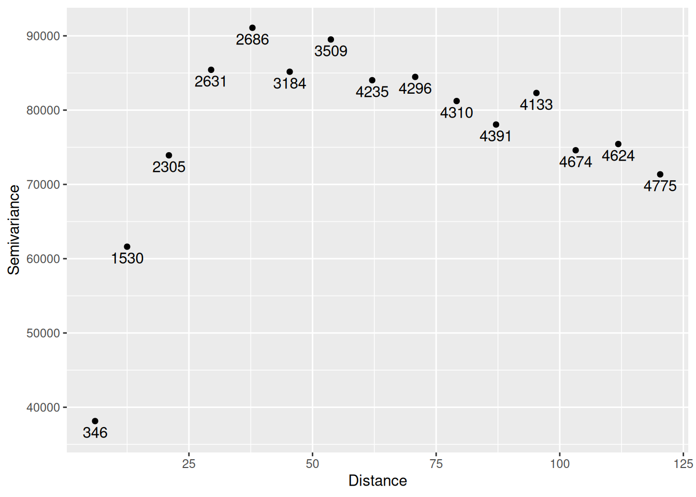
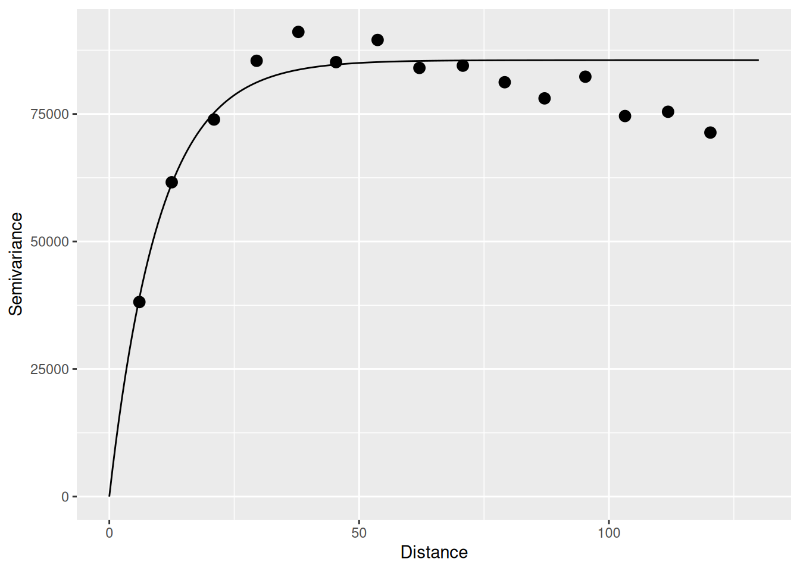

# Spatially Continuous Data IV

*NOTE*: The source files for this book are available with companion package [{isdas}](https://paezha.github.io/isdas/). The source files are in Rmarkdown format and packed as templates. These files allow you execute code within the notebook, so that you can work interactively with the notes. 

## Learning objectives

In the previous practice you were introduced to the concept of variographic analysis for fields/spatially continuous data. In this practice, we will learn:

1. How to use residual spatial pattern to estimate prediction errors.
2. Kriging: a method for optimal predictions.

## Suggested reading

- Bailey TC and Gatrell AC [-@Bailey1995] Interactive Spatial Data Analysis, Chapters 5 and 6. Longman: Essex.
- Bivand RS, Pebesma E, and Gomez-Rubio V [-@Bivand2008] Applied Spatial Data Analysis with R, Chapter 8. Springer: New York.
- Brunsdon C and Comber L [-@Brunsdon2015R] An Introduction to R for Spatial Analysis and Mapping, Chapter 6, Sections 6.7 and 6.8. Sage: Los Angeles.
- Isaaks EH and Srivastava RM  [-@Isaaks1989applied] An Introduction to Applied Geostatistics, Chapter 12. Oxford University Press: Oxford.
- O'Sullivan D and Unwin D [-@Osullivan2010] Geographic Information Analysis, 2nd Edition, Chapters 9 and 10. John Wiley & Sons: New Jersey.

## Preliminaries

As usual, remember to begin work with a new session of `R`. At least, remembert to clear the working space to make sure that you do not have extraneous items there when you begin your work. The command in `R` to clear the workspace is `rm` (for "remove"), followed by a list of items to be removed. To clear the workspace from _all_ objects, do the following:

``` r
rm(list = ls())
```

Note that `ls()` lists all objects currently on the workspace.

Load the libraries you will use in this activity:

``` r
library(isdas)
library(gstat)
library(plotly)
library(spdep)
library(tidyverse)
library(stars)
```

Begin by loading the data file:

``` r
data("Walker_Lake")
```

You can verify the contents of the dataframe:

``` r
summary(Walker_Lake)
```

```
##          ID            X               Y               V         
##  Length   :470   Min.   :  8.0   Min.   :  8.0   Min.   :   0.0  
##  N.unique :470   1st Qu.: 51.0   1st Qu.: 80.0   1st Qu.: 182.0  
##  N.blank  :  0   Median : 89.0   Median :139.5   Median : 425.2  
##  Min.nchar:  1   Mean   :111.1   Mean   :141.3   Mean   : 435.4  
##  Max.nchar:  3   3rd Qu.:170.0   3rd Qu.:208.0   3rd Qu.: 644.4  
##                  Max.   :251.0   Max.   :291.0   Max.   :1528.1  
##                                                                  
##        U           T      
##  Min.   :   0.00   1: 45  
##  1st Qu.:  83.95   2:425  
##  Median : 335.00          
##  Mean   : 613.27          
##  3rd Qu.: 883.20          
##  Max.   :5190.10          
##  NAs    :195
```

## Using residual spatial pattern to estimate prediction errors

Previously, in Chapter \@ref{spatially-continuous-data-ii} we discussed how to interpolate a field using trend surface analysis; we also saw how that method may lead to residuals that are not spatially independent. 

The implication of non-random residuals is that there is systematic residual pattern that the model did not capture; This, in turn, means that there is at least _some_ information that can still be extracted from the residuals. Again, we will use the case of Walker Lake to explore one way to do this.

As before, we first calculate the polynomial terms of the coordinates to fit a trend surface to the data:

``` r
Walker_Lake <- mutate(Walker_Lake,
                      X3 = X^3, X2Y = X^2 * Y, X2 = X^2, 
                      XY = X * Y,
                      Y2 = Y^2, XY2 = X * Y^2, Y3 = Y^3)
```

Given the polynomial expansion, we can proceed to estimate the following cubic trend surface model, which we already know provided the best fit to the data:

``` r
WL.trend3 <- lm(formula = V ~ X3 + X2Y + X2 + X + XY + Y + Y2 + XY2 + Y3, 
                data = Walker_Lake)
summary(WL.trend3)
```

```
## 
## Call:
## lm(formula = V ~ X3 + X2Y + X2 + X + XY + Y + Y2 + XY2 + Y3, 
##     data = Walker_Lake)
## 
## Residuals:
##     Min      1Q  Median      3Q     Max 
## -564.19 -197.41    7.91  194.25  929.72 
## 
## Coefficients:
##               Estimate Std. Error t value Pr(>|t|)    
## (Intercept) -8.620e+00  1.227e+02  -0.070 0.944035    
## X3           1.533e-04  4.806e-05   3.190 0.001522 ** 
## X2Y          6.139e-05  3.909e-05   1.570 0.117000    
## X2          -6.651e-02  1.838e-02  -3.618 0.000330 ***
## X            9.172e+00  2.386e+00   3.844 0.000138 ***
## XY          -4.420e-02  1.430e-02  -3.092 0.002110 ** 
## Y            4.794e+00  2.040e+00   2.350 0.019220 *  
## Y2          -1.806e-03  1.327e-02  -0.136 0.891822    
## XY2          7.679e-05  2.956e-05   2.598 0.009669 ** 
## Y3          -4.170e-05  2.819e-05  -1.479 0.139759    
## ---
## Signif. codes:  0 '***' 0.001 '**' 0.01 '*' 0.05 '.' 0.1 ' ' 1
## 
## Residual standard error: 276.7 on 460 degrees of freedom
## Multiple R-squared:  0.1719,	Adjusted R-squared:  0.1557 
## F-statistic: 10.61 on 9 and 460 DF,  p-value: 5.381e-15
```

We can next visualize the residuals which, as you can see, do not appear to be random 

``` r
plot_ly(x = ~Walker_Lake$X, 
        y = ~Walker_Lake$Y, 
        z = ~WL.trend3$residuals, 
        color = ~WL.trend3$residuals < 0, 
        colors = c("blue", "red"), 
        type = "scatter3d")
```

```
## No scatter3d mode specifed:
##   Setting the mode to markers
##   Read more about this attribute -> https://plotly.com/r/reference/#scatter-mode
```

```{=html}
<div class="plotly html-widget html-fill-item" id="htmlwidget-b9caac16c54e2ad93e46" style="width:672px;height:480px;"></div>
<script type="application/json" data-for="htmlwidget-b9caac16c54e2ad93e46">{"x":{"visdat":{"13b357da5aecd":["function () ","plotlyVisDat"]},"cur_data":"13b357da5aecd","attrs":{"13b357da5aecd":{"x":{},"y":{},"z":{},"color":{},"colors":["blue","red"],"alpha_stroke":1,"sizes":[10,100],"spans":[1,20],"type":"scatter3d"}},"layout":{"margin":{"b":40,"l":60,"t":25,"r":10},"scene":{"xaxis":{"title":"Walker_Lake$X"},"yaxis":{"title":"Walker_Lake$Y"},"zaxis":{"title":"WL.trend3$residuals"}},"hovermode":"closest","showlegend":true},"source":"A","config":{"modeBarButtonsToAdd":["hoverclosest","hovercompare"],"showSendToCloud":false},"data":[{"x":[8,10,31,28,49,50,49,51,48,50,50,71,71,68,68,69,69,70,90,91,91,91,89,109,111,130,130,151,150,150,150,148,168,168,171,170,168,189,190,188,209,210,209,210,208,211,231,231,229,228,231,229,249,251,250,28,29,18,39,18,21,31,41,21,60,50,60,50,61,39,61,39,49,58,39,60,40,51,60,40,58,38,39,59,41,49,51,39,38,78,70,78,78,80,71,79,71,78,80,70,80,90,88,101,79,90,81,80,91,101,98,81,90,90,99,108,158,140,150,151,160,139,178,159,169,170,180,198,211,208,221,199,220,200,208,210,198,218,229,218,238,218,231,230,221,239,218,35,24,23,54,46,45,53,55,43,55,44,55,54,43,73,75,73,64,63,73,64,93,86,93,84,93,86,96,85,93,86,106,155,174,166,215,205,204,236,223,236,226,24,36,16,43,15,46,46,54,43,65,36,53,44,65,55,46,63,46,35,53,46,45,35,84,75,73,63,84,76,76,94,85,104,85,104,75,95,83,94,104,196,204,196,195,216,225,233,226,213],"y":[68,110,68,88,11,88,151,168,190,211,268,9,29,70,128,148,169,191,49,68,91,111,130,129,291,9,231,69,89,109,228,291,8,91,109,210,271,149,169,210,30,70,90,111,151,228,10,28,110,148,208,228,48,69,190,80,59,80,60,60,90,101,100,100,8,81,151,160,158,160,170,170,179,179,181,191,190,198,198,200,208,209,221,268,271,278,260,279,260,28,41,41,20,131,140,138,160,159,168,198,49,58,39,38,70,79,81,89,99,100,111,108,120,140,138,121,228,229,241,218,218,220,211,209,221,198,218,90,100,80,99,98,150,150,159,140,161,8,19,18,229,228,239,221,241,220,218,71,71,91,10,11,89,150,168,170,191,191,211,269,271,29,129,149,151,168,188,191,48,48,70,69,90,89,111,108,131,131,130,229,208,211,89,89,151,9,9,229,230,79,61,80,60,88,99,81,161,161,160,170,179,180,181,199,198,201,220,271,258,260,281,278,30,40,141,140,138,159,51,61,60,38,100,109,110,121,119,140,118,91,101,101,149,11,19,220,221,218],"z":[90.228510701678459,99.263120524399937,452.4554919650007,211.72960203994882,323.42529212284825,289.69398565555622,153.97034329053062,350.03735581264226,150.548916428784,388.98662857726094,483.85604123318598,65.65589589930218,252.06586973722594,34.260373191045709,56.785016827015312,15.509551760103317,160.68449272805168,336.05980022313059,193.10594495510526,156.80457454850392,388.42030872713678,286.58567311917085,417.94356658082734,191.79776830631971,140.30780744327828,174.5825550172045,191.67042563736598,143.88954943602235,152.04695271447287,82.780933103523267,307.18304665704989,50.402101708487031,70.539348093306018,138.67449106890442,100.88560617865653,343.67939287661852,159.76752348494773,157.04543798169743,10.256807465876919,61.060109137203071,111.90182455188715,71.515218169935125,483.14345658902187,13.869893165021516,356.16985847033419,340.63107901336514,186.83171894666435,23.630671937088277,29.067970666343491,9.8353618451766334,131.64023282292516,349.30496431724964,4.7818753694480307,58.650105257738083,97.333918887618594,138.16163055739418,364.35489494930016,603.47428473873322,341.68504490797312,153.01056293132385,126.9212386785747,48.169770946610015,54.972052030396853,92.860286610741582,195.65203967728752,92.206048403993066,908.58639942538468,256.96279758775682,255.77645286527579,34.561291235486436,194.42479193492014,290.06955917593456,191.96062385396496,502.1646373499803,386.67608674626439,929.7229249828647,355.95130948094635,508.9404252293503,614.48315734932339,37.750376655339736,144.86026290063748,75.667146469586442,51.740063790519365,174.36053749283028,497.86728885617822,256.87088338601188,252.55323942150673,471.37468229152415,207.82094182221195,356.17160660464594,26.728327602669665,150.71845159209178,95.255669402652501,226.66387453282147,11.922302283661541,149.49806265745525,201.91476957827408,155.46946583490947,109.07087969201027,57.464247908200001,293.02351943029259,264.70005614137034,73.889711218736949,290.63274921844919,7.7810743098864883,68.356096011364272,68.636769737971051,84.63474335782648,207.03903926845754,88.657723399369999,218.81784275081858,469.33046921297876,350.3524669425214,89.404153362697471,107.55434416978326,383.47072755850019,280.71109229251914,240.82301636805849,59.522467542901325,78.126925247434428,284.14688373640558,193.72950581174356,118.60932841954583,201.50648274994393,153.68815659920645,55.916220152116267,109.87219472431741,283.23204107913477,418.41130544762314,105.62141978155132,203.71889313605107,473.95151969970033,216.52490043831432,288.81074436241636,41.53182355784255,119.85802273494066,55.868706075067571,333.35224684103503,108.43831204798548,409.2305511903852,280.89902197816417,169.09422318860484,74.119078409460315,299.82990998904882,79.191527099301908,83.93400632285973,486.94650652933279,224.89839151853477,307.64777761151316,333.03183379673862,294.97237248020053,192.86187732083394,41.805331094029142,240.71337818711922,257.13900172011506,458.25688333073049,787.98645316781653,33.6187127526021,315.83673693529488,242.80947591568722,397.95552764990248,226.13000527478272,201.34178718080582,128.03611131928051,366.30825455701591,605.85022882229498,107.54125750307222,667.49655805140208,226.08264598257722,10.228750794620046,22.80563188041388,467.5904685417803,359.43904895139997,59.240622317899948,23.134285645706406,390.23901978369537,334.24520593841686,315.08247699824426,133.35452093785725,104.95165207684238,49.184525019688458,302.13244630723807,262.23084284787774,481.54604783079816,380.69767550573533,68.019194718757404,200.86419388517629,351.69216001650591,535.38638368739669,439.08960375955758,262.73964637244126,490.70712664745071,132.21102571588517,164.22329089961016,16.672877273770773,31.799543148135569,339.38881709477005,8.0309922999489682,320.0212145536828,48.926778880519549,386.84250087887472,255.12251248968201,133.68504333320806,474.71285192319937,200.44800947139865,150.77548838586611,174.40029885232576,224.72092459886207,17.547314479010954,342.30815909402867,293.88730654282341,462.56169689532652,130.11177163652019,250.22686622869057,198.9621239913711,92.486099403220337,116.04641699202088,7.1158229164055466,30.89566465009738,302.74324092353874,41.858375943111071,179.39601115696161,165.91041354723455,50.655739810375891,92.444080824836846,284.15583611897682,286.90074258344259,57.200791863351427,76.489041708298416,104.44099231226819,207.83640857930672,264.55589088714845,158.83647387455636,264.96317493916092,431.60448695355262,312.40511202356316,509.20881922267739,214.2777477064659],"type":"scatter3d","mode":"markers","name":"FALSE","marker":{"color":"rgba(0,0,255,1)","line":{"color":"rgba(0,0,255,1)"}},"textfont":{"color":"rgba(0,0,255,1)"},"error_y":{"color":"rgba(0,0,255,1)"},"error_x":{"color":"rgba(0,0,255,1)"},"line":{"color":"rgba(0,0,255,1)"},"frame":null},{"x":[11,8,9,9,9,11,10,8,9,10,11,10,8,31,29,28,30,28,28,30,28,31,28,30,31,31,49,51,49,51,48,49,51,51,70,69,68,69,69,68,71,71,91,91,88,89,89,90,90,88,88,88,109,111,108,109,108,110,110,111,111,110,109,109,109,131,130,128,129,131,129,131,131,129,128,131,128,131,148,149,150,150,150,149,151,148,149,149,171,169,168,168,171,171,169,170,169,168,190,191,191,190,190,188,191,190,191,190,189,189,211,211,211,209,208,210,211,208,208,230,230,229,230,229,231,231,231,230,249,250,251,248,249,248,250,251,251,249,248,250,40,21,41,41,40,51,59,41,59,51,59,60,38,50,61,38,50,61,59,59,60,70,61,58,70,80,61,79,69,79,80,81,100,100,80,101,100,100,81,100,98,121,111,120,119,161,141,178,158,219,220,198,221,219,200,239,239,240,34,55,46,46,64,64,75,114,145,215,35,26,36,54,33,34,33,34,65,35,36,35,84,84,86,73,93,75,94,103,114,215,214,245],"y":[8,30,48,90,129,150,170,188,209,231,250,269,288,11,29,51,110,130,150,171,190,209,229,250,269,289,29,48,68,109,129,231,250,290,51,90,110,208,229,250,268,288,11,29,149,170,188,211,230,249,269,288,11,31,49,68,88,109,148,169,191,208,230,249,268,31,48,70,90,109,128,148,169,191,209,248,269,288,8,29,49,129,151,169,190,208,251,271,29,49,69,131,150,171,191,230,249,290,11,28,48,69,89,111,129,189,231,248,270,290,11,49,130,168,191,211,250,268,289,50,71,91,131,169,191,249,268,291,9,30,91,109,130,150,169,208,229,251,270,291,71,69,81,90,11,18,20,21,90,101,101,81,148,138,139,140,221,220,281,258,29,21,41,128,121,119,121,149,181,181,188,200,48,60,59,68,78,91,98,118,130,131,140,141,118,241,240,201,198,88,81,78,160,139,139,8,18,239,88,89,148,211,31,129,171,131,230,148,80,58,99,80,160,180,191,201,210,208,219,259,41,161,169,199,41,90,101,139,120,101,19,231],"z":[-118.87007281984174,-191.71098088075124,-48.330075224075557,-13.230063931734382,-336.03769436069888,-538.05198282552942,-194.12130621118402,-402.32081855393375,-371.3204529908769,-431.84956966465074,-370.51935271243894,-237.8636860880564,-57.6197215400095,-225.99440804111759,-229.76624823792409,-86.518055914431656,-58.605706084935612,-446.11668186015015,-272.11405270880135,-342.35635290994435,-404.59948707477429,-564.19326506692403,-344.05543839051029,-410.91460970777001,-70.557140381396081,-23.492667808828866,-283.88279487326025,-331.32933319523659,-446.0392998212875,-121.11977176719043,-409.71731534056829,-136.05629835729465,-118.74162758753019,-90.26465736396014,-213.3063380908504,-539.13960858985638,-240.4273537647816,-460.02336053114823,-506.72799521357291,-435.77656156933369,-348.13884521264902,-232.15267303233114,-37.145195892372463,-339.65823542125747,-14.431965490991297,-402.80717734359763,-532.0409298416713,-502.58096347277018,-454.67987924096542,-394.78648240663711,-293.6716610041164,-137.77294710633544,-8.3532917918605811,-248.24625333200214,-44.058415581656952,-204.07671878500585,-293.934467984516,-260.43629873167777,-471.24464587508845,-477.04036307972854,-474.54220405172282,-434.13273211300861,-227.4626680485579,-325.50799578784904,-69.603766091697011,-375.52831755844392,-339.65004598676012,-32.255945010465446,-199.21760572961654,-446.47741888000121,-211.99743353298894,-265.06756984494655,-414.32659871946777,-423.56269632499249,-296.41908665549329,-174.61703855694782,-45.089330161521019,-30.519173003323896,-126.12086954656175,-57.164421381631456,-51.513713788292392,-317.44732341481978,-392.62550045417044,-209.3949218124443,-363.77908059679925,-1.1030762383999071,-19.491540233977819,-70.703720351061534,-171.982628872942,-78.100711822703403,-359.0688631683546,-19.67958306751779,-350.22201856054892,-130.1513707058815,-222.93118404845984,-78.721857977154556,-184.04942098048863,-6.5420657880415192,-22.215307085247048,-332.3388960227262,-283.32192264866205,-335.90663555495638,-6.8546530296487802,-7.6973567279258592,-213.12688653683725,-286.48195105856286,-47.562093924485623,-44.032652564187366,-28.650562600449479,-36.913982765067082,-29.402701938279201,-38.319661775991321,-99.551055121756619,-169.8384941415332,-232.61413226444236,-15.91851092414047,-37.28471944838379,-23.581535813932003,-44.730303071928653,-80.188136693038771,-136.95722938888196,-320.50423484197762,-14.463425301621033,-337.92549763040097,-194.95763361779396,-141.94730545773444,-191.60319066187122,-142.62134176488394,-330.11591784988104,-316.86241502130986,-419.30506422042316,-375.49836935047267,-406.41789371278401,-383.6681419255097,-143.08035154512504,-402.02912604762474,-144.85030092023467,-111.46673994971441,-281.39403637298739,-218.47393726436368,-398.73863489633516,-125.77420077088497,-233.23439331524733,-109.42753100531444,-196.72729662120025,-121.93489969919763,-366.85473421371682,-215.29307972779227,-33.963917187542165,-55.317142509521254,-195.82386425036887,-137.41018331018799,-274.6278357944621,-196.39008158183671,-128.16754288530049,-339.59819622810556,-13.79909552335001,-444.17692277942444,-148.02582849922501,-222.04478873482216,-166.65220388867149,-345.21691276898093,-370.63378693009037,-438.59846654260542,-549.90084893602591,-144.38607307042574,-483.13905420791258,-540.14208368273955,-169.13263036636002,-389.54211694711756,-319.3769165127776,-545.7212114931782,-404.42549551584432,-468.19706704021047,-481.91179336006923,-93.547312529384214,-117.38787190005503,-106.69999890759254,-359.79196137344553,-162.9282903898204,-24.3779849998988,-465.87279197952296,-316.80650604587026,-377.63201810682654,-330.14136042003372,-95.313650327699719,-170.56118638050535,-150.29355443392456,-166.1576174039923,-102.16611884019906,-68.490260616020663,-126.57425905174193,-24.126038812116075,-161.6812394117608,-89.644001886955451,-219.74418626340659,-50.79508138000341,-144.16833944670523,-419.16201946291324,-113.34995998989972,-383.94960611419901,-73.378682641777857,-181.22040594822442,-367.02704250202737,-76.707517068014113,-229.29698731992318,-268.68665832727584,-29.108385895622519,-312.77437154253914,-354.4016093852257,-498.32250082503339,-34.401586104722014,-188.34666755526308,-254.45975010289533,-316.48770458376691,-283.9751659312322,-322.25984469781355,-162.53128736495603,-140.26774977426533,-197.63967222373827,-39.025816310516852,-136.19325611985855,-248.67016889307041,-94.339293121557645,-53.030122891522147,-16.757736966453301,-141.09965517692626,-36.84173843854802,-174.61547624142568,-120.87674997785865,-137.90283352417538,-190.17929444689926],"type":"scatter3d","mode":"markers","name":"TRUE","marker":{"color":"rgba(255,0,0,1)","line":{"color":"rgba(255,0,0,1)"}},"textfont":{"color":"rgba(255,0,0,1)"},"error_y":{"color":"rgba(255,0,0,1)"},"error_x":{"color":"rgba(255,0,0,1)"},"line":{"color":"rgba(255,0,0,1)"},"frame":null}],"highlight":{"on":"plotly_click","persistent":false,"dynamic":false,"selectize":false,"opacityDim":0.20000000000000001,"selected":{"opacity":1},"debounce":0},"shinyEvents":["plotly_hover","plotly_click","plotly_selected","plotly_relayout","plotly_brushed","plotly_brushing","plotly_clickannotation","plotly_doubleclick","plotly_deselect","plotly_afterplot","plotly_sunburstclick"],"base_url":"https://plot.ly"},"evals":[],"jsHooks":[]}</script>
```

Now we will create an interpolation grid:

``` r
# The function `sequence()` create a sequence of values from - to 
# using by as the step increment. In this case, we generate a grid
# with points that are 2.5 m apart.
X.p <- seq(from = 0.1, to = 255.1, by = 2.5)
Y.p <- seq(from = 0.1, to = 295.1, by = 2.5)
df.p <- expand.grid(X = X.p, Y = Y.p)
```

WE can add the polynomial terms to this grid. Since our trend surface model was estimated using the cubic polynomial, we add those terms to the dataframe:

``` r
df.p <- mutate(df.p, X3 = X^3, X2Y = X^2 * Y, X2 = X^2, 
               XY = X * Y, 
               Y2 = Y^2, XY2 = X * Y^2, Y3 = Y^3)
```

The interpolated cubic surface is obtained by using the model and the interpolation grid as `newdata`:

``` r
# The function `predict()` is used to make predictions given a model 
# and a possibly new dataset, different from the one used for estimation 
# of the model.
WL.preds3 <- predict(WL.trend3, 
                     newdata = df.p, 
                     se.fit = TRUE, 
                     interval = "prediction", 
                     level = 0.95)
```

The surface is converted into a matrix for 3D plotting:

``` r
z.p3 <- matrix(data = WL.preds3$fit[,1], 
               nrow = length(Y.p), 
               ncol = length(X.p), 
               byrow = TRUE)
```

And plot:

``` r
WL.plot3 <- plot_ly(x = ~X.p, 
                    y = ~Y.p, 
                    z = ~z.p3, 
                    type = "surface", 
                    colors = "YlOrRd") |> 
  layout(scene = list(aspectmode = "manual",
                      aspectratio = list(x = 1, 
                                         y = 1,
                                         
                                         z = 1)))
WL.plot3
```

```{=html}
<div class="plotly html-widget html-fill-item" id="htmlwidget-31db4a811ffae22a271b" style="width:672px;height:480px;"></div>
<script type="application/json" data-for="htmlwidget-31db4a811ffae22a271b">{"x":{"visdat":{"13b35788af0dd":["function () ","plotlyVisDat"]},"cur_data":"13b35788af0dd","attrs":{"13b35788af0dd":{"x":{},"y":{},"z":{},"colors":"YlOrRd","alpha_stroke":1,"sizes":[10,100],"spans":[1,20],"type":"surface"}},"layout":{"margin":{"b":40,"l":60,"t":25,"r":10},"scene":{"aspectmode":"manual","aspectratio":{"x":1,"y":1,"z":1},"xaxis":{"title":"X.p"},"yaxis":{"title":"Y.p"},"zaxis":{"title":"z.p3"}},"hovermode":"closest","showlegend":false,"legend":{"yanchor":"top","y":0.5}},"source":"A","config":{"modeBarButtonsToAdd":["hoverclosest","hovercompare"],"showSendToCloud":false},"data":[{"colorbar":{"title":"z.p3","ticklen":2,"len":0.5,"lenmode":"fraction","y":1,"yanchor":"top"},"colorscale":[["0","rgba(255,255,204,1)"],["0.0416666666666667","rgba(255,249,189,1)"],["0.0833333333333333","rgba(255,243,175,1)"],["0.125","rgba(255,237,160,1)"],["0.166666666666667","rgba(255,230,146,1)"],["0.208333333333333","rgba(255,224,132,1)"],["0.25","rgba(254,217,118,1)"],["0.291666666666667","rgba(255,204,104,1)"],["0.333333333333333","rgba(255,191,90,1)"],["0.375","rgba(254,178,76,1)"],["0.416666666666667","rgba(254,166,71,1)"],["0.458333333333333","rgba(254,154,65,1)"],["0.5","rgba(253,141,60,1)"],["0.541666666666667","rgba(253,122,54,1)"],["0.583333333333333","rgba(253,102,48,1)"],["0.625","rgba(252,78,42,1)"],["0.666666666666667","rgba(244,64,37,1)"],["0.708333333333333","rgba(235,48,33,1)"],["0.75","rgba(227,26,28,1)"],["0.791666666666667","rgba(214,18,32,1)"],["0.833333333333333","rgba(202,9,35,1)"],["0.875","rgba(189,0,38,1)"],["0.916666666666667","rgba(168,0,38,1)"],["0.958333333333333","rgba(148,0,38,1)"],["1","rgba(128,0,38,1)"]],"showscale":true,"x":[0.10000000000000001,2.6000000000000001,5.0999999999999996,7.5999999999999996,10.1,12.6,15.1,17.600000000000001,20.100000000000001,22.600000000000001,25.100000000000001,27.600000000000001,30.100000000000001,32.600000000000001,35.100000000000001,37.600000000000001,40.100000000000001,42.600000000000001,45.100000000000001,47.600000000000001,50.100000000000001,52.600000000000001,55.100000000000001,57.600000000000001,60.100000000000001,62.600000000000001,65.099999999999994,67.599999999999994,70.099999999999994,72.599999999999994,75.099999999999994,77.599999999999994,80.099999999999994,82.599999999999994,85.099999999999994,87.599999999999994,90.099999999999994,92.599999999999994,95.099999999999994,97.599999999999994,100.09999999999999,102.59999999999999,105.09999999999999,107.59999999999999,110.09999999999999,112.59999999999999,115.09999999999999,117.59999999999999,120.09999999999999,122.59999999999999,125.09999999999999,127.59999999999999,130.09999999999999,132.59999999999999,135.09999999999999,137.59999999999999,140.09999999999999,142.59999999999999,145.09999999999999,147.59999999999999,150.09999999999999,152.59999999999999,155.09999999999999,157.59999999999999,160.09999999999999,162.59999999999999,165.09999999999999,167.59999999999999,170.09999999999999,172.59999999999999,175.09999999999999,177.59999999999999,180.09999999999999,182.59999999999999,185.09999999999999,187.59999999999999,190.09999999999999,192.59999999999999,195.09999999999999,197.59999999999999,200.09999999999999,202.59999999999999,205.09999999999999,207.59999999999999,210.09999999999999,212.59999999999999,215.09999999999999,217.59999999999999,220.09999999999999,222.59999999999999,225.09999999999999,227.59999999999999,230.09999999999999,232.59999999999999,235.09999999999999,237.59999999999999,240.09999999999999,242.59999999999999,245.09999999999999,247.59999999999999,250.09999999999999,252.59999999999999,255.09999999999999],"y":[0.10000000000000001,2.6000000000000001,5.0999999999999996,7.5999999999999996,10.1,12.6,15.1,17.600000000000001,20.100000000000001,22.600000000000001,25.100000000000001,27.600000000000001,30.100000000000001,32.600000000000001,35.100000000000001,37.600000000000001,40.100000000000001,42.600000000000001,45.100000000000001,47.600000000000001,50.100000000000001,52.600000000000001,55.100000000000001,57.600000000000001,60.100000000000001,62.600000000000001,65.099999999999994,67.599999999999994,70.099999999999994,72.599999999999994,75.099999999999994,77.599999999999994,80.099999999999994,82.599999999999994,85.099999999999994,87.599999999999994,90.099999999999994,92.599999999999994,95.099999999999994,97.599999999999994,100.09999999999999,102.59999999999999,105.09999999999999,107.59999999999999,110.09999999999999,112.59999999999999,115.09999999999999,117.59999999999999,120.09999999999999,122.59999999999999,125.09999999999999,127.59999999999999,130.09999999999999,132.59999999999999,135.09999999999999,137.59999999999999,140.09999999999999,142.59999999999999,145.09999999999999,147.59999999999999,150.09999999999999,152.59999999999999,155.09999999999999,157.59999999999999,160.09999999999999,162.59999999999999,165.09999999999999,167.59999999999999,170.09999999999999,172.59999999999999,175.09999999999999,177.59999999999999,180.09999999999999,182.59999999999999,185.09999999999999,187.59999999999999,190.09999999999999,192.59999999999999,195.09999999999999,197.59999999999999,200.09999999999999,202.59999999999999,205.09999999999999,207.59999999999999,210.09999999999999,212.59999999999999,215.09999999999999,217.59999999999999,220.09999999999999,222.59999999999999,225.09999999999999,227.59999999999999,230.09999999999999,232.59999999999999,235.09999999999999,237.59999999999999,240.09999999999999,242.59999999999999,245.09999999999999,247.59999999999999,250.09999999999999,252.59999999999999,255.09999999999999,257.60000000000002,260.10000000000002,262.60000000000002,265.10000000000002,267.60000000000002,270.10000000000002,272.60000000000002,275.10000000000002,277.60000000000002,280.10000000000002,282.60000000000002,285.10000000000002,287.60000000000002,290.10000000000002,292.60000000000002,295.10000000000002],"z":[[-7.2245508738736488,15.248913959415836,36.906000520854846,57.761080351267005,77.828524991475959,97.12270598230532,115.65799486457871,133.44876317911974,150.50938246675204,166.85422426829928,182.49766012458502,197.45406157643293,211.7378001646666,225.36324743010971,238.34477491358581,250.69675415591857,262.43355669793152,273.56955408044854,284.11911784429293,294.09661953028854,303.51643067925886,312.39292283202764,320.74046752941854,328.5734363122549,335.90620072136068,342.75313229755926,349.12860258167439,355.04698311452955,360.52264543694855,365.56996108975505,370.20330161377245,374.43703854982459,378.28554343873481,381.76318782132711,384.88434323842483,387.66338123085171,390.11467333943131,392.2525911049874,394.09150606834351,395.64578977032323,396.92981375175009,397.95794955344792,398.74456871624028,399.30404278095079,399.65074328840291,399.79904177942052,399.76330979482702,399.55791887544626,399.19724056210174,398.69564639561725,398.06750791681611,397.32719666652218,396.48908418555897,395.56754201475019,394.5769416949193,393.53165476688997,392.44605277148605,391.33450724953093,390.21138974184845,389.09107178926195,387.98792493259543,386.91632071267207,385.8906306703156,384.92522634634986,384.03447928159841,383.23276101688469,382.53444309303279,381.95389705086586,381.50549443120752,381.20360677488168,381.062605622712,381.09686251552142,381.32074899413448,381.74863659937478,382.39489687206509,383.27390135302954,384.40002158309176,385.78762910307535,387.45109545380416,389.40479217610113,391.66309081079032,394.24036289869565,397.15097998064056,400.40931359744866,404.02973528994312,408.02661659894801,412.41432906528746,417.20724422978356,422.41973363326173,428.06616881654423,434.16092132045515,440.71836268581882,447.75286445345756,455.27879816419613,463.31053535885769,471.86244757826518,480.94890636324385,490.5842832546158,500.78294979320555,511.5592775198358,522.92763797533132,534.90240270051459,547.4979432362104],[4.7364865186883804,26.936033800043361,48.32112134062622,68.906120681260617,88.705403362770141,107.73334092597844,126.0043049117091,143.53266686078581,160.33279831403215,176.41907081227174,191.80585589632824,206.50752510702526,220.53844998518642,233.91300207163533,246.64555290719557,258.75047403269087,270.24213698894482,281.13491331678097,291.44317455702304,301.18129225049461,310.36363793801934,319.00458316042079,327.11849945852265,334.71975837314841,341.82273144512197,348.44179021526668,354.59130622440631,360.28565101336443,365.53919612296471,370.36631309403066,374.78137346738606,378.79874878385448,382.43281058425947,385.69793040942471,388.60847980017382,391.17883029733053,393.42335344171823,395.35642077416077,396.99240383548175,398.34567416650458,399.43060330805298,400.26156280095086,400.85292418602143,401.21905900408854,401.3743387959758,401.33313510250684,401.10981946450528,400.7187634227945,400.17433851819845,399.49091629154077,398.68286828364467,397.76456603533433,396.75038108743297,395.65468498076433,394.49184925615202,393.27624545442001,392.02224511639122,390.74421978288984,389.45654099473938,388.17358029276312,386.90970921778546,385.67929931062935,384.49672211211822,383.3763491630765,382.33255200432728,381.37970217669408,380.53217122100108,379.80433067807155,379.21055208872878,378.76520699379694,378.48266693409954,378.37730345045986,378.46348808370209,378.75559237464967,379.26798786412576,380.01504609295449,381.01113860195915,382.27063693196345,383.80791262379159,385.6373372182664,387.77328225621159,390.23011927845135,393.02221982580897,396.16395543910772,399.66969765917173,403.55381802682439,407.83068808288982,412.51467936819063,417.62016342355167,423.16151178979533,429.153096007746,435.60928761822765,442.54445816206288,449.97297918007564,457.90922221309035,466.36755880192908,475.3623604874175,484.90799881037793,495.01884531163364,505.70927153200881,516.99364901232718,528.8863492934131,541.40174391608866],[16.670978068850662,38.599007612776191,59.714495947007975,80.031814612369629,99.565335149684799,118.32942909977707,136.33846800347013,153.60682340158752,170.14886683495297,185.97896984438998,201.11150397072228,215.56084075477335,229.34135173736703,242.4674084593268,254.95338246147637,266.81364528463922,278.06256846963913,288.71452355729963,298.78388208844439,308.28501560389702,317.23229564448116,325.64009375102034,333.52278146433832,340.89473032525865,347.770311874605,354.16389765320099,360.08985920187013,365.56256806143614,370.59639577272276,375.20571387655338,379.40489391375178,383.20830742514153,386.63032595154618,389.68532103378959,392.38766421269514,394.75172702908657,396.7918810237876,398.52249773762168,399.95794871141243,401.11260548598358,402.00083960215863,402.63702260076138,403.03552602261527,403.21072140854403,403.17698029937145,402.94867423592069,402.540174759016,401.9658534094803,401.24008172813785,400.37723125581181,399.39167353332618,398.29778010150426,397.10992250116993,395.8424722731466,394.50980095825781,393.12628009732776,391.70628123117956,390.26417590063693,388.81433564652343,387.37113200966292,385.94893653087883,384.56212075099489,383.22505621083457,381.95211445122146,380.7576670129796,379.65608543693213,378.66174126390308,377.78900603471573,377.05225129019385,376.46584857116085,376.04416941844119,375.80158537285723,375.75246797523346,375.91118876639371,376.29211928716063,376.90963107835864,377.77809568081062,378.91188463534132,380.3253694827734,382.0329217639308,384.04891301963733,386.38771479071636,389.06369861799146,392.0912360422866,395.48469860442532,399.25845784523057,403.42688530552749,408.00435252613755,413.00523104788681,418.44389241159661,424.33470815809164,430.69204982819662,437.53028896273287,444.86379710252578,452.70694578839863,461.07410656117361,469.97965096167661,479.43795053073006,489.46337680915724,500.07030133778284,511.27309565742956,523.08613130892195,535.52377983308224],[28.575014599365904,50.233926220367032,71.082215162752775,91.134252967346754,110.40441117497259,128.90706132645394,146.65657496261437,163.66732362427757,179.9536788522671,195.53001218740664,210.41069517051977,224.61009934243015,238.14259624396138,251.02255741593711,263.26435439918089,274.88235873451646,285.89094196276739,296.30447562475723,306.13733126130967,315.40388041324849,324.11849462139702,332.29554542657905,339.94940436961815,347.09444299133804,353.74503283256234,359.91554543411451,365.62035233681826,370.87382508149739,375.69033520897523,380.08425426007562,384.06995377562203,387.66180529643827,390.87418036334776,393.72145051717416,396.21798729874132,398.37816224887263,400.21634690839181,401.74691281812244,402.98423151888818,403.94267455151265,404.63661345681942,405.08041977563221,405.28846504877441,405.27512081707005,405.05475862134233,404.64175000241522,404.05046650111211,403.29527965825673,402.39056101467287,401.35068211118374,400.19001448861331,398.92292968778503,397.56379924952256,396.12699471464987,394.62688762398977,393.07784951836669,391.49425193860395,389.89046642552512,388.28086451995392,386.67981776271364,385.10169769462857,383.5608758565217,382.07172378921706,380.64861303353814,379.30591513030839,378.05800162035149,376.91924404449173,375.9040139435516,375.0266828583554,374.3016223297268,373.74320389848924,373.36579910546658,373.18377949148203,373.21151659735949,373.46338196392259,373.9537471319947,374.69698364239969,375.70746303596098,376.99955685350272,378.58763663584784,380.48607392382024,382.70924025824382,385.27150717994175,388.18724622973809,391.47082894845624,395.13662687691965,399.19901155595244,403.67235452637732,408.57102732901956,413.90940150470078,419.70184859424552,425.96274013847807,432.70644767822114,439.94734275429886,447.6997969075349,455.97818167875198,464.79686860877422,474.1702292384262,484.11263510852996,494.63845775991047,505.76206873339066,517.497839569794,529.86014180994459],[40.444686932986777,61.836880445568568,82.420369810613337,102.2095265689447,121.2187222613863,139.46232842876174,156.95471661189464,173.71025835160867,189.7433251887274,205.06828866407446,219.6995203184735,233.65139169274812,246.93827432772198,259.57453976421868,271.57455954306187,282.95270520507512,293.72334829108206,303.90086034190642,313.49961289837165,322.53397750130154,331.01832569151964,338.96702900984951,346.39445899711484,353.31498719413935,359.74298514174654,365.69282438076004,371.17887645200346,376.21551289630054,380.81710525447477,384.99802506734989,388.77264387574945,392.15533322049708,395.16046464241657,397.80240968233119,400.09553988106495,402.05422677944114,403.69284191828359,405.02575683841587,406.0673430806616,406.83197218584445,407.33401569478792,407.58784514831575,407.60783208725161,407.40834805241889,407.00376458464143,406.40845322474308,405.6367855135469,404.70313299187666,403.62186720055621,402.40735968040912,401.07398197225911,399.63610561692957,398.10810215524413,396.50434312802673,394.83920007610044,393.12704454028955,391.38224806141722,389.61918218030718,387.85221843778316,386.09572837466857,384.36408353178746,382.67165544996288,381.03281567001881,379.46193573277895,377.97338717906661,376.58154154970561,375.30077038551968,374.14544522733212,373.12993761596687,372.26861909224743,371.57586119699732,371.06603547104027,370.75351345520022,370.65266669030046,370.77786671716427,371.14348507661606,371.76389330947865,372.65346295657599,373.82656555873228,375.29757265677011,377.08085579151367,379.19078650378691,381.64173633441266,384.44807682421532,387.62417951401795,391.18441594464429,395.1431576569185,399.51477619166297,404.31364308970302,409.55412989186078,415.25060813896044,421.41744937182597,428.06902513128068,435.21970695814798,442.88386639325188,451.0758749774152,459.81010425146314,469.10092575621809,478.9627110325041,489.40983162114412,500.45665906296188,512.11756489878303,524.40692066942813],[52.276085892465993,73.403961111133498,93.725050713342341,113.25372623991615,132.00435923167856,149.99132122945315,167.22898377406358,183.73171840633344,199.51389666708641,214.58989009714611,228.97407023733606,242.68080862848004,255.72447681140156,268.11944632692428,279.88008871587186,291.02077551906785,301.55587827733598,311.4997685314998,320.86681782238293,329.67139769080899,337.92787967760165,345.65063532358454,352.85403616958126,359.55245375641533,365.76025962491059,371.49182531589054,376.76152237017874,381.58372232859887,385.9727967319746,389.94311712112949,393.50905503688728,396.68498202007135,399.48526961150571,401.92428935201372,404.01641278241891,405.77601144354509,407.21745687621586,408.35512062125491,409.20337421948562,409.77658921173196,410.08913713881731,410.15538954156517,409.98971796079951,409.60649393734366,409.02008901202146,408.24487472565619,407.29522261907204,406.18550423309227,404.93009110854052,403.54335478624063,402.03966680701586,400.4333987116899,398.73892204108665,396.97060833602973,395.1428291373424,393.26995598584875,391.36636042237183,389.4464139877357,387.52448822276409,385.61495466828018,383.73218486510797,381.89055035407068,380.10442267599228,378.38817337169661,376.75617398200671,375.22279604774644,373.80241110973964,372.50939070880969,371.35810638578022,370.36292968147501,369.53823213671762,368.89838529233145,368.45776068914057,368.23072986796859,368.23166436963868,368.47493573497422,368.97491550479975,369.74597521993843,370.8024864212141,372.15882064944992,373.82934944546946,375.82844435009719,378.17047690415603,380.86981864847007,383.94084112386201,387.39791587115639,391.25541443117703,395.52770834474643,400.22916915268979,405.37416839582863,410.9770776149881,417.05226835099205,423.61411214466295,430.67698053682534,438.2552450683026,446.36327727991721,455.01544871249484,464.2261309068582,474.00969540383062,484.38051374423634,495.35295746889761,506.94139811863988,519.16020723428585],[64.065302300556226,84.93125903981452,104.99234869369249,124.26294280301379,142.75741290860202,160.49013055128086,177.47546727187384,193.72779461120467,209.26148411009694,224.09090730937427,238.23043574986031,251.6944409723786,264.49729451775295,276.65336792680677,288.17703274036376,299.08266049924765,309.3846227442819,319.09729101629023,328.23503685609626,336.81223180452361,344.84324740239589,352.34245519053667,359.32422670976979,365.80293350091864,371.79294710480679,377.30863906225812,382.36438091409616,386.97454420114445,391.15350046422668,394.91562124416646,398.27527808178741,401.24684251791319,403.8446860933675,406.08318034897377,407.97669682555562,409.53960706393684,410.78628260494099,411.73109498939175,412.38841575811267,412.77261645192749,412.89806861165954,412.77914377813278,412.43021349217059,411.86564929459672,411.09982272623472,410.14710532790821,409.02186864044108,407.73848420465674,406.31132356137857,404.75475825143053,403.08315981563635,401.31089979481942,399.45234972980325,397.5218811614119,395.53386563046814,393.50267467779685,391.44267984422055,389.36825267056344,387.29376469764912,385.23358746630078,383.20209251734281,381.21365139159792,379.28263562989031,377.42341677304358,375.6503663618812,373.97785593722688,372.4202570399043,370.99194121073697,369.70727999054839,368.58064492016251,367.62640754040262,366.85893939209268,366.29261201605618,365.94179695311686,365.820865744098,365.94418992982304,366.32614105111651,366.98109064880117,367.92341026370121,369.16747143663991,370.727645708441,372.61830461992844,374.85381971192504,377.44856252525545,380.41690460074227,383.77321747920962,387.53187270148157,391.70724180838067,396.31369634073224,401.36560783935772,406.877347845082,412.86328789872903,419.33779954112163,426.31525431308398,433.8100237554396,441.83647940901125,450.40899281462367,459.54193551310078,469.24967904526494,479.54659495194034,490.4470547739507,501.96543005211953,514.11609232727051],[75.808426980010211,96.414865054364313,116.21835457441649,135.23326708099032,153.47397411490948,170.95484721699756,187.69025792807818,203.69457778897501,218.98217834051161,233.56743112351171,247.46470767879879,260.68837954719658,273.25281826952863,285.17239538661869,296.46148243929019,307.13445096836688,317.20567251467241,326.68951861903031,335.60036082226441,343.95257066519798,351.76051968865494,359.03857943345872,365.80112144043318,372.06251725040181,377.83713840418807,383.13935644261602,387.98354290650877,392.38406933669029,396.35530727398407,399.91162825921378,403.06740383320306,405.83700553677545,408.23480491075463,410.2751734959644,411.9724828332279,413.34110446336922,414.39540992721197,415.14977076557955,415.6185585192955,415.81614472918386,415.75690093606784,415.45519868077128,414.92540950411768,414.18190494693084,413.23905655003409,412.11123585425173,410.81281440040647,409.35816372932237,407.76165538182323,406.03766089873238,404.20055182087356,402.26469968907054,400.24447604414655,398.15425242692555,396.00840037823116,393.82129143888687,391.60729714971637,389.38078905154333,387.15613868519125,384.94771759148364,382.76989731124479,380.63704938529736,378.56354535446548,376.56375675957321,374.65205514144321,372.84281204089973,371.1503989987666,369.58918755586677,368.17354925302431,366.91785563106254,365.83647823080548,364.94378859307676,364.25415825869948,363.78195876849787,363.54156166329534,363.54733848391504,363.81366077118105,364.35490006591715,365.18542790894691,366.31961584109325,367.77183540318094,369.55645813603269,371.6878555804725,374.18039927732417,377.04846076741086,380.30641159155635,383.9686232905849,388.04946740531875,392.56331547658357,397.52453904520047,402.94750965199461,408.84659883779022,415.23617814340935,422.13061910967673,429.54429327741553,437.49157218744909,445.98682738060188,455.04443039769683,464.67875277955727,474.90416606700791,485.73504180087144,497.18575152197286,509.27066677113442],[87.501550753580574,107.85086997753558,127.39915917826697,146.16078989659843,164.15013367335357,181.38156204935592,197.86944656542926,213.62815876239716,228.6720701810832,243.01555236231101,256.67297684690425,269.6587151756865,281.9871388894814,293.67261952911258,304.72952863540377,315.17223774917835,325.01511841126018,334.27254216247275,342.95888054363979,351.08850509558482,358.6757873591315,365.73509887510346,372.28081118432436,378.32729582761772,383.88892434580737,388.9800682797167,393.61509917016946,397.80838855798919,401.57430798399969,404.9272289890244,407.88152311388694,410.45156189941099,412.65171688642039,414.49635961573841,415.99986162818885,417.17659446459527,418.0409296657815,418.60723877257089,418.88989332578717,418.90326486625401,418.66172493479496,418.17964507223365,417.47139681939376,416.55135171709884,415.43388130617274,414.13335712743861,412.66415072172066,411.04063362984203,409.27717739262658,407.38815355089787,405.38793364547985,403.29088921719563,401.11139180686894,398.86381295532374,396.56252420338308,394.22189709187126,391.85630316161144,389.48011395342735,387.1077010081429,384.75343586658113,382.43169006956629,380.15683515792153,377.94324267247049,375.80528415403734,373.75733114344501,371.81375518151759,369.98892780907858,368.29722056695164,366.75300499595994,365.37065263692784,364.16453503067862,363.14902371803578,362.33849023982327,361.74730613686461,361.38984294998306,361.28047222000237,361.43356548774619,361.86349429403862,362.58463017970286,363.61134468556241,364.95800935244148,366.6389957211631,368.668675332551,371.06141972742893,373.83160044662037,376.99358903094901,380.56175702123915,384.55047595831286,388.97411738299593,393.84705283610958,399.18365385847869,404.99829199092744,411.30533877427843,418.11916574935583,425.45414445698293,433.32464643798295,441.74504323318109,450.72970638339945,460.29300742946219,470.44931791219307,481.21300937241534,492.59845335095343,504.62002138862971],[99.140764444020064,119.23536463208099,138.53085332799668,157.04160207259085,174.78198240668695,191.76636587110875,208.00912400667983,223.52462835422378,238.32725045456428,252.43136184852494,265.85133407692928,278.60153868060115,290.69634720036396,302.15013117704143,312.97726215145718,323.19211166443478,332.809051256798,341.84245246937024,350.30668684297535,358.21612591843677,365.58514123657835,372.42810433822348,378.75938676419588,384.59336005531907,389.94439575241688,394.82686539631283,399.25514052783046,403.24359268779358,406.80659341702568,409.95851425635044,412.71372674659136,415.08660242857223,417.09151284311667,418.74282953104824,420.05492403319056,421.04216789036718,421.71893264340179,422.09958983311822,422.19851100033975,422.03006768589029,421.60863143059322,420.94857377527228,420.06426626075108,418.9700804278533,417.68038781740262,416.20955997022241,414.57196842713665,412.78198472896861,410.85398041654213,408.80232703068071,406.64139611220816,404.3855592019479,402.04918784072368,399.6466535693591,397.19232792867768,394.70058245950327,392.18578870265901,389.66231819896905,387.14454248925705,384.64683311434618,382.18356161506063,379.76909953222332,377.41781840665845,375.14408977918953,372.96228519063988,370.8867761818334,368.93193429359349,367.11213106674421,365.44173804210897,363.93512676051114,362.6066687627748,361.47073558972306,360.54169878218016,359.83392988096927,359.36180042691399,359.13968196083795,359.18194602356499,359.50296415591873,360.11710789872251,361.03874879280033,362.28225837897537,363.86200819807192,365.79236979091314,368.08771469832266,370.76241446112408,373.83084062014098,377.30736471619758,381.20635829011638,385.54219288272259,390.32924003483777,395.58187128728707,401.31445818089406,407.54137225648191,414.27698505487439,421.53566811689495,429.33179298336694,437.67973119511504,446.59385429296225,456.0885338177319,466.17814131024807,476.87704831133368,488.19962636181396,500.16024700251091],[110.72215887408134,130.56443984075327,149.60952784635836,167.87179443172016,185.3656111376624,202.1053495050086,218.10538107458248,233.38007738720759,247.94380998370761,261.81095040490612,274.99587019162681,287.51294088469314,299.37653402492896,310.60102115315777,321.2007738102032,331.1901635368888,340.58356187403842,349.39534036247551,357.63987054302368,365.3315239565066,372.48467214374796,379.11368664557136,385.23293900280026,390.85680075625839,395.9996434467696,400.67583861515709,404.89975780224484,408.68577254885639,412.04825439581515,415.00157488394495,417.56010555406948,419.73821794701212,421.55028360359671,423.01067406464676,424.13376087098601,424.93391556343789,425.42550968282615,425.62291476997456,425.5405023657064,425.19264401084558,424.59371124621566,423.75807561264014,422.70010865094275,421.43418190194711,419.97466690647684,418.33593520535555,416.5323583394071,414.5783078494544,412.48815527632189,410.27627216083283,407.95703004381073,405.54480046607966,403.05395496846279,400.49886509178384,397.89390237686655,395.25343836453465,392.59184459561129,389.92349261092056,387.26275395128607,384.62400015753099,382.02160277047972,379.4699333309552,376.98336337978128,374.57626445778146,372.2630081057797,370.0579658645994,367.97550927506393,366.03000987799749,364.23583921422335,362.60736882456501,361.15897024984645,359.90501503089115,358.85987470852285,358.03792082356483,357.45352491684082,357.12105852917455,357.05489320138952,357.26940047430969,357.77895188875857,358.5979189855592,359.74067330553578,361.22158638951225,363.05502977831145,365.25537501275755,367.83699363367384,370.81425718188427,374.20153719821235,378.01320522348112,382.26363279851569,386.96719146413773,392.13825276117211,397.79118823044257,403.94036941277193,410.60016784898482,417.78495507990408,425.50910264635297,433.78698208915591,442.63296494913709,452.06142276711864,462.08672708392521,472.72324944038007,483.98536137730673,495.88743443552892],[122.24182486651711,141.83418642630511,160.63127355610459,178.64745779673922,195.89711068903253,212.39460377380826,228.15430859188999,243.19059668410134,257.51783959126595,271.1504088542074,284.10267601374937,296.38901261071533,308.02379018592916,319.02138028021437,329.39615443439453,339.16248418929331,348.33474108573432,356.92729666454125,364.95452246653764,372.43079003254712,379.37047090339325,385.78793661989982,391.69755872289045,397.11370875318863,402.05075825161805,406.52307875900237,410.54504181616517,414.1310189639301,417.29538174312057,420.05250169456059,422.41675035907355,424.40249927748312,426.02411999061292,427.29598403928657,428.23246296432774,428.84792830655988,429.15675160680689,429.17330440589234,428.91195824463961,428.38708466387254,427.61305520441465,426.60424140708972,425.37501481272119,423.93974696213269,422.31280939614783,420.50857365559045,418.54141128128407,416.42569381405229,414.17579279471863,411.8060797641071,409.33092626304068,406.76470383234368,404.12178401283927,401.41653834535117,398.66333837070317,395.8765556297185,393.07056166322121,390.25972801203471,387.45842621698273,384.68102781888877,381.94190435857666,379.25542737686999,376.63596841459184,374.09789901256676,371.65559071161755,369.32341505256829,367.11574357624255,365.046947823464,363.13139933505579,361.38346965184223,359.81753031464672,358.44795286429263,357.28910884160359,356.35536978740373,355.66110724251627,355.22069274776459,355.04849784397277,355.1588940719642,355.56625297256301,356.28494608659173,357.32934495487513,358.71382111823613,360.4527461174988,362.56049149348655,365.05142878702299,367.93992953893132,371.24036529003638,374.96710758116018,379.13452795312816,383.75699794676211,388.84888910288663,394.42457296232561,400.49842106590199,407.08480495443985,414.19809616876279,421.8526662496933,430.0628867380575,438.84312917467656,448.20776510037552,458.17116605597755,468.74770358230535,479.95174922018481,491.79767451043779],[133.6958532440801,153.04069521148918,171.59218127998815,189.36468299040058,206.37257188355011,222.63021950026038,238.15199738135502,252.95227706765766,267.04543009999185,280.44582801918131,293.16784236604957,305.22584468142037,316.63420650611727,327.40729938096388,337.55949484678382,347.10516444440071,356.05867971463829,364.43441219832005,372.24673343626966,379.51001496931082,386.23862833826689,392.44694508396196,398.14933674721908,403.36017486886237,408.09383098971512,412.36467665060127,416.18708339234416,419.57542275576748,422.544066281695,425.10738551095011,427.27975198435666,429.07553724273811,430.50911282691823,431.59485027772052,432.34712113596868,432.78029694248619,432.90874923809702,432.74684956362438,432.30896945989218,431.60948046772398,430.66275412794323,429.48316198137366,428.0850755688391,426.48286643116285,424.69090610916874,422.72356614368056,420.59521807552147,418.32023344551527,415.91298379448568,413.38784066325633,410.7591755926511,408.04136012349295,405.24876579660588,402.39576415281397,399.49672673293992,396.56602507780798,393.61803072824188,390.66711522506449,387.72765010910013,384.81400692117205,381.94055720210451,379.12167249272045,376.37172433384353,373.70508426629772,371.13612383090663,368.67921456849348,366.34872801988223,364.15903572589644,362.12450922735985,360.25952006509573,358.57843977992809,357.09563991268033,355.82549200417623,354.78236759523952,353.98063822669326,353.43467543936146,353.15885077406773,353.16753577163587,353.47510197288915,354.0959209186513,355.04436414974634,356.33480320699744,357.98160963122814,359.99915496326264,362.40181074392399,365.20394851403597,368.41993981442266,372.06415618590648,376.15096916931299,380.69475030546386,385.70987113518333,391.21070319929595,397.21161803862435,403.7269871939925,410.7711822062239,418.35857461614165,426.50353596457097,435.22043779233405,444.5236516402544,454.42754904915694,464.94650155986415,476.09488071320004,487.88705804998835],[145.08033482952297,164.18005701905821,182.48834184076168,200.01956083545701,216.78808554396778,232.80828750711765,248.09453826573022,262.66120936062919,276.52267233263808,289.69329872258055,302.18746007128027,314.01952791956086,325.20387380824582,335.75486927815894,345.68688587012377,355.01429512496389,363.75146858350303,371.91277778656467,379.51259427497268,386.56528958955045,393.08523527112163,399.08680286050986,404.58436389853887,409.59228992603221,414.1249524838135,418.19672311270637,421.82197335353447,425.01507474712133,427.79039883429067,430.16231715586611,432.14520125267126,433.75342266552974,435.00135293526512,435.90336360270112,436.47382620866142,436.72711229396941,436.67759339944894,436.3396410659235,435.72762683421678,434.85592224515233,433.73889883955383,432.39092815824495,430.82638174204925,429.05963113179041,427.10504786829193,424.97700349237732,422.6898695448707,420.25801756659547,417.69581909837507,415.01764568103323,412.23786885539334,409.37086016227983,406.43099114251538,403.4326333369238,400.39015828632915,397.31793753155489,394.23034261342474,391.14174507276164,388.06651645039034,385.01902828713338,382.01365212381518,379.06475950125883,376.18672196028808,373.39391104172688,370.70069828639851,368.12145523512669,365.67055342873499,363.36236440804726,361.2112597138867,359.2316108870773,357.43778946844276,355.84416699880637,354.46511501899204,353.31500506982337,352.40820869212359,351.75909742671666,351.38204281442631,351.29141639607582,351.50158971248936,352.02693430448971,352.88182171290117,354.08062347854741,355.63771114225148,357.56745624483756,359.88423032712916,362.60240492994978,365.73635159412311,369.30044186047229,373.30904726982214,377.77653936299481,382.7172896808147,388.145669764106,394.07605115369131,400.52280539039475,407.50030401503994,415.02291856844988,423.1050205914492,431.76098162486096,441.00517320950979,450.85196688621733,461.31573419580855,472.41084667910644,484.15167587693566],[156.39136044559839,175.24836267176485,193.31584606117792,210.60818215466116,227.13974249303826,242.92489861713281,257.97802206776845,272.31348438576873,285.94565711195742,298.88891178715795,311.15761995219412,322.7661531478895,333.72888291506774,344.06018079455231,353.77441832716704,362.88596705373544,371.40919851508119,379.35848425202795,386.74819580539912,393.5927047160186,399.9063825247099,405.70360077229668,410.99873099960234,415.8061447474509,420.14021355666563,424.01530896807037,427.44580252248863,430.4460657607442,433.03047022366042,435.21338745206123,437.00918898677008,438.43224636861055,439.49693113840635,440.21761483698111,440.60866900515839,440.68446518376197,440.45937491361519,439.94776973554207,439.16402119036593,438.1225008189104,436.83758016199926,435.32363076045601,433.59502415510423,431.66613188676769,429.55132549627012,427.26497652443481,424.82145651208572,422.23513700004588,419.52038952913972,416.6915856401904,413.76309687402176,410.74929477145719,407.6645508733202,404.52323672043497,401.33972385362466,398.12838381371313,394.90358814152387,391.67970837788016,388.47111606360642,385.29218273952574,382.15727994646204,379.08077922523859,376.07705211667889,373.16047016160735,370.34540490084692,367.64622787522131,365.0773106255545,362.65302469266987,360.38774161739059,358.29583294054095,356.39167020294457,354.68962494542461,353.20406870880515,351.94937303390958,350.93990946156129,350.19004953258434,349.71416478780213,349.52662676803851,349.64180701411692,350.07407706686058,350.83780846709379,351.94737275563995,353.41714147332266,355.26148616096555,357.494778359392,360.13138960942587,363.18569145189144,366.67205542761076,370.60485307740919,374.99845594210905,379.86723556253418,385.22556347950888,391.08781123385614,397.46835036640022,404.38155241796426,411.84178892937121,419.86343144144627,428.46085149501175,437.64842063089179,447.44051038991068,457.85149231289,468.89573794065586,480.58761881403052],[167.62502091505905,186.24170299236184,204.07078476398951,221.12663777076577,237.42363355351421,252.97614365305844,267.79853961022218,281.90519296582892,295.31047526070239,308.0287580356661,320.07441283154378,331.46181118915911,342.20532464933547,352.31932475289676,361.81818304066638,370.71627105346806,379.02796033212553,386.76762241746229,393.94962885030196,400.58835117146816,406.69816092178456,412.29342964207473,417.38852887316244,421.9978301558711,426.13570503102449,429.81652503944611,433.05466172195975,435.86448661938886,438.26037127255722,440.25668722228835,441.86780600940585,443.10809917473341,443.99193825909475,444.53369480331338,444.74774034821286,444.6484464346168,444.250184603349,443.56732639523301,442.61424335109257,441.40530701175106,439.95488891803217,438.27736061075962,436.38709363075691,434.29845951884789,432.0258298158559,429.58357606260478,426.98606979991808,424.24768256861944,421.38278590953252,418.40575136348059,415.33095047128796,412.17275477377751,408.94553581177342,405.66366512609915,402.34151425757818,398.99345474703443,395.6338581352914,392.2770959631722,388.93753977150135,385.62956110110156,382.36753149279764,379.16582248741207,376.03880562576865,373.00085244869177,370.06633449700422,367.24962331153006,364.56509043309273,362.02710740251598,359.65004576062358,357.44827704823848,355.43617280618537,353.62810457528707,352.03844389636731,350.68156231025011,349.57183135775841,348.72362257971645,348.1513075169475,347.86925771027535,347.89184470052385,348.23344002851587,348.90841523507606,349.9311418610273,351.31599144719343,353.07733553439823,355.22954566346499,357.78699337521743,360.76405021047958,364.17508771007437,368.03447741482648,372.35659086555808,377.15579960309384,382.44647516825717,388.24298910187161,394.55971294476115,401.41101823774886,408.81127652165793,416.77485933731373,425.31613822553817,434.44948472715544,444.18927038298932,454.54986673386344,465.54564532060135,477.19097768402656],[178.77740706065777,197.15616880360184,214.7492487719492,231.5710185065235,247.63584954814834,262.95811343764734,277.55218171584414,291.43242592356245,304.61321760162571,317.1089282908577,328.93392953208195,340.10259286612217,350.62928983380186,360.52839197594477,369.81427083337445,378.50129794691458,386.60384485738871,394.13628310562058,401.11298423243375,407.54831977865166,413.45666128509833,418.85238029259705,423.74984834197164,428.16343697404545,432.10751772964244,435.59646214958616,438.64464177470001,441.26642814580794,443.47619280373334,445.28830728929989,446.71714314333127,447.77707190665092,448.48246512008274,448.84769432445023,448.88713106057685,448.61514686928649,448.04611329140272,447.19440186774909,446.07438413914923,444.70043164642669,443.08691593040521,441.24820853190852,439.19868099175989,436.95270485078322,434.52465164980214,431.92889292964026,429.17980023112108,426.29174509506811,423.27909906230548,420.15623367365635,416.93752046994439,413.63733099199368,410.27003678062715,406.85000937666911,403.39162032094248,399.90924115427134,396.41724341747954,392.92999865138989,389.46187839682671,386.02725419461359,382.64049758557394,379.31598011053126,376.06807331030939,372.91114872573206,369.85957789762278,366.92773236680495,364.12998367410239,361.48070336033885,358.9942629663376,356.68503403292283,354.56738810091758,352.65569671114577,350.96433140443099,349.50766372159717,348.30006520346711,347.35590739086524,346.6895618246146,346.31540004553915,346.24779359446285,346.50111401220829,347.08973283960012,348.0280216174616,349.33035188661626,351.01109518788803,353.08462306209998,355.56530705007629,358.46751869264045,361.80562953061531,365.59401110482617,369.84703495609494,374.57907262524583,379.80449565310346,385.53767558048975,391.79298394822979,398.58479229714641,405.92747216806265,413.83539510180378,422.32293263919206,431.40445632105184,441.09433768820662,451.40694828147969,462.35665964169522,473.95784330967604],[189.84460970514706,207.98785092823752,225.34732890780961,241.93741518468707,257.77248129969331,272.86689879365224,287.23503920738727,300.89127408172209,313.84997495748024,326.12551337548553,337.73226087656144,348.68458900153155,358.99686929121964,368.68347328644927,377.75877252804406,386.23713855682757,394.13294291362354,401.46055713925546,408.23435277454706,414.46870136032197,420.17797443740375,425.37654354661623,430.07878022878265,434.29905602472684,438.05174247527259,441.35121112124324,444.21183350346263,446.64798116275421,448.67402563994182,450.30433847584874,451.55329121129893,452.43525538711583,452.96460254412318,453.15570422314454,453.02293196500352,452.58065731052375,451.843251800529,450.82508697584268,449.54053437728862,448.00396554569016,446.22975202187109,444.23226534665508,442.02587706086587,439.62495870532666,437.04388182086143,434.29701794829384,431.3987386284474,428.36341540214545,425.20541981021228,421.93912339347088,418.57889769274504,415.1391142488585,411.63414460263482,408.07836029489783,404.48613286647088,400.87183385817769,397.24983481084183,393.63450726528686,390.04022276233673,386.48135284281466,382.97226904754473,379.52734291735004,376.16094599305478,372.88744981548217,369.72122592545577,366.67664586379931,363.7680811713368,361.0099033888913,358.41648405728671,356.00219471734687,353.781406909895,351.76849217575455,349.97782205574981,348.42376809070424,347.12070182144112,346.08299478878411,345.32501853355706,344.86114459658342,344.70574451868708,344.87318984069123,345.37785210341997,346.23410284769682,347.45631361434499,349.05885594418856,351.05610137805076,353.46242145675546,356.29218772112677,359.55977171198742,363.27954497016208,367.46587903647281,372.13314545174416,377.29571575680046,382.96796149246404,389.16425419955942,395.89896541891028,403.18646669133898,411.04112955767033,419.47732555872796,428.50942623533507,438.15180312831558,448.41882777849241,459.32487172669062,470.8843065137321],[200.82271967127971,218.73284018902163,235.86111599432354,252.22191862800912,267.82961963090196,282.69859054382573,296.84320290760394,310.27782826306037,323.01683815101853,335.07460411230215,346.46549768773468,357.20389041813991,367.30415384434139,376.7806595071628,385.64777894742764,393.91988370595971,401.6113453235825,408.73653534111969,415.30982529939484,421.34558673923175,426.85819120145385,431.86201022688482,436.37141535634828,440.40077813066796,443.96447009066731,447.07686277717011,449.75232773099981,452.00523649298032,453.84996060393496,455.30087160468759,456.37234103606164,457.07874043888091,457.43444135396885,457.45381532214924,457.15123388424553,456.54106858108156,455.63769095348079,454.45547254226688,453.00878488826345,451.31199953229429,449.37948801518274,447.22562187775264,444.8647726608275,442.31131190523104,439.57961115178676,436.6840419413183,433.63897581464937,430.45878431260371,427.1578389760046,423.75051134567599,420.25117296244139,416.67419536712441,413.03395010054822,409.34480870353769,405.62114271691496,401.87732368150478,398.12772313813019,394.38671262761494,390.66866369078286,386.98794786845713,383.35893670146203,379.7960017306205,376.3135144967564,372.92584654069367,369.64736940325548,366.49245462526568,363.47547374754799,360.61079831092582,357.91279985622276,355.39584992426268,353.07432005586918,350.96258179186566,349.07500667307596,347.4259662403237,346.02983203443227,344.90097559622529,344.05376846652661,343.50258218616005,343.2617882959488,343.3457583367167,343.76886384928713,344.54547637448417,345.6899674531312,347.21670862605185,349.14007143406951,351.47442741800802,354.23414811869145,357.43360507694229,361.08716983358573,365.20921392944359,369.81410890534062,374.91622630210065,380.52993766054686,386.66961452150264,393.34962842579228,400.58435091423803,408.38815352766579,416.77540780689736,425.76048529275681,435.35775752606799,445.5815960476541,456.44637239833952,467.96645811894712],[211.70782778180842,229.38722740870682,246.28670085424358,262.42061965924239,277.80335536452679,292.44927951092052,306.37276363924707,319.58817929033012,332.10989800499334,343.95229132406024,355.12973078835455,365.65658793869989,375.54723431591981,384.81604146083805,393.47738091427817,401.54562421706373,409.03514291001841,415.96030853396599,422.3354926297298,428.17506673813358,433.49340240000106,438.30487115615574,442.62384454742136,446.46469411462135,449.84179139857969,452.76950794011952,455.26221528006482,457.3342849592392,459.00008851846604,460.27399749856914,461.17038344037229,461.7036178846987,461.88807237237239,461.73811844421675,461.26812764105546,460.49247150371218,459.42552157301049,458.08164938977421,456.47522649482659,454.62062442899162,452.53221473309264,450.22436894795339,447.71145861439754,445.00785527324871,442.12793046533039,439.08605573146639,435.89660261248036,432.57394264919571,429.13244738243611,425.58648835302512,421.95043710178669,418.23866516954428,414.46554409712121,410.64544542534168,406.79274069502878,402.92180144700649,399.04699922209824,395.18270556112765,391.34329200491862,387.54313009429438,383.79659137007911,380.11804737309546,376.52186964416802,373.02242972412017,369.63409915377503,366.37124947395694,363.24825222548918,360.27947894919532,357.47930118589869,354.86209047642382,352.44221836159358,350.23405638223198,348.2519760791622,346.51034899320848,345.02354666519386,343.80594063594214,342.87190244627692,342.23580363702223,341.9120157490014,341.91491032303759,342.25885889995527,342.95823302057778,344.02740422572805,345.480744056231,347.33262405290913,349.59741575658626,352.28949070808665,355.42322044823328,359.01297651785063,363.07313045776056,367.6180538087882,372.66211811175742,378.21969490749063,384.30515573681225,390.93287214054607,398.11721565951433,405.87255783454265,414.21327020645299,423.15372431607034,432.70829170421734,442.89134391171757,453.71725247939531,465.20038894807413],[222.49602485948589,239.94710341004583,256.62017431032245,272.52960910113956,287.68977932332058,302.11505651768925,315.81981222506914,328.81841798628398,341.12524534215726,352.75466583351266,363.72105100117375,374.03877238596419,383.72220152870767,392.7857099702278,401.24366925134814,409.1104509128923,416.40042649568403,423.12796754054682,429.30744558830429,434.95323217978023,440.07969885579803,444.70121715718147,448.83215862475424,452.48689479933978,455.67979722176182,458.42523743284397,460.73758697340975,462.63121738428293,464.12050020628715,465.21980698024601,465.94350924698301,466.3059785473219,466.32158642208623,466.00470441209973,465.3697040581859,464.43095690116849,463.20283448187104,461.69970834111717,459.93595001973046,457.92593105853473,455.68402299835333,453.22459738001015,450.56202574432859,447.71067963213238,444.68493058424519,441.49915014149065,438.16770984469224,434.7049812346736,431.12533585225862,427.44314523827046,423.67278093353337,419.82861447887029,415.9250174151054,411.97636128306198,407.99701762356392,404.00135797743451,400.00375388549787,396.01857688857683,392.06019852749603,388.14299034307805,384.28132387614761,380.48957066752729,376.78210225804133,373.17329018851325,369.67750599976654,366.30912123262482,363.08250742791228,360.01203612645168,357.11207886906709,354.39700719658185,351.88119264982038,349.57900676960526,347.50482109676091,345.6730071721106,344.0979365364779,342.7939807306862,341.77551129555997,341.05689977192202,340.65251770059655,340.57673662240643,340.84392807817619,341.46846360872871,342.46471475488818,343.84705305747786,345.62985005732173,347.8274772952426,350.45430631206563,353.52470864861237,357.05305584570868,361.05371944417601,365.54107098483945,370.52948200852228,376.03332405604806,382.06696866824041,388.64478738592334,395.78115174991899,403.49043330105292,411.78700358014771,420.68523412802756,430.19949648551534,440.34416219343467,451.13360279261047,462.58218982386467],[233.18340172706476,250.40855901579124,266.85762718531294,282.54497777645332,297.48498233003608,311.69201238688481,325.18043948782309,337.96463517367471,350.0589709852631,361.47781846341195,372.23554914894493,382.34653458268559,391.82514630545762,400.68575585808463,408.9427347813903,416.61045461619813,423.7032869033319,430.23560318361496,436.22177499787125,441.67617388692418,446.61317139159758,451.04713905271484,454.9924484110997,458.46347100757589,461.47457838296674,464.04014207809621,466.17453363378769,467.89212459086491,469.20728649015143,470.13439087247099,470.68780927864714,470.88191324950338,470.73107432586357,470.24966404855115,469.45205395838985,468.35261559620318,466.96572050281503,465.30574021904869,463.38704628572805,461.22401024367662,458.83100363371784,456.22239799667574,453.41256487337347,450.41587580463511,447.24670233128398,443.91941599414383,440.44838833403838,436.84799089179103,433.13259520822538,429.31657282416518,425.41429528043437,421.44013411785613,417.40846087725396,413.33364709945226,409.23006432527364,405.1120840955424,400.99407795108192,396.89041743271605,392.81547408126818,388.78361943756181,384.8092250424213,380.90666243666919,377.09030316112978,373.37451875662697,369.77368076398352,366.30216072402351,362.97433017757055,359.80456066544861,356.80722372848072,353.99669090749086,351.38733374330275,348.99352377673944,346.82963254862511,344.91003159978351,343.2490924710379,341.86118670321156,340.76068583712868,339.96196141361298,339.47938497348775,339.32732805757649,339.52016220670316,340.07225896169149,340.99798986336452,342.31172645254645,344.02784027006078,346.16070285673078,348.72468575338064,351.73416050083341,355.20349863991351,359.14707171144329,363.57925125624718,368.51440881514935,373.96691592897241,379.95114413854054,386.4814649846777,393.57225000820608,401.23787074995039,409.49269875073475,418.35110555138147,427.82746269271593,437.93614171555947,448.69151416073771,460.10795156907318],[243.7660492072977,260.76768504869591,276.99515030196761,292.4628165079364,307.18505520742588,321.17623794125973,334.45073625026151,347.02292167525485,358.90716575706352,370.11784003651093,380.66931605442079,390.57596535161673,399.85215946892242,408.51226994716143,416.57066832715736,424.04172614973396,430.93981495571478,437.27930628592333,443.07457168118339,448.33998268231846,453.08991083015229,457.33872766550849,461.10080472921067,464.39051356208233,467.22222570494722,469.61031269862889,471.56914608395113,473.11309740173732,474.25653819281126,475.01383999799657,475.39937435811675,475.42751281399552,475.11262690645651,474.46908817632334,473.51126816441962,472.25353841156891,470.71027045859506,468.8958358463214,466.82460611557167,464.51095280716959,461.96924746193861,459.21386162070246,456.25916682428482,453.11953461350913,449.80933652919936,446.34294411217866,442.7347289032711,438.99906244329998,435.150316273089,431.20286193346192,427.17107096524217,423.06931490925359,418.91196530631964,414.71339369726405,410.48797162291032,406.2500706240823,402.01406224160337,397.79431801629715,393.60520948898784,389.46110820049802,385.37638569165233,381.3654135032736,377.44256317618579,373.62220625121267,369.91871426917766,366.34645877090452,362.91981129721677,359.65314338893813,356.56082658689201,353.65723243190257,350.95673246479288,348.47369822638666,346.22250125750764,344.21751309897979,342.4731052916257,341.00364937627,339.8235168937357,338.94707938484714,338.38870839042715,338.16277545129986,338.28365210828849,338.76570990221745,339.62332037390934,340.87085506418856,342.5226855138784,344.59318326380259,347.09671985478485,350.04766682764802,353.46039572321718,357.34927808231441,361.72868544576403,366.61298935439038,372.01656134901583,377.9537729704648,384.43899575956101,391.48660125712661,399.1109610039876,407.32644654096566,416.14742940888544,425.58828114857045,435.66337330084394,446.38707740652967,457.7737650064513],[254.24005812293754,271.02057233151248,287.0288344830393,302.27921611834148,316.7860887782428,330.56382400356682,343.62679333513705,355.98936831377733,367.66592048031117,378.67082137556224,389.01844254035404,398.72315551551031,407.79933184185472,416.26134306021072,424.12356071140215,431.40035633625246,438.10610147558538,444.25516767022441,449.86192646099335,454.94074938871563,459.50600799421511,463.57207381831512,467.15331840183956,470.26411328561198,472.91883001045579,475.13184011719488,476.91751514665276,478.2902266396531,479.26434613701957,479.85424517957563,480.07429530814505,479.93886806355141,479.46233498661832,478.65906761816933,477.54343749902824,476.12981617001856,474.43257517196389,472.46608604568803,470.24472033201437,467.78284957176675,465.0948453057685,462.19507907484359,459.09792241981546,455.81774688150762,452.3689240007439,448.76582531834788,445.02282237514328,441.15428671195332,437.17458986960207,433.09810338891305,428.93919881070985,424.712247675816,420.43162152505494,416.11169189925096,411.76683033922706,407.41140838580731,403.05979757981498,398.72636946207371,394.42549557340737,390.17154745463915,385.9788966465934,381.86191469009316,377.83497312596205,373.91244349502415,370.10869733810262,366.43810619602112,362.91504160960352,359.55387511967348,356.36897826705439,353.37472259256998,350.58547963704376,348.0156209412994,345.67951804616075,343.59154249245148,341.76606582099464,340.21745957261442,338.96009528813408,338.00834450837715,337.37657877416797,337.07916962632925,337.13048860568534,337.54490725305976,338.33679710927578,339.52052971515712,341.11047661152747,343.12100933921045,345.56649943903017,348.46131845180923,351.81983791837251,355.65642937954215,359.98546437614277,364.82131444899807,370.17835113893096,376.07094598676605,382.5134705333266,389.52029631943498,397.10579488591668,405.28433777359419,414.07029652329163,423.47804267583251,433.52194777204011,444.21638335273929,455.57572095875196],[264.60151929673685,281.16331168699355,296.95477055128049,311.99026743042117,326.28417386523938,339.85086139655851,352.70470156520241,364.8600659119947,376.33132597775881,387.13285330331854,397.27901942949728,406.78419589711899,415.66275424700711,423.92906601998533,431.59750275687713,438.68243599850621,445.19823728569634,451.15927815927097,456.57993016005378,461.47456482886844,465.8575537065384,469.74326833388744,473.14608025173919,476.08036100091732,478.56048212224533,480.60081515654679,482.21573164464547,483.41960312736495,484.22680114552895,484.65169723996092,484.70866295148448,484.41206982092336,483.77628938910118,482.81569319684161,481.54465278496821,479.97753969430448,478.12872546567422,476.01258163990104,473.64347975780862,471.0357913602204,468.20388798796,465.16214118185121,461.9249224827177,458.50660343138287,454.92155556867039,451.18415043540392,447.30875957240733,443.30975452050382,439.20150682051735,434.99838801327144,430.71476963958941,426.36502324029556,421.96352035621265,417.52463252816523,413.06273129697632,408.5921882034695,404.12737478846896,399.68266259279744,395.2724231572796,390.91102802273826,386.61284872999755,382.39225681988052,378.2636238332114,374.24132131081336,370.33972079351031,366.57319382212575,362.95611193748346,359.50284668040706,356.22776959171961,353.14525221224551,350.26966608280799,347.61538274423089,345.19677373733765,343.02821060295202,341.1240648818972,339.49870811499727,338.16651184307568,337.14184760695639,336.43908694746244,336.0726014054178,336.05676252164648,336.40594183697124,337.13451089221633,338.25684122820502,339.78730438576099,341.74027190570803,344.13011532887026,346.97120619606983,350.27791604813228,354.06461642587931,358.34567887013571,363.13547492172557,368.44837612147097,374.298754010197,380.70098012872688,387.66942601788287,395.21846321849046,403.36246327137269,412.11579771735285,421.49283809725483,431.50795595190181,442.17552282211858,453.50991024872752],[274.84652355144846,291.19199393789188,306.76904932944404,321.59206126692834,335.67540129116838,349.0334409429878,361.68055176321036,373.63110529265953,384.89947307215908,395.50002664253242,405.44713754460338,414.75517731919552,423.43851750713236,431.51152964923773,438.98858528633508,445.88405595924809,452.21231320880031,457.98772857581559,463.22467360111739,467.93751982552931,472.14063878987503,475.84840203497811,479.07518110166228,481.83534753075105,484.1432728630682,486.01332863943725,487.45988640068174,488.49731768762547,489.13999404109194,489.40228700190488,489.2985681108878,488.84320890886443,488.05058093665809,486.93505573509293,485.5110048449921,483.79279980717956,481.79481216247888,479.53141345171349,477.01697521570719,474.26586899528354,471.29246633126598,468.11113876447848,464.73625783574448,461.18219508588771,457.46332205573162,453.59401028609983,449.58863131781624,445.46155669170435,441.22715794858749,436.89980662928974,432.49387427463432,428.02373242544508,423.50375262254579,418.94830640675974,414.37176531891078,409.78850089982234,405.21288469031816,400.65928823122204,396.14208306335735,391.67564072754783,387.27433276461716,382.9525307153886,378.7246061206863,374.60493052133347,370.60787545815407,366.74781247197143,363.03911310360951,359.49614889389159,356.13329138364145,352.96491211368249,350.0053826248386,347.26907445793353,344.77035915379076,342.52360825323399,340.54319329708636,338.84348582617179,337.43885738131422,336.34367950333689,335.57232373306385,335.13916161131812,335.05856467892386,335.34490447670436,336.01255254548329,337.07588042608472,338.54925965933143,340.44706178604781,342.7836583470571,345.57342088318268,348.83072093524936,352.56993004407906,356.80541975049641,361.55156159532532,366.8227271193885,372.63328786351053,378.99761536851446,385.93008117522334,393.44505682446243,401.55691385705353,410.28002381382191,419.62875823559011,429.61748866318175,440.26058663742094,451.57242369913098],[284.97116170982474,301.10270990696023,316.46776164028256,331.08068845061541,344.95586187878246,358.10765346560726,370.55043475191349,382.29857727852476,393.3664525862647,403.76843221595681,413.51888770842487,422.63219060449251,431.12271244498328,439.00482477072075,446.29289912252875,453.00130704123063,459.14442006765023,464.73660974261117,469.79224760693694,474.32570520145129,478.35135406697771,481.88356574433982,484.93671177436158,487.52516369786611,489.66329305567746,491.36547138861897,492.64607023751444,493.51946114318736,494.00001564646152,494.10210528816032,493.84010160910771,493.22837615012691,492.28130045204182,491.01324605567606,489.43858450185309,487.57168733139673,485.42692608513045,483.01867230387796,480.36129752846284,477.4691732997087,474.35667115843927,471.038162645478,467.52801930164861,463.84061266777485,459.99031428468021,455.9914956931882,451.85852843412249,447.60578404830693,443.24763407656519,438.79845005972044,434.27260353859674,429.68446605401732,425.04840914680614,420.37880435778698,415.69002322778289,410.99643729761794,406.31241810811548,401.65233720009923,397.03056611439331,392.46147639182033,387.95943957320486,383.53882719936985,379.21401081113953,374.99936194933707,370.90925215478603,366.95805296831037,363.16013593073365,359.52987258287925,356.08163446557114,352.82979311963277,349.78872008588797,346.97278690515975,344.39636511827229,342.07382626604954,340.01954188931404,338.24788352889033,336.77322272560139,335.6099310202714,334.77237995372411,334.27494106678228,334.13198590027042,334.35788599501177,334.96701289182954,335.97373813154826,337.39243325499092,339.23746980298148,341.52321931634367,344.26405333590003,347.47434340247577,351.16846105689319,355.36077783997672,360.06566529254985,365.29749495543581,371.07063836945866,377.39946707544209,384.29835261420891,391.78166652658399,399.86378035338987,408.55906563545085,417.88189391359015,427.84663672863121,438.46766562139862,449.75935213271521],[294.97152459461876,310.89155041695113,326.0469983065488,340.45223980423526,354.12164645083436,367.06958978716949,379.31044135406449,390.85857269234282,401.72835534282819,411.93416084634418,421.49036074371446,430.41132657576264,438.71142988331229,446.40504220718714,453.50653508821063,460.0302800672066,465.99064868499858,471.40201248241021,476.27874300026508,480.63521177938679,484.48579036059897,487.8448502847254,490.72676309258958,493.14590032501508,495.11663352282557,496.65333422684466,497.77037397789604,498.48212431680338,498.80295678439012,498.74724292148005,498.32935426889668,497.56366236746373,496.46453875800478,495.04635498134348,493.32348257830341,491.31029308970818,489.02115805638147,486.47044901914694,483.67253751882811,480.6417950962487,477.39259329223222,473.93930364760229,470.29629770318269,466.47794699979687,462.49862307826874,458.37269747942156,454.11454174407919,449.73852741306519,445.25902602720316,440.69040912731668,436.04704825422959,431.3433149487654,426.59358075174742,421.81221720399986,417.01359584634582,412.21208821960937,407.42206586461378,402.65790032218263,397.93396313313997,393.26462583830903,388.66425997851377,384.14723709457746,379.72792872732384,375.4207064175767,371.23994170615941,367.2000061338959,363.31527124160931,359.60010857012395,356.06888966026281,352.73598605284997,349.61576928870886,346.722610908663,344.07088245353611,341.67495546415216,339.54920148133374,337.70799204590566,336.16569869869107,334.93669298051344,334.03534643219649,333.47603059456372,333.2731170084395,333.44097721464652,333.99398275400847,334.94650516734976,336.31291599549343,338.10758677926293,340.34488905948257,343.0391943769751,346.20487427256518,349.85630028707533,354.00784396132963,358.6738768361522,363.86877045236611,369.60689635079507,375.90262607226282,382.77033115759264,390.22438314760865,398.27915358313447,406.94901400499288,416.24833595400895,426.19149097100461,436.79285059680512,448.06678637223297],[304.84370302858304,320.55460629061741,335.50285015099541,349.70280615054065,363.1688458300768,375.91534073042743,387.95666239241621,399.30718235686669,409.98127216460256,419.99330335644748,429.35764747322497,438.0886760557587,446.20076064487233,453.70827278138961,460.62558400613375,466.96706585992882,472.74708988359811,477.98002761796556,482.68025060385446,486.86213038208871,490.54003849349175,493.72834647888737,496.44142587909903,498.69364823495056,500.4993850872653,501.87300797686714,502.8288884445796,503.38139803122613,503.54490827763067,503.33379072461662,502.76241691300783,501.84515838362762,500.5963866772999,499.03047333484807,497.16178989709579,495.0047079048669,492.57359889898481,489.88283442027318,486.94678600955575,483.77982520765596,480.3963235553976,476.81065259360412,473.03718386309941,469.09028890470671,464.98433925924996,460.73370646755268,456.35276207043853,451.85587760873113,447.25742462325411,442.57177465483107,437.81329924428542,432.99636993244121,428.13535826012185,423.244635768151,418.33857399735183,413.43154448854881,408.53791878256521,403.67206842022409,398.84836494235009,394.08117988976596,389.38488480329613,384.77385122376347,380.2624506919916,375.86505474880494,371.59603493502641,367.46976279147998,363.50060985898892,359.7029476783772,356.09114779046843,352.67958173608582,349.48262105605346,346.51463729119524,343.79000198233376,341.32308667029389,339.12826289589799,337.21990219997025,335.61237612333463,334.32005620681457,333.35731399123347,332.73852101741477,332.47804882618266,332.59026895836087,333.08955295477222,333.99027235624089,335.3067987035904,337.05350353764425,339.24475839922678,341.89493482916004,345.0184043682695,348.62953855737754,352.7427089373079,357.37228704888497,362.53264443293159,368.23815263027166,374.50318318172901,381.34210762812643,388.76929751028877,396.79912436903908,405.44595974520087,414.72417517959786,424.64814221305357,435.23223238639196,446.49081724043651],[314.58378783447034,330.08796835071172,344.83140799637516,358.82847831228418,372.09355083926243,384.64099711813355,396.4851886897211,407.64049709484891,418.12129387434032,427.94195056901918,437.11683871970894,445.66032986723343,453.58679555241611,460.91060731608064,467.6461366990506,473.80775524214971,479.40983448620153,484.46674597202968,488.99286124045784,493.00255183230956,496.51018928840858,499.53014514957852,502.07679095664287,504.16449825042525,505.80763857174946,507.02058346143895,507.81770446031732,508.21337310920853,508.22196094893582,507.85783952032295,507.13538036419357,506.06895502137127,504.67293503267973,502.96169193894252,500.94959728098326,498.65102259962555,496.08033943569319,493.25191933000974,490.18013382339859,486.87935445668364,483.36395277068829,479.64830030623637,475.74676860415138,471.67372920525696,467.44355365037677,463.07061348033443,458.56928023595356,453.95392545805788,449.23892068747068,444.43863746501603,439.56744733151709,434.63972182779804,429.66983249468194,424.67215087299297,419.66104850355407,414.65089692718965,409.65606768472264,404.69093231697713,399.76986236477649,394.90722936894446,390.11740487030499,385.41476040968081,380.81366752789631,376.3284977657749,371.97362266414018,367.76341376381566,363.71224260562542,359.83448073039233,356.14449967894075,352.65667099209372,349.38536621067544,346.34495687550896,343.54981452741862,341.01431070722742,338.7528169557591,336.77970481383716,335.10934582228572,333.75611152192783,332.73437345358764,332.05850315808823,331.74287217625368,331.80185204890768,332.24981431687326,333.10113052097461,334.37017220203523,336.07131090087842,338.21891815832834,340.82736551520804,343.91102451234195,347.48426669055243,351.56146359066389,356.15698675350075,361.28520771988514,366.96049803064147,373.19722922659349,380.00977284856378,387.4125004373779,395.41978353385753,404.04599367882707,413.3055024131105,423.21268127753086,433.78190181291234,445.02753556007815],[324.18786983503321,339.48772741998681,354.02876266544064,367.82534711221848,380.89185230114401,393.24264977304068,404.89211106873216,415.85460772904219,426.14451129479426,435.7761933068121,444.76402530591929,453.12237883293938,460.86562542869626,468.00813663401311,474.56428398971394,480.54843903662209,485.9749733155615,490.85825836735557,495.21266573282804,499.05256695280229,502.39233356810229,505.24633711955141,507.6289491479734,509.55454119419198,511.03748479903049,512.09215150331272,512.73291284786239,512.97414037350291,512.83020562105798,512.31548013135136,511.44433544520666,510.23114310344732,508.69027464689697,506.83610161637938,504.68299555271818,502.24532799673699,499.53747048925925,496.57379457110881,493.36867178310905,489.93647366608394,486.29157176085681,482.44833760825139,478.4211427490913,474.22435872420021,469.87235707440169,465.37950934051923,460.76018706337669,456.02876178379768,451.19960504260564,446.2870883806242,441.30558333867714,436.26946145758831,431.19309427818064,426.09085334127866,420.97711018770497,415.86623635828397,410.77260339383895,405.71058283519375,400.69454622317187,395.73886509859676,390.85791100229261,386.06605547508229,381.37767005778966,376.80712629123877,372.36879571625292,368.07704987365571,363.94626030427099,359.99079854892193,356.22503614843231,352.66334464362637,349.32009557532672,346.20966048435781,343.34641091154299,340.74471839770621,338.41895448367006,336.38349071025897,334.65269861829665,333.24094974860617,332.16261564201193,331.43206783933675,331.06367788140483,331.07181730903972,331.47085766306452,332.27517048430389,333.49912731358023,335.15709969171803,337.26345915954079,339.83257725787132,342.87882552753473,346.41657550935292,350.46019874415077,355.02406677275201,360.12255113597905,365.77002337465711,371.98085502960862,378.7694176416573,386.15008275162734,394.13722190034201,402.7452066286246,411.98840847729952,421.88119898718958,432.43794969911943,443.67303215391166],[333.65203985302452,348.74997432119523,363.0910049809446,376.68950337309644,389.55984103847408,401.71638951790135,413.17352035220188,423.94560508219922,434.047015248717,443.49212239257884,452.29529805460845,460.4709137756293,468.03334109646511,474.99695155793955,481.37611670087625,487.18520806609865,492.4385971944306,497.15065562669554,501.3357549037172,505.00826656631921,508.18256215532523,510.87301321155883,513.09399127584356,514.85986788900311,516.18501459186109,517.08380292524123,517.57060442996692,517.65979064686212,517.36573311675011,516.70280338045472,515.68537297879948,514.32781345260832,512.64449634270431,510.64979318991135,508.35807553505327,505.78371491895336,502.94108288243547,499.84455096632314,496.50849071144,492.94727365860979,489.17527134865583,485.20685532240202,481.05639712067182,476.73826828428912,472.26684035407709,467.6564848708598,462.92157337546081,458.07647740870351,453.13556851141158,448.11321822440863,443.02379808851856,437.88167964456466,432.70123443337059,427.49683399576054,422.28284987255722,417.07365360458499,411.88361673266701,406.72711079762695,401.61850734028877,396.57217790147581,391.60249402201202,386.7238272427204,381.95054910442502,377.29703114794978,372.77764491411784,368.40676194375288,364.19875377767863,360.16799195671865,356.32884802169644,352.6956935134358,349.28289997276045,346.10483894049395,343.17588195746015,340.51040056448215,338.1227663023837,336.02735071198828,334.23852533412014,332.77066170960245,331.63813137925899,330.85530588391305,330.43655676438902,330.3962555615098,330.74877381609923,331.50848306898115,332.6897548609785,334.30696073291551,336.37447222561616,338.9066608799028,341.91789823660099,345.42255583653224,349.4350052205213,353.9696179293922,359.04076550396735,364.66281948507151,370.85015141352778,377.61713283015945,384.97813527579069,392.94753029124502,401.53968941734621,410.76898419491766,420.64978616478271,431.19646686776559,442.42339784468925],[342.97238871119686,357.87079987708978,372.01422576563982,385.41703791767048,398.0936078740055,410.05830717546849,421.32550736288295,431.90957997707272,441.82489655886121,451.0858286490722,459.70674778852913,467.70202551805585,475.08603337847597,481.87314291061296,488.07772565529046,493.71415315333218,498.79679694556171,503.34002857280279,507.35821957587871,510.86574149561352,513.87696587283051,516.40626424835341,518.46800816300595,520.07656915761186,521.2463187729943,521.99162854997735,522.32687002938428,522.26641475203894,521.82463425876506,521.01590009038591,519.85458378772546,518.35505689160709,516.53169094285454,514.39885748229142,511.97092805074141,509.26227418902801,506.28726743797506,503.06027933840596,499.59568143114427,495.90784525701395,492.01114235683832,487.91994427144124,483.64862254164609,479.21154870827644,474.62309431215635,469.89763089410917,465.0495299949585,460.09316315552775,455.04290191664126,449.91311781912168,444.71818240379343,439.47246721147991,434.19034378300461,428.88618365919137,423.57435838086337,418.26923948884473,412.98519852395879,407.73660702702915,402.5378365388799,397.40325860033397,392.34724475221572,387.38416653534813,382.52839549055506,377.79430315866011,373.19626108048715,368.74864079685926,364.46581384860082,360.36215177653474,356.45202612148501,352.74980842427533,349.26987022572916,346.02658306667007,343.03431848792144,340.30744803030802,337.86034323465185,335.70737564177762,333.86291679250866,332.34133822766859,331.15701148808103,330.32430811456959,329.8575996479583,329.77125762907002,330.07965359872884,330.79715909775859,331.93814566698222,333.51698484722374,335.54804817930739,338.04570720405496,341.02433346229282,344.49829849484206,348.4819738425274,352.98973104617306,358.03594164660115,363.63497718463668,369.80120920110278,376.54900923682226,383.89274883262004,391.84679952931958,400.42553286774387,409.64332038871669,419.51453363306132,430.05354414160269,441.27472345516333],[352.14500723230293,366.84629491042318,380.79451584227871,394.00404156869342,406.48924363049088,418.26449356849446,429.34416292352807,439.74262323641523,449.47424604797959,458.55340289904478,466.99446533043425,474.81180488297184,482.01979309748123,488.63280151478574,494.66520167570928,500.13136512107536,505.04566339170759,509.42246802842959,513.27615057206515,516.62108256343754,519.47163554337067,521.84218105268815,523.7470906322136,525.20073582277053,526.21748816518254,526.8117192002735,526.99780046886679,526.79010351178613,526.20299986985515,525.25086108389746,523.94805869473669,522.30896424319633,520.34794927010034,518.07938531627212,515.51764392253517,512.67709662971333,509.57211497863022,506.21707051010935,502.62633476497433,498.81427928404906,494.79527560815666,490.58369527812118,486.1939098347662,481.64029081891505,476.93720977139179,472.09903823301966,467.14014774462248,462.07490984702383,456.91769608104738,451.68287798751675,446.38482710725521,441.03791498108706,435.6565131498354,430.25499315432415,424.84772653537647,419.44908483381664,414.07343959046773,408.73516234615374,403.44862464169842,398.22819801792451,393.08825401565679,388.04316417571818,383.10730003893218,378.2950331461231,373.62073503811399,369.09877725572875,364.74353133979071,360.56936883112394,356.59066127055155,352.82178019889744,349.27709715698558,345.97098368563866,342.91781132568144,340.13195161793692,337.62777610322854,335.41965632238038,333.52196381621559,331.94907012555825,330.71534679123204,329.83516535405971,329.32289735486603,329.19291433447393,329.45958783370725,330.13728939338966,331.2403905543444,332.78326285739598,334.78027784336712,337.24580705308165,340.19422202736371,343.63989430703606,347.59719543292277,352.0804969458477,357.10417038663422,362.68258729610602,368.830119215087,375.56113768439985,382.89001424486958,390.83112043731819,399.39882780257074,408.60750788145066,418.47153221478021,429.00527234338506,440.22309980808677],[361.16598623909545,375.67255024394802,389.42796603361438,402.44660514891808,414.74283913068285,426.33103951973231,437.22557785689003,447.44082568297972,456.9911545388249,465.8909359652493,474.15454150307642,481.79634269312987,488.83071107623351,495.27201819321073,501.1346355848853,506.43293479208074,511.18128735562067,515.39406481632875,519.08563871502872,522.27038059254403,524.96266198969829,527.17685444731535,528.92732950621871,530.22845870723188,531.0946135911787,531.54016569888256,531.57948657116719,531.22694774885622,530.49692077277325,529.40377718374202,527.96188852258604,526.18562633012903,524.08936214719449,521.68746751460594,518.99431397318733,516.02427306376205,512.79171632715384,509.31101530418636,505.59654153568306,501.66266656246785,497.52376192536383,493.19419916519519,488.6883498227852,484.0205854389576,479.205277554536,474.25679771034424,469.18951744720562,464.01780830594373,458.75604182738266,453.4185895523454,448.01982302165601,442.57411377613818,437.09583335661506,431.59935330391107,426.09904515884881,420.60928046225285,415.14443075494614,409.71886757775246,404.346962471496,399.04308697699946,393.82161263508738,388.69691098658251,383.68335357230916,378.79531193309055,374.04715760975063,369.45326214311268,365.02799707400038,360.7857339432378,356.74084429164782,352.90769966005485,349.30067158928182,345.93413162015293,342.82245129349138,339.98000215012132,337.42115573086556,335.16028357654824,333.21175722799302,331.58994822602341,330.30922811146314,329.38396842513544,328.82854070786436,328.6573165004736,328.88466734378665,329.52496477862678,330.59258034581796,332.1018855861837,334.06725204054834,336.50305124973369,339.42365475456569,342.84343409586603,346.77676081445912,351.23800645116933,356.24154254681866,361.80174064223195,367.93297227823291,374.64960899564414,381.96602233529006,389.89658383799394,398.45566504457975,407.65763749587114,417.51687273269107,428.04774229586388,439.26461772621263],[370.03141655432722,384.34565670041712,397.91066716239919,410.74081948109705,422.85048519733425,434.25403585193453,444.96584298572145,455.00027813951868,464.37171285414973,473.09451867043845,481.18306712920821,488.65172977128282,495.51487813748565,501.78688376864068,507.48211820557128,512.61495298910108,517.19975966005381,521.2509097592532,524.78277482752264,527.80972640568575,530.34613603456626,532.40637525498801,534.00481560777416,535.1558286337488,535.87378587373507,536.17305886855706,536.06801915903804,535.57303828600197,534.70248779027224,533.47073921267236,531.89216409402638,529.98113397515726,527.75202039688941,525.21919490004586,522.39702902545059,519.29989431392687,515.94216230629877,512.33820454338957,508.50239256602305,504.44909791502278,500.19269213121225,495.74754675541539,491.12803332845556,486.34852339115662,481.42338848434184,476.36700014883513,471.19372992546033,465.91794935504038,460.55402997839946,455.11634333636096,449.61926096974884,444.07715441938626,438.50439522609707,432.91535493070489,427.32440507403328,421.7459171969063,416.19426284014685,410.68381354457875,405.2289408510261,399.84401630031181,394.54341143326053,389.34149779069475,384.25264691343853,379.29123034231577,374.47161961814993,369.80818628176451,365.31530187398317,361.00733793562961,356.8986660075272,353.00365763050002,349.33668434537157,345.91211769296501,342.74432921410454,339.84769044961388,337.23657294031591,334.92534822703448,332.92838785059359,331.26006335181677,329.93474627152773,328.96680815054975,328.37062052970657,328.16055494982214,328.35098295171929,328.95627607622271,329.99080586415505,331.46894385634067,333.40506159360302,335.81353061676498,338.70872246665175,342.10500868408508,346.01676080988983,350.45835038488951,355.4441489499074,360.98852804576723,367.10585921329317,373.81051399330715,381.11686392663501,389.03928055409915,397.59213541652309,406.78980005473107,416.64664600954598,427.17704482179244,438.39536803229328],[378.73738900075062,392.86170510258307,406.23871005138591,418.88277538798286,430.80827265319772,442.02957338785382,452.561049132775,462.41707142878488,471.61201181670697,480.16024183736482,488.0761330315824,495.37405694018298,502.06838510399035,508.17348906382801,513.70374036051987,518.67351053488903,523.09717112775979,526.98909367995532,530.36364973229934,533.23521082561524,535.61814850072722,537.52683429845843,538.97563975963271,539.97893642507358,540.55109583560477,540.70648953204977,540.45948905523232,539.82446594597604,538.81579174510432,537.44783799344111,535.73497623180992,533.69157800103426,531.33201484193785,528.67065829534431,525.72187990207726,522.50005120296044,519.01954373881733,515.29472905047169,511.33997867874695,507.16966416446678,502.7981570484547,498.23982887153471,493.5090511745301,488.62019549826471,483.58763338356204,478.42573637124553,473.14887600213956,467.77142381706648,462.30775135685121,456.7722301623163,451.17923177428617,445.54312773358436,439.87828958103398,434.19908885745889,428.51989710368275,422.85508586052981,417.21902666882255,411.62609106938527,406.09065060304135,400.62707681061448,395.24974123292901,389.97301541080731,384.81127088507344,379.77887919655149,374.89021188606489,370.15964049443699,365.60153656249162,361.23027163105201,357.06021724094239,353.10574493298628,349.38122624800701,345.90103272682836,342.67953591027373,339.73110733916741,337.07011855433234,334.71094109659214,332.66794650677065,330.95550632569143,329.58799209417896,328.57977535305503,327.94522764314502,327.69872050527158,327.85462548025856,328.42731410892998,329.43115793210893,330.88052849061927,332.78979732528461,335.17333597692789,338.04551598637448,341.42070889444614,345.3132862419676,349.73761956976205,354.70808041865308,360.2390403294645,366.34487084302054,373.03994350014278,380.33862984165751,388.25530140838623,396.80432974115394,406.00008638078373,415.85694286809871,426.38927074392393,437.61144154908141],[387.2799944011187,401.21678627319858,414.40818552332729,426.86856369232851,438.61229232102585,449.65374295024299,460.00728712080354,469.68729637353084,478.70814224924897,487.08419628878124,494.82983003295146,501.95941502258319,508.48732279850003,514.42792490152556,519.79559287248355,524.60469825219741,528.86961258149097,532.60470740118774,535.82435425211133,538.54292467508537,540.7747902109337,542.5343224004796,543.8358927845469,544.69387290395923,545.12263429954021,545.13654851211334,544.74998708250257,543.97732155153085,542.83292346002247,541.33116434880105,539.48641575868965,537.31304923051232,534.82543630509269,532.03794852325427,528.96495742582056,525.6208345536154,522.01995144746252,518.17667964818509,514.10539069660729,509.8204561335524,505.33624749984392,500.66713633630582,495.82749418376159,490.83169258303479,485.69410307494911,480.42909720032799,475.05104649999538,469.57432251477474,464.01329678548973,458.38234085296386,452.69582625802082,446.96812454148426,441.21360724417781,435.44664590692526,429.68161207054959,423.93287727587534,418.21481306372561,412.54179097492403,406.92818255029425,401.38835933065991,395.9366928568449,390.58755466967244,385.35531630996627,380.25434931855006,375.2990252362477,370.50371560388214,365.88279196227785,361.45062585225782,357.22158881464566,353.21005239026528,349.43038811994046,345.89696754449471,342.62416220475126,339.62634364153428,336.91788339566676,334.51315300797302,332.42652401927626,330.67236797039993,329.26505640216834,328.21896085540448,327.54845287093224,327.26790398957547,327.39168575215717,327.93416969950147,328.90972737243175,330.33273031177168,332.21755005834541,334.57855815297563,337.43012613648671,340.78662554970163,344.66242793344446,349.07190482853889,354.02942777580836,359.54936831607648,365.64609799016739,372.3339883389034,379.62741090310971,387.54073722360863,396.08833884122475,405.28458729678124,415.14385413110176,425.68051088501005,436.90892909932984],[395.65532357818392,409.4069910350164,422.41518440097605,434.69427521688652,446.25863502357157,457.12263536185463,467.30064777255939,476.80704379650956,485.65619497452872,493.86247284744047,501.44024895606861,508.40389484123637,514.76778204376762,520.54628210448618,525.75376656421531,530.40460696377875,534.51317484400033,538.09384174570346,541.16097920971185,543.72895877684891,545.81215198793859,547.42493038380428,548.58166550526983,549.2967288931585,549.58449208829438,549.45932663150074,548.93560406360132,548.02769592541983,546.7499737577798,545.11680910150471,543.14257349741843,540.84163848634444,538.22837560910648,535.31715640652806,532.12235241943301,528.65833518864463,524.93947625498686,520.98014715928309,516.79471944235718,512.3975646450325,507.80305430813269,503.02555997248157,498.07945317890261,492.97910546821942,487.73888838125572,482.3731734588352,476.89633224178135,471.32273627091791,465.66675708706862,459.9427662310564,454.16513524370555,448.3482356658397,442.50643903828234,436.65411690185687,430.80564079738713,424.97538226569696,419.17771284760943,413.42700408394859,407.73762751553795,402.12395468320113,396.60035712776187,391.18120639004366,385.88087401086977,380.71373153106475,375.69415049145152,370.83650243285371,366.15515889609537,361.66449142199946,357.37887155139026,353.31267082509123,349.4802607839257,345.89601296871751,342.57429892029018,339.52949017946781,336.77595828707319,334.32807478393079,332.2002112108633,330.40673910869521,328.96203001824995,327.88045548035075,327.17638703582156,326.8641962254859,326.95825459016754,327.47293367069005,328.42260500787694,329.8216401425517,331.68441061553852,334.02528796766001,336.85864373974124,340.19884947260459,344.06027670707402,348.45729698397349,353.4042818441265,358.9156028283561,365.00563147748716,371.68873933234158,378.97929793374448,386.89167882251888,395.44025353948854,404.63939362547694,414.50347062130783,425.04685606780424,436.28392150579083],[403.85946735469906,417.42841021078908,430.25579750708471,442.35600078440962,453.74339158358725,464.43234144544147,474.43722191079559,483.77240452047363,492.45226081529893,500.49116233609516,507.90348062368599,514.70358721889522,520.90585366254606,526.52465149546231,531.5743522584678,536.06932749238604,540.02394873804053,543.45258753625501,546.36961542785309,548.78940395365828,550.72632465449442,552.19474907118513,553.20904874455368,553.78359521542393,553.93276002461971,553.6709147129643,553.01243082128155,551.97167989039508,550.56303346112827,548.80086307430497,546.69954027074868,544.27343659128326,541.53692357673208,538.50437276791888,535.19015570566728,531.60864393080078,527.77420898414323,523.70122240651801,519.40405573874898,514.89708052165963,510.19466829607347,505.31119060281441,500.26101898270576,495.05852497657145,489.71808012523491,484.25405596951987,478.6808240502499,473.01275590824838,467.26422308433962,461.44959711934644,455.58324955409284,449.67955192940275,443.75287578609908,437.81759266500615,431.8880741069471,425.97869165274585,420.10381684322607,414.27782121921081,408.51507632152448,402.8299536909899,397.23682486843177,391.75006139467263,386.38403481053678,381.15311665684749,376.07167847442861,371.15409180410347,366.41472818669598,361.86795916302964,357.52815627392812,353.40969106021504,349.52693506271419,345.89425982224884,342.52603687964285,339.43663777571993,336.64043405130349,334.1517972472169,331.9850989042842,330.15471056332939,328.6750037651754,327.56035005064587,326.82512096056485,326.48368803575568,326.55042281704192,327.03969684524765,327.96588166119602,329.34334880571089,331.18646981961604,333.50961624373389,336.32715961889011,339.65347148590695,343.5029233856078,347.88988685881787,352.82873344635897,358.33383468905538,364.41956212773164,371.10028730320926,378.39038175631407,386.30421702786879,394.85616465869703,404.0605961896224,413.93188316146825,424.48439711505921,435.73250959121748],[411.88851655341688,425.2771346232696,437.92611566440615,449.84983121765043,461.06265282382583,471.57895202375607,481.41310035826484,490.57946936817564,499.09243059431213,506.96635557749789,514.2156158585567,520.85458297831201,526.89762847758766,532.35912389720693,537.25344077799377,541.59495066077159,545.39802508636421,548.67703559559516,551.44635372928792,553.72035102826646,555.51339903335395,556.83986928537456,557.71413332515135,558.15056269350828,558.16352893126907,557.76740357925689,556.97655817829593,555.80536426920935,554.26819339282088,552.37941708995447,550.15340690143341,547.60453436808143,544.74717103072203,541.59568843017905,538.164458107276,534.46785160283639,530.52024045768417,526.33599621264261,521.92949040853557,517.31509458618655,512.50718028641927,507.52011905005719,502.36828241792404,497.0660419308436,491.62776912963915,486.06783555513459,480.40061274815349,474.64047224951958,468.80178560005606,462.89892434058692,456.94626001193569,450.95816415492612,444.9490083103816,438.93316401912602,432.92500282198267,426.9388962597759,420.98921587332842,415.09033320346407,409.25661979100687,403.50244717678009,397.84218690160765,392.29021050631292,386.86088953171952,381.56859551865125,376.42770000793183,371.45257454038449,366.65759065683312,362.0571198981014,357.66553380501261,353.49720391839054,349.56650177905919,345.8877989278418,342.47546690556214,339.34387725304418,336.50740151111046,333.98041122058532,331.77727792229223,329.9123731570553,328.40006846569804,327.25473538904322,326.49074546791519,326.12247024313763,326.16428125553392,326.63055004592775,327.53564815514261,328.89394712400224,330.71981849333076,333.02763380395044,335.83176459668698,339.14658241236185,342.98645879179969,347.3657652758244,352.29887340525892,357.80015472092759,363.88398076365394,370.56472307426054,377.85675319357222,385.77444266241213,394.33216302160349,403.54428581197135,413.42518257433755,423.98922484952698,435.25078417836261],[419.73856199708985,432.94925509521033,445.42222969569309,457.17185733936174,468.21250956703994,478.55855791955139,488.22437393771963,497.22432916236841,505.5727951343211,513.28414339440144,520.37274548343316,526.85297294223994,532.73919731164517,538.04579013247258,542.78712294554578,546.97756729168839,550.63149471172403,553.76327674647644,556.38728493676933,558.51789082342589,560.16946594727006,561.35638184912546,562.09301006981559,562.39372215016419,562.27288963099488,561.74488405313116,560.82407695739687,559.5248398846154,557.86154437561061,555.84856197120587,553.50026421222492,550.83102263949138,547.85520879382898,544.58719421606122,541.04135044701184,537.23204902750433,533.17366149836232,528.88055940040954,524.36711427446949,519.6476976613659,514.73668110192239,509.64843613696257,504.39733430730985,498.99774715378817,493.4640462172211,487.81060303843213,482.05178915824496,476.20197611748318,470.27553545697054,464.28683871753049,458.25025743998651,452.18016316516287,446.0909274338826,439.99692178696932,433.91251776524683,427.85208690953897,421.83000076066907,415.86063085946074,409.95834874673801,404.13752596332381,398.4125340500425,392.797744547717,387.3075289971714,381.95625893922909,376.75830591471413,371.72804146444952,366.87983712925933,362.22806444996701,357.78709496739623,353.5713002223705,349.59505175571394,345.87272110824949,342.41867982080112,339.24729943419237,336.37295148924687,333.81000752678818,331.57283908764003,329.67581771262616,328.13331494257011,326.95970231829529,326.16935138062547,325.77663367038463,325.79592072839586,326.24158409548301,327.12799531246964,328.46952592017902,330.28054745943604,332.57543147106264,335.36854949588405,338.67427307472224,342.50697374840183,346.88102305774703,351.81079254358002,357.31065374672556,363.39497820800722,370.07813746824735,377.37450306827083,385.29844654890144,393.86433945096144,403.08655331527621,412.97945968266811,423.55743009396087,434.83483608997892],[427.4056945084709,440.44086244936403,452.74023042369794,464.31816997229612,475.18905263598219,485.36724995557984,494.86713347191261,503.7030747258043,511.88944525807824,519.44061660955845,526.3709603210682,532.69484793343122,538.42665098747125,543.58074102401179,548.17148958387645,552.21326820788897,555.72044843687286,558.70740181165183,561.1884998730493,563.17811416188931,564.69061621899516,565.74037758519034,566.34176980129905,566.50916440814422,566.25693294654991,565.59944695733975,564.55107798133713,563.12619755936589,561.33917723224954,559.20438854081181,556.73620302587597,553.94899222826632,550.85712768880569,547.47498094831815,543.81692354762754,539.89732702755691,535.73056292893045,531.33100279257144,526.7130181593036,521.89098056995044,516.8792615653357,511.69223268628303,506.34426547361596,500.84973146815827,495.22300221073328,489.47844924216503,483.63044410327694,477.69335833489231,471.68156347783548,465.60943107292945,459.49133266099807,453.34163978286512,447.17472397935398,441.00495679128824,434.84670975949166,428.71435442478821,422.62226232800094,416.58480500995336,410.61635401146998,404.73128087337329,398.94395713648834,393.26875434163713,387.72004402964433,382.31219774133325,377.05958701752758,371.97658339905104,367.07755842672719,362.37688364137927,357.88893058383144,353.62807079490699,349.60867581542988,345.84511718622343,342.35176644811168,339.14299514191782,336.23317480846515,333.63667698857796,331.36787322307958,329.44113505279392,327.87083401854466,326.67134166115471,325.857029521448,325.4422691402487,325.4414320583798,325.86888981666539,326.73901395592861,328.06617601699361,329.86474754068365,332.14910006782191,334.93360513923375,338.23263429574035,342.06055907816682,346.43175102733687,351.36058168407374,356.86142258920097,362.94864528354327,369.63662130792181,376.93972220316255,384.87231951008818,393.44878476952238,402.68348952228882,412.59080530921113,423.18510367111344,434.48075614881805],[434.88600491031264,447.74804750848369,459.87620867117374,471.28485993920646,481.98837285340551,492.0011189545944,501.33746978359693,510.01179688123648,518.03847178833689,525.43186604572156,532.20635119421445,538.37629877463894,543.95608032781865,548.96006739457732,553.40263151573868,557.29814423212599,560.66097708456323,563.50550161387366,565.84608936088125,567.6971118664095,569.07294067128203,569.98794731632245,570.45650334235438,570.49298029020144,570.11174970068726,569.32718311463555,568.1536520728697,566.60552811621369,564.6971827854909,562.44298762152505,559.85731416513977,556.95453395715867,553.74901853840493,550.25513944970294,546.48726823187587,542.45977642574746,538.18703557214133,533.68341721188119,528.96329288579045,524.04103413469284,518.93101249941208,513.64759952077156,508.20516673959514,502.61808569670643,496.90072793292876,491.06746498908632,485.13266840600221,479.11070972450005,473.01596048540398,466.86279222953692,460.66557649772324,454.43868483078597,448.19648876954909,441.95335985483609,435.72366962747049,429.52178962827611,423.36209139807664,417.25894647769513,411.22672640795594,405.27980272968222,399.43254698369816,393.69933071082664,388.0945254518914,382.63250274771679,377.32763413912573,372.19429116694187,367.24684537198914,362.49966829509117,357.96713147707112,353.66360645875307,349.60346478096062,345.80107798451746,342.27081761024675,339.02705519897273,336.08416229151845,333.45651042870787,331.15847115136427,329.20441600031182,327.6087165163741,326.38574424037427,325.54987071313587,325.11546747548311,325.09690606823926,325.50855803222851,326.36479490827344,327.67998823719802,329.46850955982688,331.74473041698195,334.52302234948911,337.81775689816936,341.64330560384769,346.01404000734829,350.94433164949373,356.44855207110777,362.54107281301526,369.23626541603767,376.54850142100031,384.49215236872669,393.08158980003964,402.33118525576339,412.2553102767211,422.86833640373703,434.18463517763422],[442.17558402536775,454.86690109532162,466.82625526087298,478.06801806284534,488.60656104206225,498.45625573934745,507.63147369552473,516.14658645141731,524.01596554784908,531.25398252564378,537.87500892562468,543.89341628861564,549.32357615544038,554.17986006692229,558.47663956388499,562.22828618715232,565.44917147754779,568.15366697589491,570.35614422301762,572.07097475973922,573.31253012688342,574.09518186527396,574.43330151573434,574.3412606190883,573.83343071615923,572.92418334777108,571.62789005474724,569.95892237791156,567.93165185808732,565.56045003609836,562.8596884527683,559.84373864892086,556.52697216537945,552.92376054296778,549.04847532250949,544.91548804482829,540.5391702507477,535.93389348109133,531.11402927668291,526.09394917834584,520.88802472690406,515.51062746318087,509.97612892800009,504.29890066218536,498.49331420656029,492.57374110194837,486.55455288917329,480.45012110905884,474.27481730242852,468.04301301010577,461.76907977291444,455.46738913167843,449.15231262722062,442.8382218003652,436.53948819193545,430.27048334275565,424.04557879364882,417.87914608543849,411.78555675894887,405.77918235500294,399.87439441442484,394.08556447803772,388.42706408666572,382.91326478113217,377.55853810226063,372.37725559087482,367.38378878779849,362.5925092338552,358.01778846986826,353.67399803666171,349.57550947505899,345.73669432588383,342.17192412995962,338.8955704281106,335.92200476115949,333.26559866993034,330.94072369524685,328.9617513779325,327.34305325881144,326.09900087870631,325.24396577844158,324.7923194988407,324.75843358072689,325.15667956492445,326.00142899225614,327.30705340354609,329.08792433961867,331.35841334129555,334.13289194940262,337.42573170476186,341.25130414819671,345.62398082053312,350.55813326259221,356.06813301519833,362.16835161917629,368.87316061534739,376.19693154453745,384.15403594756924,392.75884536526604,402.02573133845181,411.96906540795044,422.60321911458482,433.9425639991797],[449.27052267638885,461.7935140326307,473.58646101554831,484.66373516596531,495.03970802470536,504.72875113259198,513.74523603044884,522.10353425909966,529.8180173593679,536.90305687207729,543.37302433805144,549.24229129811397,554.52522929308861,559.23620986379876,563.38960455106815,566.99978489572038,570.08112243857931,572.64798872046822,574.71475528221083,576.29579366463088,577.40547540855187,578.05817205479752,578.26825514419147,578.05009621755721,577.41806681571848,576.38653847949888,574.96988274972205,573.18247116721147,571.03867527279112,568.55286660728439,565.73941671151465,562.61269712630587,559.18707939248156,555.47693505086545,551.49663564228092,547.26055270755182,542.78305778750189,538.07852242295439,533.16131815473329,528.04581652366187,522.74638907056408,517.27740733626342,511.65324286158324,505.88826718734765,499.99685185438,493.99336840350395,487.89218837554313,481.70768331132092,475.45422475166151,469.14618423738813,462.79793330932449,456.4238435082944,450.03828637512106,443.65563345062844,437.29025627563954,430.95652639097921,424.66881533747005,418.44149465593603,412.28893588720075,406.22551057208767,400.26559025142086,394.42354646602342,388.71375075671909,383.15057466433194,377.74838972968502,372.52156749360233,367.48447949690728,362.65149728042365,358.03699238497484,353.65533635138468,349.52090072047696,345.64805703307496,342.05117683000236,338.74463165208311,335.74279304014033,333.06003253499784,330.71072167747923,328.70923200840843,327.0699350686092,325.80720239890411,324.93540554011759,324.46891603307336,324.4221054185947,324.80934523750602,325.64500703062959,326.94346233879003,328.71908270281051,330.98623966351477,333.75930476172721,337.05264953826997,340.88064553396748,345.25766428964323,350.19807734612141,355.71625624422484,361.82657252477816,368.54339772860334,375.88110339652565,383.85406106936739,392.47664228795327,401.76321859310656,411.72816152565031,422.38584262640916,433.75063343620639],[456.1669116861288,468.52397714316362,480.15291675795265,491.0681020713194,501.28390462408743,510.81469595708052,519.67484761112235,527.87873112703619,535.44071804564589,542.37517990777519,548.69648825424758,554.4190146258868,559.55713056351624,564.12520760795985,568.13761730004103,571.60873118058328,574.55292079041044,576.98455767034613,578.91801336121387,580.36765940383748,581.34786733904036,581.87300870764625,581.95745505047887,581.61557790836139,580.86174882211799,579.71033933257206,578.17572098054723,576.2722653068671,574.01434385235541,571.41632815783566,568.49258976413148,565.25750021206659,561.72543104246438,557.91075379614858,553.82784001394327,549.49106123667138,544.9147890051571,540.11339486022359,535.1012503426947,529.89272699339404,524.50219635314522,518.94402996277199,513.23259936309762,507.38227609494618,501.40743169914089,495.32243771650599,489.1416656878643,482.87948715403979,476.55027365585636,470.16839673413716,463.74822792970622,457.30413878338697,450.85050083600282,444.401685628378,437.97206470133563,431.57600959569959,425.22789185229328,418.94208301194038,412.73295461546456,406.61487820368939,400.60222531743892,394.70936749753616,388.95067628480496,383.34052322006886,377.89327984415183,372.62331769787716,367.54500832206884,362.67272325754993,358.02083404514411,353.60371222567551,349.43572933996757,345.53125692884379,341.90466653312808,338.57032969364371,335.5426179512142,332.8359028466632,330.46455592081475,328.44294871449245,326.7854527685198,325.50643962372004,324.62028082091706,324.14134790093476,324.08401240459636,324.46264587272583,325.29161984614638,326.58530586568213,328.35807547215654,330.6243002063926,333.39835160921541,336.69460122144653,340.52742058391158,344.91118123743308,349.86025472283472,355.3890125809404,361.51182635257362,368.24306757855805,375.59710779971761,383.58831855687527,392.23107139085539,401.53973784248058,411.52868945257535,422.21229776196327,433.60493431146733],[462.86084187734031,475.05438124967316,486.52171331083855,497.27720960166005,507.33524166296115,516.71018103556582,525.41639926029734,533.46826787797954,540.88015842943594,547.66644245549014,553.84149149696577,559.41967709468668,564.41537078947613,568.84294412215809,572.71676863355594,576.05121586449332,578.86065735579405,581.15946464828153,582.96200928277949,584.28266280011167,585.13579674110144,585.53578264657256,585.49699205734862,585.03379651425337,584.16056755811019,582.89167672974304,581.24149556997531,579.22439561963063,576.8547484195326,574.14692551050507,571.11529843337144,567.77423872895531,564.13811793808043,560.2213076015704,556.03817926024885,551.60310445493928,546.93045472646565,542.03460161565124,536.92991666331977,531.63077141029487,526.15153739740026,520.50658616545945,514.71028925529583,508.77701820773359,502.72114456359594,496.55703986370668,490.29907564888936,483.96162345996777,477.55905483776502,471.10574132310541,464.61605445681232,458.10436577970904,451.58504683261958,445.07246915636733,438.58100429177603,432.12502377966968,425.7188991608711,419.3770019762045,413.11370376649336,406.94337607256125,400.88039043523207,394.93911839532888,389.13393149367579,383.47920127109626,377.9892992684139,372.67859702645239,367.5614660860353,362.65227798798634,357.96540427312885,353.5152164822868,349.31608615628386,345.38238483594318,341.72848406208925,338.36875537554482,335.31757031713363,332.58930042767975,330.19831724800633,328.15899231893741,326.48569718129647,325.19280337590681,324.29468244359225,323.80570592517699,323.74024536148374,324.11267229333691,324.93735826155955,326.22867480697545,328.00099347040873,330.26868579268194,333.04612331461999,336.34767757704526,340.18772012078193,344.58062248665402,349.54075621548492,355.08249284809801,361.2202039253167,367.96826098796475,375.34103557686683,383.35289923284535,392.01822349672369,401.35137990932702,411.3667400114773,422.07867534399929,433.5015574477161],[469.34840407277574,481.38081717491161,492.68894149695853,503.28714857973989,513.18980996407936,522.41129719080038,530.96598180072692,538.86823533468237,546.13242933349034,552.77293533797456,558.80412488895865,564.24036952726624,569.09604079372082,573.38551022914623,577.12314937436577,580.32332977020337,583.00042295748256,585.16880047702693,586.84283386966013,588.03689467620575,588.76535443748764,589.04258469432898,588.88295698755383,588.30084285798557,587.31061384644806,585.92664149376446,584.16329734075885,582.0349529282546,579.55597979707557,576.74074948804525,573.60363354198705,570.1590034997248,566.42123090208236,562.4046872898831,558.12374420395042,553.59277318510817,548.82614577418019,543.83823351198998,538.64340793936094,533.25604059711691,527.6905030260815,521.96116676707811,516.08240336093058,510.06858434846248,503.93408127049747,497.69326566785924,491.36050908137133,484.95018305185732,478.47665912014077,471.95430882704528,465.39750371339505,458.82061532001291,452.23801518772302,445.66407485734868,439.1131658697135,432.59965976564177,426.13792808595622,419.7423423714809,413.42727416303944,407.20709500145523,401.09617642755256,395.1088899821541,389.25960720608396,383.56269964016599,378.03253882522347,372.68349630208024,367.52994361155964,362.58625229448546,357.86679389168154,353.38593994397093,349.15806199217815,345.1975315771258,341.51872023963818,338.13599952053914,335.06374096065139,332.3163161007991,329.90809648180596,327.8534536444954,326.16675912969123,324.86238447821722,323.95470123089615,323.45808092855304,323.38689511201005,323.75551532209181,324.5783130996216,325.86965998542286,327.64392752031995,329.91548724513501,332.6987107006936,336.00796942781784,339.85763496733171,344.26207886005938,349.23567264682413,354.79278786844941,360.94779606575889,367.71506877957609,375.10897755072517,383.1438939200292,391.83418942831207,401.19423561639792,411.23840402510848,421.98106619526982,433.43659366770447],[475.62568909518802,487.49937574163238,498.65069213906571,509.09400982831187,518.84370035019458,527.91413524553741,536.31968605516386,544.07472431989754,551.19362158056219,557.69074937798155,563.58047925297899,568.87718274637825,573.59523139900307,577.74899675167694,581.35285034522337,584.42116372046621,586.96830841822896,589.00865597933523,590.55657794460876,591.62644585487317,592.23263125095195,592.38950567366874,592.11144066384736,591.41280776231122,590.30797850988392,588.81132444738921,586.93721711565092,584.70002805549234,582.11412880773696,579.19389091320875,575.95368591273132,572.40788534712817,568.57086075722293,564.45698368383933,560.08062566780086,555.45615824993115,550.59795297105393,545.52038137199281,540.23781499357119,534.76462537661314,529.11518406194182,523.30386259038107,517.34503250275441,511.25306533988578,505.04233264259847,498.72720595171609,492.32205680806254,485.84125675246128,479.29917732573574,472.71019006871012,466.08866652220735,459.4489782270515,452.80549672406596,446.17259355407469,439.56464025790103,432.99600837636865,426.48106945030116,420.03419502052225,413.66975662785546,407.40212581312426,401.24567411715316,395.21477308076453,389.32379424478262,383.58710915003104,378.01908933733341,372.63410634751324,367.44653172139436,362.47073699980024,357.7210937235543,353.21197343348069,348.95774767040274,344.972787975144,341.27146588852816,337.86815295137916,334.77722070452012,332.01304068877448,329.58998444496655,327.52242351391976,325.8247294364578,324.51127375340332,323.59642800558146,323.09456373381477,323.0200524789276,323.38726578174311,324.21057518308476,325.50435222377666,327.28296844464222,329.56079538650488,332.35220459018899,335.67156759651675,339.53325594631303,343.95164118040162,348.94109483960506,354.51598846474798,360.69069359665292,367.47958177614396,374.89702454404585,382.95739344118067,391.67506000837284,401.06439578644529,411.13977231622266,421.91556113852829,433.40613379418517],[481.68878776732981,493.40614777258736,504.40305605991233,514.69388417012851,524.29300364405947,533.21478602252887,541.47360284636034,549.0838256563776,556.05982599340393,562.4159753982633,568.16664541177931,573.32620757477537,577.9090334280753,581.92949451250263,585.40196236888107,588.34080853803425,590.76040456078545,592.67512197795884,594.09933233037782,595.04740715886578,595.53371800424668,595.57263640734391,595.17853390898131,594.36578204998227,593.14875237117064,591.54181641336982,589.55934571740363,587.21571182409559,584.52528627426932,581.50244060874843,578.16154636835665,574.51697509391761,570.58309832625469,566.37428760619184,561.90491447455247,557.18935047216019,552.24196713983895,547.07713601841181,541.70922864870295,536.15261657153576,530.42167132773375,524.53076445812064,518.49426750352006,512.32655200475585,506.04198950265106,499.65495153802993,493.1798096517158,486.63093538453245,480.02270027730316,473.36947587085194,466.68563370600231,459.98554532357775,453.28358226440196,446.59411606929831,439.93151827909116,433.31016043460352,426.74441407665887,420.24865074608135,413.83724198369441,407.52455933032155,401.32497432678667,395.25285851391294,389.3225834325242,383.54852062344435,377.94504162749666,372.52651798550482,367.30732123829273,362.3018229266836,357.52439459150094,352.98940777356916,348.71123401371142,344.70424485275066,340.98281183151192,337.56130649081797,334.45410037149247,331.67556501435882,329.24007196024104,327.16199274996285,325.45569892434776,324.1355620242191,323.21595359040077,322.7112451637164,322.63580828498925,323.00401449504375,323.83023533470271,325.12884234478975,326.91420706612962,329.20070103954424,332.00269580585876,335.33456290589606,339.21067388047925,343.6454002704333,348.65311361658087,354.2481854597462,360.44498734075194,367.25789080042227,374.70126737958128,382.78948861905235,391.53692605965853,400.95795124222383,411.06693570757182,421.87825099652673,433.40626864991106],[487.5337909119541,499.09722409052983,509.94212408225138,520.08286242794259,529.53381066842701,538.3093403445281,546.42382299706969,553.8916301668753,560.72713339476854,566.94470422157292,572.55871418811239,577.58353483521046,582.03353770369063,585.92309433437663,589.26657626809197,592.07835504566049,594.37280220790547,596.16428929565086,597.46718784972006,598.29586941093703,598.66470552012493,598.58806771810782,598.08032754570888,597.15585654375207,595.82902625306099,594.11420821445915,592.0257739687703,589.57809505681803,586.78554301942563,583.66248939741718,580.22330573161616,576.4823635628461,572.45403443193084,568.15268987969364,563.59270144695847,558.78844067454872,553.75427910328835,548.50458827400053,543.0537397275092,537.41610500463787,531.60605564621039,525.63796319305004,519.52619918598043,513.28513516582541,506.92914267340871,500.47259324955371,493.9298584350841,487.31530977082355,480.64331879759533,473.92825705622374,467.18449608753195,460.42640743234358,453.66836263148247,446.92473322577223,440.20989075603615,433.53820676309817,426.92405278778193,420.38180037091092,413.92582105330888,407.57048637579896,401.33016787920565,395.21923710435192,389.25206559206157,383.44302488315816,377.80648651846548,372.35682203880708,367.10840298500671,362.07560089788751,357.27278731827357,352.71433378698839,348.41461184485559,344.38799303269872,340.64884889134191,337.2115509616084,334.09047078432116,331.29997990030455,328.85444985038225,326.7682521753776,325.05575841611437,323.73134011341625,322.80936880810646,322.30421604100911,322.2302533529479,322.60185228474614,323.43338437722718,324.73922117121469,326.53373420753371,328.83129502700552,331.64627517045574,334.99304617870666,338.88597959258243,343.33944695290768,348.36781980050404,353.98546967619677,360.20676812080853,367.04608667516288,374.51779688008463,382.63627027639609,391.41587840492173,400.87099280648465,411.01598502190853,421.86522659201773,433.43308905763507],[493.15678935181319,504.56869551821222,515.26398702883546,525.25703542450674,534.56221224604951,543.19388903428739,551.16643733004412,558.49422867414319,565.19163460740822,571.27302667066306,576.75277640473109,581.64525535043606,585.96483504860157,589.72588704005125,592.94278286560848,595.62989406609734,597.80159218234121,599.47224875516372,600.65623532538848,601.36792343383911,601.62168462133923,601.43189042871256,600.81291239678274,599.77912206637313,598.3448909783076,596.52459067340976,594.33259269250311,591.78326857641161,588.89098986595843,585.67012810196729,582.13505482526216,578.30014157666631,574.17975989700346,569.78828132709702,565.14007740777129,560.24951967984919,555.13097968415468,549.79882896151116,544.2674390527427,538.55118149867235,532.66442784012406,526.62154961792146,520.43691837288804,514.12490564584766,507.69988297762364,501.17622190903984,494.56829398091969,487.89047073408699,481.15712370936535,474.38262444757822,467.58134448954956,460.76765537610237,453.95592864806105,447.16053584624876,440.39584851148913,433.67623818460618,427.01607640642305,420.42973471776332,413.93158465945129,407.53599777230983,401.25734559716295,395.10999967483406,389.10833154614704,383.26671275192535,377.59951483299284,372.12110933017271,366.84586778428911,361.78816173616508,356.96236272662475,352.38284229649139,348.06397198658885,344.02012333774047,340.2656678907706,336.81497718650223,333.6824227657587,330.88237616936442,328.42920893814221,326.3372926129162,324.62099873451041,323.29469884374726,322.37276448145155,321.86956718844658,321.79947850555561,322.17686997360278,323.01611313341118,324.33157952580467,326.13764069160698,328.44866817164132,331.27903350673273,334.64310823770262,338.55526390537568,343.02987205057622,348.08130421412704,353.72393193685252,359.97212675957496,366.84026022311895,374.34270386830792,382.49382923596539,391.30800786691543,400.79961130198092,410.98301108198598,421.87257874775497,433.48268584010953],[498.55387390965979,509.81665287838723,520.36473572241732,530.21249398257373,539.37429919967974,547.86452291455964,555.69753666803649,562.88771200093402,569.44942045407618,575.39703356828613,580.74492288438796,585.50745994320482,589.69901628556067,593.33396345227902,596.42667298418337,598.99151642209767,601.04286530684533,602.59509117925006,603.66256558013527,604.25966005032478,604.40074613064223,604.10019536191112,603.37237928495517,602.2316694405979,600.69243736966314,598.7690546129744,596.47589271135519,593.82732320562934,590.83771763662025,587.52144754515166,583.8928844720474,579.96639995813064,575.75636554422533,571.27715277115499,566.54313317974345,561.56867831081388,556.36815970519046,550.95594890369648,545.34641744715555,539.55393687639128,533.59287873222763,527.47761455548778,521.22251588699555,514.84195426757458,508.35030123804847,501.76192833924102,495.09120711197551,488.35250909707577,481.56020583536554,474.72866886766809,467.87226973480733,461.00537997760694,454.14237113689035,447.29761475348124,440.48548236820295,433.72034552187972,427.01657575533505,420.388544609392,413.85062362487463,407.41718434260633,401.10259830341153,394.92123704811263,388.88747211753378,383.0156750524992,377.32021739383157,371.81547068235511,366.51580645889317,361.43559626426935,356.58921163930751,351.99102412483103,347.65540526166376,343.5967265906292,339.82935965255115,336.36767598825293,333.22604713855844,330.41884464429103,327.96044004627413,325.86520488533245,324.14751070228874,322.82172903796595,321.90223143318917,321.40338942878134,321.33957456556584,321.72515838436709,322.5745124260078,323.90200823131192,325.72201734110354,328.04891129620523,330.89706163744216,334.28083990563613,338.21461764161188,342.71276638619327,347.78965768020322,353.45966306446621,359.73715407980444,366.63650226704249,374.17207916700454,382.35825632051308,391.20940526839252,400.73989755146573,410.96410471055702,421.89639828649001,433.55114982008763],[503.72113540824682,514.83718699380768,525.24046098574956,534.9453289248961,543.96616235207091,552.31733280809749,560.01321183379969,567.06817097000089,573.49658175752484,579.31281573719525,584.53124444983553,589.16623943626962,593.23217223732081,596.74341439381294,599.71433744656952,602.15931293641438,604.09271240417081,605.52890739066265,606.48226943671341,606.96717008314704,606.99798087078671,606.58907334045625,605.7548190329793,604.50958948917946,602.86775624988047,600.84369085590572,598.45176484807916,595.70634976722397,592.62181715416409,589.21253854972304,585.49288549472453,581.47722952999209,577.17994219634943,572.61539503462006,567.79795958562795,562.74200739019602,557.46190998914869,551.97203892330913,546.28676573350083,540.42046196054787,534.38749914527364,528.20224882850175,521.87908255105572,515.43237185375938,508.87648827743612,502.22580336291003,495.49468865100425,488.69751568254264,481.84865599834859,474.96248113924594,468.05336264605836,461.13567205960936,454.2237809207225,447.33206077022163,440.47488314892991,433.66661959767168,426.92164165727013,420.2543208685488,413.67902877233143,407.21013690944153,400.86201682070322,394.64904004693966,388.58557812897436,382.68600260763139,376.96468502373398,371.43599691810584,366.11430983157084,361.01399530495235,356.14942487907399,351.53497009475967,347.18500249283267,343.11389361411705,339.33601499943563,335.8657381896129,332.71743472547234,329.90547614783668,327.44423399753094,325.34807981537739,323.63138514220094,322.30852151882419,321.39386048607111,320.90177358476569,320.84663235573089,321.24280833979094,322.10467307776912,323.44659811048871,325.28295497877457,327.6281152234489,330.49645038533652,333.90233200525972,337.86013162404276,342.38422078251028,347.48897102148464,353.18875388179003,359.49794090424956,366.43090362968655,374.00201359892617,382.22564235279111,391.11616143210472,400.68794237769117,410.9553567303733,421.93277603097556,433.63457182032153],[508.65466467032684,519.62638868722615,529.88725364158483,539.45163107422661,548.33389252597499,556.54840953765358,564.1095536500859,571.0316964040959,577.32920934050696,583.01646400014261,588.10783192382678,592.61768465238288,596.56039372663452,599.95033068740554,602.80186707551934,605.12937443179953,606.94722429706997,608.26978821215414,609.11143771787556,609.48654435505796,609.40947966452507,608.89461518710038,607.95632246360753,606.60897303487013,604.86693844171191,602.74459022495626,600.25629992542713,597.41643908394792,594.23937924134236,590.73949193843384,586.93114871604632,582.82872111500319,578.44658067612818,573.79909894024502,568.9006474481771,563.76559774074803,558.40832135878179,552.84318984310153,547.08457473453143,541.14684757389455,535.04437990201484,528.79154325971581,522.40270918782119,515.89224922715448,509.27453491853942,502.56393780279944,495.77482942075841,488.92158131323987,482.01856502106722,475.08015208506441,468.12071404605507,461.15462244486258,454.19624882231068,447.25996471922292,440.36014167642298,433.51115123473465,426.72736493498138,420.02315431798678,413.41289092457441,406.91094629556824,400.53169197179147,394.28949949406791,388.19874040322117,382.27378624007503,376.52900854545283,370.97877886017852,365.63746872507522,360.51944968096711,355.63909326867747,351.01077102903002,346.64885450284851,342.56771523095608,338.7817247541775,335.30525461333514,332.15267634925317,329.33836150275499,326.87668161466422,324.78200822580527,323.06871287700096,321.75116710907457,320.84374246285051,320.36081047915229,320.31674269880341,320.7259106626276,321.60268591144791,322.96143998608875,324.81654442737363,327.18237077612514,330.07329057316883,333.50367535932639,337.48789667542201,342.04032606228031,347.17533506072397,352.90729521157698,359.25057805566263,366.21955513380442,373.82859798682694,382.09207815555249,391.02436718080548,400.63983660340995,410.95285796418807,421.9778028039654,433.7290426635634],[513.35055251865253,524.18034878139542,534.30120451267612,543.72749125331814,552.47358054414508,560.55384392598057,567.98265293964846,574.77437912597213,580.94339402577509,586.5040691798813,591.47077612911437,595.85788641429758,599.67977157625478,602.95080315580958,605.68535269378572,607.89779173100646,609.60249180829589,610.8138244664774,611.5461612463746,611.81387368881099,611.63133333461053,611.01291172459662,609.97298039959287,608.52591090042301,606.68607476791044,604.46784354287911,601.88558876615252,598.9536819785543,595.68649472090794,592.09839853403719,588.20376495876565,584.01696553591694,579.55237180631468,574.82435531078249,569.84728759014411,564.63554018522279,559.20348463684275,553.56549248582724,547.73593527299977,541.72918453918419,535.55961182520423,529.24158867188316,522.78948662004484,516.21767721051265,509.54053198411066,502.77242248166226,495.92772024399096,489.02079681192055,482.06602372627452,475.0777725278765,468.0704147575504,461.05832195611936,454.05586566440735,447.0774174232381,440.13734877343461,433.2500312558214,426.42983641122157,419.69113578045875,413.04830090435655,406.51570332373859,400.10771457942872,393.83870621225037,387.72304976302735,381.77511677258292,376.0092787817411,370.43990733132512,365.08137396215915,359.94805021506636,355.05430763087037,350.41451775039491,346.04305211446388,341.95428226390044,338.16257973952884,334.68231608217195,331.5278628326538,328.71359153179816,326.25387372042792,324.16308093936772,322.45558472944083,321.14575663147002,320.24796818628027,319.77659093469435,319.74599641753628,320.1705561756296,321.06464174979732,322.44262468086401,324.31887650965291,326.70776877698722,329.62367302369182,333.08096079058834,337.09400361850226,341.67717304825635,346.84484062067429,352.61137787658004,358.99115635679686,365.99854760214782,373.64792315345818,381.95365455155024,390.93011333724769,400.59167105137487,410.95269923475439,422.02756942821105,433.83065317256745],[517.80488977597656,528.49515809906814,538.47840442177574,547.76900028492298,556.38131722933372,564.32972679583122,571.62860052523956,578.29230995838191,584.33522663608221,589.77172209916387,594.6161678884506,598.88293554476616,602.58639660893402,605.74092262177783,608.36088512412118,610.46065565678759,612.05460576060102,613.15710697638485,613.78253084496271,613.94524890715832,613.65963270379518,612.94005377569704,611.80088366368761,610.2564939085903,608.3212560512286,606.0095416324267,603.33572219300765,600.31416927379541,596.95925441561349,593.28534915928537,589.30682504563504,585.03805361548564,580.49340640966113,575.68725496898514,570.63397083428117,565.34792554637295,559.84349064608398,554.13503767423788,548.23693817165872,542.16356367916933,535.92928573759389,529.54847588775601,523.03550567047887,516.40474662658676,509.67057029690284,502.84734822225084,495.94945194345445,488.99125300133721,481.98712293672259,474.95143329043458,467.8985556032967,460.84286141613262,453.79872226976556,446.78050970501954,439.80259526271817,432.87935048368479,426.02514690874352,419.25435607871731,412.58134953443027,406.02049881670598,399.5861754663681,393.29275102423981,387.15459703114533,381.18608502790823,375.40158655535151,369.8154731542993,364.44211636557543,359.29588773000285,354.39115878840556,349.74230108160748,345.36368615043187,341.26968553570248,337.47467077824285,333.99301341887661,330.83908499842744,328.02725705771871,325.57190113757474,323.48738877881829,321.78809152227336,320.48838090876382,319.60262847911292,319.14520577414481,319.13048433468225,319.57283570154965,320.48663141557023,321.88624301756738,323.78604204836608,326.20040004878797,329.14368855965813,332.6302791217995,336.67454327603571,341.29085256319092,346.4935785240886,352.29709269955197,358.71576663040491,365.76397185747044,373.45607992157318,381.80646236353658,390.82949072418381,400.53953654433872,410.95097136482451,422.07816672646578,433.93549417008575],[522.0137672650518,532.56690746299694,542.41494419163666,551.57224899179437,560.05319340429367,567.87214896995852,575.04348722961208,581.58157972407844,587.50079799418086,592.81551358074307,597.54009802458881,601.68892286654147,605.27635964742501,608.31677990806281,610.8245551892785,612.81405703189569,614.29965697673811,615.29572656462938,615.81663733639323,615.87676083285294,615.49046859483235,614.67213216315508,613.43612307864487,611.7968128821251,609.76857311441961,607.3657753163518,604.60279102874551,601.49399179242425,598.05374914821164,594.29643463693139,590.23641979940714,585.88807617646216,581.26577530892064,576.38388873760584,571.25678800334151,565.89884464695103,560.32443020925848,554.54791623108713,548.58367425326071,542.44607581660284,536.14949246193714,529.70829573008723,523.13685716187672,516.44954829812923,509.66074067966855,502.78480584731818,495.83611534190157,488.82904070424257,481.77795347516474,474.69722519549168,467.60122740604709,460.5043316476544,453.42090946113768,446.36533238732017,439.35197196702529,432.39519974107714,425.50938725029931,418.70890603551516,412.0081276375484,405.42142359722243,398.96316545536149,392.64772475278869,386.48947303032782,380.5027818288026,374.70202268903597,369.10156715185281,363.71578675807621,358.55905304852894,353.64573756403581,348.99021184541931,344.60684743350453,340.51001586911377,336.71408869307174,333.23343744620126,330.08243366932578,327.27544890326965,324.82685468885609,322.75102256690877,321.06232407825189,319.77513076370775,318.90381416410105,318.46274582025518,318.46629727299364,318.92884006314011,319.86474573151844,321.28838581895178,323.21413186626449,325.65635541427912,328.62942800382064,332.14772117571107,336.22560647077518,340.87745542983686,346.11763959371865,351.96053050324485,358.42049969923909,365.51191872252406,373.2491591139252,381.64659241426455,390.71859016436645,400.47952390505412,410.94376517715142,422.12568552148286,434.03965647887048],[525.97327580863066,536.39168769593459,546.10691464501133,555.13332819668449,563.48529989177769,571.17720127111465,578.2234038755189,584.63827924581392,590.43619892282356,595.63153444737145,600.23865736028108,604.27193920237619,607.74575151448028,610.67446583741719,613.07245371201032,614.95408667908339,616.33373627946003,617.22577405396362,617.64457154341824,617.60450028864727,617.11993183047434,616.20523770972295,614.87478946721694,613.14295864377982,611.0241167802352,608.53263541740682,605.68288609611841,602.48924035719313,598.96606974145516,595.12774578972756,590.98864004283439,586.56312404159917,581.8655693268455,576.91034743939701,571.71182992007721,566.28438830970981,560.64239414911856,554.80021897912695,548.77223434055861,542.57281177423704,536.21632282098631,529.71713902162946,523.08963191699047,516.34817304789283,509.50713395516033,502.58088617961664,495.58380126208499,488.53025074338922,481.434606164353,474.31123906580001,467.17452098855392,460.03882347343807,452.91851806127636,445.82797629289212,438.78156970910925,431.79366985075137,424.87864825864193,418.0508764736046,411.32472603646318,404.71456848804092,398.23477536916181,391.89971822064962,385.72376858332734,379.72129799801905,373.90667800554837,368.29428014673863,362.89847596241384,357.73363699339768,352.81413478051309,348.15434086458419,343.76862678643511,339.67136408688805,335.87692430676839,332.39967898689849,329.25399966810221,326.45425789120361,324.01482519702552,321.95007312639251,320.27437322012798,319.0020970190547,318.14761606399702,317.72530189577901,317.74952605522338,318.23466008315444,319.19507552039516,320.64514390776947,322.59923678610141,325.07172569621366,328.0769821789313,331.62937777507659,335.74328402547349,340.43307247094572,345.71311465231713,351.59778211041169,358.1014463860518,365.23847902006156,373.02325155326577,381.4701355264865,390.5935024805483,400.40772395627386,410.92717149448771,422.16621663601376,434.13923092167408],[529.67950622946603,539.96558962063364,549.55040660465261,558.4483287223461,566.67372751453831,574.2409745220524,581.1644412857122,587.45849934634134,593.13752024476332,598.21587552180176,602.70793671828051,606.62807537502295,609.99066303285292,612.81007123259371,615.10067151506939,616.87683542110312,618.15293449151909,618.94334026714034,619.26242428879073,619.1245580972942,618.54411323347381,617.5354612381534,616.11297365215671,614.29102201630735,612.08397787142894,609.50621275834487,606.57209821787922,603.29600579085525,599.69230701809659,595.77537344042707,591.55957659866999,587.0592880336493,582.28887928618872,577.26272189711142,571.99518740724136,566.50064735740204,560.79347328841709,554.88803674111023,548.79870925630496,542.53986237482513,536.12586763749403,529.57109658513536,522.88992075857311,516.09671169863043,509.20584094613116,502.23168004189881,495.18860052675734,488.09097394153008,480.95317182704048,473.78956572411255,466.61452717356985,459.44242771623595,452.28763889293413,445.16453224448867,438.08747931172263,431.07085163546009,424.12902075652431,417.27635821573881,410.52723555392777,403.89602431191423,397.39709603052256,391.04482225057529,384.85357451289678,378.83772435831088,373.01164332764063,367.38970296170976,361.98627480134223,356.81573038736127,351.89244126059106,347.23077896185441,342.84511503197564,338.74982101177801,334.95926844208554,331.48782886372123,328.34987381750932,325.55977484427297,323.1319034848359,321.08063128002209,319.42032977065469,318.16537049755772,317.33012500155411,316.92896482346862,316.97626150412401,317.48638658434436,318.473711604953,319.95260810677337,321.93744763062978,324.44260171734493,327.48244190774392,331.07133974264832,335.22366676288277,339.95379450927197,345.27609452263772,351.204938343805,357.7546975135968,364.93974357283588,372.77444806234791,381.2731825229551,390.45031849548138,400.32022752075085,410.89728113958557,422.19585089281145,434.2303083212505],[533.12854935031055,543.28470405984717,552.74151089331326,561.51334139153244,569.61456709532854,577.05955954552485,583.86269028294532,590.03833084841335,595.60085278275278,600.564627626787,604.94402692133963,608.75342220723462,612.00718502529526,614.71968691634549,616.90529942120861,618.57839408070822,619.75334243566829,620.44451602691231,620.66628639526368,620.43302508154625,619.75910362658351,618.65889357119931,617.14676645621705,615.23709382246034,612.94424721075302,610.2825981619186,607.2665182167807,603.91037891616304,600.22855180088891,596.23540841178215,591.94532028966671,587.37265897536554,582.53179600970282,577.43710293350205,572.10295128758662,566.5437126127805,560.77375844990706,554.80746033979005,548.65918982325286,542.34331844111944,535.87421773421318,529.26625924335804,522.53381450937729,515.69125507309457,508.75295247533359,501.73327825691808,494.64660395867162,487.50730112141775,480.32974128598005,473.12829599318241,465.91733678384804,458.71123519880086,451.52436277886443,444.37109106486253,437.26579159761837,430.22283591795605,423.25659556669905,416.38144208467054,409.61174701269471,402.96188189159506,396.4462182621952,390.07912766531865,383.87498164178891,377.84815173243015,372.01300947806544,366.38392641951862,360.97527409761346,355.80142405317321,350.87674782702186,346.21561695998241,341.83240299287945,337.74147746653603,333.95721192177587,330.4939778994227,327.36614694029925,324.58809058523059,322.17418037503961,320.13878785054987,318.49628455258539,317.2610420219691,316.44743179952513,316.06982542607739,316.14259444244851,316.68011038946338,317.69674480794487,319.20686923871619,321.22485522260217,323.76507430042528,326.84189801301,330.46969790117919,334.66284550575676,339.43571236756725,344.80267002743261,350.77809002617784,357.37634390462608,364.61180320360006,372.49883946392498,381.05182422642383,390.28512903191955,400.21312542123724,410.85018493519863,422.21067911462961,434.30897950035182],[536.31649599391699,546.34512183632728,555.67631833374571,564.32445702699567,572.30390945690056,579.62904716428432,586.31424168997034,592.37386457478249,597.82228735954436,602.67388158507924,606.94301879221121,610.64407052176375,613.79140831456016,616.3994037114245,618.48242825318016,620.05485348065088,621.13105093466015,621.72539215603172,621.85224868558919,621.52599206415618,620.76099383255621,619.57162553161311,617.97225870215027,615.97726488499154,613.60101562096031,610.85788245088031,607.7622369155755,604.32845055586881,600.57089491258444,596.50394152654587,592.14196193857663,587.49932768950009,582.59041032014056,577.42958137132121,572.03121238386575,566.40967489859747,560.57934045634045,554.5545805979184,548.34976686415439,541.97927079587282,535.45746393389652,528.79871781904967,522.01740399215544,515.12789399403778,508.14455936552037,501.08177164742654,493.95390238058025,486.77532310580477,479.56040536392391,472.32352069576143,465.07904064214057,457.84133674388556,450.62478054181929,443.44374357676594,436.31259738954896,429.2457135209919,422.25746351191856,415.36221890315227,408.57435123551721,401.9082320498361,395.37823288693369,388.9987252876324,382.78408079275681,376.74867094313026,370.90686727957586,365.2730413429183,359.86156467398024,354.6868088135858,349.76314530255831,345.10494568172129,340.72658149189948,336.64242427391468,332.86684556859223,329.41421691675487,326.298909859226,323.5352959368297,321.13774669038941,319.1206336607292,317.49832838867229,316.28520241504191,315.49562728066257,315.14397452635694,315.24461569294965,315.81192232126409,316.86026595212303,318.40401812635099,320.45755038477159,323.03523426820709,326.15144131748355,329.82054307342219,334.05691107684783,338.87491686858397,344.2889319894544,350.31332798028291,356.9624763818922,364.25074873510641,372.19251658074967,380.80215145964468,390.09402491261551,400.08250848048624,410.78197370407963,422.20679212421999,434.37133528173058],[539.2394369830381,549.14293377282752,558.35091974870295,566.87776645148847,574.73784542200747,581.94552820108379,588.51518632954048,594.46119134820174,599.79791479789105,604.53972821943171,608.70100315364789,612.29611114136299,615.33942372340039,617.84531244058405,619.82814883373715,621.30230444368385,622.28215081124767,622.78205947725201,622.81640198252035,622.39954986787677,621.54587467414467,620.26974794214777,618.58554121270947,616.5076260266535,614.05037392480369,611.22815644798334,608.05534513701627,604.54631153272612,600.71542717593638,596.57706360747079,592.14559236815273,587.43538499880628,582.46081304025472,577.23624803332189,571.77606151883106,566.09462503760619,560.20631013047091,554.1254883382486,547.866531201763,541.44381026183794,534.87169705929671,528.16456313496315,521.33678002966076,514.40271928421316,507.37675243944415,500.2732510361771,493.10658661523593,485.89113071744413,478.64125488362515,471.37133065460284,464.09572957120071,456.82882317424242,449.58498300455165,442.37858060295196,435.22398751026714,428.13557526732052,421.12771541493589,414.21477949393676,407.41113904514697,400.73116560938979,394.18923072748953,387.79970594026889,381.57696278855212,375.53537281316284,369.68930755492454,364.05313855466056,358.64123735319521,353.46797549135113,348.54772450995301,343.89485594982358,339.52374135178724,335.44875225666686,331.68426020528716,328.24463673847038,325.14425339704098,322.39748172182215,320.01869325363811,318.02225953331231,316.42255210166786,315.23394249952867,314.47080226771857,314.14750294706118,314.27841607837996,314.87791320249852,315.96036586024047,317.54014559242944,319.63162393988978,322.24917244344351,325.4071626439158,329.11996608212939,333.40195429890775,338.26749883507603,343.7309712314559,349.80674302887235,356.50918576814837,363.8526709901069,371.85157023557338,380.52025504537028,389.87309696032105,399.9244675212496,410.68873826897999,422.18028074433511,434.41346648813959],[541.89346314042609,551.67423069209951,560.76140596093751,569.16936048776381,576.91246581340181,584.00509347867535,590.46161502440816,596.29640199142352,601.52382592054516,606.15825835259693,610.21407082840233,613.70563488878497,616.64732207456836,619.05350392657624,620.93855198563233,622.31683779256002,623.20273288818316,623.61060881332514,623.55483710880981,623.04978931546066,622.10983697410154,620.74935162555573,618.98270481064696,616.82426807019897,614.28841294503547,611.38951097597965,608.14193370385567,604.56005266948694,600.65823941369695,596.45086547730932,591.95230240114779,587.1769217260362,582.13909499279782,576.85319374225639,571.33358951523553,565.59465385255919,559.65075829505031,553.51627438353296,547.20557365883076,540.73302766176744,534.11300793316627,527.35988601385111,520.48803344464545,513.51182176637303,506.44562251985752,499.30380724592248,492.10074748539137,484.85081477908813,477.56838066783621,470.26781669245918,462.96349439378082,455.66978531262447,448.40106098981414,441.17169296617328,433.99605278252534,426.8885119796941,419.86344209850358,412.93521467977644,406.1182012643373,399.42677339300917,392.87530260661606,386.47816044598125,380.24971845192829,374.20434816528154,368.35642112686355,362.72030887749884,357.31038295801113,352.14101490922292,347.22657627195861,342.58143858704182,338.21997339529639,334.15655223754538,330.40554665461264,326.98132818732222,323.89826837649719,321.17073876296126,318.81311088753819,316.83975629105157,315.26504651432515,314.1033530981822,313.36904758344633,313.07650151094185,313.24008642149181,313.87417385592028,314.99313535505007,316.61134245970504,318.74316671071017,321.40297964888663,324.60515281506071,328.36405775005392,332.69406599469033,337.60954908979477,343.12487857618953,349.25442599469915,356.01256288614701,363.41366079135537,371.47209125114995,380.20222580635351,389.61843599778945,399.73509336628138,410.56656945265291,422.1272357977291,434.43146394233111],[544.27466528883417,553.93510341689671,562.90386779320215,571.19532995857412,578.82386145383634,585.80383381981244,592.14961859732591,597.87558732720072,602.99611155026003,607.52556280732756,611.4783126392274,614.86873258678258,617.71119419081697,620.02006899215417,621.80972853161802,623.09454435003181,623.88888798821927,624.20713098700435,624.0636448872101,623.47280122966072,622.44897155517924,621.00652740458963,619.15984031871562,616.92328183838072,614.31122350440842,611.33803685762234,608.01809343884656,604.36576478890413,600.395422448619,596.12143795881468,591.55818286031467,586.72002869394271,581.62134700052252,576.27650932087795,570.69988719583216,564.90585216620877,558.90877577283175,552.72302955652447,546.36298505811078,539.84301381841397,533.17748737825787,526.38077727846621,519.46725505986251,512.45129226327037,505.34726042951337,498.16953109941517,490.93247581379944,483.65046611348981,476.33787353930984,469.00906963208308,461.67842593263339,454.36031398178443,447.0691053203592,439.81917148918222,432.62488402907661,425.50061448086615,418.46073438537411,411.51961528342451,404.69162871584069,397.99114622344661,391.43253934706593,385.03017962752165,378.79843860563795,372.75168782223852,366.90429881814634,361.27064313418578,355.86509231118021,350.7020178899532,345.79579141132825,341.16078441612899,336.81136844517937,332.76191503930266,329.02679573932289,325.6203820860635,322.55704562034771,319.8511578829993,317.51709041484219,315.56921475670038,314.02190244939675,312.88952503375447,312.1864540505984,311.92706104075205,312.1257175450383,312.79679510428105,313.95466525930385,315.61369955093062,317.78826951998525,320.49274670728977,323.74150265367007,327.548908899948,331.9293369869477,336.89715845549392,342.46674484640846,348.6524677005163,355.46869855864048,362.92980896160429,371.05017045023249,379.84415456534691,389.32613284777329,399.51047683833349,410.41155807785208,422.04374810715291,434.42141846705846],[546.3791342510151,555.92164276997164,564.77439606824953,572.95176568667239,580.46812316606383,587.33784004724748,593.57528787104707,599.19483817828586,604.21086250978783,608.63773240637647,612.48981940887541,615.78149505810848,618.52713089489896,620.74109846007082,622.43776929444732,623.63151493885232,624.3367069341092,624.56771682104204,624.33891614047411,623.66467643322926,622.55936924013088,621.03736610200269,619.11303855966833,616.80075815395139,614.11489642567562,611.0698249156643,607.67991516474149,603.95953871373058,599.92306710345531,595.58487187473918,590.9593245684058,586.06079672527881,580.90365988618203,575.50228559193897,569.87104538337303,564.02431080130805,557.97645338656787,551.74184467997566,545.33485622235537,538.76985955453051,532.06122621732447,525.22332775156156,518.27053569806469,511.21722159765761,504.07775699116422,496.86651341940802,489.59786242321275,482.28617554340178,474.94582432079892,467.59118029622761,460.23661501051168,452.89650000447477,445.58520681894032,438.31710699473217,431.10657207267354,423.96797359358845,416.91568309830058,409.96407212763347,403.12751222241042,396.42037492345509,389.85703177159166,383.4518543076432,377.21921407243372,371.17348260678659,365.32903145152557,359.70023214747391,354.30145623545587,349.1470752562949,344.25146075081398,339.62898425983764,335.29401732418916,331.26093148469147,327.54409828216944,324.15788925744585,321.11667595134463,318.43482990468942,316.12672265830332,314.2067257530108,312.68921072963485,311.58854912899926,310.91911249192816,310.69527235924409,310.93140027177185,311.64186777033416,312.84104639575537,314.54330768885825,316.76302319046755,319.51456444140541,322.81230298249739,326.67061035456481,331.10385809843291,336.1264177549258,341.75266086486545,347.99695896907627,354.87368360838212,362.39720632360547,370.58189865557205,379.44213214510381,388.99227833302496,399.24670876015864,410.21979496732916,421.92590849535969,434.37942088507441],[548.20296084972119,557.62993957407684,566.36908160883229,574.43475849481104,581.8413417728367,588.60320298373301,594.73471366832337,600.25024536743149,605.16416962188134,609.49085797249597,613.24468196009946,616.44001312551518,619.09122300956676,621.21268315307805,622.81876509687254,623.92384038177374,624.54228054860539,624.6884571381911,624.37674169135448,623.62150574891928,622.43712085170887,620.83795854054711,618.83839035625738,616.45278783966364,613.69552253158918,610.58096597285794,607.12348970429309,603.33746526671871,599.23726420095841,594.83725804783535,590.15181834817372,585.1953166427968,579.98212447252831,574.526613378192,568.84315490061113,562.94612058060966,556.8498819590111,550.56881057663918,544.11727797431729,537.50965569286939,530.76031527311864,523.88362825588922,516.89396618200419,509.80570059228762,502.6332030275629,495.39084502865364,488.09299813638376,480.75403389157651,473.38832383505576,466.010239507645,458.63415245016819,451.27443420344832,443.9454563083093,436.66159030557492,429.43720773606867,422.28668014061452,415.22437906003552,408.2646760351555,401.42194260679821,394.71055031578726,388.14487070294615,381.73927530909867,375.50813567506805,369.46582334167852,363.62670984975335,358.00516674011601,352.61556555359067,347.47227783100044,342.58967511316894,337.98212894092018,333.66401085507738,329.6496923964645,325.95354510590556,322.58994052422304,319.57325019224118,316.9178456507837,314.63809844067396,312.74838010273618,311.26306217779296,310.196516206669,309.56311373018684,309.3772262891714,309.65322542444551,310.40548267683238,311.64836958715659,313.39625769624081,315.66351854491012,318.46452367398615,321.81364462429423,325.72525293665734,330.21372015189854,335.29341781084253,340.97871745431252,347.28399062313144,354.22360885812435,361.81194370011275,370.06336668992242,378.99224936837635,388.61296327629736,398.93987995450988,409.98737094383699,421.76980778510267,434.30156201913127],[549.74223590770521,559.05608465196519,567.68401523770319,575.64039920574282,582.93960809690782,589.59601345202168,595.62398681190814,601.03789971739081,605.85212370929321,610.08103032843906,613.73899111565197,616.84037761175557,619.39956135757348,621.43091389392919,622.94880676164644,623.96761150154896,624.50169965446048,624.56544276120394,624.17321236260375,623.33937999948307,622.07831721266587,620.40439554297552,618.33198653123566,615.87546171827012,613.04919264490206,609.86755085195557,606.34490788025437,602.49563527062139,598.33410456388106,593.87468730085652,589.13175502237141,584.11967926924945,578.85283158231437,573.3455835023899,567.6123065702991,561.66737232686603,555.52515231291443,549.20001806926757,542.70634113674942,536.05849305618347,529.27084536839288,522.35776961420197,515.33363733443423,508.21282006991294,501.00968936146188,493.73861674990479,486.41397377606535,479.05013198076699,471.66146290483346,464.26233808908813,456.86712907435492,449.49020740145744,442.14594461121908,434.8487122444638,427.61288184201487,420.45282494469649,413.38291309333135,406.41751782874377,399.57101069175764,392.85776322319538,386.29214696388215,379.8885334546402,373.66129423629388,367.62480084966728,361.79342483558275,356.18153773486495,350.80351108833725,345.67371643682304,340.8065253211463,336.21630928212983,331.91743986059828,327.92428859737493,324.2512270332835,320.91262670914745,317.92285916578999,315.29629594403519,313.04730858470691,311.19026862862853,309.73954761662401,308.70951708951594,308.11454858812874,307.96901365328603,308.28728382581153,309.08373064652858,310.37272565626074,312.16864039583174,314.48584640606555,317.33871522778497,320.741618401815,324.70892746897744,329.25501397009737,334.39424944599807,340.14100543750277,346.50965348543542,353.51456513061981,361.17011191387854,369.49066537603647,378.49059705791689,388.1842785003434,398.58608124413962,409.71037683012855,421.571536799135,434.18393269198134],[550.99305024772002,560.19616882638923,568.71528777761489,576.56477864222052,583.75901296102984,590.31236227486659,596.23919812455415,601.55389205091615,606.27081559477642,610.40434029695848,613.96883769828582,616.9786793395823,619.44823676167152,621.39188150537689,622.82398511152212,623.75891912093095,624.21105507442689,624.19476451283367,623.72441897697479,622.81439000767398,621.47904914575474,619.73276793204093,617.58991790735604,615.06487061252346,612.17199758836716,608.92567037571064,605.34026051537762,601.43013954819151,597.2096790149759,592.69325045655489,587.89522541375152,582.82997542738963,577.51187203829318,571.95528678728533,566.17459121518971,560.18415686283049,553.99835527103062,547.63155798061393,541.0981365324044,534.41246246722528,527.58890732590032,520.64184264925314,513.58563997810734,506.43467085328632,499.20330681561427,491.90591940591435,484.55688016501051,477.17056063372581,469.76133235288438,462.34356686330989,454.93163570582561,447.53991042125534,440.18276255042269,432.87456363415157,425.62968521326502,418.46249882858706,411.3873760209413,404.4186883311512,397.57080730004054,390.85810446843277,384.29495137715219,377.89571956702116,371.6747805788641,365.64650595350474,359.82526723176647,354.22543595447337,348.86138366244813,343.74748189651496,338.89810219749722,334.3276161062189,330.05039516350377,326.08081091017482,322.43323488705613,319.12203863497126,316.16159369474366,313.56627160719688,311.35044391315483,309.52848215344113,308.11475786887956,307.12364260029284,306.56950788850577,306.466725274341,306.82966629862267,307.67270250217462,309.01020542582012,310.85654661038268,313.2260975966866,316.13322992555396,319.59231513781106,323.61772477427843,328.22383037578169,333.42500348314377,339.23561563718846,345.67003837874,352.74264324862105,360.46780178765465,368.85988553666692,377.93326603647898,387.7023148279157,398.18140345180041,409.38490344895649,421.32718636020803,434.02262372637836],[551.95149469251839,561.04628292010193,569.45899005132014,577.20398762699688,584.29564718795586,590.74834027502015,596.57643842901382,601.79431319076048,606.41633610108352,610.45687870080667,613.93031253075378,616.85100913174801,619.23334004461356,621.09167681017357,622.44039096925189,623.29385406267215,623.66643763125785,623.57251321583271,623.02645235722025,622.0426265962443,620.63540747372849,618.81916653049609,616.60827530737106,614.01710534517679,611.06002818473712,607.75141536687556,604.10563843241573,600.13706892218147,595.86007837699594,591.28903833768334,586.4383203450667,581.32229593997022,575.95533666321705,570.35181405563094,564.52609965803583,558.49256501125501,552.26558165611209,545.85952113343092,539.28875498403499,532.56765474874805,525.71059196839326,518.7319381837948,511.64606493577611,504.46734376516088,497.21014621277249,489.88884381943478,482.51780812597127,475.11141067320563,467.68402300196169,460.25001665306269,452.82376316733252,445.41963408559457,438.05200094867257,430.73523529739043,423.48370867257125,416.31179261503922,409.23385866561773,402.26427836513011,395.41742325440049,388.70766487425203,382.1493747655087,375.75692446899393,369.54468552553124,363.52702947594469,357.71832786105745,352.13295222169324,346.7852740986761,341.68966503282877,336.86049656497585,332.31214023594038,328.05896758654609,324.11535015761694,320.49565948997628,317.21426712444747,314.28554460185455,311.72386346302108,309.54359524877032,307.75911149992669,306.38478375731273,305.43498356175269,304.92408245407023,304.86645197508909,305.27646366563221,306.16848906652388,307.55689971858743,309.45606716264655,311.88036293952553,314.84415859004656,318.36182565503475,322.44773567531257,327.11626019170393,332.38177074503335,338.25863887612309,344.76123612579789,351.90393403488122,359.70110414419514,368.16711799456556,377.31634712681489,387.16316308176664,397.72193740024539,409.00704162307306,421.03284729107503,433.8137259450744],[552.61366006485264,561.60251775585562,569.91121288157171,577.55411698282455,584.54560160043775,590.90003827523515,596.6317985480398,601.75525395967611,606.28477605096703,610.2347363627365,613.61950643580826,616.45345781100559,618.75096202915233,620.5263906310721,621.79411515758852,622.56850714952509,622.86393814770565,622.69477969295372,622.0754033260929,621.0201805879467,619.54348301933908,617.65968216109331,615.38314955403314,612.7282567389824,609.70937525676425,606.34087664820277,602.63713245412146,598.61251421534371,594.28139347269371,589.65814176699428,584.75713063906971,579.5927316297433,574.17931627983876,568.53125613017971,562.66292272158978,556.58868759489246,550.32292229091172,543.87999835047094,537.27428731439363,530.52016072350375,523.63199011862446,516.62414704058006,509.51100303019336,502.30692962828857,495.02629837568907,487.68348081321864,480.29284848170084,472.86877292195925,465.42562567481741,457.97777828109912,450.53960228162805,443.12546921722765,435.74975062872159,428.4268180569336,421.1710430426869,413.99679712680563,406.91845185011312,399.95037875343337,393.10694937758944,386.40253526340524,379.85150795170478,373.46823898331081,367.26709989904759,361.26246223973885,355.46869754620752,349.90017735927813,344.5712732197735,339.49635666851765,334.6897992463343,330.16597249404651,325.93924795247869,322.02399716245407,318.43459166479641,315.18540300032936,312.29080270987583,309.76516233426059,307.62285341430618,305.87824749083705,304.54571610467661,303.63963079664802,303.174363107575,303.16428457828221,303.62376674959199,304.56718116232906,306.00889935731584,307.96329287537662,310.44473325733571,313.46759204401479,317.04624077624015,321.19505099483274,325.92839424061776,331.26064205441907,337.20616597705873,343.77933754936225,350.99452831215217,358.86610980625153,367.4084535724856,376.63593115167669,386.56291408464938,397.20377391222621,408.57288217523137,420.68461041448921,433.55333017082228],[552.97563718747574,561.86096415640304,570.06804709112203,577.61125753245597,584.50496702122882,590.76354709826387,596.40136930438507,601.43280518041593,605.87222626717971,609.73400410550062,613.03251023620203,615.78211620010745,617.99719353804062,619.69211379082515,620.88124849928477,621.57896920424287,621.79964744652318,621.55765476694944,620.86736270634526,619.74314280553403,618.19936660533961,616.25040564658548,613.91063147009538,611.19441561669294,608.11612962720164,604.69014504244535,600.93083340324745,596.85256625043166,592.46971512482151,587.7966515672407,582.8477471185131,577.63737331946186,572.17990171091094,566.48970383368385,560.58115122860431,554.46861543649584,548.16646799818204,541.68908045448666,535.05082434623318,528.26607121424536,521.34919259934668,514.31456004236111,507.17654508411175,499.94951926542257,492.64785412711706,485.2859212100189,477.87809205495182,470.4387382027391,462.98223119420481,455.52294257017229,448.07524387146526,440.65350663890723,433.2721024133221,425.94540273553298,418.68777914636411,411.51360318663905,404.43724639718062,397.47308031881352,390.63547649236057,383.93880645864584,377.39744175849296,371.02575393272519,364.83811452216639,358.84889506764034,353.07246710997026,347.52320218998045,342.21547184849356,337.16364762633418,332.38210106432518,327.88520370329059,323.68732708405412,319.80284274743894,316.24612223426936,313.03153708536888,310.17345884156009,307.68625904366775,305.58430923251478,303.88198094892573,302.59364573372341,301.73367512773132,301.31644067177353,301.3563139066739,301.86766637325525,302.8648696123422,304.36229516475748,306.3743145713251,308.91529937286907,311.99962111021199,315.64165132417872,319.85576155559187,324.65632334527521,330.05770823405339,336.0742877627485,342.72043347218562,350.01051690318712,357.95890959657748,366.57998309317981,375.88810893381827,385.89765865931611,396.62300381049675,408.07851592818429,420.27856655320232,433.23752722637386],[553.03351688314024,561.8177129444972,569.92558350272395,577.37150009864411,584.16983427308151,590.33495756685966,595.88124152080206,600.82305767573246,605.17477757247434,608.95077275185167,612.16541475468784,614.83307512180636,616.96812539403106,618.58493711218534,619.69788181709316,620.32133104957768,620.46965635046308,620.15722926057265,619.39842132072988,618.20760407175885,616.59914905448261,614.58742780972534,612.18681187831044,609.4116728010614,606.27638211880185,602.79531137235551,598.98283210254613,594.85331585019719,590.42113415613244,585.70065856117526,580.70626060614961,575.45231183187866,569.95318377918636,564.22324798889645,558.27687600183219,552.12843935881756,545.79230960067594,539.28285826823105,532.6144569023063,525.80147704372575,518.85829023331269,511.79926801189083,504.63878192028398,497.39120349931528,490.07090428980882,482.69225583258805,475.26962966847668,467.81739733829818,460.34993038287621,452.88160034303451,445.42677875959657,437.99983717338637,430.61514712522694,423.28708015594219,416.0300078063558,408.85830161729154,401.78633312957277,394.82847388402291,387.99909542146651,381.31256928272603,374.78326700862578,368.42556013998933,362.25382021763988,356.28241878240169,350.52572737509797,344.99811753655246,339.71396080758882,334.68762872903073,329.93349284170142,325.46592468642473,321.29929580402444,317.44797773532446,313.92634202114823,310.74876020231864,307.92960381965992,305.48324441399529,303.42405352614935,301.76640269694514,300.52466346720576,299.71320737775551,299.34640596941773,299.43863078301632,300.00425335937479,301.05764523931646,302.61317796366524,304.6852230732444,307.28815210887893,310.43633661139,314.14414812160396,318.42595818034209,323.29613832842927,328.76906010668932,334.85909505594503,341.58061471702041,348.94799063073918,356.97559433792446,365.67779737940123,375.06897129599167,385.16348762851936,395.9757179178095,407.5200337046839,419.81080652996735,432.86240793448297],[552.78338997459923,561.46885494289063,569.47991293913026,576.83093550414185,583.53629417874879,589.61036050377493,595.06750602004377,599.92210226837869,604.1885207896039,607.88113312454254,611.01431081401847,613.60242539885519,615.65984841987643,617.20095141790557,618.2401059337667,618.79168350828297,618.87005568227812,618.48959399657599,617.66466999200009,616.40965520937402,614.73892118952131,612.66683947326567,610.20778160143072,607.37611911484021,604.18622355431762,600.6524664606867,596.78921937477082,592.61085383739373,588.13174138937927,583.36625357155083,578.32876192473202,573.03363798974658,567.49525330741812,561.72797941857016,555.74618786402652,549.5642501846105,543.19653792114616,536.65742261445666,529.96127580536597,523.12246903469759,516.15537384327524,509.07436177192221,501.89380436146257,494.62807315271976,487.2915396865173,479.89857550367907,472.46355214502853,465.00084115138907,457.52481406358464,450.04984242243887,442.5902977687752,435.16055164341742,427.77497558718892,420.44794114091354,413.19381984541496,406.02698324151675,398.96180287004233,392.01265027181529,385.19389698765974,378.51991455839857,372.00507452485647,365.66374842785609,359.5103078082214,353.55912420677612,347.82456916434353,342.32101422174776,337.0628309198122,332.06439079936013,327.34006540121561,322.90422626620199,318.7712449351435,314.95549294886325,311.47134184818458,308.33316317393184,305.55532846692824,303.15220926799691,301.13817711796241,299.52760355764781,298.3348601278775,297.57431836947364,297.26034982326092,297.40732603006296,298.02961853070269,299.14159886600476,300.75763857679203,302.8921092038882,305.55938228811755,308.77382937030234,312.54982199126806,316.90173169183691,321.84393001283217,327.39078849507951,333.5566786794007,340.35597210661984,347.80304031756077,355.91225485304642,364.69798725390183,374.17460906094931,384.35649181501299,395.25800705691688,406.89352632748341,419.2774211675378,432.42406311790262],[552.22134728460469,560.81048097433586,568.72712622309359,575.98565457170139,582.6004375609831,588.5858467317621,593.95625362486237,598.72602978110729,602.90954674132047,606.52117604632565,609.57528923694645,612.08625785400636,614.06845343832913,615.53624753073836,616.50401167205769,616.9861174031106,616.99693626472094,616.55083979771211,615.66219954290796,614.34538704113174,612.61477383320778,610.48473145995888,607.96963146220924,605.08384538078212,601.8417447565015,598.25770113019075,594.34608604267362,590.1212710347736,585.59762764731443,580.78952742111971,575.71134189701297,570.37744261581793,564.8022011183582,558.99998894545752,552.98517763793927,546.7721387366272,540.37524378234491,533.80886431591614,527.0873718781645,520.22513800991351,513.23653425198665,506.13593214520785,498.93770323040059,491.65621904838855,484.30585113999518,476.90097104604428,469.45595030735956,461.98516046476442,454.50297305908259,447.02375963113758,439.56189172175334,432.13174087175304,424.7476786219608,417.42407651319968,410.17530608629357,403.01573888206644,395.95974644134145,389.02170030494256,382.21597201369309,375.55693310841673,369.05895512993743,362.73640961907802,356.6036681166629,350.67510216351548,344.96508330045947,339.48798306831839,334.25817300791573,329.29002466007535,324.5979095656204,320.19619926537484,316.09926530016321,312.32147921080752,308.87721253813231,305.78083682296108,303.04672360611687,300.6892444284245,298.72277083070628,297.16167435378719,296.02032653848983,295.31309892563769,295.05436305605508,295.25849047056539,295.93985270999241,297.11282131515964,298.79176782689041,300.99106378600857,303.72508073333785,307.00819020970124,310.85476375592435,315.27917291282796,320.29578922123738,325.91898422197681,332.16312945586822,339.04259646373629,346.57175678640431,354.76498196469555,363.6366435394346,373.20111305144451,383.47276204154895,394.46596205057148,406.19508461933543,418.67450128866562,431.91858359938408],[551.34347963590994,559.83868186158566,567.66331417736637,574.8317481240756,581.35835524253707,587.25750707357429,592.54357515801098,597.23093103667077,601.33394625037727,604.86699233995387,607.84444084622453,610.28066331001276,612.19003127214228,613.58691627343649,614.48568985471911,614.90072355681377,614.84638892054409,614.33705748673367,613.38710079620637,612.01089038978535,610.22279780829479,608.03719459255785,605.46845228339851,602.53094242164002,599.23903654810636,595.60710620362102,591.64952292900739,587.38065826508955,582.81488375269078,577.9665709326348,572.85009134574511,567.47981653284558,561.87011803475968,556.03536739231117,549.98993614632354,543.74819583762041,537.32451800702552,530.73327419536247,523.98883594345466,517.10557479212605,510.09786228219991,502.98006995450032,495.76656934985044,488.47173200907417,481.10992947299496,473.6955332824366,466.24291497822281,458.76644610117694,451.28049819212265,443.79944279188373,436.33765144128364,428.90949568114632,421.52934705229495,414.21157709555325,406.97055735174501,399.82065936169397,392.77625466622362,385.85171480615742,379.06141132231909,372.41971575553237,365.94099964662098,359.63963453640804,353.52999196571761,347.62644347537343,341.9433606061985,336.4951148990171,331.29607789465274,326.3606211339287,321.70311615766877,317.33793450669657,313.27944772183594,309.54202734391004,306.1400449137434,303.08787197215872,300.39988005997975,298.09044071803055,296.17392548713417,294.66470590811491,293.57715352179594,292.92563986900092,292.72453649055359,292.9882149272774,293.7310467199963,294.9674034095334,296.71165653671289,298.97817764235811,301.78133826729294,305.13550995234027,309.05506423832452,313.5543726660689,318.64780677639732,324.34973811013367,330.67453820810067,337.63657861112222,345.2502308600225,353.52986649562479,362.48985705875259,372.14457409022975,382.50838913087955,393.59567372152651,405.42079940299254,417.9981377161028,431.34206020168091],[550.14587785126741,558.54954842739289,566.28456762470159,573.36530698401725,579.8061380461636,585.6214323519639,590.82556144224213,595.43289685782179,599.45781013952637,602.91467282817973,605.81785646460537,608.1817325896269,610.02067274406818,611.34904846875224,612.1812313045034,612.53159279214492,612.41450447250043,611.84433788639353,610.83546457464809,609.40225607808725,607.55908393753521,605.32031969381524,602.70033488775107,599.71350106016632,596.37418975188461,592.69677250372956,588.6956208565249,584.38510635109412,579.77960052826074,574.89347492884849,569.7411010936811,564.33685056358206,558.69509487937512,552.83020558188389,546.75655421193187,540.48851231034268,534.04045141794018,527.42674307554773,520.66175882398909,513.75987020408786,506.73544875666767,499.60286602255212,492.37649354256467,485.07070285752923,477.69986550826951,470.27835303560875,462.82053698037083,455.34078888337928,447.85348028545752,440.37298272742964,432.9136677501192,425.48990689434936,418.11607170094391,410.80653371072719,403.57566446452165,396.43783550315192,389.40741836744098,382.49878459821264,375.72630573629084,369.10435332249841,362.64729889766011,356.36951400259858,350.2853701781379,344.40923896510162,338.75549190431332,333.33850053659671,328.17263640277542,323.2722710436729,318.65177600011282,314.32552281291885,310.30788302291518,306.61322817092434,303.2559297977707,300.25035944427788,297.61088865126885,295.35188895956787,293.48773190999856,292.03278904338413,291.00143190054871,290.40803202231569,290.26696094950842,290.59259022295095,291.39929138346628,292.70143597187905,294.51339552901226,296.84954159568946,299.72424571273473,303.15187942097049,307.14681426122235,311.72342177431233,316.89607350106434,322.67914098230267,329.08699575885032,336.13400937153074,343.83455336116862,352.20299926858564,361.25371863460811,371.00108300005735,381.45946390575807,392.64323289253389,404.56676150120757,417.2444212726042,430.6905837475461],[548.62463275342975,556.93917149450999,564.5869773878519,571.58242197427899,577.9398767946152,583.67371338968383,588.79830330030859,593.32801806731322,597.27722923152123,600.66030833375623,603.49162691484196,605.78555651560191,607.55646867685959,608.81873493943908,609.58672684416365,609.8748159318568,609.6973737433425,609.06877181944424,608.00338170098564,606.51557492879033,604.61972304368169,602.33019758648391,599.66137009802003,596.62761211911402,593.24329519058927,589.52279085326961,585.48047064797879,581.13070611554008,576.48786879677721,571.56633023251402,566.38046196357402,560.94463553078037,555.27322247495738,549.38059433692865,543.28112265751713,536.98917897754711,530.51913483784199,523.88536177922515,517.10223134252078,510.18411506855199,503.14538449814256,496.00041117211617,488.76356663129661,481.44922241650698,474.0717500685713,466.64552112831325,459.18490713655632,451.7042796341243,444.2180101618402,436.74047026052858,429.28603147101228,421.86906533411525,414.50394339066133,407.20503718147398,399.9867182473763,392.86335812919259,385.84932836774652,378.95900050386109,372.2067460783606,365.60693663206808,359.17394370580757,352.92213884040257,346.86589357667663,341.0195794554536,335.39756801755675,330.01423080380994,324.88393935503666,320.02106521206088,315.43997991570609,311.15505500679535,307.18066202615313,303.53117251460225,300.22095801296712,297.26439006207085,294.67584020273722,292.46967997578975,290.66028092205192,289.26201458234789,288.28925249750114,287.7563662083345,287.67772725567272,288.06770718033908,288.94067752315635,290.31100982494945,292.19307562654132,294.60124646875562,297.54989389241626,301.05338943834607,305.12610464736969,309.78241106030993,315.03668021799143,320.90328366123703,327.39659293086999,334.53097956771444,342.32081511259446,350.7804711063327,359.92431908975379,369.76673060368057,380.32207718893704,391.6047303863466,403.62906173673315,416.4094427809207,429.96024505973162],[546.7758351651496,555.00364188568983,562.56663428956995,569.47918391761368,575.75566231064477,581.4104410094867,586.45789155496323,590.91238548789761,594.78829434911404,598.09998967943579,600.8618430196866,603.08822591068997,604.79350989326952,605.99206650824908,606.69826729645206,606.92648379870241,606.69108755582317,606.00645010863866,604.8869429979718,603.34693776464678,601.40080594948699,599.06291909331605,596.34764873695781,593.26936642123553,589.84244368697318,586.08125207499393,582.00016312612172,577.61354838118029,572.93577938099304,567.98122766638369,562.76426477817586,557.29926225719316,551.60059164425923,545.68262448019755,539.55973230583197,533.24628666198601,526.75665908948338,520.10522112914748,513.30634432180204,506.37440020827091,499.32376032937736,492.16879622594536,484.92387943879817,477.6033815087597,470.22167397665339,462.7931283833031,455.33211626953221,447.85300917616422,440.37017864402321,432.89799621393252,425.45083342671592,418.04306182319687,410.68905294419898,403.40317833054598,396.1998095230615,389.09331806256927,382.09807548989261,375.22845334585531,368.49882317128112,361.92355650699346,355.51702489381626,349.29359987257254,343.2676529840864,337.45355576918143,331.86567976868128,326.51839652340948,321.42607757418955,316.60309446184544,312.0638187272005,307.82262191107827,303.89387555430255,300.29195119769673,297.03122038208511,294.12605464829073,291.59082553713722,289.43990458944836,287.68766334604732,286.34847334775861,285.43670613540525,284.96673324981083,284.95292623179932,285.40965662219429,286.35129596181855,287.79221579149691,289.74678765205272,292.22938308430906,295.25437362908974,298.83613082721871,302.98902621951976,307.72743134681576,313.06571774993097,319.01825696968814,325.59942054691192,332.8235800224262,340.70510693705319,349.25837283161758,358.49774924694202,368.43760772385184,379.09231980316923,390.47625702571787,402.6037909323216,415.48929306380461,429.14713496099046],[544.59557590918007,552.73905042368506,560.21962915260849,567.05168363677399,573.24958541700482,578.82770603412519,583.80041702895824,588.18208994232793,591.98709631505767,595.22980768797106,597.92459560189207,600.08583159764396,601.72788721605048,602.86513399793523,603.51194348412173,603.68268721543382,603.39173673269522,602.65346357672911,601.48223928835944,599.89243540840994,597.89842347770377,595.51457503706501,592.75526162731717,589.63485478928374,586.16772606378845,582.36824699165481,578.25078911370656,573.82972397076742,569.11942310366067,564.13425805321037,558.88860036023993,553.39682156557285,547.67329321003308,541.73238683444379,535.58847397962916,529.25592618641224,522.74911499561699,516.08241194806692,509.27018858458587,502.32681644599728,495.26666707312472,488.10411200679192,480.85352278782256,473.52927095704001,466.14572805526819,458.71726562333049,451.2582552020508,443.78306833225236,436.30607655475939,428.84165141039483,421.40416443998282,414.00798718434646,406.66749118431005,399.39704798069687,392.21102911433024,385.1238061260342,378.14975055663228,371.30323394694824,364.59862783780557,358.05030377002731,351.67263328443835,345.47998792186138,339.48673922312014,333.70725872903853,328.15591798043971,322.84708851814787,317.79514188298668,313.01444961577891,308.51938325734886,304.32431434852003,300.44361443011616,296.89165504296056,293.68280772787739,290.83144402568985,288.35193547722145,286.25865362329603,284.5659700047371,283.28825616236884,282.43988363701408,282.03522396949688,282.08864870064036,282.61452937126916,283.62723752220597,285.14114469427483,287.17062242829905,289.73004226510244,292.83377574550951,296.4961944103423,300.73166980042544,305.55457345658158,310.97927691963571,317.02015173041093,323.69156942973001,331.00790155841838,338.98351965729796,347.63279526719214,356.97009992892686,367.00980518332358,377.7662825712066,389.25390363340006,401.48703991072665,414.48006294401085,428.24734427407532],[542.07994580827358,550.14148793124855,557.54205279972018,564.29601195451221,570.41773693644836,575.92159928635203,580.82197054504672,585.13322225335673,588.86972595210477,592.04585318211525,594.67597548421145,596.77446439921664,598.35569146795513,599.43402823125007,600.02384622992543,600.13951700480447,599.79541209671117,599.00590304646892,597.78536139490132,596.14815868283199,594.10866645108467,591.68125624048321,588.88029959185076,585.72016804601117,582.21523314378817,578.37986642600526,574.22843943348596,569.77532370705399,565.03489078753319,560.02151221574695,554.74955953251867,549.23340427867242,543.48741799503171,537.52597222242002,531.36343850166111,525.01418837357846,518.49259337899582,511.81302505873686,504.98985495362496,498.03745460448403,490.9701955521374,483.80244933740903,476.54858750112237,469.22298158410092,461.84000312716853,454.41402367114858,446.95941475686533,439.4905479251413,432.02179471680114,424.56752667266767,417.14211533356541,409.75993224031714,402.43534893374704,395.18273695467849,388.01646784393483,380.9509131423406,374.00044439071837,367.17943312989229,360.50225090068602,353.9832692439229,347.63685970042701,341.47739381102161,335.51924311653011,329.7767791577769,324.2643734755851,318.99639761077833,313.98722310418003,309.25122149661433,304.80276432890412,300.65622314187402,296.8259694763471,293.32637487314651,290.17181087309689,287.37664901702141,284.95526084574317,282.9220179000863,281.2912917208746,280.07745384893121,279.29487582508062,278.95792919014531,279.08098548494939,279.6784162503169,280.76459302707053,282.35388735603522,284.4606707780332,287.0993148338892,290.28419106442635,294.02967101046789,298.35012621283846,303.25992821236042,308.77344854985893,314.905058766156,321.66913040207612,329.08003499844347,337.15214409608063,345.89982923581141,355.33746195845964,365.47941380484889,376.340056315803,387.93376103214598,400.27489949470009,413.37784324428969,427.25696382173862],[539.22503568518277,547.20704523113272,554.52999605365778,561.20825969358157,567.2562076917277,572.68821158891978,577.51864292598157,581.76187324373655,585.43227408300822,588.54421698462033,591.11207348939661,593.15021513816077,594.67301347173611,595.69484003094658,596.23006635661545,596.29306398956658,595.89820447062368,595.05985934061005,593.79240014034963,592.11019841066593,590.02762569238257,587.55905352632317,584.71885345331145,581.52139701417082,577.98105574972499,574.11220120079759,569.92920490821245,565.44643841279287,560.6782732553628,555.63908097674562,550.34323311776484,544.80510121924453,539.03905682200786,533.05947146687868,526.8807166946807,520.51716404623744,513.98318506237229,507.2931512839092,500.46143425167173,493.50240550648351,486.4304365891681,479.25989904054916,472.00516440145014,464.68060421269485,457.30059001510716,449.87949334951003,442.4316857567278,434.97153877758348,427.51342395290129,420.07171282350436,412.6607769302164,405.2949878138615,397.98871701526252,390.75633607524378,383.61221653462849,376.57072993424038,369.64624781490306,362.85314171744022,356.20578318267553,349.71854375143232,343.40579496453489,337.28190836280595,331.36125548706946,325.65820787814982,320.18713707686959,314.96241462405271,309.99841206052315,305.30950092710418,300.91005276461931,296.81443911389221,293.03703151574729,289.5922015110072,286.49432064049608,283.75776044503755,281.39689246545458,279.4260882425715,277.85971931721178,276.71215723019907,275.99777352235685,275.73093973450835,275.92602740747833,276.59740808208954,277.75945329916561,279.42653459953084,281.61302352400793,284.3332916134209,287.60171040859382,291.43265145034957,295.84048627951256,300.83958643690539,306.44432346335242,312.66906889967726,319.52819428670335,327.0360711652549,335.20707107615425,344.055565560226,353.59592615829365,363.84252441118065,374.80973185971061,386.51192004470778,398.96346050699441,412.17872478739531,426.1720844267341],[536.02693636266019,543.93181314609024,551.17954973717372,557.78451767673437,563.76108850559558,569.12363376458109,573.88652499451473,578.06413373621979,581.67083153052022,584.72098991823941,587.2289804402011,589.20917463722878,590.6759440501462,591.64366021977696,592.12669468694457,592.13941899247288,591.69620467718539,590.81142328190572,589.49944634745736,587.77464541466429,585.65139202434966,583.14405771733766,580.26701403445156,577.03463251651488,573.46128470435133,569.56134213878477,565.34917636063869,560.8391589107365,556.04566132990215,550.98305515895913,545.66571193873108,540.10800321004137,534.32430051371398,528.32897539057262,522.13639938144058,515.76094402714148,509.21698086849915,502.5188814463371,495.68101730147896,488.71775997474867,481.64348100696924,474.47255193896467,467.21934431155853,459.89822966557472,452.52357954183634,445.10976548116724,437.67115902439122,430.22213171233165,422.77705508581226,415.35030068565675,407.95624005268877,400.60924472773172,393.32368625160939,386.11393616514528,378.99436600916306,371.97934732448647,365.08325165193929,358.32045053234458,351.70531550652646,345.25221811530844,338.97552989951413,332.88962239996698,327.00886715749073,321.34763571290915,315.92029960704588,310.74123038072412,305.82479957476795,301.18537873000082,296.83733938724606,292.79505308732786,289.07289137106955,285.68522577929497,282.64642785282763,279.97086913249098,277.67292115910851,275.76695547350403,274.26734361650136,273.18845712892426,272.54466755159564,272.35034642533969,272.6198652909801,273.36759568934048,274.60790916124375,276.35517724751406,278.62377148897542,281.42806342645099,284.78242460076422,288.701226552739,293.19884082319942,298.28963895296812,303.98799248286934,310.30827295372671,317.26485190636362,324.87210088160435,333.1443914202718,342.0960950631893,351.74158335118102,362.09522782507054,373.17140002568198,384.98447149383816,397.5488137703627,410.8787983960799,424.98879691181298],[532.48173866345883,540.31188249887407,547.48680467302097,554.02087672672337,559.9284702008049,565.22395663608904,569.92170757339943,574.03609455355991,577.58148911739397,580.57226280572513,583.022787159377,584.94743371917355,586.36057402593804,587.2765796204942,587.70982204366578,587.67467283627616,587.18550353914918,586.25668569310835,584.9025908389774,583.13759051757984,580.97605626973927,578.43235963627944,575.52087215802396,572.25596537579645,568.65201083042052,564.72338006271957,560.48444461351755,555.94957602363797,551.13314583390456,546.0495255851406,540.71308681817004,535.13820107381639,529.33923989290338,523.3305748162544,517.12657738469352,510.74161913904379,504.19007162012923,497.48630636877328,490.64469492579951,483.67960883203187,476.60541962829382,469.4364988554089,462.18721805420074,454.87194876549285,447.50506253010911,440.10093088887311,432.67392538260839,425.23841755213851,417.80877893828728,410.39938108187818,403.02459552373506,395.69879380468103,388.43634746554028,381.25162804713608,374.15900709029194,367.17285613583209,360.30754672457965,353.57745039735835,346.99693869499191,340.58038315830396,334.34215532811805,328.29662674525764,322.45816895054645,316.84115348480844,311.4599518888669,306.32893570354543,301.46247646966776,296.8749457280577,292.58071501953845,288.59415588493363,284.92963986506732,281.60153850076279,278.62422333284405,276.01206590213462,273.77943774945783,271.94071041563711,270.51025544149661,269.50244436786005,268.93164873555071,268.81224008539158,269.15858995820741,269.98506989482144,271.30605143605737,273.13590612273862,275.48900549568901,278.37972109573178,281.82242446369128,285.8314871403901,290.42128066665282,295.60617658330256,301.4005464311627,307.81876175105788,314.87519408381058,322.58421497024517,330.96019595118537,340.0175085674536,349.77052435987537,360.23361486927251,371.42115163646997,383.34750620229067,396.02705010755813,409.47415489309628,423.70319209972877],[528.58553341033144,536.34334411223676,543.44785168395219,549.91342766630146,555.75444360010806,560.98527102619596,565.62028148538855,569.67384651850921,573.16033766638191,576.09412646983003,578.48958446967754,580.36108320674794,581.72299422186438,582.58968905585107,582.97553924953149,582.89491634372905,582.3621918792677,581.39173739697083,579.99792443766205,578.19512454216522,575.99770925130383,573.42005010590128,570.47651864678141,567.18148641476807,563.54932495068465,559.59440579535453,555.33110048960179,550.7737805742496,545.93681759012202,540.83458307804244,535.48144857883472,529.891785633322,524.07996578232814,518.06036056667722,511.8473415271921,505.45528020469675,498.89854814001507,492.19151687397022,485.3485579473861,478.38404290108645,471.31234327589448,464.14783061263404,456.9048764521288,449.59785233520233,442.24112980267836,434.84908039538038,427.4360756541322,420.0164871197569,412.60468633307892,405.21504483492129,397.86193416610763,390.55972586746202,383.32279147980779,376.16550254396844,369.10223060076777,362.14734719102967,355.31522385557702,348.62023213523423,342.07674357082465,335.69912970317137,329.50176207309897,323.49901222143046,317.70525168898968,312.13485201660012,306.80218474508519,301.72162141526906,296.90753356797518,292.37429274402666,288.1362704842478,284.20783832946188,280.60336782049256,277.33723049816365,274.42379790329875,271.87744157672103,269.71253305925472,267.94344389172323,266.58454561494977,265.65020976975859,265.1548078969733,265.11271153741649,265.53829223191315,266.44592152128649,267.84997094635918,269.76481204795641,272.20481636690067,275.18435544401581,278.71780082012629,282.81952403605425,287.5038966326245,292.78529015066016,298.67807613098478,305.19662611442249,312.35531164179656,320.16850425393045,328.650575491648,337.81589689577282,347.67884000712843,358.25377636653872,369.55507751482725,381.59711499281707,394.39426034133203,407.96088510119711,422.31136081323405],[524.33441142603033,532.02228880893085,539.05878159271992,545.45826131822128,551.23509952625818,556.4036677576546,560.97833755323404,564.97348045382023,568.40346800023667,571.28267173330698,573.6254631938549,575.44621392270392,576.75929546067778,577.57907934860009,577.91993712729436,577.79624033758421,577.22236052029348,576.21266921624556,574.7815379662643,572.94333831117297,570.71244179179564,568.10321994895571,565.1300443234768,561.8072864561824,558.14931788789636,554.1705101594423,549.88523481164373,545.30786338532425,540.45276742130761,535.33431846041731,529.96688804347718,524.36484771131063,518.54256900474115,512.51442346459294,506.29478263168897,499.89801804685305,493.33850125090913,486.6306037846806,479.78869718899114,472.82715300466424,465.76034277252359,458.60263803339291,451.36841032809582,444.07203119745566,436.72787218229638,429.35030482344126,421.95370066171472,414.55243123793929,407.16086809293944,399.79338276753811,392.46434680255976,385.18813173882728,377.9791091171644,370.85165047839536,363.82012736334275,356.8989113128315,350.10237386768409,343.44488656872454,336.94082095677663,330.60454857266365,324.45044095720982,318.4928696512381,312.74620619557254,307.22482213103649,301.94308899845367,296.91537833864771,292.15606169244245,287.6795106006611,283.50009660412735,279.63219124366526,276.09016606009834,272.88839259424981,270.04124238694351,267.5630869790034,265.46829791125242,263.77124672451487,262.48630495961362,261.62784415737315,261.21023585861661,261.24785160416724,261.75506293484978,262.74624139148705,264.23575851490227,266.23798584592021,268.76729492536373,271.83805729405645,275.46464449282263,279.66142806248484,284.44277954386791,289.8230704777942,295.81667240508835,302.43795686657353,309.70129540307352,317.62105955541182,326.21162086441268,335.48735087089835,345.46262111569308,356.15180313962117,367.56926848350639,379.72938868817079,392.64653529443882,406.33507984313491,420.80939387508135],[519.72446353330838,527.34480741170921,534.31568522207704,540.65146850523524,546.36652880200768,551.47523765321785,555.99196659968948,559.93108718224596,563.30697094171114,566.13398941890864,568.42651415466207,570.19891668979517,571.46556856513121,572.24084132149392,572.53910649970726,572.37473564059451,571.7621002849794,570.71557197368566,569.24952224753667,567.3783226473563,565.11634471396815,562.47795998819561,559.47754001086241,556.12945632279229,552.44808046480898,548.44778397773575,544.14293840239645,539.5479152796147,534.677086150214,529.54482255501819,524.16549603485055,518.55347813053515,512.72314038289528,506.68885433275477,500.46499152093696,494.06592348826581,487.50602177556482,480.79965792365755,473.9612034733675,467.00502996551882,459.94550894093447,452.79701194043855,445.57391050485433,438.29057617500553,430.961380491716,423.60069499580936,416.22289122810906,408.84234072943849,401.47341504062172,394.13048570248247,386.8279242558437,379.58010224152952,372.40139120036349,365.30616267316935,358.30878820077044,351.42363932399053,344.66508758365342,338.04750452058232,331.58526167560137,325.29273058953356,319.18428280320308,313.27428985743347,307.57712329304786,302.10715465087094,296.8787554717249,291.90629729643422,287.20415166582268,282.78669012071356,278.66828420193053,274.86330545029693,271.38612540663706,268.2511156117742,265.47264760653195,263.06509293173377,261.04282312820351,259.42020973676443,258.21162429824108,257.43143835345614,257.09402344323382,257.21375110839682,257.80499288977001,258.88212032817643,260.45950496443925,262.55151833938299,265.17253199383083,268.33691746860603,272.0590463045329,276.35329004243448,281.23402022313508,286.71560838745751,292.81242607622619,299.5388448302644,306.9092361903954,314.93797169744317,323.63942289223144,333.02796131558301,343.11795850832266,353.92378601127388,365.45981536525983,377.74041811110425,390.77996578963052,404.59282994166273,419.19338210802414],[514.75178055491824,522.3069907433246,529.21465339477606,535.48914005009624,541.14482225010909,546.19607153563811,550.6572594475067,554.54275752653894,557.86693731355797,560.64417034938776,562.88882817485182,564.61528233077365,565.8379043579771,566.57106579728566,566.82913818952284,566.62649307551249,565.97750199607799,564.89653649204331,563.39796810423195,561.4961683734673,559.2055088405732,556.5403610463735,553.51509653169114,550.14408683735041,546.44170350417448,542.42231807298731,538.10030208461239,533.49002707987347,528.60586459959382,523.4621861845975,518.07336337570769,512.45376771374833,506.61777073954295,500.57974399391537,494.35405901768894,487.95508735168733,481.39720053673403,474.69477011365314,467.86216762326796,460.91376460640208,453.86393260387916,446.72704315652294,439.51746780515691,432.24957809060476,424.93774555369009,417.59634173523648,410.2397381760677,402.88230641700727,395.53841799887886,388.2224444625059,380.94875734871226,373.73172819832155,366.58572855215738,359.52512995104314,352.56430393580257,345.71762204725957,338.99945582623764,332.42417681356005,326.00615655005095,319.75976657653342,313.69937843383184,307.83936366276902,302.1940938041688,296.77794039885532,291.60527498765146,286.69046911138139,282.04789431086851,277.69192212693645,273.63692410040875,269.89727177210932,266.48733668286161,263.42149037348906,260.71410438481593,258.37955025766507,256.43219953286052,254.88642375122566,253.7565944535844,253.05708318076034,252.80226147357683,253.0065008728576,253.68417291942654,254.84964915410688,256.51730111772247,258.70150035109702,261.41661839505394,264.67702679041713,268.4970970780102,272.89120079865609,277.87370949317938,283.45899470240255,289.66142796715087,296.4953808282462,303.97522482651328,312.11533150277603,320.9300723978572,330.43381905258019,340.64094300776969,351.5658158042487,363.22280898284049,375.62629408436976,388.79064264965911,402.73022621953248,417.45941633481391],[509.41245331361307,516.90492962652968,523.75177693356977,529.96736677555737,535.56607069331562,540.56226022766828,544.97030691943928,548.8045823094518,552.07945793852991,554.80930534749689,557.00849607717646,558.69140166839247,559.8723936619682,560.5658435987275,560.78612301949386,560.54760346509102,559.86465647634236,558.75165359407174,557.22296635910288,555.29296631225907,552.97602499436448,550.28651394624217,547.23880470871597,543.84726882260929,540.1262778287462,536.09020326795019,531.75341668104454,527.13028960885322,522.23519359219983,517.0825001719079,511.6865808888009,506.06180728370288,500.22255089743703,494.18318327082733,487.95807594469727,481.56160045987014,475.00812835717022,468.31203117742058,461.48768046144522,454.54944775006737,447.51170458411087,440.38882250439957,433.19517305175657,425.945127767006,418.65305819097125,411.33333586447611,404.00033232834375,396.66841912339822,389.35196779046316,382.06534987036207,374.82293690391856,367.63910043195608,360.52821199529859,353.50464313476971,346.58276539119271,339.77695030539172,333.10156941818963,326.57099427041067,320.19959640287851,314.00174735641644,307.99181867184842,302.1841818899976,296.59320855168789,291.23327019774297,286.11873836898633,281.26398460624159,276.68338045033272,272.39129744208293,268.40210712231601,264.73018103185501,261.3898907115248,258.3956077021478,255.76170354454865,253.50254977955029,251.63251794797637,250.16597959065064,249.11730624839657,248.50086946203834,248.33104077239932,248.62219172030245,249.38869384657204,250.64491869203187,252.40523779750515,254.68402270381586,257.49564495178714,260.85447608224302,264.77488763600638,269.27125115390169,274.35793817675284,280.04932024538266,286.35976890061477,293.30365568327369,300.89535213418191,309.14922979416417,318.07966020404342,327.7010149046427,338.02766543678626,349.07398334129823,360.85434015900177,373.38310743072083,386.6746566972779,400.74335949949796,415.60358737820405],[503.70257263214478,511.13471488407703,517.92314666121092,524.08223950437036,529.62636495437914,534.56989455206087,538.92719983823918,542.71265235373744,545.94062363937951,548.62548523598878,550.78160868438908,552.42336552540405,553.56512729985718,554.22126554857232,554.40615181237274,554.13415763208218,553.41965454852448,552.27701410252348,550.72060783490201,548.76480728648414,546.42398399809372,543.7125095105539,540.64475536468899,537.23509310132181,533.49789426127631,529.44753038537624,525.09837301444509,520.46479368930659,515.56116395078448,510.40185533970202,505.00123939688319,499.37368766315137,493.53357167933018,487.49526298624346,481.2731331247146,474.88155363556729,468.33489605962541,461.64753193771219,454.83383281065142,447.90817021926682,440.88491570438185,433.77844080682036,426.60311706740572,419.37331602696173,412.10340922631184,404.80776820627995,397.5007645076895,390.19676967136394,382.91015523812746,375.65529274880282,368.44655374421444,361.29830976518542,354.22493235253984,347.24079304710131,340.36026338969259,333.59771492113862,326.96751918226187,320.4840477138867,314.16167205683661,308.01476375193477,302.05769434000536,296.3048353618716,290.7705583583575,285.4692348702863,280.41523643848194,275.62293460376759,271.10670090696772,266.88090688890509,262.9599240904036,259.35812405228694,256.08987831537871,253.1695584205028,250.61153590848232,248.43018232014157,246.63986919630304,245.25496807779163,244.28985050543037,243.75888802004295,243.67645216245313,244.05691447348363,244.91464649395937,246.26401976470373,248.11940582653926,250.49517622029089,253.40570248678137,256.86535616683523,260.88850880127512,265.48953193092518,270.68279709660874,276.48267583914941,282.90353969937166,289.95976021809832,297.66570893615227,306.03575739435917,315.08427713354143,324.8256396945219,335.27421661812582,346.44437944517568,358.35049971649562,371.00694897290947,384.42809875523983,398.62832060431163,413.62198606094705],[497.61822933326658,504.99243733871918,511.72485340045199,517.82984905928879,523.3217958560532,528.21506533156889,532.52402902665926,536.26305848214838,539.44652523885929,542.08880083761608,544.20425681924223,545.80726472456126,546.9121960943969,547.53342246957277,547.68531539091236,547.38224639923953,546.6385870353779,545.46870884015084,543.88698335438198,541.90778211889528,539.54547667451413,536.81443856206226,533.72903932236295,530.30365049624038,526.55264362451783,522.49039024801891,518.13126190756748,513.48963014398691,508.57986649810084,503.41634251073276,498.01342972270709,492.38549967484653,486.54692390797493,480.5120739629163,474.29532138049393,467.91103770153131,461.37359446685241,454.69736321728095,447.8967154936401,440.98602283675376,433.97965678744515,426.89198888653863,419.73739067485724,412.530233693225,405.28488948246508,398.01572958340137,390.73712553685795,383.46344888365741,376.20907116462411,368.98836392058155,361.81569869235324,354.70544702076319,347.67198044663428,340.7296705107907,333.89288875405583,327.17600671725364,320.59339594120746,314.15942796674085,307.88847433467788,301.79490658584137,295.89309626105609,290.19741490114427,284.72223404693034,279.48192523923831,274.490860018891,269.76340992671248,265.31394650352649,261.15684129015585,257.30646582742497,253.77719165615744,250.58339031717685,247.73943335130627,245.25969229937024,243.15853870219186,241.45034410059463,240.14948003540212,239.27031804743831,238.8272296775267,238.83458646649103,239.30675995515435,240.25812168434118,241.70304319487457,243.65589602757791,246.13105172327596,249.14288182279108,252.70575786694684,256.83405139656821,261.54213395247757,266.84437707549961,272.75515230645664,279.28883118617324,286.45978525547224,294.28238605517828,302.77100512611486,311.94001400910435,321.80378424497184,332.37668737454061,343.6730949386336,355.70737847807499,368.49390953368828,382.04705964629699,396.38120035672489,411.51070320579618],[491.15551423973119,498.47418781320931,505.15298797404614,511.20628626306529,516.64845422109011,521.49386338894487,525.75688530745276,529.4518915174375,532.59325355972237,535.19534297513155,537.27253130448855,538.83919008861687,539.90969086833979,540.49840518448173,540.6197045778656,540.28796058931539,539.51754475965458,538.32282862970692,536.7181837402959,534.71798163224526,532.33659384637826,529.58839192351911,526.48774740449119,523.04903183011811,519.28661674122327,515.21487367863062,510.84817418316374,506.20088979564605,501.28739205690124,496.1220525077531,490.71924268902518,485.09333414154105,479.25869840612438,473.22970702359868,467.02073153478779,460.64614348051509,454.12031440160445,447.45761583887929,440.67241933316342,433.77909642528016,426.79201865605336,419.7255575663068,412.59408469686383,405.41197158854823,398.19358978218349,390.95331081859331,383.7055062386014,376.46454758303105,369.24480639270632,362.06065420845061,354.92646257108777,347.85660302144095,340.86544710033405,333.96736634859082,327.17673230703468,320.50791651648944,313.9752905177786,307.59322585172583,301.37609405915498,295.33826668088915,289.49411525775241,283.85801133056799,278.44432644015967,273.26743212735141,268.34169993296643,263.68150139782836,259.30120806276148,255.21519146858844,251.43782315613345,247.98347466621982,244.86651753967126,242.10132331731168,239.70226353996489,237.68370974845416,236.06003348360267,234.84560628623433,234.05479969717317,233.70198525724265,233.80153450726618,234.36781898806726,235.41521024046983,236.95807980529787,239.01079922337431,241.58774003552276,244.70327378256752,248.37177200533159,252.60760624463916,257.42514804131321,262.83876893617759,268.86284047005603,275.51173418377198,282.79982161814974,290.74147431401207,299.35106381218293,308.6429616534864,318.63153937874472,329.33116852878322,340.75622064442416,352.92106726649251,365.84007993581071,379.52763019320236,393.99808957949233,409.26582963550322],[484.31051817429102,491.57605713029977,498.2036412047454,504.20764193845184,509.60243087224256,514.40237954694135,518.62185950337152,522.275242282357,525.37689942472139,527.94120247128797,529.98252296288058,531.51523244032319,532.55370244443907,533.11230451605161,533.20541019598488,532.84739102506217,532.05261854410764,530.83546429394414,529.21029981539596,527.19149664928614,524.79342633643898,522.03046041767789,518.91697043382578,515.4673279257072,511.69590443414546,507.61707149996408,503.24520066398668,498.59466346703709,493.67983144993866,488.51507615351522,483.11476911859029,477.49328188598764,471.66498599653096,465.64425299104317,459.44545441034882,453.08296179527105,446.57114668663348,439.92438062526014,433.15703515197407,426.28348180759929,419.31809213295941,412.27523766887771,405.16928995617792,398.01462053568406,390.82560094821952,383.61660273460768,376.40199743567268,369.19615659223763,362.01345174512647,354.86825443516273,347.77493620316994,340.74786858997186,333.8014231363922,326.94997138325436,320.20788487138196,313.58953514159856,307.10929373472823,300.78153219159452,294.62062205302061,288.64093485983022,282.85684215284732,277.28271547289518,271.93292636079764,266.82184635737843,261.9638470034605,257.3732998398682,253.06457640742536,249.05204824695477,245.35008689928031,241.97306390522584,238.93535080561526,236.25131914127158,233.93534045301894,232.00178628168032,230.46502816807998,229.33943765304124,228.63938627738753,228.37924558194283,228.57338710753072,229.23618239497472,230.38200298509884,232.02522041872589,234.18020623668036,236.86133197978489,240.08296918886401,243.85948940474117,248.20526416823975,253.13466502018338,258.66206350139606,264.80183115270108,271.56833951492155,278.97596012888221,287.03906453540571,295.77202427531694,305.1892108894383,315.30499591859319,326.13375090360631,337.68984738530071,349.98765690450028,363.04155100202854,376.86590121870904,391.47507909536546,406.88345617282164],[477.07933195969895,484.29413611274356,490.87290391530314,496.83000690820182,502.17981663226351,506.9367046283113,511.11504243716888,514.72920159966009,517.79355365660876,520.32247014883797,522.33032261717153,523.83148260243343,524.84032164544669,525.37121128703529,525.43852306802307,525.05662852923319,524.23989921148939,523.00270665561561,521.35942240243503,519.32441799277171,516.91206496744871,514.13673486729056,511.01279923311984,507.55462960576074,503.77659752603699,499.69307453477194,495.31843217278947,490.6670419809127,485.75327549996575,480.59150427077196,475.1960998341554,469.58143373093901,463.76187750194697,457.75180268800273,451.56558082993001,445.21758346855199,438.72218214469285,432.09374839917609,425.34665377282522,418.49526980646357,411.55396804091527,404.53712001700387,397.45909727555284,390.33427135738549,383.17701380332613,376.00169615419804,368.82268995082472,361.65436673403002,354.51109804463749,347.4072554234707,340.35721041135332,333.37533454910891,326.47599937756127,319.6735764375336,312.98243726985004,306.41695341533426,299.99149641480943,293.72043780909922,287.61814913902771,281.69900194541776,275.97736776909397,270.46761815087922,265.18412463159694,260.14125875207174,255.35339205312658,250.83489607558508,246.60014236027109,242.66350244800802,239.03934787961961,235.74205019592932,232.78598093776117,230.18551164593833,227.95501386128478,226.10885912462416,224.66141897677954,223.62706495857537,223.02016861083416,222.85510147438077,223.14623509003843,223.9079409986299,225.15459074098015,226.90055585791168,229.16020789024867,231.94791837881513,235.27805886443366,239.1650008879285,243.62311599012372,248.66677571184192,254.3103515939074,260.56821517714383,267.45473800237426,274.98429161042282,283.17124754211335,292.02997733826879,301.57485253971345,311.82024468727002,322.78052532176292,334.4700659840156,346.90323821485208,360.0944135550954,374.05796354556946,388.80825972709727,404.35967364050293],[469.45804641870745,476.62451558329269,483.15686692847135,489.06947199506794,494.37670232390531,499.09292945580728,503.23252493159754,506.80986029209964,509.83930707813732,512.33523683053431,514.31202109011383,515.78403139769989,516.76563929411589,517.27121632018566,517.31513401673283,516.91176392458078,516.07547758455325,514.82064653747375,513.16164232416622,511.11283648545384,508.68860056216073,505.90330609511011,502.77132462512589,499.30702769303156,495.52478683965069,491.43897360580701,487.06395953232419,482.41411616002569,477.50381502973528,472.3474276822763,466.95932565847272,461.35388049914809,455.54546374512586,449.5484469372301,443.37720161628374,437.04609932311087,430.56951159853509,423.96180998337979,417.23736601846895,410.41055124462582,403.4957372026746,396.50729543343812,389.45959747774054,382.36701487640516,375.24391917025616,368.10468190011647,360.96367460681034,353.8352688311607,346.73383611399203,339.67374799612713,332.66937601839032,325.73509172160442,318.88526664659395,312.13427233418196,305.49648032519207,298.98626216044835,292.61798938077408,286.40603352699299,280.36476613992858,274.50855876040458,268.85178292924451,263.40881018727208,258.19401207531081,253.22176013418482,248.50642590471679,244.06238092773111,239.9039967440512,236.04564489450084,232.50169691990334,229.28652436108197,226.4144987588615,223.89999165406451,221.7573745875159,220.00101910003752,218.64529673245403,217.70457902558886,217.19323752026605,217.12564375730858,217.51616927754071,218.37918562178487,219.72906433086615,221.58017694560772,223.94689500683262,226.84359005536515,230.28463363202815,234.28439727764669,238.85725253304281,244.01757093904075,249.77972403646476,256.15808336613713,263.16702046888258,270.82090688552478,279.13411415688626,288.121013823792,297.79597742706449,308.17337650752802,319.26758260600616,331.09296726332246,343.66390202030004,356.99475841776348,371.09990799653531,385.99372229744017,401.69057286130169],[461.44275237406941,468.56328636470028,475.05162106700334,480.92212802180211,486.18917876992043,490.86714485218158,494.97039780940929,498.51330918242758,501.51025051205954,503.97559333912915,505.9237092044599,507.36896964887529,508.32574621319924,508.80841043825512,508.83133386486662,508.40888803385712,507.55544448605082,506.28537476227098,504.61305040334133,502.55284295008539,500.11912394332688,497.32626492388943,494.18863743259629,490.7206130102719,486.93656319773896,482.85085953582183,478.47787356534371,473.83197682712841,468.92754086199938,463.77893721078044,458.40053741429523,452.80671301336719,447.01183554881965,441.03027656147714,434.87640759216265,428.5646001816998,422.10922587091238,415.52465620062389,408.82526271165818,402.02541694483875,395.13949044098888,388.18185474093275,381.16688138549392,374.10894191549556,367.02240787176152,359.9216507951158,352.82104222638145,345.73495370638238,338.67775677594216,331.66382297588461,324.70752384703297,317.8232309302112,311.02531576624273,304.32814989595153,297.74610486016041,291.29355219969403,284.98486345537532,278.834410168028,272.85656387847609,267.06569612754259,261.4761784560518,256.10238240482693,250.95867951469126,246.05944132646917,241.4190393809838,237.05184521905926,232.97223038151853,229.19456640918534,225.73322484288371,222.60257722343724,219.81699509166944,217.39084998840343,215.33851345446351,213.67435703067346,212.41275225785597,211.56807067683548,211.15468382843505,211.18696325347912,211.67928049279061,212.64600708719291,214.10151457751022,216.06017450456636,218.5363584091844,221.54443783218841,225.0987843144012,229.21376939664765,233.90376461975035,239.18314152453291,245.06627165181976,251.56752654243394,258.7012777371994,266.48189677693938,274.92375520247788,284.0412245546388,293.84867637424423,304.3604822021195,315.5910135790873,327.5546420459724,340.26573914359693,353.73867641278548,367.98782539436081,383.02755762914762,398.87224465796896],[453.02954064853759,460.10653927971953,466.55325715365154,472.38406581115805,477.6133367930621,482.25544164018743,486.32475189335798,489.83563909339728,492.80247478112852,495.23963049737591,497.16147778296278,498.58238817871251,499.51673322544929,499.97888446399639,499.98321343517722,499.54409167981595,498.67589073873586,497.39298215276062,495.70973746271397,493.64052820941936,491.19972593370039,488.40170217638092,485.26082847828457,481.79147638023449,478.00801742305498,473.9248231475691,469.55626509460086,464.91671480497376,460.02054381951132,454.88212367903736,449.51582592437541,443.93602209634912,438.15708373578173,432.19338238349758,426.05928958031973,419.76917686707191,413.33741578457807,406.7783778736615,400.10643467514581,393.33595772985495,386.48131857861222,379.55688876224133,372.57703982156585,365.55614329740956,358.50857073059609,351.44869366194877,344.3908836322916,337.34951218244782,330.3389508532415,323.37357118549608,316.467744720035,309.635842997682,302.89223755926076,296.25129994559489,289.72740169750818,283.33491435582397,277.08820946136598,271.0016585549576,265.08963317742314,259.36650486958536,253.84664517226867,248.544425626296,243.47421777249127,238.65039315167883,234.08732330468095,229.79937977232206,225.80093409542559,222.10635781481525,218.73002247131492,215.68629960574737,212.9895607589371,210.65417747170736,208.69452128488217,207.1249637392846,205.9598763757385,205.21363073506731,204.90059835809473,205.03515078564499,205.63165955854123,206.70449621760656,208.26803230366511,210.33663935754078,212.92468892005689,216.04655253203708,219.71660173430519,223.94920806768391,228.75874307299858,234.159578291071,240.16608526272648,246.79263552878683,254.05360063007686,261.96335210742069,270.53626150164075,279.78670035356106,289.72904020400529,300.37765259379756,311.74690906376082,323.8511811547188,336.70484040749545,350.32225836291411,364.71780656179828,379.90585654497181,395.90077985325854],[444.21450206486486,451.25036515110241,457.65786601116895,463.45137618588774,468.64526721608297,473.25391064257769,477.29167800619598,480.77294084776099,483.71207070809692,486.12343912802692,488.02141764837472,489.42037780996418,490.33469115361856,490.77872922016195,490.7668635504175,490.31346568520917,489.43290716536023,488.13955953169466,486.44779432503606,484.37198308620771,481.92649735603379,479.12570867533731,475.98398858494244,472.51570862567229,468.73524033835093,464.65695526380165,460.29522494284828,455.66442091631444,450.77891472502381,445.65307790979966,440.30128201146596,434.73789857084637,428.97729912876417,423.03385522604344,416.92193840350734,410.65592020197971,404.25017216228423,397.71906582524468,391.07697273168424,384.3382644224269,377.51731243829602,370.62848832011554,363.68616360870885,356.70470984489958,349.69849856951146,342.68190132336775,335.66928964729277,328.67503508210962,321.71350916864219,314.79908344771394,307.94612946014848,301.16901874676921,294.48212284840042,287.89981330586534,281.43646165998757,275.10643945159052,268.92411822149825,262.90386951053421,257.06006485952213,251.40707580928515,245.95927390064764,240.73103067443236,235.73671767146374,230.9907064325651,226.50736849856003,222.30107541027203,218.386198708525,214.77710993414243,211.4881806279478,208.53378233076489,205.92828658341756,203.68606492672913,201.82148890152314,200.3489300486234,199.28275990885348,198.63735002303719,198.42707193199749,198.66629717655894,199.36939729754454,200.55074383577818,202.22470833208331,204.40566232728384,207.10797736220292,210.34602497766451,214.13417671449241,218.48680411350972,223.41827871554068,228.94297206140794,235.07525569193621,241.8295011479488,249.22007997026867,257.26136369972056,265.96772387712707,275.35353204331307,285.43315973910092,296.22097850531458,307.73135988277824,319.97867541231443,332.97729663474809,346.74159509090168,361.28594232159901,376.62470986766471,392.77226926992159],[434.9937274458033,441.9908548016017,448.36153846230741,454.12014996874427,459.28106086173523,463.85864268210446,467.86726697067547,471.32130526827189,474.23512911571709,476.62311005383492,478.49961962344889,479.87902936538308,480.77571082046046,481.20403552950495,481.17837503334016,480.71310087278971,479.82258458867744,478.52119772182652,476.82331181306097,474.74329840320399,472.29552903307967,469.49437524351168,466.35420857532313,462.88940056933785,459.1143227663797,455.04334670727229,450.69084393283879,446.07118598390326,441.1987444012891,436.08789072582005,430.75299649831993,425.20843325961192,419.46857255051987,413.54778591186755,407.46044488447853,401.2209210091761,394.84358582678419,388.34281087812656,381.73296770402658,375.02842784530765,368.24356284279395,361.39274423730865,354.49034356967576,347.55073238071861,340.58828221126078,333.6173646021262,326.65235109413828,319.70761322812069,312.79752254489716,305.93645058529091,299.13876889012619,292.41884900022609,285.79106245641447,279.2697807995151,272.86937557035117,266.60421830974713,260.48868055852546,254.53713385751033,248.76394974752554,243.18349976939476,237.81015546394153,232.65828837198879,227.74227003436101,223.07647199188182,218.67526578537428,214.55302295566258,210.72411504356967,207.20291358991992,204.00379013553658,201.14111622124295,198.62926338786363,196.48260317622098,194.71550712713992,193.34234678144315,192.37749367995448,191.83531936349755,191.73019537289605,192.07649324897426,192.88858453255409,194.18084076446064,195.96763348551747,198.26333423654779,201.08231455837506,204.43894599182295,208.34760007771553,212.8226483568763,217.87846237012866,223.52941365829633,229.78987376220294,236.67421422267188,244.19680658052687,252.37202237659255,261.21423315169085,270.73781044664685,280.9571258022828,291.88655075942347,303.54045685889213,315.93321564151239,329.07919864810731,342.99277741950129,357.6883234965178,373.18020841998066,389.48280373071282],[425.36330761410602,432.32409905397049,438.66036532982071,444.38647798248019,449.5168085527722,454.06572858152094,458.0476096095498,461.47682317768215,464.36774082674197,466.73473409755275,468.59217453093811,469.95443366772156,470.83588304872706,471.25089421477793,471.21383870669786,470.73908806531045,469.84101383143951,468.53398754590842,466.83238074954096,464.75056498316064,462.3029117875912,459.50379270365613,456.36757927217923,452.90864303398411,449.14135552989421,445.08008830073328,440.73921288732487,436.13310083049271,431.27612367106042,426.18265294985144,420.86706020768975,415.3437169853986,409.62699482380174,403.73126526372312,397.67089984598567,391.46027011141371,385.11374760083049,378.64570385505954,372.07051041492502,365.40253882124989,358.65616061485821,351.84574733657354,344.98567052721921,338.09030172761913,331.17401247859709,324.25117432097625,317.33615879558067,310.44333744323353,303.58708180475878,296.78176342098027,290.04175383272093,283.38142458080506,276.81514720605577,270.35729324929719,264.02223425135247,257.82434175304547,251.77798729519972,245.89754241863915,240.19737866418694,234.69186757266678,229.39538068490276,224.32228954171779,219.48696568393626,214.90378065238139,210.58710598787627,206.55131323124576,202.81077392331241,199.37985960490056,196.27294181683331,193.50439209993405,191.08858199502751,189.0398830429362,187.37266678448478,186.10130476049611,185.2401685117936,184.80362957920119,184.80605950354283,185.26182982564239,186.18531208632237,187.59087782640682,189.49289858672017,191.90574590808541,194.84379133132563,198.3214063972656,202.35296264672792,206.95283162053676,212.13538485951619,217.91499390448882,224.30603029627844,231.32286557570905,238.97987128360495,247.29141896078841,256.27188014808348,265.93562638631494,276.29702921630457,287.3704601788769,299.17029081485566,311.71089266506442,325.00663727032656,339.07189617146594,353.92104090930638,369.56844302467073,386.02847405838361],[415.31933339252555,422.24618873096119,428.55043743646092,434.24645104984791,439.34860111194632,443.87125916357957,447.82879674557114,451.23558539874455,454.10599666392397,456.45440208193281,458.29517319359456,459.64268153973273,460.51129866117139,460.91539609873337,460.86934539324318,460.38751808552388,459.4842857163992,458.17401982669298,456.47109195722874,454.38987364883013,451.94473644232056,449.1500518785237,446.02019149826344,442.5695268423633,438.81242945164684,434.76327086693772,430.43642262905939,425.84625627883554,421.00714335709006,415.93345540464639,410.63956396232794,405.13984057095894,399.44865677136221,393.58038410436211,387.5493941107818,381.37005833144508,375.05674830717544,368.62383557879662,362.08569168713234,355.45668817300611,348.7511965772415,341.98358844066229,335.16823530409192,328.31950870835402,321.45178019427226,314.57942130267065,307.71680357437231,300.87829855020095,294.07827777098021,287.33111277753375,280.65117511068547,274.0528363112586,267.55046792007704,261.158441477964,254.8911285257434,248.76290060423892,242.78812925427425,236.98118601667261,231.35644243225821,225.92827004185409,220.71104038628437,215.71912500637228,210.96689544294139,206.46872323681578,202.23897992881908,198.29203705977426,194.64226617050576,191.30403880183644,188.29172649459025,185.61970078959118,183.30233322766256,181.3539953496275,179.78905869631032,178.62189480853453,177.86687522712356,177.53837149290152,177.6507551466907,178.21839772931656,179.25567078160185,180.77694584436949,182.79659445844442,185.32898816464899,188.38849850380791,191.98949701674411,196.14635524428155,200.87344472724442,206.18513700645491,212.09580362273738,218.61981611691601,225.77154602981369,233.56536490225443,242.01564427506105,251.1367556890583,260.94307068506981,271.44896080391811,282.66879758642705,294.6169525734212,307.30779730572397,320.75570332415793,334.97504216954826,349.98018538271651,365.78550450448847,382.40537107568719],[404.85789560381477,411.7532146553267,418.0278456049806,423.69615999360065,428.77252936201,433.27132525103286,437.20691920149227,440.59368275421252,443.44598745001667,445.77820482972811,447.60470643417102,448.93986380416914,449.79804848054562,450.19363200412431,450.14098591572895,449.65448175618292,448.74849106630961,447.43738538693316,445.73553625887718,443.65731522296522,441.21709382002047,438.42924359086715,435.30813607632865,431.86814281722837,428.12363535439016,424.0889852286378,419.77856398079479,415.20674315168446,410.38789428213084,405.3363889129572,400.06659858498756,394.59289483904513,388.92964921595404,383.09123325653735,377.09201850161912,370.94637649202286,364.66867876857191,358.27329687209027,351.77460234340128,345.18696672332896,338.52476155269648,331.80235837232789,325.03412872304636,318.23444414567587,311.41767618103984,304.59819636996195,297.79037625326612,291.00858737177532,284.26720126631375,277.58058947770485,270.96312354677218,264.42917501433942,257.99311542123013,251.66931630826821,245.47214921627693,239.41598568608015,233.51519725850119,227.78415547436401,222.23723187449218,216.8887979997092,211.75322539083874,206.84488558870441,202.17815013412979,197.76739056793883,193.62697843095467,189.77128526400116,186.21468260790209,182.97154200348089,180.05623499156101,177.48313311296639,175.26660790852057,173.42103091904707,171.9607736853699,170.90020774831211,170.25370464869775,170.03563592734966,170.26037312509283,170.94228778274999,172.09575144114507,173.73513564110078,175.87481192344239,178.52915182899204,181.71252689857454,185.43930867301225,189.72386869312982,194.58057849975069,200.02380963369791,206.06793363579607,212.72732204686764,220.0163464077371,227.94937825922784,236.54078914216399,245.80495059736768,255.7562341656643,266.40901138787621,277.77765380482788,289.87653295734236,302.72002038624373,316.32248763235464,330.69830623650023,345.86184773950254,361.82748368218711,378.60958560537574],[393.9750850707261,400.84126764981897,407.0886806581326,412.7316956364906,417.78468412571624,422.2620176666336,426.17806780006617,429.54720606683748,432.38380400777112,434.70223316369083,436.51686507542047,437.84207128378318,438.69222332960283,439.08169275370301,439.02485109690724,438.53606990003937,437.62972070392306,436.32017504938165,434.62180447723892,432.54898052831857,430.11607474344402,427.33745866343884,424.22750382912716,420.80058178133208,417.07106406087763,413.05332220858691,408.76172776528398,404.2106522717923,399.41446726893554,394.38754429753737,389.14425489842097,383.69897061241085,378.06606298032995,372.25990354300205,366.29486384125067,360.18531541589977,353.94562980777289,347.59017855769343,341.13333320648508,334.58946529497138,327.97294636397629,321.29814795432321,314.57944160683587,307.83119886233737,301.06779126165213,294.30359034560331,287.55296765501481,280.83029473070974,274.14994311351239,267.52628434424594,260.97368996373388,254.50653151280039,248.13918053226894,241.88600856296284,235.76138714570547,229.7796878213214,223.95528213063378,218.30254161446598,212.83583781364175,207.56954226898466,202.51802652131886,197.69566211146747,193.11682058025377,188.79587346850241,184.74719231703619,180.9851486666787,177.52411405825436,174.37846003258622,171.56255813049771,169.09077989281255,166.97749686035479,165.23708057394788,163.8839025744154,162.93233440258086,162.396747599268,162.29151370529993,162.63100426150103,163.42959080869485,164.70164488770473,166.4615380393538,168.72364180446726,171.50232772386693,174.8119673383772,178.66693218882239,183.08159381602485,188.07032376080912,193.64749356399864,199.827474766416,206.62463890888716,214.05335753223335,222.12800217727909,230.8629443848489,240.27255569576448,250.37120765085206,261.1732717909324,272.69311965683073,284.945122789371,297.94365272937591,311.70308101766898,326.23777919507529,341.56211880241653,357.69047138051769,374.63720847020193],[382.66699261601252,389.5064385371918,395.72903341866981,401.34914880127064,406.38115622581779,410.83942723313464,414.73833336404539,418.09224615937308,420.91553715994144,423.22257790657443,425.02773994009522,426.34539480132798,427.18991403109578,427.57566917022268,427.51703175953185,427.02837333984724,426.12406545199224,424.81847963679081,423.12598743506686,421.06096038764304,418.63777003534358,415.87078791899205,412.7743855794119,409.36293455742708,405.65080639386088,401.65237262953713,397.38200480527956,392.85407446191147,388.08295314025662,383.0830123811387,377.86862372538133,372.45415871380806,366.85398888724245,361.08248578650847,355.15402095242928,349.08296592582889,342.88369224753097,336.57057145835836,330.1579750991358,323.66027471068605,317.09184183383326,310.46704800940074,303.80026477821229,297.10586368109131,290.39821625886191,283.69169405234703,277.00066860237109,270.33951144975674,263.72259413532856,257.16428819990949,250.67896518432383,244.28099662939434,237.98475407594529,231.8046090648001,225.75493313678254,219.85009783271602,214.10447469342441,208.53243525973068,203.14835107245943,197.96659367243359,193.00153460047736,188.2675453974135,183.77899760406632,179.55026276125963,175.59571240981617,171.9297180905603,168.56665134431546,165.52088371190519,162.80678673415298,160.4387319518828,158.43109090591827,156.7982351370828,155.55453618620029,154.71436559409369,154.29209490158715,154.30209564950408,154.75873937866882,155.67639762990422,157.06944194403377,158.9522438618813,161.3391749242715,164.24460667202624,167.68291064597025,171.6684583869266,176.21562143571958,181.33877133317213,187.05227962010866,193.37051783735166,200.30785752572638,207.878670226054,216.09732747916024,224.97820082586827,234.53566180700182,244.78408196338421,255.73783283583828,267.41128596518934,279.81881289225987,292.97478515787316,306.89357430285384,321.58955186802575,337.07708939421093,353.37055842223424,370.48433049291907],[370.92970906242635,377.7448181401968,383.94499470934477,389.54461031069354,394.55803648506696,398.99964477328888,402.88380671618256,406.22489385457175,409.03727772927994,411.33532988113109,413.13342185094825,414.44592517955596,415.28721140777702,415.67165207643529,415.61361872635462,415.12748289835838,414.22761613327032,412.9283899719137,411.24417595511284,409.18934562369094,406.77827051847163,404.02532218027852,400.94487214993541,397.55129196826579,393.85895317609328,389.8822273142415,385.63548592353402,381.13310054479462,376.38944271884691,371.41888398651446,366.23579588862077,360.85454996598952,355.28951775944444,349.55507080980931,343.66558065790736,337.6354188445622,331.47895691059824,325.21056639683809,318.84461884410609,312.39548579322536,305.87753878501974,299.30514936031295,292.69268905992863,286.05452942469026,279.40504199542136,272.75859831294599,266.12956991808721,259.53232835166898,252.98124515451508,246.49069186744865,240.07504003129347,233.74866118687351,227.52592687501232,221.42120863653318,215.4488780122598,209.62330654301621,203.95886576962562,198.46992723291154,193.17086247369826,188.07604303280846,183.19984045106645,178.55662626929578,174.16077202831991,170.02664926896267,166.16862953204728,162.60108435839788,159.33838528883774,156.39490386419038,153.78501162527979,151.52308011292945,149.62348086796305,148.10058543120368,146.96876534347601,146.24239214560268,145.93583737840839,146.06347258271549,146.6396692993479,147.67879906913009,149.19523343288472,151.20334393143588,153.71750210560771,156.7520794962229,160.32144764410515,164.43997809007863,169.12204237496678,174.38201203959267,180.23425862478086,186.69315367135454,193.77306872013747,201.48837531195284,209.85344498762419,218.88264928797622,228.59035975383119,238.99094792601403,250.09878534534755,261.92824355265509,274.49369408876146,287.80950849448891,301.89005831066174,316.74971507810403,332.4028503376378,348.86383563008883,366.14704249627948],[358.75932523272104,365.55249728158788,371.73265535291046,377.31417098751228,382.31141572621709,386.73876110984884,390.61057867923046,393.94123997518602,396.74511653853949,399.03657991011369,400.83000163073257,402.13975324122009,402.98020628239954,403.36573229509452,403.31070282012877,402.82948939832579,401.93646357050955,400.64599687750342,398.9724608601307,396.93022705921567,394.53366701558156,391.79715227005192,388.73505436345073,385.36174483660136,381.69159523032755,377.73897708545263,373.51826194280085,369.04382134319491,364.33002682745933,359.39124993641718,354.24186221089241,348.89623519170823,343.36874041968883,337.67374943565721,331.82563378043767,325.83876499485336,319.72751461972803,313.50625419588533,307.18935526414896,300.79118936534258,294.32612804028923,287.80854282981329,281.25280527473797,274.67328691588699,268.08435929408409,261.50039395015267,254.93576242491653,248.4048362591993,241.9219869938245,235.50158616961579,229.15800532739678,222.90561600799134,216.75878975222287,210.73189810091469,204.83931259489074,199.09540477497484,193.51454618199051,188.11110835676109,182.89946284011032,177.89398117286186,173.10903489583976,168.55899554986706,164.25823467576743,160.2211238143646,156.46203450648264,152.99533829294455,149.8354067145743,146.99661131219517,144.49332362663102,142.33991519870517,140.55075756924211,139.14022227906463,138.12268086899692,137.51250487986204,137.32406585248356,137.57173532768576,138.26988484629183,139.43288594912576,141.07511017701086,143.21092907077031,145.85471417122847,149.02083701920901,152.72366915553488,156.97758212103071,161.79694745651915,167.19613670282376,173.1895214007688,179.79147309117792,187.01636331487452,194.87856361268166,203.39244552542351,212.57238059392415,222.43274035900674,232.98789636149513,244.25222014221214,256.24008324198189,268.96585720162864,282.44391356197559,296.68862386384569,311.7143596480629,327.53549245545116,344.16639382683491,361.62143530303661],[346.15193194964866,352.92556678411677,359.08810617211896,364.65392165447918,369.63738477202048,374.05286706556694,377.91474007594184,381.23737534396901,384.03514441047218,386.32241881627465,388.11357010220047,389.4229698090727,390.26498947771563,390.65400064895232,390.60437486360649,390.13048366250223,389.24669858646268,387.96739117631171,386.3069329728728,384.27969551696947,381.90005034942556,379.18236901106474,376.14102304271029,372.79038398518639,369.14482337931599,365.2187127659235,361.0264236858319,356.58232767986482,351.90079628884638,346.99620105359975,341.88291351494888,336.57530521371677,331.08774769072789,325.43461248680535,319.6302711427731,313.6890951994543,307.6254561976732,301.45372567825279,295.18827518201709,288.84347624978949,282.43370042239394,275.97331924065384,269.47670424539268,262.95822697743432,256.43225897760226,249.91317178672031,243.41533694561167,236.95312599510032,230.54091047600994,224.19306192916397,217.92395189538621,211.74795191549987,205.67943353032908,199.73276828069709,193.92232770742777,188.26248335134483,182.76760675327151,177.45206945403169,172.33024299444912,167.41649891534718,162.72520875754944,158.27074406187955,154.0674763691614,150.12977722021876,146.47201815587462,143.1085707169529,140.0538064442776,137.32209687867137,134.92781356095904,132.88532803196324,131.20901183250845,129.91323650341758,129.01237358551464,128.52079461962325,128.45287114656685,128.82297470716904,129.64547684225371,130.93474909264421,132.70516299916409,134.97109010263722,137.74690194388734,141.046970063738,144.88566600301249,149.27736130253516,154.2364275031286,159.77723614561728,165.91415877082471,172.66156691957372,180.03383213268899,188.0453259509938,196.71041991531104,206.04348556646573,216.05889444528003,226.77101809257886,238.19422804918486,250.34289585592239,263.2313930536144,276.87409118308489,291.28536178515759,306.47957640065562,322.47110657040361,339.27432383522404,356.90359973594155],[333.10362003596197,339.86011747053669,346.00743798972383,351.55995313434687,356.53203444522967,360.9380534631963,364.79238172906935,368.10939078367323,370.90345216783123,373.18893742236719,374.98021808810461,376.2916657058671,377.13765181647818,377.5325479607618,377.49072567954113,377.02655651364034,376.15441200388261,374.88866369109178,373.24368311609123,371.23384181970516,368.87351134275661,366.17706322606909,363.15886901046679,359.83330023677325,356.21472844581172,352.31752517840607,348.15606197538,343.74471037755683,339.09784192576063,334.22982816081458,329.15504062354245,323.88785085476781,318.4426303953145,312.83375078600596,307.075583567666,301.18250028111811,295.16887246718591,289.04907166669301,282.83746942046309,276.54843726931961,270.19634675408662,263.79556941558724,257.36047679464536,250.9054404320847,244.44483186872847,237.99302264540071,231.56438430292505,225.17328838212475,218.83410642382367,212.5612099688453,206.36897055801356,200.27175973215199,194.28394903208402,188.41990999863339,182.69401417262347,177.12063309487829,171.71413830622154,166.48890134747643,161.45929375946662,156.63968708301584,152.04445285894812,147.6879626280865,143.58458793125476,139.74870030927656,136.19467130297559,132.93687245317557,129.98967530070001,127.36745138637247,125.08457225101654,123.15540943545574,121.59433448051411,120.41571892701512,119.63393431578231,119.26335218763899,119.31834408340944,119.81328154391673,120.76253610998481,122.18047932243741,124.08148272209814,126.47991784978916,129.39015624633635,132.82656945256241,136.80352900929051,141.33540645734519,146.43657333754868,152.12140119072632,158.40426155770058,165.29952597929542,172.8215659963347,180.98475314964134,189.80345898003884,199.29205502835219,209.46491283540411,220.33640394201927,231.92089988901921,244.23277221722805,257.28639246747173,271.09613218057132,285.67636289735083,301.04145615863524,317.20578350524715,334.18371647801064,351.9896266177484],[319.61048031441328,326.3522401635995,332.48674162847647,338.0283562498679,342.9914555685973,347.39041112548864,351.23959446136519,354.55337711705067,357.34613063336883,359.63222655114328,361.42603641119717,362.74193175435482,363.59428412143961,363.99746505327471,363.96584609068441,363.51379877449233,362.65569464552152,361.40590524459571,359.77880211253921,357.78875679017494,355.45014081832664,352.77732573781805,349.78468308947299,346.48658441411487,342.89740125256708,339.03150514565363,334.90326763419796,330.52706025902381,325.91725456095463,321.08822208081415,316.05433435942604,310.82996293761386,305.42947935620123,299.86725515601194,294.15766187786915,288.31507106259699,282.35385425101907,276.28838298395863,270.13302880223944,263.90216324668546,257.61015785811981,251.27138417736649,244.90021374524881,238.51101810259075,232.11816879021561,225.73603734894712,219.37899531960917,213.0614142430249,206.79766566001845,200.60212111141294,194.48915213803238,188.47313028070033,182.56842708024004,176.78941407747578,171.15046281323052,165.66594482832852,160.35023166359284,155.21769485984717,150.28270595791577,145.55963649862139,141.0628580227885,136.80674207123991,132.80566018479965,129.07398390429148,125.62608477053872,122.4763343243654,119.63910410659466,117.1287656580505,114.95969051955615,113.14625023193517,111.70281633601203,110.64376037260973,109.98345388255186,109.73626840666245,109.91657548576472,110.53874666068239,111.61715347223847,113.166167461258,115.20016016856397,117.73350313497878,120.78056790132814,124.35572600843443,128.47334899712104,133.14780840821305,138.39347578253199,144.22472266090364,150.65592058414961,157.7014410930949,165.37565572856357,173.69293603137652,182.66765354236071,192.31417980233812,202.64688635213213,213.68014473256721,225.4283264844666,237.90580314865343,251.12694626595226,265.10612737718532,279.85771802317799,295.39608974475345,311.73561408273429,328.89066257794514,346.87560677120916],[305.66860360775627,312.39802568605899,318.52210791113089,324.0552218237957,329.01173896487671,333.40603087519787,337.25246909558291,340.56542516685522,343.35927062983853,345.64837702535624,347.44711589423207,348.76985877728976,349.63097721535303,350.04484274924505,350.02582691979012,349.5883012678114,348.74663733413263,347.51520665957742,345.90838078496938,343.94053125113203,341.62602959888932,338.97924736906452,336.01455610248161,332.74632733996384,329.18893262233485,325.35674349041864,321.26413148503855,316.92546814701859,312.35512501718159,307.56747363635179,302.5768855453527,297.39773228500781,292.04438539614097,286.5312164195758,280.87259689613558,275.08289836664403,269.17649237192524,263.16775045280235,257.071044150099,250.90074500463948,244.67122455724638,238.396854348744,232.09200591995574,225.77105081170524,219.44836056481648,213.13830672011235,206.85526081841712,200.61359440055412,194.42767900734708,188.31188617961948,182.28058745819516,176.34815438389757,170.52895849755041,164.83737133997727,159.28776445200191,153.89450937444764,148.67197764813852,143.63454081389779,138.79657041254924,134.17243798491666,129.7765150718233,125.62317321409303,121.72678395254923,118.10171882801596,114.76234938131674,111.72304715327458,108.99818368471395,106.60213051645799,104.54925918933077,102.85394124415498,101.53054822175542,100.59345166295472,100.05702310857706,99.93563409944619,100.24365617638512,100.99546088021808,102.20541975176803,103.88790433185929,106.05728616131557,108.72793678095928,111.91422773161571,115.63053055410739,119.89121678925773,124.71065797789174,130.10322566083141,136.08329137890127,142.6652266729252,149.86340308372587,157.69219215212803,166.16596541895382,175.29909442502861,185.10595071117461,195.60090581821618,206.79833128697743,218.71259865828051,231.35807947295001,244.74914527180914,258.90016759568203,273.8255179853922,289.53956798176358,306.05668912561833,323.39125295778177,341.55763101907684],[291.27408073874301,297.99356486066756,304.10962766043917,309.63664067888226,314.58897545682021,318.98100353507652,322.82709645447494,326.14162575583873,328.9389629799922,331.23347966775839,333.03954735996115,334.37153759742421,335.24382192097107,335.67077187142525,335.66675898961034,335.24615481635033,334.4233308924687,333.21265875878873,331.62850995613439,329.68525602532918,327.39726850719694,324.77891894256095,321.84457887224528,318.60861983707287,315.08541337786801,311.2893310354541,307.23474435065486,302.93602486429342,298.40754411719405,293.66367365017987,288.7187850040749,283.58724971970264,278.28343933788642,272.82172539945014,267.21647944521743,261.48207301601201,255.6328776526575,249.68326489597712,243.647606286795,237.5402733659343,231.37563767421915,225.16807075247277,218.9319441415189,212.68162938218126,206.43149801528341,200.19592158164892,193.9892716221016,187.82591967746464,181.7202372885622,175.68659599621753,169.73936734125448,163.89292286449663,158.16163410676765,152.55987260889077,147.10200991168989,141.80241755598894,136.67546708261133,131.73553003238041,126.99697794612001,122.47418236465371,118.18151482880542,114.13334687939854,110.34405005725634,106.82799590320298,103.59955595806191,100.67310176265673,98.063004857811137,95.783636784348431,93.849369083092924,92.274573294867167,91.073620960496186,90.260883620802218,89.850732816610247,89.857540088742439,90.295676978023579,91.179515025276459,92.523425771325577,94.34178075699387,96.648951523105438,99.459309610482876,102.78722655995125,106.64707391233321,111.05322320845301,116.02004598913356,121.56191379519942,127.69319816747281,134.42827064677931,141.78150277394025,149.7672660897814,158.39993213512469,167.69387245079531,177.66345857761519,188.32306205640953,199.68705442800115,211.76980723321367,224.58569201287014,238.14908030779543,252.47434365881281,267.57585360674557,283.46798169241731,300.16509945665223,317.68157844027303,336.03179018410401],[276.42300253012627,283.13494851017742,289.24539169915442,294.76870363788078,299.71925586718044,304.11141992787668,307.95956736079347,311.27806970675454,314.08129850658293,316.3836253011026,318.19942163113751,319.54305903751072,320.42890906104617,320.87134324256738,320.88473312289784,320.48345024286175,319.68186614328192,318.49435236498243,316.93528044878713,315.01902193551905,312.75994836600216,310.17243128106031,307.27084222151655,304.06955272819516,300.5829343419191,296.82535860351243,292.81119705379876,288.5548212336015,284.07060268374443,279.37291294505121,274.47612355834536,269.3946060644505,264.14273200418995,258.73487291838813,253.18540034786804,247.50868583345357,241.71910091596817,235.8310171362358,229.85880603507945,223.81683915332326,217.71948803179089,211.58112421130562,205.41611923269107,199.23884463677126,193.06367196436958,186.90497275630969,180.77711855341502,174.6944808965095,168.67143132641669,162.72234138396016,156.86158260996319,151.10352654524999,145.46254473064403,139.95300870696889,134.58929001504788,129.38576019570496,124.35679078976362,119.51675333804758,114.88001938138066,110.46096046058581,106.27394811648752,102.33335388990871,98.653549321673395,95.248905952605043,92.133795323527409,89.322588975264097,86.829658448638369,84.669375284474441,82.856111023595233,81.404237206825044,80.328125374987707,79.642147068905615,79.360673829403595,79.498077197304752,80.068728713432563,81.086999918611326,82.567262353663637,84.523887559414334,86.971247076686211,89.923712446302545,93.39565520908809,97.401446905865669,101.9554590774585,107.0720632646923,112.76563100838797,119.05053384937116,125.94114332846431,133.45183098649119,141.59696836427656,150.39092700264234,159.84807844241323,169.98279422441277,180.8094458894638,192.34240497839198,204.59604303201786,217.58473159116755,231.322842196664,245.82474638933076,261.10481570999099,277.17742169946877,294.05693589858771,311.75772984817144,330.29417508904311],[261.11145980465881,267.81826745734134,273.9254908500285,279.44750152354345,284.39867101870993,288.79337087635133,292.64597263729161,295.97084784235437,298.78236803236314,301.09490474814152,302.92282953051324,304.28051392030216,305.18232945833097,305.64264768542432,305.67584014240538,305.29627837009775,304.51833390932507,303.35637830091139,301.82478308567977,299.93791980445405,297.71015999805775,295.15587520731458,292.28943697304817,289.12521683608213,285.67758633724031,281.96091701734622,277.98958041722312,273.77794807769521,269.3403915395856,264.69128234371811,259.84499203091644,254.81589214200397,249.61835421780467,244.26674979914168,238.77545042683948,233.1588276417209,227.43125298460984,221.60709799633014,215.70073421770485,209.72653318955821,203.69886645271339,197.63210554799446,191.54062201622446,185.43878739822753,179.34097323482717,173.26155106684669,167.21489243511027,161.21536888044099,155.27735194366278,149.41521316559908,143.64332408707389,137.97605624891028,132.4277811919325,127.01287045696361,121.74569558482733,116.6406281163479,111.71203959234821,106.97430155365213,102.44178554108325,98.128863095465078,94.04990575762173,90.219285068376564,86.651372568552731,83.360539798974671,80.361158300465263,77.667599613848665,75.294235279948452,73.255436839587901,71.565575833590728,70.239023802781034,69.290152287981584,68.73333283001665,68.58293696970992,68.853336247885352,69.5589022053652,70.714006382973821,72.333020321535059,74.430315561872817,77.020263644810257,80.117236111170428,83.735604501778255,87.88974035745656,92.594015219028449,97.862800627318904,103.71046812315086,110.15138924734765,117.19993554073329,124.87047854413129,133.17738979836554,142.1350408442587,151.75780322263512,162.06004847431916,173.05614814013308,184.76047376090128,197.18739687744738,210.3512890305941,224.26652176116659,238.9474666099876,254.40849511788088,270.6639788256698,287.72828927417765,305.61579800422965,324.34087655664774],[245.33554338509293,252.03961252491229,258.1460159358146,263.66912515862293,268.62331173416135,273.02294720325324,276.88240310672222,280.21605098539192,283.03826238008583,285.36340883162791,287.20586188084167,288.57999306855061,289.50017393557846,289.98077602274896,290.03617087088537,289.68073002081167,288.92882501335134,287.79482738932813,286.29310868956543,284.43804045488685,282.24399422611623,279.72534154407697,276.89645394959325,273.77170298348824,270.36546018658521,266.69209709970835,262.76598526368139,258.60149621932749,254.21300150747027,249.61487266893357,244.82148124454142,239.84719877511657,234.70639680148309,229.4134468644649,223.98272050488504,218.4285892635674,212.76542468133613,207.00759829901369,201.16948165742474,195.26544629739277,189.30986375974067,183.31710558529278,177.30154331487239,171.27754848930346,165.25949264940925,159.26174733601351,153.29868408994008,147.38467445201209,141.53408996305359,135.76130216388825,130.08068259533937,124.50660279823069,119.05343431338599,113.73554868162864,108.56731744378229,103.56311214067108,98.737304313117946,94.104265501946614,89.678367247981413,85.473981092045051,81.505478574961685,77.787231237554835,74.333610620647761,71.158988265064679,68.277735711629191,65.704224501164362,63.452826174494135,61.537912272442227,59.973854335832243,58.775023905487643,57.955792522232102,57.530531726889137,57.513613060282836,57.919408063236318,58.762288276573486,60.056625241118013,61.816790497693233,64.057155587122963,66.792092050230877,70.035971427839911,73.803165260774733,78.108045089859047,82.964982455915333,88.388348899768005,94.392515962240054,100.99185518415618,108.2007381063388,116.03353626961325,124.5046212148012,133.62836448272702,143.41913761421455,153.89131215008763,165.05925963116908,176.93735159828339,189.53995959225369,202.88145515390335,216.97620982405664,231.83859514353736,247.48298265316765,263.92374389377295,281.17525040617539,299.25187373120053,318.16798540966971],[229.09134409418198,235.79507453564338,241.90305777926574,247.42966536587267,252.3892688362879,256.79623973133505,260.66494959183751,264.00976995861924,266.84507237250386,269.18522837431431,271.04460950487544,272.43758730500997,273.37853331554152,273.88181907729404,273.96181613109115,273.63289601775637,272.90943027811306,271.80579045298543,270.33634808319664,268.51547470957041,266.3575418729306,263.8769211141007,261.0879839739041,258.00510199316454,254.64264671270598,251.01498967335147,247.13650241592541,243.0215564812504,238.6845234101512,234.13977474345029,229.40168202197231,224.48461678654007,219.40295057797783,214.17105493710875,208.80330140475684,203.31406152174549,197.7177068288982,192.028608867039,186.26113917699121,180.42966929957839,174.5485707756244,168.63221514595284,162.6949739513874,156.75121873275123,150.81532103086829,144.90165238656232,139.02458434065687,133.1984884339754,127.43773620734174,121.75669920157921,116.16974895751196,110.69125701596334,105.33559491775685,100.11713420371612,95.05024641466494,90.149303091426631,85.428675774825237,80.902736005684091,76.585855324827051,72.492405273077395,68.636757391259522,65.033283220195941,61.69635430071083,58.640342173628028,55.879618379770918,53.428554459962989,51.30152195502825,49.512892405789827,48.077037353071916,47.008328337697463,46.321136900490743,46.029834582274901,46.148792923874083,46.692383466111409,47.674977749810921,49.110947315795613,51.0146637048895,53.400498457916683,56.282823115700012,59.676009219063417,63.594428308830629,68.052451925824869,73.064451610870321,78.644798904791003,84.807865348409109,91.568022482549395,98.939641848034853,106.93709498568921,115.57475343633683,124.86698874080008,134.82817243990354,145.47267607447043,156.81487118532476,168.86912931329005,181.64982199918984,195.17132078384691,209.44799720808669,224.49422281273166,240.32436913860562,256.95280772653217,274.39391011733386,292.66204785183635,311.77159247086234],[212.37495275467825,219.0807443122867,225.19270720313409,230.72521296804484,235.692633147842,240.10933928334941,243.98970291539058,247.34809558478912,250.19888883236922,252.5564541989537,254.43516322536675,255.84938745243164,256.81349842097234,257.34186767181211,257.44886674577469,257.14886718368382,256.4562405263631,255.38535831463594,253.95059208932628,252.1663133912574,250.04689376125339,247.60670474013727,244.86011786873337,241.82150468786472,238.50523673835528,234.92568556102833,231.09722269670817,227.03421968621763,222.75104807038076,218.2620793900212,213.58168518596221,208.72423699902799,203.70410637004176,198.53566483982706,193.2332839492081,187.81133523900746,182.28419025004996,176.66622052315859,170.9717975991569,165.21529301886903,159.41107832311809,153.57352505272775,147.71700474852162,141.85588895132378,136.00454920195716,130.1773570412459,124.38868401001366,118.65290164908362,112.98438149927986,107.3974951014257,101.90661399634493,96.526109724861186,91.270353827798033,86.153717845978747,81.190573320227315,76.395291791367725,71.782244800223211,67.36580388761719,63.160340594373565,59.180226461315684,55.439833029267938,51.953531839053028,48.735694431494565,45.800692347416948,43.162897127643504,40.836680312997586,38.836413444303169,37.17646806238352,35.871215708062593,34.935027922163641,34.382276245510809,34.227332218926989,34.484567383236907,35.168353279263215,36.293061447829587,37.873063429760123,39.92273076587756,42.456434997007079,45.48854766397136,49.033440307593594,53.10548446869808,57.719051688108436,62.888513506647882,68.628241465140434,74.952607104409537,81.875981965278811,89.412737588572099,97.577245515112509,106.38387728572422,115.84700444123018,125.98099852245485,136.80023107022095,148.31907362535333,160.5518977286747,173.51307492100869,187.21697674317903,201.67797473600984,216.91044044032407,232.92874539694543,249.74726114669755,267.38035923040462,285.8424111888898,305.14778856297704],[195.18246018933451,201.89271267759455,208.01105503017277,213.55185878789177,218.52949549157597,222.95833668204875,226.85275390013396,230.22711868665488,233.09580258243511,235.47317712829863,237.37361386506882,238.81148433356941,239.80116007462402,240.35701262905559,240.49341353768921,240.22473434134713,239.56534658085377,238.52962179703252,237.13193153070688,235.38664732270036,233.30814071383702,230.91078324494049,228.20894645683393,225.21700189034118,221.94932108628564,218.42027558549171,214.64423692878211,210.63557665698113,206.40866631091183,201.97787743139827,197.35758155926396,192.5621502353323,187.60595500042712,182.50336739537209,177.26875896099074,171.9165012381066,166.46096576754371,160.91652409012511,155.29754774667492,149.61840827801666,143.8934772249732,138.13712612836952,132.36372652902833,126.58764996777325,120.8232679854284,115.08495212281701,109.38707392076276,103.74400492008937,98.170116661620568,92.679780686179583,87.287368534590371,82.007251747676605,76.853801866261506,71.841390431169316,66.984388983223283,62.297169063246855,57.794102212063919,53.489559970498064,49.397913879372851,45.53353547951204,41.910796311739446,38.544067916877772,35.447721835751594,32.636129609184501,30.123662777999769,27.924692883021013,26.053591465071371,24.524730064975543,23.352480223556668,22.551213481638342,22.135301380044439,22.119115459597978,22.517027261122905,23.343408325443022,24.612630193382017,26.339064405763025,28.537082503410289,31.221056027146801,34.405356517796434,38.104355516182835,42.332424563129791,47.103935199461318,52.433258965999755,58.334767403570311,64.822832052994499,71.911824455097985,79.616116150703988,87.950078680635272,96.928083585716877,106.5645024067706,116.87370668462034,127.87006796009183,139.56795777400612,151.98174766718893,165.12580918046251,179.01451385465083,193.66223323057767,209.08333884906659,225.29220225094065,242.30319497702448,260.13068856814101,278.78905456511478,298.29266450876793],[177.50995722090306,184.22707045432026,190.35419208313351,195.90569364816668,200.89594669024291,205.33932275018617,209.25019336881996,212.64293008696802,215.53190444545407,217.9314879851014,219.85605224673373,221.31996877117501,222.33760909924843,222.92334477177769,223.09154732958677,222.85658831349861,222.23283926433771,221.23467172292726,219.87645723009075,218.17256732665192,216.13737355343449,213.78524745126197,211.13056056095786,208.18768442334613,204.97099057925016,201.49485056949379,197.77363593490065,193.8217182162939,189.65346895449727,185.28325969033494,180.72546196462997,175.99444731820608,171.10458729188724,166.07025342649672,160.90581726285808,155.62565034179551,150.24412420413205,144.77561039069161,139.23448044229764,133.63510589977363,127.99185830394396,122.31910919563137,116.63123011566006,110.94259260485313,105.26756820403483,99.620528454028204,94.015844895657438,88.467889069745581,82.991032517116651,77.599646778594007,72.308103395001297,67.13077390716262,62.082029855901197,57.176242782040788,52.427784226404299,47.851025729816882,43.460338833100764,39.270095077080114,35.294666002578566,31.548423150419495,28.04573806142713,24.800982276424257,21.828527336235069,19.142744781683412,16.758006153591854,14.688682992785088,12.949146840086705,11.553769236319752,10.516921722307515,9.8529758388749684,9.5763031268446639,9.7012751270401907,10.242263380286147,11.213639427405582,12.629774809221857,14.50504106655805,16.853809740239285,19.690452371088526,23.029340499929361,26.8848456675845,31.27133941487898,36.203193282636278,41.694778811678418,47.76046754283135,54.414631016917383,61.671640774760363,69.545868357183451,78.051685305011176,87.203463159066359,97.015573460172789,107.50238774915425,118.67827756683459,130.55761445403709,143.1547699515865,156.48411560030422,170.56002294101484,185.39686351454338,201.00900886171178,217.41083052334432,234.61670004026462,252.64098895329562,271.4980688032623,291.20231113098714]],"type":"surface","frame":null}],"highlight":{"on":"plotly_click","persistent":false,"dynamic":false,"selectize":false,"opacityDim":0.20000000000000001,"selected":{"opacity":1},"debounce":0},"shinyEvents":["plotly_hover","plotly_click","plotly_selected","plotly_relayout","plotly_brushed","plotly_brushing","plotly_clickannotation","plotly_doubleclick","plotly_deselect","plotly_afterplot","plotly_sunburstclick"],"base_url":"https://plot.ly"},"evals":[],"jsHooks":[]}</script>
```

The trend surface provides a smooth estimate of the field. However, it is not sufficient to capture all systematic variation, and fails to produce random residuals.

A possible way of enhancing this approach to interpolation is to _exploit_ the information that remains in the residuals, for instance by the use of $k$-point means.

We  can illustrate this as follows. To interpolate the _residuals_, we first need the set of _target_ points (the points for the interpolation), as well as the _source_ (the observations):

``` r
# We will use the prediction grid we used above to interpolate the residuals 
target_xy = expand.grid(x = X.p, 
                        y = Y.p) |>
  st_as_sf(coords = c("x", "y"))

# Convert the `Walker_Lake` dataframe to a simple features object using as follows:
Walker_Lake.sf <- Walker_Lake |> 
  st_as_sf(coords = c("X", "Y"))

# Append the residuals to the table
Walker_Lake.sf$residuals <- WL.trend3$residuals
```

It is possible now to use the `kpointmean` function to interpolate the residuals, for instance using $k=5$ neighbors:

``` r
kpoint.5 <- kpointmean(source_xy = Walker_Lake.sf, 
                       target_xy = target_xy, 
                       z = residuals, 
                       k = 5)
```

```
## projected points
```

Given the interpolated residuals, we can join them to the cubic trend surface, as follows:

``` r
z.p3 <- matrix(data = WL.preds3$fit[,1] + kpoint.5$z,
               nrow = length(Y.p), 
               ncol = length(X.p), 
               byrow = TRUE)
```

This is now the interpolated field that combines the trend surface and the estimated residuals:

``` r
WL.plot3 <- plot_ly(x = ~X.p, 
                    y = ~Y.p, 
                    z = ~z.p3,
                    type = "surface", 
                    colors = "YlOrRd") |> 
  layout(scene = list(aspectmode = "manual",
                      aspectratio = list(x = 1, 
                                         y = 1, 
                                         z = 1)))
WL.plot3
```

```{=html}
<div class="plotly html-widget html-fill-item" id="htmlwidget-cda760944470e40aea50" style="width:672px;height:480px;"></div>
<script type="application/json" data-for="htmlwidget-cda760944470e40aea50">{"x":{"visdat":{"13b3555d7444c":["function () ","plotlyVisDat"]},"cur_data":"13b3555d7444c","attrs":{"13b3555d7444c":{"x":{},"y":{},"z":{},"colors":"YlOrRd","alpha_stroke":1,"sizes":[10,100],"spans":[1,20],"type":"surface"}},"layout":{"margin":{"b":40,"l":60,"t":25,"r":10},"scene":{"aspectmode":"manual","aspectratio":{"x":1,"y":1,"z":1},"xaxis":{"title":"X.p"},"yaxis":{"title":"Y.p"},"zaxis":{"title":"z.p3"}},"hovermode":"closest","showlegend":false,"legend":{"yanchor":"top","y":0.5}},"source":"A","config":{"modeBarButtonsToAdd":["hoverclosest","hovercompare"],"showSendToCloud":false},"data":[{"colorbar":{"title":"z.p3","ticklen":2,"len":0.5,"lenmode":"fraction","y":1,"yanchor":"top"},"colorscale":[["0","rgba(255,255,204,1)"],["0.0416666666666667","rgba(255,249,189,1)"],["0.0833333333333333","rgba(255,243,175,1)"],["0.125","rgba(255,237,160,1)"],["0.166666666666667","rgba(255,230,146,1)"],["0.208333333333333","rgba(255,224,132,1)"],["0.25","rgba(254,217,118,1)"],["0.291666666666667","rgba(255,204,104,1)"],["0.333333333333333","rgba(255,191,90,1)"],["0.375","rgba(254,178,76,1)"],["0.416666666666667","rgba(254,166,71,1)"],["0.458333333333333","rgba(254,154,65,1)"],["0.5","rgba(253,141,60,1)"],["0.541666666666667","rgba(253,122,54,1)"],["0.583333333333333","rgba(253,102,48,1)"],["0.625","rgba(252,78,42,1)"],["0.666666666666667","rgba(244,64,37,1)"],["0.708333333333333","rgba(235,48,33,1)"],["0.75","rgba(227,26,28,1)"],["0.791666666666667","rgba(214,18,32,1)"],["0.833333333333333","rgba(202,9,35,1)"],["0.875","rgba(189,0,38,1)"],["0.916666666666667","rgba(168,0,38,1)"],["0.958333333333333","rgba(148,0,38,1)"],["1","rgba(128,0,38,1)"]],"showscale":true,"x":[0.10000000000000001,2.6000000000000001,5.0999999999999996,7.5999999999999996,10.1,12.6,15.1,17.600000000000001,20.100000000000001,22.600000000000001,25.100000000000001,27.600000000000001,30.100000000000001,32.600000000000001,35.100000000000001,37.600000000000001,40.100000000000001,42.600000000000001,45.100000000000001,47.600000000000001,50.100000000000001,52.600000000000001,55.100000000000001,57.600000000000001,60.100000000000001,62.600000000000001,65.099999999999994,67.599999999999994,70.099999999999994,72.599999999999994,75.099999999999994,77.599999999999994,80.099999999999994,82.599999999999994,85.099999999999994,87.599999999999994,90.099999999999994,92.599999999999994,95.099999999999994,97.599999999999994,100.09999999999999,102.59999999999999,105.09999999999999,107.59999999999999,110.09999999999999,112.59999999999999,115.09999999999999,117.59999999999999,120.09999999999999,122.59999999999999,125.09999999999999,127.59999999999999,130.09999999999999,132.59999999999999,135.09999999999999,137.59999999999999,140.09999999999999,142.59999999999999,145.09999999999999,147.59999999999999,150.09999999999999,152.59999999999999,155.09999999999999,157.59999999999999,160.09999999999999,162.59999999999999,165.09999999999999,167.59999999999999,170.09999999999999,172.59999999999999,175.09999999999999,177.59999999999999,180.09999999999999,182.59999999999999,185.09999999999999,187.59999999999999,190.09999999999999,192.59999999999999,195.09999999999999,197.59999999999999,200.09999999999999,202.59999999999999,205.09999999999999,207.59999999999999,210.09999999999999,212.59999999999999,215.09999999999999,217.59999999999999,220.09999999999999,222.59999999999999,225.09999999999999,227.59999999999999,230.09999999999999,232.59999999999999,235.09999999999999,237.59999999999999,240.09999999999999,242.59999999999999,245.09999999999999,247.59999999999999,250.09999999999999,252.59999999999999,255.09999999999999],"y":[0.10000000000000001,2.6000000000000001,5.0999999999999996,7.5999999999999996,10.1,12.6,15.1,17.600000000000001,20.100000000000001,22.600000000000001,25.100000000000001,27.600000000000001,30.100000000000001,32.600000000000001,35.100000000000001,37.600000000000001,40.100000000000001,42.600000000000001,45.100000000000001,47.600000000000001,50.100000000000001,52.600000000000001,55.100000000000001,57.600000000000001,60.100000000000001,62.600000000000001,65.099999999999994,67.599999999999994,70.099999999999994,72.599999999999994,75.099999999999994,77.599999999999994,80.099999999999994,82.599999999999994,85.099999999999994,87.599999999999994,90.099999999999994,92.599999999999994,95.099999999999994,97.599999999999994,100.09999999999999,102.59999999999999,105.09999999999999,107.59999999999999,110.09999999999999,112.59999999999999,115.09999999999999,117.59999999999999,120.09999999999999,122.59999999999999,125.09999999999999,127.59999999999999,130.09999999999999,132.59999999999999,135.09999999999999,137.59999999999999,140.09999999999999,142.59999999999999,145.09999999999999,147.59999999999999,150.09999999999999,152.59999999999999,155.09999999999999,157.59999999999999,160.09999999999999,162.59999999999999,165.09999999999999,167.59999999999999,170.09999999999999,172.59999999999999,175.09999999999999,177.59999999999999,180.09999999999999,182.59999999999999,185.09999999999999,187.59999999999999,190.09999999999999,192.59999999999999,195.09999999999999,197.59999999999999,200.09999999999999,202.59999999999999,205.09999999999999,207.59999999999999,210.09999999999999,212.59999999999999,215.09999999999999,217.59999999999999,220.09999999999999,222.59999999999999,225.09999999999999,227.59999999999999,230.09999999999999,232.59999999999999,235.09999999999999,237.59999999999999,240.09999999999999,242.59999999999999,245.09999999999999,247.59999999999999,250.09999999999999,252.59999999999999,255.09999999999999,257.60000000000002,260.10000000000002,262.60000000000002,265.10000000000002,267.60000000000002,270.10000000000002,272.60000000000002,275.10000000000002,277.60000000000002,280.10000000000002,282.60000000000002,285.10000000000002,287.60000000000002,290.10000000000002,292.60000000000002,295.10000000000002],"z":[[-199.83835219404062,-177.36488736075114,-155.70780079931211,-134.85272096889997,-114.78527632869101,-95.491095337861651,-76.955806455588259,17.749533499269788,37.704786488928463,54.049628290475695,69.693064146761444,192.39313996873744,206.6768785569711,201.01772444082411,316.05234236589877,328.40432160823156,340.14112415024448,351.2771215327615,446.15597484028694,456.13347652628249,465.55328767525282,474.42977982802165,535.25396302951299,543.08693181234935,550.41969622145518,557.26662779765377,451.69877577485875,461.94472059666106,421.78645837504092,426.83377402784743,365.04360087735023,369.27733781340237,373.12584270231258,376.60348708490488,338.92357620817296,341.70261420059984,345.26564177872416,347.40355954428026,349.24247450763636,350.79675820961609,352.08078219104294,374.89424981632123,306.98048443218266,307.53995849689318,307.88665900434529,300.86094106792558,350.70669868570855,350.50130776632778,350.14062945298326,281.96241095328446,281.33427247448333,280.5939612241894,317.97221513330032,317.05067296249155,316.06007264266066,404.22831884498135,329.70771169626073,328.59616617430561,327.47304866662313,326.35273071403662,365.95872159447049,364.88711737454713,363.86142733219066,362.89602300822492,362.00527594347346,321.84398525826947,321.14566733441757,320.56512129225064,265.08182374437331,264.77993608804746,264.63893493587778,264.67319182868721,284.24071182895682,284.66859943419706,285.31485970688743,373.58302495027243,374.70914518033464,509.2349812730705,469.21001130030299,471.16370802259996,473.42200665728922,475.99927874519449,546.66330130900974,526.78412963803225,530.4045513305266,643.82810958244363,648.21582204878314,608.52897076453507,613.74146016801319,619.3878953512957,644.9670271866139,554.58299631146406,561.61749807910292,569.14343178984143,444.48153604631977,453.03344826572726,411.78805199766998,421.42342888904193,431.62209542763168,442.39842315426193,453.76678360975745,465.74154833494072,478.33708887063653],[-187.87731480147858,-165.67776752012361,-144.29267997954076,-123.70768063890635,-103.90839795739683,-84.880460394188532,-66.609496408457872,-49.081134459381161,47.528202336208565,63.61447483444816,79.001259918504658,93.702929129201678,215.47752837749093,209.56747908234973,222.30002991790997,336.45804148500383,347.94970444125778,358.84248076909392,453.48003155301706,463.21814924648857,472.4004949340133,481.04144015641475,504.11383583891717,549.23325387324292,556.33622694521648,451.01196340845104,457.16147941759061,329.12738322818291,426.80300906105708,431.63012603212303,369.62167273096384,373.63904804743225,377.27310984783725,380.53822967300249,342.64771276992195,345.21806326707866,348.57432188101109,350.50738921345362,352.14337227477461,353.49664260579743,354.58157174734583,308.49747851689324,309.08883990196381,309.45497472003092,309.61025451191819,302.3950343910119,302.17171875301034,351.66215231367602,351.11772740907998,282.75768084920799,281.94963284131188,281.03133059300154,318.23351203517433,317.13781592850569,315.97498020389338,314.75937640216137,329.2839040411659,328.00587870766452,326.71819991951406,325.4352392175378,364.88050587966052,363.6500959725044,362.46751877399328,361.34714582495155,360.30334866620234,319.99092641807886,319.14339546238585,318.41555491945633,262.78688140189456,262.34153630696272,262.05899624726533,261.95363276362565,281.38345091852443,281.67555520947201,282.18795069894804,370.32416969019738,371.32026219920203,372.57976052920634,465.56682847029049,467.39625306476523,469.53219810271048,471.98903512495019,474.78113567230787,522.53877147969126,526.04451369975527,639.35531101032007,643.63218106638544,603.83640590294215,608.94188995830314,614.48323832454685,639.95920187390482,549.47392124387295,556.40909178770812,563.83761280572094,439.08022290055243,397.20670443635521,406.20150612184364,415.74714444480406,425.85799094605977,436.54841716643494,447.83279464675331,459.72549492783924,472.24088955051479],[-175.9428232513163,-154.01479370739077,-132.899305373159,-112.58198670779734,-93.048466170482172,-74.284372220389898,-56.275333316696845,-39.006977918579452,-27.181354254622221,73.174373866566398,88.306907992898701,102.75624477694977,116.53675575954345,218.12188547004121,230.60785947219077,242.46812229535362,355.77013592195209,366.42209100961259,397.30335120914134,470.32187259989098,479.26915264047511,502.63543013141486,510.51811784473284,555.40822582535316,450.34048506778936,456.73407084638529,328.9315914166886,334.40430027625462,431.86020871081513,436.46952681464575,374.24519317732955,378.0486066887193,381.47062521512396,384.52562029736737,419.3318768617446,348.79095999883469,351.94284946308045,353.67346617691453,355.10891715070528,356.26357392527643,294.37137819519057,310.87293831670377,311.27144173855766,311.44663712448641,311.41289601531383,304.01057352442575,303.60207404752106,303.02775269798536,284.50684628580507,283.64399581347902,282.6584380909934,281.56454465917147,318.59305344891129,317.32560322088796,315.99293190599917,314.60941104506912,328.96794015595424,327.52583482541161,326.07599457129811,324.63279093443759,363.91973319275388,362.53291741286995,361.19585287270962,359.92291111309652,358.72846367485465,318.26730967831691,317.27296550528786,316.4002302761005,260.62858060335964,260.04217788432663,259.62049873160697,259.37791468602302,278.67243081005574,278.83115160121599,279.21208212198292,367.21875467560153,368.08721927805351,369.22100823258421,423.1970728295621,463.79183761042964,465.80782886613622,468.14663063721525,470.82261446449036,518.46605208287019,521.85951464500886,525.63327388581411,639.22837828902311,643.80584550963317,604.32695758263833,609.76561894634813,635.1408140242504,544.55668345384197,551.39492258837822,513.74564376956118,489.74211376983624,391.91325219559974,400.81879659610274,410.27709616515619,420.30252244358337,430.90944697220897,442.1122412918557,453.92527694334808,466.36292546750838],[-164.03878672080106,-142.37987509979993,-121.5315861574142,-101.47954835282022,-82.209390145194376,-63.706739993713029,-45.957226357552599,-28.946477695889399,-17.376542237308087,-1.8002089021685492,97.606099192696192,111.80550336460657,125.3380002661378,226.67703442665152,238.91883140989529,250.53683574523086,261.54541897348179,374.01204307707019,404.65680038200662,413.92334953394544,501.11383100179154,509.29088180697357,516.94474075001267,524.08977937173256,456.31520602574665,462.48571862729887,334.46208455163674,339.71555729631586,436.9541481470676,308.98264585938455,378.9102530391998,382.50210456001605,385.71447962692554,420.66566316622362,423.16219994779078,353.52913068816548,355.36731534768467,356.89788125741529,358.13519995818103,371.98481813824907,297.00715204985136,313.31633549157459,313.5243807647168,313.51103653301243,313.29067433728471,305.70364929092028,305.11236578961717,304.35717894676179,285.65732557234008,284.61744666885096,283.45677904628053,282.18969424545224,319.04693019726392,317.61012566239123,316.11001857173113,314.56098046610805,328.75591086337863,327.1521253502998,325.5425234447286,323.94147668748832,363.07249435650363,361.53167251839676,360.04252045109212,358.6194096954132,317.91713937169317,316.66922586173627,315.53046828587651,314.51523818493638,258.60301217152119,257.87795164289258,257.31953321165503,256.94212841863236,276.10374232630431,276.13147943218178,276.38334479874493,276.87370996681705,365.00610723964257,324.32815030970761,325.62024412724935,460.34655248234674,462.24498977031908,464.46815610474266,467.03042302644064,556.23533373136343,517.84564498903978,521.51144291750325,635.00050453944812,639.47384750987294,644.37252031251523,692.95777866518506,630.50795446040433,539.82737376412342,501.58829434525654,508.82918942133426,484.73496488897251,386.81732731317811,395.63601424320035,405.00937487285233,414.95178074295609,425.4776033943366,436.60121436781679,448.33698520422013,359.96046065077587],[-122.48967010775527,-130.7769208745984,-110.19343150955363,-90.404274751222275,-71.395079058780667,-53.151472891405234,-35.659084708272331,-18.903542968558298,-2.8704761314395739,7.7380675744992686,22.369299228898313,120.84679571492454,222.59275133843639,235.22901677493309,247.22903655377627,258.60718221578952,269.37782530179646,383.74869345688444,412.01908201906861,421.05344662199849,508.01366207191415,515.96236539024403,523.38979537750936,418.36700126762372,462.3131583349309,334.53455659557852,340.02060866682194,345.05724511111902,309.71549685378363,313.89641666665875,383.61294313932723,386.99563248407486,422.10467729146603,424.74662233138065,427.03975253011441,384.89820790441013,358.84381035757644,360.17672527770873,374.10948666739802,374.87411577258086,299.70455428781986,299.95838374134769,315.84374780319399,315.64426376836127,315.23968030058381,307.47035251324814,306.69868480205196,305.76503228038172,286.88863175822343,285.67412423807633,284.34074652992632,282.90287017459679,319.59123310298548,317.98747407576809,316.3223310238418,314.6101754880309,328.64390698619189,326.88084110508186,325.11387736255784,323.35738729944325,362.33488019366251,360.64245211183794,359.00361233189386,357.43273239465401,316.58461142045138,315.19276579109038,313.91199462690446,312.75666946871689,256.70626692913265,255.84494840541322,255.15219051016311,254.64236478420605,273.67347629002256,273.57262952512281,273.69782955198662,274.0634479114384,281.49981521405425,321.27415023032262,322.44725283247891,323.91825993051674,458.83977163801251,460.94970235028575,463.40065218091149,552.4961643258406,555.67226701564323,559.23250344626956,630.94465064041412,635.3162691751586,640.11513607319864,688.60250705234512,698.77377245207822,620.56903068225324,496.95087179831609,504.10155362518339,461.43385800725133,381.91502061184133,390.64924988588928,399.94007139064422,409.80185666693023,420.24897725557025,431.29580469738801,342.21788373961431,354.50723951025941],[-110.65827114827604,-89.530395929608545,-98.88875060682463,-79.360075080250823,-60.609442088488407,-42.622480090713822,-25.384817546103392,-8.8820829138335284,6.9000953469194428,17.25966900757092,31.643849147760875,45.350587538904847,120.74064574996152,243.77392333763868,255.53456572658627,266.67525252978226,277.21035528805038,307.96614721059819,419.38628694307988,428.19086681150594,436.44734879829861,522.64597170397906,417.90605024306564,424.6044678298997,430.81227369839496,340.33355753070902,345.60325458499722,310.48211392790779,314.87118833128352,318.84150872043836,467.01271479986872,423.62919466912081,426.42948226055518,428.86850200106318,430.96062543146837,388.61999256851408,375.25960046295228,376.39726420799133,377.24551780622204,377.81873279846837,302.4596757318493,319.35399648545899,318.22563367674189,317.84240965328604,317.25600472796384,309.30677401416125,308.3571219075771,307.24740352159733,288.19685566620774,286.81011934390784,285.30643136468308,283.70016326935712,320.22205298882801,318.45373928377109,316.62596008508376,314.75308693359011,328.62801934714651,326.70807291251037,324.78614714753877,322.87661359305486,320.99384378988265,359.86134701594574,358.07521933786734,356.35897003357167,315.36739822339149,313.83402028913122,312.41363535112441,311.12061495019447,254.934435698946,253.9392589946408,253.11456144988341,252.47471460549724,271.37772352396291,271.15069270279093,271.15162720446097,271.39489856979651,278.71083740937536,318.36666249368506,319.42317369496072,320.77950792319655,322.45003671921609,457.58736019659602,546.21856440578131,548.9179061500954,551.98892862548735,555.44600337278166,559.30350193280231,631.32920132824211,728.23209991455178,733.37709915769062,663.19526934987084,616.20384966141933,622.76569345509017,449.22697215082479,456.80523668230205,464.91326889391667,385.85459434692098,395.06527654128433,404.84884103825675,415.21965937866247,325.45327630972895,337.04171695947116,349.26052607511713],[-98.869054740185817,-78.003098000927523,-57.942008347049551,-68.350858517153185,-49.85638841156495,-32.123670768886115,-15.138334048293132,1.1139932910377013,16.647682789929974,26.760686219799084,40.900214660285116,54.364219882803411,129.51346345631291,141.66953686536672,263.83150975107816,274.73713750996205,285.0390997549963,315.56366969538863,324.70141553519466,435.33170092522056,409.33722900458952,416.8364367927303,424.37624078325416,430.85494757440301,303.11652019992533,346.1503712770766,351.20611312891464,315.87293580045332,320.05189206353555,474.51487412664693,477.87453096426788,428.19105516696266,430.78889874241696,433.02739299802323,448.92382009159337,450.48673032997459,451.73340587097874,379.77323857612816,380.43055934484909,380.81476003866391,312.23982765146502,321.9777507220266,321.62882043606442,321.06425623849054,319.3357384421771,311.20900461641327,310.08376792894614,352.10862490302861,350.68146425975044,288.02152280909775,286.34992437330357,284.57766435248664,320.9354806775446,319.00501210915326,317.0169965782095,314.98580562553821,328.70433876899523,326.62991159533811,324.5554236224238,322.49524639107545,320.46375144211748,359.18444805347298,357.25343229176536,355.39421343491864,314.26159060326597,312.58908017861165,311.03148128128908,309.60316545212174,253.28360930371417,252.1569742333283,251.20273685356841,250.43526870525847,269.21257485087847,268.86175978793915,268.74082857892029,268.86415276464538,269.24610388593885,284.98950784509304,285.93182745999309,287.17588863293179,319.34833298218763,469.55288133629733,542.90190721355032,545.49665002688073,548.46499210236755,551.82130498083495,555.57996020310691,559.755329310006,630.0656110295522,684.38575164260988,674.27120044983485,680.25714050348188,618.48938085154884,575.13498057047525,452.36001536943905,460.3864710230107,381.2481384490498,390.38108114752691,400.08882467969107,309.64691379277167,320.54737361478203,332.06574889295086,344.21641116810179],[-87.125930060731832,-66.51949198637773,-46.716002466325548,-27.701089959751727,-9.4603829258325618,-21.658954103169407,-4.9235433920887886,11.08077646880804,26.368377020344639,36.23721003393652,50.134486589223599,63.358158457621386,138.26898720808859,150.18856432517865,161.47765137785015,282.78892797908128,313.67205119377081,323.15589729812871,332.0667395013628,438.75888316457656,416.25450129084857,423.53256103565241,430.85313551391755,437.11453132388618,309.16071149930661,314.46292953773457,264.50035984755289,332.56522694798684,336.53646488528062,458.68973376821026,482.66665671568353,485.43625841925592,435.17901755980409,450.11056129245742,452.91960609926565,454.28822772940697,455.34253319324972,383.19191435231596,383.66070210603192,315.1579037689894,315.09865997587337,324.6538056246651,324.1240164480115,323.38051189082466,425.28582158162027,424.15800088583791,355.18295509877834,353.72830442769424,352.1317960801951,289.3044254563996,287.46731637854077,285.53146424673776,321.72760699188791,319.63738337466691,317.49153132597252,315.30442238662823,328.86895607449105,326.64244797631801,324.41779760996593,322.20937651625832,320.03155623601947,358.60784604717242,356.53434201634053,354.53455342144827,313.26327938282799,311.45403628228451,309.76162324015138,308.20041179725155,265.54116819917618,264.28547457721442,263.20409717695736,262.31140753922864,295.43502639155508,266.70192160332022,266.46152449811768,266.46730131873733,275.0061188977196,282.36331726220902,283.19384510523878,284.32803303738513,285.78025259947282,407.02528952470198,495.44585862426823,497.9384023211199,545.09654826903613,548.35449909318163,571.66715881471373,575.74800292944758,607.83005379796532,599.97148115578534,670.3413622567474,676.24045144254296,564.05590440080061,570.95034536706805,578.36401953480686,456.04156380144855,464.53681899460133,370.20489465238722,294.77907162038855,305.00448490783924,315.83536064170278,327.28607036280414,339.37098561196569],[-75.432806287161469,-55.083487063206462,-35.535197862475073,-16.773567144143612,1.2157766326115222,18.447205008613878,1.542488623943882,17.301200820911788,32.345112239597825,46.688594420825638,59.342755757329058,134.67488411424645,147.00330782804136,158.68878846767254,169.74569757396372,180.18840668773831,200.01987969113688,209.27730344234945,321.99415957232623,330.12378412427125,225.76774408090776,334.8801460384783,243.41035914539523,345.36381069879815,147.51309304204909,152.60423697595843,232.0394217536959,370.08436804438185,373.85028747039235,521.80847663908958,524.76277076395218,527.33280954947622,505.14214491634448,455.44348288177616,456.9469848942266,458.12371773063302,458.98805293181925,459.55436203860864,386.93203691252359,318.24502390605949,350.10767949098624,327.37825201612748,326.67000376328758,325.74995866099266,390.18807727223088,491.73571118118912,357.03429142009253,355.4107743282139,353.64731809099845,351.75829424926974,302.4459878361331,300.34894340784888,274.61593044658196,272.36835159503676,270.0670628430961,267.72643573158427,247.08008327037288,326.74177287820203,324.36935993291758,322.01509479135581,250.38031221631167,248.10545730466691,245.89186481921587,243.75390630078272,301.19147443733851,310.42497942290237,308.60015205046335,306.90844480833641,264.12062394211182,262.73827158307972,261.5321539768305,260.51664266418766,214.47460893256903,292.92817426972022,292.57071108283867,292.46134035285797,272.62602361428475,279.87191149033049,280.59304737599473,281.61976188185429,282.96642654873335,284.64741291745497,492.42667837634673,494.81942277122465,497.5896034904161,500.75159207474474,568.26029254536797,572.24901148244169,604.24085570437774,596.2939949466944,566.18389157944591,636.94544020606259,551.24736047533588,558.06118745041329,565.39616615804039,500.54960969208139,427.65482544526532,280.83002522423078,290.39332627029353,300.5496367530244,311.31332821324668,322.69877219178477,334.72034022946104],[-63.793592596721979,-43.698992408661056,-24.403503712745362,-5.8927549681511948,11.847625365944907,28.832008830366703,11.682166065194451,27.197670412738404,42.000292513078904,56.104403907039568,53.952931375172199,66.703135978844074,155.71251613892392,71.817365676782543,82.644496651198295,92.859346164175889,123.28818742492311,216.84721374924695,329.34196587166178,225.30808264021303,232.67709795835461,141.50456185769579,154.65037903958176,160.48435233070495,153.56856444865861,233.25118797983927,237.67946311135691,320.22435710401089,523.68784106709086,526.83976190641567,529.59497439665665,531.96785007863741,509.58194087304076,512.344993030517,461.00204729922831,461.98929115640493,462.66605590943954,463.04671309915597,450.03786278913816,381.16903492775776,353.05458598678456,395.70276974133037,394.81846222680917,393.7242763939114,392.43458378346077,383.78973950884324,358.94210912550852,357.15212542734048,355.224121114914,353.17246772905258,303.69945030286146,301.44361339260115,275.55372648043669,273.15119220907218,270.69686656839076,249.92436256826471,247.40956881142046,302.51336474742402,275.90180602078215,273.40409664587128,250.132183761806,247.7177216789687,245.36644055340383,307.89563267996522,300.39642848453337,298.3209194757269,245.5184407474824,243.69863752063313,262.80935698826084,261.30274570666302,259.97428770892668,254.65109644766054,212.67781747492592,211.97004857371502,290.5426685597696,290.32055009369356,270.37440415010354,277.51138135221061,278.12552509501438,279.04716598909221,280.29067557526724,368.15959704949023,370.08995864233145,491.84571774211838,494.52041750491981,497.5888436639367,593.26680553835968,597.16579911227848,552.54243060368981,557.32947775580499,562.58210900825429,585.73624633069574,547.48339395753942,554.21900675593179,561.47768981795241,545.51130983884298,404.16586765561863,333.45296823973814,277.31114810222937,287.40075559474553,306.97736715216502,318.29994520264529,330.26056584334219],[-52.212198166660698,-32.369917199988777,-13.324829194383682,4.9374373909781184,22.431254096920355,39.170992464266561,55.171024033840439,37.053119445722217,51.616852042222234,65.483992463420748,63.097467489869729,75.614538182936059,69.043768524670071,80.268255652898887,90.868008309944315,121.66929970501391,131.06269804216353,139.87447653060062,336.67514957171011,134.40798147597891,141.56112966322027,148.19014416504368,161.12393127818615,166.74779303164428,159.62381214301132,239.10016119868354,243.32408038577128,365.70704303008273,473.63428697570498,531.88282253401019,534.44135320413466,631.68520247817764,633.49726813476218,516.61283756411558,517.73592437045477,488.08802025169751,488.57961437108577,462.2968463992292,449.1066625177217,427.63985266257987,399.34790721227375,398.51227157869823,397.45430461700084,396.1883778680052,394.72886287253493,385.91611474397638,384.11253787802792,358.94844854782627,356.85829597469376,354.6464128592047,248.51795931343827,236.34350381775303,233.85265832013616,274.00340373149686,253.11768248562799,250.47721847329609,247.81562470437274,302.77453915937554,300.11380049974105,273.38126368905603,225.55961254090542,247.41855547770058,309.73490628055697,307.32780735855715,299.6971513996732,297.49210915849289,295.40965256895743,252.22054787665809,250.42637721288395,259.97498777071689,254.33933110778392,253.08537588882862,210.99599340126861,210.17403951631059,209.58964360958657,217.52967251363651,217.46350718585148,246.76183228366898,275.78736908505044,276.60633618185108,277.74909050182765,365.51917524093056,367.35261862972976,489.01337805655328,491.59499667746957,527.90052262855829,590.16097802037439,562.66767346740812,549.26387051948291,553.96742918510495,559.13849048213933,582.21297638024419,588.36215756257354,550.54218955004228,557.72697678096154,464.71229755381557,472.99017699661852,329.49207889591298,338.92053671389453,283.30934136842268,293.94586372487754,305.2079756618042,313.34028940649836],[-40.692532174224937,-21.100170614436934,-2.3030834846374546,15.713100755997175,32.962753648290487,49.460246733066214,65.219951551147943,80.256239643359294,61.190881649780579,74.823450912722024,72.204273311992296,84.490609908958248,77.691024685670271,88.688614779955486,99.063388934135645,129.64162035741842,138.81387725385943,147.40643283266635,134.03097998600995,141.50724755201944,148.44692842286557,161.67892889528571,167.58855099827633,173.00470102857452,252.74190441428863,244.94740134252882,367.56631229739151,371.15228944515644,478.8814143230104,481.63853427445042,539.29799800913884,636.34948380864853,637.97110452177844,520.89814753875532,491.38656765258736,492.0020329948195,462.65369783623157,449.56247915807768,449.30113299682495,430.83429331560683,393.43188495054045,392.42307115321552,400.12921077877934,398.69394292819084,397.06700536220592,388.08875319421128,386.1215908199049,384.00587335267312,358.5459334930905,356.17622046247897,249.89185553266822,237.56340718401705,234.92048736451264,232.21524169702454,253.88711847946462,251.10033573847994,248.29434177198266,303.11077456048974,300.3094727654377,228.21903758931447,225.47991412900237,222.79343714729569,309.38751131536753,306.84944191334245,299.08973400551105,296.75755834646179,253.30628157490315,251.2374858221246,249.32193733371639,247.57400765050284,252.99789117258419,251.6283137222301,209.42522753434935,208.49148848014948,216.06972122697823,215.62930673222655,215.45711182843473,215.56750805642616,222.79082602677829,274.2933632828836,275.337762151167,363.01140996965444,364.75033496891712,366.85808034490486,522.13769423369706,525.02619498560534,538.93330551178394,542.66004780290768,546.82746817487578,550.75723566772933,555.84912682385391,578.84636111212728,584.92020921570361,591.50659310424146,453.40129107622539,461.0558611571559,469.2660816455201,478.04632408213917,335.06687904715142,324.29899266704592,334.87553019337372,346.07957583125324,357.92550112150616],[46.562490397826338,18.00160859608431,36.553094664583284,54.325596374995712,71.333485268145239,87.591132884855512,103.11291076595015,90.017920026915618,110.58147644033181,90.589273458777939,103.3112878056462,115.369290121017,108.34328914721209,97.07453388070499,107.22672934652493,137.58430061252582,146.5378158827634,160.92856691295088,168.7408881509005,148.58647248878313,155.31508585773921,168.33793735934785,124.30055157642641,129.51138969806971,241.43477874101967,365.05838284288046,373.2083538735705,376.59669323699381,484.13009886158483,486.69341809083994,670.22097588072972,641.02252177390358,642.45609735808375,520.92382214040617,468.64492868159442,469.07810448811193,466.4056954675217,453.13602431580972,452.69814421207752,461.85550312399761,396.48158387406903,395.30199172749946,393.9039053149649,392.30169617728865,392.30407731726757,390.30374568230138,388.1753976141423,385.9004129841361,317.2338124941266,291.49863052264834,288.86996545204306,238.84006347516632,236.04746914827925,233.19446750448733,269.64193799335521,266.71123633822333,263.76324198865723,200.67164157272657,197.7321764567622,228.35201669159775,225.47856697253022,222.65968226314615,279.39525525141732,276.72861518387151,313.49169827645397,311.03478901404083,308.70430246542958,250.34957372455705,248.31504722602045,246.45005806375633,199.53747752518257,179.50374662222418,178.23359871372008,177.19047430478338,214.38925221115522,213.84328942382342,213.5674647585297,213.57614975609783,220.69967502710443,221.32049397286659,222.26893720396163,358.84900009087335,360.49580651510405,362.51335184713855,517.70468422305566,532.89688873578348,536.11288003617028,539.75709640765399,543.84390939106061,597.65591964164355,552.71010885615055,575.63249134909756,581.63340618842597,442.9301821014551,449.9743771136865,457.56176952360426,465.70673087203357,389.05911038297575,398.36232423089609,320.55537566022531,331.07432817093252,342.22270732426841,354.01488466105673],[57.946971983269208,29.140970403653341,47.449255225356808,64.980474220052145,81.748998928562912,97.769200891712785,113.05545165032535,106.19725570096915,122.1989843356431,135.36961072558557,147.86377207428529,112.58529599272896,116.91295644934064,127.46395191925376,158.20787017960259,118.57302397828173,127.31019743682086,135.47150663988251,155.69413199814105,162.74682731271881,168.2204170032328,125.2380176897172,130.7355787277462,135.74350475523954,264.06028810320936,370.13461876171084,373.75986900253895,456.42539330267783,542.57653141331957,610.83710553529022,679.20776114015871,676.6946465619028,657.67309320261143,472.20117114832686,472.77163375428717,391.18457394036153,391.13505504584106,456.72881581810884,465.9736494904904,465.10194490142595,399.55772858567963,398.20975790437075,396.64521148817505,453.99842484583633,381.76476705747342,385.41615827303889,383.12902432553227,380.69717234725704,319.01664779801598,249.40024142065292,246.62046459501303,240.16956351395319,237.22969449418875,234.23133668859717,270.5353695467445,267.46314879197018,264.37555387384009,201.14627142042372,198.07104279805242,185.8512027695194,225.55166189424088,232.20680081645619,229.32876327548544,276.41744195930067,313.05627273194585,310.47702968067404,308.02612787428234,225.14229003038815,247.40179771254731,174.64989473734428,198.39682721369724,178.25227370835023,176.8732217285359,175.72311177936723,174.81631540166745,212.16771141117863,211.79065679888828,211.70003038053778,238.64279711634146,216.03063642055616,216.88552382896762,218.08432559461386,358.15190802612739,360.08165312871347,362.39842721100507,517.90527840908146,533.42929181587067,536.9933820822198,541.00198749156971,594.73770869917462,599.67845901699445,566.68884685130058,480.61410172680814,487.06085596351159,446.70349892250255,454.22611347591248,376.9436931820909,385.59965421550265,394.84384580015148,404.69063947685902,327.44356080687692,338.53867329017487,350.27950248800403],[69.257997599344634,88.114999825511092,58.276759445773052,129.94522268948941,146.47678302786653,162.26193915196109,177.3150626025967,90.168090457287093,103.80026318347578,116.74351785867631,156.83393195519915,121.3319212210576,132.29465098823584,114.70227840482335,124.41651593743808,133.52806466400648,142.05129612535222,133.973752267451,113.1899560823889,120.03446499300838,133.16267755761328,138.95989580520006,144.25502603250573,220.67397193993554,332.19777367124749,336.07286908265223,339.5033626370705,421.0600677080169,547.81660280268932,616.38729153915335,684.07174887425754,661.10398663595674,609.1375070886927,574.59075978527676,435.81584554827333,395.14192683015409,394.91683656000731,460.33694448772741,469.41004384663955,468.36852347518402,402.65640990812506,401.14246050658181,386.46040188231268,386.32585107594917,384.21104468545161,381.9246957136163,385.26061129274729,382.67429178070745,253.90298526875941,251.07418137981008,248.14569261364144,242.51068935108199,193.2440004638942,190.10268631100897,186.91917344419866,183.70783340428713,265.04879940193916,201.68423472554224,189.30329054599244,186.12435722191177,235.2993212616594,232.22282054043595,229.21909343187625,226.30251147680471,312.70097934639426,310.00180232076866,226.8572362478954,224.43295031501077,222.16766723973149,173.71411679080794,171.80995405321156,177.09773165496847,175.61217541834901,174.35747974345344,200.17144249853197,199.42158256955503,210.1227787722641,206.71436981435161,236.78301441796901,214.07777918292703,214.84151058316024,215.9510748717064,217.42084358938911,357.77568304484146,360.00897524326791,433.83950008526466,436.89380192773024,440.38016590344955,448.78775070588148,494.07588770160402,498.94466732202915,504.30299523900385,477.62586180697298,430.79293421125578,341.22622259610858,327.95517177180807,335.97681428388313,344.57423433744862,353.76180347332865,363.55389323234755,373.96487515532687,335.02356455172423,346.71544542509889],[86.962061449887315,105.5787435271901,123.40782529881777,140.46367830559404,156.76067408834245,172.31318418788669,187.13558014505043,99.759799037347278,113.16508133222075,125.88336410718446,137.92901890306214,149.31641726067747,108.23296702160866,122.9614223631678,132.46028065093742,141.3583686637391,149.67005794239657,100.5865738246016,120.39138912729175,133.84464620437154,139.95445595468794,145.54972467497811,150.64482390606582,155.25412518877448,221.51422455911384,341.87408515402797,344.74442113483451,431.29786075744312,537.96419311504792,621.43059130938047,623.04171009649804,592.07198631824963,557.17613513219931,557.71789167641793,497.28053939727482,399.10590808100892,398.70764624974112,430.12898355801093,472.86026600736619,458.69787764910734,457.24745955538845,391.14273833796807,391.0468128199384,388.95817870802938,386.68554900503739,384.24329525178626,387.42522458057965,258.6302783082391,255.7653816491522,252.78834710310028,249.71354621090765,199.24326400567858,194.52498540234743,191.24311471667315,187.92096384815218,184.57290433760843,181.21330772586541,211.88565385560594,208.54609766393509,205.23811899353529,235.509572807995,232.30786380260943,229.18084694096601,226.14289376388913,223.20837581220158,229.02954893387096,226.34501605543363,223.80703302485688,221.42997138296448,172.86656089850547,170.85445665645236,176.03621128483093,174.44655060591117,199.9130953472208,198.8033643947291,197.95515561668714,205.3390505632606,205.05700075658845,205.07958774683695,212.23714214458232,212.91211735114251,213.93484397709375,215.31969356325988,217.08103765046468,357.7437425473409,431.49510385105623,336.5884231096336,339.99946060922838,457.76031440952607,462.08242786025767,466.88163659779343,501.52390692775214,421.56757294672718,342.5197744727958,349.37107976578352,324.92465936409479,332.88824217975059,341.42952106797503,350.5628675695923,360.30265322542618,370.6632495763003,381.65902816303822,393.30436052646343],[162.11339938340654,180.49216112635062,134.08628930677747,150.90805904135175,166.97289008297662,182.29515397247559,196.88922225067239,109.28703199508081,122.46782367314407,134.96353436237607,258.00171076961055,269.17037410365083,341.91101539063385,242.48562928363646,256.38596337906398,149.14339555718561,157.24594246765975,133.710239275432,127.55474450942353,140.80461481155504,146.71295631800172,152.10867532550043,157.00614337487502,223.54195650213481,227.48603725773179,347.28622156246092,341.00357434713902,416.43031865483539,412.22289688423558,533.38776981077672,583.05141285197681,584.11134161529651,594.24901155194175,538.05528702917468,477.44332594125882,485.64884042257114,491.67514705018175,546.90423531129397,589.46858307618982,492.43158923655102,490.81807352052954,434.951153809186,393.85840018094137,391.61242403996471,389.18437083898363,386.58861211882174,396.79460932611937,260.67434083468777,257.66169480192514,254.53882941327603,251.32011620956408,248.01992673161337,195.84948637120115,192.42945896724311,188.97106991151648,185.48869074484534,216.02580130991328,212.53855654382363,209.07043628926044,205.63581208704733,202.24905547800768,232.45802142572862,229.21011462550675,226.05319004092942,226.29351009083803,223.36166456002019,235.71330397125612,233.06402365749258,230.57758326349133,173.23345940185763,171.11581346985238,169.20412208008057,110.634172420033,198.73919675856786,197.5315982404378,196.58744042783593,203.8773048709277,203.50314309185225,203.43553664077595,210.50481612827474,211.09343495566657,212.03172373352805,213.33405400268271,215.01479730395448,267.51847704410392,331.3896799492303,334.29189159179447,337.63000242976932,455.31984809952576,459.57287195079454,464.30490961994542,404.8970976666896,389.20628775758809,339.75304547626445,346.54485382518101,322.04085501049951,329.94877794424065,338.43631548162892,347.5178391634887,357.20772053064348,367.52033112391655,378.47004248413208,390.0712261521129],[173.18060202789584,191.3238432509863,208.68332123055839,136.34738349005499,152.18244960506127,167.27686709902019,181.64500751275523,195.30124238709004,131.7045810289986,255.19329461301416,266.80004211409005,277.75237023906016,350.27859484805163,375.75427855038765,389.44403302998023,268.27486109425166,276.17066545104763,355.89373446744139,305.84438389960127,210.41128272604726,153.43426947030713,158.63283857951961,163.33507526168603,229.67757555281619,224.09943516292617,343.71014369368226,346.57076607590164,415.39468524325645,417.42072972044406,499.35693287238854,601.87185711206735,588.76952509576142,585.99895689115874,550.92262756818945,530.80634041501094,489.6143508638084,532.04772439140504,540.88047298774609,476.17043197976801,495.73512313581449,493.96090961199542,437.93521062393256,435.72882233814335,394.28467789450815,391.70360101004292,388.95673713747533,399.0135477234457,395.97822449714374,259.58801554983199,256.3217191330906,252.96149343236473,203.33976499942739,199.8347953532037,193.65780988547183,190.06558245704488,186.4512834487517,261.2564449550207,213.24306515772059,209.64878065477046,206.0899107352484,202.58082693997846,239.84503854688415,236.4786416225889,329.91306452957281,226.15515811867101,223.11057805701455,235.35140146849054,232.59322368604504,229.99980435444044,172.55062008628167,170.3298322788298,106.80588766867689,109.64766307135181,108.09360910630625,166.30793759283611,165.2702305601791,221.28914498991787,220.82527105294423,220.6698709750479,169.27613155060146,209.38155421948642,210.23780496376327,211.46001573041144,224.60549742648232,265.48995536005469,300.2029765310121,332.11656062028078,335.38414461114144,453.00538196486167,457.1917160311724,461.85898244644375,381.65703043467914,301.57642825570332,307.7727209627987,343.85902694694494,319.29984953377584,327.15451240010719,335.59070840116482,344.62280907777193,354.26518597075244,386.42124794847757,397.32729189667577,408.88672668371726],[184.15871199402849,202.06883251177041,219.19710831707232,146.63188693337707,162.23958793626991,177.10855884919368,191.25317121297189,204.68779656842833,328.63998162239676,340.69774758368038,352.08864115911291,326.5397992867484,358.58587940117337,482.35264369317423,491.21976313343907,457.677549283286,465.36901090090873,472.49420091844593,312.91985642444905,318.95561786428595,324.46822232650806,227.80459159261011,222.41910804400186,226.44847081832154,230.01216277832089,319.41400990020668,394.53447442310318,396.78738318508368,502.90255500047476,504.35346600122739,606.69090693683006,594.24647755701199,546.60255538528588,555.22073866719415,563.39565590189318,549.39731590918609,545.69307696538431,544.51085855417034,503.48192923801651,501.78514388204735,497.11064560530707,496.75112092985,494.39027171292486,396.97103109441252,394.23933034096825,391.34376113049979,262.24213596278901,259.06194446074335,261.54043471562431,258.13310708529571,254.63376870206108,204.87484611769329,201.23460085111711,235.76182584418072,234.39865397179631,230.65483493638612,262.13433328230906,258.39332277179381,210.2772215832166,206.59650576089086,202.96749459389576,303.28813302194749,333.33912921084703,329.95146125478431,226.08130159647072,222.92638681848092,219.90940594076324,171.81323025073493,169.11523179603188,166.59828186407179,108.11171554879152,105.999977284788,108.74484768867796,107.09580725592571,105.69967305003428,164.08821136762029,130.45620290151874,219.46670864252087,167.66473000585904,167.74870004662694,168.17180555919737,250.43278882937273,251.57727990801976,222.76335010834561,305.45753575489556,307.79189173883407,300.97470319294808,375.14158831491835,450.81300682828532,454.93505092414318,374.1754235832193,379.27754097997934,299.13840442378614,305.27808128474192,311.95809518903155,319.19281767747731,346.39057369765095,354.77782797688252,363.76290546274197,373.36017769605314,383.58401621763926,394.44879256832468,405.96887828893227],[141.46710941039839,159.14650903729677,229.62269317699236,245.75661198199117,172.21332366989475,186.85924781628847,311.9959071106253,325.21132276170835,337.73304147637157,349.57543479543847,360.75287425973278,433.49367572938149,481.11921850193124,490.38802564684948,499.04936510028961,465.30328979439003,472.7928084873447,479.71797411129228,429.27001200392431,435.10958611232809,331.10343352505527,350.03019363769192,291.35782356789684,232.51238680227493,278.31269820589762,281.24041474743746,400.04436197216819,402.11643165134257,536.51369648264597,537.78760546274907,563.48201620243663,564.01525064676309,551.05618640368937,559.38373114813646,597.95113661147116,597.17548047412788,549.48090758491389,452.47399405476142,450.86757115981379,505.09376877874467,455.57248697549323,499.74986800005075,497.2369576664949,355.67741172078854,352.79748691287023,393.74577492064788,372.27556327071022,261.17710279733535,263.51504312205577,259.96908409264483,214.00264160792096,249.63737758442051,245.86425651199744,242.04415784021791,235.57025194991013,231.69931270188783,263.0536093662771,259.18931570530651,255.34990214909752,311.03526138562137,307.2887226614061,303.61017866442245,333.54748435825866,330.04804443821081,226.06803134699027,222.80518166717218,219.68218441870442,171.48191088900444,168.68173312570781,166.06452241623293,163.64465030140269,105.27145187515433,107.92181709476421,106.18019000881048,104.69338768079587,130.20837507093427,129.27433688126905,128.63823807201436,166.31495745891164,166.31785203294783,166.66180060986551,248.84554547546634,249.91471668061661,301.79820837705705,303.65008837373517,305.91488007741231,308.60695502891269,373.13120368620935,376.7209597558267,339.08662418397324,371.97936848666689,327.25162200148225,332.80919879721546,338.89465962653708,289.81382538120721,296.99816890017547,343.8749780045278,352.21569037643815,361.1561444860555,370.7107118742025,380.89376408170273,391.71967264938047,403.20280911805929],[152.25530648807586,169.7063850386358,186.37945593891243,202.28889072972953,238.48764594517445,252.91292313954312,321.44295569644737,334.4415614576622,346.74838881353548,358.37780930489089,431.5581387918553,441.8758601766458,489.29418571471911,498.35769415623923,506.81565343735957,612.00496211912593,480.15809207301027,486.88563311787311,493.06511116563058,441.88775155397474,447.01421822999254,356.42653963871766,297.56613764522973,301.22087381981527,284.15070402907975,286.8961442401619,405.51973366551312,415.97269471670671,541.63410817046713,542.73341494442593,568.2551420090474,520.61798822257219,466.91250504349273,563.65031711601944,616.03700922072437,661.85914036196164,591.42028947830113,519.63808881268289,454.32829468471766,356.63311215655585,356.18554555834748,350.98413318037558,348.32156154469402,358.38023607967216,355.35448703178497,352.16870658903042,222.78070725119019,272.14204829221251,268.56240290979747,305.0238026421975,215.72498543966765,251.22732689374652,247.32372982998163,243.37507369793821,276.98532304197602,272.98966339584661,264.01036402967679,260.02518703275575,256.06680867167495,311.63512163440504,307.77345516747459,303.98170195885427,296.39047011304945,292.78165804352136,266.32223235651253,262.95384758937081,259.72723378465827,171.21446806626079,168.31451080887621,165.59943913639097,106.2050402362967,103.90285435608158,101.82866868323723,67.92560132863008,103.76777755207991,129.19641516567833,128.1779457305521,127.45933420691415,165.05545941050678,164.97967833231667,246.0176926266187,246.64222815717122,247.63847930333068,300.16451737830391,301.94731437814778,304.14494161606865,306.77177063289167,339.11511162139442,342.64345881849073,328.98989189399828,320.13057487456433,325.11898589824716,330.62282794577288,336.65647255796523,343.23429127564816,369.76460904638975,309.375273205844,317.67184348493879,326.57007403281864,336.08433639030648,346.22900209822581,357.01844269740161,368.4670297286558],[162.94268335565471,180.16784064438122,196.61690881390291,233.34284439830719,248.28284895188995,262.48987900873868,330.80358295920132,343.58777864505294,355.68211445664133,367.10096193479018,440.07263693962648,450.18362237336714,497.39713049146906,506.25774004409607,514.51471896740168,619.5049658224317,487.46095248065819,493.99326876094119,428.07519179382632,433.52959068287925,311.79190152704632,316.22586918816364,209.17290194678375,307.19745002805138,289.94548519028467,292.51104888541414,294.64544044110562,421.23360192328869,400.29316253657942,401.22026691889897,398.4737699634652,398.66787393432145,449.54997781747397,449.06856754016155,630.03538341128979,615.54777035955999,614.16087526617184,664.67786797849101,579.82832478307751,431.08586410470991,381.25998538739867,378.65137975035657,375.8415466270543,348.17541160500053,258.97436517813276,255.64707884099263,148.36683975214282,144.76644230989547,228.23927103227885,224.42324864821865,226.30040669596792,252.83884653273236,248.80717329213019,282.32195251786436,278.21836974368574,274.1003895139545,269.98238336949402,329.55150208649064,316.30760537259516,312.2757507288888,308.30135633374829,244.01790537065156,296.69867101613789,292.98288661163508,266.41840712072951,262.9468870807695,259.61905653431654,256.4492870221946,168.00965566828984,165.19912284729998,105.71118132977907,103.31737136321576,101.15348013510143,67.162625756302987,65.501686627557376,128.26362113820369,127.16312027212081,207.13521868713738,155.8050054070076,244.501092606019,244.69392675514567,245.24602351013399,246.17175441180703,298.6291907733725,300.34530459088683,302.47816717755683,334.31508872616268,337.32456347361546,340.79390161269555,327.08324416126555,327.74566439254141,332.68082195144359,328.55641981869724,341.54453469239536,348.07485553853252,367.55570730467684,307.12271065474147,315.37753865552588,324.23594545617254,333.712302597507,343.82098162035061,354.57635406552879,365.99279147386426],[186.71268685786092,203.71432269925913,219.94178795253083,235.40945415849961,250.13169285798909,271.9741045631136,340.07387972163974,352.64606514663308,364.53030922844175,360.25215839852729,448.50640384510234,458.41305314229828,505.42414365493386,514.08425413317286,619.46517953339094,626.93623735596759,633.83432616194841,591.21156203599594,434.92798847713846,440.19339947827353,444.94332762610736,322.51745780095723,215.28125826489472,218.57096709776638,297.19954162994037,299.58762862362204,373.15799416852553,404.1989734481653,405.34241423923925,409.12572571251286,409.51126007263304,409.53939852851181,453.93153039806691,453.28799166793374,479.10753505924714,477.84980530639643,676.40832324773555,572.58280003879759,570.51157030804791,448.6916289054559,384.39822921561944,381.64284337438329,292.65627562444905,210.25853272308876,206.94833463877899,203.48194222175829,150.65318032137554,221.3514239624802,217.50267779226922,213.55522345264214,228.05718238077571,288.75834707881745,250.31067772119587,283.70169911567615,279.47627704132242,275.23837604249439,271.00236766001547,266.78262343470925,322.07903605454806,317.93493476605823,248.4876286256347,244.47665643725597,240.55380611016815,293.23057410622079,266.56344062592365,262.99118512765051,259.56453765396276,234.03001099054012,230.93769418849399,132.07486303530879,129.3743630681991,102.79754581286298,100.54634884398396,107.62303464969611,105.87862684234202,122.06009038213645,167.3788787229247,196.42562721256382,195.86725621814384,195.64132327901655,195.76219993600517,196.24425772993413,197.10186820162602,207.62662736364587,209.27845781333571,251.13883679647478,253.64237338745704,299.5596527668485,302.97238166241766,306.8612640215149,325.89509858205827,330.77940249068462,336.18297448531007,339.54716352431961,346.03238631341583,353.07999181098143,304.99580090877873,313.21128644575674,322.03226931367658,331.47312105336152,341.54821320563508,352.27191731132075,363.65860491124238],[197.18669577350076,213.9672099820757,229.97547213360252,245.2258537689047,259.73272642880602,273.51046165413004,286.57343098570027,346.12368667579369,357.80023884232753,368.8051397375786,456.85553033103565,466.56024330619186,513.37131602786621,521.8333272462221,573.44136122347697,580.71815684832723,578.55649688543826,436.10858446617948,441.71534325694842,446.7941661846707,451.35942479017018,455.42549061427019,363.7975383051363,305.42339884552325,207.50915304117194,305.10915604218803,284.63922978565017,410.8825118037563,411.85663130112277,413.96613089409192,414.18618102266134,414.0507537780677,509.17549954757874,508.37223217912975,505.06716358754244,540.22898109062976,680.13062796110444,539.30819623027105,573.93168452449061,451.96352567005306,385.3495297016625,320.69806912613217,216.23692052939509,212.95674499108725,209.50792211032353,205.90482342792751,215.11691039053974,223.50664823113354,219.52695138878229,215.45046490809327,211.29156032989007,290.40127984537986,286.1206536946188,319.39031707235068,280.75513575763915,276.3997138042194,272.04810299822708,327.20019602763392,322.89932213896759,318.64537402019937,249.09013958057577,244.97315762407553,240.94621605994442,237.02368642900652,266.75342369484861,230.29803121636425,226.77496662994665,223.4138001400166,220.22890328739751,131.7923531959762,129.00311024044998,111.42114249201572,109.08503959687707,106.9970640431678,105.17158737171096,103.62298112333073,166.51545711732308,195.48689233609383,194.85512660188465,194.55771745404593,194.60903643340203,195.02345508077644,195.81534493699246,243.43821330953244,296.17185997828631,327.45533135792533,329.90082145774505,297.97330439100972,301.331823857573,305.16841531874263,309.49745031534326,328.9877275852923,334.3447642752252,337.66433654062087,344.10686108718141,351.11368687328979,302.99063479070776,311.16917767838527,319.95513642808271,329.36288258062359,339.40678767683119,350.10122325753036,361.46056086354304],[376.56990415383535,224.10994933755677,239.90140820184371,254.93690508098439,269.2308115158026,282.79749904712173,295.65133921576563,390.34369759723307,445.29881104496411,377.2671716653349,387.41333779151364,534.51026949453592,629.02944800890509,637.29575978188325,742.28672353899719,749.37165678062627,585.64863269554928,429.53083461500637,434.95148661578918,453.32798162482351,457.71097050249347,461.59668512984251,419.30364241141518,311.23964656082859,313.7197676821566,295.4970285033005,357.75952778466745,358.96339926738693,359.77059728555093,360.19549337998291,361.77205964191955,497.65482783788457,497.01904740606238,542.81932951205738,600.54072242291443,536.81643053359539,537.7105615689369,535.59441774316372,506.14417816657226,503.53648976898404,428.52832773002172,363.73488657930744,360.49766788017394,357.0793488288391,212.06055367825002,208.32314854498355,278.88166778306277,225.66211603968404,221.55386833969757,217.35074953245166,213.06713115876963,292.05405540985942,325.24214552931238,320.80325770126495,316.34135647007605,311.87081337656923,276.4075710848989,271.96285888922739,267.55261945370955,263.19122431916821,249.72409166397992,245.50349975386288,241.37486676719377,335.69196398504232,331.79036346773927,230.43311884246887,226.81603695782658,223.36277170075019,220.08769461206273,170.6435354605147,167.76794933107718,111.0209042949472,108.60229528805397,106.43373215366833,104.52958643261351,102.90422966571359,195.64505967079236,194.62039543467307,193.91763477517912,193.55114923313448,193.53531034936316,193.88448966468792,194.61305871993301,273.5240575419644,275.05452069952037,326.07459392442291,328.46443734758515,296.48319213527031,299.78990198733277,303.57660236507979,307.8576648093362,312.64746086092606,332.61478925776521,335.89214456405182,336.26025091457581,343.22869680373179,350.77773400433938,358.92173405722161,318.00063762214393,327.37767800204597,337.39279585669294,348.06036272690972,359.39475015351866],[386.81490840854696,403.16037879499038,418.73743418654254,396.94857631683931,411.03191634107935,363.17564916066874,375.82275998089131,387.77331351034047,453.86695813936439,464.46751170973772,503.37616548250617,621.31441762180145,636.80521126903022,644.87822341113565,749.67780606845508,603.95457077224114,564.7714079325001,436.359285031551,441.59623005685279,446.30907628126471,450.51219524561043,335.40616257717795,425.23274326133827,316.99463309066232,319.30255842297947,270.79304995322445,363.00368254070372,364.04111382764745,364.68379018111392,364.94608314192686,503.21426783603869,502.08596692582563,548.05421725187387,546.93869205030876,575.31934120793142,730.53214302684046,639.57718804986644,535.30270074243674,532.78826250643044,458.3876825518559,383.23802122113642,380.05669365434892,363.30900323320071,359.75494048334394,356.03606745318785,285.16691849675522,281.16153952847162,277.03446490235979,298.50947036993296,294.18211905063527,289.77618669597985,332.79341723987187,326.78237779564552,322.22693157985947,317.6503904920105,314.03894868399993,379.7162441633136,272.93948452765198,268.4222793597873,263.95583702397778,311.86439589385844,307.54259384462989,340.17524879491526,336.05557319556243,332.05851813238303,230.60773749231456,226.89903812395264,223.35607391423471,219.99321640398458,170.46319536195168,167.50366587310779,110.67459600864984,108.17588070450708,105.9291298039503,103.94871484780268,102.2490073768881,130.76756493055825,193.82222733105357,193.05087156078054,192.6177094390348,192.53711250664054,270.61212079046373,271.27976885924267,272.3430967398441,327.29975096087793,327.12095902016631,329.4575555811756,295.08540682238316,298.34270687444985,302.08191598327954,306.3174056896969,311.06354753452581,335.72866646533487,328.19255864935946,334.55688615436338,341.48935196107226,349.00432761031135,357.11618464290245,295.67633387879039,305.02506830055859,315.01379872815016,325.65689670238942,336.9687337640994],[396.93954656692324,413.07109476405873,428.43614649738106,443.04907330771391,528.11981730299863,372.2498616832882,384.69264296959443,396.44078549620571,462.33393765347,472.73591728316211,542.37535858236561,551.48866147843319,621.13207552899348,768.23151871337075,622.90088709605175,629.60929501475357,571.70351479135002,443.10816619834657,448.16380406267234,452.69726165718669,456.72291052271311,400.82687570464253,342.39508739127882,397.24922963201277,330.28388622847706,340.42259664434027,272.80287348325942,369.06325728320934,456.88277256482007,508.0178050133112,507.75580133425859,507.14407587527779,530.70584044868428,529.43778605231853,527.86312449849561,678.32350874243264,643.20930197251801,613.71991049676649,464.4831110850352,461.59098685628106,386.30222604830971,382.98371753534843,379.47357419151905,347.74746680155147,274.53683711741769,287.56440390384364,283.43143664477793,279.17869225896231,300.52994649791071,296.0807624810659,291.55491595994226,303.42231283885224,298.78625593164099,323.6574295308867,319.94047101196043,315.24688508179554,380.81577758111092,376.15569667309467,269.31076241082326,363.0810724284969,358.57903560988143,344.98946987359881,340.66465348536849,336.45000462356603,332.35989482901499,325.73420331342567,227.02006095107677,223.38979760322238,219.94155948591427,170.32807636790196,167.28700333415716,110.37830845587607,107.8018866689886,105.47934781676585,103.42506344003036,131.57659107813436,130.10193027484542,221.87669515949662,221.03914409294933,220.54170520600749,220.39875003949564,269.62510230877115,270.23422920558892,271.24095444530764,326.14292455653742,325.91136703709998,328.19711655046217,330.93795057001853,296.98632934167625,300.68044699609368,304.87276377917721,309.57765123175034,334.20343430138217,339.97657771540503,332.95873786129101,339.85762340005783,347.34093731243291,285.26009041835835,293.95537570041927,303.27820397855862,313.24294679359969,323.8639756863671,335.15566219768368],[406.93990945171726,553.22080726661136,568.37625515620903,582.78149665389549,537.28560187505059,550.23354521138572,562.47439677828072,596.57595973481557,488.31595981317361,498.5217653166896,550.3468316176552,675.12779763045546,761.1306703666703,616.20557672141808,630.11452306173351,636.6382680407296,578.54974340869842,442.20531796736429,447.08204848521916,451.43851726434087,353.53330102010568,356.89236094423211,400.45082902673624,394.86897079678334,396.83970399459383,381.4914098797916,382.60844963084298,476.54411219129446,461.68571370274867,512.66294264663088,512.24505399404757,511.47936209261462,534.88907875464724,533.47089497798595,632.69150762304253,630.6783181344473,687.38161642385103,657.74976969211752,467.79435107540047,464.76360865282106,389.33814818210266,301.85863597275397,298.21563002833432,294.3972793249485,290.41795540342036,275.27971442639739,271.02155869105502,266.64554436004096,217.71360815683795,266.94088351907021,262.29752264598312,305.08116173360031,300.33142753658228,295.55006398883472,321.26404363052336,316.46253600378691,381.92542533760923,377.16125979517807,368.55355916981654,363.8842218749856,359.28385601519034,354.76683313125403,341.1785714015528,336.87134909180566,332.69058438038837,325.97615647901119,322.09142158672461,261.49767456190642,257.96645565204528,254.63355204463244,251.51333528049133,110.12813245937932,107.47640400425243,119.3296887734794,117.20393479066098,115.3627253552329,199.93724827567627,221.20345711973866,220.30211057142171,219.74279473378894,268.54033332219888,268.7081935284059,269.26119906776785,264.17960171310324,325.06340729703993,307.1305645582313,327.01878629360107,329.7130916110936,324.50507652327417,328.15650253778432,332.30804621203862,295.41657136251115,332.77470979831247,338.51283569674143,331.46189685811174,338.32960194344156,345.78365393345757,283.67546364810289,292.34532406996129,301.64464601897737,311.58780103597303,322.1891606617736,333.46309643720144],[547.17295987824332,562.88386314027764,577.8321070006557,592.03206300020088,605.49810267973703,649.17204051612555,661.21336217811427,672.56388214256481,685.47087781865116,755.37189481723135,689.02106028996923,697.75208887250301,538.29852573043809,623.5088072956205,506.34168868955425,643.57505383345176,491.81020891126894,448.78333310291964,391.50645573684102,369.14986689216693,339.50525263944854,342.69356062484417,398.1644963508673,400.41671870671883,402.22245555903356,386.71108362981408,387.66696409752655,481.44338590571721,481.60689615212175,522.60516920873943,522.03379539713069,521.11653686775048,544.3766054329144,638.39849837958718,636.52981494183496,639.67227696325665,696.23360128010506,661.16215509324365,541.23043859415918,538.06347779225939,433.31598419829214,304.7299849187558,300.95651618825104,297.00962122985834,292.90367158440165,277.64072341452845,273.2597790174143,268.76289455570691,299.01696138136879,277.96536464703343,264.06377363603895,306.73421671727613,301.87320504495676,296.98248255298586,363.30115508208246,358.39412557327944,411.12776630698937,406.26191594464825,369.46796097902666,364.70077592644253,360.0044808399727,355.39344726044004,385.06813394454213,380.67073800135546,371.08431858069474,366.95804643714831,362.98889350465726,261.60051367015967,257.9887137822509,254.57714772786829,221.2313465547017,165.21361276571423,162.48897745685275,118.97781997962113,116.78299620522523,114.87463550929749,277.17259418636252,275.88027426984246,274.91753205426136,332.31607790219937,371.7184070612999,371.83062719347811,262.3226495005257,263.22336890199438,384.16739092991071,306.07648131661261,313.14936422050374,315.799540650437,318.92301018954646,322.5341443786545,326.64731475858486,294.11498157524392,331.43858377887796,258.74020137383548,265.00523192529283,271.84415637169025,259.51118037816343,282.19543443400755,290.84226981016934,300.12048524456634,310.04445227802205,320.62854245136043,331.88712730540499],[523.66491931151893,539.16909982776031,553.91253947342375,601.1577351619444,645.35025062496061,657.89769690383173,669.74188847541927,750.66941549212288,761.15021227161424,700.46176974828177,679.43289934422501,687.9763904917495,766.03737463481616,481.71110883649169,488.44663821946165,420.32905198803246,246.23217287482666,320.20386729878976,298.19151394430958,341.96776597826636,345.47540343436538,400.76104961276474,403.30769541982909,405.88756872219352,407.53070904351773,408.74365393320721,392.65578011326426,495.98666267400716,596.39366144303494,596.02954001442208,526.40675884831649,525.34033350549407,658.50673166258093,656.79548856884367,645.61716633937306,643.31859165801529,615.71411925209463,612.88569914641118,497.58635742556714,494.2855780588522,436.28361341358283,432.56796094913091,303.66610092930307,299.59306153040859,232.01486600254245,314.83015023844911,310.32881699406823,305.71346221617256,284.63251067967303,279.83222745721844,274.96103732371944,308.3775686126329,303.40767927951686,396.74939739807445,364.6236295882847,359.61347801192028,412.2459152091468,407.28077984140128,340.84868001318819,365.52682540562103,360.73700090698156,390.22044366223133,385.61935078044684,381.13418101832542,371.46190630980851,367.251697409484,363.20052625129375,261.7320467221748,258.04206567072322,254.55423698387619,211.43938226351599,208.39897292834951,205.60383058025917,196.22162700874071,193.96013325727239,191.98702111535044,318.77684297329688,275.31632958495572,274.29459151661553,331.63606004287283,370.98323041137093,371.04221028402492,371.4901725519905,425.82476374387898,383.23076442835554,384.93190312719872,312.1235239796053,314.731971336485,317.81563033361891,321.38887251182939,325.46606941194085,244.8364616500719,249.96468261645629,253.06695034477323,259.30368154072528,202.68843608665071,210.09116367546483,218.09844677194445,241.37908411400775,250.63859284829118,260.54577171271154,271.11499224809302,282.36062599525883],[591.26849964618077,606.56835723113443,621.10939247658825,612.39714955553598,625.46365474446156,692.78771478834767,747.92102946600608,758.88352612631616,769.17342969206811,708.29601248607469,717.28384448518193,765.57295791533943,649.23177468028587,488.80863815442416,421.08558073559669,427.06973578250484,348.36508029807123,353.24836534986531,304.41131843667978,348.01778109875909,384.45839603027662,406.47724158273763,408.85985361115962,411.27761166596025,412.76055527079876,496.23029850183002,378.95092674709554,500.74742993830154,399.65589068882974,600.48718062545049,644.0250212729087,639.55609946185689,662.52407127679817,660.66989824628058,658.51679218261938,659.08403614074371,619.17125030566069,616.20757438751025,500.7748953852776,497.34269726825249,421.52153669632344,417.67830254371802,341.19299488538184,336.99621086049081,332.64420921069222,317.13904609863391,312.51972382149137,307.78829854191235,281.8250831606739,281.68067837282661,276.69917333087949,319.15042384287199,403.27034080326212,398.16809986636014,393.05435671278644,360.8288174430146,413.36245091826311,346.7894004836055,341.77336387158357,336.81768274700846,399.51514801040855,394.72329248319824,386.18335331034018,381.6128095437893,371.85707936192125,367.56533351932404,311.87335920348875,307.91789744813968,272.37181389882574,268.8101223940198,211.37411162816727,208.26367653719836,205.40042696438354,195.9520346992195,193.62627078518335,320.05098786127013,318.32019576930782,317.14453239347398,316.06619828687974,331.00962472412135,370.30403611652207,370.31217554415696,534.52123432697749,424.99880370720825,382.35971953990054,388.89931996034693,391.00567942816969,313.73718307914828,316.78343134881169,320.32118133062988,239.13967364072192,243.70354166932316,286.94515096813871,251.87647568878887,258.08730734374035,201.44808087974423,208.82874598971426,216.81588513842894,225.42386986671153,249.32149891248019,259.21428942237026,269.77104013430011,281.00612258909234],[600.73266966417214,615.83060413234284,630.17163479209216,643.77013318424406,656.64047084962169,759.26095286730742,727.51754140709522,766.97452347947319,829.86309991164671,839.30820705550855,848.11138271753816,695.59069880056109,627.43794747735728,526.22512375347958,365.03864116523772,349.57531504860839,354.82870417694033,333.00229398629693,392.86195035088201,387.07432902849359,390.24862461749956,412.10391767474505,414.32489573902978,482.62864031846686,500.32316159037839,501.22194992375853,375.43962002971432,383.87780454609526,404.19141818452186,427.65897771697342,627.98756274164555,646.90849928031037,652.04432673447002,650.049623581677,635.3920836313365,662.62242306296002,542.78412293807514,539.68759102196282,503.91471431360856,500.35349726077834,406.43368644422043,347.97870745869261,343.82824925696241,313.6089942629784,309.13756633276637,319.41602162897448,314.68111013357549,288.70195552677171,283.76104662947978,278.73869634247683,273.64927620658682,320.76264202984839,404.77848095845206,399.57408052084202,394.3600963976387,389.15090012966647,352.96243438107876,347.80592844603871,342.69732498870053,337.65099554988751,400.25973103012797,395.38106425083635,390.60778611254096,382.1027144005003,372.26592855978618,316.33386084297064,312.12585267689639,308.09509085593641,272.47562577208987,268.84247126382922,211.336916025601,208.1588549933345,205.2298980103007,195.71771686599544,321.79026345339486,319.69484786299944,317.9060224851313,316.43815886061361,315.5417140241268,337.01801759716426,493.50465032632451,493.46434912344529,533.79915048001214,534.55885973289401,381.5503470872988,388.04918100154441,390.11669249424506,392.6488811485317,353.96562899346645,350.6490462710745,276.25760505268101,280.79221776155191,285.863365336127,250.76927179920327,256.95660372765951,200.29579606824637,207.65679851387762,215.62619352933194,224.21835265543314,233.44764743300459,257.98287659996339,268.52955730294627,279.75648827986993],[610.05301852234447,624.95142968823734,639.0948555767875,652.4976677288181,665.17423768515312,746.91115559819195,786.20861630766819,799.04076729762187,808.95608387941036,846.90191331200197,836.33919733714606,683.6381754286748,486.49492244876564,404.28923290986336,367.65557320633633,227.29217793955229,334.6484353051631,427.30046013047706,486.99320822111639,540.07846105315662,543.08968543037361,564.78382580690834,486.2367805924697,474.69264951994012,475.86239913532256,465.01857386971614,380.19588562913168,383.66420017944012,403.74255707126889,447.3428082364926,440.8856321576003,559.06215144303326,574.26155208984414,572.12871862928102,661.66266804410975,698.08084333818238,593.94420046169114,647.38692207245799,643.92232416519619,541.21042646412002,383.36843129480161,379.27723320940453,320.51934852033537,316.08227468696572,311.49382029084563,306.76835687279845,295.67500811302671,290.71864127359595,285.66838003470946,280.53859593718994,275.34366052186169,323.98491025245369,388.29604046818406,382.99188034437083,377.68005506604283,341.86634599492714,453.61268701982232,448.36409552289268,443.16532503474343,438.0307470961975,367.61214961650143,362.64907139963384,357.79330035484077,409.45891578957378,404.86087371140081,382.48613620113849,378.20330925288005,374.09964718081397,370.18952152576423,268.89658617466876,211.32388627856972,208.08059911951062,205.08833454076199,295.06343517927314,321.52784038566301,319.37487279278878,317.53041394351982,316.00883537867975,314.82450863909219,499.97755650497169,499.51084803836039,575.16499887482291,533.13003026264175,533.84753576167145,502.74228102145531,387.25920511585264,389.29026844793628,391.78792747268386,353.07206421915828,271.32089832700171,275.30457367468705,279.81233087833277,284.8585414787608,290.45757701679634,160.31662761960229,199.22767247490918,206.57141207070697,214.52546276740651,223.10419610583079,232.32198362680361,180.79157512425786,191.33058563279923,202.55176494635987],[619.22563704345055,633.9269247215708,647.87514565342633,661.08467137984098,680.90841903701778,692.68366897502142,703.76333833005492,804.62573218120042,814.35735499276484,818.2241797753868,770.86973728527596,486.2206939532615,493.42868216777089,365.57689117011438,371.60929133103792,291.57161068549965,388.67937906752036,474.0522676935488,557.73025356935852,545.83380212098064,572.66124176598328,575.03178727530076,543.09475156316148,479.81681618509879,480.83356852751081,355.15866816383186,355.34474943242515,388.1878889391873,418.19579671571512,417.24365792975743,455.27101666621422,453.63192221467386,573.17004816182202,570.9014842079938,649.37535195297482,701.49566577886776,698.39068412778465,657.83071133165856,621.05185134142505,617.23979586049973,476.74983684227681,472.53825651224133,413.66190810961234,318.51101679760433,313.80793575008107,287.83570557166246,282.87681508326529,292.70038796509209,287.54317419911558,282.30835610558495,277.01030522532346,325.55035802206089,389.76220983501486,384.36068983950361,348.44483304145888,343.04619133989905,337.67054609655014,449.36265084201727,444.07611313756195,438.85568651378804,368.3531588799425,363.30806904000389,414.77191266984585,409.95964577703677,405.28534766902766,404.38432450166908,378.48102674406994,374.30686423540317,370.32815667483078,270.60003860498097,257.53416348262817,254.22805001128123,251.17487765132401,294.88793876690204,321.2952732542397,319.08715347339154,317.18946096722675,315.61656727656941,477.87338061939408,476.99319918222182,498.97614574526813,574.58665558022676,574.85332907946008,571.33079099289102,584.05069184099011,468.85113080984223,470.84814579581337,473.3136750055279,315.53255169361006,270.46249413919577,274.41979526508248,278.90309677800735,283.92677021879388,289.50518712826567,159.3455376335865,198.23980092248678,205.5686774829565,213.50978367540512,222.07749104065766,169.8845493726472,179.74857370597675,190.2823138345816,201.50014129928331],[628.24661605024312,642.75318005509564,663.84714144014129,676.86578055544499,689.16201453720976,700.75021492625922,711.64475326341699,791.11238063520113,800.66270949104637,808.74024856795995,723.94132326951922,622.36647283127513,500.23960014652317,372.21610784853937,328.56089292767223,299.87433794568375,373.53747344735859,519.52145193176057,563.5397417123221,566.7244835898374,578.1522682123109,580.36646066992796,523.04099731885958,524.34212651987275,359.44156255473706,359.88711466244092,363.45520536237927,402.69960720961353,422.48971761863322,421.39657402960199,459.28484649406357,457.50858430160656,576.91146103891617,574.50956640632762,652.8520220036271,704.84284221291648,701.61028547630826,663.06223072422802,624.02205811213378,620.08818313891857,543.49116570263845,539.16160294246981,534.65575360005982,470.03547215067886,352.51701071897611,289.99346504898705,284.92618478584842,314.11863039949458,291.51909454394342,286.1816422689061,212.82739174373501,278.60641679811295,273.12813637858983,355.19645980999348,349.69615166493122,344.20638696833527,338.74153726102855,439.16764448053976,444.97445096735953,462.67795109566072,457.45647675374863,420.36152361749618,415.34796620322282,410.45992456400421,405.71177024066429,404.73880938905302,400.31354431994072,374.52322934751703,361.87755104445392,270.68595806613837,257.55773791492436,254.19119794579549,379.53969846863185,418.56372462590468,321.08865288187673,318.8277807275594,480.36979105615512,478.74798205418551,477.46726193962525,476.54200225329748,498.48178909826646,574.05105774622643,574.27840858953948,652.67972640430355,576.66770998762797,468.16975353862995,470.13511999299459,472.57091920217994,390.26639178230613,337.80125843301232,341.73458515160542,278.06060628332898,283.06414237897832,288.6243404743916,158.44839069673242,165.16502741414365,204.64468557337699,212.57524707608087,159.73270653577629,168.93467898706768,178.79391422388761,189.32478378706043,200.54165921740918],[644.45059196085413,658.76483210694403,672.3298425689261,685.15999488762395,697.26966060386121,708.67321125846138,719.38501839224841,798.67183309174015,752.24776288487078,728.09363250532442,730.96984889565101,566.78818689323145,485.71221321521148,403.4923458859559,334.90837554835821,306.05635614270409,379.5559457517918,525.37829687468502,528.91016194295446,597.02520186496565,598.77712569692915,572.44328941046513,528.11848342041503,529.26949644638967,364.22073483729343,364.52000783211543,367.94373795025012,407.04569774675929,406.17514725102956,380.98718044588082,463.21512206550392,461.3040919466348,494.94450781164915,642.05413633492208,714.47132764389744,711.31805818705243,707.96032617942433,666.08941996343128,662.25360798606471,550.4165016922974,546.16009590848694,541.71495053269007,477.14292004017682,472.36341010287788,467.4382751960631,350.65055592435311,345.47728570097831,316.01877144859122,310.65485207195036,239.3992560339226,285.65156399172361,280.10945744136097,274.53669824807184,268.94765795267961,350.92151158011569,345.34302370298872,339.79136934622926,440.13259044736606,468.86380496968735,463.47888041897306,458.17827555192179,452.976361909356,415.91725954435219,410.95584297322944,406.1362322490636,405.09373352770484,400.60084911992351,366.14404468843571,362.0353727603333,358.14036438330612,344.95219901773675,377.99691934542579,421.32805168988784,418.43141292539724,440.99657537974804,480.564476428977,478.56751605253612,476.89919155375929,477.09278009968978,476.12484197871186,573.52827628160276,619.75734646837702,619.94777447027423,652.11103770189948,576.06593550596506,577.54407349815074,544.65785515589869,491.50089324011117,389.55145949439219,337.06283302123137,340.97458514703612,345.41617472203581,350.40197328705369,276.10873793556158,157.62127763179268,164.32593241180666,171.63228234513451,150.31632204529569,158.86917690771963,168.06684154592762,177.92368750074252,188.45408631298898,199.67240952348982],[653.15656440727753,667.28088050910992,680.65788545791281,693.30195079450982,705.22744805972457,662.36025860598181,672.89173435090299,705.30118826516934,657.36526222182977,665.91349224248756,571.42492222197416,573.51051406213162,580.20484222593893,411.74336597251329,359.02831672866324,275.0052878319932,279.42894842486396,440.92416827317737,584.4724909655348,558.31415143124366,590.8964460959545,592.80513189368571,568.93241045311697,534.09260423771445,433.71715915121877,336.76898286647872,372.3352078464444,411.29712540673336,365.81209559321013,384.96427922664958,383.25141746501839,379.32878975022851,498.52450225669759,559.81985350793718,632.11043229824077,742.25480372750462,700.50734781027768,696.78253312193203,692.82778275020723,594.34618700162639,589.97467988561436,585.41635170869438,479.52393788625136,474.63508220998597,469.6025200952833,352.70929214676352,347.43243177765754,313.44529422625988,307.98162176604467,241.05514285987795,204.71488450703077,281.57543075555907,275.91059260300869,270.23139187943366,339.89528034326531,334.23046910011237,328.59440990840517,358.2305731982654,469.72551472170261,464.26194092927574,458.88460535159027,453.60787952946856,508.46677738538932,503.43438569686737,397.95403586550538,393.22346447387747,388.6653605419321,366.36697838385811,362.1969239937485,358.24245168579239,344.99674092037219,469.97672824869142,499.48928837383517,496.54085980272885,560.935276744053,558.57609928631268,556.53310469649125,554.82066451541209,596.85118167262954,595.84296493150555,693.20803914532962,692.9615320074563,650.77330161207874,651.58207573460675,638.06426470713336,639.51363526564364,544.04259088758022,490.86069860027408,333.00334032352077,336.37853323159243,340.27111057911389,344.69544390690834,349.66590475579937,355.19686466661079,224.99551376650666,231.6905864236289,177.58765101825321,149.53234289958277,158.08137123235048,167.27712787198027,177.13398435929525,187.66631223512047,198.88848304027795],[560.85693696477892,574.7937288368588,586.70456130425578,599.16493947325705,579.37360953181201,590.41506016102915,600.7686043315897,610.44861358431694,664.46139265437171,672.83744669390398,563.90601836556959,562.09750022237495,443.5766600975702,361.02538924018512,366.39305721114312,338.57776461843036,342.84267894772393,591.34805041087543,594.56769726179903,563.62186528071379,576.67580851572075,568.30798181300406,522.08371312819179,522.94169324760412,426.60596142711802,341.19904184654229,364.94296968567846,403.76724482425197,369.82922730812828,368.32746819690686,385.1236275078839,382.95026097970657,521.47265248170515,518.68516469986673,596.64778274115099,761.63072111604117,758.02983800988829,699.66448371964543,655.5251392691024,627.56394153223005,592.51277033700353,587.84365917346543,477.10002424010861,472.10422263938182,443.09930442034585,326.10296760952144,320.72491690918878,315.24819292396819,202.66013873880894,197.02918280628307,206.23147899076542,283.00042756345897,277.24591026615258,346.82202914650782,341.05699531013215,335.30826051545796,329.59019630330818,359.14627310380416,352.48965300575082,346.94982978611648,459.57155697550616,454.2224187883337,509.01082281028215,503.90985581886594,398.36284921568819,393.56753958332263,388.94661594171833,366.58733260506392,362.35829556745176,451.04873023919595,415.32020408039136,466.23743302796049,499.4339146683127,496.43609610509566,560.78304158538731,558.37831119769362,556.29168220899692,554.53752616012048,553.13021459188894,595.48215043385494,637.74985477117389,692.53071549176013,713.3335805077495,698.56778195842696,633.80070791992421,638.965837086796,520.36609727163841,479.78862290395421,321.91065260126538,325.2671520144803,339.62025227059075,344.02972916568518,348.98725211295465,307.87461821691591,243.80838717012634,250.49627751886234,203.12324998101391,211.03657630151284,190.57042034346637,199.76666879902285,209.62593563334337,220.16259238725166,231.39101060157145],[489.66289813450231,503.41456559133479,516.42275895729449,528.70184977320491,587.01995223435767,597.88395257264074,608.06196498334555,617.56836100729572,671.40944537965152,656.40501926196316,663.98279537059136,670.94644125575905,449.85711934283779,400.02366305028801,340.99972090096446,345.6505613005279,435.65322055757014,439.23388745927326,530.90209658638412,613.29437948569523,581.71317029272564,568.17209903227706,526.82948584891471,527.54454923680339,362.06559358285671,361.94042812606307,369.12858666677721,318.9322782518866,373.74627760588561,412.08797909656585,410.11374349247956,407.81280848140557,524.87559178571894,521.96437258314052,624.28603691688966,620.82201968610127,720.8813073184474,662.3998957317782,658.21446801485229,593.86479615197425,589.27028581507443,484.2980900288286,479.35198323524963,388.62764498541134,383.38742789844764,378.02171297602712,322.57020265097481,316.99660668011131,243.38514350178031,237.66115264576808,148.1237048945365,238.74446794357198,301.54611768305483,348.02950014143948,342.18102403696969,336.35076550527958,330.55309608719199,358.98847453940516,353.29909797099452,347.68542513865771,342.16182758321844,446.21528185723179,509.53638051118565,504.36923803138063,398.75797447089201,393.90032641229419,459.66182490327702,455.17115742918111,432.78987959228209,428.72367886598306,415.3700767443766,411.78582892916842,462.91476440375595,496.33924264302925,560.64111647679374,558.19323297365145,556.0653694005839,554.27189729841575,552.82718820797049,594.68382599186248,593.97975754733329,637.06559812572755,739.93600221945758,740.45068129998003,633.3135855553694,579.14718975109474,581.00996022408162,466.28892249035886,321.33917020451992,324.67937593738327,328.5408031718527,332.93782344875217,291.25223387259837,296.76355485682797,243.1679206574461,195.18457841024579,202.47513701164868,210.38751790042309,218.93609261739275,199.12147512771855,208.98555212354944,219.52893757004585,230.76600300803244],[497.86704191101745,511.43598476710747,524.26337206340315,536.36357534072806,547.7509661399057,605.19365865622763,615.19853912158169,624.53372173125979,645.493545001754,663.03370875061796,670.44602703820874,552.19738573269638,558.39965217634722,406.00203244126413,346.82030659521695,438.48226117647198,442.43688242212647,444.59263324982481,536.11073280452536,618.3548246625046,572.76590629446116,475.83834773847286,476.85264741184142,477.42719388271166,366.41386151918203,366.15201620752663,347.78993466948111,346.74918373859464,280.17492847214714,401.07876652488659,413.67071026580982,612.93862214691148,528.18413975334454,569.91094419151352,627.35384020312392,583.70427292929219,723.71604004760377,719.64305346997855,699.89534877263657,596.36431202860138,591.66189980301522,424.82705883095662,419.77688721084797,390.70706449376337,385.36661964242683,379.90259548671179,355.82584220303704,250.73114232296007,244.98260949905131,155.40816677017739,149.5418192049238,143.6381215802337,309.49218828143921,289.61589282267505,283.68637426461601,277.77699181041476,365.66528729868264,359.83929167466738,354.07654677698105,348.39142414644647,342.79829532388834,397.33217423178382,391.96614764764797,386.73522949395868,399.13550245386909,464.66075781128512,459.92139419387763,455.37462517021129,432.93916431481995,451.32248673564197,447.43973073814112,443.80705549767578,440.43883255506978,438.06051067786922,502.31971267961194,558.01695543693745,555.85025709400475,554.01986875304999,595.47837427668708,594.3637205621576,593.62849147207658,656.08112117433836,739.52817044633196,619.53288491280637,578.1149343583902,578.66889841425393,580.51201942815908,465.77325076643274,468.59079414158896,324.13399795068563,281.35087541407967,285.73783888728974,290.67668547483083,296.18178671752725,187.91540120563585,194.59612638111346,201.88622083421828,209.800056105773,218.35200373660123,227.55643526752661,208.41396466370986,218.96647861730082,230.21459109345909],[505.89609110973527,519.28470917958805,531.93369022072454,543.85740577396882,555.07022738014427,565.58652658007452,609.18238349400895,653.83942347018865,652.13371478076715,615.44184036704371,534.747741700083,504.28131986713623,454.71240901314354,460.17390443276281,449.83073944615552,444.00788434485753,447.81095877045016,430.39258658845483,430.82345656977242,541.12302025256349,495.39022918877134,463.05229703673268,479.80376963698097,454.23563155260376,430.38708139084633,344.83302631884283,373.59442558475348,375.86446771988471,305.72045196209774,339.64490111601447,620.38045995046366,617.83158741711168,719.29256711850621,716.14108451796324,712.70985419506019,586.92722281263957,582.61586945617557,668.12156216569713,663.71505636159009,570.65808485301204,532.21774996515614,433.73562112876704,428.58378449663388,392.71458144803552,387.27630864683107,381.71637507232651,357.54563090094064,244.75846194643245,162.76035525088702,156.85749399141787,150.90482966276664,144.91673380575708,214.2506581788204,290.73146417679493,284.72330297965163,278.73719641744481,272.78751603099738,360.65180365892064,354.81809024646344,349.06391763223667,403.42429973871884,397.87232334342411,392.44300236883072,387.15070835576245,469.76582527545804,464.79069980791076,459.99571592435939,455.39524516562767,419.22333792371455,451.40999959381747,447.47929745448613,443.80059460326873,440.38826258098908,430.40997317714391,502.18668013941891,499.65968984889378,497.45655655060068,538.69840484681026,595.20343897720977,594.05810590055489,593.29411597942681,655.71990338172031,574.93995618271788,619.12373811348641,528.01251091576546,567.34060987883106,524.98395849993074,465.29126832664929,468.09539911938583,381.11001929839813,280.83441082027156,285.21371730429627,290.14682543373078,240.98165664734472,187.37981984155815,194.06056215216475,201.35259227147642,209.27028174031634,217.8280020995077,227.04012488987556,236.92102165224176,125.45770655766421,136.71926588649984],[513.74613655340829,526.95682965152878,539.42980425201154,551.17943189568018,562.22008412335833,572.56613247586984,615.99365707346374,637.27357927378137,608.51665629303204,621.75962818394726,503.79948237225739,510.27970983106417,460.55397784720105,465.86057066802846,455.36442161370752,459.55486595985013,463.8665060949686,433.14037958696093,435.76438777725383,498.39472097884328,500.04629610268745,501.23321200454285,484.18264638164521,484.48335846199382,432.94247973511403,432.41447415725031,377.44194436385442,310.97709845389227,511.00781850545451,581.34169166057052,578.99339390158957,702.45742703855137,699.48161319288897,719.13259030384529,715.58674653479602,589.69142023730751,714.90855960668875,650.29919823187083,603.67696145195475,598.95754483885116,562.76986838779135,500.96750654735467,495.71640471770195,490.31681756418027,454.21615406609521,338.77087025313585,333.01205637294868,296.65365315308986,233.15214666677988,182.10920671697949,176.07262543943551,170.00253116461187,215.3925773023214,291.79522194463823,285.71081792291579,279.65038706720793,273.62830091833803,270.19773841817243,355.51981920219458,349.69899641878038,403.99464688715369,398.3798573848282,392.8896418342826,387.53837177634028,408.14643784486157,465.06616673197573,460.21796239678554,455.56618971749322,419.34489908609817,451.48409589779743,447.50784743114087,443.78551678367643,440.33147549622805,504.21550083577847,501.34115289083297,499.48928615509664,497.25211771594849,538.29330866272574,536.75080589266963,593.76307282980702,620.00857476583485,601.50163722614468,601.52092428415585,524.88005947824161,471.71994538249839,473.06147599020778,474.87249752946479,441.41369395849875,444.20681198332016,380.63770996075851,384.47041063443811,388.84445994378331,289.65874457205189,240.49215567314269,186.89081728591142,193.57397654615156,200.87034214617503,208.79428562680565,217.36017852886565,226.58239239318041,114.44794139080534,125.02591180209811,136.30331779811615],[428.82148245693458,534.44843700568242,546.74780498001633,558.32574452861456,569.19662719230064,579.37482451189828,613.56128817701642,606.64693588451519,614.83330641678913,622.38447776826933,509.79769720989242,460.5096284689871,466.24143152302713,471.39552155956767,460.7487882520382,464.79056687605072,468.2977471050346,438.08450465213633,440.56560271353379,503.05494431730671,504.56744637441255,505.61720774060774,447.13871879768078,447.30611340452595,436.92652305066906,461.55063666393471,460.50226768793209,480.40294224592765,514.4854513620935,629.56323947746853,627.09505396253269,705.57539662732631,702.48353208786568,699.10138534737814,734.27164640555429,843.71825001386435,717.46546103725689,650.22643991401685,645.60845528074901,569.92416785581941,564.91244885120466,535.85809126120171,530.51012404853464,525.01559004307694,530.05981199817029,364.30251480548679,358.45450966659871,245.4903954423398,239.47860058528298,183.43179907237845,177.31370066044707,171.16400778231412,216.47637384779279,210.30660665972704,286.64500991716056,280.51265458245712,274.42056248566985,270.92191256866511,264.95346157018173,342.73497435078025,404.52606997359953,398.85086717874833,393.30215686675552,413.70032967148069,408.44771894767501,465.3147086665773,460.4156836942534,455.71500890890547,419.44673470253338,415.18587491360893,447.52147149085681,443.75791286165037,440.26456212353861,504.11119654350398,501.20137621005131,499.31595561688641,539.98536417317916,538.05862600289356,536.48832496864429,517.17461278180497,601.58203307720805,601.16727269600869,601.1664356141398,524.50736519942393,471.33096402595737,472.65812608702237,474.45669761071241,440.98736255525802,443.77186762666986,447.07089678317647,384.0239959642031,388.39518791337315,234.54208361049086,240.0429245156181,246.1301472099604,193.13246038582602,200.43556128106675,208.36815858799238,216.94462384742658,104.15197123042606,114.05928701734837,124.65358537925067,135.94923785695528],[436.30179285877631,449.16383545694737,461.29199661963742,472.70064788767013,538.89055845702183,541.44289411400359,604.28133094230782,612.95565803994737,620.98233294704778,462.10486028007807,468.87934542857096,466.19107931019482,471.77086086337454,476.77484793013321,465.97993018390042,469.87544290028774,439.3803672099649,442.88260445435816,445.22319220136575,507.57394202182689,508.94977082669942,509.86477747173984,451.25345233873611,351.32754299024646,350.94631240073227,465.2783728212305,378.54045943978639,481.73002473354154,479.82167940281875,632.80183855818177,630.21616510179649,627.3133848938154,705.37542293746492,831.15707074728618,827.38919952945912,809.49974868750473,693.7224687966343,689.21885043637417,616.58207011561956,611.65981136452194,566.96419978528104,537.81345809569018,532.37102531451376,537.45489548414344,531.73753772036582,363.45779421419377,418.91933480115,246.90774683194755,240.81299759285147,234.65982933698442,178.48794449717224,172.26105283023497,217.49813863798789,220.94278276301267,214.71309253564706,208.51121253645269,298.78917693315452,271.59605403640683,265.56383396666763,319.63755267004854,313.79029692406448,308.05708065119296,419.48265738203884,414.02063467786422,408.71576606927317,463.13597116654972,426.23966348311728,421.49248640621931,416.95994958819927,412.65642456988121,447.51626045638756,443.7138736599444,440.18361328567369,503.99525660055883,501.05236369310455,541.36292415208504,539.77596210146385,537.8219069504114,518.1119876370243,516.88901536102446,516.05314183378607,600.84047103124317,600.82190962399932,524.14703341498716,470.9567449783022,472.27193830722678,474.06045962985564,440.58299290441806,443.36128483692522,446.65601938560548,450.4815680912838,307.06919443686422,234.12583357591086,239.6300539975249,245.72257473943239,192.73210449394188,200.04434049890452,207.9879914466309,94.55007150817687,103.79966696390062,113.72379198485834,124.33681811187427,135.65311688577145],[443.59137197383143,456.2826890437853,468.24204320933666,434.91800661439987,445.45654959361678,455.30624429090199,476.76142922274812,619.09044761012819,626.95982670655997,467.92697676000029,474.54800315998119,471.70819682417152,477.13835669099626,481.99464060247817,471.05393823204673,447.24705504712182,444.16856160294947,535.47412876439898,449.73324706350212,511.94780491515661,513.18936028230087,406.3497907730295,355.26786421577935,355.17582331913331,354.66799341620424,383.31099071468776,296.2584819878968,294.58951431106112,493.3437067114038,490.97250488941484,676.29971705002902,673.28376724618158,775.43262003228506,858.02375764779265,868.84173897181392,836.15352611382707,818.16062835322168,691.46932670558431,618.73280650651202,609.34699936559605,562.12174863197981,537.24274969988517,531.70825116470439,598.09831128144845,513.60606102737449,364.96407032705577,420.34121928432108,248.24715821650634,242.07185440987601,302.40304766717816,177.03548221168899,170.73379157045298,233.06216143303536,221.82764470854178,215.52891110011203,209.25990625093223,179.38905816478473,269.66028808347573,263.56669875698611,320.13693229536926,314.23214435479116,308.44331441840404,419.81519601681316,414.30139671127961,374.60136287600994,369.42008036462414,426.37660689892664,421.58532734498328,417.01060658099641,412.66681614778986,444.92331914291213,441.08450399373697,465.88567883010808,462.60932512825906,459.63575946130794,541.17201239330757,476.04463887552532,519.4650224985827,517.84632437946163,516.6022719993565,515.74723689909183,600.51732305460075,481.51778320097515,481.91602918517265,470.5933790622849,471.89900347357485,437.92618682705478,440.19667582873166,442.97115443683873,446.26399419219797,450.08956663563282,306.67913525004906,233.73963518900933,239.24963494161545,266.63251848084093,273.33732747701202,182.5100388482804,85.622517655706474,94.227327073403274,103.49421304658904,113.43754711608767,124.07170082272205,135.41104570731693],[450.68631062485252,418.64350258418523,430.43644956710284,441.51372371751984,451.88969657625989,473.85870665981537,482.87519155767222,491.23348978632305,476.93217538670103,484.01721489941042,480.04601857240795,376.83932505556049,482.3400098286445,487.05099039935465,448.40837341103764,452.01855375568988,455.09989129854881,539.9684505089723,542.03521707071491,458.70958582853956,409.6600843163074,410.31278096255306,359.10281784423648,358.88465891760222,259.33588823046261,258.30435989424302,299.60047468287161,308.10062133634966,496.4507301261076,493.96492146060086,491.15147156483113,781.51834499321149,778.09272725938717,774.38258291777106,809.23060196805329,903.94222703591367,796.60891543588446,770.68774333839315,663.11438760370379,611.29886671091208,563.98011297563983,558.51113124133917,496.17284989118218,523.33845117848296,515.10959867519421,427.78003479865174,421.67885477069092,316.06771796839325,309.81425940873385,184.41258667616268,178.06433574809904,171.69024594706895,233.94813518093579,227.56548225644318,192.63373564677545,186.30000576211512,180.01229470860596,173.78497402707194,264.07007788523799,320.58326051245399,314.62334019178718,308.78129640638974,388.43106785958213,380.19339943808126,374.79121450343433,369.56439226735165,364.5273042706566,421.6443153915518,417.02981049610298,412.64815446251282,349.33215490353297,370.63559117977979,367.03871097670719,462.45838635223157,459.45654774028878,456.7737872351463,475.81463685775771,473.81314718868691,517.57320618925939,516.31047351955431,515.43867666076778,514.97218715372355,481.18145503884296,481.56869485775428,409.58296744909683,471.53541240881879,437.55734519024662,439.82450215095088,442.59756724916332,445.89091202570609,449.71890802140359,367.52098062723053,294.58774118060984,300.10592007871327,249.10800761228154,255.82483281610672,263.16253848402903,146.53070468557593,155.15328590416181,164.43986220931509,174.40480514185884,185.06248624261769,196.42727705241492],[413.01690023768333,425.37396569471815,437.00290530950718,447.91809062287393,371.55656958995883,381.08736092295192,389.94751257699374,398.15139609290759,405.71338301151729,489.48933793510832,495.81064628158072,382.01604838333333,387.15416432096276,384.14459444933743,388.15700414141861,456.62750004055277,367.99427239294425,459.02698093598241,460.96043662685014,369.84357809355311,279.76951726548077,280.29465863408666,286.13575294390711,214.9784788646582,214.2246497784148,319.28174976235732,353.32808912917363,351.42463345549351,308.9324940214936,496.82838301115214,457.41869929154075,596.13517433502784,780.63107890936999,828.39807888659107,787.76620588562423,783.42942710835223,791.14058988712077,772.72261577566246,665.05431979166519,617.82647016018996,565.73592025822097,560.17775386784774,530.68278335423292,522.49502291576039,516.52017851995515,434.27576449123831,428.09499246259657,421.83281392877211,310.91030831292869,185.43479917291171,179.01463036848077,131.48324257259247,125.02960462520832,228.31153443419274,193.31554407247154,186.9194889668355,180.5713712234292,174.2855623830763,168.07643398660048,248.16375089456335,280.61466810140712,274.72181028150436,268.96311906877315,380.38334799381818,374.93610461790115,369.66614247162647,335.3134635364521,330.4411784719332,417.0136521562722,342.23625481565529,349.24698352302357,370.51879107554862,366.89220067983291,363.55786384034855,459.25637265136265,456.54965754681166,475.56847110109322,381.53053858783517,379.87304264186253,378.59402949706276,377.70787069425978,399.9441040572936,485.108500996065,408.40060629119307,409.22958026461356,410.52326628414937,376.54234830803114,335.87009057995277,338.64414198277558,358.95791755903383,362.79073692149888,367.17449757502038,321.1992471858992,242.67044766844379,248.793261440077,255.52450266606144,262.87854288722099,146.2649621730838,154.90771500706393,164.21638145868911,174.20533306878389,184.88894137817181,196.28157792767587],[342.20863527385194,354.40217464618479,356.79437827670995,367.54987456753145,377.60790662883255,386.98284600143722,395.68906422616874,403.74093284385094,411.15282339530734,417.93910742136154,500.95564952429891,506.53383512201981,392.01240454692265,295.92445748934261,375.23882781230907,378.57327504324644,382.74317275130454,386.54562310730091,280.72594649413702,282.70431272655208,283.55744666754185,221.61545257451172,221.57666198528779,218.39669747055018,168.34201436743962,167.07312353907247,264.49963905322886,354.37676376825704,311.77289858867078,463.07303503791434,460.0414079607807,598.65191285191668,775.06645523675115,830.70863269201288,789.9765451319297,764.32483359367643,793.15625560842932,698.29459590296221,679.63634487696027,619.56451457709079,614.08528056419618,680.50761771481416,549.32463774448149,481.17295898850853,441.6744713383282,435.510366638439,429.25240242362167,422.91495023470009,308.04001487493304,145.2848451123109,138.79515824601782,132.28346956891454,125.76415062182508,119.25157294557283,193.92448366291194,187.46850315080559,181.06237853200702,174.72048134734041,168.45718313762927,224.37921091420037,280.89283321920027,274.95156117929707,269.14637427764399,263.49164405506446,375.03212404216322,340.44705224083566,335.32992130041856,330.4207332023696,325.73385948751212,342.14775907226658,337.94862874626364,370.36991898264802,366.71601820879408,363.35628952224965,360.30510446383846,456.3030551278282,361.89574664121903,381.24658219228013,379.5732870546392,378.28039324924953,304.56088311515396,304.0719065967387,304.00644603304545,408.05063271180416,408.87531868002679,374.41294764285004,376.18526630628332,291.87801247870766,294.65545000064571,297.95700426307098,366.71617542958961,371.1090777954617,320.87974867854939,242.3639279356014,248.50163901282008,255.24969607546814,262.62247066437021,146.02954284905388,154.69486711293223,164.02802352553556,174.04338362768584,184.75531896020783,196.17820106392463],[348.69619746928737,351.65348214078301,362.96160646282988,373.55981354561129,383.46247492995076,392.68396215667178,401.23864676659832,409.14090030055377,416.40509429936174,423.04560030384596,420.13868672200374,425.57493136031133,327.92241508029088,332.21188451571629,379.64520855311889,305.29179551401336,288.16883463839258,290.33721215793696,284.60677108101765,258.24395678818308,224.84502436542681,225.12225462226814,224.96262691549299,196.34380606683322,230.93453477413686,229.55056242145326,267.42144082401239,265.29309641150815,395.69614535576693,507.99754205328651,550.88357125851383,547.43894121625158,595.282845842146,769.32738488720383,797.1170520350189,766.31450232384532,874.01380284316792,752.85151918684824,652.88407594449745,686.6334200232759,687.69153457543621,681.96219831643282,578.92515754930503,572.91133853683687,533.3342214528293,527.09340585019106,459.60344345805879,321.65900537137622,318.64539219704653,189.5694989282664,139.57660750260055,132.9997191092184,126.41711897692852,119.84317864655418,84.725900224240149,187.94313913677769,181.48140745709213,175.08582174261682,230.86310900467856,224.64292984309435,218.53201126919168,275.12133276612229,269.27204999005215,263.57514242413419,345.80099403960673,340.45195151646351,335.29839882594291,330.35470750886873,266.45368517799272,261.97283123028211,257.74495327848933,370.18506572383063,366.50625438634302,363.12353366724398,360.05127510735622,357.30385024750393,323.49960426189625,321.4449614245857,317.7768562628213,245.6325030565265,244.72481980920543,244.22819950686232,303.65309578357176,329.53279188622679,348.80561697555231,258.03542384942062,289.25325420634567,283.36391604438035,286.14713949993893,289.45639822706318,293.30606376657704,297.71050765930471,175.86311808276596,168.99419644639042,175.1492046436999,181.9164773575171,189.31038612866618,270.42532900753258,154.51083304452061,163.87087923260646,173.91504764131702,184.65770981147836,196.11323728391301],[250.00909871294064,261.88278535938503,368.92335710493705,379.36667479418327,389.11636531606598,398.18680021140881,406.59235102103526,414.34738928576894,421.46628654643359,427.96341434385295,347.36144765108094,250.86206397148658,332.42160568557313,336.575371038247,306.32131608903336,309.3896294642762,311.93677416203894,266.62019256086501,260.7636400565861,261.8335079668505,228.31230117889112,228.4691756016079,263.77206831062767,263.07343540909153,233.93189943757272,232.43524537507801,230.56113804333972,356.31199972786339,353.72610048010802,418.55645881307714,546.1018108296937,576.53178180525185,572.69475721534661,771.37968128116017,805.25926167472289,794.44946608099963,885.31751660389091,790.27413841017722,696.52726171561039,639.50283925262863,640.47705006115302,666.21222977714353,641.78178612698548,633.35238179379576,627.14164909650844,466.97014032840355,460.56499118475,322.55007907198024,196.91436742695686,190.32538016993124,183.70385662342846,133.628082016257,126.98460051327146,91.785327908601346,85.177374612427684,161.19320143560674,154.67826250953925,148.23138807976034,231.10559146949458,224.83796065476338,218.68150895879228,322.12321293413515,316.2322340981533,310.49554900340172,277.28261218519208,340.4025615618965,335.21498693577763,330.2391922141835,266.30798500986549,261.79886471979188,257.54463895671392,299.12034356702804,295.4190214804122,292.0157085432632,288.92477629640416,286.16059628065852,300.49730256770118,248.29254209222904,246.59484801476708,245.2813923317126,244.36654658389074,243.86468231212405,269.30124694981015,269.66846025262566,280.7808990789826,297.11079143674141,298.88940765760697,283.00922418575021,285.80063338943432,289.11999639576209,292.98168474555837,297.40006997964696,218.33196626328927,168.71739704268899,174.89210217459393,181.68099035408497,189.09843312198686,152.76142151637188,161.47908808356405,170.8684238616365,180.94380039141387,191.7195892137195,203.21016186937638],[256.0721973850824,267.78955739033995,248.49326713852952,258.7840952487457,268.38321472267666,277.30499710114606,285.56381392497752,332.86479405447955,339.84079439150588,346.19694379636525,351.94761380988126,255.31108879988369,259.89391465318363,291.84389829338335,295.31636614976179,298.25521231891497,224.67625625013221,226.5909736673056,220.61070955017209,265.25446927084312,216.55932596925663,216.59824437235386,266.83916155576162,266.02640969676258,236.77267329885944,235.16573734105862,233.18326664509243,358.82768349646665,356.13725794664037,495.07499802926628,536.26229767519487,578.64087155204129,747.70365997123236,786.8152051311738,881.2935400021239,898.09424228085072,892.59787765563624,819.54095413458049,814.17304676487174,692.44206329357496,591.7602960028164,676.67757916033599,670.64108220573542,634.42586845866583,566.98410015091667,560.5970621862956,461.42274402840326,285.00516585361527,197.63789037852428,190.98466597207306,184.30082380722342,177.60073542479887,127.46268605360746,92.20685042382496,85.544252633617816,78.922894789130169,154.94160713589696,148.44584380531944,231.27307682533353,224.96039417196067,218.76080916842579,322.16129836728362,316.23102328589482,274.33134709257871,277.20856447535533,271.79004083336349,266.5708440861514,288.98437217928461,266.11128587781212,261.57629905988034,250.74318627087678,246.73619710991602,295.13036742339597,291.70886208270201,288.60165596337652,285.82312060624287,243.30029529204245,247.93211132827213,246.22581750265704,244.90568060252838,269.49714806128333,268.99243963459895,268.91700275587181,269.2852089659263,280.40055923060055,296.73528155775449,298.52064627909436,300.80714025250899,285.4511246051041,288.7829917051414,292.65910267972458,213.03627169411752,218.04398504026508,223.63905688343041,174.64639591869295,181.45929937836328,188.90267595752229,152.59351669424356,161.34095413484974,170.76197931741504,180.87096378276303,191.68227907171794,203.21029672510227],[261.91720052970675,243.18743516914702,254.03233516086857,264.17307350655977,273.6240217470442,282.39955142314528,290.51403407568688,297.98184124549249,344.50810179287049,350.72567261967487,282.0642479395741,259.56841606031878,264.01841892879895,295.83749811525735,299.18098004897269,301.99275882654121,228.28865389725223,230.08014098499763,223.97856506951433,224.8072466307313,219.69031348513488,219.61367568311778,219.10593551071884,268.81648419053238,323.79960839089489,237.73812914214795,235.6496948964591,361.19006672918908,500.35810043994348,497.23504681793503,538.32405703845438,707.57978005653831,749.57459607690851,857.7391794549219,879.75987477370904,887.64595887311498,894.11018961908576,813.91440840131384,815.51755784367788,766.48033391987383,715.4411249065447,677.78477789526539,610.51580808255142,604.27474406239639,567.87125332167432,561.41470389781932,385.00326517574513,285.68954023990636,198.25850889881644,191.54344715744486,184.79968618875307,137.43828916048449,130.68024435962337,106.30654773493382,85.822625110562797,79.150941117624825,155.12124584702002,148.57899343014901,231.361655894948,235.77670490260422,229.53638640601091,223.42545563115718,280.03489206119593,274.22585135229252,277.07000936632414,271.62034488666575,266.37192583286537,202.15755981767407,197.35474623806013,192.79629270677495,250.44656410202094,246.41994528986407,294.79640448322596,291.35910655349244,299.46999273681337,296.67950185279676,278.25967739202667,268.73599666767069,267.02350290840747,265.69908460570934,269.09056327898901,268.58541051189167,268.51144782383045,233.77282024027227,280.00370827312503,281.30954506711254,298.14017342049846,300.43773423997027,303.25271438342048,309.63910089193581,313.53203430581158,295.98096948818403,217.75869122418825,245.25362449326764,251.4749229378794,181.24749525310389,223.02252570941312,152.4402983515873,161.21990648011294,170.67502088167586,180.82001309709975,191.66925466720895,203.23711713282628],[194.54533110565723,205.95723727205626,216.6525287826795,226.64557717835078,235.95075399989355,244.58243078813143,252.55497908388816,259.88277042798723,178.80791301075112,280.77856042212477,286.25831015619281,291.15078910189777,237.53001866218409,256.43586487902667,259.6527607045839,262.33987190507275,231.71744387168798,233.38810044451048,234.57208701473525,298.87360291815583,293.64159485087157,293.45180065824491,292.83282262631508,234.44923777069027,326.3154731161415,324.49517281124366,459.19934310808071,372.30335778184411,502.46354728647628,499.24268552248515,599.01263327767651,768.17438521593476,775.906283569273,825.20390578404101,847.13638561623748,842.24582788831538,781.59046326021212,815.20864908882447,768.17163261436383,732.29511202406957,681.17919871061974,600.91893161302414,527.36403407004946,605.11451454241865,540.20378766500039,363.81142268881194,385.64170072158072,276.76656966581129,262.55683118277693,151.39450617571913,144.59322621769047,137.77953710424327,130.96781037620195,119.55710847042781,112.79242113566818,106.07281080878522,99.412649030602097,89.827610872473599,193.0602058307708,235.74221629911509,229.46356412396821,223.31621820163932,189.66963306744032,183.82801427321863,178.16081635428611,176.30334546649263,171.02810392060903,201.87012065595164,197.0443216464113,192.46480121627795,250.09592424375421,257.284041955514,305.64518984326281,302.19449913899444,299.06194471825091,296.26189812185663,329.51194227904926,309.04928627505711,299.89550934729994,298.56920945653678,297.64727509424108,233.0405351439727,232.97044646108174,233.3478379291289,270.99078121718026,275.23523972837404,277.04130089417635,291.45945157247724,294.28981690756865,305.44264118669838,309.35479685437144,295.67139458585257,213.62565387357787,244.99208675392339,251.24028157664583,258.10841504018981,140.30021017926578,148.45133554692325,157.26551417787329,166.75711761293877,176.94051739294383,187.83008505871283,199.44019215106738],[199.94241566350382,211.20519463223127,221.75327747626136,231.60103573641777,240.76284095352378,249.25306466840368,257.08607842188053,176.50399040427692,183.06569885741908,189.01331197162904,247.04603069394437,251.80856775276123,241.26419989914319,244.89914706586154,263.13665082315879,265.70149426107309,267.75284314582075,247.44071495427812,250.01183241867227,301.7653395346415,301.90642561495895,296.12010559144346,295.39228951448752,394.69226261888798,443.78805022972358,441.86466747303484,439.57150557141563,592.92895584416442,611.23455519278559,716.76365624150355,713.13509316839929,781.69292363040017,777.48288921649487,816.32403232342881,848.53944138820964,843.56498651928007,810.91252367963182,770.9747601798847,723.85960215765158,627.11006058301223,636.37974825374977,601.77499655059046,595.51989788209823,463.28336575554169,456.79171272601559,364.39712911901313,357.72640789174761,248.79040206791112,262.95991330877712,154.40752147064171,144.88415146294824,151.0320198207653,144.16901098004871,119.69418737766028,112.882054992382,106.11691814605877,96.414451910045329,89.786420764102274,172.48714156198594,166.05370227971764,229.30881683021678,223.12745557491789,189.44877363882705,183.57697657379248,177.88151891512484,175.99770681867503,170.69804259521308,201.51755518405591,196.67117055909407,203.30494940522576,282.63591646075378,240.47131617659682,236.70394923851876,335.05396406124157,331.91233521154709,329.10513271727967,388.34479360524961,308.57719854747336,299.42202131507827,298.09623965075548,297.1767420459787,322.67275413914285,232.51054252109196,232.89612633989321,270.54918050977687,271.876676315081,288.73280074193946,291.05969469704115,293.90784503827808,305.08037285463189,309.01415059060764,332.84567487586378,213.33400733965405,282.21920383593124,168.45808637850465,175.35743456574269,182.89301146570475,148.31576263147093,157.16691157935037,166.69740386242358,176.92161102151488,187.85390459744787,199.50865613104548],[205.10967716209086,216.22572874765171,226.6290027395936,236.33387067874014,245.35470410591495,253.70587456194153,173.62949023714259,180.6844493733438,187.11286016086774,192.92909414053815,250.83235225939194,255.46734724582603,244.79735585090333,248.30859800739546,266.42431528554494,268.8692907753898,270.80269024314623,284.67230037882831,252.83153627525041,253.31643692168404,304.50366035510342,390.51161195103816,389.67735764356121,396.97018266746954,395.32834942817055,443.93930371596616,531.65153147339299,528.9061163925378,613.01865471032943,712.91439713778482,743.17051562394761,759.97968260088703,778.90646586861897,817.66227458689389,812.84483913790177,817.28637136463738,800.2371489378562,753.24165130632446,659.09206780037084,627.97658566716882,581.76548585178261,602.49963082360443,537.6907603369641,463.87378334172649,457.31789976540324,364.86100414268213,255.9325816218396,249.13540865337799,161.52750860132221,154.64133374221956,158.08000248921672,151.16231190276773,144.25042076388087,119.72863339440067,112.87145577310895,106.06319222185073,96.319517811980404,89.652197023259077,172.31554670944274,165.84665484655284,159.49853475781453,136.25466824093047,189.14687965026764,183.24730412892467,177.52598654502725,175.61823305442576,107.49404742479203,102.39373289817354,207.46335015946872,202.8488953751544,293.75568723110263,289.68457835238701,236.21060458540325,334.55202626260154,331.40372279846099,390.28982970681216,387.82858755650642,385.73243337435287,350.22519437568127,297.58303213161372,296.66837109886063,322.17113829512721,232.01760031125701,269.21747642356002,270.0793411615382,271.42126619425778,288.29373837961049,290.63889862428482,293.50723378617243,304.70186495425548,327.99304011371328,332.5171292721808,276.24851179294967,281.94829465325506,168.21887320294977,175.15183592838676,182.72294589762637,190.94657465149132,157.07366774306257,166.64544868864903,176.91286304133115,187.89028234193341,199.59207813127938],[210.04320642417088,221.01493044107019,231.27579539542887,240.84017282807065,249.72243427981903,170.16468794099649,177.7258320534288,184.6479748074388,190.94548774384987,196.63274240348551,254.40893973338319,258.91879246193929,253.27911918549086,256.66905614626188,297.03249744084815,276.99289411604883,286.09061728523562,287.4131812003198,288.25483070604122,317.92199592505597,317.84493123452307,392.81715379768229,391.87886107418944,399.06956621316021,397.32753162000199,436.86766017634596,561.89148798361214,559.05162714213293,659.17958833142393,721.58156704173666,744.6087788452694,723.44727720646927,779.6971717105107,753.13809584889282,748.23964435682501,762.90107890017634,761.37634830624461,754.11280222611686,657.39712611367167,579.73476076537168,582.42236660852382,501.36807038438047,538.21438697372957,531.70392701306287,457.71594640650653,348.80804148182978,256.21272239159373,249.35947428407522,161.69741762404084,154.75900468803803,158.14735388921343,151.18126228802095,144.22288866546904,119.65653734340196,112.75671430060203,105.9077238589137,96.125241089691656,89.421030472697055,172.04940886168572,165.54746423267954,159.16820990890278,125.2811004256672,119.19034133482046,113.26538717167432,177.0903100667461,186.39298135710663,181.05167122200334,175.93365217789523,206.9530185490722,202.32469630942475,293.21953924111847,289.13839996922604,285.35240949244746,281.8759393516051,330.83896442224182,389.72271506173047,387.2610351736397,385.16636178478075,383.45306643597644,374.69803761869872,373.79061297247466,440.39508759802834,440.35101981767946,268.70057874639667,269.57735399521698,270.93610806985782,334.02499297619664,336.39081932494815,293.08407397400475,367.51839942033632,341.70933901031935,346.26176839717766,351.39677739562131,281.66683598304201,167.97151035436283,174.94048743250463,182.54953028552714,190.81301045425269,199.74529947950569,166.5973429143678,176.91036427514592,187.93530911492326,199.68654897452126],[156.06220892537976,166.89200518812265,177.01286091940335,186.43914766004536,166.08985894748798,174.17012232932348,181.59893134299136,188.39065752931504,194.559672429118,212.4023192964716,217.36902624570467,221.75613653088789,256.39849703511112,259.66952861466592,262.40407815264206,314.56183724552551,288.74588479646155,289.95721745464306,290.68955423454025,376.67690249397521,548.86663151387324,535.95136112639727,793.41863090931031,791.97156141014045,744.37351009693634,642.61035045349024,640.02809567676366,637.09618888916543,689.36212274007028,692.88402893641148,709.09676840752354,571.27432998427082,566.80973625466856,583.11844008323362,715.29366796489796,644.17903206212952,630.35823281621515,694.45567495108116,658.04848665214001,580.31709773066132,574.14752501668136,518.13387116919785,405.99268156967162,399.42087216013942,223.17615282685938,216.40804332441098,123.75713037854467,116.85020694647426,109.89543386082823,144.14259786845861,140.59515085551936,151.08496179927772,144.08250550756571,104.43835463954701,97.498285989743522,120.29606218507098,113.47586734047115,106.73716670970833,171.68481884146786,165.1522212608499,131.09931551102801,124.83030714384967,118.71465069462664,112.76671770418221,107.0008797133404,185.85410982825323,180.49557645908726,175.36225271199447,170.46851012779848,296.98520248866487,292.61373685273384,288.5249670021704,284.7332644777988,281.25300082044191,264.10566380703625,389.09794509077364,386.6382272794034,384.54743449834319,382.83993828841631,448.12709204480109,491.95975110441896,491.48837385283298,530.92445625483049,371.71544383581767,269.03930983356639,359.58006483609097,333.52732505847592,335.91621732581024,360.70940496590146,337.30240312548568,341.3154459533996,345.8986153831537,351.06628295557164,285.92086900549992,167.71208865549707,174.71947990084803,182.36885545215839,190.67458685025045,199.6510456359479,209.31260335007508,223.39380910678176,234.46867930023842,246.27176304459482],[160.51654618270379,171.20681450579536,181.19006082850296,190.48065669165021,199.09297363606095,177.94600519917412,185.24487892858247,191.90858836172481,197.95150503942511,215.66997221575417,220.51441800504091,224.78118566135646,259.30512206779036,262.45964808063417,265.07961058297752,317.12470117130664,403.93553047498648,405.03803169077031,405.66345555934817,508.89441641786004,550.8949308830579,550.17535195495975,795.24653417340505,793.70214441830774,904.30657378871661,677.62127465616686,641.47822910361879,638.45667618440655,686.34249216714079,694.07097956165967,578.96212835944084,574.69335692929144,567.75077085801502,535.76217173667374,530.70888760196976,644.89141742327968,630.99823882545638,625.28978585361028,588.81405526491733,582.74068077242794,516.03149471987672,397.52092502248161,391.00795480520446,297.41063376727675,290.67645743759283,216.48296906499957,209.58507278620317,116.82066313589092,102.66241656627165,95.626726919983639,140.42329170126567,133.36759751410159,126.32345836773453,104.14144692132845,97.163532479027083,119.92538141293437,113.0711778379931,106.30038700796689,99.627380463679856,164.65701675381729,130.5777763979674,124.2843519558391,118.14619796274462,112.17768595950753,117.52771709345126,185.22967565122741,179.85631886250354,174.71009022693096,169.80536128533367,296.31298581987744,291.93437088870184,287.84037027397244,284.04535551651281,266.57081439325907,263.41688597280989,388.41161061669419,385.95625469655022,383.87174233779376,500.93735748976337,499.63764687625383,491.31441139725155,490.85698869228349,530.30894417197646,467.16746948723608,453.6738176962956,422.23887428480856,424.13867331560726,357.2861319909976,360.22942050186776,363.71601106400914,340.89598561093305,345.51229489808827,350.71502085898595,285.60658382847186,292.0252577593248,174.48490415617064,182.17701222027338,266.16862263225181,275.19165099289904,212.98064641636608,223.39208123685188,234.51927659849315,246.37660404211312],[164.72542367177903,175.27856386972417,185.12660059836389,194.2839053985216,202.76484981102089,210.58380537668575,201.65383771968368,208.19193021415003,213.39904811077116,218.71376369733338,223.43834814117912,297.52823603718502,301.11567281806856,316.5895082278966,319.09728350911229,389.55018752088824,406.18058169112356,407.17665127901483,407.69756205077869,523.82000043028336,760.07655523623214,759.25821880455487,809.17862236582437,907.7821306196131,905.7538908519075,858.31032776843654,676.21452405248567,690.87722954395167,742.20141793049811,557.15403577126676,553.09402093374251,575.54337949026797,591.74590156439831,536.45880550529444,531.3317047710301,507.51430725581884,631.47917838863077,625.70266441045942,589.16079134651932,583.02319290986145,485.36407347837627,397.68074486481282,391.10930629660231,297.45543543881922,290.66662782035854,216.4204266900669,209.4717361846503,109.50433433379163,102.4532471047138,95.372518825040743,88.276521035596147,133.02906774562337,125.94564555910665,103.72626960362908,96.712909183334204,119.44123067032672,112.55541817954889,105.75493696476474,132.70157782567441,98.469956779836423,129.95476638696078,123.63932568438798,117.48107396192711,122.62891236690234,116.82815322713572,184.51576964878092,179.12998925500432,173.97325554545705,264.31669951883913,259.66117380022263,291.17753217177449,287.08070060738373,283.2847734313417,341.50218767045806,363.04776082355892,387.65980246224512,503.9761206563461,501.90028853439878,500.2115900457419,498.92439673119776,537.87796422931842,537.4368958854725,529.64475711028786,542.21442309870099,453.05193201224381,421.64101708619296,423.56676313350567,356.74208735648875,359.71515994603027,363.2334531179207,340.44704880567252,345.0988977647342,350.339081928616,285.27002163216474,291.72999082815898,249.87407899123929,257.61131938264043,266.00875268297978,203.15970003639382,212.92063377708149,223.38487504917879,234.56679539351023,246.48076635089785],[168.68493221535789,179.10334410266182,188.81857105173856,197.84498460341172,206.19695629850492,213.88885767784188,222.08998801343034,240.78683509697271,246.58475477398235,273.08378742493915,277.69091033784878,281.72419217994388,399.72065930425117,318.94719415725098,321.3451820318441,391.69021716807595,393.06986676845258,496.52739072214024,496.94618821159486,525.54773988607769,761.70601847187413,760.79132435112274,872.00054333638718,921.42512515872977,907.00943451772309,859.47718786949156,907.86816938911943,888.56176422628232,743.11373852374163,557.98534692406292,553.84624117716976,576.93587725069324,566.25001908572074,544.71165579840215,531.7867466877658,507.89985091857761,502.25785675798636,625.95496715849936,589.34935143381722,583.14992886749565,464.66368006668768,397.68958815635506,391.06208105171606,297.35406018858282,290.51302109585032,283.58677332030663,202.065305599829,195.01175508113323,102.10989979390206,94.986532695349069,87.849814618102982,80.714117102987132,94.555626193401679,103.18891350920103,96.142506925418161,118.83970078000095,111.92467918789151,105.61740974696306,132.01817622458918,97.763101670654919,91.283308551775804,84.948251403263612,127.84989912142709,121.8474285361188,116.03280854364812,126.26912090615093,178.31267845934195,210.60703003211344,205.68752781922885,258.8253028193875,306.93441469089623,386.62957500500875,382.83513522488909,365.36500614113163,362.21932682233535,505.60352385869362,503.16409116451553,501.09933909388252,499.42363918761799,498.15136298654471,537.12176612921439,536.69945196099638,541.0351090907842,541.52024311871526,528.02348977113559,529.47355815850983,422.95186805334259,403.41982478550204,330.3659018117296,333.91829740787489,338.03220365827178,342.72199210374401,348.00203428511543,284.90727323933157,291.41093751497169,298.54797014898145,257.38541182198099,193.91124539851387,203.03461235257566,212.84883382830122,223.36828136651508,234.60732650804113,246.58034079370145],[223.94516549717071,234.23124888833831,243.81606587235729,252.71398799005078,260.93938678224299,268.50663378975707,275.43010055341688,294.00613032729336,270.58977322233102,275.66812849936946,280.1601896958482,398.60298316479384,401.96557082262382,404.78497902236461,407.07557930484029,369.73115549908681,456.22413376936913,573.0768544280354,617.87623972013989,617.73837352864325,853.80077570879234,852.79212371347194,873.23872752132706,999.36198768137263,969.46278523040871,966.88502011732464,941.41545220329124,950.98831211394872,633.42709860710283,629.51016502943332,553.45588185955421,540.25706166324119,529.49834946556166,495.81037626923154,482.81645018804488,457.66817534389395,451.96100127490899,494.80508478553048,589.37582634956357,470.9872196205265,464.57322488319539,397.54354571986096,390.86236989329871,297.10259883932042,290.21172808682115,283.2375671825888,201.67010486450135,194.57247827927409,101.62846545658954,94.464859353661609,87.289820803118914,90.426959997796018,68.10837229283419,62.059636423501843,105.7576551800426,99.261529847888994,92.319698968953219,97.503975366569023,90.75485270475798,96.944557494528226,90.445629213136556,84.093355433189288,126.97970505099653,120.96385489641062,115.13777386574037,146.97502404159718,214.85966784005799,209.68912342607703,204.76583429930682,310.39656686631554,306.01090293643676,301.91560891623914,397.02713718872332,393.555697610359,390.41774256414709,533.81158240416755,531.38371104473049,529.33243883991668,527.67213733054928,586.47740853650566,536.30427506677142,562.13827997764554,524.59660470426525,525.10672978448554,511.63688602027378,513.11578252209415,530.76586188137014,430.30174092656222,329.77136154054222,333.36025937544662,337.51258639568107,342.24271414207027,347.56501415543602,282.58190677062589,289.13166594041769,325.76027482168473,307.87159406249594,239.91195754296953,202.89142836750875,212.76133739277822,223.33839101161294,234.63696076483882,246.67141819327787],[227.39420861801523,237.55036332755185,247.00717016101794,255.77900065923711,263.88022636303322,271.32521881322953,290.41032126389734,296.58596182936537,302.1484837637048,352.84877809707314,357.22817739162576,400.72832999700552,403.98209281506615,476.2204324117273,478.40604491659042,401.68301989326039,527.35037941912924,528.04155301037326,569.49374076905121,675.57860613177752,741.17624963577907,853.91555604651785,996.83384462883305,1000.3080594875256,1031.2253871284488,983.52297279421111,980.50689284907321,951.60268523925652,744.00545382710482,558.72224279004695,545.1430939192586,540.57043260495743,529.74126618907576,471.80069962504717,466.46654797913175,477.36497539358402,451.94128643639897,445.97498832628196,569.36600338024937,470.7906756868208,464.32157497991454,382.91215690721509,390.50626364410289,276.81547321920414,172.8398981661212,165.8202239477057,113.08838336817956,105.9490805309257,98.771520695487993,104.11282827474247,96.901869065408107,89.695767480360928,67.345096178764493,60.19182446476259,105.45646981004728,98.413514130384954,91.447273779127954,96.609059235500752,89.83936416352492,76.63456001327944,89.494751444809197,83.127660847932646,103.90675465221591,157.43347281231758,151.59833055795286,145.96924749940604,140.56059517750089,208.67481709188897,203.75014086573762,199.08900999869817,310.98546900401954,306.89454347767611,340.31429328910576,392.56184664606047,389.43401568693702,532.83989814512518,530.42598793493426,528.39059541044446,526.74809211247998,525.51284958186375,564.52412345714708,561.27914058025431,561.35190959662543,524.30045358960456,510.85991922326565,512.37004365403698,433.42328677435268,429.62421350964257,432.70103722222728,332.75861753397749,336.95176513855506,341.72463200036555,311.84273801650289,246.90620680927066,253.5044606877189,260.73991998669288,244.83609370041603,253.38907846291488,138.03382443819095,147.96182082750863,158.59888034147002,169.95937452090101,182.05767490662322],[230.58215526162166,240.61078110403196,249.94197760145039,258.59011629470035,265.30583701475609,272.63097472213985,279.31616924782588,285.37579213263803,290.8242149173999,354.95803205536538,359.22716926249734,402.06734697516686,475.29215380994196,477.9001492068063,479.98317374856197,481.55559897603268,460.26468574896239,529.32242913949267,635.76741234549399,676.67157311438746,742.17813984175177,999.49597264872546,1018.2578277342116,1038.1319253109045,1051.6172433201862,984.09825708317283,1018.2836551115022,836.23449921873919,735.09038893813363,698.11308580834043,582.62077913180269,577.97814488272616,505.44762237374005,471.79317806286633,466.39480907541088,460.7732715901426,403.78573878599036,458.9351710788527,466.98427611847467,446.92628634389496,463.90482117959789,265.52567403300435,258.74436020611012,179.21483968482539,172.23150505630798,165.16871733821415,112.39568179008819,105.21710251531272,98.00218477343185,71.261281570549841,64.016801516928979,56.779097618673973,66.445513941719355,111.63442178919485,104.50327560197786,97.436391733420805,90.448141724347465,83.552897115581175,82.247029357201598,75.580910171520486,69.050911008618073,119.50644901203407,113.29180451715848,156.33399202301769,150.49218835946328,144.85836242280573,139.44688575386766,169.61713410331626,202.63653834127408,203.96561682711598,309.87964750303956,305.79549028505477,302.01991157973231,335.77129828408476,332.6559912265559,457.69892988875262,455.30138064231232,527.37244122062384,525.75013594856694,524.5370099749365,500.64471195578619,539.75973612063615,539.86037728722886,523.43226552140527,510.02344036744381,511.56719254167177,432.6559819365221,435.23366581995759,369.0829735442025,372.75207530014114,301.09697906591811,305.91498485765425,311.32899997852468,246.44144476337573,253.09059316498502,260.37886551819923,196.39958296715463,205.00921784604964,214.30109129902047,147.83120388675763,158.53066911035103,169.95548753049138,182.12003068800198],[190.7102660510086,243.4085930405322,251.35284730655849,259.87969400934401,267.73977297986301,274.94745575893933,281.51711388739602,287.46311890605728,292.79984235574659,343.27817526662136,347.43945020083754,403.71938759476609,476.84016921878219,479.34605793596586,481.32889432911895,482.80304993906566,589.59826636594107,675.81781084894396,781.39925028421897,780.98239816957539,821.35914036616987,869.63210574723826,1018.8711102447708,1032.6547623320275,1052.0666016240295,1021.7495746439099,1018.5767633329428,834.77361442685697,810.88133266399393,759.08854044798125,582.6244095613788,525.06832870420453,520.09375674565297,471.59984472486701,466.13965821037618,518.75260468708518,430.8796897279492,424.79886793572689,418.53991079924128,286.7743675173167,234.52821547744384,247.69138508937237,258.06373624361544,178.48966497500078,171.46369813023176,118.71503044568504,111.54836602474387,84.828891592232537,77.579015758413561,70.309091529391253,63.033490445989116,55.766584049030826,117.77566121698055,110.56925881538086,103.41466572269604,96.326253479749425,89.318393627364799,82.405457706365667,81.083817166831352,74.403843731074176,67.861908849173915,118.30742966467056,112.08468651295379,106.04309653756451,149.27462863481196,143.63845963454798,173.57156264292567,168.39830078108159,207.4083956553477,202.75552709521827,308.67680736292732,304.60181826780695,300.83732621642724,334.60171810580027,331.50133476437088,456.56111567374506,454.18232720556102,452.18589348523523,524.67435966156245,500.38302717465228,499.61988694284219,538.76326454134039,538.89417767265923,447.76382709598784,431.85086135959176,429.73857714417994,431.83005549164028,434.44760399519402,368.33869487063475,296.16003407119968,300.44202228797803,305.30756682414631,310.77103922052618,245.93485981196517,252.63730255124119,188.05973737651186,196.05863662197834,204.72732143177524,214.08016334672601,224.13153390765456,158.43743367525138,169.9289761506065,182.16216189441099],[192.10056049854751,201.88132805022093,253.76333351879305,262.17128804561935,269.91439337125735,277.00702103653089,283.4635425822637,289.29832954927906,294.5257534784007,299.16018591045247,466.34827021680178,469.83983427718442,472.78152146296782,545.26517235695428,659.58694279295764,660.96522859988534,703.45832743695587,737.50366819305702,821.35108791493076,820.84604012158161,843.78789819123131,912.61023664166771,910.84358982675894,902.68192483451912,1100.2130354973172,955.97980755883918,958.11611777916437,793.66260319782486,769.69939253596169,765.49201859957407,659.42783878149589,654.6524581063843,649.61463137314604,554.2117424283357,548.69213820131483,460.96860248663779,430.3241378925286,424.18965398101125,408.59923602772926,284.90444147631814,233.7695263513134,227.01640443199824,184.02190187759021,172.56373560980643,170.53256821064514,87.893780880526151,91.038508360179776,83.788575653876535,76.506141542624619,69.205577567247587,61.90125526856923,54.607546187412879,99.708766677131393,109.36237117860219,102.18673099495425,95.079190192123008,88.05412031093249,81.125892892205343,79.790879386021686,73.099451514693556,66.547980728300445,87.134078395478639,80.905636401425681,74.860266114778938,147.94174220675097,177.6506341672293,172.24070824774159,137.71361409578927,206.0872474173533,201.44210973243651,307.37303940643648,282.7160646887877,278.96505910585495,275.54084063856453,330.25534974382708,455.33437271488418,452.97674483946111,451.00339024297449,449.42868046624807,499.25243777330581,432.78313865535205,432.49059258284757,446.12600031498107,446.76008774940954,431.88010027110261,351.53709509548605,402.79557661327851,328.39974067826364,297.98451314666414,295.4041257391242,299.73413398376061,304.64961707886505,310.16494656525981,245.38254277779197,180.21962927255197,187.62072717776033,195.67915763755491,204.40929219275847,213.82550238419441,223.94215975268634,234.77363583905787,270.62629372408099,282.930521868683],[194.48176264695559,204.14220077501813,213.11096515132357,221.40242731669554,271.82578901169188,278.80576137766798,285.15154615518145,290.87751488505626,295.99803910811556,417.9232427063929,467.61251202762685,471.00293197518204,586.28211595616358,588.59099075750078,660.45811933894333,661.74293515735712,744.40329968558672,833.7834357129758,845.63350894052314,906.00817045483041,864.76076445822582,912.86741242070161,911.0207253348276,972.5584248496084,969.9463665156361,954.43033791181108,916.86752514836235,913.21519649842003,769.43657557088375,765.16259108107943,670.93086705103178,654.19556507429093,558.97989568660182,553.63505800695725,466.07383582991076,460.27980080028738,454.28272440691035,414.11669192542297,407.75664742700928,284.01442763296467,185.98636511598914,179.18965501619749,172.27613279759379,129.13752001579934,88.902202216762817,86.759504734018833,89.870236688587852,82.588226988278223,75.275634414098249,67.946830506871493,60.616186807421798,86.945494115449321,95.378114538207683,88.128180707030708,80.933893246925095,73.809623698714631,89.422000099808429,82.480880997858833,122.37843640845858,115.6779539160645,109.11934703968382,85.686097577019041,79.454356555135348,73.407605771735916,77.669720392177453,146.84324232075213,141.43769149774656,136.27461707651955,131.3683905978946,236.66757128986893,285.37088089642168,281.32142749054498,277.58630819056521,274.17989453730581,372.92825655861105,454.01479183492222,451.68072436676511,449.73284870862329,425.0828135165487,358.21544249768851,375.88975774319624,444.81297493424131,445.01163143852762,445.68270899777031,365.87583628922289,432.50066446698315,401.84067942255359,265.7260853897111,268.9748413360914,272.78224758236934,270.82338332683582,303.9372264445642,286.71241970557821,292.89814255968605,179.67576494504544,187.13687534800926,195.25723683663745,204.05122095175187,213.53319923417826,223.71754322473845,258.91061600420397,270.5428060335048,282.92047639341035],[196.58623160913652,206.12874012809306,214.98149342637095,223.1588630447938,230.67522052418525,280.33976760510302,286.5772154289026,292.1967657361414,414.60854240885317,419.03541230544181,581.06074117422202,584.35241682345509,587.09805266024557,589.31202022541743,591.00869105979393,662.27990574617763,792.30580791863326,792.53681780556599,897.01043378187671,906.20004565839895,864.87116214317757,900.62791893204349,898.70359138970912,966.16879723089983,940.75723440493334,918.4212610965094,904.2590146881862,900.53863823717529,842.27570482631313,676.00056144408472,670.3320087591228,597.81187577636933,558.26220857226133,470.87623422601757,465.24499401745163,459.39825943538665,453.35040202064647,447.11579331405426,314.20683907350639,307.64184240568153,184.87010395505575,178.03220548929283,171.07941343579597,108.39943081546704,101.25996620897365,90.769242446842213,88.535623298001155,81.223936418190192,73.88358519558733,66.528941171016015,92.821795144176576,85.481680138139666,93.894216036788805,86.626116212580655,79.415581290522027,72.276982811436937,87.876948812734895,80.92533784206779,74.088777936844735,114.10718261607298,87.801537313838992,84.107772257140596,77.875132021931108,81.938904180817701,76.094453025556675,98.635233031172902,139.87405542202222,134.71967444286125,129.82405993738033,235.13577113357758,283.85352977543147,279.82044393593378,276.10361073341176,272.71740170868816,371.48788688960798,368.80604084295277,450.29035661022624,398.91457554401899,358.0151281935689,356.91446659293331,374.622416184526,374.39857605184193,443.81731416526111,363.56303880025314,364.76221742567441,366.46447871877729,289.92535347929282,264.74790312382675,268.04564166491872,271.90394903698615,269.99790443832103,275.02046409481392,285.9983357240352,292.24263382824603,179.08074999478708,186.60427271001043,194.78896504197701,203.64919853150877,213.19934471942992,247.74576668651054,258.71885289368106,270.42496642171159,282.87847881142631],[198.41005820784261,207.83703693219826,216.57617896695371,241.39533288364009,248.80191616166576,255.56377737256207,351.9448075440431,357.46033924315122,419.09271004212792,532.32526024850847,524.01139545776971,585.01093489086179,587.66214477491337,589.78360491842466,676.128805281268,721.8154723243191,792.51138153312945,792.65755812271505,897.04825933275708,889.70691189915806,954.79409196091183,900.42851137058801,968.20642943320581,965.82082691661208,925.19298899161959,918.2049119246708,903.7025892277378,844.19210746090585,841.58990192381634,675.25294761718078,670.56750791751915,605.16474710157422,540.57600516172363,423.46516543168593,417.78170695410506,458.32006921468826,452.2238305930897,445.94275921071778,312.98926082546831,306.3816385440204,299.63229812426965,176.6925059936205,169.70284391973547,106.98790981009705,54.641005213641847,47.398647214732591,67.648721822192954,60.30975757738571,63.139949066210988,55.761864738800227,100.75572249385226,93.396004247132396,86.067026351993377,78.783160349258992,77.746216953917155,81.291222709410192,86.185644774469836,79.225941749589822,72.38320832123253,92.655055858034586,86.089376245193478,79.683780851346,86.273557249099156,80.231244915709624,74.392131423784463,96.940167623815,91.55056643728966,166.98374029870891,162.10113758087741,157.49359140862865,282.22352330631969,278.20920484770681,274.51305755714787,271.14945297546535,369.94446113050452,367.28905658904705,357.07188469180699,332.07944346909824,356.58897964172701,355.52243367060305,373.26641742278468,373.08052998176925,373.35652911704335,362.32665370675136,363.56954061707563,226.49835750601278,288.82584883373539,263.69786235640748,267.04698330671556,270.95859161907867,275.44705883431988,274.18746415073065,285.22439231348227,291.5296654823012,178.43067524452931,186.01901008651771,194.27043307632738,220.6990271632697,230.31974107119072,240.64665774940323,258.48642887018889,270.26886571145457,282.80061994548316],[173.45224639263205,226.01665904079425,234.64458962653225,242.60097359457188,249.90018248573688,256.55658784085074,262.5845612007372,414.96644013763739,419.78066412953979,424.00957074868563,524.50570461332222,527.60709110942582,530.16627485524373,532.19762739159944,663.03623043651544,721.85924344409432,717.08727180989831,855.62975666115904,855.23752626255896,932.83206477816054,950.92559033193129,925.97088903123995,977.19076236500507,997.79866484626064,957.10182315597444,953.92018136302795,847.1995500744415,843.35027746480853,796.99867978573366,794.03725805137992,618.39024622982174,495.08679317162142,427.7913836358083,422.28413555588384,416.55085862379303,410.60592438035997,404.46370436640836,335.57165014694078,311.57832398790043,304.93047590733448,298.1428282195439,163.00739055861669,100.47272548579264,93.351908221271344,53.017491547540828,45.746418935983741,34.270672165865335,26.906830370566979,19.518161294633444,53.354451684916512,98.988699118038994,91.611777445141513,84.267514654903152,76.970282288147871,69.734451885698945,79.457367513492159,52.645153511756519,45.679758247168934,97.515516234004963,90.802268765442705,84.236652506129474,77.833038996887524,71.605799778541211,103.84838932611621,98.017013312031679,95.116538618563936,89.738511972036235,165.18517890453151,160.31798778885477,155.7277717498383,136.01149647908304,200.48847664258577,184.10526167647373,282.22015266078694,279.23038511742948,276.60382189567468,208.9780481117003,241.45764700836673,240.00692599636221,372.41282078211378,371.81785228072658,371.67231734588387,291.02584465483909,291.82229147555614,223.47482546603271,225.27074020560372,227.58794621583752,262.57205391020631,265.97495708423634,269.94226615139877,274.4883526525187,232.32969669329208,166.15540228810892,208.45882153338354,215.46373317856794,144.41857920768939,211.19744317092983,220.19737485281024,195.72473733410118,206.1265400778974,217.25083566388633,229.11199563289279,241.72439152573912],[174.70306073264686,183.90617931131607,192.42529826254173,200.27478912714736,207.46902344595668,244.05032015416919,367.37290834506655,372.68760227142855,420.199356015023,424.33288071720506,524.73555119595608,527.74539283725255,645.21950111964725,647.16314586335261,662.91140878639112,663.84634279579996,912.02141919905307,873.06203605899998,932.81380590956564,951.25836528085279,950.32632226502028,957.36159185515635,955.71157544666255,1004.3491027537605,1001.4562297296043,928.28750920940161,790.44264580580057,744.45401275837003,740.23355222515443,519.56787206426895,514.76984702146558,493.7970893297616,375.78065192633528,370.22406667532744,364.44337110323181,346.5557889405037,340.36998734870383,305.5034274793764,309.97011938355541,175.06208341164,168.23852827031504,93.621674007294985,86.565471336149187,102.9573684357689,95.726004398096848,53.450111502012476,32.413578554810499,25.027259023525801,17.618030742684368,51.435680459138268,55.158278908154443,47.766553623584173,82.304332594106768,74.996133677835644,48.008953106578531,57.724739247012224,50.649616439366469,43.680928749576367,36.833047718465707,88.802610010680098,82.239456919399515,75.840225109268488,107.89836905531303,101.87009442995367,96.048855708215399,98.929720809646597,93.565668517621361,163.25894436422342,158.40956466520569,153.83907857392737,134.14445178198852,211.39301245578287,207.74543643266418,204.43424018057931,277.46911964638315,209.49701113419027,207.28118344014823,239.79586053317934,238.38213624861777,237.39102098003104,236.83688626824397,247.50766741290329,247.87060843718496,290.41126333120218,243.17457830878379,223.95864642015465,168.6316297385566,171.53876206742396,182.52914700901073,186.5545566454781,191.16066224698136,159.43940033374992,165.25001248779461,171.68443522934615,232.19152270505757,239.91668124409117,248.30876499310344,185.47372487023677,195.24277366167348,205.72186228555819,216.92536228271427,228.86764519396581,241.56308256013614],[175.66150517744524,184.75629340502877,193.16900053624698,200.91399811192372,264.72410421740949,271.17679730447378,277.00489545846744,282.2227702202141,377.09431261742782,381.13485521715097,639.70157688872951,642.62227348972374,645.00460440258928,646.86294116814929,648.21165532722762,809.18776566878284,911.47680175588403,939.989646335148,939.44358547653553,950.48660186942311,908.8558064247843,956.44799045361151,923.11458645494213,1003.3013374864138,975.65346864859271,861.14982958168423,789.20802372283867,785.23945421260441,726.73600186683211,523.08649267363694,513.31294195278076,426.32598522345984,374.22411655125916,368.62059394367304,362.79487954607794,265.6946623445657,259.46767898942278,253.06161846674161,228.99120309082349,222.27010285553655,98.690423326435109,91.711769541836645,84.625896293817959,77.447175123202726,58.754338308870615,51.433035915532912,44.0620002220694,22.968109063005613,15.540721391761679,60.476659855391517,53.050406369661346,45.646277287923397,38.278644151001401,53.114503190703942,45.862976565884765,55.574033033464389,48.496099084042896,41.526518783555275,34.679663672825654,86.652170416499359,80.093880307756024,107.64029329238338,151.0618506120158,145.04419456242925,139.23549294754201,133.65011730817781,172.71720669638236,167.62159763053504,237.59960677521735,217.63384459695817,213.38067194756388,209.43705451863474,205.80786103558432,202.52646867005552,199.5977461474626,207.65460299001447,205.47433477576371,203.68985102692008,181.82297097259396,180.87317077703392,180.36226966935146,245.90739411365138,246.31740580419449,247.20943120508616,241.72127260155111,164.86159930451655,167.28589508139552,170.24969073191656,126.46946636177745,130.55537638205527,135.22390089844663,158.3961675956395,164.27303572672923,224.21011558223441,231.35281349131773,239.14998360063166,247.61599745100207,184.85680596057267,194.70362191552442,205.26239623400318,216.54750045683085,228.57330612483281,241.35418477883218],[176.32367054977948,185.31252824078246,193.62122336649855,257.98257401227818,264.97405862989137,271.32849530468877,277.06025557749342,282.18371098912974,286.71323308042065,380.9127128790808,500.45696154364225,503.29091291883958,644.52222638712806,646.29765498904783,647.56537951556425,767.83554458742606,849.99699647564887,939.111912812269,957.84712478599613,956.79190204785004,956.76900909636788,954.88520823812223,921.88946070160409,894.54377620917205,819.30624388288891,859.73929086301143,767.0023994500815,708.75131941071686,526.07884780864731,521.45559610294788,511.32582780899617,410.4550713892915,389.13414833404488,366.80003601822182,269.86502005490047,263.79078492820315,257.52501962422241,251.08209568378163,244.47638464770432,120.50000950246664,96.611821476666307,89.603978398621905,82.490834388235214,75.286760986330421,56.570490471787195,49.227672909316766,41.837040577798973,34.412965018057378,65.652268877146241,58.20442148342795,50.76624548395688,43.352112419556477,35.976393831050416,50.806085950247109,43.550310936000415,36.376065020119142,91.474268878573866,84.506195781894121,77.662766406050196,70.958352291865992,123.08959010398775,154.98540406979538,148.78426498553216,142.77962732622342,136.98586263269209,131.4173424457627,170.50320581747977,165.42828926622391,204.55207769970482,215.48767685506431,211.26095231349649,207.34570152347186,203.75629602581421,200.49760454593741,197.60300425548388,195.07736387986864,203.55359294129957,181.31643470611829,179.98390331995785,179.07781801192925,178.61255032285624,178.60247179356344,244.66470888815428,245.60812330089135,240.17327224027952,163.36882501724662,165.85026539920571,121.57523275075749,125.15388148298285,129.30269170157544,134.03603494736046,139.36828276116177,163.22056282766488,223.22821700579877,230.44340776858868,238.31498926268804,246.85733302892211,256.08481060811323,194.10337291840716,204.74423274598399,216.11334100898915,228.225069248247,241.09378900458006],[210.0319536393331,218.9172806082604,250.49650412057565,258.03971456190959,264.93342405068245,271.1920041277175,276.8298263338387,281.86126220986955,286.30068329663334,307.32908392898764,426.78706865117874,429.53667461508417,431.75175195301733,524.15192539686063,639.66310352001005,828.25091276222929,808.84980394011563,829.06892603049869,956.63908416624849,893.97327088504812,915.52720480559674,913.57824384684272,1014.4384831868642,893.00993508688259,817.7129982533263,814.28701366857001,866.65851346387763,778.9161878590379,513.63852241577922,508.96545885819842,413.40416244027369,408.19378864122245,402.73631703267154,253.22217398115367,182.09368932095742,175.98115352884895,169.67900609053515,163.20161854683977,156.5633624385863,101.24590257228721,94.329023957388529,87.294391400402958,80.156376442153601,37.950845137080023,30.649179998774514,20.983362806502328,13.575533651435251,25.717819344955046,18.261312336420758,55.749585772501121,48.301887073794092,40.880149841236062,33.498745615650932,48.824302434447645,41.566678845278773,96.069420215099797,88.993063425641367,82.028897347274267,75.191293520821318,68.494623487106594,102.0795612422603,152.54291901920976,146.35527960865096,140.36606015412491,134.58963219645483,129.04036727646502,176.79486532789025,171.74304110573087,166.96149454372187,213.20690806430838,209.00903144507191,205.12454710845674,201.56782659528716,157.11128652917853,154.25320828536974,192.99846058927579,188.95992113492633,179.32016816420696,178.03183294900464,177.17186234301255,176.75462788705477,176.79450112195514,177.30585358853648,175.43568032417841,107.29664485733812,127.61352775205953,117.02294007961177,120.10726181695469,123.74929203092142,127.96340226233457,132.76396405201791,138.16534894079609,215.52316721918501,222.16931292862213,229.45939635962364,237.407789053014,246.02886254961632,179.75637094315306,189.76592066865089,200.49126581983154,211.94677793751907,224.14682856253711,237.10578923570864],[210.08983333499759,218.87402939635456,226.98189995458131,234.42781655050146,264.59829130253513,270.76341459631328,276.30969855025569,281.25151470518608,261.1299549274114,264.90595010678874,425.91997316966456,428.58763353678307,430.72268380900778,572.00102800534023,705.05837262313923,705.68182185562375,775.85143062378302,864.82307832526465,822.98379177498941,892.43773215127294,913.92698725473974,1018.4880541456095,1171.9222399250107,1157.4919847436104,962.93287735451543,1015.5826180425745,847.33380527680663,809.98332159908773,594.14340490531913,589.42292931036195,493.81613938613913,488.56219061186817,309.44291654621549,303.71298075592557,251.0316993734138,173.64097745117067,167.30484769302905,160.79539636058416,154.12699499465941,130.31399771515783,91.838121591354536,84.77909936993268,77.618613278325824,35.392529370972738,28.07223016146628,18.389697429071475,30.548710810692626,23.096478480514122,15.629011525092153,35.703410576753527,28.248588993315593,7.349648618844185,53.494046824141606,46.165979854856857,38.908907505270463,93.414118645752296,86.342150158033519,79.384290912483664,72.554912449927258,65.868386311186782,97.618166971288133,149.9427252264739,143.77098530412445,137.79958386888626,132.04289246158254,179.57751101594914,174.2933542869855,169.26702220842742,207.20999155367304,178.67755666748224,174.51092778508195,202.76968209634225,199.24804638216602,154.82850964612828,152.00935326346956,149.56299385780494,145.56721332676247,177.20458991222637,175.96285068248699,175.15139459303674,174.78459318469896,174.87681799829755,175.44244057465602,173.62845595115266,58.249636221118578,60.321681330697743,115.39579281562163,118.5439773181327,122.25178882834666,126.53359888708479,131.40377903517197,190.31118341926236,172.6103558219163,221.02949417345692,259.55012441418393,267.5777281213692,276.27993116284597,178.93723330532646,189.03174963785415,199.84397992714429,211.38829571401868,223.67906853930214,236.73066994381776],[209.83970642645659,218.52517139474799,231.70995905622306,239.06098162123465,245.76634029584159,275.21254719846405,280.66969271473289,285.52428896306782,260.14369814454096,263.83631047947961,424.76886922899519,567.01851629201008,569.07593931303131,570.61704231106046,571.65619682692159,704.15217431432905,774.25182995559805,854.87310157623176,815.10508499319599,820.02830849015561,969.23112255334581,1016.5674658091498,1169.943209648131,1155.4564310573892,1208.3973469313719,1013.4397731309057,976.35555861961984,807.74085958628439,803.26174713826981,496.47613235154034,491.43864070472154,486.1435167697361,408.02347219234537,402.2561983034974,219.91820440569205,242.31907355619211,164.70907601349927,158.16996070680977,106.2994068659886,99.460600095320217,74.993855677375677,67.912843606022648,37.781123075516803,26.364288070495036,19.027754604292568,11.634790421454341,27.742633287244473,20.279922293605011,12.803895205800586,32.871652656157892,25.412108002494222,17.982361877136441,33.249042317493775,43.326840839828208,36.07271954432963,90.582800269977497,83.517619898503085,76.568467300276041,69.749714016120492,101.35481452106092,94.839974487518816,184.39443168594022,178.24099106630553,172.28980746486025,182.40396264374021,176.90040770114445,171.64222439920889,166.64378427875681,204.61656411318722,176.1158582472595,171.98287691620101,168.16712492992076,164.68297382924209,189.62643078934104,186.84859608233745,126.73940640009437,124.72537425005987,133.73333867113061,132.54059524136031,173.01250558475488,172.69853703854216,172.84551324534419,173.46780574598392,124.41451814271366,56.394096834245374,58.528567461341538,61.195840545570888,116.88147007704504,120.65746269801076,156.16262672558784,161.1048250465831,220.0861661346608,226.252056318982,250.95810589006459,258.40517410100551,266.51438863649116,275.30012103734657,178.04287107028409,188.22475382434777,199.12626906625167,210.7617883368182,223.14568317687258,236.2923251272374],[214.45139340169749,223.04052709142866,230.95717234018639,238.21570068879419,244.83048367807589,250.8158928488549,279.55844031955149,284.32821647579641,270.54096149199995,402.13788587944089,562.99138013010133,565.50234874716125,567.48454433148402,568.95233842389325,569.92010256521257,658.04584826174073,739.05840042968691,852.93434737736789,852.04570712256373,930.99096790509793,922.80621524961623,1068.2286331021473,1159.4227180238731,1259.9264602669698,1206.0528681335559,1169.2478570818753,973.91242528752264,805.25127678366425,800.72763339620496,493.89940620110923,488.82122067700249,483.48732139580744,405.33042000328544,223.17200548712304,217.1571941796048,210.94415527829273,204.54726032401044,95.911193888247681,103.42550293878713,96.563269070536137,72.075016086087089,42.023250859262077,34.825021944454818,23.392433966163821,16.042066057770455,8.6371859638195474,24.735031449575501,17.264241606980363,9.7820542012985356,29.8455698648566,22.383701955472361,37.605807602057894,30.221745352265657,22.898143243504535,68.67882926445418,87.571555910527195,80.515563469802203,156.2222218296169,149.41649353836743,142.75745463309107,176.3857791099183,181.46709287716214,175.33435137474703,169.4057854215996,179.54447677985615,174.06737654771507,168.83756648731242,163.86941813947203,201.87440827759201,173.40783124643235,169.31089728122072,165.53311119186503,162.08884451918982,187.07410443837028,184.33999122152608,181.98251204383371,122.30996796280374,177.54713012301724,176.40578230771987,129.51883403912049,156.13510687149468,156.339234286005,157.02059652543201,117.15067691386506,118.82962342559583,121.02891938471399,113.47422701767564,146.26908524345217,150.11565878967528,154.54006794657889,212.99116686081868,218.61436186155811,224.85850709544951,231.73797410331758,257.17389056984905,265.36711574814029,274.23877732287934,177.06937506077929,187.34102405088373,292.2473701505715,303.97649271933545,316.45590938866565,329.6999916993841],[213.57352575300274,222.06872797867845,229.89336029445917,237.0617942411684,243.58840135962987,249.48755319066709,254.77362127510378,264.86234578735025,268.96536100105675,272.49840709063335,427.13028120388003,429.56650366766826,431.47587162979778,432.87275663109199,625.51747331897343,625.93250702106809,736.90785308551006,699.15290619672646,863.28857546882261,917.72157065009492,946.53130121828508,1090.2006811048414,1175.8507666298015,1297.4113315165612,1266.3888153030139,1262.7568849585284,1026.5506397477429,1007.0376159988234,782.70073041657974,747.80356036724027,590.3199105457586,495.5483627617956,226.04213457642521,220.2073839339767,214.16195268798907,207.92021237928594,201.49653454869105,78.488598426068961,71.744160174161152,64.860899022832541,48.935063479728228,55.553440834718572,27.502784267625714,20.207946926849445,12.846144390770235,5.4317482002118709,45.103498533233676,37.627029656187801,30.141081747133512,35.202779218946716,27.740987868346622,34.38356241145118,27.003413782599807,19.685643825858108,107.13244964471448,149.61634791775853,142.57194322228818,153.05223633083176,146.26193284699343,139.62023728020671,255.44810453907951,220.02868690930103,213.9190443386106,248.53740764593519,242.85432477676025,167.04607163280517,161.84703462844081,156.91157786771677,234.84679401475438,163.34831714813191,202.35825884800744,198.62083847008154,195.2188560399149,192.16668309833022,191.85380800965419,189.54436866770499,176.55938125636422,175.05016167734496,173.96260929102598,173.31109563823097,199.98500096174047,154.068958742717,113.76890231870172,115.00525900823882,116.74951213541831,119.01603324106352,205.44363064229597,208.79780232734331,179.09995591555401,183.59926434329839,211.34318441597861,217.04511574971497,223.36991584768197,230.33195625070351,204.06260974296731,212.3422453785696,260.27126515875261,269.92598219022977,280.28979723087957,291.37708182152653,303.20220750299256,315.77954581610283,329.12346830168093],[212.37592396836021,220.77959454448569,228.51461374179439,235.59535310111005,242.03618416325639,247.8514784690567,235.08483561532535,239.692171030905,267.08922489020586,270.54608757885921,425.10369682226087,427.46757294728241,487.74853845337071,489.07691417805478,489.90909701380593,577.90309846692276,674.67064522780436,767.50780284420773,860.73693924726433,945.71075948807754,943.8675873475255,1175.7026340402181,1265.869497418262,1294.5938901550876,1291.2545788468058,1259.846551258637,1109.7409585595092,1004.0420640848281,794.62411464111017,592.36329412886198,587.21092029369458,461.1695778833199,281.90767618615263,276.0427868886614,210.9285707535974,204.66052885200821,198.2124679596057,75.182067306254226,45.809313749565092,52.597071401616176,45.572649954195981,1.7992578280819203,19.004588381731594,16.806917775304498,9.4360804260447821,49.138936590619608,41.681120535381694,34.201372438390138,26.714063840468384,31.776319154492626,24.317004177182184,27.002746945946058,106.23484292746235,98.925304937245642,153.37135302058621,146.23352405921648,139.20310692350554,132.2944731542772,225.10710817344284,218.48515575965041,252.15440379011864,245.87661889505711,251.19633434869965,245.32020313566338,239.66645607487507,234.24946470715847,158.72359313656349,236.41594890075851,231.79545385719842,227.46920067000445,199.38669414908668,195.69203929709585,192.33474092394221,189.32917057044938,189.06481660094329,186.80581690924231,183.00507021647647,181.55012734986204,166.15182399177527,165.55842411354226,165.41735304073498,161.83399437265578,162.64069553317111,112.73929157058447,114.55125112771768,177.18314258728657,203.38653808773776,338.17117193014673,177.19170593845183,181.76831345154181,186.94096517829382,215.37451862188396,221.78237339843162,194.94638825447555,202.64693224411343,211.01537815153046,259.03512673460813,268.78249110005737,279.24087200575809,290.42464099253391,302.34816960120759,315.02582937260422,328.47199184754612],[210.85467887052255,219.16921761160279,226.8170235049447,233.81246809137178,222.19915096769842,227.93298756276704,233.0575774733918,237.58729224039644,202.96194098939498,206.34502009162998,297.1905777145704,483.51342222490445,485.28433438616213,486.54660064874162,487.31459255346618,575.24632160663464,671.95351449864643,764.73223677725844,794.26466980848056,880.16935808985727,1029.1470542877914,1026.8575288305938,1262.8305326285308,1259.7967746496249,1288.1236842855105,1073.5112661888008,950.73632103156319,804.62206640494833,791.33238290962663,786.41084434536344,538.58142216750741,402.05825238753209,396.3868393317091,272.59317564370616,266.49370396429464,138.17731608915614,131.70727194945101,49.032916704801153,42.249786268096784,12.380506874081789,5.3417763036723613,-1.803197022354027,15.391661470463532,8.0773172556739041,41.932220271193614,34.505991330935558,38.045490691567181,30.564863189135167,23.07859371685106,28.143806687591564,103.33407239428885,23.381905385711946,102.62271461717978,95.323808407992431,149.78240680344086,142.65904668525715,135.64501692381108,128.75468905992565,221.58754851551259,214.98773906922008,248.6810485982661,242.4292437328611,236.37299846913515,241.93054362601535,236.30853218811851,230.92519497437169,155.43489608882473,233.16474306914648,228.5836577727917,224.29873286388096,322.29174193936092,192.60998364077375,189.29976913913862,186.34320118824235,186.12976815241166,252.23171041906528,192.71624088201577,191.31797454231173,163.4396445887277,162.90675829956106,162.82811934689929,236.13235969964376,237.00533004246103,187.17211379325471,189.05417959484657,275.08678721335849,278.03543463701914,336.07268194752231,340.14539715654593,344.80170356948616,350.05597272716767,278.00005864207043,207.2712448870065,323.40948038145206,331.19931592633208,293.96475077992966,303.10859876335076,312.95101027727753,323.50635686253401,289.38613848634662,301.41046983673317,314.19085088092072,327.74165315973164],[159.46476918561098,167.69257590615121,175.25556831003132,157.69483826355849,163.97131665658958,169.62609535543152,230.71716572804644,235.17165966098082,200.47300610698778,251.74260767510509,254.5044610153559,296.78717671041841,298.49246069299795,483.71993221755162,484.42613300575459,605.66384881723957,675.44973604163408,833.34821682656604,791.14823110546672,877.00072092571372,1025.9281371935967,1116.3770985215338,1259.5168112674687,1128.9963359953563,1157.2806398255043,1070.069727410525,861.17619484076852,801.10490867058854,796.42713967040129,540.18218787031708,534.96522498210925,444.11658765795659,392.71420850101094,258.87980386800058,140.747869417441,134.43442377359503,127.9447962010924,45.252776054723483,38.453899247378047,8.5707920138007125,1.5201521349071641,-5.6348119685248435,-12.879728755672033,4.2314763479266162,38.082144179275701,30.653598585925408,23.192586472154517,26.713592731175083,153.38473597732849,106.94603713720909,99.498874349992491,92.091102746473439,98.807824170717424,91.521949557064431,217.97292272227324,138.88900661863383,131.89376404595717,125.02414190191988,217.87962560843312,211.30435894414546,300.79361062638998,294.57018560514632,288.54423871666017,238.36451993974319,232.77664393924303,360.61166607477873,363.82873643943486,229.74677231893105,225.2074965842861,322.93370182428606,319.00495546751034,270.38901821948997,186.11003150825661,240.0031244115948,251.35285598041276,247.85559600623836,189.74362330601116,188.40443330772246,160.58709822663181,160.11712534103739,160.10331832302589,233.47430914149896,234.41594848112322,321.03414778922752,322.98871964978332,343.77617857019345,275.73991437369261,333.85542333639495,338.008318728696,342.746723855992,348.08501025910721,354.03754947886438,348.36092011728601,321.70208083616382,329.5836077507908,292.44265250521454,301.68202892053898,311.6218873974488,322.27659947676619,333.66053669931483,345.78807060591856,358.67357273740157,372.33141463458742],[157.28450992964144,165.42798444414643,154.93779122906028,161.76984571322578,167.96774749345661,173.54586811057698,178.51857910541003,182.90025201877972,203.8718811855428,248.87242568364036,251.56721359756136,253.72844959331326,343.84047795774256,344.97772473962732,473.59661653311593,577.15450307546109,576.8635525927225,702.00993521222085,852.57631449473752,850.9865106147879,965.1653876034261,1112.8287544652826,971.50969878499245,968.38929194695902,1049.0786631721667,870.82744868510008,631.92283711184325,627.50177196890411,567.10679967655881,422.82229465029968,417.57663695732924,412.08485816266216,434.4906186107965,260.82155949602708,136.77661109123818,130.44406329802126,123.93725210722602,49.311861261385729,11.466580390115666,4.5232082515270804,-2.5369411213454782,-9.6994961876782781,-16.950085406647645,25.586087730106783,39.898191531670705,32.469729099733001,25.010718678453316,156.79762566555763,149.32063388806466,141.85620874370011,95.452205363259395,88.056028107623035,80.715532107586625,221.1701611799086,213.98414231354198,206.89691932524593,127.94543911269685,121.0989225030128,213.97943027495756,307.76903052166472,301.39136003607575,339.99981888545949,284.76332495569386,278.98384446161231,362.24918753180896,356.94035806951712,351.88841143435593,324.95271693497313,323.63046317055665,319.43539426172782,315.55469434332394,380.31083744976945,320.57813338680319,317.72676968461565,246.76762689401144,244.67434504008602,242.98166142152709,185.34421612233268,157.59027572824064,157.18561606072345,230.15330121994504,230.67918189057383,231.69189004151065,318.38307669200543,404.03699120232727,406.59641103913066,409.70014451953773,331.51548691951854,335.75096230960168,340.57386596575782,345.99856942881195,461.04329309718827,535.31685751781413,319.886402372156,327.86202047103558,290.8170749407891,300.15437960252382,310.19408485692054,320.95056224480356,332.43818330699702,344.67131958432361,357.66434261760782,371.43162394767228],[107.22322713804164,115.28476926101661,122.68533412948824,159.014174030964,165.13589901290015,170.63976136280382,175.54013262149851,179.85138432980852,231.54579426635206,234.72192149636254,248.31859347988075,328.84805260555663,418.89925242031791,419.97758918361285,420.56740718228821,420.68307795716726,573.26722795673845,590.30823985113182,747.67081643168081,825.8427548103341,894.05051296297097,980.37019761526506,967.63473674952616,964.47460520368645,794.72961631603073,603.94700710737834,582.31637711637154,436.0987712957633,431.3583383762425,381.65268644538332,376.38073376215505,407.92144087576173,234.44730185294088,228.4858560803292,132.55157561327013,126.20232548518749,119.68073049060484,45.042474372055665,7.1862467591547556,0.23384641001382533,-6.833412642332803,-14.001158857061171,28.605404274189141,21.279798357167692,35.59246660357104,28.166487147551095,20.711878233267839,152.50510525844658,145.03635205010642,137.58208400597294,130.15667266687069,122.77448957362242,210.1377318297169,216.95585015389022,209.78958104314657,202.72402634155233,195.77355758993011,217.31304600044223,310.22097765232343,303.70199599556031,297.35558645206436,291.19612056265896,330.03907408012822,408.23567027115814,471.67975841197,466.41178254716323,461.40260804056493,429.37502748096171,424.92657031325149,384.07540554868291,380.24515188315598,376.74555727995539,317.06713653202269,314.27197467594721,243.37095226253317,241.3377093168763,239.70698313766459,182.13341380889506,154.44526791630719,154.10832128137187,227.14563800425407,227.74306876962157,383.51493706395433,385.10423139291902,401.32703955206142,403.96568360791741,407.15055983845457,410.89603978449611,333.3694187220147,427.65759671571834,492.15733135645911,563.95366616229694,533.2944184901603,455.65036050656403,323.35066239686648,289.08410890940837,298.5217416320566,308.66369347844585,319.52433598939996,331.11804070574294,343.45917916829706,356.56212291788665,380.46271003484742],[104.36831701495083,112.35032656090078,119.67327738342584,126.35154102334963,161.97436976817949,167.40637366537158,172.23680500243336,224.43794155798383,228.10834239725551,327.27361200773981,323.1856616957366,413.69377609052356,415.21657442409889,416.23840098330936,416.77362730897823,416.83662494192936,514.60468190801566,610.65097185852824,719.68709584671126,804.65954986898032,913.04721769704815,954.22643463947179,951.38623456646008,921.65509651303501,758.72021592438659,599.67934188217066,484.0925637013608,431.76988600150219,427.00172084407211,282.6631885896461,277.36734073066532,271.82920883214501,229.99894067991704,224.01935532478785,217.84060055258988,121.70530115784646,115.17132217398131,85.530125275472017,2.6578260572015324,-4.301202687986688,-11.373171605302105,-18.543709153921043,24.061981174516916,77.653073344384268,31.053053491509672,23.631956825912539,71.207808317972763,147.98609611088875,140.52798128620657,133.08627015680963,125.67533426352168,212.99737070983136,205.69109991123239,300.91065044330225,293.76653090268695,286.72504430229884,279.80056218296153,398.02129190048595,417.42622721602146,299.43727050306973,293.12452171617224,420.18294049525082,414.26228761951427,449.7632317083889,467.60252201325449,462.37779956043761,500.48222548164421,495.79331434822524,421.03385874896668,380.23362152070109,376.45621392255617,373.01138391781609,370.94228084432234,321.44428101840361,319.08341303882065,317.11260881593756,236.27541073400178,247.26538258791484,221.39285775038104,150.88133182573492,223.990679926783,379.34775211897335,380.50979733604942,382.17687863641464,398.47939229803615,401.19966038744911,404.46807918262203,408.29902022437778,561.07144535096472,566.07054550835755,489.8282062699526,561.71767629581814,531.15348237478747,453.60639667337546,321.4055893769401,330.25408386101185,339.7944444590795,408.49935321304901,419.46656066157897,431.16874884657614,443.62028930886277,365.38447100050411,379.3778306398429],[101.17021769242825,109.07509447585829,116.32283106694177,122.92779900650243,153.02923406407206,212.25543578299653,217.01832701293017,220.74020205046708,320.4002265536397,323.45038494135889,372.16891610664288,374.14911030367057,411.21950500250898,412.18722117213974,412.67025563930736,412.68297994483567,510.40268211457743,644.11025962099632,715.394142053819,769.28661317701687,842.70046622450286,833.34761725626061,830.47057357337451,712.67448693676408,539.29914130291866,535.39919873735209,531.18703295920602,475.00251770388485,422.36910891861146,278.00716277185961,272.68981955163156,267.13211082294185,225.28418437162316,219.2888592484818,213.09628323934976,88.819792335076386,87.45395486006197,80.755855437899925,1.8498740691601938,-9.0858482197215267,-16.160127187500962,37.584596103117121,80.191813443247952,72.87069879726414,65.496048673525763,58.082234612856666,66.447281585636176,58.998254273576606,135.79161241911754,128.36485801896202,120.97079738599405,208.31162762370158,201.02606914757925,296.26825053320374,289.14868037722152,282.13366169254493,400.25140183498502,393.48860071539031,412.92575953987239,406.47266214865436,418.2794495177925,412.19354201824535,409.90989928993554,445.45265954314823,508.98181726028861,503.80274803396685,496.30861299588901,491.66919215112188,470.74172194228748,425.45748072516113,421.73531900890282,370.13318598312122,367.09438805665388,317.65738970585704,315.35944173247458,313.45347604687009,311.95386418986743,297.85437051352449,297.21058093619592,301.4332548402661,375.3702093278639,376.11793972622428,377.35825319812756,379.10552128439787,437.28830950109159,398.29443220047921,550.01338367221638,553.93218562419111,558.42979989465152,563.52059802442022,651.99410860037881,658.31438907123618,584.66846798257848,592.27571695781921,418.30041844242623,427.25212208534373,436.89761037333545,447.25125484722497,417.82822882755033,429.64130029570651,442.20564257223106,364.0845446091887,378.19454312492178],[109.73382973007966,117.5639735654949,124.7388957396418,167.57779799845508,173.48539147253661,178.78087790782075,207.14775936967146,312.76548957667939,316.31088414051345,319.30165782884461,367.96272282581879,369.88736938561533,371.30050969237982,372.21651528693599,372.64975771010756,414.7339051606088,414.24473586348182,639.55552203219895,761.20501647751541,759.44001615611785,771.11710519448752,730.93352968589249,666.32989237274433,588.90533756298748,534.48986742898785,530.5612366612869,526.32230121208488,369.78470067926145,417.45659342261388,273.07363319804108,267.73719443107052,150.1532664105228,144.35430522960979,214.29045867416357,208.0864612426027,99.272677567119842,97.899255731833193,3.6551631364545187,-3.186448306519253,50.764117958335817,39.717463792446267,50.75680947000393,75.159687185890164,67.844417897182268,60.477531661798537,53.073400020562531,61.450047943853349,54.014540113383475,130.82333627159255,256.65646435300118,249.2816787948581,203.40117670065089,196.13873036151014,291.40594241519454,417.1904639969606,410.20431304250076,403.33900363124832,388.74560058040407,498.27828295641746,491.8617274197295,413.64607494639642,407.60054636353595,495.42010131107088,489.80308584533287,553.37837807239498,542.45888184152432,537.59242260764665,499.89738080266466,486.03948486399793,421.2565835227669,469.62521733454901,375.81191582201188,316.31074390621012,313.69858647550069,311.46595832282389,309.62723098900318,308.19677601486268,294.16835775246034,293.597562120151,366.39241389806995,371.90893399509122,487.38445618726672,488.70543772850266,431.80044413485484,434.15354350780524,585.40884940527189,547.05338353514344,551.06244621184226,555.65223973810498,560.83713565475477,649.4066625486721,655.82487786856734,582.27881016002539,589.98783104646009,598.36381202740017,425.17353558960804,434.9265513820298,445.38964189142695,456.5771786586244,379.56749104258841,392.24703494785587,362.67990110620508,312.54503285887267],[105.83762447695227,113.5954351788576,120.69994275057303,127.16551873292229,133.0065346667289,186.19526833061235,190.83027878980494,253.2002078010027,268.70275344073099,343.56500472434288,363.42952013611932,365.30101887318972,366.66292988830617,434.67267066664317,435.0585208603236,434.97789795452115,532.608089975089,662.02055817545863,690.37318358447112,736.60430178211595,734.40688649125457,725.92122015551433,636.90212324517961,583.83085860195911,410.39669931619392,406.4417801608638,402.17847485511106,364.60890522987307,359.77194224574549,288.1675484336937,150.49651391554113,144.90685097002842,139.09503111903456,133.07542590338363,100.37839995526815,93.986338632772799,19.47091876980096,85.900700985674177,52.43306707369004,45.468552027390388,38.396852402198419,45.468141227229069,38.225187066723834,62.570321466891755,55.213598934367781,47.821549527069806,179.25882260784886,171.83923407347356,298.08177525948884,290.69213376133121,244.11901743723067,369.69395167719523,449.06294846446275,441.9056595286234,412.13368750743643,405.17880409769833,398.34668076224568,391.6516890419029,493.35808783225013,486.98047396459685,480.78310633452452,496.46094458195489,490.66718404951411,485.09678437712455,548.72061092861327,558.75229386915157,553.9382060218577,502.41249345456572,481.59504032870723,477.6666081739213,465.2989452899742,413.81834053363832,410.90490793877342,309.56396215008709,307.39905363262079,305.6299644650893,304.27106618831584,310.86241525624666,362.73498170965166,329.45860088128853,482.93767852435843,483.84530781373178,485.24935723880446,508.77102115068203,511.21102546962629,582.21348375355592,551.43955796471437,548.05048310750635,552.73485570407661,621.16593340475015,646.68419224849424,653.20274223193201,579.75892771801136,587.57212033014525,596.05419156786286,422.97192391792726,432.83486702928286,443.40980338869315,454.71110453698168,377.81709983311481,326.25033972766488,339.81696448752996,311.15320157237795],[101.58650249265116,109.27437987555169,116.31087265934076,122.71035238484211,176.44509683067457,181.61366506207099,186.18833485765043,190.18347775823662,251.92982928273017,254.80903301580048,346.54934436844104,427.52919553349602,428.84227707146988,429.66206095939219,430.00291873808646,429.87922194837631,594.85457585957113,593.84488455552321,680.37138057725997,731.3525155511237,729.12161903174638,726.51239718890645,643.47156634556052,578.45665864337343,574.79869007508739,401.01788452495157,396.73260917715299,392.15523775083352,222.78719535704329,169.82883519171395,82.813070704531299,56.902172629614029,133.55763434144757,55.461371577417822,94.825841059765025,88.429076474929104,13.910871880695026,53.715112910984544,46.873206315295079,39.911662130968182,32.844851898827528,39.922948647987937,68.313344421936733,61.016965291296572,49.700341313985803,175.56529989294847,307.43078958812464,300.02952016434926,292.63795701934941,285.27047169394802,371.59857261229297,364.32235754856049,443.71926610181936,436.59180746305032,406.85158427001141,399.93036821950017,393.13383077435276,507.19677013790181,500.6927045259539,481.88589283408919,475.73178521863531,492.46492208172492,485.70813855609697,480.18675449156092,505.86326792649936,553.94605079253029,549.18673414632497,514.24579150849252,476.95886644858683,473.09096108812469,431.0968855879737,427.89511212212517,406.52235242241818,404.04419701447807,303.15481848461849,322.00405939976872,320.71911763486747,306.84004964386122,306.42244134510463,325.59374094803928,479.15444922729506,480.14562768393233,481.63514480734756,505.24419494864583,507.77350402808941,510.84426639678213,548.18640163741065,552.38318520707298,583.31167404854477,618.20371373188414,643.82278852259788,650.44407298408305,577.10491147928838,585.02467563162668,593.61523694062748,602.89096694711316,430.61864813784752,441.3078301617756,393.64101115485192,311.58546807450364,324.50261468077167,331.88994122038798,346.36425525233437],[96.976554599929216,104.59689847833005,111.56777628869787,170.31417332778977,176.02923362456221,181.13794247577238,185.65467142224401,189.59379200480049,192.96967576426567,249.66035070140214,336.56497879343482,338.33738132856791,339.60403320390395,424.32382293228602,424.62208811049936,572.17643003523654,589.39431562425705,570.45453891437603,674.83936485853235,672.96816525835197,723.52552195391888,646.72748920061701,643.72706922328382,634.47097834487602,488.54030783187784,395.29515834324502,226.47736633813213,221.88234321535037,217.01151408594967,211.87925049075386,77.011678695904664,71.39966079158927,63.468731751641201,12.742172342427807,6.5183095306099972,0.11924149793884453,54.59053090186876,47.884167049961491,41.045712599671447,34.089539091822758,27.030018067238416,69.741946034279465,62.518844598695239,55.23551026884644,47.906314585556913,169.81569006531657,301.69998015451904,294.31942965584847,286.95050396703164,279.60757462889239,365.96215006557691,358.71432805126273,384.62483176724328,377.52960324004914,370.53222876765022,394.45509623065919,393.24303015596558,386.62544709289449,393.43521030571179,497.7093876323803,491.60093984604976,487.24634228792024,497.46573051367693,531.43192071757915,500.79893439977059,548.93696975031673,544.23482411970519,509.35297102854497,517.37209905068778,480.45960923568219,426.39284493451237,423.2578351396495,363.95551038652422,361.54795571172599,319.27563580345736,317.65302241201829,316.44443697349493,302.64364383994416,321.43991278710587,367.71141731007845,368.30265909145157,476.28150662062171,499.46571406716487,501.55772744210867,504.17874109655645,507.34312657133171,511.06525540725852,549.07504718702262,617.10546155036104,651.24922748167512,684.35148849260054,647.54496094777392,574.31285226661021,582.34158777365803,591.04303896844635,598.78000338161132,608.87000057435102,468.9315708644761,297.31589475159268,309.5964974974371,316.33482716688354,330.1476913189158,344.74824348527716],[98.364164789838071,105.91937497824443,112.82703762969589,165.15184487265077,170.80752707266362,175.85877635819264,180.31996427006123,184.20546234909347,187.5296421361125,274.91897852822154,331.02729281362457,332.7537469695464,333.97636899674984,334.7095304360584,530.32600237905399,566.42818747015451,565.71646893676836,564.63550343273369,563.13693504492232,667.08601098446297,717.61468608052394,640.78989025879491,637.76462574411255,634.39361604977182,482.53393087124334,348.19689381721412,254.63002482727956,215.82445501560915,210.94029253532949,205.79661412033317,70.919546036761801,63.199359082494254,57.363362108288868,6.6330620035884067,0.40737702736197434,-5.9915946386396399,33.962657042925116,41.779279239957077,34.946676749571907,27.998273732706025,20.948441730183106,63.671977250363852,56.462401898997825,49.194512184445671,41.882679647531006,163.81133680474369,295.71682710247762,288.35939534341719,281.01550692528883,273.69953338891582,401.41699597133561,385.95516876520134,378.80916911903716,371.74857051792293,364.78774450268236,432.85026499472491,449.23462297763973,442.65934396496215,436.24132370145304,402.82066086969229,507.32698113972697,518.86328366481928,513.21801380621912,507.80186040090564,471.93021697813305,531.12748144844409,470.43923850251144,478.67692643539925,439.76699060645393,399.32271470061607,395.91277961136836,333.9479597306098,359.19696716480814,337.5130892488225,335.56573852401795,313.11923642647952,311.98940712883825,298.26928866724836,342.41881707882874,363.50416707453917,364.18183912110817,450.52459483421444,495.52351022044809,497.70770945382264,500.42282749777962,503.68323589314275,507.50330618073588,616.92287593074525,613.74515082040534,619.33043602962857,681.20049038352522,688.03444324462055,614.91178720159303,623.05189387785572,632.34407391278819,596.1858611186085,606.39298507379806,519.31601698308748,431.66451797433115,301.18115546162278,314.34550402691218,328.2850875967855,343.01427771206693],[93.024837548532901,100.51731386144951,107.3641611684896,113.5797510104772,165.22877551587015,170.22496505022281,174.63301174199381,178.46728713200633,181.74216276108444,269.08411352633067,271.28330425601024,326.82986630716522,328.01085830074095,396.09062548095659,524.28298720902501,506.15121925603489,547.06810027392942,545.9550973916588,544.42641015668994,555.87422353634361,479.39763419091969,529.52745777175244,526.47974853422625,523.08821264811957,345.90085357297301,341.864779012177,182.35597293198271,243.66001235152038,204.56962152793551,79.508899679323008,74.112980396216017,32.423983036126629,26.584726649860784,44.928774639573248,-5.9886060456296946,34.127056966061218,27.573584863361305,43.195183559645557,28.572189587749165,21.633956876371315,58.638856851480625,51.515974771769322,147.75800960416933,140.50796431941876,174.4482701068394,167.12854778034426,289.47742125475372,282.1455080498082,274.82905671687308,402.53358849298542,395.29117552654191,379.86254099883587,372.75165256217838,365.7280837016495,358.8062059580725,472.72081753478017,443.33673656959172,436.80616142181276,430.43476355428061,397.06264164957531,408.44903026116242,513.20810189204792,507.61712855373821,502.25719019979329,466.44368035946792,430.21916995180538,465.07472464197565,460.78264163372586,422.62567180031863,394.15562396036171,390.81533364003155,387.82105063065455,306.93884911283453,332.63608877070772,330.76605693913382,329.29951858180806,328.250845239554,365.02299293602749,383.9868481037725,359.11985792198402,359.88636004825366,446.31986437213942,491.41144690023077,493.69023180654153,496.50185405451282,499.8606851849687,608.80656276809555,613.30292628599091,657.34067424364844,680.14248876879469,687.58680674860193,694.53069353126079,702.12238998216912,620.08579216924386,583.83170227007179,593.45305697067101,505.77786661562504,516.82418452013701,437.15345874908093,449.68222602079999,312.22951807453092,326.29822087675097,341.15844875545713],[87.314956867064609,94.747099118996857,101.53553089613075,107.69462373929019,113.23874918929897,164.2325993746154,168.58990466079371,172.37535717629197,260.21543181821329,262.90029341482256,265.05641686322286,266.69817370423783,389.08990918208627,389.74604743080141,475.55832703652771,475.28633285623715,540.62309834611153,539.48045790011054,537.92405163248907,535.9682510840712,472.84559319464893,470.13411870710911,519.88569919019926,351.96309049705854,376.51317927360685,244.84349907108515,240.494341700154,171.06734994024475,77.987563458199588,72.828254847117137,67.427638904298306,25.735863415575125,19.895747431753932,13.857438738667213,17.513396951695825,57.633955959066554,51.087298383124676,44.399934261211456,52.1052877542636,45.179625162879006,52.012067971751605,44.905593074190108,37.730269334775471,133.93615257937449,162.08083931570883,160.6029801221481,282.97785343409942,275.67385859777391,268.38724416453738,396.12353137142617,388.91479236683779,373.52175033206521,366.44837291941963,359.46423361398109,473.30413061908098,466.54158215052701,459.91138641165026,430.71921486528879,424.3968392082387,400.49436015635661,402.51490592931935,396.7620469511856,501.79447836040777,496.49315487233662,506.55140271088663,424.57811994933138,420.06188625253151,415.83609223446888,412.89921796546241,409.29741792734575,385.51532124388541,304.3467039887887,301.7886814767682,299.60732788842745,279.29140527218829,277.90650415367685,276.94138658131561,360.2810114940321,379.33225949382631,354.5545806751652,377.01913550592133,378.36850877666569,487.12561492926488,489.50138532301651,492.41191158950699,600.8970312989245,604.92018393336434,609.52120706301434,680.67097648566096,686.47085522820169,655.46839978036712,691.18679806608543,698.89274678413949,624.86199105926551,580.83631919956974,590.57768176055026,503.0244177969646,422.74349803525485,434.64961830657478,447.30606756298863,460.72721734531899,474.92743919439079,339.17684743820007],[81.230613568186413,88.604821573639015,95.337237635371821,186.22733635274034,191.71928314950475,196.61255262502044,200.92151632011081,289.11242907619157,253.72133341769307,256.36360901644986,258.47906499807601,260.08207290339504,382.436977976626,468.68559769372774,468.83749061506734,468.53442162339451,533.84203083296495,532.6721526377379,531.09042715196904,529.11122591648234,465.96708587106934,463.23604775861747,348.45703671809969,345.03164789197712,341.28064102025456,237.88635893372782,233.52723059327639,228.88559882969582,71.006266005515954,65.842742018147874,60.4398292301222,18.747675427270281,12.909099660398681,19.921625340242315,57.047723703993199,50.663440025030582,44.125996790351678,37.44976554078022,45.168170437252286,38.257477780365946,45.106809054814903,38.019141153908379,30.86454294222699,162.50766378262199,155.26231957186207,147.99315967279836,172.36671414334938,278.35923992133036,396.67730978724745,389.45660254320489,382.28393731497658,392.10046764264058,385.06700106851167,378.12469113266809,371.28790937593322,460.11987394664209,453.53726317059591,429.75954048402457,423.4885868519616,394.27450299026327,396.35030785037009,390.65462649045827,385.17944563624434,490.50584524128863,454.14502337602346,418.71859527227627,414.26913184909029,410.11202663571964,407.24575970248378,403.71648553121622,301.76053588546273,298.91657891959215,296.43683786765615,294.33568427047777,281.11764581241198,272.80101611128737,239.3934579265769,322.82095695476926,374.49039379786421,374.96256728652753,372.36261069630314,474.38053569753117,476.33338853023452,485.13726082600158,598.41006984782416,601.97294589197986,606.10123942160135,610.80932197751065,647.56947096135832,645.32001238745215,651.85369126716864,695.54423270204791,703.36683350175394,666.1934931237879,630.76624767401063,496.93395588254788,500.12688855337933,419.97221352871276,432.00649706815415,444.79302812376744,458.34617823637615,472.68031894680405,388.63772190323311],[105.42362954648183,112.74230311995996,119.42110328079679,125.47440156981594,130.91656952784075,189.89135068239642,194.15437260090431,197.84937881088905,285.60284420945322,280.12588222579615,282.20307055515315,283.76972933928147,461.06186609249477,461.6505804086367,461.77187980202058,461.44013581347036,460.66971998380956,525.52627242729397,523.92162753788296,521.92142542983231,458.75820304293347,456.01000112007432,341.21574480022792,337.77702922585485,334.01461413696001,329.94287107436736,226.24414286887264,198.89351510705092,68.563151356679214,63.39781180753107,57.995001988803153,37.863765899554323,18.668249783450392,12.639258400924689,49.773133858287053,43.398545804014361,36.872716725103714,30.21001816237856,59.668821541807517,52.775498633924258,45.788420864697457,30.852709833676556,23.721236964233583,155.38940167794522,148.17101987158048,140.9307409079903,189.69550446480193,317.44569550544497,414.07345463503879,406.88930245078308,400.56628124870872,385.25162364331834,378.26046772221144,371.36238697046821,364.57175292891208,357.90293713836684,374.06101930871722,368.09077067753998,344.11806813798887,428.334696494328,422.49054507119126,380.59433137897537,375.18064648856705,449.60323701437483,372.10375647727784,336.74457993057109,332.36428659550421,328.27827000133118,324.50090168887618,322.03066172845757,328.46401588255185,293.27846888559759,290.8794091082508,256.33245911999342,254.70878285514192,234.96874616537292,234.17793957631176,317.69571253448521,317.79526178450874,360.84947967201981,361.89687092442239,469.63557230795448,471.68829172603091,474.26523253817936,502.73149048998164,597.63896003036461,520.32379838366603,552.14678350249687,643.5638628220363,597.30002397310204,648.07659426476744,691.88426906472546,609.02179599576743,617.6313854939383,626.92328333524176,448.14124186240775,405.76667941356828,371.43487008059037,383.59971670265872,396.51872937197686,410.20627962936851,424.67673901565854,386.39284833294016],[98.578633481041663,105.84417243705042,112.47175651149604,118.47575724520249,123.87054617899321,128.67049485369199,132.88997481012217,182.75389823242995,185.85555537479433,272.87174172195256,274.91306221354517,276.44577169098778,336.64289595657488,337.20149802818742,454.35758542013986,453.99956624921714,453.20479376826262,477.28137036828218,516.41374361298301,518.70016488422016,451.21503553299419,336.75845781341462,333.64496782956252,330.19532532144393,326.4239018298822,200.30969681136895,195.93782597539155,191.28728877844196,98.19630001782042,41.285507911528498,35.885200876603562,30.263713644000916,24.435417754544233,6.7338766103873127,42.197856733848084,35.835364118770315,29.323549010132751,58.920782833904241,52.15343736061817,45.279884016243386,38.314494341603506,31.271639877521807,163.01596998684923,147.99205062508105,140.80303103761651,185.49717153521684,182.39199566187321,310.17730451465155,302.9945996675404,326.83876423904542,319.74544600705264,396.95681316591481,371.1964437582696,364.34499200513176,357.60290549325936,350.98455576347595,367.19502252566684,334.43766936364023,328.27675922506631,377.39963972334544,379.5931622012547,374.01903552130256,403.34384800912028,398.23276800570102,365.72590354777191,330.43637837261093,326.1276549401681,322.1151267796975,318.41316543202305,316.0202509674636,247.32790062445204,226.8967148295506,252.58408982455819,250.65053565321958,249.11377753961924,247.9881870245805,284.67672013175854,284.41657943631384,343.21064209862584,355.71784307892733,356.86366366905145,359.8564677258392,385.30670285333076,387.98782859643529,507.79916132789089,511.57568154376804,542.92689962942336,547.85630048136704,553.38369896257973,506.22106649310376,512.98757485532428,574.89532205272576,605.31938621716108,614.05234595707225,487.55858794437324,389.77752122069836,400.60627620571148,368.36849682146692,380.66630634066644,393.72020043819475,407.54455065487525,422.15372853153167,344.93032561574375],[91.347447266449592,98.562251419494203,105.14101922205379,111.09812221495247,116.44793193901415,121.20481993506195,171.59369838724183,175.20785754973303,178.27220960668171,180.80112609891091,267.26086186783613,268.76202185309802,328.9295151575825,329.4604047991711,329.52771658015888,329.145822041369,445.39207443564436,469.44861272995365,512.86809063736905,510.83308622770579,508.42073320238279,406.46200578823584,267.11241134088539,263.65424171352629,196.46922283744186,171.39719343334076,167.02255107135829,162.37116087948152,90.269744067847512,33.361936028785237,27.966531592168678,22.351865488952285,16.532309259960243,-1.1585736926531354,47.678863534116601,27.969985792051261,56.889178005176404,51.090150607820192,44.34305598146932,37.491672015107667,30.550370249559364,23.533522225647971,155.30577730622414,148.1809513880568,185.05758260393529,177.8822649548072,170.70325875143388,302.63551465644395,295.49224596705142,319.37776522735339,312.32772021523601,297.10104629724799,290.20171112570034,283.39928818567267,276.70814901798911,316.97056638344316,310.54510938291833,327.37657498114493,321.27428631107341,288.18086625922024,282.45923208289645,367.2039381992866,396.59504627991953,391.55218040039438,309.58333277460827,305.06483679706679,252.11570537707482,248.17906546481174,254.30221180089615,251.00491411720586,182.39420761563676,220.83090733421733,179.05624771688503,177.2100929802244,175.76265283237979,174.72829881417562,279.05750246520518,278.89243532875179,287.47099665016356,300.07710825161257,301.32375799396277,303.0697231108943,329.97421107592913,332.76192156449565,452.6817575724906,456.56869959598544,461.02681469818071,543.38841117302559,549.03198705509112,501.98745051754651,508.87397334277694,552.92311431640564,601.45156922386877,610.3102990200241,483.94422959464839,386.29276998937519,397.25305062386809,365.14871542018182,377.58188765101829,390.77306299126155,404.73661298173568,326.85512917001938,342.40654308342505],[83.726161725458098,90.892630890043336,97.424982235221989,103.33758730181859,108.64481763065595,113.36104476255792,163.71118088167049,167.28851624217259,170.31796302821027,172.81389278060726,174.79067704018678,260.71457064836449,320.85483280625169,321.36040983232147,321.40432752886863,325.30618187406367,324.46989553403614,323.21506448695663,504.6703105591003,502.62150472038792,500.19726879709481,385.71836252922571,260.55100897490956,171.01114659160038,167.22890573821951,163.14309250437583,158.76807843089301,154.11823505859451,30.274246787748552,25.117859440289578,19.729757416485995,14.124312257161364,8.3158955031391315,45.661729641416684,39.49048432047033,33.159382027297454,48.73650745901864,42.128805843863347,36.233768227113046,29.406953453269921,22.492139411318703,154.35397546410942,147.30627750841185,140.21369490707647,177.12448797086532,169.98525070072563,219.66798197951152,212.53957620386188,205.43814348669321,198.37805536882831,304.63988582227302,289.4608034697435,282.61097839473302,275.85998408232103,269.22219207333114,262.71197390858742,303.17160234888297,320.06217069903869,314.02090331197428,280.99042307420706,275.33364724304698,284.94018171163566,389.60493372363339,384.63268178250746,302.7363666261985,298.29232164921279,245.41955976085492,241.56120791130456,247.76456084117987,244.54938828235851,176.02272543673709,133.96405649926135,131.82143943271274,171.10225295563777,169.74653058805427,168.8058128811891,273.23057137463707,281.45040531743371,281.84093083766584,294.54835287476749,295.89823158384877,297.74934419859039,324.76089819251308,327.65759324104567,447.68833234008514,451.68809598570363,456.26095124109975,483.70202921866655,491.19895937686744,497.57731870653981,504.58625580928526,450.03183649665959,457.90083697022692,507.70667475275638,480.16535448199943,382.64590180963319,393.74010790811133,405.56549256542763,374.34255145646625,295.04162786068559,309.14677743945742,324.04059174036229,339.7374423042238],[102.40222106138413,109.52275505201499,116.01108975431805,121.88159670911682,127.14864745723514,131.82661353949629,143.97466926958765,147.51758064260594,150.5145219722379,152.97986479930751,154.92798066463826,156.37324110905365,300.94055523544046,301.42321946049634,267.34980461149792,266.92735878048848,315.94986243553365,314.67979271175386,372.22018706395454,520.80453337105837,500.41983042979547,318.31187256989551,258.2376037828522,206.85115871776117,203.06710890522822,198.98140524331109,194.60841927283298,189.96252253461768,133.31204975962015,60.975795777714211,55.597395981228999,50.003571580300957,44.208694115753417,17.534493717805503,11.380624748491016,5.0688173380281683,40.276221731395935,33.691652061107447,26.992258572141736,21.021819153482852,100.73133212584759,93.773696425791456,139.01356141616523,131.95562194616687,168.90297667237067,161.80221959572495,211.52534959908263,204.43926107908356,197.38206414864334,190.36813034858579,277.06896810305744,281.54894267835027,274.7510275143818,268.0538616440906,261.47181660829949,320.66108912186854,222.28098358462148,247.15562996186816,241.17778367231625,248.65892197918103,162.57006491074031,231.92393094033909,317.03468378480829,312.13544559658624,274.58346750179868,233.48157132907477,238.48779339832225,234.71012942598907,231.24878785968744,198.32127931203502,129.88105993686628,127.45491483360026,125.40257829966033,123.73842187587029,163.51398611345621,162.66930453243572,132.82453484949508,237.79291427330989,287.84844774577323,270.83463512231498,272.29014261263228,274.24880253968843,276.72498644430647,322.35844101786893,442.50248302245814,446.61746810470459,451.30746332780734,403.28444011180892,409.16757023909577,394.73630792783979,437.91220734833422,445.6928263880742,355.44002406082171,327.81864867880449,377.96759947418241,388.47940530205767,390.06353888119247,309.39538735483353,278.31260858651905,291.7855458557076,306.03469483728293,321.07442707206974,336.91911410089108],[93.989009335852302,101.06600796703424,107.51272584096625,113.34353449847276,118.57280548037681,123.21491032750214,135.32902335353634,138.83991055357563,141.80674624130688,144.24390195755427,146.16574924314114,275.5207619362634,276.45510698300018,327.27280324652907,327.27713221770989,258.06256242644724,367.5696375279116,474.27629520548976,434.53832504680292,565.16268561936363,449.8512937778745,309.38730982238701,306.24643612429065,302.77708402624057,194.13856313054424,190.05536885505836,216.40753336935126,211.76798307972416,124.40505271713209,52.078982245971133,46.712684491309176,41.13288066328289,35.353942302715495,15.064866496572449,2.5635067366480939,-3.7266059765997284,45.694698373909432,39.13566046299286,60.884697377520638,98.927799414713661,92.073160263470925,85.148730447100036,78.168881506424555,50.145330489218111,172.36781889807091,165.30794182942358,203.09519100499278,196.053819555149,189.04325822594268,182.07787855819726,268.82918897605947,261.99728725370647,266.61794930739984,325.6188368677694,319.09493861968269,312.70245127799848,162.32141827020487,156.2348673637965,233.4108529712633,160.46039132427387,154.94053162695718,224.36597416180817,219.29576630800344,211.77429476719433,207.21122492019646,226.22910588233756,222.2306602054411,218.53608392483076,215.15974858133043,191.40500169434515,123.05362560413393,120.71824231690418,118.758586130079,117.18902858448142,116.02394122093533,126.88348175612732,126.57044937915474,210.57558920480892,263.82028759366329,264.89312425272863,266.45666033878717,268.52526739266284,271.11331695517896,317.56644398977721,437.12030044236212,441.35290677574085,353.90898072546827,262.79413904932079,342.05907812073463,348.68562838679497,433.26453024121167,342.47962096576452,351.05253035998459,323.56412447772675,373.8479633039434,384.49657569373574,209.01838888544222,221.1226609764002,233.3957211366768,288.36912780583623,302.7646760047204,317.95272598789393,333.94764929618066],[85.173970752179571,92.209833838417126,98.61733469848366,104.41084487320245,109.60473590339768,114.2133793298924,126.29594946637434,129.77721230793935,132.71634216827528,135.12771058820528,264.95979140592561,266.35875156751507,267.27306491116946,318.07264800269456,318.06078233295011,454.88010396464961,453.99954544480067,465.02287258442379,425.27638190912501,555.89414049615198,553.44865476597806,437.77727651951147,296.96959623094847,371.22322382743863,367.44275554011728,211.50822353855204,207.14649321759867,202.51568919106484,115.16342362264459,110.03758680742044,37.498140578399727,31.934757137780139,0.95534640013255512,5.9053393391183135,-0.2065774834177887,29.771404200199356,23.365656160503875,58.497328527619516,51.855235434059068,89.93010610728561,83.109154123154724,76.220330004974244,69.27800529356756,62.29655152975829,111.30290839117367,221.5776927538306,214.56508107775562,187.3793424548108,180.41781654134337,173.50339082041512,260.30757371617295,253.53046300279368,308.04685821519911,301.46454867266402,258.74108726175484,252.41106505335779,154.15732703033714,148.1370783193731,142.29327366836102,152.50096226397366,147.05316035533616,216.55257920994453,153.7580515955097,204.11460804808061,199.63127011407553,158.69027501498815,154.77539831324111,151.16630953885854,142.969157766622,184.25248441936267,115.99235142861438,113.75012977192596,111.88555374671996,110.41299489382023,109.3468247540503,120.3072010440972,130.1111820283985,204.20673559572288,235.98960739271632,258.73937187090024,260.41333636720537,262.5942903624059,265.29660539732498,311.86591643540464,315.65406817223254,300.42376499254044,252.05283947379044,257.57753281965773,336.96824854994435,343.72249400595695,351.11307282827681,337.7776325580644,346.48399273547091,319.13095616747876,236.57880387002254,193.49245832699597,205.00283970445963,217.25015523399583,230.24877645642948,200.21919904664406,214.76354627734139,314.67157931058682,330.81913871284371],[75.953196133118013,82.95032348891641,89.321007149622119,95.079618656058983,100.24052954904994,104.81811136941917,108.82673565799018,120.32557672845024,123.23940057589544,253.56148381138581,255.43799338099979,256.81740312293397,257.71408457801135,445.77067380894539,445.7450133127806,445.27973915223015,444.38922286811788,443.08783600126696,617.12091725890662,529.06775773764275,526.61998836751843,523.8188345779505,365.06172377708947,361.59691577110419,357.82183796814604,353.75086190903863,349.39835913460513,192.92245425865366,105.58325329890988,54.592956098417062,49.258061870916947,43.713498632208939,-8.5533801781117518,-3.5807299750575794,26.575928882698179,20.33640500739574,13.959069825003837,49.121073580501388,42.51123040640141,80.620269530166354,73.835404527652656,66.984585922167355,60.082185254534465,109.15514220238083,102.19269203292299,212.51315603258905,205.54814252460113,198.60340465858354,171.50182991759834,201.11542553539948,194.31774384023475,187.59782395033466,263.09568805818174,256.57440640128237,250.17400117211844,243.9088439115144,145.72188936736435,139.77034266634922,168.67176015627967,163.09131017814889,138.90404191863004,150.67962229603475,145.76360395840697,141.09780591592778,191.79916740088979,150.9422225603787,147.11331464828578,143.59211319463603,135.48476727421078,132.62209335991716,108.69332823306046,106.5466680214178,104.77957197233674,103.40641162663998,115.77417607060136,123.51942945989857,123.41430546929708,123.76060334537529,156.66627166226644,231.81485621693591,181.31373855518009,183.60943930621042,264.06705421560787,267.42368564905576,271.33233973494828,275.76458028007812,246.51302312837842,325.42240651630448,331.68286662021109,338.56720708068002,210.17885481171461,218.3540706077803,341.73050201003468,221.88345457756847,232.10276993320443,243.0321948903451,200.81193668057352,213.20469546319379,226.3506784697887,240.26425724118269,211.16592745226018,226.65781237572304,215.07106150340462],[66.322776301420731,73.283567741285196,79.619834017135418,114.62909990314932,119.75943047344134,124.30835050219008,128.29023153021893,131.71944509835129,262.54446504478364,298.37276745692645,300.23020789031182,301.59246702709527,445.03941876939433,435.81753249421837,435.7804769861383,435.30572634475089,434.40765211087995,433.10062582534886,607.12998619538655,605.04817042900629,516.62737112203001,513.82825203809489,355.07509447394557,351.61615823575045,347.84887073166055,343.78760350249962,339.44672808909121,214.70219910542789,154.6362509821742,149.54278026096523,39.372125580286763,76.460049199886953,24.216308937061399,18.320579376982778,12.260213959245334,10.575754109633351,4.2292315990501379,70.995746948806527,64.420553508672015,57.752581914996881,96.449645947086708,57.437589021432245,50.57751221207792,99.694711549281351,92.778422300259308,155.7950145916617,148.87999906626612,141.98717771391898,218.95754081262902,191.96073837108884,185.2207287828295,178.56039953091363,233.19741326693855,226.73955931017997,241.32685985311974,235.12896735481274,137.01119610403862,131.13075122747804,160.10518907294107,154.59967798142091,147.41671460894872,142.34362346576376,137.50829960798222,132.92511457642735,128.60843991192223,142.94051283596187,139.19997352802852,135.76905920961667,147.8029301439168,145.03438042701754,142.618570322111,102.88625415294024,107.45099070502262,106.17962868103395,108.63685090244047,116.48773967560221,116.49016959994385,149.03951695535474,149.96299921603472,151.36856495611917,153.27058571643252,177.25185097774803,257.82853098855844,261.30614605449841,168.82202540974077,197.05224057827917,202.23479381725861,208.01440286223124,326.19902315428658,187.81794356386359,204.9619195147927,213.27346719197615,191.39023413657375,217.08127051723656,227.44267334722619,238.51610430979852,196.44177063653706,208.98237248674582,222.27811709200796,165.24075303665779,180.08989777449824,195.15670079736253,211.61673183107541],[110.97846168166313,117.90531702009878,98.793059357130062,104.48907297051704,109.59122303261546,114.1138810842487,118.07141866624028,193.73669317606459,252.28272088196564,288.09243544130652,289.93320655296827,291.28071489910644,434.71483438183867,435.11893181940064,425.43598367268362,424.95415636496432,424.05092399583964,555.43422793198874,596.76869740307438,594.68747909467572,506.26919577675937,503.47451121296251,500.34465083270226,341.27704204412964,337.51994465341318,333.47078606870406,329.14393783082573,204.41535455377073,144.36727066820384,139.29358271576018,71.755896176816293,66.256172785447291,60.564988985850562,8.1696982176217716,2.1387082240414657,21.793749135328028,-5.8277676946049155,60.973878672543606,54.435734780879329,47.806731266753104,86.54468190947,79.777073772890787,72.961720636320422,89.923918530016238,83.056190015934476,146.1232615733561,139.26064384505776,132.4221388208864,209.44873677885045,130.25524938182969,175.83015006079404,126.99941808709841,120.49704969591684,191.11111591995387,184.84380296773327,178.71557504622879,172.74080369626412,161.81098242075439,156.18623883633995,145.83608045060822,161.40151443621573,133.74045893041824,128.98822936698735,144.46155036675049,186.32605582595565,182.37911295691083,178.72934206764234,175.39111469897301,151.66777837030909,137.14968911667467,144.84658063008706,142.898242752052,141.33330609873482,149.71645349160187,148.96143391019089,109.22248158930255,109.33486524309173,141.99608485902891,143.0333579113142,144.55463297408184,146.57428158815677,174.45739949911885,177.51690983827777,158.45855977975697,162.61541800729441,190.97285368498683,196.28454596419732,202.19521258047979,175.11489410507056,182.26662401796824,190.06044289040898,198.5107222632156,186.25510967754857,196.06142467356008,168.43566138260513,179.65549816511407,191.60365315210822,186.33632874218773,199.7842347606217,214.00357360601203,176.14904224790837,191.95436136968033,207.99362884837899],[103.10450766122966,107.41234294446429,113.68697389411818,119.35528828273823,124.43165765114759,175.77243302835291,179.70802697881231,183.09479053153257,185.94709522733672,277.41623818910182,279.24273979354473,280.57789716354284,424.00158420121289,424.39716772479159,424.34452163639622,488.48009343743075,487.57410274755745,544.69759349222898,586.03314170472277,583.95492066881081,495.54155315445928,492.75370292530596,489.63259541076746,330.57565801899472,326.8311505561565,322.79650043040414,256.9680952718021,252.39627444269175,247.57742557313813,160.05916082683487,61.182930799475912,55.709227053533482,50.045981430442396,44.207565471025703,17.515709305502071,11.370067295905812,60.799385396645278,54.40400350016364,44.124645437148274,37.537009817075955,76.318246884924974,69.595843704556387,62.827614055274864,66.597055376226393,109.49675358010944,102.67727376903156,129.33421652395157,122.55242764246077,127.19133787060969,120.50472608200079,113.88726015106812,117.37575679017922,110.93969719706993,181.62199075025808,175.4248236582668,169.36866012807002,158.34499366258297,152.61395187844579,147.06702827857396,141.71859440379097,152.4436994407701,144.83771271863912,140.1709772640645,135.76021769787354,177.71405432809124,173.85836116113774,170.30175850503866,167.05861790061746,143.43228686727986,139.02738051539089,136.81085531094507,134.96527832147157,133.5050210877944,141.99476643137945,141.34826333176508,106.5158576458614,106.74059484360457,134.71997491246233,135.87343857085742,137.51282277081313,165.00322325791225,167.6575631634619,170.8409382330444,174.56772000748211,156.19293145614267,131.53553364322678,136.97876477717401,143.02288877927217,149.68227719034374,176.51142439589165,184.44445624738239,193.03586713031854,180.92330458585795,152.74293474435132,163.39571196656323,174.7643543835149,115.76061057953982,128.60409800844118,142.20656525455209,156.58238385869768,171.74592536169999,187.71156130438456,204.7784424705676],[92.221697128140988,96.500395938956558,102.74780894727019,108.39082392562818,160.28579190303628,164.76312544395364,168.67917557738622,172.04831384415752,174.88491178509116,266.34026652306454,268.15489843479418,388.5281601054171,389.37831215123674,389.76778157533693,413.22838681757452,412.73960562070664,476.45533238517089,560.83817156798568,574.91940992308457,572.84658597416421,484.44053407788283,481.66191799787765,478.55196316356597,441.53551679553118,374.39901227871604,370.38127042642532,245.95125905629126,241.40018356279958,236.60399855994282,149.11031621141504,50.26058711290932,44.815302826899199,39.182395194818298,33.376235757490406,6.7185546451336222,0.60900621978271374,67.603879707183182,61.248428457103728,54.79158310589537,48.247715194381669,65.766431696204791,95.5663008639591,88.847594516471759,82.099351771973261,99.146868660721736,92.382667744672915,119.09680792570026,112.37413500139519,117.07407971780833,110.45042094854188,103.89782656802981,97.430668117096332,101.08576230810874,145.79344542616013,139.66882400890276,133.68712468451869,127.86271899383107,143.13233801854773,137.66563421772349,132.39933867306644,143.20850057125023,135.68848924140218,131.10964771018848,146.8377117868464,142.78903063538019,139.02698698502269,135.56595237659837,132.42029835093024,134.93861000621655,130.63502729523705,128.52174426277929,126.78132797637238,125.4281499768399,124.47658180500537,138.28741790444604,138.18218401047798,99.111225980012776,99.909812527206597,128.47933201741708,130.23922516906615,157.85205313893712,160.63073905833679,163.94037867284706,167.79534352329225,149.55065657903771,125.02527890428522,130.60244870747474,136.7824299098921,143.57959405236326,151.00831267570945,178.62308016543363,187.35802237300345,181.93122958365291,119.91276884428262,130.71483298436297,98.577197279028184,110.82920041156845,123.82773035157336,137.58715863986643,152.12185681727274,167.44619642461399,183.57454900271514,200.52128609239938],[80.913604673427415,160.0115364512576,166.23413133273561,143.85025657859069,148.88226400313783,153.34053501045469,157.23944114136543,160.59335393669312,163.41664493726148,254.86061126594817,375.71382876172913,377.0314836229619,377.8760028527297,378.2617579918566,528.84767434152548,528.35901592184086,646.7060568460297,549.33647615539485,683.94312664505571,681.87809959763194,593.4817631339256,590.71478101757407,505.81954129425452,502.4080902722697,498.6959621087035,238.84190392054441,234.57153609628685,230.04360575291875,225.2724844312639,158.0287485755205,38.984955939869678,33.570490928296408,27.970321101730804,22.198818000996823,46.758557695542606,40.687502668942216,56.541942146941267,50.228821357768652,43.81622499854609,37.318524610096347,91.359994743469144,84.735200919036629,78.068417687848182,71.374016590727194,108.70025793843564,101.99373573192076,95.302710281944826,113.26364805405268,106.6467307396245,100.08842480420543,123.81703101792529,117.4190624629958,162.08367499690425,135.71204592799739,129.66236999997983,123.75753469591331,118.0119115566217,112.43987212292797,153.07251872033805,122.79639007651535,182.01059649294157,177.27660728987772,172.78805949653054,137.59210107960365,133.63755072816019,129.97155640890429,126.60848966265947,123.56272203024919,129.25925660261939,121.9829793543073,119.97533830834277,118.3424825395073,117.0987835886248,130.60503589927174,130.1827652067652,130.19276595468213,91.238961097180564,92.156619348415958,93.549663662545512,122.72993099159365,150.46758625874136,153.3730180064961,156.81132198044011,160.79686972139646,135.82992515065266,118.29372647664823,124.00723476358476,130.32547298082775,137.26281266920248,144.8336253695301,153.05228262263634,161.93315596934437,104.07722300043238,114.32564315681478,125.27939402926884,93.295363587386788,105.70289051445732,118.85886278007061,132.77765192505129,147.4736294902232,162.96116701640838,179.25463604443169,196.36840811511652],[141.43480697649215,148.2499160542626,154.45009262341057,160.04970822475934,137.05914426238701,141.50075255060892,145.38491449350261,148.72600163189179,151.53838550659998,272.88449312071134,363.81951067258217,365.13201400118987,365.97330022941094,548.11412061085889,548.05608726077821,630.14301132786693,663.89006517298697,662.59083901163035,748.14295779928,677.00419165237486,674.59311654715555,671.8401682089625,493.99002786477803,490.59644768310841,486.9041088909359,362.78896610225297,267.87744950187653,263.37506412313712,258.63140629718941,146.36462018089625,141.18153208300257,21.970882180477872,16.405849973932789,10.671403024297661,35.270117401020684,29.239955587675524,45.137206810008536,38.868816296248383,32.502868743516387,26.053735692635655,61.608968305692741,73.57330226994884,66.960841969564513,60.322682334326146,97.70708367499509,91.060639992519725,84.431611597660947,130.46486763140123,123.91378443424733,117.4232311471809,102.97066984147818,96.644290997058221,151.62484779597128,125.32864549973047,119.35631487545709,113.5307434062135,107.86630263282291,102.37736409610883,143.09503012157688,204.8771230890662,200.0009205073242,167.56568816175999,163.16983392078413,128.06848758730666,124.21046785039128,120.64292267674189,117.38022360718175,114.43674218253439,109.99504547032947,113.06732751535395,111.16772827038756,109.64483283362819,122.85943564865406,122.13306245078073,121.82650768358644,121.95414288789354,151.88327991094692,152.92240968072912,115.10254279448077,115.54738923165962,118.06154740583145,121.09612479644665,95.290915426340376,99.409445872313853,128.73634608989985,111.33696718306877,117.18921376825696,123.64810881483064,130.72802386361357,138.44333045542894,146.80840013110029,83.720491736994461,78.591798102583311,108.5325091194446,119.64034653877812,87.812321174852542,100.37777171095891,113.69358611668636,127.7741359328592,142.63379270030148,158.28692795983525,174.74791325228628,192.03112011847693],[129.26442314678684,136.05759519565368,142.23775326697626,147.81926890157808,152.81651364028289,213.71198825168898,260.23879331787691,263.56945461383248,266.37333117718595,384.33285345569033,386.12627517630921,534.58222177564369,535.42267481682313,535.80820082951811,535.75317135455236,535.27195793274939,736.07103197474623,786.60758860860483,793.88051211109109,740.82671572207789,662.34851304426547,626.02247397849612,622.96037607189498,571.66864590227897,474.73675094517017,350.6457158734641,346.42500073081231,251.28578492153741,246.57199040580184,134.33698613079898,129.1875984052742,89.293632651727023,83.766137879707628,15.644449975842861,9.7963343206233162,77.044024630566355,70.932774255441018,27.164504095295626,62.920784784821961,56.522618886015579,50.057557560962238,62.076695739449178,55.520958184373853,48.941439825522878,149.37137017370304,79.802435629726403,160.03369779396922,119.33737553893155,112.85452627355676,106.43412544934804,100.09054460712903,144.79901037508108,138.65218411931261,142.64773763954827,136.75515213352432,131.01124431360842,125.43038572062409,92.018545219958384,152.87264167639822,147.86716000914976,189.9101149520975,157.56805744233128,153.26729656823164,118.26296213270861,114.50387282482664,111.03717661128856,121.20986257836836,118.37106717598923,118.45767437961234,108.80614859645732,119.84932187959825,118.43878658942077,111.34686178394796,113.40317518504008,113.2147361576616,113.46240563286381,143.5876427945542,105.34019531072181,106.98241953860691,107.55497437099405,110.19875947145221,113.36488231943275,117.06771445575862,91.807519801717675,96.626885137206116,102.02607438351073,110.1444765442449,116.74642823465402,123.97131845835062,131.83351875615776,68.230287974441751,77.410223042942391,72.434178707758861,82.989334710247249,70.445697300773872,82.124160864179345,94.849934823826089,108.32799118417304,107.71158192251147,122.73731770672867,138.55845051411694,155.18935188550068,172.64439336170238],[116.65702986371446,123.43066469818257,256.72031094751117,262.28612642987139,267.26958954741269,271.68507184095915,275.54694485133405,250.86558998261549,420.27956897067173,422.5668433764742,513.49492024445374,514.80431995132597,522.70745801213923,523.09646918337592,642.16588337275823,641.69199217165396,640.80820709561442,777.3089794627432,779.26623152266939,777.23899406676605,725.79653901228778,613.40769071950899,610.36634475115454,559.097285050864,435.31330751816245,431.38719690476995,300.81853387819615,296.37443787222907,291.69290648121063,121.94193724798154,116.82864970933068,111.52104140809857,71.485145150746689,3.4053130269909957,70.835530778486088,64.894354835167292,58.830715833386193,52.658985313965786,50.919704702690098,44.574905770462493,38.165129943066944,87.320899671249578,150.76371512501163,144.24523785705327,137.71926985722121,131.20018266633929,148.51327231466433,142.05106136415299,101.47344975574219,95.125601208896228,139.81734626247595,133.64134628258961,127.57282789741882,131.64860781933066,125.83816724606135,120.1783228899784,114.68344629190508,109.36790899266526,187.307249883824,182.39350580472205,177.70221564692432,173.24775095125443,141.25246509474275,125.9259324464944,122.26817338215027,118.90472594322854,115.84996167055324,111.28644763165269,108.89216431394036,106.84967878494456,110.50757614286459,109.21180081377372,102.23655450046567,101.74497553457428,133.77062909482922,134.14073265543141,134.96323479051608,136.25250704090658,98.612472360760137,99.31513540286096,102.09094724411108,105.39101536396174,109.22971130323623,84.107298983222123,89.066365183815563,94.607173826304248,78.084747880054692,84.832156028803695,92.204421241918965,80.637707321632718,61.548262364329275,49.814003552183948,59.829412430998246,52.96449525114059,64.387705207746592,76.536373014484127,74.254351112280176,87.897049241750665,102.30831984382337,117.5025344593214,133.49406462906938,150.29728189388982,167.92655779460733],[230.73582481135418,237.4923222459289,243.63964276511604,249.19215790973908,254.16423922062188,258.57025823858851,262.42458650446156,432.35780548061854,407.14787672803078,409.43336198256674,411.22464264830415,559.68228525491361,560.52827136552469,680.04220748453645,680.00038520331577,679.53621603741499,680.42666860689678,790.04355661702243,749.11552652428441,747.10568522789833,744.74535475094979,677.34755636159264,645.24890450031126,561.80752214247127,437.1870046317776,292.10963537077032,287.94817216774425,283.53682056992108,278.88995211812488,164.70413410971631,159.62934657244418,156.41273308224746,150.96751262279415,31.529229033592117,25.771061815252153,52.387759916831101,46.374132102898898,40.254331302406001,34.042729056176086,32.27986678999261,132.94663424474271,126.54585690624333,138.64748767426431,132.19245131170368,125.73184274834743,119.28003352501968,165.48189278270252,159.09079686190222,152.75161490360114,176.65690989480299,128.2623649251033,122.16515409924173,116.17734339917376,110.31330436572313,114.60985371125705,109.03647263351186,148.6338058979421,143.40856893919698,138.37896135118717,171.61669397239072,167.021459748323,162.66496951746137,166.27104769532554,162.43516007334733,111.99082652925124,108.73302767945121,103.95402605368133,101.33180213935378,99.048923003997857,97.119760188437056,102.31663275069431,101.13801719719532,100.35623258596252,127.98900414107945,124.6361020316718,125.13103949217908,126.08029405824716,86.598671959324491,88.499675358985229,90.898110486676245,95.157935506384149,98.594348712610213,102.57130826933832,76.165344138032154,81.266511018235647,86.951338871413284,70.44004340550066,77.335307827095505,84.857347844134779,73.577134520280254,33.573976965757055,43.062573014070409,53.235430821122321,64.106921927737488,58.114377047580945,70.42624937578978,68.309350526137507,82.119090239237096,96.699320956016606,112.06441421730102,128.22874156391293,145.20667453667642,163.01258467641418],[217.24268508980549,223.98444493899171,230.11894640386868,235.66056102526011,240.62366034398951,245.02261590088085,415.48800915831049,418.80179181399598,421.59454533031413,529.67952201439539,531.47333187444929,679.93542220645372,680.78777457353863,681.19095550537372,681.15933654278342,774.40982283285098,773.55171870388017,731.16376660109154,745.86621164615963,733.66060019836812,731.32198422651982,663.94781887334159,551.75890499517106,548.46080631981295,423.86967743853296,420.00378133161951,415.87554382016384,268.29759359188625,263.68778789381707,151.56252802971588,146.52864030832777,143.35484516509351,137.95436158368088,132.39213738349159,12.853140125455297,72.047092573171199,33.559113886732064,27.493642619671618,128.35714640793552,112.79675341358393,120.3604453487759,114.02167166802258,163.73423436117048,119.79802898220971,113.40517966983457,159.65354582872459,153.29650379938664,146.97892272280237,140.71517413979592,164.69782103737066,179.36751570516734,173.35149384783529,104.46182144732978,143.6866364976525,117.04503074035708,142.58561242004907,137.26989925531339,132.13736245156772,127.20237354963632,160.53664338799626,156.03986491216338,159.49320183531069,155.49211994887042,151.76044366836226,148.31254453460951,112.25121793913401,93.603454859575976,91.093116411031815,88.924041272537465,87.110600984916488,92.425114606192238,91.366058642789937,90.70575215273206,118.46192036010291,122.73245078925625,115.85650460894475,116.79538131895258,118.34439530797211,79.618352805451053,82.15169577186586,86.548347161375943,90.123505268482234,94.241128257168839,67.97774608890002,73.223413463218961,79.054660341590605,62.691702431949693,69.737222940894981,77.411437576363653,64.796200677306473,45.881572005240059,36.084697788056332,46.417404337850343,57.450662718285429,30.220364180098471,48.793953945889314,62.015097063188136,75.994278174421197,90.745868820413875,106.28424054198933,122.62376487997017,139.77881337518102,157.76375756844504],[153.65808990161031,160.38751197991303,166.51159420498493,172.04470811764975,343.61743518028385,397.65444557214317,401.50088379252821,404.81383986380052,414.43309607302001,416.72220246853772,560.36861501332965,665.96334922938877,666.82446766745193,667.23833320134395,667.21931737188902,760.48432532617016,759.64266139249139,731.10634440486547,729.49951853025743,730.02794078475245,676.70187654441156,540.9534692747626,537.98877800817968,534.72054924566191,531.16315452803292,360.93198810694969,259.03466481790099,254.69600147988106,250.12565835004406,138.04177958525352,133.05119149425443,65.445341314076416,60.091994425209577,54.578825448644409,64.60461840670979,58.814919877218244,52.908513882499449,121.39186805849843,115.29516175579508,109.12486261033555,107.42151204790247,157.2308749646657,150.92602653587744,144.60507142762691,159.73313600134048,153.42308215663633,140.77276929819459,134.53110288033159,128.34518748712455,173.19024974675443,167.15895102533011,161.22651795103252,137.42618091772712,131.73459376015398,126.18498687217863,130.81417696616819,125.59164523985908,120.55420840561834,151.5680507480549,146.94391832042231,142.54799540732895,148.30963297816382,144.41324371662,140.78817859208675,137.44880914538751,101.49793076804319,129.85283897549039,127.45678580723444,107.94069758539639,106.24537964022061,104.92198661782105,81.315749933134924,80.77932137875726,112.75150940293771,113.05953147987664,113.8113361837096,107.38364759848214,109.0661321785734,111.23551400802968,73.146129417846367,77.682006991663513,81.398309814155198,85.658996049305529,59.614742995242054,64.93316334151838,49.845904596288207,54.701008520725281,61.899184931525951,69.727973999928111,29.379883881833166,38.513012887907962,48.319869174053963,24.066097442608537,35.26352291136979,23.504636353912389,42.24623027018589,55.637296069045021,69.788318392917915,84.713668782628076,100.42771877899946,116.94483992285421,134.27940375501765,152.44578181631272],[139.26356703259705,145.9830511545216,152.09911395429322,324.24233689428939,329.19467167222734,333.58669975048366,337.43279266988208,340.74732197124587,343.54465919539933,402.30730511093986,545.96104647905872,547.29303671652178,548.16532104006865,652.86426232352414,652.86024944170936,725.32853465329322,759.15263133961957,716.80379650407679,715.21964770142245,713.27639377061723,553.2768442228936,550.65849465825761,485.82505383987086,520.58284174277094,517.05963528356608,249.05986436831657,245.00527768351733,240.70655819715589,236.17807745005652,124.1379795990816,56.766394033143513,51.634858748771251,46.331048366955031,40.869334428518755,50.948500955791644,45.214094526586223,39.364899163231712,107.9073825016732,101.87172389249108,95.764390971630377,150.20965829014085,144.00209136839447,137.7659647574406,131.51564999810296,146.71627345180741,140.48069701817292,134.27404705862557,121.74342815724211,166.59860085569716,160.56495956335249,154.61773090838943,148.77128643163158,125.05885652694437,161.43940973606254,155.98154703886166,118.72208514770949,113.59513467433189,144.50701036788607,139.76845828162567,135.24566270015939,138.66244803900699,134.6142800896001,130.8249832674579,129.51445566727375,126.28601572213269,121.52775705343318,118.91766014858759,116.63829207512488,97.240807479158548,95.666011690932791,94.46505935656181,93.652322016867842,102.66660812010177,102.67341539223396,103.1115522815151,103.99539032876798,97.701653618039686,99.520008603707979,101.82717936981955,104.63753745719698,68.555005819999053,72.414853172381015,45.957308225803317,50.924131006483876,35.324527012586358,41.455811384859757,48.190883864166253,53.817284621740328,12.98118455266075,21.613850598004035,30.90779091367466,40.877377040494537,16.788253680801887,28.152246052393508,40.23499885760603,35.473842810106021,49.03723110503131,63.362494456048694,78.464004403981448,94.356132489653191,111.05325025388811,128.56972923750891,146.91994098133989],[124.41248882398031,131.12443480403147,303.85108791456156,309.37439985328791,314.32495208258757,318.71711614328382,322.56526357620061,325.88376592216167,328.68699472199006,529.30512442020017,531.12092075023509,532.46455815660829,533.35040818014375,533.79284236166495,606.6951216268393,710.56583007980464,716.1942377376547,695.02437171810016,700.52641819407518,580.98377043677942,469.52842563743701,421.22786727732779,418.32627821778402,391.219634914464,387.73301652818793,355.59783765610706,230.58173038666123,226.32535456646397,221.8411360166069,141.02696167350913,42.523732587413974,37.44221509351911,32.190341033258562,26.782481947456745,21.23300937693665,31.240707344027783,25.451122426542383,117.25236917799546,111.28015807683911,105.23819119508292,136.55350864771259,130.41514482722732,124.25013984861276,118.07286525269295,164.52819018044977,158.36949097238988,152.24163676949522,146.1589991125897,177.77095930546136,171.82186936300482,165.96111058900786,160.20305452429466,154.3420818578158,148.83254583414066,143.46882714221965,138.26529732287673,137.12827112526929,132.28823367355324,127.65149971688632,123.23244079609147,126.75488132668909,122.81428710011028,119.13448253187497,115.7298391628066,112.61472853372896,108.52456023311703,106.03162970649129,103.87134654232736,86.247549419660857,84.795675602890668,83.71956377105333,83.033585464971239,87.946795681295796,88.084199049196954,88.654850565324764,89.673121770503528,87.745490200377745,89.702115406128442,92.149474923400319,95.101940293016654,38.096110005835861,42.101901702613439,46.65591387420627,51.772518061440074,57.466085805135741,31.160463033834588,38.051072512927732,45.561760170954614,4.8108868271559118,13.604845465521691,23.061996905292574,33.19671268729212,5.0448840622568127,16.577843151184993,28.831481204810871,41.820169763960564,42.210992993899879,56.712897186566636,71.992966507226868,88.065572496704647,104.94508669582359,122.64588064540732,141.18232588627899],[109.10094609851285,282.42396367274847,288.53118706543563,294.05319773895059,299.00436723411707,303.39906709175847,307.25166885269874,310.57654405776151,313.38806424777027,457.54827463946475,515.84432864961082,517.20201303939973,518.10382857742854,591.45303618936578,591.48622864634683,591.10666687403921,596.75871417069652,582.2423606512566,580.71076543602499,456.7063970758889,454.47863726949259,406.21131120358206,403.34487296931565,400.18065283234961,277.8352387339055,274.1185694140114,149.14528709415612,144.93365475462821,130.99444026804352,126.34533107217604,27.892601059985054,22.863501171072585,17.665963246873275,12.314358828210288,6.8230594559080942,58.873163859290173,108.8526050263695,103.0284500380898,97.12208625946451,91.147885231317872,85.12021849447305,116.46612616391614,113.28867406378556,107.18683944578864,150.80549145090737,144.72606928292689,138.67941065119047,132.67988709652118,164.37687992270745,158.51474114464375,152.74285206611856,147.07558422795495,141.30731831910427,135.89240758413538,130.6252327119991,125.52016524351967,91.221602073256022,86.483864034559943,81.951348021991066,118.60979630566663,114.53083896782329,110.70021827857812,107.1323057787543,103.84147300917624,100.84209151066682,96.869570871701598,94.496206537801385,92.457408097440833,99.178178641566063,97.851626610756369,96.90275509595692,96.345935637991985,77.169058821602121,77.439458099777553,78.145024057257402,79.300128234866023,44.249330313651313,46.346625553989071,48.936573636926511,52.033546103286682,28.436059298526025,32.590195154204331,37.29447001577622,42.563255424066675,48.410922919898631,22.261318431811077,29.309864725196718,36.980407728594713,-3.6086917387551125,5.3489593071380455,14.971721685514467,-13.70451335288783,-2.7084136870739144,8.9959119336942877,21.422835050240394,34.586727203387113,48.501959933959597,49.835617407223481,65.296645915116756,81.552129622905682,98.616440071413535,116.50394880146553,135.22902735388362],[259.94123960050007,266.64530874031942,272.75171215122174,278.27482137403007,283.22900794956848,287.62864341866037,291.48809932212936,294.82174720079905,297.64395859549296,441.81677872295114,500.12736099993924,501.50149218764818,575.31056243951991,575.79116452669041,575.84655937482682,581.92111028218301,581.1692052747228,566.68080973967335,565.17909103991065,441.20651772632169,439.01247149755108,436.49381881551182,387.95188994586073,289.83470919015201,286.42846639324898,258.84974949637353,150.42376111925068,129.75720289626048,62.942011264570112,111.26892139739149,12.869090273610027,7.8948078041851772,2.754005830551705,-2.5389441064664879,-7.9696704660463524,44.142925481136672,94.18677672309579,88.428950340773355,82.590833699184401,76.686798339152432,70.731215801500326,105.06515763285388,99.049595362433493,93.025600536864559,136.72401086548945,130.72626555209371,124.76320230602026,118.84919266809227,150.63361794209825,144.86083014293291,139.18021057438403,133.60613077727535,127.93297144055776,122.61508580880042,117.44685457095406,112.44264926784285,78.246866794025763,73.613827982854431,69.18792972888923,105.95491430224661,101.98641178516326,98.268164447756391,94.814543830849317,91.639921475266249,88.758668921830747,84.906195759017294,82.654797432347067,80.739883530295145,87.586457143807579,86.387626713462979,85.568395330207437,85.143134534864473,66.099734912175037,66.50552991512852,67.348410128465687,68.642747093010215,33.733100489809487,35.973465579239218,38.708402042347132,41.952281419956165,18.503620057522504,22.808499886606818,27.665437252663104,33.088803696515775,39.092970758987825,13.101784368619604,20.310667290802229,28.143465454076676,0.30255949940530513,9.4263027673311228,19.217075898818649,-21.873249677119361,-10.705302196037906,1.1727897710763955,13.775397765046705,27.116893326696356,41.211647996849649,42.726745940773242,58.371133450403534,74.811894691008831,92.063401203411274,110.14002452843641,129.05613620690559],[243.69704030958911,250.40077075105052,256.50875399467287,262.0353615812798,266.99496505169503,271.40193594674219,275.27064580724465,278.61546617402638,389.83713312249506,425.63859826563754,486.55359239225032,558.24797580895142,559.18892181948297,559.69220758123549,496.7750882424682,496.44616812913341,495.72270238949011,453.48089986249954,549.22233043354186,425.28395198100526,423.12601914436544,420.64539838553554,277.15099018056787,274.06810819982832,270.70565291936975,267.07799588001524,134.7942782714947,51.750566238350245,47.413533167251046,42.868784500550134,-2.550708948959084,-7.4677741843913168,-12.549440392953557,-17.78133603382264,34.517637622326106,29.028397739314755,79.139058870657863,73.449960908798658,67.682491218750869,61.851021341338054,55.969922817384059,90.380267193513944,84.443025998948499,78.49927078031233,122.27983924694847,116.3661706026425,110.48910255673705,104.66300665005558,136.53726418638641,130.85622718062388,125.26927693655664,119.79078499500802,114.21513204492862,108.99667133088789,103.92978354183671,99.028840218598404,64.938238255733054,60.412298486591908,56.095417805734868,92.973338483278951,89.117690601461078,85.514216430397511,82.177287510912393,79.121275383829584,75.081589637623836,72.630525717815914,70.503493212881182,68.714863663642745,75.689640161047251,74.620931145672799,73.933739708466078,73.642437390250237,54.734914775766285,55.27850531800361,56.261099601703123,57.697069167687815,22.930973697005754,25.316808450032937,28.199133107816266,31.592319211179671,8.2948831055783998,12.752906722572639,17.764906407618092,23.345253701538773,29.50832014515688,3.6779516670128203,11.049571032498278,19.047024170152639,-8.6273082790590649,0.66492702540418236,10.62611072450764,-30.291885752736562,-18.949690641882228,-6.8954325139169441,5.8852601719828499,19.406758956639919,33.6834353808797,48.729660985524674,51.212519935841499,67.840958523768052,85.28206091456974,103.55019864907223,122.65974326809823],[226.98064897008538,233.68644052769383,239.79840341854123,245.33090918345198,250.29832936324914,254.71503549875655,366.98176366538178,370.34015633478032,373.19094958236042,409.00982409027694,469.94414611274163,485.19164672859881,542.62388692491379,480.15513978318916,480.26213885715174,479.96213929506087,479.26951263774015,437.06046772415004,435.62570149884039,408.93479066269225,406.81537103268823,404.37518201157212,260.92312407539714,257.88451089452849,254.56824294501908,250.98869176769213,247.16022890337197,156.76517516304966,31.480057827480607,26.991089147121045,22.31069494306206,-23.228153971903396,-28.248284600889633,-33.416726131104326,18.947620166777369,13.525671456576731,63.705542291809621,58.087572564918247,52.393149640916562,46.636645060628695,40.832430364877752,75.321577100288849,69.46505679608272,63.60394099888488,107.46906741803734,101.64187525732608,95.853202226093842,90.117419865163797,122.08390947832454,116.49702308047038,111.00614197538961,105.40564685203296,100.14989095496981,95.03325497315052,90.070110447399088,85.274828918539498,51.291807281131028,46.875366368525007,42.669903075281383,79.661159671517254,75.920766239469501,72.434465049254584,69.216627641696135,66.281625557618511,62.364868385496429,60.038651570850512,58.038384702156094,56.378439320236446,63.483818516037928,62.547630730138977,61.994879053486144,61.839935026902324,43.070689235129109,43.754475131155417,44.879183299721788,46.459185281652324,11.839040757993814,14.372744989123333,17.404857656087614,20.949750299709848,-2.1940607345541494,2.4195064848562069,7.588968303395653,13.328696261888204,19.653061901157308,-6.0140888502577639,1.5226667730355246,9.6871746995759338,-17.818184429671675,-8.3550572741657163,1.7789368070589546,-38.964330756986044,-27.445488201853664,-15.212664098532287,-2.2514869061982949,11.452414915972042,25.913412908802854,41.145878613117077,57.164183569738441,60.635411943933434,78.268510027640502,96.730561986125679,116.03593936021292],[209.78815640474164,216.49840889300168,222.61675124557991,228.15755500329891,233.13519170698311,345.95039743203995,349.84481465012516,353.21917943664607,356.08786333242631,450.98216001567351,466.71587314123599,468.15374360973658,462.61443218600107,463.17028474043263,463.30668564906625,463.03800645272418,462.37861869223082,420.20473120654663,418.80704094022099,392.1551245941352,390.07661798527187,246.97378945160429,244.27195266349773,241.28000809700498,238.01232729294944,234.48328179215551,230.70724313544591,140.36653213381317,15.137676068011672,10.706887188498115,6.0865913163638083,-39.390240735599093,-44.346435970504274,-49.449023575559295,2.9830951785600064,-2.3691625443241264,47.882317809303373,42.337876131884769,36.718899788434584,31.03976031977632,25.314829266732858,59.885178175930619,54.11177857658943,48.335702015334348,92.287786201508581,86.549470338897194,80.851592136842939,75.208523136169546,107.26964464066525,101.77930866522426,96.386896513635051,90.886788874848378,85.733338993433279,80.720927558341089,75.863926110395056,71.176706190418628,37.303664692971736,32.999122451405881,28.907476360280665,66.014468689713595,62.391729521941009,59.025001127079335,55.928655045953157,53.117062819386064,49.325634035852694,47.126664140873942,45.255562722924296,43.726701322828468,50.965083031532004,50.163816289613678,49.747904188019774,49.731718267573314,31.103149113015107,31.929530177335224,33.198752045274219,34.925186257655227,0.45339249552654337,3.1373660192630553,6.3216665099126885,10.020665508299089,-12.967120640122438,-8.195610003790911,-2.8662862372524742,3.0352222003180813,9.52328684974227,-15.97824636043859,-8.273954664832587,0.060007865098697266,-27.273978129679023,-17.637559308625299,-7.3283550307755547,-47.894493867115159,-36.196604053200872,-23.782814160018063,-10.638752646744479,3.2499520274438396,17.89767140337068,33.318777021859603,49.527640423733658,66.538633149817485,71.018839365376891,89.677205362350662,109.18081530600381],[192.1156534363102,198.83276666972739,204.95988829854065,210.51138986357381,323.88800744023411,328.33138350017737,332.24225411881116,335.63499083695922,338.52396519544527,447.27374726126857,449.19831152290089,450.66222804734218,445.15088121062547,445.73661688315474,445.90481944096382,445.66986042487565,445.04611137571476,402.90978113244137,401.55156663960486,275.96757457801618,372.90585082486933,229.84825365792577,227.19356676762166,224.25069063000993,221.03399678591396,217.55785677615759,127.50459141173269,123.55267369312594,-1.6175212884028838,-5.9877305525652105,-10.545528278270183,-15.27654292469407,-60.847803679044148,31.807192986750778,26.642756823112137,-18.660013440635225,31.665476245891711,26.196962432451272,20.655832484057299,15.056457941533296,9.413210345703618,44.067161243192473,38.379282163221163,32.690644652414235,76.73208642011501,71.085046670108383,65.480363111737617,59.932407285825761,92.090560496161331,86.699174757638687,81.407631374045977,76.010311034334393,70.96156698307297,66.055779909212561,61.307321353576071,56.730562856988655,22.969901314008577,18.779657557987928,14.80422848348638,52.029356360621058,48.526671271628693,45.28191548662582,42.309460546436632,39.623677991884975,35.959977411444783,33.890654250638015,32.15111809793963,30.755740494172677,38.12952453028285,37.465578646850304,37.188905934819999,37.313877935015526,18.828385232178348,19.799761279297783,21.215896661114058,23.091162918450252,-11.229880267644461,-8.3932376367952202,-5.0543495079543845,-1.1988443402992459,-24.028205788373249,-19.096351920615952,-13.604766391573811,-7.5390776604208796,-0.88491418633484642,-26.218430040776212,-18.344202458353124,-9.8383855105253986,-36.99859855632954,-27.186488255223111,-16.699673966241647,-57.086284260372395,-45.206947373169896,-32.609791875620488,-19.280446226902768,-5.2045388861921538,9.632301687336394,25.244447034504788,41.646268696137327,58.852138213057628,76.876427126088629,82.38621960049818,102.09046192822302]],"type":"surface","frame":null}],"highlight":{"on":"plotly_click","persistent":false,"dynamic":false,"selectize":false,"opacityDim":0.20000000000000001,"selected":{"opacity":1},"debounce":0},"shinyEvents":["plotly_hover","plotly_click","plotly_selected","plotly_relayout","plotly_brushed","plotly_brushing","plotly_clickannotation","plotly_doubleclick","plotly_deselect","plotly_afterplot","plotly_sunburstclick"],"base_url":"https://plot.ly"},"evals":[],"jsHooks":[]}</script>
```

Of all the approaches that we have seen so far, this is the first that provides a genuine estimate of the following:
$$
\hat{z}_p + \hat{\epsilon}_p
$$

With trend surface analysis providing a smooth estimator of the underlying field:
$$
\hat{z}_p = f(x_p, y_p)
$$

And $k$-point means providing an estimator of:
$$
\hat{\epsilon}_p
$$

A question is how to decide the number of neighbors to use in the calculation of the $k$-point means. As previously discussed, $k$=1 becomes identical to Voronoi polygons, and $k = n$ becomes the global mean.

A second question concerns the way the average is calculated. As variographic analysis demonstrates, it is possible to estimate the way in which spatial dependence weakens with distance. Why should more distant points be weighted equally? The answer is, there is no reason why they should, and in fact, variographic analysis elegantly solves this, as well the question of how many points to use: all of them, with varying weights.

Next, we will introduce kriging, a method for optimal prediction that is based on the use of variographic analysis.

## Kriging: a method for optimal prediction.

To introduce the method known as kriging, we will begin by positing a situation as follows:

$$
\hat{z}_p + \hat{\epsilon}_p = \hat{f}(x_p, y_p) + \hat{\epsilon}_p
$$

where $\hat{f}(x_p, y_p)$ is a smooth estimator of an underlying field.

We aim to predict $\hat{\epsilon}_p$ based on the observed residuals. We use an expression similar to the one used for IDW and $k$-point means in Chapter \@ref{spatially-continuous-data-i} (we will use $\lambda$ for the weights to avoid confusing the the weights in variographic analysis):

$$
\hat{\epsilon}_p = \sum_{i=1}^n {\lambda_{pi}\epsilon_i}
$$

That is, $\hat{\epsilon}_p$ is a linear combination of the prediction residuals from the trend:
$$
\epsilon_i = z_i - \hat{f}(x_i, y_i)
$$

It is possible to define the following _expected mean squared error_, or _prediction variance_:
$$
\sigma_{\epsilon}^2 = E[(\hat{\epsilon}_p - \epsilon_i)^2]
$$

The prediction variance measures how close, on average, the prediction error is to the residuals.

The prediction variance can be decomposed as follows:
$$
\sigma_{\epsilon}^2 = E[\hat{\epsilon}_p] + E[\epsilon_i] - 2E[\hat{\epsilon_i\epsilon}_p]
$$

It turns out (we will not show the detailed derivation, but it can be consulted [here](https://msu.edu/~ashton/classes/866/papers/gatrell_ordkrige.pdf)), that the expression for the prediction variance depends on the weights:
$$
\sigma_{\epsilon}^2 = \sum_{i=1}^n \sum_{j=1}^n{\lambda_{ip}\lambda_{jp}C_{ij}} + \sigma^2 + 2\sum_{i=1}^{n}{\lambda_{ip}C_{ip}}
$$
where $C_{ij}$ is the autocovariance between observations at $i$ and $j$, and $C_{ip}$ is the autocovariance between the observation at $i$ and prediction location $p$.

Fortunately for us, the semivariogram and the autocovariance is straightforward:
$$
C_{z}(h) =\sigma^2 - \hat{\gamma}_{z}(h)
$$

This means that, given the distance $h$ between $i$ and $j$, and $i$ and $p$, we can use a semivariogram to obtain the autocovariances needed to calculate the prediction variance. We are still missing, however, the weights $\lambda$, which are not known a priori.

These weights can be obtained if we use the following rules:

> The expectation of the prediction errors is zero (unbiassedness)
> Find the weights $lambda$ that minimize the prediction variance (optimal estimator).

This makes sense, since we would like our predictions to be unbiased (i.e., accurate) and as precise as possible, that is, to have the smallest variance (recall the discussion about accuracy and precision in Chapter \@ref{spatially-continuous-data-iii}).

Again, solving the minimization problem is beyond the scope of our presentation, but it suffices to say that the result is as follows:

$$
\mathbf{\lambda}_p = \mathbf{C}^{-1}\mathit{c}_{p}
$$

where $\mathbf{C}$ is the covariance matrix, and $\mathit{c}_{p}$ is the covariance vector for location $p$.

In summary, kriging is a method to optimally estimate the value of a variable at $p$ as a weighted sum of the observations of the same variable at locations $i$. This method is known to have the properties of **B**est (in the sense that it minimizes the variance) **L**inear (because predictions are a linear combination of weights) **U**nbiased (since the estimators of the prediction errors are zero) **P**redictor, or **BLUP**.

Kriging is implemented in the package `gstat` as follows.

To put kriging to work we must first conduct variographic analysis of the residuals. The function `variogram` uses as an argument a simple features object that we can create as follows:

``` r
Walker_Lake.sf <- Walker_Lake |>
  st_as_sf(coords = c("X", "Y"),
           # Remove set to false to retain the X and Y coordinates 
           # in the dataframe after they are converted to simple features
           remove = FALSE) 
```

The variogram of the residuals can be obtained by specifying a trend surface in the formula:

``` r
variogram_v <- variogram(V ~ X3 + X2Y + X2 + X + XY + Y + Y2 + XY2 + Y3, 
                         data = Walker_Lake.sf)

# Plot 
ggplot(data = variogram_v, 
       aes(x = dist, 
           y = gamma)) +
  geom_point() + 
  geom_text(aes(label = np), 
            # Nudge the labels away from the points
            nudge_y = -1500) +
  xlab("Distance") +
  ylab("Semivariance")
```


You can verify that the semivariogram above corresponds to the residuals by repeating the analysis directly on the residuals. First join the residuals to the `SpatialPointsDataFrame`:

``` r
Walker_Lake.sf$e <- WL.trend3$residuals
```

And then calculate the semivariogram and plot:

``` r
variogram_e <- variogram(e ~ 1, 
                         data = Walker_Lake.sf)

# Plot 
ggplot(data = variogram_e, 
       aes(x = dist, 
           y = gamma)) +
  geom_point() + 
  geom_text(aes(label = np), 
            nudge_y = -1500) +
  xlab("Distance") + 
  ylab("Semivariance")
```



The empirical semivariogram is used to estimate a semivariogram function:

``` r
variogram_v.t <- fit.variogram(variogram_v, model = vgm("Exp", "Sph", "Gau"))
variogram_v.t
```

```
##   model   psill    range
## 1   Nug     0.0 0.000000
## 2   Exp 85554.4 9.910429
```

The variogram function plots as follows:

``` r
gamma.t <- variogramLine(variogram_v.t, maxdist = 130)

# Plot
ggplot(data = variogram_v,
       aes(x = dist, 
           y = gamma)) +
  geom_point(size = 3) + 
  geom_line(data = gamma.t,
            aes(x = dist, 
                y = gamma)) +
  xlab("Distance") + 
  ylab("Semivariance")
```



We will convert the prediction grid to a simple features object:

``` r
df.sf <- df.p |>
  st_as_sf(coords = c("X", "Y"),
           remove = FALSE)
```

Then, we can krige the field as follows (ensure that packages `sf` and `stars` are installed):

``` r
V.kriged <- krige(V ~ X3 + X2Y + X2 + X + XY + Y + Y2 + XY2 + Y3,
                  Walker_Lake.sf, 
                  df.sf, 
                  variogram_v.t)
```

```
## [using universal kriging]
```

Extract the predictions and prediction variance from the object `V.kriged`:

``` r
V.km <- matrix(data = V.kriged$var1.pred,
               nrow = 119,
               ncol = 103, 
               byrow = TRUE)
V.sm <- matrix(data = V.kriged$var1.var,
               nrow = 119,
               ncol = 103,
               byrow = TRUE)
```

We can now plot the interpolated field:

``` r
V.km.plot <- plot_ly(x = ~X.p,
                     y = ~Y.p, 
                     z = ~V.km, 
                     type = "surface", 
                     colors = "YlOrRd") |> 
  layout(scene = list(aspectmode = "manual", 
                      aspectratio = list(x = 1,
                                         y = 1,
                                         z = 1)))
V.km.plot
```

```{=html}
<div class="plotly html-widget html-fill-item" id="htmlwidget-609d9445947e9a4f9360" style="width:672px;height:480px;"></div>
<script type="application/json" data-for="htmlwidget-609d9445947e9a4f9360">{"x":{"visdat":{"13b3573b495dc":["function () ","plotlyVisDat"]},"cur_data":"13b3573b495dc","attrs":{"13b3573b495dc":{"x":{},"y":{},"z":{},"colors":"YlOrRd","alpha_stroke":1,"sizes":[10,100],"spans":[1,20],"type":"surface"}},"layout":{"margin":{"b":40,"l":60,"t":25,"r":10},"scene":{"aspectmode":"manual","aspectratio":{"x":1,"y":1,"z":1},"xaxis":{"title":"X.p"},"yaxis":{"title":"Y.p"},"zaxis":{"title":"V.km"}},"hovermode":"closest","showlegend":false,"legend":{"yanchor":"top","y":0.5}},"source":"A","config":{"modeBarButtonsToAdd":["hoverclosest","hovercompare"],"showSendToCloud":false},"data":[{"colorbar":{"title":"V.km","ticklen":2,"len":0.5,"lenmode":"fraction","y":1,"yanchor":"top"},"colorscale":[["0","rgba(255,255,204,1)"],["0.0416666666666667","rgba(255,249,189,1)"],["0.0833333333333333","rgba(255,243,175,1)"],["0.125","rgba(255,237,160,1)"],["0.166666666666667","rgba(255,230,146,1)"],["0.208333333333333","rgba(255,224,132,1)"],["0.25","rgba(254,217,118,1)"],["0.291666666666667","rgba(255,204,104,1)"],["0.333333333333333","rgba(255,191,90,1)"],["0.375","rgba(254,178,76,1)"],["0.416666666666667","rgba(254,166,71,1)"],["0.458333333333333","rgba(254,154,65,1)"],["0.5","rgba(253,141,60,1)"],["0.541666666666667","rgba(253,122,54,1)"],["0.583333333333333","rgba(253,102,48,1)"],["0.625","rgba(252,78,42,1)"],["0.666666666666667","rgba(244,64,37,1)"],["0.708333333333333","rgba(235,48,33,1)"],["0.75","rgba(227,26,28,1)"],["0.791666666666667","rgba(214,18,32,1)"],["0.833333333333333","rgba(202,9,35,1)"],["0.875","rgba(189,0,38,1)"],["0.916666666666667","rgba(168,0,38,1)"],["0.958333333333333","rgba(148,0,38,1)"],["1","rgba(128,0,38,1)"]],"showscale":true,"x":[0.10000000000000001,2.6000000000000001,5.0999999999999996,7.5999999999999996,10.1,12.6,15.1,17.600000000000001,20.100000000000001,22.600000000000001,25.100000000000001,27.600000000000001,30.100000000000001,32.600000000000001,35.100000000000001,37.600000000000001,40.100000000000001,42.600000000000001,45.100000000000001,47.600000000000001,50.100000000000001,52.600000000000001,55.100000000000001,57.600000000000001,60.100000000000001,62.600000000000001,65.099999999999994,67.599999999999994,70.099999999999994,72.599999999999994,75.099999999999994,77.599999999999994,80.099999999999994,82.599999999999994,85.099999999999994,87.599999999999994,90.099999999999994,92.599999999999994,95.099999999999994,97.599999999999994,100.09999999999999,102.59999999999999,105.09999999999999,107.59999999999999,110.09999999999999,112.59999999999999,115.09999999999999,117.59999999999999,120.09999999999999,122.59999999999999,125.09999999999999,127.59999999999999,130.09999999999999,132.59999999999999,135.09999999999999,137.59999999999999,140.09999999999999,142.59999999999999,145.09999999999999,147.59999999999999,150.09999999999999,152.59999999999999,155.09999999999999,157.59999999999999,160.09999999999999,162.59999999999999,165.09999999999999,167.59999999999999,170.09999999999999,172.59999999999999,175.09999999999999,177.59999999999999,180.09999999999999,182.59999999999999,185.09999999999999,187.59999999999999,190.09999999999999,192.59999999999999,195.09999999999999,197.59999999999999,200.09999999999999,202.59999999999999,205.09999999999999,207.59999999999999,210.09999999999999,212.59999999999999,215.09999999999999,217.59999999999999,220.09999999999999,222.59999999999999,225.09999999999999,227.59999999999999,230.09999999999999,232.59999999999999,235.09999999999999,237.59999999999999,240.09999999999999,242.59999999999999,245.09999999999999,247.59999999999999,250.09999999999999,252.59999999999999,255.09999999999999],"y":[0.10000000000000001,2.6000000000000001,5.0999999999999996,7.5999999999999996,10.1,12.6,15.1,17.600000000000001,20.100000000000001,22.600000000000001,25.100000000000001,27.600000000000001,30.100000000000001,32.600000000000001,35.100000000000001,37.600000000000001,40.100000000000001,42.600000000000001,45.100000000000001,47.600000000000001,50.100000000000001,52.600000000000001,55.100000000000001,57.600000000000001,60.100000000000001,62.600000000000001,65.099999999999994,67.599999999999994,70.099999999999994,72.599999999999994,75.099999999999994,77.599999999999994,80.099999999999994,82.599999999999994,85.099999999999994,87.599999999999994,90.099999999999994,92.599999999999994,95.099999999999994,97.599999999999994,100.09999999999999,102.59999999999999,105.09999999999999,107.59999999999999,110.09999999999999,112.59999999999999,115.09999999999999,117.59999999999999,120.09999999999999,122.59999999999999,125.09999999999999,127.59999999999999,130.09999999999999,132.59999999999999,135.09999999999999,137.59999999999999,140.09999999999999,142.59999999999999,145.09999999999999,147.59999999999999,150.09999999999999,152.59999999999999,155.09999999999999,157.59999999999999,160.09999999999999,162.59999999999999,165.09999999999999,167.59999999999999,170.09999999999999,172.59999999999999,175.09999999999999,177.59999999999999,180.09999999999999,182.59999999999999,185.09999999999999,187.59999999999999,190.09999999999999,192.59999999999999,195.09999999999999,197.59999999999999,200.09999999999999,202.59999999999999,205.09999999999999,207.59999999999999,210.09999999999999,212.59999999999999,215.09999999999999,217.59999999999999,220.09999999999999,222.59999999999999,225.09999999999999,227.59999999999999,230.09999999999999,232.59999999999999,235.09999999999999,237.59999999999999,240.09999999999999,242.59999999999999,245.09999999999999,247.59999999999999,250.09999999999999,252.59999999999999,255.09999999999999,257.60000000000002,260.10000000000002,262.60000000000002,265.10000000000002,267.60000000000002,270.10000000000002,272.60000000000002,275.10000000000002,277.60000000000002,280.10000000000002,282.60000000000002,285.10000000000002,287.60000000000002,290.10000000000002,292.60000000000002,295.10000000000002],"z":[[-9.0290757384854565,1.4697688509662754,10.964206572147901,20.141201241625147,30.069569351674332,41.609070253462995,54.561548095653521,67.896792306630999,80.735877761188164,92.851077254717595,104.70793889636847,117.40740900699285,132.54889844099091,151.93520172266309,177.24958959625982,209.81459727667402,250.00335459130167,296.09129990142083,343.68751219825026,386.96190622707934,420.99038693885615,443.40639578440488,454.44462436979347,455.91153296196353,450.0885438946608,439.69644782131354,428.04742802165742,417.58018872038679,408.72389980921292,400.71870248446902,393.12396403146681,386.18459423241649,380.23676791157482,375.37898526965694,371.56259556632688,368.74081829117915,366.92509501129365,366.16627278816532,366.5110293204558,367.96672194765711,370.48022946228559,373.92343633153138,378.09271810810526,382.75997439641736,387.80775106025601,393.37089988198613,399.80987364594034,407.48415126548531,416.45739670398791,426.18461153562168,435.1596088527283,440.74055745601231,439.89049634466926,431.17454762598913,415.99866321009921,397.31148949789463,377.83544425295906,359.7016234898785,344.96336172643259,335.79885709790096,333.48455156150601,337.21062113447289,344.89093447371732,354.67213168744718,365.28464031817674,375.59539988363298,384.06607817521245,388.7452398218789,388.46486334218207,384.11920245154982,377.86119470169103,371.52168151554611,366.10203059066555,361.94919537854418,358.9900930948337,356.91476284934311,355.40115721569168,354.40017344309024,354.30170476092491,355.85500509768679,360.00902545528726,367.85086343587693,380.58240867285417,399.2926613497267,424.20128494292362,453.29260049402109,481.23572296117777,500.65208632471195,506.87173515333353,501.68788714159143,490.06216394485159,474.62133639614626,454.5853105935139,427.91711411577899,394.17944125258481,357.2034562618544,324.56249560056369,301.67323426056072,288.68468059581107,283.92109609864161,286.25774508705069,294.35954723111621,306.13837572461466],[-5.1703284107743599,3.394158014442219,10.366415907994387,16.546146710184189,23.922777891019777,34.771526014665469,48.482228540844602,62.402903815529484,74.866158587715617,85.527391294104561,94.998768078269464,104.80368534644926,117.34616190646271,135.37222762324041,161.3138419675455,197.57943497994023,246.25748849621732,306.070469745222,369.84219671386518,427.0592126793523,469.3478164512627,493.80193868212945,502.1490082215297,498.35472153997875,485.55048913388418,466.68609428204604,448.00336130010044,433.92420677282547,423.70798766485882,414.23296959078618,404.43643542257564,395.39713274180889,387.8229226353576,381.6519506093037,376.63815927849629,372.6788609241874,369.84497095766261,368.28695971910952,368.13204086216444,369.43074390893526,372.14105720160114,376.10408095612064,381.00000658161161,386.36475062485505,391.85475542076296,397.68721326650933,404.65207278463583,413.61644895280813,425.08181047191249,438.82489933362683,453.2331621472776,464.20427209168622,465.29558281579671,452.86949864620021,430.59305474906046,404.44505517570008,378.14451078668293,353.64622904943144,333.1085105977881,320.43822509597959,318.97481060091371,326.4675785917658,338.3413128402243,352.01094917713039,366.4833484823053,381.02947140912119,393.88135599821322,401.1902397442181,399.61659313610153,391.50377678704479,381.60481039773333,372.67804419856793,365.71870450732041,360.86547135912031,357.7800216116928,355.75877180237489,353.98007083257255,352.12090650414797,350.77213817987604,351.08548007448724,354.33455599297048,361.9428244254114,375.76001961463078,398.1670778735334,431.25389284749048,474.01378832105831,518.42932442018866,549.20482220291024,554.89460961946304,542.45735114128638,525.41403095322255,507.9158488924291,486.17958679957127,454.28580053761118,408.24117646530084,352.57992958321381,304.90624411083473,276.33718771605817,261.73515573348925,256.31335118014056,260.03755893877354,271.89820466417325,288.06958785885359],[-1.1744334708596611,5.5043357147298551,9.7336607693968915,11.824600158548506,14.574527260862695,25.293216292262329,41.759795426742144,56.981124417804978,68.975943167052961,77.625562457414773,83.62126193569658,88.775064462854814,96.685454135557805,111.79527918373496,136.69088156613805,174.4106172398462,231.60418374778456,310.42479590629267,398.46562185409493,475.61648513397859,527.19193911332968,551.20255556404913,552.61314301918173,540.41233049348773,519.64488252506669,487.28109716388042,459.14364480530378,443.34146152783569,435.61560796789126,426.11781395053515,413.65887697987063,402.76263791021671,394.22413693057348,387.2221727014612,381.14760976758043,375.92321662762231,371.83033121446408,369.25040477743897,368.45180496512592,369.53822464484131,372.49246320096199,377.16429720088462,383.14185928218114,389.53627042118643,395.3022017678872,400.69261795923376,407.40454713936924,417.07678032633822,430.77149614748993,448.96927687816338,470.93873719590556,492.08596542977182,498.64138539712974,478.99605393798942,445.46690671722018,410.34178402737717,377.08279704442594,345.96261067115427,317.63874348052809,298.37681269278363,300.07707404888578,314.45734022859631,331.37338002248305,348.73110265767218,366.6983855703869,385.71580200100482,405.03618273523455,418.12890577811072,412.86841981131528,397.66049765620016,382.97275885249974,371.3158505911785,362.99683915385373,357.79873064576446,355.17090025623281,353.95437516128521,352.29953354812818,349.16172317841267,345.78199096725444,344.12283261301326,345.66975138039663,351.86472525818027,364.9337237693266,388.81521635092264,429.47728008577502,490.57160380982157,562.81888561682536,616.41774135061428,614.96431069925677,584.96012996041839,561.5358314208753,545.92343401509333,527.1904250477827,494.11168649918056,435.76883815845679,347.08619644819515,275.25325595082415,247.65408266696352,233.68721161421291,225.32552844621662,229.89991531910488,248.12798719168617,270.44606654712004],[3.3902960292726121,8.7079497858937813,10.989226371940376,9.5791751881998124,3.9027509888430529,16.724415227935992,37.796133441964585,53.700786195121211,64.624512026608954,70.759136115755368,72.441558231590022,70.927163340486118,71.021045892822912,82.33818925717469,105.06548554179685,137.98159720998066,198.31821665242342,303.45637281816352,427.81016020190293,532.69953641437223,590.67126670777998,608.1500637273225,594.81572647333405,564.28276251392299,545.49881500732658,486.29574719983577,449.97525302573433,437.17885018277286,441.51437505421148,433.31317689294599,417.08005591604814,406.55350687252678,399.06280603994344,392.2253632718357,385.2461827469491,378.44200975051575,372.62361430064215,368.65296811234498,366.99066526278472,367.73650124396022,370.88108368667542,376.34142102018694,383.83435244657483,392.11269480184859,397.94740484982248,401.38677199253141,406.60210223497967,415.95367762073431,430.71938760369113,452.05573352834955,481.10587016463489,517.69758121548693,542.21749669980113,502.68654448779932,454.24093490776977,411.80086836880736,374.26088913569993,339.31084294076936,304.59080072560363,269.24910284618971,283.25505900914709,305.71051867126778,325.86907229768616,344.99168219192484,364.47972995954046,385.83503193701932,410.67503309347808,439.33422314184764,421.12574370028415,397.33487942974443,379.08981288429197,365.68873033530042,356.59605863264818,351.4687800209681,349.94900867848878,350.90939960691321,350.50594131578333,345.05078674388994,338.53108020405131,334.43630790841308,333.84869974034058,337.58946022988403,347.44721599045766,367.77442046377359,409.67740674125531,490.69115859738173,601.46111064642491,708.6800354864115,675.25601860343158,615.32693714634411,593.04216135351362,585.66259595334054,575.78017164664368,546.34357899194652,492.70577310034389,351.7569870683007,239.22166854654412,230.47521930586538,215.01233709780641,195.06474633211019,197.52022530812741,227.91451153991198,256.59614603459329],[8.7053514511433363,13.505449934477859,15.63775877008942,15.093134506347624,14.279666370621683,24.031367305433506,40.527757560353749,54.202799084276066,63.149695931695277,66.814064797979981,64.74092411259727,56.465714941402894,43.090037718426402,53.496413599306322,76.877194855061049,96.644031505859289,135.33456407909642,280.87833495603286,448.96208922783273,584.10330186883812,636.98422722007103,627.30152014681323,595.65173545868151,529.87315420732443,485.64426379295708,439.4363484357666,409.0627073792366,402.11213105558716,415.38133936562406,415.7900443884501,408.38796688619107,405.81049002515022,403.09278150132644,397.6025275461588,389.50432293112505,380.35003432641008,371.91932105514996,366.01286429741589,363.2020842036124,363.40787190250973,366.52879950961164,372.44941474245616,381.22799469994834,392.86407950141478,398.82124645726316,397.56583861261595,400.44827526028178,408.49120732122458,422.44922063272475,443.36077987137213,472.51910831679891,510.55376151896587,539.46665466977856,495.92734827292742,446.86295609681628,405.13192904669444,368.99481569761724,336.25053334395227,305.81706671207058,283.43487469207133,287.81601418367387,305.20602227518873,323.30108069809194,340.93305418859313,358.81087252023127,377.88188692657832,398.2684931791494,413.54734582928364,404.52330985692487,385.05845426049893,367.828490451628,354.55685318419768,345.3671837814079,340.33012252623155,339.7147693616335,343.84227419611614,348.83883736484614,337.14235628211588,327.18075082723755,321.4301634945449,319.30784487394453,320.5876939796014,326.01041582004183,338.04724970386565,364.08900151784155,462.65055175452704,609.71430446260615,705.15681542371692,699.96562751737224,650.80577333367728,630.51992814606342,620.61615580606338,616.41549077396326,579.36641065560502,525.38922572105628,400.43861931531768,286.79175312019055,246.56107364790165,219.59526234151002,192.44835866044232,191.36007594015678,221.9582521429511,250.30281994554139],[14.514982642926213,19.396856714167598,22.544855613717971,24.776343578864456,28.403838991192217,36.467786805035999,47.717273567889166,58.03384629336955,64.85236797656124,66.949199168100265,63.632948537744511,54.666662526366906,43.040090356399276,49.821325996111369,68.658048279836379,87.389412262522768,131.24356585348994,256.03348680712855,403.91984567478153,519.60891722787778,557.59305846016878,531.93697682257311,489.2354637766382,433.39346079727244,388.30229193882701,356.23478760324201,338.3565670254394,337.09152901123758,351.03755730769348,370.52004992833997,389.23131766561096,403.87115494886541,409.54349445102548,405.49953128467206,394.89821841756759,381.79946524654724,369.6271386891645,360.90644908305063,356.46828392604863,355.99277964451193,358.85956869346722,364.46724228905794,372.48438262155582,382.23393366206648,386.90034336936333,385.76372313613274,387.56815089383349,393.90450194997908,405.30257406267322,422.07303292661851,443.67697562019237,465.87776181367735,473.94695059654663,454.41109823048311,421.83038687920566,389.38157070502615,360.22500124045661,334.56799025394736,313.3172280125662,300.50686050268121,300.58529405917994,310.06320447174932,322.92605154643098,336.52680956031162,350.24698416522762,363.80293365550784,375.71853428185989,381.45187654172958,376.26894515333362,363.6698569223521,349.89192628817705,337.9386070549134,328.87603428444845,323.25518141239849,321.62049328314623,324.22473256508647,326.59404330157156,317.82137147088184,309.48381428114726,304.83752791744365,303.06568783668257,303.34521360724028,305.90383483731858,313.67761252289762,339.24893742221212,431.78869258752394,577.03176615528037,686.91131699464131,721.86627536531728,707.66557990740853,677.48316274469755,641.50878203731497,604.75842476257753,558.74679474240463,496.88772865823512,413.56452811318314,332.4787537178978,278.30002566376311,242.73970206656907,219.85658790321509,216.01559474718752,230.50578171018532,251.28469082040874],[20.247883526441328,25.225255368927037,29.281362850023015,33.364215632854709,38.777820383342785,46.3703405152241,55.291766716471187,63.430344104827782,68.897770632817426,70.616965586535201,68.37657611706976,63.305703692945798,59.585461426170667,64.072912667194629,77.431343457827637,100.26341139428723,146.3906537184271,226.6661017350919,318.4672780144158,385.27322483062699,403.99334160914191,387.40851466051618,351.23181275004708,304.87838268262908,270.96852456616398,256.52159525611484,251.86488811898766,255.75548605941083,277.65669561598588,321.1342045090031,371.6107589266183,409.77543845974668,424.54765413953521,418.96874317918696,402.35728839403885,382.40866099337103,364.55926615665464,352.09738450901301,345.94113969200703,345.13516363477669,347.95509370483137,352.8034592399855,358.50319562747711,363.70271278099108,366.31571471405891,366.79962286146508,368.3558097516127,372.83084857426127,380.72170540309077,391.75595456754621,404.50964009538473,415.13065127110514,417.05597075997252,406.51774579781284,387.71935576217999,366.89783573971772,347.40004173713174,330.56500605086995,317.58497868372223,310.29439885273104,309.86717121736837,314.96257070639308,322.89922433436749,331.68979178293068,340.26897926074764,347.7997031577861,352.91650255804905,353.54045429172697,348.39559230859186,338.86190796325229,327.69927618198642,316.94425629749844,307.66251143824263,300.49597180701949,295.93803803448247,293.83347056466096,292.04511556948279,288.58686325169322,285.80830310339968,285.35257077076875,286.53992861045782,288.15961590559726,289.97915505349442,295.20796636243062,316.84933279715574,385.14469577247183,528.00628413155562,691.2397626493721,761.87764282377088,761.51657150750293,723.98311483558427,650.0453220677382,577.82009402782649,523.93681508048417,472.0539675309401,414.54263130135882,355.16579584491092,303.45799064840384,265.87488459183606,242.93877527727665,235.31436823274004,241.08523278031242,254.84781610461818],[25.328819316796974,29.920326101689639,34.146960692501182,39.006671341459196,45.309696285054002,53.125442046161069,61.509300444604307,68.921006588381701,73.988028426757324,76.033207543873374,75.354073445137061,73.485331388679811,73.266749757194475,77.663255654048555,88.048393604546504,106.35169644561282,138.38006322584999,188.26346558503596,241.56856253389003,273.1434681272969,265.38445461576964,252.24437406499493,222.27287371070702,169.43585882851622,145.48784834508382,160.99464692194906,170.51174624336304,171.10167831054494,195.2306753085345,274.64219824447179,368.62795242757244,436.82339496407644,455.30060148576922,440.23654707095511,411.93500319016442,380.86982518162353,354.5785195753046,337.6171751260797,330.59044143626528,330.87415580152009,334.77066449278431,339.28935347985282,342.73502155517104,344.44115996657411,344.4988540376155,343.99453555760277,344.49173152576122,346.85795295971604,351.06655803765227,356.50953179833516,362.01432307099509,365.63692560210336,365.10607062418177,359.54255568462253,350.47894614248298,340.36025707907453,330.90113539379291,323.01526591924102,317.38895925722733,314.68297765661538,315.10898585860997,318.01071308379989,322.18462070622888,326.49116530196835,330.05338730728897,332.10017415581916,331.80634211537028,328.44923343510555,321.95295263940011,313.1650535217068,303.26639336087635,293.0745034287296,283.02015193223338,273.50793255944609,265.17973329335683,258.85410499145513,255.22555924996928,254.89481469913227,258.21329906897506,264.33981868303846,271.34888753013695,277.17379245210839,280.3607162109821,280.9450173629844,281.89836115180572,296.54270426183115,445.17618528941682,742.62980312807406,796.79644789842689,802.01683291366555,781.91994253505254,640.97719220555098,531.4619666135377,487.70029576978436,449.29240501892741,410.91769105425664,365.7552388136607,316.18389774035495,279.28700983269272,255.77578553022204,245.52960531396707,246.93138273539498,256.6418241238473],[29.439067617596351,32.834244525422747,36.229641592144247,40.998638487968563,47.980414327773033,56.777281867938015,65.942511027866971,73.801537225166783,79.139452933571064,81.571349510088567,81.762250704491265,81.458476656604461,82.898167910739062,87.540689529763597,95.447429432528679,106.08277935724686,119.38767905373942,150.60052142308405,184.5457334569868,199.55371748658808,191.41157230021946,173.95585586437139,139.11396273361481,69.517677247008123,50.171485136452702,106.12248742307978,126.48829198648303,112.39163070661473,100.09326833350079,253.12345820776068,393.35762042449807,494.75239830953564,499.82786282533334,468.02235431173114,422.45758959656285,374.92526980743963,336.61616534572465,314.89023469432772,309.49891133696275,314.05299881826954,321.3169758734802,326.49386310196155,327.72734147583753,325.51328240171415,321.79076755508135,318.72612355471045,317.46064879786019,317.73893692800203,318.57475185700525,319.01445588509711,318.48564251948596,316.90582644247229,314.72182615836255,312.7194895277749,311.51078984972327,311.19800519968851,311.57422757759122,312.47062964605209,313.84886180190648,315.64237726345488,317.61271431290038,319.42815888379391,320.7545696939838,321.19418093568123,320.25136155810208,317.40383144854172,312.28431229801237,304.98955589895701,296.27738407904167,287.11855167778589,277.81065883111302,267.858810964474,256.67325192280009,244.17266815673986,231.18986899419895,219.94127587782083,214.07884521743392,216.78183435899095,227.65180170988091,243.04436167963252,259.0251339542358,272.62350363972496,281.49797720151327,283.62497733941274,277.833052891335,269.99772399689829,388.37580691864332,625.93450963080136,731.35972473041988,766.5666005134326,763.03865899699304,612.9896538512553,500.48326878396767,461.36907108161404,428.05267093122796,394.7411922237402,356.45932932744881,315.14827112999723,280.953280169717,257.44071387315921,245.9159916292875,245.79921628832531,254.43054837494282],[32.708643820683164,33.846306118024756,35.053292072067052,38.781022678404312,46.655349860436687,57.608009439959289,68.898682028629977,78.180931424551147,84.167494913185507,86.612634740946817,86.450099106909448,86.045874902580579,88.340441851783794,94.143690211301703,101.61177278977789,108.61518992097754,115.09476192284873,131.73473742285941,150.00598748154354,156.92149869047466,152.74418254980804,140.51840426879434,117.62014899568106,86.920428808244026,86.128656416763079,120.44581283489862,147.91494826867844,157.46073457171974,184.98196422130761,324.2694320228868,458.41661317701949,539.619125755798,546.57326237536245,501.02083685558205,433.15497074929726,361.92435408108503,306.0520328618677,280.4343242556796,282.64933123437231,297.32145421909627,311.32440212028104,318.07429840292394,316.13336835645936,307.86331704085939,298.05681078636042,291.18040148054229,288.2799553713561,287.20951736714892,285.32775427408683,281.11204379072285,274.54202293400505,267.32374288289242,262.72346139010187,263.70793640235229,270.31977595020385,280.05386951606511,290.42412918037644,300.10988576047907,308.53130783191671,315.08249656848375,318.97914695124524,320.09532096467149,319.03910750887411,316.16576387532234,311.29738625157904,304.02934973629067,294.16964760918864,282.33681555984032,270.44436415765881,260.5685119488088,252.25037831395116,242.98909526616808,230.78583561526472,214.87731025617225,195.89098933618118,177.03619967468632,166.19064672175452,172.54560264360521,194.52479597717036,222.68649826103177,250.6586622707265,275.58552565080504,295.57169026206043,308.83503788545664,317.40987833402352,340.49653302916914,421.81181889639026,544.19527827803404,630.8157900325898,665.41571980293224,646.70961604456602,572.02225012370911,495.35996427163923,446.01272739460853,409.64465555898619,375.98059592170227,340.91787030757581,305.09326993227313,272.84654936826729,248.67001132640644,236.38245158209639,237.10580991064847,247.70658070451506],[35.947398499997504,33.690298391068836,30.661387230226865,31.656988562887392,41.285508022861038,56.547620326711197,71.524032542317741,83.022573810658557,89.864489931137712,91.856436231271857,89.81774104160948,86.933114227950512,89.655619429569555,98.906980517686151,108.76989526416784,116.27736960874682,122.0448125135172,128.19376029763961,132.15927774482304,131.08617820461538,129.54836727890677,129.91055727244958,129.53471361086841,132.67134833870361,147.41148945252129,173.99210551129815,215.33923352906905,276.71037771934959,364.00524113884558,467.60159233658362,565.67881045613706,630.158620577894,614.52205038995885,542.2750763599704,445.94470106031929,341.16393059463763,256.51402614616467,230.61519091878986,253.77769098357942,287.1313666289131,311.23586987154647,319.58410827797968,311.92796884560647,293.08763896365343,272.76090482566116,260.9177451890879,258.11281534682212,257.54188923517211,253.88127178420609,245.01128570337954,231.22878581366174,215.75417601565206,205.98088915985213,209.90098540281994,226.47653880963048,247.91853091049373,268.79754904812313,287.23049448820893,302.82410567139254,314.75872530353269,320.76590895355531,320.76760764624839,317.38579031493521,311.73545100678302,303.65394466588674,292.57039541660254,278.02503331251671,260.50943962159795,243.51255928065888,233.29887832032307,227.9965345216815,220.69904002984907,208.11483345335904,189.08630338683494,163.37828711366595,132.88370738582375,109.13647589423712,121.06049631783563,161.5824208920117,205.57758658458147,246.71687144371225,284.72817479382439,319.54925291732383,348.79698582755708,369.92451776437719,394.06425656240197,440.38863346718881,502.83771929674697,553.82516610714799,575.49102909783414,562.63348492118678,521.27975377309008,471.66924838989127,428.74500134154664,392.8350169193634,359.68678947948399,326.29455156105541,292.08334912367343,258.86073642987145,231.09291543338009,216.90681639941414,221.31728742757429,237.68700922199923],[40.850802122718889,34.828925853953677,25.029731899025393,18.744700071313588,33.140135439441337,56.399086728042363,76.097239703350326,90.005547223949961,97.809912170215085,99.429817075040404,94.853803236163998,85.429264975368994,87.756924658895571,105.09548070367947,118.63381467756031,126.9496102602626,130.80287863243348,130.5585253089499,124.89664733379865,113.24011932399398,112.62941807237843,128.80348439881584,147.28892951084501,174.17349299105419,207.01190075790547,222.99508771125568,276.58173916294601,384.65584409102411,529.60138610022625,607.13646106251906,667.86492943992323,752.65124871984494,685.75028941678795,585.34577184435273,466.53225415755452,323.11786737072475,183.62307616825308,170.71771968527571,238.64078234424281,295.63613065226264,330.26563022771273,338.70865565599536,321.45735295091106,284.76642327398747,244.71686495951352,227.46384044176048,230.031706125814,232.59386678309025,227.8598942062788,214.2296142258798,191.87684707372807,163.61452113266748,141.50324056239799,149.45285271937911,182.07666694038031,217.60061440529736,248.78044447964061,274.98766086148731,297.11646674675609,315.62127642680952,323.93559011287306,321.0933855589185,315.62350118313026,308.07050188053631,297.84555902127823,284.09577475941899,265.84664000118585,242.27732419096196,215.30876393386023,206.83308594946411,208.53698056445842,203.96442589678037,191.62335250929107,170.99056734027079,141.20599671088036,100.90912389471694,49.256959795522505,74.43456578781101,139.49474519991449,195.80786987750486,246.77334131595165,295.89110679947527,346.02883961164048,395.37033183615597,422.6835101556178,429.97831780031697,447.44055277837771,475.08253825393558,499.72605881855281,509.76261896434357,500.56761895471959,475.17013868472429,442.1578832401986,408.48157083733008,376.69791213951089,345.97712890752604,314.45522225005504,280.84115881530329,244.79787904843826,208.5090700400286,187.08730696009675,201.65586396858802,228.48987572349358],[49.598074988071417,41.969753362960219,27.674008050104959,5.1766291354602458,33.066376294715269,63.318687751497407,85.611901285725921,100.84581900450166,109.54454777959586,111.8978285351134,107.86646354226988,98.189041710945844,100.89813022638685,119.79691565303025,133.51742537091084,141.07177178998035,142.87202672826396,139.03569439883336,129.15842624139287,113.84097033906821,112.88691399335863,133.07551650647406,156.98297524624419,189.75280559345754,226.19634396639765,230.98684917192705,292.73125633031594,433.11650236588065,597.71154322909683,664.47603273711536,698.97202985767262,731.37777164581701,687.53065079951534,607.16542331679648,494.26481897618214,340.6789715370125,193.4907448979325,187.90501094100483,268.49225365997461,336.05751491251243,377.46722475655179,383.85668174525057,353.83507245775849,293.79830234681992,215.34856352499156,197.23230978534991,213.45351087586016,218.32687262230462,211.49084364046956,193.32915332261592,163.58273327022192,121.58084973461243,70.639797695215464,89.176196593321208,146.92551169074892,194.73733230545059,233.19441438951407,264.38282661268437,290.14301476142418,311.52040540817353,321.4316232537239,318.74505848882484,313.20917662436182,305.22159368851101,294.28160080301916,279.63921579573088,260.37561393582337,235.57322734626933,206.34942974038705,197.87422089038304,200.07512269217131,195.41846312426151,183.09764224066657,163.04731521628489,135.28029629105455,101.00526100013502,70.95648940130971,88.32617184006611,141.066136578971,195.7929270046063,248.86002388946727,302.62109603405537,360.98264046819332,428.94139897122386,460.36468688565265,443.90102181818929,442.92199699862374,451.09509680124017,459.91191934298558,462.10576486948594,454.17382147721128,436.87680494089091,413.75446500186382,388.20370140228351,362.07356227585922,335.44335814811825,307.21219211657359,275.92730406942025,239.97165104470253,197.42532453604204,150.8809471113085,193.66556150466229,228.19246116491962],[63.285915733472052,58.0914140916924,49.434106679312364,44.556266146358183,58.759170482394268,81.665150988747172,101.54843289857317,116.16049515105779,125.39087458681067,129.58415687691087,129.63527828251884,128.56590009756479,133.19610605053538,144.04594401414218,153.86024384132133,159.03684081404535,158.72810606732565,153.04636952452444,143.03258815992851,132.50138406058861,130.11851083685551,139.04616205636657,155.18647691864814,177.46858835518049,202.16196974335952,229.45030963851949,302.75276587315318,430.85269775809212,557.79182682084479,640.37705723332351,679.82316221685392,685.68441362710269,649.86464994858966,584.23068950106722,495.18391569986676,391.13117144502996,308.05353519367196,293.74585010677237,342.06425224733562,407.80980894021707,456.50082098321315,460.46181950801372,415.57330815890612,338.94212359719029,253.93681686748522,220.60105706627638,222.48537604735409,219.4671995049749,207.23648253243869,185.27216538616656,153.37271349375592,112.0053703253601,70.017899670450333,84.714982783987011,137.07290897779245,184.74172959688261,224.32379572298973,256.63178582280699,282.55301496814945,301.82116880303096,312.17800305026049,313.87763303165087,310.38683606228528,303.34572917723165,293.01658577800231,279.19460375581218,261.6785609483826,241.07946206242087,221.13383865258027,209.12579765047502,202.87870044527745,194.74691978009352,181.7509120434369,163.56505471362112,141.44485667140185,119.50579716622559,108.14830868401984,121.14958631847611,156.46917300794365,201.52447866844824,249.92409522673682,300.54041252376317,353.53474552887354,404.34770848199884,430.28362237901297,429.16047678778898,426.30096542315005,426.88819124492784,428.05651885521632,426.0901541981446,418.79930257161379,406.10708805272191,389.41818730301662,370.40341703560586,350.12250822840275,328.72183726396901,305.59299532487069,279.80036810005953,250.72427999299651,220.29777043172538,202.84447092792638,217.07725072184604,242.29432843869731],[80.861443745120454,80.08201323251545,78.625421341798656,80.950550556928476,91.211610442657872,106.74795741877108,122.24456708683256,134.9541607860026,144.17173810152246,150.19094805105223,154.06562234623328,157.81370657402812,163.66335877864512,171.29609850830661,177.70312638483131,180.21878903593739,177.66512118823843,170.17535149090727,159.2622271480123,148.19910727097883,141.2147911534685,140.3570049154857,145.12258556080999,156.1035561350769,178.3457928248898,223.84838717179926,305.55586238419465,416.29697875617899,528.1933290839163,614.42539663603952,657.94047385213116,653.2776627367623,612.36433628936004,554.72538687313158,496.17221884939414,441.25875079573404,392.92075398253843,378.67113199706023,415.7683688644567,489.7612559647032,562.76850928572685,565.58173677850561,496.60860178165484,405.05385362869453,324.90330538796547,275.40206135067336,250.91530241540934,233.26267623362671,213.29370210889061,188.23036393303084,158.37813186167418,127.60954816290177,107.60750823811645,115.74649470494259,147.87043028534808,186.23150788718127,222.05849282041231,252.67567021331303,277.28306610177168,295.26553383674371,305.98031390859882,309.82699042425065,308.30641192292171,302.71433807018769,293.71399433308096,281.60829001066037,266.76293336376187,250.20997437869397,234.20954974797598,221.08474114846192,210.18097235304367,198.6614965619506,184.64514192326237,168.05793612310157,150.68684572820479,136.65273265458032,132.4291150766347,143.67909409927324,170.07529782494356,206.42166007853089,247.86025738619014,291.42135158029106,334.35369942264253,371.15020467934244,393.69027173146196,401.52804550749221,402.72203108696658,402.35530789558686,401.00927148031269,397.58380460676324,391.14509202604734,381.60467698012064,369.59689542936889,355.97089780373034,341.32253191869466,325.78447401360421,309.10060929790956,290.97574851089911,271.87270346820407,254.74323121472383,246.53671372591685,251.99277494307259,265.93129049255947],[100.32367323692439,103.61598276622487,106.93471051178713,112.40295247472204,121.39435597570399,132.96026961018515,144.84449824535236,155.39263449412164,164.0832298565407,171.24241628485129,177.69027043356749,184.37534611933188,191.70732646137265,198.77565010747927,203.53970648247821,203.98567835122861,199.00773048571943,188.72674345606671,174.61883080819183,159.41561217281844,146.18086119118507,136.57863447007739,130.32672857918706,128.14046304016475,140.72560616277673,193.66290283070182,286.2224394993699,396.56016298431581,508.15098710385416,605.62987982021605,659.7359999503974,637.0796713275729,580.21880394328491,520.04391877896444,488.55345297572126,487.97282222281751,448.07866043360906,420.66213924670825,452.8956434675967,538.95851112460787,667.48793012822875,659.26121524304347,557.89352326389951,451.72701807404411,372.66074014721192,317.65366002406842,280.3361299593364,251.525366046036,224.51559181914828,196.5436948203043,168.36969106946228,144.40131008915583,132.38591753243483,138.84969464529763,161.74786998582834,192.59545457162349,224.11048649243548,252.33881933515167,275.45135094758314,292.56675786512176,303.34732681352506,308.12538057115052,307.8199693242442,303.45864975498984,295.83697530202767,285.51439049828923,273.01396018070511,259.09411260787255,244.83370608657583,231.09984795483695,217.74180151180491,203.79517289970417,188.54794242172608,172.34640724986014,157.02356598257546,146.06554216196247,143.94124583600492,153.94725266178486,175.95058681531694,206.74576987288691,242.34843023184959,279.31180675307741,314.36752005363013,343.68055170496785,363.79700848982628,374.44660059222878,378.59190399521162,379.22129709646106,377.71447963538026,374.3122704014865,368.98404132844121,361.92780754816749,353.62630523609988,344.63322074847554,335.33845227193257,325.87689077273757,316.19945850550619,306.28576668571714,296.55468215814972,288.46209375623272,284.48776243001083,286.18792933090089,292.42400183269564],[120.1976485489227,126.65677425254185,133.03847999748083,140.27474936749093,148.81335624306274,158.19312706817703,167.43951172676222,175.87264590635084,183.53576246246377,191.07982608089853,199.30313718372949,208.55433279488642,218.21943064025601,226.60493028618703,231.43072180795673,230.65276177606938,223.10507496683414,208.82833914728886,189.26280329092543,167.33641183915717,146.89146343330148,130.47476888659833,116.82161477535291,102.082891268845,87.37569378918414,149.02955814424288,259.85489658384978,373.12051028393245,486.65810185829503,595.39602565448627,691.7768749927211,622.23674386077346,555.5215969939718,475.84005569614925,450.56737212370064,495.86876310495984,465.21240461214802,412.87656933686503,443.83750922504044,510.39071553448667,584.69672617491597,588.78290675203652,526.76155040279866,454.01367079170689,392.27901424482064,342.48542466236432,302.2110682368945,267.81876366557378,235.88950911229352,204.78009573833259,175.61118265863919,152.80474940020883,142.8572002365641,149.6797476164526,170.5921102720248,198.80009569168172,228.14580740431586,254.83268204782524,276.91010154301426,293.43473899651627,304.05802140111439,309.02609858667665,309.14552690252953,305.44293518684884,298.81586326345439,289.91491021063206,279.17757443898608,266.91509874202927,253.43314316201241,239.07011022240459,223.99618658539396,208.09152376587576,191.26454044712574,174.01155663050642,157.9700795563559,146.31052940696597,143.36032865675864,152.44123387678368,173.14158947133902,201.78277481442944,234.14841841317804,266.82745946319039,297.02756461879198,322.24026258033138,340.63491967131642,351.93011365548102,357.44161317069381,358.99238177528696,357.9430438334374,355.05493696640559,350.81911700938497,345.76220014862491,340.50473056725758,335.59230561665998,331.33740920557176,327.8576930098194,325.19379566006876,323.32878456703753,322.0693342009157,320.93926351857976,319.57143309336459,318.48947240765096,318.72505040097258],[139.81461045911286,148.74582219082663,157.31776065359372,165.83275521750429,174.29617090783947,182.31543901379226,189.39661299004467,195.50292310123126,201.40825754434667,208.53014581166067,218.18649104170458,230.588396089833,244.20024673379461,256.03184816940768,262.75061614751758,261.74903017696943,251.62461167838023,232.28229675884521,205.08904677480817,173.53576922662936,144.29071518577376,124.30117773023514,111.98500595523112,100.52704815191805,94.149402627507868,147.83736182936477,245.0628776048049,347.24617010260425,451.02513546262605,549.02215506113112,613.98225391480321,608.00811137792016,563.22159249645244,491.70406140268329,458.80329561092907,483.0387660501587,483.44921458421936,451.23805178642004,440.1979619730273,436.85397053837579,441.96142671058522,450.60100635587622,445.70785665610276,424.64898822951119,391.82216967700464,353.61057829360141,315.61681427778058,279.61731821304517,244.83720457224422,210.39335297218446,177.25996057889898,150.27248779627507,138.75387306726827,148.53077303569739,173.32337387930974,203.5378431174764,233.27245848700005,259.65671344908736,281.34485381751631,297.60081196241606,307.93098246796001,312.42664645143986,312.10453920689133,308.29293582927573,302.05345362714257,294.08663490854565,284.69134296789537,273.64633081273587,260.43492744109346,245.1171970191175,228.37077807086024,210.61339270636273,191.90884878420965,172.48693324911906,153.41515887679529,137.59352460605342,130.9116831040117,139.6852821058211,162.61027575965798,192.68751925195693,224.58720799920943,255.34539081609276,283.05441947469205,306.18653250780034,323.54828443314608,334.71520119340977,340.4797005999647,342.33060806161535,341.56637010034552,339.08539138561343,335.61421046126702,331.97855732810024,329.14742535746075,327.85841899130935,328.31113584161932,330.49126036518891,334.50904836332995,340.45668923186042,347.72068958475523,353.72210213452263,354.35193110860052,349.50735739931895,343.57804461521607],[159.02971459691247,170.07134465665411,180.51340738910096,190.26058663395767,199.00772098525445,206.15223729745662,211.12449270393088,214.19002134147243,216.99631634959303,222.43353093565,233.3198864266202,250.35163913513674,270.75697803013065,289.08529706522768,299.9588942879883,299.91139171363471,287.40249290705617,262.34566704968807,225.87093305253239,180.98636152034447,137.55738574079965,117.6763399065963,117.17843413409017,120.85455411924252,134.60320001762665,175.2243915658224,241.06452016111155,319.20512294133903,405.7078518716624,495.74216450422728,572.70153789213782,617.12021093508906,611.20545035032126,550.39303593332602,496.91140721751719,507.28086342512347,543.43507377577623,540.14855425746225,463.04220923688337,353.2643503846715,284.66480234270603,311.04788068221319,363.61876522267409,393.1465983766355,386.39580168071325,357.1497098573081,322.20969808676301,286.93952859785384,251.4019593169553,214.42053542897796,175.54904633956389,138.13105048364983,119.26331759408299,138.25158093180443,173.46606451260146,208.76255494837343,240.21222522794488,266.88668188653998,288.55015697832562,304.9112347847273,314.9658574467889,318.0982014061363,316.23900887473246,311.4226858806386,304.83452043883022,297.24046024999717,288.97984363058441,279.35250375973112,266.14805031065214,249.11304685611552,230.45079996647178,211.01857577116519,190.61030957781463,168.82668268075551,145.60911844685316,122.33204795657113,106.52661460865261,116.61662962869104,147.55186035715653,182.2838417923451,215.50987647429068,245.80948313128434,272.48064348899391,294.86293112557615,311.97418725748867,322.66130470506675,327.74129320720925,329.21217013179285,328.34928151302853,325.94167055838278,322.70223632793966,319.66221443999012,318.48889055959143,320.4999041875094,325.37438266462073,332.63428026376636,342.52684522580182,355.639700003347,372.04060821322332,388.21129449158843,390.89302909163678,378.56306243824258,365.34110648687562],[177.93139331388167,191.00937347918517,203.39924882834407,214.69488847867333,224.32658177435215,231.22221501808903,234.04712724438394,232.81105166555056,230.03525009436359,231.26342617051128,242.81824889635169,267.13650985954939,299.45363593158697,328.89541157359059,346.57151178066323,348.56942208630352,333.87337139895038,303.03107008365129,257.60850386958418,199.43540963572306,130.46110548652842,116.88852313127825,133.39526894789995,147.19334756460097,165.58089373206857,195.31208145883005,236.61026961335779,286.8035647417172,352.49343844417734,442.00596529904499,540.92379990472864,637.21592759036002,693.73136333728769,601.78541377794681,501.21649596864171,530.92932007130742,620.80536076611713,664.0808202532495,495.28833165621853,280.38794853042111,85.773054113547687,198.19437169184471,305.11362381967393,383.65935986976581,384.53790034035916,354.63887871859231,322.68476429669317,290.56286875844927,257.17357592431796,220.70705682965064,179.11935129236753,130.28479255668344,83.052590890617523,133.22633256241971,179.8534649533814,218.5337873111321,250.55467741712044,276.85320481032875,298.11492243977091,314.78854868936594,325.38605677327575,325.27502857724755,320.71315876949899,314.08836428767302,306.3109985930007,298.22837167717739,290.5960637578753,283.44291575668001,270.32351579242112,249.88543509447345,229.44513818748271,209.07923202785605,187.93634072047314,165.0526042627678,139.40108234884141,109.81033711274449,75.473761287899009,92.445504193082542,136.34808572424444,174.95145443499564,208.97475486155275,238.91447472225374,264.99117505850074,287.2822526781203,305.38508907562698,315.10826881496035,318.4545960063528,319.15871734108953,317.98312414844548,315.4176960370703,311.94861868659035,308.39226459420411,307.5254718752455,313.0841516424241,322.17202304112078,333.49780546454878,347.66743101837244,365.78392570255664,389.21700647598198,419.32930199702287,425.59370420853435,399.82775146274747,380.97040827799191],[196.64640058957991,211.88186604525103,226.58617303412896,240.24010797702871,251.87578842725583,259.63023482014518,260.85285745134377,253.84968409291287,241.19968866528174,232.84408456133792,243.3565901248009,279.51691196412611,333.8464562937786,380.6285394477502,407.04222745886926,411.29816574728864,393.99957179356431,357.03375380080382,304.45927535952808,242.2491648269945,182.50695854485738,159.32403882223898,165.19424444542793,176.62140681544381,191.57915508876974,210.79202141828981,232.63248302688328,253.69064682948664,284.26798884673303,380.07948902462255,488.03285927567987,592.72039009241291,672.40426863098332,597.86676874526449,540.8602276508077,572.11977766444124,642.86240669316885,627.2475181523746,483.88351161741014,285.9589581544958,148.21260627186058,177.48039043780113,267.3759650462481,353.87781242367686,361.31445384955174,340.02651462538375,316.43320470234534,291.27486518211759,263.70434900602299,232.5709757968049,197.00673929777193,158.68945379789417,136.6374507751292,162.22451826038431,200.91557805129503,235.90143041998442,265.41271339799079,289.7051346799052,309.24610511774461,324.4030573937552,333.70280551360111,331.2687461086864,324.51236518262721,315.67975853902635,305.75831067966834,295.77465450712828,286.70405202559476,278.92878382340587,265.40695859054597,244.4474337440239,224.23152161641173,204.45283624050313,184.16553713086103,162.48636463952542,138.78882360760693,113.39130993477215,92.747312281697049,103.96696639939154,138.5254709815826,173.89199586131616,206.18164068476253,234.89811592115203,260.00579089149244,281.55565402090645,299.30501369924974,308.40087795500204,311.1702084183687,311.54649140015931,310.17649677408224,307.52049341987635,303.97004670961093,299.83360301750179,296.0727096475984,307.21460964460249,319.23137676083383,332.92482925752529,349.16555685232703,368.72543953779365,391.87245239917343,415.55185567451662,420.8424057879397,404.86023803967601,388.27156142189909],[215.22856552194904,232.80670722068132,250.25852604756705,267.14495425845303,282.39883990892667,293.53905770029547,295.74082261990458,282.7880568820525,253.93025396832292,224.43528649349099,228.33632142029307,291.91229242537742,384.32927732502355,452.34960092936626,485.48358136823691,490.47726349662207,469.09768912402416,423.48483351076396,361.97005625305968,296.82424575612185,242.3987044641469,211.65286269331864,203.25078332570186,206.86882697029674,216.04004108818916,227.29659289361717,237.56733102398385,244.78984025910876,262.21314696005163,324.26147735537609,395.25058577945379,454.60326983353247,495.77075710933985,513.67487396039826,539.82997512511929,589.30331341596388,625.38128712473997,590.19684801928952,470.16517786394496,314.0866277724603,202.85775116456398,185.02874219099465,230.89581171095784,286.08641744373597,312.93618257426778,314.50675754392876,305.15080445905937,290.30549849492189,271.48706748766153,249.30868656220161,225.12342515038941,203.54129069984742,195.25651091360243,207.87289233319794,232.82896984381418,259.81393722302744,284.45804099404586,305.3598505828457,321.95727123538154,333.57454461024065,338.65011947065994,336.02935417318099,327.77233610958757,316.21791580936997,302.99167687148417,289.4523768982059,276.55098200373874,263.98676378040136,249.33240917557518,232.08119048527118,214.40309569031763,196.81294581763808,178.8767041536239,160.28463353852291,141.50491143791174,124.87163450397833,116.70933705075714,125.33268708067882,148.65820008998293,177.55193264847253,206.56783795233963,233.4747373026886,257.27186509709878,277.29688820722896,292.58115353171246,301.74550328622342,305.56807629099177,306.12599077591267,304.69427400412019,302.1072108509411,299.09847615347559,296.68716442133979,297.65309381342377,305.33255472236266,317.06059202147696,331.22584133912284,347.70333755110551,366.25833015588847,385.53125561175483,401.2998236277723,406.51528838334764,400.38938548832391,389.62553405975314],[233.62790977283518,253.66776275527417,274.11954546129226,294.84000669834165,315.32228658159306,333.65546934702138,343.51192322320577,329.82165964108663,279.02632129733047,207.86898994376099,178.96605046386492,303.10031982682693,472.11472854940752,552.32904157412713,580.4320744358098,584.61953799147193,558.04380188759239,497.44788657979291,419.28885901118304,343.50864521063346,284.81635522419936,249.32333392208201,234.65654969475028,233.67873912955295,239.5051115434299,247.07944030556968,253.05528207316627,257.14004975656491,265.39211364082826,281.86914569857817,294.31235646685252,296.83529531315355,320.99443044443069,402.8745202879482,508.91004223191328,602.51213420622844,649.33925076116725,607.78834226921663,482.98621406264431,319.88339107040662,196.28932330913912,162.82601891456571,193.30790569751662,239.35014835027008,273.24686351578072,289.69447454079534,293.5325154780777,289.46452160840931,280.26393085759571,267.841804288758,254.51576966964691,244.14311332536823,241.84219629186506,250.30191342576069,266.85649374107459,286.6900712591339,306.27794163762599,323.58756396134481,337.22913502669024,345.84040406401226,348.01756502203358,343.11009193205552,331.98532727183493,316.43199216747513,298.40904340819139,279.75937097718452,261.92418314627594,245.46902971380021,229.97786477738688,215.01107511079718,200.47498672064046,186.02812522904611,171.25997274703965,156.29621500892779,142.3293689092051,132.06344870386556,129.597703723031,138.22571791124537,157.06473483555982,181.8557018171314,208.4506396435392,234.08912628371553,257.03578831846488,276.0626931159216,290.18471742214552,298.89175820808401,302.73930663240122,303.07986489513058,301.294581181382,298.57127130251752,296.03344364842991,295.02170871891491,297.29996544159548,304.08480243464891,314.86805628194872,328.66273900576482,344.72726158972716,362.08332898946082,378.85358655750821,391.89080781938878,397.9071186751475,396.3092470508347,389.64593549288475],[251.7309359807617,274.22239945222105,297.55750852380595,321.86800381910041,347.63890334177813,375.51335960067826,403.38999487352248,408.51276626623803,335.8923100469579,218.36706849155175,88.736987153066849,358.63439192242492,645.76479307628324,670.31303013580623,671.85749519783258,683.49054697918098,655.37795035652175,567.24162433306742,461.29531372269901,367.99830474753247,303.34728534258988,267.25919936953801,253.56205919019362,254.04249760581439,261.28568494467504,269.67628113839265,275.36155774840154,276.37529585295817,272.01263459148294,258.51844156581285,225.12212094874721,161.42362369938397,127.86398131877991,305.87777984211993,493.47068921101118,632.50775694322181,724.33320786302488,673.48766988120565,527.95500844166986,305.97372824091849,129.64294141562431,111.83876853582575,159.35919469209873,209.83227332110619,248.3104954386003,272.68240252225485,285.57098932457092,290.35300018439449,289.75811000797341,285.99047129910389,281.27106969106671,278.22234187720125,279.50595639114715,286.52876261833427,298.57251276750037,313.56558222899042,329.32103864640038,343.95504896770086,355.66258125487883,362.46295769935119,362.400441649024,354.34670264185888,338.72927654697929,317.34607928787972,292.62190494385783,267.10396191023455,243.22215617756643,222.85730357192921,206.6800577425314,193.93384224026067,183.00060008352352,172.26729073781524,160.82682343590614,148.90520163346761,138.08661177637296,131.23766338621519,131.68592873155134,141.46205461180548,159.85502014914141,183.94587438949679,210.34679819644174,236.26398316333518,259.5900691084131,278.69743698633164,292.43814703721233,300.44438845340255,303.36089158009781,302.57313064674099,299.66400603658036,296.10287534385304,293.23952959376078,292.4031689451877,294.83421101179368,301.26511443467143,311.60905667460474,325.24521825231994,341.3106100241813,358.57062872442089,375.11210403963366,388.330346824049,395.7410127031236,396.40840883185098,391.5503692619879],[269.42934052092966,294.31202616490083,320.12930383703565,346.70484055447582,374.68939579888024,406.7075772442717,448.20172755022588,507.84348163701878,407.23993711157527,307.90281611793301,290.33990603172543,538.53213425746162,762.78567732762963,743.22455312946136,713.46616612831622,740.23290905374608,716.26651074179927,597.32552165862171,460.14852853271856,354.9272206662344,291.3564847749866,262.90410085982057,258.5251114338559,267.3038744459069,281.24496520910031,294.8300776395609,303.82206840068216,304.66416307029482,294.27293444606471,268.92237476371952,222.5893656531683,149.31959721279779,107.76514339622861,317.86360653793747,531.01163100612132,659.59684110078013,740.45793066208364,755.5276731377769,616.47406818033073,310.88659881161504,8.3746399040653046,87.180002137477175,151.55005375603324,201.41995808026428,238.70223553696354,265.1845882990101,282.81973612535791,293.69321135705945,299.82436057861673,303.0239034657904,304.90917021966078,306.99769054967578,310.72799032815362,317.19767360603566,326.7319469969687,338.79789647325242,352.30023823753487,365.78086723941146,377.28145399370311,384.06738660698267,382.85000138111934,371.22755972953331,349.41955907548169,319.9969580401534,286.24885224097318,251.52887699856689,219.60493658497177,194.40124020461789,177.97774549070169,168.70222787956567,162.63724172741061,156.31317442887743,148.01715725470893,137.90013189501124,127.92020628382431,121.68326196097658,123.35438676782056,135.23584684967793,156.1662250307599,182.77786769999142,211.59401633785359,239.83996086468829,265.25503407741678,285.79319982025453,299.8072048520134,306.77185780602468,307.69871496851096,304.55990111041189,299.40792293968349,293.98418539412586,289.76248596816401,288.06754804372076,290.00775591382785,296.2032630339877,306.61967627142087,320.72511396045434,337.69523091886219,356.35196581186648,374.86785226776044,390.54502955641965,400.26122913516804,402.08097742489264,396.87024609573314],[286.62803888187142,314.00108008951554,342.19370510590392,369.6820461854312,395.14071800205284,419.39417797881083,442.87889638214403,451.38683971267869,415.69558129926088,395.96443431060987,458.23154846874013,613.32196448397008,743.83173470453085,760.23441176327515,716.45013353036325,678.77490741642316,614.98001360420244,504.92380784413604,388.60443352450949,295.21749210082783,245.54525983011979,237.16870740350308,251.8951896578707,275.33408552722858,300.37862698686945,323.07704685420845,339.55026084279956,344.99476795567961,335.89852123263535,313.37972145851489,284.00683606293114,266.17921764537704,309.70982598395904,446.12063567338083,593.31567879137583,687.14859714757335,732.13580189530728,734.77523224730089,614.61521889139999,376.99159566501788,197.73215714914693,162.39281533712852,185.71175863116099,215.16166910783676,242.35405693450517,265.90185444897566,284.82595802310703,299.24227187432882,310.18197669467492,318.83542386240811,326.02931788757212,332.08269051246452,337.42200579356586,343.28845749959601,351.07820697666142,361.39761939388842,373.99501744553464,387.94659035578036,401.45223871829245,411.04386160392352,410.91572219578262,395.52543390868573,365.27450351673053,325.28370154539391,280.12697151876256,233.36749750661636,189.98793809484374,157.7900283213819,142.39412231911291,139.77031225874788,141.02275910363764,140.08840086712115,134.60933125698958,124.71861380373244,112.69064831642029,103.51324342785313,104.43906281767573,119.79889881422875,146.49454539610383,178.70255132559814,212.3533693140223,244.97497965060523,274.4538230492069,298.17989170838177,313.24422193259926,318.45512704055,315.81381397422007,308.73206136262479,300.01552598881131,291.59073365086255,284.93458869145019,281.42807057798478,282.33998791351229,288.36950727066716,299.33932782652278,314.56912017403073,333.31698551533685,354.72932490507401,377.33060769245139,398.12307201899227,411.95872347846023,414.12875627528331,405.85542392234697],[303.1164632950111,333.30497264419182,364.77134377458594,394.02150594389457,414.58069874685737,425.65851161560329,424.55307587604636,405.43519855074874,386.38055235010449,428.68356802750355,540.52383750026002,676.81121535687032,780.35459338218811,784.2593209965263,704.53724415420561,595.95025193990682,482.89427014314754,376.9186985981093,279.90545745209408,198.22221334501398,170.06988910846786,199.01620010425216,241.52280244401334,282.55136089126466,320.1777452202968,354.32769759653189,382.67188650317837,397.73769511077546,392.57576655681009,375.18058987286622,364.03414732955372,384.90952544455047,468.14222618818218,602.12710346893004,703.44476653967388,729.15520686924845,709.96819082763909,657.78181619415045,557.73638208581883,424.05480358851992,315.65679368677814,259.01132492704272,239.88704569350244,240.64463303577602,253.01036000771109,271.73889978393328,290.02850892764462,306.02773976503931,320.12455486600282,333.1128870738454,345.17854358487023,354.94769645515731,360.92681775120343,365.27067994448117,371.25985181926063,380.39698790421636,392.92980862663779,408.50223813510661,426.06829376704826,442.51749637817755,448.50364871146087,428.95715338834248,386.26209096264455,333.46561171363169,275.84790888186348,214.95057532938017,154.82187679953208,110.17995177878802,99.516158775222095,110.21617438737059,121.95161743968089,127.06419486609229,123.8793575691723,112.75059963063592,95.558377741642403,77.920721156243957,74.133879834004176,96.25239047985059,133.19938341160167,173.4801270424183,213.4180758936325,251.8174945442554,287.3199470173526,316.81600141507943,334.3015385296988,336.06109659187689,327.2130717038342,314.30090078557527,300.7827408203384,288.35809788303675,278.23460980236564,271.85338509627724,271.11235928422644,277.16612370590389,289.24102872355246,306.05337328082356,326.96399188508138,351.76448793457746,379.9899355693891,409.33757767661257,431.5391557597967,432.86892775711459,416.78410465930767],[318.43018014388349,351.51497661398537,387.21611885978467,423.81185317206689,439.6437412306795,443.21490073600762,429.08887487812819,387.4225946220019,332.32839068688577,431.19435862618667,605.33741233417584,737.59825992470655,851.30118105222527,821.61148797158103,684.94673372634065,502.23477939038082,336.91808382571901,245.04211682097639,179.96651646270143,100.31779917336985,90.24466320905708,175.30401789509853,241.46727306679071,294.68959419616158,341.0846269862833,385.34834391241969,429.18630976270839,461.94296736645492,455.62783990478022,434.64239008745182,428.43219398845241,459.15214694886993,571.04296607060758,761.3048176712598,845.72462786904839,771.88079466835325,685.04549011643144,594.11283004365532,514.52874839181948,441.5179603345091,386.61268441789736,330.11022855454831,286.61100777225084,264.98297479557874,264.22063522075905,280.28859347871463,296.73335330732124,312.65539044783748,328.35001749234675,344.57593177879937,361.75159313995005,376.83365194270237,381.46785972981115,382.3774721841682,386.36709435977144,394.66845543440854,407.40226880363889,424.57326680940889,446.24457916226248,472.11704660097854,496.06999336460751,469.35526899823145,407.54118597387969,343.17390048635195,276.18023725990747,203.60289490091915,123.31714461112594,48.762504614758711,56.831063370260836,89.883479863407416,112.07822605824623,121.87222461954511,120.06104988324424,107.33917909402507,84.167480698907269,52.06731501397249,30.983173409988353,71.688165074596668,122.63667972562274,170.37170190344011,215.85973938129263,259.93924285890301,302.4279562334072,341.32326825252045,365.2305081925723,358.57686603137313,339.71412052595247,319.6789306861063,300.81189868452157,283.90566187014576,269.54879544496458,258.91430684791845,255.40328114684104,262.23658585851268,276.18944671015117,294.58649254412421,317.13183506140933,344.4400355162303,377.49275232612587,417.04464405879594,458.24570416782558,454.67477060648025,422.8957592431542],[332.03034731952846,367.54947935324071,405.9990349565947,443.40478496017158,469.32542623303152,482.25750018017413,477.29515630048809,445.92279036169555,399.4280946976782,537.34481357543939,708.07768175741421,768.29246380076802,811.56780858205229,783.34115872452026,673.54016985556734,402.84677823689282,153.26628006910249,141.05238427062991,139.05995074256103,117.47728345319484,133.85938920515594,201.29910041907218,263.85394849288525,315.32103094420148,361.27194397468708,407.98422700536003,461.14788299622711,526.02500619082605,501.79391109480127,475.81679348252413,470.19773579365233,488.28717675661193,595.40218747896222,802.35116392779628,872.72534765515616,765.62660485778326,652.3794606932147,531.82180088555106,481.32698210256666,438.98061521483561,398.82479605240934,354.62883418727949,314.42827186299701,289.5772130542436,282.84714429295514,290.70843001989039,303.23640563073883,317.53043631944263,333.15611517542447,350.61853213049773,370.96200972495149,395.51619800879746,393.90762007316084,391.87198327216828,395.11347732759521,403.28155914842199,416.13884864107888,433.60724038276396,455.78205823268866,482.66098640934126,509.86451642304894,481.64341452730656,417.33750419453963,351.89547489969988,284.05064490648914,210.43406397940583,128.11026447344548,47.352656807685037,59.942336078206665,95.402113710331633,118.31180328877019,128.37096197859748,126.60975586977418,113.69201620371251,89.828959751615344,55.677134724494152,29.570290707004801,73.215618634696114,124.36237765945037,172.63651015760149,220.47104336433679,268.3897216289194,315.57567315513688,361.99560439323835,405.3516852654609,376.11610937149345,348.48529109817838,322.79352113526079,299.26881274677964,278.22476309590172,259.79542377474445,243.97588940599451,234.15452822767384,245.06994332559952,261.11282360726824,280.09800738255768,302.69810989838709,329.93863042034178,363.11940604712402,403.51925008851202,448.1705005116969,443.8979362330075,410.93185105737234],[343.57721752154112,381.34384610318102,423.01584515984609,466.39437891855346,507.6622916571402,543.33252265252872,568.21087073998638,579.80210596133452,602.51168395067043,689.497372127468,761.79203285115204,756.11213838436811,729.20004822468468,673.67638795921755,562.28315958616759,337.99914395181389,147.16081761600194,140.07061027418524,171.07474535807808,194.60754257635787,224.37640548743261,265.72146633492468,306.71544411380137,343.0428672741707,377.89555355985323,415.59741542635788,457.61356712071972,493.3388874347022,497.74957023269121,491.17327851772529,497.33584013026905,528.70115016019611,609.87707968891937,717.72048852394369,757.61968360360538,707.95802243926164,622.64493348836572,536.5680877997969,476.74296242423816,432.74818324167364,393.02580723995806,356.52523834769391,325.74898929381237,305.07041882415956,296.63547592222568,298.76300977510766,307.234828586086,319.15178796350529,333.31455576075831,349.43600646801104,367.15496108302005,382.98683125217053,389.27111003396385,391.82314592920966,397.03635875865575,406.15978093649073,419.1679616207914,435.61298125186926,454.43136506650632,472.53910544952998,480.11192452851617,459.83967041260206,414.74694932923319,359.68398119408477,299.92911811471242,236.65396156626119,173.49047234744123,126.0405275988181,115.99322706136775,128.55879330893322,141.4261811869622,147.11475782915977,144.12878228011667,132.69757922863968,114.25673603815403,93.80409503621604,86.276113221157857,105.53804646720718,139.69562455845971,180.29711183094867,227.56711657727473,277.81547334638259,325.16641831956076,365.09210384079904,386.45731456471617,376.01484923323153,350.84328900275841,322.85635825853666,295.81389649130529,271.42738399560773,250.42714616688997,233.23125333654434,223.86224261208932,231.37869381973852,245.56292993199784,262.94195913459242,283.53353678949503,307.77773850862553,335.87504014651785,366.24250563584621,390.72265592300107,393.67975885667806,379.10144639510372],[352.67965304609504,392.65083418052006,438.81142233268656,491.61947807763551,551.12802176406922,616.18817970672922,680.61737879884572,730.64036003910701,761.80929148562359,785.90704100059236,777.77127221827175,720.36523250963319,638.64648946238458,540.28914250955188,422.2454293112969,296.06538588413349,213.00198166890726,210.41554130135611,251.18441531465712,293.33703791034054,324.46838735979429,345.39433358625502,360.01083013810899,373.10893924221261,389.13950486453086,410.85483604640348,436.6952408956335,460.00058354506007,474.86693446739298,487.19556001474058,507.84722614321242,544.87357078050218,600.551668946223,656.14307268115908,676.98764659003086,651.06305188550164,596.28758420800898,535.09432878941539,479.20996915043526,428.79556458876522,384.61140834313028,351.73481179620916,326.84839558341173,309.43488910825209,300.91213340880148,300.7675207790831,306.77073952467771,316.62513684691163,328.81224746173262,342.43164418214224,356.45784304810161,368.83415320132804,377.76513967634696,384.95949185710452,393.34629716176244,404.30455349391866,417.90795487672818,433.33385621826721,448.65071832477929,459.98458678691645,460.76622066692073,444.64586057515436,412.23627537183467,369.52309060132291,321.55360993758569,271.97649690347748,225.86435419905956,191.63863121535093,175.68857575509179,173.52453625220565,175.43204918420085,175.10784398129559,170.14535836316512,160.46679467662156,147.87799701904086,136.77488658482369,133.99572470074003,143.35179336427453,161.63996131656904,189.92270612100759,238.36823817070308,293.31545624873525,339.42872681024801,371.20129875233107,384.13983849358237,375.79431484451209,352.05756934977876,321.5696353014136,290.63447716954556,263.01579554174685,240.4772203468498,224.22100893799148,216.60404645909745,219.21856615932165,229.13078081869486,243.28897231726165,260.41255431001724,279.97127132357326,301.23432147826145,322.04794519043122,337.6654461477853,343.13166571398625,339.58761477341409],[358.64269154311324,399.97029793705542,449.8044473785086,510.92640695131286,586.86883534164531,681.24395442215837,791.74403466849503,882.89065109340811,894.71978130614912,875.12815247794697,808.87850530090418,681.37943087889107,552.42061303934076,419.21825933170726,300.48227168148742,244.71734189359037,237.60425615040239,279.60874885017967,351.03742139368114,409.76126801399397,436.41523420327337,431.82669978498376,415.10507787695366,400.37750587146121,393.49232025213018,398.11732395593225,410.45714233769047,426.89115578244679,446.7278600860385,471.69743468862799,503.82517126915394,543.17195734586585,585.50676141321583,619.31422505279784,630.91973927731487,614.60293805827462,577.33535883593822,535.15577973497921,485.72120935952444,429.98031922422456,372.98535913424098,345.81415325391356,322.56458847348199,305.45192531397538,296.71284901857405,296.01021441078092,301.20827394250853,309.92643098165161,320.45433162999456,331.78187780177672,343.20666284416058,354.07226307476481,364.1893318698323,374.37806080765461,385.83811802651348,399.20554890801435,414.28420136748133,429.99387370782028,444.14976780103348,453.25203735664871,453.02405592956762,440.47849748683882,416.13774394828727,383.44433377830427,346.42666821731387,308.76766742425212,274.33076359325582,247.18783897647694,229.57415135667588,219.81403822579585,213.82692845290785,208.10955664252532,200.93049200283397,192.24353767673438,183.5164909306967,177.55288545766723,177.3815846012825,183.62228539393334,192.63539048327343,199.50080024614658,262.67610633528869,325.41957895949002,369.59623408993622,393.96276674995278,400.55472019607669,387.95425949325943,358.97826824494882,321.47606946217331,283.81324201725891,251.830353848801,227.33485081169951,210.79898473424569,202.82387449910669,203.21668268344428,210.11679212576865,221.12147015711912,234.45505060843851,249.02401452838345,263.94281270712543,277.93446391097933,289.11946575288596,296.01410524177976,299.04430050113996],[360.80592489553413,401.55621332646012,451.98485200999414,516.28622367206992,599.91845105923449,709.57108213964602,853.54056065585155,1009.3644881836158,959.95293869282455,901.47265637447322,804.56296400398776,635.03186758861671,487.44461359389607,330.82243814719152,175.38821298324854,202.43106561090343,243.5344802481294,334.20314365298583,457.85839914500104,533.78519353431295,560.37824221557617,515.95831827003701,464.52284546548486,421.81003964706258,388.79009402256474,380.03597969849136,379.47621505263209,388.72872308194292,411.79794115817532,448.23085744140099,492.45063142713616,537.19090040760068,576.06277710531754,601.41783688476983,610.65554616360396,603.33521106312696,580.52181487139387,550.88615416797813,505.10461071286977,446.8352566116294,388.79374302601957,346.68552156995401,315.50659164520266,294.40691622580835,284.80189478421391,284.97395318963987,291.0798700255574,299.80612133281318,309.26787004173985,318.71367122874813,328.1066792333429,337.8722744186129,348.69784615412141,361.2146496918507,375.70941284739655,392.07044869634973,409.7698094390426,427.65194378047499,443.5655549894214,454.18688636861299,455.80318755497893,446.3961782723307,427.15446429457711,401.46773885015654,372.95770396392163,344.54589284779905,318.43192370810442,296.13264852675684,278.22639634840391,264.17965518599789,252.73516898102017,242.64240337697811,233.22282652354252,224.6569726495234,218.10294938623264,215.55976737615489,219.11268159619016,229.5445798230233,245.88107373984835,272.21843173051036,326.56674755579149,384.81903283110154,424.73689549802123,439.31377900541406,439.8909995150857,417.71091030094482,375.92667643086122,324.1812257687248,274.51968746233229,236.80985481742849,209.55854318438307,191.67487765084095,182.89330688128024,182.37732152212686,187.93425316210835,196.82691093185952,206.86263518581785,216.75820744032194,225.9939157398955,234.55542585705851,242.69474823441985,250.69576634095722,258.69476311693893],[359.15938014048527,396.76773710946327,443.4239566085231,503.73218560772534,582.86243823660038,683.37743726156577,798.3111827580376,887.80478595308091,892.235619285707,846.68905713611503,761.70529109813629,626.35611127208631,463.66745150396503,302.16245675678738,200.16946484976765,205.42173682307762,271.30592353057534,384.1488339302179,519.32470701549028,609.59812983376241,632.65714658989066,576.43805342108044,501.56550385643334,440.25502303154013,393.23674276171863,363.01507357622631,342.1136234715118,339.04478902411381,365.08747958467984,417.86983567765412,480.26129742565109,535.12414515084845,574.15127985364575,595.75478645667908,606.99505855863845,613.93188372985196,611.85570830340885,589.98384592027969,541.75287902041578,475.11790625315291,406.5846415782575,348.51199318698832,303.9383095594464,275.24663890810172,265.27351330801588,268.95835549738922,278.01723827802272,287.74437162952012,296.46019711907911,303.9896866295644,311.09374784711804,319.35770932408718,330.59867848935278,345.51806770510575,363.45624770401838,383.49807465528346,404.93059562183976,426.84117171580039,447.384247447642,462.9457059784728,468.41561788649688,461.07149440371137,443.93856438093525,422.26516892622294,399.90163080274652,378.86541441489089,359.62003053415162,341.44790437845558,323.55675963342929,306.21550345444336,290.31917416439677,276.43700097620751,264.78151718036133,255.70346378857613,250.16182802045256,250.05797251680789,258.2135967702942,277.43785648546253,309.58631820050084,355.90863455618637,413.85969861284434,470.21458421508595,508.85740966058972,520.89852265241734,507.42261246354155,468.47925925848938,405.7307863224417,330.14385165607939,263.42122125265257,218.05705967492383,187.45589684340953,167.10706892530573,157.23747399298202,157.15783438905925,163.32168535444333,171.59041665201383,179.12029507876201,184.60931948452028,188.10509890108835,191.01541658288505,195.89741727029786,204.95931871920317,218.03610681859053],[354.7958763147098,386.95430859842116,425.55798730567443,475.2651502273759,541.99504864053199,623.91398134163126,706.1396394367257,765.3773802192527,788.32120904097928,784.15881951687129,743.71547842840459,642.7099786406053,465.15868018527533,274.52019287844848,181.61854631985742,214.63456469142619,306.98226056758972,426.03537951779634,552.67708986953812,658.10587218423552,691.24064218080866,613.43259480919994,513.23963590232404,451.14659689809514,402.96312881372995,348.20036921002719,295.59838580650137,268.58467451074034,298.03377095155145,381.23021804242876,474.1523278167619,543.31091614819479,582.54466479128428,596.2941485324485,607.15935909281325,634.8771293272855,663.21190613348278,655.22300464348496,596.33162257529875,507.82497669600923,419.32959268723255,345.62728673728952,286.4559992050842,245.74753441213826,239.2461149631734,251.58398848645334,265.19277619573467,275.97183969379489,283.55799545923276,288.53419137747591,292.2492431579256,297.61267975451358,308.9000517764112,327.10704269961747,349.33806612987456,373.61059953102881,399.39282960434684,426.50053023710933,454.09283210630144,478.73161948868739,490.83516422711511,482.68924564750284,463.58456504203411,443.25608490305893,425.48887393378277,411.22211616330321,399.21656194977038,385.7481640383125,367.45085926660437,346.02416881277037,325.46287996004276,307.982413448866,294.21592027681828,284.37116427745053,279.01111892550449,279.88232676279534,291.34155944812471,319.39272056654187,367.98663013472589,435.3734892867908,507.58726102134142,572.66734334202999,616.90765228050168,624.46783057809955,597.32522228152334,540.6731465241437,452.26149362357887,336.34606678619502,244.90263004174432,197.66623809819367,164.24139946987333,138.34754314112411,126.29390916125874,128.88894859814806,138.36875651435111,147.66943658061916,153.38053319794,154.41117983809639,151.24871656605887,146.5469446601347,146.21517677865759,156.57807601455647,176.65223119011068],[349.9296499589027,375.76325850301401,403.71233141506707,437.02459184395082,489.74680303264995,560.02300794591133,623.18968352435991,664.56333963919769,688.98408706855594,736.68635772520008,749.85476228017319,704.11700182452341,480.37396726056068,226.34564931820645,125.83065234780923,221.20424106944856,337.15868862819815,456.28950763630053,574.8193511823672,698.94067239983565,795.5340513481018,622.65572782579318,476.58016532913587,456.4535881669288,422.43914444176119,337.90120240034162,243.47834600599165,167.95768902018307,198.26032185725799,343.16795467009672,484.18458243328359,560.15140716801818,601.85962603971359,593.82425633317916,592.88008315845468,655.50906113695203,739.91357236088891,755.58336877271802,666.46285081502981,537.0665682609573,422.36759368158539,340.69581041070575,273.79426506290542,206.74428598944124,218.81358769330245,241.63553191276509,257.19587329232058,267.00061049803139,272.24761568035382,273.83109846279797,272.76316757961462,272.05986142970676,282.68620114895919,306.78495535354313,334.09716592097107,362.4220929187203,392.13240769636286,424.00610941049365,458.83036058213531,496.52021788282053,523.77839039834578,505.36309978906024,480.3276020122446,460.48861316720087,446.92791183770868,439.71847794808019,437.17951614768492,431.47510851807601,410.90907269620124,382.51538191844406,356.60792903911454,335.93445080627288,320.64065038046886,310.44773109574635,305.25326103629936,305.56770143799861,316.10795738048802,349.97486551918541,410.91717388469772,509.94341873556328,599.54123771526156,676.7064323161369,740.37996204180172,737.68589655176925,696.34254075372655,625.34408539686478,527.82758733684125,346.5903121544186,222.3935396313658,190.42093853300139,149.2852989536463,107.75664226517648,90.404753113503745,101.18058385683727,117.35492881351936,128.61278056390262,132.62023904221348,129.01050915511223,118.15401981638482,102.33839131152999,91.224999282825166,104.0030493598934,136.19349592783757],[347.21514791327536,368.37050850279212,388.20161145870907,404.74481527817886,444.86727099749822,513.05175566273522,566.63406370936423,599.8588251639485,607.26638730071227,747.89406441728534,754.20538919427258,658.21239247711981,474.3833014738193,272.74471992883218,189.21841464449491,251.78897849318906,367.71953133095133,475.29216222065867,572.15251323262362,665.59630414328831,696.7031927225737,586.54449095613268,460.32371551908659,478.44042836869846,452.30381761644082,333.79943709783612,213.29896088901074,81.783084229573035,99.39042793979371,313.89320179813689,516.15552325300041,539.74463350542408,572.40128305505073,567.98558247411052,585.92349496192389,685.76256779436335,832.25083459479265,877.44167988469906,720.4651418514768,550.37137802268455,406.04128941926245,344.51463652402794,291.29465690761293,244.69122769772781,237.34931100458161,248.07426331287056,257.11707686996442,262.24515039383039,263.6572340727397,261.71696003879208,256.65802177134151,248.52402054807948,257.18904699386485,288.74394962083477,319.27146546400127,350.06324531047659,382.15697019340456,416.48711075988211,453.99571388767208,495.17792151543836,527.90331340316914,509.1987545025666,486.36881432302312,469.9759072854842,460.93407732451249,459.99666562481679,467.92876493665221,480.51176754798036,449.35682349087176,411.11367838714199,381.17487713968109,358.88330384401314,343.3659708914268,334.05859238469674,330.68762130489284,333.26066522195697,344.91344277423588,376.35549515475702,420.11011358193667,576.60335543695908,667.77736722235522,739.95438478843539,806.12794770100288,809.93359102095201,766.89141620050441,674.6946662952862,577.57003259115731,407.63622516691782,284.6901193206981,221.96274201604402,158.95123507614642,83.667954354742051,54.374677514749607,85.626458251205349,107.59882813268928,118.70867476376318,120.00365151128523,111.99462534148861,94.525200080044243,67.007075946015476,31.99732564849495,52.692819244995519,104.52690323951742],[348.40216926843777,368.23419955211222,387.39991076449814,408.46352310590646,444.01993446613102,493.75296234052882,540.50086333006641,580.82813337056064,631.99521375278323,724.55270995372484,708.66157781972265,606.69334927616376,462.92091529942763,318.43990517444189,245.16412956244108,276.76696144771614,374.41246901196746,476.74992731131482,557.27951092041724,609.50801130714308,611.65215210119698,555.60061530332791,491.55562488221591,462.55199281661817,417.41176128631946,329.41715351374489,231.94908478053935,153.62913760414472,172.83599405830711,293.53386572105592,403.38634624245708,445.38886369892214,466.27791326364093,507.5840249297645,586.4578092572649,699.50626406661581,813.7344371539084,815.76859225989631,699.54665598084125,558.10317308854121,439.25281863881781,379.98049418945635,333.94556704748169,294.99121145906082,273.31506758667706,265.65798608483362,262.99394905310385,260.76087192008845,257.38682884353449,252.55587876742189,246.90530742820161,243.55922063369638,252.80141130188574,276.61009364468646,305.4456693978633,336.47073211522309,369.24987732147173,403.59497266735502,438.77787022999541,471.63091375804294,492.05488167566921,491.32163608191399,480.63119718817944,470.75241737020411,465.78485299066779,467.46267310945194,476.15199297101071,484.32949863597884,459.74923057906034,425.24769630405262,396.9420040035676,375.83127690078351,361.75390511664864,354.74327967608349,355.27572152093546,364.65434279766191,385.8913078742317,421.34546836283215,473.96576164825126,590.10997441436052,693.98558462614528,750.54488068509829,783.88479926830178,788.21021691318992,748.22522161155928,664.96886892461475,561.92669360653599,450.78667852657645,358.76538995280168,284.53557376060087,207.51867682385716,126.01431251547504,88.012478459379651,102.46498864276006,115.67498363760618,120.65206404888551,117.22534536649542,105.6515598752672,85.985576530794049,58.581257980338535,30.408368240241657,47.549424949338885,94.520022222529036],[353.49854494082115,374.5095775569531,396.32800501591231,421.34055816288003,453.45015728626402,492.16319995288706,532.67459798576169,573.91885246607819,619.0824785152904,656.15272471919945,643.7463712134861,572.73606261876739,458.36964091840537,324.88118408072467,234.69734340805309,265.21553810045521,382.45032247320319,488.74400385662443,550.75301838337009,575.51294611517631,566.12105059230737,528.49907896271054,481.73158318105033,439.03622453392825,390.94794929468463,330.71088807538433,270.43889575754878,233.01199887475747,244.08553312763615,295.51334054821086,340.37802005826961,346.9386296263782,343.68954107125228,424.24547418647688,565.63648210067402,685.57385603652085,751.17555237276929,728.68672244370487,644.86836760482834,559.44290365042502,491.94700361780315,437.04631772279987,384.96837448095118,339.0651753134249,305.26624000439477,283.48861603822019,269.61690811362126,259.70510984252235,251.38680057864011,243.89035110649536,238.13181645790465,237.18881043188458,245.53978781305636,264.33344406270425,290.48598408669227,321.01534170826545,353.98465497782917,387.78960232312352,420.35461383758934,448.14879169533691,466.17958366813377,472.10047161891771,469.91484704939495,465.62106944056268,463.18000841810988,464.12587407449297,467.03002850168292,465.13084136926614,450.21714014793184,427.16438477814029,404.75253565593766,386.9269398624229,375.33854020344808,371.19749704795504,376.02895784176292,392.21230399011637,423.41338798544916,474.74326339614151,554.09622950363178,658.97507066764592,729.00115217987889,743.44178196073085,749.22737238165496,750.29705127901161,719.5566951021101,637.38517069850354,537.03256772610462,465.71400704609164,420.49599566188942,361.12903177203691,281.1123859233241,206.60941329015196,160.65942023594437,144.32498838331372,138.82115434524098,132.92103666490749,123.03603496938706,108.50312841237152,90.151427355210501,71.135429649799249,60.571508829229316,72.118512141978442,102.27681378352764],[361.36715681702498,384.59883717299545,409.1304476185349,435.77432894728435,465.38469422873538,497.66901696904546,531.53577493822218,566.44095231344011,599.67365268405956,618.43030943928443,609.10916270111181,566.48612770554394,480.82639679778578,329.49804862776068,158.31260594685006,218.06552351466888,420.41882072300791,533.74428829474937,562.24116816979631,560.61409654028489,539.86623075839975,504.77732284344478,461.81493156149713,417.24704318073037,374.91498123780076,336.03056945655015,303.73029921672793,288.16184603608832,296.62308030657744,320.09347624631329,332.72766173595915,307.06168265879001,227.69857881468434,367.86062165744352,587.25537134501224,696.55640335791691,734.59039698270749,661.03703589160966,569.98556904648501,543.58611876877615,536.46379895376833,496.87148930888867,432.28183458530731,373.53566706402938,327.71623855321042,294.93552831102903,272.28674762123967,255.99469991456235,243.15816973823786,232.57067179185023,224.97089364442709,222.88840907601735,229.45112452996085,246.08876081398688,271.48822408654019,302.81461491793505,337.11862083580161,371.74730427284129,403.99890923687292,430.74845254972041,449.04121670099596,457.98586538265113,459.84320308592987,458.44853011285988,456.92858432294918,456.50091547479769,455.93964615042148,451.75560423687512,441.00922766310123,425.0291135948944,407.91414839922635,393.34989611329553,383.99936629239386,382.03449034227594,389.7488325526233,410.11854287316351,447.30978081399155,507.10813779964917,596.38002388988707,718.46482740966758,764.7900206374344,707.52004242014846,693.12187718349423,713.02546497901403,714.49207570260182,606.11980966198655,469.61404528352909,442.11407259223131,480.38713135276714,441.13948945229174,348.02347238948181,272.23224504715114,220.08430910032232,188.14320318216545,167.51931749839949,150.64125203779406,133.73283276480228,115.93258583519247,98.571132103917023,85.176785922817373,81.284051925651966,91.329616787578573,113.44281170125825],[370.64378503769063,396.60064147787392,423.931426194815,451.94615118288465,479.66861078654085,506.47668335954199,532.71520423699383,559.1418065982175,585.13879250797652,596.4898553938865,593.2566807506804,580.17152735644083,554.53185529991447,401.57722975510495,193.28253421074731,257.7404164579882,506.66104050977265,586.82385170878115,569.1094076110769,548.48626092791653,520.70337656711411,484.86937987992104,442.40121146314141,396.32196089750437,360.49135432145829,340.61079683169078,327.67324452261789,327.62828605039635,342.88134098559891,366.83775139812502,384.7287534885532,382.73652651489959,379.51843308871537,503.07099457118056,707.41061137339204,725.0231178149761,704.96598627393064,554.58629338119363,456.87675760721345,517.82373434697877,577.84717998481619,543.83137390159516,463.19005495771313,393.13557044427756,337.10551995802973,296.35858864593058,268.12663936117622,247.67434719283332,231.17809282003205,216.92088290079442,205.46699754054572,199.55748370873306,203.20433960490911,219.1789922014016,246.52883845122429,281.30814681404217,319.26001403046286,357.03701966584197,391.76325110277423,420.39587058842238,440.15615230780082,450.26849471242576,452.94523716804696,451.88456892781608,450.08722412199631,448.79012182463589,447.32538922580306,443.64345999540956,435.7715248657463,423.61170646677016,409.39212415396071,396.44972598710291,387.92511361597889,386.46073978653754,394.57003121864255,415.07167782368106,451.28526636960009,506.70096065394625,582.49386394038083,660.04348299699382,673.28888619134591,612.48125273259996,597.18806310367404,652.58289599139573,716.67629924356061,544.84977027408274,302.03123824446709,362.94296581906508,466.16651620985851,456.1159152305114,378.46885413054082,313.03867374484736,262.66757047167926,224.61382998964041,194.65829926558109,168.95593551034466,145.22035404785697,123.12199533385922,104.42842493024446,92.661825952833681,91.416573158322649,101.76936111862,121.260880079104],[379.95192558460133,409.14090290272759,440.13296036487702,470.6670676238133,497.26608178231533,518.06371915972102,534.92545534117301,550.67914878624526,565.17870607608211,573.71778597631931,576.03952875837388,575.06346721403042,562.60497779433013,465.3577618295011,357.01914716095729,375.56028179875608,485.95015800584645,547.58404054529558,546.02822292734265,527.62089344073991,501.47187430420172,467.5084926441881,427.47177201160252,386.06065019892014,356.38606550194885,343.89015306072781,342.30091682861422,355.14958218384072,384.52568347976916,427.01371264054251,475.27994920864734,525.47170793614941,586.79327099065142,673.3902886302734,747.64897760231213,743.83098808133127,670.9488782365263,535.12693192140421,467.32733192256541,518.93727110556642,558.88748745531893,538.94722822968038,471.72045879410916,395.87153917187771,331.17239525960503,285.95291361438598,256.40999509342333,234.72178373735863,215.72903118978101,197.34407735884002,179.95878492817948,166.95925160099551,165.33392677251791,181.82714911558136,214.9357857866591,256.80758846243378,301.05202715633192,344.26263317323327,384.09915085351867,417.36649835411743,439.70084611692891,449.21662560306964,449.68109287288507,446.64465331900249,443.67064606095556,442.06630230172186,441.44041251575533,440.03897162458981,435.14788749393881,424.85202070427215,410.77548835850473,397.06738227407538,387.41523782763966,384.45164857296822,390.36546984148822,407.26788112713473,436.85670491149256,479.13474312150322,528.85450738290842,565.80961864747269,565.75207310957444,530.94099074710925,523.20701429321912,557.09436279884926,556.35952232688874,432.66449939019878,277.79789098969235,315.21775593875066,385.40063003431266,402.83605681750646,373.9981963714431,332.76552827175527,291.59283368756235,252.96895929022449,217.52030281275731,184.9881316408912,154.74537058471722,126.99528144619669,104.04056783767098,90.678264088149007,91.037902710380479,103.87436677475802,124.38069573443767],[387.64211443444606,420.3903719492377,456.52469799683706,492.50997067117692,519.87067043393085,532.69786105065782,537.30649282740637,541.11726073933767,545.78934912005059,549.73717542434133,551.43930999151064,547.88947024974823,527.52936646957517,477.57353696099375,429.7865698774948,430.61413647592281,470.61817199289311,503.5349248415194,510.7438787742517,501.5586142973666,482.16591687239941,451.88463126751674,414.62983377093735,379.0734712411795,353.29806319205301,341.49008678988054,344.89833067414253,367.6783798366626,414.30087599685658,483.40485780445141,569.07417429337852,668.67362624788689,774.05806016688814,833.26783645115961,834.58297798359627,789.27963530083923,706.865906615771,610.33003051791843,555.15154646451344,560.0411649099608,570.06979179959239,543.65227150438648,475.9187275565115,386.40954435251223,308.764060251969,264.28466533682615,239.59562261189447,219.59756950643703,199.10341273635063,176.50758275323184,151.56146302380614,126.93454816344777,114.15019107553215,132.91330713285438,178.53184873270882,231.48665750199922,283.56124774742574,333.13932580240771,379.88241882250503,421.27442357480203,448.40969781334093,454.07624128967797,448.36556481271987,441.38472066200899,436.75408465279514,435.32413016745124,436.78204153570084,439.61889526884192,439.45644412826675,429.52093508637233,412.12214981325013,395.1369820314406,382.66323843058024,376.59902172907556,378.38577479599542,389.46631442223497,410.41073958962272,438.94891935484657,468.47241661402029,487.95654329716774,488.83990092726236,476.678590794934,470.96155967491069,471.80844344467317,449.01153485038515,383.76613498219149,321.33821552517452,319.78063023628272,349.84915859556986,367.78257143373531,363.66773762493494,344.47559297546411,313.9334358954103,275.60351087247534,235.84142066419338,197.77208063565612,161.58214114578846,127.10990265989057,96.365922312904161,77.440734624296908,80.578531540392788,99.659056500439448,124.06172683460818],[391.62213707568418,427.17973262336301,469.05240753028829,515.42577447354438,549.71517308316129,548.11905852215523,536.39603063044478,528.58772250261541,525.20764512895062,524.33895909317152,523.71754875467468,519.87178156851803,505.51527887929024,476.5198168231795,450.61506957724981,445.11149543907464,457.49071765505596,471.64469575510998,477.08783936384054,474.04171347482122,464.57435253676402,436.17710126206691,397.54840185767335,363.64668301883125,339.14046405796739,327.27270733845774,331.1963750008232,358.09974735787324,420.89549815304918,517.5237711174849,636.01145283068149,766.18442216924109,935.09632148670607,966.89888485213021,923.78912277761037,847.19394799985628,765.6743987455053,674.15677343231755,610.12179434504503,612.61101667571745,611.16905745780787,573.30846701899179,493.91370198054932,374.40914452709109,267.58405324323229,240.09721322769389,225.72114838562965,207.07739056044872,184.81592404165488,158.88554105573868,127.63072815346695,89.243141864166432,50.154377052052268,76.994408435619732,146.23996302111351,210.5696389927144,268.40942404349971,322.20569961786447,374.63722449642523,427.25690697375194,467.47686888061639,459.36547639180674,443.83638762815264,432.9304221441455,427.19875281596694,426.37093367932926,430.20572052920738,438.45929787549653,448.30329763520655,436.17568397215661,410.74243607178369,389.41157895391865,373.71651541020208,363.95628292767503,360.59298678648389,364.94721407192753,378.32990988693257,397.19321623628394,415.4532750631405,427.31925388390016,429.70688770281458,425.19867525176619,419.13128513147473,410.08351251333903,389.38883323300956,356.21472640895331,328.21834558174874,323.43512890897728,336.34179348352632,350.80168972906966,358.78657640980504,358.20972318470888,336.38143712407799,293.76666592095853,249.31971479956255,207.26419647952736,166.87829965468342,126.66298908587973,85.747433066318877,51.510988366046348,64.315069011199057,94.491740234324482,123.42159021828118],[389.82109700228375,425.37213358494694,468.87258350659022,522.66193816268276,583.9022764742806,548.19980461364571,524.04796171282192,509.16298505288341,500.75754805216559,496.42486606571828,494.10342091237919,491.98048872080864,488.0607281582374,464.25960717968752,446.19932478431713,438.46307181827427,439.60462422027899,443.33310895988319,444.39679463114464,441.51545524998375,434.7112549744806,407.8469313259485,370.36138198620205,337.51837383906798,313.01278590227452,299.95972405299295,301.60915569005454,322.27829473226689,396.82933273143834,508.98975169342106,656.24542114013616,761.5638449893961,889.28631948337852,942.14380250252032,923.29973989177392,877.53888163374768,824.99387052691748,720.10679521972224,604.85401010206181,677.28172030659834,655.78912843647424,590.8727292251499,509.56947686314419,390.02499819979744,276.73510153417425,248.19663429611185,226.85593932143851,201.40261716210898,175.23794322344321,148.32120152356936,117.45580429583825,78.966102079472876,36.018899680071911,64.776066274228924,136.41628027028312,200.40372903685423,257.03694920025976,309.40511374192022,360.69095467778385,413.28239047675731,455.89953728900616,444.4928632922186,428.35865188918052,417.8989345004648,413.00158029273041,413.14781454811879,418.02347154240385,427.50599429369106,439.59850321732881,427.1808377096803,400.61979997580602,378.28977056074319,360.87040729903788,348.14097281796285,339.7900822599459,336.19337161780237,345.35831589434241,358.7115023535672,370.75978423832987,378.84328120660649,381.61239279530923,379.74559977302289,374.51905020360368,365.2647372538317,350.58188826127753,334.24628549324922,321.77433676072411,319.73348922318189,327.50997639054663,339.72523279183457,352.83626681405821,367.34353490689426,352.96632599638781,302.18690981064856,256.17231654754482,213.44566722871883,172.35412360584183,131.26252607140475,88.977090795754975,51.244258444080202,66.091009506584015,97.098758132095071,125.83519022419009],[381.32606852782578,412.87054732292285,449.95152248904242,490.37116128275784,518.03427503973171,511.86594327102603,494.71336276026381,480.60431347989828,471.02529045558424,465.01862998141712,461.2417765067338,458.04184179828752,451.88712016774673,439.66003408275833,427.65742980983907,420.07555475186399,416.55497861188371,414.3481129213684,410.56432470441121,403.16875862470829,389.38722501655553,364.89708117444366,332.89655857466448,301.40164838754362,276.05131816232404,261.11619752683475,260.89358322530927,284.24092792525192,345.80368019380273,443.51633810873426,558.32539862411863,668.10268091108878,775.36649232891705,855.24134514799698,885.88705127443495,875.58164641908024,836.74449493318173,742.04289676719827,633.16499584567566,646.41405237911806,618.80317892833318,565.96182718059367,515.78663843703919,443.13601445896785,361.19190570589717,295.5926718595698,243.63636450193684,201.01926514986698,168.84489652125285,144.57832430325178,122.133081320961,99.520167279755469,86.700875326117682,105.75938211850178,151.20674553096009,201.57474751426614,249.37924601367655,294.15446724646029,336.69924962663629,375.50161138585662,401.42098358538954,405.99269148320951,400.64363172594028,395.61584769163665,393.7560625920014,395.34143651435494,399.8324077708711,405.72238097754729,408.35892732468511,399.59650912670429,381.54139637480637,362.2808756097271,345.15652503076905,331.04870009570135,320.19602357620425,313.84948572206713,317.36673107130412,325.35248459919978,333.18802611488258,339.0276631695383,341.85056908293188,341.49122418361867,338.14641775942073,331.81107267417366,323.22814881839344,315.42020554639748,310.59051766711582,311.23391396879822,317.48551746720375,327.21718202086521,337.69308223831365,343.90153761295113,330.2858698074632,295.22447787539164,255.57277323982865,216.36335061922725,178.20591492624746,141.38720928923948,108.10816341028948,86.951545102829925,89.561566542083227,108.37195148314905,131.6116320920415],[367.03174153587435,391.85819423680658,418.84698551209129,444.46689575734513,460.7016056152853,462.07122488596804,454.26235189566802,444.68646230053741,436.45265208460415,430.13993170424516,425.37034439697135,421.1563709987982,415.88855048767596,408.78506070895571,401.35099506166245,395.06737170807503,389.76111176676477,384.0452226171285,376.17819590730448,364.40851645213615,346.7500611464402,321.75635681592138,290.87553243916773,258.54756068637403,230.7827196375317,213.25108794075953,208.57501817769378,222.39419117795933,268.6232295883762,351.14953491310854,449.34567022679965,546.54966591259404,658.84164399477834,785.61811776296327,859.66802533420071,869.87440396146712,835.9096312267493,760.81650939838664,664.98519503766101,579.09889158173803,519.06626603811947,527.04921474116134,544.63595207098206,519.12607207581232,445.57695483608506,349.78420954094412,262.9622273203521,198.2171688603957,160.42319738611391,144.25484608722894,134.15236544256257,126.88598249881346,127.70950611766546,143.52782449482743,172.96422998336521,208.22583290947864,243.77120645056715,277.56048893033619,308.80625476798167,335.73389048635192,354.72437961115526,363.94122631700401,366.94210546715567,368.45920129603155,370.86914728317873,374.60141602510049,378.95928051677231,382.2206766031133,381.44462692649336,373.9060367162146,360.35631927291917,344.16031922173272,328.0510850267151,313.57765092803407,301.88701823220862,294.59591250854851,293.16336276617238,296.13608928599416,300.87178990273821,305.43945142745321,308.58723620975417,309.68879643629009,308.61744181158792,305.67043418011446,301.82971243079851,298.72471178321575,297.86886911862985,300.27669470823957,305.82341266727587,313.00399141717457,318.99176279166494,318.96977164899283,306.85948531881172,282.14718269358355,250.54250114746412,216.66441237636735,182.95276917831649,151.44539925719755,125.38306689114077,109.8972587826762,108.84484297884171,119.94158722361144,137.66673389876033],[348.91526829211148,366.26625128582464,383.80889479881273,399.42236231743186,409.82987308778337,413.06696595888332,410.51557588425356,405.0257986574627,398.67501721534666,392.56337972799042,387.25220890100189,382.87491198364285,379.06551492764129,375.28721702588052,371.25935167026887,366.70785133641516,361.00258538727934,353.23119811143283,342.44115702771882,327.65901758521352,307.73397301946039,281.66647131651405,249.5985617064448,213.78992589228639,181.06667105444421,163.0420519399392,154.83209690665643,149.22678022425373,174.66726690668168,261.64004737842504,360.85243839958912,434.47060433280541,528.77580809298343,767.66689871609208,867.73359560719132,880.71302357322577,859.83266804079847,798.3196205223237,697.52373109762198,547.98316792159574,389.77898184653657,516.79879347215444,614.80381688379305,635.3112563577821,547.45505928104626,399.49892009544084,274.19903254166184,190.81785350242342,149.14786628087842,147.68532896448409,148.39380404130262,151.48368321969684,158.85799389684163,172.52337863465971,192.12976004811389,214.97424939719065,238.2814807042181,260.41771993895179,280.60193182199151,298.19384205186361,312.45792023939498,323.2900329667055,331.76056338439645,339.24929409543228,346.45731567790779,353.22993665379261,358.70101634747618,361.44001964465394,359.80401026126202,352.824208859642,341.10070962776939,326.45469168505156,310.82135611186357,295.77746047681029,282.76518097868893,273.33493320817649,268.66348284592823,268.60414559398828,271.73331016907423,276.17361997232257,280.29681967117619,283.09381207496727,284.23837776197621,284.03380892617946,283.33463014478093,283.28219230100808,284.85703707103124,288.50911017163151,293.86638121568734,299.54809619729963,303.09252388861512,301.12928959052783,290.61803262011006,271.10204296314271,244.96993279457527,215.40508052971049,185.2441991559588,157.25511901095078,134.69010591120639,121.05981468705298,118.48600631898745,126.08486015346841,140.73140558436739],[328.95562701106758,338.97118500342259,348.25614984170858,356.44656842460881,362.88772169742413,366.66915159994443,367.1808952037095,364.55454023021889,359.51239328215104,353.17337114147597,347.0205068798432,342.57744660463595,340.52578426025264,340.0869203516861,339.5655875447427,337.29103793418955,332.02767739171361,323.04649772713083,310.16981755767193,293.54978794629176,272.87822605806844,246.92873583236684,214.55119197454124,175.77799530295391,133.00587279422336,125.79972314508262,129.56702216557579,102.57787804287267,72.144352432987148,217.88135482258531,340.68900831716246,413.93863061507597,497.71924235205501,761.34840296721404,865.86406742179702,890.88113473030103,897.59302557624324,847.5555377271935,778.47462110302649,616.42554201921871,515.83807902991271,583.26012953383145,706.95153911473585,810.65470123999989,662.6095473872615,442.10138467979016,284.04227474500487,209.72275734397175,167.19087560503706,158.72859366609245,162.99649399170008,172.35250807010331,183.28842634151957,194.71301040503269,206.85845458794816,219.48921901481378,231.68847061549513,242.64241010350162,252.24715072793362,261.34066390610445,271.3579527858833,283.18922010361968,296.38210514985587,309.78246196677571,322.34752334511984,333.1523898423809,341.08636302552162,344.83613979049142,343.35104437024182,336.46334570392719,325.04103846023901,310.52803669986332,294.38740237842137,277.93513606853537,262.57758039167589,250.10959120676716,242.50551272369853,240.81689080096439,244.08972943274529,249.9130887613421,255.95694915527773,260.79731733667575,263.95399067169063,265.73309304229838,267.02718708121023,268.92007297887102,272.17993693949398,276.98237459909524,282.84248848301127,288.51250780465438,291.89743382721662,290.31468478030865,281.43951028666208,264.5919193926369,241.12457280062441,213.56708498444144,184.72563693374335,157.52960389446361,135.2600234036853,121.30939618340204,117.91577914818583,124.7264716661779,139.0148916413886],[308.78403613033169,311.67545345697664,313.02245163516386,314.33905006294924,317.64429620606336,322.48506378113291,325.83785686464779,325.4176851423905,320.77337214135446,312.9505150388926,304.50399583437775,299.18589776991587,299.45177499048975,303.68940599096697,307.91049583870114,308.85396680439578,304.71901165424737,294.8834759579064,280.02663665865481,262.24332440774788,242.9153879697883,219.9678837504548,190.90757362434263,157.5836223654955,129.12124466551222,138.08244820142698,169.08717308628565,178.5134310244778,184.78053569960824,301.63161889197653,415.48530369408229,502.11964476977812,603.75514825486425,741.50038386885103,841.07124633358148,885.37750434947839,890.4212623378711,858.93785092425196,794.23922198336766,677.98579329684458,615.58050068091495,649.58384549702748,742.32603708878446,813.7875189320298,691.07552575601835,491.46876021089241,332.18243707295585,235.65399341233831,183.63338211782545,167.2599923626195,173.80497196405705,189.72163738737945,203.87511653852681,212.33663378251052,217.50450481549169,221.27612911957632,223.64899487450361,224.12425761899249,223.04510529755305,222.85128772396808,228.17763988399412,241.79517697426635,260.92519554307529,281.14532877839287,299.8455679551127,315.68207638698482,327.34338705238486,333.19489001195291,332.14339693655978,324.67157697676589,312.4065067033705,296.97303035783847,279.50917335651684,260.83555137635926,241.9836209283616,225.02291019042198,213.67292732907472,211.37920248058853,217.07055111683371,226.26266453856181,235.35968925756774,242.62001707971211,247.52849583280488,250.4731682752157,252.67719791536777,255.65150668212664,260.18858763455029,266.22237207861338,273.27205368020469,280.34478130154298,285.56968627377421,286.15719469019496,279.2014641748234,263.40966401889216,240.07348509887149,211.9437347322266,181.84680139109662,152.54891847603889,127.42912368980559,110.90373172579092,106.8884498782698,115.35688989384963,132.18626360967667],[289.92656164276116,285.99362634583531,278.82530372365409,271.62248103514042,272.16131791476835,280.67887352351642,288.17679755499279,289.88497770794055,284.79195894070637,273.70323022635051,259.93194625413594,251.29691002730399,255.29262748618072,267.38697453993285,278.48745197062703,283.80106803387514,281.5020617932372,270.9860103366924,253.22195697204268,233.58595152482431,219.00246269455141,203.63128164844784,180.50752507984214,155.52702950185017,148.9456389397796,178.05881469082766,258.18221455382957,358.42075827878375,415.32736417109481,477.40399076476314,552.52448824533963,617.01773955092563,686.86184109549959,769.82216127770971,844.24860874216006,889.8694698039485,893.15444872926503,848.66219871776502,765.0835821273165,674.59471571676772,634.77187390562551,661.04015871860088,718.29539257881788,740.00022159837567,656.27962399276453,497.05387599618223,344.94048991987893,236.70394001781085,175.57351547680949,158.67243130394303,174.61575191505119,204.00972761317229,223.35854039742864,226.20352005814956,224.06815728204424,220.37453062958861,214.62603517415391,205.77277688405786,193.61286197030853,181.24709902876694,179.57684832132213,197.98842576851396,226.33797264552135,254.58854791217323,279.83974077540034,301.42714726616663,318.15498273884197,327.22771563276876,326.28490010922434,316.97266227971238,302.80362860256923,285.90437354811638,266.94445560794242,245.90654813844418,222.83194885438436,199.17820128415059,181.16527682290814,179.4628259894489,191.42424474686658,206.28901550351523,219.33973591333844,229.26007723015141,235.63804496956951,238.75302265871187,240.41474144562395,243.61166544316228,249.20780416485363,256.3970962194345,264.94880432687478,274.50259060961321,283.49711537002133,288.47466404468469,284.31371654075423,268.02079786367949,242.18291852795451,211.10835617799145,177.64619049314601,143.76956785247225,112.33237210375273,89.61592067535139,84.867258660039937,98.644379390462035,121.48548528480833],[273.98656952588539,264.48269344407322,249.12096117745679,228.79059480320501,226.05144434497066,244.69078808191691,257.28829714896193,260.81657525391091,254.94256546257492,239.62029744392035,216.37788839083723,197.17591211827832,209.62884773184157,235.30374554695246,254.83892916576559,265.0174547135133,265.40322066321983,255.45727387921539,234.36984786067109,207.17185522377557,205.61380297988859,204.17183429989987,188.03781947847096,160.49901190834936,169.83106886298856,199.32476644681438,326.34445223686845,573.7911292785526,607.90981032093714,641.25459802177238,703.5668221078945,724.44245010009013,755.48186206535388,804.73473869190775,862.96877993394128,914.75436097281067,919.31367546287765,855.45250500490693,739.77724473215221,624.05817611244674,598.26347980515493,634.79028892555812,684.23235280237736,711.16654127358902,636.70108782993645,466.63214362997138,313.96392447458027,203.20297710000034,134.7854114060074,124.4821659835689,159.80523196074375,212.20751627770704,240.22799689054534,232.4254403587509,225.16148335759527,216.84946508695441,205.74202987340831,190.13544517726902,168.47181819573927,140.45570259055069,122.02287421231566,155.98982329408341,196.79038325932328,232.08333073158184,262.62218211989784,289.68082871514503,313.05135864644006,327.65034257266183,325.30731101104573,311.74100133052212,294.93906658820219,276.92920162862919,257.39708109949947,235.26369313424763,209.16962398500877,178.02342283226238,145.32567934108124,147.54564154774869,171.98212489770904,192.98396591225514,209.59426648140871,222.15076308669654,230.08031020324236,232.50569744635305,230.95286511382065,233.53834721711024,240.21961125671908,247.59331259006208,256.97837886056283,269.34122787648698,283.79514727930905,296.63290853394869,297.82513392354031,278.16160554121257,246.59824092372347,211.09787380019847,173.64999228898458,134.456632863435,94.025694203947324,57.937899730335232,51.670272385050424,78.485772856948557,110.53109711181025],[262.14475987896134,249.92890107170129,231.77886674407927,208.03792946953985,203.67595479145601,223.53629146196349,236.67504327205936,240.69474899139351,234.8718692864625,218.1036925443795,188.71975395337816,144.60895720330251,179.26401227303765,216.77654400181825,241.30014149261407,254.87306838728449,258.750942929335,253.16025660262494,237.33524245243424,214.77126017161257,222.94771787689979,230.59875791430764,224.58336292190566,214.65625533501773,223.28089477904587,250.29067978654749,370.61933594877189,571.40809198676072,663.49216629610896,718.04354068444513,779.4132154302572,782.53992020457054,795.89691553831062,822.07755261347188,867.64545024523534,931.3663862039989,946.80458951946719,883.6679937184299,729.85074519160867,544.07747837238446,554.94577430132267,598.4454777625524,636.68090398340678,651.86970169494646,573.26615097287731,396.60236435076678,250.83118176998624,153.09856933959847,65.592741184357465,71.400151027164441,133.27520708829144,190.09317236110888,221.45278163986865,224.67677855370641,219.89392529945303,211.15191690169146,198.2426584210759,180.15691893077027,155.67534355479694,124.22378019805825,100.68936772529565,137.42332975086322,179.16386605898992,215.29509225609047,247.3086452380017,277.28489662303735,307.11124710806973,334.68192961450211,324.50793443521468,304.53300127905084,286.36157331294015,269.09690345002167,251.18890003183344,230.86063423369876,206.21039214847485,175.52551010550675,140.71120194024485,143.57636128437133,168.84621499626468,189.84105433187216,207.54650237636329,222.7705600697177,233.71411103698426,236.97950043971312,229.72536617398555,231.040043896632,236.03452749205317,239.8329532091187,247.7755211908823,262.08457907110204,281.94581634802927,305.40689434892829,321.46303187460967,288.74560694314317,249.81269414386927,210.99947627948148,171.3760650067361,129.6165279880563,84.065084678653932,32.561377706555447,22.699772600792471,67.590039871483327,105.28537836737962],[254.21025375858883,242.04922090577725,226.86064792662506,212.72956183382314,209.29697694441802,217.24323546070374,225.95597154651443,229.56857452577282,225.7407761540382,213.42053962154665,193.78280515786491,178.42329854021102,191.91602303202004,218.23714536351534,239.53903723875726,253.37905282666844,260.78310724398204,263.16168569209731,262.49752037606504,264.07624959490522,273.44869464422311,281.71179385570213,283.15879524127809,285.15236133786436,302.25920377654433,349.72112085333799,444.55897427728121,563.15376421703343,653.30422617354634,716.65655331707273,761.66058630289922,782.09516092036267,793.60114016972125,807.39892771551104,835.10361294285735,870.49863979638258,878.37709294610511,837.62045842686143,724.50600896434185,610.83255098465565,572.27266702983525,572.1346878871027,568.75419263411982,539.36183076370094,457.0567811362157,327.97260552132525,211.89992334770264,129.35698820955153,61.477746223057068,66.590410514873156,119.78220683803391,167.74639853952843,198.31335171823184,210.48596087869726,210.99988783129098,204.48231660909951,192.59806778074721,175.93859013927411,155.47823580073177,135.19369225566507,127.66793458016079,144.29233258270546,173.10166039745712,203.16048660444977,231.93171451532979,259.82578573216222,287.59910342852498,310.48224812798253,305.12915046653956,289.13970646815494,274.50839551520374,261.25305419374484,247.94957972887647,232.9336967560975,214.85987748564543,194.00280528026516,176.13150865055823,173.40930519257108,183.49885424688608,196.78109176047118,212.59093728836598,231.52113111652943,249.00988548539587,258.28498847067942,256.08193054167242,248.36884119691081,239.03443910799345,232.05504258124739,235.17100472074114,250.30790956163554,272.78630307207834,297.05113759276651,309.35118746407596,283.54227442281228,247.10970393158632,209.5416342565849,171.23806521570606,131.88318404680831,91.987216964576561,57.417377892569249,51.619252868997421,77.357338807657698,109.11976240439355],[248.63977423752976,237.2394332885807,224.87294572609008,214.92872373441199,211.37982338010534,214.50775407821254,220.28741422162801,224.51587066805604,224.61210013394484,219.86414465780604,212.50394279577742,209.35937607983851,217.09156830360695,231.873462117103,246.20560151934379,257.57608246088751,267.31355332516978,277.74345942638092,291.94899261259997,312.66541911020499,334.96022818348632,347.23801199094231,352.50122441098171,357.75209774110351,377.73477097851014,432.42548900548411,507.39122907849423,578.80071714638643,641.88139872214651,699.90227691069458,742.30413593225535,761.9230703861715,765.34415917354852,765.18455399891968,775.29252098831034,789.78747317749185,788.38838694411015,757.03821666758506,699.55799504352444,643.15410805811541,597.50880407216698,553.2014914675143,507.10787085573497,447.69301497279258,367.30913660137071,275.25247829746934,192.78273912131522,130.53557488228162,93.391640589703798,94.517415879026203,124.56248173849019,159.17556509491632,185.0984088852517,198.90572558529101,202.32612395243106,198.06894487400655,188.1692097496491,174.32210900291156,158.88014879708351,146.14589810355847,142.50098020004765,151.61008730871401,170.01134246434722,192.16651604075949,214.88289077641531,236.85158064163554,256.65321253063973,269.91871755206995,271.48289650447236,265.62580665491674,258.73056802675262,252.64009768827862,246.78979389628978,239.94295501019153,231.16892062334753,220.90314511335831,211.9516868970594,207.7294337736005,207.68080606995221,210.2424906255992,221.51723585498374,247.55375101084061,276.85490648596948,296.51002641810669,297.49671610754785,277.67360656592621,247.32208686401333,221.23578242217548,216.85948452639613,235.25124208574181,259.65513973949237,278.73431113639697,283.26586620868449,267.81080539594461,239.68111983067757,206.66977529291242,172.12519287566758,137.92895605836461,106.88511061715352,85.072018975649911,81.00215063573944,95.044334909581977,118.28102248478029],[243.69876207769283,232.14187351778605,220.33424363677352,211.04697839315222,206.95157730934866,208.75856737312711,214.61809630794937,221.50299806896314,226.88163953695215,229.76030026553792,231.23406999152425,234.11480876299385,240.43758486266333,248.89666793758227,256.62924128630038,263.38348787483255,273.40346272464308,289.13452323198294,314.61304610145538,354.14782609454505,403.16711913283115,418.19406220772674,430.46743436726149,436.11770264558015,440.83420814619291,517.10122328185321,581.51306408907169,605.14695411544596,629.84036191969585,690.33781456249085,730.99866096914911,735.94346648622786,723.6547386789432,703.63899017422727,703.06644768103024,712.09749263628305,709.47169661807106,687.23293708708638,659.9504615868284,646.44237428189126,607.02720085845203,527.28412094976488,451.28184407027783,372.23901951890099,290.27057723552059,220.95062488808864,168.29886916698442,128.75131540255811,108.13007936754479,112.33366653822512,133.56141583472322,158.85201934465468,179.44483286124455,191.73642947048191,195.58406581541254,192.35423698539933,183.80473755366856,171.95046756400259,159.43642616882548,149.79097289415577,146.67969503926969,151.82569680525742,163.76042956489863,179.32386764810082,195.71842104467675,211.07808538800353,223.91690570611857,232.61711716905054,236.63103006654893,238.11475097135883,239.88337368071902,242.96747992084124,246.79106876683653,250.15495345844249,251.93678491532194,251.61508094253577,249.54384026815507,246.19157606624992,240.61054163042277,231.04217737528754,229.58807802450127,272.89917881369905,318.05807211208941,351.26930310170133,357.83776905466743,317.89224052857014,261.14021269334137,206.08542332087623,193.06200612361491,225.87369623935083,253.61798094508538,269.06233525593478,269.99249779325396,256.57131415596598,232.73004022581654,203.43854736212992,172.43644438656494,142.72633180112138,117.77197357775741,101.97910720729581,99.073440433347571,108.83544334382779,127.04114099811244],[238.39821580023238,225.16087034419974,211.46443670331917,200.24454364652354,194.78468221892126,196.90384141100452,205.49978439540223,217.32924972719803,229.18578649926451,239.32227202673332,247.60941175175603,254.82650123462699,261.4469717517556,266.80150101912028,269.55367735268533,269.16675063155304,277.36830971910126,292.6696990008025,323.00994647906998,374.65447564755442,436.76737550779933,485.49765141747537,522.2545053011637,544.70701572018118,557.46001311683017,671.98649263647076,670.91231365333465,641.19251542074528,617.16058491793206,726.67152545523652,726.96539935249484,678.57662290270969,643.59883787587,625.63597927647118,629.68134283604422,642.11759942397646,645.6730663897589,623.36316346229921,602.99757719027969,591.53301155280383,550.4075635054071,476.52913239509934,392.01850139950528,305.31600675101458,219.02061960990707,169.34386586270662,142.49138134297988,120.29848167515641,107.84194941173121,120.99990964347074,141.34772016771655,161.82384370474446,178.17574380149529,187.9795641548742,190.712246229426,187.1085942895611,178.54992068536595,166.92173934155034,154.76862645090037,145.23532389585247,141.23957241796066,144.00736608803359,152.33153195718913,163.48686724951486,174.75299130566492,184.27530356338013,191.27203661108669,196.18358763106636,200.85631288511468,207.79562917714449,218.35357236774246,232.00164580083515,247.25315779556959,262.51333261297765,276.14722396591873,286.38016471664389,291.84332538853573,292.36716809156809,288.26507189153961,279.06564422724625,276.29647796278743,324.61734270590455,372.10759866046857,409.90123266087812,438.10746529413177,357.51211247220749,285.15555848226541,222.90628509241262,208.17328830299465,241.57425623615455,264.79029319495692,273.65674639181969,268.96274292424471,252.90955611631961,228.91299681424579,200.57888260898045,171.05459058930589,143.36958181677176,121.03389769177923,107.82761043913871,106.1795437044056,115.4284273628715,132.26575613809632],[232.79548499065351,216.33489799270944,198.22108584201544,182.0546030175955,173.40270332693493,176.78427070464076,191.02986943400589,210.51929510516683,230.24980897396551,247.71710530833579,262.17877203185816,273.52846751102038,281.64217110423095,286.23000117171676,286.88478378801074,284.30960636231208,282.50822556878597,287.33814982228347,314.16378857946779,379.2942917626853,469.97292678904137,558.56521997646837,633.02441889060628,688.3461885234409,726.32649234202484,753.07608950971303,728.26686507170029,680.1873727612525,666.95488913653912,711.18858126038879,665.72926689302471,580.08693389996756,530.95036714468756,528.92647016418857,554.55563332016925,581.21136032169647,589.55393715803177,575.86025943222501,553.42450427035237,525.43432326823472,478.98001373304317,411.11426086116427,329.88563460654962,245.89159770737291,174.90105080235412,136.34830747284488,122.14787617358883,115.17710884173815,114.81434179231732,129.82135666693537,148.77002611728847,166.06978674330063,179.16285628253385,186.31452342159463,187.06130403052393,181.95478867617459,172.00092354617263,158.70102447288099,144.4099739336142,132.53104096376632,126.68736978651461,128.42910813029047,135.8210669186405,145.0943900751468,152.95505601056504,157.52872680491706,158.67526376623351,158.55447679629287,161.87100833529021,173.4098327477746,193.69901197692138,219.49235024611653,247.64082743240374,276.26860465859681,303.55314846914729,326.18501871134924,340.32022630731217,346.43392803422739,349.64972823720859,355.43938372930364,372.10154276975197,404.20355256085367,435.43460075420893,450.58333803122144,433.46395682039577,373.36921179980675,311.63899850817569,276.86889037616248,273.56511003407263,286.90381476670876,295.31832528010864,292.45137976169667,278.36067278265176,255.76646903138078,228.14670326539127,198.07488828356841,167.5695161655392,138.98513514385434,115.86894655283558,102.85092921113443,102.97290482183291,114.662207586363,133.34636225825545],[228.00988382719072,207.3445797273337,182.46416150254504,157.07114036957643,141.00386848281897,146.68262888833905,171.36225255771311,201.91765498199965,230.75027336258199,255.60416934556417,276.13948934670356,291.96566237103144,302.47082924105263,308.0183006552449,308.93489845512215,304.30308149130758,292.68172502811103,278.1955731972389,285.46766832668288,375.0898535224423,516.23689876579965,647.04033659327922,762.35421572798282,854.03698587307031,894.10358676979263,863.83430019262437,782.66187224123439,696.84730617362732,662.18249052769579,653.36235769099267,569.23040145802486,441.77314337649091,382.95730332216397,418.41398746583837,485.62037956292028,538.96505645386617,553.91117829481209,538.29701423269148,509.20314081731345,471.03874068225531,419.90889874168016,353.27797108570985,273.30886475357579,187.88916012790133,121.73053473929662,102.47614818090102,106.53165346234658,114.74426963683305,125.24339279666754,139.81986756602146,155.990067251722,170.51162984458065,181.13193085702537,185.70200330144209,183.95695719184866,176.72066969720277,164.46442530434288,147.96526908099716,129.08172697389733,111.91133598104361,102.94071501770196,105.70428261211683,115.67050745615902,125.97427831690641,132.30401772911313,132.73040170280282,127.25481805420034,118.97669343767825,116.92093092489029,132.92960673863163,165.92330918221299,205.87249952353463,247.53611220626593,289.98915320847397,332.79632131238731,371.41991328006111,394.55213455573352,403.06049976506148,412.89634509761964,432.92055646375894,462.08246470455333,491.99400507833184,509.28995824147989,499.44920091409449,453.17102438239169,379.88032895564038,323.07071310793515,323.50244124562374,343.07861084566389,347.80068563346248,338.41455898718812,321.13322955893841,294.2147530262867,261.97145779109684,228.80754641813647,195.56229876266116,162.44719704123546,130.39103487127034,102.64551367655221,86.813941356937789,90.105770852891936,108.05038578486523,131.60653781742951],[225.99283419991986,201.63716695698616,169.50307335718657,130.44714525676039,96.211693394286044,107.12090005694688,151.59518330759357,195.59351638143588,232.93245853019116,264.08618826533376,290.32765538275589,311.42111087471585,324.52624737437344,332.20695913843764,336.27670184706017,335.40386083476847,320.47861044276863,293.10238855091006,249.95923838136454,394.13256140118938,599.81206855436767,749.75703907979982,900.39150218946281,1045.6221674111302,1104.4761388498155,1003.7870891158319,843.34247326290733,694.86141912994776,643.35301209555291,670.1029310735438,515.43714209442055,279.06283101417705,199.46211204045608,318.75756098732148,437.74034141956815,528.92460263678527,536.21735432755349,506.86435894667977,470.15118598984691,426.85494175630629,374.12380622263532,309.385995432794,231.60787212431077,140.93359703950949,50.825054666449432,75.135234298940816,98.579366971113416,116.84589841271099,132.54736408526412,147.47815755952189,161.54829867828735,173.68306298605168,182.85834537216414,184.897784907138,180.64600364242131,171.51986440080296,157.02820632645825,136.8805515570144,111.56018529767951,84.658398674985733,69.250343348820081,77.65880808458266,95.370729319078947,109.47732939948966,115.92731571429792,113.36088620159387,101.3001119099234,81.06385777862414,63.77895028328868,85.994793573485111,138.79519179060611,193.67632413929528,246.8270757713002,300.48818713857804,357.79830249869246,419.05422352028506,451.19840204664615,450.57580877390319,463.24854313041601,498.40903828987382,544.83300536306444,581.04947043262382,594.77352337955494,569.79359996742562,496.39271192607782,393.71265338884257,301.74203022425218,374.44504528491643,429.54983882488784,414.80070391608149,380.03052118710548,351.59439632636111,308.19830919545575,266.23601186312249,228.49615844154914,192.80396361538325,157.39156924259225,121.08243572774327,84.626475557588975,58.976692481726587,70.07042420366011,100.092337877836,130.33506946229949],[228.75950267996353,203.43158847748248,168.45483938341243,121.30311311328654,58.849638564487066,82.332046900491946,147.12200989745483,198.32556613555377,239.50422918223143,273.70291343195129,303.5350441648817,331.20137150839071,345.57530112665449,357.3763859155485,367.99152881264081,374.61328352286586,373.76870495047802,371.66652939089715,399.68042435474763,564.51203114113991,746.56023268601166,844.64201718441541,1013.3269259164233,1225.3585127349293,1390.3724555172491,1129.6009137356145,892.24517985573243,751.97014168499879,693.32106731088379,686.48912674085682,505.69858657647217,250.33416113339669,165.24738146957807,293.86644269878218,412.18510615732379,504.21507066739923,504.93078732476317,471.78459914482596,433.43095937351393,390.02221549354999,339.65597687034352,280.64337263482128,212.63407407434255,139.10294552936554,84.020101220175889,85.497294310228369,104.75427796005158,123.04599032448729,138.83536882333635,152.59287972760816,164.44017927214148,173.97891647216858,180.27665513345258,181.12410905175281,176.39461630295071,166.68315965083383,151.29540037409532,129.12947932462552,98.852245098525827,59.383572048515958,24.153438769062802,53.370734580452051,82.176481318441432,100.11916262442114,107.28312862840963,103.63093174874052,88.580839634965884,60.968364754587441,19.085883169891076,53.183204853451116,125.14163439537501,187.90823116392869,246.04765098088563,303.86318473853373,365.41371679700637,432.57538329703664,469.20537778576892,470.5683560628662,488.82514569481907,535.26337713882276,607.52112614436476,649.8292228413701,672.37149962036983,652.53740090400231,548.5067471123582,438.80130624000327,385.31247754243446,438.75817008461422,538.96507548517252,456.7452938846036,397.01337045876426,351.43742039906516,306.12620690374632,263.21729739655456,225.12803162056608,189.86832811126465,154.98266270539165,118.01703375178033,76.427053914199831,27.563417478994495,59.750176249403296,100.43628695382077,134.12501862580433],[237.17770694169064,214.76021784402155,184.70528039817017,148.06021603153766,116.82544875711955,127.56127932904644,170.32670035390549,213.78691088379978,251.5808143283262,284.27377592597293,313.43915003113125,339.46192276624544,360.96231877935423,381.55494254849714,403.32031256171365,423.86555778504504,442.90058522531655,472.91339552848467,545.22988197894392,689.21767471160683,826.94680241453329,921.04679898209929,1054.6752560147315,1224.7177053200965,1324.7123728931074,1126.7700782471759,924.43164481152962,804.19548944616258,726.38648786995259,652.17750378783194,527.67000810350805,387.181926853937,323.09459396187333,351.57896339565036,406.86277629384108,448.43046531301121,453.20303600491491,430.77620693225737,397.39556659907879,358.02970525039024,313.19025393370197,262.91941030828974,208.92701859002432,157.39658955838846,121.89400309007252,112.30698645726909,119.424970838219,131.64388831826332,144.05282747402157,155.11891040190508,164.30120512830379,171.19136840647226,175.15320222427201,175.31376546661878,171.20059722615031,162.49902566393078,148.43930178794295,127.90314536642379,99.753242382315221,64.253856962317514,37.907192284011103,58.453915940176785,84.353437288618835,101.2479047248311,108.24470909887819,105.52113039633514,93.514621581539018,74.319662034359794,59.601447912654351,82.585632742744934,135.4834836382613,191.60216648167278,246.14122569114417,300.10385016378933,354.29358063924991,404.78811711163974,439.24229908953924,459.35930305101658,484.60692289507682,525.34156964036822,576.76738617270371,625.45080789728104,645.01886067609166,622.50555431696512,541.50548550392159,460.23241529539905,425.17803279076412,442.26575538037076,464.09985714612208,431.57379686480908,380.28593589402232,333.14027856759702,290.53277300514105,252.10237848209974,217.95392505748319,186.75370357770876,156.54879201234479,125.71544561407239,94.706968575524257,73.980053236007905,86.379096928963918,116.14150248302545,145.60351192895382],[250.33023240468361,233.5673280838185,212.59252289420522,190.753575354932,177.23210633774414,183.4831345603169,207.45408955639232,237.67532560563964,267.51980996216082,295.38834351272868,321.63270769288982,346.94507868453547,372.79751681881066,403.13607895242899,440.5969623832799,479.4058036324609,512.80469836268981,552.898239464163,625.22173399395467,732.4030731632779,841.31168561365484,933.83522595458089,1021.7733131898001,1091.8386209605096,1092.8097612246511,1014.8449918802717,917.76703847931481,830.22765379128032,751.25812357113784,667.99147138737794,580.56501577681559,512.66042037295051,459.59745183611159,427.14356890678511,419.46621814719191,419.94058978308533,411.96772547429254,391.76794453029976,363.16974007198962,329.17508034593078,290.99286897727256,249.67163044253576,207.66648208577845,169.970239758589,143.36517799024753,131.64291737664658,131.90834485511965,138.36671776517903,146.66390366817626,154.48993271630999,160.83188424986901,165.30870908631536,167.71230122192262,167.74387613696786,164.95429310612619,158.69502349078914,148.15216991881209,132.67665062263598,112.59914580214522,91.465390813885563,79.812307015074737,85.987400336139871,100.16721051470779,111.92939155530678,117.63778862164415,116.77253622688374,110.54953878624571,102.90935844050708,102.93831110404031,121.59157571419175,157.71372345465034,201.59663570525282,247.448531986614,293.28578565952802,337.61458489123294,377.20801624514604,408.2293234158638,432.28341736506684,456.55925959962133,485.75786067633658,517.16618602354197,541.3278084522243,544.47055457929969,520.34084995717012,476.05649088368818,432.354090718858,408.93453980850529,406.43795184894157,403.85149809620953,380.83388113039518,342.90357842837028,302.90472541828785,266.34750479693838,234.50407671066742,207.08662572306341,182.90715307158291,160.61797070568292,139.73299403957623,122.21473118991982,114.25809205086068,121.81576122020101,140.73104152331865,162.95800716591947],[266.14490137326163,255.79799446823807,243.5999321114129,232.26148381193917,226.48713501431814,230.51558252561071,244.04702048116835,263.08409944110872,284.15140337859549,305.90034443151723,328.51896800458724,352.94429205751283,380.93429725181778,418.46608240482726,476.93747534336643,541.84784747958452,581.27490391532058,606.51699164407569,669.824069814258,763.43015284089415,856.60151232006274,929.68771158968661,977.02582387633765,983.86307614572945,925.33205065540301,911.03232564295467,901.93216506448266,850.6703289125162,783.54510435585689,699.59885405525631,619.19116151144635,635.63197550530356,576.02136733476368,485.13949168763111,429.24956296093302,401.0022316344789,379.98343377568551,357.2674689615294,331.27340481709638,302.10281246694893,270.06350157142953,236.06651580794531,202.30649127380096,172.46454669424105,150.6749037163215,139.17558530767948,136.75709967444277,139.92075817072126,145.13118782159697,150.03576651275958,153.59100711403343,155.74205467936054,156.91974210067679,157.4053657664218,156.84637575916838,154.3104047979254,148.81018093025975,139.93572937655989,128.54309737247999,117.58378063578255,111.83941233291799,113.90872724452646,120.8224943005394,127.79980813653401,132.00110919743179,132.78999977896584,131.36793063254186,130.93574862326864,136.55716940694538,152.66916479827103,179.30074457209861,212.77645709380948,249.39388703206527,286.63508564247081,322.35560736743332,354.13557610650844,380.12213047422688,400.82080912188928,418.80052425117867,435.78125268917751,449.99257950174831,455.31848083985574,444.36273160925748,416.97554012345427,395.69769601968204,377.82440037801103,365.32043185961965,359.2946523943034,351.47411097957502,330.14985108004095,297.90942149975007,264.5865387097416,235.23362876191476,211.43544993497707,192.65372998115333,177.46578671310684,164.65437035866998,154.0138772474869,146.90433539116316,145.9969220844489,153.01951349398357,166.3921322601299,182.69248999596786],[282.46165034172139,278.11729984091005,273.10394765915441,268.73737483388805,266.81622201281584,268.92881541785238,275.48699578227087,285.6927900472765,298.5855328220664,313.9976357644212,332.84949108398268,356.86838420934373,387.68490234726426,425.45622485304506,510.57894068574154,605.93033477184213,648.63733690953802,630.22472876679433,701.56851032903273,795.73252996832218,881.94480780369076,934.16038948603295,958.87180470764486,946.34668596801816,917.46651885644883,918.16019305620841,927.51597909220504,876.48588236163675,820.15667809184288,736.24723808573901,657.07232295493475,696.8276256041222,627.94278503275382,505.06336044625755,420.44680931094331,381.31055302407856,350.80942245148253,324.82271715664626,300.51959143545037,275.55966178433653,248.66025484477765,219.90871833400942,190.92374074353154,164.8010130113816,145.29763141788695,134.81679536141237,132.54551919108783,135.11260757360091,138.91216011602469,141.5819418467872,142.32199293891378,141.77569458758268,141.55554187936386,142.99467260610754,145.78123030873093,148.21587538616578,148.67695686195555,146.56449805457987,142.52013457759836,138.30705036613017,136.12396920532214,137.13911434579603,140.55635770495184,144.52377951006505,147.60457179052756,149.46437934085606,150.98985777721876,154.2017899664464,161.75526061059705,175.71721457347547,196.33555000845544,222.1469314257476,251.08016606523205,281.10866969317647,310.15086224442746,335.91546904564564,356.42907018521453,371.10049376786014,380.77227663041299,386.18749809302915,387.67011626766669,380.84370158794786,362.16299764869842,334.33038716162122,323.35977479079065,317.70788518521567,312.5680064542355,308.12886746599582,302.380322325912,280.18550448934263,248.92266832022247,220.18896065214716,197.90698858211195,183.32624198789227,174.82770360546925,169.98817500778586,167.21205601161145,166.12922010947756,167.35509631590932,171.82272543210959,179.8062850949477,190.48743643515621,202.57709017082203],[297.53902055251501,298.48245842156655,299.47698747236564,300.44383279018717,300.85811137863038,300.71105940562757,301.2058013188344,303.67229997393378,308.8882588710436,317.7797070003387,332.4375765289825,356.74029465508983,395.99584695735547,457.15968992760094,546.17422511029508,639.93240681544955,694.61424137033441,710.32504274775647,768.42829390589554,839.41759709553639,895.79561541595103,931.21264118736553,943.94336911545633,945.44038448118329,958.11804600054734,974.45181229119703,957.40256634776915,895.97974553706126,821.98164709085859,749.35087078725076,698.29953258297803,677.75093348936093,622.68425764675874,517.54163227456763,421.3988825505844,361.38185030209218,319.42560472207924,290.81910156743282,269.19563091422003,248.78890791839379,226.39983854643936,201.12115939883745,173.92853160702603,147.84197155203483,128.01863771970929,119.04710863110131,119.78344764680597,124.64304495739046,128.84941226939407,129.9539002607514,127.48858524632519,123.00427762232971,120.27394479914088,123.12412876927456,130.96886472949242,139.85338000755524,146.85918419418661,151.1398824540091,153.16009487582528,153.90350765174256,154.33654360020807,155.25134103142068,156.99776920930782,159.29057932321513,161.68656337949375,164.14363063137478,167.24716396725674,172.12010674823995,180.06134560116971,192.04398883121257,208.35461176303494,228.54437229008985,251.63628895786746,276.31672024535146,300.83053433831299,322.61307823797677,338.42818895732961,346.40473200938436,347.56119923181461,343.56913363347542,335.23781956265958,320.48647579336466,298.96473488041215,276.72234173451096,264.37227501979527,261.11965735689137,259.72152115278431,255.81878478929326,245.84323888794643,224.67431915398618,196.01079023483592,169.8757012510425,154.19842608429275,150.60572635539631,154.42056033413252,161.02618551473103,168.35912420127434,176.11310132713106,184.66417895078712,194.14200012390984,203.86089684615672,213.03129808928074,221.79748362392704],[309.97206001615547,315.44653321510896,321.96209580851286,328.38364426939,331.10846711104017,327.64563162184083,321.39263614954041,316.30688304862645,314.07717981486059,315.90492038275397,324.56714704540497,346.59097835146491,392.97847551422814,472.12756540093091,578.46424809753512,689.78024055920491,776.27415480097579,829.48860959507306,866.81947978237145,899.36205436442708,924.63432549684035,927.74622183670363,920.68299061033565,937.57754099548447,992.07769786549636,1054.2594934626095,1013.0514411509776,905.72387144840104,806.09736185790598,733.2634263481948,692.37660713922821,675.93426868088795,636.7282567324711,534.16460016860242,420.03377470733818,332.61350560226123,278.78541385524142,251.92826020496776,236.57691947837691,222.1781359768317,204.27363625205984,181.40026171230991,153.74353307519414,123.68755716210771,99.085736230972032,92.533679549379372,100.86009402203445,111.14973386236915,117.2739462152114,117.31254828592418,111.04912869890407,100.2502940962118,91.697100376352893,96.711778307490505,113.00152411144933,130.02467592486042,143.61721351346139,153.49278703253935,160.50227706958103,165.32929031788154,167.77278474722695,168.49101957412819,169.19285258427792,170.54073044542298,172.57062285153887,175.37240369768924,179.31688772981084,184.95713346758583,192.7292989939823,202.8560937303362,215.67690708378052,231.48431235302442,250.12388044068101,271.02277745916217,293.09910582228713,313.80663414371526,327.0582478560566,327.69311377656527,320.01541093547002,308.18955300318021,292.611004653696,272.05492381541563,246.35599831214006,220.29923269305996,207.72389179419946,209.81653903364597,212.19357849079242,208.61622995682919,196.29291166439629,173.59053636340627,142.88175755737262,113.76166192661761,103.54678012109852,115.09791909474427,133.91933659547948,152.4409199441252,169.25790154123152,184.88167611401144,200.10360378855594,214.91507534185618,227.15613804264095,234.71839634415957,240.05020943597808],[318.47870958984157,327.34317929696067,338.80092362896409,352.32739358570211,359.93281317672461,349.87358840549393,335.18438339585157,323.04330784707594,314.15989245714263,308.7622928550436,308.72669737495312,321.17949628251841,366.96429988587226,466.4015912891133,602.65147395497911,753.22049918653136,878.53842049287539,953.29674773363422,964.29284811321418,956.90326831355299,963.22296038935644,931.80098445054091,883.33581718476546,901.6941607035111,966.01861260842736,1164.2011973425379,1045.5781304389166,879.98612142097045,759.50670348774861,684.19631566147029,647.39947175878046,655.71633850962667,676.82712471184891,528.11044212005447,390.75475535477221,280.66583744405375,221.28760204959406,208.74983138691431,204.83965516840661,197.67274455137436,184.34994730594869,163.81724546335232,135.47849599758084,99.169390810856726,59.726568586890266,59.157862436679409,82.512069191624448,99.402778414280903,107.58107289243901,106.93860994857084,97.333006115134452,78.773957119003029,55.711449003060011,65.868990614027496,96.514503309301233,121.51091231904368,140.14180198244458,153.92194443119678,164.52514236232565,173.1761160232744,177.17635122078059,176.62774831293311,176.51293058035478,177.40949326652498,179.34291800727499,182.40670871870452,186.86770007205632,193.03622086599603,200.7494489548256,209.06377821989133,218.55589743147095,230.5626542500527,245.4581751231882,263.22360737804689,283.7584530908598,306.45080020895659,322.9854352766942,312.17560291037717,295.33571763635234,277.68949950290909,257.95013622397681,234.30413073243741,205.21303991042922,169.8099968223143,155.53383022875232,169.18131422673559,174.86114415858293,171.6531403377588,158.45830192234746,134.12346145915669,98.400890571804851,55.286199836576287,47.585110935301685,84.349069435255416,118.70180787049065,147.27079138794829,171.56942593236786,193.3224967467572,214.01721166182995,234.57830181061254,251.68572060466695,255.18929452739397,256.56761569685875],[321.98810354979685,332.21206470018865,345.91843911321916,364.53849262012471,386.81965866810901,360.34796319412146,339.57591769515193,323.2816086040707,310.13593796460265,299.34417722455794,290.97866059446699,286.95645427992531,309.80599864164185,443.9683548330367,608.70956371505201,798.27702967356424,954.31756619177759,1062.7540560689761,1021.9674443485552,979.34865356910518,958.55026553460641,926.46081981344446,887.3182595219381,864.89616532003697,828.37194401540637,936.37212229367003,929.60729184727882,804.86206926480327,690.69949669621792,609.06455069748051,554.77623986206333,565.81980354924906,556.72690489563308,461.3693116169037,339.79170406206879,220.76765327418812,161.83478285721938,174.15975605362053,179.71037790267164,178.01617965725913,168.68547641762794,151.30252093066147,125.35178156554377,90.369455133301642,49.601934035221063,51.197358791452302,76.947218536538742,94.460045946614088,102.6319072586864,101.68383689221466,91.598518893658309,72.246992190224944,46.767860831459757,58.38631018004952,91.411832469552593,117.78998628834393,137.64889613510437,152.61322823818372,164.34064339352079,174.1142938861928,178.80846397182108,178.36407866119282,178.40929287104552,179.45994486519174,181.58699504089907,184.89601180577654,189.63315389347321,196.17064838885636,204.68243034725779,210.89416873085077,216.79089972516454,225.37590780561021,236.72468832117335,250.88864636442091,268.01090059557885,287.97296568888544,303.23196487791927,288.1713366347073,268.84940014122458,249.75751089449233,229.54673913781636,206.74912901935832,180.56967648201385,153.398264653181,141.66528787347977,147.2408558656912,150.68909756068382,146.88899793676308,134.1972824067401,111.48309112938477,78.056386104530873,36.033553247255441,31.773133292620798,75.886892692909839,115.33169369795769,148.37126773429384,176.73275383846078,202.06032430784114,225.68490969334809,248.49013778807375,267.36172001115671,269.86658930383356,270.05956717584866],[320.11074341540512,329.16598519179507,340.59827513185269,353.53416260960876,359.98836174550087,349.30143860897647,332.76158384447103,317.22809048705324,303.43125813570106,291.29965907537053,281.60059848750893,278.4977415475521,309.69295653768933,432.58737289210228,597.55296414319855,774.38931528284047,916.87917060869017,991.76651460464723,988.45150733640935,957.57596093760799,938.13236134816657,925.40331306586154,908.56755794760727,881.00517076889037,844.34126207278803,837.75796961484934,805.98315492616291,717.83758668900714,620.13751054690442,537.45708516531408,479.26789704320896,462.28985882472739,435.4312721066218,373.55539685379881,290.44043204809856,209.97709552170502,165.98986335906073,161.63949682223858,164.74898194064266,164.34606203858127,157.77785342596553,144.29343893276612,124.10951213488661,99.337967640635952,77.998622330266414,74.590476868455141,85.574175931942193,96.831715317308863,102.64038617574997,101.65657478010843,94.085584045813079,81.94214714640492,72.528020092812966,78.975658884215619,98.479537321054352,119.0009668291539,136.17484057848728,149.61805014450914,159.9734577446022,167.63400146700852,171.99745460220188,173.70212911660556,174.92001773441137,176.69044644637717,179.28805751233668,182.82751992947755,187.48398902576122,193.48320983251259,200.58306018625854,205.64352549029309,209.89436739371143,215.86148961383967,223.77650168271848,233.59558656295295,244.94614810441655,255.9860600965892,260.64524410844882,253.23334702479937,239.07107343775377,222.86587743130366,205.40371934500391,186.52039724222223,166.83016218917996,149.45999609610058,139.98640864750473,138.33085297489009,137.69833731446957,133.13467642271939,122.45106130484173,105.11821798283003,82.858039822085985,63.623277180679963,65.638613522412669,91.568526908584602,124.43813354513307,156.21382682015911,185.33279500365447,211.870882897928,235.98148659836741,257.01217593202364,272.16735815310858,279.03487776254383,281.11734497107096],[313.41748928473595,319.45321950833619,326.33874514019607,332.62934495689933,334.42091088594805,328.80296724759768,318.31657004341861,306.45860803222757,294.94084018221463,285.03600716714072,279.56521502423311,286.64947833532335,326.39248306420109,422.23288922056622,574.28928688590861,746.59428112457192,876.3203989710255,932.24091070549252,930.54692632386127,911.01279666411278,912.32168118540721,936.16069936839494,952.97914455651971,942.70794803858939,894.51604309224308,825.63351204956803,741.16048760531146,641.86941655093437,548.57834176773144,474.61171293828653,419.32491420485519,379.23932497701469,342.19939616939945,297.79763624699143,246.18723320963886,198.1502298685196,167.72027467115376,157.06546881020483,155.66668443526225,154.69683910712138,150.05056472371606,140.40528006611549,126.29571353850821,110.3403754121714,97.704533634569998,93.483966960061309,96.758946566413158,102.02109835799493,105.00856954279519,104.02734936199155,99.377850134746694,93.354448922969539,90.54032306511985,95.465168051879544,107.37008768384669,121.53882414782959,134.46773441997706,144.85635261031126,152.64307149909516,158.15764373603275,161.7920597400115,164.30565616711448,166.68424290292296,169.48128666068044,172.79698075405543,176.60700108800847,180.94819935886551,185.8275607626922,190.8244662478032,195.05989636873508,198.73637621013651,202.74201258544815,207.42562869252373,212.74734122836097,218.24408876700926,222.50474923800519,222.94392795445785,217.86009969472329,208.4785950475358,196.75167263189221,183.64307492157383,169.69359273585877,155.94558283483477,144.40007258376914,137.07929544288865,133.66518037942504,131.31363738995793,127.09291729839782,119.4238156625055,108.44232897945116,96.632299317833059,89.775098805892355,95.030755266545469,113.62310871303274,139.94040739133007,168.63958894839789,196.99064196684694,223.69297225213231,247.72726908874455,267.71429610001144,281.92980996927429,289.67503986499287,292.45525975119529],[303.08325203001914,305.18468878349472,307.36167411247737,309.17400456994181,309.24651216702773,306.29214324236591,300.4409389223394,292.82122626012188,284.81662944412767,278.34853807204559,276.84113670365628,286.49009888066894,316.88242080740883,384.51073393685465,539.28593032129288,752.74880630483801,886.5314168235401,909.05257775066138,884.84536240680632,854.70407811804228,877.93429065468808,962.26713663311261,1017.6812119994818,1041.7961996118804,964.48442665299933,843.05691357813976,711.17854167205758,579.54687253073803,480.30521254140228,418.90107701521237,363.97434530750002,308.13264316432367,264.53229780124479,234.44089313187993,204.55222996799714,176.25791102573501,156.6569459115083,147.97136033278946,146.16339015809007,145.73448747197151,143.00152838775344,136.54898207906433,126.89038476299422,116.1747204525482,107.54767716103518,103.41213847556745,103.51059656493237,105.34734337229895,106.34853530838581,105.25267441627605,102.41386563633449,99.640432384711687,99.535911228282316,103.91898294564481,112.23859872281963,122.0885785170544,131.10944786041682,138.03885132040367,142.719806305747,145.75580823070422,148.13066218673296,150.80332432204099,154.27167940722313,158.4111127721811,162.77652406397465,167.02147123076548,171.08268218853345,175.05433736433969,178.88372409341011,182.29314784909673,185.11082037878012,187.34847931595709,189.01416782945705,190.08729815415288,190.495552511364,189.97495086034104,188.02153897208422,184.23777895632458,178.65534179952724,171.50661549887536,163.05173829635751,153.80445828135214,144.77001172403845,137.30349520306743,132.3872218909577,129.76250011370928,127.96375287428059,125.32111293751325,120.93796595135551,115.25237124918384,110.35640179742806,109.82125994884295,117.14729597403303,133.27821596912634,156.17486674736205,182.83420411122404,210.76896913140848,238.05916650947097,262.87324387251749,283.20618148073129,297.28095812921282,304.54830575988262,306.22516733067107],[290.42027806543734,288.00814695320241,285.36778144863501,283.63747657570138,283.1961168555336,282.87368536931052,281.14838303255254,277.5848203746246,273.06583988639881,269.73717794312097,271.16341966726816,282.07805362993111,306.44609348208212,343.47196243574422,506.64868258813823,814.45835849170032,961.31009752305431,912.47649712414704,863.18901022052773,836.80924902593279,875.99398421813999,987.65241433281483,1063.2519060522354,1104.440203293922,1020.4502654709845,878.79372259911565,713.68993987150179,537.72271094152893,425.59511647411512,395.27925479631682,337.39184004948794,253.94222896876309,198.11089120061925,186.28979234760243,167.94362668978405,148.76840952776365,135.99657509711142,131.8514106880269,133.13684542476204,135.17678167125521,134.74388295314913,130.65391081848824,123.49281863283841,115.18936743374826,108.24598719959062,104.42585241434469,103.64086279366353,104.21348649077879,104.2509663242775,102.84351933044303,100.51193889689654,98.948370031784037,100.05872219469748,104.64303474324993,111.75559779685253,119.35353254857628,125.48322271506973,129.06700821214071,130.17258396969632,129.98819001587722,130.41806378283616,133.04548782558342,138.03932710141368,144.23941300611841,150.22893796255744,155.16633550537006,158.9977528532184,162.22749176673963,165.35137900868949,168.30307149571996,170.47246479999339,171.17858275542363,170.02070966212199,166.99204436422639,162.56533878189558,157.77967027297541,153.92584520944479,151.53112795738866,149.75032567696923,147.2253689071203,143.21459727189372,137.95581829071389,132.49375166162071,128.17837531253639,125.88404026556897,125.41195297294237,125.66842050423713,125.4472718675767,124.16925456729184,122.29816990504401,121.45524939058538,124.11849762863048,132.69426160612824,148.28910012198762,170.21972465963319,196.66861346010143,225.57367994183707,254.87736739665141,282.19393624198324,304.56049305491251,319.12501583405202,324.84956946217824,323.44573324422856],[276.86511510859077,269.30383059349595,260.82680679354297,255.05709532932605,255.19031722631877,258.83561011075307,261.61029648315667,261.76461908224314,259.98511366111416,258.73978210469744,262.45201373946247,277.90618106493548,314.58259263924026,391.78712443413428,563.21003468182221,810.25903482850947,938.41547108223358,905.47509542843386,864.2437241379813,860.59824476230347,913.64237780955943,1007.041721022732,1088.1443259511693,1117.7117183940622,1066.4681244175665,946.73088926263722,787.20349154142286,615.40848162573798,498.65722859294328,444.00054557363279,366.05912476241593,266.39561285214097,194.5859476085588,165.35910845865794,139.79111179089713,117.9276970330418,107.40126001498982,109.32863623637024,116.55090678632558,122.71069663578399,124.80372870411131,122.11592458226559,115.52292711524717,107.22879448796112,100.2433736993749,96.839100981077593,96.814028176634679,97.917065050014344,97.89340327332755,95.855184550795485,92.67946411436921,90.737181316297239,92.502989863757563,98.409795254679324,106.41985557319208,113.71408165856641,118.1212913367755,118.59380736383096,115.42606170144668,110.62346410731425,107.89645324721624,110.60444754921434,118.47650901228573,128.21193502493134,136.74332118410041,142.61172658358487,145.93926365447402,148.12433767927627,150.77654956086235,154.0022666387855,156.2568520418522,155.90217314462927,152.11288187793235,144.85594206169367,134.99753287976239,124.97302843617162,118.80288493257689,118.6663500801529,121.87691408992418,124.47691130035592,124.56480531877385,122.27874200613151,119.08908580213479,117.05066367514085,117.54877357080689,120.25773242476222,123.68158717870136,126.43902564528716,127.9493175907011,128.58942099030685,129.69321919274813,133.43111521841058,142.324702443322,158.1319207448868,180.78197039800594,208.74748942482364,240.21069508876016,273.35879604858962,305.62301902529083,332.62761150379492,348.75770819250613,351.40773255150486,344.10633657566257],[264.29177801982746,251.34175689434784,234.99404592725642,222.04717654659183,225.17879687140928,235.82469355392536,243.56910728161651,246.69730397740057,246.36451588259467,245.29185825089834,248.68809950435644,266.61978348364931,315.06919117486314,414.26263204285192,577.6248626379371,764.21720565657381,873.4547606998384,872.38742481763063,843.54761741690686,857.97360618387597,933.7697873701394,1044.5614867675415,1142.3499045141575,1186.918867284689,1157.5321321851202,1058.0114676409921,916.70397371729507,770.63080594485416,652.48939775577787,555.5668549240487,441.13449573147972,320.35715579760426,225.05214283214568,163.99348967660939,118.79094971132145,82.58368118249507,70.510994578287466,83.153924482475759,99.018113888681967,109.93301574561553,114.14978220310098,111.70149161841067,103.70045906989517,92.761514094219478,83.597470856943062,80.859025765117281,83.749281510933201,87.389126199292008,88.169745821935607,85.004728557088214,79.197626468499038,74.788559515759346,76.998558574514192,86.337608552019901,97.853273281965954,106.85226832989071,110.7646785829661,108.49448856247017,100.2151622523873,88.347480892643318,79.71676225038189,83.097387520669542,97.001309492109641,112.71788649029139,124.95212045007422,131.86811102758287,133.78616802349941,133.61624565733007,135.81784944510855,140.81840505421354,144.45775894999269,143.61931710228995,137.39962120787425,125.8085643836054,109.46155225185235,91.353857108398103,80.788858423761241,85.542628701900753,96.571333581911958,105.02090162664214,108.55726741107621,107.77299337903943,104.93680386772073,103.80936331181908,107.40588012223654,114.62390987497716,122.32145011980816,128.48802596934871,132.4880784430334,134.61378993439334,135.96706552246542,138.71823372884313,146.43104474390597,162.64132686278268,187.40580089585796,218.19962180664342,253.21136570711565,291.54390494618923,331.54330419046971,367.71828340597273,387.97416111214551,384.27715007083657,366.38240010008604],[254.95144473963893,238.41384255068755,214.95993888458494,184.46718018636605,200.01839511189087,218.82159615502314,229.70411559527511,234.10237527735302,233.707641892634,230.76630665852397,229.29362189031914,240.32674877066793,287.59836860447035,387.35140361461259,556.4546157798668,755.01388754208369,877.77351409324137,838.89414709107291,788.00713980371074,816.80724791643661,936.79612660042903,1097.0668871642652,1234.6341257400195,1305.165262518743,1296.2022442248376,1197.8434694688012,1054.9079017134334,913.21849315838858,792.94569353259249,686.16472281826316,519.9059985907345,364.67814748537285,240.91674137809414,166.02972426867282,105.44818325991474,47.86816018259259,30.961264258980407,62.744544726634842,85.72867684089465,99.589394497695594,104.64596745844517,101.30900958674624,90.288452021267688,73.579993487717331,58.0884205248895,56.941186026175558,66.886944196069408,75.395396109129592,77.742640532374139,73.023856487266869,62.332940447537737,51.246499765650128,53.593256175655654,70.929223177825037,89.165508272588795,101.58421123168677,106.17617267204636,102.06972786837972,88.796336268041216,67.153907083892761,45.44299959462225,51.573325920380967,78.122146075208548,102.12006179338087,118.82722325266715,127.04124780243708,126.28577871468077,120.17728960977411,121.54798754930852,131.90766455778294,138.33739253565557,136.91966698564985,128.31546387037196,113.07195783962149,90.775336239444229,61.26681737660445,37.88735217777301,56.865227993536593,78.647673274307195,92.167890740296571,97.710789629829492,96.590733733157194,91.242964664164191,88.114788942664958,95.958939380139242,110.04461361416959,123.04544314198834,132.79316607567097,139.01091028865736,141.97832306403376,142.36826064089317,141.82288661956278,145.30971158597652,162.02300402202445,190.8311712854329,224.92243717119231,262.82541654984027,305.54953680786036,354.23064282518749,406.44529076072104,439.16289052771128,419.42257081744776,384.26454506966957],[250.22216392875217,234.18630353470763,213.55136582986916,195.34745376602478,199.89596452923453,213.03333592935456,221.90222364741345,225.25480074531745,223.84949096866123,218.9979332889863,212.41623774930395,206.3366646318932,247.54494375268791,315.3857941514384,506.63719772451196,739.94330842502552,957.56794136341591,777.26885402648509,700.80572593205352,753.44147761022714,940.8329372749281,1155.6821659324828,1353.075689767611,1427.1814186648589,1463.4938041268513,1321.7445174417339,1158.0427712274593,1005.0484896042299,888.31473682029514,723.11617667284577,546.07124396037602,383.98313668400334,256.45297451500835,168.37379115234612,104.26862686692425,55.787436447500113,41.707510577778635,60.876569635522287,80.842737792131629,93.691130591240096,97.99104332469588,93.373394987209252,79.59176355884739,56.359439501091458,25.558307562347181,30.026595504570082,52.854024679758083,66.519102629998912,70.475423689493596,64.779152543443814,49.24099253658045,24.637520808320744,25.495584146602823,59.68288764976927,85.447441981676576,101.31991160021758,107.36097820044282,103.24337634190499,88.14006002955071,60.720785941964152,19.223578174945544,33.208223903083677,73.058410613118724,102.21995353106291,122.79808581112516,133.93908125199818,132.27017302765,114.38637580943185,113.08549832548924,135.99082252325559,142.81268356187266,138.12855579443931,126.5526581482506,109.60568351161052,86.471398483276857,55.920337999468103,29.831921387777669,52.334078363612946,75.454853769012814,89.47456484547871,94.896680000417504,92.484280400476038,82.825164137476406,69.702770193161555,87.418961518534317,110.5720168209326,128.37394907578096,141.12493154445258,149.25843644516624,153.03507349715392,152.56728230561293,147.94756072332473,140.8398640299169,159.72594568550537,194.86985334101411,230.19254080152442,267.64100882659983,310.1735738281551,361.23433744351973,424.78944615046328,497.5316313134137,433.36413536170556,385.58729191874562],[249.28783551384367,236.33633231796108,222.11427754922838,211.72464197376894,210.45974103262751,214.96351980147389,219.01178488957748,219.91277560331395,217.43964748526733,212.7441719664817,208.67384837303302,213.48411051423182,242.79405035865921,308.27419789922601,467.62158528705083,653.34889609811285,762.98060599827386,723.39980481823432,708.6041036415304,810.39012063078462,978.499913116318,1172.8297039030226,1343.0513891913135,1422.2204022607057,1438.9750966946253,1313.3011001231544,1149.4708660686317,994.60300933336566,860.31983948183859,692.04265001156591,522.17360668995082,369.04658605278411,245.94299861409178,158.99626204329121,102.83333510031463,70.322867324759557,60.854106852998825,69.119403079271024,82.204560069864158,91.810305676034318,94.628541319432799,89.446207989913432,75.829950297090875,53.991956436655698,28.779503307614732,31.466448243505283,51.358088219692206,64.801406437743424,69.327141425909446,64.737066653626272,51.264966978094492,32.067449726893585,35.21964788238688,65.641275042537586,91.522517767891173,108.51652414634242,116.18088438918409,114.28229824221734,102.66160808096683,82.370149387319714,61.854046442139293,66.468529919179531,90.643702381233368,115.68494643726905,139.01822638044274,157.21930914018878,164.63356874576942,157.8972203224813,158.34463295229764,167.70583866034039,161.43452073709608,147.17068083924033,131.34724339041048,115.10721758260709,97.134975583203982,78.396369030149728,67.993559428575111,74.74951427341135,87.908784847054378,97.726591417132468,101.54597359677454,99.079583982496672,90.991812439809607,83.222706384684969,98.689301809227757,121.58197509998011,140.61383790134678,154.99041747702825,164.75578061630955,169.9290858078528,170.47696759194818,166.63793093224069,161.79882470814698,176.85601379390209,206.1305903255485,236.15231196275261,267.6265846905095,302.92823742288817,344.00085675463788,388.76585826414254,415.60431187879925,395.78944677643722,362.12037727587386],[249.99162830066481,239.98809242330356,229.79882163928434,222.04613251175408,218.52412164738118,218.09184993725259,218.0001969064688,216.36410993965612,212.94955973530705,209.30640758162463,209.39908329106345,220.89824484078892,255.0842369188195,326.81267288770073,445.698062423343,579.77381729897263,673.9434395404528,712.72886614857816,758.47668477468528,865.59298688949548,1017.250286011945,1153.4565896912397,1252.9748360224573,1316.6224600155178,1310.5391465626467,1198.875161047574,1045.6435415727549,898.71370019593348,761.29847441420554,618.08614362802462,466.84579509016794,322.09385464243542,203.52880205500827,126.66264074132576,87.408469730985814,70.849103723372195,68.585240130876912,75.269992670052375,84.714270699594238,91.769673673691955,93.504629666872972,88.776942367633922,77.866616926072254,63.033500735435723,50.797047859906456,50.681620520943625,60.278361599906759,69.669292505225741,73.982471645549168,72.208298460008962,65.870258166837857,60.63743802588786,67.015525767013997,85.934568994912325,106.79373076750298,123.05302814035048,132.41869225630833,134.27450408427521,129.09246317434312,119.30029880288134,111.17588390896756,112.44901895550944,122.34157146724091,138.28738688349918,165.68671580496306,195.68299839238048,219.85349783214048,238.14216694010545,244.70276871024515,223.24483642653138,189.39633620523998,159.24581563485481,138.90260697845738,126.03205496845271,115.58219676576142,106.40282140773206,101.63658678036103,103.59250578745925,109.27230064548675,114.24961853267956,116.24601345757432,115.03995727080017,112.42034236910021,113.64577859078136,124.69110345603917,142.15792882206253,159.81606568250885,174.84897468997514,186.21175872124294,193.50454762756036,196.80307536761109,197.24355790184887,198.83911084253594,208.09764012957791,224.61544032912437,243.77898314480444,264.36785791341822,286.9893349109567,311.5638996449988,334.31942843464213,345.37632097634298,338.27959492047898,321.70417160032315],[250.50206696918087,242.32559199007187,234.02695261910191,227.07394699771106,222.30804043549145,219.21329400983478,216.36009562996739,212.58321895955589,207.9086584049941,204.16027810862798,205.5375399374783,218.91745949244532,253.14233482372521,317.91617651469204,420.04002159423379,541.30599560250414,642.75061342487857,708.58210597535992,773.96776555698557,888.42375655091928,1047.6848107686001,1121.4652990521229,1146.0990593041095,1193.3606043788791,1211.6941335379133,1048.5190477520348,895.95094069585753,765.08973248259792,645.6794732410483,533.38955884818222,396.05135297284875,253.4503945441507,130.20265677438917,69.901953856035902,59.339454834222067,61.221778238499269,67.676126986587974,76.574184466286169,85.414115632462028,91.492685106713765,92.88904955125949,88.96810404039735,80.664673475700482,70.831525455045494,64.081648301710686,64.186845578470468,70.033237734358607,76.985341451905896,81.442385754095938,82.501423721439465,81.934917674619243,83.870755616116583,92.665381427039364,108.39686960925562,126.59685590435382,142.7435526030666,154.32137605459866,160.53830230795265,161.94161591598112,160.47432852949609,159.31749265568951,160.86700759762743,163.66381497221155,164.20868528434863,203.6821966065782,245.26974927464283,281.15164851738115,316.79583322746157,347.94400183442502,278.53243487047689,213.75939093664644,165.56241335225729,144.60719836472575,139.93558283360341,137.87782829407135,135.29743984856694,133.29186453049718,133.09248566558057,134.26864061163104,135.46334792563869,135.80541380301497,135.55573265001004,136.3555454797102,141.04407226929982,151.69452477044254,167.13188218427905,184.2077787365408,200.2414629779706,213.5985052947496,223.49431570192351,229.86504374354337,233.50497483894719,236.30956004019052,240.44180432497268,246.32971761399077,253.06798400699148,260.19445200303835,267.7321160133406,275.30263467890194,281.27512892276923,283.07927902831,279.98793587180711,274.78660470225191],[249.86551169638315,242.37429311337399,234.50545159047047,227.39502448463475,221.77456482317743,217.32668044460542,212.86765757050449,207.331891116864,200.71878679902238,194.79487793320439,193.76827217074572,204.58422869106863,235.22207132308094,289.86716653961685,388.95921064915314,522.619262560111,642.97281269038911,704.82074612328552,775.39335172414337,874.38832022804672,984.63554751216566,1034.7136335814293,1033.2592958672328,1039.9430150956541,991.35858853561081,839.66553572920714,718.71459447200857,615.50924344866792,520.02899905835682,431.54135481431086,315.06625938161011,185.84057710226611,50.204295622712664,16.220544574854728,35.934959383618605,50.418374942827541,62.694013910645879,73.973625728720265,83.58718235757766,89.897421273676258,91.489382512738416,87.998645344607525,80.652592960533553,72.591625752792027,68.106890892929215,69.783581267111032,76.15565955223272,83.463999327664993,88.85330119529263,91.830022544820395,94.352577420764874,99.958739002162815,111.43117747844511,128.33503050696021,147.45557883774225,165.35511582171128,179.95403314407145,190.66080616958467,198.0002576803486,203.27034272929836,208.20869911201038,214.18834249852978,221.48403763312569,233.9510868737168,265.97808154116029,304.31635636306612,337.97200337188758,363.78364119166758,362.89445323134612,305.15104238364631,229.13334340946125,158.66347919181268,151.19683626877713,160.17697388232853,165.27048821812627,166.524425460104,165.25332018764593,162.95359925603901,160.64173725550884,158.69774423307496,157.32511434889361,157.1161961800365,159.35378805702305,165.75359539428791,177.40622595495276,193.65719439474699,212.2721095339885,230.64272253181909,246.77557265312498,259.60462274248118,268.81951216974409,274.45529614358429,276.51157359304773,275.06451278343229,270.77238100206193,264.65008287870205,257.37717164834612,249.15696350288752,240.09334107789232,230.9762719277154,224.08769859833762,222.2298824288147,225.88843613513282],[247.85920150639322,240.10052606631899,231.49154260590052,223.3771296300101,217.10013537489385,212.42163615301055,207.48782076534377,200.65713114548126,191.52107393100394,181.36173017483657,174.11379283837869,178.20186179454956,207.32072150376749,273.17074557229773,385.26318458662831,517.46884131250681,620.34209696510152,689.85110375866759,757.23932569589306,838.84421687624626,916.34076187776861,954.85930530180849,947.3812694250496,904.27906695927186,813.3418526536841,676.41351445420332,561.55844817048887,465.54603147088272,384.0101668251408,312.85370153603526,233.91432193858796,144.69312991431983,62.320661790922657,28.193723991980391,33.019674883172684,44.453459254169957,56.400006110928473,68.521854524467983,79.457290116061074,86.926776794883722,89.134413220984356,85.48013651991289,77.017411022146206,67.352725054255188,62.9423080499935,67.876993421792406,78.324197748417532,88.478189927317686,95.395240034620741,99.012861901228291,101.92403299102261,108.96256096887427,123.91229207111527,145.26608018105253,168.42783563759883,189.87803197480184,208.10685960067883,223.11960948103291,235.73911678312126,246.89864126341416,257.76744107239659,270.52629779818932,287.3739149541309,310.27855546772963,339.63519959663722,370.14534969350655,394.74008507032488,403.9538968310145,382.80845042301951,326.26906320904033,255.37901379733538,195.98381846690867,185.94200750608769,194.4360166419772,200.57041016167156,202.1489079684977,199.21864403051947,193.52059869337373,187.378370955261,182.29177187012306,178.97720428652084,178.0451849310958,180.51837524054622,187.90028391615488,201.47281441694525,220.88710033863612,243.58752028129527,266.17070834121108,286.04976807809521,302.02712975506938,313.89668245593043,321.345873560435,322.50285983241349,314.75403188215512,299.26029855170714,279.68590375822077,257.90255030179026,234.04030140937741,208.09866967685207,182.27080348272395,163.98466866604394,162.72749061977856,176.76496904990597],[244.79174976579907,236.12280039765352,225.69765179753824,215.26589057153558,208.44796875048567,205.2363763073667,201.25119430963963,193.8805224002358,182.29729876912944,166.85162812741044,149.91899386970948,139.72154189792982,161.29341545019471,254.30351645581777,403.26372668815753,539.90786943883654,622.07954064386047,668.72188081393051,722.07960787102934,800.8141281648841,878.4874580101407,911.97953704717952,886.97576539948,810.59761358769367,696.50885928481387,561.9163675611378,431.65043775677765,320.01816169034214,247.50882610671999,209.03617271870846,168.58854855085468,119.6220411471821,74.000598018029564,47.107350342637858,39.202877215425417,40.696668859291549,47.919212482124635,60.193192021888024,73.597435877309465,83.420276321227931,86.923038294206066,83.029827294453156,71.930630408769048,56.417360626426557,48.265042412611763,60.582095274129614,79.32379511787255,94.084814652827276,102.6997365066016,105.57348659399165,105.54801871738849,110.81833975458963,131.16295092706969,161.04691568764343,190.82013274693242,216.78949962937665,238.48002992168742,256.95202692788456,273.9831918355161,290.42975520003409,305.76202369521928,324.57372372210068,350.85940106091567,383.29684311971971,414.23422986722733,439.38376850957223,458.63345639785848,462.06074617085017,430.62101848079055,360.16242121277645,292.03788219619344,255.1556720355876,241.70217329515697,240.95786960830441,243.38205712353584,242.94989576827894,235.77123467664725,224.38480168222443,213.44123153288967,205.08155812060784,199.81422697073407,197.81781502590397,199.74101317814242,207.36583953271958,223.50648760552184,248.81021417718864,278.89330912432456,307.9852717736573,332.46819663554732,351.29398952067345,365.14423675967555,374.78627412473378,377.17840957029159,361.82845097494595,332.27222500724264,298.77953607618997,263.43309727401282,225.30864899022453,182.98875153849002,137.0312913529512,98.882367436875313,99.874104594753732,131.38792122938281],[241.31072432439765,231.74485829709226,219.14014998913555,204.03017791592092,196.47329305817124,198.00916289611419,196.13006991995152,189.0737524964978,176.22827085630931,157.03498282988403,131.14539968326702,99.895407553593429,81.15369126112671,207.20815898207206,431.66338886599141,597.48623952648609,639.15093184071725,636.79728124104622,662.26255480607892,761.36364688331446,877.44745425746419,911.84211161252392,865.59231694414666,751.28407557684204,611.84953532916825,463.10489617137341,318.37696157479229,187.28268666098361,122.53499116782703,131.49691911156793,122.72441902617916,101.5600543160819,77.070999264591819,57.011071664761801,43.173686115917121,34.046445927572336,34.039861017872227,48.790893277746761,67.468671178096997,81.064694746261154,86.8112179768207,83.812744344495115,71.495976468900182,49.192969037841692,23.319619806438482,57.629043826810289,85.527375686004376,104.14347552266287,114.21980739257955,116.16436196027436,110.61323099753662,105.30563926478055,137.81902322089039,181.07487036482519,217.99286425210818,247.8247940844484,271.54464121594071,291.27875793899852,310.3216023060873,332.39437520069526,347.54597364344215,370.20759917808533,405.34727760370708,451.65246909551354,486.80729034411848,504.81157607412644,525.6861466948983,539.41701905012667,513.2738611333458,406.93410468554094,325.49139226849024,311.73870389723839,298.24179738846112,289.57471912194131,288.45038812481027,288.12918742886359,273.35659537859635,253.13330281673427,236.9973319074148,225.97543088938284,219.48499740067666,216.86400712970274,217.94231058270833,224.29945805351664,242.56819975141224,278.21350664905458,320.4664094723579,358.63643232654476,388.01966902362921,408.16304771053353,421.37479617055624,430.91105798421654,439.44612653524928,412.73257035614114,366.61236742627887,321.19448787561464,275.08715640593539,226.3017312313886,172.16713577851095,109.34980351369431,35.181878857665566,47.201086981234397,102.69083185228214],[238.00597397275868,228.43634138398463,215.73905567553166,200.10922157543061,192.61842514052694,195.28921713603364,194.14404343044833,187.87038337227958,175.91316860188701,157.61546925274251,132.27754404638841,100.00823819234256,73.037546220625813,199.43516803347433,417.15693274045105,596.09667320573953,622.18531330081385,591.47342906218785,559.17803271540788,710.00780463793785,932.24451711466327,929.92438444032621,876.92101898869907,711.61429845315467,543.34153772451691,384.86115004216163,233.27111158494156,142.7386491311272,96.603410888307224,97.980114586816228,98.749489921162763,91.059869082846831,77.880882220040746,62.621713142339161,46.060220566586224,26.581541778049598,11.289925254847276,38.745476231212365,64.804654837124303,82.061973238260492,90.483661387993976,90.264609530242069,81.739357648872328,66.772379611865176,58.511545157201795,78.083886837830391,102.82179598895365,121.60023993030973,133.05366076113296,136.97193542390983,133.39562438716419,128.37741138490659,166.41243536744642,214.04815943309745,253.95409145863474,285.27183685158138,308.48626164137022,325.81008561624606,341.12575726247007,357.63500207884618,375.27140273413642,401.84302759248044,442.08203339905776,493.9694326402211,531.72176176533071,549.77971776516779,577.53728672514671,603.51963799044029,629.62887544708269,483.57019235974519,398.95561708813943,377.32485511228913,349.59046664201583,329.16420716273666,323.33612531809621,331.02597628266255,301.81966694961216,274.16680059830554,255.47312930757622,243.92727284593423,238.03001758932595,236.50362237396803,238.24272167629468,242.51371892913068,256.69462150029022,313.45175811764773,372.85734257542839,422.16685226719846,455.66727454447584,473.90343292853646,481.52293736016617,482.528971631746,475.76530209768492,445.55193931824869,397.54324021217263,345.93424482192364,293.09215281503572,238.68470906189071,181.4286103678366,120.89950506426702,67.276838082452059,67.317067195561265,105.93347765822084],[234.89029101484681,226.2749221338276,215.83329047098857,205.38304002882313,199.15891826619426,197.37318998410157,195.23007526447773,190.13918654618431,181.27987734974604,168.78482409050775,154.45345244890666,145.40814527683349,166.08601104313672,258.11828383185838,400.52251729431407,523.44922071084989,577.94151429014414,577.67775110715252,569.12622083134238,691.65183417795731,856.43496885879279,855.92705361715616,784.64571278128801,629.76311966683591,467.20945072431061,324.87279805975959,211.46110221985577,138.41615562006893,102.24667681451564,92.541422570687814,90.980097743647093,87.435306970215038,79.770896032820701,68.402722288797747,53.598088739889533,35.613881458851722,24.870919400565811,45.774114047160481,70.032431866267359,87.687176419075882,98.048508935117979,101.56737991956481,99.590466655721457,95.694168060630318,97.421384742798892,110.15281404239161,128.45216846356203,145.6515733275167,159.07254859712688,168.46069147419792,176.00248764059253,189.80637402433564,220.65945669816168,261.37018910587432,300.13096581089576,330.99603352277393,351.15666609040017,362.01300356425554,368.64161319307618,376.40578975842459,390.93684783584683,418.97760490676836,460.83614824028945,507.48442761472228,543.5647119658795,565.3208249538211,583.98752322768655,592.63315864501669,572.15278885266366,502.6212148767741,440.12801694824645,407.84883555826366,376.23414694122062,350.02884415420891,335.13986468291034,324.8994208073745,305.18006661418519,283.13353867615422,267.23707847559655,258.30652922304978,255.53207935025529,257.92013099043834,264.69728400176967,276.27229944217436,302.76960096875496,366.33736321450408,440.50078000224994,503.08440995048414,538.45043775184467,549.63976300485183,546.93573641886951,534.63098033476354,512.46390625469837,477.06569451588081,428.86839495037913,373.62083481622403,316.52125726090753,260.16990652175531,205.66879149151578,155.9773042169428,120.77952338926043,113.62243405163278,130.55334368272989],[231.35793246058927,223.79600242930667,215.39365202284171,207.64554635153394,202.25600995290182,199.29145106149323,197.01566388889225,193.86159075398038,189.3914071135606,184.6501452776121,183.11314434565892,192.78217230487027,227.7440251236178,299.59475396955264,398.95066472020392,498.46357171212503,568.53797001943747,605.40626500139126,636.5449997852578,690.39974695610442,735.27849300763955,717.05493116814796,636.19739916913784,508.82732371593153,370.96957751763495,257.48464908554104,178.31818308716294,128.58469305273005,102.30957620157426,92.225996097758355,89.467333107017794,87.316487533827569,82.711229723112808,75.01527350028806,64.974925064866284,55.385646730866483,53.368600200135347,64.267471056858199,81.11252964187301,96.510726851410965,107.77745753150373,114.64881039403505,118.34564639692849,121.60059436796132,128.13124778325727,140.03635839847462,155.83780224423964,172.69925126823176,188.93234611856195,204.59570167291184,221.77778380194658,244.68511200090148,276.59927862536711,315.20611920563567,354.32461059464561,386.04535721982108,401.61511282021701,401.54173642468675,395.82148392033974,391.91922387379833,396.97108170655554,424.89865161085044,471.33966107916325,520.03311305745035,555.09367094124218,564.54650464710562,561.71956790832678,550.31493216983893,522.93564861084224,479.37107953174018,436.78845565147037,405.94103297900983,379.86229217421652,353.23808297153016,331.64616060292383,314.64348477897829,298.15118893737463,283.13727573192779,272.94559902134472,269.08359207882006,271.68138962055616,280.502206196722,295.7608262070475,319.73540340451012,359.80369717047472,425.91648176111562,518.19115999650126,604.65046998364596,635.58093999438097,631.92505598913976,617.95541900248963,592.34563704678976,558.098257196183,518.17170264740525,466.38262924973827,404.96469401057902,343.09777829106542,285.82141639086916,234.637974472525,192.25302208852489,163.73970878778175,153.2932613798128,158.89724259283969],[226.6781252217927,219.56375267950989,212.0599605910904,205.39456855299522,200.65717888787935,198.06434196683355,196.90115727726933,196.34609730917799,196.38372811233839,198.50011349629392,206.30950077075263,225.85273399798007,264.12558973548789,324.03753566052899,400.9821962935448,501.64823844717688,588.43260442239853,642.62712816583667,684.31623863373477,686.45511104516174,652.29409467133269,597.55542574881497,510.01583737898602,389.24242038219609,258.62003043876132,174.2074483606155,134.17895239507286,109.19629264340423,94.814666389588012,88.963877847679242,87.762049568396293,87.240628031626272,84.957100946090122,80.305549345903046,74.361292247864412,69.89153753392543,70.736779038086183,78.774612073200956,91.577299227328155,105.20795633653864,117.13645967864804,126.62795895006963,134.37713452329436,142.10931262589261,151.8661747138261,164.87560910653914,180.94525540114915,199.12963386524092,218.78916912146164,240.15608827037823,264.44524699314871,293.45241060609141,328.32087265035329,368.39792469290541,411.28109859359284,450.15047074041723,460.89143289761307,442.19097087988996,422.47387148238613,408.32047977677746,397.00843581685893,427.81492071672847,480.97483829018876,532.17427400168958,575.91215142115982,555.28623489283427,531.79966025177282,506.73505726750989,476.57622348553809,442.48196707078864,411.62422695413272,389.58790305525258,374.87759075756128,343.38740557620861,319.13215883678754,301.24700156851679,287.6388484940673,278.183511862042,274.09360715282884,276.42814917269328,285.71434043932538,302.23487342346482,326.46264586090371,359.71853034524395,404.81228236592654,466.31363210820768,580.9155353623164,724.49966108625858,721.58668927895565,704.2131827672622,691.64418117846185,652.52335515890047,602.74108604645437,568.39387279076334,511.57921722422395,437.94574447482307,369.25953453446908,311.16797947351995,261.54903349817772,222.42530634923071,196.32294508552306,184.06528995286661,183.76845191167521],[220.4067243542429,212.83550968008939,204.99257837442866,198.23519008611947,193.83430980351113,192.28060847064364,193.0853191947279,195.46823432814955,199.37766204095936,206.25645163242109,219.40314165652853,243.57720160892441,283.19511309208588,339.79262500117034,413.29118893698694,528.75128487435359,620.24932064232587,658.3540366252837,711.6346952184989,667.96521560343842,573.12828771386626,504.44996812820006,416.41930522109124,299.83753597695465,156.76461823508771,102.41111005149938,97.029955715770512,88.215420190968842,82.440468722890557,81.483669929840858,83.402041173781384,85.220365138189919,84.948244270051532,82.218108027576164,78.292783889475771,75.795125516320837,77.682256520104886,85.295291080787052,97.290521381007295,110.93866913834873,124.03928565724678,135.71809820766671,146.33714946919648,157.07807934709228,169.35081125039898,184.1689645259566,201.88464622879337,222.45788428996318,245.89970747548389,272.48421384095303,302.6320385698458,336.58612837815667,374.20906854220038,415.23383967973814,459.62274040644149,507.7372216118244,514.22972865859947,470.71009727224401,442.98669386131417,431.78779123058382,432.58080270981054,456.14111661858618,494.43731146630614,530.0873692045808,547.35402694385357,527.56861213813409,494.81197717385322,462.08703166921737,429.57582371397638,398.40526769398241,373.708616280402,356.05496098573883,340.56052441056585,318.88654234459739,298.86015367884306,283.90169192928437,274.0795344280474,269.69521748516468,271.49158025122028,280.25269598365992,296.64731676004504,321.22201146823176,354.23723005873364,395.32230761977632,443.94838164315178,504.97495594092584,593.92401499802008,688.6079444805971,722.69753454313377,738.50126379993162,765.41373936321679,706.20816427010118,614.49471808587816,622.37031593863003,554.29745900160333,469.55870922329825,394.17131767995636,334.44433307030806,282.97783174649692,244.2601106943371,219.31404376770527,206.55388709568516,203.37179781279258],[212.53767900666006,203.50232550657012,193.95321469191384,185.77289732264612,181.13781473626054,181.08474737367737,184.68777242372545,190.30415564580255,197.25429230880246,206.60873698863136,221.49677655123799,246.8803739123442,287.37488076045383,344.80134078554579,421.38243486765236,518.87292983712609,590.68865686386278,617.93053760048497,630.6767695372248,590.95100474452079,512.03930698980844,440.64513616854651,358.65363806075328,260.45452658527222,161.00235034224025,103.50914215873081,82.748968898495548,71.337059381413667,67.22615533540943,70.266351855216385,76.245033007953992,80.961805547986444,82.32581643130905,80.155575794397294,75.927213080445767,72.734313904854844,74.452610691112483,83.060286432290184,96.826040422834865,112.42311041255968,127.48432375818038,141.17906144878958,153.87429217440194,166.68725756695517,180.97578635612842,197.78772012800357,217.70378770610145,241.12645109897059,268.49528288023612,300.17661386232834,336.00467417493837,374.70957142696381,414.1558368488536,452.93645556275357,490.11198831977936,517.9107261962007,510.0375909046237,469.99796708981307,444.25160707556256,451.67921132251138,473.98533473912636,491.60454406385691,509.39668771266065,525.98325840902362,522.44036664249927,493.02206213547623,451.84099325136083,411.45187963414128,376.10619200754354,347.84426658925696,328.07696518748702,313.91117548570651,301.15048797180344,287.09119574573413,273.52580163729829,263.10050022712875,257.48074018303106,257.9045736648568,265.24786889365572,280.14368576308743,303.34156885926109,335.73369684025562,377.71728453789444,427.46757620429435,478.62738081696779,524.8908697232398,571.39987732678742,622.02505241655479,671.2628461632678,719.71196059460408,757.17453168380598,712.86426680113982,635.62742162383256,615.42761460721249,575.81756227293681,506.20614642652083,427.22087747039507,354.16226973621781,295.41793284346403,255.75263228044975,233.07010009300024,221.74594077518526,217.69733953793732],[203.57331724590028,192.14178629362095,179.2954677673946,167.67586031526656,161.72387700455113,164.04231691354838,171.91582767929978,181.3942770843382,190.76994878931112,200.55953218007062,213.54136420534184,236.30686895397446,276.69003375335006,332.9809947115304,399.83490783491482,469.01450916406117,521.65057463775213,547.66210429819398,548.48174151735918,518.45998542708321,463.78417852546283,399.02457005324197,326.72916324287547,248.32589659999184,173.89174729423075,117.4558383983873,79.876566110417912,55.307602313167877,47.978557438220037,56.316329511999129,67.813560112277742,75.704091084118716,78.12483125986634,75.140564320235001,68.195320415971054,61.048620374647641,60.805587781671903,72.231038884438874,90.676324598249494,110.02479032769747,127.64190653184585,143.12090456686437,157.15541319812758,171.1552053781204,186.929217077804,205.68000601393263,227.84922870149512,254.03774200687039,285.12269907173254,321.85911108578296,364.00363343708409,408.6787711524363,449.68052390692924,482.95555852580355,510.37570813394035,526.25397355340829,504.02936991814073,439.06342980685884,404.77718131488371,451.47364838424608,516.42110346084814,517.67254376198298,512.96516079929347,529.45795481665925,510.48901434855185,460.07995737795801,404.77346267715563,354.23524934289844,315.2787628794398,291.87156389160123,279.37096637165388,271.18133902618467,263.52040733212243,255.06739097937341,246.6193233679906,240.12909115442108,238.05573474588445,242.78439353407367,255.28543257117383,275.62335145713689,304.49639317587355,343.3897923266116,393.84701645994971,455.18064454133167,514.89851989891599,538.68688258895031,535.90013333209936,547.38334545616476,604.15295681694636,677.69388833162543,719.62220247953678,696.19465825601651,649.58109719876882,628.40459356315773,605.20137529154226,547.82931390305521,456.2678690776491,362.25218550434511,291.99843497254597,253.52727997794119,238.03220578971323,231.08322703828441,227.24611392709801],[194.55214666070384,180.31293809059201,162.76867273376374,144.4161148766419,134.48023378749417,141.81286926392028,156.70289117968579,170.82607158567268,182.34164611393297,191.55874468404744,199.72302153625142,212.8026732628299,255.39695523676428,311.08863994111766,367.94718089863881,420.40692833272863,460.27207702900466,481.61708526001644,482.37696428326836,461.71025978134332,421.59893180606542,368.12055037371374,307.31926951233152,243.38954266369393,181.73043432025491,127.13891659966993,79.31333343958508,35.955538617781258,23.227864516396039,44.130273443828742,61.689310386935858,71.818106402825407,74.398826814846529,69.727715877536042,58.420372537963942,42.914752295077903,35.960861564174479,55.06930326118632,81.807696763293393,105.69246842521508,125.63122837933329,142.28858437145615,156.7878162072025,170.76166379692631,187.33384210476214,208.01150031749626,232.05362642321828,260.28429530646628,294.13908828739341,335.14769986333289,384.14365645604664,438.28113279134021,483.04556961144999,504.23985940986938,518.8289019816068,537.73745060536862,520.87169499568176,369.10090500980783,281.10726921265905,398.8762634675565,586.52813853626753,505.38306137287782,463.48653833391387,542.37351431255229,493.76018978200892,420.02944943872535,353.12714180605224,292.04696167703338,246.95851557975783,233.62502836007081,232.36117052152153,231.65450095500088,229.40965588566041,225.50112631041708,220.68993241423357,216.51391277493803,216.08520375146054,224.45526718945911,242.01076785608515,266.68247923702751,299.06756662766509,341.21991640594956,395.8663952075604,466.0655957361223,553.50771144333191,549.35151972880999,495.76365867520502,450.75726986079104,540.46333740562977,651.25151645316157,728.1622220631175,697.4069970428867,638.06381825007634,637.45386481256537,644.70528641156852,598.37834026300175,471.81364460635228,346.10581971477154,261.9275163653744,233.2776441294728,236.29032897046588,236.22312282660619,231.89256786756945],[186.82093294729663,170.60395839847797,149.09253242947727,121.67471790669862,97.94582663890003,120.3201264122483,143.82371086012159,161.73337150671702,174.92305359966679,184.44192120538227,191.39085570105451,200.52497046647991,240.36602244381268,289.9949037925191,337.35042320196521,378.87914427286898,410.29417666116592,428.11442715216549,430.80016074199654,418.62715886708912,388.87470857015325,343.90422043336457,293.2050321823528,239.96338828653663,187.08726075872474,136.48099017314374,87.717533331407083,39.956832022578169,24.21983613521445,45.46137057907282,62.218164573557829,71.485458253532357,73.140655190385928,67.152942911976339,53.255479478739176,30.783782172218253,2.523741485349035,43.593458261084805,76.374896542744665,102.25921101333117,122.88334494027856,139.67514876840593,153.94733726344759,166.92437300810329,183.40721391139382,205.63755188464967,230.39229516634629,259.2004772809305,293.81400951371819,336.33791165140974,389.24974939315501,454.76184511701166,517.38212521605135,504.58745846672167,494.69559779917353,497.48689447766435,468.63476532728077,264.21211087922751,44.05445601195953,272.33528831906426,428.3811897820716,424.42212301206604,387.81956754980916,437.64709334288341,421.78773901771081,363.02199713994116,299.69656503642574,235.64602842287948,172.79617218880074,185.22472144032218,193.68286860899582,198.5209573129757,200.42777871595777,200.00131830691478,197.89814295549647,194.88381431561436,192.48727662011595,204.55050833536575,227.37104768103976,254.35157097144602,287.17868948466287,327.92124683491886,378.43071484628661,438.73807259942942,496.67943416020915,499.87982053839141,465.16387780163524,452.2050474215805,518.28825421189742,630.1677003253742,759.81670118749867,723.77753955729008,638.67617976564975,617.21974079351526,622.18087161491326,575.1680511668394,439.32983840332929,299.37845803288297,194.1304960025935,197.84405685613905,221.26909618002992,230.22828189049955,230.13892596565077],[181.33978763711562,165.22706320960071,144.24771006504577,118.87051711239423,100.93974992918902,117.17337194133145,138.85352194204987,156.4003905175089,169.89687803706369,180.62664229116515,191.08979681122321,207.24195398387559,236.33398417948098,273.81512763990816,311.687893818833,345.23262048115356,370.98224196870183,386.38879470784491,390.16019015629161,382.00363241091151,359.20940072094618,323.30341419835389,281.4755767617267,236.75502078589244,191.37053478015494,147.0640349234699,105.53142449443004,71.56506503492426,56.69886174718448,60.770674133156632,69.292425476096611,74.742745597758557,74.795031459690534,68.81031193203458,57.025610133310948,41.841628287209289,35.410015039339726,53.09062573262463,78.462159363241284,101.23235026397461,120.12050877002625,135.80206585835631,149.49819867149017,162.94804391874334,179.1415895537836,199.45292970248971,223.11115279116873,250.66653849003603,283.34402905998405,322.72255603910094,370.44946808980626,426.44382874204746,470.64284202081058,456.38426747850406,430.76906820098776,400.49324923707394,336.13784909069926,220.73836964179927,150.04821101088353,224.37018847541367,318.25800585305336,350.70134502862209,351.57892639560021,355.34389036819448,339.61266990884656,300.1028975876813,251.44793701470618,202.94593994882314,168.11920836957756,162.03374349709861,167.45722616831907,173.24808110516096,177.28526532903521,179.3877997351062,179.893509512338,179.48406657596456,180.36738747279526,192.78301969608654,214.70285369026502,240.41374888703984,270.53260066307439,306.07258295731549,347.02004643746784,390.093643258707,424.47774317540984,436.01904049058544,433.22689890952341,445.34129129678922,494.24649598167076,571.47661364519809,641.61759655894275,637.61979220683588,588.14892420588558,551.56813381382267,519.93906100446907,460.5444880232285,363.43899900264375,256.7071733096671,179.1188081187741,180.15725203435954,200.98336952379535,215.89636539468583,224.07691622732176],[177.97593631978364,163.76936125596467,146.89487704262177,130.27298377461932,121.68333347395765,127.28760580552904,140.44454126748613,154.11196855590882,166.20801950930539,177.24373115067493,189.38599650054249,206.11306033426115,229.96486771379216,259.39820966998946,290.24051430687587,318.43893186583767,340.71775625337051,354.66285292446321,358.76147358175211,352.08700162003231,333.9957176912485,305.93376312744476,271.3846631184868,233.33233074953918,194.14417629052286,156.03075176384019,121.65283827767757,94.973387307405488,80.119989709852462,76.358586909315903,77.841772595857066,79.235761670694814,77.757018314524117,72.608745209691193,64.691445679272846,57.305052905907871,56.776199165950658,67.119314859987014,83.89639531263208,101.29803223858281,116.82935072172739,130.27159282582971,142.56876203328889,155.34327855532945,170.41880933759043,188.78098379699958,210.44589809211638,235.42004117925455,263.98053784840994,296.38657319065965,331.91220170166741,365.94960166191504,384.99629242923481,377.03983441473582,349.87578722675528,309.24542621918818,254.91025404955354,202.14674189319445,187.87239628397532,227.83568075152522,280.91832103277284,307.40128137170728,308.37293557658853,296.81013630616246,274.57082352341524,243.49212004803084,209.21675412298293,177.53119076690271,155.63466215812542,147.80331384003449,149.45439128323531,154.3383672991969,159.31032708361533,163.3376090940138,166.46032153120336,169.5969345965448,175.14238331110792,186.62418166057176,204.25554320037378,226.10564313968467,251.54015590313526,280.39063802708472,311.65128268133003,342.28876143312709,367.024801532342,382.36587643448752,393.54016427275747,412.79612039656217,447.97904947863009,492.75401999625529,526.30816915454056,526.9306064918668,499.96756099894799,463.51033155445424,419.09441401368042,358.75692780953665,287.32649089423444,224.66552437069703,186.8568740942668,181.63161206640191,193.79941274258746,207.79959508354804,219.00486999749972],[175.66866092752736,163.71970138546442,150.66588024838285,139.2102738706638,133.28037225756756,135.04732770738323,142.45733148650805,152.01541115995616,161.73873123596454,171.57111444590828,182.97839692937936,198.1898251684849,218.72752349268472,243.97239712750377,271.25705674849553,297.08141387243734,318.15112251807716,331.90247170708028,336.65333219070845,331.54270886684458,316.58828548343018,293.0406392076315,263.17504980129689,229.49838194955316,194.4304944666261,160.45088949192098,130.32927589193457,106.98175662350084,92.298510109376309,85.484978467949219,83.272036470127006,82.060416163236141,79.528036111092916,75.063024338081703,69.764967064539235,66.268141788791269,67.724053061315033,75.374171854082931,87.212918132238968,100.0688511413974,111.90469687984026,122.30100399605908,132.1165095517598,142.96075708517415,156.41355670350183,173.18475034397704,192.97594777082563,215.07072229836791,238.76918819706356,263.21442660411884,286.58558694585935,304.7970760183623,311.29348898815664,301.12620210440224,274.45923586030005,233.51106984628456,187.82799735966279,172.53129014149005,195.63989815739802,240.19928032274001,280.35494312770652,289.73273082784823,275.96410868979268,251.01322808551981,220.88043252912647,193.52055940717932,170.66815251219992,151.09579950234493,137.71254200421973,132.56503722507995,134.10182188747498,139.0871794966715,145.02652744288102,150.73450627905189,156.07192529751299,161.73516315771735,169.14801731526202,179.82960148909081,194.23449186966346,211.87101175304974,232.18959228052728,254.61032172550637,278.04660671668125,300.58643322959301,320.01010473701058,335.68206510331794,350.36843470049126,368.79770756312701,392.77422893677772,417.1486181396188,432.06245461521689,429.49780762763169,409.61747575647996,376.81163526957494,332.09256275968517,273.60890425515356,213.60950183246999,190.30527174557869,181.18012312059102,183.15868884974645,193.21106495795246,205.52881379050157,216.91634339997324],[173.2708614066797,162.86804135517934,151.86659699951224,142.38971177045067,136.91984360308552,136.79048340032026,141.11795690134184,147.7328205532109,154.9294771197782,162.40782290379579,171.36295153087397,183.98520783713698,202.23727020473285,226.21787886743635,253.51225575429419,280.25493094607975,302.64530548716414,317.7719669375295,323.81834054776363,320.03922758291071,306.72520668235461,285.13918430393034,257.24607422238006,225.31916967074673,191.74303479907059,159.09327739823917,130.24809063880559,107.99260631527935,93.77007105383916,86.567903963546883,83.466624002826478,81.355218608007334,78.237990768227405,73.746313648739829,69.191971224124245,67.058661505043119,69.488450034788826,76.562568168581834,86.298437707270494,96.218751685766478,104.7013234364766,111.48068475220069,117.6850541406811,125.50908739069698,137.09554080587787,152.97301019991221,171.8328131892319,191.78640885461971,211.23682555942887,228.77232175719794,242.65842196414312,250.52899739440764,249.7949754683253,238.51886392530642,215.44143255151891,179.63541128876304,131.5967178410329,144.13395291539092,195.65589664035491,253.88575392090974,304.46915195911345,284.70708767700421,252.36626395344038,215.22290523510839,173.15515219818334,149.14153650489115,136.40991480981577,124.29796845339189,116.59887877505274,115.19689289780848,119.00712355374233,125.64316816613072,133.13839817224073,140.4975331219195,147.56266681557267,154.74772932357175,162.79013502153958,172.4555638350007,184.20069317736312,198.04452441226903,213.6951927154505,230.62209982555476,248.00687899701188,264.79999054608919,280.12812624654782,293.99611107077311,307.61796120874129,322.55095750496594,338.69480025369649,350.45199325440433,354.05759880425023,347.39548736466082,329.89973128611592,302.40318138285403,265.24288705365149,218.0821187558409,172.69998660671757,170.71335645755366,176.59083523357464,185.02957222587742,195.75175132672524,206.99852589994646,217.51687803205169],[170.15873195195829,160.28631362198576,149.54655519079154,139.77036275181101,133.41305810565873,132.19618026644858,135.40103434869764,140.54098269285859,145.54437950471373,149.87735916414326,154.81147937273235,163.46835463236053,179.80869967594037,205.30852416022455,236.61427901827966,268.02185447801764,294.54737617995221,312.76498382504116,320.72219770778952,317.80093852047759,304.59344712847684,282.65982572675216,254.11307003251463,221.24083822577217,186.36179461949519,152.00847943860362,121.39564265920302,98.336847848448883,85.073838971572826,79.815150133666066,78.295550179658846,76.83501834766767,73.454645861284405,67.961001964833173,62.117226597258195,59.495918860332807,62.997095200710362,71.506914949335425,81.477672259049115,90.025333150369505,95.671668319443654,98.299686770482481,99.431725309477315,102.67180037509669,112.30997101436216,128.89944628621248,148.7252523729739,168.03017728729833,184.56062439777753,196.86903490992307,203.706934820854,204.22174579654467,198.97085704403037,189.53120497142891,175.22889099619735,155.38489497402725,138.96172446362306,153.55811211555917,196.36814538719409,247.03867330693294,283.19246801298777,265.23785669906653,230.4229017920573,191.17691798884556,150.21533777888098,124.39864072287683,109.9394486453028,98.408010018153107,93.401181517888347,96.184136078912729,103.93642731770291,113.48487220568227,123.05736065165652,132.0306533946713,140.43682214106363,148.56925916982502,156.68995436707161,165.12359280666681,174.43758571119668,184.98239296396156,196.66632235472548,209.09189700558238,221.6989937111683,233.94401352994339,245.55726790780648,256.66714663980525,267.56421143841118,278.24190852857981,287.58933788529561,291.65604032813087,288.65271559959547,278.59417472134487,262.32400631194849,241.71282670281781,217.53722527668495,191.4621155305035,172.50284658898059,170.49018531423343,178.67376423988253,189.78469958892799,200.965028513042,211.04396567868775,220.0173705670002],[166.36517485783665,156.2145601007179,144.30096776225832,132.16147451869168,123.25691452316318,121.63344870433602,126.00377060453872,131.44130827316556,134.9002913456242,135.59015706436375,134.70023072867377,136.59159291399448,150.0902134230744,180.81248070098678,221.44494822637108,261.81427599855772,295.44301962647415,318.46927085035691,328.81498326017294,326.00651729777093,311.105634225269,286.3935902062841,254.56413441549637,218.16974793432439,179.44254741783294,140.45281915792401,104.42175352878792,77.874497388444325,66.794776131866939,66.749376703226062,69.315404459889777,69.806718620516193,66.407326725172112,58.923220016196325,49.197379204841269,43.454843542826524,49.30847872986314,62.309051563643493,74.690220433994853,83.156775297869956,86.562099786619626,84.721557704744271,78.877658557609323,74.261571396621576,81.813091703230299,102.76787749687728,126.35841870372816,146.57811082052626,161.48796953130841,170.17294675089056,171.81498986255477,166.0754541927663,155.90445177932466,150.67958012015293,149.0296264335316,146.16799425695848,148.09605451975398,164.38637957367663,194.45366419509932,226.67029976231822,244.06948800851211,235.28386260406808,208.99367934559007,175.75154512551501,141.91389228587536,113.33258544313699,90.302488199405971,72.683887318172935,67.902861429006308,76.746602666156107,90.154660857623185,103.26725455445842,114.92272671121952,125.19025242724678,134.51658677480447,143.32638877379733,151.39616763782297,158.26617802591559,165.19232048447742,172.90851990162957,181.34815039384424,190.154051846427,198.88501905294322,207.22573847623715,215.28732819636804,223.49614659861396,231.54706242027774,238.33059255615063,242.28767171630491,241.3558992658385,234.17321582014944,220.88009600115231,204.52530074261844,191.256026563658,181.3908250093134,172.91977008563003,169.09573972317173,173.43316024770778,184.3996145408579,197.55019737325424,208.78238426903798,216.88874691524597,223.45551466777414],[162.4276104533173,151.79458854077538,138.14282083269973,121.88384565310531,106.89233269036356,106.2395334015263,115.61745614565351,123.0795424038651,125.74237078417059,123.01330548945043,115.23278493295373,105.51493020974308,110.89429506071193,154.62649088885357,211.52238490084508,264.81115507867565,308.24709355021554,337.67225486452708,350.70926603583518,346.92159053767205,327.93806686642483,297.56781934465795,259.64130872760404,217.35147315329823,173.12075156434173,127.87135268487518,82.452782297826616,46.041312548088143,41.216323351985608,51.533800042198607,59.838805618807413,62.805630142991987,59.728819756178751,50.304855983187025,34.666735996484817,18.72897547599257,32.186925071766012,53.531137455936573,69.150656298479134,78.099988491866952,80.095603111688177,74.701268616518007,61.513760775150104,42.57421859838081,46.972858361297767,80.314511439390884,109.16598173537926,130.44241755862416,144.28452427565099,150.70222283273924,149.27340550681163,139.23726627487849,120.11764226695362,121.88886478927463,133.50349186696269,141.54924976156374,151.51003813300153,167.93757652304473,190.38839560287065,211.92777677093849,220.984592050591,212.31167630276502,191.32525214972253,164.14180957951135,134.91861811682563,105.8689276851367,76.563398431801417,46.938300639880055,40.428805353992857,61.238212504380726,80.720531889220979,96.519818419222787,109.32908683389149,120.05365277462749,129.55430265923482,138.60698658500448,147.34586911410082,151.60144734698397,156.37524333800181,161.86270403222784,167.80278672721289,173.80985342693737,179.43701760258483,184.31437834802139,188.69705662153157,194.43641736465952,200.52346800111596,204.50851691936379,205.0581711284832,200.87846124305801,190.81003495554671,174.20075537750057,153.18723064826833,147.84091632632243,152.95222069930273,157.38430576836004,163.70025972717877,174.56111966096992,190.19831292797349,207.44738343696721,218.93421246628176,223.21155837629416,226.33886130748488],[159.03125873405895,148.53919048353745,134.36887044078446,115.73668748498324,91.525380804352579,94.799361198292019,110.28411434687774,119.0651628506447,121.28569290266745,116.77771290611949,105.17535170903093,86.056188315963198,64.329329490240667,140.91542640479975,213.95119774989553,281.33719419007048,336.82881621601763,374.16245703851769,390.1075157500444,384.06245047622178,357.88765547863807,318.10724896093632,270.43268628250541,219.79180200834804,169.85980375526094,120.65097525695197,68.859556106082778,10.418720136685351,23.540636704223573,42.836157771917669,54.142485398494131,58.431699635440026,56.101050272388136,47.130882870176066,31.467119133387769,13.825183663510984,29.48760867059022,52.045188474388567,68.030122964120579,76.977298360818878,78.706963846776176,72.756997547688229,58.506290484338933,36.954893495691266,39.899482719110864,74.160914146449869,102.10016299300403,121.9342246281694,134.219423038244,139.34069636878974,137.4496805148957,128.99063022313885,117.73071115082392,118.7526359034311,129.23637714922626,139.92272202434879,151.80114960964926,166.83450816663543,184.97460648818014,203.4097723033147,208.75258649218691,196.34923362398567,177.99465209312405,155.6765628853758,130.95590099168422,104.48634575555715,75.695728308543025,44.61543568222676,37.584732135965638,59.952930255153277,79.436406973725298,94.744197391776368,106.83877705128573,116.73018631698825,125.27738239827146,133.06376890237951,139.68791089477151,143.99077853434648,147.7737725463717,151.81679562313195,156.0209427131212,160.05495174728998,163.4767212525033,165.78319093936926,166.44064200916586,170.58803133907361,175.38133811280758,177.27699833743401,175.70972919350356,169.94119249779249,159.23292896741921,143.11659904096845,123.24197145101101,122.58106515540018,134.10669897076684,144.89671590350937,156.82656646004432,172.10861943297107,192.11048062895486,216.82625544115078,229.61463118087468,226.30353311125307,226.25717427371384],[156.54002145198103,147.25470539861834,134.97513550165684,120.11085411360355,106.54417421806875,106.02677817701681,114.71570180830213,121.48083966224573,123.30069195855341,119.55542683394688,110.77260296079893,100.84705212150598,107.97666059898279,157.13444792958654,231.94213690960962,314.3620157350789,385.32688029254933,432.07256240126361,451.1912907021873,441.83555124449106,405.76553910272787,350.65440526904916,287.66392391486954,225.37510506211879,170.36586987685973,123.22459173293188,79.352571333415597,44.455528070677815,38.223878415198527,46.747186440193872,54.273384370584381,57.551008796803046,56.050461639339773,50.050230753195706,41.390817029599134,36.545049851403604,44.149822424335468,58.773768909139136,71.850283306690471,80.202952905740005,82.829335599089006,79.518941704449759,71.28915194974735,63.269458932452409,67.678390567095221,85.90061922487692,105.69507234283603,121.16278647200463,130.99948475560205,135.18741254325073,134.23388158267485,129.59793655348426,124.98383198682487,125.54925369634823,131.57067456239366,140.13353558362971,150.36827412535695,162.51868433147325,176.23491285181331,189.34797776150538,192.17790468292205,182.01309493165104,167.4771084572651,150.20032098475403,130.88473251361634,110.00592068604308,88.425466681533678,70.104416901059579,65.007667084067961,74.025660484404511,86.659206521876612,98.065112242649448,107.4784782572157,115.24507225370508,121.87229208772241,127.66517521832995,132.51864351018324,136.32970358785849,139.61199249429987,142.81105853172298,145.94910170614443,148.78965431775441,150.98678463040389,152.25370647031752,152.89777944460235,154.57221808340569,156.38573232299936,156.22611983950864,153.28005413166986,147.15065277581402,137.81078997762256,126.24397627649766,116.4388125211655,115.74074951293284,123.54962803517748,134.71761799130581,148.13392196338702,164.53929382765403,184.71877764242782,207.71976293872314,220.26694880557091,219.7607975377982,220.85345286400644],[154.75772328945936,147.37771064911567,138.21289521635731,128.54818426305988,121.46354141053351,120.52661790297874,124.54082994048639,128.99409011982317,131.00830835654421,129.83986645814548,126.77698946298855,126.5541194353348,139.39301822439202,177.79457643858603,254.93970054743573,365.27558870719179,458.36703589668218,513.93744894585086,536.83887883061425,524.29230148988779,474.52244567426908,395.89492146261284,312.7166842329658,233.47843883885935,172.74346846215957,133.96532426091824,100.66206140365213,73.792335635994675,59.910865668834219,56.792572540521888,57.722429393808511,58.551641615241721,57.542641109797728,54.605023917092325,51.414115178746044,51.439181187069664,57.404088886191886,67.649404690443333,78.234683551003002,86.352710577618097,90.724060798927525,91.263551105744625,89.33057758479687,88.414691792283762,92.948071314828852,103.37750995994973,115.62801620425418,126.04373059724023,132.99300542978835,136.13321531779076,135.91157590712365,133.60914746054146,131.43997819406042,131.65607552343565,134.89292132794264,140.42474213428429,147.60099177786014,156.02989164081205,164.87787250272766,171.91462679518648,173.34043708324597,168.13352427602442,158.84239225169659,147.21327727490205,134.03388766800953,119.91492676533284,106.05220484205958,95.166327013305349,90.775124211669038,93.148079488033758,98.882803479652722,105.08103415432562,110.6218634895254,115.37813464836552,119.53431307252842,123.24815314697106,126.55167199569813,129.48311116244048,132.21091428340944,134.87985554596656,137.45358071349122,139.72370864292284,141.40726728336708,142.32222701598076,142.62934875968969,142.67999905997186,142.13827382919348,140.1640635677152,136.20807323174563,130.15841438866386,122.47001476132688,114.56346974713054,109.18646149304735,109.23564604124678,114.97577079152617,124.65370840469214,137.09223982501345,152.00697484590449,169.01372328011166,185.95095800318163,198.06422226710447,204.68777013088871,210.24951146225101],[153.14673092118525,147.67771750662547,141.30111123374789,135.33676441251481,131.67413290126484,131.68737745830788,134.77665338248977,138.86076968586758,142.19365356815331,144.3824751139569,146.76451327469459,152.58671000244217,166.13314424865729,191.2458848168088,261.49900834921522,446.43639111295994,560.23724941071896,613.45666077557621,644.31674756870893,631.78129147589175,572.21990612053833,454.8621525963211,356.79848657930336,253.43879588617509,181.74833059738984,156.77173859304003,126.04172474753965,97.058115883275065,76.109712931147726,64.63499361917556,60.0041231659076,58.606805240413507,57.872694516339351,56.972166868796421,56.778669228732923,59.136787827037409,65.258300559508342,74.396960366759572,84.432148899212223,93.354849913763218,100.02974989033504,104.30898345079135,107.02116676308619,109.81645030771632,114.31921499669254,120.76048788763006,127.8356378680771,133.9610270492885,138.13759493085473,140.03097080747523,139.86140894717542,138.37376907326748,136.74378763759944,136.14410342178058,137.17220008495585,139.79262107588039,143.70365177888186,148.48749703314019,153.4111030931538,157.18642173958247,158.33106153674973,156.36757137206027,152.02522383009543,146.16541814122462,139.31792674900424,131.86632146912029,124.41743393802021,118.08056784969192,114.07282275828932,112.66401781927553,112.99671264106203,114.05905880085348,115.30897945741646,116.61626910411405,118.0293760387743,119.6151453300767,121.39880342726963,123.38213520879998,125.56667214490531,127.91669755137775,130.30040938788144,132.46524967199781,134.06960755808711,134.80085052364467,134.54000094864006,133.33578430206649,131.12898156156743,127.68460795343553,122.82032916856096,116.6423465220402,109.76682444711658,103.51461966868672,99.777549296765869,100.14846165483414,104.87336041658384,113.03767036365716,123.63504969769055,136.06047407963311,149.76409382691099,163.59460291385525,175.97307312999283,186.548601873943,196.47024987911158],[151.23069013905751,147.22485893551485,142.71680488154928,138.98279681937095,137.53428720933113,139.22167747587991,143.53780359458256,149.11967838166777,154.8788024666853,160.80399346333391,168.38920412444705,180.75741256211546,201.97680991362932,236.4206539175884,322.8144112925761,589.03686754699083,660.99807401561964,699.87778440571412,748.29697443801899,735.63531721831328,689.22196785540018,570.63537599698293,440.49432220845722,331.22511410585747,251.18527149535035,201.66949774129259,156.40227294117983,115.53270767764967,84.34861773447571,65.668323101150406,57.605563018193635,55.459718959128168,55.307449246475301,55.542347444927429,56.650004317149097,60.210389702475283,67.322570620064937,77.425585913025259,88.75434122023681,99.603040863728793,109.00556626148926,116.7501699920324,123.10407797039183,128.4342451919228,132.96245916233173,136.85503338880247,140.21526879575143,142.90741397983342,144.65629809946714,145.25894072370323,144.6860453789825,143.12998152133036,141.06905833321935,139.19587455290451,138.09704099908566,138.01181439434288,138.87923272188644,140.46966179607332,142.43736931848471,144.33980330528809,145.75777749051537,146.50997979850175,146.69255259182256,146.4851602925134,145.96136027668891,144.98769417860973,143.23360130034339,140.3827445132134,136.47605343797738,132.00481441717454,127.59904967060348,123.71364807508955,120.57658488840224,118.27550411568875,116.84096863603513,116.28483979041791,116.59051563706691,117.68252040403063,119.42756843055126,121.65878571102645,124.1643210947599,126.62572549476522,128.54610822052592,129.29688848882358,128.44615555548725,126.05396047815775,122.40586394461594,117.64280058782197,111.78896872843458,104.99982720446135,97.841588881342417,91.5194960104659,87.7832158755634,88.063217344481359,92.356465820173511,99.460034401699801,108.17592682764132,117.94198627563964,128.74497178229782,140.7079148286393,153.68592535662538,167.27708354269555,181.13333658763179],[148.8498729262412,145.73409543574303,142.07704739253757,139.2781903344885,139.3178543342807,143.33791082217283,150.43293781820483,158.96128553479559,168.01128176470101,177.84074844893118,190.27456617476719,209.70047416484769,244.66379585205405,309.42867034814861,427.12190053329402,586.57222373778552,688.57792338818513,742.09758787373084,778.68830646860124,779.56614398465706,735.86644546690229,640.75308221711816,525.34045013656123,423.2650451219281,335.47723907837428,257.67395979399771,187.59415041456904,127.17016769042034,81.772370858561999,56.823041081200159,48.886987326246327,48.605456682889752,49.786602397701557,50.393375074758012,51.222608295150962,54.920178986140655,63.66068475824639,76.47523459396794,90.672204871041842,104.34297242791725,116.74387119661144,127.82064825039079,137.607664668014,145.48289052670845,150.13776213364369,151.65553678203347,151.74509942583398,151.52170370283713,151.21346885727988,150.69060626615496,149.6687254581054,147.72830269351803,144.68925052089264,141.10982015991459,137.79857509661622,135.17515167923173,133.28609984485374,132.06057698114998,131.55059885784516,132.07074925781728,134.02903172710188,137.482242811665,142.08762746986486,147.49045520386619,153.39542251839879,159.17986360452909,163.41603693721575,164.01372574770107,159.72515445061737,151.61441382781197,142.09814512865705,133.10189729770457,125.52946063229638,119.61656663551571,115.34565006004647,112.68443238623459,111.60832215838789,111.95880391219193,113.43133470244281,115.73046927384256,118.61234333159825,121.76365386943198,124.54404525753395,125.7308845224667,124.21756984317335,120.39607556598267,115.25510004653752,109.21765951574345,102.2948688592386,94.476288589348144,86.065233579037482,78.113921274870734,72.913025640576961,72.96583445816016,77.752028147665172,84.557554760682052,91.57844714092478,98.450833351169877,106.06301921134077,116.22421920205319,130.20093276345949,147.16004004801601,165.17290374243555],[146.22472537352908,143.59584448373283,139.89588958303648,136.50872215653663,137.03156778945799,144.46838135746628,155.94734037698728,168.52788101820721,181.48181840713539,195.26567995889235,211.5067189833791,234.61814167077975,276.74900982114684,357.95230795248858,477.97580393850262,606.82564363922222,704.98332971977663,762.58017618119538,795.75712923559877,809.7954412497462,781.85729769584282,689.22648667995918,585.28973802964595,501.24218002408179,411.82044362709166,308.04712285190419,212.14577859406467,129.15356114464953,64.426724801598567,36.171706450023237,35.481246051288537,40.184640479722617,43.202214510838047,43.213811186423129,41.527505115295526,43.240671544863204,54.662638822778916,72.453226723317414,90.778505164095193,107.63900932302498,122.89786018895512,137.00682578998493,150.36110082808253,161.96407889512719,166.92838162848923,164.87833046030914,161.50867310451653,158.73575220046791,156.75546813159929,155.42089796600104,154.32908838772454,152.28102135808632,147.81636265836622,141.98362813258751,136.3716158932429,131.43619938144784,127.10781555325104,123.28582736659726,120.25652347882581,119.16048759437024,121.69067608619849,128.17525160900828,137.36186784890685,148.32405098736368,160.77080500163879,174.09035550601038,185.90395397088332,191.08062917487825,185.38346119754857,171.58826073333896,155.66811495166479,141.17488811814377,129.24063816924254,119.90690465876574,112.93300512840312,108.22648185318118,105.92567004356464,105.80903137140072,107.21906635894267,109.70049626175393,113.05642458173169,117.14685306370407,121.52246431279417,124.1664648920738,121.52856905160323,115.60848768019699,108.92511729425766,101.80301937954734,93.971385170232509,85.089491505273315,74.958814153344264,63.960332348942941,54.963198612476944,55.238332213963503,62.586737228720438,70.006871869873393,75.397840094246035,78.731871739766177,81.710749782687955,88.864615464615952,104.67750467770452,126.60690364847262,149.57743885316987],[143.85555548156958,141.81657421271632,137.93881905326487,132.47799153203005,130.40385917582256,144.47263893241541,161.66432990099955,178.60785631396968,195.78946637472609,214.01205258900995,234.15846763655802,257.55376981723845,291.40174398709621,386.50713906661633,521.44191168919724,648.32292744054826,742.76975899126671,782.82208940793043,801.93679389869033,828.72504783444901,847.62573968425215,706.7623924909467,601.47253107446818,552.09141693049742,471.2518578743306,336.6946543798868,224.49838321803341,126.41626239775839,35.024988336867779,12.416302695180775,26.012221630674588,35.024425085669634,38.932271469527137,37.60109942587323,31.288133072923642,24.990500005343506,43.043260207928768,68.450637227351635,90.801334431337011,110.17278061392383,127.42966550659507,143.53933280726307,159.50857578493932,176.27837070188545,182.19787098415597,174.32997972389524,168.20793243889952,163.6375161935845,160.40293068811872,158.43227583663148,157.69976547936776,157.00577936438347,150.01488424397525,141.3286389282643,133.6915255346097,126.95290895129745,120.7007994760076,114.57594297747202,108.65613329674044,104.67432687811748,107.52738260653939,118.08149723005594,132.01529959315997,147.96216190918619,166.37467069941505,187.69460793923912,210.13951878221656,223.84717504046026,213.93204292478754,190.091230598962,166.28428717809561,146.40433945998367,130.68445574537861,118.50741886598961,109.19057343620027,102.42231226229782,99.090679841975174,99.038422380775728,100.57231701747611,103.18309123594591,106.80165557788723,111.49810935921607,117.41851657071631,124.37572468847624,118.30705647519109,110.12912336699279,102.52427006719505,94.91479937400662,86.71955371316659,77.360043797389537,66.226681553575361,52.631000165618715,36.008660368994782,38.731534341673125,50.65964579610295,58.442046765608239,62.010930884672092,61.342752434414834,57.343340283335777,57.218361946135786,77.637786930505669,107.70980711147446,136.09458103167361],[142.22394406006526,141.5082507296068,138.9657874106725,134.63947118729968,133.14545222478353,150.08890342807828,169.83671283193286,189.83415088274677,211.12195676985701,234.93986266079926,262.41265240524535,294.38357882496263,334.89429121602137,439.04922567240061,578.22918030694132,703.86167108956636,810.65609050920568,794.2315158195064,781.62899138001126,789.90196618572384,767.00762234965748,666.09401522567089,572.29585263907575,516.53148077700814,437.25944456012451,326.0135942733815,222.42618428443518,131.56529999882684,57.40785215008799,28.380108310423054,31.254880757280745,37.021208035894375,39.691711815007665,37.836256206167178,31.056455480515041,23.193879016124839,43.055478170702486,69.679770930696705,92.7768894262001,112.79001330288936,130.59701247207533,147.00422735756888,162.55113469248587,176.40909692630049,181.46657033491502,176.87532908298616,171.02461162470192,165.83800517861337,161.66408815929316,158.69151628726394,157.08003606740365,155.93722432255427,147.71467660719733,138.0298000672561,129.54173867685003,121.92726336481547,114.64108007635406,107.08485059375306,98.699704451113661,89.49099599385444,91.775435362393935,108.75674369212494,126.39748989329169,145.41828579367566,167.49824507066876,194.5476986970454,228.34185954016013,263.98706895870629,238.59761618354037,200.58540753606442,170.31758957558006,146.89123547867854,128.86698204594217,114.98762657997477,104.22654081493546,95.755188937228894,91.578145171194961,92.013468597429437,93.503713656723036,95.968526417644881,99.375724365252879,103.69671315470794,108.67885820565556,112.29333432535691,109.03282038105202,102.35930015905215,95.385524503928949,88.209332862057749,80.442410770201008,71.621889380256988,61.316735793268222,49.417585360218681,38.24810765993729,38.441332721644486,46.204942668664756,52.029425267316867,53.825563635515337,50.697964790638679,41.684743171070807,25.636033654108047,58.823619271195781,95.78690370238445,127.10817964793236],[141.43073634418093,142.88123374641808,143.40008676474756,144.20044572785056,149.18268603278426,162.13664440278373,180.31070706672534,201.50856500726965,226.25553852737758,256.32114529492054,294.37990972884495,344.83461236918663,417.19220926261596,523.31674962854458,644.2225422147992,747.35493075478735,817.96081980223653,791.91717646264874,754.28295233418737,729.15912950069651,681.78009258872726,604.1030327134622,521.67210702189345,448.94567546612871,372.57984524514222,288.47323172563716,207.18915833468441,136.25142829030557,82.402416032718165,53.384018797038379,44.770817688001472,44.346289895813015,44.95987937089015,44.068086275644475,42.130938718488267,44.090589188710027,57.015550470884307,76.830396174328385,97.104420094749742,115.88451561773074,132.96129982702962,148.42347851798687,161.99769740414013,172.28965552886359,176.78434937585908,175.42157605062926,171.09233839859087,165.90024966925569,160.81474005361554,156.2718724612499,152.22135382791095,147.516869317827,140.42298617093039,132.06449252023151,124.04157271639713,116.60986399068481,109.44068092305153,102.05344700299352,94.091287394503965,86.417267449650012,89.062912350961895,104.20030114972874,121.33451143307636,140.11777284912802,161.89942218267976,188.2182974322227,219.74323119487127,247.06781420034582,228.38054726148792,193.85453022948633,164.53797583852037,141.30549302595881,123.17031512603768,109.09060237453353,98.250410243759646,90.310625709527102,86.023585459115097,85.155664854901985,86.050423131471135,88.045378897979518,90.854079535480039,94.174409803540854,97.348705301993917,98.874783966377947,97.187145839818882,92.948146804166683,87.557846907223094,81.532151029429784,74.855618465267,67.396526445093258,59.192626503226371,50.927159935463351,44.837143948394058,43.956583952531588,47.144004503162151,50.439584650184884,51.422719939715194,49.199196974564757,44.57470136378987,44.717984988354175,64.558742149382127,94.514043681329454,123.68343048252193],[141.13804846321949,145.13426261816397,148.931876868128,153.63162442378012,161.24203611181258,173.42178982684746,190.23060174828979,211.57184244208497,238.53806669635335,273.58019287436275,320.70199331443746,386.02115152675242,477.37408491398787,596.2631906931598,713.0600741251327,780.42161924578545,798.59467964966552,769.99669067330547,723.97292782136219,676.05571665275784,614.28007849409198,535.78157800386703,453.70503166564396,376.75469618331596,306.27948770699049,241.34973402113894,182.0430539461068,130.72870015724138,91.366616255334222,66.888740594438872,55.528415223658556,51.955963656836161,51.528726682346587,52.033133644224932,53.723155173329744,58.93668182257197,69.807000594199422,85.197919087322376,102.29503060883307,119.21638511019117,135.10062845850666,149.43587144403159,161.53329896454198,170.27192464474956,174.51187632122776,174.20424094185125,170.56632868748449,165.06182484283462,158.78851758481269,152.39394259196035,146.04168860870561,139.4033105141329,132.15644965040701,124.69378597426987,117.63740998023525,111.17073533857112,105.11812119034674,99.284205145700327,93.941320324694175,90.845861134515246,93.735686814597685,103.32665974965528,116.59227608115125,132.15455097410086,150.05771427708427,170.18801250743235,190.12861072888984,201.20935776538354,193.04869089106023,172.17665341171522,149.73384785515623,129.97288713662712,113.68379452162139,100.67764202594363,90.644902285928282,83.483284681256293,79.279832977530106,77.722667090685235,78.018671134618828,79.484378299806892,81.637397800244159,84.026528827002736,86.047160081849114,86.888703544646248,85.939508960554889,83.303799468092492,79.486674595881112,74.84588774802846,69.533835415170472,63.683390373375964,57.63082399077512,52.153646885522804,48.526085128759846,47.753028250103,49.298131697016771,51.44912724491995,52.815655620283707,53.180099575610797,54.232845335724775,60.458893202261891,76.139258070948884,98.989751912307355,124.04560209726679],[140.83396745899469,147.37724695823238,154.00315280580401,161.24454171808324,170.10394244060299,181.7860528967079,197.33688334381185,217.87604688891514,245.1551554098815,282.01696874449465,332.81429495961515,403.73133945036972,502.30811316569037,634.99111517331448,786.81301975089389,801.95688038065691,788.10162344289074,736.29988652916541,681.76704305473493,624.94552203305568,553.91280387695406,466.14274881200117,380.16675468034038,300.08040647464276,236.64701204069519,190.63685619234843,151.12356707578306,116.06132189462832,88.106702292026966,69.477684848668218,59.755580485267345,56.318104425047238,56.330283770931729,58.1847328521105,61.838145640292836,68.305414504950647,78.405765245791557,91.684823202137864,106.76002326142817,122.29100643445665,137.32414321646701,151.08900076217429,162.70633080621809,171.1050006984205,175.33692078221543,175.14014106513989,171.15852787406274,164.57630203563477,156.59200208302735,148.09731054327199,139.60097118651817,131.34682118513314,123.56415203052327,116.58380717694224,110.61844807745138,105.58606779436697,101.24821083023483,97.486867567390604,94.621225039237856,93.696038848538336,96.112705975709645,102.24545586303682,111.23454675666923,122.22873004902328,134.67322374240121,147.59660126339861,158.53393563914773,163.13069278126267,158.12950165254236,145.49302214191908,129.91800053389039,114.68047041185795,101.19653709905867,89.92726458056147,81.027818905213806,74.615893726584687,70.728163409005361,69.109796534078754,69.200740775940801,70.36878776767611,72.068125179310897,73.839452801381981,75.252097862281303,75.896803478381642,75.490555725715467,73.980069386278089,71.477142164422688,68.128768098993305,64.095284912523553,59.631643767447002,55.1957418278324,51.494872384285159,49.32674079755472,49.129454393747778,50.581507000105034,52.824558869358953,55.178944575796578,57.798408437766568,62.06122916683411,70.33320547551979,84.343342974466921,103.43113700657769,125.35016917724641],[140.02760226452099,149.07505432447317,158.25832294485065,167.33712125398142,176.53825867576191,187.06004485821322,200.6608473356772,219.12992441005886,244.43915354400517,279.21116642044842,327.12173234320039,392.94859889626036,481.45941211837692,592.38478096679933,695.88086128238388,738.02974197397486,726.8326430572389,675.42716045861505,625.80268040356304,555.71556397343534,478.62414421032543,394.22919800549937,308.76020623228243,222.18131076944746,164.84802659906978,143.40149852536584,120.01178546296367,96.381488814327383,76.553339026819117,63.494618921467506,57.415416126570619,56.306316165753358,57.946084570396579,61.129354015545346,65.848797016858484,72.861452197924223,82.790181867667499,95.375597441975799,109.67684834673631,124.70271406105194,139.6492700297739,153.74954936593147,166.02194927714169,175.16376190422969,179.82406910013265,179.2812569890034,173.9886590104432,165.34000537442401,154.90271840381189,143.8765448388933,133.03669577404841,122.9760821602713,114.34013138929714,107.67191555609509,102.96480125766409,99.715235257284832,97.405372883323508,95.767466212556954,94.836942466426251,94.949777771390501,96.57924514588791,99.976402701552047,105.00541924571652,111.29408451382281,118.28313607751548,125.01791784388584,129.92041091284943,131.05243077470266,127.25666918947562,119.17399169844822,108.66166899301311,97.499003530439637,86.844559369693883,77.374682851668595,69.567156460170366,63.841993307614956,60.446553970504752,59.217432734164433,59.579366053030931,60.827511574308311,62.370847303403188,63.802624920272123,64.886910378911836,65.51572352218858,65.611513071621872,65.038176500552282,63.647544343598966,61.383742457706546,58.33971213285826,54.800075597523637,51.290257826501545,48.55423406094026,47.331218830809163,47.952474802667666,50.114293179093039,53.145891868047144,56.572581600203847,60.581787450199428,66.189693351854601,74.932374805053556,87.985326199453993,105.28893879966054,125.60008527314083],[138.193312621384,149.8072251722931,161.78264373521569,172.66211476977085,181.30017789381728,189.40709792800772,199.94201690556901,215.04834506723859,236.36999197122495,265.70936957672234,305.36212009500719,358.03184461678006,425.47071448439266,503.07831699598347,571.70828238662591,608.74937193878691,607.62897807059528,578.68406999489059,535.12793798476253,469.98599418598621,398.10157913366993,324.49634523804548,250.51070156799983,177.68279489108659,130.32417913505117,112.22918308235249,94.416570708490724,75.419483774835953,59.40199454503211,50.898147774096188,49.803788767731021,52.557460131502907,56.584694737112798,60.988374846057908,66.091333553250053,73.14630943101433,83.334058735550656,96.282920193845825,110.83480375334597,126.18625610306333,141.84453888610963,157.27184412319372,171.50040744652426,182.78501146194708,188.72121155924145,187.53696823379124,179.74640682156601,167.74061996878191,153.93300035148158,139.84497760120456,126.2864335382308,113.93403112573739,103.93432228535301,97.570941632561428,94.560879578521877,93.491142262450339,93.414730361887223,93.909015723901618,94.688892215212576,95.457938577769355,96.108097538890803,96.917814949254932,98.255930185285933,100.17309607420357,102.31024862007239,103.99966344728526,104.47951987756774,103.20933008867507,99.984624973504737,94.802047993068769,87.954951370115808,80.051767786173443,71.773851777762161,63.752344888130906,56.663340377566513,51.343892986124601,48.526112834500509,48.153978739031267,49.342571863887713,51.108104253754661,52.783410244636059,54.03183784528575,54.826438184581633,55.430804990882237,56.067012275891216,56.459112541452981,56.104961397482384,54.722383019668904,52.31179303775987,49.136779307927334,45.783934103821259,43.213201103247599,42.508608620537544,44.160701354353392,47.62670968678998,51.895539858878067,56.299695049520963,60.895411809159256,66.534039546008742,74.70833538653288,86.942303828149676,103.69834981913827,123.88001471112381],[134.58998802522868,148.69514878025663,164.22706819606191,178.16275132656807,184.75371566049549,188.52057186610398,195.05735852099536,206.07619977781297,222.31938150013315,244.42515791744722,273.04798613939283,308.92241230989907,353.48798846847137,406.83899819486237,456.84631028584693,487.00034632156775,490.89156474526516,471.38876670777518,433.21285143176851,379.69706720693483,319.12868832013328,260.10215775883319,205.19518428828331,155.89339678528398,119.42716576879955,95.966074074325746,76.158945696679396,55.722409993516877,37.867894189997116,33.265892561818561,39.445775182160375,47.104534808581761,53.6704739374821,58.932412823642608,63.516694485761235,69.581708888822746,80.616063972929993,94.978580462463299,110.41294616637897,126.52789002732094,143.37989371462709,160.91616916425914,178.49360192466136,194.01173206351899,202.99867540110466,200.80661525346665,188.49608319394221,171.37308066500105,153.30224167667382,135.85491512835966,119.42949328938282,104.23276294649135,91.733610948889265,85.935841578927409,85.651946440796976,87.113340560613025,89.295122648386581,91.961072390467166,94.6304068692816,96.173974744953981,95.623865936299211,93.606913538787865,91.36542710563333,89.37672702406735,87.390887400953858,84.873187912533737,81.548478848271046,78.071090079896408,75.395005217760669,72.726965566194679,68.840750275094635,63.506190253556483,57.046035640417884,49.941045928190526,42.892458396955959,37.267352543675294,35.007095864892094,36.228210317838673,38.949561839561639,41.661354545682372,43.693203368126518,44.798338123941718,45.087929419200307,45.377738986338287,46.737130661333907,48.38819131439773,49.105297009937459,48.438943835420488,46.336970639587193,42.980955638556424,38.924508595021123,35.462420170355031,34.69835265156442,37.812075731233094,43.400602399226486,49.39417136288003,54.706391737096126,59.230227728629146,63.724719801131172,70.056367735422484,81.117637193188642,98.466575485876845,120.15715684554759],[128.28076214027183,143.86805116043695,162.43172255455818,184.19649427793206,184.03080757943337,182.64168134955395,185.72431834050707,193.05584265702723,204.40455390812849,219.4188724257927,237.35254646873514,256.7691138818567,277.33186133112196,316.0882025474387,359.04561511616294,384.94140169609045,390.20539187568085,375.67392972995555,343.66521139520762,297.27158767273346,243.82618788237249,200.24403594282353,166.27897719546382,134.87774591562081,107.88664904461538,85.603100319935933,64.728988884319236,41.828665858885458,15.139252545964808,16.335920577108752,31.655495645909284,43.02111103898811,51.209934280343347,56.883551587720831,60.518383771547192,62.783913907182338,76.726333534757572,92.812046721619694,108.83095246056233,125.45934522659027,143.35374321539894,163.08868174353199,184.8767271129617,207.40711755994204,223.70050606080144,219.52917402439084,198.5478253296929,174.40589783944068,151.84698022082355,131.50061969471844,112.92498959344584,95.420110934839727,78.403763824627134,74.358901577224003,77.663340548245486,81.082895854351563,84.990695399582165,89.669586438667395,94.801850038998012,98.029737114642415,95.683696248728808,90.048319581045519,84.324477359324547,79.086105313333348,73.873892267165559,67.96457441706724,60.903421278775895,54.316977548229673,53.007753327192589,53.433710362875665,52.124393280954067,48.77904538701479,43.673071092641145,37.098635182930387,29.404236510527582,21.912354053423055,20.00045430483263,24.391239910922589,29.315132470601629,33.17121774334678,35.673361890765236,36.715396319401151,36.253318666745713,35.144164265180187,38.019057482055885,41.407638492592476,43.120577924809574,43.000620012033913,41.015803277783561,37.163377755018722,31.652084194943214,25.686666564486586,23.588991331217755,29.448224964519724,38.549683131906377,46.763037129883045,52.955967192098029,57.007521959353966,59.351108645967102,61.794137834931703,70.222945519098431,90.163392915321438,115.51035370321834],[118.72722886202158,133.72789894289687,150.47082866925024,165.71625304611476,169.89268054915513,169.90650616890548,172.05263697781942,177.08372627311476,184.75364728351539,194.41403403446256,204.91833838292069,214.47046052890323,222.28096393164623,249.98048394990084,284.20328644846325,304.77342233792672,309.33081491878556,297.90156716485114,271.49069576915656,231.47662539278841,179.41555417673061,151.46767823420566,135.68017387267068,116.59036078992922,97.224140911144602,78.617688276045357,59.958092353310292,40.258826222406796,22.322533397569998,21.248942129743611,32.202442728411711,42.594698668500058,50.600793042570785,56.408679692585295,60.682501390585323,65.689006838072331,76.773925679333644,91.159415136808107,106.3532248063986,122.59382424783847,140.63361679660019,161.43000187221222,186.119383770008,215.87843637485815,249.27205966051889,238.86476005377926,203.41809896474109,173.11459476696098,147.71546659804633,126.03558804053853,107.03510983852595,90.060447483963301,76.045587686427268,70.830407112592809,72.370908102222629,75.644660954170661,80.044208308992438,85.860563671996644,93.492483566255558,101.7052254319641,94.923946896193655,84.948617253268495,76.56524000110754,69.200000831321248,62.026421633028491,54.150867496997769,44.651458442868503,32.645903158838415,35.336527018014174,38.32070718153976,38.58544263859045,36.544840181930503,32.505653666323823,26.615599408760509,18.831168745286281,8.9028344753424804,6.8221507224861284,15.384177657532717,21.786075355606961,26.356074120162866,29.271964238294547,30.587070893519051,30.29838172762889,29.12321632150158,32.609862826843965,36.516829264773932,38.653735588240671,38.88013314073271,37.068328941451576,32.989247024919173,26.302548728318584,16.714554854015802,8.6860582741702501,22.076134914629264,35.550233248169249,45.707698532429845,52.63284635744931,56.378170800928388,56.828449548669809,53.894361328793892,53.707642347156977,82.642903837861667,112.8402929870709],[106.41915756370275,119.50619622010086,132.63336181861195,143.45123340526879,149.50978787622489,152.46738296113722,155.33329680179961,159.42732786856129,164.91748834312759,171.42434672347429,178.31818721578645,185.32896704600535,194.66049806820416,211.42436644297109,231.2342937098382,244.6069804156117,247.26878746543593,238.16307292777131,217.75060404948795,187.85568997512794,154.2906286857903,131.11603181669867,117.00122251132021,103.2845128693605,88.932092598155947,74.326389868094864,59.662396741108878,45.694990048667975,35.434860641929518,33.309055665252146,38.167548555370374,45.134692614704463,51.649242183047761,57.182671153898504,62.297283584263305,68.568366711662364,77.696238369968597,89.386909278825826,102.69666904853592,117.53136575576291,134.38948930438985,154.06267667954745,177.46055864065875,205.07768858357406,232.15858919407077,224.13712723939824,192.77186886041895,163.8584921543715,139.33065933896944,118.55355142628557,100.84548871815961,86.027930326279403,74.992158711370664,69.290518659570921,68.337296435917295,70.151025726523258,73.747154624117627,78.948558879752568,85.674179895737907,91.461307685198392,85.872652645177112,76.19646003304635,67.417712354500594,59.480630941456511,51.815344324371999,43.856435537704982,35.437548042089553,28.395411681198169,27.073210605063345,28.265866640955586,28.452879776738165,26.987362204744574,23.867259370633263,19.20629533988572,13.284638871400517,7.4533402773835533,6.6790910379759723,11.62826220534464,17.092870879252757,21.491160706897613,24.60259775693714,26.482980723201482,27.431147710531693,28.45272851098207,30.877843443111352,33.796949141503262,35.793307549495609,36.278729625986628,34.954470833860107,31.545721544296072,25.781191296468009,17.821928732415515,13.143271568955171,24.188215863972715,37.26540273733653,47.623046490902922,54.925386562756827,59.146090903722126,60.256083751443938,58.763312313797513,62.144949234961501,87.038439156894441,115.68566131430391],[92.469354864480508,103.62169160053317,114.20438563721939,123.05337256489378,129.37105265311229,133.70956820770937,137.35756652713349,141.2391116289692,145.68475238198843,150.64792603548082,156.01774527311969,162.09327144491914,170.0390833780537,180.75120930477644,192.04159755960836,199.6591978928499,200.5125636293082,193.40064242362274,178.67727644074455,158.3434461586252,136.69833108423558,118.91013445094913,105.60988097077109,94.074316848296561,82.795927988701308,71.539811409124638,60.628550371447261,50.987211491171635,44.31913980944536,42.163040107333686,44.127723085114681,48.297333575468528,53.082011435193166,57.878402293524601,62.91121546325806,68.936877778684334,76.672770959334756,86.235426066310836,97.405323431492505,110.14442348828948,124.6722985555494,141.26411906537197,159.80163818599345,178.53406897044442,191.00423003971463,186.977816304502,168.90074412038106,147.18211107042632,126.67659162442622,108.61307270560782,93.191297182292274,80.581154636267598,71.245790803911405,65.618937076589646,63.408932610228732,63.745985661328049,65.861828089081285,69.181059495678284,72.774247606732487,74.287553346793501,70.998879176592496,64.373421948772332,57.006862191803542,49.782683383412504,42.746224254222923,35.828863923477968,29.340524344722834,24.39829430843486,22.079484988820056,21.484973849674837,20.966868606798691,19.666980468207033,17.353341948588501,14.139253428147679,10.532248304446952,7.7876504373910933,7.7158327397472455,10.493261560902244,14.409097169698448,18.157389440993054,21.241970920978012,23.607299633017014,25.497594222214438,27.421547605247373,29.761997835974999,32.215505826402833,34.122270201792929,34.987664817639669,34.528074141240424,32.630334463178976,29.513337421630865,26.421174667765314,26.856522023053572,33.558693631880473,43.24873844871486,52.430528468274531,59.834755066088022,65.227964760462385,69.046440211045336,73.136675198750495,82.331369566051151,100.46162534838901,123.4415742594808]],"type":"surface","frame":null}],"highlight":{"on":"plotly_click","persistent":false,"dynamic":false,"selectize":false,"opacityDim":0.20000000000000001,"selected":{"opacity":1},"debounce":0},"shinyEvents":["plotly_hover","plotly_click","plotly_selected","plotly_relayout","plotly_brushed","plotly_brushing","plotly_clickannotation","plotly_doubleclick","plotly_deselect","plotly_afterplot","plotly_sunburstclick"],"base_url":"https://plot.ly"},"evals":[],"jsHooks":[]}</script>
```

Also, we can plot the kriging standard errors (the square root of the prediction variance). This gives an estimate of the uncertainty in the predictions:

``` r
V.sm.plot <- plot_ly(x = ~X.p, 
                     y = ~Y.p,
                     z = ~sqrt(V.sm), 
                     type = "surface", 
                     colors = "YlOrRd") |> 
  layout(scene = list(aspectmode = "manual",
                      aspectratio = list(x = 1, 
                                         y = 1, 
                                         z = 1)))
V.sm.plot
```

```{=html}
<div class="plotly html-widget html-fill-item" id="htmlwidget-064fe34001dd0ad57cb8" style="width:672px;height:480px;"></div>
<script type="application/json" data-for="htmlwidget-064fe34001dd0ad57cb8">{"x":{"visdat":{"13b354a160f15":["function () ","plotlyVisDat"]},"cur_data":"13b354a160f15","attrs":{"13b354a160f15":{"x":{},"y":{},"z":{},"colors":"YlOrRd","alpha_stroke":1,"sizes":[10,100],"spans":[1,20],"type":"surface"}},"layout":{"margin":{"b":40,"l":60,"t":25,"r":10},"scene":{"aspectmode":"manual","aspectratio":{"x":1,"y":1,"z":1},"xaxis":{"title":"X.p"},"yaxis":{"title":"Y.p"},"zaxis":{"title":"sqrt(V.sm)"}},"hovermode":"closest","showlegend":false,"legend":{"yanchor":"top","y":0.5}},"source":"A","config":{"modeBarButtonsToAdd":["hoverclosest","hovercompare"],"showSendToCloud":false},"data":[{"colorbar":{"title":"sqrt(V.sm)","ticklen":2,"len":0.5,"lenmode":"fraction","y":1,"yanchor":"top"},"colorscale":[["0","rgba(255,255,204,1)"],["0.0416666666666667","rgba(255,249,189,1)"],["0.0833333333333333","rgba(255,243,175,1)"],["0.125","rgba(255,237,160,1)"],["0.166666666666667","rgba(255,230,146,1)"],["0.208333333333333","rgba(255,224,132,1)"],["0.25","rgba(254,217,118,1)"],["0.291666666666667","rgba(255,204,104,1)"],["0.333333333333333","rgba(255,191,90,1)"],["0.375","rgba(254,178,76,1)"],["0.416666666666667","rgba(254,166,71,1)"],["0.458333333333333","rgba(254,154,65,1)"],["0.5","rgba(253,141,60,1)"],["0.541666666666667","rgba(253,122,54,1)"],["0.583333333333333","rgba(253,102,48,1)"],["0.625","rgba(252,78,42,1)"],["0.666666666666667","rgba(244,64,37,1)"],["0.708333333333333","rgba(235,48,33,1)"],["0.75","rgba(227,26,28,1)"],["0.791666666666667","rgba(214,18,32,1)"],["0.833333333333333","rgba(202,9,35,1)"],["0.875","rgba(189,0,38,1)"],["0.916666666666667","rgba(168,0,38,1)"],["0.958333333333333","rgba(148,0,38,1)"],["1","rgba(128,0,38,1)"]],"showscale":true,"x":[0.10000000000000001,2.6000000000000001,5.0999999999999996,7.5999999999999996,10.1,12.6,15.1,17.600000000000001,20.100000000000001,22.600000000000001,25.100000000000001,27.600000000000001,30.100000000000001,32.600000000000001,35.100000000000001,37.600000000000001,40.100000000000001,42.600000000000001,45.100000000000001,47.600000000000001,50.100000000000001,52.600000000000001,55.100000000000001,57.600000000000001,60.100000000000001,62.600000000000001,65.099999999999994,67.599999999999994,70.099999999999994,72.599999999999994,75.099999999999994,77.599999999999994,80.099999999999994,82.599999999999994,85.099999999999994,87.599999999999994,90.099999999999994,92.599999999999994,95.099999999999994,97.599999999999994,100.09999999999999,102.59999999999999,105.09999999999999,107.59999999999999,110.09999999999999,112.59999999999999,115.09999999999999,117.59999999999999,120.09999999999999,122.59999999999999,125.09999999999999,127.59999999999999,130.09999999999999,132.59999999999999,135.09999999999999,137.59999999999999,140.09999999999999,142.59999999999999,145.09999999999999,147.59999999999999,150.09999999999999,152.59999999999999,155.09999999999999,157.59999999999999,160.09999999999999,162.59999999999999,165.09999999999999,167.59999999999999,170.09999999999999,172.59999999999999,175.09999999999999,177.59999999999999,180.09999999999999,182.59999999999999,185.09999999999999,187.59999999999999,190.09999999999999,192.59999999999999,195.09999999999999,197.59999999999999,200.09999999999999,202.59999999999999,205.09999999999999,207.59999999999999,210.09999999999999,212.59999999999999,215.09999999999999,217.59999999999999,220.09999999999999,222.59999999999999,225.09999999999999,227.59999999999999,230.09999999999999,232.59999999999999,235.09999999999999,237.59999999999999,240.09999999999999,242.59999999999999,245.09999999999999,247.59999999999999,250.09999999999999,252.59999999999999,255.09999999999999],"y":[0.10000000000000001,2.6000000000000001,5.0999999999999996,7.5999999999999996,10.1,12.6,15.1,17.600000000000001,20.100000000000001,22.600000000000001,25.100000000000001,27.600000000000001,30.100000000000001,32.600000000000001,35.100000000000001,37.600000000000001,40.100000000000001,42.600000000000001,45.100000000000001,47.600000000000001,50.100000000000001,52.600000000000001,55.100000000000001,57.600000000000001,60.100000000000001,62.600000000000001,65.099999999999994,67.599999999999994,70.099999999999994,72.599999999999994,75.099999999999994,77.599999999999994,80.099999999999994,82.599999999999994,85.099999999999994,87.599999999999994,90.099999999999994,92.599999999999994,95.099999999999994,97.599999999999994,100.09999999999999,102.59999999999999,105.09999999999999,107.59999999999999,110.09999999999999,112.59999999999999,115.09999999999999,117.59999999999999,120.09999999999999,122.59999999999999,125.09999999999999,127.59999999999999,130.09999999999999,132.59999999999999,135.09999999999999,137.59999999999999,140.09999999999999,142.59999999999999,145.09999999999999,147.59999999999999,150.09999999999999,152.59999999999999,155.09999999999999,157.59999999999999,160.09999999999999,162.59999999999999,165.09999999999999,167.59999999999999,170.09999999999999,172.59999999999999,175.09999999999999,177.59999999999999,180.09999999999999,182.59999999999999,185.09999999999999,187.59999999999999,190.09999999999999,192.59999999999999,195.09999999999999,197.59999999999999,200.09999999999999,202.59999999999999,205.09999999999999,207.59999999999999,210.09999999999999,212.59999999999999,215.09999999999999,217.59999999999999,220.09999999999999,222.59999999999999,225.09999999999999,227.59999999999999,230.09999999999999,232.59999999999999,235.09999999999999,237.59999999999999,240.09999999999999,242.59999999999999,245.09999999999999,247.59999999999999,250.09999999999999,252.59999999999999,255.09999999999999,257.60000000000002,260.10000000000002,262.60000000000002,265.10000000000002,267.60000000000002,270.10000000000002,272.60000000000002,275.10000000000002,277.60000000000002,280.10000000000002,282.60000000000002,285.10000000000002,287.60000000000002,290.10000000000002,292.60000000000002,295.10000000000002],"z":[[327.61002768598792,315.57706127402781,302.82223656551582,290.81168308768633,282.44937829485224,280.25858886139611,283.26998788457644,287.92525739695452,291.42180482044068,292.69671010464589,291.87726048074319,289.76860960271176,287.43802795158928,285.61702593107549,284.29607204684271,283.1027817546551,281.88819379829215,280.66491374922202,279.33381733214725,277.73237873287593,275.69705419860344,273.11038730122783,270.06633881777617,267.19257680039868,265.95109337070221,267.15912570477724,269.31372578796271,270.76485846481984,272.02255558734112,274.66323619917023,278.87147324958784,283.22218802039134,286.30200157453032,287.54406990569828,287.16144845187097,285.95632653028576,285.04587098409513,285.24239107968913,286.43124338194718,287.72306177245684,288.21996109115861,287.59406986851337,286.24826467209101,285.13215657016605,285.13272963588133,286.31651513117242,287.83208059495604,288.5514995088123,287.66000474739917,284.89696249025724,280.74324913309005,276.64155608765412,274.57785113667217,275.39629795833935,277.69329420942017,279.15347706856625,278.24514132239767,274.80630145119733,270.32095366858073,267.77801184181749,269.41615346280031,274.03629033562549,278.51660536291553,280.63632405859113,279.62602572922475,275.89516010667478,271.23046374466509,268.78245665813739,270.90003031743845,276.48568995761184,282.54497507387492,287.01856165809079,289.24985111816557,289.43267764430692,288.28243642042406,286.90914852052447,286.4698168212779,287.47375476733083,289.40373413449311,291.17928246913522,291.86061213368941,290.95941422062867,288.44368696914898,284.65516552071801,280.10997223814553,275.22119066747791,270.50508564139284,267.22965856691854,266.56869843288337,267.99647071860124,270.14672402537218,271.7733274205363,272.0876715229769,271.11424575300606,269.51744633304622,268.59361749674565,269.76527065250184,272.91418873935561,276.60036598542928,280.79049431616983,287.18404432222178,296.66542005910844,308.15519125921651],[318.69720778789662,303.617141548277,285.81503632403184,266.65582679304981,252.36332393102856,251.69207978183476,261.84458009953931,272.75446338332898,279.56416571991707,281.59319010880876,279.64654233993247,275.38431679038047,271.1856314888721,268.79267395637197,267.65233128686253,266.31822863113644,264.72089905688034,263.30327278672405,261.76264457156788,259.79471964728799,257.1153789385674,253.30982782038075,248.27035928555679,242.30256712688654,239.37622268799532,243.66274284630896,249.30326817310169,250.7530950748955,250.48295697186359,254.41834614822071,262.86222645554454,271.19173656933873,276.41286947782777,277.90286838067567,276.21852156245308,272.8637432227041,270.33987781405557,270.80181132855381,273.84417030357753,277.01303060052493,278.21631027549813,276.78040516160934,273.51869261168116,270.65036187493757,270.62110043743149,273.67460611429811,277.56921274812765,279.83342957353176,278.98535590068093,274.41516434126839,266.4899891989063,257.70826670049144,253.40434224569543,256.69448055304463,263.32670013023301,267.53837962497749,266.49843077343695,259.64806260023249,249.05288243114461,241.98461302004384,246.27121568691484,257.44722102117402,266.84503630141523,270.87261516893403,268.84201388124137,261.0694952686494,249.89846842245387,242.72307618227055,247.47372805327717,259.77177599227298,271.12062829803097,278.27633135704286,281.06213452015618,280.16174447115355,276.7649286508273,272.94776105094837,271.43072706050231,273.5628987380739,277.85263940583781,281.68872580994815,283.29755751181023,281.96188043666024,277.70242929095804,271.22368542424289,263.7135770378809,255.6910574511441,246.83920749052632,239.92636254138284,239.54793765796038,243.23758209338231,247.88736982439715,251.16928352961594,251.1916317417359,248.50127091949383,244.06096205397904,240.2804377312479,241.7552223526298,248.09465098522355,252.80722853979739,255.52493260705162,262.45501003498833,276.26637698301357,292.9793363018606],[310.95591838824919,292.85388276329206,268.75357173392985,236.58456066689681,204.1073587325871,208.51532533523527,237.20742486708846,258.25301547938551,268.77532774802773,270.74878432861669,265.8720753328858,256.47443516920947,247.65384426770174,244.86822780716179,245.32482186047969,243.30809081810384,240.21148808403396,238.74725562834925,236.7922589596453,234.19466644958246,230.89834422040471,225.13966146926347,217.83497031145478,205.27075776581503,193.97468552710029,210.89576757436674,226.16797486296281,224.96755100762991,216.2970854878547,222.71938336085037,242.15491567358379,257.90055013430145,266.11561208840408,267.49183312749955,263.03138064463712,254.69012661447823,247.78736050357654,249.08003031353741,257.08714974749682,264.52131596159285,267.16294300958685,264.04951355112001,256.35002748406549,248.66234066740165,248.35410777402655,256.24733703004244,265.41978192724923,270.79333159562049,270.50240891332345,263.59381673189267,249.23775836726136,229.30483434104997,217.82307479217482,229.3479081066705,246.65067043573046,256.21680902109318,255.51890052422854,243.54915610119727,219.61989613552109,196.61363832529571,210.90984227561097,238.48141096980697,255.93574589652374,262.49385754775864,259.17532538546442,245.40297777685802,220.38924206981397,196.99136121969431,211.72060722633097,240.50879159472078,260.1181566896588,270.31406654317738,273.18841259213036,270.06318878736016,262.14437128512026,252.55945085829001,248.16075369493385,253.44960505107193,263.30921313847989,271.19368418131484,274.4409150211373,272.43064174512068,265.16527694645993,253.62565676611771,240.96478352373768,229.31531112355205,213.08897320939693,194.32436964252324,198.29788131030173,206.42261211968918,216.77556550844906,224.3996510360146,222.62336513249886,217.08208420978625,207.11000936374231,195.3337877972962,198.24376433387798,217.8368017862085,224.45475475951565,219.18902563859942,225.26384457749552,250.28226081766812,276.73722299699455],[305.43285014608767,285.83147140984079,257.86259250703745,213.22966447199386,125.40408270005572,156.08174048578235,220.00196473001955,249.20510637958515,261.3413485347786,261.7751494910691,251.79426486104799,231.69144411962014,209.37286482291734,208.54774397348365,217.04913187965525,211.22061253179115,201.15077454315002,203.0520873930476,198.5840808854868,194.05634059694327,192.10603861695569,181.17031246127348,174.04411130385688,163.77991343646931,82.516865084134139,180.13889792238999,208.90901851573366,198.88025875023146,154.54152462053176,172.73699624453002,220.99620179284213,245.99859938870685,256.70607595325453,257.36993725213381,248.58001557685068,230.01500003475365,209.60569050317301,214.07094964979035,236.0948797584021,251.80309415207282,256.73210390167213,250.92744027596845,234.39328945446977,212.6113474446183,210.97207873397227,233.08136666091764,252.66746312233838,262.85787489478929,263.88782181060469,255.26370585708003,233.8118430498985,191.99547283549882,145.63321375150747,195.08102833246195,232.49164392844457,248.47131825542871,248.84286636985374,233.40561352666495,193.9920259429274,96.09148668747153,172.87139040227777,225.81861903872144,249.66823487922497,257.82787588662518,253.73446069295352,235.69158679883722,194.76932473688782,96.13909704278629,173.32066883998579,227.40983531505813,253.26532003837195,264.86729508439225,266.87485117952224,260.46086683255891,245.09658899579023,221.99523590080747,207.90314285456353,223.94733226489669,246.60950457779609,261.02119225175596,266.44641831984552,263.52419314304097,251.78486131522166,230.43679942519961,205.33250852829045,193.26641564075024,173.10294137024715,95.170313338485997,149.34040466582582,141.59520472699816,175.07977597720435,193.67963781166506,178.18683643753192,172.29345233046757,148.53175097227754,126.26047274189746,131.95283864100034,193.88341183738578,199.54503879425667,164.3191150159623,163.30398522651765,223.689599560597,263.51210148581879],[302.57441122403407,284.07476409047365,258.80061278041313,222.55085323940361,178.7272525175151,187.66558827227459,226.09060021834242,249.43300146551857,258.94365367536,256.83782411019661,241.99159580284666,208.10395983215537,139.40314847419046,157.10322636847792,192.68236660570327,174.90160558807773,117.99564445601061,162.51632725119362,133.29933466708385,127.68418773274881,134.31123235893483,131.45602733299836,124.46034606488564,168.4268723304323,163.46017642868122,192.27292259530347,209.20899644584091,195.35709208841922,142.70284560648295,163.08478978070994,214.03385601277017,238.58422983398398,248.92310490965426,248.95936367190041,237.01477704266222,205.88829255152854,139.12747294395982,162.3841293906201,218.145329257387,243.11227285382211,250.02051796159913,241.90084602909971,215.1132732147322,155.97475305901497,146.18347131586731,211.64376641204709,243.80551273460748,258.22456163513152,260.90670192707529,252.91390321571907,231.35450965200303,187.31060822258402,130.47687170455046,191.09839381885473,230.78955236968849,247.61029958626838,249.09664003189087,236.46665204787658,207.29872282594229,172.24271834417075,195.13063074711337,230.86642159133945,250.86366606660914,258.10446400812401,254.50151841043095,239.02481314692056,208.25699648209374,172.45481799169846,195.44252953961541,231.95585188141365,253.41512743944878,263.09705052920901,263.44781938371602,254.2147265016398,231.77648617747218,185.89652276453074,119.773858668,190.72954688557061,233.65613152594696,254.02182032934937,261.01688485996641,257.34040471336527,241.70080974736166,207.64280470259772,138.94968513103237,144.34017508901002,127.65927233678646,131.43856382427614,157.7382445886696,128.5089879271323,165.51380337418951,178.41766346736784,116.18486807651196,136.98452712148352,134.9271725743572,144.85903533100537,168.58120370701184,197.48935292057283,197.32077641028954,156.08282317124588,152.48395950224679,219.04555926809311,259.65116914898817],[301.68161236060359,286.04943444156453,267.2167368608803,245.99440649146382,229.50143017436685,230.40338220729814,244.02358112494966,256.07824675226647,260.93545147860851,257.01864576060302,242.13830556139055,211.20610880962829,161.30416068005246,169.44039705331514,194.67791180307017,180.01808383286934,147.21967174707046,168.31099647955514,151.77487949077894,144.33770521945573,150.35807295200573,166.69977674354402,175.80841571109795,193.97082030308013,202.84981261669921,213.10073731248113,218.72313427709545,211.48199580669473,197.84533724753808,201.64127418489818,219.05717262500977,232.55518562762001,240.5525138134096,242.2721355154537,233.43945209344756,207.3954265921536,160.82760220498784,175.3978374241494,220.01784558238828,242.88348768560152,249.45207250504745,241.92623606602004,217.64021466225029,171.61104031226338,165.82290024047529,214.86168569755529,244.2305598502353,258.30101034688215,261.87429297882585,256.60399109450776,242.47128100008217,221.28026195962047,208.57137621892781,222.20186604408534,241.69213087058384,252.9307122852336,254.62166736416845,247.61108534042918,234.45679651385251,224.71484661388052,230.73047142545664,245.46804546239676,257.06559086987153,261.9325485840593,259.62905000162021,250.23292439684431,235.68803736631483,225.21756875967392,231.02790424310095,246.02698053089267,258.33897327964843,264.33331222584292,263.25823905243584,253.80301208468933,232.55456807082072,192.89134824154692,152.76913377269352,196.45598189953648,233.70854177531919,252.64605808227739,259.18520103456012,255.43255189387364,240.21964647901993,208.7413776227099,157.80329358635873,154.93856422003151,147.21944548886583,159.5063985246075,182.19561957163305,185.20981484576129,190.29844459845569,189.58268075852985,174.29486902860515,177.48232162112308,184.27342432297667,186.50714440031624,195.98449239993766,209.39713687231179,213.3565766338331,206.25347421025754,211.63173348155021,237.98433247148191,265.09130187841868],[301.2860573401797,288.50653461900055,275.09833941432595,262.65766470090716,254.5751485107356,253.82923841397826,258.51418286056526,263.43944203605031,264.74823072246352,260.47311856867219,249.47365220729864,231.91506154574859,214.50316506925563,211.16217913035001,212.97245034844005,204.26403168095291,193.55796912858935,193.73421603982734,191.53857923119449,181.87544110663919,168.50165074194928,176.23191585469192,192.78396307022768,200.34929948983012,206.87554704376345,216.91363843259347,221.63134670387475,217.34789780731359,211.34357388612497,211.95671261835216,214.87105510033985,217.31757898221491,225.48774585770607,234.48381093037838,235.23067072125718,225.86620259995777,214.39994385642231,218.96502151208063,235.95004077919015,249.19915239759942,253.76382719762196,249.13794193315286,235.91640420431781,220.00851637375396,218.99227966772401,235.33286885276337,251.81145440949265,261.7954624489455,265.11871153936664,262.56456289669813,255.29630867429111,246.37599051269933,242.04950611533846,246.20187009811679,254.19698172264822,259.99059843958258,261.14517455009775,257.81750661772821,252.23011628394372,248.7603858483082,250.97362950829768,257.28281901602162,263.37872610997664,266.40027865132276,265.33070695934026,260.47147371240868,253.83438237670376,249.58735395304669,251.22471739140857,257.22782112937227,263.32569491482758,266.46006103910031,264.96818348287724,257.64330189206777,243.61715069258881,224.93871960526732,214.60504467781843,225.54744425411559,243.23043434370746,255.45524837303941,260.00912463384384,256.68190037841254,244.80554960273975,223.82195413722144,198.23795894317414,180.56524843729613,171.61486420394195,167.80259878424241,181.46009804830882,189.80099852005941,187.97478875948133,186.84142892431291,187.7169504269074,195.96233219805899,195.84318198898083,182.14089656707733,184.3309238011486,208.99583546719413,225.39908167546361,232.81156368750385,241.19351140514584,255.5953295453206,272.69290149139221],[299.95932349527413,288.85241516386515,278.4183556957471,270.0671588277641,265.31169351884142,264.60595469796743,266.46476286387838,268.2554214953027,267.71746163038512,263.63172129379598,255.92016596888951,246.02889102638679,237.22365311478325,231.47740248149066,224.08598427750559,208.42592137806886,189.66986861310218,190.57936845327609,198.66887553458204,185.46385658523516,120.31587845688296,147.04453215373084,184.69758216772408,176.48517264364946,178.6544861983165,205.03489345813466,213.95035315359564,203.91686884343605,192.40080605158377,197.64942827821514,193.65293704396268,176.32096000919915,195.94779853888673,223.46555812976001,235.93103496345799,238.007672453325,237.33589920032071,240.79446520099094,248.57525321946508,255.81860009602744,258.97166819300526,257.02948937934627,251.12739252487168,245.21830443337521,244.90957164775438,251.17658345076444,259.40158445393865,265.58657469583295,268.21991328110971,267.26125133564784,263.65536998963694,259.45348325542125,257.3685787765001,258.7479482786984,262.14188560695663,264.92380350881189,265.38319047016802,263.35414876629807,260.17484043865818,258.18142875234309,259.14576384008848,262.67292479514163,266.68160633038855,269.13722696376306,269.00027657201645,266.3720437800169,262.50760625063555,259.5466699696903,259.30141128753826,261.7659317379098,265.16629854070612,267.26641361705225,266.33118934268424,261.44831665378325,252.93812149346167,243.5273756196456,238.86919347715693,242.56476832630051,250.95258066052315,258.23891658564548,261.1293500364846,258.25919821213824,248.87080860806603,232.00272134577318,204.86109621376912,158.93560179693878,138.80796297601577,92.722565245878855,157.31710464309398,168.34123883040272,137.68233737144521,146.21513412225124,152.77163889512491,190.91647453135076,191.63149111788039,142.19514739880012,132.23973966861482,202.69974180223525,231.18938756128404,244.64554062660011,254.14961922590572,264.83625415949297,277.31284795843413],[296.7551181209501,285.6069288238358,275.68571594393535,268.73257200994652,265.87781071980061,266.48457174355525,268.46979705488758,269.57597908152627,268.21317031692189,263.75547240715611,256.78491879485006,249.22468254276697,243.13148978726167,237.53615376077653,226.4474381386554,198.9889982846714,136.2251217243055,155.55677955604833,195.47554300215447,194.70465003911383,168.72714379797006,173.95257654748173,184.18064864328096,139.12745454849906,127.90555381280812,193.33616397240769,204.19235453928005,176.60451263562021,117.46102314374512,172.04864192443964,173.32361700354724,81.558937592004852,167.45292110478022,214.88995539122575,233.656675942307,240.33390825821246,243.00756700794278,246.81903254290665,252.79362146513071,258.5830730122924,261.76148386900854,261.50302041106261,258.66329995558669,255.55825945725076,254.92743651351628,257.79197401907936,262.64003647357583,267.053917538311,269.34803075845878,269.00118994878221,266.56266186664266,263.49973132650467,261.67224341629452,262.12823109961073,264.17360202705436,265.96342341946331,265.8977201981719,263.51052009734144,259.78855120811403,257.01616238343854,257.43084040736483,261.07624489786173,265.73809564946828,269.04854276930183,269.75663709812721,267.73191772071306,263.77955246431702,259.60614997619558,257.44951697488443,258.65008554326778,262.13965670989398,265.2328319831451,265.64042943216089,262.32908749689125,255.68505160751639,247.9861377133883,243.40639136651694,245.12764344002522,251.48706424203624,257.78550396827109,260.47925220604697,258.02208758062011,249.85056235550167,234.9407007887821,208.69597683231603,157.27659949669001,141.4964010740166,159.64585524149484,177.51919074408278,171.21843363220739,126.39169586607022,139.81441262161542,145.85396481587674,191.9980717299841,198.94367800206206,176.8007155910048,176.80475206721056,213.3754536490664,236.29870000435139,248.24428954878161,256.63194925639351,265.93413633986665,277.16144752873458],[291.33544867105769,277.96750495251831,265.6204303688254,257.78144912297654,256.92243028521989,260.96564326892207,265.56156115280106,267.67903603392665,265.8864520348539,259.75244011092735,250.17098267232095,240.60200009465456,235.76853885719257,234.31713284645488,227.44425071283013,204.60245502536557,159.77449018922249,169.59921790035571,200.33155839639156,205.56548964945921,201.60169820212516,202.63386574670221,199.58598501401792,180.22094623082643,176.97471295165917,198.62867708235973,203.47996991031084,180.07245816273522,145.15405109042709,174.81856633017767,182.04296331574383,168.5002381722783,185.79286309359588,212.55398920807306,227.16981086757369,232.71783251275986,234.70030775982394,239.48942286216447,248.05743349887325,256.13502934749732,260.75738902376088,261.39496146652914,258.89871604418408,255.20209891201026,253.16397047076009,254.96139521564766,259.83146123577427,264.87596722640939,267.70201311282608,267.37740481395417,264.2334153153559,259.8136222367657,256.72402443771392,257.03919772570345,260.01226413375508,262.72174124934543,262.60181530893823,258.5590781270331,251.40882486701994,244.96628401166183,244.9224852559679,251.84246067497335,260.34503274262676,266.19284049570501,267.93270022979686,265.40550404321169,259.08269113945977,250.71744323789179,244.71391084726554,245.97759624506054,253.0049364971523,259.80577822829122,262.52344073443777,259.85301862306244,251.77052776610782,240.03650934290727,230.8604571641909,232.79077501803343,243.37462085967442,253.11543573299977,257.27123650355634,254.92313624106529,246.62261239969794,233.81726383650047,217.94499341124393,201.96542682765096,199.39907771906408,207.04853071448056,211.56980603636347,206.18922800118187,194.29299938482822,187.49266462605047,187.49862492404301,201.13204180445408,211.72638699892133,213.70566415146911,218.57427847196107,230.38236495817986,239.67103009170805,244.41746335957257,249.3535938528735,258.64589800227344,271.64294043116729],[284.23813238734249,265.97714451801914,246.25815808804259,233.20891049392506,236.41598290694702,248.8094570071392,259.20750864640695,263.78277973764182,261.73821674939933,252.4256457046996,235.50213089876775,215.93852518389016,211.56647602713983,222.9195527234431,229.11588927144365,223.07750045306923,210.81763146761497,207.37829682285911,207.00718622098805,198.89001876390967,197.64072568194715,206.82776908967921,207.53545996126448,195.32294157741745,187.79272828515172,197.17141213654,202.4132593529782,193.27822151315851,179.06078316710321,179.02605578883373,180.14698152047993,172.04768039000953,184.73808020625464,202.02825243993092,210.93652252404863,213.02259863896964,208.7661734928771,216.11560615640428,234.60898929911164,249.04263021925257,256.13860016806194,256.94679344400504,252.64088325170056,245.00062438100403,238.93358685247705,241.04063543767822,250.05793691752064,258.92498323695486,263.56038432217269,262.90583121169556,257.15759687700734,248.04002862265722,240.73427020988615,241.72678793029988,249.24162074490329,255.76276643912999,256.64856020981142,249.95446276932969,235.17505432340693,217.64528542257256,216.51855686908016,234.31805646334919,251.62613419499897,261.77657294845528,264.79060489668609,261.05885732147993,250.24279957604907,232.55388917256101,215.69022092168603,219.09210403879095,237.35974270350042,251.97393947052362,258.16829770409322,255.69975995864894,243.84942250062446,221.26199832073439,195.10183034662691,200.99887899040115,227.87368620506072,245.88068337770096,252.38563847231944,248.90436266789359,237.02365895392086,221.6518590750342,213.7086664044314,216.76623772266572,224.38558147877865,231.35131540012603,233.81799475956637,229.63827029795303,218.6736420783746,200.67935336985656,180.520121432943,189.19040653384675,213.94102305009037,228.92005832966817,236.36445643177908,239.42220136845688,236.95633127282346,230.00453545584764,228.24212398181575,240.93777071985349,260.79323835051622],[277.40353546146838,252.44642621631743,217.15801874403309,183.05503696642802,200.90467405486405,233.10569800044149,252.28322981152925,260.01226159486436,258.07605052058176,245.57817926084385,217.93388525297567,166.90622967279199,158.48381542631554,207.43461781195396,230.70158221225259,236.69173401704589,233.50366522064644,224.98727718840311,205.49375464298899,161.97375921226671,154.96009149456245,196.53388182284164,204.31945490649804,179.13848333952822,139.59005797321944,170.82524581604125,184.77447333125886,182.58743751439712,146.84159169967526,132.97018379842476,151.52401869516146,93.442144469549959,156.34014114469602,171.49613554309914,175.27717130680659,183.1527906402641,151.56006606655711,170.93935657293338,217.25694382064535,240.0150762433004,248.87859416403342,248.92188701503028,241.15693499568613,224.6847989805255,205.9691768103929,211.03275454158162,233.65387695229759,250.76381019760942,258.43685415168204,257.25463805142016,247.08562313065448,227.65180642872849,206.8680329281658,210.99883005504776,232.36191445967839,247.16469438839337,250.70586716233615,241.87063518638348,216.56377046702369,166.92716487289076,160.18645594168291,213.51878300941789,243.70136964443023,258.164855324629,262.23724317140352,257.3661437064996,241.88224823553048,210.08222319950988,155.75566614117164,171.92171667419916,220.3834437010421,245.38928203119508,255.06211496914594,253.04597129128996,238.45360150170401,204.26668110236349,123.79846244459799,154.6179075885475,215.4733501028704,240.98486915150357,248.45909447209667,242.09573002019258,221.19195632800532,187.3576642890211,181.35063894734631,211.05327214500699,232.45539213848917,243.53041783974194,246.80248269965256,242.64420739723846,229.04505682991834,198.36728352688428,122.28571538900526,152.9714745454738,211.33387141810363,235.36901504489236,243.95742822100149,242.16386129278166,228.9736985767604,201.64538764527322,180.39062589372634,211.06737465681317,247.35669104352144],[273.88211225697256,245.53147125272835,197.55147945603392,82.780968244362342,171.2856815935323,224.8624336862583,249.17042840215117,258.6414973248726,257.37898956665731,244.99727852186697,216.58269046170636,160.20019224322681,151.06571324488527,208.89869542116057,236.23557412503612,246.20933357092804,245.67481011204526,235.95649714593782,211.78974476843078,159.1590383705292,148.9951273478292,197.88322049221298,206.66000145482406,178.99439543159434,124.38567139268419,133.35150128902714,138.28305003129208,172.46685325391786,138.91918632712353,122.94929162794173,157.89293185052708,159.77476876069409,168.24516737730124,136.19698511293106,125.16104263615428,171.26113322357884,139.03356530826704,162.16561358745048,211.06363757254272,232.24360368372848,238.97828315545519,237.40540533103524,227.34268645740389,200.75508227574272,138.19081929552735,162.0094326685583,218.18166079723795,244.65234296939227,254.88897343367324,253.27261677239451,239.18611465603971,206.3767477731821,138.84478400543563,161.75961614057826,216.89717972104614,241.41777592270211,248.20429456919544,240.39229832093343,214.62760088999659,159.69513293278681,151.31324940699105,211.58401753233781,242.94783851325309,257.73042007390836,261.88639340649956,256.94931864972023,241.12816599808602,207.98641589063908,145.61344937194832,165.75651177448216,219.05296553602881,245.15144994022441,255.46573361748401,254.35313408803091,241.88621013992687,214.98412285543824,176.64415141035107,186.23279875995621,222.74346738170848,243.10193414026105,248.43778111016596,239.66372529429239,211.99119191893277,144.48287228153237,129.90203190060291,205.47047745668064,236.57462910682295,250.58307363607963,254.934885729489,251.56706960032082,239.27855317577348,213.90251162893705,176.84116169116956,186.46137729242685,222.35358483176071,242.49488434274471,249.22049864912773,244.50292523887413,225.3265974613816,179.20711187543543,49.074907965047217,189.03561007868873,240.43594482376645],[275.14293466185211,250.91905693618952,217.52768229312755,186.9869311022002,202.85538105858092,233.09339480043752,252.01918670252954,260.38066981542079,260.07225726614325,251.4131799543282,234.15220235415103,213.49166650967396,211.5106808960326,230.38243097638374,246.85146477600955,254.69746729753084,254.69469927243466,247.19751612680764,231.4649442663104,211.33724639133416,206.74991154127872,217.75635508457245,219.58846766952843,206.06096627766851,186.24936167715205,160.93263132936846,158.27946951086562,187.71638740188212,189.4483246823041,187.78668228788973,193.87090195133823,197.96847194408431,195.57063345502095,180.46853759209705,176.40520919149915,188.66815971191627,189.25204299174575,198.19838184510192,215.13331559176234,223.31530725837715,222.49504984049199,218.74265663205398,212.42228830545449,195.23233626772816,157.10036801132495,174.9512672467628,220.6964085312415,245.21444081375117,254.91423583490956,253.27841960651131,239.8749408602352,210.18912408856639,161.47453287873552,175.37932499576144,219.83395437212175,242.91220491115629,250.61566269271123,246.43002917859943,231.65066148967168,212.24304748307895,210.94009747386269,231.07509938716854,249.80676037714602,260.57032058503046,263.79402146686726,259.94851291426858,248.53388949770886,229.31038578458677,210.11050253199616,214.23235530323078,235.13324242347534,251.53386969249428,259.24122482631964,258.88960145682,251.12672488787578,237.43394284818319,225.05952592301986,227.10197580882678,240.06059209549159,250.44249592714178,252.6808612998733,244.78003039655385,224.46143196243889,194.00420400896442,190.99692278127873,221.37824932772463,244.36717001649762,256.59455934333954,261.00614463113624,259.1244514101756,251.21768632398809,238.05682081773699,226.13883087878096,228.30209249445048,241.21669159663261,251.79417513142243,255.13431290249443,249.91057837033208,234.15213215202635,206.19200829843356,185.93738077210938,212.87357093539941,246.9952561997369],[279.0667505698716,261.40134333950562,242.77917487699781,230.90259968207243,234.27147561989688,246.59560211531124,257.6170913319873,263.61374478463927,264.10668797994049,259.49062367057689,251.23001386769153,243.61132612899348,243.01750170106516,249.80509167103568,257.66683321679278,262.15347902180901,261.97979722499565,257.09562604971666,248.39381641138331,239.27126274497854,234.91117740769874,234.29512726772128,230.15175929229429,219.21115851777091,205.76053790589847,196.46967505014538,197.15933391755055,202.94965978515839,203.36312025214522,201.34272060264368,201.05379872603882,204.11124364349692,204.98477846338915,199.89079537871055,193.22264197981448,189.62998922815584,195.23476399643056,204.75024017856836,211.11411299032832,206.38551214733326,188.89694883678678,181.03153717676807,185.63723011550471,198.46696532266589,203.73965475378793,216.08294894187347,236.12744251683682,251.21445579557022,257.92972021977891,256.51269827661702,247.21647875574556,231.03336899177941,215.86321248968187,219.09883881655915,235.99882157495878,249.80794841431157,255.85388764950577,254.5880447686512,248.09364703791081,241.23471198284363,241.04550939749117,248.5911705029479,257.87840486104432,264.31738666636329,266.37742216757505,263.82806596400923,257.05263737791876,247.82880522766325,241.08142342871366,242.67647832906687,251.02321081330268,259.42912645593884,263.98606549119518,263.78041371316391,259.34506400857242,252.63063755882305,247.58962182993275,248.07435862924527,253.05010996372195,257.7589948446236,258.43779448731493,253.34897960923479,242.80892862452723,231.80210199018686,230.91462866380007,241.48377185941376,253.61544665742986,261.90233430253647,265.54333198298735,264.91549873282446,260.72158033383283,254.60584172876344,250.07920751106903,250.71364222107263,255.50440116601496,259.99591223665368,260.84051778060882,256.55433966592187,247.00998022490225,235.08828281732451,230.2932023427787,240.58747490643967,258.7857946646846],[282.38385960090807,268.77168329434591,256.28829481266314,248.7286009882674,248.81965978834495,254.54451814178643,261.29448175156779,265.81990744229688,266.93594293347974,264.88437499871696,261.07210719209007,257.97839920548313,257.96416750782095,261.06802365362256,264.98010371346101,267.30970038047025,266.7925584317241,263.19782333668024,257.27260167600241,250.83623232950879,245.64914879475691,240.72779601968631,231.74850091776096,214.45126980346816,193.64881510619807,191.95826849444785,200.32554432073795,196.44451135347776,186.53766478388837,180.68787979659393,169.92647615384598,180.38805678653611,189.98102860979805,186.55223206386441,172.6231870557049,141.28074564570454,166.92716387394705,183.86097446081206,193.24791232169144,185.85765106994424,121.60910148301247,116.36235178932016,131.36491393902176,197.11570070870937,221.96083391867191,236.42437706613188,248.61805756380588,257.52619773709574,261.39793470814004,259.84116339005021,253.56329862063689,244.92776713647726,238.95248822109139,240.63756607693315,248.39750834421372,256.24826059251552,260.43888171944587,260.2895015829605,257.1478410259005,253.90461139596655,253.68247182835606,257.22190104469951,262.35798809907914,266.37594677441325,267.65736000198632,265.80967026795429,261.53077037862158,256.69863335749505,254.07137255671458,255.53117699145335,260.07853725587808,264.78686192047974,267.27748955863905,266.61668400426987,263.17406320843054,258.56604192819844,255.36039302086573,255.52425042076914,258.50602953481905,261.68428338659828,262.53079284447182,259.90633491144479,254.54293970653927,249.4354356453569,248.54991465457388,252.8290722705608,259.34631136166252,264.89373992977636,267.83720856764648,267.85260348130618,265.5334465381498,262.32253265181373,260.22650829592266,260.60354591740781,262.82282934569531,264.73791097795572,264.34410214058329,260.7598183674063,254.67606280654127,248.94240896093487,248.12537740663274,254.8263981610917,266.82081574441179],[283.27025488984685,270.34238253205649,258.224221472458,250.12026328386082,248.95508551694357,253.79495778555577,260.39714251361568,265.22538225278345,266.9553097834073,265.91950349063205,263.55485165774871,261.8773640389141,262.3702564070224,264.86073161462838,267.77423824521259,269.37970129951549,268.55580823374942,264.87827006567022,258.649067874911,251.1149128814705,244.13776415502662,237.73944108964076,226.68968977858981,199.61697833828063,136.7752109202421,154.74006667113559,189.41079171124048,172.34408434484712,115.88671389372368,147.19105546021555,48.322575599608548,113.91896533224724,156.56083615456285,144.19191125617181,128.89810648649907,123.69814941119525,149.14841797888431,118.63599852870156,164.67207224091106,184.32334303573356,165.01828941997982,158.9559368613738,172.15126162680266,207.30537254586625,230.16149886302188,244.57819182845952,254.76993912322499,261.17256051907447,263.18469035975193,260.62068243998931,254.32985054406649,246.98933710973458,243.06910921514432,245.47974595347597,252.15975588996446,258.6863050939744,262.13747159444193,261.79381200231194,258.65429953273178,255.13326601195786,254.14076459830176,256.84237476338723,261.49312035983684,265.2782521461541,266.33830663077356,264.24282311736783,259.97276214524703,255.90431551043687,254.79617717661412,257.50462668200549,262.23250207325174,266.34934984248076,267.99123625515477,266.3719251178635,261.75280811805379,255.75879900625864,251.5503454922129,251.95365375695164,256.25966789613125,261.00036407740185,263.32346364462381,262.2131787158749,258.32081390411861,253.82331056906321,251.75359353437804,253.8930824049819,259.00770789691455,264.16903570570804,267.16740968188901,267.28685348510095,265.09411552431379,262.19653391617567,260.63247755940017,261.44961319167555,263.71024476008142,265.30458806781024,264.41732075476284,260.35803274249378,254.13466502931502,249.02586273093365,249.39850975185178,256.75099446010512,268.4761781873313],[281.64608819376787,266.39647929603456,249.64722096994774,236.04307664084155,234.03799881691614,243.3566934390376,254.33309712296369,261.39255801290363,263.65729968124623,262.0816081938421,258.74015626930003,256.63877064735942,257.95934177565675,261.96480923988281,266.10704394771471,268.2987234406562,267.3882288613658,262.67574876398862,253.72118166183617,241.26941898981289,229.73731743338365,224.81059210007822,220.32972827990486,201.18425157153158,158.99360286950355,168.97311666862015,193.9975686312934,179.4570334092152,147.0512317773555,167.92306008675149,163.57906644835921,145.19051702947399,162.48403514049255,154.98896748796096,150.94580513923827,171.90591335727959,170.4241487327761,143.8764139635893,169.63083362540002,191.32842531645215,192.64863344337468,194.77634821041445,202.39673122216152,215.03729878728464,230.01060454309319,244.46006862568888,255.54031385126586,261.79890973688885,262.72316013251515,258.07407878723461,248.20382416751221,236.07907885654464,229.98373643204422,236.01995293589289,247.57661962562656,256.72552648697973,260.66541610872491,259.14389244410131,253.14733548364936,245.69673455809192,242.4830655048259,246.87185343506627,254.83009912157968,260.81804174515656,262.23979085238511,258.65331254283552,251.31952466389376,244.31766191796513,243.61441426512462,250.08652057948851,258.50427250757281,264.51684617839788,266.34257871666836,263.33546111894367,255.3624637122843,243.80865029993711,234.52423891047582,236.00169331655988,246.15034221971274,255.92844564384828,260.93444963389641,260.4739793693243,255.24933241519096,247.43103127580954,241.84036175904478,243.65610651799554,251.45835596072544,259.30002463328844,263.50172369080582,263.19791546359914,259.18390459711463,253.94749513180892,251.44440604978584,253.83322356321963,258.68379788148303,261.98834223536107,261.15260560893114,255.10464144786434,244.56845141239845,234.57484585926866,234.90707050726363,247.50496041945766,264.12958581993746],[278.86308740444963,259.43144628953308,232.60581778990314,201.43741407277454,197.54258026639573,223.8666795205053,244.84865244085506,255.32016770392821,257.46545282307147,253.24979189101921,245.44887301279826,240.20406581152079,243.55782958819475,252.46545597073913,260.40881897754736,264.48787770210305,263.94881288241453,257.98936090237311,244.74880708242353,221.68153528574243,194.40610038664116,195.83085035383567,212.86937244611087,215.93711101868803,209.18360775380393,209.15860430334928,210.91163977151649,201.95284285961532,192.41976566165971,193.36969526896553,190.83832305272097,182.08912598469738,177.67677916594326,175.9594722569756,167.71407925041586,172.45165364016447,174.00141867013775,165.42437803424829,176.28284336386236,183.09938277309166,177.88898134022088,191.04478776542624,199.21911984911205,200.41747965572702,215.10596006240519,236.81724931783481,252.61126305176825,260.51912271603152,260.99630543766312,253.66958512463216,236.90613728117191,210.16721029811973,191.93651996897782,211.97235991877824,237.43697364263096,252.39552451318824,257.49318550332521,253.89029827895064,241.82230070848607,223.57396914853086,213.15330050782603,225.22392100653445,243.20977740137465,254.28612039407668,256.59968397091285,250.1439310230389,235.19797984283483,217.38508681121363,215.96571524501786,233.53788582501923,250.73066503318361,260.82503371991208,263.64684526017408,259.18112996599234,246.21483082638687,222.94839863430445,196.35143208817507,202.18935775069079,229.54474109517929,248.64516415145039,257.08060839858774,256.46249762797953,247.41344716691151,230.7347017820359,214.44780799281469,218.1493604177123,236.59176771115995,251.40558438571145,257.9803087908179,256.53006985062251,247.93435142124804,235.41557839500467,228.86332443339325,236.14185315848053,248.3685047645906,256.09342035954967,256.17730282005954,247.13800535749397,227.22249287866859,200.05677357107353,198.49415753311959,228.70794763844268,256.39998006620732],[277.16222422811308,254.89686306250206,218.72972191016791,148.03843480316803,133.51573072852264,206.62833218203241,237.01849220262656,249.01435497340469,249.58078474920219,240.31310610806739,221.6945746737504,204.93584413850158,215.38666925362841,237.06033246124116,251.7581835897175,258.56374759757733,258.91920705859718,252.71588270778022,237.02659354472195,203.3475819462999,123.70325940582033,152.7818195173702,208.37615104944823,227.49379625737174,231.38743470458903,228.82431636892895,219.49612770092543,200.91810538841318,186.13784227640301,187.93079334772347,181.95965992364958,166.1578852171981,137.05194033340234,160.91505618384576,118.03318308170343,133.75470554907045,130.85636691693233,91.999282099815971,156.09874401691647,161.53790320460155,81.734536375226568,170.36062397007785,178.75322368676794,143.38885805365635,182.32927064220192,226.31055946563279,249.25299022513985,259.32189400704584,259.93899118647215,251.03896342927717,228.78960035950354,181.07974136573932,82.514094230339353,186.12151078163302,230.13753279137117,249.67959617774434,255.28686704310866,249.45923412453442,230.10420149580253,190.02812479279035,144.71574558821393,194.1064108738816,231.7178286102758,248.89864656659259,252.14741971837722,242.68049068495969,216.86805347738246,166.93080594608821,160.05388665486373,213.27889989111176,243.39731902618729,257.83365052494577,261.84646616622814,256.72305836391564,240.36070462022928,205.09236425282648,123.95373705555991,154.95293494711419,216.83108651339484,244.12347912941181,254.61171337151447,253.23400973024226,239.73988232628534,209.10752451249672,155.4337961753437,171.67076156479595,219.83315525465943,244.33404741311722,253.18504139180104,249.91445345625019,234.09839975278987,204.06916376810685,180.33078746273318,206.82038473367692,235.76546859408407,250.40964537488188,252.50412250010038,241.89183044890916,213.28260994597298,146.97105337900018,134.44852107096412,212.74675718261463,251.3695846729203],[278.06374115195797,257.50165296009567,226.83149295291716,184.33772249763842,177.40206209758855,212.94519481800188,235.05278471276537,243.40722533041492,241.19845297580844,227.05196037550871,192.95736816035512,123.8467665601917,175.53911176547973,221.29599366250304,242.15178191515935,250.66295493305381,251.91028436058721,247.27121551728496,235.0313705429555,210.38495870468512,174.59650321443186,185.03000865741686,219.82840938106412,238.00966212420425,243.05627850659098,238.16781376801046,220.83843365986579,180.25876847482789,116.60338276378928,160.73210015992697,131.50443659095015,135.37056373589058,124.24256780721079,166.69827634884271,162.38196493810378,154.18522286966606,125.47649798829329,152.95843686338159,176.837969266757,179.94079288003041,164.09373598168011,183.98439791098542,180.34383049850825,131.9740568131607,179.03620243808268,226.1354546859632,249.68726737825554,260.01311328000634,261.0385302905334,253.20866119861756,234.2265093796897,200.18572154711796,171.31089978174759,203.18221778351611,235.29038762080035,251.82256284863632,256.2812310246656,249.76567284468643,229.53678036219938,186.65400447504462,130.36910139831136,190.91102873208888,230.72790991217462,248.36460068004592,251.66779186166156,241.98682979235312,215.22830408513602,159.82228613343347,151.35131829106228,211.65511512874198,243.07679076337661,257.97851749275827,262.38084538339683,258.00393572324134,243.68889366117955,215.74055713381182,176.93153538637742,186.76943058955644,224.33865379811866,246.72314356949431,255.7060104624864,253.6836213629702,239.60735139565841,207.47939983983281,145.5888455370926,165.63665868724496,218.42767816680069,243.5631682259698,252.07759003108961,247.42211191307254,227.31180040729004,179.96863171998888,49.048375168030255,185.50183399795918,229.85817256541691,248.7308586627621,252.82630415416747,244.43082641980777,221.57658379078032,183.81152653668852,180.58876489290571,222.70422978458268,254.635328024838],[280.84327224524515,264.70289776508491,245.12746161361488,226.58644114538737,220.88890011496403,227.88797809289855,234.36158406063007,235.64595223664222,231.14367818664468,216.86048065681697,186.72089925187794,145.29605154991668,176.41040206181842,213.94384494897267,232.14626249625789,239.01468633958513,240.13782386663416,238.17340375788473,233.55688404847035,225.71718296565786,218.90971521863688,224.26190152241921,238.17159669970508,248.54713764607175,251.34439130249467,245.49820848352863,227.91813369344797,191.41010684450194,150.32047992119601,170.28077648597048,153.07005525517388,161.09520910238751,180.76728734947875,192.3325160190181,194.54284016168222,188.6037820740201,183.45718851285702,191.37990735819724,201.7268086787621,204.74406384755605,203.95927478762542,207.88038081446513,206.998123952382,202.19915219656761,215.73846051321433,238.2773307197221,254.45942518024202,262.68079664697274,263.98954613410643,258.89174122988987,247.6001936229911,232.75330939584572,225.08922212127061,233.81584937285697,248.17048831023041,257.86738181459299,260.36361016694747,255.0834271298921,241.29001776501786,220.44157908848567,207.85274544016235,221.50479317334378,241.16465259909734,252.87266631258493,255.25628530910859,248.4348851025681,232.3775053953928,212.46766112947606,211.13881220573171,231.43626776428783,250.36151587154109,261.37596858549176,265.04559781904135,262.15479141054237,252.92164996770018,238.48305772615166,225.90337228143071,228.25034500906648,242.12487489431902,254.31825638121467,259.87037137345646,257.90119292133716,247.75178387317678,229.24882675783104,210.28754181673293,214.20887328340919,234.51225401113578,249.78533305288917,255.40036637770319,251.01555996399784,235.25278498572956,206.88356336199078,185.80068500922113,209.64006506690879,237.40507032246512,252.63484614320004,257.09870388355614,252.65147028131679,240.970281259225,228.14700296820484,228.42867148518371,244.37405092047263,263.29031896767265],[283.41173396399216,270.85334949969837,257.74314914216853,246.36376135214488,238.97055101202309,233.65078372926905,226.18004477227467,218.43165880627998,214.159785860651,202.40154603486457,177.35828581507997,169.30731833710198,185.13004254124411,206.42674506081582,217.00112135219021,218.33278916656823,217.44455731983041,217.927538043742,222.73693964454364,229.91757550349655,236.08026991304823,243.11327704266265,251.03028556141632,256.76943559491747,257.88152298998972,253.0291296075863,241.20850977982766,223.49747550834482,209.51782032376511,205.38424341429166,197.08865206345797,188.17361680625896,186.61159073560427,193.36622942946673,194.81896516224697,186.19111814768007,176.54953421890386,190.61067987656887,203.5676496120164,206.44679165378653,206.64899112504332,213.75420030859297,222.35766273247373,228.98888610384606,238.23153792674836,249.90533001202053,259.79092510259909,265.6338616107991,267.04976165641841,264.38991394976051,258.68984520790553,252.48852714473477,249.95976320012969,253.29287654372769,259.53692364525352,264.36699562036159,265.37464864711228,261.77018309847102,253.97220635094567,244.72299783879646,240.19280330806899,244.33879127365992,252.55337118445357,258.69548777723469,260.06759084545513,256.25574856712274,248.57776800446425,241.43067964419154,241.4733415192012,249.40242409916004,259.01844524398444,265.75191044275726,268.23305848475843,266.47752920573566,261.17288102758982,254.17729979948112,249.26585177165941,250.13348657757254,255.77155502854399,261.70218335093796,264.60792656902635,263.15145616638819,257.25274829219217,248.5043300492878,241.78017618468826,243.00216774218839,250.66028310984271,258.01068571636733,260.87714856920161,257.84194907064904,248.91979587186398,236.9626609948879,231.01925009667315,238.08172012353796,250.35259638960017,259.35884261117241,262.77685457713233,260.99365116741643,255.82610366805912,251.16423982334135,251.99656340080449,259.63400484769841,270.83216481707768],[284.08442142876481,272.91167304968747,261.94758889261374,252.19459220430087,242.96425745987278,229.84577860154005,205.77047583497495,177.00371261126492,184.66845858396047,183.10771451709573,120.76361352002792,127.22264314442764,151.36469196610571,187.00256630324839,188.61248479869766,177.84036405661161,172.99238901275291,173.16522128509556,195.11817890505063,222.86024017494998,239.22266605477506,249.4748770053788,256.78563655140414,261.20995298858315,261.95764906801878,258.605320042247,251.50743485548432,242.40950790806099,234.12734683213137,225.99050147617754,211.14254393119998,179.19287253946581,138.94347209401846,165.395854255557,164.08700786084739,156.9596695555268,81.696618075210068,163.77254168081103,183.41960963428488,183.41142606624928,172.99886209731415,198.17004083172438,222.9243131933103,236.82677173311879,246.40447021086254,255.00435718740994,262.26150728365178,266.92478448251148,268.42648640066136,267.085163586379,264.058757191079,261.25020541012736,260.61344393973457,262.72617788016925,266.18623654798432,268.83215426673701,269.10841526755604,266.48041945363343,261.54361015571942,256.26795082161846,253.53696750974777,254.88525643459204,258.75209425279445,262.13712858735505,262.94912928384355,260.74897013456535,256.78872221580713,253.79424458652642,254.44979852467171,258.85499840276441,264.48792455264754,268.72451366451634,270.2116659755103,268.75319690112468,265.07664219238069,260.85004049268832,258.34989087941727,259.07118693246264,262.31638162793234,265.82748839025271,267.56700842904786,266.58841315906216,263.12346886744723,258.66934782901262,255.79797239192857,256.53051659075328,260.17265188276644,263.9623780067339,265.48179246828641,263.69640567495384,259.05117378935358,253.78416697198304,251.57306089074595,254.40701287678357,260.08279272620871,265.01826620744441,267.17680196890177,266.26980627191222,263.38899755438007,260.82189318758287,261.21174275967655,265.8217971804234,273.79259875849345],[282.15207238381839,269.93374659787827,257.8603494241018,247.62622354422993,238.49356314316438,223.68221515721413,188.533236598873,82.254351326107354,160.2730240751491,184.68636009236693,164.54109642009701,142.47566544475654,142.77987503755904,171.85774945255832,132.93300527999094,117.54937392796816,116.86935404047102,79.764646253216256,166.98942786583623,213.77908050399051,234.90466716744737,247.75708561063442,256.60295233415025,261.65624080373527,262.69985315498604,260.05202902174955,254.82549251114628,248.75297155423479,242.74124612109341,234.58368964865844,218.011293768054,181.03999868266726,126.10454472230596,148.15204532445028,48.784409514801993,155.18144098635943,151.7283895903341,136.85074608384437,136.24189249545483,155.86785920671988,48.896713639828505,179.46816766094346,217.46781945320828,233.88517526215273,243.75437062176823,252.64090445232469,260.40502447761207,265.43994330349824,267.06540296786136,265.77233837936012,263.07463772729886,261.14289144671233,261.63955384857098,264.45717084483192,267.9754976915055,270.37320483860657,270.4571972620974,267.83864188109033,263.03135066189793,257.69048734950428,254.38160472509682,254.86638525226752,258.14235755061799,261.32017784257283,262.10664205974325,259.99626685791526,256.40627063465723,254.17084056694642,255.57237315858066,260.16194422177506,265.45026083486067,269.13027567281245,270.00841009064874,267.90713044918215,263.61189265690933,259.04436510814986,256.7996737392977,258.22332971121875,262.03908451131196,265.74384697073504,267.4985249924743,266.6512584644509,263.68045203666793,260.17723228238964,258.35052804469325,259.48556356212771,262.72911977429885,265.93634790086321,267.31458223205982,266.19010274735138,263.12667209967566,259.85865543074442,258.59518908911906,260.37461772324474,264.068421021718,267.46138197420163,268.83790505136108,267.5909508080527,264.27594138169542,260.67847776660562,259.53774559147212,263.02087200318238,270.86032498403029],[277.88072685838011,261.88493682992356,244.44820679429182,231.04466279633112,225.9155348131452,220.06495709999515,201.24127045434903,176.14547209051992,184.47748410916907,197.96203589552067,197.02171485797436,188.42306856158564,183.31627850247816,179.8454049227785,152.36302104839842,156.4329446118513,169.81844487028926,171.88624160536034,187.57056844845596,207.68910251045074,223.0051202964172,238.73605172995366,251.50480940719018,258.59530091956077,259.90445247899606,256.3597648437576,249.94033404318245,243.87386988791687,239.96168706692697,235.10856830904055,223.96846732131073,204.90202787497964,188.11945982818591,179.72980713926498,170.24852408763218,181.03977838794458,180.12522545402206,156.98102298392919,153.59177321414484,172.96752959931391,167.82469733675407,189.18037694901736,211.05160034338363,220.90909192532254,229.35478640464177,242.16663575445452,254.12198298548626,261.20364687840635,262.8214386030707,259.93957502451104,254.92004617885297,251.77445435593981,253.68855833642564,259.46354078801988,265.47166567709235,269.16635109543529,269.44257738129903,265.92800735196147,258.83498234999996,249.78398766273972,243.16514478486528,243.84472205234522,250.15156734833977,255.9127318209818,257.27799280586453,253.55180245038233,246.82623964397638,242.5131648663278,245.61523928306519,253.99582257091112,262.16699235202447,267.03776236273671,267.64070174980577,263.86659526050096,256.39726684585355,247.92215662369418,243.91883454170471,247.67574434027634,255.27700141775458,261.52444701831246,264.17395891634845,262.87975072981061,258.36273194316828,252.89789949608593,250.37276885451004,253.06753403938541,258.74361874780061,263.68817651486438,265.79779652676649,264.6123774971681,260.89520989595854,256.72700030454052,255.04833728684972,257.36857577858751,262.06652095579983,266.17995949386193,267.57401218421148,265.28150519588854,259.34231844647417,251.45987305794307,246.39833238306397,249.85183322742196,261.17833558851942],[272.84025924783623,250.68370262792112,220.24400280850222,192.68876125165036,200.00694251482105,214.31359043785821,212.75340633228367,200.22143384782137,190.60921375560744,194.73298194508945,200.43871666130562,194.16119297949518,177.74799777967499,177.7787406467277,184.91145267914783,190.44556158146835,195.89327688096668,198.84116131341784,197.14160688544922,187.01615531262163,192.97859075646477,221.7883703421474,243.1994533361607,253.32689892916741,254.29710237966214,247.50007859128644,235.15322909258322,224.80300153714708,224.71875936964349,227.02753184636143,221.04371056274076,207.70516726385529,196.51074244573218,187.97632553242335,184.97909112844278,186.17087590346043,174.59433299494518,172.7474655643301,183.11075511181193,185.5000102024332,173.86269057117866,181.94984869923272,196.16560096107094,190.46407679215355,195.4633844483123,223.65557628240953,245.27825572390904,255.67342738043178,256.68533536047977,249.81777543132128,237.76839869619721,229.20367536523557,234.54598723200411,248.13567542625458,259.78315314882468,266.19134476736156,267.01399222536458,262.00990220845523,250.43144813141242,232.26869024703819,215.05845479232312,217.90266998955846,234.94008128941607,247.34157810100024,249.98770126540273,242.51293052155989,226.54525656084505,213.38335889622107,221.97310384398656,241.38153698482307,256.15350894463359,263.60820216393233,264.15890453961782,257.81413161989803,244.06429581492674,224.78417509341153,213.7888622623887,225.3752800474854,242.83834741921527,254.09858228451094,258.18291688453064,255.71312346948451,247.07050205377203,234.81261758929838,228.43950874599588,235.93615084430064,248.72140224594003,257.92602139570454,261.40057538813858,259.28157443219811,252.38953895539254,243.57503588597061,239.48508809903021,244.68726867934998,254.27779220703792,261.76041510624788,264.28130293316048,260.74371308518084,250.24223243094573,232.87117079907489,216.61750809090563,221.96027326620111,244.6395784337405],[269.96634152973576,243.29578611233984,197.16150563458638,96.092213242013329,167.73819803476604,208.82826172019739,214.74896751060675,195.7489358903849,150.11623652258311,158.52176214571529,181.8356925656615,179.98961903830758,120.35709337494998,142.63512243477891,174.78453117098712,183.92683760283771,185.58394666035704,194.76747609996505,191.03023903818723,142.18793870260419,133.22208791746525,205.88656287219021,236.08802456337403,247.92323841225672,247.68769856346694,235.73136995779444,209.58916233964612,179.70567394818522,193.45153028495196,212.34344524964814,207.61576027906278,181.49418372478331,167.89384422891163,153.44992632217739,149.94971808185534,171.45817674851804,119.46746171828629,136.94326476136689,174.92242378797553,178.86418384671504,120.04478377446452,147.05522553084106,180.26462767926952,141.04331655079193,133.64632125377807,207.85084841864997,239.37523678314685,251.73975511135592,251.14312470180411,238.1767714775329,210.95050360354256,181.25716947212948,200.35355686652483,233.18633260151591,253.45408866540217,263.17506167096269,264.77476781184168,258.5539812633516,242.32786527630086,210.14663650960853,155.65733123461649,171.30158498737839,218.06376080135419,239.90976617283602,244.0102790311629,231.99576077145622,199.13049232428341,146.92470376139903,183.79176996213923,227.89784074875257,250.87916313075777,260.88363171005523,261.45305271536483,252.75814372965348,231.70563917328857,190.62553382184353,144.83897202345696,193.12040920736982,228.85500657296518,245.33011396977625,250.53738205940064,246.6855676899001,231.95172145443902,203.3525538986261,180.21542975707092,206.58336262523716,235.28458244597851,250.58028849603431,255.4405376068749,251.60545798471193,238.72236095471501,217.63249224021749,204.38051391879131,220.13493295361826,242.20174756870506,256.03432430651281,260.80177882101253,256.65488821914659,241.65650164112495,210.09477668388021,155.91467453104102,173.65360584613708,226.82272903151693],[271.44709569017454,247.35790692271735,211.03803186211363,171.66528215224062,189.22053469467394,214.26868805438016,217.32602731964752,196.54179502144314,140.69843471305808,123.62076767384063,138.1490895644057,176.30201989448449,162.00556221010876,148.75580856244522,113.95178622283063,150.52686907870489,116.45087245102164,176.31805569199454,193.37484428478143,174.27592483424013,174.25704216851776,210.63468807406312,233.69928838123317,243.33749816919453,242.02441339133844,227.73458429157043,190.56697941067392,82.403410609059421,165.90995892116615,204.10761444435943,198.35469028561135,141.85309119819462,121.63422074465628,143.09567088978596,144.60609294814972,177.14684625590368,156.45903001849692,79.828894840651955,159.77798678135903,183.79789220539263,166.10459082513236,174.79997182547541,191.28630262963588,175.74350018403285,177.98422536171998,216.88980416497901,241.87460066022814,251.94548740111188,249.49659861799239,232.85747833524618,192.87398453751956,82.557167142942774,171.386867310301,225.38917849792927,250.67269944172511,262.03169972841096,264.22562007765919,258.14693389265938,241.66791249921116,208.16973355336336,145.62452714662848,165.22455650724797,216.72416236285602,239.43772708315663,243.67592064500218,231.31656730916288,196.63191404061365,133.75524041495623,179.61697844032895,227.00199143128788,250.63955001994114,260.7632272142273,261.24548146733451,252.28090428960562,230.52821320576643,186.70075978923725,129.41547918182923,186.23144618786287,221.22568794870477,236.12658882926519,241.21077354974449,237.76029696921509,220.85091622578736,177.21790898789712,48.978961820645566,183.75230459336851,226.29342789284894,244.26579291073139,249.28594220772737,244.13441482570147,225.8304408529759,183.60529967024848,119.3175973960158,189.80632846166674,232.2301236705631,252.30988783963903,259.30268269180391,255.93411124624029,240.9277896338422,208.11339607159371,145.81105750733536,167.39547941221076,225.30681682288554],[276.10583964728488,258.37172414256349,237.69195506701266,221.78635745397153,220.21735120800159,223.69087674251477,220.43032914713424,207.45911160894912,186.19047777682658,158.07449106157591,155.54592025018081,187.49862003476372,191.82627924187238,174.82255681493046,145.27347069628877,159.78056082782976,146.49134551512211,183.62629567105793,204.32688374279977,206.00263429523895,208.62041020237973,219.59199556555495,230.56555743508275,236.73348248615792,236.25323682737104,227.13199324168451,206.04862610721224,182.51013336474026,196.01593760716722,213.81230467008092,209.58108549301923,186.22505158141016,178.4370527208101,187.50178661337483,192.47457518229783,196.7481384040297,187.80910220491671,173.32157233067429,184.98824351524877,195.77062854579054,195.03999123505639,201.76900521835921,211.811524225629,215.10636483944793,221.70116131161788,236.73189502957749,250.04087291440308,255.94348572004,252.92694855498519,239.34805244499756,213.14968693674194,186.35073284228497,203.2395177610901,233.97985856992554,253.6915296822344,263.48552111321442,265.68343313229116,261.06601229813072,249.11751211947654,229.52543621750016,210.00084576586266,213.47188166564999,232.84941934866893,246.42522440119006,249.36311789283496,241.43511513077846,223.87917340747424,208.68655843506926,218.69628169378024,240.24742270952979,255.87975962804444,263.42497688702133,263.63620098749641,256.53816760652865,241.25362819228016,218.68073692160232,202.51403865412291,208.48767239153707,217.45089488358857,221.77009561807157,226.73522071962944,228.21845190134457,218.18236946386062,194.38438062693103,176.75734791767474,200.80333684498228,226.35559607586944,238.9292277048207,242.23714516811012,238.21598058255574,223.35038760086002,189.28746524783131,152.39366912863409,196.84083510530132,234.25934100026427,253.48341738598594,260.86808456456492,259.19964946362671,248.91962064164358,230.25571547603963,211.54031028799329,217.24493305421097,242.06087120452622],[280.97911643426596,267.99498015253477,254.46773363228323,242.75810169659999,233.68018425114204,223.93961539226021,212.28853674941493,202.82899211846345,194.34900770206522,182.03816993534841,180.28091473983699,191.6218554360492,197.62903848174955,192.86300263273176,185.38379784234348,187.21607060536238,189.91374069656996,198.97048904985104,207.32065016890303,209.96138810504951,210.52310107029328,211.75518068827839,216.10715496829187,221.82926387015286,224.25910048672816,224.73356895756791,222.58790290895519,220.59874194812497,224.70140140998754,228.72798381165833,224.10144819311353,212.33353269335362,204.45983298620098,205.11597431552121,205.89089546481415,199.00332809434644,189.94654887254816,193.12787754478677,198.31221878794301,190.30690296505628,179.89833370592598,198.69939797315865,220.27951058341122,232.74713020147627,241.52664734282422,250.35468294538791,257.71502280315531,261.02370897627497,258.82685239712555,250.75131597647822,238.70903597536554,230.52064127348589,235.3809836628871,248.22808634835502,259.64420704763182,266.33383474135064,268.02572311002297,265.0025208970801,257.77432971394529,248.10245167333431,240.84026677825929,241.6970309290183,248.83500256876829,255.31235796600029,257.0451101379943,253.32822773832393,246.2878840398059,241.76883694976505,245.35541340615919,254.3887614005379,262.71043694568687,267.20305312084326,267.02532420302208,262.0270884429363,252.53556188603571,240.39893081192605,229.52455281333414,220.18169949862715,204.87376142459146,188.15770594140631,199.81274148957991,214.62432188345187,212.41378587396841,201.87793787066909,201.74853275522335,214.58029204413401,225.96747300366189,229.40762107135012,229.29083462842422,229.98979460412127,227.285618740606,218.07279578857293,213.50367524338364,227.00729009436705,245.69232436539957,258.64182048277252,264.56019815506073,264.28555227653436,258.855074878773,250.42632386207976,244.3908900323288,247.47399950927328,259.07407262895299],[284.10565451640349,273.28980280300584,261.89973189449029,249.83270174224819,234.79855689612216,211.19622798425601,178.29854423394994,165.88092406955079,173.14238232545893,154.24957812624564,146.63904129350945,163.32975113158668,179.31328217652256,180.26977473519162,166.68239896565507,179.72173307269935,183.20905475376549,186.41280835120671,187.69579401698576,187.62160440392481,185.02013040460858,176.9297406076571,178.32224117480197,192.50606846244051,195.27077604152581,210.04887992871218,225.51318152010666,233.87808725671337,237.79481726628151,237.16505515374627,229.15117592277738,212.26037371059036,193.31572221324316,193.5989655187594,198.74585474615492,178.05555190656469,140.06117275467872,179.93691172676893,196.27180915995785,170.79914764184755,81.958783155470542,181.49182287070505,220.57233462081885,238.27572443019159,248.44636233144104,256.13769409829604,261.87145766122126,264.61690518840805,263.66141029977842,259.32669116114749,253.5635521059489,250.10433670878749,251.92912797518485,257.85228125652344,264.26284087616409,268.53419297045411,269.60115937366152,267.39508380067565,262.65495988871606,257.17914765371438,253.71717759057438,254.24906000069919,257.81098102068523,261.40892869745619,262.71562596131253,261.25882513592489,258.44341545111809,256.95967713166027,258.78523578002097,263.1746188430721,267.64315052584425,270.10795720908595,269.51973097512871,265.61964683513463,258.80033806269068,249.98690326370212,239.40250368286576,223.17461430624928,188.45267361277936,95.444357174275325,165.91309314747528,200.83977142140293,194.9880944935604,172.50542997620587,188.01998571373116,211.70102884822052,218.13749270592535,208.49902713441608,199.18862989237252,211.93150277017671,226.82527282726377,233.74336413744001,238.45955928908043,246.47299909352509,256.30481505321637,264.16914330111064,268.28506516604688,268.55266685436129,265.82468699735091,261.96575965821734,259.91889550369137,262.33583633761822,269.34485614223649],[284.87677409826489,274.23135391395556,262.59301363836471,249.29366285704606,231.07041658326497,198.37397261342946,118.07196653951635,75.353386765424105,151.99110203707173,146.90877430878999,132.94283112375481,80.036001771589056,155.35552871510197,160.55064076212489,48.753076812175699,157.41548740467238,131.36212336307514,144.15874483837527,130.46349650302375,137.74314685165791,114.18501499505579,126.024928341216,123.59232669717356,158.52583677555921,117.6914953342944,185.01004398648615,220.93939621671802,235.56014305830001,240.16830406262613,237.86141099904523,226.58368898179265,198.91171400311768,136.6546834612127,154.83075562085145,189.24152703885966,173.39085217226614,127.58341010712228,180.16766818999494,201.0783499588081,187.59859926437443,166.07426434417866,195.10407658492716,221.91134714601318,236.31188681048394,246.26264922631512,255.0141620995513,261.83584064496529,265.47376652984292,265.53159730650037,262.6144063775323,258.44662714347578,255.66550206576372,256.37548317714783,260.31273349262932,265.17358675281901,268.58938064847308,269.22079554134746,266.7844393836512,262.02828097960264,256.935042816188,254.26907644786652,255.51738530308546,259.3136057409294,262.92198419817987,264.48236246566603,263.77331217031104,262.02747077138503,261.20916683524462,262.6335030533636,265.86953117561035,269.2088594507992,270.93278884406465,269.97599169796996,265.97913634515555,259.2696103713929,250.73087576472761,240.63710093919624,226.03075218149047,199.75360422807464,166.85396799177963,183.25826232813267,199.82213039366277,180.82317265692308,81.897102634502005,165.02121510748086,204.92744662915084,207.7792093592914,177.68260805866117,118.5474560556044,185.51608483492859,222.25747986730715,238.54956901833765,247.39053773306904,254.78498998392377,261.84949972139083,267.39288420463186,270.31395491315845,270.38084026453055,268.25530791485505,265.50077646465036,264.33415555010606,266.5882255773177,272.48264340307804],[283.41706009482942,271.24370985993033,257.44279112361494,242.45298976602282,225.1546476414334,200.81247112730063,171.77106849501828,165.56792121710993,180.21964368717335,185.39327444291649,178.48443472531224,167.28748475371683,175.94584901688316,177.14831372992171,166.70528866318787,172.869265749806,151.30912010076847,154.76307611564891,147.6019671053142,148.52078737190092,141.08138769494158,160.77095045024595,169.15744877259695,168.58539261770346,146.72920788200062,187.95883669245021,218.32123717311239,230.59530813730038,233.927232348747,231.35319950145714,220.83583258917017,196.63283603439697,153.53984949686628,163.93527645101886,192.19640652259869,194.26415487984607,190.86037147280885,201.82324395042968,211.44178507781501,210.30464143007731,207.27502319049174,212.73788602184655,219.19663466959898,223.90064764343197,233.77114685728361,247.24225304234625,258.01212228931979,263.66363044340011,264.23578449743542,260.61057421038487,254.62790211727446,249.75286637733907,249.83570043138346,255.0461346550336,261.62068650068187,266.04192887523021,266.62018027027227,262.87701592806161,255.37134328583005,246.77836565888686,242.61953270313424,246.27393754308048,253.80789872542022,259.83488682782991,262.09279400762682,260.78974490348037,257.81556970046569,256.1871196615312,258.0583319785278,262.59901638232685,267.12662885273039,269.40400955471637,268.20071204734307,262.96121946685486,253.84777080283283,242.59733513469922,232.6464218196833,224.47520733606632,214.21539415969281,205.31876811073604,206.0821949845496,206.09787357567816,192.51208687354611,173.1931658622201,186.88965283137279,204.43682933197275,202.11955633974898,176.1689884664942,144.13797645577512,186.89593321575418,220.2664515089628,236.58940864555055,246.15057566691186,254.40187579278825,261.92967888129903,267.43821757749441,269.94002723590057,269.21389560733883,265.84118149781739,261.51475396355005,259.17739909120064,261.56229186482142,268.72747521439123],[280.38859344673261,264.94091117783574,245.71412935443638,225.4064515763869,209.16224661079167,190.7207837600364,173.08360935279401,181.74442703606908,191.40865032191402,193.82727316446358,186.38754776618003,171.96453659655924,176.37527742804463,174.4326698570932,173.87580707706684,185.19320657802672,183.38872749766463,179.11598227655929,174.33168736870431,170.15432088939491,164.34804700150144,174.55153659782522,180.43915551094514,183.69566414631063,187.41303155290422,202.32251081244661,214.4152512924577,216.3041407220592,216.01837184269144,214.45630096883914,206.83784879399008,193.48112861112759,179.4464035597133,182.42162105201086,188.12459804910188,193.41818849711936,199.14551475208879,203.25472110825251,209.30533453852803,212.65092470316625,212.48124210973378,211.51052595217917,202.4996335496767,189.22313296788408,206.23135752708083,234.22583399411479,252.26122886414299,260.4758341188255,260.83349623750183,254.37873512637455,242.40208215405056,230.30819613540538,229.58460417623428,241.32371899818324,254.04873013466425,261.5904978319046,262.65180720056526,256.76381002377377,243.3307821254065,224.2221615542222,213.23900451345844,224.9076819102246,242.58208347013866,253.57588365958159,256.51686570574299,252.66739395720893,244.97543460632369,239.93060889964994,243.71604641358337,253.27161329433409,261.83802018306613,266.09797266886426,264.95722485129903,257.58381974846242,242.98183672832545,222.41103132306486,207.67583889365369,208.66802283370208,208.98384235439698,205.51226748873526,204.76142608678634,199.83911793920257,190.27885970550366,189.13032570708503,194.50692051805046,196.48378704455331,188.35541302674821,173.68706221469137,170.77432430442968,196.5697263467018,217.03396129016377,226.33077258545225,234.25790070496197,245.78021065091301,257.09468615668698,264.67237714852132,267.47669745733288,265.41623276138353,258.8088510460102,249.38713597974916,242.59951491208037,245.68310987460859,257.81245289075116],[277.23981564114945,257.5657519303582,228.32063954782896,189.10704440737649,172.57086308874577,162.05191038632367,81.520470261803737,163.06602405929965,167.50490870722925,170.59165208778265,166.87288948998386,94.040836700499995,151.54798027260406,136.12096208296379,128.1478795453958,175.41694483880144,166.90829256010645,157.76435791366592,135.71548353276171,149.30923158073878,81.042233613026269,150.75079984047156,136.7049353250801,159.54884611424546,172.61652771302144,197.60298929599637,201.97064526823715,182.75909883586351,176.75802241261076,182.02948828141302,169.13494030821968,164.60989335346954,137.57578505106829,164.20166698050349,146.20966008703317,159.1381923190724,176.43162572889233,170.4340626321129,184.81904521199695,193.99350625593229,190.7585633583418,194.9351371353618,179.35847140672624,95.154699593780265,172.12680707666681,224.51297022068593,248.54340609662128,258.10343705382695,257.4479551610417,246.86369793793997,224.05828380407826,190.15151214846355,186.68522706714231,220.5951793561396,245.1754149340434,257.20461612203445,259.21791744374411,251.4771108036106,231.04509458291452,190.35802994390804,144.73256948310859,193.84254545593782,230.97518793403739,247.51831273822302,250.17092071029077,241.16609107271938,221.8999567116891,204.8237614364825,215.81071544917583,238.83310339055183,254.97316159346292,262.41787673336705,261.88857862601611,252.68000159944935,231.38411627960883,190.17296432049514,143.11872266504224,176.4303188779493,182.21931050411212,171.05423728783765,180.04820358931821,173.06525679461774,139.18876740463512,160.53501848634005,169.15900961929611,168.86219424617556,136.68991810519682,130.14491845768472,129.92753040027793,191.80906424897171,206.35869183513458,200.53218923470735,205.04793036068625,228.68836184720729,249.03997273710036,260.54952989548684,264.16251125946889,260.4572163232836,248.80311868665362,228.59635642658725,207.84205829265235,213.88756500774596,240.33251288780994],[275.99279317902301,254.27881967780198,218.23110117423363,145.72049062272296,124.83057633032101,169.29005668122139,161.07828581019717,168.48780882993336,114.98673502866738,106.25854866012712,152.80139287736873,158.55541164835509,173.75261732413421,169.26012593394006,166.69760148052359,174.6153521811062,115.63753649793836,130.91500257095916,124.7485246054835,161.37007219348303,158.89789108172431,160.661492809371,124.60102625785852,127.06267902124266,127.59873438971067,190.25665869956387,193.4144411376455,141.10761029036723,123.61042265111912,155.37626070692039,48.773449902456633,148.86699027443802,125.13043176277232,162.10825077183151,137.47492386217093,145.13741323525886,128.05524008250146,76.272852975453418,156.49187240994991,165.08005965834371,117.01085858400816,174.05494741625409,185.16811645695458,167.32117730319928,193.80633484307842,229.87836695390575,250.18670921672364,258.325921740181,256.4922782997707,243.59964842888928,213.58885277201907,144.79589238980566,130.40482813918629,208.1348119017413,241.03939662461229,255.47362966587093,258.30832610932043,250.75911417809755,229.92159319186672,186.72137810752872,130.32573499928208,190.56275149663742,229.64351582079121,245.91450629158018,246.72209256978221,232.29370483806593,195.57923523590168,123.87682950346962,176.99086813628921,226.1583570214618,250.04157902205213,260.21281599270293,260.73591489776521,251.83811138170486,230.18056944319014,186.44594969331135,127.65027868259587,161.50900815549991,130.53720868920092,76.28421092510537,156.16008747888318,165.85961993095515,124.30821377520049,126.99363039870863,123.71485326978168,159.57023190226394,126.17961822720856,156.01594723973869,169.86477192464434,196.74671207944274,195.48304071772344,151.32475835014418,145.41056713156144,210.46194785926323,242.51262310472376,257.51877755625787,261.7908976608399,256.89532536061529,240.95395011976154,207.0777317599422,139.00811285495428,163.52757977233796,224.20741196341046],[277.6834751964758,258.52573518734084,230.60835406025541,195.35962145755749,186.49460238882148,201.19918136721699,203.48098281751152,195.47810119425688,172.27483395098631,147.22152010512465,173.4991142726989,195.65145803268408,202.5086372620724,201.20320688957412,197.62262935304051,191.64440204640687,175.00260719481619,175.44504767113941,183.71836363183601,192.5682837232865,197.33534347237128,195.80927621738903,188.09461673726284,178.63148699885011,181.64354019812995,203.14122905329168,206.0844321148638,187.76567807852396,181.42425020637094,185.32079415235228,175.5758565429779,181.32492109096177,181.6122741268311,186.02154726503329,184.66996535990438,177.6741016033547,151.42287920042469,155.89818365214347,178.08898266666469,173.46946817664562,146.87954321258715,183.14321103441773,205.38027007236391,213.19708975484744,226.0806263744627,243.10274000399247,255.59036809732598,260.9704450388308,258.78834564281027,247.84688734072185,225.66373325657631,194.25003530208929,190.98286938526741,221.82282640019415,245.37145474627044,257.41634961188566,260.29127046653616,254.94967093756497,241.07559082047385,220.22371724918651,207.64703627345071,221.04940692056778,239.9026496019365,249.86067140854385,248.67720272223661,234.37093638765907,201.5484013603153,154.71612701498623,186.47131633984449,228.04095894363937,250.43614928646286,260.54611314249229,261.9145870448944,255.39368652710505,240.30550836930649,217.25204890261611,197.22222468170528,185.67740215258775,153.48775119386363,154.05643595170247,177.60543632376238,188.99004251326534,185.29183337507087,176.92667283461373,176.68519083845845,188.0250812735955,189.2637257074729,194.23041089426545,199.870438524718,205.60749048813858,199.04389779675444,166.19835903125983,164.80456875250565,214.09372753152428,243.39497746476093,257.60289130327794,261.60963159397187,256.80883509962638,241.65848466955171,211.03211957312672,161.95854669038877,177.521484297445,227.1977015649106],[281.18259614295175,266.56970431110523,249.22092941196988,233.19899452496017,226.3387047240991,226.14601305139362,222.08697219329389,210.27730737546722,194.87244658764544,189.63064031178257,199.58226569303756,208.60771413115933,208.87128678154377,203.261556287139,194.39391195804441,191.53583739783323,190.96677194308475,190.12214596086392,188.96129408767692,194.41340105537165,203.26769166832227,207.35491845548387,206.82115543851401,203.43002605949548,205.99415517009476,216.30381585330093,222.4466376257609,221.09226970822945,219.11908927594078,216.7319183563641,209.37317975260962,196.26859725397375,178.10595097569328,180.48387547144168,190.13475749722267,189.14431638375686,179.66109116724184,182.31020096427602,193.04407682721217,193.05638154294073,187.91445761936538,198.77979707866916,217.12099959286067,231.14470437421335,242.58166868935837,252.95642456818305,260.67875376680053,264.18888358867031,262.65561014470546,255.63375826639472,243.77781507956536,232.03516110311062,230.82044659893029,241.31599185598461,253.36565856895584,261.14545404805568,263.47199005846295,260.48986799728084,253.06497077965153,244.12368581233105,239.83021278048719,243.94747095883901,251.57770746291274,256.20129466797306,254.4761174093637,244.97031092073146,228.64679683291783,215.80787664213639,223.00950872306208,240.74682179174368,254.8645493004114,262.52417067469293,264.11033028688928,260.05399590490435,250.75054812413956,237.6184629049198,223.43542132843123,207.77066642577665,188.35798824545219,172.42981213968682,176.22284007767678,193.55000031635066,200.07825375526625,198.74357402340812,195.94404962830856,198.41665118638028,201.48357013759255,200.43134309105432,195.47751979240999,199.39301580173756,207.21039902073213,207.49468250401529,214.23035285768981,233.15055659833979,250.30709797253797,260.28488878843194,263.17327727505807,259.4390431310286,249.00092516654243,232.53947018183135,217.91063397112734,223.18703620556911,244.54493137583],[284.43501753571508,273.16257770180493,261.42822944976859,251.32869991673113,244.58347684998324,238.92651504681666,228.2823775905276,206.08377097357405,174.5984445179401,178.53881824640706,200.32836305806595,203.23376526115871,190.98405640200133,179.61063937261198,148.80069828903103,156.42519938991413,165.58714183697015,166.45123078533015,146.50492697435567,159.98150964512013,182.36913579787259,193.06025381350085,199.77323617294559,192.62898427762971,194.7651546479556,214.40256401736875,229.27742238536555,235.36064566541515,236.08127208339386,232.44080357932421,221.47110586729252,194.54436320566279,121.76300745528273,139.46005151141586,162.06037049947687,172.0177500921566,146.01825307402848,156.55251262458495,181.10912735640471,186.33673139995233,170.83434588098936,182.71241536769034,214.66350593795048,235.30718551947146,247.90003963210845,256.68800927696839,262.83986746440308,265.97786797710296,265.5776410073384,261.63849221221892,255.31292304881731,249.62738076334873,248.4208537116964,252.47963989570118,258.70124936800067,263.66346404388588,265.54013485647164,263.95007808678406,259.74605213368415,255.13299455941819,253.06025401234183,254.86063980521124,258.65856184201965,261.21088533013318,260.19172755646559,254.94172703060411,247.15840730284106,241.72941571935942,243.40597335939052,250.66032911534023,258.54724731636605,263.87064868652783,265.39421537876666,262.84518443669094,256.39295818141119,246.25982283307681,231.73261904407499,210.18447473152165,181.06699640890082,136.42723670916945,127.71028116253018,175.21561873104565,186.10886787660161,188.65077323990246,172.58846096340653,174.49245132629707,182.54389304901736,181.05542745721507,149.28152116424755,166.15356861121251,206.8667595362314,225.11014021052722,236.07510099048503,247.05539699397005,256.87218834720653,263.04173786749948,264.62327361902845,261.72924808589164,255.25572285441098,247.52970293192487,243.31627116425238,247.56028709142649,259.2136331272464],[286.06370183346939,276.02234201129312,265.87290830676221,256.92955487146554,249.91167769050378,242.79630833096383,229.63431908219852,199.20774890929806,118.52633859346599,148.2339597269908,194.37831548603637,189.44872138012107,135.3979146086414,143.06697902990555,134.81227655462348,145.71021765144334,113.01682664182384,137.2667292709753,135.14199602867669,145.37563226093116,129.27238982895904,153.73259910893921,181.98782843805148,148.58400203940505,143.28889782986866,202.95265726862229,228.65997494723393,238.57723310705779,240.7596560475142,237.41714957339377,226.8488681357091,204.0317046624406,166.97791715206361,148.1086509793987,48.779626361039163,158.05839915122772,135.8757130337296,123.60796121168434,137.61632208056196,170.22263046987464,115.32065586780709,150.25257798291813,207.86237124398787,232.29348343540215,245.2516927459217,254.1317236492763,260.88710604757614,265.04312991077063,265.94483266986362,263.59004301528199,258.89255127710334,253.95010685941381,251.61799253961294,253.52098493733124,258.29740888308811,262.88795884420205,264.95781780118909,263.73205014747822,259.91935227224667,255.65775738148218,253.79608205562494,255.67003524619005,259.65329636603104,262.82690342777539,263.14656637385349,260.11145170777871,254.85474344931447,250.07894940219049,248.83152023063667,252.06258863889079,257.67372963758976,262.46733515989882,264.29549814323974,262.43057314650139,256.91772512816863,247.45064866840971,231.3898762112247,200.43874807612633,135.08899910673898,134.63436316949793,154.75403241092241,141.13722542516066,138.35706052710242,170.54443656702011,115.40856065104838,129.79675877775742,114.81736885143152,160.83372393783225,138.03529995367987,162.82915829986732,210.42196367065586,231.91967662533699,243.50958461306217,252.34710753204595,259.46886414477234,263.67320804705514,264.06160491185858,260.79169473384547,255.4048466058733,250.98365126757616,250.97512057709136,256.71752066800309,266.5727586521129],[285.70396529673326,274.86536354691543,263.15794517827197,252.26373489757785,244.5882925082295,239.68809085039516,231.71951077051912,213.06596682817687,185.9115928784808,188.66971078175732,203.46140133309254,193.25973135109788,155.03228359220688,164.0698940770173,185.78231038437866,189.81389990515862,181.16335090947405,183.93845198019764,188.40308923479142,180.47831889551395,152.02145358000416,163.28138195923052,184.93945417518103,163.38969731914506,162.25335578922125,205.07309112661648,226.0103375702696,233.67454312200877,235.61805182773375,233.19583057432226,225.39389887208333,211.46822554498999,194.15628425993606,178.58719991466634,167.25375451097091,180.35146574789718,180.74270610861387,159.29433771407952,156.57034506069812,181.51966533832243,174.23304970662446,182.31696607733215,207.24220431089773,223.59513574001022,233.92579185763691,244.11305837009081,254.05845922144388,260.89931522400309,263.35519319099052,261.3704212660852,255.46671260463333,247.42478514559821,241.71595246371646,243.34252297141509,250.82557841691829,258.13562906397891,261.45394704243034,259.71808703012283,253.55961113563191,245.85816729993579,242.31121719584038,246.43320394452172,254.36258596139947,260.66711832611196,262.83510934797522,260.40634159796389,254.02160198590576,245.79935383506702,240.36604132488088,242.44059961529987,250.11591842047324,257.24013466388948,260.18267577534465,258.26496925190582,252.30386395919999,243.27948190762319,229.62435386198138,204.02891514174351,159.38607235831674,166.97936721023049,185.13741713353295,163.98110992649433,158.66339758661451,183.20971681810207,174.60955464737623,165.15868124635031,148.9199902864375,180.97300340542637,194.09950325811647,204.70941703802919,220.91354574878139,232.08260861167162,240.62937165114698,249.50631104935024,257.23361639096191,261.36261089741646,260.61007703478589,255.02637726379612,246.76505592991316,241.37107996393445,244.45671276822748,254.7588186605677,267.36218016343338],[283.83727608193465,270.50893970002693,253.91353838853871,236.0522721904257,225.30531057107288,227.36758274738608,231.68782612771366,229.37184128027764,222.92479022718641,219.9184775922636,216.21345344819693,203.26969096929631,189.81901378382634,196.147650190581,211.1849473966424,219.08747384595065,219.95054409783606,218.86399397237844,213.93026020252159,199.72467758111796,181.69646888856991,184.97363677045982,199.99961614959562,203.75371342522212,207.32994927954499,216.38744606644423,219.16980539719671,217.39133007826803,218.51960593553287,217.17037748743391,210.36707834330647,199.43437227790551,180.51406188018541,172.22729834351489,170.76214119196925,185.70529718727502,194.55556957084943,191.98500683362855,191.52799791675724,195.71313019061733,194.28866964067117,190.37582074128082,195.07505983858621,202.5810444413296,207.20785362103945,223.57433033254509,242.28041092456607,253.97620893127541,258.31603279117127,256.01439919945562,246.73327420191995,230.3947254524258,214.33736606273627,217.93970284530911,236.11167088590938,250.47508575010193,256.26147490221808,253.30141686766842,241.62421461523147,223.52553145198223,213.09149171897414,225.24975147163826,243.72929991184708,255.95800993629535,260.44816014911038,257.62077593742418,247.40560447117073,230.24087808063985,213.86501337879812,217.44929308175404,235.28685986010206,248.8524338353065,253.57515930949015,250.12070647477441,240.90604830038097,231.02735624532758,224.48810399936718,217.40814121943743,209.32442699102072,210.98070760154266,214.44811949347672,208.40158673726603,203.3457090851318,202.90108345020036,199.90519879097243,199.16411873997646,202.89886462420819,213.71805634571396,221.94997418763231,224.68580644980642,223.40997815444865,220.18294821473594,224.49479243267666,238.03426917348099,250.68209444914578,256.81541614375641,255.04243809457776,244.78495348645893,227.14095576029942,213.23173734016308,222.4188710122869,244.31640472418596,263.84018836844791],[281.67052882865545,265.25335076924148,241.06378022653976,205.92568251639216,179.19358644349612,202.66664952589667,227.43613259579067,238.02111971995495,239.14129088213713,234.07206881939237,220.3831970353653,192.90771562235437,169.45381576135401,193.56307630614728,220.36265578174869,234.2888377930654,238.73453472331255,236.33572639231082,225.34797176950497,198.81312042725298,149.11567418755104,163.52265814070799,204.30385336311278,220.89730883686468,225.04209131867233,220.32412019328339,201.81378485226972,176.45873493981452,185.31070316540948,186.51449832183431,171.00579844934583,171.74169561412123,119.6822334019309,129.64217720253433,81.364725025486692,167.1079601160958,181.66433805515135,184.20960845587888,183.00311642094707,181.38894699676618,181.38265403464976,156.71650955274507,150.43635174481997,166.4383480313023,142.88745978463638,192.88488501503724,228.89239775911764,245.7043281537247,251.60746338861287,249.27444829033786,236.83884243494003,207.85236928272326,155.30676067077056,171.57197642631684,219.5312287682811,243.73674937005688,252.12044080535955,247.88897024515154,229.4399140379976,189.84727022322861,144.70952182475133,194.39763600859757,232.86624814913912,251.77901733107421,258.27718624668893,254.82054744807925,240.25737957754581,209.14777305507414,155.33911785070387,171.30061682279182,218.42138230012321,240.99499748174574,246.75002109513002,239.12961190880142,219.88802214325125,200.7947330406125,206.20731056455807,220.92564483404087,229.67835774208078,234.35400272602527,235.00863807676305,229.59962017671194,218.25185949487673,201.05847366772949,189.40902411660363,201.78081644070838,219.32981854907968,231.20326212164511,235.80645634356168,231.41108809003111,214.90043671685947,186.09151746707332,185.03771298201352,219.01920761740749,242.56575537228184,252.36051825853602,250.18600129737968,234.73813841950727,199.99532220836403,146.98264046502044,184.80030346689296,231.8800481378988,259.9783061797234],[280.68330416796596,262.85546267302317,234.40631829779673,182.07739880537397,49.040189822166674,184.09057814467843,226.28375384487271,243.39666979018114,247.42916771289887,241.55236497317338,222.72322038671354,177.93905052527521,49.038766092249432,182.98875364021009,224.87249969716447,242.98790330692916,249.04875689357598,246.46884221008463,233.93347987872227,204.59011809125491,145.07631359618102,163.43342340978651,210.23862094534752,228.66663339214395,231.48168579839037,220.91150111172561,187.572421568876,82.2334780403298,156.30135486716472,161.6547218239194,48.846850210548041,162.05299424084058,162.16056011916814,162.41765402095342,158.96098975426389,168.0899610899186,131.73844149079326,143.91872333057051,129.98044079953507,113.38157645851207,155.45941878235521,146.32656972039291,141.60479713087258,161.32027447657137,127.4606879705987,185.69688947432229,221.30863002263462,236.70028311827895,242.63578827917442,242.15903976816438,231.98391861276005,203.79547447690155,144.6484985477141,165.41457096670032,218.15009621735913,243.24427688746124,251.83035558592741,247.50933388785722,228.5078299548284,186.31442107717669,130.36945022573994,191.35396570995385,232.17628108230619,251.71319526518658,258.45953786190739,255.0516245218011,240.20119470883995,207.69242250604498,145.63777509686886,165.29926035196456,216.81381217732385,239.47611625155628,243.55343518233872,230.82244060363442,194.94641738818365,123.40512049750889,173.88179889925561,218.58956048366807,238.42186755398671,246.42154293600666,246.87660292971853,239.63499061717249,221.08710826731706,180.28452154411431,117.50863825783277,184.64919579789188,222.73426994622196,239.37587442950644,243.35574398273423,235.36689659069836,209.60789839122967,143.96849140323991,130.31917153814808,207.45013739319222,239.08359058719668,251.12375495253579,249.59878895993342,234.00826879679897,197.53584355078658,133.90275317410834,180.95528447315854,231.5155581726039,260.39042972555683],[281.5370943028633,265.35865904413492,241.87880756107526,208.89557618369977,185.78218818962915,208.80646213977252,235.5512423772411,249.84786499704768,253.82763371809963,248.85419123547007,233.62233110898222,206.21045348145719,185.5536822356155,209.01145946429932,235.86243666508062,250.76743847804494,256.26838962005428,254.30103613742256,244.81085460355982,227.17181739531651,208.08420284233455,209.5446611565587,224.6164549666635,233.21551419880419,232.76242059092175,223.51463300533902,202.55750903465926,177.81184608642243,183.9574626659747,185.36258961447575,174.74403477540176,186.93279458661863,193.54807655080498,194.59124643910198,194.17498336193603,185.70569021816382,153.48905517575852,155.90811900071418,148.62516409926528,139.15794680414061,164.88183214056403,178.56828342589299,183.44692676887917,189.7314361174636,191.03382158031246,203.60780298361524,216.6163361776637,222.37676317443419,226.95024381987602,232.59934352589767,232.18570867783546,221.2124037207156,206.81637779325669,212.75092715857423,233.736868820247,249.40100618897225,255.58468621265982,252.47428291434505,239.96740778614944,219.89250527460254,207.81075751544086,222.03949975643525,242.69454099551544,256.1055773335101,261.27949893808659,258.76948298819741,248.25432243109358,229.56645243065796,210.46726838725519,213.93105529635343,232.94597057850078,245.62730912350602,246.50662938771188,233.44273554134438,201.28671412812909,154.70773756459397,185.72468272817861,225.14823870843151,245.27379386675307,253.79874158245343,254.36245511795795,247.05463742754335,228.66656344569131,191.88493366514558,152.98940269448437,195.41768343185868,229.89087596859827,245.98606210160619,249.86946187320802,243.04219098521617,223.82808441199793,194.17871657479873,191.33160622891768,221.81727728373485,244.31633990596839,254.36852058238509,253.94262277223544,243.70437302707097,224.80847164190584,209.29156303462653,220.48511182291111,245.05001301579046,265.73495481269129],[283.41380953473328,270.34069579422845,254.49934592449549,238.34880330384053,230.43052309714443,236.75396681722998,248.53070566437253,256.97179035504422,259.64224642670541,256.375586259008,247.57190026906477,235.94350183028547,230.27008309297344,237.37555651242138,249.42048522291114,258.23815660014174,261.81712161720412,260.34395248220807,254.3436404583498,245.18326157163665,236.82987726885273,233.94199846117326,234.14248624657128,231.46361255888215,225.65268373245215,220.13443267448156,213.29938138089997,205.24706266001073,203.10991351330048,204.1788946777769,201.89515791295065,196.01997672193883,189.73026326003537,189.7095241486582,194.73116601198552,194.40197349848486,186.60892624019192,185.77710895104991,183.47903356400076,173.885723172236,167.1128740147677,171.36507458851636,178.53623429391885,194.52186650988764,201.96373457170989,203.36617367903412,200.97216796517623,191.13934301702932,193.82408007430368,217.19662340835981,231.7911920331041,235.22059940802484,235.08491438617241,239.58820507629625,248.83101231152736,257.08488198086366,260.76016168028565,258.96063383459182,252.34897723037545,243.92743432416509,240.07990017754011,244.95795349179377,254.14127929182663,261.67199924724599,264.99702898804088,263.58111888764961,257.72059718475418,249.07883679404227,242.38127379834197,243.22207392963946,249.71079308241423,254.74883045805319,253.70998561535777,244.70054377583523,228.63420784981713,215.84699760722023,222.73540584361396,239.58641395408893,252.56489504003696,259.21285226185853,259.92247261619798,254.59624083811315,242.59067696329222,225.54881079067667,215.92128474422387,226.48337423497145,242.84162065268305,253.41176793244375,256.59370119440234,252.79769936925214,243.18227339334186,232.8175061039787,232.16510771059333,242.51553036939472,253.73553216905418,260.0002388994555,260.23401496363715,255.08704028084239,247.13798252283536,242.53153227582069,247.27870338068919,259.12994476087232,272.23363073346786],[284.77345724364898,273.95425116156872,262.71073036030106,253.36110484333872,249.31786694633914,251.74273717332164,257.41389546525858,262.13691487361308,263.66504157730532,261.58041030807073,256.79598196292676,251.74679565750117,250.00781724632321,253.22717599295399,258.90807825967204,263.47353651094619,265.04442720692043,263.31924837947651,258.93709490269845,253.21291503584445,247.63438516845861,242.26706143709504,234.14024098330199,218.92271128676856,200.14141158595808,199.09807540507111,205.41072499531549,198.31174950251932,189.74946254857642,198.62430517084016,201.40735156225549,178.33198898745459,137.41212231283706,137.26313087969589,168.20007059445294,178.59777740534591,166.45500299528982,176.52875184629971,176.2066763320453,159.84449388127973,80.821987486757465,126.6460255781498,127.18451314572826,173.86979353216475,185.37040482921199,175.96163665332358,166.10721554028612,137.41609843587744,132.82835474284911,203.15796756505864,230.24900814018793,240.79101567301413,245.74434955383825,250.83395289828891,256.9845188011397,262.1873013869419,264.51425490623336,263.34519885005949,259.45847902914159,255.09590384691927,253.3267905171634,255.69291925899051,260.60204526496193,265.15679897535756,267.39802340503661,266.73997914084083,263.70132295495318,259.81559551721182,257.37705337654734,257.97216152704334,260.604279341829,262.41196970759557,260.96564103558933,255.45060248569374,247.47929920872005,241.88934382943091,243.33947083277687,250.20541712980227,257.59838353317889,262.45421182294382,263.55997731320065,260.5663454741985,253.96862102769404,246.24478415525877,242.54412321580682,246.09889205013738,253.44954534390425,259.54784229040683,261.97623717060696,260.41258612264022,256.06828126559543,251.95259711716236,251.69406331705557,255.8187184792485,261.21309964291987,264.76165070808946,265.11900233595276,262.56444757685728,258.91784532839125,257.26480976103437,260.11225643349985,267.21466130132359,276.38763246099774],[284.46171506169605,273.92488872440276,263.540752222663,255.69430285775624,252.92244527441218,255.30111000895255,259.96225217561289,263.64391907076686,264.54865723402082,262.52311758868751,258.8498660635758,255.88930449079717,255.78466739458668,258.66626952523535,262.57094014794808,265.16782399378565,265.05714712916244,262.02880147391232,257.0325933680403,251.76999435915022,247.00390830456271,240.64563371602654,227.7869859166637,199.75068467517173,137.46657313124174,155.44752106609741,189.4266741563072,172.19500926185844,117.3103473705205,177.58325485018383,197.09569618952267,175.48427297420679,125.0324928615225,125.64081832517192,162.58127404026155,162.01008084737632,48.697347762458783,147.41496639667673,114.37107355308436,157.24379829802723,157.23157619303976,160.60640491529094,151.05481881040291,116.79811027335039,155.08759021670599,134.7373424287284,123.01804129130856,160.6559635499739,173.02154094616881,208.90066596825963,229.5542574364737,238.71653203954736,244.53819923630991,251.21664116568044,258.21863138194067,263.4219077209313,265.43938539510771,264.0194897996783,260.06431921056077,255.77004886501754,254.01555514051728,256.18457738283627,260.74901738944465,264.9614133540511,267.00390951020285,266.53071953815862,264.42611516502762,262.35399352684584,261.86933896014108,263.32063349538782,265.56100812065341,266.77908837602951,265.54899368734374,261.46481920949549,255.55480409813671,250.39309880603125,248.91195126139547,251.97798126806384,257.49048043530712,262.32411163016491,264.39817937887864,263.07333779492984,258.97258540760004,254.1069980416585,251.50036712012582,253.03931490185624,257.51498105859423,261.99462156475505,264.2902466175704,263.78348976667775,261.29607710128931,258.78478841461492,258.35546726623011,260.58403804173639,264.0080878175292,266.51329959133534,266.76667310963256,264.73024754019093,261.73154417020481,260.16010497131981,262.20608268251283,268.1983221831137,276.60578411998006],[282.20545423800229,269.62952183098031,256.14773414559755,245.49050794706855,243.04071035188028,248.70627063723506,256.38004453971143,261.31572776621982,261.87346575729799,258.33282638245407,252.74418793720534,249.04789157797691,250.43270854539341,255.62079688813401,260.80615619824937,263.22380734078848,261.60387493223061,255.75615499939195,247.15755717941164,239.78542541909511,236.2469232712406,231.66020445378405,218.55929527616021,192.56832006445737,151.55250215686056,162.26711429470848,185.7698015624029,172.12869598687357,143.92015920260729,179.95947513399057,199.39139885433332,197.13307897958512,189.18554965849893,188.64894097691746,192.59501451579874,185.95874508740368,170.63613053912022,166.68891942156097,146.34872894451939,177.73383961098082,193.6133946283889,194.34639266085117,179.94563918624829,146.77402435217007,166.0528930522585,173.83332150404834,178.42297047984289,195.77697863939974,207.02960456834631,218.49268460274118,224.98492797365287,226.07263116991268,230.55940125173825,241.93743057037565,253.69900122202949,261.27816056876742,263.63443452934638,260.93722533175179,254.12766393402711,246.09259493013917,242.44743995847159,246.57190751578426,254.50656333122026,260.85690702220757,263.34160977123292,262.09298224221419,258.87363915471053,256.62729717254723,257.63959257799701,261.39422561337165,265.47065413613717,267.71432580595507,266.90509976221369,262.58197616639364,255.07849343499123,246.2434000552081,240.53065101124537,242.56033860299294,250.40566847736545,258.04391692800095,262.0057890506182,261.56404482023572,257.34734056969029,251.31744519043136,247.18756330433465,248.36373941245606,253.87628545602783,259.64925354967852,262.77933054598498,262.47856869331662,259.49500196814364,255.94034434313923,254.68591527730004,257.0671142996074,261.32709178789264,264.52909907130498,264.76750363070391,261.64856191426622,256.43590070962006,252.48585135525255,253.96273131042676,261.65760139645107,272.4224442968457],[278.80639686969363,262.13632413768676,240.49582826454267,218.85848344217794,215.79018857293485,232.43348438625424,248.36152658306492,256.47733833542611,256.52707184771509,249.19153470194735,236.84533651969238,227.97595679650215,232.70954371668935,245.06614922012693,254.79988612196243,258.52634529558526,255.4953701610593,244.90686763237659,227.11896990803766,211.48789886496834,212.99508950052277,215.94586315368764,201.99451975628952,177.11428303228021,173.19920952314996,178.152153615484,178.85610753165165,169.53356666143981,173.71169269918252,185.79427067414863,191.11002727485825,198.18154467417546,202.6488141676237,204.48708452163538,203.09053265380064,197.41819046524725,192.60075126645773,190.47126927391997,187.92719943152531,192.6949928159024,200.91360222137376,202.24453192252506,192.15288521994424,179.72237518792519,182.23862735023152,192.69707982186424,200.62701511650002,208.10433703814869,212.40925787685168,214.83358743534441,210.37273236289815,194.55012736087681,196.14012161987853,223.8690843200805,245.99469552411989,257.60112812846035,260.46957289892362,255.48390029016045,242.58048422926169,223.84115159970065,213.14357775260672,225.03225277734364,242.89146695121346,254.03886227636235,257.07693714119517,253.23039693774152,245.40652097108537,240.0815246674708,243.51419526151525,252.81168689612326,261.38069324495638,266.05212247433786,265.92034924116302,260.42318647012831,248.7105183765151,230.74504468988047,214.02621372247719,217.61523029989428,235.70160017210793,250.13927013243298,256.9219107487387,256.65214149980977,249.94861308459522,238.19129444786662,227.87620280757795,230.06800851741556,242.0437838315157,252.69335596169523,257.75675470194142,256.94253589544843,251.05270618159207,242.92137701439322,239.1358442746305,244.17857671986494,253.07258347926285,259.27165092496165,259.92968963826621,254.27241913917459,243.04687979002679,231.68875033490681,232.26955407099959,246.78130746825681,264.31281537420097],[276.14766825077129,255.38893911681816,222.27048111515634,168.10156435541455,159.87883410258914,212.18034209638049,240.56450546080586,252.01939833131826,251.0743212412028,237.96474676560459,210.68153946082583,180.89873817504295,199.15967748347313,229.76543511425959,246.86299643434117,252.6243935139596,248.76142002541616,233.33330698445511,199.4466379194217,146.52895710305896,176.24749901560006,200.17736959228068,182.26664031726844,94.861133932059076,152.3256434131651,151.11062288763247,139.4292634714856,92.845402762821735,156.28447909695009,167.42489668641497,139.51235682533189,172.68616772161147,184.54302788359331,191.15923527442851,185.64349504605028,172.89566265556468,170.48098788633533,178.32902740215582,178.40382854898911,168.494020996675,182.7358474561195,189.92689721581092,169.69584461718304,148.59970190712917,149.8192338664123,177.81776422333385,188.14235881375117,196.35946396218884,192.26477304689107,194.03505929700154,191.03096149668426,142.73408898579132,133.70960719299885,208.34054264498383,240.89427515380939,255.26127085449897,258.17334348008728,250.87311398279516,230.70820057713263,190.20455146437808,144.7101052191654,193.8953770656108,231.11235979149302,247.72458885166998,250.40847470052159,241.38557783748595,222.05095479413151,204.86433035509751,215.74853528131283,238.79797839948938,255.21622597664958,263.36777403169731,264.27914211201949,257.79897031849418,241.59038698234448,209.62180911094248,155.42066822043574,171.25696380665627,218.03976976655372,241.35545923625867,250.47274043948161,249.81737967900739,239.33753743415116,216.04150310478011,184.13242126728031,192.08111154577108,223.85311106704367,243.02870892922388,250.47446266854237,248.57004374963904,237.16704281863809,217.0478123213187,204.15207971446816,219.57926728361207,240.64509228116108,252.67030434157866,254.46384530918709,245.58736295397773,223.81449404184883,190.4991820710608,188.07967721281719,225.07588995634219,255.0151987793362],[276.21175343360181,255.18349253837326,221.02469991391237,161.20015367991414,151.25643175897383,210.50578194252046,239.88742725142143,251.16837140299481,249.11972422556161,232.64669287532746,192.77109823586571,82.545792809819602,169.60552124766977,219.69746555151377,240.15017054859388,246.47890506273509,243.07783188107342,228.14045603354307,193.40921400337405,131.07339734655281,169.63265866083987,198.95926391902765,191.81453392509999,164.60608363552331,170.21004507198046,149.72582637456378,140.4137062993845,157.92534540001591,175.37566940583631,169.39142214990804,125.1833624601051,149.98378473942756,115.57861013448341,161.09546538678239,131.8075338329854,117.44740165737008,117.5613457188042,116.58556046662299,146.80866562745362,80.527259055089431,158.6872569635153,176.93864853626107,115.97621019780289,122.09015121560105,137.47589958141788,139.55172646140562,138.90851497094479,172.67389701141357,133.82618159553107,154.31056322716407,186.8550012602883,174.29473043260009,177.81617293106058,217.48441807996571,243.74813980007522,256.32163316735733,258.55980283926147,250.85011809789907,230.00322169161632,186.81692626726715,130.40929032568323,190.6899278806865,229.8198168163801,246.10576852363744,246.89328900538911,232.41645754308729,195.63694349652289,123.88237854489626,177.0267615858167,226.37811176657885,250.66079860155335,261.62357740158672,263.64960560840962,257.54618416524761,241.15005542586306,207.79330970091522,145.26348868366534,163.55979237092166,212.95548948933671,235.07491337694239,243.16379128828555,242.23440013945628,230.64220915662031,199.84845413268914,118.51908072507983,151.34471858025796,210.46423267369758,233.9107943719319,242.07591395076361,239.69093848458226,223.68704584816177,182.97084668914789,119.27283610207652,189.23183893393823,230.40119648925091,248.3044181086112,251.54337486601875,241.38951231234432,212.82121221593422,144.67957411843051,131.06841213153825,212.23055767928724,250.72100453023941],[279.21640415285464,262.14155412920633,239.23899172595819,215.16659192481811,211.7167228459393,230.46329285757989,247.19233919779452,254.61308873213764,252.19629780028743,238.81518462293496,212.51624410027114,184.805851827552,198.28438745533882,222.75869181864417,234.78900444278554,238.04231252274937,236.30268521674506,227.83752888529906,209.4241593046589,189.74884110168293,192.05151245863809,204.92618348651294,208.08169019706966,202.21027980612459,197.13669736178809,190.96915142346978,191.11013288639228,197.67823254856538,201.00437131493149,195.982695030945,184.12669779185399,168.52625093115947,142.01557903682857,163.12255063546371,148.04948717134033,153.6946602549564,162.14464146086584,145.48190297097275,162.39482064677293,165.61677027966147,178.05660766813514,186.03126557863649,173.93345720582883,175.14965331232594,178.93291650384771,159.62596778089599,156.16334704351254,177.20410961301218,153.83991732266031,169.06011416930798,202.17800329568831,212.49986046051191,221.08396731078187,237.00428550607839,251.60616195115779,259.99792501786311,261.47513111284832,255.66296339037515,241.68262884095009,220.83039907259783,208.25112406255522,221.62776826406449,240.4265196789909,250.29836217607365,249.01594969483313,234.61683584083042,201.71660044078379,154.84952896399753,186.71469388916165,228.51467915827973,251.28422890729937,262.05606729463148,264.616614911596,260.14477716845067,248.18745643587457,228.25284221635832,207.37800752137801,207.23608554051162,220.78911592354279,228.87950366149227,231.74070465060183,232.05859367471086,225.47852292926027,206.08941353734519,179.0133660301718,185.2912537362709,210.64799917921749,224.52546337499331,230.64194498355332,231.23869053834028,220.24034584734366,188.30343410552032,152.08992013073717,195.97788219934941,232.1288049105296,249.21969341757168,253.02215014326944,245.25698659055982,224.80253277855817,194.41752031318714,192.52233652465961,226.55852611927133,255.39022447873234],[283.42839156313335,270.8978850503504,257.09582436597418,245.8428346002099,243.14838683382021,248.89977064699173,256.17277433090032,259.80264278213809,257.77712933711837,249.59375304611015,236.8363840129083,226.33532649405646,225.49149106706125,227.85691030422768,224.94245019957896,220.31953212325388,221.97264900147914,223.10647960438845,213.55851685858732,192.64152234514071,178.99773113640376,196.39837798017936,209.81643433370135,206.33709630204979,195.19601289474045,193.75013259043371,201.00467572857042,205.41037835304863,203.46001056752121,200.35594363378735,193.21809014058266,174.93207108507255,165.52399659239677,167.3158892575471,168.14936896958844,180.06983029200754,184.35558817800182,182.42702668331501,181.42845795807176,174.0771215163609,174.13475217148871,183.14413566939257,189.69529128872509,194.89503595747502,193.2572771697331,189.96826700731384,193.1122319916237,196.39758493837812,193.73130199930981,202.2551123269123,219.37990063921538,231.74421660789585,240.73323107168412,249.86305895032686,258.21297824770971,263.64887968356351,264.96637240612728,261.74964521960703,254.44928460156376,245.71024821267096,241.50176098400536,245.5050945363904,252.87559252926599,257.20247739545306,255.23397984426433,245.58486795438631,229.22743041734907,216.45761723380201,223.80081787936001,241.70004309683941,256.01525466500561,264.02447815635225,266.29579173398821,263.45717742146701,256.0093670478667,245.30113904067096,235.08948400301233,229.2187277491347,224.09576149848624,213.86807895335613,206.68608431056899,213.49900802455568,217.10497910619537,208.13363729543633,197.83514031593003,201.07243671707499,207.1570156348248,204.91661926067809,207.93262719109154,219.80607203181856,223.67839596363203,216.57553516764335,212.25670153044513,225.29353520593688,243.00757469009497,254.27394145404145,257.48254693335429,253.25419499634671,243.20076992999441,232.99676271195409,233.79932836054951,247.51868917481525,264.40292346029401],[286.93813807049759,277.2777470314054,267.75240677907072,260.43627967068056,257.48970367397743,258.82781976954675,261.81558193739971,263.50249246874995,262.11348192541953,257.30402882175395,250.28852724912369,243.42171374352776,237.2082934531681,226.87288378989851,204.76158129850941,177.92539680107078,192.81462852111045,212.39697126814463,208.87709104881444,173.74160521748777,81.89227003126976,177.54857156186975,204.645341576352,194.39036297073042,150.77030260448086,153.75769758440364,182.07318387852158,191.05456610741436,174.34314579449841,173.94072317206133,177.96788616620501,139.10909095952888,123.32510745365758,132.16010398784036,126.82216904968547,168.50874532082884,163.44941348968328,164.81319723408882,162.16328619301083,135.8493226719599,122.14452121160032,136.37319081386741,169.37740945107228,186.24412578778717,171.4683758863566,177.57322346678777,195.3855677822427,193.6707208456119,187.51448071154127,203.32005951841222,224.39632816983212,238.35593125548459,247.07035941477005,254.05226622275839,260.32491167083509,264.97612355972882,266.92362751002247,265.82567885830014,262.37132284106934,258.46467156226066,256.68471269002987,258.19108444036613,261.30586190319428,263.14078450621753,261.6168733307951,256.16650371645278,248.47482010847662,243.32448864263145,245.25817431966885,252.56195648635926,260.30753949314749,265.48464559721708,267.06803448221717,265.00759615668352,259.88454081324255,252.89050627419337,245.27349813556609,236.25781222220243,220.25935380407859,185.69448287101343,143.06350337784451,184.84596902198521,203.61687043297408,190.21893657227744,170.68449432074829,187.99907038404001,192.89940799506397,161.03352435850829,157.53187059634692,204.49487818231165,225.28429384980438,231.65765602040719,235.49877643518411,243.15963831629688,252.59577147768147,259.44402546007132,261.74940390033169,259.69178735891967,255.08190031986058,251.55617618711148,253.2446165454497,260.94937854509834,271.70889553249913],[288.75606357935339,279.99633199033605,271.34614134338818,264.23027524357821,260.29959638608148,260.07022986374056,262.03121725274781,263.62871102294747,262.94203476674659,259.46077612149242,253.99153046482874,247.63400021426429,239.40210513899038,223.76824430435255,187.96556274290981,82.143543235826499,164.96435817349845,204.65747682813344,208.3507002356032,187.65555252511911,164.57758235220544,191.01292777101921,207.5018986459703,194.07233122367475,140.48406938727015,77.807927545841608,158.95358922386012,177.00781471741709,115.89870661067943,106.50601682991949,157.67910772691528,164.7639613338057,163.85902581723417,165.91858613369561,163.7918487061186,159.37003972277475,48.603946219161045,124.60142477129081,123.21619535632628,160.46209436411203,157.12185435356017,129.69229596558867,166.20353977978235,178.11196928367931,115.98925585191023,146.72951841320508,187.96689413149346,171.73968510086644,117.2534476010582,184.02089299543556,220.5700676003016,236.03115040364401,243.30499988189635,249.54609868760298,256.60293014548381,262.72452107549822,266.14772550429376,266.47432648069986,264.52846198058484,262.03984931148386,260.94043927802716,262.05756680127979,264.39928970857306,266.02505066322658,265.39442722649841,262.10575502748816,257.23073590339646,253.23494675331034,252.61170210200791,255.74139774449867,260.59064137925589,264.47175493849988,265.55710087354998,263.25552332891561,258.12975907594563,251.59814698817462,244.60468295800138,235.38075823899968,218.10685063293027,180.72297765020355,127.83438174585868,179.72228964593066,198.04519355267934,171.04873416680621,48.882373014047616,171.66299835228821,187.26896229840273,152.41720957144119,147.67602905944688,201.35941733624469,224.52187865801071,233.9751747267359,240.70978925937195,248.70914586567878,256.57724022291148,261.86120574255813,263.41815621083668,261.65877757284238,258.44030428958825,256.72514065836049,259.07183744736943,265.71796351586192,274.81567972076738],[288.77810824338547,279.22195552901201,268.80577123121657,258.91213086555967,252.48027563520961,252.003362125683,255.7963935868423,259.38577458013754,259.63628777791348,255.77522535343292,249.03347264396839,241.86224233244425,234.5674714313939,221.89365405317062,197.06254034120246,170.23693563927154,183.37346776970452,203.05877783047515,206.24050794671592,202.09387062122784,201.48852339602854,209.04421773653635,214.44457413169775,207.88780827993,189.98746754479885,174.05216602101586,182.05692505970794,184.98749407409485,166.01477172833225,143.99159611455019,170.03317304914177,190.48070828943591,196.32444368947546,198.51061789097486,195.71183060945202,184.59761478227924,170.8071942195902,173.9962201067105,182.58990265580576,199.45609363426229,202.31303223571754,197.19913404378084,197.36126355167039,190.84950874684787,171.42907838622909,179.25137759702193,195.96238952013138,181.54571843018934,151.05416872272221,191.03898766288009,219.12013371324969,227.18002506239873,228.01709162775504,234.08116350563924,246.06735557274536,256.72755043264715,262.5763379202217,263.56144895798377,261.05246683245633,257.49895849460046,255.95852652956208,257.95799464178907,261.96749990752653,265.2078532958181,265.78389723890746,263.08129743869182,257.63629426400081,251.36843445933096,247.69615960614988,249.39102428831586,254.9332612962055,259.95128376941199,261.24112262124339,257.63766184684789,249.76915185914649,240.52762431710187,233.35544147765734,226.66617323458161,216.17188683556779,201.09369013979671,191.82909146435611,200.81844101708808,205.59423850474016,191.37815929310219,173.74041612176075,186.05435885590086,193.2366169629596,189.07667278868519,193.0721947904411,209.07569104123075,218.72283869549199,222.85907238429954,231.48834105757422,244.29310015499109,255.04599776678603,260.94107624584552,261.68961549815037,258.19988666111493,252.90364876469295,250.14937103798871,253.63425052738759,262.54969788162867,273.43674792153917],[287.5441668758329,275.94595385077321,261.28702178352842,244.23733144559276,230.91744956695646,231.63486961388475,242.50168165112635,251.35476304888553,253.03470636400456,246.78273081016377,234.40953821958982,223.08507455960168,219.82530468810867,214.88113177267533,196.22549374561638,174.08708736555502,183.10625771028754,192.79336470510336,183.33449213922452,186.93913728472972,199.43313351356394,205.2923415841731,210.0190652959584,210.21694007932052,204.19402020182781,197.9446504922827,192.44196759745736,179.02087130885806,170.68822023824794,173.72547988850096,183.00496349108383,189.32181014365662,194.22502007788694,202.18227963579633,199.30001049214854,189.21922965493829,192.30965398013478,205.42228071515058,217.47712423570169,226.41865987146411,228.68953216570401,224.20743438064164,213.20002602435704,191.79192480299673,173.6025015727287,190.02084783682821,208.93044043022138,211.92257551811159,209.93086899295147,217.47388822598543,222.10105607785815,211.91831482364162,192.78247644433594,201.41878257689342,229.40910458894291,248.70097148880186,257.43897017015371,257.86848722027423,252.09088495909305,243.70530008013003,239.72034022247692,244.77387985405096,254.01662759958089,261.11215736675916,263.45718825097708,260.38131875901456,251.76707594059329,238.85712824636772,228.1519534645783,230.39271504435015,242.35251247772345,252.27726640557009,254.97291695837541,249.0372945668168,234.22145567793805,215.1049468593672,206.29800059172243,204.18017187330685,198.48387701564667,198.05563404620727,199.55278427125887,204.384595161612,206.88231812647933,202.89748132107053,196.31179653870109,186.75036430284661,177.42629181569663,187.67174834661046,197.6510824290944,204.68163955738584,200.47724083679077,188.66397721384328,205.39099267440395,232.8353866725152,250.36940449427743,257.96276752164295,257.34048039849984,249.57688472353377,237.16173959750819,228.86700079671067,235.57988926010458,252.08819562334278,268.46142582873478],[286.06732526915584,272.15796978181197,251.90710411502033,221.53902422028096,185.59716345400864,192.5491383367509,224.36592621067612,242.50292172718878,245.9596819199551,235.42398392969184,209.40156528486864,178.96542370920687,190.29742375734344,202.70201820442853,181.94784280012706,94.681161173714386,159.91015348553248,178.03771036439727,120.52601850408567,142.76687195243338,173.26534347693072,170.61628771382422,184.83796354412581,192.98375824677424,186.64102783366732,183.40103457063228,176.0609044061099,138.35088996712142,121.80996914385769,135.11399827448054,161.09776071392849,153.71071334015664,153.5184929508199,189.2123859388478,182.96423007774351,141.91835067931527,175.69454438452212,213.95567011976254,233.21390399976525,242.25234861493217,243.75519627701689,237.4017949909624,219.39754503757428,176.74400978427161,81.684435843520362,180.33703967825744,217.81925870400616,231.39565075554086,235.34468015818973,235.32531641946804,227.18817858512409,199.40866571839479,123.07026913489584,154.85591503229048,216.45171022923986,243.30195253586805,253.21769630925658,251.38857273420601,238.93911312414372,217.71250382965138,204.3827779502046,220.03973710522916,241.86886965244014,255.46779594770294,260.19017081167783,256.50272713609553,243.25189052595874,217.5683178159282,184.33583229639166,192.29766783291541,224.85094925932023,244.16124516578981,249.41446108085589,241.27114951578758,216.23557925150729,166.51961268114519,152.1889503816441,166.81907152653446,140.39125325536378,166.53942866341487,168.12831966242476,180.15622609939612,185.59145760258471,185.47986750654465,186.32114683376497,166.38974996023364,81.649629410092587,159.28486428205952,167.14330479321964,185.08814573240599,177.04829272612045,95.038376463816348,171.87069200215723,223.75688579985973,247.06043382526403,255.45453895977408,252.78002097313819,238.71958189765542,210.97693845023861,181.28284694179303,201.59744537075326,237.36898860914962,262.42280379387216],[285.44580361702265,270.52117432427468,247.47517536899079,207.52781903482446,119.71013767708291,152.71361699381902,214.41745694932942,238.52805068236506,242.82765153878873,229.72472244457367,191.70259202027944,82.471357207292797,164.05492499295218,198.94176235479296,192.00274128938921,165.75580085314894,180.51920627043646,188.48032606703671,162.00528669928593,132.12655695664148,127.76890329526907,79.792071670527292,156.46297255868004,164.93880851939889,115.53837961439716,135.32277636378768,134.5984089889543,158.6605844730322,155.19119042908588,128.45440401239026,158.49347633048123,147.93857220503426,145.97033069281832,188.2526902290079,181.91754758694205,131.66443221489962,177.38748518967202,221.47945709923451,242.64398384280759,251.96827485743555,253.37996560086549,247.13934818743971,230.61051337435163,199.01753916035887,171.05048057784305,201.41024997118069,230.40351945193012,244.46060223399829,249.22873850934235,247.38212879483385,237.08525029207922,213.01989791565538,176.47952570519195,186.44715321622823,223.48085083851649,244.94187380678193,252.35014315548673,247.52045070604592,228.068419295274,184.32539208464914,119.30665295924169,189.63846241101558,231.78489292885533,251.58162268718411,258.32056416958193,254.69568139657028,239.18558129161576,204.21397279958094,119.2900890161732,152.8834892821564,215.30868451499006,240.90048406483905,247.97427679598562,240.24237906663404,214.49093271721196,159.47195825242437,143.69236131948463,162.7201917270622,126.04206784036106,148.5334806476186,48.570663143052151,132.41255197709259,131.17385953490307,118.33203091969055,162.03001566822178,175.97083311194626,159.38366599000071,154.68944464975937,48.901058670845643,171.18533030384043,185.11174212249463,167.58197931585423,193.76900758196516,229.38637733798896,248.91821998436714,255.68430303305308,251.34861410683422,233.65488693868434,193.11638766121686,82.56782082648688,172.53191125405186,229.51171681471158,259.57425471016444],[286.15089629209103,272.33887614800682,252.4391714342768,223.24318350658595,190.33827491713279,196.2719036388574,225.50643561956491,242.75677497889228,245.89465702122979,235.3200554425064,209.99751768458384,181.44068500404154,190.44994613870153,206.51309237551732,208.21489168861493,204.07536016055582,205.73558954712502,205.71848887672934,193.05170342604677,162.1495026040931,152.49472840545744,167.10477909173531,179.28696331073323,172.07223751640012,141.6440442455353,147.68223424455175,155.24493984000256,185.27699199543079,191.27337512843269,187.60528518938466,188.77256535453611,187.73311279755339,191.69478269382702,203.45656378346084,203.94216118382278,199.23835066312864,213.2481005492983,235.52136342118087,251.08039620318743,258.97826733326264,260.53795259447986,256.23115993891156,245.98482064759432,231.92924912580224,224.36566019929668,232.45294992122945,245.73546304307155,254.86969662282283,258.46109467571836,256.79987679245659,249.52421976986611,236.91277476316444,225.28255702229873,227.57627038174229,240.78959087630122,251.76299978382158,255.12237682892439,248.97151204313226,230.15345976800887,192.19803418031526,152.87854143951287,196.58010921529825,233.59636377518999,252.4397852501165,259.33256379752174,256.75768955290039,244.32527661845586,219.92541229488467,189.61762331480702,196.50602641014473,226.59303228646274,245.44481303180143,251.59800872651101,246.63134591720976,231.15755010478927,210.00847439604928,200.7840827691827,199.30770844813193,191.8412538523749,184.31946544233674,170.20816852192752,156.65856957498423,148.38049824667462,143.81505280020468,173.16177076543445,197.18983139621704,199.05645118227707,188.35975248028495,175.22199740583557,192.97341669026341,208.00312740311333,214.03099975941859,226.29777171548724,242.8622723694703,254.64373174150637,258.78479913758792,254.47957181741148,240.07124950582633,213.39350616735547,186.51686622465672,204.46041853957064,237.94668817927601,262.23142850910699],[287.64387416249139,276.08397401280553,261.64836719413188,245.19666672001659,232.61552266432446,233.10807559106922,243.08653479105215,251.29949493002613,252.48199437109693,245.45281489571684,231.39806828565011,216.29956948761847,207.76420989138549,205.11007301533641,205.89931139341849,205.23011722993007,205.6175354322335,207.04163427618997,203.0079020731969,192.15598321911631,186.57263064952767,191.4501554828708,194.82432896141097,186.46823654342509,167.56755335429185,169.18297520826064,182.57560844776742,194.44280749310667,197.31522598630355,194.6922551186116,189.43403636857559,187.867142809195,196.34662804127606,206.46151380961194,212.63578142009618,220.3513223259186,232.8280763264809,246.84143261997832,257.78129863880054,264.0512716174938,265.76769113816056,263.41018759115667,257.87902233527609,251.52366594486668,248.51947708279957,251.29388139019326,257.2097322560511,262.32361825861426,264.63011614282817,263.56791380614328,259.29491807141062,253.14450907147054,248.53334478320446,249.11773922197168,254.00921185481181,258.66573854554906,259.39687677607367,254.15969863846374,241.91438593032689,224.65558077079157,215.29384487244096,226.76585450984368,244.6885700071679,257.20669361365526,262.59910133760388,261.33401106014099,253.90971030284601,241.92118237297842,231.77380252000125,233.39553912554672,244.2395906775609,253.86368631673324,257.6051435838661,254.86924967439242,246.80849400127738,236.79109159717348,228.94550733571711,221.96354751384581,212.97445758833251,204.50835761646425,199.38887344790456,193.92613228784128,184.8231533222293,177.81286603625549,190.30054882460419,208.57946281626877,213.87860754581709,206.73620523583205,198.32492211217024,204.57556387402343,219.47597397920961,232.1327116005227,243.05938869963609,253.08194680223542,260.25925947554236,262.83522242905269,259.90258655678889,251.24655133687375,238.82314028751603,230.64728989380899,236.45567775492498,251.76901974156465,267.50292107437389],[288.84233134894009,279.10802857717459,268.48270635346034,258.44161328588274,251.94690208850926,251.39181659688637,255.10590816265889,258.62108249130176,258.47183245360549,253.10273826883892,242.20754148892024,225.49798797906396,200.37429014157235,173.1140410380259,179.04945536563673,175.66941974584427,173.84298617672718,183.9956118512892,190.0210546481926,182.48762039196592,166.78264955977392,176.64807199668624,183.57353673543787,178.75032697590126,119.6605068149975,138.41572670379037,161.45902355079085,177.27145716617423,170.31837988572869,167.56328243252136,146.24539219843177,134.90313429700734,168.9435177583951,186.52942200215395,196.15556723627009,217.87374521030662,237.36063715651576,251.56335349344653,261.24488566668902,266.8393998322822,268.70717290012635,267.38271338238758,263.8630323577587,259.94553345765274,257.9213753510096,259.05342607921938,262.4058458721907,265.83229618085414,267.59416530965467,266.93769196526347,264.08215664764697,260.27945021413103,257.61783644355523,257.72328613048495,260.10522438579227,262.44995909883914,262.40433741154743,258.69098591132376,251.59503780511974,243.86488427745604,240.89095389254672,245.74921900847758,254.62294025441659,262.2236358449768,266.05372149138486,265.6570874359835,261.64897173235619,255.84779102500534,251.61788001042103,252.03248119126275,256.32479471028756,260.79621800109442,262.53326370246089,260.51934073862662,255.22771855559685,248.01298099892455,239.49920120586668,227.53878484782652,209.02600779073367,191.48000305629677,194.95025056780582,199.90835091714825,182.73673724142137,140.2372117169956,174.20107587260546,208.39050519356752,216.02879014763388,202.16369462292113,175.23083140665528,184.42726798639487,215.87265583021934,236.25172765597051,248.72176046839601,257.39005473289444,263.19386617886215,265.63988976890181,264.29057297845378,259.52125357532441,253.30965236905422,249.63626543271351,252.10827387607711,260.27930002560709,270.96348701909301],[288.84741503269339,279.60513629495665,270.11116269552849,261.94246012774971,257.24671912003436,257.00903785559967,259.64558914700035,262.08475749572841,261.70769194193531,256.92073901186035,246.42814141881729,227.20668971618545,189.06723614636147,82.267449875023303,151.02916174305005,134.47302080019975,117.63643525221848,117.195448030687,160.38724996446675,161.44611983051601,48.544791782606829,132.19508288703861,138.53131101595508,175.85569606301556,161.99815805617735,147.94370905767076,48.76429522065051,156.35829800486889,114.04552361545427,136.9713533170941,134.66455008244063,122.04047129733149,156.81587939966084,143.69902830328863,143.6413556754475,204.49080681280589,234.17248721595607,250.93259544867371,261.28026534675485,267.1485205192713,269.16786772998898,267.83777674521656,264.04292183849913,259.48648472564992,256.64950118294695,257.35926542398084,260.9635444908742,264.9699531087129,267.18547946473922,266.63641446905115,263.52966019664973,259.26322054303199,256.23813416084812,256.3767315438277,259.12151865421924,261.89239718884886,262.30624806975709,259.40888337890584,254.04500405923721,249.0373773089722,247.99723000592692,252.08953092106876,258.80242824315349,264.73269452818045,267.88263477291383,267.76723413145334,264.99466499608263,261.14333162413948,258.45569890096084,258.56394700737906,261.02492491715481,263.68570794600731,264.39223793891188,262.03032929563841,256.64676623000349,249.04526137096155,239.28482514497725,223.5711290662307,190.47429800018898,122.24634240017221,168.03982932725327,197.17382502787243,183.5010573520604,130.24746758059547,172.05800185597695,209.01937220634841,216.19423113776759,195.00879826861984,118.09543152522681,150.96991365876573,209.31184501263712,233.72110886287862,246.76292438748251,255.85647328817592,262.44012559019421,265.91871879934871,265.83400077366173,262.5490720158395,257.59226178767017,253.81775874143904,254.38381146062235,260.37520887790379,269.95647164532733],[287.32477917828186,276.92305946052085,265.67698174469183,255.68941393456441,250.57293303014129,252.0321043347214,257.07208397684911,261.2663192368322,261.8442198541199,257.49441075305197,247.36391466018591,230.14880083198574,203.69378509306412,176.30715117368169,178.82813880924689,174.58106534569447,164.61511089910468,146.14761175207082,169.27570440228735,178.32766422225106,163.72352095870085,151.26352015809434,152.87566871546869,184.64779800171095,189.3526531980153,178.86702591621068,167.919805471198,176.84139036137549,171.85754486047142,177.03029357078969,183.42434219999038,180.83895723543051,178.13769897997184,157.05020788687276,156.80224459942801,200.761129254895,228.29474243707662,246.11302312932241,258.16034086334565,265.20443738927025,267.4735292796791,265.22077378461046,258.96849859002106,250.47753617299136,244.24222582003537,245.35798851913066,252.53178893021374,259.93326616848958,263.84110556842415,263.11233709700053,257.92454859070142,249.99745447944403,243.84946387721283,244.59724539256976,250.92804673056162,256.91516931179956,258.72275970416524,255.34312440091557,247.96671489957339,240.86874693517115,240.33025092116023,247.40253697663331,256.76697405724519,263.97313083610089,267.40550796558273,266.97209500597688,263.42410470363689,258.50724989397025,255.01909334439233,255.24971164827133,258.56837690847431,261.99499122720408,262.76844962936968,259.39068794375254,251.63320112928261,240.97696830554938,230.30563877855951,218.13750147170612,193.0160080764395,152.047674358298,179.41262352906946,204.51381308536622,200.68432475842434,186.96590004833419,194.60207414405718,213.515362770037,220.97669340040207,209.67790768521516,185.14445021058782,189.77020174417828,212.9631164018403,226.64016064565007,236.74642717724777,247.89810162332384,257.72732009407588,263.5181586822664,264.43445902167912,260.68130180928506,253.36345241635794,245.63063729707162,243.44209292118532,250.57873938125931,263.3873951629281],[284.63986270973521,271.53920252619463,255.20098405724991,237.92977307519971,229.02015161437924,235.633276159388,248.16996122857753,257.03726805131134,259.52740805443869,255.25065284981304,244.28216858840676,228.06242855546941,211.35026261673818,199.81955832195504,194.1857391339145,190.54795465135976,186.97515701310604,184.33349055555027,189.18784084545609,187.92065652775548,171.67387708858723,164.92146726794735,166.19106412314883,182.9781550061636,185.99197019673258,174.01024387418994,177.91619494256292,183.42752690181931,186.03836964089498,193.82253519877958,195.48697118552033,185.4514646701727,172.37289005331837,175.36351641361068,179.27569378819879,193.97166941893772,214.83159606935217,235.72282628209095,252.13070729636308,261.72436473794733,264.58170157631037,260.85141644839734,250.0563490975764,232.35628780081723,215.45181686424516,218.82114672574698,237.16816153510649,252.10522205185086,259.00290000272963,257.85994766634718,248.62300906920444,231.77674083057181,215.17692481136831,218.27464419559439,235.69446168514781,248.9124073333557,253.00794130498835,247.67028230236264,233.36774591669848,215.9044337620561,214.66650021098053,232.43634587313085,250.02672799529498,260.87770106738839,265.14707489398722,263.66269259732189,257.17510544334118,247.53255708577112,239.95337352292475,240.97334586578299,248.88800375718796,256.26063745409601,258.5418882831496,253.82685471331624,240.97808153705589,221.20814714017996,206.34667428953665,207.86131874916364,209.21942155843465,206.81410288406883,212.96721831630623,217.31810586432471,206.36398289886472,183.91626088229106,184.05244414910533,210.09300497094463,226.37775505676706,228.00594142277703,221.93075360508251,217.97955027583455,214.44708361500378,207.51931031132793,212.3479868419567,232.22294765994866,249.86314378238771,259.50458240325656,261.33924517154526,255.72643313435174,242.50549250518586,223.83362779225774,214.01355890338641,228.64940407962294,251.8177942468979],[281.8758658523754,265.56731559960338,241.47805266995687,206.51187670877778,180.57498194495091,206.77832349697573,236.09122657404629,251.80477631704537,256.3268292977246,251.16435751082935,236.04118865722117,211.73569854890783,191.50732625078024,186.30645167920051,170.90792372948468,164.15081085376653,165.32845197104328,164.62784684280643,178.57821583119468,179.71686782500191,120.0932773105452,129.31358727105339,81.15460911856934,162.39031424161115,158.27860570444616,93.397015931826687,152.94883550932605,151.98735123963667,150.95109025929864,180.05990182454752,179.43371943335069,161.7722659488085,81.403258203871587,158.55841923850477,144.5129499174956,153.21306163253408,180.69138643070744,218.85736565182043,244.88751575598192,258.26189234468586,262.0747277454667,257.18727039119693,241.74273073698836,209.98137636550362,155.69126875157602,171.83770249117225,220.26473090609187,245.33707247458216,255.23278138784207,253.67588862644772,240.10433875556541,209.38269882102071,155.58028971222024,171.5013866652483,218.88700371255695,241.97862525066449,248.38545997744762,240.66759967398659,215.8657229626007,166.51843860245859,159.791856170004,212.92275501375639,243.07336073281718,257.80540163017025,262.60099228705434,259.36048696119826,247.89217706355822,227.7172898668957,206.62319693184492,210.81800069547555,232.65187759145533,248.47924794244523,253.90912092081288,248.48317516438541,229.47592793809332,189.5040827231835,143.11299349263328,187.03301908037747,216.91774977804241,228.71119732811846,232.54803262539559,227.67039173290891,205.39977610592109,144.52243710937648,132.34284176340898,203.39550924434914,231.18727834291278,240.10425301234397,238.68613469394705,229.75993472229595,208.51385156996179,163.7397760615701,159.40531991921813,212.8302809649368,242.62010781689875,256.24186720664721,258.78701237717735,251.21895167087828,230.8580881485675,190.25045135699946,145.00939393735405,197.04992323412066,240.34028960767796],[280.3879704807137,262.61202671556862,234.24019151760834,182.00432009007028,49.044215149612263,185.45553436481504,229.95598422684537,249.33993740272891,254.52490550533054,248.04709982610663,227.56013009490985,183.46802862485549,117.00408785417623,159.20936282899763,114.22166162540999,113.25641458048037,116.81167139032975,79.748894085790042,159.95539613170095,184.29215324770027,166.00394898462366,162.61649747065138,159.05124886484697,167.37453407743681,114.79413281782043,132.1340566093109,167.2789049946189,149.68504391736141,141.51701781822584,159.04680919311161,114.80110152229025,157.48627985743835,158.97974023448273,171.49803777133138,139.26188049807644,120.10091986413333,130.36397805903218,208.17209221017978,241.59742215141773,257.03435064821008,261.54250538667304,256.83655861640091,241.15620915460639,208.07212601961686,145.68813280838967,165.76380538600935,218.94655687158837,244.90792493334638,255.02146753924052,253.43582321169967,239.53965081188005,207.47284709952447,145.59874525431522,165.50809205301792,217.70348960706596,241.72676187873139,248.35383994404305,240.48235373444709,214.71263985338402,159.78380197631381,151.33623491990176,211.45274279089836,242.66239217268287,257.36706985417464,261.51996709709653,256.59955611590334,240.68475634650136,206.86588428742695,138.85691661115445,161.84525345842525,217.52790750455719,243.10602339968358,251.80367763279719,247.50208761847261,228.50204490211317,186.31195517777434,130.32581802163818,189.01785807889044,225.447168047688,240.81840402343366,244.63570629118479,238.45156813684716,218.71851637544304,183.22927474361452,179.32045347919762,216.49397627400486,239.84186945270432,249.22459032236941,248.61692519891466,238.34927516412301,213.15537974756938,159.61248810752321,151.40132906906612,211.47149552788741,242.35994415467974,256.26420499365918,258.87410385498993,251.1851315690802,230.23748254123228,186.93717276216992,130.69023287875183,193.9838631086383,239.54752958257896],[280.69503312835229,264.50160403152023,241.10935605072399,208.32094873447244,185.449015027191,208.99601517930444,236.68143125191648,251.74803811086039,255.60253625632527,248.92254612553666,229.35928210899149,190.64411505936951,148.60506778698462,172.08365285181608,171.73494539627185,168.71512709169747,170.63457368018527,170.79226271722052,184.85532760502775,197.4764554137974,196.82772071968569,195.02443096320172,193.90842830878708,189.06555841180057,175.02057358869629,181.09498524100351,194.62017205566906,192.83861142087002,188.29717742554476,175.73152507206385,148.32844514556126,179.99224125240946,197.53714085290494,201.86357089082077,194.66127928470863,183.47518088479839,189.6978402764916,221.77256665513823,246.06213113230743,259.08914517500358,263.38952813670994,260.13254505358645,249.03277756039864,229.91259562558798,210.63728620578124,214.5516906090692,235.18504625129995,251.27872337180074,258.558388735363,257.36410470460078,247.59533918428514,229.30180018229885,210.45011511635366,214.29568031441352,234.2064478315246,248.75239010317176,253.33022615406705,247.85894788660536,232.50265825618311,212.79114320365017,211.28048486899414,231.21126492680543,249.68223932837319,260.08954647669361,262.6815713103199,257.3698659850487,242.03884927628209,211.30381213478705,162.01868458697689,175.94986572955912,220.88340203364544,244.76900795991969,253.82673892929378,251.80683603882858,239.73103040866783,219.82441933488099,207.70663822541187,221.06689439956548,239.74608927570566,250.89220471113009,254.15421632790967,250.24335445075701,239.7467018902156,227.59698495932335,226.90992172199896,239.2573148834297,251.52338539461357,257.68772128171906,257.02757011266232,249.1261054036396,233.11659883704704,213.36035708531412,211.74374831055675,231.57871107949865,249.854820529639,259.85351244107682,261.85039121080757,256.09500372040691,242.03184718296686,221.20392960074693,209.36742278724802,225.64547133379466,250.5311482053695],[281.82837885577692,268.56771991971596,252.73063453623018,236.83258211253965,229.35210862178769,236.18860730213419,248.41469086166069,256.91088093225875,258.73210491316553,253.00169016855244,238.94056382446055,217.57807587160011,198.77543043939514,192.68164806731204,192.39208448914508,194.13472820765051,194.62201896989811,193.12428036194743,193.50592965003767,192.61104233905436,190.50545047889503,189.9041601910767,190.65165676370049,188.44427817783134,191.36445280443158,199.29177667321423,204.31145176951992,205.11261047276585,204.36845101677423,201.21611646502848,196.96056290418534,201.22812078588609,209.49391072236889,216.99380078525081,220.35520143963993,221.28238965233464,227.11568619465515,240.40870257175143,253.90737063628387,262.86053009093843,266.4209733480667,264.82234450802991,258.61238117134326,249.57069720086074,242.61564843232387,243.71997874464327,251.49915967641815,259.40502440730529,263.52391251534738,262.7671692041593,257.32246699627507,248.90472971089736,242.3840207993712,243.60226162616448,251.0009077708134,257.89510966003724,260.29399763824262,257.2504805821327,249.90795367002471,242.59844181530693,242.05792577881607,249.21883496146057,258.06371631541037,263.96712873477873,265.18548433538911,260.90088441127949,250.28720768482955,233.56380812625687,218.15603764444546,221.26458901380516,238.13880962663356,252.10792041961685,258.6206759203335,258.09538212723027,252.03793801852328,243.839668075112,239.97959239995461,244.4512906130858,252.7479196547867,259.17918765686835,261.59168484681572,259.90466103913565,255.32943202066113,251.02435055685322,251.09602848957152,255.93985408788302,261.70862054669141,265.00918170824281,264.40514509909576,259.58679022466805,251.45205529250961,243.85227023936292,243.18291194989709,250.24454453346522,258.95042839306268,264.69165446548936,265.92661454057833,262.43720563012096,254.90726487613009,246.27675932016473,243.08550878548232,249.92688347607583,262.82930895979609],[282.1139665893333,270.71355747385292,259.20855420626657,250.18806396893521,247.01937278525691,250.40850432482449,256.65296397469746,261.25413204635259,261.63447416807668,256.73412116587366,246.16715707969118,229.93801084116618,207.50016153516552,178.23335201062804,171.32082040509374,181.31024147975378,181.62962946788446,172.93264880270578,166.87442290232326,154.01565168109548,144.51901045085694,138.6669178990926,156.73989086622714,139.88828777027274,169.39373571890687,187.98556194471263,186.29991403123327,186.9156766841507,191.66583472114661,202.53424031352819,202.58389160564795,192.75996750339121,195.3578963585243,214.27597435998948,228.22022902918911,235.72717638110657,242.23665163382776,250.57776416841665,259.24445002700691,265.75361373554762,268.85107109582361,268.41551823752957,265.13535878602119,260.64313963948007,257.51534714591969,257.86078648994652,261.22197264457117,265.09369138112032,267.23306614026529,266.67962267183947,263.70885173156728,259.78494996000643,257.31727318721124,258.14005877086606,261.52925699337129,264.87567350797133,266.00340906238023,264.1961017459974,260.29517292839313,256.63556597309969,255.90625529379315,258.72622600344488,263.09943455991259,266.47002369904413,267.13578704087445,264.32147891193767,258.12165068900163,250.14674393893148,244.57164859145146,245.88441711942471,252.71972094759707,259.6450785500719,263.23548901895879,262.7776509188472,259.25272494139449,255.04789891395308,253.27490193711122,255.44044930220252,259.94649462521511,264.01808545924621,265.92987850814501,265.42298521481541,263.45475162818769,261.85372082074207,262.3087663838885,264.9121480377496,268.09314255770624,270.03875293100208,269.6808446134288,266.87060604137622,262.5164624735832,258.75888460954309,258.02560087644849,260.75289697576801,264.92406153589542,268.1112735538178,268.85242404822799,266.78820425870811,262.69288494150737,258.71973791961688,257.94968345363407,262.20853474590785,270.41490481448386],[280.32660806274652,268.38930033867393,257.02011574306783,249.56933815548209,248.74657195331699,253.27205925320015,259.08792768013706,262.75080567637258,262.47934269783917,257.65507245805662,248.09445487802799,232.66975278907142,205.41280003272396,142.45106712784292,121.1902338469565,139.22836619469388,133.50490093795139,131.24735351973422,121.56227687014254,142.89313693080342,136.45473411515769,127.30548710591552,152.64919735644813,128.5667404414275,162.65902668335519,165.18352143564599,115.48263321786094,135.64005199581348,141.34777050801091,189.77343215609321,192.12293361421803,150.01755416264581,143.10477777049823,200.98275012893922,225.27559190534103,235.68707166695867,242.84212002869333,251.12792517359682,259.64227464593523,266.14117724175185,269.45624252940559,269.55440889066961,267.21205489668404,263.93597571683063,261.68195227509636,261.82529495912303,264.05799481099109,266.69213571208923,268.03198609690907,267.32577976540688,265.00444574676357,262.51235288181527,261.57480746111332,262.93869752866249,265.72367574757038,268.17441776722893,268.84267467038285,267.19729485429229,263.7861184593977,260.20362362240667,258.4965445880789,259.71947145376248,262.89305498820585,265.84741747270522,266.80364218693785,265.08327355163323,261.20875450562266,256.9368420594281,254.75988235261192,256.17404484096056,260.11087513892079,263.91626557424644,265.45181582393013,263.94569177606496,260.0354886347173,255.78939438269808,254.02209990793909,256.09009686970609,260.47664169672964,264.49993277605148,266.46601719483442,266.20010944998484,264.76156566222335,263.85169003283096,264.74324505619677,267.31600791511175,270.27291044516176,272.17860446038463,272.17080073854783,270.14499743096172,266.8004753931466,263.59812609535737,262.20238747081174,263.31725735399021,266.01642873925113,268.46663496793417,269.14542354894434,267.50183719879419,264.1813163056537,261.07998330772068,260.72659613209544,264.60121151841764,271.99712058629513],[276.33207035188565,260.8173005540732,244.32196436551263,233.7005841953534,236.20118767854669,246.7468975780294,256.34396629192162,261.22523025564499,260.61786292689459,254.70267062662705,244.30341094788869,230.31754585750599,210.8551189506143,183.49841611851355,171.07780996540509,157.71758382335264,153.72263502523546,169.96143923555073,174.93684949755502,184.97712420307073,187.63452097957466,189.04276526252218,191.38719658547353,190.05212695044389,190.80130075831212,176.58891348455748,145.18567704148876,150.24245287918453,154.84336000255666,185.88378957776712,188.34804077077973,158.92539887318927,154.56845726821186,196.172756469652,216.59188450577406,223.00857432203685,229.58770947711406,242.12901607960916,254.97430832839473,263.85569904950677,268.00976699131292,267.94184146123484,264.67809375233293,260.02310055758272,256.71332543973125,256.98099099083748,260.27013517889407,263.84477193982343,265.3499079513519,263.94863351697649,260.42243232768601,257.1143603434777,256.74524090841965,259.86121723304768,264.37164772747371,267.79553253677466,268.63217715047801,266.34227478701445,261.24938297988797,254.9600178702911,250.7598972853865,251.61955711281095,256.40766156167768,261.19058958522197,263.22966524156521,261.82806108396784,257.92432862337517,254.03090245804106,253.15750536710723,256.08358441537979,260.65567939532991,264.09553063544399,264.54392378817391,261.1456588299896,254.17603439692056,246.14433184592838,242.49030806003421,246.56460767849046,254.42942377331329,260.72009128013286,263.21000369329408,262.10862819354907,259.25008261527518,257.58740999976533,259.30466331308855,263.74047505263729,268.45476322380597,271.4787363146126,271.91669176001898,269.66039131496865,265.28699801863917,260.3136249198264,257.20511327291518,257.86534031045443,261.45028524610478,265.08235543360689,266.34110981977472,264.23967121218999,259.29328010793279,253.9648033135787,252.51739671685405,257.65059942633326,267.48008604901037],[271.55873476597128,249.85935267491629,220.03659699016191,194.0916574152472,207.0814142914455,233.7777303221101,250.90655434450761,258.0046415530615,256.61609438421004,247.49271922367004,232.23054668267048,216.9657324666226,207.87083659826445,201.09406600097321,196.23321706578528,189.68058197244676,186.50160791546435,191.4309595058624,194.81477097105682,196.9173292343298,201.03472019574593,204.52842592727382,205.157537006231,204.68815226836159,202.44900440631636,196.12132286147911,189.27135737334396,186.1092547738254,179.97335186356602,173.59363139679945,179.8811382981624,175.2794169397385,168.0239873709063,189.51857927145653,201.4815271207452,192.10585070085199,195.76968528159671,224.28434757953659,247.27216252459348,260.20857534808192,265.28228412483696,264.13055207756986,257.81151900542676,248.2741664619887,240.75091070031513,241.76197141166767,249.6052397809033,256.95996061747434,259.63341367372749,256.64286472069534,249.08383297730251,241.44224784401274,241.0364874333479,248.85082900785812,258.27756905898133,264.55976121714605,266.17621094201616,262.66569936969245,253.78299366391616,240.6011029491533,229.55790020551194,231.35906133437501,242.74208855787086,252.49705722899185,256.4142593609688,254.24257325877494,247.25056789072767,239.81185346687539,239.25098776586501,246.61204692506089,255.33819791476697,260.72891716994917,261.06460250919184,255.30633162785895,242.39215571472036,223.82478382875854,213.18509162557183,225.05667546335854,242.90463035253094,254.04650890960721,257.10171017403383,253.32691874957032,245.66452342815649,240.61473120789159,244.42376727460677,254.15959770769894,263.2352194239395,268.59551848803102,269.60634924744812,266.25278804424926,258.7851337265119,248.7474097375601,241.14213323079161,242.32743684527412,250.47057233672436,258.15423505601387,261.05618412953447,257.80035116094547,248.37861106412893,235.71931501791633,229.98520144954222,239.87007931009447,257.25438132998573],[268.95598524152228,242.69807684641052,196.91452361673282,96.110343905841503,172.06655440009254,224.06620224692139,247.31862239019122,255.50953645961454,252.50098551449508,237.96585993128332,209.45922852419869,177.00317928143656,180.6406833452925,184.75305220554625,188.54557715390825,181.70288665406829,166.67097154530197,175.98976585797885,177.52282434945803,169.2462972396163,182.69145836805848,191.63001917119087,187.7568992355821,188.82199380274665,185.46219529356785,183.86419721234159,184.15430403330205,183.74936153015403,165.32207496503833,93.852815204245516,156.21065183055336,160.86498083849506,81.404344216535591,172.90625637548251,188.03296195832698,142.33767592306776,133.77690783769549,208.81908603812747,242.11109651024563,257.70486093639454,262.78012329653262,259.62680464917406,248.18564087895155,228.01910205632677,206.91337062064261,211.03422100079152,232.59439690038343,247.91771979723353,252.73106262006462,247.11913399126763,231.00987618413905,209.63462060289714,207.99803508866998,229.79240961476546,249.30810277379518,260.1580487865869,263.05295631372138,258.28061686133259,244.39589343097083,218.30741442009773,184.79135532241071,192.26730510324907,223.23716577605541,241.29822838873253,247.35653199194141,243.3620197205301,229.03383655331953,208.79400535880771,207.21669713072197,227.96055288523596,245.83008691621478,255.09654575108854,256.38555342509551,249.08786476171784,229.62892331215684,189.90043347465109,144.72348184708594,193.92413299350574,231.1652802729773,247.79305476472817,250.48653937476928,241.47662155492779,222.17631418187509,205.08496857425396,216.17224654946313,239.51763221583249,256.29312039751159,264.90191819215823,266.54609163859584,261.56895289979155,249.13208821812148,228.44378118178653,207.13930772109717,211.38170618423234,233.3783724541089,249.41738167011428,255.22843495738729,250.72082910011795,234.39379722199774,204.22212352902102,180.91994111201268,209.93584975353818,244.26412490828807],[270.76167589817436,247.17117704515618,211.40807897530792,173.06352213193432,195.0346012638434,230.08540721100715,249.35755015667027,255.88958591016626,251.32802993366249,233.46199703122801,192.90085285373351,82.537882140910838,144.897776485739,118.84262826243945,160.26660405162451,161.49847705399901,48.55943136026378,132.14965000212865,128.48291073365175,79.772505675006769,155.89291643360033,164.4718590400835,116.13447639820841,151.06263809868437,115.19531422516376,135.400436417441,136.89774149116107,158.76294078671776,111.89165364290977,145.85680807064205,174.74717623051251,179.37634147676894,164.50726672709217,188.69270676975961,197.864497443228,177.28895053413001,178.39553704809745,218.09975358090665,244.9088997001835,258.33243264338125,261.97569666012765,256.79637833677151,240.75018729992649,206.89763674150254,138.89788517240288,161.73974184810939,216.8027984818537,241.24813882666433,247.97044451505789,240.04846940197521,213.81069319521933,155.38999665527999,145.67028784215498,210.51149276221929,242.34590667453682,257.09810311116598,261.11429930577219,255.95990519161117,239.61231872704113,204.24953513588352,119.24960084803227,150.87915611988166,208.35144624651744,230.16243258832515,237.04642813924266,232.14534479952127,209.83223986239184,154.6571584586745,145.14380142721663,206.76666912648005,235.62894180188212,248.50176542543684,251.55773733386263,245.54233169683187,226.7860347002991,185.46580255421526,130.17964401270314,190.65875904661428,229.86098045442401,246.19328423326945,246.99657803629191,232.50587835484757,195.69043353189917,123.9095643664965,177.1794776974171,226.75505385369615,251.23863301037716,262.32932218784509,264.38384676001448,258.18065648575646,241.47727566757663,207.20218719916653,138.95858741680837,161.93751619703653,217.62301931983993,243.17534661958487,251.77713553949334,247.15722152180194,227.103857077816,179.86241100694437,49.063162244855675,187.94737046533299,237.57854585377174],[275.80543090607512,258.85926053416387,239.54211297135907,226.51081817714766,231.09192462493201,244.98130046216178,255.66236444661789,259.20050838832043,254.43649156973427,239.52627251322605,211.92314926304468,180.56560175039439,172.31951904158353,148.45530191909336,170.63372268826407,180.63644327416796,167.37934991509303,153.98521065737233,148.97549693428482,161.99726191783694,173.52598985517412,168.64822832899659,142.56075463228859,156.82555750350326,140.59799702959654,148.37140355466249,152.48180070102359,164.07086806950215,142.70704298888992,174.90134626591171,196.42976541381674,203.28488032367048,204.20021675859579,210.95568744011234,216.75074911107077,216.84767944185458,222.58430159368748,238.1794181513946,252.98063990815376,261.59112937828149,263.24853976312028,257.36908353452264,241.69045592846317,210.81678066252073,161.55435513627125,175.22228502085591,219.32911669217461,241.75092381426626,248.09405900625941,240.6409389567483,216.72137119430977,171.160666303005,165.47253911570806,214.16384536691916,243.21083959987442,257.27692704442967,261.3171042496399,256.96628452423806,243.39615563598483,218.09771543531906,185.98262504749675,186.73781842472741,206.22541868005374,216.67259323017043,223.28387931349357,222.86039111407484,205.22620809439783,162.7715241601031,155.15003213194066,200.16836305918201,227.2226787780651,240.38402933482845,245.5013043681983,244.09728796116124,234.55097062158134,217.20563397246644,206.79732907659047,221.14071436037722,240.32565190555289,250.37138232929161,249.15775775730805,234.76502345363474,201.83809933133176,154.95855405255324,186.93332794792491,228.89008686563571,251.70687900467976,262.28847372695424,264.21523017548827,258.16324318049902,242.21953591685229,211.0832490529595,161.62866348267059,175.42579500480471,220.1945589410449,243.90825313133067,252.56448978580488,249.40020086749422,234.17295278127864,206.1000938249806,185.50366452798048,211.44688809154354,243.95378367832151],[281.01772407773751,269.18186255558015,258.02459709259034,251.30674578367743,251.7873055782446,257.00748997134883,262.01567364041802,263.45492599702828,259.61826620934073,249.6513589377073,234.30401328632004,218.19613171841482,205.11089166801185,194.3460391419396,194.09824391882847,194.68666917182418,188.85254146093123,180.16430808796991,167.65253851746576,169.70121814450184,170.34754989057694,171.1726976902743,172.39400068820919,171.04236308157266,164.28640871745404,175.18787135101047,183.26100731591538,177.30014085940405,165.61015173336287,178.37703459139149,195.73230707416482,205.2151733011126,206.39331347414301,212.43526316278562,224.12891163598073,234.03234195016555,242.73774467595308,252.11658020492564,260.40829787201415,265.29749303805107,265.54438568274384,260.36444730904134,248.9645514868227,231.66048825905372,215.92639969078226,218.78942650543809,235.15199531470131,247.98106112375535,252.18418246005561,247.33113353324342,234.10181467479848,218.38138398268342,217.59330712914411,234.00049829686617,250.32478773153264,259.99241955353847,262.86454474659712,259.54407776921414,250.34811071527437,236.19440336861703,221.32400150584542,211.17427134241839,199.33658903976797,185.78663459609299,198.60536014002975,213.28090681872138,207.35680699649569,182.95283769671244,168.90871336651543,193.39087932925761,215.72703111605446,226.30796900626501,234.08757521878218,240.29327590096682,241.58653451993729,238.90061848932589,238.33539664452985,244.24766670409664,252.52756179884881,257.2648280867474,255.46663320030893,245.89035148167824,229.60114422461544,216.95816497393113,224.48132031488205,242.50322293242144,256.74658376636347,264.35488363130372,265.67729139867544,260.86702988788659,249.51221526167413,232.06830079830763,216.13696594833911,219.01868425137886,235.9244712904939,249.99231088709317,256.33166052400219,254.87263156381943,246.5318274318611,234.76318931878549,229.34903164503316,238.40928464549819,255.04235954500675],[284.24640711951577,274.7177227279704,266.35570044325038,261.14519986575516,260.24952047066785,262.58201956570747,265.47608474508883,266.41338292458039,263.80650348110379,256.99326198021214,246.19092211541866,231.96120688363135,213.50451779222323,192.44868365353832,184.81024115186793,180.45863310211627,165.99821084624043,168.21205570190841,118.5813280048864,136.86647499049442,116.2481754565074,133.60602126009528,134.16574810708721,149.4141413343005,81.165076425702452,160.54559168046143,179.89236674079442,164.35025531304248,80.897268543421447,132.31222468494585,170.73902724568643,188.90447616098305,175.17457694525865,186.72095569465708,218.22548932394301,238.4393598880807,250.43485945162917,258.66234597313547,264.49947272293309,267.56856341206702,267.16800619332139,262.87684478055019,254.98327093446619,245.44708555743418,238.95653893869283,240.2009138395839,247.30659216728145,254.05997310199689,256.49167290121682,253.71627648995533,247.22420634414101,241.32998885228042,241.65226566084047,248.63739776703147,257.04951881507344,262.62208381007611,263.84221969920191,260.68957585690816,253.91084826486534,244.79715853545807,234.21359917876038,219.13415872891883,186.5032975620083,95.225066731888646,167.10736652355655,206.2102888556044,206.81070116477275,172.48170644915467,81.492425375849692,173.79674918727193,196.44057272201724,196.51031368857014,210.67431344095127,230.86850355920117,242.7952977975408,248.16937719005949,251.731072361907,256.18626540522922,260.80226541858411,263.30527543317277,262.03902062845413,256.73044246627808,249.25923234255566,244.47951426563264,246.8205249824141,254.33342755463167,261.93461541689726,266.58597897119728,267.20939368717171,263.53482235405033,255.91624270486008,246.25863620791881,239.32177965483231,240.24150199521392,247.6827827833979,255.60052399974046,259.89181689915358,259.36036536096992,254.77684804202431,248.99129898154806,246.77958518456884,251.49563924712533,261.71215240551248],[284.75515399016774,275.02297223436312,266.09633832310067,260.04665979049173,258.5859256709208,261.09098054561736,264.76808583224789,266.81146847306394,265.53460679505861,260.1520564646903,250.16682407033625,234.2174588256002,207.06190016107709,152.27650939164471,136.48326442332569,155.58699074169019,48.838095842493018,162.47173685678317,163.45742391969114,167.7445589678959,163.13850552864676,155.13438221693363,126.00796632721872,159.00318506099745,146.69073146545338,114.16929129964313,160.78129265779597,174.13877796745959,153.81411964965625,128.27314042159148,166.78264728092211,179.58965172660132,116.51617597962743,151.80440960216171,212.15685037655192,238.11390244454341,251.32837038394067,259.38566399471631,264.7403566776913,267.43287264096801,266.83356470023097,262.58386814721189,255.274086730628,247.33434835742864,243.00407478880956,244.94687431197522,250.86298359112862,256.16176810109869,257.87722065464385,255.52349033813024,250.88024102383665,247.53853310102065,248.63423249884096,253.75062551313297,259.56648425416796,263.00933263673903,262.56902703697284,258.11513418987062,250.85363857524393,243.04108480641247,235.37868926620501,223.47228448630585,198.84556301368113,166.64327627443595,185.67753883176914,210.59764767346658,212.22133247344536,190.06041636854266,163.57398920772431,181.19665259436155,177.08669853755612,121.88117388946554,174.7234474018517,219.61290253264093,239.48136219779835,248.7140617681878,254.50870812859418,259.71457484005236,264.15517285249007,266.58587551584435,266.14533981934704,262.96943623338285,258.50569166135142,255.35255559415225,255.69484778557762,259.30130554676782,263.87399993073939,267.00828206223332,267.20020472213321,263.82398832383052,257.16893868800514,249.10260862529998,243.57445422911056,244.26141284445006,250.22905689614979,256.95969965330391,260.82343551673438,260.45906217967678,256.32514926521674,250.71788161289606,247.79674062486839,251.27813443868433,260.77924514842186],[282.78908430004691,270.54735552054711,257.6564451858315,247.71575081788262,245.8668412115365,251.85486084390806,259.62393934366025,264.55111715187036,264.87857907146889,259.97267794583473,249.2237062644777,231.57039380399604,204.35933590143821,161.30501456165658,151.14929399039704,171.8867334179065,171.14469270708693,189.09406044223712,199.50054796278448,202.12631340667491,200.51845507419944,194.16960996510713,186.21140926527912,184.67795248924318,175.2033823595157,146.58556569419804,170.21511506156315,188.23836824165934,188.60936775463648,189.72738382005949,199.32159810363646,200.52330135452721,184.20895840768239,192.62746115812897,219.73848571979025,236.86161529983769,246.8420478222769,254.55218252425942,260.93511191038402,264.63425193389293,264.23533299331211,258.88062308209157,248.61448823601171,236.23633686129421,229.87855532639395,235.43068894490943,246.05477942249522,253.65592254627575,255.38496251090902,251.36147298579408,244.08718639499153,239.24368294812308,241.9416221848534,249.87222056994383,257.22003366412395,260.53734663154739,258.48405788107215,250.72370066291492,238.77123921375073,228.52145306002393,225.49135944090048,223.18809323347855,213.91577756700767,203.88612043347348,207.13263805125891,216.65954087801424,218.31103418184912,209.87879325954771,199.82295911919621,194.28257332043162,179.53790807635022,147.15891677853506,179.58036917261182,216.34753910560258,233.36208568214784,241.46284093920079,248.47658142417919,256.27270748004236,262.94018317260014,266.7215271906237,267.00771026608953,264.09215366181581,259.20164961894631,254.70561731822528,253.41300703707776,256.21081294235398,260.90259580386839,264.43409773639047,264.79635891683682,260.9295421021356,252.40687742515297,240.45260135173896,230.93549780826501,232.51665572685476,243.06049764415187,253.29118513151985,258.58748971499642,257.92982840336703,251.49544072643144,241.08334819862009,233.09206836872352,236.9268239349874,251.40639561637607],[279.48371499793666,262.81396148096582,241.26181967250426,219.78991092035912,217.03110275507248,234.26051912470055,251.1416794777839,260.72371283997262,262.89033450880027,257.84327376705698,244.81350295889027,222.80770404966123,195.67725294523672,174.71464548781461,165.86661440536042,176.74157940197824,189.88651707728647,202.37741797653922,207.89771980013865,208.97133786727417,207.8528281756823,203.11224906797847,191.1917308707298,175.88589384656194,179.30914856329457,183.06010802736597,183.70194598898641,178.77413276723351,181.36504379078673,202.80698940040929,218.83059986538348,224.34286760914972,222.74178474441806,223.79941336966044,228.14904851795259,230.38531104630496,233.53849623452902,242.21621617231088,252.73806831697507,259.60732694804881,260.26689379677805,253.2844136283087,236.77318122524579,210.15694700190235,191.85230942607396,211.37395761103733,235.66761235305268,248.57385505098881,250.40162820858444,242.12697845796737,225.60710854982321,212.08924946410085,220.12643355744129,238.34199096348468,251.25487001523771,256.06684096838768,252.61525602538327,239.66294324406306,215.62427806954261,191.52559811396853,199.79809839534298,213.95167091749713,211.92780280990058,200.26118001392999,199.46526979070663,209.66451111226507,212.75102761336191,207.4054109088255,197.08519853733029,181.91607564785784,175.18866205412641,183.97138875898531,199.86472597704142,215.70832618234198,221.24709703652326,222.38074451737657,231.57812692043603,246.31487142244529,258.15426181743203,264.43435172500898,265.21319343160133,260.96297033153962,252.57090974891887,242.96535422830684,238.64588325751501,243.52022903917967,252.19164999226544,258.48817058999771,260.01124776298843,255.58998397230451,243.38426481257025,221.09130132166797,195.11316732097859,200.94071841429619,227.79545089096652,246.32915759512071,254.38698288275455,253.30945097076815,242.73329873144158,221.20203827598834,195.85409693245771,203.54088945574858,235.02043746596041],[276.89209189993227,255.93819884432813,222.64143924796304,168.31861721111841,160.25214269938749,213.45798101105942,243.4602309148415,257.60982143733645,261.23397172363713,255.80974125068633,239.7368758148142,207.42514762170634,151.86117848641743,140.5542332535274,80.862478876522971,132.03787723054697,170.60861462737881,193.28256771734715,190.17223722030687,187.96889910352689,187.17244494948883,185.91427880345205,167.51945394869585,94.13221613708312,157.72405493906638,175.10109999603722,160.3745389738456,134.14365733417605,131.84182418305062,201.38749606074146,228.84726996614992,239.20907043509058,240.6903647949909,237.11736551077539,227.83053781458361,211.30419852040458,201.60684414253242,218.86152083346065,240.93715183958713,253.90357043209718,256.89718646708292,249.50999412848475,228.1407961409551,180.9039998927264,82.503363043323205,185.51901077045684,228.1623095374074,245.231222373159,246.49814267223303,232.89739844282553,199.2244277103068,146.70516670786071,182.72240089484708,224.64630789947057,244.71759822462192,251.25806314703297,247.27132192171683,230.8000409510316,192.33023314105253,95.839224923575557,166.34780000639319,203.2333825386095,199.80055271181783,161.56202955164326,154.11125170230449,187.88903582537532,188.78456241831935,180.00148764103272,163.40202700085842,134.77137287248587,126.54324449092559,173.02460136865051,194.11049826068964,207.07739023881354,198.59263011145219,178.24895893470605,199.39163386766401,232.31128680107673,252.25225343369195,261.41257238028038,262.30638087380464,255.56339189965729,240.45566724880717,217.91534061873031,204.02180298245742,218.55300929517099,238.01501374769643,249.45441506993015,253.20733696132811,249.45001545274357,235.34753198945634,202.63122558865248,123.62358952815482,154.25292942676327,214.29147765814,240.17503478702022,250.18195293775995,249.13249620725907,235.98721521871801,203.23449469465703,123.71463923611917,156.18168989477718,222.36599379191043],[277.06311541478425,255.76104474300914,221.34992928727894,161.31927381767548,151.52199885350325,211.7714573315304,243.02323569018753,257.56399882696769,261.38963312456633,256.11081950595366,240.05903162615422,206.95609404983151,144.61010277110341,147.8531831001938,151.820279438028,128.04631091999644,166.00812216541931,180.08704887399691,134.29013571546838,137.75772435037862,115.58880235308025,150.63467047702693,111.86955822485852,145.73564761274611,171.89011793220487,163.3735831305687,48.81313933234685,151.83778174831843,174.97741955050685,214.81348926399195,238.60647159127035,248.87380501955283,250.03313216053425,243.04161086041105,224.27273457751681,182.42914857756074,118.95598169673801,189.39822690125999,231.28427787408503,250.49025776959201,256.15703055016104,250.82475412996916,233.18356221462867,199.82680538264538,171.14578119003741,202.48464848826333,233.25194176369365,247.33075832554402,247.42355339690562,232.90921447200273,197.09365718149255,133.55273725202801,177.5857053081015,221.48664786430146,240.84231449182101,246.71634060059125,243.34098113099964,229.88569413611785,201.68367991857451,166.56500989343417,182.98461058451736,203.89879722868184,197.53814334153341,154.15312378962921,142.73417835623295,171.99497430100141,133.15768458106328,133.89430267597322,48.757053975895346,148.86589071604749,149.96773199919784,116.91632631265043,167.58662830106792,196.60511965759247,180.6790916796206,81.971166403876737,171.18404177040446,224.7862304108618,249.44199035077372,259.78191269900702,260.28720833223372,251.31166837054468,229.495349135683,184.66942913184317,119.24416705919084,185.74470602942739,221.8498593742176,237.54953481119753,243.78261366132492,242.91056364044985,232.6287837658671,208.3950982946194,172.11702825996775,181.39011370783052,216.56458450396974,237.24232571012394,246.32944614025089,246.51702542386494,236.60373895389125,212.31991905489284,176.04293386817679,188.20149811169759,230.088694139719],[280.21809985669142,262.87436743397069,239.77552405232785,215.6353741806426,212.4338273952979,232.02197757335387,250.41105272918361,260.76054016686436,263.47004966239223,258.99043417811833,246.69541934231322,225.87659619668202,202.51435461340785,193.67750631502102,191.06756536550853,187.78795343794843,192.92591920720375,188.07298594978312,153.94134817119956,151.09719145767897,144.3566538386408,160.75900259224522,147.26656484191395,178.77900360669804,194.10709213570078,188.15872591833232,177.76373337422149,195.85043317925872,215.90400218362063,234.94092865795048,249.25626196608798,256.41430621696668,256.49020457694456,248.74590107210918,229.74908742890844,192.23294326429075,153.04568545205734,196.61532380274093,233.40771266012169,251.91987056434613,258.5239016752746,256.2257050385607,246.39614129958122,232.23142867925341,224.68890119044596,232.97326305335702,246.23727314264153,253.98339891346339,253.26653604912113,243.11497278155275,224.00419569337993,207.03173203255812,213.70016989654309,229.72300264523221,238.38025485925507,239.71106093776129,237.10904266436498,230.53689881945212,217.78866302439204,203.80374714736658,200.66912676551703,205.54462739168744,203.78522103096881,190.04843959491757,183.04826789496701,181.10901748186103,153.43684880270806,158.53285847707704,170.85450410037922,184.53572160082138,178.92676752580749,146.25666559657029,170.24514758639449,196.36809404799007,195.32889407488628,181.37366122024403,201.80973610901177,232.93565796146692,252.12598748672477,260.64777108982565,260.41847846844269,251.16027776042813,229.78193267082403,189.5300874234735,146.1346226445188,179.66982258519727,206.84866991717888,219.79462093463454,228.37395247190847,233.16851398940068,230.18580965174169,219.72310015817038,208.67693029137487,209.96910280816914,221.6577842317275,232.40248618804014,239.43307002459301,242.86306284176729,240.7336612556162,232.1900482541532,223.82036083069227,229.67075164157927,248.0504641111859],[284.58945581580673,271.84769567199004,257.97875775778931,246.83765483978033,244.48862273953014,250.91716902299345,259.36598010995448,264.95811925432673,266.06581877286618,262.28657507925288,253.49760567106838,240.16062298361044,224.28669717820716,207.95964807878167,193.8733699515011,193.50144564816807,200.26934334825654,198.40340308505077,187.79090394280925,184.60800759349789,187.70802954953484,192.99327926830239,195.7729613304771,199.57884711900715,200.13889871326532,201.71245802651134,209.60295936586255,222.96087743013192,236.77599153611646,248.69076527200946,257.56419130659691,262.18241077657979,261.81689951609849,255.7444046982483,243.14214794746508,225.71336914821512,216.06243120712861,227.17296966290522,244.75300586498597,257.00682808509009,262.44500708187491,262.10298350885279,257.62213405869227,251.91782286760787,249.38502819898542,252.32112259639956,257.77743651251268,261.34474795653836,260.53809400216727,254.79335554271162,245.73194148158791,238.22145222588796,236.42352621052069,236.3561357829843,231.7146574470473,223.52323846296255,220.838279105379,223.38456651071451,219.71489318594169,204.58065426829646,184.13826834762466,187.64408052855455,198.39088514819099,188.74784319761088,175.44770347002128,185.45375972361077,190.87090122691916,193.17937254677324,198.87439087650824,204.22496907384939,198.68454065678455,179.35832857691875,170.89103236580658,193.36228969932426,211.41047946355883,219.83475034539313,231.48161253092329,246.28445849914922,257.65541051470774,263.12093610175674,262.20402122956165,254.20540284655036,237.74196634019904,212.40260670472605,185.29505349876712,172.33370126483371,181.36257354909404,184.41282654583605,200.29468242440299,216.58883340390037,219.44099205830651,215.49008775004648,210.09961526442501,207.9340245372228,211.82650985458844,216.10406902859751,222.48889559954927,233.39672255914257,241.46550212460372,244.22146036542804,245.64874299097417,251.13786303419397,261.59348825847752],[288.20458029071784,278.42020602875021,269.02925050538926,262.10520081831095,259.70360894350034,261.60827584158073,265.18896930675277,267.65696554203248,267.35474211731668,263.6290804979144,256.38475586694813,245.47476014689684,229.18568326349936,200.97876986009038,151.22594216452092,158.65342261958563,183.18719302418606,187.81132937621058,170.55865854542483,171.25122602091599,181.56418970479407,196.30385886551508,205.41178866467905,197.43124550370092,174.63186549425825,183.12053441958525,212.42341764799701,232.28951035973014,245.45063859082444,255.05423069253058,261.89315949068646,265.5634235524617,265.53079040370716,261.58240929763843,254.30291728983249,246.28079411042913,242.71234387658805,246.76481367552225,254.87082457843997,261.91638351970448,265.570463754792,265.70689453992367,263.44717046434283,260.79038865834247,259.89254471586634,261.55497872418391,264.4787961133577,266.48453783259214,266.02197635939996,262.73123710691334,257.4991960511046,251.92158922963634,246.23921289733622,237.09852198327886,218.21527931643263,187.36764457323392,182.4628401281843,207.19356765974518,213.92002068791095,193.59415351471327,122.06592568835954,148.65252706656398,187.98378512841421,168.82661964947326,81.671060388495846,172.88303030805486,194.19566565487222,189.05332702303735,190.81127311625829,204.39817541446931,203.32370757305321,171.15353688583684,81.586557767482503,180.874618400809,219.16404181071422,236.0200221307511,246.4892161367946,255.29677292336771,262.01088433559045,265.26591819650929,264.01461821263558,257.327138058005,244.11628599069377,222.51243486941652,185.25838322051325,94.54560424201847,144.64587251084924,93.563964547078001,164.27560512193858,195.59132929131653,193.06563913123443,189.08185521069149,182.51355042347711,171.73478923498422,180.61858121656448,178.36443169839944,183.89277346459477,216.09383740715808,237.27629681009304,247.58463193639355,253.3700912066723,259.46217119209217,267.74683965757521],[289.97721105853378,281.17224083589906,272.95341418308703,266.76767313282164,263.91737988740124,264.32915630867853,266.25371557022356,267.38789251207254,266.03727182028342,261.51558685568364,254.05603218880685,243.97992605162656,229.11432910679491,200.80101401485859,141.73163666287599,123.66200837451164,137.85027829779432,170.61870011716803,115.45007869826352,129.67457282524111,115.5412381313125,179.38137667285872,204.01443603806885,190.848863216306,117.63954821040076,150.66296559664957,208.22244142888113,232.17877485564114,245.27180292908696,254.73570633807176,261.88448685079618,266.08514239861626,266.78700465345111,264.07564986861524,258.96478790056744,253.77659437203101,251.60793387401156,253.94149350930402,259.0341732236559,263.78974539617229,266.14955109743312,265.67183162727309,263.29701778496127,260.97446055283683,260.65659252638443,262.77863045053732,265.94526234278402,268.23129556041386,268.36208027708153,266.0193779676801,261.66790839267122,255.95952400365064,248.38397035556886,235.42677400945402,208.38792474482239,143.33756162559925,128.19692898905569,195.43666284798533,211.3404360616066,199.28674967912704,168.42882566748736,174.78686520058375,194.14059436794759,183.4685344297352,163.1923288037064,185.73998179270103,190.33836181815059,149.37911515931111,141.97190551545847,195.73803626594818,208.15765626708549,191.16928503078111,169.0351917226991,199.80465256945095,228.49627620403052,243.46345335835244,251.87235741960023,258.03774909096131,262.87589428930949,265.45439728838483,264.43687383029732,258.64729523769284,247.01348241562823,228.0431287113442,198.53379833697556,164.1798712501689,167.93576217316769,160.75887824794947,177.21292350109226,182.078229800662,134.68328145916533,137.83328084725269,112.33308406612171,78.526880416932912,150.91715764207245,134.40102618711546,129.2742091851666,202.93326057623659,231.85881818476756,244.5451820197159,251.2800073101605,257.93135412529483,266.75394667749555],[289.66876632881741,280.02322355676375,270.38106989108803,262.47571846313542,258.57503678053649,259.26821574452197,262.13090240191741,263.72182437883873,261.66043162394419,255.05386260182485,244.89592701427088,234.50783376207721,225.67405027443388,213.18606228358988,192.7213972877237,164.04289394893061,160.04056793576399,185.23093679073202,176.0405315083282,164.95579874288467,147.96510503625527,187.3409230185118,210.78325768773306,206.25520347254835,184.48125518070157,189.66281837458462,212.66139846047409,226.10839655641874,236.15284558380674,247.43506041796749,257.5626528679154,263.82269134852055,265.41182507726609,262.59848841234623,256.53468081435238,249.95195329872962,247.07312350796877,250.11633300060319,256.39995548235817,261.70071446163848,263.57796696160875,261.51511481199674,256.67589420819587,252.20897203431426,251.97507412466135,256.48706722930189,262.41822871200122,266.57713742251292,267.53570087513265,265.0839375006646,259.76114286855176,252.66307726904168,244.49936145475553,233.2145952368204,213.16457103158749,183.01866649214438,177.2065554243778,200.1326152451139,210.73967457600622,205.90863454903823,196.61590889771881,197.5281122874961,201.35265306859466,198.38695500966421,197.88362560866722,204.03065896842045,198.00234769931618,163.96613667516411,158.96079339907422,200.22364814080044,218.32428863485686,219.62445514571161,218.56332249939101,227.2471330143745,238.35580693222965,245.17601223496217,249.26725001876392,253.74337070646584,258.95950914334469,262.76519514512569,262.86030469049803,257.6472314938768,246.033053771982,228.040560235161,207.93279099965278,195.94694195453002,193.89377605522404,192.55755906898116,194.9225253437271,187.73494612793198,152.74911891070957,148.46893658441601,141.35545411910766,160.81380899911764,175.29194205782943,173.39408858230283,178.82610388940142,207.69440936541878,226.85294539581122,235.07127432734958,239.01536569697669,246.20812155039056,258.58498943251658],[287.68959356652516,275.55872462371576,261.6223688316274,248.28666251345342,241.64801112152651,245.19065745476723,252.83133215126472,257.28272355068702,255.04383783086664,244.50300759242069,226.04062400678143,209.29465262149424,210.68034505446116,218.22469090883476,218.0491500419671,211.66310408556552,209.69861833658396,211.95560974065401,206.52368362744534,197.23461916024095,195.20680480514952,209.14981866648216,223.30537677836506,226.12894154003189,221.18045294600077,217.73181542570705,214.31864881945847,207.36519873232075,212.15589067328725,232.06609198659689,249.84897955580644,259.79934097018474,262.250752590047,257.92080803183137,247.47378234768473,233.93061771878678,227.05312730558828,234.56715494689288,247.46317710632871,256.37333733014015,258.58187036285494,253.76152921196302,242.85670309266752,231.23293570454692,230.50932495634228,242.06321611474098,254.68230504168608,262.43305194075123,264.3851526120896,260.76885350419474,252.19289098304267,240.83883249183955,231.44873843981799,225.23978385995923,214.80331785843296,197.15382114720552,187.67175047396279,195.48580332322626,199.49203362411842,191.25083369608794,179.41662948550396,185.83423924819721,185.81674967249245,179.37698999867791,191.65540367815009,208.20091998138497,208.20061851518753,194.67452036596001,190.89070960120586,208.12008418761582,226.02590821671856,235.43201603152366,239.49844733323798,242.04379686836398,242.3081650374555,239.09052989341009,236.11974225571927,239.82306232982566,249.06722003842668,257.06471939057587,259.65321170302695,255.00039296135034,241.34081431819143,216.71990445876503,187.35742962092596,183.57319159961477,187.19113574572,178.31435104170185,187.09700585900663,193.32312230606752,182.44495127316151,168.42139242163373,167.5771310683817,181.0009040469441,183.03585384413284,182.74403822612447,192.8263224718138,207.64456549542402,215.73814449140798,215.67091188911837,210.93940990226943,220.08091764724335,243.33049306640049],[285.09246737811151,269.46657764669754,248.10453385589119,221.42248025632981,205.39681819423171,219.74540578944263,239.84189916266109,250.21074761791559,248.94365511493459,234.11798894974075,199.64645958243395,146.18033763803115,179.2599057667137,216.49320107467082,231.39829321371707,234.77698917451525,233.27924973874454,227.33285147179464,213.13659321133102,193.36832621291501,191.70916550548267,212.70413771119451,230.75702037691676,238.5186450211786,237.58824952617005,229.20087430086861,208.29802911523748,163.69467205738903,159.36768585491001,212.76170941168667,242.56103018718187,256.29429841893233,259.17295875980335,252.50673324958882,234.81459451429171,203.87786093608867,179.84226875705059,206.31255532953466,235.36591473017072,250.39642307996203,253.42812430709921,245.12709015426589,223.61825196086133,190.3024933246412,186.95966223538571,220.89468931067555,245.55512239459617,257.83945646990554,260.5842409886227,254.8267250806621,240.00099495283408,216.87293034673596,200.03079307682665,205.53582984709541,205.62012872332872,179.37551337728772,139.31218359394589,165.81566136949289,164.94454855438065,157.5922926192996,81.629567447417486,151.90079288947831,133.05498677550494,92.545858802065609,166.33447756806206,205.6995142332409,209.08973910059785,188.7235779656323,169.73635027092851,197.46437681101852,226.68147313994072,242.35974668245137,248.47450629662396,247.7864942819653,239.87416553885217,223.22604139147495,204.76020739471562,210.41632307439733,233.071051898391,249.69940916644927,256.31828520258074,252.97490653848647,237.75387009669956,203.42873795989505,123.36014645787741,145.08596546476912,167.66673953234522,94.255992709256034,160.98194894226714,184.38292584724843,165.5051723172503,131.69572001571922,127.41473429721243,171.07524582769639,146.00198033813885,134.19161457304105,170.0077189501568,190.08338344379919,188.91162677898251,184.74278462618969,152.04442840214867,173.29484995430161,226.39928536824027],[283.40853864200164,265.14480397638692,236.69584588218828,187.15419278793905,119.44881844098386,189.04177874588922,229.57166142422014,246.20167291613748,247.138369937193,232.891576349426,197.13249319886654,133.74700541964563,178.12927218883817,221.70022646763252,240.79429745446907,247.00885273455751,245.06866914098137,234.45164079007816,208.92355156935358,152.72372431609773,143.15266115922839,204.98704116720077,233.84515976919971,245.64978135578571,246.51893117668789,237.19211908140923,212.59577025688284,159.42234630233011,151.3228783503198,211.31837958898367,242.09943218407304,255.86695057078924,258.2840738707684,250.24627150825037,228.32958832751385,180.17145132108448,49.043473152988525,185.26199713841248,229.30930718573063,247.80872691341582,251.24829995539639,241.19337690729023,212.70233973655789,144.64256630599337,130.42567334036008,208.22716023419284,241.16563261987676,255.57220215670162,258.31658402860711,250.59972052836133,229.38444054497165,184.60951569699714,118.52943311574094,179.42826487210405,199.49923296012119,176.82086441388284,126.11462730535789,148.36740547307414,48.827237642974268,156.67640758548723,158.41871366441617,160.94351870340574,127.04283481329611,155.2673795314638,186.47780199171729,211.03473955920143,209.54063814480864,174.02211539767598,49.03344108285868,183.96216508474598,227.17364926052537,246.34536706424748,252.95143582818844,250.17119578440202,236.50504430692166,204.82973373633897,138.39849710344444,161.92858070124703,218.08135466463256,244.5800446526807,254.99840876230556,253.9601965643798,241.59530576178776,214.78103723411758,175.79003108632844,176.75940567165924,184.88795423307891,165.9511849783849,179.53771598340219,181.33697157606238,116.48942607809161,132.87995492518732,163.51788969156055,177.10591316460449,139.65385513735387,122.58723970386356,162.24869068455533,165.20484464087033,116.2274557329151,161.06503085990272,138.35603244830435,167.05855510479688,225.20267582892376],[283.79440862554429,265.8822005227878,238.75739097439779,195.29609804837514,153.34437759280218,196.19198427496144,231.76953376095261,248.04427300256523,250.7761881219044,242.1840765434402,224.04813640468504,208.42136303359328,217.58113057874158,237.22456119322243,250.32037740068847,255.2868997213443,252.86573517342558,241.73023242340088,216.95167013160264,171.51475362733257,165.43327039554671,212.60943758687824,239.5718233228697,251.55947934532807,253.56546652466062,247.06456443598745,231.8796871940971,212.63810273372005,211.28912377821902,231.16611874125172,249.3018485728972,258.95070247591758,260.26422394785965,253.11664750850201,235.77023507603784,206.657501622788,185.33522533645709,208.99433607201388,236.33633651178548,250.7435481073326,253.52273522997902,245.28895734657092,224.58045678714512,193.94070715925645,190.99418839327208,221.92773183001799,245.40371096899705,257.06589673843689,258.95254654924895,251.24300570568823,231.19799194326094,192.36036537249427,151.79117052663887,187.78897182191636,207.72457559783118,202.05193770417344,189.53666341150321,182.85274821556365,175.140136541261,189.55147610730907,198.40587771732137,198.31649093382396,195.33636218037245,201.54697400415372,212.09585664700109,220.43063754213853,217.87426359090466,199.49220080110902,183.44742826444366,208.41542673548355,236.12078475028366,251.52247408078514,256.80826328618377,253.27693369941693,239.4057225278049,209.93075205685605,161.49016241269061,175.66705403317951,221.07055728724399,245.97852987159021,256.85247107383441,257.87957576619033,250.70747028343868,236.85812065697942,222.49171058334244,217.30595731148341,215.1718465251833,209.61952037994601,207.04272988860177,199.21225892281439,179.29979210105557,180.57482811466292,193.02387392613997,196.49761325422486,189.7651743066925,185.00406478026244,186.79584636621971,174.83216585979781,148.74960651747719,181.63304381989738,197.24297598279932,214.13829905692711,241.49053033496594],[286.02027943176893,270.94031500664067,251.43807179329644,229.28142114521489,217.142641129232,227.07599615809079,243.52060925842929,254.10984126136273,257.05723771911192,253.42845201576318,246.07401803555527,241.06074546975455,243.90447573219589,251.82089456694547,258.73576443134579,261.63699627754926,259.45404166601679,251.25033165367145,236.46341956646904,219.84308340627322,218.22318666427657,233.63110647166485,248.78308087401584,257.40765919415639,259.60279336883247,256.31637872701884,249.13012975621845,242.22904109364643,242.09584878801994,249.45407681836295,258.10989424716257,263.37834426061016,263.6362187974787,258.47176159292945,248.16384665715935,235.56281621960559,229.51964221771891,236.61351097920414,248.62639598943645,256.79238695693192,258.42274738873232,253.27903238167144,242.53025268840321,231.516688224077,230.83398167955886,241.64435562829652,253.65857137831361,260.86600117912474,261.7693766951366,255.82607642517999,242.55956275694854,223.92185057841397,211.7060100639296,215.79239758209613,219.54159076250318,212.70526718663564,202.09385200828805,199.23480945762955,202.47343416661224,206.563077373634,209.58454532092591,213.0592503366463,215.67825547062915,216.42100422169901,217.12032220423998,220.90794918747886,224.54795431806861,223.78437417616871,224.6368105199025,234.78519450612021,248.20241231281665,257.56003315980098,260.7990279168622,257.59474333405387,247.55636283013035,231.16774217240041,215.99703205154077,219.47877015831912,237.1471374115597,252.40664574029273,260.72986199992476,262.54218950270968,259.03737730305403,252.02012417950237,244.38442414039187,238.16982471043659,231.58401451599673,222.94844607765876,214.94435305133268,209.76540100847083,204.9211222275944,199.1042000510744,192.78518702550025,195.33601273218918,200.07712372848437,195.06469961431969,188.64913439889571,192.18172539217255,200.37501595973322,215.21062752740602,229.06009655868053,242.27792730423107,257.88305639665322],[288.71962502983911,276.52788371567868,263.0485268577944,250.73008308461945,244.51227489823199,247.00546952353793,254.00679031958705,259.97259519443384,262.34966226935319,261.0811387898467,257.85944612661388,255.57742071214835,256.46022334964152,259.99972296738946,263.79802285038664,265.6734439755719,264.3497168294503,259.3701193729741,251.57684718886003,244.46337079667165,243.31457667114773,248.86165234368323,256.29683770158675,261.60052655617955,263.38211021709799,261.8661772965238,258.45784636315949,255.68422544053703,256.02203056343058,259.5800172167867,263.95778915612823,266.57989050106676,266.05686223770493,262.20088672513003,256.04110048175301,250.18890090633832,248.28282670950193,251.74178756827271,257.66230682255588,262.05970928743966,262.76005123258989,259.48400794931121,253.66850808239761,248.70845910488725,248.49638783165173,253.405204477186,259.85534478661191,264.23407386870235,264.63775371074246,260.43156543554431,252.0824179572779,242.00326049326415,234.60749584273884,230.99267822002426,224.30740640257096,205.58621325277304,176.2836410990927,180.21966907019404,198.58818960005991,197.52992880159752,191.97365024561182,204.01888546376688,214.02476056000114,209.32821848306418,196.74699757895081,202.23973092103432,220.50960875694341,232.71680596946487,240.45053734874742,248.33209604644921,256.34047584519891,262.04176778642119,263.75673862103457,260.9476868207168,254.04363969429582,245.15348077636403,239.15167353754268,241.06796012058808,249.44736786985902,258.40017038546489,264.16694156333244,265.79521985154565,263.74730134398351,259.16412129322975,253.24052729103269,245.91381777299864,234.8123052220063,216.8622866628514,196.79371057008746,196.06520587681953,203.42705834683636,191.78916989441717,150.04228131104267,162.99166235811668,190.82600785859501,176.04968415915641,139.83397344310714,183.87474051758289,215.70054518723217,233.54691210289911,246.05365780422682,257.02561894359837,268.35121085105129],[290.56887910311934,279.80512705679809,268.71712345735182,259.18321668182949,253.89750615156234,254.16461987528874,258.12691910033016,262.37327252255801,264.47342944765978,263.78172104701093,261.22204030605798,258.80725998893428,258.54125394671416,260.85168615754395,264.21932202353719,266.54065936290425,266.40379513578455,263.43712555042015,258.45466596695996,253.65557666064427,251.82772347655995,254.01915580740075,258.42110871739476,262.20962027524246,263.58992971810665,262.35616967231744,259.7651015133938,258.03116181531288,258.88377099339471,262.01844008243506,265.43888078669801,267.08643372609663,265.82843459651474,261.7256264419629,256.27226341124003,252.30757658039298,252.34203803314537,256.16146860413039,261.09135955396101,264.35250989857627,264.42591589719297,261.21343747048667,256.11037462295076,252.00167791432045,251.82903091331664,255.84892688627681,261.35591845461346,265.28499011844423,265.80835349278527,262.30744002966958,255.24455174657092,246.49638518628555,238.99196600120118,233.36226836299542,223.6930491336712,196.78007000228425,118.22613750219037,147.31216664994767,188.88159602352565,172.4321959344056,117.6042119170023,180.835621601692,205.9552283028454,193.62457830734544,136.39460020563098,159.31850696439278,209.77759620843963,231.57885160700943,242.87634616190238,251.46567744997111,258.75174583721326,263.49626753269763,264.48171739757441,261.29915551709462,254.66896599636087,247.17804786198246,243.26872958906054,245.90831506926924,253.134318914603,260.59627075930518,265.35698826272284,266.46405639284359,264.20893063264549,259.57219689064692,253.53350797000508,245.52426172795373,231.44720172189639,201.69846534051112,137.29687185278968,156.22475507221483,195.57975471497247,190.0801650739844,141.36396936116259,158.27892885888923,191.03213237428974,175.19216444337144,129.18739173824673,187.30757637174941,223.36623764184301,241.38959369230551,252.89961988841031,262.87527931532782,272.97101425086413],[290.9925141413363,279.88478876421743,267.8978265213504,256.68649939312076,249.60561956888031,249.45710109719641,254.52686308683292,260.11559465437665,262.8761941108196,261.74697165332987,257.40991622069333,252.34521399946559,250.42767374587291,253.58339401089955,259.26739003968413,263.77901250109346,265.15796806050514,262.96788117476126,257.76996421626137,251.40885469223483,247.34369837309563,248.52453202999936,253.55540931708575,258.20339849041233,259.61160262687775,257.26472241342992,252.82526570249439,250.02784982144175,252.00162284147848,257.4751866381859,262.62566171961515,264.68550733700891,262.46364951637685,256.01191212542358,247.37390899534313,241.75703182996989,243.9765122080363,251.71835111407447,259.30256869972175,263.43072661732117,262.99639041656525,258.0040073799305,249.82760185875989,242.59256929718288,242.16676415176099,249.08440913401239,257.73913700018181,263.59344259628568,264.86232979346295,260.99662582443671,251.98384838753142,239.17372917702974,227.65121308018396,223.5947612642743,221.36180208490327,208.21026781178199,184.17399184944529,186.8915286634907,198.17273991580436,180.13652600565933,148.56415613574256,186.85777954833654,208.8087129144549,198.7929696611869,158.95828182368288,170.84194638026875,207.55480015174584,224.30025995648944,234.73611969271036,245.80717972504291,255.79977853524809,261.8980062250468,262.83698459546008,258.19171370960061,248.30638059408182,236.17294361931891,230.13344246298689,236.40619486194871,248.50198577157676,258.59310148741008,263.96541980100687,264.36174319014356,260.35956579130215,253.37269928652734,245.83305989525067,238.95724680174021,228.4562778824957,204.37059268943176,159.71699314769126,170.66862289936438,201.71060584585376,203.36432542737057,191.50308284867248,194.67629852217945,206.4616706548546,205.46428158577007,201.46283059098263,214.84013533808039,231.18288752062148,242.08926800214348,251.10705598593489,261.23353448805693,272.37900356954998],[290.23613344306199,277.34435948023156,261.52610164087929,243.6030345540438,229.88664590259557,230.89352916678467,242.86900734463421,253.73567686510762,258.45414005213132,256.17050625987218,247.26480654233629,234.76346960630124,228.4709218179384,236.06680080348426,248.69982816960226,257.6784316550997,261.01311036175878,258.70960660350437,250.84570364718877,238.51525882334883,227.9628652438096,229.8349746213832,240.88606955509636,249.72897064724052,251.85161957051164,246.70457132007195,236.129061001118,228.27080049807233,233.52521217304562,246.39418984629847,256.5625656676491,260.3775343731258,256.97549928683321,245.72858018066532,227.55402770355761,213.22633150292893,221.19762640624984,240.045457712515,254.10240199463743,260.54638270278531,259.60258240354369,251.13385058366256,235.08574679766269,216.83198099690364,215.39442001785508,233.04639341341658,250.23017208004867,260.18512229730283,262.7526024991821,257.98181238893881,244.74306359945967,221.2246948621999,193.80810646142862,195.95885200195062,214.93350320927885,221.83706735131432,219.35575829050256,217.08819991485865,212.86173373624032,201.49982505489618,195.78739407387943,208.31904629753677,220.65959521586748,219.64086262342087,209.95359659308005,207.7528933970483,209.54653367625437,205.6920837180171,211.4067622877902,231.32594150357781,248.9307665726549,258.52504332691257,260.04392192851628,253.27653107602816,236.78463565905753,210.16312404491129,192.01060213901687,212.28571634000801,238.30593064212741,254.27574855061638,261.08790504271536,260.30725163329004,252.62623400110763,239.33500232841655,226.31943365889765,222.95694169742916,224.72685062794801,220.07218905633795,210.83643842388051,211.35803759096143,215.44086918210189,207.95853191766395,194.59333298435112,198.22740120223412,214.26909744460971,224.18567421942305,228.06446443299399,231.01837561585208,232.34820897322413,232.67518291845965,238.39890972964716,251.61067730314579,267.11347496129906],[289.18824213511317,274.08029080593553,252.81433271439334,221.70709151545887,185.400128666293,192.62678364909794,225.62573882343321,246.09597546237052,253.60533375162751,249.83275948131595,233.87365778139011,203.87199566066909,180.23723333006348,206.32595857750866,234.43859295723422,249.55737746883932,254.92216417338616,252.19870057324516,240.42062200909544,216.41711606653433,184.19701778065163,191.67149952994652,221.93806245088507,238.60638400283798,242.0126177490902,232.90877154885771,208.95478538847721,180.86470238525445,199.76168754514748,231.55959088614887,249.91382398749798,256.32591664051591,252.15647995947799,235.59496810822617,200.28548822117111,146.97586536808791,183.45924687151739,227.02188399655535,249.20777150026458,258.02053641595165,256.66622736828964,244.64231315316511,217.47340764678543,166.93566631468073,159.93272731689657,213.0636518755968,243.05910415549803,257.37077442400101,261.27516473170016,256.0970076858045,239.78276577322612,204.69378691316288,123.80962904656243,153.06371143235211,209.67691837104513,230.1241916693175,234.36393959747841,229.30206756361605,215.13655153384701,194.61372566207103,191.85071041637883,212.030338009807,228.92229077949318,234.95892140459108,232.67316987789408,224.80378795411232,205.85898846026942,162.96473214327654,159.20979585300793,212.56595581185536,242.28940013760018,255.87053599342462,258.30803442753347,250.33554744656962,228.5360100878984,181.02200597834138,82.520505560386638,186.34487994400359,230.88009912922956,251.4029789827548,258.79841909857203,256.2904515272744,243.50167870765443,217.7565480530248,183.69357684043572,188.803761399405,216.21892468828838,229.91966440687597,233.32325071550633,232.20051868167201,224.36051078377599,200.23236704192647,151.22724177435086,166.87395025730729,211.13464545932939,231.703093658233,238.19805386049302,235.29636606068232,223.15426028571036,205.73221735456076,207.58437747217602,233.50100319530927,258.81557576939389],[288.91325069116579,272.77628814187216,248.7154449212112,208.01962705910566,119.77095652491739,153.02762267273596,216.00397520966814,242.6235699036869,251.49133269901543,246.9139511458508,226.84939473661689,179.66653506546882,48.962648876790809,182.11469264744289,223.05092258390366,240.937096563556,247.34966566612425,244.82355894522448,231.57246178052489,199.86420331686594,118.43904385082666,150.16490822311366,206.76283121371043,227.49977182578152,231.83145760825803,222.07492351688035,188.49521164873306,82.297941871130845,170.87198361617587,223.65561387245748,246.92656345369232,254.92302273167491,251.27639253603471,234.58408172059512,197.5984672442612,133.74444175395317,179.30868822327636,226.18590313471285,249.06685276013843,258.03274537965467,256.60945083064723,244.27522869427423,216.06057774132373,159.94655558662274,151.24561414177825,211.39331606922656,242.66864385400791,257.47117758244235,261.83682523725037,257.50184200088131,243.31568789040875,215.5522642653408,176.86109122486764,185.96720648981326,220.67247491091004,238.72188298592491,242.5748226199795,234.16058176482795,209.22323013061526,152.93128698381918,143.10534614800741,204.6404432386681,232.95948738371288,244.08828379023944,244.56356764955194,235.52850464812994,211.74954707298019,159.3191445660193,151.4107829685565,211.49464403435582,242.4211458022462,256.45151979492454,259.38320534822742,252.51830347438539,233.99360240354781,200.13595682320408,171.3054521947318,203.29153728709917,235.76346307571421,253.04136636101944,258.88873630608254,254.8895504727044,239.21422095243261,204.18607204181339,119.27432715325519,152.1243410989081,212.4204492768819,236.42472298247236,244.77955745908568,243.78519480973753,232.75538403047088,204.37339870024473,145.17684289124401,164.85198832468944,215.07757713789957,237.28726960562966,243.17232010798173,235.84212251952005,211.1635900296028,154.43826201313254,146.25424592190353,214.69405073023577,252.38287811402432],[289.87565140504626,274.76231075548378,253.76996772487894,223.76558732965643,190.42684637914769,196.60201338393779,227.00061939338883,246.52641984754948,253.5916649233549,249.48369767528447,233.30382064936796,203.65890495235539,178.86600195142216,195.28634292391683,216.50888141445066,229.94361599042554,236.53684235245524,235.46538423987366,225.26845502519816,203.99705646883123,175.24559619828423,177.73710286596446,201.01327771873216,213.79493434010294,218.3860523663763,216.8629690271172,202.16677089065652,182.42588617597761,201.2445873342605,231.44476570208431,249.60297857385524,256.76238467760152,254.68957122916518,243.56987138144797,224.20688478266442,208.19108171305243,217.87278620821613,239.07565656299153,254.15670371168267,260.82548507296389,259.66206252607549,250.54634614921645,233.07006546292621,212.35367939486679,210.63766463488403,230.74768230190244,249.56290890533563,260.53167695301852,264.22354069595906,261.434882885023,252.38847528448542,238.18021538577386,225.71945277691501,227.60608737146842,239.81443767142684,248.98298225523905,249.97965020723092,240.69186263612013,216.69277791590972,171.51805981828451,165.57071892020815,212.7282023800006,239.52158998974369,251.27794278910588,253.1718497111415,246.81053679158811,231.94150079768227,212.96379802924429,211.7372325353976,231.77051566851904,250.21621306461404,260.47118104867837,263.02137258604023,258.57425306081319,247.55923256739359,232.76323517369499,225.03653749838364,233.72329570123563,248.18406082693085,258.21591500456367,261.35934229195732,257.02576496566905,243.78318133382342,219.14279067076109,188.98358912978327,196.07937408220707,225.9533261541628,244.99412434366911,252.99757000922594,252.58028466329358,244.1584983858082,227.31748146666763,209.23939026466914,212.94658634784761,232.05591888839501,245.44456247802975,248.57498619812489,240.29977122216263,216.60970659032452,171.48308417386741,166.76428488346687,219.03593584049344,253.9550629822308],[291.52601271820998,278.4951232328948,262.80676639971148,245.44369260227654,232.43859590365054,233.16291736963328,244.13646542501829,254.18879832383004,258.19615407404865,254.9199632092664,244.16685407937825,227.52825696596184,211.14955557401967,200.73712190693786,199.00722010139251,208.4207590658055,217.97862356247873,219.68141196077275,211.86678164334432,200.7438567057302,186.24368054026397,174.14921982105469,183.11506191190884,185.04573117839485,189.61108922008907,209.01513669594831,218.10890777932133,221.04701913838718,230.13044839895673,243.7650801261226,254.58235001514916,259.85089213411294,259.33061045878992,253.68510334333709,245.34259978167606,240.13873750594846,243.4755268250708,252.40086021674625,260.51515910846462,264.55698900673656,263.66594753486027,257.96800612259949,248.84827722989056,240.68888642059289,240.14023464147817,247.82720059848208,257.40866738702675,264.19641880462189,266.7758735673313,265.19416177003484,260.19842518878255,253.6355377854608,249.08545156506727,249.83254499524966,254.43418501223297,258.16481419098665,257.45342951602453,250.3652505993696,236.26795733342885,220.10758141610472,218.84495931117618,234.46212701641042,249.64875724860531,258.19947225335432,260.33384044171419,257.08501273219696,250.01355035550677,243.21770422280807,243.15783012283569,250.65223328029444,259.64669529001088,265.6384038487202,267.30460584048132,264.75998015955236,259.00678511789903,252.60658000442524,249.79438784285219,252.84533339627453,258.86653817960092,263.53941640127363,264.42027944271757,260.5574027859098,251.7534877401975,239.36420013944979,229.63114099411644,232.11455957317847,243.84392946908659,254.48764104876906,259.86621977909869,259.66848692846855,254.50033912538851,246.12027065211959,239.39414987902185,240.3164172453784,247.37195519820187,253.66227189621142,254.76111857993237,248.79470762833131,235.42081050819854,220.05735248690874,220.59693946458555,240.31953305288701,262.25511119337875],[292.77419226088136,281.27840652720494,269.07867781878991,257.86414876296539,250.85445834335923,250.58326414973789,255.30529761418367,260.40812399238558,262.35125598222811,259.50305990221665,251.39033683495012,237.99902584671437,217.80703546775783,182.64015173076893,140.63023175626833,163.35744164374688,186.90627965595891,194.95034301493115,176.22774716571655,171.87198067169641,159.11002438529039,93.408110467233797,152.08474391602238,136.73234200696166,132.13990413473581,200.14352836345927,225.14704062325566,235.48188702287624,242.63262249844203,250.21063468091498,257.08118514546334,261.30908673888422,261.92433309319352,259.30993941947372,255.38810457437825,253.24396435118771,255.01999309718241,259.75010353100203,264.54128789845532,267.03456240111819,266.18716231431182,262.14937314085984,256.39322155254115,251.85187858195042,251.53674012782434,255.67736955645202,261.48365111046428,265.97336716321212,267.64574882522112,266.4082827565191,263.23041067852444,259.90387620845866,258.41125724243773,259.6124799145677,262.33664364389625,264.24447460409124,263.38152661109081,258.92007886060691,251.69019233709673,245.26829031536244,244.85351715747191,250.91424842052294,258.49897340942874,263.69567746087989,265.328825802398,263.77124351582376,260.42883143040666,257.72006617936091,258.04867366091952,261.60933315870324,266.20625677476261,269.48166244503608,270.2365929269601,268.41219575415732,264.91646417433208,261.52824731324961,260.23103031647156,261.7008641932714,264.54674398391631,266.5048896603908,265.90890736035334,262.20205509812541,256.07269007769224,249.70868911482333,246.56576436372129,249.02625330242756,255.3589569642705,261.48031885286019,264.64428273624071,264.0469251538475,260.19103036398832,254.8486469414625,251.04593748423827,251.28877862633092,254.86948259424685,258.50836463471933,259.29643183706537,256.07920005419692,249.87250901316202,244.7665658750868,246.69934478718667,256.86821390935137,270.65942544699351],[292.75700100628779,281.29665924815748,269.60771333601883,259.63599165007798,254.15434315636358,254.45526480765105,258.52638314741836,262.71438439477663,264.17421610449725,261.43208175200613,253.88295415777105,240.96091679884987,220.01459396287822,180.99456439040799,122.79221139074737,79.157729477627427,159.71039835737315,178.22467483811823,116.25614678969043,135.49269364213461,112.19134941035567,131.9402420468478,169.24572265467901,167.54540072682337,171.78420338693013,207.2256605757849,228.42885009670809,237.55720888291424,242.21835781877465,247.58712744032997,254.08711443908149,259.12684525468944,260.75768142369833,258.98597815129745,255.67432377050855,253.85111676613451,255.61970343767268,260.15255779938963,264.7314729972274,267.03476210207612,265.95323878229726,261.53519298743419,255.20650771643093,250.11216775310928,249.70367869692333,254.19644833429902,260.27105188501838,264.6123160854126,265.70430941644508,263.66177128656608,259.99661708581783,257.27275406919051,257.55566211404323,260.59277849031213,264.30762148592112,266.6083853159372,266.31084330258415,263.32407919125399,258.81878316138665,255.22580156886087,254.98501338262841,258.2792417348104,262.85011356254967,266.21787468598706,267.15436611909752,265.78691328064946,263.35701253153843,261.75962608309993,262.4362150150576,265.22291216163745,268.54939305600595,270.69139558572061,270.645685072189,268.35586989395188,264.76279950532467,261.67217531891805,260.84121111122977,262.48442310247191,264.97194512273478,266.12689124421593,264.43746427231378,259.60462205048731,253.06129095605226,248.18317423738395,248.2255622561826,253.01210047241659,259.48575105613088,264.61610364966731,266.65998304993866,265.04183395601871,260.18268025051202,253.84844684989889,249.36970199475019,249.66669716625418,253.89227725438946,258.33671340287896,260.10043428952162,258.52620797247215,255.14528917654377,253.24869882745517,256.08004403737067,264.14685222335953,275.22163992862295],[291.2780238368519,278.06129348189529,263.54068010649382,250.25982719743601,243.58397119853137,246.4547091823901,254.24471348501527,260.8849374434468,263.33559633054563,260.5025735364934,252.00749472103612,238.15413422727303,220.50688316999683,201.15919166840902,184.55148573180443,174.20575171969494,185.44212513484524,191.41954403267727,175.37819601227034,171.20407175053859,167.43420785650051,175.56641521618346,190.47471318565499,193.62741768940586,199.23385227626881,215.02009098250812,227.09989746003168,229.57201595556319,228.22326870597362,233.14518747721982,243.99719785733654,252.83047726060707,255.74984989171656,252.73566197630873,246.37626449264062,242.30019014573031,245.48048657476107,253.61588616585203,261.06200805868718,264.59642876193737,263.09722886176263,256.31832016487215,245.26932443213386,234.81883454807254,233.94070401695791,243.34550459286788,254.01202971455868,260.29822793535567,260.89653791693161,256.31577363027128,248.92581586264475,244.04677968844908,246.50168111484427,254.08904708735469,261.41991996725994,265.58037340339013,265.88397960813904,262.77695691376778,257.78201061767413,253.69934414439854,253.37723286527768,256.99605348774776,261.85682166200218,265.11162483230373,265.36621352212074,262.75353614885154,258.90553261433564,256.64362467440662,258.04621713519737,262.28783088749839,266.69723996980974,269.05801408489805,268.27697294909461,264.24545370271881,258.09957101075963,252.81402631494308,251.99114532514906,255.80693718033598,260.55220108019154,262.57849225978521,259.88724121694219,251.87162878857782,240.33412509383876,232.35350189488651,235.93600012264463,247.17245128630779,257.84002924311284,264.46965978706771,266.27602114349509,263.04610452608705,254.8069114348971,243.01886187022114,233.55624104910524,234.79338194226889,244.38825318825323,253.12719299747616,256.68229368087486,255.02050350822694,250.68347324920745,248.45674720404497,252.58475660142446,262.61169265530663,275.06315838179688],[288.96965719014219,272.58947298466632,251.60362441281328,227.5583438085379,214.18440126012123,225.51908784957556,243.96476573585218,256.33062507917089,260.83885544776871,257.62796790695205,246.25928086558469,226.57418282733568,204.92381341051262,197.32535352855518,198.81605199068741,199.8579339398151,201.51123855036897,201.32889132410347,195.68450241312516,183.06231877204812,170.90513904886225,178.54427910218936,184.76580171227278,180.83727806529089,185.20122290737891,208.29217429921573,219.5251826702048,211.60782097598371,192.92412974038899,200.88878042985795,227.51270572855964,244.31930783942144,248.69720892689068,241.93198068453776,226.28356812112517,213.26420101576514,221.81354560689689,240.88892304137636,254.91396896816011,261.00532039971944,259.18799250718877,248.72035640060599,227.89168516141606,200.14266628493633,197.39240831914921,224.01548618551482,245.0614294781017,254.8238524852639,254.62237488582224,245.12840385212255,227.90281544843796,214.05595430909153,222.24154508834667,241.19337872784888,255.41248221862435,262.3653475916351,262.81888690866055,257.68700891590606,248.60050242290714,240.13764074616853,239.43561716579973,247.03085001159383,255.85094882550226,260.82852318665743,260.37997790575355,254.66066265862608,245.92306093800659,240.28763326656932,243.72412882716185,253.0243688339979,261.33143667668179,265.28010251839868,263.83861210911306,256.61107269616929,244.2122148257053,231.71640620390568,230.40244274985116,241.16417202622614,252.28590687263045,257.19722309442238,253.881405862642,240.70367122746049,216.41079329694071,193.26547813099074,207.18373475542802,234.73753388321626,253.34755080000676,262.82710823354006,264.86922956770985,259.78839196718644,246.38066631184944,222.82416807983449,196.06270227660647,201.56694918781366,227.90100986748243,245.05585456226117,250.46216863000723,246.11968622127168,235.50590325358471,228.1182091321626,235.54731020434707,253.12541068820971,270.99773129915781],[287.17284684158716,267.86055036805914,239.24578349755981,193.13086760296778,145.03482112704057,194.57542857994292,233.2103745911065,252.23915255938851,258.69978464330336,254.99276699483613,239.9855862656307,208.35838841621288,153.81856755688659,159.27340671691073,180.75723253251959,189.83514002036722,186.9112061295564,183.79016999416524,185.91852302135655,165.95364513778625,81.208289989866515,140.69812787249592,144.91826471949034,134.44882394386536,131.66836535421936,197.40757984960578,213.32075913552904,195.25451151679809,122.71097280901044,154.48443398595816,214.67216074574262,238.76300185940232,243.51455537189389,231.75631010718428,199.03106362569031,146.89573372981499,183.66509097907169,227.40545304114764,249.70130105590655,258.49009733386305,256.86903264677915,244.02231146869261,214.11510322938335,147.11941030502072,133.70222492915079,207.92949320412467,239.35471971255575,251.39506058609206,249.98708548636202,234.81729198292462,200.15891204355373,147.10212076372474,183.72391568118968,227.41515249608852,249.79704981643073,259.06537404908778,258.86988115813631,249.92542782296229,231.80976339693822,209.41942473870222,207.33681127070838,228.51938983918319,246.74430418314816,255.18378516933808,253.97784016730893,242.98067466925968,222.64981380378725,205.03842700686434,215.77382315955722,238.56497428567704,254.29936490303146,260.9995048939403,259.19976626535185,248.05641024966766,224.87212051262955,190.64026936817115,186.81280249105896,220.01664601353275,243.18253396382326,252.59248993396693,249.85041080761852,233.1268894814383,193.50063984330723,95.916581046321127,172.4125592316488,225.45917033463144,250.62275592359629,262.02898542539157,264.27600858977138,258.09995244224149,241.07746191096354,205.37331311677559,123.97289390893953,154.58566370944766,215.02929389572816,239.49040572913617,244.96844484080023,235.21710249542198,209.69760493954632,181.02058760990337,202.02310405046651,239.00118004069299,265.69216098540238],[287.14144527202302,267.50571034776249,238.23888658636727,189.49721545833773,130.63415395848435,191.63409928179877,232.65494505451665,252.25963763497967,258.85769633934837,255.06600929852641,239.67267380853437,206.63329429787436,143.46400831480383,137.01107970764102,114.63479114488406,160.98434103708692,132.09604178363344,113.66582633745026,161.53344299859788,174.44984115855544,156.95270030269222,144.88316222981015,142.5262625394345,163.86516112770227,173.74731740128018,206.64244506164306,218.60912854960296,205.95511963325998,174.65604961285345,185.7332420682126,221.77729551835412,240.92602631992341,244.03960079124874,231.27893396918444,196.48898512737992,133.62476496607053,179.34768143262446,226.43173504861554,249.60528124702759,258.95390680153389,258.1151959180612,247.02188302076223,222.66814667783962,184.04452445003383,179.50018498542013,217.69724000346358,242.53024208547518,252.55476509446885,250.22660772256285,234.2416929174714,197.54800149961869,133.73359865144283,179.18920830832207,226.00582765089723,248.8727762047896,257.86690794212018,256.47370001368614,244.06266249757476,215.31780045176782,155.6165121059353,145.47137582332479,209.53909805795197,239.719939076093,251.3275794526152,249.55869252711454,233.64145952424496,196.06462671378168,123.93330988548459,176.95524102381339,225.9616809723338,249.36157100179707,258.47404002635051,256.93420812178539,244.04255662606602,213.88019262670915,144.87561901020572,130.35274871633845,207.61778754580203,239.38440675630699,251.65199574312248,250.72869433035646,236.97910515880906,207.4375478827902,172.32766113199102,195.45354209411417,231.79111043022283,253.28098346120541,263.61239951298745,265.6784070917036,260.02086247464854,244.94358112207192,216.48604490022007,177.29577033045317,186.54545863342756,222.52480870055007,241.62773227838301,244.43573704768338,230.71774994832685,192.24987193858982,82.541519544850374,173.27498806844679,231.75617660697557,263.64154333209939],[288.85668023728977,271.67574365916624,249.62337434001014,223.70211157678349,209.02045750318641,222.76568494996269,243.46952443405118,256.81221146182861,261.56811216217864,258.12444236576499,245.90548260380777,223.93518879061426,196.09210609206272,170.53247661851273,142.46465958152834,164.2155801365833,149.10063508750278,140.63198098524512,170.69566909356465,188.79806625168177,190.07867483226471,189.9880510205509,193.76620312792383,201.81403832556347,210.48560207866845,223.04596191225124,230.27811588424936,227.60988114539899,221.37675947879384,225.67958365827539,238.87010220928437,248.61128508004722,249.76212788187021,240.99652904434646,223.05206168911545,207.7060819877037,217.67645256216909,239.22248936333122,254.83725796105628,262.29236274084997,262.35706620521205,255.4458752907619,242.35217570269484,228.49765697840613,227.11892011322919,239.42836659214021,251.83252679873428,257.60140812362988,255.2554244377547,244.02459959660305,224.4538768282697,208.08076465046022,217.33535245790196,238.20043932403331,253.03380367846478,259.35601459946452,257.2299014582905,245.18574383268322,218.7289345421635,171.82105834906142,165.62110971743508,213.59623432394571,240.99964195795332,251.90806566576308,250.15941059560853,235.16370542226252,201.85446955075227,154.84864600836028,186.71399591072128,228.24256489734486,250.18655566964827,259.18102536249256,258.38841547659536,247.93261092631093,225.87459574796904,194.49663259985167,191.24931820980248,221.80466689631805,244.53273503623939,255.07018102604016,255.74073468371759,248.07115586273923,234.63914504994128,224.92804052506281,231.3044520117665,246.80403012175492,259.8087378162013,267.13059461482908,268.74096580718259,264.72456537946624,254.85545762951736,240.00113879494342,227.02244582404907,228.64666556647862,240.92725316555945,250.01201739369148,249.98471394882364,238.41432543076354,213.3707569382756,187.36685502968078,206.28415125733676,241.28926253497417,267.41192370067574],[290.91713985276249,276.59423534292068,261.33576392438681,247.81700259450201,241.77785689286111,246.18837392386564,255.39879668059922,262.74151094691331,265.28637393647892,262.10446734694949,252.72411097357329,236.91679027186831,214.8702477865489,186.41097604849841,165.76368203593356,172.53944761442048,177.09595078246744,182.49494800193398,186.16685604537747,179.8323615161456,181.25922535610349,199.21156462421433,209.14708124450456,212.58179652868029,218.14855217770992,228.56909825411063,237.46683412468408,241.18465459187772,242.39078335551088,245.72580234778786,251.50083747502285,256.03035986699359,256.30607929430761,251.5636893405719,243.82335354982362,238.98416100846475,242.70426919652169,252.23856814820616,261.24713991907788,266.50448342218533,267.26595247839526,263.85553613860895,257.69674146994947,252.13206928234277,251.32025387320985,255.5781130607605,260.87248768215881,263.48005413355543,261.64966455421438,255.16660426286055,246.00046073186888,239.81440919310685,242.15409616556801,250.36753280789756,258.1417330886236,261.93286393394601,260.21597142412992,251.9468989897841,236.84821813905748,220.14935516749145,218.78187650264616,234.40112216501285,249.25286533131549,256.36601117422128,255.04888096072258,245.37205865603903,228.95959497073426,216.35943599128834,223.98990812560751,241.92932195453491,255.72488540385149,262.39314224281611,262.2546955351379,255.7975944678368,244.22576525796381,232.75621113956342,231.78304926400324,242.22040563393972,253.70337934230594,260.42415951170301,261.51417468650897,257.95872533021827,252.30598578804884,249.04208210181633,251.74638709697948,258.83215936243369,266.08021860772601,270.79671741593671,272.02677158206563,269.63840919869762,264.07161474813392,256.92936304130939,251.71780692377519,251.83816044081723,255.98209103860211,259.35664364433438,258.29401130552424,251.3915551634019,240.32328186552385,233.22835936247901,240.16741568493475,256.87062975393081,274.24937399427068],[291.66392812251996,278.59377473663812,266.44824753125891,257.6402136024102,254.56799760015795,257.23744887727719,262.60575367177813,267.03578812159975,268.20439448944734,265.00539445844413,256.84095356339384,242.81874907540168,219.76065351695402,175.64205916995189,81.032560029272901,140.05370994978628,149.13314987222714,176.93735369150477,172.89273952750722,137.10121321755412,130.66396374292606,192.02197995111933,204.27095341301032,196.36213918599543,199.069358600448,219.99584173335353,236.71320725774061,245.12509855991928,249.12391329110841,252.59575607682677,256.58625471596065,259.58842791313316,259.85902935820343,257.08258604625365,252.96920458752888,250.82196653265851,253.10245904828076,258.8965848749404,265.16039369793106,269.46209960839019,270.81613176764785,269.38200448433582,266.25977089756759,263.34225039904572,262.46281708764394,263.93392674634464,266.2705575219295,267.47855081066518,266.20306719725403,262.21441208010742,256.76812199063079,252.58517888721767,252.19626867993779,255.53234480147387,260.10557727834811,263.1208550062691,262.75851641787779,258.45216331706325,251.29528065197795,245.03358882231225,244.79195645245116,250.7930395184971,257.8046578259619,261.56250553767586,260.53725607254989,255.03752086813142,247.43688710573721,242.87987164825122,245.74798568752777,253.74669358138777,261.47516607087579,265.81984887437773,265.92835785486767,262.17176075794362,256.13283653574041,251.06266123684583,250.58938679953613,254.94661021729854,260.68054177598424,264.52108478942267,265.17481341120009,263.06108162081443,259.96200943078594,258.42602373482538,260.15174351609897,264.54102218192224,269.45454445657032,272.96509447420863,274.09194948901876,272.7081030938499,269.41523696684709,265.57102622388425,263.02450078449152,262.9716144701602,264.71089091831749,266.11746187761878,265.2930954407272,261.71307870998851,256.93004129323691,254.71142037846337,258.51308262989357,267.87070870415801,279.78377615020685],[290.13208032047658,275.76221255009625,262.78588294799732,254.59765806736672,253.57859640572616,258.12056768836891,264.19739171860198,268.53798675521057,269.38323225355532,265.93559931647735,257.81357155583424,244.55896457308145,224.44267602143552,192.861172125043,160.65544141720457,145.94419526252418,141.95499962363618,158.96897515291764,113.53931961262765,150.27038976595026,168.56852692771417,196.98469836360084,195.51787560080834,150.94502605363613,144.03605446329544,204.9799640876206,231.44354002124962,241.47097576940394,245.25316915263551,249.0307350940069,254.095093926012,258.11867793428155,258.87786978629691,256.02691654449205,251.47113957612146,249.00126164722568,251.56228789992963,258.07959522399096,265.09669898310136,270.07479801458817,272.11214680812276,271.413544435218,268.92460371504296,266.14631391346438,264.6528526173679,265.15553034184285,266.89775510041738,268.19492204548027,267.52378252303726,264.2103793295351,258.73278924424255,252.95494702937282,249.86699736824565,251.52880772339347,256.45103795073072,260.98028383374208,262.60538355375468,260.93229021010569,257.38372764214552,254.65091670695043,255.09774888662426,258.59073761469676,262.64736202285889,264.70835402317948,263.53849497729601,259.47237527509952,254.50573253498905,251.82463162910545,253.58614616975305,258.72887831906922,264.18319827848853,267.44560473470864,267.46205396295784,264.46125124799022,259.88515829136645,256.23954922640945,255.83957302540475,258.78673530504102,262.84596071773404,265.47375747284877,265.32060440199689,262.55954366556705,258.88548965881932,257.02584927930832,258.87849106880725,263.69479824307075,269.02648938826576,272.8143624937149,274.12283187633921,272.9594781616475,270.09494013049931,266.96423382607566,265.19771962100401,265.58561736960564,267.38882057913241,268.9375164703975,268.83982995341887,266.79111822900296,263.89700559990024,262.46049283046159,264.77589057300179,271.49817115538525,281.4174321940684],[286.51174079961135,267.72068338392836,248.74027508309354,236.82892613553639,239.20535888749362,250.41223785976001,261.18483650452566,267.65129367616873,268.93440748227374,264.834714155874,255.31404638224834,241.07435687480555,224.81817436633736,210.88645958421264,202.62991053903664,197.21895468501748,192.92415854043554,178.85100103657453,149.62598156953945,179.80400739262609,198.98882172906011,207.82352246488801,200.70961031091375,166.74013296940001,163.42579898987694,207.30300432587578,227.68513643857827,231.28793953878704,229.4928724561511,233.76002994250157,243.956181076234,252.04840462237013,253.80636003353288,248.69460980681947,239.12841813914781,232.69326181573524,237.59396936883945,249.87042148452355,261.25212143790287,268.47470055480562,271.27965249365172,270.27855200882476,266.51251100712875,261.74583722823269,258.56068620018658,258.93894572582781,262.11507152117633,265.22326221909196,265.68515554219738,262.05694077842679,253.89733836517453,242.53786860713288,233.72645737346852,235.61118449118214,245.70227168863534,254.85981318922325,258.97670531603956,258.22743535523603,254.93747675053856,252.66702819935549,254.05492767487087,258.41278701266344,262.80215575126596,264.67261730304079,262.84573881069929,257.5960878884311,251.06979737960245,247.37328833496079,249.64141713341641,256.20055939570864,262.7962569317246,266.49346108922811,266.19980512629974,262.07561300995854,255.61765169843702,250.17691648861774,249.61206463034654,254.10496792049634,259.79087293124809,262.96264375191799,261.85598551824444,256.4148032443772,248.77943632067601,244.23028073289026,247.52514524187015,256.28353856273509,264.91858823077285,270.41664743912639,272.06438867916745,270.175999005427,265.82104469571107,261.11846871348337,258.88088430225008,260.48647688212003,264.34269910037665,267.653579968668,268.56244852624224,266.64069698410447,262.85339051636043,259.65767775099977,260.39959798927657,266.94915438705107,277.99328248903396],[282.65147470449506,256.76946905482851,223.40561252525762,195.54937646377343,208.75277240938681,236.95361562580072,256.23799028773641,266.01432373824844,267.93816769742102,262.57601492602271,249.47955990384628,228.66962362531942,207.27787604563574,203.87023651790682,214.04929423495867,221.15284678473714,221.38090580360983,213.89149251611252,204.26654054656353,202.60796000244167,203.33452849768878,207.69775046407915,211.37253729837087,208.70949649742616,212.05531441786644,223.6391347718934,226.84525144634276,214.37437653415961,193.57263807565911,201.05576417119022,227.53426966798935,243.97346147584699,247.26882339130822,237.71302645597083,215.37003269902857,193.29964748027538,207.95424425142843,236.29304659589047,255.68110419029469,265.97095817395012,269.26993221056017,266.88050889569126,259.69035916748015,249.6084368227491,241.87394084079051,242.97848610181413,251.16173965368125,258.97205417241798,261.87689094678888,257.92891555750197,245.38704464994856,222.41571361282945,196.06161260724278,201.90161294781427,228.64824324362087,246.39786898488566,252.83497363648343,250.51591979321267,243.28540211460822,238.18725083821874,241.71715838904683,250.9066752270603,258.83756681326861,261.92633840414135,258.99246716107098,249.86139945562863,236.54769398800414,227.4648804485663,232.7834394317791,246.47500112994356,257.95600552333303,263.58166484790803,262.82396181687614,255.70924519427717,243.19192305493908,230.63092718237735,229.47198472632627,240.64292328270531,252.39086470246616,258.14270173301634,256.15538792347712,245.76819054081633,228.11244744609999,214.27159437558169,222.99269823046058,242.97851277495027,258.49397949558875,266.82433652998782,268.67439220858074,264.84324608735136,256.37734893761245,246.36735936186128,241.59199008037135,246.44767347679513,255.77775664392288,262.97401972611988,265.31099400230147,262.32132063821109,254.80250474902482,246.05927114381814,243.53244886188611,252.69420923551147,269.14086476486415],[282.06946827554304,250.91103130556303,200.44197788859535,96.323553603710039,173.33144745997743,227.8870172229654,254.18006992414868,266.08403692985672,268.1931334339003,261.43421296084313,243.96330572976694,210.23014671852874,154.37987299594266,167.75057753755874,211.51931583267611,231.8156788723775,237.76909485686139,234.15253723774316,223.09051156702313,203.26328278893834,176.06175371456297,184.27003645716442,212.15612003090666,227.47699945967904,235.03799461601213,237.5277568647125,229.5991984518781,200.77586055607708,123.29337811406339,154.66965974198146,215.33423676524424,239.64600302095505,244.08180802334536,230.92834636068335,192.91800787106615,95.879952451908764,172.89646816971066,226.80175688702744,252.71649462550926,264.72346755238829,267.66128855647179,262.97403349479237,250.28097949533824,229.11971609924879,207.4868929798954,211.7916481186422,234.33857001995381,251.31137066087348,258.3200400146572,255.22157349481137,239.946117677703,205.07430979776512,123.93942902408327,154.74373173499225,215.62555267154204,240.63977918533183,247.07402227189456,239.72671848544556,221.0781482387037,204.14837212794589,214.98048419280087,237.61504735944729,252.86547523247802,258.42039655094135,254.39807893978247,239.45262138636079,211.04871643828619,180.83884307766044,199.82905328459407,232.58665598901456,252.36249977153099,260.68367157335427,259.4353459101427,248.28109741252737,224.82634083863977,190.375308770034,186.61392713508465,220.18463346047025,243.87648765259024,253.77805039875182,251.50889956152804,235.73947088949367,200.52679119645313,147.17195995951334,184.33848311319554,229.36234689991696,253.27260358955357,264.09783914978789,265.58870598539289,258.71026350146059,242.93565796993337,219.56921541947742,205.3083253339467,221.0224543899308,243.24231973426058,256.95488573350798,261.14133668720473,256.19987181435454,241.75290665701317,219.40163696812465,206.64614095227557,226.43483959273502,256.3558595207918],[287.56555832091243,259.01609971263844,218.47770663878427,176.86522549118584,199.23642816800128,236.76757795861494,259.22381998228411,269.83621187785707,271.36904618667,264.24113046904432,246.2744831961449,211.01618696318567,146.84121494978712,166.16084382792855,217.52616831313514,241.08381259376523,249.06970434208588,246.32567508856798,232.66971274952732,200.77731535323602,118.84518216852844,152.22401453337486,212.88243786555751,237.9931211087885,248.22831249173697,249.10611536408391,239.61976102619553,215.21558119213313,178.08680939845468,187.94044000933036,224.52638263623223,244.32872845477308,248.16133794304267,236.97764575708368,208.52672742452535,173.6965043447282,197.23544740347177,234.2430099887423,256.18244975656847,266.54972974163491,268.13831582160395,261.30180345644828,243.68339903338855,208.28046141587672,139.09636804939848,162.31934939151543,219.35630311853319,246.72260013483586,257.727272470316,256.90238572609888,244.3354512069709,216.99014798260282,178.11104739150139,187.48232678167989,223.68773892310784,242.92022870079049,245.7390803823659,232.18451833976201,195.58821596920257,123.79262347766208,176.94439050515899,226.0891191109383,249.17803317794809,257.12134557764244,253.00107035905964,234.9872094239326,193.82148775537846,82.632049935234733,171.73727076014296,225.97478808109338,250.79005744403727,260.46236613934923,258.98370744666329,245.75802786900124,214.95829504826713,145.19131716553386,130.58943931844979,208.62182710090224,241.0170402666115,253.47287981536132,251.95868929054814,235.98042120941719,198.8042208736195,134.463451101581,180.85784907619029,229.37061223438465,253.91800756809661,264.52434713056613,264.97024011149853,255.39498894557175,232.35920632775054,185.83121790135456,119.44909906351717,190.45802338896928,233.52000388020824,253.50387280679118,259.1580827131508,252.57518822005625,231.22508743901321,185.55773020722,119.7349659274086,195.18273393850919,246.84656383686595],[298.22717138589883,277.00300657744248,253.78344536282285,238.15225608203019,242.26337043134652,257.43176312123029,270.43459505223422,277.36741675668168,277.89416562327108,271.7985555087397,258.2311582846848,236.89986473102931,215.96668589829937,219.09651708305933,239.01757738800742,253.99939799357892,259.98692002224283,257.44574670003516,245.6721523468791,222.19523573978555,192.39606532297873,199.5433368742172,230.06450590694803,250.1203181820718,259.4870496968108,260.75470099262702,254.72902311096325,242.42555866432804,230.77426007737145,233.03161922882666,245.99165571088062,256.21983170141073,258.46461294207342,252.12473383562019,239.41135333898859,229.98460764994152,236.5349829309994,252.1597733441597,265.00670942312627,271.62438068265857,271.61723710685737,264.22801001850439,246.9762779230291,214.37854617429738,163.61156757276945,177.75251002345328,224.27331210428483,250.19129566814533,261.7585994144178,263.17225145202434,256.18732209774623,242.69769816435544,230.19009206209674,231.84053217614041,243.92490396099208,252.48336286336325,251.24152938786747,236.79905608836117,203.49623447793036,156.17096342234217,188.35781224463415,230.3513541448352,252.21898596104779,260.29733401477404,257.41413442490722,243.25026547225417,216.23694042438888,188.89148053383462,206.00052724677235,237.02627184604242,256.32199506225282,264.49599564748036,263.22727799240658,252.21513946467167,229.41899202589357,197.30373939592977,193.97774275104626,225.17069989810111,248.45883083938887,259.00979266547148,258.70237667818435,248.21977679289523,228.82535401263146,212.72175828205482,222.94122137369047,245.23097650962438,261.44904455507753,269.02797983428894,268.32523263488923,258.55406564464352,236.51593924159801,195.73362933837723,154.87023944448362,199.42533747533011,237.52342649690272,256.53266057643407,262.0709438329153,255.80990857704043,235.70158876934752,195.90063973767806,156.07804270771433,205.35337486712118,252.06906494131542],[310.92827641287306,296.0169709077291,282.14702097518176,273.43735435689405,272.90634948596517,278.07260226889878,283.90377622770899,287.2282352377361,286.81494641582651,282.26643873687067,273.71729518286338,262.78178835776475,254.41609381124513,254.5865358902941,261.60418031107076,268.63294205454247,271.68650088798631,269.55478299241719,261.970224638231,250.06470717501813,240.00754138764165,241.91076048291436,253.4870816042633,264.57012995619948,270.99109944066112,272.47999268002752,269.74656210539979,264.48840369231544,260.31099570175604,260.94188312097003,265.57425293658258,269.92917450465984,270.95798911581994,268.07388353959959,263.07868547960499,260.13018206710916,262.69962290094077,269.21746406641591,275.4896674981407,278.746005263521,277.71709730689992,271.50942279195203,259.14608274035521,240.83354403843668,224.31703462299166,227.35899659228957,245.24274368110684,260.91456915794174,269.68958756984978,272.03421905356163,269.29024832009191,263.65418109538592,259.00047615678363,259.00079451402951,262.53865841906605,264.83709043503603,261.96183570688811,251.80904576037156,235.10629240202641,222.29661490152739,229.99032853704975,248.06746151220497,261.6980681257246,267.71702903906248,266.39969080891069,258.44389592085497,246.2926865614148,238.08693511612211,243.08816420328054,255.91990330904304,266.77229361471342,272.06181533537432,271.24259719299846,264.35923237840581,252.42727863289656,240.6914483351517,239.71445642299369,250.39666799975711,262.10477830721862,268.75915535433461,269.22221779238924,264.15117446991059,256.11856230404322,251.13002724462922,254.73725501924278,264.0099155151766,272.44896683499553,276.63655362828996,275.36230457542842,267.83127958218085,253.39095598763052,234.27504566247106,223.90911061153102,235.44232903847089,253.72595925310944,266.06314069601177,270.17512422848546,266.01833835291831,253.69174290009761,236.1469397494642,228.01178550241474,244.201618923171,270.27341021610334]],"type":"surface","frame":null}],"highlight":{"on":"plotly_click","persistent":false,"dynamic":false,"selectize":false,"opacityDim":0.20000000000000001,"selected":{"opacity":1},"debounce":0},"shinyEvents":["plotly_hover","plotly_click","plotly_selected","plotly_relayout","plotly_brushed","plotly_brushing","plotly_clickannotation","plotly_doubleclick","plotly_deselect","plotly_afterplot","plotly_sunburstclick"],"base_url":"https://plot.ly"},"evals":[],"jsHooks":[]}</script>
```

Where are predictions more/less precise?
