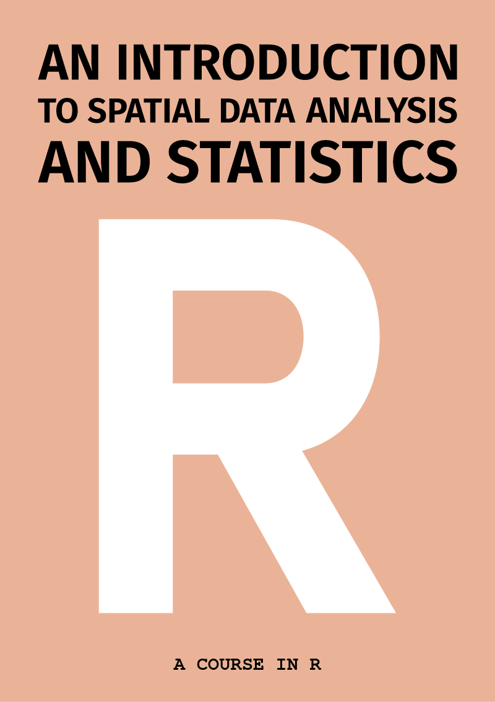

--- 
title: "An Introduction to Spatial Data Analysis and Statistics: A Course in `R`"
author: "Antonio Paez"
date: "`r Sys.Date()`"
site: bookdown::bookdown_site
#output: 
#  bookdown::gitbook:
#      includes:
#            in_header: images\html_test\styles.css
documentclass: book
bibliography: [bibliography.bib, packages.bib]
biblio-style: apalike
link-citations: yes
github-repo: paezha/spatial-analysis-R
description: "This book was created as a resource for teaching applied spatial statistics at McMaster University by Antonio Paez, with support from Anastassios Dardas, Rajveer Ubhi, Megan Coad, and Alexis Polidoro. The book is published with support of an Open Educational Resources grant from MacPherson Institute, McMaster University."
graphics: yes
cover-image: "images/cover.jpg"
---

<!--
TO RENDER:
bookdown::render_book(input = ".", config_file = "_bookdown.yml")
-->

<!--
NOTE: echo=is_html does not work

Inspired by [**bookdown**](https://github.com/rstudio/bookdown) and the Free and Open Source Software for Geospatial ([FOSS4G](http://foss4g.org/)) movement, this book is open source.
This ensures its contents are reproducible and publicly accessible for people worldwide.
The online version of the book is hosted at [geocompr.robinlovelace.net](https://geocompr.robinlovelace.net) and kept up-to-date by [GitHub 
  Actions](https://github.com/Robinlovelace/geocompr/actions), which provides information on its 'build status' as follows:
[](https://github.com/Robinlovelace/geocompr/actions)
-->

# {-}

<!--
```{r cover, echo=FALSE, out.width="100%"}
knitr::include_graphics(rep("images/voronoi_ponyo.gif"))
```
-->

<!-- 
The following code generates the cover image. To change the background images, work with the style.css file in the root directory
-->

<!-- COVER 1 -->
<!--
<div class="cover1">

</div>
-->

<!-- COVER 1 -->
<!--
<div class="cover1">

</div>
-->

<!-- COVER 2 -->
<!--
<div class="cover2">
<div class="fade-in-text">
<p>An Introduction to Spatial Data Analysis and Statistics</p>
</div>
</div>
-->

<!-- COVER 3b -->
<!--
<div class="header3b">

</div>
<div class="cover3"></div>
<div class="bottom3"><p>A Course in R</p></div>
-->

<!-- COVER 3 -->
<!--
<div class="header3">
<div class="fade-in-text">
<p>An Introduction to Spatial Data Analysis and Statistics</p>
</div>
</div>
<div class="cover3"></div>
<div class="bottom3"><p>A Course in R</p></div>
-->

<!-- COVER 4 -->
<!--
<div class="cover4">
<div class="fade-in-text">
<p>An Introduction to Spatial Data Analysis and Statistics</p>
<p class="subtitle">A Course in R</p>
</div>

</div>
-->

<!-- COVER 4b -->
<!--
<div class="cover4b">
<div class="fade-in-text">
<p>An Introduction to Spatial Data Analysis and Statistics</p>
<p class="subtitle">A Course in R</p>
</div>

</div>
-->

<!-- COVER 5b -->
<div class="cover5b">

</div>

<!-- COVER 5c -->
<!--
<div class="cover5c">

</div>
-->
                
# Front Matter {-}

Paez, Antonio (2021)  
*An Introduction to Spatial Data Analysis and Statistics: A Course in R*  
[Publisher]  
ISBN: 978-1-7778515-0-7  
<!-- DOI badge -->
[](https://zenodo.org/badge/latestdoi/391072865)  
In GitHub: https://github.com/paezha/spatial-analysis-r
  
  
Antonio Paez  
School of Earth, Environment and Society  
McMaster University  
Hamilton, Ontario  
Canada  
paezha@mcmaster.ca  
<!-- ORCID badge-->
<a href="https://orcid.org/0000-0001-6912-9919">

https://orcid.org/0000-0001-6912-9919 
</a>  
<!-- Google Scholar and Publobs icons by https://jpswalsh.github.io/academicons/-->
<a href="https://scholar.google.com/citations?user=bLY377kAAAAJ&hl=en">

</a>  
<a href="https://publons.com/researcher/2897251/antonio-paez/">

</a>
<!-- GitHub icon retrived from https://github.com/logos-->  
<a href="https://github.com/paezha">

</a>  

## What is this book and who is it for? {-}

Words go here.

## Allied resources {-}

You can find additional resources for students and instructors [here](https://github.com/paezha/spatial-analysis-r#resources-for-students-and-instructors)

## Contributing {-}

An advantage of an Open Educational Resource compared to traditional publishing (besides it being free!) is that it is a live, ongoing project, for as long as anyone cares to keep it alive. If you are using this resource, I would encourage you to contribute to help me improve it, by:

- suggesting improvements to the text, e.g. clarifying unclear sentences, fixing typos (see guidance from [Yihui Xie](https://yihui.name/en/2013/06/fix-typo-in-documentation/));
- proposing changes to the code, e.g. to do things in a more efficient way.

Doing this is as easy as editing a wiki page; use the `Edit` button in the toolbar to make a pull request (you need to have a GitHub account and be able to fork the repository):

[](https://github.com/paezha/spatial-analysis-r/edit/main/index.Rmd)

In addition, please feel free to make requests for features or to develop content (see the project's [issue tracker](https://github.com/paezha/spatial-analysis-r/issues)).

### License

This work is licensed under a Creative Commons [Attribution-NonCommercial-ShareAlike 4.0 International License (CC BY-NC-SA 4.0)](https://creativecommons.org/licenses/by-nc-sa/4.0/). This means that you are free to:

- Share it: you can copy and redistribute the material in any medium or format
- Adapt it: you can remix, transform, and build upon the material

Under the following terms:

- Attribution: You must give appropriate credit, provide a link to the license, and indicate if changes were made. You may do so in any reasonable manner, but not in any way that suggests the licensor endorses you or your use.

- NonCommercial: You may not use the material for commercial purposes.

- ShareAlike: If you remix, transform, or build upon the material, you must distribute your contributions under the same license as the original.

- No additional restrictions: You may not apply legal terms or technological measures that legally restrict others from doing anything the license permits.

These freedoms cannot be revoked by the licensor (that is me) as long as you follow the license terms.

```{r license, echo=FALSE, out.width="10%"}
knitr::include_graphics(rep("images/license.png"))
```

## How to support this project {-}


